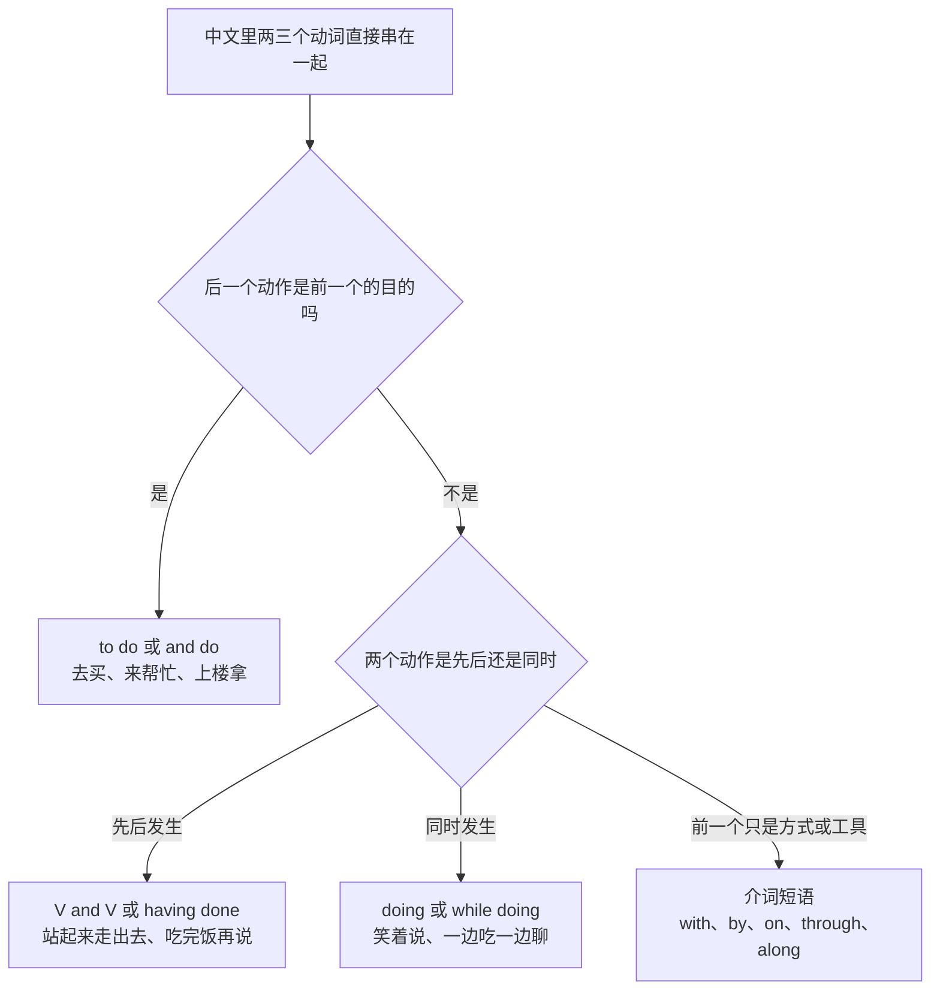
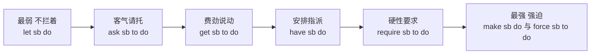
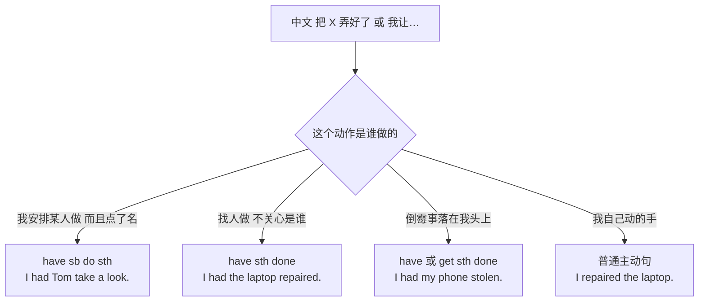
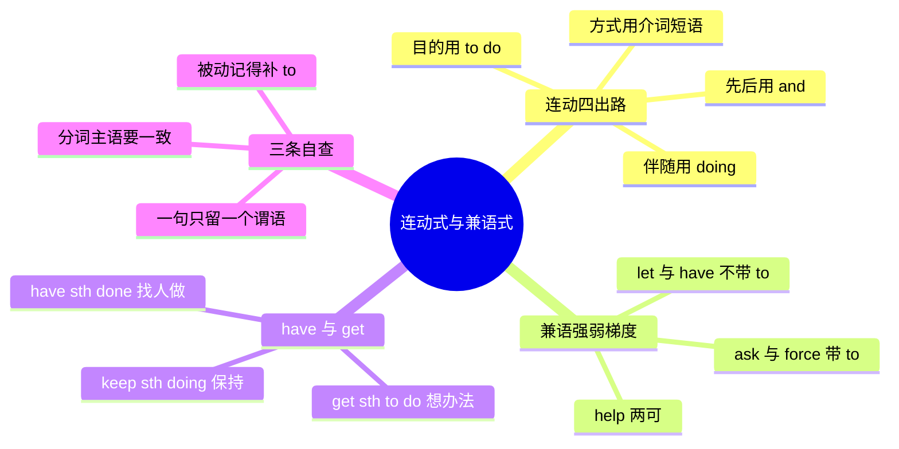

# 连动式与兼语式：去买、站起来走出去、我让他去

> [!info] 本篇定位
>
> 这篇收两类中文句式的英译入口。第一类是动词直接串起来：去买、来帮忙、站起来走出去、笑着说、坐地铁去、用脚本跑一遍——中文可以把两三个动词摞在一起不加任何连接成分，英文一个分句只留一个谓语，其余全要变形。第二类是兼语句：我让他去、逼他改、请他看一眼、把日志导出来、让 CI 跑一遍——前一个动词的宾语同时当后一个动词的主语。
>
> 查到的是四条出路（to 不定式、and 并列、-ing 伴随、介词短语）与一张使役动词强弱梯度表，配「带不带 to」的收口清单。
>
> 上一篇 [[02.中文句式转换/03.无主句、话题优先与主语选择：下雨了、这件事我知道|无主句、话题优先与主语选择]] 处理的是主语从哪来，这一篇处理的是谓语只能留一个之后，多出来的动词往哪放。

---

## 1. 本篇导读：中文动词能摞，英文只留一个谓语

### 1.1 两类句式的分界线在哪

中文允许「我去买菜」这样连着两个动词，也允许「我让他去买菜」这样让「他」既当 `让` 的宾语又当 `去` 的主语。两种串法在英文里走的是完全不同的两条路。

| 中文句式 | 特征 | 例子 | 英文的处置方向 |
| --- | --- | --- | --- |
| 连动式 | 两三个动词共用同一个主语，中间不加任何连接词 | 我去买菜／他站起来走出去／她笑着说 | 保一个谓语，其余变 to do、doing、and V 或介词短语 |
| 兼语式 | 中间那个名词一身两职：前动词的宾语，后动词的主语 | 我让他去／老板派她出差／我请他看一眼 | 走 `V + sb + do／to do` 的复合宾语格式 |

判别只要一步：数一数主语。「我去买菜」从头到尾只有一个「我」，是连动式；「我让他去买菜」里「买」的执行者换成了「他」，是兼语式。

### 1.2 连动式的四条出路

这张图是本篇上半部分的骨架。四个出口不是同义替换：目的关系用 to do 是把后一个动作降级成「为的是」，先后关系用 and 是把两个动作平级铺开，同时关系用 doing 是把其中一个压成背景，方式关系直接连动词都不留、整块换成介词短语。选错出口读起来的差别不是语法错误而是重心跑偏——「他坐地铁去公司」写成 `He sat on the subway and went to the office` 语法挑不出毛病，但读者会以为他先坐了一会儿地铁然后又去了公司。

### 1.3 兼语式的三个变量

兼语句的成品格式只有两种：`V + sb + 动词原形` 和 `V + sb + to do`。挑哪一种取决于三件事。

| 变量 | 问自己 | 影响 |
| --- | --- | --- |
| 语义强度 | 是不拦着、是安排、还是硬逼 | 决定用 let、have、ask 还是 make、force |
| 带不带 to | 这个动词属于哪一组 | let／make／have／感官动词不带，其余基本都带 |
| 执行者要不要点名 | 关心是谁做的吗 | 不关心就换成 have sth done，只写事不写人 |

第三个变量最容易漏。中文说「我把电脑修了」既能是自己修的也能是送去修的，英文必须选边：`I repaired my laptop` 是自己动手，`I had my laptop repaired` 是找人修。

---

## 2. 目的型连动：去买、来帮忙、专门跑一趟

### 2.1 去买、去拿、去问一下

中文触发语：去买 / 去拿 / 去取 / 去问一下 / 去看看 / 跑一趟

| 档位 | 句架 | 例句 |
| --- | --- | --- |
| 口语 | go + 动词原形（美式，中间什么都不加） | I'll go grab a coffee. |
| 口语 | go and + 动词原形 | Go and check whether the job finished. |
| 书面 | go to + 动词原形（目的明确） | She went to the front desk to ask about the invoice. |
| 正式 | proceed to + 动词原形 | The auditor proceeded to examine the transaction logs. |

> [!warning] 错配警示
>
> - ~~I go to buy a coffee now.~~ ❌
> - **I'm going to grab a coffee.** ✅（一次性的「现在去买」用进行时；一般现在时的 go to buy 读成每天都干的习惯）

- 同义入口：去买 / 跑一趟 / 走一趟 / 去弄一个回来
- 语法归属：[[02.英语基础语法/08.非谓语动词/01.动词不定式详解|动词不定式表目的]]
- 场景实战：[[04.英语场景/06.日常生活场景实战/03.购物超市与讨价还价场景|购物超市与讨价还价场景]]

### 2.2 来帮忙、过来看看、来接我

中文触发语：来帮忙 / 过来看看 / 来接我 / 来一趟 / 上来一下

| 档位 | 句架 | 例句 |
| --- | --- | --- |
| 口语 | come + 动词原形 | Come take a look at this stack trace. |
| 口语 | come over and + 动词原形 | Can you come over and help me move the rack? |
| 书面 | come to + 动词原形 | A technician came to inspect the unit on Thursday. |
| 正式 | be dispatched to + 动词原形 | A specialist was dispatched to assess the damage. |

- 同义入口：来帮忙 / 过来一趟 / 上来看看 / 请人来
- 语法归属：[[02.英语基础语法/08.非谓语动词/01.动词不定式详解|动词不定式表目的]]
- 场景实战：[[04.英语场景/10.职场与商务场景实战/02.会议汇报与演示场景|会议汇报与演示场景]]

### 2.3 特意去、专门跑一趟、顺路捎上

中文触发语：特意 / 专门 / 特地 / 顺路 / 顺手 / 反正都要去

| 档位 | 句架 | 例句 |
| --- | --- | --- |
| 口语 | ... just to do sth | I stayed late just to finish the migration. |
| 口语 | while I'm at it / on my way | I'll pick up the badge on my way in. |
| 书面 | go out of one's way to do sth | She went out of her way to get the paperwork signed the same day. |
| 正式 | for the sole purpose of doing sth | The trip was arranged for the sole purpose of reviewing the accounts. |

> [!warning] 错配警示
>
> - ~~I specially came to see you.~~ ❌
> - **I came all this way just to see you.** ✅（specially 在英语里偏「为特定用途制作」，中文的「特意」用 just to 或 all this way 承接）

- 同义入口：特意 / 专门 / 顺带 / 反正顺路
- 语法归属：[[02.英语基础语法/08.非谓语动词/01.动词不定式详解|动词不定式表目的]]

### 2.4 为的就是、目的是、免得

中文触发语：为的是 / 目的是 / 就是为了 / 免得 / 省得 / 以防

| 档位 | 句架 | 例句 |
| --- | --- | --- |
| 口语 | ..., that way ... | We cache the token, that way the client only signs in once. |
| 书面 | in order to do / so as to do | We batched the writes in order to avoid a second round trip. |
| 书面 | so that + 主语 + 谓语 | We split the file so that reviews stay readable. |
| 书面 | to avoid doing / so as not to do | Rename the branch first so as not to break the existing links. |
| 正式 | with a view to doing / with the aim of doing | The policy was revised with a view to reducing turnover. |

> [!warning] 错配警示
>
> - ~~so as to not break the build~~ ❌
> - **so as not to break the build** ✅（否定副词 not 站在 to 前面，不站在 to 和动词中间）

- 同义入口：为的是 / 免得 / 省得 / 以防万一
- 语法归属：[[02.英语基础语法/09.从句体系/04.状语从句详解|目的状语从句]]
- 场景实战：[[04.英语场景/04.从句与复合句型框架/03.状语从句九大类型|状语从句九大类型]]

---

## 3. 先后型连动：站起来走出去、吃完饭再说

### 3.1 站起来走出去、转身就走

中文触发语：站起来走出去 / 转身就走 / 拿起来就跑 / 接过来看了看

| 档位 | 句架 | 例句 |
| --- | --- | --- |
| 口语 | V and V | He stood up and walked out. |
| 口语 | V, V, and V（三段以上用逗号加 and 收尾） | She grabbed her badge, swiped in, and headed for the lab. |
| 书面 | Doing sth, sb + 谓语（前一个动作压成分词） | Standing up, he walked out without a word. |
| 正式 | Having done sth, sb + 谓语 | Having signed the release form, she left the building. |

> [!warning] 错配警示
>
> - ~~He stood up walked out.~~ ❌
> - **He stood up and walked out.** ✅（中文两个动词可以直接贴着，英文两个并列谓语之间必须有 and，或逗号加 and）

- 同义入口：站起来走出去 / 转身就走 / 一把抓过来
- 语法归属：[[02.英语基础语法/08.非谓语动词/03.现在分词详解|现在分词作状语]]
- 场景实战：[[04.英语场景/02.基础句型框架/01.英语五大基本句型完全解析|英语五大基本句型完全解析]]

### 3.2 做完 A 再做 B

中文触发语：…完再… / …好了就… / 先…然后… / 等…了再…

| 档位 | 句架 | 例句 |
| --- | --- | --- |
| 口语 | do A, then do B | Run the tests, then merge. |
| 口语 | after doing A, ... | After checking the diff, I approved it. |
| 书面 | Once A is done, B | Once the migration is done, we flip the feature flag. |
| 正式 | Upon completion of A, B | Upon completion of the audit, the report will be circulated to all stakeholders. |

> [!warning] 错配警示
>
> - ~~After I will finish the tests, I'll merge.~~ ❌
> - **After I finish the tests, I'll merge.** ✅（时间从句里用现在时表将来，将来时留给主句）

- 同义入口：…完再… / 等…好了 / 先…后…
- 语法归属：[[02.英语基础语法/09.从句体系/04.状语从句详解|时间状语从句]]

### 3.3 一…就…、话没说完就

中文触发语：一…就… / 刚…就… / 话没说完就 / 立刻

| 档位 | 句架 | 例句 |
| --- | --- | --- |
| 口语 | the moment / as soon as | Ping me the moment the build turns green. |
| 口语 | ..., and immediately ... | She saw the alert and immediately rolled back. |
| 书面 | On doing sth, sb + 谓语 | On receiving the alert, the on-call engineer rolled back the release. |
| 正式 | No sooner had A than B | No sooner had we deployed than the error rate spiked. |

- 同义入口：一…就 / 刚…就 / 立马 / 马上
- 语法归属：[[02.英语基础语法/10.特殊句型/03.倒装句结构|否定副词提前的倒装]]
- 场景实战：[[04.英语场景/02.基础句型框架/04.倒装句、强调句与省略句|倒装句、强调句与省略句]]

### 3.4 接着就、然后又、后来还

中文触发语：接着就 / 然后又 / 紧接着 / 后来还 / 顺势

| 档位 | 句架 | 例句 |
| --- | --- | --- |
| 口语 | and then ... / after that ... | We rolled back, and then paged the database team. |
| 口语 | go on to do sth（做完这件接着做另一件） | He fixed the typo and went on to rewrite the whole function. |
| 书面 | proceed to do sth | The script proceeds to write the results to disk. |
| 正式 | subsequently + 谓语 | The vendor subsequently withdrew the proposal. |

> [!warning] 错配警示
>
> - ~~He went on rewriting the function.~~（这是「继续写同一个函数」）
> - **He went on to rewrite the function.** ✅（做完前一件事之后转去做另一件，中文的「接着就」走这一支）

- 同义入口：接着 / 然后又 / 紧接着 / 顺势就
- 语法归属：[[02.英语基础语法/08.非谓语动词/05.非谓语动词综合辨析|不定式与动名词的意义差]]

---

## 4. 伴随型连动：笑着说、一边吃一边聊

### 4.1 笑着说、点着头听、举着手问

中文触发语：…着…（笑着说 / 哭着跑 / 低着头走 / 举着手问）

| 档位 | 句架 | 例句 |
| --- | --- | --- |
| 口语 | V + with a 名词 | He said it with a grin. |
| 口语 | V, doing sth（伴随动作后置） | She walked in, holding a stack of printouts. |
| 书面 | Doing sth, sb + 谓语（伴随动作前置） | Nodding along, he took notes the whole time. |
| 正式 | with + 名词 + 分词（独立结构） | He stood there with his arms folded. |

> [!warning] 错配警示
>
> - ~~Holding the door, the bag slipped out of my hand.~~ ❌
> - **As I held the door, the bag slipped out of my hand.** ✅（-ing 那半的隐含主语必须和主句主语是同一个，包不会自己扶门）

- 同义入口：笑着说 / 带着…的表情 / 一脸…地
- 语法归属：[[02.英语基础语法/08.非谓语动词/03.现在分词详解|现在分词表伴随]]
- 场景实战：[[04.英语场景/07.社交交际场景实战/01.交友聚会与闲聊场景|交友聚会与闲聊场景]]

### 4.2 一边…一边…、边…边…

中文触发语：一边…一边… / 边…边… / 同时 / …的同时

| 档位 | 句架 | 例句 |
| --- | --- | --- |
| 口语 | do A while doing B | I take notes while listening. |
| 口语 | do A and B at the same time | He was typing and talking at the same time. |
| 书面 | While doing A, sb + 谓语 | While reviewing the PR, I found two dead branches. |
| 正式 | in parallel with / concurrently with | The rollout proceeded in parallel with the data backfill. |

> [!warning] 错配警示
>
> - ~~I eat and I chat at the same time everyday.~~ ❌
> - **I eat while chatting.** ✅（两个动作共主语时后一个压成 while doing，重复主语读起来是流水账）

- 同义入口：一边…一边 / 边…边 / …的同时 / 顺带
- 语法归属：[[02.英语基础语法/06.动词时态/03.进行时态详解|进行体表同时进行]]

### 4.3 带着、拿着、背着去

中文触发语：带着 / 拿着 / 背着 / 揣着 / 抱着

| 档位 | 句架 | 例句 |
| --- | --- | --- |
| 口语 | bring sth with you | Bring your laptop with you. |
| 口语 | show up with sth（介词短语直接吸收动词） | He showed up with two boxes of cables. |
| 书面 | Carrying sth, sb + 谓语 | Carrying the spare drive, she headed to the rack room. |
| 正式 | be accompanied by sth | Each request must be accompanied by a signed authorization form. |

> [!warning] 错配警示
>
> - ~~He came with holding a box.~~ ❌
> - **He came holding a box.** ✅ 或 **He came with a box.** ✅（with 后面直接跟名词，不跟动作；要动作就把 with 去掉）

- 同义入口：带着 / 拿着 / 随身 / 手里提着
- 语法归属：[[02.英语基础语法/05.介词与连词/02.常用介词搭配详解|with 的伴随用法]]

### 4.4 改了一下，结果就好了

中文触发语：…了，结果就… / 从而 / 于是就 / 这样一来

| 档位 | 句架 | 例句 |
| --- | --- | --- |
| 口语 | ..., so ... | I bumped the timeout, so the retries stopped. |
| 书面 | ..., which + 谓语（which 回指整句） | We cached the token, which cut the latency in half. |
| 书面 | ..., doing sth（结果分词，逗号不能省） | The disk filled up, causing every write to fail. |
| 正式 | ..., thereby doing sth | The change removes the global lock, thereby eliminating the deadlock. |

> [!warning] 错配警示
>
> - ~~The disk filled up, made every write fail.~~ ❌
> - **The disk filled up, causing every write to fail.** ✅（结果那半要么变 -ing，要么补 and 或 which，不能光靠逗号挂一个过去式）

- 同义入口：结果就 / 于是 / 从而 / 这样一来
- 语法归属：[[02.英语基础语法/08.非谓语动词/03.现在分词详解|现在分词表结果]]

---

## 5. 方式、工具与路径：用脚本跑、坐地铁去

### 5.1 用 X 做 Y

中文触发语：用…做 / 拿…弄 / 靠…完成 / 通过…实现

| 档位 | 句架 | 例句 |
| --- | --- | --- |
| 口语 | do sth with sth（工具） | Open it with any text editor. |
| 口语 | use sth to do sth | We use a cron job to rotate the logs. |
| 书面 | by doing sth（做法） | We cut the payload by dropping the debug fields. |
| 正式 | by means of / through the use of | Access is granted by means of a short-lived token. |

> [!warning] 错配警示
>
> - ~~We fixed it by a script.~~ ❌
> - **We fixed it with a script.** ✅ 或 **We fixed it by running a script.** ✅（with 后面接工具，by 后面接做法，做法要带动名词）

- 同义入口：用…做 / 拿…弄 / 借助 / 通过…来
- 语法归属：[[02.英语基础语法/05.介词与连词/02.常用介词搭配详解|by 与 with 的分工]]

### 5.2 坐地铁去、打车过去、走着去

中文触发语：坐…去 / 打车去 / 走着去 / 开车过去 / 骑车

| 档位 | 句架 | 例句 |
| --- | --- | --- |
| 口语 | take the 交通工具 + to 地点 | Take the subway to the office. |
| 口语 | go by 交通工具（不加冠词） | I go by train on Mondays. |
| 口语 | drive / walk / fly / cycle + 地点 | We flew to Shenzhen on Tuesday. |
| 正式 | travel by / be transported by | Samples are transported by refrigerated truck. |

> [!warning] 错配警示
>
> - ~~I sit the bus to work.~~ ❌ 且 ~~by the subway~~ ❌
> - **I take the bus to work.** ✅ 且 **by subway** ✅ 或 **on the subway** ✅（「坐车」的「坐」不译 sit；by 后面的交通工具不带冠词）

- 同义入口：坐…去 / 打车 / 走过去 / 搭车
- 语法归属：[[02.英语基础语法/05.介词与连词/01.介词的分类与基本用法|交通方式介词]]
- 场景实战：[[04.英语场景/08.出行与旅游场景实战/03.公共交通打车与租车场景|公共交通打车与租车场景]]

### 5.3 按照…做、照着…写

中文触发语：按照 / 照着 / 依据 / 参照 / 遵照

| 档位 | 句架 | 例句 |
| --- | --- | --- |
| 口语 | follow sth / go by sth | Just follow the README. |
| 口语 | do sth the way ... | Do it the way we did it last release. |
| 书面 | in accordance with / according to | Rotate the keys in accordance with the security policy. |
| 正式 | pursuant to / as prescribed in | Access is revoked pursuant to Section 4.2 of the agreement. |

- 同义入口：按照 / 照着 / 依着 / 参照
- 语法归属：[[02.英语基础语法/05.介词与连词/02.常用介词搭配详解|依据类介词短语]]

### 5.4 穿过去、沿着走、绕过去

中文触发语：穿过…走 / 沿着…走 / 绕过去 / 顺着…找 / 从…过去

| 档位 | 句架 | 例句 |
| --- | --- | --- |
| 口语 | go through / across / along / past | Go through the lobby and up the stairs. |
| 口语 | walk + 方向副词（over、out、back、up） | She walked over and unplugged it. |
| 书面 | make one's way + 介词短语 | He made his way across the floor to the whiteboard. |
| 正式 | proceed + 介词短语 | Visitors should proceed through the north gate. |

> [!warning] 错配警示
>
> - ~~He walked passed the door.~~ ❌
> - **He walked past the door.** ✅（past 是介词，passed 是 pass 的过去式，两个词不通用）

- 同义入口：穿过 / 绕过 / 沿着 / 顺着 / 从…那边过去
- 语法归属：[[02.英语基础语法/05.介词与连词/01.介词的分类与基本用法|方位与路径介词]]

---

## 6. 我让他去：使役梯度与带不带 to

### 6.1 一条从最弱到最强的尺

中文的「让」一个字覆盖了这整条尺，英文没有对应的通用词，必须先判断强度再挑动词。日常口语里出现频率最高的其实是中间三档：`ask` 用在同事之间的请托，`get` 用在对方本来不太愿意、你说动了他，`have` 用在你有权安排、对方照办是默认的。两头的 `let` 和 `make` 反而是特例——`let` 只在「本来可以拦、我没拦」时才对，`make` 带着明确的强迫意味，写进工作邮件会显得很凶。

同一条尺上还叠了第二个变量：`let`、`make`、`have` 后面跟动词原形，`ask`、`get`、`force`、`require` 后面跟带 to 的不定式。这两组没有规律可循，只能当固定搭配记。

### 6.2 我让他去、叫他弄一下

中文触发语：让他去 / 叫他做 / 找他弄 / 安排他 / 让人去

| 档位 | 句架 | 例句 |
| --- | --- | --- |
| 口语 | have sb do sth（安排指派，不带 to） | I'll have Tom take a look at it. |
| 口语 | get sb to do sth（说动了才办成） | I finally got him to reply. |
| 中性 | ask sb to do sth（客气的「让」） | I asked her to send the numbers again. |
| 书面 | arrange for sb to do sth | We arranged for a contractor to run the cabling. |

> [!warning] 错配警示
>
> - ~~I let him to check the config.~~ ❌
> - **I had him check the config.** ✅（中文的「让」多数是「安排、叫」，写 let 会变成「我本来能拦着他但没拦」；且 let 与 have 后面不带 to）

- 同义入口：让他 / 叫他 / 找他 / 安排他 / 派个人
- 语法归属：[[02.英语基础语法/08.非谓语动词/01.动词不定式详解|不定式作宾语补足语]]
- 场景实战：[[04.英语场景/10.职场与商务场景实战/02.会议汇报与演示场景|会议汇报与演示场景]]

### 6.3 让他说完、准他走、由着他

中文触发语：让他说完 / 准他 / 不拦着 / 由着他 / 放他走

| 档位 | 句架 | 例句 |
| --- | --- | --- |
| 口语 | let sb do sth | Let him finish. |
| 口语 | let sth + 动词原形（对物也一样） | Let the backfill run overnight. |
| 书面 | allow sb to do sth | The plan allows contractors to bill monthly. |
| 正式 | permit sb to do / grant sb permission to do | Staff are permitted to work remotely two days a week. |

> [!warning] 错配警示
>
> - ~~He was let to go early.~~ ❌
> - **He was allowed to leave early.** ✅（let 没有常用的被动式，一变被动就换成 be allowed to）

- 同义入口：让他…吧 / 准 / 不拦着 / 随他去
- 语法归属：[[02.英语基础语法/10.特殊句型/01.被动语态全解|使役动词的被动形态]]
- 场景实战：[[04.英语场景/05.高频实用表达句型框架/02.建议请求邀请拒绝四大功能句型|建议请求邀请拒绝四大功能句型]]

### 6.4 逼他改、迫使、不得不

中文触发语：逼他 / 迫使 / 强迫 / 硬要他 / 只好让他

| 档位 | 句架 | 例句 |
| --- | --- | --- |
| 口语 | make sb do sth（不带 to） | They made me redo the whole migration. |
| 口语 | force sb to do sth | Don't force him to commit to a date today. |
| 书面 | compel sb to do / oblige sb to do | The outage compelled us to publish a postmortem. |
| 正式 | require sb to do / mandate that sb do | The policy requires every vendor to sign an NDA. |

> [!warning] 错配警示
>
> - ~~I was made redo it.~~ ❌
> - **I was made to redo it.** ✅（make 主动时不带 to，一变被动必须把 to 补回来）

- 同义入口：逼 / 迫使 / 硬让 / 不得不 / 只能
- 语法归属：[[02.英语基础语法/10.特殊句型/01.被动语态全解|主动不带 to 被动补 to]]

### 6.5 使他很紧张、弄得一团糟

中文触发语：使…变得 / 让…感到 / 弄得 / 搞得 / 害得

| 档位 | 句架 | 例句 |
| --- | --- | --- |
| 口语 | make sb + 形容词 | That whole thread made me nervous. |
| 口语 | make sb + 名词（任命义） | They made her the release manager. |
| 书面 | leave sb/sth + 形容词或分词 | The rollback left half the queue stuck. |
| 正式 | render sth + 形容词 | The new schema renders the old client unusable. |

> [!warning] 错配警示
>
> - ~~It makes me to feel tired.~~ ❌ 且 ~~It makes me feeling tired.~~ ❌
> - **It makes me feel tired.** ✅（make 后面只跟动词原形或形容词，两种变形都不行）

- 同义入口：使 / 让…感到 / 弄得 / 搞得 / 害得
- 语法归属：[[02.英语基础语法/04.形容词与副词/01.形容词的用法与位置|形容词作宾语补足语]]

### 6.6 派他去、把这活交给他

中文触发语：派他去 / 指派 / 调他过去 / 交给他 / 让他顶上

| 档位 | 句架 | 例句 |
| --- | --- | --- |
| 口语 | send sb to do sth | They sent an intern to fix the docs. |
| 口语 | put sb on sth | We put Mia on the billing bug. |
| 书面 | assign sb to do sth / assign sth to sb | Assign the migration to whoever owns the schema. |
| 正式 | task sb with doing sth / designate sb to do sth | The platform team has been tasked with restoring the index. |

> [!warning] 错配警示
>
> - ~~They assigned him do the migration.~~ ❌
> - **They assigned him to do the migration.** ✅（assign 属于带 to 的那一组，别按 have 的格式套）

- 同义入口：派 / 指派 / 交给 / 让他负责 / 调过去
- 语法归属：[[02.英语基础语法/08.非谓语动词/01.动词不定式详解|不定式作宾语补足语]]
- 场景实战：[[04.英语场景/10.职场与商务场景实战/02.会议汇报与演示场景|会议汇报与演示场景]]

---

## 7. 请他看一眼、要求、劝、提醒、帮

### 7.1 麻烦你、请你、拜托

中文触发语：麻烦你 / 请你 / 拜托 / 劳驾 / 帮个忙

| 档位 | 句架 | 例句 |
| --- | --- | --- |
| 口语 | Could you ... ? | Could you rerun it with verbose logging on? |
| 口语 | ask sb to do sth（转述别人的请托） | She asked me to hold off on the merge. |
| 书面 | request that sb do sth | We request that all contractors submit timesheets weekly. |
| 正式 | sb is requested to do sth | Applicants are requested to attach a signed copy of the form. |

> [!warning] 错配警示
>
> - ~~I suggested him to try again.~~ ❌
> - **I asked him to try again.** ✅ 或 **I suggested that he try again.** ✅（suggest 不能接「人 + to do」，要么换 ask，要么改成从句）

- 同义入口：麻烦你 / 请你 / 拜托 / 帮我一下
- 语法归属：[[02.英语基础语法/09.从句体系/03.名词性从句详解|宾语从句中的原形谓语]]
- 场景实战：[[04.英语场景/05.高频实用表达句型框架/02.建议请求邀请拒绝四大功能句型|建议请求邀请拒绝四大功能句型]]

### 7.2 要求他必须、规定

中文触发语：要求 / 规定 / 必须让他 / 硬性要求 / 坚持要

| 档位 | 句架 | 例句 |
| --- | --- | --- |
| 口语 | tell sb to do sth | Tell him to stop pushing to main. |
| 中性 | expect sb to do sth | We expect every PR to come with a test. |
| 书面 | require sb to do sth | The form requires you to list a backup contact. |
| 正式 | insist that sb do sth | Legal insisted that the clause be removed before signing. |

> [!warning] 错配警示
>
> - ~~The rule demands us to sign.~~ ❌
> - **The rule requires us to sign.** ✅ 或 **The rule demands that we sign.** ✅（demand 与 require 长得像，但 demand 不接「人 + to do」）

- 同义入口：要求 / 规定 / 必须 / 一定要
- 语法归属：[[02.英语基础语法/09.从句体系/03.名词性从句详解|要求类动词后的从句谓语]]

### 7.3 劝他、说动他、鼓励他

中文触发语：劝他 / 说动他 / 鼓励 / 怂恿 / 劝退

| 档位 | 句架 | 例句 |
| --- | --- | --- |
| 口语 | talk sb into doing sth | I talked him into splitting the PR. |
| 口语 | talk sb out of doing sth（反向） | I talked her out of rewriting it from scratch. |
| 口语 | get sb to do sth | I couldn't get her to change her mind. |
| 书面 | persuade sb to do / convince sb to do | We persuaded the vendor to extend the trial by a month. |
| 正式 | urge sb to do / encourage sb to do | Reviewers are encouraged to leave concrete suggestions. |

> [!warning] 错配警示
>
> - ~~I talked him into split the PR.~~ ❌ 且 ~~persuade him doing it~~ ❌
> - **I talked him into splitting the PR.** ✅ 且 **persuade him to do it** ✅（into 后面必须动名词，persuade 后面必须不定式，两个格式不能互串）

- 同义入口：劝 / 说动 / 鼓励 / 怂恿 / 劝住
- 语法归属：[[02.英语基础语法/08.非谓语动词/02.动名词详解|介词后接动名词]]

### 7.4 提醒他、通知一声、告诉他别

中文触发语：提醒他 / 通知一声 / 告诉他别 / 打个招呼 / 警告

| 档位 | 句架 | 例句 |
| --- | --- | --- |
| 口语 | remind sb to do sth | Remind me to rotate the certs on Friday. |
| 口语 | give sb a heads-up that ... | Give the team a heads-up that we're freezing on Thursday. |
| 书面 | notify sb that ... / advise sb to do sth | Please notify support that the endpoint has moved. |
| 正式 | caution sb against doing sth | Users are cautioned against running this command in production. |

> [!warning] 错配警示
>
> - ~~Remind me rotating the certs.~~ ❌
> - **Remind me to rotate the certs.** ✅（remind sb to do 是提醒去做，remind sb of sth 才接名词，两个格式不混用）

- 同义入口：提醒 / 通知 / 知会一声 / 打个招呼
- 语法归属：[[02.英语基础语法/08.非谓语动词/05.非谓语动词综合辨析|接不定式与接动名词的动词分组]]
- 场景实战：[[04.英语场景/10.职场与商务场景实战/03.商务邮件与正式书面沟通|商务邮件与正式书面沟通]]

### 7.5 帮我做、搭把手、教我怎么弄

中文触发语：帮我做 / 搭把手 / 教我 / 带我一下 / 演示一遍

| 档位 | 句架 | 例句 |
| --- | --- | --- |
| 口语 | help sb do sth（to 可省，通常省） | Can you help me debug this? |
| 口语 | give sb a hand with sth | Give me a hand with the rack, will you? |
| 书面 | assist sb in doing sth | The script assists reviewers in spotting missing test cases. |
| 正式 | show sb how to do sth / teach sb to do sth | The onboarding doc shows new hires how to set up the toolchain. |

> [!warning] 错配警示
>
> - ~~help me debugging this~~ ❌ 且 ~~assist him to doing it~~ ❌
> - **help me debug this** ✅ 且 **assist him in doing it** ✅（help 后面带不带 to 都行但不能带 -ing，assist 固定搭 in doing）

- 同义入口：帮我 / 搭把手 / 教我 / 带我做一遍
- 语法归属：[[02.英语基础语法/08.非谓语动词/05.非谓语动词综合辨析|help 的双重接法]]
- 场景实战：[[04.英语场景/09.学习与教育场景实战/01.课堂讨论与提问场景|课堂讨论与提问场景]]

### 7.6 我想让他、希望他、需要他

中文触发语：我想让他 / 希望他 / 需要他 / 指望他 / 巴不得他

| 档位 | 句架 | 例句 |
| --- | --- | --- |
| 口语 | want sb to do sth | I want you to look at the numbers first. |
| 口语 | need sb to do sth | I need someone to own this ticket. |
| 书面 | expect sb to do / would like sb to do | I'd like each team to nominate a reviewer by Friday. |
| 正式 | it is desirable that sb do sth | It is desirable that each release be signed off by two reviewers. |

> [!warning] 错配警示
>
> - ~~I hope you to come.~~ ❌
> - **I want you to come.** ✅ 或 **I hope you can come.** ✅（hope 不接「人 + to do」，中文的「希望他来」要么换 want，要么改成从句）

- 同义入口：想让 / 希望 / 需要 / 指望 / 盼着
- 语法归属：[[02.英语基础语法/08.非谓语动词/01.动词不定式详解|不定式的复合结构]]

---

## 8. have 与 get：把电脑修了、让它跑起来

### 8.1 have 的三条分叉

同一个 `have` 挂三种意思，靠语序和上下文分辨：宾语后面跟原形动词就是指派人做，跟过去分词就是事情被做了，而事情被做了到底是我花钱办的还是我倒霉遭的，只能看句子内容——`have the laptop repaired` 显然是花钱办的，`have my phone stolen` 显然不是。第四条分叉是最容易被中文带偏的一条：中文「我把电脑修了」不区分自己修还是送修，英文写 `I repaired my laptop` 就是自己拿螺丝刀拆了。

### 8.2 找人把它弄好、送去修

中文触发语：把…修一下 / 找人做 / 弄好它 / 让人给…办了 / 请人来装

| 档位 | 句架 | 例句 |
| --- | --- | --- |
| 口语 | have sth done | I had the laptop repaired last week. |
| 口语 | get sth done（更口语，强调办成了） | Let's get this merged before lunch. |
| 书面 | have sth done by sb（点名施事） | We had the audit done by an external firm. |
| 正式 | arrange for sth to be done | Arrangements were made for the certificates to be reissued. |

> [!warning] 错配警示
>
> - ~~I repaired my laptop at the store.~~ ❌
> - **I had my laptop repaired at the store.** ✅（不是自己动手就必须用 have sth done，否则读成你在店里亲手拆机）

- 同义入口：找人修 / 送去修 / 让人办了 / 请人来弄
- 语法归属：[[02.英语基础语法/10.特殊句型/01.被动语态全解|使役被动结构]]
- 场景实战：[[04.英语场景/03.时态与语态句型框架/02.被动语态句型框架|被动语态句型框架]]

### 8.3 我手机被偷了、账号被锁了

中文触发语：被…了 / 让人给…了 / 遭了 / 挨了 / 摊上了

| 档位 | 句架 | 例句 |
| --- | --- | --- |
| 口语 | get + 过去分词 | My account got locked this morning. |
| 口语 | have sth done（倒霉义） | I had my phone stolen on the train. |
| 书面 | sth was done（不提施事） | Two servers were decommissioned by mistake. |
| 正式 | sustain / suffer + 名词 | The company sustained a three-hour outage on Tuesday. |

> [!warning] 错配警示
>
> - ~~I was stolen my phone.~~ ❌
> - **I had my phone stolen.** ✅ 或 **My phone was stolen.** ✅（人不能当 steal 的被动主语，被偷的是手机不是人）

- 同义入口：被偷了 / 让人给弄了 / 遭了 / 摊上事了
- 语法归属：[[02.英语基础语法/10.特殊句型/01.被动语态全解|被动语态全解]]
- 场景实战：[[04.英语场景/11.医疗与紧急场景实战/01.医院看病与药店购药场景|突发状况的陈述]]

### 8.4 想办法让它跑起来

中文触发语：让它跑起来 / 弄好让它能用 / 想办法让… / 折腾到能用

| 档位 | 句架 | 例句 |
| --- | --- | --- |
| 口语 | get sth to do sth | I can't get the debugger to attach. |
| 口语 | get sth doing（让它转起来并持续） | Let's get the pipeline running again. |
| 口语 | get sb to do sth | See if you can get Ops to whitelist the IP. |
| 书面 | manage to get sth working | We managed to get the staging cluster working by noon. |

> [!warning] 错配警示
>
> - ~~I can't get it work.~~ ❌
> - **I can't get it to work.** ✅ 或 **I can't get it working.** ✅（get 与 have、make 不同，后面的不定式必须带 to）

- 同义入口：让它跑起来 / 弄能用 / 想办法让 / 捣鼓好
- 语法归属：[[02.英语基础语法/08.非谓语动词/05.非谓语动词综合辨析|get 的三种接法]]

### 8.5 让它一直跑着、别关

中文触发语：让它跑着 / 别停 / 保持开着 / 挂着 / 一直等着

| 档位 | 句架 | 例句 |
| --- | --- | --- |
| 口语 | keep sth doing / keep sth + 形容词 | Keep the tunnel open. |
| 口语 | leave sth doing | I left the profiler running overnight. |
| 口语 | keep sb waiting | Sorry to keep you waiting. |
| 正式 | ensure sth remains + 形容词 | Ensure the standby node remains reachable during the switchover. |

> [!warning] 错配警示
>
> - ~~Keep the server run.~~ ❌
> - **Keep the server running.** ✅（keep 后面只跟 -ing 或形容词，跟原形是把 keep 当成了 let）

- 同义入口：一直跑着 / 别关 / 保持 / 挂着别动
- 语法归属：[[02.英语基础语法/08.非谓语动词/03.现在分词详解|分词作宾语补足语]]

### 8.6 别让他、拦住、免得

中文触发语：别让他 / 拦住 / 防止 / 免得 / 不许

| 档位 | 句架 | 例句 |
| --- | --- | --- |
| 口语 | don't let sb do sth | Don't let anyone deploy on Friday afternoon. |
| 口语 | stop sb from doing sth | The lint rule stops people from committing secrets. |
| 书面 | prevent sb from doing sth | Rate limiting prevents a single client from exhausting the pool. |
| 正式 | prohibit sb from doing / bar sb from doing | Contractors are prohibited from accessing production data. |

> [!warning] 错配警示
>
> - ~~prevent him to leave~~ ❌
> - **prevent him from leaving** ✅（prevent、stop、keep 这一组一律走 from + 动名词，不走不定式）

- 同义入口：别让 / 拦住 / 防止 / 不许 / 免得
- 语法归属：[[02.英语基础语法/08.非谓语动词/02.动名词详解|介词 from 后的动名词]]

---

## 9. 看见他进来、发现被人改过

### 9.1 看见他做完、听见有人在做

中文触发语：看见他… / 听见有人… / 注意到 / 撞见 / 目睹

| 档位 | 句架 | 例句 |
| --- | --- | --- |
| 口语 | see sb do sth（看到全过程） | I saw him push straight to main. |
| 口语 | hear sb doing sth（撞见正在做） | I heard the fans spinning up. |
| 书面 | notice / observe sb doing sth | We observed memory climbing after every request. |
| 正式 | sb was observed to do sth（被动补 to） | The process was observed to allocate two gigabytes per request. |

> [!warning] 错配警示
>
> - ~~I saw him to leave.~~ ❌
> - **I saw him leave.** ✅（感官动词主动时不带 to，跟 make 是同一组；只有变被动才把 to 补回来）

- 同义入口：看见 / 听见 / 撞见 / 注意到 / 亲眼看到
- 语法归属：[[02.英语基础语法/08.非谓语动词/05.非谓语动词综合辨析|感官动词后的原形与分词]]

### 9.2 发现配置被改过、一看正在跑

中文触发语：发现…被… / 结果一看 / 一查才知道 / 打开一看

| 档位 | 句架 | 例句 |
| --- | --- | --- |
| 口语 | find sth + 过去分词 | I found the config overwritten. |
| 口语 | find sb doing sth | I found her rerunning the whole suite. |
| 书面 | discover that ... | We discovered that the index had never been rebuilt. |
| 正式 | sth was found to be + 形容词 | The dataset was found to be incomplete. |

> [!warning] 错配警示
>
> - ~~I found the config was overwrite.~~ ❌
> - **I found the config overwritten.** ✅（find 后面直接挂过去分词，不必补 was，补了反而要写完整的 was overwritten）

- 同义入口：发现 / 一看 / 一查 / 结果是
- 语法归属：[[02.英语基础语法/08.非谓语动词/04.过去分词详解|过去分词作宾语补足语]]

---

## 10. 工程日常：让 CI 跑一遍、把日志导出来

### 10.1 我让 CI 跑一遍

中文触发语：让 CI 跑一遍 / 触发一次构建 / 重跑一下 / 再跑一次流水线

| 档位 | 句架 | 例句 |
| --- | --- | --- |
| 口语 | rerun sth / kick off sth | I'll rerun CI on that branch. |
| 口语 | have sth run（安排它跑） | I'll have CI run the full suite on this one. |
| 书面 | trigger a run of sth | I triggered a full pipeline run against the release branch. |
| 正式 | sth is scheduled to run | The job is scheduled to run nightly at 02:00 UTC. |

> [!warning] 错配警示
>
> - ~~Let CI to run again.~~ ❌
> - **I'll rerun CI.** ✅ 或 **Let it run again.** ✅（let 后面不带 to；而且英语里直接说 rerun 比套使役结构自然得多）

- 同义入口：跑一遍 / 重跑 / 触发构建 / 走一次流水线
- 语法归属：[[02.英语基础语法/08.非谓语动词/01.动词不定式详解|不定式作宾语补足语]]
- 场景实战：[[04.英语场景/10.职场与商务场景实战/02.会议汇报与演示场景|会议汇报与演示场景]]

### 10.2 把日志导出来

中文触发语：把日志导出来 / 拉一份 / 打包发我 / 存一份下来

| 档位 | 句架 | 例句 |
| --- | --- | --- |
| 口语 | pull / grab / dump sth | Can you pull the last hour of logs? |
| 口语 | export sth to sth | Export the logs to a file and drop it in the ticket. |
| 书面 | have sth exported（找人做） | I had the logs exported before the pod got recycled. |
| 正式 | retain and provide sth | Please retain the logs and provide them with the incident report. |

> [!warning] 错配警示
>
> - ~~Please export me the logs.~~ ❌
> - **Please send me the logs.** ✅ 或 **Please export the logs for me.** ✅（export 不带双宾语，要给谁得补 to me 或 for me）

- 同义入口：导出来 / 拉一份 / 打包 / 存下来 / 发我
- 语法归属：[[02.英语基础语法/01.基础入门/02.英语五大基本句型详解|双宾语与单宾语句型]]

### 10.3 让他 review 一下、催一下

中文触发语：让他看一眼 / 催一下 / 盯着点 / 顶上去 / 找他签字

| 档位 | 句架 | 例句 |
| --- | --- | --- |
| 口语 | ask sb to take a look | I asked Wei to take a look at the diff. |
| 口语 | nudge sb about sth / ping sb | I'll nudge him about the review this afternoon. |
| 口语 | get sb to sign off on sth | I still need to get someone to sign off on this. |
| 书面 | follow up with sb on sth | I'll follow up with the vendor on the outstanding tickets. |

> [!warning] 错配警示
>
> - ~~I urged him review it.~~ ❌
> - **I urged him to review it.** ✅（urge 跟 ask、force 一组，后面的动词必须带 to）

- 同义入口：催一下 / 让他看看 / 找他签 / 盯一下进度
- 语法归属：[[02.英语基础语法/08.非谓语动词/01.动词不定式详解|不定式作宾语补足语]]
- 场景实战：[[04.英语场景/10.职场与商务场景实战/03.商务邮件与正式书面沟通|商务邮件与正式书面沟通]]

### 10.4 我改一下再提

中文触发语：我改完再提 / 先…再… / 等绿了就合 / 顺手带上

| 档位 | 句架 | 例句 |
| --- | --- | --- |
| 口语 | I'll do A and do B | I'll fix the lint and push again. |
| 口语 | let me do A before I do B | Let me squash the commits before I open the PR. |
| 书面 | Once A, I'll B | Once the tests pass, I'll open it for review. |
| 正式 | Pending A, B will be C | Pending a green build, the change will be merged on Monday. |

- 同义入口：改完再提 / 先…再… / 等好了就 / 顺手一起
- 语法归属：[[02.英语基础语法/09.从句体系/04.状语从句详解|时间状语从句]]

### 10.5 让服务一直跑着、别动那张表

中文触发语：让它跑着 / 别停 / 别动 / 等它跑完 / 先别重启

| 档位 | 句架 | 例句 |
| --- | --- | --- |
| 口语 | keep sth running / leave sth on | Keep the tunnel running until I say so. |
| 口语 | let sth finish | Let the backfill finish before you touch the table. |
| 书面 | allow sth to complete | Allow the job to complete before restarting the node. |
| 正式 | ensure sth is not interrupted | Ensure the replication stream is not interrupted during maintenance. |

> [!warning] 错配警示
>
> - ~~Let it to finish first.~~ ❌
> - **Let it finish first.** ✅（let 后面永远是光秃秃的动词原形，这条在工程口语里出错频率最高）

- 同义入口：让它跑完 / 别停 / 别动 / 先别碰
- 语法归属：[[02.英语基础语法/07.助动词与情态动词/03.情态动词的特殊句型|祈使与使役的搭配]]

### 10.6 找人替我盯一下

中文触发语：找人帮我 / 让谁替我 / 交给他 / 甩给他 / 转手

| 档位 | 句架 | 例句 |
| --- | --- | --- |
| 口语 | get someone to cover for me | Can you get someone to cover for me on Friday? |
| 口语 | hand sth off to sb | I handed the ticket off to the on-call engineer. |
| 书面 | delegate sth to sb | Delegate the rollout checklist to whoever is second on-call. |
| 正式 | have sth handled by sb | The escalation will be handled by the platform team. |

- 同义入口：找人顶 / 交给他 / 甩过去 / 转给
- 语法归属：[[02.英语基础语法/10.特殊句型/01.被动语态全解|by 短语标注施事]]
- 场景实战：[[04.英语场景/10.职场与商务场景实战/02.会议汇报与演示场景|会议汇报与演示场景]]

---

## 11. 带不带 to：一张表收口

### 11.1 三组动词的归属

这一节不是新意图，是把前面九节里散落的搭配拢成一张可以直接背的表。中文说「让他做」时脑子里没有 to 这个概念，出错基本都出在这里。

| 组别 | 成员 | 格式 | 成品例句 |
| --- | --- | --- | --- |
| 不带 to | make、let、have | V + sb + 动词原形 | They made me redo it. |
| 不带 to | see、hear、watch、feel、notice | V + sb + 动词原形（全过程） | I saw him leave. |
| 不带 to | help（to 可省，通常省） | help + sb + 动词原形 | Help me carry this. |
| 带 to | ask、tell、want、need、expect | V + sb + to do | I asked her to resend it. |
| 带 to | get、force、allow、require、urge、persuade | V + sb + to do | I got him to reply. |
| 带 to | assign、encourage、advise、remind、warn | V + sb + to do | Remind me to rotate the certs. |
| 接 from + 动名词 | prevent、stop、keep、prohibit、bar | V + sb + from doing | It prevents users from retrying. |
| 接 into + 动名词 | talk sb into、trick sb into | V + sb + into doing | I talked him into splitting it. |

`have` 与 `get` 是同一个中文「让」的两个分身，却分属两组：`have him check` 不带 to，`get him to check` 带 to。语义上前者是「安排他去查」，后者是「说动他去查」，多花的那个 to 正好对应多花的那点力气。

### 11.2 主动不带 to、被动补 to 的四个词

| 动词 | 主动式 | 被动式 |
| --- | --- | --- |
| make | They made him rewrite it. | He was made to rewrite it. |
| see | I saw her leave. | She was seen to leave. |
| hear | We heard him say it. | He was heard to say it. |
| help | She helped us set it up. | We were helped to set it up. |

`let` 不在这张表里，因为它几乎不用被动式——「他被允许提前走」一律写 `He was allowed to leave early`，不写 `He was let to leave`。

### 11.3 中文一个「让」的五种英文分身

| 中文原句 | 实际语义 | 英文 |
| --- | --- | --- |
| 我让他去查一下 | 安排、指派 | I had him check it. |
| 我让他去查一下（他本来不愿意） | 说动 | I got him to check it. |
| 让他说完 | 不拦着 | Let him finish. |
| 他们逼我重做 | 强迫 | They made me redo it. |
| 让服务器一直跑着 | 保持状态 | Keep the server running. |

> [!tip] 一条判读捷径
>
> 中文的「让」如果能替换成「叫、安排、找人」而意思不变，走 have 或 get；如果能替换成「准、不拦着、随他」，走 let；如果能替换成「逼、硬要」，走 make 或 force。三次替换都不成立时，多半你想说的是「保持某个状态」，走 keep。

---

## 12. 本篇小结

这张图把前十一节压成四支。左上两支管连动式与兼语式的正面选择，右下两支管最容易翻车的两处：have 与 get 的分工，以及写完之后必查的三件事。查询时从中间往外走，动笔前从右下往回走。

> [!success] 本篇核心要点回顾
>
> 1. 中文一个分句能摞两三个动词，英文一个分句只留一个谓语，多出来的动词必须变成 to do、doing、and V 或介词短语中的一种。
> 2. 四条出路按语义分工：目的关系走 to do，先后关系走 and 或 having done，同时关系走 doing 或 while doing，方式与工具关系直接换成 with、by、through、along 这类介词短语。
> 3. 中文的「去买」在英语口语里是 go grab、go and check 这类连写形式，写成一般现在时的 go to buy 会读成习惯性行为。
> 4. 分词那一半的隐含主语必须和主句主语一致，「扶着门包掉了」直译成分词句就成了包在扶门。
> 5. 兼语句挑动词靠强弱梯度：不拦着用 let，请托用 ask，说动用 get，指派用 have，硬性要求用 require，强迫用 make 或 force。
> 6. 带不带 to 没有道理可讲：make、let、have 与感官动词不带，其余基本都带；make 和感官动词主动不带 to，被动必须补上 to。
> 7. have sth done 与 have sb do 是两码事：前者只说事被做了不说谁做的，后者点名了执行人；「我把电脑修了」不是自己修的时候必须走前者。
> 8. get 的后面永远带 to 或 -ing：get it to work、get it working 都行，get it work 不行；keep 的后面永远是 -ing 或形容词。

> [!success] 本篇练习清单
>
> - [ ] 给「他站起来走出去，把门带上了」，写出口语、书面、正式三档。
> - [ ] 给「我特意跑了一趟就为了拿那份签好的合同」，写出三档。
> - [ ] 给「她笑着把结果念了一遍」，写出三档，并检查分词的隐含主语。
> - [ ] 给「我让 Tom 先看一眼，看完再合」，写出三档。
> - [ ] 给「他们逼我把整个迁移重做了一遍」，写出主动与被动两式，检查 to 有没有补上。
> - [ ] 给「我把电脑送去修了」和「我自己把电脑修了」，各写一句，说明差别在哪。
> - [ ] 给「让流水线一直跑着，别停」，写出三档，检查 keep 后面的形态。
> - [ ] 给「我劝他把这个 PR 拆开」，用 talk sb into 与 persuade sb to do 各写一句。

### 12.1 下一篇预告

> [!info] 下一篇
>
> [[02.中文句式转换/05.「了过着在」与时态选择：我吃了、他走了三天了\|「了过着在」与时态选择：我吃了、他走了三天了]]
>
> 这一篇处理的是动词串起来之后往哪放，下一篇处理的是单个动词该带什么形态。中文的「了过着在」不是时态标记，「我吃了」可能是一般过去也可能是现在完成，「下雨了」根本不落在动词上而落在状态变化上。下一篇给的是中文体标记到英文时态的映射表与三问自查。
