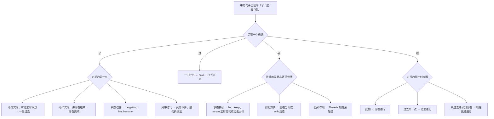
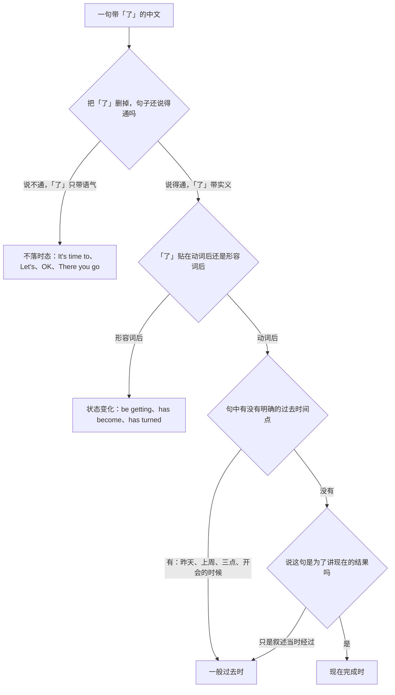
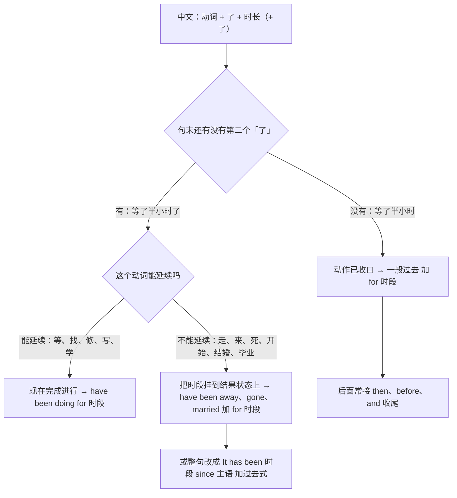
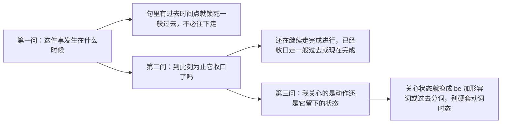
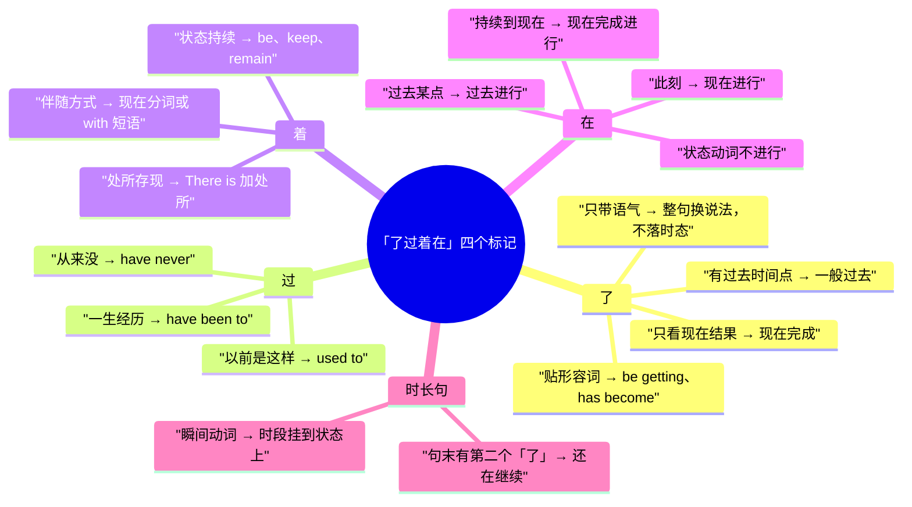

# 「了过着在」与时态选择：我吃了、他走了三天了

> [!info] 本篇定位
>
> 这篇收「了」「过」「着」「在」四个中文体标记引出的三十五条查询意图，每条给口语、书面、正式三档成品。
>
> 与本分类另外五篇的分工：「饭做好了」这类隐性被动查 [[02.中文句式转换/01.被字句与隐性被动：被…了、让人给…了、饭做好了\|被字句与隐性被动]]，「把它改完了」查 [[02.中文句式转换/02.把字句：处置式的四条英译出路\|把字句]]，「下雨了」的无主语问题查 [[02.中文句式转换/03.无主句、话题优先与主语选择：下雨了、这件事我知道\|无主句与主语选择]]，这篇只管**该落在哪个时态**。
>
> 读完能查到：一句带「了」的中文该落一般过去还是现在完成、「走了三天了」为什么不能写 has left for three days、「着」的三种持续义各走哪条出路、一套三问的自查流程。
>
> 时态本身的构成规则不在这里，全部指回 [[02.英语基础语法/06.动词时态/05.时态综合运用与辨析\|时态综合运用与辨析]]。

---

## 1. 本篇导读：中文标记的是「体」，英文标记的是「时」

中文动词不变形。一句话发生在什么时候，靠时间词（昨天、明年）和上下文交代；动作处在什么阶段，靠「了过着在」四个标记交代。英文相反：动词必须变形，而变形同时编码两件事——时间点在哪，和动作的完成状态。

错位就出在这里。中文的「了」只说「这个动作有了结果」，不说结果落在过去还是刚才；英文的 `-ed` 和 `have done` 却必须二选一。中文母语者最常见的处理是把「了」一律映射成过去式，于是写出 `I have eaten lunch at one o'clock`、`He has left for three days`、`I understood`。

### 四个标记的总映射

| 中文标记 | 它标的意思 | 英文主要落点 | 典型句 |
| --- | --- | --- | --- |
| 了（动词后） | 动作已实现 | 一般过去 或 现在完成 | 我发了 → I've sent it. |
| 了（形容词后） | 状态发生变化 | be getting、has become、has turned | 天黑了 → It's getting dark. |
| 了（句末语气） | 新情况、该做了 | 无时态对应，换整句 | 该走了 → It's time to go. |
| 过 | 一生中有过这个经历 | 现在完成、used to | 我去过 → I've been there. |
| 着（状态） | 状态持续 | be、keep、remain + 形容词或过去分词 | 门开着 → The door is open. |
| 着（伴随） | 姿态或方式伴随主动作 | 现在分词、with 短语 | 笑着说 → said it with a smile |
| 着（存现） | 某处存在某物 | there be、处所倒装 | 墙上挂着画 → There's a picture on the wall. |
| 在 / 正在 | 动作正在展开 | 现在进行、过去进行、现在完成进行 | 我在改 → I'm working on it. |

这张表是全篇的骨架，后面九节把每一行拆成可查的中文入口。

### 从中文标记进的总选择树

树的第一层不问语法，只问「你句子里那个字是哪个」。第二层才开始做区分：「了」有四条出路，「着」有三条，「在」按那一刻落在时间轴的哪个位置分三条，只有「过」几乎是单出口。全篇按这四个大分支组织，第 2 节到第 5 节各管一个标记，第 6 节单独处理最难的「V 了 + 时长 + 了」双标记句。

### 三个提醒

> [!warning] 别把「了」当成过去式开关
>
> - ❌ ~~「了」等于 -ed~~ ／ ✅ **「了」等于「已实现」，落在哪个时态取决于句子有没有过去时间点、你关心的是过程还是结果**（把「了」直接当 -ed 是本篇要治的第一个毛病）
> - ❌ ~~没有「了」就不能用完成时~~ ／ ✅ **「我看过了」「我刚回来」「他还没交」都不含动词后的「了」，一样落现在完成**（中文标记和英文时态不是一对一）

> [!tip] 查法
>
> 先在脑子里把中文句子念一遍，找到那个「了 / 过 / 着 / 在」，看它贴在哪个成分后面，再按对应节次找中文触发语。触发语一条会列出三到五个同义说法，想到哪个查哪个。

---

## 2. 「了」的四种义：先分义，再选时态

「了」是这四个标记里唯一一个多义的。同一个字，在「我吃了饭」「天黑了」「该走了」里标的是三件不同的事，英文出路也是三条完全不同的路。

第一个判断是「删掉试试」：「该走了」删掉「了」变成「该走」，中文不成句，说明这个「了」只是语气，英文里根本没有对应的形态，得整句换说法。第二个判断看它贴谁：贴形容词的是状态变化，走系表结构。剩下贴动词的才进入时态选择，而这一层的分水岭是句里有没有一个明确的过去时间点——有就锁死一般过去，没有再看你想说的是过程还是结果。

### 2.1 昨天吃了、上周发了：动作完成在过去某一点

中文触发语：…了（带过去时间词） / 昨天…了 / 刚才…了 / 上周…了 / 当时就…了

| 档位 | 句架 | 例句 |
| --- | --- | --- |
| 口语 | sb + did sth + 过去时间词 | I grabbed lunch around one. |
| 书面 | sb + did sth + 时间状语 | We shipped the fix yesterday afternoon. |
| 正式 | sth + was + p.p. + on + 日期 | The revised draft was submitted on 3 March. |

> [!warning] 错配警示
>
> - ❌ ~~I have eaten lunch at one o'clock.~~ ／ ✅ **I ate lunch at one o'clock.**（句里有明确过去时间点，现在完成时不能与它同现）
> - ❌ ~~We have shipped it last Friday.~~ ／ ✅ **We shipped it last Friday.**（last、yesterday、ago 都属于时间点，一律锁一般过去）

- 同义入口：昨天…了 / 刚才…了 / 那时候…了 / 当场就…了
- 语法归属：[[02.英语基础语法/06.动词时态/01.一般现在时与一般过去时\|一般过去时]]
- 场景实战：[[04.英语场景/03.时态与语态句型框架/01.16种时态完全手册\|16 种时态速查]]

### 2.2 我发了、改好了：做完了，要紧的是现在的结果

中文触发语：…了（不带时间词） / 已经…了 / …好了 / 我…过了（刚做完） / 弄完了

| 档位 | 句架 | 例句 |
| --- | --- | --- |
| 口语 | I've + p.p. + sth | I've sent it over. |
| 书面 | sb has already + p.p. | The team has already merged the change. |
| 正式 | sth has been + p.p. | The application has been reviewed and approved. |

> [!warning] 错配警示
>
> - ❌ ~~—— When did you send it? —— I have sent it this morning.~~ ／ ✅ **I sent it this morning.**（一旦对方问 when，答句就带了时间点，必须切回一般过去）
> - ❌ ~~I already sent it, so you can check now.~~ ／ ✅ **I've already sent it, so you can check now.**（后半句谈现在，前半句就该用现在完成把结果接到当下）

- 同义入口：已经…了 / …好了 / 搞定了 / 弄完了 / 提交了
- 语法归属：[[02.英语基础语法/06.动词时态/04.完成时态详解\|完成时态详解]]
- 场景实战：[[04.英语场景/10.职场与商务场景实战/02.会议汇报与演示场景\|会议汇报]]

### 2.3 天黑了、他胖了：形容词后的「了」是状态变化

中文触发语：…了（贴形容词） / 变…了 / 越来越…了 / 开始…了

| 档位 | 句架 | 例句 |
| --- | --- | --- |
| 口语 | It's getting + adj. | It's getting dark. |
| 书面 | sth has become / has turned + adj. | The situation has become complicated. |
| 正式 | sth has grown increasingly + adj. | Compliance requirements have grown increasingly stringent. |

> [!warning] 错配警示
>
> - ❌ ~~The sky darkened.~~ ／ ✅ **It's getting dark.**（「天黑了」报告的是眼下正在发生的变化，用过去式会读成「那天天黑了」）
> - ❌ ~~He is fat now.~~ ／ ✅ **He's put on weight.**（「胖了」强调的是变化过程，不是当下这个属性）

- 同义入口：变…了 / …起来了 / 越来越…了 / 不如以前…了
- 语法归属：[[02.英语基础语法/04.形容词与副词/01.形容词的用法与位置\|形容词作表语]]
- 场景实战：[[04.英语场景/06.日常生活场景实战/02.家庭家务与日常起居场景\|日常起居]]

### 2.4 该走了、别说了、好了：只带语气的「了」不落时态

中文触发语：该…了 / 别…了 / 好了 / 走了走了 / …了吧 / 行了

| 档位 | 句架 | 例句 |
| --- | --- | --- |
| 口语 | It's time to + v. / Let's + v. | It's time to head out. |
| 书面 | We should now + v. | We should now move on to the budget. |
| 正式 | I'm afraid we'll have to + v. | I'm afraid we'll have to draw this to a close. |

> [!warning] 错配警示
>
> - ❌ ~~It's time we go.~~ ／ ✅ **It's time we went.** 或 **It's time to go.**（It's time 后接从句要用过去式；拿不准就换成 to do）
> - ❌ ~~Don't speak any more.~~ ／ ✅ **That's enough. / Let's drop it.**（「别说了」是收场，逐字直译会读成禁止对方开口）

- 同义入口：该…了 / 行了 / 得了 / 走吧 / 到此为止
- 语法归属：[[02.英语基础语法/12.日常口语/01.口语中的语法简化\|口语中的语法简化]]
- 场景实战：[[04.英语场景/07.社交交际场景实战/01.交友聚会与闲聊场景\|闲聊]]

### 2.5 吃了饭就走、等改完了再说：「了」出现在从句里

中文触发语：…了就… / 等…了再… / 一…完就… / …完了之后

| 档位 | 句架 | 例句 |
| --- | --- | --- |
| 口语 | Once I've + p.p., I'll + v. | Once I've had lunch I'll take a look. |
| 书面 | After sb has + p.p., ... | After the tests have passed, we'll tag the release. |
| 正式 | Upon completion of sth, sth will be + p.p. | Upon completion of the review, the document will be circulated. |

> [!warning] 错配警示
>
> - ❌ ~~I will call you after I will finish.~~ ／ ✅ **I'll call you after I finish.** 或 **after I've finished.**（时间状语从句里不用 will 表将来）
> - ❌ ~~When I finished the report, I will send it.~~ ／ ✅ **When I've finished the report, I'll send it.**（从句用完成时表「先做完这件」，主句才是将来）

- 同义入口：…完就… / 等…好了再… / …之后马上 / 一旦…了
- 语法归属：[[02.英语基础语法/09.从句体系/04.状语从句详解\|时间状语从句]]
- 场景实战：[[04.英语场景/03.时态与语态句型框架/01.16种时态完全手册\|时态与从句配合]]

### 2.6 还没呢、一直没：「了」的否定回填

中文触发语：还没…呢 / 一直没… / 到现在也没… / 没…（对应「了」的否定）

| 档位 | 句架 | 例句 |
| --- | --- | --- |
| 口语 | I haven't + p.p. + yet | I haven't sent it yet. |
| 书面 | sb has yet to + v. | We have yet to receive their confirmation. |
| 正式 | No + n. + has been + p.p. to date | No response has been received to date. |

> [!warning] 错配警示
>
> - ❌ ~~I don't send it yet.~~ ／ ✅ **I haven't sent it yet.**（「还没」的时间跨度是从过去到此刻，一般现在时装不下）
> - ❌ ~~We have not yet to decide.~~ ／ ✅ **We have yet to decide.**（have yet to 是整体结构，中间不再插 not）

- 同义入口：还没…呢 / 尚未 / 到现在也没 / 一直没动静
- 语法归属：[[02.英语基础语法/06.动词时态/04.完成时态详解\|现在完成时的否定式]]
- 场景实战：[[04.英语场景/10.职场与商务场景实战/03.商务邮件与正式书面沟通\|商务邮件催办]]

---

## 3. 「过」：一生中有过这件事

「过」比「了」好办，因为它只有一条主线：把某件事登记进「我的人生履历」。麻烦只出在两处，一是它和现在完成时的时间点冲突，二是「以前…过，现在不这样了」要换成 used to。

### 3.1 我去过、我试过：一生经历的登记

中文触发语：…过 / 曾经…过 / 有…的经历 / 以前干过

| 档位 | 句架 | 例句 |
| --- | --- | --- |
| 口语 | I've + p.p. (+ before) | I've been to Kyoto twice. |
| 书面 | sb has + p.p. + on + 次数 + occasions | She has presented at the conference on three occasions. |
| 正式 | sb has previously + p.p. | The applicant has previously held a similar position. |

> [!warning] 错配警示
>
> - ❌ ~~He has gone to Kyoto twice.~~ ／ ✅ **He has been to Kyoto twice.**（has gone to 表人现在还在那儿没回来；「去过」要用 been to）
> - ❌ ~~I have been to Kyoto in 2019.~~ ／ ✅ **I went to Kyoto in 2019.**（一旦点明年份就不是履历登记，是过去事件）

- 同义入口：…过 / 曾经 / 有过一次 / 干过这活
- 语法归属：[[02.英语基础语法/06.动词时态/04.完成时态详解\|现在完成时的经历用法]]
- 场景实战：[[04.英语场景/08.出行与旅游场景实战/01.机场航班海关入境场景\|出行经历]]

### 3.2 从来没…过：经历的零记录

中文触发语：从来没…过 / 一次也没…过 / 还没…过 / 这辈子没…过

| 档位 | 句架 | 例句 |
| --- | --- | --- |
| 口语 | I've never + p.p. | I've never used it in production. |
| 书面 | sb has never + p.p. + in + 时段 | I have never seen this error in five years of running the service. |
| 正式 | At no point has sb + p.p. | At no point has the vendor acknowledged the defect. |

> [!warning] 错配警示
>
> - ❌ ~~I never was so tired.~~ ／ ✅ **I've never been this tired.**（「从来没这么…过」的比较基准是「到此刻为止」，用现在完成）
> - ❌ ~~I have never used it before three years ago.~~ ／ ✅ **I hadn't used it until three years ago.**（一旦给出截止到过去某点，就改用过去完成）

- 同义入口：从来没 / 一次都没 / 压根没 / 头一回
- 语法归属：[[02.英语基础语法/06.动词时态/04.完成时态详解\|完成时的否定与频度]]
- 场景实战：[[04.英语场景/07.社交交际场景实战/01.交友聚会与闲聊场景\|闲聊里的经历交换]]

### 3.3 你…过吗：问对方的经历

中文触发语：你…过吗 / 有没有…过 / 试过没 / 弄过这个吗

| 档位 | 句架 | 例句 |
| --- | --- | --- |
| 口语 | Have you ever + p.p.? | Have you ever tried pair programming? |
| 书面 | Have you had the opportunity to + v.? | Have you had the opportunity to review the draft? |
| 正式 | Has sb at any time + p.p.? | Has the account at any time been accessed from outside the network? |

> [!warning] 错配警示
>
> - ❌ ~~Have you eaten your rice?~~ ／ ✅ **Have you eaten yet?** 或 **Have you had lunch?**（「吃饭」的「饭」不译成 rice；这里问的是刚才，不是一生经历）
> - ❌ ~~Have you ever went there?~~ ／ ✅ **Have you ever been there?**（have 后面只能接过去分词）

- 同义入口：…过吗 / 有没有试过 / 接触过没 / 之前做过吗
- 语法归属：[[02.英语基础语法/01.基础入门/03.疑问句与否定句的构成\|疑问句的构成]]
- 场景实战：[[04.英语场景/09.学习与教育场景实战/01.课堂讨论与提问场景\|课堂提问]]

### 3.4 从那以后就没…过：起点到现在的零记录

中文触发语：再也没…过 / 从那以后就没… / 后来一直没… / 打那以后没…

| 档位 | 句架 | 例句 |
| --- | --- | --- |
| 口语 | I haven't + p.p. + since | I haven't heard from him since. |
| 书面 | sth has not + p.p. + since then | The issue has not resurfaced since then. |
| 正式 | No further + n. + has been + p.p. since + 时点 | No further incidents have been reported since the patch was deployed in April. |

> [!warning] 错配警示
>
> - ❌ ~~I don't hear from him since then.~~ ／ ✅ **I haven't heard from him since then.**（since 引出的时段必须配完成时）
> - ❌ ~~The issue didn't happen since the fix.~~ ／ ✅ **The issue hasn't happened since the fix.**（一般过去只能配 for 或明确的过去时段，不配 since）

- 同义入口：再也没 / 从那以后 / 打那儿起就没 / 之后一直没
- 语法归属：[[02.英语基础语法/05.介词与连词/02.常用介词搭配详解\|since 与 for 的搭配]]
- 场景实战：[[04.英语场景/11.医疗与紧急场景实战/01.医院看病与药店购药场景\|病史陈述]]

### 3.5 以前是这样，现在不是了

中文触发语：以前…过 / 那时候是…的 / 早先… / 原来…，现在不了

| 档位 | 句架 | 例句 |
| --- | --- | --- |
| 口语 | sb used to + v. | I used to commute by bike. |
| 书面 | sb formerly + v.过去式 | The team formerly reported to the CTO. |
| 正式 | sth was previously + p.p. | The endpoint was previously exposed without authentication. |

> [!warning] 错配警示
>
> - ❌ ~~I am used to commute by bike.~~ ／ ✅ **I used to commute by bike.**（used to do 是过去习惯；be used to doing 是现在已经习惯，两者不是同一个结构）
> - ❌ ~~I used to have gone there a lot.~~ ／ ✅ **I used to go there a lot.**（used to 后面接动词原形）

- 同义入口：以前 / 原先 / 当年 / 早些年 / 那会儿
- 语法归属：[[02.英语基础语法/07.助动词与情态动词/02.情态动词详解\|used to 与过去习惯]]
- 场景实战：[[04.英语场景/07.社交交际场景实战/01.交友聚会与闲聊场景\|回忆过去]]

---

## 4. 「着」：持续的是状态、伴随还是存在

「着」这个标记最容易被误映射成进行时，因为「在」和「着」都带持续义。区别在于：「在」持续的是**动作**，「着」持续的多半是动作留下的**状态**。「门开着」不是门正在做开门这个动作，是门处在开的状态。

### 4.1 门开着、灯亮着：状态持续

中文触发语：…着 / 一直…着 / 就那么…着 / 还…着呢

| 档位 | 句架 | 例句 |
| --- | --- | --- |
| 口语 | sth is + adj./p.p. | The door's open. |
| 书面 | sth remains + adj./p.p. | The ticket remains open pending confirmation. |
| 正式 | sth shall stay + p.p. until ... | The valve shall stay closed until pressure is released. |

> [!warning] 错配警示
>
> - ❌ ~~The door is opening.~~ ／ ✅ **The door is open.**（「开着」是状态；is opening 说的是门此刻正被推开）
> - ❌ ~~The light is lighting.~~ ／ ✅ **The light is on.**（灯的状态用 on / off，不用动词进行式）

- 同义入口：…着 / 一直开着 / 没关 / 还亮着
- 语法归属：[[02.英语基础语法/08.非谓语动词/04.过去分词详解\|过去分词作表语]]
- 场景实战：[[04.英语场景/06.日常生活场景实战/02.家庭家务与日常起居场景\|家务与起居]]

### 4.2 先留着、开着别关：让状态维持下去

中文触发语：…着别动 / 先留着 / 让它开着 / 保持…着

| 档位 | 句架 | 例句 |
| --- | --- | --- |
| 口语 | Leave it + adj./v.-ing | Leave it running. |
| 书面 | Please keep sth + p.p./adj. | Please keep the branch open until QA signs off. |
| 正式 | sth is to be kept + p.p. at all times | The emergency exit is to be kept unobstructed at all times. |

> [!warning] 错配警示
>
> - ❌ ~~Leave it to open.~~ ／ ✅ **Leave it open.**（leave、keep 后面接形容词或分词，不接不定式）
> - ❌ ~~Keep the door opened.~~ ／ ✅ **Keep the door open.**（open 本身就是形容词，加 -ed 会读成「被打开」这个动作）

- 同义入口：先留着 / 别关 / 保持原样 / 就这么放着
- 语法归属：[[02.英语基础语法/01.基础入门/02.英语五大基本句型详解\|主谓宾补句型]]
- 场景实战：[[04.英语场景/06.日常生活场景实战/02.家庭家务与日常起居场景\|家务指令]]

### 4.3 墙上挂着一幅画：处所里存在某物

中文触发语：…上…着… / 那儿摆着 / 桌上放着 / 门口停着

| 档位 | 句架 | 例句 |
| --- | --- | --- |
| 口语 | There's + n. + 处所短语 | There's a whiteboard on the far wall. |
| 书面 | 处所短语 + v. + n.（倒装） | On the wall hangs a photograph of the founding team. |
| 正式 | sth is mounted / positioned + 处所短语 | A backup unit is mounted beneath the main rack. |

> [!warning] 错配警示
>
> - ❌ ~~The wall hangs a picture.~~ ／ ✅ **There's a picture on the wall.**（中文拿处所当话题，英文里处所是状语，不能直接当主语）
> - ❌ ~~In the room has two people.~~ ／ ✅ **There are two people in the room.**（「有」在存现句里对应 there be，不对应 have）

- 同义入口：…上有 / 那儿摆着 / 里面装着 / 门口停着
- 语法归属：[[02.英语基础语法/10.特殊句型/03.倒装句结构\|处所状语前置的倒装]]
- 场景实战：[[04.英语场景/02.基础句型框架/03.there be 与 it 句型完全手册\|there be 句型]]

### 4.4 笑着说、站着听：伴随的姿态与方式

中文触发语：…着…（前一动词表姿态） / 一边…一边… / 低着头… / 带着…

| 档位 | 句架 | 例句 |
| --- | --- | --- |
| 口语 | sb + v. + with + n. | He apologized with his head down. |
| 书面 | v.-ing, + 主句 | Smiling, she handed me the offer letter. |
| 正式 | 主句 + , + v.-ing + ... | The witness gave his account, remaining seated throughout. |

> [!warning] 错配警示
>
> - ❌ ~~He said with smiling.~~ ／ ✅ **He said it with a smile.** 或 **He said it, smiling.**（with 后面接名词；要接动词就去掉 with 直接用 -ing）
> - ❌ ~~He stood and listened to me quietly all the time.~~ ／ ✅ **He listened, standing quietly the whole time.**（「站着听」的主动作是听，站是伴随，用 and 并列会把两件事拉平）

- 同义入口：笑着 / 低着头 / 一边…一边 / 带着…的表情
- 语法归属：[[02.英语基础语法/08.非谓语动词/03.现在分词详解\|现在分词作伴随状语]]
- 场景实战：[[04.英语场景/05.高频实用表达句型框架/01.表达观点与态度的50个万能句型\|态度描写]]

### 4.5 一直…着：从过去持续到现在

中文触发语：一直…着 / 从…就…着 / 到现在还…着 / 这些天都…着

| 档位 | 句架 | 例句 |
| --- | --- | --- |
| 口语 | sth's been + adj./p.p. + since | The ticket's been open since Monday. |
| 书面 | sb has been + v.-ing + for/since | We have been running the beta for six weeks. |
| 正式 | sth has remained + p.p. throughout + n. | The restriction has remained in force throughout the audit period. |

> [!warning] 错配警示
>
> - ❌ ~~We are running the beta since six weeks.~~ ／ ✅ **We have been running the beta for six weeks.**（since 接时间点，for 接时段；「一直…着」到现在要用现在完成进行）
> - ❌ ~~The ticket is open since Monday.~~ ／ ✅ **The ticket has been open since Monday.**（起点一出现，一般现在就装不下这段跨度）

- 同义入口：一直…着 / 到现在还 / 从…起就 / 这阵子都
- 语法归属：[[02.英语基础语法/06.动词时态/04.完成时态详解\|现在完成进行时]]
- 场景实战：[[04.英语场景/10.职场与商务场景实战/02.会议汇报与演示场景\|进度汇报]]

---

## 5. 「在」与「正在」：进行义及其边界

「在」是四个标记里和英文对应最整齐的一个：中文说「在做」，英文用进行时。麻烦出在三处——那一刻落在时间轴哪里、有一批动词根本不进行、以及「老是在」其实不是进行而是抱怨。

### 5.1 我在做、我这会儿在忙：此刻正在进行

中文触发语：（正）在… / 我这会儿在… / 我正…呢 / 眼下在…

| 档位 | 句架 | 例句 |
| --- | --- | --- |
| 口语 | I'm + v.-ing (+ right now) | I'm looking at it now. |
| 书面 | sb is currently + v.-ing | The team is currently migrating the database. |
| 正式 | sth is under way / is in progress | A review of the incident is currently under way. |

> [!warning] 错配警示
>
> - ❌ ~~I read my email now.~~ ／ ✅ **I'm reading my email.**（一般现在时说的是习惯，不是此刻）
> - ❌ ~~I'm working on it since this morning.~~ ／ ✅ **I've been working on it since this morning.**（带起点就要换成现在完成进行，见 5.3）

- 同义入口：在… / 正…呢 / 这会儿忙着 / 手头在弄
- 语法归属：[[02.英语基础语法/06.动词时态/03.进行时态详解\|现在进行时]]
- 场景实战：[[04.英语场景/07.社交交际场景实战/02.电话短信与在线沟通场景\|在线沟通]]

### 5.2 那会儿我正在：过去某一点正在进行

中文触发语：那会儿我正在… / 当时我在… / 他来的时候我正… / 那阵子我在…

| 档位 | 句架 | 例句 |
| --- | --- | --- |
| 口语 | I was + v.-ing when ... | I was in the middle of a call when he walked in. |
| 书面 | sb was + v.-ing at the time | The service was still warming up at the time of the request. |
| 正式 | At the time in question, sb was + v.-ing | At the time in question, the operator was performing routine maintenance. |

> [!warning] 错配警示
>
> - ❌ ~~When he came in, I ate.~~ ／ ✅ **When he came in, I was eating.**（作背景的长动作用过去进行，打断它的短动作用一般过去）
> - ❌ ~~While I was walking, I was seeing him.~~ ／ ✅ **While I was walking, I saw him.**（see 这类瞬间感知动词不进入进行式）

- 同义入口：当时 / 那会儿 / 正…的时候 / 那阵子
- 语法归属：[[02.英语基础语法/06.动词时态/03.进行时态详解\|过去进行时]]
- 场景实战：[[04.英语场景/11.医疗与紧急场景实战/01.医院看病与药店购药场景\|事件经过陈述]]

### 5.3 一直在做：从过去持续到此刻

中文触发语：一直在… / 这段时间都在… / 忙着…好几天了 / 最近在…

| 档位 | 句架 | 例句 |
| --- | --- | --- |
| 口语 | I've been + v.-ing | I've been chasing this bug all week. |
| 书面 | sb has been + v.-ing + since/for | We have been collecting feedback since the soft launch. |
| 正式 | sth has been under + n. + for + 时段 | The proposal has been under review for three weeks. |

> [!warning] 错配警示
>
> - ❌ ~~I am chasing this bug since Monday.~~ ／ ✅ **I've been chasing this bug since Monday.**（带起点或时段的「一直在」用现在完成进行）
> - ❌ ~~I have chased this bug all week.~~ ／ ✅ **I've been chasing this bug all week.**（要突出「还没完、一直在弄」就带 -ing，光用完成时会读成已经抓到了）

- 同义入口：一直在 / 最近都在 / 这几天忙着 / 从…就在弄
- 语法归属：[[02.英语基础语法/06.动词时态/04.完成时态详解\|现在完成进行时]]
- 场景实战：[[04.英语场景/10.职场与商务场景实战/02.会议汇报与演示场景\|进度回报]]

### 5.4 我在知道、我在觉得：配不上进行时的那批动词

中文触发语：我在想（表看法） / 我在觉得 / 我在知道 / 我在明白

| 档位 | 句架 | 例句 |
| --- | --- | --- |
| 口语 | I know / I get it | I get what you mean. |
| 书面 | sb understands / believes / owns sth | I believe that's the wrong table. |
| 正式 | It is sb's understanding that ... | It is our understanding that the clause no longer applies. |

> [!warning] 错配警示
>
> - ❌ ~~I am knowing the answer.~~ ／ ✅ **I know the answer.**（know、understand、believe、own、belong 这类状态动词不进行）
> - ❌ ~~I am thinking it's the wrong approach.~~ ／ ✅ **I think it's the wrong approach.**（think 表意见时不进行；只有表「正在琢磨」才用 I'm thinking about it）

- 同义入口：我觉得 / 我认为 / 我知道 / 依我看
- 语法归属：[[02.英语基础语法/06.动词时态/05.时态综合运用与辨析\|状态动词与进行时的限制]]
- 场景实战：[[04.英语场景/05.高频实用表达句型框架/01.表达观点与态度的50个万能句型\|表达观点]]

### 5.5 老是在改、总是…个不停：带抱怨的反复

中文触发语：老是在… / 总是…个不停 / 又…了 / 三天两头就…

| 档位 | 句架 | 例句 |
| --- | --- | --- |
| 口语 | sb is always + v.-ing | He's always changing the spec. |
| 书面 | sth keeps + v.-ing | The job keeps timing out on the same shard. |
| 正式 | sth recurs / persists | The failure persists despite the retry policy. |

> [!warning] 错配警示
>
> - ❌ ~~He always changes the spec.~~ ／ ✅ **He's always changing the spec.**（一般现在时只是中性陈述习惯，要带上抱怨语气得用 always 加进行式）
> - ❌ ~~It keeps to time out.~~ ／ ✅ **It keeps timing out.**（keep 后面接动名词，不接不定式）

- 同义入口：老是 / 总是 / 又…了 / 隔三差五就
- 语法归属：[[02.英语基础语法/06.动词时态/03.进行时态详解\|进行时的情感用法]]
- 场景实战：[[04.英语场景/05.高频实用表达句型框架/03.同意反对让步转折句型库\|表达不满]]

### 5.6 明天这个时候我在：将来某刻正在进行

中文触发语：明天这个时候我在… / 到时候我正… / 下周这天我在… / 那会儿我应该在…

| 档位 | 句架 | 例句 |
| --- | --- | --- |
| 口语 | I'll be + v.-ing + 时间 | This time tomorrow I'll be flying. |
| 书面 | sb will be + v.-ing + by then | The team will be running the migration over the weekend. |
| 正式 | sth will be in operation as of + 日期 | The new gateway will be in operation as of 1 June. |

> [!warning] 错配警示
>
> - ❌ ~~Tomorrow this time I am flying.~~ ／ ✅ **This time tomorrow I'll be flying.**（把「到某刻正在进行」写成现在进行会丢掉「那一刻」这个坐标）
> - ❌ ~~When you will arrive, I will be waiting.~~ ／ ✅ **When you arrive, I'll be waiting.**（时间从句不用 will）

- 同义入口：到时候 / 那会儿 / 明天这时 / 等你到的时候
- 语法归属：[[02.英语基础语法/06.动词时态/02.一般将来时与过去将来时\|将来进行时]]
- 场景实战：[[04.英语场景/08.出行与旅游场景实战/01.机场航班海关入境场景\|行程安排]]

---

## 6. 「V 了 + 时长 + 了」：中文双标记句的分流

这是全篇最集中的出错区。中文的「他走了三天了」「我等了半小时了」句尾多出一个「了」，这个「了」标的是「到说话这一刻为止还是这样」。少了它，「我等了半小时」说的是等过、现在不等了。英文没有这个标记，得靠时态和动词选择还原。

树只有两层。第一层数「了」的个数：句末那个「了」在不在，决定动作有没有延续到现在。第二层看动词能不能延续：leave、come、die、start、graduate 这些一瞬间就完成的动作没法带时段，硬加 for three days 会读成「花了三天时间离开」，得把时段挂到它造成的状态上——不是「离开了三天」，是「处在离开状态三天了」。

### 6.1 他走了三天了：瞬间动词带时长

中文触发语：走了三天了 / 离开三天了 / 出去三天了 / 不在有三天了

| 档位 | 句架 | 例句 |
| --- | --- | --- |
| 口语 | sb's been gone for + 时段 | He's been gone for three days. |
| 书面 | sb has been away for + 时段 | She has been away from the office for three days. |
| 正式 | sb has been absent since + 日期 | The director has been absent since 12 May. |

> [!warning] 错配警示
>
> - ❌ ~~He has left for three days.~~ ／ ✅ **He's been gone for three days.**（leave 是瞬间动作，带不了时段；时段要挂在它造成的状态 be away、be gone 上）
> - ❌ ~~He died for two years.~~ ／ ✅ **He's been dead for two years.**（die 同理，延续的是 dead 这个状态）

- 同义入口：走了…了 / 不在…了 / 出去…了 / 离开有…了
- 语法归属：[[02.英语基础语法/06.动词时态/05.时态综合运用与辨析\|瞬间动词与延续动词]]
- 场景实战：[[04.英语场景/07.社交交际场景实战/02.电话短信与在线沟通场景\|找人不在]]

### 6.2 我等了半小时了：现在还在继续

中文触发语：等了半小时了 / 都…了半天了 / …了好一会儿了 / 弄了两天了

| 档位 | 句架 | 例句 |
| --- | --- | --- |
| 口语 | I've been + v.-ing + for + 时段 | I've been waiting half an hour. |
| 书面 | sb has been + v.-ing + since + 时点 | The client has been waiting since two o'clock. |
| 正式 | sb has awaited sth for + 时段 | The applicant has awaited a decision for six weeks. |

> [!warning] 错配警示
>
> - ❌ ~~I wait here for half an hour.~~ ／ ✅ **I've been waiting here for half an hour.**（双「了」表示到现在还在等，一般现在时装不下这段跨度）
> - ❌ ~~I am waiting for half an hour.~~ ／ ✅ **I've been waiting for half an hour.**（现在进行没有起点概念，接不了 for 时段）

- 同义入口：等了…了 / 都…半天了 / 弄了…了 / 排了好久了
- 语法归属：[[02.英语基础语法/06.动词时态/04.完成时态详解\|现在完成进行时]]
- 场景实战：[[04.英语场景/06.日常生活场景实战/04.餐饮点餐外卖与聚餐场景\|催单]]

### 6.3 我等了半小时：已经收口的时长

中文触发语：等了半小时（后来走了） / …了两年（现在不做了） / 弄了三天（弄完了）

| 档位 | 句架 | 例句 |
| --- | --- | --- |
| 口语 | I waited + 时段 + then + v. | I waited twenty minutes and then left. |
| 书面 | sb + v.过去式 + for + 时段 + before ... | We ran the experiment for two weeks before shutting it down. |
| 正式 | sth continued for + 时段 | The outage continued for four hours before service was restored. |

> [!warning] 错配警示
>
> - ❌ ~~I have waited twenty minutes and then I left.~~ ／ ✅ **I waited twenty minutes and then left.**（事情已结束且与现在无关，用一般过去；现在完成不与已收口的叙事同现）
> - ❌ ~~I have been waiting twenty minutes, then I left.~~ ／ ✅ **I had been waiting twenty minutes when I gave up.**（要讲「等到某一刻为止」就得整体退到过去完成进行）

- 同义入口：等了…（然后就走了） / 干了…年 / 试了半天（没成）
- 语法归属：[[02.英语基础语法/06.动词时态/01.一般现在时与一般过去时\|一般过去时的时段用法]]
- 场景实战：[[04.英语场景/03.时态与语态句型框架/01.16种时态完全手册\|完成时与过去时的分界]]

### 6.4 我学英语学了十年了：长期状态的时长

中文触发语：…了十年了 / 干这行干了…年 / 用这个用了很久了 / 在这儿待了…了

| 档位 | 句架 | 例句 |
| --- | --- | --- |
| 口语 | I've been + v.-ing + for + 时段 | I've been writing Java for ten years. |
| 书面 | sb has + p.p. + for + 时段 | She has taught at the university for twelve years. |
| 正式 | sb has been engaged in sth since + 年份 | The firm has been engaged in this field since 2009. |

> [!warning] 错配警示
>
> - ❌ ~~I learn English for ten years.~~ ／ ✅ **I've been learning English for ten years.**（一般现在时不能带「到现在为止」的时段）
> - ❌ ~~I am here for three years.~~ ／ ✅ **I've been here for three years.**（同一个坑换了个动词，be 动词也一样要换成完成时）

- 同义入口：干了…年了 / 学了…了 / 待了…了 / 用了很久了
- 语法归属：[[02.英语基础语法/06.动词时态/04.完成时态详解\|完成时与时段状语]]
- 场景实战：[[04.英语场景/10.职场与商务场景实战/01.求职简历面试与Offer谈判\|面试里的资历陈述]]

### 6.5 好久没…了：反向的时长

中文触发语：多久没…了 / 好久没…了 / 上次…还是… / 有阵子没…了

| 档位 | 句架 | 例句 |
| --- | --- | --- |
| 口语 | I haven't + p.p. + in + 时段 | I haven't been to the gym in months. |
| 书面 | It has been + 时段 + since sb + 过去式 | It has been two years since we last revised the policy. |
| 正式 | No + n. + has taken place in the past + 时段 | No formal review has taken place in the past eighteen months. |

> [!warning] 错配警示
>
> - ❌ ~~It's a long time I don't see you.~~ ／ ✅ **It's been a long time since I saw you.**（「好久没」的固定式是 It's been … since 加过去式）
> - ❌ ~~How long haven't you seen him?~~ ／ ✅ **How long has it been since you saw him?**（提问也走 It's been … since 这个框架）

- 同义入口：好久没 / 有阵子没 / 多久没 / 上次还是…的时候
- 语法归属：[[02.英语基础语法/09.从句体系/04.状语从句详解\|since 引导的时间从句]]
- 场景实战：[[04.英语场景/07.社交交际场景实战/01.交友聚会与闲聊场景\|久别重逢]]

### 6.6 才…就…了、都…了：进度感

中文触发语：才…就…了 / 都…了 / 已经…到…了 / 这才几天就…了

| 档位 | 句架 | 例句 |
| --- | --- | --- |
| 口语 | I'm already + 介词短语 | I'm already halfway through. |
| 书面 | sb has already + p.p. + as of + 时点 | We have already processed 60% of the backlog as of this morning. |
| 正式 | As of + 日期, sth has been + p.p. | As of 30 June, 4,200 records have been migrated. |

> [!warning] 错配警示
>
> - ❌ ~~I already finish half.~~ ／ ✅ **I've already finished half of it.**（already 和「了」同现时落现在完成，不落一般现在）
> - ❌ ~~It's only three days, and it already broke twice.~~ ／ ✅ **It's only been three days and it's already broken twice.**（前后两个分句都要挂到「到此刻为止」这条时间线上）

- 同义入口：都…了 / 才…就 / 已经…到 / 这么快就
- 语法归属：[[02.英语基础语法/06.动词时态/04.完成时态详解\|already、yet、just 的位置]]
- 场景实战：[[04.英语场景/10.职场与商务场景实战/02.会议汇报与演示场景\|进度播报]]

---

## 7. 一眼就错的那批句子：成品对照

下面这张表把前六节的判断压成一行一句。查的时候先在左列找中文，右列是可以直接抄走的成品。

| 中文 | 常见错译 | 成品 | 落点 |
| --- | --- | --- | --- |
| 我吃了 | I have ate. | I've eaten. | 现在完成 |
| 我昨天吃了火锅 | I have eaten hot pot yesterday. | I had hot pot yesterday. | 一般过去 |
| 我明白了 | I understood. | I see. / Got it. | 一般现在 |
| 下雨了 | It rained. | It's raining. / It's started raining. | 现在进行、现在完成 |
| 天黑了 | The sky is black. | It's getting dark. | 系表变化 |
| 他走了三天了 | He has left for three days. | He's been gone for three days. | 现在完成加状态 |
| 我等了半小时了 | I wait half an hour. | I've been waiting half an hour. | 现在完成进行 |
| 我去过日本 | I have gone to Japan. | I've been to Japan. | 现在完成 |
| 我以前住在北京 | I was live in Beijing. | I used to live in Beijing. | used to |
| 门开着 | The door is opening. | The door is open. | 系表状态 |
| 墙上挂着一幅画 | The wall hangs a picture. | There's a picture on the wall. | there be |
| 我觉得不对 | I am thinking it's wrong. | I think it's wrong. | 一般现在 |
| 好久没见了 | It's a long time I don't see you. | It's been a long time. | 现在完成 |
| 我学英语十年了 | I learn English for ten years. | I've been learning English for ten years. | 现在完成进行 |
| 该走了 | Should go now. | It's time to go. | 无时态对应 |
| 还没弄完呢 | I don't finish it yet. | I haven't finished it yet. | 现在完成 |

表里有三条值得单独展开，因为它们的中文触发语远不止一种说法。

### 7.1 我明白了、我知道了、原来如此

中文触发语：我明白了 / 懂了 / 知道了 / 原来如此 / 我这下清楚了

| 档位 | 句架 | 例句 |
| --- | --- | --- |
| 口语 | I see. / Got it. | Got it, thanks. |
| 书面 | That makes sense now. | Thanks, that makes sense now. |
| 正式 | sb notes / acknowledges sth | Noted, thank you. |

> [!warning] 错配警示
>
> - ❌ ~~I knew. / I understood.~~ ／ ✅ **I see. / Got it.**（「我明白了」说的是此刻刚进入的状态，用过去式会读成「我当时明白了，现在不一定」）
> - ❌ ~~I have understood.~~ ／ ✅ **I understand.**（understand 是状态动词，此刻的领会用一般现在）

- 同义入口：懂了 / 知道了 / 明白 / 原来如此 / 清楚了
- 语法归属：[[02.英语基础语法/06.动词时态/05.时态综合运用与辨析\|状态动词的时态选择]]
- 场景实战：[[04.英语场景/09.学习与教育场景实战/01.课堂讨论与提问场景\|课堂应答]]

### 7.2 下雨了、变天了、到夏天了

中文触发语：下雨了 / 天黑了 / 变天了 / 到夏天了 / 起风了

| 档位 | 句架 | 例句 |
| --- | --- | --- |
| 口语 | It's + v.-ing / It's getting + adj. | It's raining. / It's getting windy. |
| 书面 | sth has started / has set in | Winter has set in early this year. |
| 正式 | sth is expected to + v. | Heavy rain is expected to persist into the evening. |

> [!warning] 错配警示
>
> - ❌ ~~It rained.~~ ／ ✅ **It's raining.** 或 **It's started raining.**（「下雨了」报告的是此刻的新情况，不是过去的事件）
> - ❌ ~~The summer came.~~ ／ ✅ **Summer's here.**（季节到来说的是当下的状态，不是某天发生的事件）

- 同义入口：下雨了 / 起风了 / 变天了 / 到季节了 / 天冷了
- 语法归属：[[02.英语基础语法/06.动词时态/03.进行时态详解\|现在进行时表新情况]]
- 场景实战：[[04.英语场景/06.日常生活场景实战/02.家庭家务与日常起居场景\|天气闲聊]]

### 7.3 好了、弄完了、可以了

中文触发语：好了 / 弄好了 / 可以了 / 搞定 / 齐活了

| 档位 | 句架 | 例句 |
| --- | --- | --- |
| 口语 | Done. / All set. | All set — you can try it now. |
| 书面 | sth is ready / has been completed | The document is ready for your review. |
| 正式 | sth has been finalized and is available for + n. | The report has been finalized and is available for circulation. |

> [!warning] 错配警示
>
> - ❌ ~~It's good.~~ ／ ✅ **It's done. / It's ready.**（「好了」指完成或就绪，good 说的是质量好，两回事）
> - ❌ ~~I have finished.~~（对方没上下文时会问 finished what）／ ✅ **I'm done with it.**（口语里把完成挂到 be done with 上更自然）

- 同义入口：好了 / 完事了 / 齐活 / 搞定 / 可以了
- 语法归属：[[02.英语基础语法/08.非谓语动词/04.过去分词详解\|be done 的表语用法]]
- 场景实战：[[04.英语场景/10.职场与商务场景实战/03.商务邮件与正式书面沟通\|交付通知]]

---

## 8. 时态自查三问

写完一句话拿不准时态，按这三问过一遍。三问的顺序不能颠倒：第一问定坐标，第二问定边界，第三问定焦点。

三问是一条单行道，中途可以提前出去。第一问一旦答出「昨天」「上周」「三点」这类时间点，判断就结束了，后面两问不用再问——这是本篇最省事的一条规则，也是最常被跳过的一条。第二问处理的是「了…了」这类双标记句：还在继续就落完成进行。第三问是给「着」和瞬间动词准备的出口：`He has left for three days` 之所以错，就是卡在第三问没转弯——关心的是他不在这个状态，不是离开这个动作。

| 问题 | 判据 | 出路 |
| --- | --- | --- |
| 第一问：什么时候 | 句里有没有 yesterday、last week、in 2019、当时 | 有 → 一般过去；没有 → 进第二问 |
| 第二问：收口没有 | 句末「了」在不在；有没有 for、since、all week | 还在继续 → 完成进行；已收口 → 现在完成或一般过去 |
| 第三问：动作还是状态 | 动词能不能持续；关心的是过程还是结果 | 关心状态 → be、keep、remain 加形容词或过去分词 |

> [!example] 一句话走完三问
>
> 中文：**我改这个 bug 改了一上午了，还没改完。**
>
> 第一问：句里有「一上午」这个时段，但没有 yesterday 这类时间点，不锁一般过去，继续。
>
> 第二问：句末有第二个「了」，还配上「还没改完」，说明到此刻还在改，落现在完成进行。
>
> 第三问：关心的是「一直在改」这个过程，不是某个结果状态，不需要换成 be 加形容词。
>
> 成品：**I've been working on this bug all morning and I'm still not done.**

> [!tip] 一条经验规则
>
> 句子里同时出现「了」和一个时段（三天、半小时、十年），先别急着选时态，先问动词能不能延续。不能延续的（走、来、死、结婚、毕业、开始、丢），一律把时段挪到状态上：be gone、be dead、be married、be away、be missing。这一条能挡掉「了过着在」里最大的一批错句。

---

## 9. 工程日常里的四条体标记成品

程序员每天说的那几句中文，体标记密度极高：「跑完了」「挂了」「在跑着呢」「之前遇到过」。这一节把它们的三档成品固定下来。

### 9.1 跑完了、都过了、build 好了

中文触发语：跑完了 / 都绿了 / 过了 / build 好了 / 打完包了

| 档位 | 句架 | 例句 |
| --- | --- | --- |
| 口语 | sth's + p.p. / sth went through | Tests are green. / The build's done. |
| 书面 | sth has + p.p. + successfully | The pipeline has completed successfully. |
| 正式 | sth was executed and completed at + 时间 | The migration was executed and completed at 02:14 UTC. |

> [!warning] 错配警示
>
> - ❌ ~~All tests are passed.~~ ／ ✅ **All tests passed.** 或 **All tests are passing.**（pass 在这里是不及物的「通过」，加 be 会读成「被通过」）
> - ❌ ~~The build is finish.~~ ／ ✅ **The build is finished.** 或 **The build's done.**（表语位置要用过去分词或形容词）

- 同义入口：跑完了 / 都绿了 / 通过了 / 打好包了 / 部署上去了
- 语法归属：[[02.英语基础语法/08.非谓语动词/04.过去分词详解\|过去分词作表语]]
- 场景实战：技术协作（该场景篇尚未撰写）

### 9.2 挂了、崩了、又炸了

中文触发语：挂了 / 崩了 / 又炸了 / down 了 / 起不来了

| 档位 | 句架 | 例句 |
| --- | --- | --- |
| 口语 | sth is down / sth crashed | The staging box is down again. |
| 书面 | sth has crashed / has gone offline | The worker has crashed twice since the deploy. |
| 正式 | sth became unavailable at + 时间 | The service became unavailable at 09:42 and was restored at 10:05. |

> [!warning] 错配警示
>
> - ❌ ~~The server was down since morning.~~ ／ ✅ **The server has been down since this morning.**（since 起点配现在完成；一般过去只能配 for 或明确的过去时段）
> - ❌ ~~It crashed for two hours.~~ ／ ✅ **It was down for two hours.**（crash 是瞬间动作带不了时段，时段挂到 be down 这个状态上）

- 同义入口：挂了 / 崩了 / 炸了 / 起不来 / 服务不可用
- 语法归属：[[02.英语基础语法/06.动词时态/05.时态综合运用与辨析\|瞬间动词与时段状语]]
- 场景实战：[[04.英语场景/10.职场与商务场景实战/02.会议汇报与演示场景\|故障通报]]

### 9.3 在跑着呢、一直挂着、还没关

中文触发语：在跑着呢 / 一直开着 / 还没关 / 挂那儿呢 / 还在跑

| 档位 | 句架 | 例句 |
| --- | --- | --- |
| 口语 | It's still + v.-ing / It's still up | It's still running. |
| 书面 | sth is still + v.-ing / remains + adj. | The job is still running against the replica. |
| 正式 | sth remains in operation pending + n. | The legacy endpoint remains in operation pending client migration. |

> [!warning] 错配警示
>
> - ❌ ~~It is still run.~~ ／ ✅ **It's still running.**（「在跑」是进行，is run 会读成「被运行」）
> - ❌ ~~The job runs for two hours already.~~ ／ ✅ **The job has been running for two hours already.**（带时段又还在跑，落现在完成进行）

- 同义入口：还在跑 / 挂着呢 / 没停 / 一直开着 / 还占着
- 语法归属：[[02.英语基础语法/06.动词时态/03.进行时态详解\|进行时与被动的区分]]
- 场景实战：设备与服务状态（该场景篇尚未撰写）

### 9.4 遇到过、报过这个错

中文触发语：遇到过 / 报过这个错 / 之前碰到过一次 / 见过这个

| 档位 | 句架 | 例句 |
| --- | --- | --- |
| 口语 | I've + p.p. + this before | I've hit this one before. |
| 书面 | sb has encountered sth + 次数 + times | We have encountered this error twice in staging. |
| 正式 | sth has been reported previously under + 编号 | This defect has been reported previously under ticket 4412. |

> [!warning] 错配警示
>
> - ❌ ~~I have met this error before.~~ ／ ✅ **I've run into this error before.**（meet 用于遇见人，遇到问题用 run into、hit、encounter）
> - ❌ ~~I saw this error last week and I see it again.~~ ／ ✅ **I saw this error last week and it's back.**（前半句已锁在过去，后半句讲现在，两个分句各归各的时态）

- 同义入口：遇到过 / 碰到过 / 报过 / 见过 / 之前有过
- 语法归属：[[02.英语基础语法/06.动词时态/04.完成时态详解\|经历义的现在完成]]
- 场景实战：问题复述（该场景篇尚未撰写）

---

## 10. 本篇小结

这张图是四个标记的全部出口。「了」的分支最多，占了全篇近一半篇幅；「过」几乎单出口；「着」的三条分支彼此不通用；「在」的三条按时间坐标排。右下角单列的时长句是四个标记的交叉地带，也是错得最狠的地方，值得单独背。

> [!success] 本篇核心要点回顾
>
> 1. 中文标记的是动作阶段，英文标记的是时间点加完成状态，两套系统不是一对一，「了」不等于 -ed。
> 2. 「了」有四种义：动作实现、状态变化、语气新情况、从句里的先后顺序，先分义再选时态。
> 3. 句里出现明确的过去时间点，一律锁一般过去，现在完成时不与它同现。
> 4. 「过」走现在完成的经历用法，been to 表去过、gone to 表人还在那儿；「以前是这样现在不是」换 used to。
> 5. 「着」不等于进行时：状态持续走 be 加形容词或过去分词，伴随方式走现在分词，处所存现走 there be。
> 6. know、understand、believe、think（表意见）这类状态动词不进入进行式，中文的「我在想」多半对应 I think。
> 7. 句末第二个「了」是「到现在还这样」的标记，对应现在完成进行；没有它就落一般过去。
> 8. leave、die、start、graduate 这类瞬间动词带不了时段，把时段挂到 be gone、be dead、be away 这些状态上。

> [!success] 本篇练习清单
>
> - [ ] 「我昨天把报告发了」——写出口语、书面、正式三档，并说明为什么不能用现在完成。
> - [ ] 「他走了三天了，一直联系不上」——写出三档，注意时段挂在哪个词上。
> - [ ] 「我等这个接口等了两周了，到现在还没上」——写出三档。
> - [ ] 「我以前用过这个库，后来换掉了」——写出三档，区分 used to 与现在完成。
> - [ ] 「门开着，灯也亮着，人却不在」——写出三档，三个分句各走哪条出路。
> - [ ] 「那会儿我正在开会，没看到消息」——写出三档。
> - [ ] 「服务从早上就挂着，还没恢复」——写出三档。
> - [ ] 「好久没见了，你最近在忙什么」——写出三档，注意两个分句的时态不同。

### 10.1 下一篇预告

> [!info] 下一篇
>
> [[02.中文句式转换/06.语气词与四字格：吧呢嘛啊怎么译、一举两得怎么说\|语气词与四字格：吧呢嘛啊怎么译、一举两得怎么说]]
>
> 这一篇处理完了体标记，下一篇处理中文里另一批没有形态对应的成分：句末的「吧呢嘛啊」靠反义疑问、then、just、actually、句末 though 和情态动词降级来承担；四字格不给对照表，给的是拆解法——拆成动词短语、比较结构或现成习语。
