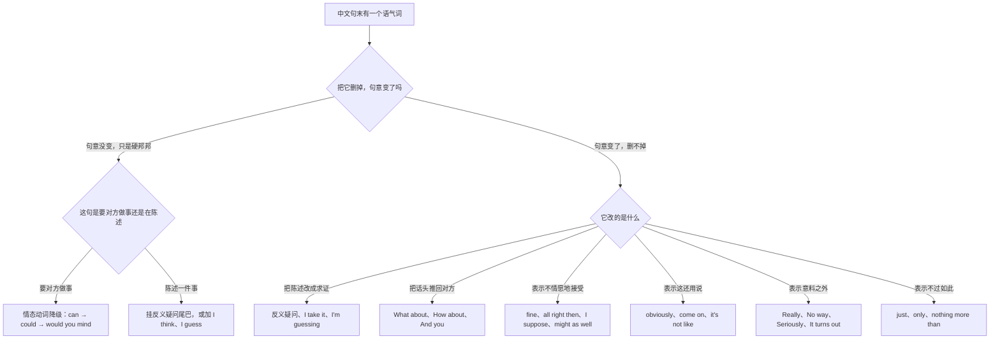
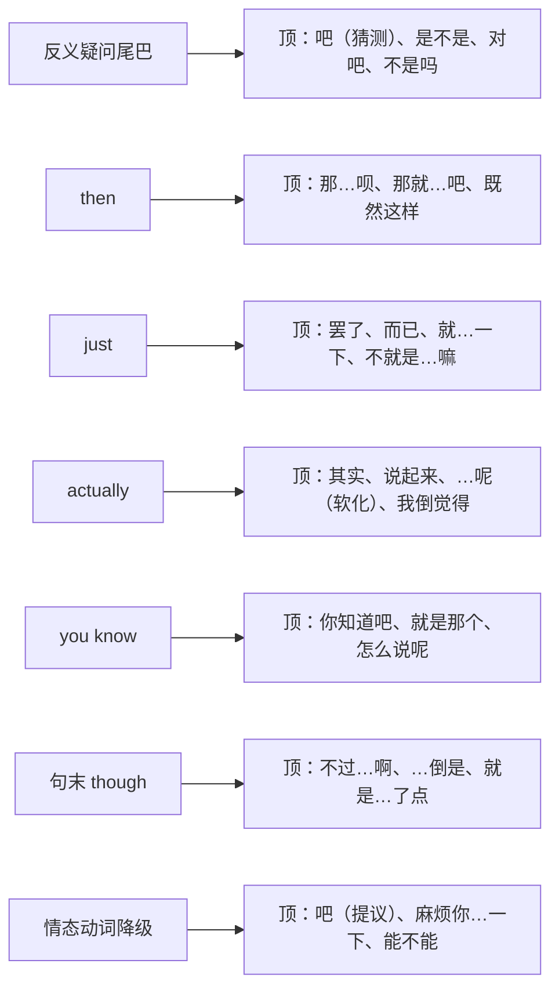
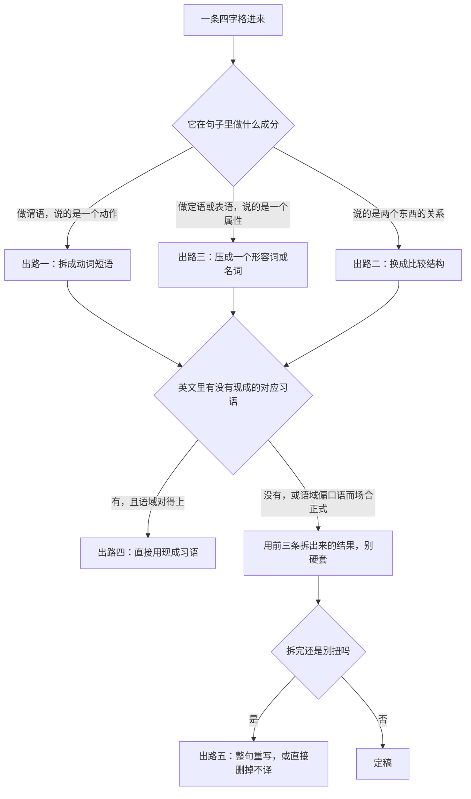
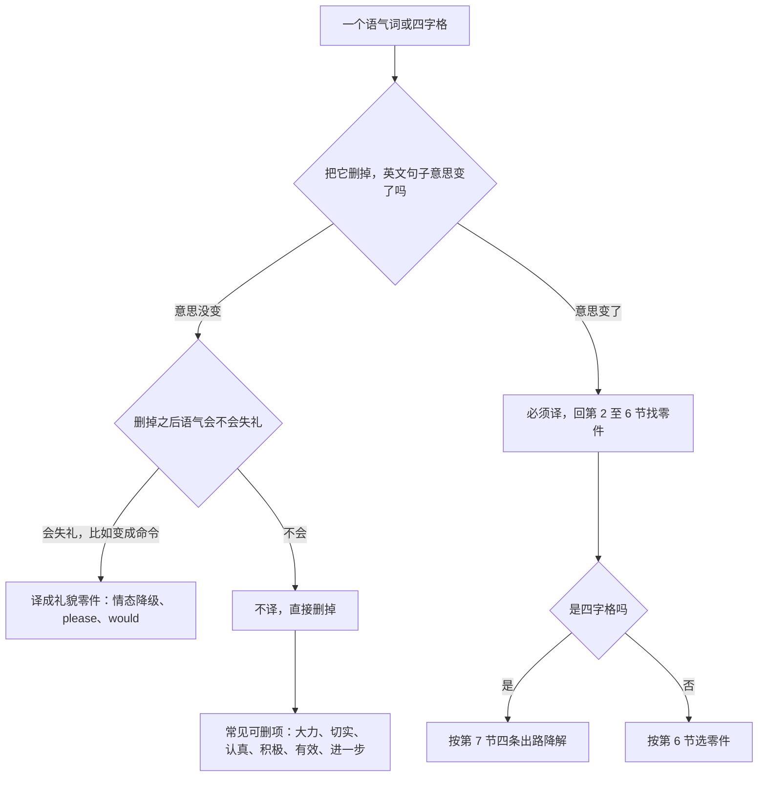
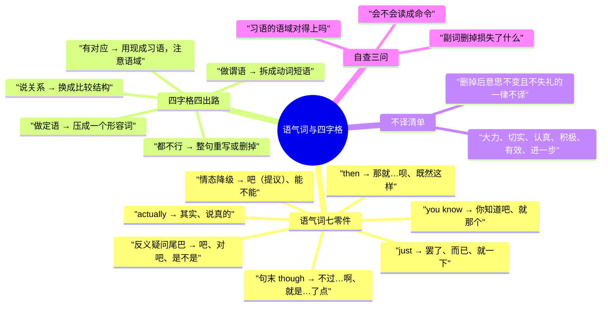

# 语气词与四字格：吧呢嘛啊怎么译、一举两得怎么说

> [!info] 本篇定位
>
> 这篇收两批在英文里**根本没有对应形态**的中文成分：句末的「吧呢嘛啊呗罢了」，以及「一举两得」「因人而异」「得不偿失」这类四字格。前者靠改结构承接，后者靠拆解降级。
>
> 与本分类另外五篇的分工：句子骨架怎么摆是前五篇的事——[[02.中文句式转换/03.无主句、话题优先与主语选择：下雨了、这件事我知道\|无主句与主语选择]] 管主语从哪来，[[02.中文句式转换/05.「了过着在」与时态选择：我吃了、他走了三天了\|「了过着在」与时态选择]] 管落哪个时态。这一篇管的是骨架之外那层**人际色彩**，以及塞不进骨架的成语块。
>
> 读完能查到：一个「吧」字在提议、猜测、勉强三种场合各换什么零件；「呢」的四种用法为什么不能都译成 what about；七个承接零件（反义疑问、then、just、actually、you know、句末 though、情态动词降级）各能顶哪些语气词；一条四字格进来后按什么顺序试四条降解出路；三十几条高频四字格的现成成品。
>
> 反义疑问句怎么变、情态动词各自的强弱，这里一律不解释，指回 [[02.英语基础语法/01.基础入门/03.疑问句与否定句的构成\|疑问句与否定句的构成]] 和 [[02.英语基础语法/07.助动词与情态动词/02.情态动词详解\|情态动词详解]]。

---

## 1. 本篇导读：中文靠加字，英文靠改结构

中文的语气词是一个独立音节，黏在句末，句子的主谓宾一动不动。「你去」加一个字变成「你去吧」，命令就降成了商量；再换一个字变成「你去呢」，就成了追问。加字成本极低，所以中文母语者习惯了「意思不变、态度变」这种操作。

英文没有这个位置。同样一件事，英文必须动结构：给陈述句挂一条反义疑问尾巴、把 will 换成 would、在句中插一个 actually、把肯定句改成 I take it 开头的求证句。**中文加一个字，英文往往要改三处**——这是本篇要处理的第一类错位。

第二类错位在四字格。「一举两得」四个字里压着一个完整的因果判断，英文里没有一个四音节单位能装下它，只能拆开：拆成动词短语、拆成比较结构、压成一个形容词，或者换成一句现成的英文习语。逐字直译出来的 `one action two gains` 不是英语。

### 语气词的总映射表

| 中文语气词 | 它做的人际动作 | 英文的主要承接手段 | 典型句 |
| --- | --- | --- | --- |
| 吧（提议） | 把命令降成商量 | Let's、why don't we、情态动词降级 | 走吧 → Let's head out. |
| 吧（猜测） | 把陈述降成求证 | 反义疑问、I take it、I'm guessing | 你是新来的吧 → You're new here, aren't you? |
| 吧（勉强） | 接受但不情愿 | fine、all right then、I suppose | 好吧 → All right, I suppose. |
| 呢（回转） | 把话头推回对方 | What about、How about、And you | 你呢 → What about you? |
| 呢（持续） | 强调动作还在继续 | still、be still doing | 他还在开会呢 → He's still in a meeting. |
| 呢（夸张） | 程度远超对方预期 | nowhere near、a long way off | 早着呢 → We're nowhere near ready. |
| 呢（反问） | 顶回对方的预设 | Who knows、How should I know | 我怎么知道呢 → How should I know? |
| 嘛（理所当然） | 这还用问 | obviously、come on、it's not like | 这不明摆着嘛 → Come on, it's obvious. |
| 呗（无所谓） | 顺着接受 | then、might as well、fine by me | 那就这样呗 → Fine by me, then. |
| 啊（惊讶） | 意料之外 | Really、No way、Seriously | 真的啊 → Seriously? |
| 啊（叮嘱） | 提醒别忘 | make sure、don't forget、mind you | 记得关灯啊 → Make sure you turn the lights off. |
| 罢了 / 而已 | 不过如此 | just、only、that's all | 说说罢了 → I'm just saying. |
| 着呢 | 程度加强 | pretty、quite、plenty | 忙着呢 → I'm pretty swamped. |

这张表是第 2 节到第 5 节的骨架。同一个汉字在不同行里对应完全不同的英文零件，所以查的时候第一步不是查字，是**先判断这个字在你那句话里做的是哪个人际动作**。

### 从语气词进的选择树

树的第一个岔口是「删掉试试」。「麻烦你看一下吧」删掉「吧」还是同一件事，只是语气硬了，这类走**降级**那一支——换情态动词或加一层缓冲。「你是新来的吧」删掉「吧」就成了断言，句意真的变了，这类走**改结构**那一支，得挂尾巴或换开头。分不清的时候用这个测试，比背对照表快。

### 三个提醒

> [!warning] 语气词不是词，别去找对应的词
>
> - ❌ ~~Let's go bar.~~ ／ ✅ **Let's go.**（把「吧」当成一个可译的词是最基础的错误，它是句子层面的标记，不是词汇层面的）
> - ❌ ~~You are new here ma?~~ ／ ✅ **You're new here, aren't you?**（中文用一个音节做的事，英文用句法做）

> [!warning] 四字格别按字拆开逐个译
>
> - ❌ ~~This plan can achieve one action two gains.~~ ／ ✅ **This way we kill two birds with one stone.**（四字格是一个语义整体，逐字对译出来的是无意义的词串）
> - ❌ ~~Different people have different differences.~~ ／ ✅ **It varies from person to person.**（「因人而异」压缩掉的成分要在英文里补回来，补的是结构不是词）

> [!tip] 查法
>
> 语气词：先在第 1 节的映射表里认出你那个字在做哪个人际动作，再去第 2 至 5 节找对应中文触发语；如果你已经知道要用哪个零件（比如确定要用句末 though），直接跳第 6 节反查。
>
> 四字格：先读第 7 节的四条出路，按顺序试；第 8 节按语义分组给了三十几条常用的现成成品，找得到就直接抄。

---

## 2. 「吧」：从命令降成商量的那个字

「吧」是六个语气词里覆盖面最广的，它的共同作用是**卸掉断言的力度**——把命令卸成建议，把判断卸成猜测，把同意卸成勉强。英文承接它的零件也就分三类：情态动词降级、反义疑问、态度副词。

### 2.1 我们走吧、一起吃点吧：提议与邀约

中文触发语：…吧 / 我们…吧 / 一起…吧 / 要不…吧 / 走吧

| 档位 | 句架 | 例句 |
| --- | --- | --- |
| 口语 | Let's + v. | Let's grab something to eat. |
| 书面 | Why don't we + v. ? | Why don't we pick this up after lunch? |
| 正式 | Shall we + v. ? / I suggest we + v. | Shall we move on to the next item? |

> [!warning] 错配警示
>
> - ❌ ~~Let's us go now.~~ ／ ✅ **Let's go now.**（let's 里已经含了 us，不再重复）
> - ❌ ~~We go, OK?~~ ／ ✅ **Let's head out, shall we?**（想保留商量的口吻就用 shall we 收尾，OK 收尾偏随意且带催促感）

- 同义入口：我们…吧 / 要不…吧 / 走吧 / 一起…吧 / 就这么办吧
- 语法归属：[[02.英语基础语法/07.助动词与情态动词/03.情态动词的特殊句型\|情态动词的特殊句型]]
- 场景实战：[[04.英语场景/05.高频实用表达句型框架/02.建议请求邀请拒绝四大功能句型\|建议请求邀请拒绝]]

### 2.2 你是新来的吧、这个是不是坏了吧：带把握的猜测

中文触发语：…吧？/ 是…吧 / 我猜…吧 / 应该是…吧 / 没错吧

| 档位 | 句架 | 例句 |
| --- | --- | --- |
| 口语 | 陈述句 + , 反义疑问尾巴 ? | You're new here, aren't you? |
| 书面 | I take it (that) + 陈述句 | I take it the build is still failing. |
| 正式 | I assume / I gather (that) + 陈述句 | I gather the deadline has been moved. |

> [!warning] 错配警示
>
> - ❌ ~~You are new here, are you?~~ ／ ✅ **You're new here, aren't you?**（前面肯定，尾巴就用否定；写成同为肯定读起来像质问）
> - ❌ ~~Maybe you are new here?~~ ／ ✅ **You must be new here.**（「吧」是有把握的猜测，maybe 把把握度掉到了五成以下）

- 同义入口：…吧？/ 我没记错的话 / 应该是…没错吧 / 是这样吧
- 语法归属：[[02.英语基础语法/01.基础入门/03.疑问句与否定句的构成\|反义疑问句的构成]]
- 场景实战：[[04.英语场景/05.高频实用表达句型框架/01.表达观点与态度的50个万能句型\|表达观点与态度]]

### 2.3 你先去吧、你看着办吧：把命令说软

中文触发语：你…吧 / 你先…吧 / 你看着办吧 / 随你吧 / 麻烦你…一下吧

| 档位 | 句架 | 例句 |
| --- | --- | --- |
| 口语 | Just + v. / Go ahead and + v. | Just go ahead without me. |
| 书面 | You could + v. / Feel free to + v. | You could start with the config file. |
| 正式 | Please + v. at your convenience / I'll leave it to you to + v. | I'll leave it to you to decide the order. |

> [!warning] 错配警示
>
> - ❌ ~~You do it.~~ ／ ✅ **Why don't you take this one?**（祈使句加不上「吧」的缓冲，直接说会读成指派）
> - ❌ ~~Do as you like.~~ ／ ✅ **It's up to you. / Whatever works for you.**（do as you like 在英文里常带不耐烦，「你看着办」并没有这层意思）

- 同义入口：你先…吧 / 你定吧 / 随便你吧 / 你自己看着办
- 语法归属：[[02.英语基础语法/07.助动词与情态动词/02.情态动词详解\|情态动词的语气强弱]]
- 场景实战：[[04.英语场景/10.职场与商务场景实战/02.会议汇报与演示场景\|会议汇报中的交办]]

### 2.4 好吧、那就这样吧：勉强接受

中文触发语：好吧 / 行吧 / 那就…吧 / 也只能这样了 / 算了就这样吧

| 档位 | 句架 | 例句 |
| --- | --- | --- |
| 口语 | All right then. / Fine. | Fine, we'll do it your way. |
| 书面 | I suppose that works. / Let's go with that then. | I suppose that works for now. |
| 正式 | We are prepared to accept sth, if only as an interim measure. | We are prepared to accept the revised timeline as an interim measure. |

> [!warning] 错配警示
>
> - ❌ ~~OK OK.~~ ／ ✅ **All right, fair enough.**（重复 OK 在英文里读作敷衍打断，不是让步）
> - ❌ ~~I think it's OK.~~ ／ ✅ **I suppose it'll do.**（勉强的核心在 suppose 和 it'll do，用 I think 会读成真心赞成）

- 同义入口：行吧 / 那就这样吧 / 也行 / 就这么着吧 / 凑合吧
- 语法归属：[[02.英语基础语法/12.日常口语/02.常用口语句型\|常用口语句型]]
- 场景实战：[[04.英语场景/05.高频实用表达句型框架/03.同意反对让步转折句型库\|同意反对与让步]]

### 2.5 算了吧、得了吧：打消与不信

中文触发语：算了吧 / 得了吧 / 拉倒吧 / 别提了 / 你就别…了吧

| 档位 | 句架 | 例句 |
| --- | --- | --- |
| 口语 | Come on. / Forget it. / Yeah, right. | Come on, that's never going to happen. |
| 书面 | I wouldn't count on that. / Let's drop it. | I wouldn't count on the vendor delivering on time. |
| 正式 | That does not strike me as realistic. | A two-week turnaround does not strike me as realistic. |

> [!warning] 错配警示
>
> - ❌ ~~Forget it!~~（用来劝对方放弃某个想法时）／ ✅ **I'd let that one go.**（forget it 语气很冲，同事之间劝退用 let it go 更稳）
> - ❌ ~~Yeah, right.~~（当真表示同意时误用）／ ✅ **Yeah, exactly.**（Yeah, right 是反讽，字面意思和实际意思相反，用错方向后果很大）

- 同义入口：得了吧 / 拉倒吧 / 你可别 / 打住吧 / 别想了
- 语法归属：[[02.英语基础语法/12.日常口语/01.口语中的语法简化\|口语中的语法简化]]
- 场景实战：[[04.英语场景/07.社交交际场景实战/01.交友聚会与闲聊场景\|闲聊中的插科打诨]]

---

## 3. 「呢」：推回、持续、夸张与反问

「呢」和「吧」的分工很清楚：「吧」往下卸力度，「呢」往外推——推回话头、推远时间、推翻预设。四种用法的英文出路彼此完全不通用，把它们都译成 what about 是本节要治的毛病。

### 3.1 你呢、那这个呢：把话头推回去

中文触发语：你呢 / 那…呢 / …怎么样呢 / 那要是…呢 / 我这边好了，你那边呢

| 档位 | 句架 | 例句 |
| --- | --- | --- |
| 口语 | What about + n. ? / And you? | I'm done with mine. What about yours? |
| 书面 | How about + n. / doing ? | How about the migration script — is that ready? |
| 正式 | Turning to sth, ... / As for sth, ... | As for the budget, we will circulate a revised figure. |

> [!warning] 错配警示
>
> - ❌ ~~What about you do it?~~ ／ ✅ **How about you do it?** 或 **What about you doing it?**（what about 后面接句子不合法，接动名词或换 how about）
> - ❌ ~~And you?~~（在正式书面里）／ ✅ **We would welcome your view on this.**（And you 只活在口语，写进邮件会显得潦草）

- 同义入口：那…呢 / …又如何呢 / 换成…呢 / 你那边呢
- 语法归属：[[02.英语基础语法/05.介词与连词/02.常用介词搭配详解\|介词后接动名词]]
- 场景实战：[[04.英语场景/07.社交交际场景实战/02.电话短信与在线沟通场景\|在线沟通中的话轮交接]]

### 3.2 他还在开会呢、我这儿正忙着呢：动作还在进行

中文触发语：还在…呢 / 正…着呢 / …着呢 / 我这儿还…呢

| 档位 | 句架 | 例句 |
| --- | --- | --- |
| 口语 | sb is still doing sth | He's still in a meeting. |
| 书面 | sth is still in progress / under way | The rollout is still under way. |
| 正式 | sth remains ongoing at this time | The investigation remains ongoing at this time. |

> [!warning] 错配警示
>
> - ❌ ~~He is in a meeting now ne.~~ ／ ✅ **He's still in a meeting.**（「呢」的持续义由 still 承担，不是句末加东西）
> - ❌ ~~The rollout is still going on.~~（写进状态邮件）／ ✅ **The rollout is still in progress.**（going on 偏口语，正式进度汇报用 in progress、under way）

- 同义入口：还在…呢 / …着呢 / 正忙着呢 / 还没完呢
- 语法归属：[[02.英语基础语法/06.动词时态/03.进行时态详解\|进行时态详解]]
- 场景实战：[[04.英语场景/10.职场与商务场景实战/02.会议汇报与演示场景\|进度回报]]

### 3.3 早着呢、远着呢、多着呢：程度上的夸张

中文触发语：早着呢 / 远着呢 / 多着呢 / 差得远呢 / 有的是呢

| 档位 | 句架 | 例句 |
| --- | --- | --- |
| 口语 | We're nowhere near + adj./n. | We're nowhere near done. |
| 书面 | sth is still a long way off / far from + adj. | A stable release is still a long way off. |
| 正式 | sth falls considerably short of + n. | Current coverage falls considerably short of the target. |

> [!warning] 错配警示
>
> - ❌ ~~It's very early.~~（想说「早着呢」）／ ✅ **We're nowhere near ready.**（「早着呢」说的是距离目标还远，不是时刻早）
> - ❌ ~~There are very many.~~ ／ ✅ **There are plenty. / We've got no shortage of those.**（「多着呢」的重点是绰绰有余，plenty 和 no shortage 才承接得住）

- 同义入口：差远了 / 早得很 / 有的是 / 还早呢 / 多的是
- 语法归属：[[02.英语基础语法/04.形容词与副词/03.副词的分类与用法\|程度副词的位置]]
- 场景实战：[[04.英语场景/05.高频实用表达句型框架/04.比较对比举例总结句型库\|比较与程度表达]]

### 3.4 谁知道呢、我怎么知道呢：反问式的顶回去

中文触发语：谁知道呢 / 我怎么知道呢 / 那能怎么办呢 / 有什么办法呢 / 说不好呢

| 档位 | 句架 | 例句 |
| --- | --- | --- |
| 口语 | Who knows? / How should I know? | Who knows — the spec changes every week. |
| 书面 | There's no way to tell at this point. | There's no way to tell until we see the logs. |
| 正式 | It is not possible to determine that at this stage. | It is not possible to determine the root cause at this stage. |

> [!warning] 错配警示
>
> - ❌ ~~How do I know?~~ ／ ✅ **How should I know?**（少一个 should，句子从反问变成了真问，对方会真的开始解释）
> - ❌ ~~Who knows?~~（回复上级的正式询问）／ ✅ **I'm afraid I don't have visibility into that.**（Who knows 带甩手意味，向上汇报要换成中性说法）

- 同义入口：谁说得准 / 我哪儿知道 / 能有什么办法 / 天知道
- 语法归属：[[02.英语基础语法/09.从句体系/03.名词性从句详解\|疑问词引导的从句]]
- 场景实战：[[04.英语场景/05.高频实用表达句型框架/01.表达观点与态度的50个万能句型\|表态与推脱]]

### 3.5 我还没吃呢、他还不知道呢：句末拖一下的软化

中文触发语：…呢（软化陈述） / 还没…呢 / 我还…呢 / 他还不知道呢

| 档位 | 句架 | 例句 |
| --- | --- | --- |
| 口语 | 陈述句 + , actually. | I haven't eaten yet, actually. |
| 书面 | To be honest, + 陈述句 | To be honest, I haven't started on that one. |
| 正式 | I should mention that + 陈述句 | I should mention that the second phase has not begun. |

> [!warning] 错配警示
>
> - ❌ ~~Actually I haven't eaten yet.~~（重音落在句首会读成纠正对方）／ ✅ **I haven't eaten yet, actually.**（actually 挪到句末，就只剩软化功能）
> - ❌ ~~Honestly speaking, ...~~ ／ ✅ **To be honest, ...**（honestly speaking 是中式搭配，英文用 to be honest 或 honestly）

- 同义入口：其实…呢 / 我还…呢 / 说起来…呢
- 语法归属：[[02.英语基础语法/04.形容词与副词/03.副词的分类与用法\|句子副词的位置]]
- 场景实战：[[04.英语场景/07.社交交际场景实战/01.交友聚会与闲聊场景\|闲聊中的软化]]

---

## 4. 「嘛」「呗」「罢了」：理所当然、无所谓与不过如此

这三个语气词共享一个特点：它们都在**下调事情的重要性**。「嘛」说这是明摆着的，「呗」说这没什么大不了，「罢了」说不过如此。英文承接它们的零件集中在 obviously、just、might as well 这几个上。

### 4.1 这不明摆着嘛、他本来就不会嘛：理所当然

中文触发语：…嘛 / 这不明摆着嘛 / 本来就…嘛 / 不就是…嘛 / 这有什么

| 档位 | 句架 | 例句 |
| --- | --- | --- |
| 口语 | Come on, + 陈述句 / Well, obviously. | Come on, of course it broke — nobody tested it. |
| 书面 | It's hardly surprising that + 陈述句 | It's hardly surprising that the job timed out. |
| 正式 | This outcome was to be expected, given sth. | This outcome was to be expected, given the load profile. |

> [!warning] 错配警示
>
> - ❌ ~~Of course!~~（回答别人的真诚提问时）／ ✅ **Sure, go ahead.**（单独一个 Of course 在英语里常带「这还用问」的责怪，用来答应请求会伤人）
> - ❌ ~~It is obvious that the job timed out.~~ ／ ✅ **It's hardly surprising that the job timed out.**（obvious 是断言对方也该知道，hardly surprising 才是「本来就这样嘛」的味道）

- 同义入口：本来就…嘛 / 不然呢 / 这还用说 / 可不是嘛
- 语法归属：[[02.英语基础语法/12.日常口语/02.常用口语句型\|陈述观点句型]]
- 场景实战：[[04.英语场景/05.高频实用表达句型框架/03.同意反对让步转折句型库\|同意与附和]]

### 4.2 你说嘛、你倒是说啊：催对方表态

中文触发语：你说嘛 / 你倒是…啊 / 快说嘛 / 你就说吧 / 有话直说嘛

| 档位 | 句架 | 例句 |
| --- | --- | --- |
| 口语 | Go on. / Out with it. | Go on, what did they actually say? |
| 书面 | Feel free to be direct. / Just say it straight. | Feel free to be direct — I'd rather hear it now. |
| 正式 | Please do not hesitate to raise it. | Please do not hesitate to raise any concerns directly. |

> [!warning] 错配警示
>
> - ❌ ~~You say!~~ ／ ✅ **Go on. / I'm listening.**（you say 不是英语的催促式，直译过去只会让对方困惑）
> - ❌ ~~Say it quickly.~~ ／ ✅ **Out with it.**（quickly 修饰的是语速，中文催的是别绕弯子）

- 同义入口：你倒是说话啊 / 快讲嘛 / 直说吧 / 别卖关子
- 语法归属：[[02.英语基础语法/10.特殊句型/04.强调句型\|祈使句的强调]]
- 场景实战：[[04.英语场景/05.高频实用表达句型框架/02.建议请求邀请拒绝四大功能句型\|请求与催促]]

### 4.3 那就这样呗、不会就学呗：顺理成章的接受

中文触发语：…呗 / 那就…呗 / 不行就…呗 / 大不了…呗 / 爱怎样怎样呗

| 档位 | 句架 | 例句 |
| --- | --- | --- |
| 口语 | Then just + v. / We might as well + v. | Then just roll it back and try again tomorrow. |
| 书面 | In that case we can simply + v. | In that case we can simply fall back to the previous build. |
| 正式 | Should that occur, the straightforward course is to + v. | Should that occur, the straightforward course is to revert the change. |

> [!warning] 错配警示
>
> - ❌ ~~Then learn it.~~ ／ ✅ **Then just learn it — it's a weekend's work.**（少了 just，句子从「学学呗」变成了训人）
> - ❌ ~~We may as well to do it.~~ ／ ✅ **We might as well do it.**（might as well 后面直接跟动词原形）

- 同义入口：那就…呗 / 大不了…嘛 / 顶多…而已 / 不行就换一个
- 语法归属：[[02.英语基础语法/07.助动词与情态动词/03.情态动词的特殊句型\|might as well 的用法]]
- 场景实战：[[04.英语场景/10.职场与商务场景实战/04.商务谈判合同与客户沟通\|谈判中的退让]]

### 4.4 说说罢了、试试而已：不过如此

中文触发语：…罢了 / …而已 / 不过是… / 只是…罢了 / 就这么点事

| 档位 | 句架 | 例句 |
| --- | --- | --- |
| 口语 | I'm just + doing. / It's only + n. | I'm just thinking out loud. |
| 书面 | It is nothing more than + n. | The demo is nothing more than a proof of concept. |
| 正式 | sth amounts to no more than + n. | The proposal amounts to no more than a restatement of last year's plan. |

> [!warning] 错配警示
>
> - ❌ ~~I only say say.~~ ／ ✅ **I'm just saying.**（中文的动词重叠没有对应形式，重量由 just 承担）
> - ❌ ~~It's just a small problem only.~~ ／ ✅ **It's just a minor issue.**（just 和 only 只用一个，两个连用是中式冗余）

- 同义入口：只是…而已 / 不过如此 / 就这样罢了 / 也就那样
- 语法归属：[[02.英语基础语法/10.特殊句型/05.省略与替代\|省略与替代]]
- 场景实战：[[04.英语场景/05.高频实用表达句型框架/01.表达观点与态度的50个万能句型\|淡化与低调表态]]

---

## 5. 「啊」「呀」「哦」：惊讶、叮嘱、爽快与埋怨

「啊」是最没有固定义的一个，它几乎只标情绪强度，具体是哪种情绪要看整句。所以英文出路也最散：从 Seriously 到 Make sure 到 What took you so long，彼此毫无关系。

### 5.1 真的啊、不会吧：惊讶与不敢相信

中文触发语：真的啊 / 不会吧 / 啊？/ 什么？/ 居然啊 / 不是吧

| 档位 | 句架 | 例句 |
| --- | --- | --- |
| 口语 | Seriously? / No way. / You're kidding. | Seriously? They shipped it without a review? |
| 书面 | It turns out (that) + 陈述句 | It turns out the outage lasted six hours, not one. |
| 正式 | Surprisingly, + 陈述句 / Contrary to expectations, ... | Contrary to expectations, throughput dropped after the upgrade. |

> [!warning] 错配警示
>
> - ❌ ~~Really?~~（每一句都用）／ ✅ **Seriously? / Wait, what? / Since when?**（Really 用多了会读成敷衍，英语的惊讶表达靠换零件不靠重复）
> - ❌ ~~I can't believe!~~ ／ ✅ **I can't believe it.**（believe 是及物动词，中文可以把宾语整个省掉，英文必须留一个 it）

- 同义入口：不会吧 / 啊？/ 我没听错吧 / 竟然 / 想不到啊
- 语法归属：[[02.英语基础语法/01.基础入门/03.疑问句与否定句的构成\|疑问句的构成]]
- 场景实战：[[04.英语场景/02.基础句型框架/02.陈述疑问祈使感叹四大句式\|感叹与惊讶句式]]

### 5.2 记得关灯啊、小心啊：叮嘱与提醒

中文触发语：记得…啊 / 小心啊 / 别忘了啊 / 千万…啊 / 一定要…啊

| 档位 | 句架 | 例句 |
| --- | --- | --- |
| 口语 | Make sure you + v. / Don't forget to + v. | Make sure you lock the door. |
| 书面 | Please remember to + v. / Do remember that + 陈述句 | Please remember to update the changelog before tagging. |
| 正式 | Please ensure that + 陈述句 / It is essential that + 陈述句 | Please ensure that all credentials are rotated before handover. |

> [!warning] 错配警示
>
> - ❌ ~~Remember close the door.~~ ／ ✅ **Remember to close the door.**（remember 后面表将要做的事用 to do，用 doing 意思会变成「记得做过」）
> - ❌ ~~You must be careful!~~ ／ ✅ **Watch out. / Careful there.**（must 是义务，眼前的危险提醒用 watch out）

- 同义入口：别忘了 / 记着点 / 留神 / 当心 / 可别…啊
- 语法归属：[[02.英语基础语法/08.非谓语动词/01.动词不定式详解\|remember to do 与 remember doing]]
- 场景实战：[[04.英语场景/06.日常生活场景实战/02.家庭家务与日常起居场景\|日常叮嘱]]

### 5.3 好啊、行啊、来啊：爽快答应

中文触发语：好啊 / 行啊 / 可以啊 / 没问题啊 / 来啊

| 档位 | 句架 | 例句 |
| --- | --- | --- |
| 口语 | Sure. / Sounds good. / I'm in. | Sounds good, count me in. |
| 书面 | That works for me. / Happy to. | That works for me — I'll block out the afternoon. |
| 正式 | We would be glad to proceed on that basis. | We would be glad to proceed on that basis. |

> [!warning] 错配警示
>
> - ❌ ~~Yes, I can.~~（答应邀约）／ ✅ **Sure, I'd love to.**（Yes I can 回答的是能力，邀约要回答意愿）
> - ❌ ~~No problem!~~（回应上级安排的重要任务）／ ✅ **Will do. / I'll take care of it.**（No problem 暗示这事很轻，正式任务用 will do 更稳）

- 同义入口：行啊 / 可以 / 没问题 / 算我一个 / 那太好了
- 语法归属：[[02.英语基础语法/12.日常口语/02.常用口语句型\|应答句式]]
- 场景实战：[[04.英语场景/05.高频实用表达句型框架/02.建议请求邀请拒绝四大功能句型\|接受邀请]]

### 5.4 我可提醒过你了啊、丑话说前头：预先声明

中文触发语：我可…了啊 / 丑话说前头 / 我提前说好啊 / 到时候别说我没说 / 先说清楚啊

| 档位 | 句架 | 例句 |
| --- | --- | --- |
| 口语 | Just so you know, + 陈述句 / Fair warning: + 陈述句 | Fair warning: this script wipes the local cache. |
| 书面 | For the record, + 陈述句 / Please note that + 陈述句 | For the record, I flagged this risk in last week's review. |
| 正式 | It should be noted at the outset that + 陈述句 | It should be noted at the outset that no rollback path exists. |

> [!warning] 错配警示
>
> - ❌ ~~I told you before ah.~~ ／ ✅ **Just so you know, I did raise this earlier.**（预先声明的语气由 just so you know 承担）
> - ❌ ~~For the record~~（用在轻松闲聊里）／ ✅ **Heads up, ...**（for the record 是留证据的口吻，日常提醒用 heads up）

- 同义入口：丑话说在前面 / 先打个预防针 / 我先说好 / 提醒一句
- 语法归属：[[02.英语基础语法/09.从句体系/03.名词性从句详解\|that 引导的宾语从句]]
- 场景实战：[[04.英语场景/10.职场与商务场景实战/03.商务邮件与正式书面沟通\|邮件中的免责与备案]]

### 5.5 你怎么才来啊、这都几点了：埋怨

中文触发语：你怎么才…啊 / 这都…了 / 怎么又…啊 / 你也不…一声 / 早干嘛去了

| 档位 | 句架 | 例句 |
| --- | --- | --- |
| 口语 | What took you so long? / Not again. | What took you so long? We started twenty minutes ago. |
| 书面 | This is the third time this week. | This is the third time this week the pipeline has failed. |
| 正式 | We have raised this matter on several occasions. | We have raised this matter on several occasions without resolution. |

> [!warning] 错配警示
>
> - ❌ ~~Why you come so late?~~ ／ ✅ **What took you so long?**（why so late 在英文里是追责，中文的埋怨更接近调侃，用 what took you 更贴）
> - ❌ ~~Again?!~~（对同事）／ ✅ **Not again — same error as Tuesday?**（单独一个 Again 太冲，补一句具体内容就从指责变成陈述）

- 同义入口：怎么这么慢啊 / 又来了 / 你倒是说一声啊 / 这都第几回了
- 语法归属：[[02.英语基础语法/11.实战应用/03.常见语法错误纠正\|疑问语序常见错误]]
- 场景实战：[[04.英语场景/07.社交交际场景实战/01.交友聚会与闲聊场景\|抱怨与调侃]]

---

## 6. 七个承接零件：从零件反查它能顶哪些语气词

前面四节按中文语气词组织，这一节反过来——按英文零件组织。写作时更常遇到的情形是：你已经知道这句要软一点，但不知道该在哪儿加什么。这七个零件顶掉的是中文语气词里最常用的那批用法。

图里左边七行是零件，右边是它能承担的中文语气词。**同一个中文语气词会出现在多行右边**——「吧」在反义疑问、then、情态降级三处都出现过，因为它本身就是多义的。反查的用法是：知道要往哪个方向调，直接取零件；不知道方向，回第 1 节的选择树。

### 6.1 …吧？对吧？是不是？：反义疑问尾巴

中文触发语：…吧？/ 对吧 / 是不是 / 对不对 / 不是吗 / …没错吧

| 档位 | 句架 | 例句 |
| --- | --- | --- |
| 口语 | 陈述句 + , 助动词 + 主语代词 ? | You've already merged it, haven't you? |
| 书面 | 陈述句 + , correct ? / , is that right ? | The cutoff is Friday noon, is that right? |
| 正式 | Am I right in understanding that + 陈述句 ? | Am I right in understanding that the fee is waived for the first year? |

> [!warning] 错配警示
>
> - ❌ ~~You've merged it, isn't it?~~ ／ ✅ **You've merged it, haven't you?**（尾巴里的助动词必须和前半句一致，isn't it 不是万能尾巴）
> - ❌ ~~Let's start, shall not we?~~ ／ ✅ **Let's start, shall we?**（Let's 后面固定接 shall we，不变否定）

- 同义入口：对吧 / 是吧 / 不是吗 / 我没说错吧 / 是这样没错吧
- 语法归属：[[02.英语基础语法/01.基础入门/03.疑问句与否定句的构成\|反义疑问句的构成]]
- 场景实战：[[04.英语场景/02.基础句型框架/02.陈述疑问祈使感叹四大句式\|疑问句式]]

### 6.2 那就…呗、既然这样：then 顶顺承语气

中文触发语：那…呗 / 那就…吧 / 既然这样 / 那这么着 / 那我…了啊

| 档位 | 句架 | 例句 |
| --- | --- | --- |
| 口语 | Then + 祈使句或陈述句. / 陈述句 + , then. | We'll go with option B, then. |
| 书面 | In that case, + 陈述句 | In that case, we'll postpone the release by a week. |
| 正式 | That being so, sth will + v. | That being so, the amended schedule will take effect immediately. |

> [!warning] 错配警示
>
> - ❌ ~~So then we go with B.~~ ／ ✅ **Then we'll go with B.**（so 和 then 连用会读成推理链，中文的「那就」只是顺承）
> - ❌ ~~In this case, we'll postpone it.~~（承接对方刚提出的情况）／ ✅ **In that case, we'll postpone it.**（承接对方假设的情况用 that，in this case 指的是眼前正在讨论的这一例）

- 同义入口：那就这样 / 既然如此 / 那行 / 那我就… / 这么着吧
- 语法归属：[[02.英语基础语法/04.形容词与副词/03.副词的分类与用法\|连接副词]]
- 场景实战：[[04.英语场景/10.职场与商务场景实战/02.会议汇报与演示场景\|会议中的收敛决定]]

### 6.3 就…一下、不就是…嘛：just 顶淡化语气

中文触发语：就…一下 / 只是…而已 / 不就是…嘛 / 稍微…一下 / 随便…一下

| 档位 | 句架 | 例句 |
| --- | --- | --- |
| 口语 | Just + v. / I'm just going to + v. | I'm just going to tweak the timeout value. |
| 书面 | This is simply a matter of + doing | This is simply a matter of bumping the version number. |
| 正式 | The change is confined to + n. | The change is confined to a single configuration file. |

> [!warning] 错配警示
>
> - ❌ ~~Just a moment please, I just check just now.~~ ／ ✅ **One moment — let me check.**（just 一句里最多用一次，堆叠会让句子失焦）
> - ❌ ~~I just want to ask a small question.~~ ／ ✅ **Quick question:**（small question 是中式说法，英文用 quick question）

- 同义入口：随便…一下 / 顺手…一下 / 就这么点 / 小改一下
- 语法归属：[[02.英语基础语法/04.形容词与副词/03.副词的分类与用法\|副词在句中的位置]]
- 场景实战：[[04.英语场景/07.社交交际场景实战/02.电话短信与在线沟通场景\|轻量请求]]

### 6.4 其实吧、说真的：actually 顶纠正与坦白

中文触发语：其实 / 说真的 / 说实话 / 我倒觉得 / 反倒是

| 档位 | 句架 | 例句 |
| --- | --- | --- |
| 口语 | Actually, + 陈述句 / 陈述句 + , actually. | Actually, the second approach turned out faster. |
| 书面 | In fact, + 陈述句 / As it happens, + 陈述句 | In fact, the regression predates this release. |
| 正式 | On closer examination, + 陈述句 | On closer examination, the two figures are not comparable. |

> [!warning] 错配警示
>
> - ❌ ~~Actually, I think you're wrong.~~ ／ ✅ **I'd see it slightly differently.**（句首 actually 加上反驳内容，攻击性比中文的「其实」强得多）
> - ❌ ~~In fact~~（用来引出补充而非纠正）／ ✅ **On top of that, ...**（in fact 的功能是纠正或加强，纯补充要换零件）

- 同义入口：其实吧 / 说白了 / 讲真 / 实际上 / 我倒是觉得
- 语法归属：[[02.英语基础语法/04.形容词与副词/03.副词的分类与用法\|句子副词]]
- 场景实战：[[04.英语场景/05.高频实用表达句型框架/03.同意反对让步转折句型库\|委婉纠正]]

### 6.5 你知道吧、就那个…：you know 顶共识与找词

中文触发语：你知道吧 / 就是那个… / 怎么说呢 / 那什么 / 你懂的

| 档位 | 句架 | 例句 |
| --- | --- | --- |
| 口语 | you know / you know what I mean / what's it called | It's the thing that caches the tokens — you know what I mean. |
| 书面 | as you're aware / as we discussed | As we discussed, the quota is shared across teams. |
| 正式 | as you will be aware / as noted previously | As you will be aware, the licence expires at the end of the quarter. |

> [!warning] 错配警示
>
> - ❌ ~~You know? You know?~~（反复追问）／ ✅ **you know**（弱读插入语，不是真问句，不该带上扬语调反复用）
> - ❌ ~~As you know~~（对方其实并不知道时）／ ✅ **Just for context, ...**（As you know 的前提是对方确实知道，用错会显得居高临下）

- 同义入口：你懂的 / 就那个什么 / 你晓得的 / 怎么讲呢
- 语法归属：[[02.英语基础语法/12.日常口语/01.口语中的语法简化\|口语中的填充与插入]]
- 场景实战：[[04.英语场景/07.社交交际场景实战/01.交友聚会与闲聊场景\|闲聊中的填充语]]

### 6.6 不过…啊、就是…了点：句末 though 顶轻转折

中文触发语：不过…啊 / …倒是 / 就是…了点 / 话说回来 / 只是有一点

| 档位 | 句架 | 例句 |
| --- | --- | --- |
| 口语 | 陈述句 + , though. | It works. It's slow, though. |
| 书面 | 陈述句 + . That said, + 陈述句 | The numbers look good. That said, the sample is small. |
| 正式 | 陈述句 + . It should be acknowledged, however, that + 陈述句 | The migration succeeded. It should be acknowledged, however, that two records were dropped. |

> [!warning] 错配警示
>
> - ❌ ~~Though it's slow.~~（单独成句）／ ✅ **It's slow, though.**（though 放句首会引出让步从句，需要主句；放句末才是轻转折）
> - ❌ ~~But however, ...~~ ／ ✅ **However, ...**（but 和 however 不同现，这是中文「但是…然而」直译过来的典型冗余）

- 同义入口：就是…了点 / 不过话说回来 / …倒是真的 / 只是有一点
- 语法归属：[[02.英语基础语法/05.介词与连词/03.连词的分类与用法\|though 引导的让步从句]]
- 场景实战：[[04.英语场景/05.高频实用表达句型框架/03.同意反对让步转折句型库\|轻转折]]

### 6.7 麻烦你…一下吧、能不能…：情态动词降级

中文触发语：能不能… / 麻烦你…一下 / 可以…吗 / 方便…吗 / 你看…行吗

| 档位 | 句架 | 例句 |
| --- | --- | --- |
| 口语 | Can you + v. ? | Can you take a look at this when you get a chance? |
| 书面 | Could you + v. ? / Would you mind + doing ? | Could you review the pull request before Friday? |
| 正式 | Would it be possible for sb to + v. ? | Would it be possible for your team to confirm the figures by Thursday? |

> [!warning] 错配警示
>
> - ❌ ~~Would you mind to review it?~~ ／ ✅ **Would you mind reviewing it?**（mind 后面固定接动名词）
> - ❌ ~~Please you help me check.~~ ／ ✅ **Could you help me check this?**（please 不能带主语，礼貌层级靠情态动词而不是靠 please 堆叠）

- 同义入口：能不能麻烦你 / 方便的话 / 你看行不行 / 帮个忙
- 语法归属：[[02.英语基础语法/07.助动词与情态动词/02.情态动词详解\|情态动词的礼貌梯度]]
- 场景实战：[[04.英语场景/05.高频实用表达句型框架/02.建议请求邀请拒绝四大功能句型\|请求与委托]]

---

## 7. 四字格的降解法：四条出路按顺序试

四字格的麻烦不在难，在**密度**。四个音节里往往压着一个主谓结构加一个因果判断，英文里没有同等密度的单位可以接。硬找一个对等的成语常常找不到，找到了语域也未必对——`kill two birds with one stone` 在书面报告里同样偏口语。

可行的办法是降解：把这个语义整体拆到英文能承载的层级上去，按下面四条出路依次试。

判断顺序很要紧。先看成分再找习语，而不是反过来——一上来就搜习语，最容易搜到语域不匹配的那个。「一举两得」在闲聊里可以用 `kill two birds with one stone`，写进技术方案就该降成 `serves two purposes`。第五条出路（删掉）经常被忽略：中文里很多四字格只是四音节节奏的填充，「大力推进」「切实提高」译成英文只剩 `improve`，多译反而失真。

### 7.1 出路一：拆成动词短语

中文触发语：做谓语的四字格 / 大力推进 / 全面覆盖 / 彻底解决 / 逐一排查

| 档位 | 句架 | 例句 |
| --- | --- | --- |
| 口语 | v. + 宾语（副词能省则省） | We fixed it properly this time. |
| 书面 | v. + 宾语 + across / throughout + n. | We rolled the change out across all regions. |
| 正式 | undertake / carry out + n. + 状语 | The team carried out a line-by-line review of the affected modules. |

> [!warning] 错配警示
>
> - ❌ ~~We should vigorously push forward the project.~~ ／ ✅ **We should push the project forward.**（vigorously 是「大力」的字面对应，英文里它落在句子上只是噪音）
> - ❌ ~~comprehensively cover all cases~~ ／ ✅ **cover every case**（every 已经承担了「全面」，再加 comprehensively 是重复）

- 同义入口：彻底…／全面…／逐一…／大力…
- 语法归属：[[02.英语基础语法/01.基础入门/02.英语五大基本句型详解\|动词与宾语的基本结构]]
- 场景实战：[[04.英语场景/10.职场与商务场景实战/03.商务邮件与正式书面沟通\|正式书面表达]]

### 7.2 出路二：换成比较结构

中文触发语：说两者关系的四字格 / 事半功倍 / 得不偿失 / 大同小异 / 相去甚远

| 档位 | 句架 | 例句 |
| --- | --- | --- |
| 口语 | more A with less B / not worth it | You get more done with a lot less effort. |
| 书面 | A outweighs B / A is broadly similar to B | The maintenance cost outweighs the performance gain. |
| 正式 | A is disproportionate to B | The effort required is disproportionate to the expected benefit. |

> [!warning] 错配警示
>
> - ❌ ~~half work double result~~ ／ ✅ **twice the result for half the effort**（中文的四音节对仗在英文里靠 for 连接的比较短语承接）
> - ❌ ~~The gain is not worth the loss.~~ ／ ✅ **It's not worth it. / The cost outweighs the benefit.**（逐字译出来语法没错但没人这么说）

- 同义入口：比…划算 / 差不多 / 差得远 / 不值当
- 语法归属：[[02.英语基础语法/04.形容词与副词/02.形容词的比较级与最高级\|比较结构]]
- 场景实战：[[04.英语场景/05.高频实用表达句型框架/04.比较对比举例总结句型库\|比较与对比]]

### 7.3 出路三：压成一个形容词或名词

中文触发语：做定语或表语的四字格 / 一丝不苟 / 雷厉风行 / 无懈可击 / 不可或缺

| 档位 | 句架 | 例句 |
| --- | --- | --- |
| 口语 | sb is really + adj. | She's really thorough. |
| 书面 | sb is + adj. + about + n. | He's meticulous about test coverage. |
| 正式 | sth is indispensable to + n. | Version control is indispensable to any collaborative workflow. |

> [!warning] 错配警示
>
> - ❌ ~~He works with no carelessness at all.~~ ／ ✅ **He's meticulous.**（四个音节压成一个形容词，是这条出路的全部要领）
> - ❌ ~~very indispensable~~ ／ ✅ **indispensable**（indispensable、essential、perfect 这类极限形容词不受 very 修饰）

- 同义入口：特别细 / 说干就干 / 挑不出毛病 / 少不了
- 语法归属：[[02.英语基础语法/04.形容词与副词/01.形容词的用法与位置\|形容词的用法与位置]]
- 场景实战：[[04.英语场景/05.高频实用表达句型框架/01.表达观点与态度的50个万能句型\|评价人与事]]

### 7.4 出路四：换成现成习语

中文触发语：有对应英文习语的四字格 / 一举两得 / 千载难逢 / 火上浇油 / 半斤八两

| 档位 | 句架 | 例句 |
| --- | --- | --- |
| 口语 | kill two birds with one stone / a once-in-a-lifetime shot | If we do it now we kill two birds with one stone. |
| 书面 | sth serves two purposes / sth only adds fuel to the fire | The refactor serves two purposes: fewer bugs and faster builds. |
| 正式 | sth achieves both objectives simultaneously | The consolidation achieves both objectives simultaneously. |

> [!warning] 错配警示
>
> - ❌ ~~Let's kill two birds with one stone in this quarterly report.~~ ／ ✅ **This approach serves two purposes.**（英文习语大多属口语档，正式文书里要降解回中性表达）
> - ❌ ~~add oil~~ ／ ✅ **add fuel to the fire**（「火上浇油」的对应习语是 add fuel to the fire；add oil 是另一回事）

- 同义入口：一箭双雕 / 顺带办了 / 机会难得 / 越弄越糟
- 语法归属：[[02.英语基础语法/05.介词与连词/02.常用介词搭配详解\|习语中的固定介词]]
- 场景实战：[[04.英语场景/07.社交交际场景实战/01.交友聚会与闲聊场景\|口语中的习语]]

---

## 8. 高频四字格的降解成品

这一节按语义分组，每组挑最常用的一条做完整的三档，其余压进速查表。三档在这里的分工尤其重要：同一条四字格的口语档往往是习语，正式档往往是拆开的名词化表达，混用会当场露怯。

### 8.1 一举两得、一箭双雕：一件事办成两件

中文触发语：一举两得 / 一箭双雕 / 顺带把…也办了 / 两全其美 / 一石二鸟

| 档位 | 句架 | 例句 |
| --- | --- | --- |
| 口语 | kill two birds with one stone | Doing it now kills two birds with one stone. |
| 书面 | sth serves two purposes / doing sth solves both problems at once | Moving to the shared queue serves two purposes. |
| 正式 | sth addresses both requirements in a single step | The proposed change addresses both requirements in a single step. |

> [!warning] 错配警示
>
> - ❌ ~~one action gets two gains~~ ／ ✅ **it serves two purposes**（逐字对译不成立，英文靠 serve、address、solve 加数量词承接）
> - ❌ ~~This design is a two-for-one.~~ ／ ✅ **This design gets us two things at once.**（two-for-one 主要用在促销价格上，用来描述方案会让人以为在说买一送一）

- 同义入口：一石二鸟 / 顺手就办了 / 两边都照顾到 / 两全其美
- 语法归属：[[02.英语基础语法/03.代词与数词/05.数词的用法与表达\|数词的用法]]
- 场景实战：[[04.英语场景/10.职场与商务场景实战/02.会议汇报与演示场景\|方案陈述]]

### 8.2 因人而异、千差万别：结果不统一

中文触发语：因人而异 / 千差万别 / 见仁见智 / 各有各的说法 / 不好一概而论

| 档位 | 句架 | 例句 |
| --- | --- | --- |
| 口语 | It varies from person to person. | Response time varies from machine to machine. |
| 书面 | sth differs considerably depending on + n. | Latency differs considerably depending on the region. |
| 正式 | sth is subject to substantial variation across + n. | Throughput is subject to substantial variation across deployments. |

> [!warning] 错配警示
>
> - ❌ ~~It depends on person.~~ ／ ✅ **It depends on the person. / It varies from person to person.**（单数可数名词前不能光秃秃地站着，要么加 the，要么改用 from person to person 这个本身不带冠词的框架）
> - ❌ ~~Different people have different opinions.~~ ／ ✅ **Opinions differ. / Views vary widely.**（前者语法没错，但只是把中文原句摊平，写进正式文本通常直接压成 Opinions differ）

- 同义入口：看人 / 各不相同 / 说法不一 / 得看具体情况
- 语法归属：[[02.英语基础语法/05.介词与连词/02.常用介词搭配详解\|depend on 与 vary with]]
- 场景实战：[[04.英语场景/05.高频实用表达句型框架/04.比较对比举例总结句型库\|差异描述]]

### 8.3 得不偿失、划不来：代价超过收益

中文触发语：得不偿失 / 划不来 / 不值当 / 捡了芝麻丢了西瓜 / 赔本买卖

| 档位 | 句架 | 例句 |
| --- | --- | --- |
| 口语 | It's not worth it. / It's more trouble than it's worth. | Rewriting it now is more trouble than it's worth. |
| 书面 | The cost outweighs the benefit. | The maintenance cost outweighs the marginal speedup. |
| 正式 | The undertaking is unlikely to yield a net benefit. | On current estimates, the migration is unlikely to yield a net benefit. |

> [!warning] 错配警示
>
> - ❌ ~~It's not worth to do.~~ ／ ✅ **It's not worth doing.**（worth 后面固定接动名词）
> - ❌ ~~The loss is bigger than the gain.~~ ／ ✅ **The cost outweighs the benefit.**（bigger than 太字面，固定搭配是 cost 与 benefit 加 outweigh）

- 同义入口：不划算 / 亏了 / 白费劲 / 折腾不起
- 语法归属：[[02.英语基础语法/08.非谓语动词/02.动名词详解\|worth doing 的槽位]]
- 场景实战：[[04.英语场景/10.职场与商务场景实战/04.商务谈判合同与客户沟通\|成本论证]]

### 8.4 迫在眉睫、刻不容缓：时间上顶到头了

中文触发语：迫在眉睫 / 刻不容缓 / 火烧眉毛 / 十万火急 / 拖不得了

| 档位 | 句架 | 例句 |
| --- | --- | --- |
| 口语 | This can't wait. / We're up against the clock. | The cert expires tonight — this can't wait. |
| 书面 | sth is urgent and cannot be deferred | The security patch is urgent and cannot be deferred. |
| 正式 | sth requires immediate attention | The licensing gap requires immediate attention. |

> [!warning] 错配警示
>
> - ❌ ~~It is very hurry.~~ ／ ✅ **It's urgent. / We're pressed for time.**（hurry 是名词或动词，不作形容词用）
> - ❌ ~~ASAP~~（写给客户）／ ✅ **at your earliest convenience**（ASAP 在对外沟通里偏催促，内部同事之间才合适）

- 同义入口：等不了了 / 马上就要 / 拖不起 / 火烧眉毛了
- 语法归属：[[02.英语基础语法/04.形容词与副词/01.形容词的用法与位置\|形容词作表语]]
- 场景实战：[[04.英语场景/10.职场与商务场景实战/03.商务邮件与正式书面沟通\|紧急事项邮件]]

### 8.5 力不从心、心有余而力不足：想做但做不到

中文触发语：力不从心 / 有心无力 / 心有余而力不足 / 顾不过来 / 分身乏术

| 档位 | 句架 | 例句 |
| --- | --- | --- |
| 口语 | I'd love to, but I'm stretched thin. | I'd love to help, but I'm stretched pretty thin this sprint. |
| 书面 | We lack the capacity to take this on right now. | We lack the capacity to take on a second migration this quarter. |
| 正式 | Current resourcing does not permit sb to undertake sth. | Current resourcing does not permit the team to undertake both workstreams. |

> [!warning] 错配警示
>
> - ❌ ~~My heart wants but my power is not enough.~~ ／ ✅ **The will is there; the bandwidth isn't.**（心与力的对仗在英文里靠 will 与 bandwidth 或 capacity 的对举承接）
> - ❌ ~~I am very busy so I cannot.~~ ／ ✅ **I'm at capacity right now.**（very busy 是解释，at capacity 才是把它说成一个客观状态）

- 同义入口：忙不过来 / 抽不开身 / 顾不上 / 实在挤不出时间
- 语法归属：[[02.英语基础语法/07.助动词与情态动词/02.情态动词详解\|能力与许可的表达]]
- 场景实战：[[04.英语场景/10.职场与商务场景实战/02.会议汇报与演示场景\|工作量沟通]]

### 8.6 半途而废、虎头蛇尾：开了头没收尾

中文触发语：半途而废 / 虎头蛇尾 / 不了了之 / 烂尾了 / 有始无终

| 档位 | 句架 | 例句 |
| --- | --- | --- |
| 口语 | It fizzled out. / We dropped it halfway. | That refactor fizzled out after two weeks. |
| 书面 | The project was abandoned midway. | The migration was abandoned midway and never picked up again. |
| 正式 | The initiative was discontinued prior to completion. | The initiative was discontinued prior to completion for budgetary reasons. |

> [!warning] 错配警示
>
> - ❌ ~~We gave up in the middle of the road.~~ ／ ✅ **We dropped it halfway through.**（middle of the road 在英文里是「中庸、不出彩」的意思，方向完全错了）
> - ❌ ~~The project died.~~（写进汇报）／ ✅ **The project was shelved.**（died 太随口，shelved 或 put on hold 才是可写进文档的说法）

- 同义入口：做一半就没了 / 烂尾 / 没下文了 / 中途放弃
- 语法归属：[[02.英语基础语法/10.特殊句型/01.被动语态全解\|被动语态的用法]]
- 场景实战：[[04.英语场景/10.职场与商务场景实战/02.会议汇报与演示场景\|项目复盘]]

### 8.7 精益求精、一丝不苟：把事做到极细

中文触发语：精益求精 / 一丝不苟 / 精雕细琢 / 抠细节 / 追求完善

| 档位 | 句架 | 例句 |
| --- | --- | --- |
| 口语 | sb sweats the details. | She really sweats the details on API design. |
| 书面 | sb is meticulous about + n. | The reviewer is meticulous about error handling. |
| 正式 | sb pays rigorous attention to + n. | The team pays rigorous attention to backward compatibility. |

> [!warning] 错配警示
>
> - ❌ ~~pursue perfect~~ ／ ✅ **strive for perfection**（perfect 是形容词，pursue 后面要接名词 perfection）
> - ❌ ~~He is very perfectionism.~~ ／ ✅ **He's something of a perfectionist.**（词性错配加上语气过重，英文里用 something of a 缓一层）

- 同义入口：抠得很细 / 一点不将就 / 死磕细节 / 力求完善
- 语法归属：[[02.英语基础语法/02.名词与冠词/01.名词的分类与用法\|抽象名词详解]]
- 场景实战：[[04.英语场景/09.学习与教育场景实战/03.考试报名与学术评分场景\|评价与打分]]

### 8.8 一如既往、雷打不动：一直没变

中文触发语：一如既往 / 始终如一 / 雷打不动 / 从来都是 / 照旧

| 档位 | 句架 | 例句 |
| --- | --- | --- |
| 口语 | as always / same as ever | The standup is at ten, same as ever. |
| 书面 | sth remains unchanged / continues as before | The release cadence remains unchanged. |
| 正式 | sth is maintained without exception | The review requirement is maintained without exception. |

> [!warning] 错配警示
>
> - ❌ ~~Like always before~~ ／ ✅ **As always**（as always 是固定式，like always before 是把中文四音节拆开硬拼）
> - ❌ ~~It never changes forever.~~ ／ ✅ **It hasn't changed in years.**（never 与 forever 语义打架，改成有时间跨度的现在完成）

- 同义入口：照旧 / 老样子 / 一直都这样 / 雷打不动
- 语法归属：[[02.英语基础语法/06.动词时态/04.完成时态详解\|表持续状态的完成时]]
- 场景实战：[[04.英语场景/07.社交交际场景实战/01.交友聚会与闲聊场景\|近况寒暄]]

### 8.9 供不应求、屈指可数：数量上的紧与稀

中文触发语：供不应求 / 屈指可数 / 寥寥无几 / 一票难求 / 少之又少

| 档位 | 句架 | 例句 |
| --- | --- | --- |
| 口语 | There aren't many around. / They go fast. | Slots go fast — book early. |
| 书面 | Demand outstrips supply. / Only a handful remain. | Demand for GPU capacity outstrips supply. |
| 正式 | Availability is limited to a small number of + n. | Availability is limited to a small number of qualified vendors. |

> [!warning] 错配警示
>
> - ❌ ~~The supply is less than the demand.~~ ／ ✅ **Demand outstrips supply.**（英文的固定说法是需求在前，动词用 outstrip 或 exceed）
> - ❌ ~~can count by fingers~~ ／ ✅ **you can count them on one hand**（对应习语是 count on one hand，不是 by fingers）

- 同义入口：抢手 / 没几个 / 数得过来 / 太少了
- 语法归属：[[02.英语基础语法/02.名词与冠词/01.名词的分类与用法\|可数与不可数的量化表达]]
- 场景实战：[[04.英语场景/06.日常生活场景实战/03.购物超市与讨价还价场景\|供需与库存]]

### 8.10 大同小异、换汤不换药：看着不同其实一样

中文触发语：大同小异 / 换汤不换药 / 万变不离其宗 / 差不多 / 本质上一回事

| 档位 | 句架 | 例句 |
| --- | --- | --- |
| 口语 | They're much the same. / It's the same thing with a new label. | The two frameworks are much the same under the hood. |
| 书面 | The differences are largely cosmetic. | The differences between the two proposals are largely cosmetic. |
| 正式 | The variants are functionally equivalent. | The two implementations are functionally equivalent. |

> [!warning] 错配警示
>
> - ❌ ~~Big same small different.~~ ／ ✅ **broadly similar, with minor differences**（对仗结构在英文里靠 broadly 与 minor 的搭配承接）
> - ❌ ~~Change the soup but not the medicine.~~ ／ ✅ **It's the same thing repackaged.**（这条习语没有英文对应，直译只会让人费解）

- 同义入口：差不多一样 / 换个说法而已 / 本质没变 / 新瓶装旧酒
- 语法归属：[[02.英语基础语法/04.形容词与副词/02.形容词的比较级与最高级\|同级比较]]
- 场景实战：[[04.英语场景/05.高频实用表达句型框架/04.比较对比举例总结句型库\|异同表达]]

### 8.11 顺其自然、水到渠成：不强求

中文触发语：顺其自然 / 水到渠成 / 船到桥头自然直 / 随缘 / 到时候再说

| 档位 | 句架 | 例句 |
| --- | --- | --- |
| 口语 | Let's see how it goes. / We'll cross that bridge when we come to it. | Let's see how it goes this week. |
| 书面 | We'll let it develop naturally. / We'll revisit it when the time comes. | We'll revisit the scope when the first phase lands. |
| 正式 | The matter will be addressed as circumstances require. | The matter will be addressed as circumstances require. |

> [!warning] 错配警示
>
> - ❌ ~~Follow the nature.~~ ／ ✅ **Let it take its course.**（follow the nature 不成立，固定说法是 take its course）
> - ❌ ~~We will cross the bridge when we come to it.~~（写进正式提案）／ ✅ **We will address that at the appropriate stage.**（这句习语在提案里会读成回避问题）

- 同义入口：走一步看一步 / 到时候再说 / 别急 / 该来的会来
- 语法归属：[[02.英语基础语法/06.动词时态/02.一般将来时与过去将来时\|将来时的表达]]
- 场景实战：[[04.英语场景/10.职场与商务场景实战/04.商务谈判合同与客户沟通\|留余地]]

### 8.12 有条不紊、按部就班：有秩序地推进

中文触发语：有条不紊 / 按部就班 / 稳扎稳打 / 一步一步来 / 循序渐进

| 档位 | 句架 | 例句 |
| --- | --- | --- |
| 口语 | one step at a time | Let's take it one step at a time. |
| 书面 | sth proceeds in an orderly fashion | The rollout is proceeding in an orderly fashion. |
| 正式 | sth is being implemented on a phased basis | The upgrade is being implemented on a phased basis. |

> [!warning] 错配警示
>
> - ❌ ~~step by step to do it~~ ／ ✅ **do it step by step**（step by step 是状语，不能直接带不定式）
> - ❌ ~~by the book~~（想说「按部就班」）／ ✅ **methodically / in sequence**（by the book 说的是严格照章办事，重点在守规矩，不是「一步一步推进」）

- 同义入口：一步步来 / 稳着来 / 分阶段 / 别跳步
- 语法归属：[[02.英语基础语法/05.介词与连词/01.介词的分类与基本用法\|介词短语作状语]]
- 场景实战：[[04.英语场景/10.职场与商务场景实战/02.会议汇报与演示场景\|计划推进]]

### 8.13 三十条四字格降解速查

前面十二条给了完整三档，下面这三张表把其余高频四字格压成一行一条，每条给最常用的两个降解结果——左边偏口语，右边偏书面或正式。

评价与态度类：

| 四字格 | 口语档 | 书面或正式档 |
| --- | --- | --- |
| 不言而喻 | it goes without saying | self-evident |
| 有目共睹 | everyone can see it | plain to all concerned |
| 一目了然 | you can see it at a glance | immediately apparent |
| 无懈可击 | you can't fault it | flawless / airtight |
| 名副其实 | it lives up to the name | fully deserves the designation |
| 名不副实 | it doesn't live up to the hype | falls short of its billing |
| 雷厉风行 | she moves fast | acts decisively |
| 拖泥带水 | it drags | protracted and indecisive |
| 见仁见智 | opinions differ | a matter of judgement |
| 无关紧要 | it doesn't matter much | of no material consequence |

处境与状态类：

| 四字格 | 口语档 | 书面或正式档 |
| --- | --- | --- |
| 进退两难 | stuck between a rock and a hard place | faced with two unattractive options |
| 骑虎难下 | too far in to back out | too far committed to withdraw now |
| 措手不及 | caught off guard | caught unprepared |
| 雪上加霜 | to make matters worse | compounding the difficulty |
| 火上浇油 | that just adds fuel to the fire | serves only to aggravate the situation |
| 千载难逢 | a once-in-a-lifetime shot | a rare opportunity |
| 大势所趋 | that's where things are heading | the prevailing direction of travel |
| 无从下手 | I don't know where to start | no obvious point of entry |
| 无后顾之忧 | you can focus without worrying | free from distraction by other concerns |
| 势在必行 | it has to happen | imperative |

行动与做法类：

| 四字格 | 口语档 | 书面或正式档 |
| --- | --- | --- |
| 未雨绸缪 | plan ahead | take precautionary measures |
| 亡羊补牢 | better late than never | remedial action after the fact |
| 对症下药 | fix the actual problem | address the underlying cause |
| 因地制宜 | adapt it to the situation | tailor the approach to local conditions |
| 举一反三 | apply the same idea elsewhere | draw wider lessons from one example |
| 各司其职 | everyone sticks to their own job | each party discharges its own responsibilities |
| 齐头并进 | run them in parallel | proceed concurrently |
| 一鼓作气 | knock it out in one go | complete it in a single effort |
| 循规蹈矩 | play it safe | adhere strictly to established procedure |
| 得心应手 | I've got the hang of it | proficient and comfortable with it |

> [!example] 一句话里两种成分同时出现
>
> 中文：这么改一举两得，你就直接提交吧，反正测试都过了嘛。
>
> - **口语档**：This way we kill two birds with one stone — just go ahead and push it; the tests all passed anyway.
> - **书面档**：The change serves two purposes, so feel free to merge it; the test suite is green in any case.
> - **正式档**：As the amendment addresses both requirements, it may be merged directly; all tests have passed.
>
> 两个语气词（吧、嘛）加一个语气副词（反正）再加一条四字格，在英文里落成 just、go ahead、anyway 三个零件加一个 serve two purposes 的短语。中文靠一个字就能挂上去的态度，英文每一处都得腾出一个词或一个短语单独占位——**中文压缩掉的东西，英文得展开写**。

---

## 9. 不译清单与自查三问

不是所有语气词和四字格都要在英文里找落点。中文里有相当一部分是节奏填充，译出来只会让句子变浑。

这张图的关键岔口在第二层。「你去看一下吧」的「吧」删掉之后英文变成 `Go and check it`，意思没变但成了命令，属于会失礼那一支，必须换成 `Could you take a look`。「我们要大力推进这项工作」的「大力」删掉之后英文是 `We need to push this forward`，意思和语气都没损失，属于直接删掉那一支。

图右下角列的六个词是中文公文里最典型的节奏填充：大力、切实、认真、积极、有效、进一步。它们在中文里承担四音节的韵律，在英文里没有对应功能，逐个译成 vigorously、earnestly、actively、effectively、further 会让整段读起来像机器翻译。

### 9.1 自查三问

写完一句带语气词或四字格的英文，按这三问过一遍：

| 问题 | 不通过的表现 | 处理 |
| --- | --- | --- |
| 删掉那个副词，句子意思变了吗 | 删掉 vigorously、comprehensively 之后毫无损失 | 删掉它，中文的节奏填充不进英文 |
| 这句话说出口，对方会觉得被命令吗 | 全是祈使句，一个情态动词都没有 | 按 6.7 做情态降级 |
| 我用的这个习语，和这封邮件的语域对得上吗 | 正式提案里出现 kill two birds、cross that bridge | 按 7.1 至 7.3 降解回中性表达 |

第三问最容易被忽略。英文习语的语域普遍偏口语，中文四字格的语域普遍偏书面——这两者方向相反，所以「用一条英文习语去接一条中文成语」这个直觉在正式文本里几乎总是错的。

### 9.2 两个整段改写样例

> [!example] 从中文原稿到三档英文
>
> 中文原稿：这个方案我们讨论过了吧？我觉得还行，就是成本高了点。要不这样吧，先小范围试一下，效果好再全面推开，这样也算稳扎稳打。
>
> **口语档**
>
> > We already went over this one, didn't we? I think it's fine — a bit pricey, though. How about we try it on a small scale first, and roll it out properly if it works? One step at a time.
>
> **书面档**
>
> > I believe we have already discussed this proposal. It looks workable to me, though the cost is on the high side. I would suggest a limited trial first, followed by a wider rollout if the results hold up — proceeding one phase at a time.
>
> **正式档**
>
> > This proposal has, I believe, already been reviewed. It appears viable, albeit at a comparatively high cost. We would recommend a limited pilot, with wider deployment to follow subject to satisfactory results, implemented on a phased basis.
>
> 对照着看三个「吧」的去向：第一个「讨论过了吧」变成反义疑问尾巴、变成 I believe、变成 I believe 的插入语；第二个「要不这样吧」变成 How about、I would suggest、We would recommend；「就是成本高了点」的「就是…了点」在口语档落成句末 though，在书面档落成 though 从句，在正式档落成 albeit。四字格「稳扎稳打」走了 8.12 的路子，三档分别是 one step at a time、one phase at a time、on a phased basis。

---

## 10. 本篇小结

这张图把全篇压成三块：左边七个零件覆盖中文语气词，中间四条出路覆盖四字格，右下两块是收尾的过滤器。零件那一支是加法——中文一个字，英文要补一个结构；出路那一支是减法——中文四个字，英文要拆开摊平。方向相反，但要处理的是同一件事：中文的高压缩率在英文里没有对应容器。

> [!success] 本篇核心要点回顾
>
> 1. 中文语气词是句末的独立音节，英文没有这个位置，同样的人际效果只能靠改结构实现——加尾巴、换情态动词、插副词。
> 2. 同一个汉字在不同句子里做的人际动作不同：「吧」有提议、猜测、勉强、打消四种，各走各的英文出路，不能统一处理。
> 3. 判断一个语气词要不要译，用「删掉试试」：删掉后意思变了必须译，意思没变但会失礼要译成礼貌零件，两者都不是就直接删。
> 4. 反义疑问尾巴里的助动词必须与前半句一致，isn't it 不是万能尾巴；Let's 后面固定接 shall we。
> 5. just、only 只用一个，两个连用是中文「只是…而已」直译造成的冗余；but 与 however 同理不同现。
> 6. though 放句末才是轻转折，放句首会引出让步从句并要求一个主句。
> 7. 四字格按四条出路依次试：拆成动词短语、换成比较结构、压成一个形容词、找现成习语；四条都不通就整句重写。
> 8. 英文习语的语域普遍偏口语，中文四字格偏书面，用习语接成语在正式文本里几乎总是错的，得降解成 serve two purposes、address both requirements 这类中性表达。
> 9. 大力、切实、认真、积极、有效、进一步这批中文节奏填充词在英文里没有功能，逐个译出来会让整段像机器翻译。
> 10. 中文压缩掉的成分要在英文里补回来，补的是结构不是词：「因人而异」补出 vary from A to A 的框架，不是给 different 再配一个 different。

> [!success] 本篇练习清单
>
> - [ ] 「你已经提交了吧？」——写出三档，注意反义疑问尾巴里的助动词怎么选。
> - [ ] 「行吧，那就先这么着，回头再改。」——写出三档，勉强同意的味道靠什么零件承担。
> - [ ] 「我这边还在跑测试呢，早着呢。」——写出三档，两个「呢」的出路完全不同。
> - [ ] 「不就是改个配置嘛，你自己动手吧。」——写出三档，「嘛」和「吧」各换什么零件。
> - [ ] 「丑话说前头啊，这个脚本会清掉本地缓存。」——写出三档。
> - [ ] 「这么做一举两得，还能顺手把日志格式统一了。」——写出三档，注意正式档不能用习语。
> - [ ] 「重写得不偿失，先局部优化，按部就班来。」——写出三档，两条四字格各走哪条降解出路。
> - [ ] 「我们要大力推进、全面覆盖、切实提高交付质量。」——写出英文，说明哪几个词直接删掉以及为什么。

### 10.1 下一篇预告

> [!info] 下一篇
>
> [[03.因果与结果/01.因为所以：原因表达的六档梯度\|因为所以：原因表达的六档梯度]]
>
> 中文句式转换六篇到这里收尾，从下一篇起进入逻辑关系域。第一个域是因果：「因为所以」「之所以是因为」「由于」「既然」「鉴于」「正是因为才」排成一条从 because 到 in view of 的六档语域梯度，配 because of 后不接句子、because 与 so 不同现两行警示。
