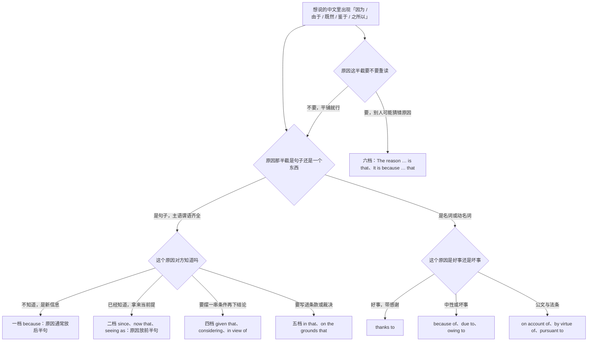
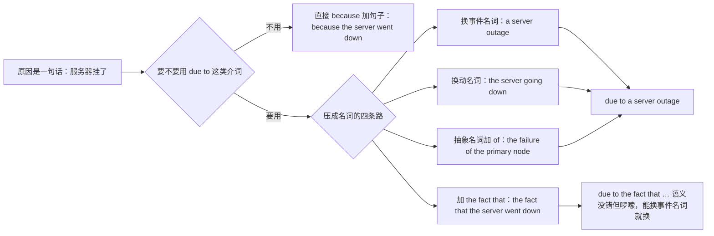
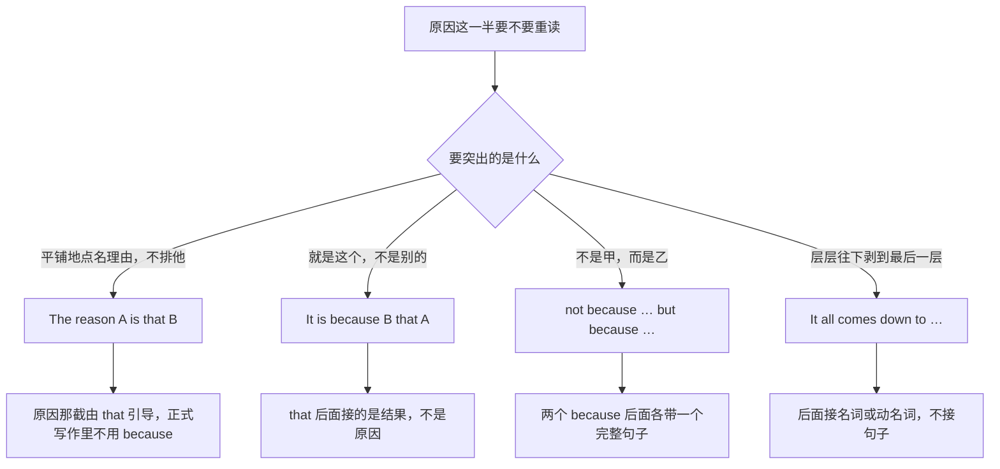
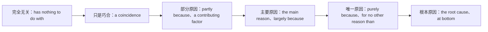
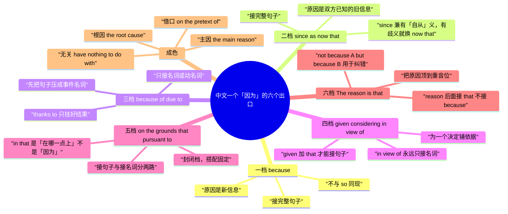

# 因为所以：原因表达的六档梯度

> [!info] 本篇定位
>
> 这篇收「因为A所以B」「由于」「既然」「鉴于／考虑到」「A之所以…是因为…」「正是因为…才…」「说到底是因为」这一批中文原因入口，共二十七条查询意图，每条给三到四档成品。
>
> 与本分类另外两篇的分工：这篇管**从原因那头说起**；以原因作主语、结果作宾语的动词句（导致、引发、造成、归因于）查 [[03.因果与结果/02.导致、引发、归因：把账算在原因头上\|导致、引发、归因]]；从结果那头说的「结果是」「因此」「以至于」查 [[03.因果与结果/03.结果、因此、以至于：从结果反推与程度致果\|结果、因此、以至于]]。
>
> 读完能查到：一句中文的「因为」该落在六档里的哪一档、后面接完整句子还是接名词、because 和 so 为什么不能同现、「之所以…是因为…」怎么把原因顶到聚光灯下、写事故报告时为什么不能用 thanks to。
>
> 原因状语从句的构成规则、连词与介词的词类划分不在这里，指回 [[02.英语基础语法/09.从句体系/04.状语从句详解\|状语从句详解]] 与 [[02.英语基础语法/05.介词与连词/04.介词与连词的易混点\|介词与连词的易混点]]。

---

## 1. 本篇导读：中文一个「因为」，英文分六档

中文表原因的手段少得惊人。日常口语从头到尾一个「因为」，书面一点换「由于」，公文再换「鉴于」，基本就到头了。英文这头分工细得多：后面接完整句子的是一套词，接名词的是另一套，把原因当双方已知前提摆出来的是第三套，写进合同条款的是第四套，要把原因单独顶出来重读的又是第五套。

中文母语者踩得最狠的两个坑都出在这个不对称上。一个是把 `because of` 当 `because` 用，后面直接跟一个主谓齐全的句子；另一个是照着中文「因为…所以…」的对偶写出 `Because it rained, so we stayed in.`。这两条各占一整节警示，先看总表。

### 1.1 六档总表

| 档 | 主要手段 | 后面接什么 | 什么场合用 | 代表成品 |
| --- | --- | --- | --- | --- |
| 一档 | because、'cause、That's because | 完整句子 | 口语到中性，通吃 | We're behind because the build kept failing. |
| 二档 | since、as、now that、seeing as | 完整句子 | 原因是对方已经知道的旧信息 | Since you're already here, take a look at this. |
| 三档 | because of、due to、owing to、thanks to、on account of | 名词或动名词 | 中性到书面，事故报告与通知 | The delay was due to a network outage. |
| 四档 | given、considering、in view of、in light of、based on | 名词，或加 that 接句子 | 书面汇报，先摆前提再下结论 | Given the timeline, we'll have to cut scope. |
| 五档 | in that、on the grounds that、by virtue of、pursuant to | 分两路，见速查表 | 正式文书、条款、法律意见 | The appeal was refused on the grounds that it was filed late. |
| 六档 | The reason … is that、It is because … that、not because … but because | 强调结构 | 各语域都能用，看要聚焦哪一半 | The reason we missed it is that nobody owned the alert. |

六档不是「越往下越高级」，是六个场合。聊天里冒一句 `on account of` 和写事故报告时写 `'cause` 一样别扭。第九节有三条完整走查，把同一句中文写满六档，顺便说明哪些句子根本升不到三档。

### 1.2 从中文入口进的选择树

树的第一层不问语法，只问一件事：把「因为」后面那一截单拎出来，它是个能独立成句的东西，还是个名词。这一刀切下去，一档二档四档五档在左边，三档在右边，选错的代价就是那句经典的 `because of he was late`。第二层才开始分场合：同样是接句子，原因是新信息就用 because，是双方都知道的旧信息就用 since，要当作决策依据摆出来就用 given that。右边那一路按褒贬分——thanks to 自带感谢，用在坏事上会读成反讽。最右侧那条单独的分支是六档，它跟前五档不冲突，是叠加在任何一档之上的聚焦手段。

### 1.3 三个提醒

> [!warning] 两条不可犯的硬错
>
> - ❌ ~~We're late because of the server went down.~~ ／ ✅ **We're late because the server went down.**（because of 是介词，后面只能跟名词、代词或动名词；要跟句子就把 of 去掉）
> - ❌ ~~Because it rained, so we stayed in.~~ ／ ✅ **Because it rained, we stayed in.** 或 **It rained, so we stayed in.**（中文的「因为…所以…」是一对，英文里 because 和 so 是同一个连接点的两种说法，留一个）

> [!tip] 三步定档
>
> 第一步，把「因为」后面那截拆出来，看它是句子还是名词——这决定用连词还是用介词。第二步，看这个原因对方知不知道——新信息用 because，旧信息用 since、now that。第三步，看写在哪儿——聊天停在一档二档，邮件与通知落三档四档，合同与裁决走五档。要额外强调原因是哪一个，再叠一层六档。

---

## 2. 一档与二档：后面直接接一整句话

这两档共用一个形式条件：后面必须是主谓齐全的句子。区别在信息地位。because 引出的是听话人不知道的新理由，所以默认放在后半句，重音也落在那儿；since、as、now that 引出的是双方都清楚的旧情况，所以习惯放在前半句，说完就走，不占重音。

中文对这个区别不敏感——「因为你在这儿，帮我看一眼」和「我迟到了，因为堵车」都用同一个「因为」。英文写成 `Because you're here, help me with this` 语法没错，但听感是在跟对方论证一件他明明知道的事。

### 2.1 因为…所以…：最基本的那一条

中文触发语：因为…所以… / 是因为 / 就因为 / …的缘故 / 谁让…呢

| 档位 | 句架 | 例句 |
| --- | --- | --- |
| 口语 | A because B（原因挂后面） | We're running late because the build kept failing. |
| 书面 | Because A, B（原因前置，逗号断开） | Because the vendor missed its own deadline, we pushed the launch to April. |
| 正式 | B. This is because A.（拆成两句） | The rollout has been suspended. This is because the security review is still open. |

> [!warning] 错配警示
>
> - ❌ ~~Because it rained, so we stayed in.~~ ／ ✅ **Because it rained, we stayed in.**（because 和 so 各自都是完整的连接手段，同现就成了双重连接）
> - ❌ ~~Because the build failed. We shipped a day late.~~ ／ ✅ **Because the build failed, we shipped a day late.**（because 引出的是从句，正式文书里单独成句会被判残句；口语和聊天里当独立回答用没问题）

- 同义入口：因为 / 是因为 / 就因为 / …的缘故 / 谁让…呢
- 语法归属：[[02.英语基础语法/09.从句体系/04.状语从句详解\|原因状语从句]]
- 场景实战：[[04.英语场景/04.从句与复合句型框架/03.状语从句九大类型\|状语从句九大类型]]

### 2.2 …，因为…：把理由挂在句尾补充

中文触发语：…，因为… / 毕竟 / 反正 / 说到底也是 / 主要是

这一条和 2.1 是同一个连词的两种摆法。前置是把原因当铺垫，后置是把原因当补充说明——先把结论说完，听话人如果不追问就到此为止。写邮件时后置更省事，因为对方的注意力先落在结论上。

| 档位 | 句架 | 例句 |
| --- | --- | --- |
| 口语 | A. B, after all. | Bring a jacket. It's November, after all. |
| 中性 | A, since B | I'd rather sort it out now, since we're both free this afternoon. |
| 正式书面 | A, for B | The team stayed on through the weekend, for no one else knew the codebase well enough. |

> [!warning] 错配警示
>
> - ❌ ~~For it was raining, we stayed in.~~ ／ ✅ **We stayed in, for it was raining.**（作原因连词的 for 只能后置，不能开头；开头的 For 会被读成介词）
> - ❌ ~~He turned up after all he had promised he would.~~ ／ ✅ **He turned up — after all, he had promised he would.**（表理由的 after all 自成一截，前后都要断开；直接贴在动词后面不加逗号，读出来是另一个意思「他终究还是来了」）

- 同义入口：毕竟 / 反正 / 主要是 / 说白了是因为
- 语法归属：[[02.英语基础语法/05.介词与连词/03.连词的分类与用法\|连词的分类与用法]]
- 场景实战：[[04.英语场景/10.职场与商务场景实战/03.商务邮件与正式书面沟通\|商务邮件与正式书面沟通]]

### 2.3 因为…嘛、还不是因为：口语里随口给理由

中文触发语：因为…嘛 / 还不是因为 / 那是因为 / 就是因为 / 都怪

| 档位 | 句架 | 例句 |
| --- | --- | --- |
| 口语 | 'cause / cos + 句子 | Sorry I missed it — cos my phone was on silent all morning. |
| 口语解释 | That's because + 句子 | — Why is the page so slow? — That's because we're still on the old instance. |
| 口语抱怨 | A, all because B | We lost a whole day, all because nobody checked the config before merging. |

> [!warning] 错配警示
>
> - ❌ ~~— Why did you leave? — Because of tired.~~ ／ ✅ **Because I was tired.** 或 **I was tired.**（单独回答 why 时用 Because 加从句，不能接形容词）
> - ❌ ~~'Cause of a delay in review, the release slipped.~~ ／ ✅ **Because of a delay in review, the release slipped.**（'cause 是 because 的口语缩略，不是 because of 的缩略，写进文档一律还原）

- 同义入口：还不是因为 / 那是因为 / 都怪 / 就是因为这个
- 语法归属：[[02.英语基础语法/09.从句体系/04.状语从句详解\|原因状语从句]]
- 场景实战：[[04.英语场景/07.社交交际场景实战/01.交友聚会与闲聊场景\|交友聚会与闲聊场景]]

### 2.4 既然…那就…：原因是双方已知的前提

中文触发语：既然 / 既然这样 / 都…了那就 / 反正你也 / 趁着

| 档位 | 句架 | 例句 |
| --- | --- | --- |
| 口语 | Since A, B | Since you're already in that file, could you fix the typo on line 40 too? |
| 口语随意 | Seeing as A, B | Seeing as we're all in the room, let's just decide it now. |
| 中性书面 | Now that A, B | Now that the API has stabilised, we can start writing the client. |
| 正式 | Given that A, B | Given that the contract expires in June, renewal talks should begin this month. |

> [!warning] 错配警示
>
> - ❌ ~~Since we moved to the new office, the commute is awful.~~（会先被读成「自从搬了以后」）／ ✅ **Now that we've moved to the new office, the commute is awful.**（since 兼有「自从」与「既然」两义，句子放到时间轴上也讲得通时改用 now that）
> - ❌ ~~Seeing as the audit is complete, the funds shall be released.~~ ／ ✅ **Now that the audit is complete, the funds may be released.**（seeing as 是口语，和 shall 这类条款用词撞在一句里语域不匹配）

- 同义入口：既然如此 / 都这样了 / 反正 / 趁着
- 语法归属：[[02.英语基础语法/09.从句体系/04.状语从句详解\|状语从句详解]]
- 场景实战：[[04.英语场景/10.职场与商务场景实战/02.会议汇报与演示场景\|会议汇报与演示场景]]

### 2.5 由于（一笔带过）：as 的弱因果

中文触发语：由于 / 因…（顺带交代一句的理由）/ 考虑到时间关系

as 是这几个连词里因果味最淡的一个。它引出的原因几乎是背景交代，不指望对方追问，也不承担论证功能。写通知和纪要时好用，写论证时不够。

| 档位 | 句架 | 例句 |
| --- | --- | --- |
| 中性书面 | As A, B | As the office is closed on Monday, we'll push the review to Tuesday. |
| 书面后置 | A, as B | The demo was cut short, as half the team was travelling that week. |
| 正式 | Inasmuch as A, B | Inasmuch as the parties have reached agreement, the dispute is withdrawn. |

> [!warning] 错配警示
>
> - ❌ ~~As I was reading the log, I found the bug.~~（会先被读成「我读日志的时候」）／ ✅ **I found the bug because I went through the log line by line.**（as 兼有时间义、原因义与「像…一样」义，句子能读成时间时一律改 because）
> - ❌ ~~As it is raining so we cancelled.~~ ／ ✅ **As it was raining, we cancelled.**（as 引原因时同样不与 so 同现）

- 同义入口：由于 / 因…之故 / 考虑到…（轻描淡写版）
- 语法归属：[[02.英语基础语法/05.介词与连词/04.介词与连词的易混点\|介词与连词的易混点]]
- 场景实战：[[04.英语场景/10.职场与商务场景实战/03.商务邮件与正式书面沟通\|商务邮件与正式书面沟通]]

---

## 3. 三档：后面只能跟一个名词

三档是中文母语者出错最集中的一档，原因很直接：中文的「由于」后面既能跟句子（由于服务器挂了）又能跟名词（由于故障），英文的 because of、due to、owing to 只认名词。想用这一档，就得先把原因那半截压成一个名词。

### 3.1 把句子压成名词的四条路

四条路里第一条最短也最像英文母语的写法：英文有大量现成的事件名词（outage、delay、shortage、breakdown、oversight、mismatch），中文得说成一整句的事，英文往往一个词就装下了。第二条动名词路万能但偏口语。第三条 `due to the fact that` 是很多人的救命稻草，语法完全正确，只是审稿人会画掉——它等于绕了一圈又回到从句。第四条把动作改成抽象名词再挂 of，是公文和学术写作的默认动作，代价是句子变重。

### 3.2 由于…：最常用的介词式

中文触发语：由于 / 因为（后面跟的是个东西，不是句子）/ 因…而 / …引起的

| 档位 | 句架 | 例句 |
| --- | --- | --- |
| 口语 | because of + n. | We're a day behind because of yesterday's outage. |
| 书面 | A was due to + n. | The delay was due to an unplanned network outage. |
| 正式 | Owing to + n., B | Owing to adverse weather, the site inspection has been postponed to 14 May. |

> [!warning] 错配警示
>
> - ❌ ~~We're late because of the server went down.~~ ／ ✅ **We're late because the server went down.** 或 **We're late because of the server outage.**（because of 后面只能是名词、代词或动名词）
> - ❌ ~~Due to it rained heavily, the match was called off.~~ ／ ✅ **Due to heavy rain, the match was called off.**（heavy rain 就是把 it rained heavily 压成的名词短语，压完才能挂在 due to 后面）

- 同义入口：由于 / 因…而 / …造成的 / …引起的
- 语法归属：[[02.英语基础语法/05.介词与连词/01.介词的分类与基本用法\|介词的分类与基本用法]]
- 场景实战：[[04.英语场景/10.职场与商务场景实战/02.会议汇报与演示场景\|会议汇报与演示场景]]

### 3.3 多亏了、幸亏：褒义的原因

中文触发语：多亏了 / 幸亏 / 全靠 / 要不是有…就 / 托…的福

| 档位 | 句架 | 例句 |
| --- | --- | --- |
| 口语 | Thanks to + n., B | Thanks to Wei's script, the whole migration took ten minutes. |
| 中性 | B, thanks to + n. | The release went smoothly, thanks to two weeks of dry runs. |
| 书面 | with the help of + n. | With the help of the vendor's on-call team, we restored service before noon. |
| 正式 | by virtue of + n. | The firm retained the contract by virtue of its unbroken safety record. |

> [!warning] 错配警示
>
> - ❌ ~~Thanks to a bug in the parser, we lost a whole day of data.~~ ／ ✅ **Because of a bug in the parser, we lost a whole day of data.**（thanks to 默认带感谢，挂在坏结果上会被读成反讽；事故报告一律换 because of 或 due to）
> - ❌ ~~Thanks to he helped us, we finished on time.~~ ／ ✅ **Thanks to his help, we finished on time.**（thanks to 是介词，同样只接名词）

- 同义入口：幸亏 / 全靠 / 得益于 / 沾了…的光
- 语法归属：[[02.英语基础语法/05.介词与连词/02.常用介词搭配详解\|常用介词搭配详解]]
- 场景实战：[[04.英语场景/07.社交交际场景实战/04.邀请庆祝与节日祝福场景\|邀请庆祝与节日祝福场景]]

### 3.4 出于…考虑：动机型原因

中文触发语：出于 / 是为了 / 考虑到…的原因 / 基于…的顾虑 / 单纯因为好奇

「由于」交代的是外部事实，「出于」交代的是内心动机，英文这两类也分家：外部事实挂 because of、due to，内心动机挂 out of、for … reasons、on … grounds。

| 档位 | 句架 | 例句 |
| --- | --- | --- |
| 口语 | out of + 抽象名词 | I asked out of curiosity, nothing more. |
| 中性 | for + 名词 + reasons | The endpoint is rate-limited for security reasons. |
| 书面 | in the interest of + n. | In the interest of transparency, the raw numbers are published alongside the summary. |
| 正式 | on + 名词 + grounds | The application was refused on medical grounds. |

> [!warning] 错配警示
>
> - ❌ ~~out of the security reason~~ ／ ✅ **for security reasons**（out of 后面跟的是情绪与动机名词：curiosity、respect、habit、spite、necessity；制度性理由走 for … reasons）
> - ❌ ~~I did it out of I wanted to help.~~ ／ ✅ **I did it because I wanted to help.**（out of 是介词，接句子要换回 because）

- 同义入口：出于 / 是为了 / 基于…考虑 / 纯粹因为
- 语法归属：[[02.英语基础语法/05.介词与连词/02.常用介词搭配详解\|常用介词搭配详解]]
- 场景实战：[[04.英语场景/05.高频实用表达句型框架/01.表达观点与态度的50个万能句型\|表达观点与态度]]

### 3.5 因…之故：更书面的几组固定搭配

中文触发语：因…之故 / 由于…的缘故 / 缘于 / 系因…所致

| 档位 | 句架 | 例句 |
| --- | --- | --- |
| 中性书面 | on account of + n. | The coastal road was closed on account of flooding. |
| 书面 | as a result of + n. | Two nodes were lost as a result of the power cut. |
| 正式 | by reason of + n. | The lease terminates by reason of non-payment. |
| 正式 | in consequence of + n. | In consequence of the merger, all legacy accounts were migrated. |

> [!warning] 错配警示
>
> - ❌ ~~The meeting was cancelled on account of he was ill.~~ ／ ✅ **on account of his illness** 或 **because he was ill**（on account of 是三词介词，整体只接名词）
> - ❌ ~~As a result of we changed the schema, three queries broke.~~ ／ ✅ **As a result of the schema change, three queries broke.**（as a result of 接名词；as a result 单独用则是「结果」，后面接完整句子，详见 03 篇）

- 同义入口：因…之故 / 缘于 / 系因…所致 / …引发的
- 语法归属：[[02.英语基础语法/05.介词与连词/01.介词的分类与基本用法\|介词短语作状语]]
- 场景实战：[[04.英语场景/10.职场与商务场景实战/04.商务谈判合同与客户沟通\|商务谈判合同与客户沟通]]

### 3.6 是…造成的、问题出在：把原因塞进系表结构

中文触发语：是…造成的 / 问题出在 / 毛病出在 / 就是…闹的 / 卡在…上

| 档位 | 句架 | 例句 |
| --- | --- | --- |
| 口语 | It's the + n. | It's the cache. Clear it and the page loads fine. |
| 口语 | The problem is + n. / that + 句子 | The problem is the timeout, not the query itself. |
| 中性（英式常用） | A is down to + n. | The slowdown is down to a single unindexed column. |
| 正式 | A is attributable to + n. | The variance is attributable to a change in accounting policy. |

> [!warning] 错配警示
>
> - ❌ ~~The problem is because the cache is stale.~~ ／ ✅ **The problem is that the cache is stale.**（problem、reason、trouble 这类名词后面接的是表语从句，用 that，不用 because）
> - ❌ ~~It's down to the network is slow.~~ ／ ✅ **It's down to the network being slow.**（be down to 后面接名词或动名词复合结构）

- 同义入口：问题出在 / 毛病在于 / 是…惹的 / 症结在
- 语法归属：[[02.英语基础语法/09.从句体系/03.名词性从句详解\|表语从句]]
- 场景实战：[[04.英语场景/10.职场与商务场景实战/02.会议汇报与演示场景\|会议汇报与演示场景]]

---

## 4. 四档：鉴于、考虑到——先摆前提再下结论

四档和二档都把原因当已知信息处理，区别在功能。二档的 since 只是随口交代一句背景；四档的 given、considering、in view of 是在**为一个决定铺陈依据**，后面接的多半是建议、结论或安排。写周报和汇报邮件时，这一档的出场率比 because 还高。

这一档还有一个形式便利：given 和 considering 既能接名词，也能加 that 接完整句子，等于一个词跨了三档和二档两边。

### 4.1 鉴于、考虑到：把已知条件摊开

中文触发语：鉴于 / 考虑到 / 就…来看 / 从…情况看 / 按现在这个情况

| 档位 | 句架 | 例句 |
| --- | --- | --- |
| 口语 | Considering + n. / that + 句子 | Considering how little time we had, it turned out surprisingly well. |
| 中性 | Given + n. | Given the current headcount, a Q3 launch isn't realistic. |
| 书面 | Given that + 句子 | Given that two reviewers are on leave, the deadline should move by a week. |
| 正式 | In view of + n. | In view of the recent incidents, production access will be restricted to the on-call rota. |

> [!warning] 错配警示
>
> - ❌ ~~Given that the risk, we should postpone.~~ ／ ✅ **Given the risk, we should postpone.**（given 接名词时不带 that；带 that 时后面必须是完整句子）
> - ❌ ~~In view of the reviewers are on leave, we'll postpone.~~ ／ ✅ **In view of the reviewers' absence, we'll postpone.**（in view of、in light of 都是纯介词短语，不接从句）

- 同义入口：鉴于 / 考虑到 / 就目前情况 / 按这个进度看
- 语法归属：[[02.英语基础语法/08.非谓语动词/04.过去分词详解\|分词短语作状语]]
- 场景实战：[[04.英语场景/10.职场与商务场景实战/02.会议汇报与演示场景\|会议汇报与演示场景]]

### 4.2 根据、基于：以某份材料为依据

中文触发语：根据 / 基于 / 依据 / 按…的说法 / 从数据上看

| 档位 | 句架 | 例句 |
| --- | --- | --- |
| 口语 | going by + n. | Going by last month's numbers, we'll hit the quota some time in June. |
| 中性 | Based on + n., B | Based on the pilot results, we're extending the trial by two months. |
| 书面 | In light of + n., B | In light of the audit findings, the retention window has been shortened. |
| 正式 | on the basis of + n. | The decision was taken on the basis of the external auditor's report. |

> [!warning] 错配警示
>
> - ❌ ~~According to me, we should wait.~~ ／ ✅ **In my view, we should wait.**（according to 只用来引别人的说法或某份材料，不能引自己）
> - ❌ ~~Based on we tested it twice, it works.~~ ／ ✅ **We tested it twice, so it works.**（based on 后面接名词短语；接句子就改回连词式）

- 同义入口：根据 / 基于 / 依据 / 从…来判断
- 语法归属：[[02.英语基础语法/08.非谓语动词/04.过去分词详解\|过去分词短语作状语]]
- 场景实战：[[04.英语场景/09.学习与教育场景实战/02.图书馆作业与研究场景\|图书馆作业与研究场景]]

### 4.3 正因如此、有鉴于此：回指前文那个原因

中文触发语：正因如此 / 有鉴于此 / 就冲这一点 / 这就是为什么 / 所以我才

这一条的特点是原因不再重复，用一个代词或短语指回上文。写长邮件和文档时省字最明显——上一段刚讲完的事，这一段一个 for this reason 就接上了。

| 档位 | 句架 | 例句 |
| --- | --- | --- |
| 口语 | That's why + 句子 | That's why I keep asking for a staging box. |
| 中性 | For this reason, B | For this reason, we've frozen the schema until March. |
| 书面 | On these grounds, B | On these grounds, the proposal was returned for revision. |
| 正式 | In light of the above, B | In light of the above, the committee recommends deferral to the next cycle. |

> [!warning] 错配警示
>
> - ❌ ~~Because of this reason, we postponed it.~~ ／ ✅ **For this reason, we postponed it.**（reason 搭配的介词是 for；because of this 单独用可以，但不能和 reason 叠在一起）
> - ❌ ~~That's the why I asked.~~ ／ ✅ **That's why I asked.**（That's why 是固定式，中间不加冠词）

- 同义入口：正因如此 / 有鉴于此 / 所以我才 / 这就是为什么
- 语法归属：[[02.英语基础语法/10.特殊句型/05.省略与替代\|省略与替代]]
- 场景实战：[[04.英语场景/10.职场与商务场景实战/03.商务邮件与正式书面沟通\|商务邮件与正式书面沟通]]

### 4.4 看在…的份上：人情型理由

中文触发语：看在…的份上 / 冲着 / 念在 / 给…个面子 / 出于对…的尊重

| 档位 | 句架 | 例句 |
| --- | --- | --- |
| 口语 | for sb's sake | Let it go, for everyone's sake. |
| 口语 | if only because ... | I'd keep the old endpoint alive, if only because half our clients still use it. |
| 中性 | out of respect for + n. | We kept the legacy field out of respect for existing integrations. |
| 正式 | in deference to + n. | The wording was retained in deference to the client's legal team. |

> [!warning] 错配警示
>
> - ❌ ~~for the sake of you~~ ／ ✅ **for your sake**（人称代词一律用所有格前置形式：for my sake、for their sake；for the sake of 后面跟的是抽象名词，如 for the sake of clarity）
> - ❌ ~~Only because half our clients use it, I'd keep it.~~ ／ ✅ **I'd keep it, if only because half our clients still use it.**（if only because 是「哪怕只是因为」的固定式，去掉 if 语义就变成排他的「只是因为」）

- 同义入口：看在…份上 / 冲着 / 哪怕只是因为 / 给个面子
- 语法归属：[[02.英语基础语法/05.介词与连词/02.常用介词搭配详解\|常用介词搭配详解]]
- 场景实战：[[04.英语场景/10.职场与商务场景实战/04.商务谈判合同与客户沟通\|商务谈判合同与客户沟通]]

---

## 5. 五档：写进文书的原因

五档是封闭档，成员少、搭配死、几乎不能自由组合，好处也在这里——记住就能直接抄。这一档只出现在合同、裁决、规章、正式函件和学术论证里，日常写作用上去会显得端着。

按后接成分分两路：on the grounds that、in that、for the reason that 接完整句子；by virtue of、pursuant to、in accordance with、in consideration of 接名词。选错就会写出 `pursuant to the parties agreed` 这种半截话。

### 5.1 以…为由、理由是：正式的理由陈述

中文触发语：以…为由 / 理由是 / 依据是 / 其理由为

| 档位 | 句架 | 例句 |
| --- | --- | --- |
| 中性书面 | on the grounds that + 句子 | The appeal was refused on the grounds that it had been filed out of time. |
| 书面 | on the ground of + n. | Dismissal on the ground of misconduct requires written notice. |
| 正式 | for the reason that + 句子 | The tender was set aside for the reason that the bidder did not meet the technical threshold. |

> [!warning] 错配警示
>
> - ❌ ~~on the grounds of it was late~~ ／ ✅ **on the grounds that it was late** 或 **on the ground of lateness**（of 接名词，that 接句子，两条路不能混）
> - ❌ ~~The claim was rejected on the grounds because it lacked evidence.~~ ／ ✅ **on the grounds that it lacked evidence**（grounds 已经承担了「理由」的意思，后面接 that 从句）

- 同义入口：以…为由 / 理由是 / 据…驳回 / 依据为
- 语法归属：[[02.英语基础语法/09.从句体系/03.名词性从句详解\|同位语从句]]
- 场景实战：[[04.英语场景/10.职场与商务场景实战/04.商务谈判合同与客户沟通\|商务谈判合同与客户沟通]]

### 5.2 原因在于、在于：限定式的原因

中文触发语：原因在于 / 就在于 / 妙就妙在 / 特别之处在于

in that 是这一档里最容易被误用成 because 的一个。它的意思不是「因为」，而是「在…这一点上」——用来限定前半句在哪个意义上成立，所以后面跟的往往是一个说明性的特征，不是一个事件。

| 档位 | 句架 | 例句 |
| --- | --- | --- |
| 中性书面 | A in that B | The design is unusual in that it keeps no state at all between requests. |
| 书面 | A insofar as B | The rule applies insofar as the data leaves the region. |
| 正式 | A inasmuch as B | The two cases are alike inasmuch as both turn on the question of consent. |

> [!warning] 错配警示
>
> - ❌ ~~We postponed the launch in that the server was down.~~ ／ ✅ **We postponed the launch because the server was down.**（in that 说的是「在哪一点上」，替不了叙述事件起因的 because）
> - ❌ ~~In that the data is public, the licence matters.~~ ／ ✅ **The licence matters in that the data is public.**（in that 只能后置，不能放句首）

- 同义入口：原因在于 / 就在于 / 特别之处在于 / 之所以特殊是因为
- 语法归属：[[02.英语基础语法/09.从句体系/05.从句综合辨析\|从句综合辨析]]
- 场景实战：[[04.英语场景/09.学习与教育场景实战/02.图书馆作业与研究场景\|图书馆作业与研究场景]]

### 5.3 依照、按照规定：法规依据

中文触发语：依照 / 按照…规定 / 根据条款 / 依…之规定 / 按合同约定

| 档位 | 句架 | 例句 |
| --- | --- | --- |
| 中性 | under + 条款名 | Under clause 7, either party may terminate on 30 days' notice. |
| 书面 | in accordance with + n. | Personal data is retained in accordance with the published retention policy. |
| 正式 | pursuant to + n. | Pursuant to Article 12, the licence is revoked with immediate effect. |
| 正式 | as required by + n. | The report was filed as required by the Financial Services Act. |

> [!warning] 错配警示
>
> - ❌ ~~According to the clause 7, either party may terminate.~~ ／ ✅ **Under clause 7, either party may terminate.**（引条款用 under 或 pursuant to；according to 用于引人的说法或非约束性材料）
> - ❌ ~~Pursuant to the parties agreed, the deposit is refundable.~~ ／ ✅ **Pursuant to the agreement between the parties, the deposit is refundable.**（pursuant to 只接名词）

- 同义入口：依照 / 按…规定 / 根据条款 / 按约定
- 语法归属：[[02.英语基础语法/05.介词与连词/02.常用介词搭配详解\|常用介词搭配详解]]
- 场景实战：[[04.英语场景/10.职场与商务场景实战/04.商务谈判合同与客户沟通\|商务谈判合同与客户沟通]]

### 5.4 凭借、藉由：资格与身份型原因

中文触发语：凭借 / 藉由 / 因其…身份 / 之所以有资格 / 靠的是

| 档位 | 句架 | 例句 |
| --- | --- | --- |
| 中性 | on the strength of + n. | He was hired on the strength of a single side project. |
| 书面 | by virtue of + n. | She sits on the board by virtue of her role as chief financial officer. |
| 正式 | in consideration of + n. | In consideration of the payment described above, the seller transfers all rights in the work. |

> [!warning] 错配警示
>
> - ❌ ~~She sits on the board by virtue of she is the CFO.~~ ／ ✅ **by virtue of her position as CFO**（by virtue of 后面必须是名词短语）
> - ❌ ~~In consideration of he helped us, we gave him a discount.~~ ／ ✅ **In recognition of his help, we gave him a discount.**（in consideration of 在合同里专指「作为对价」，不是「考虑到」；表酬谢用 in recognition of）

- 同义入口：凭借 / 靠的是 / 因其身份 / 作为…的对价
- 语法归属：[[02.英语基础语法/05.介词与连词/01.介词的分类与基本用法\|介词短语]]
- 场景实战：[[04.英语场景/10.职场与商务场景实战/01.求职简历面试与Offer谈判\|求职简历面试与Offer谈判]]

---

## 6. 六档：把原因顶到聚光灯下

前五档是平铺的：原因和结果并列摆着，重音落在哪儿由语调决定。六档不一样——它用句法结构强制把重音钉在原因上，等于告诉对方「别猜了，就是这个」。中文里「之所以…是因为…」「正是因为…才…」「说到底是因为」全部落在这一档。

六档不替代前五档，是叠加在前五档之上的。同一个原因可以先选好档，再决定要不要用六档的结构把它顶出去。

### 6.1 四条聚焦出路

四条路的聚焦强度递增。第一条 `The reason … is that …` 最中性，只是把原因摆到表语位置上，适合汇报里逐条列因。第二条是强调句，语气最硬，暗含「你们猜的那个不对」。第三条是纠错专用——听话人已经给了一个错的原因，得先否掉再给对的。第四条是往下追问式，一层层剥到根子上，写复盘和归因分析时最顺手。

四条路各有一个形式坑：第一条的 that 常被写成 because，第二条的 that 后面常被误当成原因的位置，第三条的两个分句常被压缩成不完整的半句，第四条常被接上一个完整句子。四条坑下面各节都有对应警示。

### 6.2 之所以…是因为…

中文触发语：之所以…是因为… / …的原因是 / 为什么…呢，是因为 / 说它…是因为

| 档位 | 句架 | 例句 |
| --- | --- | --- |
| 口语 | The reason A is B（that 常省） | The reason it broke is we never tested that path. |
| 书面 | The reason (why) A is that B | The reason why the query is slow is that the column has no index. |
| 正式 | The principal reason for A is that B | The principal reason for the shortfall is that two contracts slipped into the next quarter. |

> [!warning] 错配警示
>
> - ❌ ~~The reason we missed it is because nobody owned the alert.~~ ／ ✅ **The reason we missed it is that nobody owned the alert.**（reason 已经把「因为」说尽了，后面接 that 从句；口语里 is because 极常见，正式书面一律改 that）
> - ❌ ~~The reason of the delay is that the vendor changed the spec.~~ ／ ✅ **The reason for the delay is that the vendor changed the spec.**（reason 搭配的介词是 for，不是 of）

- 同义入口：之所以…是因为 / …的原因是 / 为什么会这样，是因为
- 语法归属：[[02.英语基础语法/09.从句体系/03.名词性从句详解\|表语从句与同位语从句]]
- 场景实战：[[04.英语场景/10.职场与商务场景实战/02.会议汇报与演示场景\|会议汇报与演示场景]]

### 6.3 正是因为…才…

中文触发语：正是因为…才… / 就是因为 / 恰恰是因为 / 要不是因为…也不会

| 档位 | 句架 | 例句 |
| --- | --- | --- |
| 口语 | It's only because A that B | It's only because Wei rewrote the parser that we made the deadline at all. |
| 书面 | It is precisely because A that B | It is precisely because the dataset is public that the licence terms matter. |
| 正式 | It is for this reason that B | It is for this reason that the indemnity clause was added at the last review. |

> [!warning] 错配警示
>
> - ❌ ~~It is because he was late that's why we started without him.~~ ／ ✅ **It was because he was late that we started without him.**（强调句只有一个连接点，that 后面直接跟结果，不再叠 that's why）
> - ❌ ~~It is because of the parser rewrite that made the deadline.~~ ／ ✅ **It was the parser rewrite that made the deadline.**（被强调的成分本来就是名词时，直接放进 It is … that，不再套 because of）

- 同义入口：正是因为 / 恰恰是因为 / 就冲着这个 / 要不是因为
- 语法归属：[[02.英语基础语法/10.特殊句型/04.强调句型\|强调句型]]
- 场景实战：[[04.英语场景/05.高频实用表达句型框架/01.表达观点与态度的50个万能句型\|表达观点与态度]]

### 6.4 说到底、归根结底

中文触发语：说到底 / 归根结底 / 到头来还是因为 / 根子上是 / 本质上就是

| 档位 | 句架 | 例句 |
| --- | --- | --- |
| 口语 | It (all) comes down to + n./doing | It all comes down to how much time we're willing to spend on tests. |
| 口语 | At the end of the day, B | At the end of the day, this is a staffing problem, not a tooling problem. |
| 书面 | Ultimately, A is a matter of B | Ultimately, the outage was a matter of missing alerts rather than bad code. |
| 正式 | The root cause was B | The root cause was an unbounded retry loop in the client library. |

> [!warning] 错配警示
>
> - ❌ ~~It comes down to we don't have enough reviewers.~~ ／ ✅ **It comes down to not having enough reviewers.**（come down to 后面接名词或动名词，接句子要加 the fact that）
> - ❌ ~~In the end of the day~~ ／ ✅ **At the end of the day**（固定搭配用 at；in the end 是另一个词组，意思是「最后终于」，属于结果篇）

- 同义入口：说到底 / 归根结底 / 根子在 / 本质上
- 语法归属：[[02.英语基础语法/08.非谓语动词/02.动名词详解\|动名词作介词宾语]]
- 场景实战：[[04.英语场景/10.职场与商务场景实战/02.会议汇报与演示场景\|会议汇报与演示场景]]

### 6.5 不是因为…而是因为…

中文触发语：不是因为…而是因为… / 与其说是…不如说 / 问题不在…而在… / 关键不是

| 档位 | 句架 | 例句 |
| --- | --- | --- |
| 口语 | not because A, but because B | I left early not because I was bored, but because I had a train to catch. |
| 口语 | It's not that A — it's that B | It's not that the function is slow; it's that we call it a thousand times a request. |
| 书面 | less a matter of A than of B | The failure was less a matter of design than of maintenance. |
| 正式 | not so much A as B | The delay stemmed not so much from the vendor as from our own review process. |

> [!warning] 错配警示
>
> - ❌ ~~It's not the code slow, it's we call it too often.~~ ／ ✅ **It's not that the code is slow; it's that we call it too often.**（两个分句各带一个 that 从句，口语里 that 可省，从句本身不能残缺）
> - ❌ ~~not so much from the vendor than from us~~ ／ ✅ **not so much from the vendor as from us**（not so much … as … 是固定搭配，第二个连接词是 as，不是 than）

- 同义入口：不是因为…而是 / 与其说…不如说 / 问题不在…在于
- 语法归属：[[02.英语基础语法/05.介词与连词/03.连词的分类与用法\|并列连词与关联结构]]
- 场景实战：[[04.英语场景/05.高频实用表达句型框架/03.同意反对让步转折句型库\|同意反对让步转折句型库]]

### 6.6 一方面是因为…：给多个原因分权重

中文触发语：一方面是因为 / 部分原因是 / 多多少少是因为 / 一来…二来… / 主要还是因为

| 档位 | 句架 | 例句 |
| --- | --- | --- |
| 口语 | partly because + 句子 | We're behind partly because two people were out sick last week. |
| 中性 | One reason is that A; another is that B. | One reason is that the spec changed twice; another is that we lost a week to interviews. |
| 书面 | in large part because of + n. | Infrastructure costs fell in large part because of the switch to spot instances. |
| 正式 | A may be attributed in part to B | The improvement may be attributed in part to the new caching layer. |

> [!warning] 错配警示
>
> - ❌ ~~It's partly because of we were understaffed.~~ ／ ✅ **It's partly because we were understaffed.**（partly 只是修饰语，不改变 because 与 because of 的后接规则）
> - ❌ ~~On the one hand we were understaffed, and the spec changed.~~ ／ ✅ **On the one hand we were understaffed; on the other, the spec kept changing.**（on the one hand 必须配 on the other hand，单用会吊在半空）

- 同义入口：一方面是因为 / 部分原因是 / 一来…二来 / 多少也有…的关系
- 语法归属：[[02.英语基础语法/05.介词与连词/03.连词的分类与用法\|关联连词]]
- 场景实战：[[04.英语场景/10.职场与商务场景实战/02.会议汇报与演示场景\|会议汇报与演示场景]]

---

## 7. 原因的成色：主因、借口与无关

前六档解决的是「怎么把原因接上去」，这一节解决的是「这个原因算数吗」。中文里「主要是因为」「无非是因为」「表面上是因为」「跟这个没关系」四组说法在英文里各有一套固定搭配，写复盘、事故报告和辩解时全都要用到。

### 7.1 原因成色的一条刻度

刻度从左往右是因果强度递增，但最右端的「根本原因」不是强度最高的那一档——它是深度最深的那一档。`the main reason` 回答的是「哪个原因占比最大」，`the root cause` 回答的是「顺着往下追，最底下那个原因是什么」，两者可以是不同的东西：一次事故的主因可能是磁盘写满，根因却是三个月前砍掉的监控告警。写复盘时把这两个词混用，读的人会以为你已经追到底了。

### 7.2 主要是因为、罪魁祸首

中文触发语：主要是因为 / 主因是 / 罪魁祸首是 / 最大的问题出在 / 十有八九是

| 档位 | 句架 | 例句 |
| --- | --- | --- |
| 口语 | mostly because / mainly because | It's mostly because we never wrote the migration script. |
| 口语 | The culprit was + n. | The culprit was a stale DNS entry on one of the load balancers. |
| 书面 | The single biggest factor was + n. | The single biggest factor was the change in the review policy. |
| 正式 | The principal driver of A is B | The principal driver of the cost increase is annual licence renewal. |

> [!warning] 错配警示
>
> - ❌ ~~The main reason is because of the policy changed.~~ ／ ✅ **The main reason is that the policy changed.**（reason 后面接 that 从句，是 6.2 那条规则在这里的重现）
> - ❌ ~~It's mainly because of we were short-staffed.~~ ／ ✅ **It's mainly because we were short-staffed.**（mainly、mostly、largely 都只是副词，不改变后接规则）

- 同义入口：主要是因为 / 主因 / 罪魁祸首 / 大头在
- 语法归属：[[02.英语基础语法/04.形容词与副词/03.副词的分类与用法\|副词的位置]]
- 场景实战：[[04.英语场景/10.职场与商务场景实战/02.会议汇报与演示场景\|会议汇报与演示场景]]

### 7.3 只是因为、无非是因为

中文触发语：只是因为 / 无非是 / 不过是因为 / 就因为这么点事 / 纯粹是

| 档位 | 句架 | 例句 |
| --- | --- | --- |
| 口语 | just because + 句子 | The whole thing failed just because the path had a space in it. |
| 口语 | It's just that + 句子 | It's just that nobody had ever run it on Windows. |
| 书面 | for no other reason than + n./that | The meeting was moved for no other reason than a room clash. |
| 正式 | solely on account of + n. | The application was rejected solely on account of an incomplete declaration. |

> [!warning] 错配警示
>
> - ❌ ~~Just because it compiles, so it works.~~ ／ ✅ **Just because it compiles doesn't mean it works.**（「就因为…并不代表…」这个框架里，整个 just because 从句就是主语，后面直接跟 doesn't mean，不再加连接词）
> - ❌ ~~It's just because of the path has a space.~~ ／ ✅ **It's just that the path has a space in it.**（轻描淡写地给一个理由用 It's just that，接完整句子）

- 同义入口：只是因为 / 无非是 / 不过是 / 纯粹因为
- 语法归属：[[02.英语基础语法/09.从句体系/03.名词性从句详解\|主语从句]]
- 场景实战：[[04.英语场景/07.社交交际场景实战/02.电话短信与在线沟通场景\|电话短信与在线沟通场景]]

### 7.4 真正的原因、表面上的理由

中文触发语：真正的原因是 / 表面理由是 / 官方说法是 / 说白了是因为 / 明面上说是

| 档位 | 句架 | 例句 |
| --- | --- | --- |
| 口语 | The real reason is + 句子 | The real reason is he didn't want to be on the on-call rota. |
| 口语 | Officially A. In practice, B. | Officially it was a budget freeze. In practice, the project had no sponsor left. |
| 书面 | The stated reason was A; the underlying cause was B. | The stated reason was capacity; the underlying cause was an unresolved licensing dispute. |
| 正式 | ostensibly for A, but in fact to do B | The clause was added ostensibly for clarity, but in fact to cap liability. |

> [!warning] 错配警示
>
> - ❌ ~~The real reason is because he didn't want to be on call.~~ ／ ✅ **The real reason is that he didn't want to be on call.**（同 6.2，reason 后接 that）
> - ❌ ~~In fact reason was the budget.~~ ／ ✅ **The real reason was the budget.**（in fact 是插入语，不能直接充当限定词修饰 reason）

- 同义入口：真正的原因 / 说白了 / 明面上是 / 官方口径是
- 语法归属：[[02.英语基础语法/11.实战应用/02.写作中的语法应用\|写作中的语法应用]]
- 场景实战：[[04.英语场景/10.职场与商务场景实战/04.商务谈判合同与客户沟通\|商务谈判合同与客户沟通]]

### 7.5 以…为借口、打着…的旗号

中文触发语：以…为借口 / 拿…当理由 / 借口是 / 打着…的旗号 / 名义上是

| 档位 | 句架 | 例句 |
| --- | --- | --- |
| 口语 | use sth as an excuse to do | He's using the release as an excuse to skip code review. |
| 中性 | on the pretext of + doing/n. | The audit was launched on the pretext of a routine compliance check. |
| 书面 | under the guise of + n. | Fees were raised under the guise of a service upgrade. |
| 正式 | in the name of + n. | Access was restricted in the name of data protection. |

> [!warning] 错配警示
>
> - ❌ ~~He used the release as an excuse for skip the review.~~ ／ ✅ **as an excuse to skip the review** 或 **as an excuse for skipping the review**（as an excuse 后面接 to 不定式或 for 加动名词，两条路选一条）
> - ❌ ~~under the guise that the service was upgraded~~ ／ ✅ **under the guise of a service upgrade**（under the guise of 只接名词，不接从句）

- 同义入口：以…为借口 / 打着…旗号 / 名义上是 / 拿…说事
- 语法归属：[[02.英语基础语法/08.非谓语动词/02.动名词详解\|动名词作介词宾语]]
- 场景实战：[[04.英语场景/10.职场与商务场景实战/04.商务谈判合同与客户沟通\|商务谈判合同与客户沟通]]

### 7.6 跟…没关系、不是因为

中文触发语：跟…没关系 / 不是因为 / 与…无关 / 赖不着 / 这事儿不怪

| 档位 | 句架 | 例句 |
| --- | --- | --- |
| 口语 | It's got nothing to do with + n. | It's got nothing to do with the network — the token had expired. |
| 口语 | A isn't down to B | The slowdown isn't down to the new release; it started three days earlier. |
| 书面 | A is unrelated to B | The two incidents are unrelated. |
| 正式 | A bears no causal relation to B | The price adjustment bears no causal relation to the supply shortage. |

> [!warning] 错配警示
>
> - ❌ ~~The delay has no relationship with the vendor.~~ ／ ✅ **The delay has nothing to do with the vendor.**（表「与…无关」用 have nothing to do with；relationship with 指的是关系本身，用在人或机构之间）
> - ❌ ~~It's nothing to do with because we were late.~~ ／ ✅ **It has nothing to do with our being late.**（with 是介词，后面挂动名词复合结构，不挂 because 从句）

- 同义入口：跟…没关系 / 与…无关 / 赖不着 / 不是这个原因
- 语法归属：[[02.英语基础语法/05.介词与连词/02.常用介词搭配详解\|常用介词搭配详解]]
- 场景实战：[[04.英语场景/05.高频实用表达句型框架/03.同意反对让步转折句型库\|同意反对让步转折句型库]]

### 7.7 难怪、怪不得：从结果反推原因

中文触发语：难怪 / 怪不得 / 原来是因为 / 我就说嘛 / 这就解释了

| 档位 | 句架 | 例句 |
| --- | --- | --- |
| 口语 | No wonder + 句子 | No wonder the tests were all green — they never actually ran. |
| 口语 | That explains + 名词/why 从句 | That explains why the build was so fast this morning. |
| 中性 | A, which explains why B | The config was cached, which explains why the change never took effect. |
| 书面 | A would account for B | A clock skew of two seconds would account for the mismatch in the logs. |

> [!warning] 错配警示
>
> - ❌ ~~No wonder that the tests passed.~~ ／ ✅ **No wonder the tests passed.** 或 **It is no wonder that the tests passed.**（完整式是 It is no wonder that…；省掉 It is 之后 that 跟着一起省，要留 that 就得把 It is 补回来）
> - ❌ ~~That explains why was the build so fast.~~ ／ ✅ **That explains why the build was so fast.**（why 引出的是宾语从句，用陈述语序，不倒装）

- 同义入口：难怪 / 怪不得 / 原来如此 / 这就解释了
- 语法归属：[[02.英语基础语法/09.从句体系/03.名词性从句详解\|宾语从句的语序]]
- 场景实战：[[04.英语场景/05.高频实用表达句型框架/01.表达观点与态度的50个万能句型\|表达观点与态度]]

---

## 8. 后接成分速查表与位置标点

前七节按中文意图组织，这一节按形式组织，是套用句架前的最后一道机械检查。查完这三张表，前面提到的所有硬错都能在写完之前拦下来。

### 8.1 后面接什么：一张表拦住所有 because of 类错误

| 手段 | 后面接 | 能接完整句子吗 | 典型错例 |
| --- | --- | --- | --- |
| because | 句子 | 能 | — |
| since、as、for、now that、seeing as | 句子 | 能 | — |
| in that、insofar as、inasmuch as | 句子 | 能 | — |
| on the grounds that、for the reason that | 句子 | 能 | ~~on the grounds of it was late~~ |
| because of、due to、owing to | 名词或动名词 | 不能 | ~~because of he was late~~ |
| thanks to、on account of、as a result of | 名词或动名词 | 不能 | ~~thanks to he helped us~~ |
| out of、for … reasons、on … grounds | 名词 | 不能 | ~~out of I wanted to help~~ |
| in view of、in light of、on the basis of | 名词 | 不能 | ~~in view of he resigned~~ |
| by virtue of、pursuant to、in accordance with | 名词 | 不能 | ~~pursuant to the parties agreed~~ |
| come down to、be down to、have nothing to do with | 名词或动名词 | 不能 | ~~it comes down to we are short-staffed~~ |
| given、considering | 名词；加 that 才接句子 | 加 that 能 | ~~given that the risk~~ |

这张表只有一条规则：末尾带 of、to、with 这类介词的，后面一律是名词那一路。想不起来就把整个短语念一遍，念到最后一个词是介词，就知道该压名词了。

### 8.2 原因放前半句还是后半句

| 手段 | 前置 | 后置 | 说明 |
| --- | --- | --- | --- |
| because | 可以 | 更常见 | 前置时原因被当成铺垫，后置时原因是句子的重点 |
| since、as | 更常见 | 可以 | 引旧信息，习惯先摆前提 |
| now that、seeing as | 更常见 | 少见 | 几乎只前置 |
| for（原因义） | 不行 | 只能后置 | 开头的 For 会被读成介词 |
| in that | 不行 | 只能后置 | 限定前半句在哪一点上成立 |
| insofar as、inasmuch as | 可以 | 可以 | 前置多见于条款与学术论证 |
| due to、owing to、because of | 可以 | 可以 | 前置要打逗号 |
| given、considering、in view of | 更常见 | 可以 | 前置时是在为结论铺依据 |

### 8.3 逗号打在哪儿

原因从句放句首，后面必须打逗号：`Because the build failed, we shipped a day late.`。原因从句放句尾，一般不打逗号：`We shipped a day late because the build failed.`——除非后半句是补充说明而不是核心理由，那时可以打一个逗号把语气松开：`We shipped a day late, because nobody wanted to push on a Friday.` 这个逗号的有无会改变意思：不打逗号时否定范围会盖到原因上（`He didn't leave because he was angry` 可以理解成「他不是因为生气才走的」），打了逗号则明确是「他没走，因为他生气了」。写正式文书时如果这句带否定，最稳的做法是拆成两句。

### 8.4 due to 能不能放句首

传统语法书把 due to 划为形容词性短语，要求它只能修饰名词、跟在系动词后面：`The delay was due to an outage.` 这样是标准的；`Due to an outage, the launch slipped.` 按老规矩应该写成 `Owing to an outage` 或 `Because of an outage`。现在句首的 due to 已经极常见，日常写作没人会挑，但学术论文与法律文书的审稿人仍可能改。

> [!tip] 不想纠结时的两条安全线
>
> 系动词后面（was、is、seems）一律用 due to，这个位置从来没有争议。句首一律用 Owing to 或 Because of，这两个从头到尾都合规。按这两条走，就永远不必判断哪一派对。

---

## 9. 语域升降走查：同一句原因写六遍

下面三条走查把同一句中文按六档各写一遍。第一条六档全通，第二条和第三条各有几档写不出来——这一点比写得出来的那几档更值得记：**不是每句中文都能升到每一档**，硬升就成了官腔。

> [!example] 走查一：服务器挂了六个小时，所以上线推迟了
>
> **一档**
> - The launch slipped because the server was down for six hours.
>   - 最直接的说法，聊天和站会上就说这个。
>
> **二档**
> - Since the platform was down most of Tuesday, we pushed the launch to Thursday.
>   - 对方已经知道当天出了事，用 since 把它当前提带过。
>
> **三档**
> - The launch was postponed due to a six-hour outage on the primary node.
>   - 原因压成事件名词，适合写进变更通知。
>
> **四档**
> - Given Tuesday's outage, the launch date has been moved to the 14th.
>   - 原因被当成决策依据摆出来，后半句必须是一个决定。
>
> **五档**
> - The launch date was revised on the grounds that the platform was unavailable during the agreed maintenance window.
>   - 只在需要留下书面依据时才写到这一档。
>
> **六档**
> - The reason the launch slipped is that the server was down for six hours — nothing to do with the code freeze.
>   - 别人猜错了原因时才用，靠结构把重音钉在原因上。

> [!example] 走查二：既然你也在，帮我看一眼这个
>
> **一档**
> - Can you take a look at this? You're here anyway.
>   - 拆成两句，理由挂在后面。
>
> **二档**
> - Since you're here, could you take a look at this?
>   - 这句中文的天然落点就是二档，一步到位。
>
> **三档**
> - 写不出来。这句的原因是「你在这儿」，是一个当下状态，没有可压缩的事件名词。硬写成 `Due to your presence` 会变成通报口吻。
>
> **四档**
> - Given that you're already in the file, would you mind fixing the typo on line 40 as well?
>   - 升到四档还说得通，但已经比中文原句正式一档，适合写在评论里而不是当面说。
>
> **五档与六档**
> - 写不出来，也不该写。请人顺手帮个忙这件事本身不承担论证功能，套上 on the grounds that 或强调句只会让对方以为你在追责。

> [!example] 走查三：多亏他重写了脚本，我们才赶上截止时间
>
> **一档**
> - We only made it because he rewrote the script.
>   - only 已经承担了一半强调功能。
>
> **三档**
> - Thanks to his rewrite, we made the deadline.
>   - 这句中文自带感谢义，三档里必须挑 thanks to，换成 because of 就丢了「多亏」。
>
> **四档**
> - Considering how late the change landed, making the deadline at all was down to that rewrite.
>   - 四档在这里承担的是「衬托」：先摆出条件多差，再说结果。
>
> **五档**
> - The team met the deadline by virtue of a last-minute rewrite of the parser.
>   - 写进年度总结或表彰材料时用。
>
> **六档**
> - It was only because he rewrote the parser that we made the deadline at all.
>   - 强调句把「就是他」钉死，语气最重。

> [!warning] 什么时候不该升档
>
> - ❌ ~~Owing to the fact that I'm hungry, shall we get lunch?~~ ／ ✅ **I'm starving — lunch?**（日常请求套公文式原因，读起来像在开玩笑）
> - ❌ ~~The incident occurred on account of the fact that the operator was inattentive.~~ ／ ✅ **The operator missed the alert.**（`on account of the fact that` 绕了一圈回到从句，把主语和动词直接写出来更短也更准）

---

## 10. 本篇小结

图的六个主枝就是全篇骨架，第七枝「成色」横跨六档——不管用哪一档接上去，都还要回答「这个原因是主因、部分原因还是借口」。真正决定选哪一档的只有两个问题：原因那半截是句子还是名词，以及这个原因对方知不知道。剩下的都是语域微调。

> [!success] 本篇核心要点回顾
>
> 1. 中文一个「因为」在英文里分六档，选档的第一刀是看原因那半截能不能独立成句：能成句走连词，不能成句走介词。
> 2. because of、due to、owing to、thanks to、on account of 一律只接名词或动名词，接句子就把 of、to 去掉换成 because。
> 3. because 与 so 是同一个连接点的两种说法，中文的「因为…所以…」对偶不能照搬，英文里只留一个。
> 4. since、as、now that 引出的是双方已知的旧信息，习惯放前半句；because 引出新信息，习惯放后半句。
> 5. thanks to 自带感谢义，挂在坏结果上会被读成反讽，事故报告一律换 because of 或 due to。
> 6. given 和 considering 接名词时不带 that，接完整句子时必须加 that；in view of、in light of 从来不接从句。
> 7. in that 的意思是「在…这一点上」，只能后置，替不了叙述起因的 because。
> 8. reason 后面接的是 that 从句，不是 because；搭配的介词是 for，不是 of。
> 9. 强调原因用 It is because A that B，that 后面跟的是结果；被强调成分本来就是名词时直接放进 It is … that。
> 10. 主因、根因、借口、无关四种成色各有固定搭配，写复盘时 the main reason 与 the root cause 不能混用。

> [!success] 本篇练习清单
>
> - [ ] 「因为接口改了字段名，前端全线报错」——写出口语、书面、正式三档，其中书面档必须用介词式。
> - [ ] 「既然大家都到齐了，那就现在定下来」——写出三档，说明为什么这句升不到五档。
> - [ ] 「由于连续两周的强降雨，工地已停工」——写出三档，注意句首该用 Owing to 还是 Due to。
> - [ ] 「多亏了老李连夜改脚本，我们才没误期」——写出三档，其中一档要用强调句把「就是他」钉住。
> - [ ] 「这次延期不是因为预算，而是因为没人拍板」——写出三档，注意两个分句的完整性。
> - [ ] 「鉴于近期连续出事故，生产环境权限收紧」——写出三档，分别用 given、in view of、on the grounds that。
> - [ ] 「说到底还是测试没跟上」——写出三档，注意 come down to 后面接什么形式。
> - [ ] 「难怪测试全绿，原来根本没跑」——写出三档，注意 No wonder 后面要不要加 that。

### 10.1 下一篇预告

> [!info] 下一篇
>
> [[03.因果与结果/02.导致、引发、归因：把账算在原因头上\|导致、引发、归因：把账算在原因头上]]
>
> 这一篇处理的是「从原因说起」，句子的主语通常是结果那一头。下一篇掉个方向：把原因当主语、结果当宾语，用一个动词把因果关系一次接上——cause、lead to、result in、trigger、contribute to、give rise to 的强弱与褒贬分工，加上 attribute A to B、blame A on B、stem from、come down to、account for 这一组归因动词，以及 lead to 后面为什么只能接动名词。
