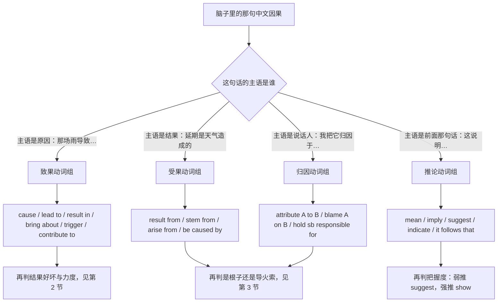
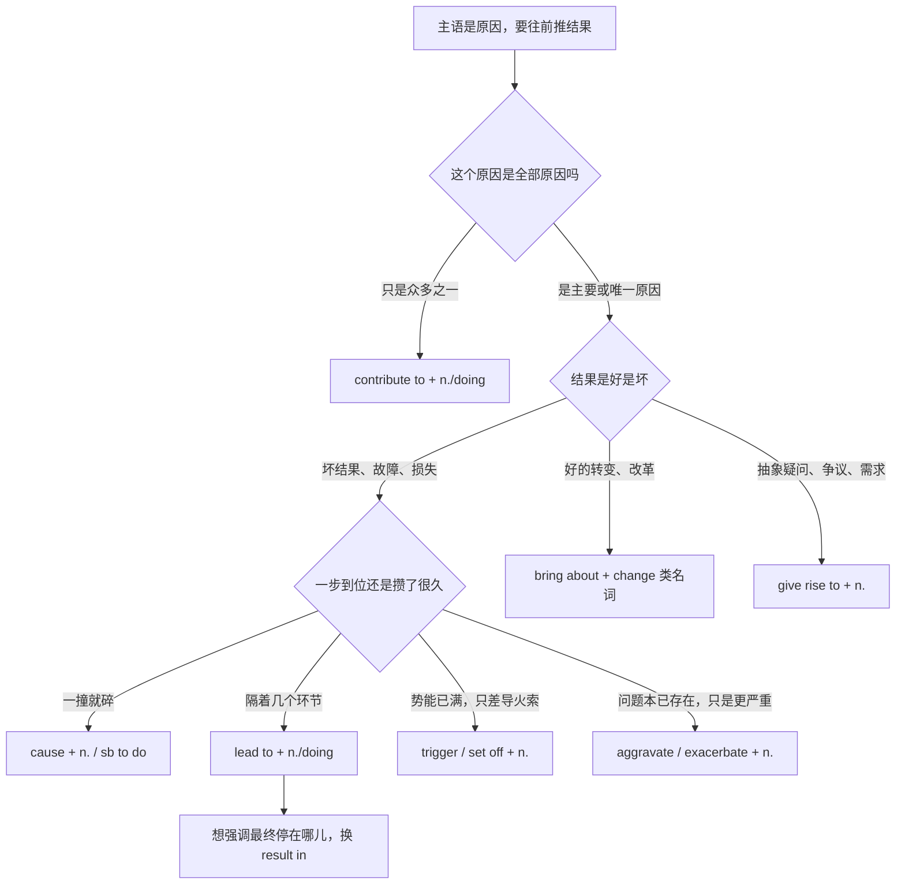
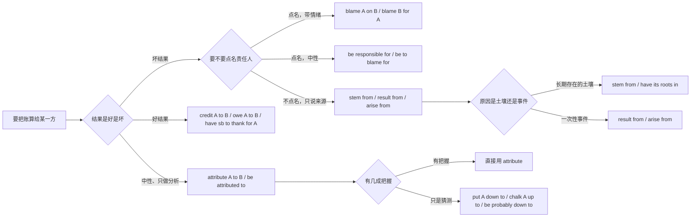
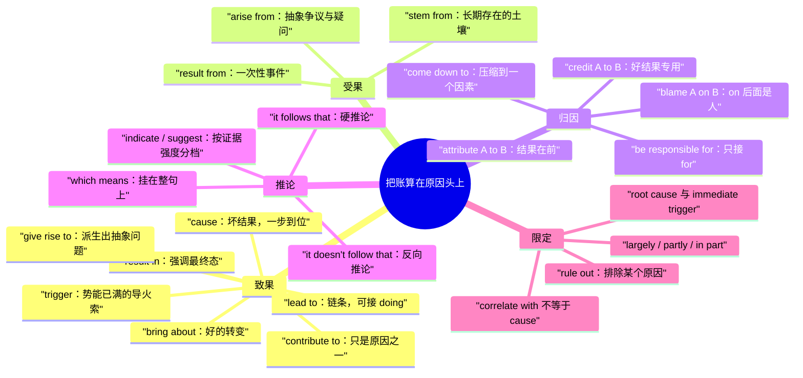

# 导致、引发、归因：把账算在原因头上

> [!info] 本篇定位
>
> 这篇收的中文意图有一个共同点：句子里出现了一个**动词**，它自己就承担了因果关系，不再需要「因为」「所以」这类连词。
>
> 覆盖四类：把原因放在主语位置往前推结果（导致、引发、造成、带来、助长），把结果放在主语位置往回找原因（源于、起因是、根子在），说话人主动把账算给某一方（归因于、怪谁、要负责、说到底就是），以及从已知事实往外推一步（这意味着、由此可见、由此推断）。
>
> 读完能查到：cause、lead to、result in、bring about、trigger、contribute to、give rise to 各自配什么样的结果；attribute A to B 与 blame A on B 的槽位谁在前；lead to 后面为什么不能接 to do。
>
> 上一篇 [[03.因果与结果/01.因为所以：原因表达的六档梯度\|因为所以：原因表达的六档梯度]] 管的是连词与介词那一套，本篇一律不重复。

---

## 1. 本篇导读：因果箭头的方向决定用哪个动词

### 1.1 本篇与上一篇的分界

同一件事——「服务器满了，所以下单失败」——有两种说法，分属两篇：

| 说法 | 句子长什么样 | 归哪一篇 |
| --- | --- | --- |
| 用连词把两个句子接起来 | The disk filled up, so orders started failing. | 上一篇 |
| 用介词把原因压成名词 | Orders started failing due to a full disk. | 上一篇 |
| 用一个动词把原因推向结果 | A full disk caused orders to fail. | 本篇 |
| 用一个动词把结果拉回原因 | The failures stemmed from a full disk. | 本篇 |

判据只有一条：**因果关系是由连词或介词承担，还是由谓语动词承担**。由动词承担的，全在本篇。

这个差别在写作上很实用。连词式一句只能装一层因果，动词式可以把整条链压进一个主谓宾，再往后挂一个 which，链条就接上了。技术文档与事故报告偏爱动词式，正是因为它能把三层因果塞进一句而不散架。

### 1.2 四个方向的选择树



这张图第一层问的不是语法，是**你打算把哪个成分放在句首**。中文说「这场雨导致航班取消」和「航班取消是这场雨造成的」，信息完全一样，但第一句原因在句首，第二句结果在句首。英文这两种语序对应两组不同的动词，硬把一组用到另一个语序上就会写出 The flights were led to cancel 这样的句子。

第二层才是本篇后面几节要细分的东西：结果是好是坏、原因是唯一的还是众多之一、这个因果是瞬间引爆还是慢慢积累。

### 1.3 三档与槽位标记怎么读

每条意图给三档，从上到下是口语、书面、正式。三档不是同义替换，是三个场合的成品：口语档能在站会上说出口，书面档写进 issue 与邮件不突兀，正式档用在事故报告、合同、论文里。

槽位标记沿用全书约定：

| 标记 | 含义 |
| --- | --- |
| A、B | 可替换的分句或名词短语 |
| sb、sth | 人和物 |
| doing | 该位置必须用动名词，不能换成 to do |
| n. | 该位置必须是名词，不能塞句子 |
| 方括号 | 可选成分，删掉句子依然成立 |

本篇里 `doing` 出现得特别密集——lead to、contribute to、result in 后面全是介词 to 或 in，这是本篇错配警示的重灾区，第 6 节有集中处理。

---

## 2. 致果动词：原因作主语的一整排

### 2.1 先看分工总表

七个高频致果动词的分工。挑动词时按「结果偏向」和「因果距离」两列走，语域是次要因素。

| 动词 | 结果偏向 | 因果距离 | 语域 | 后面接什么 |
| --- | --- | --- | --- | --- |
| cause | 几乎只配坏结果 | 直接、一步到位 | 通用 | n. 或 sb to do |
| lead to | 中性偏坏 | 间接，链条末端 | 通用 | n. 或 doing |
| result in | 中性 | 直接，强调最终态 | 书面 | n. 或 doing |
| bring about | 中性偏好 | 有意促成的转变 | 书面 | n.（多为 change 类） |
| trigger | 中性 | 瞬间引爆已存在的势能 | 通用偏新闻 | n. |
| contribute to | 中性 | 只是众多原因之一 | 书面 | n. 或 doing |
| give rise to | 中性偏问题 | 派生、滋生出 | 正式 | n. |

再加一排配角，出现频率低一档但各有不可替代的位置：

| 动词 | 中文对应 | 典型宾语 |
| --- | --- | --- |
| pose | 构成、带来（风险） | risk、threat、challenge、problem |
| create | 制造出、造出 | opportunity、confusion、backlog |
| prompt | 促使、催得 | 名词，或 sb to do |
| drive | 拉动、推动 | growth、demand、adoption |
| fuel | 助长、火上浇油 | speculation、inflation、anxiety |
| spark | 点燃、引发（讨论） | debate、outrage、interest |
| set off | 触发（口语） | alarm、chain reaction、panic |

### 2.2 造成、弄得、害得

中文触发语：造成 / 弄得 / 害得 / 引起（负面）/ 惹出 / 搞出

| 档位 | 句架 | 例句 | 中文 |
| --- | --- | --- | --- |
| 口语 | A caused B | That bad merge caused a whole afternoon of rework. | 那次乱合并害得我们返工了一下午。 |
| 书面 | A caused sb to do sth | The outage caused several customers to open tickets. | 这次故障导致好几个客户提了工单。 |
| 正式 | B was caused by A | The discrepancy was caused by a rounding error in the monthly report. | 这处数据对不上，是月报里的四舍五入造成的。 |

cause 的默认色彩是负面。说 The new policy caused a rise in sales 在语法上没错，但读起来像在抱怨销量涨了。好结果换 lead to 或 bring about。

> [!warning] 错配警示
>
> - ~~The delay caused us miss the window.~~ ❌
> - **The delay caused us to miss the window.** ✅（cause 后面的宾语补足语必须带 to，不能像 make 那样省。）

- 同义入口：造成 / 弄得 / 害得 / 惹出麻烦 / 引起（坏事）
- 语法归属：[[02.英语基础语法/08.非谓语动词/01.动词不定式详解\|动词不定式作宾语补足语]]
- 场景实战：[[04.英语场景/10.职场与商务场景实战/02.会议汇报与演示场景\|汇报里说明事故成因]]

### 2.3 导致、结果搞到

中文触发语：导致 / 结果搞到 / 一步步弄成 / 到头来引出 / 带来（后果）

| 档位 | 句架 | 例句 | 中文 |
| --- | --- | --- | --- |
| 口语 | A leads to B | Skipping code review leads to a lot of avoidable bugs. | 跳过代码评审会带出一堆本可以避免的 bug。 |
| 书面 | A can lead to doing sth | Over-fetching can lead to hitting the rate limit within minutes. | 拉取过量数据，几分钟内就可能撞上限流。 |
| 正式 | A ultimately led to B | The repeated schema changes ultimately led to a full data migration. | 反复改表结构，最终导致了一次整库迁移。 |

lead to 是本组的通用主力，也是唯一一个自带「链条感」的动词：它暗示原因和结果之间还隔着若干中间环节，不是一撞就碎。要强调一步到位的直接冲击，改用 cause。

> [!warning] 错配警示
>
> - ~~This will lead to reduce the cost.~~ ❌
> - **This will lead to reducing the cost.** ✅（lead to 的 to 是介词不是不定式符号，后面只能接名词或动名词。）

- 同义入口：导致 / 引出 / 到头来造成 / 结果是（把原因摆在句首时）
- 语法归属：[[02.英语基础语法/08.非谓语动词/02.动名词详解\|动名词作介词宾语]]
- 场景实战：[[04.英语场景/10.职场与商务场景实战/03.商务邮件与正式书面沟通\|邮件里陈述后果]]

### 2.4 造成了…的结果、最后落到

中文触发语：造成了…的结果 / 结果是 / 最后落到 / 以…告终

| 档位 | 句架 | 例句 | 中文 |
| --- | --- | --- | --- |
| 口语 | A resulted in B | The typo in the config resulted in two hours of downtime. | 配置里那个拼写错误，结果宕了两个小时。 |
| 书面 | A results in doing sth | Rolling back the migration results in losing every record written since Tuesday. | 回滚这次迁移，会丢掉周二之后写入的所有记录。 |
| 正式 | A has resulted in a n. in B | The revised pricing has resulted in a marked decline in churn. | 调价之后，流失率明显下降。 |

result in 与 lead to 的分工：result in 的重心在**最终状态**，句子读完你知道事情停在哪儿了；lead to 的重心在**过程**，句子读完你知道事情往哪个方向滑。正式书面里 result in 更贴合报告体，因为报告要的就是最终状态。

> [!warning] 错配警示
>
> - ~~The downtime resulted in the config typo.~~ ❌
> - **The downtime resulted from the config typo.** ✅（result in 后面接结果，result from 后面接原因，方向刚好相反。）

- 同义入口：结果是 / 造成了…的局面 / 最后落到 / 换来的是
- 语法归属：[[02.英语基础语法/05.介词与连词/02.常用介词搭配详解\|动词加介词的固定搭配]]
- 场景实战：[[04.英语场景/05.高频实用表达句型框架/04.比较对比举例总结句型库\|陈述结果与总结]]

### 2.5 带来、促成、催生

中文触发语：带来（好的）/ 促成 / 催生 / 推动出 / 使…得以实现

| 档位 | 句架 | 例句 | 中文 |
| --- | --- | --- | --- |
| 口语 | A brought about B | Switching to async reviews brought about a real change in turnaround. | 改成异步评审之后，周转时间是真的变了。 |
| 书面 | A helped bring about B | The new onboarding checklist helped bring about a smoother first week. | 新的入职清单让第一周顺畅了不少。 |
| 正式 | A was instrumental in bringing about B | The pilot program was instrumental in bringing about the current workflow. | 试点项目对现行流程的形成起了关键作用。 |

bring about 的宾语几乎总是抽象的转变类名词：change、improvement、reform、shift、transformation。宾语是具体事件（a crash、a delay）时不用它。它也是本组唯一一个默认偏正面的动词，说话人往往站在促成方那一边。

> [!warning] 错配警示
>
> - ~~The bug brought about a crash on startup.~~ ❌
> - **The bug caused a crash on startup.** ✅（bring about 配的是抽象转变，具体故障用 cause。）

- 同义入口：带来（好的转变）/ 促成 / 催生 / 使…成为可能
- 语法归属：[[02.英语基础语法/05.介词与连词/02.常用介词搭配详解\|动词的固定搭配]]
- 场景实战：[[04.英语场景/10.职场与商务场景实战/04.商务谈判合同与客户沟通\|谈成果与推动力]]

### 2.6 引爆、一下子就引起、点着了

中文触发语：引爆 / 触发 / 一下子就引起 / 点着了 / 掀起 / 惹得

| 档位 | 句架 | 例句 | 中文 |
| --- | --- | --- | --- |
| 口语 | A set off B | One misconfigured alert set off a chain of pages at 3 a.m. | 一条配错的告警，凌晨三点连环叫了一串人。 |
| 书面 | A triggered B | The failed health check triggered an automatic rollback. | 健康检查没过，触发了自动回滚。 |
| 正式 | A sparked B among C | The pricing change sparked a lengthy debate among the maintainers. | 这次调价在维护者之间引出了一场长时间的争论。 |

这三个词的共同前提是：**势能早就攒在那儿了，原因只是那根导火索**。trigger 最中性，适合系统与流程；set off 偏口语与突发；spark 的宾语几乎限定在讨论、争议、兴趣这类会扩散的东西上。

> [!warning] 错配警示
>
> - ~~Poor documentation triggered the team to leave over two years.~~ ❌
> - **Poor documentation contributed to the attrition over two years.** ✅（trigger 表示瞬间点燃，跨两年的慢性因果要用 contribute to。）

- 同义入口：引爆 / 触发 / 点燃 / 掀起 / 一下子惹出
- 语法归属：[[02.英语基础语法/05.介词与连词/02.常用介词搭配详解\|动词与宾语的语义搭配]]
- 场景实战：[[04.英语场景/05.高频实用表达句型框架/01.表达观点与态度的50个万能句型\|描述突发反应]]

### 2.7 是原因之一、有一份、脱不了干系

中文触发语：是原因之一 / 有一份 / 加了一把火 / 脱不了干系 / 助了一臂之力

| 档位 | 句架 | 例句 | 中文 |
| --- | --- | --- | --- |
| 口语 | A contributed to B | The tight deadline definitely contributed to the mess. | 工期太紧，这摊子事跟它绝对有关系。 |
| 书面 | A contributed to doing sth | Poor test coverage contributed to the regression slipping through. | 测试覆盖不足，是这次回归漏出去的原因之一。 |
| 正式 | Several factors contributed to B, chief among them A | Several factors contributed to the delay, chief among them the late spec freeze. | 延期有几个原因，最主要的是规格冻结得太晚。 |

contribute to 是本组唯一一个**明说自己不是全部原因**的动词。写事故报告时它极其好用：既承认这个因素有份，又不把全部责任压上去。要把它变成主因，前面加 significantly、heavily、largely。

> [!warning] 错配警示
>
> - ~~Long meetings contribute to waste a lot of time.~~ ❌
> - **Long meetings contribute to wasting a lot of time.** ✅（contribute to 的 to 同样是介词。）

- 同义入口：是原因之一 / 有一份 / 起了推波助澜的作用 / 跟…脱不了干系
- 语法归属：[[02.英语基础语法/08.非谓语动词/02.动名词详解\|动名词作介词宾语]]
- 场景实战：[[04.英语场景/10.职场与商务场景实战/02.会议汇报与演示场景\|复盘中的责任表述]]

### 2.8 引发出、滋生出、派生出

中文触发语：引发出 / 滋生出 / 派生出 / 由此产生了 / 生出一堆

| 档位 | 句架 | 例句 | 中文 |
| --- | --- | --- | --- |
| 口语 | A brings up a lot of B | This change brings up a lot of questions about backward compatibility. | 这个改动会带出一大堆向后兼容的问题。 |
| 书面 | A gives rise to B | The ambiguous wording gives rise to two very different readings. | 措辞含糊，产生了两种完全不同的解读。 |
| 正式 | A has given rise to concerns about B | The data-sharing clause has given rise to concerns about liability. | 数据共享条款引发了对责任归属的担忧。 |

give rise to 的宾语通常是**问题、疑虑、争议、需求**这类被动出现的抽象物，不是具体事件。它的语域比 lead to 高一档，出现在合同、论文、正式报告里很自然，在站会上说会显得端着。

> [!warning] 错配警示
>
> - ~~The power cut gave rise to a two-hour outage.~~ ❌
> - **The power cut resulted in a two-hour outage.** ✅（give rise to 配抽象派生物，具体事件用 result in 或 cause。）

- 同义入口：引发出 / 滋生 / 派生出 / 由此产生 / 引来一堆疑问
- 语法归属：[[02.英语基础语法/05.介词与连词/02.常用介词搭配详解\|三词短语动词]]
- 场景实战：[[04.英语场景/10.职场与商务场景实战/04.商务谈判合同与客户沟通\|条款争议的表述]]

### 2.9 构成风险、带来威胁、制造麻烦

中文触发语：构成…风险 / 带来威胁 / 造成隐患 / 制造麻烦 / 增添难度

| 档位 | 句架 | 例句 | 中文 |
| --- | --- | --- | --- |
| 口语 | A creates a lot of B | Merging both branches at once creates a lot of confusion. | 两个分支一起合，会造成一堆混乱。 |
| 书面 | A poses a risk to B | Storing tokens in plain text poses a real risk to every account. | 明文存 token，对每个账号都是实打实的风险。 |
| 正式 | A presents a significant challenge for B | The legacy schema presents a significant challenge for the migration team. | 旧表结构给迁移团队带来了相当大的挑战。 |

pose 的宾语是封闭的一小组：risk、threat、challenge、danger、problem、question。除了这几个词，它基本不出现。create 的宾语则很开放，好坏都能配（create an opportunity 与 create a backlog 都成立）。

> [!warning] 错配警示
>
> - ~~The new API poses a lot of latency.~~ ❌
> - **The new API introduces a lot of latency.** ✅（latency 不在 pose 的宾语清单里，引入某种代价用 introduce。）

- 同义入口：构成风险 / 带来威胁 / 埋下隐患 / 加大难度 / 制造混乱
- 语法归属：[[02.英语基础语法/05.介词与连词/02.常用介词搭配详解\|名词与介词的固定搭配]]
- 场景实战：[[04.英语场景/10.职场与商务场景实战/02.会议汇报与演示场景\|风险陈述]]

### 2.10 促使某人做某事、催着…去做

中文触发语：促使 / 催着…去做 / 逼得…只好 / 让…不得不 / 推动…做

| 档位 | 句架 | 例句 | 中文 |
| --- | --- | --- | --- |
| 口语 | A got sb to do sth | The repeated crashes finally got us to rewrite that module. | 老是崩，最后逼得我们把那个模块重写了。 |
| 书面 | A prompted sb to do sth | The customer complaint prompted us to revisit the retry policy. | 客户投诉促使我们重新看了一遍重试策略。 |
| 正式 | A drove the decision to do sth | Rising storage costs drove the decision to archive old logs. | 存储成本上涨，推动了归档旧日志这个决定。 |

这一条和前面几条的区别在于**结果是一个人的行动**，不是一个状态。prompt 是最顺手的书面选择，drive 偏商业语境且带持续推力，get sb to do 最口语也最省事。

> [!warning] 错配警示
>
> - ~~The incident prompted to rewrite the module.~~ ❌
> - **The incident prompted us to rewrite the module.** ✅（prompt 后面必须有人或机构承接动作，不能直接跟不定式。）

- 同义入口：促使 / 催得 / 逼得只好 / 推着…去做 / 让…下决心
- 语法归属：[[02.英语基础语法/08.非谓语动词/01.动词不定式详解\|不定式作宾语补足语]]
- 场景实战：[[04.英语场景/10.职场与商务场景实战/02.会议汇报与演示场景\|说明决策由来]]

### 2.11 助长、加剧、火上浇油

中文触发语：助长 / 加剧 / 恶化 / 火上浇油 / 雪上加霜 / 让…更严重

| 档位 | 句架 | 例句 | 中文 |
| --- | --- | --- | --- |
| 口语 | A made B worse | The hotfix actually made the memory issue worse. | 那个热修反而把内存问题弄得更严重了。 |
| 书面 | A aggravated B | The extra retries aggravated the load on an already struggling database. | 额外的重试加重了本就吃紧的数据库负载。 |
| 正式 | A exacerbated B | Delayed disclosure exacerbated the reputational damage. | 披露不及时，让声誉损失进一步扩大。 |

这一组的前提是：**问题已经存在，原因只让它更严重**。用它们时读者会默认前文交代过那个问题，如果没有，句子会显得没头没尾。fuel 更窄，宾语限于会自我扩散的东西：speculation、rumours、demand、anxiety。

> [!warning] 错配警示
>
> - ~~The outage exacerbated a rollback.~~ ❌
> - **The outage triggered a rollback.** ✅（exacerbate 只能加重已有的坏状态，不能引出一个新事件。）

- 同义入口：加剧 / 助长 / 恶化 / 雪上加霜 / 让情况更糟
- 语法归属：[[02.英语基础语法/01.基础入门/02.英语五大基本句型详解\|形容词作宾语补足语]]
- 场景实战：[[04.英语场景/10.职场与商务场景实战/02.会议汇报与演示场景\|问题升级的描述]]

### 2.12 七个致果动词的选择树



这张图的第一个分岔最值得记：**先判断这个原因是不是全部原因**。中文说「工期紧导致了这次事故」时并不承诺工期是唯一原因，英文的 caused 却承诺了。写事故报告时把 caused 顺手换成 contributed to，既准确又留了余地，这是本篇实用价值最高的一处替换。

第二个分岔是结果的好坏。cause 与 exacerbate 天然配坏事，bring about 天然配好事，lead to 和 result in 两边都能站。挑不准时选 lead to，它是这组里出错风险最低的一个。

最后一层的 trigger 与 cause 常被混用。判据是：如果把这个原因拿掉，事情还会不会以别的方式爆发。会，那就是 trigger；不会，那就是 cause。

---

## 3. 归因：把账算到谁头上

### 3.1 我把这个归因于

中文触发语：我把…归因于 / 我认为是…造成的 / 我觉得根源在 / 算在…头上

| 档位 | 句架 | 例句 | 中文 |
| --- | --- | --- | --- |
| 口语 | I'd put A down to B | I'd put the whole delay down to unclear requirements. | 这次延期我觉得就是需求不清楚闹的。 |
| 书面 | We attribute A to B | We attribute the drop in errors to the new validation layer. | 错误率下降，我们归因于新加的校验层。 |
| 正式 | A is attributed largely to B | The improvement is attributed largely to the revised indexing strategy. | 这次提升主要归因于索引策略的调整。 |

attribute 的槽位顺序固定：**结果在前，原因在后**。中文「把 X 归因于 Y」的语序恰好一致，照搬即可，麻烦的是被动式（见下一条）容易把两头对调。

> [!warning] 错配警示
>
> - ~~We attribute the new validation layer to the drop in errors.~~ ❌
> - **We attribute the drop in errors to the new validation layer.** ✅（to 后面永远是原因，把结果放到 to 后面，句意就整个反了。）

- 同义入口：归因于 / 算在…头上 / 我认为根源是 / 归功于（好结果时）
- 语法归属：[[02.英语基础语法/05.介词与连词/02.常用介词搭配详解\|动词加介词的固定搭配]]
- 场景实战：[[04.英语场景/09.学习与教育场景实战/02.图书馆作业与研究场景\|学术写作中的归因]]

### 3.2 据认为是…造成的

中文触发语：据认为是…造成的 / 一般认为源自 / 被归结为

| 档位 | 句架 | 例句 | 中文 |
| --- | --- | --- | --- |
| 口语 | People mostly blame it on A | People mostly blame it on the rushed release. | 大家基本都怪那次赶工发版。 |
| 书面 | B is attributed to A | The regression is attributed to a change in the default timeout. | 这次回归被认为是默认超时改动导致的。 |
| 正式 | B is widely attributed to A | The slowdown is widely attributed to the unindexed join. | 这次变慢普遍被归因于那个没建索引的连表查询。 |

被动式的好处是不必点名谁在归因，适合结论已经形成共识、或者说话人不想承担判断责任的场合。要削弱确定性，把 is attributed to 换成 has been tentatively attributed to。

> [!warning] 错配警示
>
> - ~~The change in timeout is attributed to the regression.~~ ❌
> - **The regression is attributed to the change in timeout.** ✅（被动式里主语仍是结果，to 后面仍是原因，方向不因被动而改变。）

- 同义入口：据认为是…造成的 / 一般归结为 / 被认为源于
- 语法归属：[[02.英语基础语法/10.特殊句型/01.被动语态全解\|被动语态的施事省略]]
- 场景实战：[[04.英语场景/09.学习与教育场景实战/02.图书馆作业与研究场景\|转述既有结论]]

### 3.3 这事怪谁

中文触发语：这事怪谁 / 都怪 / 别赖我 / 是…的锅 / 把责任推给

| 档位 | 句架 | 例句 | 中文 |
| --- | --- | --- | --- |
| 口语 | Don't blame A on B | Don't blame the outage on the intern. | 别把这次宕机赖到实习生头上。 |
| 书面 | Sb blamed A on B | The vendor blamed the data loss on a firmware bug. | 供应商把数据丢失归咎于固件 bug。 |
| 正式 | B was blamed for A | The third-party library was blamed for the memory leak. | 内存泄漏被归咎于那个第三方库。 |

blame 有两套槽位，读起来很像但顺序相反：`blame A on B` 里 A 是**坏结果**，`blame B for A` 里 B 是**责任方**。记法是看介词——on 后面跟责任方，for 后面跟坏结果。

> [!warning] 错配警示
>
> - ~~They blamed the intern on the outage.~~ ❌
> - **They blamed the outage on the intern.** ✅（on 后面必须是被怪的那一方，不是那件坏事。）

- 同义入口：怪 / 赖到…头上 / 是…的锅 / 把责任推给 / 归咎于
- 语法归属：[[02.英语基础语法/13.附录/03.介词搭配速查\|blame for 与 blame on 的分工]]
- 场景实战：[[04.英语场景/10.职场与商务场景实战/02.会议汇报与演示场景\|复盘中的责任划分]]

### 3.4 这事得由谁负责

中文触发语：由谁负责 / 该谁背 / 这归…管 / 是…的问题 / 责任在

| 档位 | 句架 | 例句 | 中文 |
| --- | --- | --- | --- |
| 口语 | That one's on sb | That one's on me — I merged without running the suite. | 这个算我的，我没跑测试就合了。 |
| 书面 | A is responsible for B | The scheduler is responsible for the duplicated jobs. | 重复任务是调度器造成的。 |
| 正式 | Sb is to blame for B | No single team is to blame for the missed deadline. | 这次错过期限，不该由任何单一团队承担。 |

be responsible for 有两个读法：一个是**造成了**（中性，主语常是系统或事件），一个是**分内负责**（主语是人或团队）。混淆的风险不大，因为主语类型不同，但正式文书里要避免歧义可以改成 accountable for（分内职责）与 the cause of（造成）。

> [!warning] 错配警示
>
> - ~~I'm to blame the missed deadline.~~ ❌
> - **I'm to blame for the missed deadline.** ✅（be to blame 后面一律带 for，不能直接跟宾语。）

- 同义入口：责任在 / 该谁背 / 这是…的问题 / 由…造成 / 归…管
- 语法归属：[[02.英语基础语法/05.介词与连词/02.常用介词搭配详解\|形容词加介词的固定搭配]]
- 场景实战：[[04.英语场景/10.职场与商务场景实战/02.会议汇报与演示场景\|认领与推责]]

### 3.5 源于、根子在、出在

中文触发语：源于 / 根子在 / 问题出在 / 来自 / 起源于 / 病根是

| 档位 | 句架 | 例句 | 中文 |
| --- | --- | --- | --- |
| 口语 | It all comes from A | It all comes from the way we split the tickets. | 归根到底是我们拆工单的方式有问题。 |
| 书面 | B stems from A | Most of these complaints stem from a single confusing screen. | 这些投诉大多源于同一个让人看不懂的界面。 |
| 正式 | B has its roots in A | The current architecture has its roots in a prototype written in 2019. | 现在这套架构的根子在 2019 年的一个原型上。 |

stem from 强调**结果长在原因上**，原因是持续存在的土壤，不是一次性事件。要说一次性事件引起的，换 result from 或 arise from（见下一条）。have its roots in 的时间跨度更长，常用来追溯历史成因。

> [!warning] 错配警示
>
> - ~~The bug stems the wrong default.~~ ❌
> - **The bug stems from the wrong default.** ✅（stem 作动词只在 stem from 这一个搭配里表示「源于」，不能省 from。）

- 同义入口：源于 / 根子在 / 问题出在 / 病根是 / 追根溯源是
- 语法归属：[[02.英语基础语法/05.介词与连词/01.介词的分类与基本用法\|表来源的介词 from]]
- 场景实战：[[04.英语场景/09.学习与教育场景实战/02.图书馆作业与研究场景\|论文里的成因追溯]]

### 3.6 起因是、由…引起

中文触发语：起因是 / 由…引起 / 是…造成的 / 因…而起 / 缘于

| 档位 | 句架 | 例句 | 中文 |
| --- | --- | --- | --- |
| 口语 | B came from A | The whole mess came from one missing null check. | 这一摊子事就是少了一个空值判断引起的。 |
| 书面 | B results from A | The inconsistency results from two services writing the same field. | 数据不一致，是两个服务往同一个字段写造成的。 |
| 正式 | B arises from A | Most disputes arise from ambiguity in the delivery clause. | 多数争议起于交付条款的表述含糊。 |

这是第 2 节的镜像用法：同一组因果关系，把结果搬到主语位置。result from 与 result in 共用一个动词，只靠介词分方向，是本篇最容易写反的一处。arise from 更书面，且宾语常是抽象的争议、疑问、需求。

> [!warning] 错配警示
>
> - ~~The inconsistency results in two services writing the same field.~~ ❌
> - **The inconsistency results from two services writing the same field.** ✅（in 指向结果，from 指向原因，这句要说的是原因。）

- 同义入口：起因是 / 由…引起 / 因…而起 / 是…造成的 / 缘于
- 语法归属：[[02.英语基础语法/13.附录/03.介词搭配速查\|result in 与 result from 的分工]]
- 场景实战：[[04.英语场景/10.职场与商务场景实战/04.商务谈判合同与客户沟通\|争议成因的书面表述]]

### 3.7 说到底就是、归根结底

中文触发语：说到底就是 / 归根结底 / 最后还是 / 无非就是 / 核心问题就是

| 档位 | 句架 | 例句 | 中文 |
| --- | --- | --- | --- |
| 口语 | It comes down to A | Honestly, it comes down to how much time we have. | 说白了，就看我们有多少时间。 |
| 书面 | It boils down to whether A | It boils down to whether the client can commit to a freeze date. | 归根结底看客户能不能定下冻结日期。 |
| 正式 | The issue ultimately reduces to A | The issue ultimately reduces to a trade-off between latency and cost. | 这个问题最终归结为延迟与成本之间的取舍。 |

come down to 与 boil down to 都表示**把复杂情况压缩到一个决定性因素**。它们不是在陈述因果链，而是在做归纳，因此常出现在讨论的收尾处。后面可以直接接名词，也可以接 whether 从句或 wh- 从句。

> [!warning] 错配警示
>
> - ~~It comes down to we don't have enough time.~~ ❌
> - **It comes down to the fact that we don't have enough time.** ✅（to 是介词，接句子时必须靠 the fact that 或 whether 搭桥。）

- 同义入口：说到底 / 归根结底 / 无非就是 / 最后还是看 / 核心就在
- 语法归属：[[02.英语基础语法/09.从句体系/03.名词性从句详解\|介词后的 whether 从句与同位语从句]]
- 场景实战：[[04.英语场景/05.高频实用表达句型框架/04.比较对比举例总结句型库\|收束与归纳]]

### 3.8 解释了、占了多少

中文触发语：解释了 / 说明了…的原因 / 占了…的比例 / 交代清楚

| 档位 | 句架 | 例句 | 中文 |
| --- | --- | --- | --- |
| 口语 | That accounts for A | That accounts for the weird spike on Tuesday. | 周二那个奇怪的尖峰这下解释通了。 |
| 书面 | A accounts for n.% of B | Image requests account for nearly 60% of total bandwidth. | 图片请求占了总带宽的将近六成。 |
| 正式 | A alone accounts for the bulk of B | The nightly export alone accounts for the bulk of the write load. | 光是夜间导出就占了写入负载的大头。 |

account for 有两个互不相干的意思：**解释某现象**与**占某比例**。判据看宾语——宾语是现象（the spike、the difference）时是解释义，宾语带百分比或 of 短语时是占比义。占比义的详细写法在 [[09.比较、程度与数量/04.大约、超过、占三成、平均、分别是：数量与统计描述\|数量与统计描述]]。

> [!warning] 错配警示
>
> - ~~Image requests account 60% of total bandwidth.~~ ❌
> - **Image requests account for 60% of total bandwidth.** ✅（account 不能直接带宾语，for 不能省。）

- 同义入口：解释了 / 说清了…的来由 / 占…的比例 / 这就说得通了
- 语法归属：[[02.英语基础语法/13.附录/03.介词搭配速查\|account for 的两个义项]]
- 场景实战：[[04.英语场景/10.职场与商务场景实战/02.会议汇报与演示场景\|数据口径说明]]

### 3.9 多亏了、得益于、要感谢

中文触发语：多亏了 / 得益于 / 要感谢 / 靠的是 / 归功于

| 档位 | 句架 | 例句 | 中文 |
| --- | --- | --- | --- |
| 口语 | We have sb to thank for A | We have the on-call team to thank for catching it early. | 早早发现问题，得谢值班同学。 |
| 书面 | A owes much to B | The smooth rollout owes much to the dry run last week. | 这次上线这么顺，很大程度上靠上周那次演练。 |
| 正式 | B is credited with A | The refactor is credited with a 40% reduction in build time. | 这次重构被认为让构建时间缩短了四成。 |

正向归因单独成一条，是因为把 attribute 或 blame 用在好结果上会走味：attribute 太中性偏学术，blame 直接反义。口语里最自然的是 thanks to（介词式，归上一篇）与 have sb to thank for。

> [!warning] 错配警示
>
> - ~~We blame the smooth rollout on the dry run.~~ ❌
> - **We credit the smooth rollout to the dry run.** ✅（blame 只配坏结果，好结果用 credit A to B 或 owe A to B。）

- 同义入口：多亏了 / 得益于 / 靠的是 / 归功于 / 要感谢
- 语法归属：[[02.英语基础语法/01.基础入门/02.英语五大基本句型详解\|双宾结构与 to 的位置]]
- 场景实战：[[04.英语场景/10.职场与商务场景实战/02.会议汇报与演示场景\|成果致谢]]

### 3.10 大概是因为、我猜是

中文触发语：大概是因为 / 我猜是 / 估计是…闹的 / 八成跟…有关

| 档位 | 句架 | 例句 | 中文 |
| --- | --- | --- | --- |
| 口语 | I'd chalk it up to A | I'd chalk it up to a cold cache after the deploy. | 我猜是发布之后缓存还没热起来。 |
| 书面 | It's probably down to A | The slow first load is probably down to the missing CDN rule. | 首屏加载慢，多半是 CDN 规则没配。 |
| 正式 | This is presumably a consequence of A | The mismatch is presumably a consequence of the schema change last month. | 这处不一致大概是上月表结构改动的后果。 |

这一条是归因的低把握度版本。三档都在句首或谓语处埋了不确定标记（I'd、probably、presumably），把断言降成猜测。地区差别值得留意：put A down to B 与 be down to 主要通行于英式英语，chalk A up to B 偏美式，同一篇文档里挑一套用。更细的把握度分级在 [[10.态度、情感与判断/03.肯定是、八成、说不定、不可能：把握度阶梯\|把握度阶梯]]。

> [!warning] 错配警示
>
> - ~~I chalk it up the cold cache.~~ ❌
> - **I chalk it up to the cold cache.** ✅（chalk up to 是三词短语动词，to 不能丢。）

- 同义入口：大概是因为 / 我猜是 / 估计是 / 八成跟…有关 / 多半是
- 语法归属：[[02.英语基础语法/07.助动词与情态动词/02.情态动词详解\|情态动词表推测]]
- 场景实战：[[04.英语场景/05.高频实用表达句型框架/01.表达观点与态度的50个万能句型\|推测性表述]]

### 3.11 归因方向的选择树



这张图的关键分岔在最左边一层：**结果的好坏直接决定动词组**。中文的「归因于」是完全中性的，好事坏事都能用，英文没有这样一个万能词。把好消息写成 attributed to 不算错，但读起来像在做冷冰冰的技术分析；写成 credited to 才有肯定的意思。

第二个分岔——点不点名——在职场沟通里比语法本身重要。blame 一出现就带情绪，事故复盘里通常要绕开它，用 stem from 或 be responsible for 把责任说清楚而不指人。

最右边的 stem from 与 result from 之分是本节最细的一处：前者的原因是一直在那儿的条件，后者的原因是发生过的某件事。「这套架构源于当年的一个原型」用 stem from，「这次不一致源于昨天的那次发布」用 result from。

---

## 4. 从结果反推：推论动词

### 4.1 这意味着、也就是说

中文触发语：这意味着 / 也就是说 / 换句话说就是 / 那就等于

| 档位 | 句架 | 例句 | 中文 |
| --- | --- | --- | --- |
| 口语 | So basically that means A | So basically that means we ship on Friday, not Wednesday. | 那基本就是说周五发，不是周三。 |
| 书面 | A, which means B | The API is rate-limited per key, which means batching won't help much. | 这个 API 按 key 限流，也就是说批量请求帮助不大。 |
| 正式 | A implies that B | The absence of a lock implies that concurrent writes are possible. | 没有加锁意味着存在并发写入的可能。 |

which means 是本篇最顺手的一个结构：它把推论挂在前一句的整体上，不必重新起一个主语。mean 是明说的推论，imply 是暗含的推论，后者更常出现在技术论证与正式文书里。

> [!warning] 错配警示
>
> - ~~The API is rate-limited, that means batching won't help.~~ ❌
> - **The API is rate-limited, which means batching won't help.** ✅（用 that 会造成两个独立句子逗号连写，回指整句必须用 which。）

- 同义入口：这意味着 / 也就是说 / 那就等于 / 换句话说 / 言下之意是
- 语法归属：[[02.英语基础语法/09.从句体系/01.定语从句基础\|which 指代整个主句]]
- 场景实战：[[04.英语场景/10.职场与商务场景实战/02.会议汇报与演示场景\|结论推演]]

### 4.2 由此可见、可见

中文触发语：由此可见 / 可见 / 这就说明 / 足以看出 / 从中不难看出

| 档位 | 句架 | 例句 | 中文 |
| --- | --- | --- | --- |
| 口语 | So clearly A | So clearly nobody read the migration notes. | 这么看，显然没人读迁移说明。 |
| 书面 | This shows that A | The duplicate rows show that the unique constraint was never applied. | 这些重复行说明唯一约束根本没生效。 |
| 正式 | It follows that A | If the checksum matches, it follows that the file was not modified in transit. | 校验和一致，就可以断定文件在传输中未被改动。 |

it follows that 是三档里推论最硬的一个，字面意思是「由前提必然得出」。它适合逻辑严密的场合（数学、规范、法律），日常事务里用它会显得过重，容易被当成在下判决。

> [!warning] 错配警示
>
> - ~~From this can be seen that the constraint failed.~~ ❌
> - **This shows that the constraint failed.** ✅（「由此可见」直译成倒装式在英文里不成句，用 this shows 或 it follows 承接。）

- 同义入口：由此可见 / 可见 / 这就说明 / 足以看出 / 由此可以断定
- 语法归属：[[02.英语基础语法/09.从句体系/03.名词性从句详解\|it 作形式主语的从句]]
- 场景实战：[[04.英语场景/09.学习与教育场景实战/02.图书馆作业与研究场景\|论证推进]]

### 4.3 由此推断、我推测

中文触发语：由此推断 / 我推测 / 据此判断 / 从…推出 / 反推出来

| 档位 | 句架 | 例句 | 中文 |
| --- | --- | --- | --- |
| 口语 | I'm guessing from B that A | I'm guessing from the timestamps that the retry loop never exited. | 看时间戳，我猜重试循环压根没退出去。 |
| 书面 | We infer from B that A | We infer from the logs that the connection was dropped upstream. | 从日志推断，连接是在上游被掐断的。 |
| 正式 | It can be deduced from A that B | It can be deduced from the ordering guarantees that no message was lost. | 由顺序保证可以推出没有消息丢失。 |

infer 与 imply 是一对方向相反的词：**说话人 imply，听话人 infer**。中文一个「暗示」两边都能用，英文不行。写「the data infers that」是典型的用反，数据不会推断，只会暗示。

> [!warning] 错配警示
>
> - ~~The logs infer that the connection was dropped.~~ ❌
> - **The logs suggest that the connection was dropped.** ✅（infer 的主语必须是做推断的人，材料本身只能 suggest 或 imply。）

- 同义入口：由此推断 / 据此判断 / 我推测 / 反推出 / 从…可以看出
- 语法归属：[[02.英语基础语法/10.特殊句型/01.被动语态全解\|it can be done that 结构]]
- 场景实战：[[04.英语场景/09.学习与教育场景实战/02.图书馆作业与研究场景\|数据推断表述]]

### 4.4 说明、表明、反映出

中文触发语：说明 / 表明 / 反映出 / 显示 / 指向 / 透出

| 档位 | 句架 | 例句 | 中文 |
| --- | --- | --- | --- |
| 口语 | A points to B | Everything points to a caching problem. | 各种迹象都指向缓存问题。 |
| 书面 | A indicates B | The rising p99 indicates contention on the write path. | p99 上升表明写入路径存在争用。 |
| 正式 | A is indicative of B | The pattern of failures is indicative of a systematic misconfiguration. | 这种故障分布反映出配置层面的系统性问题。 |

这一组按证据强度排：show 最硬（近乎证明），indicate 次之，suggest 最软（只是倾向）。中文的「说明」在三档之间游走，写英文时要主动选一档，选错会让结论显得过硬或过软。研究数据的转述规范在 [[10.态度、情感与判断/04.据说、研究表明、据我所知：信息来源与缓和语\|信息来源与缓和语]]。

> [!warning] 错配警示
>
> - ~~The data proves a caching problem.~~ ❌
> - **The data suggests a caching problem.** ✅（单条观测不足以 prove，把握度不够时降到 suggest 或 indicate。）

- 同义入口：说明 / 表明 / 反映出 / 显示 / 指向 / 印证了
- 语法归属：[[02.英语基础语法/09.从句体系/03.名词性从句详解\|动词后的宾语从句]]
- 场景实战：[[04.英语场景/10.职场与商务场景实战/02.会议汇报与演示场景\|数据解读]]

### 4.5 这不代表、不能由此推出

中文触发语：这不代表 / 不能由此推出 / 不等于 / 别急着下结论 / 未必说明

| 档位 | 句架 | 例句 | 中文 |
| --- | --- | --- | --- |
| 口语 | That doesn't mean A | That doesn't mean the bug is gone — it just isn't firing today. | 这不代表 bug 没了，只是今天没触发。 |
| 书面 | It doesn't follow that A | Latency dropped, but it doesn't follow that the fix worked. | 延迟降了，但不能就此推出修复起了作用。 |
| 正式 | A does not necessarily entail B | A passing build does not necessarily entail a correct implementation. | 构建通过并不必然意味着实现正确。 |

反向推论比正向推论更需要成句模板，因为中文常靠一个「不代表」带过，英文如果写成 This not means 就直接崩了。三档里 it doesn't follow that 最紧凑，写 review 意见时非常好用。

> [!warning] 错配警示
>
> - ~~It's not follow that the fix worked.~~ ❌
> - **It doesn't follow that the fix worked.** ✅（follow 在这里是实义动词，否定要靠助动词 do，不是 be。）

- 同义入口：这不代表 / 不等于 / 未必说明 / 不能就此断定 / 别急着下结论
- 语法归属：[[02.英语基础语法/11.实战应用/03.常见语法错误纠正\|实义动词的否定形式]]
- 场景实战：[[04.英语场景/05.高频实用表达句型框架/03.同意反对让步转折句型库\|保留意见的表述]]

### 4.6 反过来说、同理

中文触发语：反过来说 / 同理 / 照这个逻辑 / 换个方向看 / 一样的道理

| 档位 | 句架 | 例句 | 中文 |
| --- | --- | --- | --- |
| 口语 | The other way round, A | The other way round, if the cache is cold, the first call is slow. | 反过来讲，缓存是冷的，第一次调用就慢。 |
| 书面 | Conversely, A | Conversely, reducing the batch size increases the number of round trips. | 反过来，减小批量会增加往返次数。 |
| 正式 | By the same token, A | By the same token, any client that skips validation is equally exposed. | 同理，任何跳过校验的客户端都同样有风险。 |

conversely 用于把因果关系翻转过来看，by the same token 用于把同一条逻辑套到另一个对象上。两者常被混用，判据是：**翻转的是方向就用 conversely，复用的是逻辑就用 by the same token**。

> [!warning] 错配警示
>
> - ~~Conversely, the same rule applies to the mobile client.~~ ❌
> - **By the same token, the same rule applies to the mobile client.** ✅（这里没有翻转任何方向，只是把同一逻辑推广出去。）

- 同义入口：反过来说 / 同理 / 一样的道理 / 照这个逻辑 / 换个方向看
- 语法归属：[[02.英语基础语法/04.形容词与副词/03.副词的分类与用法\|连接副词与句子副词的位置]]
- 场景实战：[[04.英语场景/05.高频实用表达句型框架/04.比较对比举例总结句型库\|对比与类推]]

### 4.7 推论强度的一条尺


这条尺从左到右，说话人承担的责任逐级下降。中文的「说明」「表明」「显示」在日常使用里几乎不分强弱，全部落在中间那两格；写英文时必须挑定一格，因为读者会按你挑的那个词衡量你的确定程度。

工程语境里的经验是：**单次复现选 suggest，稳定复现选 indicate，有对照实验才用 show**。把 prove 留给数学与形式化验证，日常事故报告里写 prove 会招来更多质疑而不是更少。

最右边那一格是第 4.5 条的位置。评审别人的结论时，从 does not follow 起手比直接说 you're wrong 更容易推进讨论。

---

## 5. 因果的层级与限定

### 5.1 一环扣一环、连锁反应

中文触发语：一环扣一环 / 连锁反应 / 进而 / 又反过来 / 层层传导

| 档位 | 句架 | 例句 | 中文 |
| --- | --- | --- | --- |
| 口语 | A causes B, and that causes C | The retry storm hammers the DB, and that slows everything else down. | 重试风暴打爆数据库，跟着别的全都变慢。 |
| 书面 | A leads to B, which in turn leads to C | A slow query leads to connection pileup, which in turn leads to timeouts upstream. | 慢查询导致连接堆积，进而引发上游超时。 |
| 正式 | A sets off a chain of B with knock-on effects on C | The schema change set off a chain of failures with knock-on effects on the reporting pipeline. | 表结构变更引起一连串故障，并波及报表链路。 |

which in turn 是把三层因果压进一句的标准写法，也是本篇最值得背下来的结构之一。中文的「进而」「又反过来」都落在这里。要强调波及范围，用 knock-on effect 或 ripple effect。

> [!warning] 错配警示
>
> - ~~A slow query leads to connection pileup, in turn leads to timeouts.~~ ❌
> - **A slow query leads to connection pileup, which in turn leads to timeouts.** ✅（in turn 是副词不是连词，接第二个谓语时必须靠 which 或 and 引导。）

- 同义入口：进而 / 一环扣一环 / 连锁反应 / 又反过来导致 / 层层传导
- 语法归属：[[02.英语基础语法/09.从句体系/01.定语从句基础\|非限制性定语从句的连接功能]]
- 场景实战：[[04.英语场景/10.职场与商务场景实战/02.会议汇报与演示场景\|事故链条陈述]]

### 5.2 根本原因与导火索

中文触发语：根本原因 / 深层原因 / 表面原因 / 导火索 / 直接诱因

| 档位 | 句架 | 例句 | 中文 |
| --- | --- | --- | --- |
| 口语 | The real reason is A, B was just the trigger | The real reason is the missing index; the traffic spike was just the trigger. | 真正的原因是没建索引，流量尖峰只是导火索。 |
| 书面 | The root cause was A; the immediate trigger was B | The root cause was an unbounded queue; the immediate trigger was a slow consumer. | 根因是队列没有上界，直接诱因是消费者变慢。 |
| 正式 | The underlying cause lies in A, whereas the proximate cause is B | The underlying cause lies in the lack of backpressure, whereas the proximate cause is the retry policy. | 深层原因在于缺少背压机制，直接原因则是重试策略。 |

三组词分工固定：root cause 与 underlying cause 指**去掉它问题就不会再出现**的那一层，immediate trigger 与 proximate cause 指**这一次把问题点燃**的那件事。事故报告要求两者都写，只写其中一个都会被追问。

> [!warning] 错配警示
>
> - ~~The root reason was an unbounded queue.~~ ❌
> - **The root cause was an unbounded queue.** ✅（root 与 cause 是固定搭配，reason 不与 root 连用。）

- 同义入口：根本原因 / 深层原因 / 病根 / 导火索 / 直接诱因 / 表面原因
- 语法归属：[[02.英语基础语法/02.名词与冠词/01.名词的分类与用法\|抽象名词的用法]]
- 场景实战：[[04.英语场景/10.职场与商务场景实战/02.会议汇报与演示场景\|事故复盘的结构]]

### 5.3 主要是、部分是、多少有点关系

中文触发语：主要是 / 很大程度上 / 部分是 / 多少有点 / 说不上是主因

| 档位 | 句架 | 例句 | 中文 |
| --- | --- | --- | --- |
| 口语 | It's mostly A, partly B | It's mostly the network, partly the client retry logic. | 主要是网络问题，也有一部分是客户端重试逻辑。 |
| 书面 | A is largely responsible for B | The cold start is largely responsible for the p99 spike. | p99 那个尖峰主要是冷启动造成的。 |
| 正式 | B is attributable in part to A | The variance is attributable in part to differences in sampling. | 这部分方差有一部分来自采样方式的差异。 |

比重限定是把强断言变成可辩护表述的最省事手段。四个可插入位置：动词前（largely caused by）、attribute 之后（attributed in part to）、句首（To a large extent）、句尾（at least in part）。

> [!warning] 错配警示
>
> - ~~The cold start is largely responsible of the spike.~~ ❌
> - **The cold start is largely responsible for the spike.** ✅（responsible 只接 for，不接 of。）

- 同义入口：主要是 / 很大程度上 / 部分是 / 多少有点关系 / 有一部分原因
- 语法归属：[[02.英语基础语法/04.形容词与副词/03.副词的分类与用法\|程度副词的句中位置]]
- 场景实战：[[04.英语场景/10.职场与商务场景实战/02.会议汇报与演示场景\|留有余地的归因]]

### 5.4 有关系不等于是原因

中文触发语：有关系 / 相关 / 同时出现 / 未必是因果 / 只是同时发生

| 档位 | 句架 | 例句 | 中文 |
| --- | --- | --- | --- |
| 口语 | They line up, but one didn't cause the other | The two graphs line up, but one didn't cause the other. | 两条曲线对得上，但不是谁导致谁。 |
| 书面 | A correlates with B, but correlation is not causation | Deploy frequency correlates with incident count, but correlation is not causation. | 发布频率与故障数相关，但相关不等于因果。 |
| 正式 | A co-occurs with B without any established causal link | The two effects co-occur without any established causal link. | 两种现象同时出现，但尚未确立因果联系。 |

在数据讨论里，把 causes 换成 correlates with 是最常见的一次降级。写作时的判据很简单：**手上有没有能改变其中一个变量并观察另一个的实验**。没有实验就只能说相关。更细的关联与一致性表达在 [[04.条件与假设/04.取决与看情况：视…而定、说不好得看\|取决与看情况]]。

> [!warning] 错配警示
>
> - ~~Deploy frequency correlates to incident count.~~ ❌
> - **Deploy frequency correlates with incident count.** ✅（表示两个变量互相关联时惯用 correlate with；correlate to 读起来像一一对应的映射。）

- 同义入口：有相关性 / 对得上 / 同时出现 / 未必是因果 / 只是巧合
- 语法归属：[[02.英语基础语法/05.介词与连词/02.常用介词搭配详解\|动词与介词的固定搭配]]
- 场景实战：[[04.英语场景/09.学习与教育场景实战/02.图书馆作业与研究场景\|数据结论的谨慎表述]]

### 5.5 排除某个原因

中文触发语：跟…没关系 / 排除了 / 不是…的问题 / 已经确认不是

| 档位 | 句架 | 例句 | 中文 |
| --- | --- | --- | --- |
| 口语 | It's got nothing to do with A | It's got nothing to do with the new release — this started last week. | 跟这次发版没关系，上周就开始了。 |
| 书面 | We've ruled out A | We've ruled out DNS and the load balancer. | DNS 和负载均衡我们已经排除了。 |
| 正式 | A can be excluded as a contributing factor | Network congestion can be excluded as a contributing factor. | 网络拥塞可以排除在诱因之外。 |

排除句在排查过程中和归因句一样常用。rule out 是最顺手的一个，宾语可以是名词也可以是 that 从句（We can't rule out that the client retried twice）。

> [!warning] 错配警示
>
> - ~~We have ruled out that it is not a DNS issue.~~ ❌
> - **We have ruled out a DNS issue.** ✅（rule out 本身已含否定，后面再加 not 会双重否定成肯定。）

- 同义入口：跟…没关系 / 排除了 / 不是…的问题 / 已确认不是 / 与…无关
- 语法归属：[[02.英语基础语法/11.实战应用/03.常见语法错误纠正\|多重否定的误用]]
- 场景实战：[[04.英语场景/10.职场与商务场景实战/02.会议汇报与演示场景\|排查进展汇报]]

---

## 6. 高频错配集中警示

### 6.1 一张错法总表

本篇各意图块里的警示，按错因归类压成一张表，另附一条同族搭配，供复查时逐行对照。

| 错法 | 改法 | 错因 |
| --- | --- | --- |
| lead to reduce the cost | lead to reducing the cost | to 是介词，接动名词 |
| contribute to waste time | contribute to wasting time | 同上 |
| look forward to hear from you | look forward to hearing from you | 同上，同一族搭配里的常见错法 |
| cause us miss the window | cause us to miss the window | cause 的宾补必须带 to |
| prompted to rewrite the module | prompted us to rewrite the module | prompt 后须有承接动作的人 |
| The downtime resulted in the typo | The downtime resulted from the typo | in 指结果，from 指原因 |
| attribute the layer to the drop | attribute the drop to the layer | to 后面永远是原因 |
| blamed the intern on the outage | blamed the outage on the intern | on 后面是责任方 |
| I'm to blame the deadline | I'm to blame for the deadline | be to blame 必带 for |
| responsible of the spike | responsible for the spike | responsible 只接 for |
| account 60% of bandwidth | account for 60% of bandwidth | account 不能直接带宾语 |
| correlates to incident count | correlates with incident count | 两个变量互相关联惯用 with |
| The logs infer that | The logs suggest that | 材料只能 imply，人才能 infer |
| It's not follow that | It doesn't follow that | follow 是实义动词，用 do 否定 |
| ruled out that it is not DNS | ruled out a DNS issue | rule out 已含否定 |
| The root reason was | The root cause was | root 只与 cause 搭配 |

### 6.2 三个看着像不定式的 to

lead to、contribute to、come down to 的 to 全是介词，后面只能是名词或动名词。这三个最容易写错，因为它们看起来太像不定式。

> [!tip] 一个可靠的自查动作
>
> 把 to 后面换成 it 试读：`lead to it` 成立，说明 to 是介词，那么原位置就得填名词或 doing；`want to it` 不成立，说明 to 是不定式符号，原位置填动词原形。
>
> 这个测试对 be used to、look forward to、object to、be committed to、in addition to 同样有效。

同族里还有一批高频成员：`be used to doing`（习惯于）、`object to doing`（反对）、`be dedicated to doing`、`with a view to doing`、`when it comes to doing`。它们和不定式的 to 长得一模一样，只能靠这条测试或死记搭配区分。完整清单在 [[02.英语基础语法/08.非谓语动词/02.动名词详解\|动名词详解]]。

### 6.3 result in 与 result from 的方向

同一个动词，两个介词，方向相反。这一对最容易写反。

| 写法 | 主语是 | to/from 后是 | 中文 |
| --- | --- | --- | --- |
| A results in B | 原因 | 结果 | A 导致 B |
| A results from B | 结果 | 原因 | A 起因于 B |

记法：**in 是往里装，装的是产出物（结果）；from 是从哪儿来，来的是源头（原因）**。同样的介词逻辑也适用于 arise from、stem from、come from——凡是 from，后面一律是原因。

> [!example] 同一件事的两种写法
>
> - **The unindexed join resulted in a 12-second query.**
>   - 那个没建索引的连表查询导致查询耗时 12 秒。
> - **The 12-second query resulted from an unindexed join.**
>   - 12 秒的查询耗时源于一个没建索引的连表。

两句信息量相同，选哪一句取决于你想把什么放在句首。事故报告的标题句通常把结果放前面（读者先看到影响），正文分析则把原因放前面（读者跟着链条走）。

### 6.4 affect、effect 与 impact

这三个词在因果表达里贴身出现，词性搞混会直接毁掉句子。

| 词 | 词性 | 用法 | 例句 |
| --- | --- | --- | --- |
| affect | 动词 | 影响到 | The change affects all downstream jobs. |
| effect | 名词 | 影响、效果 | The change had no measurable effect. |
| effect | 动词（罕见） | 使…发生 | to effect a change in policy |
| impact | 名词 | 冲击、影响 | The impact on latency was minimal. |
| impact | 动词 | 冲击到 | Latency was impacted by the deploy. |

实务上的取舍：动词位置写 affect，名词位置写 effect 或 impact，把 effect 作动词的用法留给正式文书。impact 作动词在技术写作里已被广泛接受，但在保守的学术写作里仍建议换成 affect。

> [!warning] 错配警示
>
> - ~~The deploy effected every downstream job.~~ ❌
> - **The deploy affected every downstream job.** ✅（这里要的是「影响到」，动词是 affect。）

### 6.5 attribute 与 blame 的槽位不能对调

两个动词的槽位方向不同，靠介词区分：

```text
attribute  [结果]  to  [原因]
credit     [结果]  to  [原因]
blame      [结果]  on  [责任方]
blame      [责任方] for [结果]
hold  [责任方] responsible for [结果]
```

四行里只有第三行和第四行是同一个动词，且顺序相反。中文说「怪他把事情搞砸了」时不区分这两种语序，英文必须先决定把责任方放在哪个位置，再挑介词。

> [!tip] 一个不用背的判法
>
> 看介词就知道后面填什么：**to 后面是原因，on 后面是人，for 后面是那件坏事**。这条规则在 attribute、credit、blame、be responsible、be to blame 五个结构里通用。

### 6.6 the reason is because 的两种改法

中文「原因是因为…」直译过来会写成 The reason is because，这在正式写作里被视为冗余。两条改法：

| 原句 | 改法 | 结构 |
| --- | --- | --- |
| The reason is because the cache was cold. | The reason is that the cache was cold. | 表语从句用 that |
| The reason is because the cache was cold. | The cache was cold, which is why it was slow. | 拆成两句，用 which is why 承接 |

正式文书里第一种更常见，口语里第二种更自然。第三种办法是干脆去掉 reason：`It was slow because the cache was cold.`——句子短了一半，信息一点没少。连词式的完整梯度在上一篇 [[03.因果与结果/01.因为所以：原因表达的六档梯度\|因为所以：原因表达的六档梯度]]。

---

## 7. 工程与职场语境的成品句

### 7.1 故障复盘

中文触发语：这次故障是…引起的 / 根因是 / 影响面是 / 已经排除

| 档位 | 句架 | 例句 | 中文 |
| --- | --- | --- | --- |
| 口语 | We think it was A | We think it was the config change at 14:20. | 我们觉得是 14:20 那次配置改动。 |
| 书面 | The incident was caused by A and affected B | The incident was caused by an expired certificate and affected all mobile clients. | 这次故障由证书过期引起，影响了全部移动端客户端。 |
| 正式 | The root cause has been identified as A; mitigations are in place | The root cause has been identified as an unbounded retry loop; mitigations are in place. | 根因已确认为无上限的重试循环，缓解措施已就位。 |

复盘文档常见的顺序是：影响面、时间线、根因、直接诱因、缓解、后续动作。归因动词集中出现在第三和第四段，前面用 attribute 与 stem from，后面用 trigger。

- 同义入口：故障原因是 / 根因是 / 由…引起 / 影响范围 / 已排除的可能
- 语法归属：[[02.英语基础语法/10.特殊句型/01.被动语态全解\|被动语态在报告文体中的作用]]
- 场景实战：[[04.英语场景/10.职场与商务场景实战/02.会议汇报与演示场景\|事故汇报]]

### 7.2 性能与容量

中文触发语：导致变慢 / 打满了 / 撑不住 / 拖累了 / 吃掉了

| 档位 | 句架 | 例句 | 中文 |
| --- | --- | --- | --- |
| 口语 | A is what's slowing us down | The N+1 queries are what's slowing us down. | 拖慢我们的就是那些 N+1 查询。 |
| 书面 | A leads to a sharp rise in B | Loading the full object graph leads to a sharp rise in memory usage. | 一次性加载整个对象图会让内存占用急剧上升。 |
| 正式 | A accounts for the majority of B | Serialization accounts for the majority of the request latency. | 序列化占了请求延迟的大部分。 |

性能讨论里 account for 多半用的是占比义，因为结论几乎总要落到「哪一块吃掉了多少」。搭配的数量与升降描述见 [[09.比较、程度与数量/04.大约、超过、占三成、平均、分别是：数量与统计描述\|数量与统计描述]]。

- 同义入口：拖慢 / 打满 / 撑不住 / 吃掉了大部分 / 是瓶颈
- 语法归属：[[02.英语基础语法/09.从句体系/03.名词性从句详解\|what 引导的主语从句]]
- 场景实战：[[04.英语场景/10.职场与商务场景实战/02.会议汇报与演示场景\|性能数据汇报]]

### 7.3 排期与归责

中文触发语：延期是因为 / 这个算我的 / 卡在…上 / 不是我们这边的问题

| 档位 | 句架 | 例句 | 中文 |
| --- | --- | --- | --- |
| 口语 | That one's on us | That one's on us — we underestimated the migration. | 这个算我们的，我们低估了迁移工作量。 |
| 书面 | The slip stems from A rather than B | The slip stems from late requirements rather than engineering capacity. | 这次延期源于需求来得晚，不是工程人力问题。 |
| 正式 | The delay is attributable to factors outside our control | The delay is attributable to factors outside our control, chiefly the pending legal review. | 延期归因于我们无法控制的因素，主要是尚未完成的法务审查。 |

这一组的语用重点是**把事实说清楚而不指人**。三档从认领（on us）到中性分析（stems from）到免责（outside our control），选哪一档取决于责任是否真在自己这边。相关的免责与坏消息句式在本手册 [[11.人际功能与话轮管理/05.我有个顾虑、这样不太行、恐怕要延期：异议、负面反馈与坏消息\|异议、负面反馈与坏消息]]。

- 同义入口：延期原因 / 这个算我的 / 卡在…上 / 不在我们控制范围内
- 语法归属：[[02.英语基础语法/05.介词与连词/02.常用介词搭配详解\|attributable to 的搭配]]
- 场景实战：[[04.英语场景/10.职场与商务场景实战/03.商务邮件与正式书面沟通\|延期告知邮件]]

### 7.4 数据口径与增长归因

中文触发语：增长来自 / 主要是…带动的 / 拉低了整体 / 这部分贡献了

| 档位 | 句架 | 例句 | 中文 |
| --- | --- | --- | --- |
| 口语 | Most of the growth came from A | Most of the growth came from returning users. | 增长大部分来自回访用户。 |
| 书面 | The increase was driven largely by A | The increase was driven largely by the referral channel. | 这次增长主要由推荐渠道拉动。 |
| 正式 | A contributed n. percentage points to B | Enterprise renewals contributed four percentage points to overall growth. | 企业续约为整体增长贡献了四个百分点。 |

be driven by 是商业数据归因的默认动词，比 caused by 更中性，也比 led to 更强调持续拉动。要说某个因素拖累整体，反向说法是 was dragged down by 或 weighed on。

- 同义入口：增长来自 / 由…带动 / 拉低了 / 贡献了…个百分点 / 主要靠
- 语法归属：[[02.英语基础语法/10.特殊句型/01.被动语态全解\|被动语态加 by 短语]]
- 场景实战：[[04.英语场景/10.职场与商务场景实战/02.会议汇报与演示场景\|数据汇报]]

---

## 8. 本篇小结



这张图按第 1 节那棵选择树的四个方向分枝，加上第 5 节的限定手段。查的时候先落到某一枝，再在枝内按结果好坏或证据强度挑一个词。

四枝里最容易被忽略的是「限定」那一枝。前三枝解决的是「怎么说」，限定枝解决的是「说到什么程度」——把 caused 降成 contributed to，把 shows 降成 suggests，把 the cause 拆成 root cause 与 immediate trigger，这三个动作能让一段因果分析从可被推翻变成站得住。

> [!success] 本篇核心要点回顾
>
> 1. 因果由动词承担时才归本篇；由连词或介词承担的归上一篇。判据是看谓语动词有没有自带因果义。
> 2. 致果动词按两条轴挑：结果好坏（cause 配坏，bring about 配好）与因果距离（cause 直接，lead to 隔着环节，trigger 只是导火索）。
> 3. contribute to 是唯一明说自己不是全部原因的致果动词，事故报告里用它替换 cause 既准确又留余地。
> 4. lead to、contribute to、come down to 的 to 都是介词，后面接名词或动名词；用 `to it` 试读法自查。
> 5. result in 与 result from 只差一个介词但方向相反：in 指向结果，from 指向原因；凡 from 一律接原因。
> 6. attribute 与 credit 是「结果 to 原因」，blame 有 `A on 责任方` 与 `责任方 for A` 两套槽位，靠介词记：to 接原因，on 接人，for 接坏事。
> 7. 推论动词按证据强度排成一条尺：prove 最硬，show、indicate 次之，suggest 最软，does not follow 是反向推论的起手式。
> 8. 根因与导火索必须分开说：root cause 是去掉就不复发的那层，immediate trigger 是这次把它点着的那件事。

> [!success] 本篇练习清单
>
> - [ ] 给「测试覆盖不够是这次线上事故的原因之一」，写出口语、书面、正式三档。
> - [ ] 给「这次延期的根因是需求冻结太晚，直接诱因是一次紧急插单」，写出三档，要求区分 root cause 与 immediate trigger。
> - [ ] 给「我把响应变快归功于新加的缓存层」，写出三档，注意好结果不能用 blame 或 attribute 的负面色彩。
> - [ ] 给「别把这次数据丢失赖到运维头上」，写出三档，其中至少一档用 blame A on B，另一档改写成不指人的说法。
> - [ ] 给「这个 API 按 key 限流，也就是说批量请求帮不上忙」，写出三档，书面档必须用 which means。
> - [ ] 给「两条曲线对得上，但这不代表其中一个导致了另一个」，写出三档，正式档要出现 correlation 与 causation。
> - [ ] 给「慢查询导致连接堆积，进而引发上游超时」，写出三档，书面档必须用 which in turn。
> - [ ] 把「The downtime resulted in the config typo」和「We attribute the new cache to the drop in latency」两句改对，并说出各自错在哪个介词槽上。

### 8.1 下一篇预告

> [!info] 下一篇
>
> [[03.因果与结果/03.结果、因此、以至于：从结果反推与程度致果\|结果、因此、以至于：从结果反推与程度致果]]
>
> 本篇把原因放在句首往前推，下一篇换成从结果那一侧起句：「结果是」「因此」「从而」「以至于…的程度」「最终」「落得这么个下场」「代价是」。给的是 so…that、such…that、So 置句首的倒装形态、only to 表意外结果、end up doing、thereby 加动名词、at the cost of，并标注 therefore 与 as a result 各自的语域与标点位置。
