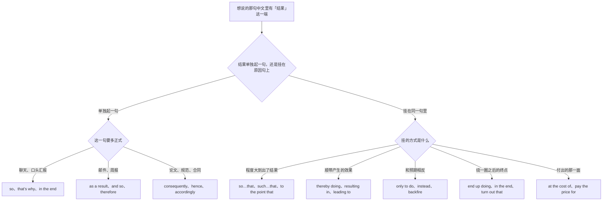
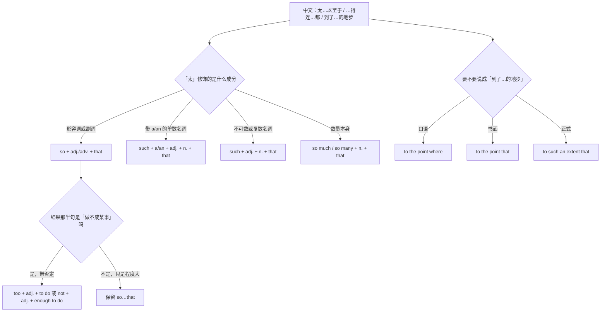
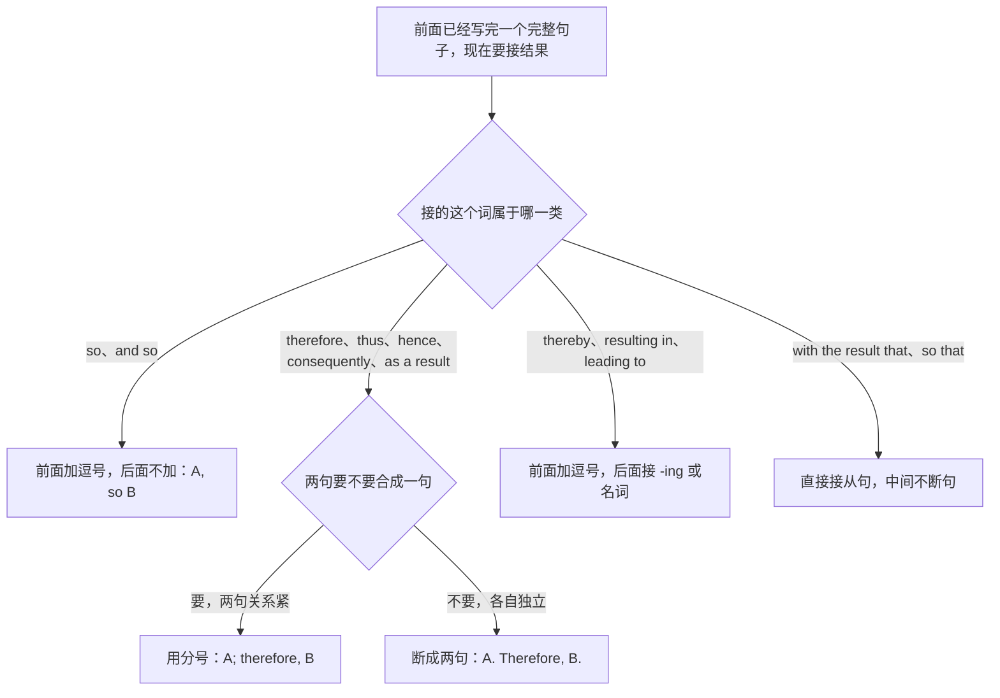
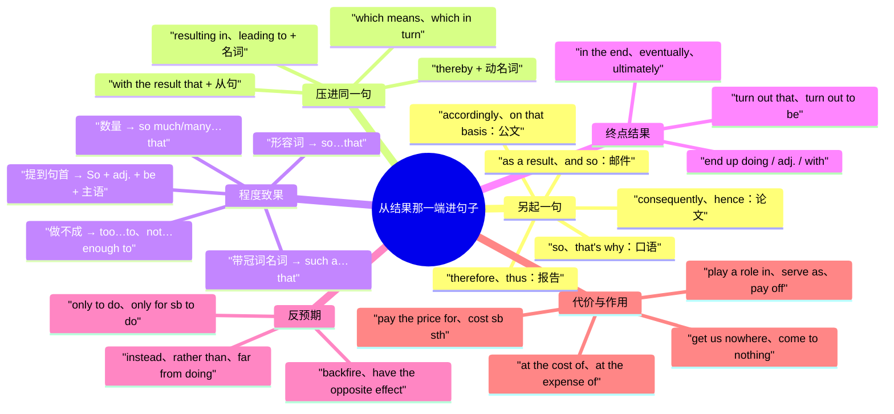

# 结果、因此、以至于：从结果反推与程度致果

> [!info] 本篇定位
>
> 这篇收「结果是」「因此／所以」「从而／进而」「以至于…的程度」「最终」「落得这么个下场」「代价是」「起到…作用」「结果反而」共三十四条查询意图，每条给口语、书面、正式三档成品。
>
> 与本分类另外两篇的分工：想说「因为A所以B」里的**因为**那一半，查 [[03.因果与结果/01.因为所以：原因表达的六档梯度\|因为所以：原因表达的六档梯度]]；想说「A 导致了 B」「这事得怪 B」这类**把账算到某个原因头上**的，查 [[03.因果与结果/02.导致、引发、归因：把账算在原因头上\|导致、引发、归因]]。这一篇只管**从结果那一端起句**：句子的重心落在后果、终点、代价、反差上，原因要么已经说过，要么根本不提。
>
> 读完能查到：一句话该用 so 还是 therefore、therefore 前面该打逗号还是分号、so…that 和 such…that 怎么分、So 提到句首之后主语和动词怎么换位、end up 后面接什么、at the cost of 和 at the expense of 差在哪、only to 表意外结果的两种主语情况。
>
> 「太…以至于」这条意图的主锚点就在本篇第 4 节；单纯排程度刻度（一点也不／有点／非常／极其）不带结果的，去 [[09.比较、程度与数量/03.太…以至于、够不够、有点、非常：程度刻度\|程度刻度]]。结果状语从句的构成规则不在这里，指回 [[02.英语基础语法/09.从句体系/04.状语从句详解\|状语从句详解]]。

---

## 1. 本篇导读：结果这一端有五个入口，不是一个

中文说结果，绝大多数人只会一个「所以」。英文这一端却分得很细，而且分的依据不是语义强弱，是**结果挂在句子的哪个位置**。

同一件事有五种挂法：另起一句说结果（so、therefore）、用非谓语把结果压进原句（thereby doing、resulting in）、把结果说成程度的产物（so…that）、把结果说成一段折腾之后的终点（end up doing、in the end）、把结果说成付出的那一面（at the cost of）。这五种在中文里都能说成「所以」「结果」，在英文里换不得。

### 五个入口的分工

| 中文说法 | 结果挂在哪 | 英文入口 | 本篇节次 |
| --- | --- | --- | --- |
| 所以 / 因此 / 结果是 | 另起一个分句 | so、therefore、as a result | 第 2 节 |
| 从而 / 进而 / 这样一来 | 压进同一句 | thereby doing、resulting in、which in turn | 第 3 节 |
| 太…以至于 / …得连…都 | 程度带出的结果 | so…that、such…that、to the point that | 第 4 节 |
| 实在是太…了，结果 | 程度提到句首 | So + adj. + be + 主语 + that | 第 5 节 |
| 最终 / 到头来 / 结果发现 | 一段过程的终点 | in the end、end up doing、turn out | 第 6 节 |
| 结果反而 / 适得其反 | 与预期相反 | only to do、instead、backfire | 第 7 节 |
| 落得这下场 / 代价是 | 负面结果与代价 | end up + p.p.、at the cost of | 第 8 节 |
| 起到…作用 / 见效了 | 结果的功能一面 | play a role in、pay off | 第 9 节 |

### 从中文进的总选择树

树的第一层只问一件事：这个结果你打算另起一句说，还是塞回原来那句里。这一层决定的不是词义而是句法接口——另起一句就要处理标点（第 10 节整节在讲这个），塞回原句就要处理非谓语形态（thereby 后面必须是 -ing，resulting in 后面必须是名词）。第二层才按语域和语义细分。中文母语者的错误几乎全部集中在第一层选错：想塞回原句却用了 therefore，或者想另起一句却用了 resulting in。

### 三个提醒

> [!warning] 结果词一句里只能留一个
>
> - ❌ ~~Because the build was broken, so we rolled back.~~ ／ ✅ **Because the build was broken, we rolled back.**（because 已经标了因果，so 是第二个标记，中文允许成对出现，英文不允许）
> - ❌ ~~The sample was contaminated, therefore, so the run was discarded.~~ ／ ✅ **The sample was contaminated; therefore, the run was discarded.**（therefore 和 so 不叠用，选一个）

> [!tip] 查法
>
> 先在心里把中文念一遍，看结果那半句能不能独立成句。能独立就往第 2 节查连接词，然后到第 10 节核对标点；不能独立、必须贴在前半句尾巴上的，往第 3 节查非谓语接口。带「太」「得」「到…地步」的一律直接跳第 4 节。

---

## 2. 因此、所以：结果连接词的六档语域

这一节的六条意图共用同一个中文说法「所以」，分档依据全在语域。放错档的代价很直观：聊天里写 consequently 像在念论文，正式报告里写 so yeah 像没写完。

### 2.1 所以就…了：最短的那一档

中文触发语：所以 / 于是 / 那就 / 就…了 / 结果就

| 档位 | 句架 | 例句 |
| --- | --- | --- |
| 口语 | A, so B | The server was down, so we pushed the demo to Friday. |
| 口语 | A. So B. | Nobody replied. So I just merged it. |
| 书面 | A, and so B | The vendor missed the deadline, and so the launch slipped. |
| 正式 | A; consequently, B | The vendor missed the deadline; consequently, the launch slipped by three weeks. |

> [!warning] 错配警示
>
> - ❌ ~~The server was down, so, we pushed the demo.~~ ／ ✅ **The server was down, so we pushed the demo.**（so 作连词时前面打逗号、后面不打；后面那个逗号是把它当副词用了）
> - ❌ ~~Since the server was down, so we pushed the demo.~~ ／ ✅ **Since the server was down, we pushed the demo.**（since 和 so 是同一层的两个连词，留一个）

- 同义入口：所以 / 于是 / 那就 / 就…了 / 结果就…了
- 语法归属：[[02.英语基础语法/05.介词与连词/03.连词的分类与用法\|并列连词 so]]
- 场景实战：[[04.英语场景/07.社交交际场景实战/01.交友聚会与闲聊场景\|闲聊里的因果交代]]

### 2.2 这就是为什么：把结果句变成解释句

中文触发语：这就是为什么 / 所以才… / 这也是…的原因 / 怪不得 / 难怪

| 档位 | 句架 | 例句 |
| --- | --- | --- |
| 口语 | That's why + 陈述语序 | That's why the cache is disabled in dev. |
| 口语 | A, which is why B | The API is rate-limited, which is why the import takes an hour. |
| 书面 | This is why + 陈述语序 | This is why we keep a separate staging database. |
| 正式 | Hence + 名词短语 | Hence the two-stage approval process. |

> [!warning] 错配警示
>
> - ❌ ~~That's the reason why is the cache disabled.~~ ／ ✅ **That's why the cache is disabled.**（why 后面跟陈述语序，不跟疑问语序）
> - ❌ ~~Hence why we keep a staging database.~~ ／ ✅ **Hence the staging database.** 或 **That's why we keep a staging database.**（hence why 是口语冗余，正式文书里 hence 后面直接跟名词短语）

- 同义入口：这就是为什么 / 所以才 / 怪不得 / 难怪 / 这也是…的缘故
- 语法归属：[[02.英语基础语法/09.从句体系/01.定语从句基础\|which 指代整个句子]]
- 场景实战：[[04.英语场景/10.职场与商务场景实战/02.会议汇报与演示场景\|汇报里解释设计原因]]

### 2.3 因此：中性书面的默认档

中文触发语：因此 / 故 / 所以（书面） / 因而

| 档位 | 句架 | 例句 |
| --- | --- | --- |
| 书面 | S + therefore + 谓语 | The two results are therefore not comparable. |
| 书面 | A; therefore, B | The sample was contaminated; therefore, the run was discarded. |
| 正式 | Therefore, S + 谓语 | Therefore, the clause does not apply to renewals. |
| 正式 | It therefore follows that + 句子 | It therefore follows that the earlier estimate was too low. |

> [!warning] 错配警示
>
> - ❌ ~~The sample was contaminated, therefore we discarded the run.~~ ／ ✅ **The sample was contaminated; therefore, we discarded the run.**（therefore 不是连词，接不住一个逗号；要么升格成分号，要么断成两句）
> - ❌ ~~Because the sample was contaminated, therefore the run was discarded.~~ ／ ✅ **Because the sample was contaminated, the run was discarded.**（前半句已经标了因果，后半句不再重复标记）

- 同义入口：因此 / 故而 / 因而 / 所以（书面档）
- 语法归属：[[02.英语基础语法/04.形容词与副词/03.副词的分类与用法\|连接副词的句中位置]]
- 场景实战：[[04.英语场景/09.学习与教育场景实战/02.图书馆作业与研究场景\|研究写作中的推论句]]

### 2.4 结果是：把后果单独拎出来说

中文触发语：结果是 / 结果就 / 后果是 / 造成的结果是 / 这么一来

| 档位 | 句架 | 例句 |
| --- | --- | --- |
| 口语 | As a result, S + 谓语 | As a result, we lost a whole day of data. |
| 书面 | A, and as a result B | The queue backed up, and as a result the retries piled up. |
| 书面 | The result was that + 句子 | The result was that two teams shipped the same feature. |
| 正式 | As a consequence, S + 谓语 | As a consequence, the certification was withdrawn. |

> [!warning] 错配警示
>
> - ❌ ~~As a result of we lost a day of data, the report was late.~~ ／ ✅ **As a result of the data loss, the report was late.**（as a result 后面接完整句子，as a result of 后面只接名词或动名词，两个形态不能混）
> - ❌ ~~In a result, the run failed.~~ ／ ✅ **As a result, the run failed.**（固定搭配是 as，不是 in）

- 同义入口：结果是 / 后果是 / 这么一来 / 由此造成的是
- 语法归属：[[02.英语基础语法/05.介词与连词/04.介词与连词的易混点\|后接名词还是后接句子的分界]]
- 场景实战：[[04.英语场景/10.职场与商务场景实战/03.商务邮件与正式书面沟通\|邮件里通报后果]]

### 2.5 因而、由此：论证语气的那一档

中文触发语：因而 / 由此 / 于是乎 / 由此可知 / 这样一来（书面）

| 档位 | 句架 | 例句 |
| --- | --- | --- |
| 书面 | S + thus + 谓语 | The two files thus contain identical rows. |
| 书面 | Thus, S + 谓语 | Thus, the second query never touches the index. |
| 正式 | Hence, S + 谓语 | Hence, no further action is required. |
| 正式 | It follows that + 句子 | It follows that the two measurements cannot both be correct. |

> [!warning] 错配警示
>
> - ❌ ~~Thus that the query never touches the index.~~ ／ ✅ **Thus the query never touches the index.**（thus 后面直接跟主谓，不跟 that）
> - ❌ ~~Thus I went home early.~~ ／ ✅ **So I went home early.**（thus 是论证词，讲私事时用它会像在念论文）

- 同义入口：因而 / 由此 / 由此可知 / 于是乎 / 从而（连接副词式）
- 语法归属：[[02.英语基础语法/12.日常口语/04.口语与书面语对比\|口语与书面语的词汇分层]]
- 场景实战：[[04.英语场景/09.学习与教育场景实战/03.考试报名与学术评分场景\|学术写作的论证词]]

### 2.6 据此、相应地：公文与合同的那一档

中文触发语：据此 / 相应地 / 有鉴于此 / 基于以上 / 为此

| 档位 | 句架 | 例句 |
| --- | --- | --- |
| 书面 | Accordingly, S + 谓语 | Accordingly, the deadline has been moved to 30 June. |
| 书面 | For this reason, S + 谓语 | For this reason, we keep the two indexes separate. |
| 正式 | In light of the above, S + 谓语 | In light of the above, the request is declined. |
| 正式 | On that basis, S + 谓语 | On that basis, the committee approved the revision. |

> [!warning] 错配警示
>
> - ❌ ~~According to this, the deadline has been moved.~~ ／ ✅ **Accordingly, the deadline has been moved.**（according to 说的是「按某个来源的说法」，表「相应地」只有 accordingly）
> - ❌ ~~In the light of above, the request is declined.~~ ／ ✅ **In light of the above, the request is declined.**（错在 above 前面漏了 the；in light of 与英式的 in the light of 两种写法都成立，唯独 the above 里的 the 省不得）

- 同义入口：据此 / 相应地 / 有鉴于此 / 为此 / 基于以上考虑
- 语法归属：[[02.英语基础语法/05.介词与连词/02.常用介词搭配详解\|in / at 与名词的固定搭配]]
- 场景实战：[[04.英语场景/10.职场与商务场景实战/04.商务谈判合同与客户沟通\|合同与正式回函]]

---

## 3. 从而、进而：把结果压进同一句

中文的「从而」「进而」「这样一来」三个词后面都能跟一整句，所以中文母语者习惯写成两个分句拿逗号连起来。英文这一层不允许逗号连两个完整句，必须换成非谓语或者关系词接口。这一节四条意图，全部是接口形态问题。

### 3.1 从而实现了：thereby 这一支只接动名词

中文触发语：从而 / 借此 / 由此就… / 这样一来就 / 从而达到

| 档位 | 句架 | 例句 |
| --- | --- | --- |
| 书面 | A, thereby + doing | We cache the token, thereby cutting one round trip per request. |
| 书面 | A, thus + doing | The job writes to a temp table, thus avoiding a table-level lock. |
| 正式 | A, thereby + doing | The clause was struck out, thereby releasing both parties from the obligation. |
| 正式 | A so as to + 动词原形 | The dataset is anonymized so as to comply with the retention policy. |

> [!warning] 错配警示
>
> - ❌ ~~We cache the token, thereby it cuts one round trip.~~ ／ ✅ **We cache the token, thereby cutting one round trip.**（thereby 后面只接动名词，接不了完整句子）
> - ❌ ~~We cache the token thereby cutting one round trip.~~ ／ ✅ **We cache the token, thereby cutting one round trip.**（前面那个逗号不能省，否则读成 token 在 cut）

- 同义入口：从而 / 借此 / 由此便 / 这样就能 / 从而达到
- 语法归属：[[02.英语基础语法/08.非谓语动词/03.现在分词详解\|分词作结果状语]]
- 场景实战：[[04.英语场景/09.学习与教育场景实战/02.图书馆作业与研究场景\|方法与效果的书面写法]]

### 3.2 进而、反过来又：链式结果

中文触发语：进而 / 接着又 / 反过来又 / 这又带来 / 一环扣一环

| 档位 | 句架 | 例句 |
| --- | --- | --- |
| 口语 | A, and that in turn + 谓语 | The retries spike, and that in turn fills the connection pool. |
| 书面 | A, which in turn + 谓语 | Latency rises, which in turn trips the circuit breaker. |
| 书面 | S + went on to + 动词原形 | The team went on to automate the entire release pipeline. |
| 正式 | A, and consequently B | Demand fell, and consequently margins narrowed for two quarters. |

> [!warning] 错配警示
>
> - ❌ ~~Latency rises, in turn it trips the breaker.~~ ／ ✅ **Latency rises, which in turn trips the breaker.**（in turn 是副词，接不住前一句，得靠 which 或 and 搭桥）
> - ❌ ~~The team went on automating the pipeline.~~ ／ ✅ **The team went on to automate the pipeline.**（go on to do 是接着做另一件事，go on doing 是继续做同一件事）

- 同义入口：进而 / 接着又 / 反过来又 / 这又导致 / 连带着
- 语法归属：[[02.英语基础语法/09.从句体系/01.定语从句基础\|非限制性定语从句指代整个主句]]
- 场景实战：[[04.英语场景/10.职场与商务场景实战/02.会议汇报与演示场景\|故障链路复盘]]

### 3.3 结果就…了：介词接口的三个成品

中文触发语：结果就… / 造成了 / 弄得 / 搞得 / 直接导致

| 档位 | 句架 | 例句 |
| --- | --- | --- |
| 口语 | A, leaving sb + with + n. | The migration ran long, leaving us with two hours of downtime. |
| 书面 | A, resulting in + n. | The retry loop had no backoff, resulting in a thundering herd. |
| 书面 | A, leading to + n. | Two services wrote the same key, leading to silent data loss. |
| 正式 | A, with the result that + 句子 | The two clauses conflict, with the result that neither is enforceable. |

> [!warning] 错配警示
>
> - ❌ ~~resulting in the pool was exhausted~~ ／ ✅ **resulting in pool exhaustion** 或 **with the result that the pool was exhausted**（resulting in 后面只能接名词，要接句子就得换成 with the result that）
> - ❌ ~~leading to break the build~~ ／ ✅ **leading to a broken build**（lead to 里的 to 是介词，后面接名词或动名词，不接动词原形）

- 同义入口：结果就 / 造成了 / 弄得 / 引出了 / 直接导致
- 语法归属：[[02.英语基础语法/08.非谓语动词/02.动名词详解\|介词后接动名词]]
- 场景实战：[[04.英语场景/10.职场与商务场景实战/02.会议汇报与演示场景\|事故报告的因果链]]

### 3.4 这一点使得：用 which 或 meaning 接住整句

中文触发语：这一点使得 / 这就意味着 / 这样一来 / 这就导致 / 也就是说会

| 档位 | 句架 | 例句 |
| --- | --- | --- |
| 口语 | A, which means + 句子 | The token expires hourly, which means the cron has to refresh it. |
| 口语 | This means (that) + 句子 | This means the old links stop working on Monday. |
| 书面 | A, meaning that + 句子 | The schema changed, meaning that older clients will fail validation. |
| 正式 | sth entails + n./doing | The revision entails renegotiating the delivery schedule. |

> [!warning] 错配警示
>
> - ❌ ~~The token expires hourly, it means the cron has to refresh it.~~ ／ ✅ **…, which means the cron has to refresh it.**（两个完整句不能只用逗号连，前面加 which 才合法）
> - ❌ ~~The revision entails to renegotiate the schedule.~~ ／ ✅ **The revision entails renegotiating the schedule.**（entail 后面接动名词）

- 同义入口：这一点使得 / 这就意味着 / 这就导致 / 换句话说就得 / 也就是说会
- 语法归属：[[02.英语基础语法/09.从句体系/01.定语从句基础\|指代整个句子时不能用 that]]
- 场景实战：[[04.英语场景/10.职场与商务场景实战/03.商务邮件与正式书面沟通\|邮件里解释影响面]]

---

## 4. 太…以至于：程度致果的三套形态

这一节是「太…以至于」这条意图在全手册的主锚点。中文一个「太…以至于」，英文分三套形态，分依据只有一条：**「太」修饰的那个成分是形容词、名词，还是数量**。选错的后果不是不地道，是直接语法错。

树的主干只有一个判断点，就是最上面那一层。判断方法很机械：把中文里「太」后面那个词翻成英文，看它是不是名词。是形容词或副词走 so，是名词走 such，是数量词走 so much / so many。走到 so 这一支之后还有一个岔口：如果结果那半句是「所以做不成某事」，英文有一个更短的成品 too…to，不必再写从句；如果结果是别的什么事，就老实写 so…that。最右边那条 to the point 支线是三档语域的同一个意思，跟前面的形态判断互不干涉，任何时候都能换上去。

### 4.1 太…以至于：so 加形容词这一支

中文触发语：太…以至于 / …得… / 太…了，结果 / …到…的地步

| 档位 | 句架 | 例句 |
| --- | --- | --- |
| 口语 | so + adj. + (that) + 句子 | The room was so cold I couldn't type. |
| 口语 | so + much/many + n. + (that) + 句子 | There was so much log noise we missed the real error. |
| 书面 | so + adj./adv. + that + 句子 | The build was so slow that we moved it to a nightly job. |
| 正式 | so + adj. + that + 句子 | The specification was so ambiguous that two teams implemented it differently. |

> [!warning] 错配警示
>
> - ❌ ~~It was so a long meeting that everyone left.~~ ／ ✅ **It was such a long meeting that everyone left.**（so 后面不能直接跟带冠词的名词，名词前有 a/an 就换 such）
> - ❌ ~~He was too tired that he fell asleep.~~ ／ ✅ **He was so tired that he fell asleep.**（too 不引出 that 从句，表「太…以至于」的只有 so…that）

- 同义入口：太…以至于 / …得… / 太…结果 / 那么…以至于
- 语法归属：[[02.英语基础语法/09.从句体系/04.状语从句详解\|结果状语从句]]
- 场景实战：[[04.英语场景/04.从句与复合句型框架/03.状语从句九大类型\|状语从句九大类型]]

### 4.2 …得连…都：such 加名词这一支

中文触发语：…得连…都 / …得连…也不 / 忙得…都没时间 / 气得说不出话

| 档位 | 句架 | 例句 |
| --- | --- | --- |
| 口语 | so + adj. + (that) + sb couldn't even + v. | I was so busy I couldn't even grab lunch. |
| 书面 | such + a/an + adj. + n. + that + 句子 | It was such a tight deadline that we had to cut scope. |
| 书面 | such + adj. + 不可数名词 + that + 句子 | We were under such time pressure that testing was skipped. |
| 正式 | such + n. + that + 句子 | The change introduced such risk that a full regression run was mandated. |

> [!warning] 错配警示
>
> - ❌ ~~It was such a bad weather that the flight was cancelled.~~ ／ ✅ **It was such bad weather that the flight was cancelled.**（weather 不可数，such 后面不加 a）
> - ❌ ~~He was so a good speaker that nobody left.~~ ／ ✅ **He was such a good speaker that nobody left.** 或 **He was so good a speaker that nobody left.**（so 要挂名词只有一种固定语序：so + 形容词 + a + 单数名词，日常用 such 那一式即可）

- 同义入口：…得连…都 / …得连…也 / 忙得…都没 / 累得…都不想
- 语法归属：[[02.英语基础语法/09.从句体系/04.状语从句详解\|such…that 结果从句]]
- 场景实战：[[04.英语场景/05.高频实用表达句型框架/01.表达观点与态度的50个万能句型\|强调程度的表达]]

### 4.3 到了…的程度：程度的三档语域

中文触发语：到了…的程度 / 到…的地步 / 严重到 / 以至于到了 / 都到了…这份上

| 档位 | 句架 | 例句 |
| --- | --- | --- |
| 口语 | to the point where + 句子 | It got to the point where I just stopped replying. |
| 书面 | to the point that + 句子 | Latency rose to the point that users started filing tickets. |
| 正式 | to such an extent that + 句子 | Costs rose to such an extent that the project was suspended. |
| 正式 | to the extent of + doing | The delays grew to the extent of putting two contractual milestones at risk. |

> [!warning] 错配警示
>
> - ❌ ~~to the point of that we stopped replying~~ ／ ✅ **to the point that we stopped replying** 或 **to the point of no longer replying**（of 后面接动名词，接从句要去掉 of）
> - ❌ ~~in such an extent that costs rose~~ ／ ✅ **to such an extent that costs rose**（固定搭配用 to，不用 in）

- 同义入口：到了…的程度 / 到…地步 / 严重到 / 都到了这份上
- 语法归属：[[02.英语基础语法/05.介词与连词/02.常用介词搭配详解\|介词与名词的固定搭配]]
- 场景实战：[[04.英语场景/10.职场与商务场景实战/04.商务谈判合同与客户沟通\|升级问题的程度描述]]

### 4.4 …得根本没法用：so…as to 的评价式

中文触发语：…得根本没法… / …到几乎等于 / 简直…得可以 / …得毫无意义

| 档位 | 句架 | 例句 |
| --- | --- | --- |
| 口语 | so + adj. + (that) + it's basically + n. | The doc is so out of date it's basically fiction. |
| 口语 | sb can't + v. + sth + enough | I can't recommend this profiler enough. |
| 书面 | so + adj. + as to be + adj. | The estimate was so optimistic as to be meaningless. |
| 正式 | so + adj. + as to + 动词原形 | The clause is drafted so loosely as to defeat its own purpose. |

> [!warning] 错配警示
>
> - ❌ ~~The report is so long as it is useless.~~ ／ ✅ **The report is so long as to be useless.**（as to 是固定形态，中间不能只留一个 as）
> - ❌ ~~so vague as to be it unenforceable~~ ／ ✅ **so vague as to be unenforceable**（as to 后面直接跟原形动词，不再补主语）

- 同义入口：…得根本没法 / …到几乎等于 / …得毫无意义 / 简直可以说
- 语法归属：[[02.英语基础语法/08.非谓语动词/01.动词不定式详解\|as to 引导的不定式结果]]
- 场景实战：[[04.英语场景/05.高频实用表达句型框架/04.比较对比举例总结句型库\|评价与总结句式]]

### 4.5 太…而不能：too…to 与 enough to 的对偶

中文触发语：太…不能… / …得没法… / 不够…做不了 / 够…了 / 足以

| 档位 | 句架 | 例句 |
| --- | --- | --- |
| 口语 | too + adj. + to + 动词原形 | It's too late to roll back now. |
| 口语 | not + adj. + enough to + 动词原形 | The signal isn't strong enough to hold a call. |
| 书面 | adj. + enough for sb + to + 动词原形 | The draft is clear enough for legal to review. |
| 正式 | sufficiently + adj. + to + 动词原形 | The evidence is sufficiently robust to support the claim. |

> [!warning] 错配警示
>
> - ❌ ~~It's too late that we can roll back.~~ ／ ✅ **It's too late to roll back.**（too 只接不定式，不接 that 从句）
> - ❌ ~~He is enough old to drive.~~ ／ ✅ **He is old enough to drive.**（enough 修饰形容词时后置，修饰名词时才前置）

- 同义入口：太…不能 / …得没法 / 不够…做不了 / 足以 / 够用来
- 语法归属：[[02.英语基础语法/08.非谓语动词/01.动词不定式详解\|too…to 与 enough to]]
- 场景实战：[[04.英语场景/05.高频实用表达句型框架/04.比较对比举例总结句型库\|程度与限度的表达]]

---

## 5. So 提到句首：把程度推到句子最前

第 4 节的 so…that 把程度放在句中。把 so 那一块整体提到句首，程度就成了全句最先落地的信息，同时主语和助动词必须换位。这是写作里最省力的强调手段之一，代价是语域被推得很高——聊天里几乎不会出现，正式报告、文学叙述、法律陈述里才用。

### 5.1 实在是太…了，结果：So 加形容词提前

中文触发语：实在是太…了，结果 / …之甚，以至于 / 那叫一个…，结果

| 档位 | 句架 | 例句 |
| --- | --- | --- |
| 书面 | So + adj. + be + 主语 + that + 句子 | So heavy was the load that the batch job never finished. |
| 书面 | So + adv. + 助动词 + 主语 + 动词 + that | So rapidly did the queue grow that alerts fired within minutes. |
| 正式 | So + adj. + be + 主语 + that + 句子 | So complete was the outage that even the status page went down. |

> [!warning] 错配警示
>
> - ❌ ~~So heavy the load was that the job never finished.~~ ／ ✅ **So heavy was the load that the job never finished.**（形容词提前之后主语和 be 必须换位）
> - ❌ ~~So quickly the queue grew that alerts fired.~~ ／ ✅ **So quickly did the queue grow that alerts fired.**（实义动词句要借 do 才能完成倒装）

- 同义入口：实在太…了以至于 / …之甚 / 那叫一个…结果 / 之…，竟至于
- 语法归属：[[02.英语基础语法/10.特殊句型/03.倒装句结构\|So 置句首的倒装]]
- 场景实战：[[04.英语场景/02.基础句型框架/04.倒装句、强调句与省略句\|倒装句、强调句与省略句]]

### 5.2 那可真是…：Such 提前的名词版

中文触发语：那可真是… / …之大，以至于 / 积压之多，结果 / 声势之大

| 档位 | 句架 | 例句 |
| --- | --- | --- |
| 书面 | Such + be + 名词 + that + 句子 | Such was the backlog that we froze all new tickets. |
| 书面 | Such + be + 复数名词 + that + 句子 | Such were the delays that the contract had to be renegotiated. |
| 正式 | Such + be + the + n. + of + sth + that | Such was the scale of the incident that the regulator was notified. |

> [!warning] 错配警示
>
> - ❌ ~~Such the backlog was that we froze new tickets.~~ ／ ✅ **Such was the backlog that we froze new tickets.**（Such 提前后 be 动词必须紧跟其后）
> - ❌ ~~Such was the delays that the contract was renegotiated.~~ ／ ✅ **Such were the delays that the contract was renegotiated.**（be 动词跟后面的真主语一致，delays 是复数）

- 同义入口：那可真是 / …之大以至于 / 之多，结果 / 到了这种程度
- 语法归属：[[02.英语基础语法/10.特殊句型/06.主谓一致\|倒装句里的主谓一致]]
- 场景实战：[[04.英语场景/02.基础句型框架/04.倒装句、强调句与省略句\|正式书面的倒装式]]

### 5.3 少到几乎没有：把「很少」推到句首

中文触发语：少到… / 难得…以至于 / 几乎没…结果 / 罕见到

| 档位 | 句架 | 例句 |
| --- | --- | --- |
| 书面 | So few + n. + 助动词 + 主语 + 动词 + that | So few users hit that path that we deprecated it. |
| 书面 | So rarely + 助动词 + 主语 + 动词 + that | So rarely does the job fail that nobody watches the alert. |
| 正式 | So limited + be + 名词 + that + 句子 | So limited was the sample that no conclusion could be drawn. |

> [!warning] 错配警示
>
> - ❌ ~~So rarely the job fails that nobody watches it.~~ ／ ✅ **So rarely does the job fail that nobody watches it.**（So 加副词提前后必须补助动词完成倒装）
> - ❌ ~~So little we knew about the load that we sized it wrong.~~ ／ ✅ **So little did we know about the load that we sized it wrong.**（否定意味的 so little 提前同样触发倒装）

- 同义入口：少到 / 罕见到 / 难得…以至于 / 几乎没有…结果
- 语法归属：[[02.英语基础语法/10.特殊句型/03.倒装句结构\|半否定词提前的部分倒装]]
- 场景实战：[[04.英语场景/09.学习与教育场景实战/02.图书馆作业与研究场景\|论文里的数据陈述]]

---

## 6. 最终、到头来：终点结果与 end up

前面几节的结果都紧跟着原因。这一节的结果隔着一段过程——中间发生了很多事，说话人只报最后那个落点。中文靠「最终」「到头来」「结果发现」提示这段距离，英文靠 in the end、end up、turn out 三个入口分工。

### 6.1 最终、最后：三个词的语域分工

中文触发语：最终 / 最后 / 到最后 / 终于 / 归根到底还是

| 档位 | 句架 | 例句 |
| --- | --- | --- |
| 口语 | In the end, S + 谓语 | In the end we just rewrote the whole thing. |
| 口语 | S + finally + 谓语 | The vendor finally sent the signed copy. |
| 书面 | Eventually, S + 谓语 | Eventually the vendor agreed to extend support. |
| 正式 | Ultimately, S + 谓语 | Ultimately, responsibility for the delay rests with the supplier. |

> [!warning] 错配警示
>
> - ❌ ~~At the end, we cancelled the release.~~ ／ ✅ **In the end, we cancelled the release.**（at the end 后面必须接 of 某物，单独作「最后」用的是 in the end）
> - ❌ ~~At last we cancelled the release.~~ ／ ✅ **In the end we cancelled the release.**（at last 自带「盼了很久终于」的欣慰，用来说坏消息会读出反讽）

- 同义入口：最终 / 最后 / 到最后 / 归根到底 / 说到最后
- 语法归属：[[02.英语基础语法/04.形容词与副词/03.副词的分类与用法\|时间副词与句首状语]]
- 场景实战：[[04.英语场景/10.职场与商务场景实战/02.会议汇报与演示场景\|项目结论陈述]]

### 6.2 到头来还是…了：end up 的四种接法

中文触发语：到头来还是 / 结果还是…了 / 最后变成 / 折腾半天最后 / 兜了一圈还是

| 档位 | 句架 | 例句 |
| --- | --- | --- |
| 口语 | S + ended up + doing | We ended up rewriting the whole module anyway. |
| 口语 | S + ended up + adj./p.p. | I ended up stuck in the office until nine. |
| 书面 | S + ended up + with + n. | The team ended up with two competing designs and no owner. |
| 正式 | S + ultimately + 谓语 | The negotiation ultimately produced no binding agreement. |

> [!warning] 错配警示
>
> - ❌ ~~We ended up to rewrite it.~~ ／ ✅ **We ended up rewriting it.**（end up 后面只接动名词、形容词、过去分词或 with 短语，接不了不定式）
> - ❌ ~~It ended up that we rewrote it.~~ ／ ✅ **We ended up rewriting it.**（end up 不带 that 从句，主语要落到真正的动作方身上）

- 同义入口：到头来还是 / 结果还是 / 最后变成 / 兜了一圈 / 折腾半天
- 语法归属：[[02.英语基础语法/08.非谓语动词/02.动名词详解\|动名词作宾语：哪些动词后面接 -ing]]
- 场景实战：[[04.英语场景/07.社交交际场景实战/01.交友聚会与闲聊场景\|讲经过与落点]]

### 6.3 结果发现、原来是：turn out 这一支

中文触发语：结果发现 / 原来是 / 后来才知道 / 到头来才发现 / 敢情是

| 档位 | 句架 | 例句 |
| --- | --- | --- |
| 口语 | It turned out (that) + 句子 | It turned out the config had never been applied. |
| 口语 | S + turned out to be + n./adj. | The bug turned out to be a typo in the env file. |
| 书面 | As it turned out, + 句子 | As it turned out, the earlier estimate was off by half. |
| 正式 | Subsequent investigation revealed that + 句子 | Subsequent investigation revealed that the alert had been muted for weeks. |

> [!warning] 错配警示
>
> - ❌ ~~It was turned out that the config was wrong.~~ ／ ✅ **It turned out that the config was wrong.**（turn out 没有被动式）
> - ❌ ~~The bug turned out a typo.~~ ／ ✅ **The bug turned out to be a typo.**（后面接名词时要补上 to be）

- 同义入口：结果发现 / 原来是 / 后来才知道 / 才发现 / 敢情
- 语法归属：[[02.英语基础语法/09.从句体系/03.名词性从句详解\|it 作形式主语]]
- 场景实战：[[04.英语场景/10.职场与商务场景实战/02.会议汇报与演示场景\|排查结论的报告写法]]

### 6.4 最后剩下的是：归结与残留

中文触发语：最后剩下 / 最后就剩 / 说到底就是 / 归结起来就是 / 只剩下

| 档位 | 句架 | 例句 |
| --- | --- | --- |
| 口语 | We're left with + n. | We're left with one option: ship it as is. |
| 口语 | It comes down to + n./doing | It comes down to whether we can afford another sprint. |
| 书面 | What remains is + n./从句 | What remains is a decision on the migration window. |
| 正式 | The matter ultimately reduces to + n. | The matter ultimately reduces to a question of liability. |

> [!warning] 错配警示
>
> - ❌ ~~It comes down to we can afford it.~~ ／ ✅ **It comes down to whether we can afford it.**（down to 是介词，后面接名词、动名词或 whether 从句）
> - ❌ ~~We are left one option.~~ ／ ✅ **We are left with one option.**（be left 表「剩下某物」时固定带 with）

- 同义入口：最后剩下 / 就剩 / 说到底就是 / 归结起来 / 核心就一条
- 语法归属：[[02.英语基础语法/05.介词与连词/02.常用介词搭配详解\|常见动词 + 介词搭配]]
- 场景实战：[[04.英语场景/10.职场与商务场景实战/04.商务谈判合同与客户沟通\|谈判收束]]

> [!tip] come down to 的两种读法
>
> 这里的 come down to 是「归结为一件事」。表「追根究底是因为 B」那种归因读法，主锚点在 [[03.因果与结果/02.导致、引发、归因：把账算在原因头上\|导致、引发、归因]]，两处不重复。

---

## 7. 结果反而、没想到：反预期结果

这一节收的是「本来以为会 A，结果是 B」。中文靠「反而」「谁知道」「适得其反」提示反差，英文的核心成品是 only to 和 backfire 两支，另外借 instead、far from 各承担一部分。

### 7.1 结果反而、没想到却：only to 这一支

中文触发语：结果反而 / 谁知道…却 / 结果却 / 到头来反倒 / 白忙一场还

| 档位 | 句架 | 例句 |
| --- | --- | --- |
| 口语 | A, only to + 动词原形 | I rushed the fix out, only to break the build. |
| 书面 | A, only to find that + 句子 | We migrated the data, only to find that half the rows were stale. |
| 书面 | A, only for + sb/sth + to + 动词原形 | The patch was approved, only for the release to be pulled the next morning. |
| 正式 | A, only to be + p.p. | The proposal was submitted on time, only to be returned for reformatting. |

> [!warning] 错配警示
>
> - ❌ ~~I rushed the fix out, only to broke the build.~~ ／ ✅ **I rushed the fix out, only to break the build.**（only to 后面永远是动词原形）
> - ❌ ~~We shipped it early only to it failed the next day.~~ ／ ✅ **We shipped it early, only for it to fail the next day.**（换主语时用 only for sb/sth to do，接不了完整句子）

- 同义入口：结果反而 / 谁知道却 / 到头来反倒 / 白忙一场 / 没想到接着就
- 语法归属：[[02.英语基础语法/08.非谓语动词/01.动词不定式详解\|不定式表意外结果]]
- 场景实战：[[04.英语场景/05.高频实用表达句型框架/03.同意反对让步转折句型库\|转折与反差]]

### 7.2 谁知道、反倒是：instead 与 rather than

中文触发语：反倒是 / 结果不是…而是 / 谁知道 / 非但没有…倒是

| 档位 | 句架 | 例句 |
| --- | --- | --- |
| 口语 | A. Instead, S + 谓语 | Nobody complained. Instead, they just stopped logging in. |
| 口语 | Instead of + doing, S + 谓语 | Instead of fixing it, they reverted the whole branch. |
| 书面 | Rather than + doing, S + 谓语 | Rather than reducing load, the change doubled it. |
| 正式 | Contrary to expectations, S + 谓语 | Contrary to expectations, throughput fell after the upgrade. |

> [!warning] 错配警示
>
> - ❌ ~~Instead of the load dropped, it doubled.~~ ／ ✅ **Instead of dropping, the load doubled.**（instead of 后接动名词或名词，接不了句子）
> - ❌ ~~In contrast, throughput fell after the upgrade.~~ ／ ✅ **Contrary to expectations, throughput fell after the upgrade.**（in contrast 是拿两个事物对照，表「与预期相反」用 contrary to expectations）

- 同义入口：反倒是 / 结果不是…而是 / 非但没…倒是 / 与预想相反
- 语法归属：[[02.英语基础语法/08.非谓语动词/02.动名词详解\|动名词与介词的固定搭配]]
- 场景实战：[[04.英语场景/05.高频实用表达句型框架/03.同意反对让步转折句型库\|对比与反驳]]

### 7.3 适得其反：backfire 一族

中文触发语：适得其反 / 反而更糟 / 帮了倒忙 / 越弄越糟 / 好心办坏事

| 档位 | 句架 | 例句 |
| --- | --- | --- |
| 口语 | It backfired. | We added two more reviewers, and it backfired. |
| 书面 | sth had the opposite effect | The extra approval step had the opposite effect on cycle time. |
| 书面 | sth proved counterproductive | Longer sprints proved counterproductive. |
| 正式 | sth did more harm than good | The emergency patch did more harm than good. |

> [!warning] 错配警示
>
> - ❌ ~~The policy backfired the team.~~ ／ ✅ **The policy backfired.**（backfire 不及物，带不了宾语；要说影响谁就写 backfired on us）
> - ❌ ~~It had an opposite effect.~~ ／ ✅ **It had the opposite effect.**（固定搭配用定冠词 the）

- 同义入口：适得其反 / 反而更糟 / 帮了倒忙 / 好心办坏事 / 越弄越糟
- 语法归属：[[02.英语基础语法/01.基础入门/02.英语五大基本句型详解\|及物动词与不及物动词的分界]]
- 场景实战：[[04.英语场景/10.职场与商务场景实战/02.会议汇报与演示场景\|复盘里的负面结论]]

### 7.4 不但没…反而：far from 与 not only 置句首

中文触发语：不但没…反而 / 非但不…还… / 半点没…倒是 / 别说…了，连…都

| 档位 | 句架 | 例句 |
| --- | --- | --- |
| 口语 | Not only did S not + v., S + actually + 谓语 | Not only did it not help, it actually slowed things down. |
| 书面 | Far from + doing, S + 谓语 | Far from simplifying the flow, the rewrite added two more hops. |
| 书面 | If anything, S + 谓语 | If anything, the new index made the query slower. |
| 正式 | Not only did sth fail to + v., but it also + 谓语 | Not only did the measure fail to cut costs, but it also increased churn. |

> [!warning] 错配警示
>
> - ❌ ~~Far from it simplified the flow, it added hops.~~ ／ ✅ **Far from simplifying the flow, it added hops.**（far from 后面接动名词或名词）
> - ❌ ~~Not only it didn't help, it slowed things down.~~ ／ ✅ **Not only did it not help, it slowed things down.**（not only 置句首后主句要借助动词倒装）

- 同义入口：不但没…反而 / 非但不…还 / 半点没…倒是 / 别说…连…都
- 语法归属：[[02.英语基础语法/10.特殊句型/03.倒装句结构\|not only 置句首的部分倒装]]
- 场景实战：[[04.英语场景/05.高频实用表达句型框架/03.同意反对让步转折句型库\|反预期表达]]

> [!tip] 这条意图的主锚点不在本篇
>
> 「不但没…反而」作为让步与反预期的完整意图，主锚点在 [[05.让步、转折与对比/02.话虽如此、退一步说、表面上实际上：软化与反预期\|软化与反预期]]。本篇只收它作为**结果句**的那一面，即前半句是已经做过的动作、后半句是与预期相反的结果。

---

## 8. 落得这么个下场、代价是：负面结果与代价

中文谈代价的说法密度很高——代价是、换来的是、得不偿失、付出了代价、吃了苦头。英文这一块的核心是两个介词短语（at the cost of、at the expense of）加两个动词式（pay the price for、cost sb sth），剩下的是评价性成品。

### 8.1 落得这么个下场：负面终点

中文触发语：落得这么个下场 / 弄成这样 / 到这一步 / 沦落到 / 就这么黄了

| 档位 | 句架 | 例句 |
| --- | --- | --- |
| 口语 | This is where + sth + got us. | Two rewrites later, this is where it got us. |
| 口语 | S + ended up + p.p./adj. | The project ended up shelved after eight months. |
| 书面 | S + was left + with + n. | The team was left with an unsupported fork and no budget. |
| 正式 | sth culminated in + n. | A series of missed reviews culminated in a production outage. |

> [!warning] 错配警示
>
> - ❌ ~~The project ended up to be shelved.~~ ／ ✅ **The project ended up shelved.**（end up 直接带过去分词，中间不加 to be）
> - ❌ ~~It culminated to an outage.~~ ／ ✅ **It culminated in an outage.**（culminate 固定接 in）

- 同义入口：落得这下场 / 弄成这样 / 沦落到 / 就这么黄了 / 到了这一步
- 语法归属：[[02.英语基础语法/08.非谓语动词/04.过去分词详解\|过去分词作补足语]]
- 场景实战：[[04.英语场景/10.职场与商务场景实战/02.会议汇报与演示场景\|项目终止的说明]]

### 8.2 代价是：at the cost of 与 at the expense of

中文触发语：代价是 / 以…为代价 / 换来的是 / 牺牲了…换 / 是有代价的

| 档位 | 句架 | 例句 |
| --- | --- | --- |
| 口语 | The catch is (that) + 句子 | It's twice as fast. The catch is it eats memory. |
| 书面 | at the cost of + n./doing | We cut latency at the cost of readability. |
| 书面 | at the expense of + n. | Speed was gained at the expense of test coverage. |
| 正式 | sth comes at a price / at the price of + n. | The convenience comes at a price: vendor lock-in. |

> [!warning] 错配警示
>
> - ❌ ~~at the cost of we lost readability~~ ／ ✅ **at the cost of readability**（cost of 后面接名词或动名词，不接句子）
> - ❌ ~~in the cost of test coverage~~ ／ ✅ **at the cost of test coverage**（介词固定是 at）

- 同义入口：代价是 / 以…为代价 / 换来的是 / 牺牲了…换 / 有代价的
- 语法归属：[[02.英语基础语法/05.介词与连词/02.常用介词搭配详解\|at + 名词的固定搭配]]
- 场景实战：[[04.英语场景/10.职场与商务场景实战/04.商务谈判合同与客户沟通\|方案取舍陈述]]

> [!tip] 两个短语差在哪
>
> at the cost of 陈述的是**付出**，被牺牲的那一方常是抽象品质（可读性、灵活性）；at the expense of 带**受损方吃亏**的意味，被牺牲的那一方常是有立场的一方（另一个团队、用户、覆盖率）。写方案权衡两个都能用，写批评意见用后者更贴。

### 8.3 付出了代价：动词式的四个成品

中文触发语：付出了代价 / 为…买单 / 吃了苦头 / 拖垮了 / 这一下亏大了

| 档位 | 句架 | 例句 |
| --- | --- | --- |
| 口语 | S + paid the price for + n./doing | We paid the price for skipping the load test. |
| 书面 | sth + cost sb + n. | The oversight cost us two days of downtime. |
| 书面 | sth + took a toll on + sb/sth | The release schedule took a toll on the team. |
| 正式 | sth came at considerable cost to + sb | The migration came at considerable cost to support staff. |

> [!warning] 错配警示
>
> - ❌ ~~We paid the price of skipping the test.~~ ／ ✅ **We paid the price for skipping the test.**（pay the price 接「为什么付这个代价」时用 for；of 后面只跟被付出的那样东西，如 the price of speed）
> - ❌ ~~The delay cost to us two days.~~ ／ ✅ **The delay cost us two days.**（cost 直接带双宾语，不插介词）

- 同义入口：付出了代价 / 为…买单 / 吃了苦头 / 亏大了 / 拖垮了
- 语法归属：[[02.英语基础语法/01.基础入门/02.英语五大基本句型详解\|双宾语句型 S + V + O + O]]
- 场景实战：[[04.英语场景/10.职场与商务场景实战/02.会议汇报与演示场景\|事故成本陈述]]

### 8.4 得不偿失：收益抵不上代价

中文触发语：得不偿失 / 不值当 / 划不来 / 赔本买卖 / 折腾这一趟不值

| 档位 | 句架 | 例句 |
| --- | --- | --- |
| 口语 | It's not worth it. | Honestly, it's not worth it for one user a month. |
| 口语 | sth isn't worth + doing | This isn't worth maintaining for another year. |
| 书面 | The gains don't justify + n. | The gains don't justify the migration cost. |
| 正式 | The costs outweigh the benefits. | On current figures, the costs outweigh the benefits. |

> [!warning] 错配警示
>
> - ❌ ~~It isn't worth to maintain.~~ ／ ✅ **It isn't worth maintaining.**（worth 后面只接动名词，接不了不定式）
> - ❌ ~~It's not worthy.~~ ／ ✅ **It's not worth it.**（worthy 说的是「值得敬重、配得上」，说一件事不值得做用 worth it）

- 同义入口：得不偿失 / 不值当 / 划不来 / 赔本买卖 / 不划算
- 语法归属：[[02.英语基础语法/08.非谓语动词/02.动名词详解\|worth 后接动名词]]
- 场景实战：[[04.英语场景/06.日常生活场景实战/03.购物超市与讨价还价场景\|值不值的判断]]

---

## 9. 起到…作用、见效了：结果的功能式说法

前面八节的结果都是「发生了什么」。这一节是「有没有用」——中文说「起到了作用」「见效了」「白费了」，英文这一块动词很集中，但介词槽位错得最多。

### 9.1 起到…作用：四个动词的分工

中文触发语：起到…作用 / 起了…的作用 / 充当 / 发挥了…作用 / 相当于是

| 档位 | 句架 | 例句 |
| --- | --- | --- |
| 口语 | sth works as + n. | The cache works as a shock absorber for traffic spikes. |
| 书面 | sth plays a + adj. + role in + doing | Code review plays a central role in keeping defect rates down. |
| 书面 | sth serves as + n. | The staging cluster serves as the final gate before release. |
| 正式 | sth functions as + n. | The registry functions as the single source of truth for service names. |

> [!warning] 错配警示
>
> - ❌ ~~plays an important role to reduce defects~~ ／ ✅ **plays an important role in reducing defects**（role in 后面接动名词）
> - ❌ ~~It serves as to warn users.~~ ／ ✅ **It serves to warn users.** 或 **It serves as a warning.**（serve as 接名词，serve to 接动词原形）

- 同义入口：起到…作用 / 发挥了…作用 / 充当 / 相当于是 / 顶了…的用
- 语法归属：[[02.英语基础语法/05.介词与连词/02.常用介词搭配详解\|动词与介词的固定搭配]]
- 场景实战：[[04.英语场景/09.学习与教育场景实战/02.图书馆作业与研究场景\|功能与作用的书面描述]]

### 9.2 见效了：效果开始显现

中文触发语：见效了 / 有效果了 / 没白干 / 开始起作用了 / 总算有回报

| 档位 | 句架 | 例句 |
| --- | --- | --- |
| 口语 | It's paying off. | Three months in, the refactor is finally paying off. |
| 口语 | It's starting to show. | The cleanup is starting to show in the review times. |
| 书面 | sth has begun to take effect | The new rate limit has begun to take effect, and the abuse reports are already dropping. |
| 正式 | sth has yielded measurable results | The intervention has yielded measurable results across both regions. |

> [!warning] 错配警示
>
> - ❌ ~~The refactor pays off now.~~ ／ ✅ **The refactor is paying off now.**（说眼下正在显现的效果用进行式，一般现在时读成「它一贯划算」）
> - ❌ ~~The new rule takes effect on the error rate.~~ ／ ✅ **The new rule has brought the error rate down.**（take effect 讲的是规则本身生效，带不了受影响的对象）

- 同义入口：见效了 / 有效果了 / 没白干 / 开始起作用 / 有回报了
- 语法归属：[[02.英语基础语法/06.动词时态/03.进行时态详解\|进行时表正在显现的变化]]
- 场景实战：[[04.英语场景/10.职场与商务场景实战/02.会议汇报与演示场景\|成效汇报]]

### 9.3 影响到、意义很大：impact 一族的介词

中文触发语：影响到 / 对…有影响 / 带来了变化 / 意义很大 / 差别不小

| 档位 | 句架 | 例句 |
| --- | --- | --- |
| 口语 | It makes a big difference. | Two extra reviewers made a big difference. |
| 书面 | sth has a + adj. + impact on + sth | Cold starts have a measurable impact on conversion. |
| 书面 | sth goes a long way toward + doing | Better logging goes a long way toward faster triage. |
| 正式 | sth has a material bearing on + sth | The clause has a material bearing on the allocation of liability. |

> [!warning] 错配警示
>
> - ❌ ~~has an impact to conversion~~ ／ ✅ **has an impact on conversion**（impact 名词固定配 on）
> - ❌ ~~It affects on the latency.~~ ／ ✅ **It affects the latency.** 或 **It has an effect on the latency.**（affect 是及物动词不带 on，配 on 的是名词 effect）

- 同义入口：影响到 / 对…有影响 / 带来变化 / 意义很大 / 差别不小
- 语法归属：[[02.英语基础语法/05.介词与连词/02.常用介词搭配详解\|易混淆的动词介词搭配]]
- 场景实战：[[04.英语场景/10.职场与商务场景实战/03.商务邮件与正式书面沟通\|影响面说明]]

### 9.4 白费了：没起作用的四种说法

中文触发语：白费了 / 没起作用 / 不了了之 / 竹篮打水 / 折腾一场白折腾

| 档位 | 句架 | 例句 |
| --- | --- | --- |
| 口语 | It got us nowhere. | Three meetings and it got us nowhere. |
| 口语 | It made no difference. | We doubled the pool and it made no difference. |
| 书面 | sth came to nothing | The pilot came to nothing after the sponsor left. |
| 正式 | sth had no discernible effect on + sth | The change had no discernible effect on tail latency. |

> [!warning] 错配警示
>
> - ❌ ~~It didn't get us nowhere.~~ ／ ✅ **It got us nowhere.**（nowhere 本身带否定，再加 not 就成了双重否定）
> - ❌ ~~The pilot was come to nothing.~~ ／ ✅ **The pilot came to nothing.**（come to 是主动形态，没有被动式）

- 同义入口：白费了 / 没起作用 / 不了了之 / 竹篮打水 / 白折腾
- 语法归属：[[02.英语基础语法/01.基础入门/03.疑问句与否定句的构成\|双重否定]]
- 场景实战：[[04.英语场景/10.职场与商务场景实战/02.会议汇报与演示场景\|无效措施的复盘]]

---

## 10. 标点与语域：therefore 一族到底怎么放

第 2 节给了词，这一节给放法。中文母语者在结果句上的错误，一半出在词选错，另一半全出在标点——把 therefore 当成 so 来用，拿一个逗号连两个完整句子，在英文正式写作里是明确的病句。

### 三类结果词的接口差别

| 词 | 词性 | 前面能否只用逗号接住上一句 | 后面接什么 |
| --- | --- | --- | --- |
| so、and so | 并列连词 | 能，前逗号后不加逗号 | 完整分句 |
| therefore、thus、hence、consequently、accordingly、as a result | 连接副词与副词短语 | 不能，要分号或句号 | 完整句子 |
| as a result of、due to、because of | 介词短语 | 不适用 | 名词或动名词 |
| so that、with the result that | 从属连词 | 能，直接接上不断句 | 完整从句 |
| thereby、resulting in、leading to | 非谓语接口 | 不适用，前面必须有逗号 | 动名词或名词 |

第一行和第二行的区别是全表的重点。so 是连词，它有资格把两个分句焊在一起；therefore 只是个副词，它自己不承担连接功能，两句之间该有的连接标记（分号或句号）一个都不能省。这也解释了为什么 `A, so B` 合法而 `A, therefore B` 不合法。

### 标点选择树

树只有两层。第一层认词性，第二层只针对连接副词那一支做一次取舍：分号把两句绑成一句，读起来紧凑，适合逻辑链条密的段落；句号把两句拆开，读起来清楚，适合结论句需要单独站住的场合。两种都对，区别是节奏不是对错。thereby 那一支和 with the result that 那一支根本不涉及断句问题，因为它们从头到尾就在同一个句子里。

### therefore 一族的三个落点

| 落点 | 写法 | 例句 |
| --- | --- | --- |
| 句首 | Therefore, + 句子 | Therefore, the two figures cannot be compared directly. |
| 主语之后 | S + therefore + 谓语 | The two figures therefore cannot be compared directly. |
| be 动词之后 | S + be + therefore + 表语 | The result is therefore inconclusive. |

句首那一档最显眼，也最容易用滥——连着三段都以 Therefore 开头，读起来像模板。主语之后那一档最不打断句子节奏，正式文书里出现频率最高，推荐作默认选择。be 动词之后那一档只在有 be 动词时可用，读感最轻。

### 六档语域一张表

| 档位 | 词 | 用在哪 |
| --- | --- | --- |
| 最口语 | so、that's why、so yeah | 聊天、口头汇报、站会 |
| 口语偏书面 | and so、as a result | 邮件正文、周报 |
| 中性书面 | therefore、thus、as a result | 技术文档、方案、报告 |
| 学术 | consequently、hence、it follows that | 论文、规范、白皮书 |
| 公文与法律 | accordingly、for this reason、on that basis | 合同、公函、批复 |
| 句内结构式 | with the result that、thereby doing | 长句内嵌，任何书面档 |

这张表跟第 2 节的六条意图一一对应。要整段升降语域而不只是换一个词，去 [[12.文体、语域与正式文书/01.语域升降与同义改写：同一句话的三档说法\|语域升降与同义改写]]。

---

## 11. 本篇小结

这张图是全篇的出口总表。左半边三支（另起一句、压进同一句、程度致果）是形态问题，选错就是语法错；右半边三支（终点结果、反预期、代价与作用）是词汇问题，选错只是不地道。背诵时优先啃左半边——尤其是 so 与 such 的分工、thereby 只接动名词、end up 不接不定式这三条，它们各自都能一次性消灭一类顽固错误。

> [!success] 本篇核心要点回顾
>
> 1. 结果这一端分五个入口：另起一句、压进同一句、程度致果、终点结果、代价与作用，第一步先判断结果那半句要不要独立成句。
> 2. so 是连词，`A, so B` 合法；therefore、thus、consequently 是副词，两句之间必须用分号或句号，`A, therefore B` 是病句。
> 3. because 与 so 不同现，since 与 so 不同现——中文的成对标记在英文里只留一个。
> 4. thereby、resulting in、leading to 是非谓语接口，前面必须有逗号，后面只接动名词或名词，接不了完整句子。
> 5. 「太…以至于」看「太」修饰什么：形容词走 so…that，带冠词的单数名词走 such a…that，数量走 so much / so many…that。
> 6. 结果是「做不成某事」时有更短的成品 too…to 和 not…enough to，too 不引出 that 从句。
> 7. So 或 Such 提到句首后必须倒装：有 be 动词就换位，实义动词句要借 do。
> 8. end up 只接动名词、形容词、过去分词或 with 短语；turn out 没有被动式，接名词要补 to be。
> 9. only to 后面永远是动词原形；主语换人时用 only for sb to do，不能直接挂一个完整句子。
> 10. at the cost of 说付出，at the expense of 说另一方吃亏；pay the price 固定配 for，cost 直接带双宾语。

> [!success] 本篇练习清单
>
> - [ ] 「构建太慢了，我们把它挪到夜里跑」——写出口语、书面、正式三档，正式档用分号处理 therefore。
> - [ ] 「我们缓存了 token，从而省掉一次往返」——写出三档，注意 thereby 后面的形态。
> - [ ] 「工期紧得我们只能砍需求」——写出三档，分别用 so…that、such…that 各写一条。
> - [ ] 「延迟涨到用户开始提工单的地步」——写出口语、书面、正式三档的「到…程度」。
> - [ ] 「我赶着把补丁发出去，结果把构建搞挂了」——写出三档，其中一档换主语用 only for。
> - [ ] 「折腾半天，到头来还是整个重写了」——写出三档，注意 end up 后面接什么。
> - [ ] 「我们把延迟压下来了，代价是可读性」——写出三档，说明这里该用 cost 还是 expense。
> - [ ] 「加了两个审核人，结果适得其反」——写出三档，其中一档用 backfire。
> - [ ] 「开了三次会，一点用都没有」——写出三档，注意 nowhere 不能再加否定。
> - [ ] 「代码评审在压低缺陷率上起了核心作用」——写出三档，注意 role 后面的介词。

### 11.1 下一篇预告

> [!info] 下一篇
>
> [[04.条件与假设/01.真实条件：如果就、只要、一旦、除非、前提是\|真实条件：如果就、只要、一旦、除非、前提是]]
>
> 因果与结果这三篇讲的是已经发生的事——原因摆在那儿，结果也摆在那儿。下一个分类换成没发生的事：结果不是既成事实，而是挂在一个条件上。第一篇收真实条件，按中文的「如果就 / 只要 / 一旦 / 除非 / 前提是 / 万一」六个入口给三档成品，并处理主将从现与 unless 不与否定连用这两条最高频的错配。
