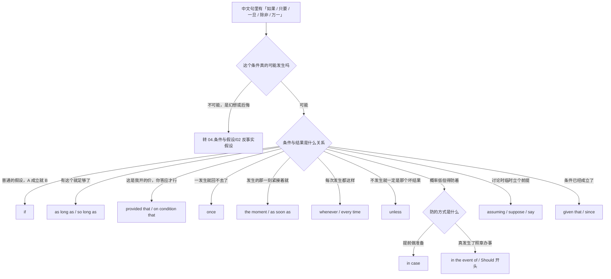
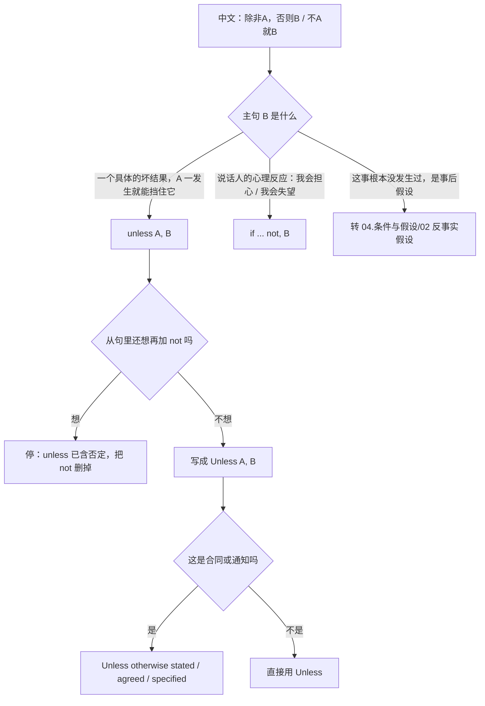
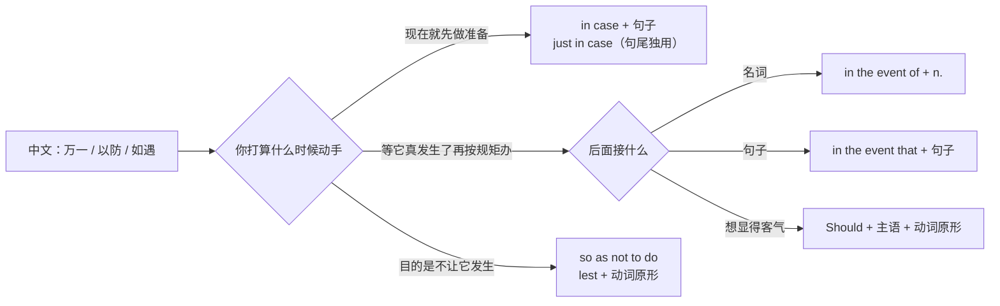
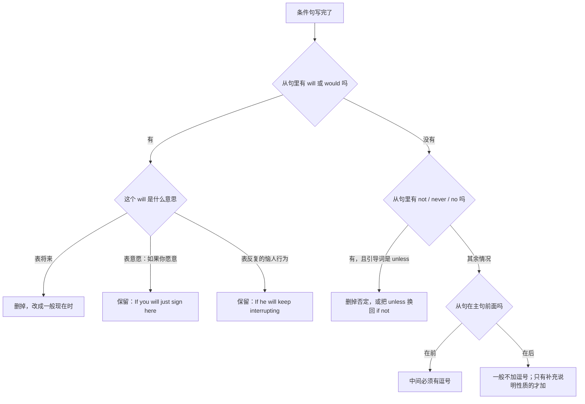
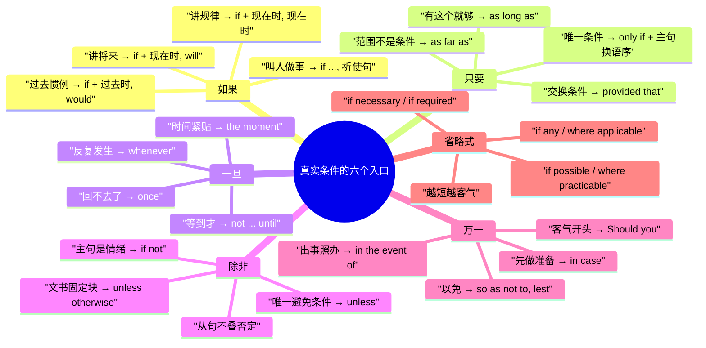

# 真实条件：如果就、只要、一旦、除非、前提是

> [!info] 本篇定位
>
> 这篇收「条件真的可能发生」时用的三十四条中文查询意图，每条给口语、书面、正式三档成品句架，合计约一百条。中文触发语覆盖：如果…就、要是…的话、只要、但凡、前提是、条件是、一旦、一…就、每当、除非、没…就别、万一、以防、如遇、以免、假设、就当、既然、鉴于、按…来看、如果需要、如果可能、如果有的话、适用的话、如无异议。
>
> 与本分类另外三篇的分工：条件根本不可能成立（「要是当初…就好了」）查 [[04.条件与假设/02.反事实假设：要是就好了、当初要是、混合时间线\|反事实假设]]；句子里根本没有 if（「要不是你」「否则」「那样的话」）查 [[04.条件与假设/03.含蓄条件与省略倒装：要不是、否则、那样的话\|含蓄条件与省略倒装]]；不指明是哪个条件（「看情况」「取决于」）查 [[04.条件与假设/04.取决与看情况：视…而定、说不好得看\|取决与看情况]]。这一篇只管**条件成立的可能性是真实的**那一批。
>
> 读完能查到：一句带「如果」的中文该落在哪个引导词上、主句和从句各用什么时态、unless 为什么不能跟否定连用、正式函件里「万一贵方…」的 Should 开头写法、以及 if necessary 这一类三个词就完事的礼貌省略式。
>
> 条件从句本身的结构推导不在这里，全部指回 [[02.英语基础语法/09.从句体系/04.状语从句详解\|状语从句详解]]。

---

## 1. 本篇导读：中文一个「如果」，英文十二个入口

中文的条件表达高度集中。「如果」一个词能覆盖英文里 if、as long as、once、unless、in case、in the event of 全部的活儿，剩下的差别靠上下文和语气补。英文相反：引导词一选定，句子的**逻辑关系、语域高度和后面的时态**同时被锁死，选错一个词，整句就跑偏。

跑偏的方式有三种。第一种是逻辑跑偏：「只要你不动配置就没事」写成 `Unless you don't touch the config`，意思整个翻过来。第二种是语域跑偏：跟同事说话用 `In the event that the build fails`，像在念合同。第三种是时态跑偏：`If it will rain tomorrow`，中文里「如果明天下雨」的「明天」是个将来时间点，英文却要求 if 从句用一般现在时。

### 1.1 十二个引导词的总映射

| 中文触发语 | 英文引导词 | 逻辑关系 | 语域 |
| --- | --- | --- | --- |
| 如果…就 / 要是…的话 | if | 中性条件，最通用 | 全档通用 |
| 只要…就 / 但凡 | as long as、so long as | 充分条件，强调「有这个就够了」 | 口语到书面 |
| 前提是 / 条件是 | provided that、on condition that | 附加限制条件，带交换意味 | 书面到正式 |
| 一旦…就 | once | 条件一发生就不可逆 | 全档通用 |
| 一…就 / 刚…就 | the moment、as soon as | 时间紧邻兼条件 | 口语到书面 |
| 每当 / 凡是…就 | whenever、every time | 反复发生的条件 | 全档通用 |
| 除非…否则 | unless | 唯一能避免结果的条件 | 全档通用 |
| 万一 / 保不齐 | Should + 主语 + 原形、in the event that | 低概率但要防 | 书面到正式 |
| 以防 / 免得 | in case | 先做准备防它发生 | 全档通用 |
| 如遇 / 发生…时 | in the event of | 后接名词的正式条件 | 正式 |
| 假设 / 就当 | assuming、suppose、say | 讨论中临时立个前提 | 全档通用 |
| 既然 / 鉴于 | given that、in view of | 条件已经成立，直接往下推 | 书面到正式 |

这张表是全篇骨架。第 2 节到第 8 节把每一行拆成可查的中文入口，第 9 节单独处理时态与语序这两处最容易翻车的地方。

### 1.2 从中文条件词进的选择树

树的第一层不问语法，只问一句话：这事真有可能发生吗。「如果明天下雨」有可能，「如果我是你」没可能——后者整条分支交给下一篇。第二层才开始分逻辑：同样是「只要」，「只要编译过了我就满意」是充分条件走 as long as，「只要不动配置」是排除某种破坏走 as long as ... don't，「只要你先付款我才发货」是交换条件走 provided that。第三层只在「万一」这一支上继续分叉，因为中文的「万一」在英文里对应两件事——**提前防**用 in case，**真发生了怎么办**用 in the event of。

### 1.3 三档怎么分

本篇的三档不是同义改写，是三个使用场合。

| 档位 | 用在哪 | 特征 |
| --- | --- | --- |
| 口语 | 面对面、Slack、微信 | 引导词短，主句常带缩写（I'll、we'll），可以省略 that |
| 书面 | 邮件、周报、技术文档、PR 描述 | 引导词完整，主句结构完整，不用缩写 |
| 正式 | 合同、通知函、规程、对外公告 | 引导词换成 provided that、in the event of，主句常带 shall 或被动 |

### 1.4 全篇两条总提醒

> [!warning] 两条一定会犯的错
>
> - ❌ ~~If it will rain tomorrow, we'll cancel.~~ ／ ✅ **If it rains tomorrow, we'll cancel.**（条件从句里讲将来一律用一般现在时，will 只留给主句，这条规矩对 if、unless、once、as long as、as soon as、in case 全部适用）
> - ❌ ~~Unless you don't back it up, you'll lose it.~~ ／ ✅ **Unless you back it up, you'll lose it.**（unless 本身就等于 if...not，从句里再加一个否定等于把意思翻回去）

> [!tip] 查法
>
> 先把中文句子里那个条件词圈出来，对着上面的总映射表找到英文引导词，再翻到对应节次找中文触发语。每条触发语列出三到五个同义说法，想到哪个查哪个。查到之后先看三档表选语域，再扫一眼下面的错配警示——那两行是这条句架上最常摔跤的地方。

---

## 2. 「如果…就…」：if 的六种主句

if 是覆盖面最广的一个，也是最容易被写成一个模子的一个。同样开头是 if，主句可以是将来时、现在时、祈使句、情态动词、过去时五种形态，选哪一种取决于你想说的是「将来会怎样」「一向都这样」还是「你去做这件事」。

### 2.1 如果A，就B：讲将来一次性的事

中文触发语：如果…就… / 要是…就… / …的话，我就… / 假如…那就…

| 档位 | 句架 | 例句 |
| --- | --- | --- |
| 口语 | If A（现在时）, I'll B. | If the build fails again, I'll roll it back. |
| 书面 | If A, we will B. | If the client confirms by Friday, we will start on Monday. |
| 正式 | If A, sth will be + p.p. | If the proposal is approved, the funds will be released in two instalments. |

> [!warning] 错配警示
>
> - ❌ ~~If the client will confirm by Friday, we will start on Monday.~~ ／ ✅ **If the client confirms by Friday, we will start on Monday.**（从句讲将来用一般现在时，这是本篇第一号高频错）
> - ❌ ~~If it rains tomorrow we cancel the trip.~~ ／ ✅ **If it rains tomorrow, we'll cancel the trip.**（讲一次性的将来事件，主句要带 will；两句之间的逗号也不能省，因为 if 从句在前）

- 同义入口：如果…就… / 要是…就… / …的话就… / 假如…那…
- 语法归属：[[02.英语基础语法/09.从句体系/04.状语从句详解\|条件状语从句]]
- 场景实战：[[04.英语场景/04.从句与复合句型框架/03.状语从句九大类型\|状语从句九大类型]]

### 2.2 一…就…：讲一向如此的规律

中文触发语：一…就… / 只要…总是… / 每次…都… / 凡是…就…（讲规律不讲将来）

| 档位 | 句架 | 例句 |
| --- | --- | --- |
| 口语 | If A（现在时）, B（现在时）. | If you leave it running overnight, the memory climbs. |
| 书面 | When A, B. | When the cache expires, the service falls back to the database. |
| 正式 | Where A, B. | Where a dispute arises, the matter is referred to arbitration. |

> [!warning] 错配警示
>
> - ❌ ~~If you heat water to 100 degrees, it will boil.~~ ／ ✅ **If you heat water to 100 degrees, it boils.**（讲恒定规律两边都用一般现在时，加 will 就变成了「这一次会怎样」）
> - ❌ ~~Where you have a question, ask me.~~ ／ ✅ **If you have a question, ask me.**（where 表条件只出现在法条、保单、规程里，日常场合一律用 if）

- 同义入口：一…就… / 只要…总是… / 每次…都会 / 凡是…都…
- 语法归属：[[02.英语基础语法/09.从句体系/05.从句综合辨析\|从句综合辨析]]
- 场景实战：[[04.英语场景/04.从句与复合句型框架/03.状语从句九大类型\|状语从句九大类型]]

### 2.3 如果…请…：主句是叫对方做事

中文触发语：如果…请… / 要是…就…吧 / …的话，记得… / 有…就跟我说

| 档位 | 句架 | 例句 |
| --- | --- | --- |
| 口语 | If A, just B（动词原形）. | If anything breaks, just ping me. |
| 书面 | If A, please B. | If you need the raw data, please let me know by Thursday. |
| 正式 | If A, sb is requested to B. | If any discrepancy is found, you are requested to notify us in writing. |

> [!warning] 错配警示
>
> - ❌ ~~If anything breaks, you please ping me.~~ ／ ✅ **If anything breaks, please ping me.**（please 后面直接跟动词原形，前面不补主语）
> - ❌ ~~If you will need the raw data, please tell me.~~ ／ ✅ **If you need the raw data, please let me know.**（从句不带 will；tell me 后面必须接内容，单说「告诉我一声」用 let me know）

- 同义入口：如果…请… / …的话记得… / 有…就说一声 / 万一…就联系我
- 语法归属：[[02.英语基础语法/09.从句体系/04.状语从句详解\|条件状语从句]]
- 场景实战：[[04.英语场景/10.职场与商务场景实战/03.商务邮件与正式书面沟通\|商务邮件与正式书面沟通]]

### 2.4 如果…可以／应该…：给许可或提建议

中文触发语：如果…可以… / 要是…就该… / …的话或许可以 / 如果…不妨…

| 档位 | 句架 | 例句 |
| --- | --- | --- |
| 口语 | If A, you can B. | If you're in a hurry, you can take the express line. |
| 书面 | If A, sb should B. | If the test suite passes locally, you should still wait for CI. |
| 正式 | If A, sb may B. | If the applicant meets all criteria, the committee may grant an exemption. |

> [!warning] 错配警示
>
> - ❌ ~~If the tests pass, you should to merge it.~~ ／ ✅ **If the tests pass, you can merge it.**（情态动词后面直接跟动词原形；而且 should 是「理应如此」，给许可要用 can）
> - ❌ ~~If you will be in a hurry, you can take the express.~~ ／ ✅ **If you're in a hurry, you can take the express.**（主句已经有情态动词，从句还是不带 will）

- 同义入口：如果…可以 / 要是…就该 / …的话不妨 / 如果…允许…
- 语法归属：[[02.英语基础语法/07.助动词与情态动词/02.情态动词详解\|情态动词详解]]
- 场景实战：[[04.英语场景/05.高频实用表达句型框架/02.建议请求邀请拒绝四大功能句型\|建议请求邀请拒绝]]

### 2.5 如果说A，那B：把对方的话当前提

中文触发语：如果说…那… / 照你这么说 / 按这个说法 / 如果真是这样的话

| 档位 | 句架 | 例句 |
| --- | --- | --- |
| 口语 | If that's true, then B. | If that's true, then we've been chasing the wrong bug. |
| 书面 | If A is the real constraint, then B. | If cost is the real constraint, then scope is what we should cut. |
| 正式 | If it is indeed the case that A, then B. | If it is indeed the case that the records were altered, then the audit trail must be re-examined. |

> [!warning] 错配警示
>
> - ❌ ~~If that is true, so we should reconsider.~~ ／ ✅ **If that is true, then we should reconsider.**（if 从句的主句用 then 呼应，用 so 是把条件说成了因果）
> - ❌ ~~If say cost is the constraint, we should cut scope.~~ ／ ✅ **If cost is the constraint, we should cut scope.**（中文的「如果说」里的「说」不译，直接 if 加句子）

- 同义入口：如果说…那… / 照这么说 / 按你的讲法 / 真要是这样的话
- 语法归属：[[02.英语基础语法/09.从句体系/03.名词性从句详解\|it is the case that 的形式主语]]
- 场景实战：[[04.英语场景/05.高频实用表达句型框架/01.表达观点与态度的50个万能句型\|表达观点与态度]]

### 2.6 那时候如果…就…：过去的惯例

中文触发语：那时候如果…就… / 以前只要…就… / 当年要是…都会… / 过去碰上…就…

| 档位 | 句架 | 例句 |
| --- | --- | --- |
| 口语 | If A（过去时）, B（过去时）. | If the server went down, we just restarted it. |
| 书面 | Whenever A, sb would B. | Whenever a release slipped, the team would work through the weekend. |
| 正式 | If A（过去时）, sth was + p.p. | If a request was flagged, it was escalated to the duty manager. |

> [!warning] 错配警示
>
> - ❌ ~~If the server went down, we would have restarted it.~~ ／ ✅ **If the server went down, we would restart it.**（would do 讲过去的惯例，would have done 是「其实并没有做」的反事实，两者差一个 have）
> - ❌ ~~If a request was flagged, it will be escalated.~~ ／ ✅ **If a request was flagged, it was escalated.**（整句锚在过去，主句不能跳回将来）

- 同义入口：以前只要…就 / 当时碰上…都会 / 那阵子…就… / 早年间…便…
- 语法归属：[[02.英语基础语法/07.助动词与情态动词/02.情态动词详解\|would 表过去的反复行为]]
- 场景实战：[[04.英语场景/10.职场与商务场景实战/02.会议汇报与演示场景\|会议汇报与演示场景]]

---

## 3. 「只要 / 前提是」：充分条件与交换条件

中文的「只要」有两副面孔。一副是「有这个就够了，别的我不管」，落在 as long as、so long as 上；另一副是「我答应你，但你得先答应我」，带谈判的味道，落在 provided that、on condition that 上。前者是充分条件，后者是交换条件，中文都说「只要」，英文分得很清。

还有第三种「只要」其实不是条件，是范围：「只要是我知道的都告诉你」——这个走 as far as，跟前两副面孔一个字母之差，最容易混。

### 3.1 只要…就…：有这个就够了

中文触发语：只要…就… / 只要…都行 / 有…就够了 / 但凡…就…

| 档位 | 句架 | 例句 |
| --- | --- | --- |
| 口语 | As long as A, B. | As long as it compiles, I'm happy. |
| 书面 | So long as A, B. | So long as the interface stays stable, the internals can change freely. |
| 正式 | Provided that A, B. | Provided that all invoices are settled, the licence remains in force. |

> [!warning] 错配警示
>
> - ❌ ~~As long as you will come, we can start.~~ ／ ✅ **As long as you come, we can start.**（as long as 引导的也是条件从句，同样不带 will）
> - ❌ ~~As long as that you finish it today, it's fine.~~ ／ ✅ **As long as you finish it today, it's fine.**（as long as 后面直接跟句子，不加 that；加 that 的是 provided that、on condition that）

- 同义入口：只要…就… / 只要…都行 / 有…就够了 / 但凡…便…
- 语法归属：[[02.英语基础语法/05.介词与连词/03.连词的分类与用法\|从属连词]]
- 场景实战：[[04.英语场景/04.从句与复合句型框架/03.状语从句九大类型\|状语从句九大类型]]

### 3.2 只要不…就…：排除某一种破坏

中文触发语：只要不… / 别…就行 / 不…的话就没问题 / 除了…别的随便

| 档位 | 句架 | 例句 |
| --- | --- | --- |
| 口语 | As long as you don't A, B. | As long as you don't touch the config, nothing will break. |
| 书面 | Provided A is not B, C. | Provided the schema is not changed, the migration can run in place. |
| 正式 | On condition that A does not B, C. | On condition that the recipient does not disclose the material, access will be granted. |

> [!warning] 错配警示
>
> - ❌ ~~As long as you don't touch the config, nothing won't break.~~ ／ ✅ **As long as you don't touch the config, nothing will break.**（nothing 本身就是否定词，再配 won't 就是主句里的双重否定，字面成了「什么都会坏」）
> - ❌ ~~Unless you don't touch the config, nothing will break.~~ ／ ✅ **As long as you don't touch the config, nothing will break.**（unless 自带否定，用在这里等于「只要你动了配置就没事」，正好说反）

- 同义入口：只要不… / 别…就行 / 不去动…就没事 / 除了…都可以
- 语法归属：[[02.英语基础语法/09.从句体系/04.状语从句详解\|条件状语从句]]
- 场景实战：[[04.英语场景/10.职场与商务场景实战/04.商务谈判合同与客户沟通\|商务谈判合同与客户沟通]]

### 3.3 前提是 / 条件是：带交换意味的附加条件

中文触发语：前提是… / 条件是… / 有个前提 / 说好了…才行 / 以…为条件

| 档位 | 句架 | 例句 |
| --- | --- | --- |
| 口语 | ..., but only if A. | Sure, but only if you tell me before Friday. |
| 书面 | ..., on the condition that A. | They agreed to extend the deadline, on the condition that we freeze the scope. |
| 正式 | ... on condition that A. | The waiver is granted on condition that the licensee submits quarterly reports. |

> [!warning] 错配警示
>
> - ❌ ~~The premise is that you finish it first.~~ ／ ✅ **The condition is that you finish it first.**（中文的「前提」在这里是 condition；premise 指论证的前提命题，不用于谈条件）
> - ❌ ~~on the condition of you finish it~~ ／ ✅ **on the condition that you finish it**（后接句子用 that，只有接名词才用 of：on condition of full payment）

- 同义入口：前提是 / 条件是 / 得先说好 / 以…为条件 / 除非你先…
- 语法归属：[[02.英语基础语法/05.介词与连词/04.介词与连词的易混点\|介词与连词的易混点]]
- 场景实战：[[04.英语场景/10.职场与商务场景实战/04.商务谈判合同与客户沟通\|商务谈判合同与客户沟通]]

### 3.4 就…而言 / 只要在…范围内：这是范围不是条件

中文触发语：就…而言 / 只要是…方面 / 据我所知 / 在…这一层上没问题

| 档位 | 句架 | 例句 |
| --- | --- | --- |
| 口语 | As far as I know, B. | As far as I know, nothing has changed on their side. |
| 书面 | As far as A is concerned, B. | As far as latency is concerned, the new build is a clear win. |
| 正式 | Insofar as A, B. | Insofar as the clause conflicts with local law, local law prevails. |

> [!warning] 错配警示
>
> - ❌ ~~As long as I know, nothing has changed.~~ ／ ✅ **As far as I know, nothing has changed.**（as long as 是条件，as far as 是范围。中文都说「只要」，英文差一个词意思完全不同）
> - ❌ ~~As far as I know that, nothing has changed.~~ ／ ✅ **As far as I know, nothing has changed.**（as far as I know 是整块插入语，后面不接 that）

- 同义入口：就…而言 / 从…这个角度看 / 据我所知 / 在…范围内
- 语法归属：[[02.英语基础语法/09.从句体系/05.从句综合辨析\|从句综合辨析]]
- 场景实战：[[04.英语场景/05.高频实用表达句型框架/01.表达观点与态度的50个万能句型\|表达观点与态度]]

### 3.5 只有…才…：非这一条不可

中文触发语：只有…才… / 必须…才行 / 非…不可 / 得先…才能…

| 档位 | 句架 | 例句 |
| --- | --- | --- |
| 口语 | B only if A. | I'll sign it only if legal has reviewed it. |
| 书面 | Only if A + 助动词提前 + 主句. | Only if all three checks pass does the pipeline promote the build. |
| 正式 | Only where A shall B. | Only where written consent has been obtained shall the data be transferred. |

> [!warning] 错配警示
>
> - ❌ ~~Only if all three checks pass the pipeline promotes the build.~~ ／ ✅ **Only if all three checks pass does the pipeline promote the build.**（only if 放句首，主句必须把助动词提到主语前面，实义动词要借 do）
> - ❌ ~~Only if you come I will go.~~ ／ ✅ **Only if you come will I go.**（同上，换语序的是主句不是从句，从句照常语序）

- 同义入口：只有…才… / 必须…才行 / 非得…不可 / 除非…否则不…
- 语法归属：[[02.英语基础语法/10.特殊句型/03.倒装句结构\|倒装句结构]]
- 场景实战：[[04.英语场景/04.从句与复合句型框架/03.状语从句九大类型\|状语从句九大类型]]

---

## 4. 「一旦 / 一…就」：条件与时间叠在一起

中文的「一旦」和「一…就」都同时含着条件和时间两层意思：既说「这事发生了」，又说「发生之后紧接着」。英文把这两层拆给不同的词——once 偏重条件加不可逆，the moment 和 as soon as 偏重时间上的紧贴，whenever 偏重反复。选词的判断很简单：**问自己这事会发生几次**。一次且回不了头用 once，一次且强调时间点用 the moment，多次用 whenever。

### 4.1 一旦…就…：发生了就回不去

中文触发语：一旦… / 只要一… / …之后就再也 / 这一步走了就…

| 档位 | 句架 | 例句 |
| --- | --- | --- |
| 口语 | Once A, B. | Once you delete it, it's gone for good. |
| 书面 | Once A, B will C. | Once the migration starts, the table will be locked for about ten minutes. |
| 正式 | Once A has been + p.p., B shall C. | Once the contract has been executed, neither party shall amend it unilaterally. |

> [!warning] 错配警示
>
> - ❌ ~~At once you delete it, it's gone.~~ ／ ✅ **Once you delete it, it's gone.**（at once 是副词「立刻」，条件义的「一旦」用光秃秃的 once）
> - ❌ ~~Once the migration will start, the table will be locked.~~ ／ ✅ **Once the migration starts, the table will be locked.**（once 从句照样不带 will）

- 同义入口：一旦… / 只要一… / …完就 / 走到这一步就…
- 语法归属：[[02.英语基础语法/09.从句体系/04.状语从句详解\|时间与条件状语从句]]
- 场景实战：[[04.英语场景/04.从句与复合句型框架/03.状语从句九大类型\|状语从句九大类型]]

### 4.2 一…就…：时间上紧贴

中文触发语：一…就… / …马上就 / 刚…就 / 一等到…立刻

| 档位 | 句架 | 例句 |
| --- | --- | --- |
| 口语 | The moment A, B. | The moment I hit save, the page froze. |
| 书面 | As soon as A, B. | As soon as the invoice clears, we'll ship the hardware. |
| 正式 | Immediately upon A, B shall C. | Immediately upon receipt of the notice, the supplier shall suspend delivery. |

> [!warning] 错配警示
>
> - ❌ ~~As soon as the invoice will clear, we'll ship it.~~ ／ ✅ **As soon as the invoice clears, we'll ship it.**（as soon as 讲将来同样用一般现在时）
> - ❌ ~~Immediately upon receive the notice, the supplier shall suspend delivery.~~ ／ ✅ **Immediately upon receipt of the notice, ...**（upon 是介词，后面接名词或动名词，不接动词原形）

- 同义入口：一…就… / 刚…就 / …完立刻 / 前脚…后脚就
- 语法归属：[[02.英语基础语法/05.介词与连词/01.介词的分类与基本用法\|介词的分类与基本用法]]
- 场景实战：[[04.英语场景/08.出行与旅游场景实战/01.机场航班海关入境场景\|机场航班海关入境]]

### 4.3 等…之后再…：不到时候不动

中文触发语：等…再… / …之后才… / 到…的时候再说 / 先…完再…

| 档位 | 句架 | 例句 |
| --- | --- | --- |
| 口语 | Let's wait until A. | Let's wait until the numbers come in. |
| 书面 | We won't B until A. | We won't cut the release until QA signs off. |
| 正式 | B shall not take place until A. | Disbursement shall not take place until the audit has been completed. |

> [!warning] 错配警示
>
> - ❌ ~~We won't cut the release until QA will sign off.~~ ／ ✅ **We won't cut the release until QA signs off.**（until 从句同样用一般现在时表将来）
> - ❌ ~~Until QA signs off, we cut the release.~~ ／ ✅ **We won't cut the release until QA signs off.**（「等…才…」要求主句否定；until 配肯定主句讲的是「持续到那一刻为止」，主句动词得是 keep testing 这类能延续的，cut 这种一瞬间完成的动作接不上）

- 同义入口：等…再说 / …之后才… / 不到…不动 / 先…完再…
- 语法归属：[[02.英语基础语法/09.从句体系/04.状语从句详解\|时间状语从句]]
- 场景实战：[[04.英语场景/10.职场与商务场景实战/02.会议汇报与演示场景\|会议汇报与演示场景]]

### 4.4 每当 / 凡是…就…：反复发生的条件

中文触发语：每当… / 每次…都 / 凡是…就 / 不管什么时候…都…

| 档位 | 句架 | 例句 |
| --- | --- | --- |
| 口语 | Every time A, B. | Every time we deploy on a Friday, something breaks. |
| 书面 | Whenever A, B. | Whenever the queue backs up, the alert fires within a minute. |
| 正式 | In any case where A, B shall C. | In any case where a conflict of interest arises, the member shall recuse themselves. |

> [!warning] 错配警示
>
> - ❌ ~~Everytime we deploy on a Friday, something breaks.~~ ／ ✅ **Every time we deploy on a Friday, something breaks.**（every time 是两个词，everytime 不是标准拼写）
> - ❌ ~~Whenever the queue will back up, the alert fires.~~ ／ ✅ **Whenever the queue backs up, the alert fires.**（讲反复规律两边都用一般现在时）

- 同义入口：每当… / 每次…都 / 凡是…就 / 但凡遇到…都…
- 语法归属：[[02.英语基础语法/09.从句体系/05.从句综合辨析\|从句综合辨析]]
- 场景实战：[[04.英语场景/04.从句与复合句型框架/03.状语从句九大类型\|状语从句九大类型]]

---

## 5. 「除非」：unless 只有一种活儿

unless 是本篇最容易写错的词，原因只有一个：它本身等于 if...not，中文母语者却会照着「除非你不…」的字面再补一个否定。补上去，意思立刻翻转。

除了不能叠否定，unless 还有一条隐性限制：它说的是「唯一能避免那个结果的条件」，所以主句必须是一个**明确的、可以被这个条件挡住的结果**。主句是心理反应（「我会担心」）时，unless 读不通，得换回 if...not。

判断只有两步。第一步看主句是不是一个具体的、能被条件挡住的坏结果：`Unless we get the credentials today, the integration will slip.` 拿不到凭据就延期，拿到就不延期，成立。换成 `Unless you call, I'll be worried.` 就别扭了，因为「担心」不是被电话挡住的外部事件，而是说话人的情绪，这时候要写 `If you don't call, I'll be worried.` 第二步纯粹是机械检查：从句里有没有 not、never、no 这类词，有就删。

### 5.1 除非A，否则B：唯一的避免条件

中文触发语：除非… / 除非…否则… / 要是不…就… / 不…的话就完了

| 档位 | 句架 | 例句 |
| --- | --- | --- |
| 口语 | Unless A, B. | Unless something changes, I'm out by six. |
| 书面 | Unless A, B will C. | Unless we get the credentials today, the integration will slip a week. |
| 正式 | Unless otherwise A, B shall C. | Unless otherwise agreed in writing, the fees shall be payable within 30 days. |

> [!warning] 错配警示
>
> - ❌ ~~Unless we don't get the credentials, the integration will slip.~~ ／ ✅ **Unless we get the credentials, the integration will slip.**（unless 已经等于 if we don't，从句里不能再放第二个否定）
> - ❌ ~~Unless we will get the credentials today, it'll slip.~~ ／ ✅ **Unless we get the credentials today, it'll slip.**（unless 从句同样不带 will）

- 同义入口：除非… / 要不…就… / 不…的话就… / 除了…这条路没别的
- 语法归属：[[02.英语基础语法/05.介词与连词/03.连词的分类与用法\|从属连词]]
- 场景实战：[[04.英语场景/10.职场与商务场景实战/04.商务谈判合同与客户沟通\|商务谈判合同与客户沟通]]

### 5.2 不…的话我会…：主句是情绪时改用 if not

中文触发语：不…我会… / 你要是不…我就… / 没…的话我会… / 万一没…我会…

| 档位 | 句架 | 例句 |
| --- | --- | --- |
| 口语 | If you don't A, I'll be B. | If you don't call, I'll be worried. |
| 书面 | If A does not B, C. | If approval does not come through, we fall back to the manual process. |
| 正式 | In the absence of A, B. | In the absence of written objection, the proposal is deemed accepted. |

> [!warning] 错配警示
>
> - ❌ ~~Unless you call, I'll be worried.~~ ／ ✅ **If you don't call, I'll be worried.**（unless 说的是「唯一能挡住结果的条件」，主句是心理反应时挡不住，只能用 if not）
> - ❌ ~~Unless he had come, I would have been upset.~~ ／ ✅ **If he hadn't come, I would have been upset.**（unless 不进入反事实假设，那一整套查下一篇）

- 同义入口：不…我会… / 没…的话就… / 你要是不…我就… / 没有…就当…
- 语法归属：[[02.英语基础语法/09.从句体系/04.状语从句详解\|条件状语从句]]
- 场景实战：[[04.英语场景/05.高频实用表达句型框架/03.同意反对让步转折句型库\|同意反对让步转折句型库]]

### 5.3 除非另有说明：文书里的固定块

中文触发语：除非另有说明 / 若无特别约定 / 未经…不得 / 除非事先…

| 档位 | 句架 | 例句 |
| --- | --- | --- |
| 口语 | unless we say otherwise | Unless we say otherwise, the standup is at ten every morning. |
| 书面 | Unless otherwise stated, B. | Unless otherwise stated, all figures are in thousands. |
| 正式 | Save as otherwise provided herein, B. | Save as otherwise provided herein, notices shall be given in writing. |

> [!warning] 错配警示
>
> - ❌ ~~If not otherwise stated, all figures are in thousands.~~ ／ ✅ **Unless otherwise stated, all figures are in thousands.**（这是整块的固定写法，不拆成 if not otherwise）
> - ❌ ~~Unless our written consent, you may not transfer the data.~~ ／ ✅ **The data may not be transferred without our prior written consent.**（unless 后面接句子；「未经…不得」接的是名词，改用 without 更短也更像文书）

- 同义入口：除非另有说明 / 若无特别约定 / 未经…不得 / 除非事先书面同意
- 语法归属：[[02.英语基础语法/10.特殊句型/05.省略与替代\|省略与替代]]
- 场景实战：[[04.英语场景/10.职场与商务场景实战/03.商务邮件与正式书面沟通\|商务邮件与正式书面沟通]]

### 5.4 没…就别…：主句已经是否定

中文触发语：没…就别… / 不…不许… / 没有…就不行 / 不到…不…

| 档位 | 句架 | 例句 |
| --- | --- | --- |
| 口语 | Don't A unless B. | Don't merge it unless someone else has looked at it. |
| 书面 | sb should not A unless B. | You shouldn't restart the node unless the dashboard shows it as unhealthy. |
| 正式 | B shall not A except where C. | Personal data shall not be retained except where a legal obligation requires it. |

> [!warning] 错配警示
>
> - ❌ ~~Don't merge it unless someone else doesn't look at it.~~ ／ ✅ **Don't merge it unless someone else has looked at it.**（主句已经是否定祈使，unless 从句里再加否定就成了三重否定）
> - ❌ ~~Don't merge it unless without review.~~ ／ ✅ **Don't merge it without review.**（unless 后面接句子，接名词短语要换成 without）

- 同义入口：没…就别… / 不…不准 / 没有…做不了 / 不到…别动
- 语法归属：[[02.英语基础语法/05.介词与连词/04.介词与连词的易混点\|介词与连词的易混点]]
- 场景实战：[[04.英语场景/10.职场与商务场景实战/02.会议汇报与演示场景\|会议汇报与演示场景]]

---

## 6. 「万一 / 以防 / 如遇」：低概率但要防的条件

中文的「万一」在英文里裂成两件事，分界线是**你现在就动手，还是等它发生了再动手**。

这张图的分岔点是动作的时间。`Take an umbrella in case it rains.` 是现在就把伞塞进包里，防的是下雨；`In the event of rain, the ceremony moves indoors.` 是真下了雨才改地方，此刻什么都不做。中文两句都能说成「万一下雨」，英文选错就变成了另一件事。最右边那一支是第三种情况——「以免」，它的重点不是防备而是阻止，动作本身就是为了让那件事不发生。

### 6.1 万一…就…：低概率但真有可能

中文触发语：万一… / 要是真的… / 保不齐… / 万一有个什么…

| 档位 | 句架 | 例句 |
| --- | --- | --- |
| 口语 | If sb happens to A, B. | If you happen to see him, tell him I called. |
| 书面 | In the event that A, B. | In the event that the primary link fails, traffic is rerouted automatically. |
| 正式 | Should A, B shall C. | Should any discrepancy arise, the English version shall prevail. |

> [!warning] 错配警示
>
> - ❌ ~~If should any discrepancy arise, the English version prevails.~~ ／ ✅ **Should any discrepancy arise, the English version shall prevail.**（should 提到句首就顶掉了 if，两个不能同时出现）
> - ❌ ~~In the event that the link will fail, traffic is rerouted.~~ ／ ✅ **In the event that the link fails, traffic is rerouted.**（in the event that 引导的还是条件从句，不带 will）

- 同义入口：万一… / 要是真… / 保不齐… / 说不定哪天…
- 语法归属：[[02.英语基础语法/10.特殊句型/03.倒装句结构\|倒装句结构]]
- 场景实战：[[04.英语场景/11.医疗与紧急场景实战/01.医院看病与药店购药场景\|医院看病与药店购药]]

### 6.2 以防万一：现在就先做准备

中文触发语：以防… / 免得… / 以防万一 / 带上吧，说不定用得上

| 档位 | 句架 | 例句 |
| --- | --- | --- |
| 口语 | ..., just in case. | Take a charger, just in case. |
| 书面 | ..., in case A. | Keep the old build around in case the new one misbehaves. |
| 正式 | ... as a precaution against A. | A secondary index is maintained as a precaution against primary failure. |

> [!warning] 错配警示
>
> - ❌ ~~Take an umbrella in case it will rain.~~ ／ ✅ **Take an umbrella in case it rains.**（in case 从句用一般现在时表将来）
> - ❌ ~~Take an umbrella if it rains.~~ ／ ✅ **Take an umbrella in case it rains.**（if 是「下雨了才去拿伞」，in case 是「先把伞带上防着下雨」，两句不同义）

- 同义入口：以防… / 以防万一 / 免得到时候… / 有备无患
- 语法归属：[[02.英语基础语法/09.从句体系/04.状语从句详解\|条件状语从句]]
- 场景实战：[[04.英语场景/08.出行与旅游场景实战/02.酒店入住预订与投诉场景\|酒店入住预订与投诉]]

### 6.3 如遇… / 发生…时：真出事了照章办

中文触发语：如遇… / 发生…时 / 出现…情况的话 / 遇到…怎么办

| 档位 | 句架 | 例句 |
| --- | --- | --- |
| 口语 | If there's A, B. | If there's a fire, use the stairs, not the lift. |
| 书面 | In the event of A, B. | In the event of a power cut, the UPS keeps the racks up for twenty minutes. |
| 正式 | In the event of A, B shall C. | In the event of force majeure, neither party shall be liable for delay. |

> [!warning] 错配警示
>
> - ❌ ~~In the event of the link fails, traffic is rerouted.~~ ／ ✅ **In the event of a link failure, traffic is rerouted.**（in the event of 后面只能接名词；要接句子得写成 in the event that）
> - ❌ ~~In case of the fire alarm sounds, leave the building.~~ ／ ✅ **If the fire alarm sounds, leave the building.**（in case of 同样只接名词，接句子就换回 if）

- 同义入口：如遇… / 发生…时 / 一旦出现… / 碰上…的情况
- 语法归属：[[02.英语基础语法/05.介词与连词/02.常用介词搭配详解\|常用介词搭配]]
- 场景实战：[[04.英语场景/11.医疗与紧急场景实战/01.医院看病与药店购药场景\|医院看病与药店购药]]

### 6.4 若有需要 / 万一贵方…：正式函件的客气开头

中文触发语：若有需要 / 万一您… / 如果贵方… / 倘若…

| 档位 | 句架 | 例句 |
| --- | --- | --- |
| 口语 | If you need anything, B. | If you need anything, I'm on Slack. |
| 书面 | Should you need A, B. | Should you need the raw logs, they're in the shared drive. |
| 正式 | Should you require A, please B. | Should you require any further information, please do not hesitate to contact us. |

> [!warning] 错配警示
>
> - ❌ ~~Should you to require further information, please contact us.~~ ／ ✅ **Should you require further information, please contact us.**（should 后面跟动词原形，不带 to）
> - ❌ ~~Should you required further information, please contact us.~~ ／ ✅ **Should you require further information, please contact us.**（Should 开头的句式里主语后的动词不变形，永远是原形）

- 同义入口：若有需要 / 万一您… / 如贵方… / 倘若有任何…
- 语法归属：[[02.英语基础语法/10.特殊句型/03.倒装句结构\|倒装句结构]]
- 场景实战：[[04.英语场景/10.职场与商务场景实战/03.商务邮件与正式书面沟通\|商务邮件与正式书面沟通]]

### 6.5 以免 / 省得：动作本身就是为了阻止

中文触发语：以免… / 免得… / 省得… / 别到时候…

| 档位 | 句架 | 例句 |
| --- | --- | --- |
| 口语 | ..., so you don't A. | Write it down so you don't forget. |
| 书面 | ..., so as not to A. | We staged the rollout so as not to overload the queue. |
| 正式 | ..., lest A. | The figures were withheld lest the market react prematurely. |

> [!warning] 错配警示
>
> - ❌ ~~We staged the rollout for not overloading the queue.~~ ／ ✅ **We staged the rollout so as not to overload the queue.**（表目的的否定式是 so as not to do，不用 for not doing）
> - ❌ ~~The figures were withheld lest the market will react.~~ ／ ✅ **The figures were withheld lest the market react.**（lest 后面跟动词原形，属正式书面体；日常写 so that ... doesn't）

- 同义入口：以免… / 免得… / 省得… / 别到时候…
- 语法归属：[[02.英语基础语法/09.从句体系/04.状语从句详解\|目的状语从句：so that、lest]]
- 场景实战：[[04.英语场景/10.职场与商务场景实战/02.会议汇报与演示场景\|会议汇报与演示场景]]

---

## 7. 「假设 / 既然」：讨论中临时立个前提

前面六节的条件都真的可能发生。这一节的条件是讨论桌上临时约定的：说话人并不断言它成立，只是请对方**先接受它，往下推**。中文靠「假设」「就当」「打个比方」标出这层意思，英文靠 assuming、suppose、say 这一组。

跟它相邻但方向相反的是「既然」「鉴于」——条件已经成立了，不需要再假设，直接拿来当推理起点。中文这两组常常混着说（「既然这样，那假设我们再加两个人」），英文分得清楚，混用会让人以为你在质疑一个已经确认的事实。

### 7.1 假设…：临时立一个前提

中文触发语：假设… / 假定… / 就当…是这样 / 按…来算

| 档位 | 句架 | 例句 |
| --- | --- | --- |
| 口语 | Say A, then B. | Say we get five more people — could we still ship in June? |
| 书面 | Assuming A, B. | Assuming the numbers hold, we break even in Q3. |
| 正式 | On the assumption that A, B. | On the assumption that demand remains flat, capacity will be sufficient. |

> [!warning] 错配警示
>
> - ❌ ~~Assuming that the numbers will hold, we break even in Q3.~~ ／ ✅ **Assuming the numbers hold, we break even in Q3.**（assuming 引出的还是条件，不带 will；后面的 that 可以省）
> - ❌ ~~Assumed the numbers hold, we break even.~~ ／ ✅ **Assuming the numbers hold, we break even.**（这里用现在分词 assuming，过去分词 assumed 是「被认定为」，不引导条件）

- 同义入口：假设… / 假定… / 按…来算 / 就以…为准算一下
- 语法归属：[[02.英语基础语法/08.非谓语动词/03.现在分词详解\|现在分词作状语]]
- 场景实战：[[04.英语场景/10.职场与商务场景实战/02.会议汇报与演示场景\|会议汇报与演示场景]]

### 7.2 就当 / 打个比方：拉着对方一起设想

中文触发语：就当… / 打个比方 / 比如说…吧 / 姑且认为…

| 档位 | 句架 | 例句 |
| --- | --- | --- |
| 口语 | Let's say A. | Let's say the API times out — what does the client show? |
| 书面 | Suppose A. | Suppose two writers hit the same row: which one wins? |
| 正式 | For the sake of argument, assume A. | For the sake of argument, assume the estimate is off by half. |

> [!warning] 错配警示
>
> - ❌ ~~If let's say the API times out, what happens?~~ ／ ✅ **Say the API times out — what happens?**（let's say、say 本身已经是条件引导，前面不再加 if）
> - ❌ ~~Let's say that the API will time out, what does the client show?~~ ／ ✅ **Let's say the API times out — what does the client show?**（从句不带 will；后半句是独立疑问句，用破折号断开，不用逗号粘连）

- 同义入口：就当… / 打个比方 / 比方说 / 姑且当作…
- 语法归属：[[02.英语基础语法/09.从句体系/03.名词性从句详解\|suppose 后的宾语从句]]
- 场景实战：[[04.英语场景/05.高频实用表达句型框架/01.表达观点与态度的50个万能句型\|表达观点与态度]]

### 7.3 既然 / 鉴于：条件已经成立

中文触发语：既然… / 鉴于… / 考虑到… / 都这样了那就…

| 档位 | 句架 | 例句 |
| --- | --- | --- |
| 口语 | Since A, B. | Since you're already here, can you take a look at this? |
| 书面 | Given that A, B. | Given that the deadline has moved, we can afford one more round of review. |
| 正式 | In view of A, B. | In view of the revised figures, the board has deferred the decision. |

> [!warning] 错配警示
>
> - ❌ ~~Given that the revised figures, the board deferred the decision.~~ ／ ✅ **Given the revised figures, the board deferred the decision.**（given 接名词时不加 that，接句子才加）
> - ❌ ~~Given that the deadline has moved, so we have more time.~~ ／ ✅ **Given that the deadline has moved, we have more time.**（given that 从句后面直接跟主句，不再加 so）

- 同义入口：既然… / 鉴于… / 考虑到… / 事已至此
- 语法归属：[[02.英语基础语法/09.从句体系/04.状语从句详解\|原因状语从句]]
- 场景实战：[[04.英语场景/10.职场与商务场景实战/04.商务谈判合同与客户沟通\|商务谈判合同与客户沟通]]

### 7.4 按…来看 / 照…的标准：拿证据当前提

中文触发语：按…来看 / 照…的标准 / 从…来判断 / 以…为准

| 档位 | 句架 | 例句 |
| --- | --- | --- |
| 口语 | Going by A, B. | Going by last month's numbers, we're about eight per cent short. |
| 书面 | Judging by A, B. | Judging by the stack trace, the failure is in the serializer. |
| 正式 | On the basis of A, B. | On the basis of the sample data, the model appears to overfit. |

> [!warning] 错配警示
>
> - ❌ ~~According to the stack trace, the failure is in the serializer.~~ ／ ✅ **Judging by the stack trace, the failure is in the serializer.**（according to 用于引述别人说的话或文件写的内容，从证据自己推断用 judging by、going by）
> - ❌ ~~On the base of the sample data, the model overfits.~~ ／ ✅ **On the basis of the sample data, the model appears to overfit.**（固定搭配是 on the basis of，不是 on the base of）

- 同义入口：按…来看 / 从…判断 / 照…的口径 / 以…为准
- 语法归属：[[02.英语基础语法/05.介词与连词/02.常用介词搭配详解\|常用介词搭配]]
- 场景实战：[[04.英语场景/10.职场与商务场景实战/02.会议汇报与演示场景\|会议汇报与演示场景]]

### 7.5 如果非要…的话：被逼着表态时的软化式

中文触发语：如果非要…的话 / 硬要说的话 / 真要…的话 / 一定要选的话

| 档位 | 句架 | 例句 |
| --- | --- | --- |
| 口语 | If I had to pick, B. | If I had to pick, I'd go with the second option. |
| 书面 | If pressed, B. | If pressed, I would say the risk is manageable. |
| 正式 | If a single factor must be identified, it is A. | If a single factor must be identified, it is the lack of test coverage. |

> [!warning] 错配警示
>
> - ❌ ~~If I have to pick, I will go with the second one.~~ ／ ✅ **If I had to pick, I'd go with the second one.**（这是固定的软化说法，用过去式表示「其实没人逼我选」，语气比现在时客气）
> - ❌ ~~If pressed me, I would say the risk is manageable.~~ ／ ✅ **If pressed, I would say the risk is manageable.**（省略式条件里主语和 be 一起省掉，后面不补宾语）

- 同义入口：非要说的话 / 硬要选的话 / 真让我挑 / 一定要给个数的话
- 语法归属：[[02.英语基础语法/10.特殊句型/05.省略与替代\|省略与替代]]
- 场景实战：[[04.英语场景/05.高频实用表达句型框架/01.表达观点与态度的50个万能句型\|表达观点与态度]]

---

## 8. 「如果需要」：三个词就完事的省略式

真实条件里有一批高频短语，短到不像从句：if necessary、if possible、if any、where applicable、if required。它们全部是完整条件从句省掉主语和 be 之后的残留形态——`if it is necessary` 省成 `if necessary`。

这批短语在邮件和文档里的地位比整句条件从句还重要。原因是**长度即语气**：`We can extend the window by a day if it is necessary for you to have more time` 读起来像在讨价还价，`We can extend the window by a day, if necessary` 读起来像顺手补一句。中文母语者的默认写法偏向前者，把从句写全，结果每封邮件都比原本该有的长一截，也更像在施压。

### 8.1 如果需要 / 有必要的话

中文触发语：如果需要… / 有必要的话 / 需要的话… / 到时候看情况

| 档位 | 句架 | 例句 |
| --- | --- | --- |
| 口语 | ..., if you want. | I can send the file over, if you want. |
| 书面 | ..., if necessary. | We can extend the window by a day, if necessary. |
| 正式 | ..., if required. | Additional documentation will be provided, if required. |

> [!warning] 错配警示
>
> - ❌ ~~We can extend the window, if it necessary.~~ ／ ✅ **We can extend the window if necessary.**（要省就整块省掉 it is，不能只删 is 留下 it）
> - ❌ ~~If need, I can send it over.~~ ／ ✅ **If needed, I can send it over.**（省略式里用过去分词 needed，need 是动词原形，接不上）

- 同义入口：如果需要 / 有必要的话 / 需要就说 / 视情况可以…
- 语法归属：[[02.英语基础语法/10.特殊句型/05.省略与替代\|状语从句的省略]]
- 场景实战：[[04.英语场景/10.职场与商务场景实战/03.商务邮件与正式书面沟通\|商务邮件与正式书面沟通]]

### 8.2 如果可以 / 方便的话

中文触发语：如果可以的话 / 方便的话 / 有空的话 / 尽量…

| 档位 | 句架 | 例句 |
| --- | --- | --- |
| 口语 | ..., if you can. | Could you take a look at it today, if you can? |
| 书面 | ..., if possible. | Please confirm by Thursday, if possible. |
| 正式 | ..., where practicable. | Records shall be retained locally, where practicable. |

> [!warning] 错配警示
>
> - ❌ ~~Please confirm by Thursday if it is possible for you.~~ ／ ✅ **Please confirm by Thursday, if possible.**（省略式比补全的从句短也更客气，正式邮件里默认用短的）
> - ❌ ~~Please confirm by Thursday, if possibly.~~ ／ ✅ **Please confirm by Thursday, if possible.**（这里省掉的是 if it is possible，留下的是形容词；possibly 是副词「也许」，意思完全不同）

- 同义入口：如果可以 / 方便的话 / 有空就… / 力所能及的话
- 语法归属：[[02.英语基础语法/04.形容词与副词/01.形容词的用法与位置\|形容词与副词的分工]]
- 场景实战：[[04.英语场景/10.职场与商务场景实战/03.商务邮件与正式书面沟通\|商务邮件与正式书面沟通]]

### 8.3 如果有的话

中文触发语：如果有的话 / 有没有都行 / 有多少算多少 / 若有

| 档位 | 句架 | 例句 |
| --- | --- | --- |
| 口语 | ..., if there are any. | Send me the error logs, if there are any. |
| 书面 | ..., if any. | List the exceptions, if any, in the appendix. |
| 正式 | ..., if any, ... | Deductions, if any, shall be itemised separately. |

> [!warning] 错配警示
>
> - ❌ ~~List the exceptions if have.~~ ／ ✅ **List the exceptions, if any.**（中文的「如果有」不能直译成 if have，英文的固定省略式是 if any）
> - ❌ ~~Send me the error logs if any exist ones.~~ ／ ✅ **Send me the error logs, if there are any.**（要补全就写 if there are any，any 后面不再挂名词）

- 同义入口：如果有的话 / 若有 / 有则… / 有多少给多少
- 语法归属：[[02.英语基础语法/03.代词与数词/04.不定代词详解\|不定代词 any]]
- 场景实战：[[04.英语场景/10.职场与商务场景实战/03.商务邮件与正式书面沟通\|商务邮件与正式书面沟通]]

### 8.4 适用的话 / 视情况填写

中文触发语：适用的话 / 视情况 / 如涉及 / 相关的话就…

| 档位 | 句架 | 例句 |
| --- | --- | --- |
| 口语 | ..., if that applies to you. | Fill in the second section too, if that applies to you. |
| 书面 | ..., where applicable. | Attach the receipts, where applicable. |
| 正式 | ..., to the extent applicable. | Value added tax shall be charged to the extent applicable. |

> [!warning] 错配警示
>
> - ❌ ~~Attach the receipts, if applicable to it.~~ ／ ✅ **Attach the receipts, where applicable.**（表格与规程里的固定写法是 where applicable，后面不带宾语）
> - ❌ ~~If it is suitable, attach the receipts.~~ ／ ✅ **Attach the receipts, if applicable.**（suitable 是「合适、般配」，规则「适用」用 applicable）

- 同义入口：适用的话 / 如涉及 / 视情况 / 有相关内容就…
- 语法归属：[[02.英语基础语法/10.特殊句型/05.省略与替代\|状语从句的省略]]
- 场景实战：[[04.英语场景/08.出行与旅游场景实战/01.机场航班海关入境场景\|机场航班海关入境]]

### 8.5 如无异议 / 如果没有回复

中文触发语：如无异议 / 如果没有回复 / 没人反对的话 / 默认就…

| 档位 | 句架 | 例句 |
| --- | --- | --- |
| 口语 | If I don't hear back, B. | If I don't hear back by Friday, I'll go ahead. |
| 书面 | Unless anyone objects, B. | Unless anyone objects, we'll lock the scope tomorrow. |
| 正式 | In the absence of A, B. | In the absence of objection within five working days, the minutes are deemed approved. |

> [!warning] 错配警示
>
> - ❌ ~~If I don't hear back from you until Friday, I'll go ahead.~~ ／ ✅ **If I don't hear back from you by Friday, I'll go ahead.**（截止期限用 by，until 说的是「一直持续到那一刻」）
> - ❌ ~~Unless anyone doesn't object, we'll lock the scope.~~ ／ ✅ **Unless anyone objects, we'll lock the scope.**（unless 已含否定，从句不再叠）

- 同义入口：如无异议 / 没人反对的话 / 到点没回复就 / 默认通过
- 语法归属：[[02.英语基础语法/05.介词与连词/01.介词的分类与基本用法\|by 与 until 的期限差]]
- 场景实战：[[04.英语场景/10.职场与商务场景实战/03.商务邮件与正式书面沟通\|商务邮件与正式书面沟通]]

---

## 9. 写完之后的三处自查：时态、语序、标点

前面八节给的是句架，这一节给的是把句架填上内容之后的三处机械检查。三处都不需要判断语义，纯粹是形式核对，花十秒钟能挡掉本篇八成的错。

第一处查 will。中文的「如果明天下雨」里那个「明天」诱使人在从句里写 will，这是最高频的一个错。但 will 在条件从句里并非绝对禁止，它有两种合法用法：一种表意愿（`If you will just sign here, we can proceed.` 意思是「劳驾您签一下」），另一种表反复出现的恼人行为（`If he will keep interrupting, we'll never finish.`）。判断办法是把 will 换成 want to 试试，读得通就是意愿义，可以留。

第二处查否定叠加。只要引导词是 unless，从句里就不能再有 not、never、no、nothing、nobody。

第三处查逗号。条件从句在前，主句在后，中间必须有逗号；顺序倒过来，一般不加。

### 9.1 时态对照表

| 中文时间指向 | 从句时态 | 主句时态 | 例句 |
| --- | --- | --- | --- |
| 讲将来一次性的事 | 一般现在时 | will / can / may + 原形 | If it rains, we'll cancel. |
| 讲一向如此的规律 | 一般现在时 | 一般现在时 | If you press this, the light comes on. |
| 讲将来但条件已完成 | 现在完成时 | will + 原形 | Once you've signed it, I'll file it. |
| 讲过去的惯例 | 一般过去时 | would + 原形 | If it rained, we moved it indoors. |
| 叫对方做事 | 一般现在时 | 祈使句 | If anything breaks, ping me. |

第三行值得单独记：从句用现在完成时的场合是「必须先做完这件，才能做那件」。`Once you sign it` 和 `Once you've signed it` 都对，后者把「完成」这层意思压得更实，正式文书里几乎都用后者。

### 9.2 引导词的语域梯度

| 逻辑 | 口语 | 书面 | 正式 |
| --- | --- | --- | --- |
| 普通条件 | if | if | in the event that、Should + 主语 + 原形 |
| 充分条件 | as long as | so long as、provided | provided that、on condition that |
| 不可逆条件 | once | once | once ... has been + p.p. |
| 唯一避免条件 | unless | unless | unless otherwise、save as otherwise |
| 防备 | just in case | in case | as a precaution against |
| 已成立的前提 | since | given that | in view of、having regard to |

用这张表做语域体检：一封给同事的 Slack 消息里出现 in the event that，或者一份对外合同里出现 as long as，都是语域没对齐。改法是横向平移——同一行里换一格，逻辑不变，语气变。

### 9.3 三个词的边界速记

| 容易混的一对 | 差别 | 记法 |
| --- | --- | --- |
| as long as ／ as far as | 条件 ／ 范围 | long 管「够不够」，far 管「到哪为止」 |
| in case ／ if | 先防 ／ 后应 | in case 现在就动手，if 等它发生 |
| in case of ／ in the event of | 都接名词 | 前者偏日常告示，后者偏合同条款 |
| unless ／ if not | 唯一例外 ／ 单纯否定假设 | 主句是情绪反应就用 if not |
| provided that ／ if | 交换条件 ／ 中性条件 | provided 背后有一句「我才答应」 |
| by ／ until | 期限 ／ 持续 | by 是一个点，until 是一条线 |

> [!example] 一句中文走三档
>
> 中文：**要是他们周五之前不确认，这个集成就得往后推一周。**
>
> - 口语：If they don't get back to us by Friday, the integration slips a week.
> - 书面：Unless the client confirms by Friday, the integration will slip by a week.
> - 正式：In the event that confirmation is not received by 12 June, the integration schedule shall be extended by one week.
>
> 三句的差别不在词汇量，在于：口语档把「推一周」说成 slips，主语是集成本身；书面档换成 unless，把条件说成唯一能避免延期的那一件事；正式档把日期写死、把动作改成被动、把 will 换成 shall，责任归属随之变清楚。

---

## 10. 本篇小结

这张图是全篇三十四条意图的全部出口。左半边四支（如果、只要、一旦、除非）是主干，占了七成篇幅，它们的共同点是从句都不带 will；右半边两支是专用件，「万一」这一支的分岔靠动作时间判断，省略式那一支根本不用记语法，记住那五个固定短语就够。

> [!success] 本篇核心要点回顾
>
> 1. 条件从句里讲将来一律用一般现在时，will 只留给主句；这条对 if、unless、once、as long as、as soon as、in case 全部适用。
> 2. will 在条件从句里的两种合法用法是表意愿（If you will just sign here）和表反复的恼人行为，判断办法是换成 want to 读读通不通。
> 3. unless 等于 if...not，从句里不能再放 not、never、no；主句是心理反应时 unless 读不通，改用 if not。
> 4. 「只要」的三副面孔各有各的词：充分条件 as long as，交换条件 provided that，范围 as far as。
> 5. 「万一」按动作时间分两条路：现在就做准备用 in case，等它发生了照章办用 in the event of。
> 6. in the event of、in case of 后面只能接名词，接句子要换成 in the event that 或 if。
> 7. only if 和 should 提到句首都会改语序：only if 把主句的助动词挪到主语前，实义动词借 do；should 本身就是被挪到句首的助动词，且不能再与 if 同现。
> 8. if necessary、if possible、if any、where applicable 是省掉主语和 be 的残留形态，越短语气越客气，邮件里默认用短的。

> [!success] 本篇练习清单
>
> - [ ] 「如果明天下雨，我们就改到线上开」——写出三档，注意从句时态。
> - [ ] 「只要接口不变，里面怎么改都行」——写出三档，说明为什么不能用 unless。
> - [ ] 「一旦合同签了，任何一方都不能单方面改」——写出三档，正式档用完成时从句。
> - [ ] 「除非今天拿到密钥，否则这个集成要延一周」——写出三档，检查从句里有没有多余的否定。
> - [ ] 「带把伞吧，万一下雨呢」——写出三档，说明 in case 与 if 在这句里的区别。
> - [ ] 「若有任何疑问，请随时与我们联系」——写出三档，正式档用 Should 开头。
> - [ ] 「假设人手再加两个，六月还赶得上吗」——写出三档，注意 assuming 后面的时态。
> - [ ] 「周五之前没收到回复，我就按原方案推进了」——写出三档，注意 by 与 until 的区别。

### 10.1 下一篇预告

> [!info] 下一篇
>
> [[04.条件与假设/02.反事实假设：要是就好了、当初要是、混合时间线\|反事实假设：要是就好了、当初要是、混合时间线]]
>
> 这一篇的条件全都真有可能发生，下一篇正好相反：条件已经被现实否掉了。中文靠「要是…就好了」「当初要是」「早知道」这几个说法标记，英文靠谓语形态整体后退一格。下一篇按中文的时间指向分五档——现在做不到、对过去后悔、过去的因眼下的果、眼下的因过去的果、将来极低概率，每档只给谓语形态口诀与三档成品。
