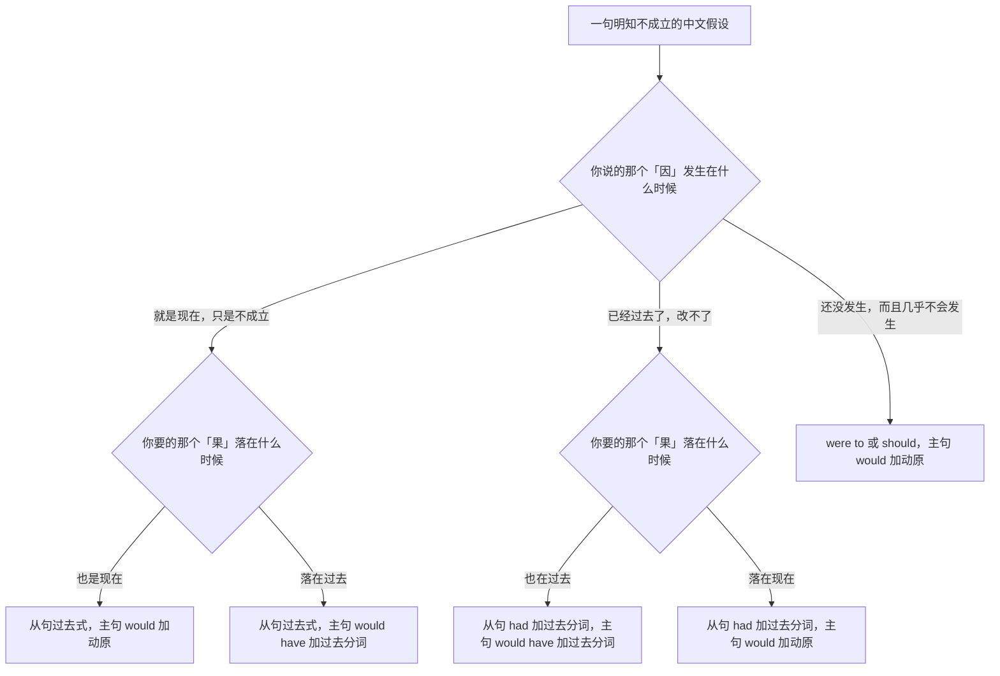
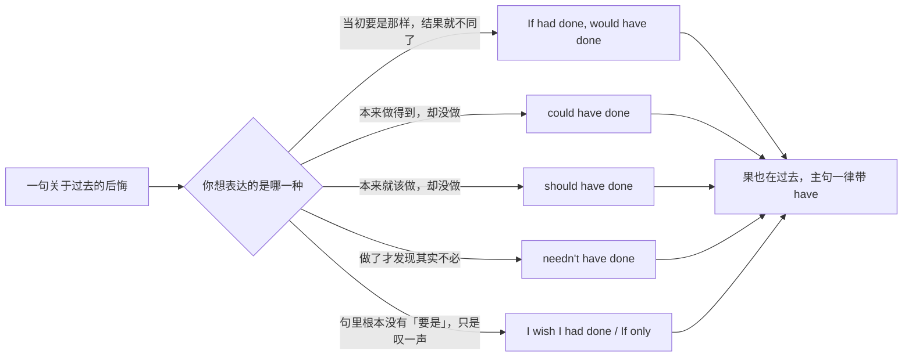
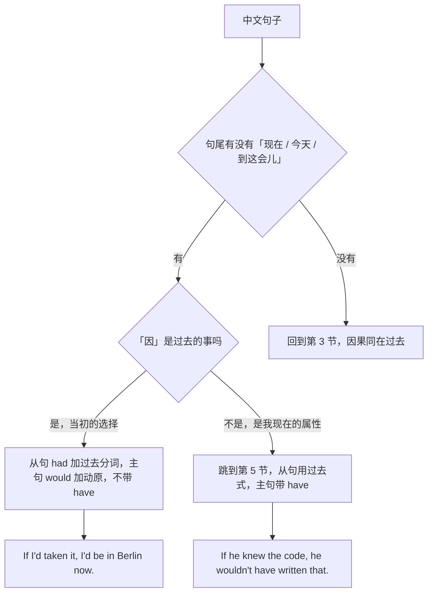
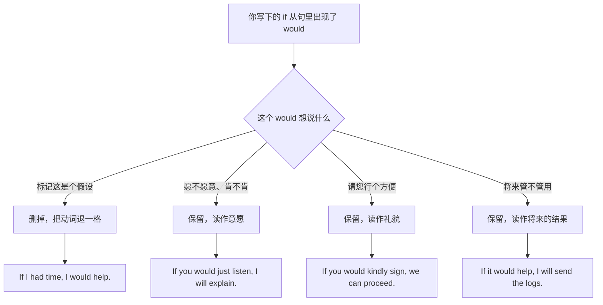
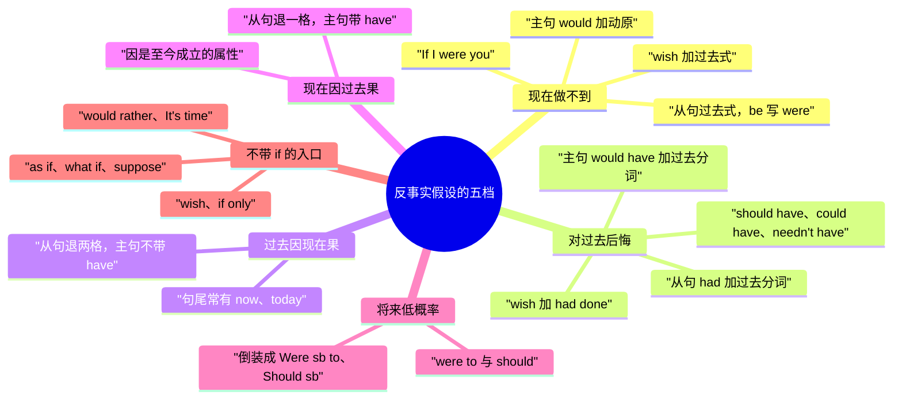

# 反事实假设：要是就好了、当初要是、混合时间线

> [!info] 本篇定位
>
> 这篇收「要是…就好了」「当初要是」「早知道」「本来可以」「就算当初…也不会」这一类**明知不成立还要说**的假设，共三十五条查询意图，每条给口语、书面、正式三档成品。
>
> 与本分类另外三篇的分工：说得出口的、真有可能发生的条件查 [[04.条件与假设/01.真实条件：如果就、只要、一旦、除非、前提是\|真实条件]]；不带 if 的「要不是」「否则」「那样的话」查 [[04.条件与假设/03.含蓄条件与省略倒装：要不是、否则、那样的话\|含蓄条件与省略倒装]]；「看情况」「取决于」查 [[04.条件与假设/04.取决与看情况：视…而定、说不好得看\|取决与看情况]]。这一篇只管**因和果各自落在时间轴哪一段**。
>
> 读完能查到：一句中文该退一格还是退两格、「当初要是…现在就…」这种因果不在同一段的句子怎么配形态、wish 后面跟什么、Were 和 Had 提前之后句子长什么样、「就算当初…也不会…」的完整成品。
>
> 谓语形态本身的推导过程不在这里，整套时间对照表指回 [[02.英语基础语法/10.特殊句型/02.虚拟语气详解\|虚拟语气详解]]。

---

## 1. 本篇导读：先定因在哪一段，再定果在哪一段

反事实假设难在两件事上，一件是中文毫无提示，另一件是英文要求两处同时变形。

中文说「要是我有时间就好了」和「当初要是我有时间就好了」，差别只在多了「当初」两个字，动词一模一样。英文里这两句连主句带从句四个位置全要改。更麻烦的是「当初要是听了劝，现在也不至于这么被动」——因落在过去，果落在现在，两个分句不能用同一套形态。

所以查这一篇的正确顺序不是先想语法，而是先回答两个问题：**你说的那个「因」发生在什么时候，你要的那个「果」落在什么时候。** 这两个答案交叉，就锁死了谓语形态。

### 1.1 五档时间指向总表

| 档位 | 中文长什么样 | 因（if 一侧） | 果（主句一侧） |
| --- | --- | --- | --- |
| 现在做不到 | 要是有…就好了、我要是你 | 过去式（be 一律 were） | would / could / might + 动原 |
| 对过去后悔 | 当初要是…、早知道就… | had + 过去分词 | would / could / might have + 过去分词 |
| 过去的因，眼下的果 | 当初要是…现在就… | had + 过去分词 | would + 动原（配 now、today） |
| 眼下的因，过去的果 | 他要是懂行，当初就不会… | 过去式 | would have + 过去分词 |
| 将来极低概率 | 万一真的…、假如哪天… | were to + 动原 / should + 动原 | would + 动原 |

这张表是全篇骨架。第 2 节到第 6 节各管一档，第 7 节处理「就算…也…」这种先让一步再否掉的说法，第 8 节收集不带 if 的四个入口（wish、if only、would rather、It's time），第 9 节把形态压成一张速查表加一份高错句清单。

### 1.2 从中文进的选择树

树只问两次，因在哪、果在哪，四个组合加一个将来档，正好是总表的五行。中间两条斜着走的分支（C2 和 D2）就是所谓的混合时间线——中文里最自然的那批句子，恰恰落在这两条斜线上，而背句型的人往往只背了 C1 和 D1 两条直线，一到斜线就卡住。

### 1.3 三个共用的口诀

> [!tip] 退格法
>
> 不必记「第二条件句」「第三条件句」这套编号，记一个动作：**往后退**。
>
> - 讲现在但不成立 → 从现在时退一格，变过去式
> - 讲过去但不成立 → 从过去时退一格，变过去完成
> - 主句配 would，果在现在就 `would + 动原`，果在过去就 `would have + 过去分词`
>
> 退格是唯一动作，退几格看你说的是哪一段时间。

> [!warning] 两条通用禁忌
>
> - ❌ ~~If I would have time, I would help.~~ ／ ✅ **If I had time, I would help.**（would 不进 if 从句，助动词只在主句出现一次）
> - ❌ ~~If I was you, I'd wait.~~ ／ ✅ **If I were you, I'd wait.**（这一套里 be 动词一律用 were，主语是 I、he、it 也不改）

> [!tip] 查法
>
> 先在中文里找那个「要是 / 当初 / 早知道 / 本来 / 万一 / 就算」，它决定你进哪一节；再看句子里有没有「现在」「今天」「到现在」这类词，有就说明果落在现在，去第 4 节；有「当时」「那会儿」就说明果落在过去。

---

## 2. 现在做不到：因和果都落在此刻

这一档对应的中文是「要是…就好了」「我要是你」「要是有…我就能…」。判断标准很简单：把假设去掉之后，剩下的那句陈述描述的是**现在的状况**，而且是不成立的现在。

从句一律退一格到过去式，be 动词一律写 were，主句配 `would / could / might + 动原`。三个情态各有分工：would 是纯粹的假想结果，could 强调「就能够」，might 留了不确定的余地。

### 2.1 要是有…就好了

中文触发语：要是…就好了 / 真希望 / 但愿 / 要是有…多好 / 可惜没有

| 档位 | 句架 | 例句 |
| --- | --- | --- |
| 口语 | I wish I had + sth | I wish I had more time for this. |
| 书面 | I wish + sb + 过去式 | I wish the API gave us a way to page through results. |
| 正式 | It would be preferable if + sb + 过去式 | It would be preferable if the schedule allowed for a second review. |

> [!warning] 错配警示
>
> - ❌ ~~I wish I have more time.~~ ／ ✅ **I wish I had more time.**（wish 后面的从句必须退一格，讲现在用过去式）
> - ❌ ~~I wish I would have more time.~~ ／ ✅ **I wish I had more time.**（wish 后不放 would have，那是把两套形态叠在一起）

- 同义入口：要是有…就好了 / 但愿有 / 真希望能有 / 可惜没有
- 语法归属：[[02.英语基础语法/10.特殊句型/02.虚拟语气详解\|wish 引导的宾语从句]]
- 场景实战：[[04.英语场景/05.高频实用表达句型框架/01.表达观点与态度的50个万能句型\|表达观点与态度]]

### 2.2 我要是你

中文触发语：我要是你 / 换了我 / 要是我的话 / 站在你的位置

| 档位 | 句架 | 例句 |
| --- | --- | --- |
| 口语 | If I were you, I'd + 动原 | If I were you, I'd sleep on it. |
| 书面 | In your position, I would + 动原 | In your position, I would push the release back by a week. |
| 正式 | Were I in your position, I would + 动原 | Were I in your position, I would seek written confirmation first. |

> [!warning] 错配警示
>
> - ❌ ~~If I was you, I'd tell him.~~ ／ ✅ **If I were you, I'd tell him.**（这是全篇最固定的一处，were 不能换成 was）
> - ❌ ~~If I were you, I will tell him.~~ ／ ✅ **If I were you, I'd tell him.**（从句退了一格，主句也必须跟着退，不能留 will）

- 同义入口：我要是你 / 换成我 / 要是我处在你的位置 / 依我看你不如
- 语法归属：[[02.英语基础语法/10.特殊句型/02.虚拟语气详解\|与现在事实相反的条件句]]
- 场景实战：[[04.英语场景/05.高频实用表达句型框架/02.建议请求邀请拒绝四大功能句型\|建议与劝告]]

### 2.3 要是有…我就能…

中文触发语：要是有…我就能 / 有…的话就好办了 / 手上要是有…

| 档位 | 句架 | 例句 |
| --- | --- | --- |
| 口语 | If I had + sth, I could + 动原 | If I had the credentials, I could just check it myself. |
| 书面 | If we had + sth, we would be able to + 动原 | If we had staging data, we would be able to reproduce it today. |
| 正式 | With + sth, sb would be in a position to + 动原 | With access to the production logs, we would be in a position to confirm this. |

> [!warning] 错配警示
>
> - ❌ ~~If I would have the credentials, I could check it.~~ ／ ✅ **If I had the credentials, I could check it.**（if 从句里不放 would）
> - ❌ ~~If I had the credentials, I can check it.~~ ／ ✅ **If I had the credentials, I could check it.**（主句的 can 也要退一格变 could）

- 同义入口：要是有…就能 / 只要有…我就 / 手上有…的话
- 语法归属：[[02.英语基础语法/07.助动词与情态动词/02.情态动词详解\|could 的假想用法]]
- 场景实战：[[04.英语场景/10.职场与商务场景实战/02.会议汇报与演示场景\|会议汇报与澄清]]

### 2.4 但愿他能 / 真希望他别

中文触发语：但愿他能 / 真希望他别再 / 他要是肯…就好了 / 你就不能…吗

| 档位 | 句架 | 例句 |
| --- | --- | --- |
| 口语 | I wish sb would + 动原 | I wish he would stop rewriting the same file. |
| 书面 | We wish sb would + 动原 | We wish the vendor would commit to a firm date. |
| 正式 | It would be appreciated if sb could + 动原 | It would be appreciated if the vendor could confirm a delivery date. |

> [!warning] 错配警示
>
> - ❌ ~~I wish he would be taller.~~ ／ ✅ **I wish he were taller.**（wish would 用来抱怨对方能改而不改的行为，改不了的属性用 were）
> - ❌ ~~I wish I would stop procrastinating.~~ ／ ✅ **I wish I could stop procrastinating.**（wish would 的主语不能是自己，自己做不到的事用 could）

- 同义入口：但愿他能 / 真希望他别再 / 他要是肯就好了 / 求他改改
- 语法归属：[[02.英语基础语法/10.特殊句型/02.虚拟语气详解\|wish 对将来的愿望]]
- 场景实战：[[04.英语场景/05.高频实用表达句型框架/03.同意反对让步转折句型库\|表达不满与异议]]

### 2.5 我巴不得 / 我宁可

中文触发语：我巴不得 / 恨不得 / 我宁可 / 我倒宁愿 / 与其…不如

| 档位 | 句架 | 例句 |
| --- | --- | --- |
| 口语 | I'd give anything to + 动原 | I'd give anything to skip this meeting. |
| 书面 | I would much rather + 动原 + than + 动原 | I would much rather rewrite the module than keep patching it. |
| 正式 | sb would sooner + 动原 + than + 动原 | We would sooner delay the release than ship a known data-loss bug. |

> [!warning] 错配警示
>
> - ❌ ~~I'd rather to rewrite it.~~ ／ ✅ **I'd rather rewrite it.**（would rather 后面直接跟动词原形，不带 to）
> - ❌ ~~I prefer to rewrite it than patch it.~~ ／ ✅ **I'd rather rewrite it than patch it.**（prefer 配 to，rather 配 than，两套搭配不能混着用）

- 同义入口：我巴不得 / 恨不得 / 宁可 / 宁愿 / 我倒希望
- 语法归属：[[02.英语基础语法/07.助动词与情态动词/03.情态动词的特殊句型\|would rather 句型]]
- 场景实战：[[04.英语场景/10.职场与商务场景实战/04.商务谈判合同与客户沟通\|谈判中的取舍表达]]

### 2.6 没有…的话就

中文触发语：没有…的话 / 要是没有 / 少了…就 / 缺了这个

| 档位 | 句架 | 例句 |
| --- | --- | --- |
| 口语 | Without + sth, we'd + 动原 | Without the cache, the page would take five seconds to load. |
| 书面 | If it weren't for + sth, sth would + 动原 | If it weren't for the cache layer, response times would be unacceptable. |
| 正式 | But for + sth, sth would + 动原 | But for the standby node, a single disk failure would take the service down. |

> [!warning] 错配警示
>
> - ❌ ~~If it wasn't for the cache, it would be slow.~~ ／ ✅ **If it weren't for the cache, it would be slow.**（这个固定式里的 be 永远写 weren't）
> - ❌ ~~Without the cache, the page will take five seconds.~~ ／ ✅ **Without the cache, the page would take five seconds.**（前半句已经是假设，主句不能留 will）

- 同义入口：没有…的话 / 要是没有 / 少了…就 / 亏得有
- 语法归属：[[02.英语基础语法/10.特殊句型/02.虚拟语气详解\|含蓄条件与介词短语条件]]
- 场景实战：[[04.条件与假设/03.含蓄条件与省略倒装：要不是、否则、那样的话\|要不是的完整清单]]

---

## 3. 对过去后悔：因和果都落在过去

这一档是中文里最常说也最常写错的一档。触发词是「当初」「早知道」「本来」「就不该」，共同点是：事情已经发生完了，怎么说都改不了，说出来只是为了表态。

从句退两格到 `had + 过去分词`，主句配 `would / could / should / might + have + 过去分词`。三个情态的分工比第 2 节更细：would have 是纯假想，could have 是「本来做得到却没做」，should have 是「本来该做却没做」，might have 是「说不定就」。

图里五条出路的形态各不相同，但右边汇到同一个终点：只要果落在过去，主句就必须带 have。这是判断这一整档的唯一硬指标——中文里「本来」「早该」「白…了」这些词一出现，英文那半句就跑不掉一个 have。

### 3.1 当初要是…就好了

中文触发语：当初要是…就好了 / 早知道就 / 我真后悔 / 那会儿要是

| 档位 | 句架 | 例句 |
| --- | --- | --- |
| 口语 | I wish I'd + 过去分词 | I wish I'd pushed back harder at the kickoff. |
| 书面 | If only we had + 过去分词 | If only we had frozen the schema before the demo. |
| 正式 | In hindsight, it would have been advisable to + 动原 | In hindsight, it would have been advisable to run a pilot first. |

> [!warning] 错配警示
>
> - ❌ ~~I wish I pushed back harder.~~ ／ ✅ **I wish I had pushed back harder.**（讲过去要退两格，只退一格会被读成「现在的我不够强硬」）
> - ❌ ~~I wish I would have pushed back.~~ ／ ✅ **I wish I had pushed back.**（wish 后面不放 would have）

- 同义入口：当初要是…就好了 / 早知道就 / 真后悔没 / 那会儿要是
- 语法归属：[[02.英语基础语法/10.特殊句型/02.虚拟语气详解\|与过去事实相反的假设]]
- 场景实战：[[04.英语场景/03.时态与语态句型框架/03.虚拟语气完全解析\|虚拟语气整体框架]]

### 3.2 早知道就

中文触发语：早知道 / 要是早知道 / 早知如此 / 当初知道的话

| 档位 | 句架 | 例句 |
| --- | --- | --- |
| 口语 | If I'd known ..., I would've + 过去分词 | If I'd known it was urgent, I'd have started yesterday. |
| 书面 | Had we known + 从句, we would have + 过去分词 | Had we known the vendor was short-staffed, we would have padded the estimate. |
| 正式 | Had this been known at the time, sth would have been + 过去分词 | Had this been known at the time, the contract would have been renegotiated. |

> [!warning] 错配警示
>
> - ❌ ~~If I would have known, I'd have started earlier.~~ ／ ✅ **If I had known, I'd have started earlier.**（口语里能听到 would have 进从句，但书面一律算错）
> - ❌ ~~If I had known, I would tell you.~~ ／ ✅ **If I had known, I would have told you.**（告诉这个动作也在过去，主句要带 have）

- 同义入口：早知道 / 要是早知道 / 早知如此 / 当时要是清楚
- 语法归属：[[02.英语基础语法/10.特殊句型/03.倒装句结构\|Had 提前的省略倒装]]
- 场景实战：[[04.英语场景/10.职场与商务场景实战/02.会议汇报与演示场景\|复盘与事后说明]]

### 3.3 我就不该 / 早该

中文触发语：我就不该 / 早该 / 本来应该 / 当初就不该 / 何必当初

| 档位 | 句架 | 例句 |
| --- | --- | --- |
| 口语 | I shouldn't have + 过去分词 | I shouldn't have merged that on a Friday. |
| 书面 | We should have + 过去分词 + before + 动名词 | We should have run a load test before switching traffic. |
| 正式 | sth ought to have been + 过去分词 | The change ought to have been reviewed by a second engineer. |

> [!warning] 错配警示
>
> - ❌ ~~I shouldn't merge it yesterday.~~ ／ ✅ **I shouldn't have merged it yesterday.**（should 后面不能直接接过去式，过去的懊悔靠 have 加过去分词）
> - ❌ ~~I should not merged it.~~ ／ ✅ **I should not have merged it.**（have 不能省，省了整句就没有时间标记了）

- 同义入口：我就不该 / 早该 / 本来应该 / 何必当初 / 当时就不对
- 语法归属：[[02.英语基础语法/07.助动词与情态动词/02.情态动词详解\|情态动词加完成式]]
- 场景实战：[[04.英语场景/10.职场与商务场景实战/02.会议汇报与演示场景\|事故复盘中的自陈]]

### 3.4 本来可以

中文触发语：本来可以 / 本来能 / 原本能 / 差点就能 / 完全可以

| 档位 | 句架 | 例句 |
| --- | --- | --- |
| 口语 | We could have + 过去分词 | We could have caught this in review. |
| 书面 | sth could have been + 过去分词 | The regression could have been detected by a single integration test. |
| 正式 | sth might well have been + 过去分词 | The incident might well have been avoided had the alert threshold been lower. |

> [!warning] 错配警示
>
> - ❌ ~~We could catch this in review.~~ ／ ✅ **We could have caught this in review.**（不带 have 的 could 说的是现在或将来的能力，不是过去错失的机会）
> - ❌ ~~It can have been avoided.~~ ／ ✅ **It could have been avoided.**（can 不进这套惋惜式，只有 could 能）

- 同义入口：本来可以 / 本来能 / 原本能 / 完全来得及 / 明明可以
- 语法归属：[[02.英语基础语法/07.助动词与情态动词/02.情态动词详解\|could have done 的两种读法]]
- 场景实战：[[04.英语场景/03.时态与语态句型框架/04.情态动词句型框架\|情态动词句型框架]]

### 3.5 白做了 / 其实不必

中文触发语：白…了 / 其实不必 / 早知道就不用 / 白忙一场 / 多此一举

| 档位 | 句架 | 例句 |
| --- | --- | --- |
| 口语 | I needn't have + 过去分词 | I needn't have stayed late; the review slipped to Monday anyway. |
| 书面 | As it turned out, there was no need to + 动原 | As it turned out, there was no need to rebuild the whole index. |
| 正式 | sth need not have been + 过去分词 | The dataset need not have been regenerated in full. |

> [!warning] 错配警示
>
> - ❌ ~~I didn't need to stay late, so I stayed until nine.~~ ／ ✅ **I needn't have stayed late.**（didn't need to 是当时就知道不必所以没做，needn't have done 是做了才发现白做，两句说的是两件事）
> - ❌ ~~I don't need to stay late yesterday.~~ ／ ✅ **I needn't have stayed late yesterday.**（一般现在式装不下过去的时间词）

- 同义入口：白…了 / 其实不必 / 早知道就不用 / 白折腾 / 多此一举
- 语法归属：[[02.英语基础语法/07.助动词与情态动词/02.情态动词详解\|needn't have done 与 didn't need to]]
- 场景实战：[[04.英语场景/10.职场与商务场景实战/02.会议汇报与演示场景\|工作复盘]]

### 3.6 当时要是…就不会

中文触发语：当时要是…就不会 / 早点…也不至于 / 但凡当初 / 只要那会儿

| 档位 | 句架 | 例句 |
| --- | --- | --- |
| 口语 | If we'd + 过去分词, it wouldn't have + 过去分词 | If we'd pinned the version, none of this would have happened. |
| 书面 | If sth had been + 过去分词, sth would not have + 过去分词 | If the migration had been run in a transaction, the partial write would not have occurred. |
| 正式 | Had sth been + 过去分词, sth would not have + 过去分词 | Had the clause been included, the dispute would not have arisen. |

> [!warning] 错配警示
>
> - ❌ ~~If we would have pinned it, none of this would happen.~~ ／ ✅ **If we had pinned it, none of this would have happened.**（两处都错：从句放了 would，主句漏了 have）
> - ❌ ~~If we had pinned it, it won't happen.~~ ／ ✅ **If we had pinned it, it wouldn't have happened.**（从句退了两格，主句不能留在一般将来）

- 同义入口：当时要是…就不会 / 早点…也不至于 / 但凡当初 / 那会儿只要
- 语法归属：[[02.英语基础语法/09.从句体系/04.状语从句详解\|条件状语从句]]
- 场景实战：[[04.英语场景/03.时态与语态句型框架/03.虚拟语气完全解析\|条件句三线对照]]

### 3.7 当初怎么就没想到

中文触发语：当初怎么就没 / 我当时是怎么想的 / 现在回头看 / 早该想到

| 档位 | 句架 | 例句 |
| --- | --- | --- |
| 口语 | Why didn't I just + 动原? | Why didn't I just ask before rewriting it? |
| 书面 | With hindsight, the obvious move would have been to + 动原 | With hindsight, the obvious move would have been to ask the owner first. |
| 正式 | In retrospect, a more prudent course would have been to + 动原 | In retrospect, a more prudent course would have been to defer the migration. |

> [!warning] 错配警示
>
> - ❌ ~~In hindsight, we should ask first.~~ ／ ✅ **In hindsight, we should have asked first.**（hindsight、in retrospect、looking back 评的都是已经做完的事，后面跟的动作要用过去式或完成式）
> - ❌ ~~Looking back, I would do it differently.~~ ／ ✅ **Looking back, I would have done it differently.**（回头看的是已经做完的事，主句要带 have）

- 同义入口：当初怎么就没 / 我当时是怎么想的 / 现在回头看 / 事后想想
- 语法归属：[[02.英语基础语法/07.助动词与情态动词/02.情态动词详解\|would have done 的假想用法]]
- 场景实战：[[04.英语场景/07.社交交际场景实战/01.交友聚会与闲聊场景\|闲聊里的自嘲]]

---

## 4. 过去的因，眼下的果：当初要是…现在就…

中文里这类句子极常见：「当初要是接了那个 offer，现在早在柏林了」「早点写文档，现在也不至于扯皮」。它的特征是句尾往往有一个「现在」「今天」「到这会儿」。

因在过去，从句退两格用 `had + 过去分词`；果在现在，主句不带 have，直接 `would + 动原`。**主句一带 have，句子的意思就被拽回过去，与「现在」冲突。** 这是这一节唯一要盯住的地方。

图的入口是一个纯文字信号——句尾那个时间词。中文母语者写这类句子时几乎不会漏掉「现在」两个字，所以这个信号相当可靠：只要它在，主句就把 have 去掉。反过来，如果中文里根本没有「现在」，句子多半属于第 3 节。

### 4.1 当初要是…现在就

中文触发语：当初要是…现在就 / 早点…现在早就 / 那时候要是…这会儿

| 档位 | 句架 | 例句 |
| --- | --- | --- |
| 口语 | If I'd + 过去分词, I'd be + 状态 now | If I'd taken that offer, I'd be in Berlin right now. |
| 书面 | If we had + 过去分词, we would now have + sth | If we had invested in tests early, we would now have a release we could trust. |
| 正式 | Had sth been + 过去分词, sth would today be + 状态 | Had the framework been adopted at the outset, the platform would today be far easier to extend. |

> [!warning] 错配警示
>
> - ❌ ~~If I'd taken that offer, I would have been in Berlin right now.~~ ／ ✅ **If I'd taken that offer, I'd be in Berlin right now.**（now 把果钉在现在，主句就不能带 have）
> - ❌ ~~If I took that offer, I'd be in Berlin now.~~ ／ ✅ **If I'd taken that offer, I'd be in Berlin now.**（因是当年那次选择，从句要退两格）

- 同义入口：当初要是…现在就 / 早点…现在早 / 那时候要是…这会儿 / 当年如果
- 语法归属：[[02.英语基础语法/10.特殊句型/02.虚拟语气详解\|从句与过去相反、主句与现在相反]]
- 场景实战：[[04.英语场景/07.社交交际场景实战/01.交友聚会与闲聊场景\|人生选择闲聊]]

### 4.2 早知道现在也不至于

中文触发语：早知道现在也不至于 / 现在就不会这么被动 / 也不用现在这样

| 档位 | 句架 | 例句 |
| --- | --- | --- |
| 口语 | If we'd + 过去分词, we wouldn't be + 动名词 now | If we'd written it down, we wouldn't be arguing about it now. |
| 书面 | Had we + 过去分词, we would not be + 动名词 today | Had we documented the rollback path, we would not be improvising today. |
| 正式 | Had sth been + 过去分词 earlier, sth would not now be + 状态 | Had the requirement been captured earlier, the project would not now be behind schedule. |

> [!warning] 错配警示
>
> - ❌ ~~If we'd written it down, we wouldn't have been arguing about it now.~~ ／ ✅ **If we'd written it down, we wouldn't be arguing about it now.**（争的是此刻，主句去掉 have）
> - ❌ ~~If we write it down, we wouldn't be arguing now.~~ ／ ✅ **If we'd written it down, we wouldn't be arguing now.**（写文档这个动作在过去，从句必须退两格）

- 同义入口：早知道现在也不至于 / 现在就不会这么被动 / 也不用像现在这样 / 今天也不会
- 语法归属：[[02.英语基础语法/07.助动词与情态动词/03.情态动词的特殊句型\|混合时态的虚拟语气]]
- 场景实战：[[04.英语场景/10.职场与商务场景实战/02.会议汇报与演示场景\|复盘中的追责与自省]]

### 4.3 当初没…现在就还

中文触发语：当初没…现在就还 / 要是当初留着 / 没动那笔…现在还有

| 档位 | 句架 | 例句 |
| --- | --- | --- |
| 口语 | If we hadn't + 过去分词, we'd still have + sth | If we hadn't burned the buffer in Q1, we'd still have two weeks. |
| 书面 | Had we not + 过去分词, sth would still be + 状态 | Had we not rewritten the parser, the service would still be on the old runtime. |
| 正式 | In the absence of that decision, sth would remain + 状态 | In the absence of that decision, the legacy system would remain in production today. |

> [!warning] 错配警示
>
> - ❌ ~~If we didn't burn the buffer, we'd still have two weeks.~~ ／ ✅ **If we hadn't burned the buffer, we'd still have two weeks.**（因在上季度，从句退两格）
> - ❌ ~~Had not we rewritten the parser, ...~~ ／ ✅ **Had we not rewritten the parser, ...**（倒装之后否定词跟在主语后面，不跟 Had）

- 同义入口：当初没…现在就还 / 要是当初留着 / 那笔没动的话 / 不折腾的话现在
- 语法归属：[[02.英语基础语法/10.特殊句型/03.倒装句结构\|Had 提前后的否定位置]]
- 场景实战：[[04.英语场景/10.职场与商务场景实战/04.商务谈判合同与客户沟通\|资源与预算的复盘]]

### 4.4 要不是当年…哪有现在

中文触发语：要不是当年 / 多亏了当初 / 幸亏那时候 / 没有当年的…哪有今天

| 档位 | 句架 | 例句 |
| --- | --- | --- |
| 口语 | If it hadn't been for + sth, we wouldn't be + 状态 | If it hadn't been for that one customer, we wouldn't be having this conversation. |
| 书面 | Without + 过去的事, sb would not be + 状态 today | Without that early funding round, the team would not be twenty people today. |
| 正式 | But for + sth, sth would not + 动原 | But for the licensing agreement signed in 2019, the company would not occupy its present position. |

> [!warning] 错配警示
>
> - ❌ ~~If it wasn't for that customer, we wouldn't be here.~~ ／ ✅ **If it hadn't been for that customer, we wouldn't be here.**（那位客户是当年的事，用 hadn't been；weren't 只用于讲现在长期存在的因素）
> - ❌ ~~But for the agreement, the company would not have occupied its present position.~~ ／ ✅ **But for the agreement, the company would not occupy its present position.**（present position 是眼下的状态，主句不带 have）

- 同义入口：要不是当年 / 多亏了当初 / 幸亏那时候 / 没有当年的…哪有今天
- 语法归属：[[02.英语基础语法/10.特殊句型/02.虚拟语气详解\|but for 与 without 的含蓄条件]]
- 场景实战：[[04.条件与假设/03.含蓄条件与省略倒装：要不是、否则、那样的话\|要不是的完整清单]]

---

## 5. 眼下的因，过去的果：他要是懂行就不会那么写

这一档是上一节的镜像，也是五档里最容易被忽略的一档。中文长这样：「他要是懂行，当初就不会那么写」「这工具靠谱的话，上周就该报出来了」。

判断标准：那个「因」不是一次性事件，而是一个**到现在还成立的属性或状态**——他不懂行，这一点昨天成立今天也成立。所以从句只退一格用过去式；而果落在过去，主句要 `would have + 过去分词`。

用第 4 节的图从右边那条斜线进来就是这一节。两节合起来才是完整的混合时间线：一条从过去指向现在，一条从现在指回过去。

### 5.1 我要是那种人，当初就

中文触发语：我要是那种人 / 我要是计较的话 / 换成我这种性格 / 我这人要是

| 档位 | 句架 | 例句 |
| --- | --- | --- |
| 口语 | If I were + 类型, I'd have + 过去分词 | If I were the sort to hold a grudge, I'd have said something at the time. |
| 书面 | If sth were + 属性, sth would have + 过去分词 | If the tool were reliable, it would have caught this last week. |
| 正式 | Were sth + 属性, sth would have + 过去分词 | Were the specification unambiguous, the two teams would have produced compatible implementations. |

> [!warning] 错配警示
>
> - ❌ ~~If I was the sort to hold a grudge, I'd have said something.~~ ／ ✅ **If I were the sort to hold a grudge, I'd have said something.**（be 一律写 were）
> - ❌ ~~If the tool were reliable, it would catch this last week.~~ ／ ✅ **If the tool were reliable, it would have caught this last week.**（last week 把果钉在过去，主句必须带 have）

- 同义入口：我要是那种人 / 我要是计较的话 / 换成我这种性格 / 我这人要是
- 语法归属：[[02.英语基础语法/10.特殊句型/02.虚拟语气详解\|从句与现在相反、主句与过去相反]]
- 场景实战：[[04.英语场景/07.社交交际场景实战/01.交友聚会与闲聊场景\|谈性格与处事方式]]

### 5.2 他要是懂行就不会那么写

中文触发语：他要是懂行 / 要是真明白 / 他但凡了解一点 / 内行人不会

| 档位 | 句架 | 例句 |
| --- | --- | --- |
| 口语 | If sb knew + sth, sb wouldn't have + 过去分词 | If he knew the codebase, he wouldn't have put the retry there. |
| 书面 | If sb understood sth, sb would not have + 过去分词 | If the vendor understood our load pattern, they would not have proposed that plan. |
| 正式 | Were sb familiar with sth, sth would not have been + 过去分词 | Were the auditor familiar with the domain, such an objection would not have been raised. |

> [!warning] 错配警示
>
> - ❌ ~~If he knows the codebase, he wouldn't have put the retry there.~~ ／ ✅ **If he knew the codebase, he wouldn't have put the retry there.**（从句退一格用 knew，表示他到现在也不懂）
> - ❌ ~~If he knew the codebase, he wouldn't put the retry there.~~ ／ ✅ **If he knew the codebase, he wouldn't have put the retry there.**（那行代码已经写下了，果在过去，主句必须带 have）

- 同义入口：他要是懂行 / 要是真明白 / 他但凡了解一点 / 内行人不会这么干
- 语法归属：[[02.英语基础语法/09.从句体系/04.状语从句详解\|条件从句与主句的时间错位]]
- 场景实战：[[04.英语场景/10.职场与商务场景实战/02.会议汇报与演示场景\|代码评审中的评价]]

### 5.3 换了别人早就

中文触发语：换了别人早就 / 要是我早就 / 但凡换个人 / 稍微有点经验的

| 档位 | 句架 | 例句 |
| --- | --- | --- |
| 口语 | Anyone else would have + 过去分词 | Anyone else would have walked out by then. |
| 书面 | A more experienced team would have + 过去分词 | A more experienced team would have caught this in design review. |
| 正式 | A reasonable person in that position would have + 过去分词 | A reasonable person in that position would have sought clarification before signing. |

> [!warning] 错配警示
>
> - ❌ ~~Anyone else would walk out by then.~~ ／ ✅ **Anyone else would have walked out by then.**（by then 指过去某个时点，主句要带 have）
> - ❌ ~~If I am you, I would have refused.~~ ／ ✅ **If I were you, I would have refused.**（从句一定要退格，am 不能留）

- 同义入口：换了别人早就 / 要是我早就 / 但凡换个人 / 稍微有点经验的都不会
- 语法归属：[[02.英语基础语法/10.特殊句型/02.虚拟语气详解\|含蓄条件藏在主语里]]
- 场景实战：[[04.英语场景/05.高频实用表达句型框架/03.同意反对让步转折句型库\|评价与反驳]]

---

## 6. 将来极低概率：万一真有那么一天

前五节讲的都是已经不成立的事，这一节讲的是**还没发生、而且说话人认为几乎不会发生**的事。中文标志是「万一」「假如哪天」「真要是」「就算真的」。

这一档与第 01 篇的真实条件只隔一层：同一个「万一」，如果你觉得这事有实际发生的可能，就走 `if + 一般现在时`，属于 [[04.条件与假设/01.真实条件：如果就、只要、一旦、除非、前提是\|真实条件]]；如果你只是走个流程、口头留个预案，才用这一节的 `were to` 和 `should`。

### 6.1 万一真的

中文触发语：万一真的 / 真要是 / 假如真出现 / 一旦真的发生

| 档位 | 句架 | 例句 |
| --- | --- | --- |
| 口语 | If sb were to + 动原, ... would ... | If the vendor were to pull out tomorrow, we'd be stuck. |
| 书面 | Were sb to + 动原, sth would + 动原 | Were the regulator to change the rule, the entire pipeline would need rebuilding. |
| 正式 | In the unlikely event that sth should + 动原, ... would ... | In the unlikely event that the primary data centre should fail, traffic would be routed to the secondary site. |

> [!warning] 错配警示
>
> - ❌ ~~If the vendor would pull out, we'd be stuck.~~ ／ ✅ **If the vendor were to pull out, we'd be stuck.**（if 从句不放 would，低概率将来用 were to）
> - ❌ ~~Were the regulator change the rule, ...~~ ／ ✅ **Were the regulator to change the rule, ...**（were 提前之后 to 不能丢）

- 同义入口：万一真的 / 真要是 / 假如真出现 / 一旦真的发生 / 哪天真
- 语法归属：[[02.英语基础语法/10.特殊句型/02.虚拟语气详解\|were to 的将来假设]]
- 场景实战：[[04.英语场景/10.职场与商务场景实战/04.商务谈判合同与客户沟通\|风险条款的口头说明]]

### 6.2 万一…（留预案）

中文触发语：万一 / 要是碰巧 / 如果真遇到 / 一旦出现

| 档位 | 句架 | 例句 |
| --- | --- | --- |
| 口语 | If you should + 动原, ... | If you should run into trouble, just ping me. |
| 书面 | Should + sb + 动原, sb will + 动原 | Should the build fail overnight, the on-call engineer will be paged. |
| 正式 | Should sth arise, sth shall + 动原 | Should any discrepancy arise, the English version shall prevail. |

> [!warning] 错配警示
>
> - ❌ ~~Should the build fails overnight, ...~~ ／ ✅ **Should the build fail overnight, ...**（should 后面接动词原形，不随主语变形）
> - ❌ ~~If should the build fail, ...~~ ／ ✅ **Should the build fail, ...**（用了倒装就不再带 if，两者只能留一个）

- 同义入口：万一 / 要是碰巧 / 如果真遇到 / 一旦出现 / 若有
- 语法归属：[[02.英语基础语法/10.特殊句型/03.倒装句结构\|Should 提前的条件倒装]]
- 场景实战：[[04.条件与假设/01.真实条件：如果就、只要、一旦、除非、前提是\|真实条件里的万一]]

### 6.3 假如我哪天

中文触发语：假如我哪天 / 我要是真走了 / 万一有一天我 / 真到了那一步

| 档位 | 句架 | 例句 |
| --- | --- | --- |
| 口语 | If I were ever to + 动原, I'd + 动原 | If I were ever to leave, I'd give three months' notice. |
| 书面 | Were I ever to + 动原, I would + 动原 | Were I ever to take on that role, I would want a clear mandate. |
| 正式 | Should the occasion ever arise, sb would + 动原 | Should the occasion ever arise, the board would be consulted in advance. |

> [!warning] 错配警示
>
> - ❌ ~~If I would ever leave, I'd give notice.~~ ／ ✅ **If I were ever to leave, I'd give notice.**（从句用 were to，不用 would）
> - ❌ ~~If I ever leave, I would give three months' notice.~~ ／ ✅ **If I ever leave, I'll give three months' notice.**（一旦从句用了一般现在时，整句就变回真实条件，主句配 will）

- 同义入口：假如我哪天 / 我要是真走了 / 万一有一天我 / 真到了那一步
- 语法归属：[[02.英语基础语法/07.助动词与情态动词/03.情态动词的特殊句型\|与将来事实相反的虚拟]]
- 场景实战：[[04.英语场景/10.职场与商务场景实战/01.求职简历面试与Offer谈判\|离职与去留话题]]

### 6.4 就算真…也

中文触发语：就算真 / 哪怕真的 / 即便真到那一步 / 真给了也

| 档位 | 句架 | 例句 |
| --- | --- | --- |
| 口语 | Even if sb + 过去式, it wouldn't + 动原 | Even if they doubled the budget, it wouldn't buy us time. |
| 书面 | Even if sth were to + 动原, sth would still + 动原 | Even if the vendor were to deliver early, we would still miss the window. |
| 正式 | Even were sth + 过去分词 tomorrow, sth would + 动原 | Even were the funding approved tomorrow, procurement would take a further quarter. |

> [!warning] 错配警示
>
> - ❌ ~~Even if they will double the budget, it wouldn't help.~~ ／ ✅ **Even if they doubled the budget, it wouldn't help.**（从句不放 will，退一格用过去式）
> - ❌ ~~Even if they doubled the budget, it won't buy us time.~~ ／ ✅ **Even if they doubled the budget, it wouldn't buy us time.**（前后档位要一致，从句退了主句也得退）

- 同义入口：就算真 / 哪怕真的 / 即便真到那一步 / 真给了也没用
- 语法归属：[[02.英语基础语法/09.从句体系/04.状语从句详解\|让步状语从句]]
- 场景实战：[[04.英语场景/05.高频实用表达句型框架/03.同意反对让步转折句型库\|让步与转折句型库]]

---

## 7. 就算当初…也不会…：先让一步，再全盘否掉

这是反事实里最难拼的一类句子，因为它同时装了两层意思：**先承认一个不成立的假设，再否认它会带来任何改变。** 中文说得很轻松——「就算当初早点发现，也来不及了」——英文却要在两个分句里各配一套形态。

拼法只有一条：`even if` 后面用第 3 节到第 6 节里对应那一档的从句形态，主句照旧配 would，果在过去就带 have。让步不改变形态规则，只是把「因」换成了「哪怕成立也没用」。

### 7.1 就算当初…也不会

中文触发语：就算当初 / 哪怕早点 / 即便那时候 / 就是提前知道了也

| 档位 | 句架 | 例句 |
| --- | --- | --- |
| 口语 | Even if we'd + 过去分词, it wouldn't have + 过去分词 | Even if we'd caught it earlier, it wouldn't have changed the outcome. |
| 书面 | Even if sth had been + 过去分词, sb would not have + 过去分词 | Even if the alert had fired, the on-call engineer would not have had time to react. |
| 正式 | Even had sth been + 过去分词, sth would not have been + 过去分词 | Even had the clause been invoked, the loss would not have been recovered. |

> [!warning] 错配警示
>
> - ❌ ~~Even if we caught it earlier, it wouldn't have changed anything.~~ ／ ✅ **Even if we'd caught it earlier, it wouldn't have changed anything.**（因在过去，从句要退两格）
> - ❌ ~~Even we had caught it earlier, nothing would have changed.~~ ／ ✅ **Even if we had caught it earlier, nothing would have changed.**（even 自己不能引导从句，必须配 if 或 though）

- 同义入口：就算当初 / 哪怕早点 / 即便那时候 / 提前知道了也一样
- 语法归属：[[02.英语基础语法/09.从句体系/04.状语从句详解\|even if 引导的让步条件]]
- 场景实战：[[04.英语场景/10.职场与商务场景实战/02.会议汇报与演示场景\|事故复盘中的免责陈述]]

### 7.2 就算现在…也没用

中文触发语：就算现在 / 这会儿再…也 / 眼下再怎么…也 / 加人也没用

| 档位 | 句架 | 例句 |
| --- | --- | --- |
| 口语 | Even if we + 过去式 now, it wouldn't + 动原 | Even if we threw four more people at it now, it wouldn't land on time. |
| 书面 | Even if sb + 过去式, sth would make little difference | Even if we cut the scope in half, the date would move very little. |
| 正式 | Even if such measures were taken, sth would remain + 状态 | Even if such measures were taken, the underlying constraint would remain. |

> [!warning] 错配警示
>
> - ❌ ~~Even if we throw four more people at it, it wouldn't land on time.~~ ／ ✅ **Even if we threw four more people at it, it wouldn't land on time.**（主句退了格，从句也要退，两半必须同档）
> - ❌ ~~Even if we cut the scope, the date will not move.~~ ／ ✅ **Even if we cut the scope, the date would not move.**（这句说的是假想，不是承诺，主句用 would）

- 同义入口：就算现在 / 这会儿再…也 / 眼下再怎么…也 / 补人也来不及
- 语法归属：[[02.英语基础语法/10.特殊句型/02.虚拟语气详解\|让步式虚拟条件]]
- 场景实战：[[04.英语场景/10.职场与商务场景实战/02.会议汇报与演示场景\|排期沟通]]

### 7.3 换谁都一样

中文触发语：换谁都一样 / 谁来也没用 / 换个人也是这个结果 / 不怪任何人

| 档位 | 句架 | 例句 |
| --- | --- | --- |
| 口语 | It wouldn't have mattered who + 过去式 | It wouldn't have mattered who was on call. |
| 书面 | No one could have + 过去分词 | No one could have prevented the outage with the information available at the time. |
| 正式 | The outcome would have been the same regardless of + 名词 | The outcome would have been the same regardless of who had been in charge. |

> [!warning] 错配警示
>
> - ❌ ~~Nobody can prevent it at that time.~~ ／ ✅ **Nobody could have prevented it at the time.**（讲过去做不到的事，用 could have 加过去分词）
> - ❌ ~~It doesn't matter who was on call.~~ ／ ✅ **It wouldn't have mattered who was on call.**（前者是在陈述规则，后者才是在为已发生的事开脱）

- 同义入口：换谁都一样 / 谁来也没用 / 换个人也是这个结果 / 这事怪不到人头上
- 语法归属：[[02.英语基础语法/07.助动词与情态动词/02.情态动词详解\|could have done 的否定式]]
- 场景实战：[[04.英语场景/10.职场与商务场景实战/02.会议汇报与演示场景\|责任归属的表述]]

### 7.4 再怎么…也不会

中文触发语：再怎么…也不会 / 无论怎么…都 / 就是再小心也 / 做到头也就

| 档位 | 句架 | 例句 |
| --- | --- | --- |
| 口语 | No matter how much sb + 过去式, sth wouldn't have + 过去分词 | No matter how much we tested, we wouldn't have hit that path. |
| 书面 | However carefully sth had been + 过去分词, sth would still have + 过去分词 | However carefully the migration had been planned, some downtime would still have been necessary. |
| 正式 | Whatever steps had been taken, sth could not have been + 过去分词 | Whatever steps had been taken, the failure could not have been averted entirely. |

> [!warning] 错配警示
>
> - ❌ ~~No matter how we test, we wouldn't have hit that path.~~ ／ ✅ **No matter how much we tested, we wouldn't have hit that path.**（说的是当时的测试，从句要退格；how much 修饰程度，how 单用意思变成方式）
> - ❌ ~~However careful the migration had been planned, ...~~ ／ ✅ **However carefully the migration had been planned, ...**（修饰的是 planned 这个动作，用副词）

- 同义入口：再怎么…也不会 / 无论怎么…都 / 就是再小心也 / 做到头也就那样
- 语法归属：[[02.英语基础语法/09.从句体系/04.状语从句详解\|no matter 与 however 引导的让步]]
- 场景实战：[[05.让步、转折与对比/01.虽然但是：让步的六种入口与语域分档\|让步的六种入口]]

### 7.5 就算是这样我还是

中文触发语：就算是这样我还是 / 即便如此 / 重来一次我也 / 换我还是这么干

| 档位 | 句架 | 例句 |
| --- | --- | --- |
| 口语 | Even so, I'd still + 动原 | Even so, I'd still do it the same way. |
| 书面 | That said, we would still have + 过去分词 | That said, we would still have chosen the same vendor. |
| 正式 | Notwithstanding the above, the decision would not have been materially different | Notwithstanding the above, the decision would not have been materially different. |

> [!warning] 错配警示
>
> - ❌ ~~Even so, I will still do it the same way.~~ ／ ✅ **Even so, I'd still do it the same way.**（说的是假想中的重来一次，主句用 would）
> - ❌ ~~Even though so, we would have chosen them again.~~ ／ ✅ **Even so, we would have chosen them again.**（even so 是固定副词短语，中间不能塞 though）

- 同义入口：就算是这样我还是 / 即便如此 / 重来一次我也 / 换我还是这么干
- 语法归属：[[02.英语基础语法/10.特殊句型/05.省略与替代\|so 的回指用法]]
- 场景实战：[[05.让步、转折与对比/02.话虽如此、退一步说、表面上实际上：软化与反预期\|话虽如此与退一步说]]

---

## 8. 不带 if 的四个入口：wish、if only、would rather、It's time

中文里表遗憾常常根本不出现「如果」两个字——「真希望」「早该」「我宁愿你」都是直接说的。这四个入口在英文里各有固定形态，共同点是**后面的从句一律退格**，退几格照样看你说的是哪一段时间。

| 入口 | 讲现在 | 讲过去 | 讲对方该改的行为 |
| --- | --- | --- | --- |
| wish | wish + 过去式 | wish + had done | wish + would do |
| if only | if only + 过去式 | if only + had done | if only + would do |
| would rather | would rather + 过去式 | would rather + had done | 不适用 |
| It's time | It's time + 过去式 | 不适用 | 不适用 |

这张表是这一节的骨架，四行的第一列写法完全一样，都是退一格；差别在第二列和第三列谁有谁没有。

### 8.1 真希望 / 但愿

中文触发语：真希望 / 但愿 / 我倒希望 / 要是能…就好了

| 档位 | 句架 | 例句 |
| --- | --- | --- |
| 口语 | I wish I knew + 疑问词从句 | I wish I knew why the job keeps retrying. |
| 书面 | We wish we had + 过去分词 | We wish we had flagged the dependency sooner. |
| 正式 | It is regrettable that sth was not + 过去分词 | It is regrettable that the risk was not identified during review. |

> [!warning] 错配警示
>
> - ❌ ~~I wish I know why it keeps retrying.~~ ／ ✅ **I wish I knew why it keeps retrying.**（wish 后面的从句退一格，但从句里再套的小句子不用跟着退）
> - ❌ ~~I wish you will come to the review.~~ ／ ✅ **I wish you would come to the review.**（wish 后不接 will，将来意愿用 would）

- 同义入口：真希望 / 但愿 / 我倒希望 / 要是能…就好了 / 可惜不能
- 语法归属：[[02.英语基础语法/09.从句体系/03.名词性从句详解\|wish 后的宾语从句]]
- 场景实战：[[04.英语场景/05.高频实用表达句型框架/01.表达观点与态度的50个万能句型\|表达遗憾]]

### 8.2 要是…该多好

中文触发语：要是…该多好 / 但凡有 / 哪怕…也好 / 怎么就没有

| 档位 | 句架 | 例句 |
| --- | --- | --- |
| 口语 | If only there were + sth | If only there were a way to test this locally. |
| 书面 | If only sth had been + 过去分词 | If only the logs had been retained for another week. |
| 正式 | Had there been + sth, sth would have been + 过去分词 | Had there been any indication of this, the release would have been held. |

> [!warning] 错配警示
>
> - ❌ ~~If only I have known about it.~~ ／ ✅ **If only I had known about it.**（if only 后面和 wish 一样退格，讲过去退两格）
> - ❌ ~~If only there is a way to test this locally.~~ ／ ✅ **If only there were a way to test this locally.**（if only 引出的就是不成立的事，there is 要退成 there were）

- 同义入口：要是…该多好 / 但凡有 / 哪怕…也好 / 怎么就没有 / 可惜就差这个
- 语法归属：[[02.英语基础语法/10.特殊句型/02.虚拟语气详解\|if only 的感叹式]]
- 场景实战：[[04.英语场景/03.时态与语态句型框架/03.虚拟语气完全解析\|虚拟语气整体框架]]

### 8.3 我宁愿你

中文触发语：我宁愿你 / 我希望你别 / 你还是别 / 我更想让你

| 档位 | 句架 | 例句 |
| --- | --- | --- |
| 口语 | I'd rather you + 过去式 | I'd rather you didn't push straight to main. |
| 书面 | We would rather sb + 过去式 | We would rather the announcement went out on Monday. |
| 正式 | sb would prefer that sb + 动原 | We would prefer that access be granted on a per-project basis. |

> [!warning] 错配警示
>
> - ❌ ~~I'd rather you don't push straight to main.~~ ／ ✅ **I'd rather you didn't push straight to main.**（would rather 后面接的是另一个人时，从句退一格）
> - ❌ ~~I'd rather you have told me earlier.~~ ／ ✅ **I'd rather you had told me earlier.**（讲已经发生的事，退两格用 had told）

- 同义入口：我宁愿你 / 我希望你别 / 你还是别 / 我更想让你 / 最好你
- 语法归属：[[02.英语基础语法/07.助动词与情态动词/03.情态动词的特殊句型\|would rather 后接从句]]
- 场景实战：[[04.英语场景/05.高频实用表达句型框架/02.建议请求邀请拒绝四大功能句型\|委婉表达偏好]]

### 8.4 早该…了

中文触发语：早该…了 / 也该…了 / 是时候 / 这事拖得够久了

| 档位 | 句架 | 例句 |
| --- | --- | --- |
| 口语 | It's time we + 过去式 | It's time we retired that script. |
| 书面 | It is high time sb + 过去式 | It is high time the team agreed on a single logging format. |
| 正式 | It is time that sth were + 过去分词 | It is time that the policy were reviewed in full. |

> [!warning] 错配警示
>
> - ❌ ~~It's time we retire that script.~~ ／ ✅ **It's time we retired that script.**（It's time 后接从句时动词退一格，接不定式才用原形：It's time to retire it）
> - ❌ ~~It's about time he apologises.~~ ／ ✅ **It's about time he apologised.**（about time、high time 都照这个规则）

- 同义入口：早该…了 / 也该…了 / 是时候 / 这事拖得够久了 / 该动手了
- 语法归属：[[02.英语基础语法/10.特殊句型/02.虚拟语气详解\|It's time 后的从句形态]]
- 场景实战：[[04.英语场景/10.职场与商务场景实战/02.会议汇报与演示场景\|推动决策]]

### 8.5 说得好像…似的

中文触发语：说得好像 / 搞得跟…一样 / 就跟…似的 / 一副…的样子

| 档位 | 句架 | 例句 |
| --- | --- | --- |
| 口语 | sb talks as if sb were + 名词 | He talks as if he were the only one shipping code. |
| 书面 | sth reads as though sth had been + 过去分词 | The report reads as though it had been written by two different people. |
| 正式 | sth is presented as if it were + 名词 | The estimate is presented as if it were a commitment. |

> [!warning] 错配警示
>
> - ❌ ~~He talks as if he is the only one shipping code.~~ ／ ✅ **He talks as if he were the only one shipping code.**（你认为这不属实就用 were；用 is 等于承认他说得对）
> - ❌ ~~He acts as if he would be the boss.~~ ／ ✅ **He acts as if he were the boss.**（as if 后面不放 would，直接退格；口语里可以把 as if 换成 like，但 like 后面跟的是普通陈述形态，撑不起这层「我不信」的意思）

- 同义入口：说得好像 / 搞得跟…一样 / 就跟…似的 / 一副…的样子 / 摆出一副
- 语法归属：[[02.英语基础语法/09.从句体系/04.状语从句详解\|as if 引导的方式状语从句]]
- 场景实战：[[04.英语场景/05.高频实用表达句型框架/03.同意反对让步转折句型库\|质疑与反驳]]

### 8.6 假设一下…会怎样

中文触发语：假设 / 假如说 / 要是…会怎么样 / 打个比方 / 万一呢

| 档位 | 句架 | 例句 |
| --- | --- | --- |
| 口语 | What if we + 过去式? | What if we just dropped the feature? |
| 书面 | Suppose sth were + 状态; what would ...? | Suppose the estimate were off by half; what would that do to the date? |
| 正式 | Assuming, for the sake of argument, that sth were + 状态, ... | Assuming, for the sake of argument, that the data were complete, the conclusion would still not follow. |

> [!warning] 错配警示
>
> - ❌ ~~What if we would drop the feature?~~ ／ ✅ **What if we dropped the feature?**（what if 后面直接退一格，不放 would）
> - ❌ ~~Supposing the estimate is off by half, what would happen?~~ ／ ✅ **Supposing the estimate were off by half, what would happen?**（后半句用了 would，前半句就得跟着退格）

- 同义入口：假设 / 假如说 / 要是…会怎么样 / 打个比方 / 万一呢 / 姑且认为
- 语法归属：[[02.英语基础语法/09.从句体系/04.状语从句详解\|suppose 与 supposing 引导的条件]]
- 场景实战：[[04.英语场景/10.职场与商务场景实战/02.会议汇报与演示场景\|方案讨论中的推演]]

---

## 9. 写完之后回头核对：形态速查与高错句清单

前八节按中文入口排，这一节反过来按形态排，供已经写完一句英文、想回头核对的时候查。

### 9.1 五档形态整表

| 时间指向 | if 从句 | 主句 | 提前写法 | wish 对应形态 |
| --- | --- | --- | --- | --- |
| 现在做不到 | 过去式 / were | would + 动原 | Were sb ... | wish + 过去式 |
| 对过去后悔 | had + 过去分词 | would have + 过去分词 | Had sb ... | wish + had 过去分词 |
| 过去因，现在果 | had + 过去分词 | would + 动原 | Had sb ... | wish 只装得下「因」，果另起一句 |
| 现在因，过去果 | 过去式 / were | would have + 过去分词 | Were sb ... | wish 只装得下「因」，果另起一句 |
| 将来低概率 | were to / should + 动原 | would + 动原 | Were sb to ... / Should sb ... | wish + would 动原 |

整表的推导过程与更细的分类在 [[02.英语基础语法/10.特殊句型/02.虚拟语气详解\|虚拟语气详解]]，把 were、had、should 提到句首的语序规则在 [[02.英语基础语法/10.特殊句型/03.倒装句结构\|倒装句结构]]，这里只留形态。

### 9.2 把 were、had、should 提到句首：正式档的写法

中文里没有对应的提示词，这个动作纯粹是语域信号：把 were、had、should 挪到句首，if 删掉，整句立刻升到书面或正式档。

| 原式 | 提前之后 | 成品例句 |
| --- | --- | --- |
| If I were in charge | Were I in charge | Were I in charge, the sequence would be different. |
| If we had known | Had we known | Had we known, the launch would have been delayed. |
| If the build should fail | Should the build fail | Should the build fail, the pipeline halts automatically. |
| If it were not for X | Were it not for X | Were it not for the backup, the data would be gone. |
| If it had not been for X | Had it not been for X | Had it not been for the backup, the data would have been lost. |

> [!warning] 提前之后的两条硬规定
>
> - ❌ ~~If had we known, we would have waited.~~ ／ ✅ **Had we known, we would have waited.**（倒装与 if 二选一，不能同时出现）
> - ❌ ~~Had not we known~~ ／ ✅ **Had we not known**（否定词留在主语后面，不跟着助动词提前）

### 9.3 高错句集中对照

| 中式错句 | 改成 | 错在哪 |
| --- | --- | --- |
| If I would have time, I'd help. | If I had time, I'd help. | would 不进 if 从句 |
| If I was you, I'd wait. | If I were you, I'd wait. | 这套形态里 be 一律 were |
| I wish I have more time. | I wish I had more time. | wish 后必须退格 |
| I wish I would have told him. | I wish I had told him. | wish 后不放 would have |
| If I had known, I would tell you. | If I had known, I would have told you. | 果在过去，主句要带 have |
| If I'd taken it, I would have been there now. | If I'd taken it, I'd be there now. | now 把果钉在现在，主句去掉 have |
| If he knows it, he wouldn't have written that. | If he knew it, he wouldn't have written that. | 从句退一格 |
| We could catch it in review. | We could have caught it in review. | 过去错失的机会要带 have |
| I shouldn't merge it yesterday. | I shouldn't have merged it yesterday. | should 不直接接过去式 |
| I don't need to stay late yesterday. | I needn't have stayed late yesterday. | 白做了要用 needn't have done |
| Even if we caught it, nothing would have changed. | Even if we'd caught it, nothing would have changed. | 让步从句同样要退两格 |
| Should the build fails, page me. | Should the build fail, page me. | should 后接原形 |
| Were the rule change, we'd rebuild. | Were the rule to change, we'd rebuild. | were 倒装后 to 不能丢 |
| It's time we retire that script. | It's time we retired that script. | It's time 后的从句退一格 |
| What if we would drop it? | What if we dropped it? | what if 后直接退格 |

### 9.4 would 什么时候可以进 if 从句

「would 不进 if 从句」是本篇重复最多的一条，但它有边界：这条禁令针对的是**用 would 标记假设**这个动作。当 would 表达的是别的意思时，它是可以出现的。

| 用法 | 例句 | would 在这里表示 |
| --- | --- | --- |
| 表意愿、肯不肯 | If you would just listen for a minute, I'll explain. | 愿不愿意，不是假设 |
| 客气请求 | If you would kindly sign the form, we can proceed. | 礼貌套语 |
| 指向将来的结果 | If it would help, I'll send you the logs. | 那件事将来管不管用 |

图的分岔点在于 would 承担的语义。中文母语者写出来的那个 would 几乎全部落在左边这条分支上——想说的是「假如」，于是顺手把 would 塞进 if 里，一删就对。右边三条是英文自己的用法，与假设无关，不要因为记了禁令就把它们也改掉。这三种用法的完整说明在 [[02.英语基础语法/07.助动词与情态动词/02.情态动词详解\|would 的用法]]。

---

## 10. 本篇小结

图的五个主枝就是第 1 节那张总表的五行，第六个主枝收的是根本不出现 if 的那批入口。两条混合时间线（第三、第四主枝）在形态上互为镜像：一个从句退两格主句不带 have，一个从句退一格主句带 have。背的时候把这两枝对着背，比单独记「混合虚拟」这个名字有用得多。

> [!success] 本篇核心要点回顾
>
> 1. 查这一篇的顺序是先定「因在哪一段时间」，再定「果在哪一段时间」，两个答案交叉就锁死了形态。
> 2. 退格是唯一动作：讲现在退一格到过去式，讲过去退两格到 had 加过去分词，主句配 would。
> 3. 果落在过去，主句必带 have；果落在现在，主句一律不带 have，句尾的 now、today 就是判断信号。
> 4. be 动词在这一整套里写 were，主语是 I、he、it 也不改成 was。
> 5. would 不进 if 从句，除非它表达的是意愿或礼貌请求，与假设无关。
> 6. 过去的懊悔按四个情态分工：would have 是纯假想，could have 是本来做得到，should have 是本来该做，needn't have 是做了才发现白做。
> 7. 将来极低概率用 were to 或 should，倒装后 were 必须补 to、should 后必须接原形，if 与倒装二选一。
> 8. 让步式不改变形态规则，even if 后照样用对应那一档的从句形态，主句照常配 would 与 have。

> [!success] 本篇练习清单
>
> - [ ] 「要是我有权限，自己就查了」——写出三档，说明从句为什么不能用 would。
> - [ ] 「当初要是把版本钉死，就不会出这事」——写出三档，注意主句带不带 have。
> - [ ] 「早点写文档，现在也不至于天天扯皮」——写出三档，指出这句属于哪一条混合线。
> - [ ] 「他要是真懂这套代码，上周就不会那么改了」——写出三档，说明从句为什么只退一格。
> - [ ] 「万一供应商真撂挑子，我们就卡住了」——写出三档，其中一档用倒装。
> - [ ] 「就算当初早点发现，也来不及了」——写出三档。
> - [ ] 「我宁愿你别直接推到主干」——写出三档，注意从句形态。
> - [ ] 「这脚本早该退役了」「他说得好像就他一个人在写代码」——各写出三档。

### 10.1 下一篇预告

> [!info] 下一篇
>
> [[04.条件与假设/03.含蓄条件与省略倒装：要不是、否则、那样的话\|含蓄条件与省略倒装：要不是、否则、那样的话]]
>
> 这一篇的假设全都明写着 if，下一篇处理的是把 if 藏起来的那批：but for、without、otherwise、or else 把条件压进一个介词短语；Were、Had、Should 提前之后连从句都不留；if so、if not、that being the case 只用两三个词回指上一句；再加上 barring、short of、absent、all being well 这一组正式文书里的排除式条件。
