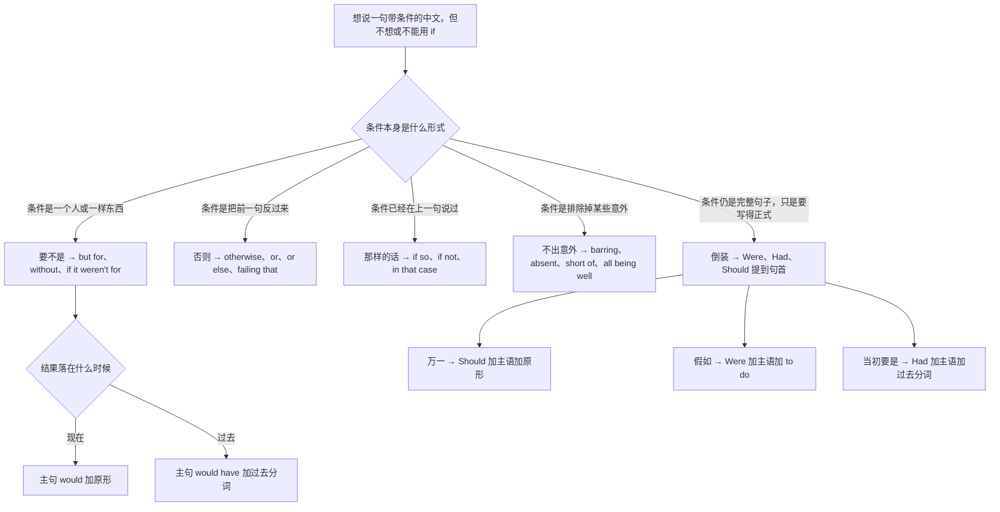
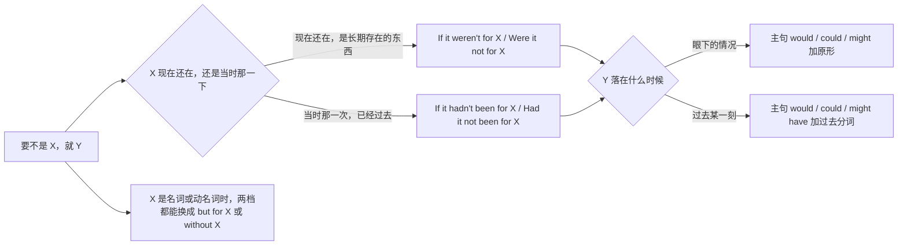
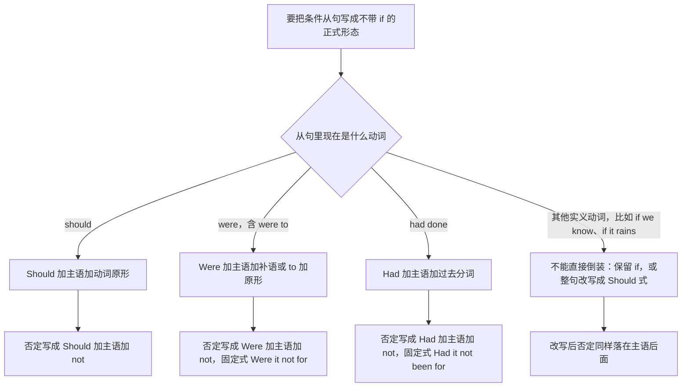
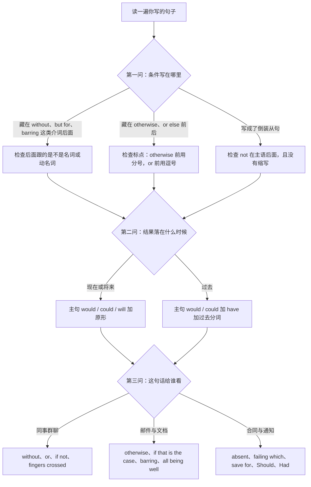
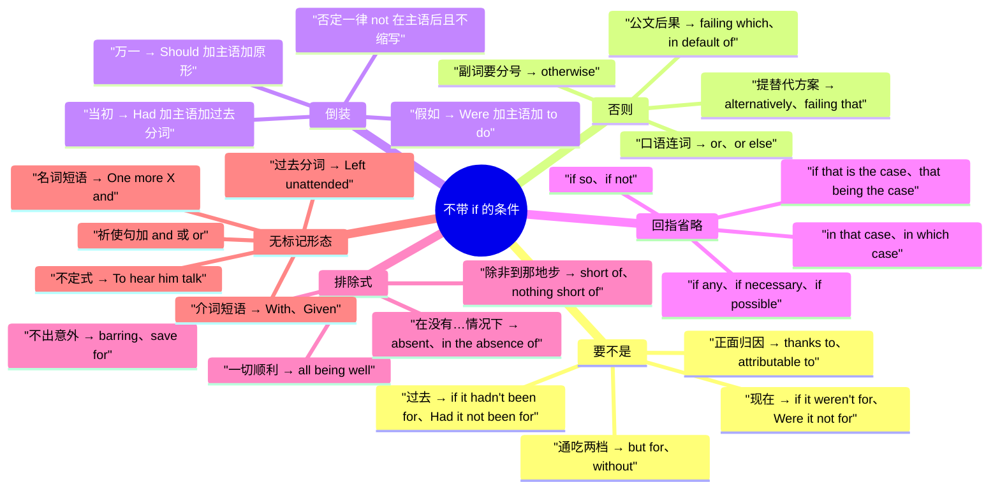

# 含蓄条件与省略倒装：要不是、否则、那样的话

> [!info] 本篇定位
>
> 这篇收三十七条中文意图，共同点是：中文里明明是条件，英文却不出现 if。
>
> 与本分类另外三篇的分工：条件真会发生、结果照常推演的查 [[04.条件与假设/01.真实条件：如果就、只要、一旦、除非、前提是\|真实条件]]，条件根本不成立、纯粹后悔或空想的查 [[04.条件与假设/02.反事实假设：要是就好了、当初要是、混合时间线\|反事实假设]]，结果由条件决定但不指明哪个条件的查 [[04.条件与假设/04.取决与看情况：视…而定、说不好得看\|取决与看情况]]。这篇只管**条件被压进介词、副词、倒装语序或上一句里**的那些形态。
>
> 读完能查到：「要不是你」该写 but for 还是 without、「否则」前面该用逗号还是分号、Were 与 Had 与 Should 三个词提到句首各配什么主句、「如果是这样的话」的三种压缩说法、合同里的 absent 与聊天里的 without 差在哪。
>
> 倒装的语序推导、虚拟语气的时间线原理、省略的成立条件全部不在这里，页脚有链接指回 `02.英语基础语法`。

---

## 1. 本篇导读：条件不一定要用 if 说

中文说条件的方式很单一，几乎全靠「如果」「要是」「万一」这三个词打头，其余靠语序和语气承担。英文不是这样。英文在真正的口语和真正的正式文书两端，都备着一整套**不带 if** 的成型说法——口语是 without、or、if not 这类短形式，文书是 absent、failing which、Should、Had 这类形式。完整的 `If ..., then ...` 是教材例句的默认形态，却不是这两端的默认形态。

结果是中文母语者写出来的英文有一种奇怪的均质感：每句条件都是 `If ..., then ...`。这篇要拆的就是这个惯性。

### 1.1 五条不带 if 的出路

| 中文入口 | 条件被压进了哪里 | 代表形态 |
| --- | --- | --- |
| 要不是你 / 没有那笔钱 | 介词后面的名词 | but for、without、if it weren't for |
| 快点，否则来不及 | 副词或连词，把前一句反过来 | otherwise、or、or else、failing which |
| 万一他不来 / 当初要是 | 助动词提到主语前 | Should、Were、Had |
| 如果是这样的话 | 上一句整句，这句只留一个词 | if so、if not、in that case |
| 不出意外的话 | 排除掉的那些例外 | barring、absent、short of、all being well |

这五条互不重叠：第一条把条件说成一个东西，第二条把条件说成前一句的反面，第三条只是换语序，第四条根本不重说条件，第五条说的是「什么都不发生」。查的时候先定位自己的中文属于哪一条，再进对应节次。

### 1.2 从中文入口进的总选择树



树的第一层只问形式，不问语法。走到 C 分支还要再拐一道弯：but for 和 without 本身不带时间信息，句子落在现在还是过去，全靠主句的 would 还是 would have 交代——这是本篇错得最多的一处，第 2 节整节在处理它。走到 G 分支则相反，三个提前词各自锁死一种时间指向，从句一写定，主句几乎没有选择余地。

### 1.3 三个提醒

> [!warning] 三条贯穿全篇的红线
>
> - ❌ ~~But for you helped me, I would fail.~~ ／ ✅ **But for your help, I would have failed.**（but for、without、barring、short of、absent 全是介词，后面只跟名词或动名词，不跟句子）
> - ❌ ~~Back it up first, otherwise you'll lose the lot.~~ ／ ✅ **Back it up first; otherwise you'll lose the lot.**（otherwise 是副词不是连词，两个独立句之间要分号或句号，逗号直连是逗号粘连）
> - ❌ ~~Hadn't we pinned the version, the build would have broken.~~ ／ ✅ **Had we not pinned the version, the build would have broken.**（倒装条件句里 not 跟在主语后面，且不缩写，缩写会被读成疑问句）

> [!tip] 查法
>
> 先把中文句子里那半句条件单拎出来念一遍，问自己：它是「一个东西」，还是「前一句的反面」，还是「上一句说过的那件事」。三种回答分别对应第 2、3、5 节。答不上来的，多半是完整的条件句，去第 4 节看能不能倒装，倒装不了就回 [[04.条件与假设/01.真实条件：如果就、只要、一旦、除非、前提是\|真实条件]] 用 if。

---

## 2. 要不是：把结果归给某个人或某件事

中文的「要不是」有个隐含的评价：后面跟的那个东西是好事（要不是你帮忙）或坏事（要不是他非要改），而整句话在说「幸亏有它」或「都怪它」。英文把这个东西压成一个名词短语，塞进 but for、without、if it weren't for 后面。

这一节最容易出错的不是选哪个介词——三个基本可以互换——而是**主句的时态**。中文的「要不是」自己不带时间，`要不是你，我早完了` 既可能说的是现在，也可能说的是上个月。英文必须选边。



这张图有两个独立的判断，图上是两层：上面一层判断**条件本身**在什么时间，下面一层判断**结果**在什么时间。两层可以交叉——「要不是当年那笔投资，公司现在早没了」就是条件在过去、结果在现在，写成 `Had it not been for that investment, the company would not exist today`。右侧单挂的那一支说的是简化路径：只要 X 能说成名词，but for 和 without 通吃两层，时间信息全交给主句。

### 2.1 要不是你、没有你的话：条件现在还在，结果也在现在

中文触发语：要不是你 / 没有你的话 / 少了你就 / 离了你不行 / 幸亏有

| 档位 | 句架 | 例句 |
| --- | --- | --- |
| 口语 | Without + n., + 主语 + wouldn't + 原形 | Without you, none of this would even run. |
| 书面 | But for + n., + 主语 + would + 原形 | But for the caching layer, the site would crawl under this load. |
| 正式 | Were it not for + n., + 主语 + would + 原形 | Were it not for the reserve fund, the department would be unable to meet payroll. |

- 没有你，这套东西根本跑不起来。
- 要不是有缓存层，这个负载下页面会慢到爬。
- 若非有储备金，该部门将无力支付薪资。

> [!warning] 错配警示
>
> - ❌ ~~If it weren't for you helped me, I couldn't do it.~~ ／ ✅ **If it weren't for your help, I couldn't do it.**（for 后面只能跟名词或动名词，跟不了句子）
> - ❌ ~~Without you, we couldn't finish it yesterday.~~ ／ ✅ **Without you, we couldn't have finished it yesterday.**（结果落在过去，主句必须换成 could have done，介词那一半不动）

- 同义入口：要不是有你 / 没有你的话 / 幸亏有你 / 少了你就不行
- 语法归属：[[02.英语基础语法/10.特殊句型/02.虚拟语气详解\|虚拟语气详解]]
- 场景实战：[[04.英语场景/03.时态与语态句型框架/03.虚拟语气完全解析\|虚拟语气完全解析]]

### 2.2 当初要不是、亏得那会儿：条件和结果都在过去

中文触发语：当初要不是 / 亏得那会儿 / 幸好当时有 / 要不是那一下 / 多亏当时

| 档位 | 句架 | 例句 |
| --- | --- | --- |
| 口语 | If it hadn't been for + n., + 主语 + would have + p.p. | If it hadn't been for Tom, we'd have shipped that bug straight to prod. |
| 书面 | But for + n., + 主语 + would have + p.p. | But for the rollback script, the outage would have lasted all night. |
| 正式 | Had it not been for + n., + 主语 + would have + p.p. | Had it not been for the timely intervention of the audit team, the discrepancy would have gone unnoticed. |

- 要不是 Tom，我们那个 bug 就直接上生产了。
- 要不是有回滚脚本，那次故障得持续一整夜。
- 若非审计组及时介入，该笔差额将不会被发现。

> [!warning] 错配警示
>
> - ❌ ~~If it hadn't been for you, we didn't finish on time.~~ ／ ✅ **If it hadn't been for you, we wouldn't have finished on time.**（条件那一半用了 hadn't been，主句就必须配 would have done，不能落回一般过去）
> - ❌ ~~Had not it been for the audit team...~~ ／ ✅ **Had it not been for the audit team...**（not 跟在主语 it 后面，不跟在 Had 后面）

- 同义入口：当初要不是 / 幸好当时 / 亏得 / 要不是那一次
- 语法归属：[[02.英语基础语法/10.特殊句型/03.倒装句结构\|倒装句结构]]
- 场景实战：[[04.英语场景/02.基础句型框架/04.倒装句、强调句与省略句\|倒装句、强调句与省略句]]

### 2.3 没有 A 就没有 B：把两样东西绑死

中文触发语：没有…就没有… / 没有…哪来的… / 离了…就不行 / 缺了…一切免谈

| 档位 | 句架 | 例句 |
| --- | --- | --- |
| 口语 | No A, no B. | No tests, no merge. |
| 书面 | Without A, there would be no B. | Without the open-source ecosystem, there would be no modern web stack. |
| 正式 | In the absence of A, B would not be possible. | In the absence of a stable funding stream, sustained research of this kind would not be possible. |

- 没测试就不给合。
- 没有开源生态，就没有今天这套前端体系。
- 缺乏稳定的资金来源，此类长期研究将无从开展。

> [!warning] 错配警示
>
> - ❌ ~~No tests, then no merge.~~ ／ ✅ **No tests, no merge.**（这个句式靠两个名词短语直接并置，中间不插 then、so 或任何动词）
> - ❌ ~~Without the ecosystem, there is no modern web stack.~~ ／ ✅ **Without the ecosystem, there would be no modern web stack.**（这是假设，不是事实陈述，主句要带 would）

- 同义入口：没有…就没有… / 没有…哪来的… / 缺了…就免谈
- 语法归属：[[02.英语基础语法/05.介词与连词/01.介词的分类与基本用法\|介词的分类与基本用法]]

### 2.4 多亏了、全靠：把功劳明确记在谁头上

中文触发语：多亏了 / 全靠 / 幸亏 / 亏得 / 靠的是 / 得益于

| 档位 | 句架 | 例句 |
| --- | --- | --- |
| 口语 | Thanks to + n., + 句子 | Thanks to Priya, we caught it before the release. |
| 书面 | It was thanks to + n. + that + 句子 | It was thanks to the new alerting rules that we caught the leak early. |
| 正式 | sth is attributable in large part to + n. | The recovery is attributable in large part to the contingency plan drawn up last spring. |

- 多亏 Priya，我们在发版前逮住了。
- 正是靠着新加的告警规则，我们才早早发现了泄漏。
- 此次恢复在很大程度上得益于去年春天制定的应急预案。

> [!warning] 错配警示
>
> - ❌ ~~Thanks for the new alerting rules, we caught it early.~~ ／ ✅ **Thanks to the new alerting rules, we caught it early.**（thanks for 用来当面道谢，thanks to 用来说明是谁的功劳）
> - ❌ ~~Thanks to the outage, the whole afternoon was wasted.~~ ／ ✅ **As a result of the outage, the whole afternoon was wasted.**（thanks to 的反讽用法只留给口语，写进公文会被读成真心致谢）

- 同义入口：多亏了 / 全靠 / 得益于 / 靠的是 / 幸亏
- 语法归属：[[02.英语基础语法/10.特殊句型/04.强调句型\|强调句型]]
- 场景实战：[[04.英语场景/10.职场与商务场景实战/02.会议汇报与演示场景\|会议汇报与演示场景]]

### 2.5 要不是你提醒、要不是他拦着：条件是一个动作

中文触发语：要不是你提醒 / 要不是我拦着 / 要不是他非要 / 幸亏当时没 / 要不是有人多看了一眼

| 档位 | 句架 | 例句 |
| --- | --- | --- |
| 口语 | If A hadn't + p.p., + 主语 + would have + p.p. | If you hadn't flagged it, we'd have merged it as is. |
| 书面 | But for + 所有格 + n., + 主语 + would have + p.p. | But for Maya's second look at the diff, the typo would have shipped. |
| 正式 | Had + 主语 + not + p.p., + 主语 + would have + p.p. | Had the reviewer not raised the objection, the clause would have entered the final draft. |

- 要不是你提了一句，我们就那么合进去了。
- 要不是 Maya 又看了一遍 diff，那个错字就上线了。
- 若非评审人提出异议，该条款将进入终稿。

> [!warning] 错配警示
>
> - ❌ ~~But for you flagged it, we'd have merged it.~~ ／ ✅ **But for your flagging it, we'd have merged it.** 或 **If you hadn't flagged it, we'd have merged it.**（but for 后面要么名词化，要么整句改回 if 从句）
> - ❌ ~~But for Maya to look at the diff again, ...~~ ／ ✅ **But for Maya's second look at the diff, ...**（but for 后面不接不定式）

- 同义入口：要不是你提醒 / 幸亏你说了一句 / 要不是我拦着 / 亏了有人多看一眼
- 语法归属：[[02.英语基础语法/08.非谓语动词/02.动名词详解\|动名词详解]]

### 2.6 要不是当年那一步，也不会有今天：因在过去，果在现在

中文触发语：要不是当年 / 当初要不是那一步 / 没有那次…也就没有现在的… / 幸亏那时候

| 档位 | 句架 | 例句 |
| --- | --- | --- |
| 口语 | If we hadn't + p.p. back then, we wouldn't + 原形 + now. | If we hadn't rewritten the parser back then, we'd still be firefighting every week. |
| 书面 | But for + n. + 时间短语, + 主语 + would not + 原形 + today. | But for that decision in 2019, the platform would not be profitable today. |
| 正式 | Had it not been for + n., + 主语 + would not + 原形 + at present. | Had it not been for the early investment in tooling, the team would not be in a position to scale at present. |

- 要不是当年把解析器重写了，我们现在还得每周救火。
- 要不是二〇一九年那个决定，这个平台今天不会盈利。
- 若非早期在工具链上的投入，团队目前不具备扩张条件。

> [!warning] 错配警示
>
> - ❌ ~~If we hadn't rewritten it back then, we wouldn't have been firefighting now.~~ ／ ✅ **..., we'd still be firefighting now.**（结果在现在，主句就用 would 加原形，不要因为条件在过去而顺手写成 would have done）
> - ❌ ~~But for that decision, the platform is not profitable today.~~ ／ ✅ **..., the platform would not be profitable today.**（整句是假设推演，主句丢了 would 就变成陈述事实）

- 同义入口：要不是当年 / 没有那一步就没有现在 / 幸亏那时候做了
- 语法归属：[[02.英语基础语法/10.特殊句型/02.虚拟语气详解\|虚拟语气详解]]
- 场景实战：[[04.英语场景/03.时态与语态句型框架/03.虚拟语气完全解析\|虚拟语气完全解析]]

---

## 3. 否则、不然：把前一句反过来当条件

「否则」在中文里随手就能用，而它对应的英文藏着一个中文母语者反复踩的坑：**otherwise 不是连词**。它是副词，和 however、therefore 同一类，两个独立句之间需要分号、句号或者一个真正的连词把它们接住。真正能当连词用的是 or 和 or else。

另一个分工是语气。or else 自带威胁色彩，用来提建议会变成下最后通牒；提替代方案要用 alternatively 或 or we could；正式文书里的「否则」有一整套自己的封闭说法，failing which、in default of、failure to do sth will result in。

### 3.1 快点，否则就来不及了：对将来的警告

中文触发语：否则 / 不然 / 要不然 / 不这样的话 / 不然就来不及

| 档位 | 句架 | 例句 |
| --- | --- | --- |
| 口语 | 祈使句 + , or + 主语 + will + 原形 | Push it now, or we'll miss the release window. |
| 书面 | 主语 + must + 原形; otherwise + 句子 | The token must be refreshed every hour; otherwise the client starts returning 401s. |
| 正式 | Failure to + 原形 + will result in + n. | Failure to submit the form by the stated deadline will result in the application being rejected. |

- 现在就推，不然赶不上这次发版窗口。
- 令牌必须每小时刷新一次，否则客户端会开始返回 401。
- 未在规定期限内提交表格的，申请将被驳回。

> [!warning] 错配警示
>
> - ❌ ~~Push it now, otherwise we miss it.~~ ／ ✅ **Push it now, or we'll miss it.**（口语里直接用 or；用 otherwise 就得把逗号换成分号，并且主句带上 will）
> - ❌ ~~The token must be refreshed, otherwise, the client returns 401s.~~ ／ ✅ **The token must be refreshed; otherwise the client returns 401s.**（需要标点的位置在 otherwise 前面，是分号；otherwise 后面一般不再打逗号）

- 同义入口：否则 / 不然 / 要不然 / 不这样的话
- 语法归属：[[02.英语基础语法/05.介词与连词/03.连词的分类与用法\|连词的分类与用法]]
- 场景实战：[[04.英语场景/10.职场与商务场景实战/03.商务邮件与正式书面沟通\|商务邮件与正式书面沟通]]

### 3.2 幸好…不然当时就…：对过去的庆幸

中文触发语：幸好…不然 / 要不然当时就 / 亏得…否则 / 好在…不然

| 档位 | 句架 | 例句 |
| --- | --- | --- |
| 口语 | 主语 + did sth; otherwise + 主语 + would have + p.p. | We rolled back in time; otherwise we'd have lost the whole afternoon's writes. |
| 书面 | Fortunately + 句子; otherwise + 主语 + would have + p.p. | Fortunately the alert fired at four; otherwise the corruption would have spread to the replicas. |
| 正式 | Had this not been done, + 主语 + would have + p.p. | Had the transfer not been halted, the funds would have been irrecoverable. |

- 我们及时回滚了，不然整个下午的写入就没了。
- 好在告警四点就响了，否则损坏会扩散到所有副本。
- 若未及时中止该笔转账，资金将无法追回。

> [!warning] 错配警示
>
> - ❌ ~~We rolled back in time, otherwise we lost the whole afternoon's writes.~~ ／ ✅ **We rolled back in time; otherwise we'd have lost the whole afternoon's writes.**（后半句是没有发生的事，必须用 would have done，用一般过去会变成「我们确实丢了」）
> - ❌ ~~Fortunately the alert fired; otherwise it will spread.~~ ／ ✅ **Fortunately the alert fired; otherwise it would have spread.**（前半句已经落在过去，后半句不能跳回将来）

- 同义入口：幸好…不然 / 亏得…否则 / 好在…要不然
- 语法归属：[[02.英语基础语法/10.特殊句型/02.虚拟语气详解\|虚拟语气详解]]

### 3.3 要不然就…吧：提一个替代方案

中文触发语：要不然 / 要不 / 不然咱们 / 实在不行就 / 或者干脆

| 档位 | 句架 | 例句 |
| --- | --- | --- |
| 口语 | Or we could just + 原形 | Or we could just ship it behind a flag. |
| 书面 | Alternatively, + 主语 + could + 原形 | Alternatively, we could postpone the migration to the next maintenance window. |
| 正式 | Failing that, + 主语 + may + 原形 | Failing that, the committee may appoint an interim reviewer. |

- 要不咱们干脆加个开关先发出去。
- 或者也可以把迁移推到下一个维护窗口。
- 如无法实现，委员会可指定一名临时评审人。

> [!warning] 错配警示
>
> - ❌ ~~Or else we could just ship it behind a flag.~~ ／ ✅ **Or we could just ship it behind a flag.**（or else 带威胁色彩，用来提建议会像在下通牒）
> - ❌ ~~Instead of that, we could postpone it.~~ ／ ✅ **Alternatively, we could postpone it.**（instead of 后面接名词或动名词，句与句之间换方案用 alternatively）

- 同义入口：要不然 / 要不 / 实在不行就 / 或者干脆
- 语法归属：[[02.英语基础语法/05.介词与连词/03.连词的分类与用法\|连词的分类与用法]]
- 场景实战：[[04.英语场景/05.高频实用表达句型框架/02.建议请求邀请拒绝四大功能句型\|建议请求邀请拒绝四大功能句型]]

### 3.4 除非…否则…：两头都锁死

中文触发语：除非…否则… / 不…就不… / 非得…才行 / 得先…才能…

| 档位 | 句架 | 例句 |
| --- | --- | --- |
| 口语 | Unless A, B won't + 原形 | Unless finance signs off, nothing gets ordered. |
| 书面 | B will not + 原形 + unless A | The build will not be promoted unless all integration tests pass. |
| 正式 | Except where + 句子, + 主语 + shall not + 原形 | Except where prior written consent has been obtained, the data shall not be transferred outside the region. |

- 财务不签字，什么都订不了。
- 集成测试不全绿，这个构建不会晋级。
- 除已取得事先书面同意的情形外，数据不得传输至本区域之外。

> [!warning] 错配警示
>
> - ❌ ~~Unless you don't sign off, we can't order anything.~~ ／ ✅ **Unless you sign off, we can't order anything.**（unless 自身已含否定，从句里再加 not 就成了双重否定）
> - ❌ ~~Unless all tests will pass, the build won't be promoted.~~ ／ ✅ **Unless all tests pass, ...**（条件从句用一般现在代替将来）

- 同义入口：除非…否则… / 不…就不… / 非得…才行
- 语法归属：[[02.英语基础语法/09.从句体系/04.状语从句详解\|状语从句详解]]
- 场景实战：[[04.英语场景/04.从句与复合句型框架/03.状语从句九大类型\|状语从句九大类型]]

### 3.5 否则后果自负：把「否则」写成后果条款

中文触发语：否则后果自负 / 不然有你好看 / 逾期未…的 / 违反本条的

| 档位 | 句架 | 例句 |
| --- | --- | --- |
| 口语 | 祈使句 + , or else. | Get it in by Friday, or else. |
| 书面 | 主语 + must + 原形 + , failing which + 句子 | The invoice must be settled within 30 days, failing which interest will accrue. |
| 正式 | Failure to comply with + n. + may result in + n. | Failure to comply with this notice may result in the suspension of access. |

- 周五之前交上来，不然别怪我。
- 该笔发票须于三十日内结清，逾期将计收利息。
- 未遵守本通知的，可能导致访问权限被暂停。

> [!warning] 错配警示
>
> - ❌ ~~The invoice must be settled within 30 days, failing which interest will accrue, or else access will be suspended.~~ ／ ✅ **The invoice must be settled within 30 days, failing which interest will accrue.**（一句里只留一个后果标记，failing which 与 or else 叠用会读成两套互相冲突的罚则）
> - ❌ ~~Failing to comply with this notice may result in suspension.~~ ／ ✅ **Failure to comply with this notice may result in suspension.**（这里作主语用名词 failure，不用动名词 failing；failing 只在 failing which、failing that 里当介词）

- 同义入口：否则后果自负 / 逾期未…的 / 违反本条的 / 不然有你好看
- 语法归属：[[02.英语基础语法/07.助动词与情态动词/02.情态动词详解\|情态动词详解]]
- 场景实战：[[04.英语场景/10.职场与商务场景实战/04.商务谈判合同与客户沟通\|商务谈判合同与客户沟通]]

### 3.6 若不…则…：公文体的反面条件

中文触发语：若不…则… / 如不…将… / 未能…的 / 不予…的

| 档位 | 句架 | 例句 |
| --- | --- | --- |
| 口语 | If we don't, + 主语 + be stuck with sth | If we don't fix it today, we're stuck with it all quarter. |
| 书面 | Should this not be + p.p., + 句子 | Should this not be completed before the freeze, the change will roll into the next cycle. |
| 正式 | In default of + n., + 主语 + shall + 原形 | In default of payment, the goods shall remain the property of the seller. |

- 今天不修，这一整个季度都得带着它。
- 若在封版前未完成，该变更将顺延至下一周期。
- 买方未付款的，货物所有权仍归卖方所有。

> [!warning] 错配警示
>
> - ❌ ~~Should this not to be completed before the freeze, ...~~ ／ ✅ **Should this not be completed before the freeze, ...**（Should 后面直接跟动词原形，不加 to）
> - ❌ ~~In default of to pay, the goods shall remain...~~ ／ ✅ **In default of payment, ...**（in default of 是介词短语，后面跟名词）

- 同义入口：若不…则… / 如不…将… / 未能…的 / 不予…的
- 语法归属：[[02.英语基础语法/07.助动词与情态动词/03.情态动词的特殊句型\|情态动词的特殊句型]]

---

## 4. 倒装成品：把 Were、Had、Should 提到句首

这一节讲的不是「怎么把 if 从句改成倒装」——那是推导，属于语法教程。这一节给的是**三个已经成型的开头**，各配什么主语形态、各配什么主句、否定放在哪里。背下来就能直接往上套。

能提前的只有三个词：were、had、should。原因很实际：英文里能直接跨到主语前面的只有助动词和 be，条件从句里恰好只有这三种情况符合。`if we know`、`if it rains`、`if the vendor delivers` 这类实义动词从句根本没得倒装，只能保留 if，或者改写成 `Should we know`、`Should it rain`、`Should the vendor deliver`。



这张图右侧那一列是全节的重点：三种倒装的否定形式高度一致，not 一律跟在主语后面，一律不缩写。中文母语者的直觉是把 not 贴到助动词上写成 Hadn't we、Shouldn't the applicant，而这两个形式在英文里已经被疑问句占用了，一写出来读者的第一反应是在等一个问号。最左下角那一支同样重要：不是所有 if 从句都能倒装，硬倒会写出 `Were we know the answer` 这种不存在的形式。

### 4.1 万一、如果碰巧：Should 提到句首

中文触发语：万一 / 如果万一 / 要是碰巧 / 若有需要 / 如遇

| 档位 | 句架 | 例句 |
| --- | --- | --- |
| 口语 | If + 主语 + happen to + 原形, ... | If you happen to see Ben, tell him the meeting moved. |
| 书面 | Should + 主语 + 原形, + 主语 + will/would + 原形 | Should you need any further detail, the raw logs are in the shared drive. |
| 正式 | Should + 主语 + 原形, + 主语 + shall + 原形 | Should the vendor fail to deliver by the agreed date, the Company shall be entitled to terminate. |

- 你要是碰巧见着 Ben，跟他说会议改时间了。
- 如需更多细节，原始日志在共享盘里。
- 若供应商未能在约定日期前交付，公司有权终止合同。

> [!warning] 错配警示
>
> - ❌ ~~Should you will need any further detail, ...~~ ／ ✅ **Should you need any further detail, ...**（Should 已经把「万一」的意思承担了，后面直接跟动词原形，不再出现第二个助动词）
> - ❌ ~~If should you need anything, let me know.~~ ／ ✅ **Should you need anything, let me know.**（提前的 should 就是 if 的替身，两者不同现）

- 同义入口：万一 / 如遇 / 若有需要 / 要是碰巧 / 倘若
- 语法归属：[[02.英语基础语法/10.特殊句型/03.倒装句结构\|倒装句结构]]
- 场景实战：[[04.英语场景/10.职场与商务场景实战/03.商务邮件与正式书面沟通\|商务邮件与正式书面沟通]]

### 4.2 假如、若是：Were 提到句首

中文触发语：假如 / 若是 / 设若 / 如果我是你 / 换作是

| 档位 | 句架 | 例句 |
| --- | --- | --- |
| 口语 | If I were you, I'd + 原形 | If I were you, I'd get that in writing. |
| 书面 | Were + 主语 + 形容词、名词或过去分词, + 主语 + could + 原形 | Were the outage limited to one region, we could simply fail over. |
| 正式 | Were + 主语 + to + 原形, + 主语 + would + 原形 | Were the board to reject the proposal, the project would be shelved indefinitely. |

- 换我的话，我会让他们写下来。
- 假如故障只限于一个地域，我们直接切走就行。
- 若董事会否决该提案，项目将被无限期搁置。

> [!warning] 错配警示
>
> - ❌ ~~Was I in your position, I would decline.~~ ／ ✅ **Were I in your position, I would decline.**（倒装式一律用 were，人称和单复数都不影响）
> - ❌ ~~Were the board reject the proposal, ...~~ ／ ✅ **Were the board to reject the proposal, ...**（Were 后面接动词时必须带 to，丢了 to 就不成句）

- 同义入口：假如 / 若是 / 换作是我 / 设若 / 万一真的
- 语法归属：[[02.英语基础语法/10.特殊句型/03.倒装句结构\|倒装句结构]]
- 场景实战：[[04.英语场景/02.基础句型框架/04.倒装句、强调句与省略句\|倒装句、强调句与省略句]]

### 4.3 当初要是、早知道：Had 提到句首

中文触发语：当初要是 / 早知道 / 要是那时候 / 若当时 / 早点…就好了

| 档位 | 句架 | 例句 |
| --- | --- | --- |
| 口语 | If + 主语 + 'd + p.p., + 主语 + 'd have + p.p. | If we'd known about the rate limit, we'd have batched the calls. |
| 书面 | Had + 主语 + p.p., + 主语 + would have + p.p. | Had we run the load test a week earlier, we would have caught the regression. |
| 正式 | Had + 主语 + been + p.p., + 主语 + would have + p.p. | Had the risk been disclosed at the outset, the committee would have required additional safeguards. |

- 早知道有限流，我们就把请求攒着一次发了。
- 要是压测早跑一周，那个性能回退就被逮住了。
- 若该风险在最初即被披露，委员会本会要求增设保障措施。

> [!warning] 错配警示
>
> - ❌ ~~Had we run the load test earlier, we will catch the regression.~~ ／ ✅ **..., we would have caught the regression.**（Had 提前锁死了「过去没发生」，主句只能配 would have done）
> - ❌ ~~If we would have known about the rate limit, ...~~ ／ ✅ **If we'd known about the rate limit, ...**（条件那一半用过去完成，would 只出现在主句）

- 同义入口：当初要是 / 早知道 / 若当时 / 要是那会儿
- 语法归属：[[02.英语基础语法/10.特殊句型/02.虚拟语气详解\|虚拟语气详解]]
- 场景实战：[[04.英语场景/03.时态与语态句型框架/03.虚拟语气完全解析\|虚拟语气完全解析]]

### 4.4 若非、要不是有：Were it not for 与 Had it not been for

中文触发语：若非 / 要不是因为有 / 若不是仰仗 / 全赖有

| 档位 | 句架 | 例句 |
| --- | --- | --- |
| 口语 | If it weren't for + n., + 主语 + would + 原形 | If it weren't for the on-call rotation, nobody would notice these at night. |
| 书面 | Were it not for + n., + 主语 + would + 原形 | Were it not for the staging environment, every one of these would land on users. |
| 正式 | Had it not been for + n., + 主语 + would have + p.p. | Had it not been for the indemnity clause, the loss would have fallen entirely on the buyer. |

- 要不是有轮班值守，这些问题半夜根本没人发现。
- 若非有预发环境，这些东西每一个都会砸到用户头上。
- 若非有该赔偿条款，损失将全部由买方承担。

> [!warning] 错配警示
>
> - ❌ ~~Were not it for the staging environment, ...~~ ／ ✅ **Were it not for the staging environment, ...**（这是一个封闭固定式，四个词的顺序不能动）
> - ❌ ~~Was it not for the indemnity clause, ...~~ ／ ✅ **Had it not been for the indemnity clause, ...**（结果落在过去就换 Had it not been for，Were it not for 只管现在）

- 同义入口：若非 / 要不是因为有 / 全赖有 / 若不是仰仗
- 语法归属：[[02.英语基础语法/10.特殊句型/03.倒装句结构\|倒装句结构]]

### 4.5 幸亏没、若未：倒装句里 not 放哪儿

中文触发语：幸亏没 / 要是当初没 / 若未 / 如果没有及时

| 档位 | 句架 | 例句 |
| --- | --- | --- |
| 口语 | If + 主语 + hadn't + p.p., ... | If we hadn't pinned the version, the build would be broken right now. |
| 书面 | Had + 主语 + not + p.p., ... | Had the team not pinned the dependency, the pipeline would have broken overnight. |
| 正式 | Should + 主语 + not + 原形, ... | Should the applicant not respond within fourteen days, the file will be closed. |

- 幸亏当时锁了版本，不然现在构建就是坏的。
- 若团队未锁定依赖版本，流水线一夜之间就会崩掉。
- 申请人如在十四日内未作答复，该案卷将予关闭。

> [!warning] 错配警示
>
> - ❌ ~~Hadn't we pinned the version, the build would be broken.~~ ／ ✅ **Had we not pinned the version, the build would be broken.**（缩写形式会被读成疑问句开头，条件倒装一律拆开写）
> - ❌ ~~Shouldn't the applicant respond within fourteen days, the file will be closed.~~ ／ ✅ **Should the applicant not respond within fourteen days, ...**（同上，not 落在主语后面）

- 同义入口：幸亏没 / 若未 / 要是当初没 / 如果没有及时
- 语法归属：[[02.英语基础语法/10.特殊句型/03.倒装句结构\|倒装句结构]]

### 4.6 那样的话就得…：倒装从句后面主句怎么接

中文触发语：那就得 / 那样就会 / 就只能 / 就不至于 / 那我们就有权

| 档位 | 句架 | 例句 |
| --- | --- | --- |
| 口语 | Should ..., we'd have to + 原形 | Should the vendor slip again, we'd have to bring it in-house. |
| 书面 | Were ..., + 主语 + would be forced to + 原形 | Were the budget cut further, the team would be forced to drop the mobile client. |
| 正式 | Should ..., + 主语 + shall be entitled to + 原形 | Should any of the above conditions be breached, the Company shall be entitled to terminate with immediate effect. |

- 供应商再拖一次，我们就只能自己接过来做了。
- 预算再砍，团队就不得不砍掉移动端。
- 如违反上述任一条件，公司有权立即终止。

> [!warning] 错配警示
>
> - ❌ ~~Were the budget cut further, the team will be forced to drop it.~~ ／ ✅ **..., the team would be forced to drop it.**（Were 提前表示这事儿假设性强，主句配 would；Should 提前表示万一，主句可以配 will 或 shall）
> - ❌ ~~Should any condition be breached, the Company shall entitled to terminate.~~ ／ ✅ **..., the Company shall be entitled to terminate.**（shall 后面跟原形，be 不能省）

- 同义入口：那就得 / 那样就会 / 就只能 / 那我们就有权
- 语法归属：[[02.英语基础语法/07.助动词与情态动词/03.情态动词的特殊句型\|情态动词的特殊句型]]
- 场景实战：[[04.英语场景/10.职场与商务场景实战/04.商务谈判合同与客户沟通\|商务谈判合同与客户沟通]]

---

## 5. 回指省略：条件在上一句，这句不重复

上一句刚说完一个情况，这一句要接着说「如果是这样的话」。中文习惯把那个情况用「这样」「那样」代回来，英文更狠：条件整个不出现，只留一个 so 或 not。

这一组的形式极短，短到中文母语者常常怀疑句子没写完，于是补出 `if so is the case`、`if it is so`、`if no` 这些不存在的形式。这一节把六条常用的压缩式列全，每条都给出它替代的是什么。

### 5.1 如果是这样的话、那就…

中文触发语：如果是这样 / 那样的话 / 果真如此 / 这么说来 / 既然这样

| 档位 | 句架 | 例句 |
| --- | --- | --- |
| 口语 | If so, + 句子 | If so, we can skip the migration entirely. |
| 书面 | If that is the case, + 句子 | If that is the case, the estimate needs to be revised. |
| 正式 | That being the case, + 句子 | That being the case, the committee will proceed to a formal vote. |

- 要真是这样，那这次迁移整个可以跳过。
- 若情况属实，这份估算需要重做。
- 鉴于此，委员会将进入正式表决。

> [!warning] 错配警示
>
> - ❌ ~~If so is the case, we can skip it.~~ ／ ✅ **If so, we can skip it.** 或 **If that's the case, we can skip it.**（if so 本身已经顶掉了整个条件，不能再补主语和系动词）
> - ❌ ~~If it is so, the estimate needs revising.~~ ／ ✅ **If that is the case, the estimate needs revising.**（it is so 是从中文直译来的，英文这里用 that's the case）

- 同义入口：如果是这样 / 那样的话 / 果真如此 / 既然这样 / 这么说来
- 语法归属：[[02.英语基础语法/10.特殊句型/05.省略与替代\|省略与替代]]
- 场景实战：[[04.英语场景/07.社交交际场景实战/02.电话短信与在线沟通场景\|电话短信与在线沟通场景]]

### 5.2 如果不是的话、不行的话

中文触发语：如果不是 / 要是不行的话 / 不是的话 / 没有的话 / 不适用的

| 档位 | 句架 | 例句 |
| --- | --- | --- |
| 口语 | If not, + 句子 | If not, ping me and I'll take a look. |
| 书面 | If this is not the case, + 句子 | If this is not the case, please reply to this thread before Thursday. |
| 正式 | Where this does not apply, + 句子 | Where this does not apply, applicants should complete Section B instead. |

- 不行的话戳我一下，我来看。
- 若情况并非如此，请在周四前回复本邮件。
- 不适用本条的，申请人应改填第 B 部分。

> [!warning] 错配警示
>
> - ❌ ~~Are you free at three? If no, tell me.~~ ／ ✅ **If not, tell me.**（回指省略只有 if not，没有 if no）
> - ❌ ~~If not so, tell me.~~ ／ ✅ **If not, tell me.**（not 后面不再挂 so，两个替代词不叠用）

- 同义入口：如果不是 / 不行的话 / 没有的话 / 不适用的
- 语法归属：[[02.英语基础语法/10.特殊句型/05.省略与替代\|省略与替代]]

### 5.3 那样的话、真到那一步

中文触发语：那样的话 / 到那时 / 那种情况下 / 真到那一步 / 万一那样

| 档位 | 句架 | 例句 |
| --- | --- | --- |
| 口语 | In that case, + 句子 | In that case, let's push the demo to Monday. |
| 书面 | 句子 + , in which case + 句子 | The vendor may miss the date, in which case we fall back to the manual process. |
| 正式 | In the event that + 句子, + 句子 | In the event that the primary site becomes unavailable, traffic will be routed to the secondary region. |

- 那这样的话，演示挪到周一吧。
- 供应商可能赶不上这个日期，真那样我们就退回手工流程。
- 如主站点不可用，流量将被路由至备用地域。

> [!warning] 错配警示
>
> - ❌ ~~In this case, let's push the demo to Monday.~~ ／ ✅ **In that case, let's push the demo to Monday.**（接对方刚说完的话用 in that case；in this case 是「就眼前这一件事而言」，两者指向不同）
> - ❌ ~~The vendor may miss the date, in this case we fall back to manual.~~ ／ ✅ **..., in which case we fall back to manual.**（把前面整句当条件时用 in which case，它引导从句，能把两个句子接住；in this case 接不住，会变成逗号粘连）

- 同义入口：那样的话 / 到那时 / 真到那一步 / 那种情况下
- 语法归属：[[02.英语基础语法/09.从句体系/02.定语从句进阶\|定语从句进阶]]

### 5.4 果真如此的话：把上文当假设，语气再退一格

中文触发语：果真如此 / 万一真是这样 / 倘若属实 / 要是真被说中了

| 档位 | 句架 | 例句 |
| --- | --- | --- |
| 口语 | If that turns out to be true, + 句子 | If that turns out to be true, we've been under-reporting for months. |
| 书面 | If that proves to be the case, + 句子 | If that proves to be the case, the whole benchmark needs rerunning. |
| 正式 | Should that prove to be the case, + 句子 | Should that prove to be the case, the findings will be referred to the audit committee. |

- 要真是那样，我们这几个月的数都报低了。
- 若确实如此，整个基准测试都得重跑。
- 若情况确系如此，相关结论将提交审计委员会。

> [!warning] 错配警示
>
> - ❌ ~~If that proves to be true the case, ...~~ ／ ✅ **If that proves to be true, ...** 或 **If that proves to be the case, ...**（true 和 the case 二选一，不能拼在一起）
> - ❌ ~~Should that prove to be the case, the findings would be referred.~~ ／ ✅ **..., the findings will be referred.**（这是真有可能发生的情况，主句用 will；改成 would 会读成「这事儿多半不会发生」）

- 同义入口：果真如此 / 万一真是这样 / 倘若属实
- 语法归属：[[02.英语基础语法/10.特殊句型/03.倒装句结构\|倒装句结构]]

### 5.5 如果有的话、如果需要、如果可能

中文触发语：如果有的话 / 有的话 / 如果需要 / 如果可能 / 必要时 / 万一有

| 档位 | 句架 | 例句 |
| --- | --- | --- |
| 口语 | 句子 + , if any | Send me the errors, if any. |
| 书面 | 句子 + , if necessary | We can extend the window by a day, if necessary. |
| 正式 | 句子 + , if and to the extent required | The supplier shall provide training, if and to the extent required under Schedule 2. |

- 有报错的话发我。
- 必要的话，窗口期可以再延一天。
- 供应商应在附表二要求的范围内提供培训。

> [!warning] 错配警示
>
> - ❌ ~~Please list the errors if there are any errors.~~ ／ ✅ **Please list the errors, if any.**（if any 就是那半句的压缩形式，展开写反而啰嗦）
> - ❌ ~~If possible to, could you send it today?~~ ／ ✅ **If possible, could you send it today?**（if 加形容词的省略式到形容词就结束，后面不能再挂一个空的 to）

- 同义入口：如果有的话 / 有的话 / 必要时 / 如果可能 / 万一有
- 语法归属：[[02.英语基础语法/10.特殊句型/05.省略与替代\|省略与替代]]
- 场景实战：[[04.英语场景/10.职场与商务场景实战/03.商务邮件与正式书面沟通\|商务邮件与正式书面沟通]]

### 5.6 行就行、不行就…：两个分支都省

中文触发语：能就…不能就… / 行就行不行就 / 可以的话…不可以的话… / 尽量…实在不行…

| 档位 | 句架 | 例句 |
| --- | --- | --- |
| 口语 | If you can, ...; if not, ... | If you can, get it in today; if not, tomorrow morning is fine. |
| 书面 | Where possible, ...; otherwise, ... | Where possible, reuse the existing client; otherwise, document why a new one was needed. |
| 正式 | Wherever practicable, ..., failing which ... | Wherever practicable, disputes shall be resolved by negotiation, failing which the matter shall proceed to arbitration. |

- 能今天交就今天，不行明天上午也行。
- 尽量复用已有的客户端；实在不行，写清楚为什么要新建一个。
- 争议应尽可能通过协商解决；协商不成的，提交仲裁。

> [!warning] 错配警示
>
> - ❌ ~~If you can, get it in today, if not, tomorrow is fine.~~ ／ ✅ **If you can, get it in today; if not, tomorrow is fine.**（两个完整分支之间用分号；一路用逗号会连成一串读不断的句子）
> - ❌ ~~Where possible reuse the existing client otherwise document the reason.~~ ／ ✅ **Where possible, reuse the existing client; otherwise, document the reason.**（前置状语后面要有逗号，otherwise 前面要有分号）

- 同义入口：能就…不能就… / 行就行不行就 / 尽量…实在不行…
- 语法归属：[[02.英语基础语法/10.特殊句型/05.省略与替代\|省略与替代]]

---

## 6. 排除式条件：除了这些意外，其余照旧

这一组的逻辑方向和前面几节相反。前面说的是「有了 X 才会 Y」，这一组说的是「只要没有 X，就会 Y」——条件不是某件事发生，而是某些事**不发生**。中文里对应的是「不出意外的话」「一切顺利的话」「除非出岔子」。

这类表达是工程沟通里的常备件：交付承诺后面通常都要挂一句。它同时也是语域跨度最大的一组，口语端是 fingers crossed，正式端是 save for events beyond the parties' reasonable control，中间几乎没有过渡。

### 6.1 不出意外的话

中文触发语：不出意外的话 / 除非出岔子 / 除非有什么变故 / 正常情况下 / 没什么幺蛾子的话

| 档位 | 句架 | 例句 |
| --- | --- | --- |
| 口语 | Barring anything weird, + 句子 | Barring anything weird, we'll be live Friday. |
| 书面 | Barring + n., + 句子 | Barring further delays from the vendor, the migration will be complete this quarter. |
| 正式 | Save for + n., + 主语 + shall + 原形 | Save for events beyond the parties' reasonable control, delivery shall occur on the date specified. |

- 不出幺蛾子的话，周五就上了。
- 除非供应商再拖，这次迁移本季度内完成。
- 除不可抗力事件外，交付应于指定日期完成。

> [!warning] 错配警示
>
> - ❌ ~~Barring that nothing goes wrong, we'll ship Friday.~~ ／ ✅ **Barring any surprises, we'll ship Friday.**（barring 是介词，后面只跟名词短语，跟不了句子）
> - ❌ ~~Except any last-minute issues, we'll ship Friday.~~ ／ ✅ **Barring any last-minute issues, we'll ship Friday.**（光杆 except 领不了名词短语，要么补成 except for，要么换成 barring 或 save for）

- 同义入口：不出意外的话 / 除非出岔子 / 正常情况下 / 没什么变故的话
- 语法归属：[[02.英语基础语法/05.介词与连词/01.介词的分类与基本用法\|介词的分类与基本用法]]
- 场景实战：[[04.英语场景/10.职场与商务场景实战/02.会议汇报与演示场景\|会议汇报与演示场景]]

### 6.2 一切顺利的话

中文触发语：一切顺利的话 / 顺利的话 / 没问题的话 / 但愿 / 但愿别出事

| 档位 | 句架 | 例句 |
| --- | --- | --- |
| 口语 | Fingers crossed, + 句子 | Fingers crossed, the whole thing will be done by lunch. |
| 书面 | All being well, + 句子 | All being well, the new index will be live before the weekend freeze. |
| 正式 | Subject to satisfactory completion of + n., + 句子 | Subject to satisfactory completion of the security review, the service will be enabled for all tenants. |

- 但愿吧，中午前应该能全弄完。
- 一切顺利的话，新索引在周末封版前上线。
- 待安全评审顺利完成后，该服务将对所有租户开放。

> [!warning] 错配警示
>
> - ❌ ~~All be well, we'll finish today.~~ ／ ✅ **All being well, we'll finish today.**（这是一个独立主格结构，动词固定用 being）
> - ❌ ~~If everything is going well, we'll finish today.~~ ／ ✅ **If all goes well, we'll finish today.**（条件从句用一般现在，不用进行时；进行时会读成「现在正顺利，但等下不好说」）

- 同义入口：一切顺利的话 / 顺利的话 / 没问题的话 / 但愿别出事
- 语法归属：[[02.英语基础语法/08.非谓语动词/03.现在分词详解\|现在分词详解]]

### 6.3 除非到那个地步：短于某个门槛都没用

中文触发语：短于…就不行 / 除非到…的程度 / 不到…就没辙 / 除了…别无他法 / 除非推倒重来

| 档位 | 句架 | 例句 |
| --- | --- | --- |
| 口语 | Short of + doing, + 句子 | Short of buying more nodes, I don't see a fix. |
| 书面 | Nothing short of + n. + will + 原形 | Nothing short of a full re-index will fix the ordering. |
| 正式 | Other than by + doing, no + n. + shall + 原形 | Other than by written agreement of both parties, no variation of these terms shall take effect. |

- 除非再买机器，我没看出别的解法。
- 不重建整个索引，排序问题就修不好。
- 除经双方书面约定外，对本条款的任何变更均不生效。

> [!warning] 错配警示
>
> - ❌ ~~Short of to buy more nodes, I don't see a fix.~~ ／ ✅ **Short of buying more nodes, ...**（short of 后面必须是名词或动名词）
> - ❌ ~~Nothing short of a full re-index won't fix the ordering.~~ ／ ✅ **Nothing short of a full re-index will fix the ordering.**（nothing 已经承担了否定，后面的动词用肯定形式）

- 同义入口：短于…就不行 / 除非到…的程度 / 不到…就没辙 / 除非推倒重来
- 语法归属：[[02.英语基础语法/05.介词与连词/02.常用介词搭配详解\|常用介词搭配详解]]

### 6.4 在没有…的情况下

中文触发语：在没有…的情况下 / 缺了…就 / 没有…的话 / 若无 / 拿不到…就

| 档位 | 句架 | 例句 |
| --- | --- | --- |
| 口语 | Without + n., + 主语 + can't + 原形 | Without a repro, I can't do much. |
| 书面 | In the absence of + n., + 主语 + cannot + 原形 | In the absence of a signed statement of work, we cannot allocate engineers. |
| 正式 | Absent + n., + 主语 + shall not + 原形 | Absent express written consent, the recipient shall not disclose the information to any third party. |

- 没有复现步骤，我也做不了什么。
- 在没有签署工作说明书的情况下，我们无法排人。
- 未经明示书面同意，接收方不得向任何第三方披露该信息。

> [!warning] 错配警示
>
> - ❌ ~~Absent of a signed agreement, we cannot start.~~ ／ ✅ **Absent a signed agreement, we cannot start.**（absent 当介词用时后面不加 of，加了 of 就成了 in the absence of 的半成品）
> - ❌ ~~Absent a repro, I can't do much.~~ ／ ✅ **Without a repro, I can't do much.**（absent 是美式法律与学术文体的词，日常对话里用它会像在念合同）

- 同义入口：在没有…的情况下 / 缺了…就 / 若无 / 拿不到…就
- 语法归属：[[02.英语基础语法/05.介词与连词/02.常用介词搭配详解\|常用介词搭配详解]]
- 场景实战：[[04.英语场景/10.职场与商务场景实战/04.商务谈判合同与客户沟通\|商务谈判合同与客户沟通]]

### 6.5 只要不出别的问题就行

中文触发语：只要不…就 / 只要没有…就 / 不出…都行 / 没别的岔子就

| 档位 | 句架 | 例句 |
| --- | --- | --- |
| 口语 | As long as nothing + 动词s, + 句子 | As long as nothing else breaks, we're fine. |
| 书面 | Provided that no + n. + arises, + 句子 | Provided that no blocking issue arises, the release will proceed as scheduled. |
| 正式 | Unless and until + 句子, + 主语 + shall + 原形 | Unless and until notice is given in writing, the existing terms shall continue to apply. |

- 只要别的地方不塌，我们就没事。
- 只要不出现阻塞问题，发版按原计划进行。
- 在书面通知发出之前，现有条款持续适用。

> [!warning] 错配警示
>
> - ❌ ~~As long as nothing will break, we're fine.~~ ／ ✅ **As long as nothing breaks, we're fine.**（条件从句用一般现在代替将来）
> - ❌ ~~Provided that no blocking issues arises, ...~~ ／ ✅ **Provided that no blocking issue arises, ...**（no 后面用单数名词时谓语跟着用单数，单复数要一致）

- 同义入口：只要不…就 / 只要没有…就 / 不出…都行
- 语法归属：[[02.英语基础语法/09.从句体系/04.状语从句详解\|状语从句详解]]

### 6.6 除非万不得已

中文触发语：除非万不得已 / 实在不行才 / 逼到那一步 / 迫不得已 / 非到最后关头不

| 档位 | 句架 | 例句 |
| --- | --- | --- |
| 口语 | Unless we absolutely have to, + 祈使或建议 | Unless we absolutely have to, let's not touch the schema. |
| 书面 | Only as a last resort would + 主语 + 原形 | Only as a last resort would we consider rolling back the entire release. |
| 正式 | Save in exceptional circumstances, + 主语 + will not + 原形 | Save in exceptional circumstances, no extension of the deadline will be granted. |

- 不到万不得已，咱别动表结构。
- 只有实在没辙了，我们才会考虑整体回滚。
- 除特殊情形外，不予延长期限。

> [!warning] 错配警示
>
> - ❌ ~~Only as a last resort we would consider it.~~ ／ ✅ **Only as a last resort would we consider it.**（only 加状语放在句首，后面的主谓要倒装）
> - ❌ ~~Unless we have absolutely to, let's not touch it.~~ ／ ✅ **Unless we absolutely have to, let's not touch it.**（absolutely 放在 have to 前面）

- 同义入口：除非万不得已 / 实在不行才 / 迫不得已 / 非到最后关头不
- 语法归属：[[02.英语基础语法/10.特殊句型/03.倒装句结构\|倒装句结构]]

---

## 7. 藏在介词、分词与祈使句里的条件

前面五节的条件至少还有一个标记词。这一节的条件连标记词都没有，全靠句子的形状表达——一个祈使句加 and、一个孤零零的过去分词、一句 With one more day。这类形态在英文书面语里是常规选项，中文母语者却几乎不主动生产，因为中文没有对应的形状。

### 7.1 你那么干就…：祈使句加 and 或 or

中文触发语：你敢…就 / 那样干的话 / 只要…就 / 再…一次就 / 你试试看

| 档位 | 句架 | 例句 |
| --- | --- | --- |
| 口语 | 祈使句 + and + 主语 + will + 原形 | Restart it now and you'll lose everything in the queue. |
| 书面 | 祈使句 + and + 结果句 | Give the team one clear owner and half of these threads disappear. |
| 正式 | Any attempt to + 原形 + will result in + n. | Any attempt to restart the service mid-drain will result in the loss of queued messages. |

- 你现在重启，队列里的东西就全没了。
- 给这个团队指定一个明确负责人，一半的扯皮就消失了。
- 在排空过程中重启服务的任何尝试，都将导致队列消息丢失。

> [!warning] 错配警示
>
> - ❌ ~~Restart it now and you lose everything.~~ ／ ✅ **Restart it now and you'll lose everything.**（and 后面那半句是预测结果，要带 will）
> - ❌ ~~Don't restart it now and you'll lose everything.~~ ／ ✅ **Restart it now and you'll lose everything.** 或 **Don't restart it now, or you'll lose everything.**（and 接的是「这么做的后果」，or 接的是「不这么做的后果」，祈使句的正反和连词必须配对）

- 同义入口：你那样干就 / 你试试看 / 再…一次就 / 只要…就
- 语法归属：[[02.英语基础语法/05.介词与连词/03.连词的分类与用法\|连词的分类与用法]]
- 场景实战：[[04.英语场景/02.基础句型框架/02.陈述疑问祈使感叹四大句式\|陈述疑问祈使感叹四大句式]]

### 7.2 换了我的话、搁别人身上

中文触发语：换了我 / 要是我 / 搁别人身上 / 换成你会怎么办 / 站在他的位置

| 档位 | 句架 | 例句 |
| --- | --- | --- |
| 口语 | In your shoes, I'd + 原形 | In your shoes, I'd ask for that in writing. |
| 书面 | In sb's position, most people would + 原形 | In the client's position, most people would want a firm date before signing. |
| 正式 | A party in that position would ordinarily be expected to + 原形 | A party in that position would ordinarily be expected to obtain independent advice. |

- 换我的话，我会让他们把这话写下来。
- 站在客户的位置，多数人都会想先拿到一个确定日期再签。
- 处于该地位的一方，通常应被期待寻求独立意见。

> [!warning] 错配警示
>
> - ❌ ~~In your shoes, I will ask for that in writing.~~ ／ ✅ **In your shoes, I'd ask for that in writing.**（这是假设，不是计划，主句用 would）
> - ❌ ~~At your position, I'd ask for it in writing.~~ ／ ✅ **In your position, ...**（这个搭配用 in，不用 at）

- 同义入口：换了我 / 搁别人身上 / 站在他的位置 / 换成你会怎么办
- 语法归属：[[02.英语基础语法/10.特殊句型/02.虚拟语气详解\|虚拟语气详解]]
- 场景实战：[[04.英语场景/05.高频实用表达句型框架/02.建议请求邀请拒绝四大功能句型\|建议请求邀请拒绝四大功能句型]]

### 7.3 再不管就…：分词式含蓄条件

中文触发语：再不管就 / 放着不管的话 / 就这么下去 / 任其发展 / 不处理的话

| 档位 | 句架 | 例句 |
| --- | --- | --- |
| 口语 | 祈使句 + and + 主语 + will + 原形 | Leave it alone and it'll fall over by morning. |
| 书面 | Left + p.p., + 主语 + will + 原形 | Left unattended, the queue will back up until the disk fills. |
| 正式 | If left + p.p., + 主语 + would + 原形 | If left unaddressed, the deficiency would expose the organization to material risk. |

- 放着不管，天亮之前它自己就趴了。
- 无人处理的话，队列会一直堆到磁盘写满。
- 该缺陷若不予处理，将使本机构面临重大风险。

> [!warning] 错配警示
>
> - ❌ ~~Leaving unattended, the queue will back up.~~ ／ ✅ **Left unattended, the queue will back up.**（队列是被放着不管的一方，用过去分词；用现在分词就成了队列在放别人不管）
> - ❌ ~~Left unattended, we will see the queue back up.~~ ／ ✅ **Left unattended, the queue will back up.**（分词的逻辑主语必须是主句主语，主句换成 we 就成了悬垂分词）

- 同义入口：再不管就 / 放着不管的话 / 就这么下去 / 不处理的话
- 语法归属：[[02.英语基础语法/08.非谓语动词/04.过去分词详解\|过去分词详解]]

### 7.4 有…就能…：介词短语当条件

中文触发语：有…的话 / 给我…我就能 / 只要给…就 / 凭…就能 / 多给一天

| 档位 | 句架 | 例句 |
| --- | --- | --- |
| 口语 | With + n., + 主语 + could + 原形 | With one more day, we could get the tests green. |
| 书面 | Given + n., + 主语 + would + 原形 | Given a stable staging environment, most of these regressions would be caught before release. |
| 正式 | Given + n., it would be possible to + 原形 | Given adequate funding, it would be possible to extend the study to a second cohort. |

- 再给一天，测试就能全绿。
- 有一个稳定的预发环境，这些回退大多在发版前就被拦下了。
- 若资金充足，将有可能把研究扩展到第二组样本。

> [!warning] 错配警示
>
> - ❌ ~~Given that one more day, we could finish.~~ ／ ✅ **Given one more day, we could finish.**（given 后面跟名词时不加 that；given that 后面跟的才是完整句子）
> - ❌ ~~With having one more day, we could finish.~~ ／ ✅ **With one more day, we could finish.**（with 后面直接跟名词，不用再套一层动名词）

- 同义入口：有…的话 / 给我…我就能 / 凭…就能 / 多给一天就
- 语法归属：[[02.英语基础语法/05.介词与连词/02.常用介词搭配详解\|常用介词搭配详解]]

### 7.5 再来一次就完了：名词短语当条件

中文触发语：再来一次就 / 再有一回 / 又一次的话 / 再出一次这种事

| 档位 | 句架 | 例句 |
| --- | --- | --- |
| 口语 | One more + n. + and + 句子 | One more outage this month and the renewal is gone. |
| 书面 | Another + n. + would + 原形 | Another slip of this size would put the launch date beyond recovery. |
| 正式 | A further occurrence of + n. + would constitute + n. | A further occurrence of this nature would constitute a material breach. |

- 这个月再挂一次，续约就没了。
- 再拖这么一次，发布日期就补不回来了。
- 再次发生此类情形，将构成实质性违约。

> [!warning] 错配警示
>
> - ❌ ~~If one more outage this month, the renewal is gone.~~ ／ ✅ **One more outage this month and the renewal is gone.**（名词短语当条件时前面不加 if，靠 and 把结果接上）
> - ❌ ~~One more outage will happen and the renewal is gone.~~ ／ ✅ **One more outage and the renewal is gone.**（名词短语本身就是条件，补上动词反而破坏结构）

- 同义入口：再来一次就 / 再有一回 / 再出一次这种事
- 语法归属：[[02.英语基础语法/05.介词与连词/03.连词的分类与用法\|连词的分类与用法]]

### 7.6 只有…才能…：唯一条件

中文触发语：只有…才 / 除了…别无 / 非…不可 / 唯有 / 只能靠

| 档位 | 句架 | 例句 |
| --- | --- | --- |
| 口语 | The only way to + 原形 + is to + 原形 | The only way to make that date is to cut the reporting module. |
| 书面 | Only by + doing + can + 主语 + 原形 | Only by pinning the versions can we make the build reproducible. |
| 正式 | It is only through + n. + that + 主语 + can + 原形 | It is only through sustained investment in tooling that the team can maintain this pace. |

- 想赶上那个日期，只有把报表模块砍掉。
- 只有把版本号锁死，构建才能可复现。
- 唯有持续投入工具链，团队才能维持这个节奏。

> [!warning] 错配警示
>
> - ❌ ~~Only by pinning the versions we can make the build reproducible.~~ ／ ✅ **Only by pinning the versions can we make the build reproducible.**（only 加介词短语放句首，主句要把助动词提到主语前面）
> - ❌ ~~Only in this way we can fix it.~~ ／ ✅ **Only in this way can we fix it.**（同一条规则，中文母语者最容易在这个短语上漏掉倒装）

- 同义入口：只有…才 / 唯有 / 非…不可 / 除了…别无办法
- 语法归属：[[02.英语基础语法/10.特殊句型/03.倒装句结构\|倒装句结构]]
- 场景实战：[[04.英语场景/02.基础句型框架/04.倒装句、强调句与省略句\|倒装句、强调句与省略句]]

### 7.7 光听他说，还以为…：不定式当条件

中文触发语：光听他那么说 / 光看…还以为 / 单看表面 / 乍一看

| 档位 | 句架 | 例句 |
| --- | --- | --- |
| 口语 | To hear sb talk, you'd think + 句子 | To hear him talk, you'd think he wrote the whole thing himself. |
| 书面 | To look at + n., + 主语 + would never guess + 句子 | To look at the dashboard, you would never guess the cluster was half down. |
| 正式 | On the face of + n., one might conclude that + 句子 | On the face of the figures, one might conclude that the program is on track. |

- 光听他说话，还以为整套东西是他一个人写的。
- 光看那个面板，你根本想不到集群已经挂了一半。
- 单从数字表面看，可能会得出该项目进展正常的结论。

> [!warning] 错配警示
>
> - ❌ ~~To hear him talk, you think he wrote it.~~ ／ ✅ **To hear him talk, you'd think he wrote it.**（这是一个反事实推论——事实上他没写——主句必须带 would）
> - ❌ ~~To look at the dashboard, the cluster seems fine.~~ ／ ✅ **To look at the dashboard, you'd never guess the cluster was half down.**（这个式子的主句主语必须是「看的那个人」，写成 the cluster 就成了没有着落的悬垂结构）

- 同义入口：光听他那么说 / 单看表面 / 乍一看 / 光看…还以为
- 语法归属：[[02.英语基础语法/08.非谓语动词/01.动词不定式详解\|动词不定式详解]]

---

## 8. 语域两端：同一个条件在群聊里和在合同里

大纲要求这一篇「正式文书与口语两端各给一档」。前面每条意图都已经给了三档，这一节把三档横过来对齐，方便一眼看清同一个中文在四种场合里的落点差异。左边两列是口语端，右边两列是书面与正式端。

### 8.1 五个中文意图的四场合对照

| 中文意图 | 同事群聊 | 内部邮件 | 技术文档 | 合同与通知 |
| --- | --- | --- | --- | --- |
| 要不是有它 | without it | but for it | in the absence of it | absent such provision |
| 否则 | or | otherwise | otherwise | failing which |
| 万一 | if you happen to | should you need | should the value exceed | should the party fail to |
| 不出意外的话 | fingers crossed | all being well | barring further delays | save for events beyond reasonable control |
| 如果不是的话 | if not | if this is not the case | where this does not apply | save as otherwise provided |

这张表的用法是横着读。同一行五个格子说的是一件事，但把 `save as otherwise provided` 发进同事群会显得在开玩笑，把 `fingers crossed` 写进合同则根本不是一个可执行的条件。判断标准很简单：这句话如果将来要被人拿出来追责，就往右两列走；如果只是通报一个预期，就往左两列走。

### 8.2 一句中文走完四档

拿「要不是提前锁了版本，这次构建就崩了」走一遍。

```text
群聊：  Good thing we pinned it, or the build would've blown up.
邮件：  If we hadn't pinned the dependency, the build would have failed outright.
文档：  Had the dependency not been pinned, the build would have failed.
通知：  Absent the version constraint recorded in section 3, the build would have failed.
```

四句话的信息量完全一样，变的是三件事：介词与连词的选择（or → if → Had → Absent）、缩写有没有展开（would've → would have）、以及主语的具象程度（we → the dependency → the version constraint recorded in section 3）。升档不是把词换难，而是把人称拿掉、把条件写成一个可指认的对象。

### 8.3 什么时候不该升档

三种情况下写得太正式反而是错的。

| 情况 | 症状 | 改法 |
| --- | --- | --- |
| 同事私聊里用 absent、save for | 对方会以为出了法务问题 | 换 without、unless |
| 站会口头汇报用 Should the vendor fail to deliver | 一句话说不完，听众跟丢 | 换 If the vendor's late, ... |
| 邮件正文每句都倒装 | 三句以上倒装会读成公文腔 | 一封邮件里留一处倒装就够 |

倒装尤其要节制。Had、Were、Should 提前的效果来自它的稀缺性，一段里出现两次以上，读者的注意力就从内容转到腔调上了。

---

## 9. 三问自查与高频误用速查

写完一句不带 if 的条件，按下面三问过一遍。



三问是有顺序的，不能跳。第一问管形式合法性——介词后面跟了句子，这句话直接不成立，后面两问再对也没用。第二问管时间一致性，这一问出错的句子语法上合法，但意思会反过来：`otherwise we lost the data` 说的是「我们确实丢了」，`otherwise we would have lost the data` 说的才是「幸好没丢」。第三问管的是得体，出错不影响理解，但会让读者对写作者的判断力打折扣。

### 9.1 十条最容易错的形式

| 错误写法 | 正确写法 | 出错原因 |
| --- | --- | --- |
| But for you helped me | But for your help | 介词后面跟了句子 |
| Back it up, otherwise you'll lose it | Back it up; otherwise you'll lose it | otherwise 是副词，不能当连词接两个句子 |
| Hadn't we pinned it | Had we not pinned it | 倒装条件句不用缩写否定 |
| Should you will need help | Should you need help | Should 后面直接跟原形 |
| Was I in your position | Were I in your position | 倒装式一律用 were |
| Were the board reject it | Were the board to reject it | Were 后接动词必须带 to |
| If so is the case | If so | so 已经代替了整个条件 |
| If no, tell me | If not, tell me | 回指省略只有 if not |
| Absent of a signed agreement | Absent a signed agreement | absent 作介词不加 of |
| Only in this way we can fix it | Only in this way can we fix it | only 加状语置于句首要倒装 |

这十条覆盖了本篇全部错配警示里出现频率最高的类型。前三条是形式硬伤，中间四条是固定式记错，后三条是省略与倒装的规则没走到位。

### 9.2 三条选词分工

| 一组容易混的词 | 分工 | 一句话记法 |
| --- | --- | --- |
| or / or else / otherwise | or 中性，or else 带威胁，otherwise 是副词要分号 | 提建议用 or，下通牒用 or else，写正式句用 otherwise |
| without / absent / in the absence of | 三个语域从低到高 | 群聊 without，论文 in the absence of，合同 absent |
| barring / save for / except | 前两个能领前置条件短语，except 不能 | 句首位置只有 barring 和 save for 能站住 |

---

## 10. 本篇小结



这张图是全篇的出口全集。左上三支是有标记的，靠一个具体的词认出来；右下一支完全无标记，只能靠句子形状认。背诵优先级建议按图的顺时针方向：要不是与否则是日常密度最高的，倒装三式是正式写作的门槛，回指省略是邮件往来里最省字的工具，排除式条件是工程承诺的标配尾巴，无标记形态放最后，认得出比写得出更重要。

> [!success] 本篇核心要点回顾
>
> 1. but for、without、barring、short of、absent、in the absence of 全是介词，后面只跟名词或动名词，跟句子必错。
> 2. 「要不是」本身不带时间，时间信息全部由主句承担：结果在现在用 would 加原形，结果在过去用 would have 加过去分词。
> 3. otherwise 是副词不是连词，两个独立句之间要分号或句号；能直接当连词用的是 or 和 or else，而 or else 带威胁色彩，不用来提建议。
> 4. 能提到句首的只有 were、had、should 三个词，实义动词从句不能倒装，只能保留 if 或改写成 Should 式。
> 5. 倒装条件句的否定一律写成「助动词 + 主语 + not」，不缩写：Had we not、Were it not、Should the applicant not。
> 6. Were 提前配 would，Should 提前可以配 will 或 shall——前者假设性强，后者是「万一真发生」。
> 7. 回指省略只有 if so 和 if not 两个形式，没有 if so is the case、没有 if no；把前一整句当条件时用 in which case。
> 8. 语域升档不是换难词，是把人称拿掉、把条件写成可指认的对象；一段里倒装超过两次就会读成公文腔。

> [!success] 本篇练习清单
>
> - [ ] 「要不是你昨天多问了一句，这版就发出去了」——写出三档，注意主句的时态。
> - [ ] 「今晚必须回滚，否则明天开门就出事」——写出三档，并检查 otherwise 前面的标点。
> - [ ] 「万一供应商这次又拖，我们就自己接过来做」——写出三档，正式档用 Should 倒装。
> - [ ] 「早知道有限流，我们就攒着一次发了」——写出三档，书面档用 Had 倒装。
> - [ ] 「如果是这样的话，这次迁移可以整个跳过」——写出三档，口语档压到三个词以内。
> - [ ] 「不出意外的话，周五上线」——写出三档，正式档改写成合同口径。
> - [ ] 「没有复现步骤，我也做不了什么」——写出三档，正式档用 absent。
> - [ ] 「只有把版本锁死，构建才能可复现」——写出三档，书面档用 Only by 倒装。

### 10.1 下一篇预告

> [!info] 下一篇
>
> [[04.条件与假设/04.取决与看情况：视…而定、说不好得看\|取决与看情况：视…而定、说不好得看]]
>
> 这一篇处理的是条件写在哪里的问题，下一篇处理条件根本说不清的情况：结果确实由某个条件决定，但你此刻还不知道那个条件会落在哪一边。It depends、depending on、be subject to、be up to、hinge on、be contingent on、vary with 是这一类的主力，再往外扩到关联与一致的说法——correlate with、be consistent with、conflict with、map to、be independent of。
