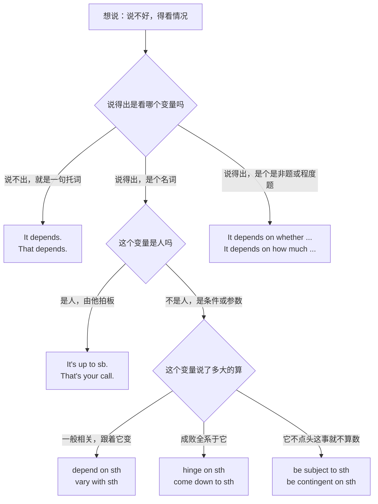
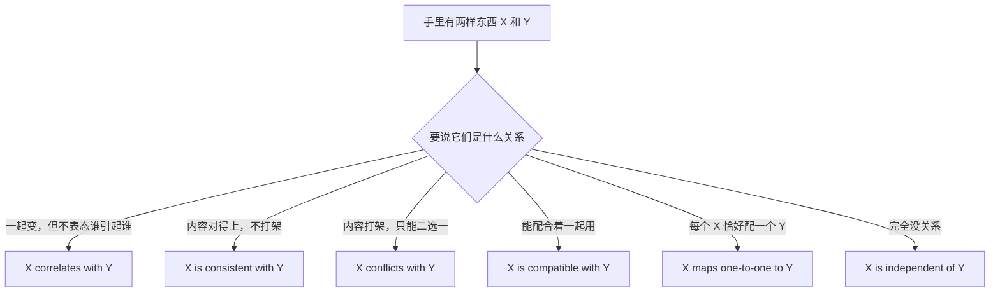
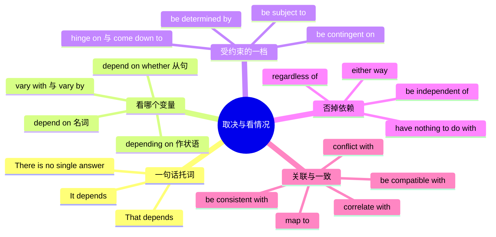

# 取决与看情况：视…而定、说不好得看

> [!info] 本篇定位
>
> 这篇收的是一类特殊条件：**结果确实由某个条件决定，但你不打算把那个条件说死**。中文说成「看情况」「得看」「视…而定」「因人而异」「主要取决于」「那得你说了算」，英文对应的不是 if 从句，而是一批以 `depend`、`subject`、`contingent`、`hinge` 为核心的动词与形容词搭配。
>
> 本域前三篇处理的条件都指名道姓：[[04.条件与假设/01.真实条件：如果就、只要、一旦、除非、前提是\|真实条件]] 把条件写进 if 从句，[[04.条件与假设/02.反事实假设：要是就好了、当初要是、混合时间线\|反事实假设]] 处理与事实相反的那一支，[[04.条件与假设/03.含蓄条件与省略倒装：要不是、否则、那样的话\|含蓄条件与省略倒装]] 把 if 藏起来。这一篇是第四种：条件在句子里只留一个变量名，甚至连变量名都不给。
>
> 后半篇从「取决」扩到**关联与一致**——correlate、consistent、conflict、map to、compatible、independent。它们和 depend 共用同一套介词直觉，而且是技术评审、数据汇报、合同审阅里的高频词，中文母语者错的几乎全是介词。
>
> 读完能查到：20 条中文意图、109 个分档成品句架、一张 44 行的中文入口速查表和七组一眼分清的易混对照。

---

## 1. 本篇导读：中文的「说不好」有三种，本篇只管一种

「说不好」这三个字在中文里至少盖了三件不同的事，英文分属三个完全不同的表达族。查错族，说出来的句子会离本意很远。

| 中文里的「说不好」 | 实际在说什么 | 查哪儿 |
| --- | --- | --- |
| 他八成不来吧 | 我对这件事只有几成把握 | [[10.态度、情感与判断/03.肯定是、八成、说不定、不可能：把握度阶梯\|把握度阶梯]] |
| 听说他不来 | 这话不是我说的，我只是转述 | [[10.态度、情感与判断/04.据说、研究表明、据我所知：信息来源与缓和语\|信息来源与缓和语]] |
| 他来不来得看天气 | 结果由另一个变量决定，我不下判断 | **本篇** |
| 如果他来我就走 | 条件说得出，而且指名道姓 | [[04.条件与假设/01.真实条件：如果就、只要、一旦、除非、前提是\|真实条件]] |
| 他要是当初来了就好了 | 与已经发生的事实相反 | [[04.条件与假设/02.反事实假设：要是就好了、当初要是、混合时间线\|反事实假设]] |

分不清的代价很具体。会上被问「这个方案行不行」，你想说「得看数据量」，说成 `Maybe it works.` 对方听到的是「你没把握」；说成 `It depends on the data volume.` 对方听到的是「你有把握，只是缺一个参数」。前者是能力评价，后者是技术判断。

定位到本篇之后，第二步是判断你能把那个变量说到多细。

这棵树的第一个岔口决定要不要带宾语。`It depends.` 可以独立成句，后面什么都不接；只要往后接了名词，`on` 就必须回来。唯一的松动处在口语：后面直接跟 how、whether 这类问句时可以把 `on` 省掉，见 2.3。

第二个岔口区分**人**和**条件**。中文一个「看你的」既可能是「由你拍板」也可能是「结果取决于你的表现」，英文是两个词：前者 `It's up to you`，后者 `It depends on you`。把「这事你定」说成 `It depends on you.`，听起来像「这事成不成全指望你了」，责任压得比原意重得多。

第三个岔口是**依赖强度**。中文「取决于」一个词从「有点关系」盖到「不批就不算数」，英文分成一条可排序的梯度，见第 4 节开头那张图。

> [!tip] 一句话定位法
>
> 拿不准该查本篇哪一节时，把中文句子里的「看／取决于」替换成下面四句话试读，哪句读着顺就查哪一节。
>
> 1. 「跟着它变」→ 第 2、3 节（depend on、vary with）
> 2. 「它说了算」→ 第 4 节（be determined by、be subject to）
> 3. 「跟它没关系」→ 第 5 节（have nothing to do with、be independent of）
> 4. 「跟它对得上／对不上」→ 第 6 节（be consistent with、conflict with）

---

## 2. 说不好，得看：depend 一族

这一节五条意图共用一个动词 `depend`，差别全在后面接什么：什么都不接、接一个名词、接一整个问句、加程度副词、或者换成 `up to` 把决定权交给人。

### 2.1 就这么一句：看情况

**中文触发语**：看情况 / 不好说 / 说不准 / 那得看 / 因情况而异 / 不一定

| 档位 | 句架 | 例句 |
| --- | --- | --- |
| 口语 | It depends. | "Which one is faster?" "It depends." |
| 口语 | Depends. ／ That depends. | Depends. Are we counting cold starts? |
| 口语 | It's hard to say — it depends on a lot of things. | It's hard to say — it depends on a lot of things. |
| 书面 | It varies. ／ There is no single answer. | Response time varies; there is no single number. |
| 正式 | The answer depends on the circumstances. | The answer depends on the circumstances of each request. |

- 译文：「哪个更快？」「看情况。」／ 得看。冷启动算不算在内？／ 不好说，要看的东西太多了。／ 响应时间不固定，给不出一个数。／ 答案取决于每一次请求的具体情况。

> [!warning] 错配警示
>
> - ❌ ~~It's depend on the situation.~~ ／ ✅ **It depends on the situation.**（depend 是实义动词，前面不加 be）
> - ❌ ~~It's all depends.~~ ／ ✅ **It all depends.**（all 是主语的同位修饰，不是表语，别塞 be 进去）

- 同义入口：那可说不好 / 分情况 / 得分开看
- 语法归属：[[02.英语基础语法/05.介词与连词/02.常用介词搭配详解\|动词与介词的固定搭配]]
- 场景实战：[[04.英语场景/05.高频实用表达句型框架/01.表达观点与态度的50个万能句型\|表达观点与态度的万能句型]]

---

### 2.2 看…而定：把变量说出来

**中文触发语**：取决于 / 要看 / 得看…（后面跟名词）/ 视…而定 / 跟…有关

| 档位 | 句架 | 例句 |
| --- | --- | --- |
| 口语 | It depends on + 名词. | It depends on the size of the file. |
| 口语 | It all depends on + 名词. | It all depends on the deadline they give us. |
| 书面 | B depends on A. | Build time depends on the number of modules. |
| 书面 | B is dependent on A. | Throughput is dependent on disk speed, not CPU. |
| 正式 | B is dependent upon A. | Eligibility is dependent upon twelve months of continuous employment. |

- 译文：看文件多大。／ 全看他们给的截止时间。／ 构建时间取决于模块数量。／ 吞吐量取决于磁盘速度，不是 CPU。／ 资格取决于连续在职满十二个月。

> [!warning] 错配警示
>
> - ❌ ~~It depends the weather.~~ ／ ✅ **It depends on the weather.**（除了独立成句的 It depends. 之外，depend 后面一律带 on）
> - ❌ ~~It's depending on the weather.~~ ／ ✅ **It depends on the weather.**（depend 表状态不用进行时；-ing 形式只在作状语时出现，见 3.1）

- 同义入口：跟…有关系 / 由…来定 / 得看…怎么样
- 语法归属：[[02.英语基础语法/05.介词与连词/02.常用介词搭配详解\|动词与介词的固定搭配]]
- 场景实战：[[04.英语场景/10.职场与商务场景实战/02.会议汇报与演示场景\|会议汇报与演示场景]]

---

### 2.3 看…是不是：后面接一整个问题

**中文触发语**：看…是不是 / 要看能不能 / 得看有多少 / 看…怎么样 / 看谁来做

| 档位 | 句架 | 例句 |
| --- | --- | --- |
| 口语 | It depends on whether A. | It depends on whether the client signs off this week. |
| 口语 | It depends how much A.（口语允许省 on） | It depends how much time we've got left. |
| 书面 | B depends on whether A. | The rollout date depends on whether QA finds any blockers. |
| 书面 | B depends on what / how / who A. | The fix depends on what the logs actually show. |
| 正式 | Whether A depends on whether B. | Whether the clause applies depends on whether the goods were delivered on time. |

- 译文：得看客户这周签不签字。／ 得看还剩多少时间。／ 上线日期取决于测试有没有发现阻塞问题。／ 怎么修取决于日志里到底是什么。／ 该条款是否适用，取决于货物是否按时交付。

> [!warning] 错配警示
>
> - ❌ ~~It depends on whether will he come.~~ ／ ✅ **It depends on whether he will come.**（whether 从句用陈述语序，不保留疑问句的倒装）
> - ❌ ~~It depends on if the client agrees.~~ 口语勉强能过 ／ ✅ **It depends on whether the client agrees.**（介词后面不用 if，书面场合一律 whether）

- 同义入口：看…成不成 / 就看…了 / 要看结果怎么样
- 语法归属：[[02.英语基础语法/09.从句体系/03.名词性从句详解\|whether 引导的宾语从句]]
- 场景实战：[[04.英语场景/10.职场与商务场景实战/02.会议汇报与演示场景\|会议汇报与演示场景]]

---

### 2.4 主要看：给依赖程度加刻度

**中文触发语**：主要取决于 / 很大程度上看 / 多少跟…有点关系 / 完全取决于 / 一半看…

| 档位 | 句架 | 例句 |
| --- | --- | --- |
| 口语 | It depends a lot on A. | It depends a lot on who reviews it. |
| 口语 | It partly depends on A. | It partly depends on luck, honestly. |
| 书面 | B depends largely on A. | Adoption depends largely on how good the onboarding is. |
| 书面 | B depends entirely on A. | The output depends entirely on the seed value. |
| 正式 | B is heavily dependent on A. | The forecast is heavily dependent on Q4 renewals. |
| 正式 | B depends, to a large extent, on A. | Compliance depends, to a large extent, on staff training. |

- 译文：主要看谁来评审。／ 说实话，多少有点看运气。／ 采用率很大程度上取决于新手引导做得好不好。／ 输出完全由种子值决定。／ 该预测高度依赖第四季度的续约情况。／ 合规在很大程度上取决于员工培训。

> [!warning] 错配警示
>
> - ❌ ~~It depends on very much the price.~~ ／ ✅ **It depends very much on the price.**（程度副词插在 depend 和 on 之间，不能插在 on 和宾语之间）
> - ❌ ~~It depends on 50% on the price.~~ ／ ✅ **Price accounts for about half of it.**（百分比不挂在 depend 上，换 account for，见 [[09.比较、程度与数量/04.大约、超过、占三成、平均、分别是：数量与统计描述\|数量与统计描述]]）

- 同义入口：说到底主要是 / 大头在 / 关系不大但也有关系
- 语法归属：[[02.英语基础语法/04.形容词与副词/03.副词的分类与用法\|程度副词的位置]]
- 场景实战：[[04.英语场景/10.职场与商务场景实战/02.会议汇报与演示场景\|会议汇报与演示场景]]

---

### 2.5 你说了算：把决定权交出去

**中文触发语**：你说了算 / 归你定 / 由你决定 / 看你 / 这事我做不了主 / 我听你的

| 档位 | 句架 | 例句 |
| --- | --- | --- |
| 口语 | It's up to you. | Coffee or tea — it's up to you. |
| 口语 | That's your call. ／ Your call. | Ship today or wait a week. Your call. |
| 口语 | It's not up to me. | I'd approve it today if I could, but it's not up to me. |
| 书面 | The decision rests with sb. | The decision rests with the product owner, not with engineering. |
| 正式 | sth is at the discretion of sb. | Extensions are granted at the discretion of the review committee. |

- 译文：喝咖啡还是喝茶，你定。／ 今天发还是再等一周，你拍板。／ 我要能批今天就批了，可这事不归我管。／ 决定权在产品负责人手里，不在研发。／ 延期与否由评审委员会酌情决定。

> [!warning] 错配警示
>
> - ❌ ~~It depends on you.~~（想说「你定」时）／ ✅ **It's up to you.**（depend on you 的意思是「这事成不成全指望你」，压力大得多）
> - ❌ ~~It's up to you to decide it.~~ ／ ✅ **It's up to you.**（up to sb 本身就含「由谁定」，再加 to decide 是重复）

- 同义入口：随你 / 你拿主意 / 我这边没意见 / 我做不了这个主
- 语法归属：[[02.英语基础语法/05.介词与连词/01.介词的分类与基本用法\|介词短语作表语]]
- 场景实战：[[04.英语场景/10.职场与商务场景实战/04.商务谈判合同与客户沟通\|商务谈判合同与客户沟通]]

---

## 3. 随着…不同而不同：把变量写进句子

第 2 节的 depend 是**整句话的谓语**，这一节的三条意图是把变量塞进状语或者换一个专门表「变动」的动词。区别在于说话人的落点：说 `It depends on the region` 是在回答「行不行」，说 `Prices vary by region` 是在描述「事实就是这样」。

### 3.1 视…而定：变量挂在句子末尾

**中文触发语**：视…而定 / 根据…不同 / 按…来定 / 看…情况不同 / 有的…有的…

| 档位 | 句架 | 例句 |
| --- | --- | --- |
| 口语 | ..., depending on A. | It takes two to five minutes, depending on the network. |
| 口语 | Depending on A, B. | Depending on the load, we may add another node. |
| 书面 | ..., depending on whether A. | The page loads in 200 ms or 2 s, depending on whether the cache is warm. |
| 书面 | A varies depending on B. | Shipping cost varies depending on the destination country. |
| 正式 | ..., depending upon A. | Fees differ depending upon the class of service selected. |

- 译文：两到五分钟，看网络。／ 视负载情况，我们可能再加一个节点。／ 缓存热不热决定页面是 200 毫秒还是 2 秒打开。／ 运费视目的国而不同。／ 费用视所选服务等级而不同。

> [!warning] 错配警示
>
> - ❌ ~~Depend on the load, we may add a node.~~ ／ ✅ **Depending on the load, we may add a node.**（挂在别的句子上时必须写成 -ing 形式，这是全篇 depend 唯一带 -ing 的位置）
> - ❌ ~~It takes 2-5 minutes, it depends on the network.~~ ／ ✅ **It takes two to five minutes, depending on the network.**（两个完整句子不能只靠逗号连，改成分词状语或加分号）

- 同义入口：分情况 / 具体看…/ 因…而异 / 快的话…慢的话…
- 语法归属：[[02.英语基础语法/08.非谓语动词/03.现在分词详解\|现在分词作状语]]
- 场景实战：[[04.英语场景/10.职场与商务场景实战/02.会议汇报与演示场景\|会议汇报与演示场景]]

---

### 3.2 因人而异：说清楚在哪个区间浮动

**中文触发语**：因人而异 / 各不相同 / 有高有低 / 随…不同而不同 / 不一定 / 浮动

| 档位 | 句架 | 例句 |
| --- | --- | --- |
| 口语 | It varies from person to person. | How long jet lag lasts varies from person to person. |
| 口语 | It varies a lot. | Latency varies a lot between regions. |
| 书面 | A varies with B. | Battery life varies with screen brightness. |
| 书面 | A varies between X and Y. | The figure varies between three and eight percent. |
| 书面 | A varies by B. | Tax treatment varies by jurisdiction. |
| 正式 | A is subject to variation according to B. | Delivery times are subject to variation according to destination. |

- 译文：倒时差要多久因人而异。／ 各地区的延迟差别很大。／ 电池续航随屏幕亮度变化。／ 这个数在百分之三到百分之八之间浮动。／ 税务处理因司法辖区而不同。／ 送达时间视目的地而有所不同。

> [!warning] 错配警示
>
> - ❌ ~~It varies from person.~~ ／ ✅ **It varies from person to person.**（from A to A 结构里同一个名词必须重复两次，且都不带冠词）
> - ❌ ~~It's various from case to case.~~ ／ ✅ **It varies from case to case.**（various 是形容词「各种各样的」，不表「变动」）

- 同义入口：看人 / 每个人不一样 / 各家不同 / 说不好，有高有低
- 语法归属：[[02.英语基础语法/06.动词时态/01.一般现在时与一般过去时\|一般现在时表规律]]
- 场景实战：[[04.英语场景/09.学习与教育场景实战/02.图书馆作业与研究场景\|图书馆作业与研究场景]]

---

### 3.3 水涨船高：一个涨另一个跟着涨

**中文触发语**：随…上升 / 跟着…走 / …一涨它就涨 / 成正比 / 水涨船高 / 挂钩

| 档位 | 句架 | 例句 |
| --- | --- | --- |
| 口语 | A goes up when B does. | Our bill goes up when traffic does. |
| 口语 | A tracks B pretty closely. | Churn tracks support response time pretty closely. |
| 书面 | A rises with B. | Memory use rises with the number of open sessions. |
| 书面 | A scales linearly with B. | Cost scales linearly with the number of requests. |
| 正式 | A moves in proportion to B. | Premiums move in proportion to the assessed risk. |

- 译文：流量一涨账单就涨。／ 流失率跟客服响应时间贴得很紧。／ 内存占用随打开的会话数上升。／ 成本随请求数线性增长。／ 保费与评估风险成正比变动。

> [!warning] 错配警示
>
> - ❌ ~~The cost is risen with traffic.~~ ／ ✅ **The cost rises with traffic.**（rise 不及物，没有被动式；要用被动得换及物的 raise）
> - ❌ ~~Cost is proportional with usage.~~ ／ ✅ **Cost is proportional to usage.**（proportional 后面固定接 to，不是 with）

- 同义入口：越…越贵 / 跟着一起动 / 联动 / 成反比（inversely）
- 语法归属：[[02.英语基础语法/05.介词与连词/02.常用介词搭配详解\|介词 with 表伴随变化]]
- 场景实战：[[04.英语场景/10.职场与商务场景实战/02.会议汇报与演示场景\|会议汇报与演示场景]]

---

## 4. 以…为准、由…决定：依赖强度的四档

中文一个「取决于」从「有点关系」一路盖到「它不点头就不算数」，英文把这段距离切成一条可排序的梯度。

这条线从左到右，说话人交出去的确定性越来越多。左端的 `be related to` 只承认有联系，右端的 `be subject to` 已经把结论挂起来等审批。落点选错的代价在会议上很直接：项目还在评估阶段就说 `The launch is subject to legal approval`，等于告诉所有人法务已经在管这件事，日程从此不由你排；反过来，法务真的在管却说 `The launch depends on legal a bit`，等于替对方免责，出了问题算你的。

中间三档还有一个语域差：`depend on` 三档通吃，`be determined by` 和 `hinge on` 偏书面，`be subject to` 和 `be contingent on` 在合同与规章里几乎是固定件，见 [[12.文体、语域与正式文书/05.法律条款与篇章回指：除非另有约定、如前所述、前者后者\|法律条款与篇章回指]]。

### 4.1 以…为准：还没定，等它点头

**中文触发语**：以…为准 / 须经…批准 / 可能有变动 / 受…约束 / 最终解释权

| 档位 | 句架 | 例句 |
| --- | --- | --- |
| 口语 | Nothing's final yet. | Nothing's final yet — legal still has to look at it. |
| 口语 | It still needs sign-off from sb. | The date still needs sign-off from finance. |
| 书面 | A is subject to change. | Prices are subject to change without notice. |
| 书面 | A is subject to B's approval. | The budget is subject to the director's approval. |
| 正式 | A shall be subject to B. | All payments shall be subject to the terms set out in Schedule 2. |
| 正式 | Subject to the foregoing, A. | Subject to the foregoing, the license is perpetual and worldwide. |

- 译文：还没定死，法务那边还要看。／ 日期还得财务签字。／ 价格可能变动，恕不另行通知。／ 预算须经总监批准。／ 所有付款均受附表二所载条款约束。／ 在上述前提下，该许可为永久且全球范围有效。

> [!warning] 错配警示
>
> - ❌ ~~The plan is subject to change without notify.~~ ／ ✅ **subject to change without notice.**（subject to 后面接名词或动名词，接不了动词原形）
> - ❌ ~~It is subjected to approval.~~ ／ ✅ **It is subject to approval.**（subject 在这里是形容词；subjected to 是「使遭受」，语义完全不同）

- 同义入口：还得走审批 / 以最终版本为准 / 后续可能调整
- 语法归属：[[02.英语基础语法/04.形容词与副词/01.形容词的用法与位置\|形容词作表语]]
- 场景实战：[[04.英语场景/10.职场与商务场景实战/04.商务谈判合同与客户沟通\|商务谈判合同与客户沟通]]

---

### 4.2 前提是：条件不满足就一笔勾销

**中文触发语**：前提是 / 以…为条件 / 只有…才算数 / 建立在…之上 / 附条件

| 档位 | 句架 | 例句 |
| --- | --- | --- |
| 口语 | ..., but only if A. | We'll ship Friday, but only if QA signs off Thursday. |
| 口语 | A is the whole basis for B. | That one assumption is the whole basis for the estimate. |
| 书面 | B is contingent on A. | The bonus is contingent on hitting the Q3 target. |
| 书面 | B is conditional on A. | The offer is conditional on a satisfactory reference check. |
| 正式 | B is predicated on A. | The forecast is predicated on exchange rates remaining stable. |
| 正式 | B is contingent upon A. | Completion is contingent upon regulatory clearance. |

- 译文：周五发版，但前提是周四测试签字。／ 整个估算就架在那一条假设上。／ 奖金以完成第三季度目标为前提。／ 该录用以背景调查结果满意为条件。／ 该预测以汇率保持稳定为前提。／ 交割以取得监管许可为前提。

> [!warning] 错配警示
>
> - ❌ ~~The bonus is contingent to performance.~~ ／ ✅ **contingent on performance.**（介词固定是 on／upon，不是 to）
> - ❌ ~~The offer is conditional if you pass the check.~~ ／ ✅ **conditional on passing the check.**（conditional 后面接的是介词加名词，不接 if 从句）

- 同义入口：得先…才行 / 谈好了才算 / 附带条件 / 说好的前提
- 语法归属：[[02.英语基础语法/04.形容词与副词/01.形容词的用法与位置\|形容词作表语]]
- 场景实战：[[04.英语场景/10.职场与商务场景实战/04.商务谈判合同与客户沟通\|商务谈判合同与客户沟通]]

---

### 4.3 成败全看这一条

**中文触发语**：成败全看 / 关键在于 / 说到底就看 / 全押在…上 / 归根结底 / 就差这一步

| 档位 | 句架 | 例句 |
| --- | --- | --- |
| 口语 | It all comes down to A. | It all comes down to whether the demo runs on the first try. |
| 口语 | It boils down to A. | The whole argument boils down to cost. |
| 口语 | Everything's riding on A. | Everything's riding on Thursday's meeting. |
| 书面 | B hinges on A. | The launch hinges on the vendor delivering on time. |
| 书面 | B turns on A. | The case turns on when exactly the email was sent. |
| 正式 | B rests on A. | The conclusion rests on a single untested assumption. |

- 译文：说到底就看演示能不能一次跑通。／ 整个争论归根结底是成本问题。／ 全压在周四那场会上了。／ 上线成败取决于供应商能否按时交付。／ 本案的关键在于那封邮件究竟何时发出。／ 该结论建立在一条未经检验的假设之上。

> [!warning] 错配警示
>
> - ❌ ~~Everything hinges to the demo.~~ ／ ✅ **Everything hinges on the demo.**（hinge 只跟 on／upon）
> - ❌ ~~It comes down to whether can we ship on time.~~ ／ ✅ **whether we can ship on time.**（从句用陈述语序，同 2.3）

- 同义入口：胜负手 / 就卡在这儿 / 最后就看它了 / 核心问题是
- 语法归属：[[02.英语基础语法/09.从句体系/03.名词性从句详解\|whether 引导的宾语从句]]
- 场景实战：[[04.英语场景/10.职场与商务场景实战/02.会议汇报与演示场景\|会议汇报与演示场景]]

---

### 4.4 由…决定：谁定的说清楚

**中文触发语**：由…决定 / 由…说了算 / 按…来定 / 受…支配 / 是…定的规矩

| 档位 | 句架 | 例句 |
| --- | --- | --- |
| 口语 | A sets B. | The vendor sets the price, not us. |
| 口语 | B is whatever A says. | The deadline is whatever the client says it is. |
| 书面 | B is determined by A. | Sort order is determined by the timestamp field. |
| 书面 | B is driven by A. | Most of the cost is driven by storage, not compute. |
| 正式 | B is governed by A. | This agreement is governed by the laws of Singapore. |
| 正式 | B is dictated by A. | Retention periods are dictated by statute, not by policy. |

- 译文：价格是供应商定的，不是我们。／ 截止日期客户说了算。／ 排序由时间戳字段决定。／ 大部分成本来自存储，不是算力。／ 本协议受新加坡法律管辖。／ 保留期限由法律规定，不由公司政策决定。

> [!warning] 错配警示
>
> - ❌ ~~The price determines by the market.~~ ／ ✅ **The price is determined by the market.**（determine 是及物动词，「由…决定」必须写成被动，见 [[02.中文句式转换/01.被字句与隐性被动：被…了、让人给…了、饭做好了\|被字句与隐性被动]]）
> - ❌ ~~The weather decides if we go.~~ ／ ✅ **Whether we go depends on the weather.**（decide 的宾语多是胜负或争议，如 A late goal decided the match；讲变量与结果的对应关系用 depend on 或 be determined by）

- 同义入口：谁定的 / 看上面怎么说 / 按规矩来 / 归…管
- 语法归属：[[02.英语基础语法/10.特殊句型/01.被动语态全解\|被动语态与 by 短语]]
- 场景实战：[[04.英语场景/10.职场与商务场景实战/04.商务谈判合同与客户沟通\|商务谈判合同与客户沟通]]

---

## 5. 跟它没关系：把依赖关系否掉

前三节都在建立依赖，这一节把它拆掉。中文说「跟…没关系」时常常带情绪——不是陈述事实，是在撇清责任，英文的语域差别正好也在这里：`has nothing to do with` 带火气，`is unrelated to` 是中性结论，`has no bearing on` 是判决口吻。

### 5.1 跟…没关系

**中文触发语**：跟…没关系 / 八竿子打不着 / 不是因为…/ 别扯上…/ 不是一码事

| 档位 | 句架 | 例句 |
| --- | --- | --- |
| 口语 | A has nothing to do with B. | The outage had nothing to do with yesterday's deploy. |
| 口语 | A has little to do with B. | Talent has little to do with it; it's mostly practice. |
| 口语 | That's beside the point. | Cost is beside the point — the thing doesn't work. |
| 书面 | A is unrelated to B. | The two incidents are unrelated. |
| 正式 | A has no bearing on B. | The applicant's age has no bearing on the decision. |

- 译文：这次故障跟昨天的发版没关系。／ 这事跟天赋关系不大，主要靠练。／ 成本不是重点，这东西压根跑不起来。／ 两起事件互不相干。／ 申请人的年龄不影响本决定。

> [!warning] 错配警示
>
> - ❌ ~~It has nothing to do about the login bug.~~ ／ ✅ **nothing to do with the login bug.**（固定搭配是 do with，不能换成 about）
> - ❌ ~~It doesn't have nothing to do with it.~~ ／ ✅ **It has nothing to do with it.**（英语不用双重否定表加强，中文「一点关系都没有」的「都」不要译出来）

- 同义入口：不搭界 / 两码事 / 别往我身上算 / 这跟那个无关
- 语法归属：[[02.英语基础语法/08.非谓语动词/01.动词不定式详解\|不定式作后置定语]]
- 场景实战：[[04.英语场景/10.职场与商务场景实战/02.会议汇报与演示场景\|会议汇报与演示场景]]

---

### 5.2 不管…都一样：把变量排除在外

**中文触发语**：与…无关 / 不受…影响 / 不管…怎样 / 独立于 / 一视同仁

| 档位 | 句架 | 例句 |
| --- | --- | --- |
| 口语 | ..., no matter what A. | It runs the same, no matter what OS you're on. |
| 书面 | ..., regardless of A. | The API returns the same shape regardless of the client. |
| 书面 | B is independent of A. | The scheduler is independent of the storage layer. |
| 正式 | ..., irrespective of A. | Fees apply irrespective of actual usage. |
| 正式 | ..., without regard to A. | Applications are reviewed without regard to nationality. |

- 译文：不管你用什么系统，跑起来都一样。／ 不管哪个客户端调，接口返回的结构都一样。／ 调度器不依赖存储层。／ 无论实际用量多少，费用照收。／ 申请审核不考虑国籍。

> [!warning] 错配警示
>
> - ❌ ~~The scheduler is independent from storage.~~ ／ ✅ **independent of storage.**（形容词 independent 配 of；配 from 的是名词 independence，如 independence from Britain）
> - ❌ ~~Regardless of he agrees or not, we ship.~~ ／ ✅ **Regardless of whether he agrees, we ship.**（regardless of 是介词，后面接名词或 whether 从句，接不了裸句子）

- 同义入口：跟…没关系（客观陈述）/ 都一样 / 不看…/ 一律
- 语法归属：[[02.英语基础语法/05.介词与连词/04.介词与连词的易混点\|介词与连词的易混点]]
- 场景实战：[[04.英语场景/10.职场与商务场景实战/03.商务邮件与正式书面沟通\|商务邮件与正式书面沟通]]

---

### 5.3 反正都一样：两种情况一起收掉

**中文触发语**：反正都一样 / 怎么着都行 / 两种情况都…/ 无论哪种 / 横竖是

| 档位 | 句架 | 例句 |
| --- | --- | --- |
| 口语 | Either way, A. | Either way, we need the data by Friday. |
| 口语 | Whichever way it goes, A. | Whichever way the vote goes, I can live with it. |
| 口语 | It makes no difference. | Bus or train — makes no difference to me. |
| 书面 | In either case, A. | In either case, the migration must run first. |
| 正式 | In either event, A. | In either event, notice shall be given in writing. |

- 译文：不管怎样，周五之前要拿到数据。／ 投票结果怎样我都接受。／ 公交还是地铁，对我都一样。／ 无论哪种情况，都得先跑迁移脚本。／ 无论发生哪种情形，均应以书面形式发出通知。

> [!warning] 错配警示
>
> - ❌ ~~In either way it works.~~ ／ ✅ **Either way, it works.**（either way 本身就是状语，前面不加介词；带介词的形式是 in either case）
> - ❌ ~~Both ways, we need the data.~~ ／ ✅ **Either way, we need the data.**（两种情况取其一用 either，用 both 会变成「两条路都要走」）

- 同义入口：怎么都行 / 无所谓 / 结果一样 / 不影响
- 语法归属：[[02.英语基础语法/03.代词与数词/04.不定代词详解\|either 与 both 的区别]]
- 场景实战：[[04.英语场景/05.高频实用表达句型框架/01.表达观点与态度的50个万能句型\|表达观点与态度的万能句型]]

---

## 6. 对得上、对不上：关联与一致

从「取决」跨到「关联」，中文变了，英文的介词直觉没变：这一族的核心词几乎全部配 `with`，例外只有 `map to`、`correspond to` 和 `independent of`。中文母语者在这里的错误集中度极高，而且几乎全是介词错，不是选词错。

这张图的六个出口互不重叠，但中文常用同一个词进去。「这两个数据对得上」既可能是 `consistent`（结论不矛盾），也可能是 `match`（数值完全相等），还可能是 `correlate`（一起涨落但数值不同）。选哪一个取决于你在说数值、说结论还是说趋势——把这三件事分开，是本节的全部内容。

第二个高频混淆是 `correlate` 和 `cause`。中文「有关系」「跟…挂钩」既能表相关也能表因果，英文分得很死：`correlate with` 只承认一起变，一旦要说因果就得换到 [[03.因果与结果/02.导致、引发、归因：把账算在原因头上\|归因表达]] 那一篇的 `cause`、`lead to`、`account for`。在数据汇报里把这两者混用，是能被当场追问的硬伤。

### 6.1 有关联：一起变，但不下因果结论

**中文触发语**：有关联 / 相关 / 一起变 / 成正比 / 挂钩 / 有点关系

| 档位 | 句架 | 例句 |
| --- | --- | --- |
| 口语 | A and B go hand in hand. | Sleep and mood go hand in hand. |
| 口语 | A seems tied to B. | The crashes seem tied to low memory. |
| 书面 | A correlates with B. | Response time correlates with queue depth. |
| 书面 | A is linked to B. | Long commutes are linked to lower job satisfaction. |
| 正式 | A is positively correlated with B. | Income is positively correlated with years of schooling. |
| 正式 | A is negatively correlated with B. | Page weight is negatively correlated with conversion. |

- 译文：睡眠和情绪是连着的。／ 崩溃好像跟内存不足有关。／ 响应时间与队列长度相关。／ 通勤时间长与工作满意度低有关联。／ 收入与受教育年限呈正相关。／ 页面体积与转化率呈负相关。

> [!warning] 错配警示
>
> - ❌ ~~Sleep correlates to mood.~~ ／ ✅ **Sleep correlates with mood.**（数据与研究写作里 correlate 一律配 with，写成 to 会被当成笔误）
> - ❌ 用 correlate 表因果：~~Low memory correlates the crashes.~~ ／ ✅ **Low memory causes the crashes.**（要下因果结论就换动词，别让 correlate 兼职）

- 同义入口：跟…有关系 / 呈正相关 / 一块儿动 / 有连带关系
- 语法归属：[[02.英语基础语法/05.介词与连词/02.常用介词搭配详解\|动词与介词的固定搭配]]
- 场景实战：[[04.英语场景/09.学习与教育场景实战/02.图书馆作业与研究场景\|图书馆作业与研究场景]]

---

### 6.2 对得上：结论不打架

**中文触发语**：对得上 / 跟…一致 / 吻合 / 符合 / 跟…是一个口径 / 说得通

| 档位 | 句架 | 例句 |
| --- | --- | --- |
| 口语 | It matches. | The numbers match what the dashboard shows. |
| 口语 | It lines up with A. | The log lines up with the user's own account of it. |
| 书面 | A is consistent with B. | The results are consistent with the model's prediction. |
| 书面 | A is in line with B. | Q3 revenue is in line with the guidance we gave. |
| 书面 | A aligns with B. | The roadmap aligns with the company's stated targets. |
| 正式 | A is in conformity with B. | The device is in conformity with the applicable safety standards. |

- 译文：数字跟看板上显示的对得上。／ 日志跟用户自己的说法能对上。／ 结果与模型预测一致。／ 第三季度营收与我们给出的指引相符。／ 路线图与公司既定目标一致。／ 该设备符合适用的安全标准。

> [!warning] 错配警示
>
> - ❌ ~~The result is consistent to the model.~~ ／ ✅ **consistent with the model.**（consistent 配 with；不带 with 时意思变成「本身前后一贯」，见 8.5）
> - ❌ ~~The numbers are matched with the report.~~ ／ ✅ **The numbers match the report.**（表「对得上」的 match 直接带宾语，不用被动也不加介词）

- 同义入口：能对上 / 没矛盾 / 跟…相符 / 是一个数
- 语法归属：[[02.英语基础语法/05.介词与连词/02.常用介词搭配详解\|形容词与介词的固定搭配]]
- 场景实战：[[04.英语场景/09.学习与教育场景实战/03.考试报名与学术评分场景\|考试报名与学术评分场景]]

---

### 6.3 对不上：两者只能留一个

**中文触发语**：冲突 / 对不上 / 打架 / 互相矛盾 / 跟…不符 / 撞车

| 档位 | 句架 | 例句 |
| --- | --- | --- |
| 口语 | These two don't match. | These two numbers don't match. |
| 口语 | A clashes with B. | The new shortcut clashes with the system one. |
| 书面 | A conflicts with B. | This rule conflicts with the spec on page four. |
| 书面 | A contradicts B. | The witness statement contradicts the timestamp on the file. |
| 正式 | A is at odds with B. | The finding is at odds with earlier research. |
| 正式 | In the event of a conflict, A shall prevail. | In the event of a conflict, the English version shall prevail. |

- 译文：这两个数对不上。／ 新快捷键跟系统快捷键撞了。／ 这条规则和第四页的规范冲突。／ 证人陈述与文件时间戳相矛盾。／ 该发现与早前研究不符。／ 如有冲突，以英文版本为准。

> [!warning] 错配警示
>
> - ❌ ~~This contradicts with the spec.~~ ／ ✅ **This contradicts the spec.**（contradict 是及物动词，不带介词；conflict 才带 with）
> - ❌ ~~There is a conflict to the schedule.~~ ／ ✅ **There is a conflict with the schedule.**（名词形式同样配 with）

- 同义入口：有出入 / 前后不一 / 两边说法不一样 / 顶了
- 语法归属：[[02.英语基础语法/01.基础入门/02.英语五大基本句型详解\|及物动词与不及物动词]]
- 场景实战：[[04.英语场景/10.职场与商务场景实战/04.商务谈判合同与客户沟通\|商务谈判合同与客户沟通]]

---

### 6.4 一一对应：一个萝卜一个坑

**中文触发语**：一一对应 / 映射到 / 对应关系 / 一个萝卜一个坑 / 对得上号

| 档位 | 句架 | 例句 |
| --- | --- | --- |
| 口语 | Each A goes with one B. | Each ticket goes with exactly one branch. |
| 书面 | A maps to B. | Each user ID maps to a single account. |
| 书面 | There is a one-to-one mapping between A and B. | There is a one-to-one mapping between rows and output files. |
| 书面 | A corresponds to B. | The third column corresponds to the created time field. |
| 正式 | A stands in one-to-one correspondence with B. | Each certificate stands in one-to-one correspondence with a private key. |

- 译文：一个工单只对一个分支。／ 每个用户 ID 对应唯一一个账号。／ 数据行与输出文件是一一对应的。／ 第三列对应创建时间字段。／ 每张证书与一把私钥一一对应。

> [!warning] 错配警示
>
> - ❌ ~~Each user maps with one account.~~ ／ ✅ **maps to one account.**（map 表对应关系时配 to，方向词，不是伴随词）
> - ❌ ~~a one-to-one mapping of rows and files~~ ／ ✅ **a one-to-one mapping between rows and files**（两方之间的对应用 between）

- 同义入口：一对一 / 对号入座 / 一一映射 / 挂钩关系
- 语法归属：[[02.英语基础语法/05.介词与连词/02.常用介词搭配详解\|表方向的介词 to]]
- 场景实战：[[04.英语场景/10.职场与商务场景实战/02.会议汇报与演示场景\|会议汇报与演示场景]]

---

### 6.5 能一起用：兼容与配合

**中文触发语**：兼容 / 能一起用 / 配得上 / 跟…不冲突 / 装得上 / 能对接

| 档位 | 句架 | 例句 |
| --- | --- | --- |
| 口语 | It works with A. | The dongle works with any USB-C laptop. |
| 口语 | It plays well with A. | The linter plays well with the formatter. |
| 书面 | A is compatible with B. | The driver is compatible with kernel 6.1 and later. |
| 书面 | A is backward compatible with B. | Version 3 is backward compatible with version 2 clients. |
| 正式 | A is interoperable with B. | The system is interoperable with third-party identity providers. |

- 译文：这个转接头任何 USB-C 笔记本都能用。／ 这个 lint 工具跟格式化工具配合得挺好。／ 该驱动兼容 6.1 及以上内核。／ 第三版向后兼容第二版客户端。／ 本系统可与第三方身份提供方互操作。

> [!warning] 错配警示
>
> - ❌ ~~The driver is compatible to the kernel.~~ ／ ✅ **compatible with the kernel.**（compatible 固定配 with）
> - ❌ ~~Version 3 is backward compatible to version 2.~~ ／ ✅ **backward compatible with version 2.**（加了 backward 也不改介词）

- 同义入口：适配 / 支持 / 能配合 / 不打架
- 语法归属：[[02.英语基础语法/05.介词与连词/02.常用介词搭配详解\|形容词与介词的固定搭配]]
- 场景实战：[[04.英语场景/10.职场与商务场景实战/02.会议汇报与演示场景\|会议汇报与演示场景]]

---

## 7. 整篇速查：中文入口一览

背不下来的时候查这张表，找到中文说法，拿走主句架，再回对应小节看三档。

| 中文入口 | 主句架 | 小节 |
| --- | --- | --- |
| 看情况 / 不好说 | It depends. | 2.1 |
| 说不准 / 那可说不好 | It's hard to say — it depends. | 2.1 |
| 不固定 / 没个准数 | It varies. ／ There is no single answer. | 2.1 |
| 取决于 / 要看 | It depends on + 名词 | 2.2 |
| 由…来定 | B depends on A. | 2.2 |
| 看…是不是 | It depends on whether A. | 2.3 |
| 得看有多少 | It depends on how much A. | 2.3 |
| 主要取决于 | B depends largely on A. | 2.4 |
| 完全取决于 | B depends entirely on A. | 2.4 |
| 多少有点关系 | It partly depends on A. | 2.4 |
| 你说了算 / 归你定 | It's up to you. ／ Your call. | 2.5 |
| 我做不了主 | It's not up to me. | 2.5 |
| 决定权在…手里 | The decision rests with sb. | 2.5 |
| 视…而定 / 根据…不同 | ..., depending on A. | 3.1 |
| 有的…有的… | A varies depending on B. | 3.1 |
| 因人而异 | It varies from person to person. | 3.2 |
| 各地不同 / 各家不同 | A varies by B. | 3.2 |
| 在…到…之间浮动 | A varies between X and Y. | 3.2 |
| 水涨船高 / 跟着涨 | A rises with B. | 3.3 |
| 成正比 | A is proportional to B. | 3.3 |
| 以…为准 / 可能变动 | A is subject to change. | 4.1 |
| 须经…批准 | A is subject to B's approval. | 4.1 |
| 前提是 / 以…为条件 | B is contingent on A. | 4.2 |
| 只有…才算数 | B is conditional on A. | 4.2 |
| 成败全看 / 关键在于 | B hinges on A. | 4.3 |
| 说到底就看 / 归根结底 | It all comes down to A. | 4.3 |
| 由…决定 | B is determined by A. | 4.4 |
| 受…管辖 | B is governed by A. | 4.4 |
| 跟…没关系 | A has nothing to do with B. | 5.1 |
| 不影响 / 不作数 | A has no bearing on B. | 5.1 |
| 不管…都一样 | ..., regardless of A. | 5.2 |
| 不依赖…/ 独立于 | B is independent of A. | 5.2 |
| 反正都一样 | Either way, A. | 5.3 |
| 无论哪种情况 | In either case, A. | 5.3 |
| 相关 / 挂钩 | A correlates with B. | 6.1 |
| 呈正相关 | A is positively correlated with B. | 6.1 |
| 对得上 / 一致 | A is consistent with B. | 6.2 |
| 符合预期 | A is in line with B. | 6.2 |
| 冲突 / 打架 | A conflicts with B. | 6.3 |
| 互相矛盾 | A contradicts B. | 6.3 |
| 以…为准（冲突时） | In the event of a conflict, A shall prevail. | 6.3 |
| 一一对应 / 映射到 | A maps to B. | 6.4 |
| 兼容 / 能一起用 | A is compatible with B. | 6.5 |
| 向后兼容 | A is backward compatible with B. | 6.5 |

---

## 8. 七组一眼分清

本篇的错误几乎全部集中在下面七处。每组给一句话的分法和一对对照句。

### 8.1 depend on 与 be up to：谁跟着谁走

`depend on` 说的是「结果跟着这个变量走」，`be up to` 说的是「这个人有权拍板」。中文都能说「看你的」。

| 说法 | 含义 | 例句 |
| --- | --- | --- |
| It's up to you. | 你有决定权 | Where we eat is up to you. |
| It depends on you. | 成败指望你 | Whether we hit the date depends on you. |

第二句在职场里是压力句，说给同事听会显得在甩锅。想说「你定」就只用第一句。

### 8.2 It depends 与 depending on：一个能单说，一个得挂在句子后面

`It depends` 是完整句子，能独立回答问题；`depending on` 是分词短语，不能单独成句，必须挂在另一个句子上。

| 说法 | 位置 | 例句 |
| --- | --- | --- |
| It depends on the network. | 独立成句 | How long? It depends on the network. |
| ..., depending on the network. | 挂在句尾 | It takes two to five minutes, depending on the network. |

把 `It takes 2-5 minutes, it depends on the network.` 这种写法拆开或者改成分词，是最常见的一处逗号连句。

### 8.3 be subject to 的两个身份

同一个词组在合同里和在描述里意思差得远。

| 说法 | 含义 | 例句 |
| --- | --- | --- |
| A is subject to B.（形容词） | A 受 B 约束、以 B 为准 | Prices are subject to change. |
| A is subjected to B.（被动动词） | A 被施加了 B，通常是不好的事 | The samples were subjected to extreme heat. |

多写一个 -ed，意思从「以…为准」变成「遭受」。合同里写错这个字会被对方律师标出来。

### 8.4 correlate 与 cause：能不能下因果结论

| 说法 | 承诺了什么 | 例句 |
| --- | --- | --- |
| A correlates with B. | 只说一起变 | Coffee intake correlates with reported stress. |
| A causes B. | 说 A 造成 B | Caffeine causes a rise in heart rate. |

数据汇报里只有实验能支撑因果时才用 cause 一族，否则一律停在 correlate。因果表达的完整清单在 [[03.因果与结果/02.导致、引发、归因：把账算在原因头上\|导致、引发、归因]]。

### 8.5 带 with 与不带 with 的 consistent：跟别人一致还是自己一贯

| 说法 | 含义 | 例句 |
| --- | --- | --- |
| A is consistent with B. | A 和 B 对得上 | The data is consistent with the hypothesis. |
| A is consistent.（无宾语） | A 本身前后一贯、稳定 | His output has been consistent all quarter. |

中文「一致」两个意思都盖，英文靠有没有 `with` 分开。说团队风格统一用 `Our naming is consistent across modules.`，说结果对得上用 `with`。

### 8.6 vary with、vary from、vary by：三个介词三件事

| 说法 | 表达什么 | 例句 |
| --- | --- | --- |
| A varies with B. | 随 B 连续变化 | Speed varies with load. |
| A varies from X to Y. | 在一个区间内取值 | Delivery varies from two to five days. |
| A varies by B. | 按 B 分组不同 | Pricing varies by country. |

`from X to X` 的重复式（from person to person、from case to case）是第三类的特例：分组维度就是那个名词本身。

### 8.7 independent of、regardless of、irrespective of：三档语域

| 说法 | 语域 | 例句 |
| --- | --- | --- |
| no matter what / whether | 口语 | It works no matter what browser you use. |
| regardless of | 中性书面 | The fee applies regardless of usage. |
| irrespective of | 正式文书 | Benefits accrue irrespective of length of service. |

`independent of` 与这三个不同：它是形容词作表语，描述系统结构，不作状语。`The scheduler is independent of storage.` 说的是架构事实，不是「不管怎样」。

---

## 9. 本篇小结

这张图五个分支对应本篇五节。左上两支是主干，覆盖日常对话里绝大多数「说不好」；右侧三支分别管合同语域、撇清关系和技术评审。真正需要死记的只有介词：depend、correlate、consistent、conflict、compatible 全配 with 或 on，只有 map、correspond、proportional 配 to，independent 配 of。把这三组分开背，本篇的错误率能压掉大半。

> [!success] 本篇核心要点回顾
>
> 1. 中文「说不好」有三种，本篇只管「结果由另一个变量决定」这一种；把握度查把握度阶梯，转述查信息来源。
> 2. `It depends.` 独立成句时不带 on；后面一旦接名词，on 必须回来，只有口语里直接跟 how、whether 这类问句时允许省。
> 3. 「你说了算」是 `It's up to you`，不是 `It depends on you`——后者是把成败压在对方身上。
> 4. depend 表状态不用进行时，`-ing` 形式只出现在作状语的 `depending on` 里。
> 5. 依赖强度从弱到强排一条线：be related to、depend on、be determined by、hinge on、be subject to，语域也随之从口语走向合同。
> 6. `subject to` 是形容词短语，多一个 -ed 变成 `subjected to`，意思从「以…为准」变成「遭受」。
> 7. `correlate with` 只承认一起变，要下因果结论必须换到 cause、lead to 一族。
> 8. 关联一族的介词只有三组：with（correlate、consistent、conflict、compatible）、to（map、correspond、proportional）、of（independent）。

> [!success] 本篇练习清单
>
> - [ ] 「这个方案行不行得看数据量」——写出口语、书面、正式三档。
> - [ ] 「上线时间取决于测试有没有发现阻塞问题」——写出三档，注意从句语序。
> - [ ] 「快的话两分钟，慢的话五分钟，看网络」——写出三档，用分词状语版本。
> - [ ] 「价格可能有变动，须经总监批准」——写出三档，正式档用合同口吻。
> - [ ] 「奖金以完成季度目标为前提」——写出三档，检查 contingent 的介词。
> - [ ] 「这次故障跟昨天的发版没关系」——写出三档，正式档换成中性结论口吻。
> - [ ] 「响应时间和队列长度相关，但不是它造成的」——写出三档，注意 correlate 与 cause 的分界。
> - [ ] 「每个用户 ID 对应唯一一个账号」——写出三档，检查 map 的介词。

### 9.1 下一篇预告

> [!info] 下一篇
>
> [[05.让步、转折与对比/01.虽然但是：让步的六种入口与语域分档\|虽然但是：让步的六种入口与语域分档]]
>
> 条件与假设四篇到此收尾。下一域换一种逻辑关系：条件说的是「有 A 才有 B」，让步说的是「有 A 却仍有 B」。下一篇把中文「虽然…但是」拆成六个英文入口——从句式的 although 与 while、介词式的 despite 与 in spite of、假设让步的 even if、任凭让步的 no matter how 与 whatever 族、以及倒装让步的 as 与 though，每条给三档整句句架，并把 although 不与 but 同现、despite 后不接句子这两条压成警示。
