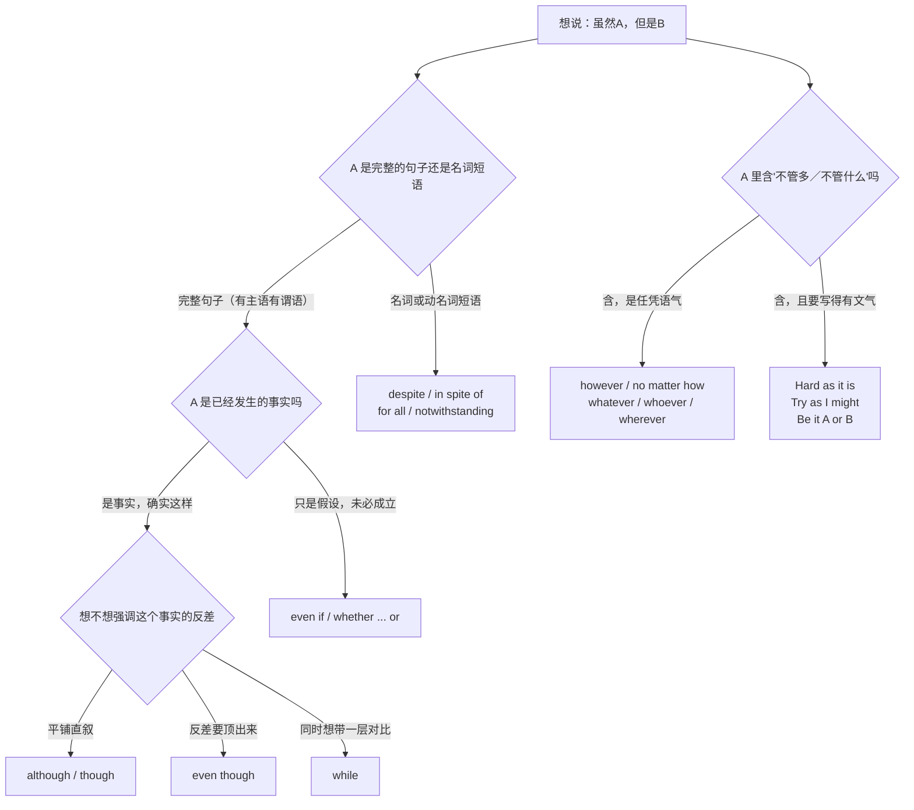
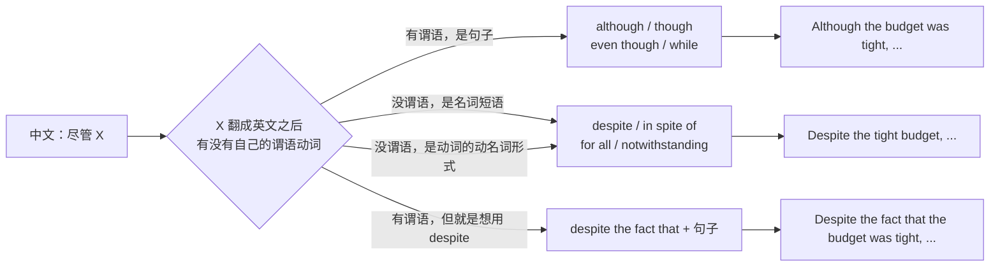
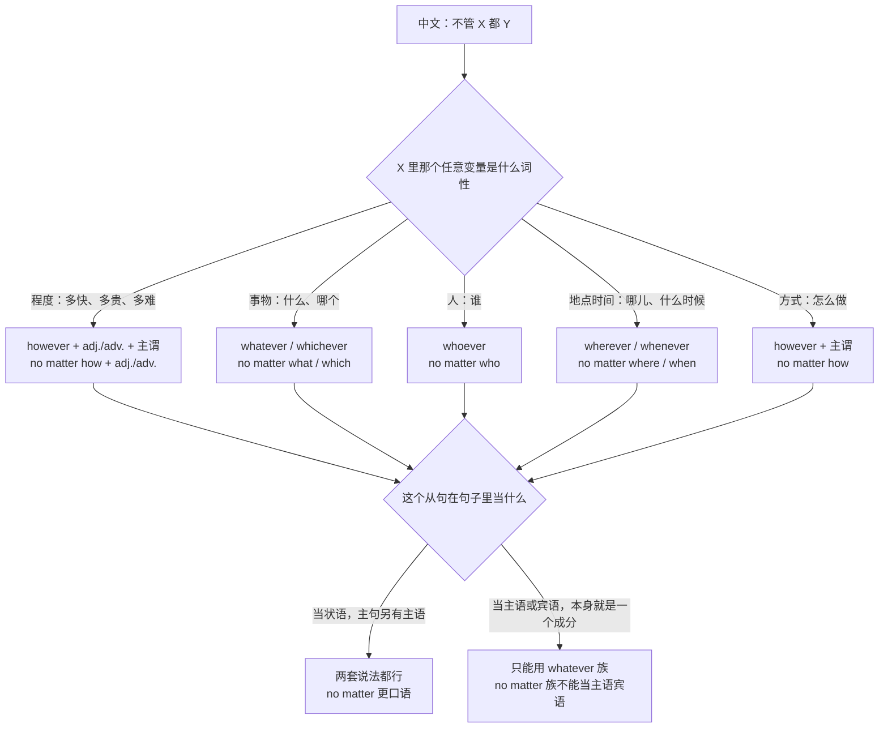
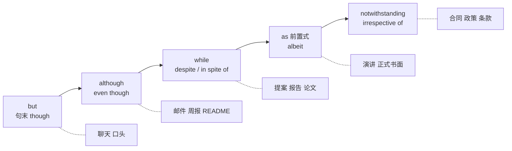
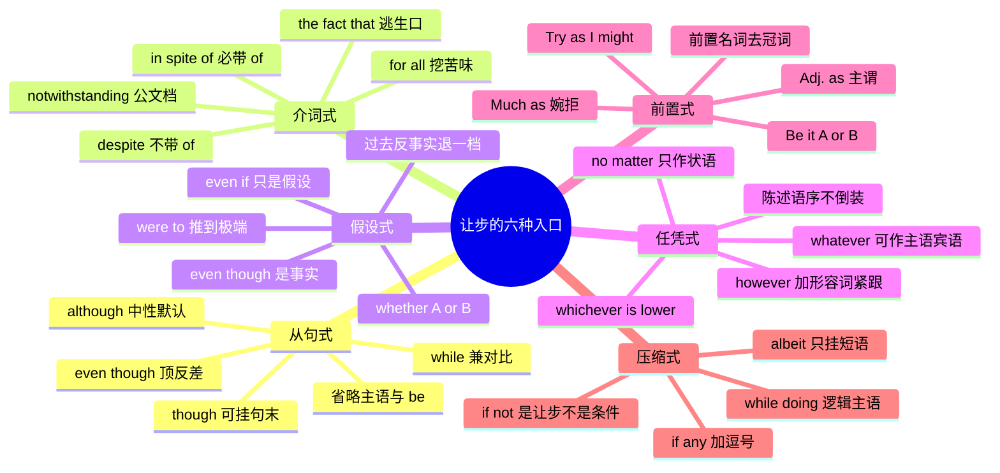

# 虽然但是：让步的六种入口与语域分档

> [!info] 本篇定位
>
> 中文的「虽然…但是」是**一个**词组，英文对应的是**六个**互不通用的结构入口。选错入口往往不只是不地道，而是直接踩语法错：`Although ... , but ...` 和 `despite + 一整句话` 就是这么来的。
>
> 这篇收六种入口的整句句架：从句式的 although／though／even though／while，介词式的 despite／in spite of／notwithstanding／for all，假设式的 even if，任凭式的 however／no matter how 与 whatever／whoever／wherever 族，前置式的 as／though 提前与 be it，以及压缩式的 albeit／while doing／if any。
>
> 让步的**礼貌功能**（先认可再反驳该怎么排话轮）不在这里，整块归 [[04.英语场景/05.高频实用表达句型框架/03.同意反对让步转折句型库\|04.英语场景 的同意反对让步转折句型库]]。让步的**细分变体**（话虽如此、退一步说、表面上…实际上、不但没…反而）归下一篇。**纯对比**（相比之下、恰恰相反、另一方面）归本域第三篇。
>
> 读完能查到：33 条中文意图、160 多个分档成品句架、一张六入口语域总表和一张从中文触发语切回句架的反查表。

---

## 1. 本篇导读：六个入口，选错就是语法错

先看两个句子，中文一模一样，英文只有一个对。

```text
虽然预算有限，我们还是把这个功能做完了。

× Although limited budget, but we still finished the feature.
√ Although the budget was limited, we still finished the feature.
√ Despite the limited budget, we still finished the feature.
```

错的那句同时踩了三处：`although` 后面必须接完整句子却只接了名词短语，`although` 已经把两个分句连起来了又补了个 `but`，而 `despite` 那个位置本来才是接名词短语的地方。三处错误的根源是同一件事——中文的「虽然」既能带句子也能带短语，英文的这两类连接词分工是死的。

选入口的第一刀，切在「让步部分是句子还是短语」。



这棵树的四个出口对应本篇第 2 到第 6 节。**最左边那条（完整句子 + 事实）是默认路径**，八成场合直接走 `although`／`though` 就对了；其余五条是它的特化版本，各自解决一个 `although` 解决不好的问题：短语接不上（走 despite）、事实不成立（走 even if）、变量任意（走 no matter）、要提高文气（走倒装）。

第二刀切在语域。同一个意思在六个入口之间挪，语域会跟着动，而且动得很大。

| 入口 | 形态 | 典型语域 | 一个代表句 |
| --- | --- | --- | --- |
| but 并列 | A, but B | 口语最低档 | It's old, but it works. |
| though 后置 | B, though | 口语随口挂 | It works, though. |
| although 从句 | Although A, B | 中性书面默认 | Although it is old, it still works. |
| even though 从句 | Even though A, B | 中性偏强调 | Even though it is ten years old, it still works. |
| despite 介词 | Despite A, B | 书面偏正式 | Despite its age, it still works. |
| notwithstanding | Notwithstanding A, B | 法律与公文 | Notwithstanding the foregoing, the license remains in effect. |

> [!tip] 三秒定档法
>
> 拿不准挑哪档时，先看这句话要出现在哪里。
>
> 1. 微信、Slack、口头会议 → `but` 或句末 `though`
> 2. 邮件正文、周报、README → `although` 或 `even though`
> 3. 提案、白皮书、论文 → `despite` 或 `while`
> 4. 合同、条款、政策文件 → `notwithstanding` 或 `irrespective of`
>
> 升降档的通用手法（缩略式、名词化、情态降级）不在本篇展开，整套在 [[12.文体、语域与正式文书/01.语域升降与同义改写：同一句话的三档说法\|语域升降与同义改写]]。

---

## 2. 虽然A但是B：接整句的 although、though、even though、while

这一节六条意图共用一个形态：让步部分是**完整的句子**，前面挂一个从属连词。四个连词的分工不在意思上，在语气强度和位置自由度上。

### 2.1 虽然A，但是B：默认的中性写法

**中文触发语**：虽然…但是 / 尽管…还是 / …，可是… / 虽说…不过 / 话是这么说，但

| 档位 | 句架 | 例句 |
| --- | --- | --- |
| 口语 | A, but B. | He's new, but he picks things up fast. |
| 口语 | Though A, B. | Though it's cheap, it does the job. |
| 书面 | Although A, B. | Although the API is documented, the examples are out of date. |
| 书面 | B, although A. | The release went out on time, although we cut two features. |
| 正式 | While it is true that A, B. | While it is true that the tests pass locally, they fail in CI. |

- 译文：他是新人，不过上手很快。／ 虽然便宜，但够用。／ 虽然接口有文档，但示例已经过时。／ 版本按时发出去了，虽然砍掉了两个功能。／ 本地测试确实通过，但在 CI 上是失败的。

> [!warning] 错配警示
>
> - ❌ ~~Although he is new, but he learns fast.~~ ／ ✅ **Although he is new, he learns fast.**（although 已经把两个分句连成主从关系，再加 but 等于两个连词抢一个位置）
> - ❌ ~~He is new. Although he learns fast.~~ ／ ✅ **He is new, although he learns fast.**（让步从句不能单独成句，句号要降级成逗号）

- 同义入口：虽说…可是 / 尽管…然而 / 话是这么说但
- 语法归属：[[02.英语基础语法/09.从句体系/04.状语从句详解\|让步状语从句]]
- 场景实战：[[04.英语场景/05.高频实用表达句型框架/03.同意反对让步转折句型库\|同意反对让步转折句型库]]

---

### 2.2 明明…却…：把反差顶出来的 even though

**中文触发语**：明明…却… / 分明…还是… / 都…了还… / 就算是…也… / 都已经…了竟然还…

| 档位 | 句架 | 例句 |
| --- | --- | --- |
| 口语 | A and still B. | I sent three reminders and he still hasn't replied. |
| 口语 | Even though A, B. | Even though I told him twice, he did it the old way. |
| 书面 | Even though A, B nonetheless. | Even though the issue was closed, the bug nonetheless resurfaced in 2.4. |
| 书面 | B even though A. | The service stayed up even though two nodes went down. |
| 正式 | Even though A, B was allowed to C. | Even though the risk had been flagged, the change was allowed to proceed. |

- 译文：我催了三次，他到现在还没回。／ 我明明说了两遍，他还是照老办法做了。／ 这个问题明明已经关闭，却又在 2.4 版本里复现了。／ 两个节点挂了，服务还是没断。／ 尽管风险早已被标出，那次变更仍获准执行。

> [!warning] 错配警示
>
> - ❌ ~~Even I told him twice, he did it the old way.~~ ／ ✅ **Even though I told him twice, ...**（even 单用不是连词，接句子必须补 though 或 if）
> - ❌ ~~Even though he is rich but he is not happy.~~ ／ ✅ **Even though he is rich, he is not happy.**（与 2.1 同一条规矩，even though 也是从属连词）

- 同义入口：都…了还… / 照理说不该…结果还是… / 说了也白说
- 语法归属：[[02.英语基础语法/05.介词与连词/03.连词的分类与用法\|从属连词与并列连词的分工]]
- 场景实战：[[04.英语场景/05.高频实用表达句型框架/03.同意反对让步转折句型库\|同意反对让步转折句型库]]

---

### 2.3 不过、只是：though 挂在句中与句末

**中文触发语**：不过 / 只是 / 就是… / …倒是 / 话说回来也没那么

`though` 是四个连词里唯一能挂在句末的，这一挂语域立刻降到最口语的一档，效果接近中文句末那个「不过」或者「就是了」。

| 档位 | 句架 | 例句 |
| --- | --- | --- |
| 口语 | B, though. | It's a bit slow, though. |
| 口语 | A. B, though. | The demo went fine. The Q&A was rough, though. |
| 口语 | B — A, though. | We shipped it — nobody's tested the edge cases, though. |
| 书面 | B; A, though. | The build passes; coverage dropped by four points, though. |
| 书面 | A, though B.（though 作句中连词） | The tool is free, though you have to register. |

- 译文：就是有点慢。／ 演示挺顺利，就是问答环节有点狼狈。／ 我们发出去了，不过边界情况还没人测过。／ 构建通过了，不过覆盖率掉了四个点。／ 这个工具免费，只是得注册。

> [!warning] 错配警示
>
> - ❌ ~~It's a bit slow, although.~~ ／ ✅ **It's a bit slow, though.**（although 不能孤零零挂句末，只有 though 可以）
> - ❌ ~~Though, it's a bit slow.~~ ／ ✅ **It's a bit slow, though.**（句首那个位置属于 however，though 放句首必须后接完整从句）

- 同义入口：就是有点 / 唯一的问题是 / 不过话说回来
- 语法归属：[[02.英语基础语法/05.介词与连词/04.介词与连词的易混点\|though 与 although 的位置差]]

---

### 2.4 虽说A，可B：while 的让步兼对比

**中文触发语**：虽说…可… / 一方面…另一方面… / …的确…，但… / 就…而言是这样，可…

`while` 放句首时既能读成让步（虽然）也能读成对比（而），中文里那种「A 归 A，B 归 B」的味道正好落在它身上。

| 档位 | 句架 | 例句 |
| --- | --- | --- |
| 口语 | A, but at the same time B. | I get the idea, but at the same time I don't see how it scales. |
| 书面 | While A, B. | While the feature works, it doubles the memory footprint. |
| 书面 | While A, it should be noted that B. | While adoption grew, it should be noted that churn grew as well. |
| 正式 | While A, B nevertheless C. | While the design is sound, the implementation nevertheless leaks handles. |
| 正式 | Whilst A, B.（英式书面） | Whilst the report is thorough, its conclusions rest on a single sample. |

- 译文：我理解这个思路，但同时看不出它怎么扩展。／ 这个功能确实能用，但内存占用翻了一倍。／ 使用量确实涨了，但流失率也在涨。／ 设计本身没问题，实现却在泄漏句柄。／ 报告虽然详尽，结论却只建立在一个样本上。

> [!warning] 错配警示
>
> - ❌ ~~While the feature works, but it doubles memory.~~ ／ ✅ **While the feature works, it doubles memory.**（同 2.1，while 也是从属连词）
> - ❌ ~~The feature works while it doubles memory.~~ ／ ✅ **While the feature works, it doubles memory.**（while 放句中优先读成「在…期间」，让步义要靠句首位置锁定）

- 同义入口：话是不错，可是 / 就这一点来说没错，但 / A 归 A，B 归 B
- 语法归属：[[02.英语基础语法/09.从句体系/04.状语从句详解\|while 的时间义与让步义]]
- 场景实战：[[04.英语场景/10.职场与商务场景实战/02.会议汇报与演示场景\|会议汇报与演示场景]]

---

### 2.5 我知道…可还是：先认下前提再转

**中文触发语**：我知道…但是 / 我理解…不过 / 你说得有道理，可 / 我承认…然而

这一批的功能是先把对方的前提接过来，再从这个前提上转出去。中文常说「我理解」，英文的常见反射是 `I understand, but ...`，但这个说法在正式一点的场合略显生硬，下面几档递进着往上走。

| 档位 | 句架 | 例句 |
| --- | --- | --- |
| 口语 | I get that A, but B. | I get that it's urgent, but we can't skip review. |
| 口语 | I know A — still, B. | I know the deadline is Friday — still, I'd rather ship it clean. |
| 书面 | Although I appreciate that A, B. | Although I appreciate that resources are tight, this work still needs an owner. |
| 书面 | I accept that A; that said, B. | I accept that the data is old; that said, the trend has not reversed. |
| 正式 | While I recognize that A, B. | While I recognize that the timeline is fixed, the scope must be revisited. |

- 译文：我知道这事急，但评审不能跳过。／ 我知道周五截止，但我还是想干干净净地发。／ 我理解资源紧张，但这块得有人负责。／ 我认可数据有些旧，但趋势没有反转。／ 我理解时间已经定死，但范围必须重新讨论。

> [!warning] 错配警示
>
> - ❌ ~~I know that, but ...~~（用在正式书面里显得草率） ／ ✅ **While I recognize that ..., ...**（同一意思，语域抬两档）
> - ❌ ~~Although I appreciate that resources are tight, but this work still needs an owner.~~ ／ ✅ 去掉 but（长句里这个错最容易漏掉，因为前半句已经走远了）

- 同义入口：这我明白，可是 / 道理我懂，问题是 / 你的顾虑我收到，不过
- 语法归属：[[02.英语基础语法/09.从句体系/03.名词性从句详解\|that 引导的宾语从句]]
- 场景实战：[[04.英语场景/05.高频实用表达句型框架/01.表达观点与态度的50个万能句型\|表达观点与态度的万能句型]]

---

### 2.6 虽然只是…：从句里省掉主语和 be

**中文触发语**：虽然只是… / 虽然还在… / 尽管有过… / 虽然不算…

让步从句的主语和主句主语相同、谓语又是 be 的时候，主语和 be 可以一起省掉，剩下形容词、名词或分词直接挂在连词后面。这是把从句压短最省事的一招，书面里很常见。

| 档位 | 句架 | 例句 |
| --- | --- | --- |
| 口语 | A, but only B. | It helps, but only a little. |
| 书面 | Although + adj., B. | Although small, the change breaks two downstream jobs. |
| 书面 | Though + n., B. | Though a prototype, it already handles real traffic. |
| 书面 | While + doing, B. | While acknowledging the risk, the team chose to proceed. |
| 正式 | Although + p.p., B. | Although warned twice, the vendor shipped the same defect. |

- 译文：有帮助，但很有限。／ 改动虽小，却弄坏了两个下游任务。／ 它虽然只是个原型，已经能扛真实流量了。／ 团队虽然承认了风险，还是决定继续。／ 供应商虽被两次提醒，仍交付了同样的缺陷。

> [!warning] 错配警示
>
> - ❌ ~~Although small, we redesigned the module.~~ ／ ✅ **Although the change was small, we redesigned the module.**（省略式要求两个主语一致；这里 small 的主语是 change 不是 we，一省就成了「我们很小」）
> - ❌ ~~Although being small, the change breaks two jobs.~~ ／ ✅ **Although small, the change breaks two jobs.**（省略掉的是 be，不是把 be 变成 being）

- 同义入口：虽小 / 虽说才 / 尽管当时还是
- 语法归属：[[02.英语基础语法/10.特殊句型/05.省略与替代\|状语从句中的省略]]
- 场景实战：[[04.英语场景/02.基础句型框架/04.倒装句、强调句与省略句\|倒装、强调与省略]]

---

## 3. 尽管有A：接短语的 despite、in spite of、notwithstanding、for all

从句式的四个连词后面必须是句子，介词式的这几个后面必须**不是**句子。中文母语者踩坑最集中的就是这条界线，因为中文的「尽管」两边都能接。



这张图的右下角那条支路是唯一的逃生口：**非要拿 despite 接句子，中间必须垫 the fact that**。这个短语在正式书面里完全合法，只是略嫌笨重，能改从句就改从句。图里没画的一条是 `in spite of` —— 它与 `despite` 语义完全一致，只有一个形式差别：`despite` 后面**不带** of，`in spite of` 后面**必须带** of，把两个搅在一起就写出 `despite of` 这个不存在的东西。

### 3.1 尽管有A：despite 接名词

**中文触发语**：尽管有… / 虽然有… / 不顾… / 在…的情况下还是 / 顶着…

| 档位 | 句架 | 例句 |
| --- | --- | --- |
| 口语 | Even with A, B. | Even with the extra week, we barely made it. |
| 口语 | A and we still B. | Two people were out sick and we still hit the date. |
| 书面 | Despite A, B. | Despite the tight budget, the team delivered on schedule. |
| 书面 | B despite A. | The service held up despite a threefold spike in traffic. |
| 正式 | In spite of A, B. | In spite of repeated warnings, the configuration was left unchanged. |

- 译文：就算多给了一周，我们也是勉强赶上。／ 两个人病假，我们还是按期完成了。／ 尽管预算吃紧，团队仍按计划交付。／ 流量涨了三倍，服务还是撑住了。／ 尽管一再提醒，那份配置仍未修改。

> [!warning] 错配警示
>
> - ❌ ~~Despite of the tight budget, ...~~ ／ ✅ **Despite the tight budget, ...** 或 **In spite of the tight budget, ...**（`despite` 自带 of 的含义，加 of 是把两个短语拼串了）
> - ❌ ~~Despite the budget was tight, ...~~ ／ ✅ **Despite the tight budget, ...**（介词后不接句子，详见 8.2）

- 同义入口：哪怕有… / 就算摊上… / 在…这种前提下
- 语法归属：[[02.英语基础语法/05.介词与连词/01.介词的分类与基本用法\|介词的宾语只能是名词性成分]]
- 场景实战：[[04.英语场景/10.职场与商务场景实战/02.会议汇报与演示场景\|会议汇报与演示场景]]

---

### 3.2 尽管做了A：despite 接动名词

**中文触发语**：尽管做了… / 虽然试过… / …了半天还是 / 明明已经…了

介词后面要放一个动作，动作必须先变成动名词。这是中文母语者第二个高频错点——中文的「尽管试了」直接对译成 `despite tried` 是错的。

| 档位 | 句架 | 例句 |
| --- | --- | --- |
| 口语 | A, and it still B. | I restarted it twice, and it still crashed. |
| 书面 | Despite doing A, B. | Despite rewriting the query, we saw no improvement. |
| 书面 | Despite having done A, B. | Despite having tested it on staging, we hit a fresh error in production. |
| 书面 | Despite sb's doing A, B. | Despite the vendor's promising a fix, nothing shipped. |
| 正式 | In spite of doing A, B. | In spite of allocating additional staff, the backlog continued to grow. |

- 译文：我重启了两次，它还是崩。／ 尽管重写了查询，性能没有任何改善。／ 尽管在预发环境测过了，生产上还是出了个新错。／ 尽管供应商答应修，什么也没发出来。／ 尽管增派了人手，积压仍在增加。

> [!warning] 错配警示
>
> - ❌ ~~Despite we rewrote the query, ...~~ ／ ✅ **Despite rewriting the query, ...**（要接动作就用动名词，不要塞主谓）
> - ❌ ~~Despite to rewrite the query, ...~~ ／ ✅ **Despite rewriting the query, ...**（介词后面是动名词不是不定式）

- 同义入口：都已经…过了 / 折腾了一圈还是 / 该做的都做了还是
- 语法归属：[[02.英语基础语法/08.非谓语动词/02.动名词详解\|介词后的动名词]]
- 场景实战：[[04.英语场景/10.职场与商务场景实战/04.商务谈判合同与客户沟通\|商务谈判与客户沟通]]

---

### 3.3 尽管A：非要用 despite 接句子时的唯一出路

**中文触发语**：尽管…（后面确实是一整句话）/ 虽然事实是… / 撇开…这个事实不谈

| 档位 | 句架 | 例句 |
| --- | --- | --- |
| 口语 | A, but B anyway. | The docs say it's deprecated, but people use it anyway. |
| 书面 | Despite the fact that A, B. | Despite the fact that the endpoint is deprecated, half our clients still call it. |
| 书面 | In spite of the fact that A, B. | In spite of the fact that we froze the branch, three commits landed. |
| 正式 | Notwithstanding the fact that A, B. | Notwithstanding the fact that notice was given, the claim was filed late. |
| 正式 | Regardless of the fact that A, B. | Regardless of the fact that the vote was unanimous, the motion requires board approval. |

- 译文：文档说它已废弃，可大家照用不误。／ 尽管这个接口已废弃，我们仍有一半客户端在调它。／ 尽管我们冻结了分支，还是进来了三个提交。／ 尽管已发出通知，索赔仍属逾期提出。／ 尽管表决全票通过，该动议仍须董事会批准。

> [!warning] 错配警示
>
> - ❌ ~~Despite that the endpoint is deprecated, ...~~ ／ ✅ **Despite the fact that the endpoint is deprecated, ...**（`the fact` 这个名词不能省，它才是介词真正的宾语）
> - ❌ 整篇文档里连用五次 `despite the fact that` ／ ✅ 换成 `although`（这个短语正确但笨重，一段里出现一次就够了）

- 同义入口：虽然情况是这样 / 就算事实摆在那儿 / 抛开…不说
- 语法归属：[[02.英语基础语法/09.从句体系/03.名词性从句详解\|the fact that 引导的同位语从句]]
- 场景实战：[[04.英语场景/10.职场与商务场景实战/03.商务邮件与正式书面沟通\|商务邮件与正式书面沟通]]

---

### 3.4 尽管有种种A：for all 与 with all

**中文触发语**：尽管有那么多… / 别看它… / 说了那么多…还是 / 有再多…也

`for all` 和 `with all` 带一层「这些优点／这些理由摆在那儿也没用」的味道，比 despite 多一点口语的挖苦感。

| 档位 | 句架 | 例句 |
| --- | --- | --- |
| 口语 | For all the A, B. | For all the hype, the launch was pretty quiet. |
| 口语 | With all A's B, C. | With all his experience, he still missed the obvious bug. |
| 书面 | For all its A, B. | For all its speed, the new parser silently drops comments. |
| 书面 | For all that A, B. | For all that the team had prepared, the demo still froze. |
| 正式 | For all the A that B, C. | For all the resources that were committed, adoption remained flat. |

- 译文：造势造了那么久，上线其实挺冷清。／ 他经验那么足，还是漏掉了这个明摆着的 bug。／ 新解析器再快，也在悄悄丢注释。／ 团队准备得再充分，演示还是卡住了。／ 投入了那么多资源，使用量还是没起来。

> [!warning] 错配警示
>
> - ❌ ~~For all he tried hard, he failed.~~ ／ ✅ **For all his hard work, he failed.** 或 **For all that he tried, he failed.**（`for all` 直接接句子不合法，要接句子必须补 that）
> - ❌ 把 `for all` 当成「为了所有」 ／ ✅ 这个短语在句首只有让步一读，「为了所有人」是 `for everyone`

- 同义入口：别看…（其实）/ 再怎么…也 / …归…，用处不大
- 语法归属：[[02.英语基础语法/05.介词与连词/02.常用介词搭配详解\|for 的引申用法]]
- 场景实战：[[04.英语场景/05.高频实用表达句型框架/03.同意反对让步转折句型库\|同意反对让步转折句型库]]

---

### 3.5 虽有上述规定：notwithstanding 的公文档

**中文触发语**：虽有…之规定 / 不受…之限制 / 尽管有前述… / 除…另有规定外仍

`notwithstanding` 是本篇语域最高的一个词，出现在合同、政策、条款里，日常写作用它会显得夹生。它有一个别处没有的特点：可以放在名词**后面**。

| 档位 | 句架 | 例句 |
| --- | --- | --- |
| 书面 | Notwithstanding A, B. | Notwithstanding the delay, the parties remain bound by the agreement. |
| 正式 | Notwithstanding the foregoing, B. | Notwithstanding the foregoing, Section 7 survives termination. |
| 正式 | Notwithstanding anything to the contrary, B. | Notwithstanding anything to the contrary in this Agreement, liability is capped at the fees paid. |
| 正式 | A notwithstanding, B.（后置） | The audit findings notwithstanding, the vendor was retained. |
| 正式 | Notwithstanding that A, B. | Notwithstanding that the goods were rejected, title had already passed. |

- 译文：尽管有此延误，双方仍受本协议约束。／ 虽有前述规定，第 7 条在协议终止后继续有效。／ 无论本协议有何相反约定，责任以已付费用为限。／ 尽管有审计发现，该供应商仍获续用。／ 尽管货物已被拒收，所有权此前已转移。

> [!warning] 错配警示
>
> - ❌ 在周报里写 `Notwithstanding the delay, ...` ／ ✅ **Despite the delay, ...**（这个词一出现，整段就被读成法律文件的口吻）
> - ❌ ~~Notwithstanding of the delay, ...~~ ／ ✅ **Notwithstanding the delay, ...**（和 despite 一样，后面不加 of）

- 同义入口：即便有…在先 / 不论前文如何约定 / 上述条款不影响
- 语法归属：[[02.英语基础语法/05.介词与连词/01.介词的分类与基本用法\|介词短语作状语]]
- 场景实战：[[04.英语场景/10.职场与商务场景实战/04.商务谈判合同与客户沟通\|合同与客户沟通]]

---

### 3.6 不管A都B：regardless of 与 irrespective of

**中文触发语**：不管… / 无论… / 跟…没关系，都 / …与否都一样 / 一律

这一批和 despite 的差别在于：despite 指向一个**具体存在**的障碍，regardless of 指向一个**取值任意**的变量。中文都说「不管」，英文分得很清。

| 档位 | 句架 | 例句 |
| --- | --- | --- |
| 口语 | No matter what A, B. | No matter what browser you use, the shortcut is the same. |
| 口语 | Either way, B. | Either way, we need the migration script by Thursday. |
| 书面 | Regardless of A, B. | Regardless of team size, every PR needs one approval. |
| 书面 | Regardless of whether A, B. | Regardless of whether the client signs, we keep the staging environment until June. |
| 正式 | Irrespective of A, B. | Irrespective of length of service, all employees accrue leave at the same rate. |

- 译文：不管你用哪个浏览器，快捷键都一样。／ 反正周四之前得有迁移脚本。／ 无论团队多大，每个 PR 都要一个批准。／ 不管客户签不签，预发环境留到六月。／ 无论工龄长短，全体员工按同一比例累积假期。

> [!warning] 错配警示
>
> - ❌ ~~Irregardless of team size, ...~~ ／ ✅ **Regardless of team size, ...**（`irregardless` 在正式写作里一律被判为错，别用）
> - ❌ ~~Regardless the deadline, ...~~ ／ ✅ **Regardless of the deadline, ...**（regardless 后面的 of 不能省，这点和 despite 正好相反）

- 同义入口：反正都 / 横竖 / 是A是B都行
- 语法归属：[[02.英语基础语法/05.介词与连词/01.介词的分类与基本用法\|短语介词 regardless of 的形态]]
- 场景实战：[[04.条件与假设/04.取决与看情况：视…而定、说不好得看\|取决与看情况篇的 regardless 作「无关」一读]]

---

## 4. 就算…也：假设让步的 even if 与 whether

前两节的让步部分都是**已经成立的事实**。这一节反过来：让步部分只是一个假设，说话人对它成不成立不表态，甚至明知它不成立。中文靠「就算」「哪怕」区分，英文靠 `even if` 与 `even though` 的一个词之差。

### 4.1 就算…也：even if 的标准式

**中文触发语**：就算…也… / 即使…也… / 哪怕…也… / …的话也没用 / 就是…也

| 档位 | 句架 | 例句 |
| --- | --- | --- |
| 口语 | Even if A, B. | Even if we start today, we won't finish by Friday. |
| 口语 | A or not, B. | Rain or not, the deploy window stays open. |
| 书面 | Even if A, B still C. | Even if the patch lands tonight, users will still need to upgrade manually. |
| 书面 | B even if A. | The cache stays warm even if the primary restarts. |
| 正式 | Even in the event that A, B. | Even in the event that the vendor defaults, the data remains accessible. |

- 译文：就算今天开工，周五也做不完。／ 下不下雨，发布窗口都开着。／ 即使补丁今晚合进去，用户还是得手动升级。／ 就算主库重启，缓存也不会失效。／ 即便供应商违约，数据仍可访问。

> [!warning] 错配警示
>
> - ❌ ~~Even if we started today~~（用来说已经开工的事实） ／ ✅ **Even though we started today, ...**（`even if` 是假设，`even though` 是事实，一个字母决定听者认不认为这件事发生了）
> - ❌ ~~Even if we will start today, ...~~ ／ ✅ **Even if we start today, ...**（条件与让步从句里用现在时表将来，同真实条件篇的主将从现）

- 同义入口：哪怕…也 / 就是…也不 / …了也白搭
- 语法归属：[[02.英语基础语法/09.从句体系/04.状语从句详解\|条件让步从句的时态]]
- 场景实战：[[04.条件与假设/01.真实条件：如果就、只要、一旦、除非、前提是\|真实条件篇的主将从现]]

---

### 4.2 哪怕…也：把假设推到极端

**中文触发语**：哪怕…也 / 就算再…也 / 打死也 / 拼了也要 / 就是…我也不

| 档位 | 句架 | 例句 |
| --- | --- | --- |
| 口语 | Even if it takes A, B. | Even if it takes all night, I want this green before the demo. |
| 口语 | Not even if A. | "Would you ship it?" "Not even if they paid me." |
| 书面 | Even if A were to B, C. | Even if the market were to double, the unit economics would not improve. |
| 书面 | Even if only A, B. | Even if only ten users hit this path, the crash is unacceptable. |
| 正式 | Even assuming that A, B. | Even assuming that every estimate is accurate, the plan is two months short. |

- 译文：哪怕通宵，我也要在演示前把它跑绿。／「你会发这个版本吗？」「给钱都不发。」／ 就算市场翻一倍，单位经济模型也不会变好。／ 哪怕只有十个用户走到这条路径，崩溃也不能接受。／ 就算每个估算都准，这个计划也还差两个月。

> [!warning] 错配警示
>
> - ❌ ~~Even if the market would double, ...~~ ／ ✅ **Even if the market were to double, ...**（把可能性压到极低时用 were to，属虚拟不是将来）
> - ❌ ~~Even if only ten users, the crash is unacceptable.~~ ／ ✅ **Even if only ten users hit this path, ...**（even if 后面要有谓语，光一个名词短语接不住）

- 同义入口：就算…我也 / 拼死也 / 再怎么样也得
- 语法归属：[[02.英语基础语法/10.特殊句型/02.虚拟语气详解\|were to 的极低概率假设]]
- 场景实战：[[04.条件与假设/02.反事实假设：要是就好了、当初要是、混合时间线\|反事实假设篇的时间线分档]]

---

### 4.3 就算当初…也不会：反事实让步

**中文触发语**：就算当初…也不会 / 早…也没用 / 那时候就算…结果还是 / 换成谁也一样

这一批把 even if 挪到过去，让步部分是**已经确定没发生**的事。中文里最典型的说法是「就算当时…，也不会…」，用来堵住事后诸葛的追问。

| 档位 | 句架 | 例句 |
| --- | --- | --- |
| 口语 | Even if we had A, we'd still have B. | Even if we'd caught it earlier, we'd still have had to roll back. |
| 口语 | It wouldn't have mattered even if A. | It wouldn't have mattered even if I'd sent it Friday. |
| 书面 | Even if A had happened, B would not have C. | Even if the alert had fired, the on-call would not have reached the box in time. |
| 书面 | Even with A, B would have C. | Even with a second reviewer, the bug would have slipped through. |
| 正式 | Even had A, B. | Even had the notice been served on time, the outcome would have been the same. |

- 译文：就算早点发现，我们照样得回滚。／ 我就算周五发出去，也改变不了什么。／ 就算告警响了，值班的人也来不及连上那台机器。／ 就算多一个评审，这个 bug 还是会漏过去。／ 即便通知按时送达，结果也不会不同。

> [!warning] 错配警示
>
> - ❌ ~~Even if we caught it earlier, we would still have to roll back.~~ ／ ✅ **Even if we had caught it earlier, we would still have had to roll back.**（说的是过去没发生的事，两边都要退一档时态）
> - ❌ ~~Even if had the notice been served, ...~~ ／ ✅ **Even had the notice been served, ...**（把 had 提到句首之后，if 就不能再留）

- 同义入口：早知道也 / 那会儿就算 / 换个人来也是这样
- 语法归属：[[02.英语基础语法/10.特殊句型/02.虚拟语气详解\|与过去事实相反的虚拟]]
- 场景实战：[[04.条件与假设/03.含蓄条件与省略倒装：要不是、否则、那样的话\|含蓄条件与省略倒装]]

---

### 4.4 不管是A还是B：whether A or B

**中文触发语**：不管是…还是… / 是…也好…也罢 / …也行…也行 / 无论…与否

| 档位 | 句架 | 例句 |
| --- | --- | --- |
| 口语 | A or B, C. | Mac or Windows, the setup script is the same. |
| 口语 | Whether A or B, C. | Whether you're on the free plan or paid, rate limits apply. |
| 书面 | Whether or not A, B. | Whether or not the vendor responds, we start the migration Monday. |
| 书面 | Whether A or not, B. | Whether the test passes or not, log the duration. |
| 正式 | Whether by A or by B, C. | Whether by email or by post, notice takes effect on receipt. |

- 译文：Mac 也好 Windows 也好，安装脚本是同一个。／ 不管你是免费版还是付费版，限流照样生效。／ 供应商回不回，我们周一都开始迁移。／ 不管测试过没过，都把耗时记下来。／ 无论以电子邮件还是邮寄方式，通知自送达时生效。

> [!warning] 错配警示
>
> - ❌ ~~If or not the vendor responds, ...~~ ／ ✅ **Whether or not the vendor responds, ...**（`if` 不能带 or not 作让步状语，这个位置只能是 whether）
> - ❌ ~~Whether you are on the free plan, or you are paid, ...~~ ／ ✅ **Whether you're on the free plan or paid, ...**（两端并列成分要对称，重复的主谓省掉）

- 同义入口：A也罢B也罢 / 两种情况都 / 怎么都
- 语法归属：[[02.英语基础语法/09.从句体系/03.名词性从句详解\|whether 引导从句]]
- 场景实战：[[06.并列、递进、列举与选择/03.要么要么、除了、二选一：选择、排除与例外\|选择、排除与例外]]

---

### 4.5 …与否都一样：whether 从句的三个落点

**中文触发语**：…不…都一样 / 有没有都行 / 到底…还得看 / 这事跟…没关系

`whether` 从句能落在三个位置上，中文都用「不管」起头，英文的句法角色完全不同——一个作状语，一个作主语，一个作介词宾语。挑错位置整句就散了。

| 档位 | 句架 | 例句 |
| --- | --- | --- |
| 口语 | Whether A or not doesn't change B.（作主语） | Whether he agrees or not doesn't change the deadline. |
| 口语 | It makes no difference whether A. | It makes no difference whether you restart it or not. |
| 书面 | Whether A is beside the point; B. | Whether the design is elegant is beside the point; it has to ship. |
| 书面 | B regardless of whether A.（作介宾） | The fee applies regardless of whether the account is active. |
| 正式 | The question of whether A does not affect B. | The question of whether consent was given does not affect the notice period. |

- 译文：他同不同意，截止日期都不变。／ 你重不重启都一样。／ 设计漂不漂亮不是重点，它得先发出去。／ 无论账户是否激活，该费用照收。／ 是否取得同意，不影响通知期的计算。

> [!warning] 错配警示
>
> - ❌ ~~Whether he agrees or not, doesn't change the deadline.~~ ／ ✅ 去掉那个逗号（这里 whether 从句是主语，主语和谓语之间不加逗号；只有作状语时才断开）
> - ❌ ~~regardless of whether or not that the account is active~~ ／ ✅ **regardless of whether the account is active**（whether 和 that 不能叠用）

- 同义入口：都无所谓 / 不影响 / 跟这个没关系
- 语法归属：[[02.英语基础语法/09.从句体系/03.名词性从句详解\|主语从句与介词宾语从句]]
- 场景实战：[[04.条件与假设/04.取决与看情况：视…而定、说不好得看\|取决与看情况]]

---

## 5. 不管…都：任凭让步的 no matter 族与 whatever 族

第 4 节的假设只有两个取值（A 或非 A），这一节的假设取值**任意**：不管多高、不管是谁、不管在哪。中文靠「不管…都」「无论…都」「随便…」承担，英文有两套完全平行的说法。



图里最后一个岔口是这一族唯一真正需要记的分界：**`no matter what` 只能作状语，`whatever` 既能作状语也能作主语宾语**。`Whatever he says is fine.`（他说什么都行）里的 whatever 是主语，换成 `No matter what he says is fine.` 就散架了。反过来，`No matter what he says, I'm going.` 里 no matter what 只是状语，两套都合法，此时 no matter 版本更口语，whatever 版本更书面。

### 5.1 不管多…都：程度任意

**中文触发语**：不管多… / 无论多么… / 再…也 / …到什么程度都 / 多…都不管用

| 档位 | 句架 | 例句 |
| --- | --- | --- |
| 口语 | No matter how + adj. + 主谓, B. | No matter how careful you are, typos get through. |
| 口语 | However + adv. + 主谓, B. | However fast we move, procurement takes four weeks. |
| 书面 | However + adj. + 主谓, B. | However thorough the review is, some defects reach production. |
| 书面 | No matter how much A, B. | No matter how much we cache, the cold path stays slow. |
| 正式 | However + adj. + may be, B. | However compelling the argument may be, the policy is unchanged. |

- 译文：不管多小心，错别字总会漏过去。／ 我们再快，采购也要四周。／ 评审再仔细，也会有缺陷进生产。／ 缓存加得再多，冷路径还是慢。／ 论据再有说服力，政策也不变。

> [!warning] 错配警示
>
> - ❌ ~~However you are careful, ...~~ ／ ✅ **However careful you are, ...**（形容词必须紧跟 however，不能留在原位）
> - ❌ ~~No matter how much we will cache, ...~~ ／ ✅ **No matter how much we cache, ...**（让步从句里用现在时表将来）

- 同义入口：再怎么…也 / …得再厉害也 / 多到天上去也
- 语法归属：[[02.英语基础语法/09.从句体系/04.状语从句详解\|however 引导的让步从句]]
- 场景实战：[[09.比较、程度与数量/03.太…以至于、够不够、有点、非常：程度刻度\|程度刻度]]

---

### 5.2 不管…做什么：事物任意

**中文触发语**：不管…什么 / 无论…做什么 / 想…什么都 / 随便…什么

| 档位 | 句架 | 例句 |
| --- | --- | --- |
| 口语 | No matter what A, B. | No matter what I try, the container exits immediately. |
| 口语 | Whatever A, B. | Whatever you do, don't force-push to main. |
| 书面 | Whatever A may B, C. | Whatever the root cause may be, the incident review is due Friday. |
| 书面 | Whatever + n. + 主谓, B. | Whatever approach we take, migration needs a rollback plan. |
| 正式 | Irrespective of what A, B. | Irrespective of what the audit finds, the control must be documented. |

- 译文：我怎么试，容器都是起来就退。／ 你干什么都行，就是别往 main 上强推。／ 不管根因是什么，事故复盘周五要交。／ 不管选哪种方案，迁移都得有回滚计划。／ 不管审计查出什么，这项控制措施都必须写进文档。

> [!warning] 错配警示
>
> - ❌ ~~No matter what you do is fine.~~ ／ ✅ **Whatever you do is fine.**（作主语只能用 whatever 族，见本节开头那张图的右下角）
> - ❌ ~~Whatever do you try, it fails.~~ ／ ✅ **Whatever you try, it fails.**（从句用陈述语序，不要保留疑问句的助动词前置）

- 同义入口：怎么弄都 / 爱做什么做什么 / 反正不管干嘛
- 语法归属：[[02.英语基础语法/09.从句体系/03.名词性从句详解\|whatever 的两重身份]]
- 场景实战：[[04.英语场景/04.从句与复合句型框架/03.状语从句九大类型\|状语从句九大类型]]

---

### 5.3 不管谁、在哪、什么时候：人、地、时任意

**中文触发语**：不管谁… / 无论在哪 / 什么时候…都 / 谁来都一样 / 走到哪都

| 档位 | 句架 | 例句 |
| --- | --- | --- |
| 口语 | No matter who A, B. | No matter who's on call, page the team channel too. |
| 口语 | Wherever A, B. | Wherever you deploy it, mount the config as a secret. |
| 口语 | Whenever A, B. | Whenever the queue backs up, the same three jobs are at the front. |
| 书面 | Whoever A, B. | Whoever picks this up will need database access. |
| 正式 | No matter when A, B. | No matter when the request is received, processing begins the next business day. |

- 译文：不管谁值班，也在团队频道里同步一声。／ 不管部署在哪，配置都挂成 secret。／ 每次队列积压，排在最前面的都是那三个任务。／ 谁接手这活都需要数据库权限。／ 无论何时收到请求，均于次一工作日开始处理。

> [!warning] 错配警示
>
> - ❌ ~~No matter whoever is on call, ...~~ ／ ✅ **No matter who is on call, ...** 或 **Whoever is on call, ...**（两套说法二选一，叠在一起是重复）
> - ❌ ~~Whenever the queue will back up, ...~~ ／ ✅ **Whenever the queue backs up, ...**（同 5.1，时间与让步从句不用将来时）

- 同义入口：谁都行 / 到哪都 / 每次…都
- 语法归属：[[02.英语基础语法/09.从句体系/04.状语从句详解\|wherever 与 whenever]]
- 场景实战：[[07.时间与顺序/01.当…的时候、一…就、直到才：时间关系速查\|时间关系速查里的 whenever]]

---

### 5.4 随便哪个都行：whichever 与 whatever 带名词

**中文触发语**：随便哪个 / 哪个都行 / 挑…都可以 / 看你选哪个都 / 二者取其…

| 档位 | 句架 | 例句 |
| --- | --- | --- |
| 口语 | Whichever. | "Tabs or spaces?" "Whichever. Just pick one and move on." |
| 口语 | Whichever A you B, C. | Whichever branch you cut from, tag it before merging. |
| 书面 | Whichever + n. + 主谓, B. | Whichever vendor we choose, onboarding takes a quarter. |
| 书面 | A, whichever is B. | The refund is 30 dollars or the full fee, whichever is lower. |
| 正式 | A, whichever occurs first. | The license terminates on 31 December or upon breach, whichever occurs first. |

- 译文：「用 Tab 还是空格？」「哪个都行，选一个往下走。」／ 不管你从哪个分支切，合并前先打标签。／ 不管选哪家供应商，接入都要一个季度。／ 退款为 30 美元或全额费用，以较低者为准。／ 许可于 12 月 31 日或违约之日终止，以先发生者为准。

> [!warning] 错配警示
>
> - ❌ ~~whichever is the lower one~~（写在条款里） ／ ✅ **whichever is lower**（`whichever is lower` 与 `whichever occurs first` 是合同里的封闭固定式，不要自行加词）
> - ❌ ~~Whichever branch do you cut from, ...~~ ／ ✅ **Whichever branch you cut from, ...**（陈述语序，同 5.2）

- 同义入口：以…为准 / 哪个先到算哪个 / 随你挑
- 语法归属：[[02.英语基础语法/09.从句体系/03.名词性从句详解\|whichever 与 whatever 的限定用法]]
- 场景实战：[[12.文体、语域与正式文书/05.法律条款与篇章回指：除非另有约定、如前所述、前者后者\|法律条款的封闭固定式]]

---

### 5.5 爱怎么…就怎么：方式任意

**中文触发语**：爱怎么…就怎么 / 想怎么弄都行 / 随你 / 按你的方式来 / 怎么方便怎么来

| 档位 | 句架 | 例句 |
| --- | --- | --- |
| 口语 | However you like. | Name the branch however you like. |
| 口语 | However A, B. | However you slice the data, the trend is the same. |
| 口语 | Whatever works for A. | Tuesday, Thursday — whatever works for you. |
| 书面 | However A chooses to B, C. | However the team chooses to structure it, the interface must stay stable. |
| 正式 | In whatever manner A, B. | In whatever manner the notice is delivered, a record must be retained. |

- 译文：分支名随你怎么起。／ 数据怎么切，趋势都一样。／ 周二周四都行，你方便就好。／ 团队想怎么组织都可以，接口必须保持稳定。／ 无论以何种方式送达通知，均须留存记录。

> [!warning] 错配警示
>
> - ❌ ~~Name the branch how you like.~~ ／ ✅ **Name the branch however you like.**（`how` 引导的是名词从句，作状语要用 however）
> - ❌ ~~However you like it, however you want.~~（一句里堆两个） ／ ✅ 留一个就够（任凭结构本身语气已足，叠用会显得敷衍）

- 同义入口：随便你 / 你说了算 / 怎么顺手怎么来
- 语法归属：[[02.英语基础语法/09.从句体系/04.状语从句详解\|方式让步从句]]
- 场景实战：[[04.英语场景/05.高频实用表达句型框架/02.建议请求邀请拒绝四大功能句型\|建议请求邀请拒绝功能句型]]

---

### 5.6 换谁都一样：把任凭句压成结论

**中文触发语**：换谁都一样 / 谁来都得… / 是谁不重要 / 换个说法也是这个意思

前面五条是「不管…，都…」的完整两段式，这一条把它压成单句结论，常用来堵住讨论。

| 档位 | 句架 | 例句 |
| --- | --- | --- |
| 口语 | Whoever it is, it's the same. | Whoever takes it over, it's the same three-week ramp. |
| 口语 | It doesn't matter who A. | It doesn't matter who wrote it — it needs tests. |
| 书面 | Whatever the A, B. | Whatever the reason, the SLA was breached. |
| 书面 | Whoever A, the fact remains that B. | Whoever approved it, the fact remains that no one tested it. |
| 正式 | Regardless of who A, B. | Regardless of who initiates the change, the change board must sign off. |

- 译文：谁接手都一样，都要三周才能上手。／ 谁写的不重要，它得有测试。／ 不管什么原因，SLA 已经违约了。／ 不管是谁批的，事实是没人测过。／ 无论由谁发起变更，均须经变更委员会批准。

> [!warning] 错配警示
>
> - ❌ ~~Whoever it is, but it's the same.~~ ／ ✅ 去掉 but（任凭从句也是从属结构，同 2.1 那条规矩）
> - ❌ ~~It doesn't matter whoever wrote it.~~ ／ ✅ **It doesn't matter who wrote it.**（matter 后面接的是普通名词从句，用 who 就够，加 -ever 是叠用）

- 同义入口：谁做都一样 / 这个不重要 / 关键不在这儿
- 语法归属：[[02.英语基础语法/09.从句体系/03.名词性从句详解\|it 作形式主语的从句]]
- 场景实战：[[04.英语场景/10.职场与商务场景实战/02.会议汇报与演示场景\|会议汇报与演示场景]]

---

## 6. 再…也：把词提到句首的 as、though 与 be it

前五节的结构都是「连词 + 完整从句」。这一节把从句里的表语、动词或名词**拽到连词前面**，语气立刻变强，文气也抬起来。中文对应的是「再…也」「我再怎么…也」这类带韵律感的说法。这类前置写法背后的语序推导不在这里讲，整块归 [[02.英语基础语法/10.特殊句型/03.倒装句结构\|02.英语基础语法 的倒装句结构]]，本节只给能直接抄的成品形态。

### 6.1 再…也：Hard as it is

**中文触发语**：再…也 / …归…，但 / 虽然很…可 / 尽管…了点，还是

| 档位 | 句架 | 例句 |
| --- | --- | --- |
| 口语 | It's A, but B. | It's tedious, but somebody has to do it. |
| 书面 | Adj. as 主谓, B. | Tedious as it is, the audit has to be done by hand. |
| 书面 | Adj. though 主谓, B. | Slow though it is, the old script has never lost a record. |
| 书面 | Adv. as 主谓, B. | Hard as we tried, the flake never reproduced locally. |
| 正式 | Adj. as 主谓 may be, B. | Costly as the migration may be, the alternative is worse. |

- 译文：这活儿是烦，可总得有人做。／ 再烦也得手工把这份审计做完。／ 老脚本是慢，但从没丢过记录。／ 我们再怎么试，那个偶发问题在本地就是复现不出来。／ 迁移代价再大，不迁的代价更大。

> [!warning] 错配警示
>
> - ❌ ~~As tedious as it is, ...~~ 写进正式文书 ／ ✅ **Tedious as it is, ...**（`as ... as` 开头是美式口语变体，正式书面里前一个 as 要去掉）
> - ❌ ~~Tedious as it is, but the audit has to be done.~~ ／ ✅ 去掉 but（倒装让步同样是从属结构）

- 同义入口：虽说…可是 / …是…，但 / 就算再怎么
- 语法归属：[[02.英语基础语法/10.特殊句型/03.倒装句结构\|as 引导的让步倒装]]
- 场景实战：[[04.英语场景/02.基础句型框架/04.倒装句、强调句与省略句\|倒装、强调与省略]]

---

### 6.2 我再怎么…也：Try as I might

**中文触发语**：我再怎么…也 / 我怎么…都 / 想尽办法还是 / 使劲…也没用

动词原形提到 as 前面，是这一族里语气最强的一个，专门用来说「努力过了，没用」。

| 档位 | 句架 | 例句 |
| --- | --- | --- |
| 口语 | I tried, but B. | I tried everything, but it still 502s. |
| 书面 | Try as sb might, B. | Try as I might, I could not get the profiler to attach. |
| 书面 | Try as sb will, B. | Try as they will, no team ships a rewrite in one quarter. |
| 书面 | V. as sb may, B. | Search as you may, there is no changelog for that release. |
| 正式 | Much as sb V., B. | Much as the committee deliberated, no consensus emerged. |

- 译文：我什么都试过了，它还是报 502。／ 我怎么弄，性能分析器就是挂不上去。／ 谁也别想在一个季度里做完重写。／ 你怎么找也找不到那个版本的更新日志。／ 委员会几经讨论，仍未形成共识。

> [!warning] 错配警示
>
> - ❌ ~~Trying as I might, ...~~ ／ ✅ **Try as I might, ...**（这个位置是动词原形，不是分词）
> - ❌ ~~Try as I might, but I could not attach.~~ ／ ✅ 去掉 but（同 6.1）

- 同义入口：折腾半天也 / 想破头也 / 怎么都不行
- 语法归属：[[02.英语基础语法/10.特殊句型/03.倒装句结构\|动词前置的让步倒装]]
- 场景实战：[[11.人际功能与话轮管理/07.我在做、卡住了、我会、我习惯了、这归谁管：进度、能力、习惯与职责\|进度回报里的「卡住了」]]

---

### 6.3 不管是A还是B：Be it A or B

**中文触发语**：不管是…还是… / 无论…抑或… / 甭管…还是… / …也好…也好

`be it` 是 `whether it be` 的省略倒装，只出现在书面里，好处是把一串并列项挂在句尾而不用重复主谓。

| 档位 | 句架 | 例句 |
| --- | --- | --- |
| 口语 | A or B, it's all C. | Frontend or backend, it's all the same review process. |
| 书面 | Be it A or B, C. | Be it a hotfix or a feature, every change goes through the same pipeline. |
| 书面 | B, be it A1, A2, or A3. | Every dependency is pinned, be it internal, vendored, or public. |
| 正式 | Be it ever so A, B. | Be it ever so small, an undocumented change is still a change. |
| 正式 | Whether it be A or B, C. | Whether it be by contract or by statute, the duty of care applies. |

- 译文：前端后端，走的都是同一套评审流程。／ 不管是热修还是新功能，每一次变更都走同一条流水线。／ 所有依赖都要锁版本，内部的、内置的、公开的都一样。／ 再小的改动，没写进文档也还是改动。／ 无论基于合同还是基于成文法，注意义务均适用。

> [!warning] 错配警示
>
> - ❌ ~~Be it is a hotfix or a feature, ...~~ ／ ✅ **Be it a hotfix or a feature, ...**（`be` 已经是那个动词，后面不能再来一个 is）
> - ❌ 在 Slack 里写 `Be it a hotfix or a feature` ／ ✅ **Hotfix or feature, ...**（这是书面结构，口语里显得端着）

- 同义入口：甭管哪种 / 是A是B都算 / 一律
- 语法归属：[[02.英语基础语法/10.特殊句型/02.虚拟语气详解\|动词原形形式的虚拟语气]]
- 场景实战：[[12.文体、语域与正式文书/03.技术规范与 API 文档：默认值、返回、抛出、已弃用\|技术规范里的一律条款]]

---

### 6.4 我虽然很想…但：Much as I'd like to

**中文触发语**：我虽然很想…但 / 说实话我挺想…可惜 / 不是我不愿意，是 / 我也想…无奈

这一条是婉拒时最好用的一个前置式：把「我很想」顶到句首，让拒绝显得不是不情愿而是不可行。

| 档位 | 句架 | 例句 |
| --- | --- | --- |
| 口语 | I'd love to, but B. | I'd love to help, but I'm underwater this week. |
| 书面 | Much as sb would like to A, B. | Much as I'd like to take this on, my plate is full until the 20th. |
| 书面 | Much as sb V., B. | Much as we value the partnership, we cannot absorb this cost. |
| 书面 | Grateful as sb is for A, B. | Grateful as we are for the extension, the scope is still unrealistic. |
| 正式 | Much as A is appreciated, B. | Much as the offer is appreciated, we must decline. |

- 译文：我很想帮，但这周实在忙不过来。／ 我挺想接的，可 20 号之前排满了。／ 我们很看重这段合作，但这笔成本没法自己吞。／ 我们很感谢延期，但范围还是不现实。／ 感谢贵方提议，我方只能婉拒。

> [!warning] 错配警示
>
> - ❌ ~~Much as I'd like to take this on, but my plate is full.~~ ／ ✅ 去掉 but（同 6.1）
> - ❌ 把 `Much as ...` 理解成「差不多」 ／ ✅ 句首的 `Much as` 只有让步一读，等于 `Although ... very much`

- 同义入口：真心想帮，可是 / 换个时候一定 / 心有余而力不足
- 语法归属：[[02.英语基础语法/10.特殊句型/03.倒装句结构\|Much as 的让步倒装]]
- 场景实战：[[11.人际功能与话轮管理/05.我有个顾虑、这样不太行、恐怕要延期：异议、负面反馈与坏消息\|婉拒与坏消息]]

---

### 6.5 他虽然是个…却：名词提前的让步倒装

**中文触发语**：别看他是个… / 虽说是…却 / 身为…还是 / 好歹也是…可

名词提到 as／though 前面时，那个名词**不带冠词**——这是这个结构最容易漏的一处形态。

| 档位 | 句架 | 例句 |
| --- | --- | --- |
| 口语 | He's a A, but B. | He's a senior engineer, but he still writes the tests first. |
| 书面 | N. as 主谓, B. | Prototype as it is, the demo already handles concurrent users. |
| 书面 | N. though 主谓, B. | Junior though she was, she caught the race condition. |
| 书面 | N. as 主谓, B nevertheless C. | Stopgap as it was, the patch nevertheless held for two years. |
| 正式 | N. as 主谓 may be, B. | Provisional as the figures may be, they indicate a clear downward trend. |

- 译文：他是资深工程师，但还是先写测试。／ 它虽然只是原型，已经能处理并发用户了。／ 她虽然资历浅，却抓到了那个竞态条件。／ 那个补丁本是权宜之计，却撑了两年。／ 数据虽属初步，已显示明显下行趋势。

> [!warning] 错配警示
>
> - ❌ ~~A prototype as it is, the demo handles concurrency.~~ ／ ✅ **Prototype as it is, ...**（前置的名词一律去掉冠词，这是这个结构的硬形态）
> - ❌ ~~Junior though she was, but she caught it.~~ ／ ✅ 去掉 but（同 6.1）

- 同义入口：别看它只是 / 虽然身份是…可 / 说是…其实
- 语法归属：[[02.英语基础语法/10.特殊句型/03.倒装句结构\|名词前置的让步倒装]]
- 场景实战：[[04.英语场景/02.基础句型框架/04.倒装句、强调句与省略句\|倒装、强调与省略]]

---

## 7. 就是稍微…了点：压到一两个词的让步

前六节的让步都占一个完整的分句或介词短语。这一节收的是把让步压到一两个词的写法，用在句子已经很长、不想再挂一个从句的时候。

### 7.1 虽说有点…：though 直接挂形容词

**中文触发语**：虽说有点… / 就是稍微…了点 / …倒是…，就是 / 有点…不过

| 档位 | 句架 | 例句 |
| --- | --- | --- |
| 口语 | A, if a bit B. | The interface is clean, if a bit sparse. |
| 口语 | A — B, though. | It ships today — untested, though. |
| 书面 | A, though B. | The approach works, though only for small inputs. |
| 书面 | A, if not B. | The result is good, if not perfect. |
| 正式 | A, if somewhat B. | The methodology is sound, if somewhat conservative. |

- 译文：界面很干净，就是内容少了点。／ 今天就发，不过没测。／ 这个办法可行，只是仅限小输入。／ 结果不错，虽说算不上完美。／ 方法本身站得住，只是略显保守。

> [!warning] 错配警示
>
> - ❌ 把 `if not perfect` 读成「如果不完美」 ／ ✅ 这个 `if` 是让步不是条件，等于 `although not perfect`
> - ❌ ~~The result is good, if not perfect, but it works.~~ ／ ✅ 一个句子里只挂一层让步，第二层拆成新句

- 同义入口：就是稍微 / 唯一不足是 / 说不上完美但
- 语法归属：[[02.英语基础语法/10.特殊句型/05.省略与替代\|从句成分的省略]]
- 场景实战：[[05.让步、转折与对比/02.话虽如此、退一步说、表面上实际上：软化与反预期\|软化与反预期]]

---

### 7.2 虽然…（一个词解决）：albeit

**中文触发语**：虽然 / 尽管 / 只不过 / 虽说是…的

`albeit` 是 `although it be` 缩合成的一个词，只能挂**短语**不能挂句子，作用是在一个已经很长的句子尾巴上补一句限定。

| 档位 | 句架 | 例句 |
| --- | --- | --- |
| 书面 | A, albeit + adj. | Performance improved, albeit marginally. |
| 书面 | A, albeit + adj. + n. | We got approval, albeit a conditional one. |
| 书面 | A, albeit with B. | The migration finished, albeit with two manual steps. |
| 正式 | A, albeit + p.p. | The clause remains enforceable, albeit narrowed by the amendment. |
| 正式 | A, albeit that B. | The findings hold, albeit that the sample was small. |

- 译文：性能有提升，虽然幅度不大。／ 我们拿到批准了，只不过是有条件的。／ 迁移完成了，只是中间有两步是手工的。／ 该条款仍可执行，只是被修正案缩窄了。／ 结论成立，尽管样本偏小。

> [!warning] 错配警示
>
> - ❌ ~~albeit the sample was small~~ ／ ✅ **albeit a small sample** 或 **albeit that the sample was small**（要接主谓必须补 that）
> - ❌ 在口语或聊天里用 albeit ／ ✅ **though**（这个词在日常对话里过重，属于书面专用）

- 同义入口：虽然幅度有限 / 只不过是 / 附带一句
- 语法归属：[[02.英语基础语法/05.介词与连词/03.连词的分类与用法\|从属连词与并列连词的分工]]
- 场景实战：[[12.文体、语域与正式文书/04.学术论证：本文提出、与前人不同、贡献与局限\|学术论证里的保守限定]]

---

### 7.3 一边…一边／虽然在…：while doing

**中文触发语**：虽然在…却 / 一边…一边… / 在…的同时也 / 承认…同时

`while + 动名词` 是让步与伴随的两读结构，句首出现时优先读让步，句中出现时优先读伴随。

| 档位 | 句架 | 例句 |
| --- | --- | --- |
| 口语 | A but at the same time B. | We're cutting scope but at the same time keeping the date. |
| 书面 | While doing A, B. | While supporting the legacy API, we are migrating clients in batches. |
| 书面 | While acknowledging A, B. | While acknowledging the delay, the report offers no remediation plan. |
| 书面 | Without doing A, B.（否定让步） | Without disputing the numbers, I question how they were collected. |
| 正式 | While remaining A, B. | While remaining committed to the timeline, we propose a revised scope. |

- 译文：我们在砍范围，但日期不动。／ 我们一边继续支持旧接口，一边分批迁移客户端。／ 报告承认了延期，却没给补救方案。／ 我不质疑这些数字，我质疑它们是怎么采集的。／ 我们仍将坚持时间表，同时建议调整范围。

> [!warning] 错配警示
>
> - ❌ ~~While supporting the legacy API, the migration continued.~~ ／ ✅ **While supporting the legacy API, we continued the migration.**（分词状语的逻辑主语必须是主句主语，否则成了「迁移在支持旧接口」）
> - ❌ ~~While to support the legacy API, ...~~ ／ ✅ **While supporting ...**（while 后面接动名词不接不定式）

- 同义入口：同时也 / 一方面…一方面 / 不否认…但
- 语法归属：[[02.英语基础语法/08.非谓语动词/03.现在分词详解\|分词作状语的逻辑主语]]
- 场景实战：[[04.英语场景/10.职场与商务场景实战/03.商务邮件与正式书面沟通\|商务邮件与正式书面沟通]]

---

### 7.4 就算有也不多：if any、if anything、if at all

**中文触发语**：就算有也很少 / 有的话也不多 / 要说有也就 / 几乎没有 / 顶多算

这三个短语都是两个词的让步，用来给刚说完的断言加一层保守限定，在数据汇报和学术写作里高频。

| 档位 | 句架 | 例句 |
| --- | --- | --- |
| 口语 | A, if that. | We got two bug reports on it, if that. |
| 书面 | Few A, if any, B. | Few teams, if any, run the full suite before merging. |
| 书面 | A, if at all. | This path is rarely exercised, if at all. |
| 书面 | If anything, B.（反向修正） | The change did not help; if anything, it made things slower. |
| 正式 | A, if any, shall B. | Unused credits, if any, shall be forfeited at year end. |

- 译文：这个功能收到的 bug 报告顶多两个。／ 合并前跑全套测试的团队就算有也没几个。／ 这条路径极少被走到，甚至可能从来没有。／ 这个改动没帮上忙，反倒更慢了。／ 未使用的额度（如有）于年末作废。

> [!warning] 错配警示
>
> - ❌ 把 `if anything` 当成「如果有什么事」 ／ ✅ 它是「要说有变化的话，反倒是…」，专门用来把断言往反方向拉一格
> - ❌ ~~Few teams if any run the full suite.~~ ／ ✅ **Few teams, if any, run the full suite.**（插入语两边的逗号不能省，省了会被读成 few teams 的定语）

- 同义入口：即便有也 / 说少不少说多不多 / 反倒是
- 语法归属：[[02.英语基础语法/10.特殊句型/05.省略与替代\|条件从句的省略式]]
- 场景实战：[[10.态度、情感与判断/04.据说、研究表明、据我所知：信息来源与缓和语\|缓和语]]

---

### 7.5 就算慢，也能跑：形容词单挂的让步

**中文触发语**：慢是慢，但 / 丑是丑，可 / 旧归旧，还是 / 简陋是简陋，够用

中文的「A 是 A，但…」这种叠字格式，英文对应的是让步从句省到只剩一个形容词，或者用 `sure, ... but ...` 的口语式。

| 档位 | 句架 | 例句 |
| --- | --- | --- |
| 口语 | Sure, it's A, but B. | Sure, it's ugly, but it's been up for six years. |
| 口语 | A it may be, but B. | Slow it may be, but it has never dropped a message. |
| 书面 | If A, B. | If slow, the fallback path is at least deterministic. |
| 书面 | Admittedly A, B. | Admittedly crude, the heuristic catches 90 percent of cases. |
| 正式 | While A, B. | While imperfect, the estimate is adequate for planning purposes. |

- 译文：丑是丑，可它已经跑了六年。／ 慢是慢，但从没丢过消息。／ 降级路径慢归慢，至少是确定的。／ 这个启发式糙是糙，能覆盖九成情况。／ 这个估算虽不精确，用于规划已经够了。

> [!warning] 错配警示
>
> - ❌ ~~If slow, we should optimize it.~~ ／ ✅ **If it is slow, we should optimize it.**（省略式要求形容词的主语与主句主语一致；这里 slow 说的不是 we）
> - ❌ ~~Admittedly crude, but the heuristic works.~~ ／ ✅ 去掉 but（`admittedly` 已经承担了让步，再加 but 是双保险）

- 同义入口：难看归难看 / 说糙是糙 / 好歹
- 语法归属：[[02.英语基础语法/10.特殊句型/05.省略与替代\|状语从句的省略条件]]
- 场景实战：[[02.中文句式转换/06.语气词与四字格：吧呢嘛啊怎么译、一举两得怎么说\|中文叠字格式的降解]]

---

## 8. 两条硬警示与一张语域总表

前面每条意图的警示都是局部的。这一节收的两条是**跨全篇**的：它们不属于某一个连词，而属于整个让步类别，而且是中文母语者从中文语序直译过来时最容易踩的两处。

### 8.1 although 与 but 不同现

中文的「虽然…但是…」是一对**必须成双**的关联词，去掉任何一半句子都别扭。英文正相反：`although` 和 `but` 各自都能单独把两个分句连起来，同时出现就是两个连词抢一个位置。

```text
虽然他是新人，但学得很快。

× Although he is new, but he learns fast.
× He is new, but although he learns fast.
√ Although he is new, he learns fast.
√ He is new, but he learns fast.
√ He is new; however, he learns fast.
```

> [!warning] 判断规则
>
> - **一对分句只能有一个连接词**。`although`／`though`／`even though`／`while`／`whereas` 是从属连词，`but`／`yet`／`and` 是并列连词，两类各选一个，不能叠。
> - **`however` 不是连词，是副词**。它不能像 but 那样把两个分句粘起来，前面必须是句号或分号：`He is new. However, he learns fast.` 写成 `He is new, however he learns fast.` 是标点错误（逗号粘连）。
> - **`although` 与 `still`／`nevertheless`／`nonetheless` 可以共存**，因为后三个是副词不是连词：`Although he is new, he nevertheless learns fast.` 合法。
> - 这条规矩对本篇每一节都成立，第 6 节的前置式与第 5 节的任凭式也一样，因为它们同样是从属结构。

`however`、`nevertheless`、`nonetheless` 三个副词的语域差与标点位置，整块归本域第三篇 [[05.让步、转折与对比/03.相比之下、恰恰相反、另一方面：对比与反驳\|对比与反驳]]，这里只留一条界线：它们前面是句号或分号，后面是逗号。

---

### 8.2 despite 后面不接句子

第二条是形态问题：`despite`、`in spite of`、`notwithstanding`、`for all` 是**介词**，介词后面只能跟名词性成分——名词、代词、动名词、名词从句。跟一个带主谓的句子就错。

```text
尽管预算吃紧，我们还是按期交付了。

× Despite the budget was tight, we delivered on time.
× Despite of the tight budget, we delivered on time.
× In spite the tight budget, we delivered on time.
√ Despite the tight budget, we delivered on time.
√ In spite of the tight budget, we delivered on time.
√ Despite the fact that the budget was tight, we delivered on time.
√ Although the budget was tight, we delivered on time.
```

> [!warning] 三个连带的形态坑
>
> - **`despite` 不带 of，`in spite of` 必须带 of**。两个短语的意思完全相同，形态是镜像的，混起来就写出不存在的 `despite of` 和缺胳膊的 `in spite`。
> - **`regardless` 必须带 of**（`regardless of the deadline`），而 `notwithstanding` 不带 of。同一族里三种形态，只能逐个记。
> - **要接句子只有一条路**：垫上 `the fact that`。`despite that` 直接接主谓在正式写作里通常被判为不规范，`the fact` 这个名词才是介词真正的宾语。

反向的坑同样存在：从句式连词后面**必须**有主谓，`Although the tight budget` 是残缺句。判断只要一步——把「尽管」后面那部分单独读出来，能独立成句就走从句式，不能就走介词式。

---

### 8.3 六入口语域总表

同一句中文在六个入口之间平移，语域能拉开四五档。下面这张表用同一个意思（虽然团队小，产出还是很高）走完全部六档。

| 入口 | 成品句 | 语域落点 |
| --- | --- | --- |
| 并列 but | The team is small, but they ship a lot. | 口语、聊天 |
| 句末 though | They ship a lot. Small team, though. | 口语、随口补充 |
| although 从句 | Although the team is small, output is high. | 邮件、周报默认 |
| even though 从句 | Even though the team is only four people, output is high. | 邮件、带强调 |
| despite 介词 | Despite its size, the team maintains high output. | 提案、白皮书 |
| as 前置式 | Small as the team is, its output is high. | 演讲、正式书面 |
| notwithstanding | Notwithstanding the limited headcount, output targets were met. | 公文、条款 |



这条线从左到右是一条单向梯度，越往右句子越长、越名词化、人称越少。实际写作里跨档不要跨太远：邮件正文里突然冒出一句 `Notwithstanding the foregoing` 会让整段读起来像法务在说话，而合同里写 `it's small, but it works` 则显得没在正经写文件。**同一段文字里的让步表达最好落在相邻两档之内**。

---

### 8.4 中文触发语反查

想说某句中文时如果记不清该走哪一节，从这张表切进去。

| 中文说法 | 首选句架 | 本篇位置 |
| --- | --- | --- |
| 虽然…但是 | Although A, B. | 2.1 |
| 明明…却 | Even though A, B. | 2.2 |
| 就是…／不过 | B, though. | 2.3 |
| 虽说A，可B | While A, B. | 2.4 |
| 我知道，可还是 | I get that A, but B. | 2.5 |
| 虽然只是…（短） | Although + adj., B. | 2.6 |
| 尽管有… | Despite A, B. | 3.1 |
| 尽管做了… | Despite doing A, B. | 3.2 |
| 尽管（后接整句） | Despite the fact that A, B. | 3.3 |
| 别看它… | For all its A, B. | 3.4 |
| 虽有上述规定 | Notwithstanding the foregoing, B. | 3.5 |
| 不管…都 | Regardless of A, B. | 3.6 |
| 就算…也 | Even if A, B. | 4.1 |
| 哪怕…也 | Even if A were to B, C. | 4.2 |
| 就算当初…也不会 | Even if A had B, C would not have D. | 4.3 |
| 不管是A还是B | Whether A or B, C. | 4.4 |
| …与否都一样 | Whether A or not doesn't change B. | 4.5 |
| 不管多… | No matter how + adj. + 主谓, B. | 5.1 |
| 不管做什么 | Whatever A, B. | 5.2 |
| 谁来都一样 | No matter who A, B. | 5.3 |
| 哪个都行／以…为准 | A, whichever is B. | 5.4 |
| 爱怎么…就怎么 | However A, B. | 5.5 |
| 换谁都一样 | Whatever the A, B. | 5.6 |
| 再…也 | Adj. as 主谓, B. | 6.1 |
| 我再怎么…也 | Try as sb might, B. | 6.2 |
| 不管是A还是B（书面） | Be it A or B, C. | 6.3 |
| 我虽然很想…但 | Much as sb would like to A, B. | 6.4 |
| 别看他是个… | N. as 主谓, B. | 6.5 |
| 就是稍微…了点 | A, if a bit B. | 7.1 |
| 虽然（一个词） | A, albeit + adj. | 7.2 |
| 一边…一边 | While doing A, B. | 7.3 |
| 就算有也不多 | Few A, if any, B. | 7.4 |
| 慢是慢，但 | Sure, it's A, but B. | 7.5 |

表里没有的四类——话虽如此、退一步说、表面上…实际上、不但没…反而——在下一篇；相比之下、恰恰相反、另一方面在第三篇。

---

## 9. 本篇小结



这张图五支半对应本篇六节。真正需要死记的只有三处形态：**despite 不带 of 而 in spite of 带**、**no matter 族不能当主语宾语而 whatever 族能**、**前置到句首的名词去掉冠词**。其余的差别全是语域差，靠 8.3 那条梯度线定位就够。至于「让步部分是句子还是短语」这一刀，只要养成把「尽管」后面那半句单独读一遍的习惯，就不会再写出 `despite the budget was tight`。

> [!success] 本篇核心要点回顾
>
> 1. 中文一个「虽然…但是」对应英文六个入口，第一刀切在让步部分是完整句子还是名词短语。
> 2. `although`／`though`／`even though`／`while` 后面必须是完整句子，`despite`／`in spite of`／`for all`／`notwithstanding` 后面必须不是。
> 3. 一对分句只能有一个连接词，`although` 与 `but` 不同现；`however` 是副词不是连词，前面要句号或分号。
> 4. `despite` 不带 of，`in spite of` 必带 of，`regardless` 必带 of，`notwithstanding` 不带 of——四个词三种形态，只能逐个记。
> 5. `even though` 说的是已发生的事实，`even if` 说的是未必成立的假设，一个词之差决定听者认不认为这件事发生了。
> 6. `no matter what` 只能作状语，`whatever` 既能作状语也能作主语宾语；任凭从句一律用陈述语序，不保留疑问句的助动词前置。
> 7. 倒装让步里前置的名词不带冠词（`Prototype as it is`），前置的动词用原形（`Try as I might`）。
> 8. 省略式让步（`Although small, ...`／`If slow, ...`）要求省掉的主语与主句主语一致，不一致就必须补全。

> [!success] 本篇练习清单
>
> - [ ] 「虽然文档写了，但示例已经过时」——写出口语、书面、正式三档。
> - [ ] 「尽管预算吃紧，我们还是按期交付」——写出三档，其中一档必须用介词式。
> - [ ] 「就算今天开工，周五也做不完」——写出三档，检查从句时态。
> - [ ] 「就算当初早点发现，我们照样得回滚」——写出三档，退到过去时间线。
> - [ ] 「不管多小心，错别字总会漏过去」——写出三档，however 与 no matter how 各写一版。
> - [ ] 「不管是热修还是新功能，都走同一条流水线」——写出三档，正式档用 be it。
> - [ ] 「我很想接，可 20 号之前排满了」——写出三档，书面档用 Much as 倒装。
> - [ ] 「性能有提升，虽然幅度不大」——写出三档，其中一档压成 albeit。

### 9.1 下一篇预告

> [!info] 下一篇
>
> [[05.让步、转折与对比/02.话虽如此、退一步说、表面上实际上：软化与反预期\|话虽如此、退一步说、表面上实际上：软化与反预期]]
>
> 这一篇管的是「虽然…但是」的正面形态：六个入口，句法各不相同，选对了就不出错。下一篇管的是让步的**细分变体**——中文里那些不带「虽然」二字却同样在让步的说法：话虽如此、话说回来、反正不管怎么说、只是有一点、可惜、退一步说、诚然A但是B、固然A然而B、与其说A不如说B、表面上…实际上、尽管如此我还是、虽然不理想但至少、说是这么说做起来、不但没…反而、再怎么也要。这一批在既有三套教程里几乎零覆盖，是本手册相对它们的增量主体。
