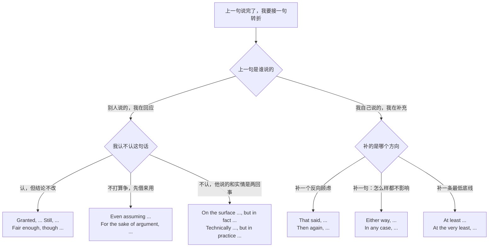
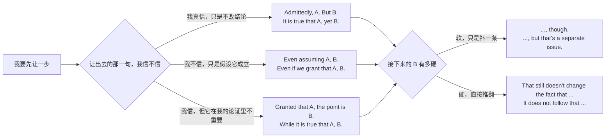
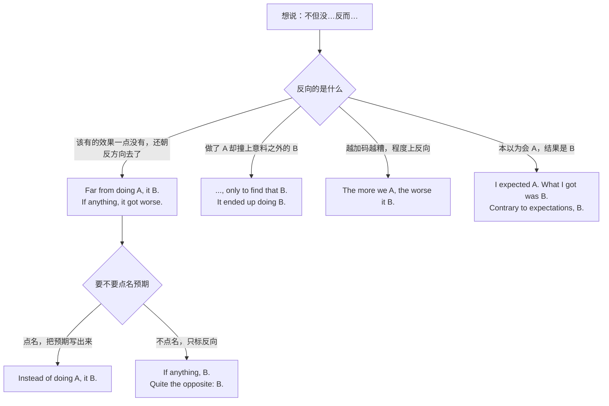
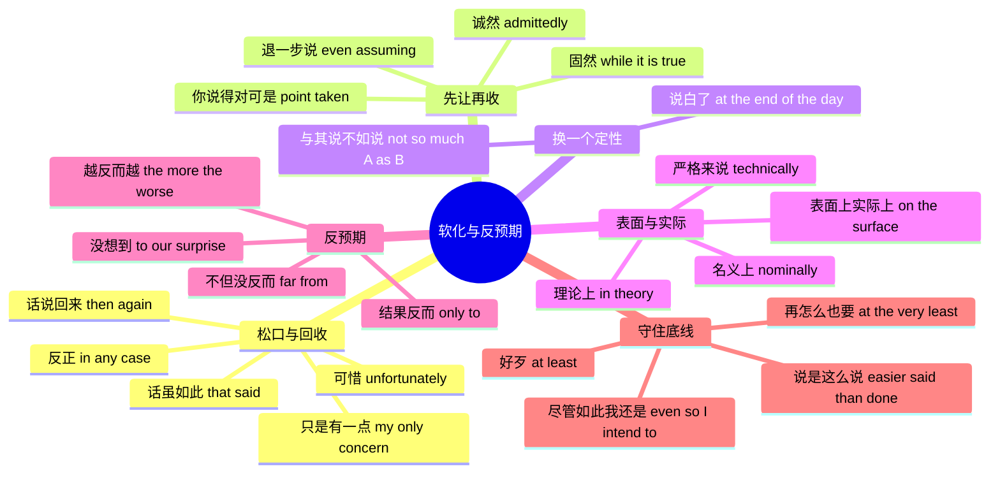

# 话虽如此、退一步说、表面上实际上：软化与反预期

> [!info] 本篇定位
>
> 上一篇 [[05.让步、转折与对比/01.虽然但是：让步的六种入口与语域分档\|虽然但是]] 处理的是**句内让步**：一句话里装 A 和 B 两个分句，用 although、despite、even if 把它们焊在一起。这一篇处理的是**句间让步**——A 那句话已经说完了，甚至是别人说的，你要在下一句里对它做点什么：认下来、掉头、借用、拆穿、或者只守住一条底线。
>
> 中文这一侧的触发语是一批看着零散的短语：话虽如此、话说回来、反正、只是有一点、可惜、退一步说、诚然、固然、与其说、表面上、尽管如此、至少、说是这么说、不但没、再怎么也要。语法书会把它们拆到让步状语从句、转折连词、连接性副词三处，但作为查询入口，它们是十几件互不替代的事。
>
> 本篇不解释让步的语法构造，也不写职场对话——礼貌梯度、异议的软硬分寸与整段场景演练在 [[04.英语场景/05.高频实用表达句型框架/03.同意反对让步转折句型库\|同意反对让步转折句型库]]。
>
> 读完能查到：23 条中文意图、165 个分档成品句架、一张 30 行的中文入口速查表、一张位置与标点对照表、四棵选择树。

---

## 1. 本篇导读：中文的「不过」在做四件不同的事

同一个「不过」，在四种语境里干的活完全不同。查错了动作，句子语法没毛病，但传达的立场是反的。

| 你实际在做的动作 | 中文长什么样 | 英文落到 | 本篇位置 |
| --- | --- | --- | --- |
| 认下上一句，但结论不改 | 话虽如此 / 道理是这个道理 | that said、granted、even so | 第 2 节 |
| 自己掉头，补一个反向考虑 | 话说回来 / 转念一想 | then again、on the other hand | 第 2 节 |
| 关掉讨论，宣布不影响结论 | 反正 / 不管怎么说 | anyway、in any case、either way | 第 2 节 |
| 只留一处保留意见 | 只是有一点 / 唯一的问题是 | my only concern is、if anything | 第 2 节 |
| 表示遗憾，事情没法改 | 可惜 / 遗憾的是 | unfortunately、it's a shame | 第 2 节 |
| 把对方的前提借来用，再证明结论仍不成立 | 退一步说 / 就算真是那样 | even assuming、for the sake of argument | 第 3 节 |
| 承认一半，保留一半 | 诚然 / 固然 | admittedly、to be sure、while it is true that | 第 3 节 |
| 不否认事实，只换一个定性 | 与其说 A 不如说 B | not so much A as B、more B than A | 第 4 节 |
| 拆穿表里不一 | 表面上…实际上 | on the surface … in fact | 第 5 节 |
| 指出结果与预期反向 | 不但没…反而 | far from doing、if anything | 第 6 节 |
| 守住一条最低要求 | 至少 / 再怎么也要 | at least、at the very least | 第 7 节 |

差别有多大，看一个具体的。同事说「这个方案性能更好」，你想接一句转折：

- `That said, it doubles the memory footprint.` —— 你认了性能更好，只是补一条代价。对方听到的是「同意，但要权衡」。
- `Then again, we don't actually have a performance problem.` —— 你在收回自己刚才的赞同，掉头质疑前提。
- `On the surface it is faster, but the benchmark only measures the warm path.` —— 你在说他那句话根本不成立。
- `Even assuming it is faster, we still can't ship it this quarter.` —— 你压根不打算讨论快不快，直接跳到结论。

四句话在中文里都可以说成「不过…」，在英文里是四种不同强度的立场。

这棵树的第一个岔口最省事：上一句是别人说的，你的转折就带对抗性，得挑一个明说「我认／我不认」的词；上一句是你自己说的，转折只是补语，用 that said、then again 这类中性连接语就够，硬用 granted 反而像在跟自己抬杠。

第二个岔口决定强度。`granted` 和 `even assuming` 都是「让一步」，但 granted 是真的认了，even assuming 是假装认——后者摆明了「我不认，只是懒得在这上面纠缠」。中文的「退一步说」精确对应后者，很多人却译成 granted，把一句战术性让步说成了真心认输。

> [!tip] 一句话定位法
>
> 拿不准查本篇哪一节时，把中文里的转折词替换成下面五句试读，哪句顺就查哪节。
>
> 1. 「这我认，可是」→ 第 2、3 节（that said、granted、admittedly）
> 2. 「就算你说得对」→ 第 3 节（even assuming、for the sake of argument）
> 3. 「与其说是 A，不如说是 B」→ 第 4 节（not so much A as B）
> 4. 「看着是那么回事，其实不是」→ 第 5 节（on the surface、in practice）
> 5. 「不但没好，还更糟了」→ 第 6 节（far from、if anything）

---

## 2. 松口与回收：话虽如此、话说回来、反正、只是有一点、可惜

这一节五条意图共用一个位置——句首的独立连接语，后面跟逗号，再接一个完整句子。它们不是连词，不能像 although 那样把两个分句焊成一句；这一点是本节所有错配警示的共同来源。

### 2.1 话虽如此：认下来，但不改结论

**中文触发语**：话虽如此 / 是这样没错，不过 / 道理是这个道理 / 这我承认，可是 / 就算是这样

| 档位 | 句架 | 例句 |
| --- | --- | --- |
| 口语 | Yeah, but A. | Yeah, but we still have to ship on Friday. |
| 口语 | Fair enough, though A. | Fair enough, though I'd keep the old endpoint around for a while. |
| 口语 | Even so, A. | Even so, I wouldn't merge it today. |
| 书面 | That said, A. | That said, the migration can wait until next quarter. |
| 书面 | Granted, [A]. Still, B. | Granted, the numbers look good. Still, one week is not a trend. |
| 正式 | While that may be the case, A. | While that may be the case, the risk to production remains unacceptable. |
| 正式 | Be that as it may, A. | Be that as it may, the deadline is fixed by contract. |

- 译文：话是没错，可我们周五还是得发。／ 有道理，不过旧接口我还是想留一阵子。／ 就算这样，今天我也不会合。／ 话虽如此，迁移可以放到下个季度。／ 数字确实好看。话虽如此，一周还算不上趋势。／ 即便如此，生产环境的风险仍然不可接受。／ 话虽如此，截止日期是合同定死的。

> [!warning] 错配警示
>
> - ❌ ~~Although that, we still need to test it.~~ ／ ✅ **Even so, we still need to test it.**（although 是连词，后面必须接完整分句，不能拿来回指上一句话）
> - ❌ ~~That said, but the risk is real.~~ ／ ✅ **That said, the risk is real.**（that said 已经是转折信号，再加 but 是双重转折）

- 同义入口：即便如此 / 就算这样 / 这我不否认
- 语法归属：[[02.英语基础语法/05.介词与连词/03.连词的分类与用法\|转折连词 but、yet、while]]
- 场景实战：[[04.英语场景/05.高频实用表达句型框架/03.同意反对让步转折句型库\|同意反对让步转折句型库]]

---

### 2.2 话说回来：自己掉头

**中文触发语**：话说回来 / 转念一想 / 不过反过来说 / 仔细一想也不是 / 再一想

`that said` 认下前面那句话，再补一条不改结论的保留；`then again` 是回头质疑刚才的说法本身，把自己往反方向拉一把。两者都译成「话说回来」，但前者守住原立场，后者动摇原立场，用错了方向，听者会以为你在改口。

| 档位 | 句架 | 例句 |
| --- | --- | --- |
| 口语 | Then again, A. | Then again, nobody actually reads that log. |
| 口语 | But then, A. | But then, we've never had a rollback go smoothly either. |
| 口语 | Come to think of it, A. | Come to think of it, the same bug hit us last March. |
| 书面 | On the other hand, A. | On the other hand, keeping both code paths doubles the test matrix. |
| 书面 | Having said that, A. | Having said that, the cost of waiting is not zero either. |
| 正式 | On reflection, A. | On reflection, the earlier estimate was based on incomplete data. |
| 正式 | It could equally be argued that A. | It could equally be argued that the delay was unavoidable. |

- 译文：话说回来，那条日志根本没人看。／ 不过反过来说，我们回滚也从来没顺利过。／ 这么一说，三月份同样的问题也出过。／ 另一方面，两套代码路径同时留着会让测试矩阵翻倍。／ 话说回来，等下去的代价也不是零。／ 现在回头看，先前的估算基于的数据并不完整。／ 同样可以认为，这次延期无法避免。

> [!warning] 错配警示
>
> - ❌ ~~Then again, you are wrong about that.~~ ／ ✅ **Then again, maybe I'm wrong about that.**（then again 掉头的对象是自己刚说的话，用它去反驳别人会显得答非所问）
> - ❌ ~~In the other hand, it costs more.~~ ／ ✅ **On the other hand, it costs more.**（固定搭配是 on the other hand，介词不能换成 in）

- 同义入口：不过转念一想 / 想想也是 / 反过来讲
- 语法归属：[[02.英语基础语法/05.介词与连词/02.常用介词搭配详解\|介词固定搭配]]
- 场景实战：[[04.英语场景/05.高频实用表达句型框架/01.表达观点与态度的50个万能句型\|表达观点与态度的万能句型]]

---

### 2.3 反正、不管怎么说：宣布这事不影响结论

**中文触发语**：反正 / 不管怎么说 / 无论如何 / 横竖 / 怎么着都 / 说到底

这一条的功能是**关掉分支**：前面争了半天 A 还是 B，这句话宣布两条路的结论一样，讨论可以停。

| 档位 | 句架 | 例句 |
| --- | --- | --- |
| 口语 | Anyway, A. | Anyway, I'm rebuilding the image tonight. |
| 口语 | Either way, A. | Either way, someone has to be on call. |
| 口语 | Whatever happens, A. | Whatever happens, don't touch the production database. |
| 书面 | In any case, A. | In any case, the API contract stays the same. |
| 书面 | Regardless, A. | Regardless, the client expects a build by Thursday. |
| 正式 | At any rate, A. | At any rate, the obligation to notify remains in force. |
| 正式 | In any event, A. | In any event, the parties shall meet within ten business days. |

- 译文：反正我今晚会重建镜像。／ 不管选哪个，总得有人值班。／ 无论如何，别碰生产库。／ 不管怎么说，接口约定不变。／ 反正客户周四就要一个构建版本。／ 无论如何，通知义务依然有效。／ 无论如何，双方应在十个工作日内会面。

> [!warning] 错配警示
>
> - ❌ ~~Anyways, let's move on.~~（正式书面）／ ✅ **In any case, let's move on.**（anyways 是口语变体，邮件与文档里用 in any case 或 regardless）
> - ❌ ~~Regardless the cost, we ship.~~ ／ ✅ **Regardless of the cost, we ship.**（regardless 单独作副词时后面不接名词；接名词必须补 of）

- 同义入口：横竖都一样 / 怎么都行 / 左右都得
- 语法归属：[[02.英语基础语法/04.形容词与副词/03.副词的分类与用法\|连接副词]]
- 场景实战：[[04.英语场景/10.职场与商务场景实战/02.会议汇报与演示场景\|会议汇报中的收束表达]]

---

### 2.4 只是有一点：整体认可，单点保留

**中文触发语**：只是有一点 / 唯一的问题是 / 就是有个小顾虑 / 别的都行，就是 / 硬要挑的话

这是提异议时最省事的软化框架：先把范围压到一个点，对方就不会把它听成整体否定。

| 档位 | 句架 | 例句 |
| --- | --- | --- |
| 口语 | The only thing is, A. | The only thing is, we'd have to freeze the schema first. |
| 口语 | My one worry is (that) A. | My one worry is that nobody owns this service after Q3. |
| 口语 | If anything, A. | If anything, the timeline is a little tight. |
| 书面 | My only concern is (that) A. | My only concern is that the rollback path is untested. |
| 书面 | The one caveat is (that) A. | The one caveat is that the numbers exclude mobile traffic. |
| 正式 | We have a single reservation, namely that A. | We have a single reservation, namely that the licence terms are unclear. |
| 正式 | Subject to one point, we are in agreement. | Subject to one point, we are in agreement with the proposed scope. |

- 译文：只是有一点，我们得先把表结构冻住。／ 我唯一担心的是三季度以后这个服务没人管。／ 硬要说的话，时间是有点紧。／ 我唯一的顾虑是回滚路径没测过。／ 唯一要说明的是，这些数字不含移动端流量。／ 我们只有一处保留意见，即许可条款不够明确。／ 除一点之外，我们同意所提议的范围。

> [!warning] 错配警示
>
> - ❌ ~~The only problem is that the design is wrong.~~ ／ ✅ **The only thing is, the timeline is tight.**（这个框架的承诺是「只有一处小问题」，后面塞根本性否定会显得虚伪，真要全盘否定就直接说）
> - ❌ ~~If anything, it is completely broken.~~ ／ ✅ **If anything, it's a bit slower than before.**（if anything 是弱化标记，只配轻量级的保留，不配极端形容词）

- 同义入口：非要挑毛病的话 / 别的没问题 / 就一点小意见
- 语法归属：[[02.英语基础语法/09.从句体系/03.名词性从句详解\|表语从句]]
- 场景实战：[[04.英语场景/05.高频实用表达句型框架/03.同意反对让步转折句型库\|同意反对让步转折句型库]]

---

### 2.5 可惜：遗憾式转折

**中文触发语**：可惜 / 遗憾的是 / 偏偏 / 就差一点 / 白忙一场 / 本来挺好的

中文一个「可惜」盖了两件事：一是对客观结果的遗憾，二是对差一点就成的惋惜。英文分成两组词，混用会让语气偏。

| 档位 | 句架 | 例句 |
| --- | --- | --- |
| 口语 | Shame (that) A. | Shame the fix didn't make the cut. |
| 口语 | It's a shame (that) A. | It's a shame we only found out after the release. |
| 口语 | Too bad A. | Too bad the vendor won't budge on the price. |
| 口语 | So close. A. | So close. The build failed on the last step. |
| 书面 | Unfortunately, A. | Unfortunately, the patch introduced a regression. |
| 书面 | Sadly, A. | Sadly, the original author left the company years ago. |
| 正式 | Regrettably, A. | Regrettably, we are unable to accommodate the revised timeline. |
| 正式 | It is unfortunate that A. | It is unfortunate that the data was not retained. |

- 译文：可惜那个修复没赶上。／ 可惜我们发版之后才发现。／ 可惜供应商在价格上不肯让。／ 就差一点，构建在最后一步挂了。／ 遗憾的是，这个补丁引入了回归问题。／ 可惜原作者几年前就离职了。／ 很遗憾，我们无法配合调整后的时间表。／ 遗憾的是，那批数据没有保留。

> [!warning] 错配警示
>
> - ❌ ~~Pity that you couldn't make it.~~ ／ ✅ **Pity you couldn't make it.** ／ ✅ **What a pity you couldn't make it.**（pity 作单说的感叹时后面直接跟分句，不带 that；要带 that 得补成 It's a pity that ... 或 What a pity that ...）
> - ❌ ~~Unfortunately but we shipped anyway.~~ ／ ✅ **Unfortunately, the tests failed; we shipped anyway.**（unfortunately 是副词，不能像连词那样把两个分句连起来）

- 同义入口：真不巧 / 差那么一点 / 没赶上
- 语法归属：[[02.英语基础语法/04.形容词与副词/03.副词的分类与用法\|句子副词的位置]]
- 场景实战：[[04.英语场景/05.高频实用表达句型框架/03.同意反对让步转折句型库\|同意反对让步转折句型库]]

---

## 3. 先让一步再收回：退一步说、诚然、固然

这一节的三条意图在中文里近似，在英文里差着一个关键区别：**你是真的认了，还是只是借用一下**。

这棵树的关键在第一个岔口。`admittedly` 与 `it is true that` 是真让步——你承认那句话是事实，只是它不足以支撑对方的结论。`even assuming` 与 `even if we grant` 是假让步——你没打算承认，只是为了省一场辩论，暂时把它当真。中文的「诚然」对应前者，「退一步说」对应后者，这两个词在中文里都很客气，在英文里分属两种谈判姿态。

第二个岔口决定后半句的硬度。`though` 收尾最软，适合当面提意见；`It does not follow that ...` 最硬，等于说「你的推理不成立」，写在评审意见里可以，说出口会像挑衅。

### 3.1 退一步说：借用对方的前提

**中文触发语**：退一步说 / 就算真是那样 / 姑且承认 / 哪怕按你说的算 / 就当它成立

| 档位 | 句架 | 例句 |
| --- | --- | --- |
| 口语 | Even if that's true, A. | Even if that's true, we still can't ship without a rollback plan. |
| 口语 | Say you're right — A. | Say you're right — how do we test it before Friday? |
| 口语 | Let's say A. Then what? | Let's say the cache does help. Then what happens on a cold start? |
| 书面 | Even assuming A, B. | Even assuming the estimate is accurate, we are two weeks short. |
| 书面 | For the sake of argument, suppose A. | For the sake of argument, suppose the vendor delivers on time. |
| 书面 | Even granting A, B. | Even granting the performance gain, the memory cost is prohibitive. |
| 正式 | Even if one accepts A, it does not follow that B. | Even if one accepts the premise, it does not follow that the policy is justified. |
| 正式 | Assuming arguendo that A, B. | Assuming arguendo that the clause applies, liability would still be capped. |

- 译文：就算那是真的，没有回滚方案我们还是不能发。／ 就当你说得对，那周五之前怎么测？／ 就假设缓存真管用，那冷启动怎么办？／ 退一步说，就算估算准确，我们也还差两周。／ 姑且假设供应商按时交付。／ 就算承认有性能收益，内存代价也高得离谱。／ 即便接受这一前提，也不能由此推出该政策是正当的。／ 即便假定该条款适用，责任上限依然成立。

> [!warning] 错配警示
>
> - ❌ ~~Even assuming that it is true, but we cannot ship.~~ ／ ✅ **Even assuming it is true, we cannot ship.**（even assuming 已经把前半句变成状语，后面不能再用 but 起头）
> - ❌ ~~Granted it is true, we cannot ship.~~（想表达「我不认」时）／ ✅ **Even granting it is true, we cannot ship.**（granted 单用是真认下来了；要表示只是假设，得加 even）

- 同义入口：就算按你说的 / 哪怕真是这样 / 姑且这么算
- 语法归属：[[02.英语基础语法/09.从句体系/04.状语从句详解\|让步状语从句]]
- 场景实战：[[04.英语场景/10.职场与商务场景实战/04.商务谈判合同与客户沟通\|谈判中的让步与坚持]]

---

### 3.2 诚然 A 但是 B：真承认，再转

**中文触发语**：诚然 / 确实是 / 这一点我承认 / 客观地讲 / 不可否认

| 档位 | 句架 | 例句 |
| --- | --- | --- |
| 口语 | Sure, A, but B. | Sure, it's faster, but it only works on the happy path. |
| 口语 | OK, A. Still, B. | OK, the docs are better now. Still, nobody links to them. |
| 口语 | I'll give you that, but B. | I'll give you that, but the licence is a real problem. |
| 书面 | Admittedly, A. However, B. | Admittedly, the sample is small. However, the trend is consistent. |
| 书面 | It is true that A, but B. | It is true that the library is unmaintained, but no alternative covers our case. |
| 书面 | True, A — yet B. | True, the migration is risky — yet postponing it costs more every quarter. |
| 正式 | It must be acknowledged that A. Nevertheless, B. | It must be acknowledged that the method is expensive. Nevertheless, no cheaper option meets the accuracy requirement. |
| 正式 | While A is undeniable, B. | While the improvement is undeniable, it falls short of the stated target. |

- 译文：确实快，但只在顺路径上快。／ 好，文档是比以前好了。可还是没人链接过去。／ 这点我认，可许可证是个真问题。／ 诚然样本很小。不过趋势是一致的。／ 这个库确实没人维护了，但没有替代品覆盖我们的场景。／ 迁移确实有风险，可每拖一个季度成本都更高。／ 必须承认该方法成本高昂。尽管如此，没有更便宜的方案能达到精度要求。／ 改进固然不可否认，但仍未达到既定目标。

> [!warning] 错配警示
>
> - ❌ ~~Although it is true that the sample is small, but the trend is consistent.~~ ／ ✅ **It is true that the sample is small, but the trend is consistent.**（although 与 but 只能留一个，两个同现是中文母语者最高频的一处结构错）
> - ❌ ~~Admittedly the sample is small, however the trend is consistent.~~ ／ ✅ **Admittedly the sample is small; however, the trend is consistent.**（however 是副词不是连词，前面要用分号或句号断开，后面跟逗号）

- 同义入口：不否认 / 客观讲 / 这我认
- 语法归属：[[02.英语基础语法/05.介词与连词/04.介词与连词的易混点\|although 与 but 不同现]]
- 场景实战：[[04.英语场景/05.高频实用表达句型框架/03.同意反对让步转折句型库\|同意反对让步转折句型库]]

---

### 3.3 固然 A 然而 B：书面味更重的一档

**中文触发语**：固然 / 尽管…然而 / 虽说…可是 / 一方面确实…另一方面

「诚然」偏口头承认，「固然」更书面，而且暗含「这只是次要的一面」。英文靠 `while` 引导的前置从句和 `to be sure` 承担。

| 档位 | 句架 | 例句 |
| --- | --- | --- |
| 口语 | Yes, A — but that's not the point. | Yes, it's cheaper — but that's not the point. |
| 书面 | While A, B. | While the tool is convenient, it hides too much of the state. |
| 书面 | Granted that A, B. | Granted that the deadline is tight, the scope was agreed in writing. |
| 书面 | To be sure, A. But B. | To be sure, the outage was short. But it hit our largest account. |
| 书面 | For all A, B. | For all its polish, the interface still buries the one action people need. |
| 正式 | Whatever the merits of A, B. | Whatever the merits of the proposal, it exceeds the approved budget. |
| 正式 | Notwithstanding A, B. | Notwithstanding the improvements, the system remains out of compliance. |

- 译文：便宜是便宜，可这不是重点。／ 工具固然方便，然而它把太多状态藏起来了。／ 期限紧固然是事实，但范围是书面确认过的。／ 停机时间固然短，可影响到的是我们最大的客户。／ 界面做得再精致，人们最需要的那个操作还是被埋在里面。／ 无论该提案有多少优点，它都超出了批准的预算。／ 尽管有所改进，系统仍不合规。

> [!warning] 错配警示
>
> - ❌ ~~While the tool is convenient, but it hides state.~~ ／ ✅ **While the tool is convenient, it hides state.**（while 是连词，主句里不能再加 but）
> - ❌ ~~Notwithstanding that the improvements, the system fails.~~ ／ ✅ **Notwithstanding the improvements, the system fails.**（notwithstanding 后直接跟名词短语；要接分句得写 notwithstanding that + 完整句子，别把两种形式混起来）

- 同义入口：话是不错 / 优点归优点 / 就算再好
- 语法归属：[[02.英语基础语法/09.从句体系/04.状语从句详解\|while 引导的让步从句]]
- 场景实战：[[04.英语场景/10.职场与商务场景实战/03.商务邮件与正式书面沟通\|正式书面沟通]]

---

### 3.4 先认后转的口语套路：我承认…不过

**中文触发语**：说得有道理，不过 / 这我不反对，可是 / 你这么说也对，但 / 明白你的意思，只是

单独列出来是因为它是当面提异议时用得最多的一组，而且必须成对出现：先给一句认可，再给转折，只给后半句在英语职场里会被听成生硬。

| 档位 | 句架 | 例句 |
| --- | --- | --- |
| 口语 | Point taken, but A. | Point taken, but we'd still be blocked on the vendor. |
| 口语 | I hear you, though A. | I hear you, though the numbers say otherwise. |
| 口语 | I see where you're coming from, but A. | I see where you're coming from, but the users never asked for this. |
| 口语 | That's fair. My worry is A. | That's fair. My worry is the maintenance cost afterwards. |
| 书面 | I take your point on A. That said, B. | I take your point on cost. That said, the risk profile has not changed. |
| 书面 | There's something in that, but A. | There's something in that, but it assumes we control the release train. |
| 正式 | We appreciate the rationale for A; nevertheless, B. | We appreciate the rationale for the change; nevertheless, the notice period was not observed. |

- 译文：有道理，不过我们还是会卡在供应商那边。／ 我明白你的意思，可数据说的不是这样。／ 我理解你为什么这么想，但用户从来没提过这个需求。／ 说得对。我担心的是后续的维护成本。／ 成本这点我接受。话虽如此，风险状况并没有变。／ 这话有一定道理，可它默认发版节奏由我们说了算。／ 我们理解此项变更的理由；尽管如此，通知期未被遵守。

> [!warning] 错配警示
>
> - ❌ ~~I hear you, but you are wrong.~~ ／ ✅ **I hear you, though I read the data differently.**（前半句的软化会被后半句直接否定抵消，转折内容要落在事实上，不要落在对人的判定上）
> - ❌ ~~Point taken but.~~ ／ ✅ **Point taken — but let me flag one thing.**（but 不能悬在句尾当省略，英语里没有对应中文「但是…」拖长音的用法）

- 同义入口：你说得对，可 / 理解，但 / 我不反对，只是
- 语法归属：[[02.英语基础语法/12.日常口语/02.常用口语句型\|口语中的固定回应式]]
- 场景实战：[[04.英语场景/05.高频实用表达句型框架/02.建议请求邀请拒绝四大功能句型\|异议与婉拒的功能句型]]

---

## 4. 换一个定性：与其说 A 不如说 B

这一节只有一条核心意图，但它是本篇最容易译错的一条。中文「与其说 A 不如说 B」不是在比较两个选项，而是在**重新给同一件事定性**：事实不变，标签换掉。

### 4.1 与其说 A 不如说 B

**中文触发语**：与其说 A 不如说 B / 说是 A，其实更像 B / 这不算 A，算 B / 谈不上 A，顶多是 B

| 档位 | 句架 | 例句 |
| --- | --- | --- |
| 口语 | It's more B than A. | It's more a workaround than a fix. |
| 口语 | It's less about A and more about B. | It's less about speed and more about predictability. |
| 口语 | Call it B, not A. | Call it a prototype, not a product. |
| 书面 | not so much A as B | The change is not so much a redesign as a cleanup. |
| 书面 | A is better described as B. | What we shipped is better described as a pilot than a launch. |
| 书面 | rather than A, B | Rather than a technical failure, this was a communication failure. |
| 正式 | The issue is one of B rather than A. | The issue is one of governance rather than technology. |
| 正式 | It would be more accurate to characterise A as B. | It would be more accurate to characterise the incident as a configuration error. |

- 译文：与其说是修复，不如说是绕过去了。／ 与其说是快，不如说是稳定可预期。／ 这叫原型，别叫产品。／ 这次改动与其说是重构，不如说是清理。／ 我们上线的东西与其说是正式发布，不如说是试点。／ 与其说是技术故障，不如说是沟通故障。／ 这个问题与其说是技术问题，不如说是治理问题。／ 更准确的说法是把该事件定性为配置错误。

> [!warning] 错配警示
>
> - ❌ ~~It is not so much a fix as it is more a workaround.~~ ／ ✅ **It is not so much a fix as a workaround.**（as 后面直接接与 A 同词性的成分，不再重复系动词和比较词）
> - ❌ ~~It's more a workaround than a fix, but actually it is a fix.~~ ／ ✅ **It's more a workaround than a fix.**（这个框架否定的是标签不是事实，后面再翻案等于自相矛盾）

- 同义入口：说白了就是 / 本质上更接近 / 与其算…不如算
- 语法归属：[[02.英语基础语法/04.形容词与副词/02.形容词的比较级与最高级\|比较结构中的省略]]
- 场景实战：[[04.英语场景/05.高频实用表达句型框架/04.比较对比举例总结句型库\|比较与对比句型库]]

---

### 4.2 说白了、归根到底：把话压回本质

**中文触发语**：说白了 / 归根到底 / 本质上 / 其实就是 / 剥开来看

| 档位 | 句架 | 例句 |
| --- | --- | --- |
| 口语 | It's basically A. | It's basically a cache with a fancy name. |
| 口语 | At the end of the day, A. | At the end of the day, someone has to maintain it. |
| 口语 | What it comes down to is A. | What it comes down to is whether we trust the vendor's SLA. |
| 书面 | In essence, A. | In essence, the proposal shifts the cost to the client teams. |
| 书面 | Stripped of the jargon, A. | Stripped of the jargon, the design is a queue with retries. |
| 正式 | Fundamentally, A. | Fundamentally, the dispute concerns the scope of the warranty. |
| 正式 | The substance of the matter is A. | The substance of the matter is whether notice was properly served. |

- 译文：说白了就是个换了名字的缓存。／ 归根到底，总得有人维护它。／ 说到底就是我们信不信供应商的服务等级承诺。／ 本质上，这个提案把成本转嫁给了客户团队。／ 把术语剥掉，这个设计就是一个带重试的队列。／ 根本上，争议在于保修范围。／ 该事项的实质在于通知是否已依法送达。

> [!warning] 错配警示
>
> - ❌ ~~In the end of the day, someone has to maintain it.~~ ／ ✅ **At the end of the day, someone has to maintain it.**（固定搭配是 at the end of the day）
> - ❌ ~~Basically, basically it is a cache.~~ ／ ✅ **It's basically a cache.**（basically 用作口头禅会稀释掉「重新定性」的力度，一段话里出现一次就够）

- 同义入口：拆开看就是 / 核心就一件事 / 说穿了
- 语法归属：[[02.英语基础语法/04.形容词与副词/03.副词的分类与用法\|句子副词]]
- 场景实战：[[04.英语场景/10.职场与商务场景实战/02.会议汇报与演示场景\|汇报中的结论前置]]

---

### 4.3 分清「与其说」和「与其…不如…」

这两个中文结构差三个字，英文是两条不相干的出路，查错会说出意思相反的句子。

| 中文 | 你在干什么 | 英文 | 例句 |
| --- | --- | --- | --- |
| 与其说是 A，不如说是 B | 给同一件事换标签 | not so much A as B | It's not so much a bug as a design decision. |
| 与其 A，不如 B | 在两个做法里选 B | rather than doing A, do B | Rather than patching it, let's rewrite the parser. |
| 与其 A，不如 B（更委婉） | 建议对方改做 B | We'd be better off doing B. | We'd be better off starting from the schema. |

第一行是定性，主语只有一个东西；后两行是取舍，摆在面前的是两个动作。判断法很简单：能不能在 A 和 B 中间插「这件事」——「与其说这件事是 A，不如说这件事是 B」读得通，就是定性；读不通，就是取舍，那一条归 [[09.比较、程度与数量/01.A 比 B 更、不如、一样：比较三式与差额\|比较三式与差额]]，本篇不重复收。

---

## 5. 表面与实际：拆穿表里不一

这一节的四条意图共用同一个骨架：**前半句给对方看到的样子，后半句给真实情况**。区别在于「表面」是哪一种表面——外观、名义、理论，还是技术定义。

### 5.1 表面上…实际上

**中文触发语**：表面上…实际上 / 看着…其实 / 乍一看…细看却 / 听起来…事实上

| 档位 | 句架 | 例句 |
| --- | --- | --- |
| 口语 | It looks A, but actually B. | It looks fine, but actually half the tests are skipped. |
| 口语 | On paper A, but in the real world B. | On paper it scales, but in the real world we never got past 200 nodes. |
| 口语 | Sounds A. It isn't. | Sounds simple. It isn't. |
| 书面 | On the surface, A. In fact, B. | On the surface, the numbers improved. In fact, the sample changed. |
| 书面 | At first glance A; on closer inspection, B. | At first glance the two logs match; on closer inspection, the timestamps differ by a day. |
| 书面 | What appears to be A is in fact B. | What appears to be a network issue is in fact a DNS cache problem. |
| 正式 | Ostensibly A, the arrangement in reality B. | Ostensibly a partnership, the arrangement in reality gives one party full control. |
| 正式 | A is apparent rather than real. | The improvement is apparent rather than real. |

- 译文：看着没问题，其实一半测试被跳过了。／ 纸面上能扩，实际我们从来没跑过 200 个节点。／ 听着简单，其实不简单。／ 表面上数字变好了。实际上是样本变了。／ 乍看两份日志一致；细看时间戳差了一天。／ 看起来像网络问题，实际上是 DNS 缓存问题。／ 名义上是合作，该安排实际上让一方掌握全部控制权。／ 这一改善是表面的，而非实质的。

> [!warning] 错配警示
>
> - ❌ ~~In the surface, the numbers improved.~~ ／ ✅ **On the surface, the numbers improved.**（固定搭配是 on the surface）
> - ❌ ~~It looks like fine.~~ ／ ✅ **It looks fine.** ／ ✅ **It looks like a config issue.**（look 后接形容词不带 like，接名词才带）

- 同义入口：外表看 / 明面上 / 摆出来的样子
- 语法归属：[[02.英语基础语法/01.基础入门/02.英语五大基本句型详解\|系动词 seem 与 appear 构成的主系表]]
- 场景实战：[[04.英语场景/05.高频实用表达句型框架/01.表达观点与态度的50个万能句型\|表达判断与质疑]]

---

### 5.2 名义上…实质上

**中文触发语**：名义上 / 挂名 / 说是…其实归 / 名头上是 / 实际掌权的是

| 档位 | 句架 | 例句 |
| --- | --- | --- |
| 口语 | On paper A, but really B. | On paper I own the service, but really the platform team runs it. |
| 口语 | In name only. | He's the reviewer in name only. |
| 书面 | Nominally A, but in practice B. | Nominally it is a shared repo, but in practice only two people can merge. |
| 书面 | A in name, B in practice. | A rotation in name, a single on-call engineer in practice. |
| 正式 | de facto B, notwithstanding the formal designation as A | The vendor is the de facto operator, notwithstanding the formal designation as a supplier. |
| 正式 | The formal position is A; the operative position is B. | The formal position is joint ownership; the operative position is sole control. |

- 译文：名义上这个服务归我，其实是平台组在跑。／ 他只是挂名评审。／ 名义上是共享仓库，实际上只有两个人能合并。／ 名义上轮值，实际上永远是同一个人值班。／ 尽管形式上被称为供应商，该方实际上是运营方。／ 形式上是共有，实际运作上是单方控制。

> [!warning] 错配警示
>
> - ❌ ~~He is a reviewer by name only.~~ ／ ✅ **He is a reviewer in name only.**（固定搭配是 in name only）
> - ❌ ~~The de facto is the vendor.~~ ／ ✅ **The vendor is the de facto operator.**（de facto 作定语修饰名词，或作副词修饰动词，不单独充当表语）

- 同义入口：挂个名 / 有其名无其实 / 说是这么归的
- 语法归属：[[02.英语基础语法/04.形容词与副词/01.形容词的用法与位置\|前置定语形容词]]
- 场景实战：[[04.英语场景/10.职场与商务场景实战/04.商务谈判合同与客户沟通\|合同与职责界定]]

---

### 5.3 理论上…实践中

**中文触发语**：理论上 / 按道理说 / 原则上 / 设计上应该 / 照理讲

这一条与 5.1 的差别：5.1 说的是「假象」，带戳穿的味道；这一条说的是「设想与现实有落差」，中性，不指责谁。

| 档位 | 句架 | 例句 |
| --- | --- | --- |
| 口语 | In theory A. In practice B. | In theory it retries. In practice it gives up after one attempt. |
| 口语 | It should A, but it doesn't. | It should reconnect automatically, but it doesn't. |
| 口语 | That's the idea, anyway. | Zero downtime — that's the idea, anyway. |
| 书面 | In principle A, although in practice B. | In principle any team can deploy, although in practice only two have credentials. |
| 书面 | By design A; in the current implementation, B. | By design the queue is ordered; in the current implementation, ordering is best-effort. |
| 正式 | While A is provided for, B. | While quarterly review is provided for, no review has taken place since March. |
| 正式 | The specification requires A; observed behaviour is B. | The specification requires idempotence; observed behaviour is a duplicate write on retry. |

- 译文：理论上它会重试。实际上试一次就放弃了。／ 按理说它应该自动重连，可它不会。／ 零停机——反正设想是这样。／ 原则上任何团队都能部署，虽然实际上只有两个团队有凭证。／ 设计上队列是有序的；在当前实现里，有序只是尽力而为。／ 尽管规定了季度评审，自三月以来未曾进行过评审。／ 规范要求幂等；观察到的行为是重试时产生重复写入。

> [!warning] 错配警示
>
> - ❌ ~~In the theory it retries.~~ ／ ✅ **In theory it retries.**（in theory、in practice、in principle 三个短语都不带冠词）
> - ❌ ~~In practise the queue is unordered.~~ ／ ✅ **In practice the queue is unordered.**（in practice 里的 practice 是名词，英美两边都拼 practice；practise 是英式拼法里的动词形式，进不了这个短语）

- 同义入口：本来应该 / 设计初衷是 / 照规范讲
- 语法归属：[[02.英语基础语法/02.名词与冠词/03.冠词的用法详解\|固定短语中的零冠词]]
- 场景实战：[[04.英语场景/10.职场与商务场景实战/02.会议汇报与演示场景\|汇报中的设想与现实落差]]

---

### 5.4 严格来说…但实际上

**中文触发语**：严格来说 / 从技术上讲 / 抠字眼的话 / 按定义 / 其实没错但

这一条是英语职场里的高频软化器：先承认对方在字面上没错，再说明它在实操里不成立。

| 档位 | 句架 | 例句 |
| --- | --- | --- |
| 口语 | Technically A, but B. | Technically it passes, but the assertion checks nothing. |
| 口语 | Strictly speaking A. | Strictly speaking that's a warning, not an error. |
| 书面 | Strictly speaking A; for our purposes, B. | Strictly speaking these are two services; for our purposes, treat them as one. |
| 书面 | In a narrow sense A, but more broadly B. | In a narrow sense the fix works, but more broadly the design is still wrong. |
| 正式 | For all intents and purposes, B. | The two systems are, for all intents and purposes, identical. |
| 正式 | While A is formally correct, B. | While the classification is formally correct, it does not reflect how the data is used. |

- 译文：严格说是通过了，可那条断言什么都没检查。／ 严格来说那是警告，不是错误。／ 严格说这是两个服务；就我们的用途而言，当成一个看。／ 从窄的意义上讲这个修复管用，但往大了看设计还是错的。／ 就实际效果而言，这两个系统完全一样。／ 该分类在形式上正确，但并不反映数据的实际用法。

> [!warning] 错配警示
>
> - ❌ ~~Strictly speak, that's a warning.~~ ／ ✅ **Strictly speaking, that's a warning.**（这类评注状语固定用 -ing 形式：strictly speaking、broadly speaking、generally speaking）
> - ❌ ~~For all intense and purposes~~ ／ ✅ **For all intents and purposes**（这条固定短语常被按读音误写，写的是 intents，不是 intense）

- 同义入口：字面上讲 / 论定义 / 死抠的话
- 语法归属：[[02.英语基础语法/08.非谓语动词/03.现在分词详解\|分词作评注状语]]
- 场景实战：[[04.英语场景/05.高频实用表达句型框架/03.同意反对让步转折句型库\|软化异议的说法]]

---

## 6. 反预期：不但没…反而

中文的「反而」标记的是**结果与预期反向**。英文没有一个词对应它，得按「反向到什么程度」分流。

这棵树的四条分支对应四种中文说法，但读者最常混的是第一支和第二支：`far from` 说的是「该有的效果完全没有」，强调**方向**；`only to` 说的是「做完之后遭遇了意外」，强调**时间先后**。「加了缓存反而更慢了」用 far from，「加了缓存，结果发现命中率是零」用 only to。

第二个岔口决定要不要把预期写出来。`instead of doing A` 必须点名 A，句子更清楚但更长；`if anything` 一个词就把反向标记掉，代价是听者得自己补出预期是什么。口语里 if anything 更常用，文档里点名更安全。

### 6.1 不但没…反而

**中文触发语**：不但没…反而 / 非但不…还 / 不仅没有…倒是 / 越…越糟 / 适得其反

| 档位 | 句架 | 例句 |
| --- | --- | --- |
| 口语 | not only didn't A, it actually B | It not only didn't help, it actually made the latency worse. |
| 口语 | If anything, B. | If anything, the cache made things slower. |
| 口语 | Quite the opposite — B. | Quite the opposite — traffic went up after we removed the banner. |
| 书面 | Far from doing A, B. | Far from reducing load, the retry logic amplified it. |
| 书面 | Instead of doing A, B. | Instead of shortening the queue, the extra worker starved the database. |
| 书面 | Rather than doing A, B. | Rather than clarifying the error, the new message hides the stack trace. |
| 正式 | The measure proved counterproductive. | The measure proved counterproductive: complaints rose in the following quarter. |
| 正式 | A produced the opposite effect to that intended. | The rate limit produced the opposite effect to that intended. |

- 译文：它非但没帮上忙，反而让延迟更糟了。／ 要说有变化，缓存反而更慢了。／ 恰恰相反——我们撤掉横幅之后流量涨了。／ 重试逻辑不但没降低负载，反而放大了负载。／ 多加的工作进程不但没让队列变短，反而把数据库拖垮了。／ 新的错误信息非但没把错误说清楚，反而把调用栈藏起来了。／ 该措施适得其反：下一季度投诉量上升。／ 限流产生了与预期相反的效果。

> [!warning] 错配警示
>
> - ❌ ~~Far from it reduced load, it amplified it.~~ ／ ✅ **Far from reducing load, it amplified it.**（far from 后面接动名词或名词，不接分句）
> - ❌ ~~Not only it didn't help, it made it worse.~~ ／ ✅ **Not only did it not help, it made things worse.**（not only 置于句首要部分倒装，助动词提前；不想倒装就把 not only 放到主语之后）

- 同义入口：反倒 / 弄巧成拙 / 越弄越糟
- 语法归属：[[02.英语基础语法/10.特殊句型/03.倒装句结构\|not only 引起的部分倒装]]
- 场景实战：[[04.英语场景/10.职场与商务场景实战/02.会议汇报与演示场景\|复盘中的因果陈述]]

---

### 6.2 结果反而：做完之后撞上意外

**中文触发语**：结果反而 / 谁知道 / 到头来 / 白折腾一场 / 忙活半天

| 档位 | 句架 | 例句 |
| --- | --- | --- |
| 口语 | ... only to find that B. | We rewrote the parser, only to find that the input was malformed all along. |
| 口语 | and then it turned out B | We spent two days on it, and then it turned out to be a stale cache. |
| 口语 | We ended up doing B. | We ended up rolling the whole thing back. |
| 书面 | only to + 动词原形 | The team shipped the feature on time, only to have it disabled a week later. |
| 书面 | It turned out that B. | It turned out that the metric had been double-counting since March. |
| 正式 | The effort ultimately resulted in B. | The migration effort ultimately resulted in a longer outage than the one it was meant to prevent. |
| 正式 | Contrary to expectations, B. | Contrary to expectations, throughput declined after the upgrade. |

- 译文：我们重写了解析器，结果发现输入格式一直就是坏的。／ 折腾了两天，结果是缓存没刷新。／ 到头来我们把整个东西回滚了。／ 团队按时交付了这个功能，结果一周后就被关掉了。／ 结果发现这个指标从三月起就一直重复计数。／ 这次迁移最终导致的停机时间比它本要避免的还长。／ 与预期相反，升级之后吞吐量下降了。

> [!warning] 错配警示
>
> - ❌ ~~We rewrote the parser, only to found that the input was bad.~~ ／ ✅ **... only to find that the input was bad.**（only to 后面永远是动词原形，不随主句时态变）
> - ❌ ~~It turned out to be a stale cache, and it was unexpected.~~ ／ ✅ **It turned out to be a stale cache.**（turn out 本身已经含「出乎意料」，再补一句说明是冗余）

- 同义入口：搞了半天 / 折腾一圈 / 结果是白做
- 语法归属：[[02.英语基础语法/08.非谓语动词/01.动词不定式详解\|不定式表意外结果]]

---

### 6.3 越…反而越：程度上的反向

**中文触发语**：越…反而越 / 越使劲越 / 加得越多越糟 / 用力过猛

| 档位 | 句架 | 例句 |
| --- | --- | --- |
| 口语 | The more we A, the worse it B. | The more we cache, the worse the staleness gets. |
| 口语 | The harder we tried, the worse it got. | The harder we tried to speed it up, the worse it got. |
| 书面 | The more A, the less B. | The more retries we allow, the less useful the error signal becomes. |
| 书面 | Beyond a point, more A means less B. | Beyond a point, more parallelism means less throughput. |
| 正式 | Additional A yields diminishing, and eventually negative, returns. | Additional indexing yields diminishing, and eventually negative, returns on write-heavy tables. |
| 正式 | The relationship reverses beyond a threshold. | The relationship reverses beyond a threshold of roughly forty concurrent workers. |

- 译文：缓存越多，数据过期问题越严重。／ 我们越想让它快，它反而越慢。／ 允许的重试越多，错误信号越没用。／ 过了某个点，并行度越高吞吐量反而越低。／ 在写密集的表上，继续加索引收益递减，最终变成负收益。／ 超过某个阈值之后，这个关系会反转。

> [!warning] 错配警示
>
> - ❌ ~~More we cache, more the staleness gets worse.~~ ／ ✅ **The more we cache, the staler the data gets.**（两个比较级前面的 the 都不能省，这是固定框架）
> - ❌ ~~The more parallelism, the more throughput decreases.~~ ／ ✅ **The more parallelism, the lower the throughput.**（后半句已经用比较级承担了「下降」，再叠一个 decreases 是重复）

- 同义入口：适得其反 / 过犹不及 / 越补越漏
- 语法归属：[[02.英语基础语法/04.形容词与副词/02.形容词的比较级与最高级\|the 比较级 the 比较级]]
- 场景实战：[[04.英语场景/05.高频实用表达句型框架/04.比较对比举例总结句型库\|程度与变化描述]]

---

### 6.4 没想到、竟然：把意外本身说出来

**中文触发语**：没想到 / 竟然 / 居然 / 谁能想到 / 出乎意料

情绪反应的完整清单在 [[10.态度、情感与判断/01.我觉得、真是太、令我惊讶：评价与情绪反应\|评价与情绪反应]]，本篇只收作转折用的那几条——也就是后面必须跟一个与预期相反的事实的用法。

| 档位 | 句架 | 例句 |
| --- | --- | --- |
| 口语 | I did not expect A. | I did not expect the rollback to take four hours. |
| 口语 | Of all things, A. | Of all things, it was the health check that brought the cluster down. |
| 口语 | Somehow A. | Somehow the old build is still serving traffic. |
| 书面 | Surprisingly, A. | Surprisingly, the slower algorithm won on real workloads. |
| 书面 | To our surprise, A. | To our surprise, disabling the cache improved p99 latency. |
| 正式 | Unexpectedly, A. | Unexpectedly, error rates fell after the dependency was removed. |
| 正式 | A ran counter to the working assumption. | The result ran counter to the working assumption that writes dominate. |

- 译文：没想到回滚花了四个小时。／ 偏偏是健康检查把整个集群搞挂了。／ 不知怎么的，旧版本还在接流量。／ 出乎意料的是，更慢的那个算法在真实负载上赢了。／ 出乎我们意料，关掉缓存反而改善了 p99 延迟。／ 出乎意料，去掉这个依赖之后错误率下降了。／ 这一结果与「以写为主」这个工作假设相悖。

> [!warning] 错配警示
>
> - ❌ ~~To our surprised, the cache made it faster.~~ ／ ✅ **To our surprise, the cache made it faster.**（这个短语里用名词 surprise，不用分词）
> - ❌ ~~Surprisingly the result is expected.~~ ／ ✅ **Surprisingly, the result contradicts the model.**（surprisingly 后面必须接与预期相反的内容，接一个符合预期的事实会自相矛盾）

- 同义入口：真没料到 / 偏偏是 / 谁想到
- 语法归属：[[02.英语基础语法/04.形容词与副词/03.副词的分类与用法\|句首的句子副词]]
- 场景实战：[[04.英语场景/05.高频实用表达句型框架/01.表达观点与态度的50个万能句型\|表达意外与反应]]

---

## 7. 守住底线：尽管如此我还是、至少、再怎么也要

这一节的四条意图共同点是：让步之后**不撤退**。前三节的转折都在削弱前一句，这一节的转折反过来——承认困难，然后把立场钉住。

### 7.1 尽管如此我还是

**中文触发语**：尽管如此我还是 / 我还是决定 / 就算这样我也要 / 明知…还是 / 我坚持

| 档位 | 句架 | 例句 |
| --- | --- | --- |
| 口语 | I'm still going to A. | I'm still going to open the PR today. |
| 口语 | Even so, I'd rather A. | Even so, I'd rather do it now than in December. |
| 口语 | I know, and I'm doing it anyway. | I know it's risky, and I'm doing it anyway. |
| 书面 | Even so, I intend to A. | Even so, I intend to proceed with the migration this sprint. |
| 书面 | With that in mind, I still recommend A. | With that in mind, I still recommend upgrading before the freeze. |
| 正式 | Notwithstanding the above, we propose to A. | Notwithstanding the above, we propose to proceed as originally scheduled. |
| 正式 | These considerations do not alter our position that A. | These considerations do not alter our position that the current design should be retained. |

- 译文：我还是打算今天开这个 PR。／ 就算这样，我宁愿现在做而不是十二月做。／ 我知道有风险，我还是要做。／ 尽管如此，我打算这个迭代就推进迁移。／ 考虑到这些，我仍然建议在冻结前升级。／ 尽管有上述情况，我们仍建议按原计划推进。／ 这些因素不改变我们保留现有设计的立场。

> [!warning] 错配警示
>
> - ❌ ~~Despite of that, I will proceed.~~ ／ ✅ **Despite that, I will proceed.**（despite 后面不带 of，带 of 的是 in spite of）
> - ❌ ~~Even so I still will go ahead.~~ ／ ✅ **Even so, I'm still going ahead.**（even so 作句首状语后要加逗号；still 放在助动词之后、实义动词之前）

- 同义入口：我照做不误 / 我意已决 / 该做还得做
- 语法归属：[[02.英语基础语法/07.助动词与情态动词/02.情态动词详解\|表意愿的 will 与 would rather]]
- 场景实战：[[04.英语场景/10.职场与商务场景实战/02.会议汇报与演示场景\|表明立场]]

---

### 7.2 虽然不理想，但至少

**中文触发语**：虽然不理想但至少 / 好歹 / 起码 / 总比…强 / 聊胜于无 / 往好处想

| 档位 | 句架 | 例句 |
| --- | --- | --- |
| 口语 | It's not ideal, but at least A. | It's not ideal, but at least nothing was lost. |
| 口语 | It could be worse — A. | It could be worse — we caught it before the weekend. |
| 口语 | Better than nothing. | A partial log is better than nothing. |
| 口语 | On the plus side, A. | On the plus side, we now know exactly where it breaks. |
| 书面 | Less than ideal, though A. | Less than ideal, though the impact was limited to staging. |
| 书面 | The one positive is that A. | The one positive is that the alert fired within thirty seconds. |
| 正式 | While the outcome fell short of expectations, A. | While the outcome fell short of expectations, no customer data was affected. |
| 正式 | It is at least the case that A. | It is at least the case that the failure was confined to a single region. |

- 译文：不理想，但好歹没丢数据。／ 还能更糟——我们赶在周末前发现了。／ 有半份日志总比没有强。／ 往好处说，我们现在确切知道它在哪儿断的。／ 谈不上理想，不过影响只限于预发环境。／ 唯一的好消息是告警在三十秒内触发了。／ 虽然结果不及预期，但没有客户数据受影响。／ 至少可以说，这次故障被限制在单个区域内。

> [!warning] 错配警示
>
> - ❌ ~~At least, nothing was lost, but it is not ideal.~~ ／ ✅ **It's not ideal, but at least nothing was lost.**（这个框架的语序是先让步后安慰，倒过来会把安慰变成挖苦）
> - ❌ ~~It could be worst.~~ ／ ✅ **It could be worse.**（这里用比较级 worse，不是最高级 worst）

- 同义入口：不幸中的万幸 / 好在 / 总算还有
- 语法归属：[[02.英语基础语法/04.形容词与副词/02.形容词的比较级与最高级\|比较级表安慰]]
- 场景实战：[[04.英语场景/05.高频实用表达句型框架/03.同意反对让步转折句型库\|缓和坏消息]]

---

### 7.3 再怎么也要：底线要求

**中文触发语**：再怎么也要 / 最起码得 / 无论如何必须 / 哪怕只做一件事也要 / 说什么都得

| 档位 | 句架 | 例句 |
| --- | --- | --- |
| 口语 | At the very least, we need to A. | At the very least, we need to snapshot the database first. |
| 口语 | The least we can do is A. | The least we can do is tell the customer before they find out. |
| 口语 | If nothing else, A. | If nothing else, write down what you tried. |
| 书面 | Whatever we cut, A must stay. | Whatever we cut from the scope, the audit log must stay. |
| 书面 | A is the minimum acceptable outcome. | A read-only fallback is the minimum acceptable outcome. |
| 正式 | At a minimum, B shall A. | At a minimum, the supplier shall provide thirty days' notice. |
| 正式 | In no circumstances may A. | In no circumstances may credentials be stored in the repository. |

- 译文：再怎么也得先给数据库做个快照。／ 最起码得在客户发现之前告诉他们。／ 哪怕别的都不做，也把你试过什么写下来。／ 范围怎么砍，审计日志都得留着。／ 只读降级是可接受的最低结果。／ 供应商至少应提前三十天通知。／ 在任何情况下都不得将凭证存入代码仓库。

> [!warning] 错配警示
>
> - ❌ ~~In no circumstances credentials may be stored.~~ ／ ✅ **In no circumstances may credentials be stored.**（否定短语置于句首必须部分倒装，情态动词提到主语前）
> - ❌ ~~At least we need to snapshot it first.~~（想强调底线时）／ ✅ **At the very least, we need to snapshot it first.**（单说 at least 更容易被读成 7.2 的「好歹」，强调底线要加 the very）

- 同义入口：底线是 / 至少得保证 / 一件事都不能少
- 语法归属：[[02.英语基础语法/10.特殊句型/03.倒装句结构\|否定词前置引起的倒装]]
- 场景实战：[[04.英语场景/10.职场与商务场景实战/04.商务谈判合同与客户沟通\|条款中的最低要求]]

---

### 7.4 说是这么说，做起来

**中文触发语**：说是这么说 / 说着容易做着难 / 道理都懂 / 光说不练 / 纸上谈兵

| 档位 | 句架 | 例句 |
| --- | --- | --- |
| 口语 | Easier said than done. | Just split the service — easier said than done. |
| 口语 | That's the theory. | Zero downtime deploys. That's the theory. |
| 口语 | Saying it is one thing; doing it is another. | Saying we'll write tests is one thing; doing it under deadline is another. |
| 书面 | In practice it's another story. | The docs make it sound trivial; in practice it's another story. |
| 书面 | A is straightforward on paper; B is where it breaks down. | The migration is straightforward on paper; the data backfill is where it breaks down. |
| 正式 | Implementation presents difficulties that the proposal does not address. | Implementation presents difficulties that the proposal does not address. |
| 正式 | The principle is not in dispute; its application is. | The principle is not in dispute; its application to legacy contracts is. |

- 译文：把服务拆开——说得容易。／ 零停机部署。理论上是这样。／ 说要写测试是一回事，在截止日期前真写是另一回事。／ 文档写得像很简单；实际做起来是另一回事。／ 纸面上迁移很直接；卡住的是数据回填。／ 实施上的困难是该提案没有涉及的。／ 原则没有争议，有争议的是它在存量合同上的适用。

> [!warning] 错配警示
>
> - ❌ ~~It is easier said than to do.~~ ／ ✅ **Easier said than done.**（这是固定习语，两侧都用过去分词，不能换成不定式）
> - ❌ ~~Saying is one thing, doing is another thing.~~ ／ ✅ **Saying it is one thing; doing it is another.**（两个分句之间用分号，不用逗号；动名词带上宾语意思才落地，句末的 another 后面也不再重复 thing）

- 同义入口：知易行难 / 嘴上说说 / 落到实处才难
- 语法归属：[[02.英语基础语法/08.非谓语动词/02.动名词详解\|动名词作主语]]
- 场景实战：[[04.英语场景/10.职场与商务场景实战/02.会议汇报与演示场景\|评估可行性]]

---

## 8. 位置、标点与语域速查

前七节给的是「说什么」，这一节给「摆在哪儿、后面跟什么标点、能不能用在这个场合」。中文母语者在本篇这批表达上最常犯的不是选词错误，而是位置和标点错误——因为中文的转折词几乎都可以裸放在句首，英文不行。

### 8.1 三类词的位置规则

| 类别 | 成员 | 能不能连接两个分句 | 位置与标点 |
| --- | --- | --- | --- |
| 连词 | but、yet、while、although、whereas | 能 | 放在两个分句之间，前面加逗号；能带着从句放到句首的只有 although、while、whereas |
| 连接副词 | however、nevertheless、even so、that said、then again | 不能 | 两句之间要用句号或分号断开，副词后加逗号 |
| 介词短语 | despite、in spite of、notwithstanding、for all | 不能接分句 | 后面只跟名词或动名词，整体作状语 |

三类混用产生的错句可以归成三条，它们反复出现在前七节的错配警示里：

- 把连接副词当连词用：`It's risky, however we'll proceed.` 要改成 `It's risky; however, we'll proceed.`
- 把连词和副词叠着用：`Although it's risky, but we'll proceed.` 要删掉一个。
- 把介词当连词用：`Despite it's risky, we'll proceed.` 要改成 `Despite the risk, we'll proceed.`

这三条只列现象，不解释构造。三类词各自的完整规则见 [[02.英语基础语法/05.介词与连词/04.介词与连词的易混点\|介词与连词的易混点]] 与 [[02.英语基础语法/04.形容词与副词/03.副词的分类与用法\|连接副词与句子副词]]。

### 8.2 句尾的 though

`though` 是本篇这批转折词里最典型的一个能放到句尾的，而且句尾这个位置只在口语与非正式书写里用。它的功能是把一整句变成对上一句的软性反驳，语气比 but 轻得多。

| 位置 | 例句 | 语域 |
| --- | --- | --- |
| 句首连词 | Though it's late, I'll take a look. | 中性书面 |
| 句中连词 | I'll take a look, though I can't promise anything. | 中性 |
| 句尾副词 | I can't promise anything, though. | 口语 |

句尾 though 前面必须有逗号，而且不能再配 but：`But I can't promise anything, though.` 是双重转折，母语者听着别扭。

### 8.3 中文入口一览：三十行速查

| 中文入口 | 一个代表句架 | 语域重心 | 本篇位置 |
| --- | --- | --- | --- |
| 话虽如此 | That said, ... | 全档 | 2.1 |
| 就算是这样 | Even so, ... | 口语到书面 | 2.1 |
| 话说回来 | Then again, ... | 口语 | 2.2 |
| 另一方面 | On the other hand, ... | 书面 | 2.2 |
| 反正 | Anyway, ... | 口语 | 2.3 |
| 不管怎么说 | In any case, ... | 书面 | 2.3 |
| 只是有一点 | The only thing is, ... | 口语 | 2.4 |
| 唯一的顾虑 | My only concern is that ... | 书面 | 2.4 |
| 可惜 | It's a shame that ... | 口语 | 2.5 |
| 遗憾的是 | Unfortunately, ... | 书面到正式 | 2.5 |
| 退一步说 | Even assuming ..., ... | 书面 | 3.1 |
| 就当你说得对 | Say you're right — ... | 口语 | 3.1 |
| 诚然 | Admittedly, ... However, ... | 书面 | 3.2 |
| 不可否认 | It is true that ..., but ... | 书面 | 3.2 |
| 固然 | While ..., ... | 书面到正式 | 3.3 |
| 你说得对，可是 | Point taken, but ... | 口语 | 3.4 |
| 与其说 A 不如说 B | not so much A as B | 书面 | 4.1 |
| 说白了 | At the end of the day, ... | 口语 | 4.2 |
| 表面上…实际上 | On the surface ..., in fact ... | 全档 | 5.1 |
| 名义上 | Nominally ..., but in practice ... | 书面 | 5.2 |
| 理论上 | In theory ... In practice ... | 全档 | 5.3 |
| 严格来说 | Technically ..., but ... | 口语到书面 | 5.4 |
| 不但没…反而 | Far from doing ..., ... | 书面 | 6.1 |
| 结果反而 | ... only to find that ... | 书面 | 6.2 |
| 越…反而越 | The more ..., the worse ... | 全档 | 6.3 |
| 没想到 | To our surprise, ... | 全档 | 6.4 |
| 尽管如此我还是 | Even so, I intend to ... | 全档 | 7.1 |
| 好歹 | It's not ideal, but at least ... | 口语 | 7.2 |
| 再怎么也要 | At the very least, ... | 全档 | 7.3 |
| 说是这么说 | Easier said than done. | 口语 | 7.4 |

### 8.4 别把口语档写进正式文书

本篇有几条是明确的口语专属，写进合同、论文或对外邮件会掉档：

| 口语档 | 换成 |
| --- | --- |
| Anyway | In any case、Regardless |
| Too bad、Shame | Unfortunately、Regrettably |
| Yeah, but | While that may be the case |
| Point taken, but | We appreciate the rationale; nevertheless |
| Basically | In essence、Fundamentally |
| Easier said than done | Implementation presents difficulties not addressed here |
| 句尾 though | however（放句中，两侧加逗号） |

反过来同样成立：聊天里说 `Be that as it may` 或 `Assuming arguendo` 会显得在演话剧。整套升降档的手法见 [[12.文体、语域与正式文书/01.语域升降与同义改写：同一句话的三档说法\|语域升降与同义改写]]。

---

## 9. 本篇小结

这张图六个分支对应第 2 到第 7 节。左侧三支是**软化**，用来让一句反对听起来不像反对；右侧三支是**反预期**与**守底线**，用来把事实和立场钉住。两组的语气方向相反，但共用同一套位置与标点规则，也就是第 8 节那三行。背的时候按分支背，不要按字母顺序背单词——这批表达的难点从来不是词义，而是「哪一句配哪一种立场」。

> [!success] 本篇核心要点回顾
>
> 1. 上一篇管句内让步，本篇管句间让步：A 已经说完了，你要在下一句里认它、借它、拆它，还是绕过它。
> 2. `that said` 认下前一句再补一条不改结论的保留，`then again` 回头动摇自己刚说的话，两个都译成「话说回来」，用错方向立场就反了。
> 3. `granted` 是真承认，`even assuming` 是假承认；中文「退一步说」对应后者，译成 granted 等于把战术让步说成认输。
> 4. `although` 与 `but` 不能同现，`while` 引导的从句主句里也不能再加 but——这是本篇最高频的一处结构错。
> 5. however、nevertheless、that said、even so 都是副词不是连词，两个分句之间要用句号或分号断开，副词后加逗号。
> 6. 「与其说 A 不如说 B」是换标签不是做选择；能插进「这件事」的是定性，插不进的是取舍，取舍那一支归比较域。
> 7. 反预期分两支：`far from` 标方向（该有的效果一点没有），`only to` 标时序（做完之后撞上意外），不能互换。
> 8. `at least` 容易被读成「好歹」，要强调底线得写 `at the very least`；否定短语放句首必须部分倒装。

> [!success] 本篇练习清单
>
> - [ ] 「话虽如此，这周还是得发」——写出口语、书面、正式三档，检查有没有多加 but。
> - [ ] 「退一步说，就算数据是准的，我们也还差两周」——写出三档，正式档用 even if one accepts 起头。
> - [ ] 「与其说这是个 bug，不如说是当初的设计选择」——写出三档，书面档用 not so much A as B。
> - [ ] 「表面上指标涨了，其实是统计口径变了」——写出三档，正式档用 apparent rather than real。
> - [ ] 「加了缓存不但没变快，反而更慢了」——写出三档，书面档用 far from。
> - [ ] 「忙了两天，结果发现是缓存没刷新」——写出三档，书面档用 only to。
> - [ ] 「不理想，但好歹没丢数据」——写出三档，检查让步和安慰的先后顺序。
> - [ ] 「再怎么也得先做个快照」——写出三档，正式档用否定前置的倒装形式。

### 9.1 下一篇预告

> [!info] 下一篇
>
> [[05.让步、转折与对比/03.相比之下、恰恰相反、另一方面：对比与反驳\|相比之下、恰恰相反、另一方面：对比与反驳]]
>
> 本篇处理的是同一件事的两面：认下来一半，再转掉另一半。下一篇换成两件事摆在一起比——whereas 与 while 的对比从句、in contrast 与 by comparison 的连接语、unlike 与 compared with 的介词式，再到反驳型的 on the contrary、far from it、if anything、instead of，以及轻转折 but 与强转折 nevertheless 在语域和标点上的分界。查「相比之下」「恰恰相反」「反过来」这批中文入口去下一篇，本篇不收。
