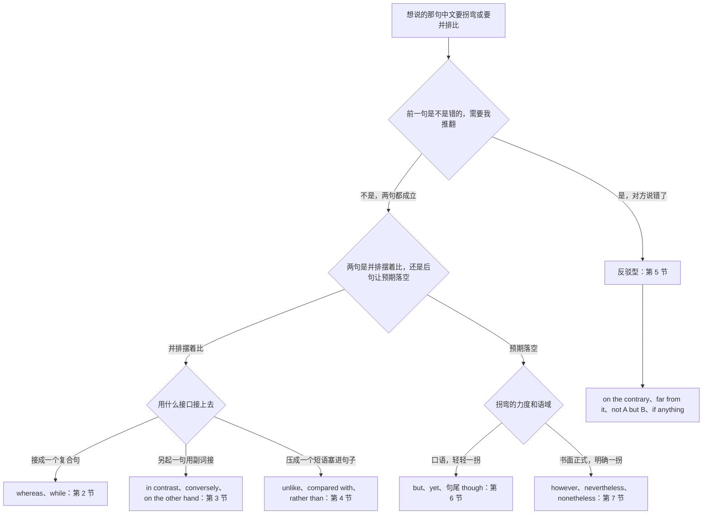
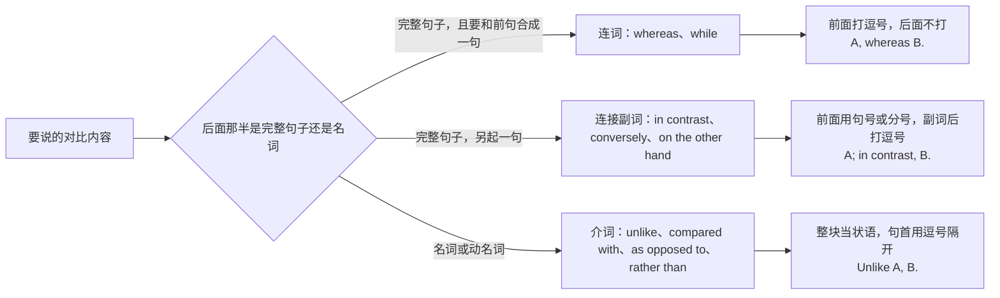
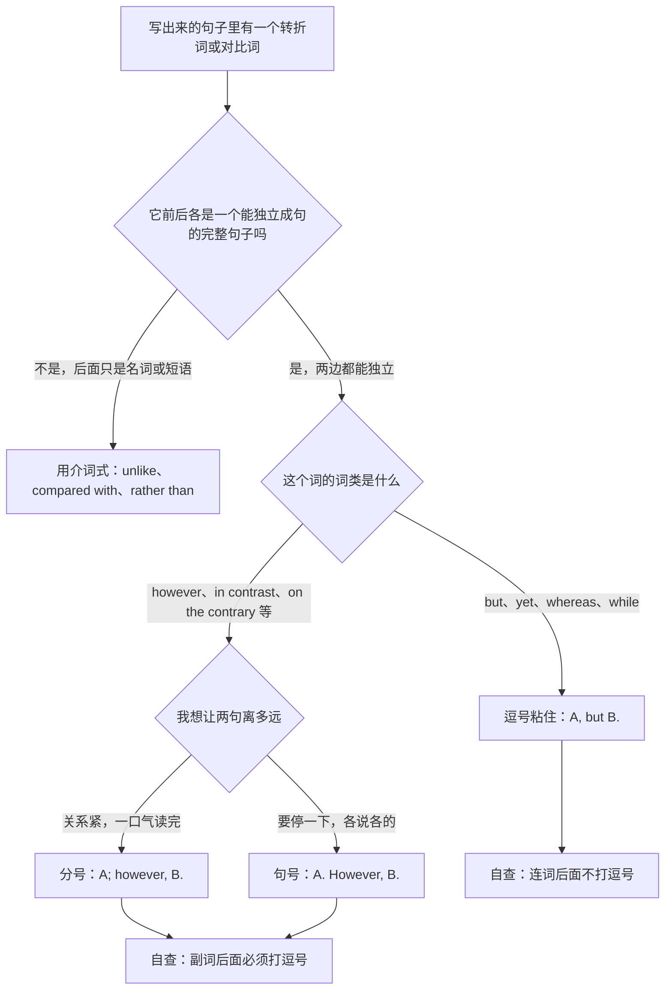
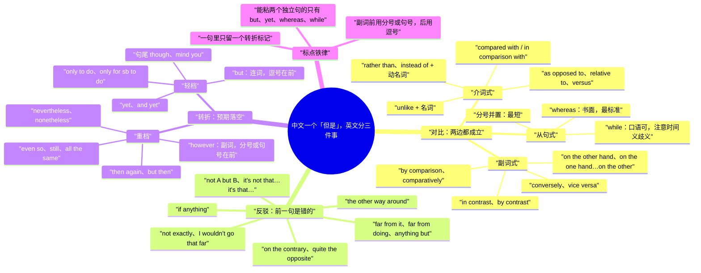

# 相比之下、恰恰相反、另一方面：对比与反驳

> [!info] 本篇定位
>
> 这篇收「A 而 B」「相比之下」「比起来」「反过来说」「另一方面」「不像」「与…相比」「而不是」「恰恰相反」「差得远」「不是A而是B」「硬要说的话」「那倒不至于」「但是」「可是」「句尾的不过」「结果却」「然而」「尽管如此」「即便如此」共二十八条查询意图，每条给口语、书面、正式三档成品。
>
> 与本分类另外两篇的分工：想说「虽然A但是B」这种**认了前半句再推翻**的，查 [[05.让步、转折与对比/01.虽然但是：让步的六种入口与语域分档\|虽然但是：让步的六种入口与语域分档]]；想说「话虽如此」「退一步说」「表面上…实际上」「不但没…反而」这种**软化与反预期**的，查 [[05.让步、转折与对比/02.话虽如此、退一步说、表面上实际上：软化与反预期\|话虽如此、退一步说、表面上实际上]]。这一篇只管三件事：把两样东西并排摆着说（对比）、说对方讲错了（反驳）、句子中途拐弯（转折）。
>
> 读完能查到：whereas 和 while 什么时候能换、in contrast 后面要不要加 to、on the contrary 和 on the other hand 为什么不能互换、far from it 单独成句怎么用、if anything 到底在说什么、but 前面打不打逗号、however 能不能放句中、nevertheless 和 nonetheless 差在哪、两个独立句之间用逗号接 however 为什么是病句。
>
> 比较级、倍数、差额那一套量化说法不在这里，去 [[09.比较、程度与数量/01.A 比 B 更、不如、一样：比较三式与差额\|比较三式与差额]]；「A 和 B 的区别在于」这类点名说差异的，去 [[08.指认、定义与描述/04.看起来像、区别在于、严格来说：外观、类比与限定\|外观、类比与限定]]。转折词的词类与标点规则本篇只给可查的对照表，构成解释指回 [[02.英语基础语法/05.介词与连词/03.连词的分类与用法\|连词的分类与用法]]。

---

## 1. 本篇导读：中文一个「但是」，英文分三件事

中文说到句子拐弯，手上常用的就三个词：但是、不过、然而。这三个词在中文里几乎可以互换，所以很多人默认英文的 but、however、on the contrary 也可以互换。换一次就错一次，因为英文这三个词根本不在同一个维度上。

真正决定选哪一个的，是**前后两句的关系类型**，不是语气强弱：

- **对比**：两样东西都成立，只是不一样。「服务端用 Go，客户端用 TypeScript。」——没有人被否定，只是并排摆着。
- **反驳**：前面那句话是错的，我现在把它纠正过来。「不是我不想改，是改不动。」——前一句被推翻了。
- **转折**：前半句成立，但它引出的预期落空了。「方案挺好，就是太贵。」——不否定前半句，只是后半句拐了个弯。

三类各有自己的一套词，跨类挪用就是最典型的中式英语。

### 1.1 三类的入口对照

| 中文说法 | 关系类型 | 英文入口 | 本篇节次 |
| --- | --- | --- | --- |
| A 而 B / 一个…一个… | 对比（从句式） | whereas、while、分号并置 | 第 2 节 |
| 相比之下 / 反过来说 / 另一方面 | 对比（副词式） | in contrast、conversely、on the other hand | 第 3 节 |
| 不像 / 与…相比 / 而不是 | 对比（介词式） | unlike、compared with、rather than | 第 4 节 |
| 恰恰相反 / 差得远 / 不是A而是B | 反驳 | on the contrary、far from it、not A but B | 第 5 节 |
| 但是 / 可是 / 不过 / 结果却 | 轻转折 | but、yet、句尾 though、only to | 第 6 节 |
| 然而 / 尽管如此 / 即便如此 | 强转折 | however、nevertheless、even so | 第 7 节 |
| — | 位置与标点 | 逗号、分号、句首句中句尾 | 第 8 节 |

### 1.2 从中文进的总选择树

树的第一层只问一个问题：前面那句话我认不认。认，就往对比或转折走；不认，直接落到第 5 节的反驳型。这一层是中文母语者出错最集中的地方——中文的「相反」既能表反驳（「才不是呢，恰恰相反」）也能表对比（「他很外向，他弟弟相反很内向」），英文的 on the contrary 只承担前一种，后一种必须换成 in contrast 或 conversely。

第二层分对比与转折。判断法很机械：把两个分句调换顺序，意思基本不变的是对比，意思变味或读不通的是转折。「服务端用 Go，客户端用 TypeScript」调过来照样成立，是对比；「方案挺好，就是太贵」调成「方案太贵，不过挺好」重心整个变了，是转折。

第三层才选具体的词，依据是**接口形态**（要复合句、要另起一句、还是要压成短语）加**语域**。

### 1.3 三个先记住的提醒

> [!warning] 三个高频错配
>
> - ❌ ~~He is careful, on the contrary his brother is careless.~~ ／ ✅ **He is careful; his brother, in contrast, is careless.**（两人都成立，是对比不是反驳，on the contrary 用不得）
> - ❌ ~~The build passed, however the tests were skipped.~~ ／ ✅ **The build passed; however, the tests were skipped.**（however 是副词，接不了两个独立句，逗号在这里是病句）
> - ❌ ~~Although the API is fast, but it is unstable.~~ ／ ✅ **Although the API is fast, it is unstable.**（中文的「虽然…但是」成对出现，英文只留一个标记）

> [!tip] 查法
>
> 先在心里判断前一句认不认。不认就直接翻第 5 节。认的话，再看后半句能不能和前半句调换顺序：能调换往第 2 到第 4 节查对比，不能调换往第 6、7 节查转折。选好词以后，句子写出来之前一定回第 8 节核一遍标点——这一篇里很大一部分错不是选词错，是标点错。

---

## 2. A 而 B：把两样东西摆进同一个句子

这一节的三条意图共用同一个中文格式：前后两个分句地位平等，都成立，靠形式上的并置产生对比。产出是一个复合句，不另起句子。

### 2.1 A 而 B、A，B 却…：最常用的那一档

中文触发语：A 而 B / A，B 却… / 一边…一边却… / …，反倒是…

| 档位 | 句架 | 例句 |
| --- | --- | --- |
| 口语 | A, while B | The old endpoint returns null, while the new one throws. |
| 书面 | A, whereas B | The prototype ran entirely in memory, whereas the production build hit the database on every call. |
| 书面 | Whereas A, B | Whereas the first release targeted desktop users, the second focused on mobile. |
| 正式 | The former ... , whereas the latter ... | The former targets enterprise deployments, whereas the latter is aimed at individual users. |

> [!warning] 错配警示
>
> - ❌ ~~Whereas the API is fast. The UI is slow.~~ ／ ✅ **Whereas the API is fast, the UI is slow.**（whereas 引出的是从句，不能自己站成一句话）
> - ❌ ~~The API is fast, whereas but the UI is slow.~~ ／ ✅ **The API is fast, whereas the UI is slow.**（whereas 已经是连词，后面不再加 but）

- 同义入口：而 / 却 / 反倒是 / 相对地 / 与此不同的是
- 语法归属：[[02.英语基础语法/09.从句体系/04.状语从句详解\|对比状语从句]]
- 场景实战：[[04.英语场景/05.高频实用表达句型框架/04.比较对比举例总结句型库\|对比与举例句型库]]

### 2.2 一个是…另一个是…：用 while 把两件事摆平

中文触发语：一个…另一个… / 这个…那个… / 前一种…后一种… / 有的…有的…

| 档位 | 句架 | 例句 |
| --- | --- | --- |
| 口语 | One ... ; the other ... | One takes a callback; the other returns a promise. |
| 口语 | While A, B | While I handle the backend, she takes the whole client side. |
| 书面 | A does X; B, for its part, does Y | The parser reports the line number; the linter, for its part, reports only the file. |
| 正式 | A is characterized by X, while B is characterized by Y | The first cohort is characterized by heavy weekday use, while the second is characterized by weekend bursts. |

> [!warning] 错配警示
>
> - ❌ ~~While I was writing the docs, she reviewed them, while I fixed the bugs.~~ ／ ✅ **While I was writing the docs, she reviewed them; then I fixed the bugs.**（同一句里 while 出现两次，读者分不清哪个是时间义哪个是对比义）
> - ❌ ~~While the two approach are different~~ ／ ✅ **While the two approaches are different**（while 后面挂的是完整句子，里头名词的单复数照常走）

- 同义入口：一个…另一个… / 这边…那边… / 有的…有的… / 各自
- 语法归属：[[02.英语基础语法/03.代词与数词/04.不定代词详解\|one 与 the other 的指代]]
- 场景实战：[[04.英语场景/10.职场与商务场景实战/02.会议汇报与演示场景\|汇报里并置两个方案]]

### 2.3 光把两句摆一起：中间什么词都不加

中文触发语：（前后直接并列，中间不加词）… / …；… / 这个这样，那个那样

| 档位 | 句架 | 例句 |
| --- | --- | --- |
| 口语 | A. B. | Chrome caches it. Safari doesn't. |
| 口语 | A — B | We shipped on time — they didn't. |
| 书面 | A; B | The first pass removes duplicates; the second normalizes casing. |
| 正式 | A: B | The distinction is procedural, not substantive: the rule applies; the exception does not. |

> [!warning] 错配警示
>
> - ❌ ~~Chrome caches it, Safari doesn't.~~ ／ ✅ **Chrome caches it; Safari doesn't.** 或 **Chrome caches it, but Safari doesn't.**（两个独立句之间只放逗号，是英文写作里被批注得最多的错误之一，要么升成分号，要么补一个连词）
> - ❌ ~~The first pass removes duplicates; and the second normalizes casing.~~ ／ ✅ **The first pass removes duplicates, and the second normalizes casing.**（分号和 and 只留一个）

- 同义入口：（直接并列） / 这个…那个… / 一句一个
- 语法归属：[[02.英语基础语法/05.介词与连词/03.连词的分类与用法\|并列连词与标点]]
- 场景实战：[[04.英语场景/10.职场与商务场景实战/03.商务邮件与正式书面沟通\|书面沟通里的短句并置]]

---

## 3. 相比之下：另起一句说对比

这一节的五条意图产出的都不是复合句，而是**一个副词短语加一个完整句子**。选错的代价是标点错：这些词全是副词，接不了两个独立句，前面必须是句号或分号。

### 3.1 相比之下、比较起来：最通用的那一档

中文触发语：相比之下 / 相对而言 / 与之相对 / 反观… / 比较起来

| 档位 | 句架 | 例句 |
| --- | --- | --- |
| 口语 | A. B, though. | The mobile build takes two minutes. The desktop one takes twenty, though. |
| 书面 | A. In contrast, B. | The v1 client retried forever. In contrast, v2 gives up after three attempts. |
| 书面 | A. B, by contrast, C. | Onboarding takes a week. Offboarding, by contrast, is done in an afternoon. |
| 正式 | In contrast to A, B | In contrast to the earlier survey, the present study draws on administrative records. |

> [!warning] 错配警示
>
> - ❌ ~~In contrast the earlier survey, this study uses records.~~ ／ ✅ **In contrast to the earlier survey, this study uses records.**（后面直接接名词时必须补 to，光写 in contrast 是句间副词，后面要跟逗号加完整句子）
> - ❌ ~~The v1 client retried forever, in contrast v2 gives up.~~ ／ ✅ **The v1 client retried forever; in contrast, v2 gives up.**（in contrast 不是连词，接不住两个独立句）

- 同义入口：相比之下 / 反观 / 与此相对 / 相对来讲 / 比较而言
- 语法归属：[[02.英语基础语法/04.形容词与副词/03.副词的分类与用法\|连接副词]]
- 场景实战：[[04.英语场景/05.高频实用表达句型框架/04.比较对比举例总结句型库\|对比连接的书面用法]]

### 3.2 比起来、相对来说：把对比说轻一点

中文触发语：比起来 / 相对来说 / 说起来还算 / 就…而言算是 / 这么一比

| 档位 | 句架 | 例句 |
| --- | --- | --- |
| 口语 | A. B is not bad, comparatively. | The API docs are a mess. The SDK docs are not bad, comparatively. |
| 口语 | Relatively speaking, A | Relatively speaking, this release was quiet. |
| 书面 | By comparison, A | Last quarter we shipped four features. By comparison, this quarter we shipped one. |
| 正式 | A. B is comparatively C. | The legacy queue drops messages under load. The new broker is comparatively robust. |

> [!warning] 错配警示
>
> - ❌ ~~By comparison with last quarter, but we shipped less.~~ ／ ✅ **By comparison with last quarter, we shipped less.**（by comparison 已经承担了对比，不再叠 but）
> - ❌ ~~Comparatively speaking it is not bad, comparatively.~~ ／ ✅ **Comparatively, it's not bad.**（同一句里同一个对比标记只留一次）

- 同义入口：比起来 / 相对来说 / 这么一比 / 论…的话
- 语法归属：[[02.英语基础语法/04.形容词与副词/02.形容词的比较级与最高级\|比较的隐含基准]]
- 场景实战：[[04.英语场景/09.学习与教育场景实战/03.考试报名与学术评分场景\|评分与横向比较]]

### 3.3 反过来说、反之亦然：两边关系互换

中文触发语：反过来说 / 反之 / 反之亦然 / 倒过来也一样 / 换过来也成立

| 档位 | 句架 | 例句 |
| --- | --- | --- |
| 口语 | A. And the other way round, B. | Fewer meetings mean more code. And the other way round, more meetings mean less. |
| 口语 | A, and vice versa | The frontend can call the worker, and vice versa. |
| 书面 | A. Conversely, B. | High cache hit rates cut latency. Conversely, a cold cache adds close to a second. |
| 正式 | A; the reverse also holds | Higher throughput reduces queue depth; the reverse also holds under sustained load. |

> [!warning] 错配警示
>
> - ❌ ~~He is quiet. Conversely, his brother is loud.~~ ／ ✅ **He is quiet. His brother, in contrast, is loud.**（conversely 要求两句在逻辑上互为反向关系，不是单纯的两个人不一样）
> - ❌ ~~The worker can call the API and vice versa the API can call the worker.~~ ／ ✅ **The worker can call the API, and vice versa.**（vice versa 是把整句关系倒过来的省略式，后面不再重写一遍）

- 同义入口：反过来说 / 反之 / 反之亦然 / 倒过来也一样
- 语法归属：[[02.英语基础语法/10.特殊句型/05.省略与替代\|避免重复的替代表达]]
- 场景实战：[[04.英语场景/09.学习与教育场景实战/01.课堂讨论与提问场景\|课堂里说明双向关系]]

### 3.4 另一方面：把另一面摆出来

中文触发语：另一方面 / 另外一面 / 换个角度看 / 从另一头说 / 也得看到

| 档位 | 句架 | 例句 |
| --- | --- | --- |
| 口语 | A. Then again, B. | The rewrite would take a month. Then again, we'd stop firefighting every week. |
| 口语 | A. On the flip side, B. | Remote hiring widens the pool. On the flip side, onboarding gets harder. |
| 书面 | A. On the other hand, B. | Caching cuts the database load. On the other hand, it makes debugging harder. |
| 正式 | A. B, on the other hand, C. | The subscription model stabilizes revenue. Support costs, on the other hand, scale with the user base. |

> [!warning] 错配警示
>
> - ❌ ~~In one hand it's cheaper, in other hand it's slower.~~ ／ ✅ **On the one hand it's cheaper; on the other hand it's slower.**（介词是 on 不是 in，第二个 hand 前的 the 不能省）
> - ❌ ~~It's not slow. On the other hand, it's the fastest one we've tested.~~ ／ ✅ **It's not slow. On the contrary, it's the fastest one we've tested.**（这里是在推翻前一句，该用 on the contrary；on the other hand 只用于两面都成立）

- 同义入口：另一方面 / 换个角度 / 从另一头说 / 也得看到 / 反过来讲
- 语法归属：[[02.英语基础语法/05.介词与连词/02.常用介词搭配详解\|on 的固定短语]]
- 场景实战：[[04.英语场景/05.高频实用表达句型框架/01.表达观点与态度的50个万能句型\|表达两面看法]]

### 3.5 一方面…另一方面…：成对给出两面

中文触发语：一方面…另一方面… / 一来…二来… / 好处是…坏处是… / 有利有弊

| 档位 | 句架 | 例句 |
| --- | --- | --- |
| 口语 | The upside is A; the downside is B | The upside is it's fast; the downside is nobody understands it. |
| 口语 | For one thing A; for another B | For one thing it's untested; for another it duplicates code we already have. |
| 书面 | On the one hand A; on the other hand B | On the one hand the change is small; on the other hand it touches the auth path. |
| 正式 | While A on the one hand, B on the other | While the policy reduces risk on the one hand, it raises processing time on the other. |

> [!warning] 错配警示
>
> - ❌ ~~On the one hand it's cheap. On another hand it's slow.~~ ／ ✅ **On the one hand it's cheap. On the other hand it's slow.**（固定搭配是 the other，没有 another hand 的说法）
> - ❌ ~~On the other hand, the change is small; on the one hand, it touches auth.~~ ／ ✅ **On the one hand the change is small; on the other hand it touches auth.**（这一对有顺序，one 在前 other 在后，颠倒会让读者以为漏了半句）

- 同义入口：一方面…另一方面… / 一来…二来… / 好处是…坏处是… / 有利有弊
- 语法归属：[[02.英语基础语法/05.介词与连词/04.介词与连词的易混点\|成对连接的搭配限制]]
- 场景实战：[[04.英语场景/10.职场与商务场景实战/04.商务谈判合同与客户沟通\|谈判里摆出两面]]

---

## 4. 不像、与…相比：把对比压成一个短语

上一节要另起句子，这一节不用。这四条意图的产出都是**一个介词短语**，挂在主句的头上或尾巴上，句子还是一句。写邮件和写文档时这一档最省字。

### 4.1 不像、和…不一样：unlike

中文触发语：不像 / 和…不一样 / 跟…不同的是 / 有别于 / …可不这样

| 档位 | 句架 | 例句 |
| --- | --- | --- |
| 口语 | Unlike sb/sth, ... | Unlike the old script, this one cleans up after itself. |
| 口语 | ... , unlike sb/sth | It runs on a schedule, unlike the manual export. |
| 书面 | Unlike sth, which ... , B | Unlike the previous release, which shipped without migrations, this one comes with a rollback script. |
| 正式 | In contradistinction to sth, ... | In contradistinction to earlier accounts, the record shows a gradual decline. |

> [!warning] 错配警示
>
> - ❌ ~~Unlike the old script does, this one cleans up.~~ ／ ✅ **Unlike the old script, this one cleans up.**（unlike 是介词，后面接名词或动名词，接不了句子；要挂一整句得换成 contrary to what… 或干脆改用 whereas）
> - ❌ ~~Unlike in Java, in Python has no interfaces.~~ ／ ✅ **Unlike Java, Python has no interfaces.**（介词短语后面的主句要有自己的主语，不要把主语也埋进介词里）

- 同义入口：不像 / 和…不一样 / 跟…不同 / 有别于 / 换成…就不是这样
- 语法归属：[[02.英语基础语法/05.介词与连词/01.介词的分类与基本用法\|介词后接成分的限制]]
- 场景实战：[[04.英语场景/05.高频实用表达句型框架/04.比较对比举例总结句型库\|unlike 的对比用法]]

### 4.2 与…相比：compared with 一族

中文触发语：与…相比 / 跟…比起来 / 相较于 / 比照… / 和去年比

| 档位 | 句架 | 例句 |
| --- | --- | --- |
| 口语 | compared to sth, ... | Compared to last month, response times are way down. |
| 书面 | compared with sth, ... | Compared with the baseline, the new index cuts query time by half. |
| 书面 | ... , as compared with sth | Error rates fell to 0.3 percent, as compared with 1.1 percent a year earlier. |
| 正式 | In comparison with sth, ... | In comparison with similar regional programs, the pilot remains small. |

> [!warning] 错配警示
>
> - ❌ ~~Compared with last month, the response time is faster than before.~~ ／ ✅ **Compared with last month, response times are lower.**（compared with 已经给出比较对象，后面不再挂第二个 than 短语）
> - ❌ ~~Compared with last year, our team is bigger than that.~~ ／ ✅ **Compared with last year, our team is bigger.**（介词短语后面别再补一个悬空的 that）

- 同义入口：与…相比 / 跟…比起来 / 相较于 / 和…一比 / 对照…来看
- 语法归属：[[02.英语基础语法/08.非谓语动词/04.过去分词详解\|分词短语作状语]]
- 场景实战：[[04.英语场景/10.职场与商务场景实战/02.会议汇报与演示场景\|数据同比与环比]]

### 4.3 相对于、而非：as opposed to 与 versus

中文触发语：相对于 / 而非 / 是…而不是… / 就…而不是…来说 / …对…（两者对举）

| 档位 | 句架 | 例句 |
| --- | --- | --- |
| 口语 | A, not B | We need a fix, not a rewrite. |
| 口语 | A vs. B | Caching problem vs. network problem — that's what we need to settle first. |
| 书面 | A as opposed to B | We measure requests per second as opposed to raw bandwidth. |
| 正式 | relative to sth | Relative to comparable deployments, the failure rate remains within tolerance. |

> [!warning] 错配警示
>
> - ❌ ~~We measure throughput as opposed to measure latency.~~ ／ ✅ **We measure throughput as opposed to latency.** 或 **... as opposed to measuring latency.**（as opposed to 后面接名词或动名词，不接动词原形）
> - ❌ ~~Relative to it is cheap.~~ ／ ✅ **It is cheap relative to the alternatives.**（relative to 必须带出比较对象，不能悬空）

- 同义入口：相对于 / 而非 / 是…不是… / 对举来看 / 拿…作参照
- 语法归属：[[02.英语基础语法/05.介词与连词/02.常用介词搭配详解\|介词短语作状语的位置]]
- 场景实战：[[04.英语场景/10.职场与商务场景实战/04.商务谈判合同与客户沟通\|条款里的对举写法]]

### 4.4 而不是：rather than 与 instead of

中文触发语：而不是 / 与其…不如直接… / 不用…改用… / 别…了，直接…

| 档位 | 句架 | 例句 |
| --- | --- | --- |
| 口语 | do A instead of doing B | Let's patch the config instead of rebuilding the image. |
| 口语 | A rather than B | I'd send a short note rather than a full report. |
| 书面 | rather than doing A, do B | Rather than adding another flag, we split the function in two. |
| 正式 | in lieu of sth | The committee accepted a written statement in lieu of an oral hearing. |

> [!warning] 错配警示
>
> - ❌ ~~Instead of rebuild the image, we patched the config.~~ ／ ✅ **Instead of rebuilding the image, we patched the config.**（instead of 后面必须是名词或动名词，接不了动词原形）
> - ❌ ~~We patched the config, instead of.~~ ／ ✅ **We patched the config instead.**（instead 单用是副词，直接放句尾；带宾语才需要 of）

- 同义入口：而不是 / 不用…改用… / 别…直接… / 换成 / 与其那样
- 语法归属：[[02.英语基础语法/08.非谓语动词/02.动名词详解\|介词后的动名词]]
- 场景实战：[[04.英语场景/05.高频实用表达句型框架/02.建议请求邀请拒绝四大功能句型\|提替代方案]]

### 4.5 三种接口的形态对照

三节讲下来，同一层意思有三个接口，形态互不通用。这张图是给写句子时用的：先定接口，再填词。

这张图把选择压成两问：后半截是不是完整句子，要不要和前半截合成一句。是完整句子且要合成一句，只能用连词，标点是「逗号在前」；是完整句子但要另起一句，只能用连接副词，标点是「分号或句号在前、逗号在后」；不是完整句子而是一个名词性成分，走介词，整块当状语挂上去。三条路的错误各有各的样子——把 in contrast 当连词用会写出逗号粘连句，把 unlike 当连词用会在后面挂一个多余的谓语，把 whereas 当副词用会写出一个站不住的从句碎片。

---

## 5. 恰恰相反：把前面那句话推翻

这一节和前面三节的分界很硬：前面三节里两句话都成立，这一节里前一句是要被否掉的。中文的「相反」承担两种功能，英文分得很开，混用是本篇最值得先记住的一条。

### 5.1 恰恰相反、正好反了：on the contrary

中文触发语：恰恰相反 / 正好相反 / 才不是呢 / 你说反了 / 完全不是那么回事

| 档位 | 句架 | 例句 |
| --- | --- | --- |
| 口语 | Not at all — quite the opposite. | "So it slowed things down?" "Not at all — quite the opposite." |
| 口语 | It's the other way around. | It's not the client timing out. It's the other way around. |
| 书面 | A. On the contrary, B. | The change did not increase load. On the contrary, it cut CPU use by a third. |
| 正式 | Contrary to sth, ... | Contrary to the initial assessment, the outage originated upstream. |

> [!warning] 错配警示
>
> - ❌ ~~The API is fast. On the contrary, the UI is slow.~~ ／ ✅ **The API is fast. The UI, in contrast, is slow.**（两句都成立时用 in contrast；on the contrary 要求前一句被否掉）
> - ❌ ~~On the contrary to the report, load went down.~~ ／ ✅ **Contrary to the report, load went down.**（要带出被否掉的对象就用 contrary to，前面不加 on the；on the contrary 是不带宾语的独立插入语）

- 同义入口：恰恰相反 / 正好反了 / 才不是 / 你说反了 / 完全不是这么回事
- 语法归属：[[02.英语基础语法/05.介词与连词/04.介词与连词的易混点\|contrary 的两种搭配]]
- 场景实战：[[04.英语场景/05.高频实用表达句型框架/03.同意反对让步转折句型库\|明确反对的说法]]

### 5.2 差得远呢、根本不是：far from 一族

中文触发语：差得远呢 / 根本不是 / 一点也不 / 说是…其实完全谈不上 / 哪儿啊

| 档位 | 句架 | 例句 |
| --- | --- | --- |
| 口语 | Far from it. | "Is the migration done?" "Far from it." |
| 口语 | It's anything but adj. | The setup is anything but simple. |
| 书面 | Far from doing A, sb did B | Far from fixing the leak, the patch made it worse. |
| 正式 | A is far from + adj. | The available data are far from conclusive on this point. |

> [!warning] 错配警示
>
> - ❌ ~~The setup is anything but not simple.~~ ／ ✅ **The setup is anything but simple.**（anything but 本身就是否定，再加 not 会把意思翻回去）
> - ❌ ~~Far from it, the migration is done.~~ ／ ✅ **Far from it — the migration has barely started.**（far from it 是独立回应，用来否掉刚才那句，后面接的必须是与之相反的内容）

- 同义入口：差得远 / 根本不是 / 一点也不 / 哪儿啊 / 完全谈不上
- 语法归属：[[02.英语基础语法/08.非谓语动词/02.动名词详解\|far from 后的动名词]]
- 场景实战：[[04.英语场景/07.社交交际场景实战/01.交友聚会与闲聊场景\|口语里的否定回应]]

### 5.3 不是A，而是B：把错的换成对的

中文触发语：不是A而是B / 与其说是A不如说是B（简式） / 问题不在A，在B / 说到底不是…是…

| 档位 | 句架 | 例句 |
| --- | --- | --- |
| 口语 | It's not A — it's B. | It's not a bug — it's a config issue. |
| 口语 | It's not that A; it's that B. | It's not that I don't want to; it's that I don't have access. |
| 书面 | not A but rather B | The delay was caused not by the network but rather by a lock in the writer. |
| 正式 | A is not X; rather, it is Y | The clause is not permissive; rather, it is mandatory in all listed cases. |

> [!warning] 错配警示
>
> - ❌ ~~It's not a bug but it's a config issue.~~ ／ ✅ **It's not a bug but a config issue.** 或 **It's not a bug; it's a config issue.**（not A but B 里 but 后面接的是与 A 平行的成分，不再重起一个句子）
> - ❌ ~~The delay was caused not by the network, but the lock.~~ ／ ✅ **The delay was caused not by the network but by the lock.**（but 前后要形态对等，介词 by 得配上）

- 同义入口：不是…而是… / 问题不在…在… / 说到底不是…是… / 与其说…不如说（详见 [[05.让步、转折与对比/02.话虽如此、退一步说、表面上实际上：软化与反预期\|软化与反预期]]）
- 语法归属：[[02.英语基础语法/05.介词与连词/03.连词的分类与用法\|not…but 的对等结构]]
- 场景实战：[[04.英语场景/11.医疗与紧急场景实战/01.医院看病与药店购药场景\|说清症状不是什么]]

### 5.4 硬要说的话、要说有什么区别：if anything

中文触发语：硬要说的话 / 要说有什么区别 / 非要说的话反而 / 甚至可以说 / 不降反升

| 档位 | 句架 | 例句 |
| --- | --- | --- |
| 口语 | If anything, ... | "Did it get slower?" "If anything, it got faster." |
| 口语 | ... , if anything | It's gotten faster, if anything. |
| 书面 | A did not decline; if anything, it rose | Engagement did not decline after the redesign; if anything, it rose slightly. |
| 正式 | A is, if anything, more + adj. | The pattern is, if anything, more pronounced in the second cohort. |

> [!warning] 错配警示
>
> - ❌ ~~If anything, it got slower and it got faster.~~ ／ ✅ **If anything, it got faster.**（if anything 引出的是与预期相反的那一边，只给一个方向）
> - ❌ ~~If any, it got faster.~~ ／ ✅ **If anything, it got faster.**（if any 是「如果有的话」用来限定数量，和这条意图不是一回事）

- 同义入口：硬要说的话 / 要说有区别 / 非要说反而 / 不降反升 / 甚至还…了些
- 语法归属：[[02.英语基础语法/10.特殊句型/05.省略与替代\|条件小句的省略式]]
- 场景实战：[[04.英语场景/05.高频实用表达句型框架/01.表达观点与态度的50个万能句型\|修正对方的判断]]

### 5.5 那倒不至于、没那么严重：把反驳说软

中文触发语：那倒不至于 / 也没那么… / 我不会说到那个地步 / 未必吧 / 话不能这么说

| 档位 | 句架 | 例句 |
| --- | --- | --- |
| 口语 | Not exactly. | "So the whole thing is broken?" "Not exactly — only the import path is." |
| 口语 | I wouldn't go that far. | "It's the worst release ever." "I wouldn't go that far." |
| 书面 | It's not so much A as B | It's not so much a design flaw as a documentation gap. |
| 正式 | That characterization [somewhat] overstates the case | That characterization somewhat overstates the case. |

> [!warning] 错配警示
>
> - ❌ ~~I wouldn't go so far that.~~ ／ ✅ **I wouldn't go so far as to say that.**（固定式是 go so far as to do，中间不能省）
> - ❌ ~~It's not so much a flaw than a gap.~~ ／ ✅ **It's not so much a flaw as a gap.**（not so much A as B 里配的是 as，不是 than）

- 同义入口：那倒不至于 / 也没那么严重 / 未必吧 / 话不能这么说 / 说重了
- 语法归属：[[02.英语基础语法/07.助动词与情态动词/02.情态动词详解\|would 的缓和用法]]
- 场景实战：[[04.英语场景/05.高频实用表达句型框架/03.同意反对让步转折句型库\|部分不同意]]

---

## 6. 但是、可是、不过：轻转折的四个位置

从这一节起换轨道：前后两句都成立，但后半句让前半句引出的预期落空。轻转折的特征是**词短、位置灵活、口语书面通吃**。

### 6.1 但是：but 的三个位置

中文触发语：但是 / 可 / 就是 / 不过

| 档位 | 句架 | 例句 |
| --- | --- | --- |
| 口语 | A, but B | The design is solid, but the timeline is not. |
| 口语 | But B. | But that's exactly what the flag is for. |
| 书面 | A. But B. | We shipped the feature on Friday. But nobody had written the migration guide. |
| 正式 | A, but B in the present case | The rule admits exceptions, but none applies in the present case. |

> [!warning] 错配警示
>
> - ❌ ~~The design is solid but, the timeline is not.~~ ／ ✅ **The design is solid, but the timeline is not.**（but 作连词，逗号打在它前面，不打在后面）
> - ❌ ~~Though the design is solid, but the timeline is not.~~ ／ ✅ **Though the design is solid, the timeline is not.**（though 和 but 是同一层的两个标记，中文成对英文只留一个，详见 [[05.让步、转折与对比/01.虽然但是：让步的六种入口与语域分档\|虽然但是]]）

- 同义入口：但是 / 可 / 就是 / 不过 / 只是
- 语法归属：[[02.英语基础语法/05.介词与连词/03.连词的分类与用法\|并列连词 but]]
- 场景实战：[[04.英语场景/05.高频实用表达句型框架/03.同意反对让步转折句型库\|口语转折]]

### 6.2 可偏偏、然而却：yet 与 and yet

中文触发语：可偏偏 / 然而却 / 偏偏就 / 却又 / 明明…可…

| 档位 | 句架 | 例句 |
| --- | --- | --- |
| 口语 | A, yet B | It's a two-line change, yet nobody wants to own it. |
| 口语 | And yet B. | And yet the tests pass every single time. |
| 书面 | A, and yet B | The evidence was available in the logs, and yet no one looked. |
| 正式 | A. Yet B. | The provision has been in force since 2019. Yet enforcement remains uneven. |

> [!warning] 错配警示
>
> - ❌ ~~It's a two-line change, but yet nobody wants it.~~ ／ ✅ **It's a two-line change, yet nobody wants it.**（but 和 yet 不叠用，and yet 才是合法组合）
> - ❌ ~~Yet, the tests pass.~~ ／ ✅ **Yet the tests pass.**（yet 作转折连词时后面不打逗号；打逗号是把它当「然而」这类插入语用了，语感偏重）

- 同义入口：可偏偏 / 然而却 / 偏偏 / 却又 / 明明…可…
- 语法归属：[[02.英语基础语法/05.介词与连词/03.连词的分类与用法\|yet 的连词用法]]
- 场景实战：[[04.英语场景/10.职场与商务场景实战/02.会议汇报与演示场景\|指出反常现象]]

### 6.3 句尾的「不过」：后置的 though

中文触发语：…就是了 / …不过 / 话说回来还是 / 倒是… / 就是有点…

| 档位 | 句架 | 例句 |
| --- | --- | --- |
| 口语 | A. B, though. | The build is green. It took forty minutes, though. |
| 口语 | A — nice, though. | The API is undocumented — fast, though. |
| 口语 | Mind you, B. | It works. Mind you, I only tested it on one machine. |
| 书面 | A. That said, B. | The numbers look good. That said, the sample is small. |

> [!warning] 错配警示
>
> - ❌ ~~Though, it took forty minutes.~~ ／ ✅ **It took forty minutes, though.**（作副词的 though 只放句尾或句中，不放句首；放句首的 though 是让步连词，后面得跟从句）
> - ❌ ~~It took forty minutes though it was green.~~ ／ ✅ **It was green. It took forty minutes, though.**（一旦写成 though + 从句，句子就从转折变成让步，重心整个换掉）

- 同义入口：…就是了 / …不过 / 倒是 / 就是有点 / 话说回来（详见 [[05.让步、转折与对比/02.话虽如此、退一步说、表面上实际上：软化与反预期\|软化与反预期]]）
- 语法归属：[[02.英语基础语法/04.形容词与副词/03.副词的分类与用法\|句末副词]]
- 场景实战：[[04.英语场景/07.社交交际场景实战/02.电话短信与在线沟通场景\|聊天里的补充转折]]

### 6.4 结果却、谁知道：only to

中文触发语：结果却 / 谁知道 / 没想到反而 / 到头来却 / 折腾半天最后

| 档位 | 句架 | 例句 |
| --- | --- | --- |
| 口语 | A, only to do B | I rushed the hotfix out, only to break the build. |
| 口语 | A, only for sb to do B | We froze the branch, only for someone to push directly to main. |
| 书面 | A, only to find that B | The team migrated the data, only to find that half the rows were stale. |
| 正式 | A, only to be done | The proposal was approved in June, only to be withdrawn two months later. |

> [!warning] 错配警示
>
> - ❌ ~~I rushed the hotfix out, only to broke the build.~~ ／ ✅ **I rushed the hotfix out, only to break the build.**（only to 后面永远是动词原形）
> - ❌ ~~We froze the branch, only someone pushed to main.~~ ／ ✅ **We froze the branch, only for someone to push to main.**（换主语时用 only for sb to do，不能直接挂一个完整句子）

- 同义入口：结果却 / 谁知道 / 到头来 / 没想到反而 / 白忙一场（完整讲解在 [[03.因果与结果/03.结果、因此、以至于：从结果反推与程度致果\|从结果反推与程度致果]]）
- 语法归属：[[02.英语基础语法/08.非谓语动词/01.动词不定式详解\|不定式表意外结果]]
- 场景实战：[[04.英语场景/07.社交交际场景实战/01.交友聚会与闲聊场景\|讲一件白忙的事]]

---

## 7. 然而、尽管如此：强转折与语域

强转折的四条意图共用一个特点：它们都是**副词**，不是连词。这决定了它们的标点规则和 but 完全不同，也决定了它们在口语里听起来偏正式。

### 7.1 然而：however 的四个位置

中文触发语：然而 / 可是（书面） / 不过（书面） / 但问题在于

| 档位 | 句架 | 例句 |
| --- | --- | --- |
| 书面 | A. However, B. | The proposal is cheap to implement. However, it does not solve the root cause. |
| 书面 | A; however, B | The parser accepts the input; however, it silently drops the trailing field. |
| 书面 | S, however, + 谓语 | The second run, however, produced a different checksum. |
| 正式 | A. B, however. | The scheme met its stated goals. The cost overrun was substantial, however. |

> [!warning] 错配警示
>
> - ❌ ~~The proposal is cheap, however it does not solve the problem.~~ ／ ✅ **The proposal is cheap; however, it does not solve the problem.**（however 是副词，接不了两个独立句，这里必须升成分号或句号）
> - ❌ ~~However the proposal is cheap, it fails.~~ ／ ✅ **However cheap the proposal is, it fails.**（不带逗号的 however 是「无论多么」，后面必须紧跟形容词或副词，和「然而」不是一个词）

- 同义入口：然而 / 可是（书面） / 但问题在于 / 只不过（书面）
- 语法归属：[[02.英语基础语法/04.形容词与副词/03.副词的分类与用法\|连接副词的位置]]
- 场景实战：[[04.英语场景/10.职场与商务场景实战/03.商务邮件与正式书面沟通\|邮件里的书面转折]]

### 7.2 尽管如此：nevertheless 与 nonetheless

中文触发语：尽管如此 / 虽说这样 / 即便这样 / 话虽如此还是（正式）

| 档位 | 句架 | 例句 |
| --- | --- | --- |
| 书面 | A. Nevertheless, B. | The sample was small. Nevertheless, the effect was consistent across all three sites. |
| 书面 | A; nonetheless, B | The vendor missed two deadlines; nonetheless, the contract was renewed. |
| 书面 | A. B nonetheless. | The design has known limits. It remains the best option available nonetheless. |
| 正式 | Notwithstanding A, B | Notwithstanding the reservations expressed, the committee approved the measure. |

> [!warning] 错配警示
>
> - ❌ ~~Although the sample was small, nevertheless the effect was consistent.~~ ／ ✅ **The sample was small. Nevertheless, the effect was consistent.**（已经用了 although 就不再叠 nevertheless，同一个让步关系只标一次）
> - ❌ ~~Notwithstanding the sample was small, ...~~ ／ ✅ **Notwithstanding the small sample, ...** 或 **Notwithstanding that the sample was small, ...**（notwithstanding 是介词，接句子要补 that）

> [!tip] nevertheless 和 nonetheless 差在哪
>
> 差不多没差。两个词意思相同、语域相同，在同一个位置上可以直接互换，上面前三行里哪一行换成另一个词都成立。表格把 nevertheless 排在句首、nonetheless 排在分号后和句尾，是为了摆出同一个词能站的三个位置，不是这两个词有分工。真正要留神的不是选哪个，是它们都只能跟句号或分号，跟不了逗号。

- 同义入口：尽管如此 / 虽说这样 / 即便这样 / 饶是如此
- 语法归属：[[02.英语基础语法/09.从句体系/04.状语从句详解\|让步与转折的分界]]
- 场景实战：[[04.英语场景/09.学习与教育场景实战/03.考试报名与学术评分场景\|学术写作里的转折]]

### 7.3 即便这样还是：even so 与 still

中文触发语：即便这样 / 就算这样还是 / 那也还是 / 反正我还是 / 该…还是要…

| 档位 | 句架 | 例句 |
| --- | --- | --- |
| 口语 | A. Still, B. | The docs are thin. Still, I'd rather use this than write my own. |
| 口语 | A. Even so, B. | We tripled the timeout. Even so, one request in fifty still fails. |
| 口语 | A. All the same, B. | It's probably fine. All the same, I'd run it once in staging. |
| 书面 | A. B all the same. | The risk is low. We will keep the rollback plan all the same. |

> [!warning] 错配警示
>
> - ❌ ~~Even though we tripled the timeout. One request still fails.~~ ／ ✅ **Even so, one request still fails.**（even so 回指前一整句，even though 引出的是从句，不能自己站成一句）
> - ❌ ~~Still, but the docs are thin.~~ ／ ✅ **Still, the docs are thin.**（still 已经承担转折，后面不加 but）

- 同义入口：即便这样 / 就算这样 / 那也还是 / 该…还是… / 无论如何我还是
- 语法归属：[[02.英语基础语法/04.形容词与副词/03.副词的分类与用法\|still 的转折义]]
- 场景实战：[[04.英语场景/05.高频实用表达句型框架/03.同意反对让步转折句型库\|保留立场的说法]]

### 7.4 反过来一想：then again 的自我回拨

中文触发语：不过反过来一想 / 话又说回来 / 可转念一想 / 也说不定 / 但也未必

| 档位 | 句架 | 例句 |
| --- | --- | --- |
| 口语 | A. Then again, B. | We should just buy it. Then again, we've never audited their security. |
| 口语 | A. But then, B. | Nobody uses that endpoint. But then, nobody checked the analytics either. |
| 书面 | A. On reflection, however, B. | The simplest fix is to widen the column. On reflection, however, that only defers the problem. |
| 正式 | A. A closer reading suggests B. | The clause appears permissive. A closer reading suggests otherwise. |

> [!warning] 错配警示
>
> - ❌ ~~Then again, and we've never audited them.~~ ／ ✅ **Then again, we've never audited them.**（then again 是插入语，后面直接跟主句，不再加连词）
> - ❌ ~~We should buy it, then again we never audited them.~~ ／ ✅ **We should buy it. Then again, we never audited them.**（同样是副词接不了两个独立句的问题）

- 同义入口：反过来一想 / 话又说回来 / 转念一想 / 但也未必 / 说不好
- 语法归属：[[02.英语基础语法/12.日常口语/02.常用口语句型\|口语插入语]]
- 场景实战：[[04.英语场景/07.社交交际场景实战/01.交友聚会与闲聊场景\|闲聊里的自我回拨]]

---

## 8. 位置与标点：词选对了还会错在这里

前面六节选的是词，这一节定的是把词放在哪、周围打什么符号。中文的转折词位置极自由，「然而」放句首放句中都行，标点一律是逗号；英文不是。词类决定标点，位置决定语气。

### 8.1 三类词的标点总表

| 词 | 词类 | 能不能连接两个独立句 | 前面的标点 | 后面的标点 |
| --- | --- | --- | --- | --- |
| but、yet | 并列连词 | 能 | 逗号 | 不打 |
| whereas、while | 从属连词 | 能（合成一个复合句） | 逗号 | 不打 |
| however、nevertheless、nonetheless | 连接副词 | 不能 | 句号或分号 | 逗号 |
| in contrast、by contrast、conversely | 连接副词 | 不能 | 句号或分号 | 逗号 |
| on the other hand、then again、even so | 连接副词短语 | 不能 | 句号或分号 | 逗号 |
| on the contrary | 连接副词短语 | 不能 | 句号或分号 | 逗号 |
| 句尾的 though | 副词 | 不能 | 逗号 | 句号 |
| unlike、compared with、as opposed to | 介词 | 不能（后接名词） | 句首无，句中用逗号 | 句首用逗号 |

表里最要紧的是第三列。**这一篇涉及的词里，能连接两个独立句的只有 but、yet、whereas、while 四个**，其余全部不能（and、or、so 这几个不表转折的也能，但不在本篇范围里）。写句子前先问一句「这个词能不能当胶水」，能就用逗号粘，不能就先断句再接。

### 8.2 从标点判断该改什么

这张图的入口是已经写完的句子，用途是回头查。判断链只有两步：先看这个词左右是不是两个完整句子，再看词类。左右都是完整句子而词类是副词，就必然要把逗号升成分号或句号——这一步能消掉逗号粘连句，也就是被红笔圈得最多的那类错之一。左右都是完整句子而词类是连词，逗号是对的，此时反过来要检查连词后面有没有多打一个逗号。

分号和句号的选择不涉及对错，只影响节奏：分号把两句拴在一起读，句号让它们各自站住。写正式文书倾向分号，写邮件和文档倾向句号——句号短句在屏幕上更好扫。

### 8.3 位置带来的语气差

同一个 however，放在三个位置读起来轻重不同。这一组不是三档语域，是同一档里的三种重音。

| 位置 | 句架 | 例句 | 语气 |
| --- | --- | --- | --- |
| 句首 | However, B | However, the second run failed. | 转折最重，读者一开口就知道要拐弯 |
| 主语后 | S, however, + 谓语 | The second run, however, failed. | 转折轻，重音落在主语上 |
| 句尾 | B, however. | The second run failed, however. | 转折最轻，像补一句 |

三个位置里，句中位（主语后）是中文母语者用得最少的一个。它的好处是把重音留给主语——「第二次运行**却**失败了」，强调的是「第二次」这个对象，而不是「失败」这件事。写作时想让读者注意对比的是哪一样东西，就把 however 插在那样东西后面。

> [!tip] 一句里只留一个转折标记
>
> 中文允许「虽然…但是…」「尽管…然而…」成对出现，英文一律只留一个。写完检查一遍：一个句子里如果同时出现 although／though／while／whereas 中的任意一个，和 but／however／nevertheless 中的任意一个，删掉后者。这条规则在 [[05.让步、转折与对比/01.虽然但是：让步的六种入口与语域分档\|虽然但是]] 里有完整的成对清单。

---

## 9. 成段用：对比与反驳的三步骨架

单句查完了还差一层：一整段要写对比或反驳时，句子之间怎么接。这一节的三条意图给的是段落级的开头句，套上去以后段内各句再回前面几节查。

### 9.1 先摆出对立面：这件事有两种看法

中文触发语：这事有两种看法 / 一种说法是… / 通常的理解是… / 大家一般觉得

| 档位 | 句架 | 例句 |
| --- | --- | --- |
| 口语 | There are two ways to look at this. | There are two ways to look at this, and I've argued both. |
| 书面 | The usual view is that A | The usual view is that more tests always mean fewer bugs. |
| 书面 | A is commonly taken to mean B | Latency is commonly taken to mean end-to-end response time. |
| 正式 | It is widely held that A | It is widely held that early standardization reduces long-term cost. |

> [!warning] 错配警示
>
> - ❌ ~~There are two ways to look this.~~ ／ ✅ **There are two ways to look at this.**（look 后面的 at 不能省）
> - ❌ ~~The usual view is more tests mean fewer bugs.~~ ／ ✅ **The usual view is that more tests mean fewer bugs.**（view is 后面接从句要补 that，正式文书里不省）

- 同义入口：有两种看法 / 一种说法是 / 通常的理解是 / 一般认为
- 语法归属：[[02.英语基础语法/09.从句体系/03.名词性从句详解\|表语从句]]
- 场景实战：[[04.英语场景/09.学习与教育场景实战/01.课堂讨论与提问场景\|课堂里引出争议]]

### 9.2 推翻它：证据指向另一边

中文触发语：可数据不是这么说的 / 实际情况正好反过来 / 这个说法站不住 / 事实并非如此

| 档位 | 句架 | 例句 |
| --- | --- | --- |
| 口语 | That's not what we saw. | That's not what we saw — the failures clustered on the healthy nodes. |
| 书面 | The data point the other way | The data point the other way: coverage went up and incidents went up with it. |
| 书面 | This does not hold once B | This does not hold once the cache is cold. |
| 正式 | The evidence does not support A | The evidence does not support this interpretation. |

> [!warning] 错配警示
>
> - ❌ ~~The datas point the other way.~~ ／ ✅ **The data point the other way.**（data 本身已是复数形式，不再加 -s）
> - ❌ ~~This is not hold once the cache is cold.~~ ／ ✅ **This does not hold once the cache is cold.**（hold 是实义动词，否定要借 do）

> [!tip] data 配单数还是复数
>
> 两种都能见到：学术与正式书面倾向把 data 当复数（The data **point** the other way），一般书面和口语里当不可数单数（The data **points** the other way）也早已通行。挑哪一种都不算错，唯一的要求是同一篇里别来回换。

- 同义入口：数据不是这么说的 / 实际正相反 / 这个说法站不住 / 事实并非如此
- 语法归属：[[02.英语基础语法/10.特殊句型/06.主谓一致\|特殊名词的主谓一致]]
- 场景实战：[[04.英语场景/10.职场与商务场景实战/02.会议汇报与演示场景\|用数据反驳]]

### 9.3 收到自己的立场：所以真正的分别在于

中文触发语：所以真正的分别在于 / 关键不是A，是B / 归根到底还是 / 该比的不是这个

| 档位 | 句架 | 例句 |
| --- | --- | --- |
| 口语 | So the real difference is B. | So the real difference is who owns the retry, not how long the timeout is. |
| 书面 | The distinction that matters is B | The distinction that matters is between recoverable and fatal errors. |
| 书面 | The comparison should be with B, not A | The comparison should be with the previous quarter, not with the annual average. |
| 正式 | On this reading, A and B differ in kind, not in degree | On this reading, the two regimes differ in kind, not in degree. |

> [!warning] 错配警示
>
> - ❌ ~~The difference is between recoverable to fatal errors.~~ ／ ✅ **The difference is between recoverable and fatal errors.**（between 配 and，不配 to）
> - ❌ ~~They differ in kind, not degree in.~~ ／ ✅ **They differ in kind, not in degree.**（两个并列成分要各自带介词，形态对等）

- 同义入口：真正的分别在于 / 关键不是A是B / 归根到底 / 该比的不是这个
- 语法归属：[[02.英语基础语法/05.介词与连词/02.常用介词搭配详解\|between…and 的固定搭配]]
- 场景实战：[[04.英语场景/10.职场与商务场景实战/04.商务谈判合同与客户沟通\|谈判里重新框定分歧]]

---

## 10. 本篇小结

这张图是全篇的出口总表，三支主干对应三类关系，第四支是贯穿三支的标点约束。背诵时优先啃两处：一是**对比与反驳的分界**——on the contrary 只在推翻前一句时用，其余一律 in contrast 或 on the other hand；二是**词类决定标点**——记住 but、yet、whereas、while 这四个能当胶水，其余全都不能。这两处各自能一次性消掉一大类错误，剩下的枝叶用到时再查。

> [!success] 本篇核心要点回顾
>
> 1. 中文一个「但是」在英文里分三件事：两边都成立是对比，前一句要被推翻是反驳，预期落空是转折，选词先分类型再挑语域。
> 2. 判断对比还是转折的机械做法是调换前后两个分句：意思基本不变的是对比，重心变味的是转折。
> 3. on the contrary 只能用在推翻前一句的场合，两件事都成立时要换成 in contrast、by contrast 或 on the other hand。
> 4. whereas 和 while 是从属连词，能把两个句子合成一句；in contrast、however 一族是副词，接不了两个独立句。
> 5. 本篇这些词里，能连接两个独立句的只有 but、yet、whereas、while 四个，它们前面打逗号、后面不打；副词一族前面必须是分号或句号，后面才是逗号。
> 6. unlike、compared with、as opposed to、rather than、instead of 全是介词，后面接名词或动名词，接不了动词原形也接不了完整句子。
> 7. far from it 是独立回应，far from doing 挂在句首；anything but 本身已含否定，后面不再加 not。
> 8. if anything 引出与预期相反的那一边，只给一个方向；它和表数量的 if any 不是一回事。
> 9. 句尾的 though 是副词，只放句尾或句中；一旦挪到句首带出从句，句子就从转折变成让步。
> 10. only to 后面永远是动词原形，换主语时用 only for sb to do；这条意图的完整讲解在结果篇。
> 11. however 有句首、主语后、句尾三个位置，转折力度依次递减，主语后那个位置把重音留给主语。
> 12. 一个句子里 although／though／while／whereas 和 but／however／nevertheless 不能同现，中文成对的标记英文只留一个。

> [!success] 本篇练习清单
>
> - [ ] 「旧接口返回 null，新接口直接抛异常」——写出三档，其中书面档用 whereas，正式档用分号并置。
> - [ ] 「相比之下，第二版三次就放弃重试」——写出三档，正式档改成 in contrast to 加名词的介词式。
> - [ ] 「一方面改动很小，另一方面它动到了鉴权路径」——写出三档，注意 the one 和 the other 的顺序。
> - [ ] 「不像那个旧脚本，这个会自己清理」——写出三档，并把同一句改写成 compared with 的版本。
> - [ ] 「我们要的是修一下，不是重写」——写出三档，分别用 not A but B、rather than、as opposed to 各写一条。
> - [ ] 「没有变慢，恰恰相反，快了三成」——写出三档，说明这里为什么不能用 on the other hand。
> - [ ] 「迁移完了吗？差得远呢」——写出三档，其中一档用 far from doing 挂在句首。
> - [ ] 「硬要说的话，反而还快了一点」——写出三档，注意 if anything 的位置。
> - [ ] 「构建过了，就是跑了四十分钟」——写出三档，其中口语档必须把 though 放句尾。
> - [ ] 「我赶着发补丁，结果把构建搞挂了」——写出三档，另写一条换主语的 only for 版本。
> - [ ] 「方案实现起来便宜，然而它没解决根因」——写出三档，分别用句号加 However 和分号加 however 各写一遍。
> - [ ] 「样本很小，尽管如此三个站点的结果一致」——写出三档，正式档用 notwithstanding 的介词式。

### 10.1 下一篇预告

> [!info] 下一篇
>
> [[06.并列、递进、列举与选择/01.而且、不仅而且、更进一步：递进与追加\|而且、不仅而且、更进一步：递进与追加]]
>
> 让步、转折与对比这三篇讲的都是句子往反方向拐——认了再推翻、并排比、拐个弯。下一个分类换方向：句子朝同一个方向继续往前推。第一篇收「而且」「不仅…而且」「再说」「更进一步」「顺带一提」「别说…了」，给 and、both…and、as well as 的并列层，not only…but also 的句首倒装形态，besides、in addition、what's more、moreover、furthermore 的语域梯度，以及 let alone 与 for that matter 的递进否定。
