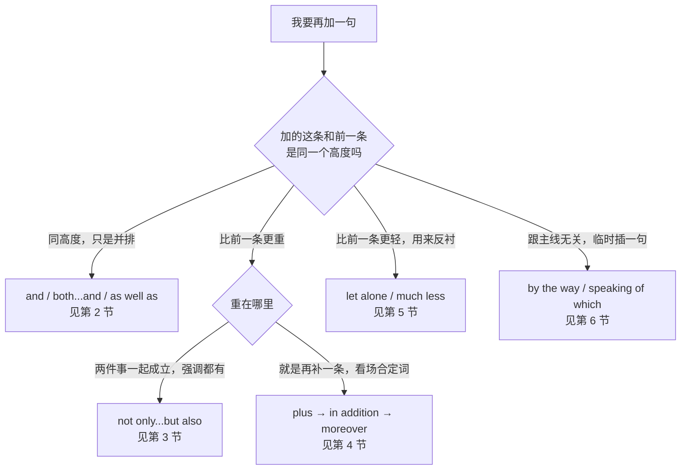
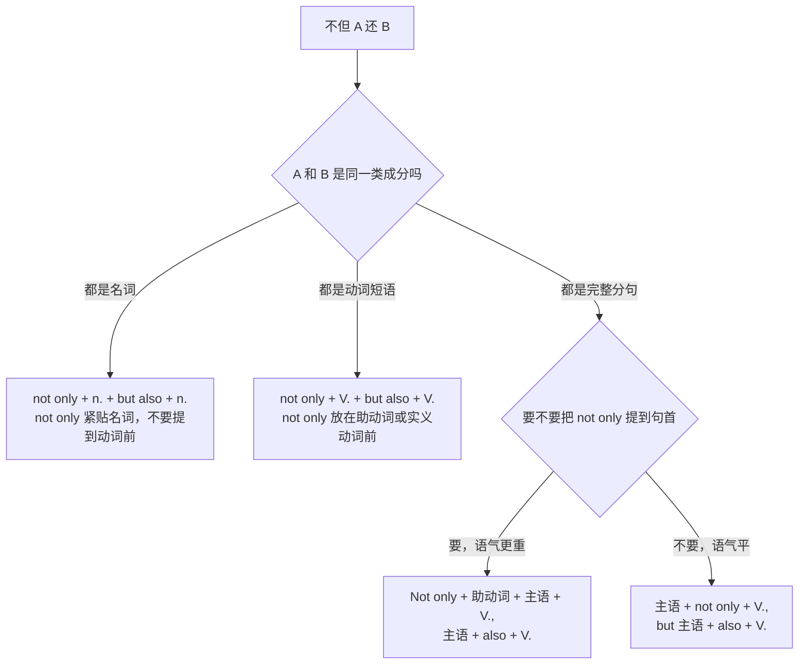
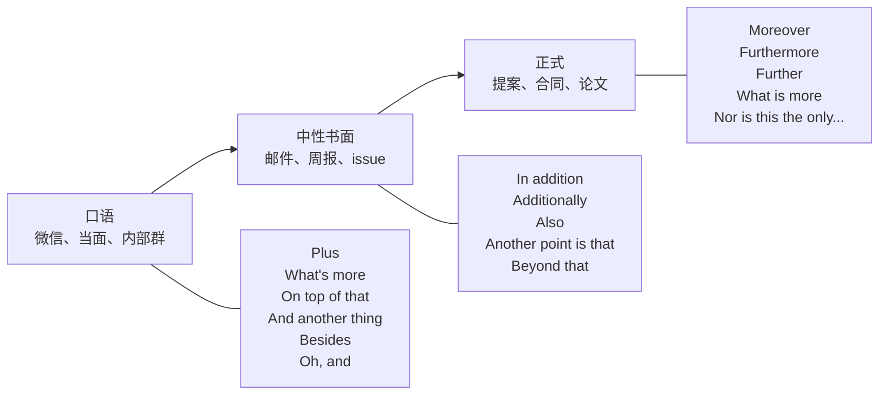
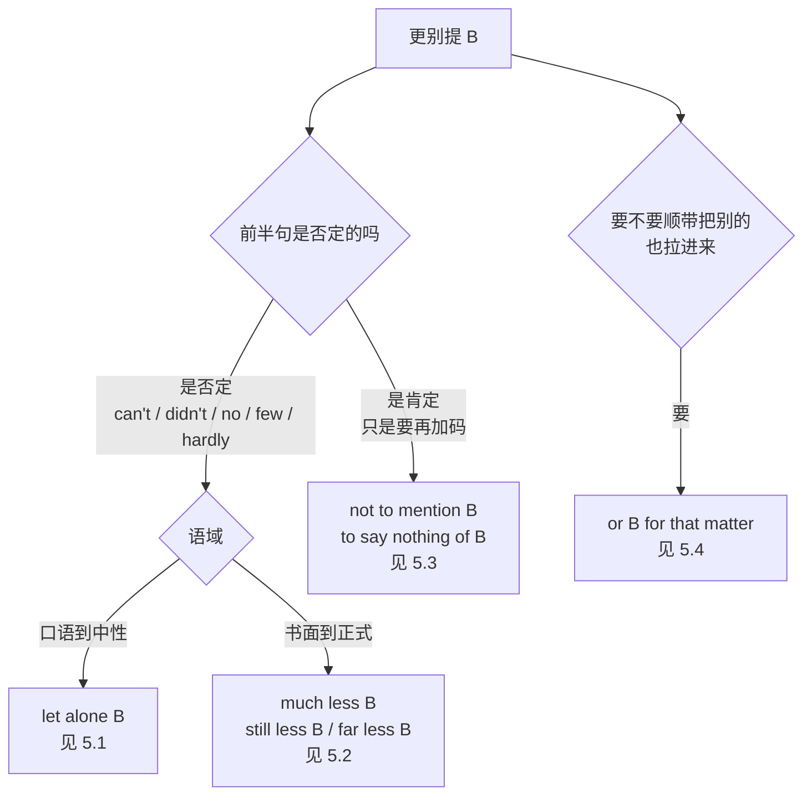
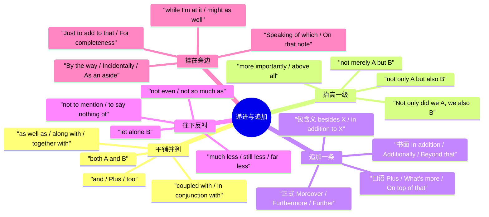

# 而且、不仅而且、更进一步：递进与追加

> [!info] 本篇定位
>
> 这篇收的是「话说完一半，还要再挂一句上去」的全部中文说法：平着挂的（而且、以及、既…又）、往上挂的（不仅…而且、更重要的是）、往下踩的（更别提、连…都不）、挂在旁边的（顺便说一句、我补充一点）。
>
> 和它相邻的两篇是同一个功能域的另外两块：`02` 管「第一第二最后」的列举与步骤，`03` 管「要么要么」的选择与「除了」的排除义。三篇合起来覆盖并列这一整类逻辑关系。
>
> 读完能查到：想说「再说了，这事本来就不归我们管」，直接查 4.5；想说「我连编译都过不去，更别说跑起来」，直接查 5.1；想说「不但按时交付了，还省了预算」而且要写成正式邮件，直接查 3.3。

---

## 1. 本篇导读：从「还有一点」到「更别提」的七级台阶

中文里的追加词密度极高，「而且」「再说」「何况」「更别提」「顺带一提」可以在同一段话里连着出现，读者往往感觉它们是一回事，全部译成 and 或 besides。英文这边是分层的：平级追加、升级追加、降级反衬、离题追加各有各的结构，选错档不是语法错，是听感错——在正式提案里写 `Plus, the vendor raised their rates.` 和在微信里写 `Furthermore, the vendor has revised its rate schedule.` 一样别扭。

先看这张选择树，它决定了后面六节的分工。

这棵树的第一个岔口是全篇最要紧的判断：加的这条和前一条是不是同一个高度。「他会 Python，也会 Go」是同高度，用 and 就够；「他不但会 Python，还能自己写编译器」不是同高度，第二条明显更重，这时候 and 会把重量抹平，要用 not only…but also 或者递进副词把台阶垫出来。第二个岔口分的是重量的方向：往上加是递进，往下踩是反衬——「我连编译都过不去」把「跑起来」踩得更低，用的是 let alone 而不是 and。

第三条路是语域梯度那一支。同一个「另外」，聊天里说 plus，邮件里写 in addition，正式文书里写 moreover，三个词的语义几乎完全一样，差别全在场合。第 4 节把这条梯度排成一把尺。

下面这张速查表把本篇的中文入口和落点对齐，查的时候先在这里定位到小节，再进小节看三档。

| 中文触发语 | 主结构 | 落在哪一节 |
| --- | --- | --- |
| 而且 / 还有 / 并且 | A, and B. / Plus, B. | 2.1 |
| 既…又 / 又…又 / 两方面都 | both A and B | 2.2 |
| 以及 / 连同 / 加上 / 外加 | A as well as B / A together with B | 2.3 |
| 又要…又要 / 一边…一边 | V1 and V2 / V1 while doing V2 | 2.4 |
| 不仅…而且 / 不但…还 / 不光…也 | not only A but also B | 3.1 |
| 不只是…更是 / 更重要的是 / 更糟的是 | more importantly / above all / and worse | 3.2 |
| 不仅如此 / 非但（句首重起） | Not only did we A, we also B. | 3.3 |
| 既…也…甚至还 / 一层比一层 | A, B, and on top of that, C | 3.4 |
| 再说 / 还有一点 / 关键是 | Plus / What's more / On top of that | 4.1 |
| 另外 / 此外 / 还有就是 | In addition / Additionally / Beyond that | 4.2 |
| 更进一步 / 再者 / 况且 | Moreover / Furthermore / Further | 4.3 |
| 除了…还 / 在…之外 | besides X / in addition to X / over and above X | 4.4 |
| 何况 / 再说了 / 反正 / 本来就 | Besides / Anyway / For one thing…for another | 4.5 |
| 更别提 / 别说…了 | can't even A, let alone B | 5.1 |
| 更不用说 / 就更谈不上 | wouldn't A, much less B | 5.2 |
| 还没算上 / 且不说 | not to mention B / to say nothing of B | 5.3 |
| 说到这个别的也一样 / 何止 | A, or B for that matter | 5.4 |
| 连…都 / 一个都没 | didn't even V / not so much as a X | 5.5 |
| 顺便说一句 / 对了 / 差点忘了 | By the way / Incidentally / As an aside | 6.1 |
| 说到这个 / 你这么一说 | Speaking of which / Now that you mention it | 6.2 |
| 顺手就 / 既然都…了 | while I'm at it / might as well V | 6.3 |
| 我补充一点 / 再加一句 | Just to add to that / For completeness | 6.4 |

---

## 2. 平铺并列：两件事挂在同一个高度

同高度的并列是最基础的一层，也是最容易被中文带偏的一层。中文的「和」既能连名词也能连句子，英文的 and 也可以，但一旦要在两个成分之间分主次，英文就换结构了：as well as、together with、along with 引出的都是次要项，主语不跟着它们走。这一节四个意图块从最平的 and 一路排到最有主次感的 coupled with。

### 2.1 而且、还有、并且：最平的一次追加

中文触发语：而且 / 还有 / 并且 / 同时 / 也 / 外加

| 档位 | 句架 | 例句 | 中文 |
| --- | --- | --- | --- |
| 口语 | A, and B. | The build passed, and the tests are green. | 构建过了，测试也是绿的。 |
| 口语 | A. Plus, B. | The rent's cheaper. Plus, it's a ten-minute walk to the office. | 房租便宜，而且走十分钟就到公司。 |
| 口语 | A, and B too. | He fixed the bug, and he wrote a test for it too. | 他把 bug 修了，还顺手补了个测试。 |
| 口语 | A — and B. | We lost the data — and the backup was three weeks old. | 数据丢了，而且备份是三周前的。 |
| 书面 | A, and B as well. | The tool checks the syntax, and it validates the schema as well. | 这个工具检查语法，同时也校验 schema。 |
| 书面 | A. It also + 动词原形. | The report covers hiring. It also breaks costs down by team. | 报告涵盖招聘，另外还按团队拆了成本。 |
| 正式 | A, and equally, B. | The design is sound, and equally, the timeline is realistic. | 设计是站得住的，同样地，时间表也切合实际。 |

> [!warning] 错配警示
>
> ❌ ~~We finished the migration, and, we updated the docs.~~
> ✅ **We finished the migration, and we updated the docs.**（and 后面不加逗号；只有插入语才需要前后成对的逗号）
>
> ❌ ~~The rent is cheaper, plus it's closer.~~ 在正式文书里
> ✅ **The rent is lower; in addition, the location is more convenient.**（plus 起头是口语档，正式档换 in addition）

同义入口：而且 / 还有 / 并且 / 同时 / 也 / 外加 / 加上一条
语法归属：[[02.英语基础语法/05.介词与连词/03.连词的分类与用法|连词的分类与用法]]
场景实战：[[04.英语场景/05.高频实用表达句型框架/04.比较对比举例总结句型库|比较对比举例总结句型库]]

### 2.2 既…又、又…又：一个主语挂两个属性

中文触发语：既…又 / 又…又 / 两方面都 / 一方面…另一方面也 / 兼具

| 档位 | 句架 | 例句 | 中文 |
| --- | --- | --- | --- |
| 口语 | It's both A and B. | It's both cheaper and faster. | 又便宜又快。 |
| 口语 | It's A and B at the same time. | The rule is strict and vague at the same time. | 这条规则既严格又含糊。 |
| 口语 | half A, half B | It's half prototype, half production code. | 一半是原型，一半是生产代码。 |
| 书面 | Both A and B + 复数动词. | Both the client and the server need the patch. | 客户端和服务端都得打这个补丁。 |
| 书面 | at once A and B | The proposal is at once ambitious and realistic. | 这份提案既有野心又切合实际。 |
| 正式 | A and B alike | The change affects contractors and full-time staff alike. | 这项改动对外包和正式员工一视同仁。 |
| 正式 | equally A and B | The team is equally strong in design and in delivery. | 这个团队在设计和交付两头都同样强。 |

> [!warning] 错配警示
>
> ❌ ~~Both the client, the server and the CDN are affected.~~
> ✅ **The client, the server, and the CDN are all affected.**（both 只能管两项，三项以上换 all）
>
> ❌ ~~Both the client and the server needs the patch.~~
> ✅ **Both the client and the server need the patch.**（both A and B 作主语，谓语用复数）

同义入口：既…又 / 又…又 / 两边都 / 同时具备 / 两方面兼顾
语法归属：[[02.英语基础语法/10.特殊句型/06.主谓一致|主谓一致]]
场景实战：[[04.英语场景/05.高频实用表达句型框架/01.表达观点与态度的50个万能句型|表达观点与态度的50个万能句型]]

### 2.3 以及、连同、外加：把次要项挂在主项后面

中文触发语：以及 / 连同 / 加上 / 还包括 / 外加 / 一并 / 附带

| 档位 | 句架 | 例句 | 中文 |
| --- | --- | --- | --- |
| 口语 | A, plus B | Bring your laptop, plus the charger. | 带笔记本，还有充电器。 |
| 书面 | A as well as B | The report covers Q3 as well as the first two months of Q4. | 报告涵盖三季度以及四季度头两个月。 |
| 书面 | A along with B | The invoice was sent along with the signed contract. | 发票连同签好的合同一起发过去了。 |
| 书面 | A together with B | The server logs, together with the crash dump, are attached. | 服务器日志连同崩溃转储一并附上。 |
| 正式 | A, coupled with B, + 动词 | Rising costs, coupled with a hiring freeze, forced us to cut scope. | 成本上升加上冻结招聘，逼我们砍了范围。 |
| 正式 | A in conjunction with B | The token must be used in conjunction with the client secret. | 这个 token 必须连同 client secret 一起使用。 |
| 正式 | A, accompanied by B | The proposal, accompanied by a detailed budget, goes to the board on Friday. | 提案连同详细预算周五提交董事会。 |

> [!warning] 错配警示
>
> ❌ ~~The manager, as well as the two engineers, were notified.~~
> ✅ **The manager, as well as the two engineers, was notified.**（as well as、together with、along with 引出的是附加成分不是并列主语，谓语只跟前面那个主语走）
>
> ❌ ~~He edits the docs as well as review the code.~~
> ✅ **He edits the docs as well as reviewing the code.**（主句动词是 edits，as well as 后面就得跟 -ing 形态的 reviewing，两边形态对齐）

同义入口：以及 / 连同 / 外加 / 加上 / 附带 / 一并 / 还包括
语法归属：[[02.英语基础语法/10.特殊句型/06.主谓一致|主谓一致]]
场景实战：[[04.英语场景/10.职场与商务场景实战/03.商务邮件与正式书面沟通|商务邮件与正式书面沟通]]

### 2.4 又要…又要：一个主语挂两个动作

中文触发语：又要…又要 / 不但要…还要 / 一边…一边 / 顺手还 / 兼任

| 档位 | 句架 | 例句 | 中文 |
| --- | --- | --- | --- |
| 口语 | V1 and V2 | I'll review the PR and update the changelog. | 我把 PR 审了，顺手更新 changelog。 |
| 口语 | V1 while doing V2 | She takes notes while running the meeting. | 她一边主持会一边记纪要。 |
| 口语 | have to V1 and V2 on the same day | We have to cut the release and brief the client on the same day. | 同一天既要发版又要给客户做说明。 |
| 书面 | V1 and, at the same time, V2 | The rewrite must keep the old endpoints alive and, at the same time, expose the new ones. | 重写既要保住老接口，又要把新接口暴露出来。 |
| 书面 | be responsible for both doing A and doing B | She is responsible for both maintaining the pipeline and training new hires. | 她既负责维护流水线，也负责带新人。 |
| 正式 | V1 as well as doing V2 | The role involves owning the roadmap as well as running weekly reviews. | 这个岗位既要管路线图，也要主持周会。 |
| 正式 | be required to both V1 and V2 | Vendors are required to both disclose subcontractors and maintain insurance. | 供应商既须披露分包方，也须维持保险。 |

> [!warning] 错配警示
>
> ❌ ~~I'll review the PR and updating the changelog.~~
> ✅ **I'll review the PR and update the changelog.**（and 两边的动词形态必须一致，都跟 will 走原形）
>
> ❌ ~~She takes notes while she runs the meeting and while she answers questions.~~
> ✅ **She takes notes while running the meeting and answering questions.**（同主语时后半句压成 -ing，不重复主语）

同义入口：又要…又要 / 不但要…还要 / 一边…一边 / 顺手还 / 一人兼两摊
语法归属：[[02.英语基础语法/08.非谓语动词/02.动名词详解|动名词详解]]
场景实战：[[04.英语场景/10.职场与商务场景实战/02.会议汇报与演示场景|会议汇报与演示场景]]

---

## 3. 不仅而且：把第二条抬到更高的台阶

not only 家族的作用是把重量分配好。`He speaks French and Japanese.` 只是陈述两件事，`He speaks not only French but also Japanese.` 则明确告诉听者：第二件比第一件更值得惊讶。中文的「不但…还…」承担的正是这个功能，而中文母语者最常见的失手不在词，在两边挂的成分不对等——not only 后面挂了动词，but also 后面挂了名词，句子就散了。

这棵树的关键在最后一个岔口：not only 一旦提到句首，它后面那半句必须把助动词提到主语前面，写成 `Not only did we ship on time`；而 but 引出的第二个分句保持正常语序，不跟着倒装。这是本节唯一需要死记的形态，其余都是成分对等的问题。

### 3.1 不仅…而且…：标准式

中文触发语：不仅…而且 / 不但…还 / 不光…也 / 既…还 / 不只…也

| 档位 | 句架 | 例句 | 中文 |
| --- | --- | --- | --- |
| 口语 | not just A, B | It's not just slow, it's broken. | 它不只是慢，是根本坏了。 |
| 口语 | not only A but B（省掉 also） | She not only found the bug but shipped the fix. | 她不但找出了 bug，还把修复发上去了。 |
| 书面 | not only A but also B | The tool not only formats the code but also sorts the imports. | 这个工具不但格式化代码，还给 import 排序。 |
| 书面 | not only + 名词 + but also + 名词 | We need not only budget but also headcount. | 我们要的不只是预算，还有人头。 |
| 书面 | not only A, but B as well | The migration not only cut latency, but reduced cost as well. | 这次迁移不但降了延迟，还省了成本。 |
| 正式 | not merely A but B | The revision is not merely cosmetic but structural. | 这次修订不只是表面功夫，是结构性的。 |
| 正式 | A is not only X; it is, in addition, Y | The clause is not only ambiguous; it is, in addition, unenforceable. | 这条款不但含糊，而且没有强制力。 |

> [!warning] 错配警示
>
> ❌ ~~She not only reviewed the code but also the docs.~~
> ✅ **She reviewed not only the code but also the docs.**（两边挂的都是名词，not only 就要挪到动词后面紧贴名词）
>
> ❌ ~~Not only he is fast, but also careful.~~
> ✅ **He is not only fast but also careful.**（同一个主语的两个形容词，不要拆成两个分句）

同义入口：不仅…而且 / 不但…还 / 不光…也 / 不只…也 / 既…还
语法归属：[[02.英语基础语法/05.介词与连词/03.连词的分类与用法|连词的分类与用法]]
场景实战：[[04.英语场景/05.高频实用表达句型框架/04.比较对比举例总结句型库|比较对比举例总结句型库]]

### 3.2 不只是这个，更重要的是：重心落在后半

中文触发语：更重要的是 / 更关键的是 / 更好的是 / 更糟的是 / 尤其是 / 说到底是

| 档位 | 句架 | 例句 | 中文 |
| --- | --- | --- | --- |
| 口语 | not just A — B, really | It's not just a UI change — it's a data model change, really. | 这不只是改界面，实际上是改数据模型。 |
| 口语 | and better yet, B | We got the extension, and better yet, they doubled the budget. | 期限延了，更棒的是预算还翻倍。 |
| 口语 | and worse, B | We missed the date, and worse, nobody told the client. | 日期没赶上，更糟的是没人通知客户。 |
| 书面 | A, and more importantly, B | The patch fixes the crash and, more importantly, closes the security hole. | 补丁修了崩溃，更重要的是堵上了安全漏洞。 |
| 书面 | more than A, it is B | More than a refactor, this is a rewrite. | 与其算重构，这更像是重写。 |
| 正式 | above all, B | The design must be maintainable and, above all, understandable. | 设计要可维护，最重要的是要看得懂。 |
| 正式 | A; more significantly, B | Revenue grew; more significantly, churn fell for the first time in six quarters. | 营收涨了，更值得注意的是流失率六个季度来首次下降。 |

> [!warning] 错配警示
>
> ❌ ~~The design must be maintainable and, after all, understandable.~~
> ✅ **The design must be maintainable and, above all, understandable.**（after all 是「毕竟、别忘了」，用来把已知的理由再提一次；「最重要的是」要用 above all）
>
> ❌ ~~And worse, nobody told the client, and worse, the logs were gone.~~
> ✅ **Worse, nobody told the client; worse still, the logs were gone.**（连着两层往上加时第二层换 worse still，不要重复同一个词）

同义入口：更重要的是 / 更关键的是 / 更好的是 / 更糟的是 / 尤其是 / 最要命的是
语法归属：[[02.英语基础语法/04.形容词与副词/03.副词的分类与用法|副词的分类与用法]]
场景实战：[[04.英语场景/10.职场与商务场景实战/02.会议汇报与演示场景|会议汇报与演示场景]]

### 3.3 不仅如此：把「不但」提到句首

中文触发语：不仅如此 / 非但 / 不但…（另起一句） / 何止如此

| 档位 | 句架 | 例句 | 中文 |
| --- | --- | --- | --- |
| 口语 | Not only that, but B. | Not only that, but they raised the price. | 不仅如此，他们还涨价了。 |
| 口语 | Not only did we A, we also B. | Not only did we ship on time, we also came in under budget. | 我们不但按时交付，还省了预算。 |
| 书面 | Not only is it A, it's also B. | Not only is it faster, it's also cheaper to run. | 它不但更快，运行成本也更低。 |
| 书面 | Not only does X do A, but it also does B. | Not only does the cache cut latency, but it also reduces egress cost. | 缓存不但降延迟，还省了出网流量费。 |
| 正式 | Not only has X done A, it has also done B. | Not only has the team delivered the migration, it has also documented every step. | 团队不但完成了迁移，还把每一步都写进了文档。 |
| 正式 | Not only was/were + 主语 + 过去分词, but B as well. | Not only were the deadlines met, but the scope was expanded as well. | 不但期限守住了，范围还扩了。 |

> [!warning] 错配警示
>
> ❌ ~~Not only we shipped on time, we came in under budget.~~
> ✅ **Not only did we ship on time, we came in under budget.**（Not only 提到句首，后面必须把助动词 did/does/is/has 提到主语前）
>
> ❌ ~~Not only did we ship on time, but also did we come in under budget.~~
> ✅ **Not only did we ship on time, but we also came in under budget.**（只有 Not only 那半句倒装，but 引出的第二句保持正常语序）

同义入口：不仅如此 / 非但 / 何止如此 / 岂止 / 不光这样
语法归属：[[02.英语基础语法/10.特殊句型/03.倒装句结构|倒装句结构]]
场景实战：[[04.英语场景/02.基础句型框架/04.倒装句、强调句与省略句|倒装句、强调句与省略句]]

### 3.4 既…也…甚至还：三层往上堆

中文触发语：既…也…甚至还 / 不但…还…而且还 / 一层比一层 / 最要命的是

| 档位 | 句架 | 例句 | 中文 |
| --- | --- | --- | --- |
| 口语 | A, B, and on top of that, C. | It's late, it's over budget, and on top of that, the client changed the spec. | 又晚又超预算，最要命的是客户还改了需求。 |
| 口语 | A, and even B. | The docs are wrong, and even the examples don't compile. | 文档是错的，连示例都编译不过。 |
| 书面 | not only A but also B, and indeed C | The change affects not only the API but also the SDK, and indeed every downstream client. | 这次改动不只影响 API，还影响 SDK，其实所有下游客户端都受波及。 |
| 书面 | A, B, and beyond that, C. | We lost the quarter, we lost the account, and beyond that, we lost two engineers. | 季度没了，客户没了，再往下还走了两个工程师。 |
| 正式 | A, B and, ultimately, C. | The delay increased cost, damaged credibility and, ultimately, cost us the renewal. | 延期抬高了成本，损了信誉，最终把续约也搭进去了。 |
| 正式 | A; furthermore B; and, most importantly, C. | The estimate is optimistic; furthermore, it omits testing; and, most importantly, it assumes full staffing. | 估算过于乐观，而且没算测试，最要紧的是它假定人手是满的。 |

> [!warning] 错配警示
>
> ❌ ~~It's late, it's over budget, and on top of that, and the client changed the spec.~~
> ✅ **It's late, it's over budget, and on top of that, the client changed the spec.**（on top of that 已经承担了连接，后面不再加 and）
>
> ❌ ~~The docs are wrong, and even the examples are not compile.~~
> ✅ **The docs are wrong, and even the examples don't compile.**（even 只是加重语气，不改变后面句子的正常结构）

同义入口：既…也…甚至还 / 不但…还…而且还 / 一层比一层 / 最要命的是 / 再往下还有
语法归属：[[02.英语基础语法/05.介词与连词/03.连词的分类与用法|连词的分类与用法]]
场景实战：[[04.英语场景/10.职场与商务场景实战/02.会议汇报与演示场景|会议汇报与演示场景]]

---

## 4. 追加一条：一把从聊天到公文的语域尺

这一节的所有词在语义上几乎可以互换，全部意思都是「再加一条」。要选的不是意思，是场合。下面这把尺按语域从左到右排开，越往右越正式。

尺子上有两个位置需要单独记住。Also 是唯一横跨三档的词——句首的 Also 偏口语，句中的 also 三档通用，所以拿不准的时候用 also 最安全。Besides 落在最左端，它在口语里非常自然，但在正式提案里会显得随口，正式档要换 moreover。中间那一档是邮件的主力区，日常工作里用得最多的其实就是 in addition 和 additionally 这两个。

### 4.1 再说、还有一点：口语档的追加

中文触发语：再说 / 而且 / 还有一点 / 关键是 / 加上 / 对了还有

| 档位 | 句架 | 例句 | 中文 |
| --- | --- | --- | --- |
| 口语 | Plus, B. | Plus, nobody's around to review it this week. | 再说这周也没人能审。 |
| 口语 | What's more, B. | What's more, the fix is a one-liner. | 而且这个修复就一行。 |
| 口语 | On top of that, B. | On top of that, the vendor raised their rates. | 除此之外供应商还涨了价。 |
| 口语 | And another thing — B. | And another thing — the logs are gone after 24 hours. | 还有一点，日志 24 小时就没了。 |
| 口语 | Besides, B. | Besides, we already paid for the license. | 再说了，许可证我们已经付过钱了。 |
| 口语 | Also, B. | Also, can you send me the invoice? | 另外，发票能发我一份吗？ |
| 口语 | Oh, and B. | Oh, and the meeting moved to Thursday. | 对了，会议改到周四了。 |

> [!warning] 错配警示
>
> ❌ ~~Beside, we already paid for the license.~~
> ✅ **Besides, we already paid for the license.**（beside 是介词「在…旁边」，`Sit beside me.`；表示「再说」的是带 s 的 besides）
>
> ❌ ~~Plus, the vendor raised their rates.~~ 出现在对外提案里
> ✅ **Moreover, the vendor has increased its rates.**（Plus 起头是口语档专用，正式文书里换 moreover 或 in addition）

同义入口：再说 / 而且 / 还有一点 / 关键是 / 加上 / 对了还有 / 顺便还有
语法归属：[[02.英语基础语法/05.介词与连词/04.介词与连词的易混点|介词与连词的易混点]]
场景实战：[[04.英语场景/07.社交交际场景实战/01.交友聚会与闲聊场景|交友聚会与闲聊场景]]

### 4.2 另外、此外：中性书面的追加

中文触发语：另外 / 此外 / 同时 / 还有就是 / 补充一条

| 档位 | 句架 | 例句 | 中文 |
| --- | --- | --- | --- |
| 书面 | In addition, B. | In addition, the report includes a breakdown by region. | 另外，报告还含分区域拆解。 |
| 书面 | Additionally, B. | Additionally, all endpoints now require a bearer token. | 此外，所有接口现在都要带 bearer token。 |
| 书面 | Also, B. | Also, the staging database was reset last night. | 另外，预发数据库昨晚重置过。 |
| 书面 | Another point is that B. | Another point is that the license expires in March. | 还有一点是许可证三月到期。 |
| 书面 | There is also the question of B. | There is also the question of who owns the data. | 另外还有个问题是数据归谁。 |
| 书面 | A second consideration is B. | A second consideration is the cost of retraining the team. | 第二个要考虑的是团队再培训的成本。 |
| 书面 | Beyond that, B. | Beyond that, the team has no on-call rotation. | 再往外说，团队根本没有值班排班。 |

> [!warning] 错配警示
>
> ❌ ~~In addition the cost, delivery is slow.~~
> ✅ **In addition to the cost, delivery is slow.**（In addition 单用时后面接完整句子；要挂名词必须补 to）
>
> ❌ ~~Additionally the report includes a breakdown.~~
> ✅ **Additionally, the report includes a breakdown.**（句首的连接副词后面要有逗号）

同义入口：另外 / 此外 / 同时 / 还有就是 / 补充一条 / 再有
语法归属：[[02.英语基础语法/04.形容词与副词/03.副词的分类与用法|副词的分类与用法]]
场景实战：[[04.英语场景/10.职场与商务场景实战/03.商务邮件与正式书面沟通|商务邮件与正式书面沟通]]

### 4.3 更进一步说、再者：正式档的追加

中文触发语：更进一步 / 再者 / 况且 / 此外（正式） / 更有甚者

| 档位 | 句架 | 例句 | 中文 |
| --- | --- | --- | --- |
| 正式 | Moreover, B. | Moreover, the current design does not scale beyond a single region. | 更进一步说，现有设计撑不过单区域。 |
| 正式 | Furthermore, B. | Furthermore, no migration path has been specified. | 再者，迁移路径至今没有明确。 |
| 正式 | Further, B. | Further, the vendor has not provided a security review. | 此外，供应商未提供安全评审。 |
| 正式 | What is more, B. | What is more, the assumptions have never been validated. | 更有甚者，这些假设从未被验证过。 |
| 正式 | It should further be noted that B. | It should further be noted that the figures exclude tax. | 另需说明，这些数字不含税。 |
| 正式 | A more fundamental objection is that B. | A more fundamental objection is that the metric measures the wrong thing. | 更根本的反对意见是，这个指标量错了对象。 |
| 正式 | Nor is this the only concern: B. | Nor is this the only concern: the license terms remain unresolved. | 问题还不止于此，许可条款也仍未定。 |

> [!warning] 错配警示
>
> ❌ ~~The cost is high, moreover the timeline is tight.~~
> ✅ **The cost is high. Moreover, the timeline is tight.**（moreover 是副词不是连词，不能拿一个逗号连接两个完整句子；也可以写成 `The cost is high; moreover, the timeline is tight.`）
>
> ❌ ~~Furthermore of the delay, the budget was cut.~~
> ✅ **In addition to the delay, the budget was cut.**（furthermore 后面永远跟完整句子，挂名词只能用 in addition to）

同义入口：更进一步 / 再者 / 况且 / 更有甚者 / 尚有一点 / 不止于此
语法归属：[[02.英语基础语法/04.形容词与副词/03.副词的分类与用法|副词的分类与用法]]
场景实战：[[04.英语场景/10.职场与商务场景实战/04.商务谈判合同与客户沟通|商务谈判合同与客户沟通]]

### 4.4 除了这个还有那个：包含义的「除了」

中文触发语：除了…还 / 除…之外还有 / 在…之外 / 不止…还 / 在…基础上再

| 档位 | 句架 | 例句 | 中文 |
| --- | --- | --- | --- |
| 口语 | Besides X, ... | Besides the deposit, you'll need two months' rent up front. | 除了押金，还得先付两个月房租。 |
| 口语 | On top of X, ... | On top of the base salary, there's a quarterly bonus. | 底薪之外还有季度奖金。 |
| 书面 | In addition to X, ... | In addition to the migration, we owe them a rollback plan. | 除了迁移，我们还欠他们一份回滚方案。 |
| 书面 | As well as X, ... | As well as the API docs, we ship a Postman collection. | 除了 API 文档，我们还附一套 Postman 集合。 |
| 正式 | Over and above X, ... | Over and above the statutory minimum, the company grants ten extra days. | 在法定最低标准之上，公司另给十天。 |
| 正式 | In addition to doing X, ... | In addition to hosting the data, the vendor processes it. | 除了托管数据，供应商还对其做处理。 |

> [!warning] 错配警示
>
> ❌ ~~In addition to host the data, they process it.~~
> ✅ **In addition to hosting the data, they process it.**（besides、in addition to、on top of 后面接动词一律用 -ing，这里的 to 是介词不是不定式）
>
> ❌ ~~Besides the deposit, you don't need anything else.~~
> ✅ **Apart from the deposit, you don't need anything else.**（besides 的常规义是「除了…还有」的包含义；要说「除此之外没有别的」，写 apart from 或 except for 才不会被读反）

同义入口：除了…还 / 除…之外还有 / 在…之外 / 不止…还 / 在…基础上再
语法归属：[[02.英语基础语法/05.介词与连词/01.介词的分类与基本用法|介词的分类与基本用法]]
场景实战：[[04.英语场景/10.职场与商务场景实战/01.求职简历面试与Offer谈判|求职简历面试与 Offer 谈判]]

### 4.5 何况、再说了：追加一条理由

中文触发语：何况 / 再说了 / 反正 / 本来就 / 一来…二来 / 别的不说

| 档位 | 句架 | 例句 | 中文 |
| --- | --- | --- | --- |
| 口语 | Besides, B. | Besides, the deadline was never realistic. | 再说了，那个期限本来就不现实。 |
| 口语 | Anyway, B. | Anyway, it's not like we have a choice. | 反正我们也没得选。 |
| 口语 | And it's not like B. | And it's not like anyone reads that page. | 再说也没人看那个页面。 |
| 口语 | For one thing, A; for another, B. | For one thing, it's expensive; for another, nobody asked for it. | 一来贵，二来根本没人要。 |
| 书面 | If nothing else, B. | If nothing else, it buys us two weeks. | 别的不说，至少能争取两周。 |
| 书面 | Not least because B. | We should postpone, not least because the lead reviewer is on leave. | 应该延期，尤其是因为主审人在休假。 |
| 正式 | There is the further consideration that B. | There is the further consideration that the contract auto-renews in April. | 另需考虑的是合同四月自动续约。 |

> [!warning] 错配警示
>
> ❌ ~~Besides, that the deadline was never realistic.~~
> ✅ **Besides, the deadline was never realistic.**（Besides 后面直接跟完整句子，不带 that）
>
> ❌ ~~For one thing it's expensive, for another thing nobody asked for it.~~
> ✅ **For one thing, it's expensive; for another, nobody asked for it.**（第二处是固定省略式 for another，不重复 thing；两个分句之间用分号）

同义入口：何况 / 再说了 / 反正 / 本来就 / 一来…二来 / 别的不说 / 至少
语法归属：[[02.英语基础语法/09.从句体系/04.状语从句详解|状语从句详解]]
场景实战：[[04.英语场景/05.高频实用表达句型框架/03.同意反对让步转折句型库|同意反对让步转折句型库]]

---

## 5. 递进否定：往下踩一脚来加重

中文的「更别提」在逻辑上是往下走的：先说一件小事都做不到，再抬出一件更大的事，用大事的不可能反衬小事的失败有多彻底。英文这一族有四个成员，选哪个取决于前半句是否定还是肯定，以及语域高低。

这张图上最容易翻车的是最左边那个判断。let alone 和 much less 都要求前半句带否定色彩，`I finished the docs, let alone the tests.` 是坏句——前半句是肯定的，逻辑上没有可反衬的东西。肯定方向的加码要走右边那条路，用 not to mention。至于 for that matter，它不是往下踩，是横着扩一圈：说完一件事之后顺手把同类的另一件也捎上。

### 5.1 更别提、别说了：let alone

中文触发语：更别提 / 更别说 / 别说…了 / 连…都不…哪还谈得上

| 档位 | 句架 | 例句 | 中文 |
| --- | --- | --- | --- |
| 口语 | can't even A, let alone B | I can't get it to compile, let alone run. | 我连编译都过不去，更别说跑起来。 |
| 口语 | didn't A, let alone B | He didn't apologize, let alone fix it. | 他连道歉都没有，更别提修了。 |
| 口语 | no time for A, let alone B | There's no time for tests, let alone documentation. | 测试都没时间写，更别提文档。 |
| 书面 | Few X do A, let alone B. | Few users read the changelog, let alone the migration guide. | 很少有用户看更新日志，更别说迁移指南。 |
| 书面 | It's hard to A, let alone B. | It's hard to hire one senior engineer, let alone three. | 招一个资深工程师都难，更别说三个。 |
| 正式 | X is unlikely to A, let alone B. | The prototype is unlikely to survive load testing, let alone production traffic. | 原型连压测都未必扛得住，更谈不上生产流量。 |

> [!warning] 错配警示
>
> ❌ ~~I finished the docs, let alone the tests.~~
> ✅ **I didn't finish the docs, let alone the tests.**（let alone 要求前半句带否定：not、no、few、hardly、can't 之一）
>
> ❌ ~~I can't compile it, let alone to run it.~~
> ✅ **I can't compile it, let alone run it.**（let alone 两边成分必须同形，前面是 compile 后面就是 run，不加 to）

同义入口：更别提 / 更别说 / 别说…了 / 哪还谈得上 / 想都别想
语法归属：[[02.英语基础语法/10.特殊句型/05.省略与替代|省略与替代]]
场景实战：[[04.英语场景/05.高频实用表达句型框架/03.同意反对让步转折句型库|同意反对让步转折句型库]]

### 5.2 更不用说、就更谈不上：much less

中文触发语：更不用说 / 就更谈不上 / 更何况 / 就更不可能 / 遑论

| 档位 | 句架 | 例句 | 中文 |
| --- | --- | --- | --- |
| 口语 | wouldn't even A, much less B | She wouldn't even lend me a pen, much less her car. | 她连支笔都不肯借，更别提车了。 |
| 书面 | can hardly A, much less B | The script can hardly parse valid input, much less malformed input. | 这脚本连合法输入都勉强，更别说畸形输入。 |
| 书面 | has never A, much less B | The team has never shipped to one region, much less to five. | 团队连一个区域都没上过线，更谈不上五个。 |
| 书面 | does not A, much less B | The budget does not cover maintenance, much less new features. | 预算连维护都不够，更别提新功能。 |
| 正式 | still less B | He has no right to see the file, still less to copy it. | 他无权查看这份文件，更无权复制。 |
| 正式 | far less B | The report does not identify the cause, far less propose a remedy. | 报告没有指出原因，更没有提出补救。 |

> [!warning] 错配警示
>
> ❌ ~~She speaks French, much less Spanish.~~
> ✅ **She speaks French, not to mention Spanish.**（much less 只能跟在否定句后面；肯定句要加码用 not to mention）
>
> ❌ ~~He has no right to see the file, still less he can copy it.~~
> ✅ **He has no right to see the file, still less to copy it.**（still less 后面接的成分要和前面对齐，这里前面是 to see，后面就是 to copy）

同义入口：更不用说 / 就更谈不上 / 更何况 / 就更不可能 / 遑论 / 何谈
语法归属：[[02.英语基础语法/10.特殊句型/05.省略与替代|省略与替代]]
场景实战：[[04.英语场景/05.高频实用表达句型框架/04.比较对比举例总结句型库|比较对比举例总结句型库]]

### 5.3 还没算上、且不说：肯定方向的加码

中文触发语：还没算上 / 且不说 / 更别说还有 / 这还不算 / 先不提

| 档位 | 句架 | 例句 | 中文 |
| --- | --- | --- | --- |
| 口语 | A, not to mention B | The trip costs two thousand, not to mention the visa fees. | 这趟要两千，签证费还没算。 |
| 口语 | A, never mind B | We can't finish the frontend, never mind the API. | 前端都做不完，API 就别提了。 |
| 口语 | And that's before you count B. | And that's before you count the maintenance. | 这还没把维护算进去。 |
| 书面 | A, to say nothing of B | The delay cost us the quarter, to say nothing of the client's trust. | 延期赔掉了一个季度，客户的信任还没算。 |
| 书面 | A, not to speak of B | The scheme is expensive, not to speak of the legal exposure. | 这方案很贵，法律风险且不说。 |
| 正式 | Quite apart from A, B. | Quite apart from the cost, the timeline is unrealistic. | 先不说成本，光时间就不现实。 |

> [!warning] 错配警示
>
> ❌ ~~The trip costs two thousand, not to mention of the visa fees.~~
> ✅ **The trip costs two thousand, not to mention the visa fees.**（not to mention 后面直接跟名词，不加 of；带 of 的是 to say nothing of）
>
> ❌ ~~The delay cost us the quarter, to say nothing that the client lost trust.~~
> ✅ **The delay cost us the quarter, to say nothing of the client's trust.**（to say nothing of 后面只能挂名词或 doing，接不了从句）

同义入口：还没算上 / 且不说 / 更别说还有 / 这还不算 / 先不提 / 光是…就
语法归属：[[02.英语基础语法/08.非谓语动词/01.动词不定式详解|动词不定式详解]]
场景实战：[[04.英语场景/05.高频实用表达句型框架/04.比较对比举例总结句型库|比较对比举例总结句型库]]

### 5.4 说到这个，别的也一样：for that matter

中文触发语：说到这个 / 就这一点而言 / 其实别的也一样 / 何止 / 说起来

| 档位 | 句架 | 例句 | 中文 |
| --- | --- | --- | --- |
| 口语 | A, or B for that matter | I've never used Rust, or Go for that matter. | 我没用过 Rust，说起来 Go 也没用过。 |
| 口语 | A, and for that matter, B | The docs are out of date, and for that matter, so are the examples. | 文档过期了，说起来示例也一样。 |
| 书面 | X — or, for that matter, Y — 动词 | The report — or, for that matter, any report from that team — arrives late. | 这份报告，其实那个团队的任何报告，都会迟到。 |
| 书面 | nobody in A, or in B for that matter | Nobody on the team, or in the company for that matter, has touched that service. | 团队里没人碰过那个服务，说起来全公司都没有。 |
| 正式 | nor, for that matter, B | The vendor never confirmed the date, nor, for that matter, acknowledged the email. | 供应商没确认日期，说起来连邮件都没回。 |

> [!warning] 错配警示
>
> ❌ ~~For that matter, I've never used Rust.~~ 作为一段话的开头
> ✅ **I've never used Rust, or Go for that matter.**（for that matter 是回指的，前面必须已经说过一件同类的事，不能起头就用）
>
> ❌ ~~The docs are out of date, and for that matter, the examples are so.~~
> ✅ **The docs are out of date, and for that matter, so are the examples.**（承接前句用 so + 助动词 + 主语的倒装省略式）

同义入口：说到这个 / 就这一点而言 / 其实别的也一样 / 何止 / 说起来 / 顺着这个说
语法归属：[[02.英语基础语法/10.特殊句型/05.省略与替代|省略与替代]]
场景实战：[[04.英语场景/07.社交交际场景实战/01.交友聚会与闲聊场景|交友聚会与闲聊场景]]

### 5.5 连…都：not even

中文触发语：连…都 / 甚至连…也没 / 一个都没 / 连个…都没有

| 档位 | 句架 | 例句 | 中文 |
| --- | --- | --- | --- |
| 口语 | didn't even + 动词原形 | They didn't even reply. | 他们连回都没回。 |
| 口语 | Not even X + 动词 | Not even the tests caught it. | 连测试都没抓到。 |
| 口语 | not so much as a + 名词 | We didn't get so much as a warning. | 连个提醒都没有。 |
| 书面 | fail to so much as + 动词原形 | The report fails to so much as mention the outage. | 报告连那次故障都没提一句。 |
| 书面 | Not a single X + 动词 | Not a single user complained. | 一个投诉的用户都没有。 |
| 正式 | At no point did X + 动词原形 | At no point did the vendor disclose the subcontractor. | 供应商自始至终未披露分包方。 |

> [!warning] 错配警示
>
> ❌ ~~Even he didn't read it.~~ 想说「他连读都没读」
> ✅ **He didn't even read it.**（even 紧贴它要强调的成分：放动词前是「连读都没读」，放主语前是「连他都没读」）
>
> ❌ ~~At no point the vendor disclosed the subcontractor.~~
> ✅ **At no point did the vendor disclose the subcontractor.**（否定词组放句首，后面要把助动词提到主语前）

同义入口：连…都 / 甚至连…也没 / 一个都没 / 连个…都没有 / 从头到尾都没
语法归属：[[02.英语基础语法/10.特殊句型/03.倒装句结构|倒装句结构]]
场景实战：[[04.英语场景/05.高频实用表达句型框架/03.同意反对让步转折句型库|同意反对让步转折句型库]]

---

## 6. 顺带一提：挂在主线旁边的追加

前面五节加的都是主线上的内容。这一节加的是主线之外的：说着说着想起另一件不相干的事，或者接着对方刚才那句话头补一条。这类追加在英文里有专门的标记词，用错了会让听者以为你还在讲原来那件事。

日常工作里这一族的高频度被严重低估。一封邮件的最后一段、一次站会里接同事的话、代码评审里的一条附带意见，用的都是这里的句架。

### 6.1 顺便说一句、对了

中文触发语：顺便说一句 / 对了 / 顺带一提 / 差点忘了 / 另外说一件事

| 档位 | 句架 | 例句 | 中文 |
| --- | --- | --- | --- |
| 口语 | By the way, B. | By the way, the office is closed Monday. | 顺便说一句，周一办公室不开。 |
| 口语 | Oh, and one more thing — B. | Oh, and one more thing — the badge reader is broken. | 对了还有一件事，门禁读卡器坏了。 |
| 口语 | That reminds me — B. | That reminds me — did you ever get that invoice? | 这倒提醒我了，那张发票你收到没？ |
| 口语 | Before I forget, B. | Before I forget, we need your headcount numbers by Friday. | 趁我还没忘，周五前要你们的人头数。 |
| 书面 | On a related note, B. | On a related note, we should review the retention policy. | 与此相关的还有一条，保留策略该复核了。 |
| 书面 | Incidentally, B. | Incidentally, the same bug affects the mobile client. | 顺带一提，同一个 bug 也影响移动端。 |
| 正式 | As an aside, B. | As an aside, the figures in Appendix C need updating. | 附带说明，附录 C 的数字需要更新。 |

> [!warning] 错配警示
>
> ❌ ~~BTW, please find attached the signed contract.~~ 发给外部客户
> ✅ **On a separate note, please find attached the signed contract.**（BTW 只在熟人和内部群里用，对外邮件写 Incidentally 或 On a separate note）
>
> ❌ ~~By the way the office is closed Monday.~~
> ✅ **By the way, the office is closed Monday.**（插入语后面要有逗号，否则读者会把 way 和后面连着读）

同义入口：顺便说一句 / 对了 / 顺带一提 / 差点忘了 / 另外说一件事 / 附带提一下
语法归属：[[02.英语基础语法/04.形容词与副词/03.副词的分类与用法|副词的分类与用法]]
场景实战：[[04.英语场景/10.职场与商务场景实战/03.商务邮件与正式书面沟通|商务邮件与正式书面沟通]]

### 6.2 说到这个：接着对方的话头加一条

中文触发语：说到这个 / 既然说到 / 你这么一说 / 正好提到 / 借这个话题

| 档位 | 句架 | 例句 | 中文 |
| --- | --- | --- | --- |
| 口语 | Speaking of which, B. | Speaking of which, has anyone booked the room? | 说到这个，会议室有人订了吗？ |
| 口语 | Now that you mention it, B. | Now that you mention it, the logs did look odd. | 你这么一说，日志确实有点怪。 |
| 口语 | Since you brought it up, B. | Since you brought it up, can we talk about the on-call rotation? | 既然你提了，能聊聊值班表吗？ |
| 书面 | On that note, B. | On that note, let's look at the numbers. | 顺着这个话头，来看数字。 |
| 书面 | While we're on the subject of A, B. | While we're on the subject of costs, the license renews in April. | 既然说到成本，许可证四月要续。 |
| 正式 | In connection with that, B. | In connection with that, the audit report is due next week. | 与此相关的是，审计报告下周到期。 |

> [!warning] 错配警示
>
> ❌ ~~Speaking of, has anyone booked the room?~~ 在书面里
> ✅ **Speaking of which, has anyone booked the room?**（口语里 Speaking of 可以单说，书面必须补 which 或补出话题名词：`Speaking of the room, ...`）
>
> ❌ ~~Now that you mention, the logs did look odd.~~
> ✅ **Now that you mention it, the logs did look odd.**（mention 是及物动词，回指前文必须带 it）

同义入口：说到这个 / 既然说到 / 你这么一说 / 正好提到 / 借这个话题 / 顺着这个说
语法归属：[[02.英语基础语法/09.从句体系/04.状语从句详解|状语从句详解]]
场景实战：[[04.英语场景/07.社交交际场景实战/01.交友聚会与闲聊场景|交友聚会与闲聊场景]]

### 6.3 顺手就、既然都这样了

中文触发语：顺手就 / 既然都…了 / 趁着 / 顺路 / 反正都要动

| 档位 | 句架 | 例句 | 中文 |
| --- | --- | --- | --- |
| 口语 | I'll V while I'm at it. | I'll bump the version while I'm at it. | 我顺手把版本号也升了。 |
| 口语 | As long as I'm doing A, I'll B. | As long as I'm in that file, I'll clean up the imports. | 反正都动那个文件了，顺手把 import 理一理。 |
| 口语 | We might as well V too. | We might as well update the README too. | 顺便把 README 也更新了吧。 |
| 书面 | While we're making changes, we should V. | While we're making changes, we should rename the flag. | 既然要改，顺便把这个开关改个名。 |
| 书面 | A can be done in the same pass. | The rename can be done in the same pass. | 重命名可以在同一趟里做掉。 |
| 正式 | The opportunity should also be taken to V. | The opportunity should also be taken to retire the legacy endpoint. | 应借此机会一并下线遗留接口。 |

> [!warning] 错配警示
>
> ❌ ~~I'll bump the version while I'm at.~~
> ✅ **I'll bump the version while I'm at it.**（while I'm at it 是固定式，it 不能省）
>
> ❌ ~~We might as well to update the README.~~
> ✅ **We might as well update the README.**（might as well 后面直接跟动词原形，不加 to）

同义入口：顺手就 / 既然都…了 / 趁着 / 顺路 / 反正都要动 / 一并做掉
语法归属：[[02.英语基础语法/07.助动词与情态动词/02.情态动词详解|情态动词详解]]
场景实战：[[04.英语场景/10.职场与商务场景实战/02.会议汇报与演示场景|会议汇报与演示场景]]

### 6.4 我补充一点：会议与邮件里的追加

中文触发语：我补充一点 / 再加一句 / 还有个小点 / 补个背景 / 接着刚才那条

| 档位 | 句架 | 例句 | 中文 |
| --- | --- | --- | --- |
| 口语 | Just to add to that, B. | Just to add to that, we've already talked to legal. | 我再补一句，法务那边已经聊过了。 |
| 口语 | One more thing before we move on: B. | One more thing before we move on: the staging key rotates tonight. | 往下走之前再说一件事，预发密钥今晚轮换。 |
| 口语 | Quick addition: B. | Quick addition: the deadline moved to the 12th. | 补一条，截止日挪到 12 号了。 |
| 书面 | Building on what sb said, B. | Building on what Ana said, the same applies to the EU tenant. | 接着 Ana 那条说，欧盟租户也一样。 |
| 书面 | For completeness, B. | For completeness, the fallback path is documented in section 4. | 补充完整起见，回退路径写在第 4 节。 |
| 书面 | I'd add one more point: B. | I'd add one more point: the estimate assumes no holidays. | 我再加一点，这个估算没算假期。 |
| 正式 | It may also be worth noting that B. | It may also be worth noting that the license is non-transferable. | 另可留意，该许可不可转让。 |

> [!warning] 错配警示
>
> ❌ ~~Just to add that, we've already talked to legal.~~
> ✅ **Just to add to that, we've already talked to legal.**（add 要带 to 才表示「加在那条上面」；`add that ...` 是「补充说…」，后面跟的是完整从句）
>
> ❌ ~~Building on that, and the same applies to the EU tenant.~~
> ✅ **Building on that, the same applies to the EU tenant.**（分词短语已经承担了连接，主句前不再加 and）

同义入口：我补充一点 / 再加一句 / 还有个小点 / 补个背景 / 接着刚才那条 / 顺着往下说
语法归属：[[02.英语基础语法/08.非谓语动词/03.现在分词详解|现在分词详解]]
场景实战：[[04.英语场景/10.职场与商务场景实战/02.会议汇报与演示场景|会议汇报与演示场景]]

---

## 7. 一张表选档：语域梯度、标点位置与三处高频错配

前六节按中文意图分块，这一节横着切一刀：同一个意思在三档里各写成什么，以及连接词摆在句子里时标点怎么打。查过一次意图块之后，回到这里核对语域和标点，一句话就成品了。

### 7.1 语域梯度总表

同一行的三个词语义几乎相同，差别只在场合。写邮件时看中间那列，写提案时看右列，发消息时看左列。

| 中文意思 | 口语档 | 中性书面档 | 正式档 |
| --- | --- | --- | --- |
| 而且、还有 | Plus, ... | In addition, ... | Moreover, ... |
| 另外一点 | And another thing — | Another point is that ... | A further consideration is that ... |
| 更进一步说 | On top of that, ... | Beyond that, ... | Furthermore, ... |
| 除了…还有 | Besides X, ... | In addition to X, ... | Over and above X, ... |
| 不但…还 | not just A, B | not only A but also B | not merely A but B |
| 不仅如此 | Not only that, but ... | Not only did X ..., X also ... | Not only has X ...; it has also ... |
| 更重要的是 | And better yet, ... | More importantly, ... | Above all, ... |
| 更别提 | let alone B | much less B | still less B / far less B |
| 还没算上 | not to mention B | to say nothing of B | quite apart from B |
| 顺便说一句 | By the way, ... | Incidentally, ... | As an aside, ... |
| 我补充一点 | Just to add to that, ... | For completeness, ... | It may also be worth noting that ... |
| 再说了 | Besides, ... | Not least because ... | There is the further consideration that ... |

### 7.2 三种接法与标点位置

追加词接进句子有三种方式，标点跟着接法走。把三种接法混在一起，是中文母语者在英文写作里最稳定复现的一类标点错误。

| 这一类词 | 它自己能不能连起两个完整句子 | 标点接法 | 例句 |
| --- | --- | --- | --- |
| and、but、or | 能，它本身就是接头 | 前句 + 逗号 + 该词 + 后句 | The cost is high, and the timeline is tight. |
| moreover、furthermore、in addition、additionally、besides、incidentally | 不能，得先把前句断开 | 前句 + 句号或分号，再 + 该词 + 逗号 + 后句 | The cost is high; moreover, the timeline is tight. |
| in addition to、besides、on top of、over and above、apart from | 不能，它后面只能挂名词或 doing | 该短语 + 名词或 doing + 逗号 + 完整句 | In addition to the cost, the timeline is tight. |

三行各有一个死点。and 那一行，逗号打在 and 前面，后面不打；moreover 那一行，前面必须断成句号或分号，绝不能只放一个逗号，否则就是把两个完整句子硬拼在一起；in addition to 那一行，后面只能挂名词或 -ing，挂完整句子就错。besides 是唯一同时出现在两行里的词——`Besides, we already paid.` 走第二行，`Besides the deposit, you need rent.` 走第三行，靠后面跟的是句子还是名词来区分。

### 7.3 三处高频错配集中回顾

> [!warning] 主谓一致：as well as 不改变主语
>
> ❌ ~~The manager, as well as the two engineers, were notified.~~
> ✅ **The manager, as well as the two engineers, was notified.**
>
> as well as、together with、along with、in addition to、accompanied by 引出的都是附加成分，不进主语。想让谓语变复数，只能改用 and：`The manager and the two engineers were notified.` 判断法是把逗号之间那段整个盖住，剩下的部分怎么读，谓语就怎么配。

> [!warning] besides 与 beside：一个 s 的差别
>
> ❌ ~~Beside, we already paid for the license.~~
> ✅ **Besides, we already paid for the license.**
>
> beside 只有一个意思：在…旁边（`Sit beside me.` / `The server rack stands beside the window.`）。besides 有两个用法，副词身份的「再说」和介词身份的「除了…还有」。写的时候念一遍：能替换成 next to 的用 beside，能替换成 apart from 或 what's more 的用 besides。

> [!warning] not only 的两个位置约束
>
> ❌ ~~She not only reviewed the code but also the docs.~~
> ✅ **She reviewed not only the code but also the docs.**
>
> ❌ ~~Not only we shipped on time, we came in under budget.~~
> ✅ **Not only did we ship on time, we came in under budget.**
>
> 第一条是成分对等：not only 和 but also 后面挂的必须是同类成分。第二条是句首形态：Not only 一旦提到句首，它管的那半句要把助动词提到主语前，而 but 引出的第二个分句保持正常语序。

> [!tip] 一条查表捷径
>
> 拿不准语域时统一用 also，它是全篇唯一三档通用的词。句中位置（`The tool also sorts the imports.`）在任何场合都不会出错；句首位置（`Also, can you send the invoice?`）偏口语，正式文书里换成 In addition。

---

## 8. 本篇小结

这张图把全篇按追加的方向分成五支。左上两支是主线上的加法，区别在高度：平着加用 and 一族，抬高一级用 not only 一族。中间那一支是同一个意思的三档语域，日常查得最多。右下两支不在主线上：往下反衬用 let alone 一族，挂在旁边用 by the way 一族。背的时候按支背，不要按词背——同一支里的词可以互换，跨支互换必错。

> [!success] 本篇核心要点回顾
>
> 1. 追加前先判断高度：同高度用 and 一族，第二条更重才用 not only 一族，用错会把重量抹平。
> 2. as well as、together with、along with、in addition to 引出的是附加成分不是并列主语，谓语只跟前面那个主语走。
> 3. in addition to、besides、on top of、as well as 后面接动词时用 -ing 形态：`in addition to hosting`、`besides doing`、`on top of running`、`as well as reviewing`。
> 4. Not only 提到句首时，它管的那半句要把助动词提到主语前；but 引出的第二个分句不倒装。
> 5. 语域三档的分界线是：Plus 和 What's more 归聊天，In addition 和 Additionally 归邮件，Moreover 和 Furthermore 归正式文书；also 三档通用。
> 6. let alone 和 much less 要求前半句带否定；前半句是肯定的加码要换 not to mention 或 to say nothing of。
> 7. besides 有两个身份：后面跟完整句子是副词「再说」，后面跟名词是介词「除了…还有」；beside 只有「在…旁边」一个意思。
> 8. moreover、furthermore、in addition 都是副词不是连词，前面必须断句或用分号，不能拿一个逗号连接两个完整句子。

> [!success] 本篇练习清单
>
> - [ ] 给「构建过了，测试也是绿的」，写出口语、书面、正式三档。
> - [ ] 给「客户端和服务端都得打这个补丁」，写出三档，并检查谓语单复数。
> - [ ] 给「这个工具不但格式化代码，还给 import 排序」，写出三档，其中一档用句首倒装形态。
> - [ ] 给「再说了，许可证我们已经付过钱了」，写出三档，注意 besides 不要写成 beside。
> - [ ] 给「除了迁移，我们还欠他们一份回滚方案」，写出三档，正式档用 over and above。
> - [ ] 给「我连编译都过不去，更别说跑起来」，写出三档，正式档用 much less 或 still less。
> - [ ] 给「这趟要两千，签证费还没算」，写出三档，注意前半句是肯定的不能用 let alone。
> - [ ] 给「顺便说一句，同一个 bug 也影响移动端」，写出三档，正式档用 As an aside。

### 8.1 下一篇预告

> [!info] 下一篇
>
> [[06.并列、递进、列举与选择/02.第一第二最后、包括以下、按…顺序：列举与步骤|第一第二最后、包括以下、按…顺序：列举与步骤]]
>
> 本篇加的是不定数量的条目，下一篇加的是有编号有顺序的条目：first、second、finally 与 firstly 系列怎么分工，the following 和 as follows 摆在哪一侧，respectively 对应到谁，以及技术文档里步骤流程的固定写法。查「我要说三点」用下一篇，查「我要再加一点」用本篇。
