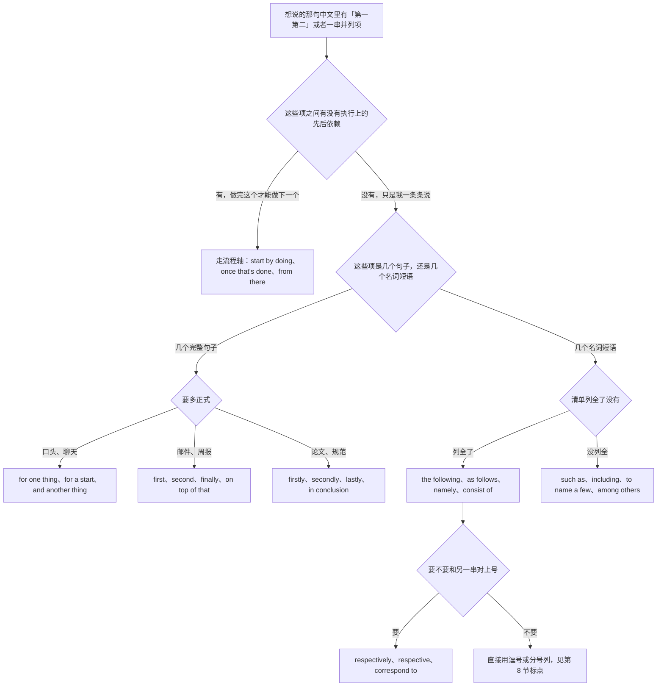
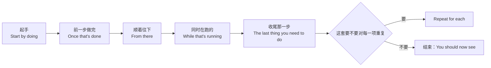
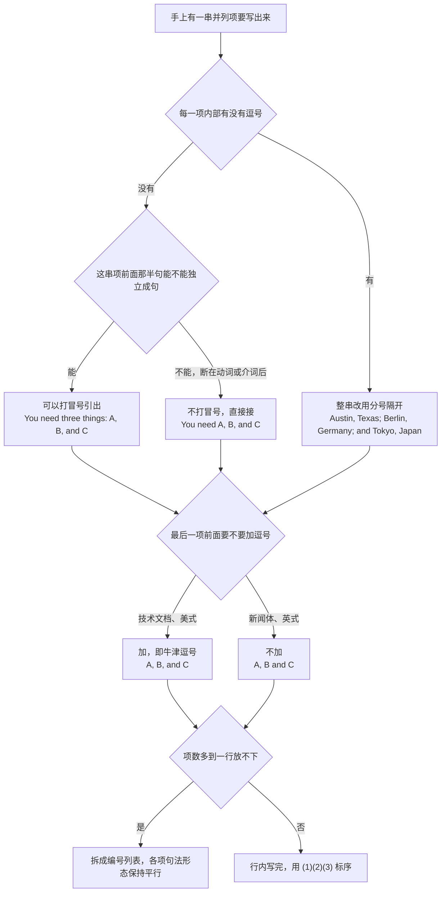
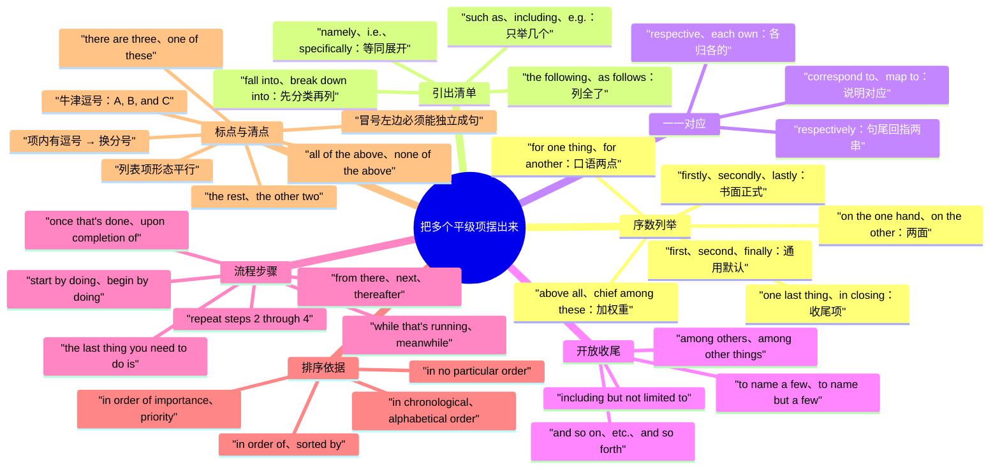

# 第一第二最后、包括以下、按…顺序：列举与步骤

> [!info] 本篇定位
>
> 这篇收「第一…第二…最后」「一来二来」「包括以下」「如下所示」「分别是」「等等」「仅举几例」「先做…再做…」「按…顺序」「一共三点」「其中之一」「以上都是」共三十七条查询意图，每条给口语、书面、正式三档成品。
>
> 与本分类另外两篇的分工：想说「而且」「不但…而且」「更进一步」这类**往上加码**的，查 [[06.并列、递进、列举与选择/01.而且、不仅而且、更进一步：递进与追加\|而且、不仅而且、更进一步]]；想说「要么…要么」「除了」「二选一」这类**从一堆里挑或者排掉**的，查 [[06.并列、递进、列举与选择/03.要么要么、除了、二选一：选择、排除与例外\|要么要么、除了、二选一]]。这一篇只管**把多个平级项摆出来**：项与项之间不比大小、不排斥、不递进，只有先后与编号。
>
> 读完能查到：first 和 firstly 到底哪个对、at first 为什么不能拿来分点、as follows 为什么永远不加 s、i.e. 和 e.g. 差在哪、such as 后面为什么不能再跟 etc.、respectively 该放句尾还是句首、牛津逗号什么时候必须加、列表项里本身有逗号时怎么办、冒号能不能打在动词后面、以及一套完整的操作步骤骨架。
>
> 「分别是」在数据陈述里的用法（占比、增减、单位）主锚点在 [[09.比较、程度与数量/04.大约、超过、占三成、平均、分别是：数量与统计描述\|数量与统计描述]]，本篇只给列举意义上的一一对应。「前者…后者」的篇章回指归 [[12.文体、语域与正式文书/05.法律条款与篇章回指：除非另有约定、如前所述、前者后者\|法律条款与篇章回指]]。并列连词本身的构成规则不在这里，指回 [[02.英语基础语法/05.介词与连词/03.连词的分类与用法\|连词的分类与用法]]。

---

## 1. 本篇导读：列举有三根轴，中文只有一个「第一第二」

中文列举的表面形态极其单一：不管是口头分点、文档清单、还是操作步骤，一律「第一…第二…最后」加逗号顿号。英文这一端拆成三根互不相通的轴，选错一根，句子的语法不一定错，但读起来会立刻暴露是从中文直译过来的。

第一根轴是**序数副词**：first、second、finally 这一套是话语标记，它挂在整个句子前面，管的是「我现在说的是第几点」。第二根轴是**清单引出式**：the following、as follows、namely 这一套是名词层面的连接，它引出的是一串并列成分而不是一串句子。第三根轴是**流程时序**：start by doing、once that's done、from there 这一套隐含着「做完前一步才能做下一步」，项与项之间是依赖关系而不是并列关系。

中文的「第一第二」三根轴通吃，英文不通吃。把 the following 拿去分点（`The following, the build is broken.`）不成句；把 firstly 拿去当步骤（`Firstly, run the migration.` 听着像在念论文而不是在教人操作）；把 start by 拿去列并列的三条理由（这三条理由之间根本没有先后依赖）都是错配。

### 三根轴的分工总表

| 中文说法 | 项与项的关系 | 走哪根轴 | 本篇节次 |
| --- | --- | --- | --- |
| 第一…第二…最后 | 平级，只有陈述顺序 | first、second、finally | 第 2 节 |
| 一来…二来 / 一方面…另一方面 | 平级，通常只有两项 | for one thing、on the one hand | 第 2 节 |
| 包括以下 / 如下所示 / 有这么几项 | 平级，被一句话统领 | the following、as follows | 第 3 节 |
| 也就是 / 即 / 比如 | 平级，是上一项的展开或举例 | namely、such as | 第 3 节 |
| 分别是 / 各自 | 两串项一一对上号 | respectively、respective | 第 4 节 |
| 等等 / 仅举几例 | 平级，且没列全 | and so on、to name a few | 第 5 节 |
| 先…做完之后…最后 | 有依赖，必须按序执行 | start by、once that's done | 第 6 节 |
| 按重要性 / 按时间 / 不分先后 | 平级，但要交代排序依据 | in order of、in no particular order | 第 7 节 |
| 一共三点 / 其中之一 / 以上都是 | 平级，对清单本身做清点 | there are three、all of the above | 第 9 节 |

### 从中文进的总选择树

树的第一层只问依赖关系，不问语域。这一层选错的代价最大：把有依赖的步骤写成 first、second，读者会以为三件事可以并行开工；把没有依赖的三条理由写成 start by、then，读者会以为必须按顺序理解。第二层才分「几个句子」还是「几个名词短语」——这一层决定的是接口形态，句子接得住 first 这类副词，名词短语接不住，只能挂在 the following、include 这类结构上。第三层才是语域和「列全没列全」。

### 三个先立起来的提醒

> [!warning] at first 不是「第一」
>
> - ❌ ~~At first, the API is rate-limited. Second, the payload is too large.~~ ／ ✅ **First, the API is rate-limited. Second, the payload is too large.**（at first 是时间副词，意思是「起初，后来变了」，拿来分点会让读者等一个「后来」）
> - ❌ ~~At last, we need to update the docs.~~ ／ ✅ **Finally, we need to update the docs.**（at last 表示「终于等到了」，带情绪，不是列举的最后一项）

> [!warning] 一句话里只留一套列举标记
>
> - ❌ ~~The stack includes such as Redis, Kafka, and Postgres.~~ ／ ✅ **The stack includes Redis, Kafka, and Postgres.** 或 **The stack uses tools such as Redis, Kafka, and Postgres.**（include 和 such as 都在标「这是不完全清单」，留一个）
> - ❌ ~~We support Postgres, MySQL, SQLite, etc., and so on.~~ ／ ✅ **We support Postgres, MySQL, SQLite, and so on.**（etc. 和 and so on 是同一个意思的两种写法，不叠用）

> [!tip] 查法
>
> 先问自己：这几项能不能打乱顺序说。能打乱就走第 2、3 节；不能打乱、必须按这个次序执行的走第 6 节。写完之后再去第 8 节核对一遍标点——中文母语者在列举这一块最高频的失分点不是词，是逗号、分号和冒号的位置。

---

## 2. 第一第二最后：序数列举的六个入口

这一节的六条意图共用一个中文骨架「第一…第二…最后」，分档依据一半在语域，一半在项数。两项和三项以上用的词不一样，口头和书面用的词也不一样。

### 2.1 第一…第二…最后：最常用的一套

中文触发语：第一…第二…第三 / 首先…其次…最后 / 一是…二是…三是 / 先说第一点

| 档位 | 句架 | 例句 |
| --- | --- | --- |
| 口语 | First, A. Second, B. And finally, C. | First, the build is broken. Second, nobody owns the fix. And finally, we ship on Friday. |
| 口语 | For a start, A. Then there's B. | For a start, the docs are out of date. Then there's the missing test coverage. |
| 书面 | First, A. Second, B. Finally, C. | First, the schema changed. Second, the migration was never run. Finally, the rollback script is missing. |
| 正式 | In the first place, A. In the second place, B. | In the first place, the clause is ambiguous. In the second place, it conflicts with Section 4. |

> [!warning] 错配警示
>
> - ❌ ~~First, ... Secondly, ... Third, ...~~ ／ ✅ **First, ... Second, ... Third, ...** 或 **Firstly, ... Secondly, ... Thirdly, ...**（一套用到底，不许 first 和 secondly 混搭）
> - ❌ ~~The first, the API is slow.~~ ／ ✅ **First, the API is slow.**（英文的序数列举词前面不加 the，这是从中文「第一点」直译出来的冠词）

- 同义入口：第一第二第三 / 首先其次最后 / 一是二是三是 / 头一个是 / 先说一点
- 语法归属：[[02.英语基础语法/04.形容词与副词/03.副词的分类与用法\|连接副词的位置]]
- 场景实战：[[04.英语场景/10.职场与商务场景实战/02.会议汇报与演示场景\|汇报里分点陈述]]

### 2.2 firstly 一族：书面与正式档的分工

中文触发语：第一（书面） / 其一…其二 / 首先（论文体） / 最后（收束）

| 档位 | 句架 | 例句 |
| --- | --- | --- |
| 书面 | Firstly, A. Secondly, B. Lastly, C. | Firstly, the sample size is small. Secondly, the control group was self-selected. Lastly, the effect did not replicate. |
| 书面 | First of all, A. | First of all, the contract has not been countersigned. |
| 正式 | The first point is that A. The second is that B. | The first point is that the deadline is fixed. The second is that the budget is not. |
| 正式 | We begin with A, turn next to B, and conclude with C. | We begin with the data, turn next to the model, and conclude with the limitations. |

> [!warning] 错配警示
>
> - ❌ ~~Firstly of all, the schema is wrong.~~ ／ ✅ **First of all, the schema is wrong.**（first of all 是固定式，不能把 first 换成 firstly）
> - ❌ ~~Lastly but not least, thanks to the reviewers.~~ ／ ✅ **Last but not least, thanks to the reviewers.**（固定短语用的是 last 不是 lastly；这个短语在书面正式文体里已经陈旧，能不用就不用）

- 同义入口：其一其二 / 第一点第二点 / 首先（书面） / 最后一点是
- 语法归属：[[02.英语基础语法/03.代词与数词/05.数词的用法与表达\|序数词的用法]]
- 场景实战：[[04.英语场景/09.学习与教育场景实战/02.图书馆作业与研究场景\|论文里分点论证]]

### 2.3 一来…二来：口语的两点式

中文触发语：一来…二来 / 一方面是…另外 / 首先…再说 / 一是…再一个是

| 档位 | 句架 | 例句 |
| --- | --- | --- |
| 口语 | For one thing, A. For another, B. | For one thing, it's slow. For another, nobody knows how it works. |
| 口语 | For one, A. And B on top of that. | For one, the vendor is late. And we're short two people on top of that. |
| 口语 | A. And another thing — B. | The build takes forty minutes. And another thing — the logs get truncated. |
| 书面 | Partly A, and partly B. | The delay was partly a staffing issue and partly a licensing one. |

> [!warning] 错配警示
>
> - ❌ ~~For one thing, it's slow. For another thing, it's fragile. For another thing, nobody owns it.~~ ／ ✅ **First, it's slow. Second, it's fragile. And nobody owns it.**（for one thing / for another 只撑得住两项，有第三项就整套换成 first、second）
> - ❌ ~~For one hand, it's slow.~~ ／ ✅ **For one thing, it's slow.** 或 **On the one hand, it's slow.**（thing 和 hand 两套不能混）

- 同义入口：一来二来 / 一是再一个是 / 首先再说 / 一方面另外还有
- 语法归属：[[02.英语基础语法/05.介词与连词/03.连词的分类与用法\|并列关系的标记]]
- 场景实战：[[04.英语场景/07.社交交际场景实战/01.交友聚会与闲聊场景\|闲聊里给两条理由]]

### 2.4 一方面…另一方面：并列义的两面

中文触发语：一方面…另一方面 / 从一个角度看…从另一个角度看 / 既有…也有

| 档位 | 句架 | 例句 |
| --- | --- | --- |
| 口语 | On the one hand A; on the other, B. | On the one hand it's cheaper; on the other, it locks us in. |
| 书面 | On the one hand, A. On the other hand, B. | On the one hand, the migration removes a whole service. On the other hand, it doubles our write latency. |
| 书面 | There are two sides to this: A, and B. | There are two sides to this: the cost saving, and the vendor risk. |
| 正式 | In one respect A; in another, B. | In one respect the design is simpler; in another, it is harder to audit. |

> [!warning] 错配警示
>
> - ❌ ~~In the one hand, it's cheaper.~~ ／ ✅ **On the one hand, it's cheaper.**（介词固定是 on，冠词 the 也不能省）
> - ❌ ~~The service is fast. On the other hand, it's cheap.~~ ／ ✅ **The service is fast. It's also cheap.**（on the other hand 引出的必须是相反或抵触的一面，两条都是优点时它是错配；纯对比的用法查 [[05.让步、转折与对比/03.相比之下、恰恰相反、另一方面：对比与反驳\|相比之下、恰恰相反、另一方面]]）

- 同义入口：一方面另一方面 / 从这个角度从那个角度 / 好的一面坏的一面 / 既有也有
- 语法归属：[[02.英语基础语法/05.介词与连词/01.介词的分类与基本用法\|介词短语作状语]]
- 场景实战：[[04.英语场景/05.高频实用表达句型框架/04.比较对比举例总结句型库\|对比举例句型库]]

### 2.5 首先要说的是：给第一项加权重

中文触发语：首先也是最重要的 / 头一条就是 / 最要紧的一点是 / 别的先不说

| 档位 | 句架 | 例句 |
| --- | --- | --- |
| 口语 | The main thing is A. | The main thing is that nobody was paged. |
| 口语 | If nothing else, A. | If nothing else, we now know where the bottleneck is. |
| 书面 | The first and most important point is that A. | The first and most important point is that the data was never encrypted at rest. |
| 正式 | Above all, A. | Above all, the process must remain auditable. |
| 正式 | Chief among these is A. | Chief among these is the absence of a rollback path. |

> [!warning] 错配警示
>
> - ❌ ~~Above all of things, the process must be auditable.~~ ／ ✅ **Above all, the process must be auditable.**（above all 后面不带补足成分，直接接句子）
> - ❌ ~~The most important is that nobody was paged.~~ ／ ✅ **The most important thing is that nobody was paged.**（英文最高级后面要留一个中心名词，中文可以省，英文不能）

- 同义入口：最要紧的是 / 头一条 / 首先也是最重要的 / 别的先不说 / 最关键的一点
- 语法归属：[[02.英语基础语法/09.从句体系/03.名词性从句详解\|that 引导的表语从句]]
- 场景实战：[[04.英语场景/10.职场与商务场景实战/02.会议汇报与演示场景\|汇报里突出首要结论]]

### 2.6 最后一点：收尾那一项

中文触发语：最后 / 最后一点是 / 最后再说一句 / 还有最后一条 / 说完了

| 档位 | 句架 | 例句 |
| --- | --- | --- |
| 口语 | And last, A. | And last, don't forget to rotate the key. |
| 口语 | One last thing: A. | One last thing: the staging box goes down at midnight. |
| 书面 | Finally, A. | Finally, the license file must be committed with the release. |
| 书面 | Lastly, A. | Lastly, all three services share the same connection pool. |
| 正式 | In closing, A. | In closing, the committee recommends a six-month extension. |

> [!warning] 错配警示
>
> - ❌ ~~In the end, don't forget to rotate the key.~~ ／ ✅ **Finally, don't forget to rotate the key.**（in the end 说的是「折腾一圈之后的结局」，不是列举的最后一项；时序义的 in the end 查 [[07.时间与顺序/02.起初、后来、终于、迟早：时序推进与阶段\|时序推进与阶段]]）
> - ❌ ~~Finally, finally, we also need to update the changelog.~~ ／ ✅ **One last thing: we also need to update the changelog.**（已经说过 finally 又想加一条时换说法，不叠用）

- 同义入口：最后 / 最后一点 / 还有最后一条 / 最后再补一句 / 就说到这儿
- 语法归属：[[02.英语基础语法/04.形容词与副词/03.副词的分类与用法\|句首状语与逗号]]
- 场景实战：[[04.英语场景/10.职场与商务场景实战/03.商务邮件与正式书面沟通\|邮件里的收尾项]]

---

## 3. 包括以下、如下所示：把清单引出来

上一节列的是句子，这一节列的是名词短语。中文这两种情况都说「有以下几点」，英文分得很清：接句子的用 first、second 挂在句首；接名词短语的必须找一个统领结构把它们兜住，这个结构就是 the following、as follows、include、consist of 这一族。

### 3.1 包括以下：清单跟在后面

中文触发语：包括以下 / 有下面几项 / 包含这么几个 / 涉及以下内容

| 档位 | 句架 | 例句 |
| --- | --- | --- |
| 口语 | You'll need a few things: A, B, and C. | You'll need a few things: a laptop, a VPN token, and repo access. |
| 书面 | The following are required: A, B, and C. | The following are required: a signed NDA, a background check, and manager approval. |
| 书面 | X includes the following: A, B, and C. | The rollout includes the following: a feature flag, a canary group, and a kill switch. |
| 正式 | X shall comprise the following items: A, B, and C. | The deliverable shall comprise the following items: source code, build scripts, and deployment documentation. |

> [!warning] 错配警示
>
> - ❌ ~~The following is required: a signed NDA, a background check, and manager approval.~~ ／ ✅ **The following are required: …**（the following 后面跟几项就用复数谓语，只跟一项才用单数）
> - ❌ ~~Please refer the following table.~~ ／ ✅ **Please refer to the following table.**（refer 表示「参看」时必须带 to；不带 to 的 refer 是另一个义项，`refer a patient to a specialist` 那种「把某人转介出去」）

- 同义入口：包括以下 / 有下面几项 / 下列内容 / 涉及这几块 / 需要准备的东西有
- 语法归属：[[02.英语基础语法/10.特殊句型/06.主谓一致\|主谓一致的三大原则]]
- 场景实战：[[04.英语场景/10.职场与商务场景实战/03.商务邮件与正式书面沟通\|邮件里列所需材料]]

### 3.2 如下所示：清单另起一段

中文触发语：如下 / 如下所示 / 内容如下 / 见下表 / 详见下面

| 档位 | 句架 | 例句 |
| --- | --- | --- |
| 口语 | Here's what we've got: | Here's what we've got: three open bugs and one flaky test. |
| 书面 | The steps are as follows: | The steps are as follows: build the image, push it, then update the tag. |
| 书面 | A is listed below. | The full set of environment variables is listed below. |
| 正式 | The provisions are set out below. | The provisions governing renewal are set out below. |
| 正式 | X is as follows. | The order of precedence is as follows. |

> [!warning] 错配警示
>
> - ❌ ~~The steps are as follow:~~ ／ ✅ **The steps are as follows:**（as follows 是固定式，主语再复数它也永远带 s）
> - ❌ ~~As follows are the steps.~~ ／ ✅ **The steps are as follows.**（as follows 只能后置，不能提到句首当主语用）

- 同义入口：如下 / 如下所示 / 内容如下 / 见下 / 具体见下面这份
- 语法归属：[[02.英语基础语法/10.特殊句型/06.主谓一致\|语法一致与意义一致]]
- 场景实战：[[04.英语场景/10.职场与商务场景实战/02.会议汇报与演示场景\|演示里引出清单页]]

### 3.3 也就是、即：把上一项摊开说清楚

中文触发语：也就是 / 即 / 具体是哪几个 / 说白了就是 / 确切地说是

| 档位 | 句架 | 例句 |
| --- | --- | --- |
| 口语 | A — that is, B. | Only the core team has access — that is, the four of us. |
| 书面 | A, namely B. | Two services are affected, namely the auth gateway and the billing worker. |
| 书面 | A, i.e., B. | The change affects the public surface, i.e., anything exported from the index file. |
| 正式 | A, specifically B. | The clause applies to all subcontractors, specifically those engaged after the effective date. |
| 正式 | A, viz. B. | Only three remedies are available, viz. repair, replacement, and refund. |

> [!warning] 错配警示
>
> - ❌ ~~Two services are affected, i.e., the auth gateway, the billing worker, and possibly others.~~ ／ ✅ **Two services are affected, namely the auth gateway and the billing worker.**（i.e. 和 namely 都表示「就这些，列全了」，后面不能再挂 and others）
> - ❌ ~~The change affects the public surface, e.g. anything exported.~~ ／ ✅ **The change affects the public surface, i.e., anything exported.**（e.g. 是举例，只举其中一部分；i.e. 是等同，把整个范围说尽）

- 同义入口：也就是 / 即 / 换句话说就是 / 具体指的是 / 确切地说
- 语法归属：[[02.英语基础语法/01.基础入门/04.英语词典缩写大全\|i.e. 与 e.g. 的区分]]
- 场景实战：[[04.英语场景/05.高频实用表达句型框架/04.比较对比举例总结句型库\|改述与界定]]

### 3.4 比如、例如：只举其中几个

中文触发语：比如 / 例如 / 像…这种 / 拿…来说 / 举个例子

| 档位 | 句架 | 例句 |
| --- | --- | --- |
| 口语 | like A and B | We use managed services for the boring parts, like queues and object storage. |
| 口语 | A, for example B | Some fields are computed, for example the display name. |
| 书面 | such as A, B, and C | Long-running jobs, such as backfills, exports, and reindexing, run on a separate pool. |
| 书面 | including A and B | Several teams are affected, including platform and payments. |
| 正式 | for instance, A | Certain jurisdictions impose additional duties; for instance, the EU requires some companies to appoint a data protection officer. |
| 正式 | X, e.g., A and B | Non-deterministic sources, e.g., timestamps and random seeds, must be pinned in tests. |

> [!warning] 错配警示
>
> - ❌ ~~Long-running jobs such as backfills, exports, etc. run on a separate pool.~~ ／ ✅ **Long-running jobs such as backfills and exports run on a separate pool.**（such as 已经说明这是举例，etc. 是重复标记）
> - ❌ ~~We use tools like as Redis and Kafka.~~ ／ ✅ **We use tools like Redis and Kafka.** 或 **… such as Redis and Kafka.**（like 和 such as 是两套，不能拼成 like as）

- 同义入口：比如 / 例如 / 像…这样的 / 举个例子 / 拿…来说 / 譬如
- 语法归属：[[02.英语基础语法/11.实战应用/02.写作中的语法应用\|举例连接词的用法]]
- 场景实战：[[04.英语场景/05.高频实用表达句型框架/04.比较对比举例总结句型库\|举例句型库]]

### 3.5 分成几类：把整体拆开列

中文触发语：分为以下几类 / 拆成几块 / 归成三种 / 可以分成

| 档位 | 句架 | 例句 |
| --- | --- | --- |
| 口语 | It breaks down into A, B, and C. | It breaks down into read traffic, write traffic, and background jobs. |
| 书面 | X falls into three categories: A, B, and C. | The failures fall into three categories: timeouts, bad input, and retries. |
| 书面 | X can be divided into A and B. | The pipeline can be divided into an ingestion stage and a serving stage. |
| 正式 | X is grouped under three headings: A, B, and C. | The requirements are grouped under three headings: functional, operational, and legal. |

> [!warning] 错配警示
>
> - ❌ ~~The pipeline is divided in two stages.~~ ／ ✅ **The pipeline is divided into two stages.**（divide 表示「分成几块」时介词固定是 into，写成 in 会被读成「在两个阶段之内被分开」）
> - 构成与分类的完整成品在 [[08.指认、定义与描述/03.由…组成、分为、包括、属于：构成、分类与范围界定\|构成、分类与范围界定]]，本篇只给「引出清单」这一用途。

- 同义入口：分为几类 / 拆成几块 / 归成三种 / 大致可以分成 / 按…划分
- 语法归属：[[02.英语基础语法/10.特殊句型/01.被动语态全解\|be divided into 的被动式]]
- 场景实战：[[04.英语场景/10.职场与商务场景实战/02.会议汇报与演示场景\|汇报里做分类]]

---

## 4. 分别是、各自：多项之间的一一对应

中文一个「分别」承担两种完全不同的意思：一种是两串项按顺序对上号（「甲乙丙分别负责一二三」），一种是「各干各的、互不相干」（「他们各自回了各自的办公室」）。英文前者用 respectively，后者用 respective 或 each，两个词长得像，用法不通。

### 4.1 分别是：两串项按顺序对号

中文触发语：分别是 / 分别为 / 依次是 / 对应过来是

| 档位 | 句架 | 例句 |
| --- | --- | --- |
| 口语 | A takes X and B takes Y. | The build takes four minutes and the test suite takes eleven. |
| 书面 | A and B are X and Y respectively. | Staging and production run on two and six nodes respectively. |
| 书面 | A and B handle X and Y respectively. | The gateway and the worker handle authentication and billing respectively. |
| 正式 | A and B shall be responsible for X and Y respectively. | The vendor and the client shall be responsible for hosting and content respectively. |

> [!warning] 错配警示
>
> - ❌ ~~Respectively, staging runs on two nodes and production on six.~~ ／ ✅ **Staging and production run on two and six nodes respectively.**（respectively 只能放在句尾回指前面两串，不能提到句首当「分别地」用）
> - ❌ ~~Each service has its own database respectively.~~ ／ ✅ **Each service has its own database.**（只有一串项时不存在对号，respectively 是多余的）

- 同义入口：分别是 / 分别为 / 依次为 / 一一对应是 / 对应关系是
- 语法归属：[[02.英语基础语法/04.形容词与副词/03.副词的分类与用法\|副词的句末位置]]
- 场景实战：[[04.英语场景/10.职场与商务场景实战/02.会议汇报与演示场景\|汇报里念数据对照]]

### 4.2 各自的：各归各的

中文触发语：各自的 / 各…各的 / 每个都有自己的 / 各归各

| 档位 | 句架 | 例句 |
| --- | --- | --- |
| 口语 | Everyone went back to their own desk. | After the standup, everyone went back to their own desk. |
| 口语 | Each one has its own config. | Each service has its own config file. |
| 书面 | They returned to their respective X. | The two teams returned to their respective backlogs. |
| 正式 | Each party shall bear its own X. | Each party shall bear its own legal costs. |

> [!warning] 错配警示
>
> - ❌ ~~Each services has their own config.~~ ／ ✅ **Each service has its own config.**（each 后面接单数名词、单数谓语；指物时回指用 its）
> - ❌ ~~The two teams returned to their respectively backlogs.~~ ／ ✅ **… their respective backlogs.**（修饰名词要用形容词 respective，副词 respectively 只能修饰整句）

- 同义入口：各自的 / 各归各的 / 每个都有自己的 / 各带各的 / 分头
- 语法归属：[[02.英语基础语法/03.代词与数词/04.不定代词详解\|each 的单复数]]
- 场景实战：[[04.英语场景/10.职场与商务场景实战/04.商务谈判合同与客户沟通\|合同里划分各方责任]]

### 4.3 一一对应：把对应关系说明白

中文触发语：一一对应 / 对上号 / 与…对应 / 按顺序对下来

| 档位 | 句架 | 例句 |
| --- | --- | --- |
| 口语 | They line up one to one. | The columns and the fields line up one to one. |
| 书面 | A corresponds to B. | Each row in the export corresponds to one record in the source table. |
| 书面 | A maps to B. | Each error code maps to a single user-facing message. |
| 正式 | There is a one-to-one correspondence between A and B. | There is a one-to-one correspondence between the request IDs and the audit entries. |

> [!warning] 错配警示
>
> - ❌ ~~Each row corresponds one record.~~ ／ ✅ **Each row corresponds to one record.**（correspond 后面必须带 to）
> - ❌ ~~The columns are one-to-one the fields.~~ ／ ✅ **The columns map one-to-one to the fields.**（one-to-one 是形容词或状语，撑不起谓语，要配 map、correspond 这类动词）

- 同义入口：一一对应 / 对上号 / 与…对应 / 挨个对下来 / 一对一
- 语法归属：[[02.英语基础语法/13.附录/03.介词搭配速查\|动词 + to 的固定搭配]]

---

## 5. 等等、仅举几例：清单收不住的时候

中文的「等等」是万能收尾，说话人不打算列全时一律往后一挂。英文分四种，差别在于**没列全这件事，说话人是随口带过还是刻意声明**。and so on 是随口带过，to name a few 是刻意声明「我还能举很多」，among others 是刻意声明「还有别的但我不打算展开」，and more 语气最轻，多用在产品概览和仪表盘说明这类不追求穷尽的地方。

### 5.1 等等：随口带过

中文触发语：等等 / 之类的 / 什么的 / 还有别的 / 诸如此类

| 档位 | 句架 | 例句 |
| --- | --- | --- |
| 口语 | A, B, that kind of thing | Linting, formatting, type checks, that kind of thing. |
| 口语 | A, B, and stuff like that | We handle retries, backoff, and stuff like that. |
| 书面 | A, B, and so on | The job cleans up temp files, expired sessions, and so on. |
| 书面 | A, B, etc. | Numeric fields, date fields, etc., are validated on the client. |
| 正式 | A, B, and so forth | The policy covers travel, accommodation, and so forth. |

> [!warning] 错配警示
>
> - ❌ ~~We interviewed Alice, Bob, etc.~~ ／ ✅ **We interviewed Alice, Bob, and others.**（etc. 只用于物或事，用在人身上是失礼的写法）
> - ❌ ~~Numeric fields, date fields, etc are validated.~~ ／ ✅ **Numeric fields, date fields, etc., are validated.**（etc. 的句点属于缩写本身，句中出现时点不能省，后面还要按正常并列补一个逗号）

- 同义入口：等等 / 之类的 / 什么的 / 诸如此类 / 还有一堆
- 语法归属：[[02.英语基础语法/01.基础入门/04.英语词典缩写大全\|etc. 等拉丁缩写]]
- 场景实战：[[04.英语场景/06.日常生活场景实战/01.问候寒暄与自我介绍场景\|闲聊里带过清单]]

### 5.2 仅举几例：刻意声明还有很多

中文触发语：仅举几例 / 随便举几个 / 举几个就知道了 / 这只是其中一小部分

| 档位 | 句架 | 例句 |
| --- | --- | --- |
| 口语 | A and B — just to name a couple. | Timeouts and partial writes — just to name a couple. |
| 书面 | A, B, and C, to name a few | The library ships adapters for Postgres, Redis, and S3, to name a few. |
| 正式 | A, B, and C, to name but a few | The reform touched procurement, licensing, and audit, to name but a few. |
| 正式 | A and B are two examples among many. | The cache stampede and the retry storm are two examples among many. |

> [!warning] 错配警示
>
> - ❌ ~~To name a few, the library ships adapters for Postgres and Redis.~~ ／ ✅ **The library ships adapters for Postgres and Redis, to name a few.**（这个短语只能后置，前面必须先有实际列出的几项）
> - ❌ ~~It ships an adapter for Postgres, to name a few.~~ ／ ✅ **It ships adapters for Postgres, Redis, and S3, to name a few.**（说「举几个」前面至少要真的举出两三个，只列一项时该短语落空）

- 同义入口：仅举几例 / 随便举几个 / 就说几个 / 这才哪到哪 / 只是其中几个
- 语法归属：[[02.英语基础语法/08.非谓语动词/01.动词不定式详解\|不定式作独立成分]]
- 场景实战：[[04.英语场景/05.高频实用表达句型框架/04.比较对比举例总结句型库\|举例的收尾式]]

### 5.3 其中包括：还有别的没列出来

中文触发语：其中包括 / 还有别的 / 不止这些 / 除此之外还有

| 档位 | 句架 | 例句 |
| --- | --- | --- |
| 口语 | A and B, for a start | We're missing tests and docs, for a start. |
| 书面 | A, B, and C, among others | We support Postgres, MySQL, and SQLite, among others. |
| 书面 | A and B, among other things | The review flagged naming and error handling, among other things. |
| 正式 | X, including but not limited to A, B, and C | The agreement covers all confidential material, including but not limited to source code, pricing, and customer lists. |

> [!warning] 错配警示
>
> - ❌ ~~We support Postgres, among others databases.~~ ／ ✅ **We support Postgres, among other databases.** 或 **We support Postgres, among others.**（among others 是独立式，后面不再带名词；带名词时用 among other + 复数名词）
> - ❌ ~~The review flagged naming, among others.~~ ／ ✅ **The review flagged naming, among other things.**（among others 回指的是前面那串可数的同类实体，人和物都行；前面是动作或抽象事项时改用 among other things）

- 同义入口：其中包括 / 还有别的 / 不止这些 / 包括但不限于 / 光是就有
- 语法归属：[[02.英语基础语法/05.介词与连词/04.介词与连词的易混点\|between 与 among 的区分]]
- 场景实战：[[04.英语场景/10.职场与商务场景实战/04.商务谈判合同与客户沟通\|合同里的开放式列举]]

### 5.4 数不完：清单长到不打算列

中文触发语：还有更多 / 数不过来 / 一大堆 / 说都说不完 / 太多了列不完

| 档位 | 句架 | 例句 |
| --- | --- | --- |
| 口语 | And the list goes on. | Flaky tests, stale docs, dead feature flags. And the list goes on. |
| 口语 | There's a whole pile of A. | There's a whole pile of small fixes waiting on review. |
| 书面 | A, B, C, and more | The dashboard tracks latency, error rate, saturation, and more. |
| 正式 | The list is not exhaustive. | The categories above are illustrative; the list is not exhaustive. |

> [!warning] 错配警示
>
> - ❌ ~~The list goes on and on and on.~~ ／ ✅ **And the list goes on.**（固定式只重复一次 on 或者不重复，堆三个是口语夸张，写进文档会显得情绪化）
> - ❌ ~~The list is not exhausted.~~ ／ ✅ **The list is not exhaustive.**（exhausted 是「累坏了／耗尽了」，exhaustive 才是「穷举的」）

- 同义入口：还有更多 / 数不过来 / 一大堆 / 列不完 / 不止于此
- 语法归属：[[02.英语基础语法/04.形容词与副词/01.形容词的用法与位置\|易混形容词词尾]]
- 场景实战：[[04.英语场景/10.职场与商务场景实战/02.会议汇报与演示场景\|汇报里承认清单未穷尽]]

---

## 6. 先做再做：操作流程的步骤框架

这一节和前面四节的根本差别是**项与项之间有依赖**：第二步必须等第一步做完。中文这两种情况都说「第一第二」，英文必须换一套词，否则读者会以为三步可以并行开工。

这条链的每一环都有固定的接口形态，换掉任何一个词，后面跟的成分就跟着变：start by 后面必须是动名词，once that's done 后面必须是完整句子，from there 后面是句子但常配情态动词，the last thing you need to do is 后面接的是不带 to 的动词原形或者带 to 的不定式都行（口语更多不带 to）。这几个形态是本节唯一需要死记的部分，其余都是词的替换。

### 6.1 先…：起手第一步

中文触发语：先… / 第一步是 / 先从…开始 / 上来先做

| 档位 | 句架 | 例句 |
| --- | --- | --- |
| 口语 | Start by doing A. | Start by pulling the latest main. |
| 口语 | First off, do A. | First off, kill the stuck job. |
| 书面 | Begin by doing A. | Begin by taking a snapshot of the database. |
| 书面 | The first step is to do A. | The first step is to disable the scheduled task. |
| 正式 | Before anything else, do A. | Before anything else, confirm that no writes are in flight. |

> [!warning] 错配警示
>
> - ❌ ~~Start by pull the latest main.~~ ／ ✅ **Start by pulling the latest main.**（by 是介词，后面只接动名词）
> - ❌ ~~The first step is disable the task.~~ ／ ✅ **The first step is to disable the task.**（step 后面的表语要用不定式，直接接原形是把它当祈使句混进来了）

- 同义入口：先… / 第一步 / 上来先 / 先从…开始 / 打头的动作是
- 语法归属：[[02.英语基础语法/08.非谓语动词/02.动名词详解\|介词后接动名词]]
- 场景实战：[[04.英语场景/06.日常生活场景实战/02.家庭家务与日常起居场景\|讲解操作步骤]]

### 6.2 这一步做完之后：交接到下一步

中文触发语：做完这个之后 / 等它跑完 / 这一步完了再 / 搞定之后

| 档位 | 句架 | 例句 |
| --- | --- | --- |
| 口语 | Once that's done, do B. | Once that's done, restart the worker. |
| 口语 | When it finishes, do B. | When it finishes, check the log for warnings. |
| 书面 | After A completes, do B. | After the migration completes, re-enable the scheduled task. |
| 书面 | With A out of the way, do B. | With the backup out of the way, you can drop the old table. |
| 正式 | Upon completion of A, do B. | Upon completion of the audit, the report shall be circulated to all parties. |

> [!warning] 错配警示
>
> - ❌ ~~Once that's done, then restart the worker.~~ ／ ✅ **Once that's done, restart the worker.**（once 已经把先后关系标完了，再加 then 是中文「…之后再…」的直译冗余）
> - ❌ ~~After the migration will complete, re-enable the task.~~ ／ ✅ **After the migration completes, re-enable the task.**（时间从句用现在时表将来，时态规则查 [[02.英语基础语法/09.从句体系/04.状语从句详解\|状语从句详解]]）

- 同义入口：做完之后 / 等它跑完 / 这一步完了 / 搞定以后 / 结束之后
- 语法归属：[[02.英语基础语法/09.从句体系/04.状语从句详解\|时间状语从句的时态]]

### 6.3 顺着往下：中间几步的推进

中文触发语：接下来 / 然后 / 在这基础上 / 从这儿开始就

| 档位 | 句架 | 例句 |
| --- | --- | --- |
| 口语 | From there, do B. | From there, it's just a matter of flipping the flag. |
| 口语 | Then do B. | Then run the smoke tests. |
| 书面 | Next, do B. | Next, verify that the checksum matches. |
| 书面 | The next step is to do B. | The next step is to point the DNS record at the new load balancer. |
| 正式 | Thereafter, B. | Thereafter, the service operates without manual intervention. |

> [!warning] 错配警示
>
> - ❌ ~~And then, next, run the smoke tests.~~ ／ ✅ **Next, run the smoke tests.**（then 和 next 是同一个位置的两个标记，选一个）
> - ❌ ~~From there, you can then to deploy.~~ ／ ✅ **From there, you can deploy.**（情态动词后面直接接原形，不带 to）

- 同义入口：接下来 / 然后 / 下一步 / 在这基础上 / 从这儿往下
- 语法归属：[[02.英语基础语法/07.助动词与情态动词/02.情态动词详解\|情态动词后接原形]]
- 场景实战：[[04.英语场景/10.职场与商务场景实战/02.会议汇报与演示场景\|演示里推进流程]]

### 6.4 与此同时：不占顺序的并行步

中文触发语：与此同时 / 趁着…的时候 / 一边…一边 / 在它跑的时候

| 档位 | 句架 | 例句 |
| --- | --- | --- |
| 口语 | While that's running, do B. | While that's running, grab the config from staging. |
| 口语 | In the meantime, do B. | In the meantime, ping the on-call channel. |
| 书面 | Meanwhile, B. | Meanwhile, the old cluster continues to serve read traffic. |
| 书面 | At the same time, do B. | At the same time, keep an eye on the error rate. |
| 正式 | Concurrently, B. | Concurrently, the legacy endpoints remain available in read-only mode. |

> [!warning] 错配警示
>
> - ❌ ~~In the meanwhile, ping the channel.~~ ／ ✅ **In the meantime, ping the channel.** 或 **Meanwhile, ping the channel.**（现代英语固定说 in the meantime 或单用 meanwhile；in the meanwhile 是旧式残留，今天写出来会显得别扭）
> - ❌ ~~While that's run, grab the config.~~ ／ ✅ **While that's running, grab the config.**（进行体表示「在跑着的这段时间」，一般现在时表示的是习惯）

- 同义入口：与此同时 / 趁这工夫 / 一边一边 / 它跑的时候 / 同期
- 语法归属：[[02.英语基础语法/06.动词时态/03.进行时态详解\|进行体表并行动作]]

### 6.5 最后一步：收尾那个动作

中文触发语：最后一步 / 最后要做的是 / 收尾就剩 / 做完这个就完了

| 档位 | 句架 | 例句 |
| --- | --- | --- |
| 口语 | The last thing you need to do is B. | The last thing you need to do is restart the proxy. |
| 口语 | And that's it — just do B. | And that's it — just merge the PR. |
| 书面 | Finally, do B. | Finally, remove the feature flag. |
| 书面 | The final step is to do B. | The final step is to tag the release. |
| 正式 | The process concludes with B. | The process concludes with a sign-off from the release manager. |

> [!warning] 错配警示
>
> - ❌ ~~The last thing you need to do is restarting the proxy.~~ ／ ✅ **… is restart the proxy.** 或 **… is to restart the proxy.**（`the last thing … is` 后面接原形或不定式，接动名词是把「最后一件事」说成了「最后一种状态」）
> - ❌ ~~At last, remove the feature flag.~~ ／ ✅ **Finally, remove the feature flag.**（at last 带「总算熬到了」的情绪，不是中性的流程收尾）

- 同义入口：最后一步 / 最后要做的 / 收尾动作 / 做完这个就结束 / 剩最后一件事
- 语法归属：[[02.英语基础语法/08.非谓语动词/05.非谓语动词综合辨析\|表语位置的原形与不定式]]

### 6.6 每一项都这么走：重复与回环

中文触发语：每一项都这样 / 对剩下的重复上面几步 / 依此办理 / 循环做

| 档位 | 句架 | 例句 |
| --- | --- | --- |
| 口语 | Do the same for the rest. | Do the same for the other two regions. |
| 书面 | Repeat steps 2 through 4 for each A. | Repeat steps 2 through 4 for each shard. |
| 书面 | Apply the same procedure to every A. | Apply the same procedure to every environment. |
| 正式 | The foregoing steps shall be repeated for each A. | The foregoing steps shall be repeated for each subsidiary. |

> [!warning] 错配警示
>
> - ❌ ~~Repeat the step 2 to 4.~~ ／ ✅ **Repeat steps 2 through 4.**（编号的步骤前面不加冠词；英式写法用 2 to 4，美式技术文档惯用 through，因为 to 有歧义，读者不确定含不含末项）
> - ❌ ~~Do the same for the others two regions.~~ ／ ✅ **Do the same for the other two regions.**（other 作限定词时不带 s，带 s 的 others 只能单独站着）

- 同义入口：每一项都这样 / 重复上面几步 / 依此办理 / 剩下的照做 / 循环执行
- 语法归属：[[02.英语基础语法/03.代词与数词/04.不定代词详解\|other 与 others 的分工]]

---

## 7. 按…顺序、按重要性排：排序依据

清单摆出来之后，读者会默认这个顺序有含义。中文靠上下文暗示，英文习惯明说一句「这是按什么排的」。这一节的四条意图专门解决这件事，最实用的其实是最后一条——声明「不分先后」，能挡掉一整类误会。

### 7.1 按…顺序：排序依据的总说法

中文触发语：按…顺序 / 按…排 / 依…排列 / 以…为序

| 档位 | 句架 | 例句 |
| --- | --- | --- |
| 口语 | sorted by A | The table is sorted by last modified. |
| 书面 | in order of A | The candidates are listed in order of interview date. |
| 书面 | ordered by A, then by B | Results are ordered by score, then by submission time. |
| 正式 | in ascending order of A | The entries appear in ascending order of sequence number. |
| 正式 | in descending order of A | Vendors are ranked in descending order of total contract value. |

> [!warning] 错配警示
>
> - ❌ ~~by order of interview date~~ ／ ✅ **in order of interview date**（`by order of` 的意思是「奉…之命」，`By order of the court` 才是它的正确用法）
> - ❌ ~~The table is sorted by the last modified.~~ ／ ✅ **The table is sorted by last modified.**（sorted by 后面接的是字段名，字段名不带冠词）

- 同义入口：按…顺序 / 按…排 / 依…排列 / 以…为序 / 按…先后
- 语法归属：[[02.英语基础语法/13.附录/03.介词搭配速查\|in 与 by 的固定短语]]

### 7.2 按重要性排：优先级顺序

中文触发语：按重要性 / 按优先级 / 从最要紧的开始 / 越靠前越重要

| 档位 | 句架 | 例句 |
| --- | --- | --- |
| 口语 | Most important first. | Here are the blockers, most important first. |
| 书面 | in order of importance | The risks are listed in order of importance. |
| 书面 | in order of priority, highest first | The tickets are grouped in order of priority, highest first. |
| 正式 | ranked from most to least A | The proposals are ranked from most to least cost-effective. |
| 正式 | in descending order of severity | Findings are presented in descending order of severity. |

> [!warning] 错配警示
>
> - ❌ ~~The risks are listed in the order of importance.~~ ／ ✅ **… in order of importance.**（这是固定短语，中间不插冠词；带冠词的 `in the order of` 在英式英语里是「大约」的意思，含义完全不同）
> - ❌ ~~ranked from the most to the least cost-effective~~ ／ ✅ **ranked from most to least cost-effective**（这个固定式里两个最高级都不带 the）

- 同义入口：按重要性 / 按优先级 / 从要紧的开始 / 越靠前越重要 / 按轻重缓急
- 语法归属：[[02.英语基础语法/04.形容词与副词/02.形容词的比较级与最高级\|最高级与冠词]]
- 场景实战：[[04.英语场景/10.职场与商务场景实战/02.会议汇报与演示场景\|汇报里排优先级]]

### 7.3 按时间先后：时序与倒序

中文触发语：按时间先后 / 从早到晚 / 倒着排 / 最新的在最上面 / 按字母顺序

| 档位 | 句架 | 例句 |
| --- | --- | --- |
| 口语 | newest first | The feed shows posts newest first. |
| 口语 | oldest at the top | The changelog puts the oldest entries at the top. |
| 书面 | in chronological order | The events are described in chronological order. |
| 书面 | in reverse chronological order | Releases are listed in reverse chronological order. |
| 书面 | in alphabetical order / alphabetically | The glossary is arranged alphabetically by term. |

> [!warning] 错配警示
>
> - ❌ ~~in a chronological order~~ ／ ✅ **in chronological order**（这一族短语都不带冠词，加 a 会把固定式拆散）
> - ❌ ~~The glossary is arranged in alphabet order.~~ ／ ✅ **… in alphabetical order.**（要用形容词 alphabetical，名词 alphabet 修饰不了 order）

- 同义入口：按时间先后 / 从早到晚 / 倒序 / 最新在前 / 按字母排
- 语法归属：[[02.英语基础语法/02.名词与冠词/03.冠词的用法详解\|固定短语中的零冠词]]
- 场景实战：[[04.英语场景/09.学习与教育场景实战/02.图书馆作业与研究场景\|文献与条目的排序]]

### 7.4 不分先后：声明这个顺序没有含义

中文触发语：不分先后 / 排名不分次序 / 顺序无所谓 / 这个先后没意义

| 档位 | 句架 | 例句 |
| --- | --- | --- |
| 口语 | in no particular order | Three things worry me, in no particular order. |
| 口语 | The order doesn't mean anything. | I listed them alphabetically; the order doesn't mean anything. |
| 书面 | listed in no particular order | The contributors are listed in no particular order. |
| 正式 | The order of listing does not imply priority. | The order of listing does not imply priority or endorsement. |

> [!warning] 错配警示
>
> - ❌ ~~in no particular orders~~ ／ ✅ **in no particular order**（固定式里的 order 永远是单数）
> - ❌ ~~The contributors are listed without order.~~ ／ ✅ **… in no particular order.**（without order 会被读成「杂乱无章」，语义偏成了贬义）

- 同义入口：不分先后 / 排名不分次序 / 顺序无所谓 / 随便排的 / 没有优先级含义
- 语法归属：[[02.英语基础语法/02.名词与冠词/02.名词的数与格\|固定短语中的单数形式]]
- 场景实战：[[04.英语场景/10.职场与商务场景实战/03.商务邮件与正式书面沟通\|致谢与名单的免责声明]]

---

## 8. 编号列举与并列项标点：技术文档的固定写法

这一节和前面七节体例略有不同：查的不是「这句中文英语怎么说」，而是「这几项之间的符号怎么打」。它单列一节的理由是——中文母语者在列举这一块最高频的失分点不在词而在标点，而且这些规则在词汇教程和语法教程里都没有落点。

这张树的四个分叉都是判断题，没有语感成分。第一个分叉解决的是分号列举，它是唯一一条「必须这样」的硬规则：项内有逗号时不换分号，读者根本数不清一共几项。第二个分叉解决冒号位置，判断标准是冒号左边那半句拿掉冒号后能不能独立成句。第三个分叉是牛津逗号，它是风格选择而不是对错，但同一篇文档里必须统一。第四个分叉决定行内列举还是拆成编号列表，拆开之后还有一条平行结构的要求，见 8.5。

### 8.1 请按以下步骤操作：编号列表的引导句

中文触发语：请按以下步骤操作 / 按下面几步来 / 具体做法如下 / 操作步骤

| 档位 | 句架 | 例句 |
| --- | --- | --- |
| 口语 | Here's how: | Here's how: pull, rebuild, restart. |
| 书面 | Follow these steps: | Follow these steps to rotate the signing key: |
| 书面 | To do A, do the following: | To enable the feature, do the following: |
| 正式 | The procedure is as follows: | The procedure for requesting an exception is as follows: |

> [!warning] 错配警示
>
> - ❌ ~~Please following these steps.~~ ／ ✅ **Please follow these steps.**（follow 在这里是祈使句的动词，不是分词）
> - ❌ ~~To enable the feature, do the followings:~~ ／ ✅ **… do the following:**（following 作名词时不加 s）

- 同义入口：请按以下步骤 / 按下面几步来 / 具体做法 / 操作方法如下 / 步骤如下
- 语法归属：[[02.英语基础语法/11.实战应用/03.常见语法错误纠正\|祈使句与主语的省略]]
- 场景实战：[[04.英语场景/02.基础句型框架/02.陈述疑问祈使感叹四大句式\|祈使句写操作指令]]

### 8.2 三项并列的最后一个逗号：牛津逗号

中文触发语：A、B 和 C 怎么点 / 最后一项前面要不要逗号

| 档位 | 句架 | 例句 |
| --- | --- | --- |
| 技术文档 | A, B, and C | The pipeline builds, tests, and deploys on every push. |
| 技术文档 | A, B, or C | Pass a string, a buffer, or a stream. |
| 新闻英式 | A, B and C | The report covers hiring, retention and attrition. |
| 有歧义时必加 | A, B, and C | I'd like to thank my managers, Alice, and Bob. |

> [!warning] 错配警示
>
> - ❌ ~~I'd like to thank my managers, Alice and Bob.~~（读起来像「我的两位经理，也就是 Alice 和 Bob」）／ ✅ **I'd like to thank my managers, Alice, and Bob.**（加上牛津逗号才能把三方分开）
> - ❌ 同一篇文档里一段写 `A, B, and C` 下一段写 `A, B and C` ／ ✅ 选一种贯穿全文；Chicago Manual of Style、Microsoft Writing Style Guide、Google developer documentation style guide 都要求加牛津逗号，AP Stylebook 则默认不加，写技术文档跟前一派

- 同义入口：牛津逗号 / 系列逗号 / 最后一项前的逗号 / A、B 和 C 的点法
- 语法归属：[[02.英语基础语法/05.介词与连词/03.连词的分类与用法\|and 连接并列成分]]

### 8.3 项里本来就有逗号：改用分号列

中文触发语：每一项里本身有逗号 / 项目里带说明的清单 / 地名职务这类并列

| 档位 | 句架 | 例句 |
| --- | --- | --- |
| 书面 | A, a1; B, b1; and C, c1 | We have offices in Austin, Texas; Berlin, Germany; and Tokyo, Japan. |
| 书面 | A, which …; B, which …; and C | The build failed on Linux, which timed out; on macOS, which ran out of disk; and on Windows. |
| 正式 | A (…); B (…); and C (…) | The agreement names three parties: the Supplier (the "Vendor"); the Purchaser (the "Client"); and the Guarantor. |

> [!warning] 错配警示
>
> - ❌ ~~We have offices in Austin, Texas, Berlin, Germany, and Tokyo, Japan.~~ ／ ✅ **… Austin, Texas; Berlin, Germany; and Tokyo, Japan.**（全用逗号会被读成六个并列项，分号是把大项和小项分层的唯一手段）
> - ❌ ~~Austin, Texas; Berlin, Germany; Tokyo, Japan.~~ ／ ✅ 最后一项前保留 **and**（分号只换了分隔符，并列连词还是要留）

- 同义入口：分号列举 / 项内带逗号怎么办 / 分层的并列项 / 大项套小项
- 语法归属：[[02.英语基础语法/11.实战应用/01.阅读理解中的语法\|分号连接独立分句]]
- 场景实战：[[04.英语场景/10.职场与商务场景实战/04.商务谈判合同与客户沟通\|合同里列多方主体]]

### 8.4 冒号打在哪儿：能不能直接接清单

中文触发语：冒号该不该打 / 需要：后面直接列 / 引出清单的那个冒号

| 档位 | 句架 | 例句 |
| --- | --- | --- |
| 合法 | 完整句子 + 冒号 + 清单 | You need three things: a laptop, a token, and VPN access. |
| 合法 | 完整句子 + 冒号 + 编号列表 | The release has three gates: |
| 合法 | 名词短语标签 + 冒号 | Prerequisites: Docker 24 or later, 8 GB of RAM. |
| 非法 | 动词 + 冒号 + 宾语清单 | ~~You need: a laptop, a token, and VPN access.~~ |
| 非法 | 介词 + 冒号 + 宾语清单 | ~~The change applies to: staging and production.~~ |

> [!warning] 错配警示
>
> - ❌ ~~The change applies to: staging and production.~~ ／ ✅ **The change applies to staging and production.** 或 **The change applies to two environments: staging and production.**（冒号左边必须能独立成句，断在介词后面是把句子劈成了两半）
> - ❌ ~~The requirements include: A, B, and C.~~ ／ ✅ **The requirements include A, B, and C.** 或 **The requirements are as follows: A, B, and C.**（include 后面直接接宾语，不隔冒号）

- 同义入口：冒号引出清单 / 需要的东西有 / 该不该打冒号 / 清单前的标点
- 语法归属：[[02.英语基础语法/11.实战应用/01.阅读理解中的语法\|冒号引出解释与列举]]
- 场景实战：[[04.英语场景/10.职场与商务场景实战/03.商务邮件与正式书面沟通\|邮件里列所需材料]]

### 8.5 列表项要长一个样：平行结构与行内编号

中文触发语：几条列出来形式不统一 / 行内编号怎么写 / (1)(2)(3) 的用法

| 档位 | 句架 | 例句 |
| --- | --- | --- |
| 全用动词原形 | - Install X - Configure Y - Restart Z | 每一项都以动词原形开头，读者知道这是可执行动作 |
| 全用名词短语 | - Installation of X - Configuration of Y | 每一项都是名词短语，读者知道这是清单不是步骤 |
| 全用完整句 | - The build must pass. - The docs must be updated. | 每一项都是完整句，各自带句点 |
| 行内编号 | (1) A, (2) B, and (3) C | The check runs in three phases: (1) parse, (2) validate, and (3) commit. |

> [!warning] 错配警示
>
> - ❌ 列表里一条写 `Install the agent`、下一条写 `Configuration of the proxy`、第三条写 `You should then restart` ／ ✅ 三条统一成 `Install the agent` `Configure the proxy` `Restart the service`（形态混用会让读者反复切换阅读模式，这是技术文档评审里最常见的返工点）
> - ❌ ~~The check runs in three phases: 1) parse, 2) validate 3) commit.~~ ／ ✅ **… (1) parse, (2) validate, and (3) commit.**（行内编号的括号要成对，项与项之间照常用逗号加 and）

- 同义入口：平行结构 / 列表项形式统一 / 行内编号 / (1)(2)(3) 怎么写
- 语法归属：[[02.英语基础语法/11.实战应用/01.阅读理解中的语法\|并列成分的对等原则]]

---

## 9. 一共三点、其中之一、以上都是：清点与收束

清单摆完之后还有一层动作：交代总数、单独拎出一项、处理剩下的、回指整份清单。中文这四件事都靠「其中」「以上」两个词打发，英文各有各的固定式。

### 9.1 一共三点：先报总数

中文触发语：一共三点 / 归结起来三条 / 说白了就两件事 / 有这么几个问题

| 档位 | 句架 | 例句 |
| --- | --- | --- |
| 口语 | There are three things to keep in mind. | There are three things to keep in mind before you deploy. |
| 口语 | It comes down to two questions. | It comes down to two questions: who owns it, and when it ships. |
| 书面 | Three factors are at play here. | Three factors are at play here: cost, latency, and vendor lock-in. |
| 正式 | The proposal rests on four assumptions. | The proposal rests on four assumptions, each of which is examined below. |

> [!warning] 错配警示
>
> - ❌ ~~There are three things need to keep in mind.~~ ／ ✅ **There are three things to keep in mind.**（things 后面要用不定式作定语，直接接谓语会变成两个动词挤在一起）
> - ❌ ~~It comes down to two questions: who owns it, and when will it ship.~~ ／ ✅ **… and when it ships.**（间接问句用陈述语序，查 [[02.英语基础语法/09.从句体系/03.名词性从句详解\|名词性从句详解]]）

- 同义入口：一共三点 / 归结起来 / 说白了就两件事 / 有这么几个 / 无非就是几条
- 语法归属：[[02.英语基础语法/08.非谓语动词/01.动词不定式详解\|不定式作后置定语]]
- 场景实战：[[04.英语场景/10.职场与商务场景实战/02.会议汇报与演示场景\|汇报开头报总数]]

### 9.2 其中之一：先拎出一项来说

中文触发语：其中之一是 / 先说其中一个 / 拿一个来说 / 举其中一条

| 档位 | 句架 | 例句 |
| --- | --- | --- |
| 口语 | For one, A. | For one, the retry logic has no cap. |
| 口语 | Take A, for instance. | Take the export job, for instance — it's been failing all week. |
| 书面 | One of these is A. | One of these is the missing index on the events table. |
| 书面 | The first of these is A. | The first of these is the lack of an audit trail. |
| 正式 | Chief among them is A. | Chief among them is the absence of a documented rollback plan. |

> [!warning] 错配警示
>
> - ❌ ~~One of these are the missing index.~~ ／ ✅ **One of these is the missing index.**（`one of + 复数` 的谓语跟 one 走，用单数）
> - ❌ ~~Take for instance the export job it's been failing.~~ ／ ✅ **Take the export job, for instance — it's been failing.**（插入语 for instance 两侧要有标点，后面的第二个句子要断开）

- 同义入口：其中之一 / 先说一个 / 拿一个举例 / 举其中一条 / 就说头一个
- 语法归属：[[02.英语基础语法/10.特殊句型/06.主谓一致\|one of 结构的主谓一致]]
- 场景实战：[[04.英语场景/09.学习与教育场景实战/01.课堂讨论与提问场景\|讨论里挑一条展开]]

### 9.3 剩下的：处理其余项

中文触发语：剩下的 / 其余几项 / 别的都 / 另外那两个 / 除了这个以外的

| 档位 | 句架 | 例句 |
| --- | --- | --- |
| 口语 | The rest are fine. | One test is flaky; the rest are fine. |
| 口语 | The other two can wait. | The other two tickets can wait until next sprint. |
| 书面 | The remaining A are B. | The remaining three findings are documentation issues. |
| 书面 | The others fall outside scope. | The others fall outside the scope of this release. |
| 正式 | All other A shall remain unchanged. | All other terms of the agreement shall remain unchanged. |

> [!warning] 错配警示
>
> - ❌ ~~The rest is fine.~~（当 rest 指的是一堆可数项时）／ ✅ **The rest are fine.**（rest 的谓语跟它指代的东西走：指可数复数用复数，指不可数用单数，`The rest of the budget is unspent.` 是对的）
> - ❌ ~~The another two tickets can wait.~~ ／ ✅ **The other two tickets can wait.**（another 自带不定冠词，前面不能再加 the）

- 同义入口：剩下的 / 其余 / 别的那些 / 另外两个 / 除了这个以外
- 语法归属：[[02.英语基础语法/03.代词与数词/04.不定代词详解\|another、the other、the others 的区分]]
- 场景实战：[[04.英语场景/10.职场与商务场景实战/02.会议汇报与演示场景\|汇报里交代未处理项]]

### 9.4 以上都是：回指整份清单并收束

中文触发语：以上都是 / 上述各项 / 都在上面了 / 就这些 / 说完了

| 档位 | 句架 | 例句 |
| --- | --- | --- |
| 口语 | That's about it. | That's about it — anything I missed? |
| 口语 | That covers everything. | That covers everything on my list. |
| 书面 | All of the above apply. | All of the above apply to self-hosted deployments as well. |
| 书面 | none of the above | If none of the above works, open a ticket. |
| 正式 | The items listed above are A. | The items listed above are illustrative rather than exhaustive. |
| 正式 | the aforementioned A | The aforementioned conditions must be met before disbursement. |

> [!warning] 错配警示
>
> - ❌ ~~All of the aboves apply.~~ ／ ✅ **All of the above apply.**（above 在这里是名词化用法，不加 s）
> - ❌ ~~If none of above works, open a ticket.~~ ／ ✅ **If none of the above works, open a ticket.**（above 名词化之后前面的 the 不能省；谓语用单数还是复数两种都能见到，正式文书倾向单数，同一篇里保持一致即可）

- 同义入口：以上都是 / 上述各项 / 都在上面 / 就这些了 / 说完了 / 如前所列
- 语法归属：[[02.英语基础语法/10.特殊句型/06.主谓一致\|none 的数一致]]
- 场景实战：[[04.英语场景/10.职场与商务场景实战/03.商务邮件与正式书面沟通\|邮件里收束清单]]

---

## 10. 本篇小结

这张图是全篇的出口总表。前四支（序数列举、引出清单、一一对应、开放收尾）解决的是「怎么把项摆出来」，第五支解决的是「有依赖的项怎么摆」，第六支解决的是「摆完之后交代排序依据」，最后一支是标点和清点。背诵时优先啃三条：at first 不能当「第一」、as follows 永远带 s、冒号左边必须能独立成句。这三条各自消灭一整类错误，而且都不需要理解语法，认形态就够了。

> [!success] 本篇核心要点回顾
>
> 1. 列举分三根轴：序数副词接句子，清单引出式接名词短语，流程时序词隐含依赖关系；中文的「第一第二」三根轴通吃，英文换不得。
> 2. first 与 firstly 各自成立但不许混搭；first of all 是固定式不能写成 firstly of all；at first 是时间副词，at last 带情绪，两个都不能拿来分点。
> 3. for one thing / for another 只撑得住两项，on the one hand 必须配 on the other hand，且后半必须是抵触的一面。
> 4. the following 后面跟几项就用复数谓语；as follows 永远带 s 且只能后置，不能提到句首。
> 5. i.e. 与 namely 表示「就这些」，后面不能挂 and others；e.g. 与 such as 表示「只举几个」，后面不能再跟 etc.。
> 6. respectively 只放句尾回指前面两串，形容词形态 respective 才能修饰名词；只有一串项时两个都不用，改用 each。
> 7. etc. 只用于物，用于人要换 and others；句中出现时缩写点不能省，后面还要按正常并列补逗号。
> 8. 步骤链的四个接口形态是硬记项：start by + 动名词、once that's done + 完整句、from there + 情态动词原形、the last thing … is + 原形或不定式。
> 9. 排序依据的固定式都不带冠词：in order of importance、in chronological order、in no particular order；`by order of` 是「奉命」，不是「按顺序」。
> 10. 三条标点硬规则：项内有逗号就整串换分号；冒号左边必须能独立成句；牛津逗号加不加是风格选择，但同一篇必须统一，有歧义时必须加。

> [!success] 本篇练习清单
>
> - [ ] 「第一，构建挂了；第二，没人认领；最后，周五就要上线」——写出口语、书面、正式三档，正式档不许用 first。
> - [ ] 「一来太慢，二来没人懂它怎么跑的」——写出三档，其中一档必须用只撑两项的那套。
> - [ ] 「需要准备以下材料：签好的保密协议、背景调查、主管审批」——写出三档，注意 the following 的谓语数。
> - [ ] 「受影响的有两个服务，也就是网关和计费」——写出三档，分别用 namely、i.e.、specifically 各写一条。
> - [ ] 「预发和生产分别跑在两台和六台机器上」——写出三档，说明 respectively 该放哪儿。
> - [ ] 「我们支持 Postgres、MySQL、SQLite 等等」——写出三档，其中一档改用「还有别的没列」的说法。
> - [ ] 「先拉最新的 main，跑完之后重启 worker，最后把特性开关删掉」——写出完整三步骨架，注意每个接口后面的形态。
> - [ ] 「这些风险按重要性排列，排名不分先后」——判断这两句能不能同时出现，并写出正确版本。
> - [ ] 「我们在美国奥斯汀、德国柏林和日本东京有办公室」——写出这一句，说明为什么必须用分号。
> - [ ] 「你需要：一台笔记本、一个令牌和 VPN 权限」——按冒号规则改写成合法版本，给出两种改法。
> - [ ] 「一共有三点要注意，其中之一是重试没有上限，剩下两条下个迭代再说」——写出三档。
> - [ ] 「以上各项同样适用于自托管部署」——写出三档，注意 above 的名词化形态。

### 10.1 下一篇预告

> [!info] 下一篇
>
> [[06.并列、递进、列举与选择/03.要么要么、除了、二选一：选择、排除与例外\|要么要么、除了、二选一：选择、排除与例外]]
>
> 这一篇把项一条条摆出来，项与项之间不冲突。下一篇换成冲突的情况：要么这个要么那个、两个都不行、除了它以外都算、只有它例外。重点在中文一个「除了」的两义分叉——排除义走 except、except for、apart from、other than，包含义走 besides、in addition to，选错方向意思正好反过来；再给 either…or 与 neither…nor 的谓语就近一致，以及 excluding、with the exception of、if any、either way、none of the above 的成品。
