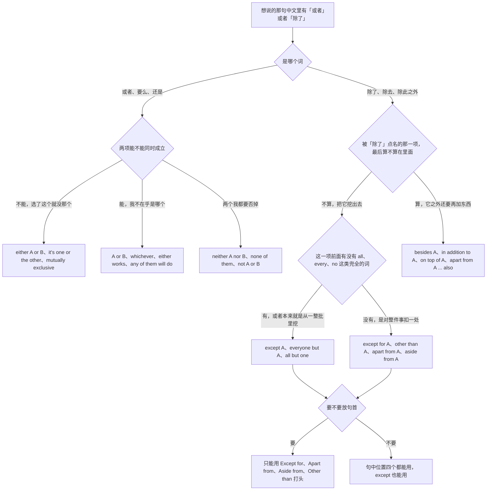
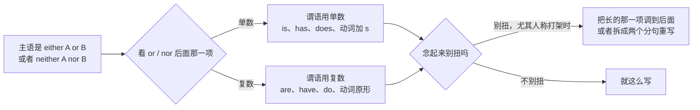
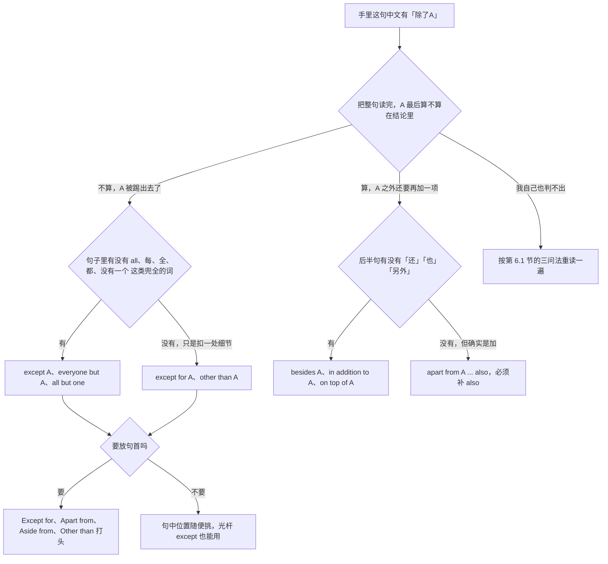

# 要么要么、除了、二选一：选择、排除与例外

> [!info] 本篇定位
>
> 这篇收「要么…要么」「或者」「两个都不」「不是A就是B」「随便哪个」「得选一个」「除了A都…」「除了A还有B」「撇开A不谈」「除了就没别的」「不含」「唯一的例外是」「不适用于」「除非另有约定」「如果有的话」「反正两种情况都」「以上皆非」「两个都要」「以先到者为准」「任选一项」「可多选」共四十三条查询意图，每条给口语、书面、正式三档成品。
>
> 与本分类另外两篇的分工：想说「而且」「不但…而且」「更进一步」这类**往上加码**的，查 [[06.并列、递进、列举与选择/01.而且、不仅而且、更进一步：递进与追加\|而且、不仅而且、更进一步]]；想说「第一第二最后」「包括以下」「按…顺序」这类**把平级项摆出来**的，查 [[06.并列、递进、列举与选择/02.第一第二最后、包括以下、按…顺序：列举与步骤\|第一第二最后、包括以下]]。这一篇只管**项与项互相冲突或者互相扣除**的情况：选了这个就没那个、有了这个就要挖掉那个。
>
> 读完能查到：either…or 作主语时谓语该单数还是复数、neither 后面为什么必须是 nor 而不是 or、「他不抽烟也不喝酒」为什么不能用 nor、except 为什么不能打头、except 和 except for 的分界线在哪、apart from 同一句话怎么会有两个相反的读法、other than 和 rather than 差在哪、all but 的两个意思怎么分、besides 和 beside 一字之差、in addition to 后面为什么不能接句子、if any 的两个逗号、either way 和 anyway 的语气差、Neither 三项以上为什么要换 none、「两个都不」为什么不能写成 both…not、以及表单里「单选」「多选」「以上皆非」的固定写法。
>
> 「否则、要不然」的完整清单在 [[04.条件与假设/03.含蓄条件与省略倒装：要不是、否则、那样的话\|含蓄条件与省略倒装]]，本篇只给 either…or 里那个带威胁语气的 or。「看情况、取决于」归 [[04.条件与假设/04.取决与看情况：视…而定、说不好得看\|取决与看情况]]。范围界定的完整说法归 [[08.指认、定义与描述/03.由…组成、分为、包括、属于：构成、分类与范围界定\|构成、分类与范围界定]]，本篇只给排除那一半。并列连词本身的构成规则不在这里，指回 [[02.英语基础语法/05.介词与连词/03.连词的分类与用法\|连词的分类与用法]]。

---

## 1. 本篇导读：中文的「或者」和「除了」各自是两件事

这一篇要处理的中文只有两个词：「或者」和「除了」。麻烦在于这两个词各自在英文里都分叉，而且分叉的依据不写在中文表面。

「或者」的分叉在**排他性**。中文说「要么周五上线，要么等下个版本」和「周五上线或者下周上线都行」用的是同一个「或者」，但前者是两条互相排斥的路，选了一条另一条就没了；后者是两个都能接受的选项，说话人不在乎是哪个。英文前者走 either…or、one or the other、mutually exclusive 这一支，后者走 or、whichever、either works 这一支。用错的后果不是语法错，是对方以为你在逼他做决定，或者相反，以为你没意见。

「除了」的分叉更凶：**一个中文词对着两个意思正好相反的英文出路**。「除了张三，都到了」是把张三挖出去，「除了张三，李四也到了」是把李四加进来。前者走 except、except for、other than、but，后者走 besides、in addition to、on top of。中间还夹着一个 apart from，两边都能读，全靠上下文和一个 also 消歧。中文母语者在这条上翻车的比例远高于虚拟语气，因为虚拟语气写错了对方读得出来是外语，「除了」写反了对方读出的是另一个事实。

### 1.1 两个中文词、十条英文出路的总表

| 中文说法 | 项与项的关系 | 走哪条出路 | 本篇节次 |
| --- | --- | --- | --- |
| 要么A要么B / 不是A就是B | 互斥，只能留一个 | either…or、one or the other | 第 2 节 |
| A 或者 B（都行） | 不互斥，无所谓哪个 | or、whichever、either works | 第 2 节 |
| 既不A也不B / 两个都不 | 两项一起否掉 | neither…nor、none | 第 2 节 |
| 要么A要么B（作主语，后面接谓语） | 动词形态跟着近的那项走 | 动词跟谁变的四种成品 | 第 3 节 |
| 除了A，其余都… | 把 A 从整体里挖出去 | except、except for、other than、but | 第 4 节 |
| 除了A，还有B | 把 B 加到 A 上 | besides、in addition to、on top of | 第 5 节 |
| 除了A（读者读不出是哪种） | 两义都通，要消歧 | apart from + also、换 except for | 第 6 节 |
| 不含 / 唯一的例外是 / 不适用于 | 正式文书里的排除 | excluding、with the exception of | 第 7 节 |
| 如果有的话 / 反正都 / 以上皆非 | 对选项本身表态 | if any、either way、none of the above | 第 8 节 |
| 单选 / 多选 / 以上皆是 | 表单与规范的封闭固定式 | select one、select all that apply | 第 9 节 |

### 1.2 从中文进的总选择树



树的第一层只分中文词，第二层才是本篇全部难点所在。「或者」那一支的判据是「两项能不能同时成立」——这是语义判断，中文表面没有标记，只能靠自己想清楚要不要逼对方二选一。「除了」那一支的判据是「被点名的那一项最后算不算在里面」，这个判断更机械：把整句话读完，问「张三到底到了没有」，答案是没到就走排除支，答案是到了走包含支。

第三层的兜全词是个可操作的形式判据：句子里有 all、every、everyone、everything、no、nobody、nothing 这类把范围兜死的词，就能直接用 except；没有这类词、只是对一件事扣一处细节，就得用 except for。这一层不需要理解语义，扫一眼有没有那几个词就够了。

### 1.3 三个先立起来的提醒

> [!warning] 「除了」写反等于把事实说反
>
> - ❌ ~~Except for Redis, we use Postgres.~~ ／ ✅ **Besides Redis, we also use Postgres.**（想说「除了 Redis 我们还用 Postgres」，写成 except for 变成「除 Redis 外我们用的是 Postgres」，Redis 被踢出去了）
> - ❌ ~~Besides the search endpoint, everything is cached.~~ ／ ✅ **Except for the search endpoint, everything is cached.**（想说「只有搜索接口没缓存」，写成 besides 变成「搜索接口之外，别的也都有缓存」，搜索接口反倒被算进有缓存的那一批）

> [!warning] neither 只管两项，nor 只跟在 neither 后面
>
> - ❌ ~~Neither the client or the server logs it.~~ ／ ✅ **Neither the client nor the server logs it.**（neither 的搭档是 nor，不是 or）
> - ❌ ~~Neither of the three options works.~~ ／ ✅ **None of the three options works.**（neither 天生只管两项，三项以上一律换 none）

> [!tip] 查法
>
> 先分中文词。是「或者」就去第 2 节挑句架，如果这个「或者」后面还要接谓语（「要么你要么他得留下来加班」），再去第 3 节核一遍谓语形态。是「除了」就先做一次判断：被点名那项最后算不算数？算就去第 5 节，不算就去第 4 节，自己也拿不准的直接去第 6 节看判读法。写正式文书去第 7 节，填表单和写规范去第 9 节。

---

## 2. 要么要么、两个都不：选言的七个入口

这一节的七条意图共用中文的「或者」「要么」「还是」。分档依据一半在语域，一半在**排他性**——两条路能不能同时走，决定了走 either…or 还是走光杆 or。

### 2.1 要么A要么B：摆两条互斥的路

中文触发语：要么…要么 / 或者…或者 / 二选一 / A 和 B 挑一个 / 走哪条路

| 档位 | 句架 | 例句 |
| --- | --- | --- |
| 口语 | Either A or B. | Either we merge it now or we wait for the next release. |
| 口语 | A, or B — take your pick. | We patch it tonight, or we roll back — take your pick. |
| 书面 | The 名词 is either A or B. | The token is either passed in the header or read from the config file. |
| 书面 | You can choose between A and B. | You can choose between the hosted plan and the self-managed build. |
| 正式 | The 主体 shall elect either to A or to B. | The client shall elect either to renew the licence or to migrate to the successor product. |

> [!warning] 错配警示
>
> - ❌ ~~We either need more time or more people.~~ ／ ✅ **We need either more time or more people.**（either 要紧挨着真正被二选一的那部分，放到动词前面就把「need」也拉进了选项里）
> - ❌ ~~Either you can call me or send an email.~~ ／ ✅ **You can either call me or send an email.** 或 **Either you can call me or you can send an email.**（either 后面是什么形态，or 后面就得是同样的形态）

- 同义入口：要么…要么 / 或者…或者 / 不是A就是B / 二选一 / A 和 B 挑一个
- 语法归属：[[02.英语基础语法/05.介词与连词/03.连词的分类与用法\|并列连词 either…or]]
- 场景实战：[[04.英语场景/05.高频实用表达句型框架/04.比较对比举例总结句型库\|列选项与取舍]]

### 2.2 或者、还是：光杆 or 的四种语气

中文触发语：或者 / 还是 / 也行 / 要不 / …都可以

| 档位 | 句架 | 例句 |
| --- | --- | --- |
| 口语 | A or B? | Coffee or tea? |
| 口语 | We could A, or we could B. | We could ship it Friday, or we could hold it for the demo. |
| 书面 | A or, alternatively, B. | You can pin the version or, alternatively, lock the whole dependency tree. |
| 书面 | It doesn't matter whether A or B. | It doesn't matter whether you use pnpm or yarn. |
| 正式 | A or, in the alternative, B. | The buyer may return the goods or, in the alternative, claim a partial refund. |

> [!warning] 错配警示
>
> - ❌ ~~You can pay by card or paying cash.~~ ／ ✅ **You can pay by card or in cash.**（or 两边的成分要同类，一边是介词短语另一边就不能换成动名词）
> - ❌ ~~I don't know he will come or not.~~ ／ ✅ **I don't know whether he will come or not.**（「A 还是 B」当宾语时前面要有 whether 领住，光靠 or 撑不起从句）

- 同义入口：或者 / 还是 / 要不 / 也行 / 都可以
- 语法归属：[[02.英语基础语法/09.从句体系/03.名词性从句详解\|whether 引导的宾语从句]]
- 场景实战：[[04.英语场景/06.日常生活场景实战/04.餐饮点餐外卖与聚餐场景\|点单时给选项]]

### 2.3 既不…也不：两项一起否掉

中文触发语：两个都不 / 既不…也不 / 都不是 / 一个也没有

| 档位 | 句架 | 例句 |
| --- | --- | --- |
| 口语 | Neither A nor B. | Neither the retry nor the timeout fixed it. |
| 口语 | A doesn't work, and B doesn't either. | The cache doesn't help, and the index doesn't either. |
| 书面 | Neither A nor B 谓语. | Neither the client nor the server logs the request id. |
| 书面 | 主语 is neither X nor Y. | The behaviour is neither documented nor tested. |
| 正式 | 主语 shall not A, nor shall it B. | The vendor shall not disclose the data, nor shall it retain any copy. |

> [!warning] 错配警示
>
> - ❌ ~~He doesn't smoke nor drink.~~ ／ ✅ **He doesn't smoke or drink.**（前面已经有 doesn't 把否定管到底了，第二项用 or；nor 只在前面没有否定词，或者要另起一个带主谓的否定分句时才上场）
> - ❌ ~~The behaviour is neither documented nor it is tested.~~ ／ ✅ **The behaviour is neither documented nor tested.**（neither 和 nor 后面挂的是同一层成分，一边是分词另一边就不能扩成完整分句）

- 同义入口：两个都不 / 既不…也不 / 都不是 / 一个也不 / 全都没有
- 语法归属：[[02.英语基础语法/10.特殊句型/06.主谓一致\|neither…nor 的谓语]]
- 场景实战：[[04.英语场景/05.高频实用表达句型框架/03.同意反对让步转折句型库\|两个方案都否掉]]

### 2.4 不是A就是B：只有两种可能

中文触发语：不是A就是B / 非此即彼 / 二者必居其一 / 只能是其中一个

| 档位 | 句架 | 例句 |
| --- | --- | --- |
| 口语 | It's either A or B. | It's either a network issue or a DNS issue. |
| 口语 | It's one or the other. | You can't have both — it's one or the other. |
| 书面 | It has to be A or B; there is no third case. | It has to be config drift or a stale build; there is no third case. |
| 书面 | A and B are mutually exclusive. | The two flags are mutually exclusive. |
| 正式 | The two conditions are mutually exclusive and collectively exhaustive. | The two categories are mutually exclusive and collectively exhaustive. |

> [!warning] 错配警示
>
> - ❌ ~~This is an either-or.~~ ／ ✅ **This is an either-or choice.** 或 **This is a false dichotomy.**（either-or 在这个位置一般作形容词，后面带上名词才站得稳；「其实不该二选一」用 false dichotomy）
> - ❌ ~~Both the two flags are mutually exclusive.~~ ／ ✅ **The two flags are mutually exclusive.**（mutually 已经含「彼此之间」，主语再加 both 是把同一个意思说了两遍）

- 同义入口：不是A就是B / 非此即彼 / 二者必居其一 / 只能有一个 / 互斥
- 语法归属：[[02.英语基础语法/03.代词与数词/04.不定代词详解\|either 与 one or the other]]
- 场景实战：[[04.英语场景/10.职场与商务场景实战/02.会议汇报与演示场景\|把方案摆成两条路]]

### 2.5 随便哪个都行：不表态的选择

中文触发语：随便哪个 / 哪个都行 / 你挑 / 无所谓选哪个 / 都可以

| 档位 | 句架 | 例句 |
| --- | --- | --- |
| 口语 | Either works. | Either works for me. |
| 口语 | Whichever you like. | Pick whichever you like. |
| 书面 | Whichever 名词 you choose, A. | Whichever option you choose, the data stays in the same region. |
| 书面 | Any of the 数词 will do. | Any of the three formats will do. |
| 正式 | The 主体 may adopt either approach at its discretion. | The licensee may adopt either approach at its discretion. |

> [!warning] 错配警示
>
> - ❌ ~~Either of them are fine.~~ ／ ✅ **Either of them is fine.**（either of 加复数名词作主语时，正式书面一律按单数处理，neither of 同理）
> - ❌ ~~Whichever you choose it, the data stays put.~~ ／ ✅ **Whichever you choose, the data stays put.**（whichever 本身就是 choose 的宾语，后面不再补 it）

- 同义入口：随便哪个 / 哪个都行 / 你挑 / 都可以 / 无所谓
- 语法归属：[[02.英语基础语法/03.代词与数词/04.不定代词详解\|either 与 any 的取舍]]
- 场景实战：[[04.英语场景/07.社交交际场景实战/01.交友聚会与闲聊场景\|把决定权让给对方]]

### 2.6 总得选一个：逼出决定

中文触发语：得选一个 / 只能挑一个 / 你得决定走哪条 / 总得取舍 / 两头都占不了

| 档位 | 句架 | 例句 |
| --- | --- | --- |
| 口语 | You've got to pick one. | You've got to pick one — we can't ship both. |
| 口语 | It's a trade-off between A and B. | It's a trade-off between speed and accuracy. |
| 书面 | We have to choose between A and B. | We have to choose between shipping on time and shipping complete. |
| 书面 | We can't have it both ways. | We can't have it both ways: either the schema is frozen or it isn't. |
| 正式 | A decision is required as to whether A or B. | A decision is required as to whether to renew or to retender. |

> [!warning] 错配警示
>
> - ❌ ~~We have to choose between speed to accuracy.~~ ／ ✅ **choose between speed and accuracy**（between 的搭档永远是 and，不是 to、不是 or）
> - ❌ ~~We have to choose among the two.~~ ／ ✅ **choose between the two**（两项用 between，三项以上才用 among）

- 同义入口：得选一个 / 只能挑一个 / 总得取舍 / 两头占不了 / 鱼与熊掌
- 语法归属：[[02.英语基础语法/05.介词与连词/02.常用介词搭配详解\|between 与 among]]
- 场景实战：[[04.英语场景/10.职场与商务场景实战/04.商务谈判合同与客户沟通\|谈判里的取舍]]

### 2.7 要么就…否则：带后果的选言

中文触发语：要么…要么就（后果） / 不然的话 / 否则 / 再不…就

| 档位 | 句架 | 例句 |
| --- | --- | --- |
| 口语 | Either A, or B. | Either we cut scope, or we slip the date. |
| 口语 | Do A, or else. | Get it reviewed today, or else it waits till Monday. |
| 书面 | A must B; otherwise C. | The token must be refreshed hourly; otherwise the session drops. |
| 书面 | Unless A, B. | Unless the tests pass, the pipeline blocks the merge. |
| 正式 | Failing that, A. | Payment is due on the first; failing that, interest accrues daily. |

> [!warning] 错配警示
>
> - ❌ ~~Either we cut scope, otherwise we slip the date.~~ ／ ✅ **Either we cut scope, or we slip the date.**（either 只配 or，otherwise 是独立的连接副词，不能顶替 or）
> - ❌ ~~Refresh the token, or else the session will drop, or else you have to log in again.~~ ／ ✅ 一句话里只留一个 or else，后果连着说就换 **and then**（or else 是分岔口，不是链条）

- 同义入口：要么就 / 不然的话 / 否则 / 再不…就 / 不这样的话
- 语法归属：[[02.英语基础语法/05.介词与连词/03.连词的分类与用法\|or 表结果的用法]]
- 场景实战：[[04.英语场景/05.高频实用表达句型框架/03.同意反对让步转折句型库\|下最后通牒]]

---

## 3. 「要么你要么他得留下来」：后面的动词跟谁变

上一节的句架一旦当主语用，就会撞上英文的一条硬形态规则：谓语跟着**离它最近**的那一项走，不是跟着两项加起来的数量走。中文完全没有这个机制，不管把谁排在后面，中文的动词都不变形，所以这一节的四条是纯形态记忆，与语义无关。



图里最后那一支是实战里最有用的一条：规则本身没有例外，但英文母语者遇到人称打架（you 和 I 撞在一起）时也觉得别扭，通用做法不是硬套规则，而是调换两项的顺序，或者干脆拆成两个分句。这个逃生口比背规则本身更值钱。

### 3.1 要么A要么B（作主语）：谓语跟最近的那项走

中文触发语：要么A要么B（后面接谓语） / A 或者 B 得… / 不是A就是B在…

| 档位 | 句架 | 例句 |
| --- | --- | --- |
| 口语 | Either A or B is 形容词.（B 为单数） | Either the headers or the cache is stale. |
| 口语 | Either A or B are 形容词.（B 为复数） | Either the cache or the headers are stale. |
| 书面 | Either A or B is doing sth. | Either the gateway or the auth service is dropping the header. |
| 书面 | Either A or B have to do sth. | Either the maintainer or the reviewers have to sign off. |
| 正式 | Either A or B shall be liable for sth. | Either the supplier or its subcontractors shall be liable for the delay. |

一眼对照表：

| or 后面那一项 | 谓语形态 | 成品 |
| --- | --- | --- |
| 单数 | 单数 | Either the tests or the build **is** failing. |
| 复数 | 复数 | Either the build or the tests **are** failing. |

> [!warning] 错配警示
>
> - ❌ ~~Either the reviewers or the maintainer have to sign off.~~ ／ ✅ **Either the reviewers or the maintainer has to sign off.**（谓语只看紧挨着它的 the maintainer，前面是复数也不算数）
> - ❌ ~~Either of the branches are ready.~~ ／ ✅ **Either of the branches is ready.**（either of 结构里作主语的是 either 本身，永远单数）

- 同义入口：要么A要么B（作主语） / A 或 B 有一个要 / 不是A就是B在
- 语法归属：[[02.英语基础语法/10.特殊句型/06.主谓一致\|就近一致原则]]

### 3.2 既不A也不B（作主语）：nor 后面那项说了算

中文触发语：A 和 B 都不… / 既不…也不…（后面接谓语） / 两边都没有

| 档位 | 句架 | 例句 |
| --- | --- | --- |
| 口语 | Neither A nor B 单数谓语. | Neither the linter nor the type checker catches this. |
| 口语 | Neither A nor B 复数谓语. | Neither the type checker nor the linters catch this. |
| 书面 | Neither A nor B have done sth.（B 为复数） | Neither the vendor nor the integrators have signed the DPA. |
| 书面 | Neither A nor B is entitled to sth. | Neither the free tier nor the trial account is entitled to support. |
| 正式 | Neither A nor B shall be deemed to have done sth. | Neither party nor its affiliates shall be deemed to have waived any right. |

> [!warning] 错配警示
>
> - ❌ ~~Neither the linters nor the type checker catch this.~~ ／ ✅ **Neither the linters nor the type checker catches this.**（nor 后面是单数，谓语就加 s，前面那串复数不参与）
> - ❌ ~~Neither of the two approaches are viable.~~ ／ ✅ **Neither of the two approaches is viable.**（口语里能听到 are，但正式书面按单数写）

- 同义入口：两个都不…（作主语） / 既不也不 / 谁都没有 / 都不符合
- 语法归属：[[02.英语基础语法/10.特殊句型/06.主谓一致\|neither…nor 的一致]]

### 3.3 你我他撞在一起：人称跟着近的走

中文触发语：要么你要么我 / 不是我就是他 / 你俩总有一个

| 档位 | 句架 | 例句 |
| --- | --- | --- |
| 口语 | Either you're A, or I am. | Either you're reading the wrong log, or I am. |
| 口语 | It's either me or him. | Somebody broke the build — it's either me or him. |
| 书面 | Either A or I am 形容词. | Either the spec or I am out of date. |
| 书面 | Neither you nor she was 形容词. | Neither you nor she was on the invite. |
| 正式 | Neither the client nor we are able to do sth. | Neither the client nor we are able to reproduce the fault. |

> [!warning] 错配警示
>
> - ❌ ~~Either you or I is wrong.~~ ／ ✅ **Either you or I am wrong.**（be 动词也跟最近的走，I 在后面就用 am）／ 更自然的写法是拆开：**Either you're wrong, or I am.**
> - ❌ ~~It's either I or him.~~ ／ ✅ **It's either me or him.**（系动词后面用宾格，这是口语的定式，改成主格反而不成句）

- 同义入口：要么你要么我 / 不是我就是他 / 你俩总有一个 / 咱俩有一个错了
- 语法归属：[[02.英语基础语法/03.代词与数词/01.人称代词与物主代词\|主格与宾格的位置]]

### 3.4 他也不、我也没有：nor 单用时这半句怎么起头

中文触发语：他也不 / 我也没有 / 而且也不 / 也没见得

| 档位 | 句架 | 例句 |
| --- | --- | --- |
| 口语 | Me neither. | "I don't get it." "Me neither." |
| 口语 | Neither + 助动词 + I. | "I can't reproduce it." "Neither can I." |
| 书面 | A does not X, nor does it Y. | The report does not mention the outage, nor does it list the affected accounts. |
| 书面 | Nor is this the first time. | Nobody flagged it in review. Nor is this the first time. |
| 正式 | Nor shall A do B. | The licensee shall not reverse-engineer the software, nor shall it sublicense its rights under this agreement. |

> [!warning] 错配警示
>
> - ❌ ~~Neither I do.~~ ／ ✅ **Neither do I.**（neither、nor 一提到句首，助动词就得跟着提到主语前面，整套形态查页脚那一篇）
> - ❌ ~~..., nor it lists the affected accounts.~~ ／ ✅ **..., nor does it list the affected accounts.**（nor 起头的分句一律把助动词提到主语前面，不能按正常语序写）

- 同义入口：他也不 / 我也没有 / 也不 / 而且也没
- 语法归属：[[02.英语基础语法/10.特殊句型/03.倒装句结构\|否定词提前的倒装]]
- 场景实战：[[04.英语场景/02.基础句型框架/04.倒装句、强调句与省略句\|倒装的口语成品]]

---

## 4. 除了A，其余都…：排除义的七个入口

从这一节开始进入本篇的主体。这七条意图的共同点是：被「除了」点名的那一项，**最后不算在结论里**。张三没到、搜索接口没缓存、那一行没跑通。选词的分歧点只有两个——前面有没有兜全的词，以及要不要放句首。

顺带先钉死一个容易被卷进来的词：`but for` 不是这一节的 but。`Everyone but Mark signed off.` 是「除了 Mark，其他人都签了」；`But for Mark, the release would have slipped.` 是「要不是 Mark，这版就延期了」。前者是排除，后者是条件，完整清单在 [[04.条件与假设/03.含蓄条件与省略倒装：要不是、否则、那样的话\|含蓄条件与省略倒装]]。

### 4.1 除了A都…：从一整批里挖掉一项

中文触发语：除了A都 / 除A之外全都 / 就A不 / 只有A没有 / 唯独A

| 档位 | 句架 | 例句 |
| --- | --- | --- |
| 口语 | Everything 谓语 except A. | Everything passes except the integration suite. |
| 口语 | All the 名词 are X except A. | All the endpoints are cached except the search one. |
| 书面 | Every A does B except C, which D. | Every service reports metrics except the scheduler, which was never instrumented. |
| 书面 | No one has A except B. | No one has write access except the release bot. |
| 正式 | The rule applies in every case except where A. | The rule applies in every case except where an override is recorded. |

> [!warning] 错配警示
>
> - ❌ ~~Except the scheduler, every service reports metrics.~~ ／ ✅ **Except for the scheduler, every service reports metrics.**（光杆 except 不能打头，句首位置要换成 except for）
> - ❌ ~~Some services report metrics except the scheduler.~~ ／ ✅ **Most services report metrics; the scheduler doesn't.**（except 要求前面有 all、every、no、everything 这类把范围兜死的词，前面是 some 就没有整批可挖）

- 同义入口：除了A都 / 除A之外全都 / 就A不 / 唯独A / 只有A没有
- 语法归属：[[02.英语基础语法/05.介词与连词/02.常用介词搭配详解\|except 与 except for]]
- 场景实战：[[04.英语场景/05.高频实用表达句型框架/04.比较对比举例总结句型库\|列范围与例外]]

### 4.2 除了A以外都挺好：对整件事扣掉一处

中文触发语：除了A以外 / 要说有问题就是A / 不算A的话 / 单看A不行

| 档位 | 句架 | 例句 |
| --- | --- | --- |
| 口语 | Except for A, B. | Except for the font size, the page looks fine. |
| 口语 | Other than A, B. | Other than a stray debug log, the diff is clean. |
| 书面 | B, except for A. | The migration ran cleanly, except for two rows that failed the constraint. |
| 书面 | Except for A, everything else B. | Except for billing, everything else is behind the feature flag. |
| 正式 | Save for A, B. | Save for a minor typographical error, the draft is ready for signature. |

> [!warning] 错配警示
>
> - ❌ ~~Except of the font size, the page looks fine.~~ ／ ✅ **Except for the font size, the page looks fine.**（英文没有 except of 这个搭配，只有 except for 和光杆 except 两种）
> - ❌ ~~Except for the tests fail, everything is fine.~~ ／ ✅ **Except that the tests fail, everything is fine.**（后面跟完整句子要换 except that，except for 后面只能跟名词性成分）

- 同义入口：除了A以外 / 要说有问题就是 / 不算A的话 / 撇开A / 就A这一点
- 语法归属：[[02.英语基础语法/05.介词与连词/04.介词与连词的易混点\|except for 与 except that]]
- 场景实战：[[04.英语场景/10.职场与商务场景实战/02.会议汇报与演示场景\|汇报时保留一处例外]]

### 4.3 撇开A不谈：把一项先放到一边

中文触发语：撇开A不谈 / 抛开A / 先不算A / A 先放一边 / 除A之外

| 档位 | 句架 | 例句 |
| --- | --- | --- |
| 口语 | Apart from A, B. | Apart from the price, it's the right tool for us. |
| 口语 | Aside from A, B. | Aside from Tuesday, I'm free all week. |
| 书面 | Apart from A, there is little B. | Apart from the release notes, there is little documentation. |
| 正式 | Leaving aside A, B. | Leaving aside the licensing question, the architecture is sound. |
| 正式 | Setting A to one side, B. | Setting cost to one side, the migration is technically straightforward. |

> [!warning] 错配警示
>
> - ❌ ~~Apart of the price, it's the right tool.~~ ／ ✅ **Apart from the price, it's the right tool.**（apart 的搭档只有 from；a part of 是「…的一部分」，那是另一个词组）
> - ❌ ~~Apart from Redis, we use Postgres.~~（这句排除义和包含义都读得通，读者猜不出 Redis 到底算不算）／ ✅ 要排除义写 **Except for Redis, everything runs on Postgres.**；要包含义写 **Apart from Redis, we also use Postgres.**

- 同义入口：撇开A不谈 / 抛开A / 先不算A / A 先放一边 / 除A之外
- 语法归属：[[02.英语基础语法/05.介词与连词/02.常用介词搭配详解\|apart from 的两个读法]]

### 4.4 除A以外的：other than 的三个位置

中文触发语：除了A以外的 / A 之外别的 / 除此之外 / 除A都不行

| 档位 | 句架 | 例句 |
| --- | --- | --- |
| 口语 | Other than that, B. | Other than that, we're good to go. |
| 口语 | anything other than A | I'd take anything other than another status meeting. |
| 书面 | anyone other than A | No one other than the on-call engineer can approve a hotfix. |
| 书面 | for reasons other than A | The job can fail for reasons other than a timeout. |
| 正式 | otherwise than in accordance with A | The data shall not be processed otherwise than in accordance with this agreement. |

> [!warning] 错配警示
>
> - ❌ ~~We picked Redis other than Memcached.~~ ／ ✅ **We picked Redis rather than Memcached.**（other than 是「除…以外」，rather than 才是「而不是」，这两个换位后事实正好相反）
> - ❌ ~~I have read other than the summary.~~ ／ ✅ **I have read nothing other than the summary.**（other than 要挂在 any、no、nothing、anyone 这类词或者否定、疑问语境上，光杆肯定句撑不住它）

- 同义入口：除了A以外的 / A 之外别的 / 除此之外 / 除A都不行 / 非A的
- 语法归属：[[02.英语基础语法/03.代词与数词/04.不定代词详解\|any 与 no 系列的搭配]]

### 4.5 除了A就没别的了：but、nothing but、all but

中文触发语：除了A没有别的 / 只有A / 净是A / 一点也不A / 就差一个

| 档位 | 句架 | 例句 |
| --- | --- | --- |
| 口语 | nothing but A | The log is nothing but timeouts. |
| 口语 | everyone but A | Everyone but Mark has signed off. |
| 书面 | all but one of A | All but one of the shards recovered on their own. |
| 书面 | anything but A | The rollout was anything but smooth. |
| 正式 | none but A | None but the account owner may reset the signing key. |

> [!warning] 错配警示
>
> - ❌ 把 anything but 读成「除了A什么都行」：`The rollout was anything but smooth.` 的意思是**一点都不顺**，不是「除了顺利什么样都行」／ ✅ 想说「怎样都行，就是别A」写 **anything except A**
> - all but 有两个意思，看后面接什么：接名词是「除了」——`All but one recovered.`（除一个之外全恢复了）；接形容词或分词是「几乎」——`The project is all but dead.`（这项目基本上死了）

- 同义入口：除了A没有别的 / 只有A / 净是A / 一点也不A / 全都…就差A
- 语法归属：[[02.英语基础语法/05.介词与连词/01.介词的分类与基本用法\|but 作介词]]

### 4.6 只不过、除了…的时候：跟句子的排除

中文触发语：只不过 / 唯一的问题是 / 除了…的时候 / 除…情形外

| 档位 | 句架 | 例句 |
| --- | --- | --- |
| 口语 | A, except that B. | It works, except that it drops the last frame. |
| 口语 | A, except when B. | The cron runs nightly, except when the host is patching. |
| 书面 | A, except where B. | Access is read-only, except where an admin grant is present. |
| 书面 | A, except in the case of B. | Refunds are automatic, except in the case of partial shipments. |
| 正式 | Except as otherwise provided in A, B. | Except as otherwise provided in Section 8, notices shall be given in writing. |

> [!warning] 错配警示
>
> - ❌ ~~The cron runs nightly, except if the host is patching.~~ ／ ✅ **except when the host is patching** 或 **unless the host is patching**（except if 是从中文「除了…的时候」拼出来的，英文这个位置要么 except when 要么直接 unless）
> - ❌ ~~It works, except that dropping the last frame.~~ ／ ✅ **It works, except that it drops the last frame.**（except that 后面必须是有主有谓的完整句子，接动名词就得换回 except for）

- 同义入口：只不过 / 唯一的问题是 / 除了…的时候 / 除…情形外 / 除非碰上
- 语法归属：[[02.英语基础语法/09.从句体系/04.状语从句详解\|除外与条件的分工]]
- 场景实战：[[04.英语场景/10.职场与商务场景实战/04.商务谈判合同与客户沟通\|合同里的除外条款]]

### 4.7 排除掉、不考虑它：把候选项划出去

中文触发语：排除掉 / 可以不考虑 / 划掉 / 先不算它 / 缩到只剩

| 档位 | 句架 | 例句 |
| --- | --- | --- |
| 口语 | We can rule out A. | We can rule out DNS — the resolver logs are clean. |
| 口语 | A is off the table. | A full rewrite is off the table this quarter. |
| 书面 | That narrows it down to A. | That narrows it down to two candidates. |
| 书面 | A eliminates B as a cause. | The clean retry run eliminates transient failure as a cause. |
| 正式 | Nothing in A precludes B. | Nothing in this clause precludes a claim in negligence. |

> [!warning] 错配警示
>
> - ❌ ~~We can rule out it is DNS.~~ ／ ✅ **We can rule out DNS.** 或 **We can rule out the possibility that it's DNS.**（rule out 后面接名词，要接句子必须先垫一个 the possibility that）
> - ❌ ~~They haven't ruled out to roll it back.~~ ／ ✅ **They haven't ruled out rolling it back.**（rule out 后面的动词一律用动名词形态）

- 同义入口：排除掉 / 不考虑 / 划掉 / 缩小到 / 不在候选里了
- 语法归属：[[02.英语基础语法/08.非谓语动词/02.动名词详解\|短语动词后接动名词]]

---

## 5. 除了A，还有B：包含义的五个入口

这一节和上一节的中文入口几乎一模一样，产出却完全相反：被点名的那一项**留在结论里**，句子做的事是往上再加一项。中文只有一个「除了」，唯一能提示读者走哪一支的是句子后半有没有「还」「也」「另外」这类词——而这个提示在英文里必须换成不同的介词。

### 5.1 除了A还有B：往上再加一项

中文触发语：除了A还有B / 除A以外还 / 不光A / A 之外另有 / 加上A

| 档位 | 句架 | 例句 |
| --- | --- | --- |
| 口语 | Besides A, B. | Besides Redis, we run a Postgres read replica. |
| 口语 | On top of A, B. | On top of the migration, there's the index rebuild to schedule. |
| 书面 | Besides A, there is also B. | Besides the licence cost, there is also the support contract to budget for. |
| 书面 | A, and besides that, B. | The API is slower, and besides that, it drops the trace id. |
| 正式 | In addition to A, B. | In addition to the annual fee, the client shall bear all transfer charges. |

> [!warning] 错配警示
>
> - ❌ ~~Beside the licence cost, there is the support contract.~~ ／ ✅ **Besides the licence cost, ...**（beside 是表位置的介词「在…旁边」，少一个 s 就从「除了」变成「挨着」）
> - ❌ ~~Besides of the fee, there's the setup charge.~~ ／ ✅ **Besides the fee, there's the setup charge.**（besides 本身就是介词，后面不再补 of）

- 同义入口：除了A还有B / 除A以外还 / 不光A / 另有 / 加上
- 语法归属：[[02.英语基础语法/05.介词与连词/04.介词与连词的易混点\|beside 与 besides]]
- 场景实战：[[04.英语场景/05.高频实用表达句型框架/04.比较对比举例总结句型库\|补充一项]]

### 5.2 除此之外还要：把新项挂到旧项上

中文触发语：除此之外还 / 另外还 / 加上 / 还要算上 / 还得加一条

| 档位 | 句架 | 例句 |
| --- | --- | --- |
| 口语 | Plus, A. | Plus, we still owe them the postmortem. |
| 口语 | And there's also A. | And there's also the legal review to get through. |
| 书面 | In addition to A, B. | In addition to the unit tests, the PR adds two end-to-end cases. |
| 书面 | Along with A, B. | Along with the schema change, the release ships a backfill job. |
| 正式 | Further to A, B. | Further to the points raised above, the committee notes two procedural issues. |

> [!warning] 错配警示
>
> - ❌ ~~In addition to he reviewed the PR, he wrote the docs.~~ ／ ✅ **In addition to reviewing the PR, he wrote the docs.**（in addition to 是介词短语，后面接名词或动名词；要接完整句子就砍掉 to，改用 In addition, / Additionally,）
> - ❌ ~~In addition of the fee, there is a setup charge.~~ ／ ✅ **In addition to the fee, ...**（这个固定式的介词是 to，不是 of）

- 同义入口：除此之外还 / 另外 / 加上 / 还要算上 / 再加一条
- 语法归属：[[02.英语基础语法/08.非谓语动词/02.动名词详解\|介词 to 后接动名词]]
- 场景实战：[[04.英语场景/10.职场与商务场景实战/03.商务邮件与正式书面沟通\|邮件里追加事项]]

### 5.3 不光…还：把两项一起算进来

中文触发语：不光A还B / 不止A / 不仅仅是A / A 和 B 都要

| 档位 | 句架 | 例句 |
| --- | --- | --- |
| 口语 | not just A, B | It's not just slow, it's wrong. |
| 口语 | A as well as B | We need the logs as well as the metrics. |
| 书面 | As well as doing A, B. | As well as adding the index, the patch rewrites the query. |
| 书面 | over and above A | The retention bonus is over and above the base salary. |
| 正式 | in addition to, and not in substitution for, A | These remedies are in addition to, and not in substitution for, any other remedy available at law. |

> [!warning] 错配警示
>
> - ❌ ~~The lead as well as the reviewers are on leave.~~ ／ ✅ **The lead as well as the reviewers is on leave.**（as well as 领的那一串不进主语，谓语只跟 the lead 走；觉得别扭就改写成 The lead is on leave, and so are the reviewers.）
> - ❌ ~~As well as add the index, the patch rewrites the query.~~ ／ ✅ **As well as adding the index, ...**（as well as 后面跟动词一律用动名词）

- 同义入口：不光A还B / 不止A / 不仅仅是A / 两样都要
- 语法归属：[[02.英语基础语法/10.特殊句型/06.主谓一致\|as well as 不影响谓语]]
- 场景实战：[[06.并列、递进、列举与选择/01.而且、不仅而且、更进一步：递进与追加\|递进与追加的完整梯度]]

### 5.4 除了A之外也：apart from 的包含读法

中文触发语：除了A还 / A 之外也 / 不止A / A 不说，还有

| 档位 | 句架 | 例句 |
| --- | --- | --- |
| 口语 | Apart from A, we also B. | Apart from the API, we also expose a CLI. |
| 口语 | Aside from A, there's also B. | Aside from the cost, there's also the lock-in to think about. |
| 书面 | Quite apart from A, B. | Quite apart from the cost, the vendor has no EU presence. |
| 书面 | Over and above A, there is B. | Over and above the licence, there is a per-seat charge. |
| 正式 | Without prejudice to A, B. | Without prejudice to Clause 6, the supplier may suspend the service. |

> [!warning] 错配警示
>
> - ❌ ~~Apart from Redis, we use Postgres.~~（两义都通，读者读不出 Redis 算不算）／ ✅ 包含义补一个 also：**Apart from Redis, we also use Postgres.**（这个 also 是唯一的消歧信号，不能省）
> - ❌ ~~Without prejudice of Clause 6~~ ／ ✅ **Without prejudice to Clause 6**（固定式的介词是 to）

- 同义入口：除了A还 / A 之外也 / 不止A / A 不说还有
- 语法归属：[[02.英语基础语法/05.介词与连词/02.常用介词搭配详解\|apart from 的两个读法]]

### 5.5 反正、再说：besides 当副词的第三义

中文触发语：反正 / 再说 / 何况 / 更何况 / 反正也没人

| 档位 | 句架 | 例句 |
| --- | --- | --- |
| 口语 | Besides, A. | We shouldn't ship on a Friday. Besides, nobody reads the changelog. |
| 口语 | Anyway, A. | Anyway, the customer never enabled that flag. |
| 书面 | What's more, A. | The query is slow. What's more, it locks the table. |
| 书面 | Moreover, A. | The estimate is optimistic. Moreover, it ignores the review cycle. |
| 正式 | Furthermore, A. | Furthermore, the vendor has not provided the audit report. |

> [!warning] 错配警示
>
> - ❌ ~~Besides nobody reads the changelog.~~ ／ ✅ **Besides, nobody reads the changelog.**（副词义的 besides 后面必须有逗号；不加逗号读者会把它当介词，去找它的宾语）
> - ❌ ~~Besides, the licence cost, there is the support contract.~~ ／ ✅ **Besides the licence cost, there is the support contract.**（介词义的 besides 后面反过来不能有逗号，一个逗号就换了词性）

- 同义入口：反正 / 再说 / 何况 / 更何况 / 而且
- 语法归属：[[02.英语基础语法/04.形容词与副词/03.副词的分类与用法\|连接副词的标点]]
- 场景实战：[[06.并列、递进、列举与选择/01.而且、不仅而且、更进一步：递进与追加\|口语追加的语域梯度]]

---

## 6. 排除还是包含：一句中文两条路的判读

前两节各自成立，问题出在读者手里只有一句中文，判不出该去哪一节。这一节给三条可操作的判据，都不需要理解语义，看形式就能定。



图里唯一需要判语义的是第一层那一问，其余全是形式判断。第一层判不出来的时候不要硬猜，第 6.1 节的三问法能把它转成形式判断。第二层的兜全词是形式判据，第三层的位置也是形式判据——这两层不会出错。

### 6.1 判不出走哪支：三问法

中文触发语：除了A…（自己拿不准是排除还是包含）

三个问题按顺序问，答完就定了：

| 问题 | 答案 | 结论 |
| --- | --- | --- |
| 把 A 从名单里划掉，句子还成立吗 | 成立 | 排除义，走第 4 节 |
| 把 A 从名单里划掉，句子还成立吗 | 不成立，A 也得算上 | 包含义，走第 5 节 |
| 句子里有没有「都」「全」「没有一个」 | 有 | 用 except，句首换 except for |
| 句子里有没有「都」「全」「没有一个」 | 没有 | 用 except for 或 other than |
| 后半句有没有「还」「也」「另外」 | 有 | 用 besides 或 in addition to |

三档成品对照，同一个中文骨架「除了搜索接口，…」两条路各写一遍：

| 意思 | 句架 | 例句 |
| --- | --- | --- |
| 排除（搜索接口没缓存） | Except for A, everything B. | Except for the search endpoint, everything is cached. |
| 包含（搜索接口也在这批里） | Besides A, B is also C. | Besides the search endpoint, the feed endpoint is cached too. |

> [!warning] 错配警示
>
> - ❌ 靠语感在 except for 和 besides 之间二选一：这两个词在中文里对着同一个「除了」，语感给不出答案，只能靠三问法
> - ❌ ~~Except for Mark, everyone else also signed off.~~ ／ ✅ **Except for Mark, everyone signed off.**（排除义句子里不能出现 also，一个 also 就把句子拽向包含义，读者会读出矛盾）

- 同义入口：除了A（拿不准哪一支） / 除A之外 / 除去A
- 语法归属：[[02.英语基础语法/05.介词与连词/04.介词与连词的易混点\|except 系列与 besides 系列]]

### 6.2 「除了」放句首：哪些词能打头

中文触发语：除了A，…（「除了」在句子最前面）

| 档位 | 句架 | 例句 |
| --- | --- | --- |
| 口语 | Except for A, B. | Except for the flaky test, the suite is green. |
| 口语 | Other than A, B. | Other than the migration, nothing changed this release. |
| 书面 | Apart from A, B. | Apart from two edge cases, the parser handles the whole grammar. |
| 书面 | Aside from A, B. | Aside from the cost, the plan is workable. |
| 正式 | With the exception of A, B. | With the exception of ap-south-1, all regions are live. |

一眼对照表：

| 词 | 能不能打头 | 打头时的意思 |
| --- | --- | --- |
| except | 不能 | —— |
| except for | 能 | 排除 |
| other than | 能 | 排除 |
| apart from / aside from | 能 | 两义都可，靠 also 消歧 |
| besides | 能 | 包含 |
| but | 不能 | —— |

> [!warning] 错配警示
>
> - ❌ ~~Except the flaky test, the suite is green.~~ ／ ✅ **Except for the flaky test, the suite is green.**（光杆 except 只能待在句中，句首必须补 for）
> - ❌ ~~But Mark, everyone signed off.~~ ／ ✅ **Everyone but Mark signed off.**（介词义的 but 只能贴在被排除项前面，不能提到句首；提到句首的 But 会被读成转折连词）

- 同义入口：除了A，…（句首） / 除A之外 / 撇开A / 不算A的话
- 语法归属：[[02.英语基础语法/05.介词与连词/01.介词的分类与基本用法\|介词短语作状语的位置]]

### 6.3 除了…（后面跟一整句话）：接口形态

中文触发语：除了A怎么样这一点 / 除了它…之外 / 只是A而已

| 档位 | 句架 | 例句 |
| --- | --- | --- |
| 口语 | A, except (that) B. | The dashboard is fine, except it double-counts retries. |
| 口语 | ..., apart from the fact that B. | It's a solid library, apart from the fact that it bundles its own logger. |
| 书面 | Except that A, B. | Except that the endpoint is rate-limited, the integration is straightforward. |
| 书面 | Other than the fact that A, B. | Other than the fact that it ships no types, the package is fine. |
| 正式 | Save that A, B. | Save that the notice period is extended to 60 days, the terms are unchanged. |

> [!warning] 错配警示
>
> - ❌ ~~Except for it double-counts retries, the dashboard is fine.~~ ／ ✅ **Except that it double-counts retries, ...**（后面跟主谓齐全的句子，for 要换成 that）
> - ❌ ~~Apart from that it bundles its own logger~~ ／ ✅ **apart from the fact that it bundles its own logger**（apart from、other than 后面要接句子，必须垫一个 the fact）

- 同义入口：除了A这一点 / 只是A而已 / 唯一的毛病是 / 就这一条不好
- 语法归属：[[02.英语基础语法/09.从句体系/03.名词性从句详解\|the fact that 同位语从句]]

### 6.4 不管有没有A：把排除和包含都躲开

中文触发语：不管有没有A / 有A没A都 / A 与否 / 算不算A都一样

| 档位 | 句架 | 例句 |
| --- | --- | --- |
| 口语 | With or without A, B. | With or without the cache, the query is slow. |
| 口语 | A or no A, B. | Deadline or no deadline, we're not shipping this. |
| 书面 | Whether or not A, B. | Whether or not the flag is set, the audit log is written. |
| 书面 | Regardless of A, B. | Regardless of the tier, every account gets the security patch. |
| 正式 | Irrespective of A, B. | Irrespective of the cause, the supplier shall notify the client within 24 hours. |

> [!warning] 错配警示
>
> - ❌ ~~Irregardless of the tier~~ ／ ✅ **Regardless of the tier** 或 **Irrespective of the tier**（irregardless 是把两个词拼错拼出来的，正式文书里出现会被当成硬伤）
> - ❌ ~~Regardless the tier, every account gets it.~~ ／ ✅ **Regardless of the tier, ...**（regardless 后面必须带 of，光杆的 regardless 只能单独放句尾：It's expensive, but we're doing it regardless.）

- 同义入口：不管有没有A / 有A没A都 / A 与否 / 无论A / 不论
- 语法归属：[[02.英语基础语法/05.介词与连词/02.常用介词搭配详解\|regardless of 与 irrespective of]]
- 场景实战：[[04.英语场景/05.高频实用表达句型框架/03.同意反对让步转折句型库\|排除干扰项]]

---

## 7. 不含、唯一例外、不适用于：正式文书里的排除

这一节的五条全部是封闭固定式：词序、冠词、介词都是定死的，改一个字就露怯。它们的共同用途是把一个范围划出去，出现在报价单、合同、SLA、规范文档里。

### 7.1 不含、不计：把一项从数字里扣掉

中文触发语：不含 / 不包括 / 不计 / 除去 / 未含

| 档位 | 句架 | 例句 |
| --- | --- | --- |
| 口语 | That's A, not including B. | That's forty hours, not including review. |
| 口语 | A not included | Shipping not included. |
| 书面 | A, excluding B | The estimate is £4,000, excluding VAT. |
| 书面 | A, net of B | The figure is net of refunds and chargebacks. |
| 正式 | A are exclusive of B. | All fees are exclusive of applicable taxes. |

> [!warning] 错配警示
>
> - ❌ ~~The price is exclusive VAT.~~ ／ ✅ **The price is exclusive of VAT.**（形容词 exclusive 后面必须带 of）
> - ❌ ~~excluding of weekends~~ ／ ✅ **excluding weekends**（excluding 本身就是介词，反过来不能加 of；只有 exclusive 那个形容词形态才要 of）

- 同义入口：不含 / 不包括 / 不计 / 除去 / 未含在内
- 语法归属：[[02.英语基础语法/05.介词与连词/01.介词的分类与基本用法\|分词介词 excluding]]
- 场景实战：[[04.英语场景/10.职场与商务场景实战/04.商务谈判合同与客户沟通\|报价里的不含项]]

### 7.2 除…以外：正式档的排除固定式

中文触发语：除…以外 / …除外 / 唯…例外 / 除去…不计

| 档位 | 句架 | 例句 |
| --- | --- | --- |
| 口语 | except for A | Everything's deployed except for the worker. |
| 书面 | with the exception of A | All regions are live, with the exception of ap-south-1. |
| 书面 | A aside, B | Cost aside, the plan is workable. |
| 正式 | with the exception that A | The terms are unchanged, with the exception that the notice period is now 60 days. |
| 正式 | Save as provided in A, B. | Save as provided in Clause 9, no warranty of any kind is given. |

> [!warning] 错配警示
>
> - ❌ ~~with exception of ap-south-1~~ ／ ✅ **with the exception of ap-south-1**（定冠词是这个固定式的一部分，省掉就不是这个词组了）
> - ❌ ~~with the exception of the notice period is now 60 days~~ ／ ✅ **with the exception that the notice period is now 60 days**（后接完整句子，of 换 that）

- 同义入口：除…以外 / …除外 / 唯…例外 / 除去不计
- 语法归属：[[02.英语基础语法/02.名词与冠词/03.冠词的用法详解\|固定式里的定冠词]]
- 场景实战：[[04.英语场景/10.职场与商务场景实战/03.商务邮件与正式书面沟通\|正式函件里的除外]]

### 7.3 唯一的例外是：把例外单独拎出来

中文触发语：唯一的例外是 / 只有一个例外 / 这是特例 / 无一例外

| 档位 | 句架 | 例句 |
| --- | --- | --- |
| 口语 | The only exception is A. | The only exception is the legacy endpoint. |
| 口语 | A is the one exception. | Every job retries; the export is the one exception. |
| 书面 | B, with one exception: A. | Every job is idempotent, with one exception: the billing export. |
| 书面 | A is an exception to B. | This route is an exception to the global rate limit. |
| 正式 | A constitutes the sole exception to B. | Clause 11 constitutes the sole exception to the confidentiality obligation. |

> [!warning] 错配警示
>
> - ❌ ~~an exception of the rate limit~~ ／ ✅ **an exception to the rate limit**（exception 的搭档介词是 to；exception of 只在 with the exception of 那个整体固定式里出现）
> - ❌ ~~Every request is logged, without exceptions.~~ ／ ✅ **without exception**（这个短语固定用单数，加 s 就不是固定式了）

- 同义入口：唯一的例外是 / 只有一个例外 / 这是特例 / 无一例外 / 有个特殊情况
- 语法归属：[[02.英语基础语法/05.介词与连词/02.常用介词搭配详解\|exception to 与 without exception]]

### 7.4 不适用于：把适用范围划出去

中文触发语：不适用于 / 不涵盖 / 不在范围内 / 对A无效 / 管不到A

| 档位 | 句架 | 例句 |
| --- | --- | --- |
| 口语 | That doesn't apply to A. | That doesn't apply to self-hosted setups. |
| 书面 | A does not apply to B. | The discount does not apply to renewals. |
| 书面 | A falls outside the scope of B. | Hardware faults fall outside the scope of this SLA. |
| 正式 | A shall not extend to B. | The indemnity shall not extend to consequential loss. |
| 正式 | Nothing in A shall affect B. | Nothing in this clause shall affect the parties' statutory rights. |

> [!warning] 错配警示
>
> - ❌ ~~The discount is not applied for renewals.~~ ／ ✅ **The discount does not apply to renewals.**（apply to 是「适用于」，apply for 是「申请」，两个搭配意思毫不相干）
> - ❌ ~~Hardware faults are out of the scope of this SLA.~~ ／ ✅ **fall outside the scope of this SLA** 或 **are out of scope for this SLA**（两种写法各自成立，混起来写成 out of the scope of 就不对了）

- 同义入口：不适用于 / 不涵盖 / 不在范围内 / 对A无效 / 不归它管
- 语法归属：[[02.英语基础语法/05.介词与连词/02.常用介词搭配详解\|apply to 与 apply for]]
- 场景实战：[[08.指认、定义与描述/03.由…组成、分为、包括、属于：构成、分类与范围界定\|范围界定的完整清单]]

### 7.5 除非另有约定：默认值的免责式

中文触发语：除非另有约定 / 除另有说明外 / 若无特别指明 / 默认情况下

| 档位 | 句架 | 例句 |
| --- | --- | --- |
| 口语 | By default, A. | By default, everything goes to the shared queue. |
| 书面 | Unless otherwise stated, A. | Unless otherwise stated, all times are UTC. |
| 书面 | Unless specified, A. | Unless specified, the default retention is 30 days. |
| 正式 | Unless otherwise agreed in writing, A. | Unless otherwise agreed in writing, delivery shall be ex works. |
| 正式 | Except as expressly set out in A, B. | Except as expressly set out in this Agreement, no licence is granted. |

> [!warning] 错配警示
>
> - ❌ ~~If not otherwise stated, all times are UTC.~~ ／ ✅ **Unless otherwise stated, all times are UTC.**（这是封闭固定式，只有 unless 版本，不要自造 if 版本）
> - ❌ ~~Unless otherwise specified in below~~ ／ ✅ **Unless otherwise specified below**（below 是副词，前面不加介词）

- 同义入口：除非另有约定 / 除另有说明外 / 若无特别指明 / 默认 / 没写清楚的按
- 语法归属：[[02.英语基础语法/09.从句体系/04.状语从句详解\|unless 引导的条件从句]]
- 场景实战：[[12.文体、语域与正式文书/05.法律条款与篇章回指：除非另有约定、如前所述、前者后者\|法律条款的固定式]]

---

## 8. 如果有的话、反正都、以上皆非：对选项本身表态

前面几节处理的是选项之间的关系，这一节处理的是**对整组选项的态度**：可能一个都没有、可能哪个都一样、可能全都不选、也可能全都要。这几条在会议和表单里出现频率极高，中文说法却极简短，容易被漏掉。

### 8.1 如果有的话：留一个可能为空的口子

中文触发语：如果有的话 / 有的话就 / 若有 / 有没有都行

| 档位 | 句架 | 例句 |
| --- | --- | --- |
| 口语 | List A, if any. | List the blockers, if any. |
| 口语 | ..., if there are any. | Fix the lint errors, if there are any. |
| 书面 | A, if any, B. | The changes, if any, will be announced a week in advance. |
| 书面 | what little A there is | We documented what little context there is. |
| 正式 | such A, if any, as B | The licensee shall pay such royalties, if any, as become due under Schedule 2. |

> [!warning] 错配警示
>
> - ❌ ~~List the blockers if have.~~ ／ ✅ **List the blockers, if any.**（if any 是省略式，不能按中文「如果有」补出动词）
> - ❌ ~~The changes if any will be announced.~~ ／ ✅ **The changes, if any, will be announced.**（插在主语和谓语中间时两边逗号必须配齐，缺一个句子就散了）

- 同义入口：如果有的话 / 有的话就 / 若有 / 有没有都行 / 万一有
- 语法归属：[[02.英语基础语法/10.特殊句型/05.省略与替代\|条件状语的省略式]]
- 场景实战：[[04.英语场景/10.职场与商务场景实战/02.会议汇报与演示场景\|留一个可能为空的项]]

### 8.2 就算有也很少：几乎没有的说法

中文触发语：几乎没有 / 就算有也不多 / 顶多一两个 / 有也很少 / 基本不

| 档位 | 句架 | 例句 |
| --- | --- | --- |
| 口语 | It hardly ever A, if at all. | It hardly ever fails, if at all. |
| 书面 | Few, if any, A. | Few, if any, of the users hit this path. |
| 书面 | There is little, if any, A. | There is little, if any, benefit to caching here. |
| 书面 | A rarely, if ever, B. | The job rarely, if ever, runs longer than a minute. |
| 正式 | to little or no effect | The retry policy was applied to little or no effect. |

> [!warning] 错配警示
>
> - ❌ ~~Few, if any users hit this path.~~ ／ ✅ **Few, if any, of the users hit this path.** 或 **Few users, if any, hit this path.**（if any 作插入语要两边配逗号，而且不能插在 few 和它的名词中间）
> - ❌ ~~It fails often, if at all.~~ ／ ✅ **It rarely fails, if at all.**（if at all 只挂在否定或接近否定的说法后面，挂在 often 后面自相矛盾）

- 同义入口：几乎没有 / 就算有也不多 / 顶多一两个 / 有也很少 / 基本没有
- 语法归属：[[02.英语基础语法/03.代词与数词/04.不定代词详解\|few 与 little 的否定义]]

### 8.3 反正两种情况都：结论不受选择影响

中文触发语：反正都 / 两种情况都 / 不管选哪个 / 怎么着都 / 横竖都

| 档位 | 句架 | 例句 |
| --- | --- | --- |
| 口语 | Either way, A. | Either way, we'll need to redeploy. |
| 口语 | Whichever way it goes, A. | Whichever way it goes, tell the customer today. |
| 书面 | In either case, A. | In either case, the audit log is written. |
| 书面 | Whether A or B, C. | Whether we patch or roll back, the on-call has to be paged. |
| 正式 | In either event, A. | In either event, the deposit shall be refunded in full. |

> [!warning] 错配警示
>
> - ❌ ~~Anyway, we'll need to redeploy.~~（想说「两种情况都要重新部署」，用 anyway 会被读成「不管你说什么，反正就是要」，语气从中立变成不耐烦）／ ✅ **Either way, we'll need to redeploy.**
> - ❌ ~~In either cases, the audit log is written.~~ ／ ✅ **In either case**（either 后面接单数）或 **In both cases**（both 后面才接复数）

- 同义入口：反正都 / 两种情况都 / 不管选哪个 / 怎么着都 / 横竖
- 语法归属：[[02.英语基础语法/03.代词与数词/04.不定代词详解\|either 后接单数]]
- 场景实战：[[04.英语场景/05.高频实用表达句型框架/01.表达观点与态度的50个万能句型\|下不受选项影响的结论]]

### 8.4 都不选、以上皆非：整组否掉

中文触发语：都不是 / 以上皆非 / 一个都不选 / 都不合适 / 全否

| 档位 | 句架 | 例句 |
| --- | --- | --- |
| 口语 | Neither. | "Redis or Memcached?" "Neither." |
| 口语 | None of these work for me. | None of these slots work for me. |
| 书面 | None of the above A. | None of the above applies to self-hosted deployments. |
| 书面 | Neither option is viable. | Neither option is viable within the current budget. |
| 正式 | Neither of the proposals meets A. | Neither of the proposals meets the stated criteria. |

> [!warning] 错配警示
>
> - ❌ ~~"Redis or Memcached?" "No."~~ ／ ✅ **"Neither."**（选择疑问句不能用 yes / no 回答，要么点名要么用 neither、either、both）
> - ❌ ~~Neither of the three options works.~~ ／ ✅ **None of the three options works.**（neither 只覆盖两项，三项以上一律 none）

- 同义入口：都不是 / 以上皆非 / 一个都不选 / 都不合适 / 都不行
- 语法归属：[[02.英语基础语法/03.代词与数词/04.不定代词详解\|neither 与 none 的分界]]
- 场景实战：[[04.英语场景/09.学习与教育场景实战/03.考试报名与学术评分场景\|选项与作答]]

### 8.5 两个都要：把互斥关系推翻

中文触发语：两个都要 / 都算上 / 两者兼有 / 各占一点 / 不用选

| 档位 | 句架 | 例句 |
| --- | --- | --- |
| 口语 | A bit of both. | "Bug or feature?" "A bit of both." |
| 口语 | We'll take both. | We'll take both — the budget covers it. |
| 书面 | both A and B | The outage was both a config error and a monitoring gap. |
| 书面 | A and B alike | The change affects free and paid tiers alike. |
| 正式 | each of A and B | Each of the supplier and the client shall bear its own costs. |

> [!warning] 错配警示
>
> - ❌ ~~Both of them are not affected.~~ ／ ✅ **Neither of them is affected.**（both 加否定在英文里是「不全是」的部分否定，想说「两个都不」必须换 neither）
> - ❌ ~~The change affects both the free and paid tier.~~ ／ ✅ **both the free and the paid tiers**（both…and 两边成分要对等，冠词补齐，名词跟着变复数）

- 同义入口：两个都要 / 都算上 / 两者兼有 / 各占一点 / 不用二选一
- 语法归属：[[02.英语基础语法/03.代词与数词/04.不定代词详解\|both 的部分否定]]

### 8.6 以先到者为准：把选择权交给条件

中文触发语：以先到者为准 / 哪个先算哪个 / 取…较早者 / 按较高的那个算

| 档位 | 句架 | 例句 |
| --- | --- | --- |
| 口语 | ..., whichever comes first. | Thirty days or on delivery, whichever comes first. |
| 书面 | ..., whichever is greater. | The fee is £50 or 2% of the order, whichever is greater. |
| 书面 | ..., whichever is the sooner. | The licence ends on termination or 31 December, whichever is the sooner. |
| 正式 | ..., whichever shall first occur. | The term runs until termination or renewal, whichever shall first occur. |
| 正式 | ..., as the case may be. | Notice shall be given to the supplier or the client, as the case may be. |

> [!warning] 错配警示
>
> - ❌ ~~whichever comes firstly~~ ／ ✅ **whichever comes first**（这是封闭固定式，first 在这里是副词，不换成 firstly）
> - ❌ ~~whichever is more~~ ／ ✅ **whichever is greater**（金额、数量的固定式用 greater / lesser，不用 more / less）

- 同义入口：以先到者为准 / 哪个先算哪个 / 取较早者 / 按较高的算 / 视情况
- 语法归属：[[02.英语基础语法/09.从句体系/03.名词性从句详解\|whichever 引导的名词性从句]]
- 场景实战：[[04.英语场景/10.职场与商务场景实战/04.商务谈判合同与客户沟通\|合同里的先到条款]]

---

## 9. 单选、多选、以上皆是：表单与规范里的固定式

这一节全是封闭固定式，一个字都不能自造。它们出现在表单、问卷、API 文档、配置说明里，母语者一眼就能认出是不是标准写法，所以这是最容易暴露也最容易补齐的一块。

### 9.1 请任选一项：单选的标准写法

中文触发语：任选一项 / 单选 / 只能选一个 / 选择其一 / 勾一个

| 档位 | 句架 | 例句 |
| --- | --- | --- |
| 口语 | Pick one. | Pick one and we'll go with it. |
| 书面 | Select one of the following: | Select one of the following: monthly, annual, or pay-as-you-go. |
| 书面 | Select one option only. | Select one option only; multiple selections will be rejected. |
| 正式 | Tick one box only. | Tick one box only. |
| 正式 | The applicant shall indicate one option only. | The applicant shall indicate one option only in Section C. |

> [!warning] 错配警示
>
> - ❌ ~~Please choose one from below.~~ ／ ✅ **Please choose one of the following.** 或 **Please choose one from the list below.**（from below 不成短语，要么补 the list，要么换成 of the following）
> - ❌ ~~Single choice~~ ／ ✅ **Select one**（single choice 是从中文「单选」直译的，英文表单不这么标；它对应的多选也不是 multiple choice）

- 同义入口：任选一项 / 单选 / 只能选一个 / 选择其一 / 勾一个
- 场景实战：[[04.英语场景/09.学习与教育场景实战/03.考试报名与学术评分场景\|表单填写指令]]

### 9.2 可多选：多选的标准写法

中文触发语：可多选 / 多选 / 符合的都勾 / 全选出来 / 适用的都填

| 档位 | 句架 | 例句 |
| --- | --- | --- |
| 口语 | Check all that apply. | Check all that apply — you can pick more than one. |
| 书面 | Select all that apply. | Select all that apply. |
| 书面 | You may select more than one. | You may select more than one option in this section. |
| 正式 | Applicants may indicate more than one category. | Applicants may indicate more than one category where relevant. |
| 正式 | Where more than one applies, indicate each. | Where more than one ground applies, indicate each. |

> [!warning] 错配警示
>
> - ❌ ~~Multiple choice~~ ／ ✅ **Select all that apply**（multiple choice 指的是「给出若干选项的题型」，跟能不能多选没有关系，考试单选题也叫 multiple choice）
> - ❌ ~~Choose all which apply~~ ／ ✅ **Choose all that apply**（这是封闭固定式，关系词只能是 that，换成 which 就不是那个短语了）

- 同义入口：可多选 / 多选 / 符合的都勾 / 适用的都填 / 全部选出
- 语法归属：[[02.英语基础语法/09.从句体系/01.定语从句基础\|that 引导的限定性从句]]

### 9.3 以上皆是、不适用：收尾选项的固定式

中文触发语：以上都是 / 以上皆非 / 不适用 / 其他（请注明） / 都不符合

| 档位 | 句架 | 例句 |
| --- | --- | --- |
| 口语 | All of them. | "Which of these broke?" "All of them." |
| 书面 | All of the above | All of the above |
| 书面 | None of the above | None of the above |
| 书面 | Other (please specify) | Other (please specify): ________ |
| 正式 | Not applicable (N/A) | Where the question does not apply, enter N/A. |

> [!warning] 错配警示
>
> - ❌ ~~All of above~~ ／ ✅ **All of the above**（定冠词不能省，above 在这里被当成名词用）
> - ❌ ~~Others (please specify)~~ ／ ✅ **Other (please specify)**（表单选项里这个 Other 固定用单数）

- 同义入口：以上都是 / 以上皆非 / 不适用 / 其他请注明 / 都不符合
- 语法归属：[[02.英语基础语法/02.名词与冠词/03.冠词的用法详解\|the above 的名词化]]
- 场景实战：[[04.英语场景/08.出行与旅游场景实战/01.机场航班海关入境场景\|表格里的选项栏]]

### 9.4 A 或 B 怎么写：规范文档里的枚举

中文触发语：A 或 B（书面标注） / 二者取一 / 和/或 / 取值范围是

| 档位 | 句架 | 例句 |
| --- | --- | --- |
| 口语 | A or B | Send me the log or the trace. |
| 书面 | A or B (or both) | Send the log or the trace (or both). |
| 书面 | one of: A, B, C | The status is one of: pending, active, closed. |
| 书面 | either A or B, but not both | The field accepts either an id or a slug, but not both. |
| 正式 | A and/or B | The claimant may seek damages and/or an injunction. |

> [!warning] 错配警示
>
> - ❌ ~~Send the log and/or the trace.~~ ／ ✅ **Send the log or the trace, or both.**（and/or 在合同以外都建议展开写，它在规范文档里是歧义高发点）
> - ❌ ~~The status is one of pending, active or closed.~~ ／ ✅ **The status is one of: pending, active, closed.**（枚举取值用冒号加逗号列出，混进 or 会让读者以为这是自然语言的选择而不是封闭取值集）

- 同义入口：A 或 B / 二者取一 / 和/或 / 取值是 / 只能是其中之一
- 语法归属：[[02.英语基础语法/05.介词与连词/03.连词的分类与用法\|or 连接并列成分]]
- 场景实战：[[12.文体、语域与正式文书/03.技术规范与 API 文档：默认值、返回、抛出、已弃用\|规范文档的固定式]]

### 9.5 你定就行：把选择权交出去

中文触发语：由你定 / 看你 / 你说了算 / 自行决定 / 我们保留选择权

| 档位 | 句架 | 例句 |
| --- | --- | --- |
| 口语 | It's up to you. | Redis or Postgres — it's up to you. |
| 口语 | Your call. | Ship it or hold it, your call. |
| 书面 | The choice is yours. | The choice is yours; both plans include support. |
| 书面 | at your discretion | Enable either mode at your discretion. |
| 正式 | at the sole discretion of A | The provider may substitute either component at its sole discretion. |

> [!warning] 错配警示
>
> - ❌ ~~It depends on you.~~ ／ ✅ **It's up to you.**（depend on you 是「指望你、靠你」，决定权归属只能用 up to）
> - ❌ ~~in your discretion~~ ／ ✅ **at your discretion**（这个固定式的介词是 at）

- 同义入口：由你定 / 看你 / 你说了算 / 自行决定 / 我们保留选择权
- 语法归属：[[02.英语基础语法/05.介词与连词/02.常用介词搭配详解\|up to 与 at one's discretion]]
- 场景实战：[[04.英语场景/07.社交交际场景实战/01.交友聚会与闲聊场景\|把决定权让给对方]]

---

## 10. 本篇小结

```mermaid
mindmap
  root("选择、排除与例外")
    选言层
      "either A or B、one or the other"
      "光杆 or、whichever、either works"
      "neither A nor B、none of them"
      "mutually exclusive、false dichotomy"
      "or else、otherwise、failing that"
    动词跟谁变
      "谓语跟 or / nor 后面那一项走"
      "either of、neither of 作主语按单数"
      "人称打架就调顺序或拆分句"
      "Neither do I、nor does it：助动词提到主语前"
    排除义的除了
      "except：前面要有兜全词"
      "except for：句首与扣一处"
      "apart from、aside from：两义，要 also 消歧"
      "other than：挂在 any / no / 否定上"
      "but、nothing but、all but、anything but"
      "except that、except when、except where"
      "rule out、off the table、preclude"
    包含义的除了
      "besides、on top of"
      "in addition to + 名词或动名词"
      "as well as、not just、over and above"
      "Besides, 带逗号是副词义「再说」"
    正式排除
      "excluding、exclusive of、net of"
      "with the exception of、save for"
      "the only exception、an exception to"
      "does not apply to、fall outside the scope of"
      "unless otherwise stated / agreed in writing"
    对选项表态
      "if any、if at all、few if any"
      "either way、in either case、regardless of"
      "none of the above、neither"
      "both…and、whichever comes first"
    表单固定式
      "Select one、Select all that apply"
      "All of the above、Other (please specify)"
      "one of: A, B, C；慎用 and/or"
      "It's up to you、at your discretion"
```

这张图是全篇的出口总表。前两支管「或者」，中间三支管「除了」，最后两支管对整组选项的表态与表单写法。背诵时优先啃四条：except 不能打头、neither 的搭档是 nor、in addition to 后面不接句子、both 加否定是部分否定。这四条各自消灭一整类错误，而且都只看形态，不需要判断语义。

「除了」那三支是本篇的真正重心，也是全书里少数**中文一个词对着两条相反出路**的地方。它跟虚拟语气那种「写错了对方知道你是外国人」的错不一样：这里写错了对方不会觉得你英语差，只会以为事实就是你写的那样。所以第 6 节的三问法值得单独背下来，它把一个语感判断转成了三个可以机械回答的问题。

> [!success] 本篇核心要点回顾
>
> 1. 「或者」的分叉在排他性：两条路互斥走 either…or、one or the other，两条路都行走光杆 or、whichever、either works，两条路都否掉走 neither…nor、none。
> 2. either 要紧贴真正被二选一的那部分，either 后面是什么形态，or 后面就得是同样的形态；neither 的搭档永远是 nor，而句子里已经有一个否定词时，第二项要用 or 不用 nor。
> 3. 选言主语的谓语跟着 or / nor 后面那一项走，前面那一项是单数还是复数都不参与；either of、neither of 作主语在正式书面里一律按单数处理。
> 4. neither、nor 一放到句首，助动词就得提到主语前面：Neither do I，nor does it list…，按正常语序写就错了。
> 5. 「除了」先判被点名那项算不算数：不算走 except 系列，算走 besides 系列；判不出来就用第 6.1 节的三问法，别靠语感。
> 6. 光杆 except 只能待在句中，而且要求前面有 all、every、no、everything 这类兜全的词；句首位置只有 except for、apart from、aside from、other than、besides 能打头。
> 7. apart from 和 aside from 排除义包含义都能读，包含义必须补一个 also，排除义句子里绝不能出现 also。
> 8. other than 是「除…以外」，rather than 是「而不是」，换位后事实相反；all but 接名词是「除了」，接形容词是「几乎」；anything but 是「一点都不」，不是「除了它什么都行」。
> 9. in addition to、apart from、other than 后面接完整句子时都要垫一层：in addition 去掉 to、apart from the fact that、except that。
> 10. 表单固定式一个字不能改：Select one、Select all that apply、All of the above、Other (please specify)、whichever comes first、with the exception of、without exception。
> 11. both 加否定在英文里是「不全是」的部分否定，想说「两个都不」必须换 neither；neither 只管两项，三项以上一律 none。
> 12. either way 是中立的「两种情况都」，anyway 带不耐烦的语气，这两个不能互换。

> [!success] 本篇练习清单
>
> - [ ] 「要么今晚打补丁，要么回滚，你选」——写出口语、书面、正式三档，正式档不许用 pick。
> - [ ] 「要么维护者要么几个评审得签字」——写出三档，并说明每一档的谓语为什么是那个形态。
> - [ ] 「既不是网络问题也不是 DNS 问题」——写出三档，其中一档必须用助动词提前的 nor 分句。
> - [ ] 「除了搜索接口，所有接口都有缓存」——写出三档，说明哪一档能用光杆 except、哪一档必须用 except for。
> - [ ] 「除了 Redis，我们还跑一个 Postgres 只读副本」——写出三档，并把同一句改写成排除义的版本，对比两句事实上的差别。
> - [ ] 「撇开价钱不谈，这工具挺合适」——写出三档，说明为什么这一句用 apart from 不会产生歧义。
> - [ ] 「除了它会把重试算两遍，这个面板挺好」——写出三档，注意后面跟的是完整句子时接口要换成什么。
> - [ ] 「报价四千英镑，不含增值税」——写出三档，分别用 not including、excluding、exclusive of 各写一条。
> - [ ] 「所有区域都已上线，只有 ap-south-1 例外」——写出三档，其中正式档必须用带定冠词的固定式。
> - [ ] 「有阻塞项的话列一下」——写出三档，并说明 if any 两边的逗号什么时候必须加。
> - [ ] 「反正两种情况都得重新部署」——写出三档，并说明这一句为什么不能用 anyway 开头。
> - [ ] 「这三个方案都不行」——写出三档，说明为什么不能用 neither。
> - [ ] 「三十天或者交付之日，以先到者为准」——写出这一句的书面与正式两档。
> - [ ] 「本题可多选，符合的都勾上；都不符合就选以上皆非」——按表单固定式写出完整指令。

### 10.1 下一篇预告

> [!info] 下一篇
>
> [[07.时间与顺序/01.当…的时候、一…就、直到才：时间关系速查\|当…的时候、一…就、直到才：时间关系速查]]
>
> 本分类三篇到这里收尾：递进管往上加，列举管平着摆，选择管互相扣。下一个分类换一根轴——时间。中文的「当…的时候」「一…就」「直到才」「等到」在英文里对着 when、while、as、as soon as、the moment、until、by the time 一整排连词，选词只是一半，另一半是主句和从句各用什么时态，这一点中文完全没有对应机制。下一篇每条给中文触发语、三档成品句架，外加「主句从句各用什么时态」的一行对照，并收 not until 与 no sooner…than、hardly…when 的倒装成品形态。
