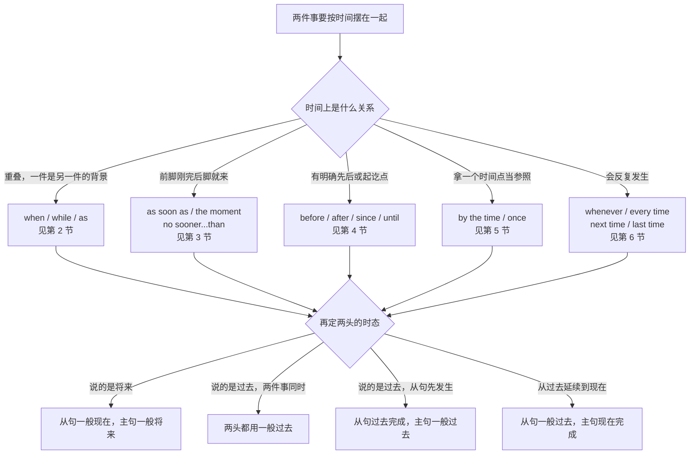
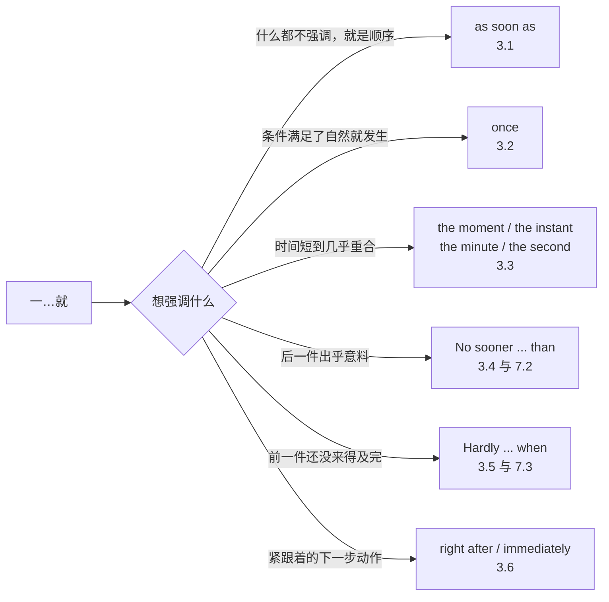
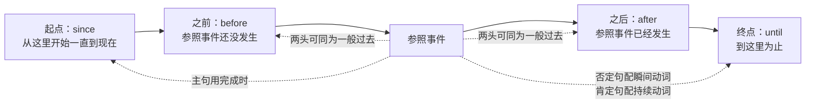
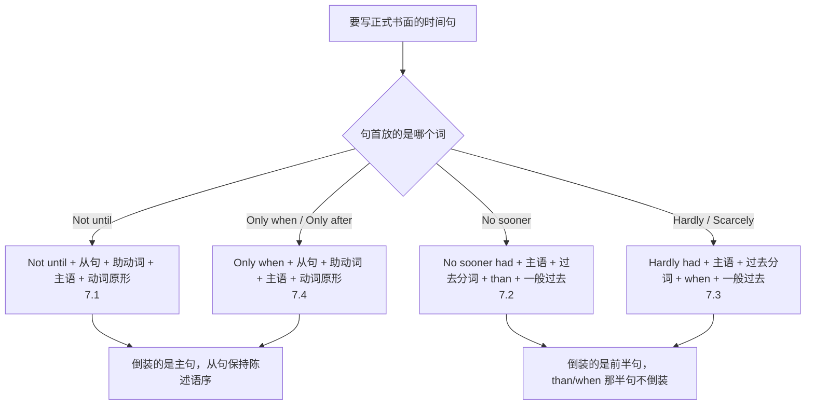
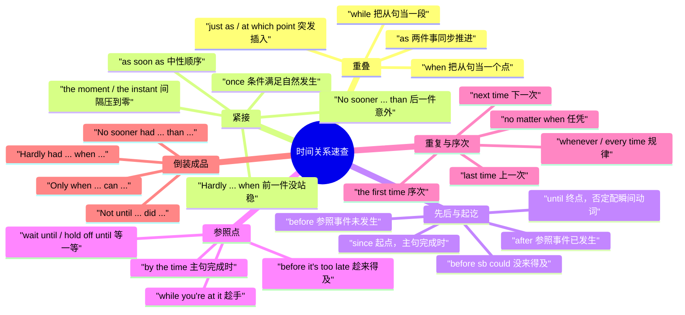

# 当…的时候、一…就、直到才：时间关系速查

> [!info] 本篇定位
>
> 这篇收的是「把两件事按时间摆在一起」的全部中文说法：同时发生的（当…的时候、正…的时候、随着）、紧接发生的（一…就、刚…就、话音刚落）、有先后的（之前、之后、自从、直到）、有参照点的（到…的时候、等…了再、趁着）、会重复的（每当、每次、下次、上次）。
>
> 每条意图除了三档成品句架，还多给一行别处查不到的东西：**主句和从句各用什么时态**。这一行是本篇存在的理由——中文的时间词不带时态信息，英文的时间从句却把时态卡得很死，「等他到了我就打给你」错在时态上的概率远高于错在连词上。
>
> 同一功能域的另外两篇分工不同：`02` 管「起初、后来、终于」这类不成对的时序推进词，`03` 管「花了多久、每隔一次、到…为止」这类时长与期限。本篇只管**成对的时间关系**：一件事相对另一件事发生在什么时候。
>
> 读完能查到：想说「等构建跑完我就发版」，直接查 3.1；想说「我直到他指出来才发现」，直接查 4.6，要写成正式档就跳 7.1 拿倒装成品；想说「等你到那儿会议早散了」，直接查 5.1。

---

## 1. 本篇导读：两个判断决定整句形态

时间关系句在中文里几乎不需要做判断，「等他到了我就打给你」这句话里没有任何形态变化。翻成英文要连做两个判断，而这两个判断是分开的、互不替代的。

第一个判断是**选哪个连词**，取决于两件事的时间关系是重叠、紧接还是有明确先后。第二个判断是**两头各用什么时态**，取决于说话时点在哪儿——这一步和连词的选择完全无关，选对了 when 依然可能把 `when he will arrive` 写出来。

这棵树的上半截是连词选择，下半截是时态选择，中间那个汇合点 `H` 是全篇最要紧的地方：**无论上面走的是哪一条路，下面的四条时态规则都同样适用**。as soon as、before、until、by the time、the moment 在时态上的表现是一致的，不需要一个一个记。

树的第一个岔口分的是重叠与紧接。重叠指两件事在时间上有交集，「我做饭的时候他在改代码」；紧接指前一件刚结束后一件就开始，中间没有交集，「我刚坐下电话就响了」。中文这两类都可以用「…的时候」，英文分得很清楚：重叠用 when 和 while，紧接用 as soon as 和 the moment。选错的后果是听感偏差不是语法错，但 `While I sat down, the phone rang.` 会让人以为「坐下」是一个持续了一阵子的过程。

第二个岔口分的是有没有起讫点。before 和 after 划的是先后，since 和 until 划的是起点和终点——since 给起点，until 给终点。中文的「自从」和「直到」正好一一对应，这一对是本篇里映射最干净的。

第三条路是参照点那一支。by the time 和前面几个不一样：它不是把两件事并排摆，而是拿一件事当尺子去量另一件的完成度，所以主句几乎总要用完成时。这是中文母语者最常漏掉的一处。

下面这张速查表把本篇的中文入口和落点对齐。查的时候先在这里定位到小节，再进小节看三档与时态对照。

| 中文触发语 | 主结构 | 落在哪一节 |
| --- | --- | --- |
| 当…的时候 / …时 / 那会儿 | when + 从句 | 2.1 |
| 正在…的时候 / …的过程中 / 一边…一边 | while + 进行时 | 2.2 |
| 随着 / 一…就跟着…（同步变化） | as + 从句 | 2.3 |
| 就在这时 / 正当…之际 / 恰好那会儿 | just as / at which point | 2.4 |
| …的那年 / …的那天 / …那阵子 | the day \| the year + 从句 | 2.5 |
| 一…就 / …完马上 | as soon as + 从句 | 3.1 |
| 一旦…就 / …了之后自然就 | once + 从句 | 3.2 |
| …的那一刻 / 一…立刻 / 刚一…就 | the moment \| the instant + 从句 | 3.3 |
| 刚…就（意外、突然） | No sooner … than … | 3.4 |
| 还没…就 / 才…就 | Hardly … when … | 3.5 |
| …完立刻 / 紧接着就 | right after / immediately + 从句 | 3.6 |
| 在…之前 / …前先 | before + 从句 | 4.1 |
| 还没来得及…就 / 没等…就 | before sb could + 动词原形 | 4.2 |
| 过了多久才… / 隔了…才 | It was + 时间 + before … | 4.3 |
| 在…之后 / …完之后 | after + 从句 | 4.4 |
| 自从 / 打那以后 / 有多久没… | since + 从句 | 4.5 |
| 直到…才 / 一直没…直到 | not … until + 从句 | 4.6 |
| 一直到…为止 / 等到…结束 | until + 从句 | 4.7 |
| 到…的时候（那时已经…） | by the time + 从句 | 5.1 |
| 等…了再 / 先等等 / 等下 | wait until / hold off until | 5.2 |
| 趁着 / 趁热 / 顺手 | while + 从句 / while you're at it | 5.3 |
| 趁还来得及 / 别等到 | before it's too late / while there's still time | 5.4 |
| 每当 / 每次 / 一到…就 | whenever \| every time + 从句 | 6.1 |
| 每次都 / 凡是…的时候 / 不管什么时候 | each time / any time / no matter when | 6.2 |
| 下次…的时候 / 以后再… | next time + 从句 | 6.3 |
| 上次…的时候 / 我上回看还是… | last time + 从句 | 6.4 |
| 第一次…的时候 / 头一回 | the first time + 从句 | 6.5 |
| 直到…才（正式书面倒装） | Not until … did … | 7.1 |
| 刚…就（书面倒装） | No sooner had … than … | 7.2 |
| 还没…就（书面倒装） | Hardly had … when … | 7.3 |
| 只有…才 / 唯有…之后方能 | Only when \| Only after … did … | 7.4 |

---

## 2. 同时发生：当…的时候、正…的时候、随着

重叠关系有三个连词，中文入口却几乎只有一个「…的时候」。分工是这样的：when 管时间点，把从句当成一个不再细分的整体；while 管时间段，从句里那件事是有厚度的、正在进行的；as 管同步推进，两件事一起动、一起变。选哪个和句子长短无关，只和从句那件事在说话人心里是「一个点」还是「一段」有关。

### 2.1 当…的时候：把从句当成一个时间点

中文触发语：当…的时候 / …时 / …那会儿 / 等…了 / 到…的时候

时态对照：说过去，两头都用一般过去；说将来，从句一般现在、主句一般将来（主将从现）。

| 档位 | 句架 | 例句 | 中文 |
| --- | --- | --- | --- |
| 口语 | When A, B. | When the build finishes, ping me. | 构建跑完的时候叫我一声。 |
| 口语 | B when A. | I'll fix it when I get back. | 我回来的时候就修。 |
| 口语 | When I was + 名词, ... | When I was an intern, we deployed by hand. | 我实习那会儿是手动发版的。 |
| 书面 | When + 从句, 主句. | When the contract expires, the access keys are revoked automatically. | 合同到期时，访问密钥会自动作废。 |
| 书面 | When + doing（主语相同时省略） | When migrating a table, always take a snapshot first. | 迁移表的时候先做一份快照。 |
| 书面 | It was + 时间 + when + 从句. | It was almost midnight when the last test passed. | 最后一个测试跑过的时候已经快半夜了。 |
| 正式 | at the point when + 从句 | The refund is issued at the point when the return is confirmed. | 退款在退货被确认的时点发出。 |
| 正式 | upon + 名词 / 动名词 | Upon receipt of the signed copy, we will begin work. | 收到签署版之后我方即开始工作。 |

> [!warning] 错配警示
>
> ❌ ~~I'll call you when I will arrive.~~
> ✅ **I'll call you when I arrive.**（时间从句里不用 will 表将来，主句用将来、从句用现在，简称主将从现）
>
> ❌ ~~When I was cooking, the doorbell was ringing.~~
> ✅ **When I was cooking, the doorbell rang.**（门铃响是一个点，用一般过去；做饭是背景，用进行时）

同义入口：当…的时候 / …时 / …那会儿 / 那时候 / 等…了
语法归属：[[02.英语基础语法/09.从句体系/04.状语从句详解|状语从句详解]]
场景实战：[[04.英语场景/04.从句与复合句型框架/03.状语从句九大类型|状语从句九大类型]]

### 2.2 正在…的时候：拿一段时间当背景

中文触发语：正在…的时候 / …的过程中 / 一边…一边 / …期间 / 就在…那阵子

时态对照：while 后面那件事是背景，用进行时；主句那件事是插进来的点，用一般时。

| 档位 | 句架 | 例句 | 中文 |
| --- | --- | --- | --- |
| 口语 | While A was doing, B happened. | While I was reviewing the PR, someone force-pushed over it. | 我正在看这个 PR 的时候，有人强推覆盖了。 |
| 口语 | B while A is doing. | Don't touch the config while the service is restarting. | 服务重启的过程中别动配置。 |
| 口语 | while I'm doing sth（顺带） | I'll bump the version while I'm in there. | 我改那块的时候顺手把版本号也升了。 |
| 书面 | While + doing（主语相同时省略主语） | While reviewing the logs, we found three duplicate entries. | 在查日志的过程中我们发现了三条重复记录。 |
| 书面 | A was doing when B happened. | The team was still testing when the release window closed. | 团队还在测的时候发布窗口就关了。 |
| 书面 | throughout the time (that) + 从句 | Throughout the time the feature was in beta, we saw no crashes. | 这个功能在公测期间一次崩溃都没有。 |
| 正式 | in the course of + 名词 / 动名词 | In the course of the audit, several gaps were identified. | 审计过程中发现了若干缺口。 |
| 正式 | for the duration of + 名词 | Write access is suspended for the duration of the migration. | 迁移期间写权限暂停。 |

> [!warning] 错配警示
>
> ❌ ~~While the door opened, I heard a noise.~~
> ✅ **When the door opened, I heard a noise.**（开门是一个瞬间动作，撑不起 while 要的那段厚度）
>
> ❌ ~~While I was in London, I have visited the museum twice.~~
> ✅ **While I was in London, I visited the museum twice.**（从句划死在过去，主句不能再用现在完成）

同义入口：正在…的时候 / …期间 / …过程中 / 一边…一边 / 趁着（趁着义另见 5.3）
语法归属：[[02.英语基础语法/06.动词时态/03.进行时态详解|进行时态详解]]
场景实战：[[04.英语场景/03.时态与语态句型框架/01.16种时态完全手册|16种时态完全手册]]

### 2.3 随着：两件事一起推进、一起变

中文触发语：随着 / 一…就跟着… / 越来越…（同步推进）/ 与此同步 / 边…边

时态对照：as 两头时态保持一致，一起用一般过去或一起用一般现在；表同步变化时两头常都用进行时或都用一般现在。

| 档位 | 句架 | 例句 | 中文 |
| --- | --- | --- | --- |
| 口语 | As A, B. | As the cache warmed up, response times dropped. | 随着缓存预热，响应时间降下来了。 |
| 口语 | A as B（伴随） | He talked as he typed. | 他一边打字一边说。 |
| 口语 | as we go / as we speak | We'll tune the thresholds as we go. | 阈值我们边跑边调。 |
| 书面 | As + 从句, 主句. | As the dataset grows, the index rebuild takes longer. | 随着数据集变大，索引重建越来越慢。 |
| 书面 | with + 名词 + 现在分词 | With traffic doubling every quarter, the current setup won't hold. | 流量每个季度翻一番，现在这套撑不住。 |
| 正式 | in step with + 名词 | Costs rose in step with headcount. | 成本随人头同步上升。 |
| 正式 | as and when + 从句 | Patches are applied as and when they are released. | 补丁随发布随应用。 |

> [!warning] 错配警示
>
> ❌ ~~As I finished the report, I sent it out.~~（想说「写完就发了」时）
> ✅ **As soon as I finished the report, I sent it out.**（as 表同时，as soon as 才表紧接；单用 as 会读成「一边写一边发」）
>
> as 一个词兼管「当…时」「因为」「像…一样」三义，句首用 as 又跟一个可作原因解的从句时会产生歧义。想说时间就换 when 或 while，想说原因就换 since 或 because。

同义入口：随着 / 一边…一边 / 同步 / 边…边 / 与…同时推进
语法归属：[[02.英语基础语法/05.介词与连词/04.介词与连词的易混点|介词与连词的易混点]]
场景实战：[[04.英语场景/04.从句与复合句型框架/03.状语从句九大类型|状语从句九大类型]]

### 2.4 就在这时：把一个突发点插进正在进行的事里

中文触发语：就在这时 / 正当…之际 / 恰好那会儿 / 说时迟那时快 / 偏偏这时候

时态对照：背景用过去进行，插入的那件事用一般过去；at which point 引的是后续动作，跟主句同时态。

| 档位 | 句架 | 例句 | 中文 |
| --- | --- | --- | --- |
| 口语 | A was doing, and just then B. | I was about to merge, and just then CI went red. | 我正要合并，就在这时 CI 红了。 |
| 口语 | Just as A, B. | Just as I hit send, I spotted the typo. | 我刚点发送，就看见有个错字。 |
| 口语 | That's when B. | That's when the pager went off. | 就在这时候值班机响了。 |
| 书面 | A, at which point B. | The connection dropped, at which point the retry logic kicked in. | 连接断了，此时重试逻辑接管。 |
| 书面 | It was then that + 从句. | It was then that we realized the config had never been loaded. | 就在那时我们才意识到配置根本没加载过。 |
| 正式 | whereupon + 从句 | The vendor failed to respond, whereupon the contract lapsed. | 供应商未予答复，随即合同失效。 |
| 正式 | at the very moment (that) + 从句 | The alert fired at the very moment the deploy completed. | 告警恰好在部署完成的那一刻触发。 |

> [!warning] 错配警示
>
> ❌ ~~Just as I will hit send, I'll spot the typo.~~
> ✅ **Just as I hit send, I'll spot the typo.**（just as 引的仍是时间从句，同样受主将从现约束）
>
> ❌ ~~The connection dropped, at which point the retry logic kicks in.~~
> ✅ **The connection dropped, at which point the retry logic kicked in.**（at which point 后面跟着主句的时间轴走，不能中途换时态）

同义入口：就在这时 / 正当…之际 / 恰好那会儿 / 偏偏赶上 / 说时迟那时快
语法归属：[[02.英语基础语法/09.从句体系/02.定语从句进阶|定语从句进阶]]
场景实战：[[04.英语场景/04.从句与复合句型框架/03.状语从句九大类型|状语从句九大类型]]

### 2.5 …的那年、…的那天：拿一个具体时段当连词

中文触发语：…的那年 / …的那天 / …那阵子 / …的那个下午 / …那一周

时态对照：整块当 when 用，从句时态和主句对齐；从句先发生时可用过去完成。

| 档位 | 句架 | 例句 | 中文 |
| --- | --- | --- | --- |
| 口语 | the day + 从句 | The day I switched editors, my muscle memory died. | 我换编辑器那天，肌肉记忆全废了。 |
| 口语 | the year + 从句 | The year we moved to Kubernetes, our on-call load doubled. | 我们迁到 Kubernetes 那年，值班量翻倍了。 |
| 书面 | the week + 从句 | The week the feature shipped, support tickets tripled. | 功能上线那一周，工单量涨了两倍。 |
| 书面 | back when + 从句 | Back when the repo was one service, this script worked fine. | 早年仓库只有一个服务的时候，这脚本还好使。 |
| 书面 | at a time when + 从句 | The cut came at a time when the team was already stretched. | 裁减发生在团队本已吃紧的时候。 |
| 正式 | during the period in which + 从句 | No changes were made during the period in which the audit was open. | 审计开放期间未做任何变更。 |
| 正式 | from the date on which + 从句 | Interest accrues from the date on which funds are received. | 利息自收到款项之日起计。 |

> [!warning] 错配警示
>
> ❌ ~~In the day I switched editors, my muscle memory died.~~
> ✅ **The day I switched editors, my muscle memory died.**（the day、the year 直接当连词用，前面不加介词）
>
> ❌ ~~Back when the repo is one service, this script worked fine.~~
> ✅ **Back when the repo was one service, this script worked fine.**（back when 只用于过去，从句必须过去时）

同义入口：…的那年 / …的那天 / …那阵子 / 早年 / 当年
语法归属：[[02.英语基础语法/09.从句体系/04.状语从句详解|状语从句详解]]
场景实战：[[04.英语场景/04.从句与复合句型框架/03.状语从句九大类型|状语从句九大类型]]

---

## 3. 紧接发生：一…就、刚…就、话音刚落

紧接关系在中文里有一整排说法，密度比英文还高：一…就、刚…就、才…就、…完马上、话音刚落、说着说着就。英文这边分档很清楚——中性的用 as soon as 和 once，强调时间之短的用 the moment 一族，强调意外的用 no sooner 和 hardly 一族（后者天然带倒装，成品形态见第 7 节）。

下面这张图把这一节的分工画出来。

这条分岔的关键在右侧两支。no sooner 和 hardly 不只是「快」，它们带评价色彩：前者说后一件事来得突然，后者说前一件事还没站稳。所以 `No sooner had I sat down than the phone rang.` 有一层「刚坐下就不得安生」的意味，而 `As soon as I sat down, the phone rang.` 只是陈述顺序。中文的「刚…就」两种意味都能表达，选哪个英文形态得看上下文里有没有那层不情愿。

左侧的 as soon as 和 once 差在因果浓度。once 有「条件一旦满足」的意思，接近「一旦」，所以它能跟 if 换用而 as soon as 不能；as soon as 纯粹是时间上的紧接，不含条件义。

### 3.1 一…就：最中性的一次紧接

中文触发语：一…就 / …完马上 / …好了就 / 等…了立刻 / …之后马上

时态对照：说将来仍是主将从现（从句一般现在或现在完成，主句一般将来）；说过去两头都用一般过去。

| 档位 | 句架 | 例句 | 中文 |
| --- | --- | --- | --- |
| 口语 | As soon as A, B. | As soon as the build finishes, I'll deploy. | 构建一跑完我就发版。 |
| 口语 | B as soon as A. | Let me know as soon as you hear back. | 你一有回音就告诉我。 |
| 口语 | as soon as I can / as soon as possible | I'll get to it as soon as I can. | 我一腾出手就做。 |
| 书面 | As soon as + 现在完成, 主句将来. | As soon as we have confirmed the payment, the license will be issued. | 我们一确认到款就发放许可。 |
| 书面 | Soon after + 从句, 主句. | Soon after the patch landed, error rates fell back to baseline. | 补丁上线不久，错误率就回到基线了。 |
| 书面 | 主句 + no later than + 名词.（带期限的紧接） | The numbers are locked no later than the close of the quarter. | 数字不迟于季末锁定。 |
| 正式 | immediately upon + 名词 / 动名词 | Access is granted immediately upon approval. | 一经批准即刻开通权限。 |
| 正式 | forthwith upon + 名词 | The deposit becomes payable forthwith upon signature. | 定金于签署时即行支付。 |

> [!warning] 错配警示
>
> ❌ ~~As soon as the build will finish, I'll deploy.~~
> ✅ **As soon as the build finishes, I'll deploy.**（时间从句里不出现 will）
>
> ❌ ~~As soon as possible I'll get to it.~~
> ✅ **I'll get to it as soon as possible.**（as soon as possible 是句末状语，提到句首会读成从句而显得断裂）

同义入口：一…就 / …完马上 / …好了立刻 / 等…了马上 / 随即
语法归属：[[02.英语基础语法/09.从句体系/04.状语从句详解|状语从句详解]]
场景实战：[[04.英语场景/10.职场与商务场景实战/03.商务邮件与正式书面沟通|商务邮件与正式书面沟通]]

### 3.2 一旦…就：条件满足了自然发生

中文触发语：一旦…就 / …了之后自然就 / 只要…了就 / 等…这一步过了

时态对照：从句一般现在或现在完成，主句一般将来或祈使；说过去时两头一般过去。

| 档位 | 句架 | 例句 | 中文 |
| --- | --- | --- | --- |
| 口语 | Once A, B. | Once the cache is warm, it's fast. | 缓存一热起来就快了。 |
| 口语 | Once you've done sth, ... | Once you've merged, delete the branch. | 合并完之后把分支删掉。 |
| 口语 | once that's out of the way | Once that's out of the way, we can start on the UI. | 这一块过去了就能动 UI 了。 |
| 书面 | Once + 从句, 主句. | Once the schema is versioned, rollbacks become straightforward. | 一旦 schema 有了版本，回滚就简单了。 |
| 书面 | Once + 过去分词（省略主语与系动词） | Once approved, the request cannot be edited. | 一经批准，申请不可再修改。 |
| 正式 | once + 从句（法律文本） | Once the notice period has elapsed, the agreement terminates. | 通知期届满后协议即行终止。 |
| 正式 | as soon as + 从句（与 once 可换用的正式档） | The clause takes effect as soon as both parties have signed. | 双方签署后该条款即生效。 |

> [!warning] 错配警示
>
> ❌ ~~Once the schema will be versioned, rollbacks become straightforward.~~
> ✅ **Once the schema is versioned, rollbacks become straightforward.**（once 引导时间从句，同样不用 will）
>
> once 兼有条件义，和 if 的分工是：once 假定这件事一定会发生，只是不知何时；if 不假定它会发生。「一旦出问题」如果指的是可能不出问题，用 if something goes wrong 比 once something goes wrong 稳妥。条件那一支的完整清单见 [[04.条件与假设/01.真实条件：如果就、只要、一旦、除非、前提是|真实条件：如果就、只要、一旦、除非、前提是]]。

同义入口：一旦…就 / …之后自然 / 只要…了 / 等这一步过了 / 一经
语法归属：[[02.英语基础语法/09.从句体系/04.状语从句详解|状语从句详解]]
场景实战：[[04.英语场景/04.从句与复合句型框架/03.状语从句九大类型|状语从句九大类型]]

### 3.3 …的那一刻：把间隔压到零

中文触发语：…的那一刻 / 一…立刻 / 刚一…就 / 一见…就 / 头一眼就

时态对照：the moment 一族完全按 as soon as 的规则走，从句不用 will；从句先完成时可用现在完成或过去完成。

| 档位 | 句架 | 例句 | 中文 |
| --- | --- | --- | --- |
| 口语 | The moment A, B. | The moment I saw the diff, I knew what broke. | 我一看 diff 就知道哪儿坏了。 |
| 口语 | The minute A, B. | The minute you push, the pipeline starts. | 你一推流水线就跑起来。 |
| 口语 | The second A, B. | The second she walked in, everyone went quiet. | 她一进来大家立刻不出声了。 |
| 书面 | The instant + 从句, 主句. | The instant the threshold is crossed, an alert is dispatched. | 一旦越过阈值，告警即刻发出。 |
| 书面 | the first thing sb did was + 动词原形 | The first thing I did was roll it back. | 我第一件事就是回滚。 |
| 书面 | on + 动名词 | On opening the file, I noticed the encoding was wrong. | 一打开文件我就发现编码不对。 |
| 正式 | at the moment of + 名词 | The right vests at the moment of delivery. | 权利于交付之时归属。 |

> [!warning] 错配警示
>
> ❌ ~~The moment when I saw the diff, I knew what broke.~~
> ✅ **The moment I saw the diff, I knew what broke.**（the moment 本身就当连词用，后面不加 when；that 可加可不加，日常一律省略）
>
> ❌ ~~The second she will walk in, everyone will go quiet.~~
> ✅ **The second she walks in, everyone will go quiet.**（同样受主将从现约束）

同义入口：…的那一刻 / 一…立刻 / 刚一…就 / 一见就 / 头一眼
语法归属：[[02.英语基础语法/09.从句体系/05.从句综合辨析|从句综合辨析]]
场景实战：[[04.英语场景/04.从句与复合句型框架/03.状语从句九大类型|状语从句九大类型]]

### 3.4 刚…就：后一件来得意外

中文触发语：刚…就 / 才…就 / 一…马上就（带意外）/ 屁股还没坐热 / 前脚…后脚就

时态对照：no sooner 那半句用过去完成，than 那半句用一般过去；句首倒装是标准形态，正常语序也成立但少见。

| 档位 | 句架 | 例句 | 中文 |
| --- | --- | --- | --- |
| 口语 | A, and right away B. | I sat down, and right away the phone rang. | 我刚坐下电话就响了。 |
| 口语 | I'd only just done A when B. | I'd only just logged off when the alert came in. | 我刚下线告警就来了。 |
| 书面 | No sooner had A than B. | No sooner had the deploy finished than the alerts started firing. | 部署刚跑完告警就响成一片。 |
| 书面 | sb had no sooner done A than B.（非倒装） | We had no sooner shipped the fix than a new bug surfaced. | 我们刚发完修复就冒出个新 bug。 |
| 书面 | A had barely done when B. | The service had barely come back up when it crashed again. | 服务刚起来又挂了。 |
| 正式 | No sooner had + 主语 + 过去分词 + than + 一般过去. | No sooner had the notice been served than the account was frozen. | 通知刚送达账户即被冻结。 |

> [!warning] 错配警示
>
> ❌ ~~No sooner had I sat down when the phone rang.~~
> ✅ **No sooner had I sat down than the phone rang.**（no sooner 配 than，hardly 才配 when，这一对不能互换）
>
> ❌ ~~No sooner I had sat down than the phone rang.~~
> ✅ **No sooner had I sat down than the phone rang.**（No sooner 提到句首，紧跟着必须把 had 提到主语前）

同义入口：刚…就 / 才…就 / 前脚…后脚 / 屁股没坐热 / 转眼就
语法归属：[[02.英语基础语法/10.特殊句型/03.倒装句结构|倒装句结构]]
场景实战：[[04.英语场景/02.基础句型框架/04.倒装句、强调句与省略句|倒装句、强调句与省略句]]

### 3.5 还没…就：前一件没站稳

中文触发语：还没…就 / 才刚…就 / 没等…就 / 话音未落 / 刚开个头就

时态对照：hardly 那半句用过去完成，when 那半句用一般过去；hardly 提到句首同样触发倒装。

| 档位 | 句架 | 例句 | 中文 |
| --- | --- | --- | --- |
| 口语 | A had barely started when B. | The meeting had barely started when someone brought up budget. | 会才刚开就有人提预算。 |
| 口语 | before sb could finish, B | Before I could finish, he cut in. | 我话还没说完他就插进来了。 |
| 书面 | Hardly had A when B. | Hardly had we merged the branch when CI went red. | 我们刚合上分支 CI 就红了。 |
| 书面 | Scarcely had A before B. | Scarcely had the migration begun before the disk filled up. | 迁移才开个头磁盘就满了。 |
| 书面 | A was barely done when B. | The ink was barely dry on the contract when they changed scope. | 合同墨迹未干他们就改了范围。 |
| 正式 | Hardly had + 主语 + 过去分词 + when + 一般过去. | Hardly had the audit concluded when a second irregularity came to light. | 审计刚结束又暴露出第二处违规。 |

> [!warning] 错配警示
>
> ❌ ~~Hardly had we merged the branch than CI went red.~~
> ✅ **Hardly had we merged the branch when CI went red.**（hardly、scarcely 配 when 或 before，不配 than）
>
> ❌ ~~Hardly we had merged the branch when CI went red.~~
> ✅ **Hardly had we merged the branch when CI went red.**（否定副词开头必须倒装，助动词跑到主语前面）

同义入口：还没…就 / 才刚…就 / 没等…就 / 话音未落 / 刚开个头
语法归属：[[02.英语基础语法/10.特殊句型/03.倒装句结构|倒装句结构]]
场景实战：[[04.英语场景/02.基础句型框架/04.倒装句、强调句与省略句|倒装句、强调句与省略句]]

### 3.6 …完立刻：把下一步动作贴上去

中文触发语：…完立刻 / 紧接着就 / 之后马上 / 随即 / 二话不说就

时态对照：right after 与 immediately after 后接从句时按普通时间从句处理；接名词或动名词时不涉及时态。

| 档位 | 句架 | 例句 | 中文 |
| --- | --- | --- | --- |
| 口语 | right after A, B | Right after standup, I'll open the ticket. | 站会一完我就开工单。 |
| 口语 | first thing after A | First thing after lunch, we'll pair on it. | 午饭后头一件事就是一起看这个。 |
| 口语 | and then straight away | I restarted it and then straight away checked the logs. | 我重启完立刻就去看日志。 |
| 书面 | Immediately after + 名词 / 从句, 主句. | Immediately after the rollout, latency spiked. | 上线之后延迟立刻飙了。 |
| 书面 | promptly upon + 名词 | Invoices are issued promptly upon completion. | 完工后随即开具发票。 |
| 正式 | Immediately + 从句, 主句.（英式连词用法） | Immediately the patch landed, the errors stopped. | 补丁一落地报错就没了。 |
| 正式 | thereafter / thereupon | The report is filed; thereafter, the case is closed. | 报告归档，其后案件关闭。 |

> [!warning] 错配警示
>
> ❌ ~~Right after the standup will finish, I'll open the ticket.~~
> ✅ **Right after the standup finishes, I'll open the ticket.**（right after 后跟从句时同样不用 will）
>
> ❌ ~~Immediately after to deploy, we saw a latency spike.~~
> ✅ **Immediately after deploying, we saw a latency spike.**（after 是介词，后面接动名词不接不定式；动名词的逻辑主语要跟主句主语一致，所以主语得是 we 不是 latency）

同义入口：…完立刻 / 紧接着 / 随即 / 之后马上 / 二话不说
语法归属：[[02.英语基础语法/05.介词与连词/01.介词的分类与基本用法|介词的分类与基本用法]]
场景实战：[[04.英语场景/10.职场与商务场景实战/02.会议汇报与演示场景|会议汇报与演示场景]]

---

## 4. 先后与起讫：之前、之后、自从、直到

这一节的四个连词在中文里对应得几乎一一相等，麻烦全在时态上。before 和 after 只标先后，两头时态可以都用一般过去；since 标起点，主句必须用完成时；until 标终点，肯定句和否定句的动词类型还有区别。下面这条时间轴把四者的位置关系摆出来。

图上的实线是时间方向，虚线标的是各自的时态要求。要记的其实只有两条：**since 一定拉出一段延续，所以主句是完成时**；**until 一定指向一个终点，所以主句那个动作要么持续到那个点（肯定句），要么在那个点之前一直没发生（否定句）**。before 和 after 没有这类附加要求，是四个里最省心的。

第三条容易漏的是 before 的「还没来得及」义。中文说「他还没等我解释就挂了」，英文写成 `He hung up before I could explain.`——before 后面配一个 could，整句就带上了「没来得及」的意思。这个用法在 4.2 单列。

### 4.1 在…之前：参照事件还没发生

中文触发语：在…之前 / …前先 / 没…之前 / 提前 / 早于

时态对照：说过去两头一般过去，主句可用过去完成；说将来从句一般现在、主句一般将来。

| 档位 | 句架 | 例句 | 中文 |
| --- | --- | --- | --- |
| 口语 | Before A, B. | Before you push, run the linter. | 推之前先跑一遍 linter。 |
| 口语 | B before A. | I checked the logs before I restarted anything. | 我重启之前先看了日志。 |
| 口语 | before doing sth | Save your work before closing the tab. | 关标签页前先存一下。 |
| 书面 | Before + 从句, 主句. | Before the API is deprecated, all clients must be migrated. | 在该 API 废弃之前，所有客户端必须完成迁移。 |
| 书面 | prior to + 名词 / 动名词 | Prior to the release, a full regression suite is run. | 发版前会跑一整套回归。 |
| 书面 | ahead of + 名词 | Ahead of the audit, we tightened the access policy. | 审计之前我们收紧了访问策略。 |
| 正式 | in advance of + 名词 | Notice must be given in advance of any change to the terms. | 条款变更须提前通知。 |
| 正式 | no later than + 时间点 + prior to + 名词 | Materials are due no later than five days prior to the meeting. | 材料须于会议前五日提交。 |

> [!warning] 错配警示
>
> ❌ ~~Before you will push, run the linter.~~
> ✅ **Before you push, run the linter.**（before 引导时间从句，同样不用 will）
>
> ❌ ~~Prior to run the migration, take a snapshot.~~
> ✅ **Prior to running the migration, take a snapshot.**（prior to 是介词短语，后面接动名词）

同义入口：在…之前 / …前先 / 提前 / 早于 / 未…之先
语法归属：[[02.英语基础语法/05.介词与连词/03.连词的分类与用法|连词的分类与用法]]
场景实战：[[04.英语场景/04.从句与复合句型框架/03.状语从句九大类型|状语从句九大类型]]

### 4.2 还没来得及…就：before 配 could 的「没赶上」义

中文触发语：还没来得及…就 / 没等…就 / 还没…人就 / 我话还没说完 / 没反应过来就

时态对照：主句一般过去，before 从句里放 could 或 had a chance to，这个组合本身就承担「没来得及」的意思。

| 档位 | 句架 | 例句 | 中文 |
| --- | --- | --- | --- |
| 口语 | B before sb could + 动词原形. | He hung up before I could explain. | 我还没来得及解释他就挂了。 |
| 口语 | before I knew it | Before I knew it, the whole afternoon was gone. | 还没反应过来一下午就没了。 |
| 口语 | before sb had a chance to do | The job failed before I had a chance to attach a debugger. | 我还没来得及挂调试器任务就挂了。 |
| 书面 | B before + 主语 + could + 动词原形. | The session expired before the form could be submitted. | 表单还没提交会话就过期了。 |
| 书面 | without waiting for + 名词 | They rolled it out without waiting for sign-off. | 他们没等批复就上线了。 |
| 正式 | before such time as + 从句 | No funds may be released before such time as the conditions are met. | 在条件满足之前不得放款。 |

> [!warning] 错配警示
>
> ❌ ~~He hung up before I explained.~~（想说「没来得及解释」时）
> ✅ **He hung up before I could explain.**（去掉 could 就变成单纯的先后：他挂了，然后我解释了）
>
> ❌ ~~Before I knew, the whole afternoon was gone.~~
> ✅ **Before I knew it, the whole afternoon was gone.**（before I knew it 是固定形态，it 不能省）

同义入口：还没来得及 / 没等…就 / 话没说完 / 没反应过来 / 一转眼
语法归属：[[02.英语基础语法/07.助动词与情态动词/02.情态动词详解|情态动词详解]]
场景实战：[[04.英语场景/05.高频实用表达句型框架/01.表达观点与态度的50个万能句型|表达观点与态度的50个万能句型]]

### 4.3 过了多久才：把间隔本身说出来

中文触发语：过了多久才 / 隔了…才 / …之后才 / 足足等了…才 / 好一阵子才

时态对照：It was + 时长 + before + 一般过去（说过去）；It will be + 时长 + before + 一般现在（说将来）。

| 档位 | 句架 | 例句 | 中文 |
| --- | --- | --- | --- |
| 口语 | It was 时长 before B. | It was three days before we heard back. | 过了三天才有回音。 |
| 口语 | It'll be 时长 before B. | It'll be a while before this is stable. | 这个稳定下来还得一阵子。 |
| 口语 | It took 时长 for sb to do | It took two hours for the index to rebuild. | 索引重建花了两小时。 |
| 书面 | It was not until 时间点 that + 从句. | It was not until Friday that anyone noticed. | 直到周五才有人注意到。 |
| 书面 | 时长 elapsed before + 从句. | Six weeks elapsed before the vendor responded. | 六周之后供应商才回复。 |
| 正式 | A period of 时长 shall elapse before + 从句. | A period of thirty days shall elapse before the claim may be filed. | 索赔须于三十日期满后方可提出。 |

> [!warning] 错配警示
>
> ❌ ~~It passed three days before we heard back.~~
> ✅ **It was three days before we heard back.**（这个框架用 It was，不用 It passed）
>
> ❌ ~~It'll be a while before this will be stable.~~
> ✅ **It'll be a while before this is stable.**（before 从句里仍然不能用 will）
>
> 时长本身的说法（花了多久、每隔多久、持续了多长时间）不在本篇，完整清单见 [[07.时间与顺序/03.花了多久、每隔一次、快要了、到…为止：时长、频率与期限|花了多久、每隔一次、快要了、到…为止：时长、频率与期限]]。

同义入口：过了多久才 / 隔了…才 / 足足等了 / 好一阵子才 / 时隔
语法归属：[[02.英语基础语法/06.动词时态/01.一般现在时与一般过去时|一般现在时与一般过去时]]
场景实战：[[04.英语场景/03.时态与语态句型框架/01.16种时态完全手册|16种时态完全手册]]

### 4.4 在…之后：参照事件已经发生

中文触发语：在…之后 / …完之后 / …过后 / 事后 / 打那以后（打那以后另见 4.5）

时态对照：两头都用一般过去即可；想强调从句先完成可用过去完成，但不是必须。

| 档位 | 句架 | 例句 | 中文 |
| --- | --- | --- | --- |
| 口语 | After A, B. | After I pushed the fix, the alerts stopped. | 我把修复推上去之后告警就停了。 |
| 口语 | B after A. | Let's talk after the demo. | 演示之后我们聊。 |
| 口语 | after doing sth | After merging, delete the branch. | 合并之后把分支删掉。 |
| 书面 | After + 过去完成, 一般过去. | After we had rolled back, the queue drained within minutes. | 回滚之后队列几分钟就排空了。 |
| 书面 | following + 名词 | Following the incident, we added a circuit breaker. | 那次事故之后我们加了熔断。 |
| 书面 | in the wake of + 名词 | In the wake of the outage, on-call rotations were rewritten. | 那次中断之后值班轮换重写了一遍。 |
| 正式 | subsequent to + 名词 | Subsequent to the amendment, clause 4 no longer applies. | 修订之后第四条不再适用。 |
| 正式 | after such + 名词 + as + 从句 | Payment follows after such inspection as the buyer may require. | 买方要求的检验完成后付款。 |

> [!warning] 错配警示
>
> ❌ ~~After I will push the fix, the alerts will stop.~~
> ✅ **After I push the fix, the alerts will stop.**（after 从句照样不用 will）
>
> ❌ ~~Following to the incident, we added a circuit breaker.~~
> ✅ **Following the incident, we added a circuit breaker.**（following 直接接名词，中间不加 to）

同义入口：在…之后 / …完之后 / …过后 / 事后 / 继…之后
语法归属：[[02.英语基础语法/06.动词时态/04.完成时态详解|完成时态详解]]
场景实战：[[04.英语场景/04.从句与复合句型框架/03.状语从句九大类型|状语从句九大类型]]

### 4.5 自从…以来：从一个起点拉到现在

中文触发语：自从 / 打那以后 / …以来 / 从…起一直 / 有多久没…了

时态对照：since 从句用一般过去（那个起点），主句用现在完成或现在完成进行。这是全篇唯一强制主句用完成时的连词。

| 档位 | 句架 | 例句 | 中文 |
| --- | --- | --- | --- |
| 口语 | Since A, sb has done B. | Since we switched to the new runner, builds have been twice as fast. | 换了新 runner 之后构建快了一倍。 |
| 口语 | It's been 时长 since A. | It's been two years since I last touched that codebase. | 那套代码我有两年没碰了。 |
| 口语 | ever since | Ever since that outage, I check the dashboard first. | 打那次中断以后我都先看看板。 |
| 口语 | How long has it been since A? | How long has it been since anyone ran these tests? | 这些测试多久没人跑过了。 |
| 书面 | Since + 一般过去, 主句现在完成. | Since the policy took effect, three exceptions have been granted. | 政策生效以来共批准了三次例外。 |
| 书面 | sb has been doing since 时间点 | The service has been running in production since March. | 这个服务从三月起就跑在生产上。 |
| 正式 | as from + 日期 / with effect from + 日期 | With effect from 1 April, the old endpoint has been retired. | 自四月一日起旧端点已下线。 |
| 正式 | in the period since + 名词 | In the period since the merger, headcount has fallen by a fifth. | 合并以来人数减少了五分之一。 |

> [!warning] 错配警示
>
> ❌ ~~I work here since 2021.~~
> ✅ **I have worked here since 2021.**（since 拉出的是一段延续，主句必须用完成时）
>
> ❌ ~~Since we have switched to the new runner, builds are faster.~~
> ✅ **Since we switched to the new runner, builds have been faster.**（完成时在主句，从句那个起点用一般过去）
>
> since 也可以表原因（既然）。句首 since 后面跟的从句如果读得通原因义就会产生歧义，想说时间又怕误读时改用 ever since。原因义的完整清单见 [[03.因果与结果/01.因为所以：原因表达的六档梯度|因为所以：原因表达的六档梯度]]。

同义入口：自从 / 打那以后 / …以来 / 从…起 / 有多久没
语法归属：[[02.英语基础语法/06.动词时态/04.完成时态详解|完成时态详解]]
场景实战：[[04.英语场景/03.时态与语态句型框架/01.16种时态完全手册|16种时态完全手册]]

### 4.6 直到…才：在那个点之前一直没发生

中文触发语：直到…才 / 一直没…直到 / 到了…这才 / 等到…方才 / 迟至…才

时态对照：主句必须是否定式，两头时态一致（都过去或都现在）；正式档提到句首要倒装，成品见 7.1。

| 档位 | 句架 | 例句 | 中文 |
| --- | --- | --- | --- |
| 口语 | sb didn't do B until A. | I didn't realize until he pointed it out. | 直到他指出来我才反应过来。 |
| 口语 | not till A | We're not shipping till the tests are green. | 测试不绿我们就不发。 |
| 口语 | sb only did B after A. | I only saw the pattern after the retro. | 复盘之后我才看出规律。 |
| 书面 | It was not until A that B. | It was not until the second review that the flaw surfaced. | 直到第二轮评审那个缺陷才浮出来。 |
| 书面 | 主句否定式 + until A. | The change does not take effect until the next billing cycle. | 该变更到下个计费周期才生效。 |
| 正式 | Not until A did B.（倒装） | Not until I read the stack trace did I see what was wrong. | 直到读了堆栈我才看出问题在哪。 |
| 正式 | shall not … until + 从句 | The deposit shall not be released until the inspection is complete. | 押金在验收完成前不予释放。 |

> [!warning] 错配警示
>
> ❌ ~~I realized until he pointed it out.~~
> ✅ **I didn't realize until he pointed it out.**（until 配瞬间动词时主句必须否定；肯定句里的 until 要求主句动词能持续）
>
> ❌ ~~Please submit it until Friday.~~
> ✅ **Please submit it by Friday.**（until 是「一直到…为止」，截止期限用 by；这两个中文都译作「到…」，是本篇错得最多的一处）

同义入口：直到…才 / 一直没…直到 / 到了…这才 / 迟至…才 / 等到…方
语法归属：[[02.英语基础语法/10.特殊句型/03.倒装句结构|倒装句结构]]
场景实战：[[04.英语场景/02.基础句型框架/04.倒装句、强调句与省略句|倒装句、强调句与省略句]]

### 4.7 一直到…为止：持续到那个终点

中文触发语：一直到…为止 / 等到…结束 / …之前一直 / 撑到 / 到…那一刻为止

时态对照：主句动词必须是能持续的（wait、run、stay、keep doing），两头时态一致；说将来时从句仍用一般现在。

| 档位 | 句架 | 例句 | 中文 |
| --- | --- | --- | --- |
| 口语 | B until A. | We waited until the tests passed. | 我们一直等到测试跑绿。 |
| 口语 | keep doing until A | Keep retrying until it returns a 200. | 一直重试到返回 200 为止。 |
| 口语 | up until A | Up until last week it worked fine. | 到上周为止一直是好的。 |
| 书面 | 主句 + until such time as + 从句. | The feature stays behind a flag until such time as it is fully tested. | 该功能在完成全部测试前一直藏在开关后面。 |
| 书面 | until further notice | The endpoint is rate-limited until further notice. | 该端点限流，另行通知前不变。 |
| 书面 | pending + 名词 | The account is suspended pending review. | 账号在复核期间暂停。 |
| 正式 | until and unless + 从句 | Access remains revoked until and unless the appeal succeeds. | 除非申诉成功，否则权限持续吊销。 |

> [!warning] 错配警示
>
> ❌ ~~I left until 6.~~
> ✅ **I stayed until 6.** 或 **I didn't leave until 6.**（leave 是瞬间动词，配 until 时主句必须否定；要用肯定句就换成能持续的 stay）
>
> ❌ ~~We'll wait until the tests will pass.~~
> ✅ **We'll wait until the tests pass.**（until 从句同样不用 will）

同义入口：一直到…为止 / 等到…结束 / …之前一直 / 撑到 / 直至
语法归属：[[02.英语基础语法/05.介词与连词/04.介词与连词的易混点|介词与连词的易混点]]
场景实战：[[04.英语场景/04.从句与复合句型框架/03.状语从句九大类型|状语从句九大类型]]

---

## 5. 参照点：到…的时候、等…了再、趁着

前面四节都是把两件事并排摆。这一节不一样：它拿一件事当尺子，去量另一件事到那个时候进行到哪一步了。中文里这类说法密度不高，主要就是「到…的时候」「等…了再」「趁着」三个，但它们对应的英文时态最容易漏。

### 5.1 到…的时候：那时已经完成了

中文触发语：到…的时候 / 等…那会儿 / 到了…早就 / 等你…黄花菜都凉了

时态对照：这是全篇最需要背的一条。从句一般现在配主句将来完成；从句一般过去配主句过去完成。**by the time 的主句几乎总是完成时**。

| 档位 | 句架 | 例句 | 中文 |
| --- | --- | --- | --- |
| 口语 | By the time A, B had already done. | By the time we got there, the doors had already closed. | 等我们到的时候门早关了。 |
| 口语 | By the time A, B will have done. | By the time you read this, I'll have left. | 你看到这条的时候我已经走了。 |
| 口语 | By then | By then, nobody remembered why the flag existed. | 到那会儿已经没人记得这个开关是干嘛的了。 |
| 书面 | By the time + 一般现在, 主句将来完成. | By the time the audit starts, the logs will have rotated out. | 审计开始的时候那批日志已经轮转掉了。 |
| 书面 | By the time + 一般过去, 主句过去完成. | By the time the fix shipped, the customer had already churned. | 修复上线的时候客户早就流失了。 |
| 书面 | as of + 时间点 | As of the end of Q3, four of the six milestones had been met. | 截至三季度末六个里程碑完成了四个。 |
| 正式 | by such time as + 从句 | By such time as the notice takes effect, all data will have been purged. | 通知生效之时全部数据将已清除。 |

> [!warning] 错配警示
>
> ❌ ~~By the time you will get there, the meeting will end.~~
> ✅ **By the time you get there, the meeting will have ended.**（从句不用 will，主句要用将来完成——「会已经散了」不是「会将要散」）
>
> ❌ ~~By the time we got there, the doors closed.~~
> ✅ **By the time we got there, the doors had already closed.**（门关在到达之前，用过去完成把先后拉开）

同义入口：到…的时候 / 等…那会儿 / 到了…早就 / 截至 / 等到那时
语法归属：[[02.英语基础语法/06.动词时态/04.完成时态详解|完成时态详解]]
场景实战：[[04.英语场景/03.时态与语态句型框架/01.16种时态完全手册|16种时态完全手册]]

### 5.2 等…了再：把动作压到那个点之后

中文触发语：等…了再 / 先等等 / 等下 / 缓一缓 / 别急，等…了说

时态对照：wait until、hold off until 后接从句时用一般现在或现在完成，不用将来。

| 档位 | 句架 | 例句 | 中文 |
| --- | --- | --- | --- |
| 口语 | Let's wait until A. | Let's wait until the numbers come in. | 等数据出来再说。 |
| 口语 | Hold off until A. | Hold off on the announcement until legal signs off. | 公告先压着，等法务过了再发。 |
| 口语 | Give it until 时间点. | Give it until Monday, then escalate. | 等到周一，还不行就升级。 |
| 书面 | We'll revisit this once A. | We'll revisit the scope once the prototype is done. | 原型做完之后我们再看范围。 |
| 书面 | pending + 名词, 主句不动 | Pending the security review, the rollout is paused. | 安全评审出结果之前上线暂停。 |
| 正式 | shall be deferred until + 从句 | The decision shall be deferred until the committee has convened. | 该决定推迟至委员会召开之后作出。 |

> [!warning] 错配警示
>
> ❌ ~~Let's wait until the numbers will come in.~~
> ✅ **Let's wait until the numbers come in.**（wait until 后仍是时间从句，不用 will）
>
> ❌ ~~Hold off the announcement until legal signs off.~~
> ✅ **Hold off on the announcement until legal signs off.**（hold off 后面接名词要带 on）

同义入口：等…了再 / 先等等 / 缓一缓 / 押后 / 别急
语法归属：[[02.英语基础语法/09.从句体系/04.状语从句详解|状语从句详解]]
场景实战：[[04.英语场景/10.职场与商务场景实战/02.会议汇报与演示场景|会议汇报与演示场景]]

### 5.3 趁着：借着一段时间顺手做

中文触发语：趁着 / 趁热 / 顺手 / 借这个机会 / 反正都…了

时态对照：while 后跟一般现在或现在进行；主句常是祈使或一般将来。

| 档位 | 句架 | 例句 | 中文 |
| --- | --- | --- | --- |
| 口语 | while you're at it | Could you bump the deps while you're at it? | 你顺手把依赖也升一下吧。 |
| 口语 | while I'm here / while I've got you | While I've got you, can we talk about the schema? | 趁你在，能聊聊 schema 吗。 |
| 口语 | while we still can | Let's ship it while we still can. | 趁还能发赶紧发。 |
| 书面 | While + 从句, 主句. | While the service is down anyway, we may as well upgrade the runtime. | 反正服务已经停了，趁机把运行时也升了。 |
| 书面 | take the opportunity to do | We took the opportunity to clean up the dead flags. | 我们借这个机会清掉了废弃开关。 |
| 正式 | while circumstances permit | Reserves are being rebuilt while circumstances permit. | 趁条件允许正在重建储备。 |
| 正式 | Strike while the iron is hot.（成句） | Strike while the iron is hot. | 趁热打铁。 |

> [!warning] 错配警示
>
> ❌ ~~Could you bump the deps while you are at there?~~
> ✅ **Could you bump the deps while you're at it?**（while you're at it 是固定形态，it 不能换成别的）
>
> ❌ ~~Let's ship it while we can still.~~
> ✅ **Let's ship it while we still can.**（still 落在情态动词前面，句末只留 can）

同义入口：趁着 / 趁热 / 顺手 / 借这个机会 / 反正都…了
语法归属：[[02.英语基础语法/05.介词与连词/03.连词的分类与用法|连词的分类与用法]]
场景实战：[[04.英语场景/05.高频实用表达句型框架/02.建议请求邀请拒绝四大功能句型|建议请求邀请拒绝四大功能句型]]

### 5.4 趁还来得及：把时间窗口标出来

中文触发语：趁还来得及 / 别等到…才 / 在…之前尽早 / 还有时间的时候 / 别拖到

时态对照：before 与 while 后一般现在；主句常是祈使或情态。

| 档位 | 句架 | 例句 | 中文 |
| --- | --- | --- | --- |
| 口语 | before it's too late | Fix the alerting before it's too late. | 趁还来得及把告警修好。 |
| 口语 | while there's still time | Let's rewrite it while there's still time. | 趁还有时间重写一版。 |
| 口语 | Don't wait until A to do B. | Don't wait until launch day to test the failover. | 别等到上线当天才测故障切换。 |
| 书面 | while the window is open | We should renegotiate while the window is open. | 趁窗口还开着重新谈。 |
| 书面 | ahead of + 名词, rather than after | The review should happen ahead of the merge, not after it. | 评审该在合并前做，不是合并后。 |
| 正式 | at the earliest opportunity | The discrepancy should be reported at the earliest opportunity. | 该差异应尽早上报。 |

> [!warning] 错配警示
>
> ❌ ~~Don't wait until launch day for testing the failover.~~
> ✅ **Don't wait until launch day to test the failover.**（wait until … to do 用不定式，不用 for + 动名词）
>
> ❌ ~~Fix the alerting before it will be too late.~~
> ✅ **Fix the alerting before it's too late.**（before 从句不用 will，这是本篇重复次数最多的一条）

同义入口：趁还来得及 / 别等到 / 尽早 / 还有时间的时候 / 别拖
语法归属：[[02.英语基础语法/09.从句体系/04.状语从句详解|状语从句详解]]
场景实战：[[04.英语场景/05.高频实用表达句型框架/02.建议请求邀请拒绝四大功能句型|建议请求邀请拒绝四大功能句型]]

---

## 6. 重复与序次：每当、每次、下次、上次

前五节说的都是发生一次的事。这一节说的是会反复发生的事，以及在这串反复里挑出某一次来说。中文入口很整齐：每当、每次、下次、上次、第一次。英文这边有个共同特征——**every time、next time、last time、the first time 都可以直接当连词用，前面不加介词也不加 that**，这是中文母语者最常写错的地方。

时态上这一节最简单：说习惯性反复用一般现在，说过去的反复用一般过去或 would，说下一次用主将从现。

### 6.1 每当、每次：反复发生的规律

中文触发语：每当 / 每次 / 一到…就 / 每逢 / 凡是…的时候

时态对照：讲现在的规律两头都用一般现在；讲过去的规律两头都用一般过去，或主句用 would 表当年的习惯。

| 档位 | 句架 | 例句 | 中文 |
| --- | --- | --- | --- |
| 口语 | Every time A, B. | Every time I run it locally, it passes. | 每次我在本地跑它都过。 |
| 口语 | Whenever A, B. | Whenever the queue backs up, memory spikes. | 每当队列积压内存就飙。 |
| 口语 | B every time. | It times out every time. | 每次都超时。 |
| 书面 | Whenever + 从句, 主句. | Whenever a schema change lands, the client cache is invalidated. | 每当 schema 变更落地，客户端缓存就失效。 |
| 书面 | Every time + 从句, 主句 would + 动词原形.（过去的习惯） | Every time we deployed on a Friday, something would break. | 以前只要周五发版就一定出事。 |
| 书面 | On each occasion, 主句. | On each occasion, the same three checks failed. | 每一次都是同样那三项检查失败。 |
| 正式 | in each instance where + 从句 | In each instance where the threshold is exceeded, an incident is opened. | 凡超出阈值的情形均开立事件单。 |

> [!warning] 错配警示
>
> ❌ ~~Every time when I run it locally, it passes.~~
> ✅ **Every time I run it locally, it passes.**（every time 已经是连词，后面不加 when）
>
> ❌ ~~Whenever the queue will back up, memory will spike.~~
> ✅ **Whenever the queue backs up, memory spikes.**（讲规律用一般现在，不用将来）

同义入口：每当 / 每次 / 一到…就 / 每逢 / 凡是
语法归属：[[02.英语基础语法/09.从句体系/04.状语从句详解|状语从句详解]]
场景实战：[[04.英语场景/04.从句与复合句型框架/03.状语从句九大类型|状语从句九大类型]]

### 6.2 不管什么时候：把「每一次」推到「任何一次」

中文触发语：不管什么时候 / 什么时候都 / 随时 / 只要…就一定 / 无一例外

时态对照：no matter when 后一般现在；any time 作连词时同 whenever。

| 档位 | 句架 | 例句 | 中文 |
| --- | --- | --- | --- |
| 口语 | Any time A, B. | Any time you need a hand, just ping me. | 什么时候需要搭把手叫我就行。 |
| 口语 | No matter when A, B. | No matter when I check, the dashboard is stale. | 不管我什么时候看，看板都是旧的。 |
| 口语 | every single time | It fails every single time. | 一次不落全都失败。 |
| 书面 | Whenever + 从句（任凭义）, 主句. | Whenever the request arrives, it is queued and processed in order. | 无论请求何时到达，都会入队按序处理。 |
| 书面 | at any point where + 从句 | At any point where the signature check fails, the request is dropped. | 只要签名校验失败，请求即被丢弃。 |
| 正式 | irrespective of when + 从句 | The fee applies irrespective of when the cancellation is made. | 无论何时取消该费用均适用。 |

> [!warning] 错配警示
>
> ❌ ~~No matter when will I check, the dashboard is stale.~~
> ✅ **No matter when I check, the dashboard is stale.**（no matter when 后用陈述语序，不倒装）
>
> ❌ ~~Any time when you need a hand, just ping me.~~
> ✅ **Any time you need a hand, just ping me.**（any time 作连词时同样不加 when）
>
> 「不管什么时候」的任凭义和让步是同一族，完整清单见 [[05.让步、转折与对比/01.虽然但是：让步的六种入口与语域分档|虽然但是：让步的六种入口与语域分档]]。

同义入口：不管什么时候 / 什么时候都 / 随时 / 无一例外 / 一律
语法归属：[[02.英语基础语法/09.从句体系/04.状语从句详解|状语从句详解]]
场景实战：[[04.英语场景/04.从句与复合句型框架/03.状语从句九大类型|状语从句九大类型]]

### 6.3 下次…的时候：把提醒挂在未来某一次上

中文触发语：下次…的时候 / 以后再…就 / 下回 / 再有这种情况 / 往后

时态对照：next time 后用一般现在（不用 will），主句用祈使或一般将来。

| 档位 | 句架 | 例句 | 中文 |
| --- | --- | --- | --- |
| 口语 | Next time A, B. | Next time this happens, grab a heap dump. | 下次再出这情况，抓个堆转储。 |
| 口语 | The next time A, B. | The next time you deploy, run the smoke tests first. | 你下次发版先跑冒烟测试。 |
| 口语 | next time round | We'll budget more time next time round. | 下一轮我们多留点时间。 |
| 书面 | Next time + 从句, 主句将来. | Next time the contract comes up, we'll renegotiate the SLA. | 下次合同到期我们重谈 SLA。 |
| 书面 | going forward | Going forward, all migrations need a rollback plan. | 往后所有迁移都要带回滚方案。 |
| 正式 | on the next occasion on which + 从句 | On the next occasion on which the limit is breached, the account will be suspended. | 下一次超限时账户将被暂停。 |

> [!warning] 错配警示
>
> ❌ ~~In the next time this happens, grab a heap dump.~~
> ✅ **Next time this happens, grab a heap dump.**（next time 直接当连词，前面不加 in 或 at）
>
> ❌ ~~Next time you will deploy, run the smoke tests first.~~
> ✅ **Next time you deploy, run the smoke tests first.**（同样不用 will）

同义入口：下次 / 以后再 / 下回 / 往后 / 再有这种情况
语法归属：[[02.英语基础语法/06.动词时态/02.一般将来时与过去将来时|一般将来时与过去将来时]]
场景实战：[[04.英语场景/10.职场与商务场景实战/02.会议汇报与演示场景|会议汇报与演示场景]]

### 6.4 上次…的时候：拿过去某一次当参照

中文触发语：上次…的时候 / 上回 / 我上回看还是 / 前一次 / 之前那次

时态对照：last time 后用一般过去，主句一般过去；「我上回看还是…」的口头语 last time I checked 是固定形态。

| 档位 | 句架 | 例句 | 中文 |
| --- | --- | --- | --- |
| 口语 | Last time A, B. | Last time we tried this, it took four hours. | 上次我们试这个花了四小时。 |
| 口语 | Last time I checked, ... | Last time I checked, the endpoint was still returning 500. | 我上回看那个端点还在返 500。 |
| 口语 | the last time round | The last time round we skipped the load test. | 上一轮我们把压测跳过了。 |
| 书面 | The last time + 从句, 主句. | The last time the index was rebuilt, the job ran for six hours. | 上一次重建索引跑了六小时。 |
| 书面 | previously / on the previous run | On the previous run, the same step timed out. | 上一次跑的时候同一步就超时了。 |
| 正式 | on the last occasion on which + 从句 | On the last occasion on which this clause was invoked, arbitration followed. | 上一次援引本条款时随即进入仲裁。 |

> [!warning] 错配警示
>
> ❌ ~~Last time I check, the endpoint was returning 500.~~
> ✅ **Last time I checked, the endpoint was returning 500.**（last time 指向过去某一次，从句动词必须过去时）
>
> ❌ ~~In the last time we tried this, it took four hours.~~
> ✅ **Last time we tried this, it took four hours.**（同 next time，前面不加介词）

同义入口：上次 / 上回 / 前一次 / 之前那次 / 我上回看
语法归属：[[02.英语基础语法/06.动词时态/01.一般现在时与一般过去时|一般现在时与一般过去时]]
场景实战：[[04.英语场景/03.时态与语态句型框架/01.16种时态完全手册|16种时态完全手册]]

### 6.5 第一次…的时候：在这串反复里挑序次

中文触发语：第一次…的时候 / 头一回 / 第二次就 / 到第三次 / 前几次

时态对照：the first time 后按主句时间轴取时态；讲通例用一般现在，讲往事用一般过去。

| 档位 | 句架 | 例句 | 中文 |
| --- | --- | --- | --- |
| 口语 | The first time A, B. | The first time you run it, it downloads the whole index. | 第一次跑它会把整个索引下下来。 |
| 口语 | the first time round | It failed the first time round, then passed. | 第一遍挂了，第二遍就过了。 |
| 口语 | By the second time, B. | By the second time, I knew where to look. | 到第二次我就知道该看哪儿了。 |
| 书面 | The first time + 过去, 主句过去完成. | The first time we hit this, nobody had documented the workaround. | 我们头一回撞上这个的时候，没人写过绕行方案。 |
| 书面 | on first run / on the initial attempt | On first run, the cache is cold and latency is high. | 首次运行缓存是冷的，延迟很高。 |
| 正式 | upon first occurrence | Upon first occurrence, a warning is issued rather than a penalty. | 首次发生时给予警告而非处罚。 |

> [!warning] 错配警示
>
> ❌ ~~At the first time you run it, it downloads the whole index.~~
> ✅ **The first time you run it, it downloads the whole index.**（the first time 作连词，前面不加 at）
>
> ❌ ~~The first time we hit this, nobody documented the workaround.~~（想说「在那之前没人写过」时）
> ✅ **The first time we hit this, nobody had documented the workaround.**（「在那之前没写过」比参照点更早，用过去完成）

同义入口：第一次 / 头一回 / 第二次就 / 到第三次 / 前几次
语法归属：[[02.英语基础语法/09.从句体系/05.从句综合辨析|从句综合辨析]]
场景实战：[[04.英语场景/04.从句与复合句型框架/03.状语从句九大类型|状语从句九大类型]]

---

## 7. 把时间词提到句首：四种倒装成品

前面几节给的都是正常语序。到了正式书面语，四个时间结构会把否定词或限定词提到句首，句子随之倒装。这一节不解释倒装为什么发生，只给可以直接抄的四种成品形态与它们的填空位。

这张图上唯一需要判断的是**哪半句倒装**。Not until 和 Only when 是把状语整块提到句首，倒装的是后面的主句，被提到句首的从句本身保持陈述语序；No sooner 和 Hardly 是把副词提到句首，倒装的就是紧跟着的那半句，than 或 when 引出的第二半句不动。写错的典型形态是把从句也倒装成 `Not until did I read the log I saw the error.`，两半都倒了。

第二个要记的是四种形态各自的搭配词是锁死的：Not until 后面接主句，No sooner 只配 than，Hardly 和 Scarcely 只配 when 或 before，Only when 后面接主句。这四对不能交叉。

### 7.1 直到…才（倒装成品）

中文触发语：直到…才 / 迟至…方 / 一直到…这才 / 到了…才终于

时态对照：从句与主句时态一致；主句的助动词提到主语前，主动词回到原形。

| 档位 | 句架 | 例句 | 中文 |
| --- | --- | --- | --- |
| 书面 | Not until + 从句 + did + 主语 + 动词原形. | Not until I read the stack trace did I see what was wrong. | 直到读了堆栈我才看出问题所在。 |
| 书面 | Not until + 名词 + did + 主语 + 动词原形. | Not until the second release did the numbers recover. | 直到第二次发版数字才回升。 |
| 书面 | Not until + 从句 + was/were + 主语 + 过去分词. | Not until the audit closed was the account reinstated. | 直到审计结束账户才恢复。 |
| 正式 | Not until + 从句 + will + 主语 + 动词原形. | Not until all conditions are satisfied will the funds be released. | 全部条件满足之前不予放款。 |
| 正式 | It was not until + 名词 + that + 从句.（强调句，不倒装） | It was not until the third quarter that the trend reversed. | 直到第三季度趋势才逆转。 |

> [!warning] 错配警示
>
> ❌ ~~Not until did I read the stack trace I saw what was wrong.~~
> ✅ **Not until I read the stack trace did I see what was wrong.**（倒装的是主句，被提前的从句保持陈述语序）
>
> ❌ ~~Not until I read the stack trace did I saw what was wrong.~~
> ✅ **Not until I read the stack trace did I see what was wrong.**（助动词 did 已经承担了时态，主动词回原形）

同义入口：直到…才 / 迟至…方 / 到了…这才 / 终于在…之后
语法归属：[[02.英语基础语法/10.特殊句型/03.倒装句结构|倒装句结构]]
场景实战：[[04.英语场景/02.基础句型框架/04.倒装句、强调句与省略句|倒装句、强调句与省略句]]

### 7.2 刚…就（倒装成品）

中文触发语：刚…就 / 才…就 / 前脚…后脚 / 转眼就 / 话音刚落

时态对照：No sooner 半句用过去完成（had + 过去分词），than 半句用一般过去，两者不可颠倒。

| 档位 | 句架 | 例句 | 中文 |
| --- | --- | --- | --- |
| 书面 | No sooner had + 主语 + 过去分词 + than + 一般过去. | No sooner had the deploy finished than the alerts started firing. | 部署刚跑完告警就响了。 |
| 书面 | No sooner had + 主语 + 过去分词 + than + 主语 + was doing. | No sooner had we announced the freeze than people were filing exceptions. | 我们刚宣布封版就有人开始报例外。 |
| 书面 | 主语 + had no sooner + 过去分词 + than …（非倒装） | We had no sooner shipped the fix than a new bug surfaced. | 我们刚发完修复新 bug 就冒出来了。 |
| 正式 | No sooner had + 被动结构 + than + 一般过去. | No sooner had the notice been served than the account was frozen. | 通知刚送达账户即被冻结。 |
| 正式 | No sooner … than …（现在时的罕见形态） | No sooner does one leak get patched than another appears. | 一个漏洞刚补上另一个就出来了。 |

> [!warning] 错配警示
>
> ❌ ~~No sooner had the deploy finished when the alerts started firing.~~
> ✅ **No sooner had the deploy finished than the alerts started firing.**（no sooner 只配 than）
>
> ❌ ~~No sooner the deploy had finished than the alerts started firing.~~
> ✅ **No sooner had the deploy finished than the alerts started firing.**（No sooner 在句首，had 必须跳到主语前）

同义入口：刚…就 / 才…就 / 前脚…后脚 / 转眼 / 话音刚落
语法归属：[[02.英语基础语法/10.特殊句型/03.倒装句结构|倒装句结构]]
场景实战：[[04.英语场景/02.基础句型框架/04.倒装句、强调句与省略句|倒装句、强调句与省略句]]

### 7.3 还没…就（倒装成品）

中文触发语：还没…就 / 才刚开个头就 / 没等…就 / 屁股没坐热 / 墨迹未干

时态对照：Hardly 半句用过去完成，when 或 before 半句用一般过去。

| 档位 | 句架 | 例句 | 中文 |
| --- | --- | --- | --- |
| 书面 | Hardly had + 主语 + 过去分词 + when + 一般过去. | Hardly had we merged the branch when CI went red. | 分支刚合上 CI 就红了。 |
| 书面 | Scarcely had + 主语 + 过去分词 + before + 一般过去. | Scarcely had the migration begun before the disk filled up. | 迁移才开个头磁盘就满了。 |
| 书面 | Barely had + 主语 + 过去分词 + when + 一般过去. | Barely had the service recovered when it went down again. | 服务刚恢复又挂了。 |
| 正式 | Hardly had + 被动结构 + when + 一般过去. | Hardly had the audit been concluded when a second irregularity emerged. | 审计刚结束第二处违规就暴露了。 |
| 正式 | 主语 + had scarcely + 过去分词 + when …（非倒装） | The committee had scarcely convened when the motion was withdrawn. | 委员会刚开会动议就撤回了。 |

> [!warning] 错配警示
>
> ❌ ~~Hardly had we merged the branch than CI went red.~~
> ✅ **Hardly had we merged the branch when CI went red.**（hardly、scarcely、barely 配 when 或 before，不配 than）
>
> ❌ ~~Hardly we had merged the branch when CI went red.~~
> ✅ **Hardly had we merged the branch when CI went red.**（Hardly 提到句首必须倒装）

同义入口：还没…就 / 才刚…就 / 没等…就 / 墨迹未干 / 刚开个头
语法归属：[[02.英语基础语法/10.特殊句型/03.倒装句结构|倒装句结构]]
场景实战：[[04.英语场景/02.基础句型框架/04.倒装句、强调句与省略句|倒装句、强调句与省略句]]

### 7.4 只有…才：把条件卡在时间点上

中文触发语：只有…才 / 唯有…之后方能 / 非得…不可 / 除非先…否则

时态对照：Only when、Only after 提到句首时，倒装的是主句；从句本身保持陈述语序。

| 档位 | 句架 | 例句 | 中文 |
| --- | --- | --- | --- |
| 书面 | Only when + 从句 + 助动词 + 主语 + 动词原形. | Only when both reviewers sign off can we merge. | 两位评审都通过我们才能合。 |
| 书面 | Only after + 名词 + did + 主语 + 动词原形. | Only after the rollback did the queue start draining. | 回滚之后队列才开始排空。 |
| 书面 | Only then + 助动词 + 主语 + 动词原形. | Only then did we realize the config had never loaded. | 直到那时我们才发现配置根本没加载。 |
| 正式 | Only upon + 名词 + shall + 主语 + 动词原形. | Only upon receipt of written consent shall the data be shared. | 唯有收到书面同意方可共享数据。 |
| 正式 | Not before + 名词 + will + 主语 + 动词原形. | Not before the final audit will the escrow be released. | 终审之前不解除托管。 |

> [!warning] 错配警示
>
> ❌ ~~Only when both reviewers sign off we can merge.~~
> ✅ **Only when both reviewers sign off can we merge.**（Only + 状语在句首，主句必须倒装）
>
> ❌ ~~Only when do both reviewers sign off can we merge.~~
> ✅ **Only when both reviewers sign off can we merge.**（倒装只发生一次，在主句那一半）

同义入口：只有…才 / 唯有…方能 / 非得…不可 / 除非先…否则
语法归属：[[02.英语基础语法/10.特殊句型/03.倒装句结构|倒装句结构]]
场景实战：[[04.英语场景/02.基础句型框架/04.倒装句、强调句与省略句|倒装句、强调句与省略句]]

---

## 8. 时态一行对照与体貌辨析

前面每条意图块的「时态对照」那一行是分散的。这一节把它们并成一张表，写句子的时候可以只查这一张。

### 8.1 九种时间说法的时态搭配一张表

| 说的是什么时间 | 从句用什么时态 | 主句用什么时态 | 成品例句 |
| --- | --- | --- | --- |
| 将来的两件事，同时或紧接 | 一般现在 | 一般将来 / 祈使 | When the build finishes, I'll deploy. |
| 将来的两件事，从句先完成 | 现在完成 | 一般将来 | Once we've confirmed payment, the license will be issued. |
| 将来某点之前已完成 | 一般现在 | 将来完成 | By the time you get there, the meeting will have ended. |
| 过去的两件事，同时或紧接 | 一般过去 | 一般过去 | As soon as I opened the door, the alarm went off. |
| 过去的两件事，从句是背景 | 过去进行 | 一般过去 | While I was reviewing the PR, someone force-pushed. |
| 过去的两件事，从句先发生 | 过去完成 | 一般过去 | By the time we arrived, they had already left. |
| 从过去某点延续到现在 | 一般过去（起点） | 现在完成 / 现在完成进行 | Since the policy took effect, three exceptions have been granted. |
| 讲反复发生的规律 | 一般现在 | 一般现在 | Every time I run it locally, it passes. |
| 讲当年的习惯 | 一般过去 | would + 动词原形 | Every time we deployed on a Friday, something would break. |

这张表最值得单独记的是第一行和第三行。第一行就是主将从现：**时间从句里永远不出现 will**，无论连词是 when、as soon as、before、after、until、once、by the time、the moment、next time 里的哪一个。这一条覆盖了本篇一大半的错配警示。

第三行是 by the time 独有的：它的主句要用完成时，因为参照点到了的时候那件事已经结束了。中文说「等你到那儿会议早散了」，「早」这个字就是完成体的标记，英文靠 will have ended 承担。

### 8.2 中文的「了过着在」在时间从句里怎么落

中文的时态信息不长在动词上，长在体标记「了、过、着、在」和时间词上。放进时间从句时有三处映射不齐，这里只给判读结论，构造原理在语法教程里。

| 中文形态 | 落到英文的哪种时态 | 成品对照 |
| --- | --- | --- |
| 从句带「了」+ 主句将来 | 从句一般现在或现在完成 | 他到了我就打给你 → I'll call you when he arrives. |
| 从句带「了」+ 主句过去 | 从句一般过去 | 他到了我就打给他了 → I called him when he arrived. |
| 从句带「过」（经历） | 现在完成或过去完成 | 我以前碰过这个 → I'd hit this before. |
| 从句带「着」（持续） | 过去进行或一般现在 | 他站着等的时候 → while he was standing there waiting |
| 从句带「在」（进行） | 进行时 | 我在改代码的时候 → while I was editing the code |
| 「有多久没…了」 | 现在完成 + since | 我两年没碰过了 → It's been two years since I last touched it. |
| 「早就…了」 | 过去完成或将来完成 | 等你到早就散了 → By the time you get there, it'll have ended. |

映射不齐的三处在这张表里都能看到。第一处是「了」的多义：它既可以是完成体标记，也可以是语气词，「他到了」在将来语境里对应的是 arrives 而不是 has arrived。第二处是「过」既表经历也表完结，前者对应完成时，后者对应一般过去。第三处是「有多久没…了」这类句子在中文里是否定句、在英文里却是肯定的完成时框架。

> [!tip] 一条查表捷径
>
> 拿不准从句该用什么时态时，先问一句：这件事在主句那件事之前完成了吗？答「是」就用完成时（现在完成或过去完成），答「否」就用一般时（一般现在或一般过去）。这个二分能覆盖本篇九成的情况，剩下一成是 by the time 和 since 两个特例，各自在 5.1 和 4.5 单列。

体貌本身的构造规则、完成体与完成进行体的分工、中文体标记的完整映射，都不在本手册的职责范围。要看构造原理去这三处：[[02.英语基础语法/06.动词时态/05.时态综合运用与辨析|时态综合运用与辨析]] 讲时态之间怎么互相辨析，[[02.英语基础语法/06.动词时态/04.完成时态详解|完成时态详解]] 讲完成体的构造与用法，[[02.中文句式转换/05.「了过着在」与时态选择：我吃了、他走了三天了|「了过着在」与时态选择]] 讲中文体标记到英文时态的整套映射。

---

## 9. 本篇小结

这张图按六支分完全篇。前三支是主线：重叠、紧接、先后，覆盖日常九成的时间句。第四支参照点是最容易漏时态的一支，by the time 单独记。第五支重复与序次共享同一个形态特征——那几个连词前面都不加介词。第六支是正式书面档的四种倒装成品，背的时候连着搭配词一起背：Not until 配主句、No sooner 配 than、Hardly 配 when、Only when 配主句。

背诵的顺序建议按支来，不要按连词的字母顺序来。同一支里的连词可以互换（as soon as 换 the moment 不会错），跨支互换必错（as soon as 换成 while 会把「刚一坐下」变成「坐着的那阵子」）。

> [!success] 本篇核心要点回顾
>
> 1. 时间从句里永远不出现 will：when、as soon as、before、after、until、once、by the time、the moment、next time 全部适用，说将来时从句用一般现在。
> 2. when 把从句当时间点，while 把从句当时间段，as 强调两件事同步推进；开门、坐下这类瞬间动作撑不起 while。
> 3. as soon as 只说顺序，once 带条件义，the moment 一族强调间隔为零，no sooner 与 hardly 额外带「意外」和「没站稳」的评价色彩。
> 4. since 是全篇唯一强制主句用完成时的连词：从句用一般过去标起点，主句用现在完成或现在完成进行。
> 5. until 是终点：肯定句里主句动词必须能持续（stay、wait、keep doing），瞬间动词（leave、realize）配 until 时主句必须否定。
> 6. until 与 by 是两件事：until 是「一直到…为止」，by 是「不迟于」，中文都说「到…」，交作业的期限用 by。
> 7. by the time 的主句几乎总是完成时：从句一般现在配主句将来完成，从句一般过去配主句过去完成。
> 8. every time、next time、last time、the first time 直接当连词用，前面不加 in、at，后面不加 when、that。
> 9. 四种倒装成品的搭配词锁死：Not until 接主句、No sooner 只配 than、Hardly 与 Scarcely 只配 when 或 before、Only when 接主句；倒装只发生在主句那一半。
> 10. before 后面配 could 就产生「没来得及」义：`He hung up before I could explain.` 去掉 could 就变成单纯的先后。

> [!success] 本篇练习清单
>
> - [ ] 给「构建一跑完我就发版」，写出口语、书面、正式三档，并说出从句和主句各用什么时态。
> - [ ] 给「我正在看 PR 的时候有人强推覆盖了」，写出三档，注意背景与插入动作的时态分工。
> - [ ] 给「等你到那儿会议早就散了」，写出三档，主句必须用将来完成。
> - [ ] 给「那套代码我有两年没碰了」，写出三档，检查主句是不是完成时。
> - [ ] 给「直到他指出来我才反应过来」，写出口语档的否定式与正式档的 Not until 倒装式。
> - [ ] 给「部署刚跑完告警就响了」，写出三档，正式档用 No sooner had … than … 并检查搭配词。
> - [ ] 给「分支刚合上 CI 就红了」，写出三档，正式档用 Hardly had … when … 并检查倒装位置。
> - [ ] 给「下次再出这情况就抓个堆转储」，写出三档，检查 next time 前面有没有多加介词。
> - [ ] 给「我还没来得及解释他就挂了」，写出三档，其中一档必须用 before sb could。
> - [ ] 给「两位评审都通过我们才能合」，写出书面档的正常语序与正式档的 Only when 倒装式。

### 9.1 下一篇预告

> [!info] 下一篇
>
> [[07.时间与顺序/02.起初、后来、终于、迟早：时序推进与阶段\|起初、后来、终于、迟早：时序推进与阶段]]
>
> 本篇处理的是成对出现的时间关系：一件事相对另一件事在什么时候。下一篇处理的是不成对的时序推进词——at first、later、meanwhile、finally、since then、sooner or later 这些不需要另一件事作参照、单独往前推时间线的说法，以及「在此之前我从没…」的过去完成成品与「逐渐、越来越」的渐变表达。查「他到了我就走」用本篇，查「起初还行，后来就崩了」用下一篇。
