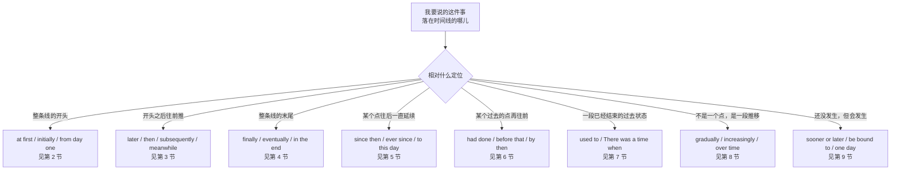
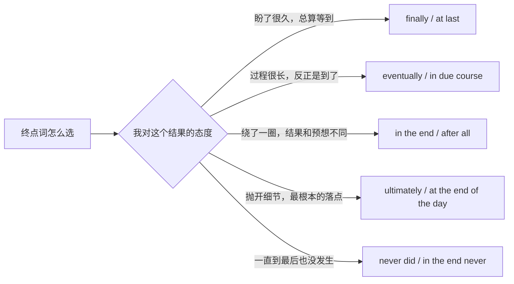
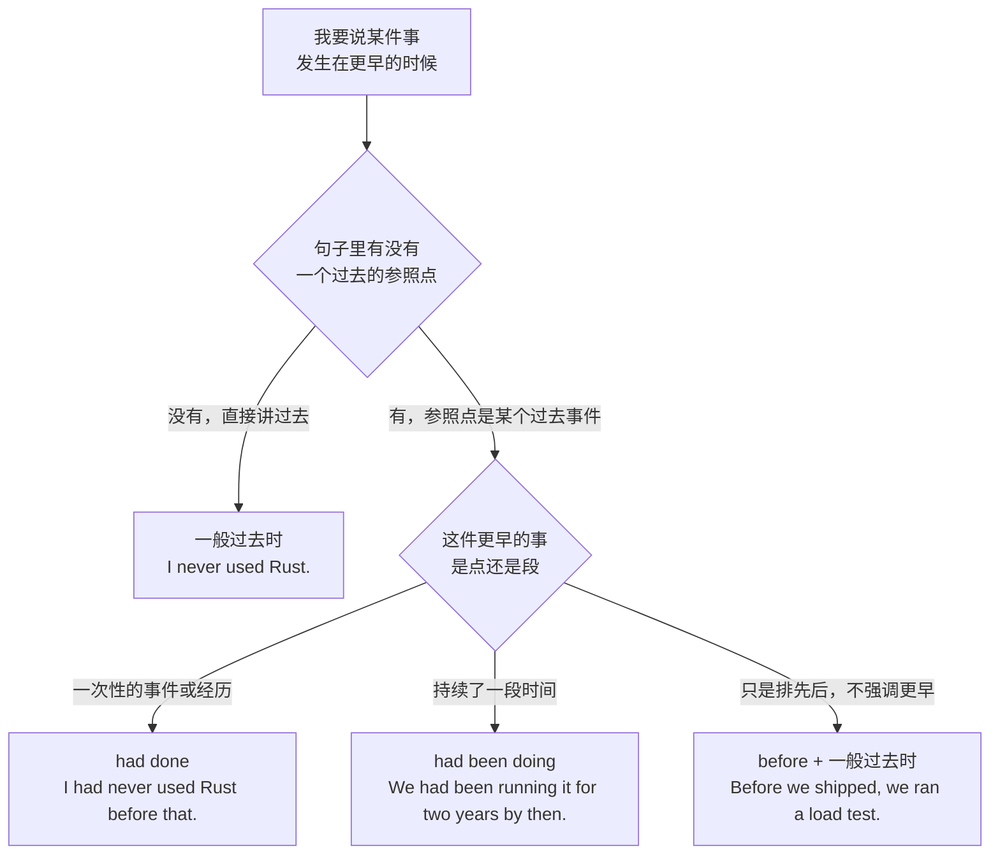
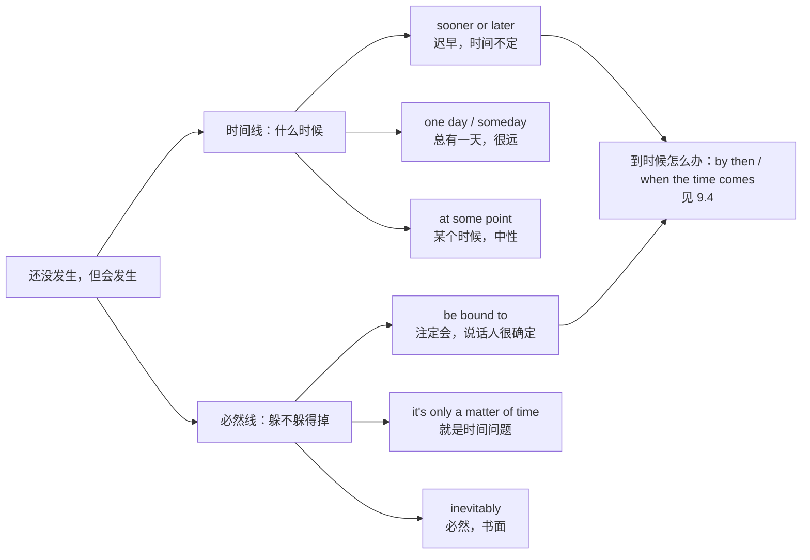
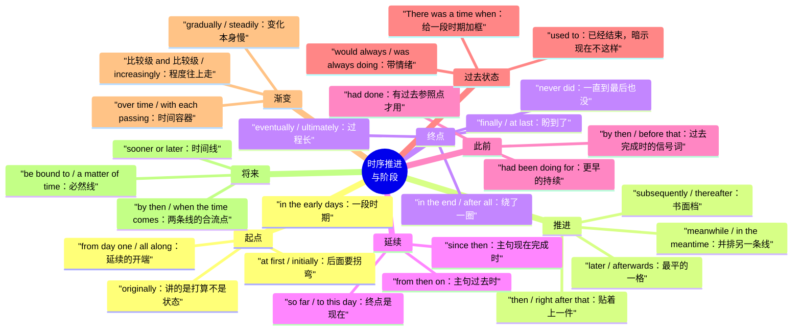

# 起初、后来、终于、迟早：时序推进与阶段

> [!info] 本篇定位
>
> 这篇收的是「把一串事按先后摆出来」的全部中文说法：落在起点的（起初、原本、打一开始）、推着往前走的（后来、随后、与此同时）、砸到终点的（终于、最终、到头来）、从某个点一路延续下来的（从那以后、至今、再也没有）、回头往前指的（在此之前我从没）、讲过去习惯的（我以前经常、曾经有一段时间）、讲渐变的（逐渐、越来越）、指向将来的（迟早、总有一天、到时候）。
>
> 和它相邻的两篇分工明确：`01` 管两件事之间的时间关系（当…的时候、一…就、直到才），`03` 管带数字的时间（花了多久、每隔一次、到…为止）。本篇管的是一条线上的位置——某件事落在开头、中间还是末尾，以及从那个位置往前往后各延伸多远。
>
> 读完能查到：想说「一开始还行，后来就崩了」直接查 2.1；想说「在这之前我从没用过 Rust」直接查 6.2；想说「这套东西迟早得重写」直接查 9.1；想说「他动不动就通宵」直接查 7.3。

---

## 1. 本篇导读：一条时间线上的八个位置

中文讲时序靠的是一串副词：起初、后来、然后、随后、终于、最终、从此、迟早。它们在中文里都是可以直接扔进句子的散装零件，没有形态要求，位置也松。英文这边不一样——同样一个「后来」，`later` 可以放句末，`subsequently` 通常放句首或动词前，`afterwards` 两头都行但语域偏书面；同样一个「终于」，`finally` 带着「盼到了」的情绪，`eventually` 带着「折腾了很久」的过程感，`in the end` 带着「兜了一圈还是」的转折感。选错的代价不是语法错，是把说话人的态度译丢了。

更麻烦的是时态。中文的时序词自己不带时态信息，「在这之前我从没用过」里的「之前」全靠语境判断；英文这一句必须写成 `I had never used it before that`，过去完成时是硬要求。本篇每个意图块的表格里都给成品句而不是骨架，就是为了把时态一起带出来，省掉读者自己推的那一步。

先看这张选择树，它决定了后面八节的分工。

这棵树的第一个岔口最关键：先问「相对什么定位」，而不是先问「用哪个词」。中文的「后来」既可以是相对开头（起初…后来…），也可以是相对某个具体事件（他走了以后），前者落在第 3 节，后者归 `01` 那一篇的 after 从句。分不清这两种，查出来的结构会整段错位。

第二个要留意的是第 6 节和第 7 节的差别。两者都指向过去，但第 6 节是**相对过去某点的更早**（有参照点，用过去完成时），第 7 节是**已经结束的一段过去状态**（不需要参照点，用 used to）。中文都可以说「以前」，英文分成两套结构，混用会让听者不知道你在拿哪个时刻当基准。

下面这张速查表把本篇的中文入口和落点对齐。查的时候先在这里定位到小节，再进小节看三档。

| 中文触发语 | 主结构 | 落在哪一节 |
| --- | --- | --- |
| 起初 / 一开始 / 刚开始的时候 | At first, A. Then B. | 2.1 |
| 原本 / 本来 / 最早的方案是 | Originally / initially + 过去时 | 2.2 |
| 早期那阵子 / 早年 / 刚上线那会儿 | In the early days / early on | 2.3 |
| 打一开始就 / 从头到尾一直 | from the outset / from day one / all along | 2.4 |
| 后来 / 之后 / 过后 | later / afterwards | 3.1 |
| 接着 / 然后 / 随即 / 紧跟着 | then / next / right after that | 3.2 |
| 随后 / 其后 / 继而（书面） | subsequently / thereafter / following that | 3.3 |
| 再后来 / 过了一阵子 / 没过多久 | some time later / before long / it wasn't long before | 3.4 |
| 与此同时 / 这期间 / 同一时候 | meanwhile / in the meantime / at the same time | 3.5 |
| 终于 / 总算 / 可算是 | finally / at last / it finally + 过去时 | 4.1 |
| 最终 / 折腾半天最后 / 归根到底走到 | eventually / ultimately / in due course | 4.2 |
| 到头来 / 结果还是 / 兜了一圈 | in the end / after all / end up doing | 4.3 |
| 一直到最后也没 / 始终没有 | never did / in the end never | 4.4 |
| 从那以后 / 从此 / 打那儿起 | since then / from then on | 5.1 |
| 自从…以来 / 自打…就 | ever since + 从句 / ever since + 名词 | 5.2 |
| 至今 / 到目前为止 / 一直到现在 | to this day / so far / up to now | 5.3 |
| 从此再也没 / 再没有过 | haven't done since / never again | 5.4 |
| 在那之前 / 在此之前 / 那会儿以前 | before that / prior to that / up until then | 6.1 |
| 在此之前我从没… / 头一回 | I had never done … before | 6.2 |
| 早在…之前就已经 / 那时候早就 | had already done by the time | 6.3 |
| 到那时候已经…多久了 | had been doing for + 时段 | 6.4 |
| 我以前经常 / 那时候老是 | used to do | 7.1 |
| 曾经有一段时间 / 有那么一阵子 | There was a time when … | 7.2 |
| 动不动就 / 那会儿总是 | would always do / was forever doing | 7.3 |
| 现在不…了 / 早就不干了 | no longer / not any more / have stopped doing | 7.4 |
| 逐渐 / 慢慢地 / 一点一点 | gradually / little by little / bit by bit | 8.1 |
| 越来越 / 一天比一天 | more and more / increasingly / 比较级 and 比较级 | 8.2 |
| 随着时间推移 / 时间长了就 | over time / as time went on / with each passing week | 8.3 |
| 迟早 / 早晚 / 早晚有一天 | sooner or later | 9.1 |
| 注定 / 必然会 / 躲不掉 | be bound to / be destined to / be only a matter of time | 9.2 |
| 总有一天 / 哪天 / 会有那么一刻 | one day / someday / there will come a time when | 9.3 |
| 到时候 / 到那时 / 等到了再说 | by then / when the time comes / we'll cross that bridge | 9.4 |
| 从现在起 / 今后 / 往后 | from now on / going forward / henceforth | 9.5 |

---

## 2. 起点：起初、原本、打一开始

时间线的起点有两种讲法，中文常常混着用，英文必须分开。一种是**「起初是这样，后来变了」**——起点存在的意义就是给后面的转折当参照，`at first` 和 `initially` 都自带这个「后来变了」的暗示，说完这半句听者会等着下半句。另一种是**「打一开始就一直这样」**——起点是延续的开端而不是对比的一端，用 `from the outset`、`from day one`、`all along`，说完就完整了，不欠下半句。这一节四个意图块把这两种分开排。

### 2.1 起初、一开始：后面要拐弯的起点

中文触发语：起初 / 一开始 / 刚开始的时候 / 头几天 / 最初还

| 档位 | 句架 | 例句 | 中文 |
| --- | --- | --- | --- |
| 口语 | At first, A. Then B. | At first it worked fine. Then the traffic doubled. | 一开始跑得好好的，后来流量翻倍了。 |
| 口语 | A at first, but B. | I thought it was a network issue at first, but it turned out to be a DNS cache. | 我起初以为是网络问题，结果是 DNS 缓存。 |
| 口语 | To start with, A. | To start with, we only had three users. | 一开始我们总共就三个用户。 |
| 口语 | In the beginning A, and then B. | In the beginning nobody used it, and then one team migrated over. | 刚开始没人用，后来有个组迁过来了。 |
| 书面 | Initially, A. Subsequently, B. | Initially the service ran on a single node. Subsequently we sharded it. | 服务最初跑在单节点上，随后做了分片。 |
| 书面 | A was B at first, only to + 动词原形. | The estimate was two weeks at first, only to triple after review. | 估期起初是两周，评审完直接翻了三倍。 |
| 正式 | In its initial form, A. | In its initial form, the proposal covered only internal users. | 提案最初的版本只覆盖内部用户。 |
| 正式 | At the outset of A, B. | At the outset of the project, no formal spec existed. | 项目起步时并不存在正式规格文档。 |

> [!warning] 错配警示
>
> ❌ ~~At the first, everything was fine.~~
> ✅ **At first, everything was fine.**（at first 是固定式，中间不加 the；带 the 的形式是 at the first sign of、at the first attempt 这类后面必须接名词的搭配）
>
> ❌ ~~At first it works fine, then it crashed.~~
> ✅ **At first it worked fine, then it crashed.**（at first 讲的是已经结束的一段过去，两个分句时态要一致，别一个现在时一个过去时）

同义入口：起初 / 一开始 / 刚开始那会儿 / 最初 / 头一阵子 / 一上来
语法归属：[[02.英语基础语法/06.动词时态/01.一般现在时与一般过去时\|一般现在时与一般过去时]]
场景实战：[[04.英语场景/10.职场与商务场景实战/02.会议汇报与演示场景\|会议汇报与演示场景]]

### 2.2 原本、本来：讲最早的打算而不是最早的状态

中文触发语：原本 / 本来 / 最早的方案是 / 说好的是 / 原定

| 档位 | 句架 | 例句 | 中文 |
| --- | --- | --- | --- |
| 口语 | It was supposed to be A. | It was supposed to be a two-hour job. | 这活儿本来是两小时的量。 |
| 口语 | The plan was A. | The plan was to ship on Friday. | 本来计划是周五上线。 |
| 口语 | Originally we were going to A. | Originally we were going to write it in Go. | 我们原本打算用 Go 写。 |
| 书面 | Originally, A + 过去时. | Originally, the API returned a flat list. | 这个接口原本返回的是一个扁平列表。 |
| 书面 | A was originally scheduled for + 时间. | The release was originally scheduled for March. | 这个版本原定三月发布。 |
| 书面 | What was meant to be A turned into B. | What was meant to be a patch turned into a rewrite. | 本来只是打个补丁，最后成了重写。 |
| 正式 | As originally conceived, A. | As originally conceived, the system had no multi-tenant support. | 系统最初的设想里并不支持多租户。 |
| 正式 | The original intent of A was to do sth. | The original intent of the flag was to gate an experiment. | 这个开关原本的用意是圈定一次实验的范围。 |

> [!warning] 错配警示
>
> ❌ ~~Original, we were going to use Go.~~
> ✅ **Originally, we were going to use Go.**（句首状语位置要用副词 originally，original 是形容词只能修饰名词）
>
> ❌ ~~It supposed to be a two-hour job.~~
> ✅ **It was supposed to be a two-hour job.**（be supposed to 里的 be 动词不能省；这个说法自带落空的暗示，后半句要给出实际结果，落空的完整句架见 `11.人际功能与话轮管理/06`）

同义入口：原本 / 本来 / 原定 / 说好的 / 最早的方案 / 按理说应该
语法归属：[[02.英语基础语法/07.助动词与情态动词/02.情态动词详解\|情态动词详解]]
场景实战：[[04.英语场景/03.时态与语态句型框架/04.情态动词句型框架\|情态动词句型框架]]

### 2.3 早期那阵子：给一段时期而不是一个时点

中文触发语：早期 / 早年 / 刚上线那会儿 / 头一年 / 项目初期 / 那阵子

| 档位 | 句架 | 例句 | 中文 |
| --- | --- | --- | --- |
| 口语 | Back when A, B. | Back when we had ten users, one server was plenty. | 早年就十个用户那会儿，一台机器绰绰有余。 |
| 口语 | Early on, A. | Early on we decided not to support IE. | 项目早期我们就决定不支持 IE 了。 |
| 口语 | In the first few + 时段, A. | In the first few months nobody touched the tests. | 头几个月没人碰过测试。 |
| 书面 | In the early days of A, B. | In the early days of the platform, deploys were manual. | 平台早期阶段部署是手工做的。 |
| 书面 | During the early stages, A. | During the early stages, performance was not a concern. | 早期阶段没把性能当回事。 |
| 书面 | A's early + 复数名词 + were 形容词. | The tool's early releases were painfully slow. | 这个工具早期的几个版本慢得难受。 |
| 正式 | In the formative phase of A, B. | In the formative phase of the standard, vendors disagreed on encoding. | 标准成型阶段，各厂商在编码上没谈拢。 |
| 正式 | At an early point in A, B. | At an early point in the migration, we froze schema changes. | 迁移的早期阶段我们冻结了表结构改动。 |

> [!warning] 错配警示
>
> ❌ ~~In the early day, deploys were manual.~~
> ✅ **In the early days, deploys were manual.**（in the early days 里 days 必须是复数，指的是一段时期不是某一天）
>
> ❌ ~~Back when we have ten users, one server was plenty.~~
> ✅ **Back when we had ten users, one server was plenty.**（back when 引导的是已经结束的过去，从句用过去时）

同义入口：早期 / 早年 / 刚起步那会儿 / 项目初期 / 头一年 / 当年
语法归属：[[02.英语基础语法/09.从句体系/04.状语从句详解\|状语从句详解]]
场景实战：[[04.英语场景/04.从句与复合句型框架/03.状语从句九大类型\|状语从句九大类型]]

### 2.4 打一开始就：起点是延续的开端

中文触发语：打一开始就 / 从头到尾一直 / 一直以来 / 早就 / 自始至终

| 档位 | 句架 | 例句 | 中文 |
| --- | --- | --- | --- |
| 口语 | A all along. | I knew all along it was a config problem. | 我打一开始就知道是配置问题。 |
| 口语 | From day one, A. | From day one, the API has been read-only. | 这个接口从上线第一天起就是只读的。 |
| 口语 | right from the start | It was broken right from the start. | 它从一开始就是坏的。 |
| 书面 | From the outset, A. | From the outset, the design assumed a single region. | 设计自始就假定只有一个地域。 |
| 书面 | A has always been B. | Latency has always been the bottleneck here. | 延迟一直以来都是这里的瓶颈。 |
| 书面 | Ever since its inception, A. | Ever since its inception, the team has run weekly retros. | 团队从建立起就每周做复盘。 |
| 正式 | From the very beginning, A. | From the very beginning, the contract excluded on-site support. | 合同自始就不包含现场支持。 |
| 正式 | A was, from its inception, B. | The protocol was, from its inception, designed for lossy networks. | 这个协议自设计之初就是面向弱网的。 |

> [!warning] 错配警示
>
> ❌ ~~From day one, the API is read-only.~~ 用来强调这条一直没变
> ✅ **From day one, the API has been read-only.**（from day one 指从过去某点延续到现在，主句要用现在完成时；用一般现在时会把「一直如此」的延续义丢掉）
>
> ❌ ~~I knew all along that it was a config problem all along.~~
> ✅ **I knew all along that it was a config problem.**（all along 一句只出现一次，紧贴在主句动词后面）

同义入口：打一开始就 / 从头到尾 / 一直以来 / 自始至终 / 早就 / 本来就
语法归属：[[02.英语基础语法/06.动词时态/04.完成时态详解\|完成时态详解]]
场景实战：[[04.英语场景/03.时态与语态句型框架/01.16种时态完全手册\|16种时态完全手册]]

---

## 3. 中段推进：后来、随后、与此同时

从起点往前推一格，中文用的是「后来」「接着」「随后」「过了一阵子」。这几个词在中文里几乎可以互换，英文这边差别是三个维度：**距离**（紧接着还是隔了很久）、**语域**（聊天还是文书）、**位置**（能不能放句末）。这一节按这三个维度把中段的推进词排开，最后一块给「与此同时」——它不推进时间线，而是在同一格上并排放第二条线。

### 3.1 后来、之后：最平的一次推进

中文触发语：后来 / 之后 / 过后 / 后头 / 再往后

| 档位 | 句架 | 例句 | 中文 |
| --- | --- | --- | --- |
| 口语 | A. Later, B. | We shipped the beta. Later, we found a memory leak. | 我们发了 beta，后来发现有内存泄漏。 |
| 口语 | A, and B later. | He said he'd look at it, and he sent a patch two days later. | 他说会看看，两天后发了个补丁。 |
| 口语 | A. Afterwards, B. | The demo went fine. Afterwards, three people asked for access. | 演示挺顺利，之后有三个人来要权限。 |
| 口语 | Later on, A. | Later on we realized the cache was never invalidated. | 后来我们才反应过来缓存压根没失效过。 |
| 书面 | A. B followed. | The outage lasted forty minutes. A postmortem followed. | 故障持续了四十分钟，之后做了复盘。 |
| 书面 | 时段 + later, A. | Six months later, the same bug resurfaced in a different service. | 半年后，同一个 bug 在另一个服务里又冒出来了。 |
| 正式 | At a later stage, A. | At a later stage, the scope was extended to external partners. | 后续阶段范围扩展到了外部合作方。 |
| 正式 | In the period that followed, A. | In the period that followed, adoption grew steadily. | 其后一段时间里采用率稳步上升。 |

> [!warning] 错配警示
>
> ❌ ~~After, we found a memory leak.~~
> ✅ **Afterwards, we found a memory leak.**（after 是介词或连词，后面必须带宾语或从句；单独当「之后」用的副词是 afterwards / afterward）
>
> ❌ ~~Later six months, the bug resurfaced.~~
> ✅ **Six months later, the bug resurfaced.**（表示间隔的时段一律放在 later 前面；later 后面能接的是 on，或者 that week、this year 这类指示性时间词组）

同义入口：后来 / 之后 / 过后 / 再往后 / 隔了一阵
语法归属：[[02.英语基础语法/04.形容词与副词/03.副词的分类与用法\|副词的分类与用法]]
场景实战：[[04.英语场景/10.职场与商务场景实战/02.会议汇报与演示场景\|会议汇报与演示场景]]

### 3.2 接着、随即：贴着上一件事发生

中文触发语：接着 / 然后 / 随即 / 紧跟着 / 一转身就 / 下一步

| 档位 | 句架 | 例句 | 中文 |
| --- | --- | --- | --- |
| 口语 | A, then B. | I restarted the pod, then the errors stopped. | 我重启了 pod，然后报错就没了。 |
| 口语 | Right after that, A. | Right after that, the alert cleared on its own. | 紧跟着，告警自己就恢复了。 |
| 口语 | Next, A. | Next, run the migration script. | 接下来跑迁移脚本。 |
| 口语 | And then out of nowhere A. | And then out of nowhere the disk filled up. | 然后突然之间磁盘就满了。 |
| 书面 | A. B immediately afterwards. | The deploy finished. Latency spiked immediately afterwards. | 部署结束，延迟随即飙升。 |
| 书面 | No sooner had A than B. | No sooner had we merged the fix than a new report came in. | 修复刚合进去，新的反馈就来了。 |
| 正式 | A, whereupon B. | The build failed twice, whereupon the pipeline was disabled. | 构建连挂两次，随即流水线被停用。 |
| 正式 | A is to be followed immediately by B. | The schema change is to be followed immediately by a backfill. | 表结构变更之后须立即执行回填。 |

> [!warning] 错配警示
>
> ❌ ~~No sooner we had merged the fix than a new report came in.~~
> ✅ **No sooner had we merged the fix than a new report came in.**（no sooner 置于句首触发助动词提前，语序推导见倒装篇）
>
> ❌ ~~No sooner had we merged the fix when a new report came in.~~
> ✅ **No sooner had we merged the fix than a new report came in.**（no sooner 只配 than，配 when 的是 hardly / scarcely）

同义入口：接着 / 然后 / 随即 / 紧跟着 / 下一步 / 一转眼
语法归属：[[02.英语基础语法/10.特殊句型/03.倒装句结构\|倒装句结构]]
场景实战：[[04.英语场景/04.从句与复合句型框架/03.状语从句九大类型\|状语从句九大类型]]

### 3.3 随后、其后：书面档的推进

中文触发语：随后 / 其后 / 继而 / 嗣后 / 在此之后

| 档位 | 句架 | 例句 | 中文 |
| --- | --- | --- | --- |
| 书面 | Subsequently, A. | Subsequently, the flag was removed from the codebase. | 随后这个开关从代码库里被移除了。 |
| 书面 | A was subsequently + 过去分词. | The account was subsequently suspended. | 该账号随后被停用。 |
| 书面 | Following that, A. | Following that, we introduced a rate limit. | 在此之后我们引入了限流。 |
| 书面 | A. Thereafter, B. | The contract was signed in May. Thereafter, invoices were monthly. | 合同五月签署，其后按月开票。 |
| 书面 | in the wake of A, B | In the wake of the incident, on-call rotations were rewritten. | 事故之后值班轮换制度重写了一遍。 |
| 正式 | Pursuant to A, B was + 过去分词. | Pursuant to the audit, access controls were tightened. | 依据审计结论，权限控制随后收紧。 |
| 正式 | A; thereupon B. | The vendor missed two milestones; thereupon the contract was terminated. | 供应商错过两个里程碑，其后合同终止。 |
| 正式 | Subsequent to A, B. | Subsequent to the migration, no data loss was observed. | 迁移之后未观察到数据丢失。 |

> [!warning] 错配警示
>
> ❌ ~~Subsequently the migration, no data loss was observed.~~
> ✅ **Subsequent to the migration, no data loss was observed.**（subsequently 是副词不能带宾语；要带名词得用形容词形式加 to）
>
> ❌ ~~Subsequently, I grabbed a coffee.~~ 在闲聊里
> ✅ **Then I grabbed a coffee.**（subsequently 是正式档词，日常对话里用它会显得像在念公文，口语档一律 then / after that）

同义入口：随后 / 其后 / 继而 / 在此之后 / 接下来（书面）
语法归属：[[02.英语基础语法/05.介词与连词/04.介词与连词的易混点\|介词与连词的易混点]]
场景实战：[[04.英语场景/10.职场与商务场景实战/03.商务邮件与正式书面沟通\|商务邮件与正式书面沟通]]

### 3.4 再后来、没过多久：带间隔感的推进

中文触发语：再后来 / 过了一阵子 / 没过多久 / 隔了没几天 / 又过了

| 档位 | 句架 | 例句 | 中文 |
| --- | --- | --- | --- |
| 口语 | A while later, B. | A while later, someone reopened the ticket. | 过了一阵子，有人把工单重开了。 |
| 口语 | It wasn't long before A. | It wasn't long before the workaround broke too. | 没过多久那个绕过方案也不行了。 |
| 口语 | After a bit, A. | After a bit, the queue drained on its own. | 过了一会儿队列自己就消化完了。 |
| 口语 | Then eventually A. | Then eventually someone just rewrote the whole module. | 再后来干脆有人把整个模块重写了。 |
| 书面 | Some time later, A. | Some time later, the same pattern appeared in the billing service. | 又过了一段时间，同样的模式出现在计费服务里。 |
| 书面 | Before long, A. | Before long, three teams depended on the endpoint. | 没过多久就有三个团队依赖这个接口了。 |
| 正式 | In the months that followed, A. | In the months that followed, usage tripled. | 其后数月使用量翻了三倍。 |
| 正式 | After an interval of + 时段, A. | After an interval of two quarters, the review was reopened. | 隔了两个季度之后评审重新启动。 |

> [!warning] 错配警示
>
> ❌ ~~It wasn't long before the workaround didn't break.~~
> ✅ **It wasn't long before the workaround broke too.**（before 从句里已经含否定义的是 wasn't long 那一半，从句本身用肯定式，写成否定会把意思反过来）
>
> ❌ ~~After a while later, someone reopened it.~~
> ✅ **A while later, someone reopened it.**（after 和 later 表达的是同一件事，只留一个）

同义入口：再后来 / 过了一阵 / 没过多久 / 隔了几天 / 又过了一段
语法归属：[[02.英语基础语法/09.从句体系/04.状语从句详解\|状语从句详解]]
场景实战：[[04.英语场景/03.时态与语态句型框架/01.16种时态完全手册\|16种时态完全手册]]

### 3.5 与此同时：不推进时间线，另起一条

中文触发语：与此同时 / 这期间 / 同一时候 / 另一头 / 这边…那边

| 档位 | 句架 | 例句 | 中文 |
| --- | --- | --- | --- |
| 口语 | Meanwhile, A. | Meanwhile, the frontend team was still waiting on the schema. | 与此同时前端组还在等 schema。 |
| 口语 | In the meantime, A. | I'll open a ticket. In the meantime, just restart it. | 我去开工单，这期间你先重启一下。 |
| 口语 | while all this was going on, A | While all this was going on, the backups kept failing silently. | 这些事忙活的时候，备份一直在悄悄失败。 |
| 书面 | At the same time, A. | At the same time, costs were rising in the storage tier. | 与此同时存储层的成本在上涨。 |
| 书面 | Meanwhile, B was doing sth. | Meanwhile, the vendor was preparing a competing proposal. | 这期间供应商在准备一份竞争方案。 |
| 书面 | For the duration of A, B. | For the duration of the freeze, only hotfixes were merged. | 封版期间只合入紧急修复。 |
| 正式 | Concurrently, A. | Concurrently, a second working group reviewed the security model. | 与此同时另一个工作组在评审安全模型。 |
| 正式 | In parallel with A, B. | In parallel with the rollout, we ran a shadow deployment. | 在灰度推进的同时并行跑了一套影子部署。 |

> [!warning] 错配警示
>
> ❌ ~~I'll open a ticket. Meanwhile, just restart it.~~ 想表达「在这段等待时间里」
> ✅ **I'll open a ticket. In the meantime, just restart it.**（meanwhile 强调两件事同时在发生，in the meantime 强调在等待某事的这段空当里做别的；给临时办法时用后者）
>
> ❌ ~~Meanwhile the frontend team, they were waiting.~~
> ✅ **Meanwhile, the frontend team was still waiting.**（meanwhile 后加逗号直接接完整句子，不要再重复主语）

同义入口：与此同时 / 这期间 / 同时 / 另一边 / 在等的这段时间
语法归属：[[02.英语基础语法/06.动词时态/03.进行时态详解\|进行时态详解]]
场景实战：[[04.英语场景/10.职场与商务场景实战/02.会议汇报与演示场景\|会议汇报与演示场景]]

---

## 4. 终点：终于、最终、到头来

中文的「终于」「最终」「到头来」在英文里对应 `finally`、`eventually`、`in the end`、`ultimately`、`after all` 五个高频词，选哪个不取决于时间远近，取决于**说话人对这个结果的态度**。下面这张图把五个词按态度分开。

这张图第一格的 `finally` 带情绪，第二格的 `eventually` 带过程，第三格的 `in the end` 带转折，第四格的 `ultimately` 已经不太是时间词而更像「说到底」，第五格是终点的否定形态。中文母语者最常犯的错是把 `finally` 当万能终点词——在中性叙述里写 `The build finally succeeded` 会莫名带出一股「我等得快疯了」的味道，而如果你只是平铺直叙，`The build eventually succeeded` 才是对的。

### 4.1 终于、总算：盼到了

中文触发语：终于 / 总算 / 可算是 / 好不容易 / 这才

| 档位 | 句架 | 例句 | 中文 |
| --- | --- | --- | --- |
| 口语 | A finally + 过去时. | The build finally passed. | 构建总算过了。 |
| 口语 | Finally! A. | Finally! The ticket's closed. | 可算是！工单关掉了。 |
| 口语 | at last | At last, a stable release. | 总算来了个稳定版。 |
| 口语 | It took A, but B. | It took three attempts, but the deploy went through. | 试了三次，好不容易部署上去了。 |
| 书面 | A has finally + 过去分词. | The proposal has finally been approved. | 提案终于批下来了。 |
| 书面 | After A, B finally + 过去时. | After two weeks of debugging, we finally found the race condition. | 调了两周，终于找到那个竞态。 |
| 正式 | A was at length + 过去分词. | The dispute was at length resolved through arbitration. | 争议最终经由仲裁得以解决。 |
| 正式 | A has now been brought to a conclusion. | The review has now been brought to a conclusion. | 评审至此已告结束。 |

> [!warning] 错配警示
>
> ❌ ~~At last, run the migration script.~~ 用来表示步骤的最后一步
> ✅ **Lastly, run the migration script.**（at last 是「盼到了」，列举里的最后一项用 lastly 或 finally；列举式的完整句架见 `06.并列、递进、列举与选择/02`）
>
> ❌ ~~The build finally passes.~~
> ✅ **The build finally passed.**（finally 讲的是已经落地的一个结果，配过去时或现在完成时，别配一般现在时）

同义入口：终于 / 总算 / 可算 / 好不容易 / 这才 / 千辛万苦
语法归属：[[02.英语基础语法/04.形容词与副词/03.副词的分类与用法\|副词的分类与用法]]
场景实战：[[04.英语场景/05.高频实用表达句型框架/01.表达观点与态度的50个万能句型\|表达观点与态度的50个万能句型]]

### 4.2 最终、最后还是：过程长但不带情绪

中文触发语：最终 / 最后还是 / 慢慢地就 / 迟迟地 / 归根到底走到

| 档位 | 句架 | 例句 | 中文 |
| --- | --- | --- | --- |
| 口语 | A eventually + 过去时. | Someone eventually noticed the log was empty. | 最后有人发现日志是空的。 |
| 口语 | Eventually A. | Eventually we just dropped the feature. | 最终我们干脆把这功能砍了。 |
| 口语 | A got there in the end. | It was slow, but we got there in the end. | 慢是慢，最后还是做出来了。 |
| 书面 | A will eventually + 动词原形. | Unmaintained dependencies will eventually break. | 没人维护的依赖最终一定会挂。 |
| 书面 | Ultimately, A. | Ultimately, the team chose the simpler design. | 团队最终选了更简单的那个设计。 |
| 书面 | A eventually gave way to B. | Manual approvals eventually gave way to an automated gate. | 人工审批最终让位给了自动卡点。 |
| 正式 | In due course, A. | In due course, the interim policy will be replaced. | 临时政策将在适当的时候被替换。 |
| 正式 | A culminated in B. | Three quarters of refactoring culminated in a full rewrite. | 三个季度的重构最终演变成了彻底重写。 |

> [!warning] 错配警示
>
> ❌ ~~Eventually, run the migration script.~~
> ✅ **Then run the migration script.**（eventually 表示经过一段过程才到达，不能当步骤衔接词用；操作步骤用 then / next）
>
> ❌ ~~It was slow, but we got there at the end.~~
> ✅ **It was slow, but we got there in the end.**（in the end 是「最后」，at the end 必须接 of 加名词，如 at the end of the sprint）

同义入口：最终 / 最后还是 / 到最后 / 迟早还是 / 走到最后
语法归属：[[02.英语基础语法/06.动词时态/05.时态综合运用与辨析\|时态综合运用与辨析]]
场景实战：[[04.英语场景/10.职场与商务场景实战/04.商务谈判合同与客户沟通\|商务谈判合同与客户沟通]]

### 4.3 到头来、结果反倒：绕了一圈的落点

中文触发语：到头来 / 结果还是 / 兜了一圈 / 白折腾 / 说到底 / 结果反倒

| 档位 | 句架 | 例句 | 中文 |
| --- | --- | --- | --- |
| 口语 | In the end, A. | In the end, we shipped the original version. | 到头来我们发的还是最早那个版本。 |
| 口语 | We ended up doing sth. | We ended up rewriting it from scratch. | 我们最后落得从头重写。 |
| 口语 | It turned out A after all. | It turned out to be a caching issue after all. | 到头来还真是缓存的问题。 |
| 口语 | So much for A. | So much for the two-week estimate. | 两周的估期，到头来就这样。 |
| 书面 | A, only to + 动词原形. | We migrated the whole cluster, only to roll it back a week later. | 整个集群迁完了，结果一周后又回滚了。 |
| 书面 | A came full circle. | The architecture came full circle: back to a monolith. | 架构兜了一圈，又回到单体了。 |
| 正式 | At the end of the day, A. | At the end of the day, the constraint was budget, not headcount. | 说到底限制因素是预算而不是人头。 |
| 正式 | The net outcome of A was B. | The net outcome of the reorganization was a slower release cadence. | 这次重组最终导致的结果是发布节奏变慢。 |

> [!warning] 错配警示
>
> ❌ ~~We ended up to rewrite it from scratch.~~
> ✅ **We ended up rewriting it from scratch.**（end up 后面接动名词，不接不定式）
>
> ❌ ~~We migrated the whole cluster, only to rolled it back.~~
> ✅ **We migrated the whole cluster, only to roll it back a week later.**（only to 后面接动词原形，这个结构专门用来表达和预期相反的结果）

同义入口：到头来 / 结果还是 / 兜了一圈 / 白忙一场 / 说到底 / 结果反倒
语法归属：[[02.英语基础语法/08.非谓语动词/01.动词不定式详解\|动词不定式详解]]
场景实战：[[04.英语场景/05.高频实用表达句型框架/04.比较对比举例总结句型库\|比较对比举例总结句型库]]

### 4.4 一直到最后也没：终点的否定形态

中文触发语：一直到最后也没 / 始终没有 / 到底还是没 / 最后不了了之

| 档位 | 句架 | 例句 | 中文 |
| --- | --- | --- | --- |
| 口语 | A never + 过去时. | He never replied. | 他一直没回。 |
| 口语 | In the end, A never + 过去时. | In the end, we never used the library. | 到最后那个库我们压根没用上。 |
| 口语 | A never did get done. | The migration never did get finished. | 那次迁移到底还是没做完。 |
| 口语 | Nothing ever came of A. | Nothing ever came of the proposal. | 那份提案最后不了了之。 |
| 书面 | A remained unresolved. | The root cause remained unresolved. | 根因始终没查清。 |
| 书面 | To date, A has not + 过去分词. | To date, the issue has not reappeared. | 到目前为止这个问题没有再出现。 |
| 正式 | A was never brought to completion. | The audit was never brought to completion. | 该审计始终未能完成。 |
| 正式 | No conclusion was reached on A. | No conclusion was reached on the licensing question. | 授权问题最终未得出结论。 |

> [!warning] 错配警示
>
> ❌ ~~In the end we didn't never use the library.~~
> ✅ **In the end, we never used the library.**（never 本身就是否定，别再加 didn't；双重否定在英文里会互相抵消）
>
> ❌ ~~The migration did never get finished.~~
> ✅ **The migration never did get finished.**（强调式 did 夹在 never 和实义动词之间，never 在前 did 在后，顺序不能反）

同义入口：一直到最后也没 / 始终没 / 到底没 / 不了了之 / 没了下文
语法归属：[[02.英语基础语法/10.特殊句型/04.强调句型\|强调句型]]
场景实战：[[04.英语场景/10.职场与商务场景实战/02.会议汇报与演示场景\|会议汇报与演示场景]]

---

## 5. 延续：从那以后、自从、至今

「从那以后」这一类的共同点是**给出一个起点，然后声明从那个起点到现在都成立**。英文的硬要求是主句必须用完成时——现在完成或现在完成进行，因为讲的是一段延伸到现在的时间。中文母语者最常见的失误就是这里用一般过去时，写成 `Since then we used Postgres`，听感上像是「从那以后我们用过一次 Postgres」，延续义完全丢了。

### 5.1 从那以后、从此：起点是一个已提到的事件

中文触发语：从那以后 / 从此 / 打那儿起 / 自那时候起 / 那次之后就

| 档位 | 句架 | 例句 | 中文 |
| --- | --- | --- | --- |
| 口语 | Since then, A has + 过去分词. | Since then, nobody has touched that config. | 从那以后没人再动过那份配置。 |
| 口语 | From then on, A. | From then on, we required two reviewers. | 从那以后我们就要求两个审阅人了。 |
| 口语 | A hasn't done sth since. | It hasn't crashed since. | 从那以后就没再崩过。 |
| 口语 | After that, A always + 动词. | After that, I always check the logs first. | 打那儿起我都是先看日志。 |
| 书面 | Since then, A has been B. | Since then, the endpoint has been rate-limited. | 从那时起这个接口就一直有限流。 |
| 书面 | From that point onward, A. | From that point onward, all deploys required a change ticket. | 自那时起所有部署都要走变更单。 |
| 正式 | As of that date, A. | As of that date, the legacy API was formally deprecated. | 自该日起旧版接口正式弃用。 |
| 正式 | Thenceforth, A. | Thenceforth, the committee met quarterly. | 自此委员会改为按季度开会。 |

> [!warning] 错配警示
>
> ❌ ~~Since then, nobody touched that config.~~
> ✅ **Since then, nobody has touched that config.**（since then 声明的是一段延伸到现在的时间，主句必须用现在完成时）
>
> ❌ ~~From then on, we have required two reviewers.~~ 讲的是当年定下的规矩
> ✅ **From then on, we required two reviewers.**（from then on 把叙述基点定在过去，后面接过去时；since then 才把基点定在现在，两个词的时态要求正好相反）

同义入口：从那以后 / 从此 / 打那儿起 / 自那时候 / 那次之后
语法归属：[[02.英语基础语法/06.动词时态/04.完成时态详解\|完成时态详解]]
场景实战：[[04.英语场景/03.时态与语态句型框架/01.16种时态完全手册\|16种时态完全手册]]

### 5.2 自从…以来：起点写在句子里

中文触发语：自从…以来 / 自打…就 / 从…那次起 / 打…开始

| 档位 | 句架 | 例句 | 中文 |
| --- | --- | --- | --- |
| 口语 | Ever since A, B. | Ever since we added the cache, the p99 has been flat. | 自打加了缓存，p99 就一直很平。 |
| 口语 | Since + 名词, A has + 过去分词. | Since the incident, deploys have been slower. | 自从那次事故，部署一直变慢了。 |
| 口语 | ever since | I've used vim ever since. | 打那以后我就一直用 vim。 |
| 书面 | Since + 从句（过去时）, 主句现在完成时. | Since we moved to a monorepo, build times have doubled. | 自从换成单体仓库，构建时间翻了一倍。 |
| 书面 | A has been + 过去分词 + since + 时间点. | The feature has been disabled since March. | 这个功能从三月起就一直关着。 |
| 书面 | Ever since its launch, A has done sth. | Ever since its launch, the tool has had a memory ceiling. | 这个工具自发布起就一直有内存上限。 |
| 正式 | Since the entry into force of A, B. | Since the entry into force of the policy, no exceptions have been granted. | 自该政策生效以来未批准过任何例外。 |
| 正式 | A has, since + 时间点, been B. | The clause has, since 2019, been treated as non-binding. | 该条款自二〇一九年起被视为不具约束力。 |

> [!warning] 错配警示
>
> ❌ ~~Since we have moved to a monorepo, build times have doubled.~~
> ✅ **Since we moved to a monorepo, build times have doubled.**（since 从句里给的是那个起点事件，用一般过去时；完成时留给主句）
>
> ❌ ~~Ever since three months.~~
> ✅ **For the past three months.** 或 **Ever since March.**（since 后面接的必须是时间点或事件，不能接时段；时段用 for，两者的完整对照见 `07.时间与顺序/03`）

同义入口：自从…以来 / 自打 / 从那次起 / 打…开始 / 有…以来
语法归属：[[02.英语基础语法/06.动词时态/04.完成时态详解\|完成时态详解]]
场景实战：[[04.英语场景/04.从句与复合句型框架/03.状语从句九大类型\|状语从句九大类型]]

### 5.3 至今、到目前为止：终点是「现在」

中文触发语：至今 / 到目前为止 / 一直到现在 / 到今天还 / 眼下还是

| 档位 | 句架 | 例句 | 中文 |
| --- | --- | --- | --- |
| 口语 | So far, A. | So far, no complaints. | 到目前为止没人抱怨。 |
| 口语 | A is still B. | That script is still running in production. | 那个脚本到现在还跑在生产上。 |
| 口语 | Up to now, A has + 过去分词. | Up to now, the workaround has held. | 到现在为止那个临时方案还撑得住。 |
| 书面 | To this day, A. | To this day, nobody knows who wrote that module. | 时至今日也没人知道那个模块是谁写的。 |
| 书面 | As of + 日期, A. | As of today, three services still call the old endpoint. | 截至今天还有三个服务在调旧接口。 |
| 书面 | A remains B. | The root cause remains unknown. | 根因至今未明。 |
| 正式 | To date, A. | To date, no security incidents have been reported. | 迄今未有安全事件上报。 |
| 正式 | A continues to + 动词原形. | The legacy system continues to serve read traffic. | 旧系统至今仍在承接读流量。 |

> [!warning] 错配警示
>
> ❌ ~~Until now, no complaints.~~ 想说「到目前为止一切正常」
> ✅ **So far, no complaints.**（until now 在英语里暗示「以前没有，现在有了」，用它汇报一切正常会被理解成情况刚刚变糟；中性的「到目前为止」用 so far / to date）
>
> ❌ ~~So far, the workaround held.~~
> ✅ **So far, the workaround has held.**（so far 覆盖到现在，配现在完成时）

同义入口：至今 / 到目前为止 / 一直到现在 / 到今天还 / 迄今
语法归属：[[02.英语基础语法/06.动词时态/04.完成时态详解\|完成时态详解]]
场景实战：[[04.英语场景/10.职场与商务场景实战/03.商务邮件与正式书面沟通\|商务邮件与正式书面沟通]]

### 5.4 从此再也没：延续的否定形态

中文触发语：从此再也没 / 再没有过 / 打那以后就没 / 一次都没有

| 档位 | 句架 | 例句 | 中文 |
| --- | --- | --- | --- |
| 口语 | A hasn't done sth since. | I haven't touched PHP since. | 打那以后我就没再碰过 PHP。 |
| 口语 | Never again. | We tried a Friday deploy once. Never again. | 我们周五部署过一次，再也不干了。 |
| 口语 | not once since | It hasn't failed once since the patch. | 打了补丁之后一次都没失败过。 |
| 书面 | A has not + 过去分词 + since then. | The alert has not fired since then. | 那之后这个告警再没响过。 |
| 书面 | No B has done sth since A. | No incident of that kind has occurred since the redesign. | 重新设计之后没再发生过同类事故。 |
| 书面 | A is no longer B. | That path is no longer reachable. | 那条路径从此不可达了。 |
| 正式 | At no point since A has + 主语 + 过去分词. | At no point since the upgrade has latency exceeded the SLO. | 升级之后延迟从未超过 SLO。 |
| 正式 | A has remained dormant ever since. | The feature flag has remained dormant ever since. | 这个开关自那以后一直处于闲置状态。 |

> [!warning] 错配警示
>
> ❌ ~~At no point since the upgrade latency has exceeded the SLO.~~
> ✅ **At no point since the upgrade has latency exceeded the SLO.**（否定词组置于句首要把助动词提到主语前，语序推导见倒装篇）
>
> ❌ ~~I didn't touch PHP since.~~
> ✅ **I haven't touched PHP since.**（since 单独作副词收尾时，主句必须是现在完成时）

同义入口：从此再也没 / 再没有过 / 打那以后就没 / 一次都没 / 绝迹了
语法归属：[[02.英语基础语法/10.特殊句型/03.倒装句结构\|倒装句结构]]
场景实战：[[04.英语场景/03.时态与语态句型框架/01.16种时态完全手册\|16种时态完全手册]]

---

## 6. 此前：在那之前、在此之前我从没

这一节是全篇时态压力最大的地方。中文说「在这之前我从没用过 Rust」，时间信息全在「之前」两个字上，动词形态不变；英文必须把「更早」这层信息压进谓语，写成 `had never used`。判断法只有一条：**句子里是不是已经有一个过去的参照点**——有，就用过去完成时；没有，用一般过去时就够。

下面这张选择树是这一节的主干。

这棵树的第三个岔口值得单独说：并不是所有「更早」都必须上过去完成时。当句子里已经有 `before`、`after` 这类连词把先后关系写死了，过去完成时就变成可选项，`Before we shipped, we ran a load test` 完全成立。过去完成时真正不可省的场合是**没有连词兜底、光靠时态传递先后**的时候，尤其是 `by then`、`before that`、`by the time` 这三个搭配。

### 6.1 在那之前、在此之前：给出参照点

中文触发语：在那之前 / 在此之前 / 那会儿以前 / 截至那时 / 到那时候

| 档位 | 句架 | 例句 | 中文 |
| --- | --- | --- | --- |
| 口语 | Before that, A. | Before that, everything ran on one box. | 在那之前所有东西都跑在一台机器上。 |
| 口语 | Up until then, A. | Up until then, we hadn't needed a load balancer. | 在那之前我们一直没用上负载均衡。 |
| 口语 | By then, A had + 过去分词. | By then, half the team had already left. | 到那时候团队已经走了一半。 |
| 书面 | Prior to that, A. | Prior to that, releases were quarterly. | 在此之前发布是按季度的。 |
| 书面 | Before + 名词, A had been B. | Before the migration, the schema had been unchanged for years. | 迁移之前表结构好几年没动过。 |
| 书面 | Until + 时间点, A. | Until 2022, the service had no health check. | 到二〇二二年为止这个服务没有健康检查。 |
| 正式 | Preceding A, B. | Preceding the audit, no formal access log existed. | 审计之前不存在正式的访问日志。 |
| 正式 | As at that date, A. | As at that date, three obligations remained outstanding. | 截至该日期尚有三项义务未履行。 |

> [!warning] 错配警示
>
> ❌ ~~By then, half the team already left.~~
> ✅ **By then, half the team had already left.**（by then 把基准点定在过去某刻，比它更早的事必须用过去完成时）
>
> ❌ ~~Before that, everything runs on one box.~~
> ✅ **Before that, everything ran on one box.**（before that 指向过去，主句不能用一般现在时）

同义入口：在那之前 / 在此之前 / 到那时候 / 截至那时 / 那阵子以前
语法归属：[[02.英语基础语法/06.动词时态/04.完成时态详解\|完成时态详解]]
场景实战：[[04.英语场景/03.时态与语态句型框架/01.16种时态完全手册\|16种时态完全手册]]

### 6.2 在此之前我从没：头一回做某事

中文触发语：在这之前我从没 / 那是我头一回 / 我以前一次都没 / 第一次碰上

| 档位 | 句架 | 例句 | 中文 |
| --- | --- | --- | --- |
| 口语 | I had never done sth before. | I had never used Rust before that project. | 那个项目之前我从没用过 Rust。 |
| 口语 | That was the first time I had ever done sth. | That was the first time I had ever seen a kernel panic. | 那是我头一回见到内核崩溃。 |
| 口语 | I'd never even heard of A. | I'd never even heard of the library until last week. | 上周之前我连听都没听过这个库。 |
| 口语 | It was my first + 名词. | It was my first on-call week. | 那是我第一次值班的一周。 |
| 书面 | Until then, A had never + 过去分词. | Until then, the team had never run a load test. | 在那之前团队从没做过压测。 |
| 书面 | Never before had A + 过去分词. | Never before had the queue backed up like that. | 队列从来没那样堆积过。 |
| 正式 | No precedent for A existed at that time. | No precedent for such a rollback existed at that time. | 当时没有此类回滚的先例。 |
| 正式 | A had, up to that point, remained B. | The component had, up to that point, remained untested. | 该组件在那之前一直未经测试。 |

> [!warning] 错配警示
>
> ❌ ~~That was the first time I ever saw a kernel panic.~~ 在正式书面语里
> ✅ **That was the first time I had ever seen a kernel panic.**（the first time 后面接的从句发生在那个过去时刻之前，用过去完成时；口语里省略成一般过去时可以接受，写文档时补回来）
>
> ❌ ~~Never before the queue had backed up like that.~~
> ✅ **Never before had the queue backed up like that.**（never before 置于句首必须把助动词 had 提到主语前面）

同义入口：在此之前我从没 / 那是头一回 / 我一次都没 / 第一次遇到 / 破天荒
语法归属：[[02.英语基础语法/06.动词时态/04.完成时态详解\|完成时态详解]]
场景实战：[[04.英语场景/07.社交交际场景实战/01.交友聚会与闲聊场景\|交友聚会与闲聊场景]]

### 6.3 早在…之前就已经：更早的更早

中文触发语：早在…之前就已经 / 那时候早就 / 老早就 / 还没…的时候就

| 档位 | 句架 | 例句 | 中文 |
| --- | --- | --- | --- |
| 口语 | A had already done sth by the time B. | We had already shipped it by the time the review came back. | 评审意见回来的时候我们早就发出去了。 |
| 口语 | long before A, B | Long before the outage, someone had flagged the disk usage. | 早在故障之前就有人提过磁盘占用。 |
| 口语 | A was already B when + 从句. | The bug was already in main when I joined. | 我进来的时候这个 bug 早就在主干里了。 |
| 书面 | By the time A, B had + 过去分词. | By the time we noticed, the queue had grown to two million. | 等我们注意到的时候队列已经涨到两百万了。 |
| 书面 | A had done sth well before B. | The vendor had raised the risk well before the contract was signed. | 早在合同签署之前供应商就提过这个风险。 |
| 书面 | Even before A, B had been C. | Even before the launch, capacity had been a concern. | 还没上线的时候容量就已经是个问题了。 |
| 正式 | A had been in place prior to B. | A mitigation had been in place prior to the disclosure. | 在披露之前缓解措施已经就位。 |
| 正式 | Antecedent to A, B had occurred. | Antecedent to the merger, two similar disputes had occurred. | 合并之前已发生过两起同类争议。 |

> [!warning] 错配警示
>
> ❌ ~~By the time we noticed, the queue grew to two million.~~
> ✅ **By the time we noticed, the queue had grown to two million.**（by the time 引导的从句用过去时，主句讲的是那之前就完成的事，必须用过去完成时）
>
> ❌ ~~The bug already was in main when I joined.~~
> ✅ **The bug was already in main when I joined.**（already 放在 be 动词之后，不放前面）

同义入口：早在…之前 / 那时候早就 / 老早 / 还没…就已经 / 提前
语法归属：[[02.英语基础语法/06.动词时态/05.时态综合运用与辨析\|时态综合运用与辨析]]
场景实战：[[04.英语场景/04.从句与复合句型框架/03.状语从句九大类型\|状语从句九大类型]]

### 6.4 到那时候已经…多久了：更早的持续

中文触发语：到那时候已经…多久了 / 那会儿已经…了…年 / 干了多久才

| 档位 | 句架 | 例句 | 中文 |
| --- | --- | --- | --- |
| 口语 | A had been doing sth for + 时段. | We'd been running it in production for two years by then. | 到那时候我们已经在生产上跑了两年了。 |
| 口语 | A had been at it for + 时段 + when B. | I'd been at it for six hours when the fix finally landed. | 我搞了六个小时，修复才总算落地。 |
| 口语 | It had been + 时段 + since A. | It had been three months since the last release. | 距离上次发版已经三个月了。 |
| 书面 | By + 时间点, A had been doing sth for + 时段. | By 2023, the team had been maintaining the fork for four years. | 到二〇二三年，团队维护这个分支已经四年了。 |
| 书面 | A had spent + 时段 + doing sth before B. | We had spent a full quarter tuning queries before we found the missing index. | 我们调了整整一个季度的查询，才发现缺了个索引。 |
| 书面 | After + 时段 + of doing sth, A. | After eighteen months of incremental fixes, the team stopped patching it. | 修修补补一年半之后，团队不再给它打补丁了。 |
| 正式 | A had, for a period of + 时段, been B. | The clause had, for a period of five years, been applied inconsistently. | 该条款在五年间一直执行得不一致。 |
| 正式 | A had, by the time of B, been in operation since + 时间点. | The system had, by the time of its decommissioning, been in operation since 2015. | 该系统退役之时，已自二〇一五年起持续运行。 |

> [!warning] 错配警示
>
> ❌ ~~We'd been running it in production since two years by then.~~
> ✅ **We'd been running it in production for two years by then.**（时段前面用 for，时间点前面才用 since）
>
> ❌ ~~It had been three months that the last release.~~
> ✅ **It had been three months since the last release.**（「距离某事已经多久」的固定句架是 It had been + 时段 + since + 事件）

同义入口：到那会儿已经…多久 / 已经…了…年 / 干了多久才 / 距上次已经
语法归属：[[02.英语基础语法/06.动词时态/04.完成时态详解\|完成时态详解]]
场景实战：[[04.英语场景/03.时态与语态句型框架/01.16种时态完全手册\|16种时态完全手册]]

---

## 7. 过去的习惯：我以前经常、曾经有一段时间

这一节和第 6 节的区别只有一条：**有没有参照点**。第 6 节讲的是「相对某个过去时刻的更早」，需要参照点；这一节讲的是「一段已经结束的过去状态或习惯」，不需要参照点，也不关心它相对什么。中文两边都可以说「以前」，所以这是母语干扰的高发区。

英文这边的核心结构是 `used to`——它自带一层「现在不这样了」的暗示，说 `I used to smoke` 等于同时说了「我现在不抽了」。这层暗示是 `used to` 相对于一般过去时的全部增量，也是它容易被滥用的原因：讲一次性的事件不能用 `used to`，`I used to break my leg` 是错的，因为断腿不是一段状态。

### 7.1 我以前经常：已经结束的习惯

中文触发语：我以前经常 / 那时候老是 / 从前总是 / 以前都是 / 早年习惯

| 档位 | 句架 | 例句 | 中文 |
| --- | --- | --- | --- |
| 口语 | I used to do sth. | I used to deploy straight from my laptop. | 我以前都是直接从笔记本上部署。 |
| 口语 | We used to do sth, but now A. | We used to review every line, but now we sample. | 我们以前逐行评审，现在只抽查。 |
| 口语 | A didn't use to do sth. | It didn't use to take this long. | 以前没这么慢。 |
| 口语 | Back then, A + 过去时. | Back then, a release took a whole weekend. | 那时候发一个版本要占掉整个周末。 |
| 书面 | A used to be B. | The default used to be off. | 这个默认值以前是关的。 |
| 书面 | In the past, A + 过去时. | In the past, schema changes went through a DBA. | 过去表结构变更要走 DBA。 |
| 正式 | It was formerly the practice to do sth. | It was formerly the practice to archive logs annually. | 以往的做法是每年归档一次日志。 |
| 正式 | A was previously + 过去分词. | Access was previously granted on request. | 权限以往是按申请发放的。 |

> [!warning] 错配警示
>
> ❌ ~~I used to break my leg in 2019.~~
> ✅ **I broke my leg in 2019.**（used to 只讲反复发生的习惯或持续的状态，一次性事件用一般过去时）
>
> ❌ ~~It didn't used to take this long.~~
> ✅ **It didn't use to take this long.**（否定式里助动词 did 已经承担了过去时，后面回原形 use）

同义入口：我以前经常 / 那时候老是 / 从前总是 / 以前都 / 过去习惯于
语法归属：[[02.英语基础语法/07.助动词与情态动词/02.情态动词详解\|情态动词详解]]
场景实战：[[04.英语场景/06.日常生活场景实战/01.问候寒暄与自我介绍场景\|问候寒暄与自我介绍场景]]

### 7.2 曾经有一段时间：给一段时期加个框

中文触发语：曾经有一段时间 / 有那么一阵子 / 有过一个阶段 / 曾几何时

| 档位 | 句架 | 例句 | 中文 |
| --- | --- | --- | --- |
| 口语 | There was a time when A. | There was a time when we deployed twice a day. | 曾经有一段时间我们一天部署两次。 |
| 口语 | For a while there, A. | For a while there, everything was on fire. | 有那么一阵子到处都在着火。 |
| 口语 | At one point, A. | At one point, the team had nine open incidents. | 一度团队手上挂着九个未结事故。 |
| 口语 | There was a stretch where A. | There was a stretch where the build broke every morning. | 有一阵子构建每天早上都挂。 |
| 书面 | For a period, A. | For a period, all writes went through a single shard. | 曾有一段时间所有写入都走同一个分片。 |
| 书面 | There was a phase during which A. | There was a phase during which the two systems ran side by side. | 有一个阶段两套系统是并行跑的。 |
| 正式 | There existed a period in which A. | There existed a period in which no formal ownership was assigned. | 曾存在一段没有明确归属的时期。 |
| 正式 | Historically, A + 过去时. | Historically, the module was owned by the platform team. | 从历史上看这个模块曾归平台组所有。 |

> [!warning] 错配警示
>
> ❌ ~~There was a time that we deployed twice a day.~~
> ✅ **There was a time when we deployed twice a day.**（time 作先行词指时间段，后面接的是 when 不是 that）
>
> ❌ ~~There was a time when we deploy twice a day.~~
> ✅ **There was a time when we deployed twice a day.**（整个句架讲的是已经结束的过去，从句也要过去时）

同义入口：曾经有一段时间 / 有那么一阵 / 有过一个阶段 / 一度 / 曾几何时
语法归属：[[02.英语基础语法/09.从句体系/01.定语从句基础\|定语从句基础]]
场景实战：[[04.英语场景/04.从句与复合句型框架/02.定语从句完全手册\|定语从句完全手册]]

### 7.3 动不动就：带情绪的过去习惯

中文触发语：动不动就 / 那会儿总是 / 老爱 / 隔三差五就 / 一言不合就

| 档位 | 句架 | 例句 | 中文 |
| --- | --- | --- | --- |
| 口语 | A would always do sth. | He would always push straight to main. | 他动不动就直接推主干。 |
| 口语 | A was always doing sth. | The service was always timing out at peak. | 那服务高峰期动不动就超时。 |
| 口语 | A had a habit of doing sth. | She had a habit of silencing alerts. | 她老爱把告警静音。 |
| 口语 | Every so often, A + 过去时. | Every so often, the job just died. | 那个任务隔三差五就死一次。 |
| 书面 | A would routinely do sth. | The cron job would routinely overlap with the backup window. | 那个定时任务经常和备份窗口撞上。 |
| 书面 | A had a tendency to do sth. | The parser had a tendency to choke on empty lines. | 那个解析器碰上空行就容易噎住。 |
| 正式 | A was in the habit of doing sth. | The team was in the habit of merging without review. | 该团队素有不经评审直接合并的做法。 |
| 正式 | It was not uncommon for A to do sth. | It was not uncommon for a release to slip by a week. | 版本延后一周在当时并不少见。 |

> [!warning] 错配警示
>
> ❌ ~~The build server would be in the office back then.~~
> ✅ **The build server used to be in the office.**（表示过去习惯的 would 只接反复发生的动作，讲持续的状态要换成 used to）
>
> ❌ ~~The service was always timing out.~~ 用来陈述一个中性事实
> ✅ **The service timed out regularly.**（was always doing 自带抱怨色彩，中性陈述用一般过去时加频度副词）

同义入口：动不动就 / 老是 / 老爱 / 隔三差五 / 一言不合就 / 惯常
语法归属：[[02.英语基础语法/06.动词时态/03.进行时态详解\|进行时态详解]]
场景实战：[[04.英语场景/03.时态与语态句型框架/01.16种时态完全手册\|16种时态完全手册]]

### 7.4 现在不…了：习惯的终止

中文触发语：现在不…了 / 早就不干了 / 再也不 / 已经改了 / 不再

| 档位 | 句架 | 例句 | 中文 |
| --- | --- | --- | --- |
| 口语 | A doesn't do sth any more. | We don't run nightly builds any more. | 我们现在不跑夜间构建了。 |
| 口语 | A stopped doing sth. | I stopped checking that dashboard months ago. | 我几个月前就不看那个看板了。 |
| 口语 | A is not a thing any more. | Manual approval isn't a thing here any more. | 人工审批在这儿已经不存在了。 |
| 书面 | A no longer does sth. | The client no longer retries on 500. | 客户端不再对 500 做重试了。 |
| 书面 | A has been discontinued. | Weekly status emails have been discontinued. | 每周状态邮件已经停发了。 |
| 书面 | A has given way to B. | Manual QA has given way to automated checks. | 人工测试已经让位给自动检查了。 |
| 正式 | A is no longer in effect. | The interim policy is no longer in effect. | 临时政策已不再生效。 |
| 正式 | The practice of doing sth has been abandoned. | The practice of shipping on Fridays has been abandoned. | 周五发版的做法已经废止。 |

> [!warning] 错配警示
>
> ❌ ~~We don't run nightly builds no more.~~
> ✅ **We don't run nightly builds any more.**（否定句里配 any more，no more 用在这里会变成双重否定）
>
> ❌ ~~The client no longer doesn't retry on 500.~~
> ✅ **The client no longer retries on 500.**（no longer 本身就是否定，谓语用肯定形式）

同义入口：现在不…了 / 早就不干了 / 不再 / 已经取消 / 停掉了
语法归属：[[02.英语基础语法/04.形容词与副词/03.副词的分类与用法\|副词的分类与用法]]
场景实战：[[04.英语场景/10.职场与商务场景实战/03.商务邮件与正式书面沟通\|商务邮件与正式书面沟通]]

---

## 8. 渐变：逐渐、越来越、随着时间推移

前面七节都是把事件钉在时间线的某个点上，这一节不一样——它讲的是**没有明确起止点的推移**。中文用「逐渐」「慢慢地」「越来越」「一天比一天」，英文分成三套：副词式（gradually、steadily）、比较级式（bigger and bigger、increasingly）、时间容器式（over time、as time went on）。

需要提前划一条界：本节只收**时间推移**这一层意思。「越…越…」的那种条件式关联（越便宜越好）和倍数、极值都归 `09.比较、程度与数量/02`，本节不重复。

### 8.1 逐渐、慢慢地：变化本身很慢

中文触发语：逐渐 / 慢慢地 / 一点一点 / 不知不觉 / 稳步

| 档位 | 句架 | 例句 | 中文 |
| --- | --- | --- | --- |
| 口语 | A slowly + 过去时. | The memory slowly crept up over the weekend. | 内存在周末慢慢爬上去了。 |
| 口语 | bit by bit | We cut the build time bit by bit. | 我们一点一点把构建时间砍下来了。 |
| 口语 | little by little | Little by little, people stopped filing tickets. | 慢慢地大家就不提工单了。 |
| 口语 | A crept up on us. | The tech debt crept up on us. | 技术债不知不觉就堆起来了。 |
| 书面 | A gradually + 过去时. | Adoption gradually spread to the other regions. | 采用率逐渐扩散到了其他地域。 |
| 书面 | A steadily + 过去时. | Error rates steadily declined after the fix. | 修复之后错误率稳步下降。 |
| 正式 | A underwent a gradual + 名词. | The index underwent a gradual degradation in selectivity. | 该索引的选择性经历了逐步退化。 |
| 正式 | A was progressively + 过去分词. | Legacy endpoints were progressively retired. | 旧接口被逐步下线。 |

> [!warning] 错配警示
>
> ❌ ~~The memory slowly crept up over the weekend gradually.~~
> ✅ **The memory gradually crept up over the weekend.**（gradually 和 slowly 是同一层意思，一句只留一个）
>
> ❌ ~~Little by little the tickets stopped to come.~~
> ✅ **Little by little, the tickets stopped coming.**（stop doing 是「不再做某事」，stop to do 是「停下来去做另一件事」，两者意思相反）

同义入口：逐渐 / 慢慢地 / 一点一点 / 不知不觉 / 稳步 / 循序
语法归属：[[02.英语基础语法/04.形容词与副词/03.副词的分类与用法\|副词的分类与用法]]
场景实战：[[04.英语场景/05.高频实用表达句型框架/04.比较对比举例总结句型库\|比较对比举例总结句型库]]

### 8.2 越来越：程度随时间往上走

中文触发语：越来越 / 一天比一天 / 愈发 / 变得更加 / 一次比一次

| 档位 | 句架 | 例句 | 中文 |
| --- | --- | --- | --- |
| 口语 | A is getting 比较级 and 比较级. | The test suite is getting slower and slower. | 测试套件越来越慢了。 |
| 口语 | more and more + 名词 | More and more teams are hitting the quota. | 越来越多的团队撞上配额了。 |
| 口语 | A keeps getting 比较级. | The backlog keeps getting longer. | 待办越堆越长。 |
| 口语 | A gets worse every + 时间单位. | The flakiness gets worse every sprint. | 用例不稳定一个迭代比一个迭代严重。 |
| 书面 | A is increasingly + 形容词. | The codebase is increasingly hard to reason about. | 这份代码越来越难理清。 |
| 书面 | A has become 比较级 over + 时段. | Reviews have become slower over the past two quarters. | 过去两个季度评审变得越来越慢。 |
| 正式 | A is subject to an increasing + 名词. | The service is subject to an increasing volume of read traffic. | 该服务承受的读流量在持续增长。 |
| 正式 | There has been a progressive rise in A. | There has been a progressive rise in cold-start latency. | 冷启动延迟出现了持续上升。 |

> [!warning] 错配警示
>
> ❌ ~~The test suite is getting more and more slow.~~
> ✅ **The test suite is getting slower and slower.**（单音节形容词走 -er and -er，不用 more and more；能用 more and more 的是多音节形容词，如 more and more complicated）
>
> ❌ ~~More and more team is hitting the quota.~~
> ✅ **More and more teams are hitting the quota.**（more and more 后接可数名词要用复数，谓语随之用复数）

同义入口：越来越 / 一天比一天 / 愈发 / 更加 / 一次比一次 / 持续走高
语法归属：[[02.英语基础语法/04.形容词与副词/02.形容词的比较级与最高级\|形容词的比较级与最高级]]
场景实战：[[04.英语场景/05.高频实用表达句型框架/04.比较对比举例总结句型库\|比较对比举例总结句型库]]

### 8.3 随着时间推移：把变化装进一个时间容器

中文触发语：随着时间推移 / 时间长了就 / 日子久了 / 一周周过去 / 到后来

| 档位 | 句架 | 例句 | 中文 |
| --- | --- | --- | --- |
| 口语 | Over time, A. | Over time, the config file turned into a dump. | 时间长了这个配置文件就变成垃圾场了。 |
| 口语 | As time went on, A. | As time went on, fewer people knew how it worked. | 随着时间推移，懂它怎么运作的人越来越少。 |
| 口语 | Give it a few + 时间单位 + and A. | Give it a few months and nobody will remember why. | 过几个月就没人记得当初为什么这么干了。 |
| 书面 | With each passing + 时间单位, A. | With each passing release, the migration got harder. | 每发一个版本，迁移就更难一分。 |
| 书面 | In the course of + 时段, A. | In the course of a year, the dependency count doubled. | 一年之内依赖数量翻了一倍。 |
| 书面 | As A matured, B. | As the product matured, the release cadence slowed. | 随着产品成熟，发布节奏放慢了。 |
| 正式 | Over the course of A, B. | Over the course of the migration, three data models were consolidated. | 迁移过程中三套数据模型被合并。 |
| 正式 | With the passage of time, A. | With the passage of time, the original rationale was lost. | 随着时间推移，当初这么设计的理由已经无从追溯。 |

> [!warning] 错配警示
>
> ❌ ~~With each passing releases, the migration got harder.~~
> ✅ **With each passing release, the migration got harder.**（with each passing 是固定式，后面接单数名词——时间单位或按周期重复的事件都可以）
>
> ❌ ~~In the course of the migration was consolidated three data models.~~
> ✅ **Over the course of the migration, three data models were consolidated.**（in / over the course of 只是状语，后面要跟一个语序正常的完整句子）

同义入口：随着时间推移 / 时间长了 / 日子久了 / 一周周过去 / 到后来
语法归属：[[02.英语基础语法/05.介词与连词/02.常用介词搭配详解\|常用介词搭配详解]]
场景实战：[[04.英语场景/10.职场与商务场景实战/02.会议汇报与演示场景\|会议汇报与演示场景]]

---

## 9. 将来时序：迟早、总有一天、到时候

最后一节把时间线往未来那一头延。中文的「迟早」「早晚」「总有一天」「注定」在英文里分成两条线：一条是**时间线**（sooner or later、one day、at some point），另一条是**必然性线**（be bound to、be only a matter of time、inevitably）。中文常常两条混着说，「这套东西迟早得重写」既有时间义又有必然义，英文得选一条当主线。

下面这张图把这两条线摊开。

图里两条线在最后合流到 9.4：不管你走的是时间线还是必然线，说完「会发生」之后，下一句通常要交代「到时候怎么办」，这个位置固定用 `by then`、`when the time comes`、`by that point`。这三个搭配在会议里出现频率极高，值得单独背下来。

### 9.1 迟早：时间不定但一定会来

中文触发语：迟早 / 早晚 / 早晚有一天 / 总归会 / 躲不过

| 档位 | 句架 | 例句 | 中文 |
| --- | --- | --- | --- |
| 口语 | Sooner or later, A. | Sooner or later, someone's going to have to rewrite this. | 这玩意儿迟早得有人重写。 |
| 口语 | A will do sth sooner or later. | It'll break sooner or later. | 它早晚得挂。 |
| 口语 | It's coming either way. | We can postpone it, but it's coming either way. | 可以往后拖，但早晚躲不掉。 |
| 口语 | You can't put A off forever. | You can't put the upgrade off forever. | 升级这事儿不可能一直拖着。 |
| 书面 | Sooner or later A will have to + 动词原形. | Sooner or later the team will have to pay down this debt. | 团队迟早得还这笔债。 |
| 书面 | A is unavoidable in the long run. | A schema change is unavoidable in the long run. | 长远看表结构变更是躲不掉的。 |
| 正式 | In time, A will + 动词原形. | In time, the interim solution will need to be replaced. | 假以时日临时方案终须替换。 |
| 正式 | A will eventually become necessary. | A full audit will eventually become necessary. | 全面审计最终将成为必要。 |

> [!warning] 错配警示
>
> ❌ ~~Sooner and later, someone will rewrite this.~~
> ✅ **Sooner or later, someone will rewrite this.**（固定搭配是 or，不是 and）
>
> ❌ ~~Sooner or later it broke.~~
> ✅ **Sooner or later it will break.**（sooner or later 指向未来，配将来时或情态动词；讲已经发生的事要换成 eventually）

同义入口：迟早 / 早晚 / 总归会 / 躲不过 / 拖不了多久
语法归属：[[02.英语基础语法/06.动词时态/02.一般将来时与过去将来时\|一般将来时与过去将来时]]
场景实战：[[04.英语场景/10.职场与商务场景实战/02.会议汇报与演示场景\|会议汇报与演示场景]]

### 9.2 注定会、必然：说话人很确定

中文触发语：注定 / 必然会 / 肯定会 / 就是时间问题 / 板上钉钉 / 命中注定

| 档位 | 句架 | 例句 | 中文 |
| --- | --- | --- | --- |
| 口语 | A is bound to do sth. | It's bound to happen again. | 这事儿肯定还会再发生。 |
| 口语 | It's only a matter of time before A. | It's only a matter of time before someone notices. | 有人发现这事就是时间问题。 |
| 口语 | A was always going to do sth. | That approach was always going to fall over at scale. | 那个做法上了量必然撑不住。 |
| 口语 | There's no way around A. | There's no way around a data migration here. | 这里绕不开一次数据迁移。 |
| 书面 | A is bound to + 动词原形. | Any manual step is bound to be skipped eventually. | 任何手工步骤最终必然会被跳过。 |
| 书面 | A will inevitably + 动词原形. | Unversioned APIs will inevitably break clients. | 不做版本管理的接口必然会搞挂客户端。 |
| 正式 | A is destined to + 动词原形. | A protocol without extensibility is destined to be replaced. | 缺乏扩展性的协议注定被取代。 |
| 正式 | A is an inevitable consequence of B. | Drift is an inevitable consequence of manual configuration. | 配置漂移是手工配置的必然后果。 |

> [!warning] 错配警示
>
> ❌ ~~It's bound to happening again.~~
> ✅ **It's bound to happen again.**（be bound to 后面接动词原形；接动名词的是 be used to、look forward to 那一族）
>
> ❌ ~~It's only a matter of time that someone notices.~~
> ✅ **It's only a matter of time before someone notices.**（这个句架固定用 before 引导后半句，不用 that）

同义入口：注定 / 必然 / 肯定会 / 就是时间问题 / 板上钉钉 / 绕不开
语法归属：[[02.英语基础语法/08.非谓语动词/01.动词不定式详解\|动词不定式详解]]
场景实战：[[04.英语场景/05.高频实用表达句型框架/01.表达观点与态度的50个万能句型\|表达观点与态度的50个万能句型]]

### 9.3 总有一天：远期而模糊

中文触发语：总有一天 / 哪天 / 说不定哪会儿 / 将来某个时候 / 会有那么一刻

| 档位 | 句架 | 例句 | 中文 |
| --- | --- | --- | --- |
| 口语 | One day A will do sth. | One day this whole thing will be someone else's problem. | 总有一天这摊子会变成别人的问题。 |
| 口语 | Someday A. | Someday we'll have proper docs. | 哪天我们会有像样的文档的。 |
| 口语 | At some point A. | At some point we'll need to split this repo. | 将来某个时候得把这个仓库拆了。 |
| 口语 | sooner rather than later | This needs a decision, sooner rather than later. | 这事得拍板，而且宜早不宜迟。 |
| 书面 | There will come a time when A. | There will come a time when the fork can no longer be merged back. | 总会有那么一刻，这个分支再也合不回去了。 |
| 书面 | At some future point, A. | At some future point, the two services should be merged. | 将来某个时候这两个服务应当合并。 |
| 正式 | A day will come when + 从句. | A day will come when the standard is superseded. | 该标准终将有被取代的一天。 |
| 正式 | In the fullness of time, A. | In the fullness of time, these constraints may be relaxed. | 假以时日这些限制或可放宽。 |

> [!warning] 错配警示
>
> ❌ ~~There will come a time that the fork can't be merged back.~~
> ✅ **There will come a time when the fork can no longer be merged back.**（time 作先行词指时间段，用 when 引导）
>
> ❌ ~~Someday we will had proper docs.~~
> ✅ **Someday we'll have proper docs.**（will 后面接动词原形，不接完成形态）

同义入口：总有一天 / 哪天 / 将来某个时候 / 会有那么一刻 / 早晚有那天
语法归属：[[02.英语基础语法/06.动词时态/02.一般将来时与过去将来时\|一般将来时与过去将来时]]
场景实战：[[04.英语场景/03.时态与语态句型框架/01.16种时态完全手册\|16种时态完全手册]]

### 9.4 到时候：把话题推到未来那个点

中文触发语：到时候 / 到那时 / 等到了再说 / 那会儿再看 / 车到山前

| 档位 | 句架 | 例句 | 中文 |
| --- | --- | --- | --- |
| 口语 | By then, A will have + 过去分词. | By then, most clients will have upgraded. | 到那时候大部分客户端都已经升上去了。 |
| 口语 | We'll deal with it when we get there. | Let's ship this first. We'll deal with it when we get there. | 先发这个，到时候再说。 |
| 口语 | We'll cross that bridge when we come to it. | Scaling past ten regions? We'll cross that bridge when we come to it. | 超过十个地域？到时候再说。 |
| 口语 | Let's revisit this closer to A. | Let's revisit this closer to the launch. | 快到发布的时候咱们再看这事。 |
| 书面 | When the time comes, A. | When the time comes, we'll need a rollback plan. | 到时候我们需要一个回滚方案。 |
| 书面 | By that point, A should be B. | By that point, the old endpoint should already be off. | 到那个时间点旧接口应该已经关掉了。 |
| 正式 | At such time as A, B. | At such time as the contract is renewed, the rates will be revised. | 合同续签之时费率将重新核定。 |
| 正式 | This matter will be reconsidered in due course. | This matter will be reconsidered in due course. | 此事将在适当时候再行审议。 |

> [!warning] 错配警示
>
> ❌ ~~By then, most clients will upgrade.~~
> ✅ **By then, most clients will have upgraded.**（by + 未来时间点表示「到那时已经完成」，用将来完成时；一般将来时表达的是「到那时才开始升」）
>
> ❌ ~~When the time will come, we'll need a rollback plan.~~
> ✅ **When the time comes, we'll need a rollback plan.**（时间状语从句里用一般现在时代替将来时，主句才用 will）

同义入口：到时候 / 到那时 / 等到了再说 / 那会儿再看 / 车到山前必有路
语法归属：[[02.英语基础语法/09.从句体系/04.状语从句详解\|状语从句详解]]
场景实战：[[04.英语场景/10.职场与商务场景实战/04.商务谈判合同与客户沟通\|商务谈判合同与客户沟通]]

### 9.5 从现在起：把起点定在此刻

中文触发语：从现在起 / 今后 / 往后 / 以后就 / 打今天开始

| 档位 | 句架 | 例句 | 中文 |
| --- | --- | --- | --- |
| 口语 | From now on, A. | From now on, every change needs a test. | 从现在起每个改动都得带测试。 |
| 口语 | Starting today, A. | Starting today, the old channel is read-only. | 从今天起旧频道只读。 |
| 口语 | No more + 名词或 doing sth. | No more Friday deploys. | 以后不许周五部署了。 |
| 书面 | Going forward, A. | Going forward, we'll batch schema changes weekly. | 今后表结构变更按周批量做。 |
| 书面 | From this point on, A. | From this point on, the API is versioned. | 从此这个接口开始做版本管理。 |
| 书面 | Effective + 日期, A. | Effective Monday, all merges require two approvals. | 自周一起所有合并需要两个批准。 |
| 正式 | With effect from + 日期, A. | With effect from 1 April, the legacy tier is withdrawn. | 自四月一日起旧套餐停止提供。 |
| 正式 | Henceforth, A. | Henceforth, exceptions must be approved in writing. | 今后例外须以书面形式批准。 |

> [!warning] 错配警示
>
> ❌ ~~From now on, every change needed a test.~~
> ✅ **From now on, every change needs a test.**（from now on 的基点是此刻，主句用一般现在时或将来时，不能用过去时）
>
> ❌ ~~Going forward, we batched schema changes weekly.~~
> ✅ **Going forward, we'll batch schema changes weekly.**（going forward 指向未来，配 will；讲已经做过的事要删掉这个状语）

同义入口：从现在起 / 今后 / 往后 / 以后就 / 打今天开始 / 自此
语法归属：[[02.英语基础语法/06.动词时态/02.一般将来时与过去将来时\|一般将来时与过去将来时]]
场景实战：[[04.英语场景/10.职场与商务场景实战/03.商务邮件与正式书面沟通\|商务邮件与正式书面沟通]]

---

## 10. 本篇小结

这张图按八个位置把本篇收的结构挂了一遍。用它的方式不是从上往下读，而是反过来：想说的那句中文先落到某个位置（起点、推进、终点、延续、此前、过去状态、渐变、将来），再从那个位置底下挑结构。八个位置里最容易混的是「此前」和「过去状态」——两者中文都能说「以前」，判断依据是句子里有没有一个过去的参照点，有参照点走过去完成时，没有走 used to。

> [!success] 本篇核心要点回顾
>
> 1. `at first` 和 `initially` 自带「后来变了」的暗示，说完欠一个下半句；`from day one` 和 `all along` 是延续的开端，说完就完整。这两组不能互换。
> 2. `since then` 要求主句用现在完成时，`from then on` 要求主句用过去时。中文都是「从那以后」，英文的时态要求正好相反。
> 3. 终点四个词分工靠态度：`finally` 带「盼到了」的情绪，`eventually` 带过程感，`in the end` 带转折感，`ultimately` 已经偏向「说到底」。中性叙述里别默认用 `finally`。
> 4. `so far` 是中性的「到目前为止」，`until now` 暗示「以前没有现在有了」。汇报一切正常时用错这一对，会被理解成情况刚刚变糟。
> 5. 过去完成时不是所有「更早」都要用。有 `before`、`after` 兜底时可省；`by then`、`before that`、`by the time` 这三个搭配下不可省。
> 6. `used to` 只讲反复的习惯或持续的状态，一次性事件用一般过去时。否定式是 `didn't use to`，助动词已经带了过去时，后面回原形。
> 7. 「越来越」的形态取决于形容词音节：单音节走 `slower and slower`，多音节走 `more and more complicated`，书面档一律换 `increasingly`。
> 8. `sooner or later` 走时间线，`be bound to` 走必然线，两条线在 `by then` 和 `when the time comes` 合流。时间状语从句里用一般现在时代将来时。

> [!success] 本篇练习清单
>
> - [ ] 给「一开始还挺快的，后来数据量上去就不行了」，写出口语、书面、正式三档
> - [ ] 给「自从换了缓存策略，超时就没再出现过」，写出三档，并说明主句为什么用现在完成时
> - [ ] 给「等我们发现的时候，队列已经堆了两百万条」，写出三档，标出哪个动词必须用过去完成时
> - [ ] 给「在这之前我从没独立带过项目」，写出三档，其中一档用 `Never before had` 的倒装形态
> - [ ] 给「我以前都是直接推主干的，现在不这么干了」，写出三档，前后半句分别用 `used to` 和 `no longer`
> - [ ] 给「这个测试套件一个迭代比一个迭代慢」，写出三档，分别用比较级重复式、`increasingly`、正式名词化
> - [ ] 给「这套东西迟早得重写，到时候再考虑要不要拆服务」，写出三档，后半句必须落在 `when the time comes` 或 `by then`
> - [ ] 给「与此同时，前端组还在等接口定下来」，写出三档，并解释这里为什么不能用 `in the meantime`

### 10.1 下一篇预告

> [!info] 接下来是带数字的时间
>
> 本篇管的是位置——某件事落在时间线的开头、中间还是末尾。下一篇管的是刻度：这件事花了多久、多久发生一次、还有多久到、截止到哪一天。
>
> 那一篇会处理几个中文母语者的老大难：`spend`、`take`、`cost` 三个词主语各不相同，中文都是「花了」；`for`、`during`、`throughout`、`within`、`over` 五个时段介词的分工；频度副词该放句首、动词前还是句末；以及「你多久没运动了」这句中文对应的 `How long has it been since…` 句架。
>
> [[07.时间与顺序/03.花了多久、每隔一次、快要了、到…为止：时长、频率与期限\|花了多久、每隔一次、快要了、到…为止：时长、频率与期限]]
