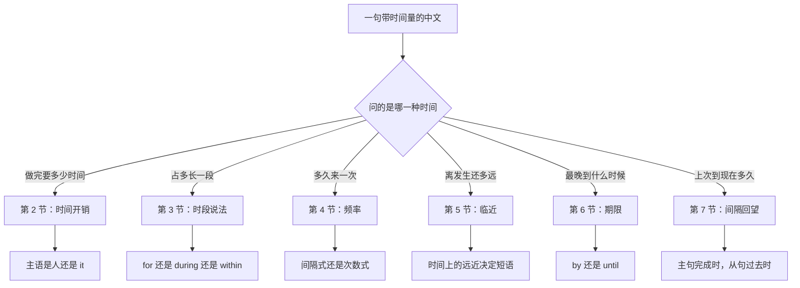
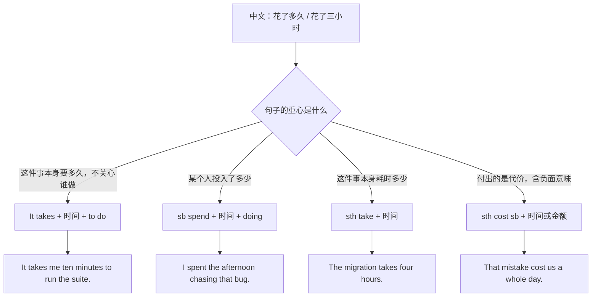
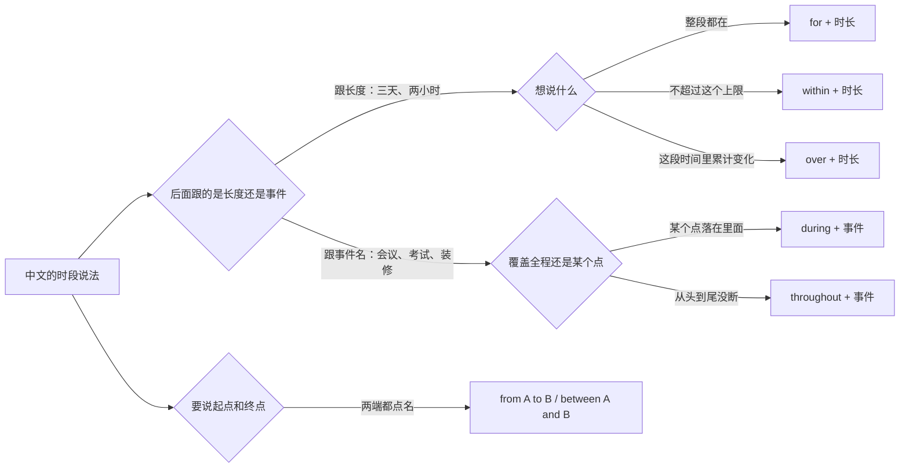
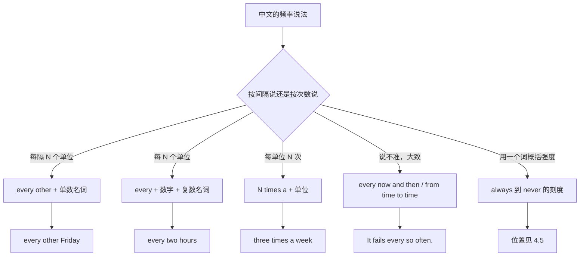
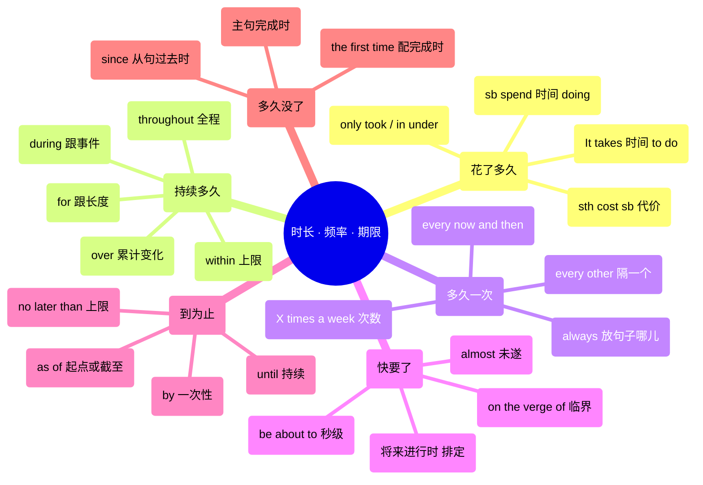

# 花了多久、每隔一次、快要了、到…为止：时长、频率与期限

> [!info] 本篇定位
>
> 上一篇管的是事情的先后顺序，这一篇管的是事情在时间轴上占多长、隔多久来一次、离发生还有多远、什么时候必须结束。
>
> 收六组中文意图：花了多久（时间开销落在谁头上）、持续多久（for、during、within 的分工）、多久一次（间隔、次数与「总是」放哪儿）、快要了（临近的刻度）、到…为止（期限与生效时点）、有多久没…了（从上次到现在）。
>
> 与 [[07.时间与顺序/01.当…的时候、一…就、直到才：时间关系速查|时间关系速查]] 的分界：那一篇管两件事之间的时间关系（当…的时候、一…就、直到才），这一篇管一件事自己占用的时间量。中文里「他走了三天了」既可能问关系也可能问时长，出口不同，查错篇会拿到错句架。
>
> 读完能查到：把一句带时间量的中文，从提问方式直接翻到英文成品句。

---

## 1. 本篇导读：五个中文问句，五条出路

英文里表达时间量的结构分岔早，分岔点不在时态而在**你问的是哪一种时间**。中文的时间词高度共用（「三天」既能做时长也能做期限也能做频率间隔），英文一旦选错介词或选错主语，句子会立刻歪掉。

先把五种问法与它们的出口对齐。

| 中文问的是什么 | 典型中文说法 | 英文的出口 | 本篇小节 |
| --- | --- | --- | --- |
| 做完这件事需要多少时间 | 要花多久、得多长时间、我花了三小时 | `It takes sb 时间 to do`、`spend 时间 doing`、`cost` | 第 2 节 |
| 这件事在时间轴上占多长一段 | 持续了三天、在…期间、三天之内 | `for`、`during`、`throughout`、`within`、`over` | 第 3 节 |
| 这件事多久重复一次 | 每隔一天、一周三次、时不时 | `every other`、`X times a week`、`always` 一类的词 | 第 4 节 |
| 这件事离发生还有多远 | 马上就要、眼看就要、还有两天 | `be about to`、`be on the verge of`、将来进行时 | 第 5 节 |
| 这件事最晚什么时候必须结束 | 周五之前、不迟于、自…起生效 | `by`、`no later than`、`as of`、`until` | 第 6 节 |
| 上一次到现在隔了多久 | 有三年没…了、上次是什么时候 | `haven't done in X`、`It's been X since` | 第 7 节 |

这张图的用法是从最上面那个问号开始判断，而不是从中文里出现了哪个时间词开始判断。「三天」这个词在六条出路里都能出现：`It took three days`（开销）、`for three days`（时段）、`every three days`（频率）、`in three days`（临近）、`within three days`（期限）、`in three days` 配否定（间隔回望）。词一样，结构完全不同，所以先定问法再选结构。

第二个要点是**中文的「了」不承载时长信息**，英文靠时态承载。「他走了三天了」是完成体加时段（`He's been gone for three days`），「他走了三天」是过去某段（`He was away for three days`）。这一处的时态推导整段归 [[02.英语基础语法/06.动词时态/05.时态综合运用与辨析|时态综合运用与辨析]]，本篇只给成品与一行对照。

---

## 2. 花了多久：时间开销落在谁头上

中文说「花了三小时」不必交代是谁花的，主语可以整个省掉。英文必须把开销挂在一个主语上，挂给 `it`、挂给人、挂给事，动词各不相同。这一节的六条意图共用一个判断：**开销的承受者是谁**。

四条出路里最容易搞混的是 `take` 与 `spend`：`take` 的主语是事情或形式主语 `it`，`spend` 的主语必须是人。中文「这个脚本花了我两天」的「花」看起来主语是脚本，实际上英文要么改成 `The script took me two days`，要么改成 `I spent two days on the script`，不能把 `spend` 的主语写成脚本。`cost` 是第三条，它比 `take` 多一层「本不该付出」的意味，所以中性的耗时不用它。

### 2.1 要花多久、得多长时间

中文触发语：要花多久 / 得多长时间 / 需要多少时间 / 多久能弄完 / 大概几天

| 档位 | 句架 | 例句 |
| --- | --- | --- |
| 口语 | How long does it take to do sth? | How long does it take to set this up? |
| 口语 | It takes [sb] + 时间 + to do sth | It takes me about ten minutes to run the whole suite. |
| 书面 | It takes + 时间 + for sb + to do sth | It takes roughly two weeks for a new hire to become productive. |
| 书面 | sth takes + 时间 | The migration takes about four hours on production data. |
| 正式 | sth requires approximately + 时间 | The review process requires approximately three business days. |

> [!warning] 错配警示
>
> - ~~How long does it spend to set this up?~~ ❌ → **How long does it take to set this up?** ✅（`spend` 的主语必须是人，不能用形式主语 `it`）
> - ~~It takes me ten minutes for running it.~~ ❌ → **It takes me ten minutes to run it.** ✅（`It takes` 后面接不定式，不接动名词）

- **同义入口**：多久能好 / 要多长时间 / 得多久 / 几天能出结果
- **语法归属**：[[02.英语基础语法/08.非谓语动词/01.动词不定式详解|it 作形式主语、不定式后置]]
- **场景实战**：[[04.英语场景/02.基础句型框架/03.there be 与 it 句型完全手册|it 句型完全手册]]

### 2.2 我花了三小时在这上面

中文触发语：我花了…时间 / 我在…上耗了 / 我投入了 / 搭进去了

| 档位 | 句架 | 例句 |
| --- | --- | --- |
| 口语 | sb spend + 时间 + doing sth | I spent the whole afternoon chasing that bug. |
| 口语 | sb spend + 时间 + on sth | She spent two days on the migration script. |
| 书面 | sb put in + 时间 | The team put in three extra weekends before the launch. |
| 书面 | sb devote + 时间 + to doing sth | He devoted six months to rewriting the parser. |
| 正式 | sb allocate + 时间 + to sth | We have allocated four weeks to the integration phase. |

> [!warning] 错配警示
>
> - ~~I spent three hours to fix it.~~ ❌ → **I spent three hours fixing it.** ✅（`spend` 后面接动名词，不接不定式）
> - ~~The script spent me two days.~~ ❌ → **The script took me two days.** ✅（事情做主语用 `take`，人做主语才用 `spend`）

- **同义入口**：耗了多久 / 搭进去多少时间 / 投了多少工时
- **语法归属**：[[02.英语基础语法/08.非谓语动词/02.动名词详解|动名词作宾语的固定搭配]]
- **场景实战**：[[04.英语场景/10.职场与商务场景实战/02.会议汇报与演示场景|会议汇报与演示场景]]

### 2.3 这事儿的代价是多少

中文触发语：代价是 / 害我损失了 / 白搭了 / 赔上了

| 档位 | 句架 | 例句 |
| --- | --- | --- |
| 口语 | sth cost sb + 时间或金额 | That one typo cost us a whole day. |
| 口语 | sth set sb back + 金额或时间 | The rewrite set us back two sprints. |
| 书面 | sth cost sb + 名词（失去的东西） | The outage cost the company its largest client. |
| 正式 | sth comes at the cost of sth | The speedup comes at the cost of higher memory use. |
| 正式 | sth entails a cost of + 数量 | Migrating early entails a cost of roughly two engineer-months. |

> [!warning] 错配警示
>
> - ~~The build costs twenty minutes.~~ ❌ → **The build takes twenty minutes.** ✅（`cost` 带负面代价意味，中性耗时一律用 `take`）

- **同义入口**：付出的代价 / 亏了多少 / 换来的是
- **语法归属**：[[02.英语基础语法/01.基础入门/02.英语五大基本句型详解|双宾语句型]]
- **场景实战**：[[04.英语场景/10.职场与商务场景实战/04.商务谈判合同与客户沟通|商务谈判合同与客户沟通]]

### 2.4 只用了…就

中文触发语：只花了 / 不到…就 / 才用了 / 一下子就

| 档位 | 句架 | 例句 |
| --- | --- | --- |
| 口语 | It only took + 时间 + to do sth | It only took five minutes to reproduce. |
| 口语 | in under + 时间 | We shipped the fix in under a week. |
| 口语 | in no time | The cache rebuilt itself in no time. |
| 书面 | in a matter of + 时间单位 | The queue drains in a matter of seconds. |
| 正式 | within + 时间 + of + 名词 | The service recovered within four minutes of the alert. |

> [!warning] 错配警示
>
> - ~~in less than a week later~~ ❌ → **in less than a week** ✅（`in + 时段` 本身已含「之内」或「之后」，不再叠 `later`）

- **同义入口**：没几分钟就 / 转眼就 / 很快就搞定
- **语法归属**：[[02.英语基础语法/05.介词与连词/02.常用介词搭配详解|时间介词 in 的两种读法]]

### 2.5 比预计的久

中文触发语：拖长了 / 超时了 / 比想的久 / 又多花了

| 档位 | 句架 | 例句 |
| --- | --- | --- |
| 口语 | take longer than expected | This is taking longer than I expected. |
| 口语 | drag on | The review dragged on for another two weeks. |
| 书面 | run over by + 时间 | The meeting ran over by twenty minutes. |
| 书面 | overrun the estimate by + 时间 | Phase two overran the estimate by nine days. |
| 正式 | exceed the allotted time | The session exceeded the allotted time and was adjourned. |

> [!warning] 错配警示
>
> - ~~The meeting was over twenty minutes.~~ ❌ → **The meeting ran over by twenty minutes.** ✅（`be over` 是「结束了」，「超时」要用 `run over`）

- **同义入口**：又拖了 / 延长了 / 没按点结束
- **语法归属**：[[02.英语基础语法/04.形容词与副词/02.形容词的比较级与最高级|比较级与差额表达]]
- **场景实战**：[[04.英语场景/10.职场与商务场景实战/02.会议汇报与演示场景|会议汇报与演示场景]]

### 2.6 大概多久，给个范围

中文触发语：大概…左右 / 三五天吧 / 顶多 / 少说也得

| 档位 | 句架 | 例句 |
| --- | --- | --- |
| 口语 | anywhere from A to B | Anywhere from two to four hours, depending on the data size. |
| 口语 | X, give or take + 时间 | Two weeks, give or take a day. |
| 口语 | tops / at the outside | Three days tops. |
| 书面 | somewhere in the region of + 时间 | Somewhere in the region of six months. |
| 正式 | on the order of + 时间单位 | End-to-end latency is on the order of tens of milliseconds. |
| 正式 | no more than + 时间 | Processing shall take no more than five working days. |

- **同义入口**：差不多要 / 上下 / 撑死了 / 最少也要
- **语法归属**：[[02.英语基础语法/03.代词与数词/05.数词的用法与表达|数词与约数表达]]
- **场景实战**：[[04.英语场景/10.职场与商务场景实战/01.求职简历面试与Offer谈判|求职简历面试与Offer谈判]]

---

## 3. 持续多久：for、during、within 各管一块

中文一个「在…期间」「…之内」「…这段时间」区分不细，英文六个词各管一块，选错的后果是句子读得通但意思偏。这一节先给选择树，再逐条给成品。

判断顺序是先看介词后面跟的是**长度**还是**事件名**。`for` 与 `within` 后面只跟长度，`during` 与 `throughout` 后面只跟事件名或有边界的时段名。这条一旦记住，`during three hours` 这类中式直译就不会出现了。`over` 是特例，它后面跟长度但强调这段时间里发生的**变化或累计**，不是「一直在」。

### 3.1 持续了三天

中文触发语：持续了 / 有…之久 / 一连…天 / 断断续续…（后者见 4.3）

| 档位 | 句架 | 例句 |
| --- | --- | --- |
| 口语 | for + 时长 | It rained for three days straight. |
| 口语 | last + 时长 | The outage lasted about forty minutes. |
| 口语 | go on for + 时长 | The standup went on for half an hour. |
| 书面 | run for + 时长 | The pilot runs for eight weeks. |
| 正式 | extend over + 时长 | The consultation extends over a six-week period. |
| 正式 | be of + 时长 + duration | The agreement is of two years' duration. |

> [!warning] 错配警示
>
> - 要说「我来这儿三天了」：~~I am here for three days.~~ ❌ → **I've been here for three days.** ✅（`I'm here for three days` 只表示「这趟计划待三天」，中文「三天了」的「了」得靠现在完成时承担）
> - ~~The meeting lasted during two hours.~~ ❌ → **The meeting lasted two hours.** ✅（`last` 后面直接跟时长，`for` 可省，但不能换成 `during`）

- **同义入口**：延续了 / 拖了…天 / 整整…天
- **语法归属**：[[02.英语基础语法/06.动词时态/04.完成时态详解|完成时与延续性时段]]
- **场景实战**：[[04.英语场景/03.时态与语态句型框架/01.16种时态完全手册|16 种时态完全手册]]

### 3.2 在…期间

中文触发语：在…期间 / …的时候（指整个事件） / …过程中

| 档位 | 句架 | 例句 |
| --- | --- | --- |
| 口语 | during + 事件名 | I lost connection during the demo. |
| 口语 | while + 从句 | I lost connection while I was presenting. |
| 书面 | in the course of + 名词 | Two regressions surfaced in the course of testing. |
| 正式 | for the duration of + 名词 | Write access is suspended for the duration of the audit. |
| 正式 | over the period of + 名词 | No incidents were logged over the period of the freeze. |

> [!warning] 错配警示
>
> - ~~I waited during three hours.~~ ❌ → **I waited for three hours.** ✅（问「多久」用 `for`，问「什么时候」才用 `during`）
> - ~~during I was presenting~~ ❌ → **while I was presenting** ✅（`during` 后面跟名词，跟从句要换 `while`）

- **同义入口**：在…当中 / …的过程里 / 整个…阶段
- **语法归属**：[[02.英语基础语法/05.介词与连词/04.介词与连词的易混点|介词与连词的易混点]]
- **场景实战**：[[04.英语场景/04.从句与复合句型框架/03.状语从句九大类型|时间状语从句]]

### 3.3 自始至终

中文触发语：自始至终 / 从头到尾 / 一直都 / 全程

| 档位 | 句架 | 例句 |
| --- | --- | --- |
| 口语 | the whole time | He stayed calm the whole time. |
| 口语 | all through + 名词 | The fan was loud all through the night. |
| 书面 | throughout + 名词 | The service stayed up throughout the migration. |
| 书面 | from start to finish | The pipeline was green from start to finish. |
| 正式 | at all times during + 名词 | Two engineers must be reachable at all times during the freeze. |

> [!warning] 错配警示
>
> - ~~throughout three hours~~ ❌ → **throughout the three-hour session** ✅（`throughout` 后面要跟有边界的事件或时段名，不跟裸长度）

- **同义入口**：一直没停 / 整场都 / 全程都
- **语法归属**：[[02.英语基础语法/05.介词与连词/01.介词的分类与基本用法|时间介词的分类]]
- **场景实战**：[[04.英语场景/09.学习与教育场景实战/02.图书馆作业与研究场景|图书馆作业与研究场景]]

### 3.4 在…之内

中文触发语：…之内 / 不超过…就 / …以内完成

| 档位 | 句架 | 例句 |
| --- | --- | --- |
| 口语 | in + 时长（指将来「多久之后」） | I'll get back to you in an hour. |
| 口语 | inside of + 时长 | We had it patched inside of two days. |
| 书面 | within + 时长 | Refunds are processed within five business days. |
| 书面 | within + 时长 + of + 名词 | Notice must be given within thirty days of termination. |
| 正式 | in no more than + 时长 | The appeal shall be heard in no more than fourteen days. |

> [!warning] 错配警示
>
> - ~~Please reply in 24 hours.~~ ❌（可读成「24 小时后再回」）→ **Please reply within 24 hours.** ✅（要说上限只能用 `within`）
> - ~~within three days later~~ ❌ → **within three days** ✅

- **同义入口**：限期…天 / 不出…天 / …天内给回复
- **语法归属**：[[02.英语基础语法/05.介词与连词/02.常用介词搭配详解|in 表「一段时间之后」的用法]]
- **场景实战**：[[04.英语场景/10.职场与商务场景实战/03.商务邮件与正式书面沟通|商务邮件与正式书面沟通]]

### 3.5 这段时间里（累计与变化）

中文触发语：这几个月来 / 一年下来 / 在…这段时间里

| 档位 | 句架 | 例句 |
| --- | --- | --- |
| 口语 | over + 时长 | Traffic doubled over the last month. |
| 口语 | in the space of + 时长 | Three outages in the space of a single week. |
| 书面 | across + 时长或范围 | Error rates stayed flat across the whole quarter. |
| 书面 | over the course of + 时长 | Costs came down steadily over the course of the year. |
| 正式 | in the period from A to B | Usage grew in the period from January to June. |

> [!warning] 错配警示
>
> - ~~for the last month traffic doubled~~ ❌ → **Traffic doubled over the last month.** ✅（`for` 表「一直保持」，讲变化幅度要用 `over`）

- **同义入口**：这一年来 / 几个月下来 / 累计
- **语法归属**：[[02.英语基础语法/06.动词时态/04.完成时态详解|完成时与时段搭配]]
- **场景实战**：[[04.英语场景/10.职场与商务场景实战/02.会议汇报与演示场景|数据汇报场景]]

### 3.6 从…到…

中文触发语：从…到… / …至… / 打…起到…止

| 档位 | 句架 | 例句 |
| --- | --- | --- |
| 口语 | from A to B | The window is from Friday night to Sunday morning. |
| 口语 | between A and B | Between May and August we froze all releases. |
| 书面 | from A through B（明确含末端） | The offer runs from Monday through Friday. |
| 书面 | A to B inclusive | Bookings are open 1 to 15 March inclusive. |
| 正式 | for the period commencing A and ending B | For the period commencing 1 July and ending 31 December. |

> [!warning] 错配警示
>
> - `Monday to Friday` 在合同里是否含周五有歧义 → 写成 **Monday through Friday** 或 **Monday to Friday inclusive** ✅
> - ~~between 9 to 5~~ ❌ → **between 9 and 5** ✅ 或 **from 9 to 5** ✅（`between` 只配 `and`，`from` 只配 `to` 或 `until`，两套不能交叉）

- **同义入口**：起止时间 / …点到…点 / 有效期从…到…
- **语法归属**：[[02.英语基础语法/05.介词与连词/01.介词的分类与基本用法|时间介词里的起点与终点]]
- **场景实战**：[[04.英语场景/08.出行与旅游场景实战/02.酒店入住预订与投诉场景|酒店入住预订场景]]

### 3.7 六个词一行对照

写作时来不及看选择树，就查这张表。

| 词 | 后面跟 | 中文对应 | 一句成品 |
| --- | --- | --- | --- |
| for | 裸时长 | 持续了…、有…之久 | We waited for two hours. |
| during | 事件名或有界时段 | 在…期间 | The alarm went off during the demo. |
| throughout | 事件名或有界时段 | 自始至终 | It stayed stable throughout the rollout. |
| within | 裸时长 | …之内（上限） | Reply within 24 hours. |
| in | 裸时长 | 多久之后（将来）／花了多久（过去） | I'll call in ten minutes. |
| over | 裸时长 | 这段时间里（累计变化） | Usage tripled over six months. |

---

## 4. 多久一次：间隔、次数与词序

中文表频率有两套：一套按**间隔**说（每隔一天、每两周），一套按**次数**说（一周三次、一天两回）。英文两套对应两组结构，混用会造出 `every other three days` 这种没人说的东西。这一节先分两套，再解决 `always`、`never` 这类词该放句子哪个位置。

`every other + 单数` 与 `every two + 复数` 在多数语境里等价（`every other week` = `every two weeks`），差别在 `every other` 更口语、更强调「隔一个跳一个」的节奏，`every two` 更中性也更适合写进文档。次数式 `three times a week` 里的 `a` 就是「每」，口语一律用它；正式文书里换成 `three times per week` 或整词换成 `weekly` 都行，`per` 与 `weekly` 都比 `a` 书面。

### 4.1 每隔一天、每两周一次

中文触发语：每隔一天 / 隔一周 / 每两小时 / 两天一回

| 档位 | 句架 | 例句 |
| --- | --- | --- |
| 口语 | every other + 单数名词 | We do a retro every other Friday. |
| 口语 | every two + 复数名词 | The token refreshes every two hours. |
| 口语 | every couple of + 复数名词 | I restart it every couple of days. |
| 书面 | on alternate + 复数名词 | The clinic opens on alternate Saturdays. |
| 正式 | at intervals of + 时长 | Readings are taken at intervals of fifteen minutes. |
| 正式 | at + 时长 + intervals | Samples are collected at four-hour intervals. |

> [!warning] 错配警示
>
> - ~~every other three days~~ ❌ → **every three days** ✅（`every other` 自带「隔一个」的数量，不再加数字）
> - `biweekly` 有「两周一次」与「一周两次」两读 → 正式文书写 **every two weeks** 或 **twice a week** ✅

- **同义入口**：隔天 / 隔三差五地（见 4.3） / 两周一轮 / 每逢单周
- **语法归属**：[[02.英语基础语法/03.代词与数词/04.不定代词详解|every other 与 every + 数词]]
- **场景实战**：[[04.英语场景/11.医疗与紧急场景实战/01.医院看病与药店购药场景|医院看病与药店购药场景]]

### 4.2 一周一次、一天三次

中文触发语：一周一次 / 一天三顿 / 每月两回 / 每年一度

| 档位 | 句架 | 例句 |
| --- | --- | --- |
| 口语 | once / twice / X times + a + 时间单位 | I go to the gym three times a week. |
| 口语 | X times a day | Take one tablet twice a day after meals. |
| 书面 | on a weekly basis | Reports are circulated on a weekly basis. |
| 书面 | X times per + 单位 | The job runs four times per hour. |
| 正式 | weekly / quarterly / annually | The certificate is renewed annually. |
| 正式 | at a frequency of X per + 单位 | Backups run at a frequency of two per day. |

> [!warning] 错配警示
>
> - ~~one time a week~~ ❌ → **once a week** ✅；~~two times a day~~ 口语勉强可以，书面写 **twice a day** ✅
> - ~~every a week~~ ❌ → **every week** ✅ 或 **once a week** ✅

- **同义入口**：每周一次 / 一日三次 / 每季度 / 一年一回
- **语法归属**：[[02.英语基础语法/04.形容词与副词/03.副词的分类与用法|表确切频率的副词短语]]
- **场景实战**：[[04.英语场景/11.医疗与紧急场景实战/01.医院看病与药店购药场景|用药频次表达]]

### 4.3 时不时、隔三差五

中文触发语：时不时 / 隔三差五 / 偶尔冒一次 / 断断续续

| 档位 | 句架 | 例句 |
| --- | --- | --- |
| 口语 | every now and then | I still get that error every now and then. |
| 口语 | every so often | Every so often the connection just drops. |
| 口语 | on and off | She's been learning Japanese on and off for years. |
| 书面 | from time to time | The endpoint times out from time to time. |
| 书面 | at irregular intervals | The spikes appear at irregular intervals. |
| 正式 | intermittently / sporadically | The sensor reports intermittently under load. |

> [!warning] 错配警示
>
> - ~~from time to times~~ ❌ → **from time to time** ✅（固定短语，中间的 `time` 不变复数）
> - ~~in times the queue backs up~~ ❌ → **At times the queue backs up.** ✅（表「有时」的固定短语是 `at times`，没有 `in times` 这个说法）

- **同义入口**：三天两头 / 时有发生 / 偶发 / 不定时
- **语法归属**：[[02.英语基础语法/04.形容词与副词/03.副词的分类与用法|频度副词与副词短语]]

### 4.4 总是、经常、偶尔、从不

中文触发语：总是 / 老是 / 经常 / 常常 / 有时 / 偶尔 / 很少 / 从来不

| 档位 | 句架 | 例句 |
| --- | --- | --- |
| 口语 | all the time / a lot / hardly ever | He's late all the time. |
| 口语 | don't ... much / don't really ... | I don't use that flag much. |
| 书面 | frequently / occasionally / seldom | The parameter is seldom used in practice. |
| 书面 | rarely, if ever | This branch is rarely, if ever, taken. |
| 正式 | invariably / periodically / at no point | Backups are verified periodically. |
| 正式 | At no point + 倒装 | At no point did the service go offline. |

#### 4.4.1 频度刻度速查

| 强度 | 中文 | 口语词 | 书面词 | 一句成品 |
| --- | --- | --- | --- | --- |
| 每次都是 | 总是、无一例外 | always, all the time | invariably | It invariably fails on the first run. |
| 绝大多数时候 | 一般、通常 | usually, most of the time | generally, as a rule | We generally deploy on Tuesdays. |
| 多数时候 | 经常、常常 | often, a lot | frequently | The cache is frequently stale. |
| 一半上下 | 有时候 | sometimes | at times, periodically | At times the queue backs up. |
| 少数时候 | 偶尔、间或 | now and then, once in a while | occasionally | Occasionally the job is skipped. |
| 极少 | 很少、难得 | hardly ever, almost never | rarely, seldom | The path is seldom exercised. |
| 一次都没有 | 从来不 | never | at no point | At no point was data lost. |

刻度表的用途是**换档**而不是换词：口语场合把 `invariably` 说出口会显得别扭，写事故报告时用 `all the time` 又太随便。同一件事在两栏里各挑一个，句子的语域就自动对上了。最下面两行的正式档带倒装（`At no point did…`、`Rarely have we…`），倒装的语序推导整段归 [[02.英语基础语法/10.特殊句型/03.倒装句结构|倒装句结构]]，这里只用成品形态。

- **同义入口**：一贯 / 十有八九 / 时常 / 难得 / 压根不
- **语法归属**：[[02.英语基础语法/04.形容词与副词/03.副词的分类与用法|副词的分类与用法]]
- **场景实战**：[[04.英语场景/05.高频实用表达句型框架/01.表达观点与态度的50个万能句型|表达观点与态度的万能句型]]

### 4.5 「总是」「从来不」该放句子哪儿

中文触发语：我经常…（不知道那个词往哪塞） / 「总是」放前面还是后面 / 「从来没」怎么开头

| 档位 | 句架 | 例句 |
| --- | --- | --- |
| 口语 | 主语 + 副词 + 实义动词 | I always forget his name. |
| 口语 | 主语 + be + 副词 | She is always late for standup. |
| 书面 | 主语 + 助动词 + 副词 + 主动词 | We have never encountered this before. |
| 书面 | 句首 + 逗号（只限 sometimes、usually、occasionally 等） | Occasionally, the job is skipped entirely. |
| 正式 | 否定频度副词置句首 + 倒装 | Seldom does a single change break three services. |

> [!warning] 错配警示
>
> - ~~I forget his name always.~~ ❌ → **I always forget his name.** ✅（`always`、`never`、`rarely` 不放句末；`sometimes`、`usually` 才可以）
> - ~~Never I have seen that.~~ ❌ → **Never have I seen that.** ✅（否定副词提到句首必须倒装）

- **同义入口**：「老是」放哪 / 「经常」放哪 / have 和 never 谁在前
- **语法归属**：[[02.英语基础语法/04.形容词与副词/03.副词的分类与用法|副词在句中的位置]]

### 4.6 多久一次？（提问式）

中文触发语：多久一次 / 多长时间来一趟 / 一天几次

| 档位 | 句架 | 例句 |
| --- | --- | --- |
| 口语 | How often ...? | How often does it sync? |
| 口语 | How many times a day ...? | How many times a day do you deploy? |
| 书面 | How frequently ...? | How frequently is the index rebuilt? |
| 书面 | At what interval ...? | At what interval are the logs rotated? |
| 正式 | What is the frequency of ...? | What is the frequency of the internal audit cycle? |

> [!warning] 错配警示
>
> - ~~How long do you back it up?~~ ❌ → **How often do you back it up?** ✅（问「多久一次」用 `how often`，`how long` 问的是一次持续多久）

- **同义入口**：隔多久 / 频率是多少 / 一般几天一次
- **语法归属**：[[02.英语基础语法/01.基础入门/03.疑问句与否定句的构成|特殊疑问句的构成]]

---

## 5. 快要了：临近的五级刻度

中文用「快」「就要」「眼看」「差点」标临近，英文按**离发生还有多远**分档：几秒到几分钟用 `be about to`，处在翻转边缘用 `on the verge of`，已排上日程用将来进行时或 `be due to`，最后是没发生的 `almost`。

| 档 | 离发生多远 | 结构 | 一句成品 | 小节 |
| --- | --- | --- | --- | --- |
| 一 | 秒到分钟，动作已启动 | be about to do | I'm about to head out. | 5.1 |
| 二 | 处在翻转边缘，落不落还不定 | be on the verge of doing | We were on the verge of rolling back. | 5.2 |
| 三 | 已排进日程，按计划会发生 | be due to do；I'll be doing | I'll be heading over around three. | 5.3 |
| 四 | 只报剩余量，不判断会不会发生 | X to go；X left | Two days to go. | 5.4 |
| 五 | 最终没发生 | almost；came close to doing | We came close to losing the data. | 5.5 |

这五档的关键区别不是时间长短而是**确定性**。`be about to` 是动作已经启动、下一秒就发生；`be on the verge of` 强调临界状态本身，落不落下去还不一定；`be due to` 是按计划该发生但没说一定发生；将来进行时（`I'll be doing`）表示既定安排，比 `I'll do` 少一层「我这就决定要做」的意味，用来说自己的行程不显得强加；`almost` 与 `came close to` 一律是**没发生**，中文「差点就」的歧义在英文里不存在。

### 5.1 马上就要

中文触发语：马上就 / 正要 / 就要…了 / 这就

| 档位 | 句架 | 例句 |
| --- | --- | --- |
| 口语 | be about to do sth | I'm about to head out. |
| 口语 | be just about to do sth when ... | I was just about to call you when you texted. |
| 口语 | be going to do sth any minute now | It's going to time out any minute now. |
| 书面 | be on the point of doing sth | The company is on the point of announcing a merger. |
| 正式 | be due to do sth | The report is due to be published next Tuesday. |
| 正式 | be set to do sth | The rule is set to take effect at the end of the quarter. |

> [!warning] 错配警示
>
> - ~~He is about to leave at six.~~ ❌ → **He is leaving at six.** ✅ 或 **He is about to leave.** ✅（`be about to` 表「就在眼前」，不与具体时间点连用）
> - ~~be about to leaving~~ ❌ → **be about to leave** ✅（`about to` 后面接原形）

- **同义入口**：眼看就 / 立刻就 / 一会儿就
- **语法归属**：[[02.英语基础语法/06.动词时态/02.一般将来时与过去将来时|一般将来时与临近将来]]
- **场景实战**：[[04.英语场景/07.社交交际场景实战/02.电话短信与在线沟通场景|电话短信与在线沟通场景]]

### 5.2 眼看就要、就差一点

中文触发语：眼看就要 / 濒临 / 就差一点点 / 差一点就

| 档位 | 句架 | 例句 |
| --- | --- | --- |
| 口语 | be this close to doing sth | We were this close to shipping on time. |
| 口语 | be one step away from doing sth | We're one step away from a full rollback. |
| 书面 | be on the verge of + 名词或动名词 | The team was on the verge of giving up. |
| 书面 | be on the brink of + 名词 | The cluster is on the brink of collapse. |
| 正式 | be imminent | A decision on the contract is imminent. |
| 正式 | be poised to do sth | The firm is poised to expand into two new markets. |

> [!warning] 错配警示
>
> - ~~on the verge of to quit~~ ❌ → **on the verge of quitting** ✅（`of` 后面接动名词或名词，不接不定式）
> - `on the brink of` 几乎只配负面结果（collapse、bankruptcy、war），说好事用 **on the verge of** 或 **poised to** ✅

- **同义入口**：快撑不住了 / 到临界点了 / 只差一步
- **语法归属**：[[02.英语基础语法/08.非谓语动词/02.动名词详解|介词后接动名词]]

### 5.3 我这就去、待会儿就

中文触发语：我这就 / 我一会儿去 / 我三点过去 / 按计划

| 档位 | 句架 | 例句 |
| --- | --- | --- |
| 口语 | 现在进行时表最近安排 | I'm grabbing lunch in a minute. |
| 口语 | I'll be doing sth（将来进行时） | I'll be heading over around three. |
| 书面 | be scheduled to do sth | The maintenance is scheduled to start at midnight. |
| 书面 | be booked in for + 时间 | The review is booked in for Thursday morning. |
| 正式 | will be doing sth（既定安排） | The committee will be reviewing the proposal on Thursday. |
| 正式 | shall commence at + 时间 | The hearing shall commence at 10 a.m. |

> [!warning] 错配警示
>
> - `I'll call you at three` 听上去像「我现在决定要打」；**I'll be calling you at three** ✅ 才是「按安排到点会打」，问别人计划时用后者更不冒犯

- **同义入口**：安排在 / 定在 / 到时候我会
- **语法归属**：[[02.英语基础语法/06.动词时态/03.进行时态详解|进行时表将来安排]]
- **场景实战**：[[04.英语场景/03.时态与语态句型框架/01.16种时态完全手册|将来进行时用法]]

### 5.4 还有多久、倒计时

中文触发语：还有多久 / 还剩几天 / 距离…还有

| 档位 | 句架 | 例句 |
| --- | --- | --- |
| 口语 | X to go | Two days to go. |
| 口语 | X left | Ten minutes left on the timer. |
| 口语 | How long until ...? | How long until the build finishes? |
| 书面 | There are X remaining until ... | There are five days remaining until the deadline. |
| 书面 | with X to spare | We finished with two hours to spare. |
| 正式 | X prior to + 名词 | Notice is issued seven days prior to the review. |

> [!warning] 错配警示
>
> - ~~How long until it will finish?~~ ❌ → **How long until it finishes?** ✅（`until` 从句用现在时表将来）

- **同义入口**：倒计时 / 还剩多少时间 / 离…还差几天
- **语法归属**：[[02.英语基础语法/09.从句体系/04.状语从句详解|时间状语从句的时态规则]]

### 5.5 差点就（临界未遂）

中文触发语：差点就 / 险些 / 差一点没 / 好悬

| 档位 | 句架 | 例句 |
| --- | --- | --- |
| 口语 | almost / nearly + 过去式 | I almost missed the train. |
| 口语 | came close to doing sth | We came close to losing the data. |
| 口语 | that was a close call | We got it back. That was a close call. |
| 书面 | narrowly avoided doing sth | The team narrowly avoided a full rollback. |
| 正式 | was within X of doing sth | The disk was within an hour of filling up. |
| 正式 | fell just short of doing sth | The bid fell just short of meeting the threshold. |

> [!warning] 错配警示
>
> - 中文「差点没赶上」的结果是赶上了，英文写 **I almost missed the train.** ✅；别照字面搬双重否定：~~I almost didn't miss the train.~~ ❌（这句的意思反过来了，成了「差一点就赶上」，结果是没赶上）
> - ~~I almost lost the data, and it was gone.~~ ❌ → `almost` 一律表示**没发生**，真丢了直接写 **I lost the data.** ✅

- **同义入口**：险些出事 / 好在没 / 就差那么一下
- **语法归属**：[[02.英语基础语法/04.形容词与副词/03.副词的分类与用法|almost 与 nearly 的位置]]

> [!tip] 「迟早」不在这一节
>
> 「迟早」「早晚有一天」讲的是时序推进而不是临近程度，主锚点在 [[07.时间与顺序/02.起初、后来、终于、迟早：时序推进与阶段|时序推进与阶段]]，那里给 `sooner or later`、`be bound to`、`it's only a matter of time before` 的完整三档。

---

## 6. 到…为止：期限、生效与到期

期限这一组的错误集中在两处：`by` 和 `until` 分不清，以及 `as of` 的两种读法。前者的判据是**动作是一次性的还是持续的**，后者靠时态和上下文消歧，写正式文书时干脆换成不会误读的词。

### 6.1 …之前完成

中文触发语：周五之前 / 在…前交 / 到…之前弄完

| 档位 | 句架 | 例句 |
| --- | --- | --- |
| 口语 | by + 时间点 | Can you send it by Friday? |
| 口语 | by the time + 从句 | By the time I got there, everyone had left. |
| 口语 | before + 时间点或从句 | Let's wrap this up before lunch. |
| 书面 | by close of business + 星期 | Please confirm by close of business Thursday. |
| 书面 | by end of day | The draft needs sign-off by end of day. |
| 正式 | on or before + 日期 | Payment must be made on or before 30 September. |

> [!warning] 错配警示
>
> - ~~Finish it until Friday.~~ ❌ → **Finish it by Friday.** ✅（一次性动作的截止点用 `by`，持续动作才用 `until`）
> - ~~By the time I will get there~~ ❌ → **By the time I get there** ✅（`by the time` 从句用现在时表将来）

- **同义入口**：截止到 / 最晚…前 / 赶在…之前
- **语法归属**：[[02.英语基础语法/05.介词与连词/01.介词的分类与基本用法|by：不迟于、到…为止]]
- **场景实战**：[[04.英语场景/10.职场与商务场景实战/03.商务邮件与正式书面沟通|商务邮件与正式书面沟通]]

### 6.2 不迟于

中文触发语：不迟于 / 最晚 / 最迟 / 逾期不候

| 档位 | 句架 | 例句 |
| --- | --- | --- |
| 口语 | at the latest | Tuesday at the latest. |
| 口语 | by X at the very latest | By noon at the very latest. |
| 书面 | no later than + 时间点 | Submissions must arrive no later than 5 p.m. on Friday. |
| 书面 | the deadline for X is + 时间点 | The deadline for comments is 15 October. |
| 正式 | not later than + 时间点 | Notice shall be given not later than ten days prior to the meeting. |
| 正式 | no submissions will be accepted after ... | No submissions will be accepted after the closing date. |

> [!warning] 错配警示
>
> - ~~not late than~~ ❌ → **no later than** ✅（固定式用比较级 `later`，且否定词是 `no` 不是 `not`；只有法律文本里才写 `not later than`）

- **同义入口**：截止日期是 / 过期作废 / 最后期限
- **语法归属**：[[02.英语基础语法/04.形容词与副词/02.形容词的比较级与最高级|比较级构成的固定式]]
- **场景实战**：[[04.英语场景/09.学习与教育场景实战/03.考试报名与学术评分场景|考试报名场景]]

### 6.3 自…起生效

中文触发语：自…起 / 从…开始执行 / …起生效 / 截至

| 档位 | 句架 | 例句 |
| --- | --- | --- |
| 口语 | starting + 时间点 | Starting next Monday, we're on the new schedule. |
| 口语 | from + 时间点 + on | From tomorrow on, the old link stops working. |
| 书面 | as of + 时间点 | As of 1 January, the old endpoint is disabled. |
| 书面 | as of + 时间点（截至义） | As of this morning, forty tickets are still open. |
| 正式 | with effect from + 日期 | With effect from 1 April, the policy supersedes all prior versions. |
| 正式 | effective + 日期 | Effective immediately, all merges require two approvals. |

> [!warning] 错配警示
>
> - `as of` 有「自…起」和「截至」两义，靠时态区分：**As of Monday, the rule applies**（自周一起）vs **As of Monday, forty tickets were open**（截至周一）；写合同一律改用 **with effect from** ✅ 消歧

- **同义入口**：即日起 / 从今往后 / 截止目前 / 生效日
- **场景实战**：[[04.英语场景/10.职场与商务场景实战/04.商务谈判合同与客户沟通|商务谈判合同与客户沟通]]

### 6.4 一直到…为止

中文触发语：一直到 / 到…为止 / 持续到 / 直到…都还

| 档位 | 句架 | 例句 |
| --- | --- | --- |
| 口语 | until / till + 时间点 | I'll be in meetings until four. |
| 口语 | right up to + 时间点 | It worked right up to the last release. |
| 口语 | up until + 时间点 | Up until last week nobody had noticed. |
| 书面 | up to and including + 时间点 | Logs are retained up to and including the last quarter. |
| 正式 | until such time as + 从句 | The account remains frozen until such time as the review concludes. |
| 正式 | pending + 名词 | Deployments are on hold pending the security review. |

> [!warning] 错配警示
>
> - ~~I'll finish it until Friday.~~ ❌ → **I'll finish it by Friday.** ✅（`finish` 是一次性动作，配 `by`）
> - ~~I'll stay by Friday.~~ ❌ → **I'll stay until Friday.** ✅（`stay` 是持续动作，配 `until`）

- **同义入口**：截止为止 / 在…之前一直 / 悬而未决期间
- **语法归属**：[[02.英语基础语法/09.从句体系/04.状语从句详解|until 引导的时间从句]]

### 6.5 到期、逾期

中文触发语：到期了 / 过期 / 逾期 / 失效

| 档位 | 句架 | 例句 |
| --- | --- | --- |
| 口语 | be due | The invoice is due on the fifteenth. |
| 口语 | be overdue / be past due | The invoice is two weeks overdue. |
| 口语 | run out | My subscription runs out next month. |
| 书面 | expire on + 日期 | The certificate expires on 12 June. |
| 书面 | lapse | The membership lapsed after ninety days of inactivity. |
| 正式 | cease to be valid | The license shall cease to be valid upon termination. |

> [!warning] 错配警示
>
> - ~~The certificate is expired at 12 June.~~ ❌ → **The certificate expires on 12 June.** ✅（日期用 `on`；说未来到期用主动的一般现在时）

- **同义入口**：过了有效期 / 欠着没交 / 作废
- **语法归属**：[[02.英语基础语法/06.动词时态/01.一般现在时与一般过去时|一般现在时表时间表安排]]
- **场景实战**：[[04.英语场景/08.出行与旅游场景实战/01.机场航班海关入境场景|证件有效期场景]]

### 6.6 给你…时间

中文触发语：给你三天 / 你还有…时间 / 限你在…内

| 档位 | 句架 | 例句 |
| --- | --- | --- |
| 口语 | You have until + 时间点 + to do sth | You have until Friday to decide. |
| 口语 | give sb + 时长 + to do sth | They gave us two weeks to migrate. |
| 口语 | You've got + 时长 | You've got ten minutes. |
| 书面 | be allowed + 时长 + for sth | Applicants are allowed thirty days for appeal. |
| 正式 | a period of + 时长 + shall be afforded | A period of fourteen days shall be afforded for review. |
| 正式 | be granted an extension of + 时长 | The vendor was granted an extension of two weeks. |

- **同义入口**：宽限几天 / 期限是 / 再给我点时间
- **语法归属**：[[02.英语基础语法/07.助动词与情态动词/02.情态动词详解|shall 在规章文本中的用法]]
- **场景实战**：[[04.英语场景/10.职场与商务场景实战/04.商务谈判合同与客户沟通|商务谈判合同与客户沟通]]

### 6.7 by 与 until 一行判据

| 中文 | 动作性质 | 用哪个 | 一句成品 |
| --- | --- | --- | --- |
| 周五前交 | 一次性完成 | by | Submit it by Friday. |
| 待到周五 | 持续状态 | until | Stay until Friday. |
| 周五前一直没动静 | 持续状态的否定 | until | Nothing happened until Friday. |
| 到周五就有结果了 | 一次性完成 | by | We'll know by Friday. |
| 从周五起改规则 | 起点 | as of / from | The rule changes as of Friday. |
| 最晚周五 | 截止上限 | no later than | Reply no later than Friday. |

---

## 7. 有多久没…了：从上次到现在

中文的「有三年没…了」把否定、时长、完成体压在一句里，英文要拆成两种结构：**主句用完成时承担「到现在」，`since` 从句用一般过去承担「上次那个点」**。这一节的五条意图共用这一条规则。

### 7.1 我有三年没…了

中文触发语：有三年没… / 好久没… / 多久没…了

| 档位 | 句架 | 例句 |
| --- | --- | --- |
| 口语 | haven't done sth in + 时长 | I haven't touched Java in three years. |
| 口语 | It's been + 时长 + since ... | It's been ages since we last talked. |
| 口语 | long time no see（固定式） | Long time no see. |
| 书面 | It has been + 时长 + since sb last did sth | It has been six months since the team last shipped a release. |
| 书面 | not ... for + 时长 | The endpoint has not been called for over a year. |
| 正式 | No X has occurred since + 时间点 | No comparable outage has occurred since the 2023 incident. |

> [!warning] 错配警示
>
> - ~~It's been three years since I have left.~~ ❌ → **It's been three years since I left.** ✅（`since` 从句用一般过去，主句才用完成时）
> - ~~I don't play it for three years.~~ ❌ → **I haven't played it for three years.** ✅

- **同义入口**：好些年没 / 上次还是…的时候 / 都多久了
- **语法归属**：[[02.英语基础语法/06.动词时态/04.完成时态详解|现在完成时与 since 搭配]]
- **场景实战**：[[04.英语场景/07.社交交际场景实战/01.交友聚会与闲聊场景|交友聚会与闲聊场景]]

### 7.2 上次…是什么时候

中文触发语：上次是什么时候 / 多久没…了（提问） / 最近一次

| 档位 | 句架 | 例句 |
| --- | --- | --- |
| 口语 | When was the last time you did sth? | When was the last time you rebooted it? |
| 口语 | How long has it been since ...? | How long has it been since the last deploy? |
| 书面 | The last time X occurred was + 时间点 | The last time this occurred was in March. |
| 书面 | When did you last do sth? | When did you last rotate the keys? |
| 正式 | The most recent instance dates back to + 时间点 | The most recent instance dates back to 2019. |

> [!warning] 错配警示
>
> - ~~When was the last time you have rebooted it?~~ ❌ → **When was the last time you rebooted it?** ✅（问具体那一次用一般过去）

- **同义入口**：最近一回是啥时候 / 距上次多久 / 你上回什么时候
- **语法归属**：[[02.英语基础语法/06.动词时态/05.时态综合运用与辨析|过去时与完成时的分工]]

### 7.3 我做这个做了五年了

中文触发语：做了五年了 / 一直在做 / 干这行…年了

| 档位 | 句架 | 例句 |
| --- | --- | --- |
| 口语 | have been doing sth for + 时长 | I've been doing this for five years. |
| 口语 | have been at it since + 时间点 | We've been at it since eight this morning. |
| 书面 | have done sth for + 时长（状态动词） | She has known him for over a decade. |
| 书面 | have been with + 组织 + for + 时长 | He has been with the team for three years. |
| 正式 | has been in force for a period of + 时长 | The policy has been in force for a period of seven years. |
| 正式 | has been in place since + 时间点 | The exemption has been in place since 2021. |

> [!warning] 错配警示
>
> - ~~I have been knowing him for years.~~ ❌ → **I have known him for years.** ✅（`know`、`own`、`belong` 这类状态动词不用进行时）
> - ~~I do this for five years.~~ ❌ → **I've been doing this for five years.** ✅

- **同义入口**：从事…多久 / 一直干到现在 / 已经…年头了
- **语法归属**：[[02.英语基础语法/06.动词时态/04.完成时态详解|现在完成进行时]]
- **场景实战**：[[04.英语场景/10.职场与商务场景实战/01.求职简历面试与Offer谈判|求职面试自我介绍]]

### 7.4 自从…以来

中文触发语：自从…以来 / 打那以后 / 从…开始就一直

| 档位 | 句架 | 例句 |
| --- | --- | --- |
| 口语 | since + 时间点或从句 | Nothing's broken since we added the retry. |
| 口语 | ever since | Ever since the rewrite, latency has been flat. |
| 书面 | since the introduction of + 名词 | Since the introduction of the cap, complaints have fallen. |
| 书面 | following + 名词 | Following the audit, two controls were tightened. |
| 正式 | in the period since + 名词 | In the period since the merger, headcount has doubled. |

> [!warning] 错配警示
>
> - ~~Since two years I work here.~~ ❌ → **I've worked here for two years.** ✅（`since` 后面跟时间**点**，跟时**长**要换 `for`）

- **同义入口**：自打…起 / 那次之后 / …之后就一直
- **语法归属**：[[02.英语基础语法/06.动词时态/04.完成时态详解|since 接时间点、for 接时间段]]

### 7.5 这是我第一次

中文触发语：这是我第一次 / 这是第三回了 / 头一遭

| 档位 | 句架 | 例句 |
| --- | --- | --- |
| 口语 | This is the first time I've done sth | This is the first time I've seen that error. |
| 口语 | I've never done sth before | I've never hit that limit before. |
| 书面 | It is the X time that sb has done sth | It is the third time this month that the job has failed. |
| 书面 | This is not the first time ... | This is not the first time the queue has backed up. |
| 正式 | This marks the first occasion on which ... | This marks the first occasion on which the clause has been invoked. |

> [!warning] 错配警示
>
> - ~~This is the first time I see this.~~ ❌ → **This is the first time I've seen this.** ✅（`the first time` 后面配现在完成时）
> - 时间线在过去时整句降一档：**It was the first time I had seen it.** ✅

- **同义入口**：第一回 / 破天荒 / 这都第几次了
- **语法归属**：[[02.英语基础语法/06.动词时态/04.完成时态详解|完成时在 the first time 句型中的用法]]

---

## 8. 混排速查：一句中文定位到一行句架

写东西时来不及翻小节，直接在这张表里按中文找。左列是中文说法，中列是拿来就能填的句架，右列是回本篇哪一节看三档。

| 中文说法 | 一条句架 | 回哪一节 |
| --- | --- | --- |
| 要花多久 | How long does it take to do sth? | 2.1 |
| 我花了三小时 | I spent three hours doing sth. | 2.2 |
| 这脚本花了我两天 | The script took me two days. | 2.1 |
| 代价是一整天 | That cost us a whole day. | 2.3 |
| 只用了五分钟 | It only took five minutes to do sth. | 2.4 |
| 比预计的久 | It's taking longer than expected. | 2.5 |
| 三五天吧 | Anywhere from three to five days. | 2.6 |
| 持续了三天 | It lasted three days. | 3.1 |
| 下了三天雨 | It rained for three days. | 3.1 |
| 演示期间掉线了 | I lost connection during the demo. | 3.2 |
| 自始至终都稳 | It stayed stable throughout the rollout. | 3.3 |
| 二十四小时内回复 | Please reply within 24 hours. | 3.4 |
| 一小时后打给你 | I'll call you in an hour. | 3.4 |
| 这个月翻了一倍 | It doubled over the last month. | 3.5 |
| 周一到周五 | Monday through Friday | 3.6 |
| 每隔一周 | every other week | 4.1 |
| 每两小时 | every two hours | 4.1 |
| 一周三次 | three times a week | 4.2 |
| 一天两次服药 | twice a day | 4.2 |
| 时不时冒一次 | every now and then | 4.3 |
| 断断续续 | on and off | 4.3 |
| 很少用到 | It's seldom used. | 4.4 |
| 从来没掉过线 | At no point did it go offline. | 4.4 |
| 我老忘 | I always forget. | 4.5 |
| 多久同步一次 | How often does it sync? | 4.6 |
| 我这就走 | I'm about to head out. | 5.1 |
| 定在下周二发布 | It's due to be published next Tuesday. | 5.1 |
| 眼看就要放弃了 | We were on the verge of giving up. | 5.2 |
| 三点我过去 | I'll be heading over around three. | 5.3 |
| 还有两天 | Two days to go. | 5.4 |
| 差点丢数据 | We came close to losing the data. | 5.5 |
| 周五前发我 | Send it to me by Friday. | 6.1 |
| 最晚周二 | Tuesday at the latest. | 6.2 |
| 不迟于下午五点 | no later than 5 p.m. | 6.2 |
| 元旦起停用 | As of 1 January, it is disabled. | 6.3 |
| 四点前都在开会 | I'll be in meetings until four. | 6.4 |
| 逾期两周 | It's two weeks overdue. | 6.5 |
| 六月十二号到期 | It expires on 12 June. | 6.5 |
| 给你到周五 | You have until Friday. | 6.6 |
| 三年没碰了 | I haven't touched it in three years. | 7.1 |
| 好久不见 | It's been ages. | 7.1 |
| 上次重启是什么时候 | When was the last time you rebooted it? | 7.2 |
| 干这行五年了 | I've been doing this for five years. | 7.3 |
| 自从改写以后 | Ever since the rewrite ... | 7.4 |
| 这是我第一次见 | This is the first time I've seen this. | 7.5 |

表里刻意混排了六节的条目，因为实际写作时读者并不知道自己要的东西归哪一节——先在中文列里找到最接近的一行，再顺着右列跳过去看三档。

---

## 9. 本篇小结

这张图按六组意图收口。真正需要背下来的不是六十条句架，而是每组开头那一条判据：开销看主语挂谁，时段看介词后面跟长度还是跟事件，频率看按间隔还是按次数，临近看确定性有多高，期限看动作是一次性还是持续，回望看主从句时态怎么分工。判据对了，具体的词从表里现查就行。

> [!success] 本篇核心要点回顾
>
> 1. `take` 的主语是事情或形式主语 `it`，`spend` 的主语必须是人，`cost` 只用在有负面代价的场合，中性耗时不用它。
> 2. `spend` 后面接动名词（`spent three hours fixing it`），`It takes` 后面接不定式（`takes ten minutes to run it`），两个搭配不能互换。
> 3. `for` 与 `within` 后面跟裸时长，`during` 与 `throughout` 后面跟事件名或有边界的时段名，`over` 跟长度但强调这段时间里的累计变化。
> 4. `in + 时长` 在将来句里是「多久之后」，要表达上限只能用 `within`；`Please reply in 24 hours` 会被读成「一天后再回」。
> 5. 频率两套结构不混用：间隔式是 `every other week` 与 `every two weeks`，次数式是 `three times a week`；`every other three days` 不成句。
> 6. `always`、`never`、`rarely` 不放句末，否定频度副词提到句首要倒装；`sometimes`、`usually` 才可以句首句末自由。
> 7. `by` 配一次性完成的动作，`until` 配持续状态；`Finish it until Friday` 是典型错句。
> 8. 「有多久没…了」的分工固定：主句用现在完成时，`since` 从句用一般过去；`since` 后面跟时间点，跟时长要换成 `for`。

> [!success] 本篇练习清单
>
> - [ ] 「这个部署一般要四十分钟」——写出口语、书面、正式三档，注意主语挂谁。
> - [ ] 「我在这个 bug 上耗了一整个下午」——写出三档，检查 `spend` 后面接的是不是动名词。
> - [ ] 「演示期间网断了三分钟」——写出三档，一句里同时用对 `during` 和 `for`。
> - [ ] 「请在二十四小时内回复」——写出三档，说明为什么不能用 `in 24 hours`。
> - [ ] 「我们每隔一周开一次复盘」——写出三档，再改写成次数式说法。
> - [ ] 「这个分支很少走到」——写出三档，正式档用倒装形态。
> - [ ] 「材料最晚周五下午五点交」——写出三档，区分 `by`、`until`、`no later than`。
> - [ ] 「我有三年没写过 Java 了」——写出三档，检查主句与 `since` 从句的时态分工。

### 9.1 下一篇预告

> [!info] 下一篇
>
> [[08.指认、定义与描述/01.…的那个人、那种东西：一句话锁定是哪一个|…的那个人、那种东西：一句话锁定是哪一个]]
>
> 时间说清楚之后，下一组要解决的是「指的是哪一个」。中文靠「…的那个」一个结构包打天下，英文要拆成指人、指物、指地点时间、指工具方式几条，还要判断逗号加不加。下一篇给可填空骨架，不出现关系代词的名称。
