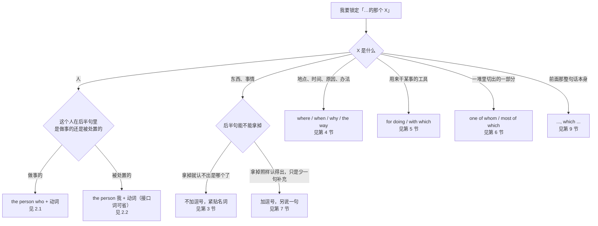
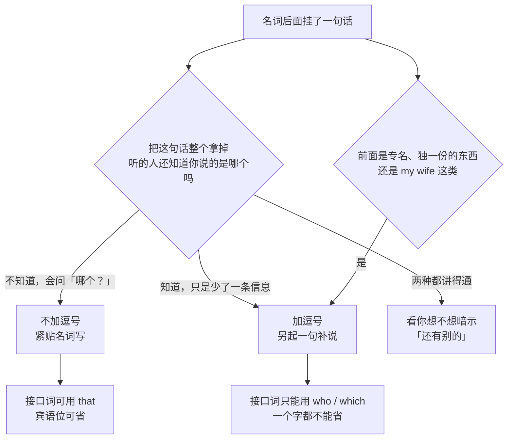
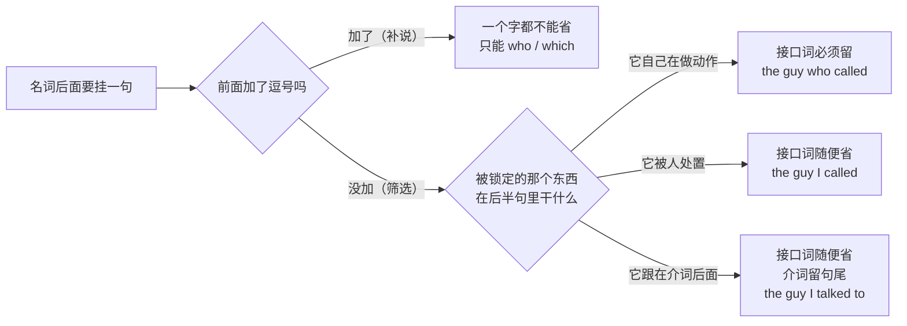

# …的那个人、那种东西：一句话锁定是哪一个

> [!info] 本篇定位
>
> 这篇收的是「我说的到底是哪一个」的全部中文说法：指人的（…的那个人、凡是…的人、唯一一个…的），指物的（…的那种东西、我要的那个、所有…的），指地点时间原因的（…的那个地方、…的那一天、…的原因、…的办法），指工具用途的（用来…的、我拿它…的那台），从一堆里切一部分的（其中一个、其中大部分、其中最…的），以及补说一句的（X，也就是那个…）。
>
> 产出统一是一个可填空骨架：名词摆在前，一句话挂在后，中间缝一个词。本篇只给骨架、只给「要不要加逗号」的判读，不解释为什么这样构造——那部分在 `02.英语基础语法/09.从句体系`，每个页脚都有链接。
>
> 读完能查到：想说「上周找过我们的那个客户又来了」，直接查 2.2；想说「我拿它跑测试的那台机器」，直接查 5.2；想说「三个候选人里有两个没到场」，直接查 6.1；想说「他们全都迟到了，这就很说明问题」，直接查 9.1。

---

## 1. 本篇导读：中文的「…的」压在前面，英文得甩到后面

中文说「上周找过我们、说要加两个功能、结果预算又不批的那个客户」，修饰成分再长也压得住，全堆在「客户」前面。英文没有这个承重能力——超过两三个词就必须搬到名词后面去。所以这一类句子的中译英，第一个动作不是选词，是**换位**：先把「…的」那一坨整块搬到名词后面，再考虑接口。

搬过去之后，接头处要补一个词把两半缝上。本篇把 who、that、which、whose、where、when 这一类缝在中间的词统一叫**接口词**，全篇的判断只有三件事：接口词选哪个、能不能省掉、前面要不要加逗号。



这棵树的第一个岔口只问一件事：被锁定的那个东西是人、是物、是地点时间、是一部分，还是前面整句话。这一步定接口词。第二个岔口才分形态：指人时看这个人在后半句里做事还是被处置，做事的位置省不掉接口词，被处置的位置口语里几乎一定省掉；指物时看后半句能不能拿掉，拿不掉就紧贴着写不加逗号，拿得掉就用逗号隔开单说一句。

三个岔口里最容易出事的是最后一个。中文没有这个区分——「我哥，他在深圳」和「在深圳的我哥」在中文里都能说，英文写成 `my brother who lives in Shenzhen` 就暗示「我还有别的哥哥」，写成 `my brother, who lives in Shenzhen` 才是「我就一个哥哥，顺带说他在深圳」。第 7 节整节讲这个逗号。

下面这张表把本篇的中文入口和落点对齐。查的时候先在这里定位到小节号，再进小节看三档成品。

| 中文触发语 | 主结构 | 落在哪一节 |
| --- | --- | --- |
| …的那个人 / 干…的那位 / 负责…的人 | the person who + 动词 | 2.1 |
| 我…的那个人 / 我见过的那位 / 上周找我们的那个 | the person (that) I + 动词 | 2.2 |
| 他…是…的那个人 / 名字叫…的那个 | the guy whose + 名词 | 2.3 |
| 我跟他…的那个人 / 我把它给了他的那位 | the person I talked to | 2.4 |
| 凡是…的人 / 那些…的人 / 谁…谁就 | anyone who / those who / whoever | 2.5 |
| 唯一一个…的 / 第一个…的 / 最后一个…的 | the only one who / the first to do | 2.6 |
| …的那个东西 / 老出问题的那个服务 | the thing that + 动词 | 3.1 |
| 我…的那个东西 / 我发你的那份 | the file (that) I + 动词 | 3.2 |
| 那种…的东西 / …这一类的 | the kind of X that | 3.3 |
| 它的…是…的那个 / …归谁的那个 | the one whose + 名词 | 3.4 |
| 所有…的 / 剩下…的 / 唯一…的东西 | everything that / the only thing that | 3.5 |
| 我要的东西 / 你说的那个 / 我不懂的地方 | what I need / what you said | 3.6 |
| …的那个地方 / 我们…的那间 | the place where / the room we did it in | 4.1 |
| …的那一天 / …的那阵子 / 在…的年代 | the day (when) / at a time when | 4.2 |
| …的原因 / 之所以…是因为 / 这就是为什么 | the reason (why) / that's why | 4.3 |
| …的办法 / …的方式 / 他讲东西的那个劲儿 | the way (that) / how | 4.4 |
| …的情况下 / 出现…的场合 / 这种局面 | cases where / a setup in which | 4.5 |
| 用来…的东西 / 干…用的 / 拿来…的 | a tool for doing / something to do with | 5.1 |
| 我拿它…的那台 / 在上面跑…的那个 | the machine I run it on | 5.2 |
| 建立在…上的 / 依据…的 / 靠…吃饭的 | the assumption the plan rests on | 5.3 |
| 其中一个 / 其中有几个 / 有两个是… | one of whom / some of which | 6.1 |
| 其中大部分 / 其中一个都没有 / 两个都不 | most of which / none of which | 6.2 |
| 其中最…的那个 / 数它最 | the largest of which | 6.3 |
| 一共三个，分别是 / 每一个都 | three of them, each of which | 6.4 |
| X，也就是那个… / X，就是…的那位 | X, the one who ... | 7.1 |
| 张三，他… / 那个项目，它… | Ana, who ... / the project, which ... | 7.2 |
| 这批全都… / 两个都… / 一个也没 | all of which / neither of whom | 7.3 |
| 顺带插一句 / 破折号里补一笔 | the API — which we shipped last month — ... | 7.4 |
| 口语里那个词直接不说 | the file I sent | 8.1 |
| 用 that 还是 who / 到底能不能省 | 口语顺位表 | 8.2 |
| 介词甩到句子最后 | the guy I talked to | 8.3 |
| 站在那边的那个 / 附件里的那份 | the guy standing over there | 8.4 |
| …，这一点… / …，这就是为什么 | ..., which is why ... | 9.1 |
| …，这就导致 / 这意味着 | ..., which means ... | 9.2 |
| …，我觉得这挺怪 / 这正是问题 | ..., which I find odd | 9.3 |

---

## 2. 指人：…的那个人

指人的锁定句是全篇密度最高的一块，因为中文的「…的人」承载了太多角色：他干了什么、我对他干了什么、他名下有什么、我跟他之间怎么样。这四种在英文里落到四个不同的骨架上，前两个的差别尤其要紧——第一个的接口词永远不能省，第二个的接口词口语里几乎永远省掉。

### 2.1 …的那个人：他自己干了什么

中文触发语：…的那个人 / 干…的那位 / 负责…的人 / 说了…的那个 / 就是他…的

| 档位 | 句架 | 例句 | 中文 |
| --- | --- | --- | --- |
| 口语 | the guy who + 动词 | The guy who fixed the printer sits on the third floor. | 修好打印机的那个人在三楼。 |
| 口语 | the one who + 动词 | She's the one who flagged the bug. | 就是她把那个 bug 报上来的。 |
| 口语 | the + 名词 + that + 动词 | The girl that sits next to me just quit. | 坐我旁边的那姑娘辞职了。 |
| 书面 | the person who + 动词 | The person who signs off on this is out until Monday. | 拍板的那个人下周一才回来。 |
| 书面 | the + 职务 + who + 动词 | The engineer who wrote this module left last year. | 写这个模块的那位工程师去年走了。 |
| 书面 | anyone who + 动词 | Anyone who touches the config has to file a ticket. | 谁动配置谁就得开个单。 |
| 正式 | those responsible for doing | Those responsible for approving the change must be notified in advance. | 负责审批该变更的人员须事先获知。 |

> [!warning] 错配警示
>
> ❌ ~~The guy who he fixed the printer sits on the third floor.~~
> ✅ **The guy who fixed the printer sits on the third floor.**（who 已经占住了「做事的那个人」的位置，后面不再补 he）
>
> ❌ ~~The person which signs off on this is out.~~
> ✅ **The person who signs off on this is out.**（指人不用 which，口语里可以退成 that，但 who 三档通用）

同义入口：…的那个人 / 干…的那位 / 负责…的人 / 说了…的那个 / 提出…的人 / 就是他…的
语法归属：[[02.英语基础语法/09.从句体系/01.定语从句基础|定语从句基础]]
场景实战：[[04.英语场景/04.从句与复合句型框架/02.定语从句完全手册|定语从句完全手册]]

### 2.2 我…的那个人：我对他做了什么

中文触发语：我…的那个人 / 我见过的那位 / 上周找过我们的那个 / 我提到的那个人 / 你推荐的那位

| 档位 | 句架 | 例句 | 中文 |
| --- | --- | --- | --- |
| 口语 | the guy 我 + 动词（中间什么都不加） | The guy I met at the meetup runs a hardware shop. | 我在聚会上认识的那个人开硬件店。 |
| 口语 | the one 你 + 动词 | Is this the one you mentioned yesterday? | 这就是你昨天说的那个人吗？ |
| 口语 | the client that + 我们 + 动词 | The client that we lost last quarter is back. | 上季度丢掉的那个客户又回来了。 |
| 书面 | the candidate whom + 我们 + 动词 | The candidate whom we interviewed on Tuesday declined the offer. | 周二面的那位候选人拒了 offer。 |
| 书面 | the person + 我 + 动词 + 时间状语 | The person I spoke with earlier confirmed the numbers. | 我早些时候谈过的那位确认了数字。 |
| 正式 | the individual whom + 主语 + 动词 | The individual whom the committee nominated has withdrawn. | 委员会提名的那位人士已退出。 |
| 正式 | the party to whom + 主语 + 动词 | The party to whom the notice was sent has not responded. | 收到通知的那一方尚未回复。 |

> [!warning] 错配警示
>
> ❌ ~~The guy I met him at the meetup runs a hardware shop.~~
> ✅ **The guy I met at the meetup runs a hardware shop.**（被处置的那个人已经在句首了，动词后面不再补 him）
>
> ❌ ~~The candidate who we interviewed~~ 在正式文书里
> ✅ **The candidate whom we interviewed**（正式档才讲究 whom；口语里 who 或者干脆什么都不写更自然）

同义入口：我…的那个人 / 我见过的那位 / 我提到的那个 / 你推荐的那位 / 上次来的那个人
语法归属：[[02.英语基础语法/09.从句体系/02.定语从句进阶|定语从句进阶]]
场景实战：[[04.英语场景/10.职场与商务场景实战/01.求职简历面试与Offer谈判|求职简历面试与Offer谈判]]

### 2.3 他…是…的那个人：拿他名下的东西认人

中文触发语：他老婆是…的那个 / 名字叫…的那位 / 车牌是…的那个人 / …归他管的那位 / 他的…出问题的那个

| 档位 | 句架 | 例句 | 中文 |
| --- | --- | --- | --- |
| 口语 | the guy whose + 名词 + 动词 | The guy whose car is blocking the gate — anyone know him? | 车堵在门口的那个人，谁认识？ |
| 口语 | the one whose + 名词 + be | She's the one whose demo crashed on stage. | 就是她那个演示在台上崩了。 |
| 口语 | the guy whose name I forget | The guy whose name I forget already left. | 那个我忘了叫啥的哥们儿已经走了。 |
| 书面 | employees whose + 名词 + 动词 | Employees whose contracts expire this month should contact HR. | 本月合同到期的员工请联系人事。 |
| 书面 | the author whose + 名词 + 动词 | The author whose paper we cited replied within a day. | 我们引用了论文的那位作者一天内就回了。 |
| 正式 | the applicant whose + 名词 + be + 过去分词 | Applicants whose documents are found incomplete will be contacted. | 材料被判定不完整的申请人将被联系。 |
| 正式 | any person whose + 名词 + 情态动词 | Any person whose access may be affected must be informed. | 权限可能受影响的任何人员均须获知。 |

> [!warning] 错配警示
>
> ❌ ~~The guy who his car is blocking the gate.~~
> ✅ **The guy whose car is blocking the gate.**（「他的」这层意思由 whose 一个词包办，不能拆成 who his）
>
> ❌ ~~The guy whose the car is blocking the gate.~~
> ✅ **The guy whose car is blocking the gate.**（whose 后面直接接名词，中间不放 the）

同义入口：他…是…的那个 / 名字叫…的那位 / …归他的那个人 / 他的…怎么样的那个
语法归属：[[02.英语基础语法/09.从句体系/02.定语从句进阶|定语从句进阶]]
场景实战：[[04.英语场景/04.从句与复合句型框架/02.定语从句完全手册|定语从句完全手册]]

### 2.4 我跟他…的那个人：中间夹着一个介词

中文触发语：我跟他谈过的那个 / 我把东西给了他的那位 / 我为他做事的那个人 / 我从他那儿拿到的那位 / 我跟他一起…的那个

| 档位 | 句架 | 例句 | 中文 |
| --- | --- | --- | --- |
| 口语 | the guy 我 + 动词 + 介词（介词甩到最后） | The guy I talked to said it's already fixed. | 我谈过的那个人说已经修好了。 |
| 口语 | the person 我 + 动词 + 介词 + 时间 | The person I handed it to on Friday hasn't confirmed. | 周五我把东西交给的那位还没确认。 |
| 口语 | the one 我 + 动词 + for | She's the one I used to work for. | 我以前就是给她干活的。 |
| 书面 | the colleague with whom + 主语 + 动词 | The colleague with whom I share an office is on leave. | 跟我共用一间办公室的同事休假了。 |
| 书面 | the client for whom + 主语 + 动词 | The client for whom we built the portal renewed. | 我们给他做过门户的那个客户续约了。 |
| 正式 | the person to whom + 主语 + be + 过去分词 | The person to whom the account is registered must sign. | 账户登记在其名下的人须签字。 |
| 正式 | the party from whom + 主语 + 动词 | The party from whom the goods were purchased bears the cost. | 货物向其购买的那一方承担费用。 |

> [!warning] 错配警示
>
> ❌ ~~The guy who I talked to him said it's fixed.~~
> ✅ **The guy I talked to said it's fixed.**（介词后面已经不需要再补 him）
>
> ❌ ~~The colleague with who I share an office~~
> ✅ **The colleague with whom I share an office**（介词紧贴着往前放时只能配 whom，配不了 who；不想用 whom 就把介词甩到句尾）

同义入口：我跟他…的那个 / 我把…给了他的那位 / 我为他…的那个人 / 我从他那儿…的那位
语法归属：[[02.英语基础语法/05.介词与连词/01.介词的分类与基本用法|介词的分类与基本用法]]
场景实战：[[04.英语场景/07.社交交际场景实战/02.电话短信与在线沟通场景|电话短信与在线沟通场景]]

### 2.5 凡是…的人：不指名道姓的一类人

中文触发语：凡是…的人 / 那些…的人 / 谁…谁就 / 只要是…的都 / 但凡…的

| 档位 | 句架 | 例句 | 中文 |
| --- | --- | --- | --- |
| 口语 | anyone who + 动词 | Anyone who's used it once knows what I mean. | 用过一次的人都懂我的意思。 |
| 口语 | whoever + 动词 | Whoever wrote this left no comments at all. | 写这段的那位一条注释都没留。 |
| 口语 | people who + 动词 | People who skip the onboarding always get stuck here. | 跳过新手引导的人总是卡在这儿。 |
| 书面 | those who + 动词 | Those who joined after March are on the new plan. | 三月之后入职的人走新方案。 |
| 书面 | everyone who + 动词 | Everyone who attended received a summary. | 到场的每个人都收到了一份纪要。 |
| 书面 | no one who + 动词 | No one who read the spec raised this. | 读过规格书的人没一个提过这个问题。 |
| 正式 | all persons who + 动词 | All persons who hold a valid permit may enter. | 持有效许可证的所有人员均可进入。 |

> [!warning] 错配警示
>
> ❌ ~~Anyone who have used it once know what I mean.~~
> ✅ **Anyone who has used it once knows what I mean.**（anyone、everyone、no one 一律按单数走，接口词后面的动词跟着变单数）
>
> ❌ ~~Those who joined after March is on the new plan.~~
> ✅ **Those who joined after March are on the new plan.**（those 是复数，主句谓语用 are）

同义入口：凡是…的人 / 那些…的人 / 谁…谁就 / 但凡…的 / 只要是…的都 / …的人一律
语法归属：[[02.英语基础语法/03.代词与数词/04.不定代词详解|不定代词详解]]
场景实战：[[04.英语场景/05.高频实用表达句型框架/01.表达观点与态度的50个万能句型|表达观点与态度的50个万能句型]]

### 2.6 唯一一个…的：靠序位或独一性锁定

中文触发语：唯一一个…的 / 第一个…的 / 最后一个…的 / 数得上的就他 / 就他一个人…

| 档位 | 句架 | 例句 | 中文 |
| --- | --- | --- | --- |
| 口语 | the only one who + 动词 | He's the only one who actually read the contract. | 只有他真读了合同。 |
| 口语 | the first person to + 动词原形 | She was the first person to spot the leak. | 她是第一个发现泄漏的人。 |
| 口语 | the last person 我 + 动词 | You're the last person I expected to see here. | 你是我最没想到会在这儿看见的人。 |
| 书面 | the only member of X who + 动词 | The only member of the team who speaks Japanese is on leave. | 队里唯一会日语的那位休假了。 |
| 书面 | the second person to + 动词原形 | He is the second person to hold this role in two years. | 他是两年里第二个接这个岗位的人。 |
| 正式 | the sole party that + 动词 | The sole party that objected has since withdrawn its objection. | 唯一提出异议的一方此后撤回了异议。 |
| 正式 | among the few who + 动词 | She is among the few who have completed the full audit. | 她属于完成了全部审计的少数人之一。 |

> [!warning] 错配警示
>
> ❌ ~~She was the first person who spotted the leak.~~ 读起来啰嗦
> ✅ **She was the first person to spot the leak.**（first、last、only、next 后面用 to do 更紧凑，三档都通）
>
> ❌ ~~He's the only one that read the contract, isn't it?~~
> ✅ **He's the only one who read the contract, isn't he?**（主语是人，反问那半句跟着人走）

同义入口：唯一一个…的 / 第一个…的 / 最后一个…的 / 就他一个…的 / 少数几个…的之一
语法归属：[[02.英语基础语法/08.非谓语动词/01.动词不定式详解|动词不定式详解]]
场景实战：[[04.英语场景/09.学习与教育场景实战/01.课堂讨论与提问场景|课堂讨论与提问场景]]

---

## 3. 指物：…的那个东西

指物这一块的骨架和指人完全同构，只是接口词换成 that 或 which。真正需要额外记的只有两条：紧贴名词写的时候 that 和 which 都能用（口语几乎只用 that，美式编辑规范也偏好 that），但隔着逗号补说的位置只能用 which，写 that 不合法；以及中文里那种「我要的东西」前面根本没有名词的说法，走的是另一条路（3.6）。

### 3.1 …的那个东西：它自己在动

中文触发语：…的那个东西 / 老出问题的那个 / 正在跑的那个 / 会…的那种 / 挂着…的那个

| 档位 | 句架 | 例句 | 中文 |
| --- | --- | --- | --- |
| 口语 | the thing that + 动词 | The thing that keeps crashing is the image worker. | 老崩的那个是图片处理进程。 |
| 口语 | the one that + 动词 | I want the one that comes with the charger. | 我要带充电器的那个。 |
| 口语 | the + 名词 + that + 动词 + 状语 | The script that runs at midnight failed again. | 半夜跑的那个脚本又挂了。 |
| 书面 | the + 名词 + which + 动词 | The clause which governs termination is on page four. | 管终止的那一条在第四页。 |
| 书面 | any + 名词 + that + 动词 | Any request that exceeds the quota is rejected. | 超出配额的请求一律被拒。 |
| 书面 | the + 名词 + responsible for doing | The service responsible for sending invoices is down. | 负责发账单的那个服务挂了。 |
| 正式 | such + 名词 + as + 动词 | Such records as remain must be archived. | 尚存的记录须予归档。 |

> [!warning] 错配警示
>
> ❌ ~~The thing what keeps crashing is the image worker.~~
> ✅ **The thing that keeps crashing is the image worker.**（前面已经有名词 the thing 了，接口词只能是 that 或 which，用不上 what）
>
> ❌ ~~The scripts that runs at midnight failed.~~
> ✅ **The scripts that run at midnight failed.**（后半句的动词跟着前面那个名词的单复数走，scripts 复数就用 run）

同义入口：…的那个东西 / 老出问题的那个 / 会…的那种 / 正在…的那个 / 干…的那个模块
语法归属：[[02.英语基础语法/09.从句体系/01.定语从句基础|定语从句基础]]
场景实战：[[04.英语场景/04.从句与复合句型框架/02.定语从句完全手册|定语从句完全手册]]

### 3.2 我…的那个东西：东西被我怎么样了

中文触发语：我…的那个 / 我发你的那份 / 你要的那个 / 我们上周改的那块 / 昨天提的那个

| 档位 | 句架 | 例句 | 中文 |
| --- | --- | --- | --- |
| 口语 | the file 我 + 动词（中间不加词） | The file I sent you has the wrong date. | 我发你的那份日期写错了。 |
| 口语 | the one 你 + 动词 | Is this the one you wanted? | 这就是你要的那个吗？ |
| 口语 | the + 名词 + 我们 + 动词 + 时间 | The change we made last week broke the export. | 我们上周改的那块把导出弄坏了。 |
| 书面 | the + 名词 + that + 主语 + 动词 | The proposal that the board approved is now public. | 董事会通过的那份提案已经公开。 |
| 书面 | the + 名词 + which + 主语 + 动词 | The dataset which we released in March has been updated. | 我们三月发布的那份数据集已更新。 |
| 正式 | the + 名词 + 主语 + 动词 + 状语（省接口词） | The terms the parties agreed upon remain in force. | 双方约定的条款继续有效。 |
| 正式 | the aforementioned + 名词 | The aforementioned figures exclude tax. | 前述数字不含税。 |

> [!warning] 错配警示
>
> ❌ ~~The file I sent it to you has the wrong date.~~
> ✅ **The file I sent you has the wrong date.**（file 已经在句首了，动词后面不再补 it）
>
> ❌ ~~The change what we made last week broke the export.~~
> ✅ **The change we made last week broke the export.**（口语里这个位置什么都不写最自然，写 that 也行，写 what 一定错）

同义入口：我…的那个 / 我发你的那份 / 你要的那个 / 我们改的那块 / 昨天提到的那个
语法归属：[[02.英语基础语法/10.特殊句型/05.省略与替代|省略与替代]]
场景实战：[[04.英语场景/10.职场与商务场景实战/03.商务邮件与正式书面沟通|商务邮件与正式书面沟通]]

### 3.3 那种…的东西：锁的是一类不是一个

中文触发语：那种…的东西 / …这一类的 / 属于…那种的 / 像…那样的 / 凡是…型的

| 档位 | 句架 | 例句 | 中文 |
| --- | --- | --- | --- |
| 口语 | the kind of + 名词 + that + 动词 | It's the kind of bug that only shows up in production. | 就是那种只在线上冒出来的 bug。 |
| 口语 | the sort of + 名词 + 你 + 动词 | That's the sort of thing you only learn the hard way. | 这种事只能靠吃亏学会。 |
| 口语 | one of those + 复数名词 + that + 动词 | It's one of those tools that does everything badly. | 属于那种什么都干、什么都干不好的工具。 |
| 书面 | a + 名词 + of the type that + 动词 | This is a failure of the type that recurs after every release. | 这属于每次发版后都会重现的那类故障。 |
| 书面 | any + 名词 + of a kind that + 动词 | Any request of a kind that alters billing needs review. | 凡是会改动计费的那类请求都要走审核。 |
| 正式 | 名词 + falling within the category that + 动词 | Assets falling within the category that qualifies for relief are listed below. | 属于可享受减免类别的资产列示如下。 |
| 正式 | 名词 + of such a nature as to + 动词原形 | A defect of such a nature as to affect safety must be reported. | 性质足以影响安全的缺陷必须上报。 |

> [!warning] 错配警示
>
> ❌ ~~It's the kind of bug which only shows up in production.~~ 读着别扭
> ✅ **It's the kind of bug that only shows up in production.**（kind of、sort of、type of 后面惯用 that，换 which 立刻显得生硬）
>
> ❌ ~~It's one of those tools that does everything badly.~~ 在正式书面里
> ✅ **It's one of those tools that do everything badly.**（one of those + 复数后面那个动词跟复数走；口语里说 does 的人很多，正式文书别这么写）

同义入口：那种…的东西 / …这一类的 / 属于…那种 / 像…那样的东西 / 凡是…型的
语法归属：[[02.英语基础语法/10.特殊句型/06.主谓一致|主谓一致]]
场景实战：[[04.英语场景/05.高频实用表达句型框架/04.比较对比举例总结句型库|比较对比举例总结句型库]]

### 3.4 它的…是…的那个：拿属性认物

中文触发语：它的…是…的那个 / …归…的那个 / 名字叫…的那份 / 编号是…的那台 / 作者是…的那本

| 档位 | 句架 | 例句 | 中文 |
| --- | --- | --- | --- |
| 口语 | the one whose + 名词 + 动词 | I'll take the one whose battery lasts longest. | 我要电池最耐用的那个。 |
| 口语 | the + 名词 + whose + 名词 + be | The repo whose owner left is unmaintained now. | 那个负责人离职的仓库现在没人管了。 |
| 口语 | the + 名词 + with the + 名词（不挂句） | Grab the box with the red label. | 拿贴红标签的那个箱子。 |
| 书面 | the + 名词 + whose + 名词 + 动词 | Machines whose disks exceed 90% will alert. | 磁盘超过九成的机器会告警。 |
| 书面 | the + 名词 + the + 名词 + of which + 动词 | A system the source of which is public invites scrutiny. | 源码公开的系统会招来审视。 |
| 正式 | 名词 + in respect of which + 主语 + 动词 | The items in respect of which a claim is made are listed. | 提出索赔所针对的物项列示如下。 |
| 正式 | 名词 + the terms of which + 动词 | An agreement the terms of which remain confidential was signed. | 一份条款仍属保密的协议已经签署。 |

> [!warning] 错配警示
>
> ❌ ~~The repo which its owner left is unmaintained.~~
> ✅ **The repo whose owner left is unmaintained.**（whose 指物也能用，不必因为它是「谁的」就避开）
>
> ❌ ~~A system whose the source is public~~
> ✅ **A system whose source is public**（whose 后面直接跟名词，不再放 the）

同义入口：它的…是…的那个 / …归…的那个 / 编号是…的那台 / 作者是…的那本 / 带…的那个
语法归属：[[02.英语基础语法/09.从句体系/02.定语从句进阶|定语从句进阶]]
场景实战：[[04.英语场景/06.日常生活场景实战/03.购物超市与讨价还价场景|购物超市与讨价还价场景]]

### 3.5 所有…的、唯一…的、剩下…的

中文触发语：所有…的 / 凡是…的东西 / 唯一…的那件事 / 剩下的那些 / 我能想到的全部

| 档位 | 句架 | 例句 | 中文 |
| --- | --- | --- | --- |
| 口语 | everything (that) 主语 + 动词 | Everything I touched broke. | 我碰过的全坏了。 |
| 口语 | the only thing (that) + 动词 | The only thing that worked was a restart. | 唯一管用的就是重启。 |
| 口语 | all (that) 主语 + 动词 | All we need is the token. | 我们只要那个 token。 |
| 书面 | anything that + 动词 | Anything that touches the payment path needs two reviewers. | 凡是碰到支付链路的都要两个人过。 |
| 书面 | the rest of the + 名词 + that + 动词 | The rest of the tickets that came in overnight are unassigned. | 夜里进来的其余工单都还没分派。 |
| 书面 | nothing that + 动词 | Nothing that we tried changed the latency. | 我们试过的东西没一样能改善延迟。 |
| 正式 | all + 名词 + that + 动词 + 状语 | All records that predate the migration are read-only. | 迁移之前的所有记录均为只读。 |

> [!warning] 错配警示
>
> ❌ ~~Everything which I touched broke.~~
> ✅ **Everything I touched broke.**（everything、anything、nothing、all 后面惯用 that 或者干脆省掉，不用 which）
>
> ❌ ~~All what we need is the token.~~
> ✅ **All we need is the token.** 或 **What we need is the token.**（all 和 what 不能叠着用，选一个）

同义入口：所有…的 / 凡是…的东西 / 唯一…的 / 剩下的那些 / 一样都没有…的
语法归属：[[02.英语基础语法/03.代词与数词/04.不定代词详解|不定代词详解]]
场景实战：[[04.英语场景/05.高频实用表达句型框架/04.比较对比举例总结句型库|比较对比举例总结句型库]]

### 3.6 我要的东西：前面根本没有名词

中文触发语：我要的东西 / 你说的那个 / 我不懂的地方 / 他真正在意的 / 剩下的问题是

| 档位 | 句架 | 例句 | 中文 |
| --- | --- | --- | --- |
| 口语 | what 主语 + 动词 | That's not what I asked for. | 这不是我要的。 |
| 口语 | what 主语 + 动词 + is + 名词 | What I need is a second pair of eyes. | 我要的是有人再看一遍。 |
| 口语 | 动词 + what 主语 + 动词 | Just send me what you have so far. | 你手上有什么先发我。 |
| 书面 | What matters here is (that) 从句 | What matters here is that the data never left the box. | 关键在于数据从没离开过那台机器。 |
| 书面 | 名词 + is what 主语 + 动词 | Latency is what users actually complain about. | 用户真正抱怨的是延迟。 |
| 正式 | that which + 动词（书面古雅） | That which cannot be measured cannot be managed. | 无法度量的东西也无法管理。 |
| 正式 | the extent to which 主语 + 动词 | The extent to which this generalizes remains unclear. | 这一点能推广到什么程度仍不清楚。 |

> [!warning] 错配警示
>
> ❌ ~~That's not the thing what I asked for.~~
> ✅ **That's not what I asked for.**（what 自己就等于「…的那个东西」，前面不能再摆一个名词）
>
> ❌ ~~What I need are a second pair of eyes.~~
> ✅ **What I need is a second pair of eyes.**（what 开头的这一坨当主语时按单数走）

同义入口：我要的东西 / 你说的那个 / 我不懂的地方 / 他在意的是 / 真正的问题是
语法归属：[[02.英语基础语法/09.从句体系/03.名词性从句详解|名词性从句详解]]
场景实战：[[04.英语场景/05.高频实用表达句型框架/01.表达观点与态度的50个万能句型|表达观点与态度的50个万能句型]]

---

## 4. 地点、时间、原因、办法：接口词换成一个副词

中文说「我们开会的那间屋子」「他辞职的那一天」「它挂掉的原因」「他讲东西的那个路子」，四条的结构在中文里一模一样。英文这边接口词换成 where、when、why、the way，形状也一致，只是每一个都还有一条更口语的退路——把接口词直接省掉，或者把介词甩到句尾。

### 4.1 …的那个地方

中文触发语：…的那个地方 / 我们…的那间 / 放…的那儿 / 出事的那个位置 / 你上次去的那家

| 档位 | 句架 | 例句 | 中文 |
| --- | --- | --- | --- |
| 口语 | the place 主语 + 动词（不加词） | That's the place we had lunch last time. | 就是上次我们吃午饭那家。 |
| 口语 | the room where 主语 + 动词 | The room where we did the interview is booked. | 我们做面试的那间屋子被订走了。 |
| 口语 | where 主语 + 动词（直接当名词用） | Put it back where you found it. | 从哪儿拿的放回哪儿去。 |
| 书面 | the folder where + 名词 + 动词 | The folder where the logs go fills up every Friday. | 存日志的那个目录每周五都满。 |
| 书面 | the + 名词 + in which 主语 + 动词 | The city in which the incident occurred has not been named. | 事件发生的那座城市尚未公布。 |
| 正式 | the premises on which 主语 + 动词 | The premises on which the equipment is stored must be secured. | 存放设备的场所须予保全。 |
| 正式 | the jurisdiction in which 主语 + 动词 | The jurisdiction in which the company is registered governs the contract. | 公司注册地的法律管辖本合同。 |

> [!warning] 错配警示
>
> ❌ ~~The room where we did the interview in is booked.~~
> ✅ **The room where we did the interview is booked.** 或 **The room we did the interview in is booked.**（where 和句尾的 in 只能留一个，两个都写就重复了）
>
> ❌ ~~That's the place where I told you about.~~
> ✅ **That's the place I told you about.**（about 后面缺的是「那个地方」这个宾语，不是「在那儿」，这时候用不上 where）

同义入口：…的那个地方 / 我们…的那间 / 放…的那儿 / 出事的那个位置 / 你上次去的那家
语法归属：[[02.英语基础语法/09.从句体系/02.定语从句进阶|定语从句进阶]]
场景实战：[[04.英语场景/08.出行与旅游场景实战/04.问路景点游览与购物场景|问路景点游览与购物场景]]

### 4.2 …的那一天、…的那阵子

中文触发语：…的那一天 / …的那阵子 / 我…的那年 / 在…的年代 / 每次…的时候

| 档位 | 句架 | 例句 | 中文 |
| --- | --- | --- | --- |
| 口语 | the day 主语 + 动词（不加词） | The day we shipped, half the team was out sick. | 我们上线那天，一半人病假。 |
| 口语 | the time 主语 + 动词 | Remember the time the build ran for six hours? | 还记得构建跑了六小时那次吗？ |
| 口语 | back when 主语 + 动词 | Back when we had two servers, this was fine. | 早先只有两台服务器的时候，这没问题。 |
| 书面 | the year when 主语 + 动词 | The year when the policy changed was 2019. | 政策变动的那一年是 2019。 |
| 书面 | at a time when 主语 + 动词 | The cut came at a time when hiring was already frozen. | 这次裁减发生在招聘早已冻结的时候。 |
| 正式 | the period during which 主语 + 动词 | The period during which claims may be filed is thirty days. | 可提出索赔的期间为三十日。 |
| 正式 | the date on which 主语 + 动词 | The date on which the notice takes effect is stated below. | 通知生效之日载于下文。 |

> [!warning] 错配警示
>
> ❌ ~~The day when we shipped it, half the team was out sick.~~ 口语里啰嗦
> ✅ **The day we shipped, half the team was out sick.**（the day、the time、the year、the moment 后面口语里一律省掉接口词）
>
> ❌ ~~The year which the policy changed was 2019.~~
> ✅ **The year when the policy changed was 2019.**（后半句缺的是「在那一年」这个时间点，不是缺宾语，用 when）

同义入口：…的那一天 / …的那阵子 / 我…的那年 / 在…的年代 / 上次…的那回
语法归属：[[02.英语基础语法/09.从句体系/01.定语从句基础|定语从句基础]]
场景实战：[[04.英语场景/04.从句与复合句型框架/02.定语从句完全手册|定语从句完全手册]]

### 4.3 …的原因

中文触发语：…的原因 / 之所以…是因为 / 这就是为什么 / 他不来的理由 / 说不清为什么的那个点

| 档位 | 句架 | 例句 | 中文 |
| --- | --- | --- | --- |
| 口语 | the reason 主语 + 动词（不加词） | The reason it failed is the cert expired. | 它挂掉的原因是证书过期了。 |
| 口语 | That's why 从句 | That's why nobody uses the old endpoint. | 所以才没人用那个老接口。 |
| 口语 | the reason why 主语 + 动词 | The reason why he left is not what people think. | 他离开的原因不是大家想的那样。 |
| 书面 | the reason for + 名词 / doing | The reason for the delay is a supplier issue. | 延期的原因是供应商出了问题。 |
| 书面 | the grounds on which 主语 + 动词 | The grounds on which the request was denied are unclear. | 请求被驳回所依据的理由并不清楚。 |
| 正式 | the rationale behind + 名词 | The rationale behind this threshold is documented in Appendix B. | 这一阈值背后的依据见附录 B。 |
| 正式 | the basis upon which 主语 + 动词 | The basis upon which the estimate was made is set out below. | 该估算所依据的基础载于下文。 |

> [!warning] 错配警示
>
> ❌ ~~The reason it failed is because the cert expired.~~
> ✅ **The reason it failed is that the cert expired.** 或 **It failed because the cert expired.**（reason 和 because 说的是同一件事，叠着写就重了）
>
> ❌ ~~The reason for it failed is the cert.~~
> ✅ **The reason for the failure is the cert.**（for 后面只能接名词，接不了一整句）

同义入口：…的原因 / 之所以…是因为 / 这就是为什么 / …的理由 / …背后的考虑
语法归属：[[02.英语基础语法/09.从句体系/01.定语从句基础|定语从句基础]]
场景实战：[[03.因果与结果/01.因为所以：原因表达的六档梯度|因为所以：原因表达的六档梯度]]

### 4.4 …的办法、…的方式

中文触发语：…的办法 / …的方式 / 他做事的那个路子 / 怎么…的那种法子 / 按…的做法

| 档位 | 句架 | 例句 | 中文 |
| --- | --- | --- | --- |
| 口语 | the way 主语 + 动词（不加词） | I don't like the way he phrased it. | 我不喜欢他那个措辞方式。 |
| 口语 | how 主语 + 动词 | That's how we caught it last time. | 上次我们就是这么发现的。 |
| 口语 | the way that 主语 + 动词 | I don't like the way that he talks to the interns. | 我不喜欢他跟实习生说话那个态度。 |
| 书面 | the manner in which 主语 + 动词 | The manner in which the data is collected matters. | 数据采集的方式很关键。 |
| 书面 | the approach 主语 + 动词 | The approach we took last quarter no longer scales. | 我们上季度用的做法已经撑不住了。 |
| 正式 | the procedure by which 主语 + 动词 | The procedure by which appeals are handled is described in section 5. | 申诉的处理程序见第五节。 |
| 正式 | the means whereby 主语 + 动词 | The means whereby access is granted must be auditable. | 授予访问权限的方式须可审计。 |

> [!warning] 错配警示
>
> ❌ ~~I don't like the way how he phrased it.~~
> ✅ **I don't like the way he phrased it.** 或 **I don't like how he phrased it.**（the way 和 how 只能留一个）
>
> ❌ ~~The manner which the data is collected matters.~~
> ✅ **The manner in which the data is collected matters.**（正式档的 manner 后面必须带 in which，光一个 which 撑不住）

同义入口：…的办法 / …的方式 / 他做事的路子 / 按…的做法 / 怎么…的那个法子
语法归属：[[02.英语基础语法/09.从句体系/03.名词性从句详解|名词性从句详解]]
场景实战：[[04.英语场景/10.职场与商务场景实战/02.会议汇报与演示场景|会议汇报与演示场景]]

### 4.5 …的情况下、出现…的场合

中文触发语：…的情况下 / 出现…的场合 / 这种局面 / 凡是…的情形 / 遇到…的时候

| 档位 | 句架 | 例句 | 中文 |
| --- | --- | --- | --- |
| 口语 | cases where 主语 + 动词 | There are cases where the retry makes it worse. | 有些情况下重试反而更糟。 |
| 口语 | a setup where 主语 + 动词 | It's a setup where nobody owns the deploy. | 这是个没人对发布负责的局面。 |
| 口语 | any time 主语 + 动词 | Any time the queue backs up, latency doubles. | 一旦队列积压，延迟就翻倍。 |
| 书面 | situations in which 主语 + 动词 | Situations in which both flags are set are undefined. | 两个标志同时置位的情形属未定义。 |
| 书面 | scenarios where 主语 + 动词 | The design covers scenarios where the network partitions. | 设计涵盖了网络分区的场景。 |
| 正式 | circumstances under which 主语 + 动词 | The circumstances under which data may be shared are limited. | 可以共享数据的情形是有限的。 |
| 正式 | instances in which 主语 + 动词 | Instances in which the rule does not apply are enumerated below. | 该规则不适用的情形列举如下。 |

> [!warning] 错配警示
>
> ❌ ~~There are cases which the retry makes it worse.~~
> ✅ **There are cases where the retry makes it worse.**（后半句自己完整，缺的是「在这种情况下」，用 where 或 in which）
>
> ❌ ~~Situations where both flags are set is undefined.~~
> ✅ **Situations in which both flags are set are undefined.**（主句谓语跟着 situations 走复数；正式档倾向 in which 而不是 where）

同义入口：…的情况下 / 出现…的场合 / 这种局面 / 凡是…的情形 / 遇到…的时候
语法归属：[[02.英语基础语法/09.从句体系/05.从句综合辨析|从句综合辨析]]
场景实战：[[04.条件与假设/01.真实条件：如果就、只要、一旦、除非、前提是|真实条件：如果就、只要、一旦、除非、前提是]]

---

## 5. 工具与用途：用来…的、我拿它…的

中文的「用来…的」是个高频入口，程序员尤其常用：「用来转格式的那个脚本」「我拿它跑测试的那台机器」「这个方案立足的那个假设」。三条对应三个不同骨架——第一条根本不用挂句子，一个 for doing 就够；后两条要把介词处理掉，口语甩到句尾、正式提到前面。

### 5.1 用来…的东西：一个介词短语就够

中文触发语：用来…的 / 干…用的 / 拿来…的东西 / …专用的 / 给…用的那个

| 档位 | 句架 | 例句 | 中文 |
| --- | --- | --- | --- |
| 口语 | something to + 动词原形 + 介词 | I need something to open this with. | 我需要个能撬开这个的东西。 |
| 口语 | a + 名词 + for doing | It's just a script for converting the old dumps. | 就是个用来转旧备份格式的脚本。 |
| 口语 | the + 名词 + you use to + 动词原形 | Where's the key you use to unlock the cabinet? | 你开柜子那把钥匙呢？ |
| 书面 | a + 名词 + designed to + 动词原形 | It is a check designed to catch silent data loss. | 这是一项用于捕捉静默数据丢失的检查。 |
| 书面 | a + 名词 + intended for + 名词 | This is a build intended for internal testing only. | 这是仅供内部测试的构建。 |
| 正式 | 名词 + for the purpose of doing | A form for the purpose of recording consent is attached. | 用于记录同意的表格随附。 |
| 正式 | 名词 + serving to + 动词原形 | A clause serving to limit liability was inserted. | 插入了一条用于限制责任的条款。 |

> [!warning] 错配警示
>
> ❌ ~~a script for convert the old dumps~~
> ✅ **a script for converting the old dumps**（for 后面接动词一律用 -ing 形态）
>
> ❌ ~~I need something to open this.~~ 当你说的是「拿它当工具」时
> ✅ **I need something to open this with.**（拿它当工具时 with 必须留在句尾；丢了 with，something 就成了「开这个」的施事，说的不再是我手里那件工具）

同义入口：用来…的 / 干…用的 / 拿来…的东西 / …专用的 / 给…用的那个
语法归属：[[02.英语基础语法/08.非谓语动词/01.动词不定式详解|动词不定式详解]]
场景实战：[[04.英语场景/04.从句与复合句型框架/04.非谓语动词框架|非谓语动词框架]]

### 5.2 我拿它…的那台：介词甩后面还是提前面

中文触发语：我拿它…的那台 / 在上面跑…的那个 / 我用它…的那把 / 往里面塞…的那个 / 靠它…的那套

| 档位 | 句架 | 例句 | 中文 |
| --- | --- | --- | --- |
| 口语 | the + 名词 + 主语 + 动词 + 介词（介词在句尾） | The machine I run the tests on is out of disk. | 我拿它跑测试的那台机器磁盘满了。 |
| 口语 | the + 名词 + 主语 + 动词 + 宾语 + on | The laptop I do all my work on is five years old. | 我干活用的那台笔记本五年了。 |
| 口语 | the + 名词 + that 主语 + 动词 + 介词 | The channel that we post releases to is muted for most people. | 我们发版本公告那个频道大部分人静音了。 |
| 书面 | the + 名词 + on which 主语 + 动词 | The server on which the build runs is being replaced. | 跑构建的那台服务器正在更换。 |
| 书面 | the + 名词 + with which 主语 + 动词 | The tool with which the report was generated is deprecated. | 生成该报告所用的工具已废弃。 |
| 正式 | the + 名词 + by which 主语 + 动词 | The formula by which the fee is calculated appears in Schedule 1. | 费用的计算公式见附表一。 |
| 正式 | the + 名词 + through which 主语 + 动词 | The channel through which requests are received is monitored. | 接收请求的通道处于监控之下。 |

> [!warning] 错配警示
>
> ❌ ~~The server on which the build runs on is being replaced.~~
> ✅ **The server on which the build runs is being replaced.**（介词提到前面就别在句尾再留一个）
>
> ❌ ~~The machine on which I run the tests is out of disk.~~ 在同事群里
> ✅ **The machine I run the tests on is out of disk.**（介词前置是书面档，日常对话里甩到句尾才自然）

同义入口：我拿它…的那台 / 在上面跑…的那个 / 我用它…的那把 / 靠它…的那套
语法归属：[[02.英语基础语法/05.介词与连词/02.常用介词搭配详解|常用介词搭配详解]]
场景实战：[[12.文体、语域与正式文书/03.技术规范与 API 文档：默认值、返回、抛出、已弃用|技术规范与 API 文档]]

### 5.3 建立在…上的、依据…的

中文触发语：建立在…上的 / 依据…的 / 以…为前提的 / 基于…的那套 / 靠…支撑的

| 档位 | 句架 | 例句 | 中文 |
| --- | --- | --- | --- |
| 口语 | the + 名词 + 主语 + 动词 + on | The assumption the whole plan rests on is wrong. | 整个计划立足的那个假设是错的。 |
| 口语 | the + 名词 + based on + 名词 | It's a guess based on two data points. | 这是个基于两个数据点的猜测。 |
| 口语 | whatever 主语 + 动词 + on | Whatever they based the estimate on, it wasn't real usage. | 不管他们的估算依据是什么，反正不是真实用量。 |
| 书面 | the + 名词 + on which 主语 + 动词 | The premise on which the argument depends is untested. | 论证所依赖的前提未经检验。 |
| 书面 | the + 名词 + underlying + 名词 | The model underlying these numbers has not been published. | 支撑这些数字的模型尚未公开。 |
| 正式 | the + 名词 + upon which 主语 + 动词 | The evidence upon which the finding rests is summarized below. | 该结论所依据的证据概述如下。 |
| 正式 | the + 名词 + pursuant to which 主语 + 动词 | The clause pursuant to which the fee is charged is quoted. | 据以收取该费用的条款引录如下。 |

> [!warning] 错配警示
>
> ❌ ~~The assumption which the whole plan rests is wrong.~~
> ✅ **The assumption the whole plan rests on is wrong.** 或 **The assumption on which the whole plan rests is wrong.**（rest 必须带 on，介词丢了句子就断了）
>
> ❌ ~~a guess based in two data points~~
> ✅ **a guess based on two data points**（based 后面固定配 on，配不了 in）

同义入口：建立在…上的 / 依据…的 / 以…为前提的 / 基于…的那套 / 靠…支撑的
语法归属：[[02.英语基础语法/08.非谓语动词/04.过去分词详解|过去分词详解]]
场景实战：[[12.文体、语域与正式文书/04.学术论证：本文提出、与前人不同、贡献与局限|学术论证：本文提出、与前人不同、贡献与局限]]

---

## 6. 其中…：从一堆里切出一部分

中文说「三个候选人里有两个没到」「五台机器其中大部分是闲置的」，切分的动作在中文里靠「其中」一个词完成。英文这边固定是 `数量词 + of whom / of which` 这个夹心结构，前面必须有逗号，因为它天然是补说一句而不是筛选。这一节的四个骨架在会议纪要和数据描述里出现频率极高。

### 6.1 其中一个、其中有几个

中文触发语：其中一个 / 其中有几个 / 有两个是… / 里面有一位 / 其中包括

| 档位 | 句架 | 例句 | 中文 |
| --- | --- | --- | --- |
| 口语 | ..., and one of them + 动词 | We got three offers, and one of them is remote. | 我们拿到三个 offer，其中一个是远程。 |
| 口语 | ..., a couple of which + 动词 | Twelve tickets came in, a couple of which are duplicates. | 进来十二个工单，其中有两个是重复的。 |
| 口语 | 数量 + of them + 动词 | Five people showed up. Two of them left early. | 来了五个人，其中两个提前走了。 |
| 书面 | 名词, one of whom + 动词 | Three candidates applied, one of whom withdrew. | 三位候选人投了简历，其中一位退出了。 |
| 书面 | 名词, some of which + 动词 | We logged 40 errors, some of which were transient. | 我们记录了 40 个错误，其中有些是瞬时的。 |
| 正式 | 名词, of whom + 数量 + 动词 | Sixty staff were surveyed, of whom forty responded. | 六十名员工受访，其中四十人作出回应。 |
| 正式 | 名词, 数量 of which + be + 过去分词 | Nine incidents were reported, three of which were escalated. | 报告了九起事件，其中三起被升级处理。 |

> [!warning] 错配警示
>
> ❌ ~~Three candidates applied, one of them withdrew.~~
> ✅ **Three candidates applied, one of whom withdrew.** 或 **Three candidates applied; one of them withdrew.**（一个逗号连不起两个完整句子，要么换 of whom，要么用分号断开）
>
> ❌ ~~Twelve tickets came in, a couple of who are duplicates.~~
> ✅ **Twelve tickets came in, a couple of which are duplicates.**（tickets 是物，用 of which；人才用 of whom）

同义入口：其中一个 / 其中有几个 / 有两个是… / 里面有一位 / 其中包括
语法归属：[[02.英语基础语法/09.从句体系/02.定语从句进阶|定语从句进阶]]
场景实战：[[09.比较、程度与数量/04.大约、超过、占三成、平均、分别是：数量与统计描述|大约、超过、占三成、平均、分别是：数量与统计描述]]

### 6.2 其中大部分、其中一个都没有

中文触发语：其中大部分 / 其中多数 / 其中一个都没有 / 两个都不 / 其中只有一小部分

| 档位 | 句架 | 例句 | 中文 |
| --- | --- | --- | --- |
| 口语 | ..., and most of them + 动词 | We ran ten checks, and most of them passed. | 我们跑了十项检查，大部分都过了。 |
| 口语 | ..., none of which + 动词 | He gave four reasons, none of which held up. | 他给了四条理由，没一条站得住。 |
| 口语 | ..., neither of them + 动词 | Two people reviewed it. Neither of them caught this. | 两个人评审过，两个都没看出这个。 |
| 书面 | 名词, most of which + 动词 | The archive holds 3,000 files, most of which are unreadable. | 存档里有三千份文件，其中多数已无法读取。 |
| 书面 | 名词, few of whom + 动词 | We contacted 50 users, few of whom replied. | 我们联系了五十位用户，回复的没几个。 |
| 正式 | 名词, none of whom + 动词 | Four officers were present, none of whom objected. | 四位主管在场，无人提出异议。 |
| 正式 | 名词, the majority of which + 动词 | Sixty claims were filed, the majority of which were rejected. | 提交了六十项索赔，其中多数被驳回。 |

> [!warning] 错配警示
>
> ❌ ~~He gave four reasons, none of which held up, and none of which were checked.~~ 连着挂两串很拖沓
> ✅ **He gave four reasons. None of them held up, and nobody checked any of them.**（同一个名词后面挂两串补说时，断句改写更清楚）
>
> ❌ ~~None of which is a problem.~~ 单独成句
> ✅ **None of this is a problem.**（of which 只能挂在前一句尾巴上，不能自己起一句）

同义入口：其中大部分 / 其中多数 / 一个都没有 / 两个都不 / 只有少数几个
语法归属：[[02.英语基础语法/03.代词与数词/04.不定代词详解|不定代词详解]]
场景实战：[[04.英语场景/10.职场与商务场景实战/02.会议汇报与演示场景|会议汇报与演示场景]]

### 6.3 其中最…的那个

中文触发语：其中最…的那个 / 数它最 / 里头属…最 / 其中规模最大的 / 最要紧的那一条

| 档位 | 句架 | 例句 | 中文 |
| --- | --- | --- | --- |
| 口语 | ..., and the worst one + 动词 | We hit four blockers, and the worst one is still open. | 我们撞上四个阻塞点，最麻烦那个还没解决。 |
| 口语 | the biggest of them + 动词 | Three regions went down; the biggest of them is still recovering. | 三个区域挂了，最大那个还在恢复。 |
| 口语 | ..., the best of which + be | She sent three drafts, the best of which is the second. | 她发了三稿，其中最好的是第二稿。 |
| 书面 | 名词, the largest of which + 动词 | We support six markets, the largest of which is Japan. | 我们支持六个地区，其中最大的是日本。 |
| 书面 | 名词, the earliest of which + 动词 | Four reports exist, the earliest of which dates from 2018. | 现有四份报告，最早的一份出自 2018 年。 |
| 正式 | 名词, the most significant of which + be | Several risks remain, the most significant of which is supplier concentration. | 若干风险仍在，其中最重大的是供应商集中。 |
| 正式 | 名词, chief among which + be | Three factors contributed, chief among which was the schedule. | 三项因素起了作用，其中首要的是排期。 |

> [!warning] 错配警示
>
> ❌ ~~We support six markets, the largest of which are Japan.~~
> ✅ **We support six markets, the largest of which is Japan.**（the largest of which 指的是单独一个，谓语用单数）
>
> ❌ ~~She sent three drafts, the best of them is the second.~~
> ✅ **She sent three drafts, the best of which is the second.**（用 them 就断不开句子，要么换 of which，要么把逗号改成句号）

同义入口：其中最…的那个 / 数它最 / 里头属…最 / 规模最大的那个 / 最要紧的那一条
语法归属：[[02.英语基础语法/04.形容词与副词/02.形容词的比较级与最高级|形容词的比较级与最高级]]
场景实战：[[09.比较、程度与数量/02.越来越、越…越、几倍、最…之一：变化量与极值|越来越、越…越、几倍、最…之一：变化量与极值]]

### 6.4 一共三个，分别是：逐个交代

中文触发语：一共三个，分别是 / 每一个都 / 两个里各有 / 挨个说 / 其中前两个…后一个…

| 档位 | 句架 | 例句 | 中文 |
| --- | --- | --- | --- |
| 口语 | 数量 + things, and each one + 动词 | There are three steps, and each one takes about a minute. | 一共三步，每步大概一分钟。 |
| 口语 | ..., both of which + 动词 | We tried two workarounds, both of which failed. | 我们试了两个绕法，两个都不成。 |
| 口语 | there are 数量 of them: A, B, and C | There are three of them: staging, prod, and the demo box. | 一共三个：预发、生产，还有演示机。 |
| 书面 | 名词, each of which + 动词 | The pipeline has four stages, each of which can be skipped. | 流水线有四个阶段，每个都可以跳过。 |
| 书面 | 名词, all of whom + 动词 | Six reviewers were assigned, all of whom signed off. | 分派了六位评审，全部签了字。 |
| 正式 | 主语 + 动词 + A and B respectively | The two figures refer to 2023 and 2024 respectively. | 这两个数字分别指 2023 年和 2024 年。 |
| 正式 | 名词, each of which + be + 过去分词 | Three annexes are attached, each of which is signed separately. | 随附三份附件，每份单独签署。 |

> [!warning] 错配警示
>
> ❌ ~~The pipeline has four stages, each of them can be skipped.~~
> ✅ **The pipeline has four stages, each of which can be skipped.**（挂在同一句里要用 of which，用 of them 就得断句）
>
> ❌ ~~The two figures refer to 2023 and 2024, respectively each.~~
> ✅ **The two figures refer to 2023 and 2024 respectively.**（respectively 单用，摆在句尾）

同义入口：一共三个，分别是 / 每一个都 / 两个里各有 / 挨个说 / 前两个…后一个…
语法归属：[[02.英语基础语法/03.代词与数词/05.数词的用法与表达|数词的用法与表达]]
场景实战：[[06.并列、递进、列举与选择/02.第一第二最后、包括以下、按…顺序：列举与步骤|第一第二最后、包括以下、按…顺序：列举与步骤]]

---

## 7. 加不加逗号：筛选还是补说

这是全篇唯一一个中文完全帮不上忙的判断。中文的「的」不区分「筛出哪一个」和「顺带说一句」，英文靠一个逗号把这两件事分开，而这个逗号会改变意思，不是格式偏好。



这棵树的主干只有一问：拿掉那半句还认不认得出。「The engineer who wrote this module left」拿掉后半句就剩「那位工程师走了」——听的人不知道是哪位，所以这半句是筛选用的，紧贴着写、不加逗号。「Ana, who wrote this module, left」拿掉后半句剩「Ana 走了」，照样知道是谁，那半句只是补一条信息，前后各一个逗号。

右边那条分支是硬性的：专名（Ana、GitHub、上海）、独一份的东西（the sun、my wife、our CTO）后面挂句子只能补说，因为它们本来就只有一个，没有可筛的余地。写成 `my wife who lives in Shenzhen` 会让人以为你有好几个老婆。

剩下那条「两种都讲得通」的分支是两可的：`the engineers who work remotely` 不加逗号，意思是「远程办公的那部分工程师」，暗示还有不远程的；加了逗号变成 `the engineers, who work remotely`，意思是「这些工程师，他们都远程办公」，暗示全体都远程。中文写「远程办公的工程师」两种都可以，翻的时候要自己决定暗示哪一层。

### 7.1 X，也就是那个…：补一句身份

中文触发语：X，也就是那个… / X，就是…的那位 / X，那个…的 / X，我说的是…的那个

| 档位 | 句架 | 例句 | 中文 |
| --- | --- | --- | --- |
| 口语 | X, the one who + 动词 | Marco, the one who set up the VPN, is on PTO. | 马可，就是搭 VPN 那位，在休假。 |
| 口语 | X, the + 名词 + 主语 + 动词 | The Nagoya box, the one we never patched, got hit. | 名古屋那台，我们一直没打补丁的那台，中招了。 |
| 口语 | X — you know, the + 名词 + that + 动词 | The old admin panel — you know, the one that still uses jQuery. | 老后台，就那个还在用 jQuery 的。 |
| 书面 | X, which + 动词 | The staging cluster, which runs the same image, is unaffected. | 预发集群跑的是同一个镜像，不受影响。 |
| 书面 | X, a + 名词 + that + 动词 | Kafka, a system we already depend on, can absorb this. | Kafka 是我们本来就依赖的系统，能吃下这部分。 |
| 正式 | X, being the + 名词 + that + 动词 | The Supplier, being the party that issued the invoice, bears the cost. | 供方作为开具发票的一方，承担该费用。 |
| 正式 | X (hereinafter the + 名词) | Acme Ltd. (hereinafter the Contractor) shall provide the equipment. | Acme 有限公司（以下称承包方）应提供该设备。 |

> [!warning] 错配警示
>
> ❌ ~~Marco the one who set up the VPN is on PTO.~~
> ✅ **Marco, the one who set up the VPN, is on PTO.**（补说一句要前后各一个逗号，只写一个等于句子中间断了一半）
>
> ❌ ~~Marco, that set up the VPN, is on PTO.~~
> ✅ **Marco, who set up the VPN, is on PTO.**（逗号后面接不了 that，只能用 who 或 which）

同义入口：X，也就是那个… / X，就是…的那位 / X，那个…的 / 我说的是…的那个
语法归属：[[02.英语基础语法/09.从句体系/02.定语从句进阶|定语从句进阶]]
场景实战：[[08.指认、定义与描述/02.X 是指、所谓、又称、相当于：定义与命名|X 是指、所谓、又称、相当于：定义与命名]]

### 7.2 张三，他…：专名后面接着说下去

中文触发语：张三，他… / 那个项目，它… / 这家公司，成立于… / 我老板，一个…的人

| 档位 | 句架 | 例句 | 中文 |
| --- | --- | --- | --- |
| 口语 | X, who + 动词, + 主句谓语 | Ana, who joined in March, is running the migration. | 安娜三月才来，现在在带迁移这事。 |
| 口语 | X, which + 动词, + 主句谓语 | The old CRM, which nobody logs into, still costs us money. | 那个老 CRM 没人登录，还在烧钱。 |
| 口语 | X, who 主语 + 动词 | My manager, who I've met twice, approved it. | 我那个经理，我总共见过两面，把这个批了。 |
| 书面 | X, whose + 名词 + 动词, + 主句谓语 | Riverton, whose population fell by half, is closing two schools. | 里弗顿人口减半，要关两所学校。 |
| 书面 | X, which + be + 过去分词 + 状语 | The report, which was published on Monday, contradicts last year's. | 该报告周一发布，与去年的相互矛盾。 |
| 正式 | X, who is + 名词, + 主句谓语 | Dr. Halim, who is the principal investigator, signed the protocol. | 哈利姆博士作为主要研究者签署了方案。 |
| 正式 | X, to whom + 主语 + 动词, + 主句谓语 | The Trustee, to whom the notice was addressed, has acknowledged receipt. | 通知致送的受托人已确认收悉。 |

> [!warning] 错配警示
>
> ❌ ~~Ana who joined in March is running the migration.~~
> ✅ **Ana, who joined in March, is running the migration.**（专名后面挂句子必须加逗号，不加就暗示「还有别的安娜」）
>
> ❌ ~~The old CRM, that nobody logs into, still costs us money.~~
> ✅ **The old CRM, which nobody logs into, still costs us money.**（逗号补说位置上 that 不合法）

同义入口：张三，他… / 那个项目，它… / 这家公司，成立于… / 我老板，一个…的人
语法归属：[[02.英语基础语法/09.从句体系/02.定语从句进阶|定语从句进阶]]
场景实战：[[04.英语场景/06.日常生活场景实战/01.问候寒暄与自我介绍场景|问候寒暄与自我介绍场景]]

### 7.3 这批全都…：补说的是全体不是一部分

中文触发语：这批全都… / 两个都… / 一个也没 / 无一例外 / 它们统统

| 档位 | 句架 | 例句 | 中文 |
| --- | --- | --- | --- |
| 口语 | ..., all of which + 动词 | They sent four invoices, all of which are wrong. | 他们发了四张发票，全是错的。 |
| 口语 | ..., both of whom + 动词 | Two engineers looked at it, both of whom said the same thing. | 两个工程师看过，说的一样。 |
| 口语 | ..., and they all + 动词 | We opened five tickets, and they all got closed as duplicates. | 我们开了五个单，全被当重复关掉了。 |
| 书面 | 名词, all of whom + 动词 | The panel had nine members, all of whom voted. | 评审组九人，全部投了票。 |
| 书面 | 名词, every one of which + 动词 | We shipped 12 patches, every one of which was reverted. | 我们发了十二个补丁，每一个都被回滚了。 |
| 正式 | 名词, all of which + be + 过去分词 | Three annexes are attached, all of which are incorporated by reference. | 随附三份附件，均以引用方式并入。 |
| 正式 | 名词, none of which + 动词 | Several objections were raised, none of which were sustained. | 提出了若干异议，均未获支持。 |

> [!warning] 错配警示
>
> ❌ ~~They sent four invoices all of which are wrong.~~
> ✅ **They sent four invoices, all of which are wrong.**（of which 这种夹心结构前面永远要有逗号）
>
> ❌ ~~Two engineers looked at it, both of which said the same thing.~~
> ✅ **Two engineers looked at it, both of whom said the same thing.**（人用 of whom）

同义入口：这批全都… / 两个都… / 一个也没 / 无一例外 / 它们统统
语法归属：[[02.英语基础语法/10.特殊句型/06.主谓一致|主谓一致]]
场景实战：[[06.并列、递进、列举与选择/03.要么要么、除了、二选一：选择、排除与例外|要么要么、除了、二选一：选择、排除与例外]]

### 7.4 破折号里插一笔：临时补一句

中文触发语：顺带插一句 / 括号里说明一下 / 破折号里补一笔 / 说到这个，它…

| 档位 | 句架 | 例句 | 中文 |
| --- | --- | --- | --- |
| 口语 | X — which 主语 + 动词 — + 主句谓语 | The new API — which nobody documented — went live Friday. | 新接口周五上线了，文档一个字没有。 |
| 口语 | X (the one 主语 + 动词) | Use the second script (the one I sent this morning). | 用第二个脚本，就是我今早发的那个。 |
| 口语 | X — and this is the part 主语 + 动词 — | They rolled back — and this is the part I don't get — without telling anyone. | 他们回滚了，而且这点我不理解，谁都没通知。 |
| 书面 | X, which, as 主语 + 动词, + 动词 | The clause, which, as we noted earlier, is ambiguous, needs redrafting. | 该条款如前所述含糊不清，需要重拟。 |
| 书面 | X (a + 名词 + that + 动词) | The tool (a fork that we never upstreamed) is now unmaintained. | 那个工具是我们从没回推上游的一个分支，现在没人维护。 |
| 正式 | X — 名词 + that + 动词 — + 主句谓语 | The threshold — a figure that has not changed since 2015 — is now unrealistic. | 该阈值自 2015 年起未变，如今已不切实际。 |
| 正式 | X, it should be noted, + 动词 | The estimate, it should be noted, excludes licensing. | 应当指出，该估算不含许可费用。 |

> [!warning] 错配警示
>
> ❌ ~~The new API - which nobody documented, went live Friday.~~
> ✅ **The new API — which nobody documented — went live Friday.**（插入一笔的两侧标点要成对：两个破折号，或者两个逗号，不能一头破折号一头逗号）
>
> ❌ ~~Use the second script (the one I sent this morning.)~~
> ✅ **Use the second script (the one I sent this morning).**（句号在括号外面）

同义入口：顺带插一句 / 括号里说明一下 / 破折号里补一笔 / 说到这个，它…
语法归属：[[02.英语基础语法/09.从句体系/05.从句综合辨析|从句综合辨析]]
场景实战：[[11.人际功能与话轮管理/03.打断一下、让我想想、说回刚才：插话、拖延、改口与转场|打断一下、让我想想、说回刚才：插话、拖延、改口与转场]]

---

## 8. 口语里怎么说：省掉接口词、把介词甩到后面

前面七节给的都是完整形态。日常对话里，完整形态出现的比例并不高——接口词能省的地方几乎一定省，介词能甩到句尾就甩到句尾。这一节把「什么时候能省」压成一个判断，再给三档成品。



这张图只有一个岔口在起作用：被锁定的那个东西在后半句里是做事的还是被处置的。做事的位置省不掉——`the guy called me` 会被读成一个完整句子「那家伙给我打电话了」，意思全变。被处置的位置和介词后面的位置随便省，省掉之后两个名词直接贴在一起（`the guy I called`），英语母语者听着完全自然，这也是中国学习者最不敢用、一用就立刻显得地道的形态。

左边那条分支是硬性红线：加了逗号的补说句一个字都不能省，也不能用 that。这条和上一节的判读连在一起——先定逗号，再定能不能省。

### 8.1 那个词直接不说：两个名词贴在一起

中文触发语：我…的那个 / 你给我的那份 / 他昨天提的那个 / 我们买的那台

| 档位 | 句架 | 例句 | 中文 |
| --- | --- | --- | --- |
| 口语 | the + 名词 + 主语 + 动词 | The email you forwarded never arrived. | 你转发的那封邮件根本没到。 |
| 口语 | everything 主语 + 动词 | Everything we tried made it slower. | 我们试的每样都让它更慢。 |
| 口语 | the only + 名词 + 主语 + 动词 | The only thing I changed was the timeout. | 我唯一改动的就是超时。 |
| 口语 | 名词 + 主语 + be + 形容词 + about | The part I'm unsure about is the rollback. | 我拿不准的是回滚那块。 |
| 书面 | the + 名词 + 主语 + 动词 + 状语 | The figures we published last week have been revised. | 我们上周发布的数字已作修订。 |
| 书面 | the + 名词 + that + 主语 + 动词（保留 that） | The assumptions that the model relies on are listed in Table 2. | 模型所依赖的假设列于表二。 |
| 正式 | the + 名词 + 主语 + 动词 + 介词短语 | The terms the parties agreed upon in July remain unchanged. | 双方七月约定的条款维持不变。 |

> [!warning] 错配警示
>
> ❌ ~~The email forwarded never arrived.~~ 如果你想说的是「你转发的那封」
> ✅ **The email you forwarded never arrived.**（省掉接口词以后，后半句必须自带主语；主语一起丢了意思就变成「被转发的邮件」）
>
> ❌ ~~The guy called me is waiting outside.~~
> ✅ **The guy who called me is waiting outside.**（这里那个人是做事的，接口词省不掉）

同义入口：我…的那个 / 你给我的那份 / 他昨天提的那个 / 我们买的那台 / 我唯一改的那处
语法归属：[[02.英语基础语法/10.特殊句型/05.省略与替代|省略与替代]]
场景实战：[[04.英语场景/07.社交交际场景实战/01.交友聚会与闲聊场景|交友聚会与闲聊场景]]

### 8.2 用 that 还是 who、到底省不省：口语顺位

中文触发语：口语里到底该怎么说 / 我说 that 行不行 / 这里能不能不说那个词

| 档位 | 句架 | 例句 | 中文 |
| --- | --- | --- | --- |
| 口语 | 指人做事，首选 who | The woman who runs the desk knows. | 管前台那位知道。 |
| 口语 | 指人做事，退而求其次用 that | The woman that runs the desk knows. | 管前台那位知道。 |
| 口语 | 指人被处置，直接省 | The woman I asked didn't know. | 我问的那位不知道。 |
| 口语 | 指物做事，首选 that | The lock that jams is the back one. | 卡住的那把锁是后门那个。 |
| 口语 | 指物被处置，直接省 | The lock I replaced still jams. | 我换过的那把锁还是卡。 |
| 书面 | 指物做事，正式场合可用 which | The provision which governs renewals is unclear. | 管续约的那一条不清楚。 |
| 书面 | 加了逗号，只能 who / which，不能省 | The provision, which was added in 2020, is unclear. | 那一条是 2020 年加的，写得不清楚。 |

> [!warning] 错配警示
>
> ❌ ~~The woman, that runs the desk, knows.~~
> ✅ **The woman who runs the desk knows.**（要么不加逗号配 that/who，要么加逗号配 who；逗号加 that 是错配）
>
> ❌ ~~The lock which I replaced still jams.~~ 在口语里
> ✅ **The lock I replaced still jams.**（口语里这个位置什么都不说最自然，which 显得书面）

同义入口：口语里怎么说 / 这里能不能省 / 用 that 还是 who / 什么时候不能省
语法归属：[[02.英语基础语法/09.从句体系/05.从句综合辨析|从句综合辨析]]
场景实战：[[04.英语场景/04.从句与复合句型框架/02.定语从句完全手册|定语从句完全手册]]

### 8.3 介词甩到句子最后

中文触发语：我跟他…的那个 / 我在上面…的那个 / 我为它…的那件事 / 我拿它…的那个

| 档位 | 句架 | 例句 | 中文 |
| --- | --- | --- | --- |
| 口语 | the + 名词 + 主语 + 动词 + about | The thing I'm worried about is the rollback window. | 我担心的是回滚窗口。 |
| 口语 | the + 名词 + 主语 + 动词 + to | The person I reported it to never replied. | 我上报给的那位一直没回。 |
| 口语 | the + 名词 + 主语 + 动词 + for | The client I did that job for went under. | 我给他做那个项目的客户倒闭了。 |
| 口语 | the + 名词 + 主语 + be + 形容词 + with | The part I'm least happy with is the naming. | 我最不满意的是命名。 |
| 书面 | the + 名词 + 主语 + 动词 + 介词 + 状语 | The dataset the results depend on was replaced in June. | 结果所依赖的那份数据集六月被替换了。 |
| 正式 | the + 名词 + 介词 + which + 主语 + 动词 | The account into which the funds were paid has been frozen. | 款项汇入的那个账户已被冻结。 |
| 正式 | the + 名词 + 介词 + whom + 主语 + 动词 | The officer to whom the complaint was made has resigned. | 受理该投诉的那位主管已辞职。 |

> [!warning] 错配警示
>
> ❌ ~~The person to who I reported it never replied.~~
> ✅ **The person I reported it to never replied.** 或 **The person to whom I reported it never replied.**（介词提前只能配 whom；配 who 两头都不落地）
>
> ❌ ~~The thing I'm worried is the rollback window.~~
> ✅ **The thing I'm worried about is the rollback window.**（worried 固定配 about，介词丢了句子就缺一块）

同义入口：我跟他…的那个 / 我在上面…的那个 / 我为它…的那件事 / 我拿它…的那个
语法归属：[[02.英语基础语法/05.介词与连词/04.介词与连词的易混点|介词与连词的易混点]]
场景实战：[[11.人际功能与话轮管理/02.没听清、你的意思是、我复述一下：澄清、追问与确认理解|没听清、你的意思是、我复述一下：澄清、追问与确认理解]]

### 8.4 站在那边的那个：连 be 一起省掉

中文触发语：站在那边的那个 / 附件里的那份 / 上周改动的那些 / 正在跑的那几个 / 涉及…的那部分

| 档位 | 句架 | 例句 | 中文 |
| --- | --- | --- | --- |
| 口语 | the + 名词 + doing | The guy standing by the door is from legal. | 站门口那位是法务的。 |
| 口语 | the + 名词 + 过去分词 | The files attached are the old ones. | 附件里那几份是旧的。 |
| 口语 | the + 名词 + 介词短语 | The one on the left is mine. | 左边那个是我的。 |
| 书面 | the + 名词 + doing + 状语 | The services running on that host will be migrated. | 跑在那台主机上的服务将被迁移。 |
| 书面 | the + 名词 + 过去分词 + 状语 | The changes made last week have not been reviewed. | 上周做的那些改动还没评审。 |
| 书面 | the + 名词 + 形容词 | The people present raised no objection. | 在场的人没有提出异议。 |
| 正式 | the + 名词 + involved / concerned / in question | The parties concerned will be notified in writing. | 相关各方将获书面通知。 |

> [!warning] 错配警示
>
> ❌ ~~The guy standing by the door he is from legal.~~
> ✅ **The guy standing by the door is from legal.**（短切形式后面直接接主句谓语，不再补一个 he）
>
> ❌ ~~The changes making last week have not been reviewed.~~
> ✅ **The changes made last week have not been reviewed.**（改动是被做出来的，用 made；自己在动才用 -ing）

同义入口：站在那边的那个 / 附件里的那份 / 上周改动的那些 / 正在跑的那几个 / 涉及…的那部分
语法归属：[[02.英语基础语法/08.非谓语动词/03.现在分词详解|现在分词详解]]
场景实战：[[04.英语场景/04.从句与复合句型框架/04.非谓语动词框架|非谓语动词框架]]

---

## 9. …，这一点…：锁定的是前面整句话

中文里「这」可以回指前面一整句：「他们全都迟到了，这就很说明问题」。英文这时候用一个逗号加 which，锁定的对象不是某个名词，而是整件事。这个形态在中文母语者笔下极少出现，一旦用上，句子的连贯度会明显不一样——因为替代方案（另起一句写 This means…）会把节奏切碎。

### 9.1 …，这一点…

中文触发语：…，这一点… / …，这就是为什么 / …，这挺说明问题 / …，这也解释了

| 档位 | 句架 | 例句 | 中文 |
| --- | --- | --- | --- |
| 口语 | ..., which is why 从句 | Nobody owns the deploy, which is why it keeps slipping. | 没人对发布负责，所以才老是延期。 |
| 口语 | ..., which explains + 名词 | He never read the thread, which explains the confusion. | 他压根没看那个帖，难怪会搞混。 |
| 口语 | ..., which tells you + 从句 | They all showed up early, which tells you how nervous they were. | 他们全都提前到了，可见有多紧张。 |
| 书面 | ..., which suggests (that) 从句 | Latency rose only on Tuesdays, which suggests a batch job is involved. | 延迟只在周二上升，这说明可能跟某个批处理有关。 |
| 书面 | ..., which is consistent with + 名词 | Usage dropped after the price change, which is consistent with the model. | 涨价后用量下降，这与模型相符。 |
| 正式 | ..., which would indicate + 名词 | The two logs disagree, which would indicate a clock skew. | 两份日志对不上，这将表明存在时钟偏差。 |
| 正式 | ..., a fact which + 动词 | The vendor missed three deadlines, a fact which the report omits. | 供应商三次错过期限，这一事实报告未予载明。 |

> [!warning] 错配警示
>
> ❌ ~~Nobody owns the deploy, what is why it keeps slipping.~~
> ✅ **Nobody owns the deploy, which is why it keeps slipping.**（回指前面整句话只能用 which，用不了 what）
>
> ❌ ~~Nobody owns the deploy which is why it keeps slipping.~~
> ✅ **Nobody owns the deploy, which is why it keeps slipping.**（这个 which 前面的逗号是必须的，不加就变成在锁定 deploy 这个词）

同义入口：…，这一点… / …，这就是为什么 / …，这挺说明问题 / …，这也解释了
语法归属：[[02.英语基础语法/09.从句体系/02.定语从句进阶|定语从句进阶]]
场景实战：[[10.态度、情感与判断/04.据说、研究表明、据我所知：信息来源与缓和语|据说、研究表明、据我所知：信息来源与缓和语]]

### 9.2 …，这就导致、这意味着

中文触发语：…，这就导致 / …，这意味着 / …，结果就是 / …，害得我们 / 这么一来就

| 档位 | 句架 | 例句 | 中文 |
| --- | --- | --- | --- |
| 口语 | ..., which means 从句 | The cert expires Sunday, which means someone has to be on call. | 证书周日到期，也就是说得有人值班。 |
| 口语 | ..., which left 主语 + doing | The build broke at 5pm, which left us debugging until midnight. | 构建五点挂了，害得我们调到半夜。 |
| 口语 | ..., which is going to + 动词原形 | They cut the budget, which is going to hurt hiring. | 预算砍了，招聘要受影响。 |
| 书面 | ..., which resulted in + 名词 | The index was dropped, which resulted in a full table scan. | 索引被删了，结果导致全表扫描。 |
| 书面 | ..., which allows 主语 + to + 动词原形 | The cache is now shared, which allows both services to reuse it. | 缓存现在是共享的，两个服务都能复用。 |
| 正式 | ..., which in turn + 动词 | Supply tightened, which in turn drove prices up. | 供给收紧，进而推高了价格。 |
| 正式 | ..., thereby doing | The clause was removed, thereby releasing both parties. | 该条款被删除，从而解除了双方的义务。 |

> [!warning] 错配警示
>
> ❌ ~~The cert expires Sunday, which mean someone has to be on call.~~
> ✅ **The cert expires Sunday, which means someone has to be on call.**（这个 which 顶的是整件事，按单数走，动词加 s）
>
> ❌ ~~They cut the budget, which will hurt to hiring.~~
> ✅ **They cut the budget, which will hurt hiring.**（hurt 直接接宾语，不带 to）

同义入口：…，这就导致 / …，这意味着 / …，结果就是 / …，害得我们 / 这么一来就
语法归属：[[02.英语基础语法/09.从句体系/02.定语从句进阶|定语从句进阶]]
场景实战：[[03.因果与结果/02.导致、引发、归因：把账算在原因头上|导致、引发、归因：把账算在原因头上]]

### 9.3 …，我觉得这挺怪、这正是问题

中文触发语：…，我觉得这挺怪 / …，这正是问题所在 / …，说实话这有点 / …，这我倒不意外

| 档位 | 句架 | 例句 | 中文 |
| --- | --- | --- | --- |
| 口语 | ..., which I find + 形容词 | They rolled back without a ticket, which I find odd. | 他们没开单就回滚了，我觉得这挺怪。 |
| 口语 | ..., which is exactly the problem | Everyone assumed someone else had checked, which is exactly the problem. | 每个人都以为别人查过了，这正是问题所在。 |
| 口语 | ..., which honestly + 动词 | The doc hasn't been touched in two years, which honestly says a lot. | 那份文档两年没动过，说实话这挺说明问题。 |
| 书面 | ..., which is worth noting | The error rate held steady through the spike, which is worth noting. | 峰值期间错误率保持平稳，这一点值得注意。 |
| 书面 | ..., which came as no surprise | The vendor asked for an extension, which came as no surprise. | 供应商申请延期，这并不意外。 |
| 正式 | ..., which the committee regards as + 名词 | Two members abstained, which the committee regards as a procedural matter. | 两名成员弃权，委员会视之为程序事项。 |
| 正式 | ..., which merits further examination | The two estimates diverge sharply, which merits further examination. | 两项估算差异显著，值得进一步审视。 |

> [!warning] 错配警示
>
> ❌ ~~They rolled back without a ticket, which I find it odd.~~
> ✅ **They rolled back without a ticket, which I find odd.**（which 已经是 find 的宾语了，后面不再补 it）
>
> ❌ ~~..., that is exactly the problem.~~ 挂在前一句尾巴上
> ✅ **..., which is exactly the problem.**（逗号后面回指整句只能用 which；写成 That is exactly the problem. 就得另起一句）

同义入口：…，我觉得这挺怪 / …，这正是问题所在 / …，这倒不意外 / …，这值得留意
语法归属：[[02.英语基础语法/09.从句体系/05.从句综合辨析|从句综合辨析]]
场景实战：[[10.态度、情感与判断/01.我觉得、真是太、令我惊讶：评价与情绪反应|我觉得、真是太、令我惊讶：评价与情绪反应]]

---

## 10. 本篇小结

```mermaid
mindmap
  root(("一句话锁定是哪一个"))
    指人
      "the guy who + 动词（他做事）"
      "the guy I + 动词（他被处置，可省）"
      "the guy whose + 名词"
      "the guy I talked to（介词甩句尾）"
      "anyone who / those who / whoever"
      "the only one who / the first to do"
    指物
      "the thing that + 动词"
      "the file I sent（省接口词）"
      "the kind of X that"
      "the one whose / of which"
      "everything that / the only thing that"
      "what I need（前面没有名词）"
    地点时间原因办法
      "the place where / the room we met in"
      "the day (when) / at a time when"
      "the reason (why) / that's why"
      "the way (that) / how / the manner in which"
      "cases where / circumstances under which"
    工具与依据
      "a script for doing / something to do with"
      "the machine I run it on / on which"
      "the assumption the plan rests on"
    其中一部分
      "one of whom / some of which"
      "most of which / none of whom"
      "the largest of which"
      "each of which / all of which"
    逗号判读
      "拿掉认不出 → 不加逗号，可用 that，可省"
      "拿掉照样认得 → 加逗号，只能 who/which，不可省"
      "专名与独一份 → 一律加逗号"
    回指整句
      "..., which is why / which means"
      "..., which suggests / which resulted in"
      "..., which I find odd"
```

这张图按被锁定的对象分成六支加一条判读。左边四支是「锁定一个具体的东西」：人、物、地点时间原因办法、工具依据，四支的骨架同构，差别只在接口词。右边两支是本篇最容易被跳过、实际最有用的两块：从一堆里切一部分（of whom / of which 夹心），以及回指前面整句话（逗号加 which）。中间那条逗号判读横跨所有支，任何一条挂上名词之前都要先过一遍。

背的时候按支背，同一支里的骨架可以互相替换；跨支替换必错，尤其是把指人的 who 用到回指整句上，或者把回指整句的 which 挤到没有逗号的位置去。

> [!success] 本篇核心要点回顾
>
> 1. 中译英第一动作是换位：把中文压在名词前面的「…的」整块搬到名词后面，再考虑缝哪个词。
> 2. 被锁定的对象在后半句里做事时，接口词一个都省不掉；被处置或跟在介词后面时，口语里几乎一定省掉，两个名词直接贴在一起。
> 3. 逗号不是格式偏好而是意思：拿掉那半句还认得出就加逗号，认不出就不加。专名、my wife、our CTO 这类独一份的东西后面只能加逗号。
> 4. 加了逗号的位置只能用 who 或 which，用不了 that，也一个字都不能省。
> 5. whose 指人指物都能用，后面直接接名词，中间不放 the，也不能拆成 who his 或 which its。
> 6. 后半句自己完整、缺的是「在那儿」「在那一天」「因为那个」时，接口词换成 where、when、why；缺的是宾语时才用 that、which 或直接省掉。
> 7. 从一堆里切一部分固定写成 `数量 of whom / of which` 并且前面必须有逗号；写成 of them 就得把逗号改成句号或分号。
> 8. 回指前面整句话只能用逗号加 which，它按单数走；用 what 顶替一定错，丢掉逗号会变成在锁定紧挨着的那个名词。

> [!success] 本篇练习清单
>
> - [ ] 给「修好打印机的那个人在三楼」，写出口语、书面、正式三档，并说明哪一档能省接口词。
> - [ ] 给「上周找过我们的那个客户又回来了」，写出三档，口语档不得出现 that 或 who。
> - [ ] 给「车堵在门口的那个人」，写出三档，检查 whose 后面有没有多写 the。
> - [ ] 给「我拿它跑测试的那台机器磁盘满了」，写出三档，口语档把介词放句尾、书面档提到前面。
> - [ ] 给「三位候选人投了简历，其中一位退出了」，写出三档，检查逗号和 of whom。
> - [ ] 给「安娜三月才来，现在在带迁移这事」，写出三档，说明这里为什么必须加逗号。
> - [ ] 给「没人对发布负责，所以才老是延期」，写出三档，全部用逗号加 which 的形态。
> - [ ] 给「站门口那位是法务的」和「上周做的那些改动还没评审」，各写三档，区分 -ing 和过去分词哪个该用。

### 10.1 下一篇预告

> [!info] 下一篇
>
> [[08.指认、定义与描述/02.X 是指、所谓、又称、相当于：定义与命名\|X 是指、所谓、又称、相当于：定义与命名]]
>
> 本篇解决的是「我说的是哪一个」，下一篇解决的是「这个东西叫什么、是什么意思」：be defined as、refer to、be known as 的分工，so-called 和 be equivalent to 的语域，the fact that 这一类同位名词的清单，以及「换句话说」「具体来说」「以 X 为例」的改述与举例插入语。锁定不了对象时查本篇，说不出那个词是什么时查下一篇。
