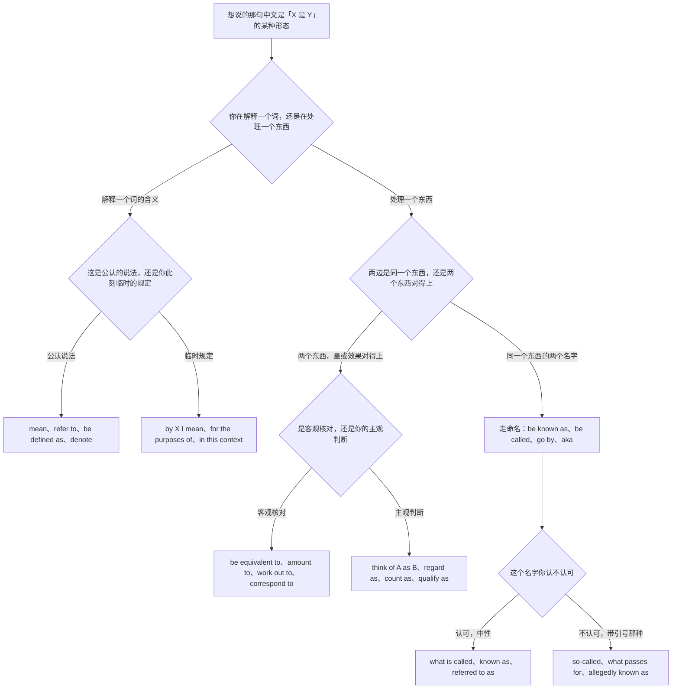
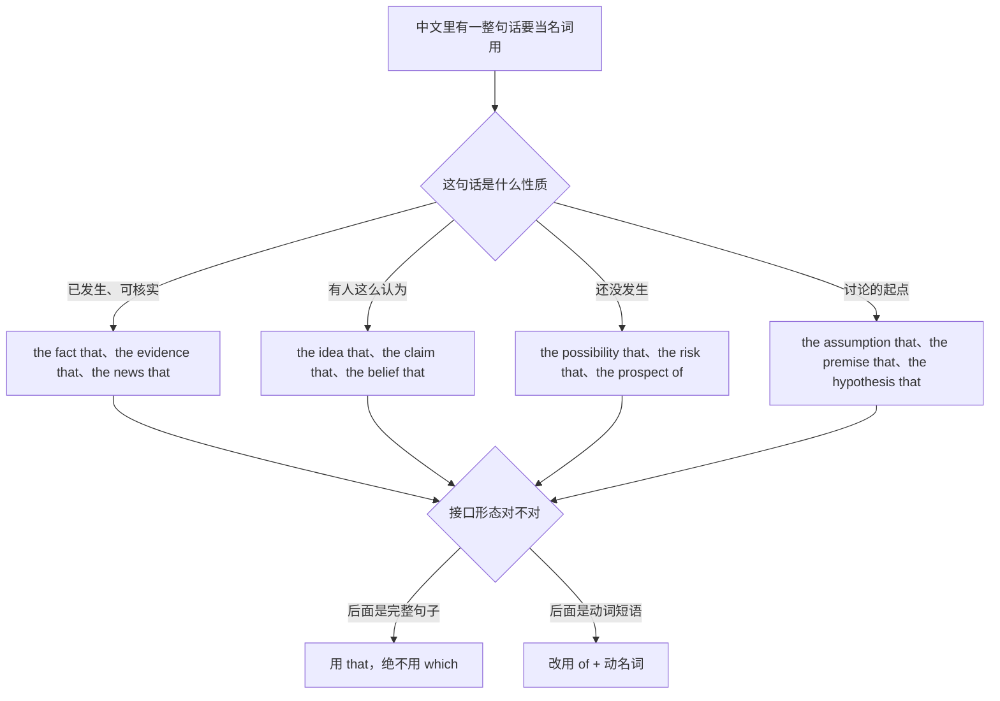
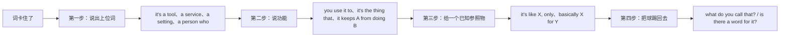
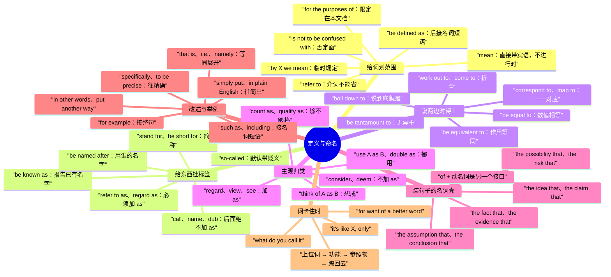

# X 是指、所谓、又称、相当于：定义与命名

> [!info] 本篇定位
>
> 这篇收「X 是指」「X 的意思是」「所谓 X」「这里说的 X 特指」「X 得名于」「别跟 Y 搞混」「又称」「我们把它叫做」「以…命名」「简称」「行话叫」「相当于」「约等于」「折合」「说到底就是」「把 A 当作 B」「被视为」「算得上」「拿…当…用」「…这个事实」「…的可能性」「换句话说」「具体来说」「说白了」「举例来说」「以 X 为例」「那个东西叫什么来着」共三十四条查询意图，每条给口语、书面、正式三档成品。
>
> 与本分类另外几篇的分工：想说「就是那个…的人／东西」这类**从一群里指出哪一个**的，查 [[08.指认、定义与描述/01.…的那个人、那种东西：一句话锁定是哪一个\|…的那个人、那种东西]]；想说「由…组成」「分为几类」「属于」「不在此列」这类**拆内部结构或划边界**的，查 [[08.指认、定义与描述/03.由…组成、分为、包括、属于：构成、分类与范围界定\|由…组成、分为、包括、属于]]；想说「看起来像」「区别在于」「严格来说」这类**描外观与打折扣**的，查 [[08.指认、定义与描述/04.看起来像、区别在于、严格来说：外观、类比与限定\|看起来像、区别在于、严格来说]]。这一篇只管**给一样东西安上一个说法**：下定义、起名字、说它等于什么、说它被当成什么。
>
> 读完能查到：mean 和 refer to 到底谁能当主语、be defined as 后面为什么不能跟句子、call 的复合宾语为什么不许加 as 而 refer to as 必须加、so-called 的贬义从哪儿来、be equivalent to 与 be equal to 差在哪、think of A as B 和 think A is B 的语域差、the fact that 后面跟的是不是定语从句、i.e. 和 that is 能不能互换、for example 与 such as 的接口形态不同在哪、以及一整套「知道那是什么但想不起单词」时的现场脱困框架。
>
> 「据说」「研究表明」这类**交代消息来源**的主锚点在 [[10.态度、情感与判断/04.据说、研究表明、据我所知：信息来源与缓和语\|信息来源与缓和语]]，本篇不重复。「前者…后者」「如前所述」的篇章回指归 [[12.文体、语域与正式文书/05.法律条款与篇章回指：除非另有约定、如前所述、前者后者\|法律条款与篇章回指]]。同位语从句与定语从句的结构区别不在这里解释，指回 [[02.英语基础语法/09.从句体系/03.名词性从句详解\|名词性从句详解]]。

---

## 1. 本篇导读：中文一个「是」，英文分四种活儿

中文说「X 是 Y」，一个「是」字通吃四件不同的事：给词下定义（递归是指函数调用自身）、给东西起名字（这个模式又称观察者模式）、说两边等价（一英里相当于一点六公里）、说主观归类（我把这事当成一次演练）。四件事在中文里同形，在英文里走四条不相通的路，动词、介词、语序都不一样。

分岔点在**说话人有没有权力这么规定**。下定义与命名是规定：说话人在给一个词划范围，或者给一个东西挂标签，句子成立与否只看这条规定有没有被接受。等价是核对：两边各自独立存在，说话人只是在报告它们对得上。归类是判断：说话人明说这是自己的看法，别人可以不同意。

判断错的代价是具体的。把归类写成定义（`Refactoring is defined as a waste of time.`），读者会以为你在引用某个权威定义；把定义写成归类（`I think of recursion as a function that calls itself.`），读者会以为这只是你个人的理解方式，而它其实是标准说法。

### 四种活儿的分工总表

| 中文说法 | 说话人在干什么 | 走哪条路 | 本篇节次 |
| --- | --- | --- | --- |
| X 是指 / X 的意思是 / 所谓 X | 给一个词划范围 | mean、refer to、be defined as | 第 2 节 |
| X 又称 Y / 我们把它叫做 Y | 给一个东西挂标签 | be known as、call、name | 第 3 节 |
| X 相当于 Y / 约等于 / 折合 | 报告两边对得上 | be equivalent to、amount to | 第 4 节 |
| 我把 A 当作 B / A 被视为 B | 明说这是判断 | think of A as B、be regarded as | 第 5 节 |
| …这个事实 / …的可能性 | 把一整句话装进名词 | the fact that、the possibility that | 第 6 节 |
| 换句话说 / 也就是说 / 说白了 | 同一件事换个说法再说一遍 | in other words、that is | 第 7 节 |
| 举例来说 / 以 X 为例 / 比如 | 拿一个个案顶上来 | for example、take X | 第 8 节 |
| 那个…叫什么来着 | 词想不起来，绕过去 | it's the thing you use to | 第 9 节 |

### 从中文进的总选择树

树的第一层只问「你在解释词还是在处理物」。这一层是接口层：解释词的那一支，主语是词本身（`Idempotence means ...`）；处理物的那一支，主语是东西本身（`This pattern is known as ...`）。中文两边都说「X 是」，看不出差别，但英文的 mean 与 be known as 不能对调——`This pattern means the observer pattern` 语法上挑不出毛病，读出来却成了「这个模式的含义是观察者模式」，没人这么说话。第二层在定义支上问「公认还是临时」，在等价支上问「客观还是主观」，这两层决定的是能不能被反驳。第三层只在命名支上出现，问的是褒贬。

### 三个先立起来的提醒

> [!warning] be defined as 后面接名词，不接句子
>
> - ❌ ~~Idempotence is defined as an operation can be repeated safely.~~ ／ ✅ **Idempotence is defined as an operation that can be repeated safely.**（as 是介词，后面要一个名词短语；想接句子就换 means that）
> - ❌ ~~Latency is defined as how long does a request take.~~ ／ ✅ **Latency is defined as the time a request takes.** 或 **Latency is how long a request takes.**（宾语从句用陈述语序，疑问语序进不了这个位置）

> [!warning] mean 与 refer to 的主语不一样
>
> - ❌ ~~In this document, "client" means to the front-end app.~~ ／ ✅ **In this document, "client" refers to the front-end app.** 或 **In this document, "client" means the front-end app.**（mean 直接带宾语，refer to 带介词；两个混成 mean to 是最高频的一处错）
> - ❌ ~~The word refers a specific kind of lock.~~ ／ ✅ **The word refers to a specific kind of lock.**（refer 后面的 to 不能省）

> [!tip] 查法
>
> 先在树的第一层落地：你手里是**一个词**还是**一个东西**。词走第 2 节，东西走第 3 到 5 节。如果是「我想说的这句话本身要当成一个名词用」（…这个事实、…的可能性），直接跳第 6 节。如果句子已经说完了、只是想再补一句换说法或举个例子，那是第 7、8 节的插入语，跟前面几节没有关系。第 9 节单独一支，专门给「知道是什么但英文词卡住了」的现场情况。

---

## 2. X 是指、所谓：给一个词划范围

这一节的五条意图都是在解释一个词。分档依据是「这条定义有多权威」：口语档是我随口一说，书面档是文档里的正式说明，正式档是规范文本或论文里立得住的界定。

### 2.1 X 是指、X 的意思是：最常用的一套

中文触发语：X 是指 / X 的意思是 / X 说的是 / X 就是…的意思 / 这个词指的是

| 档位 | 句架 | 例句 |
| --- | --- | --- |
| 口语 | X means A. | Idempotent means you can run it twice and nothing extra happens. |
| 口语 | X is basically A. | A webhook is basically a callback URL the other side calls you back on. |
| 书面 | X refers to A. | The term "client" refers to any process that opens a connection to the gateway. |
| 书面 | By X we mean A. | By availability we mean the share of requests that get a non-error response. |
| 正式 | X is defined as A. | Throughput is defined as the number of completed requests per unit of time. |
| 正式 | X denotes A. | In this specification, MUST denotes an absolute requirement. |

> [!warning] 错配警示
>
> - ❌ ~~Idempotent means that you can to run it twice.~~ ／ ✅ **Idempotent means that you can run it twice.**（mean that 后面是完整句子，动词不带 to）
> - ❌ ~~This word is meaning a kind of lock.~~ ／ ✅ **This word means a kind of lock.**（mean 表「意思是」时不用进行时）

- 同义入口：X 是指 / X 的意思是 / X 说的是 / 这个词表示 / X 指的就是
- 语法归属：[[02.英语基础语法/09.从句体系/03.名词性从句详解\|宾语从句的陈述语序]]
- 场景实战：[[04.英语场景/09.学习与教育场景实战/01.课堂讨论与提问场景\|课堂上解释术语]]

### 2.2 所谓 X，就是…：先亮词再解释

中文触发语：所谓 X / 所谓的 X 就是 / X 这个说法指的是 / 我们讲的 X 是这么回事

| 档位 | 句架 | 例句 |
| --- | --- | --- |
| 口语 | What people call X is just A. | What people call a service mesh is just a proxy next to every pod. |
| 口语 | When we say X, we're talking about A. | When we say "hot path," we're talking about the code that runs on every request. |
| 书面 | What is meant by X is A. | What is meant by "soft delete" is that the row stays but gets a deleted flag. |
| 书面 | The term X covers A. | The term "downstream" covers everything the service calls out to. |
| 正式 | X, properly understood, is A. | Consistency, properly understood, is a guarantee about what a reader can observe. |
| 正式 | The expression X is to be read as A. | The expression "business day" is to be read as any weekday other than a public holiday. |

> [!warning] 错配警示
>
> - ❌ ~~The so-called service mesh is just a proxy.~~（中性语境下）／ ✅ **What people call a service mesh is just a proxy.**（英文 so-called 默认带「名不副实」的味道，中文「所谓」在很多语境下是中性的，直接对译会把语气变酸；贬义用法见第 3.5 条）
> - ❌ ~~When we say hot path, we mean about the code on every request.~~ ／ ✅ **When we say "hot path," we mean the code that runs on every request.**（mean 后面直接接名词，加 about 是把 talk about 的介词错带过来了）

- 同义入口：所谓 X / 所谓的 / 我们说的 X 是 / X 这个词指的是 / 这里讲的 X
- 语法归属：[[02.英语基础语法/09.从句体系/03.名词性从句详解\|what 引导的主语从句]]
- 场景实战：[[04.英语场景/10.职场与商务场景实战/02.会议汇报与演示场景\|汇报里先定义再展开]]

### 2.3 这里说的 X 特指：把定义限制在本文档内

中文触发语：这里说的 X 特指 / 本文中的 X 仅指 / 在这个语境下 X 是 / 下文中的 X 一律指

| 档位 | 句架 | 例句 |
| --- | --- | --- |
| 口语 | When I say X here, I mean A. | When I say "the API" here, I mean the public one, not the internal one. |
| 书面 | In this document, X means A. | In this document, "the client" means the mobile app, not the browser. |
| 书面 | Here X is used in the narrow sense of A. | Here "migration" is used in the narrow sense of a schema change. |
| 正式 | For the purposes of this agreement, X means A. | For the purposes of this agreement, "Confidential Information" means any material marked as such. |
| 正式 | Unless otherwise stated, X shall mean A. | Unless otherwise stated, "the Service" shall mean the hosted API described in Schedule 1. |

> [!warning] 错配警示
>
> - ❌ ~~For the purpose of this agreement, "Client" means…~~ ／ ✅ **For the purposes of this agreement, "Client" means…**（合同定义节惯用复数 purposes；单数 for the purpose of 读作「为了这一个具体目的」，不是划定义范围的那个套式）
> - ❌ ~~In this document, the client is meaning the mobile app.~~ ／ ✅ **In this document, "the client" means the mobile app.**（同 2.1，mean 不进行时；被定义的词按惯例加引号或首字母大写）

- 同义入口：这里说的 X / 本文中的 X / 在本协议中 / 下文一律指 / 就本文而言
- 语法归属：[[02.英语基础语法/02.名词与冠词/03.冠词的用法详解\|专有化名词的冠词处理]]
- 场景实战：[[12.文体、语域与正式文书/05.法律条款与篇章回指：除非另有约定、如前所述、前者后者\|条款里的定义节]]

### 2.4 X 得名于、字面意思是：说这个词的来路

中文触发语：X 得名于 / X 这个词来自 / 字面意思是 / 直译过来是 / X 是从…来的

| 档位 | 句架 | 例句 |
| --- | --- | --- |
| 口语 | X gets its name from A. | The pattern gets its name from the way the calls stack up. |
| 口语 | X literally means A. | "Kubernetes" literally means helmsman in Greek. |
| 书面 | X takes its name from A. | The algorithm takes its name from the two researchers who published it. |
| 书面 | X comes from A. | The word comes from an old telephony term for a dropped line. |
| 正式 | X derives from A. | The term derives from the Latin for "to fall back." |
| 正式 | X is so called because A. | The pattern is so called because each handler passes the request along the chain. |

> [!warning] 错配警示
>
> - ❌ ~~The pattern is named from the way calls stack up.~~ ／ ✅ **The pattern takes its name from the way calls stack up.**（说来路用 take its name from；named 搭的是 after，而 after 后面得跟一个真被借走的名字，比如 **The algorithm is named after its inventor.**）
> - ❌ ~~Literally it means helmsman, but literally nobody uses that sense.~~ ／ ✅ **It literally means helmsman, though nobody uses that sense.**（literally 在正式书面里只保留「字面上」义，不当强调词用）

- 同义入口：X 得名于 / 这个词来自 / 字面意思 / 直译是 / 之所以叫 X 是因为
- 语法归属：[[02.英语基础语法/05.介词与连词/02.常用介词搭配详解\|动词加介词的固定搭配]]
- 场景实战：[[04.英语场景/07.社交交际场景实战/01.交友聚会与闲聊场景\|闲聊里解释一个词的来历]]

### 2.5 X 不是指、别跟 Y 搞混：定义的否定面

中文触发语：X 不是指 / 别把 X 和 Y 搞混 / X 跟 Y 不是一回事 / 这里不包括

| 档位 | 句架 | 例句 |
| --- | --- | --- |
| 口语 | X isn't the same thing as Y. | Idempotent isn't the same thing as safe. |
| 口语 | Don't mix X up with Y. | Don't mix latency up with response time — they're measured at different points. |
| 书面 | X is not to be confused with Y. | Authentication is not to be confused with authorization. |
| 书面 | X does not mean A. | Deprecated does not mean removed; the endpoint still works. |
| 正式 | X should not be taken to mean A. | The absence of an error should not be taken to mean the write succeeded. |
| 正式 | X is to be distinguished from Y. | A soft delete is to be distinguished from an archival operation. |

> [!warning] 错配警示
>
> - ❌ ~~Don't confuse authentication to authorization.~~ ／ ✅ **Don't confuse authentication with authorization.**（confuse 搭配 with；混成 to 是把 compare to 的介词错带过来）
> - ❌ ~~Deprecated is not meaning removed.~~ ／ ✅ **Deprecated does not mean removed.**（否定 mean 用 do 助动词，不用进行时）

- 同义入口：X 不是指 / 别搞混 / 不是一回事 / 要跟 Y 区分开 / 这里不包含
- 语法归属：[[02.英语基础语法/01.基础入门/03.疑问句与否定句的构成\|实义动词的否定式]]
- 场景实战：[[12.文体、语域与正式文书/03.技术规范与 API 文档：默认值、返回、抛出、已弃用\|规范里划清易混概念]]

---

## 3. 又称、叫作、命名为：给东西挂标签

第 2 节的主语是词，这一节的主语是东西。中文都说「叫」，英文这一端要先分清是**报告已有的名字**（be known as）还是**当场起一个名字**（call、name），两支的语序不同。

### 3.1 X 又称 Y、也叫：报告已有的名字

中文触发语：X 又称 Y / X 也叫 Y / X 就是我们平时说的 Y / X 一般被称为 Y

| 档位 | 句架 | 例句 |
| --- | --- | --- |
| 口语 | X is also called Y. | This box is also called the jump host. |
| 口语 | X, or Y, [as some people call it,] ... | Rate limiting, or throttling, kicks in above a hundred requests a second. |
| 书面 | X is known as Y. | The delay between a write and its appearance on a replica is known as replication lag. |
| 书面 | X is commonly referred to as Y. | This class of failure is commonly referred to as a split brain. |
| 正式 | X is termed Y. | A record whose parent has been removed is termed an orphan. |
| 正式 | X, otherwise known as Y, ... | The primary replica, otherwise known as the leader, accepts all writes. |

> [!warning] 错配警示
>
> - ❌ ~~This box is also called as the jump host.~~ ／ ✅ **This box is also called the jump host.** 或 **This box is also referred to as the jump host.**（call 后面不加 as，refer to 后面必须加 as；两套搅在一起是本节最高频的错）
> - ❌ ~~This failure is known for a split brain.~~ ／ ✅ **This failure is known as a split brain.**（be known as 是「以…为名」，be known for 是「以…出名」，换掉介词意思完全变了）

- 同义入口：又称 / 也叫 / 一般称为 / 通称 / 学名是 / 我们平时管它叫
- 语法归属：[[02.英语基础语法/10.特殊句型/01.被动语态全解\|复合宾语的被动形态]]
- 场景实战：[[04.英语场景/05.高频实用表达句型框架/04.比较对比举例总结句型库\|解释与命名的连接式]]

### 3.2 我们把它叫做 X：当场起名字

中文触发语：我们把它叫做 X / 姑且叫它 X / 我给它起名叫 X / 就叫它 X 吧

| 档位 | 句架 | 例句 |
| --- | --- | --- |
| 口语 | We call it X. | We call it the graveyard queue because nothing ever comes back out. |
| 口语 | Let's just call it X for now. | Let's just call it the shim for now and rename it later. |
| 书面 | We call this X. | We call this the warm path, to keep it apart from the cold storage tier. |
| 书面 | We refer to this as X. | We refer to this as a partial outage rather than a full one. |
| 正式 | This is what we shall call X. | This is what we shall call the settlement window. |
| 正式 | Such a configuration is designated X. | Such a configuration is designated a Type II deployment. |

> [!warning] 错配警示
>
> - ❌ ~~We call to it the graveyard queue.~~ ／ ✅ **We call it the graveyard queue.**（call 是双宾结构，不带介词；refer 才带 to）
> - ❌ ~~Let's call it as the shim.~~ ／ ✅ **Let's call it the shim.**（同 3.1，call 后面绝不加 as）

- 同义入口：叫它 X / 姑且称为 / 我们管它叫 / 起个名字叫 / 就命名为 X
- 语法归属：[[02.英语基础语法/01.基础入门/02.英语五大基本句型详解\|主谓宾补句型]]
- 场景实战：[[04.英语场景/10.职场与商务场景实战/02.会议汇报与演示场景\|会上临时给方案起名]]

### 3.3 以…命名、被冠名为：正式命名

中文触发语：以…命名 / 用…的名字命名 / 被冠名为 / 定名为 / 被称作（带修辞色彩）

| 档位 | 句架 | 例句 |
| --- | --- | --- |
| 口语 | It's named after A. | The room is named after the founder's dog. |
| 口语 | Someone dubbed it X. | Someone in the channel dubbed it the Friday bug and the name stuck. |
| 书面 | X is named after A. | The sorting method is named after its inventor. |
| 书面 | The project has been given the name X. | The project has been given the name Northwind for internal use. |
| 正式 | X shall be designated Y. | The successor entity shall be designated the Surviving Company. |
| 正式 | X bears the name of Y. | The library bears the name of the standard it implements. |

> [!warning] 错配警示
>
> - ❌ ~~The method is named by its inventor.~~ ／ ✅ **The method is named after its inventor.**（named by 是「被某人命名」，named after 才是「用某人的名字命名」）
> - ❌ ~~Someone dubbed it as the Friday bug.~~ ／ ✅ **Someone dubbed it the Friday bug.**（dub 与 call、name 同类，后面不加 as）

- 同义入口：以…命名 / 用…的名字 / 定名为 / 被戏称为 / 冠以…之名
- 语法归属：[[02.英语基础语法/10.特殊句型/01.被动语态全解\|带补语的被动句]]
- 场景实战：[[04.英语场景/09.学习与教育场景实战/02.图书馆作业与研究场景\|论文里交代命名来源]]

### 3.4 简称、缩写、全称：名字的长短两头

中文触发语：X 是 Y 的简称 / 缩写是 / 全称是 / X 代表 Y / 简称 X

| 档位 | 句架 | 例句 |
| --- | --- | --- |
| 口语 | X stands for Y. | SLO stands for service level objective. |
| 口语 | X is short for Y. | Repo is short for repository. |
| 书面 | X, short for Y, ... | TTL, short for time to live, tells the cache when to drop the entry. |
| 书面 | Y is abbreviated as X. | Service level objective is abbreviated as SLO throughout this document. |
| 正式 | Y (hereinafter "X") ... | Service Level Objective (hereinafter "SLO") shall have the meaning given in Section 2. |
| 正式 | The full form of X is Y. | The full form of the acronym is given on first use only. |

> [!warning] 错配警示
>
> - ❌ ~~SLO is stand for service level objective.~~ ／ ✅ **SLO stands for service level objective.**（stand for 是实义动词短语，不跟 be 连用）
> - ❌ ~~Repo is the short of repository.~~ ／ ✅ **Repo is short for repository.**（固定式是 be short for，没有 the short of 这个说法）

- 同义入口：简称 / 缩写 / 全称 / 代表 / X 即 Y 的缩写 / 以下简称
- 语法归属：[[02.英语基础语法/01.基础入门/04.英语词典缩写大全\|缩写与英文全称的对照]]
- 场景实战：[[12.文体、语域与正式文书/03.技术规范与 API 文档：默认值、返回、抛出、已弃用\|文档里首次出现缩写的写法]]

### 3.5 所谓的（贬义）、名义上的：给名字打折扣

中文触发语：所谓的（带引号那种）/ 号称是 / 名义上的 / 美其名曰 / 说是…其实

| 档位 | 句架 | 例句 |
| --- | --- | --- |
| 口语 | This so-called X is just A. | This so-called migration plan is just a wiki page with three bullets. |
| 口语 | It's a X in name only. | It's a code review in name only — nobody reads the diff. |
| 书面 | What passes for X here is A. | What passes for monitoring here is a single uptime check. |
| 书面 | The X, so called, ... | The rollback procedure, so called, has never actually been run. |
| 正式 | X is nominally Y. | The committee is nominally independent. |
| 正式 | X purports to be Y. | The document purports to be a specification but reads like a wish list. |

> [!warning] 错配警示
>
> - ❌ ~~The so-called observer pattern is widely used.~~（想说中性的「所谓」时）／ ✅ **The observer pattern, as it is called, is widely used.** 或直接 **The observer pattern is widely used.**（so-called 在英文里多数场合带质疑，中性语境换掉更稳）
> - ❌ ~~It's only a code review in the name.~~ ／ ✅ **It's a code review in name only.**（固定式是 in name only，词序和冠词都不能动）

- 同义入口：所谓的 / 号称 / 名义上 / 美其名曰 / 说是 X，其实
- 语法归属：[[02.英语基础语法/04.形容词与副词/01.形容词的用法与位置\|复合形容词的前置修饰]]
- 场景实战：[[11.人际功能与话轮管理/05.我有个顾虑、这样不太行、恐怕要延期：异议、负面反馈与坏消息\|带保留地提异议]]

---

## 4. 相当于、约等于、折合：两边对得上

这一节处理的是两个独立存在的东西，说话人只报告它们在某个维度上对得上。分档依据是精确度：口语档允许含糊，正式档要写清是哪个维度等价。

### 4.1 相当于、等于：完全对等

中文触发语：相当于 / 等于 / 等同于 / 跟…是一回事 / 就是…的另一种说法

| 档位 | 句架 | 例句 |
| --- | --- | --- |
| 口语 | X is the same as Y. | A 502 here is the same as a timeout upstream. |
| 口语 | X is just Y with a different name. | A job runner is just a queue consumer with a different name. |
| 书面 | X is equivalent to Y. | Two calls with the same idempotency key are equivalent to a single call. |
| 书面 | X amounts to Y. | Skipping the review amounts to shipping untested code. |
| 正式 | X is equal to Y. | The total is equal to the sum of the line items. |
| 正式 | X and Y are interchangeable [for the purposes of A]. | The two endpoints are interchangeable for read traffic. |

> [!warning] 错配警示
>
> - ❌ ~~Two calls are equivalent with a single call.~~ ／ ✅ **Two calls are equivalent to a single call.**（equivalent 搭配 to，不搭 with）
> - ❌ ~~The total is equivalent to the sum of the line items.~~ ／ ✅ **The total is equal to the sum of the line items.**（数值相等用 equal to；equivalent to 是「效果或作用上等同」，写数字时读起来含糊）

- 同义入口：相当于 / 等于 / 等同于 / 一回事 / 换个说法而已 / 无非就是
- 语法归属：[[02.英语基础语法/05.介词与连词/02.常用介词搭配详解\|形容词加介词搭配]]
- 场景实战：[[09.比较、程度与数量/01.A 比 B 更、不如、一样：比较三式与差额\|as…as 与差额表达]]

### 4.2 约等于、差不多就是：不完全对等

中文触发语：约等于 / 差不多就是 / 大致相当于 / 基本上可以看成 / 八九不离十

| 档位 | 句架 | 例句 |
| --- | --- | --- |
| 口语 | X is more or less Y. | The staging box is more or less a smaller copy of production. |
| 口语 | X is close enough to Y. | For our purposes, the two formats are close enough to identical. |
| 书面 | X is roughly equivalent to Y. | One credit is roughly equivalent to a thousand tokens. |
| 书面 | X approximates Y. | The cached count approximates the real one to within a few percent. |
| 正式 | X may be treated as Y [for A]. | The estimate may be treated as final for budgeting purposes. |
| 正式 | X is broadly comparable to Y. | The two schemes are broadly comparable in cost. |

> [!warning] 错配警示
>
> - ❌ ~~The two formats are almost the same with each other.~~ ／ ✅ **The two formats are almost the same.** 或 **The two formats are almost identical.**（the same 后面接 as 不接 with，而且这里根本不需要补出比较对象）
> - ❌ ~~One credit approximately equals to a thousand tokens.~~ ／ ✅ **One credit is roughly equivalent to a thousand tokens.** 或 **One credit approximately equals a thousand tokens.**（equal 作动词时不带 to）

- 同义入口：约等于 / 差不多 / 大致相当 / 可以看成 / 出入不大 / 基本一致
- 语法归属：[[02.英语基础语法/04.形容词与副词/03.副词的分类与用法\|程度副词的修饰位置]]
- 场景实战：[[09.比较、程度与数量/04.大约、超过、占三成、平均、分别是：数量与统计描述\|约数与近似值的说法]]

### 4.3 折合、换算成、加起来是：量的对换

中文触发语：折合 / 换算成 / 加起来是 / 合下来 / 相当于多少

| 档位 | 句架 | 例句 |
| --- | --- | --- |
| 口语 | That works out to A. | That works out to about nine dollars a seat. |
| 口语 | That comes to A. | With tax it comes to a hundred and forty. |
| 书面 | X translates into A. | A ten percent cut translates into four fewer engineers. |
| 书面 | X converts to A at a rate of B. | The allowance converts to storage at a rate of one gigabyte per credit. |
| 正式 | X corresponds to A. | Each unit corresponds to one hour of compute. |
| 正式 | X, expressed in Y, is A. | The latency budget, expressed in milliseconds, is two hundred. |

> [!warning] 错配警示
>
> - ❌ ~~That works out about nine dollars.~~ ／ ✅ **That works out to about nine dollars.**（work out 在「折合」义上必须带 to；不带 to 的 work out 是「解决、锻炼」）
> - ❌ ~~A ten percent cut translates four fewer engineers.~~ ／ ✅ **A ten percent cut translates into four fewer engineers.**（translate 表「转化为」时带 into；直接带宾语是「翻译」义）

- 同义入口：折合 / 换算 / 加起来 / 合计 / 摊下来 / 相当于多少钱
- 语法归属：[[02.英语基础语法/05.介词与连词/01.介词的分类与基本用法\|介词表转换关系]]
- 场景实战：[[04.英语场景/06.日常生活场景实战/03.购物超市与讨价还价场景\|结账时算总价]]

### 4.4 说到底就是、无异于：把话拉回本质

中文触发语：说到底就是 / 归根到底是 / 这么做无异于 / 形同 / 跟…没两样

| 档位 | 句架 | 例句 |
| --- | --- | --- |
| 口语 | It boils down to A. | It boils down to whether we trust the vendor's uptime numbers. |
| 口语 | That's basically A. | Turning off retries is basically choosing to lose requests. |
| 书面 | X is essentially A. | The proposal is essentially a rewrite with a smaller blast radius. |
| 书面 | X is no different from Y. | A silent catch is no different from having no error handling at all. |
| 正式 | X is tantamount to Y. | Publishing the key in the repo is tantamount to disclosing it. |
| 正式 | X, in effect, does Y. | The clause, in effect, removes the notice period. |

> [!warning] 错配警示
>
> - ❌ ~~It boils down to whether do we trust the numbers.~~ ／ ✅ **It boils down to whether we trust the numbers.**（whether 引导的从句用陈述语序）
> - ❌ ~~A silent catch is no different than having no handling.~~ ／ ✅ **A silent catch is no different from having no handling.**（different than 在美式用法里很常见，但 from 两岸都收，写文档挑 from 不会错）

> [!tip] 与因果篇的分界
>
> come down to 和 boil down to 在本节是**等同义**（说到底就是这么回事）。同一个短语在「把结果算到原因头上」的语境里是**归因义**，主锚点在 [[03.因果与结果/02.导致、引发、归因：把账算在原因头上\|导致、引发、归因]]，两处不重复。分辨法：后面接的是「本质是什么」就是本节，接的是「问题出在谁身上」就是因果篇。

- 同义入口：说到底 / 归根结底 / 本质上就是 / 无异于 / 跟…没区别 / 等于是
- 语法归属：[[02.英语基础语法/09.从句体系/03.名词性从句详解\|whether 引导的宾语从句]]
- 场景实战：[[10.态度、情感与判断/02.重要的是、关键在于、值得不值得：价值判断与聚焦\|把讨论收到关键点上]]

---

## 5. 把 A 当作 B、被视为：明说这是判断

这一节和第 4 节的区别只有一条：说话人有没有把「这是我的判断」摆到台面上。中文的「当作」「视为」「算是」自带这层意思，英文靠动词承担，think of、regard、count as 各管一段强度。

### 5.1 我把 A 当作 B：主动式归类

中文触发语：我把 A 当作 B / 我把 A 理解成 B / 你可以把 A 想成 B / 我一直拿 A 当 B

| 档位 | 句架 | 例句 |
| --- | --- | --- |
| 口语 | Think of A as B. | Think of the queue as a buffer, not as storage. |
| 口语 | I treat A as B. | I treat every migration as irreversible until it's been in prod a week. |
| 书面 | We regard A as B. | We regard the first release as a pilot rather than a launch. |
| 书面 | We view A as B. | We view the incident as a process failure, not an individual one. |
| 正式 | A is to be considered B. | Any unacknowledged message is to be considered undelivered. |
| 正式 | We take A to be B. | We take the timestamp to be authoritative for ordering. |

> [!warning] 错配警示
>
> - ❌ ~~Think the queue as a buffer.~~ ／ ✅ **Think of the queue as a buffer.**（think 表「把…想成」时必须带 of；不带 of 的 think 后面只能接从句）
> - ❌ ~~We consider the incident as a process failure.~~ ／ ✅ **We consider the incident a process failure.** 或 **We regard the incident as a process failure.**（consider 后面不加 as，regard、view、see 后面必须加 as，这是两套不同的接口）

- 同义入口：当作 / 看成 / 理解成 / 想成 / 拿…当… / 视为
- 语法归属：[[02.英语基础语法/01.基础入门/02.英语五大基本句型详解\|主谓宾补与介词补语]]
- 场景实战：[[04.英语场景/05.高频实用表达句型框架/01.表达观点与态度的50个万能句型\|陈述自己的判断]]

### 5.2 被视为、公认是：被动式归类

中文触发语：被视为 / 普遍认为是 / 公认的 / 一般都当成 / 被当成

| 档位 | 句架 | 例句 |
| --- | --- | --- |
| 口语 | X gets treated as Y. | Anything over a second gets treated as a failure by the client. |
| 口语 | Everyone treats X as Y. | Everyone treats the wiki as the source of truth, whether or not it is. |
| 书面 | X is regarded as Y. | The two-week freeze is regarded as non-negotiable. |
| 书面 | X is widely seen as Y. | The rewrite is widely seen as the reason the roadmap slipped. |
| 正式 | X shall be deemed Y. | Notice shall be deemed given on the day of transmission. |
| 正式 | X is held to be Y. | The clause is held to be severable from the remainder of the agreement. |

> [!warning] 错配警示
>
> - ❌ ~~Notice shall be deemed as given on the day of transmission.~~ ／ ✅ **Notice shall be deemed given on the day of transmission.**（deem 与 consider 同类，后面不加 as）
> - ❌ ~~The freeze is regarded non-negotiable.~~ ／ ✅ **The freeze is regarded as non-negotiable.**（regard 无论主动被动都要 as，这一条和上一条正好相反，得成对记）

- 同义入口：被视为 / 公认 / 普遍认为 / 一律当成 / 被当作 / 视同
- 语法归属：[[02.英语基础语法/10.特殊句型/01.被动语态全解\|被动句里的补语保留]]
- 场景实战：[[10.态度、情感与判断/04.据说、研究表明、据我所知：信息来源与缓和语\|不指名的普遍看法]]

### 5.3 算是、够得上、勉强算：够不够格

中文触发语：算是 / 够得上 / 能算 / 勉强算 / 这也算 X 吗 / 达到 X 的标准

| 档位 | 句架 | 例句 |
| --- | --- | --- |
| 口语 | Does that count as X? | Does a config change count as a deploy? |
| 口语 | It barely counts as X. | Two lines of docstring barely count as documentation. |
| 书面 | X qualifies as Y. | An outage over five minutes qualifies as a reportable incident. |
| 书面 | X passes for Y. | The prototype passes for a working demo if nobody clicks the second tab. |
| 正式 | X constitutes Y. | Continued use of the service constitutes acceptance of the revised terms. |
| 正式 | X meets the definition of Y. | The dataset meets the definition of personal data under the regulation. |

> [!warning] 错配警示
>
> - ❌ ~~Continued use constitutes as acceptance.~~ ／ ✅ **Continued use constitutes acceptance.**（constitute 直接带宾语，加 as 是把 count as 的介词错带过来）
> - ❌ ~~An outage qualifies to a reportable incident.~~ ／ ✅ **An outage qualifies as a reportable incident.**（qualify as 是「够得上是」，qualify for 是「有资格获得」，两个介词管两件事）

- 同义入口：算是 / 算不算 / 够得上 / 能算 / 构成 / 达到标准
- 语法归属：[[02.英语基础语法/01.基础入门/03.疑问句与否定句的构成\|一般疑问句的助动词]]
- 场景实战：[[12.文体、语域与正式文书/03.技术规范与 API 文档：默认值、返回、抛出、已弃用\|判定条件是否成立]]

### 5.4 拿…当…用、兼作：功能上的挪用

中文触发语：拿 A 当 B 用 / A 兼作 B / A 顺便充当 B / 拿来做 B / 临时顶替

| 档位 | 句架 | 例句 |
| --- | --- | --- |
| 口语 | We use A as B. | We use the spreadsheet as a task tracker until the tool is ready. |
| 口语 | A doubles as B. | The staging cluster doubles as the load-test environment. |
| 书面 | A serves as B. | This document serves as both a spec and an onboarding guide. |
| 书面 | A acts as B. | The proxy acts as a circuit breaker for the downstream call. |
| 正式 | A functions as B. | The registry functions as the authoritative catalog of services. |
| 正式 | A is employed as B. | The checksum is employed as a cheap integrity signal, not as a security control. |

> [!warning] 错配警示
>
> - ❌ ~~The proxy acts a circuit breaker.~~ ／ ✅ **The proxy acts as a circuit breaker.**（act as 的 as 不能省；不带 as 的 act 是「行动、表演」）
> - ❌ ~~We use the spreadsheet to be a task tracker.~~ ／ ✅ **We use the spreadsheet as a task tracker.**（use A as B 是固定结构，不定式进不了这个槽）

- 同义入口：当…用 / 兼作 / 充当 / 顺便做 / 顶替 / 拿来当
- 语法归属：[[02.英语基础语法/08.非谓语动词/01.动词不定式详解\|动词后接不定式的限制]]
- 场景实战：[[11.人际功能与话轮管理/07.我在做、卡住了、我会、我习惯了、这归谁管：进度、能力、习惯与职责\|说清楚一样东西的用途]]

---

## 6. …这个事实、…的可能：把一整句话装进名词

中文说「他没通知我这件事让我很意外」，主语实际是一整句话。英文要给这句话套一个名词壳（the fact、the possibility、the idea），再用 that 把句子挂上去。壳选错，整句的语气就变了。

### 6.1 …这个事实：the fact that

中文触发语：…这个事实 / …这件事 / …这一点 / 事实是 / 就冲…这一条

| 档位 | 句架 | 例句 |
| --- | --- | --- |
| 口语 | The fact that A ... | The fact that nobody noticed for three days is the real problem. |
| 口语 | It's the fact that A [that bothers me]. | It's the fact that the alert never fired that bothers me. |
| 书面 | The fact that A means B. | The fact that the retry succeeded means the failure was transient. |
| 书面 | despite the fact that A | We shipped despite the fact that two tests were still failing. |
| 正式 | in view of the fact that A | In view of the fact that the vendor has not responded, we are proceeding without them. |
| 正式 | The fact remains that A. | The fact remains that the data was exposed for eleven hours. |

> [!warning] 错配警示
>
> - ❌ ~~The fact which nobody noticed is the real problem.~~（想说「没人注意到这件事」时）／ ✅ **The fact that nobody noticed is the real problem.**（这里的 that 不能换成 which——它不在从句里充当成分，只是把句子挂上来的连接词）
> - ❌ ~~Despite the fact of the tests were failing, we shipped.~~ ／ ✅ **Despite the fact that the tests were failing, we shipped.**（the fact of 后面只能接名词，接句子必须用 the fact that）

- 同义入口：这个事实 / 这件事 / 这一点 / 就凭 / 光是…就 / 事实是
- 语法归属：[[02.英语基础语法/09.从句体系/03.名词性从句详解\|同位语从句]]
- 场景实战：[[04.英语场景/04.从句与复合句型框架/01.名词性从句四大类型\|同位语从句的结构]]

### 6.2 …的想法、…的说法：the idea that 一族

中文触发语：…的想法 / …的说法 / …这种观点 / 有人说…这一说 / …的主张

| 档位 | 句架 | 例句 |
| --- | --- | --- |
| 口语 | the idea that A | The idea that we can freeze the schema forever isn't realistic. |
| 口语 | this whole thing about A | This whole thing about needing two approvals is slowing everyone down. |
| 书面 | the notion that A | The notion that latency is purely a network problem does not survive the profiling data. |
| 书面 | the claim that A | The claim that the migration is reversible has not been tested. |
| 正式 | the proposition that A | We examine the proposition that consistency and availability are in tension. |
| 正式 | the contention that A | The contention that the clause is ambiguous is addressed in Section 6. |

> [!warning] 错配警示
>
> - ❌ ~~The idea of we can freeze the schema is unrealistic.~~ ／ ✅ **The idea that we can freeze the schema is unrealistic.** 或 **The idea of freezing the schema forever is unrealistic.**（of 后面接动名词，that 后面接完整句子，二选一）
> - ❌ ~~The claim which the migration is reversible…~~ ／ ✅ **The claim that the migration is reversible…**（同 6.1，挂句子的连接词只能是 that）

- 同义入口：想法 / 说法 / 观点 / 主张 / 提法 / 这一说
- 语法归属：[[02.英语基础语法/09.从句体系/05.从句综合辨析\|同位语从句与定语从句的分辨]]
- 场景实战：[[12.文体、语域与正式文书/04.学术论证：本文提出、与前人不同、贡献与局限\|论文里引述并评价观点]]

### 6.3 …的可能、…的风险：the possibility that 一族

中文触发语：…的可能性 / …的风险 / 万一…的话 / …的机会 / 排除…的可能

| 档位 | 句架 | 例句 |
| --- | --- | --- |
| 口语 | the chance that A | There's a chance that the job ran twice. |
| 口语 | the risk of doing | There's a real risk of double-charging the customer. |
| 书面 | the possibility that A | We cannot rule out the possibility that the write was lost. |
| 书面 | the likelihood that A | The likelihood that both replicas fail in the same hour is low but not zero. |
| 正式 | the prospect of doing | The prospect of a second outage in the same quarter is unacceptable. |
| 正式 | the eventuality that A | The plan covers the eventuality that the primary region becomes unreachable. |

> [!warning] 错配警示
>
> - ❌ ~~There's a risk that double-charging the customer.~~ ／ ✅ **There's a risk of double-charging the customer.** 或 **There's a risk that we double-charge the customer.**（that 后面必须是完整句子，动名词只能挂在 of 后面）
> - ❌ ~~We cannot rule out the possibility of the write was lost.~~ ／ ✅ **We cannot rule out the possibility that the write was lost.**（同上，of 与 that 的接口形态不能互换）

- 同义入口：可能性 / 风险 / 概率 / 万一 / 有没有可能 / 排除可能
- 语法归属：[[02.英语基础语法/08.非谓语动词/02.动名词详解\|介词后接动名词]]
- 场景实战：[[10.态度、情感与判断/03.肯定是、八成、说不定、不可能：把握度阶梯\|把握度的表达]]

### 6.4 名词壳清单：哪些名词后面能挂 that

能挂 that 从句的名词是一个封闭集合，都带「内容」这层意思——事实、想法、消息、假设、可能性、结论。不带内容义的名词（table、server、meeting）后面即使跟了 that，那段话也只是在描述这个名词本身，装不进一整句话。

| 中文 | 名词壳 | 成品短语 |
| --- | --- | --- |
| 这个事实 | the fact that | the fact that nobody was paged |
| 这个想法 | the idea that | the idea that we can retrofit tests later |
| 这个说法 | the claim that | the claim that the fix is backward compatible |
| 这个可能 | the possibility that | the possibility that the token leaked |
| 这个风险 | the risk that | the risk that the queue backs up |
| 这个前提 | the assumption that | the assumption that clocks are roughly in sync |
| 这个结论 | the conclusion that | the conclusion that the index is never used |
| 这个消息 | the news that | the news that the contract was signed |
| 这个感觉 | the feeling that | the feeling that something was off |
| 这个建议 | the suggestion that | the suggestion that we split the service |
| 这个证据 | the evidence that | the evidence that the write completed |
| 这个理由 | the reason that | the reason that the retry was skipped |
| 这个迹象 | the sign that | the sign that memory is leaking |
| 这个共识 | the agreement that | the agreement that no one deploys on Friday |

这张图的出口只有两个：that 加完整句子，或者 of 加动名词。中文母语者最常出的错是把两个接口混着用，写出 the possibility of the write was lost 这种半截结构。检验法不需要懂语法：把 that 后面那段单独拿出来读，能独立成句就用 that，不能就改 of 加动名词。

> [!warning] 名词壳的两处错配
>
> - ❌ ~~the assumption of clocks are in sync~~ ／ ✅ **the assumption that clocks are in sync**（后面是完整句子，接口必须是 that）
> - ❌ ~~the meeting that we discussed the schema~~ ／ ✅ **the meeting where we discussed the schema** 或 **the meeting in which we discussed the schema**（meeting 不是内容名词，挂不住同位语的 that）

- 同义入口：…这件事 / …这个想法 / …的可能 / …的前提 / …的结论 / …的消息
- 语法归属：[[02.英语基础语法/09.从句体系/03.名词性从句详解\|同位语从句的引导词]]
- 场景实战：[[04.英语场景/04.从句与复合句型框架/01.名词性从句四大类型\|四类名词性从句对照]]

---

## 7. 换句话说、也就是说、说白了：改述插入语

前面几节都是在造句，这一节起换成挂件——句子已经说完了，再挂一句把同一件事换个说法。中文的「换句话说」「也就是说」「说白了」区别在语域和亲疏，英文这一端还多一条轴：**改述是变简单还是变精确**。

### 7.1 换句话说：整句重讲一遍

中文触发语：换句话说 / 换个说法 / 也就是 / 反过来讲 / 用另一种方式说

| 档位 | 句架 | 例句 |
| --- | --- | --- |
| 口语 | In other words, A. | In other words, nobody owns this service. |
| 口语 | Put another way, A. | Put another way, the cost doubles every time traffic doubles. |
| 书面 | To put it another way, A. | To put it another way, the cache is doing the work the database should be doing. |
| 书面 | Stated differently, A. | Stated differently, the guarantee only holds within a single region. |
| 正式 | Put otherwise, A. | Put otherwise, the obligation survives termination of the agreement. |
| 正式 | That is to say, A. | That is to say, the index is maintained but never consulted. |

> [!warning] 错配警示
>
> - ❌ ~~In the other words, nobody owns this service.~~ ／ ✅ **In other words, nobody owns this service.**（固定式不带 the，多一个冠词就露怯）
> - ❌ ~~Put it another way, the cost doubles.~~ ／ ✅ **Put another way, the cost doubles.** 或 **To put it another way, the cost doubles.**（两个变体：分词式 put another way 不带 it，不定式 to put it another way 带 it，不能各取一半）

- 同义入口：换句话说 / 换个说法 / 也就是 / 换言之 / 说得直白点 / 另一种讲法
- 语法归属：[[02.英语基础语法/04.形容词与副词/03.副词的分类与用法\|句子副词的位置与逗号]]
- 场景实战：[[04.英语场景/05.高频实用表达句型框架/04.比较对比举例总结句型库\|解释与总结连接词]]

### 7.2 也就是说、即：等同展开

中文触发语：也就是说 / 即 / 亦即 / 意思就是 / 这意味着

| 档位 | 句架 | 例句 |
| --- | --- | --- |
| 口语 | which means A | The lock is held for the whole transaction, which means nobody else can write. |
| 口语 | so basically A | So basically we're paying for capacity we never use. |
| 书面 | that is, A | The job runs nightly, that is, at 02:00 UTC. |
| 书面 | i.e., A | Only signed builds are promoted, i.e., builds produced by the release pipeline. |
| 正式 | namely, A | One dependency remains unpatched, namely the image parser. |
| 正式 | or equivalently, A | The rate is capped per tenant, or equivalently, per API key. |

> [!warning] 错配警示
>
> - ❌ ~~Only signed builds are promoted, e.g., builds from the release pipeline.~~（想说「也就是」时）／ ✅ **Only signed builds are promoted, i.e., builds from the release pipeline.**（i.e. 是「也就是，就这些」，e.g. 是「比如，只举几个」，选错等于把封闭清单说成开放清单）
> - ❌ ~~The lock is held for the whole transaction, that means nobody else can write.~~ ／ ✅ **…, which means nobody else can write.**（回指前面整句话要用 which；that 在这个位置起不了连接作用，会写成两句话粘在一起）

- 同义入口：也就是说 / 即 / 亦即 / 意思是 / 这意味着 / 换成人话
- 语法归属：[[02.英语基础语法/09.从句体系/01.定语从句基础\|which 指代整个主句]]
- 场景实战：[[12.文体、语域与正式文书/03.技术规范与 API 文档：默认值、返回、抛出、已弃用\|规范里的等同展开]]

### 7.3 具体来说、更准确地说：往精确方向改述

中文触发语：具体来说 / 更准确地说 / 说得细一点 / 确切地讲 / 更确切地说是

| 档位 | 句架 | 例句 |
| --- | --- | --- |
| 口语 | more specifically, A | It's a memory issue — more specifically, the cache never evicts. |
| 口语 | or rather, A | We lost the write. Or rather, we never issued it. |
| 书面 | specifically, A | Two services are affected, specifically the gateway and the billing worker. |
| 书面 | to be precise, A | The delay was four minutes; to be precise, three minutes and fifty seconds. |
| 正式 | more particularly, A | The clause applies to subcontractors, more particularly to those with data access. |
| 正式 | in concrete terms, A | In concrete terms, this means one additional review per release. |

> [!warning] 错配警示
>
> - ❌ ~~In the concrete, this means one more review.~~ ／ ✅ **In concrete terms, this means one more review.**（in concrete 不是英文说法，固定式带 terms）
> - ❌ ~~Or rather, we never issued it, more precisely.~~ ／ ✅ **Or rather, we never issued it.**（or rather 与 more precisely 是同一个功能的两种写法，叠用等于说了两遍「更准确地说」）

- 同义入口：具体来说 / 确切地说 / 说细一点 / 更准确讲 / 落到实处是
- 语法归属：[[02.英语基础语法/04.形容词与副词/03.副词的分类与用法\|句子副词]]
- 场景实战：[[11.人际功能与话轮管理/03.打断一下、让我想想、说回刚才：插话、拖延、改口与转场\|改口自救]]

### 7.4 说白了、简单讲：往简单方向改述

中文触发语：说白了 / 简单讲 / 通俗点说 / 大白话就是 / 归结起来就一句话

| 档位 | 句架 | 例句 |
| --- | --- | --- |
| 口语 | Basically, A. | Basically, the retry loop is a denial-of-service attack on ourselves. |
| 口语 | In plain English, A. | In plain English, the feature doesn't work if you're offline. |
| 书面 | Simply put, A. | Simply put, we traded correctness for speed and it caught up with us. |
| 书面 | In layman's terms, A. | In layman's terms, the system forgets what it was doing halfway through. |
| 正式 | In essence, A. | In essence, the proposal shifts the cost from storage to compute. |
| 正式 | Reduced to its essentials, A. | Reduced to its essentials, the argument is that latency is cheaper to fix than throughput. |

> [!warning] 错配警示
>
> - ❌ ~~Simply putting, we traded correctness for speed.~~ ／ ✅ **Simply put, we traded correctness for speed.**（固定式用过去分词 put，不是动名词）
> - ❌ ~~In the plain English, the feature doesn't work offline.~~ ／ ✅ **In plain English, the feature doesn't work offline.**（这个固定式不带冠词）

- 同义入口：说白了 / 简单说 / 通俗讲 / 大白话 / 说到底一句话 / 本质上
- 语法归属：[[02.英语基础语法/08.非谓语动词/04.过去分词详解\|分词短语作状语]]
- 场景实战：[[12.文体、语域与正式文书/01.语域升降与同义改写：同一句话的三档说法\|把正式说法降档]]

---

## 8. 举例来说、以 X 为例：举例插入语

改述是同一件事换说法，举例是拿一个个案顶上来。英文的举例分两个接口：一个接**整句**（for example 后面跟完整句子），一个接**名词短语**（such as 后面只能跟名词）。中文的「比如」两边通吃，这是本节最集中的错源。

### 8.1 举例来说、比方说：接整句的那一支

中文触发语：举例来说 / 比方说 / 举个例子 / 打个比方 / 就拿刚才那事说

| 档位 | 句架 | 例句 |
| --- | --- | --- |
| 口语 | For example, A. | For example, last Tuesday the queue backed up for forty minutes. |
| 口语 | Say A. | Say the token expires mid-request — what happens to the retry? |
| 书面 | For instance, A. | For instance, a client on a slow network will time out before the first byte arrives. |
| 书面 | As an example, A. | As an example, consider a tenant with ten thousand records. |
| 正式 | By way of example, A. | By way of example, a delay in payment does not by itself constitute breach. |
| 正式 | To illustrate, A. | To illustrate, suppose the primary fails during a write. |

> [!warning] 错配警示
>
> - ❌ ~~For example the queue backed up.~~ ／ ✅ **For example, the queue backed up.**（for example 引导整句时后面要逗号；漏逗号在正式文本里是硬伤）
> - ❌ ~~We support many databases, for example Postgres and MySQL.~~ ／ ✅ **We support many databases, such as Postgres and MySQL.** 或 **We support many databases — Postgres, for example.**（for example 挂在名词后面时要么后置带逗号，要么整个换成 such as）

- 同义入口：举例来说 / 比方说 / 举个例子 / 打个比方 / 譬如 / 就说
- 语法归属：[[02.英语基础语法/04.形容词与副词/03.副词的分类与用法\|连接副词与标点]]
- 场景实战：[[04.英语场景/05.高频实用表达句型框架/04.比较对比举例总结句型库\|举例与说明句型]]

### 8.2 像…这种、诸如：接名词短语的那一支

中文触发语：像…这种 / 诸如 / 比如说…这些 / …之类的 / 例如（后接名词）

| 档位 | 句架 | 例句 |
| --- | --- | --- |
| 口语 | things like A | Things like retries and timeouts should be config, not code. |
| 口语 | stuff like A | Nobody thinks about stuff like log rotation until the disk fills up. |
| 书面 | such as A | Transient errors such as connection resets are retried automatically. |
| 书面 | including A | Several endpoints, including the search route, return stale data. |
| 正式 | for example, A（后置） | Long-lived credentials — API keys, for example — are rotated quarterly. |
| 正式 | including but not limited to A | Personal data, including but not limited to email addresses and IP addresses, is encrypted at rest. |

> [!warning] 错配警示
>
> - ❌ ~~Errors such as the connection was reset are retried.~~ ／ ✅ **Errors such as connection resets are retried.**（such as 后面只能是名词短语，句子进不去；要接句子就换 for example 另起一句）
> - ❌ ~~We support databases such as Postgres, MySQL, etc.~~ ／ ✅ **We support databases such as Postgres and MySQL.**（such as 已经表示「只举几个」，后面再跟 etc. 是同一个意思说两遍）

- 同义入口：像…这种 / 诸如 / 之类的 / 比如这些 / 例如 / 举凡
- 语法归属：[[02.英语基础语法/05.介词与连词/01.介词的分类与基本用法\|介词短语作后置修饰]]
- 场景实战：[[06.并列、递进、列举与选择/02.第一第二最后、包括以下、按…顺序：列举与步骤\|开放清单与封闭清单]]

### 8.3 以 X 为例：把一个个案单独拎出来

中文触发语：以 X 为例 / 拿 X 来说 / 看看 X 这个例子 / X 就是个典型 / 单说 X

| 档位 | 句架 | 例句 |
| --- | --- | --- |
| 口语 | Take X. | Take the login flow. It hits four services before it returns anything. |
| 口语 | Look at X. | Look at last quarter — same bug, same root cause. |
| 书面 | Take X, for example. | Take the billing worker, for example: it retries forever with no backoff. |
| 书面 | Consider X. | Consider a tenant that writes ten thousand rows a second. |
| 正式 | X is a case in point. | The abandoned migration is a case in point. |
| 正式 | X serves to illustrate A. | Last year's outage serves to illustrate how quickly a retry storm escalates. |

> [!warning] 错配警示
>
> - ❌ ~~Take the login flow for an example.~~ ／ ✅ **Take the login flow, for example.**（固定式是 for example，不带冠词；for an example 是「为了要一个例子」，意思不同）
> - ❌ ~~Taking the billing worker as example, it retries forever.~~ ／ ✅ **Take the billing worker, for example: it retries forever.**（as example 缺冠词；这个中式结构整个换掉更省事）

- 同义入口：以 X 为例 / 拿 X 来说 / 看 X 这个例子 / X 就是典型 / 单说 X
- 语法归属：[[02.英语基础语法/05.介词与连词/02.常用介词搭配详解\|for + 名词的固定短语]]
- 场景实战：[[04.英语场景/10.职场与商务场景实战/02.会议汇报与演示场景\|用案例支撑论点]]

### 8.4 拿我自己来说、就我碰到的：把例子落到自己身上

中文触发语：拿我自己来说 / 就我碰到的 / 我这边的情况是 / 我举我自己的例子 / 我们组就是

| 档位 | 句架 | 例句 |
| --- | --- | --- |
| 口语 | In my case, A. | In my case, the setup took two days, not two hours. |
| 口语 | Speaking for myself, A. | Speaking for myself, I'd rather ship late than roll back twice. |
| 书面 | From what I've seen, A. | From what I've seen, most of these failures come from clock drift. |
| 书面 | On our team, A. | On our team, every migration gets a written rollback plan. |
| 正式 | In our experience, A. | In our experience, the cost of a rewrite is consistently underestimated. |
| 正式 | Our own case is instructive: A. | Our own case is instructive: the incident was detected by a customer, not by monitoring. |

> [!warning] 错配警示
>
> - ❌ ~~In my case is the setup took two days.~~ ／ ✅ **In my case, the setup took two days.**（in my case 是状语，后面直接跟完整句子，不再加 is）
> - ❌ ~~Speak for myself, I'd rather ship late.~~ ／ ✅ **Speaking for myself, I'd rather ship late.**（这个固定式用现在分词；祈使式 speak for myself 是另一个意思）

- 同义入口：拿我来说 / 就我而言 / 我这边 / 我们组的情况 / 以我经验
- 语法归属：[[02.英语基础语法/08.非谓语动词/03.现在分词详解\|现在分词作状语]]
- 场景实战：[[10.态度、情感与判断/04.据说、研究表明、据我所知：信息来源与缓和语\|以自身经验为来源]]

---

## 9. 那个东西叫什么来着：不知道单词时的绕说框架

这一节和前面八节性质不同：前面是知道要说什么、挑一个说法，这一节是**词卡住了、必须绕过去还不能停下来**。绕说的价值不在优雅，在于把话轮保住——停在那里想词，对话就断了。

### 9.1 那个…叫什么来着：明说词卡住了

中文触发语：那个…叫什么来着 / 我想不起那个词了 / 就那个啥 / 话到嘴边说不出来

| 档位 | 句架 | 例句 |
| --- | --- | --- |
| 口语 | What's it called ... the thing that A? | What's it called — the thing that watches the folder and copies new files out? |
| 口语 | It's on the tip of my tongue. | The word's on the tip of my tongue. Give me a second. |
| 口语 | I've blanked on the word for A. | I've completely blanked on the word for the little arrow next to the branch name. |
| 书面 | for want of a better word, A | For want of a better word, it's a shim between the two versions. |
| 正式 | for lack of a more precise term, A | For lack of a more precise term, the behavior is best described as drift. |
| 正式 | the term escapes me | The exact term escapes me; the mechanism is described in Section 4. |

> [!warning] 错配警示
>
> - ❌ ~~How to say it in English?~~ ／ ✅ **How do you say it in English?** 或 **What's the English word for it?**（间接问法之外的直接提问要用正常疑问语序，how to say 是从中文直搬的半截结构）
> - ❌ ~~The word is in my tongue's tip.~~ ／ ✅ **It's on the tip of my tongue.**（固定式一个词都不能动）

- 同义入口：叫什么来着 / 想不起来了 / 就那个啥 / 到嘴边了 / 找不着词
- 语法归属：[[02.英语基础语法/01.基础入门/03.疑问句与否定句的构成\|特殊疑问句语序]]
- 场景实战：[[11.人际功能与话轮管理/03.打断一下、让我想想、说回刚才：插话、拖延、改口与转场\|思考填充与拖延]]

### 9.2 就是那种…的东西：用功能描述顶上去

中文触发语：就是那种…的东西 / 用来…的那个 / 干…用的 / 装…的那个玩意儿

| 档位 | 句架 | 例句 |
| --- | --- | --- |
| 口语 | It's the thing you use to do A. | It's the thing you use to pry the case open without scratching it. |
| 口语 | It's the bit that A. | It's the bit that holds the two boards together. |
| 书面 | It's a device for doing A. | It's a small device for measuring how much current the board draws. |
| 书面 | It's what you put A in. | It's what you put the drive in so you can read it over USB. |
| 正式 | It is a component whose function is to do A. | It is a component whose function is to isolate the two power domains. |
| 正式 | It serves to do A. | It serves to keep the two clocks within a few milliseconds of each other. |

> [!warning] 错配警示
>
> - ❌ ~~It's the thing that you use it to open the case.~~ ／ ✅ **It's the thing you use to open the case.**（关系词省略之后不能再留一个 it，宾语位置只能空着）
> - ❌ ~~It's a device for measure the current.~~ ／ ✅ **It's a device for measuring the current.**（for 后面接动名词，不接原形）

- 同义入口：用来…的东西 / 干…用的 / 那种…的玩意 / 就是…的那个
- 语法归属：[[08.指认、定义与描述/01.…的那个人、那种东西：一句话锁定是哪一个\|可填空的锁定骨架]]
- 场景实战：[[04.英语场景/08.出行与旅游场景实战/04.问路景点游览与购物场景\|店里描述想买的东西]]

### 9.3 像 X，但是…：用一个已知词加修正

中文触发语：像 X 一样，但是… / 类似 X 那种 / X 的那个版本 / 相当于…的东西

| 档位 | 句架 | 例句 |
| --- | --- | --- |
| 口语 | It's like X, only A. | It's like a spreadsheet, only everyone edits it at the same time. |
| 口语 | It's basically X for A. | It's basically Git for database schemas. |
| 书面 | Think of it as X that A. | Think of it as a queue that guarantees ordering per key. |
| 书面 | It's similar to X except that A. | It's similar to a cron job except that it survives a machine restart. |
| 正式 | It is analogous to X in that A. | The mechanism is analogous to a write-ahead log in that changes are recorded before they are applied. |
| 正式 | The closest equivalent is X. | The closest equivalent in the older system is the batch scheduler. |

> [!warning] 错配警示
>
> - ❌ ~~It's like a spreadsheet, only that everyone edits it at once.~~ ／ ✅ **It's like a spreadsheet, only everyone edits it at once.**（这个 only 后面直接跟句子，不带 that）
> - ❌ ~~It's similar with a cron job.~~ ／ ✅ **It's similar to a cron job.**（similar 搭配 to；搭 with 是把 compare with 的介词错带过来）

- 同义入口：像 X 但是 / 类似 X / 相当于…的东西 / X 的那种版本 / 差不多是 X
- 语法归属：[[08.指认、定义与描述/04.看起来像、区别在于、严格来说：外观、类比与限定\|类比与限定表达]]
- 场景实战：[[04.英语场景/05.高频实用表达句型框架/04.比较对比举例总结句型库\|类比说明]]

### 9.4 请对方补词：把球踢回去

中文触发语：这个用英文怎么说 / 你们管这个叫什么 / 是不是有个词专门指这个 / 对，就是这个词

| 档位 | 句架 | 例句 |
| --- | --- | --- |
| 口语 | What do you call it when A? | What do you call it when two people push at the same time and both branches survive? |
| 口语 | Is there a word for A? | Is there a word for the gap between deploying and actually turning it on? |
| 口语 | That's the one. / That's the word. | Dark launch — that's the word I was after. |
| 书面 | I'm not sure of the right term for A. | I'm not sure of the right term for this — happy to be corrected. |
| 正式 | If there is an established term for A, I would welcome it. | If there is an established term for this pattern, I would welcome the correction. |
| 正式 | The correct terminology may be A. | The correct terminology may be "shadow traffic"; the mechanism is described below. |

> [!warning] 错配警示
>
> - ❌ ~~How do you call this in English?~~ ／ ✅ **What do you call this in English?**（问名字用 what 不用 how，这一条几乎是中文母语者的通用错）
> - ❌ ~~Is there a word to describe about this?~~ ／ ✅ **Is there a word for this?** 或 **Is there a word that describes this?**（describe 直接带宾语，不带 about）

- 同义入口：这个怎么说 / 你们叫它什么 / 有专门的词吗 / 对就是这个 / 我说得对吗
- 语法归属：[[02.英语基础语法/09.从句体系/03.名词性从句详解\|间接疑问的陈述语序]]
- 场景实战：[[11.人际功能与话轮管理/02.没听清、你的意思是、我复述一下：澄清、追问与确认理解\|追问与确认]]

### 9.5 绕说的四步现场流程

四步是有顺序的，而且顺序本身在替你争取时间。先给上位词，听话人立刻知道该往哪个方向猜；再给功能，猜测范围收窄一半；再给参照物，多数情况下对方这时已经把词说出来了；踢回去是兜底。反过来做——一上来就问 what do you call it——对方没有任何线索，只能反问你在说什么，话轮反而更卡。

> [!tip] 现场心法
>
> 卡住的时候最贵的不是说错，是停顿。上位词那一层几乎不可能出错（tool、thing、setting、part、person 五个词覆盖绝大多数情况），说出来就把停顿填上了，后面三步是在有声音的状态下慢慢逼近。

---

## 10. 本篇小结

这张图是全篇的出口总表。前四支解决「怎么把一样东西和一个说法挂上钩」，第五支解决「怎么把一整句话塞进名词位置」，第六支是句子说完之后的挂件，最后一支是应急。背诵时优先啃三组对立：call 不加 as 而 refer to as 必须加、consider 不加 as 而 regard 必须加、that 接完整句子而 of 接动名词。这三组各自消灭一整类错误，而且都是认形态就够，不需要理解语法。

> [!success] 本篇核心要点回顾
>
> 1. 中文一个「是」在英文里分四条路：给词划范围走 mean、refer to、be defined as，给东西挂标签走 be known as、call，报告等价走 be equivalent to、amount to，主观归类走 think of A as B、regard as。选错的代价是读者误判这句话能不能被反驳。
> 2. be defined as 的 as 是介词，后面只能跟名词短语；要接整句就换 means that，从句一律用陈述语序。
> 3. mean 直接带宾语，refer to 必须带 to，两者搅成 mean to 是本篇最高频的错；mean 表「意思是」时不用进行时，否定用 does not mean。
> 4. 复合宾语一族（call、name、dub、consider、deem）后面绝不加 as；介词一族（refer to as、regard as、view as、see as、think of as）后面必须加 as。这两族要成对记，单记一半必然串。
> 5. be known as 是「以…为名」，be known for 是「以…出名」；named after 是「用谁的名字命名」，named by 是「被谁命名」，介词换掉意思就变了。
> 6. so-called 在英文里默认带质疑，中性语境的「所谓」要改写成 what people call、as it is called 或者干脆省掉。
> 7. equal to 用于数值相等，equivalent to 用于作用等同；equal 作动词时不带 to，形容词 equivalent 才带 to。
> 8. 能挂 that 从句的是内容名词（fact、idea、claim、possibility、risk、assumption、conclusion 等）；that 后面必须是完整句子，接动词短语要改用 of 加动名词，两个接口不能各取一半。
> 9. 同位语的 that 不能换成 which——它在从句里不充当任何成分；反过来 which 可以回指前面整句话，that 在那个位置起不了连接作用。
> 10. i.e. 与 namely 表示「就这些」，e.g. 与 such as 表示「只举几个」；for example 引导整句要跟逗号，such as 后面只能挂名词短语，两个接口混用是举例这一块的主要错源。
> 11. 改述有两个方向：往精确走用 specifically、to be precise、or rather；往简单走用 basically、simply put、in plain English。固定式一个词都不能动，simply put 不能写成 simply putting，in other words 不能加 the。
> 12. 词卡住时按上位词、功能、参照物、请对方补词四步走，顺序不能倒；上位词那一层几乎不会错，说出来就先把停顿填上了。

> [!success] 本篇练习清单
>
> - [ ] 「幂等是指同一个操作跑两次和跑一次结果一样」——写出口语、书面、正式三档，正式档必须用 be defined as，注意 as 后面的形态。
> - [ ] 「本文档里说的『客户端』特指移动 App，不包括浏览器」——写出三档，正式档用法律文本的固定式。
> - [ ] 「这台机器又称跳板机」和「我们把它叫做墓地队列」——各写三档，说明哪一句能加 as、哪一句绝不能加。
> - [ ] 「SLO 是服务等级目标的简称」——写出三档，其中一档用文档里首次出现缩写的正式写法。
> - [ ] 「所谓的迁移方案，就是一个写了三条要点的 wiki 页面」——写出三档，说明为什么这一句可以用 so-called 而「所谓观察者模式」不行。
> - [ ] 「一个额度大致相当于一千个 token」和「总额等于各行相加」——各写一句，说明该用 equivalent to 还是 equal to。
> - [ ] 「加上税一共一百四十」「砍掉一成人力折合少四个工程师」——各写三档，注意 work out to 和 translate into 的介词。
> - [ ] 「你可以把这个队列想成缓冲区，不是存储」——写出三档，其中一档用不加 as 的那个动词，一档用必须加 as 的那个动词。
> - [ ] 「改个配置算不算一次上线？」——写出三档，正式档用「构成」义的那个动词。
> - [ ] 「三天没人发现这件事才是真问题」——写出三档，说明这里的 that 为什么不能换成 which。
> - [ ] 「不能排除这条写入丢了的可能」——写出三档，再把它改写成 of 加动名词的接口形态。
> - [ ] 「换句话说，这个服务没人负责」和「也就是说，索引建了但从来没用上」——各写三档，第二句必须用回指整句的那个词。
> - [ ] 「比如上周二队列堵了四十分钟」和「像重试、超时这类东西应该放配置里」——各写三档，说明两句为什么不能共用同一个举例词。
> - [ ] 「就是那个用来撬开外壳又不刮花的工具，叫什么来着」——按四步绕说流程完整写一遍，四步都要出现。

### 10.1 下一篇预告

> [!info] 下一篇
>
> [[08.指认、定义与描述/03.由…组成、分为、包括、属于：构成、分类与范围界定\|由…组成、分为、包括、属于：构成、分类与范围界定]]
>
> 这一篇给一样东西安上说法，下一篇拆开它看里面有什么、划出它的边界在哪。重点在 consist of、be made up of、be composed of、comprise 四个同义动词各自的形态限制——comprise 后面不加 of、consist of 没有被动式，写错一个整句就塌；再给 be divided into、fall into、belong to 的分类式，include 与 including 的后置用法，以及范围界定与排除的一整套：for the purposes of、limited to、excluding、does not apply to、fall outside the scope of、in terms of、as far as … is concerned。
