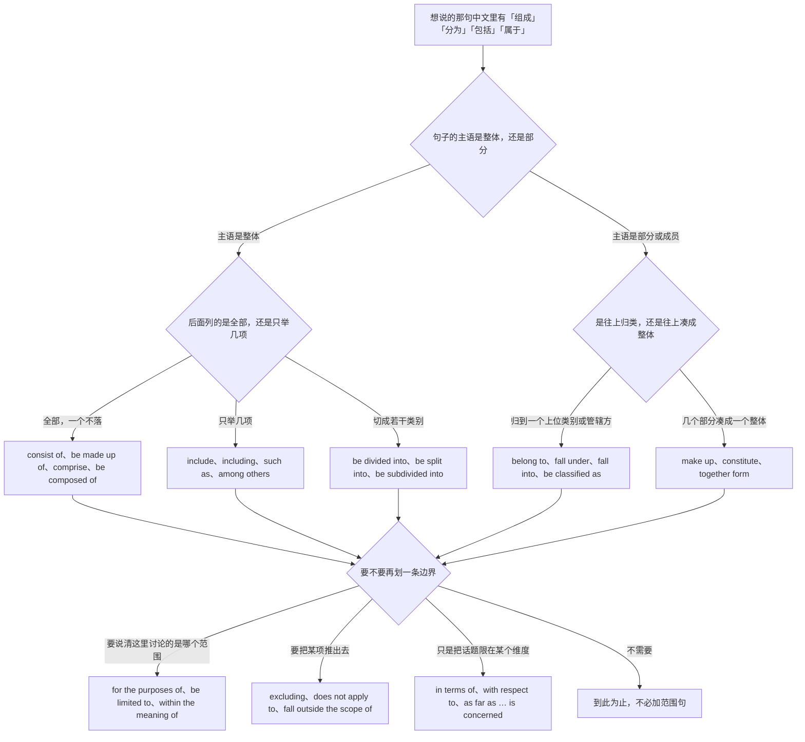
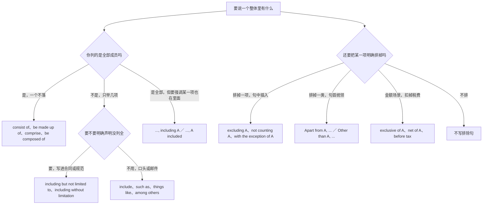
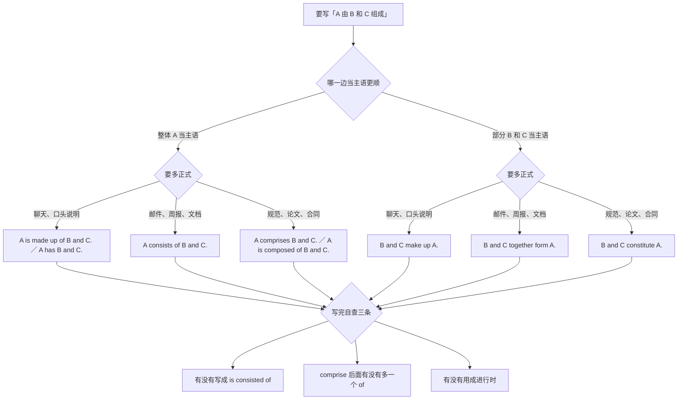
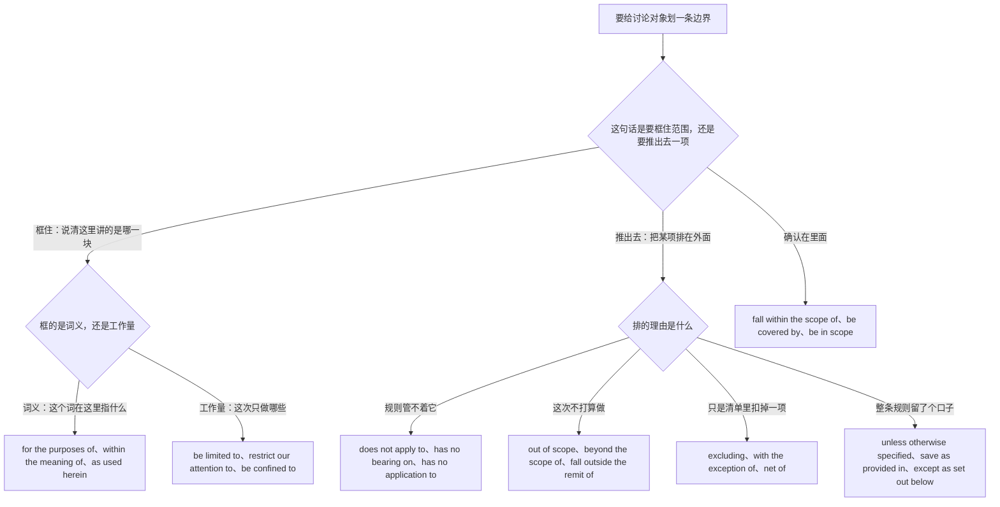
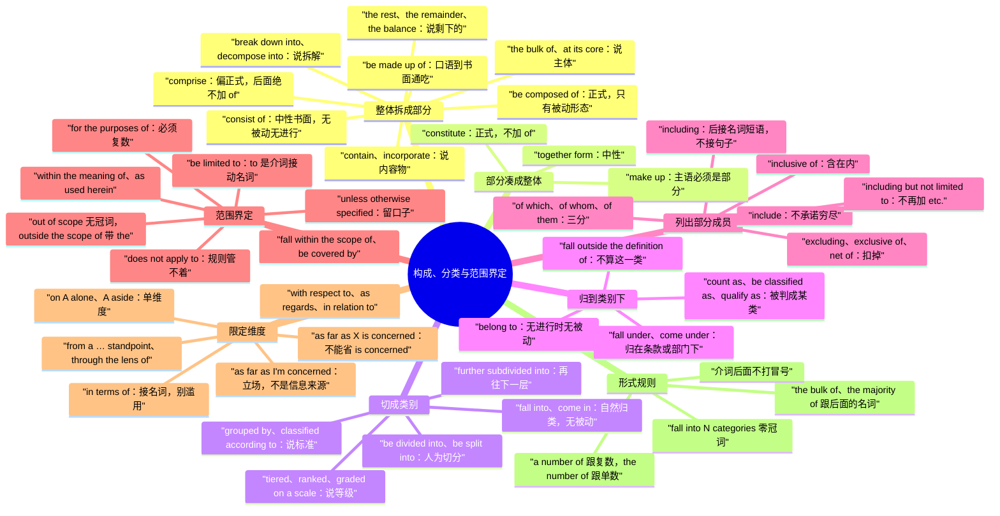

# 由…组成、分为、包括、属于：构成、分类与范围界定

> [!info] 本篇定位
>
> 这篇收「由…组成」「加起来就是」「里面含有」「主体是」「剩下的部分」「拆开看」「一共几部分」「随附」「分为几类」「归为两派」「按什么标准分」「分级分层」「再细分」「属于」「是…的一种」「算作」「不属于」「归谁管」「包括」「包括…在内」「包括但不限于」「其中有几个是」「不含」「含税不含税」「就本文而言」「仅限于」「不适用于」「超出范围」「在范围内」「除…之外」「在…方面」「就我而言」「就 X 而言」「从…角度看」「单看这一点」共三十五条查询意图，每条给口语、书面、正式三档成品。
>
> 与本分类另外几篇的分工：想说「X 是指」「所谓」「又称」「相当于」这类**给一个东西下定义、起名字**的，查 [[08.指认、定义与描述/02.X 是指、所谓、又称、相当于：定义与命名\|定义与命名]]；想说「看起来像」「区别在于」「严格来说」这类**描述长相、做类比、给限定**的，查 [[08.指认、定义与描述/04.看起来像、区别在于、严格来说：外观、类比与限定\|外观、类比与限定]]；想说「…的那个人」「…的那种东西」这类**从一堆里锁定是哪一个**的，查 [[08.指认、定义与描述/01.…的那个人、那种东西：一句话锁定是哪一个\|一句话锁定是哪一个]]。这一篇只管三件事：一个整体拆成哪几块、一堆东西分成哪几类、以及讨论的边界划在哪儿。
>
> 读完能查到：consist of 为什么不能写成 is consisted of、comprise 后面为什么不加 of、be composed of 和 be made up of 各自的语域、make up 和 constitute 的方向为什么与 consist of 相反、fall into 和 be divided into 差在哪、belong to 为什么不能用进行时、include 什么时候等于「就这些」什么时候等于「不止这些」、including 后面能不能跟句子、of which 与 of whom 与 of them 的三分、excluding 和 except 的分工、for the purposes of 为什么必须带 s、out of scope 和 outside the scope of 的冠词差、以及 as far as 后面接名词时必须补什么。
>
> 「占三成」「平均」「分别是」这类带数字的构成描述主锚点在 [[09.比较、程度与数量/04.大约、超过、占三成、平均、分别是：数量与统计描述\|数量与统计描述]]，本篇的 make up 只给「合起来构成」这一义，不给占比义。「第一第二最后」「包括以下」这类把成员一条条摆出来的列举归 [[06.并列、递进、列举与选择/02.第一第二最后、包括以下、按…顺序：列举与步骤\|列举与步骤]]，「除了」的两义分叉归 [[06.并列、递进、列举与选择/03.要么要么、除了、二选一：选择、排除与例外\|选择、排除与例外]]，本篇只在范围界定的语境下重给一次排除式。合同里的 unless otherwise specified 一族封闭固定式归 [[12.文体、语域与正式文书/05.法律条款与篇章回指：除非另有约定、如前所述、前者后者\|法律条款与篇章回指]]。

---

## 1. 本篇导读：中文一个「包括」，英文分三个方向

中文说构成关系时，词汇量极小：「由…组成」「包括」「分为」「属于」四个说法基本包干。麻烦在于这四个中文说法各自都能覆盖好几个英文方向，而英文那一端的动词彼此不能互换，形态限制还相当死。

举一个最典型的错配。「这个模块包括三个文件」在中文里是一句普通话，但英文写成 `The module includes three files.` 时，读者理解成的是「这个模块里有三个文件，可能还有别的」——如果你想说的是「只有这三个」，就得换成 `The module consists of three files.`。反过来，写 `The list consists of some of the affected services.` 是自相矛盾的：consist of 承诺穷尽，some of 又说没列全。中文的「包括」在这两处都能用，英文不能。

### 三个方向的分工总表

| 中文说法 | 语义方向 | 走哪一族动词 | 本篇节次 |
| --- | --- | --- | --- |
| 由…组成 / 由…构成 | 整体 → 全部部分，承诺穷尽 | consist of、be made up of、comprise | 第 2 节 |
| 加起来就是 / 合起来构成 | 部分 → 整体，方向相反 | make up、constitute、form | 第 2 节 |
| 里面含有 / 装着 | 整体 → 内容物 | contain、come with、incorporate | 第 2 节 |
| 分为几类 / 划分成 | 整体 → 若干类别，人为切分 | be divided into、be split into | 第 3 节 |
| 分成两派 / 归为几种 | 成员 → 自然归入的类别 | fall into、come in、be classified into | 第 3 节 |
| 属于 / 归在…下面 | 单项 → 上位类别或管辖方 | belong to、fall under、be part of | 第 4 节 |
| 算作 / 被归为 | 单项 → 被判定成某类 | count as、be classified as、qualify as | 第 4 节 |
| 包括 / 其中有 | 整体 → 举出部分成员，不承诺穷尽 | include、including、of which | 第 5 节 |
| 不含 / 扣掉 | 整体 → 明确排掉某项 | excluding、exclusive of、net of | 第 5 节 |
| 就本文而言 / 仅限于 | 给讨论对象划边界 | for the purposes of、be limited to | 第 7 节 |
| 不适用 / 超出范围 | 把某项推到边界外 | does not apply to、fall outside the scope of | 第 7 节 |
| 在…方面 / 就…而言 | 把话题限定在某个维度 | in terms of、as far as … is concerned | 第 8 节 |

### 从中文进的总选择树

树的第一层只问主语站在哪一边：主语是整体就往左走，主语是部分就往右走。这一层选错会直接把句子说反——`The three modules consist of the system.` 不是「三个模块组成系统」而是「三个模块由系统组成」，语义完全颠倒。第二层问的是「承诺不承诺穷尽」，这一层决定 consist of 还是 include，是本篇最高频的失分点。第三层才是要不要补一句范围界定，这一层不影响对错，只影响写出来的东西像不像正式文书。

### 三个先立起来的提醒

> [!warning] consist of 一族不能变被动
>
> - ❌ ~~The committee is consisted of twelve members.~~ ／ ✅ **The committee consists of twelve members.**（consist of 本身已经是「由…组成」，不需要再被动一次）
> - ❌ ~~The report is comprised of three sections.~~ ／ ✅ **The report comprises three sections.** 或 **The report is made up of three sections.**（be comprised of 在正式审校里会被标出来，写作时绕开它最省事）

> [!warning] comprise 后面不加 of
>
> - ❌ ~~The suite comprises of 240 tests.~~ ／ ✅ **The suite comprises 240 tests.**（comprise 是及物动词，后面直接接宾语；of 是从 consist of 串过来的）
> - ❌ ~~The system is comprising three services.~~ ／ ✅ **The system comprises three services.**（这一族动词描述的是静态构成，不用进行时）

> [!warning] include 不等于「就这些」
>
> - ❌ ~~The package includes exactly these three files and nothing else.~~ ／ ✅ **The package consists of exactly these three files.**（include 天然暗示「还有别的」，硬加 nothing else 会打架）
> - ❌ ~~The stack includes such as Redis and Kafka.~~ ／ ✅ **The stack includes Redis and Kafka.**（include 和 such as 都在标「不完全清单」，留一个）

> [!tip] 查法
>
> 先问两个问题：主语是整体还是部分；后面列的是全部还是一部分。这两问答完，第 2 到第 5 节自动锁定一个小节。之后如果这句话要进合同、规范或论文，再翻第 7、第 8 节补一条范围句；如果只是口头说明，跳过后半篇不影响用。

---

## 2. 由…组成：把一个整体拆成几块

这一节八条意图共用中文的「组成」「构成」「含有」三个词，分档依据主要是语域，其次是主语站在整体一边还是部分一边。方向选错的代价比语域选错大得多，所以每条都在句架列里标清了谁当主语。

### 2.1 由…组成、由…构成

中文触发语：由…组成 / 由…构成 / 是由…拼起来的 / 一共就这几块 / 包含…这几部分

| 档位 | 句架 | 例句 |
| --- | --- | --- |
| 口语 | A is made up of B and C. | The panel is made up of three engineers and one designer. |
| 口语 | A has B, C, and D. | The form has three sections: contact details, billing, and delivery. |
| 口语 | There's B and C, and that's it. | There's the parser and the evaluator, and that's it. |
| 书面 | A consists of B, C, and D. | The pipeline consists of a linter, a test runner, and a deploy step. |
| 书面 | A comprises B, C, and D. | The test suite comprises 240 unit tests and 18 integration tests. |
| 正式 | A is composed of B and C. | The board is composed of five elected and two appointed members. |
| 正式 | A shall consist of B and C. | The Committee shall consist of five members appointed by the Board. |

> [!warning] 错配警示
>
> - ❌ ~~The pipeline is consisted of three steps.~~ ／ ✅ **The pipeline consists of three steps.**（consist of 没有被动形态，加 be 就错）
> - ❌ ~~The suite comprises of 240 tests.~~ ／ ✅ **The suite comprises 240 tests.**（comprise 后面绝不跟 of）

- 同义入口：由…组成 / 由…构成 / 由…拼成 / 包含这几块 / 一共就这几部分
- 语法归属：[[02.英语基础语法/10.特殊句型/01.被动语态全解\|被动语态的适用边界]]
- 场景实战：[[04.英语场景/10.职场与商务场景实战/02.会议汇报与演示场景\|汇报里介绍系统组成]]

### 2.2 加起来就是、合起来构成

中文触发语：加起来就是 / 合起来是 / 这几样凑成 / 共同构成 / 拼起来才是

| 档位 | 句架 | 例句 |
| --- | --- | --- |
| 口语 | B and C make up A. | Those two teams make up the whole platform group. |
| 口语 | B plus C gives you A. | The base fee plus usage gives you the monthly bill. |
| 口语 | Put them together and you get A. | Put the three of them together and you get the full release. |
| 书面 | B and C together form A. | The parser and the evaluator together form the runtime. |
| 书面 | B and C make up the whole of A. | Salaries and cloud spend make up the whole of the variable cost. |
| 正式 | B and C constitute A. | These three clauses constitute the entire warranty. |
| 正式 | B and C are constitutive of A. | Consent and consideration are constitutive of a binding contract. |

> [!warning] 错配警示
>
> - ❌ ~~These three clauses constitute of the warranty.~~ ／ ✅ **These three clauses constitute the warranty.**（constitute 和 comprise 一样直接接宾语，不带 of）
> - ❌ ~~The whole group makes up two teams.~~ ／ ✅ **Two teams make up the whole group.**（make up 的主语必须是部分，写反了意思就颠倒）

- 同义入口：加起来就是 / 合起来构成 / 凑成 / 共同组成 / 拼在一起才算
- 语法归属：[[02.英语基础语法/10.特殊句型/06.主谓一致\|并列主语的谓语形式]]
- 场景实战：[[04.英语场景/05.高频实用表达句型框架/04.比较对比举例总结句型库\|总结归纳里的构成陈述]]

### 2.3 里面装着、含有

中文触发语：里面有 / 含有 / 装着 / 带着 / 收录了

| 档位 | 句架 | 例句 |
| --- | --- | --- |
| 口语 | It's got A and B in it. | The box has got a charger and a spare cable in it. |
| 口语 | There's A in there. | There's a config file in there you'll need. |
| 书面 | It contains A. | The archive contains the raw logs and a checksum file. |
| 书面 | A holds B. | Each record holds a timestamp and a user ID. |
| 正式 | A incorporates B. | The revised draft incorporates every comment raised by legal. |
| 正式 | A embodies B. | The specification embodies the requirements agreed in March. |

> [!warning] 错配警示
>
> - ❌ ~~The archive is containing the logs.~~ ／ ✅ **The archive contains the logs.**（contain 描述静态状态，不用进行时）
> - ❌ ~~This drink doesn't include sugar.~~ ／ ✅ **This drink doesn't contain sugar.**（成分用 contain，清单成员才用 include）

- 同义入口：里面有 / 含有 / 装着 / 收录了 / 带这个
- 语法归属：[[02.英语基础语法/06.动词时态/03.进行时态详解\|状态动词不用进行时]]
- 场景实战：[[04.英语场景/10.职场与商务场景实战/04.商务谈判合同与客户沟通\|交付物清单的描述]]

### 2.4 主体是什么、大头在哪儿

中文触发语：主要是 / 大头是 / 核心部分是 / 骨干是 / 说白了就是

| 档位 | 句架 | 例句 |
| --- | --- | --- |
| 口语 | Most of it is A. | Most of the cost is just GPU time. |
| 口语 | It's mostly A. | The backlog is mostly duplicate reports. |
| 口语 | The big chunk is A. | The big chunk is the nightly reindex. |
| 书面 | The bulk of A is B. | The bulk of the traffic is read-only. |
| 书面 | At its core, A is B. | At its core, the service is a queue with retries. |
| 正式 | A is predominantly B. | The corpus is predominantly newswire text. |
| 正式 | The backbone of A is B. | The backbone of the platform is a single Postgres cluster. |

> [!warning] 错配警示
>
> - ❌ ~~The bulk of the requests is read-only.~~ ／ ✅ **The bulk of the requests are read-only.**（the bulk of 后接复数名词时谓语随复数）
> - ❌ ~~In its core, the service is a queue.~~ ／ ✅ **At its core, the service is a queue.**（这是固定式，介词只能是 at）

- 同义入口：主要是 / 大头是 / 核心是 / 主体部分是 / 说到底就是
- 语法归属：[[02.英语基础语法/10.特殊句型/06.主谓一致\|部分词短语的谓语一致]]
- 场景实战：[[04.英语场景/10.职场与商务场景实战/02.会议汇报与演示场景\|抓重点式汇报]]

### 2.5 剩下的部分

中文触发语：剩下的是 / 其余的 / 余下部分 / 另外两个 / 别的都是

| 档位 | 句架 | 例句 |
| --- | --- | --- |
| 口语 | The rest is A. | The rest is boilerplate we generate. |
| 口语 | The other two are A. | The other two are still in review. |
| 口语 | Everything else is A. | Everything else is just logging. |
| 书面 | The remainder consists of A. | The remainder consists of legacy scripts nobody owns. |
| 书面 | The remaining N are A. | The remaining four are scheduled for next quarter. |
| 正式 | The balance of A is B. | The balance of the budget is allocated to hardware. |

> [!warning] 错配警示
>
> - ❌ ~~The rest are boilerplate.~~ 用于不可数所指时 ／ ✅ **The rest is boilerplate.**（the rest 的谓语随它所指的东西，指代码这类不可数用单数，指多个文件用复数）
> - ❌ ~~Another two are still in review.~~ 当总数已定时 ／ ✅ **The other two are still in review.**（总数确定、说的是剩下的那两个，必须带 the）

- 同义入口：剩下的 / 其余的 / 余下部分 / 另外那几个 / 别的都是
- 语法归属：[[02.英语基础语法/03.代词与数词/04.不定代词详解\|the other 与 another 的分工]]
- 场景实战：[[04.英语场景/10.职场与商务场景实战/03.商务邮件与正式书面沟通\|进度邮件里的剩余项交代]]

### 2.6 拆开看、细分下去

中文触发语：拆开看 / 细看的话 / 分解成 / 展开来说 / 摊开算

| 档位 | 句架 | 例句 |
| --- | --- | --- |
| 口语 | If you break it down, it's A and B. | If you break it down, it's twenty minutes of build and ten of tests. |
| 口语 | Broken down, that's A. | Broken down, that's three days of work and two days of review. |
| 书面 | A breaks down into B and C. | The latency breaks down into 40 ms of network and 160 ms of query time. |
| 书面 | A can be broken down into B. | The task can be broken down into four independent pieces. |
| 正式 | A can be decomposed into B. | The signal can be decomposed into three orthogonal components. |
| 正式 | A is disaggregated by B. | Spending is disaggregated by department in Appendix B. |

> [!warning] 错配警示
>
> - ❌ ~~The task breaks into four pieces.~~ ／ ✅ **The task breaks down into four pieces.**（break into 是「闯入、突然开始」，缺了 down 意思全变）
> - ❌ ~~The latency is breaking down into two parts.~~ ／ ✅ **The latency breaks down into two parts.**（陈述固定构成，用一般现在时）

- 同义入口：拆开看 / 拆解成 / 分解成 / 细分下去 / 摊开来算
- 语法归属：[[02.英语基础语法/05.介词与连词/02.常用介词搭配详解\|短语动词与小品词]]
- 场景实战：[[04.英语场景/10.职场与商务场景实战/02.会议汇报与演示场景\|把数字拆开解释]]

### 2.7 一共有几个部分

中文触发语：一共几部分 / 有这么几块 / 分几段 / 总共几项

| 档位 | 句架 | 例句 |
| --- | --- | --- |
| 口语 | There are three parts to it. | There are three parts to the form. |
| 口语 | It's in three parts. | The talk is in three parts. |
| 书面 | It has three main components. | The system has three main components. |
| 书面 | A is organized into three parts. | The handbook is organized into three parts. |
| 正式 | A is structured in three parts. | The report is structured in three parts. |
| 正式 | A is set out under three headings. | The policy is set out under three headings. |

> [!warning] 错配警示
>
> - ❌ ~~There are three parts of the form.~~ ／ ✅ **There are three parts to the form.**（说整体分成几块，介词用 to；of 说的是「属于表单的那几块」，重心不同）
> - ❌ ~~The system has three main compositions.~~ ／ ✅ **The system has three main components.**（composition 是「组成方式」这个抽象概念，可数的「组成部分」只能是 component）

- 同义入口：一共几部分 / 分几段 / 有这么几块 / 总共几项 / 几个板块
- 语法归属：[[02.英语基础语法/05.介词与连词/01.介词的分类与基本用法\|介词与名词的固定搭配]]
- 场景实战：[[04.英语场景/09.学习与教育场景实战/02.图书馆作业与研究场景\|论文结构说明]]

### 2.8 配套、随附

中文触发语：配套的有 / 附带 / 随附 / 一起给的 / 另附

| 档位 | 句架 | 例句 |
| --- | --- | --- |
| 口语 | It comes with A. | The plan comes with two seats and 50 GB of storage. |
| 口语 | A throws in B. | The vendor throws in a year of support. |
| 书面 | A is bundled with B. | The SDK is bundled with a sample project. |
| 书面 | A is accompanied by B. | Each release is accompanied by a migration guide. |
| 正式 | A is supplied together with B. | The device is supplied together with a calibration certificate. |
| 正式 | A is attached hereto as Schedule B. | The price list is attached hereto as Schedule B. |

> [!warning] 错配警示
>
> - ❌ ~~The plan is coming with two seats.~~ ／ ✅ **The plan comes with two seats.**（描述产品固定配置，用一般现在时）
> - ❌ ~~Each release is accompanied with a guide.~~ ／ ✅ **Each release is accompanied by a guide.**（accompany 的被动只配 by）

- 同义入口：配套的有 / 附带 / 随附 / 一并提供 / 另附
- 语法归属：[[02.英语基础语法/05.介词与连词/02.常用介词搭配详解\|动词与介词的固定搭配]]
- 场景实战：[[04.英语场景/10.职场与商务场景实战/03.商务邮件与正式书面沟通\|附件与随附材料]]

---

## 3. 分为几类：把一堆东西切成类别

第 2 节说的是一个具体的整体拆成几块，这一节说的是把一群东西按标准归成几类。两者在中文里都能说「分」，在英文里分两套动词：人为切分用 divide、split，自然归入用 fall into、come in。分类的标准要不要写出来是第三个决策点。

### 3.1 分为、划分成

中文触发语：分为 / 划分成 / 分成…类 / 切成几块 / 拆成几组

| 档位 | 句架 | 例句 |
| --- | --- | --- |
| 口语 | We split it into three groups. | We split the backlog into three groups. |
| 口语 | It's split three ways. | The cost is split three ways. |
| 书面 | A is divided into B, C, and D. | The dataset is divided into training, validation, and test sets. |
| 书面 | A is broken into N groups. | The rollout is broken into four waves. |
| 正式 | A is subdivided into B. | Each region is subdivided into service zones. |
| 正式 | A is partitioned into B. | The keyspace is partitioned into sixteen shards. |

> [!warning] 错配警示
>
> - ❌ ~~The dataset is divided in three sets.~~ ／ ✅ **The dataset is divided into three sets.**（divide 表切分只配 into；divided in 在英文里读成「在…里面被分开」）
> - ❌ ~~The number is divided into three.~~ 想说「除以三」时 ／ ✅ **The number is divided by three.**（by 是除法，into 是切分）

- 同义入口：分为 / 划分成 / 切成几块 / 拆成几组 / 分几档
- 语法归属：[[02.英语基础语法/05.介词与连词/04.介词与连词的易混点\|into 与 in 的分工]]
- 场景实战：[[04.英语场景/09.学习与教育场景实战/02.图书馆作业与研究场景\|研究数据的划分说明]]

### 3.2 归为几类、大致有几种

中文触发语：可以分成两类 / 归为两派 / 大致有两种 / 无非就是这几种 / 有两个流派

| 档位 | 句架 | 例句 |
| --- | --- | --- |
| 口语 | They come in two flavors. | Retry strategies come in two flavors: fixed and exponential. |
| 口语 | There are basically two kinds. | There are basically two kinds of complaint here. |
| 口语 | They're either A or B. | The failures are either timeouts or bad payloads. |
| 书面 | They fall into two categories. | The complaints fall into two categories: billing and access. |
| 书面 | They can be grouped into N types. | These errors can be grouped into three types. |
| 正式 | They may be classified into N broad categories. | The responses may be classified into four broad categories. |

> [!warning] 错配警示
>
> - ❌ ~~The complaints fall in two categories.~~ ／ ✅ **The complaints fall into two categories.**（fall into 是固定式，缺 to 就变成「掉在两个类别里」）
> - ❌ ~~The complaints are fallen into two categories.~~ ／ ✅ **The complaints fall into two categories.**（fall into 是不及物的，没有被动形态）

- 同义入口：归为两类 / 大致有两种 / 分成两派 / 无非这几种 / 就这么几个路子
- 语法归属：[[02.英语基础语法/10.特殊句型/01.被动语态全解\|不及物动词没有被动式]]
- 场景实战：[[04.英语场景/05.高频实用表达句型框架/04.比较对比举例总结句型库\|归类式总结]]

### 3.3 按什么标准分

中文触发语：按…分 / 以…为标准划分 / 按…来分类 / 照…归堆

| 档位 | 句架 | 例句 |
| --- | --- | --- |
| 口语 | We split them up by size. | We split the tickets up by size. |
| 口语 | We sort them by who owns them. | We sort the alerts by who owns them. |
| 书面 | They are grouped by region. | Customers are grouped by region and plan. |
| 书面 | A is classified according to B. | Incidents are classified according to customer impact. |
| 正式 | A is categorized on the basis of B. | Applications are categorized on the basis of declared revenue. |
| 正式 | A is divided along B lines. | The team is divided along product lines rather than by technology. |

> [!warning] 错配警示
>
> - ❌ ~~Incidents are classified to severity.~~ ／ ✅ **Incidents are classified by severity.** 或 **Incidents are classified according to severity.**（classify 后面接标准用 by 或 according to，接类别名才用 as 或 into）
> - ❌ ~~according with the impact~~ ／ ✅ **according to the impact**（according 只配 to）

- 同义入口：按…分 / 以…划分 / 按…归类 / 照…分堆 / 依…划线
- 语法归属：[[02.英语基础语法/05.介词与连词/02.常用介词搭配详解\|according to 与 by 的搭配]]
- 场景实战：[[04.英语场景/10.职场与商务场景实战/04.商务谈判合同与客户沟通\|分档报价与客户分层]]

### 3.4 分级、分层、分档

中文触发语：分级 / 分档 / 分层 / 三个等级 / 按严重程度排

| 档位 | 句架 | 例句 |
| --- | --- | --- |
| 口语 | There are three tiers. | There are three tiers: free, team, and enterprise. |
| 口语 | We rank them P0 through P2. | We rank the bugs P0 through P2. |
| 书面 | Accounts are tiered by usage. | Accounts are tiered by monthly usage. |
| 书面 | Issues are ranked by severity into A, B, and C. | Issues are ranked by severity into blocker, major, and minor. |
| 正式 | Applicants are graded on a five-point scale. | Applicants are graded on a five-point scale by two reviewers. |
| 正式 | A is stratified by B. | The sample is stratified by age band. |

> [!warning] 错配警示
>
> - ❌ ~~graded in a five-point scale~~ ／ ✅ **graded on a five-point scale**（量表用 on，不用 in）
> - ❌ ~~We have three pricing layers.~~ ／ ✅ **We have three pricing tiers.**（付费档位用 tier；layer 说的是叠在一起的结构层，如 the network layer）

- 同义入口：分级 / 分档 / 分层 / 排等级 / 定优先级
- 语法归属：[[02.英语基础语法/04.形容词与副词/02.形容词的比较级与最高级\|等级形容词的排序表达]]
- 场景实战：[[04.英语场景/10.职场与商务场景实战/04.商务谈判合同与客户沟通\|产品档位说明]]

### 3.5 再往下细分

中文触发语：再细分 / 下面还能分 / 进一步分成 / 往下再切一层

| 档位 | 句架 | 例句 |
| --- | --- | --- |
| 口语 | You can go one level deeper. | You can go one level deeper and split reads from writes. |
| 口语 | And within that, there's A and B. | And within that, there's sync and async. |
| 书面 | Each category is further divided into A and B. | Each category is further divided into internal and external causes. |
| 书面 | This drills down into three sub-cases. | The timeout bucket drills down into three sub-cases. |
| 正式 | Each class is further subdivided into subclasses. | Each class is further subdivided into two subclasses. |
| 正式 | A nests under B. | Each cost center nests under exactly one division. |

> [!warning] 错配警示
>
> - ❌ ~~Each category is more divided into two.~~ ／ ✅ **Each category is further divided into two.**（表示「再往下一层」只能用 further，more 说的是数量多）
> - ❌ ~~It drills down three sub-cases.~~ ／ ✅ **It drills down into three sub-cases.**（drill down 后接对象必须补 into 或 to）

- 同义入口：再细分 / 进一步划分 / 往下再切 / 下面还有一层 / 展开成子类
- 语法归属：[[02.英语基础语法/04.形容词与副词/03.副词的分类与用法\|further 与 farther 的分工]]
- 场景实战：[[04.英语场景/09.学习与教育场景实战/02.图书馆作业与研究场景\|分类体系的层级描述]]

---

## 4. 属于：把一项归到某个类别下

第 3 节的主语是整体，这一节的主语是单个成员。中文都说「属于」，英文分成三条线：说成员资格用 belong to，说归在某个条款或部门底下用 fall under，说被判定成某一类用 be classified as。三条线的形态限制各不相同，belong to 的进行时禁令是这一节最高频的错。

### 4.1 属于、归在…下面

中文触发语：属于 / 是…的一部分 / 归在…下面 / 挂在…名下

| 档位 | 句架 | 例句 |
| --- | --- | --- |
| 口语 | That's part of A. | That endpoint is part of the billing service. |
| 口语 | That's under A. | That's under the security team. |
| 口语 | That one's ours. | That repo is ours. |
| 书面 | A belongs to B. | This class belongs to the internal API surface. |
| 书面 | A falls under B. | Password rotation falls under the security policy. |
| 正式 | A comes under the heading of B. | These costs come under the heading of general overhead. |
| 正式 | A is subsumed under B. | The earlier clause is subsumed under Section 9. |

> [!warning] 错配警示
>
> - ❌ ~~This class is belonging to the internal API.~~ ／ ✅ **This class belongs to the internal API.**（belong 表归属关系，没有进行时）
> - ❌ ~~The internal API is belonged to by this class.~~ ／ ✅ **This class belongs to the internal API.**（belong to 没有被动式）

- 同义入口：属于 / 归…管 / 挂在…下面 / 是…的一块 / 算在…名下
- 语法归属：[[02.英语基础语法/06.动词时态/03.进行时态详解\|关系动词不用进行时]]
- 场景实战：[[04.英语场景/10.职场与商务场景实战/02.会议汇报与演示场景\|职责归属的说明]]

### 4.2 是…的一种

中文触发语：是…的一种 / 算一类 / 属于…这一类 / 是…的一个实例

| 档位 | 句架 | 例句 |
| --- | --- | --- |
| 口语 | It's a kind of A. | It's a kind of cache, basically. |
| 口语 | It's basically A with B on top. | It's basically a queue with retries on top. |
| 书面 | It is a type of A. | A rate limiter is a type of admission control. |
| 书面 | X is an instance of Y. | This error is an instance of the wider timeout problem. |
| 书面 | X is a subclass of Y. | TimeoutError is a subclass of NetworkError. |
| 正式 | X constitutes a form of Y. | Silent data loss constitutes a form of availability failure. |

> [!warning] 错配警示
>
> - ❌ ~~It's a kind of a cache.~~ ／ ✅ **It's a kind of cache.**（a kind of 后面直接接名词，不再加冠词）
> - ❌ ~~These are a type of caches.~~ ／ ✅ **These are types of cache.** 或 **This is a type of cache.**（type of 后面跟单数，要说「好几种」就把复数落在 type 上，主语跟着一起改）

- 同义入口：是…的一种 / 算一类 / 属于…这类东西 / 是…的实例 / 归在…这一支
- 语法归属：[[02.英语基础语法/02.名词与冠词/03.冠词的用法详解\|kind of 结构里的冠词省略]]
- 场景实战：[[04.英语场景/09.学习与教育场景实战/01.课堂讨论与提问场景\|课堂上的归类说明]]

### 4.3 算作、被归为

中文触发语：算作 / 算不算 / 被归为 / 当成…处理 / 视同

| 档位 | 句架 | 例句 |
| --- | --- | --- |
| 口语 | Does that count as A? | Does a rollback count as an incident? |
| 口语 | We treat it as A. | We treat a partial write as a failure. |
| 口语 | It goes down as A. | It goes down as a customer-facing outage. |
| 书面 | It is classified as A. | The defect is classified as a security issue. |
| 书面 | It is regarded as A. | Late delivery is regarded as a material breach. |
| 正式 | It qualifies as A for the purposes of Section 4. | An unpaid invoice qualifies as a default for the purposes of Section 4. |
| 正式 | It shall be deemed to be A. | A partial payment shall be deemed to be an acknowledgment of the debt. |

> [!warning] 错配警示
>
> - ❌ ~~Does that count as to an incident?~~ ／ ✅ **Does that count as an incident?**（count as 后面直接接名词，不加 to）
> - ❌ ~~We regard it a failure.~~ ／ ✅ **We regard it as a failure.**（regard 的 as 不能省，consider 才可以省）

- 同义入口：算作 / 算不算 / 视同 / 当成…处理 / 被判成
- 语法归属：[[02.英语基础语法/01.基础入门/02.英语五大基本句型详解\|复合宾语句型]]
- 场景实战：[[04.英语场景/10.职场与商务场景实战/04.商务谈判合同与客户沟通\|合同里的认定条款]]

### 4.4 不属于、不算在内

中文触发语：不属于 / 不算在内 / 不归这一类 / 这个另说

| 档位 | 句架 | 例句 |
| --- | --- | --- |
| 口语 | That's not one of ours. | That alert is not one of ours. |
| 口语 | That doesn't count. | A retry that succeeds doesn't count. |
| 口语 | That's a separate thing. | Billing is a separate thing entirely. |
| 书面 | This does not fall into that category. | Scheduled maintenance does not fall into that category. |
| 书面 | A is not part of B. | Analytics is not part of the core product. |
| 正式 | A falls outside the definition of B. | Routine upgrades fall outside the definition of an incident. |

> [!warning] 错配警示
>
> - ❌ ~~This doesn't belong to that category.~~ ／ ✅ **This doesn't belong in that category.** 或 **This doesn't fall into that category.**（belong to 说的是所有权或成员资格，如 This laptop belongs to me；说某样东西该不该摆进某一类，用 belong in）
> - ❌ ~~It falls outside of the definition.~~ ／ ✅ **It falls outside the definition.**（fall outside 后面直接接名词，加 of 是多余的）

- 同义入口：不属于 / 不算在内 / 不归这类 / 另算 / 这个不在里面
- 语法归属：[[02.英语基础语法/01.基础入门/03.疑问句与否定句的构成\|否定句的构成与作用范围]]
- 场景实战：[[04.英语场景/10.职场与商务场景实战/04.商务谈判合同与客户沟通\|界定不适用情形]]

### 4.5 归谁管、谁的地盘

中文触发语：归谁管 / 归哪个组 / 谁的地盘 / 谁负责这块

| 档位 | 句架 | 例句 |
| --- | --- | --- |
| 口语 | Who owns this? | Who owns this dashboard? |
| 口语 | That's the platform team's. | That queue is the platform team's. |
| 口语 | Not my call. | Pricing is not my call. |
| 书面 | This falls under the platform team. | Alert routing falls under the platform team. |
| 书面 | A sits with B. | The final decision sits with the product lead. |
| 正式 | A falls within the remit of B. | Vendor selection falls within the remit of the procurement function. |

> [!warning] 错配警示
>
> - ❌ ~~It falls under to the platform team.~~ ／ ✅ **It falls under the platform team.**（fall under 后面直接接对象）
> - ❌ ~~The decision sits on the product lead.~~ ／ ✅ **The decision sits with the product lead.**（决定权归属只配 with）

- 同义入口：归谁管 / 归哪个组 / 谁的地盘 / 谁拍板 / 谁负责这块
- 语法归属：[[02.英语基础语法/05.介词与连词/02.常用介词搭配详解\|表归属的介词搭配]]
- 场景实战：[[11.人际功能与话轮管理/07.我在做、卡住了、我会、我习惯了、这归谁管：进度、能力、习惯与职责\|职责归属的完整一套]]

---

## 5. 包括与不含：列出部分成员并标清边界

第 2 节的 consist of 承诺穷尽，这一节的 include 不承诺。中文一个「包括」把这两件事全盖住了，英文分得很死。这一节还负责 include 的后置形态、of which 一族的三分，以及金额场景里含税不含税的固定写法。

### 5.1 包括、里面有这些

中文触发语：包括 / 包含 / 里面有…这些 / 有比如说

| 档位 | 句架 | 例句 |
| --- | --- | --- |
| 口语 | It includes A and B. | The plan includes support and onboarding. |
| 口语 | Things like A and B. | Things like retries and backoff are already handled. |
| 口语 | There's A, B, that sort of thing. | There's caching, rate limiting, that sort of thing. |
| 书面 | This includes A, B, and C. | The migration includes schema changes, backfills, and a cutover window. |
| 书面 | A covers B and C. | The warranty covers parts and labor. |
| 正式 | The scope includes, among other things, A and B. | The scope includes, among other things, code review and threat modeling. |

> [!warning] 错配警示
>
> - ❌ ~~The module includes exactly these three files and nothing else.~~ ／ ✅ **The module consists of exactly these three files.**（要说穷尽必须换动词，include 本身留了口子）
> - ❌ ~~The stack includes such as Redis and Kafka.~~ ／ ✅ **The stack includes Redis and Kafka.**（两个不完全清单标记只能留一个）

- 同义入口：包括 / 包含 / 里面有 / 涵盖 / 有诸如
- 语法归属：[[02.英语基础语法/05.介词与连词/03.连词的分类与用法\|并列成分的连接]]
- 场景实战：[[04.英语场景/10.职场与商务场景实战/04.商务谈判合同与客户沟通\|服务范围的陈述]]

### 5.2 包括…在内（插在句子中间说）

中文触发语：包括…在内 / 连…都算上 / 其中包括 / 里面还有…这一项

| 档位 | 句架 | 例句 |
| --- | --- | --- |
| 口语 | ..., A included. | Everyone gets a seat, contractors included. |
| 口语 | ..., even A. | Every service needs patching, even the internal ones. |
| 书面 | ..., including A. | Three services, including the gateway, need patching. |
| 书面 | ..., A among them. | Four regions went down, the primary among them. |
| 正式 | ..., inclusive of A. | The fee is 4,000 pounds, inclusive of travel. |
| 正式 | ..., together with A. | The report, together with its appendices, was filed on Monday. |

> [!warning] 错配警示
>
> - ❌ ~~Three services including that the gateway is affected need patching.~~ ／ ✅ **Three services, including the gateway, need patching.**（including 后面只能接名词短语，接不了句子）
> - ❌ ~~Three services including the gateway need patching.~~ 作插入说明时 ／ ✅ **Three services, including the gateway, need patching.**（插入成分两侧的逗号必须成对，缺一个句子读不断）

- 同义入口：包括…在内 / 连…都算 / 其中有 / 里面还有 / 含…在内
- 语法归属：[[02.英语基础语法/08.非谓语动词/03.现在分词详解\|分词短语作后置修饰]]
- 场景实战：[[04.英语场景/10.职场与商务场景实战/03.商务邮件与正式书面沟通\|邮件里的补充说明]]

### 5.3 包括但不限于

中文触发语：包括但不限于 / 不止这些 / 还有别的没列 / 举几个例子

| 档位 | 句架 | 例句 |
| --- | --- | --- |
| 口语 | Stuff like A and B, and more. | Stuff like retries and timeouts, and more. |
| 口语 | A, B, for a start. | Latency, cost, for a start. |
| 书面 | ..., such as A and B, among others. | Managed services, such as queues and caches, among others. |
| 书面 | ..., A and B being just two examples. | Several teams objected, platform and billing being just two examples. |
| 正式 | including but not limited to A, B, and C | Personal data, including but not limited to name, address, and payment details. |
| 正式 | including without limitation A | The licence covers all use, including without limitation internal testing. |

> [!warning] 错配警示
>
> - ❌ ~~including but not limited to A, B, C, etc.~~ ／ ✅ **including but not limited to A, B, and C**（including but not limited to 已经声明没列全，再加 etc. 是重复）
> - ❌ ~~including but not limit to~~ ／ ✅ **including but not limited to**（这是被动分词，limit 必须带 ed）

- 同义入口：包括但不限于 / 不止这些 / 还有别的 / 举几个 / 诸如此类
- 语法归属：[[02.英语基础语法/08.非谓语动词/04.过去分词详解\|过去分词的被动含义]]
- 场景实战：[[04.英语场景/10.职场与商务场景实战/04.商务谈判合同与客户沟通\|条款里的开放式列举]]

### 5.4 其中有几个是

中文触发语：其中有 / 里面有几个是 / 当中 / 有几项属于

| 档位 | 句架 | 例句 |
| --- | --- | --- |
| 口语 | Ten people, three of them contractors. | Ten people on the call, three of them contractors. |
| 口语 | Out of the ten, three are A. | Out of the ten tickets, three are duplicates. |
| 书面 | ten items, three of which are stale | We reviewed ten alerts, three of which turned out to be stale. |
| 书面 | 30 respondents, 12 of whom were new hires | We surveyed 30 engineers, 12 of whom were new hires. |
| 正式 | of which N relate to A | The claim covers 40 invoices, of which 12 relate to the disputed period. |
| 正式 | A, N of these being B | Six findings were raised, two of these being critical. |

> [!warning] 错配警示
>
> - ❌ ~~We reviewed ten alerts, three of them were stale.~~ ／ ✅ **We reviewed ten alerts, three of which were stale.** 或 **We reviewed ten alerts; three of them were stale.**（of them 带的是独立句子，前面必须换分号或句号；of which 才能用逗号接）
> - ❌ ~~30 engineers, 12 of which were new hires~~ ／ ✅ **30 engineers, 12 of whom were new hires**（指人用 whom，指物才用 which）

- 同义入口：其中有 / 里面几个是 / 当中 / 有几项属于 / 十个里面有三个
- 语法归属：[[02.英语基础语法/09.从句体系/02.定语从句进阶\|of which 与 of whom 的用法]]
- 场景实战：[[04.英语场景/09.学习与教育场景实战/03.考试报名与学术评分场景\|统计结果的转述]]

### 5.5 不含、扣掉

中文触发语：不含 / 不包括 / 除…以外 / 扣掉 / 不算上

| 档位 | 句架 | 例句 |
| --- | --- | --- |
| 口语 | not counting A | Four days, not counting the weekend. |
| 口语 | A not included | Batteries not included. |
| 口语 | apart from A | Everything works apart from search. |
| 书面 | excluding A | The team has twelve people, excluding contractors. |
| 书面 | with the exception of A | All regions are healthy, with the exception of eu-west. |
| 正式 | exclusive of A | The quoted fee is exclusive of expenses. |
| 正式 | net of A | Revenue is reported net of refunds. |

> [!warning] 错配警示
>
> - ❌ ~~twelve people, excluding of contractors~~ ／ ✅ **twelve people, excluding contractors**（excluding 是分词，直接接宾语；exclusive 才配 of）
> - ❌ ~~All regions are healthy, except eu-west is down.~~ ／ ✅ **All regions are healthy, except that eu-west is down.**（except 后面接句子必须补 that，excluding 后面根本接不了句子）

- 同义入口：不含 / 不包括 / 扣掉 / 除…之外 / 不算上
- 语法归属：[[02.英语基础语法/05.介词与连词/04.介词与连词的易混点\|except 与 except for]]
- 场景实战：[[06.并列、递进、列举与选择/03.要么要么、除了、二选一：选择、排除与例外\|「除了」两义分叉的完整一套]]

### 5.6 含税、不含税、含运费

中文触发语：含税 / 不含税 / 含运费 / 到手价 / 税后

| 档位 | 句架 | 例句 |
| --- | --- | --- |
| 口语 | Is that with tax? | Is that price with tax? |
| 口语 | That's before tax. | That's before tax and shipping. |
| 口语 | Shipping's on top. | It's forty a month, shipping's on top. |
| 书面 | Prices include VAT. | All prices shown include VAT. |
| 书面 | $49 per seat, excluding tax | The plan is $49 per seat per month, excluding tax. |
| 正式 | All amounts stated are exclusive of value-added tax. | All amounts stated in this Schedule are exclusive of value-added tax. |
| 正式 | inclusive of all applicable duties | The delivered price is inclusive of all applicable duties. |

> [!warning] 错配警示
>
> - ❌ ~~The price is included tax.~~ ／ ✅ **The price includes tax.** 或 **The price is inclusive of tax.**（主语是价格时用主动 includes，被动形态要换成形容词 inclusive of）
> - ❌ ~~49 dollars exclusive tax~~ ／ ✅ **$49 exclusive of tax** 或 **$49 excluding tax**（exclusive 是形容词，必须带 of）

- 同义入口：含税 / 不含税 / 含运费 / 到手价 / 税前税后
- 语法归属：[[02.英语基础语法/04.形容词与副词/01.形容词的用法与位置\|形容词加介词的固定组合]]
- 场景实战：[[04.英语场景/10.职场与商务场景实战/04.商务谈判合同与客户沟通\|报价单里的价格说明]]

### 5.7 include 与 exclude 的进出判断

这张图的分叉点只有两个，但都很硬。第一个是「列全没列全」：列全走 consist of 一族，没列全走 include 一族，两族的动词绝不混用。第二个是 including 的双重身份——它既能标「不完全清单」（`services including the gateway` 暗示还有别的），也能在清单已经列全时标「连这个也算」（`everyone, contractors included`）。区别不在词，在逗号：作后置插入说明时两侧要有成对逗号，作清单开口时不加。排除那一支的三个分档看的是句子位置和场合：句中插入用 excluding，句首统领用 apart from 或 other than，金额场景固定用 exclusive of 或 net of。

---

## 6. consist of 一族的形态限制：一张硬记表

这一节不给中文触发语，只给形态。上面第 2 到第 5 节的错配警示里反复出现的是同一批限制，集中在这里对照一次，比分散记忆省力。

### 6.1 四个动词的方向与形态对照

| 动词 | 主语站哪边 | 有无被动 | 有无进行式 | 后面加不加 of | 语域 |
| --- | --- | --- | --- | --- | --- |
| consist of | 整体 | 无被动 | 无进行式 | 必须加 of | 中性书面 |
| comprise | 整体 | 传统上不用被动 | 无进行式 | 绝不加 of | 书面偏正式 |
| be composed of | 整体 | 实际只用被动 | 无进行式 | 必须加 of | 正式 |
| be made up of | 整体 | 本身就是被动式 | 无进行式 | 必须加 of | 口语到书面 |
| make up | 部分 | 被动就是 be made up of | 无进行式 | 不加 of | 口语到书面 |
| constitute | 部分 | 可用被动 | 无进行式 | 不加 of | 正式 |
| contain | 整体 | 可用被动 | 无进行式 | 不加 of | 中性 |
| include | 整体 | 可用被动 | 极少用进行式 | 不加 of | 中性 |

表里最容易被忽略的一列是「有无进行式」。这一族全部是状态动词，描述的是不随时间变化的构成关系，因此没有进行时。中文母语者写 `The team is consisting of five people.` 的动机通常是想表达「目前是」，但英文的一般现在时本来就表达「目前是且暂时不变」，加进行时反而暗示这个构成正在变化过程中，语义不成立。

### 6.2 三个方向的成品对照

同一件事写成三个方向，句子形态完全不同。这一组用来校准方向感：

| 方向 | 句子 | 主语 |
| --- | --- | --- |
| 整体在前 | The runtime consists of a parser and an evaluator. | 整体 |
| 整体在前 | The runtime comprises a parser and an evaluator. | 整体 |
| 整体在前 | The runtime is made up of a parser and an evaluator. | 整体 |
| 部分在前 | A parser and an evaluator make up the runtime. | 部分 |
| 部分在前 | A parser and an evaluator constitute the runtime. | 部分 |
| 部分在前 | A parser and an evaluator together form the runtime. | 部分 |
| 不承诺穷尽 | The runtime includes a parser and an evaluator. | 整体 |

前六句语义相同，只有语域和主语位置的差别；第七句语义不同——它只说这两样在里面，没说是不是只有这两样。中文的「运行时由解析器和求值器组成」对应前六句，「运行时包括解析器和求值器」对应第七句，但中文母语者在口语里常把这两个中文说法当同义词用，落到英文上就成了两个不同的承诺。

### 6.3 形态选择树

树的第一层不是语域而是主语位置，因为这一层决定的是动词族。选整体当主语的场合更多：中文原句的语序通常也是整体在前，直接对应最省事。选部分当主语只在两种时候有必要——上一句刚说完 B 和 C，这一句要顺着往下接；或者要强调「正是这几样才凑成了它」。第二层的语域分档里，comprise 和 be composed of 同属正式档但用法不同：comprise 更常出现在技术规范和组织描述里，be composed of 更常出现在科学写作和法律文本里。最后那三条自查是这一族百分之九十的错误来源，写完扫一眼就能挡掉。

---

## 7. 范围界定：这里说的到底算到哪儿

前面五节解决的是「有什么」，这一节解决的是「说到哪儿为止」。中文习惯把范围交代放在口头补一句「我说的是…」，英文的正式文体有一整套固定式，位置通常在句首或条款开头。这一节的六条意图在合同、规范和论文里出现频率极高。

### 7.1 就本文而言、这里说的是指

中文触发语：就本文而言 / 本协议中 / 这里说的…是指 / 我说的…指的是

| 档位 | 句架 | 例句 |
| --- | --- | --- |
| 口语 | When I say A here, I mean B. | When I say "done" here, I mean merged and deployed. |
| 口语 | By A I mean B. | By "flaky" I mean it fails maybe one run in ten. |
| 书面 | For the purposes of this document, A means B. | For the purposes of this document, a release means a tagged build. |
| 书面 | In this section, A refers to B. | In this section, latency refers to server-side latency only. |
| 正式 | For the purposes of this Agreement, "A" means B. | For the purposes of this Agreement, "Confidential Information" means any non-public information disclosed by either party. |
| 正式 | within the meaning of Section N | a subsidiary within the meaning of Section 1159 |
| 正式 | as used herein, A shall mean B | As used herein, "Business Day" shall mean any day other than a Saturday or Sunday. |

> [!warning] 错配警示
>
> - ❌ ~~For the purpose of this Agreement, ...~~ ／ ✅ **For the purposes of this Agreement, ...**（这个固定式必须用复数 purposes；单数 for the purpose of 意思是「为了达到某个目的」，是另一件事）
> - ❌ ~~In the meaning of Section 4~~ ／ ✅ **within the meaning of Section 4**（介词只能是 within）

- 同义入口：就本文而言 / 本协议中 / 这里说的是 / 我指的是 / 在这一节里
- 语法归属：[[02.英语基础语法/02.名词与冠词/02.名词的数与格\|固定式里的复数形态]]
- 场景实战：[[12.文体、语域与正式文书/05.法律条款与篇章回指：除非另有约定、如前所述、前者后者\|合同定义条款的完整写法]]

### 7.2 仅限于、只到这儿为止

中文触发语：仅限 / 只限于 / 到此为止 / 最多只 / 只管这一块

| 档位 | 句架 | 例句 |
| --- | --- | --- |
| 口语 | Just A, nothing else. | Just the login flow, nothing else. |
| 口语 | We're only doing A this round. | We're only doing the read path this round. |
| 口语 | That's as far as it goes. | We fixed the crash, and that's as far as it goes. |
| 书面 | This is limited to A. | This review is limited to the payment module. |
| 书面 | We restrict our attention to A. | We restrict our attention to single-region deployments. |
| 正式 | A shall be limited to B. | Liability shall be limited to the fees paid in the preceding twelve months. |
| 正式 | A is confined to B. | The exemption is confined to non-commercial use. |

> [!warning] 错配警示
>
> - ❌ ~~This review is limited in the payment module.~~ ／ ✅ **This review is limited to the payment module.**（limited 只配 to；limited in 说的是「在某方面有限」，是另一个意思）
> - ❌ ~~We are limited to review only this module.~~ ／ ✅ **We are limited to reviewing this module.**（be limited to 的 to 是介词，后面接动名词）

- 同义入口：仅限于 / 只限 / 只到这儿 / 最多只 / 这一轮只做
- 语法归属：[[02.英语基础语法/08.非谓语动词/02.动名词详解\|介词 to 后接动名词]]
- 场景实战：[[12.文体、语域与正式文书/04.学术论证：本文提出、与前人不同、贡献与局限\|论文里的范围声明]]

### 7.3 不适用于、这条不管

中文触发语：不适用 / 用不上 / 对…无效 / 这条不管 / 跟…没关系

| 档位 | 句架 | 例句 |
| --- | --- | --- |
| 口语 | That doesn't apply here. | That rule doesn't apply here. |
| 口语 | That's not a thing for us. | Rate limiting is not a thing for us on the internal network. |
| 口语 | It's got nothing to do with A. | The outage has got nothing to do with the deploy. |
| 书面 | This does not apply to A. | This policy does not apply to self-hosted deployments. |
| 书面 | Section N has no bearing on A. | Section 3 has no bearing on renewals. |
| 正式 | The foregoing shall not apply where A. | The foregoing shall not apply where the delay is caused by the customer. |
| 正式 | A has no application to B. | The precedent has no application to fixed-term contracts. |

> [!warning] 错配警示
>
> - ❌ ~~This policy doesn't apply for self-hosted deployments.~~ ／ ✅ **This policy does not apply to self-hosted deployments.**（apply to 是「适用于」，apply for 是「申请」）
> - ❌ ~~Section 3 has no bearing to renewals.~~ ／ ✅ **Section 3 has no bearing on renewals.**（bearing 只配 on；同一个意思的口语式是 have nothing to do with）

- 同义入口：不适用 / 用不上 / 对…无效 / 这条不管这个 / 跟…没关系
- 语法归属：[[02.英语基础语法/05.介词与连词/02.常用介词搭配详解\|apply to 与 apply for]]
- 场景实战：[[04.英语场景/10.职场与商务场景实战/04.商务谈判合同与客户沟通\|条款适用范围的澄清]]

### 7.4 超出范围、这次不做

中文触发语：超出范围 / 不在讨论范围内 / 这次不做 / 不归这次管

| 档位 | 句架 | 例句 |
| --- | --- | --- |
| 口语 | That's out of scope. | Redesigning the schema is out of scope. |
| 口语 | We're not touching that this time. | We're not touching auth this time. |
| 口语 | That's a different conversation. | Pricing is a different conversation. |
| 书面 | A is beyond the scope of this document. | Performance tuning is beyond the scope of this document. |
| 书面 | A falls outside the scope of B. | Third-party integrations fall outside the scope of the audit. |
| 正式 | matters falling outside the remit of B | matters falling outside the remit of the steering committee |
| 正式 | A is not within the ambit of B. | Employee data is not within the ambit of this clause. |

> [!warning] 错配警示
>
> - ❌ ~~That's out of the scope.~~ ／ ✅ **That's out of scope.**（作表语的固定式不带冠词；一旦接对象就必须换成 outside the scope of X）
> - ❌ ~~It falls outside of the scope of the audit.~~ ／ ✅ **It falls outside the scope of the audit.**（fall outside 后面直接接名词短语，多一个 of 是冗余）

- 同义入口：超出范围 / 不在这次讨论内 / 这轮不做 / 不归这次管 / 另开一摊
- 语法归属：[[02.英语基础语法/02.名词与冠词/03.冠词的用法详解\|固定短语里的零冠词]]
- 场景实战：[[04.英语场景/10.职场与商务场景实战/02.会议汇报与演示场景\|会上界定讨论边界]]

### 7.5 在范围内、覆盖到了

中文触发语：在范围内 / 算在里面 / 覆盖到 / 保修范围内 / 这条管得着

| 档位 | 句架 | 例句 |
| --- | --- | --- |
| 口语 | That's covered. | Screen damage is covered. |
| 口语 | That's in scope. | The login flow is in scope for this sprint. |
| 口语 | That counts. | A partial outage counts. |
| 书面 | This falls within the scope of A. | This incident falls within the scope of the SLA. |
| 书面 | A is covered by B. | Data loss is covered by clause 7.2. |
| 正式 | A comes within the scope of B. | Such disclosures come within the scope of the confidentiality obligation. |
| 正式 | A is caught by B. | The arrangement is caught by the anti-avoidance rule. |

> [!warning] 错配警示
>
> - ❌ ~~This incident falls in the scope of the SLA.~~ ／ ✅ **This incident falls within the scope of the SLA.**（fall 与 scope 之间固定用 within）
> - ❌ ~~Data loss is covered in clause 7.2.~~ ／ ✅ **Data loss is covered by clause 7.2.**（被条款覆盖用 by；covered in 说的是「在第几页写着」）

- 同义入口：在范围内 / 算在里面 / 覆盖到 / 保修内 / 这条管得着
- 语法归属：[[02.英语基础语法/05.介词与连词/01.介词的分类与基本用法\|within 与 in 的差别]]
- 场景实战：[[04.英语场景/10.职场与商务场景实战/04.商务谈判合同与客户沟通\|保修与责任范围]]

### 7.6 除…之外都算、除非另有说明

中文触发语：除了…都 / 唯一例外是 / 除非另有说明 / 除本条另有规定外

| 档位 | 句架 | 例句 |
| --- | --- | --- |
| 口语 | Everything but A. | Everything but the mobile build is green. |
| 口语 | A is the only exception. | The legacy job is the only exception. |
| 书面 | with the exception of A | All services were restored, with the exception of search. |
| 书面 | Unless otherwise specified, A. | Unless otherwise specified, all timestamps are UTC. |
| 正式 | save as expressly provided in Section N | save as expressly provided in Section 5 |
| 正式 | Except as set out below, A. | Except as set out below, the terms of the original agreement continue to apply. |

> [!warning] 错配警示
>
> - ❌ ~~Except otherwise specified, all timestamps are UTC.~~ ／ ✅ **Unless otherwise specified, all timestamps are UTC.**（这个位置只有 unless 能用；非要用 except 得写全成 except as otherwise specified）
> - ❌ ~~with exception of search~~ ／ ✅ **with the exception of search**（这个固定式的 the 不能省）

- 同义入口：除了…都 / 唯一例外 / 除非另有说明 / 除本条另有规定 / 别的都照旧
- 语法归属：[[02.英语基础语法/05.介词与连词/04.介词与连词的易混点\|except 与 unless 的分工]]
- 场景实战：[[12.文体、语域与正式文书/05.法律条款与篇章回指：除非另有约定、如前所述、前者后者\|条款排除式的完整一套]]

### 7.7 范围进出的判断树

四条出路的差别不在语域而在理由，选错会让读者误判事情的性质。does not apply to 说的是规则本身管不到这个对象——这是一个客观判断；out of scope 说的是我们主动决定这次不做——这是一个人为选择。把主动不做写成 does not apply to，读者会以为规则不允许；把规则管不到写成 out of scope，读者会以为你有权限做只是懒得做。excluding 那一支更轻，它只在一个具体清单里扣掉一项，不涉及规则层面。最后一支的 unless otherwise specified 是给整条规则留口子，位置永远在句首，后面接的是默认情形。

---

## 8. 就…而言：把话题限定在某个维度

第 7 节划的是对象范围，这一节划的是讨论维度：同一个对象，只从成本这一面看，或者只从我这个位置看。中文的「在…方面」「就…而言」「从…角度」在英文里对应一批介词短语和一个必须配全的固定式，后者是这一节的硬记项。

### 8.1 在…方面、就…来说

中文触发语：在…方面 / 就…来说 / 从…上看 / …这一块

| 档位 | 句架 | 例句 |
| --- | --- | --- |
| 口语 | When it comes to A, ... | When it comes to cost, the managed option wins. |
| 口语 | As for A, ... | As for the docs, nobody has touched them in a year. |
| 口语 | On the A side, ... | On the hiring side, we are still two people short. |
| 书面 | In terms of A, ... | In terms of throughput, the new design is roughly twice as fast. |
| 书面 | With respect to A, ... | With respect to data retention, the current policy is unchanged. |
| 正式 | As regards A, ... | As regards the outstanding invoices, we expect settlement this month. |
| 正式 | In relation to A, ... | In relation to the audit findings, a response is due by Friday. |

> [!warning] 错配警示
>
> - ❌ ~~In terms of the budget is tight, we should cut scope.~~ ／ ✅ **In terms of budget, we have no room left, so we should cut scope.**（in terms of 后面只能接名词或动名词，接不了句子）
> - ❌ ~~As regard the invoices, ...~~ ／ ✅ **As regards the invoices, ...** 或 **Regarding the invoices, ...**（as regards 必须带 s，regarding 不带 s，两个都不能写成 as regard）

- 同义入口：在…方面 / 就…来说 / 从…上看 / …这一块 / 说到…
- 语法归属：[[02.英语基础语法/05.介词与连词/02.常用介词搭配详解\|复合介词短语]]
- 场景实战：[[04.英语场景/10.职场与商务场景实战/02.会议汇报与演示场景\|分维度汇报]]

### 8.2 就我而言、我这边的话

中文触发语：就我而言 / 我这边的话 / 我个人觉得 / 要我说

| 档位 | 句架 | 例句 |
| --- | --- | --- |
| 口语 | As far as I'm concerned, ... | As far as I'm concerned, we can ship it today. |
| 口语 | For my part, ... | For my part, I would rather wait a week. |
| 口语 | If you ask me, ... | If you ask me, the estimate is optimistic. |
| 书面 | From my perspective, ... | From my perspective, the risk is mostly on the data side. |
| 书面 | Speaking for myself, ... | Speaking for myself, I have no objection to the change. |
| 正式 | In the view of the present author, ... | In the view of the present author, the evidence remains inconclusive. |

> [!warning] 错配警示
>
> - ❌ ~~As far as I concerned, ...~~ ／ ✅ **As far as I'm concerned, ...**（这个固定式必须有 be 动词，缺了就是残句）
> - ❌ ~~As far as I'm concerned, the release is scheduled for Friday.~~ ／ ✅ **As far as I know, the release is scheduled for Friday.**（as far as I'm concerned 表达的是立场，as far as I know 表达的是信息来源，两者不能互换）

- 同义入口：就我而言 / 我这边 / 我个人觉得 / 要我说 / 站在我的角度
- 语法归属：[[02.英语基础语法/09.从句体系/04.状语从句详解\|as far as 引导的限定从句]]
- 场景实战：[[10.态度、情感与判断/04.据说、研究表明、据我所知：信息来源与缓和语\|as far as I know 的信息来源用法]]

### 8.3 就 X 而言、拿 X 来说

中文触发语：就 X 来说 / 拿 X 说 / X 这边 / 论 X 的话

| 档位 | 句架 | 例句 |
| --- | --- | --- |
| 口语 | As far as A goes, ... | As far as latency goes, we are fine. |
| 口语 | Take A, for instance. | Take the mobile client, for instance. |
| 口语 | A-wise, ... | Cost-wise, the two options are about the same. |
| 书面 | As far as A is concerned, ... | As far as the database is concerned, nothing has changed. |
| 书面 | Where A is concerned, ... | Where security is concerned, we do not make exceptions. |
| 正式 | So far as A is concerned, ... | So far as the third party is concerned, the contract is unaffected. |

> [!warning] 错配警示
>
> - ❌ ~~As far as the database, nothing has changed.~~ ／ ✅ **As far as the database is concerned, nothing has changed.**（as far as 后面接名词时必须补 is concerned 或 goes，不能就此打住）
> - ❌ ~~Where security concerns, we do not make exceptions.~~ ／ ✅ **Where security is concerned, we do not make exceptions.**（concern 在这里是被动分词，主动形态意思变成「涉及」）

- 同义入口：就 X 来说 / 拿 X 说 / X 这边 / 论 X / 单说 X
- 语法归属：[[02.英语基础语法/08.非谓语动词/04.过去分词详解\|be concerned 的被动含义]]
- 场景实战：[[04.英语场景/05.高频实用表达句型框架/01.表达观点与态度的50个万能句型\|限定话题范围的表态]]

### 8.4 从…角度看

中文触发语：从…角度 / 站在…立场 / 从…来看 / 以…的眼光

| 档位 | 句架 | 例句 |
| --- | --- | --- |
| 口语 | From a user's point of view, ... | From a user's point of view, nothing changed. |
| 口语 | Look at it from A's side. | Look at it from the vendor's side for a second. |
| 书面 | From a performance standpoint, ... | From a performance standpoint, the extra hop is negligible. |
| 书面 | Viewed as A, B makes sense. | Viewed as a cache, the design makes sense. |
| 正式 | From the perspective of A, ... | From the perspective of the regulator, the disclosure is incomplete. |
| 正式 | Through the lens of A, ... | Through the lens of total cost of ownership, the build option is worse. |

> [!warning] 错配警示
>
> - ❌ ~~In the point of view of the user, ...~~ ／ ✅ **From the user's point of view, ...**（这个固定式的介词是 from，不是 in）
> - ❌ ~~From a performance's standpoint~~ ／ ✅ **From a performance standpoint**（这里 performance 直接作定语，不加所有格）

- 同义入口：从…角度 / 站在…立场 / 以…的眼光 / 从…这一面看 / 换个角度
- 语法归属：[[02.英语基础语法/02.名词与冠词/02.名词的数与格\|名词作定语与所有格的选择]]
- 场景实战：[[04.英语场景/05.高频实用表达句型框架/01.表达观点与态度的50个万能句型\|换角度表态]]

### 8.5 只在这一点上、单看这一项

中文触发语：只在…这一点上 / 单看…的话 / 光就…来说 / 只论…

| 档位 | 句架 | 例句 |
| --- | --- | --- |
| 口语 | Just on A, ... | Just on price, the incumbent is cheaper. |
| 口语 | Purely in terms of A, ... | Purely in terms of speed, the new version wins. |
| 口语 | A aside, ... | Cost aside, the managed option is better in every way. |
| 书面 | On A alone, B wins. | On latency alone, the edge deployment wins. |
| 书面 | If we look only at A, ... | If we look only at retention, the change had no effect. |
| 正式 | Considered solely in terms of A, ... | Considered solely in terms of throughput, the system meets the target. |

> [!warning] 错配警示
>
> - ❌ ~~Aside cost, the managed option is better.~~ ／ ✅ **Cost aside, the managed option is better.** 或 **Aside from cost, the managed option is better.**（aside 后置时直接跟在名词后，前置时必须补 from）
> - ❌ ~~On latency alone wins the edge deployment.~~ ／ ✅ **On latency alone, the edge deployment wins.**（这是状语前置，不触发倒装）

- 同义入口：只在这一点上 / 单看 / 光就…说 / 只论 / 撇开别的不谈
- 语法归属：[[02.英语基础语法/10.特殊句型/03.倒装句结构\|状语前置不一定倒装]]
- 场景实战：[[04.英语场景/05.高频实用表达句型框架/04.比较对比举例总结句型库\|单维度对比]]

### 8.6 in terms of 的降级替换表

in terms of 是中文母语者写英文时被过度使用的头号短语。它本身没问题，问题在于中文的「在…方面」几乎能挂在任何句子前面，直译过去就变成每段都以 in terms of 开头。下面这张表给的是同义降级选项，写完之后如果一篇里 in terms of 超过两次，按表替换。

| 原句形态 | 替换选项 | 替换后 |
| --- | --- | --- |
| In terms of cost, it is cheaper. | 直接改成主语 | The cost is lower. |
| In terms of performance, it is fine. | 用副词 | It performs well. |
| In terms of the schedule, we are late. | 换成固定式 | We are behind schedule. |
| In terms of scope, we cut two features. | 用动词直接说 | We cut two features from the scope. |
| In terms of what happens next, ... | 换 as for | As for what happens next, ... |
| In terms of the API, it is unchanged. | 换 as far as … is concerned | As far as the API is concerned, nothing changed. |

> [!tip] 一条自查
>
> 写完检索一遍 in terms of。凡是后面跟的名词能直接当主语的，一律改成主语；改不动的才留着。这一条替换掉之后，同一篇文章的正式感通常会下降半档，而这半档往往正是原本多出来的官腔。语域升降的完整手段见 [[12.文体、语域与正式文书/01.语域升降与同义改写：同一句话的三档说法\|语域升降与同义改写]]。

---

## 9. 写完自查：单复数、the 与冒号的四条固定写法

这一节不给中文触发语，只收本篇各节反复踩到的形式规则。构成与分类的句子里名词多、并列项多，标点和动词单复数的出错率因此高于其他句型域。

### 9.1 动词该用单数还是复数

| 结构 | 动词跟谁变 | 例句 |
| --- | --- | --- |
| A consists of B and C | 跟 A | The pipeline consists of three steps. |
| B and C make up A | 跟 B and C | Salaries and cloud spend make up most of the cost. |
| a set of X | 跟 set，用单数 | A set of migrations is queued. |
| the bulk of X | 跟 X | The bulk of the requests are read-only. |
| the majority of X | 跟 X | The majority of the tickets are duplicates. |
| a number of X | 跟 X，用复数 | A number of services were affected. |
| the number of X | 跟 number，用单数 | The number of services affected is four. |
| one of the X that ... | 从句跟 X，主句跟 one | One of the services that were affected is now back. |
| N percent of X | 跟 X | Thirty percent of the traffic is internal. |

> [!warning] 两条最高频
>
> - ❌ ~~A number of services was affected.~~ ／ ✅ **A number of services were affected.**（a number of 等于 several，动词跟后面的复数名词）
> - ❌ ~~The number of affected services are four.~~ ／ ✅ **The number of affected services is four.**（the number of 的核心词是 number，永远单数）

### 9.2 team、data、staff 该配单数还是复数

| 名词 | 英式 | 美式 | 例句 |
| --- | --- | --- | --- |
| team | 可单可复 | 通常单数 | The team is split across two time zones. |
| staff | 常用复数 | 常用单数 | 英式 The staff are all remote.／美式 The staff is all remote. |
| data | 复数或不可数 | 常作不可数 | The data is inconclusive.（学术写作里 the data are 仍常见） |
| criteria | 复数（单数 criterion） | 同左 | The criteria are listed in Section 2. |
| media | 复数（单数 medium） | 常作不可数 | 英式 The media have moved on.／美式 The media has moved on. |
| series | 单复同形 | 同左 | A series of outages was traced to one host. |

同一篇文档里选定一套用到底。技术写作里最常见的失分是 data 一会儿当单数一会儿当复数，同一段里前后不一致比选错哪一种更刺眼。名词的数与格规则见 [[02.英语基础语法/02.名词与冠词/02.名词的数与格\|名词的数与格]]。

### 9.3 冒号引出成员清单

构成句里最常见的标点是冒号，规则只有一条：冒号左边必须能独立成句。

| 写法 | 判定 | 说明 |
| --- | --- | --- |
| The pipeline has three steps: lint, test, and deploy. | ✅ | 冒号左边是完整句子 |
| The pipeline consists of: lint, test, and deploy. | ❌ | 冒号左边以介词 of 结尾，不成句 |
| The pipeline consists of lint, test, and deploy. | ✅ | 去掉冒号即可 |
| The steps are: lint, test, and deploy. | ⚠️ | 系动词后打冒号在技术文档里被接受，但正式文书里去掉更稳 |
| Three things are missing: the token, the config, and the cert. | ✅ | 冒号左边成句 |

> [!warning] 一条硬规则
>
> - ❌ ~~The module is composed of: a parser, a lexer, and a printer.~~ ／ ✅ **The module is composed of a parser, a lexer, and a printer.** 或 **The module has three parts: a parser, a lexer, and a printer.**（介词后面不打冒号，这是本篇最高频的标点错）

### 9.4 什么时候加 the，什么时候不加

| 结构 | 冠词 | 例句 |
| --- | --- | --- |
| fall into N categories | 零冠词 | Complaints fall into two categories. |
| be divided into N parts | 零冠词 | The book is divided into three parts. |
| a type of + 单数名词 | a + 单数 | It is a type of cache. |
| types of + 单数名词 | 零冠词 | There are several types of cache. |
| the same category | the | They are in the same category. |
| out of scope | 零冠词 | That is out of scope. |
| outside the scope of X | the | That falls outside the scope of the audit. |
| within the meaning of X | the | a subsidiary within the meaning of Section 1159 |

零冠词与 the 的分界在这一域看似随机，实际有规律可循：短语作表语、没有具体所指时不带冠词（out of scope、in scope、by category）；一旦后面接 of 短语指向具体对象，就必须带 the（outside the scope of the audit）。冠词的完整规则见 [[02.英语基础语法/02.名词与冠词/03.冠词的用法详解\|冠词的用法详解]]。

---

## 10. 本篇小结

这张图是全篇的出口总表。前四支解决「有什么、分几类、归哪儿」，第五支解决「怎么列部分成员并标清含与不含」，第六、七支解决「说到哪儿为止、只从哪个维度说」，最后一支是这一域的形式规则。背诵时优先啃四条：consist of 无被动、comprise 不加 of、include 不承诺穷尽、as far as 后接名词必须补 is concerned。这四条各自消灭一整类错误，而且都只需要认形态，不需要理解语法。

> [!success] 本篇核心要点回顾
>
> 1. 三个方向先分清：主语是整体走 consist of 一族，主语是部分走 make up 一族，只举几项走 include 一族。方向选错句子的意思会颠倒，语域选错只是不得体。
> 2. consist of、comprise、be composed of、be made up of 全是状态动词，一律没有进行时；consist of 和 comprise 还没有常规被动式，is consisted of 与 is comprised of 都会被审校标出来。
> 3. comprise 和 constitute 后面绝不加 of，这个多余的 of 是从 consist of 串过来的，也是本篇最高频的单点错误。
> 4. be divided into 是人为切分，fall into 是自然归类且不及物没有被动；分类标准用 by 或 according to 接，类别名用 as 或 into 接。
> 5. belong to 没有进行时也没有被动；说「不归这一类」英文走 fall into 的否定或 fall outside the definition of，不用 belong 的否定。
> 6. include 天然暗示还有别的，要说穷尽必须换 consist of；include 与 such as 不叠用，including but not limited to 后面不再加 etc.；of which 指物、of whom 指人可用逗号直接接，of them 带的是独立句子，前面必须换分号。
> 7. for the purposes of 必须用复数；be limited to 的 to 是介词后接动名词；out of scope 作表语不带冠词，接了对象就得写成 outside the scope of X；fall outside 与 fall under 后面都不加 of。
> 8. as far as 后面接名词时必须补 is concerned 或 goes，as far as I'm concerned 表立场而非信息来源；in terms of 只接名词且一篇不超过两次；a number of 跟复数、the number of 跟单数、the bulk of 跟后面那个名词，介词后面不打冒号。

> [!success] 本篇练习清单
>
> - [ ] 「这条流水线由检查、测试和部署三步组成」——写出口语、书面、正式三档，正式档不许用 consist of。
> - [ ] 「解析器和求值器加起来才是运行时」——写出三档，说明主语为什么必须站在部分那一边。
> - [ ] 「投诉大致分成两类：账单问题和权限问题」——写出三档，其中一档必须用自然归类那一族。
> - [ ] 「密码轮换这块归安全组管」——写出三档，说明 belong to 为什么在这里不合适。
> - [ ] 「我们看了十条告警，其中三条是过期的」——写出三档，分别用 of which 和 of them 各写一条并处理好标点。
> - [ ] 「本协议中，机密信息指任何一方披露的非公开信息」——写出书面与正式两档，注意 purposes 的形态。
> - [ ] 「重新设计表结构不在这次范围内」——写出三档，说明 out of scope 与 outside the scope of 的冠词差。
> - [ ] 「就延迟来说我们没问题，成本上就另说了」——写出三档，其中一档必须补全 is concerned，并把它改写成不用 in terms of 的版本。

### 10.1 下一篇预告

> [!info] 下一篇
>
> [[08.指认、定义与描述/04.看起来像、区别在于、严格来说：外观、类比与限定\|看起来像、区别在于、严格来说：外观、类比与限定]]
>
> 这一篇解决的是「里面有什么、算哪一类、说到哪儿为止」。下一篇换成不知道它是什么、只能靠比划的情况：看起来像什么、差不多多大、跟什么东西类似但有一处不同、两者的区别到底在哪儿。重点在 look／sound／feel like 与 resemble、be similar to … except that 的外观描述，以及「A 和 B 的区别在于」的三种句架；后半篇给 strictly speaking、broadly speaking、technically … but in practice、in a sense、for all intents and purposes 这批评注性限定语，以及它们在句中的插入位置——放句首、放主语后还是放句尾，改变的不是意思而是你为这句话背书到什么程度。
