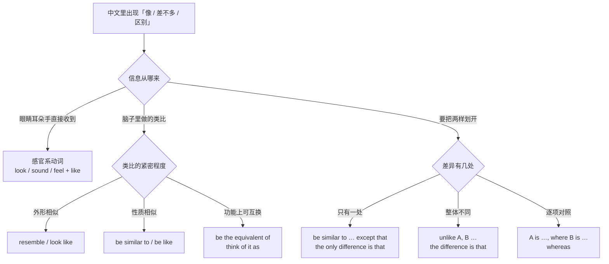
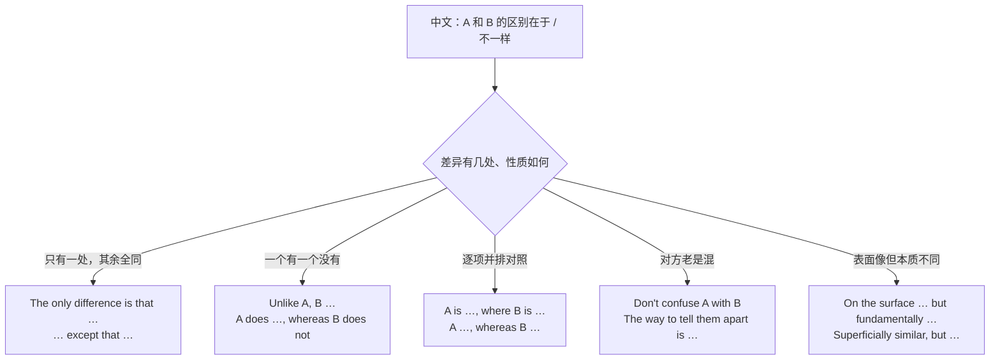
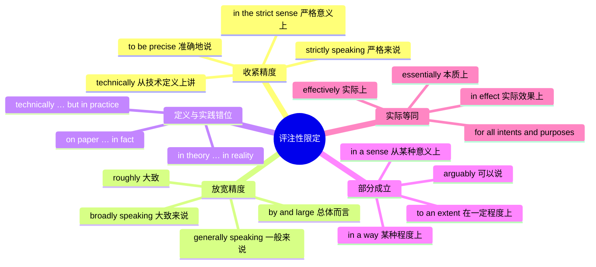
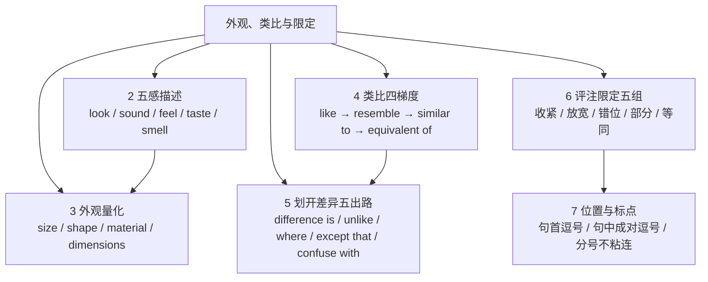

# 看起来像、区别在于、严格来说：外观、类比与限定

> [!info] 本篇定位
>
> 这篇收三类相邻但不同的中文意图。
>
> 第一类是**描述外观**：看起来像什么、听着像什么、大概多大、什么形状什么材质。想描述一个对方没见过的东西时用。
>
> 第二类是**做类比与划差异**：A 像 B、A 相当于 B、A 跟 B 差不多但有一处不同、A 和 B 的区别在于。前半是拉近，后半是划开。
>
> 第三类是**评注性限定**：严格来说、大致来说、技术上是但实际上、从某种意义上说、说白了就等于。这类词不改变句子的命题，只标注你把话说到了什么精度。
>
> 前一篇 [[08.指认、定义与描述/03.由…组成、分为、包括、属于：构成、分类与范围界定\|由…组成、分为、包括、属于]] 处理的是「这个东西由什么构成、归在哪一类」，本篇处理的是「这个东西看着像什么、跟别的差在哪」。定义与命名在 [[08.指认、定义与描述/02.X 是指、所谓、又称、相当于：定义与命名\|X 是指、所谓、又称、相当于]]。
>
> 读完能查到：想说一句带「像」「差别」「严格讲」的中文时，直接拿到三档成品句架。

---

## 1. 本篇导读：像什么、差在哪、话说到什么份上

中文里「像」这个字承担的活儿太多，英文要分岔。「他看起来像个学生」是感官判断，「这个函数像一个状态机」是概念类比，「这块屏幕跟上一代类似」是产品对比，「这基本上就是重写」是评注限定。四种「像」在英文里落到四套不同结构上，混用就出中式英语。

本篇的组织方式是先按**说话人在干什么**分区：

| 你在干的事 | 中文常用词 | 落到哪一节 |
| --- | --- | --- |
| 报告五感收到的信号 | 看起来、听着、摸上去、尝着 | 第 2 节 |
| 把外观量化给对方 | 多大、什么形状、什么材质 | 第 3 节 |
| 拿已知的东西解释未知的东西 | 像、类似、相当于、可以理解成 | 第 4 节 |
| 把两样东西划开 | 区别在于、不像、而 | 第 5 节 |
| 给自己的话标精度 | 严格来说、大致来说、说白了 | 第 6 节 |



这张图是本篇的总入口。第一个分岔看信息来源：眼睛耳朵直接收到的走感官系动词，脑子里做的对应走类比动词。第二个分岔看类比要多紧：只说外形像用 resemble，说性质像用 be similar to，说「功能上可以拿它当那个用」用 the equivalent of。第三个分岔按差异点的数量分流：一处差异用 except that 保住「其余都一样」的意思，整体不同用 unlike 开头，逐项对照用 where 或 whereas 把两边并排摆出来。

评注性限定不在这张图里，因为它不参与描述本身。它是加在任何一句话外面的一层标注：`Strictly speaking, X.` 里的 X 才是内容，`strictly speaking` 只说明你对 X 的精度负多大责任。第 6、7 两节单独处理。

---

## 2. 看起来像、听起来像：五感描述的六个入口

### 2.1 看起来像一个…（后面接名词）

中文触发语：看起来像 / 看上去像 / 长得像 / 一看就像 / 像是

| 档位 | 句架 | 例句 |
| --- | --- | --- |
| 口语 | sth looks like + n. | It looks like a router, but it's actually a NAS. |
| 口语 | sb looks like + n. | He looks like a grad student, not a director. |
| 书面 | sth has the look of + n. | The building has the look of a converted factory. |
| 书面 | sth looks more like A than B | The chart looks more like noise than a trend. |
| 正式 | sth bears a resemblance to + n. | The new layout bears a close resemblance to the old one. |

- It looks like a router, but it's actually a NAS. — 它看着像个路由器，其实是台 NAS。
- He looks like a grad student, not a director. — 他看着像个研究生，不像总监。
- The chart looks more like noise than a trend. — 这张图看着更像噪声，不像趋势。

> [!warning] 名词前不能漏冠词
>
> ~~It looks like router.~~ ❌
>
> **It looks like a router.** ✅（like 后面接的是名词短语，可数单数必须带冠词）
>
> ~~He looks like tired.~~ ❌
>
> **He looks tired.** ✅（后面是形容词就不能有 like，见 2.2）

```text
同义入口：看着像 / 长得像 / 活像 / 有点像 / 乍一看像
语法归属：[[02.英语基础语法/05.介词与连词/02.常用介词搭配详解\|like 作介词的搭配]]
```

---

### 2.2 看上去很…（后面接形容词）

中文触发语：看上去很 / 看着挺 / 显得 / 神色…

| 档位 | 句架 | 例句 |
| --- | --- | --- |
| 口语 | sb/sth looks + adj. | You look tired. Did you sleep at all? |
| 口语 | sth looks a bit + adj. | The colors look a bit washed out on this screen. |
| 书面 | sth appears + adj. | The connection appears stable now. |
| 书面 | sth comes across as + adj. | The wording comes across as overly defensive. |
| 正式 | sth gives the impression of being + adj. | The report gives the impression of being rushed. |

- The colors look a bit washed out on this screen. — 这屏幕上颜色显得有点发灰。
- The wording comes across as overly defensive. — 这个措辞读着显得太防备了。
- The report gives the impression of being rushed. — 这份报告显得赶工。

> [!warning] look 与 look like 的分工是靠后面的词类
>
> ~~The design looks like modern.~~ ❌
>
> **The design looks modern.** ✅（形容词直接跟 look）
>
> **The design looks like something from 2010.** ✅（名词短语才用 like）

```text
同义入口：显得 / 看上去 / 给人的感觉是 / 读着像
语法归属：[[02.英语基础语法/04.形容词与副词/01.形容词的用法与位置\|系动词后的表语形容词]]
场景实战：[[04.英语场景/05.高频实用表达句型框架/01.表达观点与态度的50个万能句型\|表达观点与印象的句型]]
```

---

### 2.3 听起来像、听着不太对

中文触发语：听起来像 / 听着像 / 听上去 / 一听就是 / 听着不对劲

| 档位 | 句架 | 例句 |
| --- | --- | --- |
| 口语 | sth sounds like + n. | That sounds like a caching problem, not a network one. |
| 口语 | sth sounds + adj. | That sounds risky. Can we roll it back? |
| 口语 | sb sounds like sb is doing | You sound like you're coming down with something. |
| 书面 | sth has the ring of + n. | The excuse has the ring of a rehearsed line. |
| 正式 | sth is suggestive of + n. | The intermittent clicking is suggestive of a failing drive. |

- That sounds like a caching problem, not a network one. — 听着像是缓存问题，不是网络问题。
- You sound like you're coming down with something. — 你听着像是要感冒了。
- The intermittent clicking is suggestive of a failing drive. — 断断续续的咔哒声提示硬盘可能要坏。

> [!tip] sounds like 在英语职场里是最省力的推断开场
>
> 同事描述完症状，接一句 `That sounds like…` 既给出判断又留了余地，比 `It must be…` 客气得多。把握度的完整梯度见 [[10.态度、情感与判断/03.肯定是、八成、说不定、不可能：把握度阶梯\|把握度阶梯]]。

```text
同义入口：听着像 / 听上去是 / 一听就知道 / 听描述像
语法归属：[[02.英语基础语法/05.介词与连词/02.常用介词搭配详解\|感官动词加 like 的搭配]]
```

---

### 2.4 摸起来、尝起来、闻起来

中文触发语：摸起来 / 手感 / 质地 / 尝着 / 味道像 / 闻着有股…味

| 档位 | 句架 | 例句 |
| --- | --- | --- |
| 口语 | sth feels + adj. | The keyboard feels mushy compared with the old one. |
| 口语 | sth feels like + n. | The fabric feels like real leather. |
| 口语 | sth tastes like + n. | It tastes like green tea with a bit of salt. |
| 口语 | sth smells of + n. | The room smells of fresh paint. |
| 书面 | sth has a + adj. + texture/finish | The case has a matte finish that resists fingerprints. |
| 正式 | sth is + adj. + to the touch | The surface is slightly rough to the touch. |

- The keyboard feels mushy compared with the old one. — 这键盘比老那把手感发肉。
- The room smells of fresh paint. — 屋里一股新刷漆的味儿。
- The surface is slightly rough to the touch. — 表面摸上去略微粗糙。

> [!warning] smell of 与 smell like 都对，分工不同
>
> **The room smells of paint.** ✅（of 后面接气味的来源，屋里确实有漆）
>
> **The room smells like paint.** ✅（like 后面接比较对象，可能有漆，也可能是别的东西闻着像漆）
>
> 上面这条是日常口语里最常被含混掉的一处：想说「有漆味」两句都能用，想说「闻着像漆但不是漆」只能用 like。
>
> ~~It smells bad taste.~~ ❌
>
> **It tastes bad.** ✅ / **It has an off taste.** ✅（smell 管气味，taste 管味道，不能混一句里）

```text
同义入口：手感 / 触感 / 质地 / 口感 / 有股味儿
语法归属：[[02.英语基础语法/05.介词与连词/02.常用介词搭配详解\|of 与 like 的搭配差]]
```

---

### 2.5 看样子好像…（后面接一整句）

中文触发语：看样子 / 看起来好像 / 感觉像是 / 貌似 / 搞不好是

| 档位 | 句架 | 例句 |
| --- | --- | --- |
| 口语 | It looks like + 一整句 | It looks like the build broke again. |
| 口语 | It feels like + 一整句 | It feels like we've been in this meeting for hours. |
| 书面 | It appears that + 一整句 | It appears that the request never reached the server. |
| 书面 | It seems as if + 一整句 | It seems as if the two systems were never meant to talk to each other. |
| 正式 | The evidence suggests that + 一整句 | The evidence suggests that the outage began before the deploy. |

- It looks like the build broke again. — 看样子构建又挂了。
- It appears that the request never reached the server. — 看起来这个请求根本没到服务端。
- The evidence suggests that the outage began before the deploy. — 现有证据显示故障在发布之前就开始了。

> [!warning] like 后面接整句是口语，正式文书要换 as if 或 that
>
> ~~It appears like the request failed.~~ ❌
>
> **It appears that the request failed.** ✅
>
> **It looks like the request failed.** ✅（口语可以，写进事故报告就换 that）

```text
同义入口：看样子 / 貌似 / 我猜是 / 从现象上看
语法归属：[[02.英语基础语法/09.从句体系/03.名词性从句详解\|it 作形式主语的从句]]
场景实战：[[04.英语场景/02.基础句型框架/03.there be 与 it 句型完全手册\|it 句型的完整清单]]
```

---

### 2.6 不像…的样子、一看就不是

中文触发语：不像 / 看着不像 / 哪像 / 一点也不像 / 怎么看都不像

| 档位 | 句架 | 例句 |
| --- | --- | --- |
| 口语 | sth doesn't look like + n. | It doesn't look like a bug in our code. |
| 口语 | sth looks nothing like + n. | The render looks nothing like the mockup. |
| 口语 | That's not like sb | Missing a deadline? That's not like her. |
| 书面 | sth bears little resemblance to + n. | The final product bears little resemblance to the original spec. |
| 正式 | sth is unlike anything + 从句 | The failure mode is unlike anything we have seen before. |

- The render looks nothing like the mockup. — 渲染出来跟设计稿完全不是一回事。
- Missing a deadline? That's not like her. — 她还能误期？不像她的作风。
- The final product bears little resemblance to the original spec. — 成品跟最初的规格差得很远。

> [!tip] looks nothing like 是「完全不像」，不是「有点不像」
>
> 想说「有点不一样」用 `doesn't quite look like` 或 `looks a little different from`。`nothing like` 的语气非常重，用在验收环节等于当场否掉。

```text
同义入口：完全不像 / 差远了 / 一点不像 / 不是那个路子
语法归属：[[02.英语基础语法/04.形容词与副词/03.副词的分类与用法\|nothing like 作程度状语]]
```

---

## 3. 多大、什么形状、什么材质：把外观量化

对方没见过这个东西时，光说「像什么」不够，得给尺寸、形状、材质。中文里这三样常常一句话带过（「一个巴掌大的黑色方块」），英文要拆成几个独立槽位往外说。


这条流水线的顺序有讲究：先归类再给细节。上来就说「它是黑色的、方的、大概巴掌大」，对方会一直悬着不知道你在说什么；先说 `It's a kind of external drive.`，后面每一条细节都有地方挂。归类的说法在 [[08.指认、定义与描述/02.X 是指、所谓、又称、相当于：定义与命名\|定义与命名]] 那一篇。

### 3.1 大概有…那么大

中文触发语：大概有…那么大 / 差不多…大小 / 跟…一般大 / 巴掌大 / 有多大

| 档位 | 句架 | 例句 |
| --- | --- | --- |
| 口语 | about the size of + n. | It's about the size of a deck of cards. |
| 口语 | roughly as big as + n. | The office is roughly as big as a two-car garage. |
| 口语 | It fits in + 处所 | It fits in your palm. |
| 书面 | comparable in size to + n. | The unit is comparable in size to a standard router. |
| 书面 | no bigger than + n. | The sensor is no bigger than a coin. |
| 正式 | approximately + 数值 + in 维度 | The panel is approximately 40 cm in width. |

- It's about the size of a deck of cards. — 大概一副扑克那么大。
- The sensor is no bigger than a coin. — 传感器不比一枚硬币大。
- The panel is approximately 40 cm in width. — 面板宽度约 40 厘米。

> [!warning] size of 后面要跟具体的东西，不跟形容词
>
> ~~It's about the size of small.~~ ❌
>
> **It's about the size of a matchbox.** ✅
>
> **It's fairly small — about the size of a matchbox.** ✅（先给判断再给参照物）

```text
同义入口：多大 / 尺寸多少 / 跟什么一般大 / 占多大地方
语法归属：[[02.英语基础语法/04.形容词与副词/02.形容词的比较级与最高级\|as…as 的同级比较]]
```

---

### 3.2 什么形状、长成什么样

中文触发语：什么形状 / 长得像…形 / 方的圆的 / 呈…状 / 截面是…

| 档位 | 句架 | 例句 |
| --- | --- | --- |
| 口语 | It's shaped like + n. | It's shaped like a hockey puck. |
| 口语 | It's a + adj. + shape | It's a long, narrow strip with rounded corners. |
| 书面 | roughly + 形状形容词 | The footprint is roughly rectangular. |
| 书面 | in the shape of + n. | The logo is a leaf in the shape of a teardrop. |
| 正式 | sth is + 形状形容词 + in cross-section | The channel is trapezoidal in cross-section. |

- It's shaped like a hockey puck. — 形状像个冰球。
- It's a long, narrow strip with rounded corners. — 是个细长条，四角是圆的。
- The footprint is roughly rectangular. — 占地面积大致是长方形。

> [!example] 形状词的常用一组
>
> round 圆的 / square 正方的 / rectangular 长方的 / oval 椭圆的 / triangular 三角的 / cylindrical 圆柱的 / conical 圆锥的 / flat 扁平的 / curved 弯曲的 / tapered 一头细的 / hollow 中空的 / solid 实心的

```text
同义入口：什么形状 / 长什么样 / 呈什么状 / 外形是
语法归属：[[02.英语基础语法/04.形容词与副词/01.形容词的用法与位置\|多个形容词的排列顺序]]
```

---

### 3.3 什么材质、什么颜色、什么质地

中文触发语：什么做的 / 什么材质 / 什么颜色 / 表面是…的 / 手感是…的

| 档位 | 句架 | 例句 |
| --- | --- | --- |
| 口语 | It's made of + 材料 | The frame is made of aluminum. |
| 口语 | It's + 颜色 + with + 细节 | It's matte black with a red stripe down the side. |
| 书面 | sth comes in + 颜色/材质 | The case comes in three finishes: matte, gloss, and brushed metal. |
| 书面 | sth is made from + 原材料 | The board is made from recycled fiber. |
| 正式 | sth is constructed of + 材料 | The housing is constructed of injection-molded polycarbonate. |

- It's matte black with a red stripe down the side. — 哑光黑，侧面有一道红条。
- The board is made from recycled fiber. — 板子是回收纤维做的。
- The housing is constructed of injection-molded polycarbonate. — 外壳采用注塑聚碳酸酯。

> [!warning] made of 与 made from 不能互换
>
> **made of**：成品里还看得出原材料 — `The table is made of oak.`
>
> **made from**：原材料经过转化，看不出原样 — `Paper is made from wood.`
>
> ~~The table is made from oak.~~ ❌（除非你在强调这块木头被彻底改造过）

```text
同义入口：什么做的 / 用料 / 材质 / 表面处理 / 配色
语法归属：[[02.英语基础语法/05.介词与连词/04.介词与连词的易混点\|of 与 from 的易混用法]]
```

---

### 3.4 具体尺寸、重量、容量怎么念

中文触发语：长宽高多少 / 多重 / 容量多大 / 规格是 / 尺寸为

| 档位 | 句架 | 例句 |
| --- | --- | --- |
| 口语 | It's A by B | The desk is six feet by three feet. |
| 口语 | It weighs about + 数值 | It weighs about two kilos with the battery in. |
| 书面 | sth measures A × B × C | The enclosure measures 210 × 148 × 60 mm. |
| 书面 | sth has a capacity of + 数值 | The tank has a capacity of 12 liters. |
| 正式 | sth has a nominal 维度 of + 数值 | The cable has a nominal diameter of 6 mm. |

- The desk is six feet by three feet. — 桌子六英尺乘三英尺。
- It weighs about two kilos with the battery in. — 装上电池大概两公斤。
- The enclosure measures 210 × 148 × 60 mm. — 机箱尺寸 210 × 148 × 60 毫米。

> [!tip] 口语报尺寸不用 measures
>
> `measures` 是产品页与规格书的词。同事问「多大」，回 `It's about A4 size.` 或 `It's six by three.` 就行。数字与单位的完整读写式在 [[09.比较、程度与数量/04.大约、超过、占三成、平均、分别是：数量与统计描述\|数量与统计描述]]。

```text
同义入口：规格 / 尺寸 / 净重 / 容量 / 占地
语法归属：[[02.英语基础语法/03.代词与数词/05.数词的用法与表达\|数词的读写]]
```

---

## 4. 像、类似、相当于：类比的四个梯度

从「外形像」到「功能上可以互换」，英文有一条从松到紧的梯度。选错档会让对方误判两样东西的接近程度。

| 松紧 | 说法 | 你承诺了什么 |
| --- | --- | --- |
| 最松 | look like | 只承诺外表，两者内部可以毫无关系 |
| 较松 | resemble | 外形或结构上像，书面语域 |
| 中等 | be similar to | 性质上像，对方可以逐项来比 |
| 紧 | be analogous to | 结构对应，对方有权拿 B 的性质推 A |
| 最紧 | be the equivalent of | 功能上可以顶替 |
| 相等 | be identical to | 没有区别 |

这条尺子从上往下越来越紧。`look like` 只承诺外表，两个东西内部可以毫无关系；`be analogous to` 已经承诺了结构对应，说完之后对方有权拿 B 的性质来推 A；`be the equivalent of` 承诺功能可替代，说错会导致对方真的拿 B 去顶 A。日常最常用的是中间那两档，太紧的两档留给你确实敢担保的场合。

### 4.1 A 像 B（外形或结构上）

中文触发语：像 / 类似于 / 有点像 / 跟…很像 / 神似

| 档位 | 句架 | 例句 |
| --- | --- | --- |
| 口语 | A is like B | The new API is like the old one, just cleaner. |
| 口语 | A is a lot like B | Rust's ownership model is a lot like manual memory management with a compiler watching. |
| 书面 | A resembles B | The revised interface closely resembles the desktop version. |
| 书面 | A is reminiscent of B | The color scheme is reminiscent of early terminal software. |
| 正式 | A shares several features with B | The protocol shares several features with its predecessor. |

- The new API is like the old one, just cleaner. — 新接口跟旧的差不多，就是干净些。
- The revised interface closely resembles the desktop version. — 改版后的界面与桌面端十分相似。
- The color scheme is reminiscent of early terminal software. — 配色让人想起早期的终端软件。

> [!warning] resemble 本身就是及物动词，不要再加介词
>
> ~~The interface resembles to the desktop version.~~ ❌
>
> ~~The interface is resembled the desktop version.~~ ❌
>
> **The interface resembles the desktop version.** ✅（resemble 不用被动，也不接 to）

```text
同义入口：像 / 神似 / 有几分像 / 让人想起
语法归属：[[02.英语基础语法/05.介词与连词/04.介词与连词的易混点\|及物动词误加介词]]
```

---

### 4.2 A 跟 B 类似（性质上可以逐项比）

中文触发语：类似 / 差不多 / 跟…同类 / 在…方面相似 / 属于同一路数

| 档位 | 句架 | 例句 |
| --- | --- | --- |
| 口语 | A and B are pretty similar | The two libraries are pretty similar in how they handle errors. |
| 书面 | A is similar to B | This approach is similar to what the platform team did last quarter. |
| 书面 | A is similar to B in that + 从句 | The two are similar in that both cache results in memory. |
| 书面 | A and B have a lot in common | The two proposals have a lot in common. |
| 正式 | A is comparable to B | The failure rate is comparable to that of the previous generation. |

- The two are similar in that both cache results in memory. — 两者相似的地方在于都把结果缓存在内存里。
- The failure rate is comparable to that of the previous generation. — 故障率与上一代相当。

> [!warning] 比较对象要对等
>
> ~~The failure rate is comparable to the previous generation.~~ ❌（拿故障率跟一代产品比）
>
> **The failure rate is comparable to that of the previous generation.** ✅（that of 补出「上一代的故障率」）
>
> 比较对象对等的完整规则在 [[09.比较、程度与数量/01.A 比 B 更、不如、一样：比较三式与差额\|比较三式与差额]]。

```text
同义入口：类似 / 差不多 / 同一类 / 相当于 / 大同小异
语法归属：[[02.英语基础语法/04.形容词与副词/02.形容词的比较级与最高级\|比较对象的对等与省略]]
场景实战：[[04.英语场景/05.高频实用表达句型框架/04.比较对比举例总结句型库\|比较对比句型库]]
```

---

### 4.3 跟 X 差不多，就是有一处不一样

中文触发语：跟…一样，只是… / 除了…以外都一样 / 差不多，唯一区别是 / 一模一样，就是…

| 档位 | 句架 | 例句 |
| --- | --- | --- |
| 口语 | A is like B, except + 短语 | It's like the standard plan, except cheaper. |
| 口语 | A is the same as B, only + 形容词 | This one's the same as that one, only lighter. |
| 书面 | A is similar to B except that + 从句 | The new endpoint is similar to the old one except that it returns pagination metadata. |
| 书面 | A is identical to B apart from + n. | The two builds are identical apart from the version string. |
| 正式 | A is in all respects equivalent to B, save for + n. | The replacement is in all respects equivalent to the original, save for the connector type. |

- It's like the standard plan, except cheaper. — 跟标准套餐一样，就是便宜些。
- The new endpoint is similar to the old one except that it returns pagination metadata. — 新接口跟老的差不多，区别是多返回一段分页信息。
- The two builds are identical apart from the version string. — 两个构建除了版本号完全一致。

> [!warning] except 后面接短语，except that 后面才接句子
>
> **It's the same, except it uses a different port.** ✅（口语里 that 常省，说出来没人挑）
>
> **It's the same, except that it uses a different port.** ✅（正式文书把 that 补回来）
>
> ~~The two are identical except for they use different ports.~~ ❌
>
> **The two are identical except for the port.** ✅（except for 后面只能是名词短语，接不了句子）

```text
同义入口：除了…都一样 / 唯一不同是 / 一模一样，就是 / 换汤不换药
语法归属：[[02.英语基础语法/05.介词与连词/03.连词的分类与用法\|except 与 except that 的分工]]
```

---

### 4.4 相当于、可以把它想成

中文触发语：相当于 / 可以理解成 / 你就把它当成 / 对应的是 / 等价于

| 档位 | 句架 | 例句 |
| --- | --- | --- |
| 口语 | Think of it as + n. | Think of it as a to-do list the compiler reads. |
| 口语 | It's basically + n. | It's basically a lookup table with a fancy name. |
| 书面 | A is the equivalent of B | A pull request is the equivalent of a formal change proposal. |
| 书面 | A is the + 阵营 + answer to B | The tool is the open-source answer to the commercial suites. |
| 正式 | A corresponds to B | Each entry in the manifest corresponds to one deployed service. |
| 正式 | A is functionally equivalent to B | The two implementations are functionally equivalent. |

- Think of it as a to-do list the compiler reads. — 你就把它当成一份编译器会读的待办清单。
- A pull request is the equivalent of a formal change proposal. — 一个 PR 相当于一份正式的变更提案。
- Each entry in the manifest corresponds to one deployed service. — 清单里每一条对应一个已部署的服务。

> [!tip] Think of it as 是解释生词时最好用的一句
>
> 不知道某个概念的英文标准说法时，用 `Think of it as …` 加一个对方肯定知道的东西，比硬憋专业术语有效得多。绕说框架在 [[08.指认、定义与描述/02.X 是指、所谓、又称、相当于：定义与命名\|定义与命名]] 那一篇有一整节。

```text
同义入口：相当于 / 等价于 / 可以理解为 / 对标 / 类似物
语法归属：[[02.英语基础语法/02.名词与冠词/03.冠词的用法详解\|the equivalent of 里的定冠词]]
```

---

### 4.5 就像…那样（方式类比）

中文触发语：就像…一样 / 跟…似的 / 如同 / 好比 / 打个比方

| 档位 | 句架 | 例句 |
| --- | --- | --- |
| 口语 | like sb does sth | It caches results, like a browser does with images. |
| 口语 | the way sb does sth | Handle the retry the way the payment service does. |
| 口语 | It's as if + 从句 | It's as if the request never left the client. |
| 书面 | Just as A, [so] B | Just as a compiler checks types, so a linter checks style. |
| 书面 | by analogy with + n. | By analogy with the mail system, each message needs an envelope. |
| 正式 | in much the same way that + 从句 | The scheduler prioritizes tasks in much the same way that an operating system does. |

- Handle the retry the way the payment service does it. — 重试逻辑按支付服务那套来。
- It's as if the request never left the client. — 就好像这个请求根本没离开客户端。
- Just as a compiler checks types, so a linter checks style. — 正如编译器检查类型，linter 检查风格。

> [!warning] as if 后面用什么形态取决于你信不信
>
> **It's as if the request never left the client.** ✅（陈述事实般的推断，用一般过去）
>
> **He talks as if he were the only reviewer.** ✅（明知不是事实，用 were）
>
> 两种形态的完整对照在 [[02.英语基础语法/10.特殊句型/02.虚拟语气详解\|虚拟语气详解]]，本手册不复述。

```text
同义入口：就像 / 好比 / 如同 / 打个比方 / 拿…作比
语法归属：[[02.英语基础语法/09.从句体系/04.状语从句详解\|方式状语从句 as / as if]]
```

---

## 5. 区别在于、差在哪：把差异说清楚的五条出路

中文说「区别在于」时，实际可能在做五件不同的事：点名一处差异、整体对立、逐项对照、说明不可混淆、区分表里。英文各有各的结构。



选路的关键是差异点的数量与你想让对方记住什么。只有一处差异时，用 except that 或 the only difference 能顺带传达「其余都一样」这条信息，用 unlike 反而会让对方以为两者大面积不同。对方老搞混时，最有效的不是罗列差异，而是给一条判别法：`The way to tell them apart is …`。

### 5.1 A 和 B 的区别在于

中文触发语：区别在于 / 差别是 / 不同之处在于 / 差在哪 / 关键区别是

| 档位 | 句架 | 例句 |
| --- | --- | --- |
| 口语 | The difference is that + 从句 | The difference is that one runs on every commit and the other runs nightly. |
| 口语 | What's different is + n./从句 | What's different is the ordering guarantee. |
| 书面 | The main difference between A and B is that + 从句 | The main difference between the two plans is that only the higher tier includes support. |
| 书面 | A differs from B in that + 从句 | The staging environment differs from production in that it uses synthetic data. |
| 书面 | The difference lies in + n. | The difference lies in how errors propagate. |
| 正式 | A is distinguished from B by + n. | The premium edition is distinguished from the standard one by its audit logging. |

- The difference is that one runs on every commit and the other runs nightly. — 区别在于一个每次提交都跑，一个每晚跑一次。
- The staging environment differs from production in that it uses synthetic data. — 预发环境跟生产的不同之处在于它用的是合成数据。
- The difference lies in how errors propagate. — 差别在错误的传播方式上。

> [!warning] difference 后面的介词是 between…and，不是 of
>
> ~~The difference of A and B is …~~ ❌
>
> **The difference between A and B is …** ✅
>
> ~~A is different with B.~~ ❌
>
> **A is different from B.** ✅（英式口语也说 different to，美式书面统一用 from）

```text
同义入口：区别在于 / 差别是 / 不同点 / 差在哪儿 / 分水岭在
语法归属：[[02.英语基础语法/05.介词与连词/02.常用介词搭配详解\|different from 的固定搭配]]
场景实战：[[04.英语场景/05.高频实用表达句型框架/04.比较对比举例总结句型库\|对比与举例句型库]]
```

---

### 5.2 不像 A，B 是…（整体对立）

中文触发语：不像 / 跟…不同的是 / …就不一样了 / 和…相反 / 有别于

| 档位 | 句架 | 例句 |
| --- | --- | --- |
| 口语 | Unlike A, B + 动词 | Unlike the old client, the new one retries automatically. |
| 口语 | A does X. B doesn't. | The old client blocks. The new one doesn't. |
| 书面 | Unlike in A, in B + 从句 | Unlike in the batch job, in the streaming path every record is acknowledged. |
| 书面 | In contrast to A, B + 动词 | In contrast to the first release, this one ships with migrations. |
| 正式 | As distinct from A, B + 动词 | As distinct from a warning, an error halts the pipeline. |

- Unlike the old client, the new one retries automatically. — 不像老客户端，新的会自动重试。
- In contrast to the first release, this one ships with migrations. — 与首个版本不同，这一版自带迁移脚本。
- As distinct from a warning, an error halts the pipeline. — 与警告不同，错误会中断流水线。

> [!warning] unlike 两边比的东西必须是同一类
>
> ~~Unlike the old client, the new version is fast.~~ ❌（拿 client 比 version，两边不同类）
>
> **Unlike the old client, the new one is fast.** ✅（one 回指 client，最自然）
>
> unlike with 是另一个结构，它比的是两种**情形**而不是两个实体，主句也得跟着写成情形：
>
> ~~Unlike with the old client, the new one is fast.~~ ❌（with 那边是「用旧客户端时」，主句却是实体）
>
> **Unlike with the old client, you don't have to poll for status.** ✅（两边都是情形）

```text
同义入口：不像 / 与…不同 / 相反 / 有别于 / 换成…就不是这样
语法归属：[[02.英语基础语法/05.介词与连词/01.介词的分类与基本用法\|unlike 作介词]]
```

---

### 5.3 A 是…，而 B 是…（逐项并排对照）

中文触发语：而 / 至于…则 / 反过来 / 在这一点上 / 前者…后者…

| 档位 | 句架 | 例句 |
| --- | --- | --- |
| 口语 | A does X, and B doesn't | The web app caches aggressively, and the mobile app doesn't. |
| 书面 | A does X, whereas B does Y | The web app caches responses, whereas the mobile app fetches every time. |
| 书面 | A does X, while B does Y | Read requests hit the replica, while writes go to the primary. |
| 书面 | A does X, where B does Y | The old parser fails silently, where the new one raises an error. |
| 正式 | A does X; B, by contrast, does Y | The first method scales linearly; the second, by contrast, degrades under load. |

- The web app caches responses, whereas the mobile app fetches every time. — 网页端会缓存响应，而移动端每次都重新拉。
- The old parser fails silently, where the new one raises an error. — 老解析器出错时不吭声，新的会抛异常。
- The first method scales linearly; the second, by contrast, degrades under load. — 第一种方法线性扩展，第二种则在高负载下退化。

> [!tip] where 表对比可以用，但没有 whereas 稳
>
> `A does X, where B does Y` 里的 where 不表地点，表「在这一点上」，语气比 whereas 轻，像顺手补一句对照。它在技术与学术写作里读得到，但不少编辑会当成笔误改掉。拿不准就换 whereas，语义一样、没人挑。

> [!warning] while 的时间义与对比义靠什么分开
>
> **While the build runs, grab a coffee.** — 时间义（在…期间）
>
> **Reads go to the replica, while writes go to the primary.** — 对比义（而）
>
> 分辨靠从句内容而非位置：从句是一个**正在持续的动作**就往时间读，是一个**跟主句并置的命题**就往对比读。两种读法都讲得通时（从句动词恰好也能当持续动作看），把 while 挪到后半句，对比义就唯一了。

```text
同义入口：而 / 则 / 反观 / 至于 / 相比之下
语法归属：[[02.英语基础语法/09.从句体系/04.状语从句详解\|whereas 与 while 的对比用法]]
场景实战：[[05.让步、转折与对比/03.相比之下、恰恰相反、另一方面：对比与反驳\|对比与反驳]]
```

---

### 5.4 唯一的区别是、除了这点都一样

中文触发语：唯一的区别 / 就差在 / 除了…以外没差 / 别的都一样 / 只有一点不同

| 档位 | 句架 | 例句 |
| --- | --- | --- |
| 口语 | The only difference is + n./从句 | The only difference is the price. |
| 口语 | Other than + n., they're the same | Other than the logo, they're the same template. |
| 书面 | They are otherwise identical | The two configurations differ only in the timeout value; they are otherwise identical. |
| 书面 | with the sole exception of + n. | All fields carry over, with the sole exception of the internal ID. |
| 正式 | save for + n., A and B are indistinguishable | Save for the serial number, the two units are indistinguishable. |

- The only difference is the price. — 唯一的区别是价格。
- The two configurations differ only in the timeout value; they are otherwise identical. — 两份配置只在超时值上不同，其余完全一致。
- All fields carry over, with the sole exception of the internal ID. — 所有字段都保留，只有内部 ID 除外。

> [!warning] only 的位置决定它修饰谁
>
> **They differ only in the timeout.** ✅（只在超时值上不同）
>
> **Only they differ in the timeout.** — 意思变成「只有他们在超时值上不同」
>
> only 紧贴它要修饰的成分，放错位置整句意思就换了。

```text
同义入口：唯一区别 / 就差这一点 / 别的都一样 / 除此之外无差
语法归属：[[02.英语基础语法/04.形容词与副词/03.副词的分类与用法\|only 的位置与修饰范围]]
```

---

### 5.5 容易搞混、怎么区分

中文触发语：别搞混 / 容易混 / 怎么区分 / 分不清 / 区分的方法是

| 档位 | 句架 | 例句 |
| --- | --- | --- |
| 口语 | Don't confuse A with B | Don't confuse the staging URL with the production one. |
| 口语 | I can never tell A and B apart | I can never tell those two config files apart. |
| 口语 | The way to tell them apart is + 从句 | The way to tell them apart is that only one has a trailing slash. |
| 书面 | A is often mistaken for B | Latency is often mistaken for throughput. |
| 书面 | A should not be conflated with B | Availability should not be conflated with reliability. |
| 正式 | A careful distinction must be drawn between A and B | A careful distinction must be drawn between correlation and causation. |

- Don't confuse the staging URL with the production one. — 别把预发地址和生产地址搞混。
- Latency is often mistaken for throughput. — 延迟经常被误当成吞吐量。
- Availability should not be conflated with reliability. — 可用性不该与可靠性混为一谈。

> [!warning] confuse 的搭配是 with，不是 to
>
> ~~Don't confuse A to B.~~ ❌
>
> **Don't confuse A with B.** ✅
>
> **A is easily confused with B.** ✅（被动式同样用 with）

```text
同义入口：搞混 / 混为一谈 / 分不清 / 傻傻分不清 / 区分方法
语法归属：[[02.英语基础语法/05.介词与连词/02.常用介词搭配详解\|confuse with 的动介搭配]]
```

---

### 5.6 表面上像、本质上不同

中文触发语：表面上看像 / 乍一看 / 本质上不是一回事 / 骨子里 / 说到底不同

| 档位 | 句架 | 例句 |
| --- | --- | --- |
| 口语 | They look the same, but they're not | They look the same on the dashboard, but they're not the same metric. |
| 口语 | At first glance …, but … | At first glance it's the same bug, but the stack trace is different. |
| 书面 | Superficially similar, A and B differ in + n. | Superficially similar, the two algorithms differ in their memory profile. |
| 书面 | On the surface …; fundamentally … | On the surface it's a naming change; fundamentally it changes the contract. |
| 正式 | The similarity is only apparent | The similarity between the two failure modes is only apparent. |

- At first glance it's the same bug, but the stack trace is different. — 乍一看是同一个 bug，但调用栈不一样。
- On the surface it's a naming change; fundamentally it changes the contract. — 表面上只是改个名字，本质上改了契约。
- The similarity between the two failure modes is only apparent. — 两种故障模式的相似只是表面上的。

> [!tip] 表面与本质这一对在评审里很好使
>
> 想反对一个「看着差不多」的方案，`On the surface …, but fundamentally …` 比直接说 `That's wrong` 有说服力得多。反预期与软化异议的整套说法在 [[05.让步、转折与对比/02.话虽如此、退一步说、表面上实际上：软化与反预期\|软化与反预期]]。

```text
同义入口：表面上 / 乍看 / 貌似 / 骨子里 / 本质上
语法归属：[[02.英语基础语法/04.形容词与副词/03.副词的分类与用法\|superficially 与 fundamentally 作句子副词]]
```

---

## 6. 严格来说、大致来说：评注性限定的六档

这一节的词都不改变句子说了什么，只标注**你对这句话的精度负多大责任**。中文里同样有一整套：「严格来说」「大致来说」「说白了」「某种意义上」。选错档不会造成语法错，但会造成责任错位——该保守时说死，该说死时又打太极。



五组的分工是这样的：第一组把话说窄，用在你要纠正一个不准确的说法时；第二组把话说宽，用在你不想被细节绊住时；第三组专门处理「定义上成立但现实里不成立」这种错位；第四组承认部分成立但不全对；第五组反过来，承认严格讲不成立但实际效果一样。

注意第一组和第三组的 technically 是同一个词的两种用法。单独用 `Technically, X.` 是收紧精度（严格按定义讲，X 成立）；`Technically X, but in practice Y.` 是标记错位（定义上 X，实际是 Y）。区别全靠后面有没有 but。

### 6.1 严格来说、准确地说

中文触发语：严格来说 / 准确地说 / 确切地讲 / 严格意义上 / 说得精确一点

| 档位 | 句架 | 例句 |
| --- | --- | --- |
| 口语 | Strictly speaking, + 一整句 | Strictly speaking, it's not a bug — the spec never said what should happen. |
| 口语 | Technically, + 一整句 | Technically, that's two separate requests, not one. |
| 书面 | To be precise, + 一整句 | The migration took four hours — to be precise, three hours and fifty minutes. |
| 书面 | in the strict sense of the word | It isn't a database in the strict sense of the word. |
| 正式 | Properly speaking, + 一整句 | Properly speaking, the term applies only to synchronous calls. |

- Strictly speaking, it's not a bug — the spec never said what should happen. — 严格来说这不算 bug，规格里根本没规定这种情况该怎么办。
- It isn't a database in the strict sense of the word. — 严格意义上讲它不算数据库。
- Properly speaking, the term applies only to synchronous calls. — 严格讲这个术语只用于同步调用。

> [!warning] Strictly speaking 后面要跟完整句，不能直接接名词
>
> ~~Strictly speaking a bug.~~ ❌
>
> **Strictly speaking, it's not a bug.** ✅
>
> **Strictly speaking, this counts as a regression.** ✅

```text
同义入口：严格来说 / 确切地说 / 精确点讲 / 抠字眼的话
语法归属：[[02.英语基础语法/04.形容词与副词/03.副词的分类与用法\|句子副词与状语的位置]]
```

---

### 6.2 大致来说、笼统地讲

中文触发语：大致来说 / 大体上 / 笼统讲 / 一般而言 / 粗略地说 / 总的来说

| 档位 | 句架 | 例句 |
| --- | --- | --- |
| 口语 | More or less, + 一整句 | More or less, it doubles the memory footprint. |
| 口语 | Generally speaking, + 一整句 | Generally speaking, reads are cheap and writes are not. |
| 书面 | Broadly speaking, + 一整句 | Broadly speaking, the failures fall into two categories. |
| 书面 | By and large, + 一整句 | By and large, the migration went as planned. |
| 正式 | As a general rule, + 一整句 | As a general rule, configuration should live outside the image. |

- Broadly speaking, the failures fall into two categories. — 大致来说，这些故障分两类。
- By and large, the migration went as planned. — 总体上迁移是按计划走的。
- As a general rule, configuration should live outside the image. — 一般来讲，配置应当放在镜像之外。

> [!tip] 先给大致判断再补例外，是英语说明文的默认顺序
>
> `Broadly speaking, X. There are two exceptions.` 这个组合比中文习惯的「先铺例外再下结论」清楚得多。分类与范围界定的完整说法在 [[08.指认、定义与描述/03.由…组成、分为、包括、属于：构成、分类与范围界定\|构成、分类与范围界定]]。

```text
同义入口：大致 / 大体 / 笼统 / 总的来说 / 通常情况下
语法归属：[[02.英语基础语法/04.形容词与副词/03.副词的分类与用法\|generally 与 broadly 作评注副词]]
场景实战：[[04.英语场景/10.职场与商务场景实战/02.会议汇报与演示场景\|汇报中的概括表述]]
```

---

### 6.3 理论上是…但实际上…

中文触发语：理论上 / 名义上 / 按规定是 / 说是…但实际 / 纸面上 / 从定义上讲是但

| 档位 | 句架 | 例句 |
| --- | --- | --- |
| 口语 | Technically A, but in practice B | Technically anyone can deploy, but in practice only two people ever do. |
| 口语 | In theory A, in reality B | In theory the retry handles it; in reality it just delays the failure. |
| 书面 | On paper A, but B | On paper the two roles are separate, but the same person fills both. |
| 书面 | Nominally A, though B | The service is nominally stateless, though it keeps a local cache. |
| 正式 | While A in principle, B in practice | While the policy applies to all teams in principle, enforcement varies in practice. |

- Technically anyone can deploy, but in practice only two people ever do. — 按规定谁都能发布，实际上一直只有两个人在发。
- In theory the retry handles it; in reality it just delays the failure. — 理论上重试能兜住，实际上只是把失败推迟了。
- The service is nominally stateless, though it keeps a local cache. — 这个服务名义上无状态，虽然它维护着一份本地缓存。

> [!warning] technically 单用与 technically…but 是两个意思
>
> **Technically, it's not a bug.** — 严格按定义讲，它不是 bug（收紧精度）
>
> **Technically it's not a bug, but users hit it every day.** — 定义上不算，但现实里天天有人踩（标记错位）
>
> 后一种用法里 technically 已经带上「让步」的味道，等于提前承认对方的定义是对的，再把现实摆出来。

```text
同义入口：理论上 / 名义上 / 按规定 / 纸面上 / 说是这么说
语法归属：[[02.英语基础语法/09.从句体系/04.状语从句详解\|让步与对比状语]]
场景实战：[[05.让步、转折与对比/02.话虽如此、退一步说、表面上实际上：软化与反预期\|表面上实际上]]
```

---

### 6.4 从某种意义上说、某种程度上

中文触发语：从某种意义上 / 某种程度上 / 一定程度上 / 可以说 / 也不是不能这么讲

| 档位 | 句架 | 例句 |
| --- | --- | --- |
| 口语 | In a way, + 一整句 | In a way, the outage did us a favor — it exposed the missing alert. |
| 口语 | In a sense, + 一整句 | In a sense, every config file is code. |
| 书面 | To some extent, + 一整句 | To some extent, the slowdown was expected after the schema change. |
| 书面 | Arguably, + 一整句 | Arguably, the second design is simpler to reason about. |
| 正式 | In a limited sense, + 一整句 | In a limited sense, the two systems are interoperable. |

- In a way, the outage did us a favor — it exposed the missing alert. — 从某种角度看这次故障是好事，把缺失的告警暴露了。
- To some extent, the slowdown was expected after the schema change. — 某种程度上，改完表结构变慢是预料之中的。
- Arguably, the second design is simpler to reason about. — 可以说第二种设计更容易推理。

> [!tip] arguably 不是「有争议地」
>
> `Arguably X` 的意思是「有理由认为 X，我倾向于认同」，语气偏正面。想说「这一点有争议」要用 `X is debatable` 或 `Opinions differ on X`。缓和语的完整清单在 [[10.态度、情感与判断/04.据说、研究表明、据我所知：信息来源与缓和语\|信息来源与缓和语]]。

```text
同义入口：某种意义上 / 某种程度 / 部分成立 / 可以说 / 勉强算
语法归属：[[02.英语基础语法/05.介词与连词/02.常用介词搭配详解\|in a sense 类介词短语]]
```

---

### 6.5 实际上就等于、说白了就是

中文触发语：实际上就是 / 说白了 / 等于 / 跟…没两样 / 实际效果一样

| 档位 | 句架 | 例句 |
| --- | --- | --- |
| 口语 | It's basically + n. | Rewriting that module is basically a new project. |
| 口语 | A is as good as + n./doing | Merging without review is as good as pushing to main. |
| 书面 | For all intents and purposes, + 一整句 | For all intents and purposes, the service is down. |
| 书面 | effectively + 动词/形容词 | The change effectively doubles the retention period. |
| 正式 | In effect, + 一整句 | In effect, the clause transfers the risk to the supplier. |

- For all intents and purposes, the service is down. — 从实际效果看，这服务就是挂了。
- The change effectively doubles the retention period. — 这个改动实际上把保留期翻了一倍。
- In effect, the clause transfers the risk to the supplier. — 这一条款实际上把风险转给了供应商。

> [!warning] 这个短语常被写错
>
> ~~for all intensive purposes~~ ❌（听写讹传，母语者也常写错）
>
> **for all intents and purposes** ✅
>
> 写正式文书时不确定就换成 `in effect` 或 `effectively`，短、稳、不会拼错。

```text
同义入口：说白了 / 实际上就是 / 等于 / 跟…一样 / 实质上
语法归属：[[02.英语基础语法/04.形容词与副词/03.副词的分类与用法\|effectively 作句子副词]]
```

---

### 6.6 本质上、说到底、归根结底

中文触发语：本质上 / 说到底 / 归根结底 / 核心是 / 剥开了看

| 档位 | 句架 | 例句 |
| --- | --- | --- |
| 口语 | At the end of the day, + 一整句 | At the end of the day, it's a scheduling problem. |
| 口语 | It comes down to + n./doing | It comes down to how much latency users will tolerate. |
| 书面 | Essentially, + 一整句 | Essentially, the two teams are solving the same problem twice. |
| 书面 | At its core, sth is + n. | At its core, the system is a queue with a nice dashboard. |
| 正式 | Fundamentally, + 一整句 | Fundamentally, the constraint is bandwidth, not compute. |

- At the end of the day, it's a scheduling problem. — 说到底这是个调度问题。
- At its core, the system is a queue with a nice dashboard. — 剥开看，这个系统就是一个队列加一个好看的面板。
- Fundamentally, the constraint is bandwidth, not compute. — 归根结底瓶颈在带宽，不在算力。

> [!tip] essentially 与 basically 的语域差
>
> `basically` 是口语，写进正式文档会显得随便；`essentially` 中性偏书面；`fundamentally` 最重，用它等于宣布「前面那些讨论都没抓到点子上」，别随便用。

```text
同义入口：本质上 / 说到底 / 归根结底 / 核心在于 / 剥开来看
语法归属：[[02.英语基础语法/04.形容词与副词/03.副词的分类与用法\|essentially 与 fundamentally 的副词位置]]
场景实战：[[12.文体、语域与正式文书/01.语域升降与同义改写：同一句话的三档说法\|语域升降与同义改写]]
```

---

## 7. 评注语放哪儿：句中位置与标点

同一个评注语放在句首、句中、句尾，语感不一样。中文里这类词几乎只能放句首（「严格来说，它不是 bug」），英文三个位置都能放，而且各有各的用处。

### 7.1 四个位置的语感差

| 位置 | 写法 | 语感 | 例句 |
| --- | --- | --- | --- |
| 句首 | Adv, + 主句 | 最正常，提前给对方一个精度提示 | Strictly speaking, the two calls are independent. |
| 句中 | 主语 + , adv, + 谓语 | 插入式，重心落在主语上 | The two calls, strictly speaking, are independent. |
| 主句后 | 主句 + , adv | 补丁式，说完才想起要限定 | The two calls are independent, strictly speaking. |
| 系动词或助动词后 | 主语 + be/助动词 + adv + 表语或动词 | 无逗号，融进句子，最不显眼 | The two calls are technically independent. |

- Strictly speaking, the two calls are independent. — 严格来说这两个调用互相独立。
- The two calls, strictly speaking, are independent. — 这两个调用，严格讲，是互相独立的。
- The two calls are technically independent. — 这两个调用在技术上是独立的。

前三个带逗号的位置都是「评注」，读的时候要停顿；第四个不带逗号的位置已经融进了谓语，读起来不像评注像修饰。想让限定显眼就用逗号位，想轻描淡写带过就塞到 be 或助动词后面。

### 7.2 标点的三条固定写法

| 情况 | 写法 | 示例 |
| --- | --- | --- |
| 评注语放句首 | 后面加一个逗号 | Broadly speaking, there are two options. |
| 评注语插在句中 | 两边各一个逗号，不能只写一个 | The result, in a sense, was predictable. |
| 前后两个独立句 | 分号或句号，不能只用逗号 | In theory it works; in practice it doesn't. |

> [!warning] 两个完整句之间不能只用逗号
>
> ~~In theory it works, in practice it doesn't.~~ ❌（逗号粘连）
>
> **In theory it works; in practice it doesn't.** ✅
>
> **In theory it works. In practice it doesn't.** ✅
>
> **In theory it works, but in practice it doesn't.** ✅（加连词就合法了）

> [!warning] 句中插入必须成对加逗号
>
> ~~The result in a sense, was predictable.~~ ❌
>
> ~~The result, in a sense was predictable.~~ ❌
>
> **The result, in a sense, was predictable.** ✅

```text
同义入口：插入语 / 评注语 / 状语位置 / 逗号怎么打
语法归属：[[02.英语基础语法/04.形容词与副词/03.副词的分类与用法\|副词在句中的三个位置]]
```

---

## 8. 错配集中警示：本篇最容易翻车的九条

前面各节的警示分散在意图块里，这一节把最容易反复犯的九条集中在一起，方便临用前扫一眼。

| 编号 | 错 | 对 | 为什么 |
| --- | --- | --- | --- |
| 1 | ~~It looks like modern.~~ | It looks modern. | 形容词直接跟 look，名词才用 like |
| 2 | ~~It resembles to the old one.~~ | It resembles the old one. | resemble 是及物动词，不接介词 |
| 3 | ~~It is resembled the old one.~~ | It resembles the old one. | resemble 不用被动 |
| 4 | ~~The difference of A and B~~ | The difference between A and B | difference 的固定搭配是 between…and |
| 5 | ~~A is different with B.~~ | A is different from B. | different 后面接 from |
| 6 | ~~except for they use different ports~~ | except for the port | except for 后面只能接名词短语 |
| 7 | ~~Don't confuse A to B.~~ | Don't confuse A with B. | confuse 的搭配介词是 with |
| 8 | ~~The table is made from oak.~~ | The table is made of oak. | 看得出原材料用 of，转化过用 from |
| 9 | ~~for all intensive purposes~~ | for all intents and purposes | 这个短语的正确拼法只有一个 |

再补三条不是语法错、但会造成误解的：

> [!warning] 三条语气踩空
>
> **looks nothing like** 是「完全不像」，不是「有点不像」。验收会上说出来等于当场退回。
>
> **fundamentally** 的分量很重，说 `Fundamentally, this is the wrong approach` 等于宣布前面的讨论全跑偏了，慎用。
>
> **arguably** 偏正面，意思是「有理由这么认为」；想说「这有争议」要换成 `That's debatable`。

> [!example] 一句中文的三档全流程走查
>
> 中文：**「这个新组件跟老的差不多，就是多了个加载状态。」**
>
> 第一步定意图：一处差异，其余相同 → 走 4.3 的 except that。
>
> **口语档**
>
> - It's like the old one, except it has a loading state.
>   - 跟老的一样，就是多了个加载状态。
>
> **书面档**
>
> - The new component is similar to the old one except that it exposes a loading state.
>   - 新组件与旧组件类似，区别在于它多暴露了一个加载状态。
>
> **正式档**
>
> - The new component is functionally equivalent to its predecessor, save for the addition of a loading state.
>   - 新组件在功能上等同于前代，仅增加了一个加载状态。
>
> 三档不是同义句：口语档丢了「功能等同」这层承诺，正式档则把「多了个加载状态」定性成了一次受控的增补。选哪档看你在跟谁说话。

---

## 9. 本篇小结



这张图是本篇的检索地图。上半段（2、3）处理「对方没见过这个东西」，下半段（4、5）处理「对方见过 B，但没见过 A」，第 6、7 节则是套在任何一句话外面的一层精度标注，跟前面几节可以自由组合——`Broadly speaking, it's about the size of a paperback, except that it's heavier.` 一句里就同时用了第 6、3、4 三节的东西。

> [!success] 本篇核心要点回顾
>
> 1. **look 后面跟形容词，look like 后面跟名词短语**。这是本篇错得最多的一条，两种结构不能混。
> 2. **resemble 是及物动词**，不接 to，不用被动式；书面场合它比 look like 稳，口语场合它太重。
> 3. **类比有从松到紧五档**：look like 只承诺外表，be the equivalent of 承诺功能可替代，说到哪一档就得为哪一档负责。
> 4. **一处差异用 except that，整体不同用 unlike，逐项对照用 where 或 whereas**。选错会让对方误判两者的接近程度。
> 5. **difference 的搭配是 between…and，different 的搭配是 from**，这两个介词最常被写成 of 和 with。
> 6. **technically 单用是收紧精度，technically…but 是标记定义与现实的错位**，区别全在后面有没有 but。
> 7. **评注语的四个位置语感不同**：句首是正常提示，句中插入把重心押在主语上，放在主句之后像补丁，塞到 be 或助动词后面则轻到几乎看不见。
> 8. **两个完整句之间不能只用逗号**，要么分号，要么句号，要么补一个连词。

> [!success] 本篇练习清单
>
> - [ ] 给一句中文「这个报警听着像是磁盘要坏了」，写出口语、书面、正式三档。
> - [ ] 给一句中文「它大概有一个充电宝那么大，哑光黑，塑料外壳」，按第 3 节的五步流水线写出完整描述。
> - [ ] 给一句中文「新版接口跟老版差不多，唯一区别是多返回一个字段」，写出三档，并确认 except 与 except that 用对。
> - [ ] 给一句中文「测试环境和生产环境的区别在于用的是合成数据」，写出三档，检查 difference 后面的介词。
> - [ ] 给一句中文「预发端会缓存，而移动端每次都重新拉」，用 whereas、while、where 各写一遍，比较三者的正式度。
> - [ ] 给一句中文「严格来说这不算故障，但用户天天遇到」，写出 technically 单用与 technically…but 两种版本。
> - [ ] 给一句中文「说白了这服务就是挂了」，写出 for all intents and purposes、effectively、in effect 三种成品。
> - [ ] 把第 8 节的九条错配逐条造一个自己项目里的真句子，写完检查介词。

### 9.1 下一篇预告

> [!info] 接下来
>
> 描述完「长什么样、跟什么像、差在哪」，还差最后一块：这东西**在哪儿**。
>
> [[08.指认、定义与描述/05.在…上、穿过、沿着、朝：位置、方位与路径\|在…上、穿过、沿着、朝：位置、方位与路径]]
>
> 下一篇处理中文方位词（上下里外前后旁边之间）到 on、in、at、over、above、under、beside、between、among 的不对应处，路径给 into、through、across、along、toward、past、around、onto 的五分，再补界面与文档里最常用的位置描述（at the top of、on the left-hand side、next to、within the area）与空间起讫的 from … to。
