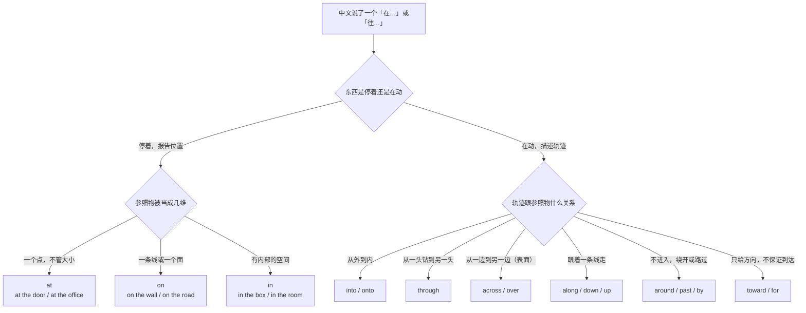
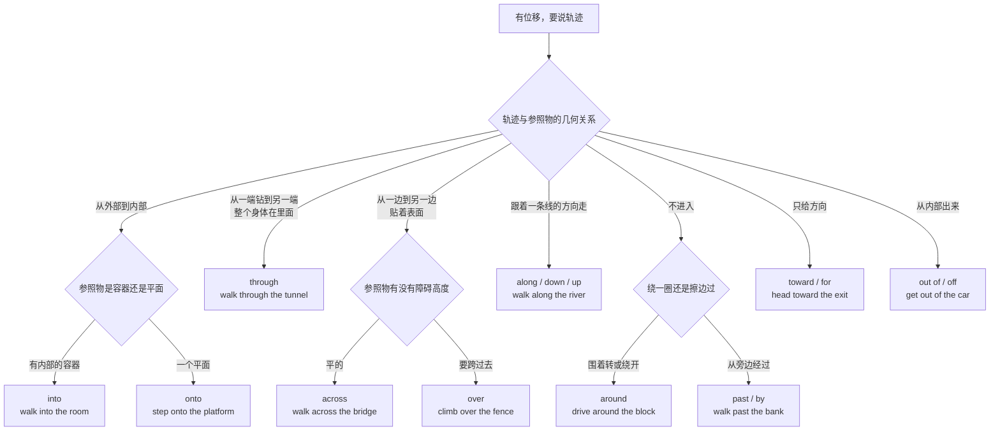
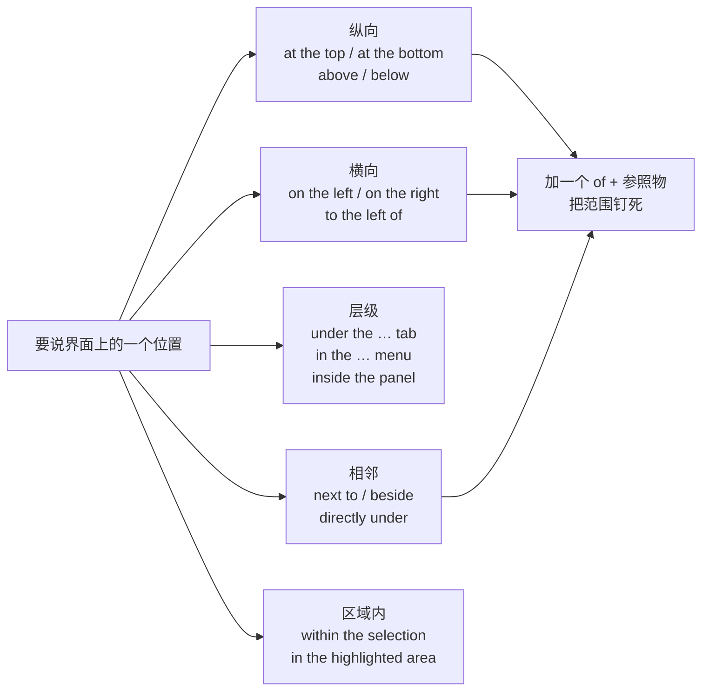
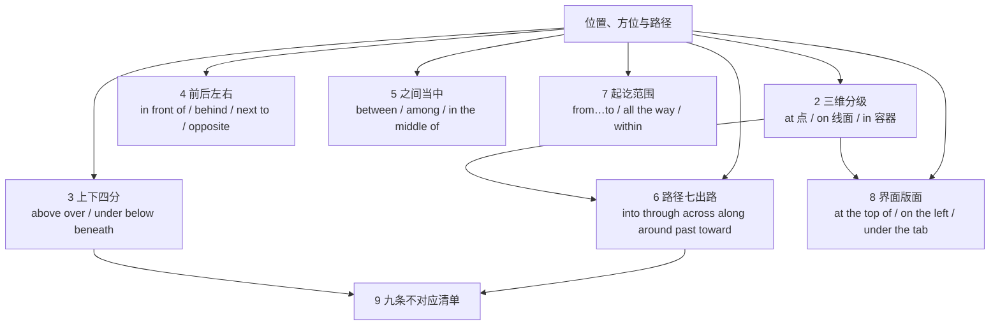

# 在…上、穿过、沿着、朝：位置、方位与路径

> [!info] 本篇定位
>
> 这篇收四类中文意图，共同点是它们都在回答「东西在哪儿」或者「怎么从这儿到那儿」。
>
> 第一类是**静态位置**：在桌上、在抽屉里、在公司、在楼上、在他旁边、在两栋楼中间。中文用一个「在」加一个方位词就解决，英文要先选介词再决定要不要方位名词，错配集中在这一段。
>
> 第二类是**路径**：进去、穿过、横穿、沿着、绕过、经过、朝着、出来。中文的路径词绑在动词上（走进去、跑过去），英文的路径信息绑在介词上（walk in、run across），这个错位是本篇的主线。
>
> 第三类是**界面与文档里的位置**：在页面顶部、在左侧栏、在设置里、在这一行下面、在选中区域内。这一类中文说得极随意，英文有一套近乎固定的写法。
>
> 第四类是**空间起讫与范围**：从 A 到 B、一路到、到…为止、在…范围内。
>
> 前一篇 [[08.指认、定义与描述/04.看起来像、区别在于、严格来说：外观、类比与限定\|看起来像、区别在于、严格来说]] 处理的是「这东西长什么样、跟什么像」，本篇接着回答「这东西在哪儿」。想用一整个从句锁定「就是靠窗那个」，回到 [[08.指认、定义与描述/01.…的那个人、那种东西：一句话锁定是哪一个\|…的那个人、那种东西]]。
>
> 读完能查到：想说一句带「在…上／里／旁边／之间／穿过／沿着／朝」的中文时，直接拿到口语、书面、正式三档成品。

---

## 1. 本篇导读：先定维度，再定接触，最后定动静

中文方位系统和英文方位系统的差别不在词多词少，在**切分标准不一样**。

中文的切分标准是**相对位置**：以参照物为原点，分上、下、里、外、前、后、左、右、旁、中。一个「上」字既能说 `on the table`（贴着桌面），又能说 `over the city`（悬在城市上空），还能说 `in the newspaper`（登在报上），中文全靠语境分辨。

英文的切分标准是**参照物被当成几维**：当成一个点用 at，当成一条线或一个面用 on，当成一个有内部的容器或空间用 in。这三个词不是「在里面／在上面／在某处」的对应，而是三种看待参照物的方式。同一个地方可以三选一，选哪个取决于你把它当什么。



这张图是本篇的总入口，两个大分岔。左边一路管静态位置：只要句子的动词是 be、sit、stand、lie、stay、remain 这类不含位移的词，就走 at／on／in 三选一，接触与否、高低前后这些细节都是在选定这三个之后再补的。右边一路管路径：只要动词含位移（go、walk、run、move、drive、fly、push、pull），就要先想清楚轨迹和参照物的几何关系——是钻进去、穿过去、横过去、沿着走、绕开走，还是只朝那个方向。

第二个要点是 into 与 in 这类**动静配对**。中文「他在房间里」和「他进房间了」用的是两个动词加同一个方位词，英文用的是同一个动词加两个介词：`He is in the room.` 对 `He went into the room.`。中文母语者最常见的失误是把静态介词用在位移动词后面，写出 `He went in the room.` 这种听着像「他在房间里走来走去」的句子。

第三个要点是**中文方位词经常不译**。「桌子上面有本书」译成 `There's a book on the desk.` 就够了，`on the top of the desk` 是错的加法。中文的「上面」「里面」「旁边」在英文里已经被介词吃掉了，再补一个名词就是重复。第 9 节整理了这类不对应的九条清单。

| 你要说的事 | 中文常用词 | 落到哪一节 |
| --- | --- | --- |
| 报告一个静止的位置 | 在…、在…上、在…里 | 第 2 节 |
| 说高低、覆盖、垫在下面 | 上面、上方、下面、底下 | 第 3 节 |
| 说前后左右、挨着、对面 | 前面、后面、旁边、对过 | 第 4 节 |
| 说夹在中间、混在一堆里 | 之间、当中、中间 | 第 5 节 |
| 描述移动的轨迹 | 进、穿过、沿着、绕、朝 | 第 6 节 |
| 说范围与起讫 | 从…到…、一路、以内 | 第 7 节 |
| 说界面和文档里的位置 | 页面顶部、左侧、这一行下面 | 第 8 节 |

---

## 2. 在…上、在…里、在…：at 与 on 与 in 的三维分级

这三个词是全篇的地基。它们不构成语义上的「大中小」，而是三种把参照物几何化的方式：**点、线面、容器**。同一个地方在不同句子里可以被当成不同维度，所以 `at the office`、`on the office network`、`in the office` 三个都成立且意思不同。

### 2.1 就在那个点上（at）

中文触发语：在…、就在…、在…那儿 / 在…处 / 位于

| 档位 | 句架 | 例句 |
| --- | --- | --- |
| 口语 | at + 地点（当成一个点） | I'm at the office, give me ten minutes. |
| 口语 | at the + 具体位置词 | She's waiting at the front desk. |
| 书面 | be located at + 门牌地址 | The datacenter is located at 42 Harbour Road. |
| 书面 | at the + 交界处名词 | Turn right at the second intersection. |
| 正式 | be situated at + 地点 | The facility is situated at the northern edge of the site. |

- I'm at the office, give me ten minutes. — 我在公司，给我十分钟。
- She's waiting at the front desk. — 她在前台等着。
- Turn right at the second intersection. — 在第二个路口右转。
- The facility is situated at the northern edge of the site. — 该设施位于场地北缘。

at 管的是「哪一个点」，不管这个点有多大。公司可以是一个点，机场可以是一个点，整座城市在航线图上也可以是一个点：`The flight stops at Dubai.` 这里 Dubai 是航线上的一个节点，不是一座有内部的城市。

同一个地方换成 in，说的就变成「在它内部」。`I'm at the office.` 报的是「我在单位」这个坐标，`I'm in the office.` 报的是「我人在办公室这个房间里」，两句都成立，选哪句看你要报什么。远程办公的语境里 `in the office` 还常拿来跟居家办公对比，意思是「今天我到公司了，没在家」。

> [!warning] 点状地点不要用 in，arrive 后面不要用 to
>
> ~~I'll wait for you in the bus stop.~~ ❌
>
> **I'll wait for you at the bus stop.** ✅（站牌是路线上的一个点，没有可以进去的内部）
>
> ~~We arrived to the airport at six.~~ ❌
>
> **We arrived at the airport at six.** ✅（arrive 后面永远是 at 或 in，不用 to）

```text
同义入口：在…那儿 / 就在… / 位于 / 人在…
语法归属：[[02.英语基础语法/05.介词与连词/01.介词的分类与基本用法\|地点介词 at 的基本用法]]
场景实战：[[04.英语场景/08.出行与旅游场景实战/04.问路景点游览与购物场景\|问路时报告自己的位置]]
```

---

### 2.2 贴在表面上（on）

中文触发语：在…上 / 在…上面 / 贴在… / 挂在… / 摆在…

| 档位 | 句架 | 例句 |
| --- | --- | --- |
| 口语 | on + 平面名词 | Your keys are on the table. |
| 口语 | on the + 竖直面 | There's a stain on the wall behind the door. |
| 书面 | be mounted on + 承载面 | The sensor is mounted on the outer casing. |
| 书面 | on + 线状物 | The village sits on the old coastal road. |
| 正式 | be affixed to + 表面 | A warning label shall be affixed to the rear panel. |

- Your keys are on the table. — 你钥匙在桌上。
- There's a stain on the wall behind the door. — 门后面墙上有块污渍。
- The village sits on the old coastal road. — 这个村子在老海岸公路边上。
- A warning label shall be affixed to the rear panel. — 后面板上应贴有警示标签。

on 的核心不是「上面」而是**接触并有支撑或附着**。天花板上的灯是 `a lamp on the ceiling`，虽然它在下方；墙上的画是 `a picture on the wall`，虽然它是竖着的。只要贴着一个面，方向不重要。

线状物也归 on：`on the river`、`on the border`、`on Route 66`、`on the second floor`（楼层是一个平面）。

> [!warning] 「桌子上面」不要译成 the top of the table
>
> ~~The book is on the top of the desk.~~ ❌
>
> **The book is on the desk.** ✅（中文的「上面」已经被 on 吃掉了）
>
> on top of 只在需要强调「叠在另一样东西的最上层」时用：**Put the receipt on top of the stack.**（放在这摞的最上面）

```text
同义入口：在…上面 / 摆在 / 放在 / 贴在 / 挂在 / 落在
语法归属：[[02.英语基础语法/05.介词与连词/02.常用介词搭配详解\|on 的搭配用法]]
场景实战：[[04.英语场景/06.日常生活场景实战/02.家庭家务与日常起居场景\|家里东西放在哪]]
```

---

### 2.3 在内部（in）

中文触发语：在…里 / 在…里面 / 在…内 / 在…当中 / 装在…里

| 档位 | 句架 | 例句 |
| --- | --- | --- |
| 口语 | in + 容器 | The charger's in the top drawer. |
| 口语 | in the + 房间或空间 | They're in the meeting room until four. |
| 书面 | be stored in + 位置 | Backups are stored in a separate region. |
| 书面 | in + 城市或国家 | Our support team is based in Singapore. |
| 正式 | be contained within + 范围 | All findings are contained within the appendix. |

- The charger's in the top drawer. — 充电器在最上面那个抽屉里。
- Backups are stored in a separate region. — 备份存在另一个区域。
- Our support team is based in Singapore. — 我们的支持团队在新加坡。
- All findings are contained within the appendix. — 所有发现均收录于附录中。

in 要求参照物有一个可以被包住的内部，哪怕这个内部是虚拟的：`in the photo`、`in the report`、`in the code`、`in the queue` 都成立，因为照片、报告、代码、队列都被当成一个有边界的空间。

> [!warning] 交通工具的 in 与 on 按能否站起来走动分
>
> ~~I'm in the bus, I'll call you back.~~ ❌
>
> **I'm on the bus, I'll call you back.** ✅（公交、火车、飞机、船这类能站起来走动的，用 on）
>
> **I'm in the car / in a taxi.** ✅（小汽车、出租车这类要弯腰钻进去的，用 in）
>
> 自行车摩托车骑在上面：**on a bike**、**on a motorcycle**。

```text
同义入口：在…里 / 在…内部 / 装在 / 关在 / 存在…里
语法归属：[[02.英语基础语法/05.介词与连词/04.介词与连词的易混点\|in 与 at 与 on 的易混点]]
场景实战：[[04.英语场景/08.出行与旅游场景实战/03.公共交通打车与租车场景\|交通工具上的位置说法]]
```

---

### 2.4 中文一个「在」怎么分到三个词上

中文触发语：我在… / 东西在… / 它在…

| 你想强调的 | 选哪个 | 成品句 |
| --- | --- | --- |
| 只报一个坐标，不管内外 | at | Meet me at the café on the corner. |
| 参照物是平面或线，且接触 | on | The note is on the fridge door. |
| 参照物有内部，人或物在其中 | in | He's in the café, sitting by the window. |
| 参照物是机构，说的是身份角色 | at | She's at Google now. |
| 参照物是机构，说的是物理内部 | in | She's in the building but not at her desk. |

- Meet me at the café on the corner. — 在拐角那家咖啡馆碰头（咖啡馆当成一个碰头点）。
- He's in the café, sitting by the window. — 他在咖啡馆里，靠窗坐着（咖啡馆当成一个空间）。
- She's at Google now. — 她现在在谷歌（说的是就职）。

这五行是同一个中文「在」的五种情况。判断口诀：先问「我关心的是位置还是内部」，关心位置就 at，关心内部就 in；再问「有没有贴着一个面」，贴着面就 on。

> [!tip] 三个词可以叠着用来收窄
>
> 从大到小可以串成一条链：`in New York` → `on 5th Avenue` → `at number 210`。国家和城市当空间用 in，街道当线用 on，门牌号当点用 at。三级各配各的介词，越具体的一级越靠近「点」那一端。
>
> 英式英语的街道也常写 in：`in Oxford Street`。美式一律 on。

```text
同义入口：人在哪 / 东西在哪 / 放在哪 / 位于何处
语法归属：[[02.英语基础语法/13.附录/03.介词搭配速查\|按 at 与 in 与 on 分组的搭配速查]]
```

---

### 2.5 地址、楼层、片区的固定式

中文触发语：几楼 / 几号 / 在…区 / 在…路 / 在…附近

| 档位 | 句架 | 例句 |
| --- | --- | --- |
| 口语 | on the + 序数 + floor | We're on the fourth floor, take the left lift. |
| 口语 | around / near + 地标 | It's around the corner from the station. |
| 书面 | in the + 方位形容词 + part of | The plant is in the eastern part of the province. |
| 书面 | on the outskirts of + 城市 | The warehouse is on the outskirts of Rotterdam. |
| 正式 | be registered at + 完整地址 | The company is registered at 18 King Street, London. |

- We're on the fourth floor, take the left lift. — 我们在四楼，坐左边那部电梯。
- It's around the corner from the station. — 就在车站拐角过去。
- The warehouse is on the outskirts of Rotterdam. — 仓库在鹿特丹郊外。

楼层永远是 on，因为楼层被当成一个平面。「在几楼」不说 `in the fourth floor`。美式的一楼是 `the first floor`，英式的一楼是 `the ground floor`，英式的 `the first floor` 是中文的二楼。

> [!warning] 「附近」的三个词不通用
>
> **near the station** ✅ 距离近，可能几百米
>
> **next to the station** ✅ 紧挨着，中间没有别的东西
>
> **by the station** ✅ 就在旁边，比 near 近比 next to 松
>
> ~~It's nearby the station.~~ ❌ nearby 是副词或形容词，不接宾语。要么 **It's nearby.**，要么 **It's near the station.**

```text
同义入口：几楼 / 门牌 / 在…一带 / 在…周边 / 郊区
语法归属：[[02.英语基础语法/02.名词与冠词/03.冠词的用法详解\|楼层与地址前的冠词]]
场景实战：[[04.英语场景/08.出行与旅游场景实战/02.酒店入住预订与投诉场景\|说清房间在哪一层]]
```

---

## 3. 上面下面：接触、悬空、覆盖与高低的四分

中文的「上面」和「下面」各自要分到四个英文词上，分法是**接不接触**加**盖不盖住**加**是不是比数值线高低**。

### 3.1 在…上方，不接触（above / over）

中文触发语：在…上方 / 在…头顶 / 悬在… / 高过…

| 档位 | 句架 | 例句 |
| --- | --- | --- |
| 口语 | over + 参照物 | There's a leak in the ceiling right over my desk. |
| 口语 | above + 参照物 | The switch is above the door frame. |
| 书面 | directly above + 参照物 | The vent sits directly above the server rack. |
| 书面 | overhead（副词，不接宾语） | A drone was circling overhead. |
| 正式 | be suspended above + 参照物 | The lighting rig is suspended above the stage. |

- There's a leak in the ceiling right over my desk. — 天花板漏水，正好在我桌子上方。
- The switch is above the door frame. — 开关在门框上面。
- A drone was circling overhead. — 有架无人机在头顶盘旋。

above 和 over 大多数场合可以换，差别在 over 带一点「笼罩、正上方」的意味，above 只表示位置更高。说刻度线与基准线固定用 above：`above sea level`、`above average`、`above the threshold`、`above zero`。说数量多于某个值则用 over：`over 100 people`、`over five seconds`。

### 3.2 覆盖在…上（over / on top of）

中文触发语：盖在…上 / 蒙在…上 / 罩着 / 铺在…上

| 档位 | 句架 | 例句 |
| --- | --- | --- |
| 口语 | put A over B | Put a towel over the keyboard while you clean. |
| 口语 | on top of + 参照物 | The router's on top of the cabinet. |
| 书面 | be laid over + 参照物 | A protective film is laid over the display. |
| 书面 | be superimposed on + 参照物 | The forecast curve is superimposed on the actual data. |
| 正式 | overlay A with B | The map is overlaid with the flood-risk layer. |

- Put a towel over the keyboard while you clean. — 擦的时候拿条毛巾盖住键盘。
- The forecast curve is superimposed on the actual data. — 预测曲线叠在实际数据上。
- The map is overlaid with the flood-risk layer. — 地图上叠加了洪涝风险图层。

覆盖义的 over 和位置义的 over 靠动词区分：静态系动词后面是位置，put、lay、spread、pull 这类动词后面是覆盖。

### 3.3 在…下面（under / below / beneath / underneath）

中文触发语：在…下面 / 在…底下 / 藏在…下 / 低于…

| 档位 | 句架 | 例句 |
| --- | --- | --- |
| 口语 | under + 参照物 | The cable's under the desk, follow it to the wall. |
| 口语 | underneath + 参照物（强调紧贴） | There's a serial number underneath the base. |
| 书面 | below + 参照物（只说更低） | The parking level is below street level. |
| 书面 | beneath + 参照物（书面语的 under） | Sediment had built up beneath the filter. |
| 正式 | be positioned below + 参照物 | The label shall be positioned below the barcode. |

- The cable's under the desk, follow it to the wall. — 线在桌子底下，顺着摸到墙。
- There's a serial number underneath the base. — 底座下面有个序列号。
- The parking level is below street level. — 停车层在街面以下。

under 是默认词，覆盖大多数「在下面」。below 只表示更低，不表示被盖住，所以「在峰顶以下」是 `below the summit`，「躲在桌子底下」是 `under the table`。underneath 强调紧贴且往往被挡住看不见。beneath 是 under 的书面替身，日常口语用它会显得文绉绉。

### 3.4 高于、低于一条数值线

中文触发语：超过 / 高于 / 不到 / 低于 / 在…以上 / 在…以下

| 档位 | 句架 | 例句 |
| --- | --- | --- |
| 口语 | over / under + 数字 | Anything over five seconds and users bounce. |
| 书面 | above / below + 数值线 | Latency stayed below the 200 ms threshold. |
| 书面 | exceed + 数值 | Memory use must not exceed 2 GB. |
| 正式 | fall below + 数值 | Availability must not fall below 99.5 percent. |
| 正式 | remain above + 数值 | The reserve shall remain above the statutory minimum. |

- Anything over five seconds and users bounce. — 超过五秒用户就跑了。
- Latency stayed below the 200 ms threshold. — 延迟一直在两百毫秒线以下。
- Availability must not fall below 99.5 percent. — 可用性不得低于百分之九十九点五。

> [!warning] 刻度线用 above 与 below，别换成 over 与 under
>
> ~~The temperature dropped to under zero.~~ ❌
>
> **The temperature dropped to below zero.** ✅（零度是一条刻度线，配 below）
>
> ~~Response time is down 100 ms.~~ ❌ 这句会被读成「响应时间下降了 100 毫秒」
>
> **Response time is under 100 ms.** ✅（说低于这个数量，用 under 或 below 都行）

```text
同义入口：上方 / 头顶 / 盖住 / 底下 / 以下 / 超过 / 不到
语法归属：[[02.英语基础语法/05.介词与连词/01.介词的分类与基本用法\|above 与 over 与 below 与 under 的方位用法]]
场景实战：[[04.英语场景/10.职场与商务场景实战/02.会议汇报与演示场景\|汇报数据时说高于低于]]
```

---

## 4. 前后左右与旁边：五个方位的成品

### 4.1 在…前面（in front of / before / ahead of）

中文触发语：在…前面 / 在…前边 / 在…跟前 / 排在…前面

| 档位 | 句架 | 例句 |
| --- | --- | --- |
| 口语 | in front of + 参照物 | I'm parked in front of the main entrance. |
| 口语 | ahead of + 参照物（队列或路线上） | There are two people ahead of us in the queue. |
| 书面 | be positioned in front of + 参照物 | The camera is positioned in front of the whiteboard. |
| 书面 | precede + 参照物（顺序上在前） | A short summary precedes each chapter. |
| 正式 | be placed before + 参照物 | The disclaimer is placed before the main text. |

- I'm parked in front of the main entrance. — 我停在正门口。
- There are two people ahead of us in the queue. — 排队还有两个人在我们前面。
- A short summary precedes each chapter. — 每章前面有一段摘要。

> [!warning] 空间上的「前面」不用 before
>
> ~~He was standing before the door waiting.~~ ❌ 在现代英语里这句读着像文学腔或宗教语境
>
> **He was standing in front of the door.** ✅
>
> before 现在主要管时间与顺序，`before the meeting`、`before chapter two`；管空间只剩在正式文书与固定短语里（before the court、before the committee）。

### 4.2 在…后面（behind / at the back of / after）

中文触发语：在…后面 / 在…背后 / 藏在…后 / 排在…后面

| 档位 | 句架 | 例句 |
| --- | --- | --- |
| 口语 | behind + 参照物 | The bin's behind the door. |
| 口语 | at the back of + 空间 | The spare chairs are at the back of the room. |
| 书面 | be located behind + 参照物 | The service panel is located behind the front cover. |
| 书面 | follow + 参照物（顺序上在后） | The appendices follow the reference list. |
| 正式 | to the rear of + 参照物 | Access is via the door to the rear of the building. |

- The bin's behind the door. — 垃圾桶在门后面。
- The spare chairs are at the back of the room. — 多余的椅子在屋子后头。
- Access is via the door to the rear of the building. — 通道为楼后侧的门。

behind 是「被参照物挡住的那一侧」，at the back of 是「同一个空间内部靠后的位置」。屋里靠后的椅子不能说 `behind the room`，那意思变成「在这个房间的外面、被它挡着」。

### 4.3 在…旁边、挨着（beside / next to / by / alongside）

中文触发语：在…旁边 / 挨着 / 紧挨 / 靠着 / 在…边上

| 档位 | 句架 | 例句 |
| --- | --- | --- |
| 口语 | next to + 参照物 | Sit next to me, there's space. |
| 口语 | by + 参照物 | She's the one by the window. |
| 书面 | beside + 参照物 | A small note was left beside the keyboard. |
| 书面 | alongside + 参照物（并排且同向） | The new API runs alongside the old one. |
| 正式 | adjacent to + 参照物 | The storage unit is adjacent to the loading bay. |

- Sit next to me, there's space. — 坐我旁边，有位置。
- The new API runs alongside the old one. — 新接口跟老接口并行跑着。
- The storage unit is adjacent to the loading bay. — 储物间紧邻装卸区。

> [!warning] besides 不是 beside
>
> ~~He sat besides me.~~ ❌
>
> **He sat beside me.** ✅（beside 是「在旁边」）
>
> **Besides, we're already late.** ✅（besides 是「而且、再说」，属于递进不属于方位）
>
> 一个字母的差别，写邮件时最容易滑手。递进义的完整清单在 [[06.并列、递进、列举与选择/01.而且、不仅而且、更进一步：递进与追加\|而且、不仅而且、更进一步]]。

### 4.4 在…对面（opposite / across from / facing）

中文触发语：在…对面 / 在…对过 / 正对着 / 面朝

| 档位 | 句架 | 例句 |
| --- | --- | --- |
| 口语 | across from + 参照物 | The pharmacy is across from the bank. |
| 口语 | opposite + 参照物（英式常用） | She sat opposite me the whole meeting. |
| 书面 | directly opposite + 参照物 | The exit is directly opposite the reception desk. |
| 书面 | facing + 参照物 | The office block faces the river. |
| 正式 | be situated opposite + 参照物 | The annex is situated opposite the main hall. |

- The pharmacy is across from the bank. — 药店在银行对面。
- She sat opposite me the whole meeting. — 整场会她坐在我对面。
- The office block faces the river. — 那栋写字楼面朝河。

across from 是美式主流，opposite 是英式主流，两个都对。facing 强调朝向而不只是位置，所以「窗户朝南」是 `The window faces south.`，不能用 opposite。

### 4.5 在…左边右边（on the left of / to the left of）

中文触发语：在…左边 / 在…右边 / 左手边 / 往左数第几个

| 档位 | 句架 | 例句 |
| --- | --- | --- |
| 口语 | on the left / on the right | The toilets are on the left, past the lifts. |
| 口语 | on your left-hand side | You'll see it on your left-hand side. |
| 书面 | to the left of + 参照物 | The legend sits to the left of the chart. |
| 书面 | the second one from the left | Pick the second one from the left. |
| 正式 | on the left-hand side of + 参照物 | Signatures appear on the left-hand side of the form. |

- The toilets are on the left, past the lifts. — 洗手间在左边，过了电梯。
- The legend sits to the left of the chart. — 图例在图表左侧。
- Pick the second one from the left. — 选左起第二个。

> [!warning] 「在…的左边」有两个介词，指的不是一回事
>
> **on the left of the screen** — 在屏幕内部靠左的区域
>
> **to the left of the screen** — 在屏幕外面偏左的位置
>
> ~~in the left of the box~~ ❌
>
> **on the left of the box** ✅ 或 **in the left half of the box** ✅

```text
同义入口：前面 / 后面 / 旁边 / 挨着 / 对面 / 左手边 / 右手边
语法归属：[[02.英语基础语法/05.介词与连词/01.介词的分类与基本用法\|方位介词的基本用法]]
场景实战：[[04.英语场景/08.出行与旅游场景实战/04.问路景点游览与购物场景\|问路时描述相对位置]]
```

---

## 5. 之间与当中：between 与 among 与 amid 的分工

### 5.1 在 A 和 B 之间（between）

中文触发语：在…和…之间 / 夹在…中间 / 介于…之间

| 档位 | 句架 | 例句 |
| --- | --- | --- |
| 口语 | between A and B | The café is between the bank and the bookstore. |
| 口语 | in between（不带宾语） | There's a narrow gap in between. |
| 书面 | between + 复数名词 | Leave two spaces between the columns. |
| 书面 | be sandwiched between A and B | The cable tray is sandwiched between two beams. |
| 正式 | be interposed between A and B | A firewall is interposed between the two networks. |

- The café is between the bank and the bookstore. — 咖啡馆在银行和书店中间。
- Leave two spaces between the columns. — 两列之间留两个空格。
- A firewall is interposed between the two networks. — 两个网络之间部署了一道防火墙。

> [!warning] between 后面永远是 and，不是 to，也不是 with
>
> ~~between 3 to 5 seconds~~ ❌
>
> **between 3 and 5 seconds** ✅ 或 **from 3 to 5 seconds** ✅
>
> ~~between him with me~~ ❌
>
> **between him and me** ✅（介词后面用宾格，不用 `between he and I`）

### 5.2 在一堆里面（among / amongst）

中文触发语：在…当中 / 在…里头 / 在…之列 / 在…中间（三者以上）

| 档位 | 句架 | 例句 |
| --- | --- | --- |
| 口语 | among + 复数或集合 | Your badge is somewhere among those papers. |
| 书面 | be among the + 最高级 | It's among the fastest options we tested. |
| 书面 | be distributed among + 群体 | The load is distributed among four nodes. |
| 书面 | among other things | Among other things, the release fixes the memory leak. |
| 正式 | amongst + 群体（英式书面） | Consensus was reached amongst the reviewers. |

- Your badge is somewhere among those papers. — 你的工牌在那堆纸里头。
- The load is distributed among four nodes. — 负载分摊在四个节点上。
- Among other things, the release fixes the memory leak. — 这个版本还修了内存泄漏等问题。

between 和 among 的分界不是「两个」对「三个以上」，而是**是否逐一对应**。三国之间签的协议是 `an agreement between the three countries`，因为每一方都跟另外每一方发生关系；把糖分给一屋子孩子是 `divide the sweets among the children`，因为孩子是一个笼统的群体。

### 5.3 正中间、当中（in the middle of / at the center of）

中文触发语：在…正中间 / 在…中央 / 在…中心 / 位于…核心

| 档位 | 句架 | 例句 |
| --- | --- | --- |
| 口语 | in the middle of + 参照物 | There's a stain right in the middle of the rug. |
| 口语 | slap bang in the middle（英式口语，强调正中） | The banner sits slap bang in the middle of the page. |
| 书面 | at the center of + 参照物 | The plaza is at the center of the campus. |
| 书面 | be centered on + 参照物 | The dialog is centered on the viewport. |
| 正式 | at the heart of + 抽象事物 | Latency is at the heart of the problem. |

- There's a stain right in the middle of the rug. — 地毯正中间有块污渍。
- The dialog is centered on the viewport. — 弹窗在视口中居中。
- Latency is at the heart of the problem. — 延迟是这个问题的核心。

in the middle of 说的是一个平面或空间的中间区域，at the center of 说的是几何中心那个点，at the heart of 只用于抽象事物。

> [!warning] amid 与 amidst 用来说背景，不用来说东西放在哪
>
> ~~The keys were amid the papers.~~ ❌ 语法通，但读着是文学腔，日常场合不这么说
>
> **The keys were among the papers.** ✅
>
> amid 的常规位置是抽象环境或大规模事件：**The launch went ahead amid growing concerns.**（在担忧加剧的背景下）

```text
同义入口：之间 / 当中 / 夹在中间 / 正中 / 中央 / 核心
语法归属：[[02.英语基础语法/05.介词与连词/04.介词与连词的易混点\|between 与 among 的区分]]
场景实战：[[04.英语场景/09.学习与教育场景实战/02.图书馆作业与研究场景\|描述资料在哪一批里]]
```

---

## 6. 路径七分：进、穿、横、沿、绕、朝、出

静态位置解决完，剩下的是移动。中文的路径信息大部分绑在动词上——走进、穿过、横过、沿着走、绕开走、经过——英文的动词只负责移动方式（walk、run、drive、swim、crawl），路径全交给介词。



这张图把路径拆成七条互斥的出路，判断顺序是从「终点在哪」到「过程什么形状」。

第一条分岔看**运动结束时人在哪儿**：如果结束时在参照物内部，用 into 或 onto，两者的差别复制了 in 与 on 的差别——有内部用 into，是平面用 onto。第二条看**是不是从一头钻到另一头且被包住**，隧道、树林、人群、门洞都是 through，因为过程中你被参照物包围着。第三条看**是不是从一边到另一边且不被包住**，桥、马路、广场、房间都是 across，因为你始终在表面上；如果参照物是需要跨越的障碍，换成 over。

第四条看**是不是跟着一条线的走向**，河、路、走廊、海岸线都是 along。第五条是不进入的两种：绕圈或绕开用 around，擦边路过用 past。第六条 toward 只承诺方向不承诺到达，这是它跟 to 的根本差别。第七条是 into 的反向。

### 6.1 进去、放进去（into / onto / in / on）

中文触发语：进 / 进去 / 走进 / 放进 / 装进 / 掉进 / 踏上

| 档位 | 句架 | 例句 |
| --- | --- | --- |
| 口语 | go / walk into + 空间 | He walked into the room without knocking. |
| 口语 | put A into B | Put the receipts into the envelope. |
| 口语 | step onto + 平面 | Mind the gap when you step onto the platform. |
| 书面 | be loaded into + 系统 | The records are loaded into the staging table. |
| 正式 | be inserted into + 位置 | The card shall be inserted into the reader face up. |

- He walked into the room without knocking. — 他没敲门就走进来了。
- Mind the gap when you step onto the platform. — 上站台时注意站台间隙。
- The records are loaded into the staging table. — 记录被载入暂存表。

> [!warning] 位移动词后面不能用静态介词
>
> ~~He went in the room.~~ ❌ in 报的是静止位置，接在 go 后面表达不出「从门外到门内」这个过程
>
> **He went into the room.** ✅
>
> ~~The records are imported in the staging table.~~ ❌
>
> **The records are imported into the staging table.** ✅（import、load、insert、move 这类带方向的动词固定配 into）
>
> 例外是几个高频短语固定用 in：**come in**、**get in**、**jump in the car**——这些已经凝固成短语动词，不必纠正。put 也两可，`put it in the drawer` 与 `put it into the drawer` 都对。

### 6.2 穿过内部（through）

中文触发语：穿过 / 穿越 / 从…中间过去 / 钻过 / 翻遍

| 档位 | 句架 | 例句 |
| --- | --- | --- |
| 口语 | go through + 参照物 | We went through the tunnel and it opened up. |
| 口语 | push through + 人群 | She pushed through the crowd to reach the gate. |
| 书面 | pass through + 中间环节 | Every request passes through the gateway. |
| 书面 | run through + 内容（浏览） | Let me run through the agenda quickly. |
| 正式 | traverse + 区域 | The pipeline traverses three protected zones. |

- We went through the tunnel and it opened up. — 穿过隧道就豁然开朗了。
- Every request passes through the gateway. — 每个请求都要经过网关。
- The pipeline traverses three protected zones. — 管线穿越三个保护区。

through 的用法从具体空间延伸到抽象过程，这是它跟 across 最大的区别：`go through a hard time`、`go through the checklist`、`get through the data` 都成立，因为过程被当成一个有内部的空间。

### 6.3 横穿表面（across / over）

中文触发语：横穿 / 从这边到那边 / 过马路 / 越过 / 翻过

| 档位 | 句架 | 例句 |
| --- | --- | --- |
| 口语 | walk across + 平面 | Don't walk across the tracks, use the bridge. |
| 口语 | climb over + 障碍 | The cat climbed over the fence again. |
| 书面 | be spread across + 区域 | The team is spread across four time zones. |
| 书面 | cut across + 区域（斜穿） | The new road cuts across the old farmland. |
| 正式 | extend across + 范围 | Coverage extends across the entire province. |

- Don't walk across the tracks, use the bridge. — 别横穿铁轨，走天桥。
- The team is spread across four time zones. — 团队分布在四个时区。
- The new road cuts across the old farmland. — 新路斜穿过老农田。

across 与 through 的分界只有一条：**过程中你有没有被包围**。穿过树林是 through（树在你四周），穿过草地是 across（草在你脚下）。

> [!warning] 中文的「过」不区分，英文必须区分
>
> ~~We walked across the forest.~~ ❌
>
> **We walked through the forest.** ✅（树林有内部，人被包在里面）
>
> ~~She swam through the river.~~ ❌
>
> **She swam across the river.** ✅（across 说的是从这一岸到那一岸这条路径；through 会把重点挪到「在水体内部穿行」，那是潜水不是横渡）

### 6.4 沿着走（along / down / up）

中文触发语：沿着 / 顺着 / 顺… / 一直往…走

| 档位 | 句架 | 例句 |
| --- | --- | --- |
| 口语 | go along + 线状物 | Go along this corridor and it's the last door. |
| 口语 | walk down / up + 街道 | Walk down the street until you hit the roundabout. |
| 书面 | run along + 参照物 | A service road runs along the northern boundary. |
| 书面 | follow + 路线 | Follow the coastline for about two kilometres. |
| 正式 | proceed along + 路线 | Vehicles shall proceed along the marked route. |

- Go along this corridor and it's the last door. — 顺着这条走廊走，最后一扇门就是。
- A service road runs along the northern boundary. — 一条辅路沿北界延伸。
- Follow the coastline for about two kilometres. — 沿海岸线走约两公里。

英语口语里 down 和 up 加街道名不表示上下坡，只是「顺着那条街」的口头说法，方向无关：`walk down the street` 和 `walk up the street` 常常互换。

### 6.5 绕过与经过（around / past / by）

中文触发语：绕过 / 绕着 / 转一圈 / 经过 / 路过 / 从…旁边过

| 档位 | 句架 | 例句 |
| --- | --- | --- |
| 口语 | go around + 障碍 | Just go around the roadworks, it's quicker. |
| 口语 | walk past + 参照物 | You'll walk past a pharmacy on the way. |
| 书面 | route A around B | Traffic is routed around the closed junction. |
| 书面 | bypass + 环节 | The cache lets you bypass the database entirely. |
| 正式 | circumvent + 障碍 | The design circumvents the licensing restriction. |

- Just go around the roadworks, it's quicker. — 绕开施工路段走，快一点。
- You'll walk past a pharmacy on the way. — 路上会经过一家药店。
- The cache lets you bypass the database entirely. — 有了缓存可以完全绕开数据库。

> [!warning] pass 与 past 一个是动词一个是介词
>
> ~~We walked pass the museum.~~ ❌
>
> **We walked past the museum.** ✅ 或 **We passed the museum.** ✅
>
> past 是介词，前面要有动词；pass 是动词，后面直接接宾语，不再要介词。

### 6.6 朝着、往…方向（toward / for / in the direction of）

中文触发语：朝 / 朝着 / 往 / 向 / 冲…去 / 奔…去

| 档位 | 句架 | 例句 |
| --- | --- | --- |
| 口语 | head toward + 目标 | Head toward the exit and I'll meet you there. |
| 口语 | head for + 目标 | Everyone headed for the door at once. |
| 书面 | move in the direction of + 目标 | The front is moving in the direction of the coast. |
| 书面 | be angled toward + 方向 | The solar panels are angled toward the south. |
| 正式 | be oriented toward + 方向 | The building is oriented toward the prevailing wind. |

- Head toward the exit and I'll meet you there. — 朝出口走，我在那儿等你。
- The front is moving in the direction of the coast. — 锋面正朝海岸移动。
- The solar panels are angled toward the south. — 太阳能板朝南倾斜。

> [!warning] toward 与 to 承诺的东西不一样
>
> **We walked to the station.** ✅ 到了车站
>
> **We walked toward the station.** ✅ 朝车站走，没说到没到
>
> ~~We arrived toward the station.~~ ❌ arrive 是完成到达，不能配只给方向的 toward
>
> toward 与 towards 拼法都对，美式偏 toward，英式偏 towards。

### 6.7 出来、离开（out of / off / away from）

中文触发语：从…出来 / 从…下来 / 离开… / 从…拿出来

| 档位 | 句架 | 例句 |
| --- | --- | --- |
| 口语 | get out of + 容器 | Get out of the car, I'll park it. |
| 口语 | get off + 平面或交通工具 | Get off at the third stop, not the second. |
| 书面 | be removed from + 位置 | The drive must be removed from the enclosure first. |
| 书面 | move away from + 参照物 | Move the heater away from the wall. |
| 正式 | be withdrawn from + 范围 | The product was withdrawn from the European market. |

- Get out of the car, I'll park it. — 你下车，我来停。
- Get off at the third stop, not the second. — 第三站下，不是第二站。
- The drive must be removed from the enclosure first. — 必须先把硬盘从机箱里取出来。

out of 是 into 的反向，off 是 onto 的反向。这一对配对关系跟 in／on 完全一致：能站起来走动的交通工具用 on，所以下车说 `get off the bus`；要钻进去的用 in，所以下车说 `get out of the car`。

```text
同义入口：进 / 穿过 / 横穿 / 沿着 / 绕 / 路过 / 朝 / 出来
语法归属：[[02.英语基础语法/05.介词与连词/01.介词的分类与基本用法\|方向介词的分类]]
场景实战：[[04.英语场景/08.出行与旅游场景实战/04.问路景点游览与购物场景\|指路时的路径说法]]
```

---

## 7. 起讫与范围：从…到…、一路、以内

### 7.1 从 A 到 B（from … to …）

中文触发语：从…到… / 由…至… / 打…到…

| 档位 | 句架 | 例句 |
| --- | --- | --- |
| 口语 | from A to B | It's a forty-minute ride from the airport to downtown. |
| 口语 | A to B（口语省略 from） | The Beijing to Shanghai leg takes five hours. |
| 书面 | run from A to B | The cable runs from the rack to the patch panel. |
| 书面 | between A and B（说距离区间） | The distance between the two sites is 12 km. |
| 正式 | extend from A to B | The zone extends from the river to the ridge line. |

- It's a forty-minute ride from the airport to downtown. — 从机场到市区要坐四十分钟。
- The cable runs from the rack to the patch panel. — 线从机柜拉到配线架。
- The zone extends from the river to the ridge line. — 该区域自河岸延伸至山脊线。

> [!warning] from 一旦出现，配对的必须是 to 不是 until
>
> ~~from the lobby until the lift~~ ❌
>
> **from the lobby to the lift** ✅（空间起讫用 to）
>
> until 只管时间不管空间。时间起讫的成品在 [[07.时间与顺序/03.花了多久、每隔一次、快要了、到…为止：时长、频率与期限\|花了多久、每隔一次、快要了、到…为止]]。

### 7.2 一路、一直到（all the way / as far as）

中文触发语：一路 / 一直走到 / 一直到 / 远到 / 直通

| 档位 | 句架 | 例句 |
| --- | --- | --- |
| 口语 | all the way to + 地点 | We drove all the way to the coast in one go. |
| 口语 | all the way down / up | Scroll all the way down and you'll see the button. |
| 书面 | as far as + 地点 | The path is paved as far as the second gate. |
| 书面 | right up to + 地点 | The queue stretched right up to the corner. |
| 正式 | up to and including + 位置 | Sections one up to and including four are mandatory. |

- We drove all the way to the coast in one go. — 我们一口气开到海边。
- Scroll all the way down and you'll see the button. — 一直往下滚就能看到那个按钮。
- The path is paved as far as the second gate. — 路一直铺到第二道门。

all the way 强调「全程没有中断」，as far as 强调「到这里为止，再往前就没有了」。两者在中文里都是「一直到」，方向不同。

### 7.3 在…范围内、在…外（within / inside / outside / beyond）

中文触发语：在…以内 / 在…范围内 / 在…之外 / 超出…

| 档位 | 句架 | 例句 |
| --- | --- | --- |
| 口语 | inside / outside + 边界 | Wait outside the gate, I'll come get you. |
| 书面 | within + 范围 | The station is within walking distance. |
| 书面 | within a + 距离 + radius | All sensors within a 5 km radius reported the spike. |
| 书面 | beyond + 边界 | Anything beyond the fence is private land. |
| 正式 | fall within the boundaries of + 范围 | The plot falls within the boundaries of the reserve. |

- The station is within walking distance. — 车站走得到。
- All sensors within a 5 km radius reported the spike. — 五公里半径内的传感器都报了这次尖峰。
- Anything beyond the fence is private land. — 围栏以外都是私人地。

within 比 inside 抽象一档，说边界内的范围而不是物理内部：`within the area`、`within the scope`、`within budget`、`within the deadline`。范围界定的成套说法在 [[08.指认、定义与描述/03.由…组成、分为、包括、属于：构成、分类与范围界定\|由…组成、分为、包括、属于]]。

### 7.4 距离有多远

中文触发语：离…多远 / 有…远 / 走几分钟 / 就在附近

| 档位 | 句架 | 例句 |
| --- | --- | --- |
| 口语 | How far is A from B | How far is the hotel from the venue? |
| 口语 | It's about + 时长 + on foot | It's about ten minutes on foot. |
| 书面 | A is + 距离 + from B | The plant is 30 km from the nearest town. |
| 书面 | be a short walk from + 地点 | The office is a short walk from the metro. |
| 正式 | be situated + 距离 + to the north of | The site is situated 8 km to the north of the city. |

- How far is the hotel from the venue? — 酒店离会场多远？
- The plant is 30 km from the nearest town. — 工厂离最近的镇子三十公里。
- The site is situated 8 km to the north of the city. — 该场地位于市区以北八公里处。

数字与单位的读写固定式在 [[09.比较、程度与数量/04.大约、超过、占三成、平均、分别是：数量与统计描述\|大约、超过、占三成、平均、分别是]]。

```text
同义入口：从…到 / 一路 / 一直到 / 以内 / 以外 / 离…多远
语法归属：[[02.英语基础语法/05.介词与连词/01.介词的分类与基本用法\|to 与 from 的方向用法与 within 这类复合介词]]
场景实战：[[04.英语场景/08.出行与旅游场景实战/01.机场航班海关入境场景\|说清航段与距离]]
```

---

## 8. 界面与文档里的位置：屏幕上的一套固定说法

这一节跟前面几节的区别是：前面在描述物理空间，这一节在描述**二维版面**。中文说界面位置极随意——「在上面」「在那个里面」「点开左边」——英文有一套近乎固定的搭配，写文档、写 issue、远程指路时全靠它。



这张图的读法是先选轴。纵向说上下用 at the top of 与 at the bottom of，两个元素之间的上下关系用 above 与 below。横向说左右一律 on the left of 与 on the right of，注意界面内部用 on 不用 in。层级说的是「在哪一层菜单或哪一个标签页里面」，这是界面特有的维度，物理空间里没有对应，用 under 与 in。相邻说的是两个控件贴着，用 next to 或 directly under。区域内说的是选中范围、高亮区域、可视区，用 within 或 in。

最右边那个 W 节点是本节的通用补丁：只要你说的是相对位置，后面几乎总要跟一个 `of + 参照物` 把范围钉死，否则对方不知道你说的是整个屏幕还是某个面板。

### 8.1 页面上下（at the top of / at the bottom of）

中文触发语：在最上面 / 在页面顶部 / 在最下面 / 在页脚

| 档位 | 句架 | 例句 |
| --- | --- | --- |
| 口语 | at the top of + 参照物 | The search box is at the top of the sidebar. |
| 口语 | at the bottom of + 参照物 | Scroll down, it's at the bottom of the page. |
| 书面 | at the very top / bottom（强调最边） | The banner sits at the very top of the viewport. |
| 书面 | in the top-right corner | The close button is in the top-right corner. |
| 正式 | be displayed at the head of + 参照物 | The account balance is displayed at the head of the statement. |

- The search box is at the top of the sidebar. — 搜索框在侧边栏顶部。
- The close button is in the top-right corner. — 关闭按钮在右上角。
- The banner sits at the very top of the viewport. — 横幅在视口最顶端。

角落一律用 in：`in the top-left corner`、`in the bottom-right corner`。这是因为角被当成一个有内部的小区域，不是一个面。

### 8.2 左右两侧（on the left-hand side）

中文触发语：在左边 / 在左侧栏 / 在右边那一列 / 左手边

| 档位 | 句架 | 例句 |
| --- | --- | --- |
| 口语 | on the left / on the right | The filters are on the left. |
| 口语 | on the left-hand side of + 参照物 | It's on the left-hand side of the toolbar. |
| 书面 | in the left pane / right pane | Select the file in the left pane. |
| 书面 | to the right of + 参照物 | The badge appears to the right of the username. |
| 正式 | in the left-hand column of + 参照物 | Amounts are listed in the left-hand column of the table. |

- The filters are on the left. — 筛选器在左边。
- Select the file in the left pane. — 在左侧面板里选中文件。
- The badge appears to the right of the username. — 徽标显示在用户名右边。

pane、panel、column 这类被当成一个有内部的区块，用 in；side 是一个面，用 on。

### 8.3 在哪一层里（under the tab / in the menu）

中文触发语：在…标签页里 / 在…菜单下 / 在…设置里 / 点进…找

| 档位 | 句架 | 例句 |
| --- | --- | --- |
| 口语 | under the + 名称 + tab | It's under the Advanced tab. |
| 口语 | in the + 名称 + menu | You'll find it in the View menu. |
| 书面 | under Settings and then + 子项 | Go to Settings, then under Privacy, turn it off. |
| 书面 | inside the + 容器 | The token lives inside the config file. |
| 正式 | be accessible from the + 位置 | The audit log is accessible from the Administration panel. |

- It's under the Advanced tab. — 在「高级」标签页里。
- You'll find it in the View menu. — 在「视图」菜单里能找到。
- The audit log is accessible from the Administration panel. — 审计日志可从管理面板进入。

界面层级用 under 是英文的固定说法，它借用的是「在这个标题下面列着」这个视觉隐喻，跟物理的「在下面」无关。菜单用 in，因为菜单被当成一个装着若干项的容器。

### 8.4 行、列与单元格

中文触发语：第几行 / 第几列 / 在这一行 / 在那个格子里

| 档位 | 句架 | 例句 |
| --- | --- | --- |
| 口语 | in row / column + 编号 | The error is in row 42. |
| 口语 | on line + 编号（代码） | The typo is on line 87. |
| 书面 | in the + 名称 + column | The status is shown in the rightmost column. |
| 书面 | at the intersection of A and B | The value sits at the intersection of row 3 and column D. |
| 正式 | be recorded in the corresponding field | The reference number is recorded in the corresponding field. |

- The error is in row 42. — 错误在第 42 行。
- The typo is on line 87. — 错字在第 87 行。
- The status is shown in the rightmost column. — 状态显示在最右一列。

表格的行习惯上说 in row，代码的行习惯上说 on line，写文档时按这个搭配走最稳。背后的看法是：代码的一行被当成一条线（on），表格的一行被当成一个装着若干单元格的容器（in）。

### 8.5 紧挨着、正下方（next to / directly below）

中文触发语：就在…旁边 / 紧挨着 / 正下方 / 紧跟在…后面

| 档位 | 句架 | 例句 |
| --- | --- | --- |
| 口语 | next to + 控件 | The toggle is next to the search box. |
| 口语 | right below + 控件 | The help text appears right below the field. |
| 书面 | directly beneath + 控件 | An error message renders directly beneath the input. |
| 书面 | immediately after + 元素 | The footnote marker goes immediately after the punctuation. |
| 正式 | adjacent to + 元素 | The tooltip is anchored adjacent to the trigger element. |

- The toggle is next to the search box. — 开关就在搜索框旁边。
- The help text appears right below the field. — 提示文字显示在输入框正下方。
- The tooltip is anchored adjacent to the trigger element. — 提示框锚定在触发元素旁。

> [!warning] 界面位置里的三个高频错配
>
> ~~in the top of the page~~ ❌
>
> **at the top of the page** ✅（顶部是一个位置点，用 at）
>
> ~~on the Settings menu~~ ❌
>
> **in the Settings menu** ✅（菜单是容器，用 in）
>
> ~~It's in the Advanced tab.~~ 能听懂但不地道
>
> **It's under the Advanced tab.** ✅（标签页层级的惯用说法是 under）

```text
同义入口：顶部 / 底部 / 左侧 / 右侧 / 标签页里 / 菜单下 / 正下方
语法归属：[[02.英语基础语法/13.附录/03.介词搭配速查\|at 与 in 与 on 的名词搭配速查]]
场景实战：[[04.英语场景/10.职场与商务场景实战/02.会议汇报与演示场景\|演示时指屏幕位置]]
```

---

## 9. 中英不对应清单：九条最容易直译出错的地方

前面八节按意图分区给的是「该怎么说」，这一节反过来收「按中文直译会错成什么样」。这九条是中文母语者在方位表达上出错最集中的位置。

| 中文说法 | 直译会写成 | 正确说法 | 出错原因 |
| --- | --- | --- | --- |
| 桌子上面 | on the top of the desk | on the desk | 中文的方位词已被介词吃掉 |
| 在报纸上看到 | see it on the newspaper | see it in the newspaper | 报纸被当成有内容的容器 |
| 在公交车上 | in the bus | on the bus | 能站起来走动的交通工具用 on |
| 在照片里 | in the inside of the photo | in the photo | 照片本身就是那个空间 |
| 走进房间 | go in the room | go into the room | 位移动词要配 into |
| 穿过树林 | walk across the forest | walk through the forest | 被包围时用 through |
| 三到五之间 | between 3 to 5 | between 3 and 5 | between 的配对词永远是 and |
| 他坐在我旁边 | he sat besides me | he sat beside me | besides 是「而且」不是「旁边」 |
| 我们路过银行 | we walked pass the bank | we walked past the bank | past 是介词，pass 是动词 |

> [!warning] 中文方位词经常整块不译
>
> ~~The keys are in the inside of the drawer.~~ ❌
>
> **The keys are in the drawer.** ✅
>
> ~~She waited at the outside of the building.~~ ❌
>
> **She waited outside the building.** ✅（outside 本身就是介词，前面不要再套 at the … of）
>
> 判断法：把方位名词删掉念一遍，如果句子还完整且意思没变，那个名词就是多余的。只有在需要跟别的部位对比时才留：**not the back of the queue, the front** 这种场合。

> [!warning] 「上」不总是 on，「里」不总是 in
>
> 中文的「上」有三个高频例外全部用 in：**in the newspaper**（报上）、**in the photo**（照片上）、**in the book**（书上）。这三样东西在英文里都被当成装着内容的容器。名单上仍然是 on：**on the list**。
>
> 中文的「里」也有例外用 on：**on the menu**（菜单里有这道菜）、**on the agenda**（议程里有这一项）、**on the team**（在这个队里）。这三个被当成一张列出来的清单面。

### 9.1 一句话自查三问

写完任何一个带方位的句子，用这三问过一遍：

| 问题 | 命中就要改 |
| --- | --- |
| 句子的动词含不含位移 | 含位移却用了 in、on、at，改成 into、onto、to |
| 参照物是不是被当成了错的维度 | 有内部却用 on，是平面却用 in |
| 有没有多译一个方位名词 | 出现 the top of、the inside of、the front of 时先试着删掉 |

```text
同义入口：直译陷阱 / 方位词不对应 / 中式英语方位
语法归属：[[02.英语基础语法/05.介词与连词/04.介词与连词的易混点\|介词易混点集中辨析]]
场景实战：[[04.英语场景/06.日常生活场景实战/03.购物超市与讨价还价场景\|说清货架上在哪]]
```

---

## 10. 组合走查：把一段中文位置描述整段译完

单条意图会查了，还差把它们串起来。位置描述在真实场合几乎总是成串出现——指路、报修、写文档步骤，一句话里往往含两到三个方位关系。

> [!example] 走查一：指路
>
> 中文：**「出了地铁往左走，沿着这条街一直到第二个路口，药店就在银行对面，二楼。」**
>
> 拆成四段，每段查一节：出地铁走 6.7，往左走 4.5，沿着街走 6.4，一直到路口走 7.2，在对面走 4.4，二楼走 2.5。
>
> **口语档**
>
> - Come out of the metro and turn left. Go down this street all the way to the second intersection. The pharmacy is across from the bank, on the second floor.
>   - 出地铁左转，顺这条街一直走到第二个路口，药店在银行对面，二楼。
>
> **书面档**
>
> - Exit the metro station and head left along the main street as far as the second junction. The pharmacy is located opposite the bank, on the floor above street level.
>   - 出地铁站后向左沿主街走到第二个路口，药店位于银行对面，临街那层的上面一层。
>
> **正式档**
>
> - From the metro exit, proceed along the main street to the second intersection. The pharmacy is situated directly opposite the bank, on the level immediately above the ground floor.
>   - 自地铁出口沿主街行至第二个路口，药店位于银行正对面、地面层上方一层。
>
> 三档的差别不只是词。口语档用 come out、go down、all the way 这些短语动词，书面档换成 exit、head、as far as，正式档换成 proceed、be situated。楼层的说法三档都要防英美差异：美式的 the second floor 是中文的二楼，英式的 the second floor 是三楼，所以正式文书里直接写 `on the level immediately above the ground floor` 才不会被读错。

> [!example] 走查二：报修
>
> 中文：**「机柜后面那根网线松了，接口在最下面那一排，从左数第三个。」**
>
> 拆成三段：机柜后面走 4.2，最下面那一排走 8.1，从左数第三个走 4.5。
>
> **口语档**
>
> - The network cable behind the rack is loose. The port's in the bottom row, third from the left.
>   - 机柜后面那根网线松了，口在最下面那排，左起第三个。
>
> **书面档**
>
> - A network cable at the rear of the rack has come loose. The affected port is in the bottom row, third from the left.
>   - 机柜后侧一根网线脱落，受影响端口在底排左起第三个。
>
> **正式档**
>
> - A network cable located to the rear of the rack has worked loose. The affected port is situated in the lowest row, in the third position from the left.
>   - 机柜后侧一根网线已松脱，受影响端口位于最下一排左起第三位。
>
> 「从左数第三个」这个中文结构在英文里是 `third from the left`，不是 `the third one from left`，也不是 `the left third one`。数序在前，方向在后，中间用 from。

> [!example] 走查三：写文档步骤
>
> 中文：**「打开设置，在隐私那一栏里往下拉到最底，把「共享位置」这个开关关掉，它就在「后台刷新」下面。」**
>
> 拆成四段：在哪一栏走 8.3，往下拉到最底走 7.2 加 8.1，在…下面走 8.5。
>
> **口语档**
>
> - Open Settings, go into Privacy, scroll all the way down, and turn off Share Location. It's right under Background Refresh.
>   - 打开设置，进隐私，一直拉到底，把共享位置关掉，就在后台刷新下面。
>
> **书面档**
>
> - In Settings, under Privacy, scroll to the bottom of the list and turn off Share Location, which appears directly below Background Refresh.
>   - 在设置的隐私一栏中，下拉至列表底部，关闭「共享位置」，该项位于「后台刷新」正下方。
>
> **正式档**
>
> - Within the Settings application, under the Privacy section, navigate to the foot of the list and disable Share Location, which is displayed immediately beneath Background Refresh.
>   - 在设置应用的隐私区域内，定位至列表末端并停用「共享位置」，该项显示于「后台刷新」正下方。
>
> 这一组里 under 出现了两次，含义不同：`under Privacy` 是界面层级，`under Background Refresh` 是版面上的上下位置。英文用同一个词承担两件事，但搭配的名词不同——层级 under 后面跟的是标签页或分区名，位置 under 后面跟的是一个具体控件。

---

## 11. 本篇小结



这张图是本篇的检索地图，箭头方向就是依赖关系。第 2 节的三维分级是全篇地基：第 6 节的路径介词是它的动态版本（in 对 into，on 对 onto，out of 对 off），第 8 节的界面说法是它在二维版面上的投影（at the top of 的 at 还是那个点，in the menu 的 in 还是那个容器）。第 9 节的九条不对应清单集中在第 2、3、6 三节的边界上，因为出错最多的正是「同一个中文词该走哪条岔路」。

> [!success] 本篇核心要点回顾
>
> 1. **at、on、in 不是「在某处、在上面、在里面」的对应**，而是把参照物当成点、线面、容器三种看法。同一个地方可以三选一，选哪个取决于你关心什么。
> 2. **位移动词后面必须配位移介词**：go into 不是 go in，step onto 不是 step on，import into 不是 import in。这是中文母语者最集中的一处失误。
> 3. **through 与 across 的分界是过程中被不被包围**：树林、隧道、人群用 through，桥、马路、广场用 across。
> 4. **中文的方位名词经常整块不译**：on the desk 不写成 on the top of the desk，in the drawer 不写成 in the inside of the drawer。判断法是删掉念一遍看意思变不变。
> 5. **between 的配对词永远是 and**，不是 to 也不是 with；between 与 among 的分界是逐一对应还是笼统群体，不是两个还是三个。
> 6. **toward 只承诺方向不承诺到达**，to 承诺到达。arrive 后面永远接 at 或 in，不接 to 也不接 toward。
> 7. **界面层级用 under，菜单用 in，顶部底部用 at，左右两侧用 on**。这四条固定搭配写文档时反复要用。
> 8. **交通工具的 in 与 on 按能否站起来走动分**：公交火车飞机船用 on，小汽车出租车用 in；下车相应是 get off 与 get out of。

> [!success] 本篇练习清单
>
> - [ ] 给一句中文「他在办公室，坐在靠窗那个位置」，写出口语、书面、正式三档，检查 at 与 in 有没有选错。
> - [ ] 给一句中文「充电器在最上面那个抽屉里，右手边」，写出三档，注意「里」与「右手边」用的是两个不同介词。
> - [ ] 给一句中文「别横穿马路，从天桥上过去」，写出三档，确认 across 与 over 分别落在哪个词上。
> - [ ] 给一句中文「顺着这条走廊一直走到头，最后一间就是」，写出三档，用 along、down、as far as 各写一遍比较语感。
> - [ ] 给一句中文「服务器机柜在两根柱子中间，离配电箱大概三米」，写出三档，检查 between 后面的配对词与距离说法。
> - [ ] 给一句中文「这个开关在高级设置里面，滚到最下面，就在自动更新下面」，写出三档，区分层级的 under 与位置的 under。
> - [ ] 把第 9 节的九条不对应逐条造一个自己工作里的真句子，写完用 9.1 的三问自查一遍。
> - [ ] 给一句中文「从机场到市区差不多四十分钟，一路都是高架」，写出三档，检查 from…to 与 all the way 的配合。

### 11.1 下一篇预告

> [!info] 接下来
>
> 到这里，「就是那个…」的一整套查完了：一句话锁定是哪一个、定义与命名、构成与分类、外观与类比、位置与路径，五篇合起来回答的是「你说的是哪个东西、它是什么、长什么样、在哪儿」。
>
> 下一域换一个问题：**两样东西摆在一起，谁多谁少、差多少**。
>
> [[09.比较、程度与数量/01.A 比 B 更、不如、一样：比较三式与差额\|A 比 B 更、不如、一样：比较三式与差额]]
>
> 下一篇给比较级、not as…as、as…as 三式的完整句架与比较对象对等的判读，差额量的两种放法（前置比较级与 by 加差额），差不多一样的 roughly as…as、on a par with，差得远的 nowhere near、a far cry from、no match for，以及 prefer A to B 与 would rather…than 的槽位限制。
