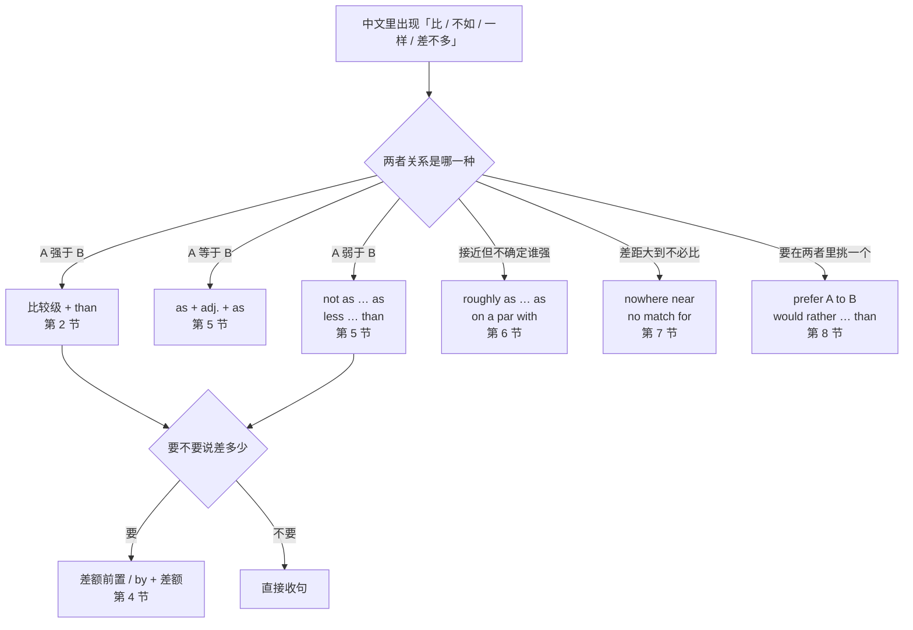
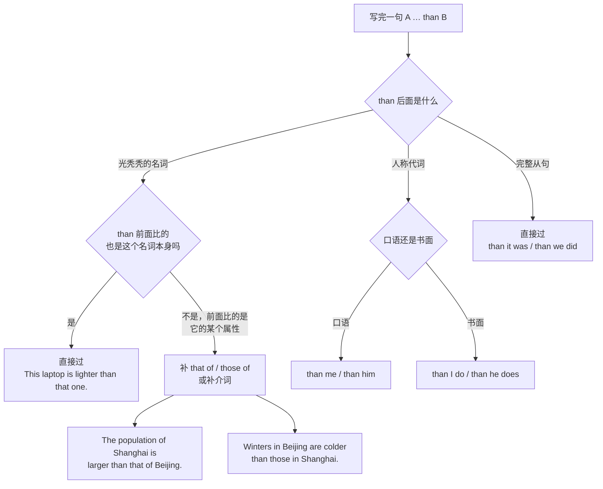
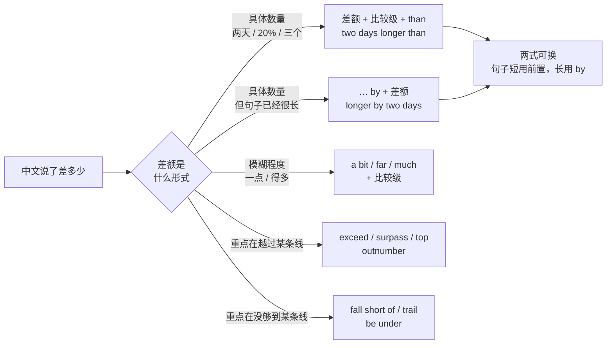
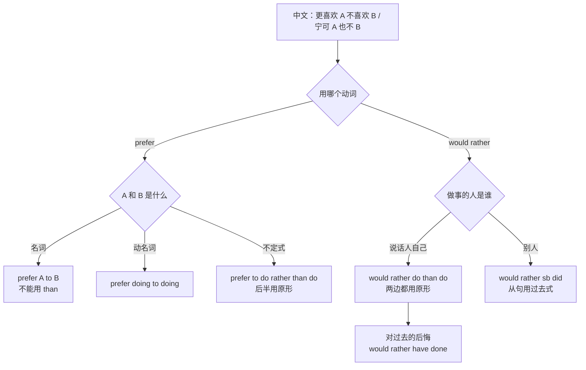
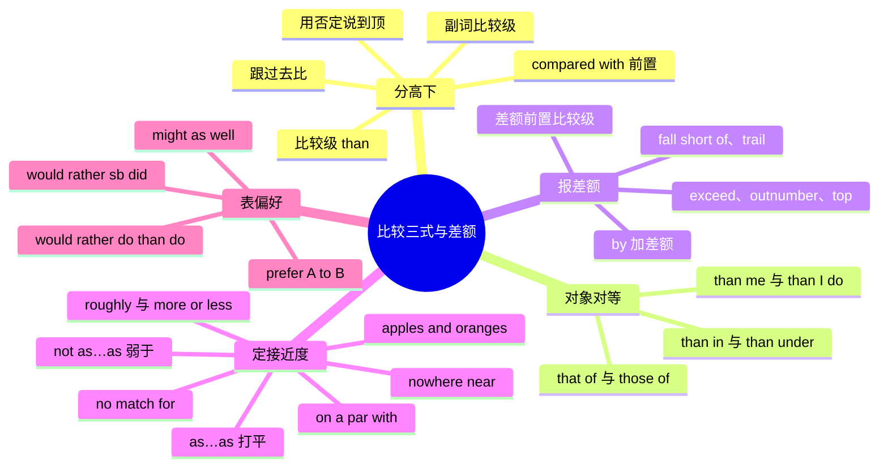

# A 比 B 更、不如、一样：比较三式与差额

> [!info] 本篇定位
>
> 这篇收的是**两样东西摆在一起说话**时的全部中文入口。
>
> 第一组是**分高下**：A 比 B 更快、A 不如 B 稳、A 和 B 一样贵。三句话在英文里是三套结构，中文里只差一个字。
>
> 第二组是**说差额**：快多少、贵多少、多出几个。中文习惯把差额放在后面（「贵了两百」），英文习惯放在比较级前面或者用 `by` 挂在句尾，位置不对整句就别扭。
>
> 第三组是**给接近度定档**：从「几乎一模一样」到「根本不在一个级别」，中间有五六个刻度，英文各有专用说法，`almost the same` 一个短语顶不了全场。
>
> 第四组是**表偏好**：更喜欢哪个、宁可怎样也不怎样。这一组的坑不在语义在槽位——`prefer` 后面接什么、`would rather` 后面用什么形态，中文里根本不存在这些限制。
>
> 倍数（三倍、翻一番）、最高级（最…的之一）、「越来越」与「越…越」都不在本篇，全在下一篇 [[09.比较、程度与数量/02.越来越、越…越、几倍、最…之一：变化量与极值\|越来越、越…越、几倍、最…之一]]。程度副词的刻度（有点、相当、非常、极其）在 [[09.比较、程度与数量/03.太…以至于、够不够、有点、非常：程度刻度\|太…以至于、够不够、有点、非常]]。
>
> 读完能查到：想说一句带「比」「不如」「一样」「差不多」「差远了」「宁可」的中文时，直接拿到三档成品句架，外加一张「比较对象对得上没有」的自查流程。

---

## 1. 本篇导读：先判断关系，再挑结构

中文的比较句几乎全靠一个「比」字和一个「不如」撑着，剩下的信息压在语境里。英文相反，句子一开口就得把关系交代清楚：是分高下、是并列、是接近、还是根本不可比。选错结构不会让人听不懂，但会让整句读起来像逐字翻译。

本篇按**你在做的判断**分区，不按语法名称分区：

| 你在判断什么 | 中文常用词 | 落到哪一节 |
| --- | --- | --- |
| A 强于 B | 比…更、比…还、超过 | 第 2 节 |
| 拿来比的两样东西对不对等 | 比北京冷、比我的快 | 第 3 节 |
| 强多少、多出多少 | 快一倍、贵两百、多三个 | 第 4 节 |
| A 等于 B 或弱于 B | 一样、跟…同样、不如、没有…那么 | 第 5 节 |
| 两者非常接近 | 差不多、不相上下、半斤八两 | 第 6 节 |
| 两者差距悬殊 | 差远了、没法比、不是一个级别 | 第 7 节 |
| 在两者之间选一个 | 更喜欢、宁可、还不如 | 第 8 节 |



这张图是本篇的总入口。第一个分岔判断关系强弱，六条出路各对应一节。要注意第四条和第五条：中文里「差不多」和「差远了」都是比较句的下位说法，但英文用的不是比较级结构而是一批固定短语，硬套 `a little more than` 或 `much less than` 就丢了那层「谁强谁弱不重要」的语气。

第二个分岔只在前两条出路上出现：说完谁强，还要不要报差额。中文报差额的位置很自由（「快了一倍」「贵两百」），英文只有两个合法位置，第 4 节专门处理。

从「一样」到「没法比」是一条连续刻度，六格从左往右排开：

| 刻度 | 中文常用词 | 英文落点 |
| --- | --- | --- |
| 完全一样 | 一模一样 / 完全相同 / 跟…没差别 | identical to、the same as |
| 差不多一样 | 差不多 / 不相上下 / 半斤八两 | much the same、on a par with |
| 略强略弱 | 稍微好一点 / 略低 / 差一点点 | slightly faster、marginally better |
| 明显强弱 | 快得多 / 高出不少 / 差一大截 | far faster、significantly better |
| 差距悬殊 | 差远了 / 没得比 / 不是一个级别 | nowhere near、no match for |
| 不可比 | 不是一回事 / 没法放一起比 | apples and oranges、no basis for comparison |

中文在这条尺上的词很少，「差不多」一个词要覆盖上面三格，「差远了」一个词要覆盖下面两格；英文在每一格上都有专用表达，选词等于给差距定量。第 5 到第 7 节就是沿这条尺从上往下走一遍。

---

## 2. A 比 B 更…：比较级的五个入口

### 2.1 A 比 B 更…（后面接形容词）

中文触发语：比…更 / 比…还 / 比…要 / 比起…来更 / 相比之下更

| 档位 | 句架 | 例句 |
| --- | --- | --- |
| 口语 | A is + 比较级 + than B | This build is faster than the last one. |
| 口语 | A is a lot + 比较级 + than B | The new office is a lot quieter than the old one. |
| 口语 | A is way + 比较级 + than B | Their API is way cleaner than ours. |
| 书面 | A is + 比较级 + than B [in terms of C] | The 14-inch model is lighter than the 16-inch in terms of daily carry. |
| 书面 | A proves + 比较级 + than B | The cached version proved more stable than the direct query. |
| 正式 | A is + 比较级 + than B by 差额 | The revised algorithm is faster than the baseline by roughly 30 percent. |
| 正式 | A ranks + 比较级 + than B | The Shanghai branch ranks higher than the Shenzhen branch on retention. |

- This build is faster than the last one. — 这版构建比上一版快。
- Their API is way cleaner than ours. — 他们的接口比我们的清爽多了。
- The cached version proved more stable than the direct query. — 走缓存那版实测比直连查询稳。

> [!warning] very 不能修饰比较级
>
> ~~It is very faster than the old one.~~ ❌
>
> **It is much faster than the old one.** ✅（比较级前用 much、far、a lot、way、considerably，不用 very）
>
> ~~The result is more better.~~ ❌
>
> **The result is much better.** ✅（better 本身已是比较级，不能再加 more）

```text
同义入口：比…更 / 比…还要 / 比…强 / 相比之下更 / 要比…来得
语法归属：[[02.英语基础语法/04.形容词与副词/02.形容词的比较级与最高级\|比较级的构成与修饰语]]
场景实战：[[04.英语场景/05.高频实用表达句型框架/04.比较对比举例总结句型库\|比较对比句型库]]
```

---

### 2.2 A 比 B 做得更…（后面接副词或动词）

中文触发语：比…做得更好 / 比…跑得快 / 比…更能… / 比…更懂

| 档位 | 句架 | 例句 |
| --- | --- | --- |
| 口语 | A + 动词 + 副词比较级 + than B | This machine boots up faster than mine. |
| 口语 | A + 动词 + better than B [at doing] | She writes tests better than most of us do. |
| 口语 | A knows more about sth than B | He knows more about the billing flow than anyone here. |
| 书面 | A + 动词 + more + 副词 + than B | The service recovers more gracefully than the previous version. |
| 书面 | A outperforms B [on/in sth] | The new index outperforms the old one on cold reads. |
| 正式 | A demonstrates + 比较级 + n. + than B | The revised model demonstrates greater robustness than its predecessor. |

- This machine boots up faster than mine. — 这台机器比我那台开机快。
- The new index outperforms the old one on cold reads. — 新索引在冷读上比旧的表现好。
- The revised model demonstrates greater robustness than its predecessor. — 修订版模型比前代表现出更强的鲁棒性。

> [!warning] 副词比较级不要加 -ly 之后再乱变形
>
> ~~It runs more fast than before.~~ ❌
>
> **It runs faster than before.** ✅（fast 的副词形式与形容词同形，直接加 -er）
>
> ~~He explains it more clearer.~~ ❌
>
> **He explains it more clearly.** ✅（more 与 -er 只能二选一）

```text
同义入口：比…做得好 / 比…跑得快 / 比…处理得干净 / 在…上强过
语法归属：[[02.英语基础语法/04.形容词与副词/03.副词的分类与用法\|副词比较级的构成与位置]]
```

---

### 2.3 比起来还是 A 更…（把比较对象提到句首）

中文触发语：比起…来 / 跟…比 / 相比之下 / 和…相比 / 要说…还是

| 档位 | 句架 | 例句 |
| --- | --- | --- |
| 口语 | Compared with B, A is + 比较级 | Compared with last quarter, this one was pretty calm. |
| 口语 | Next to B, A looks + 比较级 | Next to the desktop app, the web version feels sluggish. |
| 书面 | Compared to B, A + 动词 | Compared to the manual process, the script cuts the work in half. |
| 书面 | In comparison with B, A is + 比较级 | In comparison with the on-prem setup, the cloud one is easier to scale. |
| 书面 | Relative to B, A is + 比较级 | Relative to its peers, the product is underpriced. |
| 正式 | By comparison, A is + 比较级 | By comparison, the second cohort showed a lower dropout rate. |
| 正式 | As against B, A + 动词 | As against the 2024 figure, this year's total is down slightly. |

- Compared with last quarter, this one was pretty calm. — 跟上季度比，这季度算是消停的。
- Relative to its peers, the product is underpriced. — 相对同类产品，这个定价偏低。
- By comparison, the second cohort showed a lower dropout rate. — 相比之下，第二批的流失率更低。

> [!tip] compared with 与 compared to 在实际使用中已经通用
>
> 传统说法是 `compare with` 用于同类对照、`compare to` 用于打比方（`He compared the codebase to a swamp.`），但摆在句首当分词短语用时两者已不区分，写 `compared with` 或 `compared to` 都不会被挑错。真正要注意的是**别漏掉逗号**：`Compared with last year, revenue is up.` 前半是分词短语，必须用逗号跟主句隔开。

```text
同义入口：比起…来 / 跟…相比 / 相较于 / 要说还是 / 拿…来对照
语法归属：[[02.英语基础语法/05.介词与连词/02.常用介词搭配详解\|compare with 与 compare to 的搭配]]
场景实战：[[04.英语场景/05.高频实用表达句型框架/04.比较对比举例总结句型库\|比较对比句型库]]
```

---

### 2.4 比以前更…（拿现在跟过去比）

中文触发语：比以前更 / 比原来 / 比过去 / 比之前 / 越发

| 档位 | 句架 | 例句 |
| --- | --- | --- |
| 口语 | A is + 比较级 + than before | The commute is worse than before they closed that lane. |
| 口语 | A is + 比较级 + than it used to be | The team is smaller than it used to be. |
| 口语 | A is + 比较级 + than usual | Traffic is heavier than usual this morning. |
| 书面 | A is + 比较级 + than [it was] last year | Churn is lower than it was last year. |
| 书面 | A is + 比较级 + than expected | Onboarding took longer than expected. |
| 正式 | A shows a + 比较级 + n. + than in the previous period | The system shows a shorter recovery time than in the previous period. |

- The team is smaller than it used to be. — 团队比原来小了。
- Onboarding took longer than expected. — 上手的时间比预想的长。
- Traffic is heavier than usual this morning. — 今早路上比平时堵。

> [!tip] than 后面的省略是英语比较句最省力的地方
>
> `than expected`、`than usual`、`than planned`、`than necessary`、`than anticipated`、`than advertised` 都是现成的省略式，后面不必补主谓。写邮件时这几个短语能省掉大半个从句：`The rollout took two days longer than planned.` 比 `than we had planned it to take` 干净得多。

```text
同义入口：比以前 / 比原来 / 比之前 / 比预想的 / 比平时
语法归属：[[02.英语基础语法/10.特殊句型/05.省略与替代\|比较从句中的省略]]
```

---

### 2.5 没有比这更…的了（用否定说到顶）

中文触发语：没有比…更…的了 / 再没有比这更 / 不能更… / 这已经是最…的了

| 档位 | 句架 | 例句 |
| --- | --- | --- |
| 口语 | Nothing is + 比较级 + than + n./doing | Nothing is more annoying than a flaky test. |
| 口语 | It couldn't be + 比较级 | The timing couldn't be worse. |
| 口语 | I couldn't agree more | I couldn't agree more with that call. |
| 书面 | No + n. + is + 比较级 + than A | No metric is more misleading than average response time. |
| 书面 | Few things are + 比较级 + than A | Few things are harder to debug than a race condition. |
| 正式 | There is no + 比较级 + n. + than A | There is no clearer signal of technical debt than a build nobody dares to touch. |

- Nothing is more annoying than a flaky test. — 没什么比一个时好时坏的测试更烦人。
- The timing couldn't be worse. — 时间点再糟不过了。
- No metric is more misleading than average response time. — 没有哪个指标比平均响应时间更容易误导人。

> [!warning] couldn't be 后面必须是比较级，不是原级
>
> ~~It couldn't be good.~~ ❌（这句是「它不可能好」，意思相反）
>
> **It couldn't be better.** ✅（再好不过了）
>
> 这一组是本篇最容易说反的地方：中文的「再…不过」是最高级的意思，英文靠 `couldn't be + 比较级` 承担，落掉 -er 整句就翻面。

```text
同义入口：再没有比这更…的 / 不能更 / 好得不能再好 / 这就是极限了
语法归属：[[02.英语基础语法/04.形容词与副词/02.形容词的比较级与最高级\|否定加比较级表最高级]]
```

---

## 3. 比较对象必须对得上：than 后面该补什么

中文说「北京比上海冷」，谁都知道比的是两地的天气，句子表面上比的却是两座城市。英文的比较句结构上要求 `than` 两边是同类成分，写「Beijing is colder than Shanghai」在日常对话里没人挑刺，但一旦名词换成「北京的天气」「上海的房价」这种带修饰的短语，两边不对等就成了实打实的病句。



这张图是写完比较句之后的自查流程，一共两个判断点。第一个判断点看 `than` 后面挂的是什么：完整从句永远安全，人称代词只是语域问题，光名词才需要往下查。第二个判断点是全篇最容易出错的地方——如果 `than` 前面比的不是那个名词本身，而是「那个名词的某个属性」，后面就必须补 `that of`、`those of` 或者一个介词短语把层级对齐。下面三节分别处理这三种修法。

### 3.1 拿…的…跟…的…比（that of / those of）

中文触发语：…的…比…的… / …方面比…高 / 相比…的

| 档位 | 句架 | 例句 |
| --- | --- | --- |
| 口语 | A's + n. + is + 比较级 + than B's | Our load time is better than theirs. |
| 口语 | A is + 比较级 + than B's | This chair is more comfortable than Tom's. |
| 书面 | The + n. + of A is + 比较级 + than that of B | The latency of the new endpoint is lower than that of the old one. |
| 书面 | The + 复数 n. + of A are + 比较级 + than those of B | The error rates of the mobile client are higher than those of the web client. |
| 正式 | A's + n. + exceeds that of B | The subsidiary's margin exceeds that of the parent company. |

- Our load time is better than theirs. — 我们的加载时间比他们的好。
- The latency of the new endpoint is lower than that of the old one. — 新接口的延迟比旧接口低。
- The error rates of the mobile client are higher than those of the web client. — 移动端的错误率比 Web 端高。

> [!warning] 层级不对齐是中式比较句的头号病灶
>
> ~~The salary of a senior engineer is higher than a junior engineer.~~ ❌（把「薪水」和「工程师」放在一起比了）
>
> **The salary of a senior engineer is higher than that of a junior engineer.** ✅
>
> ~~The winters in Beijing are colder than Shanghai.~~ ❌
>
> **The winters in Beijing are colder than those in Shanghai.** ✅（复数用 those，单数用 that）

```text
同义入口：…的…比…的高 / 在…上比…强 / 拿…的…来比
语法归属：[[02.英语基础语法/10.特殊句型/05.省略与替代\|that 与 those 的替代用法]]
```

---

### 3.2 比我快、比我们做得好（than me 与 than I do 两档）

中文触发语：比我 / 比他 / 比我们 / 比你们那边

| 档位 | 句架 | 例句 |
| --- | --- | --- |
| 口语 | A is + 比较级 + than me/him/them | He's taller than me. |
| 口语 | A + 动词 + 比较级 + than sb does | She codes faster than I do. |
| 书面 | A is + 比较级 + than I am | The new hire is more experienced than I am. |
| 书面 | A + 动词 + more + n. + than sb does | Marketing files more tickets than support does. |
| 正式 | A is + 比较级 + than his/her counterpart | The regional manager is more experienced than her counterpart in the north. |

- He's taller than me. — 他比我高。
- She codes faster than I do. — 她写代码比我快。
- Marketing files more tickets than support does. — 市场部提的工单比客服部还多。

> [!tip] than me 与 than I do 不是对错之分，是语域之分
>
> `than me` 在口语里通行无阻，`than I` 在现代英语里反而显得刻意。要在书面场合稳妥又不别扭，最好的办法是补一个助动词：`than I do`、`than he does`、`than we did`。这样既避开代词格的争议，又把比较的动作说清楚了。
>
> 有一种情况必须补助动词，因为不补会歧义：`I like him more than her.` 到底是「我喜欢他胜过喜欢她」还是「我比她更喜欢他」？写成 `I like him more than I like her.` 或 `I like him more than she does.` 就没了误会。

```text
同义入口：比我 / 比他 / 比你们 / 比我们这边
语法归属：[[02.英语基础语法/03.代词与数词/01.人称代词与物主代词\|人称代词的主格与宾格]]
```

---

### 3.3 比在…的时候、比在…那边（补介词把层级拉平）

中文触发语：比在…时 / 比在…那边 / 比…的情况下

| 档位 | 句架 | 例句 |
| --- | --- | --- |
| 口语 | A is + 比较级 + than [it is] in B | The signal is worse in the basement than upstairs. |
| 口语 | A is + 比较级 + than when … | Deploys are smoother now than when we did them by hand. |
| 书面 | A is + 比较级 + than under B | Throughput is higher under the new scheduler than under the old one. |
| 书面 | A is + 比较级 + than during B | Support volume is lower during the summer than during the holidays. |
| 正式 | A is + 比较级 + than in the case of B | Recovery is faster in this configuration than in the case of a cold standby. |

- The signal is worse in the basement than upstairs. — 地下室的信号比楼上差。
- Deploys are smoother now than when we did them by hand. — 现在发布比手工那会儿顺多了。
- Throughput is higher under the new scheduler than under the old one. — 新调度器下的吞吐比旧的高。

> [!warning] 介词要两边都有，不能只留一边
>
> ~~Prices are higher in Shanghai than Chengdu.~~ ❌（前面有 in，后面没有）
>
> **Prices are higher in Shanghai than in Chengdu.** ✅
>
> 这条在写数据报告时几乎每段都会遇到，`than in`、`than under`、`than during`、`than on` 应当当成整体记，落一个介词整句层级就塌了。

```text
同义入口：比在…那边 / 比…的时候 / 比…条件下
语法归属：[[02.英语基础语法/05.介词与连词/01.介词的分类与基本用法\|介词短语作状语的对称]]
```

---

## 4. 差多少：差额的四条出路

中文报差额自由得多：「快一倍」「贵两百」「多三个人」「早了两天」，位置想放哪儿放哪儿。英文只有两个合法位置——**放在比较级前面**，或者**用 by 挂在句尾**——外加一批自带「超出」义的动词。



这张图分流的依据是差额的**形式**而不是大小。具体数量走第一条或第二条，两者可以互换，选哪条只看句子长度：短句差额前置更自然，长句把差额甩到句尾用 `by` 更容易读。模糊程度只能前置，`by a bit` 不是常见搭配。最后两条是另一个路子：不报差额，改用一个自带方向的动词，把「超过」或「不足」直接编进动词里，句子会短很多。

### 4.1 快两天、贵两百、高三个百分点（差额前置）

中文触发语：快…天 / 贵…块 / 高…个点 / 多…个 / 早…小时

| 档位 | 句架 | 例句 |
| --- | --- | --- |
| 口语 | A is + 数量 + 比较级 + than B | This one's twenty bucks cheaper than that one. |
| 口语 | A is + 数量 + 比较级 + than B | We finished two days earlier than planned. |
| 书面 | A is + 数量 + 比较级 + than B | The revised estimate is three points higher than the original. |
| 书面 | A has + 数量 + more + n. + than B | The new plan has two more seats than the old one. |
| 正式 | A is + 数量 + 比较级 + than B | The second sample was 0.4 seconds slower than the control. |
| 正式 | A registers a + 数量 + n. + increase over B | The region registers a 12-percent increase over the same period last year. |

- This one's twenty bucks cheaper than that one. — 这个比那个便宜二十块。
- We finished two days earlier than planned. — 我们比计划早完成两天。
- The new plan has two more seats than the old one. — 新方案比旧的多两个席位。

> [!warning] 差额只能放在比较级前面，不能放后面
>
> ~~It is cheaper twenty dollars than that one.~~ ❌
>
> **It is twenty dollars cheaper than that one.** ✅
>
> ~~We finished earlier two days.~~ ❌
>
> **We finished two days earlier.** ✅（中文「早完成两天」的语序在英文里必须翻过来）

```text
同义入口：快…天 / 便宜…块 / 高…个点 / 多…个 / 提前…小时
语法归属：[[02.英语基础语法/04.形容词与副词/02.形容词的比较级与最高级\|比较级前的修饰成分]]
```

---

### 4.2 领先…、超出…（by + 差额）

中文触发语：领先…分 / 超出…个点 / 差…就 / 以…之差

| 档位 | 句架 | 例句 |
| --- | --- | --- |
| 口语 | A beats B by + 差额 | Our team beat theirs by four points. |
| 口语 | We missed it by + 差额 | We missed the window by about ten minutes. |
| 书面 | A + 动词 + B by + 差额 | The new build outperforms the old one by a wide margin. |
| 书面 | A rose/fell by + 差额 | Support tickets fell by nearly a third after the fix. |
| 书面 | A is + 比较级 + than B by + 差额 | The revised route is shorter than the original by six kilometres. |
| 正式 | A exceeds B by + 差额 | Actual spend exceeds the approved budget by 8 percent. |

- We missed the window by about ten minutes. — 我们差十来分钟就赶上了那个窗口。
- Support tickets fell by nearly a third after the fix. — 修复之后工单量掉了将近三分之一。
- Actual spend exceeds the approved budget by 8 percent. — 实际支出超出批准预算 8%。

> [!warning] rise by 与 rise to 报的是两个不同的数
>
> ~~Costs rose to 20% this quarter.~~ ❌（想说「成本涨了两成」，写出来却是「成本涨到了占比 20%」）
>
> **Costs rose by 20% this quarter.** ✅
>
> `by` 报的是**增量**，`to` 报的是**终值**。两个都要说就并排挂：`Revenue rose by 2 million, to 12 million in total.` 数据描述的完整清单见 [[09.比较、程度与数量/04.大约、超过、占三成、平均、分别是：数量与统计描述\|数量与统计描述]]。

```text
同义入口：领先…分 / 超出…个点 / 差…就到 / 以…之差胜出
语法归属：[[02.英语基础语法/05.介词与连词/02.常用介词搭配详解\|by 表差额的用法]]
```

---

### 4.3 超过、多于、突破（exceed 一族）

中文触发语：超过 / 多于 / 突破 / 高出 / 压过 / 比…多出

| 档位 | 句架 | 例句 |
| --- | --- | --- |
| 口语 | A is over + 数量 | We're over budget already. |
| 口语 | A goes past + 数量 | Sign-ups went past ten thousand last night. |
| 书面 | A exceeds B | Demand exceeds current capacity. |
| 书面 | A outnumbers B [数量 to 数量] | Applicants outnumber places roughly three to one. |
| 书面 | A tops + 数量 | Downloads topped half a million in the first week. |
| 正式 | A surpasses B | This quarter's figure surpasses the previous record. |
| 正式 | A is in excess of + 数量 | Storage costs are in excess of forty thousand a year. |

- We're over budget already. — 我们已经超预算了。
- Applicants outnumber places roughly three to one. — 申请人数是名额的三倍左右。
- Downloads topped half a million in the first week. — 首周下载量突破五十万。

> [!warning] exceed、outnumber、surpass 都是及物动词，后面不接 than
>
> ~~The cost exceeds than the budget.~~ ❌
>
> **The cost exceeds the budget.** ✅
>
> ~~Men outnumber than women here.~~ ❌
>
> **Men outnumber women here.** ✅（要报差额就在后面挂 by：`outnumber women by two to one`）

```text
同义入口：超过 / 多于 / 突破 / 高出 / 比…多出
语法归属：[[02.英语基础语法/05.介词与连词/02.常用介词搭配详解\|及物动词后误加介词]]
```

---

### 4.4 不到、差一点、落后（fall short 一族）

中文触发语：不到 / 差一点 / 没达到 / 落后 / 低于 / 差得不多

| 档位 | 句架 | 例句 |
| --- | --- | --- |
| 口语 | A is under + 数量 | The whole thing came in under two hours. |
| 口语 | A didn't quite make it | We didn't quite make the deadline. |
| 口语 | A is short by + 差额 | We're short by two people this sprint. |
| 书面 | A falls short of B | The results fall short of the target by a small margin. |
| 书面 | A trails B by + 差额 | Our region trails the leader by six percentage points. |
| 书面 | A lags behind B | Documentation lags behind the code by about two releases. |
| 正式 | A remains below B | Utilisation remains below the level recorded last year. |

- We didn't quite make the deadline. — 我们差一点就赶上截止时间了。
- Our region trails the leader by six percentage points. — 我们区落后第一名六个百分点。
- Documentation lags behind the code by about two releases. — 文档比代码落后大约两个版本。

> [!tip] 「差一点」在中英之间要拆成两个意思
>
> 中文「差一点赶上」是没赶上，「差一点没赶上」反倒是赶上了——这个「没」不一定真取反，全靠听话人从语境里补。英文没有这种余地：`We almost made it.` 是没做到，`We barely made it.` 是勉强做到了。写的时候先自问结果是成还是败，再挑词。

```text
同义入口：不到 / 差一点 / 没达标 / 落后…个点 / 低于
语法归属：[[02.英语基础语法/04.形容词与副词/03.副词的分类与用法\|almost 与 barely 的语义差]]
```

---

## 5. 一样、不如：as…as 与 not as…as

### 5.1 A 和 B 一样…（用 as…as 打平）

中文触发语：和…一样 / 跟…同样 / 与…相当 / 不比…差

| 档位 | 句架 | 例句 |
| --- | --- | --- |
| 口语 | A is as + adj. + as B | This one's as good as the branded one. |
| 口语 | A is just as + adj. + as B | The free tier is just as fast for our load. |
| 口语 | A is every bit as + adj. + as B | The junior's patch was every bit as clean as mine. |
| 书面 | A is as + adj. + as B [in terms of C] | The open-source option is as reliable as the paid one in terms of uptime. |
| 书面 | A + 动词 + as + adv. + as B | The batch job runs as smoothly as it did before the migration. |
| 正式 | A is no less + adj. + than B | The second approach is no less rigorous than the first. |

- This one's as good as the branded one. — 这个跟那个牌子货一样好。
- The junior's patch was every bit as clean as mine. — 那个新人的补丁跟我写的一样干净。
- The second approach is no less rigorous than the first. — 第二种方法严谨程度不逊于第一种。

> [!warning] as…as 中间只能放原级，放比较级就废了
>
> ~~It is as faster as the old one.~~ ❌
>
> **It is as fast as the old one.** ✅
>
> ~~It is as same as before.~~ ❌
>
> **It is the same as before.** ✅（same 前面永远是 the，后面永远是 as，不跟 as…as 结构混用）

```text
同义入口：跟…一样 / 和…同样 / 不比…差 / 与…相当
语法归属：[[02.英语基础语法/04.形容词与副词/02.形容词的比较级与最高级\|as…as 的同级比较]]
场景实战：[[04.英语场景/05.高频实用表达句型框架/04.比较对比举例总结句型库\|同级比较句型]]
```

---

### 5.2 A 不如 B（not as…as 与 less…than）

中文触发语：不如 / 没有…那么 / 比不上 / 逊于 / 不及

| 档位 | 句架 | 例句 |
| --- | --- | --- |
| 口语 | A is not as + adj. + as B | The camera isn't as sharp as my old phone's. |
| 口语 | A isn't nearly as + adj. + as B | The docs aren't nearly as complete as the changelog. |
| 书面 | A is not so + adj. + as B | The argument is not so convincing as it first appears. |
| 书面 | A is less + adj. + than B | This route is less predictable than the direct one. |
| 书面 | A is inferior to B [in sth] | The bundled editor is inferior to the standalone one in refactoring support. |
| 正式 | A does not match B [in sth] | The replacement part does not match the original in tolerance. |

- The camera isn't as sharp as my old phone's. — 这个摄像头不如我旧手机清楚。
- This route is less predictable than the direct one. — 这条路线不如直连稳定。
- The bundled editor is inferior to the standalone one in refactoring support. — 内置编辑器在重构支持上不如独立版。

> [!warning] inferior、superior、senior、junior 后面跟 to，不跟 than
>
> ~~This model is superior than the previous one.~~ ❌
>
> **This model is superior to the previous one.** ✅
>
> ~~She is senior than me by two years.~~ ❌
>
> **She is two years my senior.** ✅ 或 **She is two years senior to me.** ✅（这一族词源自拉丁语，自带比较义，不能再挂 than）

```text
同义入口：不如 / 没…那么 / 比不上 / 逊色于 / 差着一截
语法归属：[[02.英语基础语法/04.形容词与副词/02.形容词的比较级与最高级\|not as…as 与 less…than]]
```

---

### 5.3 有…那么多、有…那么久（as many as 与 as long as）

中文触发语：有…那么多 / 多达 / 长达 / 早在 / 远至

| 档位 | 句架 | 例句 |
| --- | --- | --- |
| 口语 | as many + 复数 n. + as + 数量 | We got as many as forty signups in one day. |
| 口语 | as much + 不可数 n. + as + 数量 | It uses as much memory as the whole test suite. |
| 口语 | as long as + 时长 | The rebuild can take as long as twenty minutes. |
| 书面 | as few as + 数量 | The failure shows up with as few as three concurrent users. |
| 书面 | as little as + 数量 | The whole fix took as little as ten minutes. |
| 书面 | as early as + 时间 | The issue was reported as early as March. |
| 正式 | as high as + 数量 | Peak utilisation reached as high as 94 percent during the migration. |

- We got as many as forty signups in one day. — 我们一天里拿到了多达四十个注册。
- The failure shows up with as few as three concurrent users. — 三个并发用户就能让它出问题。
- The issue was reported as early as March. — 这个问题早在三月就有人报了。

> [!tip] as many as 与 as much as 的选择只看名词可数不可数
>
> 可数复数用 `as many as`（`as many as fifty tickets`），不可数用 `as much as`（`as much as fifty gigabytes`）。搭在数字前面时这两个短语已经不是比较了，而是「多达」的意思，等于给读者一个「这个数比你想的大」的提示。反过来 `as few as`、`as little as` 提示的是「比你想的小」。`as high as`、`as long as`、`as early as` 走的是同一条逻辑，都靠数字冲一下读者的预期。

```text
同义入口：多达 / 长达 / 早在 / 只需 / 少至
语法归属：[[02.英语基础语法/03.代词与数词/04.不定代词详解\|many 与 much 的可数不可数分工]]
```

---

### 5.4 跟…相同、同样地（the same 与 likewise）

中文触发语：跟…相同 / 一模一样 / 同样 / 同理 / 也是如此

| 档位 | 句架 | 例句 |
| --- | --- | --- |
| 口语 | A is the same as B | The config is the same as staging. |
| 口语 | A and B are the same | The two endpoints are basically the same. |
| 口语 | Same here | Same here — my build fails too. |
| 书面 | A is the same + n. + as B | It's the same error as the one we hit last month. |
| 书面 | A is identical to B | The payload is identical to the one in the ticket. |
| 书面 | The same applies to B | The same applies to the staging environment. |
| 正式 | Likewise, B + 动词 | Likewise, the export job must be re-run after a schema change. |

- The config is the same as staging. — 配置跟预发环境一样。
- It's the same error as the one we hit last month. — 跟上个月那个报错是同一个。
- The same applies to the staging environment. — 预发环境同理。

> [!warning] the same 后面接 as，不接 with 或 like
>
> ~~My setup is the same with yours.~~ ❌
>
> **My setup is the same as yours.** ✅
>
> ~~It is same as before.~~ ❌
>
> **It is the same as before.** ✅（same 必须带定冠词，这两条错法一起出现的频率极高）

```text
同义入口：跟…一样 / 一模一样 / 同上 / 同理 / 也是这样
语法归属：[[02.英语基础语法/05.介词与连词/02.常用介词搭配详解\|the same as 的固定搭配]]
场景实战：[[04.英语场景/05.高频实用表达句型框架/03.同意反对让步转折句型库\|表示相同意见的句型]]
```

---

## 6. 差不多一样：接近的五档

这一节和上一节的分界线是：第 5 节说的是「A 和 B 相等」，本节说的是「A 和 B 谁强谁弱不重要」。中文用一个「差不多」全包了，英文按接近的紧密程度和语域分成好几档，写报告时选哪一档等于表态自己有多确定。

### 6.1 差不多一样（打平，但留了余地）

中文触发语：差不多一样 / 基本上一样 / 大致相当 / 也就那样

| 档位 | 句架 | 例句 |
| --- | --- | --- |
| 口语 | A is about as + adj. + as B | The two laptops are about as fast as each other. |
| 口语 | A is more or less the same as B | The new flow is more or less the same as the old one. |
| 口语 | There's not much in it | Honestly, there's not much in it between the two vendors. |
| 书面 | A is roughly as + adj. + as B | The batch path is roughly as efficient as the streaming path. |
| 书面 | A and B are much the same | The two datasets are much the same after cleaning. |
| 书面 | A is broadly similar to B | The 2025 pattern is broadly similar to the 2024 one. |
| 正式 | A is approximately equivalent to B | The revised metric is approximately equivalent to the legacy one. |

- The new flow is more or less the same as the old one. — 新流程跟老的差不多。
- There's not much in it between the two vendors. — 这两家供应商差不太多。
- The batch path is roughly as efficient as the streaming path. — 批处理这条路跟流式那条效率差不多。

> [!tip] more or less 与 roughly 的落点不同
>
> `more or less` 修饰的是整个判断（「大体上可以这么说」），位置灵活，句中句尾都行。`roughly` 修饰的是具体的量，通常紧贴在数字或 `as` 前面。想说「大概齐吧」用 `more or less`，想说「量上差不多」用 `roughly`。
>
> `about as fast as` 是口语里最省事的一档，写正式文书时换成 `comparable in speed to` 会稳一些。

```text
同义入口：差不多 / 大体一样 / 基本相当 / 也就那么回事
语法归属：[[02.英语基础语法/04.形容词与副词/03.副词的分类与用法\|程度副词修饰同级比较]]
```

---

### 6.2 不相上下、旗鼓相当

中文触发语：不相上下 / 旗鼓相当 / 势均力敌 / 半斤八两 / 咬得很紧

| 档位 | 句架 | 例句 |
| --- | --- | --- |
| 口语 | A and B are neck and neck | The two candidates are neck and neck. |
| 口语 | It's a toss-up between A and B | It's a toss-up between the two designs. |
| 口语 | Six of one, half a dozen of the other | Honestly, it's six of one, half a dozen of the other. |
| 书面 | A is on a par with B | Our uptime is now on a par with the market leader. |
| 书面 | A is comparable to B [in sth] | The open-source tool is comparable to the commercial one in coverage. |
| 书面 | A and B are evenly matched | The two teams are evenly matched on throughput. |
| 正式 | A is at a level comparable with B | Response times are at a level comparable with those of the previous quarter. |

- The two candidates are neck and neck. — 两位候选人不相上下。
- Our uptime is now on a par with the market leader. — 我们的可用性现在跟头部厂商持平了。
- The two teams are evenly matched on throughput. — 两个团队在吞吐上势均力敌。

> [!warning] on a par with 的三个细节都容易写错
>
> ~~on the par with~~ ❌ / ~~on a par to~~ ❌ / ~~on par with~~ 在美式书写里可以接受，但正式文书用 `on a par with`
>
> **Our uptime is on a par with theirs.** ✅（不定冠词 a 不能丢，介词必须是 with）
>
> `par` 在这里是「同等水平」，跟 `par value`（票面价值）里的 `par` 是同一个词。整个短语是死搭配，`level`、`standard` 这些近义词都塞不进这个模板。

```text
同义入口：不相上下 / 势均力敌 / 打平 / 咬得紧 / 半斤八两
语法归属：[[02.英语基础语法/05.介词与连词/02.常用介词搭配详解\|on a par with 的固定搭配]]
```

---

### 6.3 差别不大、可以忽略

中文触发语：差别不大 / 区别很小 / 可以忽略不计 / 影响有限 / 没什么区别

| 档位 | 句架 | 例句 |
| --- | --- | --- |
| 口语 | There's hardly any difference | There's hardly any difference between the two builds. |
| 口语 | It doesn't make much difference | Which one you pick doesn't make much difference. |
| 口语 | It's within the noise | The delta is within the noise. |
| 书面 | The difference is marginal | The difference in load time is marginal. |
| 书面 | The gap between A and B is negligible | The gap between the two configurations is negligible. |
| 书面 | A differs from B only in sth | The new release differs from the old one only in packaging. |
| 正式 | The variation between A and B is not material | The variation between the two samples is not material for our purposes. |

- There's hardly any difference between the two builds. — 两版构建几乎没差别。
- The gap between the two configurations is negligible. — 两套配置之间的差距可以忽略。
- The new release differs from the old one only in packaging. — 新版跟旧版只在打包方式上有差别。

> [!warning] difference 与 different 的介词不是同一个
>
> ~~the difference of A and B~~ ❌
>
> **the difference between A and B** ✅
>
> ~~A is different with B~~ ❌
>
> **A is different from B** ✅（英式口语里 `different to` 也通行，`different than` 在美式里接从句时可用，但 `different with` 在哪个变体里都不成立）

```text
同义入口：差别不大 / 区别很小 / 忽略不计 / 没什么两样
语法归属：[[02.英语基础语法/05.介词与连词/02.常用介词搭配详解\|different from 的固定搭配]]
```

---

## 7. 差得远：拉开的五档

### 7.1 差远了（程度上的巨大差距）

中文触发语：差远了 / 差得不是一点 / 远不如 / 根本达不到 / 还早着呢

| 档位 | 句架 | 例句 |
| --- | --- | --- |
| 口语 | A is nowhere near as + adj. + as B | The demo box is nowhere near as fast as production. |
| 口语 | A is nowhere near + n./adj. | We're nowhere near done. |
| 口语 | Not even close | Is it ready? Not even close. |
| 口语 | A isn't remotely + adj. | The estimate isn't remotely realistic. |
| 书面 | A falls well short of B | The prototype falls well short of the performance target. |
| 书面 | A is far from + adj. | The migration path is far from straightforward. |
| 正式 | A is substantially below B | Current throughput is substantially below the contracted level. |

- The demo box is nowhere near as fast as production. — 演示机比生产环境慢得不是一点半点。
- We're nowhere near done. — 离做完还早着呢。
- The migration path is far from straightforward. — 迁移路径远谈不上直白。

> [!warning] nowhere near 后面直接跟形容词或 as…as，不跟 than
>
> ~~It is nowhere near faster than the old one.~~ ❌
>
> **It is nowhere near as fast as the old one.** ✅
>
> ~~Not even close than yours.~~ ❌
>
> **Not even close to yours.** ✅（close 的搭配是 to）

```text
同义入口：差远了 / 远不如 / 差着十万八千里 / 还差得多
语法归属：[[02.英语基础语法/04.形容词与副词/03.副词的分类与用法\|nowhere near 作程度状语]]
```

---

### 7.2 根本不是一个级别

中文触发语：不是一个级别 / 完全没得比 / 碾压 / 完败 / 跟…没法比

| 档位 | 句架 | 例句 |
| --- | --- | --- |
| 口语 | A is no match for B | A laptop GPU is no match for a desktop card. |
| 口语 | A can't compete with B | Our budget can't compete with theirs. |
| 口语 | A can't hold a candle to B | The remake can't hold a candle to the original. |
| 书面 | A is in a different league from B | Their infrastructure is in a different league from ours. |
| 书面 | A is outclassed by B | The older sensor is outclassed by anything released this year. |
| 正式 | A does not bear comparison with B | The pilot results do not bear comparison with those of the full study. |

- A laptop GPU is no match for a desktop card. — 笔记本显卡跟台式机的完全不是一个级别。
- Their infrastructure is in a different league from ours. — 他们的基础设施跟我们的不在一个量级。
- The remake can't hold a candle to the original. — 翻拍版跟原作没法比。

> [!tip] no match for 是判断句，不是动词短语
>
> 它的结构是 `A + be + no match for + B`，中间的 be 动词不能省，for 不能换成 to 或 with。想把这层意思写得中性一点，用 `is not in the same class as` 或 `is not comparable to`；`can't hold a candle to` 带明显的口语色彩和贬义，正式文书里不要用。

```text
同义入口：不是一个级别 / 完全没得比 / 差着代 / 被吊打
语法归属：[[02.英语基础语法/05.介词与连词/02.常用介词搭配详解\|no match for 的固定搭配]]
```

---

### 7.3 跟当初相去甚远

中文触发语：跟…相去甚远 / 跟当初完全两回事 / 早就不是那个样子了

| 档位 | 句架 | 例句 |
| --- | --- | --- |
| 口语 | A is a far cry from B | The shipped version is a far cry from the mockups. |
| 口语 | A is a world away from B | Remote work here is a world away from what it was in 2019. |
| 口语 | A is nothing like B | The rewrite is nothing like the original codebase. |
| 书面 | A bears little resemblance to B | The final spec bears little resemblance to the first draft. |
| 书面 | A has moved a long way from B | The product has moved a long way from its original scope. |
| 正式 | A departs significantly from B | The implementation departs significantly from the published standard. |

- The shipped version is a far cry from the mockups. — 上线的版本跟设计稿相去甚远。
- The rewrite is nothing like the original codebase. — 重写版跟原来的代码库完全是两回事。
- The final spec bears little resemblance to the first draft. — 最终规范跟第一版草案几乎没有相似之处。

> [!tip] a far cry from 带惋惜，nothing like 中性
>
> `a far cry from` 暗含「本来应该更接近的」这层遗憾，用来说产品缩水、承诺落空最贴切。`nothing like` 只陈述差异，不带评价。想说「跟想象的不一样，但这是好事」，用 `nothing like what I expected — in a good way`，不要用 `a far cry from`。
>
> 外观相似度的完整梯度在 [[08.指认、定义与描述/04.看起来像、区别在于、严格来说：外观、类比与限定\|看起来像、区别在于、严格来说]]。

```text
同义入口：相去甚远 / 完全两回事 / 面目全非 / 跟当初说好的不一样
语法归属：[[02.英语基础语法/05.介词与连词/02.常用介词搭配详解\|from 与 to 在相似度短语中的分工]]
```

---

### 7.4 这两个没法放一起比

中文触发语：没法比 / 不可同日而语 / 两码事 / 拿这个比那个不合适

| 档位 | 句架 | 例句 |
| --- | --- | --- |
| 口语 | That's apples and oranges | Comparing headcount to revenue is apples and oranges. |
| 口语 | You can't really compare the two | You can't really compare the two — different workloads. |
| 口语 | They're two different things | Latency and throughput are two different things. |
| 书面 | There is no meaningful comparison between A and B | There is no meaningful comparison between a lab benchmark and live traffic. |
| 书面 | A and B are not directly comparable | The two figures are not directly comparable because the sampling changed. |
| 正式 | Any comparison between A and B would be misleading | Any comparison between the two cohorts would be misleading given the different intake criteria. |

- Comparing headcount to revenue is apples and oranges. — 拿人头数比营收是两码事。
- The two figures are not directly comparable because the sampling changed. — 采样方式变了，这两个数不能直接比。
- You can't really compare the two — different workloads. — 这两个没法直接比，负载类型不一样。

> [!warning] 「不可比」要说出理由，否则听着像回避
>
> 单说 `They're not comparable.` 在会议上很容易被当成挡箭牌。稳妥写法是紧跟一个 because 从句或破折号补一句原因：`The two figures aren't directly comparable — the second one excludes trials.` 有理由的「不可比」是分析，没理由的「不可比」是搪塞。

```text
同义入口：没法比 / 两码事 / 不在一个维度 / 口径不一样
语法归属：[[02.英语基础语法/09.从句体系/04.状语从句详解\|because 引导的原因状语]]
场景实战：[[04.英语场景/05.高频实用表达句型框架/03.同意反对让步转折句型库\|提出异议的句型]]
```

---

## 8. 更喜欢、宁可：偏好比较的槽位限制

这一节的坑不在语义在**槽位**。中文说「我更喜欢喝茶不喜欢咖啡」「我宁可加班也不带回家做」，两句结构一样；英文里 `prefer` 和 `would rather` 后面能接什么、接几种形态，规定得很死，套错了句子当场就散。



这张图把两个动词的分岔画在一起，因为它们在中文里同一个入口。左边 `prefer` 的三条路各配一种连接词：名词和动名词都用 `to` 连接两边，唯独不定式那条要换成 `rather than`。右边 `would rather` 的分岔看动作是谁做的：自己做用双原形，让别人做就要把从句压成过去式——这一点跟事实无关，纯粹是形态规定，第 8.4 条会给成品。

### 8.1 我更喜欢 A，不喜欢 B

中文触发语：更喜欢 / 更偏好 / 相比之下更愿意 / 我倾向于

| 档位 | 句架 | 例句 |
| --- | --- | --- |
| 口语 | I prefer A to B | I prefer tea to coffee. |
| 口语 | I like A better than B | I like the dark theme better than the light one. |
| 口语 | I'd go with A over B | I'd go with Postgres over MySQL for this. |
| 书面 | A is preferable to B | A staged rollout is preferable to a big-bang release. |
| 书面 | I prefer doing A to doing B | I prefer writing tests first to patching bugs later. |
| 书面 | I have a preference for A | I have a slight preference for the second design. |
| 正式 | A is to be preferred to B | For long-lived data, an append-only log is to be preferred to in-place updates. |

- I prefer tea to coffee. — 我更喜欢茶，不太喝咖啡。
- I'd go with Postgres over MySQL for this. — 这个场景我更倾向选 Postgres 而不是 MySQL。
- A staged rollout is preferable to a big-bang release. — 分批上线比一次性全量发布更可取。

> [!warning] prefer 与 preferable 后面都跟 to，不跟 than
>
> ~~I prefer tea than coffee.~~ ❌
>
> **I prefer tea to coffee.** ✅
>
> ~~This option is more preferable than that one.~~ ❌
>
> **This option is preferable to that one.** ✅（preferable 自带比较义，不能再加 more）

```text
同义入口：更喜欢 / 更偏向 / 宁愿选 / 相比之下我选
语法归属：[[02.英语基础语法/05.介词与连词/02.常用介词搭配详解\|prefer A to B 的动介搭配]]
场景实战：[[04.英语场景/05.高频实用表达句型框架/01.表达观点与态度的50个万能句型\|表达偏好的句型]]
```

---

### 8.2 我更愿意做 A 而不是做 B（to do 那条路）

中文触发语：我更愿意…而不是… / 与其…我宁可… / 我情愿

| 档位 | 句架 | 例句 |
| --- | --- | --- |
| 口语 | I'd rather do A than do B | I'd rather fix it now than explain it later. |
| 口语 | I'd sooner do A than do B | I'd sooner rewrite it than keep patching it. |
| 书面 | I prefer to do A rather than do B | I prefer to automate the check rather than rely on a reminder. |
| 书面 | Rather than doing B, A + 动词 | Rather than blocking the release, we shipped it behind a flag. |
| 书面 | I would choose A over B | I would choose readability over cleverness every time. |
| 正式 | A is favoured over B | An incremental approach is favoured over a full rewrite. |

- I'd rather fix it now than explain it later. — 我宁可现在修好，也不想以后解释。
- I prefer to automate the check rather than rely on a reminder. — 我更愿意把这个检查自动化，而不是靠提醒。
- Rather than blocking the release, we shipped it behind a flag. — 与其卡住这次发布，我们把它藏在开关后面上线了。

> [!warning] would rather 后面两边都用动词原形
>
> ~~I'd rather to stay home than to go out.~~ ❌
>
> **I'd rather stay home than go out.** ✅
>
> ~~I'd rather staying home.~~ ❌
>
> **I'd rather stay home.** ✅（would rather 是情态性结构，后面永远接不带 to 的原形）

```text
同义入口：宁可 / 情愿 / 与其…不如 / 我更愿意
语法归属：[[02.英语基础语法/07.助动词与情态动词/03.情态动词的特殊句型\|would rather A than B 的动词形态]]
```

---

### 8.3 还不如…、干脆…算了

中文触发语：还不如 / 干脆…算了 / 早知道就 / 那还不如 / 索性

| 档位 | 句架 | 例句 |
| --- | --- | --- |
| 口语 | We might as well do sth | We might as well start over. |
| 口语 | You may as well do sth | You may as well take the whole day off. |
| 口语 | A is better off doing sth | You're better off asking the platform team directly. |
| 口语 | There's no point doing B; just do A | There's no point patching it; just roll it back. |
| 书面 | It would be better to do A than to do B | It would be better to postpone the launch than to ship a broken flow. |
| 书面 | A is the lesser of two evils | A short outage is the lesser of two evils here. |
| 正式 | The preferable course is to do A | The preferable course is to defer the change until after the audit. |

- We might as well start over. — 干脆重来算了。
- You're better off asking the platform team directly. — 你还不如直接去问平台组。
- A short outage is the lesser of two evils here. — 短暂停机在这里算是两害相权取其轻。

> [!tip] might as well 的语气是「反正也没更好的选择」
>
> 它不是推荐，是认命。跟人提建议时说 `You might as well use the CLI.` 听着像「爱用不用吧」，真要推荐得换成 `You're better off using the CLI.` 或 `I'd use the CLI.` 建议与请求的完整梯度在 [[11.人际功能与话轮管理/01.我建议、你最好、能不能帮我：建议、请求、许可与委托\|我建议、你最好、能不能帮我]]。

```text
同义入口：还不如 / 干脆 / 索性 / 两害相权 / 那就…吧
语法归属：[[02.英语基础语法/07.助动词与情态动词/02.情态动词详解\|may 与 might 的语气差]]
```

---

### 8.4 我宁愿你…（让别人做的那条路）

中文触发语：我宁愿你… / 我倒希望你 / 你还是…比较好 / 早知道当初

| 档位 | 句架 | 例句 |
| --- | --- | --- |
| 口语 | I'd rather sb did sth | I'd rather you sent it tomorrow. |
| 口语 | I'd rather sb didn't do sth | I'd rather you didn't push directly to main. |
| 口语 | I'd rather we did sth | I'd rather we talked about this in person. |
| 书面 | I would prefer it if sb did sth | I would prefer it if the change went through review first. |
| 书面 | I'd rather have done sth | I'd rather have caught this in staging. |
| 正式 | It would be preferable for sb to do sth | It would be preferable for the vendor to confirm in writing. |

- I'd rather you didn't push directly to main. — 我不太希望你直接往主干推。
- I'd rather we talked about this in person. — 我宁愿咱们当面聊这事。
- I'd rather have caught this in staging. — 早知道就该在预发环境把它抓出来。

> [!warning] would rather 后面换了主语，动词就要变过去式
>
> ~~I'd rather you send it tomorrow.~~ ❌
>
> **I'd rather you sent it tomorrow.** ✅（说的是明天的事，动词却用过去式，这个形态跟时间无关，只标记「这是我的意愿不是事实」）
>
> ~~I'd rather you don't do that.~~ ❌
>
> **I'd rather you didn't do that.** ✅
>
> 这个形态的来龙去脉在 [[02.英语基础语法/10.特殊句型/02.虚拟语气详解\|虚拟语气详解]]，本篇只给成品。

```text
同义入口：我宁愿你 / 我更希望你 / 你最好别 / 我倒觉得该
语法归属：[[02.英语基础语法/10.特殊句型/02.虚拟语气详解\|would rather 后的过去式从句]]
场景实战：[[04.英语场景/05.高频实用表达句型框架/02.建议请求邀请拒绝四大功能句型\|委婉提要求的句型]]
```

---

## 9. 十条错配集中营与一次三档走查

前面各节的警示分散在各处，这里按错的**类型**再收一遍，写完比较句可以照着扫一遍。

> [!warning] 比较句十条高频错配
>
> 1. ~~very faster~~ ❌ → **much faster** ✅（very 修饰原级，比较级用 much、far、a lot、way）
> 2. ~~more better~~ ❌ → **much better** ✅（more 与 -er 只能有一个）
> 3. ~~The weather in Beijing is colder than Shanghai.~~ ❌ → **… than in Shanghai** ✅（介词两边都要有）
> 4. ~~The salary of a senior is higher than a junior.~~ ❌ → **… than that of a junior** ✅（补 that of 拉平层级）
> 5. ~~It is as faster as the old one.~~ ❌ → **as fast as** ✅（as…as 中间只能是原级）
> 6. ~~It is same as before.~~ ❌ → **the same as before** ✅（the 不能丢，as 不能换成 with）
> 7. ~~superior than / senior than~~ ❌ → **superior to / senior to** ✅（这一族拉丁词自带比较义）
> 8. ~~The cost exceeds than the budget.~~ ❌ → **exceeds the budget** ✅（exceed、outnumber、surpass 都是及物动词）
> 9. ~~I prefer tea than coffee.~~ ❌ → **prefer tea to coffee** ✅（preferable 同理，且不能加 more）
> 10. ~~I'd rather you send it tomorrow.~~ ❌ → **I'd rather you sent it tomorrow** ✅（换主语就换过去式）

这十条里第 3、4 两条最难自查，因为句子读起来通顺，错的是层级。养成一个习惯：写完 `than`，把 `than` 后面那块单独拎出来，问一句「它和句子前半段比的是同一种东西吗」，不是就补 `that of`、`those of` 或介词。

> [!example] 一句中文的三档全流程走查
>
> 中文：**「新版接口比老版快了大概三成，不过稳定性还是老版更好。」**
>
> 第一步拆意图：前半是「快多少」，走第 4.1 节的差额前置或第 4.2 节的 by；后半是「谁更强」，走第 2.1 节的比较级，中间用转折连接。
>
> **口语档**
>
> - The new endpoint is about 30% faster, but the old one is still more stable.
>   - 新接口大概快三成，不过老的还是更稳。
>
> **书面档**
>
> - The new endpoint is roughly 30 percent faster than the previous one, though it is still less stable.
>   - 新接口比上一版快了大约 30%，但稳定性仍不如旧版。
>
> **正式档**
>
> - The new endpoint outperforms its predecessor by approximately 30 percent in latency, although stability remains inferior to that of the previous implementation.
>   - 新接口的延迟比前代低约 30%，但稳定性仍逊于前一实现。
>
> 三档不是同义句。口语档把差额说成 `about 30% faster`，没有指明跟谁比，靠上下文兜着；书面档补齐了 `than the previous one`，把比较对象钉死；正式档换成 `outperforms … by`，并且在后半句用 `that of` 把「稳定性」和「稳定性」对齐，这一步在前两档里都省略了。语域越高，允许省略的成分越少。

> [!example] 第二次走查：接近与拉开各挑一档
>
> 中文：**「这两个方案差不多，真要选的话第二个稍微省事一点；至于第三个方案，跟前两个根本不在一个复杂度上。」**
>
> 前半走第 6.1 节的「差不多一样」，中段走第 4.1 节的模糊差额，后半走第 7.2 节的「不是一个级别」。
>
> **口语档**
>
> - The two options are pretty much the same; if I had to pick, the second one's a bit less work. The third one isn't even in the same ballpark.
>   - 这两个方案差不多，非要挑的话第二个省点事。第三个根本不是一个量级。
>
> **书面档**
>
> - The first two options are broadly similar, with the second requiring slightly less effort. The third is in a different league in terms of complexity.
>   - 前两个方案大体相似，第二个稍微省力一点。第三个在复杂度上完全是另一个级别。
>
> **正式档**
>
> - The first two options are approximately equivalent, with the second involving marginally lower effort. The third is not directly comparable, given its substantially greater complexity.
>   - 前两个方案大致等价，第二个所需投入略低。第三个因复杂度显著更高，不具备直接可比性。
>
> 注意正式档把「不在一个级别」改写成了 `not directly comparable, given …`——按第 7.4 节的规矩，不可比的判断必须带理由，正式场合尤其如此。

---

## 10. 本篇小结



这张思维导图是本篇的检索地图。五个分支对应五种判断：前两支管「关系是什么」和「比的东西对不对」，第三支管量化，第四支是那条从「一样」到「没法比」的刻度，第五支是槽位限制最严的偏好比较。查一个中文说法时，先落到分支，再进对应小节找三档。

写完一句比较句，按下面四步扫一遍，顺序是按出错频率从高到低排的：

1. **`than` 两边对得上吗**——对不上就补 `that of`、`those of`，或者补一个介词把层级拉齐。
2. **比较级前面有没有 `very`**——有就换成 `much`、`far`、`a lot`、`way`。
3. **`than` 和 `to` 有没有用反**——`superior to`、`prefer A to B`、`exceed` 后面直接跟宾语不带 `than`。
4. **差额跑到比较级后面了吗**——跑了就挪到比较级前面，或者改用 `by` 挂到句尾。

这四步的排序有讲究：层级对齐排第一，因为它最隐蔽；修饰语排第二，因为 very 加比较级是最顽固的母语迁移；介词用反排第三，集中在 `prefer`、`superior`、`exceed` 三处；差额位置排第四，属于语序问题，读一遍就能听出来。四步走完还别扭的句子，多半是词选得不对而不是结构不对，那属于 [[09.比较、程度与数量/03.太…以至于、够不够、有点、非常：程度刻度\|程度刻度]] 那一篇的范围。

> [!success] 本篇核心要点回顾
>
> 1. **比较级前面用 much、far、a lot、way，不用 very**；`more` 和 `-er` 只能有一个，`more better` 是双重比较。
> 2. **than 两边必须是同类成分**。比属性时补 `that of`（单数）或 `those of`（复数），比地点时段时补 `in`、`under`、`during`，介词两边都要有。
> 3. **差额只有两个合法位置**：放在比较级前面（`two days earlier`），或用 `by` 挂在句尾（`earlier by two days`）；模糊程度只能前置。
> 4. **exceed、outnumber、surpass、top 都是及物动词**，后面直接跟宾语，要报差额就挂 `by`，永远不接 `than`。
> 5. **as…as 中间只放原级**，`the same` 前面必须有 `the`、后面必须是 `as`；`superior`、`inferior`、`senior`、`junior` 后面跟 `to`。
> 6. **「差不多」与「差远了」在英文里各是一条刻度不是一个词**：`more or less` 修饰整个判断，`roughly` 修饰量，`on a par with` 说水平持平；反向那头 `nowhere near` 说程度，`no match for` 说级别，`a far cry from` 带惋惜。
> 7. **prefer 用 to 连接两个名词或动名词**，接不定式时换成 `rather than`；`preferable` 自带比较义，不能加 `more`。
> 8. **would rather 后面自己做事用双原形**，让别人做就把从句压成过去式，对过去的后悔用 `would rather have done`；说「不可比」时补一句口径差异，光说 `not comparable` 在会议里听着像搪塞。

> [!success] 本篇练习清单
>
> - [ ] 给一句中文「这版构建比上一版快很多」，写出口语、书面、正式三档，检查比较级前的修饰语没用 very。
> - [ ] 给一句中文「上海的房价比北京高」，写出三档，并确认用了 `that of` 或补了介词。
> - [ ] 给一句中文「我们比计划早交付了两天」，写出差额前置与 `by` 两种版本，比较哪种在长句里更顺。
> - [ ] 给一句中文「申请人数是名额的三倍」，用 `outnumber` 和 `as many as` 各写一遍，确认 `outnumber` 后面没有 than。
> - [ ] 给一句中文「开源那个跟商业版在覆盖度上差不多」，写出三档，分别用 `roughly as…as`、`comparable to`、`on a par with`。
> - [ ] 给一句中文「演示环境跟生产环境差远了」，写出三档，确认 `nowhere near` 后面接的是 `as…as` 不是 `than`。
> - [ ] 给一句中文「我更愿意现在修，而不是以后解释」，用 `prefer to … rather than` 与 `would rather … than` 各写一遍。
> - [ ] 给一句中文「我宁愿你别直接推主干」，写出三档，检查从句动词是不是过去式，写完按上面那条四步自查线扫一遍。

### 10.1 下一篇预告

> [!info] 接下来
>
> 本篇处理的是**两个固定对象之间的静态比较**：A 和 B 摆在那儿，谁强谁弱、差多少。还有两类比较没收进来——一类是同一个对象在时间上的变化（越来越贵、越改越乱），另一类是把某个对象放进整个集合里定位（最快的之一、排第三、仅次于）。
>
> [[09.比较、程度与数量/02.越来越、越…越、几倍、最…之一：变化量与极值\|越来越、越…越、几倍、最…之一：变化量与极值]]
>
> 下一篇给「比较级 and 比较级」与 `increasingly` 的渐变式、`the + 比较级，the + 比较级` 的联动式、倍数的三套句架与英语倍数含原数这条硬坑，再到最高级、`one of the + 最高级 + 复数`、`by far`、`second only to`、序数词加最高级，以及 `rank`、`trail`、`come in` 的排序说法。
