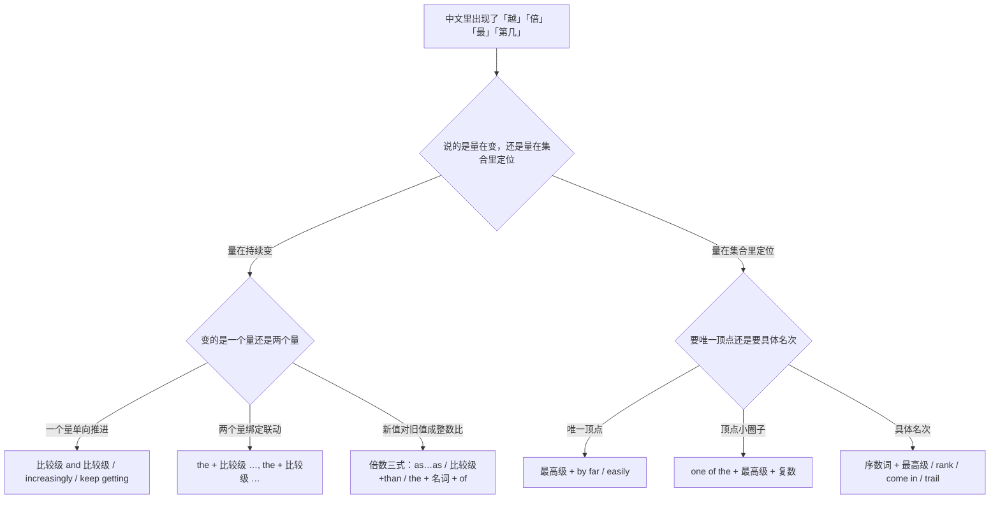
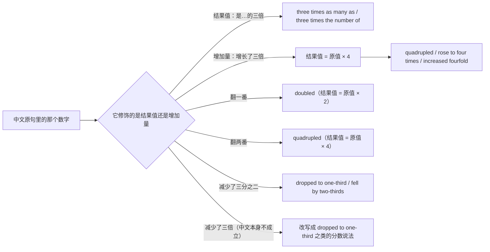
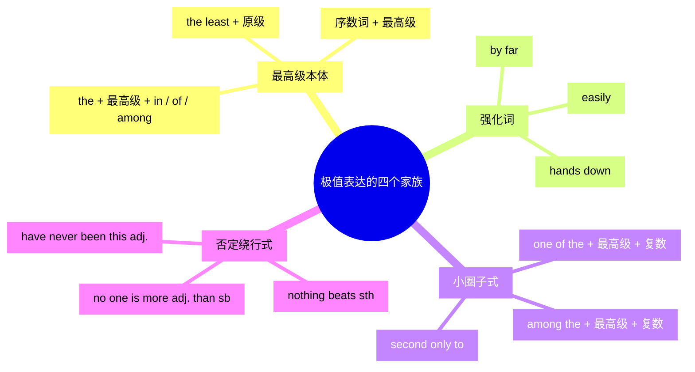
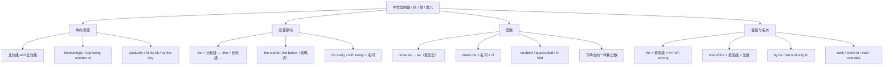

# 越来越、越…越、几倍、最…之一：变化量与极值

> [!info] 本篇定位
>
> 这篇收四类中文意图：量在**单向变化**（越来越贵、逐渐、每况愈下）、两个量**绑定联动**（越早越好、越忙越出错）、新值对旧值成**整数比**（是三倍、翻一番、增长了三倍）、以及在一个集合里**定位到顶点或名次**（最大的、最…之一、仅次于、排第三）。
>
> 上一篇 [[09.比较、程度与数量/01.A 比 B 更、不如、一样：比较三式与差额\|A 比 B 更、不如、一样：比较三式与差额]] 管的是两个对象之间的一次性对比，这一篇管的是**变化过程**与**极值定位**。程度深浅（有点、非常、太…以至于）在下一篇，纯数据的升降与统计（rise by 与 rise to、a sharp drop、level off）在 [[09.比较、程度与数量/04.大约、超过、占三成、平均、分别是：数量与统计描述\|大约、超过、占三成、平均、分别是：数量与统计描述]]。
>
> 读完能查到：34 条中文意图入口、102 条分档成品句架，以及中文「增长了三倍」和英文 `increased threefold` 差一倍的那个坑该怎么绕。

---

## 1. 本篇导读：变化量、倍数、极值三条查询线

中文里一旦出现「越」「倍」「最」「第几」这四个字眼，英文那边分岔就开始了。同一个「越」字，「越来越贵」和「越贵越买」走的是两条完全不同的结构；同一个「三倍」，「是它的三倍」和「增长了三倍」在英文里差出整整一倍的数值。

先用一张选择树把这四个字眼分流。

这张图的分叉点全在左边的中文一侧，不需要先判断自己在用比较级还是最高级。判断顺序是：先问「这句话在讲变化还是在讲位置」——讲变化就看是一个量在动还是两个量咬着动；讲位置就看要的是「独一份」「小圈子」还是「第几名」。倍数被放在变化那一支，是因为中文的倍数句几乎总是在描述某个量相对于另一个量或相对于自身旧值的推进。

本篇的意图块按这张图的四条出路排：第 2 节走单向渐变，第 3 节走双量联动，第 4 节走倍数，第 5 到第 7 节走极值与名次。

---

## 2. 越来越…：单向渐变怎么说

### 2.1 越来越贵、越来越难

中文触发语：越来越… / 一天比一天… / 变得更…了 / 持续走高

| 档位 | 句架 | 例句 | 译文 |
| --- | --- | --- | --- |
| 口语 | sth is getting + 比较级 and 比较级 | Rent in this district is getting higher and higher. | 这一带的房租越来越高了。 |
| 书面 | sth has become increasingly + adj. | Deployment has become increasingly complex since we split the service. | 拆服务之后部署越来越复杂了。 |
| 正式 | there has been a steady increase in + n. | There has been a steady increase in operating costs over the past two quarters. | 过去两个季度运营成本持续上升。 |

> [!warning] 错配警示
>
> - ~~It becomes more and more expensiver every year.~~ ❌
> - **It gets more and more expensive every year.** ✅（`more and more` 后面接原级，不能再叠一层 `-er`；短音节词直接用 `higher and higher` 这一式）

页脚：
- 同义入口：一天比一天贵 / 持续上涨 / 涨个不停
- 语法归属：[[02.英语基础语法/04.形容词与副词/02.形容词的比较级与最高级\|形容词的比较级与最高级]]
- 场景实战：[[04.英语场景/05.高频实用表达句型框架/04.比较对比举例总结句型库\|比较对比举例总结句型库]]

### 2.2 越来越多的人、越来越依赖

中文触发语：越来越多的… / 越来越依赖 / 用的人越来越多

| 档位 | 句架 | 例句 | 译文 |
| --- | --- | --- | --- |
| 口语 | more and more + 复数名词 + 动词 | More and more teams are moving off self-hosted runners. | 越来越多的团队不再自建 runner 了。 |
| 书面 | a growing number of + 复数名词 | A growing number of clients now expect same-day support. | 现在要求当天响应的客户越来越多。 |
| 正式 | sb/sth is increasingly + doing/dependent on sth | The platform is increasingly dependent on a single upstream provider. | 该平台对单一上游供应商的依赖持续加深。 |

> [!warning] 错配警示
>
> - ~~More and more people is joining the beta.~~ ❌
> - **More and more people are joining the beta.** ✅（`more and more + 复数名词` 作主语时谓语跟复数，`a growing number of` 同理）

页脚：
- 同义入口：用的人越来越多 / 有越来越多的… / 逐渐普及
- 语法归属：[[02.英语基础语法/10.特殊句型/06.主谓一致\|主谓一致]]
- 场景实战：[[04.英语场景/10.职场与商务场景实战/02.会议汇报与演示场景\|会议汇报与演示场景]]

### 2.3 一天比一天、与日俱增

中文触发语：一天比一天… / 与日俱增 / 每过一天就更…

| 档位 | 句架 | 例句 | 译文 |
| --- | --- | --- | --- |
| 口语 | sth gets + 比较级 + every day | The backlog gets longer every day. | 待办一天比一天长。 |
| 书面 | with each passing + week/month, sth + 动词 | With each passing month, the migration looks harder to postpone. | 每过一个月，这次迁移就更难往后拖。 |
| 正式 | sth is mounting/growing by the day | Pressure on the release date is mounting by the day. | 发布日期上的压力与日俱增。 |

> [!warning] 错配警示
>
> - ~~The queue gets long day by day than before.~~ ❌
> - **The queue gets longer day by day.** ✅（`day by day` 本身已含递进义，不再接 `than`；要接 `than` 就换成一次性比较句式）

页脚：
- 同义入口：越来越…了 / 逐日 / 一天不如一天
- 语法归属：[[02.英语基础语法/04.形容词与副词/03.副词的分类与用法\|副词的分类与用法]]

### 2.4 逐渐、慢慢地、一点一点

中文触发语：逐渐 / 慢慢地 / 一点一点 / 不知不觉就…了

| 档位 | 句架 | 例句 | 译文 |
| --- | --- | --- | --- |
| 口语 | sth is slowly/gradually + doing | The old API is slowly falling out of use. | 老接口慢慢没人用了。 |
| 书面 | bit by bit / step by step, sb + 动词 | Bit by bit, the team paid down the technical debt. | 团队一点一点把技术债还掉了。 |
| 正式 | sth has gradually + 过去分词 + over + 时段 | Response times have gradually deteriorated over the past year. | 过去一年响应时间逐步恶化。 |

> [!warning] 错配警示
>
> - ~~The users are gradually more and more.~~ ❌
> - **The user base is growing gradually.** ✅（`gradually` 是副词，只能修饰动词；「越来越多」的名词化说法要落到 `growing`、`on the rise` 这类动词或分词上）

页脚：
- 同义入口：一步一步 / 缓慢地 / 不声不响地
- 语法归属：[[02.英语基础语法/04.形容词与副词/03.副词的分类与用法\|副词的分类与用法]]

### 2.5 越来越少、越来越不

中文触发语：越来越少 / 越来越不… / 一天不如一天多

| 档位 | 句架 | 例句 | 译文 |
| --- | --- | --- | --- |
| 口语 | fewer and fewer + 可数复数 / less and less + 不可数 | Fewer and fewer people show up to the Friday sync. | 周五同步会来的人越来越少。 |
| 书面 | sth is becoming increasingly rare/uncommon | Full-text search on that field is becoming increasingly rare. | 对那个字段做全文检索的情况越来越少见。 |
| 正式 | there has been a marked decline in + n. | There has been a marked decline in inbound support tickets. | 进线工单量出现明显下降。 |

> [!warning] 错配警示
>
> - ~~Less and less bugs are reported this month.~~ ❌
> - **Fewer and fewer bugs are reported this month.** ✅（`bug` 可数，用 `fewer`；`less` 留给 `traffic`、`time`、`effort` 这类不可数名词）

页脚：
- 同义入口：越来越罕见 / 逐渐减少 / 快没人用了
- 语法归属：[[02.英语基础语法/02.名词与冠词/01.名词的分类与用法\|名词的分类与用法]]
- 场景实战：[[04.英语场景/05.高频实用表达句型框架/04.比较对比举例总结句型库\|比较对比举例总结句型库]]

### 2.6 每况愈下、越来越糟

中文触发语：每况愈下 / 越来越糟 / 一次比一次差 / 情况恶化

| 档位 | 句架 | 例句 | 译文 |
| --- | --- | --- | --- |
| 口语 | sth is going from bad to worse | The build pipeline is going from bad to worse. | 构建流水线越来越不像话了。 |
| 书面 | sth keeps getting worse / has taken a turn for the worse | Latency keeps getting worse after every batch job. | 每跑一次批处理，延迟就更差一点。 |
| 正式 | sth has continued to deteriorate | Data quality in the legacy table has continued to deteriorate. | 旧表的数据质量持续恶化。 |

> [!warning] 错配警示
>
> - ~~The situation becomes worse and worser.~~ ❌
> - **The situation is getting worse and worse.** ✅（`bad` 的比较级是不规则形式 `worse`，不再加 `-er`；不规则词形归词汇教程）

页脚：
- 同义入口：越来越差 / 一路下滑 / 已经压不住了
- 语法归属：[[02.英语基础语法/04.形容词与副词/02.形容词的比较级与最高级\|形容词的比较级与最高级]]

---

## 3. 越…越…：两个量绑在一起变

### 3.1 越 A 就越 B

中文触发语：越…越… / …得越多，…就越多 / 越是…就越…

| 档位 | 句架 | 例句 | 译文 |
| --- | --- | --- | --- |
| 口语 | the + 比较级 + 主谓, the + 比较级 + 主谓 | The more you cache, the harder it is to debug. | 缓存加得越多，越难排查。 |
| 书面 | the more + n. + sb + 动词, the more + n. + sb + 动词 | The more logging we add, the more storage we burn. | 日志加得越多，存储烧得越快。 |
| 正式 | the greater the + n., the greater the + n. | The greater the concurrency, the greater the risk of lock contention. | 并发越高，锁竞争的风险越大。 |

> [!warning] 错配警示
>
> - ~~More you practice, more you improve.~~ ❌
> - **The more you practice, the more you improve.** ✅（这个结构里两个 `the` 都不能省，它们是结构的一部分，不是冠词）

页脚：
- 同义入口：越是…越是… / …得越厉害就…得越厉害
- 语法归属：[[02.英语基础语法/04.形容词与副词/02.形容词的比较级与最高级\|形容词的比较级与最高级]]
- 场景实战：[[04.英语场景/05.高频实用表达句型框架/04.比较对比举例总结句型库\|比较对比举例总结句型库]]

### 3.2 越早越好、越简单越好

中文触发语：越…越好 / 能多…就多… / 尽量早

| 档位 | 句架 | 例句 | 译文 |
| --- | --- | --- | --- |
| 口语 | the + 比较级, the better | The sooner, the better. | 越早越好。 |
| 书面 | the + 比较级 + n., the better | The smaller the diff, the better for the reviewer. | diff 越小，评审越省事。 |
| 正式 | the + 比较级 + 主谓, the more favourable the outcome | The earlier the issue is escalated, the more favourable the outcome. | 问题上报得越早，结果越理想。 |

> [!warning] 错配警示
>
> - ~~The sooner is better.~~ ❌
> - **The sooner, the better.** ✅（省略式里没有系动词，两截靠逗号并置；补全了反而不地道）

页脚：
- 同义入口：越快越好 / 越少越好 / 能省则省
- 语法归属：[[02.英语基础语法/10.特殊句型/05.省略与替代\|省略与替代]]

### 3.3 越…反而越不…

中文触发语：越…反而越… / 越使劲越不行 / 用力过猛

| 档位 | 句架 | 例句 | 译文 |
| --- | --- | --- | --- |
| 口语 | the + 比较级 …, the less + 主谓 | The harder I stared at it, the less sense it made. | 我越盯着看，越看不懂。 |
| 书面 | the more + 主谓, the worse + 主谓 | The more we optimised the query, the worse the plan got. | 这条查询越优化，执行计划越糟。 |
| 正式 | beyond a certain point, further + n. + yields diminishing returns | Beyond a certain point, further indexing yields diminishing returns. | 过了某个点之后，继续加索引收益递减。 |

> [!warning] 错配警示
>
> - ~~The more I tried, the less I was successful.~~ ❌
> - **The harder I tried, the less successful I was.** ✅（形容词要跟着 `the less` 一起提到句首，不能留在系动词后面）

页脚：
- 同义入口：越努力越糟 / 事与愿违 / 边际效益递减
- 语法归属：[[02.英语基础语法/04.形容词与副词/02.形容词的比较级与最高级\|形容词的比较级与最高级]]

### 3.4 每多一个、每增加一分

中文触发语：每多… / 每增加一个… / …每上升一档

| 档位 | 句架 | 例句 | 译文 |
| --- | --- | --- | --- |
| 口语 | for every + n., sth + 动词 | For every extra tab I open, my laptop gets a bit slower. | 每多开一个标签页，电脑就慢一点。 |
| 书面 | with every + n., sth + 动词 | With every new integration, onboarding takes another two days. | 每接一个新集成，接入周期就多两天。 |
| 正式 | each additional + n. + adds/increases + sth + by + 数量 | Each additional replica increases write latency by roughly 8 ms. | 每增加一个副本，写入延迟约上升 8 毫秒。 |

> [!warning] 错配警示
>
> - ~~Every more replica the latency increases.~~ ❌
> - **For every extra replica, the latency increases.** ✅（「每多一个」用 `for every / with every + 名词`，不能把 `more` 直接摁在 `every` 后面）

页脚：
- 同义入口：每加一个就… / 每上一个台阶 / 单位增量
- 语法归属：[[02.英语基础语法/03.代词与数词/04.不定代词详解\|不定代词详解]]

### 3.5 越不…就越…

中文触发语：越不… / 越是不…就越… / 不理它反而更糟

| 档位 | 句架 | 例句 | 译文 |
| --- | --- | --- | --- |
| 口语 | the less + 主谓, the + 比较级 + 主谓 | The less I sleep, the dumber my code gets. | 睡得越少，写的代码越蠢。 |
| 书面 | the longer sb puts sth off, the + 比较级 + 主谓 | The longer we put the upgrade off, the more painful it will be. | 升级拖得越久，将来越难受。 |
| 正式 | the further sth is deferred, the greater the eventual cost | The further the refactor is deferred, the greater the eventual cost. | 重构推迟得越久，最终成本越高。 |

> [!warning] 错配警示
>
> - ~~The more I don't sleep, the worse I code.~~ ❌
> - **The less I sleep, the worse I code.** ✅（英语用 `the less` 表达否定端的递进，不把 `don't` 塞进这个结构里）

页脚：
- 同义入口：越拖越糟 / 越躲越麻烦 / 不动手就越难动手
- 语法归属：[[02.英语基础语法/04.形容词与副词/02.形容词的比较级与最高级\|形容词的比较级与最高级]]

---

## 4. 几倍、翻番、增长了多少：倍数的三式与中英错位

倍数是中英对不上口径最集中的一处。中文说「增长了三倍」时，数字算的是**增加量**，结果值是原来的四倍；英语说 `increased threefold` 时，数字算的是**结果值**，结果值就是原来的三倍。同一句话搬过去差一倍。

图里最右一支值得单独记一下：中文口语里出现的「减少了三倍」在数学上说不通，英语没有对应说法，`decreased three times` 会被读成「减少了三次」。凡是往下走的量，一律换成分数表达——降到三分之一（`dropped to one-third`）或者降了三分之二（`fell by two-thirds`）。往上走的量才允许用倍数。

### 4.1 是…的两倍、三倍

中文触发语：是…的两倍 / 是…的三倍 / 有…那么多

| 档位 | 句架 | 例句 | 译文 |
| --- | --- | --- | --- |
| 口语 | A is twice as + adj. + as B | This box is twice as fast as the old one. | 这台机器是老机器的两倍快。 |
| 书面 | A has + 数字 + times as many + n. + as B | The new index has three times as many entries as the old one. | 新索引的条目数是旧索引的三倍。 |
| 正式 | A is + 数字 + times as + adj. + as B | Cold-start latency is four times as high as steady-state latency. | 冷启动延迟是稳态延迟的四倍。 |

> [!warning] 错配警示
>
> - ~~It is two times as fast as the old one.~~ ❌
> - **It is twice as fast as the old one.** ✅（2 倍固定说 `twice`，`two times` 只在随口说话时偶尔出现，写出来一律用 `twice`；3 起才是 `three times`、`four times`）

页脚：
- 同义入口：是…的几倍 / 顶得上…几个 / 有…的几倍那么多
- 语法归属：[[02.英语基础语法/03.代词与数词/05.数词的用法与表达\|数词的用法与表达]]
- 场景实战：[[04.英语场景/05.高频实用表达句型框架/04.比较对比举例总结句型库\|比较对比举例总结句型库]]

### 4.2 比…大三倍（times + 比较级 + than）

中文触发语：比…大三倍 / 比…快好几倍 / 高出好几倍

| 档位 | 句架 | 例句 | 译文 |
| --- | --- | --- | --- |
| 口语 | A is + 数字 + times + 比较级 + than B | The premium tier is three times more expensive than the basic one. | 高级版的价格是基础版的三倍。 |
| 书面 | A is + 数字 + times as + adj. + as B | The premium tier is three times as expensive as the basic one. | 高级版的价格是基础版的三倍。 |
| 正式 | A exceeds B by a factor of + 数字 | Peak throughput exceeds the baseline by a factor of three. | 峰值吞吐是基线的三倍。 |

> [!warning] 错配警示
>
> - ~~「比 B 贵三倍」张口就写成 three times more expensive than B。~~ ❌
> - **先把结果值定死：想说「是 B 的三倍」写 `three times as expensive as B`，想说「在 B 之上再多三倍」（即四倍）写 `four times as expensive as B`。** ✅（`times + 比较级 + than` 同时存在「三倍」和「多三倍」两种读法，正式文档里绕开它）

页脚：
- 同义入口：高出几倍 / 贵好几倍 / 差出一个数量级
- 语法归属：[[02.英语基础语法/04.形容词与副词/02.形容词的比较级与最高级\|形容词的比较级与最高级]]

### 4.3 三倍的销量（times the + 名词 + of）

中文触发语：…的三倍 / 三倍的… / 相当于…的几倍

| 档位 | 句架 | 例句 | 译文 |
| --- | --- | --- | --- |
| 口语 | A is + 数字 + times the size of B | The new dataset is five times the size of the old one. | 新数据集是旧的五倍大。 |
| 书面 | A is + 数字 + times the + n. + of B | This quarter's revenue is twice the revenue of the same period last year. | 本季营收是去年同期的两倍。 |
| 正式 | A represents + 数字 + times the + n. + of B | The reported figure represents three times the volume of the previous audit. | 报告数字为上次审计量的三倍。 |

> [!warning] 错配警示
>
> - ~~The file is three times the size than the original.~~ ❌
> - **The file is three times the size of the original.** ✅（这一式用 `of` 连接，`than` 只跟在比较级后面）

页脚：
- 同义入口：相当于…的几倍 / 是…的几倍大 / 体量是…的几倍
- 语法归属：[[02.英语基础语法/03.代词与数词/05.数词的用法与表达\|数词的用法与表达]]

### 4.4 翻一番、翻两番

中文触发语：翻一番 / 翻倍 / 翻两番 / 番了好几番

| 档位 | 句架 | 例句 | 译文 |
| --- | --- | --- | --- |
| 口语 | sth has doubled / tripled / quadrupled | Our storage bill has doubled since March. | 三月以来存储账单翻了一番。 |
| 书面 | sth has grown + 数字-fold | Traffic has grown tenfold since the launch. | 上线以来流量增长到十倍。 |
| 正式 | sth has increased by a factor of + 数字 | Index size has increased by a factor of eight. | 索引体积增长到原来的八倍。 |

> [!warning] 错配警示
>
> - ~~「翻两番」写成 doubled twice 或 increased two times。~~ ❌
> - **「翻一番」= `doubled`（×2），「翻两番」= `quadrupled`（×4）。** ✅（中文的「番」是连续乘 2，第 n 番等于 2 的 n 次方倍，不是乘 n）

页脚：
- 同义入口：涨到两倍 / 番了一番 / 成倍增长
- 语法归属：[[02.英语基础语法/03.代词与数词/05.数词的用法与表达\|数词的用法与表达]]
- 场景实战：[[04.英语场景/10.职场与商务场景实战/02.会议汇报与演示场景\|会议汇报与演示场景]]

### 4.5 增长了三倍 vs 增长到三倍

中文触发语：增长了三倍 / 增长到三倍 / 涨了两倍 / 涨到两倍

| 档位 | 句架 | 例句 | 译文 |
| --- | --- | --- | --- |
| 口语 | sth is now + 数字 + times what it was | Our error rate is now four times what it was last month. | 错误率现在是上个月的四倍。 |
| 书面 | sth rose to + 数字 + times the previous + n. | Monthly spend rose to four times the previous figure. | 月度开销涨到之前的四倍。 |
| 正式 | sth increased + 数字-fold over + 时段 | Request volume increased fourfold over the last two quarters. | 请求量在过去两个季度增长到四倍。 |

> [!warning] 错配警示
>
> - ~~中文「增长了三倍」直译成 increased threefold。~~ ❌
> - **中文「增长了三倍」= 结果值是原来的四倍 = `increased fourfold` / `quadrupled`。** ✅（英语的倍数词说的是结果值，中文的「增长了 N 倍」说的是增加量，两边差一倍）

页脚：
- 同义入口：涨了几倍 / 是原来的几倍 / 增量是原来的几倍
- 语法归属：[[02.英语基础语法/03.代词与数词/05.数词的用法与表达\|数词的用法与表达]]
- 场景实战：[[04.英语场景/10.职场与商务场景实战/03.商务邮件与正式书面沟通\|商务邮件与正式书面沟通]]

### 4.6 只有…的一半、三分之一

中文触发语：只有…的一半 / 是…的三分之一 / 不到…的一半

| 档位 | 句架 | 例句 | 译文 |
| --- | --- | --- | --- |
| 口语 | A is half as + adj. + as B | The mobile build is half as big as the desktop one. | 移动端包体只有桌面端的一半大。 |
| 书面 | A is + 分数 + the + n. + of B | The new payload is one-third the size of the old one. | 新的报文体积是旧的三分之一。 |
| 正式 | A amounts to less than half of B | Actual utilisation amounts to less than half of the provisioned capacity. | 实际使用量不到预置容量的一半。 |

> [!warning] 错配警示
>
> - ~~The cost decreased three times.~~ ❌
> - **The cost dropped to one-third of what it was.** ✅（下降方向不用倍数，一律换分数；`decreased three times` 只会被读成「降过三次」）

页脚：
- 同义入口：不到…的一半 / 只剩三分之一 / 砍掉了三分之二
- 语法归属：[[02.英语基础语法/03.代词与数词/05.数词的用法与表达\|数词的用法与表达]]
- 场景实战：[[04.英语场景/10.职场与商务场景实战/02.会议汇报与演示场景\|会议汇报与演示场景]]

### 4.7 是…的多少倍（提问与估量）

中文触发语：是…的多少倍 / 差多少倍 / 大概几倍

| 档位 | 句架 | 例句 | 译文 |
| --- | --- | --- | --- |
| 口语 | How many times + 比较级 + is A than B? | How many times faster is the cached path than the cold one? | 走缓存比冷路径快几倍？ |
| 书面 | roughly + 数字 + times as + adj. + as | The nightly job takes roughly six times as long as the incremental one. | 夜间任务耗时大约是增量任务的六倍。 |
| 正式 | on the order of + 数字 + times + n. | Memory use is on the order of ten times the documented baseline. | 内存占用约为文档基线的十倍量级。 |

> [!warning] 错配警示
>
> - ~~How much times bigger is it?~~ ❌
> - **How many times bigger is it?** ✅（`times` 可数，提问用 `how many times`，`how much` 只跟不可数）

页脚：
- 同义入口：差几个数量级 / 大概是几倍 / 相差多少倍
- 语法归属：[[02.英语基础语法/03.代词与数词/05.数词的用法与表达\|数词的用法与表达]]

---

## 5. 最…的：极值的基本式与范围限定

极值不是只有 `the most` 一种形状。英语把「顶点」拆成四个家族：最高级本体、强化词、小圈子式、否定绕行式。

四个家族对应四种不同的把握度。最高级本体断言「唯一顶点」，说错了就是硬伤；小圈子式只断言「在头部」，是给自己留余地的说法；强化词在本体上再加一层「而且甩开第二名很远」；否定绕行式则完全避开排名，用「没有比这更…的」表达同一个意思，语气更主观也更安全。中文的「最」在这四家里都可能落地，选哪一家看的是你有没有把握，而不是语法。

### 5.1 最…的（范围限定）

中文触发语：最… / …里最…的 / 数它最…

| 档位 | 句架 | 例句 | 译文 |
| --- | --- | --- | --- |
| 口语 | sth is the + 最高级 + 主谓 | This is the worst outage we've had. | 这是我们出过最严重的一次故障。 |
| 书面 | A is the + 最高级 + n. + in/of + 范围 | Postgres is the most widely used database in our stack. | Postgres 是我们技术栈里用得最广的数据库。 |
| 正式 | A ranks as the + 最高级 + n. + among + 复数 | This module ranks as the most frequently modified component among all services. | 该模块是所有服务中改动最频繁的组件。 |

> [!warning] 错配警示
>
> - ~~He is the tallest of the class.~~ ❌
> - **He is the tallest in the class.** ✅（范围是一个整体场所或群体时用 `in`；范围是一群同类个体时才用 `of the three`、`of them all`）

页脚：
- 同义入口：最厉害的 / 头一号的 / 排头的
- 语法归属：[[02.英语基础语法/04.形容词与副词/02.形容词的比较级与最高级\|形容词的比较级与最高级]]
- 场景实战：[[04.英语场景/05.高频实用表达句型框架/04.比较对比举例总结句型库\|比较对比举例总结句型库]]

### 5.2 有史以来最…、我见过最…

中文触发语：有史以来最… / 我见过最… / 从来没这么…过的

| 档位 | 句架 | 例句 | 译文 |
| --- | --- | --- | --- |
| 口语 | the + 最高级 + n. + I've ever + 过去分词 | That's the weirdest bug I've ever seen. | 那是我见过最离奇的 bug。 |
| 书面 | the + 最高级 + n. + on record | Last night's spike was the highest on record. | 昨晚的峰值是有记录以来最高的。 |
| 正式 | the + 最高级 + n. + to date | This is the largest single migration undertaken to date. | 这是迄今为止规模最大的一次单体迁移。 |

> [!warning] 错配警示
>
> - ~~It is the best film I never saw.~~ ❌
> - **It is the best film I've ever seen.** ✅（这个结构固定用 `ever` 加现在完成时，`never` 会把意思整个反过来）

页脚：
- 同义入口：史上最… / 空前的 / 打破纪录的
- 语法归属：[[02.英语基础语法/04.形容词与副词/02.形容词的比较级与最高级\|形容词的比较级与最高级]]

### 5.3 最…之一

中文触发语：最…之一 / 数一数二的 / 属于最…的那一批

| 档位 | 句架 | 例句 | 译文 |
| --- | --- | --- | --- |
| 口语 | one of the + 最高级 + 复数名词 | It's one of the fastest editors out there. | 它是目前最快的编辑器之一。 |
| 书面 | among the + 最高级 + 复数名词 | This library is among the most stable options available. | 这个库属于现有选项里最稳的一批。 |
| 正式 | A is widely regarded as one of the + 最高级 + 复数名词 | The framework is widely regarded as one of the most mature solutions in the field. | 该框架被公认为该领域最成熟的方案之一。 |

> [!warning] 错配警示
>
> - ~~She is one of the best engineer on the team.~~ ❌
> - **She is one of the best engineers on the team.** ✅（`one of` 后面永远接复数名词，因为它说的是「这一群里的一个」）

页脚：
- 同义入口：数一数二 / 排得上号的 / 头部那几个
- 语法归属：[[02.英语基础语法/02.名词与冠词/02.名词的数与格\|名词的数与格]]
- 场景实战：[[04.英语场景/05.高频实用表达句型框架/04.比较对比举例总结句型库\|比较对比举例总结句型库]]

### 5.4 第二…、第三…

中文触发语：第二大 / 第三快 / 倒数第二 / 仅次于第一

| 档位 | 句架 | 例句 | 译文 |
| --- | --- | --- | --- |
| 口语 | the second + 最高级 + n. | It's the second biggest table in the database. | 这是库里第二大的表。 |
| 书面 | the + 序数词 + most + adj. + n. | It's the third most requested feature this quarter. | 这是本季度呼声第三高的功能。 |
| 正式 | the + 序数词 + 最高级 + n. + by + 指标 | It is the fourth largest market by revenue. | 按营收计，这是第四大市场。 |

> [!warning] 错配警示
>
> - ~~It is the second most big table.~~ ❌
> - **It is the second biggest table.** ✅（单音节形容词走 `-est`，`most` 只配多音节词；序数词加在整块最高级前面）

页脚：
- 同义入口：第几大 / 排第几高 / 倒数第几
- 语法归属：[[02.英语基础语法/03.代词与数词/05.数词的用法与表达\|数词的用法与表达]]

### 5.5 遥遥领先地最…（by far）

中文触发语：遥遥领先 / 甩开第二名一大截 / 毫无疑问最…

| 档位 | 句架 | 例句 | 译文 |
| --- | --- | --- | --- |
| 口语 | hands down the + 最高级 + n. | That's hands down the best refactor we've shipped this year. | 那是今年我们做过最漂亮的一次重构，没有之一。 |
| 书面 | by far the + 最高级 + n. | Caching was by far the biggest win in this release. | 这个版本里收益最大的改动是缓存，差距很大。 |
| 正式 | A is the + 最高级 + n. + by a wide margin | The proposed design is the most cost-effective option by a wide margin. | 所提方案在成本效益上大幅领先其余选项。 |

> [!warning] 错配警示
>
> - ~~It is very the best option.~~ ❌
> - **It is by far the best option.** ✅（`very` 不能强化最高级；强化最高级用 `by far`、`easily`、`hands down`）

页脚：
- 同义入口：甩开一大截 / 断层第一 / 差距明显
- 语法归属：[[02.英语基础语法/04.形容词与副词/03.副词的分类与用法\|副词的分类与用法]]
- 场景实战：[[04.英语场景/10.职场与商务场景实战/02.会议汇报与演示场景\|会议汇报与演示场景]]

### 5.6 仅次于

中文触发语：仅次于 / 排在…后面 / 除了…就数它

| 档位 | 句架 | 例句 | 译文 |
| --- | --- | --- | --- |
| 口语 | after A, B is the + 最高级 | After Chrome, Safari is the most used browser here. | 除了 Chrome，用得最多的就是 Safari。 |
| 书面 | A is second only to B + in + n. | This service is second only to auth in request volume. | 论请求量，这个服务仅次于认证服务。 |
| 正式 | A ranks second to B in terms of + n. | The region ranks second to headquarters in terms of headcount. | 按人数计，该区域仅次于总部。 |

> [!warning] 错配警示
>
> - ~~It is second only than the market leader.~~ ❌
> - **It is second only to the market leader.** ✅（`second only to` 是固定搭配，介词只能是 `to`）

页脚：
- 同义入口：屈居第二 / 排老二 / 只输给…
- 语法归属：[[02.英语基础语法/03.代词与数词/05.数词的用法与表达\|数词的用法与表达]]

### 5.7 最不…、最没可能的

中文触发语：最不… / 最没可能的 / 最后才会考虑的

| 档位 | 句架 | 例句 | 译文 |
| --- | --- | --- | --- |
| 口语 | the last + n. + sb + would + 动词原形 | That's the last thing I'd want to touch before a release. | 发布前我最不想动的就是那块。 |
| 书面 | the least + adj. + n. | Rolling back is the least disruptive option we have. | 回滚是我们手上影响最小的选项。 |
| 正式 | A is the least likely + n. + to + 动词原形 | Network partition is the least likely cause of this failure. | 网络分区是本次故障中可能性最低的原因。 |

> [!warning] 错配警示
>
> - ~~It is the most impossible cause of this failure.~~ ❌
> - **It is the least likely cause of this failure.** ✅（`impossible` 是绝对概念，没有程度之分；「可能性最低」用 `the least + 原级`）

页脚：
- 同义入口：最不可能的 / 最不想碰的 / 优先级最低的
- 语法归属：[[02.英语基础语法/04.形容词与副词/02.形容词的比较级与最高级\|形容词的比较级与最高级]]

---

## 6. 排第几、领先、垫底：名次与排序

### 6.1 排第几

中文触发语：排第几 / 名列第… / 位居第…

| 档位 | 句架 | 例句 | 译文 |
| --- | --- | --- | --- |
| 口语 | sb/sth came in + 序数词 | Our team came in third in the internal hackathon. | 我们组在内部黑客松拿了第三。 |
| 书面 | A ranks + 序数词 + among + 复数 | The repo ranks fifth among all internal projects by commit count. | 按提交数，这个仓库在所有内部项目里排第五。 |
| 正式 | A is placed + 序数词 + in + 排名榜 | The product is placed second in the annual reliability index. | 该产品在年度可靠性指数中位列第二。 |

> [!warning] 错配警示
>
> - ~~We got the third place in the contest.~~ ❌
> - **We took third place in the contest.** ✅（`take/come in + 序数词 + place`，名次前不加定冠词）

页脚：
- 同义入口：拿了第几 / 位列第几 / 榜上第几
- 语法归属：[[02.英语基础语法/03.代词与数词/05.数词的用法与表达\|数词的用法与表达]]
- 场景实战：[[04.英语场景/10.职场与商务场景实战/02.会议汇报与演示场景\|会议汇报与演示场景]]

### 6.2 名列前茅、进前三

中文触发语：名列前茅 / 进了前三 / 排在前 10%

| 档位 | 句架 | 例句 | 译文 |
| --- | --- | --- | --- |
| 口语 | sth made it into the top + 数字 | Our page made it into the top five results. | 我们的页面挤进了前五条结果。 |
| 书面 | A is in the top + 百分数 + of + 复数 | The service is in the top 10 percent of all endpoints by traffic. | 按流量算，该服务在所有端点里排前 10%。 |
| 正式 | A consistently places within the top + 数字 | The vendor consistently places within the top three on delivery reliability. | 该供应商在交付可靠性上稳定位居前三。 |

> [!warning] 错配警示
>
> - ~~We are in top three of the list.~~ ❌
> - **We are in the top three on the list.** ✅（`top + 数字` 前要有定冠词；榜单用 `on the list`）

页脚：
- 同义入口：挤进前几 / 处在头部 / 前百分之几
- 语法归属：[[02.英语基础语法/02.名词与冠词/03.冠词的用法详解\|冠词的用法详解]]

### 6.3 垫底、倒数第二

中文触发语：垫底 / 排最后 / 倒数第二 / 敬陪末座

| 档位 | 句架 | 例句 | 译文 |
| --- | --- | --- | --- |
| 口语 | sth is at the bottom of + 榜单 | That metric is at the bottom of the dashboard for a reason. | 那个指标排在看板最后是有原因的。 |
| 书面 | A ranks last/second to last in + 范围 | Our onboarding time ranks second to last across all regions. | 我们的接入时长在所有区域里倒数第二。 |
| 正式 | A occupies the lowest position in + 排名榜 | The legacy client occupies the lowest position in the compatibility matrix. | 旧客户端在兼容性矩阵中处于最低位。 |

> [!warning] 错配警示
>
> - ~~We ranked the last in the survey.~~ ❌
> - **We ranked last in the survey.** ✅（`rank` 后直接接 `last`、`third`，不加冠词；`the last` 只在作名词时用）

页脚：
- 同义入口：排最末 / 倒数几名 / 拖后腿
- 语法归属：[[02.英语基础语法/03.代词与数词/05.数词的用法与表达\|数词的用法与表达]]

### 6.4 领先多少、落后多少

中文触发语：领先… / 落后… / 差着几个身位 / 拉开差距

| 档位 | 句架 | 例句 | 译文 |
| --- | --- | --- | --- |
| 口语 | A is ahead of B by + 差额 | We're ahead of them by about two weeks. | 我们比他们快大概两周。 |
| 书面 | A leads B by + 差额 / A lags behind B in + n. | Our conversion leads theirs by four percentage points. | 我们的转化率领先他们四个百分点。 |
| 正式 | A trails B by + 差额 + in + 指标 | The regional site trails the flagship by 12 percent in uptime. | 区域站点在可用性上落后旗舰站点 12%。 |

> [!warning] 错配警示
>
> - ~~We are behind them of two weeks.~~ ❌
> - **We are behind them by two weeks.** ✅（差额一律用 `by` 引出，无论领先还是落后）

页脚：
- 同义入口：快多少 / 慢多少 / 差多少个身位
- 语法归属：[[02.英语基础语法/05.介词与连词/02.常用介词搭配详解\|常用介词搭配详解]]
- 场景实战：[[04.英语场景/10.职场与商务场景实战/02.会议汇报与演示场景\|会议汇报与演示场景]]

### 6.5 反超、被超过

中文触发语：反超 / 被超过了 / 挤下来了 / 险胜

| 档位 | 句架 | 例句 | 译文 |
| --- | --- | --- | --- |
| 口语 | A has overtaken B | Mobile traffic has overtaken desktop traffic this quarter. | 这个季度移动端流量反超了桌面端。 |
| 书面 | A surpassed B in + n. + in + 时间 | The new build surpassed the old one in throughput within a week. | 一周之内新版本在吞吐上就超过了旧版本。 |
| 正式 | A edged out B by a narrow margin | The revised proposal edged out the incumbent by a narrow margin. | 修订方案以微弱优势胜过原有方案。 |

> [!warning] 错配警示
>
> - ~~Mobile traffic overtook to desktop traffic.~~ ❌
> - **Mobile traffic overtook desktop traffic.** ✅（`overtake` 与 `surpass` 都是及物动词，后面直接接宾语，不带介词）

页脚：
- 同义入口：挤下去了 / 后来居上 / 险胜
- 语法归属：[[02.英语基础语法/01.基础入门/02.英语五大基本句型详解\|英语五大基本句型详解]]

---

## 7. 绕开「最」字的顶格说法

### 7.1 没有比这更…的了

中文触发语：没有比…更…的了 / 没什么比得上 / 就数它了

| 档位 | 句架 | 例句 | 译文 |
| --- | --- | --- | --- |
| 口语 | Nothing beats + n./doing | Nothing beats a clean stack trace. | 没有什么比一份干净的调用栈更让人省心。 |
| 书面 | No + n. + is more + adj. + than + n. | No metric is more misleading than average latency. | 没有哪个指标比平均延迟更有误导性。 |
| 正式 | There is no + n. + more + adj. + than + n. | There is no factor more critical to adoption than onboarding friction. | 没有哪个因素比接入摩擦更能左右采用率。 |

> [!warning] 错配警示
>
> - ~~Nothing beats than a clean trace.~~ ❌
> - **Nothing beats a clean trace.** ✅（`beat` 是及物动词，本身就含「胜过」，不再接 `than`）

页脚：
- 同义入口：无出其右 / 没什么比得过 / 首推它
- 语法归属：[[02.英语基础语法/04.形容词与副词/02.形容词的比较级与最高级\|形容词的比较级与最高级]]

### 7.2 从来没这么…过

中文触发语：从来没这么…过 / 前所未有地… / 现在是最好的时候

| 档位 | 句架 | 例句 | 译文 |
| --- | --- | --- | --- |
| 口语 | sth has never been this + adj. | The dashboard has never been this quiet. | 看板从来没这么安静过。 |
| 书面 | sth is the + 最高级 + it has ever been | Test coverage is the highest it has ever been. | 测试覆盖率处于历史最高水平。 |
| 正式 | sth has reached an unprecedented level | Adoption has reached an unprecedented level this year. | 今年的采用率达到了前所未有的水平。 |

> [!warning] 错配警示
>
> - ~~It has never been so quiet like this.~~ ❌
> - **It has never been this quiet.** ✅（`this + 形容词` 表示「这么…」，后面不再补 `like this`）

页脚：
- 同义入口：史上最好 / 空前的 / 从没这么顺过
- 语法归属：[[02.英语基础语法/06.动词时态/04.完成时态详解\|完成时态详解]]

### 7.3 数一数二、屈指可数

中文触发语：数一数二 / 屈指可数 / 就那么几个

| 档位 | 句架 | 例句 | 译文 |
| --- | --- | --- | --- |
| 口语 | one of a handful of + 复数名词 | She's one of a handful of people who know that system. | 懂那套系统的人就那么几个，她是其中之一。 |
| 书面 | A is among the very few + 复数 + that + 动词 | It is among the very few tools that handle both formats. | 能同时处理两种格式的工具屈指可数，它是其中之一。 |
| 正式 | A ranks among the foremost + 复数 + in + 领域 | The lab ranks among the foremost research groups in the field. | 该实验室位居本领域最前列的研究团队之列。 |

> [!warning] 错配警示
>
> - ~~He is one of a few person who knows it.~~ ❌
> - **He is one of the few people who know it.** ✅（`one of the few` 后接复数名词，从句谓语跟着复数走）

页脚：
- 同义入口：没几个 / 头部那几家 / 稀有
- 语法归属：[[02.英语基础语法/03.代词与数词/04.不定代词详解\|不定代词详解]]

### 7.4 前所未有、创纪录

中文触发语：创纪录 / 破纪录 / 前所未有 / 历史新高

| 档位 | 句架 | 例句 | 译文 |
| --- | --- | --- | --- |
| 口语 | sth hit an all-time high/low | Signups hit an all-time high last weekend. | 上周末注册量创了历史新高。 |
| 书面 | sth reached a record + n. | Query volume reached a record 4.2 million per hour. | 查询量达到每小时 420 万次的纪录水平。 |
| 正式 | sth set a new record for + n. | The release set a new record for the shortest rollout window. | 这次发布创下了最短灰度窗口的纪录。 |

> [!warning] 错配警示
>
> - ~~It created a new record.~~ ❌
> - **It set a new record.** ✅（纪录的搭配动词是 `set`、`break`、`hit`，不用 `create`；搭配限制归词汇教程）

页脚：
- 同义入口：新高 / 新低 / 打破纪录
- 语法归属：[[02.英语基础语法/02.名词与冠词/03.冠词的用法详解\|冠词的用法详解]]

---

## 8. 中文说法反查与错配总表

前七节按结构排，这一节按中文字面排，用来在拿不准结构时倒着查。

| 中文说法 | 首选英文形态 | 落到本篇哪一条 |
| --- | --- | --- |
| 越来越贵 | getting more and more expensive | 2.1 |
| 越来越多的人 | a growing number of people | 2.2 |
| 一天比一天难 | gets harder every day | 2.3 |
| 慢慢就好了 | gradually improving | 2.4 |
| 越来越少 | fewer and fewer / less and less | 2.5 |
| 每况愈下 | going from bad to worse | 2.6 |
| 越忙越出错 | the busier I am, the more mistakes I make | 3.1 |
| 越早越好 | the sooner, the better | 3.2 |
| 越修越乱 | the more I patched it, the messier it got | 3.3 |
| 每多一个副本 | for every extra replica | 3.4 |
| 越拖越难办 | the longer we wait, the harder it gets | 3.5 |
| 是 B 的两倍 | twice as much as B | 4.1 |
| 比 B 贵三倍 | 先定结果值，是三倍就写 three times as expensive as B | 4.2 |
| 三倍的体量 | three times the size of | 4.3 |
| 翻一番 | doubled | 4.4 |
| 翻两番 | quadrupled | 4.4 |
| 增长了三倍 | quadrupled / increased fourfold | 4.5 |
| 增长到三倍 | tripled / increased threefold | 4.5 |
| 降到三分之一 | dropped to one-third | 4.6 |
| 减少了三倍 | 改写成 fell by two-thirds | 4.6 |
| 快几倍 | how many times faster | 4.7 |
| 班里最高的 | the tallest in the class | 5.1 |
| 我见过最怪的 | the weirdest I've ever seen | 5.2 |
| 最好的之一 | one of the best | 5.3 |
| 第二大 | the second largest | 5.4 |
| 断层第一 | by far the best | 5.5 |
| 仅次于 | second only to | 5.6 |
| 最不可能的原因 | the least likely cause | 5.7 |
| 拿了第三 | came in third | 6.1 |
| 进了前五 | made it into the top five | 6.2 |
| 垫底 | ranks last | 6.3 |
| 领先两周 | ahead by two weeks | 6.4 |
| 反超 | overtook | 6.5 |
| 没什么比得上 | nothing beats | 7.1 |
| 从没这么顺过 | has never been this smooth | 7.2 |
| 屈指可数 | one of a handful | 7.3 |
| 创历史新高 | hit an all-time high | 7.4 |

这张表刻意把「增长了三倍」和「增长到三倍」、「翻一番」和「翻两番」、「是它的两倍」和「比它贵三倍」这几组挨着排，它们在中文里字面接近，在英文里落点差着一整倍。查这一区的时候先在心里把结果值算出来，再挑句架。

---

## 9. 本篇小结

这张总图把全篇 34 条意图压到四支上。左边三支处理「量在动」，右边一支处理「量在集合里的位置」。倍数那一支单独挂了一个「下降方向一律换分数」的叶子，因为它是本篇唯一一处**中英不可直译**的地方——其余各条都能靠句架套上去，只有这一条必须先在心里换算。

> [!success] 本篇核心要点回顾
>
> 1. 单向渐变有三条路：`比较级 and 比较级` 走口语，`increasingly` 与 `a growing number of` 走书面，`there has been a steady increase in` 走正式。
> 2. `more and more` 后面接原级，短音节词直接用 `higher and higher`，两种叠加就是错句。
> 3. 双量联动的 `the + 比较级 …, the + 比较级 …` 里两个 `the` 都不能省，它们是结构件不是冠词。
> 4. 倍数三式里最不易被误读的是 `times as … as` 与 `times the + 名词 + of`；`times + 比较级 + than` 存在两种读法，正式文档里绕开它。
> 5. 中文「增长了三倍」的结果值是原来的四倍，对应 `quadrupled` 或 `increased fourfold`；`increased threefold` 对应的是中文的「增长到三倍」。
> 6. 中文「翻一番」是 `doubled`，「翻两番」是 `quadrupled`，第 n 番是 2 的 n 次方倍。
> 7. 下降方向不用倍数：说 `dropped to one-third` 或 `fell by two-thirds`，不说 `decreased three times`。
> 8. 极值分四家——最高级本体断言唯一顶点，`one of the + 最高级 + 复数` 留余地，`by far` 加强差距，`nothing beats` 绕开排名；`very` 不能强化最高级。

> [!success] 本篇练习清单
>
> - [ ] 给「这一带的房租越来越贵」写出口语、书面、正式三档。
> - [ ] 给「日志加得越多，存储烧得越快」写出口语、书面、正式三档。
> - [ ] 给「新索引的条目数是旧索引的三倍」写出口语、书面、正式三档。
> - [ ] 给「上线以来流量翻了三番」先算出结果值，再写出三档。
> - [ ] 给「成本降到了原来的三分之一」写出三档，并说明为什么不能用倍数。
> - [ ] 给「它是目前最快的编辑器之一」写出口语、书面、正式三档。
> - [ ] 给「按请求量算，这个服务仅次于认证服务」写出三档。
> - [ ] 给「移动端流量这个季度反超了桌面端」写出三档，注意 `overtake` 后不带介词。

### 9.1 下一篇预告

> [!info] 接着往下查
>
> 本篇处理的是量与量之间的**相对关系**——谁比谁多几倍、谁排第几。下一篇换一个维度：不比对象，只标刻度。「一点也不」「有点」「相当」「非常」「极其」排成一条可查的尺，再补上 `too…to`、`enough to`、`not…enough`、`fall short of` 这一组够与不够的说法。
>
> [[09.比较、程度与数量/03.太…以至于、够不够、有点、非常：程度刻度\|太…以至于、够不够、有点、非常：程度刻度]]
