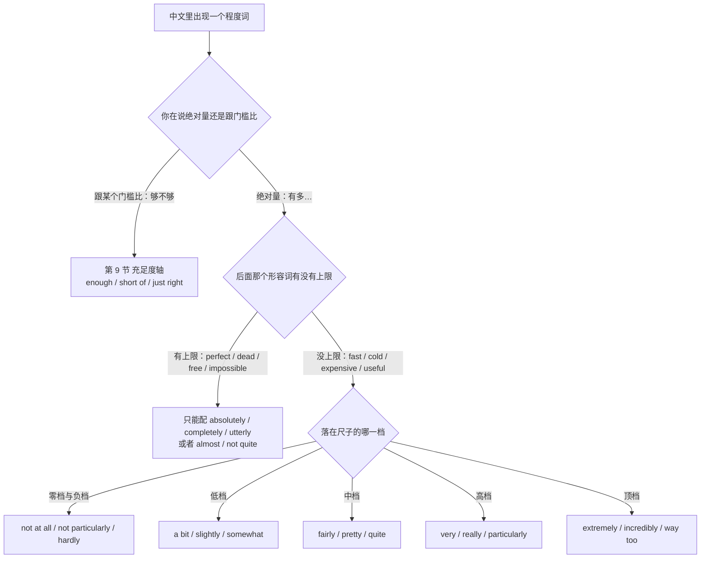
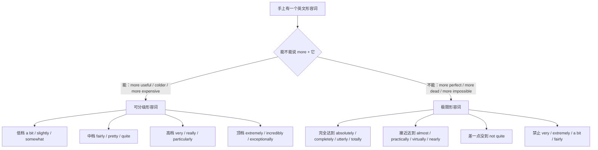
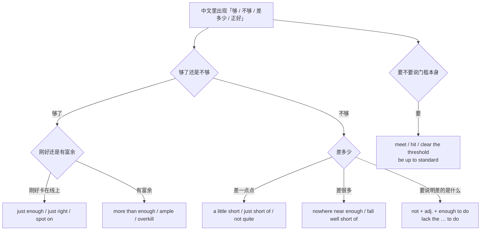
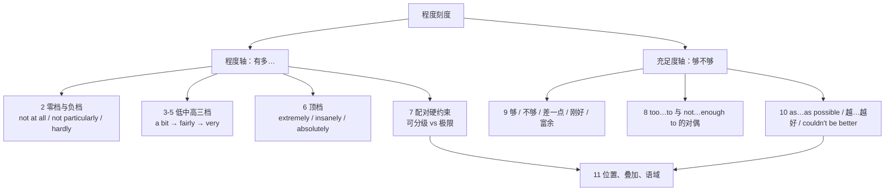

# 太…以至于、够不够、有点、非常：程度刻度

> [!info] 本篇定位
>
> 这篇处理两条互相独立的轴。
>
> 第一条是**程度轴**：同一个形容词前面加什么词，中文从「一点也不快」「有点快」「挺快」「很快」一路排到「快得要命」，英文对应的强化词与弱化词各有各的搭配限制，选错的结果是听着刺耳而不是听着夸张。
>
> 第二条是**充足度轴**：够不够、差多少、刚刚好、绰绰有余。这条轴跟程度轴垂直——「很快」说的是绝对量，「够快」说的是跟某个门槛比。中文都用「程度」两个字概括，英文分别落在 very 一族和 enough 一族上。
>
> 上一篇 [[09.比较、程度与数量/02.越来越、越…越、几倍、最…之一：变化量与极值\|越来越、越…越、几倍、最…之一]] 处理的是「比之前更…」和「几倍」，本篇处理的是「有多…」，不涉及跟另一个对象比。「A 比 B 快」在 [[09.比较、程度与数量/01.A 比 B 更、不如、一样：比较三式与差额\|A 比 B 更、不如、一样]]。
>
> 「太…以至于」这条意图的完整形态（so…that、such…that、to the point where）主锚点在 [[03.因果与结果/03.结果、因此、以至于：从结果反推与程度致果\|结果、因此、以至于]] 第 4 节，本篇只收它在程度刻度上的那一半：不带结果从句的「太…了」，以及跟 enough 成对偶的 too…to。
>
> 读完能查到：想说一句带程度词的中文时，直接拿到这一档的成品句架，并且知道这个词能不能跟你手上那个形容词配。

---

## 1. 本篇导读：一条尺，两个坑

中文的程度词几乎可以任意搭配。「非常好」「非常完美」「非常正确」都说得通，因为中文的「非常」不挑后面那个词有没有上限。英文不是这样：`very good` 对，`very perfect` 错；`absolutely perfect` 对，`absolutely good` 别扭。这条差别是本篇最大的产出。

先把整条尺摆出来，这张表就是本篇的目录。

| 中文档位 | 典型中文说法 | 英文主力词 | 落到哪一节 |
| --- | --- | --- | --- |
| 零 | 一点也不、丝毫不 | not at all、not in the least | 第 2 节 |
| 负低 | 不太、不怎么、算不上 | not particularly、not exactly | 第 2 节 |
| 极低 | 几乎不、勉强 | hardly、barely | 第 2 节 |
| 低 | 有点、稍微、略 | a bit、slightly、somewhat | 第 3 节 |
| 中 | 还行、挺、相当 | fairly、pretty、quite | 第 4 节 |
| 高 | 很、非常、真的 | very、really、particularly | 第 5 节 |
| 顶 | 极其、要命、彻底 | extremely、insanely、absolutely | 第 6 节 |

两个坑分别在第 7 节和第 11 节。第 7 节是搭配坑：形容词分**可分级**和**极限**两类，前一类能说「有点」「很」「极其」，后一类只能说「完全」或者「不完全」。第 11 节是位置与叠加坑：修饰动词时不能用 very，两个强化词不能连着堆。

进这张图的第一个判断不是「有多强」，而是「你在跟什么比」。说「这台机器很快」是绝对量，走右半边；说「这台机器够快了」是拿它跟一个隐含门槛比，直接走左边到第 9 节，那一整条轴上没有 very 什么事。

右半边的第一个岔口才是搭配判断：把中文形容词翻成英文，问它能不能说「更…」。能说 `faster`、`colder`、`more expensive` 的是可分级词，整条尺都对它开放；不能说 `more perfect`、`more dead`、`more impossible` 的是极限词，尺子对它只剩两格——完全达到，或者差一点点达到。

> [!warning] 三个不必在本篇找的东西
>
> - **程度副词的词义辨析**（slightly 与 marginally 差在哪、rather 的贬义色彩）归 [[02.英语基础语法/04.形容词与副词/03.副词的分类与用法\|副词的分类与用法]]，本篇只给能直接抄的成品。
> - **so…that 带结果从句**的完整三套形态在 [[03.因果与结果/03.结果、因此、以至于：从结果反推与程度致果\|结果、因此、以至于]] 第 4 节，本篇第 8 节只留一行跳转对照。
> - **比较级与最高级的词形变化**归 [[02.英语基础语法/04.形容词与副词/02.形容词的比较级与最高级\|形容词的比较级与最高级]]。

---

## 2. 一点也不、不太、几乎不：零档与负档

### 2.1 一点也不

中文触发语：一点也不 / 完全不 / 丝毫不 / 根本不 / 一点儿都没

| 档位 | 句架 | 例句 |
| --- | --- | --- |
| 口语 | not + adj. + at all | The setup wasn't hard at all. |
| 口语 | not a bit + adj. | He wasn't a bit surprised by the outage. |
| 书面 | not in the least + adj. | The client was not in the least satisfied with the timeline. |
| 书面 | not remotely + adj. | The two APIs are not remotely similar. |
| 正式 | in no way + adj./v. | The patch in no way affects existing integrations. |

- The setup wasn't hard at all. — 配置一点也不难。
- The two APIs are not remotely similar. — 这两个接口根本不像。
- The patch in no way affects existing integrations. — 该补丁完全不影响已有集成。

> [!warning] 错配警示
>
> - ❌ ~~It was at all not hard.~~ ／ ✅ **It wasn't hard at all.**（at all 只能落在句末或否定词后，不能插在 not 前面）
> - ❌ 把 ~~not a bit tired~~ 读成「有点累」 ／ ✅ **not a bit tired 是「一点也不累」**（not a bit 等于 not at all；反倒是 not a little 表示「很」）

- 同义入口：一点也不 / 丝毫不 / 完全不 / 压根不
- 语法归属：[[02.英语基础语法/04.形容词与副词/03.副词的分类与用法\|程度副词的位置]]
- 场景实战：[[04.英语场景/05.高频实用表达句型框架/03.同意反对让步转折句型库\|表达否定与反对]]

---

### 2.2 不太、不怎么、算不上

中文触发语：不太 / 不怎么 / 算不上 / 谈不上 / 说不上有多

| 档位 | 句架 | 例句 |
| --- | --- | --- |
| 口语 | not that + adj. | The bug isn't that hard to reproduce. |
| 口语 | not exactly + adj. | The docs are not exactly beginner-friendly. |
| 口语 | not much of a + n. | It's not much of a fix, but it stops the bleeding. |
| 书面 | not particularly + adj. | The results were not particularly encouraging. |
| 正式 | far from + adj. | The design is far from finalized. |

- The docs are not exactly beginner-friendly. — 这文档算不上对新手友好。
- It's not much of a fix, but it stops the bleeding. — 这算不上真正的修复，但先止住血。
- The design is far from finalized. — 方案还远谈不上定稿。

> [!warning] 错配警示
>
> - ❌ ~~The docs are not exactly friendly for beginners at all.~~ ／ ✅ **The docs are not exactly beginner-friendly.**（not exactly 已经是弱否定，再加 at all 就自相矛盾）
> - ❌ ~~It's far from perfect finalized.~~ ／ ✅ **It's far from finalized.**（far from 后面只接一个形容词、名词或动名词，不叠加）

- 同义入口：不太 / 不怎么 / 算不上 / 还差得远
- 语法归属：[[02.英语基础语法/04.形容词与副词/03.副词的分类与用法\|弱化性程度副词]]
- 场景实战：[[04.英语场景/05.高频实用表达句型框架/01.表达观点与态度的50个万能句型\|委婉表达保留意见]]

---

### 2.3 几乎不、勉强

中文触发语：几乎不 / 几乎没 / 勉强 / 刚够 / 差点就不

| 档位 | 句架 | 例句 |
| --- | --- | --- |
| 口语 | barely + v. | The old laptop barely runs the test suite. |
| 口语 | hardly any + n. | There's hardly any documentation on this flag. |
| 口语 | can hardly + v. | I can hardly hear you — the line's breaking up. |
| 书面 | scarcely + v. | The change scarcely affects throughput. |
| 正式 | little, if any, + n. | There is little, if any, evidence of a memory leak. |

- The old laptop barely runs the test suite. — 那台旧本子勉强能跑完测试。
- There's hardly any documentation on this flag. — 这个开关几乎没有文档。
- There is little, if any, evidence of a memory leak. — 几乎没有证据表明存在内存泄漏。

> [!warning] 错配警示
>
> - ❌ ~~It doesn't hardly work.~~ ／ ✅ **It hardly works.**（hardly 自带否定义，再配 don't 就是双重否定）
> - ❌ ~~Hardly he finished when the alarm fired.~~ ／ ✅ **Hardly had he finished when the alarm fired.**（hardly 提到句首要倒装，且配对的连词是 when）

- 同义入口：几乎不 / 勉强 / 将将够 / 差点没
- 语法归属：[[02.英语基础语法/10.特殊句型/03.倒装句结构\|否定副词提前的部分倒装]]
- 场景实战：[[04.英语场景/02.基础句型框架/04.倒装句、强调句与省略句\|否定词提前的语序]]

---

### 2.4 差得远、根本比不了

中文触发语：差得远 / 远远不够 / 根本比不了 / 完全不在一个层级

| 档位 | 句架 | 例句 |
| --- | --- | --- |
| 口语 | nowhere near + adj./n. | We're nowhere near ready to ship. |
| 口语 | not even close | Is it done? Not even close. |
| 书面 | fall well short of + n. | Adoption fell well short of the target. |
| 书面 | a far cry from + n. | The demo is a far cry from a production system. |
| 正式 | markedly below + n. | Uptime remains markedly below the agreed threshold. |

- We're nowhere near ready to ship. — 我们离能发版差得远。
- Adoption fell well short of the target. — 使用量远远没达到目标。
- The demo is a far cry from a production system. — 这个演示离生产系统差得远。

> [!warning] 错配警示
>
> - ❌ ~~We are nowhere near to ready.~~ ／ ✅ **We're nowhere near ready.**（nowhere near 直接接形容词或名词，中间不加 to）
> - ❌ ~~It fell short the target.~~ ／ ✅ **It fell short of the target.**（fall short 的介词固定是 of）

- 同义入口：差得远 / 远远不够 / 根本没到 / 不在一个量级
- 语法归属：[[02.英语基础语法/05.介词与连词/02.常用介词搭配详解\|形容词与介词的固定搭配]]
- 场景实战：[[04.英语场景/05.高频实用表达句型框架/04.比较对比举例总结句型库\|差距的表达]]

---

## 3. 有点、稍微、多少有点：低档

低档这一格中文分得比英文细：「有点」偏口语且常带负面倾向，「稍微」偏中性，「多少有点」偏承认。英文里 a bit、slightly、somewhat 正好接住这三种口气。

### 3.1 有点儿

中文触发语：有点 / 有点儿 / 有些 / 稍稍 / 略微有点

| 档位 | 句架 | 例句 |
| --- | --- | --- |
| 口语 | a bit + adj. | The build's a bit slow this morning. |
| 口语 | a little + adj. | I'm a little worried about the migration window. |
| 口语 | kind of + adj. | The naming is kind of confusing. |
| 书面 | slightly + adj. | The new query is slightly faster on a cold cache. |
| 正式 | somewhat + adj. | The findings are somewhat inconsistent with earlier reports. |

- The build's a bit slow this morning. — 今早构建有点慢。
- The naming is kind of confusing. — 这命名有点让人绕。
- The findings are somewhat inconsistent with earlier reports. — 这些结论与此前的报告多少有些出入。

> [!warning] 错配警示
>
> - ❌ ~~It's a bit of slow.~~ ／ ✅ **It's a bit slow.**（a bit 修饰形容词时不带 of；a bit of 后面只接名词，如 a bit of trouble）
> - ❌ ~~a little books~~ ／ ✅ **a few books**（a little 只配不可数名词，可数复数用 a few）

- 同义入口：有点 / 有些 / 稍稍 / 略带
- 语法归属：[[02.英语基础语法/04.形容词与副词/03.副词的分类与用法\|弱化程度副词 a bit / slightly]]
- 场景实战：[[04.英语场景/07.社交交际场景实战/01.交友聚会与闲聊场景\|闲聊中的弱化说法]]

---

### 3.2 稍微、略高一点（配比较级与动词）

中文触发语：稍微…一点 / 略…一些 / 微微 / 小幅

| 档位 | 句架 | 例句 |
| --- | --- | --- |
| 口语 | a bit + 比较级 | Can you make the font a bit bigger? |
| 口语 | a little + 比较级 | Latency is a little higher than last week. |
| 书面 | slightly + 比较级 | The second run was slightly slower. |
| 书面 | marginally + 比较级 | The rewrite is only marginally cheaper to run. |
| 正式 | to a limited degree | Costs were reduced to a limited degree. |

- Can you make the font a bit bigger? — 字号能稍微调大一点吗？
- The rewrite is only marginally cheaper to run. — 重写后的运行成本只是略低一点。
- Costs were reduced to a limited degree. — 成本有小幅下降。

> [!warning] 错配警示
>
> - ❌ ~~very bigger~~ ／ ✅ **a bit bigger ／ much bigger**（very 不能修饰比较级，能修饰比较级的是 much、far、a bit、slightly）
> - ❌ ~~slightly more better~~ ／ ✅ **slightly better**（better 已经是比较级，不再叠 more）

- 同义入口：稍微 / 略 / 小幅 / 一点点
- 语法归属：[[02.英语基础语法/04.形容词与副词/02.形容词的比较级与最高级\|比较级前的程度修饰]]
- 场景实战：[[04.英语场景/05.高频实用表达句型框架/04.比较对比举例总结句型库\|差额的表达]]

---

### 3.3 多少有点、在某种程度上

中文触发语：多少有点 / 某种程度上 / 一定程度上 / 说不上多但确实有

| 档位 | 句架 | 例句 |
| --- | --- | --- |
| 口语 | sort of + adj./v. | I sort of agree, but I'd word it differently. |
| 口语 | in a way | In a way, the outage did us a favor. |
| 书面 | to some extent | The delay is to some extent our own doing. |
| 书面 | partly + adj./v. | The failure was partly caused by a stale cache. |
| 正式 | to a certain degree | The concerns are, to a certain degree, justified. |

- I sort of agree, but I'd word it differently. — 我多少同意，不过换我会另换个说法。
- The delay is to some extent our own doing. — 这次延期一定程度上是我们自己造成的。
- The concerns are, to a certain degree, justified. — 这些顾虑在一定程度上是站得住的。

> [!warning] 错配警示
>
> - ❌ ~~in some extent~~ ／ ✅ **to some extent**（extent 的搭配介词是 to，不是 in）
> - ❌ ~~I sort of agree with your opinion in a way to some extent.~~ ／ ✅ **I sort of agree.**（三个弱化语叠用会让整句失去承诺）

- 同义入口：多少有点 / 某种程度上 / 一定程度上 / 说起来也算
- 语法归属：[[02.英语基础语法/05.介词与连词/02.常用介词搭配详解\|介词与名词的固定搭配]]
- 场景实战：[[04.英语场景/05.高频实用表达句型框架/01.表达观点与态度的50个万能句型\|保留式赞同]]

---

### 3.4 有点…过头了

中文触发语：有点过 / 有点太 / 稍嫌 / 略显

| 档位 | 句架 | 例句 |
| --- | --- | --- |
| 口语 | a bit too + adj. | The margin's a bit too tight on mobile. |
| 口语 | a little too + adj. | That's a little too optimistic for a two-week sprint. |
| 书面 | slightly too + adj. | The threshold is slightly too aggressive. |
| 书面 | rather too + adj. | The wrapper is rather too defensive. |
| 正式 | arguably excessive | The retry count is arguably excessive. |

- The margin's a bit too tight on mobile. — 移动端的边距有点太窄了。
- That's a little too optimistic for a two-week sprint. — 对两周的冲刺来说这有点太乐观。
- The retry count is arguably excessive. — 重试次数可以说偏多了。

> [!warning] 错配警示
>
> - ❌ ~~very too tight~~ ／ ✅ **a bit too tight ／ far too tight**（too 前面能加 a bit、a little、rather、far、way，唯独不能加 very）
> - ❌ ~~It's too much tight.~~ ／ ✅ **It's much too tight.**（much too + 形容词，too much + 名词，语序不能对调）

- 同义入口：有点过 / 稍嫌 / 略显 / 有点太
- 语法归属：[[02.英语基础语法/04.形容词与副词/03.副词的分类与用法\|程度副词 too]]
- 场景实战：[[04.英语场景/10.职场与商务场景实战/02.会议汇报与演示场景\|评审中的委婉否定]]

---

## 4. 还行、挺、相当：中档

中档是中文最模糊、英文差别最大的一格。「还行」在英文里是及格线，`fairly good` 听着像「凑合」；「挺好的」在口语里是真心夸，`pretty good` 才对得上；`quite` 一个词在两种英语里分档还不一样，第 4.4 节单拎出来说。

### 4.1 还行、还可以、凑合

中文触发语：还行 / 还可以 / 凑合 / 说得过去 / 一般般

| 档位 | 句架 | 例句 |
| --- | --- | --- |
| 口语 | It's okay ／ It's alright | The API's okay once you get past the auth. |
| 口语 | decent + n. | It's a decent workaround for now. |
| 口语 | not bad | Not bad for a first pass. |
| 书面 | fairly + adj. | The coverage is fairly good, though not complete. |
| 正式 | reasonably + adj. | The estimate is reasonably accurate for planning purposes. |

- It's a decent workaround for now. — 目前来说这个绕法还行。
- The coverage is fairly good, though not complete. — 覆盖率还算可以，虽然没做全。
- The estimate is reasonably accurate for planning purposes. — 这个估算用于排期是够准的。

> [!warning] 错配警示
>
> - ❌ 把 `fairly good` 当成「相当好」用 ／ ✅ **fairly good 是「还可以，但没多好」**（想说「相当好」用 really good 或 very good）
> - ❌ ~~It's a not bad solution.~~ ／ ✅ **It's not a bad solution.**（not bad 作定语要拆开，或直接说 a decent solution）

- 同义入口：还行 / 还可以 / 凑合 / 说得过去
- 语法归属：[[02.英语基础语法/04.形容词与副词/01.形容词的用法与位置\|形容词作表语与定语]]
- 场景实战：[[04.英语场景/05.高频实用表达句型框架/01.表达观点与态度的50个万能句型\|温和评价]]

---

### 4.2 挺…的、蛮…的

中文触发语：挺…的 / 蛮…的 / 相当 / 还挺

| 档位 | 句架 | 例句 |
| --- | --- | --- |
| 口语 | pretty + adj. | The migration went pretty smoothly. |
| 口语 | pretty much + v./adj. | We're pretty much done with the backend. |
| 口语 | quite + adj. | That's quite a jump in memory usage. |
| 书面 | rather + adj. | The interface is rather cluttered on small screens. |
| 正式 | considerably + 比较级 | The new index is considerably faster on large tables. |

- The migration went pretty smoothly. — 迁移进行得挺顺利。
- The interface is rather cluttered on small screens. — 小屏上界面显得相当拥挤。
- The new index is considerably faster on large tables. — 新索引在大表上快出不少。

> [!warning] 错配警示
>
> - ❌ ~~The report is rather good, so I'm happy.~~ 拿 rather 当纯褒义的强化词 ／ ✅ **The report is rather long.**（rather 配负面或意外的形容词最稳；夸人是英式读法，美式读者容易读成保留意见，想稳妥就用 really）
> - ❌ ~~a quite good result~~ ／ ✅ **quite a good result**（quite 落在冠词前面，语序跟其他程度副词相反）

- 同义入口：挺 / 蛮 / 相当 / 还挺
- 语法归属：[[02.英语基础语法/04.形容词与副词/03.副词的分类与用法\|中档程度副词的位置]]
- 场景实战：[[04.英语场景/06.日常生活场景实战/01.问候寒暄与自我介绍场景\|日常评价用语]]

---

### 4.3 相当大、明显（配动词与名词）

中文触发语：明显 / 显著 / 相当大 / 大幅 / 大大

| 档位 | 句架 | 例句 |
| --- | --- | --- |
| 口语 | a lot + 比较级 | It's a lot faster after the rewrite. |
| 口语 | way + 比较级 | This version is way cleaner. |
| 书面 | significantly + v./adj. | The change significantly reduced cold starts. |
| 书面 | substantially + v. | Costs dropped substantially after the switch. |
| 正式 | to a considerable extent | Throughput improved to a considerable extent. |

- It's a lot faster after the rewrite. — 重写完快了不少。
- The change significantly reduced cold starts. — 这次改动明显减少了冷启动。
- Costs dropped substantially after the switch. — 切换之后成本大幅下降。

> [!warning] 错配警示
>
> - ❌ ~~It very reduced the latency.~~ ／ ✅ **It significantly reduced the latency.**（very 不修饰动词，修饰动词用 significantly、greatly、considerably）
> - ❌ ~~significant reduced~~ ／ ✅ **significantly reduced**（修饰动词要用副词形式）

- 同义入口：明显 / 显著 / 大幅 / 大大 / 相当大程度上
- 语法归属：[[02.英语基础语法/04.形容词与副词/03.副词的分类与用法\|副词修饰动词]]
- 场景实战：[[04.英语场景/10.职场与商务场景实战/02.会议汇报与演示场景\|数据变化的汇报口径]]

---

### 4.4 quite 的两副面孔

中文触发语：相当 / 挺 / 完全 / 简直

`quite` 是本篇唯一一个档位取决于后接词的强化词。接可分级形容词时它是中档「相当」，接极限形容词时它跳到顶档「完全」。

| 后接词类型 | 句架 | 例句 | 中文档位 |
| --- | --- | --- | --- |
| 可分级 | quite + adj.（可分级） | The setup is quite complex. | 相当复杂 |
| 可分级 | quite a + n. | That was quite a week. | 挺够呛的一周 |
| 极限 | quite + adj.（极限） | You're quite right about the root cause. | 完全正确 |
| 极限 | quite + adj.（极限） | The two cases are quite different. | 截然不同 |
| 否定 | not quite + adj. | The fix isn't quite ready. | 还差一点 |

- The setup is quite complex. — 这套配置相当复杂。
- You're quite right about the root cause. — 根因这一点你说得完全对。
- The fix isn't quite ready. — 修复还差一点点才好。

> [!warning] 错配警示
>
> - ❌ 把 `quite good` 当作「非常好」 ／ ✅ **quite good 在英式英语里偏「还行」**（想稳妥地夸就用 really good，避开 quite 的歧义）
> - ❌ ~~not quite wrong~~ 想表达「不完全错」 ／ ✅ **not entirely wrong**（not quite 强调「差一点就到」，用在负面词上语义会拧）

- 同义入口：相当 / 挺 / 完全 / 差一点就
- 语法归属：[[02.英语基础语法/04.形容词与副词/03.副词的分类与用法\|quite 与 rather 的差别]]
- 场景实战：[[04.英语场景/05.高频实用表达句型框架/03.同意反对让步转折句型库\|部分同意的分寸]]

---

## 5. 很、非常、真的：高档

### 5.1 很、非常

中文触发语：很 / 非常 / 特别 / 真的很

| 档位 | 句架 | 例句 |
| --- | --- | --- |
| 口语 | really + adj. | The onboarding docs are really helpful. |
| 口语 | so + adj. | This CLI is so easy to pick up. |
| 书面 | very + adj. | The deadline is very tight. |
| 书面 | highly + adj.（限搭配词） | The endpoint is highly sensitive to payload size. |
| 正式 | exceedingly + adj. | The requirement is exceedingly difficult to verify. |

- The onboarding docs are really helpful. — 上手文档非常有用。
- The endpoint is highly sensitive to payload size. — 这个接口对报文大小非常敏感。
- The requirement is exceedingly difficult to verify. — 该项要求极难验证。

> [!warning] 错配警示
>
> - ❌ ~~highly slow ／ highly cold~~ ／ ✅ **very slow ／ very cold**（highly 只跟一小批词搭：likely、sensitive、controversial、recommended、unlikely、effective）
> - ❌ ~~I very like it.~~ ／ ✅ **I really like it.**（very 不修饰动词，really 可以）

- 同义入口：很 / 非常 / 特别 / 真的很
- 语法归属：[[02.英语基础语法/04.形容词与副词/03.副词的分类与用法\|very 与 really 的分工]]
- 场景实战：[[04.英语场景/05.高频实用表达句型框架/01.表达观点与态度的50个万能句型\|加强语气的表达]]

---

### 5.2 尤其、格外、特别是

中文触发语：尤其 / 格外 / 特别是 / 尤为

| 档位 | 句架 | 例句 |
| --- | --- | --- |
| 口语 | especially + adj./n. | It's slow, especially on the first load. |
| 口语 | above all | Above all, don't touch the prod config. |
| 书面 | particularly + adj. | The regression is particularly bad on Android. |
| 书面 | notably + adj./v. | Latency dropped notably after the cache warm-up. |
| 正式 | in particular | Two modules in particular require rework. |

- It's slow, especially on the first load. — 它慢，首屏尤其明显。
- The regression is particularly bad on Android. — 这个回退在安卓上格外严重。
- Two modules in particular require rework. — 其中两个模块尤其需要返工。

> [!warning] 错配警示
>
> - ❌ ~~Especially, the first load is slow.~~ ／ ✅ **The first load in particular is slow.**（especially 不单独作句首连接词，句首要用 In particular 或 Above all）
> - ❌ ~~specially difficult~~ ／ ✅ **especially difficult**（specially 是「专门地」，跟程度无关）

- 同义入口：尤其 / 格外 / 特别是 / 尤为
- 语法归属：[[02.英语基础语法/04.形容词与副词/03.副词的分类与用法\|副词的分类与位置]]
- 场景实战：[[04.英语场景/05.高频实用表达句型框架/04.比较对比举例总结句型库\|举例与聚焦]]

---

### 5.3 …多了、…得多（配比较级）

中文触发语：…多了 / …得多 / 强得多 / 远比

| 档位 | 句架 | 例句 |
| --- | --- | --- |
| 口语 | way + 比较级 | The new dashboard loads way faster. |
| 口语 | a whole lot + 比较级 | It's a whole lot easier to debug now. |
| 书面 | much + 比较级 | The second approach is much simpler to maintain. |
| 书面 | far + 比较级 | Far fewer requests time out under the new limit. |
| 正式 | considerably + 比较级 | The revised model is considerably more accurate. |

- The new dashboard loads way faster. — 新面板加载快多了。
- Far fewer requests time out under the new limit. — 新限额下超时的请求少得多。
- The revised model is considerably more accurate. — 修订后的模型准确得多。

> [!warning] 错配警示
>
> - ❌ ~~very simpler~~ 想说「简单得多」 ／ ✅ **much simpler ／ very much simpler**（very 单用不能修饰比较级，要么换 much／far，要么整个换成 very much）
> - ❌ ~~far more fewer~~ ／ ✅ **far fewer**（fewer 已是比较级，不再叠 more）

- 同义入口：…多了 / …得多 / 远比 / 强出一截
- 语法归属：[[02.英语基础语法/04.形容词与副词/02.形容词的比较级与最高级\|比较级的强化]]
- 场景实战：[[04.英语场景/05.高频实用表达句型框架/04.比较对比举例总结句型库\|差额与强调]]

---

## 6. 极其、要命、彻底：顶档

### 6.1 极其、非常之

中文触发语：极其 / 极为 / 非常之 / 无比 / 相当地

| 档位 | 句架 | 例句 |
| --- | --- | --- |
| 口语 | incredibly + adj. | The error message is incredibly unhelpful. |
| 口语 | super + adj. | The team was super quick to respond. |
| 书面 | extremely + adj. | The window for the rollback is extremely narrow. |
| 书面 | exceptionally + adj. | The turnout was exceptionally high this quarter. |
| 正式 | remarkably + adj. | The two datasets are remarkably consistent. |

- The error message is incredibly unhelpful. — 这条报错信息毫无帮助可言。
- The window for the rollback is extremely narrow. — 回滚窗口极其狭窄。
- The two datasets are remarkably consistent. — 两份数据集吻合得非常好。

> [!warning] 错配警示
>
> - ❌ ~~extremely perfect~~ ／ ✅ **absolutely perfect**（extremely 只配可分级词，perfect 是极限词，见第 7 节）
> - ❌ ~~The team was super quickly to respond.~~ ／ ✅ **The team was super quick to respond.**（was 后面接的是表语形容词；super 修饰副词本身没问题，如 It loaded super quickly）

- 同义入口：极其 / 极为 / 无比 / 非常之
- 语法归属：[[02.英语基础语法/04.形容词与副词/03.副词的分类与用法\|强化性程度副词]]
- 场景实战：[[04.英语场景/05.高频实用表达句型框架/01.表达观点与态度的50个万能句型\|强烈评价]]

---

### 6.2 …得要命、…死了

中文触发语：…得要命 / …死了 / …得不行 / 贼…

| 档位 | 句架 | 例句 |
| --- | --- | --- |
| 口语 | dead + adj.（限搭配词） | The line went dead quiet after the question. |
| 口语 | insanely + adj. | The query is insanely slow without the index. |
| 口语 | ridiculously + adj. | The image is ridiculously large for a thumbnail. |
| 口语 | adj. + as anything | The setup docs are dry as anything. |
| 口语 | can't + v. + enough | I can't recommend that library enough. |

- The query is insanely slow without the index. — 没索引的话这查询慢得要命。
- The image is ridiculously large for a thumbnail. — 作缩略图来说这张图大得离谱。
- I can't recommend that library enough. — 那个库我怎么推荐都不为过。

> [!warning] 错配警示
>
> - ❌ 在正式邮件或文档里用 insanely、ridiculously ／ ✅ **换 extremely、excessively**（这一档全部限口语，写进交付文档会显得失控）
> - ❌ ~~I can't recommend it too much.~~ ／ ✅ **I can't recommend it enough.**（这个成品的固定收尾是 enough，换词就不成立）

- 同义入口：…得要命 / …死了 / …得不行 / 离谱地
- 语法归属：[[02.英语基础语法/04.形容词与副词/03.副词的分类与用法\|程度副词]]
- 场景实战：[[04.英语场景/07.社交交际场景实战/01.交友聚会与闲聊场景\|口语夸张表达]]

---

### 6.3 完全、彻底（只配极限形容词）

中文触发语：完全 / 彻底 / 简直 / 百分之百

| 档位 | 句架 | 例句 |
| --- | --- | --- |
| 口语 | absolutely + adj.（极限） | The instructions were absolutely clear. |
| 口语 | totally + adj.（极限） | The cache was totally empty after the deploy. |
| 书面 | completely + adj.（极限） | The two configs are completely different. |
| 书面 | entirely + adj.（极限） | The outage was entirely avoidable. |
| 正式 | utterly + adj.（极限） | The assumption proved utterly wrong. |

- The instructions were absolutely clear. — 说明写得非常清楚。
- The outage was entirely avoidable. — 这次故障完全可以避免。
- The assumption proved utterly wrong. — 这个假设被证明彻头彻尾是错的。

> [!warning] 错配警示
>
> - ❌ ~~absolutely useful~~ ／ ✅ **extremely useful**（useful 可分级，absolutely 只配极限词，见第 7 节配对表）
> - ❌ ~~very absolutely right~~ ／ ✅ **absolutely right**（顶档词不能再被强化，两个强化词不叠加）

- 同义入口：完全 / 彻底 / 简直 / 百分之百
- 语法归属：[[02.英语基础语法/04.形容词与副词/01.形容词的用法与位置\|绝对形容词]]
- 场景实战：[[04.英语场景/05.高频实用表达句型框架/03.同意反对让步转折句型库\|强烈同意与强烈反对]]

---

### 6.4 不能再…了

中文触发语：不能再…了 / 再好不过 / 简直不能更… / 没有比这更…的了

| 档位 | 句架 | 例句 |
| --- | --- | --- |
| 口语 | couldn't be + 比较级 | The timing couldn't be worse. |
| 口语 | couldn't be more + adj. | I couldn't be more pleased with the result. |
| 口语 | couldn't agree more | Couldn't agree more — let's ship it. |
| 书面 | nothing could be + 比较级 | Nothing could be simpler than a single config file. |
| 正式 | there could be no + 比较级 + n. | There could be no clearer indication of demand. |

- The timing couldn't be worse. — 时机再糟糕不过了。
- I couldn't be more pleased with the result. — 对这个结果我再满意不过。
- Nothing could be simpler than a single config file. — 没有比单个配置文件更简单的做法了。

> [!warning] 错配警示
>
> - ❌ 把 `couldn't be better` 理解成「不可能更好了，所以不好」 ／ ✅ **它是最高级的肯定**（否定加比较级在英文里等于最高级）
> - ❌ ~~couldn't be more perfect~~ ／ ✅ **couldn't be more helpful ／ It's perfect.**（perfect 已到顶，不进这个句架）

- 同义入口：不能再…了 / 再好不过 / 没有比这更… / 简直绝了
- 语法归属：[[02.英语基础语法/04.形容词与副词/02.形容词的比较级与最高级\|最高级与比较级的转换]]
- 场景实战：[[04.英语场景/05.高频实用表达句型框架/03.同意反对让步转折句型库\|强烈赞同的成品句]]

---

## 7. 可分级与极限：程度词的配对硬约束

这一节不是意图块，是本篇的判读工具。中文不区分「可分级」和「极限」，所以「非常完美」「有点唯一」这类说法在中文里成立，直译进英文就崩。

树的判断动作只有一个：给形容词前面试着加 more。加得上去，整条程度尺都对它开放，从 a bit 一路到 extremely 随便选；加不上去，它就只剩三格——完全达到、接近达到、差一点没到，用的是另一套词。

这个判断跟词义无关，跟词的逻辑上限有关。`cold` 没有上限，再冷还能更冷，所以是可分级；`frozen` 有上限，冻上了就是冻上了，所以是极限。同一个中文「冷」在英文里落到哪个词，决定了前面能配哪一批程度副词。

### 7.1 配对速查表

| 形容词 | 类型 | 能配 | 不能配 |
| --- | --- | --- | --- |
| useful、slow、expensive、hard | 可分级 | very、extremely、a bit、fairly | absolutely、utterly |
| tired、busy、happy、confusing | 可分级 | really、pretty、slightly | completely、totally |
| perfect、unique、essential | 极限 | absolutely、almost、not quite | very、extremely、a bit |
| impossible、identical、wrong | 极限 | completely、utterly、practically | very、fairly |
| dead、free、full、empty | 极限 | totally、almost、half | very、rather |
| freezing、boiling、exhausted | 极限（强化形） | absolutely、utterly | very、a bit |

`exhausted`、`freezing`、`starving` 这类词本身就是「tired／cold／hungry 的顶档版」，中文里说「累死了」「冻死了」正好对应它们。它们已经在顶档，所以 `very exhausted` 是把顶档再拔一次，听着像用力过猛。想强化只能用 absolutely。

### 7.2 三条能直接背的口诀

| 情况 | 用哪批词 | 例句 |
| --- | --- | --- |
| 可分级形容词想说「很」 | very、really、extremely | The onboarding is extremely slow. |
| 极限形容词想说「完全」 | absolutely、completely、utterly | The two builds are completely identical. |
| 极限形容词想说「接近」 | almost、practically、virtually | The cache is practically empty. |

- The onboarding is extremely slow. — 上手流程极慢。
- The two builds are completely identical. — 两次构建产物完全一致。
- The cache is practically empty. — 缓存几乎是空的。

> [!warning] 最容易踩的两条
>
> - ❌ ~~very unique ／ very perfect ／ very impossible~~ ／ ✅ **truly unique ／ absolutely perfect ／ simply impossible**（极限词前面不放 very）
> - ❌ ~~absolutely useful ／ completely slow~~ ／ ✅ **extremely useful ／ incredibly slow**（可分级词前面不放 absolutely 一族）

---

## 8. 太…了、太…而不能：程度过头的两条出路

### 8.1 太…了（单纯说程度大）

中文触发语：太…了 / …过头了 / 也太…了吧 / 未免太…

| 档位 | 句架 | 例句 |
| --- | --- | --- |
| 口语 | way too + adj. | That's way too risky to do on a Friday. |
| 口语 | far too + adj. | We spent far too long on the config. |
| 口语 | too + adj. + for + n. | The payload is too large for a single request. |
| 书面 | overly + adj. | The abstraction is overly generic. |
| 正式 | excessively + adj. | The retry policy is excessively aggressive. |

- That's way too risky to do on a Friday. — 周五干这个太冒险了。
- The payload is too large for a single request. — 这个报文对单次请求来说太大了。
- The retry policy is excessively aggressive. — 重试策略过于激进。

> [!warning] 错配警示
>
> - ❌ ~~It's too good!~~ 想夸「太好了」 ／ ✅ **It's so good!**（英文的 too 一律带负面判断「过头了」，夸人用 so 或 really）
> - ❌ ~~too much risky~~ ／ ✅ **way too risky**（too much 只接名词或修饰动词，修饰形容词用 far too、way too）

- 同义入口：太…了 / …过头 / 未免太 / 也太
- 语法归属：[[02.英语基础语法/04.形容词与副词/03.副词的分类与用法\|too 的程度义]]
- 场景实战：[[04.英语场景/05.高频实用表达句型框架/03.同意反对让步转折句型库\|表达过度与不满]]

---

### 8.2 太…以至于（带结果）：一行跳转

中文触发语：太…以至于 / …得连…都 / 到了…的地步

这条意图的完整形态在别处，本节只留对照，避免同一套模板在库里出现两份。

| 中文形状 | 英文形态 | 完整讲解在 |
| --- | --- | --- |
| 太 + 形容词 + 以至于 | so + adj. + that + 句子 | 03.因果与结果/03 第 4.1 节 |
| 是 + 太…的 + 名词 + 以至于 | such + a/an + adj. + n. + that | 03.因果与结果/03 第 4.2 节 |
| 到了…的地步 | to the point where ／ to such an extent that | 03.因果与结果/03 第 4.3 节 |
| 太…而做不成 | too + adj. + to do | 本篇 8.3 |
| 不够…做不了 | not + adj. + enough to do | 本篇 9.2 |

上面五行里，前三行的分岔依据是「太」修饰的成分是形容词还是名词，属于结果致因的范畴；后两行的分岔依据是「够不够」，属于本篇的充足度轴。中文一个「太…以至于」跨了两块，查的时候先看后半句是不是「做不成某事」——是就留在本篇，不是就跳去 [[03.因果与结果/03.结果、因此、以至于：从结果反推与程度致果\|结果、因此、以至于]]。

- 同义入口：太…以至于 / …得连…都 / 到了…的地步
- 语法归属：[[02.英语基础语法/09.从句体系/04.状语从句详解\|结果状语从句]]
- 场景实战：[[04.英语场景/04.从句与复合句型框架/03.状语从句九大类型\|状语从句九大类型]]

---

### 8.3 太…而不能

中文触发语：太…没法… / 太…做不了 / …得都不能了

| 档位 | 句架 | 例句 |
| --- | --- | --- |
| 口语 | too + adj. + to + v. | It's too late to roll back cleanly. |
| 口语 | too + adj. + for sb + to + v. | The doc is too dense for a new hire to follow. |
| 书面 | too + adj. + to be + 过去分词 | The log is too noisy to be parsed reliably. |
| 书面 | be beyond + n./doing | The file is beyond repair at this point. |
| 正式 | preclude + n./doing | The license terms preclude redistribution. |

- The doc is too dense for a new hire to follow. — 这文档太密，新人跟不下来。
- The log is too noisy to be parsed reliably. — 日志噪声太大，没法稳定解析。
- The license terms preclude redistribution. — 授权条款禁止再分发。

> [!warning] 错配警示
>
> - ❌ ~~It's too late that we can roll back.~~ ／ ✅ **It's too late to roll back.**（too 只接不定式，不引出 that 从句）
> - ❌ ~~The doc is too dense for a new hire to follow it.~~ ／ ✅ **…to follow.**（不定式的宾语已由主语充当，句尾不再重复 it）

- 同义入口：太…没法 / 太…做不了 / …得都不能
- 语法归属：[[02.英语基础语法/08.非谓语动词/01.动词不定式详解\|too…to 结构]]
- 场景实战：[[04.英语场景/04.从句与复合句型框架/04.非谓语动词框架\|不定式作结果状语]]

---

### 8.4 too…to 的两个反向陷阱

中文触发语：不至于…到不能 / 巴不得 / 很乐意 / 并不怎么

`too…to` 在两种固定组合里不表否定，撞上时按字面理解就全错。

| 形状 | 句架 | 例句 | 实际意思 |
| --- | --- | --- | --- |
| 否定加 too | not too + adj. + to + v. | You're never too old to learn a new stack. | 不至于…到做不了 |
| only too | only too + adj. + to + v. | I'd be only too happy to review the PR. | 非常乐意 |
| all too | all too + adj. | The failure mode is all too familiar. | 太过（负面） |
| none too | none too + adj. | The client was none too pleased about the delay. | 一点也不（带反语） |

- You're never too old to learn a new stack. — 学一套新技术栈永远不嫌晚。
- I'd be only too happy to review the PR. — 我非常乐意帮忙看这个 PR。
- The failure mode is all too familiar. — 这种故障模式熟得让人烦。
- The client was none too pleased about the delay. — 客户对这次延期一点也不满意。

> [!warning] 错配警示
>
> - ❌ 把 `only too glad to help` 读成「太高兴以至于帮不了」 ／ ✅ **它是「非常乐意帮」**（only too 后面的不定式是肯定的）
> - ❌ ~~He is not too tired to not work.~~ ／ ✅ **He's not too tired to work.**（not too…to 只带一个否定，句尾不再加第二个）

- 同义入口：不至于…到 / 巴不得 / 很乐意 / 太过 / 并不怎么
- 语法归属：[[02.英语基础语法/08.非谓语动词/01.动词不定式详解\|too…to 的特殊组合]]
- 场景实战：[[04.英语场景/05.高频实用表达句型框架/02.建议请求邀请拒绝四大功能句型\|应允与乐意的表达]]

---

## 9. 够不够：充足度这条独立轴

程度轴问「有多…」，充足度轴问「跟门槛比够不够」。中文这两条轴共用「够」「太」两个字，英文分得很干净：enough 一族只在这条轴上出现。

这张图的第一个岔口是够与不够，第二个岔口才是差额大小。中文的「差点儿够」和「差得远」在英文里不是同一档词：前者用 short 一族保留「已经很接近」的意思，后者用 nowhere near 明确否定。第三条支线单独处理「门槛」本身——中文常把门槛省掉说「不达标」，英文习惯把它写出来（meet the threshold、be up to standard），省掉反而不自然。

### 9.1 够了、足够

中文触发语：够了 / 足够 / 用得上 / 满足要求

| 档位 | 句架 | 例句 |
| --- | --- | --- |
| 口语 | That's enough + n. | That's enough context for me to start. |
| 口语 | adj. + enough | The staging box is fast enough for smoke tests. |
| 口语 | do the job ／ do the trick | A simple cron job will do the trick. |
| 书面 | sufficient + n. | We have sufficient headroom for the next quarter. |
| 正式 | meet the + n. + requirement | The build meets the minimum coverage requirement. |

- The staging box is fast enough for smoke tests. — 预发机器跑冒烟测试够快了。
- We have sufficient headroom for the next quarter. — 下个季度的余量是够的。
- The build meets the minimum coverage requirement. — 该构建满足最低覆盖率要求。

> [!warning] 错配警示
>
> - ❌ ~~an enough fast box~~ ／ ✅ **a fast enough box**（enough 修饰形容词时后置：`adj. + enough`；修饰名词时才前置：`enough + n.`）
> - ❌ ~~We have enough of time.~~ ／ ✅ **We have enough time.**（enough 直接接名词不带 of；enough of 后面只跟有限定词的名词，如 enough of the budget）

- 同义入口：够了 / 足够 / 满足要求 / 达标
- 语法归属：[[02.英语基础语法/04.形容词与副词/03.副词的分类与用法\|enough 的特殊位置]]
- 场景实战：[[04.英语场景/10.职场与商务场景实战/02.会议汇报与演示场景\|资源与容量的汇报]]

---

### 9.2 不够…做不了

中文触发语：不够…做不了 / 还不足以 / 不足以支撑 / 撑不起

| 档位 | 句架 | 例句 |
| --- | --- | --- |
| 口语 | not + adj. + enough to + v. | The signal isn't strong enough to hold a call. |
| 口语 | not enough + n. + to + v. | There aren't enough reviewers to clear the queue. |
| 书面 | there is insufficient + n. + for + n. | There is insufficient memory for a full reindex. |
| 书面 | be inadequate for + n. | The current schema is inadequate for multi-tenant use. |
| 正式 | lack the + n. + to + v. | The team lacks the bandwidth to take this on. |

- The signal isn't strong enough to hold a call. — 信号不够强，撑不住通话。
- There aren't enough reviewers to clear the queue. — 评审人不够，清不完队列。
- The team lacks the bandwidth to take this on. — 团队没有余力接这件事。

> [!warning] 错配警示
>
> - ❌ ~~It is not enough strong.~~ ／ ✅ **It's not strong enough.**（否定式里 enough 照样后置）
> - ❌ ~~lack of the bandwidth to take this on~~ 作谓语 ／ ✅ **lacks the bandwidth**（lack 作动词不带 of，lack of 是名词短语）

- 同义入口：不够…做不了 / 还不足以 / 撑不起 / 支撑不了
- 语法归属：[[02.英语基础语法/08.非谓语动词/01.动词不定式详解\|enough to 的不定式接口]]
- 场景实战：[[04.英语场景/10.职场与商务场景实战/04.商务谈判合同与客户沟通\|说明资源受限]]

---

### 9.3 还差一点、差多少

中文触发语：还差一点 / 差多少 / 就差 / 没到

| 档位 | 句架 | 例句 |
| --- | --- | --- |
| 口语 | a little short of + n. | We're a little short of the storage quota. |
| 口语 | not quite there yet | The refactor's not quite there yet. |
| 口语 | be + 数量 + short | We're two reviewers short this week. |
| 书面 | just short of + n. | Uptime came in just short of the SLA. |
| 正式 | fall short of + n. + by + 差额 | Revenue fell short of forecast by four percent. |

- We're a little short of the storage quota. — 我们离存储配额还差一点。
- We're two reviewers short this week. — 这周评审人还差两个。
- Revenue fell short of forecast by four percent. — 收入比预测低四个百分点。

> [!warning] 错配警示
>
> - ❌ ~~short from the target~~ ／ ✅ **short of the target**（short 的搭配介词是 of）
> - ❌ ~~fell short of the forecast with four percent~~ ／ ✅ **…by four percent**（差额量用 by 引出）

- 同义入口：还差一点 / 就差 / 没到 / 差了多少
- 语法归属：[[02.英语基础语法/05.介词与连词/02.常用介词搭配详解\|by 的用法与形容词加介词的搭配]]
- 场景实战：[[04.英语场景/05.高频实用表达句型框架/04.比较对比举例总结句型库\|差额的量化表达]]

---

### 9.4 刚刚好、正合适

中文触发语：刚刚好 / 正合适 / 不多不少 / 正正好

| 档位 | 句架 | 例句 |
| --- | --- | --- |
| 口语 | just right | The font size is just right now. |
| 口语 | spot on | Your estimate was spot on. |
| 口语 | just enough + n. + to + v. | We have just enough time to run one more test. |
| 书面 | exactly the + n. + we need | This is exactly the level of detail we need. |
| 正式 | appropriate for + n. | The scope is appropriate for a single release. |

- The font size is just right now. — 字号现在刚刚好。
- We have just enough time to run one more test. — 时间刚够再跑一轮测试。
- The scope is appropriate for a single release. — 这个范围对单次发版是合适的。

> [!warning] 错配警示
>
> - ❌ ~~just so right~~ ／ ✅ **just right**（just right 是固定搭配，中间不插 so）
> - ❌ ~~It's just enough good.~~ ／ ✅ **It's good enough.**（just enough 只接名词；「够好了」用 good enough）

- 同义入口：刚刚好 / 正合适 / 不多不少 / 恰到好处
- 语法归属：[[02.英语基础语法/04.形容词与副词/03.副词的分类与用法\|副词 just 的用法]]
- 场景实战：[[04.英语场景/06.日常生活场景实战/03.购物超市与讨价还价场景\|尺寸与合适度]]

---

### 9.5 绰绰有余、有点多余

中文触发语：绰绰有余 / 富余 / 用不完 / 有点多余 / 杀鸡用牛刀

| 档位 | 句架 | 例句 |
| --- | --- | --- |
| 口语 | more than enough + n. | Two weeks is more than enough time for this. |
| 口语 | overkill for + n. | Kubernetes is overkill for a single cron job. |
| 口语 | plenty of + n. | There's plenty of room in the current quota. |
| 书面 | ample + n. | The proposal leaves ample margin for review. |
| 正式 | in excess of what is required | The redundancy is in excess of what is required. |

- Kubernetes is overkill for a single cron job. — 就为一个定时任务上 Kubernetes 属于杀鸡用牛刀。
- The proposal leaves ample margin for review. — 该方案为评审留出了充足余量。
- The redundancy is in excess of what is required. — 冗余度超出了实际需要。

> [!warning] 错配警示
>
> - ❌ ~~It's a overkill.~~ ／ ✅ **It's overkill.**（overkill 在这个意义上不可数，不带冠词）
> - ❌ ~~plenty of the room~~ ／ ✅ **plenty of room**（plenty of 后面直接接名词，不加定冠词）

- 同义入口：绰绰有余 / 富余 / 用不完 / 有点多余
- 语法归属：[[02.英语基础语法/02.名词与冠词/03.冠词的用法详解\|不可数名词的零冠词]]
- 场景实战：[[04.英语场景/10.职场与商务场景实战/02.会议汇报与演示场景\|容量与冗余的表述]]

---

## 10. 尽可能、越…越好：把程度推到极限

### 10.1 尽可能、尽量

中文触发语：尽可能 / 尽量 / 越…越好 / 能多…就多…

| 档位 | 句架 | 例句 |
| --- | --- | --- |
| 口语 | as + adj./adv. + as possible | Keep the diff as small as possible. |
| 口语 | as + adj. + as you can | Get it as close to the mock as you can. |
| 口语 | as much/many + n. + as possible | Collect as much context as possible before filing. |
| 书面 | to the extent possible | Defer the migration to the extent possible. |
| 正式 | insofar as is practicable | Changes shall be minimized insofar as is practicable. |

- Keep the diff as small as possible. — 改动尽量小。
- Collect as much context as possible before filing. — 提单前尽量把上下文收集全。
- Defer the migration to the extent possible. — 尽可能推迟迁移。

> [!warning] 错配警示
>
> - ❌ ~~as small as possible as you can~~ ／ ✅ **as small as possible**（possible 与 you can 是同一位置的两种填法，二选一）
> - ❌ ~~as more as possible~~ ／ ✅ **as much as possible**（as…as 中间放原级，不放比较级）

- 同义入口：尽可能 / 尽量 / 能多…就多 / 越…越好
- 语法归属：[[02.英语基础语法/04.形容词与副词/02.形容词的比较级与最高级\|as…as 原级比较]]
- 场景实战：[[04.英语场景/05.高频实用表达句型框架/04.比较对比举例总结句型库\|同级比较的成品]]

---

### 10.2 至少、最多、顶多

中文触发语：至少 / 最少 / 最多 / 顶多 / 不超过

| 档位 | 句架 | 例句 |
| --- | --- | --- |
| 口语 | at least + 数量 | Give it at least ten minutes to warm up. |
| 口语 | at most + 数量 | It'll take an hour at most. |
| 口语 | no more than + 数量 | Keep the payload to no more than one megabyte. |
| 书面 | a minimum of + 数量 | A minimum of two approvals is required. |
| 正式 | not exceeding + 数量 | The policy specifies a retention period not exceeding ninety days. |

- Give it at least ten minutes to warm up. — 至少给它十分钟预热。
- Keep the payload to no more than one megabyte. — 报文控制在一兆以内。
- The policy specifies a retention period not exceeding ninety days. — 该政策规定保留期不超过九十天。

> [!warning] 错配警示
>
> - ❌ ~~at least of ten minutes~~ ／ ✅ **at least ten minutes**（at least 后面直接跟数量，不加 of）
> - ❌ ~~no more than 用来表示「不超过但很多」~~ ／ ✅ **no more than 常带「才／仅」的口气**（中性上限用 up to 或 at most）

- 同义入口：至少 / 最多 / 顶多 / 不超过 / 上限是
- 语法归属：[[02.英语基础语法/03.代词与数词/05.数词的用法与表达\|概数表达]]
- 场景实战：[[04.英语场景/10.职场与商务场景实战/04.商务谈判合同与客户沟通\|条款中的数量限定]]

---

### 10.3 越…越好、多多益善

中文触发语：越…越好 / 多多益善 / 越早越好 / 能省则省

| 档位 | 句架 | 例句 |
| --- | --- | --- |
| 口语 | the + 比较级, the better | The sooner we know, the better. |
| 口语 | the more + n., the better | The more test data, the better. |
| 口语 | can't have too much/many + n. | You can't have too many logs during an incident. |
| 书面 | the + 比较级 + A, the + 比较级 + B | The tighter the loop, the faster the feedback. |
| 正式 | preference is given to + 比较级 | Preference is given to the less invasive of the two fixes. |

- The sooner we know, the better. — 越早知道越好。
- You can't have too many logs during an incident. — 故障期间日志多多益善。
- The tighter the loop, the faster the feedback. — 循环越紧，反馈越快。

> [!warning] 错配警示
>
> - ❌ ~~The sooner we know it, the better it is.~~ ／ ✅ **The sooner we know, the better.**（后半句的系动词与主语按惯例省略）
> - ❌ ~~More sooner, more better.~~ ／ ✅ **The sooner, the better.**（这个句架靠 the 而不是 more，且 better 不再叠 more）

- 同义入口：越…越好 / 多多益善 / 越早越好 / 能少则少
- 语法归属：[[02.英语基础语法/10.特殊句型/05.省略与替代\|the 比较级句式的省略]]
- 场景实战：[[04.英语场景/05.高频实用表达句型框架/04.比较对比举例总结句型库\|递进比较句式]]

---

### 10.4 再好不过了、没得挑

中文触发语：再好不过 / 没得挑 / 无可挑剔 / 顶天了

| 档位 | 句架 | 例句 |
| --- | --- | --- |
| 口语 | couldn't be better | Timing couldn't be better — we just froze the branch. |
| 口语 | it doesn't get + 比较级 + than this | For local dev, it doesn't get simpler than this. |
| 口语 | as good as it gets | For a first version, this is as good as it gets. |
| 书面 | leave nothing to be desired | The documentation leaves nothing to be desired. |
| 正式 | second to none | Their incident response is second to none. |

- For local dev, it doesn't get simpler than this. — 本地开发没有比这更简单的了。
- The documentation leaves nothing to be desired. — 文档无可挑剔。
- Their incident response is second to none. — 他们的故障响应无出其右。

> [!warning] 错配警示
>
> - ❌ ~~It doesn't get more simple than this.~~ ／ ✅ **…get simpler than this.**（单音节形容词用 -er，不用 more）
> - ❌ ~~second to nothing~~ ／ ✅ **second to none**（固定搭配里是 none）

- 同义入口：再好不过 / 没得挑 / 无可挑剔 / 数一数二
- 语法归属：[[02.英语基础语法/04.形容词与副词/02.形容词的比较级与最高级\|最高级与比较级的转换]]
- 场景实战：[[04.英语场景/05.高频实用表达句型框架/01.表达观点与态度的50个万能句型\|高度肯定的成品]]

---

## 11. 位置、叠加与语域：三条收尾规则

### 11.1 程度词放在哪儿

| 被修饰的成分 | 位置 | 例句 |
| --- | --- | --- |
| 形容词 | 形容词前 | It's extremely fragile. |
| 副词 | 副词前 | It failed surprisingly quickly. |
| 实义动词 | 动词前 | I really like this approach. |
| 助动词加实义动词 | 助动词后 | We have significantly reduced the cost. |
| 整句 | 句首加逗号 | Frankly, the estimate was optimistic. |
| 后置的 enough | 形容词后 | It's fast enough. |

- It failed surprisingly quickly. — 它坏得出乎意料地快。
- We have significantly reduced the cost. — 我们已明显降低了成本。
- It's fast enough. — 够快了。

`enough` 是这张表里唯一的例外：所有程度词都前置，只有它在修饰形容词与副词时后置。中文母语者写 `enough fast` 的频率极高，因为中文语序是「够快」。记法是把 enough 当成一个补丁——它补在被修饰的词后面，而不是像 very 那样顶在前面。

### 11.2 不能叠加的三组

| 错误叠加 | 为什么 | 改法 |
| --- | --- | --- |
| very absolutely right | 顶档词不再被强化 | absolutely right |
| more better ／ most simplest | 比较级最高级只标一次 | better ／ simplest |
| very faster | very 单用不修饰比较级 | much faster |
| a bit slightly slow | 两个同档弱化词叠用 | slightly slow |
| too very large | too 与 very 不共存 | far too large |

> [!warning] 一句话自查
>
> - ❌ ~~The result is very more accurate than before.~~ ／ ✅ **The result is much more accurate than before.**（very 不能直接顶在比较级前面，换 much、far 或 considerably）
> - ❌ ~~It's absolutely very clear.~~ ／ ✅ **It's absolutely clear.**（两个强化词并排出现时删掉弱的那个）

### 11.3 三档语域一张表

同一条程度中文，换语域就得换词。这张表是本篇所有意图块的横向汇总，写邮件前扫一眼即可。

| 档位 | 口语 | 书面 | 正式 |
| --- | --- | --- | --- |
| 零 | not at all、not a bit | not in the least | in no way |
| 负低 | not that、not exactly | not particularly | far from |
| 极低 | barely、hardly any | scarcely | little, if any |
| 低 | a bit、kind of | slightly、somewhat | to a limited degree |
| 中 | pretty、okay、not bad | fairly、rather | reasonably、considerably |
| 高 | really、so | very、particularly | exceedingly |
| 顶 | insanely、way too | extremely、exceptionally | remarkably、excessively |
| 完全 | totally | completely、entirely | utterly |
| 够 | enough、does the job | sufficient | meets the requirement |
| 不够 | not enough、short | insufficient、inadequate | falls short of |

> [!tip] 换档的最小动作
>
> 升一档常常只需要换那一个程度词，句子的其余部分不动：`It's way too slow.` → `The response time is excessively long.` 换词的同时通常也要把主语从代词换成具体名词，否则会出现「正式词配口语主语」的夹生感。完整的升降档手法在 [[12.文体、语域与正式文书/01.语域升降与同义改写：同一句话的三档说法\|语域升降与同义改写]]。

---

## 12. 本篇小结

这张图是本篇的检索地图。左半边按强度从低到高排，查「这句中文该配哪个词」走左边；右半边按跟门槛的关系排，查「够不够、差多少」走右边。第 7 节是左半边的门禁——选完档位还要过一遍可分级与极限的配对检查；第 11 节是两边共用的收尾，管位置、叠加与语域。第 8 节横跨两边，因为中文的「太…了」既可能是纯程度（走左），也可能是「太…而做不成」（走右）。

> [!success] 本篇核心要点回顾
>
> 1. **程度轴与充足度轴是两条线**：very 一族只管绝对量，enough 一族只管跟门槛比，中文的「够」字不要翻成 very。
> 2. **形容词分可分级与极限两类**，判断法是能不能在前面加 more；可分级配 very／extremely，极限配 absolutely／completely。
> 3. **enough 是唯一后置的程度词**：`fast enough` 而不是 `enough fast`；接名词时才前置，如 `enough time`。
> 4. **too 在英文里一律带负面判断**，「太好了」是 so good 不是 too good；only too 和 not too…to 是两个反向陷阱。
> 5. **very 不修饰动词，也不单独顶在比较级前**：修饰动词用 significantly、greatly，修饰比较级用 much、far、way，非要用 very 就得整个换成 very much。
> 6. **quite 的档位取决于后接词**，配可分级词是「相当」，配极限词是「完全」；想避开歧义就换 really。
> 7. **fairly good 是「还可以」不是「相当好」**，这是中文母语者最常高估的一个词。
> 8. **两个强化词不叠加**，`very absolutely`、`more better`、`very much faster` 都要删掉其中一个。

> [!success] 本篇练习清单
>
> - [ ] 给一句中文「这个报错信息一点用都没有」，写出口语、书面、正式三档，并检查 at all 的位置。
> - [ ] 给一句中文「这文档算不上对新手友好」，写出三档，确认没有把 not exactly 和 at all 叠用。
> - [ ] 给一句中文「新索引在大表上快得多」，写出三档，检查比较级前面的强化词是不是 much／far／considerably。
> - [ ] 给一句中文「两次构建产物完全一致」，写出三档，并说明为什么这里不能用 very。
> - [ ] 给一句中文「预发机器跑冒烟测试够快了」，写出三档，重点检查 enough 的前后置。
> - [ ] 给一句中文「评审人不够，清不完队列」，用 not…enough to 与 lack the … to 各写一遍。
> - [ ] 给一句中文「改动尽量小，越早合越好」，写出 as…as possible 与 the 比较级两个句架的完整版本。
> - [ ] 把第 11.3 节的语域表当成填空题，任选三行，各造一句自己项目里的真句子并逐档改写。

### 12.1 下一篇预告

> [!info] 接下来
>
> 程度说完了，还差一块量：具体到数字。
>
> [[09.比较、程度与数量/04.大约、超过、占三成、平均、分别是：数量与统计描述\|大约、超过、占三成、平均、分别是：数量与统计描述]]
>
> 下一篇处理约数（about、roughly、in the region of）与上下限（over、under、at least、at most）的分工，占比与构成（account for、make up、a third of、two-thirds、of which），统计口径（on average、in total、respectively），再给数据升降的整套动词（rise by 与 rise to 的差别、a sharp drop、level off、fluctuate between）与数字、日期、金额、工作日的读写固定式。
