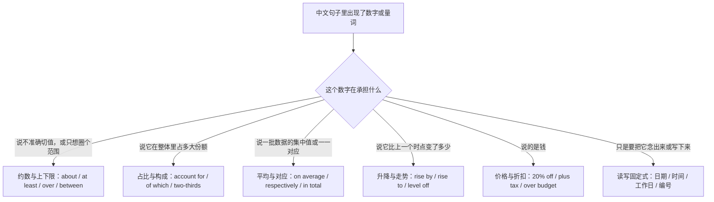
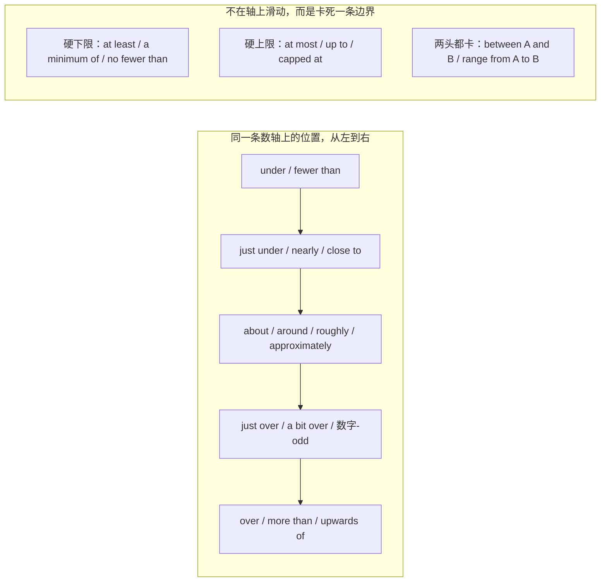
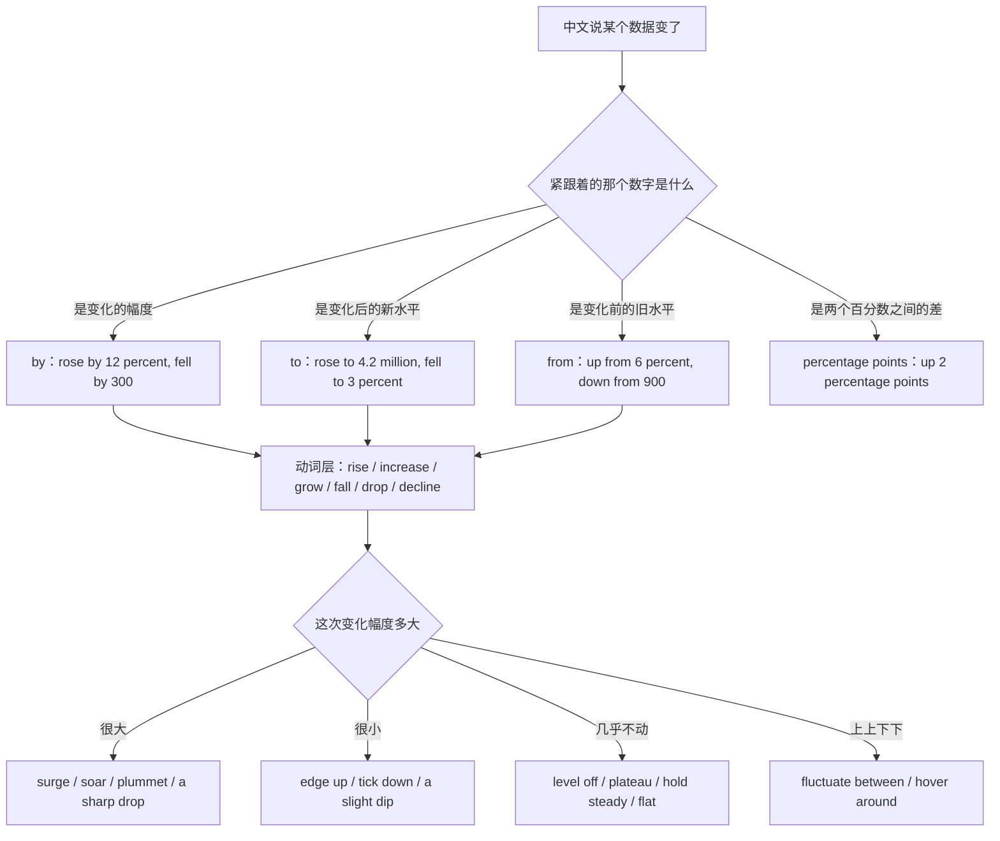
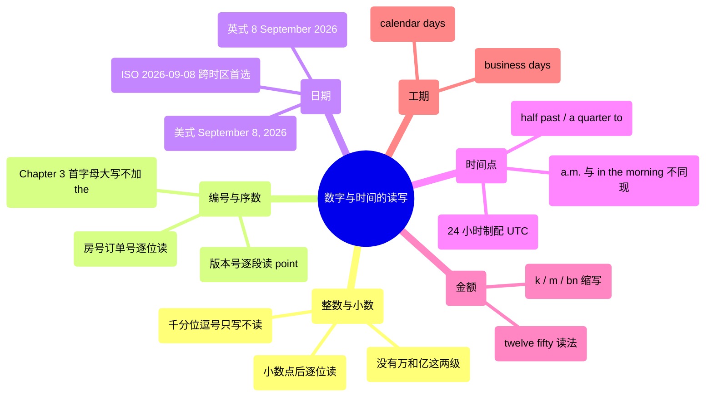

# 大约、超过、占三成、平均、分别是：数量与统计描述

> [!info] 本篇定位
>
> 这篇收六类中文意图：数字**说不准**（大约、将近、出头、至少、最多、介于）、数字表**份额**（占三成、其中、三分之二、剩下的、总共）、数字是一批数据的**集中值或对应值**（平均、中位数、分别是、每人、峰值）、数字在**时间轴上变了**（涨了、涨到、暴跌、持平、波动、同比）、数字是**钱**（打八折、涨价、含税、超预算），以及数字只是要被**念出来或写下来**（大数、日期、时间点、工作日、编号、度量衡）。
>
> 前三篇管的是量与量之间的关系：[[09.比较、程度与数量/01.A 比 B 更、不如、一样：比较三式与差额\|A 比 B 更、不如、一样：比较三式与差额]] 管两个对象的一次性对比，[[09.比较、程度与数量/02.越来越、越…越、几倍、最…之一：变化量与极值\|越来越、越…越、几倍、最…之一：变化量与极值]] 管变化过程与极值定位，[[09.比较、程度与数量/03.太…以至于、够不够、有点、非常：程度刻度\|太…以至于、够不够、有点、非常：程度刻度]] 管没有具体数值的程度深浅。这一篇管的是**有具体数值时怎么把它说出来**。
>
> 读完能查到：41 条中文意图入口、164 条分档成品句架，以及中文「打八折」和英文 `80% off` 差出六成、中文「涨了两个点」和英文 `rose by 2 percent` 完全不是一件事的那几处错位。

---

## 1. 本篇导读：一个数字进来，先问它在承担什么

同一个数字 `30`，出现在「大概三十个」「占三成」「平均三十分钟」「涨了 30%」「三十块」「三十号」六句话里，走的是六条毫不相干的英文结构。中文靠上下文和量词区分它们，英文靠不同的介词、动词和固定式区分。所以查这一篇的第一步不是找数字，是问这个数字在句子里干什么活。

这张图的六个分叉全在中文一侧，判断依据是「这个数字在句子里干什么活」，不需要先知道自己在用哪一类介词。分叉之间偶尔会串——「涨到三成」同时踩了份额和升降两支——遇到这种情况按主干意图选，「涨到」是主干，份额只是那个数字的单位。

本篇的意图块按这六支排：第 2 节走约数与上下限，第 3 节走占比与构成，第 4 节走集中量与对应，第 5 节走升降与走势，第 6 节走价格与金额，第 7 节走读写固定式。第 8 节是全篇速查总表。

---

## 2. 大约、至少、最多：约数与上下限

约数的坑集中在两处：一是估算词（`about`）和边界词（`more than`）不能叠用，中文的「大约三百多」在英文里必须压成一个词；二是 `between` 只配 `and`，`from` 才配 `to`，串线之后母语者读着别扭但不一定会指出来。

左边那一串是同一个估算值在数轴上左右微调，选词只看偏差方向和偏差大小；右边三条是另一回事——它们不描述估算，它们规定边界，说 `at least three` 就是在承诺三是底线，说 `up to five` 就是在承诺五是天花板。中文的「至少」「最多」经常只是语气词，翻成英文之后会变成一句承诺，写合同和文档时这个差别会被读者当真。

### 2.1 大约、差不多、左右

中文触发语：大约 / 差不多 / …左右 / …上下 / 来个…

| 档位 | 句架 | 例句 | 译文 |
| --- | --- | --- | --- |
| 口语 | about / around + 数字 | It takes about twenty minutes to run the whole suite. | 跑完整套用例大概二十分钟。 |
| 口语 | 数字 + or so | Twenty minutes or so, if nothing times out. | 不超时的话二十分钟上下。 |
| 书面 | roughly / around + 数字 | Roughly 300 requests hit that endpoint every minute. | 那个接口每分钟大约有 300 个请求。 |
| 正式 | approximately + 数字 | Approximately 12,000 records were affected by the outage. | 本次故障约影响 12,000 条记录。 |

> [!warning] 错配警示
>
> - ~~There were about more than 300 attendees.~~ ❌
> - **There were just over 300 attendees.** ✅（`about` 表估算、`more than` 表下限，两者语义冲突不能同现；中文「大约三百多」在英文里由 `just over` 一个词承担）

页脚：
- 同义入口：差不多 / …左右 / 估摸着 / 大概齐
- 语法归属：[[02.英语基础语法/03.代词与数词/05.数词的用法与表达\|数词的用法与表达]]
- 场景实战：[[04.英语场景/05.高频实用表达句型框架/04.比较对比举例总结句型库\|比较对比举例总结句型库]]

### 2.2 将近、快到了、差一点

中文触发语：将近 / 快到… / 接近 / 差一点就 / 眼看要到

| 档位 | 句架 | 例句 | 译文 |
| --- | --- | --- | --- |
| 口语 | almost / nearly + 数字 | We're almost at five hundred signups. | 注册数快到五百了。 |
| 书面 | close to / just under + 数字 | Just under half the team works remotely. | 将近一半的人是远程。 |
| 书面 | 差额 + short of / shy of + 目标 | We finished two tickets shy of the sprint goal. | 差两张工单就完成迭代目标了。 |
| 正式 | approaching + 数字 | Disk utilization is approaching ninety percent. | 磁盘使用率正逼近百分之九十。 |

> [!warning] 错配警示
>
> - ~~We have nearly no budget left for this quarter.~~ ❌
> - **We have almost no budget left for this quarter.** ✅（`nearly` 一般不修饰 `no`、`nobody`、`never`、`nothing` 这类绝对否定词，这些位置固定用 `almost`）

页脚：
- 同义入口：快要到了 / 接近 / 眼看就 / 还差一点
- 语法归属：[[02.英语基础语法/04.形容词与副词/03.副词的分类与用法\|副词的分类与用法]]
- 场景实战：[[04.英语场景/10.职场与商务场景实战/02.会议汇报与演示场景\|会议汇报与演示场景]]

### 2.3 出头、多一点、二十几

中文触发语：…出头 / 多一点 / …挂零 / 二十几个 / 一百来

| 档位 | 句架 | 例句 | 译文 |
| --- | --- | --- | --- |
| 口语 | a bit over / just over + 数字 | It cost just over a hundred bucks. | 花了一百块出头。 |
| 口语 | 数字 + -odd | Twenty-odd tickets are still open. | 还有二十几张工单没关。 |
| 书面 | slightly more than + 数字 | Slightly more than half the errors trace back to one service. | 一半多一点的报错都出自同一个服务。 |
| 正式 | marginally above + 数字 | Median response time is marginally above the agreed threshold. | 响应时间中位数略高于约定阈值。 |

> [!warning] 错配警示
>
> - ~~There were twenty odd tickets left.~~ ❌
> - **There were twenty-odd tickets left.** ✅（`odd` 表「出头」时必须带连字符；写成分开的 `twenty odd tickets` 会被读成「二十张奇怪的工单」）

页脚：
- 同义入口：多一点 / 挂零 / 二十几 / 一百来个
- 语法归属：[[02.英语基础语法/03.代词与数词/05.数词的用法与表达\|数词的用法与表达]]

### 2.4 超过、以上、破了

中文触发语：超过 / 多于 / …以上 / 破了… / 不止

| 档位 | 句架 | 例句 | 译文 |
| --- | --- | --- | --- |
| 口语 | over / more than + 数字 | Over a thousand people showed up to the launch. | 发布会来了一千多人。 |
| 书面 | upwards of + 数字 | Upwards of forty percent of traffic now comes from mobile. | 现在四成以上的流量来自移动端。 |
| 书面 | 数字 + and above / and up | Accounts on the 200-seat plan and above get priority support. | 200 席以上的账户享有优先支持。 |
| 正式 | in excess of / exceed + 数字 | Storage costs are now running in excess of 40,000 dollars a month. | 存储成本目前每月超过 4 万美元。 |

> [!warning] 错配警示
>
> - ~~More than 20 students was late.~~ ❌
> - **More than 20 students were late.** ✅（`more than + 复数名词` 后面的动词用复数；但 `more than one student was late` 反而用单数，因为中心词是 `one`）

页脚：
- 同义入口：多于 / …以上 / 突破 / 不止
- 语法归属：[[02.英语基础语法/10.特殊句型/06.主谓一致\|主谓一致]]
- 场景实战：[[04.英语场景/10.职场与商务场景实战/02.会议汇报与演示场景\|会议汇报与演示场景]]

### 2.5 不到、少于、以下

中文触发语：不到 / 少于 / …以下 / 还不够 / 没到

| 档位 | 句架 | 例句 | 译文 |
| --- | --- | --- | --- |
| 口语 | under / less than + 数字 | The whole thing took under ten minutes. | 整件事十分钟不到。 |
| 书面 | fewer than + 可数复数 | Fewer than five accounts were affected. | 受影响的账户不到五个。 |
| 书面 | below + 数字 | Coverage has stayed below eighty percent since the rewrite. | 重写之后覆盖率一直在八成以下。 |
| 正式 | must not exceed / no greater than | The request payload must not exceed two megabytes. | 请求体不得超过 2 MB。 |

> [!warning] 错配警示
>
> - ~~Less than five accounts were affected.~~ ❌
> - **Fewer than five accounts were affected.** ✅（可数名词复数用 `fewer`；`less` 留给不可数量以及金额、距离、时间这类被当作整体量的说法：`less than $50`、`less than two hours`）

页脚：
- 同义入口：少于 / 不足 / …以下 / 没超过
- 语法归属：[[02.英语基础语法/02.名词与冠词/01.名词的分类与用法\|名词的分类与用法]]

### 2.6 至少、起码、不低于

中文触发语：至少 / 起码 / 最少也有 / 不低于 / 保底

| 档位 | 句架 | 例句 | 译文 |
| --- | --- | --- | --- |
| 口语 | at least + 数字 | Give it at least two days before you chase them. | 起码等两天再去催。 |
| 书面 | a minimum of + 数字 | A minimum of three reviewers must approve the change. | 变更至少需要三名评审通过。 |
| 书面 | no fewer than + 可数复数 | No fewer than twelve teams depend on this library. | 有不少于十二个团队依赖这个库。 |
| 正式 | shall be not less than | The retention period shall be not less than ninety days. | 留存期限不得少于九十天。 |

> [!warning] 错配警示
>
> - ~~The password must be at least of eight characters.~~ ❌
> - **The password must be at least eight characters long.** ✅（`at least` 直接贴数字，中间不插 `of`；要用名词式就写 `a minimum of eight characters`）

页脚：
- 同义入口：起码 / 保底 / 不少于 / 最少也要
- 语法归属：[[02.英语基础语法/05.介词与连词/02.常用介词搭配详解\|常用介词搭配详解]]
- 场景实战：[[04.英语场景/10.职场与商务场景实战/04.商务谈判合同与客户沟通\|商务谈判合同与客户沟通]]

### 2.7 最多、顶多、上限是

中文触发语：最多 / 顶多 / 不超过 / 上限是 / 封顶

| 档位 | 句架 | 例句 | 译文 |
| --- | --- | --- | --- |
| 口语 | at most / 数字 + tops | Two days, tops. | 顶多两天。 |
| 书面 | up to + 数字 | Up to five devices can be linked to one account. | 一个账户最多可绑定五台设备。 |
| 书面 | no more than + 数字 | Send no more than one reminder a week. | 每周最多发一封催办。 |
| 正式 | a maximum of / capped at | Concurrent connections are capped at two hundred. | 并发连接数上限为两百。 |

> [!warning] 错配警示
>
> - ~~Save up to 30% or more on your bill.~~ ❌
> - **Save up to 30% on your bill.** ✅（`up to` 是封顶，本身已排除「更多」的可能，跟 `or more` 连用自相矛盾）

页脚：
- 同义入口：顶多 / 封顶 / 上限 / 不超过
- 语法归属：[[02.英语基础语法/05.介词与连词/01.介词的分类与基本用法\|介词的分类与基本用法]]

### 2.8 介于…之间、从…到…不等

中文触发语：介于…之间 / 在…到…之间 / …到…不等 / 幅度从…到…

| 档位 | 句架 | 例句 | 译文 |
| --- | --- | --- | --- |
| 口语 | anywhere from A to B | It's anywhere from ten to fifteen minutes, depending on the cache. | 看缓存命中情况，十到十五分钟不等。 |
| 书面 | between A and B | Daily signups sit between four hundred and six hundred. | 每日注册量在四百到六百之间。 |
| 书面 | range from A to B | Ticket age ranges from two days to eight months. | 工单存续时间从两天到八个月不等。 |
| 正式 | fall within the range of A to B | Measured values fall within the range of 0.2 to 0.8. | 测得值落在 0.2 至 0.8 区间内。 |

> [!warning] 错配警示
>
> - ~~The price is between 20 to 30 dollars.~~ ❌
> - **The price is between 20 and 30 dollars.** ✅（`between` 只配 `and`，`from` 才配 `to`；要用 `to` 就整句换成 `ranges from 20 to 30 dollars`）

页脚：
- 同义入口：在…到…之间 / …到…不等 / 区间是
- 语法归属：[[02.英语基础语法/05.介词与连词/04.介词与连词的易混点\|介词与连词的易混点]]
- 场景实战：[[04.英语场景/06.日常生活场景实战/03.购物超市与讨价还价场景\|购物超市与讨价还价场景]]

### 2.9 上下浮动、正负、误差

中文触发语：上下浮动 / 正负 / 误差在…以内 / 前后差不多

| 档位 | 句架 | 例句 | 译文 |
| --- | --- | --- | --- |
| 口语 | give or take + 数量 | About an hour, give or take ten minutes. | 大概一小时，上下差个十分钟。 |
| 书面 | plus or minus + 数量 | The estimate is accurate to plus or minus two days. | 这个估算的误差在正负两天以内。 |
| 书面 | within + 数量 + of | Every sample came in within one percent of the target. | 每个样本都落在目标值百分之一以内。 |
| 正式 | with a margin of error of ± | Measurements carry a margin of error of ±0.5 mm. | 测量误差为 ±0.5 毫米。 |

> [!warning] 错配警示
>
> - ~~The result is 20, more or less 2.~~ ❌
> - **The result is 20, give or take 2.** ✅（`more or less` 只表「差不多」，不能后接具体误差量；带数量的误差用 `give or take` 或 `plus or minus`）

页脚：
- 同义入口：正负 / 上下 / 误差范围 / 前后
- 语法归属：[[02.英语基础语法/03.代词与数词/05.数词的用法与表达\|数词的用法与表达]]

---

## 3. 占三成、其中、剩下的：占比与构成

份额句的中心问题是主语选谁。中文习惯把整体放前面（「流量里移动端占三成」），英文习惯把部分放前面（`Mobile accounts for 30% of traffic`）。这个语序一旦按中文直译，就会掉进 `occupy` 这类错动词里。第二个高频坑是后面的动词该用单数还是复数：`one in five` 跟单数，`three out of four` 跟复数，`the rest of` 跟 `of` 后面的名词走。

### 3.1 占几成、占比是多少

中文触发语：占…成 / 占比 / 占了…% / …占大头 / 比重是

| 档位 | 句架 | 例句 | 译文 |
| --- | --- | --- | --- |
| 口语 | A makes up + 比例 + of B | Mobile makes up about a third of our traffic. | 移动端大概占我们流量的三成。 |
| 书面 | A accounts for + 比例 + of B | Returning users account for 62 percent of all sessions. | 回访用户占全部会话的 62%。 |
| 书面 | A is + 比例 + of B | Storage is nearly half of the monthly bill. | 存储将近占月度账单的一半。 |
| 正式 | A represents / constitutes + 比例 + of B | Overseas orders represent eighteen percent of total revenue. | 海外订单占总营收的 18%。 |

> [!warning] 错配警示
>
> - ~~Mobile occupies 30% of the traffic.~~ ❌
> - **Mobile accounts for 30% of the traffic.** ✅（`occupy` 是占空间、占位置、占用资源；比例的「占」固定用 `account for`、`make up`、`represent`、`constitute`）

页脚：
- 同义入口：占比 / 比重 / 占了多少 / 大头在
- 语法归属：[[02.英语基础语法/05.介词与连词/02.常用介词搭配详解\|常用介词搭配详解]]
- 场景实战：[[04.英语场景/10.职场与商务场景实战/02.会议汇报与演示场景\|会议汇报与演示场景]]

### 3.2 其中、里面有几个是

中文触发语：其中 / 其中有 / 里面有…是 / 当中

| 档位 | 句架 | 例句 | 译文 |
| --- | --- | --- | --- |
| 口语 | …, and N of them + 动词 | We closed forty tickets, and twelve of them were bugs. | 我们关了四十张工单，其中十二张是缺陷。 |
| 书面 | …, N of which + 动词（指物） | The service exposes six endpoints, two of which are deprecated. | 这个服务有六个接口，其中两个已弃用。 |
| 书面 | …, N of whom + 动词（指人） | We interviewed forty users, twelve of whom had never opened the app. | 我们访谈了四十名用户，其中十二人从没打开过这个应用。 |
| 正式 | …, of which N + 动词（前置） | The company runs six data centres, of which two are in Asia. | 公司运营六个数据中心，其中两个在亚洲。 |

> [!warning] 错配警示
>
> - ~~We interviewed 40 users, 12 of which had never opened the app.~~ ❌
> - **We interviewed 40 users, 12 of whom had never opened the app.** ✅（前面那批是人就用 `of whom`，是物才用 `of which`；不想判断就拆成两句写 `and twelve of them`）

页脚：
- 同义入口：里面有 / 当中 / 内含 / 包括其中的
- 语法归属：[[02.英语基础语法/09.从句体系/02.定语从句进阶\|定语从句进阶]]
- 场景实战：[[04.英语场景/09.学习与教育场景实战/02.图书馆作业与研究场景\|图书馆作业与研究场景]]

### 3.3 三分之一、三分之二、百分之几

中文触发语：三分之一 / 三分之二 / 四分之三 / 百分之… / 一半

| 档位 | 句架 | 例句 | 译文 |
| --- | --- | --- | --- |
| 口语 | a third / half of + 名词 | A third of the tests are still failing. | 三分之一的用例还在挂。 |
| 书面 | two-thirds / three-quarters of + 名词 | Nearly three-quarters of the backlog predates the rewrite. | 待办里将近四分之三是重写之前留下的。 |
| 书面 | N percent of + 名词 | Sixty-eight percent of respondents kept the default setting. | 68% 的受访者保留了默认设置。 |
| 正式 | a proportion of / the share of | The share of failed payments fell for the third month running. | 支付失败占比连续第三个月下降。 |

> [!warning] 错配警示
>
> - ~~Two third of the tests is still failing.~~ ❌
> - **Two-thirds of the tests are still failing.** ✅（分子大于一时分母加 `s` 并加连字符；`two-thirds of` 后面的动词跟 `of` 后面的名词走，名词是复数就用复数）

页脚：
- 同义入口：几分之几 / 百分之几 / 一半 / 多少成
- 语法归属：[[02.英语基础语法/03.代词与数词/05.数词的用法与表达\|数词的用法与表达]]

### 3.4 大多数、绝大部分、少数

中文触发语：大多数 / 绝大部分 / 大头 / 少数 / 一小部分

| 档位 | 句架 | 例句 | 译文 |
| --- | --- | --- | --- |
| 口语 | most of / a few of | Most of the errors come from one service. | 大部分报错都出自同一个服务。 |
| 书面 | the majority of / a minority of | The majority of complaints concern billing, not performance. | 大多数投诉针对的是计费而不是性能。 |
| 书面 | the vast majority of | The vast majority of users never change the default. | 绝大多数用户从不改默认值。 |
| 正式 | the bulk of + 不可数/集合 | The bulk of the cost sits in storage, not compute. | 成本的大头在存储而不在算力。 |

> [!warning] 错配警示
>
> - ~~The most of users prefer dark mode.~~ ❌
> - **Most users prefer dark mode.** ✅（泛指「大多数人」用光杆 `most + 复数名词`；只有限定在一批已知对象里才写 `most of the users`，`the most of` 不成立）

页脚：
- 同义入口：多数 / 大部分 / 大头 / 极少数
- 语法归属：[[02.英语基础语法/03.代词与数词/04.不定代词详解\|不定代词详解]]

### 3.5 剩下的、其余、还有几个没

中文触发语：剩下的 / 其余 / 余下 / 还有…没 / 剩余量

| 档位 | 句架 | 例句 | 译文 |
| --- | --- | --- | --- |
| 口语 | the rest of + 名词 | The rest of the tickets can wait until next week. | 剩下的工单可以拖到下周。 |
| 书面 | the remaining + 数字 + 名词 | The remaining twelve items were deferred to the next sprint. | 余下的十二项挪到了下个迭代。 |
| 书面 | there are N left / N to go | There are three migrations left. | 还剩三个迁移没做。 |
| 正式 | the remainder / the balance of | The remainder of the budget will be carried forward. | 预算余额将结转至下期。 |

> [!warning] 错配警示
>
> - ~~The rest of the tickets is low priority.~~ ❌
> - **The rest of the tickets are low priority.** ✅（`the rest of` 后面的动词跟 `of` 后面的名词：`the rest of the budget is`，`the rest of the tickets are`）

页脚：
- 同义入口：其余 / 余下 / 还剩 / 剩余部分
- 语法归属：[[02.英语基础语法/10.特殊句型/06.主谓一致\|主谓一致]]

### 3.6 每五个里有一个、人均

中文触发语：每…个里有… / …个当中有一个 / 人均 / 每千人 / 万分之

| 档位 | 句架 | 例句 | 译文 |
| --- | --- | --- | --- |
| 口语 | one in five + 复数名词 + 单数动词 | One in five users never opens the app again. | 每五个用户里有一个再也不打开这个应用。 |
| 书面 | N out of every M + 复数动词 | Three out of every four tickets are closed within a day. | 每四张工单里有三张一天内关闭。 |
| 书面 | per + 单位量 | Support requests per thousand active users fell this quarter. | 本季度每千名活跃用户的支持请求数下降了。 |
| 正式 | per capita / on a per-user basis | Mobile data use per capita has doubled in the past five years. | 过去五年人均移动数据用量翻了一番。 |

> [!warning] 错配警示
>
> - ~~One in five users never open the app again.~~ ❌
> - **One in five users never opens the app again.** ✅（`one in five` 作主语时中心词是 `one`，动词用单数；换成 `three out of four` 中心词是 `three`，动词才用复数）

页脚：
- 同义入口：几个里有一个 / 人均 / 每千人 / 比例是几比几
- 语法归属：[[02.英语基础语法/10.特殊句型/06.主谓一致\|主谓一致]]

### 3.7 总共、一共、加起来

中文触发语：总共 / 一共 / 合计 / 加起来 / 累计

| 档位 | 句架 | 例句 | 译文 |
| --- | --- | --- | --- |
| 口语 | …, in total / altogether | That's forty-two tickets in total. | 一共四十二张工单。 |
| 书面 | a total of + 数字 | A total of 1,200 records were migrated overnight. | 通宵共迁移了 1,200 条记录。 |
| 书面 | add up to / come to + 数字 | The line items add up to 3,480 dollars. | 各项加起来是 3,480 美元。 |
| 正式 | amount to + 数字 | Direct costs amount to 340,000 dollars for the fiscal year. | 本财年直接成本合计 34 万美元。 |

> [!warning] 错配警示
>
> - ~~Totally we shipped twelve features this quarter.~~ ❌
> - **In total, we shipped twelve features this quarter.** ✅（`totally` 是「完全地」，不表「总共」；求和用 `in total`、`altogether`、`a total of`）

页脚：
- 同义入口：合计 / 累计 / 加起来 / 汇总
- 语法归属：[[02.英语基础语法/04.形容词与副词/03.副词的分类与用法\|副词的分类与用法]]
- 场景实战：[[04.英语场景/10.职场与商务场景实战/03.商务邮件与正式书面沟通\|商务邮件与正式书面沟通]]

---

## 4. 平均、分别是、峰值：集中量与一一对应

这一节的四条意图在中文里差别很小，在英文里落点分得很开：「平均」挂在整句前面写成 `on average`，「均值是」要拿 `the average` 当主语写成 `the average is`，两者主语不同不能互换；「分别是」的 `respectively` 有严格的语序要求，前后两串必须一一对应且顺序一致，写错了读者会按你写的顺序去对，对不上也不会来问你。

### 4.1 平均、平均下来

中文触发语：平均 / 平均下来 / 平均每… / 均值是

| 档位 | 句架 | 例句 | 译文 |
| --- | --- | --- | --- |
| 口语 | On average, 主句 | On average, a code review takes about two days. | 平均下来一次代码评审要两天左右。 |
| 书面 | the average + 名词 + is + 数值 | The average response time is 180 milliseconds. | 平均响应时间是 180 毫秒。 |
| 书面 | an average of + 数量 + 名词 | We ship an average of eleven releases a week. | 我们平均每周发十一次版。 |
| 正式 | average out at + 数值 | Weekly deployment counts average out at eleven. | 每周部署次数平均为十一次。 |

> [!warning] 错配警示
>
> - ~~In average, a review takes two days.~~ ❌
> - **On average, a review takes two days.** ✅（固定搭配是 `on average`；`in average` 不成立，要用 `an average of` 就必须后接数量名词，如 `an average of two days`）

页脚：
- 同义入口：平均下来 / 均值 / 平均每 / 摊下来
- 语法归属：[[02.英语基础语法/05.介词与连词/02.常用介词搭配详解\|常用介词搭配详解]]
- 场景实战：[[04.英语场景/09.学习与教育场景实战/02.图书馆作业与研究场景\|图书馆作业与研究场景]]

### 4.2 中位数、典型情况、最常见的

中文触发语：中位数 / 一般是 / 典型情况下 / 最常见的是 / 多半

| 档位 | 句架 | 例句 | 译文 |
| --- | --- | --- | --- |
| 口语 | most of the time / usually | Most of the time it lands under a second. | 一般情况下一秒以内就回来了。 |
| 书面 | the median + 名词 + is | The median wait is four minutes, though the average is nine. | 等待时间中位数是四分钟，平均值却是九分钟。 |
| 书面 | typically / in a typical + 单位 | In a typical week we merge around thirty pull requests. | 一般一周会合并三十来个合并请求。 |
| 正式 | the most commonly reported + 名词 + is | The most commonly reported issue is a failed login. | 最常被反馈的问题是登录失败。 |

> [!warning] 错配警示
>
> - ~~The middle number of the wait times is four minutes.~~ ❌
> - **The median wait time is four minutes.** ✅（统计上的「中位数」是 `median`，不是字面的 `middle number`；`average` 与 `mean` 指算术平均，在偏态数据上跟中位数差很远，写报告时别混着用）

页脚：
- 同义入口：一般是 / 典型值 / 常见情况 / 多半
- 语法归属：[[02.英语基础语法/04.形容词与副词/03.副词的分类与用法\|副词的分类与用法]]

### 4.3 分别是、依次为、各自对应

中文触发语：分别是 / 各自是 / 依次为 / 分别对应 / 前者…后者…

| 档位 | 句架 | 例句 | 译文 |
| --- | --- | --- | --- |
| 口语 | A is X and B is Y | The staging box is 8 gigs and the prod box is 32. | 预发机是 8 G，生产机是 32 G。 |
| 书面 | A and B are X and Y, respectively | Read and write latencies are 12 ms and 40 ms, respectively. | 读写延迟分别是 12 毫秒和 40 毫秒。 |
| 书面 | A corresponds to X, B to Y | The first column corresponds to requests, the second to errors. | 第一列对应请求数，第二列对应错误数。 |
| 正式 | 名词 + for A and B, respectively | Retention stood at 61 and 48 percent for cohorts A and B, respectively. | A、B 两组的留存率分别为 61% 和 48%。 |

> [!warning] 错配警示
>
> - ~~Respectively, the two servers have 8 GB and 32 GB.~~ ❌
> - **The two servers have 8 GB and 32 GB, respectively.** ✅（`respectively` 只能放在分句末尾，且要求前后两串顺序严格对应；放句首不成句，也没有 `respectively speaking` 这种用法）

页脚：
- 同义入口：依次为 / 各自 / 一一对应 / 前者后者
- 语法归属：[[02.英语基础语法/04.形容词与副词/03.副词的分类与用法\|副词的分类与用法]]
- 场景实战：[[04.英语场景/05.高频实用表达句型框架/04.比较对比举例总结句型库\|比较对比举例总结句型库]]

### 4.4 每人、每次、按…计

中文触发语：每人 / 每次 / 每个 / 一人一份 / 按…计费

| 档位 | 句架 | 例句 | 译文 |
| --- | --- | --- | --- |
| 口语 | 数字 + each / apiece | The stickers are two dollars apiece. | 贴纸两块钱一张。 |
| 口语 | 数字 + a head / per person | It works out at about thirty a head. | 摊下来一个人三十左右。 |
| 书面 | per + 单数名词 | The plan is nine dollars per user per month. | 这个套餐是每用户每月九美元。 |
| 正式 | on a per-X basis | Charges are calculated on a per-request basis. | 费用按请求次数计收。 |

> [!warning] 错配警示
>
> - ~~The plan is nine dollars per a user.~~ ❌
> - **The plan is nine dollars per user.** ✅（`per` 后面直接跟单数名词原形，不加冠词也不用复数；要加冠词就换成 `for each user`）

页脚：
- 同义入口：每个 / 一人一份 / 单价 / 按次计
- 语法归属：[[02.英语基础语法/02.名词与冠词/03.冠词的用法详解\|冠词的用法详解]]
- 场景实战：[[04.英语场景/06.日常生活场景实战/03.购物超市与讨价还价场景\|购物超市与讨价还价场景]]

### 4.5 峰值、最高到、触底

中文触发语：峰值 / 最高到 / 冲到 / 最低跌到 / 触底

| 档位 | 句架 | 例句 | 译文 |
| --- | --- | --- | --- |
| 口语 | hit / max out at + 数值 | Traffic hit ninety thousand around lunchtime. | 午饭前后流量冲到了九万。 |
| 书面 | peak at + 数值 | CPU peaked at 92 percent during the migration. | 迁移期间 CPU 峰值到了 92%。 |
| 书面 | bottom out at + 数值 | Conversion bottomed out at 1.8 percent in March. | 转化率三月触底，最低到 1.8%。 |
| 正式 | reach a high of / a low of | The index reached a high of 148 before settling near 130. | 该指数最高触及 148，随后稳定在 130 附近。 |

> [!warning] 错配警示
>
> - ~~Traffic peaked to 90,000.~~ ❌
> - **Traffic peaked at 90,000.** ✅（`peak`、`bottom out`、`max out`、`hover` 一律配 `at`；配 `to` 的是 `rise`、`climb`、`fall`、`drop` 这一组表位移的动词）

页脚：
- 同义入口：最高点 / 冲顶 / 见底 / 最低值
- 语法归属：[[02.英语基础语法/05.介词与连词/02.常用介词搭配详解\|常用介词搭配详解]]

---

## 5. 涨了、跌到、持平、来回晃：数据升降与走势

整节只有一条主干规则：**`by` 后面跟幅度，`to` 后面跟新水平，`from` 后面跟旧水平**。中文的「涨了 12%」和「涨到 12%」只差一个字，英文差的是整句语义。剩下的部分是幅度大小的词汇梯度，以及百分比与百分点这个专门用来骗人的差别。

上半张图管介词，下半张图管动词。这两层是正交的——`surge` 照样可以接 `by` 或 `to`，`edge up` 也一样。查的时候先定介词再挑动词，顺序反过来就容易写出 `peaked to` 这类混搭。图里没画的是名词式（`a rise of 12 percent`、`a sharp drop in engagement`）：名词式一律用 `of` 引出幅度、用 `in` 引出对象，跟动词式的 `by` 不通用。

### 5.1 涨了多少 vs 涨到多少

中文触发语：涨了…% / 涨到… / 增加了 / 增加到 / 从…涨到…

| 档位 | 句架 | 例句 | 译文 |
| --- | --- | --- | --- |
| 口语 | went up by / went up to | Costs went up by twelve percent this quarter. | 本季度成本涨了 12%。 |
| 口语 | is up from A to B | Signups are up from 400 to 620 a day. | 日注册量从 400 涨到了 620。 |
| 书面 | rise by / rise to | Revenue rose to 4.2 million, up from 3.8 million. | 营收涨到 420 万，此前是 380 万。 |
| 正式 | increase by + 幅度, to + 新值 | Headcount increased by forty, to a total of 310. | 人数增加了四十人，总数达到 310。 |

> [!warning] 错配警示
>
> - ~~Costs rose to 12 percent compared with last year.~~ ❌
> - **Costs rose by 12 percent compared with last year.** ✅（`by` 后面是增量，`to` 后面是变化后的新值；说「涨了 12%」用 `by`，说「涨到 1200 万」才用 `to`）

页脚：
- 同义入口：上升 / 增长 / 提高了 / 从…到…
- 语法归属：[[02.英语基础语法/05.介词与连词/02.常用介词搭配详解\|常用介词搭配详解]]
- 场景实战：[[04.英语场景/10.职场与商务场景实战/02.会议汇报与演示场景\|会议汇报与演示场景]]

### 5.2 猛涨、暴跌、大幅下滑

中文触发语：猛涨 / 暴涨 / 飙升 / 暴跌 / 大幅下滑 / 断崖式

| 档位 | 句架 | 例句 | 译文 |
| --- | --- | --- | --- |
| 口语 | shot up / crashed | Signups shot up the day the post went live. | 帖子发出去当天注册量猛涨。 |
| 书面 | surge / plummet | Error rates plummeted once the retry logic landed. | 重试逻辑上线后错误率暴跌。 |
| 书面 | a sharp drop / a steep rise in + 名词 | There was a sharp drop in engagement after the redesign. | 改版之后互动量大幅下滑。 |
| 正式 | rise sharply / decline steeply | Complaint volume declined steeply following the fix. | 修复之后投诉量急剧下降。 |

> [!warning] 错配警示
>
> - ~~There was a sharply drop in engagement.~~ ❌
> - **There was a sharp drop in engagement.** ✅（名词 `drop` 前面配形容词 `sharp`；副词 `sharply` 只修饰动词，写成动词式是 `engagement dropped sharply`）

页脚：
- 同义入口：飙升 / 跳水 / 断崖 / 一落千丈
- 语法归属：[[02.英语基础语法/04.形容词与副词/01.形容词的用法与位置\|形容词的用法与位置]]

### 5.3 略有上升、微降、小幅变动

中文触发语：略有上升 / 微降 / 小幅 / 稍微多了点 / 略有回落

| 档位 | 句架 | 例句 | 译文 |
| --- | --- | --- | --- |
| 口语 | is up / down a bit | Latency is up a bit since the deploy. | 上线之后延迟略微高了点。 |
| 书面 | edge up / tick down | Conversion edged up from 3.1 to 3.4 percent. | 转化率从 3.1% 微升到 3.4%。 |
| 书面 | a slight increase / a slight dip in | We saw a slight dip in weekend traffic. | 周末流量略有回落。 |
| 正式 | register a marginal increase / a modest decline | The quarter registered a modest decline in active accounts. | 本季度活跃账户小幅下降。 |

> [!warning] 错配警示
>
> - ~~Latency slightly increased of 5 milliseconds.~~ ❌
> - **Latency increased slightly, by 5 milliseconds.** ✅（动词式用 `by` 引出幅度；`of` 只出现在名词式里，写成 `an increase of 5 milliseconds`）

页脚：
- 同义入口：微升 / 微跌 / 略有变化 / 小幅波动
- 语法归属：[[02.英语基础语法/04.形容词与副词/03.副词的分类与用法\|副词的分类与用法]]

### 5.4 持平、走稳、基本没变

中文触发语：持平 / 稳住了 / 不涨不跌 / 走平 / 基本没变

| 档位 | 句架 | 例句 | 译文 |
| --- | --- | --- | --- |
| 口语 | be flat / stay the same | The numbers have been flat for three weeks. | 这些数字三周没动了。 |
| 书面 | level off / flatten out | Growth levelled off in the second half of the year. | 下半年增长趋于平缓。 |
| 书面 | hold steady at + 数值 | Uptime held steady at 99.95 percent. | 可用性稳定在 99.95%。 |
| 正式 | plateau at / remain unchanged | Usage plateaued at around 40,000 daily sessions. | 使用量在每日四万次会话左右趋于饱和。 |

> [!warning] 错配警示
>
> - ~~Sales kept flat during the quarter.~~ ❌
> - **Sales remained flat during the quarter.** ✅（说数据持平的 `flat` 配 `stay`、`remain`、`hold`；`keep + 形容词` 有 `keep calm`、`keep dry` 这类用法，但主语是人或可控状态，拿来说销售额不合习惯）

页脚：
- 同义入口：走平 / 稳住 / 没什么变化 / 趋于平缓
- 语法归属：[[02.英语基础语法/01.基础入门/02.英语五大基本句型详解\|英语五大基本句型详解]]

### 5.5 波动、忽高忽低、在…之间徘徊

中文触发语：波动 / 忽高忽低 / 来回晃 / 在…之间徘徊 / 不稳定

| 档位 | 句架 | 例句 | 译文 |
| --- | --- | --- | --- |
| 口语 | bounce around between A and B | The number bounces around between 200 and 300. | 这个数在两百到三百之间来回晃。 |
| 书面 | fluctuate between A and B | Daily active users fluctuate between 18,000 and 22,000. | 日活在 1.8 万到 2.2 万之间波动。 |
| 书面 | hover around + 数值 | The failure rate has hovered around four percent for six months. | 失败率半年来一直在 4% 上下徘徊。 |
| 正式 | exhibit considerable volatility | Queue depth exhibits considerable volatility during peak hours. | 高峰时段队列深度波动显著。 |

> [!warning] 错配警示
>
> - ~~Daily users fluctuate between 18,000 to 22,000.~~ ❌
> - **Daily users fluctuate between 18,000 and 22,000.** ✅（跟第 2.8 条同一个坑：`between` 只配 `and`；要用 `to` 就换成 `range from 18,000 to 22,000`）

页脚：
- 同义入口：忽高忽低 / 起伏不定 / 上下震荡 / 徘徊
- 语法归属：[[02.英语基础语法/05.介词与连词/04.介词与连词的易混点\|介词与连词的易混点]]

### 5.6 反弹、回升、掉头向下

中文触发语：反弹 / 回升 / 恢复到 / 掉头向下 / 拐点

| 档位 | 句架 | 例句 | 译文 |
| --- | --- | --- | --- |
| 口语 | bounce back | Traffic bounced back the following week. | 第二周流量就回来了。 |
| 书面 | recover to + 旧水平 | Throughput recovered to its pre-incident level within a day. | 吞吐量一天内恢复到了故障前水平。 |
| 书面 | rebound / reverse the trend | Retention rebounded after the onboarding change. | 引导流程改版后留存率出现反弹。 |
| 正式 | reach a turning point / trend downward | The metric reached a turning point in March and has trended downward since. | 该指标三月出现拐点，此后持续走低。 |

> [!warning] 错配警示
>
> - ~~Traffic recovered by its pre-incident level within a day.~~ ❌
> - **Traffic recovered to its pre-incident level within a day.** ✅（回到某个水平用 `to`；`by` 后面只能跟回升的幅度，如 `recovered by 12 percent`）

页脚：
- 同义入口：回升 / 恢复 / 触底反弹 / 转向
- 语法归属：[[02.英语基础语法/05.介词与连词/02.常用介词搭配详解\|常用介词搭配详解]]

### 5.7 同比、环比、跟去年同期比

中文触发语：同比 / 环比 / 跟去年同期比 / 比上个季度 / 逐月

| 档位 | 句架 | 例句 | 译文 |
| --- | --- | --- | --- |
| 口语 | compared with last year | That's double what we had this time last year. | 这是去年这个时候的两倍。 |
| 书面 | year on year / month over month | Revenue is up fourteen percent year on year. | 营收同比增长 14%。 |
| 书面 | quarter over quarter | Churn fell eight percent quarter over quarter. | 流失率环比下降 8%。 |
| 正式 | compared with the same period of the previous year | Compared with the same period of the previous year, churn fell by two percentage points. | 与上年同期相比，流失率下降了 2 个百分点。 |

> [!warning] 错配警示
>
> - ~~Revenue is up 14 percent compare to last year.~~ ❌
> - **Revenue is up 14 percent compared with last year.** ✅（这里要的是 `compared` 这个 -ed 形式，不是原形 `compare`；`compare to` 与 `compare with` 都存在，但比数据大小惯用 `compared with`）

页脚：
- 同义入口：同比 / 环比 / 与去年同期 / 较上季
- 语法归属：[[02.英语基础语法/08.非谓语动词/04.过去分词详解\|过去分词详解]]
- 场景实战：[[04.英语场景/10.职场与商务场景实战/02.会议汇报与演示场景\|会议汇报与演示场景]]

### 5.8 百分点 vs 百分比

中文触发语：几个百分点 / 提高了几个点 / 从…% 到…% / 相对增长

| 档位 | 句架 | 例句 | 译文 |
| --- | --- | --- | --- |
| 口语 | went from X percent to Y percent | It went from ten percent to twelve percent. | 从 10% 变成了 12%。 |
| 书面 | rise by N percentage points | Coverage rose by two percentage points, from 78 to 80. | 覆盖率提高了 2 个百分点，从 78 升到 80。 |
| 书面 | a relative increase of N percent | Two points on a base of 78 is a relative increase of about 2.6 percent. | 在 78 的基数上加两个点，相对增幅约 2.6%。 |
| 正式 | an increase of N percentage points | The report notes an increase of five percentage points over the period. | 报告指出该占比在此期间提高了 5 个百分点。 |

> [!warning] 错配警示
>
> - ~~Coverage rose by 2 percent, from 78% to 80%.~~ ❌
> - **Coverage rose by 2 percentage points, from 78% to 80%.** ✅（78% 到 80% 是**加了 2 个百分点**；写成 `2 percent` 会被读成 78 的百分之二，也就是涨到 79.56%）

页脚：
- 同义入口：几个点 / 百分点 / 相对增幅 / 绝对增幅
- 语法归属：[[02.英语基础语法/03.代词与数词/05.数词的用法与表达\|数词的用法与表达]]

---

## 6. 打八折、多少钱、超预算：价格与金额

这一节的头号坑是折扣。中文说的是**付几成**，英文说的是**减几成**，方向相反：打八折在英文里是 `20% off`。第二个坑是 `expensive` 修饰东西不修饰价格，「价格贵」直译成 `the price is expensive` 会被听出来。

### 6.1 打八折、半价、优惠多少

中文触发语：打…折 / 打折 / 减价 / 半价 / 优惠 / 立减

| 档位 | 句架 | 例句 | 译文 |
| --- | --- | --- | --- |
| 口语 | N% off | Everything in the store is twenty percent off this week. | 本周店里全场八折。 |
| 口语 | half price / two for one | The second one is half price. | 第二件半价。 |
| 书面 | at a N percent discount | Annual plans are offered at a twenty percent discount. | 年付套餐可享八折优惠。 |
| 正式 | be discounted by N percent | Orders above 500 units are discounted by fifteen percent. | 500 件以上订单减价 15%。 |

> [!warning] 错配警示
>
> - ~~The jacket is 80% off.（想说「打八折」）~~ ❌
> - **The jacket is 20% off.** ✅（中文的折扣数是**付几成**，英文的折扣数是**减几成**：打八折等于付 80%，也就是 `20% off`；打五折是 `half price` 或 `50% off`；`80% off` 在中文里是打两折）

页脚：
- 同义入口：打折 / 优惠 / 立减 / 特价
- 语法归属：[[02.英语基础语法/03.代词与数词/05.数词的用法与表达\|数词的用法与表达]]
- 场景实战：[[04.英语场景/06.日常生活场景实战/03.购物超市与讨价还价场景\|购物超市与讨价还价场景]]

### 6.2 涨价、降价、调价

中文触发语：涨价 / 降价 / 提价 / 调价 / 加价 / 便宜了

| 档位 | 句架 | 例句 | 译文 |
| --- | --- | --- | --- |
| 口语 | put the price up / knock N off | They put the price up again last month. | 上个月他们又涨价了。 |
| 书面 | raise / lower the price by + 幅度 | We raised the price by five dollars a seat. | 我们每席位提价了五美元。 |
| 书面 | raise the price to + 新价 | We're raising the starter plan to nineteen dollars in April. | 四月起我们把入门套餐调到十九美元。 |
| 正式 | mark up / mark down by N percent | List prices will be marked down by ten percent from April. | 自四月起标价下调 10%。 |

> [!warning] 错配警示
>
> - ~~They raised the price to 5 dollars more.~~ ❌
> - **They raised the price by 5 dollars.** ✅（涨幅用 `by`，调整后的新价用 `to`：`raised the price to 45 dollars`；跟第 5.1 条是同一条规则）

页脚：
- 同义入口：提价 / 调价 / 降下来 / 便宜了
- 语法归属：[[02.英语基础语法/05.介词与连词/02.常用介词搭配详解\|常用介词搭配详解]]

### 6.3 多少钱、花了、收费

中文触发语：多少钱 / 花了 / 值多少 / 报价 / 收费 / 定价

| 档位 | 句架 | 例句 | 译文 |
| --- | --- | --- | --- |
| 口语 | It's + 金额 / it cost me + 金额 | It's twelve fifty. | 十二块五。 |
| 口语 | How much is / does it come to? | How much does it come to altogether? | 一共多少钱？ |
| 书面 | be priced at / charge sb + 金额 + for sth | The service is priced at forty-nine dollars a month. | 该服务定价每月四十九美元。 |
| 正式 | at a cost of / a fee of | The migration was completed at a cost of 120,000 dollars. | 本次迁移耗资 12 万美元完成。 |

> [!warning] 错配警示
>
> - ~~The price is expensive.~~ ❌
> - **The price is high.** / **It's expensive.** ✅（`expensive` 修饰东西不修饰价格；价格本身高低用 `high`／`low`，中文「价格贵」不能直译）

页脚：
- 同义入口：多少钱 / 花费 / 报价 / 定价 / 收多少
- 语法归属：[[02.英语基础语法/01.基础入门/02.英语五大基本句型详解\|英语五大基本句型详解]]
- 场景实战：[[04.英语场景/06.日常生活场景实战/03.购物超市与讨价还价场景\|购物超市与讨价还价场景]]

### 6.4 含税、每月、按年付、免费

中文触发语：含税 / 不含税 / 每月 / 按年付 / 免费 / 另计

| 档位 | 句架 | 例句 | 译文 |
| --- | --- | --- | --- |
| 口语 | plus tax / it's free | That's forty bucks plus tax. | 四十块，税另算。 |
| 书面 | tax included / billed annually | Nine dollars per user per month, billed annually. | 每用户每月九美元，按年计费。 |
| 书面 | 金额 + a month, cancel any time | Twelve dollars a month, cancel any time. | 每月十二美元，随时可取消。 |
| 正式 | exclusive of VAT / free of charge | All figures quoted are exclusive of VAT. | 所列金额均不含增值税。 |

> [!warning] 错配警示
>
> - ~~The trial is free of cost.~~ ❌
> - **The trial is free of charge.** ✅（固定搭配是 `free of charge`，口语直接说 `it's free`；`free of cost` 在英美主流用法里基本不出现，别按中文「免费」拼装）

页脚：
- 同义入口：含税 / 税另计 / 月付年付 / 不要钱
- 语法归属：[[02.英语基础语法/05.介词与连词/02.常用介词搭配详解\|常用介词搭配详解]]
- 场景实战：[[04.英语场景/10.职场与商务场景实战/04.商务谈判合同与客户沟通\|商务谈判合同与客户沟通]]

### 6.5 超预算、在预算内、省下

中文触发语：超预算 / 在预算内 / 控制在… / 省下 / 花超了

| 档位 | 句架 | 例句 | 译文 |
| --- | --- | --- | --- |
| 口语 | went over budget / came in under | We came in under budget by about eight grand. | 我们比预算省了八千左右。 |
| 书面 | stay within budget | The rebuild stayed within budget despite the delay. | 尽管延期，重建仍控制在预算内。 |
| 书面 | a cost overrun of + 金额 | The project ended with a cost overrun of 40,000 dollars. | 项目最终超支四万美元。 |
| 正式 | shall not exceed the approved budget | Total expenditure shall not exceed the approved budget. | 总支出不得超过核定预算。 |

> [!warning] 错配警示
>
> - ~~The project exceeded over the budget.~~ ❌
> - **The project exceeded the budget.** / **The project went over budget.** ✅（`exceed` 本身已含「超过」，后面不再叠 `over`；口语式是 `go over budget`，注意 `budget` 前不加冠词）

页脚：
- 同义入口：花超了 / 控制在预算内 / 省下 / 结余
- 语法归属：[[02.英语基础语法/02.名词与冠词/03.冠词的用法详解\|冠词的用法详解]]
- 场景实战：[[04.英语场景/10.职场与商务场景实战/03.商务邮件与正式书面沟通\|商务邮件与正式书面沟通]]

---

## 7. 数字、日期、时间、工作日：读写固定式

前六节管的是数字在句子里的语义角色，这一节管的是它本身怎么念、怎么写。这一类没有三档语域差可讲，三档的差别是**口语怎么念、正文怎么写、正式文书怎么规定**。

这张图的六支互不相干，各查各的。唯一需要连着看的是「日期」和「工期」：合同和 SLA 里同时出现 `by 8 September` 和 `within five business days` 时，前者是绝对时点、后者是相对时长，把 `business days` 误当 `calendar days` 算，交付日会差出整整一个周末加上公共假日。

### 7.1 大数与小数怎么念

中文触发语：一千零二十四 / 三点一四 / 零点五 / 一万二 / 三千万

| 档位 | 句架 | 例句 | 译文 |
| --- | --- | --- | --- |
| 口语 | 三位一段，中间加 and（英式） | One thousand and twenty-four. | 一千零二十四。 |
| 口语 | 小数点后逐位读 point + 单个数字 | Three point one four. | 三点一四。 |
| 书面 | 千分位写逗号，小数点写句点 | The table holds 1,024 rows, each averaging 3.14 kilobytes. | 该表有 1,024 行，每行平均 3.14 KB。 |
| 正式 | 大数用 million / billion 分级 | The system processes 1.2 million requests a day. | 系统日处理 120 万次请求。 |

> [!warning] 错配警示
>
> - ~~The dataset has 30 thousand thousand rows.（想说三千万）~~ ❌
> - **The dataset has 30 million rows.** ✅（英文没有「万」和「亿」这两级，中文的万位要先换算：三千万 = 30 million，一亿 = 100 million，十亿 = 1 billion）

页脚：
- 同义入口：数字怎么念 / 小数点 / 千分位 / 万和亿
- 语法归属：[[02.英语基础语法/03.代词与数词/05.数词的用法与表达\|数词的用法与表达]]

### 7.2 第几章、版本号、编号

中文触发语：第三章 / 5 号 / 版本 2.3.1 / 第一版 / 图 2 / 条款 4.2

| 档位 | 句架 | 例句 | 译文 |
| --- | --- | --- | --- |
| 口语 | 版本号逐段读 point | We're still on two point three point one. | 我们还在 2.3.1 上。 |
| 书面 | Chapter / Figure / Step + 阿拉伯数字 | See Figure 2 for the full breakdown. | 完整拆分见图 2。 |
| 书面 | the + 序数词 + 名词 | This is the third rewrite of the same module. | 这是同一个模块的第三次重写。 |
| 正式 | Clause / Section + 编号 | Clause 4.2 takes precedence over Annex B. | 第 4.2 条优先于附件 B。 |

> [!warning] 错配警示
>
> - ~~Please read the chapter three.~~ ❌
> - **Please read Chapter 3.** ✅（`Chapter`、`Figure`、`Table`、`Step`、`Clause` 后接编号时首字母大写且不加 `the`；只有改写成 `the third chapter` 时才带 `the`）

页脚：
- 同义入口：第几章 / 编号 / 版本号 / 条款号
- 语法归属：[[02.英语基础语法/03.代词与数词/05.数词的用法与表达\|数词的用法与表达]]
- 场景实战：[[04.英语场景/09.学习与教育场景实战/02.图书馆作业与研究场景\|图书馆作业与研究场景]]

### 7.3 日期怎么写、怎么念

中文触发语：9 月 8 日 / 2026 年 / 月底前 / 下周三 / 截止日期

| 档位 | 句架 | 例句 | 译文 |
| --- | --- | --- | --- |
| 口语 | on + 月 + 序数词 | It's due on September eighth. | 九月八号到期。 |
| 书面 | 日 + 月 + 年（英式） | The contract was signed on 8 September 2026. | 合同于 2026 年 9 月 8 日签署。 |
| 书面 | 月 + 日, + 年（美式） | The contract was signed on September 8, 2026. | 合同于 2026 年 9 月 8 日签署。 |
| 正式 | ISO 格式 / on or before | Deliverables are due on or before 2026-09-08. | 交付物应于 2026-09-08 当日或之前提交。 |

> [!warning] 错配警示
>
> - ~~The deadline is 09/08/2026.~~ ❌
> - **The deadline is 8 September 2026.** ✅（`09/08` 在美式里是 9 月 8 日，在英式里是 8 月 9 日；跨时区协作一律写月份英文名，或用 ISO 的 `2026-09-08`）

页脚：
- 同义入口：日期 / 截止日 / 几月几号 / 年月日
- 语法归属：[[02.英语基础语法/05.介词与连词/01.介词的分类与基本用法\|介词的分类与基本用法]]
- 场景实战：[[04.英语场景/10.职场与商务场景实战/03.商务邮件与正式书面沟通\|商务邮件与正式书面沟通]]

### 7.4 几点几分、差一刻

中文触发语：九点半 / 差一刻 / 下午三点 / 整点 / 十二点整

| 档位 | 句架 | 例句 | 译文 |
| --- | --- | --- | --- |
| 口语 | 数字 + 数字（直读） | Let's start at nine thirty. | 九点半开始吧。 |
| 口语 | half past / a quarter to / a quarter past | The window closes at a quarter to five. | 窗口五点差一刻关闭。 |
| 书面 | at + 数字 + a.m. / p.m. | The standup is at 9:15 a.m. every weekday. | 站会每个工作日上午 9:15。 |
| 正式 | 24 小时制 + 时区 | The maintenance window opens at 15:00 UTC. | 维护窗口于协调世界时 15:00 开启。 |

> [!warning] 错配警示
>
> - ~~The meeting is at 9 a.m. in the morning.~~ ❌
> - **The meeting is at 9 a.m.** / **The meeting is at nine in the morning.** ✅（`a.m.` 本身已含「上午」，再加 `in the morning` 是重复，两种写法二选一）

页脚：
- 同义入口：几点 / 整点 / 差一刻 / 时区
- 语法归属：[[02.英语基础语法/05.介词与连词/01.介词的分类与基本用法\|介词的分类与基本用法]]
- 场景实战：[[04.英语场景/07.社交交际场景实战/02.电话短信与在线沟通场景\|电话短信与在线沟通场景]]

### 7.5 三个工作日、自然日、工期

中文触发语：三个工作日 / 自然日 / 两周内 / 工期 / 最迟…之前

| 档位 | 句架 | 例句 | 译文 |
| --- | --- | --- | --- |
| 口语 | a couple of working days | It'll take a couple of working days. | 要两三个工作日。 |
| 书面 | within N business days | Refunds are processed within five business days. | 退款在五个工作日内处理。 |
| 书面 | N calendar days from + 事件 | Access is revoked thirty calendar days from termination. | 自终止之日起三十个自然日后收回权限。 |
| 正式 | no later than + 日期 | Notice must be given no later than 30 September. | 通知最迟应于 9 月 30 日前发出。 |

> [!warning] 错配警示
>
> - ~~We will reply within 3 work days.~~ ❌
> - **We will reply within three business days.** ✅（工期的固定说法是美式 `business days`、英式 `working days`；`workday` 作单个名词确实存在，但不用在这个位置。`business days` 跟 `calendar days` 是两套算法，合同里必须写明用的是哪一套）

页脚：
- 同义入口：工作日 / 自然日 / 工期 / 最迟
- 语法归属：[[02.英语基础语法/05.介词与连词/01.介词的分类与基本用法\|介词的分类与基本用法]]
- 场景实战：[[04.英语场景/10.职场与商务场景实战/04.商务谈判合同与客户沟通\|商务谈判合同与客户沟通]]

### 7.6 手机号、房间号、验证码

中文触发语：手机号 / 订单号 / 房间号 / 验证码 / 航班号

| 档位 | 句架 | 例句 | 译文 |
| --- | --- | --- | --- |
| 口语 | 逐位读，0 读 oh（英式）或 zero（美式） | It's five five oh, double three, seven one. | 是 550 3371。 |
| 口语 | Let me read that back to you | Let me read that back to you, just to be sure. | 我跟你复述一遍，确认一下。 |
| 书面 | 分段书写，字母用连字符隔开 | Your order number is A-1207-88. | 您的订单号是 A-1207-88。 |
| 正式 | 字母用通话拼读表 | Reference Alpha one two zero seven. | 参考编号 A1207。 |

> [!warning] 错配警示
>
> - ~~My room is one hundred and five.~~ ❌
> - **My room is one oh five.** ✅（房号、订单号、航班号这类编号串逐位读，不按整数读；`105` 读 `one oh five`，`1105` 读 `eleven oh five`。`oh` 与 `double three` 是英式习惯，美式多把 `0` 读成 `zero`、重复数字照样逐位读）

页脚：
- 同义入口：号码 / 编号 / 复述确认 / 逐位读
- 语法归属：[[02.英语基础语法/03.代词与数词/05.数词的用法与表达\|数词的用法与表达]]
- 场景实战：[[04.英语场景/08.出行与旅游场景实战/02.酒店入住预订与投诉场景\|酒店入住预订与投诉场景]]

### 7.7 多少度、多大尺寸、多重

中文触发语：20 度 / 零下五度 / 10 厘米 / 两公斤 / 时速

| 档位 | 句架 | 例句 | 译文 |
| --- | --- | --- | --- |
| 口语 | 数字 + degrees / minus + 数字 | It's minus five out there. | 外面零下五度。 |
| 书面 | A by B + 单位 | The board measures 10 by 20 centimetres. | 这块板 10 乘 20 厘米。 |
| 书面 | 数字 + 单位 + 形容词（后置） | The cable is two metres long and 8 mm thick. | 线长两米、粗 8 毫米。 |
| 正式 | negative + 数字 + degrees Celsius | Samples were held at negative five degrees Celsius. | 样本保存于零下五摄氏度。 |

> [!warning] 错配警示
>
> - ~~The room is 20 degree.~~ ❌
> - **The room is 20 degrees.** ✅（度数大于一一律用复数 `degrees`，只有 `one degree` 单数；口语说 `minus five`，科技文献里写 `negative five`）

页脚：
- 同义入口：温度 / 尺寸 / 重量 / 长宽高 / 时速
- 语法归属：[[02.英语基础语法/02.名词与冠词/02.名词的数与格\|名词的数与格]]
- 场景实战：[[04.英语场景/11.医疗与紧急场景实战/01.医院看病与药店购药场景\|医院看病与药店购药场景]]

---

## 8. 全篇速查总表

下面这张表按中文意图排，每条给一个代表句架和所在小节。想不起句架就从中文那一列往下扫。

| 中文意图 | 代表句架 | 小节 |
| --- | --- | --- |
| 大约二十分钟 | about twenty minutes | 2.1 |
| 三百来个 | roughly three hundred | 2.1 |
| 快到五百了 | almost at five hundred | 2.2 |
| 将近一半 | just under half | 2.2 |
| 差两张就完成 | two tickets shy of | 2.2 |
| 一百块出头 | just over a hundred | 2.3 |
| 二十几张 | twenty-odd | 2.3 |
| 超过一千人 | over a thousand people | 2.4 |
| 四成以上 | upwards of forty percent | 2.4 |
| 十分钟不到 | under ten minutes | 2.5 |
| 不到五个账户 | fewer than five accounts | 2.5 |
| 至少两天 | at least two days | 2.6 |
| 不少于十二个 | no fewer than twelve | 2.6 |
| 顶多两天 | two days, tops | 2.7 |
| 最多五台设备 | up to five devices | 2.7 |
| 上限两百 | capped at two hundred | 2.7 |
| 十到十五分钟不等 | anywhere from ten to fifteen | 2.8 |
| 在四百到六百之间 | between four hundred and six hundred | 2.8 |
| 上下差十分钟 | give or take ten minutes | 2.9 |
| 正负两天 | plus or minus two days | 2.9 |
| 占流量三成 | accounts for thirty percent of traffic | 3.1 |
| 占大头 | makes up the bulk of | 3.1 / 3.4 |
| 其中十二人 | twelve of whom | 3.2 |
| 其中两个已弃用 | two of which are deprecated | 3.2 |
| 三分之一的用例 | a third of the tests | 3.3 |
| 四分之三 | three-quarters of | 3.3 |
| 大多数投诉 | the majority of complaints | 3.4 |
| 绝大多数用户 | the vast majority of users | 3.4 |
| 剩下的工单 | the rest of the tickets | 3.5 |
| 余下的十二项 | the remaining twelve items | 3.5 |
| 每五个里有一个 | one in five | 3.6 |
| 人均用量 | data use per capita | 3.6 |
| 一共四十二张 | forty-two in total | 3.7 |
| 加起来是 | add up to | 3.7 |
| 平均要两天 | on average, it takes two days | 4.1 |
| 平均每周十一次 | an average of eleven a week | 4.1 |
| 中位数是四分钟 | the median is four minutes | 4.2 |
| 分别是 12 和 40 | 12 and 40, respectively | 4.3 |
| 两块钱一张 | two dollars apiece | 4.4 |
| 每用户每月 | per user per month | 4.4 |
| 峰值 92% | peaked at 92 percent | 4.5 |
| 最低跌到 1.8% | bottomed out at 1.8 percent | 4.5 |
| 涨了 12% | rose by twelve percent | 5.1 |
| 涨到 420 万 | rose to 4.2 million | 5.1 |
| 暴跌 | plummeted | 5.2 |
| 大幅下滑 | a sharp drop in | 5.2 |
| 微升到 3.4% | edged up to 3.4 percent | 5.3 |
| 略有回落 | a slight dip in | 5.3 |
| 走平了 | levelled off | 5.4 |
| 稳定在 99.95% | held steady at 99.95 percent | 5.4 |
| 在两万上下波动 | fluctuates between … and … | 5.5 |
| 一直在 4% 徘徊 | has hovered around four percent | 5.5 |
| 回到故障前水平 | recovered to its pre-incident level | 5.6 |
| 出现拐点 | reached a turning point | 5.6 |
| 同比增长 14% | up fourteen percent year on year | 5.7 |
| 环比下降 | fell quarter over quarter | 5.7 |
| 提高了两个百分点 | rose by two percentage points | 5.8 |
| 打八折 | twenty percent off | 6.1 |
| 半价 | half price | 6.1 |
| 提价五美元 | raised the price by five dollars | 6.2 |
| 调到十九美元 | raise the price to nineteen dollars | 6.2 |
| 一共多少钱 | how much does it come to | 6.3 |
| 定价每月 49 | priced at forty-nine a month | 6.3 |
| 税另算 | plus tax | 6.4 |
| 按年计费 | billed annually | 6.4 |
| 免费 | free of charge | 6.4 |
| 超预算 | went over budget | 6.5 |
| 在预算内 | stayed within budget | 6.5 |
| 三千万行 | 30 million rows | 7.1 |
| 三点一四 | three point one four | 7.1 |
| 见图 2 | see Figure 2 | 7.2 |
| 版本 2.3.1 | two point three point one | 7.2 |
| 9 月 8 日 | 8 September 2026 | 7.3 |
| 当日或之前 | on or before | 7.3 |
| 九点半 | nine thirty | 7.4 |
| 五点差一刻 | a quarter to five | 7.4 |
| 五个工作日内 | within five business days | 7.5 |
| 三十个自然日 | thirty calendar days | 7.5 |
| 105 房 | one oh five | 7.6 |
| 零下五度 | minus five degrees | 7.7 |
| 10 乘 20 厘米 | 10 by 20 centimetres | 7.7 |

这张表刻意把「涨了 12%」和「涨到 420 万」排在相邻两行，把「提高了两个百分点」单列一行，把「打八折」和「半价」放在一起：它们在中文里字面相近，在英文里指向的数值完全不同。查这几行的时候先把结果值在心里算一遍，再挑句架。

---

## 9. 本篇小结

```mermaid
flowchart TB
    S["句子里出现了一个数字"] --> T1["它说不准"]
    S --> T2["它是份额"]
    S --> T3["它是集中值或对应值"]
    S --> T4["它在时间轴上变了"]
    S --> T5["它是钱"]
    S --> T6["它只是要被念出来"]
    T1 --> T1a["估算：about / roughly / approximately"]
    T1 --> T1b["边界：at least / up to / capped at"]
    T1 --> T1c["区间：between A and B / range from A to B"]
    T2 --> T2a["占比：account for / make up / represent"]
    T2 --> T2b["其中：N of which / N of whom"]
    T2 --> T2c["分数：two-thirds of / one in five"]
    T3 --> T3a["平均：on average / an average of"]
    T3 --> T3b["对应：respectively（只能后置）"]
    T3 --> T3c["总量：in total / a total of / amount to"]
    T4 --> T4a["by 跟幅度，to 跟新值，from 跟旧值"]
    T4 --> T4b["幅度词：surge / edge up / level off / fluctuate"]
    T4 --> T4c["百分点不等于百分比"]
    T5 --> T5a["折扣方向与中文相反"]
    T5 --> T5b["价格用 high 不用 expensive"]
    T6 --> T6a["日期写月份英文名或 ISO"]
    T6 --> T6b["business days 不等于 calendar days"]
```

这张总图把全篇 41 条意图压到六支上。左边三支（说不准、份额、集中值）处理的是**静态的一个数**，第四支处理**两个时点之间的差**，第五支是第四支的钱版本，第六支跟语义无关只管形式。六支里唯一会互相串的是第二支和第四支——「占比从 78% 涨到 80%」同时是份额和升降，这种句子按第四支的介词规则写，份额只是那个数字的单位。

真正需要在心里先算一遍再动笔的只有三处：折扣方向、百分点与百分比、中文的万位。其余各条都能靠句架直接套。

> [!success] 本篇核心要点回顾
>
> 1. 估算词与边界词不能叠用：中文「大约三百多」压成 `just over 300`，不写 `about more than 300`。
> 2. `between` 只配 `and`，`from` 才配 `to`；这个坑在约数（2.8）和波动（5.5）两处各埋了一次。
> 3. 可数名词复数用 `fewer than`，金额、时间、距离这类整体量用 `less than`。
> 4. 比例的「占」用 `account for`、`make up`、`represent`，不用 `occupy`——`occupy` 是占空间。
> 5. 「其中」指人用 `of whom`、指物用 `of which`；不想判断就拆句写 `and N of them`。
> 6. 动词单复数三条：`one in five` 跟单数，`three out of four` 跟复数，`the rest of` 与 `two-thirds of` 跟 `of` 后面的名词；`respectively` 只能放分句末尾且前后顺序严格对应。
> 7. 升降的主干规则是 `by` 跟幅度、`to` 跟新值、`from` 跟旧值；`peak` 与 `bottom out` 例外，固定配 `at`。
> 8. 三处必须先在心里算一遍再动笔：78% 到 80% 是加 2 个 `percentage points` 不是 `2 percent`；打八折是 `20% off` 不是 `80% off`；三千万是 `30 million`，英文没有万和亿这两级。

> [!success] 本篇练习清单
>
> - [ ] 给「受影响的账户不到五个」写出三档，并说明为什么不能用 `less than`。
> - [ ] 给「移动端占我们流量的三成」写出三档，避开 `occupy`。
> - [ ] 给「我们访谈了四十名用户，其中十二人从没打开过这个应用」写出三档，注意 `of whom` 与 `of which` 的选边。
> - [ ] 给「读写延迟分别是 12 毫秒和 40 毫秒」写出三档，把 `respectively` 放到正确位置。
> - [ ] 给「本季度成本涨了 12%」和「营收涨到 420 万」各写三档，说明 `by` 与 `to` 的分工。
> - [ ] 给「覆盖率从 78% 提高到 80%」写出三档，判断该用 percent 还是 percentage points。
> - [ ] 给「本周店里全场八折」写出三档，先算出英文那一侧应该写几。
> - [ ] 给「退款在五个工作日内处理」写出三档，并改写成自然日版本。

### 9.1 下一篇预告

> [!info] 接着往下查
>
> 到这里，`09` 这一域的四篇把「有数值」和「没数值」的量都收完了：比较三式管两个对象的对比，变化量与极值管过程与顶点，程度刻度管没有数值的深浅，这一篇管有具体数值时怎么说。下一域换一条完全不同的线——不再描述客观的量，而是说自己对某件事的**主观反应**：我觉得、真是太、令我惊讶、难怪、幸好、我受不了了。
>
> [[10.态度、情感与判断/01.我觉得、真是太、令我惊讶：评价与情绪反应\|我觉得、真是太、令我惊讶：评价与情绪反应]]
