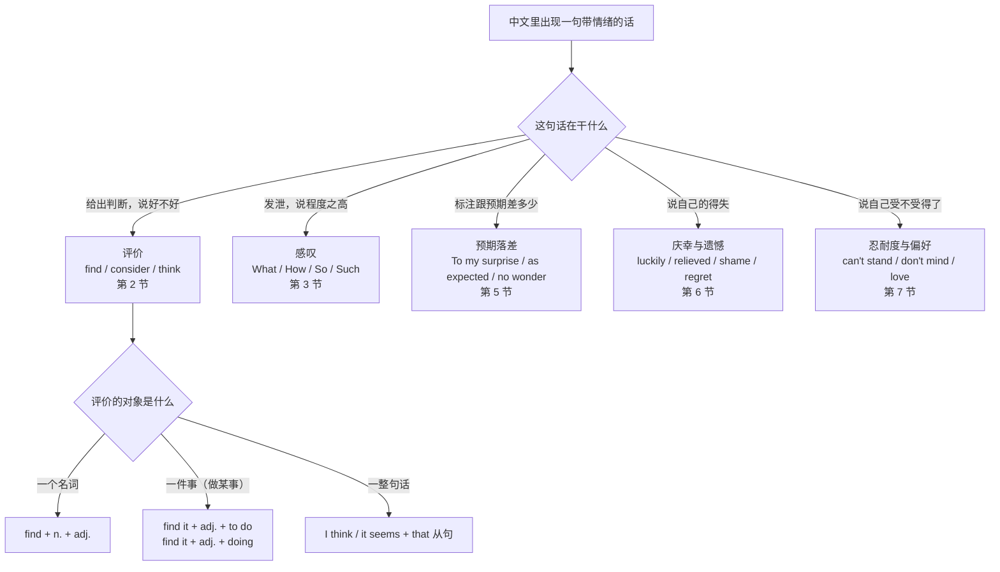
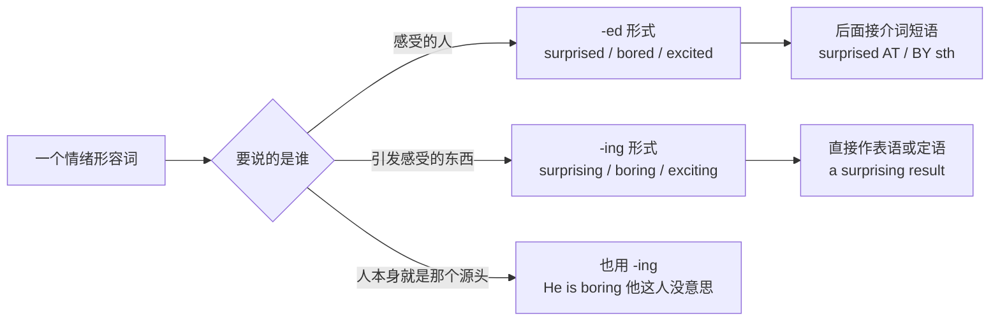
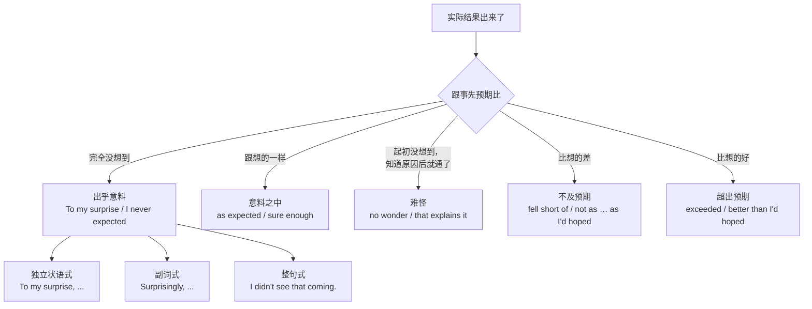
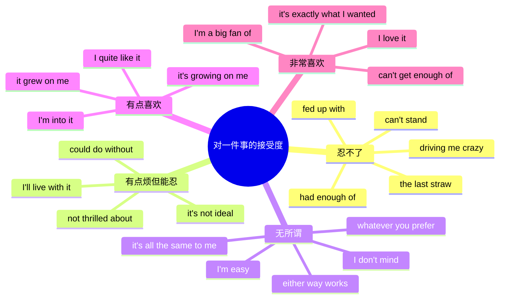
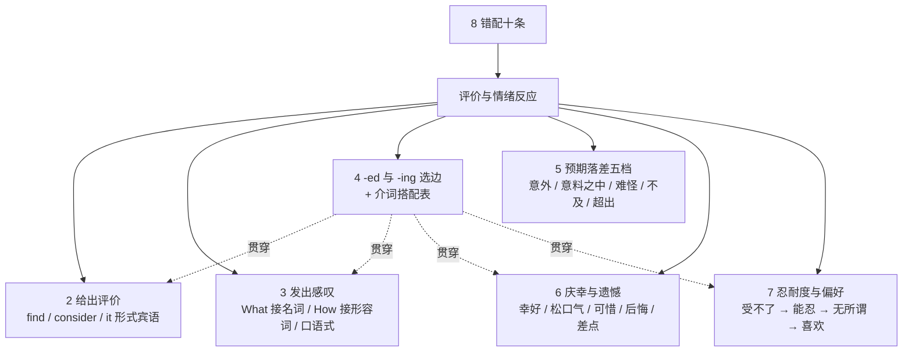

# 我觉得、真是太、令我惊讶：评价与情绪反应

> [!info] 本篇定位
>
> 这篇管的是**你对一件事的第一反应**：好不好、意外不意外、庆幸还是可惜、受得了还是受不了。
>
> 中文说情绪很省事，一个「太」字加个「了」就够了，主语还经常不出现——「气死我了」「真受不了」「幸好没去」。英文没有这套省法，每句都要交代三件事：谁在感受、感受什么、这感受挂在哪个词形上。本篇就是把这三件事的组装方式做成可查的表。
>
> 收四类中文入口。第一类是**给出评价**：我觉得这个很难、我认为这样不合适、我觉得这么改挺好。第二类是**发出感叹**：真是太快了、多好的机会啊、这什么破网络。第三类是**标注预期落差**：出乎意料、意料之中、难怪、我早猜到了。第四类是**表明得失与忍耐度**：幸好、松了口气、可惜、我后悔、我受不了了、我无所谓、我太喜欢了。
>
> 同域另三篇分工不同：[[10.态度、情感与判断/02.重要的是、关键在于、值得不值得：价值判断与聚焦\|重要的是、关键在于]] 管的是把某一点拎出来说它要紧，[[10.态度、情感与判断/03.肯定是、八成、说不定、不可能：把握度阶梯\|肯定是、八成、说不定]] 管的是你对一个判断有几分把握，[[10.态度、情感与判断/04.据说、研究表明、据我所知：信息来源与缓和语\|据说、研究表明]] 管的是这话是从哪儿听来的。本篇不碰把握度也不碰来源，只管**反应本身**。
>
> 读完能查到：想说一句带情绪的中文时，直接拿到三档成品，并且知道该用 `surprised` 还是 `surprising`、该配 `at` 还是 `by`。

---

## 1. 本篇导读：情绪挂在谁身上

英文表达情绪时的第一道岔口，中文里根本不存在：**这个情绪是主体的感受，还是客体的属性？**

「这个消息很令人失望」和「我对这个消息很失望」在中文里是同一件事的两种说法，随便挑一个都行。英文里它们是两个不同的词形：`The news was disappointing.` 和 `I was disappointed by the news.` 选错的后果不是不地道，是意思拧了——`I am boring` 说的是「我这个人很没意思」，不是「我很无聊」。

第二道岔口是**评价放在哪个位置**。中文的「我觉得这个方案不行」是一条直线，英文有三条路：塞进 that 从句（`I think that the plan won't work.`）、塞进宾语补足语（`I find the plan unworkable.`）、或者干脆把评价提到句首当感叹（`What a mess of a plan.`）。三条路的语域和力度都不同。

第三道岔口是**预期有没有被打破**。「出乎意料」「意料之中」「难怪」这三个中文词全都在描述同一件事：实际结果与你事先的预期之间差了多少。英文有一整套专门的标记手段来说这个差值，而且它们大多是独立状语，跟句子的主干不发生语法牵连。



这张图是本篇的总入口。左边一列五个分支对应五个大节，读者从中文那句话在做什么进去。往下第二层只对评价这一支做了展开，因为它的结构分岔最多：评价一个名词用 `find + 宾语 + 形容词`，评价一件事必须先用 `it` 占住宾语位置再把真宾语甩到后面，评价一整句话则回到最普通的 that 从句。后面几节的分岔在各自小节里再展开。

图里没有「情绪形容词该用 -ed 还是 -ing」这一支。因为它不是一个分支，是一层**贯穿全篇的选择**——第 2、3、5、6、7 每一节的句架里都会遇到它。所以它被抽出来单做第 4 节，位置放在评价与感叹之后、预期落差之前，正好是各节都要回来查的位置。



这是全篇复用率最高的一张图。判断只有一步：句子的主语是**在感受的人**还是**让人感受的东西**。第三条分支是唯一的坑——人也可以当情绪的源头，`He is boring` 语法完全正确，只是意思从「他很无聊」变成了「他很无趣」。想说自己此刻百无聊赖，必须写 `I am bored`。

---

## 2. 我觉得这个很…：给出评价的四条出路

### 2.1 我觉得这东西很…（评价一个名词）

中文触发语：我觉得…很… / 我看这个挺… / 这个在我看来是… / 我认为它…

| 档位 | 句架 | 例句 |
| --- | --- | --- |
| 口语 | I find sth + adj. | I find the new dashboard pretty confusing. |
| 口语 | sth is + adj. + if you ask me | The API docs are a mess, if you ask me. |
| 书面 | I find sth + to be + adj. | I find the current approach to be unnecessarily complex. |
| 书面 | I consider sth + (to be) + adj. | We consider this behavior acceptable for the first release. |
| 正式 | sth is regarded as + adj./n. | The migration is regarded as low-risk. |
| 正式 | sth may be deemed + adj. | Any undocumented field may be deemed unsupported. |

- I find the new dashboard pretty confusing. — 我觉得新的面板挺让人摸不着头脑的。
- We consider this behavior acceptable for the first release. — 我们认为这个行为在首个版本里可以接受。
- Any undocumented field may be deemed unsupported. — 任何未写入文档的字段都可视为不受支持。

`find` 和 `consider` 的分工不在正式度上，在**依据**上。`find` 暗示这是你亲身接触之后得出的印象，`consider` 暗示这是你权衡之后做的判定。所以「我用了一周觉得它很卡」用 find，「我们评估之后认定它可以上线」用 consider。

> [!warning] find 后面不能补 that
>
> ~~I find that the dashboard confusing.~~ ❌
>
> **I find the dashboard confusing.** ✅（宾语后面直接跟形容词，中间不插 that）
>
> **I find that the dashboard confuses new users.** ✅（要用 that，后面就得是完整的句子）

```text
同义入口：我觉得 / 我看 / 依我看 / 我认为 / 在我看来
语法归属：[[02.英语基础语法/01.基础入门/02.英语五大基本句型详解\|主谓宾补句型 SVOC]]
场景实战：[[04.英语场景/05.高频实用表达句型框架/01.表达观点与态度的50个万能句型\|表达观点与态度的句型]]
```

---

### 2.2 我觉得做这件事很…（先用 it 占位）

中文触发语：我觉得做…很… / …起来很… / 这么干挺… / 要…真是…

| 档位 | 句架 | 例句 |
| --- | --- | --- |
| 口语 | I find it + adj. + to do sth | I find it hard to focus with the open floor plan. |
| 口语 | It's + adj. + doing sth | It's exhausting reviewing three hundred files a day. |
| 书面 | I find it + adj. + that ... | I find it odd that nobody flagged this earlier. |
| 书面 | I consider it + adj. + to do sth | We consider it premature to announce a date. |
| 正式 | It is considered + adj. + to do sth | It is considered good form to cite the original issue. |
| 正式 | sb deems it + adj. + to do sth | The committee deemed it necessary to postpone the vote. |

- I find it hard to focus with the open floor plan. — 开放式工位我觉得很难集中注意力。
- I find it odd that nobody flagged this earlier. — 这么久没人提出来，我觉得挺奇怪。
- We consider it premature to announce a date. — 我们认为现在公布日期为时过早。

真正的宾语是 `to do sth` 或那个 that 从句，`it` 只是替它先把位置占住。中文没有这个机制，所以最典型的错法是直接把长宾语塞在动词后面。

> [!warning] 长宾语不能顶在动词后面
>
> ~~I find to work with legacy code frustrating.~~ ❌
>
> **I find it frustrating to work with legacy code.** ✅（it 先占位，真宾语放最后）
>
> ~~We consider that necessary to rewrite the module.~~ ❌
>
> **We consider it necessary to rewrite the module.** ✅（这里是 it 不是 that）

```text
同义入口：我觉得…很难 / …起来很麻烦 / 这事儿挺… / 要…真够…
语法归属：[[02.英语基础语法/08.非谓语动词/01.动词不定式详解\|不定式作真正宾语与形式宾语 it]]
```

---

### 2.3 我个人觉得、说实话我认为：软化与加重

中文触发语：我个人觉得 / 说句实话 / 恕我直言 / 老实讲 / 反正我是觉得

| 档位 | 句架 | 例句 |
| --- | --- | --- |
| 口语 | Personally, I think ... | Personally, I think we're over-engineering this. |
| 口语 | To be honest, ... | To be honest, the old flow was easier to follow. |
| 口语 | If you ask me, ... | If you ask me, that deadline was never realistic. |
| 书面 | In my view, ... | In my view, the trade-off is worth making. |
| 书面 | It seems to me that ... | It seems to me that we're solving the wrong problem. |
| 正式 | From my perspective, ... | From my perspective, the risk is contained. |
| 正式 | I would argue that ... | I would argue that the added complexity is not justified. |

- Personally, I think we're over-engineering this. — 我个人觉得这块儿设计过头了。
- It seems to me that we're solving the wrong problem. — 在我看来我们解的不是那个该解的问题。
- I would argue that the added complexity is not justified. — 我认为增加的复杂度并不划算。

这一排的差别是**你为这句话负多大责任**。`Personally` 和 `If you ask me` 把话缩回自己身上，方便对方不同意；`I would argue that` 反过来，明确表示这是一个有理由支撑、准备被反驳的立场。写正式文书别用 `To be honest`——它暗示前面说的话可能不那么诚实。

```text
同义入口：我个人觉得 / 说实话 / 依我看 / 我倾向于认为 / 在我看来
场景实战：[[04.英语场景/05.高频实用表达句型框架/01.表达观点与态度的50个万能句型\|表达观点的万能句型]]
```

---

### 2.4 还行、一般般、挺不错：口语评价刻度

中文触发语：还行 / 一般般 / 凑合 / 还不赖 / 挺好的 / 好得很

| 档位 | 句架 | 例句 |
| --- | --- | --- |
| 口语 | It's not bad. | The onboarding flow isn't bad, actually. |
| 口语 | It's okay, I guess. | The docs are okay, I guess — just thin in places. |
| 口语 | It does the job. | The old script does the job; it's just slow. |
| 口语 | It's nothing special. | The UI is nothing special, but it's fast. |
| 口语 | It's pretty solid. | The test coverage is pretty solid now. |
| 书面 | It is adequate for + n. | The current setup is adequate for our traffic. |
| 书面 | It leaves something to be desired. | The error messages leave something to be desired. |
| 正式 | It is satisfactory in most respects. | Performance is satisfactory in most respects. |

- The onboarding flow isn't bad, actually. — 上手流程其实还不赖。
- The old script does the job; it's just slow. — 老脚本能用，就是慢。
- The error messages leave something to be desired. — 报错信息还有改进余地。

`not bad` 在英语里偏正面，比中文的「还行」要热情一点；真想表达「勉强及格」用 `okay, I guess` 或 `it does the job`。`leaves something to be desired` 是书面语里最常用的委婉差评，字面是「还有些东西让人想要」，实际是「不够好」。

> [!warning] 「一般般」不能直译成 general 或 normal
>
> ~~How was the demo? — It was general.~~ ❌
>
> **How was the demo? — It was okay.** ✅／**Nothing to write home about.** ✅（口语，「没什么特别的」）

```text
同义入口：还行 / 凑合 / 一般 / 还不错 / 挺好
场景实战：[[04.英语场景/07.社交交际场景实战/01.交友聚会与闲聊场景\|闲聊中的评价表达]]
```

---

## 3. 真是太…了：感叹的四套结构

### 3.1 多么…的一个…啊（后面是名词）

中文触发语：真是个…的… / 多么…的…啊 / 什么破… / 好一个…

| 档位 | 句架 | 例句 |
| --- | --- | --- |
| 口语 | What a + adj. + n.! | What a mess! |
| 口语 | What a + n.! | What a coincidence — I was about to email you. |
| 口语 | Such a + adj. + n.! | Such a waste of a good afternoon. |
| 书面 | What + adj. + 复数/不可数 n.! | What strange results we're getting. |
| 书面 | What a + adj. + n. + it is + to do! | What a relief it is to have the tests green again. |
| 正式 | It is a + adj. + n. + that ... | It is a remarkable achievement that the team shipped on time. |

- What a mess! — 真是一团糟。
- What a coincidence — I was about to email you. — 太巧了，我正要给你发邮件。
- What a relief it is to have the tests green again. — 测试终于全绿了，真是松了口气。

`What` 后面接的核心是**名词**。单数可数名词前必须有 `a` 或 `an`，复数和不可数名词前什么都不加。中文里「真是」后面跟什么都行，英文这里是硬性的。

> [!warning] What 后面漏冠词与错用 How
>
> ~~What terrible bug!~~ ❌
>
> **What a terrible bug!** ✅（单数可数名词要冠词）
>
> ~~How a nice day!~~ ❌
>
> **What a nice day!** ✅（后面核心是名词 day，用 What）

```text
同义入口：真是个… / 多…的…啊 / 好一个… / 什么破…
语法归属：[[02.英语基础语法/10.特殊句型/04.强调句型\|What 感叹句的结构与冠词]]
场景实战：[[04.英语场景/02.基础句型框架/02.陈述疑问祈使感叹四大句式\|感叹句四大句式]]
```

---

### 3.2 真是太…了（后面是形容词或副词）

中文触发语：真是太…了 / …得不行 / 也太…了吧 / 好…啊

| 档位 | 句架 | 例句 |
| --- | --- | --- |
| 口语 | How + adj.! | How odd. |
| 口语 | So + adj.! | That's so annoying. |
| 口语 | That was + adv. + adj.! | That was insanely fast. |
| 书面 | How + adj. + sb/sth + be! | How fragile the whole pipeline is. |
| 书面 | How + adv. + sb + v.! | How quickly the numbers turned around. |
| 正式 | It is remarkable how + 从句 | It is remarkable how little the memory footprint grew. |

- How odd. — 真是奇怪。
- That was insanely fast. — 也太快了吧。
- How fragile the whole pipeline is. — 整条流水线真是脆弱。

`How` 后面接的核心是**形容词或副词**，而且后面的句子是陈述语序，不倒装。口语里这套结构已经大幅收缩，日常更常见的是直接 `So + adj.` 或 `That was + adv. + adj.`；完整的 `How fragile the whole pipeline is` 有一点文学腔，写在文档里合适，说出口会显得刻意。

> [!warning] How 感叹句不倒装
>
> ~~How fast is he running!~~ ❌（这是疑问语序）
>
> **How fast he is running!** ✅
>
> ~~How a fast response!~~ ❌
>
> **What a fast response!** ✅（核心是名词 response）

```text
同义入口：太…了 / …死了 / 好…啊 / 也太…了吧
语法归属：[[02.英语基础语法/10.特殊句型/04.强调句型\|What 与 How 感叹句的区别]]
```

---

### 3.3 不带 What 和 How 的口语感叹

中文触发语：这也太…了 / 服了 / 绝了 / 离谱 / 我人都傻了

| 档位 | 句架 | 例句 |
| --- | --- | --- |
| 口语 | That's got to be the + 最高级 + I've ever seen. | That's got to be the worst error message I've ever seen. |
| 口语 | I've never seen anything like it. | Three outages in one week — I've never seen anything like it. |
| 口语 | Talk about + n./doing! | Talk about bad timing. |
| 口语 | Now that's + n. | Now that's a clean diff. |
| 口语 | You've got to be kidding me. | Six approvals for a typo fix? You've got to be kidding me. |
| 书面 | sth is nothing short of + n. | The turnaround was nothing short of remarkable. |
| 正式 | sth is without precedent | A regression of this scale is without precedent in this repo. |

- That's got to be the worst error message I've ever seen. — 这肯定是我见过最烂的报错信息。
- Talk about bad timing. — 时机真是绝了。
- The turnaround was nothing short of remarkable. — 这个扭转的速度可以说是相当惊人。

`Talk about + 名词` 是最容易被中文母语者忽略的一条：它不是「谈论」，是「说到…那可真是…」。`Now that's + 名词` 的重音在 `that's` 上，用来把刚看到的东西树成典型。

```text
同义入口：绝了 / 服了 / 离谱 / 这也太 / 我服气
场景实战：[[04.英语场景/07.社交交际场景实战/01.交友聚会与闲聊场景\|口语反应用语]]
```

---

### 3.4 负向感叹：抱怨与不耐烦

中文触发语：什么破… / 又来了 / 烦死了 / 这叫什么事儿 / 真够呛

| 档位 | 句架 | 例句 |
| --- | --- | --- |
| 口语 | Not this again. | The same flaky test — not this again. |
| 口语 | Of all the + 复数 n. ... | Of all the days for the VPN to die. |
| 口语 | Just my luck. | Laptop died mid-demo. Just my luck. |
| 口语 | What is it with + n.? | What is it with this build server? |
| 书面 | This is far from ideal. | Losing the audit log is far from ideal. |
| 正式 | The situation is deeply unsatisfactory. | The current level of downtime is deeply unsatisfactory. |

- Not this again. — 又来了。
- Of all the days for the VPN to die. — 偏偏挑今天断 VPN。
- Losing the audit log is far from ideal. — 审计日志丢失远远算不上理想。

`Of all the + 复数名词` 是抱怨里最好用的一条：它把「偏偏是这一个」的怨气全压在 `of all` 上，后面跟什么名词都行——`of all the places`、`of all the people`、`of all the times`。

```text
同义入口：又来了 / 什么破 / 偏偏 / 真够呛 / 这叫什么事
```

---

## 4. -ed 还是 -ing：情绪形容词的选边

### 4.1 我很惊讶 vs 这很惊人

中文触发语：我很…（惊讶、失望、无聊、兴奋） / 这个很…（惊人、令人失望、无聊、激动人心）

| 档位 | 句架 | 例句 |
| --- | --- | --- |
| 口语 | sb be + -ed | I was completely confused by the config format. |
| 口语 | sth be + -ing | The config format is confusing. |
| 书面 | sb find sth + -ing | Most users find the current wording confusing. |
| 书面 | sth leave sb + -ed | The release notes left everyone confused. |
| 正式 | sb be + -ed + that ... | The board was disappointed that the target was missed. |
| 正式 | It is + -ing + that ... | It is surprising that no alert fired. |

- I was completely confused by the config format. — 那个配置格式把我彻底绕晕了。
- The config format is confusing. — 那个配置格式很绕人。
- The release notes left everyone confused. — 那份发布说明把所有人都看懵了。

同一件事的两种说法，选哪个取决于你想让谁当主语。中文的「我很困惑」和「这很令人困惑」可以随口互换，英文换主语就必须同时换词形。

> [!warning] 这是本篇错得最多的一条
>
> ~~I am very boring in this meeting.~~ ❌（意思成了「我在这个会上很没劲」）
>
> **I am very bored in this meeting.** ✅（我在这个会上很无聊）
>
> ~~The result was very surprised.~~ ❌
>
> **The result was very surprising.** ✅（结果不会感到惊讶，它只会令人惊讶）

```text
同义入口：我很惊讶 / 我挺失望 / 这挺惊人 / 这很无聊
语法归属：[[02.英语基础语法/08.非谓语动词/04.过去分词详解\|过去分词作表语表被动感受]]
```

---

### 4.2 高频对子速查表

这张表按中文意思排，查的时候从最左列进。

| 中文 | 说人（-ed 形式） | 说事物（-ing 形式） |
| --- | --- | --- |
| 惊讶 / 惊人 | I was surprised. | The number was surprising. |
| 震惊 / 令人震惊 | We were shocked. | The report was shocking. |
| 失望 / 令人失望 | She was disappointed. | The turnout was disappointing. |
| 无聊 / 没劲 | He was bored. | The talk was boring. |
| 兴奋 / 激动人心 | They were excited. | The roadmap is exciting. |
| 困惑 / 让人绕 | I was confused. | The naming is confusing. |
| 烦躁 / 恼人 | I got annoyed. | The popup is annoying. |
| 挫败 / 让人抓狂 | We were frustrated. | The process is frustrating. |
| 累 / 累人 | I'm exhausted. | The sprint was exhausting. |
| 感兴趣 / 有意思 | I'm interested. | The proposal is interesting. |
| 担心 / 令人担忧 | I'm worried. | The trend is worrying. |
| 尴尬 / 令人难堪 | He was embarrassed. | The typo was embarrassing. |
| 满意 / 令人满意 | The client is satisfied. | The outcome is satisfying. |
| 吓到 / 吓人 | I was terrified. | The stack trace was terrifying. |
| 感动 / 动人 | I was moved. | Her note was moving. |
| 困扰 / 麻烦 | I'm troubled by it. | It's a troubling sign. |

写英文的时候有个粗糙但管用的自检：**把主语换成一台机器**。机器不会感到失望，所以 `The build is disappointed` 一定错；机器可以令人失望，所以 `The build is disappointing` 一定对。反过来，人可以感到失望，也可以令人失望，这就是下一小节要处理的歧义。

```text
同义入口：惊讶 / 失望 / 无聊 / 兴奋 / 困惑 / 烦
语法归属：[[02.英语基础语法/08.非谓语动词/03.现在分词详解\|现在分词作形容词表主动性质]]
```

---

### 4.3 人也能当情绪的源头

中文触发语：他这个人很闷 / 她特别有意思 / 这人真烦 / 他挺让人放心的

| 档位 | 句架 | 例句 |
| --- | --- | --- |
| 口语 | sb is + -ing（说这人的属性） | He's boring — twenty minutes on font sizes. |
| 口语 | sb is being + -ing（说此刻的表现） | She's being difficult about the timeline. |
| 书面 | sb comes across as + -ing | The new lead comes across as demanding. |
| 书面 | sb is + -ed + and it shows | The team is exhausted, and it shows. |
| 正式 | sb's manner was + -ing | The auditor's manner was unsettling. |

- He's boring — twenty minutes on font sizes. — 他这人真没劲，字号讲了二十分钟。
- She's being difficult about the timeline. — 她在时间线这事上有点刁难人。
- The team is exhausted, and it shows. — 团队已经精疲力尽了，看得出来。

`He is boring` 和 `He is bored` 都对，但是两句不同的话。前一句是别人对他的评价，后一句是他自己的状态。`is being + 形容词` 这个结构专门用来说「此刻表现得如此」而非「一贯如此」，是英文里少数几个把临时状态和固有属性分开的语法手段。

> [!warning] 别把自己说成没意思的人
>
> ~~I'm so boring today — sorry for the long explanation.~~ ❌
>
> **Sorry to bore you with the detail — I'm just tired today.** ✅
>
> （`I'm boring` 是「我这人无趣」，想说「我今天状态不好」就换个词）

```text
同义入口：这人很闷 / 她挺有意思 / 他真烦人 / 他在闹别扭
语法归属：[[02.英语基础语法/06.动词时态/03.进行时态详解\|be being + 形容词表临时表现]]
```

---

### 4.4 情绪形容词的介词搭配表

情绪形容词后面接介词短语说明「因为什么」，多数是 -ed 形式，也有 proud、sick、fed up 这种天生不带 -ed 的。介词不是随便挑的，每个词有自己固定的一到两个。

| 形容词 | 固定介词 | 例句 |
| --- | --- | --- |
| surprised | at / by | I was surprised at how fast it built. |
| shocked | at / by | Everyone was shocked by the outage length. |
| disappointed | with / in / by | I'm disappointed with the response time. |
| annoyed | at sth / with sb | I'm annoyed with myself for missing it. |
| frustrated | with / by | We're frustrated with the review backlog. |
| worried | about | I'm worried about the memory leak. |
| excited | about | The team is excited about the rewrite. |
| interested | in | I'm interested in how you handled retries. |
| bored | with / by | I got bored with the same three tickets. |
| satisfied | with | The client is satisfied with the fix. |
| pleased | with / about | She's pleased with the turnaround. |
| embarrassed | about / by | I'm embarrassed about the typo in the subject line. |
| ashamed | of | I'm ashamed of how long that took. |
| proud | of | I'm proud of what the team pulled off. |
| tired | of | I'm tired of chasing the same bug. |
| sick | of | I'm sick of merge conflicts in the lockfile. |
| fed up | with | I'm fed up with the flaky CI. |
| scared | of | I'm scared of touching that module. |
| confused | about / by | I'm confused about which branch is live. |
| impressed | with / by | I'm impressed with how clean the diff is. |
| grateful | for sth / to sb | I'm grateful for the quick review. |
| happy | with sth / for sb | I'm happy for you — congrats on the promotion. |

三条最容易错的：`annoyed` 对人用 with、对事用 at；`tired of` 是「厌倦」而 `tired from` 是「累坏了」；`happy with` 是对结果满意而 `happy for` 是替人高兴。

> [!warning] 三对最常写混的介词
>
> ~~I'm tired from this project.~~ ❌（如果想说「烦了」）
>
> **I'm tired of this project.** ✅（厌倦）／**I'm tired from the flight.** ✅（累坏了）
>
> ~~I'm happy with you.~~ ❌（如果想说「替你高兴」）
>
> **I'm happy for you.** ✅
>
> ~~I'm disappointed of the result.~~ ❌
>
> **I'm disappointed with the result.** ✅

```text
同义入口：对…感到惊讶 / 对…失望 / 为…烦 / 为…骄傲 / 受够了…
语法归属：[[02.英语基础语法/13.附录/03.介词搭配速查\|形容词与介词的固定搭配]]
```

---

## 5. 出乎意料、意料之中、难怪：预期落差的四档



这张图按预期与结果的关系分五档。最容易被中文母语者混掉的是第三档「难怪」——它不是「出乎意料」的同义词，恰恰相反，它是**意外被消解之后**的反应：先觉得奇怪，听到原因，奇怪感没了。所以 `no wonder` 后面一定跟着那个原来觉得奇怪的现象，而原因在前一句或者在 `no wonder` 的上下文里。

上下两半的分工是两件事。上半三条（出乎意料、意料之中、难怪）说的是**质**：想到没想到。下半两条（不及预期、超出预期）说的是**量**：好多少差多少。中文里「没想到这么差」一句话把两件事都干了，英文得挑一件。

---

### 5.1 出乎意料、没想到

中文触发语：出乎意料 / 没想到 / 万万没想到 / 谁能想到 / 我一点没料到

| 档位 | 句架 | 例句 |
| --- | --- | --- |
| 口语 | I didn't see that coming. | Two resignations in one week — I didn't see that coming. |
| 口语 | I had no idea + 从句 | I had no idea the cache was disabled in staging. |
| 口语 | Who would have thought + 从句 | Who would have thought a config typo could take down billing. |
| 口语 | sth of all things | It failed on the login page, of all things. |
| 书面 | To my surprise, ... | To my surprise, the migration finished in under an hour. |
| 书面 | Surprisingly, ... | Surprisingly, none of the alerts fired. |
| 书面 | The last thing I expected was + n./to do | The last thing I expected was a rollback on a Friday. |
| 正式 | Contrary to expectations, ... | Contrary to expectations, latency improved after the change. |
| 正式 | It came as a surprise that ... | It came as a surprise that the vendor missed the deadline. |

- I didn't see that coming. — 我完全没料到。
- It failed on the login page, of all things. — 偏偏是在登录页挂的。
- Contrary to expectations, latency improved after the change. — 与预期相反，改动之后延迟反而降了。

`To my surprise` 是独立状语，跟主句在语法上不发生任何关系，位置在句首、句中、句末都行，句首最常见，后面必须有逗号。`of all things` 挂在名词后面，专门表达「偏偏是这个」的荒谬感。

> [!warning] To my surprise 后面不接 that
>
> ~~To my surprise that the tests passed.~~ ❌
>
> **To my surprise, the tests passed.** ✅（逗号，然后一个完整的句子）
>
> ~~I was surprised the result.~~ ❌
>
> **I was surprised at the result.** ✅（surprised 后面要介词，见 4.4）

```text
同义入口：没想到 / 出乎意料 / 谁能想到 / 万万没料到 / 意外的是
语法归属：[[02.英语基础语法/05.介词与连词/01.介词的分类与基本用法\|介词短语作状语]]
```

---

### 5.2 意料之中、果然

中文触发语：意料之中 / 果然 / 我就知道 / 不出所料 / 早猜到了

| 档位 | 句架 | 例句 |
| --- | --- | --- |
| 口语 | I knew it. | I knew it — the timeout was too aggressive. |
| 口语 | I saw that coming. | I saw that coming a mile off. |
| 口语 | Sure enough, ... | Sure enough, the retry storm started at peak hour. |
| 口语 | No surprise there. | The estimate slipped again. No surprise there. |
| 书面 | As expected, ... | As expected, the cold-start numbers were worse on mobile. |
| 书面 | Predictably, ... | Predictably, the manual step was skipped. |
| 正式 | In line with expectations, ... | In line with expectations, adoption grew slowly in the first month. |
| 正式 | This was anticipated. | The regression in write throughput was anticipated. |

- I saw that coming a mile off. — 这我老远就看出来了。
- Sure enough, the retry storm started at peak hour. — 果不其然，重试风暴在高峰期开始了。
- In line with expectations, adoption grew slowly in the first month. — 与预期一致，第一个月的采用率增长缓慢。

`Sure enough` 有个使用前提：前文必须已经提过这个预期，它是回过头来确认。开口第一句就说 `Sure enough` 会让人不知道你在确认什么。`Predictably` 带一点看不起的语气，说的是「这么明显的事居然还是发生了」。

```text
同义入口：果然 / 不出所料 / 我早就知道 / 意料之中 / 没什么好意外的
```

---

### 5.3 难怪、怪不得

中文触发语：难怪 / 怪不得 / 这就说得通了 / 原来如此 / 那就对上了

| 档位 | 句架 | 例句 |
| --- | --- | --- |
| 口语 | No wonder + 从句 | No wonder the page was blank — the API key expired. |
| 口语 | That explains it. | Ah, the feature flag was off. That explains it. |
| 口语 | That would explain + n. | That would explain the missing rows. |
| 口语 | It figures. | The one machine without monitoring is the one that died. It figures. |
| 口语 | Now it makes sense. | Now it makes sense why the retries piled up. |
| 书面 | This accounts for + n. | The clock skew accounts for the duplicate entries. |
| 正式 | This explains the discrepancy in + n. | This explains the discrepancy in the reported totals. |

- No wonder the page was blank — the API key expired. — 难怪页面是空的，API key 过期了。
- That would explain the missing rows. — 那就能解释少了的那些行。
- It figures. — 可不就是这样。

`No wonder` 后面直接跟句子，不加 that，也不加逗号。`It figures` 是最简短的一条，语气里带着「果然如此、又是这种事」的无奈，适合口语，不适合写进文档。

> [!warning] No wonder 后面不加 that
>
> ~~No wonder that the build failed.~~ ❌
>
> **No wonder the build failed.** ✅
>
> ~~It's no wonder for the build failing.~~ ❌
>
> **It's no wonder the build failed.** ✅（要带 It's 就直接跟从句）

```text
同义入口：难怪 / 怪不得 / 原来如此 / 那就说得通了 / 可不是嘛
语法归属：[[02.英语基础语法/09.从句体系/03.名词性从句详解\|省略 that 的名词性从句]]
```

---

### 5.4 不及预期与超出预期

中文触发语：没达到预期 / 比想的差 / 超出预期 / 比我想的好多了 / 也就那样

| 档位 | 句架 | 例句 |
| --- | --- | --- |
| 口语 | It wasn't as + adj. + as I'd hoped. | The speedup wasn't as big as I'd hoped. |
| 口语 | It was better than I expected. | Honestly, the migration went better than I expected. |
| 口语 | It didn't live up to the hype. | The new framework didn't live up to the hype. |
| 书面 | sth fell short of + n. | Q3 signups fell short of the forecast. |
| 书面 | sth exceeded + n. | Throughput exceeded our target by a wide margin. |
| 书面 | sth was underwhelming. | The benchmark results were underwhelming. |
| 正式 | sth did not meet expectations | The pilot did not meet expectations in two of the three regions. |
| 正式 | sth surpassed all projections | Adoption surpassed all internal projections. |

- The speedup wasn't as big as I'd hoped. — 提速没有我期望的那么明显。
- The benchmark results were underwhelming. — 跑分结果不太够看。
- Adoption surpassed all internal projections. — 采用率超过了内部所有预测。

`underwhelming` 是 `overwhelming` 的反造词，专指「本以为会很厉害，结果平平」，中文对应的是「也就那样」，比 `bad` 温和得多，正好用在不想直说难听话的场合。

```text
同义入口：没达到预期 / 比想的差 / 超预期 / 也就那样 / 还不如不改
场景实战：[[04.英语场景/10.职场与商务场景实战/02.会议汇报与演示场景\|演示中的数据引用]]
```

---

## 6. 幸好、松了口气、可惜、我后悔：庆幸与遗憾

### 6.1 幸好、还好

中文触发语：幸好 / 还好 / 亏得 / 多亏 / 好在 / 幸亏没

| 档位 | 句架 | 例句 |
| --- | --- | --- |
| 口语 | Luckily, ... | Luckily, we still had yesterday's snapshot. |
| 口语 | Good thing + 从句 | Good thing you checked the logs before the deploy. |
| 口语 | It's just as well + 从句 | It's just as well we postponed — half the team is out. |
| 口语 | Thankfully, ... | Thankfully, nobody was on call that night. |
| 书面 | Fortunately, ... | Fortunately, the blast radius was limited to staging. |
| 书面 | Thanks to + n., ... | Thanks to the read replica, users never saw an error. |
| 正式 | It is fortunate that ... | It is fortunate that the backup policy was reviewed last quarter. |

- Good thing you checked the logs before the deploy. — 幸好你上线前看了日志。
- It's just as well we postponed — half the team is out. — 还好我们推迟了，一半人不在。
- Thanks to the read replica, users never saw an error. — 多亏有只读副本，用户完全没感知到报错。

`It's just as well` 是「幸好」里语气最淡的一档，字面是「这样也好」，含义是「原本觉得可惜，事后看反倒对了」。`Thanks to` 中性偏正面，但也可以反着用作讽刺：`Thanks to that hotfix, we now have two bugs instead of one.`

> [!warning] 幸好后面不接虚拟语气
>
> ~~Luckily we would have a backup.~~ ❌
>
> **Luckily we had a backup.** ✅（事情真发生了，用陈述语气）
>
> ~~It's good thing you checked.~~ ❌
>
> **It's a good thing you checked.** ✅／**Good thing you checked.** ✅（口语里连 it's a 一起省掉）

```text
同义入口：幸好 / 还好 / 亏得 / 多亏 / 好在
```

---

### 6.2 松了口气

中文触发语：松了口气 / 总算 / 心里一块石头落地 / 悬着的心放下了 / 好险

| 档位 | 句架 | 例句 |
| --- | --- | --- |
| 口语 | What a relief. | The rollback worked. What a relief. |
| 口语 | That's a load off. | Contract signed — that's a load off. |
| 口语 | I can finally breathe. | Once the audit closed, I could finally breathe. |
| 口语 | We dodged a bullet. | We dodged a bullet on that dependency upgrade. |
| 书面 | sb be relieved to do / that ... | I was relieved to see the numbers hold overnight. |
| 书面 | It comes as a relief that ... | It comes as a relief that the data was recoverable. |
| 正式 | sth is a welcome development | The extension of the deadline is a welcome development. |

- What a relief. — 总算松了口气。
- We dodged a bullet on that dependency upgrade. — 那次依赖升级我们算是躲过一劫。
- I was relieved to see the numbers hold overnight. — 看到数字过夜没变，我心里踏实了。

`relieved` 是感受，`relief` 是那件让人松口气的事，这两个词形不能互换。`dodge a bullet` 专指「差一点就出事、结果没出」，不能用在「本来就没危险」的场合。

> [!warning] relieved 与 relief 分工
>
> ~~I'm a relief that it's over.~~ ❌
>
> **I'm relieved that it's over.** ✅（人用 relieved）
>
> **It's a relief that it's over.** ✅（用 it 当主语才配 a relief）

```text
同义入口：松了口气 / 总算 / 好险 / 一块石头落地 / 躲过一劫
```

---

### 6.3 可惜、遗憾

中文触发语：可惜 / 真遗憾 / 太不巧了 / 差一点就 / 白瞎了

| 档位 | 句架 | 例句 |
| --- | --- | --- |
| 口语 | That's too bad. | You missed the demo? That's too bad. |
| 口语 | What a shame. | What a shame — the venue was already booked. |
| 口语 | It's a pity + 从句 | It's a pity nobody recorded the session. |
| 口语 | Such a waste. | Two weeks of work thrown out. Such a waste. |
| 书面 | Unfortunately, ... | Unfortunately, the fix did not make the release cut. |
| 书面 | It is unfortunate that ... | It is unfortunate that the issue surfaced so late. |
| 正式 | Regrettably, ... | Regrettably, we are unable to accommodate the request. |
| 正式 | It is to be regretted that ... | It is to be regretted that the earlier warnings went unheeded. |

- What a shame — the venue was already booked. — 真可惜，场地已经被订走了。
- Unfortunately, the fix did not make the release cut. — 可惜这个修复没赶上这次发版。
- Regrettably, we are unable to accommodate the request. — 很遗憾，我们无法满足这一请求。

`shame` 在这里跟「羞耻」没关系，`What a shame` 就是「真可惜」。`Regrettably` 是正式文书里拒绝人的标配开头，说出口会显得公事公办得过分。

> [!warning] pity 前面要有冠词
>
> ~~It's pity that we missed it.~~ ❌
>
> **It's a pity that we missed it.** ✅
>
> ~~I pity that the demo was cancelled.~~ ❌
>
> **It's a shame the demo was cancelled.** ✅（`pity sb` 是「同情某人」，不是「觉得可惜」）

```text
同义入口：可惜 / 遗憾 / 太不巧 / 白费了 / 差一点
场景实战：[[04.英语场景/05.高频实用表达句型框架/02.建议请求邀请拒绝四大功能句型\|拒绝时的遗憾式表达]]
```

---

### 6.4 我后悔

中文触发语：我后悔 / 早知道就 / 我真不该 / 悔得肠子都青了 / 当初要是没

| 档位 | 句架 | 例句 |
| --- | --- | --- |
| 口语 | I shouldn't have + 过去分词 | I shouldn't have merged that on a Friday. |
| 口语 | I wish I hadn't + 过去分词 | I wish I hadn't skipped the staging run. |
| 口语 | I could kick myself. | I could kick myself for not reading the changelog. |
| 口语 | If only I had + 过去分词 | If only I had checked the region setting. |
| 书面 | I regret + doing | I regret pushing the change without a review. |
| 书面 | In hindsight, I should have + 过去分词 | In hindsight, I should have raised the concern earlier. |
| 正式 | We regret + doing / that ... | We regret that the notification was delayed. |
| 正式 | With the benefit of hindsight, ... | With the benefit of hindsight, the rollout was too aggressive. |

- I shouldn't have merged that on a Friday. — 我不该周五合那个 PR 的。
- I regret pushing the change without a review. — 我后悔没走评审就推了那个改动。
- In hindsight, I should have raised the concern earlier. — 事后看，我应该早点提出这个顾虑。

`regret doing` 是后悔做过的事，`regret to say / to inform` 完全是另一回事——那是通知坏消息时的固定礼貌式，跟后悔无关。这两个的时间指向正好相反：前者朝后看，后者朝当下的这句话看。

> [!warning] regret 后面接 doing 还是 to do
>
> ~~I regret to push that change.~~ ❌（如果想说「后悔推了那个改动」）
>
> **I regret pushing that change.** ✅（后悔已经做过的事，用 doing）
>
> **We regret to inform you that the position has been filled.** ✅（固定式，通知坏消息用 to do）

```text
同义入口：我后悔 / 早知道 / 我真不该 / 事后看 / 当初要是
语法归属：[[02.英语基础语法/07.助动词与情态动词/03.情态动词的特殊句型\|should have done 表对过去的懊悔]]
```

---

### 6.5 差点就

中文触发语：差点就 / 险些 / 好悬 / 就差一点 / 差一点没

| 档位 | 句架 | 例句 |
| --- | --- | --- |
| 口语 | That was close. | The disk hit 98%. That was close. |
| 口语 | I nearly + 过去式 | I nearly dropped the production table. |
| 口语 | I almost + 过去式 | I almost pushed the token to a public repo. |
| 口语 | We came close to + doing | We came close to losing a day of writes. |
| 书面 | sth narrowly avoided + n./doing | The team narrowly avoided a full rollback. |
| 书面 | sth was within + n. + of + doing | The cluster was within minutes of running out of connections. |
| 正式 | sth was averted | A wider outage was averted by the circuit breaker. |

- I almost pushed the token to a public repo. — 我差点把 token 推到公开仓库了。
- We came close to losing a day of writes. — 我们差点丢掉一整天的写入。
- A wider outage was averted by the circuit breaker. — 熔断器避免了一次范围更大的故障。

`almost` 和 `nearly` 在这个用法上基本可换，`nearly` 略偏英式。`come close to` 后面接的是动名词不是不定式，这是最容易写错的一处。

> [!warning] come close to 后面接 doing
>
> ~~We came close to lose the data.~~ ❌
>
> **We came close to losing the data.** ✅（to 是介词，后面接动名词）

```text
同义入口：差点 / 险些 / 好悬 / 就差一点 / 差一点没
语法归属：[[02.英语基础语法/08.非谓语动词/02.动名词详解\|介词 to 后接动名词的固定搭配]]
```

---

## 7. 我受不了了、我无所谓、我太喜欢了：忍耐度与偏好



这张脑图把接受度排成一条从负到正的连续尺，中间那档「无所谓」是中文母语者最容易说错的一档。「我无所谓」在中文里是礼貌的让步，但直译成 `I don't care` 在英语里读起来是冷漠甚至挑衅——`I don't care` 的意思接近「我不在乎、跟我没关系」。要表达「都行、你定」，得用 `I don't mind` 或 `either way works`。

两端也各有一个陷阱。负端的 `can't stand` 后面接动名词不接不定式；正端的 `I'm a fan of` 在口语里可以反着用来表达不喜欢——`I'm not a fan of this approach` 是很常见的委婉否定。

---

### 7.1 我受不了了

中文触发语：我受不了了 / 我服了 / 烦死了 / 忍不下去了 / 这是最后一次

| 档位 | 句架 | 例句 |
| --- | --- | --- |
| 口语 | I can't stand + n./doing | I can't stand waiting twelve minutes for a build. |
| 口语 | I've had enough of + n. | I've had enough of the flaky integration tests. |
| 口语 | sth is driving me crazy. | The random 500s are driving me crazy. |
| 口语 | I'm fed up with + n. | I'm fed up with rebasing the same branch. |
| 口语 | That was the last straw. | Losing the draft twice — that was the last straw. |
| 书面 | sth is no longer tolerable | The current failure rate is no longer tolerable. |
| 书面 | I've reached my limit with + n. | I've reached my limit with manual deploys. |
| 正式 | The situation is untenable. | Maintaining two forks in parallel is untenable. |

- I can't stand waiting twelve minutes for a build. — 我受不了构建一次要等十二分钟。
- The random 500s are driving me crazy. — 那些随机 500 错误快把我逼疯了。
- Maintaining two forks in parallel is untenable. — 同时维护两个分支已经难以为继。

`the last straw` 出自「压垮骆驼的最后一根稻草」，指的是**最后那一件小事**，不是最严重的那件。用错的典型是拿它去形容一场大故障。

> [!warning] can't stand 后面不接不定式
>
> ~~I can't stand to wait for the build.~~ ❌
>
> **I can't stand waiting for the build.** ✅
>
> ~~I'm fed up of the CI.~~ ❌
>
> **I'm fed up with the CI.** ✅（固定搭配是 with）

```text
同义入口：受不了 / 忍不了 / 烦死了 / 我服了 / 到极限了
语法归属：[[02.英语基础语法/08.非谓语动词/02.动名词详解\|只接动名词的动词与短语]]
```

---

### 7.2 有点烦但还能忍

中文触发语：不太乐意 / 谈不上喜欢 / 有点膈应 / 也就忍了 / 说不上多满意

| 档位 | 句架 | 例句 |
| --- | --- | --- |
| 口语 | I'm not thrilled about + n. | I'm not thrilled about the new meeting slot. |
| 口语 | I could do without + n. | I could do without the daily status ping. |
| 口语 | I'll live with it. | The font is off by a pixel, but I'll live with it. |
| 口语 | It's not the end of the world. | We lost the animation. It's not the end of the world. |
| 书面 | It is less than ideal, but workable. | The workaround is less than ideal, but workable. |
| 书面 | I have reservations about + n. | I have reservations about the rollout schedule. |
| 正式 | This is acceptable on an interim basis. | The manual step is acceptable on an interim basis. |

- I'm not thrilled about the new meeting slot. — 新的会议时段我不太乐意。
- I could do without the daily status ping. — 每天那条状态提醒我宁可不要。
- I have reservations about the rollout schedule. — 我对上线排期有所保留。

这一档在职场里最好用。`not thrilled` 和 `have reservations` 都是把否定包在一层缓和里，既表明态度又不把话说死，给后面继续谈留了余地。

```text
同义入口：不太乐意 / 有保留 / 谈不上喜欢 / 也就忍了 / 不理想但能用
场景实战：[[04.英语场景/05.高频实用表达句型框架/03.同意反对让步转折句型库\|委婉表达不同意见]]
```

---

### 7.3 我无所谓、你定

中文触发语：我无所谓 / 都行 / 你定 / 随便 / 对我来说一样

| 档位 | 句架 | 例句 |
| --- | --- | --- |
| 口语 | I don't mind. | Tuesday or Thursday? I don't mind. |
| 口语 | Either way works for me. | We can ship now or wait — either way works for me. |
| 口语 | I'm easy. | Lunch spot? I'm easy. |
| 口语 | Whatever works for you. | Pick a time — whatever works for you. |
| 口语 | It's all the same to me. | Postgres or MySQL, it's all the same to me here. |
| 书面 | I have no strong preference. | I have no strong preference between the two designs. |
| 正式 | We are indifferent as to + n. | We are indifferent as to which vendor is selected. |

- Tuesday or Thursday? I don't mind. — 周二还是周四？我都行。
- Whatever works for you. — 你方便就行。
- I have no strong preference between the two designs. — 两个方案我没有特别的倾向。

`I don't mind` 和 `I don't care` 的差距是本节最要紧的一条。前者是让步，后者是撇清。想在会议上表示「听你的」，说成 `I don't care` 会被理解成「我懒得管」。

> [!warning] 别用 I don't care 表示随和
>
> ~~Where should we eat? — I don't care.~~ ❌（听起来是不耐烦）
>
> **Where should we eat? — I don't mind, you pick.** ✅
>
> ~~Whatever.~~ ❌（单说这一个词几乎总是不礼貌的）
>
> **Whatever you prefer.** ✅

```text
同义入口：无所谓 / 都行 / 你定 / 随便 / 我没意见
```

---

### 7.4 我太喜欢了

中文触发语：我太喜欢了 / 我超爱 / 我一下就喜欢上了 / 越用越顺手 / 正合我意

| 档位 | 句架 | 例句 |
| --- | --- | --- |
| 口语 | I love it. | I love how fast the new search is. |
| 口语 | I'm really into + n. | I'm really into the keyboard-first workflow. |
| 口语 | I'm a big fan of + n. | I'm a big fan of small, reviewable PRs. |
| 口语 | It's growing on me. | I wasn't sure at first, but the new layout is growing on me. |
| 口语 | I can't get enough of + n. | I can't get enough of these release notes. |
| 书面 | sth is exactly what we needed. | The audit log is exactly what we needed. |
| 书面 | I'm impressed with + n. | I'm impressed with how clean the migration path is. |
| 正式 | We are highly satisfied with + n. | We are highly satisfied with the vendor's response time. |

- I love how fast the new search is. — 新的搜索快得我太喜欢了。
- It's growing on me. — 我越用越喜欢了。
- I'm a big fan of small, reviewable PRs. — 我特别推崇小而好审的 PR。

`grow on sb` 是这一组里最实用的一条：它表达的不是「一见钟情」，而是「起初无感、慢慢喜欢上」。主语是那个东西，不是人——`It's growing on me`，不是 `I'm growing on it`。

> [!warning] be into 与 be interested in 不能反过来
>
> ~~I'm into in the new framework.~~ ❌
>
> **I'm into the new framework.** ✅（into 已经是介词，后面直接跟名词）
>
> ~~The new layout is growing me.~~ ❌
>
> **The new layout is growing on me.** ✅

```text
同义入口：我太喜欢了 / 超爱 / 越用越喜欢 / 正合我意 / 我很推崇
```

---

### 7.5 我很尴尬

中文触发语：我很尴尬 / 好社死 / 我当场就想找个地缝 / 太丢人了 / 被架住了

| 档位 | 句架 | 例句 |
| --- | --- | --- |
| 口语 | That was awkward. | Two of us had prepared the same slide. That was awkward. |
| 口语 | I wanted the ground to swallow me up. | I called the client by the wrong name — I wanted the ground to swallow me up. |
| 口语 | sb put me on the spot. | He put me on the spot in front of the whole team. |
| 口语 | I'm cringing just thinking about it. | I'm cringing just thinking about that email. |
| 书面 | sb be embarrassed about / by + n. | I'm embarrassed about the typo in the announcement. |
| 书面 | sth is an embarrassment. | Shipping the debug banner to production was an embarrassment. |
| 正式 | The incident was regrettable and avoidable. | The disclosure was regrettable and entirely avoidable. |

- Two of us had prepared the same slide. That was awkward. — 我们俩备了同一页 PPT，那场面太尴尬了。
- He put me on the spot in front of the whole team. — 他当着全团队的面把我架住了。
- Shipping the debug banner to production was an embarrassment. — 把调试横幅发到生产环境实在丢人。

`awkward` 说的是**场面**尴尬，`embarrassed` 说的是**人**感到难堪，两者不能互换。`put sb on the spot` 特指「当众逼人立刻回答、让人下不来台」，跟一般的尴尬不是一回事。

> [!warning] awkward 与 embarrassed 分工
>
> ~~I was very awkward when he asked.~~ ❌（这说的是「我当时举止很别扭」，不是「我难堪」）
>
> **It was awkward when he asked.** ✅（场面尴尬）／**I was embarrassed when he asked.** ✅（我很难堪）

```text
同义入口：尴尬 / 社死 / 丢人 / 下不来台 / 抠脚趾
语法归属：[[02.英语基础语法/04.形容词与副词/01.形容词的用法与位置\|形容词作表语的用法]]
```

---

## 8. 错配集中区：十条最容易写错的

这一节把前面各处的警示压成一张连查表，写完一段带情绪的英文回来扫一遍。

| 序号 | 错句 | 对句 | 为什么 |
| --- | --- | --- | --- |
| 1 | ~~I am boring.~~ | **I am bored.** | -ing 说事物或说这人无趣，-ed 才是自己的感受 |
| 2 | ~~The result was surprised.~~ | **The result was surprising.** | 结果不会感到惊讶，只会令人惊讶 |
| 3 | ~~I find that the plan risky.~~ | **I find the plan risky.** | find + 宾语 + 形容词，中间不能插 that |
| 4 | ~~I find to fix this hard.~~ | **I find it hard to fix this.** | 长宾语要用 it 先占位 |
| 5 | ~~What a terrible news!~~ ／ ~~How a bad day!~~ | **What terrible news!** ／ **What a bad day!** | 不可数名词不加冠词，核心是名词就用 What 不用 How |
| 6 | ~~How fast is it running!~~ | **How fast it is running!** | 感叹句用陈述语序，不倒装 |
| 7 | ~~To my surprise that it worked.~~ | **To my surprise, it worked.** | 独立状语后面用逗号接完整句子 |
| 8 | ~~No wonder that the test failed.~~ | **No wonder the test failed.** | no wonder 后面直接跟句子 |
| 9 | ~~I can't stand to wait.~~ | **I can't stand waiting.** | can't stand 后面接动名词 |
| 10 | ~~Where to eat? — I don't care.~~ | **I don't mind — you pick.** | don't care 是撇清，don't mind 才是随和 |

十条里有六条（1、2、5、6、9、10）在中文里根本不存在对应的区别，属于必须靠背的类型；另外四条（3、4、7、8）是结构问题，理解一次就不会再错。

> [!tip] 一个两秒自检
>
> 写完一句带情绪的英文，只问两个问题：
>
> 第一，**主语是人还是物**？是人就找 -ed，是物就找 -ing。
>
> 第二，**这个形容词后面有没有跟东西**？跟了就查 4.4 那张介词表，不要凭语感填。
>
> 这两问能拦掉本节表里的一半。

---

## 9. 三档全流程走查

> [!example] 一句中文走完三档
>
> 中文：**「说实话我挺失望的，本来以为这次能快不少，结果也就那样。」**
>
> 第一步拆意图：这句里有三件事——给评价（我失望）、标预期落差（本以为…结果没有）、下结论（也就那样）。分别落到 2.3、5.4、5.4。
>
> **口语档**
>
> - To be honest, I'm a bit disappointed — I thought it'd be way faster, but it's about the same.
>   - 说实话我有点失望，本来以为会快很多，结果差不多。
>
> **书面档**
>
> - I have to say I'm disappointed with the result. We expected a noticeable speedup, but the numbers came in flat.
>   - 我得说这个结果让我失望。我们本来期待有明显提速，但数字基本没动。
>
> **正式档**
>
> - The outcome fell short of expectations. The anticipated performance gain did not materialize in either benchmark.
>   - 结果未达预期。两项基准测试中都未出现预期的性能提升。
>
> 三档不是同义句。口语档 `a bit` 把失望调小了，是给对方留面子；书面档保留了完整的情绪主语 `I'm disappointed`，责任在说话人；正式档把人整个去掉，只剩 `The outcome fell short of expectations`，情绪被换成了事实陈述。**去掉情绪主语是升档最有效的一步**，这条在 [[12.文体、语域与正式文书/01.语域升降与同义改写：同一句话的三档说法\|语域升降与同义改写]] 里有完整的五个手段。

> [!example] 反向走查：从英文看中文丢了什么
>
> 英文：**`No wonder the retries piled up — the backoff was never applied.`**
>
> 直译成「难怪重试堆积了，退避从来没生效」是对的，但中文这么说会丢掉一层：`No wonder` 隐含着「我刚才一直觉得奇怪」这个前史。中文里承担这层意思的是「怪不得」前面那个停顿，或者一个「哦」字。
>
> 所以反过来从中文写英文的时候要注意：只有在**前面确实提过那个疑惑**的场合，`No wonder` 才成立。开口第一句说 `No wonder the retries piled up`，听的人会不知道你在解答谁的困惑。

---

## 10. 本篇小结



这张图是本篇的检索地图。五个实线分支是五类中文意图，读者从想说的那句话进去。第 4 节用虚线连回其他四节，因为它不是一个独立的意图，是**每一节都要回来查的一层选择**——只要句子里出现情绪形容词，就得先决定主语是人还是物。第 8 节反向指回根节点，它是写完之后的复查清单，不是查询入口。

> [!success] 本篇核心要点回顾
>
> 1. **-ed 说感受的人，-ing 说引发感受的东西**。判断法是把主语换成一台机器：机器不会感到失望，只会令人失望。
> 2. **find 和 consider 的分工在依据不在语域**：find 是亲身接触后的印象，consider 是权衡之后的判定。两者后面都直接跟宾语加形容词，中间不插 that。
> 3. **宾语一长就要用 it 占位**：`I find it hard to do sth`，不能把不定式短语顶在动词后面。
> 4. **What 后面的核心是名词，How 后面的核心是形容词或副词**，而且感叹句用陈述语序，不倒装。
> 5. **难怪不是出乎意料的同义词**，它是意外被消解之后的反应，成立的前提是前文已经出现过那个疑惑。
> 6. **regret doing 是后悔做过的事，regret to inform 是通知坏消息的固定礼貌式**，时间指向正好相反。
> 7. **I don't mind 是随和，I don't care 是撇清**，把「我无所谓」直译成后者会显得不耐烦。
> 8. **情绪形容词的介词是死的**：tired of 是厌倦而 tired from 是累坏，happy with 是满意而 happy for 是替人高兴，annoyed with 对人而 annoyed at 对事。

> [!success] 本篇练习清单
>
> - [ ] 给一句中文「我觉得这个新流程挺绕的」，写出口语、书面、正式三档，检查 find 后面有没有多加 that。
> - [ ] 给一句中文「我觉得每天开三个会太浪费时间了」，用 it 作形式宾语的结构写出三档。
> - [ ] 给一句中文「这也太快了吧」和「多好的机会啊」，分别用 How 和 What 写出感叹句，检查冠词和语序。
> - [ ] 从 4.2 的对子表里挑五个词，各造一对句子——一句说人一句说事物，写完检查词形。
> - [ ] 给一句中文「出乎意料的是，迁移一个小时就跑完了」，写出独立状语式、副词式、整句式三种写法。
> - [ ] 给一句中文「难怪页面是空的，原来 key 过期了」，写出三档，确认 no wonder 后面没有加 that。
> - [ ] 给一句中文「幸好我们还有昨天的快照，不然就麻烦了」，写出口语、书面、正式三档。
> - [ ] 给一句中文「我后悔周五合了那个 PR」，分别用 shouldn't have、wish I hadn't、regret doing 三种写法各写一遍。
> - [ ] 给一句中文「随便，你定就行」，写出三个不同的英文成品，并说明为什么不能用 I don't care。
> - [ ] 把第 8 节的十条错配逐条对照自己最近写的英文邮件，找出实际犯过的那几条。

### 10.1 下一篇预告

> [!info] 接下来
>
> 说完「我对这件事什么感受」，下一步是「这件事里哪一点最要紧」。
>
> [[10.态度、情感与判断/02.重要的是、关键在于、值得不值得：价值判断与聚焦\|重要的是、关键在于、值得不值得：价值判断与聚焦]]
>
> 下一篇处理 what 引导的主语从句（what matters is、what I care about is、what worries me is）、the point is、the problem is 与 the key to + 动名词的聚焦结构；再给 worth doing、There's no point in doing、it pays to do、deserve 的值不值判断，以及必要与不必要那一组对立——essential 与 imperative 后面的 (should) + 原形，needn't have done 与 didn't need to do 的时间差。
