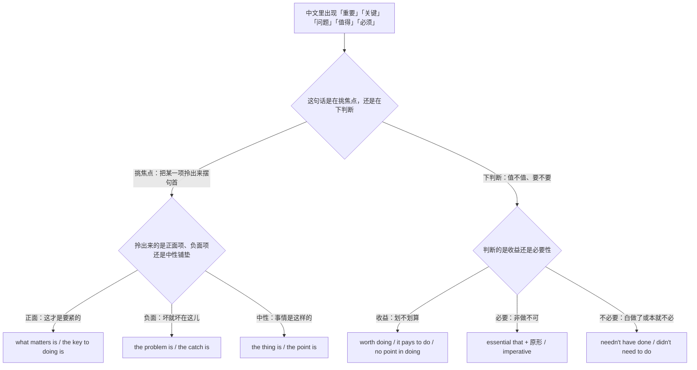
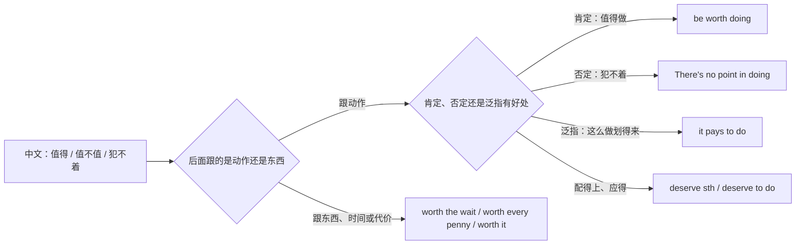
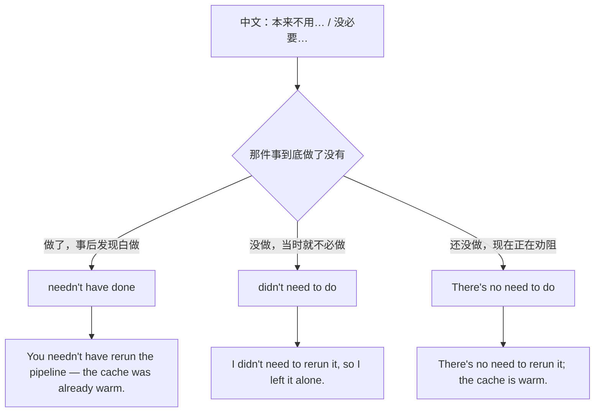
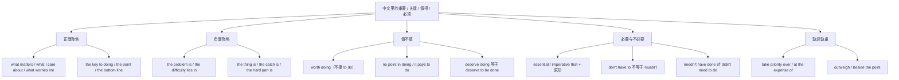

# 重要的是、关键在于、值得不值得：价值判断与聚焦

> [!info] 本篇定位
>
> 这篇收三类中文意图：把一句话里最要紧的那一项**拎到句首**（重要的是、我在乎的是、让我担心的是、关键在于、问题在于）、对一件事**下值不值的判断**（值得做、犯不着、划得来、活该）、以及**必要与不必要**的两端（非做不可、势在必行、没必要、早知道就不用了）。
>
> 上一篇 [[10.态度、情感与判断/01.我觉得、真是太、令我惊讶：评价与情绪反应\|我觉得、真是太、令我惊讶：评价与情绪反应]] 管的是人对事情的**情绪反应**，这一篇管的是人对事情的**价值排序**——同样一句「这事我很在意」，前者要的是 I'm frustrated，后者要的是 what I care about is。至于「多半是」「不可能」这种对真假的把握度，在下一篇；「据说」「研究表明」这类信息来源，在 [[10.态度、情感与判断/04.据说、研究表明、据我所知：信息来源与缓和语\|据说、研究表明、据我所知：信息来源与缓和语]]。
>
> 读完能查到：31 条中文意图入口、93 条分档成品句架，以及中文母语者在 worth、no point、needn't have done 这三处最容易造出的错句该怎么绕。

---

## 1. 本篇导读：聚焦、值不值、必不必三条查询线

中文说重要性有一个很省事的办法：把要紧的那一项摆在句首，后面接一个「是」。「重要的是能不能按时上线」「问题在于没人接手」「关键在于把日志接上」——三句结构相同，英文那边分给三个不同的开头。而中文说「值得」「必须」时又常常只有一个字的差别：「值得做」和「值不值」在英文里是两套写法，「本来不用做」和「当时不用做」在英文里差一个完成体。

先用一张选择树把这些字眼分流。

这张图的第一个分叉点值得多看一眼：**挑焦点和下判断是两件事**。「重要的是按时上线」是把「按时上线」这一项从一堆事情里挑出来放到聚光灯下，句子本身不评价它好不好；「按时上线值得为之加班」才是判断。中文里这两件事都可以用「重要」两个字带过，英文里一边落到 what／the key／the point 的句首框架，另一边落到 worth／pay／deserve 的动词与形容词。查错了方向，写出来的句子就会既不聚焦也不判断。

第二个要提前记住的分叉在最右下角：中文「本来不用…的」是一个歧义入口，做没做过那件事决定了英文用哪一式。这一条放在第 7 节单独处理。

本篇的意图块按这张图的六条出路排：第 2、3 节走正面聚焦，第 4 节走负面聚焦，第 5 节走值不值，第 6、7 节走必要与不必要，第 8 节补上「孰轻孰重」的取舍说法。

---

## 2. 重要的是、我在乎的是：把焦点提到句首

这一节的五条意图共用一个框架：句首放一个 `what` 开头的成分，中间放 `is`，把要强调的内容甩到 `is` 后面。中文的「…的是」正好和它一一对应，是全篇映射最整齐的一区。三档的差别不在结构，在**动词选得多重**：口语用 matters、care about，书面用 counts、concerns，正式换成 the primary consideration、our principal concern 这类名词化说法。

### 2.1 重要的是、要紧的是

中文触发语：重要的是… / 要紧的是… / 关键要看… / 说白了得看…

| 档位 | 句架 | 例句 | 译文 |
| --- | --- | --- | --- |
| 口语 | what matters is + 从句/名词 | What matters is that the fix ships before Friday. | 重要的是这个修复得在周五前上线。 |
| 书面 | what counts here is + 名词/动名词 | What counts here is keeping the response time under 200 ms. | 这里要紧的是把响应时间压在 200 毫秒以内。 |
| 正式 | the primary consideration is + 名词/that 从句 | The primary consideration is whether the change can be rolled back safely. | 首要考虑的是这次变更能否安全回滚。 |

> [!warning] 错配警示
>
> - ~~What is important is that the fix ships, it matters.~~ ❌
> - **What matters is that the fix ships.** ✅（`what matters is` 本身已经承担了「重要」这层意思，不要再补一个 `it matters` 结尾；一句话只挑一个焦点）

页脚：
- 同义入口：最要紧的是 / 真正重要的是 / 关键要看
- 语法归属：[[02.英语基础语法/09.从句体系/03.名词性从句详解\|名词性从句详解]]
- 场景实战：[[04.英语场景/05.高频实用表达句型框架/01.表达观点与态度的50个万能句型\|表达观点与态度的50个万能句型]]

### 2.2 我在乎的是、我看重的是

中文触发语：我在乎的是… / 我看重的是… / 我关心的只有… / 对我来说要紧的是…

| 档位 | 句架 | 例句 | 译文 |
| --- | --- | --- | --- |
| 口语 | what I care about is + 名词/从句 | What I care about is whether users can still log in. | 我在乎的是用户还能不能登录。 |
| 书面 | what we value most is + 名词/动名词 | What we value most is predictable release cadence. | 我们最看重的是可预期的发布节奏。 |
| 正式 | our principal concern is + 名词/that 从句 | Our principal concern is the continuity of service during migration. | 我们主要关心的是迁移期间的服务连续性。 |

> [!warning] 错配警示
>
> - ~~What I care is the login flow.~~ ❌
> - **What I care about is the login flow.** ✅（`care` 后面的 `about` 是搭配的一部分，提到句首时不能丢；同理 `what I'm looking at is`、`what I'm asking for is` 都要带住那个介词）

页脚：
- 同义入口：我关心的是 / 我唯一在意的是 / 我要的是
- 语法归属：[[02.英语基础语法/05.介词与连词/02.常用介词搭配详解\|常用介词搭配详解]]
- 场景实战：[[04.英语场景/10.职场与商务场景实战/04.商务谈判合同与客户沟通\|商务谈判合同与客户沟通]]

### 2.3 让我担心的是、我怕的是

中文触发语：让我担心的是… / 我怕的是… / 我不放心的是… / 隐患在于…

| 档位 | 句架 | 例句 | 译文 |
| --- | --- | --- | --- |
| 口语 | what worries me is + 从句/名词 | What worries me is that nobody has run this on real data. | 我担心的是还没人拿真实数据跑过。 |
| 书面 | what concerns us is + 名词/动名词 | What concerns us is the lack of a rollback path. | 我们担心的是没有回滚路径。 |
| 正式 | one matter of concern is + that 从句 | One matter of concern is that the vendor has not committed to a support window. | 令人关注的一点是供应商未承诺支持窗口。 |

> [!warning] 错配警示
>
> - ~~What I worry is the missing tests.~~ ❌
> - **What worries me is the missing tests.** ✅（`worry` 作「使…担心」时人是宾语，句首框架里主语位置留给 `what`；要用 `I worry` 就得写成 `What I worry about is…`）

页脚：
- 同义入口：我不放心的是 / 最悬的一点是 / 风险在于
- 语法归属：[[02.英语基础语法/01.基础入门/02.英语五大基本句型详解\|英语五大基本句型详解]]
- 场景实战：[[04.英语场景/10.职场与商务场景实战/02.会议汇报与演示场景\|会议汇报与演示场景]]

### 2.4 我们需要的是、缺的就是

中文触发语：我们需要的是… / 现在缺的就是… / 真正管用的是… / 差的就是…

| 档位 | 句架 | 例句 | 译文 |
| --- | --- | --- | --- |
| 口语 | what we need is + 名词 | What we need is one owner for this service, not three. | 我们需要的是给这个服务定一个负责人，不是三个。 |
| 书面 | what is missing is + 名词/动名词 | What is missing is a written escalation path. | 现在缺的是一条写下来的升级路径。 |
| 正式 | what remains to be established is + 名词/从句 | What remains to be established is who signs off on production changes. | 尚待明确的是由谁审批生产变更。 |

> [!warning] 错配警示
>
> - ~~What we need are a clear owner.~~ ❌
> - **What we need is a clear owner.** ✅（`what` 从句作主语时谓语跟单数，除非 `is` 后面是明确的复数名词——`What we need are two more reviewers.` 才用 `are`）

页脚：
- 同义入口：现在最缺的是 / 差的就是 / 补上这一块就行
- 语法归属：[[02.英语基础语法/10.特殊句型/06.主谓一致\|主谓一致]]
- 场景实战：[[04.英语场景/10.职场与商务场景实战/02.会议汇报与演示场景\|会议汇报与演示场景]]

### 2.5 说到底就是、归根结底

中文触发语：说到底就是… / 归根结底还是… / 最后落到… / 无非就是…

| 档位 | 句架 | 例句 | 译文 |
| --- | --- | --- | --- |
| 口语 | it all comes down to + 名词/动名词 | It all comes down to how much traffic we expect on day one. | 说到底就看第一天预计多大流量。 |
| 书面 | what it comes down to is + 名词/从句 | What it comes down to is whether we trust the upstream data. | 归根结底是我们信不信上游数据。 |
| 正式 | the question ultimately reduces to + 名词 | The question ultimately reduces to a trade-off between latency and cost. | 这个问题最终归结为延迟与成本之间的取舍。 |

> [!warning] 错配警示
>
> - ~~It all comes down to we don't have enough data.~~ ❌
> - **It all comes down to the fact that we don't have enough data.** ✅（`come down to` 里的 `to` 是介词，后面要名词、动名词或 `the fact that` 包一层，不能直接挂一个句子）

页脚：
- 同义入口：归根到底 / 最终就是 / 绕来绕去还是
- 语法归属：[[02.英语基础语法/08.非谓语动词/02.动名词详解\|动名词详解]]
- 场景实战：[[04.英语场景/05.高频实用表达句型框架/04.比较对比举例总结句型库\|比较对比举例总结句型库]]

---

## 3. 关键在于、重点是、底线是

上一节的框架把焦点交给 `what`，这一节把焦点交给一个名词——key、point、bottom line、deciding factor。差别在语气：`what matters is` 是把一件事从若干件里挑出来，`the key is` 则暗示「找到它就解得开」，`the bottom line is` 暗示「前面都不用听了，就这一句」。中文里这三层也分得清，只是常常被同一个「关键」字压平。

### 3.1 关键在于（做某事）

中文触发语：关键在于… / 关键是要… / 诀窍是… / 成败就看能不能…

| 档位 | 句架 | 例句 | 译文 |
| --- | --- | --- | --- |
| 口语 | the key is to do sth | The key is to cache the result before the loop, not inside it. | 关键是在循环外面缓存结果，别放里面。 |
| 书面 | the key to doing sth is + 名词/从句 | The key to keeping the build fast is limiting how many images we rebuild. | 让构建保持快的关键，在于限制重建的镜像数量。 |
| 正式 | the critical factor in doing sth is + 名词 | The critical factor in sustaining throughput is connection reuse. | 维持吞吐量的关键因素是连接复用。 |

> [!warning] 错配警示
>
> - ~~The key to fix this is to add an index.~~ ❌
> - **The key to fixing this is to add an index.** ✅（`the key to` 的 `to` 是介词，后面接动名词；`be the key` 后面接 `to do` 才是不定式——两个 `to` 词性不同，位置也不同）

页脚：
- 同义入口：诀窍在于 / 要点是 / 卡在哪儿就看
- 语法归属：[[02.英语基础语法/08.非谓语动词/02.动名词详解\|动名词详解]]
- 场景实战：[[04.英语场景/05.高频实用表达句型框架/01.表达观点与态度的50个万能句型\|表达观点与态度的50个万能句型]]

### 3.2 重点是、意义就在于

中文触发语：重点是… / 我要说的重点是… / 这么做的意义在于… / 图的就是…

| 档位 | 句架 | 例句 | 译文 |
| --- | --- | --- | --- |
| 口语 | the point is (that) ... | The point is we can't verify any of this without staging data. | 重点是没有预发数据这些都验不了。 |
| 书面 | the whole point of doing sth is + 名词/to do | The whole point of splitting the service was to isolate failures. | 拆分服务的意义就在于隔离故障。 |
| 正式 | the underlying rationale is + 名词/that 从句 | The underlying rationale is that isolated failures are cheaper to contain. | 其根本理由在于隔离后的故障更易于控制。 |

> [!warning] 错配警示
>
> - ~~The point of this is for reduce the load.~~ ❌
> - **The point of this is to reduce the load.** ✅（`the point of sth is` 后面接不定式或名词；`for` 后只能接名词或动名词，两者不能混着写）

页脚：
- 同义入口：意义在于 / 图的就是 / 这么干是为了
- 语法归属：[[02.英语基础语法/08.非谓语动词/01.动词不定式详解\|动词不定式详解]]
- 场景实战：[[04.英语场景/09.学习与教育场景实战/01.课堂讨论与提问场景\|课堂讨论与提问场景]]

### 3.3 底线是、说一千道一万

中文触发语：底线是… / 说一千道一万… / 最后一句话… / 不管怎么说结论是…

| 档位 | 句架 | 例句 | 译文 |
| --- | --- | --- | --- |
| 口语 | bottom line, ... | Bottom line, we're not shipping this on Thursday. | 说白了，周四发不了。 |
| 书面 | the bottom line is (that) ... | The bottom line is that the current design cannot meet the SLA. | 底线是当前设计达不到 SLA。 |
| 正式 | in the final analysis, ... | In the final analysis, the proposal fails on cost rather than on feasibility. | 最终来看，该方案败在成本而非可行性。 |

> [!warning] 错配警示
>
> - ~~In the bottom line, we can't ship.~~ ❌
> - **The bottom line is that we can't ship.** ✅（`bottom line` 作句首插入语时不带介词，直接 `Bottom line,`；要带介词只能换成 `at the end of the day`、`in the final analysis` 这类另有其形的固定短语）

页脚：
- 同义入口：一句话概括 / 结论就是 / 讲到底
- 语法归属：[[02.英语基础语法/09.从句体系/03.名词性从句详解\|名词性从句详解]]
- 场景实战：[[04.英语场景/10.职场与商务场景实战/03.商务邮件与正式书面沟通\|商务邮件与正式书面沟通]]

### 3.4 成败就看这个、决定性的是

中文触发语：成败就看这个 / 决定性的是… / 这一条就能定生死 / 差别全在这儿

| 档位 | 句架 | 例句 | 译文 |
| --- | --- | --- | --- |
| 口语 | sth can make or break + 名词 | Onboarding docs can make or break adoption. | 上手文档写得好不好，直接决定有没有人用。 |
| 书面 | what makes the difference is + 名词/动名词 | What makes the difference is having one person accountable end to end. | 真正拉开差距的是有一个人从头负责到尾。 |
| 正式 | the decisive factor is + 名词/that 从句 | The decisive factor is that the vendor can meet the audit requirements. | 决定性因素在于该供应商能满足审计要求。 |

> [!warning] 错配警示
>
> - ~~This will make or break to the project.~~ ❌
> - **This will make or break the project.** ✅（`make or break` 是及物成语，后面直接跟宾语，不加介词）

页脚：
- 同义入口：全看这一条 / 关键手 / 分水岭在这儿
- 语法归属：[[02.英语基础语法/01.基础入门/02.英语五大基本句型详解\|英语五大基本句型详解]]
- 场景实战：[[04.英语场景/10.职场与商务场景实战/04.商务谈判合同与客户沟通\|商务谈判合同与客户沟通]]

---

## 4. 问题在于、麻烦在于、难就难在

把焦点甩到负面项上时，中文有一批固定的开头：「问题在于」「麻烦的是」「有个坑」「难就难在」。英文这边对应四个不同的名词框架，它们的语气强弱不一样——`the problem is` 是明确指认毛病，`the thing is` 是委婉铺垫（常常后面才是真话），`the catch is` 专指「听起来不错但有附加条件」，`the hard part is` 只说难度不说毛病。挑错了会让一句本来中性的话读起来像在指责。

### 4.1 问题在于、毛病出在

中文触发语：问题在于… / 毛病出在… / 症结是… / 麻烦就麻烦在…

| 档位 | 句架 | 例句 | 译文 |
| --- | --- | --- | --- |
| 口语 | the problem is (that) ... | The problem is nobody owns the retry logic. | 问题在于重试逻辑没人负责。 |
| 书面 | the issue here is + 名词/that 从句 | The issue here is that the two systems disagree on time zones. | 这里的问题在于两套系统对时区的处理不一致。 |
| 正式 | the difficulty lies in + 名词/动名词 | The difficulty lies in reconciling two incompatible identity models. | 难点在于调和两套互不兼容的身份模型。 |

> [!warning] 错配警示
>
> - ~~The problem is lying in the retry logic.~~ ❌
> - **The problem lies in the retry logic.** ✅（`lie in` 表「在于」时用一般现在时的 `lies`，不用进行时；`be` 与 `lie in` 也不能叠着用）

页脚：
- 同义入口：症结在于 / 卡在哪儿 / 坏就坏在
- 语法归属：[[02.英语基础语法/06.动词时态/01.一般现在时与一般过去时\|一般现在时与一般过去时]]
- 场景实战：[[11.人际功能与话轮管理/05.我有个顾虑、这样不太行、恐怕要延期：异议、负面反馈与坏消息\|我有个顾虑、这样不太行、恐怕要延期]]

### 4.2 事情是这样的、是这么回事

中文触发语：事情是这样的… / 是这么回事… / 跟你说实话… / 只不过呢…

| 档位 | 句架 | 例句 | 译文 |
| --- | --- | --- | --- |
| 口语 | the thing is, ... | The thing is, we only have one person who knows that codebase. | 是这么回事，那套代码只有一个人熟。 |
| 书面 | the situation is that ... | The situation is that the license expires before the migration completes. | 情况是许可证会在迁移完成之前到期。 |
| 正式 | the position is as follows: ... | The position is as follows: no further work will be scheduled until funding is confirmed. | 目前的情况是：在资金确认前不再安排后续工作。 |

> [!warning] 错配警示
>
> - ~~The thing is that we only have one person, but the thing is also the deadline.~~ ❌
> - **The thing is, we only have one person — and the deadline hasn't moved.** ✅（`the thing is` 一段话里只用一次，它的作用是「接下来是关键」，用第二次就失效了）

页脚：
- 同义入口：说起来 / 实际情况是 / 问题就出在这儿
- 语法归属：[[02.英语基础语法/09.从句体系/03.名词性从句详解\|名词性从句详解]]
- 场景实战：[[04.英语场景/07.社交交际场景实战/02.电话短信与在线沟通场景\|电话短信与在线沟通场景]]

### 4.3 有个坑、但有个前提

中文触发语：有个坑 / 但有个前提 / 听着挺好可是… / 附带条件是…

| 档位 | 句架 | 例句 | 译文 |
| --- | --- | --- | --- |
| 口语 | the catch is (that) ... | It's free, but the catch is you only get one seat. | 是免费的，但有个坑：只给一个席位。 |
| 书面 | the one condition is that ... | The one condition is that the data never leaves our own region. | 唯一的前提是数据不得离开本区域。 |
| 正式 | this is subject to the proviso that ... | This is subject to the proviso that the licensee remains in good standing. | 此项以被许可方保持良好履约状态为前提。 |

> [!warning] 错配警示
>
> - ~~The catch is we can use it free.~~ ❌
> - **The catch is that we can only use it for one project.** ✅（`the catch` 引出的必须是**限制或代价**，用它带出好消息会让整句读不通）

页脚：
- 同义入口：条件是 / 有一点要说清 / 天下没有白吃的午餐
- 语法归属：[[02.英语基础语法/09.从句体系/03.名词性从句详解\|名词性从句详解]]
- 场景实战：[[04.条件与假设/01.真实条件：如果就、只要、一旦、除非、前提是\|真实条件：如果就、只要、一旦、除非、前提是]]

### 4.4 难就难在、麻烦的地方是

中文触发语：难就难在… / 麻烦的地方是… / 不好办的是… / 费劲的是…

| 档位 | 句架 | 例句 | 译文 |
| --- | --- | --- | --- |
| 口语 | the hard part is + 动名词/从句 | The hard part is getting the old data in without downtime. | 难就难在把老数据导进来还不能停机。 |
| 书面 | the challenging aspect is + 名词/动名词 | The challenging aspect is coordinating three teams on one release train. | 有挑战的地方是让三个团队共用一列发布车。 |
| 正式 | the principal obstacle is + 名词 | The principal obstacle is the absence of a shared schema registry. | 主要障碍在于缺少共用的 schema 注册中心。 |

> [!warning] 错配警示
>
> - ~~The hard part is to migrate without downtime, and it is hard.~~ ❌
> - **The hard part is migrating without downtime.** ✅（`the hard part is` 后面接动名词最自然，接不定式偏「计划要做的动作」；句尾再补一句 `it is hard` 是同义重复）

页脚：
- 同义入口：卡点在这儿 / 棘手的是 / 最花时间的是
- 语法归属：[[02.英语基础语法/08.非谓语动词/05.非谓语动词综合辨析\|非谓语动词综合辨析]]
- 场景实战：[[04.英语场景/10.职场与商务场景实战/02.会议汇报与演示场景\|会议汇报与演示场景]]

---

## 5. 值不值、犯不犯得着

中文的「值得」是一个字通吃：值得做、值不值、不值、活该、值得一提，全是这两个字。英文分给四组完全不同的结构，而且其中三组各带一个中文母语者高频踩的槽位限制。先用一张分流图定位。

图上四条出路里，最左边那条 `be worth doing` 是错得最多的一条：中文说「值得去看一眼」，直觉会译成 `worth to look`，但 `worth` 是形容词，后面只能跟名词或动名词。最右边 `deserve` 则相反——它是普通及物动词，`to do` 与 `doing` 都能带，只是含义分工不同。中间两条的关键在于 `point` 前面必须有 `no`，而 `pay` 用的是不带人称的 `it` 主语。

### 5.1 值得做、有必要试一下

中文触发语：值得做 / 值得一试 / 可以去看看 / 花这个功夫不亏

| 档位 | 句架 | 例句 | 译文 |
| --- | --- | --- | --- |
| 口语 | sth is worth doing | That library is worth trying before we write our own. | 自己写之前那个库值得先试试。 |
| 书面 | it is worthwhile to do sth | It is worthwhile to profile the query before adding an index. | 加索引之前先给查询做一次性能剖析是值得的。 |
| 正式 | sth merits + 名词/动名词 | The discrepancy merits further investigation. | 这处不一致值得进一步调查。 |

> [!warning] 错配警示
>
> - ~~The library is worth to try.~~ ❌
> - **The library is worth trying.** ✅（`worth` 是形容词，后面只接名词或动名词；要用不定式就换成 `It is worthwhile to try the library.`）

页脚：
- 同义入口：不妨试试 / 可以考虑 / 花点时间也值
- 语法归属：[[02.英语基础语法/08.非谓语动词/02.动名词详解\|动名词详解]]
- 场景实战：[[04.英语场景/05.高频实用表达句型框架/02.建议请求邀请拒绝四大功能句型\|建议请求邀请拒绝四大功能句型]]

### 5.2 值不值、划不划算

中文触发语：值不值 / 划不划算 / 这钱花得值吗 / 折腾这一趟图什么

| 档位 | 句架 | 例句 | 译文 |
| --- | --- | --- | --- |
| 口语 | is it worth it? / it's worth it | Two days of setup, but it's worth it. | 装两天，不过值。 |
| 书面 | is sth worth + 名词/the trouble | Is a full rewrite worth the six months it would cost us? | 整体重写值得搭进去六个月吗？ |
| 正式 | does sth justify + 名词/动名词 | Do the projected savings justify the migration risk? | 预期节省能否证明这次迁移的风险是合理的？ |

> [!warning] 错配警示
>
> - ~~It's worth for the money.~~ ❌
> - **It's worth the money.** ✅（`worth` 直接带名词，不加介词；固定说法是 `worth it`、`worth the wait`、`worth every penny`）

页脚：
- 同义入口：合不合算 / 回本吗 / 性价比高不高
- 语法归属：[[02.英语基础语法/04.形容词与副词/01.形容词的用法与位置\|形容词的用法与位置]]
- 场景实战：[[04.英语场景/06.日常生活场景实战/03.购物超市与讨价还价场景\|购物超市与讨价还价场景]]

### 5.3 犯不着、没意义、白费劲

中文触发语：犯不着 / 没意义 / 白费劲 / 说了也没用 / 何必呢

| 档位 | 句架 | 例句 | 译文 |
| --- | --- | --- | --- |
| 口语 | there's no point in doing sth | There's no point in retrying if the token has already expired. | 令牌都过期了，重试没意义。 |
| 书面 | it serves no purpose to do sth | It serves no purpose to keep the legacy endpoint alive for one client. | 为一个客户留着老接口没有任何意义。 |
| 正式 | little is to be gained by doing sth | Little is to be gained by escalating before the logs are collected. | 在日志收齐之前上报，收效甚微。 |

> [!warning] 错配警示
>
> - ~~There is no point to retry the request.~~ ❌
> - **There is no point in retrying the request.** ✅（`no point` 后面用 `in doing`，口语里可以省掉 `in` 直接接 `doing`，但不能换成 `to do`）

页脚：
- 同义入口：没必要费这劲 / 图什么呢 / 做了也是白做
- 语法归属：[[02.英语基础语法/08.非谓语动词/02.动名词详解\|动名词详解]]
- 场景实战：[[04.英语场景/05.高频实用表达句型框架/03.同意反对让步转折句型库\|同意反对让步转折句型库]]

### 5.4 这么做划得来、有好处

中文触发语：这么做划得来 / 有好处 / 长远看是赚的 / 多花点心思是值的

| 档位 | 句架 | 例句 | 译文 |
| --- | --- | --- | --- |
| 口语 | it pays to do sth | It pays to read the changelog before upgrading. | 升级之前先读一遍更新日志，划得来。 |
| 书面 | there is a clear benefit to doing sth | There is a clear benefit to writing the migration script twice: once forward, once back. | 迁移脚本写两遍——正向一遍反向一遍——好处很明显。 |
| 正式 | doing sth yields a measurable return | Investing in test coverage early yields a measurable return over the product's life. | 在测试覆盖率上早投入，在产品生命周期内会带来可量化的回报。 |

> [!warning] 错配警示
>
> - ~~It pays reading the changelog.~~ ❌
> - **It pays to read the changelog.** ✅（`it pays` 后面固定接不定式；`pay` 用作「划算」时不带人称主语，不写 `You pay to read…`）

页脚：
- 同义入口：不亏 / 长远看合算 / 这点投入值
- 语法归属：[[02.英语基础语法/08.非谓语动词/01.动词不定式详解\|动词不定式详解]]
- 场景实战：[[04.英语场景/10.职场与商务场景实战/02.会议汇报与演示场景\|会议汇报与演示场景]]

### 5.5 应得的、活该、配得上

中文触发语：应得的 / 活该 / 配得上 / 该受这个 / 这份功劳归他

| 档位 | 句架 | 例句 | 译文 |
| --- | --- | --- | --- |
| 口语 | sb deserves sth | She deserves the credit for catching that bug. | 抓到那个 bug 的功劳该记在她头上。 |
| 书面 | sb/sth deserves to be done | This proposal deserves to be reviewed by someone outside the team. | 这份提案应当交给团队之外的人评审。 |
| 正式 | sth is deserving of + 名词 | The report is deserving of serious attention from the steering group. | 该报告理应得到指导小组的认真关注。 |

> [!warning] 错配警示
>
> - ~~This deserves to review.~~ ❌
> - **This deserves reviewing.** / **This deserves to be reviewed.** ✅（主语是被处理的一方时，`deserve` 后要么用主动形态的动名词 `doing` 表被动义，要么写成完整的 `to be done`）

页脚：
- 同义入口：受之无愧 / 该他的 / 咎由自取
- 语法归属：[[02.英语基础语法/10.特殊句型/01.被动语态全解\|被动语态全解]]
- 场景实战：[[04.英语场景/10.职场与商务场景实战/01.求职简历面试与Offer谈判\|求职简历面试与Offer谈判]]

### 5.6 值得注意的一点、有一点要提

中文触发语：有一点要提 / 值得注意 / 顺带说一句这条很关键 / 请留意

| 档位 | 句架 | 例句 | 译文 |
| --- | --- | --- | --- |
| 口语 | one thing worth flagging: ... | One thing worth flagging: the staging DB is a week behind. | 有一点要提一下：预发库落后一周。 |
| 书面 | it is worth noting that ... | It is worth noting that the two counters are sampled at different intervals. | 有一点需要说明：这两个计数器的采样间隔不同。 |
| 正式 | attention is drawn to + 名词 | Attention is drawn to clause 7, which limits liability to fees paid. | 请注意第 7 条，该条将责任限于已付费用。 |

> [!warning] 错配警示
>
> - ~~It is worth to note that the counters differ.~~ ❌
> - **It is worth noting that the counters differ.** ✅（和 5.1 同一条限制：`worth` 后只接动名词；这一式在写作里高频出现，错一次就会连着错一篇）

页脚：
- 同义入口：请留意 / 补充一点 / 这条别漏
- 语法归属：[[02.英语基础语法/08.非谓语动词/02.动名词详解\|动名词详解]]
- 场景实战：[[04.英语场景/10.职场与商务场景实战/03.商务邮件与正式书面沟通\|商务邮件与正式书面沟通]]

---

## 6. 必须、势在必行、至关重要

从「值不值」跨到「必不必」，英文换了一批形容词：essential、imperative、vital、crucial、critical、advisable。它们后面接从句时共用一个特殊形态——从句谓语用**动词原形**，`should` 可加可不加。中文这边完全没有对应的形态标记，全靠「必须」「一定要」这几个字承担，所以这一节的映射方向是单向的：从中文进去容易，从英文回来时容易把原形写成第三人称单数。

### 6.1 必须做、一定要

中文触发语：必须… / 一定要… / 非…不可 / 这一步不能省

| 档位 | 句架 | 例句 | 译文 |
| --- | --- | --- | --- |
| 口语 | sb has to do sth / sth has to happen | Every migration has to run inside a transaction. | 每次迁移都必须放在事务里跑。 |
| 书面 | it is essential that sb (should) do sth | It is essential that every migration be run inside a transaction. | 每次迁移都必须在事务内执行。 |
| 正式 | sth shall be + 过去分词 | All schema changes shall be recorded in the change log. | 所有结构变更均应记入变更日志。 |

> [!warning] 错配警示
>
> - ~~It is essential that every migration is run inside a transaction.~~ ❌
> - **It is essential that every migration be run inside a transaction.** ✅（`essential that` 后的从句用动词原形，第三人称单数不加 -s，被动写成 `be done`；补上 `should` 写成 `should be run` 同样成立）

页脚：
- 同义入口：非做不可 / 硬性要求 / 必备
- 语法归属：[[02.英语基础语法/10.特殊句型/02.虚拟语气详解\|虚拟语气详解]]
- 场景实战：[[04.英语场景/10.职场与商务场景实战/03.商务邮件与正式书面沟通\|商务邮件与正式书面沟通]]

### 6.2 势在必行、刻不容缓

中文触发语：势在必行 / 刻不容缓 / 迫在眉睫 / 必须马上办

| 档位 | 句架 | 例句 | 译文 |
| --- | --- | --- | --- |
| 口语 | we really need to do sth now | We really need to rotate those keys today. | 那批密钥今天就得换掉。 |
| 书面 | it is imperative that sb (should) do sth | It is imperative that the affected keys be rotated immediately. | 受影响的密钥必须立即轮换。 |
| 正式 | immediate action is required in respect of + 名词 | Immediate action is required in respect of the exposed credentials. | 对于已泄露的凭据须立即采取行动。 |

> [!warning] 错配警示
>
> - ~~It is imperative to rotate the keys, and it is very imperative.~~ ❌
> - **It is imperative that the keys be rotated.** ✅（`imperative` 本身已是极限形容词，不接 `very`；要再加一层力度，用 `absolutely imperative`）

页脚：
- 同义入口：等不了了 / 必须现在就办 / 优先级最高
- 语法归属：[[02.英语基础语法/10.特殊句型/02.虚拟语气详解\|虚拟语气详解]]
- 场景实战：[[04.英语场景/10.职场与商务场景实战/03.商务邮件与正式书面沟通\|商务邮件与正式书面沟通]]

### 6.3 至关重要、命脉所在

中文触发语：至关重要 / 命脉 / 这一条最关键 / 少了它整个都塌

| 档位 | 句架 | 例句 | 译文 |
| --- | --- | --- | --- |
| 口语 | sth is huge / sth really matters | Backups really matter here — without them we have nothing. | 备份在这儿真的关键，没有备份就全没了。 |
| 书面 | sth is crucial/vital to + 名词/doing | Idempotency is crucial to making retries safe. | 幂等性对于让重试变得安全至关重要。 |
| 正式 | sth is of critical importance to + 名词 | Key rotation is of critical importance to the integrity of the audit trail. | 密钥轮换对审计链的完整性具有决定性意义。 |

> [!warning] 错配警示
>
> - ~~Idempotency is crucial for make retries safe.~~ ❌
> - **Idempotency is crucial to making retries safe.** ✅（`crucial to` 后接名词或动名词；用 `for` 也要跟动名词，跟原形一定错）

页脚：
- 同义入口：极其重要 / 缺它不可 / 生命线
- 语法归属：[[02.英语基础语法/05.介词与连词/02.常用介词搭配详解\|常用介词搭配详解]]
- 场景实战：[[04.英语场景/10.职场与商务场景实战/02.会议汇报与演示场景\|会议汇报与演示场景]]

### 6.4 最好还是、建议应当

中文触发语：最好还是… / 建议应当… / 稳妥起见… / 按理说该…

| 档位 | 句架 | 例句 | 译文 |
| --- | --- | --- | --- |
| 口语 | you'd be better off doing sth | You'd be better off pinning the version than chasing the latest release. | 与其追最新版，不如把版本钉死。 |
| 书面 | it is advisable to do sth | It is advisable to take a snapshot before running the script. | 建议在运行脚本前先做一次快照。 |
| 正式 | it is recommended that sb (should) do sth | It is recommended that operators verify the checksum before deployment. | 建议运维人员在部署前校验校验和。 |

> [!warning] 错配警示
>
> - ~~It is advisable that you taking a snapshot.~~ ❌
> - **It is advisable to take a snapshot.** / **It is advisable that you take a snapshot.** ✅（`advisable` 走两条路：`to do` 或 `that + 原形`，中间没有第三种带 -ing 的写法）

页脚：
- 同义入口：稳妥起见 / 不如 / 我劝你还是
- 语法归属：[[02.英语基础语法/10.特殊句型/02.虚拟语气详解\|虚拟语气详解]]
- 场景实战：[[11.人际功能与话轮管理/01.我建议、你最好、能不能帮我：建议、请求、许可与委托\|我建议、你最好、能不能帮我]]

---

## 7. 没必要、白做了、省得

中文一句「本来不用…的」在英文里是三岔口，岔口的判据不是语气而是**那件事到底做没做**。这一节先给判据图，再逐条给成品。

这张图把中文一个入口拆成三个出口。左边 `needn't have done` 一定含着「已经做了」这层言外之意，说出来往往带一点惋惜或埋怨；中间 `didn't need to do` 只陈述当时没有必要，默认那件事没做（要明确说做了，得补一句 `but I did anyway`）；右边 `there's no need to` 指向的是**还没发生**的动作，是劝阻不是复盘。中文母语者最常见的错法是拿 `didn't need to` 去说已经白做的事，听者会理解成「你没做，也确实不用做」，意思正好丢了一半。

### 7.1 没必要、用不着

中文触发语：没必要 / 用不着 / 不用麻烦了 / 不至于

| 档位 | 句架 | 例句 | 译文 |
| --- | --- | --- | --- |
| 口语 | you don't have to do sth | You don't have to restart the whole cluster for this. | 为这个不用重启整个集群。 |
| 书面 | there is no need to do sth | There is no need to notify the client at this stage. | 现阶段没有必要通知客户。 |
| 正式 | sb is not required to do sth | Contractors are not required to attend the weekly review. | 外包人员无须参加每周评审。 |

> [!warning] 错配警示
>
> - ~~You mustn't restart the cluster for this.~~ ❌（除非你真想说「禁止重启」）
> - **You don't have to restart the cluster for this.** ✅（`mustn't` 是禁止，`don't have to` 才是「不必」；这两个在中文里都可能被说成「不用」，但在英文里一个封路一个放行）

页脚：
- 同义入口：不必 / 免了 / 犯不上
- 语法归属：[[02.英语基础语法/07.助动词与情态动词/02.情态动词详解\|情态动词详解]]
- 场景实战：[[04.英语场景/05.高频实用表达句型框架/02.建议请求邀请拒绝四大功能句型\|建议请求邀请拒绝四大功能句型]]

### 7.2 早知道就不用做了（已经做了）

中文触发语：早知道就不用… / 白做了 / 那趟白跑了 / 何必呢，都做完了才发现

| 档位 | 句架 | 例句 | 译文 |
| --- | --- | --- | --- |
| 口语 | sb needn't have done sth | You needn't have rewritten the whole file — one line would have done it. | 你不用把整个文件重写的，改一行就够了。 |
| 书面 | it was not necessary for sb to have done sth | It was not necessary for the team to have rebuilt the index manually. | 团队本无须手动重建索引。 |
| 正式 | the step in question was, in hindsight, unnecessary | The manual verification was, in hindsight, unnecessary. | 事后看来，那次人工核验并无必要。 |

> [!warning] 错配警示
>
> - ~~You didn't need to rewrite the whole file.~~ ❌（他其实已经重写了）
> - **You needn't have rewritten the whole file.** ✅（已经做了、事后发现多余，只能用 `needn't have done`；`didn't need to` 默认那件事没做）

页脚：
- 同义入口：白折腾一场 / 多此一举 / 早说就好了
- 语法归属：[[02.英语基础语法/07.助动词与情态动词/03.情态动词的特殊句型\|情态动词的特殊句型]]
- 场景实战：[[04.英语场景/10.职场与商务场景实战/02.会议汇报与演示场景\|会议汇报与演示场景]]

### 7.3 当时就不用做（也确实没做）

中文触发语：当时就不用… / 用不着，所以我没做 / 省了这一步

| 档位 | 句架 | 例句 | 译文 |
| --- | --- | --- | --- |
| 口语 | sb didn't need to do sth | I didn't need to file a ticket — the fix was already merged. | 我不用开工单了，修复已经合进去了。 |
| 书面 | it was unnecessary for sb to do sth | It was unnecessary for us to escalate, as the vendor responded within the hour. | 由于供应商一小时内响应，我们无须上报。 |
| 正式 | no further action was required on the part of sb | No further action was required on the part of the operations team. | 运维团队无须再采取任何行动。 |

> [!warning] 错配警示
>
> - ~~I needn't have filed a ticket, so I didn't.~~ ❌
> - **I didn't need to file a ticket, so I didn't.** ✅（`needn't have done` 自带「已经做了」的含义，后面再接 `so I didn't` 自相矛盾）

页脚：
- 同义入口：省了 / 免了这一步 / 当时判断是不必
- 语法归属：[[02.英语基础语法/07.助动词与情态动词/03.情态动词的特殊句型\|情态动词的特殊句型]]
- 场景实战：[[11.人际功能与话轮管理/07.我在做、卡住了、我会、我习惯了、这归谁管：进度、能力、习惯与职责\|我在做、卡住了、我会、我习惯了、这归谁管]]

### 7.4 省得、免得、替你省一趟

中文触发语：省得… / 免得… / 替你省一趟 / 这样就不用再…了

| 档位 | 句架 | 例句 | 译文 |
| --- | --- | --- | --- |
| 口语 | that way you don't have to do sth | I'll pre-fill the form — that way you don't have to type it twice. | 我先把表单填好，省得你输两遍。 |
| 书面 | this saves sb the trouble of doing sth | Caching the token saves the client the trouble of re-authenticating on every call. | 缓存令牌省去了客户端每次调用都重新认证的麻烦。 |
| 正式 | this obviates the need for + 名词 | An automated check obviates the need for manual sign-off. | 自动校验使人工签核不再必要。 |

> [!warning] 错配警示
>
> - ~~This saves you the trouble to re-enter the data.~~ ❌
> - **This saves you the trouble of re-entering the data.** ✅（`the trouble of doing` 是固定搭配，`of` 与动名词都不能换）

页脚：
- 同义入口：免得再跑一趟 / 一步到位 / 少一道手续
- 语法归属：[[02.英语基础语法/08.非谓语动词/02.动名词详解\|动名词详解]]
- 场景实战：[[04.英语场景/10.职场与商务场景实战/03.商务邮件与正式书面沟通\|商务邮件与正式书面沟通]]

---

## 8. 孰轻孰重：优先级与取舍

前面七节处理的是单项的重要性，这一节处理**两项以上放在一起比**：谁先办、谁让位、代价是什么、什么算跑题。这一区和 [[09.比较、程度与数量/01.A 比 B 更、不如、一样：比较三式与差额\|A 比 B 更、不如、一样：比较三式与差额]] 的分工是：那一篇比的是量的大小，这一篇比的是分量的轻重。

### 8.1 优先、先办这个

中文触发语：优先 / 先办这个 / 排在前面 / 这个先放一放

| 档位 | 句架 | 例句 | 译文 |
| --- | --- | --- | --- |
| 口语 | sth comes first | Data loss comes first; the UI can wait. | 先解决数据丢失，界面可以等。 |
| 书面 | sth takes priority over sth | Security patches take priority over feature work this sprint. | 本迭代安全补丁优先于功能开发。 |
| 正式 | sth shall take precedence over sth | In the event of conflict, the signed agreement shall take precedence over any prior correspondence. | 如有冲突，已签署协议优先于此前任何往来函件。 |

> [!warning] 错配警示
>
> - ~~Security takes priority than feature work.~~ ❌
> - **Security takes priority over feature work.** ✅（`priority` 与 `precedence` 都配 `over`；`than` 只跟在比较级后面，这一句里没有比较级）

页脚：
- 同义入口：先干这个 / 让路 / 排在前头
- 语法归属：[[02.英语基础语法/05.介词与连词/02.常用介词搭配详解\|常用介词搭配详解]]
- 场景实战：[[04.英语场景/10.职场与商务场景实战/02.会议汇报与演示场景\|会议汇报与演示场景]]

### 8.2 以…为代价、牺牲了…

中文触发语：以…为代价 / 牺牲了… / 拿…换来的 / 是用…换的

| 档位 | 句架 | 例句 | 译文 |
| --- | --- | --- | --- |
| 口语 | you gain A but you lose B | You gain speed but you lose readability. | 快是快了，可读性没了。 |
| 书面 | A comes at the expense of B | The speedup comes at the expense of memory. | 这点提速是拿内存换的。 |
| 正式 | A is achieved at the cost of B | Higher throughput is achieved at the cost of per-request latency. | 吞吐量的提升以单请求延迟为代价。 |

> [!warning] 错配警示
>
> - ~~The speedup comes at the expense of use more memory.~~ ❌
> - **The speedup comes at the expense of using more memory.** ✅（`at the expense of` 与 `at the cost of` 后面都是名词或动名词，接不了原形）

页脚：
- 同义入口：代价是 / 换来的 / 有得有失
- 语法归属：[[02.英语基础语法/08.非谓语动词/02.动名词详解\|动名词详解]]
- 场景实战：[[03.因果与结果/03.结果、因此、以至于：从结果反推与程度致果\|结果、因此、以至于：从结果反推与程度致果]]

### 8.3 A 比 B 重要、分量更重

中文触发语：A 比 B 重要 / 这个更要紧 / 分量更重 / 压过前面那条

| 档位 | 句架 | 例句 | 译文 |
| --- | --- | --- | --- |
| 口语 | A matters more than B | Getting it right matters more than getting it out today. | 做对比今天发出去更要紧。 |
| 书面 | A outweighs B | The maintenance burden outweighs the short-term gain. | 维护负担压过了短期收益。 |
| 正式 | A must be weighed against B | The projected savings must be weighed against the migration risk. | 预期节省须与迁移风险加以权衡。 |

> [!warning] 错配警示
>
> - ~~The cost is outweighed than the benefit.~~ ❌
> - **The cost outweighs the benefit.** / **The benefit is outweighed by the cost.** ✅（`outweigh` 是及物动词，被动时用 `by`，任何时候都不接 `than`）

页脚：
- 同义入口：更值得投入 / 优先级更高 / 谁让谁
- 语法归属：[[02.英语基础语法/10.特殊句型/01.被动语态全解\|被动语态全解]]
- 场景实战：[[04.英语场景/10.职场与商务场景实战/04.商务谈判合同与客户沟通\|商务谈判合同与客户沟通]]

### 8.4 这不是重点、跑题了

中文触发语：这不是重点 / 跑题了 / 说的不是这个 / 扯远了

| 档位 | 句架 | 例句 | 译文 |
| --- | --- | --- | --- |
| 口语 | that's beside the point | Whether it was in the spec is beside the point — users can't log in. | 规格里有没有写不是重点，用户登不上去。 |
| 书面 | that is not the issue here | Cost is not the issue here; availability is. | 这里的问题不是成本，是可用性。 |
| 正式 | sth falls outside the scope of the present discussion | Vendor selection falls outside the scope of the present discussion. | 供应商选择不在本次讨论的范围之内。 |

> [!warning] 错配警示
>
> - ~~That's besides the point.~~ ❌
> - **That's beside the point.** ✅（固定式用 `beside`，不带 s；带 s 的 `besides` 是「除此之外」，语义正好反过来）

页脚：
- 同义入口：不在这条线上 / 换个话题了 / 说回正题
- 语法归属：[[02.英语基础语法/05.介词与连词/04.介词与连词的易混点\|介词与连词的易混点]]
- 场景实战：[[11.人际功能与话轮管理/03.打断一下、让我想想、说回刚才：插话、拖延、改口与转场\|打断一下、让我想想、说回刚才]]

---

## 9. 全篇速查表

想不起来在哪一节的时候查这张表：左列是中文说法，中列给一个代表句架当认脸用，右列是本篇小节号。

| 中文说法 | 代表句架 | 落点 |
| --- | --- | --- |
| 重要的是 | what matters is | 2.1 |
| 要紧的是 | what counts here is | 2.1 |
| 我在乎的是 | what I care about is | 2.2 |
| 我们最看重的是 | what we value most is | 2.2 |
| 让我担心的是 | what worries me is | 2.3 |
| 我不放心的是 | what concerns us is | 2.3 |
| 我们需要的是 | what we need is | 2.4 |
| 现在缺的是 | what is missing is | 2.4 |
| 说到底就是 | it all comes down to | 2.5 |
| 归根结底 | what it comes down to is | 2.5 |
| 关键是要 | the key is to do | 3.1 |
| 关键在于（做某事） | the key to doing is | 3.1 |
| 重点是 | the point is | 3.2 |
| 意义就在于 | the whole point of doing is | 3.2 |
| 底线是 | the bottom line is | 3.3 |
| 说一千道一万 | in the final analysis | 3.3 |
| 成败就看这个 | make or break | 3.4 |
| 决定性的是 | the decisive factor is | 3.4 |
| 问题在于 | the problem is | 4.1 |
| 症结在于 | the difficulty lies in | 4.1 |
| 事情是这样的 | the thing is | 4.2 |
| 有个坑 | the catch is | 4.3 |
| 但有个前提 | the one condition is that | 4.3 |
| 难就难在 | the hard part is | 4.4 |
| 主要障碍是 | the principal obstacle is | 4.4 |
| 值得做 | be worth doing | 5.1 |
| 值得一试 | it is worthwhile to do | 5.1 |
| 值不值 | is it worth it | 5.2 |
| 划不划算 | does sth justify | 5.2 |
| 犯不着 | there's no point in doing | 5.3 |
| 白费劲 | it serves no purpose to do | 5.3 |
| 这么做划得来 | it pays to do | 5.4 |
| 应得的 | sb deserves sth | 5.5 |
| 活该、该受这个 | deserve to be done | 5.5 |
| 有一点要提 | it is worth noting that | 5.6 |
| 必须、一定要 | it is essential that + 原形 | 6.1 |
| 势在必行 | it is imperative that + 原形 | 6.2 |
| 至关重要 | be crucial to doing | 6.3 |
| 最好还是 | it is advisable to do | 6.4 |
| 没必要 | there is no need to do | 7.1 |
| 不用（但没禁止） | don't have to | 7.1 |
| 早知道就不用做了 | needn't have done | 7.2 |
| 当时就不用做 | didn't need to do | 7.3 |
| 省得、免得 | save sb the trouble of doing | 7.4 |
| 优先 | take priority over | 8.1 |
| 以…为代价 | at the expense of | 8.2 |
| A 比 B 重要 | A outweighs B | 8.3 |
| 这不是重点 | beside the point | 8.4 |

这张表刻意把 5.1 与 5.6、7.2 与 7.3 排得很近：前一对是同一条 `worth + doing` 限制的两个出现位置，后一对是本篇唯一一处**光看中文分不出来**的对立。查这两区的时候别只认中文，先确认后面跟的是动名词还是不定式、那件事到底做没做。

---

## 10. 本篇小结

这张总图把全篇 31 条意图压到五支上。左边两支共用一个句首框架，差别只在拎出来的是好事还是坏事；中间一支是形容词与动词的槽位问题，全篇的错句有一半集中在这里；右边两支是形态与搭配问题——`(should) + 原形` 的从句形态、`needn't have done` 与 `didn't need to do` 的做没做之分、`over` 与 `than` 的介词之分。查的时候先定支，再挑档。

> [!success] 本篇核心要点回顾
>
> 1. 挑焦点和下判断是两件事：`what matters is` 只把一项拎出来，`worth doing` 才是在评价它划不划算，中文的「重要」两个字把这两件事压平了。
> 2. `what` 开头的聚焦框架要带住原动词的介词——`what I care about is`、`what I'm asking for is`，丢了介词整句就散。
> 3. `what` 从句作主语时谓语默认单数，只有 `is` 后面是明确复数名词时才改 `are`。
> 4. `the key to` 的 `to` 是介词，后接动名词；`the key is to do` 的 `to` 才是不定式符号，两个位置不能互换。
> 5. 负面聚焦的四个框架语气不同：`the problem is` 指认毛病，`the thing is` 是委婉铺垫，`the catch is` 专带限制或代价，`the hard part is` 只说难度。
> 6. `worth` 是形容词，后面只接名词或动名词；要用不定式必须换成 `worthwhile to do`。这一条同时管住 `worth trying` 与 `worth noting`。
> 7. `no point` 后接 `in doing`（口语可省 `in`），`it pays` 后固定接 `to do`，`deserve` 后的 `doing` 等价于 `to be done`。
> 8. `essential`、`imperative`、`recommended` 后的从句用动词原形，`should` 可加可不加；写成第三人称单数就错。
> 9. `don't have to` 是不必，`mustn't` 是禁止，中文都说「不用」，英文一个放行一个封路。
> 10. 中文「本来不用…的」按那件事做没做分岔：做了用 `needn't have done`，没做用 `didn't need to do`，还没做用 `there's no need to`。

> [!success] 本篇练习清单
>
> - [ ] 给「重要的是这个修复得在周五前上线」写出口语、书面、正式三档。
> - [ ] 给「我担心的是还没人拿真实数据跑过」写出三档，注意主语位置留给 what。
> - [ ] 给「让构建保持快的关键在于限制重建镜像数量」写出三档，并说明两个 to 的区别。
> - [ ] 给「听着不错，但有个坑：只给一个席位」写出三档。
> - [ ] 给「自己写之前那个库值得先试试」写出三档，其中一档必须避开 worth。
> - [ ] 给「令牌都过期了，重试没意义」写出三档。
> - [ ] 给「每次迁移都必须放在事务里跑」写出三档，书面档用从句原形形态。
> - [ ] 给「你不用把整个文件重写的」与「我当时不用开工单，所以没开」各写出三档，并说明为什么不能换用同一式。

### 10.1 下一篇预告

> [!info] 接着往下查
>
> 本篇判断的是一件事**值不值、要不要**，前提是这件事的真假已经定了。下一篇换一个维度：事情的真假本身还没定，说话人要标出自己有几分把握。「肯定是」「八成」「大概」「说不定」「悬」「未必」「不可能」排成一条可查的尺，每档给情态成品与 `be bound to`、`the odds are`、`there's a slim chance` 这类非情态手段，再补上对过去的推断（`must have done`、`can't have done`、差点就）。
>
> [[10.态度、情感与判断/03.肯定是、八成、说不定、不可能：把握度阶梯\|肯定是、八成、说不定、不可能：把握度阶梯]]
