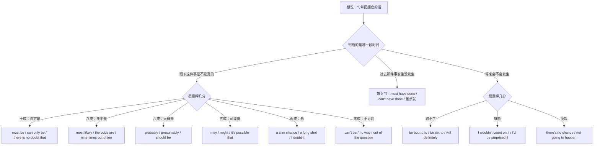
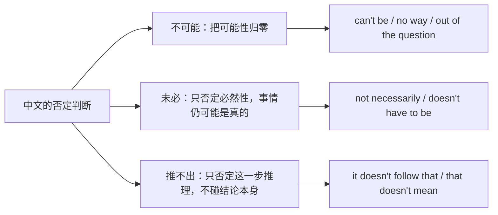
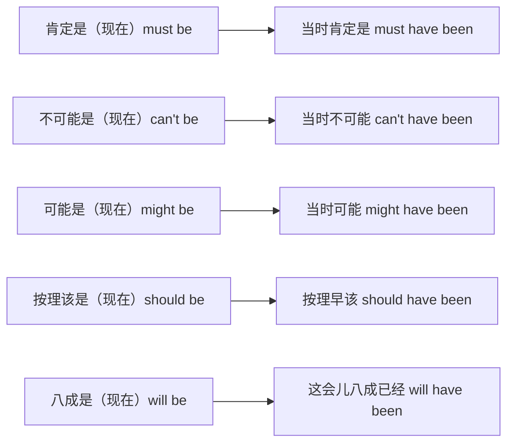
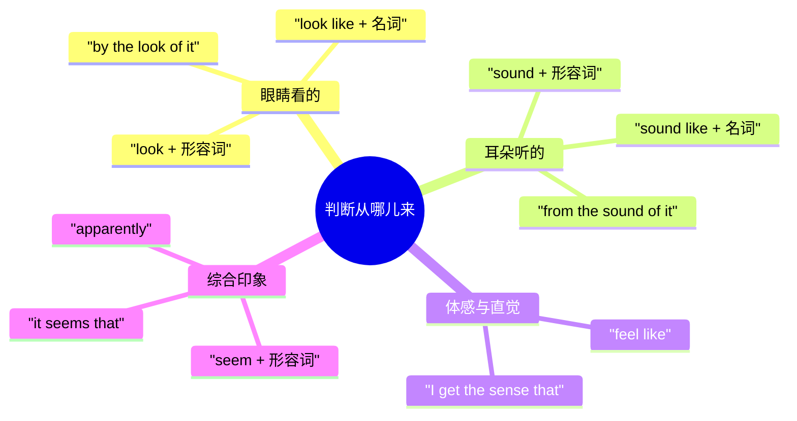
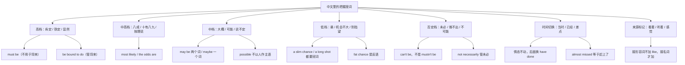

# 肯定是、八成、说不定、不可能：把握度阶梯

> [!info] 本篇定位
>
> 这篇收的是同一类中文意图的连续刻度：一件事**是不是真的、会不会发生**，说话人愿意押上几分。从「肯定是」「铁定跑不了」一路降到「八成」「大概」「可能」「说不定」「悬」「未必」，最后到「不可能」「门儿都没有」。每一档同时给情态说法与不用情态的说法，因为英文在这条尺上一半的力气是靠 `be bound to`、`the odds are`、`a slim chance`、`I'd be surprised if` 这类结构承担的。
>
> 上一篇 [[10.态度、情感与判断/02.重要的是、关键在于、值得不值得：价值判断与聚焦\|重要的是、关键在于、值得不值得：价值判断与聚焦]] 处理的是事情**真假已定之后**该怎么排它的轻重；这一篇处理的是真假**还没定**的时候怎么标自己的把握。至于「据说」「研究表明」「有人跟我讲」这类把判断的出处推给别人的说法，主锚点在 [[10.态度、情感与判断/04.据说、研究表明、据我所知：信息来源与缓和语\|据说、研究表明、据我所知：信息来源与缓和语]]，本篇只收 `look`、`sound`、`seem` 这三个把判断挂到自己感官上的来源标记。
>
> 读完能查到：36 条中文意图入口、108 条分档成品句架，以及中文母语者在 `must` 的否定、`maybe` 与 `may be`、`possible` 的主语、`fat chance` 的反语这四处最容易翻车的地方该怎么绕。

---

## 1. 本篇导读：把握度是一条尺，不是几个词

中文标把握度极其省事：一个副词摆在动词前面就完事了。「他肯定来」「他八成来」「他大概来」「他可能来」「他未必来」——五句话的结构完全一样,只换一个词。英文这边没有这么整齐的一列副词可换，同一条尺上不同的刻度落到完全不同的语法零件上：顶端是情态动词（`must`）、上段是形容词与副词（`most likely`）、中段仍是情态动词（`may`、`might`）、下段变成名词短语（`a slim chance`、`a long shot`）、底端又回到情态动词（`can't`）外加固定说法（`out of the question`）。

所以按词去背没用，得按刻度去查。先看这张尺怎么分岔。

这张图的第一个分叉是全篇最要紧的一处：**判断的时间指向决定了能用哪些词**。中文的「肯定」三种时间都能用——「他肯定在家」「他昨天肯定来过」「他明天肯定来」——英文的 `must` 只管前两种。第三种写成 `He must come tomorrow` 意思会变成「他明天必须来」，从推断掉进义务。所以将来那一支单独拉出来，走 `be bound to`、`be set to`、`will definitely` 这条线。

第二个分叉在概率高低。中文有一批表数值的俗说（八成、十有八九、九成九、五五开、两成把握），英文不能照数字翻。「八成是他忘了」写成 `Eighty percent he forgot` 是彻底的中式表达，对应的成品是 `He most likely forgot`；「十有八九」对应 `nine times out of ten`，这个才是真按次数说的。

第三个要提前记住的是本篇的两处对立，两处都靠中文分不出来：

- **「不可能」和「未必」不是一条线上的深浅**。前者把可能性归零（`can't be`），后者只否定必然性（`not necessarily`），中间还夹一个「这推不出」（`it doesn't follow that`）——只否定这一步推理，不否定结论本身。三者的分工在第 7 节展开。
- **「差点就…了」的中文是歧义源**。「差点没赶上」和「差点赶上」在中文口语里都表示赶上了，英文这边 `almost missed` 与 `nearly didn't make it` 各自指向明确的结果，不能靠感觉挑。这条放在 9.5。

本篇的意图块按尺子从上往下排：第 2 到第 4 节走高档（肯定、八成、大概），第 5 节走中档（可能），第 6 到第 8 节走低档与归零（悬、未必、不可能），第 9 节整体切到过去，第 10 节补上判断的来源标记。

---

## 2. 尺子顶端：肯定、一定、铁定、毫无疑问

这一节的四条意图都在九成以上，但英文分给三套不同的零件：对眼下事实的断定用情态 `must`，对将来的断定用 `be bound to` 一族，对结论本身的背书用 `there is no doubt` 与 `I bet`。三档的差别主要在**说话人肯把话说多满**：口语档可以拍胸脯，正式档反而要把断定包进一个名词化的框架里，显得是证据在说话而不是人在赌咒。

### 2.1 肯定是、准是（眼下的断定）

中文触发语：肯定是… / 一定是… / 准是… / 不用问就是… / 就是他没跑了

| 档位 | 句架 | 例句 | 译文 |
| --- | --- | --- | --- |
| 口语 | must be + 名词/形容词 | That must be the courier — nobody else rings twice. | 那准是快递员，没别人按两下门铃。 |
| 书面 | can only be + 名词短语 | The spike can only be the retry loop firing on every failure. | 这个尖峰只可能是每次失败都触发的重试循环。 |
| 正式 | there is no doubt that + 从句 | There is no doubt that the outage originated in the cache layer. | 毫无疑问，这次故障源头在缓存层。 |

> [!warning] 错配警示
>
> - ~~He must come tomorrow.~~ ❌（想说「他明天肯定来」）
> - **He's bound to come tomorrow.** ✅（`must` 表推断只管现在与一般情况；放到将来它会被读成义务「他明天必须来」，把握度得交给 `be bound to`、`will definitely`）

页脚：
- 同义入口：铁定是 / 十有十 / 板上钉钉 / 错不了
- 语法归属：[[02.英语基础语法/07.助动词与情态动词/02.情态动词详解\|情态动词详解]]
- 场景实战：[[04.英语场景/05.高频实用表达句型框架/01.表达观点与态度的50个万能句型\|表达观点与态度的50个万能句型]]

### 2.2 跑不了、必然会（对将来的断定）

中文触发语：铁定会… / 跑不了… / 早晚要… / 必然会… / 这事定了

| 档位 | 句架 | 例句 | 译文 |
| --- | --- | --- | --- |
| 口语 | be bound to + 动词原形 | With this many manual steps, someone's bound to skip one. | 手动步骤这么多，早晚有人漏掉一步。 |
| 书面 | be set to + 动词原形 | The migration is set to run during the Sunday maintenance window. | 迁移定在周日的维护窗口执行。 |
| 正式 | be certain to + 动词原形 / will inevitably + 动词原形 | An unindexed join on this table is certain to degrade under load. | 这张表上没建索引的连接查询在高负载下必然劣化。 |

> [!warning] 错配警示
>
> - ~~The build is bound to failing every time.~~ ❌
> - **The build is bound to fail every time.** ✅（`be bound to` 的 `to` 是不定式符号，后面接动词原形；只有 `be used to`、`look forward to` 那几个 `to` 才是介词接动名词）

页脚：
- 同义入口：躲不掉 / 免不了 / 迟早的事 / 一定会
- 语法归属：[[02.英语基础语法/08.非谓语动词/01.动词不定式详解\|动词不定式详解]]
- 场景实战：[[04.英语场景/10.职场与商务场景实战/02.会议汇报与演示场景\|会议汇报与演示场景]]

### 2.3 我敢打赌、我拿脑袋担保

中文触发语：我敢打赌… / 我拿脑袋担保… / 打赌你信不信 / 不出所料的话…

| 档位 | 句架 | 例句 | 译文 |
| --- | --- | --- | --- |
| 口语 | I bet + 从句 | I bet he shows up ten minutes late again. | 我敢打赌他又要迟到十分钟。 |
| 书面 | I'd put money on + 名词/动名词 | I'd put money on the timeout being the root cause. | 我敢押超时就是根因。 |
| 正式 | there is every indication that + 从句 | There is every indication that demand will hold through the quarter. | 种种迹象表明需求会持续到本季度末。 |

> [!warning] 错配警示
>
> - ~~Surely he is the owner of this repo.~~ ❌（想说「他肯定是这仓库的主人」）
> - **He must be the owner of this repo.** ✅（`surely` 在英语里是拉着对方确认或表示意外的语气词，读作「难道不是吗」，它标的不是把握度而是诉求）

页脚：
- 同义入口：我押他 / 我保证 / 十有十是这样
- 语法归属：[[02.英语基础语法/06.动词时态/01.一般现在时与一般过去时\|一般现在时与一般过去时]]
- 场景实战：[[04.英语场景/07.社交交际场景实战/01.交友聚会与闲聊场景\|交友聚会与闲聊场景]]

### 2.4 摆明了、显然、明摆着

中文触发语：摆明了就是… / 显然… / 明摆着… / 一眼就能看出…

| 档位 | 句架 | 例句 | 译文 |
| --- | --- | --- | --- |
| 口语 | clearly + 从句 / it's pretty clear that | Clearly nobody ran this against the staging data. | 摆明了没人拿预发数据跑过。 |
| 书面 | evidently + 从句 / it is evident that | It is evident from the logs that the job never started. | 从日志看，这个任务显然压根没启动。 |
| 正式 | the evidence points to + 名词/动名词 | The evidence points to a configuration drift between the two clusters. | 证据指向两个集群之间的配置漂移。 |

> [!warning] 错配警示
>
> - ~~Obviously you didn't read the design doc.~~ ❌（对同事说）
> - **It looks like the design doc didn't make it around.** ✅（`obviously` 带一层「这还用说吗」的居高临下，用在指认别人的疏漏上会读成指责；陈述客观明显时改用 `clearly`、`evidently`）

页脚：
- 同义入口：一目了然 / 不用想也知道 / 很明显
- 语法归属：[[02.英语基础语法/04.形容词与副词/03.副词的分类与用法\|副词的分类与用法]]
- 场景实战：[[04.英语场景/10.职场与商务场景实战/04.商务谈判合同与客户沟通\|商务谈判合同与客户沟通]]

---

## 3. 八成、多半、十有八九

从这一节起把握度开始留口子。中文这一档最爱用数字俗说，英文这一档最爱用副词 `likely` 与名词 `odds`、`chances`。三条意图里前两条差在**说的是这一次还是一般规律**：「八成是他忘了」说的是眼前这一次，「十有八九会这样」说的是历次经验的汇总，英文分给 `most likely` 与 `nine times out of ten` 两套。第三条是「按理说应该」，它的把握来源不是概率而是常规，落到 `should` 与 `ought to`。

### 3.1 八成是、多半是

中文触发语：八成是… / 多半是… / 应该就是… / 我看八九不离十

| 档位 | 句架 | 例句 | 译文 |
| --- | --- | --- | --- |
| 口语 | most likely + 从句/名词 | He most likely forgot to push the branch. | 他八成是忘了推分支。 |
| 书面 | in all likelihood + 从句 | In all likelihood the regression came in with last week's refactor. | 这次回归多半是上周那次重构带进来的。 |
| 正式 | it is highly probable that + 从句 | It is highly probable that the two incidents share a single cause. | 两起事件极可能同源。 |

> [!warning] 错配警示
>
> - ~~Eighty percent he forgot to push.~~ ❌
> - **He most likely forgot to push.** ✅（中文的「八成」是概率的俗说不是数字，直译百分比在英文里读起来像统计报告出了错；真要报数字得写成 `There's roughly an 80% chance that…`）

页脚：
- 同义入口：估摸着就是 / 差不多可以断定 / 十之八九
- 语法归属：[[02.英语基础语法/04.形容词与副词/03.副词的分类与用法\|副词的分类与用法]]
- 场景实战：[[04.英语场景/05.高频实用表达句型框架/01.表达观点与态度的50个万能句型\|表达观点与态度的50个万能句型]]

### 3.2 十有八九、九成九（凭经验的概率）

中文触发语：十有八九… / 九成九是… / 一般都这样 / 十次里有九次

| 档位 | 句架 | 例句 | 译文 |
| --- | --- | --- | --- |
| 口语 | nine times out of ten + 从句 | Nine times out of ten it's a stale cache. | 十有八九是缓存没刷新。 |
| 书面 | the odds are (that) + 从句 | The odds are that the flake comes from the shared fixture. | 这个偶发失败八成出在共用的测试夹具上。 |
| 正式 | in the great majority of cases + 从句 | In the great majority of cases the retry succeeds on the second attempt. | 绝大多数情况下重试第二次就成功了。 |

> [!warning] 错配警示
>
> - ~~The odds are of him being late.~~ ❌
> - **The odds are (that) he'll be late.** ✅（`odds` 后面直接跟一个完整从句，`that` 可省；要用介词只能说 `the odds of doing`，两套框架不能拼在一起，而且 `odds` 永远是复数配 `are`）

页脚：
- 同义入口：一般来说都是 / 保准是 / 大概率
- 语法归属：[[02.英语基础语法/03.代词与数词/05.数词的用法与表达\|数词的用法与表达]]
- 场景实战：[[04.英语场景/09.学习与教育场景实战/03.考试报名与学术评分场景\|考试报名与学术评分场景]]

### 3.3 按理说应该、照理早该了

中文触发语：按理说应该… / 照理该… / 正常情况下… / 不出意外的话…

| 档位 | 句架 | 例句 | 译文 |
| --- | --- | --- | --- |
| 口语 | should + 动词原形 | The package should be there by noon. | 包裹按理中午前该到了。 |
| 书面 | ought to + 动词原形 | The cache ought to expire on its own within the hour. | 缓存照理一小时内会自己过期。 |
| 正式 | is expected to + 动词原形 | The failover is expected to complete without manual intervention. | 故障切换预计无需人工介入即可完成。 |

> [!warning] 错配警示
>
> - ~~The package should arrive an hour ago.~~ ❌（想说「按理一小时前就该到了」）
> - **The package should have arrived an hour ago.** ✅（推断落在已经过去的时间点上，情态后面要换成 `have + 过去分词`；这条规则统管本节所有词，详见第 9 节）

页脚：
- 同义入口：理论上 / 正常该是 / 不出岔子的话
- 语法归属：[[02.英语基础语法/07.助动词与情态动词/03.情态动词的特殊句型\|情态动词的特殊句型]]
- 场景实战：[[04.英语场景/08.出行与旅游场景实战/01.机场航班海关入境场景\|机场航班海关入境场景]]

---

## 4. 大概、估计、应该没问题

这一档大约在六成上下，是日常工作里用得最多的一档——既不想说满，也不想显得没主意。英文这一档的核心词是 `probably` 与 `presumably`，外加一个把判断标成个人推测的框架 `my guess is that`。三条意图分别对应「对事实的估计」「对结果的乐观预期」「明确承认这是我猜的」。

### 4.1 大概是、估计是

中文触发语：大概是… / 估计是… / 我估摸… / 应该是…吧

| 档位 | 句架 | 例句 | 译文 |
| --- | --- | --- | --- |
| 口语 | probably + 动词 | She's probably still stuck in the sync. | 她估计还困在那个同步会里。 |
| 书面 | presumably + 从句 | Presumably the client retried before the server recovered. | 估计是客户端在服务端恢复前就重试了。 |
| 正式 | it may reasonably be assumed that + 从句 | It may reasonably be assumed that traffic will return to baseline overnight. | 可以合理推定流量会在一夜之间回到基线。 |

> [!warning] 错配警示
>
> - ~~He won't probably make it before six.~~ ❌
> - **He probably won't make it before six.** ✅（`probably`、`certainly`、`definitely` 这类副词在否定句里站在助动词**前面**；站到后面去句子会读得别扭，语义重心也偏了）

页脚：
- 同义入口：多半吧 / 我猜差不多 / 十有六七
- 语法归属：[[02.英语基础语法/04.形容词与副词/03.副词的分类与用法\|副词的分类与用法]]
- 场景实战：[[04.英语场景/07.社交交际场景实战/02.电话短信与在线沟通场景\|电话短信与在线沟通场景]]

### 4.2 应该没问题、问题不大

中文触发语：应该没问题 / 问题不大 / 没什么大碍 / 我看行

| 档位 | 句架 | 例句 | 译文 |
| --- | --- | --- | --- |
| 口语 | should be fine / I don't see why not | Ship it — the diff is tiny, it should be fine. | 发吧，改动很小，应该没问题。 |
| 书面 | there should be no issue with + 名词/动名词 | There should be no issue with rolling this out region by region. | 分区域发布应该不会有什么问题。 |
| 正式 | no material risk is anticipated | No material risk is anticipated from the proposed change. | 本次变更预计不带来实质性风险。 |

> [!warning] 错配警示
>
> - ~~It must be no problem.~~ ❌
> - **It should be fine.** ✅（`must` 是十成的断定，用在「应该没问题」这种六成的安抚上过头了；反过来把 `should be fine` 用在真的十拿九稳的地方，听起来又像在留后路）

页脚：
- 同义入口：问题不大 / 出不了岔子 / 稳的
- 语法归属：[[02.英语基础语法/07.助动词与情态动词/02.情态动词详解\|情态动词详解]]
- 场景实战：[[04.英语场景/10.职场与商务场景实战/02.会议汇报与演示场景\|会议汇报与演示场景]]

### 4.3 我倾向于认为、要我猜的话

中文触发语：我倾向于认为… / 要我猜的话… / 我的判断是… / 硬要说的话

| 档位 | 句架 | 例句 | 译文 |
| --- | --- | --- | --- |
| 口语 | if I had to guess, + 从句 | If I had to guess, it's the connection pool running dry. | 要我猜的话，是连接池被耗干了。 |
| 书面 | I'm inclined to think (that) + 从句 | I'm inclined to think the two failures are unrelated. | 我倾向于认为这两次失败没有关联。 |
| 正式 | our working assumption is that + 从句 | Our working assumption is that the degradation is network-bound. | 我们目前的工作假设是这次劣化受限于网络。 |

> [!warning] 错配警示
>
> - ~~I incline to think it's a race condition.~~ ❌
> - **I'm inclined to think it's a race condition.** ✅（`incline` 作实义动词时是「倾斜」的物理义，表达看法倾向固定用被动形态 `be inclined to + 动词原形`）

页脚：
- 同义入口：我这边的判断 / 直觉上 / 我更信这一说
- 语法归属：[[02.英语基础语法/10.特殊句型/01.被动语态全解\|被动语态全解]]
- 场景实战：[[04.英语场景/10.职场与商务场景实战/02.会议汇报与演示场景\|会议汇报与演示场景]]

---

## 5. 可能、也许、不排除、五五开

正中间这一档是全篇最容易出错的一区，原因有两个：一是 `may`、`might`、`could` 三个词在中文里全对应「可能」，二是 `possible` 这个形容词的槽位跟中文完全对不上——中文说「我可能今天做完」是人作主语，英文里 `possible` 不能这么用。这一节的四条意图从「单纯说有可能」一路走到「五五开」，把中间地带铺满。

### 5.1 可能、也许、说不定会

中文触发语：可能… / 也许… / 说不定会… / 兴许…

| 档位 | 句架 | 例句 | 译文 |
| --- | --- | --- | --- |
| 口语 | might + 动词原形 / maybe + 从句 | Maybe he's stuck in traffic. He might still make the first half. | 也许他堵路上了，说不定还赶得上上半场。 |
| 书面 | may well + 动词原形 | The two bugs may well share a single upstream cause. | 这两个 bug 很可能同出一个上游原因。 |
| 正式 | it is conceivable that + 从句 | It is conceivable that the vendor will decline to extend support. | 供应商拒绝延长支持是有可能的。 |

> [!warning] 错配警示
>
> - ~~May be he's stuck in traffic.~~ ❌
> - **Maybe he's stuck in traffic.** ✅（`maybe` 是一个词的副词，摆句首；`may be` 是情态加动词，得有主语在前面：`He may be stuck in traffic.` 两者只差一个空格，写邮件时最常翻车的一处）

页脚：
- 同义入口：有可能 / 保不齐 / 兴许吧
- 语法归属：[[02.英语基础语法/07.助动词与情态动词/02.情态动词详解\|情态动词详解]]
- 场景实战：[[04.英语场景/03.时态与语态句型框架/04.情态动词句型框架\|情态动词句型框架]]

### 5.2 有这个可能、不排除

中文触发语：有这个可能 / 不排除… / 也不是没可能 / 存在这种情况

| 档位 | 句架 | 例句 | 译文 |
| --- | --- | --- | --- |
| 口语 | there's a chance (that) + 从句 | There's a chance the fix landed after the snapshot was cut. | 有可能补丁是在切快照之后才合进去的。 |
| 书面 | I wouldn't rule out + 名词/动名词 | I wouldn't rule out a hardware fault on that node. | 我不排除那个节点有硬件故障。 |
| 正式 | the possibility that + 从句 + cannot be excluded | The possibility that the two datasets overlap cannot be excluded. | 两份数据集存在重叠的可能性无法排除。 |

> [!warning] 错配警示
>
> - ~~I'm possible to finish it today.~~ ❌
> - **It's possible for me to finish it today.** ✅ / **I might finish it today.** ✅（`possible` 的主语只能是事情不能是人；中文「我可能…」的主语是人，直译过去必错，要么换成 `it` 开头的框架，要么换成情态动词）

页脚：
- 同义入口：不好说没有 / 说不准就是 / 这条得留着
- 语法归属：[[02.英语基础语法/09.从句体系/03.名词性从句详解\|名词性从句详解]]
- 场景实战：[[04.英语场景/02.基础句型框架/03.there be 与 it 句型完全手册\|there be 与 it 句型完全手册]]

### 5.3 说不定、保不齐、谁知道呢

中文触发语：说不定… / 保不齐… / 谁知道呢 / 万一真成了呢

| 档位 | 句架 | 例句 | 译文 |
| --- | --- | --- | --- |
| 口语 | you never know / it might just + 动词原形 | Try the older driver — it might just work. | 试试老版驱动，说不定就好了。 |
| 书面 | for all I know, + 从句 | For all I know, they've already patched it upstream. | 保不齐上游早就修好了，我也说不准。 |
| 正式 | it remains possible that + 从句 | It remains possible that the discrepancy is a reporting artifact. | 这处差异仍有可能只是统计口径造成的。 |

> [!warning] 错配警示
>
> - ~~For all I know, this is the fastest route.~~ ❌（想说「据我所知这是最快的路」）
> - **As far as I know, this is the fastest route.** ✅（`for all I know` 带的是「我也不清楚，出了事别赖我」的免责味，不是「据我所知」；后者的主锚点在 [[10.态度、情感与判断/04.据说、研究表明、据我所知：信息来源与缓和语\|信息来源与缓和语]]）

页脚：
- 同义入口：难说 / 也难保 / 万一呢
- 语法归属：[[02.英语基础语法/09.从句体系/04.状语从句详解\|状语从句详解]]
- 场景实战：[[04.英语场景/07.社交交际场景实战/01.交友聚会与闲聊场景\|交友聚会与闲聊场景]]

### 5.4 五五开、一半一半、两说

中文触发语：五五开 / 一半一半 / 两说 / 谁赢都不奇怪

| 档位 | 句架 | 例句 | 译文 |
| --- | --- | --- | --- |
| 口语 | it's a toss-up / it could go either way | Between the two candidates it's a toss-up. | 这两个候选人五五开。 |
| 书面 | there's an even chance (that) + 从句 | There's an even chance the vote goes to a second round. | 投票进第二轮的概率是一半一半。 |
| 正式 | the two outcomes are equally likely | On current evidence the two outcomes are equally likely. | 就现有证据看，两种结果概率相当。 |

> [!warning] 错配警示
>
> - ~~It's a fifty-fifty.~~ ❌
> - **It's fifty-fifty.** ✅ / **It's a fifty-fifty chance.** ✅（`fifty-fifty` 单用时是形容词或副词不带冠词；要带冠词就得补一个名词跟在后面）

页脚：
- 同义入口：对半开 / 说不好谁赢 / 两边都有戏
- 语法归属：[[02.英语基础语法/02.名词与冠词/03.冠词的用法详解\|冠词的用法详解]]
- 场景实战：[[04.英语场景/05.高频实用表达句型框架/04.比较对比举例总结句型库\|比较对比举例总结句型库]]

---

## 6. 悬、够呛、机会不大、我可不敢指望

降到两成上下，英文的主力零件从情态动词换成名词短语。这一节四条意图的差别在**说话人愿意露多少态度**：`a long shot` 是就事论事地说机会小，`a slim chance` 是给出一个具体的机会，`I wouldn't count on it` 是明确劝对方别指望，`I'd be surprised if` 则是把自己押上去——真发生了我认输。

### 6.1 悬、够呛、玄

中文触发语：悬 / 够呛 / 玄 / 这事不太靠谱 / 走一步看一步吧

| 档位 | 句架 | 例句 | 译文 |
| --- | --- | --- | --- |
| 口语 | it's a long shot / it's iffy | Getting sign-off today is a long shot. | 今天想拿到批准，够呛。 |
| 书面 | it is touch and go whether + 从句 | It's touch and go whether the patch lands before the freeze. | 补丁能不能赶在封版前合进去，很悬。 |
| 正式 | the outcome remains uncertain | With two dependencies still unresolved, the outcome remains uncertain. | 两个依赖尚未解决，结果仍不确定。 |

> [!warning] 错配警示
>
> - ~~Getting sign-off today is long shot.~~ ❌
> - **Getting sign-off today is a long shot.** ✅（`a long shot` 是个可数名词短语，冠词不能省；同理 `a toss-up`、`a stretch`、`a gamble` 都要带 `a`）

页脚：
- 同义入口：不太乐观 / 难说 / 希望不大
- 语法归属：[[02.英语基础语法/02.名词与冠词/03.冠词的用法详解\|冠词的用法详解]]
- 场景实战：[[04.英语场景/10.职场与商务场景实战/02.会议汇报与演示场景\|会议汇报与演示场景]]

### 6.2 机会不大、希望渺茫

中文触发语：机会不大 / 希望渺茫 / 只有一线希望 / 概率很低

| 档位 | 句架 | 例句 | 译文 |
| --- | --- | --- | --- |
| 口语 | there's a slim chance (that) + 从句 | There's a slim chance they'll reopen the ticket. | 他们重开工单的机会不大。 |
| 书面 | there is an outside chance of + 名词/动名词 | There is an outside chance of recovering the data from the replica. | 从副本里救回数据还有一线希望。 |
| 正式 | the likelihood of + 名词 + is low | The likelihood of a second occurrence within the quarter is low. | 本季度内再次发生的可能性很低。 |

> [!warning] 错配警示
>
> - ~~We've got a fat chance of shipping on time.~~ ❌（想说「机会挺大」）
> - **We've got a decent chance of shipping on time.** ✅（`fat chance` 是反语，意思正好是「没门儿」；表示机会小用 `slim`、`slight`，表示机会不错用 `decent`、`fair`、`good`）

页脚：
- 同义入口：没多大戏 / 概率极低 / 就那么一丝
- 语法归属：[[02.英语基础语法/05.介词与连词/02.常用介词搭配详解\|常用介词搭配详解]]
- 场景实战：[[04.英语场景/11.医疗与紧急场景实战/01.医院看病与药店购药场景\|医院看病与药店购药场景]]

### 6.3 我看不太行、别指望

中文触发语：我看不太行 / 别指望 / 我不抱希望 / 我可不敢打包票

| 档位 | 句架 | 例句 | 译文 |
| --- | --- | --- | --- |
| 口语 | I doubt it / I wouldn't count on it | You can ask, but I wouldn't count on it. | 你可以问，不过我看别指望。 |
| 书面 | I have my doubts about + 名词/动名词 | I have my doubts about hitting the original date. | 我对能不能赶上原定日期存疑。 |
| 正式 | we are not confident that + 从句 | We are not confident that the current approach will scale. | 我们对当前方案能否扩展没有信心。 |

> [!warning] 错配警示
>
> - ~~I suspect he'll come.~~ ❌（想说「我看他不会来」）
> - **I doubt he'll come.** ✅（中文一个「怀疑」在英文里分两个方向：`doubt` 倒向否定，`suspect` 倒向肯定。「我怀疑是他干的」才是 `I suspect he did it`）

页脚：
- 同义入口：我不看好 / 悬得很 / 你先别抱太大希望
- 语法归属：[[02.英语基础语法/11.实战应用/03.常见语法错误纠正\|常见语法错误纠正]]
- 场景实战：[[04.英语场景/05.高频实用表达句型框架/03.同意反对让步转折句型库\|同意反对让步转折句型库]]

### 6.4 真那样我才怪、我把名字倒过来写

中文触发语：真那样我才怪 / 我不信会这样 / 要是成了算我输 / 打死我也想不到

| 档位 | 句架 | 例句 | 译文 |
| --- | --- | --- | --- |
| 口语 | I'd be surprised if + 过去式从句 | I'd be surprised if anyone noticed. | 真有人发现了才怪。 |
| 书面 | it would be surprising if + 过去式从句 | It would be surprising if the numbers held at this level. | 数字要真能维持在这个水平，倒是件怪事。 |
| 正式 | such an outcome would run counter to expectations | Such an outcome would run counter to expectations. | 这样的结果与预期相悖。 |

> [!warning] 错配警示
>
> - ~~I'd be surprised if he will show up.~~ ❌
> - **I'd be surprised if he showed up.** ✅（主句用了 `would`，`if` 从句就要跟着退到过去式；这是把可能性压低的形态手段，时间上说的仍是将来，形态细节双链 [[04.条件与假设/02.反事实假设：要是就好了、当初要是、混合时间线\|反事实假设]]）

页脚：
- 同义入口：我可不信 / 那得跌破眼镜 / 真成了我请客
- 语法归属：[[02.英语基础语法/10.特殊句型/02.虚拟语气详解\|虚拟语气详解]]
- 场景实战：[[04.英语场景/03.时态与语态句型框架/03.虚拟语气完全解析\|虚拟语气完全解析]]

---

## 7. 未必、不见得、这推不出来

中文的否定判断有三个层次，但常常都用「不一定」三个字带过。英文这边分得很清，查之前先分层。

三条线的实际差别用一个例子就清楚了。同事说「构建过了，所以代码没问题」。你想反驳，可以说 `That's not necessarily true`（未必——代码也许真没问题，但不是构建过了就必然没问题），也可以说 `It doesn't follow that the code is correct`（推不出——我不评价代码好坏，只说你这一步推理不成立），还可以说 `There's no way that code is correct, I just read it`（不可能——我直接否定结论）。三句的攻击面一句比一句大：第一句只削掉「必然」两个字，第二句削掉推理链，第三句正面否定。开会时选错一档，本来只想提醒一句，出口就成了硬顶。

本节四条意图铺的就是前两层，第三层归第 8 节。

### 7.1 未必、不见得、不一定

中文触发语：未必 / 不见得 / 不一定 / 那可不一定

| 档位 | 句架 | 例句 | 译文 |
| --- | --- | --- | --- |
| 口语 | not necessarily | Fewer errors in the log? Not necessarily fewer bugs. | 日志报错少了？未必是 bug 少了。 |
| 书面 | A does not have to mean B | A green build does not have to mean the feature works. | 构建通过不见得代表功能可用。 |
| 正式 | it is not invariably the case that + 从句 | It is not invariably the case that higher throughput reduces latency. | 吞吐上去并不总是意味着延迟下降。 |

> [!warning] 错配警示
>
> - ~~It must not be a bug in our code.~~ ❌（想说「未必是我们代码的 bug」）
> - **It's not necessarily a bug in our code.** ✅（`must not` 在英文里是禁止「不许」，不是「未必」；把「不一定」翻成 `must not` 会把一句留有余地的话说成一道禁令）

页脚：
- 同义入口：那可说不好 / 也不见得 / 不一定就是
- 语法归属：[[02.英语基础语法/07.助动词与情态动词/02.情态动词详解\|情态动词详解]]
- 场景实战：[[04.英语场景/05.高频实用表达句型框架/03.同意反对让步转折句型库\|同意反对让步转折句型库]]

### 7.2 那推不出、那不代表

中文触发语：那推不出… / 那不代表… / 不能因为…就说… / 这两码事

| 档位 | 句架 | 例句 | 译文 |
| --- | --- | --- | --- |
| 口语 | just because A doesn't mean B | Just because it compiles doesn't mean it works. | 能编译不代表能跑。 |
| 书面 | it doesn't follow that + 从句 | The load dropped, but it doesn't follow that the leak is fixed. | 负载是降了，但推不出泄漏已经修好。 |
| 正式 | no such inference can be drawn from + 名词 | No such inference can be drawn from a single sample. | 单个样本推不出这样的结论。 |

> [!warning] 错配警示
>
> - ~~Only because it compiles doesn't mean it works.~~ ❌
> - **Just because it compiles doesn't mean it works.** ✅（这是一个固定框架，句首只能用 `just because`；`only because` 是「仅仅由于」的原因状语，接不上后面这个 `doesn't mean`）

页脚：
- 同义入口：不能这么推 / 中间还差一步 / 这不能划等号
- 语法归属：[[02.英语基础语法/09.从句体系/04.状语从句详解\|状语从句详解]]
- 场景实战：[[04.英语场景/09.学习与教育场景实战/01.课堂讨论与提问场景\|课堂讨论与提问场景]]

### 7.3 也可能是别的、不止这一种解释

中文触发语：也可能是别的 / 不止这一种解释 / 这只是其中一种可能 / 别急着下结论

| 档位 | 句架 | 例句 | 译文 |
| --- | --- | --- | --- |
| 口语 | it could just as easily be + 名词 | It could just as easily be the proxy. | 也完全可能是代理那边的事。 |
| 书面 | that's one reading, but + 从句 | That's one reading of the data, but a sampling gap would look the same. | 数据可以这么读，但采样缺口看起来也是这样。 |
| 正式 | an equally consistent explanation is that + 从句 | An equally consistent explanation is that the clock skew widened overnight. | 同样说得通的一种解释是时钟偏差在夜间扩大了。 |

> [!warning] 错配警示
>
> - ~~It maybe the proxy.~~ ❌
> - **It may be the proxy.** ✅（又是 5.1 那个空格；这里主语 `it` 已经在前面，后面必须是情态加动词的 `may be`，不能用副词 `maybe`）

页脚：
- 同义入口：别的可能也有 / 换个角度也说得通 / 先别锁死
- 语法归属：[[02.英语基础语法/07.助动词与情态动词/02.情态动词详解\|情态动词详解]]
- 场景实战：[[04.英语场景/10.职场与商务场景实战/02.会议汇报与演示场景\|会议汇报与演示场景]]

### 7.4 我看未必、我可不敢这么说

中文触发语：我看未必 / 我可不敢这么说 / 话别说得太满 / 我不这么认为

| 档位 | 句架 | 例句 | 译文 |
| --- | --- | --- | --- |
| 口语 | I'm not so sure about that | I'm not so sure about that — we saw the same thing last quarter. | 我看未必，上季度也出现过同样的情况。 |
| 书面 | I wouldn't go that far | The rollout helped, but I wouldn't go that far. | 这次发布确实有帮助，但我不敢说到那个程度。 |
| 正式 | the evidence does not support so strong a claim | The evidence does not support so strong a claim. | 现有证据支撑不起这么强的结论。 |

> [!warning] 错配警示
>
> - ~~I think it isn't a memory leak.~~ ❌
> - **I don't think it's a memory leak.** ✅（英语习惯把否定提到主句上，`I don't think / I don't believe / I don't suppose` 才是自然说法；否定留在从句里语气会变成刻意的强调）

页脚：
- 同义入口：我持保留意见 / 这话我不敢接 / 我看没那么绝对
- 语法归属：[[02.英语基础语法/01.基础入门/03.疑问句与否定句的构成\|疑问句与否定句的构成]]
- 场景实战：[[04.英语场景/05.高频实用表达句型框架/01.表达观点与态度的50个万能句型\|表达观点与态度的50个万能句型]]

---

## 8. 不可能、绝无可能、门儿都没有

尺子的底端。这一节四条意图按**否定的是什么**排：8.1 否定事实本身，8.2 否定将来发生的机会，8.3 是排查过程中把一条可能性划掉，8.4 否定的是对方那句话的可信度。中文都可以说「不可能」，英文这四处一个都不通用。

### 8.1 不可能是、不会是（对眼下事实）

中文触发语：不可能是… / 不会是… / 绝不是… / 哪能是他

| 档位 | 句架 | 例句 | 译文 |
| --- | --- | --- | --- |
| 口语 | can't be + 名词/形容词 | That can't be the right file — the timestamp is from March. | 不可能是这个文件，时间戳是三月的。 |
| 书面 | there is no way (that) + 从句 | There is no way the two services are sharing a connection pool. | 这两个服务不可能共用一个连接池。 |
| 正式 | it is not possible for + 名词 + to do | It is not possible for the scheduler to dispatch two jobs to the same slot. | 调度器不可能把两个任务派到同一个槽位。 |

> [!warning] 错配警示
>
> - ~~He mustn't be at home — the lights are off.~~ ❌
> - **He can't be at home — the lights are off.** ✅（`must` 的推断义没有对应的否定形式，「不可能」一律交给 `can't`；写成 `mustn't` 意思会变成「不许他在家」）

页脚：
- 同义入口：绝无可能 / 那哪能 / 不像
- 语法归属：[[02.英语基础语法/07.助动词与情态动词/02.情态动词详解\|情态动词详解]]
- 场景实战：[[04.英语场景/03.时态与语态句型框架/04.情态动词句型框架\|情态动词句型框架]]

### 8.2 门儿都没有、绝对不行（对将来）

中文触发语：门儿都没有 / 绝对不行 / 想都别想 / 这事没戏

| 档位 | 句架 | 例句 | 译文 |
| --- | --- | --- | --- |
| 口语 | no way / not a chance | Ship it on Friday? Not a chance. | 周五上线？门儿都没有。 |
| 书面 | that's not going to happen | We looked at it, and that's not going to happen this quarter. | 我们看过了，本季度不可能。 |
| 正式 | that option is out of the question | Given the audit timeline, that option is out of the question. | 考虑到审计时间表，这个选项绝无可能。 |

> [!warning] 错配警示
>
> - ~~That option is out of question.~~ ❌
> - **That option is out of the question.** ✅（`out of the question` 才是「不可能」；掉了 `the` 之后 `out of question` 是另一个近乎废弃的说法，读作「毫无疑问」，意思正好翻个面）

页脚：
- 同义入口：没商量 / 想都别想 / 这条堵死了
- 语法归属：[[02.英语基础语法/02.名词与冠词/03.冠词的用法详解\|冠词的用法详解]]
- 场景实战：[[04.英语场景/10.职场与商务场景实战/04.商务谈判合同与客户沟通\|商务谈判合同与客户沟通]]

### 8.3 可以排除、这条划掉

中文触发语：可以排除… / 这条划掉 / 已经查过不是 / 不在考虑范围内

| 档位 | 句架 | 例句 | 译文 |
| --- | --- | --- | --- |
| 口语 | we can rule out + 名词/动名词 | We can rule out the CDN — it's failing on direct hits too. | CDN 可以排除，直连也一样失败。 |
| 书面 | A has been ruled out as + 名词 | Disk pressure has been ruled out as a cause. | 磁盘压力已被排除，不是原因。 |
| 正式 | A falls outside the range of plausible explanations | A clock issue falls outside the range of plausible explanations here. | 时钟问题不在这里的合理解释范围之内。 |

> [!warning] 错配警示
>
> - ~~We can rule out to use the old client.~~ ❌
> - **We can rule out using the old client.** ✅（`rule out` 后面接名词或动名词，不接不定式；同一条限制管住 `consider`、`involve`、`risk` 这一批动词）

页脚：
- 同义入口：排掉了 / 不是这个 / 查过了没问题
- 语法归属：[[02.英语基础语法/08.非谓语动词/02.动名词详解\|动名词详解]]
- 场景实战：[[04.英语场景/10.职场与商务场景实战/02.会议汇报与演示场景\|会议汇报与演示场景]]

### 8.4 我不信、这话我不接

中文触发语：我不信 / 这话我不接 / 听着就不对 / 打死我也不信

| 档位 | 句架 | 例句 | 译文 |
| --- | --- | --- | --- |
| 口语 | I don't buy it | They said it was a one-off. I don't buy it. | 他们说是偶发的，我不信。 |
| 书面 | I find that hard to believe | Three independent teams hitting the same bug? I find that hard to believe. | 三个独立团队撞上同一个 bug？我很难相信。 |
| 正式 | that account is difficult to reconcile with the record | That account is difficult to reconcile with the deployment record. | 这个说法与部署记录难以吻合。 |

> [!warning] 错配警示
>
> - ~~I don't trust him when he says the test passed.~~ ❌（只是不信这一句话）
> - **I don't believe him when he says the test passed.** ✅（`believe sb` 是不信他这句话，`trust sb` 是不信任这个人；中文一个「不信他」把两件事压平了，用错一个字就从质疑事实变成质疑人品）

页脚：
- 同义入口：这我可不认 / 说不通 / 听着像糊弄
- 语法归属：[[02.英语基础语法/11.实战应用/03.常见语法错误纠正\|常见语法错误纠正]]
- 场景实战：[[04.英语场景/05.高频实用表达句型框架/03.同意反对让步转折句型库\|同意反对让步转折句型库]]

---

## 9. 对过去的推断：当时肯定是、不可能、差点就

前面八节的尺子整条搬到过去，规则只有一条。

规则是：**情态动词本身不动，把它后面的部分换成 have + 过去分词**。中文这边靠「当时」「已经」「过」这些词标时间，英文这边靠 `have done` 标，所以 `He must know`（他肯定知道）与 `He must have known`（他当时肯定就知道了）差的不是把握度而是时间。这条规则没有例外，麻烦全在中文那一侧：中文的「肯定」不区分时间，一句「他肯定知道」在不同上下文里可能指现在也可能指当时，翻之前得先把时间点定死。

这一节五条意图里，前三条是把 2、5、8 三节的成品搬到过去，第四条处理一个双义结构，第五条单独收「差点就」——它是中文里最容易造出反义句的一个说法。

### 9.1 当时肯定是、肯定已经…了

中文触发语：当时肯定是… / 肯定已经…了 / 那准是…过 / 一定是…来着

| 档位 | 句架 | 例句 | 译文 |
| --- | --- | --- | --- |
| 口语 | must have + 过去分词 | She must have left before the alert fired. | 告警响之前她肯定已经走了。 |
| 书面 | can only have + 过去分词 | The record can only have been written by the batch job. | 这条记录只可能是批处理任务写的。 |
| 正式 | there is no doubt that + 过去时从句 | There is no doubt that the change was deployed outside the window. | 毫无疑问，这次变更是在窗口之外部署的。 |

> [!warning] 错配警示
>
> - ~~I must have rerun the migration by hand, so it took an hour.~~ ❌（想说「当时我不得不手动重跑」）
> - **I had to rerun the migration by hand, so it took an hour.** ✅（`must have done` 只表推断，不表示过去的义务；「当时必须做」用 `had to do`，这两个在中文里都能说成「肯定得」）

页脚：
- 同义入口：错不了是 / 铁定是…过 / 那会儿准是
- 语法归属：[[02.英语基础语法/07.助动词与情态动词/03.情态动词的特殊句型\|情态动词的特殊句型]]
- 场景实战：[[04.英语场景/03.时态与语态句型框架/04.情态动词句型框架\|情态动词句型框架]]

### 9.2 当时不可能、他不会干这事

中文触发语：当时不可能… / 他不会干这事 / 绝不是他…的 / 那时候还没有呢

| 档位 | 句架 | 例句 | 译文 |
| --- | --- | --- | --- |
| 口语 | can't have + 过去分词 | He can't have seen the message — he was on a plane. | 他不可能看到消息，那会儿在飞机上。 |
| 书面 | couldn't possibly have + 过去分词 | The job couldn't possibly have finished in four seconds. | 这个任务不可能四秒就跑完。 |
| 正式 | there is no basis for concluding that + 过去时从句 | There is no basis for concluding that the data was altered after export. | 没有依据认定数据在导出后被改动过。 |

> [!warning] 错配警示
>
> - ~~He mustn't have known about the freeze.~~ ❌
> - **He can't have known about the freeze.** ✅（跟 8.1 同一条：推断的否定归 `can't`；`mustn't have done` 在标准用法里不成立，写出来母语者会读得卡壳）

页脚：
- 同义入口：那不可能 / 他哪知道 / 时间对不上
- 语法归属：[[02.英语基础语法/06.动词时态/04.完成时态详解\|完成时态详解]]
- 场景实战：[[04.英语场景/10.职场与商务场景实战/04.商务谈判合同与客户沟通\|商务谈判合同与客户沟通]]

### 9.3 八成已经…了、这会儿该到了

中文触发语：八成已经…了 / 这会儿该…了 / 估计早就…了 / 多半是…过了

| 档位 | 句架 | 例句 | 译文 |
| --- | --- | --- | --- |
| 口语 | will have + 过去分词 | They'll have landed by now. | 他们这会儿八成已经落地了。 |
| 书面 | is likely to have + 过去分词 | The session is likely to have expired before the retry. | 会话很可能在重试之前就过期了。 |
| 正式 | in all likelihood + 过去完成时从句 | In all likelihood the index had already been rebuilt when the query ran. | 查询执行时索引多半已经重建完毕。 |

> [!warning] 错配警示
>
> - ~~They will have landed tomorrow at six.~~ ❌（想说「他们这会儿该落地了」）
> - **They'll have landed by now.** ✅（`will have done` 有两读：配 `by now` 是对当下的推断，配将来时间点才是将来完成；中文「该到了」指的是前一种，时间状语必须跟上）

页脚：
- 同义入口：早该好了 / 这时候准完事了 / 应该结束了
- 语法归属：[[02.英语基础语法/06.动词时态/02.一般将来时与过去将来时\|一般将来时与过去将来时]]
- 场景实战：[[04.英语场景/08.出行与旅游场景实战/01.机场航班海关入境场景\|机场航班海关入境场景]]

### 9.4 本来可能会、说不定当时就…了

中文触发语：本来可能会… / 说不定当时就…了 / 差一点就要… / 那时候没准已经…了

| 档位 | 句架 | 例句 | 译文 |
| --- | --- | --- | --- |
| 口语 | might have + 过去分词 | She might have already merged it — check the log. | 说不定她当时就已经合了，查下记录。 |
| 书面 | could have + 过去分词 + (but 分句) | We could have caught this in review, but nobody looked at the config. | 本来评审时能抓到的，可是没人看配置。 |
| 正式 | it is possible that + 过去完成时从句 | It is possible that the credentials had already been rotated. | 凭据当时有可能已经轮换过了。 |

> [!warning] 错配警示
>
> - ~~She might have merged it.~~ ❌（单说这一句是歧义的：既能读成「她可能已经合了」，也能读成「她本来可以合但没合」）
> - **She might have merged it already — check the log.** ✅（推断义补一个 `already` 或证据分句）/ **She could have merged it, but she was out sick.** ✅（反事实义补一个 `but` 分句把结果说死）

页脚：
- 同义入口：搞不好已经 / 本来差点就 / 说不准那会儿
- 语法归属：[[02.英语基础语法/10.特殊句型/02.虚拟语气详解\|虚拟语气详解]]
- 场景实战：[[04.条件与假设/02.反事实假设：要是就好了、当初要是、混合时间线\|反事实假设：要是就好了、当初要是、混合时间线]]

### 9.5 差点就…了

中文触发语：差点就…了 / 险些… / 就差一点 / 差一秒就…

| 档位 | 句架 | 例句 | 译文 |
| --- | --- | --- | --- |
| 口语 | almost / nearly + 过去式 | I almost missed the train. | 我差点没赶上火车（结果赶上了）。 |
| 书面 | come close to + 动名词 | We came close to dropping the whole table. | 我们差点把整张表删了。 |
| 正式 | narrowly avoid + 动名词 | The team narrowly avoided pushing the change to production. | 团队险些把这次变更推到生产环境。 |

> [!warning] 错配警示
>
> - ~~I almost didn't miss the train.~~ ❌（想说「差点没赶上」）
> - **I almost missed the train.** ✅（中文「差点没赶上」和「差点赶上」都表示赶上了，靠语感；英文 `almost + 动词` 一律表示那件事**没有发生**，所以「差点没赶上」的结果是赶上了，写成 `almost missed`。要说结果是没赶上，得写 `I only just missed it`）

页脚：
- 同义入口：险些 / 就差那么一下 / 好悬
- 语法归属：[[02.英语基础语法/04.形容词与副词/03.副词的分类与用法\|副词的分类与用法]]
- 场景实战：[[04.英语场景/08.出行与旅游场景实战/03.公共交通打车与租车场景\|公共交通打车与租车场景]]

---

## 10. 判断从哪儿来：看着像、听着像、感觉是

前面九节标的是把握有多少，这一节标的是把握**从哪儿来**。中文说「看着像」「听着像」「感觉是」「看样子」，英文对应四个系动词加一批插入语。它们在把握度上大致都落在五到七成，但比单说 `probably` 多一层信息：说话人交代了自己的证据是眼睛看的、耳朵听的还是综合印象。

这张图最要用的一条是左右两边的槽位规则：`look`、`sound`、`feel`、`seem` 这四个词后面**直接跟形容词，跟名词要加 like**。中文说「看着奇怪」和「看着像个 bug」都用一个「像」字，英文这边前一句是 `It looks strange`（没有 like），后一句是 `It looks like a bug`（有 like）。这是本节全部错句的来源。

还有一条分工要提前划清：`apparently` 有两读——「看上去」和「据说」。本篇只收前一读，后一读连同 `reportedly`、`rumor has it`、`according to` 一整套的主锚点在 [[10.态度、情感与判断/04.据说、研究表明、据我所知：信息来源与缓和语\|据说、研究表明、据我所知：信息来源与缓和语]]，从那边查更全。

### 10.1 看着像、看上去

中文触发语：看着像… / 看上去… / 看起来… / 从外观上看

| 档位 | 句架 | 例句 | 译文 |
| --- | --- | --- | --- |
| 口语 | look like + 名词/从句 | It looks like a race condition. | 看着像个竞态。 |
| 书面 | look as if + 从句 | The graph looks as if the sampling window shifted. | 图看上去像是采样窗口挪了。 |
| 正式 | by all appearances + 从句 | By all appearances the failure is confined to one region. | 从各方面看，故障局限在单个区域。 |

> [!warning] 错配警示
>
> - ~~It looks like strange.~~ ❌
> - **It looks strange.** ✅ / **It looks like a mistake.** ✅（`like` 是介词，后面得跟名词或从句；跟形容词时直接省掉 `like`）

页脚：
- 同义入口：瞧着就像 / 外观上是 / 一眼看过去
- 语法归属：[[02.英语基础语法/01.基础入门/02.英语五大基本句型详解\|英语五大基本句型详解]]
- 场景实战：[[08.指认、定义与描述/04.看起来像、区别在于、严格来说：外观、类比与限定\|看起来像、区别在于、严格来说]]

### 10.2 听着像、听你这么一说

中文触发语：听着像… / 听你这么一说… / 听起来… / 听着不太对

| 档位 | 句架 | 例句 | 译文 |
| --- | --- | --- | --- |
| 口语 | sound like + 名词/从句 | That sounds like a permissions problem. | 听着像权限问题。 |
| 书面 | from the sound of it, + 从句 | From the sound of it, they haven't started the review yet. | 听这意思，他们评审还没开始。 |
| 正式 | as described, + 从句 | As described, the behaviour is consistent with a stale replica. | 按描述来看，这个行为与副本滞后一致。 |

> [!warning] 错配警示
>
> - ~~It sounds as a good plan.~~ ❌
> - **It sounds like a good plan.** ✅ / **It sounds good.** ✅（接名词用 `like`，接从句可以用 `as if / as though`，但 `as` 单用接名词不成立）

页脚：
- 同义入口：听上去 / 你这么一讲 / 照你说的
- 语法归属：[[02.英语基础语法/05.介词与连词/04.介词与连词的易混点\|介词与连词的易混点]]
- 场景实战：[[04.英语场景/07.社交交际场景实战/02.电话短信与在线沟通场景\|电话短信与在线沟通场景]]

### 10.3 感觉是、我有种感觉

中文触发语：感觉是… / 我有种感觉… / 直觉告诉我… / 隐约觉得

| 档位 | 句架 | 例句 | 译文 |
| --- | --- | --- | --- |
| 口语 | it feels like + 名词/从句 | It feels like we're solving the wrong problem. | 感觉我们在解一个错的问题。 |
| 书面 | I get the sense that + 从句 | I get the sense that the deadline isn't firm. | 我感觉这个截止日期没定死。 |
| 正式 | there is a perception that + 从句 | There is a perception that the review process has become a bottleneck. | 有一种看法认为评审流程已成为瓶颈。 |

> [!warning] 错配警示
>
> - ~~I feel myself tired after the release.~~ ❌
> - **I feel tired after the release.** ✅（`feel` 后面直接跟形容词，人作主语时不加反身代词；「感觉像」才是 `it feels like`，主语换成 `it`）

页脚：
- 同义入口：我这边的感受是 / 说不上来但 / 有点像是
- 语法归属：[[02.英语基础语法/03.代词与数词/02.反身代词与相互代词\|反身代词与相互代词]]
- 场景实战：[[10.态度、情感与判断/01.我觉得、真是太、令我惊讶：评价与情绪反应\|我觉得、真是太、令我惊讶：评价与情绪反应]]

### 10.4 看样子、貌似、照这情形

中文触发语：看样子… / 貌似… / 照这情形… / 从眼下看

| 档位 | 句架 | 例句 | 译文 |
| --- | --- | --- | --- |
| 口语 | apparently + 从句 | Apparently the build machine ran out of disk. | 看样子构建机磁盘满了。 |
| 书面 | judging by + 名词, + 从句 | Judging by the error rate, the rollback took effect around noon. | 从错误率看，回滚大概中午生效。 |
| 正式 | on the available evidence, + 从句 | On the available evidence, the incident was self-limiting. | 就现有证据看，这次事故是自限的。 |

> [!warning] 错配警示
>
> - ~~Judging by the logs, the conclusion is obvious.~~ ❌
> - **Judging by the logs, I'd say the cache never warmed.** ✅（`judging by` 这类分词短语的逻辑主语必须是后面主句的主语——只有人能「judge」，主句主语是 `the conclusion` 就悬空了，得换成 `I`、`we`）

页脚：
- 同义入口：这么看来 / 情况像是 / 从迹象上说
- 语法归属：[[02.英语基础语法/08.非谓语动词/03.现在分词详解\|现在分词详解]]
- 场景实战：[[04.英语场景/10.职场与商务场景实战/02.会议汇报与演示场景\|会议汇报与演示场景]]

### 10.5 好像、似乎（seem 的四条出路）

中文触发语：好像… / 似乎… / 像是… / 有点像是要…

| 档位 | 句架 | 例句 | 译文 |
| --- | --- | --- | --- |
| 口语 | seem + 形容词 / seem like + 名词 | He seems fine with the new schedule. | 他好像不介意新排期。 |
| 书面 | seem to + 动词原形 / seem to have + 过去分词 | The leak seems to have started after the upgrade. | 泄漏似乎是升级之后才开始的。 |
| 正式 | it would seem that + 从句 / there seems to be + 名词 | It would seem that no single component is at fault. | 看来没有哪个单一组件该负责。 |

> [!warning] 错配警示
>
> - ~~He seems be tired.~~ ❌
> - **He seems to be tired.** ✅ / **He seems tired.** ✅（`seem` 后面要么直接跟形容词，要么跟完整的不定式 `to be`；掉了 `to` 是中文母语者在这个词上最高频的一处漏字）

页脚：
- 同义入口：看着是 / 差不多算是 / 有那个意思
- 语法归属：[[02.英语基础语法/08.非谓语动词/01.动词不定式详解\|动词不定式详解]]
- 场景实战：[[04.英语场景/05.高频实用表达句型框架/01.表达观点与态度的50个万能句型\|表达观点与态度的50个万能句型]]

---

## 11. 全篇速查表

按尺子从上到下排，每条给一个代表句架和小节号。查的时候先在中文那列找到最接近的说法，再回到对应小节挑档。

| 中文入口 | 代表句架 | 小节 |
| --- | --- | --- |
| 肯定是、准是 | must be | 2.1 |
| 只可能是 | can only be | 2.1 |
| 毫无疑问 | there is no doubt that | 2.1 |
| 跑不了、早晚要 | be bound to do | 2.2 |
| 定在、必然会 | be set to do / be certain to do | 2.2 |
| 我敢打赌 | I bet + 从句 | 2.3 |
| 我敢押 | I'd put money on doing | 2.3 |
| 摆明了、显然 | clearly / evidently | 2.4 |
| 证据指向 | the evidence points to | 2.4 |
| 八成是、多半是 | most likely | 3.1 |
| 极有可能 | in all likelihood | 3.1 |
| 十有八九 | nine times out of ten | 3.2 |
| 大概率是 | the odds are (that) | 3.2 |
| 按理说应该 | should / ought to | 3.3 |
| 预计会 | is expected to do | 3.3 |
| 大概是、估计是 | probably / presumably | 4.1 |
| 应该没问题 | should be fine | 4.2 |
| 我倾向于认为 | I'm inclined to think | 4.3 |
| 要我猜的话 | if I had to guess | 4.3 |
| 可能、也许 | may / might / maybe | 5.1 |
| 很可能（留余地） | may well do | 5.1 |
| 有这个可能 | there's a chance that | 5.2 |
| 不排除 | I wouldn't rule out | 5.2 |
| 说不定、保不齐 | you never know / for all I know | 5.3 |
| 五五开 | it's a toss-up / fifty-fifty | 5.4 |
| 悬、够呛 | it's a long shot / iffy | 6.1 |
| 机会不大 | there's a slim chance | 6.2 |
| 一线希望 | an outside chance of | 6.2 |
| 我看不太行 | I doubt it / I wouldn't count on it | 6.3 |
| 真那样我才怪 | I'd be surprised if + 过去式 | 6.4 |
| 未必、不见得 | not necessarily | 7.1 |
| 那推不出 | it doesn't follow that | 7.2 |
| 不能因为…就说 | just because A doesn't mean B | 7.2 |
| 也可能是别的 | it could just as easily be | 7.3 |
| 我看未必 | I'm not so sure about that | 7.4 |
| 不敢说到那份上 | I wouldn't go that far | 7.4 |
| 不可能是 | can't be | 8.1 |
| 门儿都没有 | no way / not a chance | 8.2 |
| 绝无可能 | out of the question | 8.2 |
| 可以排除 | rule out doing | 8.3 |
| 我不信 | I don't buy it | 8.4 |
| 当时肯定是 | must have done | 9.1 |
| 当时不可能 | can't have done | 9.2 |
| 这会儿该…了 | will have done by now | 9.3 |
| 本来可能会 | could have done, but … | 9.4 |
| 差点就…了 | almost / nearly + 过去式 | 9.5 |
| 险些避开 | narrowly avoid doing | 9.5 |
| 看着像 | look like + 名词 | 10.1 |
| 听着像 | sound like + 名词 | 10.2 |
| 感觉是 | it feels like | 10.3 |
| 看样子 | apparently / judging by | 10.4 |
| 好像、似乎 | seem to do / it would seem that | 10.5 |

这张表里有四组刻意挨着排的：`must be` 与 `can't be`（2.1 与 8.1，一正一反共用一条推断线）、`must have done` 与 `can't have done`（9.1 与 9.2，同一条线搬到过去）、`not necessarily` 与 `it doesn't follow that`（7.1 与 7.2，两种深浅不同的否定）、`a slim chance` 与 `a decent chance`（都在 6.2，靠形容词切换方向而不是换句架）。这四组是本篇最值得整组背下来的部分——单背一半，另一半到用的时候一定造错。

---

## 12. 本篇小结

这张总图把全篇 36 条意图压到七支。左边四支是尺子本身，从上往下只是概率在降，句架的零件却在换：顶端和底端是情态动词，中间靠副词，低档靠名词短语。第五支是否定的三个层次，中文压平成「不一定」，英文分成三段。第六支是时间切换，一条 `have done` 的规则统管全尺。第七支是来源标记，全部错句集中在一个 `like` 的有无上。

查的时候顺序固定：先定时间（现在、过去、将来），再定档位（几成），最后挑语域档。三步任何一步跳过，出来的句子都可能形态对而意思偏。

> [!success] 本篇核心要点回顾
>
> 1. `must` 表推断只管现在和一般情况，说将来的确信要换 `be bound to`、`be set to`、`will definitely`——`He must come tomorrow` 会被读成义务。
> 2. `must` 的推断没有否定形式，「不可能」一律走 `can't be` 与 `can't have done`；`mustn't` 是禁止，`must not` 更是。
> 3. 中文的概率俗说不能照数字翻：「八成」是 `most likely`，「十有八九」是 `nine times out of ten`，只有真要报数才写百分比。
> 4. `maybe` 是一个词的副词摆句首，`may be` 是情态加动词跟在主语后面；`possible` 的主语只能是事情，不能是人。
> 5. 低档那一区靠名词短语撑：`a long shot`、`a slim chance`、`a toss-up` 都要带冠词，而 `fat chance` 是反语，意思是没门儿。
> 6. 中文一个「怀疑」分两个方向：`doubt` 倒向否定，`suspect` 倒向肯定；一个「不信他」也分两处：`believe sb` 不信这句话，`trust sb` 不信这个人。
> 7. 「未必」是 `not necessarily`，「推不出」是 `it doesn't follow that`，「不可能」才是 `can't be`——三者攻击面依次扩大，开会时挑错一档就从提醒变成硬顶。
> 8. `just because A doesn't mean B` 是固定框架，句首换成 `only because` 立刻不成立。
> 9. 把任何一档搬到过去，规则只有一条：情态动词不动，后面换成 `have + 过去分词`；`will have done` 配 `by now` 才是对当下的推断。
> 10. 英文 `almost` 后面那件事一律**没有发生**，所以「差点没赶上」的成品是 `I almost missed it`，结果是赶上了。
> 11. `look`、`sound`、`feel`、`seem` 后面接形容词不加 `like`，接名词才加 `like`；`seem` 接不定式时那个 `to` 不能漏。
> 12. `apparently` 有「看上去」和「据说」两读，本篇只管前一读，后一读整套到 04 篇去查。

> [!success] 本篇练习清单
>
> - [ ] 给「他明天肯定来」写出三档，并说明为什么不能用 `must`。
> - [ ] 给「八成是他忘了推分支」写出三档，其中一档要用 `the odds are`。
> - [ ] 给「这个补丁能不能赶在封版前合进去，很悬」写出三档。
> - [ ] 给「未必是我们代码的 bug」和「那推不出代码是对的」各写出三档，并说明两者的差别。
> - [ ] 给「他不可能看到那条消息，那会儿在飞机上」写出三档，注意情态选哪一个。
> - [ ] 给「他们这会儿八成已经落地了」写出三档，并说明 `will have done` 要配什么状语。
> - [ ] 给「我差点把整张表删了」写出三档，其中一档避开 `almost`。
> - [ ] 给「看着像个竞态」「听着像权限问题」「感觉我们在解错的问题」各写出三档，检查 `like` 的有无。

### 12.1 下一篇预告

> [!info] 接着往下查
>
> 本篇标的是**我有几分把握**，判断的责任全在说话人自己身上。下一篇把这份责任推出去：「据说」「听人讲」「研究表明」「数据显示」「据我所知」——判断还是那个判断，出处换成了别人。收 `it is said that` 与 `be said to do` 的主语提升式、`reportedly`、`allegedly`、`apparently` 的第二读、`rumor has it`、`according to` 与 `based on` 的分工，以及研究与图表转述的 `show`、`suggest`、`indicate`、`find` 四个动词该怎么挑。
>
> [[10.态度、情感与判断/04.据说、研究表明、据我所知：信息来源与缓和语\|据说、研究表明、据我所知：信息来源与缓和语]]
