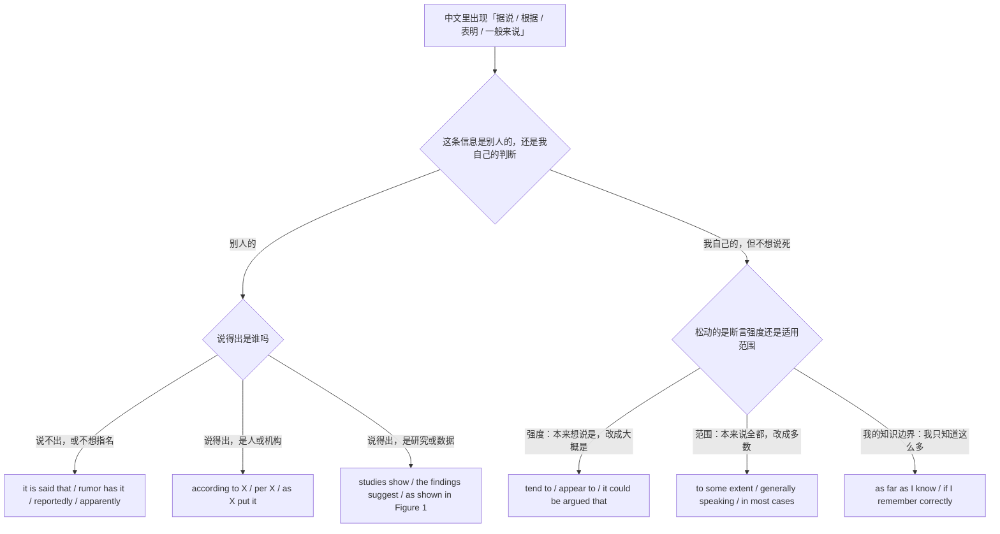
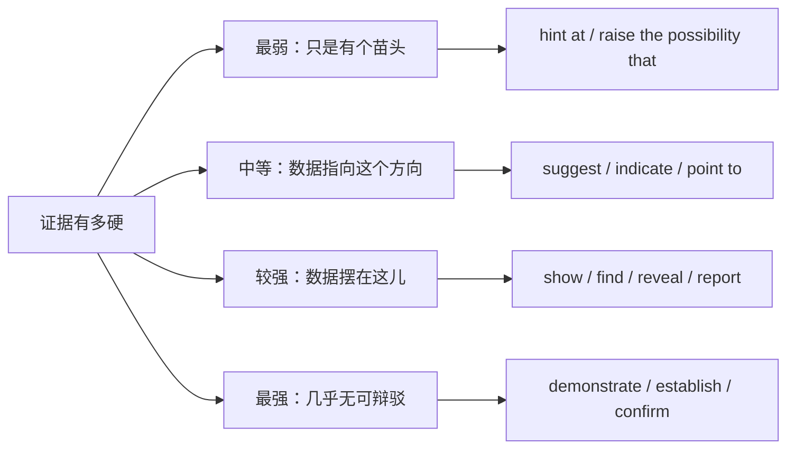
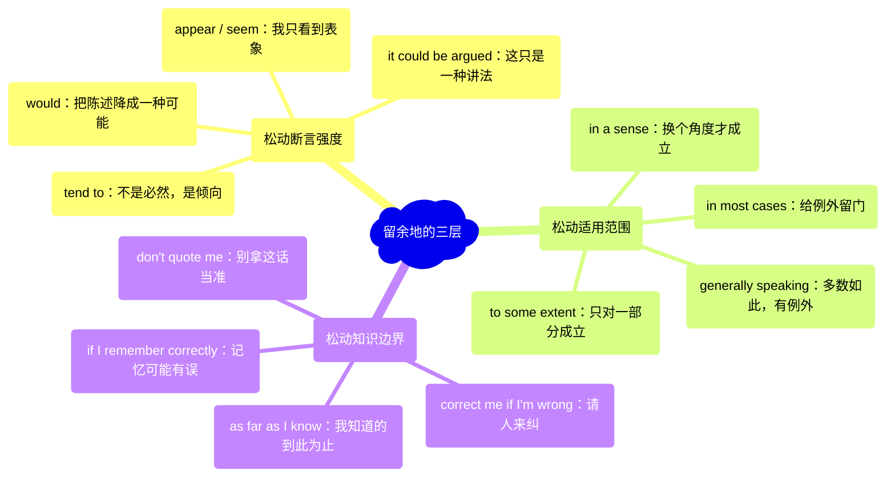
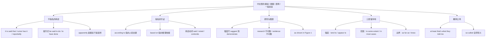

# 据说、研究表明、据我所知：信息来源与缓和语

> [!info] 本篇定位
>
> 这篇收四类中文意图：**这话不是我说的**（据说、听说、有传言、据称、据报道、看样子）、**这话是谁说的**（根据某某、基于、引用某人原话、出自哪份材料）、**这话有数据撑着**（研究表明、数据显示、如图所示、有证据表明）、**这话我不打包票**（往往、似乎、在一定程度上、一般来说、据我所知、说错了请指正）。
>
> 「据说／研究表明」这一组的主锚点定在本篇。上一篇 [[10.态度、情感与判断/03.肯定是、八成、说不定、不可能：把握度阶梯\|肯定是、八成、说不定、不可能：把握度阶梯]] 管的是**说话人自己有几分把握**，用的是情态动词那一路；本篇管的是**这条信息从哪儿来、说话人愿意为它担多少责**，用的是被动转述式、副词与 hedging 那一路。中文里「他肯定改过」和「据说他改过」看着只差两个字，英文一边是 `He must have changed it`，另一边是 `He's said to have changed it`，一句都不通用。
>
> 读完能查到：38 条中文意图入口、114 条分档成品句架，以及中文母语者在 `according to me`、`Based on the survey, users prefer…`、`The data suggest that it be…`、`as far as I know` 与 `as far as I'm concerned` 这五处最容易造出的错句该怎么绕。

---

## 1. 本篇导读：来源、强度、余地三条查询线

一句话里的「据说」承担着三件不同的事，中文把它们压成了同一个词。

第一件是**免责**：我把话转出去，但不为它的真假背书。第二件是**引证**：我把话的出处摆出来，让它更可信。第三件是**留余地**：话是我说的，但我不说死。中文都用「据说」「听说」「一般来说」这几个词打发，英文分给三套完全不同的手段——被动转述式管免责，`according to` 管引证，`tend to` 与 `to some extent` 管留余地。查错方向的后果很直接：想引证却写成 `It is said that our Q3 revenue rose 12%`，等于当着客户的面说自家财报是道听途说。

先用一张选择树把中文里的这批词分流。

这张图的第一个分叉是全篇最关键的一刀：**信息是别人的还是我的**。中文说话人常在这两边来回滑，「我听说这个库性能不行」和「这个库性能一般般」在中文语感里差别很小，在英文里前者要求 `I hear` 或 `it's said that` 这类外部来源标记，后者只能靠 `tend to`、`isn't great` 这类内部弱化。把外部标记安在自己的判断上会显得推卸，把内部弱化安在外部信息上会显得你在替别人的话背书。

第二个分叉在右边一支：**强度和范围是两个可调的旋钮**。「一般来说这个接口不会超时」调的是范围（多数情况下不超时，个别情况会），「这个接口似乎不会超时」调的是强度（我不确定它到底会不会）。中文都可以用「一般不会超时」带过，英文的 `generally` 与 `appears not to` 分管两件事。学术写作里两个旋钮常常一起拧——`The results generally appear to be consistent with prior work`——但查的时候要分开查。

本篇的意图块按这张图的六条出路排：第 2、3 节走不指名的转述与主语提升，第 4 节走指名来源，第 5、6 节走研究与图表，第 7、8、9 节走三层 hedging，第 10 节收尾处理「我只是转述，不代表我同意」的撇清说法。

---

## 2. 据说、听说、有传言：不指名来源的转述

这一节的七条意图共用一个特征：**信息有来源，但来源不出现在句子里**。英文的做法是把来源"藏"进被动式或副词里——`it is said that` 的施事被省掉了，`reportedly` 干脆压缩成一个词。三档的差别在于藏的方式：口语用 `they say`、`I hear` 这种虚指人称，书面用被动，正式用 `it is understood that` 这类新闻与公文的固定式。

### 2.1 据说、听人讲

中文触发语：据说… / 听说… / 人家说… / 传说… / 都说…

| 档位 | 句架 | 例句 | 译文 |
| --- | --- | --- | --- |
| 口语 | they say (that) A | They say the new office opens in March. | 据说新办公室三月启用。 |
| 书面 | it is said that A | It is said that the technique dates back to the 1970s. | 据说这个技术可以追溯到七十年代。 |
| 正式 | it is understood that A | It is understood that talks between the two vendors are still ongoing. | 据了解，两家供应商之间的谈判仍在进行。 |

> [!warning] 错配警示
>
> - ~~It is said our Q3 revenue rose 12%.~~ ❌
> - **Our Q3 revenue rose 12%.** ✅（`it is said that` 是把责任推给不具名来源，用在自家可核实的数字上等于自曝这数字没根据；有出处就直接陈述或用 4.1 的 `according to`）

页脚：
- 同义入口：据传 / 有人说 / 外面都在说
- 语法归属：[[02.英语基础语法/10.特殊句型/01.被动语态全解\|被动语态全解]]
- 场景实战：[[04.英语场景/03.时态与语态句型框架/02.被动语态句型框架\|被动语态句型框架]]

### 2.2 我听说、我好像听谁提过

中文触发语：我听说… / 我听人提过… / 我耳闻… / 我这边收到的消息是…

| 档位 | 句架 | 例句 | 译文 |
| --- | --- | --- | --- |
| 口语 | I hear (that) A | I hear you're moving to the platform team. | 听说你要调去平台组了。 |
| 书面 | from what I've heard, A | From what I've heard, the review deadline has been pushed back a week. | 据我听到的说法，评审截止日往后推了一周。 |
| 正式 | I am given to understand that A | I am given to understand that the contract has been renewed for another year. | 据我了解，合同已续签一年。 |

> [!warning] 错配警示
>
> - ~~I heard that the deadline is next Friday, so plan around it.~~ ❌（用一般过去时会把重点变成"我当时听到过"这件往事）
> - **I hear the deadline is next Friday, so plan around it.** ✅（转述当下有效的消息用一般现在时 `I hear`；`I heard` 适合"我早先听说过，现在不一定还作数"）

页脚：
- 同义入口：听人说 / 我这儿的说法是 / 小道消息说
- 语法归属：[[02.英语基础语法/06.动词时态/01.一般现在时与一般过去时\|一般现在时与一般过去时]]
- 场景实战：[[04.英语场景/07.社交交际场景实战/01.交友聚会与闲聊场景\|交友聚会与闲聊场景]]

### 2.3 大家都认为、普遍的看法是

中文触发语：普遍认为… / 大家都觉得… / 一般人的看法是… / 通行的说法是…

| 档位 | 句架 | 例句 | 译文 |
| --- | --- | --- | --- |
| 口语 | most people think (that) A | Most people think the migration will slip into Q4. | 大家都觉得迁移会拖到四季度。 |
| 书面 | it is widely believed that A | It is widely believed that the outage was caused by a config change. | 普遍认为这次故障是配置变更引起的。 |
| 正式 | it is generally held that A | It is generally held that early feedback reduces rework. | 一般认为，尽早收集反馈能减少返工。 |

> [!warning] 错配警示
>
> - ~~It is widely believed by everyone that the migration will slip.~~ ❌
> - **It is widely believed that the migration will slip.** ✅（`widely` 已经把"很多人"这层意思包进去了，再补 `by everyone` 既冗余又把不具名来源重新点名，等于自拆这个句式的用途）

页脚：
- 同义入口：外界普遍认为 / 传统看法是 / 大伙儿的共识是
- 语法归属：[[02.英语基础语法/09.从句体系/03.名词性从句详解\|名词性从句详解]]
- 场景实战：[[04.英语场景/05.高频实用表达句型框架/01.表达观点与态度的50个万能句型\|表达观点与态度的50个万能句型]]

### 2.4 有传言说、小道消息

中文触发语：有传言说… / 小道消息说… / 听风声… / 外面在传…

| 档位 | 句架 | 例句 | 译文 |
| --- | --- | --- | --- |
| 口语 | rumor has it (that) A | Rumor has it they're merging the two teams next quarter. | 有传言说他们下季度要把两个组合并。 |
| 书面 | there is talk of + n./doing | There is talk of freezing new hires until the budget is reviewed. | 有说法称在预算复核前会冻结招聘。 |
| 正式 | unconfirmed reports suggest that A | Unconfirmed reports suggest that the release has been delayed indefinitely. | 未经证实的消息称该版本已无限期延后。 |

> [!warning] 错配警示
>
> - ~~The rumor has it that they're merging the teams.~~ ❌
> - **Rumor has it that they're merging the teams.** ✅（这是个不带冠词的固定式，`Rumor` 前不加 `the`，也不写成复数 `Rumors have it`）

页脚：
- 同义入口：风言风语 / 有小道消息 / 听说要…
- 语法归属：[[02.英语基础语法/02.名词与冠词/01.名词的分类与用法\|名词的分类与用法]]
- 场景实战：[[04.英语场景/07.社交交际场景实战/02.电话短信与在线沟通场景\|电话短信与在线沟通场景]]

### 2.5 据称、涉嫌、号称

中文触发语：据称… / 涉嫌… / 号称… / 说是…（但没证实）

| 档位 | 句架 | 例句 | 译文 |
| --- | --- | --- | --- |
| 口语 | supposedly + 句子 | He supposedly signed off on it last week. | 说是他上周就批了。 |
| 书面 | allegedly + 动词 / the alleged + n. | The vendor allegedly shipped a build that had never been tested. | 据称该供应商发布了一个从未测试过的版本。 |
| 正式 | it is alleged that A | It is alleged that the figures were adjusted after the audit. | 据称这些数字在审计后被调整过。 |

> [!warning] 错配警示
>
> - ~~He allegedly is a very nice person.~~ ❌
> - **He's supposedly a very nice person.** ✅（`allegedly` 专用于指控性、可能追责的内容，中性甚至褒义的传闻用 `supposedly`；把 `allegedly` 用在夸人上会读出反讽）

页脚：
- 同义入口：据指控 / 说是 / 名义上
- 语法归属：[[02.英语基础语法/04.形容词与副词/03.副词的分类与用法\|副词的分类与用法]]
- 场景实战：[[04.英语场景/10.职场与商务场景实战/04.商务谈判合同与客户沟通\|商务谈判合同与客户沟通]]

### 2.6 据报道、报道称

中文触发语：据报道… / 有报道说… / 媒体称… / 我在哪儿看到过…

| 档位 | 句架 | 例句 | 译文 |
| --- | --- | --- | --- |
| 口语 | I read somewhere that A | I read somewhere that they rewrote the whole thing in Rust. | 我在哪儿看到过，说他们整个用 Rust 重写了。 |
| 书面 | reportedly + 动词 / it is reported that A | The company reportedly cut its cloud spend by a third. | 据报道该公司把云支出砍掉了三分之一。 |
| 正式 | according to reports published in + 出处 | According to reports published in the trade press, the acquisition closed in June. | 据行业媒体报道，这笔收购于六月完成。 |

> [!warning] 错配警示
>
> - ~~Reportedly, I heard the acquisition closed in June.~~ ❌
> - **Reportedly, the acquisition closed in June.** ✅（`reportedly` 本身就是一个来源标记，不要再叠一个 `I heard`；两个来源标记同现会让读者分不清到底是谁在转述谁）

页脚：
- 同义入口：报上说 / 新闻里讲 / 官方通报称
- 语法归属：[[02.英语基础语法/04.形容词与副词/03.副词的分类与用法\|副词的分类与用法]]
- 场景实战：[[04.英语场景/10.职场与商务场景实战/02.会议汇报与演示场景\|会议汇报与演示场景]]

### 2.7 看样子、照这么看

中文触发语：看样子… / 照这情况看… / 好像是… / 敢情是…

| 档位 | 句架 | 例句 | 译文 |
| --- | --- | --- | --- |
| 口语 | apparently + 句子 | Apparently the build has been broken since Tuesday. | 看样子这个构建从周二就坏了。 |
| 书面 | it appears that A | It appears that the retry logic never fires on timeouts. | 看来重试逻辑在超时时根本没触发。 |
| 正式 | on the available evidence, it would appear that A | On the available evidence, it would appear that the two failures share a root cause. | 就现有证据看，这两次故障似乎同源。 |

> [!warning] 错配警示
>
> - ~~Apparently, this API is deprecated — just look at the docs.~~ ❌
> - **Obviously, this API is deprecated — just look at the docs.** ✅（`apparently` 是「据说／看来是这样，但我没亲自核实」，不是「明摆着」；证据摆在眼前时要用 `obviously`、`clearly`）

页脚：
- 同义入口：听着像是 / 照说法是 / 貌似
- 语法归属：[[02.英语基础语法/04.形容词与副词/03.副词的分类与用法\|副词的分类与用法]]
- 场景实战：[[04.英语场景/05.高频实用表达句型框架/01.表达观点与态度的50个万能句型\|表达观点与态度的50个万能句型]]

---

## 3. 据说他…：把人挪到句首的主语提升式

第 2 节的句子都以 `it` 开头，真正的主角躲在从句里。英文还有一条并行的路：把从句的主语提到全句句首，谓语改成 `be + 过去分词 + to do`。中文「据说他改过这段」两种都能对：`It is said that he changed this part` 与 `He is said to have changed this part`。

选哪一条不是随机的。**句首那个位置是给话题留的**。如果整段都在讲这个人、这个库、这个版本，就把它提上来；如果这是一条突然插进来的新消息，就用 `it` 开头。技术文档里提升式尤其常见，因为主语通常是正在讨论的那个对象。

### 3.1 据说某物怎么样

中文触发语：据说这东西… / 号称能… / 说是可以… / 传闻它…

| 档位 | 句架 | 例句 | 译文 |
| --- | --- | --- | --- |
| 口语 | X is supposed to do / be | This driver is supposed to handle reconnects on its own. | 这个驱动据说能自己处理重连。 |
| 书面 | X is said to do / be | The library is said to handle back-pressure well under load. | 据说这个库在高负载下的背压处理不错。 |
| 正式 | X is reputed to do / be | The framework is reputed to scale linearly up to sixteen nodes. | 该框架据称可线性扩展至十六个节点。 |

> [!warning] 错配警示
>
> - ~~Is said that this driver handles reconnects.~~ ❌
> - **It is said that this driver handles reconnects.** / **This driver is said to handle reconnects.** ✅（这两式只能二选一：留 `it` 就用 that 从句，提主语就用不定式，不存在既省 `it` 又留从句的第三种写法）

页脚：
- 同义入口：号称 / 据讲 / 说是能
- 语法归属：[[02.英语基础语法/08.非谓语动词/01.动词不定式详解\|动词不定式详解]]
- 场景实战：[[04.英语场景/03.时态与语态句型框架/02.被动语态句型框架\|被动语态句型框架]]

### 3.2 据说已经…了：提升式的完成体

中文触发语：据说已经… / 听说当时… / 说是早就… / 传闻他之前…

| 档位 | 句架 | 例句 | 译文 |
| --- | --- | --- | --- |
| 口语 | X is supposed to have done | The bug is supposed to have been fixed in 2.4. | 这个 bug 据说 2.4 就修了。 |
| 书面 | X is said to have done | The team is said to have rewritten the scheduler twice. | 据说这个组把调度器重写过两次。 |
| 正式 | X is believed to have done | The intrusion is believed to have originated from a leaked token. | 据信此次入侵源自一枚泄露的令牌。 |

> [!warning] 错配警示
>
> - ~~The bug was said to be fixed in 2.4.~~ ❌（时间落在过去的是「修好」这个动作，不是「据说」这个动作）
> - **The bug is said to have been fixed in 2.4.** ✅（提升式表达时间差靠不定式的完成体 `to have done`，不靠主句的时态；主句时态只表示「现在有这个说法」）

页脚：
- 同义入口：据说早就 / 听说那会儿 / 说是已经
- 语法归属：[[02.英语基础语法/06.动词时态/04.完成时态详解\|完成时态详解]]
- 场景实战：[[04.英语场景/03.时态与语态句型框架/01.16种时态完全手册\|16种时态完全手册]]

### 3.3 被认为是、算得上是

中文触发语：被认为是… / 算是… / 公认是… / 一向被当成…

| 档位 | 句架 | 例句 | 译文 |
| --- | --- | --- | --- |
| 口语 | people see X as + n./adj. | People see it as the safe default. | 大家都把它当成保险的默认选项。 |
| 书面 | X is regarded as + n. / X is considered + n./adj. | Pinning the version is considered good practice here. | 在这儿锁版本被认为是稳妥做法。 |
| 正式 | X is deemed to be + n./adj. | Any undocumented endpoint is deemed to be internal. | 任何未写入文档的接口均视为内部接口。 |

> [!warning] 错配警示
>
> - ~~Pinning the version is considered as good practice.~~ ❌
> - **Pinning the version is considered good practice.** ✅（`consider` 后面直接接补语，不加 `as`；要用 `as` 得换动词——`regard X as`、`see X as`、`view X as` 才带 `as`）

页脚：
- 同义入口：视为 / 被当作 / 公认
- 语法归属：[[02.英语基础语法/05.介词与连词/02.常用介词搭配详解\|常用介词搭配详解]]
- 场景实战：[[04.英语场景/05.高频实用表达句型框架/04.比较对比举例总结句型库\|比较对比举例总结句型库]]

### 3.4 预计将、有望在

中文触发语：预计将… / 有望… / 估计要到… / 按计划应该…

| 档位 | 句架 | 例句 | 译文 |
| --- | --- | --- | --- |
| 口语 | X is expected to do | The release is expected to land next week. | 这个版本预计下周上线。 |
| 书面 | X is projected to do | Storage costs are projected to double within two years. | 预计存储成本两年内翻倍。 |
| 正式 | X is anticipated to do / is forecast to do | Peak load is forecast to occur in the last week of the quarter. | 预计负载峰值出现在季度最后一周。 |

> [!warning] 错配警示
>
> - ~~The release will expect to land next week.~~ ❌
> - **The release is expected to land next week.** ✅（做出预期的是别人，版本本身不会"预期"；这一族动词——`expect`、`project`、`report`、`say`——提升主语时必须保持被动）

页脚：
- 同义入口：预期 / 按估计 / 目标是在
- 语法归属：[[02.英语基础语法/10.特殊句型/01.被动语态全解\|被动语态全解]]
- 场景实战：[[04.英语场景/10.职场与商务场景实战/02.会议汇报与演示场景\|会议汇报与演示场景]]

---

## 4. 根据、基于、引用某某：把出处摆出来

上两节是把来源藏起来，这一节相反：来源明确，而且摆出来正是为了增加可信度。中文这一区只有「根据」「按照」「基于」几个词轮着用，英文分给两个不同的词，界线相当清楚。

`according to` 后面跟的是**说话的人或发布信息的载体**——某人、某份报告、某个数据库。`based on` 后面跟的是**做判断所依据的材料**，它修饰的是一个推理过程，不是一段引语。一句话检验：如果后面那个东西"会说话"（人、报告、文档、日志），用 `according to`；如果它是"被拿来算的原料"（数据、样本、经验），用 `based on`。

### 4.1 根据某某的说法

中文触发语：根据… / 按照…的说法 / 依…所言 / 照…提供的信息

| 档位 | 句架 | 例句 | 译文 |
| --- | --- | --- | --- |
| 口语 | according to X, A | According to Ma, the staging box was rebuilt last night. | 按小马的说法，预发机昨晚重建过。 |
| 书面 | per X / as per X | Per the incident report, the alert fired eleven minutes late. | 按事故报告，告警晚了十一分钟。 |
| 正式 | as set out in X, A | As set out in the service agreement, support hours exclude public holidays. | 按服务协议约定，支持时段不含法定节假日。 |

> [!warning] 错配警示
>
> - ~~According to me, we should roll it back.~~ ❌
> - **In my view, we should roll it back.** ✅（`according to` 只用于把责任指给**别人**；指向自己会让整句读起来像在给自己作证，英文里表达己见用 `in my view`、`the way I see it`）

页脚：
- 同义入口：按…讲 / 依据 / 照…的口径
- 语法归属：[[02.英语基础语法/05.介词与连词/01.介词的分类与基本用法\|介词的分类与基本用法]]
- 场景实战：[[04.英语场景/10.职场与商务场景实战/03.商务邮件与正式书面沟通\|商务邮件与正式书面沟通]]

### 4.2 基于、在…的基础上

中文触发语：基于… / 在…基础上 / 从…来看 / 拿…推算

| 档位 | 句架 | 例句 | 译文 |
| --- | --- | --- | --- |
| 口语 | based on X, 主句 | Based on last month's numbers, we're on track. | 按上个月的数字看，进度是够的。 |
| 书面 | on the basis of X, 主句 | On the basis of the load tests, we sized the cluster at six nodes. | 依据压测结果，集群定为六个节点。 |
| 正式 | drawing on X, 主句 | Drawing on three years of incident data, the report identifies four recurring causes. | 该报告基于三年的事故数据，归纳出四类反复出现的成因。 |

> [!warning] 错配警示
>
> - ~~Based on the survey, users prefer dark mode.~~ ❌（`based on` 修饰的是句子主语，这句的主语是 users，用户不是"基于调查"得出来的）
> - **The survey suggests that users prefer dark mode.** ✅（要么换成让主语说得通的写法，要么把依据变成主语；这是中文「基于」直译过来最常见的一处走形）

页脚：
- 同义入口：依据 / 根据…推算 / 从…出发
- 语法归属：[[02.英语基础语法/08.非谓语动词/04.过去分词详解\|过去分词详解]]
- 场景实战：[[04.英语场景/09.学习与教育场景实战/02.图书馆作业与研究场景\|图书馆作业与研究场景]]

### 4.3 引用某人的原话

中文触发语：用某某的话说… / 引用一句… / 某某原话是… / 借某某的说法

| 档位 | 句架 | 例句 | 译文 |
| --- | --- | --- | --- |
| 口语 | as X put it, A | As Li put it, the queue was never the bottleneck. | 用小李的话说，队列从来就不是瓶颈。 |
| 书面 | to quote X, "A" | To quote the postmortem, "the alert existed but nobody owned it." | 引用复盘报告的原话：告警是有的，但没人负责。 |
| 正式 | as X observes, A / X writes: "A" | As the author observes, complexity tends to migrate rather than disappear. | 正如作者所言，复杂度往往是转移而非消失。 |

> [!warning] 错配警示
>
> - ~~Like the postmortem said, the alert existed but nobody owned it.~~ ❌
> - **As the postmortem put it, the alert existed but nobody owned it.** ✅（引出整句引语用 `as`，`like` 后面正式写作中只接名词短语；这条界线在口语里已经松动，但书面档要守住）

页脚：
- 同义入口：套用某某的话 / 原文是 / 照他说的
- 语法归属：[[02.英语基础语法/05.介词与连词/03.连词的分类与用法\|连词的分类与用法]]
- 场景实战：[[04.英语场景/09.学习与教育场景实战/03.考试报名与学术评分场景\|考试报名与学术评分场景]]

### 4.4 出自、来源于哪份材料

中文触发语：这数字出自… / 材料来源是… / 从哪儿来的 / 摘自…

| 档位 | 句架 | 例句 | 译文 |
| --- | --- | --- | --- |
| 口语 | it's from X / I got it from X | These numbers are from the billing dashboard, not the API. | 这些数字来自计费面板，不是接口。 |
| 书面 | X is taken from Y | The sample queries are taken from last week's slow log. | 示例查询取自上周的慢日志。 |
| 正式 | X is drawn from Y / X is sourced from Y | All figures in this section are drawn from the audited statements. | 本节所有数据均取自经审计的报表。 |

> [!warning] 错配警示
>
> - ~~The numbers are come from the dashboard.~~ ❌
> - **The numbers come from the dashboard.** ✅（`come from` 本身是主动式，不加 `be`；想用被动得换动词，`be taken from`、`be drawn from` 才是被动形态）

页脚：
- 同义入口：取自 / 摘录自 / 数据来源
- 语法归属：[[02.英语基础语法/10.特殊句型/01.被动语态全解\|被动语态全解]]
- 场景实战：[[04.英语场景/09.学习与教育场景实战/02.图书馆作业与研究场景\|图书馆作业与研究场景]]

### 4.5 他说、他指出、他强调：转述动词的梯度

中文触发语：他说… / 他提到… / 他指出… / 他强调… / 他声称…

| 档位 | 句架 | 例句 | 译文 |
| --- | --- | --- | --- |
| 口语 | X said / X mentioned (that) A | She mentioned that the on-call rotation is short two people. | 她提到值班排班少两个人。 |
| 书面 | X noted / pointed out / stressed that A | The reviewer pointed out that the retry has no backoff. | 评审人指出这个重试没有退避。 |
| 正式 | X contends / maintains / asserts that A | The authors maintain that the effect persists after controlling for team size. | 作者坚持认为在控制团队规模后该效应依然存在。 |

> [!warning] 错配警示
>
> - ~~He pointed out that the new design is worse, but I think he's wrong.~~ ❌
> - **He argued that the new design is worse, but I think he's wrong.** ✅（`point out` 与 `note` 预设从句内容为真，用它转述你随即要反驳的观点会自相矛盾；不表态的中性转述用 `argue`、`claim`、`state`）

页脚：
- 同义入口：他表示 / 他声称 / 他补充说
- 语法归属：[[02.英语基础语法/09.从句体系/03.名词性从句详解\|名词性从句详解]]
- 场景实战：[[04.英语场景/10.职场与商务场景实战/02.会议汇报与演示场景\|会议汇报与演示场景]]

---

## 5. 研究表明、数据显示：证据强度的一条尺

中文写「研究表明」四个字，英文那边至少有六个动词候选，而它们的强度差得很远。`show` 是"摆出来了"，`suggest` 是"指了个方向"，`prove` 在实证写作里几乎不用——一篇论文里把 `suggest` 全部换成 `prove`，审稿人第一轮就会打回来。

这条强度尺值得单独看一张图。

这条尺的用法是：**先判断手上的证据有多硬，再挑动词**，不要反过来先想好措辞再找证据。中文母语者的默认档偏高——「研究表明」直觉上对应 `show`，但英文学术写作的默认档在 `suggest` 与 `indicate` 那一格，`show` 通常留给自己论文里跑出来的结果，`demonstrate` 留给重复验证过的结论。工程场景同理：一次压测的结果说 `the benchmark suggests`，跑了十轮不同配置才配得上 `the benchmark shows`。

档位与强度是两个独立的维度：`suggest` 有口语版（`the numbers point to`）也有正式版（`these results are consistent with the hypothesis that`），强度不因为语域升高而升高。

### 5.1 研究表明、数据显示

中文触发语：研究表明… / 数据显示… / 有研究做过… / 实验结果显示…

| 档位 | 句架 | 例句 | 译文 |
| --- | --- | --- | --- |
| 口语 | studies show (that) A | Studies show people skim the first two lines and stop. | 有研究表明，人只扫前两行就不看了。 |
| 书面 | research shows that A / X demonstrates that A | Research shows that smaller pull requests get reviewed faster. | 研究表明较小的 PR 评审得更快。 |
| 正式 | the evidence demonstrates that A | The evidence demonstrates that latency, not throughput, drives user churn. | 证据表明驱动用户流失的是延迟而非吞吐。 |

> [!warning] 错配警示
>
> - ~~Researches show that smaller pull requests get reviewed faster.~~ ❌
> - **Research shows that smaller pull requests get reviewed faster.** ✅（`research` 不可数，没有 `researches` 这个复数，谓语跟单数；要表示"多项研究"用 `studies show` 或 `a number of studies`）

页脚：
- 同义入口：有实验证明 / 数据摆在那儿 / 调查显示
- 语法归属：[[02.英语基础语法/10.特殊句型/06.主谓一致\|主谓一致]]
- 场景实战：[[04.英语场景/09.学习与教育场景实战/02.图书馆作业与研究场景\|图书馆作业与研究场景]]

### 5.2 结果提示、似乎说明

中文触发语：结果提示… / 似乎说明… / 这暗示着… / 从数据看得出…

| 档位 | 句架 | 例句 | 译文 |
| --- | --- | --- | --- |
| 口语 | the numbers point to X | The numbers point to a memory leak, not a CPU issue. | 数据指向内存泄漏，不是 CPU 问题。 |
| 书面 | the findings suggest that A / the data indicate that A | The findings suggest that review latency, not code volume, predicts defects. | 结果提示预测缺陷的是评审时延而非代码量。 |
| 正式 | these results are consistent with the hypothesis that A | These results are consistent with the hypothesis that caching masks the underlying cost. | 这些结果与"缓存掩盖了底层开销"这一假设相符。 |

> [!warning] 错配警示
>
> - ~~The data suggest that the model be overfitting.~~ ❌
> - **The data suggest that the model is overfitting.** ✅（`suggest` 表「表明、提示」时从句用普通陈述式；只有表「建议做某事」时从句才用 `(should) + 原形`，两义靠从句形态区分）

页脚：
- 同义入口：提示 / 反映出 / 看得出来
- 语法归属：[[02.英语基础语法/10.特殊句型/02.虚拟语气详解\|虚拟语气详解]]
- 场景实战：[[04.英语场景/03.时态与语态句型框架/03.虚拟语气完全解析\|虚拟语气完全解析]]

### 5.3 研究发现、我们观察到

中文触发语：研究发现… / 他们发现… / 我们观察到… / 结果里出现了…

| 档位 | 句架 | 例句 | 译文 |
| --- | --- | --- | --- |
| 口语 | they found (that) A | They found that most timeouts came from a single region. | 他们发现绝大多数超时来自同一个地区。 |
| 书面 | the study found that A / X reveals A | The study found no difference between the two rollout strategies. | 该研究发现两种灰度策略没有差别。 |
| 正式 | the authors report + n. / X reports that A | The authors report a reduction in tail latency across all three workloads. | 作者报告三种负载下的尾延迟均有下降。 |

> [!warning] 错配警示
>
> - ~~The study finded no difference between the two strategies.~~ ❌
> - **The study found no difference between the two strategies.** ✅（`find` 的过去式与过去分词都是 `found`；另外注意 `found` 还有"创立"这个另一个动词的现在式形态，`the company was founded in 2011` 与本条无关）

页脚：
- 同义入口：查出来 / 得出的结论是 / 结果里看到
- 语法归属：[[02.英语基础语法/06.动词时态/01.一般现在时与一般过去时\|一般现在时与一般过去时]]
- 场景实战：[[04.英语场景/09.学习与教育场景实战/03.考试报名与学术评分场景\|考试报名与学术评分场景]]

### 5.4 有证据表明、尚无证据

中文触发语：有证据表明… / 没证据说明… / 目前看不出… / 拿不出材料证明…

| 档位 | 句架 | 例句 | 译文 |
| --- | --- | --- | --- |
| 口语 | there's no real evidence that A | There's no real evidence that the upgrade caused it. | 没什么真凭实据说明是升级导致的。 |
| 书面 | there is evidence to suggest that A / there is little evidence that A | There is evidence to suggest that the two incidents share a trigger. | 有证据提示这两起事故有共同触发条件。 |
| 正式 | the available evidence does not support the claim that A | The available evidence does not support the claim that the change is backward compatible. | 现有证据不支持该变更向后兼容这一说法。 |

> [!warning] 错配警示
>
> - ~~We found an evidence that the two incidents are linked.~~ ❌
> - **We found evidence that the two incidents are linked.** ✅（`evidence` 不可数，不加 `an`、不加 `-s`；要论"一条证据"得说 `a piece of evidence`）

页脚：
- 同义入口：有材料佐证 / 缺乏依据 / 查无实据
- 语法归属：[[02.英语基础语法/02.名词与冠词/02.名词的数与格\|名词的数与格]]
- 场景实战：[[04.英语场景/09.学习与教育场景实战/02.图书馆作业与研究场景\|图书馆作业与研究场景]]

### 5.5 与前人一致、与前人矛盾

中文触发语：这跟以往的结论一致 / 这跟前人说的对不上 / 印证了… / 推翻了…

| 档位 | 句架 | 例句 | 译文 |
| --- | --- | --- | --- |
| 口语 | this lines up with X / this goes against X | This lines up with what we saw in the June test. | 这跟六月那次测试看到的对得上。 |
| 书面 | this is consistent with X / this is at odds with X | Our result is at odds with the figure reported in the vendor's white paper. | 我们的结果与供应商白皮书报告的数字不符。 |
| 正式 | these findings corroborate / contradict prior work | These findings corroborate earlier work on queue-induced latency. | 这些结果印证了此前关于队列引致延迟的研究。 |

> [!warning] 错配警示
>
> - ~~Our result is consistent to prior work.~~ ❌
> - **Our result is consistent with prior work.** ✅（`consistent` 固定搭 `with`；同一区里 `at odds with`、`in line with`、`in conflict with` 也全部配 `with`，只有 `contrary to` 用 `to`）

页脚：
- 同义入口：吻合 / 对得上 / 有出入
- 语法归属：[[02.英语基础语法/05.介词与连词/02.常用介词搭配详解\|常用介词搭配详解]]
- 场景实战：[[04.英语场景/05.高频实用表达句型框架/04.比较对比举例总结句型库\|比较对比举例总结句型库]]

---

## 6. 如图所示、表中列出：图表与数据的转述

汇报和论文里这一小块的句子数量不多但复用率极高，而且几乎全是固定式——改动一两个词就会露怯。最典型的一处是 `according to`：它管人和文献，不管你自己文档里的图，`According to Figure 1` 读起来像是图会说话。

### 6.1 如图所示、见图一

中文触发语：如图所示 / 见图一 / 图里可以看到 / 从图上看

| 档位 | 句架 | 例句 | 译文 |
| --- | --- | --- | --- |
| 口语 | you can see in the chart that A | You can see in the chart that the spike lines up with the deploy. | 图上能看到这个尖峰和发布对得上。 |
| 书面 | as shown in Figure 1, A | As shown in Figure 1, error rate rises sharply after the second rollout. | 如图 1 所示，错误率在第二次灰度后急升。 |
| 正式 | as can be seen from Figure 1, A / Figure 1 illustrates + n. | Figure 1 illustrates the relationship between queue depth and response time. | 图 1 展示了队列深度与响应时间的关系。 |

> [!warning] 错配警示
>
> - ~~According to Figure 1, the error rate rises after the rollout.~~ ❌
> - **As Figure 1 shows, the error rate rises after the rollout.** ✅（`according to` 用于外部来源；本文档自带的图表用 `as shown in`、`as Figure 1 shows`，写 `according to` 等于把自己的图当成第三方材料引用）

页脚：
- 同义入口：图上显示 / 参见图 / 从这张图看
- 语法归属：[[02.英语基础语法/08.非谓语动词/04.过去分词详解\|过去分词详解]]
- 场景实战：[[04.英语场景/10.职场与商务场景实战/02.会议汇报与演示场景\|会议汇报与演示场景]]

### 6.2 曲线一路走高、图上是什么趋势

中文触发语：三月以后一路走高 / 曲线掉下来了 / 走势是… / 这条线画的是…

| 档位 | 句架 | 例句 | 译文 |
| --- | --- | --- | --- |
| 口语 | the line keeps going up after X | The line keeps going up after March and never comes back down. | 三月以后这条线一路往上，再没下来过。 |
| 书面 | the chart shows a steady rise from X onward | The chart shows a steady rise in memory use from build 340 onward. | 图表显示自 340 号构建起内存占用持续上升。 |
| 正式 | Figure 2 plots A against B | Figure 2 plots p99 latency against request volume for each region. | 图 2 按地区绘制 p99 延迟随请求量的变化。 |

> [!warning] 错配警示
>
> - ~~The chart shows the memory use is rising up.~~ ❌
> - **The chart shows a steady rise in memory use.** ✅（`rise` 本身已含向上，不再加 `up`；升降描述的完整词表——`rise by` 与 `rise to`、`level off`、`fluctuate between`——在 [[09.比较、程度与数量/04.大约、超过、占三成、平均、分别是：数量与统计描述\|数量与统计描述]]）

页脚：
- 同义入口：走高 / 回落 / 趋势是
- 语法归属：[[02.英语基础语法/04.形容词与副词/03.副词的分类与用法\|副词的分类与用法]]
- 场景实战：[[04.英语场景/10.职场与商务场景实战/02.会议汇报与演示场景\|会议汇报与演示场景]]

### 6.3 表中列出、数据汇总在

中文触发语：数据都在表一 / 表中列出了 / 汇总见表 / 具体数值如下

| 档位 | 句架 | 例句 | 译文 |
| --- | --- | --- | --- |
| 口语 | the numbers are all in Table 1 | The numbers are all in Table 1 if you want the details. | 想看细节的话数字都在表 1。 |
| 书面 | Table 1 lists / summarizes + n. | Table 1 summarizes the configuration used in each run. | 表 1 汇总了每轮所用的配置。 |
| 正式 | Table 1 reports + n. for each + n. | Table 1 reports the mean and standard deviation for each condition. | 表 1 报告了各条件下的均值与标准差。 |

> [!warning] 错配警示
>
> - ~~The datas in Table 1 shows three outliers.~~ ❌
> - **The data in Table 1 show three outliers.** ✅（`data` 没有 `datas` 这个形态；学术写作里 `data` 作复数配 `show`，工程文档与日常口语把它当集合名词配 `shows` 也已通行，同一篇里保持一种就行）

页脚：
- 同义入口：见表 / 数值汇总 / 明细在
- 语法归属：[[02.英语基础语法/10.特殊句型/06.主谓一致\|主谓一致]]
- 场景实战：[[04.英语场景/09.学习与教育场景实战/02.图书馆作业与研究场景\|图书馆作业与研究场景]]

---

## 7. 往往、似乎、可以说：把断言调弱一档

从这一节起进入 hedging，也就是中文说的"留余地"。它和第 2 节的转述有本质区别：转述是**话不是我说的**，hedging 是**话是我说的，但我不说满**。三层 hedging 按松动的对象分开——本节松动断言强度，第 8 节松动适用范围，第 9 节松动我的知识边界。

一张 mindmap 把这三层摆开。

三层可以叠加，但**一句里最多叠两层**。`As far as I know, it generally tends to appear to work` 这种四层堆叠在英文里读起来不是谨慎而是心虚，中文母语者写英文邮件时反而容易过度堆叠，因为中文的客套词不占句子结构位置，英文的每一个 hedge 都要占一个真实成分。

选层的办法：先问自己"我不确定的到底是什么"。不确定这事成立不成立，用第一层；确定它成立但知道有例外，用第二层；确定它成立但不确定我记的对不对，用第三层。

### 7.1 往往、一般都会

中文触发语：往往… / 一般都会… / 通常… / 十有八九会…

| 档位 | 句架 | 例句 | 译文 |
| --- | --- | --- | --- |
| 口语 | X tends to do | Builds tend to fail on Fridays. | 周五的构建往往会挂。 |
| 书面 | X typically does / X has a tendency to do | Cache misses typically cluster right after a deploy. | 缓存未命中通常集中在发布之后。 |
| 正式 | there is a tendency for X to do | There is a tendency for teams to underestimate migration cost. | 团队往往低估迁移成本。 |

> [!warning] 错配警示
>
> - ~~I tend to work at that company for five years.~~ ❌
> - **I used to work at that company.** ✅（`tend to` 讲的是当下反复出现的倾向，`used to` 讲的是过去的习惯或状态；中文「以前老是…」容易被译成 `tend to`）

页脚：
- 同义入口：常常 / 多半会 / 有这么个规律
- 语法归属：[[02.英语基础语法/07.助动词与情态动词/02.情态动词详解\|情态动词详解]]
- 场景实战：[[04.英语场景/05.高频实用表达句型框架/01.表达观点与态度的50个万能句型\|表达观点与态度的50个万能句型]]

### 7.2 似乎、看上去是

中文触发语：似乎… / 看上去… / 好像是… / 感觉像是…

| 档位 | 句架 | 例句 | 译文 |
| --- | --- | --- | --- |
| 口语 | it seems like A | It seems like the cache isn't warming up at all. | 看上去缓存根本没预热。 |
| 书面 | X appears to do / it appears that A | The connection pool appears to leak under sustained load. | 连接池在持续负载下似乎有泄漏。 |
| 正式 | it would appear that A | It would appear that the two subsystems disagree on the timeout value. | 看来两个子系统对超时值的认定不一致。 |

> [!warning] 错配警示
>
> - ~~It seems like that the pool is leaking.~~ ❌
> - **It seems that the pool is leaking.** / **It seems like the pool is leaking.** ✅（`seem like` 与 `seem that` 二选一，不能拼成 `seem like that`；书面档优先 `it appears that`，`seems like` 偏口语）

页脚：
- 同义入口：貌似 / 看着像 / 从表面看
- 语法归属：[[02.英语基础语法/09.从句体系/03.名词性从句详解\|名词性从句详解]]
- 场景实战：[[04.英语场景/05.高频实用表达句型框架/01.表达观点与态度的50个万能句型\|表达观点与态度的50个万能句型]]

### 7.3 可以说、不妨说

中文触发语：可以说… / 不妨说… / 有一种说法是… / 也说得通…

| 档位 | 句架 | 例句 | 译文 |
| --- | --- | --- | --- |
| 口语 | you could argue that A | You could argue that the rewrite bought us nothing. | 可以说这次重写什么都没换来。 |
| 书面 | it could be argued that A | It could be argued that the added abstraction outweighs the savings. | 可以说新加的抽象层抵掉了省下来的成本。 |
| 正式 | one might reasonably contend that A | One might reasonably contend that the metric measures effort rather than value. | 有理由认为该指标衡量的是投入而非价值。 |

> [!warning] 错配警示
>
> - ~~It can be argued that the rewrite bought us nothing, and this is certainly true.~~ ❌
> - **It could be argued that the rewrite bought us nothing.** ✅（这个句式的用途就是不下定论，后面接一句斩钉截铁的断言会把它抵消；想下定论就直接说 `The rewrite bought us nothing`）

页脚：
- 同义入口：说得通的一点是 / 换个角度讲 / 有人会说
- 语法归属：[[02.英语基础语法/07.助动词与情态动词/02.情态动词详解\|情态动词详解]]
- 场景实战：[[04.英语场景/05.高频实用表达句型框架/03.同意反对让步转折句型库\|同意反对让步转折句型库]]

### 7.4 我倒觉得、要我说的话

中文触发语：我倒觉得… / 要我说的话… / 我个人的看法是… / 硬要说的话…

| 档位 | 句架 | 例句 | 译文 |
| --- | --- | --- | --- |
| 口语 | I'd say A | I'd say two weeks is optimistic. | 要我说，两周太乐观了。 |
| 书面 | I would think that A | I would think a phased rollout is the safer route here. | 我认为分阶段灰度在这里更稳妥。 |
| 正式 | we would submit that A | We would submit that the current threshold is set too low. | 我们认为当前阈值设得偏低。 |

> [!warning] 错配警示
>
> - ~~I will say two weeks is optimistic.~~ ❌
> - **I'd say two weeks is optimistic.** ✅（`I'd say` 里的 `would` 不表将来，它把断言降成一种个人估计；换成 `I will say` 会读成"我待会儿要说"或宣告式的强调）

页脚：
- 同义入口：我的判断是 / 依我看 / 我觉得吧
- 语法归属：[[02.英语基础语法/07.助动词与情态动词/02.情态动词详解\|情态动词详解]]
- 场景实战：[[04.英语场景/05.高频实用表达句型框架/01.表达观点与态度的50个万能句型\|表达观点与态度的50个万能句型]]

---

## 8. 在一定程度上、一般来说：把适用范围收窄

第 7 节的手段全都作用在谓语上，这一节的手段全都是插入语——它们不改动句子的主干，只在旁边挂一个范围标签。这带来一个排版层面的实际后果：**它们的位置比措辞更容易出错**。句首要跟逗号，句中要跟一对逗号，句尾要有一个逗号。位置错了，句子读起来会像在给主语加定语。

### 8.1 在一定程度上

中文触发语：在一定程度上… / 某种程度上… / 多少有点… / 不能说完全不…

| 档位 | 句架 | 例句 | 译文 |
| --- | --- | --- | --- |
| 口语 | sort of / up to a point | The workaround helps, up to a point. | 这个绕法有用，但也就到某个程度。 |
| 书面 | to some extent, A | To some extent, the slowdown is expected after a schema change. | 在一定程度上，改表结构之后变慢是预料之中的。 |
| 正式 | to a certain extent / insofar as A | The finding holds to a certain extent, insofar as the workload remains read-heavy. | 该结论在一定程度上成立，只要负载仍以读为主。 |

> [!warning] 错配警示
>
> - ~~In some extent, the slowdown is expected.~~ ❌
> - **To some extent, the slowdown is expected.** ✅（这个短语配的介词是 `to`：`to some extent`、`to a certain extent`、`to a large extent`，没有 `in some extent` 的说法）

页脚：
- 同义入口：多少有一点 / 部分上说 / 有那么点意思
- 语法归属：[[02.英语基础语法/05.介词与连词/02.常用介词搭配详解\|常用介词搭配详解]]
- 场景实战：[[04.英语场景/05.高频实用表达句型框架/03.同意反对让步转折句型库\|同意反对让步转折句型库]]

### 8.2 一般来说、总体而言

中文触发语：一般来说… / 总体而言… / 大体上… / 从整体看…

| 档位 | 句架 | 例句 | 译文 |
| --- | --- | --- | --- |
| 口语 | generally / as a rule | As a rule, we don't ship on Fridays. | 我们一般不在周五发版。 |
| 书面 | generally speaking, A / on the whole, A | On the whole, the new pipeline is faster but noisier. | 总体上新流水线更快，但噪声也更多。 |
| 正式 | broadly speaking, A / by and large, A | By and large, the migration met its stated goals. | 大体上这次迁移达成了既定目标。 |

> [!warning] 错配警示
>
> - ~~Generally speaking the new pipeline is faster.~~ ❌
> - **Generally speaking, the new pipeline is faster.** ✅（这一族插入语在句首必须跟逗号；挪到句中要用一对逗号夹住——`The pipeline is, generally speaking, faster`）

页脚：
- 同义入口：整体看 / 大致上 / 通常情况下
- 语法归属：[[02.英语基础语法/11.实战应用/02.写作中的语法应用\|写作中的语法应用]]
- 场景实战：[[04.英语场景/05.高频实用表达句型框架/04.比较对比举例总结句型库\|比较对比举例总结句型库]]

### 8.3 多数情况下、除个别外

中文触发语：多数情况下… / 大部分时候… / 除个别情况外… / 除非特殊情况…

| 档位 | 句架 | 例句 | 译文 |
| --- | --- | --- | --- |
| 口语 | most of the time / more often than not | More often than not, restarting the worker clears it. | 多数时候重启一下 worker 就好了。 |
| 书面 | in most cases, A / with few exceptions, A | With few exceptions, every service here uses the same retry policy. | 除个别外，这里每个服务都用同一套重试策略。 |
| 正式 | save in exceptional circumstances, A | Save in exceptional circumstances, changes are deployed only during the release window. | 除特殊情况外，变更仅在发布窗口内部署。 |

> [!warning] 错配警示
>
> - ~~In the most cases, restarting the worker clears it.~~ ❌
> - **In most cases, restarting the worker clears it.** ✅（这里的 `most` 前不加 `the`；加了 `the` 会变成"在那些最…的情况里"，指向一个前文提过的特定子集）

页脚：
- 同义入口：绝大部分时候 / 通常来讲 / 除了少数
- 语法归属：[[02.英语基础语法/02.名词与冠词/03.冠词的用法详解\|冠词的用法详解]]
- 场景实战：[[04.英语场景/10.职场与商务场景实战/03.商务邮件与正式书面沟通\|商务邮件与正式书面沟通]]

### 8.4 某种意义上、就我这个角度

中文触发语：某种意义上… / 从我这个角度看… / 换个说法就是… / 站在…的立场上

| 档位 | 句架 | 例句 | 译文 |
| --- | --- | --- | --- |
| 口语 | in a way / from where I sit | In a way, the outage did us a favor. | 某种意义上，这次故障还帮了我们个忙。 |
| 书面 | in a sense, A / from my perspective, A | In a sense, the cache is just a second database with worse guarantees. | 某种意义上，缓存不过是一个保证更弱的第二数据库。 |
| 正式 | in a manner of speaking, A / from the standpoint of X, A | From the standpoint of operations, the change adds one more thing to page on. | 从运维角度看，这个变更多加了一项需要告警的东西。 |

> [!warning] 错配警示
>
> - ~~In a sense of the cache, it is a second database.~~ ❌
> - **In a sense, the cache is a second database.** ✅（`in a sense` 是一个整体插入语，后面不接 `of + 名词`；要说"就缓存这一点而言"用 `as far as the cache is concerned`）

页脚：
- 同义入口：这么说吧 / 打个比方 / 就…而言
- 语法归属：[[02.英语基础语法/05.介词与连词/01.介词的分类与基本用法\|介词的分类与基本用法]]
- 场景实战：[[04.英语场景/05.高频实用表达句型框架/04.比较对比举例总结句型库\|比较对比举例总结句型库]]

---

## 9. 据我所知、我记得好像：给自己的知识边界留口

第三层 hedging 处理的是同一个问题的另一面：句子的内容我不改，我改的是我对它的责任范围。中文这一区的说法密集且高频——「据我所知」「我记得好像」「说不准」「说错了别怪我」——而且用它们的场合往往是最需要精确的场合：交接、答疑、事故复盘。

这一节的第一条是全篇最值得单独记的一条，因为它涉及一对长得几乎一样、意思完全不同的短语。

### 9.1 据我所知

中文触发语：据我所知… / 我知道的是… / 我了解到的情况是… / 就我掌握的信息…

| 档位 | 句架 | 例句 | 译文 |
| --- | --- | --- | --- |
| 口语 | as far as I know, A | As far as I know, nobody has touched that config since March. | 据我所知，那个配置从三月起就没人动过。 |
| 书面 | to my knowledge, A | To my knowledge, the endpoint has never been documented. | 据我所知，这个接口从未写进文档。 |
| 正式 | to the best of my knowledge, A | To the best of my knowledge, no exception has been granted for this policy. | 据我所知，该政策尚未有例外获批。 |

> [!warning] 错配警示
>
> - ~~As far as I'm concerned, nobody has touched that config since March.~~ ❌
> - **As far as I know, nobody has touched that config since March.** ✅（`as far as I know` 是「我掌握的信息到此为止」，`as far as I'm concerned` 是「就我的立场而言、我不反对」；后者用来陈述事实会读成一句表态，把客观描述变成个人许可）

页脚：
- 同义入口：我了解的情况是 / 我这儿的信息是 / 我掌握的是
- 语法归属：[[02.英语基础语法/09.从句体系/04.状语从句详解\|状语从句详解]]
- 场景实战：[[04.英语场景/10.职场与商务场景实战/02.会议汇报与演示场景\|会议汇报与演示场景]]

### 9.2 我记得好像、一时想不起来

中文触发语：我记得好像… / 印象里是… / 一下想不起来准数 / 大概是…吧

| 档位 | 句架 | 例句 | 译文 |
| --- | --- | --- | --- |
| 口语 | if I remember right, A / off the top of my head, A | Off the top of my head, it was around forty requests a second. | 我一时想不起准数，大概每秒四十来个请求。 |
| 书面 | if my memory serves, A | If my memory serves, the limit was raised in the 3.2 release. | 我记得没错的话，限额是在 3.2 版本提上去的。 |
| 正式 | subject to verification, A | Subject to verification, the change was approved at the March review. | 有待核实，该变更是在三月评审上通过的。 |

> [!warning] 错配警示
>
> - ~~In my memory, the limit was raised in 3.2.~~ ❌
> - **If I remember correctly, the limit was raised in 3.2.** ✅（`in my memory` 在英文里指"在我的记忆中"这个存放位置，多用于怀念场合；表示"我记得好像"要用条件式的 `if I remember correctly`）

页脚：
- 同义入口：印象中 / 没记错的话 / 大概齐是
- 语法归属：[[02.英语基础语法/09.从句体系/04.状语从句详解\|状语从句详解]]
- 场景实战：[[04.英语场景/10.职场与商务场景实战/02.会议汇报与演示场景\|会议汇报与演示场景]]

### 9.3 说不准、我不敢打包票

中文触发语：说不准 / 我不敢打包票 / 别拿我这话当准 / 这话不作数啊

| 档位 | 句架 | 例句 | 译文 |
| --- | --- | --- | --- |
| 口语 | don't quote me on this, but A | Don't quote me on this, but I think the quota resets monthly. | 别拿我这话当准，我记得配额是按月重置的。 |
| 书面 | I can't say for certain, but A | I can't say for certain, but the pattern matches last quarter's incident. | 我不敢确定，但这个模式和上季度那次事故很像。 |
| 正式 | this should not be taken as definitive | The following estimate is preliminary and should not be taken as definitive. | 以下估算为初步结果，不应视为定论。 |

> [!warning] 错配警示
>
> - ~~Don't quote me, the quota resets monthly.~~ ❌
> - **Don't quote me on this, but the quota resets monthly.** ✅（这是一个带 `but` 的固定框架，前半句只是免责声明，真正的内容必须挂在 `but` 后面；直接逗号接下去会读成两句不相干的话）

页脚：
- 同义入口：这话我不担保 / 仅供参考 / 你自己再核一下
- 语法归属：[[02.英语基础语法/05.介词与连词/03.连词的分类与用法\|连词的分类与用法]]
- 场景实战：[[04.英语场景/07.社交交际场景实战/02.电话短信与在线沟通场景\|电话短信与在线沟通场景]]

### 9.4 我理解得对吗、说错了请指正

中文触发语：说错了请指正 / 我理解得对吗 / 我这么理解对不对 / 有出入的话你补充

| 档位 | 句架 | 例句 | 译文 |
| --- | --- | --- | --- |
| 口语 | correct me if I'm wrong, but A | Correct me if I'm wrong, but this queue has no dead-letter path. | 说错了你纠正我，这个队列好像没有死信路径。 |
| 书面 | if I've understood correctly, A | If I've understood correctly, the retry budget is shared across all endpoints. | 如果我理解无误，重试预算是所有接口共用的。 |
| 正式 | I stand to be corrected, but A | I stand to be corrected, but the clause appears to conflict with section 4. | 我可能有误，但该条款似乎与第 4 节冲突。 |

> [!warning] 错配警示
>
> - ~~Correct me if I'm wrong, this queue has no dead-letter path.~~ ❌
> - **Correct me if I'm wrong, but this queue has no dead-letter path.** ✅（和 9.3 同型，`but` 不能省；这个 `but` 在英文里已经虚化成框架的一部分，不表转折，不必找中文对应词去翻译它）

页脚：
- 同义入口：我这理解对吧 / 不对你说一声 / 请指正
- 语法归属：[[02.英语基础语法/09.从句体系/04.状语从句详解\|状语从句详解]]
- 场景实战：[[04.英语场景/05.高频实用表达句型框架/03.同意反对让步转折句型库\|同意反对让步转折句型库]]

### 9.5 我不是这方面的专家

中文触发语：我不是这方面的专家 / 这不是我的领域 / 我外行说一句 / 隔行如隔山

| 档位 | 句架 | 例句 | 译文 |
| --- | --- | --- | --- |
| 口语 | I'm no expert, but A | I'm no expert on networking, but this looks like an MTU problem. | 网络我不在行，不过这看着像 MTU 的问题。 |
| 书面 | this is outside my area, but A | This is outside my area, but the licence terms seem to rule that out. | 这不在我的范围内，但许可条款似乎排除了这种做法。 |
| 正式 | I speak here as a non-specialist | I speak here as a non-specialist, and defer to the security team on the details. | 我在此仅以非专业者的身份发言，细节以安全团队意见为准。 |

> [!warning] 错配警示
>
> - ~~I'm not an expert, but I'm sure this is an MTU problem.~~ ❌
> - **I'm no expert, but this looks like an MTU problem.** ✅（免责在前、断言在后的组合里，后半句不能用 `I'm sure` 这类高确信度措辞，两半会互相抵消；后半句要跟着降到 `looks like`、`might be` 一档）

页脚：
- 同义入口：外行话 / 我瞎猜的 / 这块儿我不专业
- 语法归属：[[02.英语基础语法/03.代词与数词/01.人称代词与物主代词\|人称代词与物主代词]]
- 场景实战：[[04.英语场景/05.高频实用表达句型框架/01.表达观点与态度的50个万能句型\|表达观点与态度的50个万能句型]]

---

## 10. 我只是转述：撇清立场的三个说法

前面八节解决"怎么说"，这一节解决一个更窄但很实用的问题：**话已经转出去了，怎么补一句说明我不为它背书**。中文用「反正他们是这么说的」「所谓的」「我就是传个话」，英文有对应的固定式，而且都很短——这类补充句一长就显得心虚。

### 10.1 反正他们是这么说的

中文触发语：反正他们是这么说的 / 人家是这么讲的 / 我这边收到的就是这个说法

| 档位 | 句架 | 例句 | 译文 |
| --- | --- | --- | --- |
| 口语 | at least that's what they told me | The deploy is frozen until Monday — at least that's what they told me. | 发布冻结到周一，反正他们是这么跟我说的。 |
| 书面 | or so we were told | The vendor has a fix ready, or so we were told. | 供应商说修复已经就绪，至少他们是这么讲的。 |
| 正式 | that is the account we have been given | That is the account we have been given; we have not independently verified it. | 这是我们得到的说法，我们尚未独立核实。 |

> [!warning] 错配警示
>
> - ~~At least that's what they told me, the deploy is frozen until Monday.~~ ❌
> - **The deploy is frozen until Monday — at least that's what they told me.** ✅（这个短语是**后置**的撇清标记，必须跟在被转述的内容后面；放到句首会变成对上一句话的评论，指错对象）

页脚：
- 同义入口：他们的原话是 / 我听到的版本是 / 消息就到这儿
- 语法归属：[[02.英语基础语法/10.特殊句型/05.省略与替代\|省略与替代]]
- 场景实战：[[04.英语场景/10.职场与商务场景实战/02.会议汇报与演示场景\|会议汇报与演示场景]]

### 10.2 所谓的、号称的

中文触发语：所谓的… / 号称的… / 名义上的… / 美其名曰…

| 档位 | 句架 | 例句 | 译文 |
| --- | --- | --- | --- |
| 口语 | the so-called + n. | The so-called hotfix reintroduced two old bugs. | 那个所谓的紧急修复又把两个老 bug 带回来了。 |
| 书面 | ostensibly + adj./分词 | The change was ostensibly a cleanup, but it altered the default timeout. | 这次变更名义上是清理，实际改了默认超时。 |
| 正式 | what is described as + n. | The document refers to what is described as a temporary exemption. | 该文件提到了一项所谓的临时豁免。 |

> [!warning] 错配警示
>
> - ~~We use the so-called REST API for this integration.~~ ❌
> - **We use the REST API for this integration.** ✅（`so-called` 在当代英文里默认带贬义，等于对这个叫法打引号表示不认同；只是引入一个术语用 `known as`、`what we call`）

页脚：
- 同义入口：号称是 / 打着…的名义 / 表面上叫
- 语法归属：[[02.英语基础语法/04.形容词与副词/01.形容词的用法与位置\|形容词的用法与位置]]
- 场景实战：[[04.英语场景/05.高频实用表达句型框架/03.同意反对让步转折句型库\|同意反对让步转折句型库]]

### 10.3 我只是传个话

中文触发语：我只是传个话 / 别冲我来 / 这不是我的意思 / 我只负责转达

| 档位 | 句架 | 例句 | 译文 |
| --- | --- | --- | --- |
| 口语 | I'm just passing it on / don't shoot the messenger | Don't shoot the messenger — I'm just passing on what finance said. | 别冲我来，我只是把财务的话传过来。 |
| 书面 | I'm relaying this as I received it | I'm relaying this as I received it; the wording is theirs, not mine. | 我按原样转达，措辞是他们的，不是我的。 |
| 正式 | the views expressed are those of the author | The views expressed in the attached memo are those of the author. | 附件备忘录所述观点为作者本人观点。 |

> [!warning] 错配警示
>
> - ~~I'm just a messenger, so don't blame me for this stupid decision.~~ ❌
> - **I'm just passing this on — I wasn't part of the decision.** ✅（撇清立场和评价内容是两回事，一句话里同时做这两件事会自相矛盾：既然只是传话，就不该顺手给这个决定下判语）

页脚：
- 同义入口：原话转达 / 我不代表立场 / 有意见找他们
- 语法归属：[[02.英语基础语法/12.日常口语/02.常用口语句型\|常用口语句型]]
- 场景实战：[[04.英语场景/10.职场与商务场景实战/03.商务邮件与正式书面沟通\|商务邮件与正式书面沟通]]

---

## 11. 一张速查矩阵：来源强度对语域

前面十节按中文意图排，这一节换一个轴：**同一件事在不同可信度、不同语域下分别怎么写**。写邮件或写文档时常见的困境不是想不起某个说法，而是拿不准手上这条信息该配哪一档措辞。这张矩阵按"我愿意为它担多少责"从上到下排。

| 我担的责 | 口语档 | 书面档 | 正式档 |
| --- | --- | --- | --- |
| 完全不担：纯传闻 | rumor has it | there is talk of | unconfirmed reports suggest that |
| 不担，但来源可追 | they say / I hear | it is said that | it is understood that |
| 不担，指控性内容 | supposedly | allegedly | it is alleged that |
| 部分担：指名了来源 | according to X | per X | as set out in X |
| 部分担：有数据但弱 | the numbers point to | the findings suggest that | these results are consistent with |
| 担一半：有数据且强 | studies show | research shows that | the evidence demonstrates that |
| 全担，但留强度余地 | I'd say / it seems like | it appears that | it would appear that |
| 全担，但留范围余地 | as a rule / most of the time | generally speaking / in most cases | broadly speaking / save in exceptional circumstances |
| 全担，但留记忆余地 | as far as I know | to my knowledge | to the best of my knowledge |

用法有两条。第一条是**同一行横着挑**：责任层级已经定了，按场合选列。给同事发消息用第一列，写周报用第二列，写对外文档或合同附件用第三列。第二条是**同一列竖着比**：场合已经定了，按手上的材料选行。这一列从上往下走一格，你就多担一分责——把 `the findings suggest` 升级成 `research shows`，代价是万一被追问，你得拿得出那份研究。

还有一张更小的表，专收本篇里"中文看着像同一个意思、英文分成两路"的几处。查这几条时不要只看中文。

| 中文说法 | 走这一路 | 别走那一路 | 分界依据 |
| --- | --- | --- | --- |
| 据说他改过 | He is said to have changed it. | ~~It is said he was changed it.~~ | 提升式与 it 式二选一，不混拼 |
| 根据我的看法 | In my view, … | ~~According to me, …~~ | according to 只指向别人 |
| 基于这份调查，用户更喜欢深色 | The survey suggests that users prefer dark mode. | ~~Based on the survey, users prefer…~~ | based on 修饰的必须是句子主语 |
| 数据表明模型过拟合了 | The data suggest that the model is overfitting. | ~~…that the model be overfitting.~~ | suggest 表「提示」不带虚拟 |
| 据我所知没人动过 | As far as I know, nobody has touched it. | ~~As far as I'm concerned, …~~ | 知识边界与个人立场是两回事 |
| 看样子这个接口废弃了 | Apparently this endpoint is deprecated. | ~~（当"显然"用）Apparently…~~ | apparently 是据说，不是显然 |
| 这被认为是稳妥做法 | This is considered good practice. | ~~This is considered as good practice.~~ | consider 后不加 as |
| 如图一所示错误率上升 | As Figure 1 shows, … | ~~According to Figure 1, …~~ | 自家图表不用 according to |

这张表刻意把 9.1 那一条放在中间偏后的位置：`as far as I know` 与 `as far as I'm concerned` 是全篇唯一一处**两个短语都完全合法、只是意思不同**的对立，其余各条错的那一边在英文里根本不成立。前者靠记忆分辨没用，得靠用途分辨——你是在交代信息的来路，还是在表态。

---

## 12. 本篇小结

这张总图把全篇 38 条意图压到五支上。最左两支解决"这话是谁的"，中间一支解决"这话有多硬的材料撑着"，右边两支解决"我愿意为它担多少责"。查的时候先定支——**信息的归属、证据的强度、责任的范围是三个独立的问题**，中文常把它们混在「据说」两个字里，英文必须逐个交代。

> [!success] 本篇核心要点回顾
>
> 1. 信息是别人的还是我的，决定了走转述式还是走 hedging：外部信息用 `it is said that`、`according to`，自己的判断用 `tend to`、`to some extent`，两边的手段不能互换。
> 2. `it is said that` 与 `X is said to do` 是同一件事的两种排法，选哪一种看句首那个位置想留给谁；不存在既省 `it` 又留 that 从句的第三种写法。
> 3. 提升式表达过去用不定式的完成体 `to have done`，不靠主句时态：`is said to have been fixed`，不是 `was said to be fixed`。
> 4. `according to` 只指向别人和文献，不指向自己（用 `in my view`），也不指向自家的图表（用 `as Figure 1 shows`）。
> 5. `based on` 修饰的是句子主语，`Based on the survey, users prefer dark mode` 这类中文直译要改写成 `The survey suggests that…`。
> 6. 研究动词是一条强度尺：`suggest`、`indicate` 是默认档，`show`、`find` 要有自家数据，`demonstrate`、`confirm` 要经得起追问。
> 7. `suggest` 表「提示」时从句用陈述式，只有表「建议」时才用 `(should) + 原形`，这两义全靠从句形态区分。
> 8. `research`、`evidence`、`data` 三个词的形态是本篇的高频失分点：没有 `researches`，没有 `an evidence`，没有 `datas`。
> 9. hedging 分三层——强度、范围、知识边界，一句里最多叠两层；四层堆叠在英文里读作心虚而非谨慎。
> 10. `as far as I know` 交代的是信息来路，`as far as I'm concerned` 表的是个人立场，两者都合法，用错场合会把客观陈述变成表态。
> 11. `apparently` 是「据说、看来」，不是「显然」；`so-called` 自带贬义，中性引入术语用 `known as`。
> 12. `don't quote me on this` 与 `correct me if I'm wrong` 都是带 `but` 的固定框架，`but` 不能省，也不必按转折去理解。

> [!success] 本篇练习清单
>
> - [ ] 给「据说这个技术可以追溯到七十年代」写出口语、书面、正式三档。
> - [ ] 给「这个 bug 据说 2.4 就修了」写出三档，并说明为什么不能写成 `was said to be fixed`。
> - [ ] 给「按事故报告，告警晚了十一分钟」写出三档，其中一档必须避开 `according to`。
> - [ ] 把「基于这份调查，用户更喜欢深色模式」改写成三档合法说法，并解释原句错在哪。
> - [ ] 给「结果提示预测缺陷的是评审时延而非代码量」写出三档，注意 `suggest` 后的从句形态。
> - [ ] 给「如图 1 所示，错误率在第二次灰度后急升」写出三档。
> - [ ] 给「周五的构建往往会挂」写出三档，并说明 `tend to` 与 `used to` 的分界。
> - [ ] 给「据我所知，那个配置从三月起没人动过」写出三档，并另写一句用 `as far as I'm concerned` 的合法句子，对照两者的用途差别。

### 12.1 下一篇预告

> [!info] 接着往下查
>
> 本域四篇到此收完：情绪反应、价值判断、把握度、信息来源，管的都是**说话人对内容本身的态度**。下一域换轴——不再看内容，看**说话人跟对方之间怎么周旋**。第一篇从最高频的三件事开始：我建议、你最好、能不能帮我。`suggest` 为什么不能接 `sb to do`，「要不要」「不如」「你最好」在英文里怎么分档，请求与许可的礼貌阶梯从 `can you` 一路排到 `I was wondering if you might`，以及邀请、答应、婉拒、硬拒这四步各自的成品句架。
>
> [[11.人际功能与话轮管理/01.我建议、你最好、能不能帮我：建议、请求、许可与委托\|我建议、你最好、能不能帮我：建议、请求、许可与委托]]
