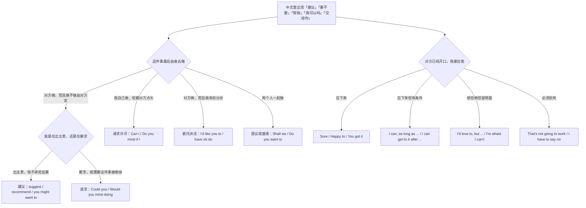
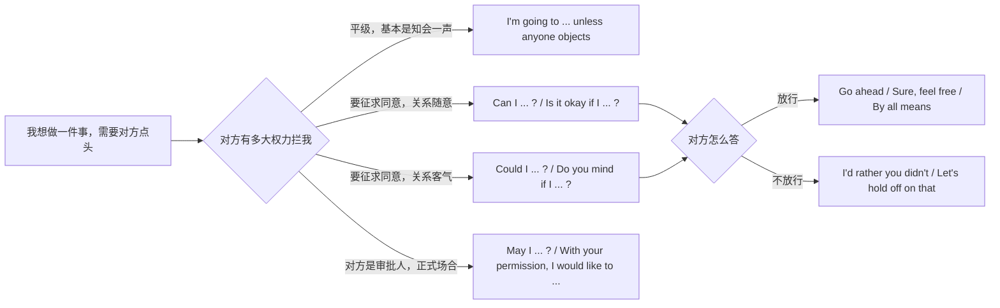
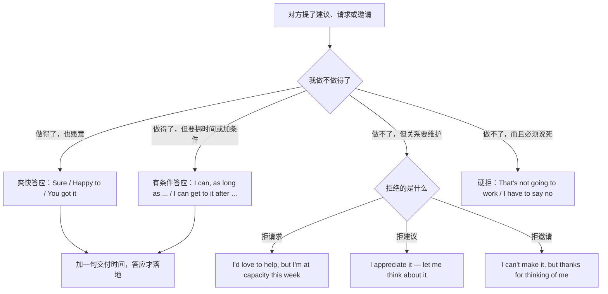
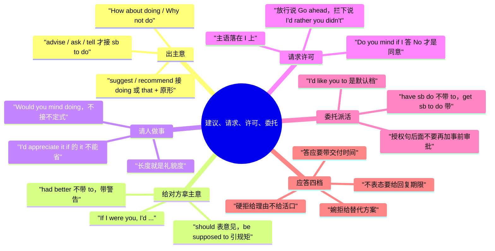

# 我建议、你最好、能不能帮我：建议、请求、许可与委托

> [!info] 本篇定位
>
> 这篇收五个动作的中文入口：把主意提出来（我建议、要不要、不如、提个想法）、给对方拿主意（你最好、你应该、你可以试试、换我我就）、请人帮忙（能不能帮我、麻烦你、我想请你）、请求许可（我可以吗、你介意吗、方便的话）、把事交出去（这块归你、你能接手吗、找人做），再加上邀请做东与三种应答（答应、婉拒、硬拒）。
>
> 礼貌阶梯背后的原理、英美职场里「直说」到什么程度算失礼、中文客套直译过去为什么会显得虚——这些不在本篇，整段交给 [[04.英语场景/05.高频实用表达句型框架/02.建议请求邀请拒绝四大功能句型\|建议请求邀请拒绝四大功能句型]]。本篇只给可以直接抄走的成品与三处最容易造错句的地方：`suggest` 后面不能跟 `sb to do`、`Would you mind` 后面不能跟不定式、`Do you mind if I` 的肯定回答是 `No`。
>
> 读完能查到：43 条中文意图入口、129 条分档成品句架，以及一张从「命令」到「几乎不敢开口」的六级礼貌阶梯速查表。

---

## 1. 本篇导读：五个动作与一条礼貌阶梯

中文里这五个动作的界线是模糊的。「你要不要试试这个库」既可能是建议，也可能是委婉派活；「能不能帮我看一眼」既可能是请求，也可能是上级下达的任务；「我可以先合进去吗」看着像请求许可，实际是在通知。英文这边界线要清楚得多，因为**动作不同，动词与句式就不同**：建议用 suggest 一族与 why don't 一族，请求用 could you 一族，许可用 can I 一族，委托用 I'd like you to 与使役动词一族。查错了动作，语气就会整个错位——把请求写成建议，对方会以为你只是随口一提；把委托写成请求，对方会以为可以拒绝。

先用一张选择树把中文那一侧的入口分流。

这张图的第一个分叉是全篇最要紧的一问：**这件事最后由谁去做**。中文常常不标这一项，「这个接口是不是该加个缓存」可以是我提议、可以是我要你去加、也可以是我打算自己加但先问一声，三种意思共用一句中文。英文没有这种模糊空间：主语一落到 you，就是要求对方；主语落到 I，就是在请示；落到 we，就是提议一起。写英文之前先在心里补上主语，一半的错位就消失了。

第二个分叉在右下角：应答不是「同意」和「不同意」两档，而是四档。中间那两档——加条件的答应与留情面的婉拒——在中文里都说「行是行，不过…」，英文分成两套完全不同的开头，第 8 节单独处理。

本篇的意图块按这张图排：第 2、3 节走建议线，第 4 节走请求线，第 5 节走许可线，第 6 节走委托线，第 7 节走邀请线，第 8 节走应答线，第 9 节给礼貌阶梯速查表，第 10 节是全篇总表。

---

## 2. 我建议、要不要、不如：把主意提出来

这一节的六条意图共用一个前提：**做不做由对方定，我不承担后果**。语气从「我正式建议」到「随口一提」跨度很大，但结构上只分两支——动词式（suggest、recommend、propose）与疑问式（Why don't we、How about、Shall we）。动词式偏书面，疑问式偏口语，这是本节最省事的一条判读。

### 2.1 我建议…

中文触发语：我建议… / 我的建议是… / 我提议… / 依我看应该…

| 档位 | 句架 | 例句 | 译文 |
| --- | --- | --- | --- |
| 口语 | I'd say + 从句 | I'd say we roll it back and look at it tomorrow. | 我建议先回滚，明天再看。 |
| 书面 | I suggest + doing / that + 主语 + 原形 | I suggest running the migration on a copy first. | 我建议先在副本上跑一遍迁移。 |
| 正式 | it is recommended that + 主语 + 原形 | It is recommended that the credentials be rotated every 90 days. | 建议每 90 天轮换一次凭据。 |

> [!warning] 错配警示
>
> - ~~I suggest you to run the migration first.~~ ❌
> - **I suggest that you run the migration first.** ✅（`suggest` 后面不能接 `sb to do`，只有 `doing` 和 `that` 从句两条出路；从句里的动词用原形，`should` 可加可不加。同一条限制管住 `recommend`、`propose`、`insist`、`demand`）

页脚：
- 同义入口：我提议 / 我的意见是 / 依我看
- 语法归属：[[02.英语基础语法/09.从句体系/03.名词性从句详解\|名词性从句详解]]
- 场景实战：[[04.英语场景/05.高频实用表达句型框架/02.建议请求邀请拒绝四大功能句型\|建议请求邀请拒绝四大功能句型]]

### 2.2 我建议你…（建议针对某个人）

中文触发语：我建议你… / 我劝你… / 你还是…吧 / 我的建议是你…

| 档位 | 句架 | 例句 | 译文 |
| --- | --- | --- | --- |
| 口语 | you might want to + 原形 | You might want to check the logs before you restart it. | 我建议你重启前先看看日志。 |
| 书面 | I'd advise you to + 原形 | I'd advise you to keep the old endpoint alive for one release. | 我建议你把旧接口再留一个版本。 |
| 正式 | we would advise + doing / that + 主语 + 原形 | We would advise retaining the previous configuration until the audit closes. | 我们建议在审计结束前保留原配置。 |

> [!warning] 错配警示
>
> - ~~I suggest you to keep the old endpoint.~~ ❌
> - **I'd advise you to keep the old endpoint.** ✅（`advise` 可以接 `sb to do`，`suggest` 不行——这一对是中文母语者最容易串的，中文「建议」和「劝」在英文里分属两种句型；记不住就一律改用 `you might want to`，它对谁都安全）

页脚：
- 同义入口：我劝你 / 你还是…比较好 / 换我不会那么做
- 语法归属：[[02.英语基础语法/08.非谓语动词/01.动词不定式详解\|动词不定式详解]]
- 场景实战：[[04.英语场景/09.学习与教育场景实战/01.课堂讨论与提问场景\|课堂讨论与提问场景]]

### 2.3 要不要…？（提议一起做）

中文触发语：要不要… / 我们…怎么样 / 要不咱们… / …行不行

| 档位 | 句架 | 例句 | 译文 |
| --- | --- | --- | --- |
| 口语 | how about + doing / why don't we + 原形 | How about splitting this into two PRs? | 要不把这个拆成两个 PR？ |
| 书面 | shall we + 原形 / what if we + 一般现在时 | Shall we move the review to Thursday? | 要不要把评审挪到周四？ |
| 正式 | we could consider + doing / one option would be to + 原形 | One option would be to postpone the rollout until the metrics stabilize. | 一个可行的做法是把发布推迟到指标稳定之后。 |

> [!warning] 错配警示
>
> - ~~How about to split this into two PRs?~~ ❌
> - **How about splitting this into two PRs?** ✅（`how about` 与 `what about` 后面接名词或动名词，不接不定式；要用不定式得换成 `Why not split this into two PRs?`，`why not` 后面反而只接原形）

页脚：
- 同义入口：要不咱们 / …怎么样 / 干脆…吧
- 语法归属：[[02.英语基础语法/08.非谓语动词/02.动名词详解\|动名词详解]]
- 场景实战：[[04.英语场景/10.职场与商务场景实战/02.会议汇报与演示场景\|会议汇报与演示场景]]

### 2.4 不如…吧（推翻原方案换一个）

中文触发语：不如… / 干脆… / 还不如… / 与其…不如…

| 档位 | 句架 | 例句 | 译文 |
| --- | --- | --- | --- |
| 口语 | we might as well + 原形 | We might as well rewrite it — patching this every week is getting us nowhere. | 老这么打补丁没头，不如重写。 |
| 书面 | rather than + doing, we could + 原形 | Rather than patching each caller, we could fix it in the adapter. | 与其逐个改调用方，不如在适配层修掉。 |
| 正式 | it would be preferable to + 原形 + rather than + 原形 | It would be preferable to redesign the schema rather than add another nullable column. | 与其再加一个可空字段，不如重新设计表结构。 |

> [!warning] 错配警示
>
> - ~~Rather than to patch each caller, we could fix it in the adapter.~~ ❌
> - **Rather than patching each caller, we could fix it in the adapter.** ✅（`rather than` 前后两项要形式对等：前面是动名词后面就是动名词，前面是原形后面也用原形；它和 `instead of` 一样不接不定式）

页脚：
- 同义入口：与其…不如 / 干脆 / 还不如
- 语法归属：[[02.英语基础语法/05.介词与连词/03.连词的分类与用法\|连词的分类与用法]]
- 场景实战：[[04.英语场景/05.高频实用表达句型框架/04.比较对比举例总结句型库\|比较对比举例总结句型库]]

### 2.5 我提个建议、我有个想法（先打招呼再说）

中文触发语：我提个建议 / 我说两句 / 我有个想法 / 冒昧说一句

| 档位 | 句架 | 例句 | 译文 |
| --- | --- | --- | --- |
| 口语 | can I throw something out there? | Can I throw something out there? What if we cache it on the client? | 我提个想法：要不在客户端缓存？ |
| 书面 | may I make a suggestion? | May I make a suggestion? The retry limit could be configurable. | 我提个建议：重试上限可以做成可配置的。 |
| 正式 | if I may offer a suggestion, ... | If I may offer a suggestion, the two teams could share a single schema registry. | 容我提一个建议：两个团队可以共用一个 schema 注册中心。 |

> [!warning] 错配警示
>
> - ~~I want to give you a suggestion.~~ ❌
> - **Can I make a suggestion?** ✅（`suggestion` 的搭配动词是 `make`，不是 `give`；而且用陈述句宣布自己要提建议，听感比问一句要生硬得多）

页脚：
- 同义入口：我说句题外话 / 冒昧说一句 / 插一句
- 语法归属：[[02.英语基础语法/07.助动词与情态动词/02.情态动词详解\|情态动词详解]]
- 场景实战：[[04.英语场景/10.职场与商务场景实战/02.会议汇报与演示场景\|会议汇报与演示场景]]

### 2.6 就是一提，你自己定（把建议的分量压下去）

中文触发语：就是一提 / 你自己看着办 / 仅供参考 / 不听也没关系

| 档位 | 句架 | 例句 | 译文 |
| --- | --- | --- | --- |
| 口语 | just a thought — your call | Just a thought — your call in the end. | 就是一提，最后你定。 |
| 书面 | feel free to ignore this if it doesn't fit | Feel free to ignore this if it doesn't fit your timeline. | 如果和你的排期对不上，忽略这条就行。 |
| 正式 | this is offered for your consideration only | The above is offered for your consideration only and is not a formal recommendation. | 以上仅供参考，并非正式建议。 |

> [!warning] 错配警示
>
> - ~~It's up to you to decide, but you should really do it my way.~~ ❌
> - **Just a thought — your call.** ✅（把决定权交出去的话一旦后面又跟一句 `you should`，前半句就作废了；软化语和强推只能留一个）

页脚：
- 同义入口：仅供参考 / 你自己拿主意 / 听不听都行
- 语法归属：[[02.英语基础语法/12.日常口语/04.口语与书面语对比\|口语与书面语对比]]
- 场景实战：[[04.英语场景/05.高频实用表达句型框架/01.表达观点与态度的50个万能句型\|表达观点与态度的50个万能句型]]

---

## 3. 你最好、你应该、你可以试试：给对方拿主意

上一节是把方案摆出来，这一节是**对着某个人说他该怎么做**。中文这一区的强弱靠副词和语气词区分（「你最好…」「你就该…」「你可以试试…」「你千万别…」），英文靠情态动词的选择区分：had better 带警告，should 是中性，might want to 最软，wouldn't 是劝阻。

### 3.1 你最好…（不照做会有后果）

中文触发语：你最好… / 你还是…吧 / 不然要出事 / 赶紧…

| 档位 | 句架 | 例句 | 译文 |
| --- | --- | --- | --- |
| 口语 | you'd better + 原形 | You'd better back it up before you touch the table. | 你最好动表之前先备份。 |
| 书面 | you should + 原形 + before + doing | You should confirm the backup completed before dropping the index. | 删索引前你最好先确认备份已完成。 |
| 正式 | it is strongly advised that + 主语 + 原形 | It is strongly advised that a full backup be taken prior to the migration. | 强烈建议在迁移前做一次完整备份。 |

> [!warning] 错配警示
>
> - ~~You'd better to back it up first.~~ ❌
> - **You'd better back it up first.** ✅（`had better` 后面直接跟原形，没有 `to`；否定式是 `had better not do`，不是 `hadn't better do`。另外这个句式自带警告意味，对客户或上级用会显得越界）

页脚：
- 同义入口：赶紧 / 不然麻烦了 / 你还是…吧
- 语法归属：[[02.英语基础语法/07.助动词与情态动词/03.情态动词的特殊句型\|情态动词的特殊句型]]
- 场景实战：[[04.英语场景/03.时态与语态句型框架/04.情态动词句型框架\|情态动词句型框架]]

### 3.2 你应该…（中性的应然）

中文触发语：你应该… / 按理说该… / 本来就该… / 照规矩得…

| 档位 | 句架 | 例句 | 译文 |
| --- | --- | --- | --- |
| 口语 | you should + 原形 | You should ping him directly, email gets buried. | 你应该直接找他说，邮件会被淹掉。 |
| 书面 | you are supposed to + 原形 | Reviewers are supposed to leave a comment before approving. | 评审人按规定要先留言再批准。 |
| 正式 | you are expected to + 原形 / it is incumbent on sb to + 原形 | Contractors are expected to submit timesheets by the last working day. | 外包人员应在最后一个工作日前提交工时表。 |

> [!warning] 错配警示
>
> - ~~You should to ping him directly.~~ ❌
> - **You should ping him directly.** ✅（情态动词后一律接原形；顺带记住 `be supposed to` 说的是「规定如此」，`should` 说的是「我认为如此」，中文都叫「应该」，但一个引规矩一个表意见）

页脚：
- 同义入口：按规矩 / 本来就该 / 照理说
- 语法归属：[[02.英语基础语法/07.助动词与情态动词/02.情态动词详解\|情态动词详解]]
- 场景实战：[[04.英语场景/10.职场与商务场景实战/03.商务邮件与正式书面沟通\|商务邮件与正式书面沟通]]

### 3.3 你可以试试…（给一条路，不施压）

中文触发语：你可以试试… / 要不试下… / 说不定管用 / 值得一试

| 档位 | 句架 | 例句 | 译文 |
| --- | --- | --- | --- |
| 口语 | you could try + doing | You could try clearing the cache and running it again. | 你可以试试清了缓存再跑一遍。 |
| 书面 | it might be worth + doing | It might be worth checking whether the proxy strips that header. | 也许值得查一下代理是不是把那个头去掉了。 |
| 正式 | one approach worth exploring is + doing | One approach worth exploring is batching the writes at the client side. | 一条值得探索的路径是在客户端合并写入。 |

> [!warning] 错配警示
>
> - ~~It might be worth to check the proxy.~~ ❌
> - **It might be worth checking the proxy.** ✅（`worth` 是形容词，后面只接名词或动名词；要接不定式得换成 `worthwhile to check`。这条搭配限制的完整说明在词汇教程，本篇只给成品）

页脚：
- 同义入口：不妨试试 / 说不定有用 / 可以考虑
- 语法归属：[[02.英语基础语法/08.非谓语动词/02.动名词详解\|动名词详解]]
- 场景实战：[[04.英语场景/09.学习与教育场景实战/02.图书馆作业与研究场景\|图书馆作业与研究场景]]

### 3.4 换我我就…（拿自己打样）

中文触发语：换我我就… / 要是我的话… / 我要是你… / 我的话会…

| 档位 | 句架 | 例句 | 译文 |
| --- | --- | --- | --- |
| 口语 | if I were you, I'd + 原形 | If I were you, I'd ask for another week. | 换我我就再要一周。 |
| 书面 | what I'd do is + 原形 | What I'd do is freeze the scope and ship what's already tested. | 我的做法是冻结范围，先把测过的发出去。 |
| 正式 | were I in your position, I would + 原形 | Were I in your position, I would escalate this before the quarter closes. | 若我处在你的位置，会在季度结束前上报。 |

> [!warning] 错配警示
>
> - ~~If I was you, I will ask for another week.~~ ❌
> - **If I were you, I'd ask for another week.** ✅（这句是虚拟，be 动词用 `were`，主句用 `would`；用 `was` 和 `will` 会让整句听起来像在说一件真会发生的事）

页脚：
- 同义入口：我要是你 / 搁我身上 / 我的话
- 语法归属：[[02.英语基础语法/10.特殊句型/02.虚拟语气详解\|虚拟语气详解]]
- 场景实战：[[04.英语场景/03.时态与语态句型框架/03.虚拟语气完全解析\|虚拟语气完全解析]]

### 3.5 你千万别…（劝阻）

中文触发语：你千万别… / 我劝你别… / 别碰那个 / 免得出事

| 档位 | 句架 | 例句 | 译文 |
| --- | --- | --- | --- |
| 口语 | I wouldn't + 原形 (if I were you) | I wouldn't touch that config, half the jobs read it. | 那个配置我劝你别动，一半任务都在读它。 |
| 书面 | you'd better not + 原形 | You'd better not merge this until the flaky test is fixed. | 那个不稳定的测试修好之前你最好别合。 |
| 正式 | we would strongly discourage + doing | We would strongly discourage granting write access to the shared account. | 我们强烈不建议给共享账号开写权限。 |

> [!warning] 错配警示
>
> - ~~I don't suggest you to touch that config.~~ ❌
> - **I wouldn't touch that config.** ✅（劝阻用 `I wouldn't + 原形` 最自然，主语换成自己，压力就从对方身上挪走了；`suggest` 的老毛病依旧——它后面永远不接 `sb to do`）

页脚：
- 同义入口：别碰 / 我劝你别 / 想都别想
- 语法归属：[[02.英语基础语法/01.基础入门/03.疑问句与否定句的构成\|疑问句与否定句的构成]]
- 场景实战：[[04.英语场景/05.高频实用表达句型框架/03.同意反对让步转折句型库\|同意反对让步转折句型库]]

### 3.6 你没必要…（劝对方省事）

中文触发语：你没必要… / 用不着… / 不用那么麻烦 / 省得…

| 档位 | 句架 | 例句 | 译文 |
| --- | --- | --- | --- |
| 口语 | you don't have to + 原形 | You don't have to rewrite the whole file, just the parser. | 你不用整个文件重写，改解析那块就行。 |
| 书面 | there's no need to + 原形 | There's no need to open a ticket for a one-line typo fix. | 一行拼写修复没必要开工单。 |
| 正式 | it is not necessary for sb to + 原形 | It is not necessary for reviewers to re-run the full suite after a doc change. | 文档改动后评审人无需重跑整套测试。 |

> [!warning] 错配警示
>
> - ~~You mustn't rewrite the whole file, just the parser.~~ ❌
> - **You don't have to rewrite the whole file, just the parser.** ✅（`don't have to` 是「不必」，`mustn't` 是「禁止」；中文都说「不用」，英文一个放行一个封路，说反了对方会以为你在下禁令）

页脚：
- 同义入口：用不着 / 犯不上 / 省点事
- 语法归属：[[02.英语基础语法/07.助动词与情态动词/02.情态动词详解\|情态动词详解]]
- 场景实战：[[04.英语场景/03.时态与语态句型框架/04.情态动词句型框架\|情态动词句型框架]]

---

## 4. 能不能帮我：请人做事

从这一节起，主语落在 you 身上，而且我需要这件事真的被做掉。请求这一区的英文成品最多，但它们不是同义词——**长度就是礼貌度**。同一件事，`Send me the file` 是命令，`Could you send me the file?` 是常规请求，`I was wondering if you could send me the file` 是给了对方拒绝的空间。选哪一档取决于三件事：对方的位阶、这件事的麻烦程度、你欠不欠人情。

### 4.1 能帮我…吗（常规请求）

中文触发语：能帮我…吗 / 你能…吗 / 帮个忙 / 给我…一下

| 档位 | 句架 | 例句 | 译文 |
| --- | --- | --- | --- |
| 口语 | can you + 原形 ...? | Can you send me the staging URL? | 能把预发地址发我吗？ |
| 书面 | could you + 原形 ...? | Could you send over the staging URL when you get a chance? | 方便的时候能把预发地址发我吗？ |
| 正式 | would you be able to + 原形 ...? | Would you be able to provide the staging URL before the review? | 能否在评审前提供预发地址？ |

> [!warning] 错配警示
>
> - ~~Please you send me the staging URL.~~ ❌
> - **Could you send me the staging URL?** ✅（`please` 不能插在主语前面；而且光加一个 `please` 并不会把命令变成请求，把陈述句改成 `Could you` 疑问句才会）

页脚：
- 同义入口：帮个忙 / 麻烦发我一下 / 给我来一份
- 语法归属：[[02.英语基础语法/07.助动词与情态动词/02.情态动词详解\|情态动词详解]]
- 场景实战：[[04.英语场景/05.高频实用表达句型框架/02.建议请求邀请拒绝四大功能句型\|建议请求邀请拒绝四大功能句型]]

### 4.2 麻烦你…（预设对方要花点力气）

中文触发语：麻烦你… / 辛苦你… / 劳驾… / 给你添麻烦了

| 档位 | 句架 | 例句 | 译文 |
| --- | --- | --- | --- |
| 口语 | would you mind + doing ...? | Would you mind taking a look at this stack trace? | 麻烦你看一眼这个堆栈？ |
| 书面 | if you could + 原形, that would be great | If you could review it before Friday, that would be great. | 你要是能在周五前评审掉就太好了。 |
| 正式 | we would be grateful if you could + 原形 | We would be grateful if you could confirm receipt by Monday. | 若您能在周一前确认收到，我们将不胜感激。 |

> [!warning] 错配警示
>
> - ~~Would you mind to take a look at this?~~ ❌
> - **Would you mind taking a look at this?** ✅（`mind` 后面只接动名词；另外这个问句的字面意思是「你介意吗」，对方答 `Not at all` 才是答应，答 `Yes` 是拒绝，听的时候别只抓 yes/no）

页脚：
- 同义入口：辛苦你 / 劳驾 / 有劳
- 语法归属：[[02.英语基础语法/08.非谓语动词/02.动名词详解\|动名词详解]]
- 场景实战：[[04.英语场景/07.社交交际场景实战/02.电话短信与在线沟通场景\|电话短信与在线沟通场景]]

### 4.3 我想请你…（正式提出请求）

中文触发语：我想请你… / 想拜托你… / 有件事想请你帮忙 / 想请你出面

| 档位 | 句架 | 例句 | 译文 |
| --- | --- | --- | --- |
| 口语 | I was wondering if you could + 原形 | I was wondering if you could sit in on the call tomorrow. | 想问问你明天能不能一起参加那个电话会。 |
| 书面 | I'd appreciate it if you could + 原形 | I'd appreciate it if you could flag anything that looks off. | 你要是能把看着不对的地方标出来，我会很感谢。 |
| 正式 | may I ask you to + 原形 / I should be grateful for + 名词 | May I ask you to review the attached draft at your convenience? | 可否请您在方便时审阅附件草稿？ |

> [!warning] 错配警示
>
> - ~~I'd appreciate if you could flag anything odd.~~ ❌
> - **I'd appreciate it if you could flag anything odd.** ✅（`appreciate` 是及物动词，后面必须有宾语，这个 `it` 不能省；`I was wondering` 用过去进行时不是在说过去，是把请求推远一步显得客气）

页脚：
- 同义入口：拜托你 / 有事相求 / 想请你出面
- 语法归属：[[02.英语基础语法/06.动词时态/03.进行时态详解\|进行时态详解]]
- 场景实战：[[04.英语场景/10.职场与商务场景实战/03.商务邮件与正式书面沟通\|商务邮件与正式书面沟通]]

### 4.4 顺便帮我…（搭在别的事上）

中文触发语：顺便帮我… / 你要是正好… / 手头方便的话 / 捎带手

| 档位 | 句架 | 例句 | 译文 |
| --- | --- | --- | --- |
| 口语 | while you're at it, could you + 原形 | While you're at it, could you bump the timeout too? | 你顺手把超时时间也调一下呗？ |
| 书面 | if you get a chance, + 祈使句 | If you get a chance, have a look at the second commit as well. | 你有空的话，第二个提交也顺便看下。 |
| 正式 | should the opportunity arise, we would ask that + 主语 + 原形 | Should the opportunity arise, we would ask that the same check be added to the batch job. | 如有机会，也请为批处理任务加上同一项检查。 |

> [!warning] 错配警示
>
> - ~~By the way, could you bump the timeout too?~~（用来搭事时）❌
> - **While you're at it, could you bump the timeout too?** ✅（`by the way` 是换话题，和前一件事没关系；`while you're at it` 才是「既然你已经在做那件事了，顺手」，两者在中文里都可能说成「顺便」）

页脚：
- 同义入口：捎带手 / 一并 / 正好帮我
- 语法归属：[[02.英语基础语法/09.从句体系/04.状语从句详解\|状语从句详解]]
- 场景实战：[[04.英语场景/06.日常生活场景实战/03.购物超市与讨价还价场景\|购物超市与讨价还价场景]]

### 4.5 急事催办（给出时间压力）

中文触发语：急 / 尽快 / 今天之内 / 有空立刻给我

| 档位 | 句架 | 例句 | 译文 |
| --- | --- | --- | --- |
| 口语 | when you get a sec, ... — it's blocking me | When you get a sec, can you approve it? It's blocking my deploy. | 你一有空能批一下吗，卡着我发版了。 |
| 书面 | could you get to this by + 时间? | Could you get to this by end of day? The release window closes tonight. | 今天下班前能处理吗？发布窗口今晚就关了。 |
| 正式 | we would ask that this be completed no later than + 时间 | We would ask that the sign-off be completed no later than 17:00 on Thursday. | 请于周四 17:00 前完成签字确认。 |

> [!warning] 错配警示
>
> - ~~Please do it quickly, it's very urgent!!~~ ❌
> - **Could you get to this by end of day? The release window closes tonight.** ✅（催办靠给出具体时间点和卡住的原因，不靠 urgent 和感叹号；给了理由的催办比加重语气的催办更容易被排进对方的队列）

页脚：
- 同义入口：尽快 / 今天之内 / 卡着我了
- 语法归属：[[02.英语基础语法/05.介词与连词/01.介词的分类与基本用法\|介词的分类与基本用法]]
- 场景实战：[[04.英语场景/10.职场与商务场景实战/03.商务邮件与正式书面沟通\|商务邮件与正式书面沟通]]

### 4.6 帮我看一眼（请对方过目）

中文触发语：帮我看一眼 / 帮我把把关 / 给点意见 / 你瞅瞅

| 档位 | 句架 | 例句 | 译文 |
| --- | --- | --- | --- |
| 口语 | can you take a look at + 名词? | Can you take a look at the diff when you're free? | 有空帮我看下这个 diff？ |
| 书面 | could you have a look over + 名词 and let me know + 从句? | Could you have a look over the draft and let me know if anything is missing? | 能帮我看下草稿，看有没有漏的？ |
| 正式 | we would welcome your comments on + 名词 | We would welcome your comments on the attached specification. | 欢迎您对附件规范提出意见。 |

> [!warning] 错配警示
>
> - ~~Can you see my diff?~~ ❌
> - **Can you take a look at my diff?** ✅（`see` 问的是「你看得见吗」，请人审阅要用 `take a look at`、`have a look over`、`review`；中文一个「看」在英文里至少分成三件事）

页脚：
- 同义入口：把把关 / 过目一下 / 提点意见
- 语法归属：[[02.英语基础语法/05.介词与连词/02.常用介词搭配详解\|常用介词搭配详解]]
- 场景实战：[[04.英语场景/10.职场与商务场景实战/02.会议汇报与演示场景\|会议汇报与演示场景]]

### 4.7 请求写进邮件（书面固定式）

中文触发语：烦请… / 请协助… / 恳请… / 望回复

| 档位 | 句架 | 例句 | 译文 |
| --- | --- | --- | --- |
| 口语 | let me know if you can — no rush | Let me know if you can take this — no rush. | 你能接的话告诉我一声，不急。 |
| 书面 | could you please + 原形 + and confirm once done | Could you please update the DNS record and confirm once it's done? | 烦请更新 DNS 记录，改完回复确认一下。 |
| 正式 | your assistance in + doing + would be appreciated | Your assistance in expediting the approval would be appreciated. | 若能协助加快审批，不胜感激。 |

> [!warning] 错配警示
>
> - ~~Kindly do the needful and revert back.~~ ❌
> - **Could you please update the record and confirm once it's done?** ✅（`kindly do the needful`、`revert back` 在国际邮件里读起来像模板套话，而且 `revert` 本身是「回退」不是「回复」；要正式就用 `Could you please` 或 `Your assistance would be appreciated`）

页脚：
- 同义入口：烦请 / 请协助 / 望回复
- 语法归属：[[02.英语基础语法/12.日常口语/04.口语与书面语对比\|口语与书面语对比]]
- 场景实战：[[04.英语场景/10.职场与商务场景实战/03.商务邮件与正式书面沟通\|商务邮件与正式书面沟通]]

---

## 5. 我可以…吗：请求许可

主语换回 I，事情由我做，但要对方点头。这一区和上一区在中文里长得几乎一样——「我可以先合进去吗」和「你能帮我合进去吗」只差一个字，英文却是两套完全不同的句式。选错主语的后果很直接：本想请示，结果听起来像在派活。

这张图右边的分叉值得单记：**放行与不放行各有一组固定说法**，而且它们不是 yes 和 no。中文里「你去吧」和「先别」是完整回答，英文里 `Yes` 单说会显得冷淡，`No` 单说近乎训斥，实际用的是 `Go ahead`、`Feel free`、`By all means` 与 `I'd rather you didn't`、`Let's hold off`。左边那条 `unless anyone objects` 也是一条常被忽略的出路：它形式上是请示，实际是通知，适合平级之间既要留个话口、又不想真的等一轮回复的场合。

### 5.1 我可以…吗（一般请求许可）

中文触发语：我可以…吗 / 我能…吗 / 行不行 / 我先…了？

| 档位 | 句架 | 例句 | 译文 |
| --- | --- | --- | --- |
| 口语 | can I + 原形 ...? | Can I merge this once CI goes green? | CI 过了我就合了行吗？ |
| 书面 | could I + 原形 ...? | Could I take the staging database offline for ten minutes? | 我可以把预发数据库停十分钟吗？ |
| 正式 | may I + 原形 ...? / with your permission, I would like to + 原形 | With your permission, I would like to postpone the audit review to next week. | 若您同意，我想把审计评审推到下周。 |

> [!warning] 错配警示
>
> - ~~Can you let me merge this?~~ ❌
> - **Can I merge this?** ✅（请求许可的主语是我，不是对方；`Can you let me` 把对方拽进施动位置，听起来像在讨要恩准，而不是在请示）

页脚：
- 同义入口：我能不能 / 我先…行吗 / 允许我
- 语法归属：[[02.英语基础语法/07.助动词与情态动词/02.情态动词详解\|情态动词详解]]
- 场景实战：[[04.英语场景/05.高频实用表达句型框架/02.建议请求邀请拒绝四大功能句型\|建议请求邀请拒绝四大功能句型]]

### 5.2 你介意我…吗

中文触发语：你介意我…吗 / 我…你没意见吧 / 不打扰的话 / 方便我…吗

| 档位 | 句架 | 例句 | 译文 |
| --- | --- | --- | --- |
| 口语 | do you mind if I + 一般现在时? | Do you mind if I record this call? | 我录一下这个会你介意吗？ |
| 书面 | would you mind if I + 过去式? | Would you mind if I moved our one-on-one to Thursday? | 我把我们的一对一挪到周四，你介意吗？ |
| 正式 | would there be any objection to my + doing? | Would there be any objection to my circulating the draft to the wider team? | 我把草稿发给更大范围的团队，是否有异议？ |

> [!warning] 错配警示
>
> - ~~"Do you mind if I record this?" "Yes, of course!"~~（想表示同意时）❌
> - **"Do you mind if I record this?" "No, go ahead."** ✅（这个问句问的是「你介意吗」，答应要用 `No` 或 `Not at all`；想省事就别用 yes/no，直接说 `Go ahead` 或 `Please do`，两边都不会误会）

页脚：
- 同义入口：我…你没意见吧 / 不打扰的话 / 方便吗
- 语法归属：[[02.英语基础语法/08.非谓语动词/02.动名词详解\|动名词详解]]
- 场景实战：[[04.英语场景/07.社交交际场景实战/02.电话短信与在线沟通场景\|电话短信与在线沟通场景]]

### 5.3 方便的话我想…（先探口风）

中文触发语：方便的话我想… / 如果可以的话 / 不知道行不行 / 看你安排

| 档位 | 句架 | 例句 | 译文 |
| --- | --- | --- | --- |
| 口语 | is it okay if I + 一般现在时? | Is it okay if I skip the standup tomorrow? | 我明天不参加站会行吗？ |
| 书面 | would it be all right if I + 过去式? | Would it be all right if I joined the second half only? | 我只参加后半场可以吗？ |
| 正式 | if it would not be inconvenient, I should like to + 原形 | If it would not be inconvenient, I should like to bring a colleague to the session. | 如无不便，我想带一位同事参加。 |

> [!warning] 错配警示
>
> - ~~Would it be all right if I join only the second half?~~ ❌
> - **Would it be all right if I joined only the second half?** ✅（`would` 开头的礼貌问句里，`if` 从句跟着退一格用过去式；不是在说过去，是靠时态拉开距离显得不冒昧）

页脚：
- 同义入口：如果方便 / 看你安排 / 不知道合不合适
- 语法归属：[[02.英语基础语法/10.特殊句型/02.虚拟语气详解\|虚拟语气详解]]
- 场景实战：[[04.英语场景/08.出行与旅游场景实战/02.酒店入住预订与投诉场景\|酒店入住预订与投诉场景]]

### 5.4 没人反对我就动手了（形式请示实为通知）

中文触发语：没意见我就…了 / 我先…了啊 / 有问题喊我 / 默认就这么办

| 档位 | 句架 | 例句 | 译文 |
| --- | --- | --- | --- |
| 口语 | I'm going to + 原形 — shout if that's a problem | I'm going to bump the version tonight — shout if that's a problem. | 我今晚把版本号提上去，有问题言语一声。 |
| 书面 | unless anyone objects, I'll + 原形 + on + 时间 | Unless anyone objects, I'll archive the old repo on Friday. | 如果没人反对，我周五归档那个旧仓库。 |
| 正式 | in the absence of objections, we shall proceed with + 名词 | In the absence of objections, we shall proceed with the migration as scheduled. | 如无异议，我们将按计划推进迁移。 |

> [!warning] 错配警示
>
> - ~~If nobody will object, I will archive the repo.~~ ❌
> - **Unless anyone objects, I'll archive the repo.** ✅（条件从句里用一般现在时表将来，不加 `will`；这一条在整个条件句系统里通用，详细规则见语法教程）

页脚：
- 同义入口：默认这么办 / 我先动手了 / 有异议再说
- 语法归属：[[02.英语基础语法/09.从句体系/04.状语从句详解\|状语从句详解]]
- 场景实战：[[04.英语场景/10.职场与商务场景实战/02.会议汇报与演示场景\|会议汇报与演示场景]]

### 5.5 正式请示与报批

中文触发语：申请… / 请批准 / 需要您签字 / 走个流程

| 档位 | 句架 | 例句 | 译文 |
| --- | --- | --- | --- |
| 口语 | I need your okay on + 名词 | I need your okay on the extra seat before I order it. | 加这个席位我得先要你一句话才能下单。 |
| 书面 | I'd like to request approval for + 名词 | I'd like to request approval for two days of unpaid leave in March. | 我想申请三月两天无薪假。 |
| 正式 | we hereby request your approval of + 名词 | We hereby request your approval of the revised budget for Q3. | 兹申请批准第三季度修订预算。 |

> [!warning] 错配警示
>
> - ~~I want to apply your approval.~~ ❌
> - **I'd like to request approval for the extra seat.** ✅（`apply` 后面跟 `for` 才是申请，而且申请的对象是事不是人；要说向谁申请，用 `request approval from you for ...`）

页脚：
- 同义入口：请批准 / 走审批 / 需要签字
- 语法归属：[[02.英语基础语法/05.介词与连词/02.常用介词搭配详解\|常用介词搭配详解]]
- 场景实战：[[04.英语场景/10.职场与商务场景实战/03.商务邮件与正式书面沟通\|商务邮件与正式书面沟通]]

### 5.6 你去吧 / 先别（放行与拦下）

中文触发语：你去吧 / 随便用 / 先别 / 缓一缓

| 档位 | 句架 | 例句 | 译文 |
| --- | --- | --- | --- |
| 口语 | go ahead / feel free | Go ahead, the branch is all yours. | 你弄吧，那个分支归你了。 |
| 书面 | by all means / I'd rather you didn't + 原形 | By all means take the box; I'd rather you didn't reboot it, though. | 机器你尽管用，不过我希望你别重启它。 |
| 正式 | you are welcome to + 原形 / we would prefer that + 主语 + 原形 + not | You are welcome to attend; we would prefer that the recording not be shared externally. | 欢迎您参加；录音希望不要外传。 |

> [!warning] 错配警示
>
> - ~~"Can I reboot it?" "No."~~（同事之间）❌
> - **"Can I reboot it?" "I'd rather you didn't — there's a job running."** ✅（单个 `No` 在英文里近乎训斥，拦人时给一句理由和一个 `I'd rather` 是常规；`I'd rather` 后面跟人时从句用过去式形态表委婉，不是在说过去，也不能写成 `I'd rather you don't`）

页脚：
- 同义入口：随便用 / 你自便 / 缓一缓
- 语法归属：[[02.英语基础语法/10.特殊句型/02.虚拟语气详解\|虚拟语气详解]]
- 场景实战：[[04.英语场景/05.高频实用表达句型框架/03.同意反对让步转折句型库\|同意反对让步转折句型库]]

---

## 6. 我想请你负责：委托与派活

这一区和第 4 节的分界线不在句式，在**我有没有权分派**。有权分派时，请求句式反而会造成困扰：主管说 `Would you mind picking this up?`，下属听见的是一个可以拒绝的邀请。派活要的是把范围、交付时间和决定权一次说清，句式上落到 I'd like you to、I'm assigning、have sb do 这几支。

### 6.1 我想请你负责…

中文触发语：我想请你负责… / 这块归你 / 你来牵头 / 交给你了

| 档位 | 句架 | 例句 | 译文 |
| --- | --- | --- | --- |
| 口语 | I'd like you to + 原形 | I'd like you to own the migration end to end. | 我想请你从头到尾负责这次迁移。 |
| 书面 | I'm asking you to take the lead on + 名词 | I'm asking you to take the lead on the vendor evaluation. | 我想请你牵头做供应商评估。 |
| 正式 | you are hereby assigned responsibility for + 名词 | You are hereby assigned responsibility for the quarterly compliance review. | 现指派您负责季度合规审查。 |

> [!warning] 错配警示
>
> - ~~I want you take the lead on this.~~ ❌
> - **I'd like you to take the lead on this.** ✅（`want` 和 `would like` 后面接人时都要带 `to`；另外 `I want you to` 在职场里偏硬，`I'd like you to` 是同样清楚但不压人的默认档）

页脚：
- 同义入口：这块归你 / 你来牵头 / 你负责
- 语法归属：[[02.英语基础语法/08.非谓语动词/01.动词不定式详解\|动词不定式详解]]
- 场景实战：[[04.英语场景/10.职场与商务场景实战/02.会议汇报与演示场景\|会议汇报与演示场景]]

### 6.2 这块交给你了（移交）

中文触发语：交给你了 / 后面归你 / 我撤了 / 剩下的你接

| 档位 | 句架 | 例句 | 译文 |
| --- | --- | --- | --- |
| 口语 | it's all yours / I'll leave + 名词 + to you | The staging box is all yours from here. | 预发那台机器从现在起归你了。 |
| 书面 | I'll hand + 名词 + over to you | I'll hand the on-call rotation over to you after Wednesday. | 周三之后我把值班轮换交接给你。 |
| 正式 | responsibility for + 名词 + will transfer to sb + on + 日期 | Responsibility for the release pipeline will transfer to the platform team on 1 October. | 发布流水线的职责将于 10 月 1 日移交平台团队。 |

> [!warning] 错配警示
>
> - ~~I'll hand over you the on-call rotation.~~ ❌
> - **I'll hand the on-call rotation over to you.** ✅（`hand over` 是可分短语动词，宾语是代词时必须插在中间；接收方前面要加 `to`，不能直接跟两个宾语）

页脚：
- 同义入口：后面归你 / 我撤了 / 你接手
- 语法归属：[[02.英语基础语法/05.介词与连词/04.介词与连词的易混点\|介词与连词的易混点]]
- 场景实战：[[04.英语场景/10.职场与商务场景实战/04.商务谈判合同与客户沟通\|商务谈判合同与客户沟通]]

### 6.3 你能接手吗（问对方愿不愿意接）

中文触发语：你能接吗 / 你有空接吗 / 这个你能不能顶一下 / 谁来接

| 档位 | 句架 | 例句 | 译文 |
| --- | --- | --- | --- |
| 口语 | can you pick this up? | Can you pick this up? I'm out Thursday and Friday. | 这个你能接吗？我周四周五不在。 |
| 书面 | would you be able to take over + 名词? | Would you be able to take over the incident review while I'm on leave? | 我休假期间，事故复盘你能接吗？ |
| 正式 | would you be willing to assume responsibility for + 名词? | Would you be willing to assume responsibility for the audit response? | 您是否愿意承担审计答复的职责？ |

> [!warning] 错配警示
>
> - ~~Can you take over of the incident review?~~ ❌
> - **Can you take over the incident review?** ✅（`take over` 直接接宾语，中间不加 `of`；要用 `of` 得换成 `take charge of` 或 `take control of`）

页脚：
- 同义入口：顶一下 / 你接吧 / 换人做
- 语法归属：[[02.英语基础语法/05.介词与连词/02.常用介词搭配详解\|常用介词搭配详解]]
- 场景实战：[[04.英语场景/10.职场与商务场景实战/01.求职简历面试与Offer谈判\|求职简历面试与Offer谈判]]

### 6.4 帮我盯着…（委托跟进）

中文触发语：帮我盯着 / 你跟一下 / 有动静告诉我 / 追一下这个

| 档位 | 句架 | 例句 | 译文 |
| --- | --- | --- | --- |
| 口语 | keep an eye on + 名词 + and ping me if + 从句 | Keep an eye on the queue depth and ping me if it climbs again. | 帮我盯着队列积压，再涨了就叫我。 |
| 书面 | could you follow up on + 名词 + and report back? | Could you follow up on the vendor's reply and report back by Thursday? | 能跟一下供应商的回复，周四前给我个结果吗？ |
| 正式 | you are asked to monitor + 名词 + and escalate if + 从句 | You are asked to monitor error rates and escalate if they exceed one percent. | 请监控错误率，超过百分之一即上报。 |

> [!warning] 错配警示
>
> - ~~Please follow the vendor's reply and tell me.~~ ❌
> - **Could you follow up on the vendor's reply and report back?** ✅（`follow` 是跟随，`follow up on` 才是追进展；这一对少一个介词，意思差得很远）

页脚：
- 同义入口：跟一下 / 追一下 / 有情况叫我
- 语法归属：[[02.英语基础语法/05.介词与连词/02.常用介词搭配详解\|常用介词搭配详解]]
- 场景实战：[[04.英语场景/10.职场与商务场景实战/02.会议汇报与演示场景\|会议汇报与演示场景]]

### 6.5 找人做、让人做（使役）

中文触发语：让他做 / 找人做 / 叫他改一下 / 把它修好（不说谁修）

| 档位 | 句架 | 例句 | 译文 |
| --- | --- | --- | --- |
| 口语 | get sb to + 原形 / have sb + 原形 | I'll get Dan to look at the query plan. | 我让 Dan 看下执行计划。 |
| 书面 | have + sth + done | We had the certificates renewed over the weekend. | 我们周末让人把证书续期了。 |
| 正式 | arrange for sb to + 原形 | We will arrange for an external reviewer to audit the code. | 我们将安排外部评审人审计代码。 |

> [!warning] 错配警示
>
> - ~~I'll have Dan to look at the query plan.~~ ❌
> - **I'll have Dan look at the query plan.** ✅（`have sb do` 不带 `to`，`get sb to do` 才带；两个都表示「让某人做」，但 `have` 预设对方会照做，`get` 隐含要说服一下。使役动词的完整梯度在 [[02.中文句式转换/04.连动式与兼语式：去买、站起来走出去、我让他去\|连动式与兼语式]]）

页脚：
- 同义入口：叫人做 / 安排人去 / 找人处理
- 语法归属：[[02.英语基础语法/08.非谓语动词/04.过去分词详解\|过去分词详解]]
- 场景实战：[[04.英语场景/04.从句与复合句型框架/04.非谓语动词框架\|非谓语动词框架]]

### 6.6 你自己定就行（授权放手）

中文触发语：你自己定 / 不用问我 / 你有权决定 / 看着办

| 档位 | 句架 | 例句 | 译文 |
| --- | --- | --- | --- |
| 口语 | your call — don't wait on me | Your call on the library — don't wait on me. | 用哪个库你定，别等我。 |
| 书面 | feel free to decide + 从句 + without checking back | Feel free to decide the naming without checking back with me. | 命名你直接定，不用再来问我。 |
| 正式 | such decisions may be made at your discretion | Routine schema changes may be made at your discretion. | 常规表结构变更由您自行决定。 |

> [!warning] 错配警示
>
> - ~~You can decide it by yourself, but tell me before you do anything.~~ ❌
> - **Your call — just drop a note in the channel after.** ✅（授权句后面跟一个「动手前先报我」会把授权抵消掉；要保留知情权就说清是事后知会，不是事前审批）

页脚：
- 同义入口：看着办 / 不用请示 / 全权交给你
- 语法归属：[[02.英语基础语法/07.助动词与情态动词/02.情态动词详解\|情态动词详解]]
- 场景实战：[[04.英语场景/10.职场与商务场景实战/04.商务谈判合同与客户沟通\|商务谈判合同与客户沟通]]

---

## 7. 我请你：邀请与做东

邀请和建议共用一部分句式（Would you like to、Do you want to），差别在于**邀请里我承担成本**——时间、场地或账单。中文这一区最容易直译出问题的是「我请你」：这三个字在英文里不是一个动词，得按付钱、发出邀请、请人来三种意思分开处理。

### 7.1 一起去吗（约人）

中文触发语：一起去吗 / 你去不去 / 要不要一起 / 有兴趣吗

| 档位 | 句架 | 例句 | 译文 |
| --- | --- | --- | --- |
| 口语 | do you want to + 原形 ...? / fancy + doing? | Do you want to grab lunch after the standup? | 站会完一起吃个饭？ |
| 书面 | would you like to join us for + 名词? | Would you like to join us for the team dinner on Friday? | 周五的团队聚餐你要一起来吗？ |
| 正式 | we would be delighted if you could join us for + 名词 | We would be delighted if you could join us for the anniversary reception. | 若您能出席周年招待会，我们将十分荣幸。 |

> [!warning] 错配警示
>
> - ~~Do you want to join us to the dinner?~~ ❌
> - **Would you like to join us for dinner?** ✅（`join sb for + 活动` 是固定搭配，不用 `to`；`join us at the restaurant` 用 `at` 说的是地点，两个介词管的不是同一件事）

页脚：
- 同义入口：要不要一起 / 有兴趣吗 / 约吗
- 语法归属：[[02.英语基础语法/05.介词与连词/02.常用介词搭配详解\|常用介词搭配详解]]
- 场景实战：[[04.英语场景/07.社交交际场景实战/01.交友聚会与闲聊场景\|交友聚会与闲聊场景]]

### 7.2 我请你（我买单）

中文触发语：我请你 / 这顿我来 / 算我的 / 别抢

| 档位 | 句架 | 例句 | 译文 |
| --- | --- | --- | --- |
| 口语 | it's on me / my treat | Put your card away — it's on me. | 卡收起来，这顿我请。 |
| 书面 | let me get this one | Let me get this one; you paid last time. | 这顿我来，上次是你付的。 |
| 正式 | please allow me to take care of the bill | Please allow me to take care of the bill this evening. | 今晚请让我来买单。 |

> [!warning] 错配警示
>
> - ~~I invite you.~~（想说我买单时）❌
> - **It's on me.** ✅（`invite` 只管「发出邀请」，不含付钱；中文的「我请你」在英文里得分成两句——`I'd like to invite you to dinner` 是邀请，`It's on me` 才是买单）

页脚：
- 同义入口：算我的 / 我来 / 这顿归我
- 语法归属：[[02.英语基础语法/12.日常口语/02.常用口语句型\|常用口语句型]]
- 场景实战：[[04.英语场景/06.日常生活场景实战/04.餐饮点餐外卖与聚餐场景\|餐饮点餐外卖与聚餐场景]]

### 7.3 正式邀请（书面发出）

中文触发语：诚邀 / 特此邀请 / 敬请光临 / 恭候

| 档位 | 句架 | 例句 | 译文 |
| --- | --- | --- | --- |
| 口语 | you're more than welcome to come along | You're more than welcome to come along if you're around. | 你要是在，随时欢迎一起来。 |
| 书面 | I'd like to invite you to + 名词 | I'd like to invite you to speak at our internal tech talk in May. | 想邀请你在五月的内部技术分享上讲一场。 |
| 正式 | you are cordially invited to + 名词 / it would be an honour to have you + 原形 | You are cordially invited to attend the opening session on 12 June. | 诚邀您出席 6 月 12 日的开幕场次。 |

> [!warning] 错配警示
>
> - ~~I want to invite you to speak in our tech talk.~~ ❌
> - **I'd like to invite you to speak at our tech talk.** ✅（活动用 `at`，不用 `in`；书面邀请开头用 `I'd like to` 而不是 `I want to`，后者读起来像在陈述自己的愿望而不是发出邀请）

页脚：
- 同义入口：诚邀 / 敬请光临 / 想请你来
- 语法归属：[[02.英语基础语法/05.介词与连词/01.介词的分类与基本用法\|介词的分类与基本用法]]
- 场景实战：[[04.英语场景/07.社交交际场景实战/04.邀请庆祝与节日祝福场景\|邀请庆祝与节日祝福场景]]

### 7.4 你有空吗（先探档期）

中文触发语：你有空吗 / 你什么时候方便 / 明天在吗 / 排得开吗

| 档位 | 句架 | 例句 | 译文 |
| --- | --- | --- | --- |
| 口语 | are you around + 时间? | Are you around Thursday afternoon? | 你周四下午在吗？ |
| 书面 | do you have time on + 时间 for + 名词? | Do you have time on Wednesday for a thirty-minute walkthrough? | 周三有半小时时间过一遍吗？ |
| 正式 | would + 时间 + suit you for + 名词? | Would Tuesday at ten suit you for the handover meeting? | 交接会议定在周二十点，对您合适吗？ |

> [!warning] 错配警示
>
> - ~~Are you free at Thursday afternoon?~~ ❌
> - **Are you free on Thursday afternoon?** ✅（具体某天用 `on`，`at` 只跟钟点；`Thursday afternoon` 整体算一天里的一段，仍然跟 `on`）

页脚：
- 同义入口：你什么时候方便 / 排得开吗 / 在不在
- 语法归属：[[02.英语基础语法/05.介词与连词/01.介词的分类与基本用法\|介词的分类与基本用法]]
- 场景实战：[[04.英语场景/07.社交交际场景实战/02.电话短信与在线沟通场景\|电话短信与在线沟通场景]]

### 7.5 下次一定（把邀约往后推）

中文触发语：下次一定 / 改天吧 / 这次算了 / 下回叫我

| 档位 | 句架 | 例句 | 译文 |
| --- | --- | --- | --- |
| 口语 | can I take a rain check? | Can I take a rain check? I'm on call tonight. | 下次吧，我今晚值班。 |
| 书面 | I'll have to miss this one — count me in next time | I'll have to miss this one, but count me in next time. | 这次去不了，下回算我一个。 |
| 正式 | I regret that I am unable to attend on this occasion | I regret that I am unable to attend on this occasion, and hope to join the next. | 很遗憾这次无法出席，希望下次能参加。 |

> [!warning] 错配警示
>
> - ~~Next time must.~~ ❌
> - **Can I take a rain check?** ✅（中文「下次一定」直译过去不成句；英文里推掉邀约要么用 `rain check` 这个固定说法，要么说清这次不去、下次算上，两截都要有）

页脚：
- 同义入口：改天 / 这次算了 / 下回叫我
- 语法归属：[[02.英语基础语法/12.日常口语/02.常用口语句型\|常用口语句型]]
- 场景实战：[[04.英语场景/07.社交交际场景实战/04.邀请庆祝与节日祝福场景\|邀请庆祝与节日祝福场景]]

---

## 8. 答应、婉拒、硬拒：三种应答

前七节是自己开口，这一节是别人开口之后。应答的难点不在词，在**分档**：中文可以用「行是行，不过…」一句话同时表示答应和保留，英文必须先落一个态度再补条件。下面这张图把四档应答的分岔条件摆出来。

图里最右下那条「硬拒」和左边三条的区别不在语气强度，在**有没有留活口**。`I'd love to, but I'm at capacity this week` 留了下周的口子，`That's not going to work` 没有。中文母语者在英文里最常出的岔子是两头都不到位：想婉拒，说成了 `Maybe later`，对方当成答应了；想拒死，说成了 `I'm not sure I can`，对方下周又来问一次。**婉拒要给替代方案，硬拒要给理由并且不给替代方案**，这是这一节唯一需要记住的分工。

图最下面那个汇合点同样要紧：答应之后不接时间，等于没答应。`Sure` 后面跟一句 `I'll have it to you by Thursday`，对方才知道能不能排进自己的计划。

### 8.1 爽快答应

中文触发语：行 / 没问题 / 包在我身上 / 这就办

| 档位 | 句架 | 例句 | 译文 |
| --- | --- | --- | --- |
| 口语 | sure, I'll + 原形 + by + 时间 | Sure, I'll push it by tonight. | 行，我今晚之前推上去。 |
| 书面 | happy to — I'll have + 名词 + to you by + 时间 | Happy to — I'll have the draft to you by Thursday. | 乐意效劳，草稿周四前给你。 |
| 正式 | certainly; we will provide + 名词 + no later than + 时间 | Certainly; we will provide the signed copy no later than Friday. | 当然可以，签署版最迟周五提供。 |

> [!warning] 错配警示
>
> - ~~Sure, no problem.~~（对方问的是什么时候能给）❌
> - **Sure — I'll have it to you by Thursday.** ✅（答应后不给时间点，对方还得再问一遍；`no problem` 只表态度，交付承诺要单独一句）

页脚：
- 同义入口：没问题 / 包我身上 / 这就办
- 语法归属：[[02.英语基础语法/06.动词时态/02.一般将来时与过去将来时\|一般将来时与过去将来时]]
- 场景实战：[[04.英语场景/05.高频实用表达句型框架/02.建议请求邀请拒绝四大功能句型\|建议请求邀请拒绝四大功能句型]]

### 8.2 行是行，不过…（有条件答应）

中文触发语：行是行，不过… / 可以，但是… / 除非… / 得排到…之后

| 档位 | 句架 | 例句 | 译文 |
| --- | --- | --- | --- |
| 口语 | I can, as long as + 从句 | I can do it, as long as nobody touches the branch today. | 可以，只要今天别有人动那个分支。 |
| 书面 | I can take this on, but it would push + 名词 + to + 时间 | I can take this on, but it would push the report to next week. | 我可以接，但报告要顺延到下周。 |
| 正式 | we are able to accommodate this subject to + 名词 | We are able to accommodate this request subject to written confirmation of the budget. | 在预算获书面确认的前提下，我们可以接受该请求。 |

> [!warning] 错配警示
>
> - ~~Yes, but I don't have time.~~ ❌
> - **I can take this on, but it would push the report to next week.** ✅（`yes but` 后面接一个否定，等于把前面的 yes 收回去了；有条件答应要说清让什么、拖到什么时候，而不是先答应再抱怨）

页脚：
- 同义入口：可以但要 / 得排后面 / 有个前提
- 语法归属：[[02.英语基础语法/09.从句体系/04.状语从句详解\|状语从句详解]]
- 场景实战：[[04.英语场景/10.职场与商务场景实战/04.商务谈判合同与客户沟通\|商务谈判合同与客户沟通]]

### 8.3 婉拒请求（做不了，但留情面）

中文触发语：这周实在排不开 / 恐怕不行 / 我这边也满了 / 帮不上

| 档位 | 句架 | 例句 | 译文 |
| --- | --- | --- | --- |
| 口语 | I'd love to help, but I'm at capacity this week | I'd love to help, but I'm at capacity this week — try Priya? | 我很想帮，但这周实在排满了，问问 Priya？ |
| 书面 | I'm afraid I can't take this on right now; + 替代方案 | I'm afraid I can't take this on right now; I can review it next Tuesday instead. | 恐怕我现在接不了，不过下周二可以帮你评审。 |
| 正式 | regrettably, we are not in a position to + 原形 + at this time | Regrettably, we are not in a position to commit additional resources at this time. | 很遗憾，我们目前无法投入额外资源。 |

> [!warning] 错配警示
>
> - ~~Maybe later.~~（其实是想拒绝）❌
> - **I'm afraid I can't take this on right now — I can look at it next Tuesday.** ✅（`Maybe later` 会被当成答应，对方还会等；婉拒要同时给出「现在不行」和一个具体的替代，含糊的推托只会换来第二次询问）

页脚：
- 同义入口：排不开 / 恐怕不行 / 我这边也满了
- 语法归属：[[02.英语基础语法/07.助动词与情态动词/02.情态动词详解\|情态动词详解]]
- 场景实战：[[04.英语场景/05.高频实用表达句型框架/02.建议请求邀请拒绝四大功能句型\|建议请求邀请拒绝四大功能句型]]

### 8.4 婉拒建议（不采纳但领情）

中文触发语：谢谢，不过… / 我记下了 / 这次先不 / 我们再看看

| 档位 | 句架 | 例句 | 译文 |
| --- | --- | --- | --- |
| 口语 | good idea, but let's park it for now | Good idea, but let's park it until after the release. | 想法不错，不过先放一放，等发完版再说。 |
| 书面 | I appreciate the suggestion; we'll keep it on the list | I appreciate the suggestion; we'll keep it on the list for the next planning round. | 谢谢建议，我们会留到下轮规划再看。 |
| 正式 | your proposal has been noted, though we will not be pursuing it at this stage | Your proposal has been noted, though we will not be pursuing it at this stage. | 您的提议已记录，但现阶段不会推进。 |

> [!warning] 错配警示
>
> - ~~Thank you for your suggestion. But it is not good.~~ ❌
> - **I appreciate the suggestion — we'll keep it on the list for next quarter.** ✅（对建议的拒绝落在「这次不推进」，不落在「这主意不好」；评价方案好坏是另一件事，写异议与负面反馈见 [[11.人际功能与话轮管理/05.我有个顾虑、这样不太行、恐怕要延期：异议、负面反馈与坏消息\|异议、负面反馈与坏消息]]）

页脚：
- 同义入口：先记下 / 这次先不 / 再看看
- 语法归属：[[02.英语基础语法/06.动词时态/04.完成时态详解\|完成时态详解]]
- 场景实战：[[04.英语场景/05.高频实用表达句型框架/03.同意反对让步转折句型库\|同意反对让步转折句型库]]

### 8.5 婉拒邀请（去不了）

中文触发语：去不了 / 那天有事 / 走不开 / 谢谢，这次不去了

| 档位 | 句架 | 例句 | 译文 |
| --- | --- | --- | --- |
| 口语 | I can't make it, but thanks for thinking of me | I can't make it Friday, but thanks for thinking of me. | 周五去不了，不过谢谢想着我。 |
| 书面 | I'm afraid I have a conflict on + 时间 | I'm afraid I have a conflict on Friday evening. | 周五晚上恐怕有冲突。 |
| 正式 | I regret that a prior commitment prevents me from attending | I regret that a prior commitment prevents me from attending the reception. | 很遗憾因已有安排，无法出席招待会。 |

> [!warning] 错配警示
>
> - ~~Sorry, I have something.~~ ❌
> - **I'm afraid I have a conflict that evening.** ✅（`I have something` 在英文里不成话；说不出具体原因就用 `a conflict`、`a prior commitment`、`something on that evening`，都是不必展开细节的标准说法）

页脚：
- 同义入口：那天有事 / 走不开 / 这次不去了
- 语法归属：[[02.英语基础语法/02.名词与冠词/01.名词的分类与用法\|名词的分类与用法]]
- 场景实战：[[04.英语场景/07.社交交际场景实战/04.邀请庆祝与节日祝福场景\|邀请庆祝与节日祝福场景]]

### 8.6 硬拒（说死，不留活口）

中文触发语：这个不行 / 没得商量 / 我做不了主也不会做 / 别再问了

| 档位 | 句架 | 例句 | 译文 |
| --- | --- | --- | --- |
| 口语 | that's not going to work — here's why | That's not going to work — we'd lose the audit trail. | 这个不行，会把审计记录丢掉。 |
| 书面 | I have to say no to this one, and I don't expect that to change | I have to say no to this one, and I don't expect that to change before the audit. | 这件事我只能拒绝，审计之前不会有变化。 |
| 正式 | we are unable to agree to this request | We are unable to agree to this request, as it falls outside the agreed scope. | 我们无法同意该请求，因其超出约定范围。 |

> [!warning] 错配警示
>
> - ~~I'm not sure I can do that.~~（其实是绝不）❌
> - **That's not going to work — we'd lose the audit trail.** ✅（`I'm not sure` 是不确定，对方会再来问；硬拒必须用确定的说法并附一条理由，理由是唯一的缓冲，语气软化词一个都不要加）

页脚：
- 同义入口：没得商量 / 免谈 / 这条线不能碰
- 语法归属：[[02.英语基础语法/01.基础入门/03.疑问句与否定句的构成\|疑问句与否定句的构成]]
- 场景实战：[[04.英语场景/10.职场与商务场景实战/04.商务谈判合同与客户沟通\|商务谈判合同与客户沟通]]

### 8.7 我再想想（先不表态）

中文触发语：我再想想 / 容我考虑 / 回头答复你 / 让我确认一下

| 档位 | 句架 | 例句 | 译文 |
| --- | --- | --- | --- |
| 口语 | let me get back to you on that | Let me get back to you on that this afternoon. | 这个我下午回复你。 |
| 书面 | I'd like to check + 名词 + before I commit | I'd like to check the team's capacity before I commit to a date. | 我想先确认团队排期再定日期。 |
| 正式 | we shall revert with a decision by + 时间 | We shall revert with a decision by the end of the week. | 我们将在本周内给出答复。 |

> [!warning] 错配警示
>
> - ~~I will think about it.~~（不给期限）❌
> - **Let me get back to you this afternoon.** ✅（不表态时必须带一个回复时间，否则在英文语境里它和婉拒难以区分；`I'll think about it` 单说，多数人会理解成客气的拒绝）

页脚：
- 同义入口：容我考虑 / 回头答复 / 让我确认下
- 语法归属：[[02.英语基础语法/06.动词时态/02.一般将来时与过去将来时\|一般将来时与过去将来时]]
- 场景实战：[[04.英语场景/10.职场与商务场景实战/04.商务谈判合同与客户沟通\|商务谈判合同与客户沟通]]

---

## 9. 礼貌阶梯：同一件事的六个高度

同一件事——请人在周四之前评审一份文档——可以有六种说法，从最直到最绕。这张表只做一件事：给出一条**可以直接对号入座的刻度**。为什么英文要靠加长句子来表示客气、什么场合下过度客气反而失礼、英美与中文职场对「直说」的容忍度差在哪里，这些整段留给场景教程，本篇不重复。

| 级别 | 形式 | 例句 | 用在什么关系上 |
| --- | --- | --- | --- |
| 1 命令 | 祈使句 | Review the doc by Thursday. | 极熟的同侪，或写在工单标题里 |
| 2 直陈需求 | I need you to + 原形 | I need you to review the doc by Thursday. | 上级对下级，或事故处置中 |
| 3 常规请求 | Can you + 原形 | Can you review the doc by Thursday? | 平级日常，默认档 |
| 4 客气请求 | Could you + 原形 | Could you review the doc by Thursday? | 跨团队、不太熟 |
| 5 高客气 | Would you mind + doing / I was wondering if you could | Would you mind reviewing the doc by Thursday? | 对方位阶更高，或这件事很麻烦 |
| 6 正式书面 | We would be grateful if you could + 原形 | We would be grateful if you could review the document by Thursday. | 对外、合同方、正式函件 |

用这张表有两条操作规则。第一条是**默认停在第 3 到第 4 级**：日常同事之间从第 3 级起步，跨团队或第一次打交道用第 4 级，往上两级留给真正麻烦的请求。第二条是**一件事只升一次档**：`Could you possibly maybe review it if you have a moment?` 把三个软化手段叠在一起，读起来不是客气而是心虚，选定一档就把句子写干净。

反过来，第 1 与第 2 级也不是禁区。事故处置、值班交接、故障演练这类场合，第 4 级以上的绕法反而会拖延理解——`I need you to roll back now` 是这种场合的正确形态。

礼貌阶梯背后的语用原理、以及中文寒暄直译成英文为什么常常显得虚，参见 [[04.英语场景/05.高频实用表达句型框架/02.建议请求邀请拒绝四大功能句型\|建议请求邀请拒绝四大功能句型]] 与 [[04.英语场景/10.职场与商务场景实战/03.商务邮件与正式书面沟通\|商务邮件与正式书面沟通]]；只想批量升降语域的手法（缩略式还原、短语动词换拉丁词、情态降级、被动化去人称），见 [[12.文体、语域与正式文书/01.语域升降与同义改写：同一句话的三档说法\|语域升降与同义改写]]。

---

## 10. 全篇速查总表

| 中文入口 | 代表句架 | 小节 |
| --- | --- | --- |
| 我建议 | I suggest + doing / that + 原形 | 2.1 |
| 我建议你 | I'd advise you to do；you might want to do | 2.2 |
| 要不要（一起） | How about + doing；Why don't we do | 2.3 |
| 不如、与其 | We might as well do；rather than doing | 2.4 |
| 我提个建议 | Can I make a suggestion? | 2.5 |
| 就是一提 | Just a thought — your call | 2.6 |
| 你最好 | you'd better + 原形 | 3.1 |
| 你应该 | you should do；you are supposed to do | 3.2 |
| 你可以试试 | you could try + doing | 3.3 |
| 换我我就 | If I were you, I'd do | 3.4 |
| 你千万别 | I wouldn't do；you'd better not do | 3.5 |
| 你没必要 | you don't have to do | 3.6 |
| 能帮我…吗 | Can / Could you do ...? | 4.1 |
| 麻烦你 | Would you mind + doing? | 4.2 |
| 我想请你 | I was wondering if you could do | 4.3 |
| 顺便帮我 | While you're at it, could you do | 4.4 |
| 尽快、催办 | Could you get to this by + 时间? | 4.5 |
| 帮我看一眼 | Can you take a look at ...? | 4.6 |
| 烦请（邮件） | Could you please do and confirm | 4.7 |
| 我可以…吗 | Can I / Could I / May I do ...? | 5.1 |
| 你介意我…吗 | Do you mind if I + 现在时? | 5.2 |
| 方便的话我想 | Would it be all right if I + 过去式? | 5.3 |
| 没意见我就办了 | Unless anyone objects, I'll do | 5.4 |
| 申请、报批 | I'd like to request approval for ... | 5.5 |
| 你去吧 / 先别 | Go ahead；I'd rather you didn't | 5.6 |
| 我想请你负责 | I'd like you to do | 6.1 |
| 交给你了 | I'll hand ... over to you | 6.2 |
| 你能接手吗 | Can you pick this up? | 6.3 |
| 帮我盯着 | Keep an eye on ... and ping me if | 6.4 |
| 找人做 | get sb to do；have sb do；have sth done | 6.5 |
| 你自己定 | Your call；at your discretion | 6.6 |
| 一起去吗 | Do you want to ...? Would you like to join us for ...? | 7.1 |
| 我请客 | It's on me；my treat | 7.2 |
| 诚邀 | You are cordially invited to ... | 7.3 |
| 你有空吗 | Are you around + 时间? | 7.4 |
| 下次一定 | Can I take a rain check? | 7.5 |
| 行、没问题 | Sure, I'll do ... by + 时间 | 8.1 |
| 行是行，不过 | I can, as long as ... | 8.2 |
| 排不开（拒请求） | I'd love to help, but I'm at capacity | 8.3 |
| 谢谢，先不采纳 | I appreciate the suggestion; we'll keep it on the list | 8.4 |
| 去不了（拒邀请） | I can't make it, but thanks for thinking of me | 8.5 |
| 这个不行（硬拒） | That's not going to work — here's why | 8.6 |
| 我再想想 | Let me get back to you on that | 8.7 |

这张表刻意把 4.1 与 5.1 排得不远：一个是 `Can you`，一个是 `Can I`，中文里「能帮我合一下吗」和「我能合吗」也只差一个字，但它们分属请求与许可两条线，主语一错语气就整个翻转。同理，2.1 的 `suggest` 与 2.2 的 `advise` 在中文里都叫「建议」，英文却一个不接 `sb to do`、一个接，这是本篇唯一一处**中文完全看不出区别**的对立，查这两行时务必看清后面跟的是什么。

---

## 11. 本篇小结

这张总图把全篇 43 条意图压到六支上。左边三支是主语问题：出主意的主语可以省，请人做事的主语是 you，请求许可的主语是 I，中文常常三种都不标，写英文前先补主语。中间一支是搭配问题，`suggest`、`mind`、`appreciate`、`worth` 这四个词吃掉了本篇一半的错句。右边两支是分寸问题——派活别用请求句式，拒绝别用含糊说法。

> [!success] 本篇核心要点回顾
>
> 1. 五个动作的分界在「这件事最后由谁做」：对方做且自主是建议，对方做且我要结果是请求，我做但要点头是许可，对方做且我有权分派是委托。
> 2. `suggest`、`recommend`、`propose`、`insist` 后面不接 `sb to do`，只走 `doing` 和 `that + 原形` 两条路；`advise`、`ask`、`tell`、`want`、`would like` 才接 `sb to do`。
> 3. `how about` 与 `what about` 后接名词或动名词，`why not` 后接原形，这三个中文都说「要不…吧」。
> 4. `had better` 后接原形不带 `to`，否定式是 `had better not do`，而且自带警告色彩，对客户与上级慎用。
> 5. 请求的礼貌度靠句子长度体现，日常默认停在 `Can you` 与 `Could you` 两档，一句话只叠一个软化手段。
> 6. `Would you mind` 后接动名词，回答时 `Not at all` 是答应；`Do you mind if I` 同理，答 `No` 才是放行，稳妥的做法是直接说 `Go ahead`。
> 7. `I'd appreciate it if you could ...` 里的 `it` 是 `appreciate` 的宾语，不能省；`I was wondering` 用过去进行时是为了把请求推远，不是在说过去。
> 8. 请求许可的主语必须是 I，写成 `Can you let me ...` 会从请示变成讨要恩准。
> 9. 委托用 `I'd like you to`，别用 `Would you mind`——后者给了对方拒绝的空间；`have sb do` 不带 `to`，`get sb to do` 带。
> 10. 应答分四档：爽快答应要补交付时间，有条件答应要说清让什么，婉拒要给具体替代，硬拒要给理由且不留活口；`Maybe later` 和 `I'll think about it` 两头不着，最好不用。

> [!success] 本篇练习清单
>
> - [ ] 给「我建议先在副本上跑一遍迁移」写出三档，并说明为什么不能写成 `I suggest you to run it`。
> - [ ] 给「要不把这个拆成两个 PR」写出三档，其中一档用 `why not`，一档用动名词。
> - [ ] 给「你最好动表之前先备份」写出三档，注意 `had better` 后不带 `to`。
> - [ ] 给「有空帮我看下这个 diff」写出三档，并把同一句升到礼貌阶梯第 6 级。
> - [ ] 给「我录一下这个会你介意吗」写出三档，并写出「同意」与「不同意」两种回答。
> - [ ] 给「我想请你从头到尾负责这次迁移」写出三档，并说明为什么这里不该用 `Would you mind`。
> - [ ] 给「周五去不了，不过谢谢想着我」与「这顿我请」各写出三档，注意 `invite` 不含买单义。
> - [ ] 给「这个不行，会把审计记录丢掉」写出三档硬拒，再改写成一句留有余地的婉拒，并说明两者差在哪里。

### 11.1 下一篇预告

> [!info] 接着往下查
>
> 本篇处理的是自己开口提要求，前提是双方都听清了对方在说什么。下一篇管的是这个前提本身：没听清怎么办、听清了但不确定意思怎么办、以为听懂了要不要复述一遍。按听懂程度分三级——请求重复与降速（`Sorry?`、`Come again?`、`Could you say that again more slowly?`）、追问具体（`What do you mean by X?`、`In what sense?`、`Can you walk me through it?`）、回述确认（`So if I'm following ...`、`Just to make sure I've got this right ...`）。
>
> [[11.人际功能与话轮管理/02.没听清、你的意思是、我复述一下：澄清、追问与确认理解\|没听清、你的意思是、我复述一下：澄清、追问与确认理解]]
