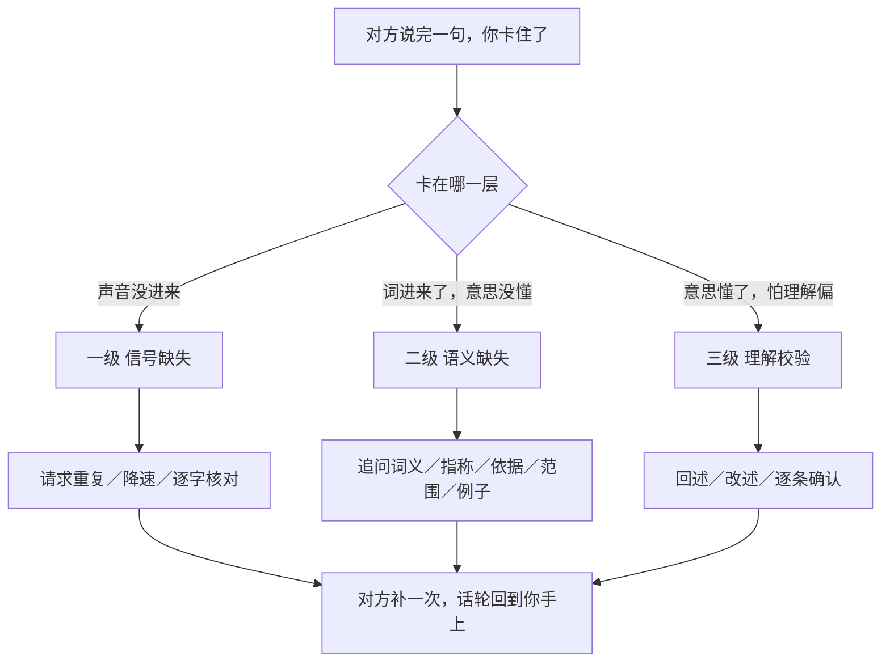
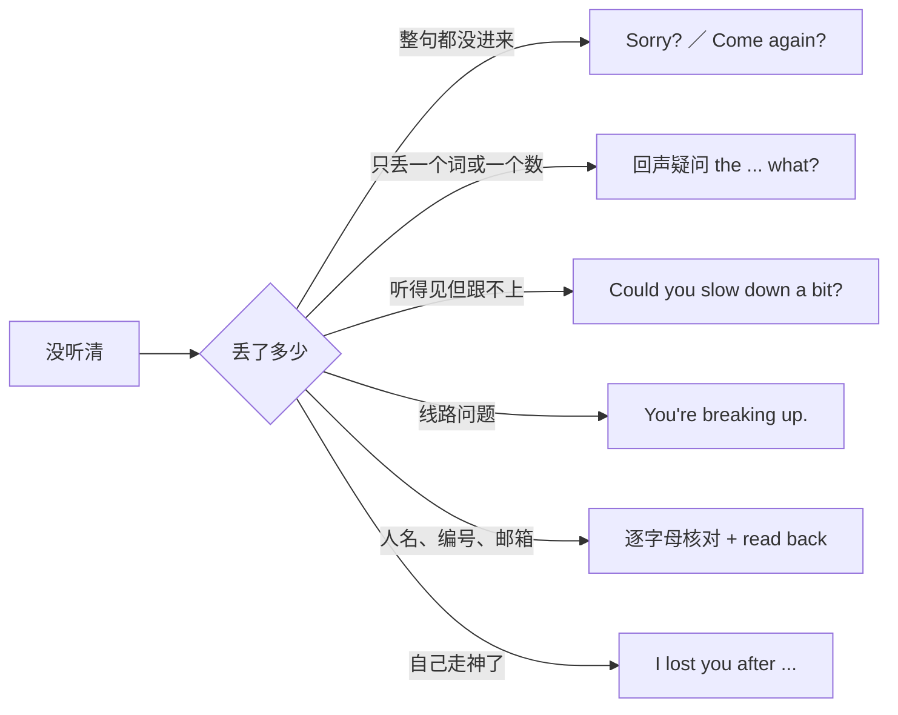
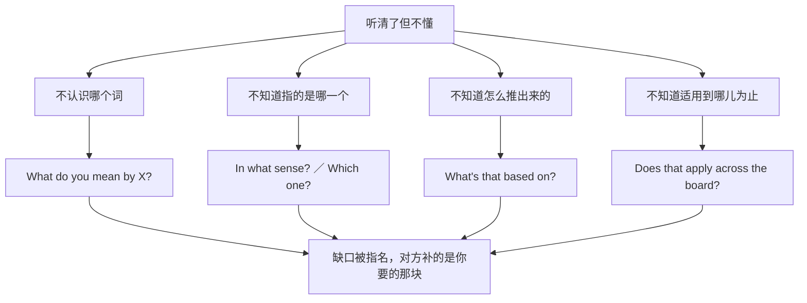
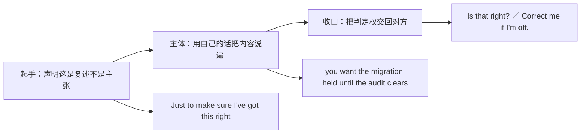
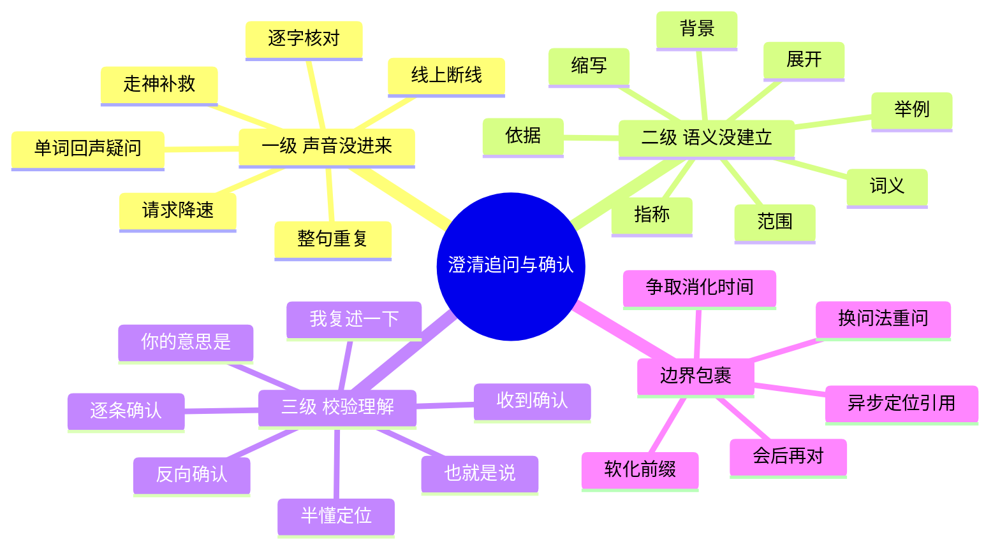

# 没听清、你的意思是、我复述一下：澄清、追问与确认理解

> [!info] 本篇定位
>
> 这篇收的是**你没听懂时说的那一句**，以及**你以为听懂了想确认时说的那一句**。
>
> 二十六条中文意图分三级排列：一级是声音没进来（没听清、太快了、卡了、名字怎么拼），二级是词进来了但意思没懂（什么意思、哪个意思、能不能举例、依据是什么），三级是意思懂了但要校验（我复述一下、你的意思是不是、我说明白了吗）。
>
> 上一篇 [[11.人际功能与话轮管理/01.我建议、你最好、能不能帮我：建议、请求、许可与委托|我建议、你最好、能不能帮我]] 管的是「你要对方做事」，这一篇管的是「你要对方补信息」。抢话轮、拖时间、改口那一套在下一篇。
>
> 读完能查到：听不清时不说 `What?` 该说什么，追问不显得咄咄逼人的四个方向，以及会议纪要式回述的三段骨架。

---

## 1. 本篇导读：先定位卡在哪一层

澄清用语的选错，九成源于没分清自己卡在哪一层。整句没听清却问 `What do you mean?`，对方会以为你在质疑观点而不是没听见声音，于是重新论证一遍——你还是没听见。反过来，词都听清了却说 `Could you say that again?`，对方原样重复一遍，你还是不懂。

三层的分界线是这样的：

这张图的判断顺序是自上而下的单向流程，不能跳级：一级没解决就问二级，等于用「我不懂」掩盖「我没听见」，对方给的补充会全部落空。三级则相反，它不是失败的补救，而是主动的质量检查——你完全听懂了也应该说一句，因为「我以为我懂了」是会议里代价最高的状态。

三级用语的语气重量也不同。一级最轻，把责任揽到自己或线路上，几乎不带任何冒犯风险；二级中等，问「你说的 X 是什么意思」在有些语境里会被读成「你用词不当」；三级最重也最有价值，复述一遍等于要求对方当场背书，说错了要担责。

> [!tip] 一条通用软化前缀
>
> 三级都能用的开头是 `Sorry,` 加一个短句。它不表示道歉，只是给对方半秒的切换时间，同时把插入话轮的动作标记出来。
>
> - `Sorry, could you say that again?`
> - `Sorry, what do you mean by "staging"?`
> - `Sorry, just to make sure I've got this right —`
>
> 反过来，光秃秃的 `Say again.` `Explain.` `Repeat.` 三个裸祈使句在英语里都属于指令口吻，只有在军事、航空管制、急救这类刻意压缩语言的场合才中性。

---

## 2. 一级：声音没进来，请对方重发一遍

这一级的六条意图共用一个原则：**把没接收到的原因归到自己或线路上，不归到对方的表达上**。英语的澄清礼貌全押在这一点，中文习惯说「你说清楚点」，直译过去就是指责。

分流的关键是「丢了多少」而不是「懂了多少」。丢整句用万能重复请求，丢局部一定要用回声疑问把丢失的位置标出来——对方只需补那一个词，不必重讲一遍。丢的是身份类信息（人名、编号、金额），无论丢多少都必须走逐字核对通道，因为这类信息重复十遍也可能重复错同一处。

### 2.1 整句没听清，请对方再说一遍

中文触发语：没听清 / 你说什么 / 再说一遍 / 啊？ / 麻烦重复一下 / 刚才那句没跟上

| 档位 | 句架 | 例句 |
| --- | --- | --- |
| 口语 | Sorry? | Sorry? I didn't catch that. |
| 口语 | Come again? | Come again? The room's pretty loud. |
| 口语 | Say that again? | Say that again — I was looking at the chart. |
| 书面 | Could you say that again? | Could you say that again? I missed the last part. |
| 书面 | Would you mind repeating that? | Would you mind repeating that for the notes? |
| 正式 | I'm afraid I didn't quite catch that. Would you mind repeating it? | I'm afraid I didn't quite catch that. Would you mind repeating it for those of us on the call? |

> [!warning] 错配警示
>
> - ~~What?~~ ❌ 单独一个 What 除非配明显的升调和微笑，否则接近中文的「啊？」加不耐烦。→ **Sorry?** ✅（把没听清归到自己身上，语气重量最轻）
> - ~~Please repeat.~~ ❌ 裸祈使句是指令，不是请求。→ **Could you repeat that?** ✅（情态动词把命令降级成询问）

- 同义入口：没听清 / 你刚说啥 / 再说一次 / 麻烦重复一下 / 没跟上
- 语法归属：[[02.英语基础语法/01.基础入门/03.疑问句与否定句的构成|疑问句与否定句的构成]]
- 场景实战：[[04.英语场景/07.社交交际场景实战/02.电话短信与在线沟通场景|电话短信与在线沟通场景]]

### 2.2 只丢了一个词或一个数字

中文触发语：只有一个词没听清 / 你说的是几 / 最后那个词是什么 / 谁？ / 哪儿？

| 档位 | 句架 | 例句 |
| --- | --- | --- |
| 口语 | Sorry, the ___ what? | Sorry, the deployment what? |
| 口语 | You said we need to do what? | You said we need to freeze what by Friday? |
| 口语 | Sorry, who? | Sorry, who's taking that over? |
| 书面 | I caught most of that, but not the ___. | I caught most of that, but not the version number. |
| 书面 | Sorry, could you repeat the last word? | Sorry, could you repeat the last word — the tool name? |
| 正式 | Could you repeat the figure you just mentioned? | Could you repeat the figure you just mentioned — was it fifteen or fifty? |

> [!warning] 错配警示
>
> - ~~What you said?~~ ❌ 普通特殊疑问句必须助动词提前。→ **What did you say?** ✅ 或 **You said what?** ✅（后者是回声疑问，故意保留陈述语序，重音砸在 what 上）
> - ~~Repeat the last one word.~~ ❌ one 与 the last 不同现，中式计数直译。→ **Just the last word?** ✅（英语靠 just 限定范围，不靠数词）

- 同义入口：哪个词 / 最后那个是啥 / 谁来着 / 是几号
- 语法归属：[[02.英语基础语法/01.基础入门/03.疑问句与否定句的构成|疑问句与否定句的构成]]
- 场景实战：[[04.英语场景/09.学习与教育场景实战/01.课堂讨论与提问场景|课堂讨论与提问场景]]

### 2.3 太快了，请慢一点

中文触发语：说慢点 / 太快了 / 我记不下来 / 等一下我跟不上 / 稍微慢一些

| 档位 | 句架 | 例句 |
| --- | --- | --- |
| 口语 | Could you slow down a bit? | Could you slow down a bit? I'm taking notes. |
| 口语 | You're going a little fast for me. | You're going a little fast for me — can we back up? |
| 口语 | Hang on, I'm still writing. | Hang on, I'm still writing that down. |
| 书面 | Would you mind going a little slower? | Would you mind going a little slower through the config part? |
| 书面 | Could we take that section more slowly? | Could we take that section more slowly? There's a lot of detail. |
| 正式 | I'd appreciate it if you could speak a little more slowly. | I'd appreciate it if you could speak a little more slowly — we're transcribing this. |

> [!warning] 错配警示
>
> - ~~Please speak slowly.~~ ❌ 加了 please 依然是命令，且暗示对方一贯说话太快。→ **Could you slow down a bit?** ✅（a bit 把要求限定成一次性微调）
> - ~~Your speed is too fast.~~ ❌ 评价对方的语速属于人身评价。→ **You're going a little fast for me.** ✅（for me 把问题限定在自己的接收能力上）

- 同义入口：慢一点 / 太快了 / 跟不上 / 让我记一下
- 语法归属：[[02.英语基础语法/07.助动词与情态动词/02.情态动词详解|情态动词详解]]
- 场景实战：[[04.英语场景/09.学习与教育场景实战/01.课堂讨论与提问场景|课堂讨论与提问场景]]

### 2.4 线上会议：断了、听不见、有回音

中文触发语：你那边卡了 / 断断续续 / 我这边听不到 / 有回音 / 你好像静音了 / 网不好

| 档位 | 句架 | 例句 |
| --- | --- | --- |
| 口语 | You're breaking up. | You're breaking up — I only got the first half. |
| 口语 | I think you're on mute. | I think you're on mute. We can see you talking. |
| 口语 | There's a bit of an echo on your end. | There's a bit of an echo on your end — maybe headphones? |
| 书面 | The audio cut out on my end. Could you repeat the last point? | The audio cut out on my end. Could you repeat the last point about the rollback? |
| 书面 | You froze for a few seconds — could you go back to ___? | You froze for a few seconds — could you go back to the timeline? |
| 正式 | We seem to have lost you briefly. Could you pick up from where the connection dropped? | We seem to have lost you briefly. Could you pick up from where the connection dropped, around the budget slide? |

> [!warning] 错配警示
>
> - ~~Your voice is not clear.~~ ❌ 中式直译，听起来像在说对方口齿不清。→ **You're breaking up.** ✅（把原因指向线路，是网络会议的固定说法）
> - ~~I can't hear you clearly.~~ ❌ 语法没错但把问题留在自己耳朵上，对方不知道该重说还是该换设备。→ **The audio's a bit choppy on my end.** ✅（choppy 明确指向断续，对方知道要换网络）

- 同义入口：卡了 / 断了 / 听不见 / 有回音 / 静音了
- 语法归属：[[02.英语基础语法/12.日常口语/01.口语中的语法简化|口语中的语法简化]]
- 场景实战：[[04.英语场景/07.社交交际场景实战/02.电话短信与在线沟通场景|电话短信与在线沟通场景]]

### 2.5 逐字确认：拼写、数字、人名、编号

中文触发语：怎么拼 / 是哪个字母 / 你说的是 15 还是 50 / 报一下编号 / 我复述一遍号码

| 档位 | 句架 | 例句 |
| --- | --- | --- |
| 口语 | How do you spell that? | How do you spell that? Is it one L or two? |
| 口语 | Fifteen or fifty? | Fifteen or fifty? They sound the same over the phone. |
| 口语 | Was that ___ as in ___? | Was that M as in Mike, or N as in November? |
| 书面 | Could you spell that out for me? | Could you spell the surname out for me? |
| 书面 | Let me read that back to you: ___. | Let me read that back to you: R-E-B-U-I-L-D, dash, two-four. |
| 正式 | Would you mind confirming the reference number digit by digit? | Would you mind confirming the reference number digit by digit for the record? |

> [!warning] 错配警示
>
> - ~~Which letter is it?~~ ❌ 问得太笼统，对方不知道你卡在第几个字母。→ **Was that M as in Mike, or N as in November?** ✅（用 as in 加常用词消歧，是电话核对的通用做法）
> - ~~I will repeat the number to you.~~ ❌ 语法对但不是这个动作的说法。→ **Let me read that back to you.** ✅（read back 是核对专用动词短语，repeat 只表示再说一遍）

- 同义入口：怎么拼 / 哪个字母 / 是几 / 报一下号 / 我念一遍你听
- 语法归属：[[02.英语基础语法/07.助动词与情态动词/02.情态动词详解|情态动词详解]]
- 场景实战：[[04.英语场景/10.职场与商务场景实战/04.商务谈判合同与客户沟通|商务谈判合同与客户沟通]]

### 2.6 我走神了，从头再说一次

中文触发语：我走神了 / 刚才没跟上 / 你说到哪儿了 / 从头再讲一次 / 我思路断了

| 档位 | 句架 | 例句 |
| --- | --- | --- |
| 口语 | Sorry, I zoned out for a second. Where were we? | Sorry, I zoned out for a second. Where were we — the second option? |
| 口语 | I lost you after ___. | I lost you after the part about caching. |
| 口语 | Can you take it from the top? | Can you take it from the top? I came in late. |
| 书面 | I'm afraid I lost the thread. Could you recap from ___? | I'm afraid I lost the thread. Could you recap from the second point? |
| 书面 | I was still on the previous slide — where are we now? | I was still on the previous slide — where are we now in the sequence? |
| 正式 | My apologies, I seem to have missed the transition. Could you go back over that section? | My apologies, I seem to have missed the transition. Could you go back over the section on dependencies? |

> [!warning] 错配警示
>
> - ~~I didn't listen.~~ ❌ 等于承认故意不听，是自曝的失礼。→ **I didn't catch that.** ✅（catch 表示没接住，不表示没在听）
> - ~~My mind flew away.~~ ❌ 中文「走神」的逐字直译。→ **I zoned out for a second.** ✅ 或 **My mind wandered.** ✅

- 同义入口：走神 / 溜号 / 没跟上 / 讲到哪了 / 从头再来
- 语法归属：[[02.英语基础语法/12.日常口语/02.常用口语句型|常用口语句型]]
- 场景实战：[[04.英语场景/10.职场与商务场景实战/02.会议汇报与演示场景|会议汇报与演示场景]]

---

## 3. 二级：听清了但没懂，追问语义

词全进来了，句子还是不成立，缺口只可能在四个方向：某个词不认识、某个指称不明确、某个推论跳步、某个断言的适用范围不清。追问用语按方向选，不按语气强弱选。

图里最容易混淆的是前两条。词不认识用 `What do you mean by X?`，X 必须原样引用对方的词；指称不明用 `In what sense?` 或 `Which one?`，此时你认识这个词，只是不知道它在这句话里落在哪个所指上。把后者问成前者，对方会给你一段词典释义——你早就知道了。

追问的另一条隐性规则是**一次只开一个缺口**。把四个方向一口气问完（`What do you mean, and why, and does it always apply?`）会让对方无从答起，通常只回答最后一个。

### 3.1 这个词是什么意思

中文触发语：什么意思 / 这个词怎么讲 / X 是啥 / 没听过这个说法

| 档位 | 句架 | 例句 |
| --- | --- | --- |
| 口语 | What do you mean by ___? | What do you mean by "soft launch"? |
| 口语 | What's a ___? | What's a canary release? |
| 口语 | Sorry, I don't know that one. | Sorry, I don't know that one — what's a bastion host? |
| 书面 | Could you clarify what you mean by ___? | Could you clarify what you mean by "reasonable effort" here? |
| 书面 | I'm not familiar with the term ___. | I'm not familiar with the term "blast radius" in this context. |
| 正式 | I'd like to make sure I understand the term ___ as you're using it. | I'd like to make sure I understand the term "material change" as you're using it in clause 4. |

> [!warning] 错配警示
>
> - ~~What's the meaning of your words?~~ ❌ 逐字直译且带质问色彩。→ **What do you mean by that?** ✅（by that 把范围锁到刚才那句，不是对方整个人）
> - ~~I can't understand this word.~~ ❌ can't 表示能力不足，听起来像抱怨。→ **I'm not familiar with that term.** ✅（把不懂说成不熟悉，是中性的信息缺口陈述）

- 同义入口：什么意思 / 怎么讲 / 没听过 / 这词生僻
- 语法归属：[[02.英语基础语法/09.从句体系/03.名词性从句详解|名词性从句详解]]
- 场景实战：[[04.英语场景/09.学习与教育场景实战/01.课堂讨论与提问场景|课堂讨论与提问场景]]

### 3.2 在哪个意义上 / 你指的是哪一个

中文触发语：哪个意义上 / 你说的是哪个 / 具体指什么 / 是指 A 还是 B / 哪个层面

| 档位 | 句架 | 例句 |
| --- | --- | --- |
| 口语 | In what sense? | It's expensive — in what sense? Money or time? |
| 口语 | Which one — ___ or ___? | Which staging — ours or the client's? |
| 口语 | You mean the ___ one? | You mean the old one, right? |
| 书面 | When you say ___, do you mean ___ or ___? | When you say "the client," do you mean the account or the app? |
| 书面 | Which ___ are we talking about? | Which environment are we talking about here? |
| 正式 | Could you specify which of the two you're referring to? | Could you specify which of the two contracts you're referring to? |

> [!warning] 错配警示
>
> - ~~In which meaning?~~ ❌ meaning 不与 in which 搭配。→ **In what sense?** ✅（固定问法，专问所指落点）
> - ~~Which one do you point?~~ ❌ point 不能这样用。→ **Which one are you referring to?** ✅（refer to 是指称专用动词）

- 同义入口：哪个意思 / 指的是哪个 / 哪一层 / A 还是 B
- 语法归属：[[02.英语基础语法/09.从句体系/01.定语从句基础|定语从句基础]]
- 场景实战：[[04.英语场景/10.职场与商务场景实战/04.商务谈判合同与客户沟通|商务谈判合同与客户沟通]]

### 3.3 能不能展开讲讲

中文触发语：细说 / 展开讲讲 / 具体点 / 带我过一遍 / 多说两句 / 从头捋一遍

| 档位 | 句架 | 例句 |
| --- | --- | --- |
| 口语 | Can you walk me through it? | Can you walk me through it once? I'll follow along. |
| 口语 | Say more? | Say more? I want to get the reasoning. |
| 口语 | How does that work exactly? | How does that work exactly — who triggers it? |
| 书面 | Could you expand on that a little? | Could you expand on the second option a little? |
| 书面 | Could you take me through the steps? | Could you take me through the steps in order? |
| 正式 | Would you mind elaborating on that point? | Would you mind elaborating on the risk you mentioned? |

> [!warning] 错配警示
>
> - ~~Please explain it in detail.~~ ❌ 裸祈使加 in detail，像布置作业。→ **Could you walk me through it?** ✅（walk sb through 是「带着走一遍」，把对方放在带路人位置）
> - ~~Explain more clearly.~~ ❌ 暗示对方刚才说得不清楚。→ **Could you expand on that a little?** ✅（expand 只表示补充，不评价原表述）

- 同义入口：细说 / 展开 / 具体讲 / 带我走一遍 / 多说点
- 语法归属：[[02.英语基础语法/08.非谓语动词/01.动词不定式详解|动词不定式详解]]
- 场景实战：[[04.英语场景/10.职场与商务场景实战/02.会议汇报与演示场景|会议汇报与演示场景]]

### 3.4 举个例子

中文触发语：举个例子 / 比如说 / 有具体的吗 / 比方讲 / 给个实例

| 档位 | 句架 | 例句 |
| --- | --- | --- |
| 口语 | Like what? | Edge cases — like what? |
| 口语 | Got an example? | Got an example? Something from last quarter would help. |
| 口语 | For instance? | For instance? I'm having trouble picturing it. |
| 书面 | Could you give me an example? | Could you give me an example of where this has failed? |
| 书面 | Do you have a concrete case in mind? | Do you have a concrete case in mind, or is this hypothetical? |
| 正式 | It would help if you could illustrate that with a specific case. | It would help if you could illustrate that with a specific case from the pilot. |

> [!warning] 错配警示
>
> - ~~Give me an example.~~ ❌ 裸祈使在同事之间勉强，对客户或上级失礼。→ **Could you give me an example?** ✅
> - ~~Please give a for example.~~ ❌ for example 是插入语不是名词。→ **Give me a for-instance.** ✅（口语里有这个名词化的固定用法，for example 没有）

- 同义入口：举例 / 比如 / 比方说 / 有实例吗
- 语法归属：[[02.英语基础语法/07.助动词与情态动词/02.情态动词详解|情态动词详解]]
- 场景实战：[[04.英语场景/05.高频实用表达句型框架/04.比较对比举例总结句型库|比较对比举例总结句型库]]

### 3.5 这是什么的缩写

中文触发语：这是什么的缩写 / 全称是什么 / 你们内部叫法我不熟 / 这几个字母代表什么

| 档位 | 句架 | 例句 |
| --- | --- | --- |
| 口语 | What does ___ stand for? | What does SLA stand for again? |
| 口语 | Is that an acronym? | Is that an acronym, or is it just the product name? |
| 口语 | Is that an internal thing? | Is that an internal thing? I've not seen it in the docs. |
| 书面 | Sorry, I'm not familiar with that abbreviation. What does it refer to? | Sorry, I'm not familiar with that abbreviation. What does DRI refer to here? |
| 书面 | Could you give the full name once? | Could you give the full name once so I can search for it? |
| 正式 | Could you state the term in full for the record? | Could you state the term in full for the record before we proceed? |

> [!warning] 错配警示
>
> - ~~What is the whole name of SLA?~~ ❌ whole name 不用于缩写展开。→ **What does SLA stand for?** ✅（stand for 是缩写还原的固定动词短语）
> - ~~SLA is short of what?~~ ❌ short of 表示不足。→ **SLA is short for what?** ✅（short for 才是缩写关系）

- 同义入口：什么缩写 / 全称 / 几个字母代表啥 / 内部黑话
- 语法归属：[[02.英语基础语法/05.介词与连词/02.常用介词搭配详解|常用介词搭配详解]]
- 场景实战：[[04.英语场景/10.职场与商务场景实战/01.求职简历面试与Offer谈判|求职简历面试与Offer谈判]]

### 3.6 依据是什么、数据哪来的

中文触发语：你怎么知道的 / 哪来的数据 / 依据是什么 / 谁说的 / 有出处吗

| 档位 | 句架 | 例句 |
| --- | --- | --- |
| 口语 | Where's that from? | Where's that number from? |
| 口语 | How do you know? | How do you know they've already signed? |
| 口语 | Says who? | Says who? That's not what I heard Friday. |
| 书面 | What's that based on? | What's that estimate based on? |
| 书面 | Do we have a source for that? | Do we have a source for that figure, or is it a guess? |
| 正式 | Could you point me to the source of that figure? | Could you point me to the source of that figure before we cite it? |

> [!warning] 错配警示
>
> - ~~Says who?~~ ❌ 熟人之间是玩笑，会议或客户面前是当众挑衅。→ **What's that based on?** ✅（问依据不问人，把质疑对准信息）
> - ~~Who told you this?~~ ❌ 追问信息源的人等于查内线。→ **Do we have a source for that?** ✅（用 we 把双方放在同一侧）

- 同义入口：怎么知道的 / 数据哪来的 / 有依据吗 / 出处 / 谁说的
- 语法归属：[[02.英语基础语法/10.特殊句型/01.被动语态全解|被动语态全解]]
- 场景实战：[[04.英语场景/05.高频实用表达句型框架/01.表达观点与态度的50个万能句型|表达观点与态度的50个万能句型]]

### 3.7 我是不是漏了什么背景

中文触发语：为什么会这样 / 我是不是漏了什么 / 前因后果是什么 / 怎么走到这一步的

| 档位 | 句架 | 例句 |
| --- | --- | --- |
| 口语 | What am I missing? | Everyone seems fine with this — what am I missing? |
| 口语 | How come? | How come we're changing it now? |
| 口语 | How did we get here? | How did we get here? Last week it was option B. |
| 书面 | Could you give me the background on that? | Could you give me the background on why this was deprioritized? |
| 书面 | I may have missed a conversation. What led to this? | I may have missed a conversation. What led to the change in scope? |
| 正式 | For context, what considerations led to that decision? | For context, what considerations led to that decision at the board level? |

> [!warning] 错配警示
>
> - ~~Why like this?~~ ❌ 中文「为什么这样」的直译，没有谓语。→ **Why is that?** ✅ 或 **How come?** ✅（how come 后面接陈述语序，不倒装）
> - ~~How come is it changed?~~ ❌ how come 后不倒装。→ **How come it changed?** ✅

- 同义入口：怎么回事 / 漏了什么 / 前因后果 / 背景是什么 / 为什么这么定
- 语法归属：[[02.英语基础语法/09.从句体系/04.状语从句详解|状语从句详解]]
- 场景实战：[[04.英语场景/10.职场与商务场景实战/02.会议汇报与演示场景|会议汇报与演示场景]]

### 3.8 这条适用到哪儿为止

中文触发语：都是这样吗 / 有没有例外 / 什么情况下不适用 / 一律如此吗 / 边界在哪

| 档位 | 句架 | 例句 |
| --- | --- | --- |
| 口语 | Does that apply across the board? | Does that apply across the board, or just to new accounts? |
| 口语 | Any exceptions? | Any exceptions? Legacy clients, maybe? |
| 口语 | Always, or just this time? | Always, or just for this release? |
| 书面 | Is that true in every case, or only for ___? | Is that true in every case, or only for paid tiers? |
| 书面 | Where does that stop applying? | Where does that rule stop applying — at the API boundary? |
| 正式 | Under what conditions does that not hold? | Under what conditions does that guarantee not hold? |

> [!warning] 错配警示
>
> - ~~Is it all like this?~~ ❌ 指代不明，all 悬空。→ **Is that always the case?** ✅（the case 指代前面整个断言）
> - ~~Has exception?~~ ❌ 缺主语的中式省略。→ **Are there any exceptions?** ✅ 或口语 **Any exceptions?** ✅（口语省略只能省到这一步）

- 同义入口：都这样吗 / 有例外吗 / 一律 / 什么时候不算 / 范围到哪
- 语法归属：[[02.英语基础语法/09.从句体系/04.状语从句详解|状语从句详解]]
- 场景实战：[[04.英语场景/10.职场与商务场景实战/04.商务谈判合同与客户沟通|商务谈判合同与客户沟通]]

---

## 4. 三级：懂了，但要确认自己没理解偏

这一级不是补救，是校验。它的价值在于把「我以为」变成有见证的共识：你复述一遍，对方点头，这件事从此有了双方都认过的版本。会议纪要、需求确认、接口对齐全靠这一步。

回述确认有固定的三段骨架，缺一段就会走样：

起手段不能省。少了它，`You want the migration held until the audit clears.` 就成了一句陈述——对方会以为你在下结论，甚至在替他表态。收口段同样不能省，没有收口的复述是通报不是确认，对方没有被邀请纠正，也就不会纠正。

中间那一段有个硬要求：**必须换词**。原样复述对方的句子证明不了你听懂了，只证明你记住了。把 `we'll defer the rollout pending sign-off` 复述成 `so nothing ships until legal says yes` 才是有效校验——正是这一步会暴露理解偏差。

### 4.1 我复述一下（回述确认）

中文触发语：我复述一下 / 我理解的是 / 我确认一下 / 我说说我听到的 / 我捋一遍

| 档位 | 句架 | 例句 |
| --- | --- | --- |
| 口语 | So basically ___, right? | So basically we ship Friday and hold the migration, right? |
| 口语 | Let me play that back: ___. | Let me play that back: you handle the data, I handle the UI. |
| 书面 | Just to make sure I've got this right — ___. | Just to make sure I've got this right — the deadline moves, but the scope doesn't. |
| 书面 | Let me repeat that back to you: ___. Is that accurate? | Let me repeat that back to you: two engineers, four weeks, no new hires. Is that accurate? |
| 正式 | If I may summarize: ___. Please correct me if I've misstated anything. | If I may summarize: the agreement takes effect on signature, with a thirty-day termination window. Please correct me if I've misstated anything. |

> [!warning] 错配警示
>
> - ~~I repeat your words.~~ ❌ 像法庭上的引述，且暗示你要拿这话做文章。→ **Let me repeat that back to you.** ✅（back 指明方向是还给对方核对）
> - ~~I understand you mean...~~ ❌ 陈述式的「我理解你是说」，把结论定死了。→ **If I'm following you correctly, ___?** ✅（条件小句留出被否定的余地）

- 同义入口：我复述 / 我理解的是 / 我确认下 / 我捋一遍 / 我重复一遍
- 语法归属：[[02.英语基础语法/09.从句体系/03.名词性从句详解|名词性从句详解]]
- 场景实战：[[04.英语场景/10.职场与商务场景实战/02.会议汇报与演示场景|会议汇报与演示场景]]

### 4.2 你的意思是不是…

中文触发语：你的意思是 / 你是说 / 也就是说你要 / 你指的是不是 / 意思是让我…？

| 档位 | 句架 | 例句 |
| --- | --- | --- |
| 口语 | You mean ___? | You mean I should hold off until Monday? |
| 口语 | So you're saying ___? | So you're saying the API contract doesn't change? |
| 口语 | Are you asking me to ___? | Are you asking me to take over the on-call rotation? |
| 书面 | If I'm following you correctly, you're suggesting ___. | If I'm following you correctly, you're suggesting we split the release. |
| 书面 | Am I right in understanding that ___? | Am I right in understanding that the client hasn't seen this yet? |
| 正式 | Do I understand correctly that ___? | Do I understand correctly that the clause applies retroactively? |

> [!warning] 错配警示
>
> - ~~You mean that you want to say we should wait?~~ ❌ mean 后面再套一层 want to say，三层冗余。→ **You mean we should wait?** ✅
> - ~~Is your meaning that...~~ ❌ meaning 不作这个用法的主语。→ **Are you saying that ___?** ✅

- 同义入口：你是说 / 意思是 / 你指的是 / 是让我…吗
- 语法归属：[[02.英语基础语法/09.从句体系/03.名词性从句详解|名词性从句详解]]
- 场景实战：[[04.英语场景/05.高频实用表达句型框架/03.同意反对让步转折句型库|同意反对让步转折句型库]]

### 4.3 也就是说：把对方的话归纳成一句

中文触发语：也就是说 / 换句话说 / 说白了 / 归根到底就是 / 一句话概括

| 档位 | 句架 | 例句 |
| --- | --- | --- |
| 口语 | So, in other words, ___. | So, in other words, nothing ships this week. |
| 口语 | Bottom line: ___? | Bottom line: we're two weeks late? |
| 口语 | So it comes down to ___? | So it comes down to headcount? |
| 书面 | To put it another way, ___. | To put it another way, the cost is fixed and the timeline isn't. |
| 书面 | In short, then, ___. | In short, then, we absorb the delay and the client doesn't pay extra. |
| 正式 | In essence, the position is that ___. | In essence, the position is that liability remains with the vendor. |

> [!warning] 错配警示
>
> - ~~In a word, we are late.~~ ❌ in a word 字面是「用一个词说」，接一整句不合适。→ **In short, we're late.** ✅
> - ~~That is to say~~ 用在口语归纳里 ❌ 语域过高，书面腔突兀。→ **So basically** ✅（口语档的对应件）

- 同义入口：也就是说 / 换句话说 / 说白了 / 归根到底 / 总之
- 语法归属：[[02.英语基础语法/12.日常口语/04.口语与书面语对比|口语与书面语对比]]
- 场景实战：[[04.英语场景/05.高频实用表达句型框架/04.比较对比举例总结句型库|比较对比举例总结句型库]]

### 4.4 逐条确认：第一点是…，第二点是…

中文触发语：我捋一下 / 一是…二是… / 我记一下确认下 / 三件事对吧 / 我列一下待办

| 档位 | 句架 | 例句 |
| --- | --- | --- |
| 口语 | So two things: ___ and ___. Right? | So two things: freeze the branch and email the client. Right? |
| 口语 | Let me count: one, ___; two, ___. | Let me count: one, the migration; two, the docs; three, the demo. |
| 书面 | Let me recap: first ___, then ___. | Let me recap: first we patch staging, then we retest, then we ship. |
| 书面 | So my action items are ___. Anything I've missed? | So my action items are the report and the vendor call. Anything I've missed? |
| 正式 | To confirm the action items: ___. | To confirm the action items: legal reviews by Tuesday, finance signs off by Thursday. |

> [!warning] 错配警示
>
> - ~~Firstly... secondly... thirdly...~~ 用在口头 recap 里 ❌ 三个 -ly 连排是书面清单的调子，会上听着像在念稿。→ **First ___, then ___, and finally ___.** ✅
> - ~~I have two things to confirm you.~~ ❌ confirm 不接双宾语。→ **Let me confirm two things with you.** ✅

- 同义入口：捋一下 / 一是二是 / 待办对一下 / 几件事 / 列一列
- 语法归属：[[02.英语基础语法/05.介词与连词/03.连词的分类与用法|连词的分类与用法]]
- 场景实战：[[04.英语场景/10.职场与商务场景实战/02.会议汇报与演示场景|会议汇报与演示场景]]

### 4.5 反过来问：我说明白了吗

中文触发语：明白了吗 / 我说清楚了吗 / 有没有讲明白 / 还有疑问吗 / 跟得上吗

| 档位 | 句架 | 例句 |
| --- | --- | --- |
| 口语 | Does that make sense? | Does that make sense, or should I go back a step? |
| 口语 | Following me so far? | Following me so far? Stop me if not. |
| 口语 | Am I making sense? | Am I making sense? I know it's a lot at once. |
| 书面 | Let me know if any of that is unclear. | Let me know if any of that is unclear and I'll rewrite it. |
| 书面 | Happy to go over any part of that again. | Happy to go over the deployment part again if it helps. |
| 正式 | Please don't hesitate to ask if any point requires further clarification. | Please don't hesitate to ask if any point requires further clarification before you sign. |

> [!warning] 错配警示
>
> - ~~Do you understand?~~ ❌ 把理解责任推给听者，居高临下，对下属和学生尤其伤人。→ **Does that make sense?** ✅（主语是 that，检查的是我的表述而非你的能力）
> - ~~Are you clear?~~ ❌ 中式「你清楚了吗」，英语里近乎训话。→ **Is that clear so far?** ✅

- 同义入口：明白了吗 / 讲清楚了吗 / 跟得上吗 / 有疑问吗
- 语法归属：[[02.英语基础语法/01.基础入门/03.疑问句与否定句的构成|疑问句与否定句的构成]]
- 场景实战：[[04.英语场景/09.学习与教育场景实战/01.课堂讨论与提问场景|课堂讨论与提问场景]]

### 4.6 表示已经听懂、收到

中文触发语：明白了 / 懂了 / 收到 / 原来如此 / 我记下了 / 清楚了

| 档位 | 句架 | 例句 |
| --- | --- | --- |
| 口语 | Got it. | Got it. I'll start on it this afternoon. |
| 口语 | That makes sense. | That makes sense — I was reading it backwards. |
| 口语 | Ah, that explains it. | Ah, that explains it. I wondered why the build was red. |
| 书面 | Understood. I'll take it from here. | Understood. I'll take it from here and update the ticket. |
| 书面 | Clear, thanks. I've noted the two changes. | Clear, thanks. I've noted the two changes and will circulate them. |
| 正式 | Noted, and thank you for the clarification. | Noted, and thank you for the clarification on the payment terms. |

> [!warning] 错配警示
>
> - ~~I know.~~ ❌ 表示「我明白了」时会被听成「这我早知道，不用你讲」。→ **I see.** ✅ 或 **Got it.** ✅
> - ~~I have understood.~~ ❌ 完成体在这里显得刻板生硬。→ **Understood.** ✅（省略主语的过去分词是收到确认的固定形态）

- 同义入口：懂了 / 明白 / 收到 / 原来如此 / 清楚了 / 记下了
- 语法归属：[[02.英语基础语法/12.日常口语/01.口语中的语法简化|口语中的语法简化]]
- 场景实战：[[04.英语场景/07.社交交际场景实战/01.交友聚会与闲聊场景|交友聚会与闲聊场景]]

### 4.7 半懂：前半段懂了，后半段没跟上

中文触发语：大概懂了 / 前半段懂了 / 就一点没跟上 / 好像懂了又好像没懂 / 卡在某一步

| 档位 | 句架 | 例句 |
| --- | --- | --- |
| 口语 | I'm with you up to ___, but then you lost me. | I'm with you up to the queue part, but then you lost me. |
| 口语 | I sort of follow, but ___? | I sort of follow, but where does the retry come in? |
| 口语 | The first half I've got. The second half, not so much. | The first half I've got. The second half, not so much. |
| 书面 | I follow the first part; where I'm unclear is ___. | I follow the first part; where I'm unclear is the fallback path. |
| 书面 | I'm mostly there — one gap: ___. | I'm mostly there — one gap: who owns the rollback decision? |
| 正式 | The overall direction is clear; the point I'd like to revisit is ___. | The overall direction is clear; the point I'd like to revisit is the indemnity clause. |

> [!warning] 错配警示
>
> - ~~I half understand.~~ ❌ 逐字直译，英语不这样切分理解度。→ **I'm with you up to a point.** ✅
> - ~~I understand but I don't understand.~~ ❌ 自相矛盾的中式表达。→ **I follow the logic, I'm just not sure about the last step.** ✅（明确指出卡在哪一步）

- 同义入口：大概懂 / 半懂不懂 / 卡在某处 / 前面懂后面没懂
- 语法归属：[[02.英语基础语法/10.特殊句型/05.省略与替代|省略与替代]]
- 场景实战：[[04.英语场景/09.学习与教育场景实战/01.课堂讨论与提问场景|课堂讨论与提问场景]]

---

## 5. 追问的边界：怎么问才不显得咄咄逼人

同一句 `What do you mean?` 可以是好奇也可以是逼问，差别在前后包裹的东西。这一节的五条意图管的是包裹层：怎么开口、第二次怎么换问法、异步场合怎么定位、争取时间怎么说、以及什么时候干脆先不问。

### 5.1 先致歉再问：软化前缀

中文触发语：不好意思打断 / 冒昧问一句 / 可能我没跟上 / 是我理解慢 / 问个笨问题

| 档位 | 句架 | 例句 |
| --- | --- | --- |
| 口语 | Sorry, quick question — ___ | Sorry, quick question — is that before or after the freeze? |
| 口语 | This might be me, but ___ | This might be me, but I thought we'd dropped that option. |
| 口语 | Dumb question, but ___ | Dumb question, but who actually approves this? |
| 书面 | Apologies if I missed this, but ___ | Apologies if I missed this, but was the date ever confirmed? |
| 书面 | At the risk of going over old ground, ___ | At the risk of going over old ground, could we revisit the scope? |
| 正式 | If I may, I'd like to clarify one point before we move on. | If I may, I'd like to clarify one point before we move on to the budget. |

> [!warning] 错配警示
>
> - ~~Sorry to disturb you.~~ ❌ disturb 指打搅安宁，用在会议里过重，像半夜敲门。→ **Sorry to jump in.** ✅
> - ~~Excuse me, I want to ask a question.~~ ❌ 报备式的两段结构拖沓。→ **Sorry, quick question —** ✅（直接接问题本身）

- 同义入口：不好意思 / 冒昧问下 / 可能是我没懂 / 打断一下 / 问个傻问题
- 语法归属：[[02.英语基础语法/07.助动词与情态动词/03.情态动词的特殊句型|情态动词的特殊句型]]
- 场景实战：[[04.英语场景/10.职场与商务场景实战/02.会议汇报与演示场景|会议汇报与演示场景]]

### 5.2 第二次还是没懂：换个问法

中文触发语：还是没懂 / 再问一次不好意思 / 我换个问法 / 可能我问得不对 / 我重新问

| 档位 | 句架 | 例句 |
| --- | --- | --- |
| 口语 | Sorry, I'm still not with you. Let me ask it differently: ___ | Sorry, I'm still not with you. Let me ask it differently: who runs the script? |
| 口语 | Last one and I'll stop — ___ | Last one and I'll stop — does the client see this screen at all? |
| 口语 | I think I'm asking the wrong thing. | I think I'm asking the wrong thing. What I actually want to know is the order. |
| 书面 | I may be phrasing this badly. What I'm trying to get at is ___. | I may be phrasing this badly. What I'm trying to get at is the failure mode. |
| 书面 | Let me try once more, more concretely: ___ | Let me try once more, more concretely: if the job times out at step three, what happens? |
| 正式 | Perhaps I can put the question more precisely: ___ | Perhaps I can put the question more precisely: which party bears the cost of remediation? |

> [!warning] 错配警示
>
> - ~~I still don't understand you.~~ ❌ 宾语是 you，等于说「我听不懂你这个人」。→ **I'm still not quite following.** ✅（不带宾语，缺口留在自己这边）
> - ~~You didn't explain clearly.~~ ❌ 直接判定对方失职。→ **I may be phrasing this badly.** ✅（把问题拉回自己的提问方式，是重问第二遍的安全前缀）

- 同义入口：还是不懂 / 换个说法问 / 我重新问 / 可能我问错了
- 语法归属：[[02.英语基础语法/11.实战应用/03.常见语法错误纠正|常见语法错误纠正]]
- 场景实战：[[04.英语场景/09.学习与教育场景实战/01.课堂讨论与提问场景|课堂讨论与提问场景]]

### 5.3 书面与异步澄清：邮件、消息、代码评审

中文触发语：确认一下我的理解 / 想跟你对一下 / 你上面那句是指 / 第几段我没看懂

| 档位 | 句架 | 例句 |
| --- | --- | --- |
| 口语（消息） | Quick sanity check: ___? | Quick sanity check: this replaces the old endpoint, right? |
| 口语（消息） | Reading your last message as ___ — correct? | Reading your last message as "ship it Friday" — correct? |
| 书面 | Just to confirm my understanding of your last message: ___ | Just to confirm my understanding of your last message: the freeze starts Wednesday, not Monday. |
| 书面 | Could you clarify the second paragraph? Specifically, ___ | Could you clarify the second paragraph? Specifically, does "all users" include trial accounts? |
| 正式 | For the avoidance of doubt, could you confirm whether ___? | For the avoidance of doubt, could you confirm whether the deadline is business days or calendar days? |

> [!warning] 错配警示
>
> - ~~Please explain again.~~ ❌ 异步沟通里最无效的一句，对方不知道你卡在哪。→ **Could you clarify the second paragraph?** ✅（异步澄清必须定位到段落、行号或原话）
> - ~~I don't understand your email.~~ ❌ 否定整封，对方要重写全文。→ **One question on point 3: ___** ✅（把缺口缩到一点）

- 同义入口：对一下理解 / 确认一下 / 你上面说的 / 哪一段没懂
- 语法归属：[[02.英语基础语法/11.实战应用/02.写作中的语法应用|写作中的语法应用]]
- 场景实战：[[04.英语场景/10.职场与商务场景实战/03.商务邮件与正式书面沟通|商务邮件与正式书面沟通]]

### 5.4 请对方等一下：我先消化

中文触发语：等一下我理一理 / 让我消化一下 / 我记一下 / 给我几秒 / 我想想怎么问

| 档位 | 句架 | 例句 |
| --- | --- | --- |
| 口语 | Hold on, let me catch up. | Hold on, let me catch up — I'm still on the first number. |
| 口语 | Give me a second to process that. | Give me a second to process that. It's a bigger change than I thought. |
| 口语 | Let me write that down before it goes. | Let me write that down before it goes. |
| 书面 | Let me sit with that for a moment before I respond. | Let me sit with that for a moment before I respond properly. |
| 书面 | I'd like to think that through and come back to you. | I'd like to think that through and come back to you this afternoon. |
| 正式 | I'd appreciate a moment to consider that before responding. | I'd appreciate a moment to consider that before responding on the record. |

> [!warning] 错配警示
>
> - ~~Wait a moment, I think.~~ ❌ I think 单挂在后面表示「我认为」，不表示「我想一想」。→ **Give me a second to think.** ✅
> - ~~Please wait me.~~ ❌ wait 不及物，等人要用 wait for。→ **Bear with me a second.** ✅（拖延话轮的固定说法）

- 同义入口：等一下 / 我理一理 / 让我消化 / 给我几秒 / 我记一下
- 语法归属：[[02.英语基础语法/12.日常口语/02.常用口语句型|常用口语句型]]
- 场景实战：[[04.英语场景/10.职场与商务场景实战/02.会议汇报与演示场景|会议汇报与演示场景]]

### 5.5 先不问：记下来会后再对

中文触发语：先记下来 / 我一会儿问 / 会后再找你 / 不占大家时间 / 私下对一下

| 档位 | 句架 | 例句 |
| --- | --- | --- |
| 口语 | I'll park that and come back to it. | I'll park that and come back to it after the demo. |
| 口语 | Let me grab you after this. | Let me grab you after this — two small things. |
| 口语 | Noting it, not asking now. | Noting it, not asking now. Keep going. |
| 书面 | I have a question on that, but I'll hold it until the end. | I have a question on that, but I'll hold it until the end so we stay on time. |
| 书面 | I'll follow up with you separately on that. | I'll follow up with you separately on the numbers. |
| 正式 | I'll raise this offline so as not to hold up the agenda. | I'll raise this offline so as not to hold up the agenda. |

> [!warning] 错配警示
>
> - ~~I ask you later.~~ ❌ 一般现在时表未来在这里不成立。→ **I'll follow up with you afterwards.** ✅
> - ~~We talk after meeting.~~ ❌ 缺冠词与将来标记。→ **Let's talk after the meeting.** ✅

- 同义入口：先记下 / 会后再说 / 私下问 / 不耽误时间 / 单独找你
- 语法归属：[[02.英语基础语法/06.动词时态/02.一般将来时与过去将来时|一般将来时与过去将来时]]
- 场景实战：[[04.英语场景/10.职场与商务场景实战/02.会议汇报与演示场景|会议汇报与演示场景]]

> [!warning] 装懂的四句危险话
>
> 这四句在英语环境里几乎必然引发误会，出现频率却极高：
>
> - `Yes, yes.` ——连说两个 yes 通常被读成不耐烦的敷衍，不是「懂了懂了」。
> - `Of course.` ——在被解释一件事时说，等于「这还用你说」。
> - `I know.` ——同上，把新信息说成旧信息，对方会停止解释。
> - `OK OK OK.` ——三连的 OK 在英语里是催对方闭嘴的信号。
>
> 想表示「懂了、继续」，安全的是 `Right.` `Got it.` `Makes sense.` `Go on.` 四个。

---

## 6. 三级速查总表

按前面三级把最常用的一句压成一张表，急用时直接抄这一栏，不必翻回上文。

| 卡在哪一层 | 中文入口 | 首选一句 | 升一档 |
| --- | --- | --- | --- |
| 一级 | 整句没听清 | Sorry? | Could you say that again? |
| 一级 | 丢一个词 | Sorry, the ___ what? | Could you repeat the last word? |
| 一级 | 太快了 | Could you slow down a bit? | Would you mind going a little slower? |
| 一级 | 线上卡顿 | You're breaking up. | The audio cut out on my end. |
| 一级 | 拼写核对 | How do you spell that? | Could you spell that out for me? |
| 一级 | 自己走神 | I lost you after ___. | I'm afraid I lost the thread. |
| 二级 | 词不认识 | What do you mean by ___? | Could you clarify what you mean by ___? |
| 二级 | 指称不明 | In what sense? | When you say ___, do you mean ___ or ___? |
| 二级 | 要展开 | Can you walk me through it? | Would you mind elaborating on that? |
| 二级 | 要例子 | Like what? | Could you give me an example? |
| 二级 | 问缩写 | What does ___ stand for? | Could you give the full name once? |
| 二级 | 问依据 | Where's that from? | What's that based on? |
| 二级 | 问背景 | What am I missing? | Could you give me the background on that? |
| 二级 | 问范围 | Any exceptions? | Is that true in every case? |
| 三级 | 我复述 | So basically ___, right? | Just to make sure I've got this right — ___ |
| 三级 | 你是说 | You mean ___? | Am I right in understanding that ___? |
| 三级 | 也就是说 | So, in other words, ___. | To put it another way, ___. |
| 三级 | 逐条确认 | So two things: ___ and ___. | Let me recap: first ___, then ___. |
| 三级 | 我说明白了吗 | Does that make sense? | Let me know if any of that is unclear. |
| 三级 | 我懂了 | Got it. | Understood. |
| 三级 | 半懂 | I'm with you up to ___. | I follow the first part; where I'm unclear is ___. |
| 边界 | 软化开口 | Sorry, quick question — | If I may, I'd like to clarify one point. |
| 边界 | 再问一次 | I'm still not quite following. | Perhaps I can put the question more precisely. |
| 边界 | 书面定位 | Quick sanity check: ___? | Could you clarify the second paragraph? |
| 边界 | 争取时间 | Give me a second. | I'd like to think that through. |
| 边界 | 会后再问 | I'll park that. | I'll raise this offline. |

表里「首选一句」全部是口语档，「升一档」跨到书面或正式档。中间那档在正式会议里最安全：既不像 `Sorry?` 那样随意，也不像 `I'd appreciate it if...` 那样在小范围讨论中显得端着。

---

## 7. 本篇小结

这张图的层级本身就是查法：先定位自己在哪一支，再在支下面找最接近的中文入口。四条主干里，第三支的价值被低估最多——它不解决听不懂，它解决「以为听懂了」，而后者在工程协作里的返工成本远高于前者。

> [!success] 本篇核心要点回顾
>
> 1. 澄清用语按**缺口层级**选，不按语气强弱选。声音没进来用一级，意思没建立用二级，两者都过了才轮到三级校验。
> 2. 一级的通行原则是把原因归到自己或线路上：`I didn't catch that.` 永远优于 `You weren't clear.`
> 3. 丢局部信息必须用回声疑问（`the ___ what?`），它保留陈述语序、重音落在 what 上，让对方只补那一处。
> 4. 二级追问一次只开一个缺口，四个方向（词义、指称、依据、范围）各有专属问法，混用会拿到答非所问的补充。
> 5. 三级回述有三段骨架：起手声明是复述、主体**换词**说一遍、收口把判定权交回去。缺起手会被当成主张，缺收口不构成确认。
> 6. `Do you understand?` 与 `Does that make sense?` 的差别在主语：前者审问听者，后者检查自己的表述。
> 7. 表示「我懂了」不能用 `I know.`，那是「这我早知道」；`I see.` `Got it.` `Makes sense.` 才是。
> 8. 异步场合的澄清必须定位到具体位置（第几段、哪一句、哪个字段），`Please explain again.` 在邮件里等于没说。

> [!success] 本篇练习清单
>
> - [ ] 给一句中文「不好意思，最后那个数字我没听清」，写出口语、书面、正式三档
> - [ ] 给一句中文「你说的『上线』是指发到预发还是发到生产」，写出三档
> - [ ] 给一句中文「能不能举个例子」，写出三档，并指出哪一档不能用裸祈使
> - [ ] 给一句中文「我复述一下：周五发版，迁移先不动」，写出三档，检查起手段与收口段是否齐全
> - [ ] 给一句中文「这个结论有依据吗」，写出三档，并说明哪一档在客户面前不能用
> - [ ] 给一句中文「我说明白了吗」，写出三档，避开 `Do you understand?`
> - [ ] 给一句中文「前半段懂了，从队列那儿开始没跟上」，写出三档
> - [ ] 给一句中文「这个问题我会后单独找你」，写出三档，检查将来时标记有没有丢

### 7.1 下一篇预告

> [!info] 下一篇
>
> [[11.人际功能与话轮管理/03.打断一下、让我想想、说回刚才：插话、拖延、改口与转场\|打断一下、让我想想、说回刚才：插话、拖延、改口与转场]]
>
> 这一篇管的是「你没听懂」，下一篇管的是「话轮本身」：怎么在别人说话时插进去、怎么在想不出词时把时间买下来、说错之后怎么当场收回、以及话题跑偏后怎么拽回来。本篇 5.4 的 `Bear with me a second.` 在那边会展开成一整套拖延填充语。
