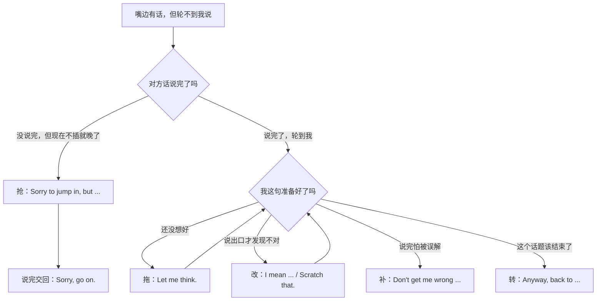
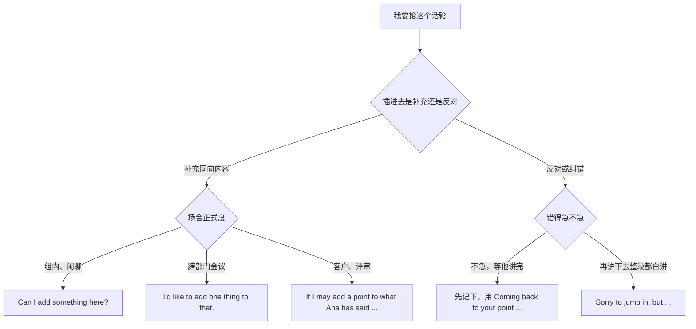
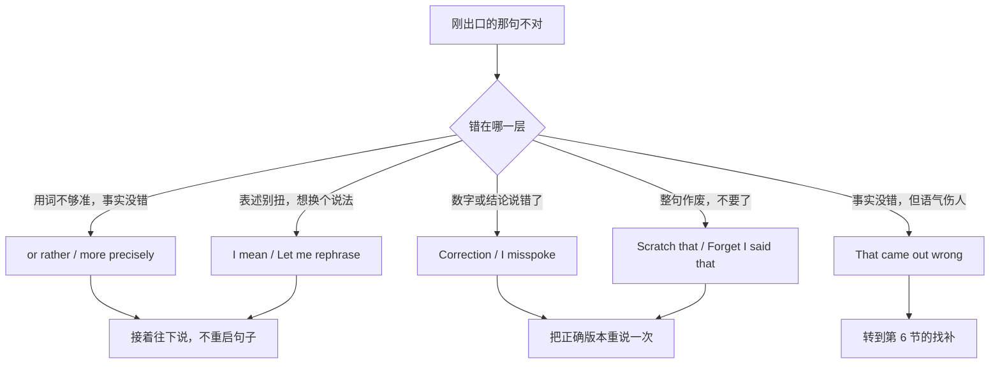
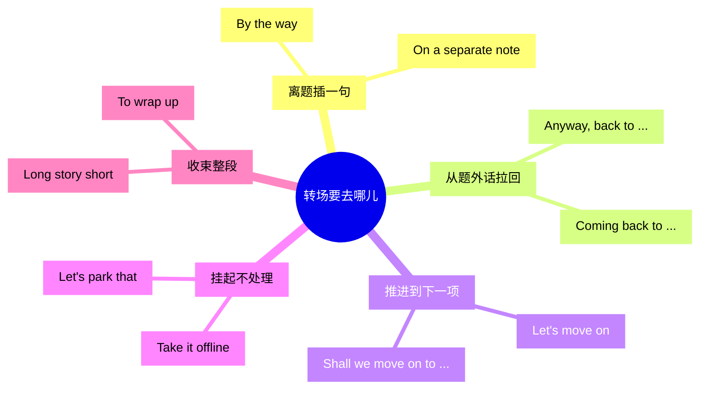
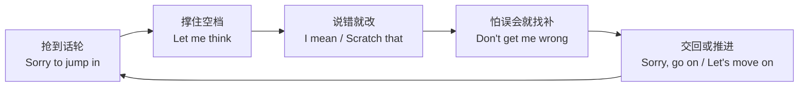

# 打断一下、让我想想、说回刚才：插话、拖延、改口与转场

> [!info] 本篇定位
>
> 这篇收的是**说话过程本身**的句子，不是内容的句子：怎么抢到发言权、怎么在没想好的时候把话撑住、怎么把已经出口的错话收回来、怎么把跑偏的话题拉回去。
>
> 上一篇 [[11.人际功能与话轮管理/02.没听清、你的意思是、我复述一下：澄清、追问与确认理解\|澄清、追问与确认理解]] 管的是「听」那一侧，本篇管「说」那一侧；异议与坏消息的具体内容归 [[11.人际功能与话轮管理/05.我有个顾虑、这样不太行、恐怕要延期：异议、负面反馈与坏消息\|异议、负面反馈与坏消息]]，本篇只管把话插进去的那半秒。
>
> 读完能查到：40 条中文触发语，每条三档成品句架，共约 110 句，加一张按中文说法排的速查总表。

---

## 1. 本篇导读：话轮里的四个动作

英语会议上真正卡人的不是词汇量，是**时机**。一句话想说，等到礼貌的空档出现时，议题已经翻篇了。中文母语者常见的两种失败模式：一种是全程不插话，会开完了发言为零；另一种是直接开口打断，用了 `You are wrong` 这种没有缓冲的句子，把补充说成了挑衅。

这篇把说话过程拆成四个动作，每个动作对应一个中文入口群：

| 动作 | 中文入口长什么样 | 落在本篇哪一节 |
| --- | --- | --- |
| 抢 | 打断一下、我插一句、我补充一点、等我说完 | 第 2 节 |
| 让 | 你先说、抱歉打断了、我说到哪了、还有别的吗 | 第 3 节 |
| 拖 | 让我想想、怎么说呢、那词在嘴边、我得查一下 | 第 4 节 |
| 改 | 我是说、说错了、当我没说、我重说一遍 | 第 5 节 |
| 补 | 别误会、那话说得不好、我不是怪你 | 第 6 节 |
| 转 | 顺便说一句、说回刚才、往下走、这个先放放 | 第 7 节 |

这张图是本篇的总选择树。进入点永远是「我现在想说话」，第一个分岔判断的不是语法，是**对方讲完没有**：讲完了，后面四条路按你自己那句话的状态选；没讲完，只有插话一条路，而插话本身有代价，代价大小决定用哪一档。

三档在本篇的含义和别的篇不太一样。别处的三档是语域差（口语／书面／正式），本篇的三档同时是**打断代价的三档**：口语档用在关系近、打断成本低的场合（组内站会、结对编程、群聊）；书面档用在跨部门会议、和不熟的同事对话；正式档用在客户、评审、有记录的正式会议——这时候插话本身要先申请，`May I` 这类形式不是啰嗦，是买路钱。

> [!tip] 三个判断顺序
>
> 1. 先判断**要不要现在说**——能等到空档就别插，插话额度用完了就没人愿意听你说了。
> 2. 再判断**插进去干什么**——补充和反对用的开场不同，补充可以顺着说，反对要先降调。
> 3. 最后才挑档——正式度越高，开场越长，越要用情态动词而不是祈使句。

---

## 2. 抢：把话插进去

这一节的六条意图共用一个原则：**先给出插话的理由，再说内容**。英语里裸开口（直接说观点）等同于中文的「你别说了听我说」，而 `Sorry to jump in` 这半句的作用就是把「我知道现在不该我说」这层认知先摆出来，对方才不会当成攻击。

这张图解决的是「同样想插话，为什么有时候用 `Can I add something` 有时候用 `Sorry to jump in`」。分水岭在方向：补充是同向的，对方不会有损失，所以可以用请求式；反对是反向的，插进去会让对方前面的话作废，所以必须带 `Sorry`，而且只有在「再讲下去整段都白讲」的时候才值得付这个代价。右下角那条「不急就先记下」是被中文母语者忽略最多的一条出路——把反对留到对方讲完，用 `Coming back to your point ...` 接回来，比当场打断的收益高得多。

### 2.1 打断一下：硬切进别人的话

**中文触发语**：打断一下 / 我插一句 / 抱歉打断 / 等一下我说句话 / 插个话

| 档位 | 句架 | 例句 |
| --- | --- | --- |
| 口语 | Sorry to jump in, but ... | Sorry to jump in, but that number looks off to me. |
| 书面 | Can I just come in on that point? | Can I just come in on that point? I think we're measuring two different things. |
| 正式 | May I interject briefly? | May I interject briefly? There is a constraint here that may change the conclusion. |

> [!warning] 错配警示
>
> - ~~Sorry to interrupt you speaking.~~ ❌
> - **Sorry to interrupt.** ✅（interrupt 后面跟人或者干脆不跟宾语，没有「打断某人做某事」这个双成分结构）
> - ~~I want to jump in.~~ ❌ → **Sorry to jump in, but ...** ✅（陈述自己的意愿不构成插话许可，缺了 Sorry 那半句就是硬闯）

- **同义入口**：容我插一句 / 等我说一句 / 稍等，我这儿有个问题
- **语法归属**：[[02.英语基础语法/08.非谓语动词/01.动词不定式详解\|动词不定式详解]]
- **场景实战**：[[04.英语场景/10.职场与商务场景实战/02.会议汇报与演示场景\|会议汇报与演示场景]]

### 2.2 我补充一点：顺着对方往下加

**中文触发语**：我补充一点 / 我加一句 / 我这儿还有个补充 / 再说一点

| 档位 | 句架 | 例句 |
| --- | --- | --- |
| 口语 | Can I add something here? | Can I add something here? We hit the same bug last quarter. |
| 书面 | I'd like to add one thing to that. | I'd like to add one thing to that: the rate limit only applies to write calls. |
| 正式 | If I may add a point to what A has said, ... | If I may add a point to what Ana has said, the migration window is fixed by the vendor. |

> [!warning] 错配警示
>
> - ~~I add one thing.~~ ❌
> - **Let me add one thing.** ✅（一般现在时在这里描述习惯，说不出「此刻要做」的意思，要么用 let me，要么用 I'd like to）

- **同义入口**：补两句 / 我这边还有一条 / 顺着这个再说一点
- **语法归属**：[[02.英语基础语法/07.助动词与情态动词/02.情态动词详解\|情态动词详解]]
- **场景实战**：[[04.英语场景/05.高频实用表达句型框架/01.表达观点与态度的50个万能句型\|表达观点与态度的万能句型]]

### 2.3 接你刚才那句：把发言挂在别人的话上

**中文触发语**：接着你刚才说的 / 顺着这个说 / 就着你那句 / 借你这个点

| 档位 | 句架 | 例句 |
| --- | --- | --- |
| 口语 | Building on what you said, ... | Building on what you said, we could cache the result and skip the second call. |
| 书面 | To build on A's point, ... | To build on Ravi's point, the cost only shows up under peak load. |
| 正式 | Further to the point just raised, ... | Further to the point just raised, the same constraint applies to the reporting pipeline. |

> [!warning] 错配警示
>
> - ~~Following your words, ...~~ ❌
> - **Following up on your point, ...** ✅（words 指字面词句，接话要接的是 point、comment 或 question）

- **同义入口**：沿着这条线说 / 你这个点我再往下推一步 / 我接一句
- **语法归属**：[[02.英语基础语法/08.非谓语动词/03.现在分词详解\|现在分词详解]]
- **场景实战**：[[04.英语场景/05.高频实用表达句型框架/04.比较对比举例总结句型库\|比较对比举例总结句型库]]

### 2.4 等我说完：守住已经拿到的话轮

**中文触发语**：等我说完 / 让我把话说完 / 先别打断 / 我还没说完

| 档位 | 句架 | 例句 |
| --- | --- | --- |
| 口语 | Hold on, let me finish. | Hold on, let me finish — there's a second half to this. |
| 书面 | If I could just finish this thought, ... | If I could just finish this thought, I'll come straight to your question. |
| 正式 | I'd appreciate it if I could finish my point first. | I'd appreciate it if I could finish my point first; it bears directly on your question. |

> [!warning] 错配警示
>
> - ~~Don't interrupt me!~~ ❌
> - **Hold on, let me finish.** ✅（祈使否定句在会议上是斥责，同样的意思用 hold on 加 let me 就只是维持秩序）

- **同义入口**：我这句还有下半截 / 听我说完再评 / 我马上讲到你那个点
- **语法归属**：[[02.英语基础语法/07.助动词与情态动词/03.情态动词的特殊句型\|情态动词的特殊句型]]
- **场景实战**：[[04.英语场景/10.职场与商务场景实战/04.商务谈判合同与客户沟通\|商务谈判与客户沟通]]

### 2.5 还有一点就说完：给对方一个终点

**中文触发语**：我还有一点没说 / 最后一句 / 说完这条就完 / 再给我半分钟

| 档位 | 句架 | 例句 |
| --- | --- | --- |
| 口语 | One more thing and I'm done. | One more thing and I'm done: the staging box still has the old config. |
| 书面 | Just one more point and I'll hand it back. | Just one more point and I'll hand it back to you. |
| 正式 | I have one remaining point, and then I'll yield the floor. | I have one remaining point on cost, and then I'll yield the floor. |

- **同义入口**：还剩一条 / 说完这个就交给你 / 就一句话的事
- **语法归属**：[[02.英语基础语法/06.动词时态/02.一般将来时与过去将来时\|一般将来时与过去将来时]]
- **场景实战**：[[04.英语场景/10.职场与商务场景实战/02.会议汇报与演示场景\|会议汇报与演示场景]]

### 2.6 我能说句话吗：申请发言权

**中文触发语**：我能说句话吗 / 我可以说两句吗 / 给我半分钟 / 我这儿有个想法

| 档位 | 句架 | 例句 |
| --- | --- | --- |
| 口语 | Can I say something? | Can I say something? I think we're solving the wrong problem. |
| 书面 | Could I have thirty seconds on this? | Could I have thirty seconds on this before we vote? |
| 正式 | May I have the floor for a moment? | May I have the floor for a moment? I'd like to record an objection. |

> [!warning] 错配警示
>
> - ~~Can I speak?~~ ❌
> - **Can I say something?** ✅（speak 不带宾语时问的是「我有没有说话能力／权利」，正常场合听起来像被压制了很久才发问）

- **同义入口**：我插一嘴行吗 / 能给我一分钟吗 / 我说两句
- **语法归属**：[[02.英语基础语法/01.基础入门/03.疑问句与否定句的构成\|疑问句与否定句的构成]]
- **场景实战**：[[04.英语场景/05.高频实用表达句型框架/02.建议请求邀请拒绝四大功能句型\|建议请求邀请拒绝四大功能句型]]

### 2.7 我一会儿要说：预约一个未来的话轮

**中文触发语**：我一会儿有个问题 / 等下我想说说这个 / 这条我记着，回头说

| 档位 | 句架 | 例句 |
| --- | --- | --- |
| 口语 | I've got a question, but I'll hold it till the end. | I've got a question about rollout, but I'll hold it till the end. |
| 书面 | I'd like to come back to X later if there's time. | I'd like to come back to the pricing question later if there's time. |
| 正式 | I would like to reserve a comment on X for the end of the discussion. | I would like to reserve a comment on the timeline for the end of the discussion. |

- **同义入口**：先记一笔 / 这个我们回头再碰 / 我把它挂着
- **语法归属**：[[02.英语基础语法/09.从句体系/04.状语从句详解\|状语从句详解]]
- **场景实战**：[[04.英语场景/10.职场与商务场景实战/02.会议汇报与演示场景\|会议汇报与演示场景]]

---

## 3. 让：把话轮交出去、收回来

抢话轮是主动动作，让话轮是它的另一半。两个动作的比例决定别人对你的印象：只抢不让是霸场，只让不抢是隐形。这一节的六条意图管三件事——把发言权礼让出去、把误插的话补救回来、把自己被打断的线索找回来。

### 3.1 你先说：把话让出去

**中文触发语**：你先说 / 你说吧 / 你先来 / 你说你说

| 档位 | 句架 | 例句 |
| --- | --- | --- |
| 口语 | Go ahead, you first. | Go ahead, you first — mine can wait. |
| 书面 | Please, go ahead — I'll follow. | Please, go ahead — I'll follow with a related point. |
| 正式 | After you, please. | After you, please; I'd rather hear the operations view first. |

> [!warning] 错配警示
>
> - ~~You say first.~~ ❌
> - **You go first.** ✅（say 必须带说的内容，让人先说用 go first 或 go ahead）

- **同义入口**：您先 / 你讲你讲 / 我等你说完
- **语法归属**：[[02.英语基础语法/12.日常口语/02.常用口语句型\|常用口语句型]]
- **场景实战**：[[04.英语场景/07.社交交际场景实战/01.交友聚会与闲聊场景\|交友聚会与闲聊场景]]

### 3.2 抱歉打断了，你继续：插错了立刻退回

**中文触发语**：抱歉打断了 / 我插嘴了 / 你继续 / 是我打断你了

| 档位 | 句架 | 例句 |
| --- | --- | --- |
| 口语 | Sorry, I cut you off. Go on. | Sorry, I cut you off. Go on, you were saying about the retry logic. |
| 书面 | Apologies for cutting in — please continue. | Apologies for cutting in — please continue, I'll hold my question. |
| 正式 | Forgive the interruption; please carry on. | Forgive the interruption; please carry on with the second scenario. |

> [!warning] 错配警示
>
> - ~~Sorry, please continue to say.~~ ❌
> - **Sorry, please go on.** ✅（continue to say 后面必须带说的内容，光让人接着讲用 go on 或 carry on）

- **同义入口**：我打岔了 / 你说到哪儿了，接着说 / 当我没插话
- **语法归属**：[[02.英语基础语法/05.介词与连词/02.常用介词搭配详解\|常用介词搭配详解]]
- **场景实战**：[[04.英语场景/07.社交交际场景实战/02.电话短信与在线沟通场景\|电话短信与在线沟通场景]]

### 3.3 两人同时开口：撞车了怎么退

**中文触发语**：你说你说 / 不不，你先 / 咱俩一块儿说了 / 你说吧我等着

| 档位 | 句架 | 例句 |
| --- | --- | --- |
| 口语 | Sorry — you go. | Sorry — you go. I'll jump in after. |
| 书面 | We spoke over each other — please, you first. | We spoke over each other — please, you first; I'll add to it. |
| 正式 | I believe we started at the same time; please proceed. | I believe we started at the same time; please proceed, and I'll follow. |

> [!tip] 远程会议的额外一句
>
> 视频会议延迟会让撞车高频发生，撞完之后固定用 `Sorry, you go — I'll mute.` 一次解决，比反复互相谦让省时间。

- **同义入口**：撞上了 / 我让你 / 你先来我后说
- **语法归属**：[[02.英语基础语法/12.日常口语/01.口语中的语法简化\|口语中的语法简化]]
- **场景实战**：[[04.英语场景/07.社交交际场景实战/02.电话短信与在线沟通场景\|电话短信与在线沟通场景]]

### 3.4 我说到哪了：被打断之后接回自己的线

**中文触发语**：我说到哪了 / 刚才说到哪儿了 / 我接着刚才的 / 回到我那条

| 档位 | 句架 | 例句 |
| --- | --- | --- |
| 口语 | Where was I? | Where was I? Right — the cache invalidation. |
| 书面 | Where had I got to? | Where had I got to? The second half of the estimate. |
| 正式 | If I may pick up where I left off, ... | If I may pick up where I left off, the remaining risk sits with the vendor. |

> [!warning] 错配警示
>
> - ~~Where I was?~~ ❌
> - **Where was I?** ✅（这是疑问句，主谓要倒，写成陈述语序只在间接问句里成立）

- **同义入口**：刚才讲到哪儿 / 我那句还没说完 / 顺回去接着讲
- **语法归属**：[[02.英语基础语法/09.从句体系/03.名词性从句详解\|名词性从句详解]]
- **场景实战**：[[04.英语场景/10.职场与商务场景实战/02.会议汇报与演示场景\|会议汇报与演示场景]]

### 3.5 你说完了吗：确认对方的话轮结束了

**中文触发语**：你说完了吗 / 还有别的吗 / 就这些吗 / 说完了我接

| 档位 | 句架 | 例句 |
| --- | --- | --- |
| 口语 | Was there anything else? | Was there anything else? Otherwise I'll take the next one. |
| 书面 | Is there anything you'd like to add before I respond? | Is there anything you'd like to add before I respond to the first two? |
| 正式 | Have you concluded your point? | Have you concluded your point? I'd like to respond to the second part. |

> [!warning] 错配警示
>
> - ~~Do you finish?~~ ❌
> - **Are you done?** ✅（finish 的这个用法要带宾语；口语确认对方讲完用 Are you done? 或 Was there anything else?）

- **同义入口**：讲完了吗 / 还有要说的没 / 我可以接了吗
- **语法归属**：[[02.英语基础语法/06.动词时态/04.完成时态详解\|完成时态详解]]
- **场景实战**：[[04.英语场景/05.高频实用表达句型框架/02.建议请求邀请拒绝四大功能句型\|建议请求邀请拒绝四大功能句型]]

### 3.6 大家还有要说的吗：主持人把话轮抛出去

**中文触发语**：谁还有 / 大家还有补充吗 / 都说完了吧 / 还有别的意见吗

| 档位 | 句架 | 例句 |
| --- | --- | --- |
| 口语 | Anyone else? | Anyone else? Otherwise we'll move on. |
| 书面 | Does anyone want to come in on this? | Does anyone want to come in on this before we close it out? |
| 正式 | Are there any further comments before we proceed? | Are there any further comments before we proceed to the budget item? |

- **同义入口**：还有人要说吗 / 大家有想法就说 / 最后一轮意见
- **语法归属**：[[02.英语基础语法/03.代词与数词/04.不定代词详解\|不定代词详解]]
- **场景实战**：[[04.英语场景/10.职场与商务场景实战/02.会议汇报与演示场景\|会议汇报与演示场景]]

---

## 4. 拖：把没想好的那几秒撑住

中文的「嗯」「那个」「就是说」在英语里没有一对一的对应。直接把 `Ah ... ah ... ah` 铺满整句是最伤流利度印象的一种做法——听感不是在思考，是在卡壳。英语的做法是**用一个完整的短句占住那几秒**，句子本身没有信息量，但它证明你还在这个话轮里，没有把发言权丢掉。

这一节七条意图按拖的理由分：想不出结论、想不出说法、想不起某个词、需要重新组织、需要事后补答。

### 4.1 让我想想：占住三秒钟

**中文触发语**：让我想想 / 我想一下 / 等我捋一下 / 稍等

| 档位 | 句架 | 例句 |
| --- | --- | --- |
| 口语 | Let me think. | Let me think — I want to give you a real number, not a guess. |
| 书面 | Let me think about that for a moment. | Let me think about that for a moment; there are two cases. |
| 正式 | I'd like a moment to consider that. | I'd like a moment to consider that before I commit to a date. |

> [!warning] 错配警示
>
> - ~~Let me think about.~~ ❌
> - **Let me think about it.** ✅（about 是介词，后面不能空着；不想带宾语就用光杆的 Let me think）

- **同义入口**：我琢磨一下 / 容我想想 / 给我两秒
- **语法归属**：[[02.英语基础语法/05.介词与连词/01.介词的分类与基本用法\|介词的分类与基本用法]]
- **场景实战**：[[04.英语场景/10.职场与商务场景实战/01.求职简历面试与Offer谈判\|求职面试场景]]

### 4.2 怎么说呢：想不出合适的说法

**中文触发语**：怎么说呢 / 该怎么讲 / 这么说吧 / 我找个说法

| 档位 | 句架 | 例句 |
| --- | --- | --- |
| 口语 | How should I put this? | How should I put this — the design works, it's just expensive to maintain. |
| 书面 | How best to put this ... | How best to put this: the results are promising but not yet reproducible. |
| 正式 | Let me phrase this carefully. | Let me phrase this carefully, because it touches on a client commitment. |

> [!tip] 这句自带缓冲功能
>
> `How should I put this?` 除了拖时间，还预告了「接下来是不好听的话」。用在负面反馈前面，等于提前给对方一个心理准备，比直接说出结论安全。

- **同义入口**：不知道怎么表达 / 换个说法讲 / 这事儿不好说
- **语法归属**：[[02.英语基础语法/12.日常口语/02.常用口语句型\|常用口语句型]]
- **场景实战**：[[04.英语场景/05.高频实用表达句型框架/01.表达观点与态度的50个万能句型\|表达观点与态度的万能句型]]

### 4.3 那个词在嘴边：卡在一个具体的词上

**中文触发语**：话到嘴边说不出来 / 就差那个词 / 那个词叫什么来着

| 档位 | 句架 | 例句 |
| --- | --- | --- |
| 口语 | It's on the tip of my tongue. | It's on the tip of my tongue — the thing that queues the failed jobs. |
| 书面 | The word escapes me at the moment. | The word escapes me at the moment; I'll send it in writing. |
| 正式 | The term escapes me; I'll come back to it. | The term escapes me; I'll come back to it in the written summary. |

> [!warning] 错配警示
>
> - ~~The word is on my mouth.~~ ❌
> - **It's on the tip of my tongue.** ✅（这是固定说法，位置在舌尖不在嘴上，词序和介词都不能改）

- **同义入口**：一下想不起来 / 那词儿卡住了 / 到嘴边了就是出不来
- **语法归属**：[[02.英语基础语法/05.介词与连词/02.常用介词搭配详解\|常用介词搭配详解]]
- **场景实战**：[[04.英语场景/07.社交交际场景实战/01.交友聚会与闲聊场景\|交友聚会与闲聊场景]]

### 4.4 那个叫什么来着：不知道单词时绕过去

**中文触发语**：那个叫什么来着 / 就那个东西 / 你懂我说的那个 / 没想起来学名

| 档位 | 句架 | 例句 |
| --- | --- | --- |
| 口语 | the thing that + 从句 | You know the thing that retries the request automatically? That one. |
| 书面 | what we usually call ... | It's what we usually call a warm start — the cache is already populated. |
| 正式 | what is commonly referred to as ... | This is what is commonly referred to as an eventual-consistency window. |

> [!tip] 绕说比停下来强
>
> 停在一个想不起来的名词上，整句就废了。把名词换成 `the thing that + 它干什么`，句子照样能落地，对方十有八九会把正确的词补给你——这一补，你还顺带学到了词。

- **同义入口**：叫啥来着 / 就是干那个事的那玩意 / 学名我忘了
- **语法归属**：[[02.英语基础语法/09.从句体系/01.定语从句基础\|定语从句基础]]
- **场景实战**：[[04.英语场景/05.高频实用表达句型框架/04.比较对比举例总结句型库\|比较对比举例总结句型库]]

### 4.5 我先理一下思路：整段还没组织好

**中文触发语**：我组织一下语言 / 我先理一下 / 让我捋顺了说 / 等我想个顺序

| 档位 | 句架 | 例句 |
| --- | --- | --- |
| 口语 | Let me get my thoughts straight first. | Let me get my thoughts straight first — there are three separate issues here. |
| 书面 | Let me organize that before I answer. | Let me organize that before I answer; the causes and the symptoms got mixed up. |
| 正式 | Allow me to structure my response. | Allow me to structure my response around the three risks you listed. |

- **同义入口**：我先分个类 / 我按顺序说 / 让我理清楚再讲
- **语法归属**：[[02.英语基础语法/08.非谓语动词/01.动词不定式详解\|动词不定式详解]]
- **场景实战**：[[04.英语场景/10.职场与商务场景实战/02.会议汇报与演示场景\|会议汇报与演示场景]]

### 4.6 这个问题问得好：用一句垫话换时间

**中文触发语**：这个问题问得好 / 问到点子上了 / 我正想说这个

| 档位 | 句架 | 例句 |
| --- | --- | --- |
| 口语 | That's a fair question. | That's a fair question. Short answer: not this quarter. |
| 书面 | That's worth unpacking. | That's worth unpacking — there are two things bundled in it. |
| 正式 | That's an important question, and I want to answer it precisely. | That's an important question, and I want to answer it precisely, so let me separate the two parts. |

> [!warning] 错配警示
>
> - ~~Good question!~~ 用滥了 ❌
> - **That's a fair question.** ✅（每问必答 Good question 会被听成敷衍套话；换成 fair、worth unpacking 这类，垫话才有内容）

- **同义入口**：这话该问 / 这个得说清楚 / 正好说到这儿
- **语法归属**：[[02.英语基础语法/12.日常口语/04.口语与书面语对比\|口语与书面语对比]]
- **场景实战**：[[04.英语场景/10.职场与商务场景实战/01.求职简历面试与Offer谈判\|求职面试场景]]

### 4.7 我现在答不上来：把话轮暂时放弃掉

**中文触发语**：我现在说不好 / 我得查一下 / 回头答复你 / 手头没数据

| 档位 | 句架 | 例句 |
| --- | --- | --- |
| 口语 | I don't have that off the top of my head. | I don't have that off the top of my head — I'll dig it out after this. |
| 书面 | I don't have that number to hand; let me check and get back to you. | I don't have that number to hand; let me check and get back to you today. |
| 正式 | I'm not in a position to answer that accurately; I'll follow up in writing. | I'm not in a position to answer that accurately; I'll follow up in writing by Friday. |

> [!warning] 错配警示
>
> - ~~I don't know.~~ 单说 ❌
> - **I don't have that off the top of my head — I'll find out.** ✅（光说不知道等于把问题丢回去；补上「我去查」才算完成这个话轮）

- **同义入口**：一时说不准 / 我核实后回你 / 这个我不敢拍板
- **语法归属**：[[02.英语基础语法/07.助动词与情态动词/01.助动词的基本用法\|助动词的基本用法]]
- **场景实战**：[[04.英语场景/10.职场与商务场景实战/04.商务谈判合同与客户沟通\|商务谈判与客户沟通]]

---

## 5. 改：话已出口，往回收

这一节是本篇最实用的一段。中文母语者在英语里改口的默认动作是**整句重说一遍**，听起来像磁带倒带；英语的做法是给一个改口标记，然后只改错的那一小块。标记选得准，对方会自动把前半句作废，不会追问。

这张图的关键是右边两条出路的分工。`or rather` 和 `I mean` 属于**句内修补**，说完标记直接接下去，整句不重启，听感是流畅的自我修正；`Correction` 和 `Scratch that` 属于**句子作废**，说完必须把正确版本完整重说一遍，中间不能省。最右下那条最容易被忽略：语气问题不是改口能解决的，改一百遍句子也没用，得走第 6 节的找补。

### 5.1 我是说：最通用的修补标记

**中文触发语**：我是说 / 我的意思是 / 不是，我是说 / 我想说的是

| 档位 | 句架 | 例句 |
| --- | --- | --- |
| 口语 | I mean ... | We ship Tuesday — I mean Wednesday, after the freeze. |
| 书面 | What I mean is ... | What I mean is that the deadline is fixed, not the scope. |
| 正式 | To be precise, ... | To be precise, the constraint is on concurrent writes, not on total volume. |

> [!warning] 错配警示
>
> - ~~My meaning is ...~~ ❌
> - **What I mean is ...** ✅（meaning 作名词指词句本身的含义，说自己的意图要用 what I mean 这个从句形式）

- **同义入口**：我说的是 / 准确讲 / 换句话说
- **语法归属**：[[02.英语基础语法/09.从句体系/03.名词性从句详解\|名词性从句详解]]
- **场景实战**：[[04.英语场景/05.高频实用表达句型框架/01.表达观点与态度的50个万能句型\|表达观点与态度的万能句型]]

### 5.2 或者说：把词换成更准的那个

**中文触发语**：或者说 / 更准确地说 / 应该说是 / 说得再准点

| 档位 | 句架 | 例句 |
| --- | --- | --- |
| 口语 | ... or rather ... | It's a bug, or rather a design choice we now regret. |
| 书面 | ..., or, more accurately, ... | The job failed, or, more accurately, it never started. |
| 正式 | ..., or, more precisely, ... | The clause limits liability, or, more precisely, it caps it at the annual fee. |

> [!warning] 错配警示
>
> - ~~It's a bug, or rather it is a design choice.~~ 拖沓 ❌
> - **It's a bug — or rather a design choice.** ✅（or rather 后面只接被替换的那一块，重复主谓会让修补听起来像另起一句）

- **同义入口**：确切地讲 / 严格说 / 说白了是
- **语法归属**：[[02.英语基础语法/10.特殊句型/05.省略与替代\|省略与替代]]
- **场景实战**：[[04.英语场景/05.高频实用表达句型框架/04.比较对比举例总结句型库\|比较对比举例总结句型库]]

### 5.3 刚才说错了：整句作废

**中文触发语**：说错了 / 当我没说 / 刚那句划掉 / 我说反了

| 档位 | 句架 | 例句 |
| --- | --- | --- |
| 口语 | Scratch that. | Scratch that — the outage started at nine, not at eleven. |
| 书面 | Let me correct myself: ... | Let me correct myself: the report goes to Legal first, then to Finance. |
| 正式 | I'd like to correct what I said a moment ago. | I'd like to correct what I said a moment ago about the vendor's obligations. |

> [!warning] 错配警示
>
> - ~~Scratch that.~~ 用在正式会议记录场合 ❌
> - **I'd like to correct what I said a moment ago.** ✅（scratch that 是口语，会议纪要、客户电话、有录音的场合都要换成完整的更正句）

- **同义入口**：前面那句不算 / 我更正一下 / 撤回刚才那句
- **语法归属**：[[02.英语基础语法/12.日常口语/01.口语中的语法简化\|口语中的语法简化]]
- **场景实战**：[[04.英语场景/10.职场与商务场景实战/02.会议汇报与演示场景\|会议汇报与演示场景]]

### 5.4 我换个说法：句子结构本身没说清

**中文触发语**：我换个说法 / 我重说一遍 / 我讲得清楚点 / 这么讲吧

| 档位 | 句架 | 例句 |
| --- | --- | --- |
| 口语 | Let me put that another way. | Let me put that another way: nobody owns this service right now. |
| 书面 | Let me rephrase. | Let me rephrase — the risk isn't the migration, it's the rollback. |
| 正式 | Allow me to restate that more clearly. | Allow me to restate that more clearly, since it affects the approval path. |

> [!warning] 错配警示
>
> - ~~Let me say again.~~ ❌
> - **Let me put that another way.** ✅（say again 是原样重复，对方没听清才用；说法不好要换表述，用 put another way 或 rephrase）

- **同义入口**：我重新组织一下 / 这么说更清楚 / 我举个例子说
- **语法归属**：[[02.英语基础语法/08.非谓语动词/01.动词不定式详解\|动词不定式详解]]
- **场景实战**：[[04.英语场景/05.高频实用表达句型框架/01.表达观点与态度的50个万能句型\|表达观点与态度的万能句型]]

### 5.5 是三不是二：只改一个具体数据

**中文触发语**：是三不是二 / 我说岔了个数 / 更正一下数字 / 应该是下周不是这周

| 档位 | 句架 | 例句 |
| --- | --- | --- |
| 口语 | Sorry — three, not two. | Sorry — three environments, not two. |
| 书面 | Correction: the figure is X, not Y. | Correction: the figure is 3.2 million, not 2.3. |
| 正式 | I misspoke; the correct figure is X. | I misspoke; the correct figure is 3.2 million, and the written record should reflect that. |

> [!warning] 错配警示
>
> - ~~I said wrong.~~ ❌
> - **I misspoke.** ✅（说错话是一个动词 misspeak，说 said wrong 在英语里没有这个搭配）

- **同义入口**：数字报错了 / 我改一下那个数 / 前面那个数不对
- **语法归属**：[[02.英语基础语法/11.实战应用/03.常见语法错误纠正\|常见语法错误纠正]]
- **场景实战**：[[04.英语场景/10.职场与商务场景实战/02.会议汇报与演示场景\|会议汇报与演示场景]]

### 5.6 我收回那句：撤回一个观点

**中文触发语**：我收回 / 当我没说过 / 那句作废 / 我撤回刚才的意见

| 档位 | 句架 | 例句 |
| --- | --- | --- |
| 口语 | Forget I said that. | Forget I said that — you're right, the data was already migrated. |
| 书面 | I'd like to withdraw that comment. | I'd like to withdraw that comment; I was looking at last week's dashboard. |
| 正式 | I retract my earlier statement. | I retract my earlier statement regarding the vendor's delivery date. |

> [!tip] 撤回比坚持便宜
>
> 发现自己站错了立场，`Forget I said that` 加一句原因，一句话就结束了。硬撑着找补，占的是别人的会议时间，也会被记住。

- **同义入口**：我说错了立场 / 前面那条不作数 / 我改主意了
- **语法归属**：[[02.英语基础语法/09.从句体系/03.名词性从句详解\|名词性从句详解]]
- **场景实战**：[[04.英语场景/10.职场与商务场景实战/04.商务谈判合同与客户沟通\|商务谈判与客户沟通]]

### 5.7 我漏说了一句：往回补一条

**中文触发语**：我漏了一句 / 忘了说一件事 / 补一句刚才的 / 还有个前提没交代

| 档位 | 句架 | 例句 |
| --- | --- | --- |
| 口语 | Oh, and one thing I forgot — ... | Oh, and one thing I forgot — the staging DB is on the old schema. |
| 书面 | I should have mentioned earlier that ... | I should have mentioned earlier that this only applies to paid accounts. |
| 正式 | For completeness, I should have noted that ... | For completeness, I should have noted that the exemption expires in March. |

> [!warning] 错配警示
>
> - ~~I forgot to say that the DB is old.~~ 听起来像在陈述自己的健忘 ❌
> - **I should have mentioned earlier that the DB is on the old schema.** ✅（should have done 把重点放回被漏掉的信息，而不是放在你忘了这件事上）

- **同义入口**：还有个背景 / 我把那条补上 / 前面少说了一句
- **语法归属**：[[02.英语基础语法/07.助动词与情态动词/03.情态动词的特殊句型\|情态动词的特殊句型]]
- **场景实战**：[[04.英语场景/10.职场与商务场景实战/03.商务邮件与正式书面沟通\|商务邮件与正式书面沟通]]

---

## 6. 补：话没说错，但怕被误解

改口处理的是「说得不对」，找补处理的是「说得对但听着不好」。两者的动作不同：改口改句子，找补**改的是对方对这句话的解读**，句子本身往往一个字都不用动。中文母语者容易把两者混起来，结果是把一句正确的批评反复重说，越说越像在强调你确实有问题。

### 6.1 别误会：先拆掉可能的误读

**中文触发语**：别误会 / 你别多想 / 我不是那个意思 / 说这话没别的意思

| 档位 | 句架 | 例句 |
| --- | --- | --- |
| 口语 | Don't get me wrong, ... | Don't get me wrong, the design is solid — I just think the timing is off. |
| 书面 | I don't want this to come across the wrong way, but ... | I don't want this to come across the wrong way, but the estimate looks optimistic. |
| 正式 | I trust this will not be taken as criticism, but ... | I trust this will not be taken as criticism, but the reporting line is unclear to me. |

> [!warning] 错配警示
>
> - ~~Don't misunderstand me.~~ ❌
> - **Don't get me wrong.** ✅（misunderstand 的祈使式在英语里是命令对方的理解方式，听感生硬，日常一律用 get me wrong）

- **同义入口**：不是针对你 / 我这么说不是要否定 / 你先别急着反驳
- **语法归属**：[[02.英语基础语法/12.日常口语/02.常用口语句型\|常用口语句型]]
- **场景实战**：[[04.英语场景/05.高频实用表达句型框架/03.同意反对让步转折句型库\|同意反对让步转折句型库]]

### 6.2 那话说得不好：承认表述有问题

**中文触发语**：这话说得不合适 / 我说重了 / 刚那句话不好听 / 表达得不好

| 档位 | 句架 | 例句 |
| --- | --- | --- |
| 口语 | That came out wrong. | That came out wrong — I wasn't questioning your judgment. |
| 书面 | That didn't come out the way I intended. | That didn't come out the way I intended; I meant the process, not your work. |
| 正式 | My previous remark was poorly phrased. | My previous remark was poorly phrased, and I'd like to restate it. |

> [!warning] 错配警示
>
> - ~~I said it wrong.~~ ❌
> - **That came out wrong.** ✅（英语把这件事说成「话自己出来的样子不对」，主语是 that 不是 I，这一层客观化正是它能降温的原因）

- **同义入口**：我口气重了 / 那句话有歧义 / 我不该那么说
- **语法归属**：[[02.英语基础语法/12.日常口语/02.常用口语句型\|常用口语句型]]
- **场景实战**：[[04.英语场景/07.社交交际场景实战/03.约会恋爱与人际关系场景\|约会恋爱与人际关系场景]]

### 6.3 我不是在怪你：把责任指向从人身上挪开

**中文触发语**：我不是在怪你 / 没说是你的问题 / 不是找谁的责任

| 档位 | 句架 | 例句 |
| --- | --- | --- |
| 口语 | I'm not blaming you. | I'm not blaming you — the alert never fired, that's the real problem. |
| 书面 | This isn't aimed at anyone in particular. | This isn't aimed at anyone in particular; the handoff step is missing from the process. |
| 正式 | This is not intended as an allegation against any individual. | This is not intended as an allegation against any individual; the control itself was absent. |

- **同义入口**：不是追责 / 这事儿不赖你 / 我说的是流程
- **语法归属**：[[02.英语基础语法/06.动词时态/03.进行时态详解\|进行时态详解]]
- **场景实战**：[[04.英语场景/10.职场与商务场景实战/02.会议汇报与演示场景\|会议汇报与演示场景]]

### 6.4 对事不对人：先声明射程

**中文触发语**：对事不对人 / 我说的是这件事 / 没有针对谁 / 单说这个方案

| 档位 | 句架 | 例句 |
| --- | --- | --- |
| 口语 | Nothing personal. | Nothing personal — I'd say the same about my own PR. |
| 书面 | This is about the process, not the people. | This is about the process, not the people; the same gap would trip anyone. |
| 正式 | My comments concern the approach rather than any individual's performance. | My comments concern the approach rather than any individual's performance on the team. |

> [!warning] 错配警示
>
> - ~~I aim at the thing, not the person.~~ ❌
> - **Nothing personal.** ✅（中文成语直译过去没人听得懂，英语的现成说法就是 nothing personal 或 about the process, not the people）

- **同义入口**：不带个人情绪 / 就方案论方案 / 换谁来都一样
- **语法归属**：[[02.英语基础语法/04.形容词与副词/01.形容词的用法与位置\|形容词的用法与位置]]
- **场景实战**：[[04.英语场景/05.高频实用表达句型框架/03.同意反对让步转折句型库\|同意反对让步转折句型库]]

### 6.5 是我没讲明白：把锅接到自己这边

**中文触发语**：我可能没说清楚 / 是我没讲明白 / 我表达得不好 / 怪我没交代

| 档位 | 句架 | 例句 |
| --- | --- | --- |
| 口语 | I probably didn't explain that well. | I probably didn't explain that well — let me try again with an example. |
| 书面 | That may have been my fault for not being clearer. | That may have been my fault for not being clearer about the two phases. |
| 正式 | The lack of clarity was on my side. | The lack of clarity was on my side; the specification did not state the assumption. |

> [!tip] 这句买的是继续解释的许可
>
> 对方明显没听懂时，说 `You didn't understand` 会把责任推过去，对话立刻变僵。把没讲清认到自己头上，等于换来一次重讲的机会，而这正是你要的。

- **同义入口**：我说得太快了 / 我漏了背景 / 我重讲一遍
- **语法归属**：[[02.英语基础语法/08.非谓语动词/02.动名词详解\|动名词详解]]
- **场景实战**：[[04.英语场景/09.学习与教育场景实战/01.课堂讨论与提问场景\|课堂讨论与提问场景]]

### 6.6 我说这些只是想：交代出发点

**中文触发语**：我说这些只是想 / 我的出发点是 / 我无非是想 / 我就是想提醒一句

| 档位 | 句架 | 例句 |
| --- | --- | --- |
| 口语 | All I'm saying is ... | All I'm saying is we should test the rollback before Friday. |
| 书面 | My point is simply that ... | My point is simply that we have no way to undo this once it ships. |
| 正式 | My intention in raising this is to ... | My intention in raising this is to make sure the risk is recorded, not to delay the release. |

> [!warning] 错配警示
>
> - ~~I only want to say that ...~~ ❌
> - **All I'm saying is (that) ...** ✅（only want to say 听起来像还没说，all I'm saying is 才有「我要的就这么点」的收束意味）

- **同义入口**：说到底我想说的是 / 我要的就一条 / 我图的是
- **语法归属**：[[02.英语基础语法/10.特殊句型/04.强调句型\|强调句型]]
- **场景实战**：[[04.英语场景/05.高频实用表达句型框架/01.表达观点与态度的50个万能句型\|表达观点与态度的万能句型]]

---

## 7. 转：换话题、拉回来、收尾

转场的难点在于**方向**。中文一个「说回来」既能表示回到正题，也能表示话锋一转提出反面意见，英语这两件事用的词完全不同：`Anyway, back to ...` 是回正题，`Then again ...` 是话锋一转。选错方向，对方会以为你要反驳。

五个去向按「离开当前话题的距离」排：`by the way` 走得最近，说完还能回来；`park` 和 `offline` 是把话题移出这场会议；`wrap up` 是结束整段发言，不再回来。选错的代价很具体——用 `Let's move on` 挂起一个别人还想讨论的话题，会被当成压制；用 `by the way` 引入一个需要半小时讨论的议题，会把整场会议带偏。

### 7.1 顺便说一句：塞进一条无关信息

**中文触发语**：顺便说一句 / 对了 / 差点忘了 / 另外提一句

| 档位 | 句架 | 例句 |
| --- | --- | --- |
| 口语 | By the way, ... | By the way, the office Wi-Fi will be down Saturday morning. |
| 书面 | On a separate note, ... | On a separate note, the vendor changed our account manager last week. |
| 正式 | On an unrelated matter, ... | On an unrelated matter, the audit team has requested access to the logs. |

> [!warning] 错配警示
>
> - ~~By the way~~ 引出一个需要长讨论的议题 ❌
> - **There's one more item I'd like to raise, if there's time.** ✅（by the way 预告的是一句带过的小事，用它开一个大议题会让人措手不及）

- **同义入口**：另说一件事 / 插播一条 / 跟这个没关系但
- **语法归属**：[[02.英语基础语法/05.介词与连词/03.连词的分类与用法\|连词的分类与用法]]
- **场景实战**：[[04.英语场景/07.社交交际场景实战/02.电话短信与在线沟通场景\|电话短信与在线沟通场景]]

### 7.2 扯远了：承认自己跑题

**中文触发语**：扯远了 / 跑题了 / 这是题外话 / 我说岔了

| 档位 | 句架 | 例句 |
| --- | --- | --- |
| 口语 | Anyway, I'm getting off track. | Anyway, I'm getting off track — that's a different project. |
| 书面 | That's a digression — back to the point. | That's a digression — back to the point about the release window. |
| 正式 | I'm straying from the subject; let me return to it. | I'm straying from the subject; let me return to the question of ownership. |

> [!warning] 错配警示
>
> - ~~I say too far.~~ ❌
> - **I'm getting off track.** ✅（跑题在英语里是偏离轨道 off track 或 off topic，不能按中文的「说远了」逐字译）

- **同义入口**：这话说远了 / 不说这个了 / 岔开了
- **语法归属**：[[02.英语基础语法/06.动词时态/03.进行时态详解\|进行时态详解]]
- **场景实战**：[[04.英语场景/07.社交交际场景实战/01.交友聚会与闲聊场景\|交友聚会与闲聊场景]]

### 7.3 说回刚才：拉回被打断的主线

**中文触发语**：说回刚才 / 回到正题 / 接着刚才那个 / 咱们回来说

| 档位 | 句架 | 例句 |
| --- | --- | --- |
| 口语 | Anyway, back to what we were saying. | Anyway, back to what we were saying about the retry limit. |
| 书面 | Coming back to the earlier point, ... | Coming back to the earlier point, we still need a decision on the schema. |
| 正式 | Returning to the matter at hand, ... | Returning to the matter at hand, the contract requires notice thirty days in advance. |

> [!warning] 错配警示
>
> - ~~Return to the topic.~~ ❌
> - **Anyway, back to the topic.** ✅（光杆祈使句像在指挥全场，加 anyway 或换成 coming back to 才是把自己的话拉回来）

- **同义入口**：接上刚才 / 我们回到那条 / 刚才那个还没说完
- **语法归属**：[[02.英语基础语法/09.从句体系/03.名词性从句详解\|名词性从句详解]]
- **场景实战**：[[04.英语场景/10.职场与商务场景实战/02.会议汇报与演示场景\|会议汇报与演示场景]]

### 7.4 往下走吧：推进到下一项

**中文触发语**：往下走吧 / 下一项 / 我们继续 / 这条过了

| 档位 | 句架 | 例句 |
| --- | --- | --- |
| 口语 | Let's move on. | Let's move on — we can pick this up in the design review. |
| 书面 | Shall we move on to the next item? | Shall we move on to the next item? We're eight minutes over on this one. |
| 正式 | If there are no further comments, we'll proceed to the next item. | If there are no further comments, we'll proceed to the budget item. |

> [!warning] 错配警示
>
> - ~~Next question.~~ ❌
> - **Let's move on to the next item.** ✅（两个词的祈使式在会议上是主持人赶人，加上 let's 与 item 才是协商语气）

- **同义入口**：这个先这样 / 进入下一条 / 时间关系先过
- **语法归属**：[[02.英语基础语法/07.助动词与情态动词/02.情态动词详解\|情态动词详解]]
- **场景实战**：[[04.英语场景/10.职场与商务场景实战/02.会议汇报与演示场景\|会议汇报与演示场景]]

### 7.5 这个先放放：把话题挂起来

**中文触发语**：这个先放一放 / 会后再说 / 单独约时间 / 先挂着

| 档位 | 句架 | 例句 |
| --- | --- | --- |
| 口语 | Let's park that for now. | Let's park that for now and come back to it Thursday. |
| 书面 | Can we set that aside and pick it up separately? | Can we set that aside and pick it up separately with the data team? |
| 正式 | I suggest we defer that item to a separate discussion. | I suggest we defer that item to a separate discussion with Legal present. |

> [!tip] park 和 offline 的分工
>
> `Let's park that` 是先放着，稍后回到同一场会议；`Let's take that offline` 是移出这场会议，另找时间私下谈。用错会让人以为你在会上还会给他机会。

- **同义入口**：另开一场谈 / 私下再对 / 这个不在今天的范围里
- **语法归属**：[[02.英语基础语法/09.从句体系/04.状语从句详解\|状语从句详解]]
- **场景实战**：[[04.英语场景/10.职场与商务场景实战/04.商务谈判合同与客户沟通\|商务谈判与客户沟通]]

### 7.6 长话短说：先给结论

**中文触发语**：长话短说 / 一句话说完 / 简单说 / 先说结论

| 档位 | 句架 | 例句 |
| --- | --- | --- |
| 口语 | Long story short, ... | Long story short, we lost two days and made them back over the weekend. |
| 书面 | In short, ... | In short, the approach works, but not at this scale. |
| 正式 | To summarize briefly, ... | To summarize briefly, the risk is contained, and the cost is unchanged. |

> [!warning] 错配警示
>
> - ~~Long story short~~ 用在正式书面报告里 ❌
> - **In short / To summarize briefly** ✅（long story short 自带讲故事的口吻，只适合口头与非正式书面）

- **同义入口**：说重点 / 结论是 / 一句话概括
- **语法归属**：[[02.英语基础语法/12.日常口语/04.口语与书面语对比\|口语与书面语对比]]
- **场景实战**：[[04.英语场景/05.高频实用表达句型框架/04.比较对比举例总结句型库\|比较对比举例总结句型库]]

### 7.7 最后一点：宣告自己要收尾

**中文触发语**：最后一点 / 我总结一下 / 说完这个就结束 / 收个尾

| 档位 | 句架 | 例句 |
| --- | --- | --- |
| 口语 | Last thing and I'll stop. | Last thing and I'll stop: please don't merge into main before Friday. |
| 书面 | To wrap up, ... | To wrap up, we need two decisions and one owner. |
| 正式 | In closing, ... | In closing, I'd like to record my thanks to the operations team. |

> [!warning] 错配警示
>
> - ~~At last, ...~~ ❌
> - **Finally, ... / To wrap up, ...** ✅（at last 表示等了很久终于发生，不能拿来给发言收尾）

- **同义入口**：最后说一句 / 到这儿差不多了 / 我这边就这些
- **语法归属**：[[02.英语基础语法/04.形容词与副词/03.副词的分类与用法\|副词的分类与用法]]
- **场景实战**：[[04.英语场景/10.职场与商务场景实战/02.会议汇报与演示场景\|会议汇报与演示场景]]

### 7.8 时间不多了：用时间当转场理由

**中文触发语**：时间到了 / 我们时间不多了 / 剩下的下次 / 还有五分钟

| 档位 | 句架 | 例句 |
| --- | --- | --- |
| 口语 | We're running low on time. | We're running low on time — let's take the last two by email. |
| 书面 | We're coming up on time; shall we take the rest offline? | We're coming up on time; shall we take the rest offline and circulate notes? |
| 正式 | We are approaching the end of our allotted time. | We are approaching the end of our allotted time; I propose we close on the first item. |

> [!warning] 错配警示
>
> - ~~The time is not enough.~~ ❌
> - **We're running low on time.** ✅（英语把主语放在人身上说「我们时间快不够了」，不用 time 当主语作这个判断）

- **同义入口**：卡点了 / 只剩几分钟 / 今天先到这儿
- **语法归属**：[[02.英语基础语法/06.动词时态/03.进行时态详解\|进行时态详解]]
- **场景实战**：[[04.英语场景/10.职场与商务场景实战/02.会议汇报与演示场景\|会议汇报与演示场景]]

---

## 8. 组合走位：四个动作串在一段发言里

单条句架背下来只解决半个问题，真实的会议里这些动作是连着出现的。下面这张表是一段完整的话轮流水——不是对话脚本，是一个人在八分钟里做的动作序列，每一行标出他在做什么、用了哪条。

| 顺序 | 心里想的中文 | 说出来的英文 | 动作 | 出处 |
| --- | --- | --- | --- | --- |
| 1 | 他这个数不对，再讲下去整段白讲 | Sorry to jump in, but that number looks off to me. | 抢 | 2.1 |
| 2 | 我得想想怎么说才不伤人 | Let me think — I want to get this right. | 拖 | 4.1 |
| 3 | 说出口发现用词太重 | It's a bug — or rather, a gap in the spec. | 改 | 5.2 |
| 4 | 怕他以为我在挑刺 | Don't get me wrong, the implementation is fine. | 补 | 6.1 |
| 5 | 我的意思其实很简单 | All I'm saying is we should re-run the numbers. | 补 | 6.6 |
| 6 | 他想插话，但我还有半句 | Hold on, let me finish — there's a second half. | 抢 | 2.4 |
| 7 | 说完了，把话给他 | Sorry, go on — you were saying? | 让 | 3.2 |
| 8 | 这个细节会开不完 | Let's park that and pick it up Thursday. | 转 | 7.5 |
| 9 | 该收尾了 | To wrap up: two decisions, one owner. | 转 | 7.7 |

这张流水里值得注意的是第 3、4、5 三行连在一起：改口之后紧跟找补，找补之后紧跟一句 `All I'm saying is`。中文母语者往往只做第 3 步（改词），漏掉后面两步，结果是词换准了，对方还是觉得被批评。三步连做才是完整的自救。

第 6 行和第 7 行也是一对：守住话轮之后必须主动交回去。只做第 6 步不做第 7 步，下次别人就不会再等你说完。

> [!example] 三档同一段的不同长相
>
> 同样是「打断—改口—收尾」这条链，三个语域里长度差一倍：
>
> **口语档（组内站会）**
> - Sorry to jump in — I mean, that's Tuesday, not Wednesday. Anyway, back to you.
>
> **书面档（跨部门会议）**
> - Can I just come in on that point? What I mean is that the date is Tuesday, not Wednesday. Coming back to your question ...
>
> **正式档（客户评审）**
> - May I interject briefly? To be precise, the delivery date is Tuesday. Returning to the matter at hand, the remaining risk sits with the vendor.

---

## 9. 一屏速查：中文触发语总表

按中文说法排，忘了小节号时从这张表直接查。首选成品是三档里最常用的那一档，语域拿不准就翻回对应小节看另外两档。

| 中文触发语 | 首选成品 | 小节 |
| --- | --- | --- |
| 打断一下 / 我插一句 | Sorry to jump in, but ... | 2.1 |
| 我补充一点 / 加一句 | Can I add something here? | 2.2 |
| 接着你刚才说的 | Building on what you said, ... | 2.3 |
| 等我说完 / 先别打断 | Hold on, let me finish. | 2.4 |
| 还有一点就说完 | One more thing and I'm done. | 2.5 |
| 我能说句话吗 | Can I say something? | 2.6 |
| 我一会儿有个问题 | I'll hold my question till the end. | 2.7 |
| 你先说 / 你说吧 | Go ahead, you first. | 3.1 |
| 抱歉打断了，你继续 | Sorry, I cut you off. Go on. | 3.2 |
| 咱俩同时开口了 | Sorry — you go. | 3.3 |
| 我说到哪了 | Where was I? | 3.4 |
| 你说完了吗 | Was there anything else? | 3.5 |
| 大家还有要说的吗 | Anyone else? | 3.6 |
| 让我想想 | Let me think. | 4.1 |
| 怎么说呢 | How should I put this? | 4.2 |
| 那个词在嘴边 | It's on the tip of my tongue. | 4.3 |
| 那个叫什么来着 | the thing that + 从句 | 4.4 |
| 我先理一下思路 | Let me get my thoughts straight first. | 4.5 |
| 这个问题问得好 | That's a fair question. | 4.6 |
| 我现在答不上来 | I don't have that off the top of my head. | 4.7 |
| 我是说 / 我的意思是 | I mean ... | 5.1 |
| 或者说 / 更准确地说 | ... or rather ... | 5.2 |
| 说错了 / 当我没说 | Scratch that. | 5.3 |
| 我换个说法 | Let me put that another way. | 5.4 |
| 是三不是二 | Correction: three, not two. | 5.5 |
| 我收回那句 | Forget I said that. | 5.6 |
| 我漏说了一句 | I should have mentioned earlier that ... | 5.7 |
| 别误会 | Don't get me wrong, ... | 6.1 |
| 那话说得不好 | That came out wrong. | 6.2 |
| 我不是在怪你 | I'm not blaming you. | 6.3 |
| 对事不对人 | Nothing personal. | 6.4 |
| 是我没讲明白 | I probably didn't explain that well. | 6.5 |
| 我说这些只是想 | All I'm saying is ... | 6.6 |
| 顺便说一句 | By the way, ... | 7.1 |
| 扯远了 | Anyway, I'm getting off track. | 7.2 |
| 说回刚才 | Anyway, back to what we were saying. | 7.3 |
| 往下走吧 | Let's move on. | 7.4 |
| 这个先放放 | Let's park that for now. | 7.5 |
| 长话短说 | Long story short, ... | 7.6 |
| 最后一点 | To wrap up, ... | 7.7 |
| 时间不多了 | We're running low on time. | 7.8 |

> [!warning] 一屏错配汇总
>
> 全篇八条最容易踩的错，按中文思维直译的顺序排：
>
> - ~~Sorry to interrupt you speaking.~~ ❌ → **Sorry to interrupt.** ✅
> - ~~Can I speak?~~ ❌ → **Can I say something?** ✅
> - ~~You say first.~~ ❌ → **You go first.** ✅
> - ~~Where I was?~~ ❌ → **Where was I?** ✅
> - ~~My meaning is ...~~ ❌ → **What I mean is ...** ✅
> - ~~I said wrong.~~ ❌ → **I misspoke.** ✅
> - ~~Don't misunderstand me.~~ ❌ → **Don't get me wrong.** ✅
> - ~~The time is not enough.~~ ❌ → **We're running low on time.** ✅

---

## 10. 本篇小结

这条闭环是本篇全部四十条意图的骨架。它是个环不是条链——话轮交回去之后还会再回到你手上，所以第五步的质量决定第一步下次还顺不顺。只抢不交的人，下一轮抢不到；每次都把话轮完整交还的人，插话额度基本用不完。

> [!success] 本篇核心要点回顾
>
> 1. 插话必须先给理由再给内容，`Sorry to jump in` 那半句是买路钱，省掉它就从补充变成了挑衅。
> 2. 补充和反对用的开场不同：补充可以用请求式 `Can I add something here`，反对必须带 `Sorry` 并且只在「再讲下去整段白讲」时才值得插。
> 3. 拖时间要用完整短句占位，不要用 `ah` 铺满；`Let me think` 和 `How should I put this` 证明你还在话轮里。
> 4. 卡在一个名词上时用 `the thing that + 它干什么` 绕过去，整句照样落地，对方通常会把词补给你。
> 5. 改口分两类：`or rather` 与 `I mean` 是句内修补，说完直接往下接；`Scratch that` 与 `Correction` 是整句作废，必须把正确版本完整重说。
> 6. 语气问题不能靠改句子解决，`That came out wrong` 和 `Don't get me wrong` 改的是对方的解读，不是句子本身。
> 7. 转场五个去向按离开距离排：`by the way` 最近，`park` 与 `offline` 移出会议，`wrap up` 不再回来，选错方向会被当成压制。
> 8. 守住话轮之后必须主动交回：`Hold on, let me finish` 和 `Sorry, go on` 是一对，只做前半句会透支下一次的发言权。

> [!success] 本篇练习清单
>
> 每题给一句中文，写出口语、书面、正式三档。写完回对应小节核对。
>
> - [ ] 「打断一下，这个数好像不对」——三档（对照 2.1）
> - [ ] 「等我把话说完，还有下半截」——三档（对照 2.4）
> - [ ] 「抱歉我插嘴了，你接着说」——三档（对照 3.2）
> - [ ] 「让我想想，我想给你个准数」——三档（对照 4.1）
> - [ ] 「我是说周三，不是周二」——三档（对照 5.1、5.5）
> - [ ] 「别误会，方案本身没问题，我是觉得时机不对」——三档（对照 6.1）
> - [ ] 「扯远了，说回刚才那个发布窗口」——三档（对照 7.2、7.3）
> - [ ] 「这个先放放，周四单独约时间谈」——三档（对照 7.5）

### 10.1 下一篇预告

> [!info] 下一篇
>
> [[11.人际功能与话轮管理/04.你…吗、什么时候、难道、你知道吗：提问、反问与间接问法\|你…吗、什么时候、难道、你知道吗：提问、反问与间接问法]]
>
> 本篇管的是抢到话轮之后怎么把话说出去，下一篇管抢到话轮之后**怎么问**：一般疑问、特殊疑问、反义疑问的中文入口，间接问法的陈述语序（`Do you know if ...`、`I was wondering ...`），以及反问与质疑那一档（`Since when ...?`、`Says who?`）。本篇第 3.5 条「你说完了吗」和第 4.6 条「这个问题问得好」都在下一篇有更细的分档。
