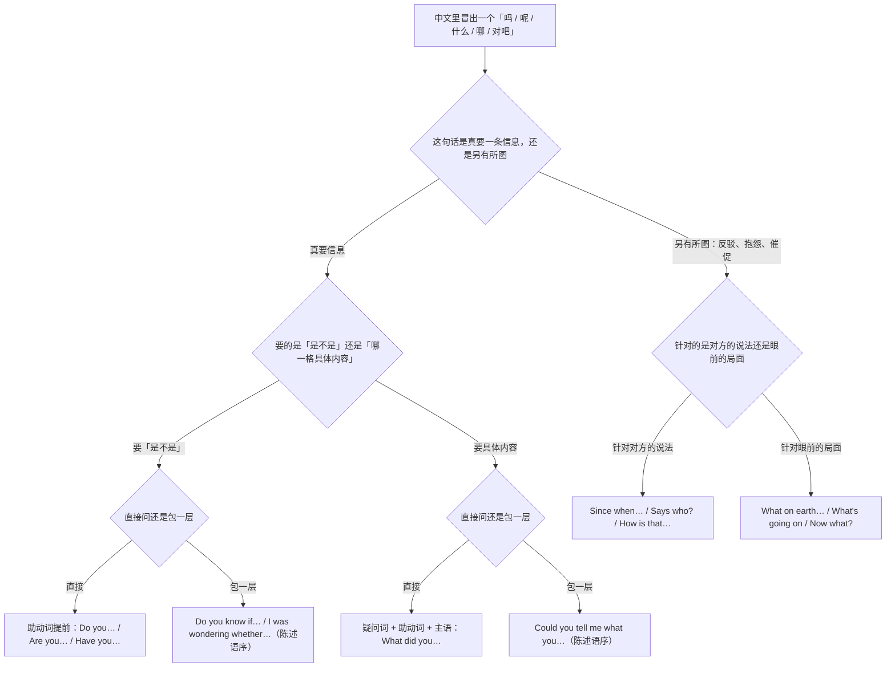
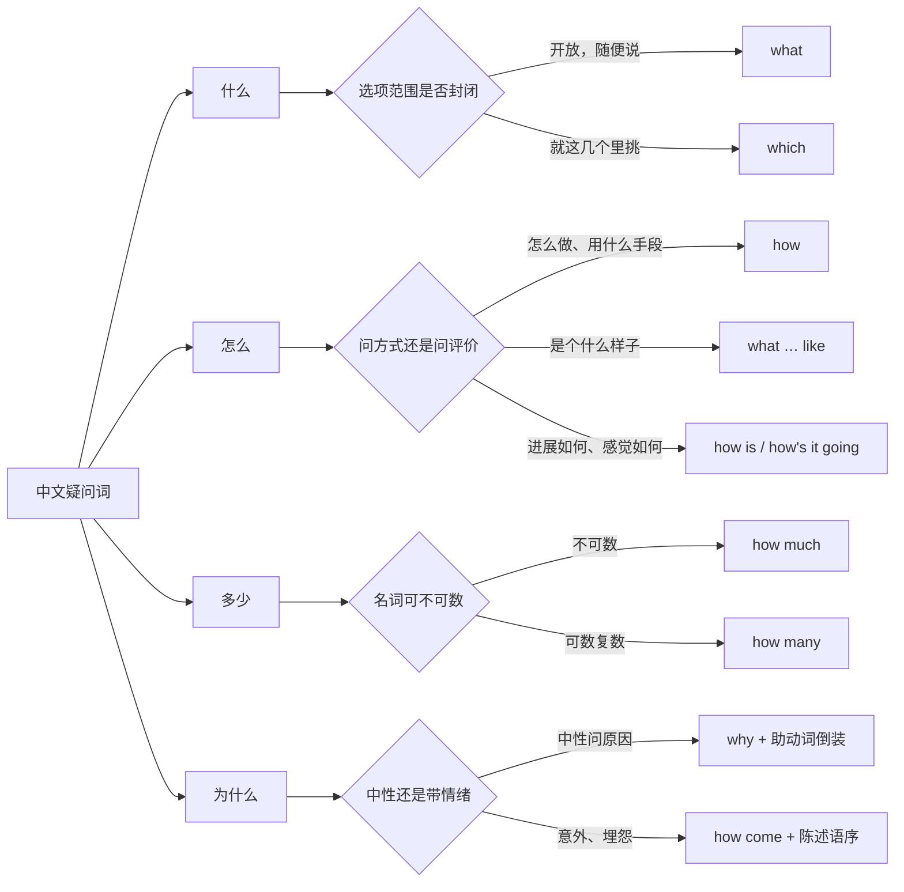
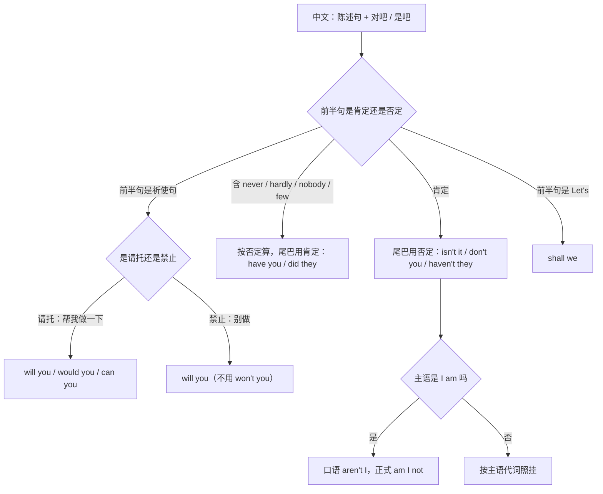
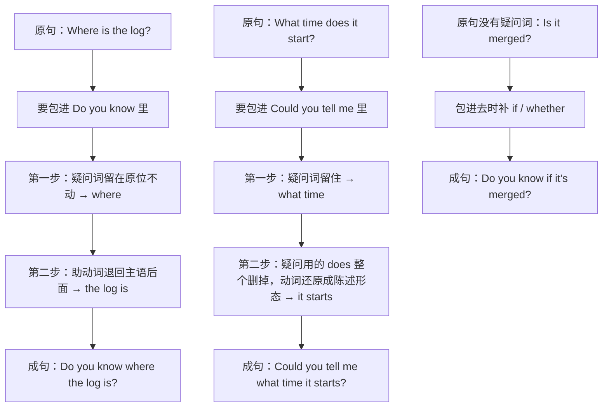
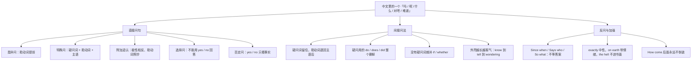

# 你…吗、什么时候、难道、你知道吗：提问、反问与间接问法

> [!info] 本篇定位
>
> 这篇收的是**你自己开口发问**的一整套。上一篇 [[11.人际功能与话轮管理/03.打断一下、让我想想、说回刚才：插话、拖延、改口与转场\|打断一下、让我想想、说回刚才：插话、拖延、改口与转场]] 管的是怎么抢到和交出话轮，这一篇管的是抢到话轮之后**怎么把问句造出来**：是非问、特殊问、附加追认、选择问、否定问五类直接问句的中文入口；把问句包进 `Do you know…`、`Could you tell me…`、`I was wondering…` 之后必须改成陈述语序的那套间接问法；以及不为求答案只为反驳的反问（`Since when…?`／`How is that…?`／`So what?`／`Says who?`）和「到底怎么回事」的加强式。
>
> 有一条边界要先划清：**对方说完你没听懂，那是澄清，不在这一篇**。「你说什么？」「你的意思是？」「我复述一遍」查 [[11.人际功能与话轮管理/02.没听清、你的意思是、我复述一下：澄清、追问与确认理解\|没听清、你的意思是、我复述一下：澄清、追问与确认理解]]。本篇处理的是**你主动要一条你还不知道的信息**。同理，「能不能帮我改一下」表面是问句，实质是请求，主锚点在 [[11.人际功能与话轮管理/01.我建议、你最好、能不能帮我：建议、请求、许可与委托\|我建议、你最好、能不能帮我：建议、请求、许可与委托]]，本篇只收它作为问句的形状。
>
> 读完能查到：45 条中文意图入口、135 条分档成品句架，以及中文母语者在间接问法语序、否定疑问的 yes／no、反义疑问的极性这三处最容易翻车的地方该怎么绕。

---

## 1. 本篇导读：中文的一个「吗」在英文里要分五种形状

中文造问句几乎不动语序。陈述句「你去」后面加一个「吗」就是问句，加一个「呢」就是追问，句末升调就是质疑。英文相反：**问句是一种句子结构，不是一个句末标记**。一个「吗」在英文那边至少分成五种形状——助动词提前的是非问、疑问词开头的特殊问、句尾挂一小截的附加追认、中间夹 `or` 的选择问、以助动词否定式开头的否定问。而一旦这个问句被塞进另一句话里（「你知道他在哪吗」），刚提到前面的助动词又得放回去。

这一层「中文不动语序、英文动语序」的落差，是本篇要处理的全部技术难点。先用一张选择树把它拆开。

这张图的第一个分叉是全篇最重要的判读点：**问句不一定在提问**。「你难道不知道吗」不要答案，「谁说的」不要来源，「那又怎样」连回应都不要。中文靠语气词和语调承担这层反问义，英文靠一组固定的短问句承担（第 9 节）。查的时候先问自己一句：如果对方老老实实答了，我会满意吗？会——走左半边；不会——走右半边。

第二个分叉在左半边的下层：**要不要包一层**。「他在哪」和「你知道他在哪吗」在中文里只差三个字、语序完全一样，在英文里却是 `Where is he?` 和 `Do you know where he is?` 两种语序。包一层之后疑问词还在句首，但后面必须还原成主语加动词的陈述顺序，`is` 要退回 `he` 后面。这条规则本篇反复出现在第 7 节的六个入口里，也是中文母语者最稳定的错处。

本篇的意图块按这张图排：第 2 到 6 节走左半边的直接问句（是非、特殊、附加、选择、否定），第 7、8 节走左半边的包一层（间接问法与礼貌铺垫），第 9、10 节走右半边（反问质疑与加强式），第 11 节收追问与转问。

---

## 2. 你…吗、是不是、有没有：要一个是或否

这一节的五条意图共用一个动作：把助动词或 be 动词提到主语前面。中文这边的入口却分得很细——「你…吗」是中性打听，「是不是」是拿着一个判断求证，「有没有」是问经历或存在，「能不能」是问可能性，「…了没有」是问事情做完没有。这五个入口在英文里落到不同的助动词和不同的时态，混用不会造成语法错误，但会问偏。

三档的差别主要在**外壳的长短**：口语档直接把助动词甩出来，书面档加一层 `Could you confirm whether`、`Is it correct that` 的框，正式档换成 `We would like to establish whether`、`Kindly advise whether` 这类整句式。

### 2.1 你…吗：中性打听

中文触发语：你…吗 / 你是不是要… / 你有空吗 / 方便吗

| 档位 | 句架 | 例句 | 译文 |
| --- | --- | --- | --- |
| 口语 | Are/Do/Have + 主语 + …? | Do you have a minute to look at this? | 你有空看一眼这个吗？ |
| 书面 | Could you confirm whether + 陈述语序? | Could you confirm whether the staging build is still running? | 能确认一下预发布环境的构建还在跑吗？ |
| 正式 | We should be grateful if you would advise whether + 陈述语序 | We should be grateful if you would advise whether the licence covers redistribution. | 烦请告知该许可证是否涵盖再分发。 |

> [!warning] 错配警示
>
> - ~~You have a minute?~~ ❌（书面场合）
> - **Do you have a minute?** ✅（口语里省掉 `Do` 是可以的，写进邮件或工单里就必须补齐助动词；越正式，省略越不被接受）

页脚：
- 同义入口：你有没有空 / 你方不方便 / 能耽误你两分钟吗
- 语法归属：[[02.英语基础语法/01.基础入门/03.疑问句与否定句的构成\|疑问句与否定句的构成]]
- 场景实战：[[04.英语场景/02.基础句型框架/02.陈述疑问祈使感叹四大句式\|陈述疑问祈使感叹四大句式]]

### 2.2 是不是…、我没记错的话：拿着判断求证

中文触发语：是不是… / 我没记错的话… / 我理解得对吗 / 应该是…吧

| 档位 | 句架 | 例句 | 译文 |
| --- | --- | --- | --- |
| 口语 | So + 陈述句 + , right? | So the token expired overnight, right? | 是不是令牌昨晚过期了？ |
| 书面 | Am I right in thinking that + 陈述句? | Am I right in thinking that this endpoint is rate-limited per key? | 我理解得对吗，这个接口是按密钥限流的？ |
| 正式 | Is it correct that + 陈述句? | Is it correct that the agreement lapses at the end of the quarter? | 该协议是否于本季度末失效？ |

> [!warning] 错配警示
>
> - ~~Is it right that I think this endpoint is rate-limited?~~ ❌
> - **Am I right in thinking that this endpoint is rate-limited?** ✅（求证自己的理解用固定式 `Am I right in thinking…`，不要按中文「我这样想对不对」逐字拆开重组）

页脚：
- 同义入口：我这么理解对吗 / 应该是这样吧 / 也就是说…对吧
- 语法归属：[[02.英语基础语法/09.从句体系/03.名词性从句详解\|名词性从句详解]]
- 场景实战：[[04.英语场景/10.职场与商务场景实战/02.会议汇报与演示场景\|会议汇报与演示场景]]

### 2.3 有没有、有过吗：问经历与存在

中文触发语：有没有… / 你…过吗 / 有过这种情况吗 / 有人…吗

| 档位 | 句架 | 例句 | 译文 |
| --- | --- | --- | --- |
| 口语 | Have you ever + 过去分词? | Have you ever seen this error before? | 你以前见过这个报错吗？ |
| 书面 | Is there any record of + 名词/动名词? | Is there any record of this failure in the incident log? | 事故日志里有这次故障的记录吗？ |
| 正式 | Has there been any instance in which + 陈述句? | Has there been any instance in which the fallback path was triggered in production? | 生产环境是否出现过触发降级路径的情形？ |

> [!warning] 错配警示
>
> - ~~Do you ever see this error before?~~ ❌
> - **Have you ever seen this error before?** ✅（「有过吗」问的是到现在为止的经历，落在现在完成时；`before`、`ever`、`yet` 这三个词出现时几乎不会配一般现在时）

页脚：
- 同义入口：碰到过吗 / 之前出现过吗 / 有先例吗
- 语法归属：[[02.英语基础语法/06.动词时态/04.完成时态详解\|完成时态详解]]
- 场景实战：[[04.英语场景/11.医疗与紧急场景实战/01.医院看病与药店购药场景\|医院看病与药店购药场景]]

### 2.4 能不能、可以吗：问可能性

中文触发语：能不能… / 可以吗 / 行得通吗 / 有没有办法…

| 档位 | 句架 | 例句 | 译文 |
| --- | --- | --- | --- |
| 口语 | Can we + 动词原形? | Can we just cache the response for an hour? | 能不能干脆把响应缓存一小时？ |
| 书面 | Would it be possible to + 动词原形? | Would it be possible to move the cutover to Tuesday? | 能不能把切换挪到周二？ |
| 正式 | Is there scope for + 名词/动名词? | Is there scope for extending the trial by two weeks? | 试用期是否有延长两周的余地？ |

> [!warning] 错配警示
>
> - ~~Is it possible to move the cutover? Can it?~~ ❌
> - **Would it be possible to move the cutover?** ✅（`Is it possible` 问的是客观上办不办得到，`Would it be possible` 问的是对方肯不肯，后者才是中文「能不能」在协商语境里的对应；不要在同一句里叠两遍）

页脚：
- 同义入口：有没有可能 / 来得及吗 / 走得通吗
- 语法归属：[[02.英语基础语法/07.助动词与情态动词/02.情态动词详解\|情态动词详解]]
- 场景实战：[[04.英语场景/05.高频实用表达句型框架/02.建议请求邀请拒绝四大功能句型\|建议请求邀请拒绝四大功能句型]]

### 2.5 …了没有、做完了吗：问完成与否

中文触发语：…了没有 / 做完了吗 / 发出去了吗 / 到了吗

| 档位 | 句架 | 例句 | 译文 |
| --- | --- | --- | --- |
| 口语 | Have you + 过去分词 + yet? | Have you pushed the fix yet? | 修复推上去了没有？ |
| 书面 | Has + 主语 + been + 过去分词? | Has the migration been applied to staging? | 迁移在预发布环境执行了吗？ |
| 正式 | Could you advise on the current status of + 名词? | Could you advise on the current status of the security review? | 烦请告知安全评审目前的状态。 |

> [!warning] 错配警示
>
> - ~~Did you push the fix yet?~~ ❌（正式书面）
> - **Have you pushed the fix yet?** ✅（`yet` 追问一件预期该完成而尚未确认的事，配现在完成时；美式口语里配一般过去时已被广泛接受，但写进文档仍以完成时为准）

页脚：
- 同义入口：搞定了吗 / 提交了没 / 有进展了吗
- 语法归属：[[02.英语基础语法/06.动词时态/05.时态综合运用与辨析\|时态综合运用与辨析]]
- 场景实战：[[04.英语场景/10.职场与商务场景实战/03.商务邮件与正式书面沟通\|商务邮件与正式书面沟通]]

---

## 3. 什么、谁、哪个、什么时候：问哪一格具体信息

中文的疑问词可以留在原位——「你找谁」「他去哪」，疑问词在哪个成分上就摆在哪儿。英文的疑问词必须搬到句首，搬完之后还要在主语前面补一个助动词。这一节的八条意图各对应一格信息，句架形状统一是 `疑问词 + 助动词 + 主语 + 动词原形`，唯一的例外是疑问词本身就是主语时不用助动词（`Who called?` 不是 `Who did call?`）。

下面这张图管的是**中文一个词对应英文两三个词**的那几处：「什么」分 what 与 which，「怎么」分 how 与 what…like，「多少」分 how much 与 how many。

图里最容易被忽略的是右下角那条：`how come` 后面**不倒装**。它长得像疑问词，行为却像一个前置的插入语，后面直接跟完整陈述句。这是本节唯一一处「疑问词开头但不动语序」的例外，写错了一眼就能被认出是中式英语。

### 3.1 什么、是什么：问内容

中文触发语：什么 / 是什么 / 什么意思 / 叫什么

| 档位 | 句架 | 例句 | 译文 |
| --- | --- | --- | --- |
| 口语 | What + 助动词 + 主语 + 动词原形? | What does this flag actually do? | 这个开关到底是干什么的？ |
| 书面 | What is the + 名词 + for + 名词? | What is the retention policy for these logs? | 这些日志的保留策略是什么？ |
| 正式 | Could you set out what + 陈述语序? | Could you set out what the escalation procedure is in such cases? | 烦请说明此类情形下的升级流程为何。 |

> [!warning] 错配警示
>
> - ~~What means this parameter?~~ ❌
> - **What does this parameter mean?** ✅（英文的 `mean` 不像中文「意思是」可以直接跟在疑问词后；疑问词作宾语时主语和助动词一个都不能省）

页脚：
- 同义入口：这是什么 / 干什么用的 / 具体指什么
- 语法归属：[[02.英语基础语法/03.代词与数词/03.指示代词与疑问代词\|指示代词与疑问代词]]
- 场景实战：[[04.英语场景/09.学习与教育场景实战/01.课堂讨论与提问场景\|课堂讨论与提问场景]]

### 3.2 谁、谁的：问人与归属

中文触发语：谁 / 谁在管 / 这是谁的 / 找谁

| 档位 | 句架 | 例句 | 译文 |
| --- | --- | --- | --- |
| 口语 | Who + 动词（疑问词作主语，不加助动词）? | Who owns this service now? | 这个服务现在归谁？ |
| 书面 | Whose + 名词 + is + 名词? | Whose approval is required for a schema change? | 改表结构需要谁批？ |
| 正式 | To whom should + 主语 + 动词原形? | To whom should such requests be addressed? | 此类请求应向谁提出？ |

> [!warning] 错配警示
>
> - ~~Who's laptop is this?~~ ❌
> - **Whose laptop is this?** ✅（`who's` 是 `who is` 的缩写，`whose` 才表示所属；两个词读音相同，写的时候按能不能还原成 `who is` 来判断）

页脚：
- 同义入口：归谁管 / 谁负责 / 该找谁
- 语法归属：[[02.英语基础语法/03.代词与数词/03.指示代词与疑问代词\|指示代词与疑问代词]]
- 场景实战：[[04.英语场景/10.职场与商务场景实战/04.商务谈判合同与客户沟通\|商务谈判合同与客户沟通]]

### 3.3 哪一个、哪些：从有限几项里挑

中文触发语：哪一个 / 哪些 / 这两个里哪个 / 选哪种

| 档位 | 句架 | 例句 | 译文 |
| --- | --- | --- | --- |
| 口语 | Which one + 助动词 + 主语 + 动词原形? | Which one do you want me to roll back? | 你要我回滚哪一个？ |
| 书面 | Which of the + 复数名词 + 动词? | Which of the two builds is the newer one? | 这两个构建里哪个更新？ |
| 正式 | Which of the following options would you consider + 形容词? | Which of the following options would you consider acceptable? | 以下哪一项方案您认为可以接受？ |

> [!warning] 错配警示
>
> - ~~What of these two builds is newer?~~ ❌
> - **Which of these two builds is newer?** ✅（选项已经摆在眼前、数得清，用 `which`；`what` 留给范围开放的情形，例如 `What browsers do you support?`）

页脚：
- 同义入口：选哪个 / 用哪种 / 哪个更合适
- 语法归属：[[02.英语基础语法/03.代词与数词/03.指示代词与疑问代词\|指示代词与疑问代词]]
- 场景实战：[[04.英语场景/06.日常生活场景实战/03.购物超市与讨价还价场景\|购物超市与讨价还价场景]]

### 3.4 什么时候、多久、几点：问时间

中文触发语：什么时候 / 几点 / 还要多久 / 最晚到什么时候

| 档位 | 句架 | 例句 | 译文 |
| --- | --- | --- | --- |
| 口语 | When + 助动词 + 主语 + 动词原形? | When does the freeze kick in? | 封版什么时候开始？ |
| 口语 | How soon can + 主语 + 动词原形? | How soon can you get me a build? | 你多快能给我一个构建？ |
| 书面 | How long is + 主语 + expected to + 动词原形? | How long is the migration expected to take? | 迁移预计要多久？ |
| 正式 | By what date must + 主语 + be + 过去分词? | By what date must the signed copy be returned? | 签署件最晚需于何日回寄？ |

> [!warning] 错配警示
>
> - ~~How long time does it take?~~ ❌
> - **How long does it take?** ✅（`how long` 自身已含「时长」义，后面不再补 `time`；问次数才用 `how many times`）

页脚：
- 同义入口：啥时候 / 多会儿 / 需要多长时间 / 期限是几号
- 语法归属：[[02.英语基础语法/04.形容词与副词/03.副词的分类与用法\|副词的分类与用法]]
- 场景实战：[[04.英语场景/08.出行与旅游场景实战/01.机场航班海关入境场景\|机场航班海关入境场景]]

### 3.5 在哪、去哪、从哪来：问位置与来源

中文触发语：在哪 / 去哪 / 从哪儿来的 / 哪一步出的问题

| 档位 | 句架 | 例句 | 译文 |
| --- | --- | --- | --- |
| 口语 | Where + 助动词 + 主语 + 动词原形? | Where do I find the config file? | 配置文件在哪儿找？ |
| 口语 | Where is + 主语 + coming from? | Where is this header coming from? | 这个请求头是哪儿来的？ |
| 书面 | At which stage did + 主语 + 动词原形? | At which stage did the pipeline fail? | 流水线是在哪一步失败的？ |
| 正式 | In which jurisdiction is + 主语 + 过去分词? | In which jurisdiction is the data stored? | 数据存放于哪一司法辖区？ |

> [!warning] 错配警示
>
> - ~~Where is the config file at?~~ ❌（书面）
> - **Where is the config file?** ✅（`where` 已经包含位置义，句尾再挂一个 `at` 是口语冗余，正式文本里会被当成错误；只有 `where … from` 是固定搭配，那个 `from` 不能删）

页脚：
- 同义入口：搁哪儿了 / 在什么位置 / 打哪儿来的
- 语法归属：[[02.英语基础语法/05.介词与连词/01.介词的分类与基本用法\|介词的分类与基本用法]]
- 场景实战：[[04.英语场景/08.出行与旅游场景实战/04.问路景点游览与购物场景\|问路景点游览与购物场景]]

### 3.6 为什么、怎么会：问原因

中文触发语：为什么 / 怎么会 / 凭什么这么设计 / 出于什么考虑

| 档位 | 句架 | 例句 | 译文 |
| --- | --- | --- | --- |
| 口语 | How come + 陈述语序? | How come the build went red overnight? | 构建怎么一夜之间就红了？ |
| 书面 | Why + 助动词 + 主语 + 动词原形? | Why did we choose a queue over a cron job here? | 这里为什么选队列而不是定时任务？ |
| 正式 | What is the rationale for + 名词/动名词? | What is the rationale for retaining the legacy endpoint? | 保留旧接口的理由是什么？ |

> [!warning] 错配警示
>
> - ~~How come did the build go red?~~ ❌
> - **How come the build went red?** ✅（`how come` 后面接完整陈述句，不倒装、不加助动词；这是全篇唯一一个「疑问词开头却保持陈述语序」的直接问句）

页脚：
- 同义入口：咋回事 / 怎么搞的 / 什么原因 / 依据是什么
- 语法归属：[[02.英语基础语法/09.从句体系/04.状语从句详解\|状语从句详解]]
- 场景实战：[[04.英语场景/09.学习与教育场景实战/01.课堂讨论与提问场景\|课堂讨论与提问场景]]

### 3.7 怎么做、怎么弄：问方式与步骤

中文触发语：怎么做 / 怎么弄 / 用什么办法 / 具体怎么操作

| 档位 | 句架 | 例句 | 译文 |
| --- | --- | --- | --- |
| 口语 | How + 助动词 + 主语 + 动词原形? | How do I reset my two-factor device? | 我的双因子设备怎么重置？ |
| 书面 | What is the procedure for + 动名词? | What is the procedure for revoking a leaked key? | 密钥泄露后的吊销流程是什么？ |
| 正式 | By what means is + 主语 + 过去分词? | By what means is the identity of the requester verified? | 请求方身份通过何种方式核验？ |

> [!warning] 错配警示
>
> - ~~How to reset my device?~~ ❌（作为独立问句）
> - **How do I reset my device?** ✅（`how to do` 只能作标题或嵌在句中，例如 `Can you show me how to reset it?`；单独成句必须补主语和助动词）

页脚：
- 同义入口：该怎么办 / 步骤是什么 / 从哪儿下手
- 语法归属：[[02.英语基础语法/08.非谓语动词/01.动词不定式详解\|动词不定式详解]]
- 场景实战：[[04.英语场景/07.社交交际场景实战/02.电话短信与在线沟通场景\|电话短信与在线沟通场景]]

### 3.8 …怎么样、多少：问评价与数量

中文触发语：…怎么样 / 是个什么样的 / 多少钱 / 有多少个

| 档位 | 句架 | 例句 | 译文 |
| --- | --- | --- | --- |
| 口语 | How is/was + 名词? | How was the handover meeting? | 交接会开得怎么样？ |
| 口语 | What is + 名词 + like? | What is the new dashboard like? | 新的看板是个什么样子？ |
| 书面 | How much/many + 名词 + 助动词 + 主语 + 动词原形? | How many seats does the plan include? | 这个套餐含多少席位？ |
| 正式 | What is the estimated + 名词 + of + 名词? | What is the estimated cost of running this in a second region? | 在第二个区域运行的预估成本是多少？ |

> [!warning] 错配警示
>
> - ~~How do you think about the new dashboard?~~ ❌
> - **What do you think of the new dashboard?** ✅（问看法用 `what … think of/about`，`how` 只能配 `feel`：`How do you feel about it?`；这是中文「你怎么看」直译造成的高频错句）

页脚：
- 同义入口：好不好 / 感觉如何 / 价格多少 / 数量是多少
- 语法归属：[[02.英语基础语法/02.名词与冠词/01.名词的分类与用法\|名词的分类与用法]]
- 场景实战：[[04.英语场景/05.高频实用表达句型框架/01.表达观点与态度的50个万能句型\|表达观点与态度的50个万能句型]]

---

## 4. …对吧、…是吧：句尾挂一小截的追认

中文在陈述句后面加「对吧」「是吧」「没错吧」，英文对应的是句尾挂一小截助动词加代词。这一小截的构造只有两条规则：**极性相反**（前面肯定，后面否定；前面否定，后面肯定），**助动词照抄**（前面用什么助动词就抄什么，前面没有助动词就补 do 系）。

麻烦的是「否定」的范围比看上去大。`never`、`hardly`、`seldom`、`few`、`little`、`nobody`、`nothing` 这类词虽然不带 `not`，在英文里算否定，后面必须挂肯定尾巴。这一点中文完全没有对应，是本节的主要错源。

图里右下角那条 `I am → aren't I` 是英语里少见的不规则形态：`amn't` 在标准英语里不存在，口语一律说 `aren't I`，正式书面才写 `am I not`。除此之外整套系统是机械的，套图就能造对。

### 4.1 …对吧、…是吧：肯定句加否定尾

中文触发语：…对吧 / …是吧 / …没错吧 / …我说得对吗

| 档位 | 句架 | 例句 | 译文 |
| --- | --- | --- | --- |
| 口语 | 肯定陈述句 + , 否定助动词 + 代词? | The retry is capped at three, isn't it? | 重试上限是三次，对吧？ |
| 口语 | 肯定陈述句 + , right? | You already merged that branch, right? | 那个分支你已经合了，是吧？ |
| 书面 | 陈述句 + , if I understand correctly? | The quota resets monthly, if I understand correctly? | 如果我理解无误，配额是按月重置的？ |
| 正式 | 陈述句 + . Is that a fair summary? | The contract renews automatically unless notice is given. Is that a fair summary? | 除非另行通知，合同自动续期。这样概括是否准确？ |

> [!warning] 错配警示
>
> - ~~The retry is capped at three, is it?~~ ❌（意思变了）
> - **The retry is capped at three, isn't it?** ✅（肯定句配否定尾巴才是求认同；配肯定尾巴 `is it?` 在英语里表示怀疑或挑刺，语气接近中文的「哦，是吗？」）

页脚：
- 同义入口：是这样吧 / 应该没错吧 / 我说的对吗
- 语法归属：[[02.英语基础语法/01.基础入门/03.疑问句与否定句的构成\|疑问句与否定句的构成]]
- 场景实战：[[04.英语场景/02.基础句型框架/02.陈述疑问祈使感叹四大句式\|陈述疑问祈使感叹四大句式]]

### 4.2 …不是吗、…没有吧：否定句加肯定尾

中文触发语：…不是吗 / …没有吧 / …从来没…吧 / 一个也没有吧

| 档位 | 句架 | 例句 | 译文 |
| --- | --- | --- | --- |
| 口语 | 否定陈述句 + , 肯定助动词 + 代词? | You haven't run the seed script, have you? | 种子脚本你没跑吧？ |
| 口语 | 含 never/hardly 的句子 + , 肯定助动词 + 代词? | We've never hit that limit, have we? | 那个上限我们从来没碰到过吧？ |
| 书面 | Nobody/Nothing + 动词 + , 肯定助动词 + they/it? | Nobody signed off on this change, did they? | 这次变更没人签过字吧？ |
| 正式 | 否定陈述句 + . Would that be correct? | No exception has been granted in this case. Would that be correct? | 此案未获任何豁免。是否属实？ |

> [!warning] 错配警示
>
> - ~~We've never hit that limit, haven't we?~~ ❌
> - **We've never hit that limit, have we?** ✅（`never`、`hardly`、`seldom`、`nobody`、`few` 在英语里都算否定，前半句已经是否定，尾巴必须转肯定）

页脚：
- 同义入口：应该没有吧 / 没这回事吧 / 谁都没吧
- 语法归属：[[02.英语基础语法/03.代词与数词/04.不定代词详解\|不定代词详解]]
- 场景实战：[[04.英语场景/10.职场与商务场景实战/02.会议汇报与演示场景\|会议汇报与演示场景]]

### 4.3 咱们…好吗、你去一下好吗：祈使与提议的尾巴

中文触发语：咱们…好吗 / 你…一下好吗 / 别…好吗 / 行不行

| 档位 | 句架 | 例句 | 译文 |
| --- | --- | --- | --- |
| 口语 | Let's + 动词原形 + , shall we? | Let's park this until the numbers land, shall we? | 数据出来之前咱们先搁一搁，好吗？ |
| 口语 | 祈使句 + , will you? | Ping me when the job finishes, will you? | 任务跑完了叫我一声，行吗？ |
| 口语 | Don't + 动词原形 + , will you? | Don't merge it before the review, will you? | 评审之前别合，好吗？ |
| 正式 | Perhaps we might + 动词原形. Would that suit? | Perhaps we might defer the decision to next week. Would that suit? | 或可将决定推迟至下周。这样是否合适？ |

> [!warning] 错配警示
>
> - ~~Don't merge it before the review, won't you?~~ ❌
> - **Don't merge it before the review, will you?** ✅（否定祈使句的尾巴固定是 `will you`，不转极性；`Let's` 开头的固定是 `shall we`，两个都是背下来的例外）

页脚：
- 同义入口：好不好 / 可以吧 / 麻烦你一下
- 语法归属：[[02.英语基础语法/07.助动词与情态动词/01.助动词的基本用法\|助动词的基本用法]]
- 场景实战：[[04.英语场景/05.高频实用表达句型框架/02.建议请求邀请拒绝四大功能句型\|建议请求邀请拒绝四大功能句型]]

### 4.4 是吗、真的假的：回声式追认

中文触发语：是吗 / 真的假的 / 不会吧 / 哦？还有这事

| 档位 | 句架 | 例句 | 译文 |
| --- | --- | --- | --- |
| 口语 | 助动词 + 代词?（回声重复对方的助动词） | — It went out at three. — Did it? | ——三点就发出去了。——是吗？ |
| 口语 | 名词/短语 + ?（回声重复关键词） | — They cut the budget. — Cut it? | ——预算被砍了。——砍了？ |
| 书面 | Really? I hadn't realised + 陈述句. | Really? I hadn't realised the window had already closed. | 是吗？我不知道窗口期已经过了。 |
| 正式 | Is that so? That is not what we were given to understand. | Is that so? That is not what we were given to understand. | 是这样吗？这与我们此前得到的说法不一致。 |

> [!warning] 错配警示
>
> - ~~— It went out at three. — Yes?~~ ❌
> - **— It went out at three. — Did it?** ✅（回声追认要抄对方那句话的助动词与时态，`Yes?` 在英语里是「你还有事？」的意思，会把对话岔开）

页脚：
- 同义入口：哦是吗 / 当真 / 有这回事
- 语法归属：[[02.英语基础语法/10.特殊句型/05.省略与替代\|省略与替代]]
- 场景实战：[[04.英语场景/07.社交交际场景实战/01.交友聚会与闲聊场景\|交友聚会与闲聊场景]]

---

## 5. A 还是 B：给对方摆出选项

选择疑问的形状是「是非问 + or + 另一项」，但它和是非问有一处关键差别：**不能用 yes 或 no 回答**。中文说「你要茶还是咖啡」，对方答「要」是笑话；英文同样如此，问 `Tea or coffee?` 而得到 `Yes` 说明对方没听清。这一节三条意图分别管两项、正反两面、三项以上。

语调也承担意义：前项升调、末项降调是真的在给选项；如果全句升调，`A or B` 会被听成一个整体的是非问（意思变成「你要不要来点儿茶或者咖啡什么的」）。这一层在书面里靠标点和 `either` 提示。

### 5.1 A 还是 B：两项择一

中文触发语：A 还是 B / 是…还是… / 你要哪个 / 二选一

| 档位 | 句架 | 例句 | 译文 |
| --- | --- | --- | --- |
| 口语 | 助动词 + 主语 + 动词 + A or B? | Do you want the quick fix or the proper one? | 你要临时补丁还是彻底改？ |
| 书面 | Would you prefer + A or B? | Would you prefer a written summary or a walkthrough? | 你更想要一份书面纪要还是当面过一遍？ |
| 正式 | Should we proceed with A, or hold pending B? | Should we proceed with the rollout, or hold pending the security sign-off? | 我们应推进上线，还是待安全签字后再议？ |

> [!warning] 错配警示
>
> - ~~— Do you want tea or coffee? — Yes.~~ ❌
> - **— Do you want tea or coffee? — Coffee, thanks.** ✅（选择疑问要求从选项里挑一个作答；真要表达「都行」说 `Either is fine`，真要都不要说 `Neither, thanks`）

页脚：
- 同义入口：要哪个 / 挑一个 / 走哪条路
- 语法归属：[[02.英语基础语法/05.介词与连词/03.连词的分类与用法\|连词的分类与用法]]
- 场景实战：[[04.英语场景/06.日常生活场景实战/04.餐饮点餐外卖与聚餐场景\|餐饮点餐外卖与聚餐场景]]

### 5.2 到底去不去、要还是不要：正反相问

中文触发语：去不去 / 要还是不要 / 到底行不行 / 做不做

| 档位 | 句架 | 例句 | 译文 |
| --- | --- | --- | --- |
| 口语 | 助动词 + 主语 + 动词 + or not? | Are you joining the call or not? | 你到底进不进会？ |
| 书面 | Could you confirm whether or not + 陈述语序? | Could you confirm whether or not the vendor accepted the terms? | 能否确认供应商是否接受了条款？ |
| 正式 | We should be grateful for a decision as to whether + 陈述语序 | We should be grateful for a decision as to whether the pilot will proceed. | 烦请就试点是否继续给出决定。 |

> [!warning] 错配警示
>
> - ~~Are you or aren't you joining?~~ ❌（除非刻意施压）
> - **Are you joining or not?** ✅（`… or not` 已经带催逼语气，正反两个助动词全写出来是更强的施压式，写进邮件会显得冒犯；中性场合改用 `whether` 的间接式）

页脚：
- 同义入口：来不来 / 定了没有 / 给个准话
- 语法归属：[[02.英语基础语法/05.介词与连词/03.连词的分类与用法\|连词的分类与用法]]
- 场景实战：[[04.英语场景/07.社交交际场景实战/02.电话短信与在线沟通场景\|电话短信与在线沟通场景]]

### 5.3 是…是…还是…：三项以上与开放选项

中文触发语：是…是…还是… / 三个里挑一个 / 还是别的什么 / 或者你有别的想法

| 档位 | 句架 | 例句 | 译文 |
| --- | --- | --- | --- |
| 口语 | Is it A, B, or C? | Is it a network issue, a config issue, or something in the code? | 是网络问题、配置问题，还是代码里的问题？ |
| 口语 | A, B, or something else entirely? | Redis, Memcached, or something else entirely? | Redis、Memcached，还是干脆换别的？ |
| 书面 | Which of A, B and C best describes + 名词? | Which of speed, cost and reliability best describes our main constraint? | 速度、成本、可靠性，哪一项最能概括我们的主要约束？ |
| 正式 | Would you favour A, B, or a combination of the two? | Would you favour a phased rollout, a full cutover, or a combination of the two? | 您倾向分阶段上线、一次性切换，还是两者结合？ |

> [!warning] 错配警示
>
> - ~~Is it a network issue or a config issue or something in the code or…~~ ❌
> - **Is it a network issue, a config issue, or something in the code?** ✅（三项以上时只在最后一项前保留 `or`，中间用逗号；一路 `or` 串下去在书面里读不成句）

页脚：
- 同义入口：哪一类 / 属于哪种情况 / 还是都不是
- 语法归属：[[02.英语基础语法/05.介词与连词/03.连词的分类与用法\|连词的分类与用法]]
- 场景实战：[[04.英语场景/10.职场与商务场景实战/02.会议汇报与演示场景\|会议汇报与演示场景]]

---

## 6. 你不…吗、怎么没…：带着预期去问

否定疑问在英文里几乎从不用来「中性地问一件否定的事」，它总是带着一个已经成形的预期：说话人本来以为对方会做、会知道、会来，结果发现没有，于是用否定式问出来。中文的「你不…吗」「怎么没…」「不是说好…」承担同一功能。

这一节最大的陷阱是**答案的 yes 和 no**。英文的 yes／no 只看事实本身：做了就 yes，没做就 no，跟问句是不是否定式毫无关系。中文的「是」「对」却是在肯定对方的整句话。于是「你没发吗」——「对，我没发」，直译成 `Yes, I didn't` 就是自相矛盾的句子。

### 6.1 你不…吗：意外式否定问

中文触发语：你不…吗 / 你没…吗 / 不是应该…吗 / 你怎么不…

| 档位 | 句架 | 例句 | 译文 |
| --- | --- | --- | --- |
| 口语 | Don't/Aren't/Haven't + 主语 + …? | Don't you have access to that repo? | 你没有那个仓库的权限吗？ |
| 书面 | I had assumed + 陈述句. Is that not the case? | I had assumed the alert was already routed to on-call. Is that not the case? | 我一直以为告警已经路由到值班了。不是这样吗？ |
| 正式 | Are we to understand that + 否定陈述句? | Are we to understand that no backup was retained? | 我们是否应理解为并未保留任何备份？ |

> [!warning] 错配警示
>
> - ~~— Didn't you send it? — Yes, I didn't send it.~~ ❌
> - **— Didn't you send it? — No, I didn't.** ✅（英文的 yes／no 只跟事实走：做了说 yes，没做说 no；中文的「对」是在附和对方的问法，直译过来必然打架）

页脚：
- 同义入口：难道你没有 / 你居然没 / 不该是这样吗
- 语法归属：[[02.英语基础语法/01.基础入门/03.疑问句与否定句的构成\|疑问句与否定句的构成]]
- 场景实战：[[04.英语场景/02.基础句型框架/02.陈述疑问祈使感叹四大句式\|陈述疑问祈使感叹四大句式]]

### 6.2 不是…吗、这不就是…吗：求同式反问

中文触发语：不是…吗 / 这不就是…吗 / 大家不都是这么做的吗 / 本来就该…吧

| 档位 | 句架 | 例句 | 译文 |
| --- | --- | --- | --- |
| 口语 | Isn't that + 名词/形容词 + already? | Isn't that exactly what the cache is for? | 缓存不就是干这个的吗？ |
| 口语 | Wouldn't it be easier to + 动词原形? | Wouldn't it be easier to just bump the timeout? | 直接把超时调大不是更省事吗？ |
| 书面 | Surely + 陈述句? | Surely the same rule applies to the staging cluster? | 同一条规则对预发布集群也适用吧？ |
| 正式 | Would it not follow that + 陈述句? | Would it not follow that the earlier waiver is void? | 是否可以据此认为先前的豁免已失效？ |

> [!warning] 错配警示
>
> - ~~Isn't it that the cache is for this?~~ ❌
> - **Isn't that what the cache is for?** ✅（求同式反问用 `Isn't that…`／`Wouldn't it…` 直接接名词性成分，不要按中文「不是…吗」的框架硬套一个 `it that`）

页脚：
- 同义入口：不就是 / 本来不就该 / 谁不是这样
- 语法归属：[[02.英语基础语法/09.从句体系/03.名词性从句详解\|名词性从句详解]]
- 场景实战：[[04.英语场景/05.高频实用表达句型框架/03.同意反对让步转折句型库\|同意反对让步转折句型库]]

### 6.3 怎么还没、怎么没人：预期落空的追问

中文触发语：怎么还没… / 怎么没人… / 说好的…呢 / 不是早该…了吗

| 档位 | 句架 | 例句 | 译文 |
| --- | --- | --- | --- |
| 口语 | Why hasn't + 主语 + 过去分词 + yet? | Why hasn't anyone picked this ticket up yet? | 这个工单怎么还没人接？ |
| 口语 | What happened to + 名词? | What happened to the config we agreed on? | 说好的那份配置呢？ |
| 书面 | I would have expected + 名词 + by now. | I would have expected the invoice by now. | 按理说发票现在该到了。 |
| 正式 | We note that + 名词 + remains outstanding. Could you account for the delay? | We note that the signed addendum remains outstanding. Could you account for the delay? | 我们注意到补充协议尚未签回。能否说明延迟原因？ |

> [!warning] 错配警示
>
> - ~~Why nobody picks this up?~~ ❌
> - **Why hasn't anyone picked this up?** ✅（`why` 开头必须倒装并补助动词；另外英语一句里只放一个否定词，`nobody` 和 `hasn't` 不同现，主语改用 `anyone`）

页脚：
- 同义入口：怎么拖到现在 / 一直没动静 / 到底卡在哪
- 语法归属：[[02.英语基础语法/01.基础入门/03.疑问句与否定句的构成\|疑问句与否定句的构成]]
- 场景实战：[[04.英语场景/10.职场与商务场景实战/03.商务邮件与正式书面沟通\|商务邮件与正式书面沟通]]

### 6.4 不介意吧、不麻烦吧：用否定式讨许可

中文触发语：不介意吧 / 不麻烦吧 / 不打扰你吧 / 要是不方便就算了

| 档位 | 句架 | 例句 | 译文 |
| --- | --- | --- | --- |
| 口语 | You don't mind if I + 一般现在时, do you? | You don't mind if I record this, do you? | 我录一下你不介意吧？ |
| 口语 | Is this a bad time? | Is this a bad time? I can come back. | 现在不方便吧？我可以待会儿再来。 |
| 书面 | I hope it is not too much trouble to + 动词原形. | I hope it is not too much trouble to ask for the raw numbers. | 冒昧向你要一下原始数据，希望不太麻烦。 |
| 正式 | If it would not inconvenience you, might I + 动词原形? | If it would not inconvenience you, might I request a copy of the audit trail? | 若不致造成不便，可否索取一份审计记录？ |

> [!warning] 错配警示
>
> - ~~— Do you mind if I record this? — Yes, of course!~~ ❌（本意是同意）
> - **— Do you mind if I record this? — Not at all, go ahead.** ✅（`Do you mind` 字面问的是「你介意吗」，同意要答 `Not at all`／`Of course not`；答 `Yes` 等于拒绝，这是中文思路直译出的反向回答）

页脚：
- 同义入口：方便吗 / 会不会打扰 / 唐突了吧
- 语法归属：[[02.英语基础语法/08.非谓语动词/02.动名词详解\|动名词详解]]
- 场景实战：[[04.英语场景/05.高频实用表达句型框架/02.建议请求邀请拒绝四大功能句型\|建议请求邀请拒绝四大功能句型]]

---

## 7. 你知道…吗、能告诉我…吗：把问句包进另一句里

这一节是全篇技术含量最高的一区，规则只有一条，但它的适用面覆盖所有间接问法：**问句一旦被包进另一个句子，就必须还原成陈述语序**。原本提到主语前面的助动词退回原位，原本因为疑问而添加的 `do`／`does`／`did` 整个删掉，句尾的问号只反映外壳那句是不是问句。

图分三条线，正对应三种情况：原句带疑问词且用 be 动词的，助动词退回去；原句带疑问词且靠 `do` 系支撑的，`do` 系删掉、时态和人称还给实义动词；原句是是非问、没有疑问词的，前面补一个 `if` 或 `whether`。三条线走完，间接问法就不会错。

另有一条语用规则值得记住：**外壳越长，语气越客气**。`Where is it?` 是直问，`Do you know where it is?` 客气一档，`Could you tell me where it is?` 再客气一档，`I was wondering if you could tell me where it is` 已经到了陌生人求助或跨级沟通的程度。选档不是选正确与否，是选距离。

### 7.1 你知道…吗：包一层最短的外壳

中文触发语：你知道…吗 / 你清楚…吗 / 你晓得…不 / 你了解…吗

| 档位 | 句架 | 例句 | 译文 |
| --- | --- | --- | --- |
| 口语 | Do you know + 疑问词 + 陈述语序? | Do you know where the deploy log ends up? | 你知道部署日志最后落在哪儿吗？ |
| 口语 | Do you know if/whether + 陈述语序? | Do you know if the hotfix made it into last night's build? | 你知道那个热修有没有进昨晚的构建吗？ |
| 书面 | Do you happen to know + 疑问词 + 陈述语序? | Do you happen to know who owns the DNS records? | 你知不知道 DNS 记录归谁管？ |
| 正式 | Are you able to confirm + 疑问词 + 陈述语序? | Are you able to confirm when the certificate was last rotated? | 能否确认证书上次轮换是什么时候？ |

> [!warning] 错配警示
>
> - ~~Do you know where is the deploy log?~~ ❌
> - **Do you know where the deploy log is?** ✅（包进外壳之后 `is` 必须退回主语后面；这是本篇出现频率最高的一处中式语序，写邮件时逐句检查疑问词后面第一个词是不是主语）

页脚：
- 同义入口：知不知道 / 有没有听说 / 清楚吗
- 语法归属：[[02.英语基础语法/09.从句体系/03.名词性从句详解\|名词性从句详解]]
- 场景实战：[[04.英语场景/04.从句与复合句型框架/01.名词性从句四大类型\|名词性从句四大类型]]

### 7.2 能告诉我…吗：请对方给一条信息

中文触发语：能告诉我…吗 / 麻烦说一下… / 能不能讲讲… / 请问…

| 档位 | 句架 | 例句 | 译文 |
| --- | --- | --- | --- |
| 口语 | Can you tell me + 疑问词 + 陈述语序? | Can you tell me what this job is waiting on? | 你能告诉我这个任务在等什么吗？ |
| 书面 | Could you tell me + 疑问词 + 陈述语序? | Could you tell me how the quota is calculated? | 能否告知配额是怎么算的？ |
| 书面 | Could you let me know whether + 陈述语序? | Could you let me know whether the change needs a second reviewer? | 能否告知这次变更是否需要第二位评审人？ |
| 正式 | Kindly advise + 疑问词 + 陈述语序. | Kindly advise which entity will be named on the invoice. | 烦请告知发票的抬头主体。 |

> [!warning] 错配警示
>
> - ~~Could you tell me how does the quota work?~~ ❌
> - **Could you tell me how the quota works?** ✅（疑问用的 `does` 在包进去之后整个删掉，时态和人称还给实义动词，`work` 变 `works`；留着 `does` 是两套疑问结构叠在一起）

页脚：
- 同义入口：说一下呗 / 讲讲怎么回事 / 烦请告知
- 语法归属：[[02.英语基础语法/09.从句体系/03.名词性从句详解\|名词性从句详解]]
- 场景实战：[[04.英语场景/10.职场与商务场景实战/03.商务邮件与正式书面沟通\|商务邮件与正式书面沟通]]

### 7.3 我想问一下、不知道…：把问句伪装成陈述

中文触发语：我想问一下 / 不知道…行不行 / 我在想… / 顺便请教一下

| 档位 | 句架 | 例句 | 译文 |
| --- | --- | --- | --- |
| 口语 | I wonder if + 陈述语序. | I wonder if we could push the demo to Thursday. | 不知道能不能把演示挪到周四。 |
| 书面 | I was wondering whether + 陈述语序. | I was wondering whether you had a moment to review the draft. | 我想问一下你有没有空看一下草稿。 |
| 书面 | I'd like to know + 疑问词 + 陈述语序. | I'd like to know how many licences we actually consumed. | 我想知道我们实际用掉了多少许可。 |
| 正式 | We should be interested to learn + 疑问词 + 陈述语序. | We should be interested to learn on what basis the estimate was produced. | 我们希望了解该估算的依据为何。 |

> [!warning] 错配警示
>
> - ~~I am wondering if you can review it.~~ ❌（客气度不够）
> - **I was wondering whether you could review it.** ✅（过去式在这里不表示过去，是拉开距离的礼貌手段；`was wondering` 比 `am wondering` 客气，`could` 比 `can` 客气，两处一起改才到位）

页脚：
- 同义入口：想请教一下 / 冒昧问一句 / 有个事想问
- 语法归属：[[02.英语基础语法/10.特殊句型/02.虚拟语气详解\|虚拟语气详解]]
- 场景实战：[[04.英语场景/10.职场与商务场景实战/01.求职简历面试与Offer谈判\|求职简历面试与Offer谈判]]

### 7.4 你介意告诉我…吗：最长的一层外壳

中文触发语：你介意告诉我…吗 / 方便透露一下吗 / 不知道方不方便说 / 能否见告

| 档位 | 句架 | 例句 | 译文 |
| --- | --- | --- | --- |
| 口语 | Mind telling me + 疑问词 + 陈述语序? | Mind telling me who approved this? | 方便说一下这是谁批的吗？ |
| 书面 | Would you mind telling me + 疑问词 + 陈述语序? | Would you mind telling me what the current headcount is? | 方便告诉我目前的编制是多少吗？ |
| 书面 | Would you mind if I asked + 疑问词 + 陈述语序? | Would you mind if I asked how the figure was arrived at? | 我能问一下这个数字是怎么得出来的吗？ |
| 正式 | Might I enquire + 疑问词 + 陈述语序? | Might I enquire on what grounds the request was refused? | 冒昧请问该请求基于何种理由被驳回？ |

> [!warning] 错配警示
>
> - ~~Would you mind to tell me who approved this?~~ ❌
> - **Would you mind telling me who approved this?** ✅（`mind` 后面只接动名词，不接不定式；这条搭配限制归词汇教程，此处只给成品形态）

页脚：
- 同义入口：方便说吗 / 能不能透露 / 不方便就算了
- 语法归属：[[02.英语基础语法/08.非谓语动词/02.动名词详解\|动名词详解]]
- 场景实战：[[04.英语场景/07.社交交际场景实战/02.电话短信与在线沟通场景\|电话短信与在线沟通场景]]

### 7.5 有没有可能、有没有办法：把请求包成问句

中文触发语：有没有可能… / 有没有办法… / 能不能想想办法 / 有没有别的路子

| 档位 | 句架 | 例句 | 译文 |
| --- | --- | --- | --- |
| 口语 | Any chance + 陈述语序? | Any chance you could take a look before standup? | 有没有可能站会前你先看一眼？ |
| 口语 | Is there any way we can + 动词原形? | Is there any way we can get a temporary bump on the quota? | 有没有办法临时把配额提一下？ |
| 书面 | Would there be any possibility of + 动名词? | Would there be any possibility of extending the deadline? | 是否有延期的可能？ |
| 正式 | We should welcome any indication as to whether + 陈述语序. | We should welcome any indication as to whether an exemption might be available. | 若能告知是否可获豁免，我们将不胜感激。 |

> [!warning] 错配警示
>
> - ~~Any chance can you take a look?~~ ❌
> - **Any chance you could take a look?** ✅（`Any chance` 后面接的是陈述语序的从句，不再倒装；这个口语式省掉了 `Is there any chance that`，省的是前半截，不是语序）

页脚：
- 同义入口：能不能通融 / 有没有别的招 / 还有回旋余地吗
- 语法归属：[[02.英语基础语法/10.特殊句型/05.省略与替代\|省略与替代]]
- 场景实战：[[04.英语场景/10.职场与商务场景实战/04.商务谈判合同与客户沟通\|商务谈判合同与客户沟通]]

### 7.6 我不太确定、我没搞清楚：用陈述句要答案

中文触发语：我不太确定… / 我没搞清楚… / 有一点我没弄明白 / 我想确认一下

| 档位 | 句架 | 例句 | 译文 |
| --- | --- | --- | --- |
| 口语 | I'm not sure + 疑问词 + 陈述语序. | I'm not sure which branch we're cutting the release from. | 我不太确定我们从哪个分支切版本。 |
| 书面 | It's not clear to me + 疑问词 + 陈述语序. | It's not clear to me how the two counters are supposed to stay in sync. | 我没弄明白这两个计数器怎么保持同步。 |
| 书面 | One thing I'd like to pin down is + 疑问词 + 陈述语序. | One thing I'd like to pin down is who signs off on the final copy. | 有一点我想确认：终稿由谁签字。 |
| 正式 | A point on which we require clarification is + 疑问词 + 陈述语序. | A point on which we require clarification is how liability is apportioned. | 我们需要澄清的一点是责任如何分担。 |

> [!warning] 错配警示
>
> - ~~I'm not sure which branch are we cutting from.~~ ❌
> - **I'm not sure which branch we're cutting from.** ✅（陈述句外壳同样触发陈述语序，句尾也不加问号；这一档的好处是把「我不懂」说成自己的问题，比直接质问温和）

页脚：
- 同义入口：我有点糊涂 / 这块儿没懂 / 想核实一下
- 语法归属：[[02.英语基础语法/09.从句体系/03.名词性从句详解\|名词性从句详解]]
- 场景实战：[[04.英语场景/09.学习与教育场景实战/01.课堂讨论与提问场景\|课堂讨论与提问场景]]

---

## 8. 我能问一句吗：提问前的铺垫与提问后的善后

英语里越是敏感的问题，越要在问出口之前先搭一句架子。这层铺垫承担两件事：给对方一个说「现在不方便」的机会，以及预先声明自己无意冒犯。中文的「冒昧问一句」「不方便就别说」「顺便问一下」正对应这三种铺垫。

三条意图分管问前打招呼、问前免责、问后追加。它们本身不含被问的内容，是可以直接套在第 3、7 节任何一个句架前面的前缀。

### 8.1 我能问个问题吗：先敲门

中文触发语：我能问个问题吗 / 打断一下问个事 / 有个问题想问 / 请问方便吗

| 档位 | 句架 | 例句 | 译文 |
| --- | --- | --- | --- |
| 口语 | Quick question — 后接问句 | Quick question — is the staging DB shared with QA? | 问个小问题：预发布数据库和测试团队共用吗？ |
| 口语 | Can I ask you something? | Can I ask you something about the on-call rota? | 我能问你一件关于值班表的事吗？ |
| 书面 | May I ask + 疑问词 + 陈述语序? | May I ask what timeframe you have in mind? | 请问您设想的时间范围是什么？ |
| 正式 | If I may, I should like to raise one question regarding + 名词. | If I may, I should like to raise one question regarding the indemnity clause. | 冒昧提出一个关于赔偿条款的问题。 |

> [!warning] 错配警示
>
> - ~~I have a question. Is the staging DB shared? Please answer me.~~ ❌
> - **Quick question — is the staging DB shared with QA?** ✅（英语里请求回答不用另起一句催，把问题问完整就默认在等回答；补一句 `Please answer me` 在英语里近乎命令）

页脚：
- 同义入口：问一下 / 打扰一下 / 有件事请教
- 语法归属：[[02.英语基础语法/07.助动词与情态动词/02.情态动词详解\|情态动词详解]]
- 场景实战：[[04.英语场景/09.学习与教育场景实战/01.课堂讨论与提问场景\|课堂讨论与提问场景]]

### 8.2 不方便说可以不说：先给退路

中文触发语：不方便说可以不说 / 如果不介意的话 / 我不是想打听 / 冒昧了

| 档位 | 句架 | 例句 | 译文 |
| --- | --- | --- | --- |
| 口语 | Feel free not to answer, but + 问句 | Feel free not to answer, but how much runway is left? | 不方便说可以不说——现金还能撑多久？ |
| 口语 | I don't mean to pry, but + 问句 | I don't mean to pry, but is the team being restructured? | 我不是想打听，团队是要重组吗？ |
| 书面 | If you don't mind my asking, + 问句 | If you don't mind my asking, what prompted the change of direction? | 如果不介意我问一句，是什么促成了方向调整？ |
| 正式 | Should the matter be confidential, please disregard this question. | Should the matter be confidential, please disregard this question. | 如涉保密，请忽略此问。 |

> [!warning] 错配警示
>
> - ~~If you don't mind my ask, what prompted it?~~ ❌
> - **If you don't mind my asking, what prompted it?** ✅（`mind` 后面接的是动名词，前面的物主代词是它的逻辑主语，写成 `my ask` 相当于把动词当成了名词）

页脚：
- 同义入口：唐突了 / 不该问的就别答 / 随便一问
- 语法归属：[[02.英语基础语法/08.非谓语动词/02.动名词详解\|动名词详解]]
- 场景实战：[[04.英语场景/07.社交交际场景实战/03.约会恋爱与人际关系场景\|约会恋爱与人际关系场景]]

### 8.3 顺便问一下、还有一个问题：追加一问

中文触发语：顺便问一下 / 还有一个问题 / 对了 / 趁你在这儿

| 档位 | 句架 | 例句 | 译文 |
| --- | --- | --- | --- |
| 口语 | While I have you, + 问句 | While I have you, did the invoice ever clear? | 趁你在这儿——那张发票到账了吗？ |
| 口语 | One more thing — 后接问句 | One more thing — who's covering next week? | 还有一件事：下周谁顶班？ |
| 书面 | On a separate note, could you also confirm + 疑问词 + 陈述语序? | On a separate note, could you also confirm which region the backup lives in? | 另外，能否一并确认备份存在哪个区域？ |
| 正式 | A further point on which we should welcome clarification is + 名词. | A further point on which we should welcome clarification is the renewal notice period. | 另有一点望予澄清，即续约通知期限。 |

> [!warning] 错配警示
>
> - ~~By the way, I want to ask you one more question about the invoice.~~ ❌（啰嗦）
> - **While I have you, did the invoice ever clear?** ✅（英语的追加问句直接问，不必先声明「我想问一个问题」；预告一句再问在口语里显得拖沓，只有正式书面才保留完整框架）

页脚：
- 同义入口：另外 / 差点忘了 / 还有个事
- 语法归属：[[02.英语基础语法/12.日常口语/01.口语中的语法简化\|口语中的语法简化]]
- 场景实战：[[04.英语场景/07.社交交际场景实战/02.电话短信与在线沟通场景\|电话短信与在线沟通场景]]

---

## 9. 难道、从什么时候起、那又怎样：不为求答案的问句

这一节的句子形状是问句，功能是反驳。它们的共同点是**问出去并不等回答**：`Says who?` 不是真要来源，`So what?` 不是真要解释。中文的「难道」「谁说的」「那又怎样」「你凭什么」承担同一功能，语气也同样重。

语域提醒放在最前面：这一区的口语档几乎都带对抗性，用在同事之间是拌嘴，用在客户或上级面前是事故。真正需要在正式场合表达同一层意思时，要走书面与正式两档——它们把攻击性拆成了「请你给出依据」和「我看不出这一点如何成立」。

### 9.1 难道…吗：用问句表否定

中文触发语：难道…吗 / 难不成 / 你还真以为… / 这也叫…？

| 档位 | 句架 | 例句 | 译文 |
| --- | --- | --- | --- |
| 口语 | Are you seriously saying + 陈述句? | Are you seriously saying we ship it untested? | 难道你是说不测就发？ |
| 口语 | You don't actually think + 陈述句, do you? | You don't actually think one retry fixes this, do you? | 你不会真觉得重试一次就能解决吧？ |
| 书面 | Surely we are not suggesting + 动名词? | Surely we are not suggesting skipping the review altogether? | 我们总不至于是要完全跳过评审吧？ |
| 正式 | It can hardly be maintained that + 陈述句. | It can hardly be maintained that the clause was ever agreed. | 很难认为该条款曾获同意。 |

> [!warning] 错配警示
>
> - ~~Is it that you don't know this?~~ ❌
> - **Are you seriously saying you didn't know?** ✅（中文的「难道」没有词对词的英文对应，它落在整句的形状和语气上；硬找一个词去顶会造出没人说的句子）

页脚：
- 同义入口：不至于吧 / 你认真的吗 / 这说得过去吗
- 语法归属：[[02.英语基础语法/10.特殊句型/04.强调句型\|强调句型]]
- 场景实战：[[04.英语场景/05.高频实用表达句型框架/03.同意反对让步转折句型库\|同意反对让步转折句型库]]

### 9.2 从什么时候开始…了：质疑对方的立场变化

中文触发语：从什么时候开始… / 你几时…了 / 什么时候轮到… / 现在倒是讲究起来了

| 档位 | 句架 | 例句 | 译文 |
| --- | --- | --- | --- |
| 口语 | Since when + 一般现在时陈述语序? | Since when do we care about lint warnings? | 咱们从什么时候开始在意 lint 警告了？ |
| 口语 | Since when is that + 名词? | Since when is that my call? | 这什么时候轮到我拍板了？ |
| 书面 | I wasn't aware that + 陈述句 + had become + 名词. | I wasn't aware that code style had become a release blocker. | 我不知道代码风格什么时候成了发布阻塞项。 |
| 正式 | Could you point me to when this requirement was introduced? | Could you point me to when this requirement was introduced? | 能否指出这项要求是何时引入的？ |

> [!warning] 错配警示
>
> - ~~Since when did we care about lint warnings?~~ ❌（含义偏了）
> - **Since when do we care about lint warnings?** ✅（`Since when` 作讽刺质疑时后接一般现在时，问的是「这条现行规矩是几时立的」；配过去时会被理解成真的在查一个历史时间点）

页脚：
- 同义入口：几时的事 / 什么时候改的规矩 / 这是新规定？
- 语法归属：[[02.英语基础语法/06.动词时态/01.一般现在时与一般过去时\|一般现在时与一般过去时]]
- 场景实战：[[04.英语场景/05.高频实用表达句型框架/03.同意反对让步转折句型库\|同意反对让步转折句型库]]

### 9.3 这怎么能算…、哪里…了：质疑归类与判断

中文触发语：这怎么能算… / 哪里…了 / 这跟…有什么关系 / 凭什么说是…

| 档位 | 句架 | 例句 | 译文 |
| --- | --- | --- | --- |
| 口语 | How is that + 名词/形容词? | How is that a fix? It just hides the log line. | 这怎么能算修好了？只是把那行日志藏起来了。 |
| 口语 | How is that my problem? | The vendor missed their date — how is that my problem? | 供应商没按时交付，这跟我有什么关系？ |
| 书面 | In what way is + 主语 + 形容词 + than + 名词? | In what way is this approach safer than the one we had? | 这个方案比原来的安全在哪儿？ |
| 正式 | We are unable to see on what basis + 主语 + can be characterised as + 名词. | We are unable to see on what basis the delay can be characterised as force majeure. | 我们看不出该延误依据何在可被认定为不可抗力。 |

> [!warning] 错配警示
>
> - ~~How can this be called a fix?~~ ❌（生硬）
> - **How is that a fix?** ✅（英语质疑归类的固定形状是 `How is that + 名词`，短促、当面用；`How can this be called…` 是逐字直译，听着像法庭陈词而不是对话）

页脚：
- 同义入口：这也叫 / 好在哪儿 / 关我什么事
- 语法归属：[[02.英语基础语法/04.形容词与副词/02.形容词的比较级与最高级\|形容词的比较级与最高级]]
- 场景实战：[[04.英语场景/05.高频实用表达句型框架/03.同意反对让步转折句型库\|同意反对让步转折句型库]]

### 9.4 那又怎样、有什么关系：拒绝对方的前提

中文触发语：那又怎样 / 有什么关系 / 就算是又能怎么样 / 所以呢

| 档位 | 句架 | 例句 | 译文 |
| --- | --- | --- | --- |
| 口语 | So what? | So what? Nobody reads that page anyway. | 那又怎样？反正没人看那个页面。 |
| 口语 | So what if + 陈述句? | So what if it ships a day late? | 晚一天上线又怎么样？ |
| 书面 | What difference does that make in practice? | What difference does that make in practice? | 这在实际操作上有什么区别？ |
| 正式 | We do not see how that bears on the question at hand. | We do not see how that bears on the question at hand. | 我们看不出这与当前问题有何关联。 |

> [!warning] 错配警示
>
> - ~~So what? （对客户或上级）~~ ❌
> - **What difference does that make in practice?** ✅（`So what?` 在英语里的对抗强度远高于中文「那又怎样」，只适合熟人之间；要在会议上表达同一层意思，用 `What difference does that make`）

页脚：
- 同义入口：所以呢 / 有区别吗 / 这重要吗
- 语法归属：[[02.英语基础语法/12.日常口语/02.常用口语句型\|常用口语句型]]
- 场景实战：[[04.英语场景/07.社交交际场景实战/01.交友聚会与闲聊场景\|交友聚会与闲聊场景]]

### 9.5 谁说的、你凭什么：质疑资格与来源

中文触发语：谁说的 / 你凭什么 / 你听谁说的 / 有什么依据

| 档位 | 句架 | 例句 | 译文 |
| --- | --- | --- | --- |
| 口语 | Says who? | — We can't touch that table. — Says who? | ——那张表动不得。——谁说的？ |
| 口语 | What makes you think + 陈述句? | What makes you think the index is the bottleneck? | 你凭什么认为瓶颈在索引？ |
| 书面 | Where is that documented? | Where is that documented? I can't find it in the runbook. | 这条写在哪儿？运行手册里我没找到。 |
| 正式 | On whose authority was that instruction issued? | On whose authority was that instruction issued? | 该指令系经何人授权发出？ |

> [!warning] 错配警示
>
> - ~~Who said it? （想表达「谁说的？我不认」）~~ ❌
> - **Says who?** ✅（`Who said it?` 是中性地打听说话人，`Says who?` 才是挑战对方的依据；两句词几乎一样，功能完全相反，别用错场合）

页脚：
- 同义入口：哪儿写的 / 根据是什么 / 谁定的规矩
- 语法归属：[[02.英语基础语法/10.特殊句型/05.省略与替代\|省略与替代]]
- 场景实战：[[04.英语场景/10.职场与商务场景实战/04.商务谈判合同与客户沟通\|商务谈判合同与客户沟通]]

---

## 10. 到底怎么回事：把问句加重

中文用「到底」「究竟」「他妈的」给问句加重量，英文对应的是一组插在疑问词后面的加强成分：`exactly`、`on earth`、`in the world`、`the hell`。它们的位置固定在疑问词之后、助动词之前，强度和语域从左到右递增——`exactly` 是中性的，`on earth` 带情绪但不粗，`the hell` 及更强的形式只在私下说。

这一节还收「到底怎么回事」「你到底想说什么」「那现在怎么办」三条更整句化的加强式。它们不靠插入词，靠固定的整句形状承担分量。

### 10.1 到底怎么回事：问整个局面

中文触发语：到底怎么回事 / 这是什么情况 / 出什么事了 / 怎么搞成这样

| 档位 | 句架 | 例句 | 译文 |
| --- | --- | --- | --- |
| 口语 | What's going on with + 名词? | What's going on with the payment queue? | 支付队列到底怎么回事？ |
| 口语 | What happened here? | Three services went down at once — what happened here? | 三个服务同时挂了，这到底出什么事了？ |
| 书面 | Could someone walk me through what happened? | Could someone walk me through what happened between 02:00 and 02:20? | 有人能带我过一遍两点到两点二十之间发生了什么吗？ |
| 正式 | We should be grateful for an account of the circumstances. | We should be grateful for an account of the circumstances leading to the outage. | 烦请说明导致本次故障的具体情况。 |

> [!warning] 错配警示
>
> - ~~What is the matter of the payment queue?~~ ❌
> - **What's going on with the payment queue?** ✅（`What's the matter` 是问人哪里不舒服或不高兴，问系统状况用 `What's going on with`；两句都对应中文「怎么了」，对象不同）

页脚：
- 同义入口：什么情况 / 咋了 / 发生什么了
- 语法归属：[[02.英语基础语法/06.动词时态/03.进行时态详解\|进行时态详解]]
- 场景实战：[[04.英语场景/10.职场与商务场景实战/02.会议汇报与演示场景\|会议汇报与演示场景]]

### 10.2 到底是谁、究竟为什么：给疑问词加重

中文触发语：到底是谁 / 究竟为什么 / 具体是哪一步 / 你倒是说清楚

| 档位 | 句架 | 例句 | 译文 |
| --- | --- | --- | --- |
| 口语 | 疑问词 + on earth + 助动词 + 主语 + 动词原形? | Who on earth approved a Friday deploy? | 到底是谁批准周五上线的？ |
| 口语 | 疑问词 + exactly + 助动词 + 主语 + 动词原形? | What exactly are we rolling back? | 我们究竟要回滚什么？ |
| 书面 | 疑问词 + precisely + 陈述语序（包在外壳里） | Could you say precisely which commit introduced the regression? | 能否说明究竟是哪个提交引入了这次回归？ |
| 正式 | We require clarification as to precisely + 疑问词 + 陈述语序. | We require clarification as to precisely which entity bears the cost. | 我们需要澄清究竟由哪一主体承担该成本。 |

> [!warning] 错配警示
>
> - ~~What the hell are we rolling back? （写进工单）~~ ❌
> - **What exactly are we rolling back?** ✅（`the hell`、`on earth` 这类加重成分带明显情绪，写进工单、邮件、评审意见里会留痕；书面场合一律用 `exactly` 或 `precisely`）

页脚：
- 同义入口：究竟 / 说到底 / 具体是哪个
- 语法归属：[[02.英语基础语法/04.形容词与副词/03.副词的分类与用法\|副词的分类与用法]]
- 场景实战：[[04.英语场景/10.职场与商务场景实战/02.会议汇报与演示场景\|会议汇报与演示场景]]

### 10.3 你到底想说什么：逼对方给出结论

中文触发语：你到底想说什么 / 你的意思到底是 / 绕这么大圈子为了什么 / 重点是什么

| 档位 | 句架 | 例句 | 译文 |
| --- | --- | --- | --- |
| 口语 | What are you getting at? | I've read it twice — what are you getting at? | 我看了两遍了，你到底想说什么？ |
| 口语 | Where are you going with this? | Where are you going with this? | 你绕这一圈是要说到哪儿？ |
| 书面 | What's the takeaway you want us to act on? | What's the takeaway you want us to act on? | 你希望我们据以行动的结论是什么？ |
| 正式 | Could you state the conclusion you are inviting us to draw? | Could you state the conclusion you are inviting us to draw? | 能否明确说明您希望我们得出的结论？ |

> [!warning] 错配警示
>
> - ~~What is your meaning?~~ ❌
> - **What are you getting at?** ✅（`What is your meaning` 在现代英语里基本不用，听着像古装剧台词；逼对方给结论的固定式是 `What are you getting at` 与 `What's your point`）

页脚：
- 同义入口：说重点 / 落脚在哪 / 结论是什么
- 语法归属：[[02.英语基础语法/05.介词与连词/02.常用介词搭配详解\|常用介词搭配详解]]
- 场景实战：[[04.英语场景/10.职场与商务场景实战/02.会议汇报与演示场景\|会议汇报与演示场景]]

### 10.4 那现在怎么办：问下一步

中文触发语：那现在怎么办 / 接下来呢 / 这下怎么收场 / 我们还剩什么选择

| 档位 | 句架 | 例句 | 译文 |
| --- | --- | --- | --- |
| 口语 | Now what? | The vendor pulled out. Now what? | 供应商退出了。那现在怎么办？ |
| 口语 | So what do we do from here? | So what do we do from here? | 那我们接下来怎么走？ |
| 书面 | Where does that leave us? | If the audit slips two weeks, where does that leave us? | 如果审计推迟两周，我们的处境会怎样？ |
| 正式 | What options remain open to us at this stage? | What options remain open to us at this stage? | 现阶段我们还有哪些可选项？ |

> [!warning] 错配警示
>
> - ~~What should we do now? How about now? What next?~~ ❌（叠问）
> - **So what do we do from here?** ✅（英语里连着抛三个同义问句会显得慌乱；挑一个问完，把停顿留给对方，是这一档的默认打法）

页脚：
- 同义入口：下一步怎么走 / 还有什么招 / 怎么往下推
- 语法归属：[[02.英语基础语法/07.助动词与情态动词/02.情态动词详解\|情态动词详解]]
- 场景实战：[[04.英语场景/10.职场与商务场景实战/04.商务谈判合同与客户沟通\|商务谈判合同与客户沟通]]

---

## 11. 那…呢、还有别的吗：把问句接下去

一轮问答结束之后，中文习惯用「那…呢」把同一个问题甩给下一个对象，用「还有别的吗」收尾，用「你怎么看」把话轮交出去。这三条是问句的连接件，本身信息量很小，但缺了它们，对话就只剩一问一答的孤立回合。

### 11.1 那…呢、你呢：把同一个问题转给别人

中文触发语：那…呢 / 你呢 / 那另一个呢 / 换成…的话呢

| 档位 | 句架 | 例句 | 译文 |
| --- | --- | --- | --- |
| 口语 | What about + 名词? | The API's fine. What about the worker? | 接口没问题。那 worker 呢？ |
| 口语 | And you? / How about you? | I'd go with option B. How about you? | 我选方案 B。你呢？ |
| 书面 | And in the case of + 名词? | And in the case of an expired token? | 那令牌过期的情况呢？ |
| 正式 | May I put the same question to + 名词? | May I put the same question to the finance team? | 能否将同一问题提给财务团队？ |

> [!warning] 错配警示
>
> - ~~How about the worker is fine?~~ ❌
> - **What about the worker?** ✅（`What about` 后面接名词或动名词，不接完整句子；`How about` 除了同一个用法，还能接建议 `How about we try it on staging first?`，`What about` 不能这样用）

页脚：
- 同义入口：换个角度呢 / 另一边呢 / 反过来呢
- 语法归属：[[02.英语基础语法/05.介词与连词/02.常用介词搭配详解\|常用介词搭配详解]]
- 场景实战：[[04.英语场景/07.社交交际场景实战/01.交友聚会与闲聊场景\|交友聚会与闲聊场景]]

### 11.2 还有别的吗、就这些吗：收尾一问

中文触发语：还有别的吗 / 就这些吗 / 没了吧 / 还有要补充的吗

| 档位 | 句架 | 例句 | 译文 |
| --- | --- | --- | --- |
| 口语 | Anything else? | Anything else before I close the ticket? | 我关工单之前还有别的吗？ |
| 口语 | Is that everything? | Is that everything on your list? | 你清单上就这些了吗？ |
| 书面 | Is there anything further you would like covered? | Is there anything further you would like covered before we wrap up? | 收尾之前还有什么想覆盖的吗？ |
| 正式 | Should any additional matters require attention, kindly let us know. | Should any additional matters require attention, kindly let us know. | 如另有事项需要处理，烦请告知。 |

> [!warning] 错配警示
>
> - ~~Do you have other questions? （收尾时）~~ ❌（略显生硬）
> - **Anything else before we wrap up?** ✅（收尾问句在英语里越短越自然；把完整主谓结构写全反而像在走流程，`Any other questions?` 才是这一档的常见形态）

页脚：
- 同义入口：齐了吗 / 补充一下 / 到此为止？
- 语法归属：[[02.英语基础语法/03.代词与数词/04.不定代词详解\|不定代词详解]]
- 场景实战：[[04.英语场景/10.职场与商务场景实战/02.会议汇报与演示场景\|会议汇报与演示场景]]

### 11.3 你怎么看：把话轮交出去

中文触发语：你怎么看 / 你的意见呢 / 说说你的想法 / 求个意见

| 档位 | 句架 | 例句 | 译文 |
| --- | --- | --- | --- |
| 口语 | Thoughts? | Two options on the table. Thoughts? | 摆了两个选项。你怎么看？ |
| 口语 | What's your read on this? | What's your read on this? | 你对这事怎么判断？ |
| 书面 | What's your take on the trade-off? | What's your take on the trade-off between latency and cost? | 延迟和成本之间的取舍你怎么看？ |
| 正式 | We should welcome your view on the proposed approach. | We should welcome your view on the proposed approach. | 我们希望听取您对所提方案的意见。 |

> [!warning] 错配警示
>
> - ~~How do you see this problem?~~ ❌
> - **What's your take on this?** ✅（`How do you see` 在英语里不是征求意见的固定式；征求意见的标准形状是 `What's your take/read/view on…`，与 3.8 的 `What do you think of` 同族）

页脚：
- 同义入口：你觉得呢 / 给个判断 / 听听你的
- 语法归属：[[02.英语基础语法/09.从句体系/03.名词性从句详解\|名词性从句详解]]
- 场景实战：[[04.英语场景/05.高频实用表达句型框架/01.表达观点与态度的50个万能句型\|表达观点与态度的50个万能句型]]

---

## 12. 全篇速查总表

按中文触发语的首字排，查到编号回正文取三档。

| 中文入口 | 代表句架 | 小节 |
| --- | --- | --- |
| 你…吗 | Do/Are/Have + 主语 …? | 2.1 |
| 是不是、我没记错的话 | Am I right in thinking that … | 2.2 |
| 有没有、…过吗 | Have you ever + 过去分词 | 2.3 |
| 能不能、行得通吗 | Would it be possible to do | 2.4 |
| …了没有 | Have you + 过去分词 + yet | 2.5 |
| 什么、什么意思 | What does … mean | 3.1 |
| 谁、谁的 | Who owns … / Whose … is this | 3.2 |
| 哪一个、哪些 | Which of the two … | 3.3 |
| 什么时候、还要多久 | When does … / How long does it take | 3.4 |
| 在哪、从哪来 | Where do I find … / Where is it coming from | 3.5 |
| 为什么、怎么会 | Why did … / How come + 陈述语序 | 3.6 |
| 怎么做、怎么弄 | How do I do … | 3.7 |
| …怎么样、多少 | What is it like / How many … | 3.8 |
| …对吧、…是吧 | 肯定句 + isn't it | 4.1 |
| …不是吗、…没有吧 | 否定句 + have you | 4.2 |
| 咱们…好吗 | Let's …, shall we | 4.3 |
| 是吗、真的假的 | Did it? / Really? | 4.4 |
| A 还是 B | Do you want A or B | 5.1 |
| 去不去、到底行不行 | Are you joining or not | 5.2 |
| 是…是…还是… | Is it A, B, or C | 5.3 |
| 你不…吗 | Don't you …? | 6.1 |
| 不是…吗、这不就是 | Isn't that what … is for | 6.2 |
| 怎么还没、说好的…呢 | Why hasn't … yet | 6.3 |
| 不介意吧、不麻烦吧 | You don't mind if I …, do you | 6.4 |
| 你知道…吗 | Do you know if / where + 陈述语序 | 7.1 |
| 能告诉我…吗 | Could you tell me + 陈述语序 | 7.2 |
| 我想问一下、不知道… | I was wondering whether … | 7.3 |
| 你介意告诉我…吗 | Would you mind telling me … | 7.4 |
| 有没有可能、有没有办法 | Any chance you could … | 7.5 |
| 我不太确定、我没搞清楚 | I'm not sure + 疑问词 + 陈述语序 | 7.6 |
| 我能问个问题吗 | Quick question — / May I ask … | 8.1 |
| 不方便说可以不说 | If you don't mind my asking … | 8.2 |
| 顺便问一下、还有一个问题 | While I have you, … | 8.3 |
| 难道…吗 | Are you seriously saying … | 9.1 |
| 从什么时候开始…了 | Since when do we … | 9.2 |
| 这怎么能算…、哪里…了 | How is that a fix | 9.3 |
| 那又怎样、有什么关系 | So what / What difference does that make | 9.4 |
| 谁说的、你凭什么 | Says who / What makes you think … | 9.5 |
| 到底怎么回事 | What's going on with … | 10.1 |
| 到底是谁、究竟为什么 | Who on earth … / What exactly … | 10.2 |
| 你到底想说什么 | What are you getting at | 10.3 |
| 那现在怎么办 | Now what / Where does that leave us | 10.4 |
| 那…呢、你呢 | What about … / How about you | 11.1 |
| 还有别的吗 | Anything else | 11.2 |
| 你怎么看 | What's your take on this | 11.3 |

这张表里 7.1 到 7.6 六行是同一条语序规则的六个外壳，查任何一行都该顺手看一眼第 7 节开头那张图；9.4 与 9.5 两行的口语档攻击性最强，查到它们时先确认对话对象是谁。

---

## 13. 本篇小结

这张总图把全篇 45 条意图压到三支上。左支是语序的机械操作，背下形状就不会错；中支只有一条规则但覆盖六个外壳，是本篇的技术核心；右支是语域问题，形状简单，用错场合的代价却最大。查的时候先定支：真要信息走左中两支，不要答案走右支。

> [!success] 本篇核心要点回顾
>
> 1. 中文靠句末的「吗」造问句，英文靠语序造问句。一个「吗」在英文那边分成是非问、特殊问、附加追认、选择问、否定问五种形状。
> 2. 疑问词作主语时不加助动词：`Who called?` 而不是 `Who did call?`；疑问词作宾语时助动词一个都不能省。
> 3. `how come` 是全篇唯一一个疑问词开头却保持陈述语序的直接问句，`How come you didn't tell me?` 后面不倒装、不加助动词。
> 4. 附加追认的两条规则是极性相反与助动词照抄，`never`、`hardly`、`nobody`、`few` 都按否定算，后面挂肯定尾巴；`I am` 的尾巴口语是 `aren't I`，正式是 `am I not`。
> 5. 选择疑问不能用 yes 或 no 回答，都行说 `Either is fine`，都不要说 `Neither, thanks`。
> 6. 否定疑问的答案只看事实：做了 yes，没做 no，跟问句是不是否定式无关；`Do you mind…?` 的同意答案是 `Not at all`，答 `Yes` 等于拒绝。
> 7. 间接问法的唯一规则是还原陈述语序：疑问词留在句首，助动词退回主语后面，疑问用的 `do`／`does`／`did` 整个删掉，没有疑问词就补 `if`／`whether`。
> 8. 外壳长度等于客气度：`Do you know…` < `Could you tell me…` < `I was wondering whether…` < `Would you mind telling me…`；`was wondering` 与 `could` 的过去式是拉距离的礼貌手段，不表示过去。
> 9. `mind` 后面只接动名词：`Would you mind telling me`、`If you don't mind my asking`，写成不定式或裸动词都错。
> 10. 反问句的形状固定：`Since when` 后接一般现在时表讽刺，`Says who?` 挑战依据而 `Who said it?` 只是打听，`So what?` 的对抗强度远高于中文「那又怎样」，会议上换 `What difference does that make`。
> 11. 加重成分插在疑问词之后：`exactly` 中性可入书面，`on earth` 带情绪，`the hell` 一律不写进工单和邮件。
> 12. 问看法用 `What do you think of` 与 `What's your take on`，不用 `How do you think`；问感受才用 `How do you feel about`。

> [!success] 本篇练习清单
>
> - [ ] 给「你以前见过这个报错吗」写出口语、书面、正式三档，并说明为什么不能用一般现在时。
> - [ ] 给「这个参数是什么意思」写出三档，其中口语档要避开 `What means…` 的直译。
> - [ ] 给「构建怎么一夜之间就红了」写出三档，口语档必须用 `how come` 并保持陈述语序。
> - [ ] 给「那个上限我们从来没碰到过吧」写出三档，说明尾巴为什么用肯定式。
> - [ ] 给「你到底进不进会」写出三档，并把正式档改写成不带施压语气的说法。
> - [ ] 给「你知道部署日志最后落在哪儿吗」写出三档，逐句检查疑问词后面第一个词是不是主语。
> - [ ] 给「我想问一下你有没有空看一下草稿」写出三档，书面档同时用上 `was wondering` 与 `could`。
> - [ ] 给「咱们从什么时候开始在意 lint 警告了」写出三档，并说明为什么口语档配一般现在时。
> - [ ] 给「我们究竟要回滚什么」写出三档，说明 `exactly` 与 `the hell` 的语域分工。
> - [ ] 给「延迟和成本之间的取舍你怎么看」写出三档，避开 `How do you think`。

### 13.1 下一篇预告

> [!info] 接着往下查
>
> 本篇把问题问出去了，对方给出的答案未必是你想听的——或者反过来，你自己就是那个要说出不中听的话的人。下一篇换到这一侧：怎么委婉提异议（`I have some concerns about`、`I'm not sure this works`、`I'd push back on that`），怎么按铺垫、事实、补救三段式交付一条坏消息（`Heads up`、`I'm afraid we're going to slip`、`It didn't go as well as we'd hoped`），以及事情砸了之后怎么辩解免责而不显得推诿（`That wasn't my call`、`I wasn't aware`、`my hands were tied`）。
>
> [[11.人际功能与话轮管理/05.我有个顾虑、这样不太行、恐怕要延期：异议、负面反馈与坏消息\|我有个顾虑、这样不太行、恐怕要延期：异议、负面反馈与坏消息]]
