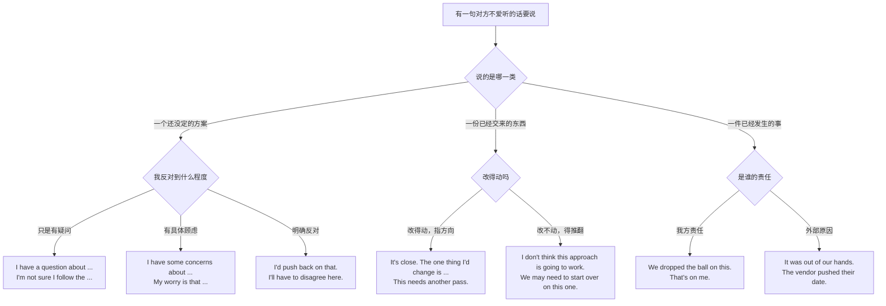
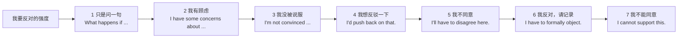
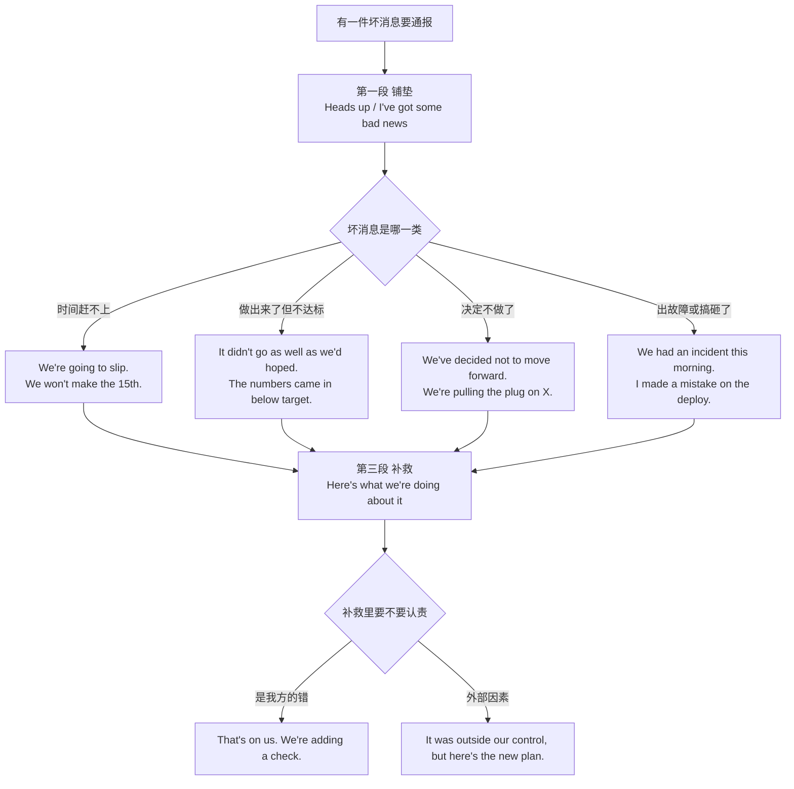
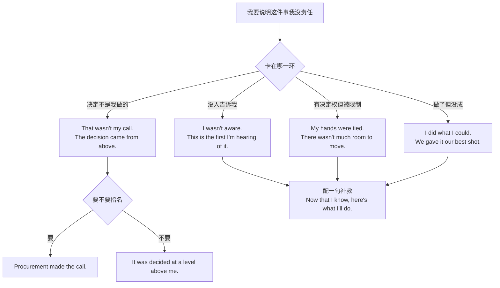
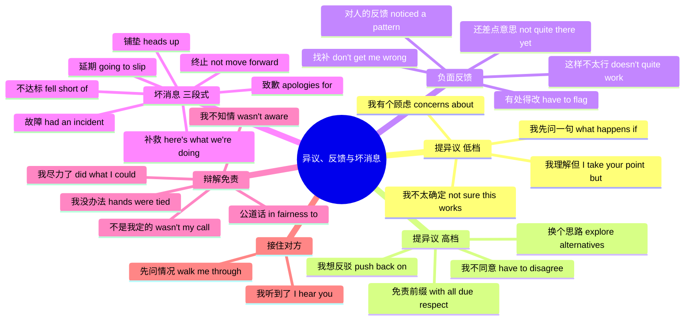

# 我有个顾虑、这样不太行、恐怕要延期：异议、负面反馈与坏消息

> [!info] 本篇定位
>
> 前四篇管的是把话说出去、把话接下来、把话轮抢回来。这一篇管的是**说出去的内容对听者不利**时该怎么组装句子：你不同意他的方案，你觉得他交的东西不行，或者你得告诉他项目要黄了。
>
> 中文这一侧的触发语是三堆：一堆是提异议的（我有个顾虑、我不太确定、恐怕不太行、我得说我不同意、我持保留意见），一堆是给负面反馈的（这样不太行、还差点意思、这里得改、我得指出来），一堆是通报坏消息的（跟你说个事、恐怕要延期、结果不太理想、我们决定不推进、出问题了）。第四堆是坏消息说完之后必然跟着的辩解与免责（这不是我能定的、我不知情、我也没办法、我尽力了）。
>
> 本篇不解释情态动词为什么能软化语气，也不写整段职场对话——礼貌梯度的原理与会议现场演练在 [[04.英语场景/05.高频实用表达句型框架/03.同意反对让步转折句型库\|同意反对让步转折句型库]] 和 [[04.英语场景/10.职场与商务场景实战/02.会议汇报与演示场景\|会议汇报与演示场景]]。
>
> 读完能查到：28 条中文意图、219 个分档成品句架、一条异议强度阶梯、一张软化件叠加表、三棵选择树与一张总结图。

---

## 1. 本篇导读：异议、反馈、坏消息是三件事

中文可以用同一句「这个我觉得有点问题」盖住三种完全不同的场合，英文不行。三者的**对象**不同，因此可用的句架不同，软化手段也不同。

| 你在做的事 | 对象是什么 | 中文长什么样 | 英文的落点 | 本篇位置 |
| --- | --- | --- | --- | --- |
| 提异议 | 一个还没定的**主张或方案** | 我有个顾虑 / 我不太确定这样行 | I have concerns about、I'm not sure this works | 第 2、3 节 |
| 给负面反馈 | 一份已经交出来的**产出或行为** | 这样不太行 / 还差点意思 | this doesn't quite work、it's not there yet | 第 4 节 |
| 通报坏消息 | 一件已经发生、改不了的**事实** | 恐怕要延期 / 结果不太理想 | I'm afraid we're going to slip | 第 5、6 节 |
| 辩解免责 | 坏消息里**你自己的位置** | 这不是我能定的 / 我也没办法 | that wasn't my call、my hands were tied | 第 7 节 |

分界的实际后果：给方案提异议时用 `I'm not sure this works`，对方听到的是「还能商量」；同一句话用来评价一份已经交付的稿子，对方听到的是「重做」。反过来，坏消息用异议的句架说出去更糟——`I have some concerns about the deadline` 想表达的是「要延期了」，但它听起来像「我担心赶不上」，对方会以为还有救，等到真延期时会觉得你之前在遮掩。



这棵树的第一个岔口决定时态与情态：讲方案用现在时加软化情态（would、might、not sure），讲产出用现在完成或现在时加评价形容词，讲已发生的事用过去时或将来时的既定事实语气（`we're going to slip` 而不是 `we might slip`）。第二个岔口只决定强度，不改结构。

第三个岔口是最容易翻车的：中文习惯把责任说得模糊（「这个事情没弄好」），英文里模糊主语反而显得在推卸。要么点名主体（`we`、`I`、`the vendor`），要么明说「责任待查」（`we're still working out what went wrong`），不要留一个没有主语的空句。

> [!tip] 一句话定位法
>
> 拿不准查哪节时，把中文换成下面五句试读，哪句顺就查哪节。
>
> 1. 「这个方案我有话说」→ 第 2、3 节
> 2. 「你交来的这版，我看了」→ 第 4 节
> 3. 「跟你说个不太好的消息」→ 第 5 节
> 4. 「这事儿已经这样了，我们打算这么补」→ 第 6 节
> 5. 「这个真不怪我」→ 第 7 节

---

## 2. 提异议的第一档：我有个顾虑、我不太确定

这一节是异议的低强度端。共同特征是**把反对包装成认知状态**——不说「你错了」，说「我没把握」「我担心」。语法上靠的是第一人称主语加软化谓语，把一句关于世界的断言降级成一句关于说话人的陈述。

### 2.1 我有个顾虑：把反对说成一处具体担心

**中文触发语**：我有个顾虑 / 我担心的是 / 有一点我不太放心 / 我有点保留意见 / 这里我心里没底

| 档位 | 句架 | 例句 |
| --- | --- | --- |
| 口语 | My worry is (that) A. | My worry is that nobody owns this after launch. |
| 口语 | I'm a bit worried about sth / doing. | I'm a bit worried about rolling this out on a Friday. |
| 口语 | One thing that bugs me is A. | One thing that bugs me is how long the retry loop can run. |
| 书面 | I have some concerns about sth. | I have some concerns about the migration plan. |
| 书面 | I have one concern, and it's A. | I have one concern, and it's the cost of the extra region. |
| 书面 | My main reservation is (that) A. | My main reservation is that we have no rollback path. |
| 正式 | I would like to raise a concern regarding sth. | I would like to raise a concern regarding the proposed timeline. |
| 正式 | There are two points on which I remain unconvinced. | There are two points on which I remain unconvinced. |

- 译文：我担心的是上线之后没人管这块。／ 周五发这个我有点不放心。／ 有一点我一直不太舒服，就是重试循环能跑多久。／ 迁移方案我有些顾虑。／ 我只有一个顾虑，就是多开一个区的成本。／ 我主要的保留意见是我们没有回滚路径。／ 关于提议的时间表，我想提出一处顾虑。／ 有两点我仍然不能信服。

> [!warning] 错配警示
>
> - ❌ ~~I have some concerns for the migration plan.~~ ／ ✅ **I have some concerns about the migration plan.**（concern 表「顾虑」时配 about 或 over，配 for 时意思变成「关心某人安危」）
> - ❌ ~~I concern about the deadline.~~ ／ ✅ **I'm concerned about the deadline.**（concern 作动词时是「使某人担忧」，主语是事不是人，说自己担忧要用被动式 be concerned）

- 同义入口：我不太放心 / 我心里有个疙瘩 / 有一处我想提一下
- 语法归属：[[02.英语基础语法/10.特殊句型/01.被动语态全解\|be concerned 的被动形态]]
- 场景实战：[[04.英语场景/10.职场与商务场景实战/02.会议汇报与演示场景\|会议汇报与演示场景]]

---

### 2.2 我不太确定这样行：把否定装进不确定

**中文触发语**：我不太确定这样行 / 这样恐怕不太行 / 我不太看好 / 我怕这条路走不通 / 这样能行吗

| 档位 | 句架 | 例句 |
| --- | --- | --- |
| 口语 | I'm not sure this works. | I'm not sure this works for mobile. |
| 口语 | I don't know if A is going to fly. | I don't know if a two-week estimate is going to fly. |
| 口语 | I'm not sold on sth. | I'm not sold on the new pricing tiers. |
| 书面 | I'm not convinced (that) A. | I'm not convinced that caching alone will fix it. |
| 书面 | I'm not sure this is the right call. | I'm not sure dropping the free tier is the right call. |
| 书面 | I have my doubts about sth. | I have my doubts about the vendor's SLA numbers. |
| 正式 | I am not persuaded that A. | I am not persuaded that the current design meets the requirement. |
| 正式 | It is not clear to me that A. | It is not clear to me that the savings justify the migration cost. |

- 译文：手机端这样行不行我没把握。／ 两周的估期能不能过我不好说。／ 新的价格档我还没被说服。／ 我不认为光靠缓存能解决。／ 砍掉免费档是不是对的决定，我不确定。／ 供应商给的可用性数字我持怀疑。／ 我不认为当前设计满足了需求。／ 我看不出这点节省能抵得上迁移成本。

> [!warning] 错配警示
>
> - ❌ ~~I'm not sure that this doesn't work.~~ ／ ✅ **I'm not sure this works.**（英文的否定要么放在主句要么放在从句，不叠加；叠加后语义反转成「说不定能行」）
> - ❌ ~~I don't think it will work, isn't it?~~ ／ ✅ **I don't think it will work, do you?**（反义疑问的附加问句跟着主句的 I don't think 走，不跟从句走）

- 同义入口：这条路我不看好 / 恐怕走不通 / 我保留意见
- 语法归属：[[02.英语基础语法/09.从句体系/03.名词性从句详解\|宾语从句的否定转移]]
- 场景实战：[[04.英语场景/05.高频实用表达句型框架/03.同意反对让步转折句型库\|同意反对让步转折句型库]]

---

### 2.3 我先问一句：把异议伪装成提问

**中文触发语**：我先问一句 / 有个问题想确认 / 这块我没太跟上 / 顺着问一下 / 那这种情况怎么办

真正的问句和伪装成问句的异议在英文里靠一个信号区分：伪装式一定带一个假设性场景（`what happens if`、`how does that handle`），问的是方案的边界，而不是事实。对方听得懂这是在挑毛病，但形式上留了台阶。

| 档位 | 句架 | 例句 |
| --- | --- | --- |
| 口语 | What happens if A? | What happens if the queue backs up during a deploy? |
| 口语 | How does that handle sth? | How does that handle users who never verified their email? |
| 口语 | Help me understand how A. | Help me understand how we roll this back. |
| 书面 | I'm not sure I follow the part about sth. | I'm not sure I follow the part about the fallback path. |
| 书面 | Can you walk me through how A? | Can you walk me through how the two systems stay in sync? |
| 正式 | Could you clarify how the proposal addresses sth? | Could you clarify how the proposal addresses the audit requirement? |
| 正式 | I would welcome more detail on sth. | I would welcome more detail on the failure modes. |

- 译文：部署过程中队列堆积了会怎样？／ 那些从来没验证邮箱的用户怎么处理？／ 你讲讲这个怎么回滚。／ 兜底路径那段我没太跟上。／ 你能带我过一遍两套系统怎么保持同步吗？／ 能否说明该提案如何满足审计要求？／ 关于失败模式，希望能看到更多细节。

> [!warning] 错配警示
>
> - ❌ ~~I don't understand why you do like this.~~ ／ ✅ **Help me understand why we're doing it this way.**（直译式的 I don't understand why you… 在英文里是指责不是提问，换成 help me understand 或 what's the thinking behind）
> - ❌ ~~Can you explain me how it works?~~ ／ ✅ **Can you explain to me how it works?**（explain 不接双宾语，人前面要加 to）

- 同义入口：我想确认一下 / 这里我没懂 / 那要是…呢
- 语法归属：[[02.英语基础语法/09.从句体系/03.名词性从句详解\|宾语从句的陈述语序]]
- 场景实战：[[11.人际功能与话轮管理/02.没听清、你的意思是、我复述一下：澄清、追问与确认理解\|澄清、追问与确认理解]]

---

### 2.4 我理解，但我的看法不同：先接再转

**中文触发语**：我理解你的意思，但 / 你说得有道理，不过 / 我明白，只是我看法不一样 / 我懂，可我的角度是

| 档位 | 句架 | 例句 |
| --- | --- | --- |
| 口语 | I hear you, but A. | I hear you, but we've been burned by that before. |
| 口语 | I get that. I just see it differently. | I get that. I just see it differently on the timing. |
| 口语 | Fair point. That said, A. | Fair point. That said, the client already signed off on the old scope. |
| 书面 | I take your point, but A. | I take your point, but the numbers don't support it yet. |
| 书面 | I see where you're coming from. My concern is A. | I see where you're coming from. My concern is maintenance cost. |
| 正式 | While I appreciate that A, B. | While I appreciate that speed matters, correctness has to come first. |
| 正式 | I recognise the merit of A; nevertheless, B. | I recognise the merit of the proposal; nevertheless, the risk is unquantified. |

- 译文：我明白，但我们以前在这上面吃过亏。／ 我懂，只是时间点上我看法不同。／ 有道理。话虽如此，客户已经按旧范围签字了。／ 你的意思我接受，但数据还撑不住。／ 我理解你的出发点。我担心的是维护成本。／ 我理解速度很重要，但正确性得排在前面。／ 我认可这个提案的价值，不过风险还没有量化。

> [!warning] 错配警示
>
> - ❌ ~~Although I take your point, but the numbers don't support it.~~ ／ ✅ **I take your point, but the numbers don't support it.**（although 和 but 不能同现，选一个）
> - ❌ ~~I know what you mean, however I disagree.~~ ／ ✅ **I know what you mean. However, I disagree.**（however 是副词不是连词，两个分句之间要用句号或分号）

- 同义入口：话是这么说 / 我不否认，可是 / 我的角度是
- 语法归属：[[02.英语基础语法/05.介词与连词/03.连词的分类与用法\|转折连词与连接性副词]]
- 场景实战：[[05.让步、转折与对比/02.话虽如此、退一步说、表面上实际上：软化与反预期\|软化与反预期]]

---

## 3. 提异议的高强度端：我要反对、这个我不能同意

低档说的是「我没把握」，高档说的是「我不同意」。两者的分界不在词多硬，而在**主语指向**：低档的主语是 I 加认知动词，高档的主语要么是 I 加立场动词（disagree、push back、object），要么直接是被反对的那个方案。



这条阶梯有两个实用刻度。第 4 档 `push back` 是英文职场的日常词，指「顶回去再议」，不含情绪，中文的「我提个反对意见」正好对应；很多人跳过它直接用第 5 档的 disagree，听感会硬一截。第 6、7 档带程序含义——`formally object`、`cannot support` 意味着你要求把异议写进会议纪要或投反对票，用在日常讨论里是杀鸡用牛刀。

档位之间可以叠加软化件降一档，也可以去掉软化件升一档。`I'd push back on that` 去掉 would 变成 `I push back on that` 会显得生硬且不自然，因为 would 在这里不是虚拟条件而是固定的礼貌降级，属于不能省的部分。

### 3.1 我想反驳一下：push back 一族

**中文触发语**：我想反驳一下 / 我要提个反对意见 / 这点我得顶一下 / 我不太买账 / 我得在这儿踩一脚刹车

| 档位 | 句架 | 例句 |
| --- | --- | --- |
| 口语 | I'd push back on that. | I'd push back on that — the data says otherwise. |
| 口语 | Let me push back a little. | Let me push back a little on the two-week estimate. |
| 口语 | I'm going to challenge that assumption. | I'm going to challenge that assumption about traffic growth. |
| 书面 | I'd like to push back on A. | I'd like to push back on the idea that this is a quick fix. |
| 书面 | I'd question whether A. | I'd question whether the current volume justifies a rewrite. |
| 正式 | I would take issue with A. | I would take issue with the assumption that latency is not user-visible. |
| 正式 | I must respectfully challenge sth. | I must respectfully challenge the conclusion drawn from these figures. |

- 译文：这点我得顶一下，数据不是这么说的。／ 两周的估期我想顶一下。／ 关于流量增长那个假设，我要质疑一下。／ 说这是个小修补，这个说法我想反驳。／ 目前的量是不是够格做重写，我持疑问。／ 「延迟用户感觉不到」这个假设我不能接受。／ 恕我直言，我必须质疑从这些数字得出的结论。

> [!warning] 错配警示
>
> - ❌ ~~I push back you.~~ ／ ✅ **I'd push back on you / on that point.**（push back 是不及物短语动词，反驳对象用 on 引出）
> - ❌ ~~I want to against this plan.~~ ／ ✅ **I'm against this plan.**（against 是介词不是动词，前面配 be 或 come out）

- 同义入口：我不同意这个前提 / 这条我要质疑 / 我得拦一下
- 语法归属：[[02.英语基础语法/05.介词与连词/02.常用介词搭配详解\|短语动词与介词搭配]]
- 场景实战：[[04.英语场景/10.职场与商务场景实战/04.商务谈判合同与客户沟通\|商务谈判合同与客户沟通]]

---

### 3.2 我得说我不同意：明确反对

**中文触发语**：我得说我不同意 / 恕我不能同意 / 这点上我跟你意见相左 / 我持反对态度 / 这个我投反对票

| 档位 | 句架 | 例句 |
| --- | --- | --- |
| 口语 | I don't agree with that. | I don't agree with that read of the incident. |
| 口语 | I'm going to have to disagree. | I'm going to have to disagree on the priority here. |
| 书面 | I'll have to disagree here. | I'll have to disagree here — the trade-off runs the other way. |
| 书面 | I disagree with A on B. | I disagree with the team on how we're measuring success. |
| 书面 | I can't support A as it stands. | I can't support the plan as it stands. |
| 正式 | I am unable to endorse sth. | I am unable to endorse the current allocation of budget. |
| 正式 | I wish to record my objection to sth. | I wish to record my objection to the revised schedule. |

- 译文：对这次故障的这种解读，我不同意。／ 优先级这块我不得不有不同意见。／ 这点我得说不同意，取舍的方向反了。／ 在成功怎么衡量这件事上，我和团队看法不同。／ 照现在这个样子我没法支持。／ 我无法认可当前的预算分配。／ 我要求把我对修订后排期的反对意见记录在案。

> [!warning] 错配警示
>
> - ❌ ~~I disagree your idea.~~ ／ ✅ **I disagree with your idea.**（disagree 是不及物动词，接人或观点都要 with）
> - ❌ ~~I'm disagree with that.~~ ／ ✅ **I disagree with that.**（disagree 是实义动词，前面不加 be）

- 同义入口：这我不能认 / 我意见相反 / 我保留反对
- 语法归属：[[02.英语基础语法/07.助动词与情态动词/02.情态动词详解\|have to 与 can't 的语气差]]
- 场景实战：[[04.英语场景/05.高频实用表达句型框架/03.同意反对让步转折句型库\|同意反对让步转折句型库]]

---

### 3.3 我先声明一下：说反对话之前的免责前缀

**中文触发语**：我先声明一下 / 无意冒犯 / 说句可能不中听的 / 我唱个反调 / 恕我直言 / 我只是把话摆出来

这批短语单独不成句，它们的作用是给后面那句硬话套一个壳，声明说话人的动机不针对人。位置固定在句首，后面跟逗号。

| 档位 | 句架 | 例句 |
| --- | --- | --- |
| 口语 | No offence, but A. | No offence, but this looks like a rewrite in disguise. |
| 口语 | Just to play devil's advocate, A. | Just to play devil's advocate, what if nobody uses the new flow? |
| 口语 | Not to be that guy, but A. | Not to be that guy, but we agreed on this two weeks ago. |
| 书面 | To be honest with you, A. | To be honest with you, I don't think the estimate is realistic. |
| 书面 | I'll be blunt: A. | I'll be blunt: the current design won't survive Black Friday. |
| 书面 | For the record, A. | For the record, I raised this in the design review. |
| 正式 | With (all due) respect, A. | With all due respect, the figures presented do not match our own. |
| 正式 | If I may speak frankly, A. | If I may speak frankly, the timeline was never achievable. |

- 译文：无意冒犯，但这看着就是换了个说法的重写。／ 我唱个反调：万一没人用新流程呢？／ 我不想当这种人，但这事儿两周前就定过了。／ 说实话，我觉得这个估期不现实。／ 我直说：现在这个设计撑不过大促。／ 说明一下，我在设计评审时提过这个问题。／ 恕我直言，所呈数字与我方数据不符。／ 容我坦率地说，这个时间表从一开始就不可能完成。

> [!warning] 错配警示
>
> - ❌ ~~With all due respect, but the figures are wrong.~~ ／ ✅ **With all due respect, the figures are wrong.**（前缀本身已含转折，不再加 but）
> - ❌ ~~Honestly speaking, I don't agree.~~ ／ ✅ **To be honest, I don't agree.**（honestly speaking 是中式搭配，英语用 to be honest、honestly、frankly）

- 同义入口：说句实在话 / 我把丑话说前头 / 我提前打个招呼
- 语法归属：[[02.英语基础语法/08.非谓语动词/01.动词不定式详解\|不定式作独立评注]]
- 场景实战：[[04.英语场景/05.高频实用表达句型框架/02.建议请求邀请拒绝四大功能句型\|建议请求邀请拒绝四大功能句型]]

---

### 3.4 那我们换个思路：把异议转成出路

**中文触发语**：那我们换个思路 / 有没有别的办法 / 要不这样 / 我们能不能退一步看 / 换个方向想想

反对之后不给出路，在英文会议里被视为半句话。这一组的功能是把上一句的反对接成可执行的下一步，几乎所有的高强度异议后面都跟着它们中的一句。

| 档位 | 句架 | 例句 |
| --- | --- | --- |
| 口语 | What if we A instead? | What if we ship the read path first instead? |
| 口语 | Could we look at sth another way? | Could we look at the rollout another way? |
| 口语 | Here's what I'd do instead: A. | Here's what I'd do instead: feature-flag it and watch for a week. |
| 书面 | Can we explore alternatives to sth? | Can we explore alternatives to a full rewrite? |
| 书面 | I'd suggest we A before B. | I'd suggest we validate the assumption before committing the quarter. |
| 书面 | Would it be worth doing sth? | Would it be worth running a two-week pilot first? |
| 正式 | An alternative approach would be to do sth. | An alternative approach would be to phase the migration by region. |
| 正式 | I would propose that we (should) do sth. | I would propose that we defer the decision until the audit closes. |

- 译文：要不我们先发读路径？／ 上线方式能不能换个角度看？／ 换我的话我会这么干：加个开关，观察一周。／ 我们能不能找个替代全量重写的办法？／ 我建议先验证假设，再把整个季度压上去。／ 先跑两周试点值不值得？／ 另一种做法是按区域分批迁移。／ 我提议把决定推迟到审计结束。

> [!warning] 错配警示
>
> - ❌ ~~I suggest you to try another way.~~ ／ ✅ **I suggest you try another way.**（suggest 不接「sb to do」，接从句或动名词）
> - ❌ ~~Would it be worth to run a pilot?~~ ／ ✅ **Would it be worth running a pilot?**（worth 后固定接动名词）

- 同义入口：还有一条路 / 要不先试试 / 我给个替代方案
- 语法归属：[[02.英语基础语法/08.非谓语动词/02.动名词详解\|worth doing 的固定搭配]]
- 场景实战：[[11.人际功能与话轮管理/01.我建议、你最好、能不能帮我：建议、请求、许可与委托\|建议、请求、许可与委托]]

---

## 4. 负面反馈：这样不太行、还差点意思

异议的对象是尚未落地的主张，反馈的对象是已经做出来的东西。这一节的句架有一个共同的语法特征：**主语是产出物，不是人**。`This isn't quite working` 和 `You didn't do this well` 语义相近，但前者把问题挂在东西上，后者挂在人身上，后者只在明确要谈人的表现时才用（见 4.4）。

### 4.1 这样不太行：对产出的整体判断

**中文触发语**：这样不太行 / 这版不行 / 恐怕不行 / 这个走不通 / 这条路得放弃

| 档位 | 句架 | 例句 |
| --- | --- | --- |
| 口语 | This isn't quite working. | This isn't quite working for the mobile layout. |
| 口语 | I don't think this is going to work. | I don't think this approach is going to work at our scale. |
| 口语 | This one's a no from me. | This one's a no from me, sorry. |
| 书面 | This doesn't quite work as it stands. | The current draft doesn't quite work as it stands. |
| 书面 | A isn't going to hold up under B. | This schema isn't going to hold up under concurrent writes. |
| 书面 | We may need to start over on this one. | We may need to start over on the reporting piece. |
| 正式 | The proposed solution does not meet the requirement. | The proposed solution does not meet the availability requirement. |
| 正式 | This approach is not viable in its present form. | This approach is not viable in its present form. |

- 译文：手机端这个版式不太行。／ 到我们这个量级，这条路我觉得走不通。／ 抱歉，这个我这边过不了。／ 照现在这个样子，这稿不太行。／ 这个表结构扛不住并发写。／ 报表这块我们可能得从头来。／ 所提方案不满足可用性要求。／ 该做法以当前形态不可行。

> [!warning] 错配警示
>
> - ❌ ~~This is not work.~~ ／ ✅ **This doesn't work.**（work 在这里是实义动词，否定要用 doesn't，不是 is not）
> - ❌ ~~It's not working, isn't it?~~ ／ ✅ **It's not working, is it?**（否定句的反义疑问要用肯定形式）

- 同义入口：这条走不通 / 得推翻重来 / 这个我过不了
- 语法归属：[[02.英语基础语法/06.动词时态/03.进行时态详解\|进行时表暂时状态]]
- 场景实战：[[04.英语场景/10.职场与商务场景实战/02.会议汇报与演示场景\|会议汇报与演示场景]]

---

### 4.2 还差点意思：方向对但没到位

**中文触发语**：还差点意思 / 快了但还不到 / 方向是对的，就是 / 还得再打磨 / 差一口气

这一组是反馈里使用频率最高的一档，因为它同时给出「保留」和「返工」两条信息。英文的标志是 `close`、`almost`、`not quite`、`there yet` 这批词，它们把评价定位在一条进度线上，而不是好坏二分。

| 档位 | 句架 | 例句 |
| --- | --- | --- |
| 口语 | It's close, but not quite there. | It's close, but not quite there on performance. |
| 口语 | It's almost there. | The copy is almost there — one more pass should do it. |
| 口语 | Good start. It needs another round. | Good start. It needs another round on error handling. |
| 书面 | It's not quite there yet. | The onboarding flow isn't quite there yet. |
| 书面 | The direction is right; the execution needs work. | The direction is right; the execution needs work in two places. |
| 书面 | This needs another pass before we ship. | This needs another pass before we ship it to customers. |
| 正式 | The submission is broadly sound but requires revision. | The submission is broadly sound but requires revision in section 3. |
| 正式 | Further refinement is required before sign-off. | Further refinement is required before sign-off. |

- 译文：差不多了，性能上还差一点。／ 文案快好了，再过一遍应该就行。／ 开头不错，错误处理还得再来一轮。／ 新手引导流程还没到位。／ 方向对，执行上有两处要改。／ 发给客户之前还得再过一遍。／ 提交的内容大体没问题，但第三节需要修改。／ 签字确认前仍需进一步完善。

> [!warning] 错配警示
>
> - ❌ ~~It's not there already.~~ ／ ✅ **It's not there yet.**（already 用于肯定句表「已经」，否定句表「还没」要用 yet）
> - ❌ ~~It needs to improve.~~ ／ ✅ **It needs improving. / It needs to be improved.**（need 后接动名词时是被动义，接不定式必须写成被动形态）

- 同义入口：还没到位 / 就差一点 / 再打磨一版
- 语法归属：[[02.英语基础语法/08.非谓语动词/02.动名词详解\|need doing 的被动义]]
- 场景实战：[[04.英语场景/10.职场与商务场景实战/03.商务邮件与正式书面沟通\|商务邮件与正式书面沟通]]

---

### 4.3 有个地方得改：指出具体问题

**中文触发语**：有个地方得改 / 我标一下 / 这里有个问题 / 我得指出来 / 有一处我想提

| 档位 | 句架 | 例句 |
| --- | --- | --- |
| 口语 | One thing I'd change is A. | One thing I'd change is the default timeout. |
| 口语 | I've left a few comments on sth. | I've left a few comments on the pull request. |
| 口语 | Quick note: A. | Quick note: the migration script isn't idempotent. |
| 书面 | I have to flag one issue: A. | I have to flag one issue: the token never expires. |
| 书面 | There are two things I'd like to see changed. | There are two things I'd like to see changed before merge. |
| 书面 | A works, but B is a problem. | The API works, but the error format is a problem for clients. |
| 正式 | I would draw your attention to sth. | I would draw your attention to clause 4 of the appendix. |
| 正式 | One matter requires correction before approval. | One matter requires correction before approval. |

- 译文：我要改的话会改默认超时。／ 我在这个 PR 上留了几条评论。／ 提一句：迁移脚本不是幂等的。／ 我得指出一个问题：这个令牌永不过期。／ 合并之前有两处我希望改掉。／ 接口能用，但错误格式对调用方是个问题。／ 请注意附录第四条。／ 批准前有一处需要更正。

> [!warning] 错配警示
>
> - ❌ ~~I want to point out you a problem.~~ ／ ✅ **I want to point out a problem to you.**（point out 不接双宾语，人用 to 引出）
> - ❌ ~~There are two things I'd like to change them.~~ ／ ✅ **There are two things I'd like to change.**（关系从句里已经有先行词，动词后不再重复宾语）

- 同义入口：我提一处 / 我标出来了 / 这里有个坑
- 语法归属：[[02.英语基础语法/09.从句体系/01.定语从句基础\|定语从句中不重复宾语]]
- 场景实战：[[04.英语场景/10.职场与商务场景实战/03.商务邮件与正式书面沟通\|商务邮件与正式书面沟通]]

---

### 4.4 你最近有点掉链子：对人的反馈

**中文触发语**：你最近有点掉链子 / 这事儿你没跟上 / 我得跟你谈谈 / 这不像你的水平 / 我们得聊聊这个

这一组是全篇最需要谨慎的：主语从产出物换成了人，任何多余的强度都会被放大。英文的通行做法是把行为和人拆开——说 `this keeps slipping`（事）而不是 `you keep slipping`（人），除非确实要谈本人。

| 档位 | 句架 | 例句 |
| --- | --- | --- |
| 口语 | Can we talk about A? | Can we talk about the last two standups? |
| 口语 | This has slipped a few times now. | The status update has slipped a few times now. |
| 口语 | That's not like you. | Missing the review twice — that's not like you. |
| 书面 | I've noticed a pattern with sth. | I've noticed a pattern with the weekly reports arriving late. |
| 书面 | I'd like to talk about how A is going. | I'd like to talk about how the handover is going. |
| 书面 | We need to close the gap between A and B. | We need to close the gap between the plan and what's shipping. |
| 正式 | I would like to discuss your performance on sth. | I would like to discuss your performance on the migration project. |
| 正式 | Expectations on sth have not been met. | Expectations on turnaround time have not been met this quarter. |

- 译文：最近两次站会我们能聊一下吗？／ 状态更新已经拖了好几次了。／ 评审漏了两次，这不像你。／ 我注意到周报晚交是有规律的。／ 我想聊聊交接进行得怎么样。／ 计划和实际交付之间的差距得补上。／ 我想谈谈你在迁移项目上的表现。／ 本季度在交付时效上未达预期。

> [!warning] 错配警示
>
> - ❌ ~~You always forget the standup.~~ ／ ✅ **The standup has been missed a few times.**（always 加第二人称在英文里是人身指控，改成事实陈述并给出次数）
> - ❌ ~~I want to talk about your bad performance.~~ ／ ✅ **I'd like to discuss your performance on the project.**（bad 直接修饰 performance 属于定性，正式反馈只点主题不带评价词）

- 同义入口：我们得谈谈 / 这事儿反复了 / 我注意到一个情况
- 语法归属：[[02.英语基础语法/10.特殊句型/01.被动语态全解\|无施事被动的去人称作用]]
- 场景实战：[[04.英语场景/10.职场与商务场景实战/02.会议汇报与演示场景\|会议汇报与演示场景]]

---

### 4.5 我不是这个意思：反馈之后的找补

**中文触发语**：我不是这个意思 / 别误会 / 我不是针对你 / 我说重了 / 我换个说法

| 档位 | 句架 | 例句 |
| --- | --- | --- |
| 口语 | Don't get me wrong — A. | Don't get me wrong, the idea itself is good. |
| 口语 | That came out wrong. | That came out wrong. Let me try again. |
| 口语 | I'm not having a go at you. | I'm not having a go at you, I'm worried about the date. |
| 书面 | To be clear, I'm not saying A. | To be clear, I'm not saying the work was rushed. |
| 书面 | None of this is directed at you personally. | None of this is directed at you personally. |
| 书面 | Let me rephrase that. | Let me rephrase that — what I mean is the scope grew. |
| 正式 | I should clarify that my remarks concern A, not B. | I should clarify that my remarks concern the process, not the individuals. |

- 译文：别误会，这个想法本身是好的。／ 我说岔了，我重说一遍。／ 我不是冲你来的，我是担心这个日期。／ 说清楚一点，我不是说这活儿赶了。／ 这些都不是针对你个人。／ 我换个说法，我的意思是范围变大了。／ 我需要澄清，我的意见针对的是流程，不是个人。

> [!warning] 错配警示
>
> - ❌ ~~Don't misunderstand me, but the idea is good.~~ ／ ✅ **Don't get me wrong, the idea is good.**（don't misunderstand me 是直译，英文的固定说法是 don't get me wrong，且后面不加 but）
> - ❌ ~~I don't mean that.~~ ／ ✅ **That's not what I meant.**（I don't mean that 是「我不想那样做」，澄清刚说过的话要用过去时的 what I meant）

- 同义入口：我重新说 / 我不是冲你 / 我表达得不好
- 语法归属：[[02.英语基础语法/06.动词时态/01.一般现在时与一般过去时\|回指刚说过的话用过去时]]
- 场景实战：[[11.人际功能与话轮管理/03.打断一下、让我想想、说回刚才：插话、拖延、改口与转场\|插话、拖延、改口与转场]]

---

## 5. 坏消息的铺垫与事实：先打招呼，再说事

坏消息在英文里是**三段式**：铺垫、事实、补救。三段可以压成一句话，但顺序不能换，也不能只给中间那段。中文习惯把事实直接甩出来（「延期了」），英文里缺了铺垫会显得突兀，缺了补救会显得推卸。



这棵树的关键在于第一段和第三段是**固定件**，中间那段才按情况选。铺垫的作用是给听者一秒钟切换心理状态，所以它必须短：`Heads up`、`Quick heads-up`、`Bad news, I'm afraid`。补救的作用是把话题从「发生了什么」转到「接下来怎么办」，这是英文坏消息通报里最被期待的部分，缺了它，前两段就成了单纯的坏消息倾倒。

延期类和取消类的差别值得单列。延期用将来时的既定语气（`we're going to slip`），因为事情还在进行；取消用现在完成时（`we've decided not to move forward`），因为决定已经做完。用错时态会传错信息：`we're deciding not to move forward` 听起来像还在犹豫，对方会追问能不能挽回。

### 5.1 跟你说个事：铺垫

**中文触发语**：跟你说个事 / 提前跟你打个招呼 / 有个不太好的消息 / 有件事得让你知道 / 先给你提个醒

| 档位 | 句架 | 例句 |
| --- | --- | --- |
| 口语 | Heads up — A. | Heads up, the demo environment is down for the next hour. |
| 口语 | Quick heads-up on sth. | Quick heads-up on the release: it's slipping a day. |
| 口语 | Bad news, I'm afraid. | Bad news, I'm afraid. The vendor missed their date. |
| 口语 | You're not going to like this. | You're not going to like this, but the numbers came back flat. |
| 书面 | I want to flag something before you hear it elsewhere. | I want to flag something before you hear it elsewhere. |
| 书面 | I have some news, and it isn't good. | I have some news, and it isn't good. |
| 书面 | I need to let you know about sth early. | I need to let you know about a delay early rather than late. |
| 正式 | I regret to inform you that A. | I regret to inform you that the application was unsuccessful. |
| 正式 | It is my duty to advise you of sth. | It is my duty to advise you of a change in the contract terms. |

- 译文：提个醒，演示环境接下来一小时不可用。／ 关于这次发版说一句：要晚一天。／ 恐怕是个坏消息，供应商没赶上日期。／ 你可能不爱听：数据回来是平的。／ 有件事我想先跟你说，免得你从别处听到。／ 有个消息，不太好。／ 有个延期的情况我想早点告诉你。／ 很遗憾地通知你，申请未获通过。／ 我有义务告知你合同条款的一处变更。

> [!warning] 错配警示
>
> - ❌ ~~I regret to inform you that the demo is one hour late.~~ ／ ✅ **Heads up, the demo will be about an hour late.**（regret to inform 是解雇、拒信、事故通报级别的措辞，用在日常小延误上过重）
> - ❌ ~~Heads up for the release.~~ ／ ✅ **Heads up on the release.**（heads-up 后接主题用 on 或 about）

- 同义入口：先说一声 / 打个预防针 / 有件事要通知
- 语法归属：[[02.英语基础语法/07.助动词与情态动词/02.情态动词详解\|will 表既定安排]]
- 场景实战：[[04.英语场景/10.职场与商务场景实战/03.商务邮件与正式书面沟通\|商务邮件与正式书面沟通]]

---

### 5.2 恐怕要延期：时间赶不上

**中文触发语**：恐怕要延期 / 赶不上了 / 得往后挪 / 时间不够 / 我们要晚几天

`slip` 是英文工程语境里表「延期」的标准词，主语可以是项目、发版、日期本身。它和 `delay` 的分工是：slip 描述计划自己往后滑，delay 描述被某个原因推迟，后者常带施事。

| 档位 | 句架 | 例句 |
| --- | --- | --- |
| 口语 | We're not going to make it. | We're not going to make the Friday cut-off. |
| 口语 | It's going to slip. | The API work is going to slip by about a week. |
| 口语 | We're running behind on sth. | We're running behind on the data migration. |
| 书面 | I'm afraid we're going to slip. | I'm afraid we're going to slip on the March release. |
| 书面 | We won't hit the original date. | We won't hit the original date of the 15th. |
| 书面 | A has pushed the timeline out by B. | The security review has pushed the timeline out by two weeks. |
| 书面 | We need to move the date to A. | We need to move the launch date to 5 April. |
| 正式 | Delivery will be later than originally scheduled. | Delivery will be later than originally scheduled by approximately ten days. |
| 正式 | We are unable to meet the agreed deadline. | We are unable to meet the agreed deadline of 31 March. |

- 译文：周五的截止我们赶不上了。／ 接口那块要往后滑一周左右。／ 数据迁移我们进度落后了。／ 三月这个版恐怕要延期。／ 原定 15 号这个日期我们赶不上。／ 安全评审把时间线往后推了两周。／ 上线日期得挪到 4 月 5 日。／ 交付将比原定计划晚约十天。／ 我们无法满足 3 月 31 日这一约定期限。

> [!warning] 错配警示
>
> - ❌ ~~The project will delay two weeks.~~ ／ ✅ **The project will be delayed by two weeks. / The project is slipping by two weeks.**（delay 及物，项目本身不能作它的主语；表延长的量用 by）
> - ❌ ~~We can't reach the deadline.~~ ／ ✅ **We can't meet the deadline.**（deadline 的固定搭配是 meet、hit、miss，不用 reach）

- 同义入口：要往后拖 / 交不了了 / 得改期
- 语法归属：[[02.英语基础语法/06.动词时态/02.一般将来时与过去将来时\|be going to 表已有迹象的将来]]
- 场景实战：[[11.人际功能与话轮管理/07.我在做、卡住了、我会、我习惯了、这归谁管：进度、能力、习惯与职责\|进度、能力、习惯与职责]]

---

### 5.3 结果不太理想：做出来了但不达标

**中文触发语**：结果不太理想 / 没达到预期 / 效果一般 / 数据不好看 / 白忙一场

| 档位 | 句架 | 例句 |
| --- | --- | --- |
| 口语 | It didn't go great. | The launch didn't go great, to be honest. |
| 口语 | It didn't go as well as we'd hoped. | The pilot didn't go as well as we'd hoped. |
| 口语 | The numbers aren't what we wanted. | The numbers aren't what we wanted for week one. |
| 书面 | Results came in below expectations. | Results came in below expectations across both regions. |
| 书面 | A fell short of B. | Conversion fell short of the target by about four points. |
| 书面 | We saw less impact than we projected. | We saw less impact from the redesign than we projected. |
| 正式 | Performance did not meet the stated objectives. | Performance did not meet the stated objectives for the quarter. |
| 正式 | The outcome was materially below forecast. | The outcome was materially below forecast. |

- 译文：说实话这次上线不太顺。／ 试点没有我们期望的那么好。／ 第一周的数据不是我们想要的。／ 两个区的结果都低于预期。／ 转化率比目标低了约四个点。／ 改版带来的影响比我们预估的小。／ 表现未达到本季度既定目标。／ 结果显著低于预测。

> [!warning] 错配警示
>
> - ❌ ~~The result is not as good as we hope.~~ ／ ✅ **It didn't go as well as we'd hoped.**（回顾已发生的事，比较从句里要用过去或过去完成，不用现在时）
> - ❌ ~~The conversion fell short the target.~~ ／ ✅ **Conversion fell short of the target.**（fall short 后接对象必须带 of）

- 同义入口：没达标 / 差得有点远 / 没跑出来
- 语法归属：[[02.英语基础语法/06.动词时态/04.完成时态详解\|过去完成时在比较从句中的回指]]
- 场景实战：[[04.英语场景/10.职场与商务场景实战/02.会议汇报与演示场景\|会议汇报与演示场景]]

---

### 5.4 我们决定不推进了：拒绝与终止

**中文触发语**：我们决定不做了 / 这个不推进了 / 项目砍了 / 我们不打算继续 / 这次先不考虑

| 档位 | 句架 | 例句 |
| --- | --- | --- |
| 口语 | We're not going ahead with sth. | We're not going ahead with the redesign this year. |
| 口语 | We're pulling the plug on sth. | We're pulling the plug on the beta program. |
| 口语 | It's been shelved. | The reporting project has been shelved for now. |
| 书面 | We've decided not to move forward with sth. | We've decided not to move forward with the vendor. |
| 书面 | We're going to pass on sth (for now). | We're going to pass on the partnership for now. |
| 书面 | We've chosen a different direction. | After review, we've chosen a different direction. |
| 正式 | We will not be proceeding with sth. | We will not be proceeding with the proposal at this time. |
| 正式 | The project has been discontinued with effect from A. | The project has been discontinued with effect from 1 June. |

- 译文：改版今年不做了。／ 内测计划我们停掉了。／ 报表项目暂时搁置。／ 我们决定不和这家供应商继续。／ 这次合作我们先不参与。／ 评估之后我们选了另一个方向。／ 目前我们不会推进该提案。／ 该项目自 6 月 1 日起终止。

> [!warning] 错配警示
>
> - ❌ ~~We decide not to move forward.~~ ／ ✅ **We've decided not to move forward.**（决定已经做完并对现在有效，用现在完成时；一般现在时会被读成还在决定）
> - ❌ ~~We don't move forward with this proposal.~~ ／ ✅ **We won't be moving forward with this proposal.**（一般现在时表习惯，通报一次性决定要用将来进行或现在完成）

- 同义入口：不批了 / 停掉了 / 换方向了
- 语法归属：[[02.英语基础语法/06.动词时态/04.完成时态详解\|现在完成时表决定已生效]]
- 场景实战：[[04.英语场景/10.职场与商务场景实战/04.商务谈判合同与客户沟通\|商务谈判合同与客户沟通]]

---

### 5.5 出问题了：故障与自己搞砸

**中文触发语**：出问题了 / 出事故了 / 我搞砸了 / 是我弄的 / 线上挂了

英文在故障通报里区分两件事：**发生了什么**用无施事的客观句（`we had an incident`、`the service was down`），**谁的责任**单独一句说（`that's on me`）。把两者揉进一句会显得要么在推卸，要么在自我惩罚，都干扰信息传递。

| 档位 | 句架 | 例句 |
| --- | --- | --- |
| 口语 | We had an incident this morning. | We had an incident this morning — about twenty minutes of downtime. |
| 口语 | Something broke in production. | Something broke in production right after the deploy. |
| 口语 | I messed up. | I messed up — I ran the script against the wrong database. |
| 口语 | That one's on me. | The missed alert? That one's on me. |
| 书面 | We're seeing an issue with sth. | We're seeing an issue with checkout for a subset of users. |
| 书面 | I made a mistake on sth, and here's the impact. | I made a mistake on the config change, and here's the impact. |
| 书面 | A affected B users for C. | The outage affected about 3% of users for eleven minutes. |
| 正式 | A service disruption occurred between A and B. | A service disruption occurred between 09:14 and 09:25 UTC. |
| 正式 | We take full responsibility for sth. | We take full responsibility for the data inconsistency. |

- 译文：今早出了个事故，大约中断二十分钟。／ 部署之后线上有东西挂了。／ 我搞砸了，脚本跑到了错的库上。／ 漏掉的那条告警？那是我的责任。／ 有一部分用户的下单流程有问题。／ 配置改动上我出了错，影响如下。／ 这次中断影响了约 3% 的用户，持续十一分钟。／ 服务中断发生在协调世界时 09:14 至 09:25 之间。／ 对于数据不一致我们承担全部责任。

> [!warning] 错配警示
>
> - ❌ ~~I made a mistake, sorry sorry sorry.~~ ／ ✅ **I made a mistake. Here's what I've done to fix it.**（英文的故障通报重补救不重道歉，反复致歉会被读成不专业）
> - ❌ ~~The system was happened an error.~~ ／ ✅ **An error occurred in the system. / The system threw an error.**（happen 与 occur 都是不及物动词，不能用被动式）

- 同义入口：线上出事了 / 是我的锅 / 我这边弄错了
- 语法归属：[[02.英语基础语法/10.特殊句型/01.被动语态全解\|不及物动词不能被动]]
- 场景实战：[[04.英语场景/10.职场与商务场景实战/02.会议汇报与演示场景\|会议汇报与演示场景]]

---

## 6. 坏消息的第三段：补救与善后

铺垫和事实之后，英文的通报必须落到「接下来怎么办」。这一节的句架都以时间或动作开头，把话题从过去拉到未来。缺了这一段，前面的坏消息就是一个悬在空中的问题。

### 6.1 我们打算这么补：给出下一步

**中文触发语**：我们打算这么补 / 接下来这么办 / 补救方案是 / 我们已经在做的是 / 下一步

| 档位 | 句架 | 例句 |
| --- | --- | --- |
| 口语 | Here's what we're doing about it. | Here's what we're doing about it: rollback first, root cause after. |
| 口语 | We're on it. | We're on it — I'll update you in an hour. |
| 口语 | The plan is to A, then B. | The plan is to patch today, then backfill overnight. |
| 书面 | Here's how we're going to recover the time. | Here's how we're going to recover the two weeks. |
| 书面 | To limit the impact, we're doing A. | To limit the impact, we're pausing the rollout at 5%. |
| 书面 | We've already done A; B is next. | We've already restored service; the postmortem is next. |
| 正式 | The following remedial steps have been taken. | The following remedial steps have been taken with immediate effect. |
| 正式 | We will provide a revised schedule by A. | We will provide a revised schedule by end of day Thursday. |

- 译文：我们的处理是：先回滚，再查根因。／ 我们在处理，一小时后同步进展。／ 计划是今天先打补丁，夜里补数据。／ 这两周我们打算这么追回来。／ 为了控制影响，我们把灰度停在 5%。／ 服务已经恢复，接下来是复盘。／ 已立即采取以下补救措施。／ 我们将在周四下班前提供修订后的排期。

> [!warning] 错配警示
>
> - ❌ ~~We will do our best, please understand us.~~ ／ ✅ **We'll have a revised plan to you by Thursday.**（英文的补救段要给可验证的动作和时间，泛泛的 do our best 加请求体谅会被读成没有方案）
> - ❌ ~~We are on it now, don't worry about that.~~ ／ ✅ **We're on it. I'll update you at four.**（don't worry 由责任方说出来带命令意味，换成承诺一个更新时间）

- 同义入口：已经在处理了 / 我们的应对是 / 后续安排
- 语法归属：[[02.英语基础语法/06.动词时态/03.进行时态详解\|现在进行时表已安排的近期动作]]
- 场景实战：[[04.英语场景/10.职场与商务场景实战/03.商务邮件与正式书面沟通\|商务邮件与正式书面沟通]]

---

### 6.2 抱歉给你添麻烦了：致歉的三个档

**中文触发语**：抱歉给你添麻烦 / 不好意思 / 对不起 / 我道歉 / 给你造成的不便请谅解

英文致歉有一条明确的强度线：`sorry about` 用于小事，`I apologise for` 用于正式场合，`we sincerely apologise for the inconvenience caused` 用于对外通报。跨档使用会失真——对内部同事说 sincerely apologise 像在演戏，对客户只说 sorry about that 又太轻。

| 档位 | 句架 | 例句 |
| --- | --- | --- |
| 口语 | Sorry about that. | Sorry about that — my calendar didn't sync. |
| 口语 | Sorry for the mess. | Sorry for the mess on the shared branch. |
| 口语 | My bad. | My bad, I read the wrong column. |
| 书面 | Apologies for the delay in sth. | Apologies for the delay in getting back to you. |
| 书面 | I'm sorry this landed on you at short notice. | I'm sorry this landed on you at such short notice. |
| 书面 | I apologise for the disruption this has caused. | I apologise for the disruption this has caused to your planning. |
| 正式 | We sincerely apologise for the inconvenience caused. | We sincerely apologise for the inconvenience caused to affected customers. |
| 正式 | Please accept our apologies for sth. | Please accept our apologies for the interruption to service. |

- 译文：抱歉，我的日历没同步。／ 抱歉把公共分支搞乱了。／ 我的锅，我看错列了。／ 抱歉这么晚才回复。／ 抱歉这么临时把事情压到你这儿。／ 对由此给你的规划造成的干扰我表示歉意。／ 对由此造成的不便我们深表歉意。／ 对服务中断请接受我们的歉意。

> [!warning] 错配警示
>
> - ❌ ~~Sorry for late.~~ ／ ✅ **Sorry I'm late. / Apologies for the delay.**（sorry for 后面接名词或动名词，late 是形容词不能直接跟）
> - ❌ ~~I'm sorry if anyone was affected.~~ ／ ✅ **I'm sorry that this affected your team.**（if 从句把影响说成假设，在已知有影响时会被读成不真诚）

- 同义入口：不好意思 / 我的责任 / 请见谅
- 语法归属：[[02.英语基础语法/05.介词与连词/02.常用介词搭配详解\|sorry for 与 sorry that 的搭配]]
- 场景实战：[[04.英语场景/07.社交交际场景实战/02.电话短信与在线沟通场景\|电话短信与在线沟通场景]]

---

### 6.3 以后不会了：承诺与防复发

**中文触发语**：以后不会了 / 我们加个检查 / 下次会提前说 / 这个坑填上了 / 我们把流程改了

| 档位 | 句架 | 例句 |
| --- | --- | --- |
| 口语 | It won't happen again. | It won't happen again — I've added it to the checklist. |
| 口语 | We've put a check in place. | We've put a check in place so the script can't run twice. |
| 书面 | We've added a safeguard so that A. | We've added a safeguard so that config changes require review. |
| 书面 | Going forward, we'll A. | Going forward, we'll flag risks in the Monday update rather than at the deadline. |
| 书面 | To prevent a recurrence, we're doing A. | To prevent a recurrence, we're adding an automated check to CI. |
| 正式 | Measures have been implemented to prevent recurrence. | Measures have been implemented to prevent recurrence of this fault. |
| 正式 | The process has been revised with effect from A. | The process has been revised with effect from today. |

- 译文：不会再发生了，我已经加进检查清单。／ 我们加了个检查，脚本没法跑两遍。／ 我们加了一道保护，配置改动必须评审。／ 以后风险我们会在周一同步里提，不会等到截止日。／ 为防复发，我们在 CI 里加了自动检查。／ 已实施措施防止此类故障再次发生。／ 流程自今日起已修订。

> [!warning] 错配警示
>
> - ❌ ~~We will pay attention next time.~~ ／ ✅ **We've added an automated check so it can't happen again.**（英文的防复发承诺要落到机制上，「以后注意」在事故复盘里等于没有措施）
> - ❌ ~~To prevent recurrence, we added check.~~ ／ ✅ **To prevent a recurrence, we've added a check.**（recurrence 与 check 都是可数名词，单数要带冠词）

- 同义入口：加了保险 / 流程改了 / 下不为例
- 语法归属：[[02.英语基础语法/09.从句体系/04.状语从句详解\|so that 引导的目的状语从句]]
- 场景实战：[[04.英语场景/10.职场与商务场景实战/03.商务邮件与正式书面沟通\|商务邮件与正式书面沟通]]

---

## 7. 辩解与免责：这不是我能定的

坏消息说完之后，紧跟着的往往是「这事儿不该算在我头上」。中文可以用一个模糊的「没办法」盖住全部四种情况，英文要分清是**没有决定权**、**不知情**、**受限于外部**，还是**尽力了但没成**——四者对应的免责力度和后续追问完全不同。



这棵树的实用点在最后那一步：四种免责说法单用都会被听成推卸，配上一句「现在我知道了，我打算这么做」就变成交代。英文听者对纯免责的容忍度低于中文，因为免责说完之后话题就断了，而对方要的是下一步。

`That wasn't my call` 与 `I wasn't aware` 在使用上有一条隐性限制：它们把责任转移到了另一个具体的人或环节，因此说出口之前要确认这个转移经得起追问。说 `I wasn't aware` 之后，对方通常会接一句 `who was supposed to tell you?`——如果答不上来，这句免责反而变成暴露流程漏洞的自证。

### 7.1 这不是我能定的：决定权不在我

**中文触发语**：这不是我能定的 / 我说了不算 / 这是上面定的 / 轮不到我做主 / 我只是执行

| 档位 | 句架 | 例句 |
| --- | --- | --- |
| 口语 | That wasn't my call. | The vendor choice wasn't my call. |
| 口语 | That's above my pay grade. | Pricing is above my pay grade. |
| 口语 | I don't get a vote on sth. | I don't get a vote on the roadmap. |
| 书面 | The decision was made at a different level. | The decision was made at a different level. |
| 书面 | A sits with B, not with me. | Budget approval sits with finance, not with me. |
| 书面 | I wasn't part of that decision. | I wasn't part of that decision, but I can explain the reasoning. |
| 正式 | That matter falls outside my remit. | That matter falls outside my remit. |
| 正式 | The determination rests with A. | The determination rests with the steering committee. |

- 译文：供应商是谁不是我定的。／ 定价这块超出我的权限。／ 路线图上我没有投票权。／ 这个决定是在另一个层级做的。／ 预算审批在财务那边，不在我这儿。／ 我没有参与那个决定，但我可以解释背后的考虑。／ 该事项不属于我的职责范围。／ 该判定由指导委员会作出。

> [!warning] 错配警示
>
> - ❌ ~~That's not my duty.~~ ／ ✅ **That's not my call. / That's not my decision to make.**（duty 指职责义务，说「不归我决定」要用 call 或 decision）
> - ❌ ~~It's not my responsible.~~ ／ ✅ **It's not my responsibility. / That's not on me.**（responsible 是形容词，名词是 responsibility）

- 同义入口：我做不了主 / 不归我管 / 上面拍的板
- 语法归属：[[02.英语基础语法/10.特殊句型/01.被动语态全解\|被动式隐去决策人]]
- 场景实战：[[11.人际功能与话轮管理/07.我在做、卡住了、我会、我习惯了、这归谁管：进度、能力、习惯与职责\|进度、能力、习惯与职责]]

---

### 7.2 我不知情：没人告诉我

**中文触发语**：我不知情 / 我没收到消息 / 这我第一次听说 / 没人跟我说过 / 我要是知道就

| 档位 | 句架 | 例句 |
| --- | --- | --- |
| 口语 | I had no idea. | I had no idea the date had moved. |
| 口语 | This is the first I'm hearing of it. | This is the first I'm hearing of it. |
| 口语 | Nobody told me. | Nobody told me the flag was already on in production. |
| 书面 | I wasn't aware of sth. | I wasn't aware of the change to the schema. |
| 书面 | I wasn't copied on sth. | I wasn't copied on the thread where this was agreed. |
| 书面 | If I'd known, I would have A. | If I'd known, I would have held the release. |
| 正式 | The matter was not brought to my attention. | The matter was not brought to my attention until this morning. |
| 正式 | I was not informed of sth at the time. | I was not informed of the revised requirement at the time. |

- 译文：日期改了我完全不知道。／ 这是我第一次听说。／ 没人告诉我这个开关线上已经打开了。／ 表结构改动我不知情。／ 定这件事的那个邮件串没抄我。／ 我要是知道，就把发版压住了。／ 该事项直到今早才被告知我。／ 当时我未被告知需求变更。

> [!warning] 错配警示
>
> - ❌ ~~I didn't know it, so it's not my fault.~~ ／ ✅ **I wasn't aware of the change. Now that I am, here's what I'll do.**（免责后直接跳到「不怪我」会关掉对话，接一句下一步动作）
> - ❌ ~~If I knew, I would hold the release.~~ ／ ✅ **If I'd known, I would have held the release.**（对过去的反事实要用过去完成加 would have done，用一般过去时会变成对现在的假设）

- 同义入口：我被蒙在鼓里 / 我没听说 / 这消息没到我这儿
- 语法归属：[[02.英语基础语法/10.特殊句型/02.虚拟语气详解\|对过去的反事实假设]]
- 场景实战：[[04.英语场景/10.职场与商务场景实战/02.会议汇报与演示场景\|会议汇报与演示场景]]

---

### 7.3 我也没办法：受制于外部条件

**中文触发语**：我也没办法 / 我被绑住手脚 / 条件不允许 / 没得选 / 客观原因

| 档位 | 句架 | 例句 |
| --- | --- | --- |
| 口语 | My hands were tied. | My hands were tied — legal wouldn't sign off. |
| 口语 | There wasn't much I could do. | There wasn't much I could do once the API changed. |
| 口语 | It was out of my hands. | By then it was out of my hands. |
| 书面 | I had very little room to move. | I had very little room to move on the timeline. |
| 书面 | The constraint came from A. | The constraint came from the vendor's release cycle, not from us. |
| 书面 | We were dependent on A, and A slipped. | We were dependent on the security review, and it slipped. |
| 正式 | The delay was attributable to factors beyond our control. | The delay was attributable to factors beyond our control. |
| 正式 | We were bound by the terms of sth. | We were bound by the terms of the existing agreement. |

- 译文：我被绑住了手脚，法务不签字。／ 接口一变我就没什么能做的了。／ 到那时候已经不由我了。／ 时间上我没什么腾挪余地。／ 限制来自供应商的发布周期，不在我们这边。／ 我们依赖安全评审，而它延期了。／ 延期归因于我方无法控制的因素。／ 我们受现有协议条款约束。

> [!warning] 错配警示
>
> - ❌ ~~I have no way.~~ ／ ✅ **There wasn't much I could do. / My hands were tied.**（no way 在口语里表「不可能、绝不」，不是「我没办法」）
> - ❌ ~~Because of objective reasons, we delayed.~~ ／ ✅ **The delay came from a dependency we didn't control.**（objective reasons 是直译，英文要说清具体是哪个依赖或约束）

- 同义入口：不由我 / 卡在别人那儿 / 是外部原因
- 语法归属：[[03.因果与结果/02.导致、引发、归因：把账算在原因头上\|归因动词 attribute、stem from]]
- 场景实战：[[04.英语场景/10.职场与商务场景实战/04.商务谈判合同与客户沟通\|商务谈判合同与客户沟通]]

---

### 7.4 我尽力了：做了但没成

**中文触发语**：我尽力了 / 该做的我都做了 / 试了各种办法 / 我们已经拼了 / 能想的都想了

| 档位 | 句架 | 例句 |
| --- | --- | --- |
| 口语 | I did what I could. | I did what I could with the time we had. |
| 口语 | We gave it our best shot. | We gave it our best shot on the deadline. |
| 口语 | We tried everything we could think of. | We tried everything we could think of before rolling back. |
| 书面 | We did everything within our control. | We did everything within our control to hold the date. |
| 书面 | The team put in a real effort on sth. | The team put in a real effort on the migration. |
| 正式 | Every reasonable effort was made to do sth. | Every reasonable effort was made to deliver on schedule. |
| 正式 | We exhausted the available options. | We exhausted the available options before escalating. |

- 译文：在给的时间里我尽力了。／ 为了赶上截止日期我们已经拼了。／ 回滚之前能想到的办法我们都试了。／ 能控制的部分我们都做了，想守住日期。／ 团队在迁移上是真的下了力气。／ 为按期交付已尽一切合理努力。／ 在上报之前我们已用尽可选方案。

> [!warning] 错配警示
>
> - ❌ ~~I did my best, but it's not enough.~~ ／ ✅ **We did what we could; here's where it landed and what I'd change next time.**（英文里 I did my best 单说容易被读成讨同情，配上结果与改进才成立）
> - ❌ ~~We tried our best to hold the date, however we failed.~~ ／ ✅ **We tried to hold the date but missed it by three days.**（fail 太重且不给量，直接说差了多少）

- 同义入口：能做的都做了 / 拼过了 / 想尽办法了
- 语法归属：[[02.英语基础语法/09.从句体系/03.名词性从句详解\|what 引导的名词性从句]]
- 场景实战：[[04.英语场景/10.职场与商务场景实战/02.会议汇报与演示场景\|会议汇报与演示场景]]

---

### 7.5 平心而论：给对方留余地的辩解

**中文触发语**：平心而论 / 说句公道话 / 换个角度看 / 也不能全怪 / 客观地说

这一组是免责的反向用法：不是替自己开脱，是替别人或替客观情况说话。它在英文里的实际功能是把对话从追责拉回分析，语气上比直接免责安全得多。

| 档位 | 句架 | 例句 |
| --- | --- | --- |
| 口语 | To be fair, A. | To be fair, the spec changed twice after we started. |
| 口语 | In fairness to A, B. | In fairness to the team, they were two people short. |
| 口语 | It's not like A. | It's not like anyone could have predicted that load. |
| 书面 | In fairness, A. | In fairness, the estimate was made before the scope grew. |
| 书面 | It's worth saying that A. | It's worth saying that the same risk was flagged in March. |
| 正式 | It should be acknowledged that A. | It should be acknowledged that the requirement was revised mid-project. |
| 正式 | Due weight should be given to A. | Due weight should be given to the resourcing constraints. |

- 译文：说句公道话，我们开工以后需求改了两次。／ 平心而论，团队少了两个人。／ 那个负载谁也预测不到。／ 客观地说，估期是在范围扩大之前给的。／ 有一点值得说：同样的风险三月就提过。／ 应当承认，需求在项目中途发生了修订。／ 人力约束应予以充分考虑。

> [!warning] 错配警示
>
> - ❌ ~~Honestly, it's not their fault totally.~~ ／ ✅ **In fairness to the team, they were two people short.**（totally 位置错且语义含糊，用 in fairness to sb 引出具体客观条件）
> - ❌ ~~To be fair with the team, they were short-staffed.~~ ／ ✅ **In fairness to the team, they were short-staffed.**（to be fair 后不带宾语，要指明对象用 in fairness to sb）

- 同义入口：客观地说 / 说句良心话 / 也得看当时的情况
- 语法归属：[[02.英语基础语法/08.非谓语动词/01.动词不定式详解\|不定式短语作句子状语]]
- 场景实战：[[05.让步、转折与对比/02.话虽如此、退一步说、表面上实际上：软化与反预期\|软化与反预期]]

---

## 8. 接住别人的异议与坏消息

前七节都在说「你把不好的话说出去」。反过来的一半同样高频：别人向你提异议，或者向你通报坏消息，你得接住。接不住的典型表现是立刻辩解，英文里这会终止讨论。

### 8.1 我听到了：先接住再回应

**中文触发语**：我听到了 / 我明白你的顾虑 / 这个我记下了 / 说得有道理 / 你提得对

| 档位 | 句架 | 例句 |
| --- | --- | --- |
| 口语 | I hear you. | I hear you on the timeline. |
| 口语 | That's a fair point. | That's a fair point about the rollback path. |
| 口语 | Noted — let me look into it. | Noted. Let me look into it and come back to you. |
| 书面 | Thanks for raising that. | Thanks for raising that; I hadn't considered the audit angle. |
| 书面 | You're right, and here's what I'll change. | You're right, and here's what I'll change in the next draft. |
| 书面 | Let me come back to you on that. | Let me come back to you on that by Thursday. |
| 正式 | Your point is well taken. | Your point about the compliance risk is well taken. |
| 正式 | We will give that further consideration. | We will give that further consideration before the next review. |

- 译文：时间这块我听明白了。／ 关于回滚路径你说得有道理。／ 记下了，我去查一下再回你。／ 谢谢你提出来，审计这个角度我没想到。／ 你说得对，下一稿我会改这里。／ 这个我周四之前回复你。／ 你关于合规风险的意见我们接受。／ 下次评审前我们会进一步考虑。

> [!warning] 错配警示
>
> - ❌ ~~I know I know, but actually…~~ ／ ✅ **That's a fair point. Let me explain the trade-off we made.**（重复的 I know 在英文里表不耐烦，先给一句接纳再解释）
> - ❌ ~~I will consider it later.~~ ／ ✅ **Let me come back to you on that by Thursday.**（later 无期限等于搁置，接住异议要给回复时间）

- 同义入口：我记下了 / 有道理 / 我回头查
- 语法归属：[[02.英语基础语法/10.特殊句型/05.省略与替代\|Noted 一类省略式应答]]
- 场景实战：[[11.人际功能与话轮管理/02.没听清、你的意思是、我复述一下：澄清、追问与确认理解\|澄清、追问与确认理解]]

---

### 8.2 我先了解一下情况：接到坏消息的第一句

**中文触发语**：我先了解一下 / 具体什么情况 / 影响有多大 / 现在要我做什么 / 别急，先说清楚

| 档位 | 句架 | 例句 |
| --- | --- | --- |
| 口语 | OK — how bad is it? | OK. How bad is it? |
| 口语 | Walk me through what happened. | Walk me through what happened, start to finish. |
| 口语 | What do you need from me right now? | What do you need from me right now? |
| 书面 | What's the impact so far? | What's the impact so far, and who's affected? |
| 书面 | Thanks for flagging it early. | Thanks for flagging it early — that helps. |
| 书面 | Let's separate the fix from the root cause. | Let's separate the fix from the root cause for now. |
| 正式 | Please provide a written summary of sth. | Please provide a written summary of the incident by tomorrow. |
| 正式 | We will review the matter and respond in due course. | We will review the matter and respond in due course. |

- 译文：好，情况有多严重？／ 从头到尾讲一遍发生了什么。／ 现在需要我做什么？／ 目前的影响是什么，涉及谁？／ 谢谢你早说，这有帮助。／ 先把止损和根因分开。／ 请在明天之前提供事故的书面说明。／ 我们将审阅此事并适时回复。

> [!warning] 错配警示
>
> - ❌ ~~Why did you do that?~~ ／ ✅ **Walk me through what happened.**（以 why did you 开头的追问在英文里是指控，事故当下先要事实不要动机）
> - ❌ ~~It's OK, don't mind it.~~ ／ ✅ **Thanks for flagging it early.**（don't mind it 不是英文说法，且过早宽慰会让对方跳过交代）

- 同义入口：说说细节 / 影响面多大 / 现在最急的是什么
- 语法归属：[[02.英语基础语法/09.从句体系/03.名词性从句详解\|宾语从句作 walk me through 的宾语]]
- 场景实战：[[11.人际功能与话轮管理/04.你…吗、什么时候、难道、你知道吗：提问、反问与间接问法\|提问、反问与间接问法]]

---

## 9. 软化件怎么叠：一句硬话可以套几层壳

本篇几乎所有句架都能通过叠加软化件降档。软化件有五类，可以叠但有上限——叠三层以上，句子就从委婉变成含糊，对方读不出你到底反不反对。

| 层 | 手段 | 硬 | 软 |
| --- | --- | --- | --- |
| 1 | 情态动词降级 | This won't work. | This might not work. |
| 2 | 认知动词包裹 | This is wrong. | I don't think this is right. |
| 3 | 程度限定词 | It's late. | It's a bit late. |
| 4 | 句首免责前缀 | The estimate is unrealistic. | To be honest, the estimate looks optimistic. |
| 5 | 疑问形式 | We need another week. | Would another week be possible? |

叠加示例，同一个意思四个强度：

```text
硬：  This won't scale.
一层：This might not scale.
二层：I'm not sure this will scale.
三层：To be honest, I'm not sure this is going to scale under peak load.
```

第四层就该停了。再往上加（`I could be completely wrong, but I was just wondering whether it might possibly not scale`）会让对方以为你只是随口一提，直接跳过。英文的委婉是有配额的：越正式的场合配额越高，越紧急的场合配额越低。故障通报和延期通知属于紧急场合，软化件应该压到一层以内。

反过来，去掉软化件是升档的手段。这在两种情况下必要：一是对方已经忽略了你的两次委婉表达，二是安全或合规问题不容含糊。这时用 `This won't work` 或 `We cannot ship this`，不要再包壳。

> [!example] 同一件事三档写全
>
> 场景：赶不上周五的发版。
>
> **口语档（发给同组同事的即时消息）**
> - `Heads up — we're not going to make Friday. Auth is still failing on refresh. I'll have a new date for you tomorrow.`
>   - 提个醒，周五赶不上了。刷新时鉴权还是挂。明天给你新日期。
>
> **书面档（发给项目干系人的邮件）**
> - `I want to flag a delay early. We're going to slip on the Friday release — the token refresh path is still failing under load. We're testing a fix today, and I'll send a revised date by tomorrow midday.`
>   - 想早点说一下延期的事。周五这个版我们要延期，令牌刷新路径在压力下仍然失败。今天在测修复方案，明天中午之前给出修订日期。
>
> **正式档（发给客户的通报）**
> - `We are writing to advise that the release scheduled for 14 March will be delayed. A defect in the authentication component was identified during final testing. A revised delivery date will be confirmed by 12 March. We apologise for the inconvenience caused.`
>   - 谨通知，原定 3 月 14 日的版本将延期。终测中发现鉴权组件存在缺陷。修订后的交付日期将于 3 月 12 日前确认。对由此造成的不便深表歉意。

三档的差别不在词汇难度，在**信息密度与承诺形式**。口语档给一个动作和一个模糊时间；书面档给原因、当前动作、明确的下一次沟通时间；正式档去掉第一人称、把动作写成被动、给一个可追责的日期。升降档的完整手法见 [[12.文体、语域与正式文书/01.语域升降与同义改写：同一句话的三档说法\|语域升降与同义改写]]。

---

## 10. 本篇小结



这张图六个分支对应第 2 到第 8 节。左三支（提异议、负面反馈）的共同要求是**软化**，右三支（坏消息、辩解、接住）的共同要求是**具体**——给日期、给影响面、给下一步。两组的失败方式正好相反：异议说得太硬会关掉讨论，坏消息说得太软会被当成没事。

> [!success] 本篇核心要点回顾
>
> 1. 异议、负面反馈、坏消息是三件事：对象分别是未定的方案、已交的产出、已发生的事实，句架和时态都不同，混用会传错「还能不能改」这个信息。
> 2. 提异议靠把断言降级成认知状态：`I have concerns about`、`I'm not convinced`、`I'm not sure this works`，主语是 I 加认知动词，不是「你错了」。
> 3. `push back` 是英文职场表「顶回去再议」的日常词，强度低于 disagree；`formally object`、`cannot support` 带程序含义，日常讨论里别用。
> 4. 负面反馈的主语要挂在产出物上（`this doesn't quite work`），不挂在人身上；确实要谈人时，说事实和次数，不说 you always。
> 5. 坏消息是铺垫加事实加补救三段：铺垫必须短，补救必须给可验证的动作和时间，缺了补救那段等于把问题悬在空中。
> 6. 延期用 `we're going to slip` 的既定将来，终止用 `we've decided not to move forward` 的现在完成；时态错了对方会以为还有转圜。
> 7. 四种免责各有边界：`wasn't my call` 是没决定权，`wasn't aware` 是不知情，`hands were tied` 是受限，`did what I could` 是尽力了；单说都像推卸，后面必须接一句下一步。
> 8. 软化件五层可叠但最多叠到三层，紧急场合压到一层；`sorry about` 到 `sincerely apologise` 是一条严格的强度线，跨档使用会失真。

> [!success] 本篇练习清单
>
> - [ ] 「这个迁移方案我有几个顾虑」——写出三档，检查 concern 的介词是不是 about。
> - [ ] 「我不确定光靠缓存能解决」——写出三档，注意否定不要叠加到从句里。
> - [ ] 「我想在这点上顶一下，数据不是这么说的」——写出三档，口语档用 push back on。
> - [ ] 「方向是对的，就是错误处理还得再来一轮」——写出三档，书面档用 needs another pass。
> - [ ] 「提前说一声，周五这个版赶不上了」——写出三档，写全铺垫加事实加补救三段。
> - [ ] 「试点结果没有我们期望的那么好」——写出三档，检查比较从句用没用过去完成。
> - [ ] 「我们决定不和这家供应商继续了」——写出三档，检查是不是用了现在完成时。
> - [ ] 「供应商选谁不是我能定的，不过我可以说说当时的考虑」——写出三档，免责后面必须接下一步。

### 10.1 下一篇预告

> [!info] 下一篇
>
> [[11.人际功能与话轮管理/06.我打算、我决定、我倾向于、本来打算：意愿、计划与落空\|我打算、我决定、我倾向于、本来打算：意愿、计划与落空]]
>
> 本篇的坏消息几乎都是「原来的计划没兑现」，但只处理了通报那一侧。下一篇回到计划本身：will 与 be going to 在临时决定上的对立、plan to 与 intend to 与 be inclined to 的强弱、has decided 与 it's settled 的定案信号；再到计划落空的四个形态——was going to but、was supposed to、had planned to、ended up not doing；以及改变主意（on second thought、I've changed my mind）与留余地（tentatively、pencil in、subject to change）。查「我本来打算」「说好了的」「临时改主意」这批中文入口去下一篇，本篇不收。
