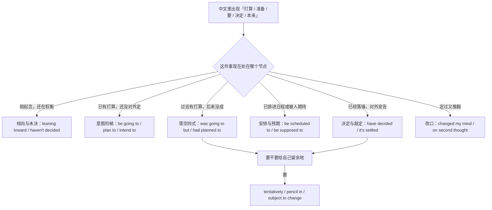
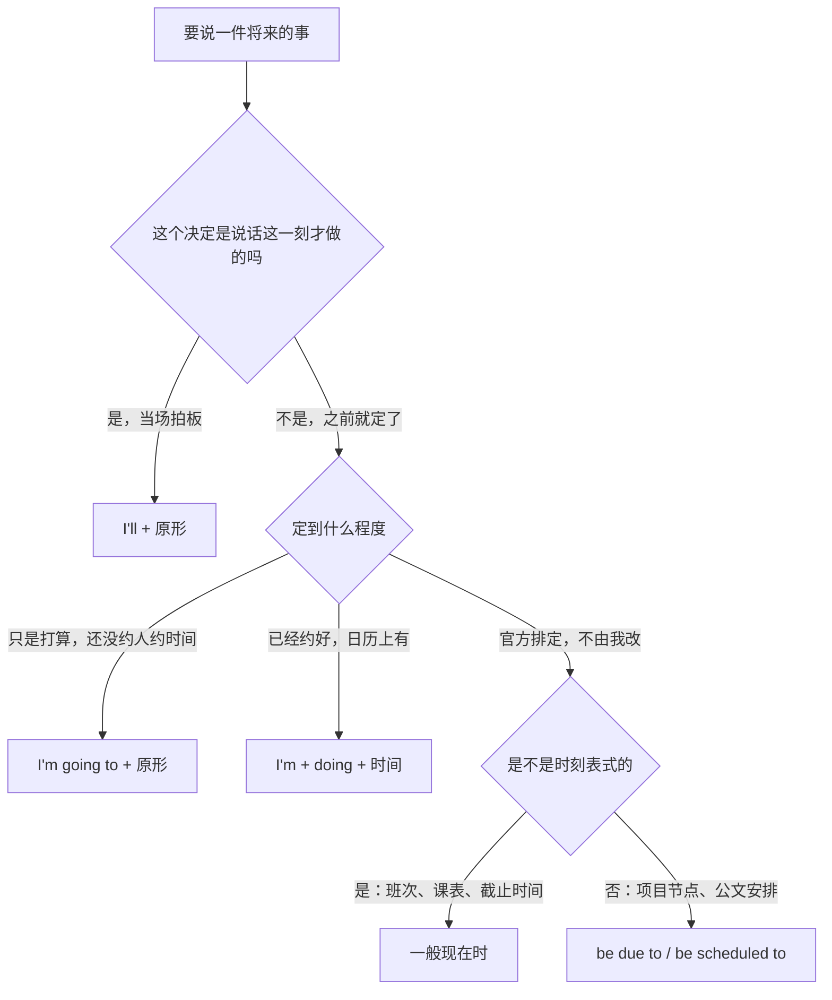
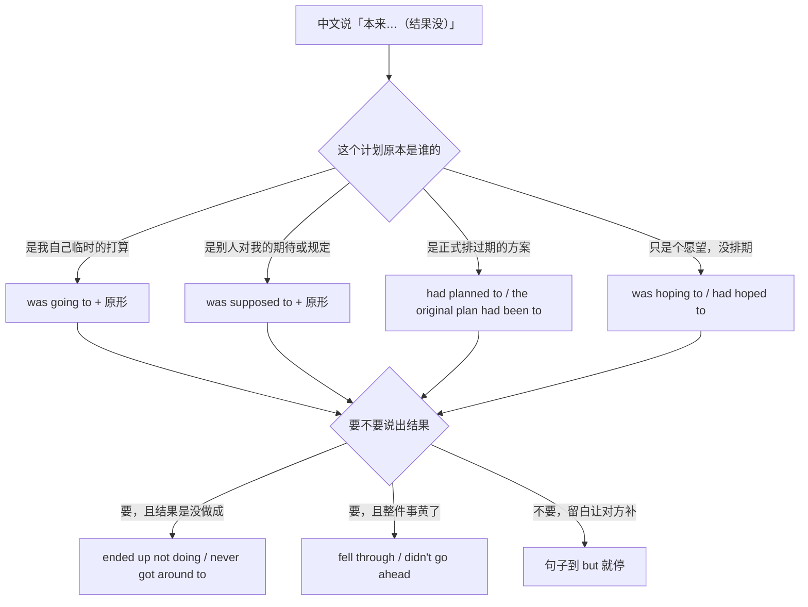
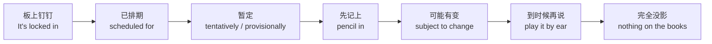
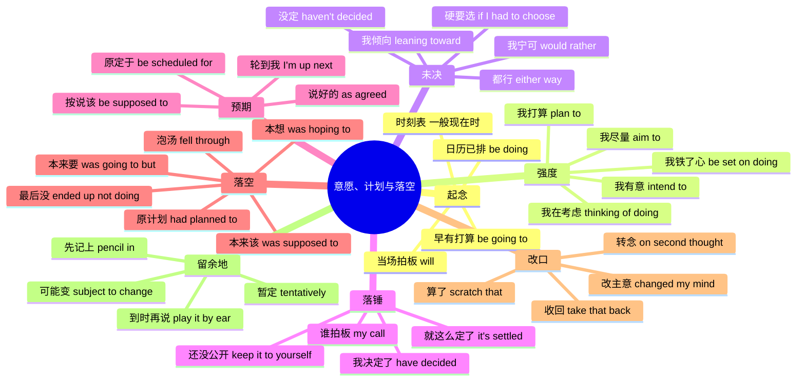

# 我打算、我决定、我倾向于、本来打算：意愿、计划与落空

> [!info] 本篇定位
>
> 这篇收一件事从起念到收场的全过程中，人说出口的那些话：**当场拍板**（那我来吧）、**早有打算**（我本来就要）、**意图强度**（我打算、我有意、我在考虑、我铁了心）、**还没定但有偏好**（我倾向于、我七三开、我无所谓）、**落锤宣告**（我决定了、就这么定了、这归我拍板）、**别人对我的预期**（按说该、原定于、说好了的）、**计划落空**（本来要结果没、原计划、最后也没）、**改口撤回**（我改主意了、算了不做了、我收回）、**给自己留余地**（暂定、先记上、可能有变、到时候再说）。
>
> 上一篇 [[11.人际功能与话轮管理/05.我有个顾虑、这样不太行、恐怕要延期：异议、负面反馈与坏消息\|我有个顾虑、这样不太行、恐怕要延期：异议、负面反馈与坏消息]] 管的是把坏消息说出口，这一篇管的是把自己的打算说出口——两者在「恐怕要延期」这一处交界：延期这件事本身是坏消息，而「我本来打算周三交」是计划落空，归本篇第 7 节。至于「我在做」「我卡住了」这种进度回报，在下一篇。
>
> 读完能查到：38 条中文意图入口、114 条分档成品句架，以及中文母语者在 will 与 be going to、be supposed to、had planned to、subject to change 这四处最容易造出的错句该怎么绕。

---

## 1. 本篇导读：一件事从起念到收场的五个节点

中文说计划，动词少而副词多。「我打算去」「我准备去」「我要去」「我这就去」，四句话里的动词几乎不变，靠「打算／准备／要／这就」这几个字拉开确定度。英文反过来：确定度不写在副词上，写在**谓语形态**上——`I'll go` `I'm going to go` `I'm going` `I'm due to go` 四个形态是四种不同的确定来源，副词一个都没变。

这就是本篇最大的映射断层。中文母语者查「我打算」时最容易发生的事，是抓到 `plan to` 就走，结果一整段话里所有的计划都说成 `I plan to`，把当场决定、既定日程、模糊念头压成同一个形状。

先用一张选择树把「我要做某事」这类中文分流。

图里六个分支对应本篇第 4 到第 9 节，第 2、3 节铺在最上面那两个分支里。真正要记住的是最右下角那条汇流线：**落锤和落空都会通向「留余地」**。一个人被计划坑过一次，下次宣布日期时就会自动加上 `tentatively`。中文里对应的是「暂定」两个字，但中文可以只说「暂定周三」而不动谓语，英文的 `tentatively` 是副词、`pencil in` 是动词、`subject to change` 是后置定语，三种词性三个位置，查的时候先想清楚要挂在句子的哪一头。

还有一个贯穿全篇的判断，图上没画出来，但每一节都会碰到：**这个打算是谁的**。`I'm going to` 是我自己的打算，`I'm supposed to` 是别人对我的期待，`The release is due to` 是既定日程对所有人的约束。中文的「我要交报告」「我该交报告」「报告要交了」三句差一个字，英文差三套结构。第 6 节专门处理这一组。

---

## 2. 我这就去、我早就打算了：当场决定与既有安排

这一节的四条意图共用一个判断：**决定是什么时候做出的**。说话这一刻才决定，用 `will`；说话之前就定了，用 `be going to`；不但定了还排进了日历，用现在进行时；根本不由说话人定（时刻表、班次、章程），用一般现在时。中文这四种情形都可以说「我…」或「…几点」，靠上下文分辨，英文靠谓语形态分辨。

这张图的分叉点全部落在「决定权归谁、定到什么程度」上，没有一个分叉是关于时间远近的。中文母语者常有一个错觉，以为越远的将来越要用 `will`，越近的越要用进行时——实际上 `I'm flying to Tokyo next March` 完全正常（票买了），`I'll be there in five minutes` 也完全正常（刚被问到才承诺）。判据是确定来源，不是时间距离。

### 2.1 那我来吧、我这就去

中文触发语：那我来吧 / 我这就 / 行，我去 / 好，那我…

| 档位 | 句架 | 例句 | 译文 |
| --- | --- | --- | --- |
| 口语 | I'll + 原形 | Nobody's picked up the ticket? I'll take it. | 这单没人接？那我来。 |
| 书面 | I'll + 原形 + 时间状语 | I'll send the revised draft over this afternoon. | 我下午把改过的稿子发过去。 |
| 正式 | I will + 原形（不缩写） | I will arrange for a replacement unit to be dispatched today. | 我会安排今天寄出替换件。 |

> [!warning] 错配警示
>
> - ~~I'm going to take it, I just heard about it now.~~ ❌
> - **I'll take it.** ✅（刚听说、当场答应的事用 `I'll`；`be going to` 表示说话之前就有这个打算，跟「我刚知道」自相矛盾）

页脚：
- 同义入口：我来 / 交给我 / 我马上办 / 那就我吧
- 语法归属：[[02.英语基础语法/06.动词时态/02.一般将来时与过去将来时\|一般将来时与过去将来时]]
- 场景实战：[[04.英语场景/10.职场与商务场景实战/02.会议汇报与演示场景\|会议汇报与演示场景]]

### 2.2 我本来就要、我正打算

中文触发语：我本来就要 / 我正打算 / 我早想 / 我已经决定要

| 档位 | 句架 | 例句 | 译文 |
| --- | --- | --- | --- |
| 口语 | I'm going to + 原形 | I'm going to move the standup to nine anyway. | 我反正本来就要把站会挪到九点。 |
| 书面 | We're going to + 原形 + 时间范围 | We're going to freeze the API surface this quarter. | 这个季度我们会冻结对外接口。 |
| 正式 | will be + doing（既定安排的正式说法） | The department will be relocating to the new site in March. | 该部门将于三月迁往新址。 |

> [!warning] 错配警示
>
> - ~~I will move the standup to nine — I decided that yesterday.~~ ❌
> - **I'm going to move the standup to nine.** ✅（昨天就定了的事用 `be going to`；`will` 会让听的人以为你此刻才想到，于是还有商量余地）

页脚：
- 同义入口：我打算 / 我准备 / 我早就想 / 我反正要
- 语法归属：[[02.英语基础语法/06.动词时态/02.一般将来时与过去将来时\|一般将来时与过去将来时]]
- 场景实战：[[04.英语场景/03.时态与语态句型框架/01.16种时态完全手册\|16种时态完全手册]]

### 2.3 我周四约了人、下午有个会

中文触发语：我约了 / 我…点有个 / 下周…要见 / 定了…碰头

| 档位 | 句架 | 例句 | 译文 |
| --- | --- | --- | --- |
| 口语 | I'm + doing + 时间 | I'm seeing the vendor on Thursday. | 我周四约了供应商。 |
| 书面 | be due to + 原形 | The release is due to go out on the 14th. | 版本预定 14 号发布。 |
| 正式 | be scheduled to + 原形 | The audit is scheduled to begin on 3 March. | 审计定于 3 月 3 日开始。 |

> [!warning] 错配警示
>
> - ~~I will meet the vendor on Thursday, it is already in my calendar.~~ ❌
> - **I'm meeting the vendor on Thursday.** ✅（日历上已有的约定用现在进行时；用 `will` 等于告诉对方这只是个想法，随时可以取消）

页脚：
- 同义入口：我安排了 / 我排在 / 我那天要 / 已经约好了
- 语法归属：[[02.英语基础语法/06.动词时态/03.进行时态详解\|进行时态详解]]
- 场景实战：[[04.英语场景/07.社交交际场景实战/02.电话短信与在线沟通场景\|电话短信与在线沟通场景]]

### 2.4 车八点零四开、周五零点截止

中文触发语：…几点开 / …什么时候截止 / 下一班是 / 按规程是

| 档位 | 句架 | 例句 | 译文 |
| --- | --- | --- | --- |
| 口语 | 一般现在时（班次、场次） | The last train leaves at 11:20. | 末班车十一点二十开。 |
| 书面 | 一般现在时（截止、开放时间） | Registration closes at midnight on Friday. | 报名周五零点截止。 |
| 正式 | be to + 原形（公文式安排） | The committee is to convene on 12 April. | 委员会定于 4 月 12 日召开。 |

> [!warning] 错配警示
>
> - ~~The last train will leave at 11:20 every night.~~ ❌
> - **The last train leaves at 11:20.** ✅（时刻表、课表、班次这类不由说话人决定的既定安排用一般现在时；加 `will` 就变成了对某一次的临时预测）

页脚：
- 同义入口：发车时间 / 开放到 / 截止到 / 按班表
- 语法归属：[[02.英语基础语法/06.动词时态/01.一般现在时与一般过去时\|一般现在时与一般过去时]]
- 场景实战：[[04.英语场景/08.出行与旅游场景实战/02.酒店入住预订与投诉场景\|酒店入住预订与投诉场景]]

---

## 3. 我打算、我有意、我在考虑：意图强度阶梯

上一节分的是「决定何时做出」，这一节分的是「决心有多硬」。从「随便想想」到「铁了心」排成一条尺，中文那一侧的刻度是：我在考虑 → 我打算 → 我有意 → 我一定要。英文这一侧不是同一个动词加副词，而是五组彼此独立的搭配，各自还带着不同的后接形态限制——`plan to do` 与 `plan on doing`，`think of doing` 没有不定式式，`be committed to doing` 的 to 是介词。这些槽位限制是本节错句的主要来源。

### 3.1 我打算做某事

中文触发语：我打算 / 我计划 / 我准备 / 我想着要

| 档位 | 句架 | 例句 | 译文 |
| --- | --- | --- | --- |
| 口语 | I'm planning to + 原形 | I'm planning to take Friday off. | 我打算周五请假。 |
| 书面 | We plan to + 原形 | We plan to ship the beta before the end of the quarter. | 我们计划在季度末前发布公测版。 |
| 正式 | it is planned that + 主语 + will | It is planned that the two systems will be merged in the next release. | 计划在下个版本合并这两套系统。 |

> [!warning] 错配警示
>
> - ~~I plan to going to Shanghai next month.~~ ❌
> - **I plan to go to Shanghai next month.** / **I'm planning on going to Shanghai next month.** ✅（`plan to` 后接原形，`plan on` 后接动名词，两式各自成立但不能对折成 `plan to doing`）

页脚：
- 同义入口：我计划 / 我准备 / 我有安排 / 我盘算着
- 语法归属：[[02.英语基础语法/08.非谓语动词/01.动词不定式详解\|动词不定式详解]]
- 场景实战：[[04.英语场景/10.职场与商务场景实战/03.商务邮件与正式书面沟通\|商务邮件与正式书面沟通]]

### 3.2 我有意、我是存心要

中文触发语：我有意 / 我是特意 / 我本来的用意是 / 我并非有意

| 档位 | 句架 | 例句 | 译文 |
| --- | --- | --- | --- |
| 口语 | I mean to + 原形 | I mean to finish it tonight, one way or another. | 我今晚说什么也要做完。 |
| 书面 | We intend to + 原形 | We intend to keep the old endpoint alive for one more release. | 我们打算把旧接口再保留一个版本。 |
| 正式 | it is our intention to + 原形 | It is our intention to publish the findings in full. | 我们有意将全部结果公开发表。 |

> [!warning] 错配警示
>
> - ~~I intend to grab a coffee.~~ ❌
> - **I'm going to grab a coffee.** ✅（`intend` 带着「立意、存心」的分量，买杯咖啡这种小事套上去像在宣读声明；日常琐事一律用 `be going to`）

页脚：
- 同义入口：我有意 / 我特意 / 我的本意是 / 我是奔着…去的
- 语法归属：[[02.英语基础语法/08.非谓语动词/01.动词不定式详解\|动词不定式详解]]
- 场景实战：[[04.英语场景/10.职场与商务场景实战/04.商务谈判合同与客户沟通\|商务谈判合同与客户沟通]]

### 3.3 我在考虑、我琢磨着

中文触发语：我在考虑 / 我琢磨着 / 我有这个想法 / 我在看要不要

| 档位 | 句架 | 例句 | 译文 |
| --- | --- | --- | --- |
| 口语 | I'm thinking of + doing | I'm thinking of switching to the new framework. | 我在考虑换到新框架。 |
| 书面 | We're looking to + 原形 | We're looking to hire two more backend engineers this year. | 我们今年想再招两名后端。 |
| 正式 | be considering + doing | The board is considering relocating the data centre. | 董事会正在考虑迁移数据中心。 |

> [!warning] 错配警示
>
> - ~~I'm thinking to switch to the new framework.~~ ❌
> - **I'm thinking of switching to the new framework.** ✅（`think of` 与 `think about` 后面只接动名词，英语里没有 `think to do` 这个搭配）

页脚：
- 同义入口：我在琢磨 / 我在权衡 / 我有个想法 / 我在评估
- 语法归属：[[02.英语基础语法/08.非谓语动词/02.动名词详解\|动名词详解]]
- 场景实战：[[04.英语场景/05.高频实用表达句型框架/01.表达观点与态度的50个万能句型\|表达观点与态度的50个万能句型]]

### 3.4 我铁了心、我非做不可

中文触发语：我铁了心 / 我非…不可 / 我下定决心 / 我认准了

| 档位 | 句架 | 例句 | 译文 |
| --- | --- | --- | --- |
| 口语 | I'm set on + doing | I'm set on finishing the migration before I hand over. | 我铁了心要在交接前把迁移做完。 |
| 书面 | be determined to + 原形 | She is determined to get the certification this year. | 她决心今年拿下这个认证。 |
| 正式 | be committed to + doing | We are committed to maintaining backward compatibility. | 我们承诺保持向后兼容。 |

> [!warning] 错配警示
>
> - ~~We are committed to maintain backward compatibility.~~ ❌
> - **We are committed to maintaining backward compatibility.** ✅（`be committed to` 的 to 是介词，后面跟动名词；同类还有 `be dedicated to doing`、`look forward to doing`）

页脚：
- 同义入口：我非做不可 / 我认死理了 / 我决心 / 我说到做到
- 语法归属：[[02.英语基础语法/08.非谓语动词/05.非谓语动词综合辨析\|非谓语动词综合辨析]]
- 场景实战：[[04.英语场景/10.职场与商务场景实战/01.求职简历面试与Offer谈判\|求职简历面试与Offer谈判]]

### 3.5 我尽量、我争取试试

中文触发语：我尽量 / 我争取 / 我试试看 / 我看能不能

| 档位 | 句架 | 例句 | 译文 |
| --- | --- | --- | --- |
| 口语 | I'll see if I can + 原形 | I'll see if I can get it done today. | 我看看今天能不能做完。 |
| 书面 | We aim to + 原形 | We aim to respond to every ticket within one business day. | 我们争取在一个工作日内回复所有工单。 |
| 正式 | we will endeavour to + 原形 | We will endeavour to restore service within four hours. | 我方将尽力在四小时内恢复服务。 |

> [!warning] 错配警示
>
> - ~~I will do my best effort to finish today.~~ ❌
> - **I'll do my best to finish today.** ✅（`do one's best` 是固定式，中间不插 effort；要用名词说就换成 `make every effort to do`）

页脚：
- 同义入口：我尽力 / 我努努力 / 我争取 / 尽量吧
- 语法归属：[[02.英语基础语法/08.非谓语动词/01.动词不定式详解\|动词不定式详解]]
- 场景实战：[[04.英语场景/10.职场与商务场景实战/02.会议汇报与演示场景\|会议汇报与演示场景]]

---

## 4. 我倾向于、我还没定：偏好与未决

上一节的每一条都已经有了方向，这一节是**方向还没定**。中文这一区的说法特别细：「我倾向于」有偏好但认账可以被说服，「我更愿意」是两个方案摆着挑，「我无所谓」是主动放弃选择权，「我还没定」是尚未进入选择。英文这四种各有各的成品，混用会让对方误判你的立场硬不硬——把「我倾向于 A」说成 `I want A`，对方就不再提 B 了。

### 4.1 我倾向于、我偏向哪边

中文触发语：我倾向于 / 我偏向 / 我比较想 / 要我说还是…

| 档位 | 句架 | 例句 | 译文 |
| --- | --- | --- | --- |
| 口语 | I'm leaning toward + 名词/doing | I'm leaning toward keeping the old schema for now. | 我倾向于暂时留着旧表结构。 |
| 书面 | I'd be inclined to + 原形 | I'd be inclined to postpone the rollout until after the holiday. | 我倾向于把上线推到假期之后。 |
| 正式 | be inclined to + 原形 | The committee is inclined to accept the revised proposal. | 委员会倾向于接受修订后的方案。 |

> [!warning] 错配警示
>
> - ~~I'm inclined to postponing the rollout.~~ ❌
> - **I'm inclined to postpone the rollout.** ✅（`be inclined` 后的 to 是不定式记号，接原形；`lean toward` 后的 toward 才是介词，接动名词，两条不要互相串味）

页脚：
- 同义入口：我偏向 / 我更想 / 我这边的意思是 / 我个人觉得还是
- 语法归属：[[02.英语基础语法/08.非谓语动词/05.非谓语动词综合辨析\|非谓语动词综合辨析]]
- 场景实战：[[04.英语场景/05.高频实用表达句型框架/01.表达观点与态度的50个万能句型\|表达观点与态度的50个万能句型]]

### 4.2 我更愿意、我宁可

中文触发语：我更愿意 / 我宁可 / 与其…不如 / 我还是…吧

| 档位 | 句架 | 例句 | 译文 |
| --- | --- | --- | --- |
| 口语 | I'd rather + 原形 [+ than 原形] | I'd rather rewrite it than patch it a third time. | 我宁可重写，也不想再打第三次补丁。 |
| 书面 | I would prefer to + 原形 | I would prefer to review the design before we start coding. | 我更希望在动手写之前先过一遍设计。 |
| 正式 | our preference would be to + 原形 | Our preference would be to settle the matter without arbitration. | 我方更倾向于不经仲裁解决此事。 |

> [!warning] 错配警示
>
> - ~~I'd rather to rewrite it.~~ ❌
> - **I'd rather rewrite it.** ✅（`would rather` 后面直接跟原形，不带 to；带 to 的是 `would prefer to do`，两个句式的形态各自封闭）

页脚：
- 同义入口：我宁愿 / 我更想 / 与其…不如 / 还不如
- 语法归属：[[02.英语基础语法/07.助动词与情态动词/03.情态动词的特殊句型\|情态动词的特殊句型]]
- 场景实战：[[04.英语场景/05.高频实用表达句型框架/02.建议请求邀请拒绝四大功能句型\|建议请求邀请拒绝四大功能句型]]

### 4.3 硬要选的话、我大概七三开

中文触发语：硬要选的话 / 非要我说 / 我大概七三开 / 稍微偏一点

| 档位 | 句架 | 例句 | 译文 |
| --- | --- | --- | --- |
| 口语 | I'm about 70/30 on this | I'm about 70/30 on this, mostly for shipping now. | 我大概七三开吧，偏向现在就发。 |
| 书面 | if I had to choose, I'd go with + 名词 | If I had to choose, I'd go with the managed service. | 硬要选的话，我选托管服务。 |
| 正式 | on balance, we would favour + 名词 | On balance, we would favour the in-house solution. | 权衡下来，我方更倾向自建方案。 |

> [!warning] 错配警示
>
> - ~~I'm 70 percent to choose A.~~ ❌
> - **I'm leaning about 70/30 toward A.** ✅（英语说偏好比例用 `70/30` 配 lean 或 split，`percent to choose` 是把中文的「成」直接换算成百分比再硬接动词）

页脚：
- 同义入口：勉强要选 / 二选一的话 / 偏一点 / 略微倾向
- 语法归属：[[02.英语基础语法/10.特殊句型/02.虚拟语气详解\|虚拟语气详解]]
- 场景实战：[[04.英语场景/10.职场与商务场景实战/04.商务谈判合同与客户沟通\|商务谈判合同与客户沟通]]

### 4.4 我无所谓、都行

中文触发语：都行 / 我无所谓 / 你定就好 / 哪个都可以

| 档位 | 句架 | 例句 | 译文 |
| --- | --- | --- | --- |
| 口语 | Either way works for me. | Either way works for me — you pick. | 我怎么都行，你定。 |
| 书面 | I have no strong preference either way. | I have no strong preference either way; both options meet the requirement. | 两边我都没有特别偏好，都能满足需求。 |
| 正式 | we have no particular preference in this regard | We have no particular preference in this regard and will follow your recommendation. | 此事我方没有特别偏好，听从贵方建议。 |

> [!warning] 错配警示
>
> - ~~Whatever. I don't care.~~ ❌
> - **Either way works for me.** ✅（`Whatever` 与 `I don't care` 在英语里带明显的不耐烦甚至挑衅，中文的「无所谓」并没有这层，配错档会被当成情绪表达）

页脚：
- 同义入口：都可以 / 随便 / 听你的 / 哪个都不影响
- 语法归属：[[02.英语基础语法/03.代词与数词/04.不定代词详解\|不定代词详解]]
- 场景实战：[[04.英语场景/07.社交交际场景实战/01.交友聚会与闲聊场景\|交友聚会与闲聊场景]]

### 4.5 我还没定、还在犹豫

中文触发语：我还没定 / 还没想好 / 我还在犹豫 / 两头拿不定

| 档位 | 句架 | 例句 | 译文 |
| --- | --- | --- | --- |
| 口语 | I haven't made up my mind yet. | I haven't made up my mind yet — give me till Friday. | 我还没定，给我到周五。 |
| 书面 | We haven't decided one way or the other. | We haven't decided one way or the other, so both branches stay open. | 我们还没定下来，所以两个分支都先留着。 |
| 正式 | a decision has yet to be taken | A decision on the vendor has yet to be taken. | 供应商的选择尚未作出决定。 |

> [!warning] 错配警示
>
> - ~~I don't decide yet.~~ ❌
> - **I haven't decided yet.** ✅（「还没定」说的是从过去到此刻的状态，用现在完成时；一般现在时的 `I don't decide` 读起来像「我这人从不做决定」）

页脚：
- 同义入口：没想好 / 悬着 / 摇摆 / 待定
- 语法归属：[[02.英语基础语法/06.动词时态/04.完成时态详解\|完成时态详解]]
- 场景实战：[[04.英语场景/09.学习与教育场景实战/04.留学申请与校园生活场景\|留学申请与校园生活场景]]

---

## 5. 我决定了、就这么定了：落锤与宣告

从第 4 节走到这一节，只跨了一个动作：落锤。中文的落锤词很集中——「决定了」「定了」「就这么办」，靠语气和场合区分是个人决定还是集体决议。英文分得细：个人用完成时的 `I've decided`，集体宣告用无施事的 `It's settled`／`It has been decided`，谈拍板权用 `it's my call`。这一节的三档差别主要在**要不要把决定者说出来**，正式档往往刻意不说。

### 5.1 我决定了、我想好了

中文触发语：我决定了 / 我想好了 / 我拿定主意了 / 我定了不做

| 档位 | 句架 | 例句 | 译文 |
| --- | --- | --- | --- |
| 口语 | I've decided to + 原形 | I've decided to take the offer. | 我决定接这个 offer。 |
| 书面 | we have decided against + doing | We have decided against rewriting the parser this cycle. | 这个周期我们决定不重写解析器。 |
| 正式 | it has been decided that + 从句 | It has been decided that the project will proceed in two phases. | 现已决定该项目分两期推进。 |

> [!warning] 错配警示
>
> - ~~We have decided against rewrite the parser.~~ ❌
> - **We have decided against rewriting the parser.** ✅（`decide against` 的 against 是介词，只能跟动名词；要用不定式就换成 `decided not to rewrite`）

页脚：
- 同义入口：我定了 / 我想清楚了 / 我不做了 / 我选了
- 语法归属：[[02.英语基础语法/06.动词时态/04.完成时态详解\|完成时态详解]]
- 场景实战：[[04.英语场景/10.职场与商务场景实战/01.求职简历面试与Offer谈判\|求职简历面试与Offer谈判]]

### 5.2 就这么定了、一言为定

中文触发语：就这么定了 / 那就这样 / 一言为定 / 敲定了

| 档位 | 句架 | 例句 | 译文 |
| --- | --- | --- | --- |
| 口语 | It's settled, then. | It's settled, then: we ship Thursday and announce Friday. | 那就这么定了：周四发版，周五公告。 |
| 书面 | let's consider it agreed | Let's consider it agreed, then — Thursday at ten, main room. | 那就算定了，周四十点，大会议室。 |
| 正式 | we shall proceed on that basis | We shall proceed on that basis unless we hear otherwise by Friday. | 若周五前未接到异议，我方即按此推进。 |

> [!warning] 错配警示
>
> - ~~So it is decided by us.~~ ❌
> - **So that's decided.** ✅（宣告结论时英语用不带施事的 `that's decided`／`it's settled`，补出 by us 反而把注意力从结论拉回到人，听起来像在争功）

页脚：
- 同义入口：定了 / 说定了 / 就这样 / 拍板了
- 语法归属：[[02.英语基础语法/10.特殊句型/01.被动语态全解\|被动语态全解]]
- 场景实战：[[04.英语场景/07.社交交际场景实战/04.邀请庆祝与节日祝福场景\|邀请庆祝与节日祝福场景]]

### 5.3 这事我拍板、这不归我定

中文触发语：这我说了算 / 我来拍板 / 最终由我定 / 这不归我定

| 档位 | 句架 | 例句 | 译文 |
| --- | --- | --- | --- |
| 口语 | That's my call. / It's not my call. | Honestly, it's not my call — talk to the product lead. | 说实话这我定不了，去找产品负责人。 |
| 书面 | the final decision rests with + 人 | The final decision rests with the product lead. | 最终决定权在产品负责人。 |
| 正式 | the authority to approve lies with + 人 | The authority to approve the budget lies with the steering committee. | 预算的批准权归指导委员会。 |

> [!warning] 错配警示
>
> - ~~It's not my decision to make it.~~ ❌
> - **It's not my call.** ✅（`call` 在这里就是「拍板权」，是完整成品；要用 decision 就说 `It's not my decision to make`，末尾不再补 it）

页脚：
- 同义入口：我说了算 / 轮不到我 / 得他点头 / 我做不了主
- 语法归属：[[02.英语基础语法/05.介词与连词/02.常用介词搭配详解\|常用介词搭配详解]]
- 场景实战：[[04.英语场景/10.职场与商务场景实战/04.商务谈判合同与客户沟通\|商务谈判合同与客户沟通]]

### 5.4 定是定了，还没往外说

中文触发语：内部定了 / 还没正式宣布 / 别往外说 / 定了先别声张

| 档位 | 句架 | 例句 | 译文 |
| --- | --- | --- | --- |
| 口语 | It's decided, but we're not announcing it yet. | It's decided, but we're not announcing it until Monday. | 定是定了，周一才对外说。 |
| 书面 | the decision has been made internally | The decision has been made internally; the announcement goes out next week. | 内部已经定了，下周发公告。 |
| 正式 | remains confidential pending the formal announcement | The outcome remains confidential pending the formal announcement. | 结果在正式公告前仍属保密。 |

> [!warning] 错配警示
>
> - ~~Please don't speak it out to others.~~ ❌
> - **Please keep it to yourself for now.** ✅（「别往外说」的成品是 `keep it to yourself`／`keep it under wraps`；`speak out` 意思是公开发声反对某事，方向完全反了）

页脚：
- 同义入口：先别说 / 保密 / 内部消息 / 还没公开
- 语法归属：[[02.英语基础语法/10.特殊句型/01.被动语态全解\|被动语态全解]]
- 场景实战：[[04.英语场景/10.职场与商务场景实战/03.商务邮件与正式书面沟通\|商务邮件与正式书面沟通]]

---

## 6. 按说应该、原定于、说好了的：预期与约定

这一节处理的全是**不由说话人单方面决定**的计划。中文靠「按说」「原定」「说好了」「轮到」这几个提示词标记它，英文靠 `be supposed to`、`be scheduled to`、`the agreement was that`、`be up next` 四组结构标记。这一区在工作场合出现频率极高，也是第 7 节「落空」的直接上游——`be supposed to` 一旦推到过去，本身就带上了「结果没做到」的味道。

### 6.1 按说应该、规定是要

中文触发语：按说应该 / 本来就该 / 规定是要 / 流程上要求

| 档位 | 句架 | 例句 | 译文 |
| --- | --- | --- | --- |
| 口语 | You're supposed to + 原形 | You're supposed to get a sign-off before merging. | 合并前按规矩得有人签字。 |
| 书面 | X is meant to + 原形 | The cache is meant to expire after ten minutes. | 缓存本该十分钟后失效。 |
| 正式 | be required to + 原形 | Each contractor is required to submit a monthly report. | 各承包方须每月提交一份报告。 |

> [!warning] 错配警示
>
> - ~~It is supposed that you sign off first.~~ ❌
> - **You're supposed to sign off first.** ✅（`be supposed to` 的主语必须是那个该做事的人；`it is supposed that` 表示「人们推测」，是把握度那一路的说法，跟规定无关）

页脚：
- 同义入口：应该 / 按规矩 / 照理说 / 流程上
- 语法归属：[[02.英语基础语法/07.助动词与情态动词/02.情态动词详解\|情态动词详解]]
- 场景实战：[[04.英语场景/03.时态与语态句型框架/04.情态动词句型框架\|情态动词句型框架]]

### 6.2 原定于、排在

中文触发语：原定 / 定在 / 排在 / 预计几号

| 档位 | 句架 | 例句 | 译文 |
| --- | --- | --- | --- |
| 口语 | It's set for + 时间 | The demo's set for Wednesday afternoon. | 演示定在周三下午。 |
| 书面 | be scheduled for + 时间 | The maintenance window is scheduled for Saturday at 02:00 UTC. | 维护窗口定在周六 UTC 凌晨两点。 |
| 正式 | be due to take effect on + 日期 | The regulation is due to take effect on 1 January. | 该规定定于 1 月 1 日生效。 |

> [!warning] 错配警示
>
> - ~~The demo is scheduled on Wednesday.~~ ❌
> - **The demo is scheduled for Wednesday.** ✅（`scheduled` 后面接时间点用 for，接动作用 `to do`；`on` 只出现在时间词自己的搭配里，如 `on Wednesday we ship`）

页脚：
- 同义入口：安排在 / 定在 / 计划于 / 排期
- 语法归属：[[02.英语基础语法/05.介词与连词/02.常用介词搭配详解\|常用介词搭配详解]]
- 场景实战：[[04.英语场景/10.职场与商务场景实战/02.会议汇报与演示场景\|会议汇报与演示场景]]

### 6.3 说好了的、按约定

中文触发语：说好了的 / 我们讲好的 / 当初约定 / 按约定

| 档位 | 句架 | 例句 | 译文 |
| --- | --- | --- | --- |
| 口语 | That's not what we agreed. | That's not what we agreed — you said Thursday. | 不是这么说好的，你说的是周四。 |
| 书面 | the agreement was that + 从句 | The agreement was that each side would cover its own costs. | 当初说好的是各自承担各自的费用。 |
| 正式 | as agreed / per our agreement | As agreed, the deposit will be refunded within ten business days. | 按约定，押金将于十个工作日内退还。 |

> [!warning] 错配警示
>
> - ~~That's not what we were agreed.~~ ❌
> - **That's not what we agreed.** ✅（表示「双方达成一致」时 agree 是主动的，不写成 be agreed；被动的 `it was agreed that` 只用在不点名施事的正式文书里）

页脚：
- 同义入口：讲好的 / 谈妥的 / 当时定的是 / 按之前说的
- 语法归属：[[02.英语基础语法/09.从句体系/03.名词性从句详解\|名词性从句详解]]
- 场景实战：[[04.英语场景/10.职场与商务场景实战/04.商务谈判合同与客户沟通\|商务谈判合同与客户沟通]]

### 6.4 轮到我了、这归我做

中文触发语：轮到我了 / 这归我做 / 该我上了 / 下一个是我

| 档位 | 句架 | 例句 | 译文 |
| --- | --- | --- | --- |
| 口语 | I'm up next. / It's my turn. | I'm up next, right after the design review. | 设计评审之后就轮到我。 |
| 书面 | I'm down to + 原形 | I'm down to run the retro this week. | 这周的复盘会归我主持。 |
| 正式 | be designated to + 原形 | Ms. Chen is designated to chair the session in his absence. | 他缺席时由陈女士主持该场次。 |

> [!warning] 错配警示
>
> - ~~I'm on turn to speak.~~ ❌
> - **I'm up next.** / **It's my turn to speak.** ✅（英语说轮次用 `be up` 或 `one's turn`，没有 `on turn` 这个搭配）

页脚：
- 同义入口：该我了 / 我接着来 / 排到我 / 由我负责这轮
- 语法归属：[[02.英语基础语法/05.介词与连词/02.常用介词搭配详解\|常用介词搭配详解]]
- 场景实战：[[04.英语场景/09.学习与教育场景实战/01.课堂讨论与提问场景\|课堂讨论与提问场景]]

---

## 7. 本来要、结果没：计划落空的六条出路

这是本篇最难查也最实用的一节。中文说计划落空只要一个「本来」，后面接什么都行：本来要、本来该、本来想、本来以为。英文没有对应的万能词，它把「落空」这层意思**藏在谓语的时态里**——`was going to`、`was supposed to`、`had planned to`、`had hoped to` 这四个形态一旦出现，读者立刻预期后半句要转折，哪怕转折句根本没写出来。

图的上半段按「计划归属」分四路，下半段按「说不说结果」再分三路，合起来就是本节六条意图。中间那个汇流点值得单记：英语里 `I was going to call you, but...` 后面经常什么都不接，一个 but 加停顿就够了，对方自然明白事情没办成。中文的「我本来要给你打电话来着」也有同样的留白能力，这一处两种语言难得对齐。

### 7.1 我本来要…结果

中文触发语：我本来要 / 我正准备…结果 / 我原打算 / 我都要动手了

| 档位 | 句架 | 例句 | 译文 |
| --- | --- | --- | --- |
| 口语 | I was going to + 原形, but ... | I was going to push the fix last night, but the pipeline was down. | 我本来昨晚要推这个修复的，结果流水线挂了。 |
| 书面 | we were going to + 原形; however, ... | We were going to include the feature in 2.1; however, the dependency wasn't ready. | 我们本打算把这功能放进 2.1，但依赖没就绪。 |
| 正式 | it had been our intention to + 原形 | It had been our intention to complete the audit in June, but site access was delayed. | 我方原拟六月完成审计，但现场准入被推迟。 |

> [!warning] 错配警示
>
> - ~~I will push the fix last night, but the pipeline was down.~~ ❌
> - **I was going to push the fix last night, but the pipeline was down.** ✅（说「本来要」必须把 `be going to` 整体推到过去；只把后半句写成过去时、前半句留 will，时间线就自相矛盾了）

页脚：
- 同义入口：本来打算 / 差点就 / 都准备好了 / 说好我来的
- 语法归属：[[02.英语基础语法/06.动词时态/02.一般将来时与过去将来时\|一般将来时与过去将来时]]
- 场景实战：[[04.英语场景/10.职场与商务场景实战/02.会议汇报与演示场景\|会议汇报与演示场景]]

### 7.2 本来该…却没

中文触发语：本来该 / 说好了要…却 / 按理早该 / 不是说好…吗

| 档位 | 句架 | 例句 | 译文 |
| --- | --- | --- | --- |
| 口语 | X was supposed to + 原形 | The report was supposed to land on Monday. | 那份报告本来周一就该到的。 |
| 书面 | X was supposed to have + 过去分词 by now | The vendor was supposed to have delivered the hardware by now. | 按约定供应商现在早该把硬件交了。 |
| 正式 | X was to have been + 过去分词 | The legacy system was to have been decommissioned last quarter. | 旧系统原应于上季度下线。 |

> [!warning] 错配警示
>
> - ~~The report was supposed to landed on Monday.~~ ❌
> - **The report was supposed to land on Monday.** ✅（`was supposed to` 后面永远接原形，「没做到」这层意思由 was 承担；只有强调「到现在都还没」时才升级成 `was supposed to have landed`）

页脚：
- 同义入口：早该 / 说好的 / 按规定该 / 怎么还没
- 语法归属：[[02.英语基础语法/07.助动词与情态动词/02.情态动词详解\|情态动词详解]]
- 场景实战：[[04.英语场景/10.职场与商务场景实战/04.商务谈判合同与客户沟通\|商务谈判合同与客户沟通]]

### 7.3 我原计划、最初的方案是

中文触发语：我原计划 / 本来盘算的是 / 我原先想的是 / 最初的方案是

| 档位 | 句架 | 例句 | 译文 |
| --- | --- | --- | --- |
| 口语 | I'd planned to + 原形 | I'd planned to take two weeks off, but we're short-handed. | 我原打算休两周，可现在人手不够。 |
| 书面 | we had planned to + 原形 | We had planned to run both systems in parallel for a month. | 我们原计划让两套系统并行一个月。 |
| 正式 | the original plan had been to + 原形 | The original plan had been to migrate all regions at once. | 原方案是一次性迁移所有区域。 |

> [!warning] 错配警示
>
> - ~~We had planned to run both systems, and that's exactly what we did.~~ ❌
> - **We planned to run both systems, and that's exactly what we did.** ✅（`had planned to` 自带「后来没实现」的暗示，计划真的落实了就用一般过去时，否则读者会一直等一个不会出现的转折）

页脚：
- 同义入口：原方案 / 本来的安排 / 一开始定的是 / 我原想着
- 语法归属：[[02.英语基础语法/06.动词时态/05.时态综合运用与辨析\|时态综合运用与辨析]]
- 场景实战：[[04.英语场景/10.职场与商务场景实战/03.商务邮件与正式书面沟通\|商务邮件与正式书面沟通]]

### 7.4 我本想、我还指望着

中文触发语：我本想 / 我原本希望 / 我还指望着 / 我以为能

| 档位 | 句架 | 例句 | 译文 |
| --- | --- | --- | --- |
| 口语 | I was hoping to + 原形 | I was hoping to catch you before the meeting. | 我本想在开会前逮住你的。 |
| 书面 | we had hoped to + 原形 | We had hoped to close the round by September. | 我们原希望九月前完成这轮融资。 |
| 正式 | it had been anticipated that + 从句 | It had been anticipated that the licence would be granted in the second quarter. | 原预计许可将在第二季度下发。 |

> [!warning] 错配警示
>
> - ~~I hope to catch you before the meeting, but you had already left.~~ ❌
> - **I was hoping to catch you before the meeting.** ✅（希望已经落空用过去进行时或过去完成时；`I hope to` 是现在时，表示希望还在，跟后半句的「你已经走了」冲突）

页脚：
- 同义入口：本想 / 还打算 / 指望着 / 以为来得及
- 语法归属：[[02.英语基础语法/06.动词时态/04.完成时态详解\|完成时态详解]]
- 场景实战：[[04.英语场景/07.社交交际场景实战/02.电话短信与在线沟通场景\|电话短信与在线沟通场景]]

### 7.5 结果一直没做、到头来没去成

中文触发语：结果没 / 最后也没 / 到头来还是没 / 一直没顾上

| 档位 | 句架 | 例句 | 译文 |
| --- | --- | --- | --- |
| 口语 | I ended up not + doing | I ended up not going at all. | 我最后压根没去。 |
| 书面 | we never got around to + doing | We never got around to writing the migration guide. | 迁移指南我们一直没顾上写。 |
| 正式 | X was ultimately not + 过去分词 | The proposal was ultimately not pursued. | 该提案最终未被推进。 |

> [!warning] 错配警示
>
> - ~~I ended up not to go at all.~~ ❌
> - **I ended up not going at all.** ✅（`end up` 后面跟动名词，否定词 not 插在动名词前面；同理 `end up doing something else` 表示「最后改做了别的」）

页脚：
- 同义入口：最后没成 / 一直拖着 / 没顾上 / 不了了之
- 语法归属：[[02.英语基础语法/08.非谓语动词/02.动名词详解\|动名词详解]]
- 场景实战：[[04.英语场景/09.学习与教育场景实战/02.图书馆作业与研究场景\|图书馆作业与研究场景]]

### 7.6 计划泡汤了、临时有事

中文触发语：泡汤了 / 黄了 / 计划赶不上变化 / 临时有事

| 档位 | 句架 | 例句 | 译文 |
| --- | --- | --- | --- |
| 口语 | It fell through. / Something came up. | Dinner's off — something came up at work. | 饭局取消了，公司临时有事。 |
| 书面 | the arrangement fell through at the last minute | The arrangement fell through at the last minute and we had to rebook. | 安排临到头黄了，我们只好重订。 |
| 正式 | X did not proceed | The proposed acquisition did not proceed. | 拟议中的收购未能推进。 |

> [!warning] 错配警示
>
> - ~~My plan was broken.~~ ❌
> - **My plan fell through.** ✅（计划落空的固定动词是 `fall through` 或 `fall apart`；`break` 用在这里读起来像有人蓄意把你的计划砸了）

页脚：
- 同义入口：黄了 / 告吹 / 取消了 / 出岔子了
- 语法归属：[[02.英语基础语法/05.介词与连词/02.常用介词搭配详解\|常用介词搭配详解]]
- 场景实战：[[04.英语场景/07.社交交际场景实战/04.邀请庆祝与节日祝福场景\|邀请庆祝与节日祝福场景]]

---

## 8. 我改主意了、算了不做了：改口与撤回

计划落空是外因，改口是内因——事情本来能办成，是我自己不想办了。中文对这两件事的说法界限模糊，「不做了」既可能是黄了也可能是我不干了，英文分得很清：`fell through` 是外因，`I've changed my mind` 是内因，`we're calling it off` 是我主动叫停。选错了，等于把责任推给了不该背锅的一方。

### 8.1 我改主意了

中文触发语：我改主意了 / 我变卦了 / 我又不想了 / 想法变了

| 档位 | 句架 | 例句 | 译文 |
| --- | --- | --- | --- |
| 口语 | I've changed my mind about + 名词 | I've changed my mind about the venue. | 场地这事我改主意了。 |
| 书面 | we have revised our position on + 名词 | We have revised our position on the pricing tier. | 关于定价档位，我们的立场有调整。 |
| 正式 | we wish to revise the decision communicated on + 日期 | We wish to revise the decision communicated on 3 May. | 我方希望修改 5 月 3 日告知的决定。 |

> [!warning] 错配警示
>
> - ~~I changed my idea.~~ ❌
> - **I've changed my mind.** ✅（固定搭配是 `change one's mind`，没有 `change one's idea`；而且刚改完的事用现在完成时，一般过去时听起来像在说很久以前的一次改动）

页脚：
- 同义入口：我反悔了 / 我不这么想了 / 我重新考虑了 / 立场有变
- 语法归属：[[02.英语基础语法/06.动词时态/04.完成时态详解\|完成时态详解]]
- 场景实战：[[04.英语场景/10.职场与商务场景实战/04.商务谈判合同与客户沟通\|商务谈判合同与客户沟通]]

### 8.2 转念一想、再想想

中文触发语：转念一想 / 再想想 / 仔细一琢磨 / 后来一想

| 档位 | 句架 | 例句 | 译文 |
| --- | --- | --- | --- |
| 口语 | On second thought, ... | On second thought, let's push it to next week. | 转念一想，还是推到下周吧。 |
| 书面 | Having thought about it further, ... | Having thought about it further, I'd rather we split the work. | 又想了想，我倾向于把这活拆开。 |
| 正式 | Upon further consideration, ... | Upon further consideration, we have opted to defer the launch. | 经进一步考虑，我方决定推迟发布。 |

> [!warning] 错配警示
>
> - ~~In second thought, let's push it to next week.~~ ❌
> - **On second thought, let's push it to next week.** ✅（介词是 on；美式写单数 `on second thought`，英式常写复数 `on second thoughts`，两种都对，in 不对）

页脚：
- 同义入口：想了想 / 我又琢磨了一下 / 回头一想 / 重新掂量
- 语法归属：[[02.英语基础语法/05.介词与连词/02.常用介词搭配详解\|常用介词搭配详解]]
- 场景实战：[[04.英语场景/05.高频实用表达句型框架/01.表达观点与态度的50个万能句型\|表达观点与态度的50个万能句型]]

### 8.3 算了不做了、取消吧

中文触发语：算了 / 不做了 / 取消吧 / 当我没提

| 档位 | 句架 | 例句 | 译文 |
| --- | --- | --- | --- |
| 口语 | Scratch that. / Let's call it off. | Scratch that — we're not touching the schema this week. | 算了，这周不动表结构。 |
| 书面 | we're calling off + 名词 | We're calling off Thursday's session; a new date will follow. | 周四那场我们取消，另约时间。 |
| 正式 | X will not proceed | The workshop scheduled for Friday will not proceed. | 原定周五的研讨会将不再举行。 |

> [!warning] 错配警示
>
> - ~~Please ignore my last mail, I cancel the meeting.~~ ❌
> - **Please disregard my last email — I'm cancelling the meeting.** ✅（取消一场已定的会用现在进行时表示这个安排已生效；一般现在时的 `I cancel` 读起来像在描述一项日常习惯）

页脚：
- 同义入口：不搞了 / 撤了 / 停了吧 / 这事作废
- 语法归属：[[02.英语基础语法/06.动词时态/03.进行时态详解\|进行时态详解]]
- 场景实战：[[04.英语场景/10.职场与商务场景实战/03.商务邮件与正式书面沟通\|商务邮件与正式书面沟通]]

### 8.4 我收回刚才那句

中文触发语：我收回 / 当我没说 / 我说错了 / 刚才那句不算

| 档位 | 句架 | 例句 | 译文 |
| --- | --- | --- | --- |
| 口语 | I take that back. | I take that back — the numbers do line up. | 我收回，数字是对得上的。 |
| 书面 | let me retract that | Let me retract that; I was looking at the wrong branch. | 那句我收回，我看错分支了。 |
| 正式 | we withdraw + 名词 | We withdraw the objection raised in our letter of 12 June. | 我方撤回 6 月 12 日函中提出的异议。 |

> [!warning] 错配警示
>
> - ~~I want to take back my words.~~ ❌
> - **I take that back.** ✅（成品是 `take that back` 或 `take it back`，中文的「话」不必译出来；`my words` 在英语里指的是「我的措辞」，收回措辞和收回主张是两回事）

页脚：
- 同义入口：不算数 / 我说岔了 / 刚才那句作废 / 我更正一下
- 语法归属：[[02.英语基础语法/12.日常口语/01.口语中的语法简化\|口语中的语法简化]]
- 场景实战：[[04.英语场景/05.高频实用表达句型框架/02.建议请求邀请拒绝四大功能句型\|建议请求邀请拒绝四大功能句型]]

### 8.5 还是按原来的来

中文触发语：还是按原来的 / 那就不改了 / 维持原案 / 照旧

| 档位 | 句架 | 例句 | 译文 |
| --- | --- | --- | --- |
| 口语 | Let's stick with the original plan. | Let's stick with the original plan — Thursday, as before. | 还是按原计划来，就周四。 |
| 书面 | we'll go ahead as originally planned | We'll go ahead as originally planned and revisit this in the next cycle. | 我们按原计划推进，下个周期再议。 |
| 正式 | the original arrangement stands | The original arrangement stands; no further action is required. | 原安排继续有效，无需另行处理。 |

> [!warning] 错配警示
>
> - ~~Let's keep the original plan unchanged as before.~~ ❌
> - **Let's stick with the original plan.** ✅（`stick with` 本身就含「不改」，再补 unchanged 和 as before 是把同一个意思说了三遍）

页脚：
- 同义入口：不变 / 照旧 / 维持原议 / 按老规矩
- 语法归属：[[02.英语基础语法/05.介词与连词/02.常用介词搭配详解\|常用介词搭配详解]]
- 场景实战：[[04.英语场景/10.职场与商务场景实战/02.会议汇报与演示场景\|会议汇报与演示场景]]

---

## 9. 暂定、先记上、可能有变：给自己留余地

被计划坑过的人说话都带保险。中文的保险词短而含蓄——「暂定」「先记着」「差不多吧」「到时候再说」，一个词就把承诺降了半档。英文的保险装置分挂在三个位置：副词位（tentatively、provisionally）、动词位（pencil in、play it by ear）、后置修饰位（subject to change、barring X）。查的时候先定位置，再选词。

这条尺子从左到右是确定度递减，但它不是同一个说法的强弱变体，而是六种彼此排斥的状态标签，对方听到哪一个就会按哪一个安排自己的时间。把 `pencil in` 说成 `scheduled`，对方会按定死了准备；反过来把定死的事说成 `subject to change`，对方会一直等你的最终通知。中文母语者最常犯的是后一种——出于客气把已经定死的事说软，结果对方迟迟不动。

另有一层实用差别：左边三档说的是**时间点定没定**，右边三档说的是**这事办不办**。「暂定周三」是事定了时间没定，「到时候再说」是连事都没定。

### 9.1 暂定、先这么定着

中文触发语：暂定 / 先这么定着 / 初步定在 / 暂时按…算

| 档位 | 句架 | 例句 | 译文 |
| --- | --- | --- | --- |
| 口语 | Let's tentatively say + 时间 | Let's tentatively say Thursday at four, and I'll confirm tomorrow. | 先暂定周四四点，我明天确认。 |
| 书面 | be tentatively scheduled for + 时间 | The review is tentatively scheduled for the week of the 12th. | 评审暂定在 12 号那一周。 |
| 正式 | has been provisionally fixed for + 日期 | The date has been provisionally fixed for 20 October. | 日期暂定为 10 月 20 日。 |

> [!warning] 错配警示
>
> - ~~The date is temporarily fixed for the 20th.~~ ❌
> - **The date has been provisionally fixed for the 20th.** ✅（`temporarily` 说的是「只维持一小段时间就会换掉」，「暂定」要的是「还没最终确认」，那是 `tentatively` 和 `provisionally`）

页脚：
- 同义入口：初定 / 先按这个来 / 待定 / 大致定在
- 语法归属：[[02.英语基础语法/04.形容词与副词/03.副词的分类与用法\|副词的分类与用法]]
- 场景实战：[[04.英语场景/10.职场与商务场景实战/02.会议汇报与演示场景\|会议汇报与演示场景]]

### 9.2 先记在日历上、先占个位

中文触发语：先记上 / 先占个位 / 先约着 / 我先把时间空出来

| 档位 | 句架 | 例句 | 译文 |
| --- | --- | --- | --- |
| 口语 | Let me pencil you in for + 时间 | Let me pencil you in for Tuesday and I'll confirm by Friday. | 我先把周二给你记上，周五确认。 |
| 书面 | I've pencilled in + 时间 | I've pencilled in Tuesday at ten; nothing is locked yet. | 我先记了周二十点，还没定死。 |
| 正式 | a provisional hold has been placed on + 名词 | A provisional hold has been placed on the main room for Tuesday. | 已为周二暂留大会议室。 |

> [!warning] 错配警示
>
> - ~~I write you in my calendar for Tuesday.~~ ❌
> - **I'll pencil you in for Tuesday.** ✅（`pencil in` 的字面意思是用铅笔写、随时能擦，正好对上「先记着、可能改」；真要定死说 `I'll put it in the calendar` 或 `it's locked in`）

页脚：
- 同义入口：先记着 / 占个坑 / 先留出来 / 预留时间
- 语法归属：[[02.英语基础语法/05.介词与连词/02.常用介词搭配详解\|常用介词搭配详解]]
- 场景实战：[[04.英语场景/07.社交交际场景实战/02.电话短信与在线沟通场景\|电话短信与在线沟通场景]]

### 9.3 可能有变、以最终通知为准

中文触发语：可能有变 / 不一定 / 还没最后定 / 以最终通知为准

| 档位 | 句架 | 例句 | 译文 |
| --- | --- | --- | --- |
| 口语 | It's not set in stone. | Friday works for now, but it's not set in stone. | 目前周五可以，不过还不一定。 |
| 书面 | X is subject to change | The agenda is subject to change; the latest version is always in the shared doc. | 议程可能调整，最新版始终在共享文档里。 |
| 正式 | subject to confirmation by + 人 | All dates are subject to confirmation by the client. | 所有日期以客户最终确认为准。 |

> [!warning] 错配警示
>
> - ~~The agenda maybe changes.~~ ❌
> - **The agenda is subject to change.** ✅（书面通告用 `be subject to change` 这个固定式；`maybe` 是句子副词，不能塞在主谓之间当谓语的一部分用）

页脚：
- 同义入口：不敢保证 / 可能调整 / 还会变 / 最终以通知为准
- 语法归属：[[02.英语基础语法/05.介词与连词/02.常用介词搭配详解\|常用介词搭配详解]]
- 场景实战：[[04.英语场景/10.职场与商务场景实战/03.商务邮件与正式书面沟通\|商务邮件与正式书面沟通]]

### 9.4 到时候再说、走一步看一步

中文触发语：到时候再说 / 走一步看一步 / 再说吧 / 看情况

| 档位 | 句架 | 例句 | 译文 |
| --- | --- | --- | --- |
| 口语 | Let's play it by ear. | Let's play it by ear and decide on the day. | 走一步看一步，当天再定。 |
| 书面 | we'll decide closer to the time | We'll decide closer to the time, once headcount is settled. | 等人头定下来，临近了再决定。 |
| 正式 | the matter will be revisited in due course | The matter will be revisited in due course. | 此事将在适当时候再议。 |

> [!warning] 错配警示
>
> - ~~We will talk about it when the time will come.~~ ❌
> - **We'll talk about it when the time comes.** ✅（时间状语从句里不用 will，用一般现在时代替；更地道的成品是 `we'll cross that bridge when we come to it`）

页脚：
- 同义入口：再说 / 看着办 / 临时决定 / 到那天再讲
- 语法归属：[[02.英语基础语法/09.从句体系/04.状语从句详解\|状语从句详解]]
- 场景实战：[[04.英语场景/06.日常生活场景实战/01.问候寒暄与自我介绍场景\|问候寒暄与自我介绍场景]]

### 9.5 顺利的话、不出意外的话

中文触发语：顺利的话 / 不出意外的话 / 只要不出岔子 / 除非有变

| 档位 | 句架 | 例句 | 译文 |
| --- | --- | --- | --- |
| 口语 | All being well, ... | All being well, we'll be live by Friday. | 顺利的话周五就上线了。 |
| 书面 | Barring + 名词, ... | Barring any last-minute issues, the release goes out on Thursday. | 不出意外的话，周四发版。 |
| 正式 | Subject to + 名词, ... | Subject to board approval, the transaction will close in the fourth quarter. | 若获董事会批准，本次交易将于第四季度交割。 |

> [!warning] 错配警示
>
> - ~~If nothing accidents happen, we'll be live on Friday.~~ ❌
> - **Barring any surprises, we'll be live on Friday.** ✅（accident 是名词而且专指事故伤亡，「不出意外」这层意思用 `barring`、`unless something comes up` 或 `all being well`）

页脚：
- 同义入口：一切顺利的话 / 没意外的话 / 除非出事 / 前提是没问题
- 语法归属：[[02.英语基础语法/05.介词与连词/02.常用介词搭配详解\|常用介词搭配详解]]
- 场景实战：[[04.英语场景/10.职场与商务场景实战/02.会议汇报与演示场景\|会议汇报与演示场景]]

---

## 10. 本篇速查总表：中文触发语到首选句架

上面九节按语义分区，查得到但要翻。这张表按中文触发语的字面排，用来在忘了归属哪一节时直接落点。同一个中文说法有多个入口时，只列首选式，其余在对应小节的页脚「同义入口」里。

| 中文触发语 | 首选句架 | 去哪节 |
| --- | --- | --- |
| 那我来吧 | I'll + 原形 | 2.1 |
| 我这就去 | I'll + 原形 + right now | 2.1 |
| 我本来就要 | I'm going to + 原形 | 2.2 |
| 我早想 | I've been meaning to + 原形 | 2.2 |
| 我约了人 | I'm + doing + 时间 | 2.3 |
| 预定几号 | be due to + 原形 | 2.3 |
| 几点开车 | 一般现在时 | 2.4 |
| 什么时候截止 | X closes at + 时间 | 2.4 |
| 我打算 | I'm planning to + 原形 | 3.1 |
| 我计划 | we plan to + 原形 | 3.1 |
| 我有意 | we intend to + 原形 | 3.2 |
| 我并非有意 | I didn't mean to + 原形 | 3.2 |
| 我在考虑 | I'm thinking of + doing | 3.3 |
| 我在看要不要 | we're looking to + 原形 | 3.3 |
| 我铁了心 | I'm set on + doing | 3.4 |
| 我非做不可 | be determined to + 原形 | 3.4 |
| 我尽量 | I'll see if I can + 原形 | 3.5 |
| 我争取 | we aim to + 原形 | 3.5 |
| 我倾向于 | I'm leaning toward + doing | 4.1 |
| 我偏向 | I'd be inclined to + 原形 | 4.1 |
| 我宁可 | I'd rather + 原形 | 4.2 |
| 我更愿意 | I would prefer to + 原形 | 4.2 |
| 硬要选的话 | if I had to choose, I'd go with + 名词 | 4.3 |
| 我七三开 | I'm about 70/30 on this | 4.3 |
| 都行 | Either way works for me | 4.4 |
| 你定就好 | I have no strong preference | 4.4 |
| 我还没定 | I haven't made up my mind yet | 4.5 |
| 还在犹豫 | I'm on the fence | 4.5 |
| 我决定了 | I've decided to + 原形 | 5.1 |
| 我定了不做 | we've decided against + doing | 5.1 |
| 就这么定了 | It's settled, then | 5.2 |
| 一言为定 | Let's consider it agreed | 5.2 |
| 这我说了算 | That's my call | 5.3 |
| 这不归我定 | It's not my call | 5.3 |
| 内部定了 | The decision has been made internally | 5.4 |
| 别往外说 | Please keep it to yourself for now | 5.4 |
| 按说应该 | You're supposed to + 原形 | 6.1 |
| 规定是要 | be required to + 原形 | 6.1 |
| 原定于 | be scheduled for + 时间 | 6.2 |
| 排在 | It's set for + 时间 | 6.2 |
| 说好了的 | That's not what we agreed | 6.3 |
| 按约定 | as agreed | 6.3 |
| 轮到我了 | I'm up next | 6.4 |
| 这归我做 | I'm down to + 原形 | 6.4 |
| 我本来要 | I was going to + 原形, but ... | 7.1 |
| 我正准备…结果 | I was going to + 原形, but ... | 7.1 |
| 本来该 | X was supposed to + 原形 | 7.2 |
| 早该 | was supposed to have + 过去分词 | 7.2 |
| 我原计划 | I'd planned to + 原形 | 7.3 |
| 最初的方案是 | the original plan had been to + 原形 | 7.3 |
| 我本想 | I was hoping to + 原形 | 7.4 |
| 我还指望着 | we had hoped to + 原形 | 7.4 |
| 最后也没 | I ended up not + doing | 7.5 |
| 一直没顾上 | we never got around to + doing | 7.5 |
| 泡汤了 | It fell through | 7.6 |
| 临时有事 | Something came up | 7.6 |
| 我改主意了 | I've changed my mind about + 名词 | 8.1 |
| 转念一想 | On second thought, ... | 8.2 |
| 算了不做了 | Scratch that / Let's call it off | 8.3 |
| 取消吧 | X will not proceed | 8.3 |
| 我收回 | I take that back | 8.4 |
| 还是按原来的 | Let's stick with the original plan | 8.5 |
| 暂定 | Let's tentatively say + 时间 | 9.1 |
| 先记上 | Let me pencil you in for + 时间 | 9.2 |
| 可能有变 | X is subject to change | 9.3 |
| 到时候再说 | Let's play it by ear | 9.4 |
| 顺利的话 | All being well, ... | 9.5 |
| 不出意外的话 | Barring + 名词, ... | 9.5 |

表里有两组极易查错，单独标出来。第一组是「我本来要」和「本来该」：前者的计划是我自己的，用 `was going to`；后者的计划来自别人或规定，用 `was supposed to`。中文都以「本来」开头，选错了就把责任推错了方向。第二组是「暂定」和「可能有变」：前者说时间还没定死（`tentatively`），后者说整件事都还会调整（`subject to change`），把只是没定时间的事说成 subject to change，对方会以为要不要办都还两说。

---

## 11. 本篇小结

这张图把全篇八个语义组和它们的代表句架并排放在一起，用法是**倒着用**：不要从中心往外读，而是先想自己此刻要说的那句中文属于哪一组，再顺着枝条找句架。八组里落空组的枝条最多，因为中文的一个「本来」在英文里要按计划归属和是否说出结果分成六条，这也是本篇错句最集中的地方。

> [!success] 本篇核心要点回顾
>
> 1. **确定度写在谓语形态上，不写在副词上**。`I'll go`、`I'm going to go`、`I'm going`、`I'm due to go` 是四种不同的确定来源，中文那一侧靠「这就／打算／约了／预定」四个词区分。
> 2. **will 与 be going to 的分界是决定何时做出**，不是时间远近。刚被问到才答应用 will，说话前就定了用 be going to。
> 3. **进行时表安排的前提是已经约定**。日历上有的事说 `I'm meeting them Thursday`，用 will 等于告诉对方随时可以取消。
> 4. **意图动词各有各的槽位限制**：`plan to do` 与 `plan on doing`、`think of doing` 无不定式式、`be committed to doing` 的 to 是介词、`would rather do` 不带 to。这四处占本篇错句的一半。
> 5. **be supposed to 的主语是该做事的人**，不改写成 it 从句；`it is supposed that` 是「人们推测」，属于把握度那一路。
> 6. **落空四式按计划归属选**：自己的打算用 `was going to`，别人的期待用 `was supposed to`，正式排过期的用 `had planned to`，只是愿望用 `was hoping to`。
> 7. **had planned to 自带落空暗示**，计划真办成了就用一般过去时，否则读者会一直等一个不出现的转折。
> 8. **留余地的三个挂载位**：副词位 tentatively、动词位 pencil in、后置位 subject to change。中文的「暂定」两个字不动谓语，英文要先定位置再选词。

> [!success] 本篇练习清单
>
> - [ ] 给出「那我来吧，我今天就把工单接了」，写出口语、书面、正式三档
> - [ ] 给出「我本来昨晚要推这个修复的，结果流水线挂了」，写出三档，并说明为什么不能用 will
> - [ ] 给出「报告本来周一就该到」，写出三档，并给出「到现在都还没到」的升级形态
> - [ ] 给出「我倾向于先留着旧表结构」，写出三档，注意 inclined 与 leaning 后接形态的差别
> - [ ] 给出「这事我定不了，得找产品负责人」，写出三档
> - [ ] 给出「转念一想，还是推到下周吧」，写出三档
> - [ ] 给出「先暂定周四四点，我明天确认」，写出三档，并把它改写成「已经定死」的版本
> - [ ] 给出「不出意外的话周五上线，不过可能有变」，写出三档，两个保险装置分别挂在哪个位置

### 11.1 下一篇预告

> [!info] 下一篇
>
> [[11.人际功能与话轮管理/07.我在做、卡住了、我会、我习惯了、这归谁管：进度、能力、习惯与职责\|我在做、卡住了、我会、我习惯了、这归谁管：进度、能力、习惯与职责]]
>
> 本篇管的是事情开始之前——打算、决定、落空、改口。下一篇接着往下走：事情开动之后怎么回报进度（我在做、卡了一半、在评审中、暂停了），怎么陈述自己会不会做（能、做得来、上手了、这块我不熟），怎么说习惯（以前常、现在习惯了、慢慢就习惯了），以及怎么把一件事的归属讲清楚（这归我、这不归我、算我头上）。本篇第 5.3 的「这不归我定」讲的是拍板权，下一篇的「这不归我管」讲的是执行责任，两条线在那里合流。
