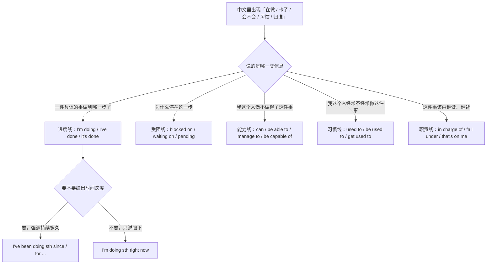
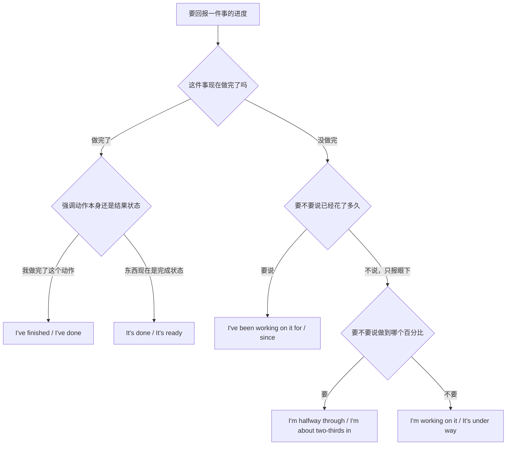
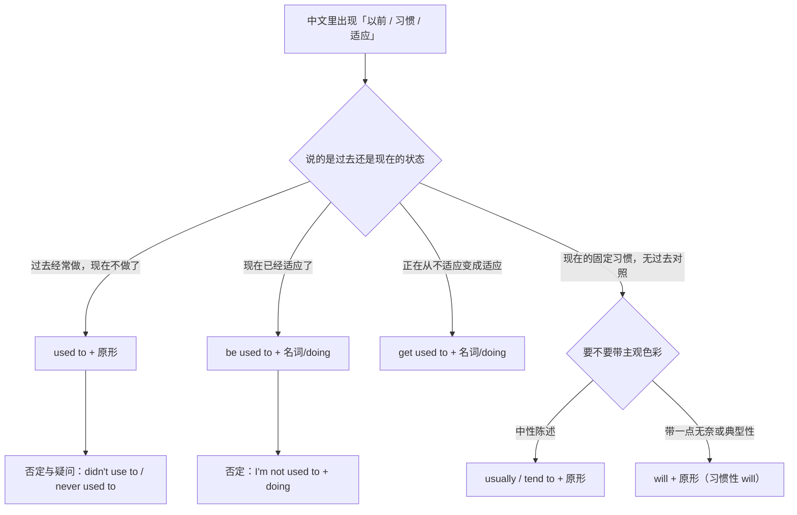
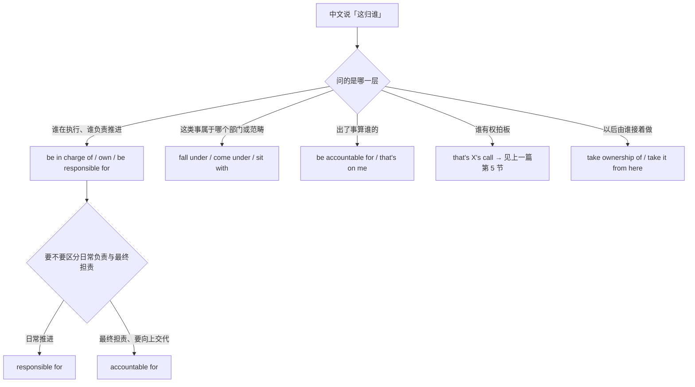
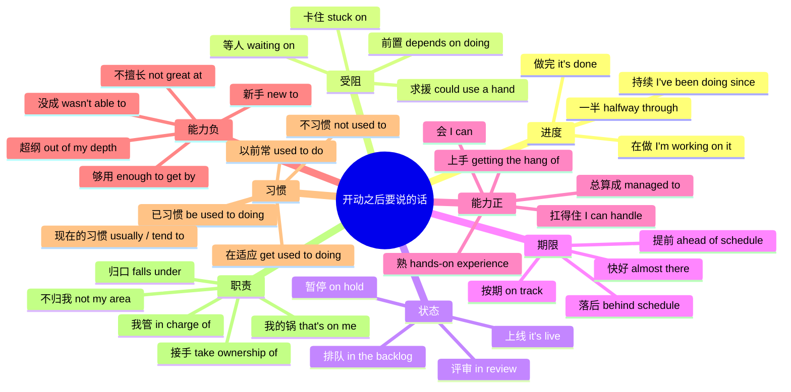

# 我在做、卡住了、我会、我习惯了、这归谁管：进度、能力、习惯与职责

> [!info] 本篇定位
>
> 这篇收一件事**开动之后**要说的那些话：**进度回报**（我在做、做到一半、我弄完了、我从周一就一直在弄）、**受阻与依赖**（卡在哪儿了、在等谁、动不了、需要搭把手）、**状态标签**（在评审中、暂停了、上线了、还在排队）、**完成度与期限**（快好了、按期、落后了、比计划快）、**能力自陈**（我会、我做得来、我勉强搞定了、我上手了、我不擅长、这块我新、我招架不住）、**习惯三式**（以前常、现在习惯了、慢慢就习惯）、**职责归属**（这归我管、这不归我、归哪个部门、算我头上、我来接手）。
>
> 上一篇 [[11.人际功能与话轮管理/06.我打算、我决定、我倾向于、本来打算：意愿、计划与落空\|我打算、我决定、我倾向于、本来打算：意愿、计划与落空]] 管的是事情开动之前的打算与落空，两篇在「这归我拍板」和「这归我干」这一处交界：前者是决定权，本篇第 9 节是执行责任。至于「恐怕要延期」这句话怎么说得让人接受，那是 [[11.人际功能与话轮管理/05.我有个顾虑、这样不太行、恐怕要延期：异议、负面反馈与坏消息\|异议、负面反馈与坏消息]] 的事，本篇只给「落后了」这个事实本身的句架。
>
> 读完能查到：36 条中文意图入口、108 条分档成品句架，以及中文母语者在「我在做 vs 我做了」「卡在…上的介词」「be used to 后接什么」「in charge of 与 responsible for 的分工」这四处最容易造出的错句该怎么绕。

---

## 1. 本篇导读：一件事开动之后的四条线

上一篇结束在「就这么定了」。从那一刻起，中文说话人要回答的问题换了一批：做得怎么样了、为什么没动、你会不会、这事谁管。这四个问题在中文里都能用极短的句子回答——「在弄」「卡了」「会」「不归我」——短到几乎不带语法形态。英文那一侧恰恰相反，这四条线各有各的谓语形态和介词，且互不通用。

先用一张选择树把中文那一侧分流。

图上五条线里，中文母语者最容易串线的是 C 和 E。「这个我做不了」既可能是能力线（我不会），也可能是受阻线（缺权限），还可能是职责线（不归我）。英文分得很开：`I can't do this`（我不会）、`I'm blocked on access`（我被挡住了）、`That's not my call`（不归我定）。中文的「做不了」三个字要落到哪一条线上，取决于**做不了的原因在人身上还是在事情身上**，这是本篇每一节都会回到的判据。

还有一处断层要在导读里先讲：中文的「了」在进度回报里同时承担两件事，一是完成，二是状态变化。「我做完了」是完成，「快好了」是变化。英文的 `I've finished it` 和 `It's almost done` 一个用完成时一个用形容词，形态上毫无关系。这条映射属于 [[02.中文句式转换/05.「了过着在」与时态选择：我吃了、他走了三天了\|「了过着在」与时态选择]] 的辖区，本篇只在第 2 节给出进度语境下的成品，不重复解释体标记。

---

## 2. 我在做、做到一半、我弄完了：进度回报的四种说法

进度回报的中文极度省略：「在弄」「弄了一半」「弄完了」「弄了三天了」，四句话动词都是「弄」，靠后面那几个字分辨。英文这四句分别落到现在进行时、进行时加程度状语、现在完成时、现在完成进行时——**四种形态，四种听感**。

这张图的第一个分叉不是时态问题，是**视角问题**：`I've finished the migration` 把镜头对准做事的人，`The migration is done` 把镜头对准那件事。团队周会上后者更常见，因为没人关心是谁做完的；一对一汇报时前者更自然，因为对方问的就是你。中文这两句都可以说成「迁移做完了」，靠语境分辨，英文必须先选主语。

第二处要留意的是右下角那两个分支的分工。`I'm working on it` 是**没有信息量的进度回报**——它只说明事情没死，不说明走到哪儿。英语职场里连着两周说这句话会被认为在拖，因为对方要的是 `I'm halfway through` 这种带刻度的回答。中文的「在弄」同样含糊，但中文的容忍度更高，这是语用差而不是语法差。

### 2.1 我在做这个、我手上正在弄

中文触发语：我在做 / 我正在弄 / 我手上有 / 这个我接了正在处理

| 档位 | 句架 | 例句 | 译文 |
| --- | --- | --- | --- |
| 口语 | I'm working on + sth | I'm working on the login bug right now. | 登录那个 bug 我正在弄。 |
| 书面 | sth + is currently in progress | The data migration is currently in progress. | 数据迁移正在进行中。 |
| 正式 | Work on + sth + is under way | Work on the compliance review is under way. | 合规审查工作已在进行。 |

> [!warning] 错配警示
>
> - ~~I work on the login bug right now.~~ ❌
> - **I'm working on the login bug right now.** ✅（一般现在时说的是职责范围内的常态，`I work on payments` 意思是「我这个人是做支付的」；要说此刻手上的事必须用进行时）

页脚：
- 同义入口：我正弄着 / 这个归我在做 / 我这边在跟
- 语法归属：[[02.英语基础语法/06.动词时态/03.进行时态详解\|进行时态详解]]
- 场景实战：[[04.英语场景/10.职场与商务场景实战/02.会议汇报与演示场景\|会议汇报与演示场景]]

### 2.2 做到一半了、大概走了三分之二

中文触发语：做了一半 / 差不多一半 / 走了三分之二 / 快到后半程了

| 档位 | 句架 | 例句 | 译文 |
| --- | --- | --- | --- |
| 口语 | I'm halfway through + sth | I'm halfway through the test cases. | 测试用例我跑了一半。 |
| 书面 | We're roughly + 分数 + of the way through | We're roughly two-thirds of the way through the rewrite. | 重写大概走了三分之二。 |
| 正式 | Approximately + 百分数 + of + sth + has been completed | Approximately 60% of the audit scope has been completed. | 约六成的审计范围已完成。 |

> [!warning] 错配警示
>
> - ~~I finished the half of the test cases.~~ ❌
> - **I'm halfway through the test cases.** ✅（`halfway through` 是固定副词短语，后面直接跟名词，不加 `of`；说「完成了一半」也可以是 `I've done half of them`，但不能把两种结构拼在一起）

页脚：
- 同义入口：进行到一半 / 过半了 / 还剩一半 / 刚开了个头
- 语法归属：[[02.英语基础语法/05.介词与连词/02.常用介词搭配详解\|常用介词搭配详解]]
- 场景实战：[[09.比较、程度与数量/04.大约、超过、占三成、平均、分别是：数量与统计描述\|大约、超过、占三成、平均、分别是：数量与统计描述]]

### 2.3 我弄完了、这个搞定了

中文触发语：弄完了 / 搞定了 / 做好了 / 已经交了 / 完事了

| 档位 | 句架 | 例句 | 译文 |
| --- | --- | --- | --- |
| 口语 | It's done. / I'm done with + sth | The config change is done — I pushed it an hour ago. | 配置改完了，一小时前推上去的。 |
| 书面 | I've finished + sth / I've + 过去分词 | I've finished the first pass on the spec. | 规格文档第一遍我已经过完了。 |
| 正式 | sth + has been completed | The reconciliation has been completed and signed off. | 对账已完成并已签字确认。 |

> [!warning] 错配警示
>
> - ~~I'm finished the report.~~ ❌
> - **I've finished the report.** ✅ 或 **I'm finished with the report.** ✅（`be finished` 后面要带 `with` 才能接宾语；直接接名词的是 `have finished`。两个结构混拼是本条最常见的错法）

页脚：
- 同义入口：结束了 / 交付了 / 收工了 / 齐活了
- 语法归属：[[02.英语基础语法/06.动词时态/04.完成时态详解\|完成时态详解]]
- 场景实战：[[04.英语场景/03.时态与语态句型框架/01.16种时态完全手册\|16种时态完全手册]]

### 2.4 我从周一就一直在弄、这事拖了三天了

中文触发语：一直在弄 / 从…就在做 / 弄了三天了 / 拖了好久了

| 档位 | 句架 | 例句 | 译文 |
| --- | --- | --- | --- |
| 口语 | I've been + doing + sth + since/for | I've been chasing this crash since Monday. | 这个崩溃我从周一就一直在追。 |
| 书面 | sth + has been + doing + for + 时段 | The ticket has been sitting in the queue for three days. | 这张单子在队列里躺了三天。 |
| 正式 | sth + has remained + 形容词 + since | The issue has remained unresolved since the last release. | 该问题自上个版本以来一直未解决。 |

> [!warning] 错配警示
>
> - ~~I chase this crash since Monday.~~ ❌
> - **I've been chasing this crash since Monday.** ✅（中文的「从周一就」不改动词形态，英文只要出现 `since` 或 `for + 时段` 且事情还在继续，谓语就得进完成进行时；用一般现在时会让人以为你在描述日常职责）

页脚：
- 同义入口：一直没停 / 跟了好几天 / 从…开始就
- 语法归属：[[02.英语基础语法/06.动词时态/05.时态综合运用与辨析\|时态综合运用与辨析]]
- 场景实战：[[07.时间与顺序/03.花了多久、每隔一次、快要了、到…为止：时长、频率与期限\|花了多久、每隔一次、快要了、到…为止：时长、频率与期限]]

---

## 3. 卡住了、在等人、动不了：受阻、依赖与求援

「卡住了」是本篇使用频率最高的一条，也是介词最容易搭错的一条。英文这一路的核心是三个词：`stuck`、`blocked`、`waiting`。它们的分工不在程度上，在**卡点的性质**上——`stuck on` 说的是我自己搞不定的技术点，`blocked on` 说的是外部条件没给到，`waiting on` 说的是在等某个人或某件事。中文的「卡」一个字盖住三种情形，所以要先判断卡点在谁那儿。

这一节还包含求援。中文说「谁帮我看一眼」很直接，英文职场的对等表达往往更绕一层（`Could someone take a look`、`I could use a second pair of eyes`），不是客气，而是因为直接的祈使在这类语境里默认带催促意味。

### 3.1 我卡住了、卡在…上了

中文触发语：卡住了 / 卡在…上 / 死活过不去 / 弄不通

| 档位 | 句架 | 例句 | 译文 |
| --- | --- | --- | --- |
| 口语 | I'm stuck on + sth | I'm stuck on the token refresh logic. | 我卡在刷新 token 那段逻辑上了。 |
| 书面 | I've run into a problem with + sth | I've run into a problem with the migration script. | 迁移脚本这边我遇到了问题。 |
| 正式 | Progress on + sth + has stalled due to + 名词 | Progress on the integration has stalled due to an unresolved schema conflict. | 集成工作因未解决的表结构冲突而停滞。 |

> [!warning] 错配警示
>
> - ~~I'm stuck in the token refresh logic.~~ ❌
> - **I'm stuck on the token refresh logic.** ✅（`stuck in` 是身体被困在空间里，`stuck in traffic`、`stuck in the lift`；卡在某个技术问题上用 `stuck on`）

页脚：
- 同义入口：过不去 / 堵住了 / 撞墙了 / 搞不定这一步
- 语法归属：[[02.英语基础语法/05.介词与连词/02.常用介词搭配详解\|常用介词搭配详解]]
- 场景实战：[[04.英语场景/10.职场与商务场景实战/02.会议汇报与演示场景\|会议汇报与演示场景]]

### 3.2 我在等…才能动、被挡住了

中文触发语：在等 / 等…下来才能动 / 被挡住了 / 前面没通

| 档位 | 句架 | 例句 | 译文 |
| --- | --- | --- | --- |
| 口语 | I'm waiting on + sb/sth | I'm waiting on the design files before I can start. | 我在等设计稿，拿到才能开工。 |
| 书面 | I'm blocked on + sth | I'm blocked on database access; the request was submitted on Tuesday. | 我被数据库权限挡住了，申请周二就提了。 |
| 正式 | sth + is pending + 名词 | Deployment is pending final approval from the security team. | 部署待安全团队最终批准。 |

> [!warning] 错配警示
>
> - ~~I'm waiting the design files.~~ ❌
> - **I'm waiting on the design files.** ✅ 或 **I'm waiting for the design files.** ✅（`wait` 后面必须有介词；`wait on` 在职场语境里侧重「等它才能往下走」，`wait for` 是中性的等待）

页脚：
- 同义入口：等着呢 / 还没到我这儿 / 上游没给 / 卡在别人那儿
- 语法归属：[[02.英语基础语法/05.介词与连词/01.介词的分类与基本用法\|介词的分类与基本用法]]
- 场景实战：[[04.英语场景/10.职场与商务场景实战/03.商务邮件与正式书面沟通\|商务邮件与正式书面沟通]]

### 3.3 这事得先…、有个前置条件

中文触发语：得先… / 前提是 / 依赖于 / 不解决那个就动不了

| 档位 | 句架 | 例句 | 译文 |
| --- | --- | --- | --- |
| 口语 | I can't start until + 从句 | I can't start until the staging box is back up. | 预发环境不恢复我就没法开工。 |
| 书面 | sth + depends on + doing / 名词 | The rollout depends on getting the certificate renewed first. | 上线取决于先把证书续上。 |
| 正式 | sth + is contingent upon + 名词 | Release of the funds is contingent upon completion of the audit. | 款项拨付以审计完成为前提。 |

> [!warning] 错配警示
>
> - ~~The rollout depends on to renew the certificate.~~ ❌
> - **The rollout depends on renewing the certificate.** ✅（`depend on` 的 `on` 是介词，后面接动名词，不接不定式；同类的还有 `insist on doing`、`succeed in doing`）

页脚：
- 同义入口：先决条件 / 得等它 / 没那个不行 / 顺序上在后面
- 语法归属：[[02.英语基础语法/08.非谓语动词/02.动名词详解\|动名词详解]]
- 场景实战：[[04.条件与假设/04.取决与看情况：视…而定、说不好得看\|取决与看情况：视…而定、说不好得看]]

### 3.4 谁帮我看一眼、需要有人搭把手

中文触发语：谁帮我看看 / 搭把手 / 求个支援 / 我一个人搞不定

| 档位 | 句架 | 例句 | 译文 |
| --- | --- | --- | --- |
| 口语 | I could use a hand with + sth | I could use a hand with the load test setup. | 压测环境这块想找人搭把手。 |
| 书面 | Could someone take a look at + sth | Could someone take a look at the failing pipeline when they get a chance? | 有空的话谁看一眼这条挂掉的流水线？ |
| 正式 | We would appreciate support from + 名词 + on + 名词 | We would appreciate support from the platform team on the capacity estimate. | 容量评估这块希望得到平台团队的支持。 |

> [!warning] 错配警示
>
> - ~~Please someone help me to look at the pipeline.~~ ❌
> - **Could someone take a look at the pipeline?** ✅（`please + someone` 的祈使式读起来像在指派而不是求助，求助用疑问形态；另外 `help sb do` 与 `help sb to do` 两种都成立，日常更常省掉 `to`）

页脚：
- 同义入口：求助 / 有没有人有空 / 想请人过一眼 / 需要支援
- 语法归属：[[02.英语基础语法/07.助动词与情态动词/02.情态动词详解\|情态动词详解]]
- 场景实战：[[11.人际功能与话轮管理/01.我建议、你最好、能不能帮我：建议、请求、许可与委托\|我建议、你最好、能不能帮我：建议、请求、许可与委托]]

---

## 4. 在评审中、暂停了、上线了：状态标签一览

上一节讲的是「为什么没动」，这一节讲的是「它现在挂在哪个牌子上」。状态标签的特点是**短、固定、可直接当形容词用**：`in review`、`on hold`、`live`、`in the backlog`。它们几乎都是介词短语作表语，中文那一侧对应的往往是四个字以内的短语。

判读方法很简单：**看这件事在等谁**。等人看是 `in review`，等决策是 `on hold`，谁都不等是 `in progress`，做完了是 `shipped`，没人排到是 `in the backlog`。

### 4.1 在评审中、提了等合并

中文触发语：在评审 / 提了 PR / 等人审 / 等签字

| 档位 | 句架 | 例句 | 译文 |
| --- | --- | --- | --- |
| 口语 | It's in review. | It's in review — two approvals and it goes in. | 在评审里，凑两个批准就能进。 |
| 书面 | sth + is up for review / is awaiting sign-off | The change is up for review with the platform team. | 这个改动已提交平台团队评审。 |
| 正式 | sth + is currently under review by + 名词 | The proposal is currently under review by the steering committee. | 该提案目前正由指导委员会审议。 |

> [!warning] 错配警示
>
> - ~~It is in the review now.~~ ❌
> - **It's in review.** ✅（这类状态标签是零冠词的固定形态：`in review`、`in progress`、`on hold`、`under way`；加冠词会变成指某一场具体的评审会）

页脚：
- 同义入口：等审 / 挂在评审里 / 等批 / 走流程中
- 语法归属：[[02.英语基础语法/02.名词与冠词/03.冠词的用法详解\|冠词的用法详解]]
- 场景实战：[[12.文体、语域与正式文书/03.技术规范与 API 文档：默认值、返回、抛出、已弃用\|技术规范与 API 文档：默认值、返回、抛出、已弃用]]

### 4.2 暂停了、搁置了、往后放了

中文触发语：暂停了 / 搁置 / 先放放 / 往后排了 / 冻结了

| 档位 | 句架 | 例句 | 译文 |
| --- | --- | --- | --- |
| 口语 | It's on hold. / We've parked it. | We've parked it until the budget question is settled. | 预算的事没定之前先搁着。 |
| 书面 | sth + has been put on hold / has been deprioritized | The redesign has been put on hold for this quarter. | 改版本季度暂停。 |
| 正式 | sth + has been suspended pending + 名词 | The rollout has been suspended pending a security review. | 上线已暂停，等待安全评估。 |

> [!warning] 错配警示
>
> - ~~The project is stopped.~~ ❌
> - **The project is on hold.** ✅（`stopped` 表示彻底停掉不再做，`on hold` 是暂停待启；中文的「停了」两义都有，英文分得很清，说错一个词等于宣布项目死亡）

页脚：
- 同义入口：先不做了 / 冻上了 / 挂起 / 缓一缓
- 语法归属：[[02.英语基础语法/10.特殊句型/01.被动语态全解\|被动语态全解]]
- 场景实战：[[11.人际功能与话轮管理/05.我有个顾虑、这样不太行、恐怕要延期：异议、负面反馈与坏消息\|我有个顾虑、这样不太行、恐怕要延期：异议、负面反馈与坏消息]]

### 4.3 上线了、发出去了、已经交付

中文触发语：上线了 / 发了 / 交付了 / 已经生效 / 铺开了

| 档位 | 句架 | 例句 | 译文 |
| --- | --- | --- | --- |
| 口语 | It's live. / It shipped. | It shipped Thursday night, no incidents so far. | 周四晚上发的，目前没出事。 |
| 书面 | sth + has been rolled out to + 范围 | The fix has been rolled out to all regions. | 修复已推送到所有区域。 |
| 正式 | sth + has been deployed to production and is in effect as of + 日期 | The policy has been deployed to production and is in effect as of 1 April. | 该策略已上生产环境，自 4 月 1 日起生效。 |

> [!warning] 错配警示
>
> - ~~It was shipped by me last Thursday.~~ ❌
> - **It shipped last Thursday.** ✅（`ship` 在软件语境里常用主动形态表被动义，主语是被发布的东西；硬改成被动再补 `by me` 会把重点从「东西发了」拧到「是我发的」）

页脚：
- 同义入口：发布了 / 推上去了 / 到用户手里了 / 已生效
- 语法归属：[[02.英语基础语法/10.特殊句型/01.被动语态全解\|被动语态全解]]
- 场景实战：[[02.中文句式转换/01.被字句与隐性被动：被…了、让人给…了、饭做好了\|被字句与隐性被动：被…了、让人给…了、饭做好了]]

### 4.4 还没开始、排在队列里

中文触发语：还没开始 / 在排队 / 排上了但没到 / 列进去了

| 档位 | 句架 | 例句 | 译文 |
| --- | --- | --- | --- |
| 口语 | I haven't started on it yet. | I haven't started on it yet — it's next after the release. | 还没开始，发完版就轮到它。 |
| 书面 | sth + is in the backlog / is queued up for + 时间 | It's queued up for the next sprint. | 已排进下个迭代。 |
| 正式 | sth + has been logged and prioritized for + 时间 | The request has been logged and prioritized for the second half of the year. | 该需求已登记，排期在下半年。 |

> [!warning] 错配警示
>
> - ~~I didn't start it yet.~~ ❌
> - **I haven't started it yet.** ✅（报进度用现在完成时，`I didn't start it` 陈述的是过去某个时点没开始，听感上像在辩解；`didn't ... yet` 在美式口语里有人说，书面一律走完成时）

页脚：
- 同义入口：轮不到 / 还在后面 / 没排上 / 登记了没动
- 语法归属：[[02.英语基础语法/06.动词时态/04.完成时态详解\|完成时态详解]]
- 场景实战：[[04.英语场景/03.时态与语态句型框架/01.16种时态完全手册\|16种时态完全手册]]

---

## 5. 快好了、按期、要延了：完成度与期限对照

第 2 节报的是绝对进度（做到哪一步），这一节报的是**相对进度**（跟计划比怎么样）。英文这一路的核心词是 `track` 和 `schedule`：`on track` 是按计划走，`behind schedule` 是落后，`ahead of schedule` 是提前。中文这三档说法极其口语化——「没问题」「悬」「快了」——所以查的时候要先把中文那句话翻译成「跟计划的相对位置」，再取词。

「要延了」这一条与上一篇的坏消息篇交界。本节只给陈述事实的形态，怎么铺垫、怎么给补救方案在那一篇。

### 5.1 快好了、就差最后一点

中文触发语：快好了 / 就差一点 / 收尾了 / 马上就完

| 档位 | 句架 | 例句 | 译文 |
| --- | --- | --- | --- |
| 口语 | I'm almost there. / I'm nearly done. | I'm almost there — just cleaning up the tests. | 快好了，就剩整理测试。 |
| 书面 | I'm wrapping up + sth | I'm wrapping up the last section this afternoon. | 最后一节我今天下午收尾。 |
| 正式 | sth + is in its final stage | The assessment is in its final stage and will be circulated tomorrow. | 评估已进入收尾阶段，明日分发。 |

> [!warning] 错配警示
>
> - ~~I'm almost finish.~~ ❌
> - **I'm almost done.** ✅ 或 **I've almost finished.** ✅（`finish` 是动词，不能直接跟在 `be` 后面当表语；能当表语的是形容词 `done` 和过去分词 `finished`）

页脚：
- 同义入口：尾声了 / 剩个尾巴 / 差临门一脚 / 马上交
- 语法归属：[[02.英语基础语法/04.形容词与副词/01.形容词的用法与位置\|形容词的用法与位置]]
- 场景实战：[[09.比较、程度与数量/03.太…以至于、够不够、有点、非常：程度刻度\|太…以至于、够不够、有点、非常：程度刻度]]

### 5.2 按计划走、进度正常

中文触发语：按计划 / 没问题 / 进度正常 / 来得及 / 稳的

| 档位 | 句架 | 例句 | 译文 |
| --- | --- | --- | --- |
| 口语 | We're on track. | We're on track for Friday. | 周五没问题。 |
| 书面 | sth + is on schedule for + 时间 | The migration is on schedule for the 20th. | 迁移按计划在 20 号。 |
| 正式 | sth + remains on schedule against the agreed timeline | Delivery remains on schedule against the agreed timeline. | 交付仍按既定时间表推进。 |

> [!warning] 错配警示
>
> - ~~We are in the plan for Friday.~~ ❌
> - **We're on track for Friday.** ✅（「按计划」不能字面直译成 `in the plan`，那是「在计划书里写着」的意思；相对进度用 `on track` 或 `on schedule`）

页脚：
- 同义入口：赶得上 / 照原计划 / 不用担心 / 节奏正常
- 语法归属：[[02.英语基础语法/05.介词与连词/02.常用介词搭配详解\|常用介词搭配详解]]
- 场景实战：[[04.英语场景/10.职场与商务场景实战/02.会议汇报与演示场景\|会议汇报与演示场景]]

### 5.3 落后了、要延、赶不上

中文触发语：落后了 / 要延 / 赶不上 / 悬 / 拖了

| 档位 | 句架 | 例句 | 译文 |
| --- | --- | --- | --- |
| 口语 | We're running late on + sth | We're running late on the API work. | 接口这块我们拖了。 |
| 书面 | sth + is slipping by + 时段 | The date is slipping by about a week. | 日期大概要往后挪一周。 |
| 正式 | sth + is behind schedule and is now forecast for + 日期 | The project is behind schedule and is now forecast for late May. | 项目落后于计划，目前预计五月下旬。 |

> [!warning] 错配警示
>
> - ~~We are late the schedule.~~ ❌
> - **We're behind schedule.** ✅（`late` 说的是某一次到达迟了，`behind schedule` 说的是整体进度落后；`behind schedule` 同样零冠词，不写 `behind the schedule`）

页脚：
- 同义入口：要往后推 / 慢了 / 追不上了 / 时间不够了
- 语法归属：[[02.英语基础语法/05.介词与连词/02.常用介词搭配详解\|常用介词搭配详解]]
- 场景实战：[[11.人际功能与话轮管理/05.我有个顾虑、这样不太行、恐怕要延期：异议、负面反馈与坏消息\|我有个顾虑、这样不太行、恐怕要延期：异议、负面反馈与坏消息]]

### 5.4 比计划快、提前了

中文触发语：提前了 / 比预期快 / 早于计划 / 富余出时间

| 档位 | 句架 | 例句 | 译文 |
| --- | --- | --- | --- |
| 口语 | We're ahead of where I thought we'd be. | We're ahead of where I thought we'd be — the parser took half the time. | 比我预想的快，解析器只花了一半时间。 |
| 书面 | sth + is ahead of schedule by + 时段 | We're ahead of schedule by two days. | 我们比计划提前了两天。 |
| 正式 | sth + has been completed in advance of the target date | The first phase has been completed in advance of the target date. | 第一阶段已提前于目标日期完成。 |

> [!warning] 错配警示
>
> - ~~We finished in advance two days.~~ ❌
> - **We finished two days early.** ✅ 或 **We're two days ahead of schedule.** ✅（`in advance` 单独用意思是「事先」，不能带差额；带差额的提前用 `+ 时段 + early` 或 `+ 时段 + ahead of schedule`）

页脚：
- 同义入口：早完了 / 快过预期 / 留出了余量 / 有富余
- 语法归属：[[02.英语基础语法/04.形容词与副词/02.形容词的比较级与最高级\|形容词的比较级与最高级]]
- 场景实战：[[09.比较、程度与数量/01.A 比 B 更、不如、一样：比较三式与差额\|A 比 B 更、不如、一样：比较三式与差额]]

---

## 6. 我会、我做得来、我上手了：能力自陈的正向档

能力这条线上，中文只有一个「会」字，英文至少要分五种：**知不知道怎么做**（know how to）、**有没有能力做**（can、be able to）、**费劲之后做成了**（manage to）、**正式的能力资格**（be capable of）、**从不会到会的过程**（get the hang of）。选错一种不会造成语法错误，但会说出不合语境的话——面试里说 `I managed to build the service` 听起来像侥幸，而那本来是你的核心成绩。

一条贯穿全节的判读：**can 说的是能力，was able to 说的是具体那一次做成了**。中文的「我能」和「我当时做到了」在英文里分属两个不同的形态，过去时这一侧尤其明显。

### 6.1 我会、我知道怎么做

中文触发语：我会 / 我知道怎么弄 / 这个我懂 / 我做得了

| 档位 | 句架 | 例句 | 译文 |
| --- | --- | --- | --- |
| 口语 | I can + 原形 | I can set that up in an afternoon. | 这个我一下午就能搭起来。 |
| 书面 | I know how to + 原形 | I know how to configure the reverse proxy for this case. | 这种情况下反向代理怎么配我清楚。 |
| 正式 | I am able to + 原形 | I am able to provide a full walkthrough if that would help. | 如需要，我可以提供完整讲解。 |

> [!warning] 错配警示
>
> - ~~I can to set that up.~~ ❌
> - **I can set that up.** ✅（`can` 后面直接跟动词原形，永远不带 `to`；带 `to` 的是 `be able to`，两个结构不能混拼成 `can to`）

页脚：
- 同义入口：搞得定 / 我拿手 / 没问题我来 / 这个我熟
- 语法归属：[[02.英语基础语法/07.助动词与情态动词/02.情态动词详解\|情态动词详解]]
- 场景实战：[[04.英语场景/10.职场与商务场景实战/01.求职简历面试与Offer谈判\|求职简历面试与Offer谈判]]

### 6.2 我做得来、我应付得了

中文触发语：我应付得了 / 我扛得住 / 交给我没问题 / 我处理得来

| 档位 | 句架 | 例句 | 译文 |
| --- | --- | --- | --- |
| 口语 | I can handle + sth | I can handle the on-call week on my own. | 值班那一周我一个人扛得住。 |
| 书面 | I'm comfortable + doing / with + 名词 | I'm comfortable running the release process end to end. | 整条发布流程我跑得下来。 |
| 正式 | be capable of + doing | The team is capable of absorbing the additional scope this quarter. | 本季度团队有能力吸收新增范围。 |

> [!warning] 错配警示
>
> - ~~The team is capable to absorb the extra scope.~~ ❌
> - **The team is capable of absorbing the extra scope.** ✅（`be capable of` 的 `of` 是介词，后面接动名词；能接不定式的是 `be able to`，两者形态不通用）

页脚：
- 同义入口：吃得消 / 撑得住 / 顶得上 / 拿得下
- 语法归属：[[02.英语基础语法/08.非谓语动词/05.非谓语动词综合辨析\|非谓语动词综合辨析]]
- 场景实战：[[04.英语场景/03.时态与语态句型框架/04.情态动词句型框架\|情态动词句型框架]]

### 6.3 费了点劲总算弄成了

中文触发语：总算 / 好歹弄成了 / 折腾了半天做出来了 / 勉强搞定

| 档位 | 句架 | 例句 | 译文 |
| --- | --- | --- | --- |
| 口语 | I managed to + 原形 | I managed to get it building again after two hours. | 折腾两小时总算又能编译了。 |
| 书面 | I was able to + 原形 + 时间/条件状语 | I was able to reproduce the issue on the staging box. | 我在预发环境上复现出了这个问题。 |
| 正式 | We succeeded in + doing + despite + 名词 | We succeeded in restoring service despite the loss of the primary node. | 尽管主节点失效，我们仍恢复了服务。 |

> [!warning] 错配警示
>
> - ~~Yesterday I could reproduce the issue.~~ ❌
> - **Yesterday I was able to reproduce the issue.** ✅（肯定句里说「过去某一次成功做到了」不能用 `could`，`could` 表示的是那段时间具备这个能力；否定句 `couldn't` 则两义都可以）

页脚：
- 同义入口：好不容易 / 到底还是成了 / 硬是弄出来了 / 抠出来了
- 语法归属：[[02.英语基础语法/07.助动词与情态动词/03.情态动词的特殊句型\|情态动词的特殊句型]]
- 场景实战：[[10.态度、情感与判断/01.我觉得、真是太、令我惊讶：评价与情绪反应\|我觉得、真是太、令我惊讶：评价与情绪反应]]

### 6.4 我上手了、摸到门道了

中文触发语：上手了 / 摸到门道 / 找到感觉了 / 顺过来了

| 档位 | 句架 | 例句 | 译文 |
| --- | --- | --- | --- |
| 口语 | I'm getting the hang of + sth | I'm getting the hang of the deployment tooling. | 部署这套工具我开始上手了。 |
| 书面 | I've got my head around + sth | I've got my head around how the scheduler works now. | 调度器的运作方式我现在弄明白了。 |
| 正式 | I have become proficient in + 名词/doing | I have become proficient in the internal reporting workflow. | 我已熟练掌握内部报表流程。 |

> [!warning] 错配警示
>
> - ~~I get the hang of it now.~~ ❌
> - **I'm getting the hang of it.** ✅（`get the hang of` 描述的是正在发生的掌握过程，习惯上用进行时；一般现在时会读成日常反复发生的动作，语义讲不通）

页脚：
- 同义入口：入门了 / 会用了 / 熟起来了 / 不生了
- 语法归属：[[02.英语基础语法/06.动词时态/03.进行时态详解\|进行时态详解]]
- 场景实战：[[04.英语场景/09.学习与教育场景实战/01.课堂讨论与提问场景\|课堂讨论与提问场景]]

### 6.5 这我干过、这块是我的强项

中文触发语：我干过 / 我熟 / 我的强项 / 老本行 / 有经验

| 档位 | 句架 | 例句 | 译文 |
| --- | --- | --- | --- |
| 口语 | I've done this before. / That's my wheelhouse. | I've done this before — same stack, different scale. | 这个我干过，一样的技术栈，规模不同。 |
| 书面 | I have hands-on experience with + 名词 | I have hands-on experience with high-volume message queues. | 大流量消息队列我有实操经验。 |
| 正式 | My background is in + 名词 | My background is in distributed storage systems. | 我的专业背景是分布式存储系统。 |

> [!warning] 错配警示
>
> - ~~I have rich experience about message queues.~~ ❌
> - **I have hands-on experience with message queues.** ✅（`rich experience` 是中式搭配，英文用 `extensive`、`hands-on`、`solid`；介词跟 `with` 或 `in`，不用 `about`）

页脚：
- 同义入口：做过好几回 / 是我的方向 / 常年做这个 / 熟门熟路
- 语法归属：[[02.英语基础语法/05.介词与连词/02.常用介词搭配详解\|常用介词搭配详解]]
- 场景实战：[[04.英语场景/10.职场与商务场景实战/01.求职简历面试与Offer谈判\|求职简历面试与Offer谈判]]

---

## 7. 我不太会、这块我新、我招架不住：能力自陈的负向档

负向档比正向档更常用，也更容易说错——错的方向通常是**说得太绝**。中文的「我不会」在语用上很轻，就是一句客气的推辞；英文的 `I can't do that` 落到听者耳朵里是能力判决。这一节的所有句架都在同一件事上做文章：把「不会」拆成「不熟」「没做过」「需要点时间」「超出范围」四种，每一种都比 `I can't` 留有余地。

判据是**缺的是什么**：缺练习说 `I'm not very good at`，缺经验说 `I'm new to`，缺全局理解说 `I'm out of my depth`，缺时间说 `I'd need some time to get up to speed`。

### 7.1 我不太会、我不擅长

中文触发语：不太会 / 不擅长 / 不是我强项 / 我这方面弱

| 档位 | 句架 | 例句 | 译文 |
| --- | --- | --- | --- |
| 口语 | I'm not great at + doing | I'm not great at writing front-end tests. | 前端测试我写得不太好。 |
| 书面 | sth + isn't really my strong suit | Visual design isn't really my strong suit. | 视觉设计不是我的强项。 |
| 正式 | This falls outside my core expertise. | Statistical modelling falls outside my core expertise. | 统计建模超出我的核心专长范围。 |

> [!warning] 错配警示
>
> - ~~I'm not good at write front-end tests.~~ ❌
> - **I'm not good at writing front-end tests.** ✅（`be good at` 的 `at` 是介词，后面只能接名词或动名词，永远不接动词原形或不定式）

页脚：
- 同义入口：手生 / 差点意思 / 不在行 / 不是我那块
- 语法归属：[[02.英语基础语法/08.非谓语动词/02.动名词详解\|动名词详解]]
- 场景实战：[[11.人际功能与话轮管理/01.我建议、你最好、能不能帮我：建议、请求、许可与委托\|我建议、你最好、能不能帮我：建议、请求、许可与委托]]

### 7.2 这块我是新手、我刚接触

中文触发语：我新 / 刚接触 / 才开始学 / 头一回碰

| 档位 | 句架 | 例句 | 译文 |
| --- | --- | --- | --- |
| 口语 | I'm new to + 名词/doing | I'm new to this codebase, so bear with me. | 这套代码我刚接触，多担待。 |
| 书面 | I'm still finding my feet with + 名词 | I'm still finding my feet with the deployment process. | 部署流程我还在熟悉阶段。 |
| 正式 | I would need some time to get up to speed on + 名词 | I would need some time to get up to speed on the regulatory framework. | 监管框架这块我需要一些时间跟上进度。 |

> [!warning] 错配警示
>
> - ~~I'm new in this codebase.~~ ❌
> - **I'm new to this codebase.** ✅（`be new to sth` 说的是接触某事物不久；`be new in` 后面跟的是地点或所在机构，`I'm new in town` 是刚搬到这个城市）

页脚：
- 同义入口：不熟 / 刚上手 / 还在摸 / 第一次做
- 语法归属：[[02.英语基础语法/05.介词与连词/02.常用介词搭配详解\|常用介词搭配详解]]
- 场景实战：[[04.英语场景/10.职场与商务场景实战/01.求职简历面试与Offer谈判\|求职简历面试与Offer谈判]]

### 7.3 超出我能力了、我招架不住

中文触发语：超出我能力 / 招架不住 / 我这水平不够 / 我顶不住了

| 档位 | 句架 | 例句 | 译文 |
| --- | --- | --- | --- |
| 口语 | I'm out of my depth here. | Honestly, I'm out of my depth here — the maths is beyond me. | 说实话我这儿已经超纲了，那些数学我搞不动。 |
| 书面 | This is beyond what I can take on right now. | The rewrite is beyond what I can take on alongside on-call. | 值班同时还要做重写，超出我能承担的范围。 |
| 正式 | This exceeds the scope of my current remit. | The decision exceeds the scope of my current remit. | 该决定超出我目前的职权范围。 |

> [!warning] 错配警示
>
> - ~~This is over my ability.~~ ❌
> - **This is beyond me.** ✅ 或 **I'm out of my depth.** ✅（`over my ability` 不是英文说法；能力不足的固定表达是 `beyond me`、`over my head`、`out of my depth` 三个）

页脚：
- 同义入口：搞不动 / 力不从心 / 吃不消 / 这活太重
- 语法归属：[[02.英语基础语法/05.介词与连词/01.介词的分类与基本用法\|介词的分类与基本用法]]
- 场景实战：[[11.人际功能与话轮管理/05.我有个顾虑、这样不太行、恐怕要延期：异议、负面反馈与坏消息\|我有个顾虑、这样不太行、恐怕要延期：异议、负面反馈与坏消息]]

### 7.4 我试了但没成

中文触发语：试了没成 / 弄了半天没弄好 / 尝试过但失败了 / 白折腾

| 档位 | 句架 | 例句 | 译文 |
| --- | --- | --- | --- |
| 口语 | I tried, but I couldn't + 原形 | I tried the cache workaround, but I couldn't get it stable. | 缓存那个绕法我试了，稳不下来。 |
| 书面 | I wasn't able to + 原形 | I wasn't able to reproduce it with the logs we have. | 靠现有日志我没能复现出来。 |
| 正式 | Attempts to + 原形 + were unsuccessful | Attempts to recover the original file were unsuccessful. | 恢复原文件的尝试未能成功。 |

> [!warning] 错配警示
>
> - ~~I tried to solve it but I don't succeed.~~ ❌
> - **I tried to solve it but I couldn't.** ✅（前半句用了过去时，后半句必须跟着退到过去；想保留 `succeed` 就得写成 `I didn't succeed in solving it`，这个词后面接 `in doing`，不直接接宾语）

页脚：
- 同义入口：没搞定 / 没弄成 / 试过不行 / 折腾一圈没结果
- 语法归属：[[02.英语基础语法/06.动词时态/01.一般现在时与一般过去时\|一般现在时与一般过去时]]
- 场景实战：[[04.英语场景/03.时态与语态句型框架/04.情态动词句型框架\|情态动词句型框架]]

### 7.5 我勉强会点、够用而已

中文触发语：会一点 / 勉强能 / 够用 / 皮毛 / 不深

| 档位 | 句架 | 例句 | 译文 |
| --- | --- | --- | --- |
| 口语 | I know enough to get by. | I know enough SQL to get by, nothing fancy. | SQL 我会点够用的，不算精通。 |
| 书面 | I can just about + 原形 | I can just about read the assembly output, but I wouldn't trust myself to write it. | 汇编输出我勉强读得懂，但不敢自己写。 |
| 正式 | My familiarity with + 名词 + is limited to + 名词 | My familiarity with the legacy system is limited to its reporting layer. | 我对旧系统的了解仅限于其报表层。 |

> [!warning] 错配警示
>
> - ~~I only know a little bit about SQL, so I can't.~~ ❌
> - **I know enough SQL to get by.** ✅（英文里自陈能力时把话说到 `so I can't` 会直接关掉后续讨论；`enough to get by` 既承认有限又保留可用性，这是这一条存在的意义）

页脚：
- 同义入口：略懂 / 半吊子 / 应付得来 / 不精但能用
- 语法归属：[[02.英语基础语法/04.形容词与副词/03.副词的分类与用法\|副词的分类与用法]]
- 场景实战：[[09.比较、程度与数量/03.太…以至于、够不够、有点、非常：程度刻度\|太…以至于、够不够、有点、非常：程度刻度]]

---

## 8. 以前常、现在习惯了、慢慢就习惯：三式对照

`used to`、`be used to doing`、`get used to doing` 是本篇最集中的一处形态陷阱。三个短语共用一个 `used to`，但语法身份完全不同：第一个是助动词式的过去习惯，后面跟原形；后两个里的 `to` 是介词，后面跟名词或动名词。中文这三种意思分别是「以前常」「已经习惯」「逐渐习惯」，三个说法互不相似，反而不容易混——混的全发生在英文那一侧。

先把三式的分工画成一张图。

图上最右两条 `usually` 和习惯性 `will` 是很多人漏掉的一档。中文的「我一向早到」既不是过去习惯也不是适应过程，是**现在的规律**，英文用一般现在时加频度副词就够，硬套 `used to` 会把时间线推到过去，等于说「我以前早到，现在不了」——意思完全反了。

图上左侧的 `used to` 还有一处形态坑：否定与疑问式写作 `didn't use to`，`use` 不带 `d`。因为 `did` 已经承担了过去时，后面的动词要退回原形。这一条在写作里出现频率不高，但一旦写错很显眼。

### 8.1 我以前常、那时候老是

中文触发语：以前常 / 那会儿老是 / 有段时间总 / 从前

| 档位 | 句架 | 例句 | 译文 |
| --- | --- | --- | --- |
| 口语 | I used to + 原形 | I used to commute two hours a day. | 我以前每天通勤两小时。 |
| 书面 | I would + 原形 + 时间状语（叙述性回忆） | Every Friday we would push to production and then order pizza. | 那时每周五发完版就叫披萨。 |
| 正式 | It was our practice to + 原形 | It was our practice to archive the logs quarterly. | 我们过去的做法是按季度归档日志。 |

> [!warning] 错配警示
>
> - ~~I didn't used to commute that far.~~ ❌
> - **I didn't use to commute that far.** ✅（`did` 已经表过去，后面的动词退回原形 `use`；这条错在写邮件时最扎眼，口语里两者读音接近听不出来）

页脚：
- 同义入口：从前 / 早年间 / 有一阵子 / 那时候
- 语法归属：[[02.英语基础语法/06.动词时态/01.一般现在时与一般过去时\|一般现在时与一般过去时]]
- 场景实战：[[07.时间与顺序/02.起初、后来、终于、迟早：时序推进与阶段\|起初、后来、终于、迟早：时序推进与阶段]]

### 8.2 我习惯了、这我早就适应了

中文触发语：我习惯了 / 早适应了 / 见怪不怪 / 无所谓了

| 档位 | 句架 | 例句 | 译文 |
| --- | --- | --- | --- |
| 口语 | I'm used to + doing / 名词 | I'm used to working late during release week. | 发版那周加班我早习惯了。 |
| 书面 | sb + is accustomed to + 名词/doing | The team is accustomed to shifting priorities mid-sprint. | 团队已习惯迭代中途调整优先级。 |
| 正式 | sth + has become routine for + sb | Weekly reconciliation has become routine for the finance team. | 每周对账对财务团队已成常规。 |

> [!warning] 错配警示
>
> - ~~I'm used to work late.~~ ❌
> - **I'm used to working late.** ✅（`be used to` 里的 `to` 是介词，后面接动名词；这是全篇最高频的一处错，判别法是把 `to` 后面换成一个名词看通不通，`I'm used to the noise` 通，说明它是介词）

页脚：
- 同义入口：见惯了 / 不别扭了 / 已经顺了 / 麻木了
- 语法归属：[[02.英语基础语法/08.非谓语动词/02.动名词详解\|动名词详解]]
- 场景实战：[[04.英语场景/06.日常生活场景实战/02.家庭家务与日常起居场景\|家庭家务与日常起居场景]]

### 8.3 慢慢就习惯了、正在适应

中文触发语：慢慢就习惯 / 正在适应 / 过阵子就好 / 还在磨合

| 档位 | 句架 | 例句 | 译文 |
| --- | --- | --- | --- |
| 口语 | You'll get used to + doing | You'll get used to the new keybindings in a week. | 新快捷键一周你就习惯了。 |
| 书面 | I'm still getting used to + 名词/doing | I'm still getting used to the new review process. | 新的评审流程我还在适应。 |
| 正式 | sb + is gradually adapting to + 名词 | Staff are gradually adapting to the revised reporting cycle. | 员工正逐步适应新的报送周期。 |

> [!warning] 错配警示
>
> - ~~I'm used to the new process, give me a few more days.~~ ❌
> - **I'm getting used to the new process, give me a few more days.** ✅（`be used to` 是已经习惯的状态，跟「再给我几天」自相矛盾；表示还在过程中必须换成 `get used to`）

页脚：
- 同义入口：在适应 / 磨合中 / 快习惯了 / 还没完全顺
- 语法归属：[[02.英语基础语法/06.动词时态/03.进行时态详解\|进行时态详解]]
- 场景实战：[[07.时间与顺序/02.起初、后来、终于、迟早：时序推进与阶段\|起初、后来、终于、迟早：时序推进与阶段]]

### 8.4 我一向、我通常都、我这人就爱

中文触发语：我一向 / 我通常 / 我这人就 / 每次都 / 惯例是

| 档位 | 句架 | 例句 | 译文 |
| --- | --- | --- | --- |
| 口语 | I usually + 原形 / I tend to + 原形 | I usually skim the diff before the meeting. | 我一般开会前先扫一遍 diff。 |
| 书面 | As a rule, I + 原形 | As a rule, I don't merge anything on a Friday afternoon. | 按惯例我周五下午不合任何代码。 |
| 正式 | It is standard practice to + 原形 | It is standard practice to retain audit records for seven years. | 审计记录保留七年是既定惯例。 |

> [!warning] 错配警示
>
> - ~~I used to skim the diff before every meeting, that's my habit now.~~ ❌
> - **I usually skim the diff before every meeting.** ✅（`used to` 自带「现在不这样了」的含义，跟「这是我现在的习惯」直接冲突；现在的习惯用一般现在时加频度副词）

页脚：
- 同义入口：向来 / 一般来说 / 我习惯性地 / 老规矩
- 语法归属：[[02.英语基础语法/06.动词时态/01.一般现在时与一般过去时\|一般现在时与一般过去时]]
- 场景实战：[[04.英语场景/06.日常生活场景实战/02.家庭家务与日常起居场景\|家庭家务与日常起居场景]]

### 8.5 我不习惯、还真受不了

中文触发语：不习惯 / 不适应 / 受不了 / 别扭

| 档位 | 句架 | 例句 | 译文 |
| --- | --- | --- | --- |
| 口语 | I'm not used to + doing | I'm not used to doing stand-ups this early. | 这么早的站会我不习惯。 |
| 书面 | It takes some getting used to. | The new editor takes some getting used to. | 新编辑器得适应一阵。 |
| 正式 | sb + has yet to adjust to + 名词 | Several teams have yet to adjust to the revised escalation path. | 若干团队尚未适应新的升级路径。 |

> [!warning] 错配警示
>
> - ~~It needs some time to get used.~~ ❌
> - **It takes some getting used to.** ✅（`get used to` 是不可拆的三词整体，末尾的 `to` 不能省；`take some getting used to` 是这一整块作宾语的固定式）

页脚：
- 同义入口：还没适应 / 差点意思 / 浑身不自在 / 一时转不过来
- 语法归属：[[02.英语基础语法/08.非谓语动词/02.动名词详解\|动名词详解]]
- 场景实战：[[10.态度、情感与判断/01.我觉得、真是太、令我惊讶：评价与情绪反应\|我觉得、真是太、令我惊讶：评价与情绪反应]]

---

## 9. 这归我、这不归我、算我头上：职责归属

职责这条线在中文里全靠一个「归」字和一个「管」字，英文却按**归属的方向**分成四组：谁在管（in charge of、own）、这件事落在哪个框里（fall under、sit with）、责任算在谁头上（that's on me、be accountable for）、以后由谁接手（take ownership of、hand over）。

上一篇讲的是决定权（这事我说了不算），本节讲的是执行责任（这活不该我干）。中文都能说成「这不归我」，英文一句是 `That's not my call`，另一句是 `That's not my area` ——用错等于把「我没这个权限」说成「这不是我的活」，在追责场合差别很大。

图里 `responsible` 与 `accountable` 那一对分叉，中文没有对应的词形差别，两个都译作「负责」。分界是：`responsible` 可以有很多人，`accountable` 通常只有一个人——出事时被叫去解释的那个。写职责说明或事故复盘时用错这一对，读起来会像在推诿或在揽责。

图里没画的一条是被动式。中文的「这块交给他了」在英文里常写成 `It's been handed over to him` 或 `He's been given the lead on it`，主语是那件事而不是人。这一路的形态归 [[02.英语基础语法/10.特殊句型/01.被动语态全解\|被动语态全解]]。

### 9.1 这归我管、我负责这块

中文触发语：归我管 / 我负责 / 这块我盯 / 我是这块的负责人

| 档位 | 句架 | 例句 | 译文 |
| --- | --- | --- | --- |
| 口语 | I own + sth. / That's mine. | I own the billing service. | 计费服务归我。 |
| 书面 | I'm responsible for + 名词/doing | I'm responsible for keeping the release notes current. | 版本说明的维护由我负责。 |
| 正式 | sb + is in charge of + 名词 | Ms. Lin is in charge of vendor compliance. | 林女士负责供应商合规事务。 |

> [!warning] 错配警示
>
> - ~~I'm in charge for the billing service.~~ ❌
> - **I'm in charge of the billing service.** ✅（`in charge` 后面固定跟 `of`；跟 `for` 的是 `responsible for`，两个短语的介词不能互换）

页脚：
- 同义入口：我这块 / 我盯着 / 挂我名下 / 主责在我
- 语法归属：[[02.英语基础语法/05.介词与连词/02.常用介词搭配详解\|常用介词搭配详解]]
- 场景实战：[[04.英语场景/10.职场与商务场景实战/02.会议汇报与演示场景\|会议汇报与演示场景]]

### 9.2 这不归我、你得找别人

中文触发语：不归我 / 不是我的活 / 你得找 / 我管不着

| 档位 | 句架 | 例句 | 译文 |
| --- | --- | --- | --- |
| 口语 | That's not really my area. | That's not really my area — Ana handles provisioning. | 这块不归我，开通是 Ana 管。 |
| 书面 | That sits with + 部门/人 | Access requests sit with the security team. | 权限申请归安全团队。 |
| 正式 | Responsibility for + 名词 + rests with + 名词 | Responsibility for data retention rests with the compliance function. | 数据留存的责任由合规部门承担。 |

> [!warning] 错配警示
>
> - ~~That's not my call — Ana handles provisioning.~~ ❌
> - **That's not my area — Ana handles provisioning.** ✅（`not my call` 说的是我没有拍板权，事情可能仍归我做；说「这活不是我的」要用 `not my area`、`not my remit`、`doesn't sit with me`）

页脚：
- 同义入口：不在我这儿 / 别找我 / 我不经手 / 找对口的
- 语法归属：[[02.英语基础语法/05.介词与连词/02.常用介词搭配详解\|常用介词搭配详解]]
- 场景实战：[[11.人际功能与话轮管理/05.我有个顾虑、这样不太行、恐怕要延期：异议、负面反馈与坏消息\|我有个顾虑、这样不太行、恐怕要延期：异议、负面反馈与坏消息]]

### 9.3 这属于…范畴、归…那边

中文触发语：属于…范畴 / 归…那边 / 划在…下面 / 算…的口子

| 档位 | 句架 | 例句 | 译文 |
| --- | --- | --- | --- |
| 口语 | That's a + 部门 + thing. | That's a platform thing, not a product thing. | 那是平台的事，不是产品的。 |
| 书面 | sth + falls under + 名词 | Log retention falls under the infrastructure team. | 日志留存归基础设施团队。 |
| 正式 | sth + comes within the remit of + 名词 | Third-party risk comes within the remit of the audit committee. | 第三方风险属审计委员会职权范围。 |

> [!warning] 错配警示
>
> - ~~Log retention falls under to the infrastructure team.~~ ❌
> - **Log retention falls under the infrastructure team.** ✅（`fall under` 是完整的短语动词，后面直接接名词；多写一个 `to` 是把 `belong to` 的形态串了过来）

页脚：
- 同义入口：归口在 / 划归 / 算在…下 / 那条线上的事
- 语法归属：[[02.英语基础语法/05.介词与连词/02.常用介词搭配详解\|常用介词搭配详解]]
- 场景实战：[[08.指认、定义与描述/03.由…组成、分为、包括、属于：构成、分类与范围界定\|由…组成、分为、包括、属于：构成、分类与范围界定]]

### 9.4 算我头上、是我的疏忽

中文触发语：算我头上 / 我的锅 / 是我疏忽 / 怪我

| 档位 | 句架 | 例句 | 译文 |
| --- | --- | --- | --- |
| 口语 | That's on me. | The wrong config went out — that's on me. | 配置发错了，算我头上。 |
| 书面 | I take full responsibility for + 名词/doing | I take full responsibility for missing the check. | 漏掉这项检查我承担全部责任。 |
| 正式 | The oversight was mine, and I am accountable for it. | The oversight was mine, and I am accountable for the resulting delay. | 这是我的疏漏，由此造成的延误由我负责。 |

> [!warning] 错配警示
>
> - ~~That's my fault, I'm responsible of it.~~ ❌
> - **That's my fault. I'm responsible for it.** ✅（`responsible` 后面跟 `for`，跟 `of` 是把它和 `in charge of` 混了；另外英文里认错一句话说完即可，连着叠三句道歉反而显得在铺垫推脱）

页脚：
- 同义入口：我背 / 我认 / 我这边的问题 / 责任在我
- 语法归属：[[02.英语基础语法/05.介词与连词/02.常用介词搭配详解\|常用介词搭配详解]]
- 场景实战：[[11.人际功能与话轮管理/05.我有个顾虑、这样不太行、恐怕要延期：异议、负面反馈与坏消息\|我有个顾虑、这样不太行、恐怕要延期：异议、负面反馈与坏消息]]

### 9.5 我来接手、以后归我

中文触发语：我接手 / 我认领 / 以后归我 / 交接给我

| 档位 | 句架 | 例句 | 译文 |
| --- | --- | --- | --- |
| 口语 | I'll take it from here. | Thanks for the handover — I'll take it from here. | 交接辛苦了，后面我来。 |
| 书面 | I'll take ownership of + 名词 | I'll take ownership of the on-call rota from next month. | 下个月起值班表由我负责。 |
| 正式 | sth + will be transferred to + 名词 + with effect from + 日期 | The account will be transferred to the regional team with effect from 1 July. | 该客户自 7 月 1 日起移交区域团队。 |

> [!warning] 错配警示
>
> - ~~I'll take over it from here.~~ ❌
> - **I'll take it over from here.** ✅ 或 **I'll take over from here.** ✅（`take over` 是可分短语动词，宾语是代词时必须插在中间；接名词时两个位置都行，`take over the rota` 与 `take the rota over` 都成立）

页脚：
- 同义入口：我顶上 / 转到我这儿 / 我承接 / 归我了
- 语法归属：[[02.英语基础语法/05.介词与连词/02.常用介词搭配详解\|常用介词搭配详解]]
- 场景实战：[[04.英语场景/10.职场与商务场景实战/03.商务邮件与正式书面沟通\|商务邮件与正式书面沟通]]

---

## 10. 本篇小结

这张图把全篇八个语义组和它们的代表句架并排放在一起，用法和上一篇一样是**倒着用**：先想自己要说的那句中文属于哪一组，再顺枝条找句架。八组里习惯组的枝条最少却错得最多，因为那五条共用一个 `used to` 的字面，形态却分属三套语法身份。职责组的枝条最容易和上一篇串线——凡是句子里能换成「这我说了不算」的，都不在本篇，在上一篇第 5 节。

> [!success] 本篇核心要点回顾
>
> 1. **中文的「做不了」要先分三条线**：不会是能力线（`I can't`），被挡住是受阻线（`I'm blocked on`），不该我干是职责线（`That's not my area`）。判据是障碍在人身上还是在事情身上。
> 2. **进度回报的四种说法各有分工**：进行时报眼下、完成时报做完、完成进行时报持续多久、状态形容词报东西的状态。用一般现在时说 `I work on it` 会被读成职责范围而不是当前任务。
> 3. **卡点的介词按性质选**：技术点搞不定用 `stuck on`，外部条件没给用 `blocked on`，等人等物用 `waiting on`。`stuck in` 只用于空间上被困住。
> 4. **状态标签一律零冠词**：`in review`、`in progress`、`on hold`、`under way`、`behind schedule`。加了冠词就从状态变成了具体那一场会、那一份表。
> 5. **on hold 不等于 stopped**。中文的「停了」两义都有，英文说 `stopped` 等于宣布项目终止。
> 6. **肯定句里过去某一次成功了要用 was able to，不用 could**。`could` 说的是那段时间具备能力，`Yesterday I could reproduce it` 表达不出「昨天我复现出来了」。
> 7. **三个 used to 形态互不通用**：`used to + 原形` 是过去习惯，`be used to + doing` 是已经适应，`get used to + doing` 是正在适应；后两个里的 `to` 是介词，判别法是换个名词进去看通不通。
> 8. **in charge of 与 responsible for 的介词不能互换**，`responsible` 可以有很多人，`accountable` 通常只有一个人——出事时去解释的那个。

> [!success] 本篇练习清单
>
> - [ ] 给出「登录那块我在弄，大概走了三分之二」，写出口语、书面、正式三档
> - [ ] 给出「我从上周三就一直在追这个问题」，写出三档，并说明为什么不能用一般现在时
> - [ ] 给出「我卡在权限上了，申请周一提的还没批」，写出三档，并标出两处介词
> - [ ] 给出「这版先搁着，等预算定了再说」，写出三档，并解释为什么不能说 stopped
> - [ ] 给出「这个我以前常干，现在早习惯了，新流程还在适应」，写出三档，三个 used to 一句里各出现一次
> - [ ] 给出「折腾了一下午总算复现出来了」，写出三档，并说明为什么不用 could
> - [ ] 给出「这块不归我，找基础设施那边」，写出三档，并给出「我没这个权限拍板」的对照说法
> - [ ] 给出「配置发错了算我头上，下个月起这块归我」，写出三档，注意 take over 的宾语位置

### 10.1 下一篇预告

> [!info] 下一篇
>
> [[12.文体、语域与正式文书/01.语域升降与同义改写：同一句话的三档说法\|语域升降与同义改写：同一句话的三档说法]]
>
> 本篇到这里，`11.人际功能与话轮管理` 七篇走完：建议请求、澄清追问、插话转场、提问反问、异议坏消息、意愿计划、进度职责。前面每一条意图都给了三档成品，靠的是逐条硬背。下一篇换个路子——教读者自己在三档之间升降：缩略式与全写、短语动词换拉丁词（`put off` 换 `postpone`）、情态动词降级（`can` → `could` → `would it be possible`）、被动化去人称、动词名词化五个可操作手段，再给同一句话在聊天、邮件、正式文书三档的成套改写样例，以及什么时候不该升档的反例。学会它，前面各篇的三档就不必逐条硬背了。
