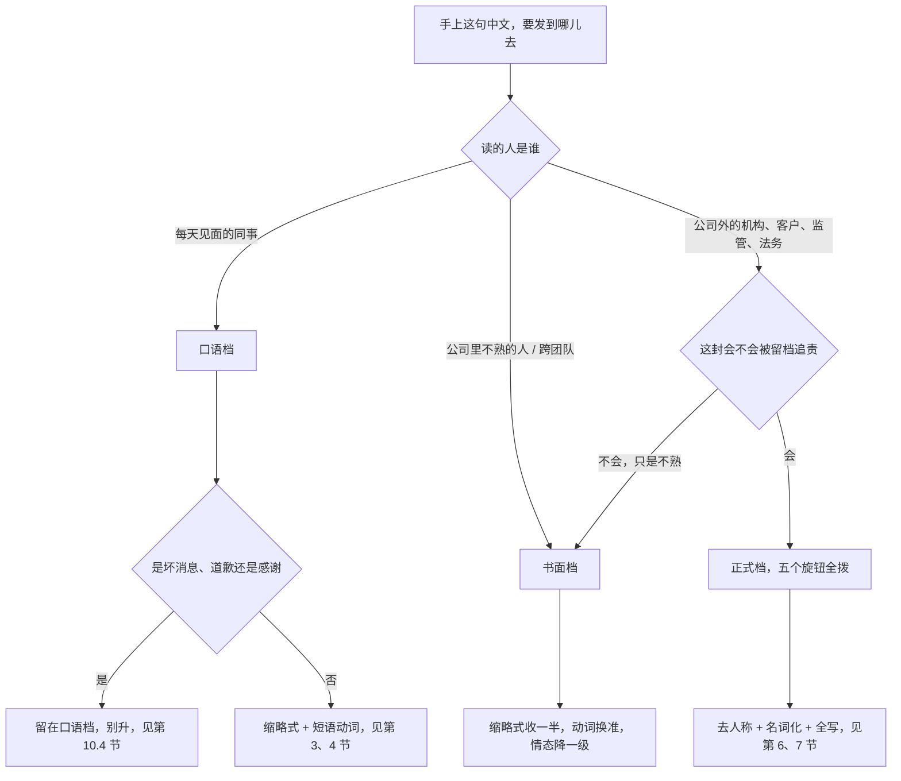
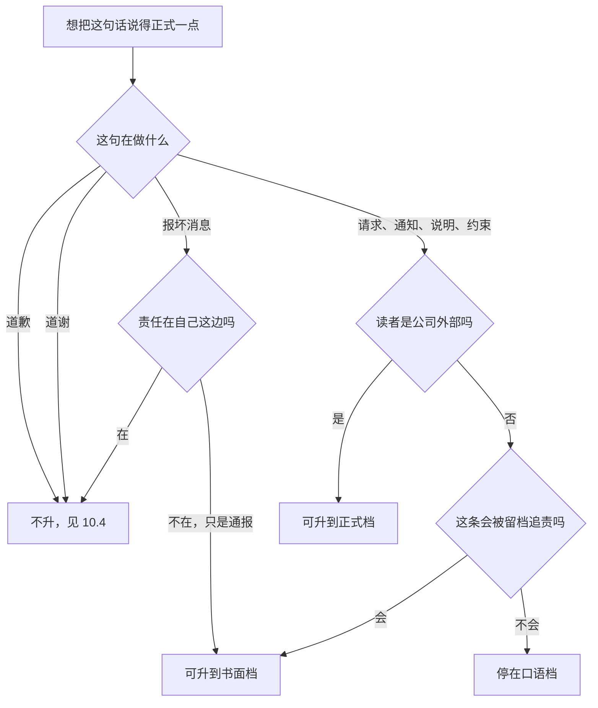
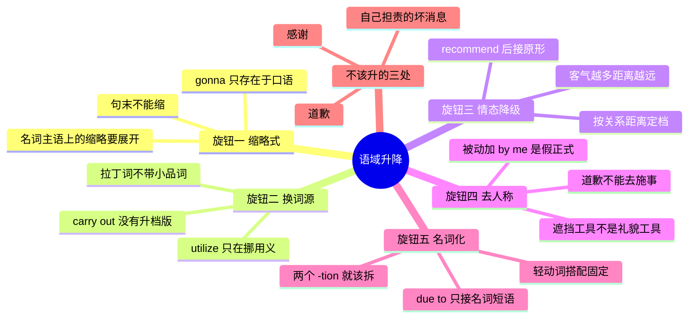

# 语域升降与同义改写：同一句话的三档说法

> [!info] 本篇定位
>
> 前面十一个分类每条意图都给了三档，读者要背的是三倍的量。这一篇反过来：**只背一档，另外两档现算**。算法就是五个旋钮——缩略式、短语动词换拉丁词、情态动词降级、被动化去人称、动词名词化。五个旋钮各自独立，想升半档就只拨一个，想升满档就五个一起拨。
>
> 上一篇 [[11.人际功能与话轮管理/07.我在做、卡住了、我会、我习惯了、这归谁管：进度、能力、习惯与职责\|我在做、卡住了、我会、我习惯了、这归谁管]] 收的是「说什么」，这一篇管「同一件事说得多正式」。同样一句「日志我没收到」，发给隔壁工位的同事、发给外部供应商、发进一封索赔函，是三句完全不同的英文，可它们的信息量一模一样。
>
> 读完能查到：32 条中文意图入口、96 条分档成品句架、一张 32 组短语动词与拉丁词的对照表，以及中文母语者升档时最容易翻车的四处——`due to` 后面接句子、`discuss about`、把 `I want you to` 写进邮件、把 `in terms of` 当万能连接词。

---

## 1. 本篇导读：三档不是文雅程度，是场合匹配

「正式」在中文语感里约等于「文绉绉」，于是升档常常被理解成换更长的词。这个理解会直接生产出英语母语者一眼认出的那种坏文风：句子变长了，信息没变多，读起来像保险条款。

英文的语域高低实际上是四件事的组合：**这句话被谁读、读完要不要留档、说错了要不要负责、说话人和听话人的距离有多远**。四件事都靠近日常，就该往口语档落；四件事都靠近正式，才值得升到最高档。

| 档位 | 在本篇指什么场合 | 典型特征 |
| --- | --- | --- |
| 口语 | Slack 私聊、群里回消息、面对面聊、语音会议插话 | 缩略式全开，短语动词，主语是 I 和 you，句子短 |
| 书面 | 内部邮件、跨团队通知、PR 与 issue 描述、周报 | 缩略式收一半，动词精确，主语允许是团队或事物 |
| 正式 | 对外函件、合同附函、投诉回复、事故报告、法务往来 | 无缩略式，拉丁词根动词，被动与名词化，主语常是事 |

三档之间的距离不是均匀的。口语到书面差的主要是**词的选择**，书面到正式差的主要是**句子的骨架**——谁当主语、动词还是名词承担核心义、责任落到谁头上。所以升第一档容易，把 `put off` 换成 `postpone` 就完事；升第二档难，因为要重新决定这句话的主语是谁。

这张选择树的第一层按**读者身份**分，不按内容分——同一条坏消息在三个档里都要写，档位由收信人决定，不由消息的严重程度决定。第二层的分叉只在最右侧展开，因为「会不会被留档追责」是书面档和正式档之间唯一实质的界线：一封内部周报写错了改一版就行，一封发给客户的延期通知写错了可能被引用进索赔。

第三层的 `C1` 分叉是本篇最反直觉的一条，也是第 10 节的主题：**坏消息、道歉、感谢这三类句子升档会变差**，因为正式档的特长是撇清责任，而这三类句子的目的恰恰是承担责任或表达温度。中文母语者写英文邮件最常见的失手不是不够正式，是在该说人话的地方端着。

三处对立值得在动手前先记住，三处都是中文里不区分的:

- **词长和正式度不是一回事**。`use` 和 `utilize` 都是正式词，`utilize` 只是多两个音节；把所有 `use` 换成 `utilize` 不叫升档，叫虚胖。真正的升档手段是换**词源族**（日耳曼短语动词换拉丁单词），不是换长度。
- **被动化的作用是隐去施事，不是显得客气**。`The deadline was missed` 之所以比 `You missed the deadline` 得体，是因为它没说是谁误的期，不是因为被动语态本身有礼貌属性。搞反了就会写出 `The report was written by me` 这种既不礼貌也不自然的句子。
- **名词化省的是句子数量，不是字数**。`Following discussion at yesterday's meeting` 比 `We discussed it at yesterday's meeting, and then` 短一个分句，正式文书要的是这个。若名词化之后句子反而更长，那这一步就白做了。

本篇结构：第 2 节给五个旋钮的总览，第 3 到第 7 节一个旋钮一节，第 8 节把五个旋钮一起转、拿七句日常中文走完三档，第 9 节反着来讲降档，第 10 节是不该升档的反例，第 11 节是按场合定档的判读表，第 12 节是速查总表。

---

## 2. 五个旋钮总览：升一档到底动哪五个地方

五个旋钮按「拨动成本」从低到高排。前两个只动词，句子骨架不变；第三个动情态；后两个动主语和谓语的分工，是真正的重写。

| 旋钮 | 口语档 | 书面档 | 正式档 | 一句话判据 |
| --- | --- | --- | --- | --- |
| 一、缩略式 | can't、it's、I'll、gonna | 少量 it's、we'll | 全写，无缩略 | 这句会不会被打印出来 |
| 二、动词词源 | put off、find out、take over | postpone、determine、take on | defer、ascertain、assume | 动词是两个词还是一个词 |
| 三、情态强度 | can you、you need to | could you、you should | would it be possible、you are required to | 对方能不能说不 |
| 四、施事人称 | I、you、we 当主语 | we、the team 当主语 | 事当主语，施事省去 | 这句话点没点名 |
| 五、动词与名词 | we discussed it | we discussed it at the sync | following discussion | 核心义在动词上还是名词上 |

这条流水线的关键在于**它可以在任何一站停下**。写内部邮件只拨到 `M` 就够了，继续往下拨反而把同事推远。真正需要走完五站的场合在整个职业生涯里也不多：对外索赔、合同往来、正式投诉回复、监管报送。

两条虚线是本篇的两个失败模式。上面那条：句子本身没错，只是拨过头了，读者感到被疏远。下面那条：拨到位了但场合不对，读者感到你在打官腔。两种失败在中文里没有对应体验，因为中文的正式度主要靠称谓和套话承担，句法骨架基本不变；英文是句法骨架跟着一起变。

还有一条隐藏规则：**五个旋钮不必同步**。一封邮件完全可以保留缩略式（旋钮一停在口语档）却用 `would it be possible`（旋钮三拧到正式档），这种搭配读起来是「熟人之间的郑重请求」，非常自然。反过来全篇无缩略式却用 `you need to`，读起来是「陌生人在下命令」，很刺耳。搭配比绝对档位更重要。

---

## 3. 旋钮一：缩略式与全写

最便宜的一个旋钮。它不改变任何信息，只改变句子的「口腔感」——缩略式模拟连读，全写模拟朗读。中文没有对应机制，所以这一档最容易被忽略：一封通篇 `I'll`、`don't`、`we've` 的正式函件，语法全对，但读起来像便条。

### 3.1 我不行、我做不了：否定缩略

中文触发语：我不行 / 我做不到 / 这个没法弄 / 我们赶不上 / 恐怕不成

| 档位 | 句架 | 例句 | 译文 |
| --- | --- | --- | --- |
| 口语 | I can't + 动词原形 | I can't get to it today. | 今天我腾不出手。 |
| 书面 | we will not be able to + 动词原形 | We will not be able to meet the original date. | 我们赶不上原定日期。 |
| 正式 | 事作主语 + cannot be + 过去分词 | The original delivery date cannot be met. | 原定交付日期无法达成。 |

> [!warning] 错配警示
>
> - ~~We can not ship this week.~~ ❌（想说「这周发不了版」）
> - **We cannot ship this week.** ✅（`cannot` 是一个词；写成分开的 `can not` 只在 `not` 属于后面结构时才成立，例如 `you can not only review it but also merge it`）

页脚：
- 同义入口：我不行 / 做不了 / 来不及 / 没办法 / 抽不开身
- 语法归属：[[02.英语基础语法/01.基础入门/03.疑问句与否定句的构成\|疑问句与否定句的构成]]
- 场景实战：[[04.英语场景/10.职场与商务场景实战/03.商务邮件与正式书面沟通\|商务邮件与正式书面沟通]]

### 3.2 这是、那就是、我会：be 与 will 的缩略

中文触发语：这是… / 那就是… / 我会… / 到时候就… / 已经…了

| 档位 | 句架 | 例句 | 译文 |
| --- | --- | --- | --- |
| 口语 | it's / that's / I'll / we've + 补足成分 | It's ready for review — I'll ping you when CI's green. | 可以评审了，CI 一绿我就叫你。 |
| 书面 | it is / I will / we have + 补足成分 | The branch is ready for review. I will notify you once the pipeline passes. | 分支已可评审，流水线通过后我会通知你。 |
| 正式 | 事作主语 + 全写助动词 + 被动 | The change is available for review and notification will follow upon successful completion of the pipeline. | 该变更已可供评审，流水线成功完成后将另行通知。 |

> [!warning] 错配警示
>
> - ~~Its ready for review.~~ ❌（想说「可以评审了」）
> - **It's ready for review.** ✅（`it's` 只等于 `it is` 或 `it has`；`its` 是所有格，写正式档全写形式反倒不会踩这个坑，这也是升档顺带带来的好处）

页脚：
- 同义入口：这是 / 那是 / 我会 / 我已经 / 到时候
- 语法归属：[[02.英语基础语法/07.助动词与情态动词/01.助动词的基本用法\|助动词的基本用法]]
- 场景实战：[[04.英语场景/07.社交交际场景实战/02.电话短信与在线沟通场景\|电话短信与在线沟通场景]]

### 3.3 gonna、wanna、gotta：口语专属形态与它们的书面对应

中文触发语：我打算… / 我想… / 我得… / 有点… / 差不多…

| 档位 | 句架 | 例句 | 译文 |
| --- | --- | --- | --- |
| 口语 | I'm gonna / I wanna / I gotta / kinda | I'm gonna hold off on the migration — it's kinda risky right now. | 迁移我先压一压，现在有点悬。 |
| 书面 | I'm going to / I'd like to / I need to / somewhat | I'm going to hold off on the migration; it looks somewhat risky at this point. | 迁移我打算先缓一缓，目前看有一定风险。 |
| 正式 | it is intended that / it is necessary to / a degree of | The migration will be deferred, as it presents a degree of risk at this stage. | 鉴于现阶段存在一定风险，迁移将予推迟。 |

> [!warning] 错配警示
>
> - ~~I'm gonna need the signed contract by Friday.~~ ❌（发给外部客户的邮件里）
> - **I'll need the signed contract by Friday.** ✅（`gonna`、`wanna`、`gotta` 是把口语的音流拼写出来，只存在于聊天框和台词里；写进邮件相当于中文公函里出现「整挺好」）

页脚：
- 同义入口：我打算 / 我想 / 我得 / 有点 / 差不多
- 语法归属：[[02.英语基础语法/12.日常口语/01.口语中的语法简化\|口语中的语法简化]]
- 场景实战：[[04.英语场景/07.社交交际场景实战/01.交友聚会与闲聊场景\|交友聚会与闲聊场景]]

### 3.4 缩略式的两条不对称规则

缩略式不是一条线性的开关，有两处不对称，记住能省掉很多改稿。

| 规则 | 说明 | 对照 |
| --- | --- | --- |
| 句末不能缩 | 缩略式必须后面还有成分，句子结尾处一律全写 | `Yes, I am.` 不写 `Yes, I'm.`；`I don't know who it is.` 不写 `who it's` |
| 名词主语上的缩略低一档 | `it's`、`we've`、`don't` 这类代词与否定缩略在半正式文本里常见；`'s`、`'ve` 挂到名词主语上就明显更低 | 内部通知写 `We can't confirm the date yet` 尚可，写 `The date's not confirmed` 就偏低了 |

第二条对英文写作实用价值最高。想让一封邮件「熟络但不轻浮」，做法是保留代词与否定缩略（`it's`、`we've`、`don't`、`can't`），同时不让缩略挂到名词主语上——`the build's red`、`the date's not confirmed` 一律展开成 `the build is red`、`the date is not confirmed`。另有一处要留心：把否定缩略拆成 `do not`、`can not` 写在句中，往往被读成加重强调，语气会硬一档；正式档要的是 `cannot`、`will not` 这种中性全写。

正式档里唯一合法的缩略形式是引语内部：函件里引用对方原话时，原话怎么写就怎么留，不替对方展开。

---

## 4. 旋钮二：短语动词换拉丁词

英语词汇有两个来源层：日耳曼层（短、常与小品词组合成短语动词）和拉丁-法语层（长、单个词就能表达完整动作）。日常口语几乎全靠日耳曼层，正式文体几乎全靠拉丁层。这条分界在中文里彻底不存在——中文没有「书面词根」和「口语词根」的成层现象，所以这个旋钮必须靠成对记忆，不能靠语感推。

### 4.1 推迟、往后挪、提前：日程动作

中文触发语：推迟 / 往后挪 / 延期 / 改到… / 提前 / 取消

| 档位 | 句架 | 例句 | 译文 |
| --- | --- | --- | --- |
| 口语 | put sth off / push sth back / move sth up | Let's push the release back a sprint. | 发版往后挪一个迭代吧。 |
| 书面 | postpone sth to + 时间 / reschedule sth for + 时间 | We have postponed the release to the next sprint. | 发版已推迟至下个迭代。 |
| 正式 | sth has been deferred until + 时间 | The release has been deferred until the following sprint pending completion of the security review. | 鉴于安全评审尚未完成，发版推迟至下一迭代。 |

> [!warning] 错配警示
>
> - ~~We will postpone the meeting off until Thursday.~~ ❌（想说「会议推迟到周四」）
> - **We will postpone the meeting until Thursday.** ✅（拉丁词自带完整动作义，后面不能再挂小品词；`put off` 的 `off` 换成 `postpone` 之后就该消失，同类错误还有 `cancel off`、`reduce down`）

页脚：
- 同义入口：推迟 / 延期 / 往后挪 / 改期 / 缓一缓
- 语法归属：[[02.英语基础语法/05.介词与连词/02.常用介词搭配详解\|常用介词搭配详解]]
- 场景实战：[[04.英语场景/10.职场与商务场景实战/02.会议汇报与演示场景\|会议汇报与演示场景]]

### 4.2 查清楚、弄明白、找出来：调查动作

中文触发语：查一下 / 弄清楚 / 找出来 / 核实一下 / 摸清

| 档位 | 句架 | 例句 | 译文 |
| --- | --- | --- | --- |
| 口语 | find out + wh- 从句 / look into sth | Can you find out who owns this service? | 你能查一下这个服务归谁吗？ |
| 书面 | determine + wh- 从句 / investigate sth | We need to determine which team owns this service before escalating. | 上报之前得先确定这个服务归哪个团队。 |
| 正式 | ascertain sth / the matter is under investigation | Ownership of the service is to be ascertained prior to escalation. | 上报前须先查明该服务的归属。 |

> [!warning] 错配警示
>
> - ~~We will ascertain about the root cause.~~ ❌（想说「我们会查明根因」）
> - **We will ascertain the root cause.** ✅（`ascertain`、`determine`、`investigate`、`examine` 全部直接接宾语；带 `about` 的是 `inquire about`、`ask about` 这一族，换词时介词要跟着换掉）

页脚：
- 同义入口：查一下 / 核实 / 弄清楚 / 摸清 / 查明
- 语法归属：[[02.英语基础语法/09.从句体系/03.名词性从句详解\|名词性从句详解]]
- 场景实战：[[04.英语场景/10.职场与商务场景实战/04.商务谈判合同与客户沟通\|商务谈判合同与客户沟通]]

### 4.3 提出、放弃、接手、跟进：项目动作

中文触发语：提一下 / 放弃 / 接手 / 跟进 / 撑住

| 档位 | 句架 | 例句 | 译文 |
| --- | --- | --- | --- |
| 口语 | bring sth up / give up on sth / take sth over / follow up on sth | I'll bring it up at standup and follow up on the ticket after. | 我站会上提一嘴，会后跟进那张单。 |
| 书面 | raise sth / abandon sth / take sth on / pursue sth | I will raise this at the daily sync and pursue the ticket afterwards. | 我会在每日同步会上提出，之后跟进该工单。 |
| 正式 | put sth forward / discontinue sth / assume responsibility for sth | The proposal will be put forward at the next steering meeting, following which the team will assume responsibility for delivery. | 该提案将在下次督导会上提出，此后由该团队承担交付责任。 |

> [!warning] 错配警示
>
> - ~~We decided to abandon on the feature.~~ ❌（想说「我们决定放弃这个功能」）
> - **We decided to abandon the feature.** ✅（`abandon` 是及物动词直接接宾语；带 `on` 的是短语动词 `give up on`。换词时先删掉旧的小品词，再看新词要不要介词）

页脚：
- 同义入口：提出 / 放弃 / 接手 / 跟进 / 交出去
- 语法归属：[[02.英语基础语法/05.介词与连词/04.介词与连词的易混点\|介词与连词的易混点]]
- 场景实战：[[04.英语场景/10.职场与商务场景实战/02.会议汇报与演示场景\|会议汇报与演示场景]]

### 4.4 砍掉、加上、减下来：增删与数量动作

中文触发语：砍掉 / 去掉 / 加上 / 减下来 / 用光了

| 档位 | 句架 | 例句 | 译文 |
| --- | --- | --- | --- |
| 口语 | cut sth out / take sth out / put sth in / cut sth down / use sth up | We cut the extra retries out and cut the timeout down to five seconds. | 多余的重试砍掉了，超时降到 5 秒。 |
| 书面 | remove sth / add sth / reduce sth by + 数量 / exhaust sth | We removed the redundant retries and reduced the timeout from 30s to 5s. | 已移除冗余重试，超时由 30 秒降到 5 秒。 |
| 正式 | eliminate sth / incorporate sth / be curtailed / be depleted | Redundant retry logic has been eliminated and the timeout threshold curtailed accordingly. | 冗余重试逻辑已删除，超时阈值相应下调。 |

> [!warning] 错配警示
>
> - ~~The cost was reduced down by 30%.~~ ❌（想说「成本降了三成」）
> - **The cost was reduced by 30%.** ✅（`reduce` 词义里已含「向下」，再叠 `down` 是同义重复；同族还有 `revert back`、`return back`、`postpone off`、`ascend up`）

页脚：
- 同义入口：砍掉 / 去掉 / 删了 / 加上 / 降下来 / 用完了
- 语法归属：[[02.英语基础语法/04.形容词与副词/03.副词的分类与用法\|副词的分类与用法]]
- 场景实战：[[04.英语场景/10.职场与商务场景实战/02.会议汇报与演示场景\|会议汇报与演示场景]]

### 4.5 崩了、挂了、修好了：故障动作

中文触发语：崩了 / 挂了 / 起不来 / 修好了 / 绕过去了

| 档位 | 句架 | 例句 | 译文 |
| --- | --- | --- | --- |
| 口语 | sth is down / sth broke / we fixed it / we worked around it | Prod's down — we worked around it by rolling back. | 生产挂了，我们回滚绕过去了。 |
| 书面 | sth is failing / sth became unavailable / we resolved sth | The payment service became unavailable at 14:02 and was restored by rollback at 14:37. | 支付服务 14:02 不可用，14:37 通过回滚恢复。 |
| 正式 | availability was degraded / the issue has been rectified / a workaround has been applied | Service availability was degraded between 14:02 and 14:37 UTC. The issue has since been rectified and a permanent fix is scheduled. | 服务可用性在 UTC 14:02 至 14:37 之间降级，问题已排除，永久修复已排期。 |

> [!warning] 错配警示
>
> - ~~The incident was fixed at 14:37.~~ ❌（想说「故障 14:37 排除」，写在事故报告里）
> - **The incident was resolved at 14:37.** ✅（`fix` 的宾语是坏掉的**东西**——服务器、脚本、构建；`incident`、`issue`、`case`、`dispute` 这类**事件**只能 `resolve`）

页脚：
- 同义入口：崩了 / 挂了 / 出问题了 / 修好了 / 恢复了
- 语法归属：[[02.英语基础语法/10.特殊句型/01.被动语态全解\|被动语态全解]]
- 场景实战：[[04.英语场景/10.职场与商务场景实战/03.商务邮件与正式书面沟通\|商务邮件与正式书面沟通]]

### 4.6 换词的两条反向纪律

短语动词换拉丁词是升档效率最高的一步，也是最容易做过头的一步。两条纪律限制它的适用范围。

| 纪律 | 内容 | 后果 |
| --- | --- | --- |
| 有些短语动词没有升档版本 | `carry out`、`point out`、`set up`、`rule out`、`take place` 在最正式的文本里也照用 | 硬换成生僻拉丁词只会让读者停顿 |
| 换词只换动词，不换句型 | `We looked into it` → `We investigated the matter`，不要顺手改成 `An investigation into the matter was undertaken by us` | 拨过头就同时动了旋钮四和旋钮五，正式度直接跳两档 |

第一条特别值得记：英文里不存在「所有短语动词都低一档」这条规律。`carry out an inspection`、`point out an inconsistency`、`rule out the possibility` 都是标准的正式表达，因为这些短语动词没有等价的单词形式（`execute` 和 `carry out` 不完全同义，`exclude` 和 `rule out` 的宾语限制也不同）。换词表要按词条记，不能按类别推。

第二条是效率问题。写作时把五个旋钮混在一起拨，改完不知道正式度到底涨了多少，也不知道哪一步过了头。逐个拨、拨完读一遍，才能停在想要的那一档。

---

## 5. 旋钮三：情态动词降级

第三个旋钮不改变句子说什么，改变**对方拒绝的成本**。中文靠「麻烦你」「能不能」「劳驾」这类前置客套语承担，位置固定在句首；英文靠情态动词承担，位置在谓语里，而且强度是连续的。

这条尺子从左到右有两个变量同时在变：**礼貌度上升**，**距离感也上升**。这一点是中文母语者最容易低估的——中文的客气话越多关系越近，英文的客气话越多关系越远。给天天一起吃饭的同事写 `We should be grateful if you could forward the file`，对方读到的不是礼貌，是「你怎么突然跟我这么见外」。

所以这个旋钮的正确用法是**按关系距离定档，不是按事情大小定档**。求同事帮个大忙也用 `Could you`，求陌生人帮个小忙才用 `Would it be possible`。

### 5.1 能不能帮我：请求对方做事

中文触发语：能不能帮我… / 帮个忙 / 麻烦你… / 有空的话… / 劳驾

| 档位 | 句架 | 例句 | 译文 |
| --- | --- | --- | --- |
| 口语 | can you + 动词原形 [when you get a chance] | Can you take a look at this when you get a chance? | 你有空能瞄一眼这个吗？ |
| 书面 | could you please + 动词原形 + by + 时间 | Could you please review the attached draft by Thursday? | 麻烦周四前评审一下附件草稿。 |
| 正式 | would it be possible for you to + 动词原形 / we should be grateful if you could + 动词原形 | We should be grateful if you could provide the signed copy by 12 September. | 烦请于 9 月 12 日前提供签署件，不胜感激。 |

> [!warning] 错配警示
>
> - ~~Would you mind to send me the file?~~ ❌（想说「麻烦把文件发我」）
> - **Would you mind sending me the file?** ✅（`mind` 后面只接动名词。另外这句的回答是反的：同意时说 `Not at all` 或 `Sure`，说 `Yes` 等于「我介意」）

页脚：
- 同义入口：能不能 / 帮个忙 / 麻烦你 / 劳驾 / 有空的话
- 语法归属：[[02.英语基础语法/07.助动词与情态动词/02.情态动词详解\|情态动词详解]]
- 场景实战：[[04.英语场景/05.高频实用表达句型框架/02.建议请求邀请拒绝四大功能句型\|建议请求邀请拒绝四大功能句型]]

### 5.2 你得、你应该：要求对方必须做

中文触发语：你得… / 你必须… / 你应该… / 记得要… / 请务必

| 档位 | 句架 | 例句 | 译文 |
| --- | --- | --- | --- |
| 口语 | you need to + 动词原形 / you've got to + 动词原形 | You need to sign it before Friday, otherwise it won't go through. | 周五前你得签了，不然过不了。 |
| 书面 | please make sure + 从句 / we'd ask that you + 动词原形 | Please make sure the form is signed and returned before Friday. | 请确保周五前完成签署并回寄表格。 |
| 正式 | sb is required to + 动词原形 / it is required that + 主语 + 动词原形 | Applicants are required to return the signed form no later than 12 September. | 申请人须于 9 月 12 日前寄回签署表格。 |

> [!warning] 错配警示
>
> - ~~You must send it back until Friday.~~ ❌（想说「周五之前寄回」）
> - **You must send it back by Friday.** ✅（截止期限用 `by`；`until` 表示动作一直持续到那个时点，`wait until Friday` 才对。这一条在正式文书里最常翻车，因为中文「到周五」两义共用）

页脚：
- 同义入口：你得 / 你必须 / 请务必 / 记得 / 须
- 语法归属：[[02.英语基础语法/07.助动词与情态动词/02.情态动词详解\|情态动词详解]]
- 场景实战：[[04.英语场景/10.职场与商务场景实战/03.商务邮件与正式书面沟通\|商务邮件与正式书面沟通]]

### 5.3 我想要、我需要：说出自己的需求

中文触发语：我想要… / 我需要… / 我希望能… / 我想请你…

| 档位 | 句架 | 例句 | 译文 |
| --- | --- | --- | --- |
| 口语 | I want / I need + 名词 [before + 时间] | I need the numbers before the call. | 开会前我要那组数。 |
| 书面 | I'd like to + 动词原形 / I was hoping to + 动词原形 | I'd like to have the figures before tomorrow's call, if that's workable. | 如果可行，我希望明天开会前拿到数据。 |
| 正式 | we would appreciate + 动名词 / we should be grateful for + 名词 | We would appreciate receiving the figures ahead of the call. | 若能在会前收到数据，我们将不胜感激。 |

> [!warning] 错配警示
>
> - ~~I want you to send the report by Friday.~~ ❌（写给平级同事或客户）
> - **Could you send the report by Friday?** ✅（`I want you to` 在英语里是上级对下级的指令口吻，中文「我想请你」不带这个味道，直译过去会显得傲慢。要保留「我」当主语，最低也要写 `I'd like you to`）

页脚：
- 同义入口：我想要 / 我需要 / 我希望 / 我想请你 / 麻烦给我
- 语法归属：[[02.英语基础语法/08.非谓语动词/02.动名词详解\|动名词详解]]
- 场景实战：[[04.英语场景/05.高频实用表达句型框架/02.建议请求邀请拒绝四大功能句型\|建议请求邀请拒绝四大功能句型]]

### 5.4 我可以…吗：请求许可

中文触发语：我可以…吗 / 我能不能… / 这样行吗 / 我先…了啊

| 档位 | 句架 | 例句 | 译文 |
| --- | --- | --- | --- |
| 口语 | can I + 动词原形 / is it OK if I + 一般现在时 | Is it OK if I merge this without a second review? | 我不等第二个人评审就合了行吗？ |
| 书面 | would it be all right if I + 过去时 / may I + 动词原形 | Would it be all right if I merged this with a single approval? | 只有一个批准就合入，可以吗？ |
| 正式 | we should be grateful for confirmation that + 从句 | We should be grateful for your confirmation that the change may proceed with a single approval. | 烦请确认该变更可否在仅一项批准的情况下推进。 |

> [!warning] 错配警示
>
> - ~~Is it OK if I will join late?~~ ❌（想说「我晚点到行吗」）
> - **Is it OK if I join late?** ✅（`if` 引导的条件从句用一般现在时表将来，不用 `will`；`would it be all right if I joined late` 里那个过去时也不是过去，是把语气拉远）

页脚：
- 同义入口：我可以吗 / 我能不能 / 这样行吗 / 允许吗
- 语法归属：[[02.英语基础语法/07.助动词与情态动词/03.情态动词的特殊句型\|情态动词的特殊句型]]
- 场景实战：[[04.英语场景/05.高频实用表达句型框架/02.建议请求邀请拒绝四大功能句型\|建议请求邀请拒绝四大功能句型]]

### 5.5 你可以试试：给建议

中文触发语：你可以试试… / 要不…吧 / 建议你… / 不如…

| 档位 | 句架 | 例句 | 译文 |
| --- | --- | --- | --- |
| 口语 | you could try + 动名词 / why don't you + 动词原形 | You could try clearing the cache first. | 你可以先清一下缓存试试。 |
| 书面 | you may want to + 动词原形 / it might be worth + 动名词 | It might be worth clearing the cache before reinstalling. | 重装之前也许值得先清一下缓存。 |
| 正式 | you may wish to + 动词原形 / it is recommended that + 主语 + 动词原形 | It is recommended that the cache be cleared prior to reinstallation. | 建议在重新安装前清除缓存。 |

> [!warning] 错配警示
>
> - ~~It is recommended that the cache is cleared.~~ ❌（想说「建议清除缓存」）
> - **It is recommended that the cache be cleared.** ✅（`recommend`、`suggest`、`require`、`insist` 后面的从句用「原形」，不随主句变位；这条在正式档使用频率极高。英式正式文体也常写成 `It is recommended that the cache should be cleared`，两种都成立，唯独 `is cleared` 不行）

页脚：
- 同义入口：你可以试试 / 建议你 / 要不 / 不如 / 或许可以
- 语法归属：[[02.英语基础语法/10.特殊句型/02.虚拟语气详解\|虚拟语气详解]]
- 场景实战：[[04.英语场景/05.高频实用表达句型框架/02.建议请求邀请拒绝四大功能句型\|建议请求邀请拒绝四大功能句型]]

### 5.6 不行、这个做不了：拒绝与禁止

中文触发语：不行 / 做不了 / 这个不允许 / 恕难从命 / 我们没法答应

| 档位 | 句架 | 例句 | 译文 |
| --- | --- | --- | --- |
| 口语 | we can't + 动词原形 / that's not going to work | We can't take this on this quarter — we're already at capacity. | 这季度接不了，我们已经排满了。 |
| 书面 | I'm afraid we won't be able to + 动词原形 | I'm afraid we won't be able to take this on within the current quarter. | 恐怕本季度我们无法承接。 |
| 正式 | we regret that we are unable to + 动词原形 / sth is not permitted | We regret that we are unable to accommodate this request within the current quarter. | 抱歉，本季度我们无法满足该请求。 |

> [!warning] 错配警示
>
> - ~~We are not possible to finish by Friday.~~ ❌（想说「我们周五做不完」）
> - **We will not be able to finish by Friday.** ✅（`possible` 的主语只能是事，不能是人；人当主语一律用 `be able to`。要保留 `possible` 就改成 `It will not be possible to finish by Friday`）

页脚：
- 同义入口：不行 / 做不了 / 接不了 / 不允许 / 无法满足
- 语法归属：[[02.英语基础语法/04.形容词与副词/01.形容词的用法与位置\|形容词的用法与位置]]
- 场景实战：[[04.英语场景/05.高频实用表达句型框架/02.建议请求邀请拒绝四大功能句型\|建议请求邀请拒绝四大功能句型]]

---

## 6. 旋钮四：被动化去人称

第四个旋钮开始动句子骨架。它的机制是把施事从主语位置上拿掉——要么被动，要么换 `it` 作形式主语，要么让抽象名词当主语。三条出路效果不同，用错了会显得笨拙而不是正式。

这个旋钮的正确理解是：**它是一件遮挡工具，不是一件礼貌工具**。遮住谁做的这件事本身有时体贴（催件时不点名），有时可疑（推责时不留名）。所以英文写作教程普遍反对滥用被动，而正式文书里被动又极多——两者不矛盾，前者反对的是无意义遮挡，后者需要的是有意义遮挡。

### 6.1 我发现有个问题：报告问题

中文触发语：我发现… / 我们注意到… / 有个问题 / 好像有点不对

| 档位 | 句架 | 例句 | 译文 |
| --- | --- | --- | --- |
| 口语 | I found + 名词 / I spotted + 名词 | I found a bug in the export — dates come out shifted by a day. | 导出里有个 bug，日期整体差一天。 |
| 书面 | we have identified + 名词 + in + 处所 | We have identified a defect in the export path: dates are offset by one day. | 我们在导出链路发现一处缺陷，日期偏移一天。 |
| 正式 | 名词 + has been identified in + 处所 [and is under investigation] | A defect has been identified in the export path and is currently under investigation. | 导出链路已发现一处缺陷，正在调查中。 |

> [!warning] 错配警示
>
> - ~~It was found a bug in the export.~~ ❌（想说「导出里发现一个 bug」）
> - **A bug was found in the export.** ✅（被动句的主语必须是原来的宾语；`it` 作形式主语只能带 `that` 从句，写成 `It was found that the export produced incorrect dates` 才成立）

页脚：
- 同义入口：我发现 / 我们注意到 / 有个问题 / 查出来 / 冒出来一个
- 语法归属：[[02.英语基础语法/10.特殊句型/01.被动语态全解\|被动语态全解]]
- 场景实战：[[04.英语场景/10.职场与商务场景实战/02.会议汇报与演示场景\|会议汇报与演示场景]]

### 6.2 你还没交：催件时把指责拿掉

中文触发语：你还没交 / 你没回我 / 到现在还没收到 / 催一下

| 档位 | 句架 | 例句 | 译文 |
| --- | --- | --- | --- |
| 口语 | didn't get + 名词 / still haven't got + 名词 | Hey, didn't get the logs yesterday — can you send them over? | 昨天没收到日志，能发我一下吗？ |
| 书面 | we haven't received + 名词 + yet / sth doesn't seem to have come through | We don't seem to have received the signed copy yet. | 签署件我们似乎还没收到。 |
| 正式 | 名词 + has not been received [as of + 日期] | As of today, the signed copy referenced in our message of 7 September has not been received. | 截至今日，我方 9 月 7 日邮件所述签署件尚未收到。 |

> [!warning] 错配警示
>
> - ~~You have not sent us the document until now.~~ ❌（想说「到现在你还没发给我们」）
> - **The document has not been received to date.** ✅（`until now` 暗示「而现在到了」，催件的意思正相反，要用 `to date`、`as of today`；同时把主语从 `you` 换掉，指责味一并去掉）

页脚：
- 同义入口：还没收到 / 你没交 / 催一下 / 提醒一下 / 到现在
- 语法归属：[[02.英语基础语法/06.动词时态/04.完成时态详解\|完成时态详解]]
- 场景实战：[[04.英语场景/10.职场与商务场景实战/03.商务邮件与正式书面沟通\|商务邮件与正式书面沟通]]

### 6.3 我决定了：宣布决定

中文触发语：我决定了 / 我们定了 / 经研究决定 / 就这么办

| 档位 | 句架 | 例句 | 译文 |
| --- | --- | --- | --- |
| 口语 | we're going with + 名词 / we've decided to + 动词原形 | We're going with Postgres — Mongo's out. | 就用 Postgres 了，Mongo 不考虑。 |
| 书面 | the team has decided to + 动词原形 | The team has decided to proceed with PostgreSQL for the initial release. | 团队已决定首版采用 PostgreSQL。 |
| 正式 | it has been decided that + 从句 / a decision has been taken to + 动词原形 | It has been decided that PostgreSQL will be used for the initial release. | 已决定首版采用 PostgreSQL。 |

> [!warning] 错配警示
>
> - ~~It has been decided by us that the project stops.~~ ❌（想说「我们已决定项目停止」）
> - **It has been decided that the project will be discontinued.** ✅（去人称的整个目的是不写施事，补回 `by us` 等于白改；从句还要有完整的时态，不能拿一般现在时代替将来）

页脚：
- 同义入口：我决定 / 我们定了 / 经研究决定 / 拍板了 / 就这么办
- 语法归属：[[02.英语基础语法/09.从句体系/03.名词性从句详解\|名词性从句详解]]
- 场景实战：[[04.英语场景/10.职场与商务场景实战/04.商务谈判合同与客户沟通\|商务谈判合同与客户沟通]]

### 6.4 别把话说到某个人头上：去人称的三条出路

中文触发语：别点名 / 不提是谁 / 淡化一下 / 对事不对人

| 档位 | 句架 | 例句 | 译文 |
| --- | --- | --- | --- |
| 口语 | 换 we 兜住 | We missed the deadline on this one. | 这次我们没赶上。 |
| 书面 | 事 + be + 过去分词（by 省略） | The deadline was missed and the release slipped by two days. | 期限未达成，发版顺延两天。 |
| 正式 | it + be + 过去分词 + that 从句 / 抽象名词作主语 | It is understood that the original date can no longer be met; slippage in integration testing has pushed delivery back by two days. | 据了解原定日期已无法达成，集成测试的延误使交付推迟两天。 |

三条出路的分工：**被动**适合动作有明确宾语的场合（`the deadline was missed`）；**`it` 形式主语**适合要传达一整个判断的场合（`it is understood that`、`it is expected that`）；**抽象名词作主语**最高级，把责任从人转到过程上（`slippage pushed delivery back`），正式事故报告与延期通知的主力句型。

> [!warning] 错配警示
>
> - ~~The report was written by me last week.~~ ❌（想说「报告是我上周写的」）
> - **I wrote the report last week.** ✅（被动的作用是隐去施事；施事既然要写出来，就没有理由用被动。写成被动加 `by me` 是最典型的「假正式」）

页脚：
- 同义入口：别点名 / 淡化 / 对事不对人 / 不提是谁
- 语法归属：[[02.英语基础语法/10.特殊句型/01.被动语态全解\|被动语态全解]]
- 场景实战：[[04.英语场景/03.时态与语态句型框架/02.被动语态句型框架\|被动语态句型框架]]

### 6.5 被动化过头的四种病句

去人称拨过头有固定的四种症状，每一种在中文里都没有对应，因此不靠语感只能靠清单核对。

| 症状 | 病句 | 改法 |
| --- | --- | --- |
| 施事补回来了 | The decision was made by the committee to be postponed. | The committee postponed the decision. |
| 连环被动 | It was decided that the request be reviewed by a review to be conducted by the panel. | The panel will review the request. |
| 被动 + 名词化双拨 | An evaluation of the proposal was undertaken by the team. | The team evaluated the proposal. |
| 责任消失到不知所云 | Mistakes were made. | We got the estimate wrong. |

第四行 `Mistakes were made.` 是英文里最出名的一句避责表达，被动加上泛指主语让施事彻底消失，英美评论界给这种用法起了个名字，叫 the past exonerative tense（免责过去时）。它在语法上完美，在沟通上失效，因为道歉的全部价值就在于说出是谁做的。第 10.4 节会展开这条。

前三行有个共同的诊断法：**改完之后数一下句子里有几个名词、几个动词**。被动化过头的句子普遍是名词多、动词少、动词还都是 `be`、`make`、`undertake` 这类没有实义的轻动词。把动作从名词里拽回动词位，句子立刻恢复。

---

## 7. 旋钮五：动词名词化

最后一个旋钮，也是最难拨准的一个。它把一个动作从谓语位置搬到名词位置，腾出谓语位置装别的动作，于是两个句子能压成一个。正式文书要的是这个压缩效果，不是名词本身。

中文其实也有类似机制（「经讨论」「经审核」「鉴于」），但用量远小于英文，而且中文的名词化多集中在公文套语里，句子主干仍然是动词。英文正式文体是主干本身就名词化。

### 7.1 我们讨论过了：把动作压成状语

中文触发语：我们讨论过了 / 聊过了 / 商量之后 / 经讨论

| 档位 | 句架 | 例句 | 译文 |
| --- | --- | --- | --- |
| 口语 | we talked it over / we went over it | We talked it over yesterday and decided to split the ticket. | 昨天聊过了，决定把这张单拆开。 |
| 书面 | we discussed sth at + 场合 + and + 动词 | We discussed this at yesterday's sync and agreed to split the ticket. | 我们在昨天的同步会上讨论过，同意拆分该工单。 |
| 正式 | following discussion at + 场合, + 主句 | Following discussion at yesterday's meeting, the following actions were agreed. | 经昨日会议讨论，议定以下事项。 |

> [!warning] 错配警示
>
> - ~~We discussed about the schedule at the meeting.~~ ❌（想说「会上我们讨论了排期」）
> - **We discussed the schedule at the meeting.** ✅（`discuss` 是及物动词，不带 `about`；带 `about` 的是 `talk about`、`speak about`。名词形式则相反：`a discussion about the schedule` 是对的）

页脚：
- 同义入口：讨论过了 / 聊过了 / 商量之后 / 经讨论 / 会上定的
- 语法归属：[[02.英语基础语法/08.非谓语动词/02.动名词详解\|动名词详解]]
- 场景实战：[[04.英语场景/10.职场与商务场景实战/02.会议汇报与演示场景\|会议汇报与演示场景]]

### 7.2 提交申请、做次评审、给个说法：轻动词加名词

中文触发语：申请一下 / 做个评审 / 给个解释 / 做决定 / 做检查

| 档位 | 句架 | 例句 | 译文 |
| --- | --- | --- | --- |
| 口语 | 单个动词直接用：apply、review、explain、decide、check | Can you review this before I merge? | 合并之前你能评一下吗？ |
| 书面 | 轻动词 + 名词：submit an application、carry out a review、give an explanation、make a decision | We will carry out a review before the change is merged. | 变更合入前我们会做一次评审。 |
| 正式 | 更重的轻动词：lodge a formal application、conduct a review、provide an explanation、reach a decision | A formal review will be conducted prior to the change being merged. | 变更合入前将开展一次正式评审。 |

> [!warning] 错配警示
>
> - ~~We will do a decision next week.~~ ❌（想说「下周我们做决定」）
> - **We will make a decision next week.** ✅（轻动词与名词的搭配是固定的，不能按中文「做」类推：`decision` 配 `make`、`reach`、`take`；`review` 配 `carry out`、`conduct`；`application` 配 `submit`、`lodge`；`explanation` 配 `give`、`provide`、`offer`）

页脚：
- 同义入口：申请 / 评审 / 解释 / 决定 / 检查 / 审批
- 语法归属：[[02.英语基础语法/02.名词与冠词/01.名词的分类与用法\|名词的分类与用法]]
- 场景实战：[[04.英语场景/10.职场与商务场景实战/03.商务邮件与正式书面沟通\|商务邮件与正式书面沟通]]

### 7.3 因为需求改了：把从句压成介词短语

中文触发语：因为…改了 / 由于… / 鉴于… / 是因为…造成的

| 档位 | 句架 | 例句 | 译文 |
| --- | --- | --- | --- |
| 口语 | because + 从句 | We're late because the requirements changed halfway through. | 我们晚了，因为中途需求变了。 |
| 书面 | due to + 名词短语 | The delay is due to a mid-project change in requirements. | 延期是由于项目中途需求变更。 |
| 正式 | 名词 + is attributable to + 名词短语 / owing to + 名词短语 | The delay is attributable to a change in the agreed scope. | 延期系约定范围变更所致。 |

> [!warning] 错配警示
>
> - ~~Due to the client changed the requirements, we are late.~~ ❌（想说「因为客户改了需求，我们晚了」）
> - **Due to a change in requirements, we are late.** ✅（`due to`、`owing to`、`because of` 后面只能接名词短语；要接整句必须换回 `because`、`since`、`as`。这是名词化旋钮上最常翻车的一处，因为中文「由于」两边都能接）

页脚：
- 同义入口：因为 / 由于 / 鉴于 / 是…造成的 / …所致
- 语法归属：[[02.英语基础语法/05.介词与连词/03.连词的分类与用法\|连词的分类与用法]]
- 场景实战：[[04.英语场景/10.职场与商务场景实战/03.商务邮件与正式书面沟通\|商务邮件与正式书面沟通]]

### 7.4 名词化过头：僵尸名词的四条识别线

名词化到了一定密度会产生英文写作里的经典毛病：句子里全是名词，实义动作被封在名词壳子里，谓语位置只剩没有信息量的 `be`、`make`、`provide`、`undertake`。

| 识别线 | 病句 | 改法 |
| --- | --- | --- |
| 谓语是空动词 | We made a determination regarding the issue. | We determined the cause. |
| 一句里两个以上 -tion / -ment | The implementation of the enhancement resulted in an improvement in performance. | Adding the cache improved performance. |
| 主语是抽象名词串 | The utilization of the availability of the resource is under consideration. | We are considering whether to use the spare capacity. |
| 介词链超过三个 | in respect of the provision of the review of the report | on reviewing the report |

第二行是最容易自查的一条：**一句话里出现两个 `-tion`、`-ment`、`-ance` 结尾的抽象名词，就该回头拆一个**。这条不是审美偏好，是可读性问题——抽象名词不带时间、不带施事，读者要自己补，补两次就累。

第三行还暴露另一个问题：名词化会把动词的**方向**丢掉。`the review of the report` 分不出是「评审这份报告」还是「这份报告做的评审」，动词形式 `reviewing the report` 就没有歧义。正式文书之所以还是大量使用名词化，是因为它同时依赖上下文和固定套语来消歧；日常写作没有这个条件，滥用就只剩歧义。

---

## 8. 五个旋钮一起转：七句日常中文走完三档

前面五节是拆开练，这一节是合起来用。每条给同一句中文的三档成品，并在页脚标出实际动了哪几个旋钮——多数句子用不到全部五个。

### 8.1 这事我先放放，下周再说

中文触发语：先放放 / 先搁着 / 押后 / 下周再说 / 先不动

| 档位 | 句架 | 例句 | 译文 |
| --- | --- | --- | --- |
| 口语 | gonna park sth for now — will pick it back up + 时间 | Gonna park this for now — will pick it back up next week. | 这个先放放，下周再捡起来。 |
| 书面 | I'll put sth on hold and revisit it + 时间 | I'll put this on hold for now and revisit it next week. | 我先把这个搁置，下周再回看。 |
| 正式 | sth will be held pending + 名词 and revisited in the week commencing + 日期 | This item will be held pending further review and revisited in the week commencing 14 September. | 该事项暂缓，待进一步评审，并于 9 月 14 日当周重新讨论。 |

> [!warning] 错配警示
>
> - ~~This item will be held until further review.~~ ❌（想说「待进一步评审前暂缓」）
> - **This item will be held pending further review.** ✅（`pending + 名词` 的意思是「在…出结果之前一直保持现状」，正式文书的固定式；`until` 只标时间点，读起来像评审完就自动解冻，责任关系不同）

页脚：
- 同义入口：先放放 / 先搁着 / 押后 / 暂缓 / 先不动
- 动了哪几个旋钮：一（缩略式）、二（park → hold）、四（this item 作主语）、五（pending further review）
- 语法归属：[[02.英语基础语法/05.介词与连词/01.介词的分类与基本用法\|介词的分类与基本用法]]

### 8.2 你昨天没把日志发我

中文触发语：你没发我 / 昨天没收到 / 说好的东西呢 / 催一下日志

| 档位 | 句架 | 例句 | 译文 |
| --- | --- | --- | --- |
| 口语 | didn't get + 名词 + yesterday — can you send them over | Hey, didn't get the logs yesterday — can you send them over? | 昨天没收到日志，能发我一下不？ |
| 书面 | I don't think + 名词 + came through — could you resend + 时间状语 | I don't think the logs came through yesterday. Could you resend them when you have a moment? | 日志昨天好像没到，方便时麻烦重发一下。 |
| 正式 | 名词 + referenced in our message of + 日期 + have not been received. We should be grateful if + 从句 | The log files referenced in our message of 7 September have not been received. We should be grateful if they could be forwarded at your earliest convenience. | 我方 9 月 7 日邮件所述日志文件尚未收到，烦请尽早转来，不胜感激。 |

> [!warning] 错配警示
>
> - ~~Please send the logs to me as soon as possible.~~ ❌（正式函件里，想说「烦请尽快发来」）
> - **We should be grateful if they could be forwarded at your earliest convenience.** ✅（`as soon as possible` 在对外函件里是催促口吻，接近下命令；正式档的对应固定式是 `at your earliest convenience`，同时把 `to me` 去掉——正式函件里说话人是机构不是个人）

页脚：
- 同义入口：没收到 / 你没发 / 催一下 / 提醒一下 / 麻烦补发
- 动了哪几个旋钮：一、三（can you → we should be grateful if）、四（logs 作主语，you 消失）
- 语法归属：[[02.英语基础语法/10.特殊句型/01.被动语态全解\|被动语态全解]]
- 场景实战：[[04.英语场景/10.职场与商务场景实战/03.商务邮件与正式书面沟通\|商务邮件与正式书面沟通]]

### 8.3 能不能帮我看一眼这个 PR

中文触发语：帮我看一眼 / 瞄一下 / 麻烦评审 / 求个 review

| 档位 | 句架 | 例句 | 译文 |
| --- | --- | --- | --- |
| 口语 | mind taking a quick look at + 名词 | Mind taking a quick look at this PR? Small one. | 帮我瞄一眼这个 PR？很小。 |
| 书面 | could you take a look at + 名词 + when you get a chance | Could you take a look at PR #412 when you get a chance? No rush. | 有空的话麻烦看下 PR #412，不急。 |
| 正式 | we would be grateful if you could review + 名词 + and confirm whether + 从句 | We would be grateful if you could review the attached change request and confirm whether it may proceed to merge. | 烦请评审所附变更申请并确认可否合入。 |

> [!warning] 错配警示
>
> - ~~Please review my PR as soon as possible, thanks.~~ ❌（发给不熟的外部协作者）
> - **Could you take a look at PR #412 when you get a chance?** ✅（`as soon as possible` 加 `thanks` 是熟人之间的省事写法；对不熟的人要么把急迫性说清楚（`we need this before the 12th release cut`），要么就别加时限，含糊的催促最伤关系）

页脚：
- 同义入口：帮我看看 / 瞄一眼 / 评审一下 / 求 review / 过一遍
- 动了哪几个旋钮：一、三（mind → could you → we would be grateful if）、二（look at → review）
- 语法归属：[[02.英语基础语法/07.助动词与情态动词/02.情态动词详解\|情态动词详解]]
- 场景实战：[[04.英语场景/05.高频实用表达句型框架/02.建议请求邀请拒绝四大功能句型\|建议请求邀请拒绝四大功能句型]]

### 8.4 我们不打算继续做这个了

中文触发语：不做了 / 停了 / 砍了 / 不往下推了 / 项目终止

| 档位 | 句架 | 例句 | 译文 |
| --- | --- | --- | --- |
| 口语 | we're dropping + 名词 | We're dropping this one — not enough traction. | 这个不做了，没什么起色。 |
| 书面 | we've decided not to take sth further [for now] | We've decided not to take this further for now, given the current usage numbers. | 鉴于目前的使用数据，我们决定暂不继续推进。 |
| 正式 | it has been decided that work on sth will be discontinued with effect from + 日期 | It has been decided that work on this initiative will be discontinued with effect from 30 September. | 已决定该项工作自 9 月 30 日起终止。 |

> [!warning] 错配警示
>
> - ~~We decided to stop this project from 30 September.~~ ❌（想说「9 月 30 日起终止」）
> - **…will be discontinued with effect from 30 September.** ✅（`from + 日期` 表起点时正式文书用固定式 `with effect from`；单写 `from 30 September` 在条款语境里会被读成时间范围的起点而不是生效日）

页脚：
- 同义入口：不做了 / 停了 / 砍掉 / 终止 / 不再推进
- 动了哪几个旋钮：一、二（drop → discontinue）、四（it has been decided）、五（work on this initiative）
- 语法归属：[[02.英语基础语法/09.从句体系/03.名词性从句详解\|名词性从句详解]]
- 场景实战：[[04.英语场景/10.职场与商务场景实战/04.商务谈判合同与客户沟通\|商务谈判合同与客户沟通]]

### 8.5 用户说这玩意儿太难用了

中文触发语：用户吐槽 / 反馈说难用 / 大家都在抱怨 / 体验很差

| 档位 | 句架 | 例句 | 译文 |
| --- | --- | --- | --- |
| 口语 | users are saying + 从句 / people keep complaining that + 从句 | Users are saying it's a pain to set up. | 用户都说配起来费劲。 |
| 书面 | we're getting consistent feedback that + 从句 | We're getting consistent feedback that the setup flow is hard to follow. | 我们持续收到反馈，说配置流程不好走。 |
| 正式 | user feedback indicates that + 从句 | User feedback indicates that the current setup workflow presents significant usability difficulties. | 用户反馈显示，现有配置流程存在明显的可用性问题。 |

> [!warning] 错配警示
>
> - ~~The users complained the product is difficult.~~ ❌（想说「用户抱怨产品难用」）
> - **Users complained that the product was difficult to use.** ✅（`complain` 后面接从句时 `that` 一般不省，不像 `say`、`think` 那样随便省；`difficult` 后面还要补 `to use`，因为 `difficult` 单独用是「困难的」不是「难操作的」）

页脚：
- 同义入口：用户吐槽 / 反馈说 / 抱怨 / 体验差 / 上手难
- 动了哪几个旋钮：一、二（say → indicate）、四（user feedback 作主语）、五（usability difficulties）
- 语法归属：[[02.英语基础语法/09.从句体系/03.名词性从句详解\|名词性从句详解]]
- 场景实战：[[04.英语场景/10.职场与商务场景实战/02.会议汇报与演示场景\|会议汇报与演示场景]]

### 8.6 会议改到周四，麻烦改一下日历

中文触发语：会议改期 / 挪到周四 / 改一下日历 / 时间调整

| 档位 | 句架 | 例句 | 译文 |
| --- | --- | --- | --- |
| 口语 | moved + 名词 + to + 时间 — updated the invite | Moved the sync to Thursday — updated the invite. | 同步会挪周四了，日历改好了。 |
| 书面 | I've moved + 名词 + to + 时间. The calendar invite has been updated. | I've moved Tuesday's sync to Thursday at 10:00. The calendar invite has been updated. | 周二的同步会我挪到周四 10 点了，日历邀请已更新。 |
| 正式 | 名词 + scheduled for + 日期 + has been rescheduled to + 日期. An updated invitation has been issued. | The meeting scheduled for Tuesday, 15 September has been rescheduled to Thursday, 17 September at 10:00. An updated invitation has been issued. | 原定 9 月 15 日周二的会议已改期至 9 月 17 日周四 10 时，更新后的邀请已发出。 |

> [!warning] 错配警示
>
> - ~~The meeting was postponed to Thursday.~~ ❌（想说「会议改到周四」，而周四其实更早或只是换了个日子）
> - **The meeting has been rescheduled to Thursday.** ✅（`postpone` 专指往**后**推；只是换个时间点、甚至提前，一律用 `reschedule`，提前明说时用 `brought forward`）

页脚：
- 同义入口：改期 / 挪时间 / 调整会议 / 改到 / 顺延
- 动了哪几个旋钮：一、二（move → reschedule）、四（meeting 作主语）
- 语法归属：[[02.英语基础语法/06.动词时态/04.完成时态详解\|完成时态详解]]
- 场景实战：[[04.英语场景/10.职场与商务场景实战/02.会议汇报与演示场景\|会议汇报与演示场景]]

### 8.7 这改动可能影响别的模块，先测一下

中文触发语：可能会影响别的 / 有连带风险 / 先跑一遍测试 / 别直接上

| 档位 | 句架 | 例句 | 译文 |
| --- | --- | --- | --- |
| 口语 | heads up — sth might break + 名词. worth testing first | Heads up — this might break the reporting job. Worth running the suite first. | 提醒一下，这可能把报表任务搞崩，先跑一遍测试比较稳。 |
| 书面 | sth may affect + 名词, so I'd suggest we + 动词原形 + before + 动名词 | This change may affect the reporting module, so I'd suggest we run the regression suite before merging. | 这个改动可能影响报表模块，建议合并前先跑回归。 |
| 正式 | sth carries a risk of + 名词 in + 名词. It is recommended that + 主语 + 动词原形 + prior to + 名词 | The proposed change carries a risk of regression in dependent modules. It is recommended that a full regression test be completed prior to deployment. | 该变更对依赖模块存在回归风险，建议部署前完成一轮完整回归测试。 |

> [!warning] 错配警示
>
> - ~~This change may influence the reporting module.~~ ❌（想说「可能影响报表模块」）
> - **This change may affect the reporting module.** ✅（`influence` 指施加影响改变倾向，用于人和决策；系统、指标、模块受到波及一律 `affect`，名词形式是 `an effect on`）

页脚：
- 同义入口：可能影响 / 有连带风险 / 会波及 / 先测一下
- 动了哪几个旋钮：一、二（break → affect → carry a risk of）、三（worth → I'd suggest → it is recommended that）、五（regression、deployment）
- 语法归属：[[02.英语基础语法/10.特殊句型/02.虚拟语气详解\|虚拟语气详解]]
- 场景实战：[[04.英语场景/10.职场与商务场景实战/02.会议汇报与演示场景\|会议汇报与演示场景]]

---

## 9. 反向操作：把正式句子降回口语

降档的场合比想象中多：读英文文档要把条款翻成人话讲给同事，把一封官腔邮件改成 Slack 消息，把论文摘要讲成会议口头汇报。本节四条把升档的五个旋钮反着拨。

本节的表格仍按口语、书面、正式排列，读法要反过来——**从下往上读就是降档流程**。

### 9.1 拆名词化：把动作从名词里拽回动词

中文触发语：加了缓存以后响应快了 / 说人话 / 这句太绕了

| 档位 | 句架 | 例句 | 译文 |
| --- | --- | --- | --- |
| 口语 | 主语 + 实义动词 + once + 从句 | Response times dropped once we added caching. | 加了缓存之后响应时间就降下来了。 |
| 书面 | 动名词短语作主语 + 实义动词 + 宾语 | Adding a caching layer reduced response times by roughly 40%. | 增加缓存层使响应时间下降约四成。 |
| 正式 | the + 名词 + of + 名词 + resulted in + 名词 | The introduction of a caching layer resulted in a 40% reduction in response time. | 引入缓存层带来响应时间 40% 的降幅。 |

> [!warning] 错配警示
>
> - ~~The introduction of a caching layer resulted in the reducing of response time.~~ ❌（想说「引入缓存层降低了响应时间」）
> - **…resulted in a reduction in response time.** ✅（名词化要用现成的名词形式 `reduction`，不是把动词硬加 `-ing` 再配定冠词；同族还有 `the deciding of`（应为 `the decision`）、`the analysing of`（应为 `the analysis`））

页脚：
- 同义入口：拆开说 / 说人话 / 简化 / 讲白一点
- 降档动作：`the introduction of` → `adding`；`resulted in a reduction` → `reduced` → `dropped`
- 语法归属：[[02.英语基础语法/08.非谓语动词/02.动名词详解\|动名词详解]]

### 9.2 拉丁词换回短语动词

中文触发语：这份文件下周开始弄 / 讲得随意点 / 别端着

| 档位 | 句架 | 例句 | 译文 |
| --- | --- | --- | --- |
| 口语 | we'll start on sth + 时间 | We'll start on it next week. | 我们下周开始弄。 |
| 书面 | we will begin work on sth + 时间 | We will begin work on the document next week. | 我们将于下周着手该文件。 |
| 正式 | work on sth will commence in the week commencing + 日期（周一） | Work on the document will commence in the week commencing 14 September. | 该文件的工作将于 9 月 14 日当周启动。 |

> [!warning] 错配警示
>
> - ~~We will commence the work at next week.~~ ❌（想说「我们下周开工」）
> - **We will commence work next week.** ✅（`next week`、`last month` 这类时间词前面不加介词；另外 `commence` 后的 `work` 作不可数抽象名词时不加冠词）

页脚：
- 同义入口：开始 / 着手 / 启动 / 动手 / 开工
- 降档动作：`commence` → `begin` → `start on`；`prior to` → `before`；`in the event that` → `if`；`utilize` → `use`
- 语法归属：[[02.英语基础语法/05.介词与连词/01.介词的分类与基本用法\|介词的分类与基本用法]]

### 9.3 被动改回主动并补上人称

中文触发语：这个决定谁定的 / 到底是谁做的 / 说清楚点

| 档位 | 句架 | 例句 | 译文 |
| --- | --- | --- | --- |
| 口语 | 人 + 实义动词 + 宾语 + 时间 | Priya made the call last week — we're going with the managed service. | 上周 Priya 拍的板，我们用托管服务。 |
| 书面 | the team + 动词 + 宾语 + 时间 | The team decided last week to go with the managed service. | 团队上周决定采用托管服务。 |
| 正式 | the decision was taken at + 场合 + of + 日期 | The decision was taken at the architecture review of 3 September. | 该决定于 9 月 3 日的架构评审会上作出。 |

> [!warning] 错配警示
>
> - ~~The decision was taken by the team at the review, by Priya.~~ ❌（想说「决定是评审会上 Priya 代表团队做的」）
> - **Priya made the call at the review, on behalf of the team.** ✅（一个被动句只能挂一个 `by` 施事；要同时交代「谁做的」和「代表谁」，必须改回主动句，用 `on behalf of` 承接后半个信息）

页脚：
- 同义入口：谁定的 / 谁拍的板 / 说清楚是谁 / 落实到人
- 降档动作：读到 `be + 过去分词` 先问「谁做的」，把人补回主语位；`it has been decided` 通常降成 `we decided`
- 语法归属：[[02.英语基础语法/03.代词与数词/01.人称代词与物主代词\|人称代词与物主代词]]
- 场景实战：[[04.英语场景/03.时态与语态句型框架/02.被动语态句型框架\|被动语态句型框架]]

### 9.4 长句拆短句

中文触发语：一句话太长了 / 断一下 / 分两句说

| 档位 | 句架 | 例句 | 译文 |
| --- | --- | --- | --- |
| 口语 | 短句 + so + 短句. 短句 | Supplier hasn't confirmed the date, so I can't give you a launch date. I'll ping you the moment they do. | 供应商还没确认日期，我给不了上线时间。他们一确认我马上告诉你。 |
| 书面 | 主句 + until + 从句. 主句 + as soon as + 从句 | We can't commit to a launch date until the supplier confirms their delivery schedule. I'll let you know as soon as they do. | 供应商确认交期之前我们无法给出上线日期，一有消息我立刻通知你。 |
| 正式 | 名词 + cannot be confirmed pending + 名词. You will be notified upon + 名词 | A launch date cannot be confirmed pending receipt of the supplier's delivery schedule. You will be notified immediately once that schedule has been received. | 在收到供应商交期之前无法确定上线日期，收到后将即刻通知贵方。 |

> [!warning] 错配警示
>
> - ~~We can't commit a launch date.~~ ❌（想说「我们不能承诺上线日期」）
> - **We can't commit to a launch date.** ✅（`commit` 表「承诺」时必须带 `to`；不带 `to` 的 `commit` 是「提交、犯下」，`commit a change`、`commit an error` 是另一个义项）

页脚：
- 同义入口：太长了 / 断句 / 分两句 / 说得散一点
- 降档动作：`pending + 名词` → `until + 从句`；`upon receipt of` → `as soon as we get`；一句拆成两句时把连接词降成 `so`、`and`
- 语法归属：[[02.英语基础语法/09.从句体系/04.状语从句详解\|状语从句详解]]

---

## 10. 什么时候不该升档

前面九节讲怎么升，这一节讲什么时候把手从旋钮上拿开。升档在英文里不是无代价的：它每提高一档，说话人和听话人的距离就拉开一段，责任的落点就模糊一分。这两样东西在某些场合恰恰是你要避免的。

这张图和第 1 节那张选择树的分工：那张按**读者**定档，这张按**言语行为**定档。两张图给出不同答案时，以这张为准——言语行为的约束比读者身份硬。给公司外部客户道歉，仍然不该升到正式档最高级，因为 `We regret any inconvenience caused` 是模板句，读者见过一千遍，读到它只会确认「你不打算负责」。

`D` 那个分叉是唯一的例外通道：坏消息如果责任不在自己这边（供应商延期、上游服务故障、政策变更），升到书面档是合适的，因为这时你的角色是转达者不是当事人，距离感是准确的，不是躲。

### 10.1 口语场合的官腔清单

中文触发语：这话在群里说别端着 / 别写得像通知 / 说人话

| 场合 | 官腔说法（别这么发） | 该说的 |
| --- | --- | --- |
| Slack 里问同事有没有空 | Please advise as to your availability. | Are you free this afternoon? |
| 群里告诉大家构建挂了 | Please be advised that the build is currently in a failed state. | Heads up — the build's red. |
| 私聊问进度 | Kindly provide an update at your earliest convenience. | How's it going with the migration? |
| 站会上说自己卡住了 | I am currently experiencing an impediment. | I'm blocked on the API key. |
| 回同事的感谢 | Your appreciation is duly noted. | No problem, any time. |
| 拒绝一个小请求 | Regrettably, I am unable to accommodate this request. | Sorry, can't today — swamped. |

这张表左列每一句语法都对，也都能在真实的商务英语里找到出处，问题全在场合。`Please be advised that` 这一族是公函模板的填充语，它在函件里的作用是标记「以下内容具有正式效力」；发到聊天群里，这个标记本身就是噪声，读者会先花半秒想「这人是不是在阴阳我」。

判据只有一条：**这句话如果用中文说，你会不会说「兹通知」**。会，就升；不会，就别升。

> [!warning] 错配警示
>
> - ~~Please be advised that I will be out of office tomorrow.~~ ❌（发在团队群里）
> - **I'm out tomorrow — Marco's covering.** ✅（`please be advised that` 在句子里不承担任何信息，删掉后句子完整；凡是删掉不影响信息的正式套语，在口语场合一律删）

页脚：
- 同义入口：别端着 / 说人话 / 太官方了 / 群里别这么说
- 语法归属：[[02.英语基础语法/12.日常口语/04.口语与书面语对比\|口语与书面语对比]]
- 场景实战：[[04.英语场景/07.社交交际场景实战/02.电话短信与在线沟通场景\|电话短信与在线沟通场景]]

### 10.2 in terms of 滥用：一个词顶掉五个介词

中文触发语：在…方面 / 就…而言 / 说到… / …这块儿

`in terms of` 是中文母语者升档时抓得最紧的一根稻草，因为中文「在…方面」几乎可以接任何名词，于是这个短语被拿来顶替 `about`、`for`、`by`、`as for`、`when it comes to` 全部五个位置。英语母语读者对它的耐受度很低，同一封邮件里反复出现会被读成填充语。

| 想说什么 | 滥用写法 | 该用的 |
| --- | --- | --- |
| 成本上更便宜 | In terms of cost, it is cheaper. | It costs less. |
| 说到排期 | In terms of the schedule, we're fine. | As for the schedule, we're on track. |
| 按用户数算 | In terms of users, we doubled. | By user count, we doubled. |
| 那个 bug 呢 | In terms of the bug, it's fixed. | The bug is fixed. |
| 就性能而言 | In terms of performance, it's better. | It performs better. |

`in terms of` 真正的本义是「用 B 这套单位来表述 A」，这个用法完全正当，而且没有替代品：`The result is expressed in terms of requests per second.`（结果以每秒请求数表述。）`We should think about this in terms of total cost of ownership rather than licence fees.`（这件事该按总拥有成本算，不该按许可费算。）两句里 `in terms of` 后面跟的都是**度量框架**，不是话题。

> [!warning] 错配警示
>
> - ~~In terms of the deployment, we will do it on Friday.~~ ❌（想说「部署这块儿我们周五做」）
> - **We'll deploy on Friday.** ✅（`in terms of` 后面接的应当是度量单位或框架，不是话题；要引出话题用 `as for`、`regarding`，而多数时候把话题直接写成主语就够了，一个介词短语都不需要）

页脚：
- 同义入口：在…方面 / 就…而言 / 说到 / …这块儿 / 从…角度看
- 语法归属：[[02.英语基础语法/05.介词与连词/02.常用介词搭配详解\|常用介词搭配详解]]
- 场景实战：[[04.英语场景/05.高频实用表达句型框架/04.比较对比举例总结句型库\|比较对比举例总结句型库]]

### 10.3 八个被滥用的升档词

中文触发语：换个高级点的词 / 显得专业一点 / 别太口语

| 升档词 | 什么时候真该用 | 什么时候是虚胖 | 平替 |
| --- | --- | --- | --- |
| utilize | 「把闲置的东西挪作他用」：utilize spare capacity | 任何普通的「使用」 | use |
| facilitate | 主语是机制、工具、流程 | 主语是人，说自己「促成了」 | help、make sth easier |
| leverage | 商业提案里说「拿已有资产撬动新收益」 | 当作 use 的花哨版本 | use、build on |
| endeavour | 法律文书的 best endeavours 条款 | 日常说「我们会努力」 | try、aim to |
| commence | 仪式、法庭程序、合同起始 | 日常说「开始做某事」 | start、begin |
| as per | 引用条款编号：as per Clause 4.2 | as per your email、as per our conversation | as you mentioned、as we discussed |
| kindly | 旧式商函与部分地区英语的固定礼貌语 | 美式语境里当 please 用，读起来像命令 | please |
| please be advised that | 具有法律效力的正式通知开头 | 任何普通句子的开头填充 | 直接删掉 |

这张表的判读法则是**看主语和场合，不看词本身**。八个词里没有一个是坏词，`utilize` 在讲资源调度的论文里是精确用词，`endeavour` 在合同的 best endeavours 条款里不可替代。它们变成虚胖的时刻，都是被拿来顶替一个更常见的短词、而句意一点没变的时刻。

自查方法：把候选词换成平替，重读句子，**如果意思一模一样，就用平替**。意思有细微损失，才说明这个升档词在承担实义。

> [!warning] 错配警示
>
> - ~~We utilized the API to obtain the data.~~ ❌（想说「我们用 API 取数据」）
> - **We used the API to get the data.** ✅（`utilize` 的核心义是「把本来不是干这个的东西拿来用」，API 本来就是拿来调的，没有「挪用」义，用 `use` 才准确；`obtain` 同理，取一份自己有权取的数据用 `get` 就够）

页脚：
- 同义入口：换个高级词 / 显得专业 / 写正式点 / 别太白
- 语法归属：[[02.英语基础语法/11.实战应用/02.写作中的语法应用\|写作中的语法应用]]
- 场景实战：[[04.英语场景/10.职场与商务场景实战/03.商务邮件与正式书面沟通\|商务邮件与正式书面沟通]]

### 10.4 三种句子升档就毁：道歉、感谢、坏消息

中文触发语：我错了 / 谢谢你 / 有个坏消息要说

| 言语行为 | 升档后（读起来像什么） | 该用的（各档通用） |
| --- | --- | --- |
| 道歉 | We regret any inconvenience caused.（模板，等于没道歉） | I'm sorry — I dropped the ball on this. I should have flagged it last week. |
| 感谢 | Your assistance is greatly appreciated.（客套，看不出谢什么） | Thanks for catching that — it would have gone straight to prod. |
| 坏消息 | Slippage has been observed in the delivery schedule.（像在躲） | The date is going to slip. Here's where we are and what I'm doing about it. |

三种句子的共同点：**它们的价值全在人称**。道歉要说清是谁做错了，感谢要说清对方做对了什么，坏消息要说清谁在承担。而升档的第四、第五个旋钮做的正是把人称拿掉，两者直接冲突。

写坏消息有一条实用原则：这一段的正式度应该**低于**周围段落，而不是高于。原因是读者对坏消息的第一反应是找责任人，此时句子越绕，猜疑越重。中文公文的习惯与此相反——坏消息越正式越显得郑重——直接照搬会让对方觉得你在推卸。

> [!warning] 错配警示
>
> - ~~Mistakes were made in the estimation process.~~ ❌（想说「估算这块我们弄错了」）
> - **We got the estimate wrong.** ✅（`Mistakes were made` 是英文里最出名的一句避责表达，评论界称之为 the past exonerative tense；道歉的全部效力来自说出是谁，去掉施事等于把道歉本身抽空）

页脚：
- 同义入口：我错了 / 对不起 / 谢谢你 / 有个坏消息 / 得跟你说件事
- 语法归属：[[02.英语基础语法/10.特殊句型/01.被动语态全解\|被动语态全解]]
- 场景实战：[[04.英语场景/10.职场与商务场景实战/03.商务邮件与正式书面沟通\|商务邮件与正式书面沟通]]

---

## 11. 按场合定档：一张判读表

前面的规则合起来是一张查表。用法是：先在左列找到场合，取默认档；再看备注里有没有针对该场合的偏移。

| 场合 | 默认档 | 备注 |
| --- | --- | --- |
| Slack 私聊、同组群 | 口语 | 缩略式全开；正式套语一律删 |
| 跨团队公告、全员通知 | 书面 | 代词缩略可留，名词主语上的缩略展开 |
| PR 描述、issue 正文 | 书面偏口语 | 动词要精确，但主语可以是 I 和 we |
| 技术文档、README | 书面 | 情态用规范式，见 [[12.文体、语域与正式文书/03.技术规范与 API 文档：默认值、返回、抛出、已弃用\|技术规范篇]] |
| 给上级的周报 | 书面 | 坏消息不升档；结论前置 |
| 内部邮件（认识的人） | 书面 | 情态可拧到正式档，其余留书面 |
| 外部邮件（客户、供应商） | 书面到正式 | 首封升，往来几轮后降半档 |
| 求职信、简历要点 | 书面偏正式 | 动词用主动，别名词化 |
| 事故报告、复盘文档 | 正式但短 | 去人称写事实，责任段落改回主动 |
| 合同附函、投诉回复、法务往来 | 正式 | 五个旋钮全拨，见 [[12.文体、语域与正式文书/05.法律条款与篇章回指：除非另有约定、如前所述、前者后者\|法律条款篇]] |
| 论文、技术报告 | 正式 | 名词化用，去人称慎用，见 [[12.文体、语域与正式文书/04.学术论证：本文提出、与前人不同、贡献与局限\|学术论证篇]] |
| 会议口头汇报 | 口语偏书面 | 词用口语的，结构用书面的 |
| 演讲稿 | 口语偏书面 | 句子必须能一口气念完 |

两行值得单独说。**外部邮件那一行**的「往来几轮后降半档」是真实存在的社交节律：第一封用书面偏正式，对方回信如果用了缩略式和名字直呼，下一封就跟着降，一直保持在比对方低半档到齐平之间。始终维持最高档会被读成疏远，甚至读成不满。

**演讲稿那一行**的判据非常硬：句子必须能一口气念完。这条会自动把名词化和长介词链筛掉——`The implementation of the enhancement resulted in an improvement in performance` 念到一半就断气，`We added a cache and it got faster` 一口气就够。写完念一遍，念不下去的句子就是拨过头了。

---

## 12. 全篇速查：五个旋钮与换词对照总表

### 12.1 五个旋钮对照总表

| 旋钮 | 口语档 | 书面档 | 正式档 |
| --- | --- | --- | --- |
| 缩略式 | can't、it's、I'll、gonna、kinda | can't、it's、the file is | cannot、it is、the file is |
| 动词词源 | put off、find out、take over、cut down on | postpone、determine、take on、reduce | defer、ascertain、assume、curtail |
| 请求情态 | can you、is it OK if I | could you please、would it be all right if I | would it be possible for you to、we should be grateful if you could |
| 要求情态 | you need to、you've got to | please make sure、we'd ask that you | you are required to、it is required that |
| 建议情态 | you could try、why don't you | you may want to、it might be worth | you may wish to、it is recommended that |
| 施事人称 | I、you、we 作主语 | we、the team 作主语 | 事作主语，施事省去 |
| 原因表达 | because + 从句 | due to + 名词短语 | is attributable to + 名词短语 |
| 动作位置 | we discussed it | we discussed it at the sync | following discussion at the meeting |
| 期限表达 | by Friday | by Friday、no later than Friday | no later than 12 September、with effect from |
| 拒绝 | we can't | I'm afraid we won't be able to | we regret that we are unable to |

### 12.2 短语动词与拉丁词对照表

按语义域分组，左列日常，右列正式。换词时记住第 4.4 节的纪律：**换掉短语动词的同时删掉它的小品词**。

| 语义 | 口语（短语动词） | 正式（拉丁词） |
| --- | --- | --- |
| 推迟 | put off、push back | postpone、defer |
| 取消 | call off | cancel、rescind |
| 提前 | move up | bring forward、advance |
| 开始 | start on、kick off | commence、initiate |
| 结束 | wrap up、finish up | conclude、finalize |
| 停止 | stop、drop | discontinue、cease |
| 查明 | find out | determine、ascertain |
| 调查 | look into | investigate、examine |
| 想明白 | figure out、work out | establish、resolve |
| 核实 | check、double-check | verify、confirm |
| 提出 | bring up | raise、put forward |
| 放弃 | give up on | abandon、relinquish |
| 接手 | take over | assume、take on |
| 跟进 | follow up on | pursue |
| 处理 | deal with、handle | address、attend to |
| 解决 | fix、sort out | resolve、rectify |
| 减少 | cut down on | reduce、curtail |
| 增加 | go up、bump up | increase、raise |
| 删除 | take out、cut out | remove、eliminate |
| 加入 | put in、add in | add、incorporate |
| 用完 | use up、run out of | exhaust、deplete |
| 提交 | hand in、send in | submit、lodge |
| 分发 | hand out、send out | distribute、issue |
| 说明 | go over、run through | explain、set out |
| 遵守 | stick to、go by | comply with、adhere to |
| 依赖 | count on、bank on | rely on、be contingent on |
| 允许 | let sb do | permit sb to do、authorize |
| 拒绝 | turn down | decline、reject |
| 减免 | let sb off | waive、exempt |
| 补上 | make up for | compensate for、remedy |
| 撑住 | keep at it | persevere、continue |
| 代替 | fill in for | substitute for、act on behalf of |

---

## 13. 本篇小结

这张总图把全篇 32 条意图压成五个旋钮加一组禁区。左侧五支按拨动成本从低到高排，每一支下面挂的不是句架而是那一支最容易翻车的点——查句架去第 12 节的速查表，这张图是改完稿之后逐支自检用的。

第六支的三处禁区是本篇唯一需要真正判断而不是套用的部分。前五支拨到哪一档有客观依据（读者是谁、留不留档），第六支要判断的是这句话在做什么：一句「不好意思，这块是我漏了」和一句「贵方所述事项已收悉」在信息量上可以完全相同，在关系上是两回事。中文公文习惯把这两者混在一起处理，英文必须分开。

> [!success] 本篇核心要点回顾
>
> 1. 升档不是换更长的词，是换词源族：日耳曼短语动词换拉丁单词。`use` 换成 `utilize` 不叫升档，叫虚胖。
> 2. 五个旋钮可以不同步：保留缩略式却用 `would it be possible` 是自然的「熟人之间的郑重请求」；反过来全篇全写却用 `you need to` 是「陌生人下命令」。
> 3. 换掉短语动词的同时必须删掉它的小品词——`postpone the meeting`，不写 `postpone the meeting off`；`reduce by 30%`，不写 `reduced down by 30%`。
> 4. 情态动词按**关系距离**定档，不按事情大小定档。英文的客气话越多关系越远，这一点与中文相反。
> 5. `by` 是截止期限，`until` 是持续到某时；中文「到周五」两义共用，是正式文书最常翻车的一处。
> 6. 被动化是遮挡工具不是礼貌工具：写 `The report was written by me` 既不礼貌也不自然，因为施事既然要写出来就没理由用被动。
> 7. `due to`、`owing to`、`because of` 后面只能接名词短语，要接整句必须换回 `because`、`since`、`as`。
> 8. 轻动词与名词的搭配是固定的，不能按中文「做」类推：`make a decision`、`conduct a review`、`submit an application`、`provide an explanation`。
> 9. 一句话里出现两个 `-tion` 或 `-ment` 结尾的抽象名词就该拆掉一个；抽象名词不带时间也不带施事，读者要自己补。
> 10. `in terms of` 后面接的应当是度量框架（`in terms of requests per second`），不是话题；引出话题用 `as for`，多数时候直接把话题写成主语。
> 11. `utilize`、`facilitate`、`leverage`、`commence`、`as per`、`kindly`、`endeavour`、`please be advised that` 八个词的自查法：换成平替后意思若一模一样，就用平替。
> 12. 道歉、感谢、自己担责的坏消息三类句子不升档——它们的价值全在人称上，而升档的后两个旋钮做的正是把人称拿掉。

> [!success] 本篇练习清单
>
> - [ ] 给「这个我先不做了，等下季度再看」写出三档，正式档要用 `pending` 和 `with effect from` 各一次。
> - [ ] 给「你上周答应给我的报价单还没收到」写出三档，检查正式档里 `you` 有没有完全消失。
> - [ ] 给「能不能帮我确认一下这批货的交期」写出三档，三档的情态动词分别写出来并标注对方拒绝的难度。
> - [ ] 给「因为供应商临时换了型号，我们的测试全部要重跑」写出三档，注意书面档和正式档里 `because` 该换成什么。
> - [ ] 给「昨天会上我们讨论了排期，决定砍掉第三个功能」写出三档，正式档要把「讨论」名词化成状语。
> - [ ] 给「对不起，这个是我漏了，我下午补上」写出三档，然后判断三档里哪一档真的该发出去，说明理由。
> - [ ] 把 `The implementation of the new authentication mechanism resulted in a significant reduction in the number of support requests.` 降到口语档，要求句子里不出现任何 `-tion` 结尾的词。
> - [ ] 找一封自己写过的英文邮件，逐句标出五个旋钮各拧到了第几档，找出档位不一致的那几句并说明该往哪边调。

### 13.1 下一篇预告

> [!info] 接着往下查
>
> 这一篇给的是旋钮，下一篇给的是骨架。同样一封邮件，语域调准了只解决了「每句话怎么说」，还剩「整封信怎么排」——第一句写什么、话题怎么切换、附件怎么提、结尾怎么收、催办第二遍怎么措辞才不伤人。
>
> 下一篇把这些位置逐个填成成品：`I'm reaching out about`、`Following up on`、`Please find attached`、`As discussed`、`Looping in X`、`Let me know if`、`Thanks in advance`、`Looking forward to hearing from you`，另附催办、抄送、确认收到、约会议、请假、交接六种整封骨架与主题行写法，以及冷开场与熟人开场的语域差——正好用得上这一篇的五个旋钮。
>
> [[12.文体、语域与正式文书/02.邮件与消息骨架：开场、过渡、附件、收尾\|邮件与消息骨架：开场、过渡、附件、收尾]]
