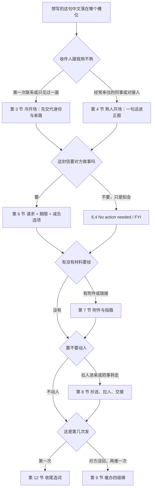
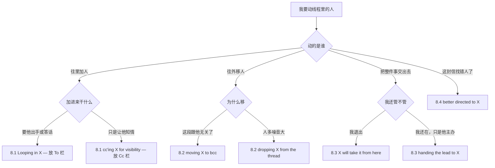
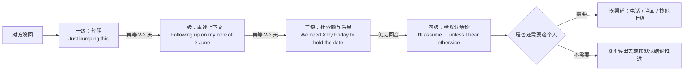
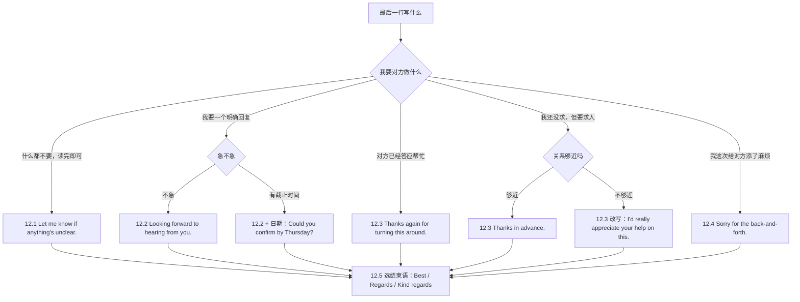
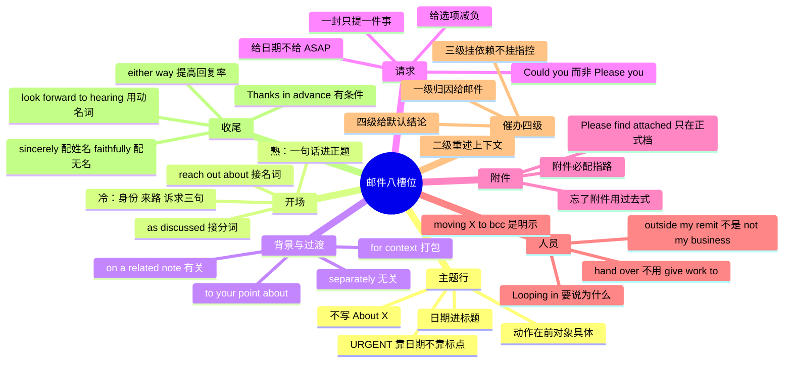

# 邮件与消息骨架：开场、过渡、附件、收尾

> [!info] 本篇定位
>
> 这篇收的是坐在收件人栏前那一刻脑子里蹦出来的中文：主题行写什么、第一句怎么起、附件怎么提、抄送谁要不要说一声、对方三天不回怎么再发一封、最后一行落什么词。
>
> 上一篇 [[12.文体、语域与正式文书/01.语域升降与同义改写：同一句话的三档说法\|语域升降与同义改写：同一句话的三档说法]] 教的是**手段**——缩略式换全写、短语动词换拉丁词、情态降级、被动化去人称。这一篇是那套手段的第一个落地场：邮件是全部书面文体里语域跨度最大的一种，同一句「这个能不能今天给我」，发给同组同事、发给隔壁部门总监、发给外部供应商，是三句完全不同的英文。
>
> 读完能查到：40 条中文意图入口、120 条分档成品句架、催办的四级力度梯、六封整信的完整骨架，以及中文母语者写英文邮件最容易翻车的四处——`Please find attached` 用错场合、`Following up` 一词两义、`Please reply as soon as possible` 的失礼、以及句末那个 `Thanks in advance` 什么时候是客气什么时候是逼人。
>
> 邮件往来里的对话回合、口头汇报与客户当面沟通不在本篇，去 [[04.英语场景/10.职场与商务场景实战/03.商务邮件与正式书面沟通\|商务邮件与正式书面沟通]] 与 [[04.英语场景/10.职场与商务场景实战/02.会议汇报与演示场景\|会议汇报与演示场景]]。

---

## 1. 本篇导读：一封邮件是八个槽位，不是一篇文章

英文工作邮件的写法跟中文作文的写法是两件事。中文写信讲究起承转合，一路铺垫到最后一段才落到诉求上；英文工作邮件的读者在手机上扫两秒决定要不要往下读，所以它的结构是**槽位式**的——八个槽位各司其职，缺哪个补哪个，多余的直接不写。

| 槽位 | 干什么 | 在本篇的位置 |
| --- | --- | --- |
| 主题行 | 让对方在收件箱列表里判断优先级 | 第 2 节 |
| 开场 | 说清我是谁、为什么给你写 | 第 3 节（冷）、第 4 节（熟） |
| 背景 | 补齐对方读懂这封信所缺的上下文 | 第 5 节 |
| 请求 | 说清要对方做什么、什么时候之前 | 第 6 节 |
| 附件与链接 | 把材料交出去并指路 | 第 7 节 |
| 人员 | 拉人进来、把人移出、把事转走 | 第 8 节 |
| 追踪 | 没回音时怎么再推一次 | 第 9 节、第 10 节 |
| 收尾 | 交代下一步、落签名 | 第 11 节、第 12 节 |

八个槽位里真正难的是两头：主题行与收尾。中间六个只要句架背下来就能填，两头却带着社交判断——主题行写重了显得没分寸，写轻了石沉大海；收尾落 `Let me know if you have any questions` 和落 `Please confirm by Friday` 是两种完全不同的关系姿态。

### 1.1 三档在本篇指哪三种媒介

本手册通篇的三档是语域梯度：口语、书面、正式。到了邮件这一域，它落成三种**媒介加三种关系**的组合，查的时候先定位自己在哪一格。

| 档位 | 在本篇指什么 | 典型特征 |
| --- | --- | --- |
| 口语 | Slack、Teams、企业微信、短消息、同组群里 @ 人 | 缩略式、无称呼、无签名、允许句子片段、允许 `quick`、`heads-up` |
| 书面 | 公司内部邮件、跨组邮件、跟熟悉的外部对接人 | 有称呼有签名，缩略式仍可用，动词直接，一封只办一件事 |
| 正式 | 对外客户、供应商、上级、投诉与合规往来、求职与商务函 | 全写形式、情态降级、被动化去人称、动词名词化、称呼与结束语成对 |

三档的真正差别不在词长，在**这封信被转发出去以后你还认不认**。口语档不会被转发到你没想到的人手里；正式档默认会——写给供应商的一句话可能被贴进对方的内部工单，写给上级的一段可能被原样转给两级以上。所以本篇每一条意图的三档句架，从上往下不是越来越文雅，是越来越经得起转发。



这张图的第一层分叉按**收件人关系**切，不按邮件类型切，因为同一种邮件在冷熟两侧写法差得最远。同样是约会议，跟同组同事是 `Free for 15 min tomorrow?`，跟第一次接触的外部方是 `Would you be available for a brief call sometime next week?`——后者不但要加情态降级，还要把时长说小、把时间给宽，这些都不是语法问题。

第二层往下每一步都是二选一，且允许跳过：不要对方做事就跳过请求槽，没有附件就跳过附件槽。一封合格的工作邮件通常只填四到五个槽，把八个全填满的信基本没人读完。

### 1.2 动手前先记住的四处对立

这四处都是中文里根本不存在的区分，也是本篇警示行密度最高的地方。

- **`Please find attached` 不是 `I've attached` 的文雅版**。前者是商务函件的固定式，出现在内部群消息里像穿西装进健身房；后者是内部邮件的默认写法。这条在 7.1 展开。
- **`Following up` 一词两义**。接着上次的话题往下讲是一个意思，催对方回复是另一个意思。中文都说「跟进一下」，英文靠后面接什么区分：`Following up on our conversation about X` 是前者，`Following up on my email below` 是后者。这条在 4.3 与 9.2 各挂一次。
- **`as soon as possible` 在英文里是压力词不是礼貌词**。中文「请尽快回复」是客套，`Please reply as soon as possible` 读起来是催命，而且没给出具体时间反而让对方无从安排。正确做法是给一个具体日期。这条在 6.2 展开。
- **`Thanks in advance` 是有条件的**。对方已经答应了的事，它是道谢；对方还没答应的事，它是把拒绝的口堵上，读起来像预设人家一定会做。这条在 12.3 展开。

本篇的意图块按一封信从上到下的顺序排：第 2 节主题行，第 3 到第 5 节管信的上半部，第 6 到第 8 节管正文与材料人员，第 9 到第 11 节管追踪、回执与日程，第 12 节管收尾，第 13 节把六种最常写的邮件装配成整封样板，第 14 节是全篇速查表。

---

## 2. 主题行：一行字决定对方点不点开

主题行不是文章标题，是收件箱里的索引键。它要在四十个字符内让对方判断三件事：这封信关于什么、要不要我动手、多急。中文习惯写「关于 XX 的事宜」这类无信息量的壳，英文主题行的规矩相反——**动作在前，对象具体，时间进标题**。

### 2.1 知会型主题行：不用你动手，你知道就行

中文触发语：知会一下 / 同步一下 / 通报 / 供参考 / 周报 / 情况说明

| 档位 | 句架 | 例句 | 译文 |
| --- | --- | --- | --- |
| 口语 | Heads-up: + 名词短语 | Heads-up: deploy window moved to Thursday | 提醒一下：发布窗口挪到周四 |
| 书面 | Update on + 对象 + [ — 一句话结论] | Update on the payment gateway migration — phase 1 complete | 支付网关迁移进展：第一阶段已完成 |
| 正式 | Notification of + 名词化 + ( + 日期 + ) | Notification of scheduled maintenance (14 March, 02:00–04:00 UTC) | 计划内维护通知（3 月 14 日 02:00–04:00 UTC） |

> [!warning] 错配警示
>
> - ~~About the migration~~ ❌（想说「关于迁移的事」）
> - **Update on the payment gateway migration — phase 1 complete** ✅（`About X` 这类壳在收件箱里跟没写一样；主题行必须自带一个结论或一个动作，让对方不打开也能获得信息）

页脚：
- 同义入口：知会一下 / 同步进展 / 情况通报 / 供参考 / 周报同步
- 语法归属：[[02.英语基础语法/02.名词与冠词/01.名词的分类与用法\|名词的分类与用法]]
- 场景实战：[[04.英语场景/10.职场与商务场景实战/03.商务邮件与正式书面沟通\|商务邮件与正式书面沟通]]

### 2.2 请求型主题行：需要你动手

中文触发语：需要你确认 / 请审批 / 麻烦帮忙 / 需要你提供 / 请签字 / 求个意见

| 档位 | 句架 | 例句 | 译文 |
| --- | --- | --- | --- |
| 口语 | Need + 名词 + from you + [时间] | Need your sign-off on the invoice by Wed | 周三前需要你在这张发票上签字 |
| 书面 | Action needed: + 动词短语 + by + 日期 | Action needed: approve Q3 vendor list by 12 June | 需处理：6 月 12 日前审批第三季度供应商名单 |
| 正式 | Request for + 名词化 + : + 对象 | Request for approval: 2026 training budget allocation | 审批申请：2026 年度培训预算分配 |

> [!warning] 错配警示
>
> - ~~URGENT!!! Please reply~~ ❌（想说「加急，请尽快回复」）
> - **Action needed by Friday: approve Q3 vendor list** ✅（惊叹号与全大写 `URGENT` 在英文邮件里被当成营销垃圾信号；急迫感靠具体日期传达，不靠标点）

页脚：
- 同义入口：需要你确认 / 请审批 / 请签字 / 麻烦提供 / 待你处理
- 语法归属：[[02.英语基础语法/07.助动词与情态动词/02.情态动词详解\|情态动词详解]]
- 场景实战：[[04.英语场景/10.职场与商务场景实战/03.商务邮件与正式书面沟通\|商务邮件与正式书面沟通]]

### 2.3 追踪型主题行：同一件事的第二封

中文触发语：再问一下 / 上封邮件的跟进 / 重发一次 / 提醒一下之前那件事

| 档位 | 句架 | 例句 | 译文 |
| --- | --- | --- | --- |
| 口语 | Re: 原主题 + ( + bumping this + ) | Re: invoice sign-off (bumping this) | 回复：发票签字（往上顶一下） |
| 书面 | Following up: + 原对象 + [ + still open + ] | Following up: Q3 vendor list — still awaiting approval | 跟进：第三季度供应商名单，仍待审批 |
| 正式 | Second request: + 名词化 + ( + 原发日期 + ) | Second request: approval of 2026 training budget (sent 3 June) | 二次请求：2026 年度培训预算审批（原件 6 月 3 日发出） |

> [!warning] 错配警示
>
> - ~~Reminder!!! You still haven't replied~~ ❌（想说「提醒你，你还没回」）
> - **Following up: Q3 vendor list — still awaiting approval** ✅（追踪型主题行只描述事情的状态，不描述对方的行为；`you still haven't` 把责任点名到人，收件箱里所有人都看得见）

页脚：
- 同义入口：再问一下 / 上封信的跟进 / 重发 / 二次提醒 / 还是那件事
- 语法归属：[[02.英语基础语法/06.动词时态/04.完成时态详解\|完成时态详解]]
- 场景实战：[[04.英语场景/10.职场与商务场景实战/03.商务邮件与正式书面沟通\|商务邮件与正式书面沟通]]

### 2.4 前缀标记与超短主题行

中文触发语：加个标签 / 打个标记 / 一句话说完不用打开

| 档位 | 句架 | 例句 | 译文 |
| --- | --- | --- | --- |
| 口语 | 内容 + (EOM) | Standup moved to 10:15 today (EOM) | 今天站会改到 10:15（正文到此为止） |
| 书面 | [标签] + 内容 | [FYI] Vendor contract renewed through 2027 | [知会] 供应商合同已续至 2027 年 |
| 正式 | [Action Required — 日期] + 内容 | [Action Required — 20 May] Annual compliance attestation | [需处理，5 月 20 日前] 年度合规声明 |

> [!tip] 三个标签的分工
>
> `[FYI]` 表示读完即可，不必回；`[Action Required]` 表示有你的待办，通常要配日期；`[EOM]`（end of message）放在主题行末尾，表示正文是空的，对方不必点开。三者只在内部邮件用，对外正式函件不加方括号标签。

页脚：
- 同义入口：打标签 / 加前缀 / 一句话说完 / 标个急
- 语法归属：[[02.英语基础语法/10.特殊句型/05.省略与替代\|省略与替代]]
- 场景实战：[[04.英语场景/07.社交交际场景实战/02.电话短信与在线沟通场景\|电话短信与在线沟通场景]]

---

## 3. 冷开场：第一次给这个人写信

冷开场的第一段要解决三个问题，缺一个对方就不知道该不该回：我是谁、我怎么找到你的、我要什么。中文习惯把「我要什么」放到最后一段，冷邮件必须提到前三句以内——收件人没有义务读完一封陌生人的信。

三句的顺序是固定的：身份 → 来路 → 诉求。身份一句话带过，来路给出可核验的线索（谁介绍的、在哪见过、从哪看到的），诉求要具体到对方能一口答应或一口回绝。

### 3.1 我为什么找你

中文触发语：我是来问… / 写信是想咨询… / 冒昧打扰，想了解… / 我这边想请教一件事

| 档位 | 句架 | 例句 | 译文 |
| --- | --- | --- | --- |
| 口语 | Quick question about + 名词 | Quick question about your rate limits — do they reset hourly? | 想问下你们的限流，是按小时重置吗？ |
| 书面 | I'm reaching out about + 名词短语 | I'm reaching out about the enterprise tier you announced last month. | 我写信是想了解你们上个月发布的企业版。 |
| 正式 | I am writing to + 动词原形 + 名词短语 | I am writing to enquire about the terms of your academic licensing programme. | 特此致函，咨询贵方学术授权计划的条款。 |

> [!warning] 错配警示
>
> - ~~I'm reaching out to you for asking about your pricing.~~ ❌（想说「我写信是想问问你们的定价」）
> - **I'm reaching out about your pricing.** ✅（`reach out` 后面直接接 `about + 名词`，或接 `to + 动词原形` 表目的；`for asking` 两种结构混在一起了）

页脚：
- 同义入口：我写信是想 / 冒昧打扰 / 想咨询一下 / 有件事想请教 / 想问问
- 语法归属：[[02.英语基础语法/08.非谓语动词/01.动词不定式详解\|动词不定式详解]]
- 场景实战：[[04.英语场景/10.职场与商务场景实战/04.商务谈判合同与客户沟通\|商务谈判合同与客户沟通]]

### 3.2 经人介绍：把中间人抬出来

中文触发语：X 让我联系你 / 是 X 给我的邮箱 / X 说你可能能帮上忙 / 经 X 推荐

| 档位 | 句架 | 例句 | 译文 |
| --- | --- | --- | --- |
| 口语 | X said you'd be the person to ask about + 名词 | Priya said you'd be the person to ask about the billing API. | Priya 说计费 API 的事该问你。 |
| 书面 | X suggested I reach out to you about + 名词 | Daniel Wu suggested I reach out to you about the data-retention review. | Daniel Wu 建议我就数据留存复核的事联系你。 |
| 正式 | I was referred to you by X, who indicated that + 从句 | I was referred to you by Dr. Lin, who indicated that your team oversees institutional access. | 承蒙林博士推荐与您联系，据其告知，机构访问权限由贵组负责。 |

> [!warning] 错配警示
>
> - ~~Priya told me to contact you.~~ ❌（想说「Priya 让我联系你」）
> - **Priya suggested I reach out to you.** ✅（`told me to` 是转达命令，会让收件人觉得你是被派来的，也把 Priya 说成了下指令的人；`suggested` 才是引荐的口吻）

页脚：
- 同义入口：X 让我找你 / 经 X 推荐 / X 给的联系方式 / 听 X 说你负责这块
- 语法归属：[[02.英语基础语法/09.从句体系/03.名词性从句详解\|名词性从句详解]]
- 场景实战：[[04.英语场景/10.职场与商务场景实战/01.求职简历面试与Offer谈判\|求职简历面试与Offer谈判]]

### 3.3 自报身份与来路

中文触发语：我是 X 公司的… / 我在 X 团队负责… / 我们在 X 会上见过 / 我是从 X 上看到你的

| 档位 | 句架 | 例句 | 译文 |
| --- | --- | --- | --- |
| 口语 | I'm 姓名 — I work on + 名词 + over at + 公司 | I'm Mei — I work on the payments side over at Kestrel. | 我是小梅，在 Kestrel 这边做支付。 |
| 书面 | I'm 姓名, + 职务 + at + 公司. We met at + 场合 | I'm Mei Zhao, a backend engineer at Kestrel. We met briefly at the API summit in March. | 我是赵梅，Kestrel 的后端工程师，三月 API 峰会上跟您打过照面。 |
| 正式 | My name is 姓名 and I am 职务 + at + 组织, where I am responsible for + 名词 | My name is Mei Zhao and I am a senior engineer at Kestrel Systems, where I am responsible for third-party integrations. | 本人赵梅，Kestrel Systems 高级工程师，负责第三方集成事务。 |

> [!warning] 错配警示
>
> - ~~I am a worker of Kestrel company.~~ ❌（想说「我是 Kestrel 公司的员工」）
> - **I'm an engineer at Kestrel.** ✅（英文说所属公司用 `at`，不用 `of`；职务写具体岗位，不写 `worker`、`staff` 这类只标示雇佣关系的词）

页脚：
- 同义入口：我是…的 / 我在…负责 / 我们在…见过 / 我是从…知道你的
- 语法归属：[[02.英语基础语法/05.介词与连词/02.常用介词搭配详解\|常用介词搭配详解]]
- 场景实战：[[04.英语场景/06.日常生活场景实战/01.问候寒暄与自我介绍场景\|问候寒暄与自我介绍场景]]

---

## 4. 熟人开场：省掉的越多越好

给天天见面的同事写信，开场唯一的任务是让对方在半秒内知道这封信要干什么。中文邮件里那套「见字如面，近来可好」在英文内部信里全部不写，最多留一行寒暄，而且这一行是可选的。

熟人开场有三种起法：直接给结论、给一行寒暄再给结论、接上一次的话头。第三种最省事，因为它把上下文的建立成本转嫁给了对方的记忆。

### 4.1 直入正题：不寒暄

中文触发语：直接说事 / 长话短说 / 一件小事 / 就一个问题 / 简单说下

| 档位 | 句架 | 例句 | 译文 |
| --- | --- | --- | --- |
| 口语 | Quick one — + 句子 | Quick one — do we still need the staging DB after Friday? | 一件小事，周五之后 staging 库还留着吗？ |
| 书面 | Short one: + 名词短语 + . + 补充句 | Short one: the staging database. Can we decommission it after Friday's cutover? | 就一件事，staging 数据库。周五切换完能下线吗？ |
| 正式 | I'll keep this brief. + 陈述句 | I'll keep this brief. We would like to confirm whether the staging environment may be decommissioned following Friday's cutover. | 长话短说。我们希望确认周五切换完成后，测试环境是否可以下线。 |

> [!warning] 错配警示
>
> - ~~I hope this email finds you well. I am writing to ask if we can delete the staging DB.~~ ❌（想说「你好，我想问下 staging 库能删吗」）
> - **Quick one — can we decommission the staging DB after Friday?** ✅（`I hope this email finds you well` 是给不熟的人写的模板句，给同组同事写这一句，对方会先愣一下猜你是不是要说坏消息）

页脚：
- 同义入口：直接说 / 一件小事 / 长话短说 / 就问一句 / 简单同步下
- 语法归属：[[02.英语基础语法/12.日常口语/04.口语与书面语对比\|口语与书面语对比]]
- 场景实战：[[04.英语场景/07.社交交际场景实战/02.电话短信与在线沟通场景\|电话短信与在线沟通场景]]

### 4.2 一行寒暄：写还是不写

中文触发语：最近怎么样 / 希望一切顺利 / 假期过得好吗 / 好久没联系了

| 档位 | 句架 | 例句 | 译文 |
| --- | --- | --- | --- |
| 口语 | Hope + 具体的事 + went well | Hope the launch went well last week. | 上周那次上线还顺利吧。 |
| 书面 | Hope you're doing well. / Hope your week's off to a good start. | Hope you're doing well. Circling back on the audit checklist. | 一切都好吧。回到审计清单这件事。 |
| 正式 | I trust this message finds you well. | I trust this message finds you well. I am writing in connection with the service agreement due for renewal. | 顺祝安好。此函关于即将到期的服务协议续签事宜。 |

> [!tip] 寒暄的一条判据
>
> 寒暄写具体的比写模板的强一个数量级。`Hope the launch went well` 说明你记得对方在忙什么，`Hope you're doing well` 说明你在填格子。两者都比不写强，但只有前者能挣到善意。跟同组同事之间，不写才是常态。

页脚：
- 同义入口：最近怎么样 / 一切还好吧 / 希望顺利 / 好久不见
- 语法归属：[[02.英语基础语法/10.特殊句型/05.省略与替代\|省略与替代]]
- 场景实战：[[04.英语场景/06.日常生活场景实战/01.问候寒暄与自我介绍场景\|问候寒暄与自我介绍场景]]

### 4.3 接上次：按之前说好的

中文触发语：按我们之前说的 / 上次聊到的那个 / 接着上封邮件 / 会上定的那件事 / 你之前提过

| 档位 | 句架 | 例句 | 译文 |
| --- | --- | --- | --- |
| 口语 | Like we said + 时间 + , + 句子 | Like we said on Tuesday, I've moved the cutover to the 14th. | 按周二说的，我把切换挪到 14 号了。 |
| 书面 | As discussed + [ + 时间/场合 + ] + , + 句子 | As discussed in Tuesday's sync, I've moved the cutover to the 14th. | 如周二同步会所议，我已将切换日期改到 14 号。 |
| 正式 | Further to our + 名词 + of + 日期, + 句子 | Further to our conversation of 8 April, the revised schedule is set out below. | 承 4 月 8 日会谈，修订后的时间安排如下。 |

> [!warning] 错配警示
>
> - ~~As our discussion, I've moved the cutover.~~ ❌（想说「按我们讨论的，我把切换挪了」）
> - **As discussed, I've moved the cutover.** ✅（`as` 引导的是省略句 `as (it was) discussed`，后面接过去分词；接名词要换成 `per our discussion` 或 `further to our discussion`）
>
> 另外注意 `Following up on our conversation about X` 是接着讲，`Following up on my email below` 是催回复，同一个词组在 9.2 会以催办的身份再出现一次，别把两种用法混着写在同一封信里。

页脚：
- 同义入口：按之前说的 / 接上次 / 会上定的 / 上封邮件说的 / 承前所述
- 语法归属：[[02.英语基础语法/08.非谓语动词/04.过去分词详解\|过去分词详解]]
- 场景实战：[[04.英语场景/10.职场与商务场景实战/02.会议汇报与演示场景\|会议汇报与演示场景]]

---

## 5. 背景交代与段间过渡

开场之后、请求之前那一段，作用是把对方缺的上下文补齐。中文邮件常把这段写成流水账，从项目立项讲到今天；英文邮件的做法是**只补对方读懂这一封信所缺的那几句**，其余用一句 `For context` 打包带过。

段与段之间的过渡词在邮件里承担的活儿比在文章里重：读者是跳读的，过渡词是他们判断「这段要不要看」的路标。

### 5.1 交代来龙去脉

中文触发语：先说下背景 / 简单交代一下 / 事情是这样的 / 补充点上下文 / 为便于理解

| 档位 | 句架 | 例句 | 译文 |
| --- | --- | --- | --- |
| 口语 | For context, + 句子 | For context, the vendor pushed a schema change last night without notice. | 说下背景，供应商昨晚没打招呼推了个 schema 变更。 |
| 书面 | Some background: + 句子 [ + . As a result, + 句子] | Some background: the vendor deployed an unannounced schema change on 12 May. As a result, three of our nightly jobs are failing. | 交代下背景：供应商 5 月 12 日推了个未通知的 schema 变更，导致我们三个夜间任务失败。 |
| 正式 | By way of background, + 句子 | By way of background, the supplier implemented an unscheduled schema modification on 12 May, which has since disrupted three overnight batch processes. | 谨先交代背景：供应商于 5 月 12 日实施了一次计划外的 schema 变更，此后已影响三项夜间批处理作业。 |

> [!warning] 错配警示
>
> - ~~For your background, the vendor pushed a change.~~ ❌（想说「跟你交代下背景」）
> - **For context, the vendor pushed a change.** ✅（`for your background` 不是英文说法；常用的固定式是 `for context`、`some background`、`by way of background`，其中第三个只用于正式函件）

页脚：
- 同义入口：先说背景 / 交代一下 / 事情是这样 / 补个上下文 / 前情提要
- 语法归属：[[02.英语基础语法/05.介词与连词/02.常用介词搭配详解\|常用介词搭配详解]]
- 场景实战：[[04.英语场景/10.职场与商务场景实战/02.会议汇报与演示场景\|会议汇报与演示场景]]

### 5.2 段落之间的转场

中文触发语：另外 / 顺带一提 / 说回来 / 还有一件事 / 相关的还有一点 / 话虽如此

| 档位 | 句架 | 例句 | 译文 |
| --- | --- | --- | --- |
| 口语 | One more thing — + 句子 | One more thing — the invoice from March is still unpaid. | 还有一件事，三月那张发票还没付。 |
| 书面 | On a related note, + 句子 | On a related note, the March invoice remains outstanding. | 与此相关的还有一点：三月的发票仍未结清。 |
| 正式 | Separately, + 句子 / In addition to the above, + 句子 | Separately, we note that the invoice dated 31 March remains outstanding. | 另需说明，3 月 31 日开具的发票仍未结清。 |

> [!tip] 三个转场词的分工
>
> `On a related note` 表示新话题跟上一段有关；`Separately` 表示新话题跟上一段无关，只是搭在同一封信里；`That said` 表示要推翻或限制上一段刚说的话。三个不能互换：用 `Separately` 接一件明明相关的事，读者会以为你在切换议题从而漏掉关联。更细的转折与让步分档去 [[05.让步、转折与对比/02.话虽如此、退一步说、表面上实际上：软化与反预期\|话虽如此、退一步说、表面上实际上]]。

页脚：
- 同义入口：另外 / 还有一点 / 顺带一提 / 说回来 / 与此相关
- 语法归属：[[02.英语基础语法/05.介词与连词/03.连词的分类与用法\|连词的分类与用法]]
- 场景实战：[[04.英语场景/05.高频实用表达句型框架/03.同意反对让步转折句型库\|同意反对让步转折句型库]]

### 5.3 引用对方说过的话

中文触发语：你提到的那个 / 关于你说的… / 你问的那一点 / 就你的问题回答一下

| 档位 | 句架 | 例句 | 译文 |
| --- | --- | --- | --- |
| 口语 | On your question about + 名词 + : + 回答 | On your question about retries: yes, three attempts with backoff. | 关于你问的重试：是的，三次，带退避。 |
| 书面 | To your point about + 名词 + , + 句子 | To your point about retries, we cap at three attempts with exponential backoff. | 就你提到的重试，我们上限是三次，指数退避。 |
| 正式 | With regard to your enquiry concerning + 名词 + , + 句子 | With regard to your enquiry concerning retry behaviour, the client is configured for a maximum of three attempts. | 关于您所询重试机制，客户端配置为最多尝试三次。 |

> [!warning] 错配警示
>
> - ~~About what you said, I think you are wrong.~~ ❌（想说「关于你说的，我觉得不对」）
> - **To your point about the timeline, I read the data differently.** ✅（`to your point about X` 是承接对方论点的固定式，自带尊重；直接说 `you are wrong` 在书面文体里几乎没有可用场合，异议的分档说法去 [[11.人际功能与话轮管理/05.我有个顾虑、这样不太行、恐怕要延期：异议、负面反馈与坏消息\|我有个顾虑、这样不太行、恐怕要延期]]）

页脚：
- 同义入口：你提到的 / 关于你说的 / 你问的那点 / 回你那个问题
- 语法归属：[[02.英语基础语法/05.介词与连词/01.介词的分类与基本用法\|介词的分类与基本用法]]
- 场景实战：[[04.英语场景/05.高频实用表达句型框架/01.表达观点与态度的50个万能句型\|表达观点与态度的50个万能句型]]

---

## 6. 正文：提请求、给期限、给选项

一封信只提一个请求。这是英文工作邮件里最硬的一条不成文规矩：两个请求写在一封信里，对方回完第一个就容易把整封信当作答完了。真有两件事就发两封，或者把第二件降级成 `no action needed` 的知会。

请求段的完整形态是三件事扣在一起：**要做什么 + 什么时候之前 + 我这边替你省了什么**。第三件是中文邮件普遍缺的，也是回复率差距的主要来源。

### 6.1 请你做一件事

中文触发语：能不能帮我 / 麻烦你 / 请你 / 需要你 / 拜托 / 你看能否

| 档位 | 句架 | 例句 | 译文 |
| --- | --- | --- | --- |
| 口语 | Can you + 动词原形 + ? | Can you take a look at the failing test on branch `fix/auth`? | 你能看下 `fix/auth` 分支上挂掉的那个测试吗？ |
| 书面 | Could you + 动词原形 + when you get a chance? | Could you review the migration plan when you get a chance? | 你方便的时候能看下迁移方案吗？ |
| 正式 | Would you be able to + 动词原形 + ? / We would be grateful if you could + 动词原形 | We would be grateful if you could confirm the delivery date in writing. | 若能书面确认交付日期，不胜感激。 |

> [!warning] 错配警示
>
> - ~~Please you check the document.~~ ❌（想说「请你检查一下文档」）
> - **Could you take a look at the document?** ✅（`please` 后面直接接动词原形构成祈使句，不能再带主语；`Please review the document` 语法对但语气偏指令，跟平级或对外一律用疑问式）
>
> 请求的完整礼貌梯度与硬拒绝、婉拒的说法在 [[11.人际功能与话轮管理/01.我建议、你最好、能不能帮我：建议、请求、许可与委托\|我建议、你最好、能不能帮我]]，本篇只给邮件里的三档成品。

页脚：
- 同义入口：能不能帮我 / 麻烦你 / 请你 / 需要你处理 / 拜托一下
- 语法归属：[[02.英语基础语法/07.助动词与情态动词/02.情态动词详解\|情态动词详解]]
- 场景实战：[[04.英语场景/05.高频实用表达句型框架/02.建议请求邀请拒绝四大功能句型\|建议请求邀请拒绝四大功能句型]]

### 6.2 给期限：把「尽快」翻译成日期

中文触发语：尽快 / 今天下班前 / 最迟…之前 / 不着急 / 有空的时候 / 越早越好

| 档位 | 句架 | 例句 | 译文 |
| --- | --- | --- | --- |
| 口语 | by EOD / by end of week / whenever you get a chance | Can you push the fix by EOD? No rush on the docs. | 能今天下班前把修复推上去吗？文档不急。 |
| 书面 | by + 具体日期 + if possible / no later than + 日期 | Could you send the signed copy by Friday 15 May if possible? | 可以的话，能否在 5 月 15 日周五前把签好的版本发来？ |
| 正式 | We would ask that + 名词 + be + 过去分词 + no later than + 日期 | We would ask that the executed agreement be returned no later than 30 June. | 敬请于 6 月 30 日前退回已签署的协议。 |

> [!warning] 错配警示
>
> - ~~Please reply as soon as possible.~~ ❌（想说「请尽快回复」）
> - **Could you get back to me by Thursday? If that's tight, let me know and I'll rework the schedule.** ✅（`as soon as possible` 在英文里读作施压且不提供任何可安排的信息；给具体日期反而更客气，因为对方能立刻判断做不做得到）

> [!tip] 三个期限词的实际含义
>
> `EOD` 没有统一约定，一般按发件人所在时区的下班时间理解，跨时区必须写清 `by 18:00 CET`；`by Friday` 通常含周五全天，`before Friday` 不含周五；`ASAP` 只在真的出事时用，日常使用会通货膨胀到无人理会。

页脚：
- 同义入口：尽快 / 下班前 / 最迟…之前 / 不着急 / 有空再弄
- 语法归属：[[02.英语基础语法/05.介词与连词/02.常用介词搭配详解\|常用介词搭配详解]]
- 场景实战：[[07.时间与顺序/03.花了多久、每隔一次、快要了、到…为止：时长、频率与期限\|花了多久、每隔一次、快要了、到…为止]]

### 6.3 给选项：把对方的成本压到最低

中文触发语：怎么方便怎么来 / 两种都行 / 你不用回，我默认… / 我这边可以代劳 / 只需要一句话

| 档位 | 句架 | 例句 | 译文 |
| --- | --- | --- | --- |
| 口语 | Either works for me — just say which. | Either slot works for me — just say which one. | 两个时间我都行，你说一个就成。 |
| 书面 | If it's easier, + 备选方案 + . Otherwise + 主方案 | If it's easier, a one-line reply is enough. Otherwise I'm happy to walk you through it on a call. | 方便的话，回一句就够了；不然我也可以电话上跟你过一遍。 |
| 正式 | Should you prefer, we can + 动词原形 + ; alternatively, + 备选 | Should you prefer, we can prepare the documentation on your behalf; alternatively, a signed confirmation would suffice. | 如您愿意，我方可代为准备文件；或者，一份签署确认亦可。 |

> [!warning] 错配警示
>
> - ~~Please choose one of the following options and reply to me.~~ ❌（想说「请从以下选项里挑一个回我」）
> - **Either works for me — just say which.** ✅（前者把选择包装成了一道流程题；给选项的目的是减负，一旦写成「请按以下步骤操作」就适得其反）

页脚：
- 同义入口：怎么方便怎么来 / 都行你定 / 不用回也可以 / 我可以代劳 / 一句话就够
- 语法归属：[[02.英语基础语法/10.特殊句型/02.虚拟语气详解\|虚拟语气详解]]
- 场景实战：[[06.并列、递进、列举与选择/03.要么要么、除了、二选一：选择、排除与例外\|要么要么、除了、二选一]]

### 6.4 只是知会，不要动作

中文触发语：不用回 / 知道就行 / 供参考 / 没别的意思 / 不用你管，我处理

| 档位 | 句架 | 例句 | 译文 |
| --- | --- | --- | --- |
| 口语 | No action needed — just so you know. | No action needed — just so you know the window shifted. | 不用你做什么，就是告诉你窗口挪了。 |
| 书面 | Sharing for visibility; no action required on your side. | Sharing for visibility; no action required on your side. I'll handle the rollback if it comes to that. | 同步一下让你知情，你这边不用动。真要回滚我来处理。 |
| 正式 | This is provided for your information only and does not require a response. | The attached summary is provided for your information only and does not require a response. | 所附摘要仅供参阅，无需回复。 |

> [!warning] 错配警示
>
> - ~~Please note this email for your information.~~ ❌（想说「此邮件供你参考」）
> - **Sharing for visibility; no action needed.** ✅（`for your information` 本身可用，但 `please note ... for your information` 是把两个套话叠在一起，读起来空转；把不需要动作这件事直说更省对方的判断）

页脚：
- 同义入口：不用回 / 知道就行 / 供参考 / 同步一下 / 我这边处理
- 语法归属：[[02.英语基础语法/10.特殊句型/01.被动语态全解\|被动语态全解]]
- 场景实战：[[04.英语场景/10.职场与商务场景实战/03.商务邮件与正式书面沟通\|商务邮件与正式书面沟通]]

---

## 7. 附件与链接

附件段有两个动作：把材料交出去、告诉对方看哪儿。第二个动作中文邮件常常省掉，直接甩一个五十页的 PDF，收件人得自己找。英文工作邮件的规矩是**附件必须配一句指路**，指到章节、页码或者链接锚点。

### 7.1 附件在这里

中文触发语：附件是… / 见附件 / 我把…附上了 / 材料在附件里 / 随信附上

| 档位 | 句架 | 例句 | 译文 |
| --- | --- | --- | --- |
| 口语 | Attaching + 名词 + . | Attaching the crash log — line 412 is the interesting bit. | 附上崩溃日志，第 412 行是关键。 |
| 书面 | I've attached + 名词 + [ + with + 补充 + ] | I've attached the revised deployment plan, with the changed steps highlighted. | 附上修订后的发布方案，改动的步骤已高亮。 |
| 正式 | Please find attached + 名词 + [ + for your review + ] | Please find attached the executed service agreement for your records. | 兹随函附上已签署的服务协议，请查收存档。 |

> [!warning] 错配警示
>
> - ~~Please find attached the meme I mentioned in the group chat.~~ ❌（想说「群里说的那个图我发你了」）
> - **Here's that screenshot from the group chat.** ✅（`Please find attached` 是商务函件的封闭固定式，只出现在正式档；把它用在内部群消息或同事间邮件里，效果等同于给同事发律师函）

页脚：
- 同义入口：见附件 / 附件是 / 我附上了 / 随信附上 / 材料在里面
- 语法归属：[[02.英语基础语法/08.非谓语动词/04.过去分词详解\|过去分词详解]]
- 场景实战：[[04.英语场景/10.职场与商务场景实战/03.商务邮件与正式书面沟通\|商务邮件与正式书面沟通]]

### 7.2 指路：让对方知道看哪一段

中文触发语：重点看第…部分 / 你只需要看… / 具体在第几页 / 相关的那段在… / 链接在这

| 档位 | 句架 | 例句 | 译文 |
| --- | --- | --- | --- |
| 口语 | Doc's here: 链接 — the bit you need is under + 章节名 | Doc's here: [link] — the bit you need is under "Rollback". | 文档在这：[链接]，你要看的在「Rollback」那节。 |
| 书面 | The relevant section is + 位置 + ( + 页码/锚点 + ) | The relevant section is "Data retention" on page 7; everything before that is unchanged. | 相关部分是第 7 页的「数据留存」，前面的内容没变。 |
| 正式 | Your attention is drawn in particular to + 名词 + , set out at + 位置 | Your attention is drawn in particular to Clause 8.3, set out at page 14 of the attached. | 特请留意所附文件第 14 页第 8.3 条。 |

> [!tip] 一条能省下一整轮往返的习惯
>
> 附件配指路的时候，把**对方要做的判断**也写出来：不写 `see page 7`，写 `page 7 lists the three retention windows — we need you to pick one`。收件人打开附件之前就知道自己要产出什么，回复率和回复质量都不一样。

页脚：
- 同义入口：重点看哪段 / 你只需要看 / 在第几页 / 链接在这 / 具体位置是
- 语法归属：[[02.英语基础语法/05.介词与连词/01.介词的分类与基本用法\|介词的分类与基本用法]]
- 场景实战：[[08.指认、定义与描述/05.在…上、穿过、沿着、朝：位置、方位与路径\|在…上、穿过、沿着、朝]]

### 7.3 忘了附件、补发、文件太大

中文触发语：附件忘了 / 重发一次带上文件 / 附件打不开吗 / 文件太大改用网盘

| 档位 | 句架 | 例句 | 译文 |
| --- | --- | --- | --- |
| 口语 | Attachment, this time. / Forgot the file — here it is. | Forgot the file — here it is. | 忘了附文件，这就是。 |
| 书面 | Apologies — resending with the attachment this time. | Apologies — resending with the attachment this time. Nothing else has changed. | 抱歉，这次带上附件重发，其余内容没变。 |
| 正式 | Please disregard my previous message; the correct attachment is included with this one. | Please disregard my previous message; the correct attachment is included with this one. | 前一封请忽略，正确的附件随本封发出。 |

> [!warning] 错配警示
>
> - ~~Sorry, I forget the attachment.~~ ❌（想说「抱歉，我忘了附件」）
> - **Sorry — I forgot the attachment.** ✅（这是已经发生的事，要用过去式；`I forget` 是一般现在时，说的是「我一向记不住」这种习惯义）
>
> 文件太大改走网盘时，正文里要把权限状态说清：`I've shared it with you at your work address — let me know if the link asks you to request access.`

页脚：
- 同义入口：忘了附件 / 补发 / 重发一次 / 附件打不开 / 改走网盘
- 语法归属：[[02.英语基础语法/06.动词时态/01.一般现在时与一般过去时\|一般现在时与一般过去时]]
- 场景实战：[[04.英语场景/07.社交交际场景实战/02.电话短信与在线沟通场景\|电话短信与在线沟通场景]]

---

## 8. 抄送、拉人、转出与转交

邮件线程里的人员操作有四个动作：拉人进来、把人移出、把整件事转走、把发错的信退回正确的人。这四个动作在中文里靠一句「加一下某某」全包了，英文各有各的固定式，而且用错会得罪人——把人从线程里移出而不说一声，跟当着面把人请出会议室是同一个动作。



这张图的关键分叉在第二层：**加人时要不要他答话**决定收件栏位置，而收件栏位置又决定正文里用哪个动词。放 To 栏的人默认有义务回复，正文写 `Looping in X` 或 `Adding X, who owns this`；放 Cc 栏的人只需要知情，正文写 `cc'ing X for visibility`。中文一句「抄送某某」把这两件事压平了，英文写错栏位会导致要么没人接活、要么一堆人来回确认「这是要我做吗」。

移人那一支的两条出路差别在于礼貌成本：`moving X to bcc` 是标准做法，X 能看到自己被移出并且不再收到后续，通常配一句 `thanks X, nothing further needed from you`；`dropping X` 更干脆，适合内部同组。转交那一支的分叉在于责任是否完全让渡，写 `X will take it from here` 就等于宣布自己不再是联系人，写完之后再插话反而制造混乱。

### 8.1 拉人进来

中文触发语：把 X 拉进来 / 加一下 X / 抄送 X / 这块得问 X / X 更清楚

| 档位 | 句架 | 例句 | 译文 |
| --- | --- | --- | --- |
| 口语 | Adding X — 一句话说明为什么 | Adding Rui — he owns the billing service. | 加一下 Rui，计费服务是他负责的。 |
| 书面 | Looping in X, who + 从句 | Looping in Rui, who maintains the billing service and can confirm the retry behaviour. | 拉上 Rui，计费服务是他维护的，重试行为他能确认。 |
| 正式 | I have copied X, + 同位语 + , who will be able to + 动词原形 | I have copied Rui Chen, our billing lead, who will be able to advise on the retry policy. | 已抄送我方计费负责人陈锐，重试策略事宜可由其答复。 |

> [!warning] 错配警示
>
> - ~~Adding Rui to this email.~~ ❌（想说「把 Rui 加到这封邮件里」）
> - **Looping in Rui — he owns the billing service.** ✅（加人必须同时交代**为什么加**，否则被加的人要花一封信问「找我什么事」；一句同位语就够，不必长篇）

页脚：
- 同义入口：把 X 加上 / 拉 X 进来 / 抄送 X / 这事得问 X / X 更清楚
- 语法归属：[[02.英语基础语法/09.从句体系/01.定语从句基础\|定语从句基础]]
- 场景实战：[[04.英语场景/10.职场与商务场景实战/03.商务邮件与正式书面沟通\|商务邮件与正式书面沟通]]

### 8.2 把人移出线程

中文触发语：把 X 移出去 / X 不用看了 / 这段跟 X 无关 / 减少打扰 / 后面不抄他了

| 档位 | 句架 | 例句 | 译文 |
| --- | --- | --- | --- |
| 口语 | Dropping X — thanks for the assist. | Dropping Ana — thanks for the assist, nothing more needed from you. | Ana 就不打扰了，谢谢帮忙，你这边不用再管。 |
| 书面 | Moving X to bcc to save their inbox. | Moving Ana to bcc to save her inbox — the rest is between our two teams. | 把 Ana 移到密送，省得占她收件箱，剩下的是我们两组的事。 |
| 正式 | X has been moved to bcc for the record and need take no further action. | Ms. Silva has been moved to bcc for the record and need take no further action. | Silva 女士已移至密送以留存记录，无需再作处理。 |

> [!tip] `bcc` 在这里不是偷偷抄送
>
> 把人移到密送有一层专门的社交含义：让被移出的人**收到这一封**，从而知道自己被移出了，之后的往返不再打扰他。这跟为了瞒着收件人而暗中抄送第三方是两回事，后者在多数公司的沟通规范里是明确不提倡的做法。移人时把 `moving X to bcc` 写出来，就是在声明这是前一种。

页脚：
- 同义入口：把 X 移出 / X 不用跟了 / 后面不抄他 / 减少打扰 / 就到这儿
- 语法归属：[[02.英语基础语法/07.助动词与情态动词/03.情态动词的特殊句型\|情态动词的特殊句型]]
- 场景实战：[[04.英语场景/10.职场与商务场景实战/03.商务邮件与正式书面沟通\|商务邮件与正式书面沟通]]

### 8.3 转交与交接

中文触发语：这事我交给 X 了 / 后面由 X 对接 / 我休假期间找 X / 我这边交出去了

| 档位 | 句架 | 例句 | 译文 |
| --- | --- | --- | --- |
| 口语 | X will take it from here. | Nadia will take it from here — she's got all the context. | 后面 Nadia 接手，上下文她都有。 |
| 书面 | I'm handing this over to X, who will be your point of contact from + 日期 | I'm handing this over to Nadia Rahman, who will be your point of contact from 1 July. | 我把这件事交给 Nadia Rahman，7 月 1 日起由她与你对接。 |
| 正式 | Responsibility for this matter passes to X with effect from + 日期. Please direct all further correspondence to + 邮箱 | Responsibility for this account passes to Nadia Rahman with effect from 1 July. Please direct all further correspondence to her. | 本事项自 7 月 1 日起转由 Nadia Rahman 负责，后续往来函件请径发其本人。 |

> [!warning] 错配警示
>
> - ~~I give this work to Nadia.~~ ❌（想说「我把这活交给 Nadia」）
> - **I'm handing this over to Nadia.** ✅（`give work to sb` 是分派任务的说法，暗示上下级；平级或对外交接用 `hand over to`、`pass to`，正式档用 `responsibility passes to`）

页脚：
- 同义入口：交给 X / 后面找 X / 由 X 接手 / 我这边转出去了 / 换对接人
- 语法归属：[[02.英语基础语法/06.动词时态/02.一般将来时与过去将来时\|一般将来时与过去将来时]]
- 场景实战：[[04.英语场景/10.职场与商务场景实战/04.商务谈判合同与客户沟通\|商务谈判合同与客户沟通]]

### 8.4 这封信找错人了

中文触发语：这事不归我管 / 你可能发错人了 / 应该找 X / 我帮你转过去了

| 档位 | 句架 | 例句 | 译文 |
| --- | --- | --- | --- |
| 口语 | Not my area — forwarding to X. | Not my area, but forwarding to Sam who does handle refunds. | 这块不归我，转给管退款的 Sam 了。 |
| 书面 | I think this is better directed to X — I've forwarded it on. | I think this is better directed to our support team — I've forwarded it on and cc'd you. | 这件事找支持团队更合适，我已转过去并抄送了你。 |
| 正式 | This enquiry falls outside my remit; I have referred it to X, who will respond directly. | This enquiry falls outside my remit; I have referred it to our compliance team, who will respond to you directly. | 此询问不在本人职责范围，已转合规团队，将由其直接答复。 |

> [!warning] 错配警示
>
> - ~~This is not my business.~~ ❌（想说「这事不归我管」）
> - **This falls outside my remit — I've referred it to the compliance team.** ✅（`not my business` 是「与你无关，别多管闲事」的意思，方向完全反了；表示职责范围用 `not my area`、`outside my remit`、`not my call`）
>
> 转出去时务必说明**已经转了**，否则对方要重新发一次。职责归属的完整说法在 [[11.人际功能与话轮管理/07.我在做、卡住了、我会、我习惯了、这归谁管：进度、能力、习惯与职责\|我在做、卡住了、我会、我习惯了、这归谁管]]。

页脚：
- 同义入口：不归我管 / 发错人了 / 应该找 X / 我转过去了 / 不在我职责内
- 语法归属：[[02.英语基础语法/09.从句体系/01.定语从句基础\|定语从句基础]]
- 场景实战：[[04.英语场景/10.职场与商务场景实战/03.商务邮件与正式书面沟通\|商务邮件与正式书面沟通]]

---

## 9. 催办：四级力度梯

催办是英文邮件里最容易失手的一节，因为中文的「麻烦跟进一下」是一个平的说法，英文却分四级，级与级之间的差别是**责任落到谁头上**。一级不落责任，四级把默认结论摆出来让对方承担不回复的后果。



这张梯子的每一级都要**换一次信息量**，不能只是重复同一封信。一级只需要把线程顶上来，正文一行就够；二级要把上下文重述一遍，因为对方很可能压根没读第一封；三级第一次引入外部约束——不是「我很急」，而是「这件事卡着谁、错过哪个日期会怎样」；四级把不回复的后果转成一个具体的默认动作，这一级写好了往往比前三级加起来都管用。

三级和四级之间还有一个常被跳过的动作：**换渠道**。邮件催三次没动静，第四次多半也不会有，走一趟即时消息或者打个电话的成本远低于再写一封。抄送对方上级是核选项，用之前先确认是不是自己这边的信息给漏了。

### 9.1 一级：轻碰一下

中文触发语：顶一下 / 冒个泡 / 提醒一下 / 不知道你看到没 / 轻轻推一把

| 档位 | 句架 | 例句 | 译文 |
| --- | --- | --- | --- |
| 口语 | Bumping this. / Nudge on this one. | Bumping this — no rush if you're heads-down. | 顶一下，你要是在忙就不急。 |
| 书面 | Just floating this back up in case it slipped past you. | Just floating this back up in case it slipped past you — no urgency. | 把这条再顶上来，怕你错过了，不急。 |
| 正式 | May I gently follow up on the message below? | May I gently follow up on the message below, sent on 3 June? | 冒昧就下方 6 月 3 日发出的邮件再作跟进。 |

> [!warning] 错配警示
>
> - ~~Why haven't you replied to my email?~~ ❌（想说「你怎么还没回我邮件」）
> - **Just floating this back up in case it slipped past you.** ✅（一级催办的全部技巧就是**把没回复的原因归给邮件而不是人**：是信沉下去了，不是你不理我。这个归因让对方回起来没有心理负担）

页脚：
- 同义入口：顶一下 / 冒个泡 / 提醒一下 / 不知你看到没 / 再推一次
- 语法归属：[[02.英语基础语法/06.动词时态/04.完成时态详解\|完成时态详解]]
- 场景实战：[[04.英语场景/10.职场与商务场景实战/03.商务邮件与正式书面沟通\|商务邮件与正式书面沟通]]

### 9.2 二级：重述上下文再问一次

中文触发语：上封邮件说的那件事 / 再问一下之前那个 / 简单重复一下需求

| 档位 | 句架 | 例句 | 译文 |
| --- | --- | --- | --- |
| 口语 | Following up on this — short version: + 一句话需求 | Following up on this — short version: I need the vendor list approved. | 跟进一下，简单说就是：我需要供应商名单的审批。 |
| 书面 | Following up on my note of + 日期. In short, + 一句话需求 | Following up on my note of 3 June. In short, I need your approval on the Q3 vendor list before we can raise the PO. | 跟进 6 月 3 日那封信。简单说，第三季度供应商名单需要你审批，之后我们才能开采购单。 |
| 正式 | I refer to my email of + 日期 + , in which I requested + 名词. To recap, + 句子 | I refer to my email of 3 June, in which I requested approval of the Q3 vendor list. To recap, the purchase order cannot be raised until this is signed off. | 兹提及本人 6 月 3 日邮件，其中请求审批第三季度供应商名单。重申：该项未获签批前，采购单无法开立。 |

> [!warning] 错配警示
>
> - ~~As I said in my last email, I need your approval.~~ ❌（想说「我上封邮件说过了，我需要你审批」）
> - **Following up on my note of 3 June — in short, I need your approval on the vendor list.** ✅（`as I said` 带着「我已经说过了你没看」的责备；换成日期指代就只是事实陈述，同时还帮对方定位到那封信）

页脚：
- 同义入口：上封信说的 / 再问一次 / 重复一下需求 / 接上封邮件 / 简单重述
- 语法归属：[[02.英语基础语法/09.从句体系/02.定语从句进阶\|定语从句进阶]]
- 场景实战：[[04.英语场景/10.职场与商务场景实战/03.商务邮件与正式书面沟通\|商务邮件与正式书面沟通]]

### 9.3 三级：挂上依赖和后果

中文触发语：这个卡着后面的活 / 再不定就来不及了 / 会影响…的进度 / 有个截止时间

| 档位 | 句架 | 例句 | 译文 |
| --- | --- | --- | --- |
| 口语 | We're blocked on this — + 后果 | We're blocked on this; without the approval we can't start integration testing. | 我们卡在这儿了，没审批就没法开始集成测试。 |
| 书面 | This is now on the critical path: + 后果 + . To hold + 日期 + we'd need + 名词 + by + 日期 | This is now on the critical path: integration testing can't start without the approval. To hold the 1 July launch we'd need sign-off by Friday. | 这件事已经在关键路径上：没有审批就无法开始集成测试。要保住 7 月 1 日上线，需要周五前签批。 |
| 正式 | In the absence of + 名词 + by + 日期 + , we will be unable to + 动词原形 | In the absence of written approval by 20 June, we will be unable to guarantee the agreed delivery date. | 若 6 月 20 日前未获书面审批，我方将无法保证约定交付日期。 |

> [!warning] 错配警示
>
> - ~~If you don't reply, the project will fail and it will be your fault.~~ ❌（想说「你不回复，项目黄了是你的责任」）
> - **To hold the 1 July launch we'd need sign-off by Friday.** ✅（三级催办摆的是**约束**不是**指控**：说清哪个日期、哪条依赖，让对方自己算出后果。写成指控只会换来防守式回复）
>
> 三级里最有效的一个词是 `blocked`——它是工程语境里的中性词，说的是状态不是责备。相邻的进度回报说法在 [[11.人际功能与话轮管理/07.我在做、卡住了、我会、我习惯了、这归谁管：进度、能力、习惯与职责\|我在做、卡住了、我会、我习惯了、这归谁管]]。

页脚：
- 同义入口：卡住了 / 来不及了 / 影响进度 / 有截止时间 / 在关键路径上
- 语法归属：[[02.英语基础语法/09.从句体系/04.状语从句详解\|状语从句详解]]
- 场景实战：[[04.英语场景/10.职场与商务场景实战/02.会议汇报与演示场景\|会议汇报与演示场景]]

### 9.4 四级：给一个默认结论

中文触发语：你不回我就当…了 / 到时候没消息我就按…办 / 最后确认一次 / 我先按 A 推进

| 档位 | 句架 | 例句 | 译文 |
| --- | --- | --- | --- |
| 口语 | Unless I hear otherwise, I'll + 动词原形 | Unless I hear otherwise by Thursday, I'll go with option A. | 周四前没别的消息，我就按方案 A 走了。 |
| 书面 | If I don't hear back by + 日期 + , I'll assume + 从句 + and proceed accordingly | If I don't hear back by Thursday, I'll assume the vendor list is approved as circulated and proceed accordingly. | 周四前没有回音，我就默认供应商名单按发出的版本通过，并据此推进。 |
| 正式 | Should we not receive a response by + 日期 + , we will proceed on the basis that + 从句 | Should we not receive a response by 20 June, we will proceed on the basis that the terms as circulated are agreed. | 若 6 月 20 日前未获回复，我方将视所发条款为已获同意并据此推进。 |

> [!warning] 错配警示
>
> - ~~This is my last email about this.~~ ❌（想说「这是我最后一次提这件事」）
> - **Unless I hear otherwise by Thursday, I'll go with option A.** ✅（宣布「最后一次」是把话说死却什么都没解决；四级的价值在于给出一个**具体的默认动作**，让沉默变成一种可预期的选择）
>
> 四级只在自己确实有权按默认方案推进时才能用。没这个权限却写了，对方一旦真的不回，收不了场。

页脚：
- 同义入口：你不回我就当 / 没消息就按…办 / 最后确认 / 我先推进了 / 默认通过
- 语法归属：[[02.英语基础语法/10.特殊句型/03.倒装句结构\|倒装句结构]]
- 场景实战：[[04.英语场景/10.职场与商务场景实战/04.商务谈判合同与客户沟通\|商务谈判合同与客户沟通]]

---

## 10. 确认收到与回执

收到一封需要处理的信，回一个字都不回是最贵的做法——对方会一直惦记着，然后来催，然后你还得回。英文工作邮件里通行的做法是**一个工作日内给一个回执**，哪怕内容只是「收到，周三给你」。

回执有三种：纯确认、确认加时间承诺、确认加复述。第三种成本最高但省下的往返最多，用在需求含糊或者代价高的事情上。

### 10.1 收到了

中文触发语：收到 / 好的 / 知道了 / 明白 / 收到，谢谢

| 档位 | 句架 | 例句 | 译文 |
| --- | --- | --- | --- |
| 口语 | Got it. / Noted, thanks. | Got it — I'll pick it up after standup. | 收到，站会后我处理。 |
| 书面 | Received, thanks. + 一句话下一步 | Received, thanks. I'll review this afternoon and come back with comments. | 收到，谢谢。我下午看，之后给意见。 |
| 正式 | Thank you for your email of + 日期 + . We acknowledge receipt of + 名词 | Thank you for your email of 12 May. We acknowledge receipt of the signed agreement. | 感谢您 5 月 12 日来函，兹确认收到已签署协议。 |

> [!warning] 错配警示
>
> - ~~I have received your email, thank you for your email.~~ ❌（想说「邮件收到了，谢谢」）
> - **Received, thanks.** ✅（英文回执越短越好，重复说两遍「邮件」把一句话撑成两句；正式档的 `acknowledge receipt of` 是合同往来的固定式，日常邮件用它反而生分）

页脚：
- 同义入口：收到 / 好的 / 知道了 / 明白 / 收悉
- 语法归属：[[02.英语基础语法/06.动词时态/04.完成时态详解\|完成时态详解]]
- 场景实战：[[04.英语场景/10.职场与商务场景实战/03.商务邮件与正式书面沟通\|商务邮件与正式书面沟通]]

### 10.2 收到了但需要时间

中文触发语：我看一下再回你 / 需要点时间 / 我周三前给你答复 / 得先问下别人

| 档位 | 句架 | 例句 | 译文 |
| --- | --- | --- | --- |
| 口语 | On it — will get back to you + 时间 | On it — will get back to you by Wednesday. | 在弄了，周三前回你。 |
| 书面 | Thanks — I'll need to check with + 人/部门 + and will come back to you by + 日期 | Thanks — I'll need to check with our legal team and will come back to you by Wednesday. | 谢谢，我得先跟法务确认，周三前给你答复。 |
| 正式 | We are reviewing your request and will provide a substantive response by + 日期 | We are reviewing your request and will provide a substantive response by 20 June. | 我方正在审阅贵方请求，将于 6 月 20 日前给予实质答复。 |

> [!tip] 回执里最有价值的一个信息
>
> 是**下次听到消息的时间**，不是「收到」两个字。写 `I'll get back to you by Wednesday` 之后，对方周三之前不会来催，你等于给自己买了三天。反过来只写 `Noted` 而不给时间，对方明天就可能来问进度。

页脚：
- 同义入口：我看下再回 / 需要点时间 / 周三前答复 / 得先确认 / 稍后回复
- 语法归属：[[02.英语基础语法/06.动词时态/02.一般将来时与过去将来时\|一般将来时与过去将来时]]
- 场景实战：[[04.英语场景/10.职场与商务场景实战/03.商务邮件与正式书面沟通\|商务邮件与正式书面沟通]]

### 10.3 复述确认：我理解得对不对

中文触发语：我复述一下 / 我理解的是… / 也就是说… / 确认一下我没理解错 / 归纳一下

| 档位 | 句架 | 例句 | 译文 |
| --- | --- | --- | --- |
| 口语 | So — 复述内容 + . That right? | So you need the report by Friday, not the raw data. That right? | 就是说你周五要的是报告，不是原始数据，对吧？ |
| 书面 | Just to make sure I've got this right: + 编号复述 + . Let me know if I've mixed anything up. | Just to make sure I've got this right: (1) report by Friday, (2) raw data optional, (3) Ana signs off. Let me know if I've mixed anything up. | 确认下我没理解错：一、周五交报告；二、原始数据可选；三、Ana 签批。有出入请告知。 |
| 正式 | For the avoidance of doubt, our understanding is as follows: + 列表 + . Please confirm whether this reflects your position. | For the avoidance of doubt, our understanding is as follows: the deliverable is the summary report only. Please confirm whether this reflects your position. | 为免歧义，我方理解如下：交付物仅为摘要报告。若与贵方立场一致，请予确认。 |

> [!warning] 错配警示
>
> - ~~Do you mean the report? Or the data? Or both? And when?~~ ❌（想说「你说的是报告还是数据？什么时候要？」）
> - **Just to make sure I've got this right: report by Friday, raw data optional.** ✅（连珠炮式追问要对方逐条回答，成本全在对方那边；复述式确认对方只需要回一个 `yes` 或改一处，成本落在自己这边）
>
> 口头场合的澄清与追问分档在 [[11.人际功能与话轮管理/02.没听清、你的意思是、我复述一下：澄清、追问与确认理解\|没听清、你的意思是、我复述一下]]，本篇只给书面回执的写法。

页脚：
- 同义入口：我复述一下 / 我理解的是 / 也就是说 / 确认没理解错 / 归纳一下
- 语法归属：[[02.英语基础语法/09.从句体系/03.名词性从句详解\|名词性从句详解]]
- 场景实战：[[04.英语场景/10.职场与商务场景实战/02.会议汇报与演示场景\|会议汇报与演示场景]]

---

## 11. 约会议、改期、请假与不在

日程类邮件的特征是**信息密度高、废话零容忍**：时间、时区、时长、议题、参会人、有没有替代方案，六项齐了才算一封合格的约会信。中文写这类信容易把时间写模糊（「下周找个时间」），英文的规矩是自己先提两三个具体时段。

### 11.1 约时间

中文触发语：什么时候方便 / 约个时间 / 下周找个时间聊 / 能占用你十五分钟吗

| 档位 | 句架 | 例句 | 译文 |
| --- | --- | --- | --- |
| 口语 | Free for 时长 + 时间 + ? | Free for 15 min tomorrow afternoon? | 明天下午能挤出十五分钟吗？ |
| 书面 | Would + 时段 A + or + 时段 B + work for a 时长 call? I've held both. | Would Tuesday 10:00 or Wednesday 14:00 (CET) work for a 30-minute call? I've held both in my calendar. | 周二 10:00 或周三 14:00（中欧时间）开个半小时的会，哪个方便？两个时段我都先占住了。 |
| 正式 | Would you be available for a brief call at your convenience during + 时间范围? I am happy to work around your schedule. | Would you be available for a brief call at your convenience during the week of 15 June? I am happy to work around your schedule. | 不知您在 6 月 15 日那一周是否方便通话？时间可依您安排。 |

> [!warning] 错配警示
>
> - ~~Please tell me when you are free next week.~~ ❌（想说「你下周什么时候有空告诉我」）
> - **Would Tuesday 10:00 or Wednesday 14:00 (CET) work?** ✅（把找时段的活儿丢给对方是最常见的效率杀手；自己先给两个具体选项，对方回一个词就能定下来）
>
> 跨时区必须写时区缩写，且把日期写全：`Tue 16 June, 10:00 CEST (16:00 Beijing time)`。夏令时期间欧洲用的是 CEST 而不是 CET，两者差一小时；`CST` 既可指中国标准时间也可指美国中部时间，跨洲往来写全称或直接写城市更稳妥。只写 `10am` 而不写时区，对方按自己那边理解，多出来的一轮确认就是这么来的。

页脚：
- 同义入口：什么时候方便 / 约个时间 / 找个时间聊 / 占用你几分钟 / 定个会
- 语法归属：[[02.英语基础语法/07.助动词与情态动词/02.情态动词详解\|情态动词详解]]
- 场景实战：[[04.英语场景/10.职场与商务场景实战/02.会议汇报与演示场景\|会议汇报与演示场景]]

### 11.2 改期与取消

中文触发语：能不能改个时间 / 临时有事 / 往后推一下 / 这次取消 / 改到下周

| 档位 | 句架 | 例句 | 译文 |
| --- | --- | --- | --- |
| 口语 | Something's come up — can we push to + 时间 + ? | Something's come up — can we push to Thursday same time? | 临时有点事，能挪到周四同一时间吗？ |
| 书面 | Apologies for the late notice — would it be possible to move our + 名词 + to + 时间 + ? | Apologies for the late notice — would it be possible to move Wednesday's review to Thursday at the same time? | 抱歉临时通知，周三的评审能挪到周四同一时间吗？ |
| 正式 | I regret that I must ask to reschedule our meeting of + 日期. Would + 备选时段 + be convenient? | I regret that I must ask to reschedule our meeting of 12 June. Would the following Tuesday at the same hour be convenient? | 抱歉需请求改期 6 月 12 日的会面。次周二同一时间不知是否方便？ |

> [!warning] 错配警示
>
> - ~~I want to change our meeting time.~~ ❌（想说「我想改一下会议时间」）
> - **Would it be possible to move Wednesday's review to Thursday?** ✅（改期是给对方添麻烦的动作，用 `I want` 陈述自己的意愿等于不给对方拒绝的余地；改期请求一律用疑问式，并且**同时给出备选时段**）

页脚：
- 同义入口：改时间 / 临时有事 / 往后推 / 取消这次 / 换一天
- 语法归属：[[02.英语基础语法/07.助动词与情态动词/02.情态动词详解\|情态动词详解]]
- 场景实战：[[04.英语场景/07.社交交际场景实战/04.邀请庆祝与节日祝福场景\|邀请庆祝与节日祝福场景]]

### 11.3 请假与不在办公室

中文触发语：我请假 / 我这几天不在 / 休年假 / 我在路上信号不好 / 有事找 X

| 档位 | 句架 | 例句 | 译文 |
| --- | --- | --- | --- |
| 口语 | I'm out + 时间 + — ping X if anything urgent. | I'm out Thu and Fri — ping Rui if anything urgent comes up. | 我周四周五不在，有急事找 Rui。 |
| 书面 | I'll be on leave from + 日期 + to + 日期 + , with limited access to email. X will cover + 名词 | I'll be on annual leave from 3 to 12 August, with limited access to email. Rui will cover the release schedule in my absence. | 我 8 月 3 日至 12 日休年假，邮件查看不便。期间发布排期由 Rui 代管。 |
| 正式 | I shall be absent from the office between + 日期 + and + 日期. In the interim, please direct any urgent matters to X at + 邮箱 | I shall be absent from the office between 3 and 12 August. In the interim, please direct any urgent matters to Rui Chen. | 本人 8 月 3 日至 12 日不在办公室。其间紧急事宜请径联陈锐。 |

> [!warning] 错配警示
>
> - ~~I will ask for a leave next week.~~ ❌（想说「我下周要请假」）
> - **I'll be on leave next week.** ✅（`leave` 作「休假」讲是不可数名词，不加冠词；`ask for leave` 是向上级申请这个动作，通知同事只需要陈述事实 `I'll be on leave` 或 `I'm off`）
>
> 自动回复的正文比邮件正文更短，三件事写全即可：不在的日期、回来的日期、紧急联系人。写成 `I am currently out of the office with limited access to email and will respond upon my return on 13 August.` 就够了。

页脚：
- 同义入口：请假 / 不在 / 休年假 / 出差在路上 / 找 X 代
- 语法归属：[[02.英语基础语法/02.名词与冠词/03.冠词的用法详解\|冠词的用法详解]]
- 场景实战：[[04.英语场景/10.职场与商务场景实战/03.商务邮件与正式书面沟通\|商务邮件与正式书面沟通]]

### 11.4 会后纪要与待办

中文触发语：会议纪要 / 刚才会上定了 / 待办如下 / 谁负责什么 / 下一步

| 档位 | 句架 | 例句 | 译文 |
| --- | --- | --- | --- |
| 口语 | Quick recap of today + : + 要点 + . Shout if I missed anything. | Quick recap of today: ship on the 14th, Ana owns the rollback doc. Shout if I missed anything. | 今天的会简单归纳：14 号上线，回滚文档 Ana 负责。有漏的喊我。 |
| 书面 | Recap of today's + 名词 + , with owners and dates: + 编号列表 + . Please correct anything I've got wrong. | Recap of today's planning session, with owners and dates: (1) cutover 14 May — Rui; (2) rollback doc by 10 May — Ana. Please correct anything I've got wrong. | 今天规划会的归纳，含责任人与日期：一、5 月 14 日切换，Rui；二、5 月 10 日前完成回滚文档，Ana。有误请指正。 |
| 正式 | Please find below a summary of the points agreed at the meeting held on + 日期 + , together with the actions arising. | Please find below a summary of the points agreed at the meeting held on 8 May, together with the actions arising. | 兹将 5 月 8 日会议达成事项及由此产生的待办列示如下。 |

> [!tip] 纪要里必须成对出现的两样东西
>
> 每一条待办都要带**责任人**和**日期**，缺一条就等于没写。英文纪要的标准写法是把这两样放在同一行末尾：`Rollback doc — Ana — 10 May`。另外纪要末尾一律加一句 `Please correct anything I've got wrong`，这一句把纪要从「我说了算」变成「你不反对即视为确认」，法律与协作意义都在这里。

页脚：
- 同义入口：会议纪要 / 会上定的 / 待办如下 / 谁负责什么 / 下一步安排
- 语法归属：[[02.英语基础语法/10.特殊句型/01.被动语态全解\|被动语态全解]]
- 场景实战：[[04.英语场景/10.职场与商务场景实战/02.会议汇报与演示场景\|会议汇报与演示场景]]

---

## 12. 收尾与签名前那一行

收尾行是全信里被读得最仔细的一句——很多人先看主题行，再直接跳到最后一句找诉求。所以收尾不是客套，是**下一步的指令**。



这张树的第一层按**诉求强度**分四支，不按情绪分，因为收尾行的功能是分派下一步，不是表达心情。最右两支是中文母语者最常写错的：`Thanks in advance` 只能用在关系够近、对方大概率会答应的场合，因为它在人家答应之前就先把谢道了，等于替对方做了决定；关系不够近时改写成 `I'd really appreciate your help on this`，把感谢换成价值陈述，对方仍有拒绝的空间。

最后那一支的 `Sorry for the back-and-forth` 是一个专治多轮往返的句子：来回改了五版之后加这一句，比多写三行解释更能把关系拉回来。它的适用条件是**麻烦确实是自己造成的**，别人拖延导致的往返写这句反而像认领了不属于自己的责任。

### 12.1 开放式收尾：不要求回复

中文触发语：有问题随时说 / 有不清楚的告诉我 / 需要的话我可以… / 就这样

| 档位 | 句架 | 例句 | 译文 |
| --- | --- | --- | --- |
| 口语 | Shout if anything's off. / Ping me if you need anything. | Ping me if anything looks off. | 有不对劲的喊我。 |
| 书面 | Let me know if anything's unclear, and I'm happy to + 动词原形 | Let me know if anything's unclear, and I'm happy to walk through it on a call. | 有不清楚的告诉我，也可以电话上过一遍。 |
| 正式 | Should you require any further information, please do not hesitate to contact me. | Should you require any further clarification on the above, please do not hesitate to contact me. | 如需进一步说明，敬请随时与我联系。 |

> [!warning] 错配警示
>
> - ~~If you have any questions, please contact me without hesitation, thank you very much!!!~~ ❌（想说「有问题请随时联系我，非常感谢！」）
> - **Let me know if anything's unclear.** ✅（`without hesitation` 不是固定式，正确形态是 `do not hesitate to contact me`，而且这一整句只属于正式档；内部邮件叠三个惊叹号会显得情绪失控）

页脚：
- 同义入口：有问题随时说 / 不清楚告诉我 / 需要我再补 / 就这样
- 语法归属：[[02.英语基础语法/09.从句体系/04.状语从句详解\|状语从句详解]]
- 场景实战：[[04.英语场景/10.职场与商务场景实战/03.商务邮件与正式书面沟通\|商务邮件与正式书面沟通]]

### 12.2 要回复的收尾

中文触发语：等你回复 / 盼复 / 麻烦周四前给个话 / 收到请回 / 静候佳音

| 档位 | 句架 | 例句 | 译文 |
| --- | --- | --- | --- |
| 口语 | Let me know either way. | Let me know either way by Thursday. | 行不行周四前给我个话。 |
| 书面 | Could you confirm by + 日期 + ? Looking forward to hearing from you. | Could you confirm by Thursday? Looking forward to hearing from you. | 能周四前确认一下吗？等你消息。 |
| 正式 | I look forward to + 动名词/名词 + [ + 时间状语 + ] | I look forward to receiving your confirmation in due course. | 静候贵方确认。 |

> [!warning] 错配警示
>
> - ~~I am looking forward to hear from you.~~ ❌（想说「期待你的回复」）
> - **Looking forward to hearing from you.** ✅（`look forward to` 里的 `to` 是介词不是不定式符号，后面接动名词；这是中文母语者写英文邮件最容易漏掉的一处，详解在 [[02.英语基础语法/08.非谓语动词/02.动名词详解\|动名词详解]]）
>
> 另一条：`Let me know either way` 里的 `either way` 明确告诉对方**拒绝也算一种回复**，对方不必为了说「不行」而斟酌措辞，也就不会因为答案是否定的而干脆不回。

页脚：
- 同义入口：等你回复 / 盼复 / 给个话 / 收到请回 / 请确认
- 语法归属：[[02.英语基础语法/08.非谓语动词/02.动名词详解\|动名词详解]]
- 场景实战：[[04.英语场景/10.职场与商务场景实战/03.商务邮件与正式书面沟通\|商务邮件与正式书面沟通]]

### 12.3 致谢收尾

中文触发语：先谢了 / 麻烦你了 / 多谢 / 感谢配合 / 谢谢这么快

| 档位 | 句架 | 例句 | 译文 |
| --- | --- | --- | --- |
| 口语 | Thanks! / Cheers. / Thanks a lot for the quick turnaround. | Thanks for the quick turnaround on this. | 这么快就弄好了，谢了。 |
| 书面 | Thanks in advance — I know it's a busy week. | Thanks in advance for pulling the numbers — I know it's a busy week. | 先谢了，这周你也忙。 |
| 正式 | Thank you for your assistance with this matter. / We appreciate your continued cooperation. | Thank you for your assistance with this matter. | 感谢您就此事提供的协助。 |

> [!warning] 错配警示
>
> - ~~Thanks in advance for approving my request.~~ ❌（想说「提前感谢你批准我的申请」）
> - **I'd really appreciate your help on this.** ✅（`Thanks in advance` 用在对方还没同意、而且这件事他可以正当拒绝的场合，等于把人的拒绝权先没收了；只有在对方明显会答应的小忙上才安全）
>
> 三个词的力度差：`Thanks` 最轻，日常内部用；`Thank you` 中性，对外默认；`Much appreciated` 偏口语但真诚，适合别人帮了额外的忙。

页脚：
- 同义入口：先谢了 / 麻烦你了 / 多谢 / 感谢配合 / 谢谢你这么快
- 语法归属：[[02.英语基础语法/08.非谓语动词/02.动名词详解\|动名词详解]]
- 场景实战：[[04.英语场景/07.社交交际场景实战/04.邀请庆祝与节日祝福场景\|邀请庆祝与节日祝福场景]]

### 12.4 道歉与打扰

中文触发语：不好意思打扰 / 抱歉来回折腾 / 抱歉这么晚才回 / 给你添麻烦了

| 档位 | 句架 | 例句 | 译文 |
| --- | --- | --- | --- |
| 口语 | Sorry for the back-and-forth. | Sorry for the back-and-forth on this one — last version, promise. | 来回折腾不好意思，这是最后一版了。 |
| 书面 | Apologies for the delayed reply — + 一句话原因 | Apologies for the delayed reply; I was out last week and am catching up. | 回复晚了抱歉，上周不在，正在补进度。 |
| 正式 | I apologise for the delay in responding to your message of + 日期. | I apologise for the delay in responding to your message of 3 June. | 就迟复您 6 月 3 日来函，谨致歉意。 |

> [!warning] 错配警示
>
> - ~~Sorry to bother you, sorry for taking your time, sorry again.~~ ❌（想说「不好意思打扰，占用你时间了，再次抱歉」）
> - **Sorry for the back-and-forth — this should be the last round.** ✅（英文里道歉说一次就够，连着道三次会让对方觉得这件事比实际严重；道完歉紧接一句解决方案，比再道一次歉有用）
>
> 迟复的原因给一句就停，不要展开解释。`I was out last week` 是原因，`I was extremely busy with many urgent things` 是借口，后者会削弱可信度。

页脚：
- 同义入口：不好意思打扰 / 来回折腾抱歉 / 回晚了 / 添麻烦了
- 语法归属：[[02.英语基础语法/05.介词与连词/02.常用介词搭配详解\|常用介词搭配详解]]
- 场景实战：[[04.英语场景/05.高频实用表达句型框架/02.建议请求邀请拒绝四大功能句型\|建议请求邀请拒绝四大功能句型]]

### 12.5 结束语：签名前那一个词

中文触发语：此致敬礼 / 顺祝商祺 / 就落个名 / 结尾写什么

| 档位 | 句架 | 例句 | 译文 |
| --- | --- | --- | --- |
| 口语 | 不写结束语，直接落名字或首字母 | Thanks,<br>M | 谢了，M |
| 书面 | Best, / Thanks, / Best regards, | Best,<br>Mei | 此致，梅 |
| 正式 | Kind regards, / Yours sincerely, / Yours faithfully, | Yours sincerely,<br>Mei Zhao | 谨启，赵梅 |

> [!tip] 三个正式结束语的分工
>
> `Kind regards` 是英式商务信的安全默认，用在任何知道对方姓名的正式场合；`Yours sincerely` 用在称呼里写了对方姓名的信（`Dear Ms. Silva`）；`Yours faithfully` 用在不知道收信人是谁的信（`Dear Sir or Madam`）。这三个是成对规则，配错了在英式商务惯例里是明显的失误。美式往来对这条要松得多，`Best regards` 通吃。

页脚：
- 同义入口：此致 / 顺祝商祺 / 结尾落什么 / 签名前写什么
- 语法归属：[[02.英语基础语法/11.实战应用/02.写作中的语法应用\|写作中的语法应用]]
- 场景实战：[[04.英语场景/10.职场与商务场景实战/03.商务邮件与正式书面沟通\|商务邮件与正式书面沟通]]

---

## 13. 六封整信的装配

前面十一节是零件，这一节是成品。六封信覆盖工作里出现频率最高的六种：催办、抄送知会、约会议、请假、交接、确认收到并复述。每封都标出用了哪几个槽位，方便反查。

### 13.1 催办信（二级力度，书面档）

```text
Subject: Following up: Q3 vendor list — still awaiting approval

Hi Daniel,

Following up on my note of 3 June. In short, I need your approval on the
Q3 vendor list before we can raise the purchase order.

For context, procurement freezes new POs from 25 June, so this is now on
the critical path for the 1 July launch.

The list is attached — page 2 has the three additions; everything else is
carried over from Q2 unchanged.

Could you confirm by Thursday? If any of the three additions are the
sticking point, I can split them out and send the rest through separately.

Best,
Mei
```

槽位对照：主题行走 2.3 追踪型；开场走 4.3 接上次兼 9.2 二级催办；背景走 5.1 并挂 9.3 的依赖；附件走 7.1 加 7.2 指路；请求走 6.1 加 6.2 期限，末尾一句是 6.3 的减负选项；收尾走 12.2。全信没有一句寒暄，也没有一句「望批准为盼」——五段各办一件事，读者在手机上扫完不到二十秒。

### 13.2 抄送知会信（不要求动作，书面档）

```text
Subject: [FYI] Payment gateway migration — phase 1 complete

Hi all,

Update on the gateway migration: phase 1 finished last night. Card
payments are now routed through the new provider; wallets still go
through the old one until phase 2.

Sharing for visibility; no action needed on your side. If you see any
odd decline codes over the next few days, forward them to me rather
than opening a ticket — I'd rather catch them early.

Looping in Rui, who owns the billing service, in case anyone has
questions about retry behaviour.

Let me know if anything's unclear.

Best,
Mei
```

槽位对照：主题行走 2.1 知会型并挂 2.4 的 `[FYI]` 标签；正文第一段是纯状态陈述；第二段走 6.4 明确宣告不要动作，同时留了一个低成本的例外口子；第三段走 8.1 拉人并交代原因；收尾走 12.1 开放式。这类信最容易犯的错是写成流水账，判据是：**任何一句删掉之后收件人仍然知道该干什么，那句就该删**。

### 13.3 约会议信（冷开场，正式偏书面）

```text
Subject: Request for a 30-minute call: data-retention review

Dear Ms. Silva,

I'm Mei Zhao, a senior engineer at Kestrel Systems. Daniel Wu suggested
I reach out to you about the data-retention review your team is leading.

We're preparing our own retention policy for the EU region and would
like to align on the two points where our current draft diverges from
yours: log retention windows and the handling of derived datasets.

Would Tuesday 16 June at 10:00 CEST or Wednesday 17 June at 14:00 CEST
work for a 30-minute call? I've held both slots and am happy to work
around your schedule if neither suits.

I've attached our draft — the relevant section is "Retention windows"
on page 4; the rest is unchanged from the version your team saw in May.

Looking forward to hearing from you.

Kind regards,
Mei Zhao
Senior Engineer, Kestrel Systems
```

槽位对照：主题行走 2.2 请求型并写明时长；开场走 3.3 自报身份加 3.2 经人介绍；第二段是 3.1 的诉求，具体到两个分歧点；约时间走 11.1 给两个带时区的具体时段并声明已占住；附件走 7.1 加 7.2；收尾走 12.2 与 12.5 的 `Kind regards`。注意称呼写了姓名，所以正式档结束语也可以用 `Yours sincerely`，但 `Kind regards` 在这个熟悉度上更自然。

### 13.4 请假通知信（内部，书面档）

```text
Subject: Out of office 3–12 August — cover arrangements

Hi team,

I'll be on annual leave from Monday 3 August to Wednesday 12 August,
back at my desk on the 13th. I'll have limited access to email and
won't be monitoring Slack.

Cover while I'm out:
- Release schedule and cutover decisions — Rui Chen
- Vendor correspondence — Ana Lopez
- Anything genuinely urgent and unclaimed — Rui, who can reach me

The 7 August release is already staged and the runbook is in the shared
drive under "Releases / 2026-08". Nothing else is expected to land
during that window.

Shout if you need anything from me before Friday.

Thanks,
Mei
```

槽位对照：主题行把日期写进标题，因为这封信的用途就是被别人回头搜索；第一段走 11.3 并把返回日期写清；中间是责任分派表，每一条都配责任人；第三段预先消化最可能的疑问；收尾走 12.1 并给出一个自己还在的截止点。请假信的判据是：**同事在你不在时不必再发一封信问任何事**。

### 13.5 交接信（对外，正式档）

```text
Subject: Change of contact for the Aurora account, effective 1 July

Dear Mr. Okafor,

Thank you for the past two years of collaboration on the Aurora
account.

Responsibility for the account passes to my colleague Nadia Rahman with
effect from 1 July. Nadia has been copied on this message and has full
context on the current phase, including the pending schema change and
the September renewal.

From 1 July, please direct all correspondence to Nadia. I'll remain
reachable until the 15th for anything that needs a handover detail
clarified.

The handover pack is attached: current commitments on page 1, open
items on page 2, and the renewal timeline on page 3.

It's been a pleasure. Nadia will be in touch shortly to introduce
herself.

Kind regards,
Mei Zhao
```

槽位对照：主题行把生效日期写进标题；第一段是一句致谢，对外交接信里这一句不能省；第二段走 8.3 正式档，把责任让渡说成状态变化而非个人决定；第三段划出自己的过渡期，避免对方觉得被一刀切断；附件走 7.1 加 7.2 三点指路；收尾预告下一步动作。这封信的核心判据是**对方读完不需要问任何人「那我现在找谁」**。

### 13.6 确认收到并复述的回信（书面档）

```text
Subject: Re: Q3 reporting requirements

Hi Priya,

Received, thanks. I'll need to check the data availability with Rui and
will come back to you by Wednesday with a firm answer.

Just to make sure I've got this right:
1. Deliverable is the summary report only — raw extracts optional
2. Deadline is Friday 26 June, end of day CEST
3. Ana signs off before it goes to the board

Let me know if I've mixed anything up. If the raw extracts turn out to
be needed after all, that would push the date by about two days, so
worth flagging now if there's any chance of it.

Thanks,
Mei
```

槽位对照：第一段走 10.1 加 10.2，回执与时间承诺一句话装完；中段走 10.3 编号复述；末段是 6.3 的反向用法——把一个尚未确定的变量提前摆出来，让对方现在就能决定，省掉一轮往返。这类回信写出来通常不到一百五十个词，但它替发件人和收件人各省下两三封信。

---

## 14. 全篇速查表：从一句中文到句架

按信的顺序排，每行给最常用的一档。三档全形态回各小节查。

| 想说的中文 | 首选句架 | 小节 |
| --- | --- | --- |
| 知会一下 | Update on X — 一句话结论 | 2.1 |
| 需要你审批 | Action needed: 动词短语 by 日期 | 2.2 |
| 再问一次 | Following up: X — still awaiting Y | 2.3 |
| 一句话说完不用打开 | 内容 (EOM) | 2.4 |
| 我写信是想问 | I'm reaching out about + 名词 | 3.1 |
| X 让我联系你 | X suggested I reach out to you about … | 3.2 |
| 我是某公司的某某 | I'm 姓名, 职务 at 公司 | 3.3 |
| 直接说事 | Quick one — 句子 | 4.1 |
| 希望一切顺利 | Hope 具体的事 went well | 4.2 |
| 按之前说的 | As discussed, 句子 | 4.3 |
| 先说下背景 | For context, 句子 | 5.1 |
| 另外还有一件事 | On a related note, 句子 | 5.2 |
| 关于你提到的 | To your point about X, 句子 | 5.3 |
| 能不能帮我 | Could you + 动词原形 + when you get a chance? | 6.1 |
| 最迟周五 | by Friday 15 May if possible | 6.2 |
| 怎么方便怎么来 | If it's easier, 备选. Otherwise 主方案 | 6.3 |
| 不用回，知道就行 | Sharing for visibility; no action needed. | 6.4 |
| 见附件 | I've attached + 名词 | 7.1 |
| 重点看第几页 | The relevant section is X on page N | 7.2 |
| 忘了附件 | Apologies — resending with the attachment. | 7.3 |
| 把 X 拉进来 | Looping in X, who + 从句 | 8.1 |
| 把 X 移出去 | Moving X to bcc to save their inbox. | 8.2 |
| 这事交给 X 了 | I'm handing this over to X, who … | 8.3 |
| 你发错人了 | I think this is better directed to X. | 8.4 |
| 顶一下 | Just floating this back up in case it slipped past you. | 9.1 |
| 上封信说的那件事 | Following up on my note of 日期. In short, … | 9.2 |
| 这个卡着后面的活 | This is now on the critical path: 后果 | 9.3 |
| 你不回我就当通过 | Unless I hear otherwise by 日期, I'll … | 9.4 |
| 收到 | Received, thanks. | 10.1 |
| 我看一下再回你 | I'll come back to you by 日期 | 10.2 |
| 我复述一下 | Just to make sure I've got this right: … | 10.3 |
| 约个时间 | Would A or B work for a 时长 call? | 11.1 |
| 能不能改期 | Would it be possible to move X to Y? | 11.2 |
| 我请假 | I'll be on leave from A to B | 11.3 |
| 会议纪要 | Recap of today's X, with owners and dates: | 11.4 |
| 有问题随时说 | Let me know if anything's unclear. | 12.1 |
| 等你回复 | Could you confirm by 日期? | 12.2 |
| 先谢了 | Thanks in advance / I'd appreciate your help | 12.3 |
| 来回折腾不好意思 | Sorry for the back-and-forth. | 12.4 |
| 此致 | Best, / Kind regards, | 12.5 |

---

## 15. 本篇小结



这张总图把全篇 40 条意图压成八个槽位。每一支下面挂的不是句架而是那一支最容易翻车的点——查句架去第 14 节速查表，这张图是写完之后逐槽自检用的。

八支里前四支管一封信的骨架，后四支管附加动作。真正需要理解而不是背诵的只有两处：催办的四级梯度（力度靠信息量而不是靠语气递增）和收尾的诉求强度（最后一行是指令不是客套）。其余六支背下句架就能用。

> [!success] 本篇核心要点回顾
>
> 1. 主题行不写 `About X` 这类壳，动作在前、对象具体、日期进标题；急迫感靠具体日期传达，`URGENT!!!` 只会被当成垃圾信号。
> 2. 冷开场三句固定顺序——身份、来路、诉求，诉求必须提到前三句以内；`reach out` 后接 `about + 名词` 或 `to + 动词原形`，不接 `for asking`。
> 3. `As discussed` 后面接过去分词，是省略句 `as it was discussed`；要接名词得换 `per our discussion` 或 `further to our discussion`。
> 4. `Following up` 一词两义：接 `on our conversation about X` 是接着讲，接 `on my email of 3 June` 是催回复，同一封信里别混着用。
> 5. 一封信只提一个请求；请求用疑问式 `Could you`，`please` 后面直接接动词原形，不能再带主语。
> 6. `as soon as possible` 在英文里是压力词且不提供可安排的信息，一律换成具体日期；`by Friday` 含周五，`before Friday` 不含。
> 7. `Please find attached` 是商务函件的封闭固定式，内部邮件用 `I've attached`；附件必须配一句指路，指到章节或页码。
> 8. 拉人进来要同时说明为什么加，`Looping in X, who ...`；把人移到密送是明示动作，写出来才算礼貌。
> 9. 「不归我管」是 `outside my remit` 或 `not my area`，`not my business` 意思是「与你无关，别多管」，方向完全反了。
> 10. 催办四级各换一次信息量：一级把没回复归因给邮件，二级重述上下文，三级挂依赖与日期而非指控，四级给一个具体的默认动作。
> 11. 回执里最值钱的信息是下次听到消息的时间，不是「收到」两个字；含糊的需求用编号复述确认，把成本留在自己这边。
> 12. `look forward to` 的 `to` 是介词，后接动名词；`Thanks in advance` 只用在对方大概率会答应的小忙上，否则改写成 `I'd really appreciate your help on this`。

> [!success] 本篇练习清单
>
> - [ ] 给「需要你周五前审批第三季度供应商名单」写出三档，其中书面档要能直接当主题行用。
> - [ ] 给「我是 Kestrel 的工程师，Daniel 让我就数据留存的事联系你」写出三档，检查 `reach out` 后面接的是名词还是不定式。
> - [ ] 给「按周二会上说的，我把切换挪到 14 号了」写出三档，其中书面档必须用 `as discussed`。
> - [ ] 给「附件是修订版方案，重点看第 4 页的留存窗口那节」写出三档，注意 `Please find attached` 只能落在哪一档。
> - [ ] 给「把 Rui 拉进来，计费服务是他负责的」写出三档，并写出把 Ana 移到密送的对应句。
> - [ ] 给「这个审批卡着集成测试，7 月 1 日上线要保住得周五前签批」写出三档，检查有没有写成指控。
> - [ ] 给「周四前没收到回复我就按方案 A 推进」写出三档，并说明什么情况下不该写这一句。
> - [ ] 给「收到，我先跟法务确认，周三前给你答复」写出三档，末尾补一段编号复述。

### 15.1 下一篇预告

> [!info] 接着往下查
>
> 本篇的句子都在处理人：谁要做什么、谁在等谁、谁被移出了线程。下一篇换成一种完全不处理人的文体——技术规范与 API 文档。那里的主语基本是参数、返回值和实现，句子的力气全用在把行为界定到不留解释余地：`defaults to`、`returns`、`throws`、`takes precedence over`、`is deprecated`、`backward compatible`、`undefined behavior`、`no ordering guarantee`。
>
> 下一篇还给规章式情态的一整套：RFC 2119 的 `MUST`、`SHOULD`、`MAY` 各自约束什么，以及 `shall`、`may not`、`is not required to`、`is entitled to`、`is prohibited from` 的力度差——本篇里 `Could you` 与 `We would ask that` 的礼貌梯度到了那边会换成责任梯度。末尾还收 issue 与 PR 描述的复现步骤、期望行为与实际行为句式。
>
> [[12.文体、语域与正式文书/03.技术规范与 API 文档：默认值、返回、抛出、已弃用\|技术规范与 API 文档：默认值、返回、抛出、已弃用]]
