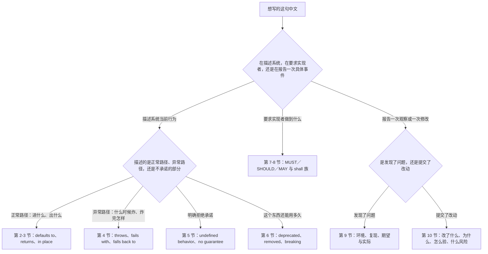
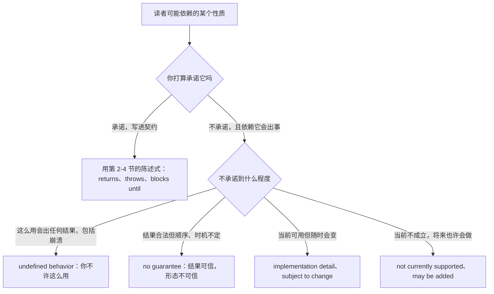
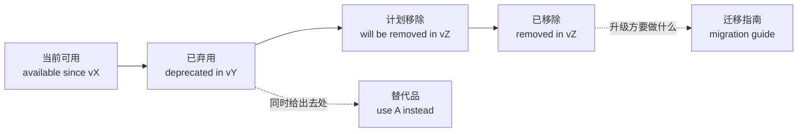
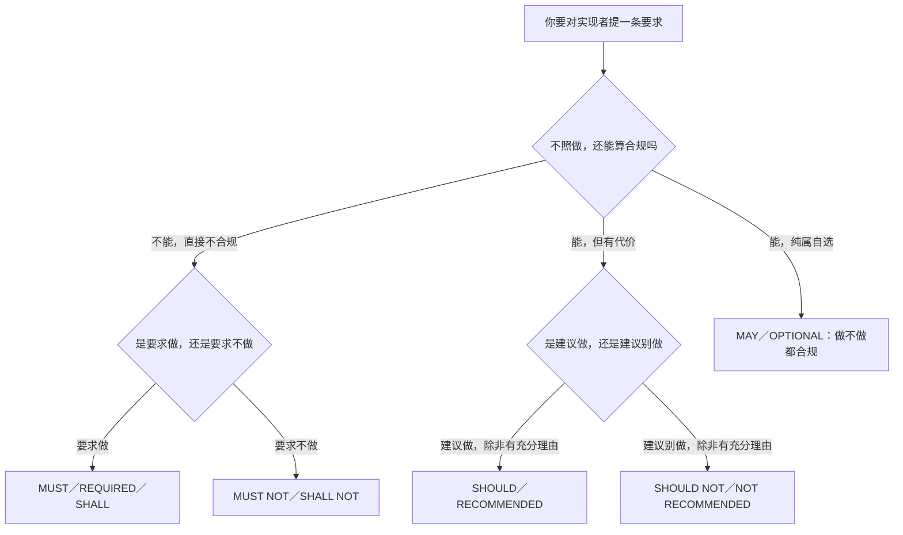
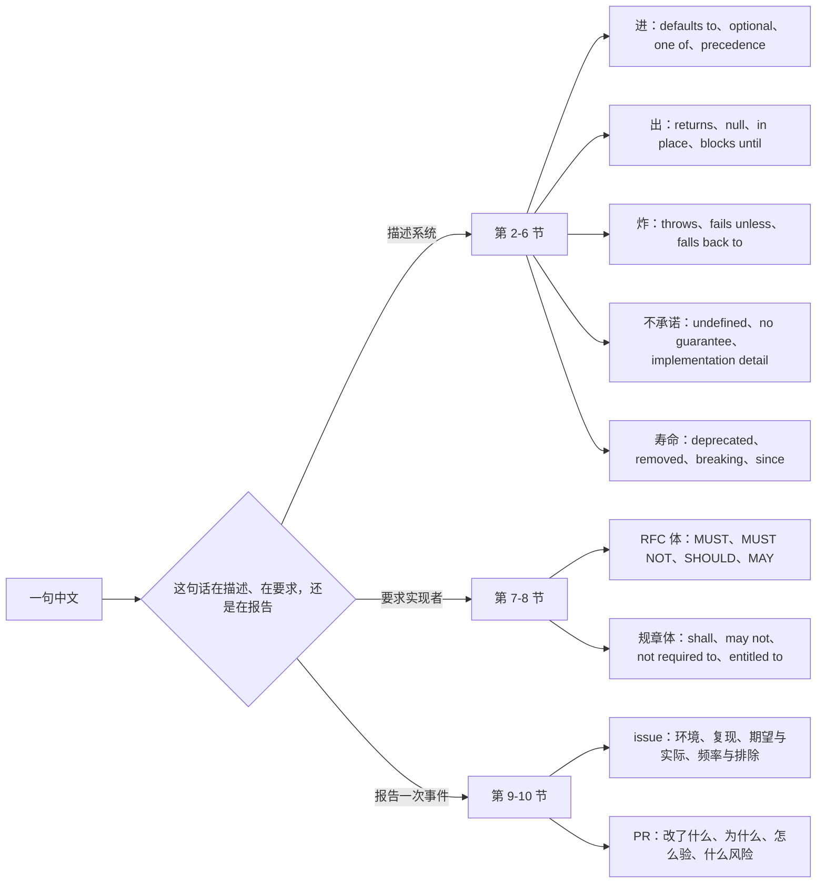

# 技术规范与 API 文档：默认值、返回、抛出、已弃用

> [!info] 本篇定位
>
> 这篇收「默认是」「可选还是必填」「取值只能是这几个」「以哪个为准」「返回什么」「返回空」「会不会改原来的」「会不会卡住」「什么时候抛异常」「什么条件下报错」「失败之后会怎样」「悄悄忽略掉」「行为未定义」「不保证顺序」「不是线程安全的」「实现细节随时会变」「这个接口废了」「哪个版本移除」「向后兼容还是破坏性变更」「改用哪个」「从哪个版本开始有」「必须」「禁止」「应该」「可以」「谁来实现这条」「有义务」「不得」「没有义务但可以」「有权」「我的环境是」「怎么复现」「期望的行为与实际的行为」「多久出一次、影响谁、我已经排除了什么」「这个 PR 改了什么」「为什么这么改」「怎么验的」「有什么风险、怎么回滚、还剩什么没做」共三十八条查询意图，每条给三档成品。
>
> 与本分类另外四篇的分工：这一篇的三档不是「越正式越好」，而是**口头说、写进文档、写进规范**三种落点，跨档的通用手段在 [[12.文体、语域与正式文书/01.语域升降与同义改写：同一句话的三档说法\|语域升降与同义改写]]。给人写字（催办、通知、交接）查 [[12.文体、语域与正式文书/02.邮件与消息骨架：开场、过渡、附件、收尾\|邮件与消息骨架]]。写论文和技术报告查 [[12.文体、语域与正式文书/04.学术论证：本文提出、与前人不同、贡献与局限\|学术论证]]。写合同条款查 [[12.文体、语域与正式文书/05.法律条款与篇章回指：除非另有约定、如前所述、前者后者\|法律条款与篇章回指]]——那篇的 `shall` 和本篇 RFC 2119 的 `MUST` 是两套刻意分开的情态，不能互换。
>
> 读完能查到：`defaults to` 后面为什么不能跟 `as`、`optional` 与 `nullable` 差在哪、`takes precedence over` 和 `overrides` 什么时候不能互换、`returns` 的主语该是函数还是调用方、`returns null` 与 `returns nothing` 与 `returns an empty list` 三种空值怎么区分着写、`throws` 与 `raises` 的语言习惯分界、`if` 与 `when` 在报错条件里的差、`silently` 这个副词该放哪、`undefined behavior` 为什么不能写成 `unknown behavior`、`no guarantee` 后面接名词还是接从句、`deprecated` 与 `removed` 与 `obsolete` 的三段时间线、`backward compatible` 和 `breaking change` 的正反面写法、RFC 2119 那十一个关键词与 RFC 8174 那条大小写规则、`may not` 在规范里的两读歧义与规避写法、`is not required to` 和 `is prohibited from doing` 的形态、以及 issue 四段式与 PR 四段式的整块骨架。
>
> 条件句「如果／一旦／除非」的日常三档在 [[04.条件与假设/01.真实条件：如果就、只要、一旦、除非、前提是\|真实条件]]，本篇只给规范体的固定式。「由…组成」「包括但不限于」「适用范围」归 [[08.指认、定义与描述/03.由…组成、分为、包括、属于：构成、分类与范围界定\|构成、分类与范围界定]]。「X 是指」「所谓」的定义句归 [[08.指认、定义与描述/02.X 是指、所谓、又称、相当于：定义与命名\|定义与命名]]。步骤编号与列举标点归 [[06.并列、递进、列举与选择/02.第一第二最后、包括以下、按…顺序：列举与步骤\|列举与步骤]]。提异议、说坏消息、给负面 review 的人际部分归 [[11.人际功能与话轮管理/05.我有个顾虑、这样不太行、恐怕要延期：异议、负面反馈与坏消息\|异议、负面反馈与坏消息]]，本篇只给 PR 评论里的技术措辞。

---

## 1. 本篇导读：三种文本，一套时态

这一篇覆盖的三种文本表面上分属不同场合，写起来却共用同一套语言约束：**主语是系统不是人，时态是一般现在时，语气是陈述不是请求**。

| 文本 | 典型载体 | 最容易出错的地方 |
| --- | --- | --- |
| 接口文档 | 参数表、方法说明、返回值说明、README | 主语选错，把「这个函数返回 X」写成「你会得到 X」 |
| 规范条文 | RFC、协议文档、内部技术标准、SLA | 情态词选错，把「建议」写成「必须」 |
| issue 与 PR 描述 | GitHub、GitLab、Jira | 时态选错，把「我做了什么」写成「这个 PR 会做什么」 |

三者之间的边界比看上去清楚：接口文档描述**系统当前的行为**，规范条文规定**实现者必须做到什么**，issue 与 PR 描述**一次具体的观察或一次具体的修改**。同一件事在三种文本里的写法差得很远，这也是本篇三档的划法。

### 1.1 本篇的三档是哪三档

其余各篇的三档是「口语／书面／正式」，本篇按落点重新定义，语域从低到高仍然一致：

| 档位 | 落点 | 判断标准 |
| --- | --- | --- |
| 口语 | 站会上口头说、Slack 里回一句、代码里随手写的行内注释 | 可以有第一人称和缩略式，可以省主语 |
| 书面 | README、参数表、方法文档字符串、变更日志 | 无第一人称，主语是被文档化的那个东西，一般现在时 |
| 正式 | RFC 式规范、协议文档、对外承诺的接口契约、SLA | 有一致性要求的情态词，有角色名，条款可被逐条引用 |

不要把三档当难度梯度。参数表里写 `You'll get 30 seconds if you skip it` 和规范里写 `Implementations MAY skip the timeout` 是两种错，前者过松，后者把可选项写成了对实现者的授权。

### 1.2 中文意图到英文出路的总表

| 中文说法 | 说的是哪一面 | 走哪条出路 | 本篇节次 |
| --- | --- | --- | --- |
| 默认是／不传就是 | 参数没给时的取值 | defaults to、if omitted | 第 2 节 |
| 可选／必填／可以为空 | 参数给不给得起 | optional、required、nullable | 第 2 节 |
| 只能是这几个／范围是 | 参数的合法域 | must be one of、accepts、in the range | 第 2 节 |
| 以哪个为准／盖过 | 两个来源冲突时听谁的 | takes precedence over、overrides | 第 2 节 |
| 返回／得到 | 正常路径的产出 | returns、yields、resolves to | 第 3 节 |
| 返回空／什么都不返回 | 空结果的三种形态 | returns null、returns nothing、empty | 第 3 节 |
| 会不会改原来的 | 有没有副作用 | in place、does not modify、side effect | 第 3 节 |
| 会不会卡住／立刻返回 | 阻塞与异步 | blocks until、returns immediately | 第 3 节 |
| 抛出／报错 | 异常路径的产出 | throws、raises、returns an error | 第 4 节 |
| 什么条件下报错 | 触发异常的判据 | if、when、unless | 第 4 节 |
| 失败之后会怎样 | 失败的善后 | retries、rolls back、partial failure | 第 4 节 |
| 悄悄忽略／退回到 | 不报错的失败 | silently ignores、falls back to | 第 4 节 |
| 行为未定义 | 明确拒绝承诺 | undefined behavior | 第 5 节 |
| 不保证顺序 | 拒绝承诺顺序 | no ordering guarantee | 第 5 节 |
| 不是线程安全的 | 并发前提 | not thread-safe、not reentrant | 第 5 节 |
| 实现细节随时会变 | 拒绝承诺内部 | implementation detail、subject to change | 第 5 节 |
| 这个接口废了 | 生命周期第一段 | is deprecated | 第 6 节 |
| 哪个版本移除 | 生命周期第二段 | will be removed in | 第 6 节 |
| 兼容还是不兼容 | 升级代价 | backward compatible、breaking change | 第 6 节 |
| 改用哪个／怎么迁 | 替代路径 | has been replaced by、migrate to | 第 6 节 |
| 从哪个版本开始有 | 可用起点 | as of、since、available in | 第 6 节 |
| 必须／禁止／应该／可以 | 一致性要求的五级 | MUST、MUST NOT、SHOULD、MAY | 第 7 节 |
| 谁来实现这条 | 要求落在哪个角色 | senders、receivers、conforming implementations | 第 7 节 |
| 有义务／不得／有权 | 规章式权利义务 | shall、may not、is entitled to | 第 8 节 |
| 我的环境是 | 复现前提 | Environment、on version | 第 9 节 |
| 怎么复现 | 可执行的最小路径 | Steps to reproduce | 第 9 节 |
| 期望的与实际的 | 缺陷的核心两行 | Expected behavior、Actual behavior | 第 9 节 |
| 多久出一次／影响谁 | 严重度证据 | every time、intermittently、affects | 第 9 节 |
| 这个 PR 改了什么 | 变更摘要 | This PR、This change | 第 10 节 |
| 为什么这么改 | 动机与背景 | Why、Motivation、Context | 第 10 节 |
| 怎么验的 | 验证证据 | How this was tested | 第 10 节 |
| 风险、回滚、后续 | 收尾三件事 | Risk、Rollback、Follow-up | 第 10 节 |

### 1.3 从中文进的总选择树

树的第一层是**文本身份分岔**，这一层选错，后面每一句的主语和时态都会跟着错。描述系统时主语是被描述的那个东西（`The endpoint returns…`），要求实现者时主语是角色（`Clients MUST…`），报告事件时主语才允许是第一人称（`I ran…`、`This PR removes…`）。中文这三种情况都可以说成「这个接口…」，所以从中文进必须先做这一次判断。

第二层里最容易被跳过的是 `C3` 这一支。中文技术文档习惯只写做得到的部分，做不到的部分留白；英文规范正好相反，**明确写出不承诺什么与承诺什么同等重要**，因为留白会被读者默认成承诺。第 5 节整节都在处理这件事。

### 1.4 规范英语的四条形式约定

这四条不是风格偏好，是三种文本共有的硬约定，违反了会被读者当成外行写的。

| 约定 | 具体表现 | 为什么 |
| --- | --- | --- |
| 一般现在时 | `The method returns a list.` 不写 `will return` | 描述的是这个东西的恒常性质，不是一次未来事件 |
| 主语是被文档化的东西 | `This endpoint accepts…` 不写 `You can send…` | 文档描述系统，不指挥读者；指挥读者的只有教程和步骤说明 |
| 第三人称，无第一人称 | 参数表里不出现 `we`、`I` | 例外只在 issue 与 PR 描述，那两种文本报告的是人做的事 |
| 一个词一个意思 | 全篇 `parameter` 就不再混用 `argument`、`option` | 同义词轮换在散文里是优点，在规范里是缺陷 |

> [!tip] 时态的唯一两个例外
>
> 一是**版本承诺**：`This field will be removed in v3.0.` 未来事件用将来时是对的。二是 **PR 描述里已完成的动作**：`I ran the migration on a copy of staging.` 报告已做的事用过去时。除这两处，通篇一般现在时。

### 1.5 五个先立起来的提醒

> [!warning] defaults 作动词只搭 to
>
> - ❌ ~~The timeout defaults as 30 seconds.~~ ／ ❌ ~~The timeout is defaulted to 30 seconds.~~ ／ ✅ **The timeout defaults to 30 seconds.**（default 作动词是不及物动词，固定搭 to，不用被动）
> - ❌ ~~The default is to 30 seconds.~~ ／ ✅ **The default is 30 seconds.**（default 作名词时后面直接跟值，那个 to 是从动词形态串过来的）

> [!warning] returns 的主语是那个东西，不是调用方
>
> - ❌ ~~You will return an empty list if nothing matches.~~ ／ ✅ **The method returns an empty list if nothing matches.**（returns 的施事是方法本身；写成 you 就变成「你返回」了）
> - ❌ ~~It will be returned a list of users.~~ ／ ✅ **A list of users is returned.**（要用被动就让返回物当主语，不要留一个空洞的 it）

> [!warning] undefined behavior 是术语，不能换词
>
> - ❌ ~~The behavior is unknown if the pointer is null.~~ ／ ✅ **The behavior is undefined if the pointer is null.**（`unknown` 是「我们不知道」，`undefined` 是「我们不承诺，你不许依赖」，是两个立场）
> - ❌ ~~an undefined behavior~~ ／ ✅ **undefined behavior**（这是不可数的术语，前面不加冠词，也不用复数）

> [!warning] deprecated 与 removed 不是同一段时间
>
> - ❌ ~~This method is deprecated, so calling it will fail.~~ ／ ✅ **This method is deprecated but still functional; it will be removed in v4.**（deprecated = 还能用但别再用了；不能用了叫 removed）
> - ❌ ~~We deprecated the endpoint last week and it's gone now.~~ ／ ✅ **We removed the endpoint last week.**（真删了就直接说 removed，用 deprecated 会让读者以为还能调）

> [!warning] MUST 与 shall 不要在同一份文档里混用
>
> - ❌ ~~Clients MUST retry, and the server shall log the attempt.~~ ／ ✅ **Clients MUST retry, and servers MUST log the attempt.**（RFC 2119 那套关键词就是为了避开 `shall` 的歧义才造出来的；一份文档只选一套）
> - ❌ ~~The client may not send more than one request.~~ ／ ✅ **The client MUST NOT send more than one request.**（`may not` 在规范里既能读成「无权」也能读成「可能不会」，RFC 体裁一律不用）

> [!tip] 查法
>
> 在写参数表和方法说明，去第 2 至 3 节。在写错误与边界，去第 4 至 5 节。在写变更日志和迁移指南，去第 6 节。在写规范条文，去第 7 至 8 节。在提 issue 或写 PR 描述，直接跳第 9 至 10 节，那两节给的是整块骨架不是单句。

---

## 2. 参数与默认值：这个参数怎么给、不给会怎样

参数说明是接口文档里句式最固定的一块。四条意图分别回答「不给会怎样」「给不给得起」「能给什么」「和别处冲突时听谁的」。

### 2.1 默认是：参数没传时用哪个值

中文触发语：默认是 / 默认为 / 缺省值是 / 不传的话就是 / 没设置时用 / 默认走

| 档位 | 句架 | 例句 |
| --- | --- | --- |
| 口语 | it defaults to X | Don't set it, it defaults to UTC anyway. |
| 口语 | if you don't pass A, you get X | If you don't pass a timeout, you get thirty seconds. |
| 书面 | Defaults to X. | `timeout` — Optional. Defaults to 30 seconds. |
| 书面 | If omitted, A defaults to X. | If omitted, `encoding` defaults to `utf-8`. |
| 书面 | A is X unless [it is] set explicitly. | The pool size is 10 unless it is set explicitly. |
| 正式 | The default value of A is X. | The default value of `max_retries` is 3. |
| 正式 | Where A is not specified, X applies. | Where no region is specified, `us-east-1` applies. |
| 正式 | In the absence of A, the system uses X. | In the absence of an explicit locale, the system uses the server locale. |

书面档那一行 `Defaults to X.` 是参数表里的标准写法：省掉主语，句号收尾，因为主语就是表格左列那个参数名。写全 `This parameter defaults to X` 在表格里反而啰嗦，在正文里才用。

> [!warning] 错配警示
>
> - ❌ ~~The default of the timeout is to 30 seconds.~~ ／ ✅ **The default timeout is 30 seconds.**（名词性的 default 后面不带 to，也不必写成 the default of the timeout）
> - ❌ ~~By default it will default to UTC.~~ ／ ✅ **It defaults to UTC.**（`by default` 和 `defaults to` 同义，同现是一句话说两遍）

- 同义入口：默认是 / 缺省值 / 不填就是 / 没指定时 / 默认走哪条
- 语法归属：[[02.英语基础语法/05.介词与连词/02.常用介词搭配详解\|动词加固定介词的搭配]]

### 2.2 可选还是必填：这个参数给不给得起

中文触发语：可选 / 必填 / 必须提供 / 可以不填 / 可以为空 / 二选一必须给一个

| 档位 | 句架 | 例句 |
| --- | --- | --- |
| 口语 | A is optional / you have to pass A | The region is optional, but you have to pass a bucket name. |
| 口语 | you can leave A out | You can leave the description out, nobody reads it. |
| 书面 | Optional. / Required. | `region` — Optional, string. `bucket` — Required, string. |
| 书面 | A is required unless B is [also] provided. | `token` is required unless `api_key` is provided. |
| 书面 | A accepts null; B does not. | `middle_name` accepts null; `last_name` does not. |
| 正式 | The A field MUST be present in every request. | The `Content-Type` header MUST be present in every request. |
| 正式 | Exactly one of A and B MUST be supplied. | Exactly one of `user_id` and `email` MUST be supplied. |
| 正式 | Omission of A is treated as X. | Omission of the `scope` parameter is treated as a request for the default scope. |

`optional`（可以不传）与 `nullable`（可以传但值可以是空）在中文里都叫「可以为空」，英文分得很死。一个字段 optional 但不 nullable，意思是要么别写，写了就不许是 null；反过来也成立。参数表里把这两栏分开列，比在描述里绕一句话说清楚更省事。

> [!warning] 错配警示
>
> - ❌ ~~This field is optional to be null.~~ ／ ✅ **This field is optional and may be null.**（optional 管的是「给不给」，null 管的是「给什么」，不能压成一句）
> - ❌ ~~You must required to pass a bucket.~~ ／ ✅ **A bucket name is required.** ／ ✅ **You must pass a bucket name.**（required 是形容词，前面不再叠一个 must）

- 同义入口：可选 / 选填 / 必填 / 必须提供 / 可以留空 / 允许为 null
- 语法归属：[[02.英语基础语法/07.助动词与情态动词/02.情态动词详解\|情态动词表必要性]]

### 2.3 只能是这几个：合法取值与范围

中文触发语：只能是 / 取值范围 / 支持的值有 / 必须在…之间 / 大小写敏感 / 只接受

| 档位 | 句架 | 例句 |
| --- | --- | --- |
| 口语 | it only takes A, B or C | It only takes `json`, `xml` or `csv`. |
| 口语 | anything else and it blows up | Anything else and it blows up at startup. |
| 书面 | One of: A, B, C. | `format` — One of: `json`, `xml`, `csv`. |
| 书面 | Must be one of A, B or C. | The value must be one of `low`, `normal` or `high`. |
| 书面 | Accepts any integer in the range X to Y [inclusive]. | Accepts any integer in the range 1 to 100 inclusive. |
| 书面 | A is case-sensitive. | Header names are case-insensitive; header values are case-sensitive. |
| 正式 | Permitted values are A, B and C. | Permitted values are `strict`, `lax` and `none`. |
| 正式 | Values outside this range MUST be rejected. | Values outside this range MUST be rejected with a 400 response. |

区间的开闭在英文里必须写出来，靠 `inclusive`、`exclusive`、`up to but not including` 三个词表示，中文的「1 到 100」直译成 `from 1 to 100` 在文档里是不合格的表述，读者判断不出 100 算不算。带单位的上界写 `at most 100 items per page` 或 `no more than 100 items per page` 都通行，选一种贯穿全篇即可。

> [!warning] 错配警示
>
> - ❌ ~~The value must be one of `json`, `xml`, `csv` or others.~~ ／ ✅ **The value must be one of `json`, `xml` or `csv`.**（枚举是封闭集合，尾巴加 `or others` 等于把它写成开放集合）
> - ❌ ~~Range is from 1 until 100.~~ ／ ✅ **The range is 1 to 100 inclusive.**（`until` 只用于时间，数值区间用 `to` 加开闭说明）

- 同义入口：合法值 / 取值范围 / 支持哪些 / 只接受 / 允许的值
- 语法归属：[[02.英语基础语法/03.代词与数词/05.数词的用法与表达\|数词与区间的表达]]
- 场景实战：[[09.比较、程度与数量/04.大约、超过、占三成、平均、分别是：数量与统计描述\|数量与区间的完整说法]]

### 2.4 以哪个为准：两个来源冲突时听谁的

中文触发语：以…为准 / 优先级更高 / 会覆盖 / 盖过 / 后者胜出 / 谁说了算

| 档位 | 句架 | 例句 |
| --- | --- | --- |
| 口语 | A wins | If both are set, the command-line flag wins. |
| 口语 | A overrides B | The env var overrides whatever is in the config file. |
| 书面 | A takes precedence over B. | Command-line flags take precedence over environment variables. |
| 书面 | If both are set, A is used and B is ignored. | If both are set, `--port` is used and `PORT` is ignored. |
| 书面 | The last value read wins. | When a key appears twice, the last value read wins. |
| 正式 | A shall take precedence over B. | The explicit configuration shall take precedence over the inherited defaults. |
| 正式 | In case of conflict, A prevails. | In case of conflict between the two headers, the more specific one prevails. |
| 正式 | Precedence is, from highest to lowest: A, B, C. | Precedence is, from highest to lowest: flags, environment, config file, built-in defaults. |

`takes precedence over` 和 `overrides` 不总能互换。`override` 强调**后来的值把先前的值顶掉了**，两者是同一个位置上的先后关系；`take precedence over` 强调**两个来源并存，读的时候按优先级挑一个**，被压过的那个还在。配置系统写 precedence，子类方法覆盖父类方法写 override。

> [!warning] 错配警示
>
> - ❌ ~~The flag takes precedence than the env var.~~ ／ ✅ **The flag takes precedence over the env var.**（precedence 固定搭 over，不搭 than）
> - ❌ ~~The env var will be overrided.~~ ／ ✅ **The env var is overridden.**（override 的过去分词是 overridden，两个 d）

- 同义入口：以…为准 / 优先 / 覆盖 / 盖过 / 冲突时听谁的
- 语法归属：[[02.英语基础语法/10.特殊句型/01.被动语态全解\|被动语态的施事省略]]
- 场景实战：[[12.文体、语域与正式文书/05.法律条款与篇章回指：除非另有约定、如前所述、前者后者\|条款体的 shall prevail]]

---

## 3. 返回与行为：出什么、改不改、卡不卡

参数说的是入口，这一节说的是出口和过程中的性质。四条意图对应读者调用一个接口前最想知道的四件事。

### 3.1 返回：正常路径产出什么

中文触发语：返回 / 得到 / 拿到 / 给出 / 产出 / 结果是

| 档位 | 句架 | 例句 |
| --- | --- | --- |
| 口语 | it gives you A | It gives you the raw bytes, not a string. |
| 口语 | you get A back | You get the whole user object back, not just the id. |
| 书面 | Returns A. | Returns a list of `User` objects, ordered by creation time. |
| 书面 | A returns B. | `find_all()` returns a list of matching records. |
| 书面 | The response contains A. | The response contains a `next_cursor` field when more results exist. |
| 书面 | Resolves to A. | The promise resolves to the parsed JSON body. |
| 正式 | A is returned. | A 201 status code is returned on successful creation. |
| 正式 | The server responds with A. | The server responds with a `Retry-After` header indicating the wait time. |

`Returns A.` 这种省主语的写法只在紧挨着函数签名的文档字符串里合法，正文里必须补主语。异步接口用 `resolves to`（承诺兑现成什么）而不是 `returns`，返回的是 promise 本身而不是最终值，这一层区分在文档里要写清楚。

> [!warning] 错配警示
>
> - ❌ ~~This function will return you a list.~~ ／ ✅ **This function returns a list.**（return 是单宾语动词，不接双宾语；给谁是不必说的）
> - ❌ ~~The API returns back the token.~~ ／ ✅ **The API returns the token.**（return 本身含「回」，加 back 是冗余）

- 同义入口：返回 / 拿到 / 得到 / 响应里有 / 结果是
- 语法归属：[[02.英语基础语法/06.动词时态/01.一般现在时与一般过去时\|一般现在时表恒常性质]]

### 3.2 返回空：三种空各是什么

中文触发语：返回空 / 什么都不返回 / 返回 null / 返回空列表 / 没有就返回空 / 找不到就没了

| 档位 | 句架 | 例句 |
| --- | --- | --- |
| 口语 | you just get nothing back | If the key isn't there you just get nothing back. |
| 口语 | it comes back empty | It comes back empty, not an error. |
| 书面 | Returns null if A. | Returns null if no user matches the given id. |
| 书面 | Returns an empty list if A. | Returns an empty list if the query matches no rows. |
| 书面 | Returns nothing. / Has no return value. | Returns nothing; the result is written to the output stream. |
| 书面 | Never returns null. | This accessor never returns null; missing values are represented by an empty string. |
| 正式 | An empty A is returned; this is not an error condition. | An empty result set is returned; this is not an error condition. |
| 正式 | The absence of A MUST NOT be treated as B. | The absence of the optional field MUST NOT be treated as a failure. |

三种空必须分开写，因为调用方的处理代码完全不同：`null` 要判空指针，`empty list` 可以直接遍历，`nothing` 意味着结果在别处（写进了流、改了传入的对象、只有副作用）。中文一个「返回空」把三者压平了，从中文进的时候先问自己「调用方拿到的那个变量里装的是什么」。

> [!warning] 错配警示
>
> - ❌ ~~Returns empty if not found.~~ ／ ✅ **Returns an empty list if no match is found.**（empty 是形容词，不能单独当宾语；必须说清空的是什么）
> - ❌ ~~Returns void.~~ ／ ✅ **Returns nothing.** ／ ✅ **Has no return value.**（`void` 是类型名不是英语词，散文里别直接搬）

- 同义入口：返回空 / 空列表 / 没有返回值 / 找不到时返回什么
- 语法归属：[[02.英语基础语法/02.名词与冠词/03.冠词的用法详解\|不可数名词与零冠词]]

### 3.3 会不会改原来的：副作用与就地修改

中文触发语：会改原来的 / 原地修改 / 不改动入参 / 返回新对象 / 有副作用 / 幂等

| 档位 | 句架 | 例句 |
| --- | --- | --- |
| 口语 | it changes the thing you pass in | Careful, it changes the list you pass in. |
| 口语 | it hands you a new one | It doesn't touch the original, it hands you a new one. |
| 书面 | Modifies A in place. | Sorts the array in place and returns nothing. |
| 书面 | Does not modify A; returns a new B. | Does not modify the input; returns a new configuration object. |
| 书面 | A is left unchanged. | The source file is left unchanged. |
| 书面 | This call is idempotent. | This call is idempotent: repeating it with the same key has no additional effect. |
| 正式 | A has no side effects. | The validation step has no side effects and MAY be run repeatedly. |
| 正式 | Callers MUST NOT rely on A being modified. | Callers MUST NOT rely on the request object being modified by this hook. |

`in place` 作状语时是两个词，不加连字符也不加冠词，位置在动词与宾语之后（`sorts the array in place`）；只有挪到名词前面作定语才加连字符（`an in-place sort`）。想强调「返回的是新的一份」用 `returns a new`，想强调「原来的没动」用 `is left unchanged`，两句常常并排出现，因为它们从两侧夹住同一个事实。

> [!warning] 错配警示
>
> - ❌ ~~It sorts the array in-place-ly.~~ ／ ❌ ~~It in-place sorts the array.~~ ／ ✅ **It sorts the array in place.**（`in place` 直接作状语，不造派生副词，也不前置去修饰动词）
> - ❌ ~~This function is no side effect.~~ ／ ✅ **This function has no side effects.**（side effect 是名词，用 has，且这里习惯用复数）

- 同义入口：原地改 / 会不会动入参 / 返回新对象 / 有没有副作用 / 幂等
- 语法归属：[[02.英语基础语法/04.形容词与副词/03.副词的分类与用法\|副词短语作状语的位置]]

### 3.4 会不会卡住：阻塞、异步与超时

中文触发语：会卡住 / 阻塞 / 立刻返回 / 异步执行 / 后台跑 / 会等到…为止

| 档位 | 句架 | 例句 |
| --- | --- | --- |
| 口语 | it hangs until A | It hangs until the lock is free, so don't call it on the UI thread. |
| 口语 | it's fire-and-forget | It's fire-and-forget; the upload keeps going after the call returns. |
| 书面 | Blocks until A. | Blocks until the connection is established or the timeout expires. |
| 书面 | Returns immediately; A happens in the background. | Returns immediately; the actual indexing happens in the background. |
| 书面 | This is a non-blocking call. | This is a non-blocking call and is safe to use inside an event loop. |
| 书面 | Waits up to X for A. | Waits up to 5 seconds for the worker to acknowledge the job. |
| 正式 | The call SHALL NOT block for longer than X. | The call SHALL NOT block for longer than the configured timeout. |
| 正式 | Completion is signaled by A. | Completion is signaled by a callback rather than by the return of this method. |

`blocks until` 后面接的是**解除阻塞的条件**，习惯把两个出路都写出来（成功条件 `or` 超时），只写一个会让读者以为可能永久挂起。想说的确实是「可能永久挂起」时反而要明写 `blocks indefinitely`，这是个必须显式承认的坏性质。

> [!warning] 错配警示
>
> - ❌ ~~It blocks the thread until finish.~~ ／ ✅ **It blocks the calling thread until the operation finishes.**（until 后面要有完整从句，且要点名阻塞的是哪个线程）
> - ❌ ~~The method is asynchronous, so it returns the result later.~~ ／ ✅ **The method is asynchronous; it returns a future that resolves to the result.**（异步方法当场就返回了，返回的是句柄不是结果）

- 同义入口：阻塞 / 卡住 / 同步还是异步 / 立刻返回 / 会等多久
- 语法归属：[[02.英语基础语法/09.从句体系/04.状语从句详解\|until 引导的时间状语从句]]
- 场景实战：[[07.时间与顺序/03.花了多久、每隔一次、快要了、到…为止：时长、频率与期限\|时长与期限的完整说法]]

---

## 4. 出错路径：什么时候炸、炸成什么样、炸完怎么办

中文技术文档常常把错误路径写成一句「异常情况请自行处理」，英文文档里这是不合格的。这一节四条意图把错误路径拆成四个必答问题。

### 4.1 抛出：异常路径产出什么

中文触发语：抛出 / 报错 / 抛异常 / 会失败 / 返回错误码 / 直接挂了

| 档位 | 句架 | 例句 |
| --- | --- | --- |
| 口语 | it blows up | It blows up if the file isn't there. |
| 口语 | you'll get a 404 back | You'll get a 404 back, not an empty result. |
| 书面 | Throws A. | Throws `IllegalArgumentException` if the id is negative. |
| 书面 | Raises A. | Raises `ValueError` when the string cannot be parsed. |
| 书面 | Returns an error if A. | Returns an error if the destination bucket does not exist. |
| 书面 | Responds with X on A. | Responds with 429 when the per-minute quota is exhausted. |
| 正式 | An A is raised. | A `TimeoutError` is raised if no response arrives within the deadline. |
| 正式 | The operation fails with A. | The operation fails with a permission error and no partial data is written. |

`throws` 与 `raises` 的分界是语言习惯而不是语义：Java、C++、JavaScript 圈写 `throws`，Python、Ruby 圈写 `raises`，Go 和 Rust 两个都不用，写 `returns an error`。跨语言的协议文档避开这三个词，统一写 `fails with` 或 `responds with`。

> [!warning] 错配警示
>
> - ❌ ~~Throws a `ValueError` exception.~~ ／ ✅ **Raises `ValueError`.**（异常类名后面不再补 exception 这个词，且 Python 用 raises）
> - ❌ ~~The method throws an error to the caller.~~ ／ ✅ **The method throws `IOException`.**（throw 不接 to 引出接收方，异常往哪传是语言机制不是文档内容）

- 同义入口：抛异常 / 报错 / 返回错误 / 失败 / 响应什么状态码
- 语法归属：[[02.英语基础语法/06.动词时态/01.一般现在时与一般过去时\|一般现在时描述接口契约]]

### 4.2 什么条件下报错：触发判据怎么写

中文触发语：如果…就报错 / 当…时 / 一旦 / 除非 / 在…情况下会失败 / 只有…才允许

| 档位 | 句架 | 例句 |
| --- | --- | --- |
| 口语 | if A, it errors out | If the token is expired, it just errors out. |
| 书面 | Throws A if B. | Throws `NotFoundError` if the record has been deleted. |
| 书面 | Throws A when B. | Throws `StateError` when called before `init()`. |
| 书面 | Fails unless A. | Fails unless the caller holds the `admin` scope. |
| 书面 | It is an error to A. | It is an error to call this method twice on the same connection. |
| 正式 | If A, the server MUST respond with X. | If the signature does not verify, the server MUST respond with 401. |
| 正式 | A is rejected with X. | A request larger than 10 MB is rejected with a 413 response. |
| 正式 | The following conditions are considered errors: A, B, C. | The following conditions are considered errors: missing header, malformed body, unknown content type. |

`if` 与 `when` 在这里有细微分工：`if` 用于**不确定会不会发生**的条件（`if the file does not exist`），`when` 用于**迟早会发生、只是时间问题**的条件（`when the quota is exhausted`）。写成反的读起来不算错，但会给读者一个错误的概率暗示。

> [!warning] 错配警示
>
> - ❌ ~~Throws if the id will be negative.~~ ／ ✅ **Throws if the id is negative.**（条件从句里用现在时代替将来时）
> - ❌ ~~Fails unless the caller doesn't have permission.~~ ／ ✅ **Fails unless the caller has permission.**（unless 本身含否定，再加否定就把条件写反了）

- 同义入口：什么时候报错 / 触发条件 / 在什么情况下失败 / 只有…才行
- 语法归属：[[02.英语基础语法/09.从句体系/04.状语从句详解\|条件状语从句 if 与 unless]]
- 场景实战：[[04.条件与假设/01.真实条件：如果就、只要、一旦、除非、前提是\|真实条件的完整三档]]

### 4.3 失败之后：重试、回滚与部分成功

中文触发语：会自动重试 / 会回滚 / 部分成功 / 已经写进去的不会撤 / 失败后的状态 / 要自己清理

| 档位 | 句架 | 例句 |
| --- | --- | --- |
| 口语 | it retries a couple of times | It retries a couple of times before giving up. |
| 口语 | half of it may already be written | If it dies partway, half of it may already be written. |
| 书面 | Retries up to X times with A backoff. | Retries up to three times with exponential backoff. |
| 书面 | The operation is atomic: either A or B. | The operation is atomic: either all rows are inserted or none are. |
| 书面 | On failure, A is rolled back. | On failure, the transaction is rolled back and no changes are visible. |
| 书面 | Partial writes are possible. | Partial writes are possible; check the returned count before assuming success. |
| 正式 | The system MUST leave A in a consistent state. | The system MUST leave the store in a consistent state even if the process is killed mid-write. |
| 正式 | Cleanup is the responsibility of the caller. | Cleanup of temporary files is the responsibility of the caller. |

「事务性」这件事在英文文档里有两句几乎固定的写法：`either all … or none` 和 `all-or-nothing`。反过来承认不具备事务性时用 `partial … are possible`，并且必须紧跟一句告诉读者怎么检测，只承认不给出路的写法会被当成推卸。

> [!warning] 错配警示
>
> - ❌ ~~It will retry 3 times, then throw at last.~~ ／ ✅ **It retries three times and then throws.**（`at last` 是「终于」带感情色彩，流程收尾用 `then` 或 `finally`）
> - ❌ ~~The transaction will be rollbacked.~~ ／ ✅ **The transaction is rolled back.**（roll back 是短语动词，过去分词是 rolled back，没有 rollbacked 这个形态）

- 同义入口：重试 / 回滚 / 部分成功 / 失败后的状态 / 谁负责清理
- 语法归属：[[02.英语基础语法/10.特殊句型/01.被动语态全解\|被动语态描述系统动作]]
- 场景实战：[[03.因果与结果/02.导致、引发、归因：把账算在原因头上\|失败归因的动词选择]]

### 4.4 悄悄失败：忽略、降级与告警

中文触发语：会被忽略 / 悄悄跳过 / 不报错但也不生效 / 降级到 / 退回默认 / 只记日志

| 档位 | 句架 | 例句 |
| --- | --- | --- |
| 口语 | it just ignores it | If the key isn't recognized it just ignores it. |
| 口语 | it quietly falls back | It quietly falls back to the bundled font. |
| 书面 | Unknown A are silently ignored. | Unknown fields are silently ignored for forward compatibility. |
| 书面 | Falls back to A if B is unavailable. | Falls back to the primary region if the replica is unavailable. |
| 书面 | A is logged at WARN level and execution continues. | The parse failure is logged at WARN level and execution continues. |
| 书面 | No error is raised; A is left at its previous value. | No error is raised; the setting is left at its previous value. |
| 正式 | Implementations MUST ignore A they do not recognize. | Implementations MUST ignore extension fields they do not recognize. |
| 正式 | Degraded operation is permitted provided that A. | Degraded operation is permitted provided that the client is notified. |

`silently` 这个副词位置固定在被动式的过去分词之前（`are silently ignored`），放句尾会读成「安静地」这个字面义。它中性，描述自己设计的行为也照用（`Unknown fields are silently ignored`），但单写一句会让读者以为是漏洞，习惯紧跟一个理由从句：`for forward compatibility`、`so that older clients keep working`。

> [!warning] 错配警示
>
> - ❌ ~~The error will be ignored silently and nothing happens.~~ ／ ✅ **The error is silently ignored.**（后半句是前半句的复述，删掉）
> - ❌ ~~It falls back into the default value.~~ ／ ✅ **It falls back to the default value.**（fall back 搭 to，搭 into 是另一个意思）

- 同义入口：忽略 / 跳过 / 不报错 / 降级 / 退回默认 / 只写日志
- 语法归属：[[02.英语基础语法/04.形容词与副词/03.副词的分类与用法\|方式副词在被动句中的位置]]

---

## 5. 不保证的事：把没承诺的部分写清楚

这一节是中文技术写作最容易整块漏掉的。中文习惯只写「能做到什么」，读者自行脑补其余；英文规范把**不承诺**当成需要显式声明的内容，因为没写就等于承诺。

四条出路的强度依次递减。`undefined behavior` 是最强的一条，它不是「我们不知道会怎样」，而是「你这么用就违反了契约，之后发生什么都不算我们的责任」；`no guarantee` 弱一档，结果是对的只是形态不保证；`implementation detail` 再弱一档，说的是当下能观察到的行为不构成承诺；最弱的 `not currently supported` 甚至留了一个将来会做的口子。中文的「不保证」「未定义」「以后可能改」在英文里对应的是四条法律效果不同的声明，选错会把责任揽到自己身上。

### 5.1 行为未定义：明确拒绝承诺

中文触发语：行为未定义 / 后果自负 / 不要这么用 / 这么用出什么事都有可能 / 不做保证

| 档位 | 句架 | 例句 |
| --- | --- | --- |
| 口语 | don't do that, anything can happen | Don't reuse a closed handle, anything can happen. |
| 口语 | you're on your own if you do that | You're on your own if you mutate it while iterating. |
| 书面 | The behavior is undefined if A. | The behavior is undefined if the buffer is modified during the call. |
| 书面 | Doing A is undefined behavior. | Freeing the same pointer twice is undefined behavior. |
| 书面 | Callers must not rely on A. | Callers must not rely on the internal ordering of this map. |
| 正式 | A results in undefined behavior. | Concurrent access without external synchronization results in undefined behavior. |
| 正式 | No guarantees are made about A. | No guarantees are made about the state of the object after a failed initialization. |
| 正式 | This case is explicitly out of contract. | Reentrant invocation is explicitly out of contract and is not tested. |

`undefined behavior` 三个形态要记牢：作表语是 `the behavior is undefined`，作宾语是 `is undefined behavior`（不加冠词不加复数），作结果是 `results in undefined behavior`。三种都不能写成 `an undefined behavior`。

> [!warning] 错配警示
>
> - ❌ ~~The behavior is not defined, we don't know what happens.~~ ／ ✅ **The behavior is undefined.**（补一句「我们也不知道」会把规范声明降级成猜测）
> - ❌ ~~It may cause undefined behaviors.~~ ／ ✅ **It causes undefined behavior.**（不可数，无复数；而且这是确定的定性不是可能性）

- 同义入口：未定义 / 不保证 / 不要依赖 / 后果自负 / 契约之外
- 语法归属：[[02.英语基础语法/10.特殊句型/01.被动语态全解\|无施事被动句的责任表述]]

### 5.2 不保证顺序：拒绝承诺形态

中文触发语：不保证顺序 / 顺序不定 / 别指望按这个顺序 / 每次可能不一样 / 无序

| 档位 | 句架 | 例句 |
| --- | --- | --- |
| 口语 | the order is random | The order is basically random, don't build on it. |
| 口语 | it can come back in any order | It can come back in any order between runs. |
| 书面 | The order of A is not guaranteed. | The order of the returned keys is not guaranteed. |
| 书面 | A is returned in no particular order. | Results are returned in no particular order. |
| 书面 | There is no ordering guarantee [between A and B]. | There is no ordering guarantee between messages on different partitions. |
| 书面 | Do not rely on the iteration order. | Do not rely on the iteration order; it may change between releases. |
| 正式 | Implementations MUST NOT assume any ordering of A. | Implementations MUST NOT assume any ordering of the header fields. |
| 正式 | Ordering is guaranteed only within A. | Ordering is guaranteed only within a single partition. |

正面的写法比负面的写法更有信息量：与其写「不保证全局顺序」，不如写 `Ordering is guaranteed only within a single partition`，把承诺的边界画出来，读者立刻知道能依赖到哪一步。`no ordering guarantee` 是名词短语，开头用 `There is no ordering guarantee between …`；想让接口本身当主语就换个动词：`The API makes no ordering guarantees`，不写 `It has no ordering guarantee`。

> [!warning] 错配警示
>
> - ❌ ~~The results are unordered, so they are wrong.~~ ／ ✅ **The results are unordered but complete.**（无序不等于不完整，两件事分开说）
> - ❌ ~~We can't guarantee the order.~~ ／ ✅ **The order is not guaranteed.**（规范文本里不出现 we；用无施事被动）

- 同义入口：顺序不定 / 无序 / 不保证顺序 / 别依赖顺序 / 只在…范围内有序
- 语法归属：[[02.英语基础语法/10.特殊句型/01.被动语态全解\|被动句省略施事的场合]]

### 5.3 不是线程安全的：并发前提

中文触发语：不是线程安全的 / 要自己加锁 / 只能单线程用 / 可以并发调用 / 不可重入

| 档位 | 句架 | 例句 |
| --- | --- | --- |
| 口语 | it's not thread-safe | Heads up, the client isn't thread-safe. |
| 口语 | you need your own lock | You need your own lock around it. |
| 书面 | This class is not thread-safe. | This class is not thread-safe; use one instance per thread. |
| 书面 | External synchronization is required. | External synchronization is required if instances are shared across threads. |
| 书面 | Safe for concurrent use by multiple A. | Safe for concurrent use by multiple goroutines. |
| 书面 | This method is not reentrant. | This method is not reentrant and must not be called from its own callback. |
| 正式 | Concurrent invocation of A is not supported. | Concurrent invocation of `close()` and `write()` is not supported. |
| 正式 | Access MUST be serialized by the caller. | Access to the shared buffer MUST be serialized by the caller. |

`thread-safe` 作定语和表语都带连字符，`not thread-safe` 的否定式最常用。承认不安全之后必须紧接一句给出路（每线程一个实例、自己加锁、用另一个 API），这是这条意图的固定二段结构。

> [!warning] 错配警示
>
> - ❌ ~~This class has no thread safe.~~ ／ ✅ **This class is not thread-safe.**（thread-safe 是形容词，用 is not，不用 has no）
> - ❌ ~~It is thread safety.~~ ／ ✅ **It is thread-safe.** ／ ✅ **Thread safety is guaranteed.**（safety 是名词，safe 是形容词，别混用）

- 同义入口：线程安全 / 并发调用 / 要不要加锁 / 可重入 / 一个线程一个实例
- 语法归属：[[02.英语基础语法/04.形容词与副词/01.形容词的用法与位置\|复合形容词与连字符]]

### 5.4 实现细节：当前行为不构成承诺

中文触发语：实现细节 / 内部实现 / 随时可能变 / 不属于公开接口 / 别依赖这个

| 档位 | 句架 | 例句 |
| --- | --- | --- |
| 口语 | that's an implementation detail | The cache layout is an implementation detail, don't touch it. |
| 口语 | it happens to work now, but | It happens to work now, but that's not a promise. |
| 书面 | A is an implementation detail and may change without notice. | The exact hash algorithm is an implementation detail and may change without notice. |
| 书面 | A is not part of the public API. | Anything under `internal/` is not part of the public API. |
| 书面 | Subject to change in any release. | The format of the debug string is subject to change in any release. |
| 书面 | This behavior is incidental and must not be relied upon. | The current alphabetical ordering is incidental and must not be relied upon. |
| 正式 | A is unspecified. | The precise timing of the callback is unspecified. |
| 正式 | Only A forms part of the stability contract. | Only the fields documented in this section form part of the stability contract. |

`undefined` 与 `unspecified` 在规范里不同义：`undefined` 是「你不许这么做」，`unspecified` 是「你可以这么做，但结果由实现自己定，都算合法」。中文都译成「未定义」，写规范时这一字之差直接决定实现者能不能自由选择。

> [!warning] 错配警示
>
> - ❌ ~~It's internal, so it doesn't matter.~~ ／ ✅ **It is an implementation detail and may change without notice.**（要写出后果，不要写价值判断）
> - ❌ ~~Don't rely to this behavior.~~ ／ ✅ **Do not rely on this behavior.**（rely 固定搭 on）

- 同义入口：实现细节 / 内部的 / 随时会变 / 不在公开契约里 / 碰巧成立
- 语法归属：[[02.英语基础语法/07.助动词与情态动词/02.情态动词详解\|may 表许可与可能的双读]]

---

## 6. 版本与兼容：一个接口的三段寿命

一个接口从「还能用但别用了」到「彻底没了」是一条时间线，中文常常一句「这个接口废了」全包，英文按时间点分成互不相同的三段话。

四个方框对应四句不同的话，写变更日志时它们经常同时出现在同一条目里，但**时态和情态不同**：`available since` 用现在完成或介词短语，`is deprecated` 用现在时的被动，`will be removed` 用将来时，`was removed` 用过去时。把 `deprecated` 和 `removed` 写成同一句是最常见的错，读者据此判断要不要马上动手，判断错了就是线上事故。

两条虚线是补充义务：宣布弃用的同时必须给出替代品，宣布移除的同时必须给出迁移路径。只宣布不给出路的变更日志会被使用者当成敌意。

### 6.1 已弃用：还能用，但别再用了

中文触发语：已弃用 / 废弃了 / 不推荐再用 / 以后别用了 / 标记为过时

| 档位 | 句架 | 例句 |
| --- | --- | --- |
| 口语 | that one's deprecated | That endpoint's deprecated, use the v2 one. |
| 口语 | it still works but don't use it | It still works but don't use it in new code. |
| 书面 | A is deprecated. | The `sync_upload()` method is deprecated. |
| 书面 | Deprecated since vX. Use B instead. | Deprecated since v2.4. Use `upload_async()` instead. |
| 书面 | A is deprecated but remains functional. | The old header is deprecated but remains functional for existing clients. |
| 书面 | New code should not use A. | New code should not use the global configuration object. |
| 正式 | The use of A is deprecated and SHOULD be avoided. | The use of the `X-Forwarded-For` header is deprecated and SHOULD be avoided in new deployments. |
| 正式 | A has been superseded by B. | This mechanism has been superseded by the token exchange flow defined in Section 4. |

描述现状一律用被动式：写 `is deprecated`、`has been deprecated`，不写 `X deprecates`。主动形态 `deprecate` 的施事只能是维护者，因此只出现在变更日志和 PR 描述里：`We deprecate X in this release`、`This PR deprecates the old flag`。`Deprecated since vX` 这种省主语写法是文档标签的标准形态，正文里要补全。

> [!warning] 错配警示
>
> - ❌ ~~This API deprecated in v3.~~ ／ ✅ **This API was deprecated in v3.** ／ ✅ **This API is deprecated as of v3.**（缺被动的 be 动词；用 was 说事件，用 is as of 说当前状态）
> - ❌ ~~It is deprecated, so it will throw.~~ ／ ✅ **It is deprecated; it still works but logs a warning.**（弃用不等于失效，要写清现在的实际行为）

- 同义入口：弃用 / 废弃 / 过时 / 不推荐 / 被取代
- 语法归属：[[02.英语基础语法/10.特殊句型/01.被动语态全解\|只用被动的动词]]

### 6.2 哪个版本移除：给出确切的时间点

中文触发语：会在…移除 / 下个大版本删掉 / 已经删了 / 什么时候彻底不能用 / 最后一个支持它的版本

| 档位 | 句架 | 例句 |
| --- | --- | --- |
| 口语 | it's going away in the next major | It's going away in the next major release. |
| 口语 | we ripped it out already | We ripped it out in 4.0, it's gone. |
| 书面 | Will be removed in vX. | Will be removed in v5.0. |
| 书面 | A was removed in vX. | The legacy parser was removed in v4.0. |
| 书面 | vX is the last release that includes A. | v4.3 is the last release that includes the bundled client. |
| 书面 | Scheduled for removal no earlier than A. | Scheduled for removal no earlier than January 2027. |
| 正式 | Support for A will be discontinued as of vX. | Support for TLS 1.1 will be discontinued as of v6.0. |
| 正式 | A MUST be removed from conforming implementations by vX. | The legacy field MUST be removed from conforming implementations by version 3 of this specification. |

移除公告必须给出**可核对的坐标**：版本号、日期或事件（`when the next LTS ships`），只写 `in a future release` 等于没公告。承诺一个不早于的下限（`no earlier than`）比承诺一个确切日期更常见，因为它既给了使用者规划的依据，又不锁死自己。

> [!warning] 错配警示
>
> - ❌ ~~It will be removed in the future version.~~ ／ ✅ **It will be removed in v5.0.** ／ ✅ **It will be removed in a future major release.**（要么给版本号，要么至少给 major／minor 的粒度）
> - ❌ ~~This method is removed since v4.~~ ／ ✅ **This method was removed in v4.**（一次性事件用过去时加 in；since 配的是持续状态）

- 同义入口：移除 / 删掉 / 停止支持 / 最后一个支持的版本 / 什么时候彻底没了
- 语法归属：[[02.英语基础语法/06.动词时态/02.一般将来时与过去将来时\|将来时表版本承诺]]
- 场景实战：[[07.时间与顺序/02.起初、后来、终于、迟早：时序推进与阶段\|时序推进的完整说法]]

### 6.3 兼容还是不兼容：升级要付多少代价

中文触发语：向后兼容 / 破坏性变更 / 不用改代码 / 升级要改 / 影响现有调用方 / 平滑升级

| 档位 | 句架 | 例句 |
| --- | --- | --- |
| 口语 | you don't have to change anything | It's a drop-in upgrade, you don't have to change anything. |
| 口语 | this one will break you | Careful, this one will break you if you parse the response yourself. |
| 书面 | This change is backward compatible. | This change is backward compatible; existing clients continue to work unchanged. |
| 书面 | This is a breaking change. | This is a breaking change for anyone using the positional form. |
| 书面 | Existing A continue to work. | Existing integrations continue to work without modification. |
| 书面 | Callers of A must update B. | Callers of `render()` must update the second argument to a keyword argument. |
| 正式 | Backward compatibility is preserved for A. | Backward compatibility is preserved for all documented public interfaces. |
| 正式 | A introduces an incompatible change to B. | This revision introduces an incompatible change to the wire format. |

`backward compatible` 是形容词短语（英式偶尔写 `backwards`），名词形式是 `backward compatibility`。`breaking change` 是名词，不要写成 `broken change`。宣布破坏性变更时习惯紧跟一句**谁会被打断**（`for anyone who…`），因为破坏性总是相对某一群调用方而言的。

> [!warning] 错配警示
>
> - ❌ ~~This is a break change.~~ ／ ❌ ~~a broken change~~ ／ ✅ **This is a breaking change.**（固定形式是现在分词 breaking）
> - ❌ ~~It is compatible backward.~~ ／ ✅ **It is backward compatible.**（backward 在这里是修饰 compatible 的，位置在前）

- 同义入口：兼容 / 不兼容 / 破坏性 / 要不要改代码 / 影响谁
- 语法归属：[[02.英语基础语法/04.形容词与副词/01.形容词的用法与位置\|复合形容词的语序]]

### 6.4 改用哪个：替代品与迁移路径

中文触发语：改用 / 请使用 / 用…代替 / 迁移到 / 对应的新写法是 / 一一对应

| 档位 | 句架 | 例句 |
| --- | --- | --- |
| 口语 | just use B now | Just use `fetchAll` now, same arguments. |
| 口语 | swap A for B and you're done | Swap the old client for the new one and you're done. |
| 书面 | Use B instead. | Use `client.send()` instead. |
| 书面 | A has been replaced by B. | The `legacy_mode` flag has been replaced by the `compat` option. |
| 书面 | The equivalent of A is B. | The equivalent of `list(limit=n)` is `page(size=n)`. |
| 书面 | To migrate, do A. | To migrate, replace the callback argument with an async iterator. |
| 正式 | Implementations SHOULD migrate to B before vX. | Implementations SHOULD migrate to the new handshake before version 3.0. |
| 正式 | A maps directly onto B. | Each field of the old payload maps directly onto a field of the new schema. |

`replace A with B`（主动，施事是维护者）与 `A has been replaced by B`（被动，施事是新东西）都对，文档里用被动的更多，因为不需要提维护者。迁移说明的黄金结构是**旧写法与新写法并排的两栏表**，散文只用来说明两栏对不上的那几行。

> [!warning] 错配警示
>
> - ❌ ~~This method is replaced to `send()`.~~ ／ ✅ **This method has been replaced by `send()`.**（replace 的被动搭 by，不搭 to）
> - ❌ ~~Please use `send()` to instead.~~ ／ ✅ **Use `send()` instead.**（instead 是副词，前面不加 to，句尾直接收）

- 同义入口：改用 / 用什么代替 / 迁移 / 新写法 / 一一对应
- 语法归属：[[02.英语基础语法/06.动词时态/04.完成时态详解\|现在完成时的被动式]]

### 6.5 从哪个版本开始有：可用起点

中文触发语：从…版本开始支持 / …以后才有 / 新增于 / 需要至少 / 老版本没有

| 档位 | 句架 | 例句 |
| --- | --- | --- |
| 口语 | it landed in 2.3 | The flag landed in 2.3, you're on 2.1. |
| 口语 | you need at least X for that | You need at least Python 3.11 for that syntax. |
| 书面 | Available since vX. | Available since v2.3. |
| 书面 | New in vX. | New in v3.1: cursor-based pagination. |
| 书面 | Requires vX or later. | Requires Node 18 or later. |
| 书面 | Not available in versions before vX. | Not available in versions before 2.0. |
| 正式 | A was introduced in vX. | Streaming responses were introduced in version 2 of this API. |
| 正式 | Support for A is conditional on B. | Support for HTTP/2 is conditional on the underlying runtime providing ALPN. |

`since` 后面跟起点，`as of` 后面既能跟起点也能跟状态生效点，`in` 后面跟发生那件事的那一版。`Available since v2.3` 是标签式写法；正文里的完整句是 `This option has been available since v2.3`，用现在完成时因为可用状态延续到现在。

> [!warning] 错配警示
>
> - ❌ ~~Available from v2.3 until now.~~ ／ ✅ **Available since v2.3.**（since 已含「延续到现在」，再补 until now 是重复）
> - ❌ ~~It requires Node 18 above.~~ ／ ✅ **It requires Node 18 or later.**（版本下限的固定说法是 or later／or newer／and above，不是裸 above）

- 同义入口：从哪个版本有 / 新增于 / 至少需要 / 老版本不支持
- 语法归属：[[02.英语基础语法/06.动词时态/04.完成时态详解\|since 与现在完成时]]

---

## 7. 一致性要求：RFC 2119 的必须、禁止、应该、可以

规范条文与接口文档的分界就在这一节。接口文档描述**已经如此**，规范条文要求**实现者做到**，后者用的是一套被明文定义过含义的关键词。

这张树的第一层判据是唯一的判据：**违反这一条还算不算合规实现**。答案是「不算」就走 MUST 那一支，是「算，但你得想清楚」就走 SHOULD 那一支，是「随便」就走 MAY。中文的「必须」「应该」「可以」在日常语言里边界模糊，写规范时这三个词的选择是有法律式后果的，不能凭语感。

RFC 2119 把要求分成上面这五级，写法上给出十一个关键词：`MUST`／`REQUIRED`／`SHALL`、`MUST NOT`／`SHALL NOT`、`SHOULD`／`RECOMMENDED`、`SHOULD NOT`／`NOT RECOMMENDED`、`MAY`／`OPTIONAL`。RFC 8174 追加了一条形式规则：只有**大写形式**才承载这套特殊含义，小写的 `must`、`should` 按普通英语读。所以规范正文里同一个词大小写不同意思不同，这不是排版偏好。

### 7.1 必须：不照做就不合规

中文触发语：必须 / 一定要 / 强制要求 / 不这么做就不合规 / 硬性要求

| 档位 | 句架 | 例句 |
| --- | --- | --- |
| 口语 | you have to A | You have to send the header, there's no way around it. |
| 书面 | A must B. | The client must send a `User-Agent` header. |
| 书面 | A is required to B. | Every request is required to carry a signature. |
| 正式 | A MUST B. | Clients MUST include the `Authorization` header in every request. |
| 正式 | A is REQUIRED. | The `iss` claim is REQUIRED. |
| 正式 | A SHALL B. | The gateway SHALL reject requests exceeding the configured size. |
| 正式 | It is REQUIRED that A. | It is REQUIRED that the nonce be unique per request. |
| 正式 | Conforming implementations MUST A. | Conforming implementations MUST support at least one of the listed cipher suites. |

`MUST`、`REQUIRED`、`SHALL` 在 RFC 2119 里是同义的三个词，选哪个是文体传统：IETF 系文档偏 `MUST`，ISO 与电信系文档偏 `SHALL`，字段属性表里用形容词形态 `REQUIRED`。同一份文档只挑一套，混用会让读者去找不存在的区别。

> [!warning] 错配警示
>
> - ❌ ~~Clients MUST to include the header.~~ ／ ✅ **Clients MUST include the header.**（MUST 是情态动词，后面直接跟原形）
> - ❌ ~~It is a must to send the header.~~ ／ ✅ **The header MUST be sent.**（`a must` 是口语名词用法，不进规范正文）

- 同义入口：必须 / 强制 / 硬性要求 / 不可省略 / 合规前提
- 语法归属：[[02.英语基础语法/07.助动词与情态动词/02.情态动词详解\|must 表义务]]
- 场景实战：[[04.英语场景/03.时态与语态句型框架/04.情态动词句型框架\|情态动词的功能分档]]

### 7.2 禁止：做了就不合规

中文触发语：禁止 / 不得 / 一定不能 / 绝不允许 / 不许

| 档位 | 句架 | 例句 |
| --- | --- | --- |
| 口语 | never A | Never put the token in the query string. |
| 书面 | A must not B. | The client must not retry a non-idempotent request automatically. |
| 书面 | A is not permitted. | Reuse of a nonce is not permitted. |
| 正式 | A MUST NOT B. | Servers MUST NOT include the raw password in any log output. |
| 正式 | A SHALL NOT B. | The proxy SHALL NOT modify the message body. |
| 正式 | A MUST NOT, under any circumstances, B. | The key material MUST NOT, under any circumstances, be written to disk. |
| 正式 | It is an error for A to B. | It is an error for a client to send two requests with the same identifier. |
| 正式 | A is prohibited. | Downgrade to an unencrypted channel is prohibited. |

`MUST NOT` 是全大写的两个词，中间不用连字符也不缩写成 `MUSTN'T`。它比 `SHOULD NOT` 强一级，比日常英语的 `cannot` 精确——`cannot` 说的是做不到，`MUST NOT` 说的是不许做，后者恰恰暗示技术上做得到。

> [!warning] 错配警示
>
> - ❌ ~~The client may not send two requests.~~ ／ ✅ **The client MUST NOT send two requests.**（`may not` 在规范里既能读成「无权」也能读成「可能不会」，RFC 体裁一律回避）
> - ❌ ~~Servers MUST NOT to log the password.~~ ／ ✅ **Servers MUST NOT log the password.**（否定情态后面同样跟原形）

- 同义入口：禁止 / 不得 / 不许 / 绝不 / 违者不合规
- 语法归属：[[02.英语基础语法/07.助动词与情态动词/02.情态动词详解\|情态动词的否定式]]

### 7.3 应该与不应该：有理由可以不照做

中文触发语：应该 / 建议 / 推荐 / 除非有充分理由否则 / 不建议 / 最好不要

| 档位 | 句架 | 例句 |
| --- | --- | --- |
| 口语 | you should probably A | You should probably cache that, it's expensive. |
| 书面 | A should B. | Clients should reuse connections where possible. |
| 书面 | It is recommended that A B. | It is recommended that the timeout be set below 30 seconds. |
| 正式 | A SHOULD B. | Servers SHOULD emit a `Retry-After` header with every 503 response. |
| 正式 | A is RECOMMENDED. | Use of a per-session key is RECOMMENDED. |
| 正式 | A SHOULD NOT B. | Clients SHOULD NOT poll more frequently than once per minute. |
| 正式 | A is NOT RECOMMENDED. | Reuse of the same identifier across sessions is NOT RECOMMENDED. |
| 正式 | Implementers who deviate from A MUST B. | Implementers who deviate from this recommendation MUST document the reason. |

`SHOULD` 的完整含义是「除非在特定情况下有充分理由，并且已经权衡了后果，否则照做」。规范里给出 SHOULD 时，习惯紧跟一句说明**什么样的理由算充分**，否则这一条会退化成没人当真的软要求。

> [!warning] 错配警示
>
> - ❌ ~~Servers SHOULD respond with 503, but they MUST if the queue is full.~~ ／ ✅ **Servers SHOULD respond with 503. If the queue is full, servers MUST respond with 503.**（同一条要求上叠两级情态，读者不知道该按哪一级实现；拆成两条各带条件）
> - ❌ ~~It is recommended to that the timeout is short.~~ ／ ✅ **It is recommended that the timeout be short.**（recommend 后的从句用原形虚拟式，且没有 to）

- 同义入口：应该 / 建议 / 推荐 / 不建议 / 最好别
- 语法归属：[[02.英语基础语法/10.特殊句型/02.虚拟语气详解\|建议类动词后的原形从句]]

### 7.4 可以：做不做都合规

中文触发语：可以 / 允许 / 可选 / 自行决定 / 不做也没关系 / 有能力的话

| 档位 | 句架 | 例句 |
| --- | --- | --- |
| 口语 | you can A if you want | You can batch them if you want, it's not required. |
| 书面 | A may B. | A client may cache the response for up to one hour. |
| 书面 | A is optional. | Compression of the request body is optional. |
| 正式 | A MAY B. | Servers MAY include additional diagnostic fields in the error object. |
| 正式 | A is OPTIONAL. | The `aud` claim is OPTIONAL. |
| 正式 | An implementation that does not A MUST still B. | An implementation that does not support compression MUST still accept uncompressed bodies. |
| 正式 | A is at the discretion of B. | The retry interval is at the discretion of the client. |
| 正式 | Both A and B are conformant. | Both eager and lazy validation are conformant behaviors. |

`MAY` 那一条的配套义务常被忘掉：一方可选做的事，另一方就必须能承受两种情况。所以规范里的 MAY 条款后面几乎总跟一句 `Implementations that do not … MUST …` 或者对端的 `MUST be prepared to …`，把可选性的代价写清楚。

> [!warning] 错配警示
>
> - ❌ ~~Servers MAY NOT include the field.~~ ／ ✅ **Servers MUST NOT include the field.** ／ ✅ **Servers are not required to include the field.**（MAY NOT 不是 RFC 2119 关键词，含义歧义，按意思改写成两者之一）
> - ❌ ~~The client MAY to cache the response.~~ ／ ✅ **The client MAY cache the response.**（同样跟原形）

- 同义入口：可以 / 允许 / 可选 / 随实现 / 自行决定
- 语法归属：[[02.英语基础语法/07.助动词与情态动词/02.情态动词详解\|may 表许可]]

### 7.5 谁来实现这条：要求落在哪个角色

中文触发语：客户端要 / 服务端要 / 双方都要 / 发送方 / 接收方 / 中间代理 / 合规实现

| 档位 | 句架 | 例句 |
| --- | --- | --- |
| 口语 | that's on the server side | Rate limiting is on the server side, not yours. |
| 书面 | Clients A; servers B. | Clients send the token; servers validate it. |
| 书面 | This requirement applies to A only. | This requirement applies to intermediaries only. |
| 正式 | Senders MUST A. Receivers MUST B. | Senders MUST canonicalize the header. Receivers MUST reject a non-canonical form. |
| 正式 | Conforming implementations MUST A. | Conforming implementations MUST support all three modes. |
| 正式 | A role that supports B MUST also C. | A role that supports partial responses MUST also support range requests. |
| 正式 | Nothing in this section requires A to B. | Nothing in this section requires an origin server to retain the request body. |
| 正式 | For the purposes of this document, A means B. | For the purposes of this document, a proxy means any intermediary that forwards requests unchanged. |

规范条文的主语必须是**角色**而不是「系统」「程序」「它」。角色名在文档开头的术语节里一次性定义，之后每条要求都挂在某个角色上，这样一条要求能不能被某个实现忽略是一眼可判的。`Nothing in this section requires…` 是明确划边界的固定句，用来堵住读者的过度推断。

> [!warning] 错配警示
>
> - ❌ ~~The system MUST validate the token.~~ ／ ✅ **The resource server MUST validate the token.**（「系统」不是角色，没人知道该谁去实现这一条）
> - ❌ ~~It MUST be validated.~~ ／ ✅ **Receivers MUST validate it.**（要求条款尽量不用被动，被动会把责任方藏掉）

- 同义入口：谁负责 / 客户端还是服务端 / 发送方接收方 / 合规实现 / 适用于谁
- 语法归属：[[02.英语基础语法/10.特殊句型/06.主谓一致\|复数角色名与谓语一致]]
- 场景实战：[[11.人际功能与话轮管理/07.我在做、卡住了、我会、我习惯了、这归谁管：进度、能力、习惯与职责\|职责归属的日常说法]]

---

## 8. 规章体的义务与权利：shall、may not、is entitled to

上一节那套大写关键词只在 RFC 体裁里通行。协议附录、SLA、许可证、公司内部技术规章走的是另一套，与合同语言同源，形态更接近法律文本。两套不能混用，但都要认得。

### 8.1 有义务：shall 的三种落法

中文触发语：应当 / 有义务 / 负责 / 须 / 承诺提供

| 档位 | 句架 | 例句 |
| --- | --- | --- |
| 口语 | it's our job to A | It's our job to keep the backups, yours to verify them. |
| 书面 | A is responsible for B. | The customer is responsible for rotating the API keys. |
| 书面 | A undertakes to B. | The provider undertakes to notify the customer of any breach. |
| 正式 | A shall B. | The Provider shall maintain an availability of at least 99.5 percent per calendar month. |
| 正式 | A shall be responsible for B. | The Customer shall be responsible for the accuracy of the submitted data. |
| 正式 | A shall ensure that B. | The Operator shall ensure that all access is logged. |
| 正式 | It shall be the responsibility of A to B. | It shall be the responsibility of the integrator to validate the certificate chain. |
| 正式 | A shall, at its own expense, B. | The Supplier shall, at its own expense, provide the migration tooling. |

条款里的 `shall` 是「负有…义务」，不是将来时。判断写得对不对有一个简单测试：把 `shall` 换成 `has a duty to`，句子还通就是用对了；换成之后不通，说明这里其实想说将来，应该改用 `will`。

> [!warning] 错配警示
>
> - ❌ ~~The system shall be released next quarter.~~ ／ ✅ **The system will be released next quarter.**（说将来用 will；shall 只承担义务）
> - ❌ ~~The provider shall to maintain the logs.~~ ／ ✅ **The provider shall maintain the logs.**（情态动词后跟原形）

- 同义入口：应当 / 有义务 / 负责 / 须 / 承诺
- 语法归属：[[02.英语基础语法/07.助动词与情态动词/03.情态动词的特殊句型\|shall 的规章用法]]
- 场景实战：[[12.文体、语域与正式文书/05.法律条款与篇章回指：除非另有约定、如前所述、前者后者\|合同条款的封闭固定式]]

### 8.2 不得：禁止与无权

中文触发语：不得 / 无权 / 未经…不得 / 一律禁止 / 不允许

| 档位 | 句架 | 例句 |
| --- | --- | --- |
| 口语 | you're not allowed to A | You're not allowed to resell the keys. |
| 书面 | A is not allowed to B. | Third-party integrators are not allowed to store the raw credentials. |
| 正式 | A shall not B. | The Licensee shall not sublicense the software without prior written consent. |
| 正式 | A may not B [without C]. | The Customer may not assign this agreement without the Provider's consent. |
| 正式 | A is prohibited from doing B. | The Contractor is prohibited from disclosing the benchmark results. |
| 正式 | No A may B. | No party may unilaterally amend the service levels. |
| 正式 | A is strictly prohibited. | Reverse engineering of the client binary is strictly prohibited. |
| 正式 | B is permitted only where C. | Redistribution is permitted only where the original notice is preserved. |

`may not` 在条款体里是合法的，读作「无权」，因为条款体里没有 RFC 2119 的大写关键词跟它抢意思；同一个 `may not` 在 RFC 里必须避开。`be prohibited from` 后面固定接动名词，这是这条意图最容易写错的形态。

> [!warning] 错配警示
>
> - ❌ ~~The Contractor is prohibited to disclose the results.~~ ／ ✅ **The Contractor is prohibited from disclosing the results.**（prohibit 搭 from 加动名词，不搭不定式）
> - ❌ ~~No party may not amend the terms.~~ ／ ✅ **No party may amend the terms.**（`No party` 已经否定了一次，再加 not 就成了双重否定）

- 同义入口：不得 / 无权 / 未经许可不得 / 禁止 / 只有…才允许
- 语法归属：[[02.英语基础语法/08.非谓语动词/02.动名词详解\|介词后接动名词]]

### 8.3 没有义务但可以：把两件事分开说

中文触发语：没有义务 / 不强制 / 不要求 / 可以但不必 / 由…自行决定

| 档位 | 句架 | 例句 |
| --- | --- | --- |
| 口语 | we don't have to, but we can | We don't have to keep the old logs, but we can if you need them. |
| 书面 | A is not required to B. | The service is not required to retain deleted objects. |
| 书面 | There is no obligation to A. | There is no obligation to provide a reason for the rejection. |
| 正式 | A shall not be obliged to B. | The Provider shall not be obliged to restore data older than 30 days. |
| 正式 | Nothing in this A requires B to C. | Nothing in this agreement requires the Customer to purchase additional capacity. |
| 正式 | A is under no duty to B. | The Operator is under no duty to monitor user-generated content. |
| 正式 | A may, but is not obliged to, B. | The Provider may, but is not obliged to, offer a workaround before the fix ships. |
| 正式 | The decision whether to A rests with B. | The decision whether to escalate rests with the on-call engineer. |

`may, but is not obliged to,` 这个插入结构是条款体处理「可以但不必」的标准写法，两个逗号不能省。它比单写 `may` 更明确，因为 `may` 在读者眼里常常被误读成一种承诺。

> [!warning] 错配警示
>
> - ❌ ~~The provider mustn't restore old data.~~ ／ ✅ **The provider is not required to restore old data.**（`must not` 是「禁止」，「没有义务」要用 `is not required to`，两者差得很远）
> - ❌ ~~There is no obligation of providing a reason.~~ ／ ✅ **There is no obligation to provide a reason.**（obligation 搭不定式，不搭 of 加动名词）

- 同义入口：没有义务 / 不强制 / 不要求 / 可以但不必 / 自行决定
- 语法归属：[[02.英语基础语法/08.非谓语动词/01.动词不定式详解\|名词后接不定式]]

### 8.4 有权：权利、保留与授权

中文触发语：有权 / 保留…的权利 / 经授权可以 / 有资格 / 可随时

| 档位 | 句架 | 例句 |
| --- | --- | --- |
| 口语 | we can pull the plug any time | We can pull the plug any time if it's being abused. |
| 书面 | A has the right to B. | The provider has the right to suspend an account that exceeds the quota. |
| 书面 | A reserves the right to B. | We reserve the right to change the rate limits with 30 days' notice. |
| 正式 | A is entitled to B. | The Customer is entitled to a service credit for each hour of downtime. |
| 正式 | A shall be entitled to B without C. | The Provider shall be entitled to suspend the service without prior notice in the event of abuse. |
| 正式 | A is authorized to B on behalf of C. | The named administrator is authorized to approve key rotations on behalf of the organization. |
| 正式 | Nothing in A limits B's right to C. | Nothing in this clause limits the Customer's right to seek injunctive relief. |
| 正式 | A may at any time B. | The Provider may at any time modify the list of supported regions. |

`is entitled to` 后面既能接名词（`entitled to a refund`）也能接不定式（`entitled to terminate`），两种都对。`reserves the right to` 后面只接不定式，且几乎总带一个附加条件（提前通知、书面通知、特定情形），裸写会显得毫无节制。

> [!warning] 错配警示
>
> - ❌ ~~The customer is entitled for a refund.~~ ／ ✅ **The customer is entitled to a refund.**（entitle 搭 to）
> - ❌ ~~We reserve the right of changing the price.~~ ／ ✅ **We reserve the right to change the price.**（right 后面用不定式，不用 of 加动名词）

- 同义入口：有权 / 保留权利 / 被授权 / 有资格 / 可随时
- 语法归属：[[02.英语基础语法/05.介词与连词/02.常用介词搭配详解\|形容词加固定介词]]

---

## 9. issue 描述：把一次观察写成别人能复现的东西

前八节写的是系统本身，这一节和下一节写的是**围绕系统发生的两件事**：发现了问题，提交了改动。两者都允许第一人称，都以过去时报告已做的动作。

一份能被直接处理的 issue 有四段，缺一段就会被退回来补充：

| 段 | 装什么 | 对应本节 |
| --- | --- | --- |
| 环境 | 版本号与提交号、操作系统与运行时、相关配置 | 9.1 |
| 复现 | 最小可执行的步骤、用到的输入数据、复现率 | 9.2 |
| 对照 | Expected 应该发生什么、Actual 实际发生了什么、完整报错与堆栈 | 9.3 |
| 排除 | 已经试过什么、在哪些版本上不复现、影响范围与紧急度 | 9.4 |

四段合起来回答维护者的四个问题：在什么条件下、怎么走到那一步、你凭什么说它错了、你已经帮我排除了什么。一来一回补充信息损失的时间，远超一次写清楚的成本。

其中「对照」那一段是核心：**期望行为与实际行为必须成对出现**。只写实际行为等于只说「它坏了」，维护者无法判断你以为它该怎样，很多所谓 bug 其实是期望本身不对。

### 9.1 我的环境是：复现前提

中文触发语：我的环境是 / 版本是 / 在…上出现 / 系统是 / 用的是哪个提交

| 档位 | 句架 | 例句 |
| --- | --- | --- |
| 口语 | I'm on X | I'm on 3.2.1, macOS 15, Node 20. |
| 书面 | Version: X. OS: Y. | Version: 3.2.1. OS: Ubuntu 24.04. Runtime: Node 20.11. |
| 书面 | Reproduced on A and B. | Reproduced on 3.2.1 and on `main` at commit `a1b2c3d`. |
| 书面 | This happens on A but not on B. | This happens on Linux but not on macOS. |
| 书面 | Relevant config: A. | Relevant config: `pool_size = 4`, `strict_mode = true`. |
| 书面 | I have not tried A. | I have not tried the 4.x branch. |
| 正式 | The issue is present in A and absent in B. | The issue is present in release 3.2 and absent in 3.1. |
| 正式 | The following environment was used. | The following environment was used for all measurements. |

版本号写具体到补丁位，分支写到提交哈希。`on main` 不是有效的环境说明，因为 main 昨天和今天是两份代码。「在 A 上有在 B 上没有」这一句的价值最高，它直接把排查范围缩到两者的差集。

> [!warning] 错配警示
>
> - ❌ ~~I'm using the latest version.~~ ／ ✅ **I'm on 3.2.1 (latest at the time of writing).**（latest 是会过期的说法，必须落到具体号）
> - ❌ ~~It happens in my environment.~~ ／ ✅ **It happens on Ubuntu 24.04 with Node 20.11; it does not happen on macOS with the same Node version.**（「我的环境」对读者是零信息）

- 同义入口：环境 / 版本 / 在哪个系统上 / 哪个提交 / 配置是什么
- 语法归属：[[02.英语基础语法/05.介词与连词/01.介词的分类与基本用法\|on 与 in 表版本与平台]]

### 9.2 怎么复现：最小可执行的步骤

中文触发语：复现步骤 / 怎么重现 / 按这个顺序操作 / 跑这段就能出 / 每次都能复现

| 档位 | 句架 | 例句 |
| --- | --- | --- |
| 口语 | run this and you'll see it | Run this snippet twice in a row and you'll see it. |
| 书面 | Steps to reproduce: 1. A 2. B 3. C | Steps to reproduce: 1. Create an empty project. 2. Run `build --watch`. 3. Touch any file in `src/`. |
| 书面 | A minimal reproduction is below. | A minimal reproduction is below; it needs no external services. |
| 书面 | The failure appears on the second A. | The failure appears on the second invocation, never the first. |
| 书面 | The same steps on A do not trigger it. | The same steps on the 3.1 branch do not trigger it. |
| 书面 | Removing A makes the problem go away. | Removing the caching middleware makes the problem go away. |
| 正式 | The following sequence reliably reproduces the failure. | The following sequence reliably reproduces the failure on a clean install. |
| 正式 | A is required to trigger the condition. | A concurrent write during the flush window is required to trigger the condition. |

复现步骤用**祈使句的编号列表**，一步一个动作，不要把两个动作塞进一条。`Run X and you'll see` 这种口语写法只在聊天里用，写进 issue 要拆成编号步骤，因为维护者会照着一条条执行并在失败那步停下。

> [!warning] 错配警示
>
> - ❌ ~~Just do the normal setup and it breaks.~~ ／ ✅ **1. `npm ci` 2. `npm run build` 3. Open `dist/index.html` — the console shows the error.**（「正常的步骤」在每个人机器上不是同一件事）
> - ❌ ~~Steps to reproduce: I opened the app, then something happened.~~ ／ ✅ **Steps to reproduce: 1. Open the app. 2. Click Export. 3. Choose CSV.**（复现步骤用祈使句，不用第一人称的叙事）

- 同义入口：复现步骤 / 怎么重现 / 最小复现 / 什么条件下触发
- 场景实战：[[06.并列、递进、列举与选择/02.第一第二最后、包括以下、按…顺序：列举与步骤\|步骤流程的完整框架]]

### 9.3 期望与实际：缺陷的核心两行

中文触发语：期望的行为是 / 应该是 / 实际却 / 结果变成 / 我以为会 / 但它没有

| 档位 | 句架 | 例句 |
| --- | --- | --- |
| 口语 | I expected A, I got B | I expected an empty list, I got a null. |
| 口语 | it should A but it B | It should keep the order but it shuffles everything. |
| 书面 | Expected behavior: A. | Expected behavior: the request is retried once and then fails with a timeout. |
| 书面 | Actual behavior: B. | Actual behavior: the request is retried indefinitely and the process never exits. |
| 书面 | According to A, B should C. | According to the documentation, `flush()` should block until the buffer is empty. |
| 书面 | Instead, A. | Instead, it returns immediately and the last few records are lost. |
| 正式 | The observed behavior contradicts A. | The observed behavior contradicts the guarantee stated in Section 4.2. |
| 正式 | The discrepancy is A. | The discrepancy is that the header is dropped rather than forwarded. |

期望那一行的分量取决于**你凭什么这么期望**。写 `I expected` 是主观预期，可以被驳回；写 `According to the documentation, X should Y` 或 `The spec says X` 把期望挂在可核对的来源上，维护者只能承认是文档错还是代码错。这一句的升级是本条意图里回报最高的改动。

> [!warning] 错配警示
>
> - ❌ ~~It doesn't work as expected.~~ ／ ✅ **Expected: the file is created. Actual: the call returns 200 but no file appears.**（as expected 里的期望没写出来，等于什么都没说）
> - ❌ ~~Expected behavior: it should be work.~~ ／ ✅ **Expected behavior: the upload completes and the file appears in the bucket.**（要写出可观察的结果，不写「应该正常」）

- 同义入口：期望行为 / 实际行为 / 应该怎样 / 结果却 / 和文档不符
- 语法归属：[[02.英语基础语法/09.从句体系/03.名词性从句详解\|that 从句作表语]]
- 场景实战：[[05.让步、转折与对比/03.相比之下、恰恰相反、另一方面：对比与反驳\|对比与反预期的完整说法]]

### 9.4 多久出一次、影响谁、我排除了什么

中文触发语：每次都出 / 偶尔才出 / 十次里有一次 / 影响所有用户 / 我已经试过 / 已经排除了

| 档位 | 句架 | 例句 |
| --- | --- | --- |
| 口语 | it's flaky | It's flaky, maybe one run in ten. |
| 口语 | I already tried A | I already tried clearing the cache, no change. |
| 书面 | Happens every time. / Happens intermittently. | Happens every time on a cold start; never on a warm one. |
| 书面 | Roughly A out of B runs. | Roughly one in ten runs on CI, not reproducible locally. |
| 书面 | Affects A. | Affects every user on a paid plan; free-tier accounts are unaffected. |
| 书面 | I have ruled out A. | I have ruled out the proxy: the same request fails when sent directly. |
| 书面 | A did not change the outcome. | Downgrading the driver did not change the outcome. |
| 正式 | The failure rate is approximately X under A. | The failure rate is approximately 8 percent under sustained load. |

`intermittently`（时有时无）、`consistently`（每次都有）、`under load`（压力下才有）、`on a cold start`（冷启动才有）这四个限定词组合起来，基本能刻画所有复现模式。已排除项要写成「我做了什么，结果没变」，只写「我试过了」维护者无法判断你试得对不对。

> [!warning] 错配警示
>
> - ❌ ~~Sometimes it fails.~~ ／ ✅ **It fails on roughly one in ten CI runs and never locally.**（sometimes 不构成证据，给出频次与条件）
> - ❌ ~~I tried everything.~~ ／ ✅ **I have tried A, B and C; none of them changed the outcome.**（「都试过了」等于没提供任何排除信息）

- 同义入口：复现率 / 概率 / 影响范围 / 已排除 / 试过什么
- 语法归属：[[02.英语基础语法/04.形容词与副词/03.副词的分类与用法\|频度副词与频次表达]]
- 场景实战：[[09.比较、程度与数量/04.大约、超过、占三成、平均、分别是：数量与统计描述\|频次与比例的写法]]

---

## 10. PR 描述：改了什么、为什么、怎么验的、有什么风险

PR 描述的读者是 reviewer，他要在有限时间里判断该不该合。四条意图正好对应他要做的四次判断。与 issue 不同的是，PR 描述的主语常常是 PR 本身而不是作者。

### 10.1 这个 PR 做了什么：变更摘要

中文触发语：这个 PR / 本次改动 / 加了 / 删了 / 把…改成 / 顺带修了

| 档位 | 句架 | 例句 |
| --- | --- | --- |
| 口语 | swaps A for B | Swaps the regex parser for the hand-written one. |
| 书面 | This PR A. | This PR adds retry support to the upload client. |
| 书面 | This change A and B. | This change removes the legacy flag and updates the three call sites that used it. |
| 书面 | Adds A. Removes B. Fixes C. | Adds cursor pagination. Removes the offset parameter. Fixes the off-by-one in the last page. |
| 书面 | Fixes #N. | Fixes #412. |
| 书面 | No functional change. | No functional change; this is a pure refactor of the module layout. |
| 正式 | This change introduces A. | This change introduces an opt-in compatibility mode for the previous wire format. |
| 正式 | This change alters the following behavior for A. | This change alters the following behavior for existing callers: empty results now return 204 rather than 200. |

PR 描述的首行主语是 PR 本身，动词跟着走单三形式（`This PR adds…`），主语省掉之后剩下的仍是单三（`Adds cursor pagination.`）。提交信息则相反，多数项目约定用动词原形的命令式（`Add retry support`）。两处不是同一件东西，别互相套。

> [!warning] 错配警示
>
> - ❌ ~~This PR will add retry support.~~ ／ ✅ **This PR adds retry support.**（代码已经写好了，不是将来的计划）
> - ❌ ~~Some refactoring and small fixes.~~ ／ ✅ **Extracts the retry logic into `RetryPolicy`; fixes the off-by-one in `lastPage()`.**（笼统的摘要让 reviewer 无法预估审查范围）

- 同义入口：本次改动 / 这个 PR / 加了什么 / 删了什么 / 修了哪个 issue
- 语法归属：[[02.英语基础语法/06.动词时态/01.一般现在时与一般过去时\|一般现在时叙述变更]]

### 10.2 为什么这么改：动机与被否掉的方案

中文触发语：为什么改 / 起因是 / 之前的问题是 / 也考虑过…但 / 之所以选这个方案

| 档位 | 句架 | 例句 |
| --- | --- | --- |
| 口语 | the old way broke when A | The old way broke as soon as two workers shared a socket. |
| 书面 | Why: A. | Why: the previous implementation held the lock across the network call. |
| 书面 | The current behavior causes A. | The current behavior causes a full rebuild on every save. |
| 书面 | Context: A. | Context: this blocks the migration tracked in #388. |
| 书面 | I also considered A, but B. | I also considered a background thread, but that would change the shutdown semantics. |
| 书面 | The simplest fix would be A; it does not work because B. | The simplest fix would be to widen the timeout; it does not work because the deadlock is unbounded. |
| 正式 | This approach was chosen because A. | This approach was chosen because it requires no change to the on-disk format. |
| 正式 | The trade-off is A in exchange for B. | The trade-off is one extra allocation per request in exchange for removing the global lock. |

写出**被否掉的方案**是 PR 描述里最省 reviewer 时间的一段。reviewer 第一反应通常就是那个更简单的方案，先自己答一遍「为什么不那样做」，能省掉一整轮往返。

> [!warning] 错配警示
>
> - ❌ ~~This is the best practice.~~ ／ ✅ **This matches how `HttpClient` already handles retries, so the two behave the same under load.**（诉诸权威说不清事情，说清对齐了什么、代价是什么）
> - ❌ ~~The old code was bad.~~ ／ ✅ **The old code held the lock across an I/O call, so a slow peer blocked every other request.**（价值判断换成可验证的机制描述）

- 同义入口：为什么 / 起因 / 背景 / 之前的问题 / 为什么不用另一种
- 语法归属：[[02.英语基础语法/09.从句体系/04.状语从句详解\|because 引导的原因从句]]
- 场景实战：[[03.因果与结果/01.因为所以：原因表达的六档梯度\|原因表达的完整梯度]]

### 10.3 怎么验的：证据而不是保证

中文触发语：怎么测的 / 我验证了 / 加了测试 / 在预发跑过 / 手动测了 / 没测的部分

| 档位 | 句架 | 例句 |
| --- | --- | --- |
| 口语 | ran it locally, looks fine | Ran it locally against a copy of prod data, looks fine. |
| 书面 | How this was tested: A. | How this was tested: new unit tests for the parser, plus a manual run against staging. |
| 书面 | Added A tests covering B. | Added three tests covering the empty, single-page and multi-page cases. |
| 书面 | Verified that A. | Verified that the old clients still receive the legacy field. |
| 书面 | Tested manually on A. | Tested manually on staging with a 200 MB upload. |
| 书面 | Not covered by tests: A. | Not covered by tests: the timeout path, which needs a fault injection harness. |
| 正式 | The change was validated against A. | The change was validated against the conformance suite in `tests/spec`. |
| 正式 | No regression was observed in A. | No regression was observed in the nightly benchmark over three consecutive runs. |

这一段用**过去时**，因为报告的是已经做过的动作，这是全篇一般现在时之外的第二个例外。主动写出没覆盖到的部分不会削弱说服力，反而会让 reviewer 停止猜测；隐瞒没测的部分被发现一次，之后每个 PR 都会被多审一轮。

> [!warning] 错配警示
>
> - ❌ ~~It works.~~ ／ ✅ **Added a test that fails on `main` and passes here; also ran the full suite locally.**（「能用」不是证据，可复核的动作才是）
> - ❌ ~~I will add tests later.~~ ／ ✅ **Tests for the timeout path are not included; tracked in #431.**（把欠账写成有编号的欠条，不写成口头承诺）

- 同义入口：怎么测的 / 验证方式 / 加了什么测试 / 哪些没覆盖
- 语法归属：[[02.英语基础语法/06.动词时态/01.一般现在时与一般过去时\|过去时报告已完成动作]]

### 10.4 风险、回滚与后续：收尾三件事

中文触发语：有什么风险 / 出问题怎么回滚 / 要注意的地方 / 后续还要做 / 这次不做的部分

| 档位 | 句架 | 例句 |
| --- | --- | --- |
| 口语 | worst case we revert it | Worst case we revert it, no data is touched. |
| 书面 | Risk: A. | Risk: the new code path only runs for accounts with the flag enabled. |
| 书面 | Rollback: A. | Rollback: revert this commit; no migration is involved. |
| 书面 | This is behind a feature flag. | This is behind the `new_uploader` flag, off by default. |
| 书面 | Deploy note: A must happen before B. | Deploy note: the schema migration must run before this is deployed. |
| 书面 | Out of scope: A. | Out of scope: the same bug in the legacy client, tracked separately. |
| 书面 | Follow-up: A. | Follow-up: remove the compatibility shim once all clients are on 3.x (#440). |
| 正式 | The change is reversible without A. | The change is reversible without data loss; the old column is retained for one release. |

风险那一行要写**范围**而不是概率。「可能会有问题」是废话，「只影响开了某个标志的账号」「只在冷启动路径上」才让 reviewer 能判断该审到什么程度。有迁移、有部署顺序、有开关的，各占一行，这三件事被漏掉的代价最大。

> [!warning] 错配警示
>
> - ❌ ~~Should be safe.~~ ／ ✅ **Only affects accounts with `new_uploader` enabled; currently that is the internal test org only.**（把感觉换成范围）
> - ❌ ~~Rollback: just revert.~~ ／ ✅ **Rollback: revert this commit. The migration is additive and does not need to be rolled back.**（回滚说明必须覆盖数据侧，只说 revert 等于没说）

- 同义入口：风险 / 回滚 / 部署注意 / 灰度开关 / 后续待办 / 本次不做
- 语法归属：[[02.英语基础语法/10.特殊句型/05.省略与替代\|省略主谓的标签式条目]]
- 场景实战：[[11.人际功能与话轮管理/05.我有个顾虑、这样不太行、恐怕要延期：异议、负面反馈与坏消息\|提风险与坏消息的措辞]]

---

## 11. 本篇小结

这张图是本篇的查法总览。最左边那一次分岔决定后面每一句的主语和时态：描述系统时主语是那个东西且用一般现在时，要求实现者时主语是角色且带情态关键词，报告事件时才允许第一人称与过去时。中文里这三种话都可以用「这个接口…」开头，所以从中文进必须先做这一次判断，做完之后剩下的选择基本是查表。

三支的内部排法各不相同。描述那一支按**调用一个接口的时间顺序**排：传什么进去、拿什么出来、什么时候炸、哪些事不承诺、这东西还能活多久。要求那一支按**体裁**排，两套关键词各自封闭，不在同一份文档里混用。报告那一支按**两种文本**排，issue 是四段、PR 是四段，都是整块骨架而不是散句。

真正跨两支的只有一处：`deprecated` 既出现在文档里（描述现状），也出现在规范里（`SHOULD be avoided`），还出现在 PR 描述里（`deprecates the old flag`），三处的时态和情态都不同。碰到这种跨支的词，先回第 1.3 节的树重新定位文本身份。

> [!success] 本篇核心要点回顾
>
> 1. 本篇三档不是难度梯度，是落点梯度：口头说、写进文档、写进规范。参数表里出现第二人称，或规范里出现「你会得到」，都是选错了档。
> 2. `defaults to` 是不及物动词固定搭 to，不用被动；名词形态 `the default is X` 后面不带 to。`optional`（给不给）与 `nullable`（给什么）在英文里是两栏，不能压成一句。
> 3. `returns` 的主语是被文档化的那个东西，不是调用方；返回空要分清 `null`、`an empty list`、`nothing` 三种，调用方的处理代码完全不同。
> 4. `undefined behavior` 是不可数术语，不加冠词不用复数，且不能换成 `unknown`——前者是「不许这么用」，后者是「我们不知道」；与之相邻的 `unspecified` 是「怎么做都合法」，又是第三个意思。
> 5. 英文规范把「不承诺什么」当成必须显式写出的内容，留白会被读成承诺。`no ordering guarantee` 更好的写法是正面画边界：`Ordering is guaranteed only within a partition`。
> 6. `deprecated`（还能用）、`will be removed in vX`（有确切时间点）、`was removed in vX`（已经没了）是一条时间线上的三段话，写成一句话是最常见的错，读者据此决定要不要马上动手。
> 7. RFC 2119 的关键词只有**大写形式**才承载特殊含义（RFC 8174 那条规则）；`MAY NOT` 不是关键词，按意思改写成 `MUST NOT` 或 `is not required to`。`MUST`／`shall` 两套情态不在同一份文档里混用。
> 8. issue 的「期望行为」要挂在可核对的来源上（`According to the documentation…`），不写成主观的 `I expected`；PR 的「怎么验的」用过去时，并主动写出没覆盖的部分。

> [!success] 本篇练习清单
>
> - [ ] 「超时默认 30 秒，不传就用这个值；显式传 0 表示不超时」——写出口头、文档、规范三档。
> - [ ] 「查不到就返回空列表，不是 null，也不会抛异常」——写出文档档，并把三种空各自的写法标出来。
> - [ ] 「这个方法会改你传进来的那个数组，不返回新数组」——写出口头与文档两档，用上 `in place`。
> - [ ] 「返回的键没有固定顺序，但同一个分区内部有序」——写出文档与规范两档，规范档用正面画边界的写法。
> - [ ] 「这个字段在 2.4 弃用，5.0 移除，改用 `scope`；老客户端不受影响」——写出变更日志的完整一条，四段时间线都要出现。
> - [ ] 「客户端必须带签名头；服务端建议返回 `Retry-After`；两端都可以开压缩」——写出规范档三条，各用一个 RFC 2119 关键词。
> - [ ] 「供方应当保证每月可用率不低于 99.5%，但没有义务恢复 30 天以前的数据，并保留在滥用时立即停服的权利」——写出条款体正式档整段。
> - [ ] 「在 3.2.1 上每次都能复现，3.1 不复现；期望是重试一次后超时失败，实际是无限重试进程不退出；我已经排除了代理」——写成一份完整 issue 的四段。

### 11.1 下一篇预告

> [!info] 下一篇
>
> [[12.文体、语域与正式文书/04.学术论证：本文提出、与前人不同、贡献与局限\|学术论证：本文提出、与前人不同、贡献与局限]]
>
> 这一篇写的是「系统是这样的、你必须这么做」，下一篇写的是「我们主张这样、证据到这一步为止」。两者的共同点是都不允许拍胸脯，差别在于规范文本靠情态词分级（MUST／SHOULD／MAY），学术文本靠动词和限定语分级（`show`／`suggest`／`may indicate`）。下一篇收立论、界定范围、对比前人、声明贡献、承认局限、保守结论六组意图，其中「承认局限」那一节与本篇第 5 节是同一件事的两种文体写法——都在处理「怎么把没做到的部分写成加分项而不是把柄」。

