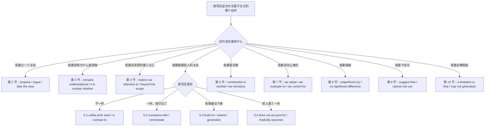
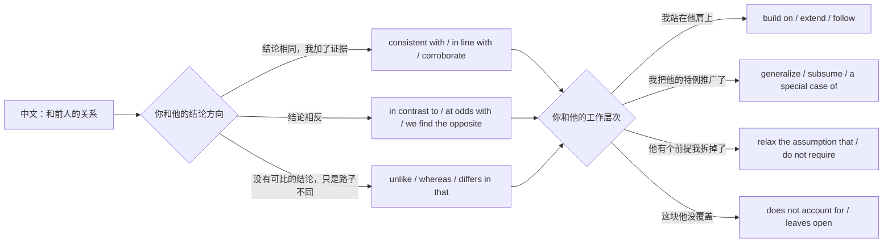
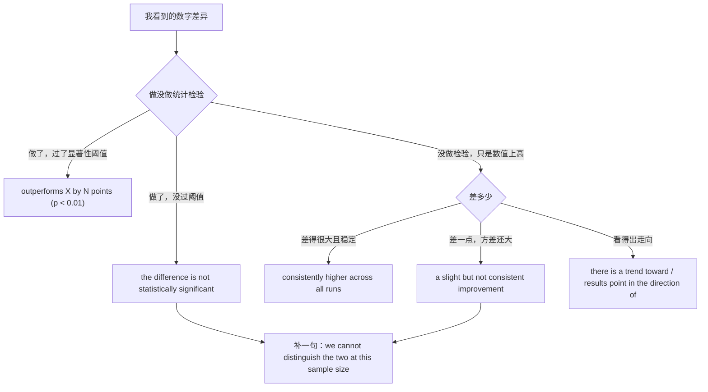
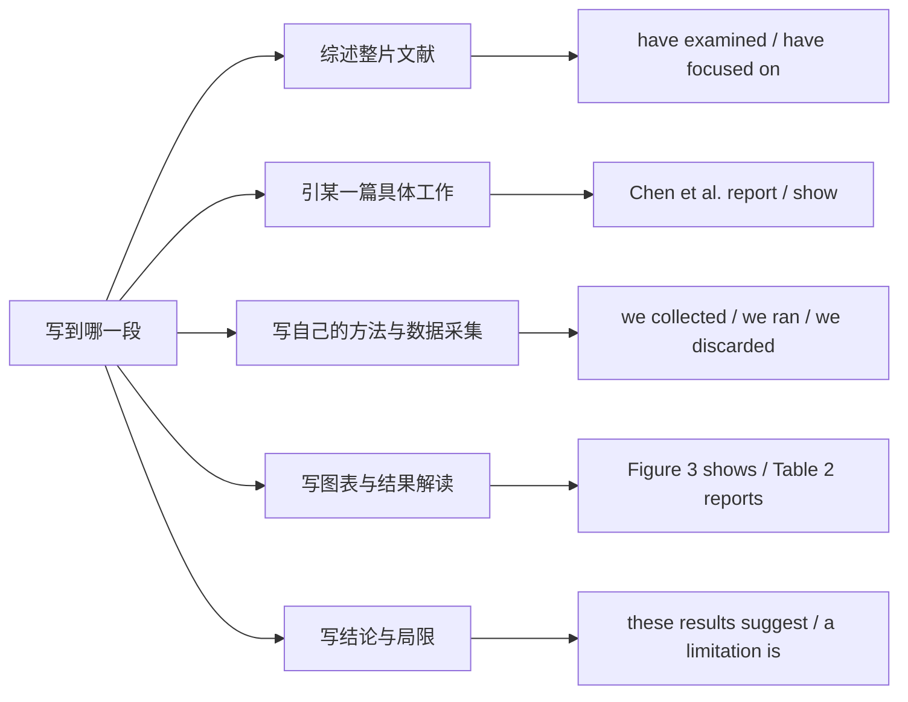
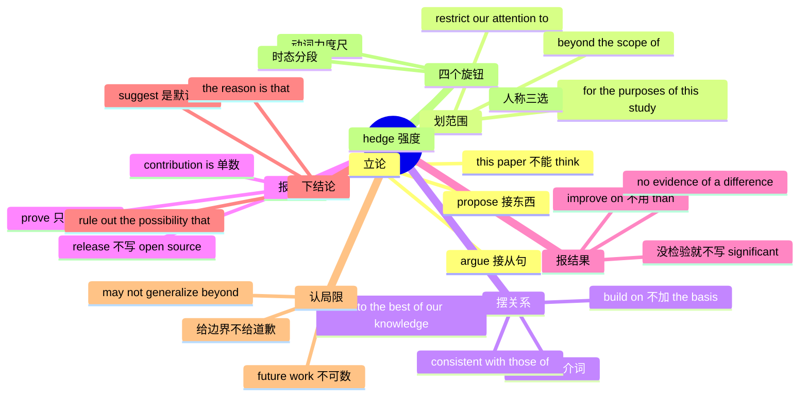

# 学术论证：本文提出、与前人不同、贡献与局限

> [!info] 本篇定位
>
> 这篇收的是写论文、写技术报告、写开题、写基金申请时那一整套论证动作的中文意图：立什么主张、划到哪儿为止、跟前人怎么摆关系、贡献报几条、结果敢说到什么份上、局限自己先认哪几条。
>
> 上一篇 [[12.文体、语域与正式文书/03.技术规范与 API 文档：默认值、返回、抛出、已弃用\|技术规范与 API 文档：默认值、返回、抛出、已弃用]] 写的是**规定**——`MUST`、`SHOULD`、`defaults to`，句子的力气全用在约束读者的行为上。这一篇写的是**主张**，句子的力气全用在标注自己肯为这句话负多少责。同一句中文「我们发现改成异步之后延迟降了」，敢写到 `demonstrates that the change causes the reduction` 还是只能写到 `is associated with a reduction in latency`，差的不是词汇量，是承诺强度。
>
> 读完能查到：32 条中文意图入口、96 条分档成品句架，以及中文母语者写英文论文最容易翻车的四处——把 `prove` 当 `show` 用、把 `obviously` 写进正文、把「本文认为」写成 `this paper thinks`、把局限写成道歉。

---

## 1. 本篇导读：三档在这里不是文雅程度，是承诺强度

本手册通篇的三档是语域梯度：口语、书面、正式。到了学术论证这一域，这三档要换个读法，否则查出来的句子会全部偏向最正式的那一档，写出一篇谁也读不下去的稿子。

| 档位 | 在本篇指什么场合 | 典型特征 |
| --- | --- | --- |
| 口语 | 组会、答辩问答、会议茶歇、跟合作者讲思路 | 主语用 `we`，动词短促，允许 `basically`、`the idea is` |
| 书面 | 论文正文、技术报告、arXiv 预印本 | 主语 `we` 与 `this paper` 并用，动词精确，hedge 明确 |
| 正式 | 投期刊、写综述、写基金申请、写标准草案 | 大量名词化与被动，动词力度经过挑选，每一句都能被追责 |

三档的真正差别不在词长，在**这句话被质疑时你打算怎么退**。口语档退得起：`I think it's the cache` 被质疑了改口就是了。正式档退不起：`The evidence establishes that the cache is responsible` 一旦写进期刊，退不回来。所以本篇每一条意图的三档句架，从上往下不是越来越文雅，是越来越难反悔。

这张图的第一层分叉按**论文动作**切，不按语法切，因为同一个语法零件会散落在好几个动作里：`we show that` 既能报贡献又能报结果，`unlike` 既能对比前人又能界定范围。反过来同一个中文动作会落到完全不同的句架上——「本文提出」在算法论文里是 `we propose`，在观点论文里是 `we argue`，在实证论文里往往是 `we test the hypothesis that`，选错了整篇的体裁定位就歪了。

第二层的分叉只在第 5 节展开，因为「跟前人的关系」是本域唯一一处中文完全压平、英文必须分开的地方。中文一句「和已有工作不同」可以同时意味着方法不同、结论相反、覆盖范围更广、假设更弱四件事，英文这四件事分别是 `unlike`、`in contrast to`、`generalize`、`relax the assumption that`，混用会被审稿人抓。

还有三处对立值得在动手前先记住，三处都是中文里根本不存在的区分：

- **`show` 和 `prove` 不是深浅关系**。`prove` 在数学与形式化语境里指给出证明，在实验语境里写 `our experiments prove that` 几乎必然招来批评，因为实验不证明任何东西。这条在 6.3 与 8.1 各挂一次。
- **`significant` 有两个身份**。日常义的「重要」和统计义的「显著」共用一个词，实证论文里一旦出现 `a significant improvement` 而没有检验支撑，读者默认你在报统计结果。这条在 8.2 与 8.3 展开。
- **局限不是道歉**。中文写「由于时间仓促，本文还有诸多不足」是礼貌，英文写 `Unfortunately, we were not able to` 是自减分。局限句的正确写法是把边界划清楚，不是把姿态放低。这条是第 10 节的总原则。

本篇的意图块按写作顺序排：第 2 到第 4 节管开头（立论、缺口、范围），第 5 到第 6 节管定位（对比、贡献），第 7 到第 8 节管中段（方法、结果），第 9 到第 10 节管收尾（结论、局限），第 11 节把全篇的四个调节旋钮抽出来单讲，第 12 节是速查表。

---

## 2. 立论：本文提出、我们主张、我们的立场

论文第一段的最后一两句是全篇最贵的地方。中文里「本文提出」四个字通吃，英文要先分清提出的是**东西**还是**看法**：提出方法、模型、框架、数据集用 `propose`、`present`、`introduce`；提出观点、判断、立场用 `argue`、`contend`、`take the view`。两族混用会让读者判断错文章类型——把观点论文写成 `we propose a view` 读起来像在卖产品，把系统论文写成 `we argue that our system is faster` 读起来像没做实验。

### 2.1 本文提出、本文给出（提出的是东西）

中文触发语：本文提出… / 本文给出… / 我们设计了… / 我们构建了一套… / 本文介绍一种…

| 档位 | 句架 | 例句 | 译文 |
| --- | --- | --- | --- |
| 口语 | we've built + 名词短语 + that + 从句 | We've built a scheduler that keeps tail latency flat under bursty load. | 我们做了个调度器，突发负载下尾延迟不抬头。 |
| 书面 | we propose + 名词短语 + for + 动名词 | We propose a lightweight sampling scheme for estimating tail latency online. | 本文提出一种轻量采样方案，用于在线估计尾延迟。 |
| 正式 | this paper presents + 名词短语 + that + 从句 | This paper presents a formal treatment of admission control that subsumes both threshold and rate-based policies. | 本文给出准入控制的一套形式化处理，可同时涵盖阈值型与速率型策略。 |

> [!warning] 错配警示
>
> - ~~This paper proposes that our method is better than baselines.~~ ❌（想说「本文提出一种比基线更好的方法」）
> - **This paper proposes a method that outperforms existing baselines.** ✅（`propose` 后面接的是被提出的**东西**，不是一个判断句；要接从句只能用 `argue`、`claim`、`contend` 这一族）

页脚：
- 同义入口：本文提出 / 本文给出 / 我们设计了 / 本文介绍 / 我们实现了一套
- 语法归属：[[02.英语基础语法/09.从句体系/03.名词性从句详解\|名词性从句详解]]
- 场景实战：[[04.英语场景/09.学习与教育场景实战/02.图书馆作业与研究场景\|图书馆作业与研究场景]]

### 2.2 我们主张、我们认为（提出的是看法）

中文触发语：我们认为… / 本文主张… / 我们的观点是… / 我们要论证的是… / 本文的核心论点是…

| 档位 | 句架 | 例句 | 译文 |
| --- | --- | --- | --- |
| 口语 | our point is that + 从句 | Our point is that the bottleneck was never the network. | 我们想说的是，瓶颈从来就不在网络上。 |
| 书面 | we argue that + 从句 | We argue that reproducibility failures in this area are structural rather than accidental. | 本文主张，该领域的复现失败是结构性的，而非偶发。 |
| 正式 | we contend that + 从句 [, on the grounds that + 从句] | We contend that the standard benchmark understates real-world cost, on the grounds that it excludes cold-start latency. | 本文认为标准基准低估了真实成本，理由是它把冷启动延迟排除在外。 |

> [!warning] 错配警示
>
> - ~~This paper thinks that the benchmark is flawed.~~ ❌（想说「本文认为该基准有缺陷」）
> - **This paper argues that the benchmark is flawed.** ✅（`this paper` 是文本不是人，不能 `think`、`believe`、`feel`；能配的动词只有 `argue`、`show`、`present`、`report`、`examine` 这类文本能做的动作）

页脚：
- 同义入口：我们主张 / 本文认为 / 我们的论点是 / 我们要说明的是 / 本文持…立场
- 语法归属：[[02.英语基础语法/09.从句体系/03.名词性从句详解\|名词性从句详解]]
- 场景实战：[[04.英语场景/05.高频实用表达句型框架/01.表达观点与态度的50个万能句型\|表达观点与态度的50个万能句型]]

### 2.3 我们采取…的立场、我们把 X 当作 Y

中文触发语：我们采取…的视角 / 本文把 X 看作 Y / 我们从…的角度切入 / 本文站在…的立场上

| 档位 | 句架 | 例句 | 译文 |
| --- | --- | --- | --- |
| 口语 | we look at A as if it were B | We look at retries as if they were just extra load, not as failures. | 我们把重试当成额外负载看，不当成失败。 |
| 书面 | we treat A as B / we take the view that + 从句 | We treat schema migration as a scheduling problem rather than a correctness problem. | 本文把 schema 迁移当作调度问题处理，而不是正确性问题。 |
| 正式 | we adopt the perspective that + 从句 | We adopt the perspective that cache coherence and consistency are two views of a single invariant. | 本文采取的视角是：缓存一致性与一致性模型是同一个不变式的两种表述。 |

> [!warning] 错配警示
>
> - ~~We regard retries as a load.~~ ❌（想说「我们把重试视作一种负载」，冠词与数都别扭）
> - **We regard retries as load.** ✅（`regard A as B` 里的 B 若是不可数抽象名词就不加冠词；`treat A as B` 同理，`as` 后不能改成 `to be` 以外的形式，也不能写成 `regard A to be B`）

页脚：
- 同义入口：我们把 X 视为 Y / 本文的视角是 / 我们从…出发 / 本文以…为框架
- 语法归属：[[02.英语基础语法/05.介词与连词/02.常用介词搭配详解\|常用介词搭配详解]]

### 2.4 本文要回答的问题是

中文触发语：本文要回答的问题是… / 我们关心的是… / 本文围绕以下问题展开 / 具体地说，我们问的是…

| 档位 | 句架 | 例句 | 译文 |
| --- | --- | --- | --- |
| 口语 | the question we're after is whether + 从句 | The question we're after is whether the gain survives outside the lab. | 我们想弄清的是，这个收益出了实验室还在不在。 |
| 书面 | we ask whether + 从句 / this paper addresses the question of how + 从句 | We ask whether incremental compilation still pays off once caches are warm. | 本文考察缓存预热之后增量编译是否仍然划算。 |
| 正式 | the central research question is stated as follows: + 疑问句 | The central research question is stated as follows: under what conditions does partial replication reduce total write amplification? | 本文的核心研究问题表述如下：在什么条件下部分复制能降低总写放大？ |

> [!warning] 错配警示
>
> - ~~We ask that whether the gain survives.~~ ❌（想说「我们要问收益还在不在」）
> - **We ask whether the gain survives.** ✅（`whether` 自己就是引导词，前面不能再叠 `that`；同理 `the question of whether`，不写 `the question that whether`）

页脚：
- 同义入口：本文要回答的是 / 我们考察的是 / 研究问题是 / 本文追问的是
- 语法归属：[[02.英语基础语法/09.从句体系/03.名词性从句详解\|名词性从句详解]]
- 场景实战：[[04.英语场景/09.学习与教育场景实战/01.课堂讨论与提问场景\|课堂讨论与提问场景]]

---

## 3. 铺垫研究缺口：现有工作大多、还没人碰、目前仍不清楚

缺口段的英文有一条不成文规矩：**先夸后指**。先承认前人做成了什么，再说明还缺什么，缺口段才立得住。中文写作习惯直接切入「然而现有研究存在以下不足」，直译成 `However, existing studies have the following shortcomings` 会显得攻击性过强且笼统。英文的标准做法是把缺口写成「尚未被覆盖的区域」而不是「别人犯的错」——`has received comparatively little attention` 说的是文献分布，`is flawed` 说的是别人的水平，两者的社交成本差一个数量级。

### 3.1 现有工作大多…（描述文献分布）

中文触发语：现有研究大多… / 已有工作主要集中在… / 这方面的文献基本都在讨论… / 前人的注意力多放在…

| 档位 | 句架 | 例句 | 译文 |
| --- | --- | --- | --- |
| 口语 | most of the work out there is about + 名词短语 | Most of the work out there is about throughput, not about what happens at the tail. | 现在的工作基本都在讲吞吐，没人管尾部什么样。 |
| 书面 | most existing work focuses on A, [while] B has received far less attention | Most existing work focuses on average-case throughput, while tail behavior has received far less attention. | 现有工作多聚焦平均吞吐，尾部行为受到的关注要少得多。 |
| 正式 | the bulk of the literature has been devoted to + 动名词 | The bulk of the literature has been devoted to characterizing steady-state performance under stationary workloads. | 该领域文献的主体一直投入在刻画平稳负载下的稳态性能上。 |

> [!warning] 错配警示
>
> - ~~Most existing works focus on throughput.~~ ❌（`work` 在「学术工作」义上通常不可数）
> - **Most existing work focuses on throughput.** ✅（要复数得换可数名词：`most existing studies focus on` 或 `a number of works` 在文学、艺术作品义上才自然；谓语随之从 `focus` 变回 `focuses`）

页脚：
- 同义入口：现有工作大多 / 文献主要集中在 / 已有研究普遍关注 / 主流做法是
- 语法归属：[[02.英语基础语法/02.名词与冠词/01.名词的分类与用法\|名词的分类与用法]]
- 场景实战：[[04.英语场景/09.学习与教育场景实战/02.图书馆作业与研究场景\|图书馆作业与研究场景]]

### 3.2 这一块几乎没人碰过（点出空白）

中文触发语：这方面几乎没有研究 / 至今没人系统做过 / 该问题长期被忽视 / 这块是空白 / 少有人涉及

| 档位 | 句架 | 例句 | 译文 |
| --- | --- | --- | --- |
| 口语 | nobody has really looked at + 名词短语 | Nobody has really looked at what happens when both caches miss at once. | 两级缓存同时未命中会怎样，基本没人认真看过。 |
| 书面 | A remains underexplored / A has received little attention | The interaction between prefetching and eviction remains largely underexplored. | 预取与淘汰之间的相互作用在很大程度上仍属未充分探索的领域。 |
| 正式 | to date, no systematic account of A has been offered | To date, no systematic account of failure propagation across tenancy boundaries has been offered. | 迄今为止，尚无对跨租户边界故障传播的系统性论述。 |

> [!warning] 错配警示
>
> - ~~There is no research about this problem.~~ ❌（想说「这个问题还没人研究」）
> - **This problem has received little attention in the literature.** ✅（绝对断言「一篇都没有」几乎必被反例推翻；英文缺口句一律留余地，用 `little`、`limited`、`comparatively few` 而不是 `no`）

页脚：
- 同义入口：几乎没人研究 / 尚属空白 / 长期被忽视 / 关注不足 / 少有讨论
- 语法归属：[[02.英语基础语法/06.动词时态/04.完成时态详解\|完成时态详解]]

### 3.3 目前仍不清楚、这就带来一个问题

中文触发语：目前仍不清楚… / 这就产生一个问题 / 尚不明确… / 一个自然的疑问是 / 至于…则不得而知

| 档位 | 句架 | 例句 | 译文 |
| --- | --- | --- | --- |
| 口语 | it's still an open question whether + 从句 | It's still an open question whether any of this holds on spinning disks. | 这套结论在机械盘上还成不成立，仍然是个未知数。 |
| 书面 | it remains unclear whether + 从句 / this raises the question of whether + 从句 | It remains unclear whether the observed gains carry over to workloads with skewed key access. | 观察到的收益能否迁移到键访问倾斜的负载，目前仍不清楚。 |
| 正式 | the question therefore arises as to whether + 从句 | The question therefore arises as to whether these guarantees can be maintained under partial network partitions. | 由此产生的问题是：在部分网络分区下这些保证能否维持。 |

> [!warning] 错配警示
>
> - ~~It is not clear that the gains carry over.~~ ❌（想说「收益能不能迁移还不清楚」）
> - **It is not clear whether the gains carry over.** ✅（`it is not clear that X` 暗示 X 大概不成立，`whether` 才是真中立；这一字之差在缺口段会被读成已经下了判断）

页脚：
- 同义入口：目前仍不清楚 / 尚无定论 / 悬而未决 / 这就带来一个问题
- 语法归属：[[02.英语基础语法/09.从句体系/03.名词性从句详解\|名词性从句详解]]

---

## 4. 界定范围：本文只管什么、就本文而言、不在讨论之列

范围句是审稿意见的第一道防火墙。写清楚了，审稿人问「你为什么没考虑分布式场景」时你有据可依；写含糊了，整篇都要替没打算解决的问题背锅。英文有一套专门做这件事的固定式，中文里对应的往往只是一句「本文仅讨论」——句架少，但每一条都得写死。

### 4.1 本文只讨论、我们把注意力限制在

中文触发语：本文只讨论… / 我们仅考虑… / 本文把范围限定在… / 我们只处理…这一种情况

| 档位 | 句架 | 例句 | 译文 |
| --- | --- | --- | --- |
| 口语 | we're only looking at + 名词短语 [here] | We're only looking at single-node deployments here. | 这里我们只看单机部署。 |
| 书面 | we restrict our attention to + 名词短语 | We restrict our attention to workloads whose key distribution is stationary. | 本文把讨论限制在键分布平稳的负载上。 |
| 正式 | the analysis is confined to + 名词短语 | The analysis is confined to systems in which writes are idempotent. | 本文的分析仅限于写操作幂等的系统。 |

> [!warning] 错配警示
>
> - ~~We only restrict our attention to single-node systems.~~ ❌（`only` 位置错，读成「我们仅仅是限制了一下」）
> - **We restrict our attention to single-node systems.** ✅（`restrict ... to` 自身已含排他义，再加 `only` 是冗余；真要强调写 `we restrict our attention exclusively to`，但正文里几乎不需要）

页脚：
- 同义入口：本文只讨论 / 仅限于 / 范围限定在 / 我们只考虑
- 语法归属：[[02.英语基础语法/04.形容词与副词/03.副词的分类与用法\|副词的分类与用法]]
- 场景实战：[[04.英语场景/05.高频实用表达句型框架/04.比较对比举例总结句型库\|比较对比举例总结句型库]]

### 4.2 就本文而言，X 指的是

中文触发语：就本文而言… / 在本文中，X 指… / 本文语境下的 X 是指… / 除非另有说明，本文的 X 都指…

| 档位 | 句架 | 例句 | 译文 |
| --- | --- | --- | --- |
| 口语 | when we say X we mean + 名词短语 | When we say latency we mean end-to-end, not just server time. | 我们说延迟指的是端到端，不是只算服务端那段。 |
| 书面 | for the purposes of this study, X refers to + 名词短语 | For the purposes of this study, latency refers to the time from client dispatch to client receipt. | 就本研究而言，延迟指的是从客户端发出到客户端收到的时间。 |
| 正式 | throughout this paper, unless stated otherwise, X denotes + 名词短语 | Throughout this paper, unless stated otherwise, the cost function denotes expected cost under the empirical workload distribution. | 本文全篇除另有说明外，代价函数均指经验负载分布下的期望代价。 |

> [!warning] 错配警示
>
> - ~~In this paper, latency means to the end-to-end delay.~~ ❌（`mean` 后面直接接名词，不带 `to`）
> - **In this paper, latency refers to the end-to-end delay.** ✅（带 `to` 的是 `refer to`；`mean` 与 `denote` 都直接接宾语，三个动词的介词不能互换）

页脚：
- 同义入口：就本文而言 / 本文语境下 / 本文中的 X 指 / 除非另有说明
- 语法归属：[[02.英语基础语法/05.介词与连词/02.常用介词搭配详解\|常用介词搭配详解]]

### 4.3 不在本文讨论之列

中文触发语：不在本文讨论范围内 / 本文不涉及… / 超出了本文范围 / …另文讨论 / 本文暂不考虑…

| 档位 | 句架 | 例句 | 译文 |
| --- | --- | --- | --- |
| 口语 | we're not going into + 名词短语 [in this paper] | We're not going into the security side of this at all. | 安全那一块我们这篇完全不碰。 |
| 书面 | A is beyond the scope of this paper / we do not consider A | Hardware-level fault injection is beyond the scope of this paper. | 硬件级故障注入不在本文讨论范围内。 |
| 正式 | A falls outside the scope of the present work and is deferred to future study | Cross-datacenter replication falls outside the scope of the present work and is deferred to future study. | 跨数据中心复制不属于本文范围，留待后续研究。 |

> [!warning] 错配警示
>
> - ~~This is out of the scope of this paper.~~ ❌（介词与冠词都偏）
> - **This is beyond the scope of this paper.** ✅（固定搭配是 `beyond the scope of` 或 `outside the scope of`；`out of scope` 只在工程口语与工单里用，正文写它偏随意）

页脚：
- 同义入口：不在本文范围 / 本文不涉及 / 超出本文讨论 / 另文再议
- 语法归属：[[02.英语基础语法/05.介词与连词/04.介词与连词的易混点\|介词与连词的易混点]]

### 4.4 我们假设…成立

中文触发语：我们假设… / 在…前提下 / 本文假定… / 除非…否则本文的结论不成立

| 档位 | 句架 | 例句 | 译文 |
| --- | --- | --- | --- |
| 口语 | we're assuming + 名词短语 / we assume + 从句 | We're assuming the clock skew is bounded. | 我们假定时钟偏移是有界的。 |
| 书面 | we assume that + 从句 / under the assumption that + 从句 | We assume that message delivery is at-least-once and that duplicates are detectable. | 本文假设消息投递至少一次，且重复可被检出。 |
| 正式 | the results hold provided that + 从句 | The results hold provided that the arrival process is independent of service time. | 上述结果在到达过程与服务时间相互独立的前提下成立。 |

> [!warning] 错配警示
>
> - ~~We suppose the clock skew is bounded, so our method works.~~ ❌（`suppose` 在论文里偏口语，且带「姑且这么想」的味道）
> - **We assume the clock skew is bounded.** ✅（学术前提用 `assume`；`suppose` 留给推演中的临时设定「suppose for contradiction that」，`presume` 带推定他人之意，都不通用）

页脚：
- 同义入口：我们假设 / 本文假定 / 前提是 / 在…条件下
- 语法归属：[[02.英语基础语法/09.从句体系/04.状语从句详解\|状语从句详解]]

---

## 5. 对比前人：不同、一致、承接、指漏、首次

这一节是全篇最容易被审稿人挑刺的地方，因为它同时是学术判断和社交行为。同一个「我们和 X 不一样」，写成 `unlike X, we do not require labeled data` 是描述差异，写成 `X fails to consider labeled data availability` 是指责疏漏，写成 `X is wrong` 是宣战。中文那句「与已有工作不同」在英文里必须先选定这三种力度中的一种。

这张图的用法是先走上半段再走下半段：上半段定**结论方向**，下半段定**工作层次**，两段各挑一个句架拼起来，就是标准的关系陈述句。举例：结论相同、层次是推广，拼出来是 `Our findings are consistent with those of Chen et al., but we generalize their result to non-uniform key distributions.` 这两段拆开挑，比背整句更省事，也不容易出现「说人家错了却又说结论一致」这种自相矛盾。

图里没画的第三个维度是力度。`does not account for` 是中性的覆盖描述，`overlooks` 就带疏忽义，`fails to` 更重，`is fundamentally flawed` 是最重的一档。写作时的默认档位应该是中性那一档，除非确实要驳。

### 5.1 与前人不同、和 X 相比我们不需要

中文触发语：与已有工作不同 / 和 X 相比，我们不需要… / 前人的做法要…，我们不用 / 区别于…

| 档位 | 句架 | 例句 | 译文 |
| --- | --- | --- | --- |
| 口语 | unlike + 名词短语 + , we don't need + 名词短语 | Unlike the sampling approach, we don't need a warm-up phase. | 跟采样那套不一样，我们不需要预热阶段。 |
| 书面 | unlike prior work, which + 从句, our method + 动词 | Unlike prior work, which requires per-tenant calibration, our method is calibration-free. | 与前人工作需要逐租户标定不同，本文方法无需标定。 |
| 正式 | in contrast to X et al. [Ref], the present approach does not rely on + 名词短语 | In contrast to Chen et al. [12], the present approach does not rely on prior knowledge of the arrival distribution. | 与 Chen 等人 [12] 不同，本文方法不依赖对到达分布的先验知识。 |

> [!warning] 错配警示
>
> - ~~Unlike prior work needs labeled data, our method does not.~~ ❌（`unlike` 是介词，后面不能直接接句子）
> - **Unlike prior work, which needs labeled data, our method does not.** ✅（要接句子得改成 `whereas prior work needs labeled data, our method does not`，或者像对句一样把句子塞进定语从句）

页脚：
- 同义入口：与前人不同 / 区别于已有方法 / 相较之下我们不需要 / 不同于 X 的做法
- 语法归属：[[02.英语基础语法/09.从句体系/02.定语从句进阶\|定语从句进阶]]
- 场景实战：[[04.英语场景/05.高频实用表达句型框架/04.比较对比举例总结句型库\|比较对比举例总结句型库]]

### 5.2 与 X 的结论一致、我们的结果印证了

中文触发语：这与 X 的结论一致 / 我们的结果印证了… / 和 X 的发现吻合 / 支持了…的看法

| 档位 | 句架 | 例句 | 译文 |
| --- | --- | --- | --- |
| 口语 | this lines up with what + 主语 + found | This lines up with what the 2019 measurement study found. | 这跟 2019 年那篇测量研究发现的对得上。 |
| 书面 | our results are consistent with those reported by X | Our results are consistent with those reported by Liu and Park for read-heavy workloads. | 在读密集负载上，本文结果与 Liu 和 Park 报告的结果一致。 |
| 正式 | these findings corroborate the account given in [Ref] | These findings corroborate the account given in [7], while extending it to multi-tenant settings. | 本文发现印证了 [7] 给出的解释，并把它推广到多租户场景。 |

> [!warning] 错配警示
>
> - ~~Our results are consistent with Liu and Park.~~ ❌（拿结果去比人，比较对象不对等）
> - **Our results are consistent with those reported by Liu and Park.** ✅（比较项两端要同类：结果对结果，用 `those (of)` 或 `the results of` 补齐，这是审稿人最爱抓的一类小错）

页脚：
- 同义入口：与…一致 / 印证了 / 吻合 / 支持了…的结论 / 与…相符
- 语法归属：[[02.英语基础语法/04.形容词与副词/02.形容词的比较级与最高级\|形容词的比较级与最高级]]

### 5.3 我们是在 X 的基础上做的

中文触发语：本文在 X 的基础上… / 我们沿用了 X 的框架 / 我们把 X 推广到… / 本文是 X 的延伸

| 档位 | 句架 | 例句 | 译文 |
| --- | --- | --- | --- |
| 口语 | we're building on + 名词短语 | We're building on the queueing model from that paper and just swapping the arrival process. | 我们沿用那篇的排队模型，只换掉到达过程。 |
| 书面 | we build on X and extend it to + 名词短语 | We build on the admission-control framework of [3] and extend it to workloads with correlated arrivals. | 本文在 [3] 的准入控制框架上扩展，覆盖到达相关的负载。 |
| 正式 | our formulation generalizes that of [Ref], which is recovered as the special case where + 从句 | Our formulation generalizes that of [3], which is recovered as the special case where the correlation coefficient is zero. | 本文的表述是 [3] 的推广，后者对应相关系数为零的特例。 |

> [!warning] 错配警示
>
> - ~~We build on the basis of [3].~~ ❌（中文「在…基础上」的字面搬运）
> - **We build on [3].** ✅（`build on` 自带「以…为基础」义；要用名词形式写 `on the basis of` 时后面接的是理由而非工作，含义完全不同）

页脚：
- 同义入口：在…基础上 / 沿用…框架 / 推广了 / 延续…的思路
- 语法归属：[[02.英语基础语法/05.介词与连词/02.常用介词搭配详解\|常用介词搭配详解]]

### 5.4 X 的做法没考虑到、X 隐含了一个前提

中文触发语：X 没有考虑… / X 隐含假设了… / 这个做法在…情况下就不成立 / X 留下了一个问题

| 档位 | 句架 | 例句 | 译文 |
| --- | --- | --- | --- |
| 口语 | that approach quietly assumes + 名词短语 | That approach quietly assumes the workload is stationary. | 那套做法悄悄假定了负载是平稳的。 |
| 书面 | X does not account for + 名词短语 | The original formulation does not account for queueing delay at the coordinator. | 原始表述没有把协调者处的排队延迟计算在内。 |
| 正式 | the argument in [Ref] implicitly assumes that + 从句, an assumption that fails when + 从句 | The argument in [9] implicitly assumes that replicas fail independently, an assumption that fails when they share a power domain. | [9] 的论证隐含假设副本独立失效，而当副本共享同一供电域时该假设不成立。 |

> [!warning] 错配警示
>
> - ~~The paper of Chen is wrong because it ignores queueing delay.~~ ❌（`is wrong` 是全盘否定，且 `the paper of Chen` 属名不合英文习惯）
> - **Chen et al. do not account for queueing delay.** ✅（指出未覆盖用 `does not account for`、`leaves open`；`wrong`、`fails to`、`overlooks` 依次加重，只在确有硬伤且给得出证据时才用）

页脚：
- 同义入口：没有考虑到 / 隐含假设 / 未覆盖 / 留下了缺口 / 在…下不成立
- 语法归属：[[02.英语基础语法/09.从句体系/02.定语从句进阶\|定语从句进阶]]

### 5.5 据我们所知，这是第一次

中文触发语：据我们所知… / 这是首次… / 本文是第一个…的工作 / 目前尚未见到类似报道

| 档位 | 句架 | 例句 | 译文 |
| --- | --- | --- | --- |
| 口语 | as far as we know, nobody's done this before | As far as we know, nobody's measured this end to end before. | 据我们所知，端到端量这个还没人做过。 |
| 书面 | to the best of our knowledge, this is the first + 名词短语 + to + 动词原形 | To the best of our knowledge, this is the first system to provide bounded staleness without a global clock. | 据我们所知，这是首个不依赖全局时钟即可提供有界陈旧度的系统。 |
| 正式 | we are not aware of prior work that + 从句 | We are not aware of prior work that establishes this bound without assuming synchrony. | 我们未见有在不假设同步的前提下建立该界的既有工作。 |

> [!warning] 错配警示
>
> - ~~This is the first work which studies this problem.~~ ❌（裸声明首次，且 `the first ... which` 后接从句不如不定式紧凑）
> - **To the best of our knowledge, this is the first work to study this problem.** ✅（首次声明必须挂 hedge，否则一条反例就推翻整句；`the first X to do` 是这一意义上的固定形态）

页脚：
- 同义入口：据我们所知 / 首次 / 尚未见到 / 第一个做…的工作
- 语法归属：[[02.英语基础语法/08.非谓语动词/01.动词不定式详解\|动词不定式详解]]

---

## 6. 声明贡献：贡献有两点、我们提出、我们证明

贡献段的中文习惯是排比一串「提出了…，设计了…，实现了…，验证了…」，四条并列且力度相同。英文的贡献段则要求**分层**：第一条通常是概念或方法层面的，第二条是技术或实现层面的，第三条是实证层面的，每一层配的动词不同。全用 `we propose` 排四条，读起来像四篇不相干的小论文拼在一起。

### 6.1 本文的贡献有两点、三点

中文触发语：本文的贡献有两点 / 我们的贡献可归纳为三方面 / 具体来说，本文做了以下几件事

| 档位 | 句架 | 例句 | 译文 |
| --- | --- | --- | --- |
| 口语 | there are basically two things here | There are basically two things here: a new estimator, and the measurements that show it works. | 主要就两件事：一个新的估计器，加上证明它管用的实测。 |
| 书面 | our contribution is twofold: first, ...; second, ... | Our contribution is twofold: first, we give a closed-form estimator for tail latency; second, we validate it on three production traces. | 本文贡献有两点：其一，给出尾延迟的闭式估计器；其二，在三份生产环境轨迹上做了验证。 |
| 正式 | this paper makes three contributions. We (i) ..., (ii) ..., and (iii) ... | This paper makes three contributions. We (i) formalize the staleness bound, (ii) give an algorithm that attains it, and (iii) evaluate the algorithm on public traces. | 本文有三项贡献：其一，形式化陈旧度界；其二，给出达到该界的算法；其三，在公开轨迹上评估该算法。 |

> [!warning] 错配警示
>
> - ~~Our contributions are twofold.~~ ❌（主语复数与 `twofold` 的单一整体义打架）
> - **Our contribution is twofold.** ✅（`twofold`、`threefold` 修饰的是「贡献」这个整体，主语用单数；若坚持复数主语就改成 `our contributions are as follows:` 再列点）

页脚：
- 同义入口：贡献有两点 / 主要贡献在于 / 本文做了以下工作 / 归纳起来有三方面
- 语法归属：[[02.英语基础语法/02.名词与冠词/02.名词的数与格\|名词的数与格]]
- 场景实战：[[04.英语场景/10.职场与商务场景实战/02.会议汇报与演示场景\|会议汇报与演示场景]]

### 6.2 我们提出了一个…、我们公开了…

中文触发语：我们提出了一套… / 我们开源了… / 我们发布了数据集 / 我们给出了一个可复现的实现

| 档位 | 句架 | 例句 | 译文 |
| --- | --- | --- | --- |
| 口语 | we're releasing + 名词短语 | We're releasing the traces and the harness so people can rerun this. | 轨迹和测试台我们都放出来，别人能照着重跑。 |
| 书面 | we introduce + 名词短语 + , the first + 名词短语 + to + 动词原形 | We introduce TailProbe, the first open-source harness to replay tail-latency traces at production scale. | 本文推出 TailProbe，首个可按生产规模回放尾延迟轨迹的开源测试台。 |
| 正式 | we make available + 名词短语 + , together with + 名词短语 | We make available a curated dataset of 4.2 million request traces, together with the scripts required to reproduce every figure in this paper. | 本文公开一份包含 420 万条请求轨迹的整理数据集，并附可复现本文全部图表的脚本。 |

> [!warning] 错配警示
>
> - ~~We open source our code.~~ ❌（`open source` 作动词在正式论文里偏随意，且常写成两个词）
> - **We release our code under an MIT license.** ✅（正式写法用 `release`、`make available`、`make publicly available`；要用动词形态得写成一个词 `open-source our implementation`，仍以正文外的致谢或附录为宜）

页脚：
- 同义入口：我们发布 / 我们开源 / 我们公开 / 我们提供实现
- 语法归属：[[02.英语基础语法/08.非谓语动词/01.动词不定式详解\|动词不定式详解]]

### 6.3 我们证明了、我们的实验表明

中文触发语：我们证明了… / 实验表明… / 我们从实证上说明了… / 我们给出了理论保证

| 档位 | 句架 | 例句 | 译文 |
| --- | --- | --- | --- |
| 口语 | we show + 从句 [in the experiments] | We show the bound is tight for two of the three workloads. | 我们说明这个界在三种负载里有两种是紧的。 |
| 书面 | we show both analytically and empirically that + 从句 | We show both analytically and empirically that the estimator is unbiased under stationary arrivals. | 本文从理论与实验两方面说明，该估计器在平稳到达下是无偏的。 |
| 正式 | we prove that + 从句 [under Assumptions 1–3] | We prove that the algorithm converges in O(log n) rounds under Assumptions 1–3. | 本文证明，在假设 1 至 3 下该算法在 O(log n) 轮内收敛。 |

> [!warning] 错配警示
>
> - ~~Our experiments prove that the method is better.~~ ❌（实验不能 prove）
> - **Our experiments show that the method outperforms the baselines on all three traces.** ✅（`prove` 只留给数学证明与形式化论证；实验结果用 `show`、`demonstrate`，而且要把「更好」落到具体的对比对象和范围上）

页脚：
- 同义入口：我们证明 / 实验表明 / 我们验证了 / 从实证上说明
- 语法归属：[[02.英语基础语法/09.从句体系/03.名词性从句详解\|名词性从句详解]]

### 6.4 这对…有意义、这一结果的价值在于

中文触发语：这对…有参考价值 / 这一结果意味着… / 本文的意义在于… / 对实践者而言，这说明…

| 档位 | 句架 | 例句 | 译文 |
| --- | --- | --- | --- |
| 口语 | the practical upshot is that + 从句 | The practical upshot is that you can drop the warm-up phase entirely. | 落到实处就是：预热阶段可以整个砍掉。 |
| 书面 | this has direct implications for + 名词短语 | This has direct implications for how capacity is provisioned in latency-sensitive services. | 这对延迟敏感型服务的容量规划有直接影响。 |
| 正式 | the result is of practical relevance in that + 从句 | The result is of practical relevance in that it removes the need for offline calibration in deployed systems. | 该结果具有实践意义，因为它免除了已部署系统的离线标定需求。 |

> [!warning] 错配警示
>
> - ~~This result has a great significance to the industry.~~ ❌（`significance` 前不加不定冠词，介词也偏）
> - **This result has clear implications for industrial practice.** ✅（固定形态是 `have implications for`、`be of significance for`；`significance` 作抽象名词不可数，`a great significance` 是典型的中式冠词误加）

页脚：
- 同义入口：意义在于 / 有参考价值 / 对…有影响 / 落到实处就是
- 语法归属：[[02.英语基础语法/02.名词与冠词/03.冠词的用法详解\|冠词的用法详解]]

---

## 7. 方法与实验陈述：我们采用、我们在…上评测、我们控制了

方法段是全篇 hedge 最少的一段：这里报的是**你做了什么**，不是你推断了什么，所以不需要留余地，反而要把每一个数写死。中文写方法常带「大致」「基本上」「差不多」这类缓冲词，直译成 `roughly`、`basically` 会让读者怀疑实验不可复现。方法段的原则是：能给数就给数，给不出就说明为什么给不出。

### 7.1 我们采用的做法是

中文触发语：我们采用… / 我们的做法是… / 按照惯例，我们… / 我们沿用标准设置

| 档位 | 句架 | 例句 | 译文 |
| --- | --- | --- | --- |
| 口语 | what we do is + 动词原形 | What we do is sample every hundredth request and reconstruct the tail from that. | 我们的做法是每一百个请求采一个，再据此重建尾部。 |
| 书面 | we adopt + 名词短语 / following standard practice, we + 动词 | Following standard practice, we discard the first five minutes of each run as warm-up. | 按照通行做法，本文丢弃每轮前五分钟作为预热。 |
| 正式 | the procedure is as follows. First, ...; the resulting + 名词短语 + is then + 过去分词 | The procedure is as follows. First, requests are grouped into one-second buckets; the resulting series is then detrended before estimation. | 流程如下：请求先按一秒分桶，所得序列在估计前先做去趋势处理。 |

> [!warning] 错配警示
>
> - ~~We use the method of [4] to do the experiment.~~ ❌（`do the experiment` 是中文「做实验」的直搬）
> - **We follow the protocol of [4] in our experiments.** ✅（英文里实验的搭配是 `conduct/run/perform an experiment`，而多数场合根本不需要这个动词，直接写 `we evaluate`、`we measure`、`we follow the protocol` 更紧）

页脚：
- 同义入口：我们采用 / 我们的做法是 / 按惯例 / 流程如下
- 语法归属：[[02.英语基础语法/10.特殊句型/01.被动语态全解\|被动语态全解]]

### 7.2 我们在…上评测，报告的是…

中文触发语：我们在…上评测 / 数据取自… / 我们报告的是…的均值 / 所有结果都跑了几次

| 档位 | 句架 | 例句 | 译文 |
| --- | --- | --- | --- |
| 口语 | we ran it on + 名词短语 + and took the median | We ran it on three real traces and took the median of five runs. | 我们在三份真实轨迹上跑，取五次的中位数。 |
| 书面 | we evaluate A on B; all numbers are averaged over N runs | We evaluate the estimator on three production traces; all numbers are averaged over ten runs. | 本文在三份生产轨迹上评估该估计器，所有数值取十轮均值。 |
| 正式 | results are reported as the mean over N independent runs, with 95% confidence intervals shown in parentheses | Results are reported as the mean over twenty independent runs, with 95% confidence intervals shown in parentheses. | 结果以二十轮独立运行的均值报告，括号内为 95% 置信区间。 |

> [!warning] 错配警示
>
> - ~~We test our method in three datasets.~~ ❌（介词错，且 `test` 在此偏弱）
> - **We evaluate our method on three datasets.** ✅（在数据集上做评测固定用 `on`；`in` 只用于 `in a simulator`、`in a controlled environment` 这类真正表示所处环境的场合）

页脚：
- 同义入口：我们评测 / 在…上测试 / 数据来自 / 结果取均值
- 语法归属：[[02.英语基础语法/05.介词与连词/01.介词的分类与基本用法\|介词的分类与基本用法]]
- 场景实战：[[04.英语场景/09.学习与教育场景实战/02.图书馆作业与研究场景\|图书馆作业与研究场景]]

### 7.3 我们固定了…、我们控制了…这个变量

中文触发语：我们把…固定住 / 除…之外其余条件不变 / 我们控制了… / 为了排除…的影响

| 档位 | 句架 | 例句 | 译文 |
| --- | --- | --- | --- |
| 口语 | we kept everything else the same | We kept everything else the same and only changed the batch size. | 别的都没动，只改了批大小。 |
| 书面 | we hold A fixed while varying B | We hold the replication factor fixed at three while varying the write ratio. | 本文将复制因子固定为三，只改变写比例。 |
| 正式 | to isolate the effect of A, we control for B and C | To isolate the effect of batching, we control for network jitter and background compaction. | 为分离批处理的影响，本文控制了网络抖动与后台压缩两个因素。 |

> [!warning] 错配警示
>
> - ~~We control the network jitter to isolate the effect.~~ ❌（`control` 指真的把它调住，`control for` 才是统计上把它扣掉）
> - **We control for network jitter.** ✅（`control X` 是操纵这个变量，`control for X` 是排除它的干扰，实证论文里两者含义完全不同，介词不能省）

页脚：
- 同义入口：控制变量 / 固定住 / 其余条件不变 / 排除…的影响
- 语法归属：[[02.英语基础语法/05.介词与连词/04.介词与连词的易混点\|介词与连词的易混点]]

---

## 8. 报结果：显著优于、差别不显著、有趋势但说不准

结果段是承诺强度最需要精算的一段。中文里「明显更好」「差不多」「好像有点提升」这三句是语感表达，英文里对应的三句都是可被检验的断言。写反一档，轻则被要求补实验，重则被判为过度声明。

这张图的分叉点是**做没做检验**，而不是数字差多少。中文口语里「明显」是主观判断，英文正文里的 `significant` 会被默认读成统计显著，所以只要没跑检验，`significant`、`significantly` 两个词就不能出现在结果段。没跑检验又想描述差距，走图右侧那条线：用 `consistently higher`、`a 12% reduction in median latency` 这类纯描述性的说法把数摆出来，让读者自己判断。

图最底下那条汇合线也要记住：只要落到「不显著」或「不稳定」，紧跟着最好补一句样本量的说明，说清楚是没有差异还是分辨不出差异——`no difference` 和 `no detectable difference` 在审稿人眼里是两回事。

### 8.1 结果显示、我们观察到

中文触发语：结果显示… / 我们观察到… / 从图 3 可以看到… / 数据表明…

| 档位 | 句架 | 例句 | 译文 |
| --- | --- | --- | --- |
| 口语 | what we see is that + 从句 | What we see is that the tail flattens out past 200 QPS. | 我们看到的是，过了 200 QPS 之后尾部就平了。 |
| 书面 | Figure N shows that + 从句 / we observe that + 从句 | Figure 3 shows that p99 latency stays flat up to 200 QPS and then degrades sharply. | 图 3 显示，p99 延迟在 200 QPS 以内保持平稳，此后急剧劣化。 |
| 正式 | as reported in Table N, A exhibits + 名词短语 | As reported in Table 2, the proposed estimator exhibits substantially lower variance across all three traces. | 如表 2 所示，本文估计器在三份轨迹上的方差都明显更低。 |

> [!warning] 错配警示
>
> - ~~From Figure 3 we can obviously see that latency is flat.~~ ❌（`obviously` 把读者的判断替他做了）
> - **Figure 3 shows that latency remains flat up to 200 QPS.** ✅（论文里禁用 `obviously`、`clearly`、`of course`、`needless to say` 这一族——你觉得显然的地方正是审稿人不同意的地方；把图表本身立为主语，让数据说话）

页脚：
- 同义入口：结果显示 / 我们观察到 / 图中可见 / 数据表明
- 语法归属：[[02.英语基础语法/09.从句体系/03.名词性从句详解\|名词性从句详解]]
- 场景实战：[[04.英语场景/10.职场与商务场景实战/02.会议汇报与演示场景\|会议汇报与演示场景]]

### 8.2 显著优于、提升了几个点

中文触发语：明显优于… / 比…高出几个点 / 提升了三成 / 把耗时降到原来的一半

| 档位 | 句架 | 例句 | 译文 |
| --- | --- | --- | --- |
| 口语 | it beats + 名词短语 + by + 数量 | It beats the default policy by about 30% on median latency. | 中位延迟上它比默认策略好三成左右。 |
| 书面 | A outperforms B by N percentage points [on 指标] | Our scheduler outperforms the default policy by 12 percentage points on p99 latency. | 在 p99 延迟上，本文调度器比默认策略高出 12 个百分点。 |
| 正式 | A yields a statistically significant improvement over B (N = ..., p < 0.01) | The proposed method yields a statistically significant improvement over the strongest baseline (n = 20, p < 0.01). | 相对最强基线，本文方法带来统计显著的提升（n = 20，p < 0.01）。 |

> [!warning] 错配警示
>
> - ~~Our method improves 12% than the baseline.~~ ❌（`improve` 不这么带宾语，`than` 也无处挂）
> - **Our method improves on the baseline by 12%.** ✅（三个搭配各有分工：`improve on X`「胜过 X」、`improve X`「改善 X 本身」、`an improvement of 12% over X`；比较对象一律用 `over` 或 `on`，不用 `than`）

页脚：
- 同义入口：优于 / 高出 / 提升了 / 降低了 / 快了几成
- 语法归属：[[02.英语基础语法/04.形容词与副词/02.形容词的比较级与最高级\|形容词的比较级与最高级]]
- 场景实战：[[04.英语场景/05.高频实用表达句型框架/04.比较对比举例总结句型库\|比较对比举例总结句型库]]

### 8.3 差别不显著、看不出区别

中文触发语：差别不大 / 两者没有明显区别 / 差异不显著 / 在误差范围内 / 分辨不出来

| 档位 | 句架 | 例句 | 译文 |
| --- | --- | --- | --- |
| 口语 | the two are basically the same | On the read-heavy trace the two are basically the same. | 读密集那份轨迹上，两者基本一样。 |
| 书面 | the difference between A and B is not statistically significant | The difference between the two schedulers is not statistically significant on the read-heavy trace. | 在读密集轨迹上，两个调度器之间的差异没有统计显著性。 |
| 正式 | we find no evidence of a difference between A and B at this sample size | We find no evidence of a difference between the two configurations at this sample size; the confidence intervals overlap substantially. | 在当前样本量下，本文未发现两种配置之间存在差异的证据，置信区间大幅重叠。 |

> [!warning] 错配警示
>
> - ~~The experiment proves that there is no difference between them.~~ ❌（检验不显著不等于证明无差异）
> - **We find no evidence of a difference between them.** ✅（这是统计写作里最硬的一条纪律：`absence of evidence` 不是 `evidence of absence`，正确说法是「没找到差异的证据」而不是「证明了没有差异」）

页脚：
- 同义入口：差别不显著 / 看不出区别 / 在误差范围内 / 没有证据表明有差异
- 语法归属：[[02.英语基础语法/10.特殊句型/01.被动语态全解\|被动语态全解]]

### 8.4 有这个趋势，但还不能下定论

中文触发语：有这个趋势 / 看着像是往那边走 / 苗头有了但不敢下结论 / 初步来看…

| 档位 | 句架 | 例句 | 译文 |
| --- | --- | --- | --- |
| 口语 | it looks like it's heading that way, but we can't say for sure yet | It looks like batching helps, but we can't say for sure yet. | 看着是批处理起了作用，但还不敢说死。 |
| 书面 | there is a trend toward + 名词短语 + , though it does not reach significance | There is a trend toward lower variance under batching, though it does not reach significance. | 批处理下方差有走低的趋势，但未达到显著水平。 |
| 正式 | the results are suggestive but not conclusive; a larger sample would be required to + 动词原形 | The results are suggestive but not conclusive; a larger sample would be required to establish the effect. | 结果具有提示性但不具结论性，确立该效应尚需更大样本。 |

> [!warning] 错配警示
>
> - ~~The result is a little significant.~~ ❌（显著性是二值判断，没有程度）
> - **The effect is in the expected direction but does not reach significance.** ✅（`significant` 不能被 `a little`、`very`、`quite` 修饰；要说程度只能说效应量大小 `a small effect size`，不能说显著性大小）

页脚：
- 同义入口：有趋势 / 苗头有了 / 初步来看 / 提示性但不确定
- 语法归属：[[02.英语基础语法/04.形容词与副词/01.形容词的用法与位置\|形容词的用法与位置]]

---

## 9. 保守结论：结果提示什么、一种解释是、不能排除

结论段的核心技巧是**把断言的作用域写清楚**。中文一句「这说明缓存策略更重要」是一个无限定的全称判断，英文写出来必须挂上三个限定：在什么条件下、对什么对象、有多大把握。三个限定齐了，句子看起来啰嗦，实际上是把可反驳面收到了自己划定的范围内。

### 9.1 这些结果提示

中文触发语：这说明… / 这些结果提示… / 由此可以看出… / 这意味着…

| 档位 | 句架 | 例句 | 译文 |
| --- | --- | --- | --- |
| 口语 | this tells us that + 从句 [, at least for + 名词短语] | This tells us that batching matters more than we thought, at least for write-heavy loads. | 这说明批处理比我们原以为的重要，起码在写密集负载上是这样。 |
| 书面 | these results suggest that + 从句 | These results suggest that queueing at the coordinator, rather than disk I/O, dominates tail latency. | 这些结果提示，主导尾延迟的是协调者处的排队而非磁盘 I/O。 |
| 正式 | taken together, the findings indicate that + 从句 [under the conditions studied] | Taken together, the findings indicate that admission control is the binding constraint under the conditions studied. | 综合来看，本文发现表明，在所研究的条件下准入控制是约束性因素。 |

> [!warning] 错配警示
>
> - ~~These results prove that queueing dominates tail latency.~~ ❌（三组实验证明不了一个一般性因果）
> - **These results suggest that queueing dominates tail latency in the workloads we studied.** ✅（结论段的动词力度尺是 `suggest` < `indicate` < `show` < `demonstrate` < `establish`，`prove` 在实证语境里基本不可用；同时补上作用域 `in the workloads we studied`）

页脚：
- 同义入口：这说明 / 提示 / 表明 / 由此可见 / 意味着
- 语法归属：[[02.英语基础语法/09.从句体系/03.名词性从句详解\|名词性从句详解]]
- 场景实战：[[04.英语场景/05.高频实用表达句型框架/04.比较对比举例总结句型库\|比较对比举例总结句型库]]

### 9.2 一种可能的解释是

中文触发语：一种可能的解释是… / 我们猜测原因在于… / 可以这样理解… / 大概是因为…

| 档位 | 句架 | 例句 | 译文 |
| --- | --- | --- | --- |
| 口语 | our guess is that + 从句 | Our guess is that the retry storm is what pushes the tail out. | 我们猜是重试风暴把尾部顶上去的。 |
| 书面 | one plausible explanation is that + 从句 | One plausible explanation is that retries synchronize across replicas and create a burst. | 一种合理解释是重试在副本间同步，从而形成突发。 |
| 正式 | a possible account of this behavior is that + 从句; we do not test this directly | A possible account of this behavior is that the scheduler amortizes cache misses across the batch; we do not test this directly. | 对该行为的一种可能解释是调度器把缓存缺失摊到整批上，本文未对此直接检验。 |

> [!warning] 错配警示
>
> - ~~We think the reason is because retries pile up.~~ ❌（`the reason is because` 是同义反复）
> - **We think the reason is that retries pile up.** ✅（`the reason is that` 才是标准形态；用 `because` 就把 `the reason is` 去掉，写成 `This happens because retries pile up.`）

页脚：
- 同义入口：一种解释是 / 我们猜测 / 原因可能在于 / 可以这样理解
- 语法归属：[[02.英语基础语法/09.从句体系/03.名词性从句详解\|名词性从句详解]]

### 9.3 不能排除、相关不等于因果

中文触发语：不能排除…的可能 / 这只是相关，不能说是因果 / 也可能是别的原因 / 我们无法确定是不是…

| 档位 | 句架 | 例句 | 译文 |
| --- | --- | --- | --- |
| 口语 | we can't rule out + 名词短语 | We can't rule out a measurement artifact here. | 这里不能排除是测量本身带来的假象。 |
| 书面 | we cannot rule out the possibility that + 从句 | We cannot rule out the possibility that the gain comes from warmer caches rather than from batching. | 不能排除收益来自缓存更热而非批处理的可能。 |
| 正式 | the observed association does not by itself establish a causal relationship | The observed association between batch size and tail latency does not by itself establish a causal relationship. | 所观察到的批大小与尾延迟之间的关联本身并不能确立因果关系。 |

> [!warning] 错配警示
>
> - ~~We cannot rule out that the gain comes from caching.~~ ❌（`rule out` 后面直接接从句不自然）
> - **We cannot rule out the possibility that the gain comes from caching.** ✅（`rule out` 接名词短语；要接从句必须先垫一个 `the possibility that`、`the chance that` 这类同位名词）

页脚：
- 同义入口：不能排除 / 也可能是 / 相关不等于因果 / 无法确定
- 语法归属：[[02.英语基础语法/09.从句体系/03.名词性从句详解\|名词性从句详解]]

### 9.4 有待进一步研究

中文触发语：有待进一步研究 / 这个问题留待将来 / 后续工作可以… / 值得继续深入

| 档位 | 句架 | 例句 | 译文 |
| --- | --- | --- | --- |
| 口语 | that's something we'd want to look at next | Whether it holds on flash is something we'd want to look at next. | 在闪存上还成不成立，是我们下一步想看的。 |
| 书面 | further work is needed to + 动词原形 | Further work is needed to determine whether the bound holds for non-stationary arrivals. | 该界在非平稳到达下是否成立，尚需进一步研究。 |
| 正式 | we leave a full characterization of A to future work | We leave a full characterization of the multi-tenant case to future work. | 多租户情形的完整刻画留待后续工作。 |

> [!warning] 错配警示
>
> - ~~We will study this problem in the future.~~ ❌（承诺了一件读者无法核验、你也未必会做的事）
> - **We leave this to future work.** ✅（结尾句的惯例是把问题标为开放，而不是许诺自己去做；`future work` 是不可数固定说法，不写 `future works`）

页脚：
- 同义入口：有待进一步研究 / 留待将来 / 后续工作 / 尚需更多证据
- 语法归属：[[02.英语基础语法/08.非谓语动词/01.动词不定式详解\|动词不定式详解]]

---

## 10. 承认局限：一个局限是、外推要谨慎、我们没做什么

局限段的中文习惯带道歉色彩：「由于条件所限，本文还存在很多不足，敬请指正」。这句直译进英文论文是纯减分项——审稿人要的不是谦虚，是**边界**。局限段的正确功能是替你把结论的适用范围钉死，让别人无法拿范围外的反例来打你。所以英文局限句的主语通常是研究本身而不是作者，动词是中性描述而不是自贬。

### 10.1 本文的一个局限是

中文触发语：本文有一个局限 / 需要说明的一点是 / 本文的不足在于 / 有一处要保留

| 档位 | 句架 | 例句 | 译文 |
| --- | --- | --- | --- |
| 口语 | one thing we couldn't cover is + 名词短语 | One thing we couldn't cover is what happens under sustained overload. | 有一块我们没覆盖到：持续过载下会怎样。 |
| 书面 | a limitation of this study is that + 从句 | A limitation of this study is that all traces come from a single provider. | 本研究的一个局限在于所有轨迹均来自同一家服务商。 |
| 正式 | several limitations should be borne in mind when interpreting these results. First, ... | Several limitations should be borne in mind when interpreting these results. First, the traces span only three weeks. | 解读上述结果时应注意若干局限：其一，轨迹仅覆盖三周。 |

> [!warning] 错配警示
>
> - ~~Due to the limited time, our work still has many shortcomings.~~ ❌（自贬且不给具体边界）
> - **A limitation of this study is that the evaluation covers only three workloads.** ✅（局限句必须落到一个可核验的具体事实上；「时间不够」「水平有限」这类理由在英文论文里既不必要也不被接受）

页脚：
- 同义入口：一个局限是 / 不足之处 / 需要说明的是 / 有一处保留
- 语法归属：[[02.英语基础语法/09.从句体系/03.名词性从句详解\|名词性从句详解]]

### 10.2 样本有限、覆盖面窄

中文触发语：样本量小 / 只在一个平台上验证过 / 数据只覆盖…期间 / 场景比较单一

| 档位 | 句架 | 例句 | 译文 |
| --- | --- | --- | --- |
| 口语 | it's only three traces, and they're all from one place | It's only three traces, and they're all from one provider. | 就三份轨迹，还都出自同一家。 |
| 书面 | our evaluation is limited to A, which may not be representative of B | Our evaluation is limited to x86 servers, which may not be representative of ARM deployments. | 本文评估仅限 x86 服务器，未必能代表 ARM 部署环境。 |
| 正式 | the sample is drawn from a single organization, and the extent to which it generalizes is unknown | The sample is drawn from a single organization, and the extent to which it generalizes to smaller deployments is unknown. | 样本取自单一机构，其向小规模部署的推广程度尚不可知。 |

> [!warning] 错配警示
>
> - ~~Our data is only three months, so the result may be not accurate.~~ ❌（`may be not` 语序错，且「不准确」不是局限该说的话）
> - **Our data covers only three months, so seasonal effects cannot be assessed.** ✅（否定要写 `may not be`；更要紧的是把局限说成「什么问题回答不了」，而不是笼统地说结果可能不准）

页脚：
- 同义入口：样本有限 / 覆盖面窄 / 只测了一种平台 / 时间跨度短
- 语法归属：[[02.英语基础语法/07.助动词与情态动词/02.情态动词详解\|情态动词详解]]

### 10.3 结论外推要谨慎

中文触发语：结论不宜过度外推 / 换个场景未必成立 / 解读时要留意 / 这些数字不能直接搬到…

| 档位 | 句架 | 例句 | 译文 |
| --- | --- | --- | --- |
| 口语 | don't read too much into these numbers | Don't read too much into these numbers outside this workload. | 出了这个负载，这些数字别过度解读。 |
| 书面 | these results should be interpreted with caution when applied to + 名词短语 | These results should be interpreted with caution when applied to workloads with bursty arrivals. | 将这些结果套用到突发到达的负载时应谨慎解读。 |
| 正式 | the findings may not generalize beyond + 名词短语 | The findings may not generalize beyond the class of workloads considered here. | 本文发现未必能推广到此处所考虑的负载类别之外。 |

> [!warning] 错配警示
>
> - ~~Our conclusion can only be used in our scenario.~~ ❌（把自己的结论限死成孤例，等于宣布没有价值）
> - **Our conclusions may not generalize beyond the settings evaluated here.** ✅（外推限定用 `may not generalize beyond`，留下的是「尚未验证」而非「一定不适用」，这一档差别决定了整篇工作的分量）

页脚：
- 同义入口：不宜外推 / 谨慎解读 / 换场景未必成立 / 适用范围有限
- 语法归属：[[02.英语基础语法/07.助动词与情态动词/02.情态动词详解\|情态动词详解]]

### 10.4 我们没有做…，留给将来

中文触发语：我们没有做… / 本文未涉及…的对比 / …没有测 / 这一点我们承认没解决

| 档位 | 句架 | 例句 | 译文 |
| --- | --- | --- | --- |
| 口语 | we didn't test + 名词短语 | We didn't test it against the commercial scheduler. | 我们没跟那款商用调度器比过。 |
| 书面 | we did not evaluate A; doing so would require + 名词短语 | We did not evaluate against proprietary schedulers; doing so would require access we do not have. | 本文未与专有调度器对比，那需要我们不具备的访问权限。 |
| 正式 | A remains unaddressed in the present work and constitutes a natural direction for future study | Fault-tolerance under correlated failures remains unaddressed in the present work and constitutes a natural direction for future study. | 相关性失效下的容错问题在本文中尚未处理，是自然的后续研究方向。 |

> [!warning] 错配警示
>
> - ~~We have not done the comparison with commercial systems because we have no time.~~ ❌（理由不可核验，且时态偏）
> - **We did not compare against commercial systems, as their licenses prohibit publishing benchmark results.** ✅（没做的事用一般过去时陈述，理由要给客观障碍——许可限制、数据不可得、硬件不可及——而不是主观投入不足）

页脚：
- 同义入口：我们没有做 / 未涉及 / 没测 / 留待后续
- 语法归属：[[02.英语基础语法/06.动词时态/01.一般现在时与一般过去时\|一般现在时与一般过去时]]

---

## 11. 学术语域的四个调节旋钮

前面九节给的是句架。这一节给的是旋钮：拿到任何一个句架之后，靠调这四个旋钮就能把它推到需要的力度上，不必每一条都单独背三档。这比逐条背诵省事，也是本域跟 [[12.文体、语域与正式文书/01.语域升降与同义改写：同一句话的三档说法\|语域升降与同义改写：同一句话的三档说法]] 分工的地方——那一篇管通用语域，这一节只管学术论证特有的四个。

### 11.1 旋钮一：断言动词的力度尺

同一个中文「表明」，英文有一整排动词可挑，力度从低到高排成一条尺。挑动词就是在挑承诺强度，跟句子其余部分无关。

| 力度 | 动词 | 用在什么时候 | 例句片段 |
| --- | --- | --- | --- |
| 最弱 | hint at / point to | 只是苗头，一次观察 | the data point to a possible link |
| 弱 | suggest | 有证据但不足以定论，结论段默认档 | these results suggest that |
| 中 | indicate | 证据较稳，多次重复出现 | the measurements indicate that |
| 中强 | show | 数据直接支持，最常用的实证档 | we show that |
| 强 | demonstrate | 有对照、有控制、结论稳固 | we demonstrate empirically that |
| 最强 | establish / prove | 形式化证明或决定性证据 | we prove that, under Assumption 1 |

这条尺的实际用法是：先写完整句，再回头挑动词。中文母语者最常见的偏差是整篇都停在 `show` 上——该弱的地方（探索性观察）用 `show` 过强，该强的地方（形式化结论）用 `show` 又浪费了。另一个偏差是把 `prove` 当 `show` 的高级说法用，在实证论文里这是硬伤。

### 11.2 旋钮二：hedge 的强度与叠加

hedge 是留余地的手段，英文有四类，可以叠加但不宜叠三层以上。

| 类型 | 手段 | 例子 |
| --- | --- | --- |
| 情态动词 | may / might / could | the effect may be workload-dependent |
| 副词 | possibly / likely / apparently / arguably | the gain is likely attributable to batching |
| 半助动词 | appear to / tend to / seem to | throughput tends to plateau beyond 200 QPS |
| 限定短语 | to some extent / in most cases / under the conditions studied | this holds under the conditions studied |

叠两层是常态：`the effect may, to some extent, be workload-dependent`。叠三层就成了 `it may possibly appear to be somewhat workload-dependent`——这句话什么都没说，审稿人会直接标注 over-hedged。反方向的错是零 hedge：结论段一个 hedge 都不挂，等于给每一句话都签了字。

> [!tip] hedge 用量的一条经验
>
> 方法段几乎不用 hedge，结果段少用，讨论与结论段最多。同一篇论文里 hedge 密度应该是从前往后递增的——因为承诺的对象从「我们做了什么」逐渐变成「这世界是怎样的」，后者本来就更难担保。

### 11.3 旋钮三：人称与主语的三种选法

| 主语选法 | 什么时候用 | 例句 |
| --- | --- | --- |
| we | 说自己做的动作：设计、测量、选择、决定 | We evaluate the estimator on three traces. |
| this paper / this study | 说文本本身的动作：提出、论证、报告、组织 | This paper argues that the benchmark understates cost. |
| 被动或无生命主语 | 说过程与结果，作者是谁不重要 | Requests were grouped into one-second buckets. |

三者不是文雅程度的三档，是**责任归属的三种写法**。`we` 把动作挂在人身上，读者知道是谁选的；被动把动作挂在流程上，读者关心的是可复现性；`this paper` 把动作挂在文本上，只能配文本能做的动词（见 2.2 的错配警示）。中文论文长期训练出的「本文认为、本文指出、本文经过分析后发现」全用 `this paper` 的习惯，搬到英文里会撞上第三类的动词限制。

至于「不能用第一人称」这条流传很广的规矩，在计算机、工程、多数自然科学的期刊里早已不成立，`we` 是主流；少数人文与医学期刊仍偏好被动，投稿前看目标刊的近三期即可。

### 11.4 旋钮四：三段时态分工

| 段落 | 时态 | 理由 | 例句 |
| --- | --- | --- | --- |
| 综述前人 | 现在完成时 | 强调这些工作累积到今天的状态 | Several studies have examined this trade-off. |
| 引单篇前人 | 一般现在时 | 论文的结论被视作持续为真的陈述 | Chen et al. report a 3x speedup. |
| 讲自己做了什么 | 一般过去时 | 一次性完成的具体动作 | We collected traces over three weeks. |
| 讲图表说了什么 | 一般现在时 | 图表此刻就在读者眼前 | Figure 3 shows a sharp knee at 200 QPS. |
| 下结论 | 一般现在时 | 主张被陈述为当前成立 | These results suggest that queueing dominates. |

这张图把上表画成一条从前往后的路径，因为时态错乱最常发生在两个接缝处。第一个接缝是方法段跳到结果段：方法用过去时（`we collected`），一到图表就得切回现在时（`Figure 3 shows`），中文母语者常整段保持过去时，写出 `Figure 3 showed`，读起来像那张图已经作废了。

第二个接缝是引前人时的完成时与现在时。综述整片文献用完成时（`several studies have examined`）说的是研究领域的状态，引单篇用现在时（`Chen et al. report`）说的是那篇论文此刻仍在主张的内容。写成 `Chen et al. reported` 也不算错，但带上了「他们当时是这么说的，现在未必」的暗示，用在你要驳它的时候正合适，用在你要引用它支持自己时就是自拆台。

---

## 12. 全篇意图速查

| 中文入口 | 代表句架 | 小节 |
| --- | --- | --- |
| 本文提出、本文给出 | we propose / this paper presents | 2.1 |
| 我们主张、本文认为 | we argue that / we contend that | 2.2 |
| 我们把 X 看作 Y | we treat A as B / take the view that | 2.3 |
| 本文要回答的问题是 | we ask whether / the research question is | 2.4 |
| 现有工作大多 | most existing work focuses on | 3.1 |
| 几乎没人碰过 | remains underexplored / has received little attention | 3.2 |
| 目前仍不清楚 | it remains unclear whether | 3.3 |
| 本文只讨论 | we restrict our attention to | 4.1 |
| 就本文而言 X 指 | for the purposes of this study, X refers to | 4.2 |
| 不在讨论范围内 | is beyond the scope of this paper | 4.3 |
| 我们假设 | we assume that / under the assumption that | 4.4 |
| 与前人不同 | unlike prior work / in contrast to X et al. | 5.1 |
| 与 X 一致 | consistent with those reported by / corroborate | 5.2 |
| 在 X 的基础上 | build on / extend / generalize | 5.3 |
| X 没考虑到 | does not account for / implicitly assumes | 5.4 |
| 据我们所知是第一次 | to the best of our knowledge, the first to | 5.5 |
| 贡献有两点 | our contribution is twofold | 6.1 |
| 我们发布、我们开源 | we introduce / we make available | 6.2 |
| 我们证明、实验表明 | we prove that / we show that | 6.3 |
| 意义在于 | has direct implications for | 6.4 |
| 我们的做法是 | we adopt / following standard practice | 7.1 |
| 我们在…上评测 | we evaluate on / averaged over N runs | 7.2 |
| 我们控制了 | we control for / hold A fixed | 7.3 |
| 结果显示 | Figure N shows that / we observe that | 8.1 |
| 显著优于 | outperforms B by N points (p < 0.01) | 8.2 |
| 差别不显著 | not statistically significant / no evidence of a difference | 8.3 |
| 有趋势但不确定 | a trend toward / suggestive but not conclusive | 8.4 |
| 这些结果提示 | these results suggest that | 9.1 |
| 一种解释是 | one plausible explanation is that | 9.2 |
| 不能排除 | cannot rule out the possibility that | 9.3 |
| 有待进一步研究 | further work is needed to / we leave to future work | 9.4 |
| 一个局限是 | a limitation of this study is that | 10.1 |
| 样本有限 | our evaluation is limited to | 10.2 |
| 外推要谨慎 | may not generalize beyond | 10.3 |
| 我们没有做 | we did not evaluate / remains unaddressed | 10.4 |

这张表里有五组是刻意挨着排的，各自一正一反，单背一半到用的时候一定造错：`propose` 与 `argue`（2.1 与 2.2，一个接名词一个接从句）、`unlike` 与 `whereas`（5.1，一个是介词一个是连词）、`show` 与 `prove`（6.3 与 9.1，横跨实证与形式化的分界）、`significant` 的两读（8.2 与 8.3，日常义与统计义共用一词）、`control` 与 `control for`（7.3，一个介词决定是操纵还是排除）。

---

## 13. 本篇小结

这张总图把全篇 32 条意图压成七个论文动作加一组旋钮。左侧七支按写作顺序从上到下排，每一支下面挂的不是句架而是那一支最容易翻车的点——查句架去第 12 节的速查表，这张图是写完之后逐支自检用的。

第八支的四个旋钮是本篇唯一需要真正理解而不是背诵的部分。前七支的句架背下来就能用，四个旋钮却要每写一句都调一次：这句该用多重的动词、挂几层 hedge、主语放谁、时态跟着段落走到哪一格。把四个旋钮调顺了，前七支的三档差别就自然出来了，不必逐条硬记。

> [!success] 本篇核心要点回顾
>
> 1. `propose`、`present`、`introduce` 后面接被提出的东西，`argue`、`contend`、`claim` 后面才接从句；`this paper proposes that` 是最常见的第一句话错误。
> 2. `this paper` 是文本不是人，只能配文本能做的动作——`argue`、`show`、`report`、`examine`，配不了 `think`、`believe`、`feel`。
> 3. 缺口段不写 `there is no research on X`，写 `X has received little attention`；绝对断言一条反例就翻车，而反例总是有的。
> 4. `it is not clear that` 暗示不成立，`it is not clear whether` 才是中立，缺口段一律用后者。
> 5. `restrict our attention to` 自带排他义不再加 `only`；范围外的事一律用 `beyond the scope of`，不用工单口吻的 `out of scope`。
> 6. `unlike` 是介词后面接名词，要接句子换 `whereas` 或把句子塞进定语从句；比较结果时两端要对等，写 `consistent with those reported by X`。
> 7. `our contribution is twofold` 主语用单数；要复数主语就改写成 `our contributions are as follows:` 再列点。
> 8. `prove` 只留给形式化证明，实验一律 `show` 或 `demonstrate`；结论段的默认动词是 `suggest`。
> 9. 没跑统计检验就不能出现 `significant`、`significantly`；差距靠 `a 12% reduction`、`consistently higher` 这类纯描述的说法摆出来。
> 10. 检验不显著只能写 `we find no evidence of a difference`，不能写 `there is no difference`——没找到证据不等于证明了不存在。
> 11. `rule out` 接名词短语，接从句要先垫 `the possibility that`；`the reason is because` 是同义反复，正确形态是 `the reason is that`。
> 12. 局限段给边界不给道歉：主语是研究不是作者，理由给客观障碍不给「时间仓促」；`future work` 不可数，不写 `future works`。

> [!success] 本篇练习清单
>
> - [ ] 给「本文提出一种不需要预热的尾延迟估计方法」写出三档，检查 `propose` 后面接的是名词还是从句。
> - [ ] 给「现有工作大多关注平均吞吐，很少有人研究尾部行为」写出三档，其中书面档要含 `has received far less attention`。
> - [ ] 给「本文只讨论单机部署，分布式情形不在讨论之列」写出三档，两句合成一段。
> - [ ] 给「与 Chen 等人不同，我们的方法不依赖先验分布」写出三档，并给出一个用 `whereas` 改写的版本。
> - [ ] 给「本文的贡献有两点：给出估计器，并在三份生产轨迹上验证」写出三档，注意 `twofold` 的主语单复数。
> - [ ] 给「在读密集负载上两者差别不显著」写出三档，其中一档要说明样本量。
> - [ ] 给「这些结果提示瓶颈在协调者排队，而不是磁盘」写出三档，并给结论补上作用域限定。
> - [ ] 给「本文的一个局限是所有轨迹来自同一家服务商，结论外推需谨慎」写出三档，检查有没有混进道歉语气。

### 13.1 下一篇预告

> [!info] 接着往下查
>
> 本篇的句子都在标承诺强度：说得多满、退得回来多少。下一篇换成一种完全不留余地的文体——合同与条款。那里的句子不需要 hedge，因为它们不是在描述世界，而是在规定权利义务：`unless otherwise specified`、`in the event that`、`without prejudice to`、`shall prevail`、`take effect as of`、`subject to`、`for the avoidance of doubt`，每一条都是封闭固定式，改一个词就改变法律效果。
>
> 下一篇还捎带一套本篇也用得上的东西：篇章回指。`as mentioned above`、`the aforementioned`、`said + 名词`、`the former ... the latter`，以及「后面会讲到」的前瞻句——写长文档时把读者的位置感牢牢按住，靠的就是这一套。
>
> [[12.文体、语域与正式文书/05.法律条款与篇章回指：除非另有约定、如前所述、前者后者\|法律条款与篇章回指：除非另有约定、如前所述、前者后者]]
