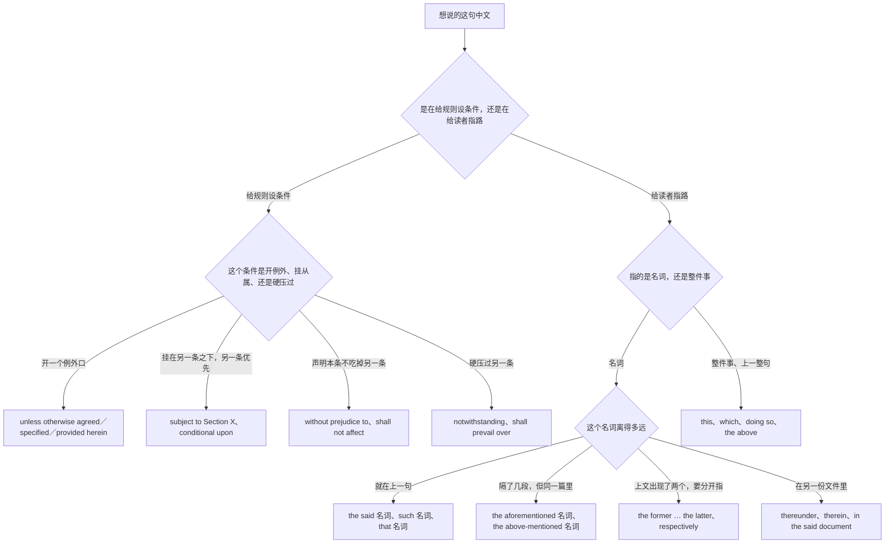
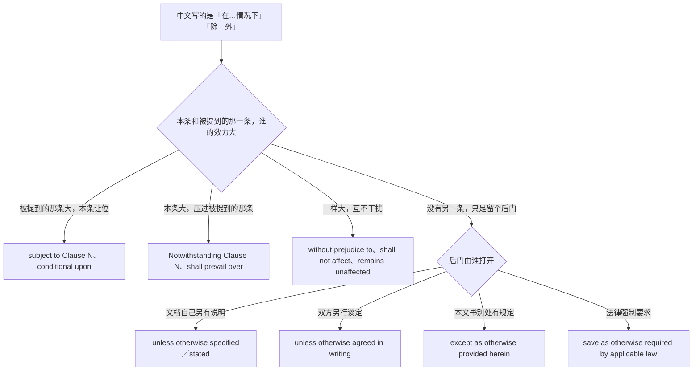
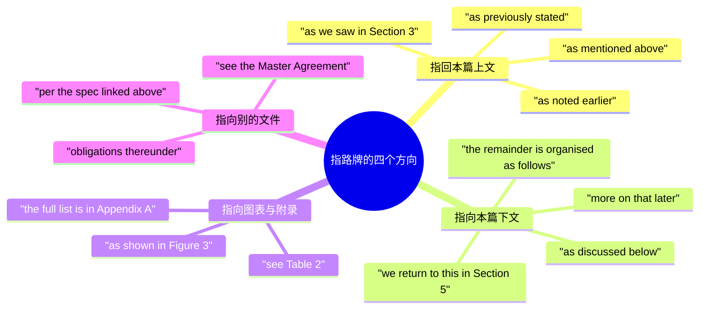
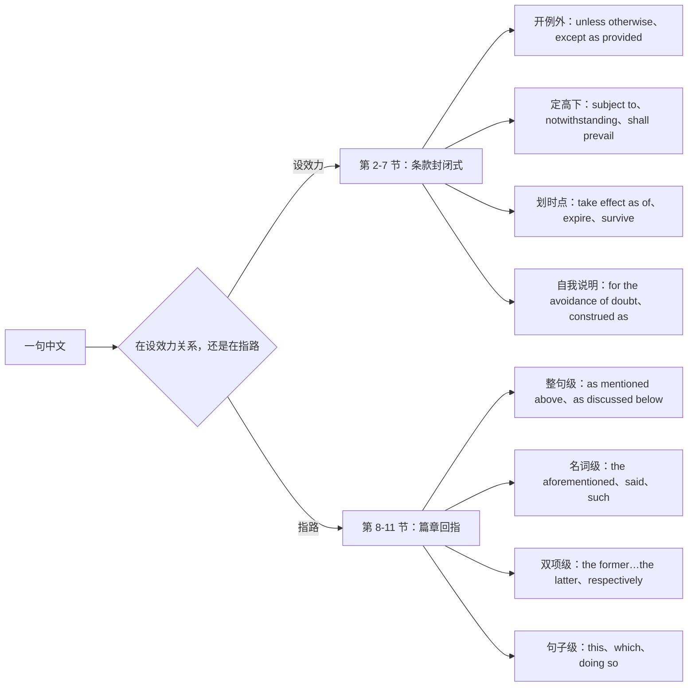

# 法律条款与篇章回指：除非另有约定、如前所述、前者后者

> [!info] 本篇定位
>
> 这篇收「除非另有约定」「除本协议另有规定外」「在不违反…的前提下」「不影响…的情况下」「本协议项下」「以下简称」「本条所述」「如果发生」「万一」「若…则视为」「以…为准」「优先适用」「受…管辖」「自…起生效」「有效期至」「期满自动续期」「提前终止」「为免疑义」「特此」「不得解释为」「如前所述」「见下文」「详见第 X 节」「如上表所示」「上述的」「该项」「此类」「相应地」「前者…后者」「分别是」「二者之一」「这一点」「这意味着」共三十二条查询意图，每条给口语、书面、正式三档成品。
>
> 与本分类另外四篇的分工：想学会**自己把一句话升档降档**的，查 [[12.文体、语域与正式文书/01.语域升降与同义改写：同一句话的三档说法\|语域升降与同义改写]]，那篇教的是手段，这篇给的是**手段够不到的地方**——合同套语不是把口语升级来的，是整块背下来的封闭式。写邮件查 [[12.文体、语域与正式文书/02.邮件与消息骨架：开场、过渡、附件、收尾\|邮件与消息骨架]]；写接口文档和 RFC 查 [[12.文体、语域与正式文书/03.技术规范与 API 文档：默认值、返回、抛出、已弃用\|技术规范与 API 文档]]，那篇的 MUST／SHOULD／MAY 和这篇的 shall 是两套刻意分开的情态；写论文查 [[12.文体、语域与正式文书/04.学术论证：本文提出、与前人不同、贡献与局限\|学术论证]]。
>
> 读完能查到：unless otherwise 后面为什么只能跟过去分词不能跟句子、unless otherwise specified 和 unless otherwise agreed 分别管什么、subject to 三个完全不同的意思怎么分、without prejudice to 和 notwithstanding 为什么方向相反、hereunder 与 thereunder 的一字之差、in the event that 后面能不能省 that、shall 在合同里和在技术规范里为什么不能同义、take effect as of 与 take effect on 的时点差、for the avoidance of doubt 后面接什么、as mentioned above 与 as mentioned earlier 在什么文体里各归各、the aforementioned 后面要不要加名词、said + 名词为什么不能加冠词、such 作限定词时的两种读法、the former…the latter 超过两项为什么必须换写法、respectively 的位置与顺序对齐、which 指整句时为什么必须有逗号、以及句首 This 指代含糊时的三种自救。
>
> 「如果」「一旦」「只要」「除非」的日常三档在 [[04.条件与假设/01.真实条件：如果就、只要、一旦、除非、前提是\|真实条件]]，本篇只给条款体的封闭式。「取决于」的完整清单在 [[04.条件与假设/04.取决与看情况：视…而定、说不好得看\|取决与看情况]]，本篇只给 subject to 那一支。范围界定与「包括但不限于」的完整说法归 [[08.指认、定义与描述/03.由…组成、分为、包括、属于：构成、分类与范围界定\|构成、分类与范围界定]]。指示代词与关系词的规则不在这里，指回 [[02.英语基础语法/03.代词与数词/03.指示代词与疑问代词\|指示代词与疑问代词]] 和 [[02.英语基础语法/09.从句体系/02.定语从句进阶\|定语从句进阶]]。

---

## 1. 本篇导读：不能自由造句的两个地方

这一篇处理的两块东西表面上不相干，实际共用同一条性质：**都不允许你临场组词**。

第一块是**合同与条款语言**。`unless otherwise specified`、`without prejudice to`、`shall prevail`、`take effect as of` 这些不是「正式一点的说法」，是整块封闭的成品。改一个介词、换一个近义词，法律效果就变了或者读起来像外行。这里没有创作空间，只有背与不背的区别。

第二块是**篇章回指**——长文里的方向指路牌。`as mentioned above`、`the aforementioned`、`said`、`the former…the latter`、句首的 `This` 与非限定的 `which`，负责告诉读者「我现在说的这个东西刚才出现过」或者「后面还会再说」。中文靠「上述」「该」「前者」「这」这几个词全包了，英文按**指多远、指名词还是指整句、正式到什么程度**分成好几支，选错了读者要么找不到指的是谁，要么被一句公文腔硌一下。

两块合成一篇的理由是：真正需要用条款套语的场合，几乎都是长文书，两套东西同时出现在同一页纸上。

### 1.1 中文意图到英文出路的总表

| 中文说法 | 干的是什么活 | 走哪条出路 | 本篇节次 |
| --- | --- | --- | --- |
| 除非另有约定／另有规定 | 给整条规则开一个例外口 | unless otherwise agreed／specified | 第 2 节 |
| 在不违反…的前提下 | 把这条规则挂在另一条之下 | subject to | 第 2 节 |
| 在不影响…的情况下 | 声明这条不吃掉另一条 | without prejudice to | 第 2 节 |
| 尽管有…的规定 | 强行盖过另一条 | notwithstanding | 第 2 节 |
| 本协议项下／本文中／以下简称 | 指向文书自身的坐标 | hereunder、herein、hereinafter | 第 3 节 |
| 如果发生／一旦／万一 | 条款体的条件触发 | in the event that、should | 第 4 节 |
| 若…则视为 | 把一个事实拟制成另一个 | shall be deemed to | 第 4 节 |
| 以…为准／优先适用／受…管辖 | 冲突时定谁说了算 | shall prevail、be governed by | 第 5 节 |
| 自…起生效／有效期至／提前终止 | 划效力的起点与终点 | take effect as of、expire、terminate | 第 6 节 |
| 为免疑义／特此／不得解释为 | 条款对自己作说明 | for the avoidance of doubt | 第 7 节 |
| 如前所述／见下文／详见第 X 节 | 指回或指向文中另一处 | as mentioned above、see below | 第 8 节 |
| 上述的／该项／此类／相应地 | 名词前的回指限定 | the aforementioned、said、such | 第 9 节 |
| 前者…后者／分别是／二者之一 | 一句话里同时指回两样 | the former…the latter | 第 10 节 |
| 这一点／这意味着／由此 | 指回的不是名词是整句 | this、which、doing so | 第 11 节 |

### 1.2 从中文进的总选择树

树的第一层是**功能分岔**：条款套语管的是效力关系，回指词管的是阅读导航，两者用不同的判据，混在一起查会互相干扰。第二层里条款那一支的四个出路差别很大——`unless otherwise` 是留后门，`subject to` 是认输，`without prejudice to` 是划清界限，`notwithstanding` 是压过去。中文常常都译成一个「在…情况下」，所以从中文进的时候必须先想清楚这一条和被引用那一条**谁大**。

回指那一支的判据是「远近」和「指的是什么」。上一句里的名词用 `such` 或 `said` 就够，隔了三段的用 `the aforementioned`，指整句话只能用 `this`／`which`。判据里最容易被忽略的是最后一支：`here-` 系列指本文件，`there-` 系列指刚才提到的**另一份**文件，这一对在同一份合同里经常挨着出现。

### 1.3 条款语言的三条形式约定

条款体不是把日常英语升一档，它有自己的三条硬规矩，不懂这三条会写出「像合同但不是合同」的东西。

| 约定 | 具体表现 | 为什么 |
| --- | --- | --- |
| 定义过的词大写首字母 | `the Agreement`、`the Parties`、`Confidential Information` | 大写表示这个词在定义条款里被专门定义过，不按日常词义读 |
| `shall` 表义务不表将来 | `The Licensee shall notify the Licensor` | 条款里的 shall 是「负有…义务」，不是将来时；写将来用 `will` |
| 例外先行，主句在后 | `Unless otherwise agreed in writing, notice shall be given …` | 例外口放在整条最前面，读者先知道有没有后门，再读正文 |

> [!tip] shall 在两种文体里不是一回事
>
> 合同里的 `shall` = 「有义务」，主语一定是承担义务的那一方。技术规范里 RFC 2119 的 `MUST／SHOULD／MAY` 是刻意造出来避开 `shall` 的，因为 `shall` 在工程语境里读起来歧义太大。写规范别混用两套，详见 [[12.文体、语域与正式文书/03.技术规范与 API 文档：默认值、返回、抛出、已弃用\|技术规范与 API 文档]]。

### 1.4 四个先立起来的提醒

> [!warning] unless otherwise 后面接的是分词不是句子
>
> - ❌ ~~Unless otherwise the parties agree, the fee is non-refundable.~~ ／ ✅ **Unless otherwise agreed by the parties, the fee is non-refundable.**（otherwise 后面直接跟过去分词，施事用 by 引出）
> - ❌ ~~Unless it is not otherwise specified, clause 5 applies.~~ ／ ✅ **Unless otherwise specified, clause 5 applies.**（unless 本身已含否定，再加 not 就把意思翻了回去）

> [!warning] subject to 和 without prejudice to 方向相反
>
> - `This clause is subject to Section 9.` = 第 9 条**大过**本条，冲突时听第 9 条的。
> - `This clause is without prejudice to Section 9.` = 本条**不动**第 9 条，两条各管各的。
> - 想说「本条不影响第 9 条」却写成 subject to，等于主动把本条降级。

> [!warning] said 与 such 作回指限定词时不加冠词
>
> - ❌ ~~The said the notice shall be delivered by hand.~~ ／ ❌ ~~a such request~~
> - ✅ **Said notice shall be delivered by hand.** ／ ✅ **Such request shall be made in writing.**（said 和 such 本身就顶掉了限定词的位置；写 the said notice 也通，但不能再多一个冠词）

> [!warning] the former…the latter 只管两项
>
> - ❌ ~~We compared Redis, Postgres and SQLite; the former is fastest.~~ ／ ✅ **We compared Redis, Postgres and SQLite; the first is the fastest.**（三项以上不能用 former／latter，改序数词或直接重复名词）

> [!tip] 查法
>
> 在写合同、条款、许可证、服务协议、隐私政策，去第 2 至 7 节。在写长文档、论文、设计文档、事故复盘，需要指回上文或者预告下文，去第 8 至 11 节。两边都不确定就回第 1.2 节的树，先判断这一句是在设条件还是在指路。

---

## 2. 除非另有约定：给规则开例外口的四个开关

这一节的四条意图都在处理**本条与别条的关系**。中文常常都是「在…的情况下」，英文分成四个方向完全不同的开关，选错等于把条款的效力关系写反。

### 2.1 除非另有约定：留一个可以推翻本条的后门

中文触发语：除非另有约定 / 除非双方另行约定 / 另有约定的除外 / 没特别说的话 / 默认情况下

| 档位 | 句架 | 例句 |
| --- | --- | --- |
| 口语 | Unless we say otherwise, ... | Unless we say otherwise, the meeting is every Tuesday. |
| 口语 | By default, ... unless someone says so. | By default the job retries three times, unless someone says otherwise. |
| 书面 | Unless otherwise specified, ... | Unless otherwise specified, all timestamps are in UTC. |
| 书面 | Unless otherwise stated [in this document], ... | Unless otherwise stated in this document, all prices exclude tax. |
| 正式 | Unless otherwise agreed [by the Parties] in writing, ... | Unless otherwise agreed by the Parties in writing, notice shall be given at least thirty (30) days in advance. |
| 正式 | Except as otherwise provided herein, ... | Except as otherwise provided herein, each Party shall bear its own costs. |
| 正式 | Save as otherwise required by applicable law, ... | Save as otherwise required by applicable law, the Supplier shall retain the records for six years. |

四个过去分词分工不同，挑错了读起来不专业：`specified`／`stated` 用于**文档自己说过**，`agreed` 用于**双方谈过**，`provided` 用于**本文书的别处条款有规定**，`required by law` 用于**法律强制**。技术文档最常用 `specified`，合同最常用 `agreed in writing`。

> [!warning] 错配警示
>
> - ❌ ~~Unless otherwise, the default is UTC.~~ ／ ✅ **Unless otherwise specified, the default is UTC.**（otherwise 是副词，后面必须有被它修饰的分词，不能单独收句）
> - ❌ ~~Unless otherwise agreed, the fee will not be refunded except if both parties agree.~~ ／ ✅ **Unless otherwise agreed in writing, the fee is non-refundable.**（前面已经开了后门，后面再补一个 except 是同一件事说两遍）

- 同义入口：除非另有约定 / 除非另有说明 / 另有约定的除外 / 默认情况下 / 没特别注明的话
- 语法归属：[[02.英语基础语法/09.从句体系/04.状语从句详解\|条件状语从句 unless]]
- 场景实战：[[04.英语场景/10.职场与商务场景实战/04.商务谈判合同与客户沟通\|合同条款的约定与除外]]

### 2.2 除本协议另有规定外：把例外口限定在本文书内部

中文触发语：除本协议另有规定外 / 本条另有规定的除外 / 本文另有说明的除外 / 除下述情形外

| 档位 | 句架 | 例句 |
| --- | --- | --- |
| 口语 | Apart from the cases below, ... | Apart from the cases below, everyone follows the same rule. |
| 书面 | Except as described in Section N, ... | Except as described in Section 4, the endpoint returns a 200 on success. |
| 书面 | Other than where noted, ... | Other than where noted, all examples assume the default configuration. |
| 正式 | Except as otherwise expressly provided in this Agreement, ... | Except as otherwise expressly provided in this Agreement, no amendment shall be effective unless made in writing. |
| 正式 | Subject to the exceptions set out in Clause N, ... | Subject to the exceptions set out in Clause 12, the Recipient shall not disclose any Confidential Information. |

`expressly` 这个词在正式档里不是装饰：它把例外限制在「白纸黑字明写过的」，堵掉「按常理推出来应该也算例外」的解释空间。

> [!warning] 错配警示
>
> - ❌ ~~Except in this Agreement provided otherwise, ...~~ ／ ✅ **Except as otherwise provided in this Agreement, ...**（except 后面接 as 引导的方式从句，不能把状语塞到中间）
> - ❌ ~~Except Section 4, the endpoint returns 200.~~ ／ ✅ **Except as described in Section 4, the endpoint returns 200.**（except 直接接节号，读成「除了第 4 节这段文字本身」，不是「除了第 4 节说的情形」）

- 同义入口：除本协议另有规定外 / 本文另有说明的除外 / 除下述情形外 / 除第 X 条规定的情形外
- 语法归属：[[02.英语基础语法/05.介词与连词/04.介词与连词的易混点\|except 与 except as 的分工]]
- 场景实战：[[04.英语场景/10.职场与商务场景实战/04.商务谈判合同与客户沟通\|合同的除外条款]]

### 2.3 在不违反…的前提下：把本条挂在另一条之下

中文触发语：在不违反…的前提下 / 以…为前提 / 受…约束 / 须符合… / 在…允许的范围内

| 档位 | 句架 | 例句 |
| --- | --- | --- |
| 口语 | as long as it's OK with A | We can ship Friday, as long as it's OK with legal. |
| 口语 | pending A | The refund is pending approval from the finance team. |
| 书面 | subject to A | All requests are subject to rate limiting. |
| 书面 | subject to A's approval | The schedule is subject to the client's approval. |
| 正式 | Subject to Clause N, ... | Subject to Clause 7, the Licensee may sublicense the Software. |
| 正式 | conditional upon A | Payment is conditional upon delivery of the final report. |
| 正式 | to the extent permitted by A | To the extent permitted by applicable law, the Supplier excludes all implied warranties. |

`subject to` 在实际文本里带三个不同的意思，判据是后面接的名词：接**条款号**是「受该条约束」，接**审批／同意**是「须经批准」，接**变动／费用**是「可能会有」。第三种在日常商务里最常见：`subject to change without notice` = 「可能变更，恕不另行通知」。

> [!warning] 错配警示
>
> - ❌ ~~This clause is subject to Section 9, so Section 9 must follow it.~~ ／ ✅ **This clause is subject to Section 9; Section 9 prevails.**（subject to 是本条服从对方，不是对方服从本条，方向记反是这条最常见的翻车点）
> - ❌ ~~The price is subject to changes without notice.~~ ／ ✅ **The price is subject to change without notice.**（这是固定式，change 用单数不加 s）

- 同义入口：在不违反…的前提下 / 以…为前提 / 受…约束 / 须经…同意 / 可能变更
- 语法归属：[[02.英语基础语法/05.介词与连词/02.常用介词搭配详解\|be subject to 的介词搭配]]
- 场景实战：[[04.英语场景/10.职场与商务场景实战/04.商务谈判合同与客户沟通\|附条件的承诺]]

### 2.4 在不影响…的情况下：声明本条不吃掉另一条

中文触发语：在不影响…的情况下 / 不损害… / 不妨碍… / 保留…的权利 / 尽管有…的规定

| 档位 | 句架 | 例句 |
| --- | --- | --- |
| 口语 | without taking anything away from A | Without taking anything away from what we agreed, I'd add one thing. |
| 书面 | This does not affect A. | Deleting the cache does not affect your saved settings. |
| 书面 | A remains unaffected. | Your existing subscription remains unaffected by this change. |
| 正式 | Without prejudice to A, ... | Without prejudice to any other remedy available to it, the Buyer may terminate this Agreement. |
| 正式 | Nothing in this Clause shall limit A. | Nothing in this Clause shall limit either Party's liability for fraud. |
| 正式 | Notwithstanding A, ... | Notwithstanding Clause 6.2, the Supplier shall remain liable for personal injury caused by its negligence. |

`without prejudice to` 和 `notwithstanding` 常常被一起记，其实方向相反：前者说「本条**不动**那一条，两条并存」，后者说「本条**盖过**那一条，冲突时听本条的」。中文的「尽管有…的规定」对应的是后者。

> [!warning] 错配警示
>
> - ❌ ~~Without prejudice to Clause 6, Clause 6 no longer applies.~~ ／ ✅ **Notwithstanding Clause 6, the following applies instead.**（要压过对方就用 notwithstanding，without prejudice to 的字面意思正是「不损害对方」）
> - ❌ ~~Notwithstanding of the above, we will proceed.~~ ／ ✅ **Notwithstanding the above, we will proceed.**（notwithstanding 本身是介词，后面不加 of）

- 同义入口：在不影响…的情况下 / 不损害… / 不妨碍… / 尽管有…的规定 / 保留其他权利
- 语法归属：[[02.英语基础语法/05.介词与连词/03.连词的分类与用法\|让步连接成分 notwithstanding]]
- 场景实战：[[04.英语场景/10.职场与商务场景实战/04.商务谈判合同与客户沟通\|权利保留的说法]]

### 2.5 四个开关的判读树

这棵树的用法是从右往左验：写完一句以后，把自己的句子对回树上，问「我刚才那个介词表达的效力关系，和我心里想的那一条一致吗」。四条里最容易写反的是 `subject to`，因为中文的「以…为前提」听上去像本条是主角，实际英文是本条认输。

第二层那四个后门的分工不能互换：技术文档里写 `unless otherwise agreed` 很怪，因为文档不是谈判文本；合同里写 `unless otherwise specified` 又太软，没说清是谁去 specify。挑的时候先问「谁有权打开这个后门」，答案就是要选的那一支。

---

## 3. 本协议项下、以下简称：指向文书自身的坐标词

`here-` 和 `there-` 开头的那一组词是条款体的坐标系统。它们的共同功能是**省掉一次重复**：不必每次都写 `under this Agreement`，写 `hereunder` 就行。它们不难，难在方向——`here-` 永远指**你正在读的这一份**，`there-` 指**刚才被提到的那一份**。

### 3.1 本协议项下、根据本协议

中文触发语：本协议项下 / 根据本协议 / 依本协议 / 按照本合同的规定 / 本协议所称

| 档位 | 句架 | 例句 |
| --- | --- | --- |
| 口语 | under this deal | Under this deal you get support for a year. |
| 书面 | under this agreement | All fees payable under this agreement are due within 30 days. |
| 书面 | as used in this document | As used in this document, "client" means the calling application. |
| 正式 | hereunder | The Supplier's obligations hereunder shall survive termination. |
| 正式 | herein | The definitions set out herein apply throughout. |
| 正式 | hereto | The Parties hereto have executed this Agreement in two counterparts. |
| 正式 | hereby | The Licensor hereby grants the Licensee a non-exclusive licence. |

四个词的落点不同：`hereunder` = under this agreement（在本协议之下产生的），`herein` = in this agreement（本协议里写着的），`hereto` = to this agreement（本协议的当事方或附件），`hereby` = by this agreement（凭本文书这个动作本身，用在授予、声明、确认这类**说出口即生效**的动词前）。

> [!warning] 错配警示
>
> - ❌ ~~The Parties herein have signed below.~~ ／ ✅ **The Parties hereto have signed below.**（当事方是「本协议的」当事方，用 hereto；herein 说的是写在协议里的内容）
> - ❌ ~~The Licensor herein grants a licence.~~ ／ ✅ **The Licensor hereby grants a licence.**（授予这个动作靠本文书完成，用 hereby）

- 同义入口：本协议项下 / 根据本协议 / 依本合同 / 本协议所称 / 特此授予
- 语法归属：[[02.英语基础语法/05.介词与连词/01.介词的分类与基本用法\|介词与副词合成词]]
- 场景实战：[[04.英语场景/10.职场与商务场景实战/03.商务邮件与正式书面沟通\|正式书面文书的措辞]]

### 3.2 以下简称、下称：给一个长名字起短名

中文触发语：以下简称 / 下称 / 以下统称 / 本文中称为 / 下文一律写作

| 档位 | 句架 | 例句 |
| --- | --- | --- |
| 口语 | which I'll just call A | The staging cluster, which I'll just call staging from here. |
| 书面 | (hereafter A) | We use the retrieval-augmented pipeline (hereafter RAG pipeline). |
| 书面 | referred to below as A | The primary node, referred to below as the leader. |
| 正式 | (hereinafter referred to as "A") | Acme Systems Limited (hereinafter referred to as "the Supplier"). |
| 正式 | (collectively, the "A") | The Supplier and the Buyer (collectively, the "Parties"). |
| 正式 | (each, a "A" and together, the "B") | Each subsidiary (each, a "Group Company" and together, the "Group"). |

学术与技术文体用 `hereafter`，法律文体用 `hereinafter referred to as`。引号加大写首字母是个信号，告诉读者这个词从此变成被定义过的专名，不按日常词义读。

> [!warning] 错配警示
>
> - ❌ ~~Acme Systems Limited (hereinafter "the Supplier") shall provide the Services hereinafter.~~ ／ ✅ **Acme Systems Limited (hereinafter referred to as "the Supplier") shall provide the Services described below.**（hereinafter 在定义括号里表示「下文起称作」，脱离括号单用等于「本文书以下部分」，两个用法挤在一句里读者会晕）
> - ❌ ~~the so-called Supplier~~ ／ ✅ **the Supplier, as defined above**（so-called 带质疑色彩，不用于中性的定义指代，详见 [[08.指认、定义与描述/02.X 是指、所谓、又称、相当于：定义与命名\|定义与命名]]）

- 同义入口：以下简称 / 下称 / 以下统称 / 本文中称为 / 后文写作
- 语法归属：[[02.英语基础语法/02.名词与冠词/03.冠词的用法详解\|专名与定冠词]]
- 场景实战：[[04.英语场景/10.职场与商务场景实战/04.商务谈判合同与客户沟通\|合同当事方的表述]]

### 3.3 本条所述、上述条款、见附件

中文触发语：本条所述 / 上述条款 / 依据第 X 条 / 见附件 / 如附表所列 / 随附于本协议

| 档位 | 句架 | 例句 |
| --- | --- | --- |
| 口语 | the bit above | The bit above about retries also applies here. |
| 书面 | as set out in Section N | The rate limits are as set out in Section 3. |
| 书面 | see the attached A | See the attached spec for the full field list. |
| 正式 | as set out in Clause N | The fees are as set out in Clause 5 and Schedule 2. |
| 正式 | in the Schedule attached hereto | The Services are described in the Schedule attached hereto. |
| 正式 | under the said document / thereunder | The Buyer shall comply with the Master Agreement and all obligations thereunder. |

最后一行是 `there-` 系列进场的地方：句子里已经出现了另一份文件（`the Master Agreement`），再说「那份文件项下的」义务时用 `thereunder`，与指本协议的 `hereunder` 分得清清楚楚。

> [!warning] 错配警示
>
> - ❌ ~~The Buyer shall comply with the Master Agreement and all obligations hereunder.~~ ／ ✅ **… and all obligations thereunder.**（义务是主协议项下的，不是本文书项下的，写成 hereunder 等于把义务挪了家）
> - ❌ ~~as set out on Clause 5~~ ／ ✅ **as set out in Clause 5**（set out 后面用 in 接条款号，用 on 接页码或表格）

- 同义入口：本条所述 / 上述条款 / 依据第 X 条 / 见附件 / 如附表所列
- 语法归属：[[02.英语基础语法/08.非谓语动词/04.过去分词详解\|过去分词作后置定语]]
- 场景实战：[[04.英语场景/10.职场与商务场景实战/03.商务邮件与正式书面沟通\|引用附件与条款]]

---

## 4. 如果发生、万一、若…则视为：条款体的条件触发

日常的「如果」在 [[04.条件与假设/01.真实条件：如果就、只要、一旦、除非、前提是\|真实条件]] 那篇已经给全了三档。这一节只收条款体独有的三种：正式的 `in the event that`、公文的倒装 `should`、以及把事实拟制成另一个事实的 `be deemed to`。

### 4.1 如果发生、一旦出现

中文触发语：如果发生 / 一旦出现 / 若…情形出现 / 如遇 / 在…发生时

| 档位 | 句架 | 例句 |
| --- | --- | --- |
| 口语 | if A happens | If the build breaks, ping me. |
| 口语 | if it comes to that | We can roll back, if it comes to that. |
| 书面 | in the event of + 名词 | In the event of a service outage, credits are applied automatically. |
| 书面 | if and when A | We will revisit the limits if and when traffic doubles. |
| 正式 | In the event that A, ... | In the event that the Supplier fails to deliver, the Buyer may source elsewhere. |
| 正式 | Where A, ... | Where a Party is prevented from performing by force majeure, its obligations are suspended. |
| 正式 | Upon the occurrence of A, ... | Upon the occurrence of an Event of Default, all outstanding amounts become immediately payable. |

`in the event of` 后面只能接**名词**，`in the event that` 后面接**句子**，这两个不能互换。条款体里用 `Where` 引导条件而不是 `If`，是英式法律文书的常见做法，表示「凡属这种情形一律如此」，语气比 `if` 更像通则。

> [!warning] 错配警示
>
> - ❌ ~~In the event of the Supplier fails to deliver, ...~~ ／ ✅ **In the event that the Supplier fails to deliver, ...** 或 **In the event of the Supplier's failure to deliver, ...**（接句子加 that，接名词把动词名词化）
> - ❌ ~~In the event that the Supplier will fail to deliver, ...~~ ／ ✅ **In the event that the Supplier fails to deliver, ...**（条件从句里用一般现在时表将来，不写 will）

- 同义入口：如果发生 / 一旦出现 / 若…情形出现 / 如遇 / 在…发生时
- 语法归属：[[02.英语基础语法/09.从句体系/04.状语从句详解\|条件状语从句的时态]]
- 场景实战：[[04.英语场景/10.职场与商务场景实战/04.商务谈判合同与客户沟通\|违约与应急条款]]

### 4.2 万一、如有需要：低概率与礼貌条件

中文触发语：万一 / 如有需要 / 倘若 / 若有 / 如确有必要 / 若届时…

| 档位 | 句架 | 例句 |
| --- | --- | --- |
| 口语 | just in case A | I'll bring the adapter just in case the room only has HDMI. |
| 口语 | if anything comes up | If anything comes up, my number is on the invite. |
| 书面 | should A + 动词原形 | Should you need any further information, please let me know. |
| 书面 | if any | Errors, if any, are logged to stderr. |
| 正式 | Should A occur, ... | Should any dispute arise, the Parties shall first attempt mediation. |
| 正式 | in the unlikely event that A | In the unlikely event that the data cannot be recovered, the Supplier shall notify the Client within 24 hours. |

`Should` 打头是把 `If you should need…` 里的 if 删掉、should 提前的结果，形态上是倒装，功能上是把语气降到「万一」。这是正式邮件的高频开场式，比 `If you need anything` 客气一档。

> [!warning] 错配警示
>
> - ❌ ~~Should you need any further information, please to let me know.~~ ／ ✅ **Should you need any further information, please let me know.**（should 后面接动词原形，主句的 please 后面也是原形）
> - ❌ ~~If should you need help, ...~~ ／ ✅ **Should you need help, ...**（should 提前就是为了顶掉 if，两个不能同时出现，倒装规则见语法篇）

- 同义入口：万一 / 如有需要 / 倘若 / 若有 / 如确有必要
- 语法归属：[[02.英语基础语法/10.特殊句型/03.倒装句结构\|省略 if 的条件倒装]]
- 场景实战：[[04.英语场景/10.职场与商务场景实战/03.商务邮件与正式书面沟通\|正式邮件的收尾条件句]]

### 4.3 若…则视为：把一个事实拟制成另一个

中文触发语：视为 / 即视同 / 应认定为 / 推定为 / 逾期不…的，视为…

| 档位 | 句架 | 例句 |
| --- | --- | --- |
| 口语 | we'll take that as A | If I don't hear back, I'll take that as a yes. |
| 书面 | A counts as B | Silence for five working days counts as approval. |
| 书面 | A is treated as B | An empty string is treated as a missing value. |
| 正式 | A shall be deemed to be B | Notice sent by email shall be deemed to be received on the next business day. |
| 正式 | A shall be deemed to have done B | A Party that fails to object within 10 days shall be deemed to have accepted the invoice. |
| 正式 | For the purposes of Clause N, A means B | For the purposes of Clause 8, "Business Day" means a day other than a Saturday, Sunday or public holiday. |

`be deemed` 是条款体的核心动词之一，它的作用是**明知不是，但规定按是来算**。第五行的 `deemed to have done` 是对过去动作的拟制，「逾期未提异议的视为已接受」正是这一种。

> [!warning] 错配警示
>
> - ❌ ~~Notice shall be deemed received on the next business day if it will be sent by email.~~ ／ ✅ **Notice sent by email shall be deemed received on the next business day.**（条件用后置分词短语压进主语，条款体不在这种地方开从句）
> - ❌ ~~The Party shall deem to have accepted the invoice.~~ ／ ✅ **The Party shall be deemed to have accepted the invoice.**（deem 是别人来 deem，主语是被拟制的那一方，必须用被动）

- 同义入口：视为 / 即视同 / 应认定为 / 推定为 / 逾期视为同意
- 语法归属：[[02.英语基础语法/10.特殊句型/01.被动语态全解\|被动语态与主语提升]]
- 场景实战：[[04.英语场景/10.职场与商务场景实战/04.商务谈判合同与客户沟通\|默认同意与逾期条款]]

---

## 5. 以…为准、优先适用：冲突时定谁说了算

多份文件、多个版本、多种语言并存时，必须有一条说清冲突时听谁的。这一节三条意图管的就是这件事。

### 5.1 以…为准

中文触发语：以…为准 / 以…为最终依据 / 有出入的以…为准 / 一切以…为准

| 档位 | 句架 | 例句 |
| --- | --- | --- |
| 口语 | go by A | If the two differ, go by the ticket. |
| 口语 | A is the source of truth | The database is the source of truth, not the spreadsheet. |
| 书面 | A takes precedence | Values in the environment file take precedence over the defaults. |
| 书面 | in case of any discrepancy, A applies | In case of any discrepancy between the diagram and the text, the text applies. |
| 正式 | A shall prevail | In the event of conflict, the English version shall prevail. |
| 正式 | A shall prevail over B | The terms of this Agreement shall prevail over any terms in the Purchase Order. |
| 正式 | A shall control | To the extent of any inconsistency, this Schedule shall control. |

`prevail` 是不及物的，「以 A 为准」直接说 `A shall prevail`；要点名被压过的那一方才加 `over B`。技术文档里更常见的是 `take precedence over`，语域比 `prevail` 低一档但意思一样。

> [!warning] 错配警示
>
> - ❌ ~~The English version shall be prevailed.~~ ／ ✅ **The English version shall prevail.**（prevail 没有被动形式，「以…为准」的主语就是那个说了算的东西）
> - ❌ ~~The config file takes precedence than the defaults.~~ ／ ✅ **The config file takes precedence over the defaults.**（precedence 的搭配是 over，不是 than）

- 同义入口：以…为准 / 以…为最终依据 / 有出入的以…为准 / 优先适用
- 语法归属：[[02.英语基础语法/05.介词与连词/02.常用介词搭配详解\|take precedence over 的搭配]]
- 场景实战：[[04.英语场景/10.职场与商务场景实战/04.商务谈判合同与客户沟通\|文件冲突的处理]]

### 5.2 受…管辖、适用…法律

中文触发语：受…管辖 / 适用…法律 / 依…法解释 / 由…法院专属管辖 / 提交…仲裁

| 档位 | 句架 | 例句 |
| --- | --- | --- |
| 口语 | it falls under A | That one falls under the old contract. |
| 书面 | A is governed by B | Access to the API is governed by the terms of service. |
| 书面 | A applies to B | The retention policy applies to all exported files. |
| 正式 | This Agreement shall be governed by and construed in accordance with the laws of A. | This Agreement shall be governed by and construed in accordance with the laws of England and Wales. |
| 正式 | The courts of A shall have exclusive jurisdiction. | The courts of Singapore shall have exclusive jurisdiction over any dispute arising hereunder. |
| 正式 | Any dispute shall be referred to arbitration in A. | Any dispute arising out of this Agreement shall be referred to arbitration in Hong Kong. |

第四行整句是一个不可拆的封闭式，`governed by` 管的是适用哪国法，`construed in accordance with` 管的是按哪国法解释条文，实务里两个一起写，不要只留一半。

> [!warning] 错配警示
>
> - ❌ ~~This Agreement is governed under the laws of Japan.~~ ／ ✅ **This Agreement is governed by the laws of Japan.**（governed 的搭配是 by；under 用在 under Japanese law 这种名词短语里）
> - ❌ ~~in accordance to the laws of ...~~ ／ ✅ **in accordance with the laws of ...**（accordance 只跟 with）

- 同义入口：受…管辖 / 适用…法律 / 依…法解释 / 专属管辖 / 提交仲裁
- 语法归属：[[02.英语基础语法/10.特殊句型/01.被动语态全解\|被动语态的施事介词]]
- 场景实战：[[04.英语场景/10.职场与商务场景实战/04.商务谈判合同与客户沟通\|适用法律与争议解决]]

### 5.3 如有冲突、若不一致

中文触发语：如有冲突 / 若不一致 / 有出入时 / 两者矛盾的话 / 就不一致的部分而言

| 档位 | 句架 | 例句 |
| --- | --- | --- |
| 口语 | if the two don't match | If the two don't match, the newer one wins. |
| 书面 | if there is any conflict between A and B | If there is any conflict between the README and the code, trust the code. |
| 书面 | where the two differ | Where the two differ, the value in the deployment manifest is used. |
| 正式 | In the event of any conflict or inconsistency between A and B, ... | In the event of any conflict or inconsistency between this Agreement and the Order Form, this Agreement shall prevail. |
| 正式 | To the extent of any inconsistency, ... | To the extent of any inconsistency, the provisions of Schedule 1 shall apply. |

`to the extent of any inconsistency` 是个精确表达：只在**不一致的那一部分**上让位，其余部分两份文件继续并存。写成 `if there is any inconsistency, Schedule 1 applies` 会被读成一有矛盾整份都换成附件一。

> [!warning] 错配警示
>
> - ❌ ~~If there is any conflict, this Agreement will be prevailed over the Order Form.~~ ／ ✅ **… this Agreement shall prevail over the Order Form.**（prevail 不用被动，条款里的义务性动词用 shall 不用 will）
> - ❌ ~~in case of conflict between A with B~~ ／ ✅ **in case of conflict between A and B**（between 的搭档只能是 and）

- 同义入口：如有冲突 / 若不一致 / 有出入时 / 两者矛盾的话 / 就不一致的部分
- 语法归属：[[02.英语基础语法/05.介词与连词/03.连词的分类与用法\|between … and 的并列]]
- 场景实战：[[04.英语场景/10.职场与商务场景实战/04.商务谈判合同与客户沟通\|多份文件的效力顺序]]

---

## 6. 自…起生效、有效期至：划效力的起点与终点

时长与期限的日常说法在 [[07.时间与顺序/03.花了多久、每隔一次、快要了、到…为止：时长、频率与期限\|时长、频率与期限]]。这一节只收条款体的三条：起点、终点、以及提前收场。

### 6.1 自…起生效

中文触发语：自…起生效 / 于…开始施行 / 从…开始适用 / 即日生效 / 追溯至…生效

| 档位 | 句架 | 例句 |
| --- | --- | --- |
| 口语 | starting A | Starting Monday, the old endpoint is gone. |
| 口语 | it kicks in on A | The new limit kicks in on the first of the month. |
| 书面 | effective A | Effective 1 March, all requests require an API key. |
| 书面 | takes effect on A | The change takes effect on the next billing cycle. |
| 正式 | shall take effect as of A | This amendment shall take effect as of 1 January 2027. |
| 正式 | shall come into force on A | The Regulation shall come into force on the twentieth day following publication. |
| 正式 | with effect from A | With effect from the Completion Date, the Buyer assumes all liabilities. |

`as of` 和 `on` 有一处实际差别：`on 1 January` 是「1 月 1 日那天开始」，`as of 1 January` 还常用于**回溯生效**——文件签在 3 月，但效力从 1 月起算。写追溯生效必须用 `as of` 或 `retroactive to`。

> [!warning] 错配警示
>
> - ❌ ~~This amendment will be effected from 1 January.~~ ／ ✅ **This amendment takes effect from 1 January.**（effect 作动词是「实现、促成」，与「生效」无关；生效用 take effect）
> - ❌ ~~effective on immediately~~ ／ ✅ **effective immediately**（immediately 是副词，前面不加介词）

- 同义入口：自…起生效 / 于…开始施行 / 即日生效 / 追溯至…生效 / 下个周期起
- 语法归属：[[02.英语基础语法/05.介词与连词/01.介词的分类与基本用法\|时间介词 as of、from、on]]
- 场景实战：[[04.英语场景/10.职场与商务场景实战/04.商务谈判合同与客户沟通\|生效日与交割日]]

### 6.2 有效期至、届满

中文触发语：有效期至 / 届满 / 到期 / 有效期为一年 / 在…之前一直有效 / 到…为止

| 档位 | 句架 | 例句 |
| --- | --- | --- |
| 口语 | it runs until A | The trial runs until the end of the month. |
| 口语 | it's good for A | The token is good for 24 hours. |
| 书面 | valid until A | The certificate is valid until 30 June. |
| 书面 | expires after A | The reset link expires after 15 minutes. |
| 正式 | shall remain in force until A | This Agreement shall remain in force until terminated in accordance with Clause 12. |
| 正式 | for an initial term of A | This Agreement is entered into for an initial term of twenty-four (24) months. |
| 正式 | shall expire on the earlier of A and B | The licence shall expire on the earlier of the Completion Date and 31 December 2027. |

最后一行的 `the earlier of A and B` 是「以先到者为准」的标准写法，反过来是 `the later of A and B`。条款里写日期常在数字后面加括号重复一次英文写法（`twenty-four (24) months`），是为了防篡改，不是啰嗦。

> [!warning] 错配警示
>
> - ❌ ~~The certificate is valid till 30 June in the contract.~~ ／ ✅ **The certificate is valid until 30 June.**（till 是口语拼写，正式文书写 until）
> - ❌ ~~expires in 15 minutes later~~ ／ ✅ **expires in 15 minutes** 或 **expires 15 minutes later**（in 和 later 表同一层意思，不叠用）

- 同义入口：有效期至 / 届满 / 到期 / 有效期为 / 以先到者为准 / 到…为止
- 语法归属：[[02.英语基础语法/05.介词与连词/01.介词的分类与基本用法\|until、by、within 的时点差]]
- 场景实战：[[04.英语场景/10.职场与商务场景实战/04.商务谈判合同与客户沟通\|合同期限与续约]]

### 6.3 提前终止、自动续期

中文触发语：提前终止 / 单方解除 / 自动续期 / 到期不续 / 提前 N 天通知 / 终止后仍然有效

| 档位 | 句架 | 例句 |
| --- | --- | --- |
| 口语 | we can pull out with A notice | We can pull out with a month's notice. |
| 口语 | it renews itself unless you cancel | It renews itself every year unless you cancel. |
| 书面 | either side can cancel with A notice | Either side can cancel with 30 days' notice. |
| 书面 | renews automatically unless cancelled | The plan renews automatically unless cancelled before the renewal date. |
| 正式 | Either Party may terminate this Agreement upon A days' written notice. | Either Party may terminate this Agreement upon sixty (60) days' written notice to the other. |
| 正式 | shall automatically renew for successive A periods | This Agreement shall automatically renew for successive twelve-month periods unless either Party gives notice of non-renewal. |
| 正式 | shall survive termination | Clauses 8, 9 and 11 shall survive termination or expiry of this Agreement. |

最后一行的 `survive` 是条款体的专用义：合同没了，某几条继续有效。保密条款、赔偿条款、管辖条款通常都写在这一行里。

> [!warning] 错配警示
>
> - ❌ ~~upon 60 days written notice~~ ／ ✅ **upon 60 days' written notice**（days 要用所有格撇号，这是英美合同的固定写法）
> - ❌ ~~Clause 8 shall be survived after termination.~~ ／ ✅ **Clause 8 shall survive termination.**（survive 在这里是及物动词，主语是活下来的那一条，不用被动也不加 after）

- 同义入口：提前终止 / 单方解除 / 自动续期 / 到期不续 / 提前 N 天通知 / 终止后仍有效
- 语法归属：[[02.英语基础语法/02.名词与冠词/02.名词的数与格\|时间名词的所有格]]
- 场景实战：[[04.英语场景/10.职场与商务场景实战/04.商务谈判合同与客户沟通\|终止与续约条款]]

---

## 7. 为免疑义、不得解释为：条款对自己作说明

条款有时候要停下来解释自己。这一节三条意图管的是这种自指的说明句。

### 7.1 为免疑义、为清楚起见

中文触发语：为免疑义 / 为避免歧义 / 为清楚起见 / 需要说明的是 / 这里再明确一下

| 档位 | 句架 | 例句 |
| --- | --- | --- |
| 口语 | just to be clear | Just to be clear, this only covers the API, not the SDK. |
| 口语 | so nobody has to guess | So nobody has to guess: the deadline is Friday noon, not Friday end of day. |
| 书面 | To be explicit, ... | To be explicit, an empty array is a valid response, not an error. |
| 书面 | For clarity, ... | For clarity, "day" means calendar day throughout this document. |
| 正式 | For the avoidance of doubt, ... | For the avoidance of doubt, nothing in this Clause obliges the Supplier to provide on-site support. |
| 正式 | It is hereby confirmed that ... | It is hereby confirmed that the Deposit forms part of the Purchase Price. |

这一族的功能是**堵解释空间**，不是补充新内容。`For the avoidance of doubt` 后面接的应该是本来就能从条款推出来、但怕对方读不出的那一层，接全新的义务是滥用。

> [!warning] 错配警示
>
> - ❌ ~~For the avoidance of doubt, the Supplier shall also provide 24／7 support.~~ ／ ✅ 新义务另起一条写。（这个短语后面写全新义务，等于把重要条款藏在澄清句里，实务上会被对方挑出来）
> - ❌ ~~For avoidance of doubts, ...~~ ／ ✅ **For the avoidance of doubt, ...**（定冠词不能省，doubt 用单数，整句是封闭式）

- 同义入口：为免疑义 / 为避免歧义 / 为清楚起见 / 这里再明确一下 / 需要说明的是
- 语法归属：[[02.英语基础语法/09.从句体系/03.名词性从句详解\|it 作形式主语的 that 从句]]
- 场景实战：[[04.英语场景/10.职场与商务场景实战/04.商务谈判合同与客户沟通\|条款的澄清与补充]]

### 7.2 特此、兹、双方一致同意

中文触发语：特此 / 兹 / 双方一致同意 / 现约定如下 / 鉴于 / 据此达成如下协议

| 档位 | 句架 | 例句 |
| --- | --- | --- |
| 口语 | so here's what we agreed | So here's what we agreed: two rounds of review, then ship. |
| 书面 | The two sides have agreed the following. | The two sides have agreed the following changes to the schedule. |
| 书面 | This note records A. | This note records the decision taken at the design review. |
| 正式 | The Parties hereby agree as follows: | The Parties hereby agree as follows: |
| 正式 | Whereas A; and whereas B; now therefore ... | Whereas the Supplier is engaged in the manufacture of X; and whereas the Buyer wishes to purchase X; now therefore the Parties agree as follows. |
| 正式 | In consideration of A, the Parties agree that B. | In consideration of the mutual covenants set out herein, the Parties agree that the Term shall commence on the Effective Date. |

`Whereas` 打头的段落是「鉴于条款」，只交代背景不设义务；`now therefore` 是背景与正文之间的过桥词。这三行整块是模板，实务里照抄不改。

> [!warning] 错配警示
>
> - ❌ ~~Whereas the Supplier shall deliver the goods by Friday.~~ ／ ✅ 义务写进正文条款，鉴于条款只写事实背景。（whereas 段落不产生义务，把 shall 写进去在解释上会有麻烦）
> - ❌ ~~The Parties hereby agrees as follows.~~ ／ ✅ **The Parties hereby agree as follows.**（Parties 是复数，动词不加 s；这一行几乎逐字固定，抄错很显眼）

- 同义入口：特此 / 兹 / 双方一致同意 / 现约定如下 / 鉴于 / 据此达成如下协议
- 语法归属：[[02.英语基础语法/10.特殊句型/06.主谓一致\|复数主语的主谓一致]]
- 场景实战：[[04.英语场景/10.职场与商务场景实战/04.商务谈判合同与客户沟通\|协议开头的固定段落]]

### 7.3 不得解释为、不构成

中文触发语：不得解释为 / 不构成 / 不应被视为 / 并不意味着 / 不代表放弃 / 仅供参考

| 档位 | 句架 | 例句 |
| --- | --- | --- |
| 口语 | that doesn't mean A | Approving the design doesn't mean we've signed off on the budget. |
| 口语 | don't read it as A | Don't read the silence as agreement. |
| 书面 | This does not constitute A. | This summary does not constitute legal advice. |
| 书面 | A is provided for reference only. | The benchmark numbers are provided for reference only. |
| 正式 | Nothing in this Agreement shall be construed as A. | Nothing in this Agreement shall be construed as creating a partnership between the Parties. |
| 正式 | No failure to A shall operate as a waiver of B. | No failure to exercise any right shall operate as a waiver of that right. |
| 正式 | A shall not be deemed to B. | Acceptance of late payment shall not be deemed to waive the Supplier's right to interest. |

`Nothing in this Agreement shall be construed as …` 是最常用的一句自我限缩，后面接动名词。倒数第二行是「不作为条款」（no-waiver clause），中文的「一次不追究不等于放弃权利」就是它。

> [!warning] 错配警示
>
> - ❌ ~~Nothing in this Agreement shall be constructed as creating a partnership.~~ ／ ✅ **… shall be construed as creating a partnership.**（construe 是「解释」，construct 是「建造」，这两个词长得像但完全无关）
> - ❌ ~~Nothing shall be construed as to create a partnership.~~ ／ ✅ **Nothing shall be construed as creating a partnership.**（construed as 后面接动名词，不接 to 不定式）

- 同义入口：不得解释为 / 不构成 / 不应被视为 / 并不意味着 / 不代表放弃 / 仅供参考
- 语法归属：[[02.英语基础语法/08.非谓语动词/02.动名词详解\|介词后接动名词]]
- 场景实战：[[04.英语场景/10.职场与商务场景实战/04.商务谈判合同与客户沟通\|免责与限缩条款]]

---

## 8. 如前所述、见下文：篇章里的指路牌

从这一节开始换轨。前面六节的东西只在合同里用，后面四节的东西在任何一篇超过三页的文档里都要用——论文、设计文档、事故复盘、长邮件。

### 8.1 如前所述、上文提到过

中文触发语：如前所述 / 上文提到 / 前面说过 / 正如刚才讲的 / 我们已经看到

| 档位 | 句架 | 例句 |
| --- | --- | --- |
| 口语 | like I said | Like I said earlier, the cache is the bottleneck. |
| 口语 | going back to what we said about A | Going back to what we said about retries, the same applies here. |
| 书面 | As mentioned above, ... | As mentioned above, the index is rebuilt nightly. |
| 书面 | As noted earlier, ... | As noted earlier, this only affects clients on version 2. |
| 书面 | As we saw in Section N, ... | As we saw in Section 3, latency grows linearly with batch size. |
| 正式 | As previously stated, ... | As previously stated, the sample is not representative of the full population. |
| 正式 | As set out in Section N above, ... | As set out in Section 2 above, the study covers only English-language sources. |

`above` 和 `earlier` 分工按文体：印在纸上的、有版面的（论文、规范、合同）用 `above`／`below`，讲稿、录音转写、线性叙述的用 `earlier`／`later`。写论文时 `above` 更稳，写演讲稿时 `earlier` 更自然。

> [!warning] 错配警示
>
> - ❌ ~~As mentioned in the above, the index is rebuilt nightly.~~ ／ ✅ **As mentioned above, ...**（above 在这里是副词，前面不加 in the）
> - ❌ ~~As I mentioned above in my last email, ...~~ ／ ✅ **As I mentioned in my last email, ...**（above 指本篇内的上文，跨文件指代要改成具体出处）

- 同义入口：如前所述 / 上文提到 / 前面说过 / 正如刚才讲的 / 我们已经看到
- 语法归属：[[02.英语基础语法/09.从句体系/04.状语从句详解\|as 引导的方式从句]]
- 场景实战：[[04.英语场景/10.职场与商务场景实战/02.会议汇报与演示场景\|汇报中回指前文]]

### 8.2 见下文、后面会讲到

中文触发语：见下文 / 后面会讲到 / 下一节详述 / 稍后再说 / 我们将在第 X 节论证

| 档位 | 句架 | 例句 |
| --- | --- | --- |
| 口语 | I'll get to that in a minute | The rollback plan — I'll get to that in a minute. |
| 口语 | more on that later | There's a catch with timezones; more on that later. |
| 书面 | as discussed below | The failure mode is rare, as discussed below. |
| 书面 | We return to this in Section N. | We return to this trade-off in Section 5. |
| 书面 | Section N covers A in detail. | Section 6 covers the migration path in detail. |
| 正式 | We will argue in Section N that A. | We will argue in Section 4 that the two effects are independent. |
| 正式 | The remainder of this document is organised as follows. | The remainder of this document is organised as follows: Section 2 reviews prior work; Section 3 presents the method. |

最后一行是长文档的路线图句，学术写作里几乎是必写项，写设计文档同样好用。它的价值是让读者知道后面有几站、每站讲什么，可以按需跳读。

> [!warning] 错配警示
>
> - ❌ ~~We will discuss it in the below section.~~ ／ ✅ **We discuss this in the next section.** 或 **… as discussed below.**（below 作前置定语不地道，要么后置作副词，要么换 next／following）
> - ❌ ~~As will be mentioned later, the cache is stale.~~ ／ ✅ **As we will see in Section 4, the cache can be stale.**（as will be mentioned 的被动加将来读起来绕，正式写作里用 as we will see 或 as discussed below）

- 同义入口：见下文 / 后面会讲到 / 下一节详述 / 稍后再说 / 我们将在第 X 节论证
- 语法归属：[[02.英语基础语法/06.动词时态/02.一般将来时与过去将来时\|将来时表预告]]
- 场景实战：[[04.英语场景/09.学习与教育场景实战/02.图书馆作业与研究场景\|论文的结构预告]]

### 8.3 详见、参见、如上表所示

中文触发语：详见 / 参见 / 如上表所示 / 见图 3 / 完整清单见附录 / 数据来自表 2

| 档位 | 句架 | 例句 |
| --- | --- | --- |
| 口语 | check the table above | Check the table above for the exact limits. |
| 书面 | see Table N | The measured overhead is under 3 ms (see Table 2). |
| 书面 | as shown in Figure N | As shown in Figure 3, throughput plateaus after eight workers. |
| 书面 | The full list is in Appendix A. | The full list of error codes is in Appendix A. |
| 正式 | For a full treatment, see A. | For a full treatment of the algorithm, see Knuth (1997). |
| 正式 | Refer to Section N for A. | Refer to Section 7 for the complete parameter reference. |

`as shown in Figure 3` 与 `Figure 3 shows that …` 是两种写法，前者把图当佐证挂在句尾，后者把图当主语来陈述。同一篇里两种交替用，避免连着五句都以 `As shown in` 开头。

> [!warning] 错配警示
>
> - ❌ ~~As shown in the Figure 3, throughput plateaus.~~ ／ ✅ **As shown in Figure 3, ...**（编号的图表名前不加定冠词）
> - ❌ ~~Refer Section 7 for the parameters.~~ ／ ✅ **Refer to Section 7 for the parameters.**（refer 是不及物的，必须带 to）

- 同义入口：详见 / 参见 / 如上表所示 / 见图 X / 完整清单见附录 / 数据来自表 X
- 语法归属：[[02.英语基础语法/02.名词与冠词/03.冠词的用法详解\|编号名词前的零冠词]]
- 场景实战：[[04.英语场景/09.学习与教育场景实战/02.图书馆作业与研究场景\|图表与文献引用]]

### 8.4 回指方向的一张图

四个方向对应四套词，混用会让读者找错地方。最容易出错的是第一支和第四支挤在一起：写「上面提到过」的时候，读者默认去本篇找；如果那件事其实是在另一封邮件里说的，就必须点名出处，不能只写 `as mentioned above`。

第二支的两条要分场合：`more on that later` 是口头与随笔的说法，正式文档写 `we return to this in Section 5`，把「后面」落实成一个可跳转的坐标。读者读长文最烦的就是被告知「后面会讲」却不知道在哪一页。

---

## 9. 上述、该、此类：名词前的回指限定词

上一节的指路牌是整句级别的，这一节缩小到名词短语内部：怎么在名词前面加一个词，表示「就是刚才说的那个」。

### 9.1 上述的、前述的

中文触发语：上述的 / 前述的 / 上面提到的那个 / 刚才说的那个 / 以上各项

| 档位 | 句架 | 例句 |
| --- | --- | --- |
| 口语 | that A I mentioned | That timeout I mentioned is still set to 30 seconds. |
| 书面 | the A above | The three constraints above rule out a single-node design. |
| 书面 | the above-mentioned A | The above-mentioned limits apply per project, not per user. |
| 正式 | the aforementioned A | The aforementioned deadline may be extended by mutual consent. |
| 正式 | the aforesaid A | The aforesaid notice shall be sent to the address in Schedule 1. |
| 正式 | the foregoing | The foregoing shall not apply to Confidential Information already in the public domain. |

`the foregoing` 是唯一能**单独作名词用**的一个，指「以上所述的全部内容」。其余三个都是限定词，后面必须跟名词。日常写作里 `the above-mentioned` 已经偏公文腔，技术文档更常见的是直接 `the limits above`。

> [!warning] 错配警示
>
> - ❌ ~~The aforementioned shall not apply.~~ ／ ✅ **The foregoing shall not apply.** 或 **The aforementioned exclusion shall not apply.**（aforementioned 是形容词，后面必须有名词；要单用改 the foregoing）
> - ❌ ~~The above three constraints above rule out ...~~ ／ ✅ **The three constraints above rule out ...**（above 出现一次就够，前后各放一个是常见的手滑）

- 同义入口：上述的 / 前述的 / 上面提到的 / 刚才说的那个 / 以上各项
- 语法归属：[[02.英语基础语法/04.形容词与副词/01.形容词的用法与位置\|前置定语与后置修饰]]
- 场景实战：[[04.英语场景/10.职场与商务场景实战/03.商务邮件与正式书面沟通\|正式文书里的回指]]

### 9.2 该 + 名词：条款体的定点回指

中文触发语：该项 / 该方 / 该通知 / 上述该合同 / 前述该笔款项

| 档位 | 句架 | 例句 |
| --- | --- | --- |
| 口语 | that A | That request never reached the server. |
| 书面 | that A | That parameter is optional in version 3. |
| 书面 | this A | This limit can be raised on request. |
| 正式 | said A | Said notice shall be delivered by registered post. |
| 正式 | the said A | The said Party shall bear the cost of the inspection. |
| 正式 | such A | Such request shall be made in writing and signed by an authorised officer. |

`said` 和 `such` 是条款体的定点回指词，共同点是**不带冠词也能用**，共同的效果是把指代锁死在「上文刚刚定义或提到的那一个」。这两个词出现在非法律文本里会显得做作，写技术文档一律用 `that`／`this`。

> [!warning] 错配警示
>
> - ❌ ~~a such request~~ ／ ❌ ~~the such notice~~ ／ ✅ **such request** ／ ✅ **any such notice**（such 前面只能放 any、no、all 这类量词，不能放冠词）
> - ❌ ~~Said the notice shall be delivered by post.~~ ／ ✅ **Said notice shall be delivered by post.** 或 **The said notice shall be delivered by post.**（said 后面直接跟名词，或者写 the said，两个定语不能重叠）

- 同义入口：该项 / 该方 / 该通知 / 上述该合同 / 前述那一笔
- 语法归属：[[02.英语基础语法/03.代词与数词/03.指示代词与疑问代词\|指示词的回指用法]]
- 场景实战：[[04.英语场景/10.职场与商务场景实战/04.商务谈判合同与客户沟通\|条款内的定点指代]]

### 9.3 此类、这种、类似的

中文触发语：此类 / 这种 / 这类情况 / 类似的 / 凡属这种的 / 上述任何一种

| 档位 | 句架 | 例句 |
| --- | --- | --- |
| 口语 | that kind of A | That kind of error usually means a bad token. |
| 口语 | stuff like that | Retries, backoff, stuff like that. |
| 书面 | such A | Such failures are logged but not retried. |
| 书面 | A of this kind | Requests of this kind are rate-limited separately. |
| 正式 | any such A | Any such amendment shall be signed by both Parties. |
| 正式 | all A of a similar nature | All claims of a similar nature shall be consolidated. |

`such` 有两个读法，靠上下文分：接在已定义名词后面是回指（「刚才说的那种」），出现在 `such … that` 结构里是程度（「如此…以至于」）。程度那一支归 [[09.比较、程度与数量/03.太…以至于、够不够、有点、非常：程度刻度\|程度刻度]]，本篇只管回指这一支。

> [!warning] 错配警示
>
> - ❌ ~~Such errors are so frequent that we ignore them, and such is a problem.~~ ／ ✅ **Such errors are so frequent that we ignore them, which is a problem.**（such 不作句子的回指主语，指整句用 which 或 this）
> - ❌ ~~any such of the amendments~~ ／ ✅ **any such amendment**（such 后面直接跟名词，不插 of 短语）

- 同义入口：此类 / 这种 / 这类情况 / 类似的 / 凡属这种的 / 上述任何一种
- 语法归属：[[02.英语基础语法/03.代词与数词/04.不定代词详解\|such 与 the same 的替代用法]]
- 场景实战：[[04.英语场景/05.高频实用表达句型框架/04.比较对比举例总结句型库\|类别指代与归纳]]

### 9.4 相应地、各自地、据此

中文触发语：相应地 / 相应的 / 据此 / 因此照此办理 / 各自的 / 按上述规定

| 档位 | 句架 | 例句 |
| --- | --- | --- |
| 口语 | so we'll adjust | The scope changed, so we'll adjust the estimate. |
| 书面 | accordingly | The scope has changed; the estimate has been revised accordingly. |
| 书面 | the corresponding A | Each error code has a corresponding message in the table below. |
| 正式 | shall be adjusted accordingly | If the volume changes, the unit price shall be adjusted accordingly. |
| 正式 | their respective A | The Parties shall bear their respective legal costs. |
| 正式 | in accordance with the foregoing | The Escrow Agent shall release the funds in accordance with the foregoing. |

`accordingly` 和 `respective` 都在做回指，但指的东西不同：`accordingly` 指回**上一句说的那个变化**，`respective` 指回**上文列出的那几个主体各自对应的那一份**。中文都可能说成「相应的」。

> [!warning] 错配警示
>
> - ❌ ~~The Parties shall bear the respectively legal costs.~~ ／ ✅ **The Parties shall bear their respective legal costs.**（respective 是形容词修饰名词，respectively 是副词放句尾，两个词形不能互换）
> - ❌ ~~Accordingly to the contract, payment is due in 30 days.~~ ／ ✅ **According to the contract, payment is due in 30 days.**（according to 是介词短语，accordingly 是「相应地」，两者无关）

- 同义入口：相应地 / 相应的 / 据此 / 照此办理 / 各自的 / 按上述规定
- 语法归属：[[02.英语基础语法/04.形容词与副词/03.副词的分类与用法\|连接性副词的位置]]
- 场景实战：[[04.英语场景/10.职场与商务场景实战/04.商务谈判合同与客户沟通\|价格与费用的调整表述]]

---

## 10. 前者后者、分别、二者：一句话里同时指回两样

上文出现两个东西、下一句要分别说它们，中文有一套现成的「前者…后者」。英文这一套有严格的项数限制和顺序对齐要求，错一步读者就配错对。

### 10.1 前者…后者

中文触发语：前者…后者 / 头一个…第二个 / 前面那个…后面那个 / 一个是…另一个是

| 档位 | 句架 | 例句 |
| --- | --- | --- |
| 口语 | the first one ... the second one | We tried Redis and Memcached; the first one won on persistence. |
| 口语 | this one ... that one | Two options: this one is cheaper, that one is faster. |
| 书面 | the former ... the latter | Batch and streaming both work; the former is simpler, the latter is faster. |
| 书面 | the latter [of the two] | Of the two designs, the latter scales better. |
| 正式 | the former ... whereas the latter ... | The former relies on a nightly rebuild, whereas the latter updates incrementally. |
| 正式 | the first-mentioned ... the last-mentioned ... | The first-mentioned Party shall provide the premises; the last-mentioned shall provide the equipment. |

`the former` 指**先出现的那个**，`the latter` 指**后出现的那个**，顺序绝对，不能按重要性排。三项以上必须换写法：`the first`、`the second`、`the third`，或者干脆重复名词——重复名词永远是安全解。

> [!warning] 错配警示
>
> - ❌ ~~We evaluated Redis, Postgres and SQLite; the former is fastest.~~ ／ ✅ **… ; Redis is the fastest of the three.**（former／latter 只管两项，三项以上一律换掉）
> - ❌ ~~Batch and streaming both work; the latter is simpler because batch has fewer moving parts.~~ ／ ✅ **… the former is simpler because batch has fewer moving parts.**（latter 指的是 streaming，理由却在说 batch，顺序配错读者会当成两个不同的结论）

- 同义入口：前者…后者 / 头一个…第二个 / 前面那个…后面那个 / 二者中的后一个
- 语法归属：[[02.英语基础语法/03.代词与数词/03.指示代词与疑问代词\|the former 与 the latter 的指代范围]]
- 场景实战：[[04.英语场景/05.高频实用表达句型框架/04.比较对比举例总结句型库\|两项对比的表述]]

### 10.2 分别是、依次对应

中文触发语：分别是 / 依次为 / 各自对应 / A 和 B 分别负责 / 按顺序一一对应

| 档位 | 句架 | 例句 |
| --- | --- | --- |
| 口语 | A does X, B does Y | The worker writes, the reader reads. |
| 书面 | A and B, respectively | The read and write timeouts are 5 s and 30 s, respectively. |
| 书面 | A and B handle X and Y respectively | The parser and the validator handle syntax and semantics respectively. |
| 正式 | as set out against each item respectively | The prices are as set out against each item respectively in Schedule 2. |
| 正式 | each of A shall be responsible for its respective B | Each of the Parties shall be responsible for its respective share of the costs. |

`respectively` 的全部作用是**声明两串东西按顺序一一配对**。它放句尾，前面必须真有两串等长的列表；只有一对东西时用它是多余的。

> [!warning] 错配警示
>
> - ❌ ~~The timeout is 5 seconds, respectively.~~ ／ ✅ **The timeout is 5 seconds.**（只有一项，没有对可配，respectively 无处可用）
> - ❌ ~~The read and write timeouts are 30 s and 5 s respectively.~~（若实际读是 5 s）／ ✅ **The read and write timeouts are 5 s and 30 s respectively.**（两串的顺序必须严格对齐，写反了读者不会怀疑，会直接照错的用）

- 同义入口：分别是 / 依次为 / 各自对应 / 一一对应 / 各自负责
- 语法归属：[[02.英语基础语法/04.形容词与副词/03.副词的分类与用法\|句末副词的作用域]]
- 场景实战：[[04.英语场景/05.高频实用表达句型框架/04.比较对比举例总结句型库\|并列项的一一对应]]

### 10.3 二者、两者都、其中之一

中文触发语：二者 / 两者都 / 二者之一 / 两个都不 / 无论哪一个 / 两者中较早的那个

| 档位 | 句架 | 例句 |
| --- | --- | --- |
| 口语 | both of them | Both of them time out under load. |
| 口语 | either one works | Either one works for me. |
| 书面 | either of the two | Either of the two approaches is acceptable. |
| 书面 | neither of them | Neither of them handles duplicate keys. |
| 正式 | either Party | Either Party may terminate on notice. |
| 正式 | the earlier / later of A and B | The licence expires on the earlier of the Completion Date and 31 December. |
| 正式 | whichever occurs first | … for twelve months or until the Product is discontinued, whichever occurs first. |

最后两行是期限条款的常用式，中文的「以先到者为准」「以孰早为准」就是它们。`whichever occurs first` 放句尾，前面用 or 把两个时点并列。选言与排除的完整清单在 [[06.并列、递进、列举与选择/03.要么要么、除了、二选一：选择、排除与例外\|选择、排除与例外]]。

> [!warning] 错配警示
>
> - ❌ ~~Both of them doesn't handle duplicate keys.~~ ／ ✅ **Neither of them handles duplicate keys.**（英文不用 both…not 表「两个都不」，一律换 neither）
> - ❌ ~~whichever occurs firstly~~ ／ ✅ **whichever occurs first**（这是封闭式，first 在这里作副词，不加 -ly）

- 同义入口：二者 / 两者都 / 二者之一 / 两个都不 / 以先到者为准 / 孰早为准
- 语法归属：[[02.英语基础语法/03.代词与数词/04.不定代词详解\|both、either、neither 的用法]]
- 场景实战：[[04.英语场景/10.职场与商务场景实战/04.商务谈判合同与客户沟通\|期限的孰早条款]]

---

## 11. 这、这一点、由此：指回的不是名词，是整件事

前两节的回指都落在名词上。这一节处理的是最容易写坏的一类：指代对象是**上一整句话**，或者上一句里描述的那个动作、那个事实。

### 11.1 这一点、这件事

中文触发语：这一点 / 这件事 / 这样一来 / 这意味着 / 这正是问题所在

| 档位 | 句架 | 例句 |
| --- | --- | --- |
| 口语 | that's the problem | The retry has no backoff. That's the problem. |
| 口语 | which is why A | The token expires in an hour, which is why the job fails overnight. |
| 书面 | This means that A. | The index is rebuilt nightly. This means that same-day edits are not searchable. |
| 书面 | This is where A. | This is where the two designs part ways. |
| 正式 | This has two consequences. | The sample is self-selected. This has two consequences for the analysis. |
| 正式 | Doing so A. | The service retries on every 5xx. Doing so amplifies load during an outage. |

句首的 `This` 指整句时，最好紧跟一个名词把它落实（`This behaviour`、`This constraint`、`This finding`），叫「加标签的 this」。裸 `This` 在长段落里指代范围模糊，读者要回头猜。

> [!warning] 错配警示
>
> - ❌ ~~The index is rebuilt nightly and the cache is warmed at boot. This is slow.~~ ／ ✅ **… . This rebuild is slow.**（前面有两件事，裸 This 指不清是哪一件，加个名词就定死了）
> - ❌ ~~It means that same-day edits are not searchable.~~（承接上一整句）／ ✅ **This means that same-day edits are not searchable.**（指回上一整句用 this，不用 it；it 通常指上文一个具体名词）

- 同义入口：这一点 / 这件事 / 这样一来 / 这意味着 / 这正是问题所在
- 语法归属：[[02.英语基础语法/03.代词与数词/03.指示代词与疑问代词\|this 与 it 的指代差别]]
- 场景实战：[[04.英语场景/10.职场与商务场景实战/02.会议汇报与演示场景\|把结论接到前一句上]]

### 11.2 which 指整句：不另起一句的回指

中文触发语：这就 / 而这 / 从而 / 这一点使得 / 这也是为什么

| 档位 | 句架 | 例句 |
| --- | --- | --- |
| 口语 | ..., which is annoying | The link expires in 15 minutes, which is annoying on mobile. |
| 口语 | ..., which is why A | We never load-tested it, which is why nobody saw this coming. |
| 书面 | ..., which means A | Writes go to a single node, which means the write path cannot scale horizontally. |
| 书面 | ..., which in turn A | The queue backs up, which in turn delays every downstream job. |
| 正式 | ..., a fact which A | The dataset covers only three cities, a fact which limits generalisation. |
| 正式 | ..., which the Parties acknowledge | The estimates are indicative only, which the Parties acknowledge. |

指整句的 `which` 前面**必须有逗号**。没有逗号的 which 会被读成限定某个名词，指代立刻错位。这条是中文母语者写长句时最高频的一处标点性错误。

> [!warning] 错配警示
>
> - ❌ ~~Writes go to a single node which means the write path cannot scale.~~ ／ ✅ **Writes go to a single node, which means the write path cannot scale.**（没有逗号，which 变成限定 node，读成「意味着写路径不能扩展的那个节点」）
> - ❌ ~~We never load-tested it, that is why nobody saw this coming.~~ ／ ✅ **We never load-tested it, which is why nobody saw this coming.** 或分成两句 **… it. That is why …**（一个逗号连两个完整句是逗号粘连，要么换 which，要么断句）

- 同义入口：这就 / 而这 / 从而 / 这一点使得 / 这也是为什么
- 语法归属：[[02.英语基础语法/09.从句体系/02.定语从句进阶\|非限定性定语从句与 which 指代整句]]
- 场景实战：[[04.英语场景/04.从句与复合句型框架/02.定语从句完全手册\|定语从句的逗号判读]]

### 11.3 指代含糊时的三种自救

中文触发语：（写完发现读者可能读不出「这」指的是什么时用）

| 档位 | 句架 | 例句 |
| --- | --- | --- |
| 口语 | I mean the A part | It's slow — I mean the rebuild part, not the query part. |
| 书面 | 加名词把 this 落实 | This delay, not the rebuild itself, is what users notice. |
| 书面 | 重复名词，放弃代词 | The nightly rebuild is slow. The rebuild also blocks writes. |
| 书面 | 拆句，把指代物提成主语 | Writes are blocked during the rebuild. That blocking is the real cost. |
| 正式 | 用 the former / the latter 定位 | Of the delay and the blocking, the latter is the more serious. |
| 正式 | 用编号锚点 | As stated in (2) above, the blocking is the binding constraint. |

三种自救按代价从低到高：加名词最省事，重复名词最安全，拆句最彻底。正式文书里还有第四种——给条款和列项编号，之后直接引用编号，把回指变成坐标。

> [!warning] 错配警示
>
> - ❌ ~~The parser calls the validator, and it returns an error.~~ ／ ✅ **The parser calls the validator, and the validator returns an error.**（两个候选先行词摆在一起，it 指谁全靠猜，重复名词不算啰嗦）
> - ❌ ~~We removed the cache and the retry loop. This fixed it.~~ ／ ✅ **Removing the retry loop fixed it.**（做了两件事却用一个 this 承接，读者无法归因；把真正起作用的那件事提成主语）

- 同义入口：（自救手段，不作为查询入口）
- 语法归属：[[02.英语基础语法/03.代词与数词/01.人称代词与物主代词\|代词的指代明确性]]
- 场景实战：[[04.英语场景/10.职场与商务场景实战/02.会议汇报与演示场景\|把话说清楚不让人猜]]

---

## 12. 本篇小结

这张图是本篇的查法总览。左边一次分岔就把两套系统分开：写合同走上路，写长文档走下路。条款那一支的四个小类按功能排——开口子、定谁大、划时间、作说明；回指那一支的四个小类按**指代对象的颗粒度**排——整句、名词、两项、上一句话。

真正跨两支的只有一处：`hereunder`／`thereunder` 那一族既是条款词也是回指词，它指的是文件本身。第 3 节把它单独摘出来，就是因为它两边都沾。

> [!success] 本篇核心要点回顾
>
> 1. `unless otherwise` 后面接过去分词不接句子，四个分词分工不同：`specified`／`stated` 是文档自己说，`agreed` 是双方谈定，`provided herein` 是本文书别处有规定，`required by law` 是法律强制。
> 2. `subject to` 是本条服从对方，`without prejudice to` 是两条并存互不相扰，`notwithstanding` 是本条压过对方——中文常常都说成「在…情况下」，方向记反就把效力写反了。
> 3. `here-` 系列指你正在读的这份文件，`there-` 系列指刚才提到的另一份；同一句里出现两份文件时，这一对必须分清。
> 4. `in the event of` 后接名词，`in the event that` 后接句子；`Should` 打头是省了 if 的倒装，是正式邮件里「万一」的标准开场。
> 5. `prevail` 不用被动也不用 than，「以英文版为准」就是 `the English version shall prevail`；要点名被压过的一方才加 `over`。
> 6. `take effect on` 是从那天开始，`take effect as of` 还能表示追溯生效；`survive termination` 是合同终止后某几条继续有效。
> 7. `said` 和 `such` 作回指限定词时不带冠词，`the aforementioned` 后面必须跟名词，要单用得换成 `the foregoing`。
> 8. `the former…the latter` 只管两项且顺序绝对；`respectively` 要求前后两串等长并严格对齐；指整句的 `which` 前面必须有逗号，裸 `This` 开头最好补一个名词把指代落实。

> [!success] 本篇练习清单
>
> - [ ] 「除非双方另有书面约定，任何变更均不生效」——写出口语、书面、正式三档。
> - [ ] 「本条不影响第 9 条项下买方的任何其他救济」——写出正式档，并说明为什么不能用 subject to。
> - [ ] 「如中英文版本有出入，以英文版为准」——写出书面与正式两档，正式档用 prevail。
> - [ ] 「本协议自 2027 年 1 月 1 日起生效，有效期两年，期满自动续期一年，除非任一方提前六十天书面通知不再续期」——写出正式档整句。
> - [ ] 「为免疑义，本条并不要求供方提供现场支持」——写出口语与正式两档。
> - [ ] 「如前所述，该索引每晚重建，因此当天的修改搜不到」——写出书面档，并把第二句改成用 which 挂在第一句上。
> - [ ] 「我们比较了批处理和流式两种方案，前者实现简单，后者时延更低」——写出书面与正式两档，正式档用 whereas 连接。
> - [ ] 「读超时和写超时分别是 5 秒和 30 秒」——写出书面档，并检查 respectively 的顺序对齐。

### 12.1 全书收尾：五十篇之后怎么用这套手册

到这里，十二个分类五十篇写完了。最后交代三件事，都是关于**怎么用**而不是关于内容的。

第一件，**这套手册不是拿来通读的**。它的正确用法是：想说一句中文，卡在英文那一侧，去 [[01.手册导航与索引/02.中文意图主索引：全部意图按功能域速查\|中文意图主索引]] 按中文查，跳到对应小节，从三档里挑一档，抄走。查完就走，不必看完整篇。如果你已经知道自己缺的是哪块语法，反过来用 [[01.手册导航与索引/03.语法类别反查表：从语法名称切回意图篇目\|语法类别反查表]] 从术语切进来。

第二件，**三档不是难度梯度，是场合梯度**。把 `terminate` 用在跟同事的即时消息里，和把 `Let's kill it` 写进合同一样离谱。查到句架之后先确认场合，再挑档，这一步比背下更多句架重要。

第三件，**碰到「为什么」就出门左转**。这套手册从头到尾不解释语法，每条意图页脚的语法归属那一行就是出口。词义辨析在 `01.英语词汇`，规则推导在 `02.英语基础语法`，成段对话在 `04.英语场景`。四套教程各管一段，别在这本里找解释。

> [!info] 从这里回到入口
>
> [[01.手册导航与索引/01.本手册怎么用：中文意图入口与三档模板体例\|本手册怎么用：中文意图入口与三档模板体例]]
>
> 建议的下一步不是往回翻内容篇，而是回到第一篇。读完全书再看一遍查法与体例，会发现当初看不出所以然的几条约定——为什么中文触发语要列多个同义说法、为什么页脚要留两条外链——各自在解决什么问题。之后按 [[01.手册导航与索引/02.中文意图主索引：全部意图按功能域速查\|主索引]] 的功能域，从 `02.中文句式转换` 开始按顺序过一遍，那六篇治的是母语干扰，收益最高。
