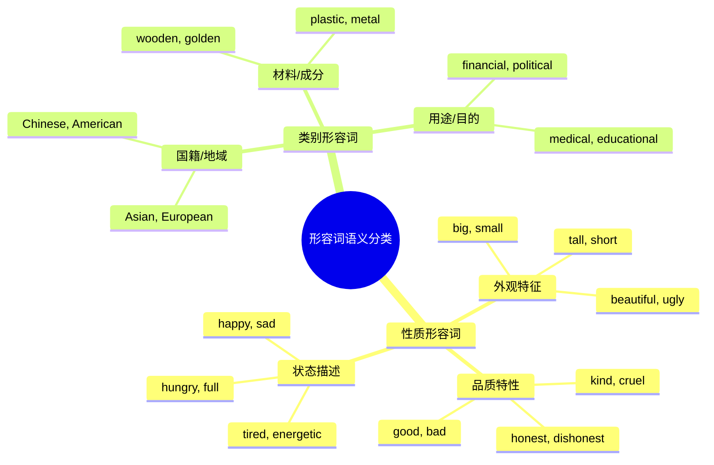
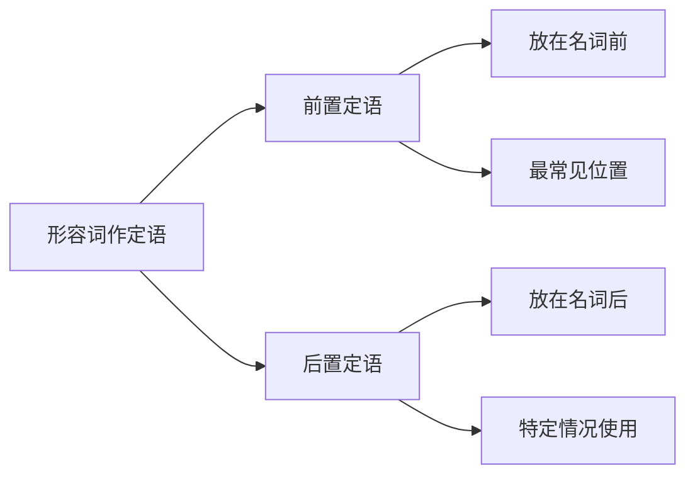
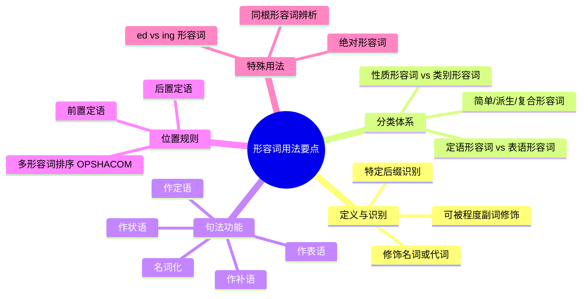

# 形容词的用法与位置

形容词（Adjective）是英语中最富有表现力的词类之一。它赋予名词以生动的色彩、精确的描述和丰富的内涵。无论是描绘一个人的外貌性格，还是刻画一处风景的美丽壮观，形容词都发挥着不可替代的作用。

本章将从形容词的基本概念出发，深入探讨其分类体系、句法功能和位置规则。特别是形容词在句中的位置问题——何时前置、何时后置、多个形容词如何排序——这些看似简单却常令学习者困惑的问题，我们都将逐一解答。

---

## 1. 形容词概述

### 1.1 形容词的定义

形容词是用来修饰名词或代词，表示人或事物的性质、状态、特征的词类。它回答 "What kind?"（什么样的）、"Which one?"（哪一个）、"How many/much?"（多少）等问题。

> [!info] 形容词的核心功能
>
> 形容词的本质功能是**限定或描述名词**，使表达更加具体、准确、生动。
>
> - **限定功能**：缩小名词的范围（the **tall** boy 高个子男孩）
> - **描述功能**：赋予名词特征（The sky is **blue**. 天空是蓝色的）

**基础示例**：

| 例句 | 形容词 | 功能分析 |
| --- | --- | --- |
| a **beautiful** garden | beautiful | 描述花园的美丽特征 |
| the **first** chapter | first | 限定是第一章 |
| **Some** students arrived late. | some | 限定学生的数量 |
| The soup is **hot**. | hot | 描述汤的状态 |

### 1.2 形容词的识别特征

如何判断一个词是否为形容词？可以从以下几个方面识别：

**1. 词形特征**

许多形容词具有特定的后缀：

| 后缀 | 示例 | 含义 |
| --- | --- | --- |
| -ful | beautiful, helpful, careful | 充满...的 |
| -less | careless, homeless, useless | 没有...的 |
| -ous | dangerous, famous, nervous | 具有...特性的 |
| -ive | active, creative, expensive | 有...倾向的 |
| -able/-ible | comfortable, possible, visible | 能够...的 |
| -al | natural, national, personal | 与...相关的 |
| -ic | romantic, fantastic, historic | ...性质的 |
| -ish | childish, foolish, selfish | 像...的 |
| -y | sunny, rainy, cloudy | 有...特征的 |
| -ly | friendly, lovely, lonely | 具有...品质的 |
| -ent/-ant | different, important, excellent | ...状态的 |

> [!warning] 注意 -ly 结尾的形容词
>
> 虽然 -ly 通常是副词后缀，但有些 -ly 结尾的词是形容词：
>
> - **friendly**（友好的）：a friendly smile
> - **lovely**（可爱的）：a lovely day
> - **lonely**（孤独的）：a lonely man
> - **lively**（活泼的）：a lively discussion
> - **elderly**（年长的）：an elderly couple
> - **costly**（昂贵的）：a costly mistake
> - **daily**（每日的）：daily exercise（也可作副词）
> - **weekly**（每周的）：weekly meeting（也可作副词）

**2. 句法特征**

形容词可以出现在以下位置：

- **名词前**（定语位置）：a **red** apple
- **系动词后**（表语位置）：The apple is **red**.
- **宾语后**（补语位置）：I painted the door **red**.

**3. 功能特征**

形容词可以被程度副词修饰：

- **very** beautiful（非常美丽）
- **quite** interesting（相当有趣）
- **extremely** important（极其重要）
- **rather** difficult（相当困难）

### 1.3 形容词与其他词类的区别

**形容词 vs 名词**

有些词既可作形容词又可作名词：

| 词 | 作形容词 | 作名词 |
| --- | --- | --- |
| rich | rich people（富人） | the rich（富人群体） |
| poor | poor countries（贫穷国家） | the poor（穷人群体） |
| Chinese | Chinese food（中国食物） | The Chinese（中国人） |
| gold | a gold watch（金表） | Gold is valuable.（黄金有价值） |

**形容词 vs 副词**

形容词修饰名词，副词修饰动词、形容词或其他副词：

| 词类 | 例句 | 分析 |
| --- | --- | --- |
| 形容词 | He is a **careful** driver. | careful 修饰名词 driver |
| 副词 | He drives **carefully**. | carefully 修饰动词 drives |
| 形容词 | The music is **loud**. | loud 作表语，描述 music |
| 副词 | He speaks **loudly**. | loudly 修饰动词 speaks |

---

## 2. 形容词的分类

英语形容词可以从多个角度进行分类，每种分类方法都有其语法意义。

### 2.1 按语义分类

**性质形容词（Qualitative Adjectives）**

性质形容词描述事物的性质、特征、状态，通常具有比较级和最高级形式：

| 类型 | 示例 | 例句 |
| --- | --- | --- |
| 大小 | big, small, large, tiny, huge | a **huge** elephant |
| 形状 | round, square, flat, curved | a **round** table |
| 颜色 | red, blue, green, dark, light | a **dark** night |
| 品质 | good, bad, excellent, terrible | an **excellent** idea |
| 情感 | happy, sad, angry, excited | a **happy** ending |
| 状态 | hot, cold, wet, dry, clean | a **clean** room |
| 智力 | clever, stupid, wise, foolish | a **wise** decision |
| 年龄 | young, old, new, ancient | an **old** friend |

**类别形容词（Classifying Adjectives）**

类别形容词将事物归入某一类别，通常没有比较级：

| 类型 | 示例 | 例句 |
| --- | --- | --- |
| 国籍 | Chinese, Japanese, British | **Chinese** culture |
| 宗教 | Christian, Buddhist, Islamic | a **Christian** church |
| 材料 | wooden, golden, plastic | a **wooden** box |
| 科学 | chemical, biological, physical | a **chemical** reaction |
| 政治 | political, democratic, socialist | **political** reform |

> [!tip] 两类形容词的区别
>
> **性质形容词**：
> - 可以有比较级：bigger, more beautiful
> - 可以被 very 修饰：very big, very beautiful
> - 可以作表语：The house is big.
>
> **类别形容词**：
> - 通常无比较级：❌ more Chinese
> - 通常不被 very 修饰：❌ very wooden
> - 部分不能作表语：❌ The box is wooden.（但可以说 The box is made of wood.）

### 2.2 按功能分类

**定语形容词（Attributive Adjectives）**

只能作定语，不能作表语：

| 形容词 | 正确用法 | 错误用法 |
| --- | --- | --- |
| main | the **main** reason | ❌ The reason is main. |
| chief | the **chief** purpose | ❌ The purpose is chief. |
| principal | the **principal** cause | ❌ The cause is principal. |
| only | the **only** child | ❌ The child is only. |
| mere | a **mere** child | ❌ The child is mere. |
| utter | **utter** nonsense | ❌ The nonsense is utter. |
| sheer | **sheer** luck | ❌ The luck is sheer. |
| former | the **former** president | ❌ The president is former. |
| latter | the **latter** option | ❌ The option is latter. |
| inner | the **inner** circle | ❌ The circle is inner. |
| outer | the **outer** layer | ❌ The layer is outer. |
| elder | my **elder** brother | ❌ My brother is elder. |

**表语形容词（Predicative Adjectives）**

只能作表语，不能作定语：

| 形容词 | 正确用法 | 错误用法 |
| --- | --- | --- |
| alive | The fish is **alive**. | ❌ an alive fish |
| asleep | The baby is **asleep**. | ❌ an asleep baby |
| awake | He was **awake**. | ❌ an awake person |
| alone | She was **alone**. | ❌ an alone woman |
| afraid | I am **afraid**. | ❌ an afraid child |
| alike | The twins are **alike**. | ❌ alike twins |
| aware | I am **aware** of it. | ❌ an aware person |
| ashamed | He felt **ashamed**. | ❌ an ashamed face |
| content | She is **content**. | ❌ a content person |
| unable | He is **unable** to come. | ❌ an unable person |
| well | I feel **well**. | ❌ a well person |
| ill | She is **ill**. | ❌ an ill patient |

> [!example] 以 a- 开头的表语形容词
>
> 许多以 a- 开头的形容词只能作表语，这与它们的历史来源有关（原本是介词短语）：
>
> | 形容词 | 来源 | 例句 |
> | --- | --- | --- |
> | alive | on life | The patient is still **alive**. |
> | asleep | on sleep | The children are **asleep**. |
> | awake | on wake | I was **awake** all night. |
> | abroad | on broad | He is **abroad** now. |
> | afloat | on float | The boat is **afloat**. |
> | afire | on fire | The house is **afire**. |
>
> 若需要定语形容词，可用同义词替代：
> - alive → living（a **living** creature）
> - asleep → sleeping（a **sleeping** baby）
> - afraid → frightened（a **frightened** child）
> - alone → lonely/solitary（a **lonely** old man）

**两用形容词**

大多数形容词既可作定语又可作表语：

| 形容词 | 作定语 | 作表语 |
| --- | --- | --- |
| happy | a **happy** family | The family is **happy**. |
| beautiful | a **beautiful** flower | The flower is **beautiful**. |
| important | an **important** meeting | The meeting is **important**. |
| difficult | a **difficult** problem | The problem is **difficult**. |

### 2.3 按构成分类

**简单形容词（Simple Adjectives）**

由单一词根构成，不含前缀或后缀：

- good, bad, big, small, hot, cold, old, new, young, tall, short, fast, slow

**派生形容词（Derived Adjectives）**

由词根加前缀或后缀构成：

| 构词方式 | 示例 |
| --- | --- |
| 名词 + -ful | hope → hopeful, beauty → beautiful |
| 名词 + -less | home → homeless, care → careless |
| 名词 + -y | rain → rainy, sun → sunny |
| 名词 + -ous | danger → dangerous, fame → famous |
| 动词 + -able | eat → eatable, read → readable |
| 动词 + -ive | act → active, create → creative |
| un- + 形容词 | happy → unhappy, fair → unfair |
| in-/im- + 形容词 | possible → impossible, complete → incomplete |
| dis- + 形容词 | honest → dishonest, similar → dissimilar |

**复合形容词（Compound Adjectives）**

由两个或多个词组合而成，通常用连字符连接：

| 构成模式 | 示例 | 例句 |
| --- | --- | --- |
| 形容词 + 名词 + -ed | blue-eyed, kind-hearted | a **blue-eyed** girl |
| 形容词 + 现在分词 | good-looking, easy-going | a **good-looking** man |
| 形容词 + 过去分词 | well-known, new-born | a **well-known** author |
| 名词 + 形容词 | world-famous, ice-cold | a **world-famous** singer |
| 名词 + 现在分词 | time-saving, peace-loving | a **time-saving** method |
| 名词 + 过去分词 | hand-made, sun-dried | a **hand-made** gift |
| 副词 + 过去分词 | well-educated, newly-built | a **well-educated** person |
| 副词 + 现在分词 | hard-working, fast-moving | a **hard-working** student |
| 数词 + 名词 | three-year, five-star | a **five-star** hotel |
| 数词 + 名词 + -ed | three-legged, one-eyed | a **three-legged** stool |

> [!warning] 复合形容词的连字符规则
>
> **作定语时必须加连字符**：
> - a **well-known** actor（知名演员）
> - a **five-year-old** child（五岁的孩子）
> - an **easy-to-use** tool（易用的工具）
>
> **作表语时通常不加连字符**：
> - The actor is **well known**.（这位演员很有名）
> - The child is **five years old**.（这孩子五岁）
> - The tool is **easy to use**.（这工具易用）

---

## 3. 形容词的句法功能

形容词在句中可以充当多种成分，最常见的是定语、表语和补语。

### 3.1 形容词作定语

定语是修饰名词或代词的成分。形容词作定语时，可以前置或后置。

**前置定语（Premodifier）**

形容词置于名词之前，这是英语中最常见的定语位置：

| 例句 | 分析 |
| --- | --- |
| a **beautiful** garden | beautiful 修饰 garden |
| the **old** man | old 修饰 man |
| an **interesting** book | interesting 修饰 book |
| **fresh** air | fresh 修饰 air |
| **Chinese** food | Chinese 修饰 food |

**后置定语（Postmodifier）**

形容词置于名词之后，这种情况较为特殊，将在下一节详细讨论。

### 3.2 形容词作表语

表语是用来说明主语的性质、状态或身份的成分，位于系动词之后。

**常见系动词**：

| 类型 | 系动词 | 例句 |
| --- | --- | --- |
| 状态系动词 | be | The sky **is** blue. |
| 感官系动词 | look, sound, smell, taste, feel | The food **smells** delicious. |
| 变化系动词 | become, get, turn, grow, go | The leaves **turned** yellow. |
| 保持系动词 | remain, stay, keep | He **remained** silent. |
| 似乎系动词 | seem, appear | She **seems** happy. |
| 证明系动词 | prove, turn out | The rumor **proved** true. |

**详细例句分析**：

| 例句 | 系动词 | 表语 | 句型分析 |
| --- | --- | --- | --- |
| The weather is **cold**. | is | cold | S + V + C（主系表） |
| She looks **tired**. | looks | tired | 感官系动词 + 形容词表语 |
| The milk went **sour**. | went | sour | 变化系动词 + 形容词表语 |
| The story sounds **incredible**. | sounds | incredible | 感官系动词 + 形容词表语 |
| He became **famous**. | became | famous | 变化系动词 + 形容词表语 |
| The problem remains **unsolved**. | remains | unsolved | 保持系动词 + 形容词表语 |

> [!warning] 系动词后用形容词，不用副词
>
> 系动词后面的成分是说明主语的，因此要用形容词（修饰名词/代词），而不是副词：
>
> | 正确 | 错误 |
> | --- | --- |
> | The food smells **good**. | ❌ The food smells ~~well~~. |
> | She looks **beautiful**. | ❌ She looks ~~beautifully~~. |
> | I feel **bad** about it. | ❌ I feel ~~badly~~ about it. |
> | The music sounds **loud**. | ❌ The music sounds ~~loudly~~. |
>
> **例外**：well 作为形容词表示"健康的"时可以用在系动词后：
> - I don't feel **well**. （我感觉不舒服。）

### 3.3 形容词作补语

补语是用来补充说明主语或宾语的成分。

**主语补足语**

在被动句中，形容词补充说明主语：

| 例句 | 分析 |
| --- | --- |
| The door was painted **red**. | red 补充说明 the door |
| He was considered **honest**. | honest 补充说明 he |
| The food was kept **fresh**. | fresh 补充说明 the food |

**宾语补足语**

在主动句中，形容词补充说明宾语：

| 例句 | 分析 |
| --- | --- |
| I painted the door **red**. | red 补充说明 the door |
| We consider him **honest**. | honest 补充说明 him |
| Keep the food **fresh**. | fresh 补充说明 the food |
| The news made her **happy**. | happy 补充说明 her |
| I found the book **interesting**. | interesting 补充说明 the book |
| They elected him **president**. | president 补充说明 him |

> [!example] 常用于"宾语 + 形容词补语"结构的动词
>
> | 动词 | 例句 |
> | --- | --- |
| make | The joke **made** everyone **happy**. |
| keep | Please **keep** the room **clean**. |
| find | I **found** the problem **difficult**. |
| leave | Don't **leave** the door **open**. |
| consider | We **consider** it **impossible**. |
| think | I **think** it **necessary**. |
| believe | They **believe** him **innocent**. |
| drive | The noise **drove** me **crazy**. |
| turn | Success **turned** him **arrogant**. |
| paint | She **painted** the wall **white**. |
| dye | She **dyed** her hair **blonde**. |

### 3.4 形容词作状语

形容词有时可以用作状语，通常表示伴随状态或原因：

| 例句 | 分析 |
| --- | --- |
| He came home **tired and hungry**. | 伴随状态：他回家时又累又饿 |
| She sat there **silent**. | 伴随状态：她静静地坐在那里 |
| **Curious**, the child opened the box. | 原因状语：出于好奇，孩子打开了盒子 |
| **Angry and disappointed**, he left. | 原因状语：又气又失望，他离开了 |
| The soldiers stood **ready** for battle. | 伴随状态：士兵们准备好战斗 |

这类用法在正式文体中较为常见，形容词通常放在句首或句末。

### 3.5 形容词作名词

某些形容词可以与定冠词 the 连用，表示一类人：

| 形容词 | 名词化用法 | 含义 |
| --- | --- | --- |
| the rich | The **rich** should help the poor. | 富人（群体） |
| the poor | The **poor** need our help. | 穷人（群体） |
| the young | The **young** are full of energy. | 年轻人（群体） |
| the old | The **old** deserve respect. | 老年人（群体） |
| the blind | The **blind** can use special devices. | 盲人（群体） |
| the deaf | The **deaf** communicate with sign language. | 聋人（群体） |
| the unemployed | The **unemployed** are looking for jobs. | 失业者（群体） |
| the living | The **living** should cherish life. | 活着的人（群体） |
| the dead | The **dead** cannot speak. | 死者（群体） |

> [!tip] "the + 形容词" 的语法特点
>
> 1. **表示复数概念**，谓语用复数形式：
>    - The rich **are** getting richer.（富人越来越富）
>
> 2. **指特定群体**，不能指个人：
>    - ❌ The old needs help.（不能指一个老人）
>    - ✅ The old man needs help.（具体的老人）
>    - ✅ The old need care.（老年群体）
>
> 3. **表示抽象概念**时，谓语用单数：
>    - The beautiful **is** not always good.（美的事物不一定是好的）
>    - The unknown **is** always frightening.（未知的事物总是令人恐惧）

---

## 4. 形容词的位置规则

形容词在句中的位置是英语语法的重要内容。本节重点讨论形容词作定语时的前置与后置规则。

### 4.1 前置定语规则

大多数形容词作定语时放在名词之前，这是英语的基本规则：

**基本结构**：形容词 + 名词

| 例句 | 结构分析 |
| --- | --- |
| a **beautiful** day | 形容词 + 名词 |
| the **old** house | 冠词 + 形容词 + 名词 |
| my **new** car | 物主代词 + 形容词 + 名词 |
| these **interesting** books | 指示代词 + 形容词 + 名词 |
| three **young** men | 数词 + 形容词 + 名词 |

### 4.2 后置定语规则

在以下情况下，形容词需要后置：

**1. 修饰不定代词时**

形容词修饰 something, anything, nothing, somebody, anybody, nobody, someone, anyone, no one 等不定代词时，必须后置：

| 例句 | 分析 |
| --- | --- |
| something **interesting** | ❌ interesting something |
| nothing **special** | ❌ special nothing |
| somebody **important** | ❌ important somebody |
| anyone **else** | ❌ else anyone |
| somewhere **quiet** | ❌ quiet somewhere |
| everything **possible** | ❌ possible everything |

> [!example] 不定代词 + 形容词 例句
>
> - Is there anything **wrong**?（有什么问题吗？）
> - I need something **cold** to drink.（我需要喝点冷的东西）
> - There's nothing **new** under the sun.（太阳底下没有新鲜事）
> - Is there anyone **available**?（有人有空吗？）
> - We need someone **reliable**.（我们需要可靠的人）

**2. 形容词短语后置**

当形容词带有自己的修饰成分（如介词短语、不定式、从句等）形成形容词短语时，必须后置：

| 例句 | 短语类型 |
| --- | --- |
| a book **useful for beginners** | 形容词 + 介词短语 |
| a man **afraid of dogs** | 形容词 + 介词短语 |
| the only person **able to help** | 形容词 + 不定式 |
| a problem **difficult to solve** | 形容词 + 不定式 |
| students **interested in music** | 过去分词 + 介词短语 |
| the best solution **available** | 形容词（单独后置） |

**对比**：

| 前置（单个形容词） | 后置（形容词短语） |
| --- | --- |
| a **useful** book | a book **useful for beginners** |
| an **afraid** ❌ child | a child **afraid of the dark** |
| an **available** room | a room **available for rent** |

**3. 以 a- 开头的表语形容词**

如前所述，以 a- 开头的表语形容词（alive, asleep, awake, alone, alike 等）不能前置，但可以后置修饰名词：

| 例句 | 分析 |
| --- | --- |
| the only man **alive** | ❌ the only alive man |
| a child **asleep** | ❌ an asleep child |
| all the people **present** | ❌ all the present people（意义不同） |

> [!warning] present 的两种位置与含义
>
> **present** 是一个位置敏感词，前置和后置含义不同：
>
> | 位置 | 含义 | 例句 |
> | --- | --- | --- |
> | 前置 | 现在的、目前的 | the **present** situation（目前的形势） |
> | 后置 | 在场的、出席的 | the people **present**（在场的人） |
>
> 类似的词还有：
> - **proper**：前置"恰当的"，后置"本身的、真正的"
>   - the **proper** way（恰当的方式）
>   - the city **proper**（市区本身）
> - **concerned**：前置"担忧的"，后置"有关的"
>   - a **concerned** parent（担忧的家长）
>   - the people **concerned**（有关的人）
> - **responsible**：前置"负责任的"，后置"负责…的"
>   - a **responsible** person（负责任的人）
>   - the person **responsible**（负责此事的人）
> - **involved**：前置"复杂的"，后置"涉及的"
>   - an **involved** explanation（复杂的解释）
>   - the people **involved**（涉及的人）

**4. 某些固定搭配和习惯用法**

| 表达 | 含义 | 分析 |
| --- | --- | --- |
| court martial | 军事法庭 | 源自法语词序 |
| attorney general | 司法部长 | 源自法语词序 |
| notary public | 公证人 | 源自拉丁语词序 |
| heir apparent | 法定继承人 | 源自法语词序 |
| time immemorial | 远古时代 | 固定表达 |
| proof positive | 确凿证据 | 固定表达 |
| God Almighty | 全能的上帝 | 宗教用语 |
| sum total | 总额 | 固定表达 |
| body politic | 国家、政治体制 | 源自法语 |

**5. 某些形容词后置表示强调或正式语体**

在诗歌、法律、正式文体中，形容词有时后置以示强调：

| 例句 | 语境 |
| --- | --- |
| the stars **visible** | 文学用语：可见的星星 |
| matters **financial** | 正式用语：财务事项 |
| things **Japanese** | 正式用语：日本的事物 |
| all things **great and small** | 文学用语：万物 |

**6. 某些形容词只能后置**

| 形容词 | 例句 | 说明 |
| --- | --- | --- |
| galore | bargains **galore** | 意为"大量的" |
| elect | the president **elect** | 意为"当选的" |
| extraordinaire | a chef **extraordinaire** | 意为"非凡的" |
| par excellence | a hero **par excellence** | 意为"卓越的" |

### 4.3 前置后置含义不同

某些形容词前置和后置时含义不同：

| 形容词 | 前置含义 | 后置含义 |
| --- | --- | --- |
| present | 目前的 | 在场的 |
| proper | 恰当的 | 本身的 |
| concerned | 担忧的 | 有关的 |
| responsible | 负责任的 | 负责…的 |
| involved | 复杂的 | 涉及的 |
| available | 可用的 | 有空的 |

**详细对比**：

| 位置 | 例句 | 含义 |
| --- | --- | --- |
| 前置 | the **present** members | 现任成员 |
| 后置 | the members **present** | 在场的成员 |
| 前置 | the **proper** method | 恰当的方法 |
| 后置 | the method **proper** | 这个方法本身 |
| 前置 | a **concerned** look | 担忧的神情 |
| 后置 | the people **concerned** | 相关人员 |
| 前置 | a **responsible** manager | 负责任的经理 |
| 后置 | the manager **responsible** | 负责此事的经理 |

---

## 5. 多个形容词的排列顺序

当多个形容词同时修饰一个名词时，它们的排列需要遵循一定的顺序。这是英语学习中的一个难点，但掌握了规则后就会变得简单。

### 5.1 形容词排序的基本原则

> [!info] 核心原则
>
> **"主观→客观"、"一般→具体"**
>
> 越主观、越笼统的形容词离名词越远；越客观、越具体的形容词离名词越近。

### 5.2 形容词顺序口诀

英语国家常用的记忆口诀是 **OPSHACOM** 或 **OSASCOMP**：

**OPSHACOM**：

| 字母 | 代表 | 示例 |
| --- | --- | --- |
| **O** | Opinion（观点） | beautiful, nice, lovely |
| **P** | Size（大小） | big, small, tall, short |
| **Sh** | Shape（形状） | round, square, flat |
| **A** | Age（新旧/年龄） | old, new, young, ancient |
| **C** | Color（颜色） | red, blue, green, dark |
| **O** | Origin（来源） | Chinese, American, Japanese |
| **M** | Material（材料） | wooden, plastic, metal |
| **+ Purpose** | 用途 | cooking, writing, running |

**更详细的顺序表**：

| 顺序 | 类别 | 英文术语 | 示例 |
| --- | --- | --- | --- |
| 1 | 限定词 | Determiner | the, a, my, this, three |
| 2 | 观点/评价 | Opinion/Quality | beautiful, excellent, terrible |
| 3 | 大小 | Size | big, small, huge, tiny |
| 4 | 形状 | Shape | round, square, flat, curved |
| 5 | 状态 | Condition | broken, clean, dirty |
| 6 | 年龄/新旧 | Age | old, new, young, ancient |
| 7 | 颜色 | Color | red, blue, green, dark |
| 8 | 图案 | Pattern | striped, spotted, checked |
| 9 | 来源/国籍 | Origin | Chinese, French, Japanese |
| 10 | 材料 | Material | wooden, plastic, metal, silk |
| 11 | 用途/类型 | Purpose/Type | cooking, writing, sports |
| 12 | 名词 | Noun | pot, desk, shoes |

### 5.3 排序实例分析

**示例 1**：a beautiful small old red Chinese wooden jewelry box

| 顺序 | 类别 | 词 |
| --- | --- | --- |
| 限定词 | a | |
| 观点 | beautiful | |
| 大小 | small | |
| 年龄 | old | |
| 颜色 | red | |
| 来源 | Chinese | |
| 材料 | wooden | |
| 用途 | jewelry | |
| 名词 | box | |

→ a beautiful small old red Chinese wooden jewelry box
（一个漂亮的红色中国古董木质首饰盒）

**示例 2**：three large round brown wooden dining tables

| 顺序 | 类别 | 词 |
| --- | --- | --- |
| 限定词 | three | |
| 大小 | large | |
| 形状 | round | |
| 颜色 | brown | |
| 材料 | wooden | |
| 用途 | dining | |
| 名词 | tables | |

→ three large round brown wooden dining tables
（三张大的圆形棕色木质餐桌）

**示例 3**：a lovely little old rectangular green French silver whittling knife

这是一个经典的语法例句，展示了完整的形容词顺序：

| 顺序 | 类别 | 词 |
| --- | --- | --- |
| 限定词 | a | |
| 观点 | lovely | |
| 大小 | little | |
| 年龄 | old | |
| 形状 | rectangular | |
| 颜色 | green | |
| 来源 | French | |
| 材料 | silver | |
| 用途 | whittling | |
| 名词 | knife | |

→ a lovely little old rectangular green French silver whittling knife
（一把可爱的长方形绿色法国古董银质削刀）

### 5.4 常见组合练习

> [!example] 排序练习
>
> 将以下形容词按正确顺序排列：
>
> 1. **leather / brown / Italian / expensive / bag**
>    → an **expensive brown Italian leather** bag
>
> 2. **cotton / blue / beautiful / shirt**
>    → a **beautiful blue cotton** shirt
>
> 3. **old / stone / large / grey / house**
>    → a **large old grey stone** house
>
> 4. **wooden / antique / round / lovely / table**
>    → a **lovely antique round wooden** table
>
> 5. **sports / new / red / fast / car**
>    → a **fast new red sports** car

### 5.5 形容词之间的标点

**何时用逗号**：

当两个形容词属于同一类别或都表示主观评价时，用逗号分隔：

- a **tall, handsome** man（两个都描述外表特征）
- a **cold, dark** night（两个都描述状态）
- a **kind, generous** person（两个都描述品质）

**测试方法**：如果两个形容词之间可以插入 "and"，或者可以互换位置而意思不变，就用逗号。

**何时不用逗号**：

当形容词属于不同类别，按照标准顺序排列时，不用逗号：

- a beautiful old house（观点 + 年龄）
- a big red ball（大小 + 颜色）
- a Chinese silk dress（来源 + 材料）

### 5.6 使用多个形容词的注意事项

> [!warning] 实际使用建议
>
> 1. **避免堆砌过多形容词**
>    - 通常最多使用 2-3 个形容词
>    - ❌ a beautiful big old round brown Chinese wooden box（过于冗长）
>    - ✅ a beautiful old Chinese box（简洁明了）
>
> 2. **关键信息优先**
>    - 保留最重要的描述性形容词
>    - 删除可预测或冗余的形容词
>
> 3. **语境决定**
>    - 根据交流需要选择必要的形容词
>    - 文学作品可能使用更多形容词
>    - 日常交流通常更简洁

---

## 6. 形容词的特殊用法

### 6.1 形容词的名词化

**1. the + 形容词 = 一类人**

如前所述，"the + 形容词"可以表示一类人：

| 表达 | 含义 | 例句 |
| --- | --- | --- |
| the rich | 富人 | The rich should pay more taxes. |
| the poor | 穷人 | We should help the poor. |
| the young | 年轻人 | The young are full of hope. |
| the old | 老年人 | The old need our care. |
| the sick | 病人 | Doctors treat the sick. |
| the injured | 伤员 | The injured were sent to hospital. |
| the homeless | 无家可归者 | The homeless need shelter. |
| the unemployed | 失业者 | The unemployed are seeking jobs. |

**2. the + 形容词 = 抽象概念**

| 表达 | 含义 | 例句 |
| --- | --- | --- |
| the good | 善 | The good will triumph over evil. |
| the beautiful | 美 | The beautiful is not always practical. |
| the true | 真 | We seek the true, the good, and the beautiful. |
| the unknown | 未知 | We fear the unknown. |
| the impossible | 不可能的事 | He achieved the impossible. |

**3. 国籍形容词的名词化**

| 类型 | 示例 | 说明 |
| --- | --- | --- |
| the + 形容词 | the Chinese, the French, the Dutch | 表示该国人民（集体） |
| 形容词 + s | Americans, Italians, Germans | 表示该国人（复数） |
| 形容词 + man/woman | Englishman, Frenchwoman | 表示该国人（单数） |

### 6.2 形容词短语

形容词可以与介词、不定式、从句等构成短语：

**1. 形容词 + 介词短语**

| 结构 | 例句 |
| --- | --- |
| afraid of | He is **afraid of** dogs. |
| good at | She is **good at** math. |
| interested in | I'm **interested in** music. |
| proud of | We're **proud of** you. |
| similar to | This is **similar to** that. |
| different from | A is **different from** B. |
| full of | The room is **full of** people. |
| famous for | Paris is **famous for** its art. |
| responsible for | Who is **responsible for** this? |

**2. 形容词 + 不定式**

| 结构 | 例句 |
| --- | --- |
| easy to do | The problem is **easy to solve**. |
| difficult to do | It's **difficult to understand**. |
| ready to do | I'm **ready to go**. |
| willing to do | He's **willing to help**. |
| eager to do | She's **eager to learn**. |
| likely to do | It's **likely to rain**. |
| sure to do | He's **sure to win**. |
| free to do | You're **free to leave**. |

**3. 形容词 + that 从句**

| 结构 | 例句 |
| --- | --- |
| sure that | I'm **sure that** he'll come. |
| glad that | I'm **glad that** you're here. |
| sorry that | I'm **sorry that** I'm late. |
| afraid that | I'm **afraid that** we're lost. |
| aware that | I'm **aware that** this is difficult. |
| confident that | I'm **confident that** we'll succeed. |

### 6.3 形容词的强调用法

**1. 绝对形容词（不能用程度副词修饰）**

某些形容词表示绝对概念，理论上没有程度之分：

| 形容词 | 含义 | 说明 |
| --- | --- | --- |
| perfect | 完美的 | ❌ very perfect（不太规范） |
| unique | 独一无二的 | ❌ very unique（不太规范） |
| complete | 完整的 | ❌ more complete（不太规范） |
| absolute | 绝对的 | ❌ very absolute |
| dead | 死的 | ❌ very dead |
| empty | 空的 | ❌ very empty |
| pregnant | 怀孕的 | ❌ very pregnant |
| infinite | 无限的 | ❌ more infinite |

> [!tip] 实际使用中的弹性
>
> 在日常口语中，这些"绝对形容词"有时也会与程度副词连用，表示强调：
>
> - This is **absolutely** perfect!（强调"太完美了"）
> - That's **quite** unique.（强调"非常独特"）
> - The room was **completely** empty.（强调"完全空了"）
>
> 这种用法在非正式语境中是可以接受的，但在正式写作中应避免。

**2. 强调形容词**

某些形容词主要用于强调，本身没有太多实质含义：

| 形容词 | 例句 | 语气 |
| --- | --- | --- |
| absolute | an **absolute** disaster | 强调"彻底的" |
| utter | **utter** nonsense | 强调"完全的" |
| sheer | **sheer** luck | 强调"纯粹的" |
| mere | a **mere** child | 强调"只不过是" |
| complete | a **complete** failure | 强调"彻底的" |
| total | **total** chaos | 强调"完全的" |
| perfect | a **perfect** stranger | 强调"完完全全的" |

### 6.4 同根形容词的区别

某些形容词具有相同词根但形式和含义不同：

**1. -ed vs -ing 形容词**

| -ed 形容词 | -ing 形容词 | 区别 |
| --- | --- | --- |
| interested | interesting | -ed 描述人的感受；-ing 描述事物的特性 |
| excited | exciting | I'm **excited**. / The news is **exciting**. |
| bored | boring | He looks **bored**. / The movie is **boring**. |
| tired | tiring | She's **tired**. / The work is **tiring**. |
| surprised | surprising | We were **surprised**. / The result is **surprising**. |
| amazed | amazing | I'm **amazed**. / It's **amazing**. |
| confused | confusing | I feel **confused**. / The instructions are **confusing**. |
| frightened | frightening | The child was **frightened**. / The storm was **frightening**. |

> [!warning] 常见错误
>
> ❌ I am **interesting** in music.
> ✅ I am **interested** in music.
>
> ❌ The movie is **bored**.
> ✅ The movie is **boring**.
>
> **记忆技巧**：
> - **-ed**：人"被"...，描述人的心理状态
> - **-ing**：事物"令人"...，描述事物的特性

**2. 其他同根形容词**

| 词根 | 形容词1 | 形容词2 | 区别 |
| --- | --- | --- | --- |
| history | historic | historical | historic（历史性的）/ historical（历史的） |
| economy | economic | economical | economic（经济的）/ economical（节约的） |
| politics | political | politic | political（政治的）/ politic（策略的） |
| sense | sensible | sensitive | sensible（明智的）/ sensitive（敏感的） |
| compare | comparable | comparative | comparable（可比的）/ comparative（相对的） |
| consider | considerable | considerate | considerable（相当大的）/ considerate（体贴的） |
| imagine | imaginary | imaginative | imaginary（虚构的）/ imaginative（富有想象力的） |
| respect | respectable | respectful | respectable（值得尊敬的）/ respectful（恭敬的） |
| industry | industrial | industrious | industrial（工业的）/ industrious（勤劳的） |

---

## 7. 形容词用法综合练习

### 7.1 选择正确的形容词

> [!example] 练习 1：选词填空
>
> 从括号中选择正确的形容词：
>
> 1. The baby is ______. (asleep / sleeping)
>    → **asleep**（作表语用 asleep）
>
> 2. Look at the ______ baby. (asleep / sleeping)
>    → **sleeping**（作定语用 sleeping）
>
> 3. He is the ______ person I know. (only / lonely)
>    → **only**（唯一的，作定语）
>
> 4. She felt very ______ after her husband died. (only / lonely)
>    → **lonely**（孤独的，作表语）
>
> 5. The ______ president gave a speech. (late / former)
>    → **former**（前任的）
>
> 6. All the members ______ voted for the proposal. (present / presented)
>    → **present**（在场的，后置定语）

### 7.2 形容词顺序练习

> [!example] 练习 2：排列形容词
>
> 按正确顺序排列以下形容词：
>
> 1. (Chinese / old / beautiful / silk) dress
>    → a **beautiful old Chinese silk** dress
>
> 2. (young / talented / Italian) musician
>    → a **talented young Italian** musician
>
> 3. (round / wooden / large / antique) table
>    → a **large antique round wooden** table
>
> 4. (leather / black / expensive / Italian) shoes
>    → **expensive black Italian leather** shoes
>
> 5. (blue / small / pretty / cotton) shirt
>    → a **pretty small blue cotton** shirt

### 7.3 改错练习

> [!example] 练习 3：找出并改正错误
>
> 1. ❌ Is there special anything about this place?
>    ✅ Is there **anything special** about this place?
>
> 2. ❌ The afraid child started crying.
>    ✅ The **frightened** child started crying.
>
> 3. ❌ This is a historical building.
>    ✅ This is a **historic** building.（具有历史意义的建筑）
>
> 4. ❌ I am very interesting in art.
>    ✅ I am very **interested** in art.
>
> 5. ❌ The movie was very bored.
>    ✅ The movie was very **boring**.
>
> 6. ❌ She is a alive fish.
>    ✅ She bought a **living** fish. / The fish is **alive**.

---

## 8. 形容词用法小结

本章系统介绍了英语形容词的用法与位置规则。以下是核心要点回顾：

> [!success] 学习建议
>
> 1. **多读多听**：通过大量阅读和听力输入，培养对形容词位置的语感
> 2. **注意搭配**：记住常用形容词的介词搭配（如 interested in, afraid of）
> 3. **辨析近义词**：理解同根形容词的区别（如 economic vs economical）
> 4. **实践运用**：在写作和口语中有意识地运用形容词排序规则
> 5. **循序渐进**：先掌握基本规则，再逐步处理特殊情况

形容词是英语表达中不可或缺的调色板。熟练掌握形容词的用法，将使你的英语表达更加丰富、准确、生动。在接下来的学习中，我们将探讨形容词的比较级和最高级，以及副词的用法，进一步完善你的英语语法知识体系。

---

## 参考资料

1. Quirk, R., et al. (1985). *A Comprehensive Grammar of the English Language*. Longman.
2. Huddleston, R., & Pullum, G. K. (2002). *The Cambridge Grammar of the English Language*. Cambridge University Press.
3. Swan, M. (2016). *Practical English Usage* (4th ed.). Oxford University Press.
4. Murphy, R. (2019). *English Grammar in Use* (5th ed.). Cambridge University Press.
5. Alexander, L. G. (1988). *Longman English Grammar*. Longman.
