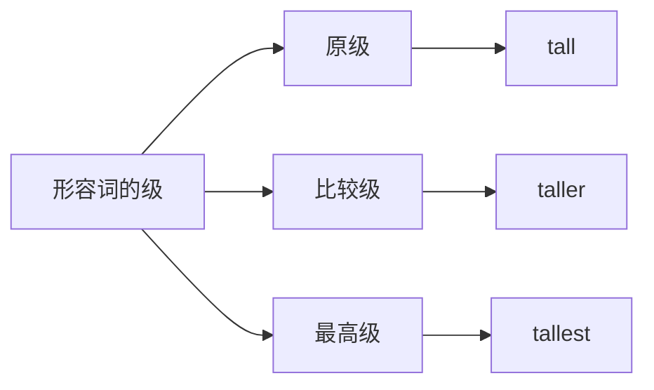
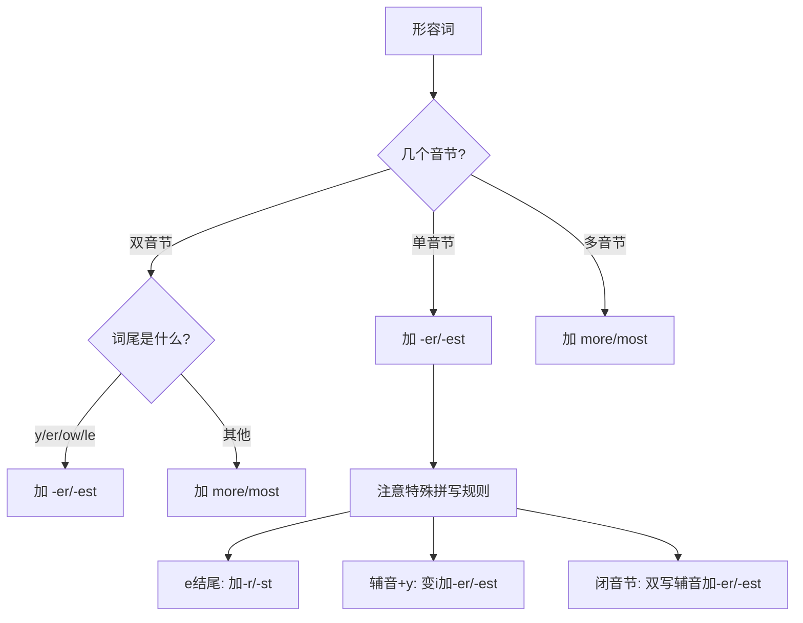
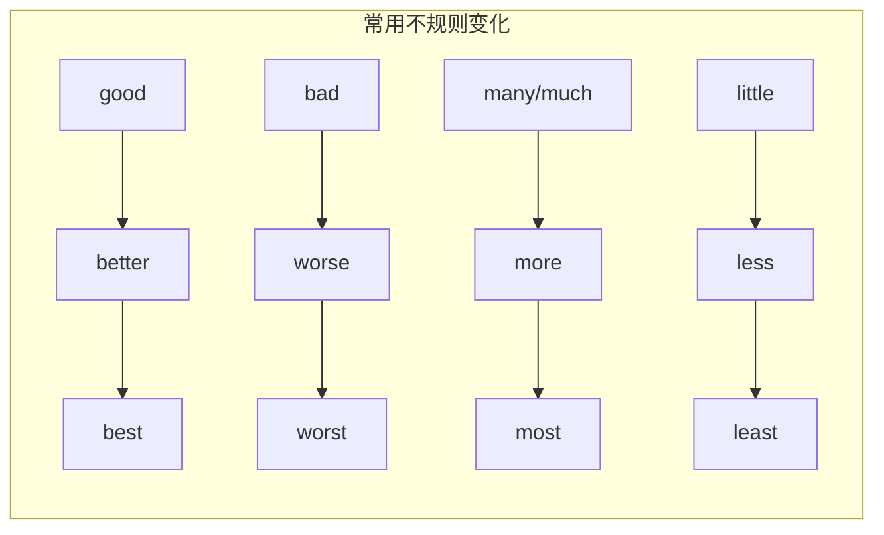
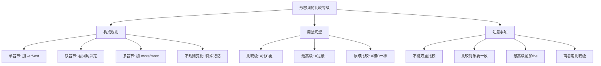

# 形容词的比较级与最高级

在日常交流中，我们经常需要对人、事物或现象进行比较。英语中，形容词的比较级（Comparative Degree）和最高级（Superlative Degree）就是专门用来表达这种比较关系的语法形式。掌握比较级和最高级的构成规则与用法，是提升英语表达能力的重要环节。

---

## 1. 比较级与最高级概述

### 1.1 什么是形容词的级

英语形容词有三个级别，分别用于表达不同程度的比较关系：

| 级别 | 英文名称 | 功能 | 示例 |
| --- | --- | --- | --- |
| **原级** | Positive Degree | 描述事物本身的性质，不涉及比较 | tall, beautiful, good |
| **比较级** | Comparative Degree | 比较两者之间的差异 | taller, more beautiful, better |
| **最高级** | Superlative Degree | 在三者或以上中表示程度最高 | tallest, most beautiful, best |

> [!info] 核心概念
>
> - **原级**：形容词的基本形式，用于描述单一事物的特征
> - **比较级**：用于两者之间的比较，回答"哪个更……"的问题
> - **最高级**：用于三者或以上的比较，回答"哪个最……"的问题

### 1.2 为什么需要比较级与最高级

在表达比较关系时，英语通过改变形容词的形式来体现程度差异，这与汉语使用"更""最"等副词修饰有所不同：

| 汉语表达 | 英语表达 | 说明 |
| --- | --- | --- |
| 他高。 | He is tall. | 原级，陈述事实 |
| 他比我高。 | He is **taller** than me. | 比较级，两者比较 |
| 他是班里最高的。 | He is the **tallest** in the class. | 最高级，多者比较 |

> [!tip] 理解要点
>
> 英语的比较级和最高级是通过**词形变化**或**添加 more/most** 来实现的，而不是像汉语那样简单地添加"更""最"等词汇。这是英语学习者需要特别注意的语法特点。

---

## 2. 比较级与最高级的构成规则

形容词比较级和最高级的构成方式主要有两种：一是在词尾添加 `-er`/`-est`，二是在前面加 `more`/`most`。选择哪种方式主要取决于形容词的音节数量和词尾形式。

### 2.1 单音节形容词

单音节形容词（只有一个元音音节的词）通常直接在词尾加 `-er` 构成比较级，加 `-est` 构成最高级。

#### 2.1.1 一般规则

直接在词尾添加 `-er` 或 `-est`：

| 原级 | 比较级 | 最高级 | 含义 |
| --- | --- | --- | --- |
| tall | tall**er** | tall**est** | 高的 |
| small | small**er** | small**est** | 小的 |
| young | young**er** | young**est** | 年轻的 |
| old | old**er** | old**est** | 老的 |
| fast | fast**er** | fast**est** | 快的 |
| hard | hard**er** | hard**est** | 难的/努力的 |
| long | long**er** | long**est** | 长的 |
| short | short**er** | short**est** | 短的 |
| cheap | cheap**er** | cheap**est** | 便宜的 |
| clean | clean**er** | clean**est** | 干净的 |

> [!example] 例句分析
>
> **Tom is taller than Jerry.**
> - 汤姆比杰瑞高。
> - 句法分析：taller 是 tall 的比较级，than 引导比较对象
>
> **This is the tallest building in the city.**
> - 这是城里最高的建筑。
> - 句法分析：the tallest 是最高级形式，前面必须加定冠词 the

#### 2.1.2 以 -e 结尾的形容词

如果形容词本身以 `-e` 结尾，只需加 `-r` 或 `-st`：

| 原级 | 比较级 | 最高级 | 含义 |
| --- | --- | --- | --- |
| large | large**r** | large**st** | 大的 |
| nice | nice**r** | nice**st** | 好的 |
| wide | wide**r** | wide**st** | 宽的 |
| late | late**r** | late**st** | 迟的 |
| safe | safe**r** | safe**st** | 安全的 |
| close | close**r** | close**st** | 近的 |
| fine | fine**r** | fine**st** | 好的 |
| rare | rare**r** | rare**st** | 稀有的 |

> [!example] 例句分析
>
> **The Pacific Ocean is larger than the Atlantic Ocean.**
> - 太平洋比大西洋大。
> - 句法分析：large 以 -e 结尾，比较级只加 -r 变成 larger
>
> **She arrived later than expected.**
> - 她到得比预期晚。
> - 句法分析：late 以 -e 结尾，比较级为 later

#### 2.1.3 以"辅音字母 + y"结尾的形容词

如果形容词以"辅音字母 + y"结尾，需要把 `y` 变成 `i`，再加 `-er` 或 `-est`：

| 原级 | 比较级 | 最高级 | 含义 |
| --- | --- | --- | --- |
| happy | happ**ier** | happ**iest** | 快乐的 |
| easy | eas**ier** | eas**iest** | 容易的 |
| busy | bus**ier** | bus**iest** | 忙碌的 |
| early | earl**ier** | earl**iest** | 早的 |
| heavy | heav**ier** | heav**iest** | 重的 |
| dirty | dirt**ier** | dirt**iest** | 脏的 |
| pretty | prett**ier** | prett**iest** | 漂亮的 |
| angry | angr**ier** | angr**iest** | 生气的 |
| lucky | luck**ier** | luck**iest** | 幸运的 |
| funny | funn**ier** | funn**iest** | 有趣的 |

> [!warning] 注意区分
>
> 如果是"元音字母 + y"结尾，则不变 y，直接加 -er/-est：
> - grey → grey**er** → grey**est**（灰色的）
>
> 但这类形容词较少见。

> [!example] 例句分析
>
> **Learning English is easier than learning Chinese for native English speakers.**
> - 对于英语母语者来说，学英语比学中文容易。
> - 句法分析：easy 变成 easier，y 变 i 再加 -er
>
> **This is the busiest time of the year for us.**
> - 这是我们一年中最忙的时候。
> - 句法分析：busy 变成 busiest，y 变 i 再加 -est

#### 2.1.4 以"重读闭音节"结尾的形容词

如果单音节形容词以"一个辅音字母"结尾，且该辅音字母前面只有"一个元音字母"（即重读闭音节结构），需要双写末尾的辅音字母，再加 `-er` 或 `-est`：

| 原级 | 比较级 | 最高级 | 含义 |
| --- | --- | --- | --- |
| big | bi**gg**er | bi**gg**est | 大的 |
| hot | ho**tt**er | ho**tt**est | 热的 |
| fat | fa**tt**er | fa**tt**est | 胖的 |
| thin | thi**nn**er | thi**nn**est | 瘦的 |
| wet | we**tt**er | we**tt**est | 湿的 |
| sad | sa**dd**er | sa**dd**est | 悲伤的 |
| red | re**dd**er | re**dd**est | 红的 |
| fit | fi**tt**er | fi**tt**est | 健康的 |

> [!info] 重读闭音节判断方法
>
> **闭音节**：以辅音字母结尾的音节
> - big: b-i-g（辅-元-辅），i 发短元音 /ɪ/，是闭音节
> - hot: h-o-t（辅-元-辅），o 发短元音 /ɒ/，是闭音节
>
> **开音节**：以元音字母结尾的音节
> - nice: n-i-ce，以 e 结尾，是开音节，i 发长元音 /aɪ/
>
> 只有闭音节才需要双写末尾辅音字母。

> [!example] 例句分析
>
> **An elephant is bigger than a horse.**
> - 大象比马大。
> - 句法分析：big 是重读闭音节，双写 g 再加 -er
>
> **Today is the hottest day this summer.**
> - 今天是今年夏天最热的一天。
> - 句法分析：hot 是重读闭音节，双写 t 再加 -est

### 2.2 双音节形容词

双音节形容词的比较级和最高级构成方式比较复杂，有的加 `-er`/`-est`，有的加 `more`/`most`，有的两种方式都可以。

#### 2.2.1 以 -y, -er, -ow, -le 结尾的双音节形容词

这类双音节形容词通常加 `-er`/`-est`：

| 原级 | 比较级 | 最高级 | 含义 |
| --- | --- | --- | --- |
| happy | happier | happiest | 快乐的 |
| clever | cleverer | cleverest | 聪明的 |
| narrow | narrower | narrowest | 窄的 |
| simple | simpler | simplest | 简单的 |
| gentle | gentler | gentlest | 温柔的 |
| shallow | shallower | shallowest | 浅的 |
| mellow | mellower | mellowest | 成熟的 |
| tender | tenderer | tenderest | 温柔的 |

> [!tip] 记忆技巧
>
> 以 **-y, -er, -ow, -le** 结尾的双音节形容词，发音节奏与单音节词相似，所以变化规则也相似，直接加 -er/-est。

#### 2.2.2 其他双音节形容词

大多数其他双音节形容词使用 `more`/`most` 构成比较级和最高级：

| 原级 | 比较级 | 最高级 | 含义 |
| --- | --- | --- | --- |
| careful | **more** careful | **most** careful | 仔细的 |
| famous | **more** famous | **most** famous | 著名的 |
| modern | **more** modern | **most** modern | 现代的 |
| useful | **more** useful | **most** useful | 有用的 |
| foolish | **more** foolish | **most** foolish | 愚蠢的 |
| active | **more** active | **most** active | 活跃的 |
| boring | **more** boring | **most** boring | 无聊的 |
| patient | **more** patient | **most** patient | 耐心的 |

> [!example] 例句分析
>
> **You should be more careful when crossing the street.**
> - 过马路时你应该更小心。
> - 句法分析：careful 是双音节词，用 more careful 作比较级
>
> **This is the most famous museum in the country.**
> - 这是全国最著名的博物馆。
> - 句法分析：famous 是双音节词，用 most famous 作最高级

#### 2.2.3 两种形式皆可的双音节形容词

某些双音节形容词既可以加 `-er`/`-est`，也可以用 `more`/`most`：

| 原级 | 比较级 | 最高级 |
| --- | --- | --- |
| common | commoner / more common | commonest / most common |
| polite | politer / more polite | politest / most polite |
| quiet | quieter / more quiet | quietest / most quiet |
| stupid | stupider / more stupid | stupidest / most stupid |
| handsome | handsomer / more handsome | handsomest / most handsome |
| pleasant | pleasanter / more pleasant | pleasantest / most pleasant |

> [!info] 使用倾向
>
> 在现代英语中，使用 `more`/`most` 的形式越来越普遍，尤其是在口语和非正式写作中。而加 `-er`/`-est` 的形式在正式文体中仍然常见。

### 2.3 多音节形容词

三个及三个以上音节的形容词（多音节形容词）一律使用 `more`/`most` 构成比较级和最高级：

| 原级 | 比较级 | 最高级 | 含义 |
| --- | --- | --- | --- |
| beautiful | **more** beautiful | **most** beautiful | 美丽的 |
| expensive | **more** expensive | **most** expensive | 昂贵的 |
| important | **more** important | **most** important | 重要的 |
| difficult | **more** difficult | **most** difficult | 困难的 |
| interesting | **more** interesting | **most** interesting | 有趣的 |
| comfortable | **more** comfortable | **most** comfortable | 舒适的 |
| intelligent | **more** intelligent | **most** intelligent | 聪明的 |
| dangerous | **more** dangerous | **most** dangerous | 危险的 |
| wonderful | **more** wonderful | **most** wonderful | 精彩的 |
| responsible | **more** responsible | **most** responsible | 负责的 |

> [!example] 例句分析
>
> **This problem is more difficult than the last one.**
> - 这道题比上一道难。
> - 句法分析：difficult 是三音节词，必须用 more difficult
>
> **She is the most beautiful woman I have ever seen.**
> - 她是我见过的最漂亮的女人。
> - 句法分析：beautiful 是三音节词，必须用 most beautiful

### 2.4 构成规则总结

> [!tip] 快速判断法
>
> 1. **数音节**：判断形容词有几个音节
> 2. **看词尾**：如果是双音节，看是否以 -y, -er, -ow, -le 结尾
> 3. **选方式**：单音节和特定双音节加 -er/-est，其他用 more/most
> 4. **查拼写**：检查是否需要特殊拼写处理（双写、变 y 为 i 等）

---

## 3. 不规则形容词的比较级与最高级

有些形容词的比较级和最高级不遵循上述规则，需要特别记忆。这些不规则变化形式在日常交流中使用频率很高。

### 3.1 常见不规则变化

| 原级 | 比较级 | 最高级 | 含义 |
| --- | --- | --- | --- |
| good | **better** | **best** | 好的 |
| bad | **worse** | **worst** | 坏的 |
| many | **more** | **most** | 多的（可数） |
| much | **more** | **most** | 多的（不可数） |
| little | **less** | **least** | 少的 |
| far | **farther/further** | **farthest/furthest** | 远的 |
| old | **older/elder** | **oldest/eldest** | 老的 |
| late | **later/latter** | **latest/last** | 迟的/后者 |

> [!warning] 高频易错点
>
> - **good → better → best**（不是 gooder, goodest）
> - **bad → worse → worst**（不是 badder, baddest）
> - **many/much → more → most**（不是 morer）

### 3.2 特殊形式详解

#### 3.2.1 far 的两种比较级和最高级

| 形式 | 比较级 | 最高级 | 用法 |
| --- | --- | --- | --- |
| 表示距离 | farther | farthest | 指物理距离的远近 |
| 表示程度 | further | furthest | 指程度、进一步的 |

> [!example] 例句对比
>
> **物理距离：**
> - The station is **farther** than the hospital.
> - 车站比医院远。
>
> **程度/进一步：**
> - Let's discuss this matter **further**.
> - 让我们进一步讨论这件事。
>
> - Do you have any **further** questions?
> - 你还有其他问题吗？

> [!info] 使用趋势
>
> 在现代英语中，further 和 farther 的区别正在逐渐模糊。在美式英语中，farther 更常用于表示距离，而 further 更常用于表示程度；在英式英语中，further 可以用于两种情况。

#### 3.2.2 old 的两种比较级和最高级

| 形式 | 比较级 | 最高级 | 用法 |
| --- | --- | --- | --- |
| 一般用法 | older | oldest | 表示年龄或时间的老旧 |
| 家庭成员 | elder | eldest | 仅用于同一家庭成员之间的年龄比较 |

> [!example] 例句对比
>
> **一般年龄比较：**
> - My father is **older** than my uncle.
> - 我父亲比我叔叔年长。
>
> **家庭成员：**
> - My **elder** brother is a doctor.
> - 我哥哥是医生。
>
> - She is the **eldest** child in the family.
> - 她是家里最大的孩子。

> [!warning] 使用限制
>
> elder/eldest 的使用有严格限制：
> 1. 只能作**定语**，不能作表语
>    - ✅ my elder sister（我姐姐）
>    - ❌ My sister is elder than me.（错误）
>    - ✅ My sister is older than me.（正确）
> 2. 后面不能接 than
>    - ❌ He is elder than me.
>    - ✅ He is older than me.

#### 3.2.3 late 的两种比较级和最高级

| 形式 | 比较级 | 最高级 | 用法 |
| --- | --- | --- | --- |
| 时间/顺序 | later | latest | 较迟的/最新的 |
| 顺序/已故 | latter | last | 后者/最后的 |

> [!example] 例句对比
>
> **时间上的迟：**
> - I'll call you **later**.
> - 我稍后给你打电话。
>
> - What's the **latest** news?
> - 最新消息是什么？
>
> **顺序上的后：**
> - Of the two options, I prefer the **latter**.
> - 两个选项中，我更喜欢后者。
>
> - This is my **last** chance.
> - 这是我最后的机会。

### 3.3 不规则变化记忆表

> [!tip] 记忆技巧
>
> 1. **good-better-best**：联想"好的会变得更好，最后成为最好"
> 2. **bad-worse-worst**：联想"坏的会变得更坏，最后成为最坏"
> 3. **many/much-more-most**：more 和 most 本身就是常用词
> 4. **little-less-least**：都以 l 开头，less 比 little 短，least 最短

---

## 4. 比较级的用法与句型

比较级主要用于两者之间的比较，表示其中一方在某种性质上超过另一方。

### 4.1 基本比较句型：A + be + 比较级 + than + B

这是最基本也是最常用的比较句型：

> [!example] 句型分析
>
> **句型结构**：主语 + be动词 + 形容词比较级 + than + 比较对象
>
> **Tom is taller than Jerry.**
> - 汤姆比杰瑞高。
> - Tom（主语）+ is（be动词）+ taller（比较级）+ than Jerry（比较对象）
>
> **This book is more interesting than that one.**
> - 这本书比那本书更有趣。
> - This book（主语）+ is（be动词）+ more interesting（比较级）+ than that one（比较对象）

#### 4.1.1 than 后面的代词形式

than 后面的人称代词可以用主格或宾格，但含义和正式程度有所不同：

| 形式 | 例句 | 说明 |
| --- | --- | --- |
| 主格（正式） | He is taller than **I** (am). | 正式用法，可省略后面的动词 |
| 宾格（口语） | He is taller than **me**. | 口语常用，更自然 |

> [!warning] 歧义问题
>
> 某些情况下，选择主格或宾格会产生不同含义：
>
> - **I like her more than he (does).**
>   - 我比他更喜欢她。（he 是主语，喜欢她的人）
>
> - **I like her more than (I like) him.**
>   - 比起他，我更喜欢她。（him 是宾语，被喜欢的人）
>
> 为避免歧义，建议把省略的部分补全。

#### 4.1.2 比较对象的一致性

比较的两个对象必须是同类事物，不能用苹果和橘子相比：

> [!example] 正确与错误对比
>
> ❌ **The weather in Beijing is colder than Shanghai.**
> - 错误：天气和上海不是同类
>
> ✅ **The weather in Beijing is colder than that in Shanghai.**
> - 正确：用 that 代替 the weather，比较同类事物
>
> ❌ **My car is more expensive than you.**
> - 错误：我的车和你不是同类
>
> ✅ **My car is more expensive than yours.**
> - 正确：用 yours 代替 your car，比较同类事物

### 4.2 比较级的修饰语

比较级前面可以加修饰语来表示程度差异的大小：

| 修饰语 | 含义 | 例句 |
| --- | --- | --- |
| much | 得多 | much taller |
| far | 得多 | far better |
| a lot | 得多 | a lot more expensive |
| even | 甚至更 | even worse |
| still | 还要更 | still more difficult |
| a little | 一点点 | a little older |
| a bit | 一点点 | a bit cheaper |
| slightly | 稍微 | slightly better |
| any | （用于否定句/疑问句） | any better |
| no | 毫不 | no different |

> [!warning] 不能用 very 修饰比较级
>
> ❌ He is **very** taller than me.
> ✅ He is **much** taller than me.
>
> very 只能修饰原级，不能修饰比较级。

> [!example] 例句分析
>
> **This problem is much more difficult than I expected.**
> - 这道题比我预期的难得多。
> - 句法分析：much 修饰比较级 more difficult，强调差距大
>
> **She is a little older than her sister.**
> - 她比她妹妹大一点。
> - 句法分析：a little 修饰比较级 older，表示差距小
>
> **Are you feeling any better today?**
> - 你今天感觉好点了吗？
> - 句法分析：any 用于疑问句，修饰比较级 better

### 4.3 比较级的特殊句型

#### 4.3.1 the + 比较级，the + 比较级（越……越……）

这个句型表示两个事物同步变化的关系：

> [!example] 句型分析
>
> **句型结构**：The + 比较级（+ 主语 + 谓语），the + 比较级（+ 主语 + 谓语）
>
> **The more you practice, the better you will become.**
> - 你练习得越多，就会变得越好。
>
> **The harder you work, the more successful you will be.**
> - 你工作越努力，就会越成功。
>
> **The sooner, the better.**
> - 越快越好。（省略句）

> [!tip] 语序要点
>
> 1. 两个部分都要用 **the + 比较级** 开头
> 2. 第一个 the 后面的部分表示条件/原因
> 3. 第二个 the 后面的部分表示结果
> 4. 可以省略主语和谓语，形成简洁表达

#### 4.3.2 比较级 + and + 比较级（越来越……）

这个句型表示程度逐渐加深：

> [!example] 句型分析
>
> **句型结构**：比较级 + and + 比较级（同一个形容词的比较级重复）
>
> **The weather is getting colder and colder.**
> - 天气越来越冷了。
>
> **She became more and more beautiful.**
> - 她变得越来越漂亮了。
>
> **The problem is becoming more and more serious.**
> - 这个问题变得越来越严重了。

> [!info] 注意事项
>
> - 单音节形容词：**colder and colder**
> - 多音节形容词：**more and more beautiful**（不是 more beautiful and more beautiful）

#### 4.3.3 no + 比较级 + than（和……一样不）

这个句型用于否定性的比较：

> [!example] 句型分析
>
> **He is no taller than his brother.**
> - 他和他兄弟一样矮。（两个人都不高）
>
> **This book is no more interesting than that one.**
> - 这本书和那本书一样无趣。（两本书都不有趣）

> [!warning] 注意与 not...than 的区别
>
> - **He is not taller than his brother.**
>   - 他不比他兄弟高。（可能一样高，也可能更矮）
>
> - **He is no taller than his brother.**
>   - 他和他兄弟一样矮。（强调两人都矮）

#### 4.3.4 A is + 倍数 + 比较级 + than + B（倍数比较）

表示 A 是 B 的若干倍：

| 句型 | 例句 | 含义 |
| --- | --- | --- |
| 倍数 + 比较级 + than | This room is **twice larger than** that one. | 这个房间比那个大两倍 |
| 倍数 + as + 原级 + as | This room is **three times as large as** that one. | 这个房间是那个的三倍大 |
| 倍数 + the + 名词 + of | This room is **twice the size of** that one. | 这个房间是那个的两倍大 |

> [!example] 例句分析
>
> **My salary is twice higher than yours.**
> - 我的工资比你高两倍。
>
> **The new bridge is three times longer than the old one.**
> - 新桥比旧桥长三倍。
>
> **The population of China is about four times larger than that of the USA.**
> - 中国的人口大约是美国的四倍。

> [!warning] 倍数表达的理解
>
> 在英语中，"twice larger than" 表示 A = B + 2B = 3B
> 但在实际使用中，native speakers 有时也用 "twice larger than" 表示 A = 2B
> 为避免歧义，建议使用 "twice as large as" 更为明确

---

## 5. 最高级的用法与句型

最高级用于三者或三者以上的比较，表示其中一个在某种性质上达到最高程度。

### 5.1 基本句型：A + be + the + 最高级 + 范围

> [!example] 句型分析
>
> **句型结构**：主语 + be动词 + the + 形容词最高级 + 介词短语（表示范围）
>
> **Mount Everest is the highest mountain in the world.**
> - 珠穆朗玛峰是世界上最高的山。
> - Mount Everest（主语）+ is（be动词）+ the highest（最高级）+ mountain（名词）+ in the world（范围）
>
> **She is the most beautiful girl in our class.**
> - 她是我们班最漂亮的女孩。

### 5.2 最高级前的定冠词 the

#### 5.2.1 必须用 the 的情况

当最高级作定语或表语，表示特定范围内的最高程度时，前面要加 the：

> [!example] 例句展示
>
> **作定语：**
> - He is **the tallest** student in our class.
> - 他是我们班最高的学生。
>
> **作表语：**
> - This mountain is **the highest** in China.
> - 这座山是中国最高的。

#### 5.2.2 可以省略 the 的情况

当最高级前有物主代词、名词所有格或 this/that 等限定词时，不用 the：

> [!example] 例句展示
>
> - This is **my best** friend.
> - 这是我最好的朋友。（物主代词 my 代替 the）
>
> - She is **Tom's oldest** daughter.
> - 她是汤姆的大女儿。（所有格 Tom's 代替 the）

#### 5.2.3 最高级作状语时可省略 the

> [!example] 例句展示
>
> - I like summer **(the) best** of all the seasons.
> - 在所有季节中，我最喜欢夏天。
>
> - He works **(the) hardest** in our company.
> - 他是我们公司工作最努力的人。

### 5.3 表示范围的介词短语

| 介词 | 用法 | 例句 |
| --- | --- | --- |
| in | 在某范围内（地点、组织） | the tallest **in** the class |
| of | 在某群体中 | the best **of** all |
| among | 在……之中 | the most popular **among** students |

> [!example] 例句分析
>
> **in 表示地点/组织范围：**
> - She is the most famous actress **in** Hollywood.
> - 她是好莱坞最著名的女演员。
>
> **of 表示整体中的一部分：**
> - He is the tallest **of** all the students.
> - 他是所有学生中最高的。
>
> **among 表示人群之中：**
> - This novel is the most popular **among** young readers.
> - 这部小说在年轻读者中最受欢迎。

### 5.4 最高级的特殊表达

#### 5.4.1 one of the + 最高级 + 复数名词

表示"最……之一"：

> [!example] 句型分析
>
> **句型结构**：one of the + 最高级 + 复数名词
>
> **Beijing is one of the largest cities in the world.**
> - 北京是世界上最大的城市之一。
>
> **He is one of the best students in our school.**
> - 他是我们学校最好的学生之一。

> [!warning] 注意复数形式
>
> one of 后面的名词必须用**复数形式**：
> - ❌ one of the best student
> - ✅ one of the best student**s**

#### 5.4.2 the + 序数词 + 最高级

表示"第几最……"：

> [!example] 句型分析
>
> **The Yangtze River is the third longest river in the world.**
> - 长江是世界上第三长的河流。
>
> **Shanghai is the second largest city in China.**
> - 上海是中国第二大城市。

#### 5.4.3 最高级 + 从句

表示"是……中最……的"：

> [!example] 句型分析
>
> **This is the most interesting book (that) I have ever read.**
> - 这是我读过的最有趣的书。
>
> **She is the kindest person (that) I have ever met.**
> - 她是我见过的最善良的人。

> [!info] 句型特点
>
> 1. 先行词被最高级修饰时，定语从句通常用 that 引导
> 2. that 可以省略（因为它在从句中作宾语）
> 3. 从句中常用现在完成时，表示"到目前为止"

---

## 6. 原级比较句型

原级比较用于表示两者在某方面程度相等或不相等。

### 6.1 as + 原级 + as（和……一样）

肯定句中表示"和……一样"：

> [!example] 句型分析
>
> **句型结构**：A + be + as + 形容词原级 + as + B
>
> **Tom is as tall as Jerry.**
> - 汤姆和杰瑞一样高。
>
> **This book is as interesting as that one.**
> - 这本书和那本书一样有趣。
>
> **She works as hard as her brother.**
> - 她和她哥哥工作一样努力。

### 6.2 not as/so + 原级 + as（不如……）

否定句中表示"不如……"：

> [!example] 句型分析
>
> **句型结构**：A + be + not as/so + 形容词原级 + as + B
>
> **Tom is not as tall as Jerry.**
> - 汤姆没有杰瑞高。
>
> **This book is not so interesting as that one.**
> - 这本书不如那本书有趣。

> [!tip] as 和 so 的区别
>
> - 在否定句中，as 和 so 可以互换
> - 在肯定句中，只能用 as...as，不能用 so...as
>   - ❌ He is so tall as his father.
>   - ✅ He is as tall as his father.

### 6.3 倍数 + as + 原级 + as

表示"是……的几倍"：

> [!example] 句型分析
>
> **This bridge is twice as long as that one.**
> - 这座桥是那座桥的两倍长。
>
> **His salary is three times as much as mine.**
> - 他的工资是我的三倍。
>
> **The new stadium can hold four times as many people as the old one.**
> - 新体育场能容纳的人数是旧体育场的四倍。

### 6.4 as + 原级 + as possible/one can

表示"尽可能……"：

> [!example] 句型分析
>
> **句型结构**：as + 形容词/副词原级 + as possible / as + 主语 + can
>
> **Please come as soon as possible.**
> - 请尽快来。
>
> **He ran as fast as he could.**
> - 他尽可能快地跑。
>
> **Try to be as careful as possible.**
> - 尽量小心。

---

## 7. 比较级与最高级的相互转换

同一个意思可以用比较级和最高级的不同句型来表达，这在写作中可以丰富表达方式。

### 7.1 最高级与比较级的转换

> [!example] 句型转换示例
>
> **最高级句型：**
> Tom is the tallest student in the class.
> 汤姆是班里最高的学生。
>
> **转换为比较级：**
> 1. Tom is taller than any other student in the class.
>    汤姆比班里其他任何学生都高。
>
> 2. Tom is taller than all the other students in the class.
>    汤姆比班里所有其他学生都高。
>
> 3. No other student in the class is taller than Tom.
>    班里没有其他学生比汤姆高。
>
> 4. No other student in the class is as tall as Tom.
>    班里没有其他学生和汤姆一样高。

### 7.2 转换规则总结

| 最高级句型 | 比较级等价句型 |
| --- | --- |
| A is the + 最高级 + in/of... | A is + 比较级 + than any other + 单数名词 |
| A is the + 最高级 + in/of... | A is + 比较级 + than all the other + 复数名词 |
| A is the + 最高级 + in/of... | No other + 单数名词 + is + 比较级 + than A |
| A is the + 最高级 + in/of... | No other + 单数名词 + is as + 原级 + as A |

> [!warning] any other 的使用
>
> 当比较的对象属于同一范围时，必须用 **any other**（其他任何一个）：
> - ✅ China is larger than **any other** country in Asia.
>   中国比亚洲其他任何国家都大。（中国属于亚洲）
>
> 当比较的对象不属于同一范围时，用 **any**：
> - ✅ China is larger than **any** country in Europe.
>   中国比欧洲任何国家都大。（中国不属于欧洲）

### 7.3 综合转换练习

> [!example] 转换练习
>
> **原句**：Shanghai is the largest city in China.
> 上海是中国最大的城市。
>
> **转换1**：Shanghai is larger than any other city in China.
> 上海比中国其他任何城市都大。
>
> **转换2**：Shanghai is larger than all the other cities in China.
> 上海比中国所有其他城市都大。
>
> **转换3**：No other city in China is larger than Shanghai.
> 中国没有其他城市比上海大。
>
> **转换4**：No other city in China is as large as Shanghai.
> 中国没有其他城市和上海一样大。

---

## 8. 常见错误与注意事项

### 8.1 双重比较错误

> [!warning] 错误示例
>
> ❌ This book is **more better** than that one.
> ❌ She is **more prettier** than her sister.
> ❌ He is the **most tallest** student.
>
> **正确形式：**
> ✅ This book is **better** than that one.
> ✅ She is **prettier** than her sister.
> ✅ He is the **tallest** student.
>
> **错误原因**：不能同时使用 more/most 和 -er/-est，这是双重比较，语法错误。

### 8.2 比较对象不一致

> [!warning] 错误示例
>
> ❌ The climate of Beijing is colder than **Shanghai**.
> （错误：气候和城市不能比较）
>
> ✅ The climate of Beijing is colder than **that of Shanghai**.
> （正确：用 that 代替 the climate，比较同类事物）
>
> ❌ His handwriting is better than **me**.
> （错误：字迹和人不能比较）
>
> ✅ His handwriting is better than **mine**.
> （正确：用 mine 代替 my handwriting）

### 8.3 最高级遗漏 the

> [!warning] 错误示例
>
> ❌ She is **most beautiful** girl in our class.
>
> ✅ She is **the most beautiful** girl in our class.
>
> **注意**：最高级作定语时，前面必须加 the。

### 8.4 比较级与最高级使用场合混淆

> [!warning] 错误示例
>
> ❌ Of the two books, this one is **the best**.
> （错误：两者比较应用比较级）
>
> ✅ Of the two books, this one is **the better**.
> 或 ✅ Of the two books, this one is **better**.
>
> **注意**：两者比较用比较级，三者及以上比较用最高级。

### 8.5 very 修饰比较级

> [!warning] 错误示例
>
> ❌ She is **very** taller than me.
>
> ✅ She is **much** taller than me.
>
> **注意**：very 修饰原级，much/far/a lot 等修饰比较级。

### 8.6 不可比较的形容词

有些形容词本身已经表示绝对概念，理论上没有比较级和最高级：

| 形容词 | 含义 | 说明 |
| --- | --- | --- |
| perfect | 完美的 | 已经是最好的状态 |
| complete | 完全的 | 没有程度之分 |
| unique | 独一无二的 | 本身就是唯一 |
| dead | 死的 | 没有程度之分 |
| empty | 空的 | 要么空要么不空 |
| round | 圆的 | 要么圆要么不圆 |
| absolute | 绝对的 | 本身就是绝对 |

> [!info] 实际使用情况
>
> 虽然语法上这些词不应该有比较级，但在日常口语和非正式写作中，人们有时也会说：
> - This is **more perfect** than before.
> - That solution is **more complete**.
>
> 这种用法在严格的语法规范中是不被接受的，但在实际使用中越来越常见。在正式写作中，建议避免使用这些形容词的比较级。

---

## 9. 综合练习与应用

### 9.1 形容词变化练习

请将下列形容词变成比较级和最高级：

| 原级 | 比较级 | 最高级 |
| --- | --- | --- |
| 1. nice | nicer | nicest |
| 2. big | bigger | biggest |
| 3. happy | happier | happiest |
| 4. beautiful | more beautiful | most beautiful |
| 5. good | better | best |
| 6. bad | worse | worst |
| 7. far | farther/further | farthest/furthest |
| 8. thin | thinner | thinnest |
| 9. difficult | more difficult | most difficult |
| 10. clever | cleverer | cleverest |

### 9.2 句型转换练习

请将下列句子进行同义转换：

> [!example] 练习题
>
> **1. 原句**：Tom is the best student in our class.
>
> **转换**：
> - Tom is better than any other student in our class.
> - No other student in our class is as good as Tom.
> - No other student in our class is better than Tom.
>
> **2. 原句**：This building is three times as tall as that one.
>
> **转换**：
> - This building is three times taller than that one.
> - This building is three times the height of that one.
>
> **3. 原句**：Mary is taller than any other girl in the class.
>
> **转换**：
> - Mary is the tallest girl in the class.
> - No other girl in the class is taller than Mary.
> - No other girl in the class is as tall as Mary.

### 9.3 错误改正练习

请找出并改正下列句子中的错误：

| 序号 | 错误句子 | 正确句子 | 错误类型 |
| --- | --- | --- | --- |
| 1 | He is more stronger than me. | He is stronger than me. | 双重比较 |
| 2 | She is the most beautiful of the two. | She is the more beautiful of the two. | 两者用比较级 |
| 3 | This is best book I have ever read. | This is the best book I have ever read. | 最高级缺 the |
| 4 | The weather here is better than Beijing. | The weather here is better than that in Beijing. | 比较对象不一致 |
| 5 | My sister is elder than me. | My sister is older than me. | elder 不能接 than |

---

## 10. 形容词比较级与最高级小结

> [!success] 核心要点回顾
>
> 1. **构成规则**：
>    - 单音节词加 -er/-est（注意特殊拼写规则）
>    - 双音节词看词尾（-y, -er, -ow, -le 加 -er/-est，其他用 more/most）
>    - 多音节词一律用 more/most
>    - 熟记 good-better-best, bad-worse-worst 等不规则变化
>
> 2. **使用场合**：
>    - 比较级用于两者比较
>    - 最高级用于三者及以上比较
>    - 原级用于表示相等程度
>
> 3. **常见句型**：
>    - 比较级 + than（比……更）
>    - the + 比较级，the + 比较级（越……越）
>    - 比较级 + and + 比较级（越来越）
>    - the + 最高级 + in/of（最……）
>    - as + 原级 + as（和……一样）
>
> 4. **避免错误**：
>    - 不用 more + -er 形式
>    - 确保比较对象一致
>    - 最高级前记得加 the
>    - 用 much/far 而非 very 修饰比较级

形容词的比较级与最高级是英语语法的重要组成部分，掌握其规则和用法能够帮助我们更准确、生动地进行比较和描述。在日常学习和使用中，要特别注意构成规则的选择、句型的正确运用以及常见错误的避免。通过大量的阅读和练习，这些知识点将会成为语言表达的自然组成部分。
