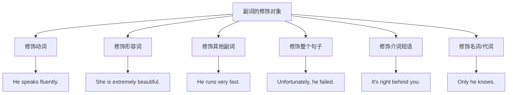
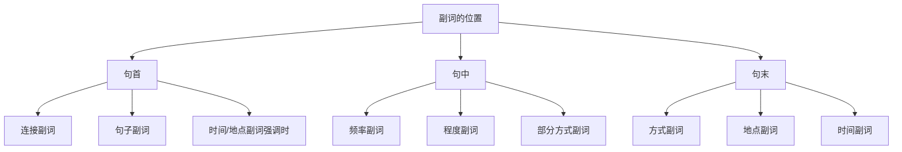

# 副词的分类与用法

副词（Adverb）是英语中一个极其重要却常被忽视的词类。它像语言的调味剂，能够修饰动词、形容词、其他副词，甚至整个句子，使表达更加精准、生动。本文将系统地介绍副词的分类体系、在句中的位置规则、比较级与最高级的构成方法，以及容易混淆的副词辨析。

## 1. 副词概述

### 1.1 什么是副词

副词是用来修饰动词、形容词、其他副词或整个句子的词类，主要用于说明动作的方式、时间、地点、程度、频率等信息。副词回答的问题通常是：How?（怎样）When?（何时）Where?（何地）How often?（多频繁）To what extent?（到何程度）

> [!info] 副词的核心功能
>
> 副词的本质功能是**提供附加信息**，它不改变句子的基本结构，但能使表达更加具体、生动、精确。没有副词，句子依然完整；有了副词，句子更加丰富。

观察以下例句中副词的作用：

| 无副词 | 有副词 | 副词作用 |
| --- | --- | --- |
| She sings. | She sings **beautifully**. | 说明唱歌的方式 |
| He arrived. | He arrived **yesterday**. | 说明到达的时间 |
| They work. | They work **here**. | 说明工作的地点 |
| I like it. | I **really** like it. | 加强喜欢的程度 |
| She comes. | She **always** comes. | 说明来的频率 |

### 1.2 副词的构成方式

英语副词的构成方式多样，了解这些构成规律有助于识别和正确使用副词。

**第一类：形容词 + -ly 构成的副词**

这是最常见的副词构成方式，约占副词总量的70%以上。

| 形容词 | 副词 | 例句 |
| --- | --- | --- |
| quick（快的）| quickly | He runs quickly.（他跑得快。）|
| slow（慢的）| slowly | Please speak slowly.（请慢慢说。）|
| careful（仔细的）| carefully | Read the instructions carefully.（仔细阅读说明。）|
| happy（快乐的）| happily | They lived happily ever after.（他们从此幸福地生活。）|
| easy（容易的）| easily | She passed the exam easily.（她轻松通过了考试。）|

> [!warning] -ly 副词的拼写规则
>
> 1. **一般规则**：直接加 -ly（quick → quickly）
> 2. **以辅音字母 + y 结尾**：变 y 为 i，再加 -ly（happy → happily）
> 3. **以 -le 结尾**：去 e 加 -y（gentle → gently，simple → simply）
> 4. **以 -ic 结尾**：加 -ally（automatic → automatically）
> 5. **以 -ll 结尾**：只加 -y（full → fully）
> 6. **以 -ue 结尾**：去 e 加 -ly（true → truly）

**第二类：与形容词同形的副词**

有些词既可作形容词，也可作副词，形式完全相同。

| 词汇 | 形容词用法 | 副词用法 |
| --- | --- | --- |
| fast | a fast car（一辆快车）| He drives fast.（他开车很快。）|
| hard | hard work（艰苦的工作）| She works hard.（她努力工作。）|
| late | the late news（晚间新闻）| He arrived late.（他到得晚。）|
| early | an early bird（早起的鸟）| She woke up early.（她早起。）|
| high | a high building（高楼）| The plane flies high.（飞机飞得高。）|
| low | a low voice（低沉的声音）| Speak low.（小声说。）|
| long | a long journey（长途旅行）| Don't stay long.（别待太久。）|
| straight | a straight line（直线）| Go straight.（直走。）|
| daily | daily routine（日常事务）| The paper is published daily.（报纸每天出版。）|
| weekly | weekly meeting（每周会议）| We meet weekly.（我们每周见面。）|

**第三类：本身就是副词的词**

这些词没有对应的形容词形式，天生就是副词。

| 副词 | 含义 | 例句 |
| --- | --- | --- |
| here | 这里 | Come here.（过来这里。）|
| there | 那里 | Put it there.（把它放那儿。）|
| now | 现在 | Do it now.（现在就做。）|
| then | 那时 | I was young then.（那时我还年轻。）|
| soon | 很快 | See you soon.（很快见。）|
| still | 仍然 | She is still working.（她仍在工作。）|
| already | 已经 | I have already finished.（我已经完成了。）|
| yet | 还（用于否定/疑问）| Have you finished yet?（你完成了吗？）|
| always | 总是 | He always helps me.（他总是帮助我。）|
| never | 从不 | I never lie.（我从不撒谎。）|
| often | 经常 | She often visits us.（她经常来看我们。）|
| seldom | 很少 | He seldom complains.（他很少抱怨。）|
| perhaps | 也许 | Perhaps you are right.（也许你是对的。）|
| quite | 相当 | It's quite good.（相当好。）|
| very | 非常 | I'm very tired.（我非常累。）|
| too | 太 | It's too hot.（太热了。）|

**第四类：形容词加 -ly 后意义改变的副词**

> [!warning] 注意区分同源但意义不同的副词
>
> 有些形容词加 -ly 后，与原形副词意义差别很大，使用时需特别注意。

| 原形副词 | 含义 | -ly 形式 | 含义 |
| --- | --- | --- | --- |
| hard | 努力地 | hardly | 几乎不 |
| late | 迟地 | lately | 最近 |
| high | 高地 | highly | 高度地（抽象）|
| near | 近地 | nearly | 几乎 |
| close | 近地 | closely | 密切地 |
| deep | 深地 | deeply | 深深地（感情）|
| wide | 宽地 | widely | 广泛地 |
| free | 免费地 | freely | 自由地 |
| most | 最 | mostly | 主要地 |
| pretty | 相当 | prettily | 漂亮地 |

对比例句：

```
He works hard. （他努力工作。）
He hardly works. （他几乎不工作。）

The plane flies high. （飞机飞得高。）
I highly recommend this book. （我强烈推荐这本书。）

She arrived late. （她到得晚。）
I haven't seen him lately. （我最近没见过他。）

Come near. （走近点。）
I nearly missed the train. （我差点错过火车。）

The door was wide open. （门大开着。）
The news spread widely. （消息广泛传播。）
```

### 1.3 副词的功能

副词在句中可以发挥多种修饰功能：



**修饰动词**（最基本的功能）：
- She **quickly** finished her homework.（她快速完成了作业。）
- They **carefully** examined the evidence.（他们仔细检查了证据。）
- The baby is sleeping **peacefully**.（婴儿正安静地睡着。）

**修饰形容词**：
- The movie was **extremely** boring.（这部电影极其无聊。）
- He is **incredibly** talented.（他难以置信地有才华。）
- The test was **surprisingly** easy.（考试出乎意料地简单。）

**修饰其他副词**：
- She speaks English **remarkably** well.（她英语说得非常好。）
- He drives **too** fast.（他开车太快了。）
- They arrived **quite** early.（他们到得相当早。）

**修饰整个句子**（句子副词）：
- **Fortunately**, no one was hurt.（幸运的是，没有人受伤。）
- **Obviously**, he is lying.（显然，他在撒谎。）
- **Personally**, I think it's a bad idea.（就我个人而言，我认为这是个坏主意。）

**修饰介词短语**：
- The cat is **right** behind the sofa.（猫就在沙发后面。）
- He arrived **just** before midnight.（他在午夜前刚好到达。）

**修饰名词或代词**（较少见）：
- **Only** she knows the truth.（只有她知道真相。）
- **Even** children can understand this.（连孩子都能理解这个。）
- The people **here** are friendly.（这里的人很友好。）

## 2. 副词的分类

副词按照其表达的意义可以分为多个类别。掌握这些分类有助于准确选择和使用副词。

### 2.1 方式副词

方式副词（Adverbs of Manner）说明动作进行的方式，回答"How?"的问题。这是副词中最大的一个类别。

**常见方式副词**：

| 副词 | 含义 | 例句 |
| --- | --- | --- |
| carefully | 仔细地 | Handle the glass carefully.（小心拿玻璃杯。）|
| quickly | 快速地 | She quickly apologized.（她迅速道歉。）|
| slowly | 慢慢地 | Walk slowly.（慢慢走。）|
| loudly | 大声地 | He laughed loudly.（他大声笑。）|
| quietly | 安静地 | Please speak quietly.（请小声说话。）|
| happily | 快乐地 | The children played happily.（孩子们快乐地玩耍。）|
| sadly | 悲伤地 | She looked at me sadly.（她悲伤地看着我。）|
| angrily | 愤怒地 | He shouted angrily.（他愤怒地喊叫。）|
| politely | 礼貌地 | She refused politely.（她礼貌地拒绝了。）|
| suddenly | 突然地 | The lights went out suddenly.（灯突然灭了。）|
| easily | 容易地 | He won the race easily.（他轻松赢得比赛。）|
| hard | 努力地 | She studied hard.（她努力学习。）|
| well | 好地 | You did well.（你做得好。）|
| badly | 糟糕地 | The team played badly.（这队表现糟糕。）|
| fluently | 流利地 | She speaks French fluently.（她法语说得流利。）|

> [!tip] 方式副词的位置
>
> 方式副词通常放在动词之后或句末，但为了强调也可放在句首（用逗号隔开）。
> - She **quietly** closed the door. ✓（动词前）
> - She closed the door **quietly**. ✓（句末，最常见）
> - **Quietly**, she closed the door. ✓（句首，强调）

**方式副词的句法分析**：

```
例句：The old man walked slowly along the street.
（老人沿着街道慢慢地走。）

句法分析：
├── The old man = 主语（名词短语）
├── walked = 谓语动词（过去式）
├── slowly = 方式副词，修饰 walked，说明走路的方式
└── along the street = 地点状语（介词短语）
```

### 2.2 时间副词

时间副词（Adverbs of Time）说明动作发生的时间，回答"When?"的问题。

**表示具体时间点**：

| 副词 | 含义 | 例句 |
| --- | --- | --- |
| now | 现在 | I need it now.（我现在就需要。）|
| then | 那时 | We were young then.（那时我们还年轻。）|
| today | 今天 | I'll do it today.（我今天做。）|
| yesterday | 昨天 | He left yesterday.（他昨天离开了。）|
| tomorrow | 明天 | See you tomorrow.（明天见。）|
| tonight | 今晚 | Let's meet tonight.（今晚见面吧。）|

**表示相对时间**：

| 副词 | 含义 | 例句 |
| --- | --- | --- |
| before | 以前 | I've seen her before.（我以前见过她。）|
| after | 之后 | We'll discuss it after.（我们之后再讨论。）|
| soon | 不久 | He'll be back soon.（他很快回来。）|
| later | 稍后 | I'll call you later.（稍后给你打电话。）|
| recently | 最近 | I saw him recently.（我最近见过他。）|
| lately | 近来 | Have you seen him lately?（你近来见过他吗？）|

**表示时间顺序**：

| 副词 | 含义 | 例句 |
| --- | --- | --- |
| first | 首先 | First, read the instructions.（首先，阅读说明。）|
| next | 接下来 | What do we do next?（接下来我们做什么？）|
| then | 然后 | Then, mix the ingredients.（然后，混合原料。）|
| finally | 最后 | Finally, add the salt.（最后，加盐。）|
| eventually | 最终 | He eventually agreed.（他最终同意了。）|
| afterwards | 随后 | We had dinner, and afterwards we went to a movie.（我们吃了晚餐，随后去看了电影。）|

**表示持续或完成**：

| 副词 | 含义 | 例句 |
| --- | --- | --- |
| already | 已经 | I've already finished.（我已经完成了。）|
| yet | 还（否定/疑问）| Have you finished yet?（你完成了吗？）|
| still | 仍然 | She's still sleeping.（她还在睡觉。）|
| just | 刚刚 | I've just arrived.（我刚到。）|
| no longer | 不再 | He no longer lives here.（他不再住这里了。）|

> [!example] already, yet, still 的用法区别
>
> **already**（已经）：用于肯定句，表示某事比预期更早发生
> - I have **already** eaten.（我已经吃过了。）
>
> **yet**（还）：用于否定句和疑问句，表示到目前为止
> - I haven't finished **yet**.（我还没完成。）
> - Have you finished **yet**?（你完成了吗？）
>
> **still**（仍然）：表示某事继续进行，常用于肯定句
> - He is **still** working.（他仍在工作。）
> - 也可用于否定句，表示惊讶：He **still** hasn't called.（他居然还没打电话。）

### 2.3 地点副词

地点副词（Adverbs of Place）说明动作发生的地点或方向，回答"Where?"的问题。

**表示位置**：

| 副词 | 含义 | 例句 |
| --- | --- | --- |
| here | 这里 | Come here.（过来这里。）|
| there | 那里 | Put it there.（把它放那里。）|
| everywhere | 到处 | I've looked everywhere.（我到处找过了。）|
| somewhere | 某处 | I've seen this somewhere.（我在某处见过这个。）|
| anywhere | 任何地方 | You can sit anywhere.（你可以坐任何地方。）|
| nowhere | 无处 | There's nowhere to hide.（无处可藏。）|

**表示方向**：

| 副词 | 含义 | 例句 |
| --- | --- | --- |
| up | 向上 | Look up.（往上看。）|
| down | 向下 | Sit down.（坐下。）|
| in | 进入 | Come in.（进来。）|
| out | 出去 | Get out.（出去。）|
| away | 离开 | Go away.（走开。）|
| back | 回来 | Come back.（回来。）|
| forward | 向前 | Move forward.（向前移动。）|
| backward | 向后 | Step backward.（后退一步。）|

**表示相对位置**：

| 副词 | 含义 | 例句 |
| --- | --- | --- |
| inside | 在里面 | Let's go inside.（我们进去吧。）|
| outside | 在外面 | Wait outside.（在外面等。）|
| upstairs | 在楼上 | She's upstairs.（她在楼上。）|
| downstairs | 在楼下 | He went downstairs.（他下楼了。）|
| abroad | 在国外 | She lives abroad.（她住在国外。）|
| overseas | 在海外 | He works overseas.（他在海外工作。）|
| nearby | 在附近 | There's a hospital nearby.（附近有家医院。）|
| home | 在家/回家 | I'm going home.（我要回家。）|

> [!warning] home, abroad 的特殊用法
>
> **home** 和 **abroad** 作副词时，前面不加介词 to：
> - ✓ I'm going **home**.（我要回家。）
> - ✗ I'm going to home.
> - ✓ She moved **abroad**.（她搬到国外了。）
> - ✗ She moved to abroad.
>
> 但如果 home 前有修饰语，则需要加介词：
> - I'm going **to my new home**.（我要去我的新家。）

### 2.4 程度副词

程度副词（Adverbs of Degree）表示动作或状态的程度、强度，回答"How much?"或"To what extent?"的问题。

**表示高程度**：

| 副词 | 含义 | 例句 |
| --- | --- | --- |
| very | 非常 | She is very beautiful.（她非常漂亮。）|
| extremely | 极其 | It's extremely hot.（天气极其热。）|
| incredibly | 难以置信地 | He's incredibly smart.（他聪明得难以置信。）|
| absolutely | 绝对地 | You're absolutely right.（你绝对正确。）|
| completely | 完全地 | I completely agree.（我完全同意。）|
| totally | 完全地 | That's totally wrong.（那完全错了。）|
| entirely | 全部地 | It's entirely my fault.（全是我的错。）|
| thoroughly | 彻底地 | I thoroughly enjoyed it.（我彻底享受了。）|
| deeply | 深深地 | I'm deeply sorry.（我深感抱歉。）|
| highly | 高度地 | I highly recommend it.（我强烈推荐。）|
| greatly | 极大地 | I greatly appreciate it.（我非常感激。）|

**表示中等程度**：

| 副词 | 含义 | 例句 |
| --- | --- | --- |
| quite | 相当 | It's quite good.（相当好。）|
| rather | 颇为 | She's rather shy.（她颇为害羞。）|
| fairly | 还算 | The test was fairly easy.（考试还算简单。）|
| pretty | 相当（口语）| That's pretty cool.（那相当酷。）|
| somewhat | 有些 | I'm somewhat confused.（我有些困惑。）|

**表示低程度**：

| 副词 | 含义 | 例句 |
| --- | --- | --- |
| slightly | 稍微 | I'm slightly tired.（我有点累。）|
| a little | 一点 | It's a little cold.（有点冷。）|
| a bit | 一点（口语）| I'm a bit hungry.（我有点饿。）|
| hardly | 几乎不 | I can hardly hear you.（我几乎听不见你。）|
| barely | 勉强 | She barely passed.（她勉强通过。）|
| scarcely | 几乎不 | I scarcely know him.（我几乎不认识他。）|

**表示充足或过度**：

| 副词 | 含义 | 例句 |
| --- | --- | --- |
| enough | 足够 | Is it good enough?（够好吗？）|
| too | 太 | It's too expensive.（太贵了。）|
| so | 如此 | I'm so happy.（我太高兴了。）|
| such | 如此（修饰名词）| It was such a nice day.（多好的一天。）|

> [!tip] quite 与 rather 的细微差别
>
> **quite**：语气较中性，表示"相当、颇"
> - It's quite good. = 相当好（正面评价）
>
> **rather**：常带有出乎意料或轻微负面的语气
> - It's rather expensive. = 颇贵（暗示比预期贵）
> - She's rather clever. = 她颇为聪明（可能有些惊讶）
>
> 但 rather 也可表示正面意义：
> - I rather like this song. = 我很喜欢这首歌。

> [!warning] very 与 much 的搭配规则
>
> **very** 修饰形容词和副词原级：
> - very good, very quickly, very carefully
>
> **much** 修饰比较级和过去分词：
> - much better, much faster, much improved
>
> **very much** 修饰动词：
> - I like it very much.（我非常喜欢。）

### 2.5 频率副词

频率副词（Adverbs of Frequency）表示动作发生的频率，回答"How often?"的问题。


**频率副词详解**：

| 副词 | 频率 | 例句 |
| --- | --- | --- |
| always | 总是（100%）| She always arrives on time.（她总是准时到达。）|
| usually | 通常（80-90%）| I usually have coffee for breakfast.（我早餐通常喝咖啡。）|
| normally | 通常 | I normally wake up at 7.（我通常7点醒。）|
| generally | 一般 | He generally works late.（他一般工作到很晚。）|
| frequently | 频繁地 | She frequently visits her parents.（她频繁地看望父母。）|
| often | 经常（60-70%）| We often go hiking.（我们经常去远足。）|
| sometimes | 有时（40-50%）| I sometimes forget things.（我有时会忘事。）|
| occasionally | 偶尔（20-30%）| We occasionally eat out.（我们偶尔外出吃饭。）|
| seldom | 很少（5-10%）| He seldom makes mistakes.（他很少犯错。）|
| rarely | 很少 | She rarely complains.（她很少抱怨。）|
| hardly ever | 几乎从不 | I hardly ever watch TV.（我几乎从不看电视。）|
| never | 从不（0%）| I never eat meat.（我从不吃肉。）|

**表示确切频率的副词短语**：

| 短语 | 含义 | 例句 |
| --- | --- | --- |
| once | 一次 | I've been there once.（我去过那里一次。）|
| twice | 两次 | Call me twice a day.（每天给我打两次电话。）|
| once a week | 每周一次 | We meet once a week.（我们每周见一次。）|
| twice a month | 每月两次 | I visit them twice a month.（我每月去看他们两次。）|
| three times a year | 每年三次 | She travels abroad three times a year.（她每年出国旅行三次。）|
| every day | 每天 | I exercise every day.（我每天锻炼。）|
| daily | 每天 | The newspaper is published daily.（报纸每天出版。）|
| weekly | 每周 | We have weekly meetings.（我们每周开会。）|
| monthly | 每月 | Rent is paid monthly.（房租每月支付。）|
| annually | 每年 | The festival is held annually.（节日每年举办。）|

> [!example] 频率副词的位置规则
>
> **一般规则**：频率副词放在实义动词之前，be 动词/助动词/情态动词之后
>
> **在实义动词之前**：
> - She **always** arrives on time.
> - I **never** eat fast food.
>
> **在 be 动词之后**：
> - He **is always** late.
> - They **are never** satisfied.
>
> **在助动词/情态动词之后**：
> - I **have always** loved music.
> - You **can always** call me.
>
> **特殊情况**：sometimes, usually, often, occasionally 也可放在句首或句末
> - **Sometimes** I feel lonely.
> - I visit them **occasionally**.

### 2.6 疑问副词

疑问副词（Interrogative Adverbs）用于引导特殊疑问句。

| 副词 | 询问内容 | 例句 |
| --- | --- | --- |
| when | 时间 | When did you arrive?（你什么时候到的？）|
| where | 地点 | Where do you live?（你住在哪里？）|
| why | 原因 | Why are you crying?（你为什么哭？）|
| how | 方式/程度 | How did you do it?（你怎么做到的？）|

**how 的扩展用法**：

| 短语 | 询问内容 | 例句 |
| --- | --- | --- |
| how much | 数量（不可数）/价格 | How much does it cost?（多少钱？）|
| how many | 数量（可数）| How many books do you have?（你有多少本书？）|
| how often | 频率 | How often do you exercise?（你多久锻炼一次？）|
| how long | 时间长度 | How long have you been here?（你在这里多久了？）|
| how far | 距离 | How far is it from here?（离这里多远？）|
| how old | 年龄 | How old are you?（你多大了？）|
| how tall | 身高 | How tall is he?（他多高？）|
| how soon | 多快（将来）| How soon can you finish?（你多快能完成？）|

### 2.7 连接副词

连接副词（Conjunctive Adverbs）用于连接句子或分句，表示逻辑关系。

**表示转折**：

| 副词 | 含义 | 例句 |
| --- | --- | --- |
| however | 然而 | I tried hard; however, I failed.（我努力了；然而，我失败了。）|
| nevertheless | 尽管如此 | He's old; nevertheless, he's active.（他老了；尽管如此，他很活跃。）|
| nonetheless | 尽管如此 | The task was hard; nonetheless, we finished it.（任务很难；尽管如此，我们完成了。）|
| still | 仍然 | He's not perfect; still, I like him.（他不完美；但我仍然喜欢他。）|
| instead | 相反 | He didn't go; instead, he stayed home.（他没去；相反，他待在家里。）|

**表示因果**：

| 副词 | 含义 | 例句 |
| --- | --- | --- |
| therefore | 因此 | It rained; therefore, the game was cancelled.（下雨了；因此，比赛取消了。）|
| thus | 因此 | He studied hard; thus, he passed.（他努力学习；因此，他通过了。）|
| hence | 因此 | She's ill; hence, she can't come.（她病了；因此，她不能来。）|
| consequently | 结果 | He lied; consequently, nobody trusts him.（他撒谎；结果，没人信任他。）|
| accordingly | 相应地 | Prices rose; accordingly, we raised wages.（物价上涨；相应地，我们提高了工资。）|

**表示递进**：

| 副词 | 含义 | 例句 |
| --- | --- | --- |
| moreover | 此外 | He's smart; moreover, he's hardworking.（他聪明；此外，他努力。）|
| furthermore | 而且 | The car is cheap; furthermore, it's reliable.（这车便宜；而且，它可靠。）|
| besides | 此外 | I don't want to go; besides, I'm tired.（我不想去；此外，我累了。）|
| also | 也 | She plays piano; she also sings.（她弹钢琴；她也唱歌。）|
| in addition | 另外 | He speaks French; in addition, he knows German.（他会法语；另外，他懂德语。）|

**表示举例**：

| 副词 | 含义 | 例句 |
| --- | --- | --- |
| for example | 例如 | Some fruits, for example, apples, are healthy.（有些水果，例如苹果，是健康的。）|
| for instance | 例如 | Many animals, for instance, dogs, are loyal.（许多动物，例如狗，是忠诚的。）|
| namely | 即 | Two students failed, namely, Tom and Jerry.（两个学生不及格，即汤姆和杰瑞。）|

**表示对比**：

| 副词 | 含义 | 例句 |
| --- | --- | --- |
| on the contrary | 相反 | He's not lazy; on the contrary, he's very diligent.（他不懒；相反，他很勤奋。）|
| in contrast | 相比之下 | She's outgoing; in contrast, her brother is shy.（她外向；相比之下，她哥哥很害羞。）|
| conversely | 相反地 | Rich people save more; conversely, poor people spend more.（富人存得多；相反地，穷人花得多。）|

### 2.8 句子副词

句子副词（Sentence Adverbs）修饰整个句子，表达说话者的态度、评价或观点。

**表示确定性**：

| 副词 | 含义 | 例句 |
| --- | --- | --- |
| certainly | 当然 | Certainly, I'll help you.（当然，我会帮你。）|
| definitely | 肯定 | He will definitely come.（他肯定会来。）|
| obviously | 显然 | Obviously, she's not interested.（显然，她不感兴趣。）|
| clearly | 明显地 | Clearly, we need more time.（很明显，我们需要更多时间。）|
| undoubtedly | 无疑 | Undoubtedly, he's the best.（毫无疑问，他是最好的。）|
| probably | 可能 | She probably forgot.（她可能忘了。）|
| perhaps | 也许 | Perhaps you're right.（也许你是对的。）|
| maybe | 也许 | Maybe it will rain.（也许会下雨。）|
| possibly | 可能 | He could possibly win.（他可能会赢。）|

**表示态度**：

| 副词 | 含义 | 例句 |
| --- | --- | --- |
| fortunately | 幸运地 | Fortunately, nobody was hurt.（幸运的是，没人受伤。）|
| unfortunately | 不幸地 | Unfortunately, I lost my wallet.（不幸的是，我丢了钱包。）|
| luckily | 幸运地 | Luckily, I found my keys.（幸运的是，我找到了钥匙。）|
| surprisingly | 令人惊讶地 | Surprisingly, he agreed.（令人惊讶的是，他同意了。）|
| amazingly | 令人惊奇地 | Amazingly, she survived.（令人惊奇的是，她幸存了。）|
| sadly | 遗憾地 | Sadly, he passed away.（遗憾的是，他去世了。）|
| happily | 高兴地 | Happily, the wedding went well.（令人高兴的是，婚礼进行顺利。）|
| strangely | 奇怪地 | Strangely, he didn't reply.（奇怪的是，他没有回复。）|

**表示观点**：

| 副词 | 含义 | 例句 |
| --- | --- | --- |
| personally | 就个人而言 | Personally, I think it's a mistake.（就我个人而言，我认为这是个错误。）|
| honestly | 老实说 | Honestly, I don't like it.（老实说，我不喜欢。）|
| frankly | 坦白说 | Frankly, you're wrong.（坦白说，你错了。）|
| generally | 一般来说 | Generally speaking, it's true.（一般来说，这是真的。）|
| basically | 基本上 | Basically, I agree with you.（基本上，我同意你。）|
| apparently | 显然 | Apparently, he's moved.（显然，他搬家了。）|
| ideally | 理想地说 | Ideally, we should start early.（理想地说，我们应该早点开始。）|

> [!tip] 句子副词的位置
>
> 句子副词通常放在句首，用逗号与主句隔开：
> - **Fortunately**, we arrived on time.
> - **Personally**, I prefer tea to coffee.
>
> 也可放在句中或句末：
> - We, **fortunately**, arrived on time.
> - We arrived on time, **fortunately**.

## 3. 副词在句中的位置

副词的位置比较灵活，但有一定的规律可循。不同类型的副词有不同的位置倾向，掌握这些规律有助于造出自然、地道的句子。

### 3.1 副词位置的基本规则



### 3.2 方式副词的位置

方式副词最常见的位置是**句末**（动词宾语之后），但也可以放在其他位置。

**句末位置（最常见）**：
- She speaks English **fluently**.（她英语说得流利。）
- He finished his work **carefully**.（他仔细地完成了工作。）
- The children played **happily**.（孩子们快乐地玩耍。）

**动词之前（强调动作方式）**：
- She **carefully** opened the letter.（她小心地打开了信。）
- He **slowly** walked toward the door.（他慢慢地走向门口。）

**句首（特别强调）**：
- **Silently**, he left the room.（悄无声息地，他离开了房间。）
- **Suddenly**, the lights went out.（突然，灯灭了。）

> [!warning] 方式副词位置的限制
>
> 1. 不能放在动词和宾语之间：
>    - ✗ She speaks fluently English.
>    - ✓ She speaks English fluently.
>
> 2. 如果动词后有介词短语或其他成分，副词可放在动词后或句末：
>    - She walked quickly to the station. ✓
>    - She walked to the station quickly. ✓

### 3.3 时间副词的位置

时间副词通常放在**句末**或**句首**。

**句末（最常见）**：
- I'll see you **tomorrow**.（我明天见你。）
- She arrived **yesterday**.（她昨天到的。）
- He called me **recently**.（他最近给我打了电话。）

**句首（强调时间）**：
- **Tomorrow**, I have an important meeting.（明天，我有个重要会议。）
- **Yesterday**, something strange happened.（昨天，发生了一件奇怪的事。）

**确切时间点通常放在句末**：
- The train leaves **at 8 o'clock**.（火车8点出发。）
- We met **in 2010**.（我们2010年认识的。）

### 3.4 地点副词的位置

地点副词通常放在**句末**，但在某些情况下可以放在句首。

**句末（最常见）**：
- She lives **here**.（她住在这里。）
- Put the book **there**.（把书放那儿。）
- I've looked **everywhere**.（我到处都找过了。）

**句首（强调或文学表达）**：
- **Here** comes the bus!（公交车来了！）
- **There** goes my chance.（我的机会没了。）

> [!info] 时间与地点副词同时出现时的顺序
>
> 当句末同时有地点副词和时间副词时，一般顺序是**地点在前，时间在后**：
> - I met him **at the station** **yesterday**.（我昨天在车站见到他。）
> - She worked **here** **for two years**.（她在这里工作了两年。）
>
> 也可以把时间副词放在句首：
> - **Yesterday**, I met him at the station.

### 3.5 频率副词的位置

频率副词的位置规则最为具体：

**在实义动词之前**：
- She **always** arrives on time.（她总是准时到达。）
- I **never** eat fast food.（我从不吃快餐。）
- They **often** visit their grandparents.（他们经常看望祖父母。）

**在 be 动词之后**：
- He **is always** late.（他总是迟到。）
- The weather **is usually** nice here.（这里天气通常不错。）
- She **is never** satisfied.（她从不满足。）

**在助动词/情态动词之后，实义动词之前**：
- I **have never** been to Japan.（我从没去过日本。）
- She **will always** remember this day.（她会永远记住这一天。）
- You **can always** ask me for help.（你总是可以向我求助。）

**在第一个助动词之后（多个助动词时）**：
- He **has always** been reliable.（他一直很可靠。）
- The work **should never** have been done this way.（这工作本不该这样做。）

> [!example] 频率副词的特殊位置
>
> 1. **sometimes, usually, often, occasionally** 可放在句首：
>    - **Sometimes** I feel lonely.
>    - **Often**, she works late.
>
> 2. **always, never** 通常不放句首（祈使句除外）：
>    - **Always** be honest.（始终诚实。）— 祈使句
>    - **Never** give up.（永不放弃。）— 祈使句
>
> 3. **强调时**，频率副词可放在 be 动词/助动词之前：
>    - She **always** is late. → She **always IS** late!（她就是总是迟到！）
>    - I **never** have understood him. → I **never HAVE** understood him!

### 3.6 程度副词的位置

程度副词通常放在它所修饰的词**之前**。

**修饰形容词（放在形容词前）**：
- She is **very** beautiful.（她非常漂亮。）
- The exam was **extremely** difficult.（考试极其困难。）
- I'm **quite** tired.（我相当累。）

**修饰副词（放在副词前）**：
- He runs **very** fast.（他跑得非常快。）
- She speaks English **remarkably** well.（她英语说得出奇地好。）

**修饰动词（位置灵活）**：
- I **really** like this book.（我真的喜欢这本书。）
- I like this book **very much**.（我非常喜欢这本书。）
- She **almost** missed the train.（她差点错过火车。）

> [!warning] enough 的特殊位置
>
> **enough** 作为程度副词时，放在它所修饰的形容词或副词**之后**：
> - Is this room **big enough**?（这房间够大吗？）
> - He didn't run **fast enough**.（他跑得不够快。）
> - She isn't **old enough** to drive.（她还不够大，不能开车。）
>
> 但修饰名词时，放在名词**之前**：
> - We have **enough time**.（我们有足够的时间。）
> - There isn't **enough water**.（水不够。）

### 3.7 多个副词同时出现时的顺序

当句末有多个副词时，一般遵循以下顺序：

**方式 → 地点 → 时间**（Manner → Place → Time）

| 例句 | 方式 | 地点 | 时间 |
| --- | --- | --- | --- |
| She sang beautifully at the concert last night. | beautifully | at the concert | last night |
| He worked hard in the office yesterday. | hard | in the office | yesterday |
| The children played happily in the park all afternoon. | happily | in the park | all afternoon |

> [!tip] 记忆口诀
>
> **MPT** = **M**anner → **P**lace → **T**ime
>
> 或者用句子记忆：
> "She danced **gracefully** (方式) **on the stage** (地点) **last night** (时间)."

**但是**，这只是一般规则，实际使用中可以根据强调重点调整顺序：
- She has been working **hard** **all day** **at home**.（她在家辛苦工作了一整天。）— 强调时间
- **Yesterday**, I met him **by chance** **at the airport**.（昨天，我在机场偶遇了他。）— 时间提前强调

## 4. 副词的比较级与最高级

与形容词一样，许多副词也有比较级和最高级形式，用于比较动作的方式、程度等。

### 4.1 副词比较级和最高级的构成

**规则变化**：

| 副词类型 | 原级 | 比较级 | 最高级 |
| --- | --- | --- | --- |
| 单音节 | fast | faster | fastest |
| 单音节 | hard | harder | hardest |
| 单音节 | late | later | latest |
| 单音节 | early | earlier | earliest |
| 单音节 | soon | sooner | soonest |
| -ly 结尾 | quickly | more quickly | most quickly |
| -ly 结尾 | carefully | more carefully | most carefully |
| -ly 结尾 | slowly | more slowly | most slowly |
| -ly 结尾 | beautifully | more beautifully | most beautifully |

> [!info] 构成规则
>
> 1. **单音节副词**：加 -er/-est
>    - fast → faster → fastest
>    - hard → harder → hardest
>
> 2. **以 -ly 结尾的副词**：前面加 more/most
>    - carefully → more carefully → most carefully
>    - quietly → more quietly → most quietly
>
> 3. **以 -y 结尾的双音节副词**：变 y 为 i，加 -er/-est
>    - early → earlier → earliest

**不规则变化**：

| 原级 | 比较级 | 最高级 |
| --- | --- | --- |
| well（好）| better | best |
| badly（糟糕）| worse | worst |
| much（多）| more | most |
| little（少）| less | least |
| far（远）| farther/further | farthest/furthest |

> [!warning] farther 与 further 的区别
>
> **farther**：主要指物理距离上的"更远"
> - He ran farther than I did.（他跑得比我远。）
>
> **further**：可指距离，也可指程度、进展上的"更进一步"
> - Let's discuss this further.（让我们进一步讨论这个问题。）
> - Do you have any further questions?（你还有其他问题吗？）

### 4.2 副词比较级的用法

**基本句型**：主语 + 动词 + 比较级副词 + **than** + 比较对象

- She runs **faster than** me.（她跑得比我快。）
- He works **more efficiently than** his colleagues.（他工作比同事更有效率。）
- The plane travels **more quickly than** the train.（飞机比火车快。）

**比较级的修饰语**：

| 修饰语 | 含义 | 例句 |
| --- | --- | --- |
| much | 得多 | She runs much faster.（她跑得快得多。）|
| far | 得多 | He works far harder.（他工作努力得多。）|
| a lot | 得多 | This car goes a lot faster.（这车快得多。）|
| even | 甚至更 | She speaks even more fluently now.（她现在说得甚至更流利了。）|
| still | 更加 | He arrived still later.（他到得更晚了。）|
| a little | 稍微 | Please speak a little more slowly.（请说得稍微慢一点。）|
| slightly | 稍微 | He runs slightly faster.（他跑得稍快一点。）|
| no | 一点也不更 | This is no better.（这一点也不更好。）|

**双重比较级（the + 比较级，the + 比较级）**：

表示"越……越……"

- **The harder** you work, **the more** you'll learn.
  （你越努力工作，学到的就越多。）

- **The sooner** you start, **the earlier** you'll finish.
  （你开始得越早，完成得就越早。）

- **The more carefully** you read, **the better** you'll understand.
  （你读得越仔细，理解得就越好。）

**比较级 + and + 比较级**：

表示"越来越……"

- She is running **faster and faster**.（她跑得越来越快。）
- He speaks English **more and more fluently**.（他英语说得越来越流利。）
- The weather is getting **worse and worse**.（天气变得越来越糟。）

### 4.3 副词最高级的用法

**基本句型**：主语 + 动词 + **(the) +** 最高级副词 + **of/in/among** + 范围

> [!tip] the 的使用
>
> 副词最高级前的 **the** 可用可不用，但用 the 更为正式：
> - She sings **(the) best** in her class.（她在班里唱得最好。）
> - He runs **(the) fastest** of all the students.（他在所有学生中跑得最快。）

**常见例句**：

- Who runs **fastest** in your class?（你们班谁跑得最快？）
- She works **(the) hardest** of all the employees.（她是所有员工中工作最努力的。）
- This method works **(the) most effectively**.（这种方法最有效。）
- Of all the singers, she performs **(the) best**.（在所有歌手中，她表演得最好。）

**表示范围的介词选择**：

| 介词 | 用法 | 例句 |
| --- | --- | --- |
| of | 用于具体的人或物 | the fastest of the three（三者中最快的）|
| in | 用于地点或团体 | the best in the school（学校里最好的）|
| among | 用于三者或以上 | the hardest-working among us（我们中最勤奋的）|

### 4.4 副词原级比较

**as + 原级副词 + as**：表示"和……一样"

- She speaks English **as fluently as** a native speaker.
  （她英语说得和母语者一样流利。）

- He works **as hard as** anyone else.
  （他和其他任何人一样努力工作。）

- The train doesn't go **as fast as** the plane.
  （火车没有飞机快。）

**not as/so + 原级副词 + as**：表示"不如……"

- I can't run **as fast as** you.（我跑得不如你快。）
- She doesn't speak **so clearly as** her sister.（她说话不如她姐姐清楚。）

**倍数表达**：

| 表达方式 | 例句 |
| --- | --- |
| twice as...as | He runs twice as fast as me.（他跑得是我的两倍快。）|
| three times as...as | She earns three times as much as I do.（她赚的是我的三倍。）|
| half as...as | He works half as hard as she does.（他工作的努力程度是她的一半。）|

## 5. 易混淆副词辨析

英语中有许多副词在形式或意义上容易混淆，正确区分这些副词对于准确表达至关重要。

### 5.1 hard vs. hardly

| 词汇 | 词性 | 含义 | 例句 |
| --- | --- | --- | --- |
| hard | 副词 | 努力地、猛烈地 | She works hard.（她努力工作。）|
| hardly | 副词 | 几乎不 | She hardly works.（她几乎不工作。）|

> [!warning] 意思完全相反
>
> **hard** 作副词表示"努力地"，**hardly** 表示"几乎不"，二者意思截然相反！
>
> - I can **hard**ly believe it.（我几乎不敢相信。）
> - I worked **hard** on this project.（我在这个项目上努力工作。）

更多例句对比：

```
He hit the ball hard. （他用力击球。）
He could hardly hit the ball. （他几乎打不到球。）

She hardly knows him. （她几乎不认识他。）
She knows him hard... ✗（无此用法）

It's raining hard. （雨下得很大。）
It hardly rains here. （这里几乎不下雨。）
```

### 5.2 late vs. lately

| 词汇 | 词性 | 含义 | 例句 |
| --- | --- | --- | --- |
| late | 副词 | 迟、晚 | He arrived late.（他到得晚。）|
| lately | 副词 | 最近、近来 | I haven't seen him lately.（我最近没见过他。）|

例句对比：

```
He came late to the meeting. （他开会迟到了。）
Have you seen any good movies lately? （你最近看过什么好电影吗？）

Better late than never. （迟到总比不到好。）
Lately, I've been feeling tired. （最近，我一直感觉很累。）
```

### 5.3 high vs. highly

| 词汇 | 词性 | 含义 | 例句 |
| --- | --- | --- | --- |
| high | 副词 | 高地（物理高度）| The bird flew high.（鸟飞得高。）|
| highly | 副词 | 高度地（抽象程度）| I highly recommend it.（我强烈推荐。）|

例句对比：

```
The plane flies high in the sky. （飞机在高空飞行。）
She is highly respected. （她备受尊敬。）

He jumped high. （他跳得很高。）
This is a highly sensitive issue. （这是一个高度敏感的问题。）

Prices have risen high. （价格涨得很高。）
He is highly qualified for the job. （他非常适合这份工作。）
```

### 5.4 near vs. nearly

| 词汇 | 词性 | 含义 | 例句 |
| --- | --- | --- | --- |
| near | 副词 | 近地（距离）| Don't come near.（别靠近。）|
| nearly | 副词 | 几乎、差不多 | I nearly missed the bus.（我差点错过公交车。）|

例句对比：

```
He lives near. （他住在附近。）
He nearly died. （他差点死掉。）

Come near so I can see you. （靠近点，让我看看你。）
I've nearly finished my homework. （我作业几乎做完了。）

The deadline is drawing near. （截止日期快到了。）
Nearly all students passed the exam. （几乎所有学生都通过了考试。）
```

### 5.5 close vs. closely

| 词汇 | 词性 | 含义 | 例句 |
| --- | --- | --- | --- |
| close | 副词 | 近地（物理距离）| Stand close to me.（站在我旁边。）|
| closely | 副词 | 密切地、仔细地 | Watch closely.（仔细观看。）|

例句对比：

```
Sit close to the fire. （坐到火旁边。）
Listen closely to the instructions. （仔细听说明。）

The two houses are close together. （两栋房子靠得很近。）
The police are watching him closely. （警察正在密切监视他。）

Come closer. （再靠近点。）
They work closely together. （他们密切合作。）
```

### 5.6 deep vs. deeply

| 词汇 | 词性 | 含义 | 例句 |
| --- | --- | --- | --- |
| deep | 副词 | 深地（物理深度）| Dig deep.（挖深一点。）|
| deeply | 副词 | 深深地（感情程度）| I'm deeply sorry.（我深感抱歉。）|

例句对比：

```
The roots go deep into the ground. （根深入地下。）
He was deeply moved by the story. （他被故事深深感动。）

Don't swim too deep. （别游太深。）
She deeply regrets her decision. （她深深后悔自己的决定。）

They dug deep to find water. （他们深挖找水。）
I am deeply grateful for your help. （我对你的帮助深表感激。）
```

### 5.7 wide vs. widely

| 词汇 | 词性 | 含义 | 例句 |
| --- | --- | --- | --- |
| wide | 副词 | 宽地、张大地 | Open your eyes wide.（睁大眼睛。）|
| widely | 副词 | 广泛地 | English is widely spoken.（英语被广泛使用。）|

例句对比：

```
The door was wide open. （门大开着。）
The news spread widely. （消息广泛传播。）

Open your mouth wide. （张大嘴巴。）
He is widely known as an expert. （他被广泛认为是专家。）

She opened her arms wide. （她张开双臂。）
The book is widely read. （这本书被广泛阅读。）
```

### 5.8 free vs. freely

| 词汇 | 词性 | 含义 | 例句 |
| --- | --- | --- | --- |
| free | 副词 | 免费地 | Children travel free.（儿童免费乘车。）|
| freely | 副词 | 自由地、随意地 | You can speak freely.（你可以自由发言。）|

例句对比：

```
You can get in free. （你可以免费进入。）
Animals roam freely in the park. （动物在公园里自由漫步。）

The samples are available free of charge. （样品免费提供。）
She expresses her opinions freely. （她自由地表达意见。）
```

### 5.9 most vs. mostly

| 词汇 | 词性 | 含义 | 例句 |
| --- | --- | --- | --- |
| most | 副词 | 最、非常 | This is the most interesting book.（这是最有趣的书。）|
| mostly | 副词 | 主要地、大部分 | The students are mostly girls.（学生大部分是女生。）|

例句对比：

```
She is the most talented singer. （她是最有才华的歌手。）
I mostly work from home. （我主要在家工作。）

Which book do you like most? （你最喜欢哪本书？）
The audience was mostly young people. （观众主要是年轻人。）

It was most kind of you. （你真是太好了。）
We eat mostly vegetables. （我们主要吃蔬菜。）
```

### 5.10 副词辨析汇总表

| 原形副词 | 含义 | -ly 形式 | 含义 |
| --- | --- | --- | --- |
| hard | 努力地 | hardly | 几乎不 |
| late | 迟地 | lately | 最近 |
| high | 高地 | highly | 高度地 |
| near | 近地 | nearly | 几乎 |
| close | 近地 | closely | 密切地 |
| deep | 深地 | deeply | 深深地 |
| wide | 宽地 | widely | 广泛地 |
| free | 免费地 | freely | 自由地 |
| most | 最 | mostly | 主要地 |
| direct | 直接地 | directly | 立即、直接地 |
| short | 突然地 | shortly | 不久 |
| pretty | 相当 | prettily | 漂亮地 |
| just | 刚刚、正好 | justly | 公正地 |

## 6. 副词的特殊用法

### 6.1 否定副词与倒装

当否定副词或含否定意义的副词放在句首时，句子需要部分倒装（助动词/be动词/情态动词提前）。

**常见触发倒装的副词**：

| 副词 | 含义 | 例句 |
| --- | --- | --- |
| never | 从不 | Never have I seen such beauty.（我从未见过如此美景。）|
| seldom | 很少 | Seldom does he complain.（他很少抱怨。）|
| rarely | 很少 | Rarely do we get such chances.（我们很少有这样的机会。）|
| hardly | 几乎不 | Hardly had I arrived when it started raining.（我刚到就开始下雨了。）|
| scarcely | 几乎不 | Scarcely had she finished when the bell rang.（她刚完成铃就响了。）|
| barely | 勉强 | Barely had he sat down when the phone rang.（他刚坐下电话就响了。）|
| little | 几乎不 | Little did he know what awaited him.（他几乎不知道等待他的是什么。）|
| nowhere | 无处 | Nowhere could we find the key.（我们找不到钥匙。）|
| not only | 不仅 | Not only did she win, but she also broke the record.（她不仅赢了，还打破了纪录。）|
| no sooner...than | 一…就… | No sooner had I arrived than she left.（我一到她就离开了。）|

> [!example] 否定副词倒装句型
>
> **正常语序**：I have never seen such a beautiful sunset.
> **倒装语序**：**Never have I seen** such a beautiful sunset.
>
> **正常语序**：She seldom goes out at night.
> **倒装语序**：**Seldom does she go** out at night.
>
> **正常语序**：I little knew that he was lying.
> **倒装语序**：**Little did I know** that he was lying.

### 6.2 only + 状语引起的倒装

当 **only + 状语**（时间、地点、方式副词或状语从句）位于句首时，主句需要部分倒装。

**only + 时间副词**：
- **Only then did I** realize my mistake.（直到那时我才意识到我的错误。）
- **Only yesterday did he** tell me the truth.（直到昨天他才告诉我真相。）

**only + 地点副词**：
- **Only here can you** find such rare flowers.（只有在这里你才能找到如此珍稀的花。）

**only + 方式状语**：
- **Only by working hard can we** succeed.（只有通过努力工作我们才能成功。）
- **Only through practice will you** improve.（只有通过练习你才会进步。）

**only + 状语从句**：
- **Only when the war was over did they** return home.（只有战争结束后他们才回家。）
- **Only if you study hard will you** pass the exam.（只有努力学习你才能通过考试。）

> [!warning] only 修饰主语时不倒装
>
> 如果 only 修饰的是主语而非状语，则不倒装：
> - **Only he** knows the answer.（只有他知道答案。）✓ 不倒装
> - **Only John** can help us.（只有约翰能帮我们。）✓ 不倒装

### 6.3 so/such...that 结构

**so + 形容词/副词 + that**：

- She spoke **so quickly that** I couldn't understand her.
  （她说得太快了，我听不懂。）

- He runs **so fast that** nobody can catch him.
  （他跑得太快了，没人能追上他。）

**so + 形容词 + a/an + 名词 + that**：

- It was **so good a movie that** I watched it twice.
  （这电影太好看了，我看了两遍。）

**such + a/an + 形容词 + 名词 + that**：

- It was **such a good movie that** I watched it twice.
  （这电影太好看了，我看了两遍。）

> [!tip] so 和 such 的选择
>
> **so** 后接形容词或副词：
> - so beautiful, so quickly, so much
>
> **such** 后接名词（可带形容词修饰）：
> - such beauty, such a beautiful day, such nice people
>
> 特殊情况：
> - so much/many/few/little + 名词（固定搭配）
> - such + 形容词 + 不可数名词/复数名词（无冠词）

### 6.4 too...to 与 enough...to

**too + 形容词/副词 + to do**：表示"太……而不能……"

- He is **too young to** drive.（他太小了，不能开车。）
- She spoke **too fast to** understand.（她说得太快，听不懂。）
- The box is **too heavy to** carry.（这箱子太重，搬不动。）

**形容词/副词 + enough + to do**：表示"足够……可以……"

- He is **old enough to** vote.（他够大了，可以投票。）
- She runs **fast enough to** win.（她跑得够快，能赢。）
- The room is **big enough to** hold 50 people.（房间够大，能容纳50人。）

> [!warning] enough 的位置
>
> **enough** 作副词修饰形容词/副词时，放在被修饰词**之后**：
> - ✓ good enough, fast enough, clearly enough
> - ✗ enough good, enough fast
>
> 但修饰名词时，放在名词**之前**：
> - ✓ enough money, enough time
> - ✗ money enough, time enough（古英语用法，现代少见）

### 6.5 副词在动词短语中的位置

**可分离动词短语**：副词可以放在动词和介词/副词之间

- Please **turn** the TV **off**.（请关掉电视。）✓
- Please **turn off** the TV.（请关掉电视。）✓
- Please **turn** it **off**.（请把它关掉。）✓
- Please turn off it. ✗（代词必须放中间）

**不可分离动词短语**：副词不能放在动词和介词之间

- I **looked after** the children **carefully**.（我仔细照顾孩子们。）✓
- I looked carefully after the children. ✗

**频率副词在动词短语中的位置**：

- She **always puts off** her homework.（她总是拖延作业。）✓
- She puts always off her homework. ✗
- She puts off always her homework. ✗

## 7. 章节小结

副词是英语中功能丰富、用法灵活的词类。通过本章的学习，我们系统地了解了：

**副词的分类**：
- **方式副词**：说明动作的方式（quickly, carefully, well）
- **时间副词**：说明动作的时间（now, yesterday, soon）
- **地点副词**：说明动作的地点（here, there, everywhere）
- **程度副词**：说明程度的高低（very, extremely, slightly）
- **频率副词**：说明动作的频率（always, often, never）
- **疑问副词**：引导特殊疑问句（when, where, why, how）
- **连接副词**：连接句子表示逻辑关系（however, therefore, moreover）
- **句子副词**：修饰整个句子（fortunately, obviously, personally）

**副词的位置**：
- 方式副词通常在句末
- 时间副词通常在句末或句首
- 地点副词通常在句末
- 程度副词通常在被修饰词之前
- 频率副词通常在实义动词前、be动词/助动词后

**比较级与最高级**：
- 单音节副词加 -er/-est
- 多音节副词前加 more/most
- 不规则变化需要特别记忆

**易混淆副词**：
- 同源但意义不同的副词对需要仔细区分
- hard/hardly, late/lately, high/highly 等是常考点

> [!success] 学习建议
>
> 1. **多读多听**：通过大量阅读和听力输入，培养对副词自然位置的语感
> 2. **注意搭配**：某些副词与特定动词有固定搭配，需要积累
> 3. **对比记忆**：将易混淆的副词放在一起对比学习
> 4. **造句练习**：用新学的副词造句，在语境中巩固用法
> 5. **注意语域**：某些副词更适合正式场合，某些更口语化

---

**本章练习**：

1. 用适当的副词填空：
   - She speaks English very ______. (fluent)
   - He ______ arrives on time. (usual)
   - The exam was ______ difficult. (extreme)

2. 改正错误：
   - She sings beautiful. → ______
   - I have seen him recent. → ______
   - He works hardly. → ______

3. 选择正确的副词：
   - The plane flies (high/highly) in the sky.
   - This book is (high/highly) recommended.
   - I can (hard/hardly) believe it.

---

**参考答案**：

1. fluently, usually, extremely
2. She sings beautifully. / I have seen him recently. / He works hard.
3. high, highly, hardly
