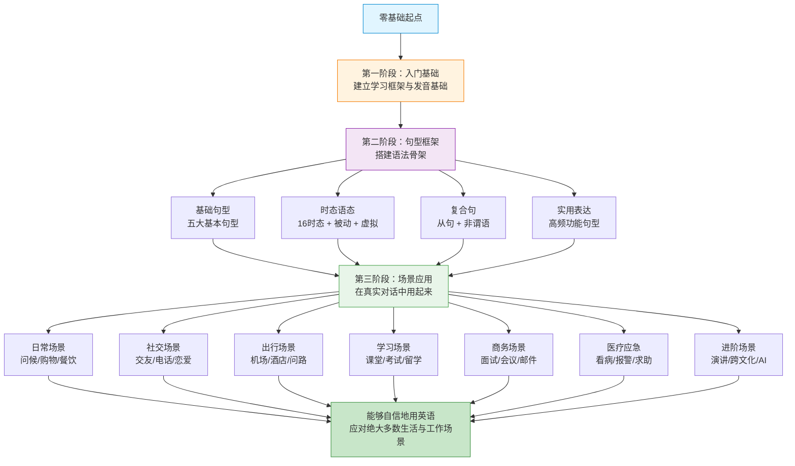
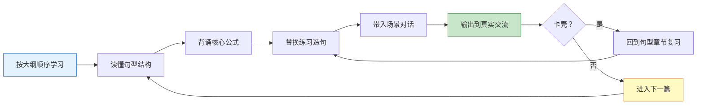

# 英语句型框架与场景实战 · 系统教程大纲

> [!info] 教程定位
> 本教程面向**零基础小白**，系统梳理英语**常用句型框架**与**生活/工作/学习场景应用**，从语法骨架到实战对话一步步构建你的英语能力。
>
> **核心理念**：句型是骨架，场景是血肉。掌握句型框架 → 套入场景表达 → 沉淀为语感。

---

## 目录

- [教程特点](#教程特点)
- [学习路线图](#学习路线图)
- [完整分类目录](#完整分类目录)
- [学习建议](#学习建议)
- [如何使用本教程](#如何使用本教程)

---

## 教程特点

> [!tip] 本教程与一般英语资料的区别
>
> 1. **双轨并行**：句型框架（抽象结构）+ 场景对话（具体应用），两条主线交织
> 2. **零基础友好**：从 "What is this?" 这样最基础的句子讲起，不假设任何前置知识
> 3. **公式化学习**：每个句型都有 **万能公式 + 多维替换 + 真实对话**
> 4. **场景全覆盖**：涵盖日常、旅游、职场、学术、医疗、社交、应急等 40+ 真实场景
> 5. **深度解析**：每篇 8000-15000 字，每个语法点讲透"是什么—为什么—怎么用—易错点"

---

## 学习路线图



---

## 完整分类目录

### 01.入门基础与学习方法

| 序号 | 文档标题 | 核心内容 | 字数 |
| ---- | -------- | -------- | ---- |
| 01 | 英语学习历程回顾与核心概念介绍 | **入门第一篇**：英语是什么、为什么要学、学习方法论、词类/成分/句子的基本概念 | 10000+ |
| 02 | 英语学习路径规划与方法论 | 四大技能（听说读写）训练体系、记忆曲线、输入输出闭环、资源推荐 | 8000+ |
| 03 | 英语发音与口语基础 | 48个国际音标、元音/辅音、连读/弱读/同化、重音与语调 | 12000+ |
| 04 | 英语思维与语感培养 | 中英思维差异、语块记忆法、刻意练习、Shadowing 技巧 | 8000+ |

### 02.基础句型框架

| 序号 | 文档标题 | 核心内容 | 字数 |
| ---- | -------- | -------- | ---- |
| 01 | 英语五大基本句型完全解析 | SV、SVO、SVC、SVOO、SVOC 五大结构 + 100+ 例句 | 12000+ |
| 02 | 陈述疑问祈使感叹四大句式 | Yes/No问句、特殊疑问、反义疑问、选择疑问、感叹句型 | 10000+ |
| 03 | there be 与 it 句型完全手册 | 存在句、天气/时间/形式主语/强调句的 it 用法 | 8000+ |
| 04 | 倒装句、强调句与省略句 | 全/部分倒装、It is...that 强调、省略规则 | 10000+ |

### 03.时态与语态句型框架

| 序号 | 文档标题 | 核心内容 | 字数 |
| ---- | -------- | -------- | ---- |
| 01 | 16种时态完全手册 | 4种时间 × 4种状态 = 16时态的构成、用法、对比 | 15000+ |
| 02 | 被动语态句型框架 | 被动句构成、各时态被动、特殊被动结构、主被动转换 | 10000+ |
| 03 | 虚拟语气完全解析 | if 三种条件句、wish、as if、would rather、suggest 类动词后虚拟 | 12000+ |
| 04 | 情态动词句型框架 | can/could/may/might/must/should/would/shall + 情态动词完成式 | 12000+ |

### 04.从句与复合句型框架

| 序号 | 文档标题 | 核心内容 | 字数 |
| ---- | -------- | -------- | ---- |
| 01 | 名词性从句四大类型 | 主语、宾语、表语、同位语从句 + that/whether/if/疑问词引导 | 10000+ |
| 02 | 定语从句完全手册 | 关系代词 who/which/that/whose、关系副词 where/when/why、限制性/非限制性 | 12000+ |
| 03 | 状语从句九大类型 | 时间/地点/原因/结果/目的/条件/让步/方式/比较 | 12000+ |
| 04 | 非谓语动词框架（to do/doing/done） | 不定式、动名词、现在分词、过去分词的用法全解 | 12000+ |

### 05.高频实用表达句型框架

| 序号 | 文档标题 | 核心内容 | 字数 |
| ---- | -------- | -------- | ---- |
| 01 | 表达观点与态度的50个万能句型 | In my opinion.../I believe.../As far as I'm concerned... | 10000+ |
| 02 | 建议请求邀请拒绝四大功能句型 | Why don't you.../Could you.../Would you like.../I'm afraid... | 10000+ |
| 03 | 同意反对让步转折句型库 | I totally agree.../On the contrary.../Although.../However... | 10000+ |
| 04 | 比较对比举例总结句型库 | more...than.../compared to.../for example.../in conclusion... | 10000+ |

### 06.日常生活场景实战

| 序号 | 文档标题 | 核心内容 | 字数 |
| ---- | -------- | -------- | ---- |
| 01 | 问候寒暄与自我介绍场景 | Greetings、破冰聊天、介绍自己/家庭/工作/兴趣 | 10000+ |
| 02 | 家庭家务与日常起居场景 | 起床/睡觉、三餐、做饭、打扫、家电故障 | 10000+ |
| 03 | 购物超市与讨价还价场景 | 服装店、超市、电子产品、退换货、砍价 | 10000+ |
| 04 | 餐饮点餐外卖与聚餐场景 | 餐厅点餐、外卖、咖啡店、酒吧、付账 | 10000+ |

### 07.社交交际场景实战

| 序号 | 文档标题 | 核心内容 | 字数 |
| ---- | -------- | -------- | ---- |
| 01 | 交友聚会与闲聊场景 | 认识新朋友、Party、Small Talk、兴趣爱好分享 | 10000+ |
| 02 | 电话短信与在线沟通场景 | 接打电话、留言、短信、WhatsApp、视频会议礼仪 | 10000+ |
| 03 | 约会恋爱与人际关系场景 | 邀约、约会、表白、情侣日常、分手、家庭矛盾 | 10000+ |
| 04 | 邀请庆祝与节日祝福场景 | 生日、婚礼、圣诞、感恩节、新年、毕业、乔迁 | 10000+ |

### 08.出行与旅游场景实战

| 序号 | 文档标题 | 核心内容 | 字数 |
| ---- | -------- | -------- | ---- |
| 01 | 机场航班海关入境场景 | 值机、安检、登机、转机、海关、行李丢失 | 12000+ |
| 02 | 酒店入住预订与投诉场景 | 预订、Check-in/out、客房服务、投诉、退房 | 10000+ |
| 03 | 公共交通打车与租车场景 | 地铁/公交/出租/Uber、自驾租车、加油、违章 | 10000+ |
| 04 | 问路景点游览与购物场景 | 问路、地图、景点导览、拍照、纪念品 | 10000+ |

### 09.学习与教育场景实战

| 序号 | 文档标题 | 核心内容 | 字数 |
| ---- | -------- | -------- | ---- |
| 01 | 课堂讨论与提问场景 | 课堂发言、小组讨论、提问教授、请假 | 10000+ |
| 02 | 图书馆作业与研究场景 | 借书、找资料、论文写作、引用、查重 | 10000+ |
| 03 | 考试报名与学术评分场景 | 报名、备考、成绩查询、申诉、奖学金 | 10000+ |
| 04 | 留学申请与校园生活场景 | 申请文书、面试、宿舍、选课、社团 | 12000+ |

### 10.职场与商务场景实战

| 序号 | 文档标题 | 核心内容 | 字数 |
| ---- | -------- | -------- | ---- |
| 01 | 求职简历面试与Offer谈判 | 简历撰写、自我介绍、行为面试、薪资谈判、Offer 接受/拒绝 | 15000+ |
| 02 | 会议汇报与演示场景 | 会议召集、主持、发言、PPT 演示、Q&A 应对 | 12000+ |
| 03 | 商务邮件与正式书面沟通 | 邮件结构、称呼、开头结尾、常见场景邮件模板 | 12000+ |
| 04 | 商务谈判合同与客户沟通 | 报价、议价、签约、售后、投诉处理 | 12000+ |

### 11.医疗与紧急场景实战

| 序号 | 文档标题 | 核心内容 | 字数 |
| ---- | -------- | -------- | ---- |
| 01 | 医院看病与药店购药场景 | 挂号、症状描述、诊疗、处方、买药 | 10000+ |
| 02 | 心理咨询与健康对话场景 | 心理倾诉、情绪表达、健身、营养 | 10000+ |
| 03 | 报警求助与事故处理场景 | 911 报警、交通事故、盗窃、走失 | 10000+ |
| 04 | 自然灾害意外与紧急联络 | 火灾、地震、急救、联系大使馆 | 10000+ |

### 12.特殊与进阶场景实战

| 序号 | 文档标题 | 核心内容 | 字数 |
| ---- | -------- | -------- | ---- |
| 01 | 演讲辩论与公开表达场景 | TED 演讲结构、辩论技巧、即兴发言 | 12000+ |
| 02 | 跨文化沟通与文化禁忌 | 文化差异、话题禁忌、宗教敏感、礼仪 | 10000+ |
| 03 | 网络社交媒体与短视频沟通 | 推特/IG/TikTok 用语、网络缩写、Meme 文化 | 10000+ |
| 04 | 科技AI与未来场景英语 | 与 ChatGPT 对话、科技新闻、编程英语、未来展望 | 10000+ |

---

## 学习建议

> [!tip] 四步学习法
>
> **第一步：读懂（理解句型结构）**
> 把每篇文档的句型框架搞清楚，明白"为什么这样说"。
>
> **第二步：记牢（语块记忆）**
> 把核心句型当作"公式"记下来，每个句型至少背 3 个替换例句。
>
> **第三步：用出（场景替换）**
> 在对应场景中套用句型，先跟读模仿，再自己造句说出来。
>
> **第四步：输出（真实交流）**
> 找语伴、录音、写日记、和 AI 对话，把学过的内容在真实场景中用出来。

> [!warning] 学习禁忌
>
> - ❌ 只看不练：背会一万个单词也不如用对 100 个句型
> - ❌ 追求完美：错了才能进步，不敢说永远学不会
> - ❌ 碎片化：每天刷 10 分钟比周末突击 3 小时有效 10 倍
> - ❌ 盲目背单词：离开句型和场景的单词是死的

> [!note] 推荐学习节奏
>
> - **快速路径**（有基础）：每天 1-2 篇，2 个月学完
> - **稳健路径**（零基础）：每周 3-4 篇，3-4 个月学完
> - **深度路径**（求精通）：每天 1 篇精读 + 口头输出，半年吃透

---

## 如何使用本教程



### 文档统一结构

每篇文档将按以下统一结构编写：

```
1. 本篇导读（Why & What）
   └── 为什么要学这个？学完能做什么？

2. 核心概念讲解（是什么）
   └── 概念定义、中英对照、图示化

3. 句型公式与拆解（怎么构成）
   └── 万能公式、结构拆解、替换表

4. 分类详解（每一种用法）
   └── 分情况讲解 + 大量例句 + 易错点

5. 场景实战对话（怎么用）
   └── 2-5 个完整对话 + 句句解析

6. 常见错误与辨析（易错点）
   └── 中式英语陷阱、形近句型对比

7. 练习与输出建议（怎么练）
   └── 替换练习、造句练习、输出任务

8. 小结与下一步（回顾 + 衔接）
   └── 本篇重点回顾、预告下一篇
```

---

## 配套资源

> [!info] 贯穿全教程的辅助资源
>
> - **语音资源**：推荐配合《英语流利说》《Speak》《ELSA》进行跟读
> - **词典工具**：柯林斯在线词典（例句丰富）、有道词典（中英互查）
> - **真实语料**：YouTube、TED、BBC 6 Minute English、VOA Learning English
> - **AI 陪练**：ChatGPT / Claude 角色扮演对话 + 纠错反馈

---

## 大纲版本

| 版本 | 日期 | 说明 |
| ---- | ---- | ---- |
| v1.0 | 2026-04-20 | 初版大纲，12 分类 × 4 篇 = 48 篇文档规划 |

> [!note] 说明
> 大纲可能根据编写过程中的实际情况微调，最终以文档目录实际结构为准。
