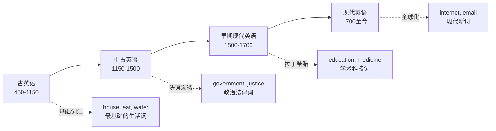
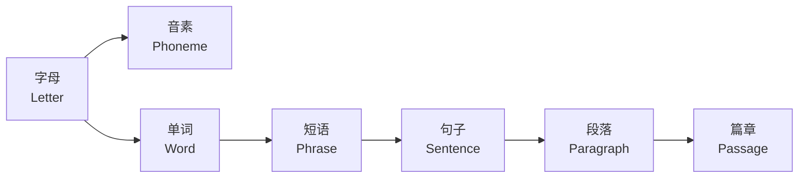
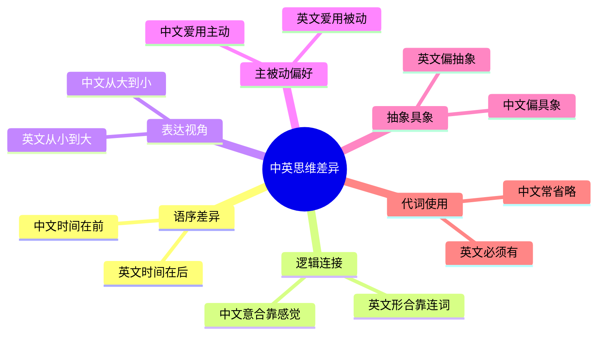
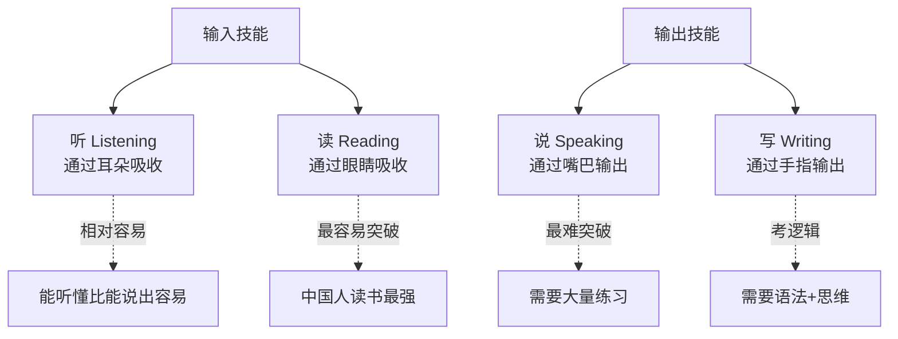
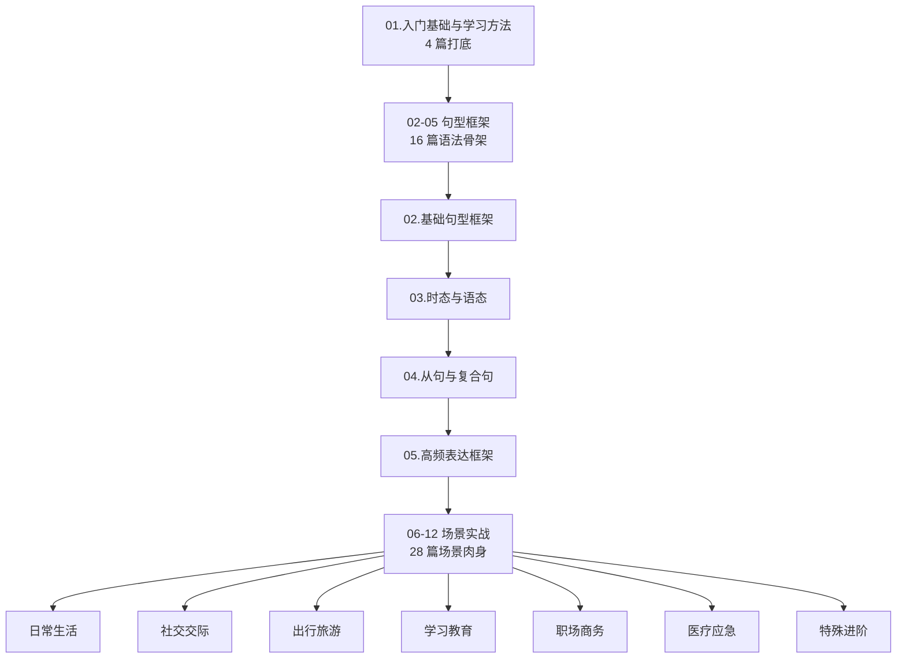

# 英语学习历程回顾与核心概念介绍

> [!info] 本篇定位
> 这是整套英语学习教程的**第一篇**，也是所有后续学习的**认知地基**。
>
> 如果你是零基础小白，哪怕连 26 个字母都不熟，也请先把这一篇从头到尾读完——不需要记住所有东西，但**必须建立起对英语这门语言的整体认知**。
>
> 读完本篇你会清楚：英语是怎么来的、它的骨架长什么样、为什么中国人学英语会走弯路、以及后面 47 篇该怎么学。

---

## 1. 本篇导读：为什么要先读这一篇

很多人学英语的第一个问题不是 "语法难"，而是**根本不知道自己在学什么**。

打个比方：让你搭一座乐高城堡。

- 如果有人直接把 5000 块零件倒在你面前，让你"自己拼"，你大概率会放弃；
- 如果有人先告诉你"这是城堡，有墙、有塔、有门、有屋顶"，再告诉你"这些是墙的零件、这些是塔的零件"，你拼起来就轻松多了。

学英语就是搭乐高。**本篇的任务不是让你立刻会说英语**，而是让你在脑子里先有一张"英语的地图"：

- 英语是什么？它从哪里来？
- 英语由哪些部件组成？（字母 → 单词 → 短语 → 句子 → 段落）
- 学英语的四个方向是什么？（听、说、读、写）
- 中文思维和英文思维差在哪里？
- 我接下来应该以什么样的方法论往前走？

> [!tip] 怎么读这一篇
>
> - **第一遍**：轻松浏览，不求记住，建立"我知道有这些东西存在"的感觉即可。
> - **第二遍**：在学完后面几篇回来看，你会发现很多概念的关联突然变清楚了。
> - **重点区域**：所有标了"核心概念"的小节，是后面章节会反复用到的术语，必须熟悉。

---

## 2. 英语是什么：一段 1500 年的历程回顾

### 2.1 英语的"身世"：从一群入侵者开始

如果把语言看作一个人，那英语这个"人"的童年可以追溯到**公元 5 世纪左右**。

当时的英国（准确说是不列颠岛）还没有"英语"这个概念。岛上的人说的是**凯尔特语**（Celtic）。后来从德国北部、丹麦一带渡海而来的三个日耳曼部落——**盎格鲁人（Angles）、撒克逊人（Saxons）、朱特人（Jutes）**——占领了这里。

他们带来的语言，就是**古英语（Old English）**的前身。"英语"这个词 `English`，其实就是 `Angle + -ish`，意思是"盎格鲁人的话"；"英格兰" `England`，字面意思就是"盎格鲁人的土地"。

### 2.2 英语的"三次被迫升级"

英语在 1500 年里经历了三次大的"版本更新"：



**图说**：英语的每一次演化，都因为一次重大历史事件而被迫"升级"。

- **古英语（450-1150）**：日耳曼部落带来的语言，和现代英语几乎是两种语言。最基础的日常词如 `house`（房子）、`eat`（吃）、`man`（人）来自这个时期。
- **中古英语（1150-1500）**：1066 年法国诺曼人征服英国，法语成为贵族语言，大量法语词涌入英语。今天英语中约 30% 的词汇（尤其是政治、法律、艺术类）是这时候进来的。
- **早期现代英语（1500-1700）**：文艺复兴带来拉丁语和希腊语的大规模借用，学术、科学词汇基本奠定。**莎士比亚**就活在这个时代，他一个人发明/固定了约 1700 个英语单词。
- **现代英语（1700 至今）**：工业革命、大英帝国扩张、美国崛起、互联网时代，英语不断吸纳外来词，最终成为全球通用语。

### 2.3 英语的"家族"：世界第一大语言

今天英语是**全世界最通用的语言**，但它不是使用人数最多的母语（那是中文）。

> [!info] 几个关键数据（截至近年）
>
> - **母语使用者**：约 4 亿人（美、英、澳、加、新等）
> - **第二语言使用者**：约 10-15 亿人
> - **总使用者**：约 20 亿人，全球约 1/4 人口
> - **国际地位**：联合国 6 种官方语言之一，国际航空、航海、商务、科技的默认语言

**为什么英语这么强势？** 不是因为它"最好学"，恰恰相反，英语的**不规则性非常多**。它的强势来自三个历史事件：

1. **大英帝国的殖民扩张**（18-19 世纪）——把英语带到了北美、澳洲、印度、非洲；
2. **二战后美国的崛起**（20 世纪）——经济、科技、流行文化全球输出；
3. **互联网诞生于美国**（20 世纪末）——计算机语言、代码、网络协议天然用英语。

> [!tip] 一个有趣的事实
>
> 英语虽然属于**日耳曼语族**（和德语、荷兰语是亲戚），但它借用了极大量的**拉丁-法语**词汇。所以从词汇上看，英语更像"日耳曼骨架 + 拉丁血肉"的混血儿。
>
> 这也是为什么很多学过法语或西班牙语的人觉得英语里"好多词眼熟"，因为它们都来自同一个拉丁妈妈。

---

## 3. 为什么中国人一定要学英语：5 个硬核理由

学任何东西，先问"为什么学"。动机不够强，很难坚持。

### 3.1 信息的"特权通道"

全球**约 55% 的互联网内容**是英文的（中文只占约 2%）。

一个只懂中文的人和一个懂中英双语的人，接收信息的广度完全不是一个量级：

- 最新的学术论文：90%+ 首发英文；
- 最前沿的技术文档（GitHub、Stack Overflow、官方 docs）：几乎全英文；
- 最一手的新闻报道（路透、BBC、纽约时报）：英文；
- 最优质的教育资源（MIT OCW、Coursera、YouTube 教程）：英文。

**不会英语**，意味着你接触信息时总是比别人**延迟数月到数年**。

### 3.2 职业的"通行证"

打开招聘网站，你会发现：

- 互联网大厂的技术文档、会议、代码注释，很多直接用英文；
- 外企、跨国企业的工作语言就是英文；
- 英语好在简历上就是一个**硬加分项**，哪怕不是英语岗位。

**一个通用规律**：同等岗位、同等能力，英语流利的人薪资通常高出 20%-50%。

### 3.3 出行的"自由度"

全世界约 60 个国家以英语为官方语言或通用语言。更重要的是——**哪怕去非英语国家旅游**（日本、泰国、欧洲大陆），英语也是**最通用的外语**。

- 机场标识：中英双语（有时只有英文）
- 酒店前台：普遍会英语
- 景点导览：有英文解说
- 应急求助：英语往往是最快能找到人帮忙的语言

### 3.4 思维的"第二扇窗"

学一门语言，不只是学单词和语法，更是学一种**思考方式**。

中文是**意合语言**（靠意思连接），英文是**形合语言**（靠形式连接）。中文喜欢"散点式"表达，英文喜欢"树状式"表达。

> [!tip] 一个例子
>
> - 中文："下雨了，我没带伞，就回家了。"（三个小句并列，不加连接词也通）
> - 英文：`Because it was raining and I didn't bring an umbrella, I went home.`（必须加 because、and 来表示逻辑关系）
>
> 学英语的过程，会让你对**逻辑关系**、**因果链条**更敏感，这对写代码、做汇报、写论文都有帮助。

### 3.5 AI 时代的"母语"

大模型（ChatGPT、Claude、Gemini）都是**用英文训练为主**的。

- 用英文问 AI，回答质量**普遍比中文好 20%-40%**；
- 最前沿的 AI 论文、开源项目、prompt 技巧，全是英文首发；
- 学会用英文和 AI 对话，你能用到它最强的那一面。

> [!warning] 真相警告
>
> AI 时代**降低了英语的学习成本**（翻译工具越来越强），但**提高了英语的使用价值**（信息差拉大）。
>
> 那种"以后 AI 全能翻译、不用学英语"的想法，就像"以后有计算器、不用学数学"一样——工具只能让会的人更快，而不能让不会的人变会。

---

## 4. 核心概念一：英语的"物理构成"

从最小的单位到最大的单位，英语的构成是这样的：



**图说**：英语的结构和中文不太一样。中文的最小单位是"字"，字本身就有意义；英语的最小单位是"字母"，字母本身没有意义，必须组合成"单词"才有意义。

### 4.1 字母：26 个基础零件

英语只有 **26 个字母**（对比中文几万个汉字，这是英语唯一"简单"的地方）。

| 大写 | 小写 | 大写 | 小写 | 大写 | 小写 |
| ---- | ---- | ---- | ---- | ---- | ---- |
| A    | a    | J    | j    | S    | s    |
| B    | b    | K    | k    | T    | t    |
| C    | c    | L    | l    | U    | u    |
| D    | d    | M    | m    | V    | v    |
| E    | e    | N    | n    | W    | w    |
| F    | f    | O    | o    | X    | x    |
| G    | g    | P    | p    | Y    | y    |
| H    | h    | Q    | q    | Z    | z    |
| I    | i    | R    | r    |      |      |

其中 **A、E、I、O、U** 这 5 个字母是**元音字母**（vowels），其他 21 个是**辅音字母**（consonants）。Y 在某些情况下也当元音用（如 `happy` 里的 y）。

> [!note] 字母 vs 音标
>
> - **字母**：写在纸上的符号，共 26 个；
> - **音标**：发音的符号（国际音标 IPA），共 48 个（20 元音 + 28 辅音）。
>
> 同一个字母在不同单词里可以有不同读音。比如字母 `a`：
> - 在 `cat` 里读 /æ/
> - 在 `cake` 里读 /eɪ/
> - 在 `car` 里读 /ɑː/
> - 在 `about` 里读 /ə/
>
> 这就是为什么要学**音标**——字母不能告诉你怎么读，音标可以。详细的发音规则我们在第 3 篇《英语发音与口语基础》里讲。

### 4.2 单词：语言的砖块

**单词（Word）** 是有意义的最小表达单位。

一个单词由一个或多个字母组成，比如：

```
a         — 1 个字母，"一个"
I         — 1 个字母，"我"
go        — 2 个字母，"去"
book      — 4 个字母，"书"
computer  — 8 个字母，"计算机"
responsibility — 14 个字母，"责任"
```

> [!tip] 词汇量的坐标
>
> - **500 词**：小学英语水平，能认简单标识
> - **1500 词**：初中毕业，能读简单对话
> - **3500 词**：高中毕业 / 高考
> - **6000 词**：大学四级
> - **8000 词**：大学六级
> - **10000-15000 词**：雅思、托福高分
> - **20000+ 词**：母语者日常水平
> - **50000+ 词**：母语大学毕业生 / 大量阅读者
>
> **好消息**：日常交流最常用的 2000 词就能覆盖 80% 的日常对话。

### 4.3 短语：积木的组合

**短语（Phrase）** 是由几个单词组成、但还不是完整句子的组合。

常见短语类型：

| 短语类型 | 举例 | 对应中文 |
| --- | --- | --- |
| 名词短语 | `a red apple` | 一个红苹果 |
| 动词短语 | `run away` | 逃跑 |
| 介词短语 | `in the morning` | 在早上 |
| 形容词短语 | `very beautiful` | 非常美丽 |
| 不定式短语 | `to learn English` | 去学英语 |
| 动名词短语 | `learning English` | 学英语（这件事） |

> [!warning] 短语 vs 句子
>
> **短语**没有完整意思，**不能单独使用**。
>
> - ❌ `a red apple` —— 只是"一个红苹果"，你想说它怎么了？
> - ✅ `This is a red apple.` —— "这是一个红苹果"，这才是完整句子。

### 4.4 句子：表达完整意思的最小单位

**句子（Sentence）** 是英语表达的**最小完整单位**。

一个完整的英语句子必须满足：

1. 有**主语**（谁）
2. 有**谓语动词**（做什么 / 是什么）
3. 表达**完整意思**
4. 首字母大写
5. 结尾有标点（. ? !）

```
✅ I love you.             (我爱你。)
✅ She is a teacher.       (她是一位老师。)
✅ The cat sleeps.         (猫睡觉。)

❌ love you                (没有主语、首字母没大写、没标点)
❌ A beautiful girl        (没有谓语动词，只是个短语)
```

### 4.5 段落与篇章

- **段落（Paragraph）**：一组表达同一主题的句子，通常 3-8 句；
- **篇章（Passage / Essay）**：由多个段落组成的完整文章，有开头、主体、结尾。

这套教程的重点在**单词 → 句子**这个层级，等你掌握了句型框架后，自然就能写段落和篇章了。

---

## 5. 核心概念二：10 大词类（Parts of Speech）

每个英语单词都属于某一类。知道一个词是哪一类，就知道它在句子里能放在哪里、能干什么。

> [!tip] 为什么必须懂词类
>
> 不懂词类，就像不知道"螺丝和螺母"的区别——你不知道哪个和哪个能配在一起。
>
> 比如你想说"我快乐"，`happy`（快乐的）是**形容词**，不能直接做动词。
> - ❌ `I happy.`（错）
> - ✅ `I am happy.`（对，加个 be 动词 `am`）

### 5.1 十大词类总览表

| 序号 | 英文名 | 中文名 | 作用 | 例词 |
| --- | --- | --- | --- | --- |
| 1 | Noun | 名词 | 表示人、事、物、概念 | book, teacher, love |
| 2 | Pronoun | 代词 | 代替名词 | I, you, he, it, this |
| 3 | Verb | 动词 | 表示动作或状态 | run, eat, be, have |
| 4 | Adjective | 形容词 | 修饰名词，描述性质 | big, happy, red |
| 5 | Adverb | 副词 | 修饰动词/形容词/副词 | quickly, very, often |
| 6 | Preposition | 介词 | 表示方位、时间、关系 | in, on, at, with |
| 7 | Conjunction | 连词 | 连接单词/短语/句子 | and, but, because |
| 8 | Article | 冠词 | 限定名词 | a, an, the |
| 9 | Numeral | 数词 | 表示数量或顺序 | one, two, first |
| 10 | Interjection | 感叹词 | 表达情感 | wow, oh, ouch |

下面每个词类挑重点讲。

### 5.2 名词（Noun）：世界的"标签"

**名词**是给事物贴的"标签"，包括人、物、地、抽象概念。

```
人：   teacher（老师）, doctor（医生）, Tom（汤姆）
物：   book（书）, apple（苹果）, car（汽车）
地：   China（中国）, Beijing（北京）, park（公园）
概念： love（爱）, freedom（自由）, time（时间）
```

**名词的两个关键属性**：

1. **可数 vs 不可数**
   - 可数：`one apple, two apples`（能一个一个数）
   - 不可数：`water, love, information`（不能说 *two waters*）

2. **单数 vs 复数**
   - 单数：`book`（一本书）
   - 复数：`books`（多本书，通常加 -s / -es）

> [!warning] 初学者易错点
>
> 中文说"两本书"就是"两本书"；英文必须变 `two books`（book 要加 s）。这是中英最大的差异之一。

### 5.3 代词（Pronoun）：偷懒神器

**代词**是名词的"替身"，用来避免重复。

```
原句：Tom is happy. Tom loves Tom's dog. Tom plays with Tom's dog every day.
用代词：Tom is happy. He loves his dog. He plays with it every day.
```

**常见代词 8 组**：

| 类型 | 例子 |
| ---- | ---- |
| 人称代词（主格）| I, you, he, she, it, we, they |
| 人称代词（宾格）| me, you, him, her, it, us, them |
| 物主代词 | my, your, his, her, its, our, their |
| 反身代词 | myself, yourself, himself... |
| 指示代词 | this, that, these, those |
| 疑问代词 | who, what, which, whose |
| 不定代词 | some, any, no, every, all |
| 关系代词 | who, which, that（用于定语从句）|

### 5.4 动词（Verb）：句子的"发动机"

**动词**表示"动作"或"状态"，是一个句子的**灵魂**。

没有动词，就没有句子。

```
动作类：run（跑）, eat（吃）, write（写）, think（想）
状态类：be（是）, have（有）, seem（似乎）, become（变成）
```

**动词按功能分三类**：

1. **实义动词**（Action Verbs）：表示具体动作。`He eats an apple.`
2. **系动词**（Linking Verbs）：连接主语和表语，本身没什么动作意义。最常见是 `be`（am/is/are/was/were）。`She is happy.`
3. **助动词**（Auxiliary Verbs）：帮其他动词变时态、否定、疑问。`do, does, did, have, has, will, would...`
4. **情态动词**（Modal Verbs）：表达"可能、必须、应该"等语气。`can, could, may, might, must, should, would...`

> [!info] 最重要的动词：be 动词
>
> `be` 是英语里使用频率最高、最复杂的一个动词，它有 8 种形态：
>
> | 形态 | 用法 |
> | --- | --- |
> | be | 原形，不定式 |
> | am | I 的现在式（I am） |
> | is | he/she/it 的现在式 |
> | are | you/we/they 的现在式 |
> | was | I/he/she/it 的过去式 |
> | were | you/we/they 的过去式 |
> | been | 完成式（have been）|
> | being | 现在分词（is being）|
>
> 记住一句口诀：**"我用 am，你用 are，is 连接他她它，复数全部都用 are"**。

### 5.5 形容词（Adjective）：给名词化妆

**形容词**修饰名词，描述名词的性质、状态、颜色、大小、心情等。

```
a [big] house       一座[大]房子
a [beautiful] girl  一个[漂亮的]女孩
I feel [happy].     我感到[开心]。
```

形容词一般放在**名词前面**，或放在 be 动词/系动词**后面**。

### 5.6 副词（Adverb）：修饰一切能修饰的

**副词**修饰**动词、形容词、其他副词、整个句子**——唯独不修饰名词。

```
He runs [quickly].       他跑得[快]。          （修饰动词 runs）
She is [very] beautiful. 她[非常]漂亮。        （修饰形容词 beautiful）
He runs [very quickly].  他跑得[非常]快。      （修饰副词 quickly）
[Luckily], I passed.     [幸运地]，我通过了。  （修饰整句）
```

**判断小技巧**：大部分副词是"形容词 + ly"形成的。

| 形容词 | 副词 | 中文 |
| --- | --- | --- |
| quick | quickly | 快地 |
| happy | happily | 开心地 |
| careful | carefully | 小心地 |

### 5.7 介词（Preposition）：位置与关系的胶水

**介词**表示方位、时间、方式、原因等关系，数量不多但使用极其频繁。

```
in the room       在房间里
on the table      在桌子上
at 8 o'clock      在 8 点
by bus            坐公交车
with my friends   和朋友们一起
```

> [!warning] 介词搭配是老大难
>
> 英语的介词搭配**没有太多规律**，很多时候只能靠记。
>
> - `in` 在……里 `in the box`
> - `on` 在……上（接触）`on the table`
> - `at` 在……处（小范围）`at school`
> - 但 `at 8 o'clock`（在 8 点）、`on Monday`（在周一）、`in May`（在五月）——时间介词全看单位大小。

### 5.8 连词（Conjunction）：句子的"胶带"

**连词**把词、短语、句子连起来。

```
Tom [and] Jerry     Tom 和 Jerry
cheap [but] good    便宜但是好
I stayed home [because] it rained.  我待在家因为下雨了。
```

连词分两类：
- **并列连词**：连接同级内容。`and, but, or, so, yet`
- **从属连词**：引导从句。`because, when, if, although, that`

### 5.9 冠词（Article）：只有 3 个的"限定器"

**冠词**是一类特殊的限定词，只有 3 个：`a, an, the`。

| 冠词 | 用法 | 例子 |
| --- | --- | --- |
| a | 单数名词前，泛指，辅音音素开头 | a book, a cat |
| an | 单数名词前，泛指，元音音素开头 | an apple, an hour |
| the | 特指（双方都知道的那个）| the book（你我都知道的那本书）|

> [!tip] 冠词是中文没有的概念
>
> 中文说"我要喝水"，英文必须选："I want to drink **water**"（泛指水）、"I want to drink **the water**"（特指某杯水）。这个点对中国学生很难，但我们会在后面专题讲。

### 5.10 数词与感叹词

- **数词**：基数词（`one, two, three...`）和序数词（`first, second, third...`）
- **感叹词**：表达情感的叫声，如 `wow!, oh!, ouch!, alas!`

---

## 6. 核心概念三：句子成分（Sentence Elements）

"词类"讲的是**一个词是什么**，"句子成分"讲的是**一个词在句子里当什么角色**。

> [!info] 词类 vs 句子成分的区别
>
> 一个比喻：
>
> - **词类**：一个人的**专业**（医生、教师、程序员）；
> - **句子成分**：一个人在**某个场景下的角色**（父亲、顾客、乘客）。
>
> 同一个人（单词）在不同场景（句子）里可以扮演不同角色。比如 `love`：
> - 作为名词（专业）：`Love is wonderful.` —— `love` 是**主语**（角色）
> - 作为动词（专业）：`I love you.` —— `love` 是**谓语**（角色）

### 6.1 七大句子成分总览

| 成分 | 英文 | 作用 | 通常由什么词担任 |
| --- | --- | --- | --- |
| 主语 | Subject | 动作的发出者 / 描述对象 | 名词、代词 |
| 谓语 | Predicate | 主语做什么 / 是什么 | 动词 |
| 宾语 | Object | 动作的承受者 | 名词、代词 |
| 表语 | Predicative | 说明主语是什么/怎样 | 名词、形容词 |
| 定语 | Attributive | 修饰名词 | 形容词、名词、从句 |
| 状语 | Adverbial | 修饰动词/形容词/句子 | 副词、介词短语 |
| 补语 | Complement | 补充说明主语或宾语 | 名词、形容词 |

### 6.2 主语与谓语：句子的"心脏"

一个完整句子**必须**同时有主语和谓语。

```
I         run.
主语       谓语
(我)       (跑)

The cat   sleeps.
主语       谓语
(猫)       (睡觉)
```

**主语**：回答"谁"或"什么"在做这个动作。
**谓语**：回答主语"做什么"或"是什么"。

### 6.3 宾语与表语：容易混淆的两兄弟

**宾语**：动作的对象。
```
I love [you].
主语 谓语  宾语
我 爱 [你]。 ← you 是"爱"这个动作的对象
```

**表语**：在系动词（be、seem、become 等）后面，说明主语**是什么/怎么样**。
```
She is [a teacher].
主语  系动词  表语
她 是 [一位老师]。 ← a teacher 说明 she "是什么"

He feels [happy].
主语 系动词  表语
他 感到 [开心]。
```

> [!warning] 关键区别
>
> - 宾语：跟**实义动词**后面（有动作）
> - 表语：跟**系动词**后面（没动作，只是"是、成为、看起来"）
>
> 判断方法：能不能把动词换成 "是" 还通顺？能 → 那是表语；不能 → 那是宾语。

### 6.4 定语：给名词"化妆"

**定语**修饰名词，告诉你"哪个、什么样的"。

```
a [red] apple          一个[红色的]苹果      (形容词做定语)
my [English] book      我的[英语]书          (名词做定语)
the book [on the desk] [桌上的]那本书        (介词短语做定语)
the boy [who is smiling] [正在微笑的]男孩    (定语从句做定语)
```

### 6.5 状语：修饰一切"怎样"

**状语**修饰动词、形容词、副词、甚至整个句子，回答**何时、何地、如何、为何、多少**。

```
I work [hard].            我[努力地]工作。      (方式状语)
She came [yesterday].     她[昨天]来的。        (时间状语)
We meet [at the park].    我们[在公园]见面。    (地点状语)
He is [very] tall.        他[非常]高。          (程度状语)
I study [to pass the exam]. 我学习[是为了通过考试]。(目的状语)
```

### 6.6 补语：给宾语"盖章"

**补语**出现在"宾语后面"，补充说明宾语的**状态或身份**。

```
We called [him] [Tom].
谓语       宾语   宾补
我们 称呼 [他] [汤姆]。 ← Tom 说明宾语 him "叫什么"

They made [her] [happy].
谓语      宾语    宾补
他们 让 [她] [开心]。 ← happy 说明宾语 her "怎么样"
```

### 6.7 一个完整句子的解剖

让我们拆解一个典型的英语句子：

```
The [tall] boy happily gave [his] friend a book [on the bus] [yesterday].
     定语  主语  状语  谓语   定语  间接宾语 直接宾语   状语       状语

翻译：那个[高个子的]男孩[昨天][在公车上]开心地给他的朋友一本书。
```

> [!tip] 分析句子的 5 个步骤
>
> 1. 先找**谓语动词**（整个句子的核心）
> 2. 谓语动词**前面**的名词 = **主语**
> 3. 谓语动词**后面**的名词 = **宾语** 或 **表语**（看动词类型）
> 4. 形容词、名词修饰另一个名词 = **定语**
> 5. 副词、介词短语修饰动词/形容词/句子 = **状语**
>
> 后面第 2 章会大量练习这个。

---

## 7. 核心概念四：时态与语态（Tense & Voice）

这是英语区别于中文的最大特征之一。

### 7.1 中英对时间的表达差异

> [!warning] 中文用"词"表达时间，英语用"动词形态"表达时间
>
> 中文："我吃饭。我吃过饭。我正在吃饭。我明天吃饭。"——动词 "吃" **不变**，靠"过、正在、明天"这些词表达时间。
>
> 英文：动词本身**要变形**才能表达时间。
>
> | 中文 | 英文 | 动词形态 |
> | --- | --- | --- |
> | 我吃饭 | I eat. | eat（原形）|
> | 我吃过饭 | I have eaten. | have eaten（完成式）|
> | 我正在吃饭 | I am eating. | am eating（进行式）|
> | 我吃了饭 | I ate. | ate（过去式）|
> | 我明天吃饭 | I will eat. | will eat（将来式）|
>
> 这就是**时态（Tense）**。

### 7.2 时态的二维坐标

英语时态可以看成一个 **4 × 4 = 16 宫格**的坐标系：

**横轴：时间（4 种）**
- 现在（Present）
- 过去（Past）
- 将来（Future）
- 过去将来（Past Future，站在过去看未来）

**纵轴：状态（4 种）**
- 一般（Simple）—— 习惯、事实
- 进行（Continuous / Progressive）—— 正在发生
- 完成（Perfect）—— 已经完成，有结果
- 完成进行（Perfect Continuous）—— 持续到现在/某时间

16 种组合举例：

| | 一般 | 进行 | 完成 | 完成进行 |
| --- | --- | --- | --- | --- |
| **现在** | I eat. | I am eating. | I have eaten. | I have been eating. |
| **过去** | I ate. | I was eating. | I had eaten. | I had been eating. |
| **将来** | I will eat. | I will be eating. | I will have eaten. | I will have been eating. |
| **过去将来** | I would eat. | I would be eating. | I would have eaten. | I would have been eating. |

不要现在就背！这一表在后面的第 3 章会**单独花一整篇 15000 字**详细讲。这里先让你**知道有这个东西**。

### 7.3 语态：主动与被动

**语态（Voice）** 决定"主语是动作的发出者还是承受者"。

- **主动语态（Active Voice）**：主语发出动作
  - `Tom ate the apple.`（汤姆吃了苹果。）
- **被动语态（Passive Voice）**：主语承受动作
  - `The apple was eaten by Tom.`（苹果被汤姆吃了。）

被动语态的公式：**be + 过去分词**。

---

## 8. 中英思维差异：学英语最容易卡壳的地方

这一节是**非常非常重要**的一节，决定了你能不能说出"地道"的英语。

### 8.1 六大核心差异



### 8.2 差异一：语序

**时间/地点：中文在前，英文在后**

- 中："我**昨天**在**北京**见了**一个朋友**。"（时间 → 地点 → 事情）
- 英：`I met a friend in Beijing yesterday.`（事情 → 地点 → 时间）

**定语：中文在前，英文短定语在前、长定语在后**

- 中："一个**戴眼镜的**男孩"
- 英：`a boy with glasses`（长定语 `with glasses` 放在 `boy` 后面）

### 8.3 差异二：主语

**中文可以没主语，英文必须有主语**

- 中："下雨了。"（没有主语）
- 英：`It is raining.`（必须有主语 `It`，虽然 it 不指具体事物）

- 中："要注意安全。"
- 英：`You should pay attention to safety.`（必须加 `You`）

> [!warning] 初学者常犯的"中式英语"
>
> - ❌ `Very good.`（中文思维：很好。）
> - ✅ `It's very good.` / `That's very good.`
>
> - ❌ `Have many people.`（中文思维：有很多人。）
> - ✅ `There are many people.`

### 8.4 差异三：逻辑连接词

**中文不说也懂，英文必须说出来**

- 中："下雨了，我没去。"（因果关系自明）
- 英：`I didn't go **because** it was raining.`（必须有 because）

### 8.5 差异四：从大到小 vs 从小到大

**地址：中文从大到小，英文从小到大**

- 中：中国北京市朝阳区建国路 88 号
- 英：`88 Jianguo Road, Chaoyang District, Beijing, China`

**日期：中文 年月日，英文 月日年 或 日月年**

- 中：2026 年 4 月 20 日
- 英（美式）：`April 20, 2026`
- 英（英式）：`20 April 2026`

### 8.6 差异五：主被动偏好

英语比中文更喜欢用**被动语态**，尤其在正式场合、科技文献、新闻报道。

- 中："科学家发现了新病毒。"
- 英：`A new virus was discovered by scientists.`（被动，更正式）

### 8.7 差异六：抽象 vs 具象

英语大量使用**抽象名词**，中文更喜欢用**动词/具体描述**。

- 中："他很有耐心。"（用形容词）
- 英：`He has great patience.`（用抽象名词 patience）

---

## 9. 英语四大技能与学习路径

学英语本质上是训练四种能力：**听、说、读、写**。

### 9.1 四技能对照表



| 技能 | 类型 | 难度 | 中国学生现状 | 训练方法 |
| --- | --- | --- | --- | --- |
| 听 Listening | 输入 | ★★★★ | 弱 | 泛听 + 精听 + 听写 |
| 说 Speaking | 输出 | ★★★★★ | 最弱 | 跟读 + 影子练习 + 对话 |
| 读 Reading | 输入 | ★★★ | 强 | 泛读 + 精读 |
| 写 Writing | 输出 | ★★★★ | 一般 | 仿写 + 日记 + 批改 |

### 9.2 输入 vs 输出的比例

**黄金比例：输入 : 输出 = 4 : 1**

- **初级阶段**（0-6 个月）：80% 输入 + 20% 输出
- **中级阶段**（6-18 个月）：60% 输入 + 40% 输出
- **高级阶段**（18 个月+）：50% 输入 + 50% 输出

**没有足够的输入，强行输出只会输出错误**。所以初期多听多读是关键。

### 9.3 词汇、语法、语音三大基础

```
              语音（会读）
              ↑
词汇（认识）← 核心 → 语法（懂结构）
```

三者缺一不可：

- 只有**词汇**，不会语法：能蹦词，说不出完整句；
- 只有**语法**，没有词汇：知道结构，填不进内容；
- 只有**发音**，没有词汇语法：只是鹦鹉学舌。

**本套教程的重点**：语法（句型框架）+ 场景（词汇）并重，语音作为第 3 篇单独讲。

---

## 10. 学习方法论：4 个黄金法则

### 10.1 法则一：输入要"可理解"（i+1 原则）

语言学家 Krashen 提出：**学习材料的难度应该略高于当前水平**（current level = i，稍高就是 i+1）。

- 太简单（i-1）：没有新知识，白学
- 太难（i+3）：看不懂，放弃
- 恰好（i+1）：80% 能懂，20% 新东西——最佳吸收

**应用**：
- 初学者看"Peppa Pig"（小猪佩奇），不要上来就看"Friends"；
- 读书选 **80% 能读懂** 的，剩下 20% 生词和语法点。

### 10.2 法则二：重复是记忆的母亲

记忆曲线（艾宾浩斯）告诉我们：

```
学习后：
20分钟  → 忘记 42%
1小时   → 忘记 55%
1天     → 忘记 66%
1周     → 忘记 75%
1月     → 忘记 80%
```

**对抗遗忘的方法：间隔复习**

- 学了新东西 → 当天复习 1 次 → 第 2 天复习 1 次 → 第 4 天复习 1 次 → 第 7 天复习 1 次 → 第 15 天复习 1 次 → 第 30 天复习 1 次。

工具推荐：Anki、Quizlet、墨墨背单词。

### 10.3 法则三：输出是输入的"试金石"

学会不等于会用。**真正的掌握 = 能在需要的场景下自然地用出来**。

训练输出的方法：

1. **跟读**（Shadowing）：跟着录音一字一句模仿，连语气都要像
2. **复述**：听完一段话或读完一篇文章后，用自己的话复述
3. **角色扮演**：和语伴/AI 模拟真实场景对话
4. **日记/博客**：用英文写日常所见所想
5. **教别人**：费曼学习法，能教会别人才是真懂了

### 10.4 法则四：语块记忆 > 单词记忆

**不要孤立地记单词，要记"语块"（Chunk）**。

- ❌ 记 `take` 一个词 → 用的时候不知道怎么搭配
- ✅ 记 `take a shower`（洗澡）、`take care`（小心）、`take off`（起飞/脱下）这些**完整短语**

原因：母语者的大脑里装的不是"单词+语法规则"，而是**大量的固定搭配**。他们说话时是"拼搭配"，不是"现拼词"。

**语块的三个层次**：

| 层次 | 例子 |
| --- | --- |
| 词组搭配 | `make a decision`（做决定）、`pay attention`（注意）|
| 固定表达 | `it's up to you`（看你的）、`no worries`（别担心）|
| 完整句型 | `The more...the more...`（越……越……）|

---

## 11. 本套教程的学习路径

### 11.1 48 篇文档的学习顺序



### 11.2 三种节奏选择

> [!tip] 选适合你的节奏
>
> **快速路径**（有基础，目标 2 个月）：
> - 每天 1 篇，搭配 15 分钟输出练习
> - 适合：有高中英语基础、想快速体系化
>
> **稳健路径**（零基础，目标 3-4 个月）：
> - 每 2 天 1 篇，每篇后做完练习再前进
> - 适合：零基础、希望扎实学习
>
> **深度路径**（求精通，目标 6 个月）：
> - 每天精读 1 篇 + 口头输出 + 晚上复盘
> - 适合：想达到母语级别或通过高分考试

---

## 12. 常见误区与辨析

### 12.1 误区一：背单词 = 学英语

**真相**：背单词只是学英语的 **20%**。

- 背 1 万词 + 不懂句型 = 说不出完整句子
- 背 2000 词 + 掌握 50 个句型 = 能流利日常交流

**正确做法**：在句子/场景里背单词。

### 12.2 误区二：语法太复杂，跳过直接学口语

**真相**：**没有语法的口语，只能说单词和短语**。

中国学生"哑巴英语"的根因不是"学了语法"，而是"只学语法，不练输出"。

**正确做法**：语法 + 输出双管齐下，从最简单的句型开始"开口练"。

### 12.3 误区三：追求完美再开口

**真相**：**语言是练出来的，不是憋出来的**。

母语者小时候说话也错误百出，是在不断犯错和纠正中长大的。

**正确做法**：敢说、多说、错了再改。

### 12.4 误区四：找最"牛"的教材

**真相**：**最好的教材是"你能坚持看下去的那一本"**。

不存在"最好的教材"，只存在"最适合你当前阶段的教材"。

**正确做法**：选一本适合你水平（i+1）的教材，**吃透**，再换下一本。

### 12.5 误区五：只看美剧/听歌就能学好

**真相**：**没有主动学习的被动输入效果很差**。

看美剧时你 90% 的注意力在剧情上，只有 10% 在语言上。一年下来英语没长进，美剧倒看了几百集。

**正确做法**：美剧作为**辅助**，必须搭配主动学习（记笔记、查词、复述）。

---

## 13. 场景实战：用刚学的概念拆一个真实句子

我们用一个简单的现实场景对话，应用本篇学到的概念。

### 13.1 场景对话

**场景**：Tom 刚到一家咖啡店，和店员打招呼。

```
Tom:     Hi, I'd like a cup of coffee, please.
         嗨，我想要一杯咖啡。

Clerk:   Sure! What size would you like?
         好的！您想要什么杯型？

Tom:     A medium one, please.
         中杯，麻烦了。

Clerk:   That'll be four dollars.
         4 美元。

Tom:     Here you go. Thank you.
         给你。谢谢。
```

### 13.2 逐句解剖

**第一句**：`I'd like a cup of coffee, please.`

```
I         'd like             a cup of coffee,   please.
[主语]    [谓语]              [宾语]              [语气词]
(代词)    (动词短语)          (名词短语)          (副词)
```

- `I`：**主语**，代词
- `'d like`：`would like` 的缩写，**谓语**，表示"想要"（比 want 更礼貌）
- `a cup of coffee`：**宾语**，名词短语
  - `a`：**冠词**（数词定语）
  - `cup`：**中心词**（名词）
  - `of coffee`：**定语**（介词短语，修饰 cup）
- `please`：**语气词**，让请求更礼貌

**核心句型**：`I'd like + 名词 (, please).` = 我想要…… (请)。

这个句型在餐厅、咖啡店、商店点单时都能用：
- `I'd like a hamburger, please.`（我想要一个汉堡，请。）
- `I'd like some water.`（我想要一些水。）
- `I'd like two tickets, please.`（我想要两张票，请。）

**第二句**：`What size would you like?`

```
What size    would    you       like?
[疑问词]     [助动词] [主语]    [谓语]
```

这是一个**特殊疑问句**：以疑问词 `what size`（什么杯型）开头，需要具体回答。

**核心句型**：`What + 名词 + would you like?` = 你想要什么样的……？

**第三句**：`A medium one, please.`

这是一个**省略句**，完整形式是：`I'd like a medium one, please.`——省略了前面已经说过的部分，只说关键信息。
- `medium`：**形容词**（定语），修饰 one
- `one`：**代词**，代替前面提到的 cup of coffee

> [!tip] 观察
>
> 通过这 3 句对话，你已经看到了：
>
> - 10 大词类里的 **代词、动词、名词、形容词、冠词、介词、副词**
> - 句子成分里的 **主语、谓语、宾语、定语**
> - 句型 **I'd like...** 和 **What size would you like?**
>
> 这就是英语学习的底层逻辑：**概念 → 句型 → 场景应用**。

---

## 14. 练习与输出建议

> [!success] 本篇练习清单
>
> **理解练习（必做）**
>
> 1. 闭上书本，**用自己的话**复述：
>    - 英语的发展经历了哪四个阶段？
>    - 10 大词类分别是什么？每类举 2 个例子。
>    - 句子七大成分分别是什么？
>    - 中英思维有哪些差异？至少说出 3 条。
>
> 2. 分析下列句子的**句子成分**：
>    - `The boy reads a book in the library.`
>    - `She is very happy today.`
>    - `My father gave me a present yesterday.`
>
> **输出练习（强烈推荐）**
>
> 3. 用下列 **3 个句型**，各造 3 个句子：
>    - `I'd like + 名词 + please.`
>    - `There are + 数量 + 名词.`
>    - `... is very + 形容词.`
>
> 4. 找一个中文句子（比如新闻标题），尝试拆解它的**句子成分**，然后尝试翻译成英文，对比思维差异。
>
> **长期任务**
>
> 5. 准备一个**笔记本**（纸质或电子），从现在开始记录：
>    - 每天学到的**新词**（带例句，不要孤立单词）
>    - 每天学到的**新句型**（带 3 个替换例句）
>    - 每天犯的**中式英语错误**（带正确说法）

### 14.1 参考答案（练习 2）

**句 1**：`The boy reads a book in the library.`
```
The boy         reads        a book         in the library.
[定语+主语]      [谓语]        [定语+宾语]     [状语]
那个男孩         读            一本书          在图书馆里
```

**句 2**：`She is very happy today.`
```
She         is       very happy       today.
[主语]       [系动词] [状语+表语]       [状语]
她           是       非常开心的        今天
```

**句 3**：`My father gave me a present yesterday.`
```
My father       gave          me               a present          yesterday.
[定语+主语]      [谓语]         [间接宾语]        [直接宾语]          [状语]
我爸爸           给了           我                一份礼物            昨天
```

---

## 15. 本篇小结

> [!success] 本篇核心要点回顾
>
> **历史**：英语起源于 5 世纪的日耳曼部落，经历古英语、中古英语、早期现代英语、现代英语四个阶段，今天是全世界第一通用语言。
>
> **构成**：字母（26）→ 单词 → 短语 → 句子 → 段落 → 篇章。
>
> **词类（10）**：名词、代词、动词、形容词、副词、介词、连词、冠词、数词、感叹词。
>
> **句子成分（7）**：主语、谓语、宾语、表语、定语、状语、补语。
>
> **时态**：4 时间 × 4 状态 = 16 时态（后续专题详讲）。
>
> **语态**：主动 / 被动。
>
> **中英差异（6）**：语序、主语、逻辑词、顺序方向、主被动偏好、抽象具象。
>
> **四技能**：听（输入）、说（输出）、读（输入）、写（输出）。
>
> **方法论**：i+1 原则、间隔复习、输出倒逼输入、语块记忆。

### 15.1 你现在的状态

读完这一篇，你**不需要**立刻背下所有概念。你只需要做到：

- ✅ 知道有"词类"和"句子成分"这两个维度
- ✅ 知道最基本的 7 个成分叫什么
- ✅ 知道中英思维不一样，知道主要差在哪
- ✅ 对整套教程的结构有印象

**剩下的，交给后面的 47 篇去展开**。

### 15.2 下一篇预告

> [!info] 下一篇：02.英语学习路径规划与方法论
>
> 下一篇我们会深入讲：
>
> - 如何**科学设置**英语学习目标（SMART 原则）
> - 四大技能的**具体训练方法**和**资源推荐**
> - 如何**安排每日学习计划**（有 30 分钟版和 2 小时版）
> - 零基础到流利的**完整时间表**
> - 如何用 **AI 工具**加速学习
>
> 如果你读完这一篇对英语的整体有了认知，那下一篇就是帮你**把认知落地成每天的行动**。

---

## 16. 入门基础小结

本篇作为整套教程的"地基篇"，承担了三个任务：

1. **拉通认知**：让你知道英语是什么、怎么来的、为什么要学
2. **概念铺底**：把词类、句子成分、时态语态等后续章节会反复用到的术语先铺垫一遍
3. **方法论启动**：给出学习路径、方法论，让你带着正确姿势进入后面的学习

现在你已经准备好了。去喝口水，然后我们进入第二篇——**英语学习路径规划与方法论**，把所有这些认知落地成每天的行动。
