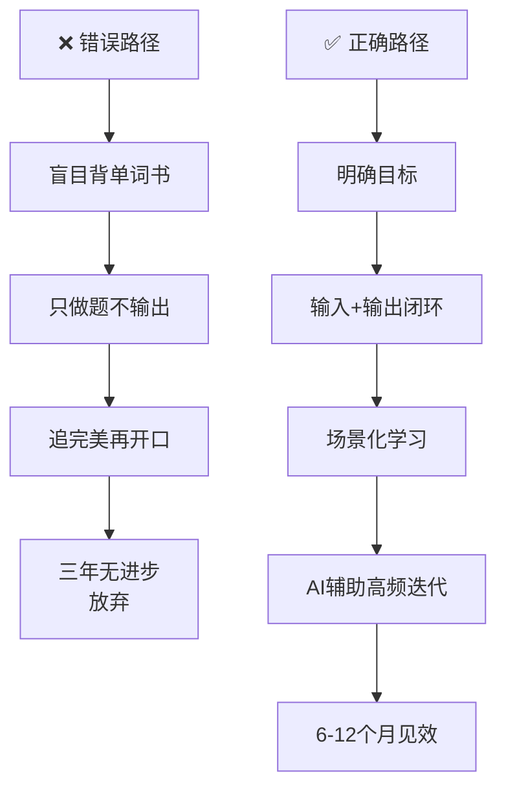
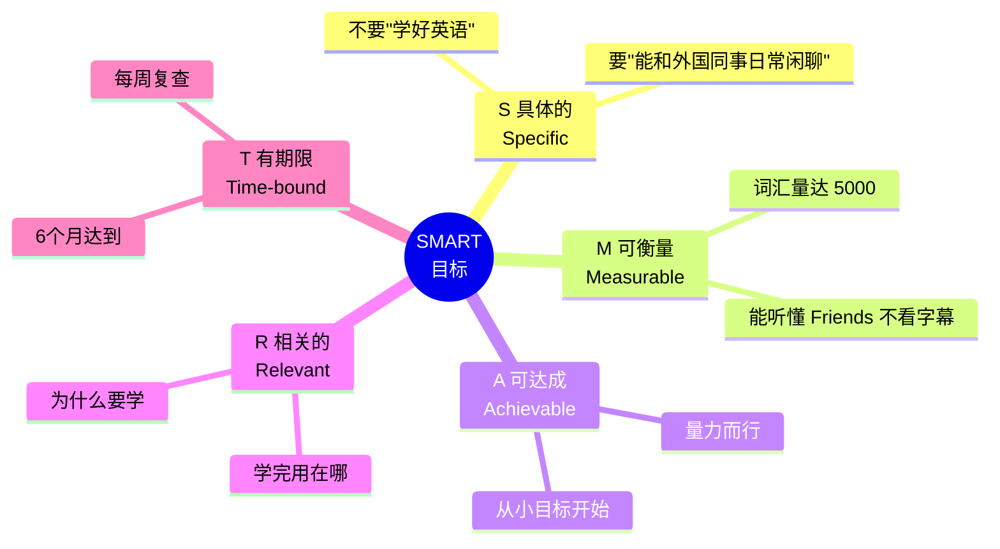
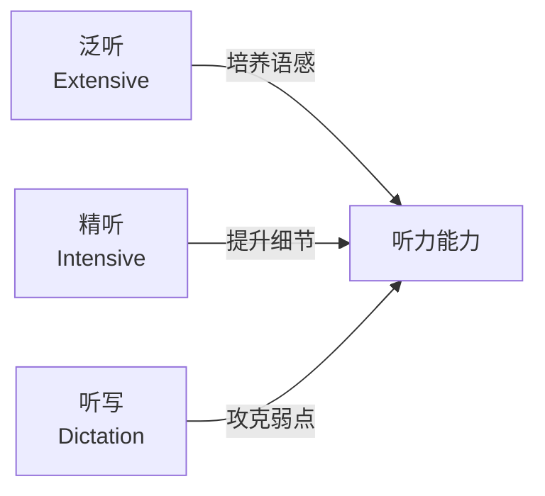
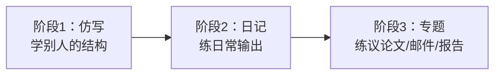
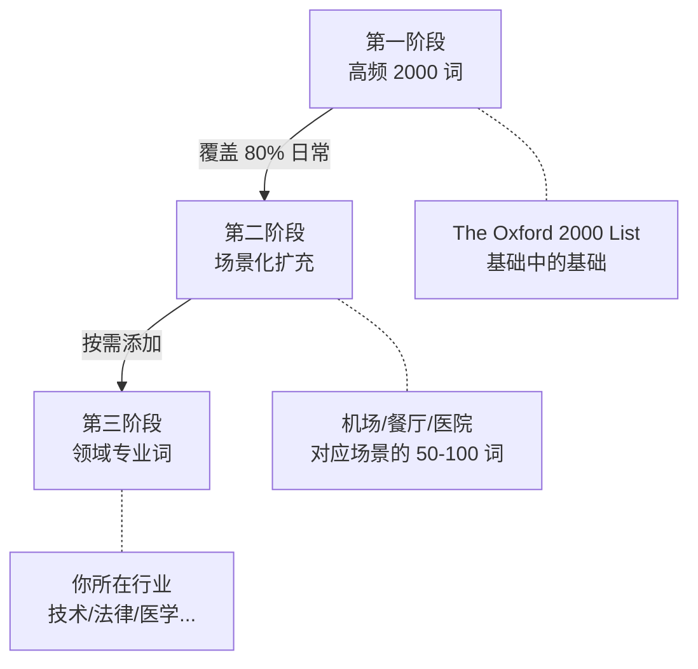
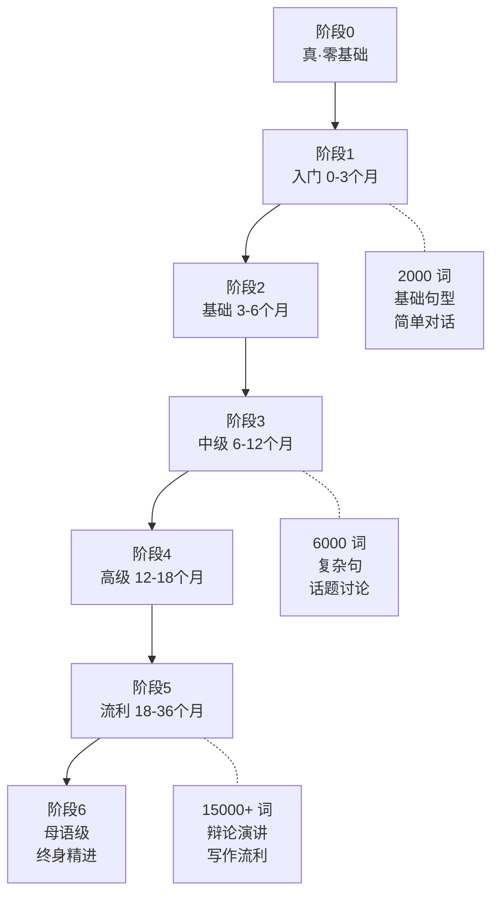
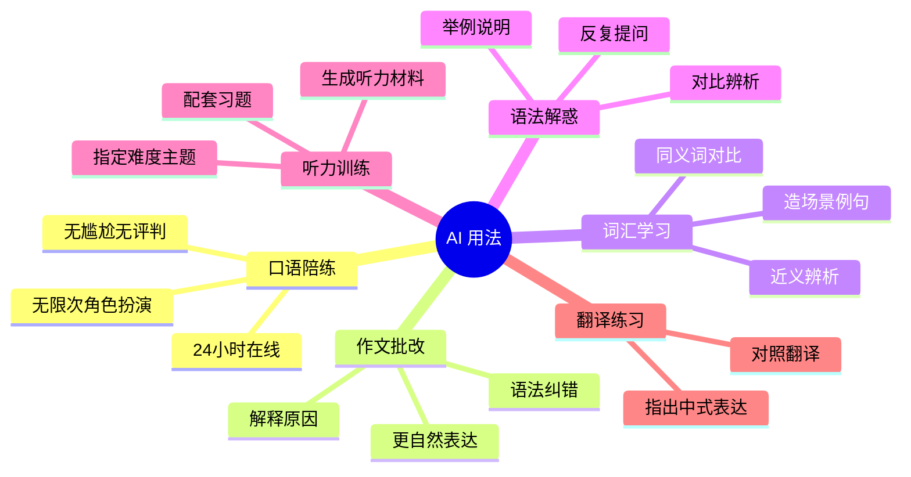

# 英语学习路径规划与方法论

> [!info] 本篇定位
> 上一篇讲的是"英语是什么"，这一篇讲的是"**你应该怎么学**"。
>
> 如果你认真读完这一篇并**做出自己的时间表**，就已经比 80% 只会喊"我要学英语"的人走得远。
>
> 本篇回答 6 个关键问题：我的目标应该是什么？每项技能怎么练？每天学多久？先学什么后学什么？用什么工具？坚持不下去怎么办？

---

## 1. 本篇导读：方法 > 努力

有一句话值得你反复琢磨：

> **"低效的勤奋，比懒惰更可怕。"**

我见过太多人：背了 5 遍《新概念 3》、抄了 10 本单词书、下载了 50 个英语 App，三年过去，还是"哑巴英语"。

问题从来不在"努力不够"，而在"**方法错了**"。

这一篇的目的，就是让你**用对方法**：



**图说**：大多数人失败不是因为偷懒，而是因为**把时间花在了错的方向上**。接下来我们一步步纠正。

---

## 2. 第一步：用 SMART 原则制定目标

### 2.1 为什么必须先设定目标

**"我要学好英语"** 是**世界上最没用的目标**。

- "学好"是什么水平？日常对话？商务流利？学术写作？
- "英语"是哪方面？听说读写哪个为主？
- 什么时候学好？一年？三年？十年？

没有量化标准，就没有办法检查进度，没有进度就没有成就感，没有成就感就坚持不下去——这是 90% 的人英语学不好的根源。

### 2.2 SMART 目标模板



### 2.3 三类常见目标模板

> [!tip] 找到你的"类型"，选对应模板
>
> **类型 A：出国旅游 / 短期使用**
>
> - 具体目标：能独立完成机场/酒店/餐厅/问路 4 大场景对话
> - 衡量标准：2000 常用词汇，掌握 50 个场景句型
> - 时间周期：3 个月（每天 45 分钟）
> - 关键投入：听说重点，读写够用即可
>
> **类型 B：职场进阶 / 外企工作**
>
> - 具体目标：能用英文开会、写邮件、做报告
> - 衡量标准：商务核心 5000 词，能看懂英文新闻
> - 时间周期：6-12 个月（每天 1 小时）
> - 关键投入：读写 + 听力，口语重点练商务场景
>
> **类型 C：出国留学 / 应试**
>
> - 具体目标：雅思 6.5 / 托福 90 / 考研英语 70+
> - 衡量标准：按考试大纲量化
> - 时间周期：6-18 个月（每天 2 小时+）
> - 关键投入：全面均衡，重点学术写作和听力

### 2.4 目标拆解：从年到日

**一个年度目标，必须拆到每天能做的事**。

以"6 个月达到日常交流水平"为例：

```
6 个月大目标
    ↓
月度里程碑：
  月1-2：基础 2000 词 + 基础语法
  月3-4：掌握 50 个核心句型
  月5-6：100 个常用场景对话
    ↓
周度计划：
  每周 5 天学习 + 2 天复盘/休息
  每周新学 80-100 词
  每周掌握 2-3 个句型
    ↓
每日任务：
  词汇：15 分钟（新 + 复习）
  听力：20 分钟（精听 + 泛听）
  口语：15 分钟（跟读 + 输出）
  阅读：10 分钟（精读 1 段）
```

---

## 3. 第二步：四大技能的训练体系

四大技能分两组：**输入**（听、读）和**输出**（说、写）。

### 3.1 听力训练体系

听力是很多中国学生最大的短板。不是听不懂单词，而是**反应不过来**。

**听力的三个层次：**



**泛听（量 > 质）**

- **目标**：浸泡式训练耳朵，让大脑适应英语节奏
- **材料**：播客、歌曲、纪录片、脱口秀——只要**你喜欢**的
- **方法**：每天 30 分钟-1 小时，洗漱/通勤/做饭时放在耳边
- **要点**：**不要纠结每个词**，听懂大意即可

**精听（质 > 量）**

- **目标**：把每一个细节都搞清楚，训练精准理解
- **材料**：2-3 分钟的短视频、TED 演讲片段
- **方法**：
  1. 第一遍：裸听，猜大意
  2. 第二遍：对照文本，找没听懂的地方
  3. 第三遍：重听没听懂的部分（至少听 5 遍）
  4. 分析：为什么没听懂？（生词？连读？语速？）
- **要点**：**一段材料至少重复 10 遍**

**听写（终极训练）**

- **目标**：逼自己分辨每个音，彻底暴露弱点
- **材料**：慢速 VOA、新概念课文录音
- **方法**：听一句 → 暂停 → 写下来 → 对照原文 → 找错
- **要点**：每天 15 分钟，坚持 1 个月就能看到巨大进步

> [!tip] 不同水平的听力材料选择
>
> | 水平 | 推荐材料 |
> | ---- | -------- |
> | 零基础 | 小猪佩奇（Peppa Pig）、慢速 VOA |
> | 入门 | BBC 6 Minute English、ELLLO |
> | 中级 | TED-Ed、CNN10、The Daily（纽约时报播客） |
> | 高级 | Friends、The Office、BBC 新闻、学术讲座 |

### 3.2 口语训练体系

口语是**输出环节中最难的**，因为它要求**实时产出**，没有修改时间。

**口语训练四步法：**

```
第一步：跟读（Reading Aloud）
  └── 读课文，练发音和语调

第二步：影子练习（Shadowing）
  └── 耳机里放音频，慢半拍跟读

第三步：复述（Retelling）
  └── 听完/读完一段，用自己的话复述

第四步：自由输出（Free Output）
  └── 角色扮演、AI 对话、真人交流
```

**跟读（Reading Aloud）**

- **目标**：练发音、连读、语调
- **方法**：找有原文的音频，跟着读 5-10 遍，录下自己的声音对比
- **材料**：新概念、BBC Learning English、TED 短演讲
- **要点**：**模仿到位**（尾音、重音、节奏），不是读得快就行

**影子练习（Shadowing）**

- **目标**：训练"边听边说"的实时反应能力
- **方法**：耳机里播放音频，你**慢半拍**跟读（不要停顿看文本）
- **频次**：每天 15 分钟，一段材料跟 1 周
- **要点**：这是口语训练**最有效**的方法，坚持 3 个月能质变

**复述（Retelling）**

- **目标**：用自己的语言重组学过的内容
- **方法**：
  1. 听/读一段 1-2 分钟的内容
  2. 合上材料，用英文复述主要内容
  3. 对照原文，找差距
- **要点**：不要机械背诵，要**用自己会的词重新组织**

**自由输出（Free Output）**

- **目标**：在真实场景下使用英语
- **渠道**：
  - **AI 对话**（推荐！ChatGPT、Claude 角色扮演）
  - **英语角**（线上 Tandem、HelloTalk，线下城市英语角）
  - **语伴**（和母语者交换语言：你教他中文，他教你英语）
  - **自言自语**（别笑，这是最省钱有效的方式）

> [!warning] 口语训练最大的坑：只练不纠错
>
> 如果你只是"不停地说"，但没人纠正你的错误，你只会**越说错得越熟练**。
>
> **解决方案**：
> - 录下自己的口语，自己听一遍找错
> - 让 AI 帮你纠错（粘贴你的口语文本，让 AI 指出语法错误）
> - 找母语者或专业老师点评

### 3.3 阅读训练体系

阅读是中国学生**相对最强**的技能（应试训练的副产品），但依然有提升空间。

**阅读的两种模式：**

| 模式 | 目的 | 方法 | 频次 |
| ---- | ---- | ---- | ---- |
| 泛读（Extensive Reading）| 培养语感，扩大输入 | 只追求大意，遇生词跳过 | 每天 20 分钟 |
| 精读（Intensive Reading）| 彻底搞懂细节 | 查词、分析句子结构、做笔记 | 每周 2-3 篇 |

**泛读的 80% 原则**

> [!tip] 找"刚刚好"的难度
>
> 选择一篇文章，读完后问自己：
> - 能读懂 **95%+** → **太简单**，没挑战
> - 能读懂 **80-90%** → **刚刚好** ✅
> - 能读懂 **50% 以下** → **太难**，会挫败感
>
> 每读完一篇，生词控制在 **5-10 个**最理想。

**精读的 5 步法**

```
1. 通读全文，抓大意（不查词）
2. 逐段精读，查所有生词
3. 分析长难句的语法结构
4. 总结文章框架（每段一句话概括）
5. 抄录好句 / 复述全文
```

**不同水平的阅读材料：**

| 水平 | 推荐材料 |
| ---- | -------- |
| 零基础 | 绘本（Oxford Reading Tree）、《The Cat in the Hat》 |
| 入门 | 书虫系列、《Charlotte's Web》、Matilda |
| 中级 | Harry Potter、《The Little Prince》、BBC News |
| 高级 | Economist、纽约时报、学术期刊、原版小说 |

### 3.4 写作训练体系

写作是**输出 + 语法 + 逻辑**的综合训练。

**写作的三个阶段：**



**阶段一：仿写**

- 找一篇好文章，分析结构（开头怎么写、过渡怎么接、结尾怎么收）
- **换个话题**，用相同的结构重写一遍

**阶段二：英文日记**

- 每天写 3-5 句话的英文日记
- 不求华丽，只求**每天都写**
- 例：`Today I went to work. I had a meeting at 10. It was boring. I felt tired.`

**阶段三：专题写作**

- 根据目标场景，练习不同文体：
  - 求职 → 简历、cover letter
  - 外企 → 邮件、会议纪要、报告
  - 留学 → 学术论文、PS（个人陈述）

**写作的三大武器：**

1. **仿写模板**：积累 20 个"万能句型"
2. **语料库查错**：用 Ludwig、Linggle 检查搭配
3. **AI 批改**：让 ChatGPT/Claude 改错并解释原因

---

## 4. 第三步：词汇记忆方法论

词汇是英语的"砖"，但怎么记**效率差 10 倍**。

### 4.1 反常识：先别背"单词书"

大多数人学英语的第一件事是买本《雅思红宝书》，然后从 A 开始背。

**结果通常是：背到 abandon 就放弃。**

这是**最低效的方法**，原因：
- 脱离语境，背了不会用
- 按字母顺序，不符合高频优先
- 枯燥，坚持不下去

### 4.2 正确的词汇记忆顺序



**第一阶段（2000 核心词，约 3 个月）**

- 目标：掌握覆盖 80% 日常语言的 2000 词
- 工具：Oxford 3000 / NGSL（New General Service List）
- 方法：结合例句，每天 30-50 词，当天复习 + 次日复习 + 第 4 天复习 + 第 7 天复习

**第二阶段（按场景扩充，约 3-6 个月）**

- 目标：针对具体使用场景扩充词汇
- 方法：学每个场景（如机场、餐厅）时集中学 50-100 个相关词
- 例：学"机场"场景 → `check-in, boarding, terminal, gate, layover...`

**第三阶段（专业领域词）**

- 目标：掌握你所在行业的专业词
- 方法：读 3-5 本你领域的英文书/论文，遇到生词就记

### 4.3 四大记忆法

**方法一：词根词缀法（拆单词）**

英语 60% 的词来自拉丁/希腊词根，学会词根就像学会"偏旁部首"。

```
pre-    前  preview（预览）, prepare（准备）
re-     重  repeat（重复）, return（返回）
un-     否  unhappy（不开心）, unable（不能）
-tion   名词  action（行动）, question（问题）
-ful    充满  useful（有用）, beautiful（美丽）
-less   缺少  useless（无用）, hopeless（无望）
```

**方法二：联想记忆法**

把新词和你已知的东西关联起来。

```
ambulance（救护车）
  → "俺不能死"（谐音联想）

deliberate（深思熟虑的）
  → de + liberate（解放）
  → 深思熟虑才能"解放"自己
```

**方法三：Anki + 间隔重复**

**Anki** 是一个基于艾宾浩斯曲线的记忆软件。
- 原理：根据你"会 / 不会"自动安排下次复习时间
- 会的词间隔越来越长（1 天 → 3 天 → 7 天 → 15 天 → 1 月）
- 不会的词频繁出现直到你记住
- **免费，开源，跨平台**

**方法四：场景化输出**

学了新词，**必须马上用**。

```
学到 "postpone"（推迟）
  → 造 3 个句子：
     "The meeting was postponed to Friday."
     "Can we postpone our dinner?"
     "Don't postpone what you can do today."
  → 下次遇到类似场景时强制用这个词
```

---

## 5. 第四步：语法学习路径

### 5.1 学语法的两个误区

> [!warning] 两个极端都要避免
>
> **误区 1：语法不重要，只学口语**
> - 真相：没有语法，你只能说"Hello 怎么走？"这种词拼词。
>
> **误区 2：要学透所有语法再开口**
> - 真相：等你学完所有语法，人都老了。

**正确姿势**：**语法学 50% 够用的 + 大量输出 + 遇到问题回来查**。

### 5.2 语法的二八定律

**20% 的语法点覆盖 80% 的使用场景**。

优先掌握：

| 语法点 | 重要性 | 本教程章节 |
| ------ | ------ | ---------- |
| 五大基本句型 | ⭐⭐⭐⭐⭐ | 02.01 |
| 一般现在时 / 过去时 / 将来时 | ⭐⭐⭐⭐⭐ | 03.01 |
| 现在进行时 / 过去进行时 | ⭐⭐⭐⭐ | 03.01 |
| 现在完成时 | ⭐⭐⭐⭐⭐ | 03.01 |
| 情态动词 | ⭐⭐⭐⭐ | 03.04 |
| 简单疑问句 | ⭐⭐⭐⭐⭐ | 02.02 |
| 定语从句 | ⭐⭐⭐⭐ | 04.02 |
| 宾语从句 | ⭐⭐⭐⭐ | 04.01 |
| if 条件句 | ⭐⭐⭐⭐ | 03.03 |
| 被动语态 | ⭐⭐⭐ | 03.02 |

**次优先**（后期再学）：虚拟语气、倒装、强调句、完成进行时。

### 5.3 语法学习三步法

```
第一步：理解规则
  └── 看一个语法点的解释 + 例句（15 分钟）

第二步：大量例句
  └── 找 20 个这个语法点的例句（30 分钟）

第三步：输出造句
  └── 自己造 5 个句子（10 分钟）
```

**永远不要**只看规则不造句——**语法是用出来的，不是背出来的**。

---

## 6. 第五步：日常学习计划设计

### 6.1 学习时间 ≠ 学习效果

一个重要真相：

> **每天 1 小时、连续 100 天 > 连续 2 天每天 10 小时 + 98 天不学**

语言学习的关键是**高频小量**，不是集中突击。

### 6.2 三档时间表模板

**30 分钟/天（最小可行版）**

```
06:30  起床
  ⬇
  泛听 15 分钟（早餐/通勤时）

20:00  固定学习时间
  ⬇
  词汇：5 分钟（Anki 复习）
  跟读：5 分钟
  精读：5 分钟（1 段）
```

**1 小时/天（稳健版·推荐）**

```
晨间 20 分钟
  ⬇
  5 分钟：Anki 复习
  15 分钟：精听（1 段 TED 反复听）

晚间 40 分钟
  ⬇
  10 分钟：学新词（15-20 词）
  15 分钟：阅读 / 语法学习
  10 分钟：跟读 / 影子练习
  5 分钟：英文日记（3-5 句）
```

**2 小时/天（冲刺版）**

```
晨间 40 分钟
  ⬇
  10 分钟：Anki（复习 + 新词）
  20 分钟：精听（含泛听背景）
  10 分钟：跟读

午间 20 分钟
  ⬇
  泛读 / 播客（碎片时间）

晚间 60 分钟
  ⬇
  20 分钟：语法学习 + 造句
  20 分钟：精读 1 篇 + 总结
  15 分钟：AI 对话 / 影子练习
  5 分钟：日记
```

### 6.3 周计划模板

```
周一、三、五：重点学习日（完整 1 小时）
周二、四    ：复习日（只做 Anki + 泛听）
周六         ：输出日（写长文 / 和语伴对话）
周日         ：休息日 + 复盘（回顾本周进度）
```

> [!tip] 一个让你坚持下来的技巧：**最低限度原则**
>
> 每天给自己定一个**最低限度**：哪怕今天只做 **5 分钟 Anki**，也算完成了。
>
> 这样在你累的时候也不会"今天一点不学"，而是"今天至少开了 App"。
>
> 神奇的事情是：你打开 App 做了 5 分钟之后，通常会继续做 20 分钟。

---

## 7. 第六步：从零基础到流利的全程时间表

### 7.1 六阶段能力地图



### 7.2 各阶段详细说明

**阶段 1：入门（0-3 个月）**

- 能力：掌握音标、2000 高频词、基础 5 大句型
- 可做：能简单自我介绍、问路、点餐
- 建议每日投入：45-60 分钟

**阶段 2：基础（3-6 个月）**

- 能力：扩展到 4000 词、熟练各时态、能读简单故事
- 可做：能完成日常对话、看 Peppa Pig 不看字幕
- 建议每日投入：60 分钟

**阶段 3：中级（6-12 个月）**

- 能力：6000-8000 词、复合句熟练、听懂 TED
- 可做：能讨论某个话题、看美剧看字幕辅助
- 建议每日投入：60-90 分钟
- **英语学习的"分水岭"**：大部分人会在这个阶段停滞

**阶段 4：高级（12-18 个月）**

- 能力：10000+ 词、能读报刊、流利表达观点
- 可做：能主持会议、写商务邮件、看美剧基本不用字幕
- 建议每日投入：60-90 分钟

**阶段 5：流利（18-36 个月）**

- 能力：15000+ 词、接近母语思维、各种场景自如
- 可做：能辩论、演讲、写学术论文
- 建议每日投入：30-60 分钟（保持不退步）

**阶段 6：母语级（3 年+）**

- 能力：20000+ 词、文化梗都能懂、地道表达
- 可做：和母语者无障碍交流，当英语老师都绰绰有余
- 建议：浸泡式环境（出国/英语工作）

> [!warning] 现实预期管理
>
> - 如果你是**成年人**、**非英语环境**、**每天 1 小时**：达到流利需要 **2-3 年**。
> - 任何承诺"3 个月流利"的课程都是**骗钱的**。
> - 英语学习是**马拉松**，不是百米冲刺。

---

## 8. 第七步：AI 时代的学习加速法

AI 是 **21 世纪英语学习最大的变量**。用对了能让你的学习效率翻倍。

### 8.1 AI 能帮你做什么



### 8.2 AI 使用的 7 个黄金 Prompt

**Prompt 1：角色扮演对话**

```
我在练习英语口语。请你扮演一个星巴克的店员，
我是顾客。我们开始对话。每句话后面，
请用中文括号解释你说的关键词。
当我犯错时，请指出来并给出正确说法。
```

**Prompt 2：作文批改**

```
我写了一篇英文日记，请你：
1. 指出所有语法错误并解释原因
2. 标出不地道的表达，给出更自然的说法
3. 打分（0-10）并给出改进建议

日记：[粘贴你的日记]
```

**Prompt 3：造例句**

```
请用下面这个单词 "postpone" 造 5 个不同场景的例句，
每个例句要：
1. 用在不同的时态
2. 用在不同的场景（工作、生活、学习）
3. 附上中文翻译
```

**Prompt 4：近义词辨析**

```
请对比 "big" / "large" / "huge" / "massive" 这几个词，
说明它们的区别，并各给 2 个典型例句。
```

**Prompt 5：语法辨析**

```
请解释 "现在完成时" 和 "一般过去时" 的区别，
要求：
1. 给出核心区别的一句话总结
2. 用 5 组对比例句说明
3. 列出最常见的 3 个错误用法
```

**Prompt 6：听力材料生成**

```
请生成一段 200 字的英文对话，场景是：
两个同事在讨论周末计划。
要求：
1. 使用一般将来时 + 现在进行时（表示将来）
2. 包含常见的口语缩写
3. 对话后给出 5 个听力理解问题
```

**Prompt 7：中英翻译练习**

```
请把下面的中文翻译成英文，用最自然的地道表达：
"我最近工作很忙，每天都得加班到 10 点，感觉身体要垮了。"

翻译后请：
1. 解释你为什么这样翻译
2. 指出中文里有什么容易翻译成"中式英语"的陷阱
```

### 8.3 推荐 AI 工具对比

| 工具 | 优势 | 适用场景 |
| ---- | ---- | -------- |
| ChatGPT | 综合能力强，插件多 | 角色扮演、批改、解释 |
| Claude | 文字处理更细腻 | 长文批改、学术写作 |
| Grammarly | 专门语法检查 | 写作实时纠错 |
| DeepL | 翻译质量高 | 对照翻译学习 |
| ELSA Speak | AI 语音评分 | 发音训练 |

> [!tip] AI 用法核心原则
>
> **AI 是辅助，不是替代**。
>
> - ❌ 让 AI 帮你写作业，自己不思考
> - ✅ 让 AI 批改你的作业，自己从中学习
>
> - ❌ 让 AI 翻译，然后抄一遍
> - ✅ 自己尝试翻译，再对照 AI 的版本找差距

---

## 9. 学习资源推荐大全

### 9.1 零基础入门

| 类别 | 资源 | 说明 |
| ---- | ---- | ---- |
| 音标 | BBC Learning English 音标视频 | 免费，动画讲解 |
| 教材 | 《新概念英语》第 1 册 | 经典入门 |
| 单词 | 扇贝 / 墨墨 / 多邻国 | App 入门友好 |
| 听力 | 慢速 VOA、Peppa Pig | 语速慢、内容简单 |

### 9.2 基础到中级

| 类别 | 资源 | 说明 |
| ---- | ---- | ---- |
| 教材 | 《新概念》第 2 册、赖世雄美语 | 系统性强 |
| 语法 | 《剑桥英语语法》、Grammar in Use | 最权威语法书 |
| 听力 | BBC 6 Minute English、ESL Pod | 6 分钟一集，难度合适 |
| 阅读 | 书虫系列（牛津）、Oxford Bookworms | 分级阅读经典 |

### 9.3 中级到高级

| 类别 | 资源 | 说明 |
| ---- | ---- | ---- |
| 听力 | TED、TED-Ed、The Daily | 质量高，话题广 |
| 阅读 | The Economist、纽约时报、BBC | 地道母语文本 |
| 看剧 | Friends、The Office、Modern Family | 情景喜剧学口语 |
| 播客 | The Tim Ferriss Show、Stuff You Should Know | 自然语速、话题广 |

### 9.4 工具类

| 工具 | 用途 |
| ---- | ---- |
| Anki | 间隔复习（背词必备） |
| YouGlish | 搜一个词听 100 个真人发音 |
| Ludwig | 查单词搭配（基于真实语料库） |
| Grammarly | 写作实时纠错 |
| Forvo | 真人发音词典 |
| 欧陆词典 | 离线词典强大 |
| 有道词典 | 日常中英互查 |

---

## 10. 常见陷阱与应对策略

### 10.1 陷阱一：买教材收藏癖

**症状**：买了 20 本英语书，每本只看了前 3 章。

**应对**：
- **一本教材吃透再买下一本**
- 把未看完的书当作"复习材料"，而不是新材料

### 10.2 陷阱二：追求完美

**症状**：一段话要字字句句都懂才敢继续，结果进度极慢。

**应对**：
- 接受"听/读 70% 就能继续"
- 80% 的生词不影响你理解大意
- 回头看时你会发现那些生词自己就懂了

### 10.3 陷阱三：三天打鱼两天晒网

**症状**：兴致来了学 3 小时，兴致没了一周不碰。

**应对**：
- 用**最低限度原则**（每天 5 分钟也要做）
- 固定时间学（比如每晚 8-9 点）
- 建立"连续打卡"仪式感（Duolingo、Habit Tracker）

### 10.4 陷阱四：学了不用

**症状**：学了一堆理论，从来不输出。

**应对**：
- 强制每天输出（日记 / AI 对话 / 录音）
- 没人陪练也可以自言自语

### 10.5 陷阱五：钻牛角尖

**症状**：为了一个语法点纠结 3 天。

**应对**：
- 标记为"待解决"，继续往后学
- 学到后面很多点自然就懂了
- 实在搞不定问老师 / AI

---

## 11. 不同人群的个性化建议

### 11.1 上班族（每天 1 小时）

- **重点**：高效利用通勤 + 午休 + 睡前
- **早晚通勤**：泛听 + Anki（合计 40 分钟）
- **午休**：精读 1 段 + 跟读（15 分钟）
- **睡前**：日记 / AI 对话（10 分钟）
- **周末**：1 次完整 2 小时深度学习

### 11.2 学生党（每天 2-3 小时）

- **重点**：系统学习 + 大量练习
- **早晨**：背单词 + 晨读（40 分钟）
- **课间碎片**：Anki 复习（累计 20 分钟）
- **晚自习**：精读 + 语法 + 写作（90 分钟）
- **睡前**：听美剧 / 播客（30 分钟）

### 11.3 全职妈妈 / 自由职业（每天 1-2 小时）

- **重点**：融入生活
- **做家务时**：听英文播客
- **陪孩子时**：一起看英文动画 / 绘本
- **午睡 / 晚睡时**：Anki + 跟读（30 分钟）

### 11.4 老年人（每天 30-60 分钟）

- **重点**：兴趣驱动，慢而稳
- **选兴趣材料**：喜欢的老电影、歌曲
- **不求速度**：每天 15 分钟 Anki + 20 分钟听读
- **找伴**：参加老年英语角、和孙辈一起学

---

## 12. 练习与输出建议

> [!success] 本篇练习清单
>
> **制定你的个人计划（必做）**
>
> 1. 用 SMART 原则写下你的**6 个月目标**（不超过 3 句话）
>
> 2. 设计你的**每日学习时间表**（分为早晨/白天/晚上三段）
>
> 3. 选择你当前阶段的：
>    - 1 本教材
>    - 1 个听力材料源
>    - 1 个阅读材料源
>    - 1 个 App
>
> **执行练习（推荐）**
>
> 4. 安装 Anki，导入第一个词包（推荐 Oxford 3000）
>
> 5. 尝试用 Prompt 1 和 AI 进行一次角色扮演对话（5 分钟即可）
>
> 6. 写 3 句英文日记，然后让 AI 批改
>
> **长期追踪**
>
> 7. 建立一个**学习日志表格**，每天记录：
>    - 今天学了什么（简单标注）
>    - 学习时长
>    - 进度百分比
>    - 明天的计划

### 12.1 参考：一个真实的学习日志格式

```
日期：2026-04-20
时长：62 分钟
完成任务：
  ✅ Anki 复习 25 词 + 新学 10 词（15 分钟）
  ✅ 精听 TED-Ed 一段（20 分钟）
  ✅ 跟读 3 遍（10 分钟）
  ✅ 英文日记 5 句（10 分钟）
  ✅ AI 纠错日记（7 分钟）
遗留：
  ⏳ 本周语法第 3 章未完成，明天补
今天新学：
  - postpone（推迟）
  - hesitate（犹豫）
  - It depends（看情况）
明日计划：
  补语法第 3 章；重听今天的 TED 材料
```

---

## 13. 本篇小结

> [!success] 本篇核心要点回顾
>
> **目标**：用 SMART 原则定目标，年度目标拆解到每日任务。
>
> **四大技能**：
> - 听力：泛听 + 精听 + 听写
> - 口语：跟读 + 影子 + 复述 + 自由输出
> - 阅读：泛读 + 精读
> - 写作：仿写 + 日记 + 专题
>
> **词汇**：高频词优先 → 场景扩充 → 领域词汇；词根 + 联想 + Anki + 输出
>
> **语法**：20% 的核心语法 → 大量输出 → 遇到问题回查
>
> **计划**：30分钟/1小时/2小时三档，高频小量 > 集中突击
>
> **时间线**：零基础到流利需要 2-3 年（每天 1 小时）
>
> **AI**：是加速器，但要会用（7 个 Prompt 模板）
>
> **陷阱**：收藏癖、完美主义、三天打鱼、学了不用、钻牛角尖

### 13.1 行动清单

在你读完这一篇的**30 分钟内**，请完成以下 3 件事（否则这篇就白读了）：

1. ✅ 写下你的**6 个月目标**（3 句话即可）
2. ✅ 设计你的**每日时间表**（30 分钟版就行）
3. ✅ 下载 **Anki**（或任何一个间隔复习 App）

然后从明天开始执行。别等"周一"，别等"下个月"——**今天**就是最好的开始时间。

### 13.2 下一篇预告

> [!info] 下一篇：03.英语发音与口语基础
>
> 下一篇我们会系统讲**发音**这个绕不开的硬骨头：
>
> - 48 个国际音标逐个讲解（含口型、舌位、发音技巧）
> - 元音 vs 辅音的核心区别
> - 连读（Liaison）：为什么老外说话像"连成一串"
> - 弱读（Weak Form）：为什么听不懂功能词
> - 同化（Assimilation）：sounds like 怎么变成 /saʊnz laɪk/
> - 重音与语调：同一句话重音不同，意思天差地别
> - 中式发音的 10 大硬伤和改正方法
>
> 这一篇是口语的**地基**。不打好，后面永远是"带着中式口音的英语"。

---

## 14. 入门基础小结（本分类第 2 篇）

本篇把第一篇的"宏观认知"落地到了"**每天做什么、怎么做、用什么工具、多久能达到**"。

到这里，你应该已经：
- 制定了自己的 SMART 目标
- 选好了当前阶段的学习资源
- 设计了每日时间表
- 下载了至少 1 个学习 App

接下来，我们就要**具体学东西**了——从发音、字母、最基础的句型开始，一步一步构建你的英语大厦。

保持耐心，保持节奏。**坚持 100 天，你会超过 80% 的英语学习者**。
